# 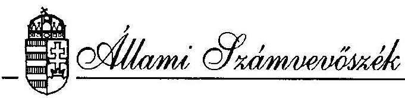 

## JELENTÉS

a Magyar Vállalkozásfejlesztési Alapítvány tevékenységének vizsgálatáról, különös tekintettel a PHARE program megvalósulására
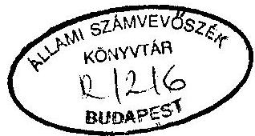

---

A vizsgálatot vezette:

| Kemény Emil | számvevô tanácsos |
| :-- | :-- |

A vizsgálatban részt vettek:

Bank Lajos
SZámvevô tanácsos
Benti Gabriella
számvevô tanácsos
Réthelyi Jenô
számvevô
Tardos József
számvevô

---

# T A R T A L O M J E G Y Z É K 

Oldal
I. BEVEZETÉS ..... 1
1.1 Az Alapítvány ..... 1
1.2 A vizsgálat ..... 3
1.3 Az ellenőrzés módszere ..... 4
1.4 A kis- és középvállalkozások társadalmi, gazdasági háttere ..... 5
II. ÖSSZEFOGLALÓ MEGÁLLAPÍTÁSOK, AJÁNLÁSOK ..... 7
2.1 Általános megállapítások ..... 7
2.2 Vizsgálati észrevételek ..... 8
2.3 Ajánlások ..... 11
III. RÉSZLETES MEGÁLLAPÍTÁSOK ..... 13
3. A Magyar Vállalkozásfejlesztési Alapítvány ..... 13
3.1 Az Alapítvány megalakulásának, működésének szabály- szerúsége ..... 13
3.2 A kuratórium döntési mechanizmusa ..... 15
3.3 A kuratórium müködése ..... 17
3.4 Vállalkozásfejlesztési Iroda ..... 21
4. Az MVA pénzgazdálkodása ..... 23
4.1 Az Alapítvány vagyoni helyzete és vagyoni struktúrája ..... 23
4.2 PHARE segélyprogram ..... 24
4.3 Mérleg szerinti eredmény ..... 26
4.4 A Magyar Vállalkozásfejlesztési Alapítvány váltóügyei ..... 33
4.5 Szabad pénzeszközök ..... 35

---

4.6 A programok és a bonyolítás költségei ..... 36
5. Az MVA tevékenysége ..... 38
5.1 Regionális Vállalkozói Központok Hálózata ..... 38
5.2 Bilaterális szerződések ..... 41
5.3 Vállalkozói kultúra fejlesztése ..... 42
5.4 MVA hitelprogram ..... 46
5.5 PHARE hitelprogram ..... 47
5.6 PHARE Mikrohitel program ..... 49
5.7 Sikertelen programok ..... 52
5.8 Start Hitelgarancia Alap ..... 52
5.9 Müködőtőke befektetés ..... 53

---

# ÁLLAMI SZÁMVEVŐSZÉK 

V-6-27/1994.
Témaszám:220

## J E L E N T É S

a Magyar Vállalkozásfejlesztési Alapítvány tevékenységének vizsgálatáról, különös tekintettel a PHARE program megvalósulására

## I.   B E V E Z E T É S

### 1.1 Az Alapítvány

1101 Az Országgyűlés 1989. év decemberi ülésszakán elfogadta a Kormány 1990. évi gazdaságpolitikai programját és ennek keretében jóváhagyta a - program mellékleteként részletesen kidolgozott - vállalkozásélénkítési programot.

A gazdaságpolitikai programra épülő 42/1989. (XII.27.) OGY határozat alapján a Minisztertanács 1014/1990. (I.31.) MT határozata elrendelte a Magyar Vállalkozásfejlesztési Alapítvány (továbbiakban: MVA) létrehozását.

1102 A Magyar Köztársaság Kormánya, a Magyar Nemzeti Bank, az Országos Takarékpénztár, a Magyar Hitelbank Rt., az Országos Kereskedelmi és Hitelbank Rt., a Postabank és Takarékpénztár Rt., a Kisiparosok Országos Szervezete, az Általános Vállalkozási Bank Rt., az Ipari Fejlesztési Bank Rt., az Ingatlanbank Rt., az Országos Műszaki Fejlesztési Bizottság, a Magyar Gazdasági Kamara, a Dunabank Rt., a Hungária Biztosító, az Ipari Szövetkezetek Országos Szövetsége és a Vállalkozók Országos Szövetsége, mint alapítók, a kis- és közepes méretű, egyéni és társas vállalkozások élénkítésére és támogatására létrehozták a Magyar Vállalkozásfejlesztési Alapítványt.

---

Az alapítók által az Alapítvány rendelkezésére bocsátott induló vagyon 4.236.800.000.- Ft volt. Az Alapítvány nyílt, hozzá bármely belföldi és külföldi természetes és jogi személy bármikor csatlakozhat, ha az Alapítvány céljaival egyetért és azt anyagi, vagy bármely más módon támogatni kívánja.

1103 Az Alapítvány szervei: a Kuratórium és a Vállalkozásfejlesztési Iroda.
Az MVA-nak eddigi müködése során három Kuratóriuma és három ügyvezető igazgatója volt. Mindez egyúttal három müködési szakaszt is jelentett az MVA tevékenységében.

Az I. szakasz az első Kuratórium 1990 márciusában történt megválasztásától kezdve a Kuratórium elnökének lemondásáig terjedt.

A II. szakasz 1991 májusától, az új kuratóriumi elnök alapítók által történt megválasztásától az 1993. március 10-i alapítói értekezletig tartott.

A III. szakasz az MVA jelenlegi, új Kuratóriumának az 1993. március 10-i alapítói értekezleten történt megválasztásától napjainkig terjed.

Az Alapítvány képviselete: az Alapítványt az elnök, a társelnök, az ügyvezető igazgató, valamint az elnök által írásban meghatalmazott személyek képviselik.

1104 Az Alapító Okirat szerint az Alapítvány nem használható fel oly módon, hogy az a kuratórium tagjainak, az ügyvezető igazgatónak és az Iroda alkalmazottainak közvetlen, vagy közvetett anyagi előnyét szolgálja. Az Alapítványból nem részesedhetnek olyan vállalkozások, amelyek a kuratórium tagjai, az ügyvezető igazgató és az iroda alkalmazottai, valamint ezeknek a Polgári Törvénykönyvben meghatározott hozzátartozói érdekeltségébe tartoznak.

Az Alapítvány nem támogat sem közvetlen, sem közvetett módon egyetlen politikai pártot, vagy más politikai-társadalmi szervezetet sem.

1105 Az eredeti Alapító Okirat az MVA célját az alábbiakban rögzíti:
"A Magyar Vállalkozásfejlesztési Alapítvány célja, hogy elősegítse a kisés közepes méretű, elsősorban új vállalkozások létrejöttét, lehetővé tegye

---

ezen vállalkozások számának gyarapítását, kedvező feltételeket teremtsen a vállalkozások tőkeerejének növeléséhez, a lakossági magánbefektetések ösztönzéséhez és mindezek elősegítése, valamint az alapítványi célra rendelkezésre álló hazai és külföldi pénzügyi források kezelése számára szabályozott pénzügyi keretet teremtsen."

Az 1993. március 10 -én módosított Alapító Okirat már új szöveget tartalmaz a célok tekintetében:
"A Magyar Vállalkozásfejlesztési Alapítvány célja, hogy elősegítse a kísés közepes méretű magánvállalkozások számának gyarapodását, szakmai, vállalkozói, piaci fejlődésüket, illetve az alapítványi célra rendelkezésre álló hazai és külföldi pénzügyi források kezelése számára szabályozott pénzügyi keretet teremtsen."

1106 Az MVA, erőforrásainak bővítése érdekében, már megalakulása évében bekapcsolódott a célkitűzéseiket támogató nemzetközi programok megvalósításába. Ezek közül a legjelentősebb az Európai Közösség által kezdeményezett PHARE program kis- és középvállalkozások fejlesztésére irányuló projektjében vállalt szerepük. Az 1990-93. között megkötött három PHARE finanszírozási szerződés együttes keretösszege 36,0 M ECU (kb. 3,6 Mrd Ft).

1107 Az MVA menedzsment rendelkezésére álló, közel 8 Mrd Ft-nyi forrás gazdasági hatását tovább növeli az a tény, hogy a tőke jelentős része társhitelként, illetve hitelgaranciaként működik, magával közel azonos méretű kereskedelmi banki tőkét mobilizálva a vállalkozói kör számára.

# 1.2 A vizsgálat 

1201 Az Állami Számvevőszék az MVA-t az 1989. évi XXXVIII. törvény 2. § 5. bekezdése, valamint a Ptk. 74. §-a szerint folytatta vizsgálatát, az 1994. évre jóváhagyott ellenőrzési terve alapján.

1202 A vizsgálat célja annak megállapítása volt, hogy az MVA tevékenysége megfelelt-e az Alapitó Okiratban rögzített célkitúzéseknek, továbbá hogy jól gazdálkodott-e a kezelésében lévő - részben PHARE forrásból származó - vagyonnal.

---

1203 A vizsgált időszak az MVA Alapító Okiratának aláírásától kezdődően az 1993. év végéig terjed.

A helyszíni ellenőrzés kezdete: 1994. március 7.
befejezése: 1994. április 29.
1204 A vizsgálat helyszínei:

- MVA Vállalkozásfejlesztési Iroda
1115. Budapest, Etele u. 68.
- Kisalföldi Vállalkozásfejlesztési Alapítvány
- Borsod-Abaúj-Zemplén Megyei Regionális Vállalkozási Központ

1205 Tájékozódás és adatgyűjtés céljából felkerestük az alábbi szervezeteket:

- Ipartestületek Országos Szövetsége Magyar Kézműves Kamara (IPOSZ)
- Országos Kisvállalkozásfejlesztési Intézet (OKFI)
- Budapesti Közgazdasági Egyetem Kisvállalkozás-Kutató Csoport
- Magyar Kisvállalati Társaság

# 1.3 Az ellenőrzés módszere: 

1301 Az MVA teljes tevékenységére kiterjedő helyszíni vizsgálat.
1302 Az Állami Számvevőszék az MVA működését törvényességi és szabályszerűségi szempontból vizsgálta. Az MVA tevékenysége előzmény nélküli, szerteágazó, teljesítmény követelményeket vele szemben előzetesen senki nem fogalmazott meg. A teljesítmény mérésére alkalmas szigorú kritérium rendszer felállítására az ÁSZ nem vállalkozhatott, de kísérletet tett az Alapítvány "teljesítményének" értékelésére, bemutatva a lehetséges cselekvési teret s az ezen belül elért tényleges eredményeket. Az ellenőrzés nem foglalkozott az MVA tételes pénzügyi vizsgálatával. A PHARE program előírja az MVA könyveinek évenkénti auditálását egy független könyvvizsgáló cég által. A vizsgálatot végző számvevők a Price Waterhouse által jegyzett jelentéseket megkapták, megbízhatónak minősítették és az azokban rögzített adatokat a jelentésben felhasználták.

1303 A vizsgálat során figyelembe vettük az Európai Unió Számvevőszéke által ajánlott ellenőrzési szempontokat is.

---

1304 Az ellenőrzés megállapításai a vizsgálat során rendelkezésünkre bocsátott dokumentumokra, a különböző szintű vezetőkkel folytatott interjúkra és a helyszíni szemlék tapasztalataira támaszkodnak.

1305 A jelentést és annak nem hivatalos angol fordítását az Állami Számvevőszék elnöke megküldi az Európai Unió Számvevőszékének tájékoztatás céljából.

1306 A vizsgálat megállapításait alátámasztó dokumentumokat - terjedelmi okokból - nem mellékeljük a jelentéshez, azok az Állami Számvevőszék irattárában megtekinthetők.

# 1.4 A kis- és középvállalkozások társadalmi, gazdasági háttere 

1401 A rendszerváltás gazdaságképének két alapvető eleme a tulajdonváltás, illetve az üzemméret radikális megváltoztatása. A kettő együttesen jelenik meg a kisvállalkozásban, ezért érthető és természetes célkitűzés e gazdasági szektor bővítése, működési feltételeinek javítása.

1402 A világgazdaságban a kisvállalkozások fejlődése a 70-es években gyorsult fel, amikor a gazdaság növekedése az extenzív szakaszról (természeti erőforrások bővülő hasznosítása) az intenzív fejlődési pályára tért át, maga után vonva a nagyvállalatok egy részének felbomlását, a termelés diverzifikálását, a rugalmas, innovatív kisvállalkozások beindulását. A bővülő nemzetgazdaságok adták a kisvállalkozási szféra megerősödésének alapját, s ezen belül a letisztult profilú nagyvállalatok lettek a kisvállalkozók legfontosabb megrendelői.

1403 Az 1990-es évek Magyarországán a kisvállalkozások létrejöttét döntően más tényezők befolyásolták, mint korábban a tőkés országokban. Meghatározó motivum az állami vállalatok privatizációja és társasággá alakítása, valamint az egzisztenciájukat féltők és munkanélküliek kényszervállalkozása. Ebből következően a kialakulóban lévő kisvállalkozói szektor sokkal inkább jellemezhető a kisvállalkozás objektív korlátaival - tőkeszegénység, piaci kiszolgáltatottság, a menedzsment hiányosságai, a kockázatokkal szembeni védtelenség - semmint a már említett pozitív vonásokkal: rugalmasság, innovatív készség, hatékonyabb erőforrás hasznosítás. Alapvetően ez a hátrányos környezet indokolta azt a törekvést,

---

hogy a kisvállalkozás fejlődését a gazdaságpolitika, a kormányzat segítse különböző támogatásokkal, egyben utat nyisson a vállalkozói szektor fejlődését segítő nemzetközi programoknak is.

1404 Mielőtt a támogatások lehetséges formáit bemutatjuk, szólni kell a támogatás tényének alapvető dilemmájáról: amikor egy vállalkozó valamilyen címen támogatáshoz jut, akkor voltaképp a piaci értéknél alacsonyabb áron gazdasági erőforrást (pénzt, tanácsot, oktatást, információt stb.) szerez, ami őt előnyös versenyhelyzetbe juttatja a kedvezményből nem részesülőkkel szemben. Ez a dilemma csak akkor és úgy oldható fel, ha tiszták a támogatás játékszabályai, azaz jelen van a szakmai és társadalmi kontroll, valamint ha tudjuk, hogy a támogatás bizonyos formái csak egy átmeneti időre szólnak.

1405 A kisvállalkozások, illetve vállalkozók támogatásának igen sokszínű palettája alakult ki a gyakorlatban:

Vissza nem térítendő juttatások:
— Működési támogatások
$=$ Inkubátorházak (induló vállalkozónak helyiség, infrastruktúra stb.)
$=$ Tanácsadás (gazdasági, adó, jogi stb.)

- Oktatás
$=$ Üzleti tervkészítés
$=$ Menedzsment stb.
- Információ
$=$ Partnerközvetítés
$=$ Üzleti, piaci, ár stb.
Pénzügyi támogatások:
- Kedvezményes hitelek
$=$ saját erő nélküli
$=10-20 \%$ saját erőt igénylő
$=$ kamatmentes
$=$ csökkentett kamatú
$=$ hosszú lejáratú, 2-3 év fizetési moratóriummal

---

- Kockázati tőkealapok
- Hitelgarancia alapok

1406 Az MVA tevékenysége a vázolt társadalmi, gazdasági környezetben értékelhető: mennyiben tudott megfelelni a kihívásnak, képes volt-e megtalálni a támogatás leghatékonyabb formáit.

# II.   ÖSSZEFOGLALÓ MEGÁLLAPÍTÁSOK, AJÁNLÁSOK 

## 2.1 Általános megállapítások

2101 A Magyar Vállalkozásfejlesztési Alapítvány létrejötte egybeesett az ország politikai és gazdasági rendszerváltozásával. Az általános recesszió nem nyújtott kedvező hátteret a kis- és középvállalkozások fejlődéséhez 1990. és 1993. között. Az alakulást követő egy éven belül - a megváltozott kormánypolitikai hatásra - megváltozott az alapítvány vezetésének összetétele. E kedvezőtlen körülmények tudatában megállapítjuk, hogy - a tapasztalt múködési rendellenességek ellenére - az MVA tevékenysége összességében hasznos volt: hatékonyan segítette a regionális vállalkozásfejlesztési alapítványok létrehozását, hozzájárult a vállalkozási kultúra fejlesztéséhez, múködteti a saját és külföldi forrásokra támaszkodó hitelgarancia alapokat, s a különböző hitelprogramok révén eddig közel négyezer vállalkozó jutott kedvezményes kölcsönhöz.

2102 A helyi vállalkozásfejlesztési központok (továbbiakban HVK) hálózatának kialakításában a kormányzati elképzelés - az MVA közreműködésén túl - a helyi érdekek felismerése, a vállalkozói kör öntevékeny aktivizálódása révén, saját források bevonásával valósult meg, mindvégig demokratikus keretek között.

2103 Az MVA tevékenységének hatását, a kitűzött célok megvalósítását jelentős mértékben elősegítette az Európai Unió által folyósított PHARE segélyprogram, amely a pénzügyi forrásokon túl szervezési kultúrával és folyamatba épített ellenőrzéssel is segítette az alapítvány működését.

---

# 2.2 Vizsgálati észrevételek 

2201 Az Alapítói Értekezlet 1991 májusában megváltoztatta az MVA vezetését. A változást nem jelentették be a Fővárosi Bíróságnál, így az alapítvány 1993 áprilisáig jogellenesen müködött.

2202 Az 1991-ben felállított új kuratórium összetétele nem felelt meg az Alapítói Okirat előírásainak, amennyiben az államigazgatási és kormányzati irányítású szervek képviselői többségbe kerültek. Ez az állapot az 1993-mas alapítói ülés után sem változott.

2203 A pénzintézeteken keresztül nyújtott hitelek elbírálásának véleményezéséről az MVA Kuratóriuma lemondott, ugyanakkor a bankok által kölcsönzött pénzeszközökre a hitelgaranciát felvállalta. A vizsgálat időpontjáig 450 M Ft kezesi igényt hoztak a bankok az MVA tudomására; a teljes készfizetői kezességből származó veszteség 250-500 M Ft között várható.

2204 A vissza nem térítendő támogatások iránti pályázatok szabályzata kidolgozatlan. Nincs tisztázva mikor lehet, vagy kell belső vagy külső nyíltvagy zártkörű pályázatot kiírni.

2205 Az Alapító Okirat kimondja, hogy az Alapítvány működése nyilvános, pályázatát, annak eredményét, az elfogadott pályázatokat, mérlegét köteles a sajtóban és évkönyvében közzé tenni.
Vizsgálatunk megállapította, hogy több esetben az MVA nem tett eleget az Alapító Okiratban foglalt követelménynek és esetenként még a kuratóriumi határozat ellenére sem hozták nyilvánosságra a pályázatok eredményeit.

2206 A Budapesti Vállalkozásfejlesztési Alapítványnak (BVA) adott alapítói hozzájárulás eltér az MVA gyakorlatától, a két fél közötti szerződés nem felel meg a kuratórium határozatának (csak a tőke hozadéka használható a BVA céljaira), és nem tartalmaz biztosítékokat az átadott MVA vagyon védelmére és esetleges visszafizetésére.

2207 Az Alapító Okirat 1993. évi módosításakor az Alapítvány törvényes müködését szabályozó fontos részeket töröltek. A Fővárosi Bíróság a benyújtott Alapító Okirat módosításból csak a személyi - képviseleti változásokra

---

vonatkozó - részt igazolta vissza. Az MVA fellebbezést nyújtott be a teljes módosítás jóváhagyása érdekében.

2208 Az MVA kifizetett olyan költségtételeket a Vállalkozásfejlesztési Iroda mellett dolgozó tanácsadó cég helyett, amelyre a Coopers and Lybrand Europe Brüsszelben kötött szerződése is fedezetet nyújtott.

2209 Az MVA a különböző forrásból származó eszközöket mérlegében sajátként kezeli, változásukat saját eredményként mutatja ki. Ez megnehezíti az ellenőrzés számára az elkülöníthető tulajdonosok eszközei mozgásának nyomon követését. A jelentésünkben szereplő táblázatok (3a.-3e., 6.) az ellenőrzés kifejezett kérésére születtek.

2210 1992-ben (az alapítvány vezetésének II. szakaszában) az MVA közvetlen váltóhitelezési szerződéseket kötött. A vizsgálat megállapította, hogy az Alapítvány volt vezetői az Alapító Okiratban foglalt előírások megkerülésével, felhatalmazás és kuratóriumi jóváhagyás nélkül nagyösszegű (kb. 600 M Ft) kifizetéseket teljesítettek a Tilla Kft., a Neményi Rt. és a Cél Tanácsadó Rt. részére, fedezetlen váltók ellenében.

Ezzel a magatartásukkal a rájuk bízott idegen vagyon kezelése során, a fedezetek reális értékelésének elmulasztásával különösen nagy vagyoni hátrányt okoztak az Alapítványnak.

A Be.122. § és a Btk 319. § (3) bekezdése c.) pontja, valamint a Btk. 27/A §-ban foglaltak alapján, különösen nagy vagyoni hátrányt okozó hűtlen kezelés bűncselekmény elkövetésének alapos gyanúja miatt az Állami Számvevőszék

# F E L JE L E N T É S T 

tesz a Magyar Vállalkozásfejlesztési Alapítvány volt kuratóriumi elnöke és volt ügyvezető igazgatója ellen a BRFK Gazdaságvédelnii Osztályánál. A feljelentést és az azt alátámasztó dokumentumokat elkülönítetten kezeljük.

2211 Az MVA saját forrásait 1993 végéig 715,7 M Ft veszteség érte készfizetői kezességből fakadó kötelezettség, banki és cégcsődök, valamint behajthatatlan váltókövetelések miatt.

---

2212 Az MVA a helyi vállalkozásfejlesztési központoknak nyújtott - vissza nem térítendő - támogatás hatékonyságát, hasznosulását nem ellenőrzi rendszeresen; a képzés és oktatás helyzetéről összefoglaló képpel nem rendelkezik.

2213 Az MVA által szervezett képzési programok jelentősen hozzájárultak a vállalkozói kultúra fejlesztéséhez. A szemináriumi oktatások és a tanulmányutak szervezése, a kiadványok készíttetése és terjesztése, valamint a vissza nem térítendő támogatások jelentősen segítették a kis- és középvállalkozásokat. A vállalkozói kultúra fejlesztéséhez igényelt feladatok mennyisége és elvégzésük sürgőssége nagy terhet rótt az MVA-ra. Az összességében sikeres - 900 E ECU-t (közel I milliárd Ft-ot) felhasználó - programcsomag hatékonyságát csökkentette, hogy:
— kevés szemináriumot szerveztek a hálózat beindításához;

- a vizsgálat idópontjáig lényegében csak az első hat HVK és az MVA munkatársai kapták meg valamennyi képzési lehetőséget);
- nem szervezték meg a kiképzettek tudásának átadását azoknak körében, akik még nem részesültek képzésben, ugyanakkor feladataik ellátását elvárták tőlük;
- nem önállósultak a szemináriumi képzésekben a külföldi cég mellé társult magyar szervező-oktatók, vagy nem kaptak erre megbízást az MVA-tól;
- nem fordítottak kelló figyelmet a kidolgoztatott tanulmányok, oktatási segédletek kereskedelmi elterjesztésére.

2214 Az PHARE finanszírozási szerződések nem rendelkeznek a hitelprogramokból visszatérülő tóke és kamatai tulajdon-, illetve rendelkezési jogáról.

2215 A mikrohitel támogatás az MVA-PHARE együttműködés legsikeresebb programja mind a finanszírozás megszervezésében, mind kisvállalkozásokra kifejtett hatásában. A program végrehajtásában az MVA voltaképpen közvetítő szerepet játszik, a tényleges végrehajtók a helyi vállalkozásfejlesztési alapítványok.

Az MVA az éves mikrohitel keretet negyedéves bontásban folyósítja, egy-másfél hónappal az előző keret tételes elszámolása után. Ez a

---

gyakorlat nagy terhet ró a helyi irodákra, átmeneti likviditási gondokat okoz és hátráltatja a mikrohitel szerződések folyamatos intézését.

A mikrohitel program során a regionális alapítványokhoz juttatott forrás, a tőke és a kamatok visszaforgatása révén, helyben képez hitelezési forgóalapot. A vizsgálat megállapította, hogy az MVA írásban nem kötelezte el magát az alapok végleges átadásáról, bizonytalan helyzetben tartva a helyi alapítványokat.

2216 Az MVA müködőtőke befektető tevékenysége összességében sikertelen. A befektetésekből minimális profit származott és három cégnél szerzett tőkerészek - a cégek csődjei miatt - elértéktelenedtek. A tevékenység vesztesége 1993 végéig 38,6 M Ft. A Vállalkozásfejlesztési Iroda, illetve a Kuratórium nem tett idöben intézkedéseket a veszteségek mérséklésére.

2217 A PHARE szerződéscsomagból három program egyáltalán nem indult el. A PHARE Garancia Alap feltételrendszerének kialakításánál rosszul mérték fel a magyar gazdasági viszonyokat. A befektetési alap felhasználása - a kis- és középvállalkozások jövedelmezősége, gazdasági helyzete miatt - túl nagy kockázatot jelentett (ld. 2216. megállapítást). A kamattámogatás rendszerének elvi kialakítása folyamatban van, a program indulása 1994. évben várható.

# 2.3 Ajánlások 

Kormánynak (Pénzügyminiszter)
2301 Kezdeményezze az Alapítói Értekezlet összehívását, amelyen a kuratórium vezetését és összetételét úgy módosítják, hogy az megfeleljen a Ptk. 74. § szellemének és az eredeti Alapító Okírat előírásainak.

2302 Vonja vissza a Fővárosi Bíróságon az Alapító Okírat szövegének módosítására benyújtott kérelmét, és az Alapítói Értekezlet tárgyalja újra az Alapító Okírat szövegezését, hogy az megfeleljen a Ptk 74/G. §-nak.

## MVA Kuratóriumának

2303 Gondoskodjon az Alapítvány törvényes müködtetéséről és a belső ellenőrzésről, hogy a működés megfeleljen a Ptk. 74/G. § előírásainak, mivel a törvény életbe lépésével 1994. január 1. hatállyal a Magyar

---

Vállalkozásfejlesztési Alapítvány - a törvény erejénél fogva - közalapítvánnyá minősült.

2304 Intézkedjen - a veszteségek lehetséges csökkentése érdekében - a bankokkal kötött készfizetői kezességi szerződések felülvizsgálatáról, a felelősség jövőbeni megosztásának ésszerű mértékéről.

2305 Tegyen eleget a nyilvánosság követelményének mind a pályázatok kiírása, mind az eredmények teljes körű közzététele tekintetében. Intézkedjen egy - a nyilvánosság számára hozzáférhető - pályázati információs rendszer kiépítéséről. Pótolja saját évkönyveinek kiadását.

2306 Rendelje el a Budapesti Vállalkozásfejlesztési Alapítvánnyal kötött szerződés módosítását, az alaptőke feletti ellenőrzési és tulajdonjog visszaállítását.

2307 Kezdeményezzen szerződéskiegészítő tárgyalásokat az EU Bizottsággal a PHARE hitelprogramokból visszatérülő tőke és kamatai tulajdon-, illetőleg rendelkezési jogáról, továbbá a sikertelen PHARE projektek keretösszegeinek aktivizálásáról.

# MVA Vállalkozásfejlesztési Irodának 

2308 Rendezze a Coopers and Lybrand Europe céggel a tanácsadó iroda (TAU) költségeinek elszámolását.

2309 Intézkedjen számviteli rendszerének tisztázása érdekében, hogy az eltérő tulajdonosok forrásai egyértelműen megfeleltethetők legyenek a finanszírozott programoknak.

2310 Vizsgálja felül a helyi vállalkozásfejlesztési alapítványok támogatásának és elszámoltatásának rendszerét, s a működés hatékonyságának növelése érdekében térjen át az utólagos számlakiegyenlítésről az előleg folyósítására.

2311 Fordítson nagyobb figyelmet a vállalkozói kultúra növelése terén — a HVK-k munkatársainak időbeni felkészítésére, és képességeik napra készen tartására;

- a kiadványok, tanulmányok eddigieknél szélesebb körű terjesztésére;

---

- a területén folyó oktatás-képzés összegzésére, utóelemzésére, a tanulságok visszacsatolására.

# III.   RÉSZLETES MEGÁLLAPÍTÁSOK 

## 3. A Magyar Vállalkozásfejlesztési Alapítvány

### 3.1 Az Alapítvány megalakulásának, müködésének szabályszerűsége

3101 Az 1990-ben megalakult Alapítvány Kuratóriumának első elnöke Zwack Péter más irányú kormánymegbizatása miatt 1990 júliusában lemondott. Az Alapítók Kelemen Géza társelnököt bízták meg az elnöki tisztség ellátásával. Az ügyvezető igazgató Marosán György volt. Az alakulástól 1991. április végéig terjedő időszak az MVA irányításának I. szakasza.

31021991 májusában az Alapítók Slosár Gábort választották meg a Kuratórium elnökének, és módosították az Alapító Okiratot is, a kuratórium létszámát 13-ról 16 fôre emelték. A 6 fó újraválasztott tag mellé 10 új tagot választottak. Az Alapítók 1991. májusi értekezletének jegyzőkönyve nem áll az MVA rendelkezésére.

3103 Az 1991 májusában megválasztott kuratóriumi elnök és a később hivatalba lépő új ügyvezető igazgató személye a Fővárosi Bírósághoz, mint hivatalos képviselő nem lett bejelentve, a változást a nyilvántartásba nem vezették be, még akkor sem, amikor a folyószámlavezető pénzintézet az aláírási jogosultság változás miatt kérte a hivatalos bejegyzés megküldését.
Fentiek alapján Slosár Gábor elnök és dr. Holló Zsuzsanna ügyvezető igazgató az Alapítványt jogszerűen nem képviselhette, így 1991 májusától az alapítvány jogellenesen múködött.
Az MVA irányításának II. szakasza tehát 1991. májustól 1993. március 10 -ig tart.

3104 Az Alapítók 1993. elején visszahívták a kuratórium elnökét és az ügyvezető igazgatót, majd 1993. március 10 -én megválasztották az új Kuratóriumot. Elnök Kemény Nándor, ügyvezető igazgató Kustos Lajos lett, ez az irányítás III. szakaszának kezdete. 1993. április 20 -án kelt levelében az MVA (MVA/243/93/K) az 1990-ben jóváhagyott Alapító Okirat módosí-

---

tását kérte a Fővárosi Bíróságtól. A Fővárosi Bíróság a személyi változásokat bejegyezte, de az Alapító Okirat módosítását nem igazolta vissza.

3105 Az eredeti Alapító Okirat szerint a Kuratórium tagjai közé - összesen 13 fő - 6 főt közismert és sikeres vállalkozókból kell jelölni, akik közül kell megválasztani az elnököt és a társelnököt.
Az államigazgatási és egyéb állami szervek 3 főt az érdekképviseleti szervek 2 főt, az egyéb alapítók 2 főt jelölhetnek. Az 1990. évi alapítás során ezt az előírást betartották.

3106 Az 1991. májusi - hivatalosan nem dokumentált - módosítás szerint a Kuratórium létszáma és összetételének aránya is megváltozott (ld. 1. táblázat).

Az MVA Kuratóriuma tagjai által képviselt érdekesoportok

|  | 1. sz. táblázat |  |  |  |  |  |
| :--: | :--: | :--: | :--: | :--: | :--: | :--: |
| (fó) | Alapító Okirat |  |  | Ténylégesen |  |  |
|  | 1990. | 1991. | 1993. | 1990. | 1991. | 1993. |
| 1. Vállalkozók, független szakértők. | 6 | 6 | 6 | 6 | 5 | - |
|  | 1 | - | - | 1 | - | - |
|  | 1 | - | - | 1 | 1 | - |
| 2. Államigazgatási és egyéb állami szervek | 3 | 3 | 3 | 5 | 6 | 5 |
|  | - | - | - | - | 1 | 1 |
|  | - | - | - | - | - | - |
| 3. Erdekképviseleti szervek | 2 | 5 | 3 | 1 | 4 | 4 |
|  | - | - | - | - | - | - |
|  | - | - | - | - | 1 | 1 |
| 4. Egyéb alapítók | 2 | 2 | 3 | 1 | 1 | 3 |
|  | - | - | - | - | - | - |
|  | - | - | - | - | - | - |
| 5. Osszesen: | 13 | $16^{*}$ | $9-16^{* *}$ | 13 | $16^{*}$ | 12 |

* Az Alapító Okirat módosítását nem terjesztették be a Főv. Bírósághoz. Az elnök és a társelnők nem lehet államigazgatási szerv képvisclője.
**Az elnök nem lehet államigazgatási szerv alkalmazottja.
Az alapítók képviselôi a testületben nem lehetnek többségben.
Az egyes alapító körök külön-külön nem kerülhetnek többségbe.

---

Az 1993. áprilisi módosítás a Kuratórium létszámát 9-16 fóben határozta meg, és az összetételre is külön kikötést írt elő. Mindkét módosításnál előirás, hogy a Kuratórium elnöke nem lehet államigazgatási szerv alkalmazottja.

3107 A Kuratórium összetételére vonatkozó előírásokat és a tényleges összetételt az 1. sz. táblázat tartalmazza.

3108 1993. évben a Kuratórium tagjainak megválasztása során az Alapító Okirat előírásait nem tartották be. Nincs a Kuratóriumban képviselete a vállalkozók, független szakértők csoportjának.

Az államigazgatási és kormányzati irányítású szervek képviselői többségbe kerültek. (Kormányzati irányítású szervnek tekintendő a Szerencsejáték Rt., az Állami Gyógyfürdő Kórház, Hévíz.)

3109 Az eredeti Alapító Okirat szerint a Kuratórium tagjai tiszteletdíj nélkül, eseti költségtérítésért végzik munkájukat. Az 1993. júniusi Alapító Értekezlet - az Alapító Okirat márciusi módosítása alapján - megszavazott visszamenőlegesen 1993. márciustól a Kuratórium tagjainak havi 30 E Ft tiszteletdijat.

# 3.2 A kuratórium döntési mechanizmusa 

3201 A Kuratórium az Alapítói Okirat előírása szerint 1992-ig évente legalább négy, ezt követően legalább hat alkalommal ülésezett (1993-ban 9 alkalommal). A Kuratórium az Alapítóknak minden évben beszámolt munkájáról. (A módosított okirat szerint ezt minden év június 30 -ig köteles teljesíteni.)
$=$ Az eredeti okirat nem szabott határidót; ez is hozzájárulhatott ahhoz, hogy a Kuratórium pl. az 1991.évi munkáról és az 1991-92. évi határozatokról 1992. november 26-án számolt be. A Pénzügyminiszter 1992. június 23-án kelt levelében kérte az ülés elhalasztását, tekintettel a beszámoló hiányára és a késedelmes elöterjesztésre.

3202 Az ügyrendnek megfelelően az előterjesztéseket a Vállalkozásfejlesztési Iroda készítette el, illetve néhány esetben a Kuratórium vagy a Vállalkozásfejlesztési Iroda által felkért Bizottság. A Kuratórium döntési

---

hatáskörébe eső pályázatok döntéselőkészítettségi szintje témától függően eltérő volt, a koncepció kialakítástól a konkrét pályázat és összeg javaslatának kidolgozásáig.

1993-tól a döntéselőkészítés feladatára, illetve bizonyos szakterületi döntések meghozatalára három bizottságot (hitel, HVK és informatika-oktatás) hoztak létre a Kuratórium tagjaiból.

3203 A Kuratórium az Alapítók által rendelkezésre bocsátott vagyon hasznosításával, illetve a pénzeszközök felhasználásával négy döntési körben foglalkozott:

- A pénzintézeteknek nyújtott hitelkeretek.

Az MVA Kuratóriuma lemondott az elbírálásban való képviselői közreműködésről, miközben a bankok által kölcsönzött pénzeszközökre a hitelgaranciát felvállalta.

- Pályázatok a vissza nem térítendő támogatásokra.

Az Alapítói Okiratban lévő értékhatárokból következően a Vállalkozásfejlesztési Iroda döntött többségében a pályázatokról külső szakértőkból álló zsüri véleményét figyelembe véve. (Az 1993. évi intézményes vissza nem térítendő pályáztatási rendszer kivételt képez, mivel a Kuratórium értékhatártól függetlenül döntött minden pályázat esetében.) A Kuratórium hatáskörében maradt pályázatokról a szavazást testületi döntésként rögzíti a határozatok könyve.

Az írásos szavazástól eltekintve a Kuratórium egyes tagjainak állásfoglalásai ezekben a kérdésekben nem kerültek rögzítésre. A határozatok meghozatalára egyszerű szótöbbség elegendő volt.

- A helyi vállalkozói központok támogatása.

A HVK-k az MVA Kuratórium által is jóváhagyott üzleti tervek alapján kapták meg forrásaik egy részét. Ezen forrásokkal a HVK-k, mint önálló jogi személyek gazdálkodnak, és döntenek pályáztatás útján a további elosztásról és felhasználásról.

- Az MVA szabad pénzeszközei.

A Kuratórium az 1/1992/7. sz. határozatában hozzájárult ahhoz, hogy a Vállalkozásfejlesztési Iroda az Alapítvány tartalékalapját "likvid eszközökben, rövidlejáratú betétekben, vagy garantált értékpapírokban

---

tarthassa, melynek hozadéka az Alapítvány vagyonát gyarapítja". Ezen határozathozatallal egyidejúleg nem intézkedett - a kihelyezendó pénzeszközök nagyságrendje miatt szükséges - befektetési szabályzat kidolgozásáról. (Ebben a kérdésben a hazai és külföldi tanácsadó cégek sem járultak hozzá szakértelmükkel a veszteségek minimalizálásához, a megfelelő biztonságú portfolió kialakításához.)

3204 A vizsgált időszak alatt - a Szervezési és Müködési Szabályzat és a Kuratórium Ügyrendje kivételével - a Kuratórium határozatilag nem emelt kifogást az előterjesztett anyagokkal szemben. Néhány esetben a javaslatok átdolgozását igényelte, de az átdolgozást követően azokat jóváhagyta a döntés függvényében egyszerű vagy minősített (2/3-os) szótöbbséggel.
A Kuratórium által hozott határozatok visszatérő, következetes ellenőrzésére - a vizsgálat időszakáig - a határozatok könyvében utalás nem található.

# 3.3 A kuratórium múködése 

3301 A Kuratórium folyamatosan karbantartotta az Alapítvány Szervezeti és Müködési szabályzatát és saját Ügyrendjét. A Határozatok könyvében az ezzel kapcsolatos szabályszerű jóváhagyások megtalálhatók.

3302 A Határozatok könyvének vezetése, az ülések jegyzőkönyvvezetése hiánytalanul dokumentált, azonban a határozatok döntő többségénél a hitelesítés, illetve ellenjegyzés hiányzik.

3303 A Kuratórium határozatképessége általában "borotvaélen" táncolt, esetenként a távollevők írásos szavazása is szükségessé vált a határozatképesség eléréséhez.

3304 A Kuratórium az Alapítvány évi beszámolóit a határozatok könyvében testületileg jóváhagyta. A beszámolókkal kapcsolatban, a pénzügyi múveletek veszteségét érintően a kuratórium nem hozott határozatot.

3305 A Kuratórium ülésein többször foglalkozott a vagyonmegőrzés és gyarapítás kérdésével, amely elsősorban a likvid pénzeszközök befektetését

---

érintette. A Likviditási és Befektetési Szabályzat kidolgoztatására és jóváhagyására csak 1993-ban került sor.

3306 Az Alapítvány forrásaihoz pályázat útján lehet hozzájutni.
A Kuratórium dönt

- minden 50 M Ft feletti hitelfedezetre irányuló pályázatról;
- minden tőkerészesedésre irányuló pályázatról;
- minden 5 M Ft feletti vissza nem térítendő pályázatról.

A pályáztatási rendszer formailag ezen szabályozás szerint működött a vizsgált időszakban.

3307 A vissza nem térítendő támogatás iránti pályázatok szabályzata kidolgozatlan. Nincs tisztázva mikor lehet, vagy kell belső vagy külső nyílt- vagy zártkörű pályázatot kiírni.

3308 A pályáztatás határidő́s és folyamatos rendszerének keveredése esetenként elősegítheti gyengébb pályázatok nyerését, mivel a folyamatos pályáztatás körülményei csak a szűrőfeltételek alkalmazását teszik lehetővé és kizárják a szakértő zsűrik általi rangsorolást.

3309 Alapító Okirat kimondja, hogy az Alapítvány működése nyilvános, pályázatát, annak eredményét, az elfogadott pályázatokat, mérlegét köteles a sajtóban és évkönyvében közzé tenni. Vizsgálatunk megállapította, hogy igen sok esetben az MVA nem tett eleget az Alapítói Okiratban foglalt követelménynek és esetenként még a kuratóriumi határozat ellenére sem hozták nyilvánosságra a pályázatok eredményeit.
$=A$ "Nyilvánosságról" (Public Relations) készült zártkörü pályázat eredményét nem hozták nyilvánosságra. A győztes pályázat nem nyújt garanciát az elơbbiekben jelzett követelmények megvalósitására.

3310 A Kuratórium 1994. február 17-i ülésén jóváhagyta az MVA csatlakozását a Budapesti Vállalkozásfejlesztési Alapítványhoz. Az elfogadott határozat kimondja:
= "Tekintettel a Fơváros kiemelt jelentőségére, indokolt, hogy Alapítványunk az eddig szokásosnál ( 10 M Ft ) nagyobb mértékü, 100 M Ft összegü forrással csatlakozzon a BVA-hoz. A kiemelt összegü forrás juttatásának feltétele, hogy az alapító Fơvárosi Közgyülés legalább ugyanekkora vagyoni

---

értéket bocsásson a BVA rendelkezésére, továbbá biztositson egy kuratóriumi helyet az MVA-nak a BVA kuratóriumában.

A Fôvárosi Önkormányzat - évi 100 forint névleges bérleti dij ellenében - a Budapest, VII. kerület, Rákóczi út 18. szám alatti müemlék ingatlanból a pince, földszint, galéria és félemelet részt határozatlan ideig, de legfeljebb a BVA megszünéséig bérbe adta a BVA-nak. A bérlet forgalmi értéke eléri az MVA részéról biztositandó csatlakozói vagyon mértékét.

A BVA azonban nem tulajdont, hanem bérletet kapott az Alapítótól, amely a nem lakás céljára szolgáló helyiségek bérletéról szóló szabályok szerint - a BVA megszünésétól függetlenül is - a törvényes feltételek keretei között bármikor felmondható. Emellett a bérleti szerzôdés értelmében az ingatlan társasházzá alakulását követôen az egyébként a bérbe adót terhelô költségek arányos részét is a BVA-nak kell megfizetnie.

Az MVA céljai megvalósitásának és vagyona megóvásának érdekében a fenti körülményekre figyelemmel célszerũ a BVA-hoz történô csatlakozásunkat és a 100 M Ft juttatását feltételekhez kötni, az alábbiak szerint:
1.) Az MVA csatlakozóként 100 M Ft tőkét bocsát a BVA rendelkezésére, de a BVA csak e tôke hozadékát használhatja fel alapitványi céljaira, a tôkének érintetlenül kell maradnia.
2.) A csatlakozás keretében juttatott 100 M Ft tőkét a BVA köteles az MVA-nak visszatéríteni (kamatmentesen), ha
a.) a BVA fenti bérlete bármi okból megszünik,
b.) a BVA bármi okból megszünik."

A kuratórium elnöke a határozattól eltérő tartalmú szerződést írt alá. A szerződés nem rögzíti, hogy a BVA csak a tőke hozadékát használhatja fel. Az MVA úgy utalta át a 100 M Ft-ot a BVA számlájára, hogy semmilyen biztosítékkal nem rendelkezik a tőke érintetlenül hagyásáról.

3311 Az 1990. évi Alapító Okiratot érintő jelentősebb törlések az 1993. évi módosított Alapító Okiratból:

---

- Megszűnésről az alapítók közös akarattal egyöntetűen határoznak. A módosítás ezt törölte. Ezzel a BTK szerint a kezelő - azaz a kuratórium - hatáskörébe került a döntés.
- A Kuratórium egyhangú döntéssel egyes konkrét esetekben az Alapító Okiratban foglalt szabályoktól eltérhet. A módosítás ezt törölte. A kuratóriumban több érdekcsoport képviselője képviselteti magát, ezért fontos kérdésekben az egyhangú döntés előirása elengedhetetlen.
- A Függelék tartalmazza részletesen az Alapítvány múködési célját, finanszírozási, támogatási feltételeket, források kihelyezésének módját stb. A módosítás az egész Függeléket törli.

Ezekkel a módosításokkal a Kuratórium döntési hatásköre jelentősen megnőtt az Alapítvány sorsát, vagyoni helyzetét döntően befolyásoló kérdésekben.

3312 Az Alapító Okirat rendelkezik az összeférhetetlenségről, mikor kimondja, hogy "Az Alapítvány nem használható fel oly módon, hogy az a Kuratórium tagjainak, az ügyvezető igazgatónak és az iroda alkalmazottainak közvetlen vagy közvetett anyagi előnyét szolgálja. Az Alapítványból nem részesedhetnek olyan vállalkozások, amelyek képviselői a Kuratórium tagjai, az ügyvezető igazgató és az iroda alkalmazottai, valamint ezeknek a Ptk. 685. §. b. pontjában foglalt hozzátartozói érdekeltségébe tartoznak."

Ezzel szemben a kuratórium megszavaz támogatásokat a kuratóriumi tagok által képviselt szervezeteknek, illetve alapítóknak mint az 1993. október 27-i ülésen: a VOSZ részére 5,8 M Ft, IPOSZ részére $8,177 \mathrm{M}$ Ft, OKISZ részére 6,2 M Ft. Szükségesnek tartjuk megjegyezni, hogy az összeférhetetlenség csak az érdekképviseleti szervek központja esetében áll fenn és természetesen nem vonatkozik a szervezetek tagjaira, hisz alapvetően ők alkotják azt a vállalkozói kört, akik az MVA programok fó kedvezményezettjei.

A kuratórium ezen döntései ellentétesek az Alapító Okíratban foglaltak szellemével.

---

# 3.4 Vállalkozásfejlesztési Iroda 

3401 Az MVA programjainak és adminisztratív ügyeinek intézésére létrehoztak egy kis létszámú irodát, élén az ügyvezető igazgatóval. A létszám az első évben azt sem tette lehetővé, hogy a könyvelést, a mérleget házon belül készítsék el. A létszám 1990. végén 7 fó, 1991-ben 12 fő, 1992-ben 21 fő. A jelenlegi engedélyezett létszám 26 amelyet 29 -re terveztek növelni.

3402 A Kuratórium két Szervezeti és Múködési Szabályzatot hagyott jóvá, amely alapján Müködési Szabályzat is készült. A jelenlegi szervezeti felépítést az alábbi ábra mutatja:
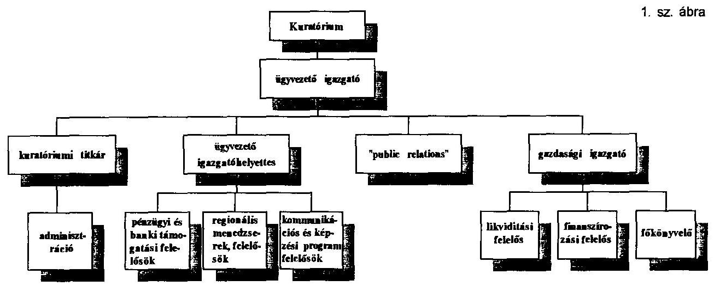

3403 A szervezeti képben nem szerepel az EK Bizottság által küldött - külföldi tanácsadókból álló - Technikai Segély Egység (TAU). A TAU aktív segítséget nyújt, illetve nyújtott a programok kidolgozásában, a helyi vállakozásfejlesztési központok kiépítésében. Ellenőrzi a PHARE programok teljesítését, az eszközök felhasználását. A TAU tevékenységéről, tapasztalatairól Brüsszelnek és az MVA ügyvezető igazgatójának jelent. A tanácsadók közremúködésére az EK Bizottság közvetlenül kötötte a szerződést a Coopers and Lybrand Europe céggel 1990-ben, melyet kétszer, utoljára 1994-ben meghosszabbítottak, illetve módosítottak. A szerződések

---

alapján a cég eddig 1.600 E ECU vállalkozói díjat vett fel közvetlenül a brüsszeli megbízótól, a PHARE keretszerződés terhére.

3404 A tanácsadók 1991. elejétől dolgoznak az Irodánál.
Az NoPHR/90/064/020/003-001 számú szerződés "D" melléklete (Breakdown of prices) tartalmazza a költségtervezést.

A I. B. Direct expenses (közvetlen költségek) között szerepelnek az alábbi tételek:

|  |  |  | (ECU) |
| :-- | --: | --: | --: |
|  | Eredeti   szerz. | 1. sz.   mód. | 2. sz.   mód. |
| Gépjármüvek   (üzemelés biztosítás) | 18000 | 6600 | 6600 |
| - kilométerdíj | 12000 | 4400 | 4400 |
| - biztosítás, fenn- | 6000 | 2200 | 2200 |
| tartás stb. |  |  |  |
| Nyomtatványok,   sokszorosítás | 17000 |  |  |
| Telefon, fax | 9000 |  | 4560 |

A TAU 4 fôvel az Iroda szervezetébe beépült, így a munkájukhoz szükséges irodai szolgáltatásokat - telefon, fax, sokszorosítás stb. - a Vállalkozásfejlesztési Iroda saját költségei között számolta el. A szerződés terhére a tanácsadók vásároltak 4 db személygépkocsit, melyet az MVA átvett, levizsgáztatott (magyar rendszámmal), és fizeti az elöírás szerinti terheket (adó, biztosítás), és javíttatja azokat saját költségére.

Az eredeti szerződés 1. sz., valamint a 2. sz. módosítása szerint az MVA által fizetett költségtételek (gépkocsi biztosítás, fenntartás 10.400 ECU, sokszorosítás 17000 ECU , telefon, fax 13.560 ECU ) a Coopers and Lybrand Europe céget terhelik, mivel a szerződésük összege fedezetet nyújt valamennyi költségükre.

---

# 4. Az MVA pénzgazdálkodása 

### 4.1 Az Alapítvány vagyoni helyzete és vagyoni struktúrája

4101 Az Alapítói Okirat szerint az alapítói saját vagyon 4.234.925 E Ft-ot tett ki. Ebből az összegből 1 Mrd Ft-ot a PM és más tárcák jegyezték a kormány nevében, és kapott az Alapítvány 2 Mrd Ft állami forrást, amely után az Állami Fejlesztési Intézettel kötött szerződés szerint 10 évig évi $13 \%$-os járadékot, tehát évi 260 M Ft-ot kell fizetnie.

4102 A mérlegek alapján a saját vagyon az alábbiak szerint alakult:

$$
\begin{array}{ll}
1990.4234925 \mathrm{E} \mathrm{Ft} \\
1991.6628860 \mathrm{E} \mathrm{Ft} \\
1992.7306716 \mathrm{E} \mathrm{Ft} \\
1993.6868203 \mathrm{E} \mathrm{Ft}
\end{array}
$$

4103 A saját vagyon növekedésében magyar csatlakozás $2,2 \mathrm{M} \mathrm{Ft}$ volt. A növekedést a kamatjövedelmek mellett lényegében az alapítvány kezelésébe adott Start Garancia Alap és a PHARE programra átutalt EK támogatások "csatlakozásként" történő könyvelése jelentette.

4104 A PHARE program céljaira átutalt pénzeszközök a részletes mérlegben külön soron szerepelnek és az EK Bizottság számára havonta készítenek jelentést az eszközök felhasználásáról.

4105 Az EK Bizottsággal kötött finanszírozási megállapodások alapján a PHARE pénzeket külön számlán vezetik, ezért helyesebb lett volna a PHARE program csak azon részét szerepeltetni a saját eszközök és források között, amelyet az MVA saját céljaira használ fel (irodaautomatizálás, gépjármú).

4106 A Start Hitelgarancia Alapból származó bevételek kezelésére a kormánynyal történt megállapodás nem rendelkezik, ezért az Alapítvány az összes ebből származó bevételét a saját eszközei és forrásai között tartja nyilván (a részletes mérlegben külön sorokon).

---

4107 Megállapítjuk, hogy az egyes forrásokból származó eszközök "sajátként" kezelése a mérlegben, valamint befektetése megnehezíti az ellenőrzés számára az elkülöníthető tulajdonosok eszközei mozgásának nyomonkövetését.

# 4.2 PHARE segélyprogram 

4201 Az MVA 1990 decemberében írta alá az első PHARE szerződést (H9006) az EK Bizottságával egy kis- és középvállalkozások fejlesztésére irányuló programcsomag megvalósítására. A programok illeszkedtek az MVA Alapító Okíratában foglalt célkitűzésekhez, bővítve a célok megvalósítására fordítható forrásokat. A feladat folytatására és kibővítésére felek 1991-ben újabb szerződést írtak alá (H9108).

Az első szerződés 21 millió, a második 4 M ECU támogatást irányzott elő. A megvalósítás idejére előbb rövidebb időt írtak elő, azonban az általános indítási nehézségekre való tekintettel 3 évet határoztak meg a végrehajtásra, a H9006. sz. szerződés esetében 4 évet, tehát e két program záró időpontja jelenleg 1994. év vége.

4202 Az EK 1992. évi pénzügyi kerete terhére 1993. március 28-án aláírták a program további folytatását (H9206) finanszírozó Pénzügyi Megállapodást. Ezen megállapodásban rögzítették azt is, hogy a PHARE programban meghatározott tevékenységekhez a magyar fél 9.93 M ECU értékben hozzájárul.

4203 1991. és 1992. években - bár ilyen szerződés szerinti kötelezettsége nem volt - az MVA könyvei szerint 240 M Ft-ot (kb. 2.4 M ECU) fordítottak saját forrásból a PHARE szerződésekben meghatározott célok megvalósítására.

4204 A három szerződés alapján 1993. december 31-ig 21.625 E ECU átutalás érkezett az MVA számláira. A külföldi tanácsadó cég részére az EK Bizottsága eddig közvetlenül 1.600 E ECU-t fizetett ki. Így a 36.000 E ECU keretösszegből 12.775 E ECU - tehát a szerződött összeg $35.5 \%$-a vár átutalásra az EK Bizottság brüsszeli számláján (2. sz. táblázat).

---

# FINANSZIROZÁSI MEMORANDUMOK SZERINTI FELHASZNÁLÁS

|  1993. december 31. |  |  |  |  |  |  |  | Ezer ECU  |
| --- | --- | --- | --- | --- | --- | --- | --- | --- |
|   | 1990 |  | 1991 |  | 1992 |  | Összes |   |
|   | Terv | Tény | Terv | Tény | Terv | Tény | Terv | Tény  |
|  A2 HVK müködési ktg. támogatás | 2853 | 3720 | 2900 | 2900 | 6960 | 671 | 12713 | 7291  |
|  A3 HVK üzleti tervek elkészíttetése | 0 | 455 | 100 | 100 | 0 | 0 | 100 | 555  |
|  A4 Helyi bankfiókok techn. segítése | 425 | 370 | 0 | 0 | 250 | 50 | 675 | 420  |
|  Összes A | 3278 | 4545 | 3000 | 3000 | 7210 | 721 | 13488 | 8266  |
|  B1 Garancia Alap | 4000 | 0 | 0 | 0 | 0 | 0 | 4000 | 0  |
|  B2 PHARE Hitelek | 7850 | 6200 | 0 | 0 | 0 | 0 | 7850 | 6200  |
|  B3 Mikrohitel | 1150 | 1150 | 0 | 0 | 1000 | 850 | 2150 | 2000  |
|  B4 Befektetési Alap | 1770 | 0 | 0 | 0 | 0 | 0 | 1770 | 0  |
|  B5 Kamattámogatás | 0 | 0 | 0 | 0 | 1250 | 0 | 1250 | 0  |
|  Összes B | 14770 | 7350 | 0 | 0 | 2250 | 850 | 17020 | 8200  |
|  C1 Képzés/Öktatás | 510 | 510 | 225 | 215 | 600 | 0 | 1335 | 725  |
|  C2 Kiadványok | 100 | 100 | 25 | 25 | 0 | 0 | 125 | 125  |
|  C3 Kutatás | 50 | 50 | 0 | 0 | 0 | 0 | 50 | 50  |
|  C4 Információs Rendszer | 0 | 0 | 0 | 0 | 0 | 0 | 0 | 0  |
|  C5 Euro-Info Levelezési Központ | 0 | 0 | 50 | 0 | 100 | 0 | 150 | 0  |
|  C6 Nemz. Üzleti és Innovációs Közp. | 0 | 0 | 500 | 42 | 0 | 0 | 500 | 42  |
|  C7 Érdekvédelmi szerv. támogatása | 390 | 190 | 50 | 47 | 0 | 0 | 440 | 237  |
|  C8 Public Relations | 172 | 171 | 150 | 124 | 0 | 0 | 322 | 295  |
|  Összes C | 1222 | 1021 | 1000 | 453 | 700 | 0 | 2922 | 1474  |
|  Összes D (Techn.Segély Egység)*** | 1730 | 1600 | 0 | 0 | 740 | 0 | 2470 | 1600  |
|  Összes E (tartalék) | 0 | 0 | 0 | 0 | 100 | 0 | 100 | 0  |
|  ÖSSZES** | 21000 | 14516 | 4000 | 3453 | 11000 | 1571 | 36000 | 19540  |
|  A2 Kamatfelhasználás HVK* | 565 | 0 | 0 | 0 | 0 | 0 | 565 | 0  |
|  A3 Kamatfelhasználás Üzleti tervek* | 455 | 0 | 0 | 0 | 0 | 0 | 455 | 0  |
|  MINDÖSSZESEN | 22020 | 14516 | 4000 | 3453 | 11000 | 1571 | 37020 | 19540  |

- Jóváhagyva a PHARE 1992. jan.-jún. munkaprogramjában és jelentve az erre vonatkozó felhaszn. jelentésben. ** Az 1990. és az 1991. Finanszírozási Memorandumokat 1993. dec. 2-án meghosszabbították, 1994. dec. 31-ig. ***A Techn. Segély Egység keretében dolgozó külf. tanácsadócéggel a Bizottság szerződött és fizet követőenül. A számok brüsszeli visszajelzésből származnak.

---

4205 1993. év végéig a PHARE program végrehajtására összesen 19.540 E ECU-t fordítottak. Ebből Brüsszel közvetlenül utalt 1.600 E ECU-t, így a hazai felhasználás 17.940 E ECU.

4206 Az átutalt pénzek után a bankszámlákon 1.976 E ECU kamat keletkezett, amelyből a programok végrehajtáshoz felhasználtak 1.020 E ECU-t (lásd a 2. sz. tábla lábjegyzetét), tehát a 21.625 E ECU átutalt keretből (17940-1020) 16.920 E ECU-t használtak fel, ami az átutalás $78 \%$-a. A fennmaradt pénz, a kamat maradékával lekötött tők : :nt funkcionál. További pénzforrás a kihelyezett PHARE hitelek kamatauól és törlesztéséből befolyt $167,6 \mathrm{M} \mathrm{Ft}$.

4207 Az első és második PHARE program pénzügyi teljesítése (sem a szerződés, sem a felhasználás) - az első program egyes elemeinek leállása miatt 1994. év végére nem várható.

# 4.3 Mérleg szerinti eredmény 

4301 Az Alapítvány tevékenységének eredménye a mérlegbeszámolók (tehát a teljes "saját vagyon" mozgása) alapján:

| 1990. | 273340 E Ft |
| :--: | :--: |
| 1991. | 497663 E Ft |
| 1992. | 456242 E Ft |
| 1993. | 52652 E Ft (előzetes nyersmérleg) |

Amennyiben a mérleg eredményétől elkülönítjük a tényleges saját vagyon mozgásának eredményét, akkor az alábbi képet kapjuk:

| 1990. | 273340 E Ft |
| :-- | --: |
| 1991. | 421899 E Ft |
| 1992. | 268088 E Ft |
| 1993. | -219366 E Ft |

Tehát az alapítói vagyon múködtetésének összesített eredménye 744.491 E Ft és nem a mérlegbeszámolók összesítéséből mutatkozó 1.279.366 E Ft. A Start Garancia Alap eszközeinek eredménye 452.907 E Ft-tal, a PHARE eszközeinek eredménye pedig 83.499 E Ft-tal javította az összképet.

---

Az MVA vagyon- és eredményváltozását a 3. sz. táblázat mutatja be.
4302 Az Alapítvány eredményeit befolyásolta a regionális vállalkozásfejlesztési alapítványoknak vagy központoknak térítésmentesen adott tőkejuttatás, valamint a térítésmentesen szervezett tanfolyamok költségei.

4303 A regionális központokon kívül más alapítványoknak 24,4 M Ft-ot juttattak. A regionális központoknak juttatott alapítói tőke a mérlegbeszámolók szerint:

|  |  |  |  | (E Ft) |
| :--: | :--: | :--: | :--: | :--: |
|  | 1991 | 1992 | 1993 | Összesen |
| MVA forrás | 42242 | 10000 | 532052 | 584294 |
| PHARE forrás | 135405 | 273739 | 231200 | 940344 |
| Összesen: |  |  |  | 1524638 |

4304 Mivel az 584 M Ft-nyi MVA forrásból származó "alapítói tőkejuttatás" lényegesen több, mint a megyénkénti $10-10 \mathrm{M}$ Ft-os alapítói tőkehozzájárulásának összege, megállapítható, hogy ez az összeg a térítésmentesen adott, valamennyi juttatást jelenti. A kiegészítésként kapott tájékoztatás szerint a 15 regionális vállalkozásfejlesztési központnál az alapítói, csatlakozói vagyon állománya 1993. december 31 -én $132,2 \mathrm{M}$ Ft volt. 1994. elején további 4 csatlakozás történt 130 M Ft értékben, amelyből a budapestinek 100 M Ft -ot adtak.

4305 Az 1993. év negatív eredményének egyik oka az MVA hitelek kapcsán vállalt készfizető kezesség. Eddig összesen kb. 450 M Ft kezesi igényt hoztak a bankok az MVA tudomására. A kölcsönvevők fizetésképtelensége miatt 1993. december 31-ig elszámolt kezességi lehívások 172.180 E Ft-ot tettek ki.

A negatív eredmény másik oka az MVA veszteséges váltóügyletei.

---

MVA VAGYONVÁLTOZÁS "CASH FLOW" JELLEGŐ KIMUTATÁSA 1990. ÉV

|  |  |  |  |  | E Ft |
| :--: | :--: | :--: | :--: | :--: | :--: |
|  | Megnevezés | Alapitól | Start | PHARE | Összesen |
| 0 | Nyitó pénzeszköz állomány | 0 | 0 | 0 | 0 |
| 1 | Alapitól tőke | 4236800 | 0 | 0 | 4236800 |
| 2 | Utólagos csatlakozás | 1500 | 0 | 0 | 1500 |
| 3 | Célprogram fin. átadott eszk. | 0 | 0 | 0 | 0 |
| 4 | Török csatlakozás | 0 | 0 | 0 | 0 |
| 5 | Osztalék | 175 | 0 | 0 | 175 |
| 6 | Kapott tőke 1.-5. | 4238475 | 0 | 0 | 4238475 |
| 7 | HVK üzleti terv | 0 | 0 | 0 | 0 |
| 8 | Mikrohitel | 0 | 0 | 0 | 0 |
| 9 | HVK tőkejuttatás | 0 | 0 | 0 | 0 |
| 10 | Egyéb alapítványi csatl. | 3550 | 0 | 0 | 3550 |
| 11 | Adott tőke 7.-10. | 3550 | 0 | 0 | 3550 |
| 12 | Alapitól vagyon változás: 6.-11. | 4234925 | 0 | 0 | 4234925 |
| 13 | Osztalék | 0 | 0 | 0 | 0 |
| 14 | Befekt. nettó hozama | 211425 | 0 | 0 | 211425 |
| 15 | Hitelek kamata | 133767 | 0 | 0 | 133767 |
| 16 | Bank kamat | 52064 | 0 | 0 | 52064 |
| 17 | Garanciadij | 0 | 0 | 0 | 0 |
| 18 | Árfolyamnyereség | 0 | 0 | 0 | 0 |
| 19 | Egyéb bevétel | 0 | 0 | 0 | 0 |
| 20 | Bevételek összesen 13.-19. | 397256 | 0 | 0 | 397256 |
| 21 | Költségek programokra | 21676 | 0 | 0 | 21676 |
| 22 | Befektetés leértékelése | 0 | 0 | 0 | 0 |
| 23 | Kamattérités | 71590 | 0 | 0 | 71590 |
| 24 | Kezességvállalás | 0 | 0 | 0 | 0 |
| 25 | AFI járadék fiz. köt. | 0 | 0 | 0 | 0 |
| 26 | Egyéb jutalék, bankktg. | 6459 | 0 | 0 | 6459 |
| 27 | Müködési ktg. | 24191 | 0 | 0 | 24191 |
| 28 | Egyéb veszteség | 0 | 0 | 0 | 0 |
| 29 | Költségek oszesen 21.-28. | 123916 | 0 | 0 | 123916 |
| 30 | Eredmény: 20-29 | 273340 | 0 | 0 | 273340 |
| 31 | Evi hitelkihelyezés | $-2155000$ | 0 | 0 | $-2155000$ |
| 32 | Evi hiteltörlesztés | 0 | 0 | 0 | 0 |
| 33 | Befektetések állományváltozása | $-1715000$ | 0 | 0 | $-1715000$ |
| 34 | Tárgyi eszközök állományváltozása | $-4519$ | 0 | 0 | $-4519$ |
| 35 | Követelések állományváltozása | $-75221$ | 0 | 0 | $-75221$ |
| 36 | Tartozások állományváltozása | 3614 | 0 | 0 | 3614 |
| 37 | Rendező tételek | 0 |  |  | 0 |
| 38 | Mérlegtételek változása 31.-37. | $-3946126$ | 0 | 0 | $-3946126$ |
| 39 | Záró pénzeszk. állomány: $0+12+30$ | 562139 | 0 | 0 | 562139 |

---

MVA VAGYONVÁLTOZÁS "CASH FLOW" JELLEGÚ KIMUTATÁSA 3/b. sz. tábl. 1991. ÉV

|  |  |  |  |  | E Ft |
| :--: | :--: | :--: | :--: | :--: | :--: |
|  | Megnevezés | Alapitói | Start | PHARE | Összesen |
| 0 | Nyitó pénzeszköz állomány | 562139 | 0 | 0 | 562139 |
| 1 | Alapitói tőke | 0 | 0 | 0 | 0 |
| 2 | Utólagos csatlakozás | 0 | 0 | 0 | 0 |
| 3 | Célprogram fin. átadott eszk. | 0 | 572813 | 1734398 | 2307211 |
| 4 | Török csatlakozás | 0 | 0 | 0 | 0 |
| 5 | Osztalék | 1660 | 0 | 0 | 1660 |
| 6 | Kapott tőke 1.-5. | 1660 | 572813 | 1734398 | 2308871 |
| 7 | HVK üzleti terv | 0 | 0 | 135405 | 135405 |
| 8 | Mikrohitel | 0 | 0 | 0 | 0 |
| 9 | HVK tőkejuttatás | 42241 | 0 | 0 | 42241 |
| 10 | Egyéb alapítványi csatl. | 10630 | 0 | 0 | 52871 |
| 11 | Adott tőke 7.-10. | 52871 | 0 | 135405 | 188276 |
| 12 | Alapitói vagyon változás: 6.-11. | $-51211$ | 572813 | 1598993 | 2120595 |
| 13 | Osztalék | 0 | 0 | 0 | 0 |
| 14 | Befekt. nettó hozama | 675047 | 77554 | 0 | 752601 |
| 15 | Hitelek kamata | 520465 | 0 | 0 | 520465 |
| 16 | Bank kamat | 21739 | 3176 | 66144 | 91059 |
| 17 | Garanciadij | 0 | 277 | 0 | 277 |
| 18 | Arfolyamnyereség | 0 | 0 | 20856 | 20856 |
| 19 | Egyéb bevétel | 0 | 0 | 0 | 0 |
| 20 | Bevételek összesen 13.-19. | 1217251 | 81007 | 87000 | 1385258 |
| 21 | Költségek programokra | 83379 | 0 | 84339 | 167718 |
| 22 | Befektetés leértékelése | 0 | 0 | 0 | 0 |
| 23 | Kamattérítés | 399343 | 0 | 0 | 399343 |
| 24 | Kezességvállalás | 0 | 0 | 0 | 0 |
| 25 | AFI járadék fiz. köt. | 260000 | 0 | 0 | 260000 |
| 26 | Egyéb jutalék, bankktg. | 7289 | 4050 | 607 | 11946 |
| 27 | Müködési ktg. | 45341 | 3247 | 0 | 48588 |
| 28 | Egyéb veszteség | 0 | 0 | 0 | 0 |
| 29 | Költségek összesen 21.-28. | 795352 | 7297 | 84946 | 887595 |
| 30 | Eredmény: 20-29 | 421899 | 73710 | 2054 | 497663 |
| 31 | Evi hitelkihelyezés | $-533806$ | 0 | 0 | $-533806$ |
| 32 | Evi hiteltörlesztés | 0 | 0 | 0 | 0 |
| 33 | Befektetések állományváltozása | $-336320$ | $-530600$ | 0 | $-866920$ |
| 34 | Tárgyi eszközök állományváltozása | $-5300$ | 0 | $-4146$ | $-9446$ |
| 35 | Követelések állományváltozása | $-106696$ | $-104$ | $-38959$ | $-145759$ |
| 36 | Tartozások állományváltozása | 10197 | 0 | 194 | 10391 |
| 37 | Rendező tételek | 63205 | $-115620$ | 52415 | 0 |
| 38 | Mérlegtételek változása 31.-37. | $-908720$ | $-646324$ | 9504 | $-1545540$ |
| 39 | Záró pénzeszk. állomány: $0+12+30$ | 24107 | 199 | 1610551 | 1634857 |

---

MVA VAGYONVÁLTOZÁS "CASH FLOW" JELLEGÚ KIMUTATÁSA 1992. E V

|  |  |  |  |  |  |
| :--: | :--: | :--: | :--: | :--: | :--: |
|  | Megnevezés | Alapitói | Start | PHAKE | Osszesen |
| 0 | Nyitó pénzeszköz állomány | 25800 | 199 | 1608858 | 1634857 |
| 1 | Alapitói tóke | 0 | 0 | 0 | 0 |
| 2 | Utólagos csatlakozás | 700 | 0 | 0 | 700 |
| 3 | Célprogram fin. átadott eszk. | 0 | 175371 | 154335 | 329706 |
| 4 | Török csatlakozás | 0 | 0 | 17535 | 17535 |
| 5 | Osztalék | 0 | 0 | 0 | 0 |
| 6 | Kapott tóke 1.-5. | 700 | 175371 | 171870 | 347941 |
| 7 | HVK üzleti terv | 0 | 0 | 428873 | 428873 |
| 8 | Mikrohitel | 0 | 0 | 144866 | 144866 |
| 9 | HVK tókejuttatás | 40000 | 0 | 0 | 40000 |
| 10 | Egyéb alapítványi csatl. | 10250 | 0 | 0 | 10250 |
| 11 | Adott tóke 7.-10. | 50250 | 0 | 573739 | 623989 |
| 12 | Alapitói vagyon változás: 6.-11. | $-49550$ | 175371 | $-401869$ | $-276048$ |
| 13 | Osztalék | 530 | 0 | 0 | 530 |
| 14 | Befekt. nettó hozama | 705463 | 207916 | 0 | 913379 |
| 15 | Hitelek kamata | 183351 | 0 | 21689 | 205040 |
| 16 | Bank kamat | 26427 | 3236 | 95606 | 125269 |
| 17 | Garanciadíj | 0 | 7523 | 57 | 7580 |
| 18 | Árfolyamnyereség | 0 | 0 | 15235 | 15235 |
| 19 | Egyéb bevétel | 0 | 0 | 0 | 0 |
| 20 | Bevételek összesen 13.-19. | 915771 | 218675 | 132587 | 1267033 |
| 21 | Költségek programokra | 63762 | 0 | 153425 | 217187 |
| 22 | Befektetés leértékelése | 0 | 0 | 0 | 0 |
| 23 | Kamattérítés | 163098 | 0 | 0 | 163098 |
| 24 | Kezességvállalás | 18667 | 438 | 0 | 19105 |
| 25 | AFI járadék fiz. köt. | 260000 | 0 | 0 | 260000 |
| 26 | Egyéb jutalék, bankktg. | 9848 | 1745 | 3740 | 15333 |
| 27 | Müködési ktg. | 66864 | 4290 | 0 | 71154 |
| 28 | Egyéb veszteség | 64914 | 0 | 0 | 64914 |
| 29 | Költségek összesen 21.-28. | 647153 | 6473 | 157165 | 810791 |
| 30 | Eredmény: 20-29 | 268618 | 212202 | $-24578$ | 456242 |
| 31 | Evi hitelkihelyezés | $-25000$ | 0 | $-410000$ | $-435000$ |
| 32 | Evi hiteltörlesztés | 494777 | 0 | 274 | 495051 |
| 33 | Befektetések állományváltozása | $-778005$ | $-501611$ | 0 | $-1279616$ |
| 34 | Tárgyi eszközök állományváltozása | $-628$ | 0 | 0 | $-628$ |
| 35 | Követelések állományváltozása | 177530 | 104 | 38959 | 216593 |
| 36 | Tartozások állományváltozása | $-779$ | 0 | 17642 | 16863 |
| 37 | Rendező tételek | $-66095$ | 115105 | $-49010$ | 0 |
| 38 | Mérlegtételek változása 31.-37. | $-198200$ | $-386402$ | $-402135$ | $-986737$ |
| 39 | Záró pćneszk. állomány: $0+12+30+$ | 46668 | 1370 | 780276 | 828314 |

---

MVA VAGYONVÅLTOZÁS "CASH FLOW" JELLEGÚ KIMUTATÁSA 1993. EY

|  |  |  |  |  | E Ft |
| :--: | :--: | :--: | :--: | :--: | :--: |
|  | Megnevezés | Alapitói | Start | PHARE | Összesen |
| 0 | Nyitó pénzeszköz állomány | 46669 | 1370 | 780276 | 828315 |
| 1 | Alapitót tőke | 0 | 0 | 0 | 0 |
| 2 | Utólagos csatlakozás | 0 | 0 | 0 | 0 |
| 3 | Célprogram fin. átadott cszk. | 0 | 1889 | 292850 | 294739 |
| 4 | Török csatlakozás | 0 | 0 | 0 | 0 |
| 5 | Osztalék | 0 | 0 | 0 | 0 |
| 6 | Kapott tőke 1.-5. | 0 | 1889 | 292850 | 294739 |
| 7 | HVK üzleti terv | 192952 | 0 | 0 | 192952 |
| 8 | Mikrohitel | 259100 | 0 | 38500 | 297600 |
| 9 | HVK tőkejuttatás | 50000 | 0 | 192700 | 242700 |
| 10 | Egyéb alapítványi csatl. | 0 | 0 | 0 | 0 |
| 11 | Adott tőke 7.-10. | 502052 | 0 | 231200 | 733252 |
| 12 | Alapitól vagyon változás: 6.-11. | $-502052$ | 1889 | 61650 | $-438513$ |
| 13 | Osztalék | 0 | 0 | 0 | 0 |
| 14 | Befekt. nettó hozama | 412222 | 161257 | 0 | 573479 |
| 15 | Hitelek kamata | 328691 | 0 | 96401 | 425092 |
| 16 | Bank kamat | 0 | 0 | 55756 | 55756 |
| 17 | Garanciadíj | 0 | 14910 | 43 | 14953 |
| 18 | Arfolyamnyereség | 0 | 0 | 26659 | 26659 |
| 19 | Egyéb bevétel | 0 | 0 | 0 | 0 |
| 20 | Bevételek összesen 13.-19. | 740913 | 176167 | 178859 | 1095939 |
| 21 | Költségek programokra | 97889 | 0 | 73105 | 170994 |
| 22 | Befektetés leértékelése | 38600 | 0 | 0 | 38600 |
| 23 | Kamattérítés | 298509 | 0 | 0 | 298509 |
| 24 | Kezességvállalás | 141903 | 491 | 0 | 142394 |
| 25 | AFI járadék fiz. köt. | 260000 | 0 | 0 | 260000 |
| 26 | Egyéb jutalék, bankktg. | 6890 | 3933 | 731 | 11554 |
| 27 | Múködési ktg. | 116488 | 4748 | 0 | 121236 |
| 28 | Egyéb veszteség | 0 | 0 | 0 | 0 |
| 29 | Költségek összesen 21.-28. | 960279 | 9172 | 73836 | 1043287 |
| 30 | Eredmény: 20-29 | $-219366$ | 166995 | 105023 | 52652 |
| 31 | Evi hitelkihelyezés | 0 | 0 | $-240000$ | $-240000$ |
| 32 | Evi hiteltörlesztés | 565127 | 0 | 49079 | 614206 |
| 33 | Befektetések állományváltozása | 149169 | $-168435$ | 0 | $-19266$ |
| 34 | Tárgyi eszközök állományváltozása | $-9263$ | 0 | 0 | $-9263$ |
| 35 | Követelések állományváltozása | $-34668$ | 0 | 0 | $-34668$ |
| 36 | Tartozások állományváltozása | $-1867$ | 0 | $-12140$ | $-14007$ |
| 37 | Rendező tételek | 26047 | 6621 | $-32668$ | 0 |
| 38 | Mérlegtételek változása 31.-37. | 694545 | $-161814$ | $-235729$ | 297002 |
| 39 | Záró pénzeszk. állomány $0+12+30$ | 19796 | 8440 | 711220 | 739456 |

---

AZ ALAPITÓI VAGYONVÅLTOZÁS "CASH FLOW" JELLEGÚ KIMUTATÁSA
$3 /$ e. sz. tábl.

|  |  |  |  |  |  | E Ft |
| :--: | :--: | :--: | :--: | :--: | :--: | :--: |
|  | Megnevezés | 1990 | 1991 | 1992 | 1993 | Összesen |
| 0 | Nyitó pénzeszkóz állomány |  |  |  |  |  |
| 1 | Alapitól tőke | 4236800 | 0 | 0 | 0 | 4236800 |
| 2 | Utólagos csatlakozás | 1500 | 0 | 700 | 0 | 2200 |
| 3 | Célprogram fin. átadott eszk. |  |  |  |  |  |
| 4 | Török csatlakozás |  |  |  |  |  |
| 5 | Osztalék | 175 | 1660 | 0 | 0 | 1835 |
| 6 | Kapott tőke 1.-5. | 4238475 | 1660 | 700 | 0 | 4240835 |
| 7 | HVK üzleti terv | 0 | 0 | 0 | 192952 | 192952 |
| 8 | Mikrohitel | 0 | 0 | 0 | 259100 | 259100 |
| 9 | HVK tőkejuttatás | 0 | 42241 | 40000 | 50000 | 132241 |
| 10 | Egyéb alapítványi csatl. | 3550 | 10630 | 10250 | 0 | 24430 |
| 11 | Adott tőke 7.-10. | 3550 | 52871 | 50250 | 502052 | 608723 |
| 12 | Alapitól vagyon változás: 6.-11. | 4234925 | $-51211$ | $-49550$ | $-502052$ | 3632112 |
| 13 | Osztalék | 0 | 0 | 530 | 0 | 530 |
| 14 | Befekt. nettó hozama | 211425 | 675047 | 705463 | 412222 | 2004157 |
| 15 | Hitelek kamata | 133767 | 520465 | 183351 | 328691 | 1166274 |
| 16 | Bank kamat | 52064 | 21739 | 26427 | 0 | 100230 |
| 17 | Garanciadij | 0 | 0 | 0 | 0 | 0 |
| 18 | Árfolyamnyereség | 0 | 0 | 0 | 0 | 0 |
| 19 | Egyéb bevétel | 0 | 0 | 0 | 0 | 0 |
| 20 | Bevételek összesen 13.-19. | 397256 | 1217251 | 915771 | 740913 | 3271191 |
| 21 | Költségek programokra | 21676 | 83379 | 63762 | 97889 | 266706 |
| 22 | Befektetés leértékelése | 0 | 0 | 0 | 38600 | 38600 |
| 23 | Kamattérités | 71590 | 399343 | 163098 | 298509 | 932540 |
| 24 | Kezességvállalás | 0 | 0 | 18667 | 141903 | 160570 |
| 25 | AFI járadék fiz. köt. | 0 | 260000 | 260000 | 260000 | 780000 |
| 26 | Egyéb jutalék, bankktg. | 6459 | 7289 | 9848 | 6890 | 30486 |
| 27 | Múködési ktg. | 24191 | 45341 | 66864 | 116488 | 252884 |
| 28 | Egyéb veszteség |  |  | 64914 | 0 | 64914 |
| 29 | Költségek összesen 21.-28. | 123916 | 795352 | 647153 | 960279 | 2526700 |
| 30 | Eredmény: 20-29 | 273340 | 421899 | 268618 | $-219366$ | 744491 |
| 31 | Evi hitelkihelyezés |  |  |  |  |  |
| 32 | Evi hiteltörlesztés |  |  |  |  |  |
| 33 | Befektetések állományváltozása |  |  |  |  |  |
| 34 | Tárgyi eszközök állományváltozása |  |  |  |  |  |
| 35 | Követelések állományváltozása |  |  |  |  |  |
| 36 | Tartozások állományváltozása |  |  |  |  |  |
| 37 | Rendező tételek |  |  |  |  |  |
| 38 | Mérleg szerinti saját tőke: $12+30$ |  |  |  |  | 4376603 |
| 39 | Záró pénzeszk. állomány: $0+12+30$ |  |  |  |  |  |

---

# 4.4 A Magyar Vállalkozásfejlesztési Alapítvány váltóügyei 

4401 Az 1991. évi mérleg szerint alapítói vagyonból 1,6 Mrd Ft volt a rövidlejáratú bankbetétek állománya, amelyeket értékpapírokba fektetés helyett a "közvetlen kihelyezésre" tartottak vissza.

4402 Az MVA 1991. évi mérlegében 459 M Ft értékben szerepeltek váltókövetelések. Ezekhez úgy jutott, hogy egyes bankok a "betét elhelyezőknek" átadtak visszavásárlási kötelezettség mellett váltókat. Így csökkent a bank tartalékképzési kötelezettsége, az MVA számára pedig ez a betéti kamatnál magasabb ( $28-34 \%$ közötti) jövedelmet hozott. Ezeket a váltókat a bankok mind visszaváltották.

4403 1992-ben az MVA - az Alapító Okirat elôírásait figyelmen kívül hagyva - áttért a közvetlen váltóhitelezésre. A rendelkezésekre álló adatok szerint 1992 folyamán 6 esetben adtak váltóra hitelt - 3 esetben kisebb összegekre - ezeket a partnerek visszafizették és 3 esetben összesen közel 600 M Ft-ot fizettek ki (ennél magasabb értékre kiállított) váltók ellenében.
$=$ A Tilla Kft.-nek 1992. április 6-án eladott az MVA 560 M Ft névértékben KVH kötvényeket egy 200 M Ft névértékü 1992. október 8-án lejáró váltó ellenében. Három nappal később visszavásárolta a kötvényeket 166 M Ft készpénzért. A váltóra elfogadták fedezetül egy, a Tilla Kft. által felajánlott üzlet tulajdon- és bérleti jogait, amelyet a Tilla 215 M Ft-ot érơnek mondott, továbbá a Kaméleon Gloves Kft. készfizetô kezességét, amelynek fedezete "teljes vagyona".

Az ügylet megkötése elốt az MVA vezetői az ingatlan és a bérleti jogviszony értékét nem vizsgálták, továbbá azt sem, hogy a Kaméleon egyik tulajdonosa egyben a Tilla Kft. egyik ügyvezetô igazgatója is, valamint hogy 1 M Ft tôkével nemigen lehet biztositékot adni 200 M Ft-ra.

A felajánlott ingatlanokról csak 1992 októberében készült értékelés (felkért "becsüs" által). Az értékelés szerint a tulajdonban lévô üzlethelyiség $450.000 \mathrm{Ft} / \mathrm{m}^{2}$, a bérleti jog pedig $250.000 \mathrm{Ft} / \mathrm{m}^{2}$ értékü. Ebben az idóben 100-150 E Ft/m ${ }^{2}$ áron új irodát lehetett épiteni ezen a helyen, tehát a becsült ár a piaci ár négyszerese volt!

---

$=$ A Cél Tanácsadó Rt.-nek 1992. augusztus 17-én egy 237 M Ft-os egy éves lejáratú váltóra 220 M Ft-ot fizettek. Biztositékul elfogadtak egy olyan ingatlant, amelynek névleges forgalmi értéke mintegy 240 M Ft. Figyelmen kivül hagyták, hogy 150 M Ft-os jelzálog terheli az ingatlant. Formailag egy elơvásárlási szerzödést kötöttek, amelyet a Cél váltójának visszavásárlása után sztomíroznak.
$=$ A Neményi Rt. 250 M Ft névértékü 1993. január 17-én lejáró váltóját megvásárolta az MVA 214.1 M Ft készpénzért. Biztositékul elfogadták Neményi Béla saját (már akkor likviditási gondokkal küzdő) vállalatának tulajdonában lévô részvényeit.
1992. december 2-án a Kuratórium akkori elnöke a váltóüzletek és fedezeteik vizsgálatára megbízást adott a Price Waterhouse (PW) cégnek, a melynek december 22-i jelentése több formai hiányosság említése mellett megállapította, hogy az elfogadott biztosítékok igen kétséges fedezetet jelentenek. A Kuratórium január 12-i határozata alapján az Elnök azonnali hatállyal felmondott - a tapasztalt hiányosságokra hivatkozva - az akkori ügyvezető igazgatónak. (Az MVA tájékoztatása szerint a Munkaügyi Bíróságnál indított MVA elleni perét az ügyvezető igazgató elvesztette.)

A PW jelentés birtokában és ismeretében, az Elnök 1993. január 12-én mégis eladja a Neményi Rt.-nek a lejáró váltót egy másik azonos összegúért és egy ígéretért, hogy 1993. július 17-ig még 35 M Ft-ot fizet. E 285 M Ft-os követelésből a Neményi Rt. csak 26,7 M Ft-ot fizetett ki készpénzben.

Az MVA 1993-ban keresetet nyújtott be a Tilla Kft. ellen a tartozás kiegyenlítése érdekében és feljelentette a Kft.-t csalásért. A Fővárosi Bíróság 1993. június 25-i ítéletében elmarasztalta az alpereseket, kötelezve a Tilla Kft. vezetóit - Újj Magdolna I. és Újj Katalin II. rendű alpereseket, valamint a Kaméleon Gloves Kft.-t, mint III. rendű alperest - a tartozás, annak kamatai, a perköltség és a felmerült illetékek megfizetésére.

Az ítélet fedezethiány miatt nem volt végrehajtható. Az MVA 1994-ben megbízást adott a Mesterdetektív Kft.-nek az alperesek megmaradt cég-, illetve magánvagyonának felmérésére.

---

A Budapesti Rendôrfőkapitányság Vizsgálati Főosztálya jelenleg nyomoz az ügyben. Az ügy szereplői közül Újj Magdolna előzetes letartóztatásban van, Újj Katalin ismeretlen helyre távozott.

A Neményi Rt. és a Cél Rt. ellen az MVA 1994. március 31-én, illetve április 1-én - az Állami Számvevőszék vizsgálata idején, vélhetően az ellenőrzés hatására - nyújtotta be keresetét a Fővárosi Bírósághoz.

A két ügyben nem tett feljelentést az MVA, mivel az ügyletek mögött nem látott megtévesztő szándékot!

A három váltóügyletből fakadó összes kár a vizsgálat idején nem volt megállapítható. A tényleges kár mértékét nagyban befolyásolja az adósok cég-, illetve magánvagyonával szembeni eljárások lefolytatása, a vagyontárgyak értékesítési lehetősége.

A vizsgálat megállapította, hogy az alapítvány volt vezetői az Alapító Okiratban foglalt előirások megkerülésével, felhatalmazás és kuratóriumi jóváhagyás nélkül nagyösszegű (kb. 600 M Ft ) kifizetéseket teljesítettek a Tilla Kft., a Neményi Rt. és a Cél Tanácsadó Kft. részére, fedezetlen váltók ellenében.

Ezzel a magatartásukkal a rájuk bízott idegen vagyon kezelése során, a fedezetek reális értékelésének elmulasztásával különösen nagy vagyoni hátrányt okoztak az Alapítványnak és kimerítették a hútlen kezelés búncselekmény alapos gyanúját.

# 4.5 Szabad pénzeszközök 

4501 Az MVA szabad pénzeszközeit - forrásainak növelése céljából - rövid és hosszú lejáratú állampapírokba, illetve hosszabb időre lekötött bankbetétekbe fekteti. Az előző pontban tárgyalt kétes értékű váltóügyletek tanulságaként 1993-ban már újabb váltóügyletet nem kötöttek. Az MVA kidolgozott egy Befektetési Szabályzatot, amely pontosan meghatározza a likviditási menedzserek és az egyes vezetők feladatait és felelősségét.

---

A tartósan lekötött pénzeszközök alakulása az éves mérlegekben:

|  |  |  |  | (E Ft) |
| :--: | :--: | :--: | :--: | :--: |
|  | Lekötött bankbetét | Váltó | Rövid és hosszúlejáratú állampapír | Összesen |
| 1990. | 1700000 |  |  | 1700000 |
| 1991. |  |  |  |  |
| Alapít | 1339000 | 449760 | 447120 | 2235880 |
| Start G. | 524000 |  | 6500 | 530500 |
| 1992. |  |  |  |  |
| Alapít | 113000 | 678147 | 1816871 | 2608018 |
| Start G. | 4000 |  | 903091 | 907091 |
| 1993. |  |  |  |  |
| Alapít | 113000 | 200000 | 1825355 | 2138355 |
| Start G. | 4040 |  | 1196004 | 1200044 |

A mérlegek "egyéb bankbetét" sorában szerepelnek a PHARE program számlái, amelyeken 1991. végén ECU-ban nyilvántartva mintegy 1,6 Mrd Ft, 1992. végén 740 M Ft, 1993. végén pedig 570 M Ft érték volt.

A táblázatban az alapítói befektetések között szereplő 200 M Ft értékủ váltóvagyon mellett utóbb le kell írni veszteségként a kétes követelésre átminősített 440 M Ft -ot (attól függően, hogy az egyik mögött fedezetként álló ingatlant mennyiért sikerül megkapni és értékesíteni). A mérlegben aktív követelésként szereplő 200 M Ft tétel is kérdéses, miután pernyerés után sincs ilyen értékủ behajtható vagyona az adósnak.

A lekötött bankbetéteken valamint a rövid és hosszabb lejáratú értékpapírokon elért kamatnyereség eddig biztosítani tudta az MVA alapítványi célú tervezett tevékenységének megvalósítását.

# 4.6 A programok és a bonyolítás költségei 

4601 Az Alapítvány finanszírozási tevékenysége a vizsgált időszakban az alábbiak szerint alakult:

---

SAJÁT FORRÁS ..... (M Ft)
— a kis- és középvállalkozóknak nyújtott MVA hitelek: ..... 2.928,0

- a regionális vállalkozásfejlesztési
központok támogatása ..... 584,3
Ebből
— alapjuttatás ..... 132,2
— üzleti tervek megvalósítására ..... 193,0
— mikrohitel ..... 259,1
- egyéb alapítványokhoz csatlakozás ..... 24,4
— az MVA által kezelt programok költségei ..... 266,7
- a kisvállalkozóknak a bankok által nyújtott kedvezményes hiteleknél adott kamatkedvezmény megtérítése a bankoknak ..... 932,6
Összesen: ..... 4.736,0
PHARE segélyprogram ..... 1.900,0
START GARANCIA ALAP
kezességvállalás ..... 1,0
Összes támogatás: ..... 6.637,0

4602 A 6.6 Mrd Ft támogatás adminisztratív költségeire az MVA 253 M Ft-ot költött. Ez a külföldi tanácsadóinak Brüsszelből fizetett mintegy 175 M Ft--tal együtt 428 M Ft , ami az összes támogatás $6,5 \%$-a.

4603 A múködési költségeken túl, a programokra fordítható eszközöket csökkentették a programokat terhelő veszteségek, amelyek részben függtek az MVA vezetőinek döntésétől, részben azoktól függetlenek voltak. A jelentés más részein tárgyaltakkal együtt e veszteségekről az alábbi összeállítást adjuk (E Ft-ban):
— az MVA hiteleknél vállalt készfizetői
kezesség alapján eddig elszámolt fizetések ..... 172.180

---

- az Általános Vállalkozásfejlesztési Bank csődje következtében elvesztett betétrész
- a "működőtőke befektetések" leírása a cégek csődjei miatt
- behajthatatlan váltókövetelésekből kétes követeléssé minősítve

5. Az MVA tevékenysége

# 5.1 Regionális Vállalkozói Központok Hálózata 

5101 A vállalkozói központok elsődleges célja, hogy ösztönözzék a saját körzetükben lévő magántulajdonú kis- és közepes méretű vállalkozások fejlődését. Különleges feladatuk, hogy a saját körzetük adottságaival, lehetőségeivel és korlátaival összhangban önfenntartó vállalkozások növekedését ösztönözzék, maradandó munkahelyek teremtését támogassák, segítsék elő a munkanélküliség csökkentését és a működésük területén található munkaerő szaktudását növeljék. Minden egyes központnak ki kell alakítania a saját területére vonatkozó fejlesztési stratégiáját és az alábbi funkciókat kell betöltenie:

- helyi speciális igényekhez igazodó oktatási, képzési lehetőségek biztosítása;
— üzleti tanácsadás;
- vállalkozói projektek tervezése, megvalósítása;
- ösztönözni, illetve ahol lehet és kívánatos, vállalni üzleti befektetéseket;
- ösztönözni az ingatlan fejlesztést, illetve ahol lehet és kívánatos, ipari ingatlanokat kezelni.

5102 Az MVA 1991. február 9-én pályázatot hirdetett meg országos napilapban helyi vállalkozói központok létrehozására.
A pályázati felhívás közzétételekor az MVA szándéka mindössze három központ kísérleti jellegú felállítása volt a távlati elképzelés szerinti országos hálózat kialakításához. A széles körű érdeklődés következtében 42 olyan pályázat érkezett be, amely megfelelt a meghirdetett feltételeknek. A - Pénzügyminisztérium, a Környezetvédelmi és Területfejlesztési Minisztérium, a Munkaügyi Minisztérium, a Magyar Tudományos Akadémia, a Településfejlesztési Önkormányzatok, az IPOSZ és az MVA

---

képviselőiből álló - zsűri 1991. március 14-én hat helyi vállalkozóközpont létrehozása mellett döntött. Az első hat HVK:

- Borsod-Abaúj-Zemplén megye (17 pont)
- Szabolcs-Szatmár-Bereg megye (19 pont)
- Jász-Nagykun-Szolnok megye (15 pont)
- Tolna megye (16 pont)
- Somogy megye (15 pont)
- Székesfehérvári régió (18 pont)

A zsűri döntésének vezérszempontjai voltak:

- "Mennyire súlyosak a régió problémái;
- Mennyire jellegzetes a régió vállalkozásfejlesztése szempontjából;
- Mennyire tükröz összefogást a pályázat;
- Milyen mértékben hajlandó a régió saját erőforrást mozgósítani;
- Milyen minőségü a pályázat;
- Van-e más pályázat az adott régióból."

A pályázatnyertes központok előzőekbeni felsorolásában a zárójelbe tett pontszám tükrözi a döntéshez figyelembe vett szempontok alapján elért eredményt.

A vizsgálat számára ismeretlen maradt, hogy milyen egyéb szempontokat érvényesítettek a bíráló bizottság tagjai az első HVK-k kiválasztásakor. Az elért pontszámok alapján ugyanis néhány elfogadott pályázót megelőztek volna az alábbiak:

Zala megye (Zala Megyei Önkormányzati Közgyűlés)
elért pontszáma: 17 ;
Nógrád megye (Nógrád Megyei Közgyűlés)
elért pontszáma: 16 ;
Salgótartján-Bátonyterenye-Balassagyarmat (Híd Nógrádi Vállalkozásszervezési Alapítvány)
elért pontszáma: 17 .
5103 A "Pályázati felhívásban" március 8 -át jelölték meg a pályázatok benyújtási határidejének, s a döntést már március 14-én meghozták, ami mindössze négy munkanapot jelentett egy olyan fontosságú döntéshez, amely behozhatatlan előnyökhöz juttatta az első hat HVK-t.

---

$=$ Az indításkori elöny, hogy nem kellett a pályázónak 10 M Ft készpénzzel rendelkeznie, mint ahogy azt a késóbb megalakulóknál feltételül szabták. További elöny a különbözô képzési támogatásokban való részvétel, amely 1993. év végéig a HVK-k közül csak az elsô hatra terjedt ki teljes körüen.

A helyi vállalkozói központok országos hálózatának kiépítése 1994. második félévéig elhúzódik. A már üzleti tervvel rendelkezők, részesei lehetnek az MVA támogatásainak. (Pl. szemináriumokon elsajátíthatják a korszerű vállalkozói ismereteket.)

5104 A helyi vállalkozói központok önálló jogi személyiségủ szervezetként múködnek. Az MVA nem irányít, de befolyásolási lehetősége van a HVK-k működésére, mivel üzleti tervük elkészítésének részese.

5105 Az MVA és a HVK-k között rendszeres az írásbeli és személyi kapcsolattartás. A formális és informális csatornákon szerzett információk közül az MVA csak a pénzügyi jellegű eseményeket követi és regisztrálja, a nyújtott támogatás hatékonyságát, hasznosulását nem ellenőrzi, arról összefoglaló képpel nem rendelkezik.
$=$ Példaként említhetô a kutatási célú ráfordítások összességéről, s azok hasznosulásáról való hiányos tájékozottság. A HVK-k részére információnyilvántartásra elôtrt blokkokba nem egységes eljárással helyezik el a HVK-k a kutatási ráfordításokat. Így, az MVA - függetlenül attól, hogy szándékában sem állt - nem képes a hálózat egészére pontos képet kapni a kutatásokról.

5106 Összességében a HVK hálózat kialakításában a kormányzati elképzelés az MVA közreműködésén túl - a helyi érdekek felismerése, a vállalkozói kör öntevékeny aktivizálódása révén, saját források bevonásával valósult meg, mindvégig demokratikus keretek között. A civil társadalom önszervező ereje és működő belső kontrollja szinte konfliktusok nélkül áthidalta az esetenként jelentkező - politikai színezetű - befolyásolási kísérleteket (a kísérletekről a helyszíni interjúk során kaptunk jelzéseket).

Az MVA és a HVK-k közötti viszony néhány további kérdésével a mikrohitel programpontban foglalkozunk.

---

# 5.2 Bilaterális szerződések 

A HVK-k múködését az MVA és PHARE segélyeken kívül közvetlen bilaterális szerződések is támogatják.

5201 E támogatások közül egy került csak az MVA számlájára, ez a török kormány támogatása a Baranya megyei HVK számára. Összege mintegy 225.000 USD. (Megszerzés: 1992.)

Az összeg eddigi felhasználása:

- üzleti terv készítése: 75.000 USD. A pályázatot az MVA írta ki és bírálta el;
- iroda vásárlása a HVK számára: 9.800 E Ft.

5202 További közvetlen kormánytámogatások:

- Hollandia: Zala HVK, az üzleti terv elkészítésének finanszírozása, melyet közvetlenül a tanácsadó cég kapott meg, valamint 12.950.490 Ft érkezett a HVK számlájára, amelyet teljes egészében az üzleti tervben megjelölt programok végrehajtására fog felhasználni. Ezen összegből - az üzleti tervvel összhangban - 10 M Ft-ot iroda vásárlására költött a HVK. (Megszerzés: 1993.)
- Ausztria: Vas HVK, 80 E ECU az üzleti terv készítésére, melyet közvetlenül az osztrák tanácsadó cég kapott meg (1993).
- Belgium: Komárom-Esztergom HVK, az üzleti terv elkészítésének finanszírozása, melyet közvetlenül a belga tanácsadó cég kapott meg (1993).
- Kanada: Nógrád HVK, 80 E ECU az üzleti terv elkészítésének finanszírozása, melyet közvetlenül a kanadai tanácsadó cég kapott meg (1993).
- Finnország: Csongrád HVK, az üzleti terv elkészítésének finanszírozása, melyet közvetlenül a tanácsadó cég kapott meg (1992).
- Írország: Hajdú-Bihar HVK, az üzleti terv elkészítésének finanszírozása, melyet közvetlenül a tanácsadó cég kapott meg (1992).
- Olaszország: Veszprém HVK, az üzleti terv elkészítésének finanszírozása, melyet közvetlenül a tanácsadó cég kapott meg (1992).

---

- Nagy-Britannia: Veszprém, Békés, Győr-Sopron HVK-k, az üzleti terv elkészítésének finanszírozása, melyet közvetlenül a tanácsadó cég kapott meg (1992).

Az MVA kezdeményezte az adott ország kormányánál a fenti programokat, de a tanácsadóknak adott pontos összegekről sok esetben nincs tudomásunk.

A Bács-Kiskun megyei terv elkészítését a Kent County Council támogatta (1992).

5203 HVK-k csoportjának nyújtott támogatás:
A Peacecorps szakértői nyolc HVK munkáját támogatják (Fejér, Szolnok, Borsod, Szabolcs, Komárom, Zala, Baranya, Bács-Kiskun), egyrészt a HVK munkatársainak segitve, másrészt tanácsadást, illetve képzést tartva vállalkozóknak. A HVK-nak a lakás bérleti költségét és rezsijét kell állnia. Az önkéntesek két évig lesznek a HVK-nál.
A program 1993 végén kezdődött.

# 5.3 Vállalkozói kultúra fejlesztése 

5301 A vizsgált időszakban az MVA - PHARE forrásból - 900 E ECU-t fordított oktatás, szakképzés és kutatás támogatására (a 2. sz. táblázat $\mathrm{C} 1, \mathrm{C} 2$ és C 3 sorainak összegeként).

A vállalkozói kultúra fejlesztése érdekében végzett tevékenysége csoportosítását a 2. sz. ábra mutatja be.

A képzést szakmailag és nyelvismerettel egyaránt jól felkészült projekt menedzserek irányítják. Sokrétủ tevékenységük összességében hatásosnak minősíthető. Az alábbi megállapításokkal néhány olyan jelenségre kívánjuk felhívni a figyelmet, amelyek negatívan befolyásolják a képzés hatékonyságát.

5302 Az MVA a helyi vállalkozói központok személyzetének kiképzésével kívánta megoldani a vállalkozókat közvetlenül oktató vagy szaktanácsokkal ellátó munkatársi gárda létrehozását. Gyakorlatilag eddig csak az első hat

---

helyi vállalkozói központ vezetői és munkatársai vettek részt valamennyi oktatásban és tanulmányúton, a további 13 helyi vállalkozói központ nem, vagy csak részben részesült ilyen képzésben.

Eddig nem történt azirányú lépés sem, hogy az első hat HVK "kiképzettjei" és/vagy az MVA részéről képzésben részesültek továbbadják tudásukat, tapasztalataikat mindazon HVK-munkatársaknak, akik még nem részesülhettek a képzésekben, viszont munkájuk már szükségessé tenné a speciális felkészültséget.

5303 Kulcs-jelentőséget kell tulajdonítani a vállalkozókat oktatóknak. Feladatuk teljesítésével közvetlenül alakítják a vállalkozók rátermettségét, életképességét. Ugyanakkor a "Vállalkozói oktatók képzése" szemináriumot mindössze egyetlen alkalommal tartották meg 1992-ben, amelyen az első hat HVK által küldött 25 oktató lehetett jelen.

5304 A "Szaktanácsadók képzése" szeminárium 1993-ban egyáltalán nem indult. Mivel a szaktanácsadáshoz szükséges ismeretek oly gyorsan szorulnak korszerűsítésre - mint azt a kiadványokkal kapcsolatosan kimutatták -, nem indokolt az 1993. évi szeminárium elhagyása, vagy legalább egy azt helyettesítő képzést kellett volna indítani.

5305 A szemináriumokat általában egy külföldi és egy magyar szakértő cég együtt szervezte és oktatta. Ennek célja egyrészt az volt, hogy a külföldi oktató ismereteit adaptálják a magyarországi sajátosságokhoz, másrészt, hogy a magyar szervező-oktató idővel képessé váljon az önálló képzésre. Vizsgálatunk során mindössze egy - egy napos szemináriumot (PR) szervezett és oktatott korábban társ-szerepű magyar cég.

5306 Az MVA által támogatott kiadványok nem hasznosultak elég széles körűen. Kereskedelmi forgalomba nem, vagy alig került kiadvány.
$=$ Az MVA 1991-ben elkészittette a "Siker a vállalkozásban" címü kiadványt a Stoy Hayward céggel, majd szerzödésben átadta a tananyag oktatása szervezésének jogosultságát a SAMLING Kft.-nek. A tananyaghoz csak a Kft. által lehetett hozzájutni. Csak 1993 áprilisában kapta meg a tananyagot az elsó hat HVK, amikorra már az 1992-ben felújított példány elavult.

---

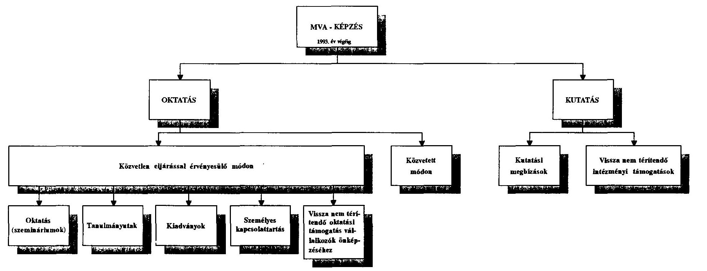

Közvetlen eljárással érvényesülő módon

---

$=$ A SEED 32.320 ECU ellenében elkészítette és kiadta a "Tanácsadók kézikönyve" címü kiadványt. A jól hasznosítható kézikönyvet megkapta valamennyi $H V K$, de "külsök" - a kis- és középvállalkozók oktatásával foglalkozók - nem férhettek hozzá. (Információ a BKE Kisvállalkozáskutató Csoporttól.)

MVA saját forrásból megbizta a SEED-t, hogy a gazdasági szabályozók változásai miatt az 1992 decemberében elkészült kézikönyvet újitsa fel. A 250 példányban elkészitett korábbi kiadvány elévülés elôtti hasznosítására a HVK-kon kivüli lehetôséget meg kellett volna találni.

5307 Az első négy év során kutatásra összesen kifizetett 19.120 E Ft-ból a Budapesti Közgazdaságtudományi Egyetem (BKE) Kisvállalkozáskutató Csoportja 9.540 E Ft-tal részesült. Ezen összeggel az MVA egy - nevében is jelzetten - kisvállalkozások fejlesztésével foglalkozó kutatócsoport megalakulását és megerősödését segítette a BKE keretén belül. A hallgatók számának növekedése jelzi, hogy komoly érdeklődés nyilvánul meg a kisvállalkozások menedzselése iránt. Az óraadáshoz főként külső oktatókat alkalmazó Kutatócsoport lényegében már tanszékként működik. Küszöbön áll a hivatalos tanszékké nyilvánítás. E sikersorozat anyagi megalapozója, folyamatos támogatója az MVA.
Vizsgálatunk megállapította, hogy a kutatási szerződések alapján a Csoport készített kutatási jelentéseket ( 4 év alatt 6 kutatási program), de ezek értéke - megítélésünk szerint - nem áll arányban a kifizetésekkel. Helyesebb lett volna, ha az átutalt összeget az MVA vissza nem térítendő támogatásnak minősíti.

5308 A kutatási megbízások az első három évben jellemzően "közvetlen megbízás"-sal történtek. 1993-tól a "meghívásos pályázat" rendszerét alkalmazták. Bár e változás előrelépésnek minősíthető, a nyílt pályázat lehetőséget adott volna valamennyi kis- és középvállalkozási témával foglalkozó kutatónak a részvételre.

5309 Esetenként a támogatási eljárás menete, teljes átfutása olyan idöigényes, hogy a segítségnyújtás tényleges hasznosulását erősen csökkenti.

---

= Példa erre a dorogi Oktató Központ, amelynek létesitéséhez a támogatást a pályázó 1992. harmadik negyedében elnyerte, de másfél év alatt csak a "megvalósithatósági tanulmány" készült el.

5310 Az ellenőrzés nem talált olyan összesítést, amely az MVA és a hálózat - valamennyi HVK - együttes képzési ráfordításait tartalmazná. A jelenleg alkalmazott HVK jelentések nem is adnak erre lehetőséget, mivel a képzési célú/tartalmú kiadásaik egy részét más címszó alatt jelenítik meg.

# 5.4 MVA hitelprogram 

5401 Az Alapítvány első programjaként 1990-ben beindította az MVA hiteleket banki pályázatok alapján. 1990-91-ben három keretben 2,928 Mrd Ft-tal refinanszírozott 11 kereskedelmi bankot. Az első két keretben az MVA adta e hitel $50 \%$-át, a harmadikban (az OTP és az MHB kivételével) $40 \%$-át. A hitel forrásának többi részét a bonyolító kereskedelmi bankok és az MNB adták. E program révén mintegy 2.500 vállalkozó jutott kedvező kondíciójú, összesen 6.075 Mrd Ft hitelhez.

5402 Az MVA és a bankok között létrejött szerződések alapján a hiteleket a bankok saját döntési rendjük szerint ítélték oda az egyes vállalkozóknak. A szerződések szerint a bankoknak rendszeresen tájékoztatni kellett az MVA-t, azonban a tájékoztatás tartalmát nem határozták meg. A szerződések meghatározták a banki hitelnyújtás feltételeit (a hitelek futamideje, kamatláb, biztosítékok, a kedvezményezettek köre). A vizsgálat megállapította, hogy a bankok ezektől sokszor eltértek.

5403 Az ellenőrzés elmaradásából származó hiányosságok 1992., de még inkább 1993. során derültek ki, amikor a bankok elkezdték jelenteni az esedékes hiteltörlesztések, kamatfizetések elmaradását és az MVA - szerződésben rögzített - készfizetői kezességére hivatkozva kérték az MVA-t, fizessen a hitelfelvevő helyett. Az MVA több banknál jelentős összegủ igényt nem fogadott el, hivatkozva arra, hogy a hitelezés során nem követelték meg az elóírt feltételeket (a hitel nagysága, a fedezet mértéke stb). A bankokkal szemben az MVA hátrányos helyzetben van, miután a bankok levonhatják a megtérült hitelekből - az MVA által el nem ismert - követeléseiket. Nem minden fizetési elmaradás jelenti a teljes hitelezett összeg elvesztését, ezért jelenleg még korai megvonni az MVA hitelek mérlegét, azaz, hogy

---

a kisvállalkozások fellendítésének kétségtelen pozitív oldala mellett mennyi lesz a megtérült tőke és kamat a további alaptevékenység finanszírozásához, és mennyi lesz a megtérülést a csődök miatt mérséklő́ veszteség. Az MVA vezetésének jelenlegi becslése alapján a teljes készfizetői kötelezettségből származó veszteség 250 és 500 M Ft között várható.

5404 Az MVA hitelprogramhoz PHARE forrásból származó pénzt nem használtak fel.

# 5.5 PHARE hitelprogram 

5501 Az MVA hitelprogram folytatásaként, már 1991-ben beindult PHARE hitelprogram megvalósítása.

A hitelprogram fő célja, hogy a vállalkozók számára lehetővé tegye középés hosszútávú fejlesztések megvalósítását. A hitel legfeljebb $25 \%$-a használható forgóeszközök beszerzésére, kamata kedvezményes, a piaci kamatok függvényében változó, kb. $3 \%$-kal alacsonyabb mint a kereskedelmi hitelek kamata. A hitelösszeg felső határa 10 M Ft .

5502 A H9006 számú Finanszírozási Megállapodás 7.850 E ECU keret felhasználását teszi lehetővé a PHARE hitelprogram finanszírozására, ami - kb. $100 \mathrm{Ft} / \mathrm{ECU}$ árfolyammal számolva - közel 785 M Ft-nak felel meg. A program pénzügyi teljesülése az átutalásokra ( $650,0 \mathrm{M} \mathrm{Ft})$ vetítve $82,8 \%$-os, míg a tényleges folyósitásra ( $579,4 \mathrm{M} \mathrm{Ft}$ ) vetítve $73,8 \%$-os.

5503 Az igénybe vett PHARE hitelhez a folyósító banknak és az MNB-nek azonos összegű hazai forrással kell csatlakozni. A PHARE hitel felhasználása - az MVA által megfogalmazott elbírálási, fizetési, elszámolási, ellenőrzési stb. feltételek mellett - a hitelező bankok hatáskörébe tartozik, melyet szerződésben rögzítenek. A szerződést az EK Delegáció is jóváhagyja.

5504 A PHARE hitel hat megyében múködik 1992. közepe óta. A forrásfelhasználást a 4. sz. táblázat mutatja be. A mintegy 1.000 M Ft-os hitelállományból (PHARE + banki saját) a lejárt követelések összege 54 M Ft, mely mindössze 5,3 \%, tehát a PHARE hitelprogram várható veszteségei jóval az MVA hitelprogram alatt maradnak.

---

A PHARE hitelprogram alakulása 1993. december 31-én
(E ECU)

| Megyék | Finanszi-   rozó bank | Atutalás   bankhoz | Igényiések |  | Elfogadott kérelem |  | Folyósitás |  |
| :-- | :--: | :--: | :--: | :--: | :--: | :--: | :--: | :--: |
|  |  |  | száma | összege | száma | összege | száma | összege |
|  |  |  |  |  |  |  |  |  |
| Borsod m. | MHB | 1000 | 116 | 2041 | 69 | 1000 | 69 | 4000 |
| Fejér m. | OKHB | 1500 | 128 | 2136 | 79 | 1379 | 79 | 1379 |
| Somogy m. | OTP | 750 | 88 | 1366 | 58 | 736 | 53 | 640 |
| Szaboks m. | TAKAREKB. | 750 | 148 | 2167 | 65 | 858 | 65 | 858 |
| Szolnok m. | OTP | 1000 | 75 | 897 | 61 | 704 | 55 | 638 |
| Tolna m. | OKHB | 1500 | 215 | 2236 | 119 | 1323 | 116 | 1279 |
| Összesen | - | 6500 | 770 | 10843 | 451 | 6000 | 437 | 5794 |

5505 A PHARE hitel felhasználási megoszlását a 3. sz. ábra mutatja, amely szerint $28 \%$-ban a kereskedelem, $21-21 \%$-ban az ipar és a vendéglátás területén veszik igénybe.
3. sz. ábra

PHARE-hitel felhasználás célonkénti megoszlása

|  | E ECU |
| :-- | --: |
| Idegenforgalom, turizmus | 1217 |
| Mezógazdaság | 580 |
| Egyéb | 173 |
| Ipar | 1217 |
| Kereskedelem | 1623 |
| Szolgáltatás | 984 |
| Összesen | 8794 |

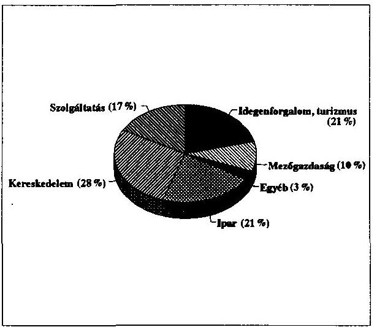

5506 A hitelszerződések lejárta után a kihelyezett tőke és kamatai az MVA elkülönített forint számlájára kerül vissza önfeltöltő hitelalapként. A Finanszírozási Szerződés nem rendelkezik e visszatérített alap tulajdon, illetve rendelkezési jogáról.

---

# 5.6 PHARE Mikrohitel program 

5601 A mikrohítel program célja, hogy hitelt és - kisebb mértékben - vissza nem térítendő támogatást nyújtson kisvállalkozóknak, hogy állóeszközökhöz jussanak és/vagy növeljék készleteiket. A hitel felső határa 1992-ben 300 E Ft volt, a támogatás felső határa 50 E Ft. A kamat megfelel az MNB refinanszírozási kamatának.

5602 Az 1990-es és az 1992-es PHARE program összesen 2.150 E ECU-t irányzott elő a mikrohítel programra, amelyhez az MVA saját forrásából 259,1 M Ft-tal járult hozzá.

A mikrohítel program forrásmegoszlását, az MVA átutalások összegét és a HVK által lekötött, jóváhagyott értékeket az 5. sz. táblázat tartalmazza.
5. sz. táblázat

A PHARE mikrohítel program alakulása 1993. december 31-én

| Megyék | Átutalás   bankhoz | Igényiések |  | Elfogadott kérelem |  | Folyósitás |  |
| :--: | :--: | :--: | :--: | :--: | :--: | :--: | :--: |
|  |  | száma | összege | száma | összege | száma | összege |
| Borsod m. | 60915 | 264 | 88645 | 158 | 47652 | 112 | 29471 |
| Fejér m. | 64500 | 383 | 122070 | 225 | 67950 | 176 | 49040 |
| Somogy m. | 56300 | 272 | 88965 | 133 | 43270 | 112 | 35552 |
| Szabolcs m. | 65500 | 487 | 131774 | 281 | 85698 | 212 | 61888 |
| Szolnok m. | 36536 | 128 | 40045 | 64 | 21906 | 56 | 17437 |
| Tolna m. | 60850 | 362 | 114030 | 208 | 66985 | 175 | 51372 |
| Csongrád m. | 7500 | 70 | 13629 | 27 | 6975 | 0 | 0 |
| Heves m. | 15000 | 12 | 5104 | 8 | 3204 | 0 | 0 |
| Veszprém | 15000 | 53 | 22800 | 44 | 16700 | 16 | 6005 |
| Hajdú m. | 15000 | 79 | 32994 | 35 | 14014 | 8 | 3155 |
| Győr-Sopron m. | 15000 | 65 | 29245 | 26 | 12146 | 16 | 5663 |
| Bács-Kiskun m. | 15000 | 36 | 16462 | 17 | 7387 | 0 | 0 |
| Zala m. | 7500 | 57 | 25887 | 15 | 5500 | 9 | 3100 |
| Összesen: | 434601 | 2268 | 731650 | 1241 | 399387 | 892 | 262683 |

Megjegyzés: A PHARE programhoz 259,1 millió Ft MVA forrás kapcsolódik.

5603 A mikrohítel kérelmeket a Helyi Vállalkozói Központokhoz kell a vállalkozónak benyújtani. Az igénylés, a pályázatok elbírálása, folyósítása

---

és ellenőrzése jól szabályozott. A hitelprogram bevezetésétől 1993. december 31-ig összesen 892 pályázatra $262,7 \mathrm{M} F \mathrm{Ft}$ hitelt folyósítottak. A hitel kihelyezések közül mindössze $5 \%$-nál várható törlesztési nehézség, és csupán 3-4 \% közé várható a program vesztesége, a behajthatatlan hitelek értéke.

5604 A rendkívül kedvező fogadtatás eredményeként 1994. és 1995. években további 4.750 E ECU fordítható a mikrohitelezésre PHARE forrásból.

5605 Megállapítottuk, hogy a vizsgált két területi HVK-nál mást tartanak nyilván az 1993.éves mikrohitel forrásának, mint az MVA-nál.

5606 A mikrohitelt elsősorban a szolgáltatások fejlesztéséhez igénylik ( $36 \%$ ), azonos mértékben veszik igénybe a mezőgazdaság és a kereskedelem területén ( $21 \%$ ), majd az ipari hasznosítás következik ( $18 \%$ ).
4. sz. ábra

Mikrohitel felhasználás célonkénti megoszlása

|  | M Ft |
| :-- | --: |
| Idegenforgalom, turizmus | 7.9 |
| Mezögazdaság | 55.1 |
| Egyéb | 2.6 |
| Ipar | 47.3 |
| Kereskedelem | 55.2 |
| Szolgáltatás | 94.6 |
| Összesen | 262.7 |

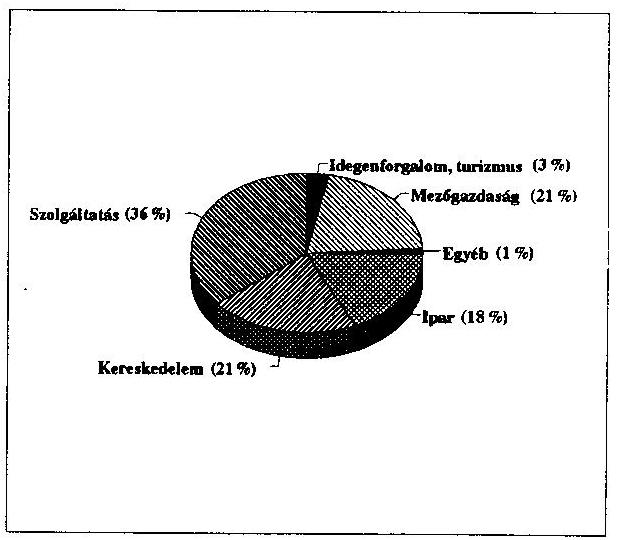

5607 A HVK-nak átadott mikrohitel és egyéb források felhasználását a Vállalkozásfejlesztési Iroda negyedévenként ellenőrizteti külső könyvvizsgálóval, és csak az összes HVK ellenőrzését követő összefoglaló jelentés megtárgyalása és elfogadása után intézkedik a következő negyedéves forrás átutalásáról.

---

Ennek eredményeként az MVA átutalások általában a tárgynegyedév végén érkeznek meg a HVK-hoz.

- 1993. I. negyedéves támogatás
a BAZ megyei RVK-hoz, 1993. március 5-én;
- 1993. II. negyedéves támogatás
a BAZ, Tolna, Fejér, Heves megyei HVK-hoz
1993. június 23 -án;
- 1993. III. negyedéves támogatás
a BAZ megyei RVK-hoz 1993. október 12-én.

A negyedévre bontott támogatás, és a késedelmes átutalások eredményeként:

- a HVK nem tud hosszabb távra szerződni, mert az egyszámláján nincs rá fedezet;
- a múködés finanszírozását a szükös saját forrásából kell megelőlegezni, és az utólagos átvezetések könyvelési eltéréseket eredményezhetnek;
- a negyedévenkénti tételes elszámolás (a havi beszámolókat követően), és ezek részletes ellenőrzése rendkívül időigényes, és a HVK alaptevékenységétől vonja el az energiát.

Sem a magyar, sem a PHARE szabályok nem írnak elő ilyen rövid időszakot átfogó elszámolási kötelezettséget. (A PHARE esetében 6 hónapos a beszámolási ciklus.)

5608 A jelenleg működó rendszer főleg az ellenőrzést, könyvvizsgálatot végző cégek számára előnyös.

A PHARE forrásból 1993. december 31-ig a HVK-knál az üzleti tervek programjaira és mikrohitelre összesen 9,7 M ECU-t használtak fel. A felhasználás szabályozására és ellenőrzésére pedig 386,5 E ECU-t forditottak, amely felhasználás $4 \%$-a.

Mikrohitelre 1992-93-ban 1.800 E ECU-t folyósitottak, míg a szabályozásra 148,5 E ECU-t forditottak, ami a folyósitás 8,2 \%-a.

5609 A mikrohitel program során a regionális alapítványokhoz juttatott forrás, a tőke és a kamatok visszaforgatása révén, helyben képez hitelezési

---

forgóalapot. A vizsgálat megállapította, hogy az MVA írásban nem kötelezte el magát az alapok végleges átadásáról, bizonytalan helyzetben tartva a helyi alapítványok kuratóriumait.

# 5.7 Sikertelen programok 

5701 A PHARE Finanszírozási Szerződések három olyan programra biztosítottak keretet, amelyekből a vizsgálat időpontjáig nem valósult meg semmi.

5702 PHARE Garancia Alap 4.000 E ECU
A Garancia Alap feltételrendszerének kialakításánál rosszul mérték fel a magyar gazdasági viszonyokat.

5703 Befektetési Alap
1.770 E ECU

A hazai kis- és középvállalkozások helyzete, instabilitása, jövedelmezősége egyelőre nem kedvez a működőtőke befektető programoknak. Az MVA hasonló programja szinte teljes kudarcba fulladt.
A két program előirányzott keretét a szerződő felek közös akarattal átcsoportosíthatják más - működő - programok finanszírozására.

5704 Kamattámogatás
1.250 E ECU

A kamattámogatás rendszerének elvi kialakítása - külföldi szakértő bevonásával - folyamatban van. A program indulása 1994. év második felében várható.

### 5.8 Start Hitelgarancia Alap

5801 A német-magyar kormányközi megállapodás alapján a Start Garancia programot az MVA működteti.
A program 1991-ben indult 342 M Ft alaptőkével, amely a szénsegélyből folyó átutalások és a tőke hozadéka révén egyre gyarapodik. Az alaptőke összege 1993. december 31-én 1.203 M Ft volt. A tőkét - a szerződések értelmében - államilag garantált értékpapírokban tartják és az értékpapírok két bróker cégnél lettek letétbe helyezve. (A befektetési és likviditási szabályzat 3 céget ír elő!)

Az MVA által működtetett Szakértői Zsüri 1993. december 31-ig 448 garanciakérelmből 346-ot hagyott jóvá, s ezzel 1080,4 M Ft START hitel

---

felvételét tette lehetővé különböző kereskedelmi bankoktól. Az Alap terhére vállalt garancia - a 750 M Ft-os keretösszegből - 1993. december 31 -én $595,5 \mathrm{M} \mathrm{Ft}$ volt.

A vizsgálat idejéig két vállalkozóval kapcsolatban jelezte a hitelező bank a kötelezettség teljesitésének elmaradását és kezdeményezte a garanciabeváltást.

A START program "CASH FLOW" jellegü kimutatása
6. sz. táblázat

|  |  |  |  |  |  | E Ft |
| :--: | :--: | :--: | :--: | :--: | :--: | :--: |
|  | Megnevezés | 1990 | 1991 | 1992 | 1993 | Osszesen |
| 1 | Célprogram fin. átadott eszk. | 0 | 572813 | 175371 | 1889 | 750073 |
| 2 | Befekt. nettó hozama | 0 | 77554 | 207916 | 161257 | 446727 |
| 3 | Hitelek kamata | 0 | 0 | 0 | 0 | 0 |
| 4 | Bank kamat | 0 | 3176 | 3236 | 0 | 6412 |
| 5 | Garanciadij | 0 | 277 | 7523 | 14910 | 22710 |
| 6 | Arfolyamnyereség | 0 | 0 | 0 | 0 | 0 |
| 7 | Egyéb bevétel | 0 | 0 | 0 | 0 | 0 |
| 8 | Bevételek összesen 6.-11. | 0 | 81007 | 218675 | 176167 | 475849 |
| 9 | Költségek programokra | 0 | 0 | 0 | 0 | 0 |
| 10 | Befekt. leértékelése | 0 | 0 | 0 | 0 | 0 |
| 11 | Kamattérítés | 0 | 0 | 0 | 0 | 0 |
| 12 | Kezességvállalás | 0 | 0 | 438 | 491 | 929 |
| 13 | AFI járadék fiz. köt. | 0 | 0 | 0 | 0 | 0 |
| 14 | Egyéb jutalék, bankktg. | 0 | 4050 | 1745 | 3933 | 9728 |
| 15 | Müködési ktg. | 0 | 3247 | 4290 | 4748 | 12285 |
| 16 | Egyéb veszteség | 0 | 0 | 0 | 0 | 0 |
| 17 | Költségek összesn 9.-16. | 0 | 7297 | 6473 | 9172 | 22942 |
| 18 | Eredmény: 8-17 | 0 | 73710 | 212202 | 166995 | 452907 |
| 19 | Mérleg szerinti saját tőke | 0 |  |  |  | 1202980 |

# 5.9 Müködőtőke befektetés 

5901 Vállalkozások, főképp induló vállalkozások bevált támogatási formája a fejlett ipari országokban, amikor a támogatásra szerveződött intézmény vagy alapítvány tőkerészesedést vállal az üzletben és az üzlet felfutása, megerősödése után - esetleg megnövekedett árfolyamon - eladja részesedését, s a visszatérült tőkét új, induló vállalkozásba fekteti.

Az Alapító Okirat lehetőséget biztosít tőkerészesedés vállalására, ennek ellenére az MVA müködőtőke befektetése az egyéb befektetési formákhoz viszonyítva igen szerény.

---

A befektetések állománya névértéken:

|  |  |  |  | (M Ft) |
| :-- | --: | --: | --: | --: |
|  | 1990. | 1991. | 1992. | 1993. |
| Economix Rt. | 5.0 | 5.0 | 5.0 | 5.0 |
| Szimultán Rt. | 10.0 | 10.0 | 31.0 | 31.6 |
| Boom Kft. |  |  | 2.5 | 2.5 |
| Takarékbank Rt. |  |  | 1.3 | 1.3 |
| Hitelgarancia Rt. |  |  |  | 100.0 |
| Összesen: | 15.0 | 15.0 | 39.8 | 140.4 |

5902 1990-ben a befektetésekből profit nem származott, amit talán az induló év körülményei még magyaráznak. A további évek megtérülései: a Szimultán Rt.-től 1991-re 1,6 M Ft-ot, az Economix Rt.-től 1992-re 0,53 M Ft-ot kaptak, ami évi $8 \%$, illetve évi $3.5 \%$ átlag profitnak felel meg.

5903 A Boom Kft.-hez az MVA 1992-ben csatlakozott, annak ellenére, hogy már 1991-ben is veszteséges volt. A Kft 1993-ra a 13,5 milliós törzső́kéjét teljesen felélte. Saját termelésű készleteinek ( $6,6 \mathrm{M} \mathrm{Ft}$ értékű eladhatatlan lapok) reális értéke nincs. A Szimultán Rt. vesztesége 1992-ben 99,3 M Ft volt, 1993-ban várhatóan 130 M Ft lesz. Az Rt. 63,4 M Ft-os alapítói vagyonát 1993-ra teljes egészében elvesztette.

5904 Az Economix Rt. az 1992. évet 31,5 M Ft-os veszteséggel zárta, 1993-ban a veszteség tovább növekedett. Az Rt ügyvezető igazgatója rendkívüli közgyűlésükön elmondta, hogy részvényeik reális értéke névértékük 10\%-a. Ilyen áron az MVA vételi ajánlatot is kapott. (A befektetés az I. működési szakaszban történt.)

5905 Az Iroda javasolta a Szimultán Rt és a Boom Kft. tőkebefektetés (31,6 $+2,5 \mathrm{M}$ Ft) teljes leírását, valamint az Economix Rt. részvényei értékének $90 \%$-os ( $4,5 \mathrm{M} \mathrm{Ft}$ ) leírását. Ez - elfogadás esetén - 38.6 M Ft-tal csökkenteni fogja az 1993. évi eredményt. (A befektetésre az alapítvány I. és II. müködési szakaszában került sor.)

---

5906 A vizsgálat megállapította, hogy a befektetésekről minden esetben a Kuratórium döntött. Azt nem volt módunk vizsgálni, hogy az Iroda mennyire tudta javaslatait megalapozni.
Az első három évben nem láttuk annak nyomát, hogy az Iroda a cégek helyzetét figyelemmel kísérte és menetközben tájékoztatást adott volna a Kuratóriumnak a cégek bekövetkezett, vagy várható veszteségeiről. 1993 áprilisában az Iroda ügyvezető igazgatóhelyettese beszámolt a müködőtőke befektetések helyzetéről a kuratóriumnak, de sem a beszámoló, sem az azt követő döntés nem befolyásolta, hogy az MVA - az első három vállalkozásba bevitt - müködőtőke állományát ( $38,6 \mathrm{M} \mathrm{Ft}$ ) elveszítse.

Budapest, 1994. július
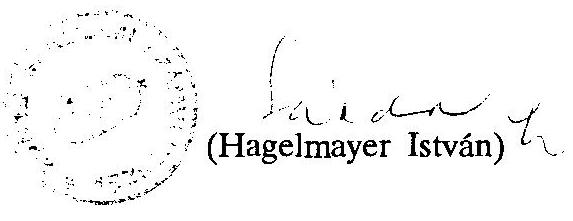

---

# M e 11 e k 1 e t 

A MAGYAR VÁLLALKOZÁSFEJLESZTÉSI ALAPÍTVÁNY ÉSZREVÉTELE A JELENTÉSHEZ

---

# HAGELMAYER ISTVÂN ÚR 

Állami Számvevőszék Elnöke

Budapest

Tisztelt Elnök Úr!
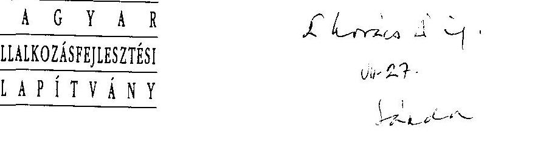

Köszönettel vettem az Állami Számvevőszéknek a Magyar
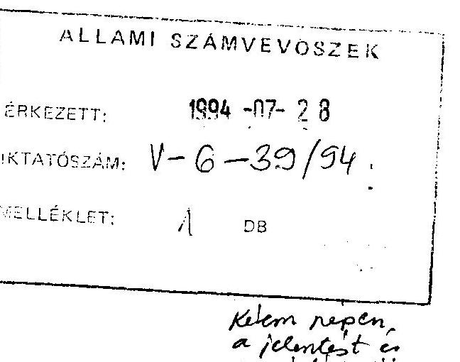

Kélem nepen, a jelentest es
ar interituisisi
Vállalkozásfejlesztési Alapitvány tevékenysége vizsgálatáról szóló a orjéyeantt végleges jelentését, melyben figyelembe vették az MVA észrevételeit is.

A jelentésben foglaltakkal alapvetően egyetértek, mindössze egy-két kérdésben szeretném felhívni szíves figyelmét már korábban megtett észrevételeink újbóli átgondolására és esetleges elfogadására. Erre a későbbiekben térek ki.

Az MVA jelenlegi Kuratóriuma - mint ismeretes - 1993. március 10-e óta tölti be feladatát. A Kuratórium a vizsgálati időszakra eső 1993. évből rendelkezésére állott 8-9 hónapban minden lehetőt elkövetett annak érdekében, hogy az MVA müködését törvényessé és Alapító Okiratának megfelelővé tegye, azért, hogy a Magyar Vállalkozásfejlesztési Alapitvány megfeleljen mindazon kívánalmaknak, amelyeket alapítói, a vállalkozói társadalom és a közvélemény joggal elvárnak. A Kuratórium legelső intézkedései közé tartozott az MVA likvid pénzeszközeinek hasznosítási rendjét szabályozó likviditási és befektetési szabályzat létrehozása, újra szabályozta saját ügyrendjét és a módosított Alapitó Okiratban foglaltaknak megfelelően újra alkotta a Vállalkozásfejlesztési Iroda Szervezeti és Müködési Szabályzatát.

A Vállalkozásfejlesztési Iroda belső szabályzatai is átvizsgálásra, módosításra kerültek és újabb szabályzatok megalkotására is sor került (pl. házipénztár kezelési szabályzat).

---

Alapitványunk Kuratóriuma nevében köszönetet mondok Elnök úrnak azért, hogy a jelentésben rögzített megállapításokkal, valamint ajánlásokkal segítette a Kuratóriumunknak az Alapítvány törvényes és rendeltetésszérủ müködése előmozdítására tett erőfeszítéseit. A jelentés ajánlásait elfogadjuk és azok megvalósítására a mellékelt Intezkedési Tervet készítettük. Az Intézkedési Terv összeállításánál arra törekedtünk, hogy lehetöség szerint még ebben az évben eleget tegyünk az Állami Számvevőszék Magyar Vállalkozásfejlesztési Alapítvánnyal szemben támasztott elvárásainak.

Két kérdésben azonban továbbra is fenn kívánom tartani korábbi észrevételeimet: az MVA közalapítványi státusza, valamint a Budapesti Vállalkozásfejlesztési Alapítvánnyal kötött szerződés ügyében.

Amikor korábban kifejtettük az MVA-nak a törvény erejénél fogva közalapitvánnyá történt átalakulásával kapcsolatos fenntartásainkat, természetesen nem a törvényt kívántuk vitatni, hanem annak az ÁSZ részéről történt értelmezését tartottuk nem egyértelmünck. Ugy vélem, hogy a jelentésnek ezt a részét ismételten át kellene gondolni, különös figyelemmel arra, hogy az MVA 16 alapítója közül a Magyar Köztársaság Kormánya csak az egyik, az alapítói vagyon több mint 1/4-e nem költségvetési forrásokból származott. Azt is megfontolás tárgyává javasolom tenni, hogy mennyiben minősíthetők közfeladatnak az MVA-nak az Alapító Okiraitban meghatározott feladatai. A Polgári Törvénykönyv több törvényi feltétel együttes meglétét kívánja meg a közalapítvánnyá történő "automatikus" átalakuláshoz és változatlanul az a nézetem, hogy ezek nem állanak fenn. Mindenképpen az lenne számunkra a megnyugtató, ha ebben a kérdésben a döntést arra illetékes állami szerv, ügyészség vagy bíróság hozná meg.

A Budapesti Vállalkozásfejlesztési Alapítvánnyal kötött szerződés módosítására nem látok indokot. A szerződést a Kuratórium egyoldalúan egyébként sem jogosult módosítani. A szerződés, valamint az ehhez elválaszthatatlanul kapcsolódó, a Budapesti Vállalkozásfejlesztési Alapítvány Kuratóriuma által hozott határozat megitélésem szerint kellő biztosítékot nyújt arra, hogy az MVA részéről biztosított tőke hozadékát rendeltetésszerűen hasznosítsák.

Végezetül felkívánom hívni Elnök úr figyelmét arra, hogy a kézbesítési hiba folytán csak egy héttel ezelőtt kézhez vett végzés értelmében a Fóvárosi Bíróság már tavaly októberben jóváhagyóan tudomásul vette az MVA Alapitó Okiraitának 1993. máricus 10 -én elfogadott módosítását. Ennek megfelelően a módosított Alapító Okiat a fenti idöponttól kezdődően jogérvényesnek tekintendő, tehát a bejegyzési. kérelem ajánlott visszavonására már nincs mód és ugyancsak nincs lehetőseg az eredeti Alapító Okiat rendelkezéseinek - például a Kuratórium összetételére vonatkozó - alkalmazására sem.

---

Ismételten köszönetet mondok Elnök úrnak és Önön keresztül az Állami Számvevőszék munkatársainak a lefolytatott vizsgálat konstruktív és segitő voltáért, kérem, hogy fenti észrevételeimet lehetơség szerint figyelembe venni szíveskedjék.

Budapest. 1994. július 26.
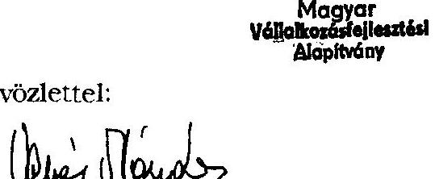

Üdvözlettel:
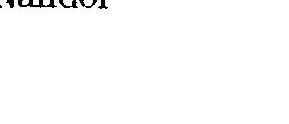

Kemény Nándor

---

# INTÉZKEDÉSI TERV 

Az Állami Számvevőszéknek a Magyar Vállalkozásfejlesztési Alapítványnál folytatott vizsgálatáról készült jelentésben az MVA Kuratóriumának és Vállalkozásfejlesztési Irodájának megfogalmazott ajánlások megvalósítására

---

1. A készfizetői kezességi szerződésekből származó veszteségek minimalizálása és a felelősség reálisabb jövőbeni megosztásának érdekében az érdekelt kereskedelmi bankoknál kezdeményezni kell
1.1. az MVA készfizető kezességi kötelezettsége érvényesítésének egyértelművé tételét és egyszerűsítését
1.2. a bank és az MVA közötti jövőbeni kapcsolatot erősitő megoldás és egyezség kidolgozását
1.3. az MVA hitelekben részesült adósok adósminősítéséről és a kezesség teljesítés utáni banki eljárásokról szóló rendszeres adatszolgáltatás biztosítását
1.4. az MVA és a bankok e hitelkonstrukcióra vonatkozó könyveléseinek rendszeres tételes egyeztetését.

Felelős: Dr. Czédli György gazdasági igazgató
Határidő: 1994. szept. 30.
( 2304 sz. ajánlás)
2. El kell készíteni és nyilvánosságra kell hozni az MVA pályázati információs rendszerét, pályázati szabályzatát.

Felelős: Dr. Székely László ügyvezető igazgatóhelyettes
Határidő: 1994. szeptember 30.
(2305. sz. ajánlás)
3. Az MVA évkönyveinek pótlása céljából meg kell jelentetni a Magyar Vállalkozásfejlesztési Alapitvány alapitástól napjainkig szóló történetét, müködésének jelentősebb eseményeit tartalmazó KRÓNIKÁT és annak mellékleteként ki kell adni az MVA forrásaiból eddig bármilyen címen részesült vállalkozók adatait tartalmazó kiadványt.

Felelős: Kustos Lajos ügyvezető igazgató
Határidő: 1994. szept. 30.
(2305. sz. ajánlás)
4. Az Európai Unió PHARE Bizottságával szerződéses kapcsolatban álló Magyar Kormányszervnél kezdeményezni kell a PHARE hitelprogramokból visszatérülő tőke és kamatai tulajdon-, illetve rendelkezésjogáról, valamint a meg nem valósult PHARE projektek fel nem használt keretösszegeinek aktivizálásának módjáról szóló megállapodás létrehozását, figyelembe véve az EU Budapesti

---

Delegációjának idôközben kiadott írásos engedélyező nyilatkozatait.

Felelős: Kustos Lajos ügyvezető igazgató Határidő: 1994. dec. 15.
(2307. sz. ajánlás)
5. Rendezni kell a Coopers \& Lybrand Europe céggel a Vállalkozásfejlesztési Iroda mellett müködő Tanácsadó Csoport (TAU) müködési költségeinek elszámolását.

Felelős: Dr. Czédli György gazdasági igazgató Határidő: 1994. okt. 15.
(2308. sz. ajánlás)
6. Az MVA számviteli rendszerét tovább kell fejleszteni annak érdekében, hogy a jövőben az Alapítvány által kezelt eltérő tulajdonú források még egyértelmübben megfeleltethetők legyenek a finanszírozott programoknak.

Felelős: Dr. Czédli György gazdasági igazgató
Határidő: 1994. szept. 30.
(2309 sz. ajánlás)
7. Az MVA országos hálózatát alkotó helyi vállalkozásfejlesztési alapítványok támogatásának és elszámoltatásának rendszerét felül kell vizsgálni abból a célból, hogy müködésük hatékonysága tovább növelhető legyen. Meg kell vizsgálni az utólagos számlakiegyenlítésről az elôleg folyósítási rendszerre történő áttérés lehetőségét.

Felelős: Dr. Székely László ügyvezető igazgatóhelyettes
Határidő: 1994. szept. 30.
(2310. sz. ajánlás)
8. A vállalkozói kultúra továbbfejlesztésére az eddigieknél nagyobb figyelmet kell fordítani, ennek keretében nagyobb hangsúlyt kell helyezni
8.1. a helyi vállalkozói központok munkatársainak idöbeni felkészitésére és ismeretanyaguk naprakészen tartására

Határidő: folyamatos
8.2. az MVA kiadványainak és kutatási eredményeit tartalmazó tanulmányainak az eddigieknél szélesebb körü terjesztésére

---

belevonva a helyi vállalkozói központok alközpontjait és területi irodáit is

Határidő: 1994. okt. 15.
8.3. a kis- és közepes méretű vállalkozások fejlesztését szolgáló programok összegezése, utóelemzése és tanulságaik visszacsatolása érdekében országos hatásvizsgálatot kell tartani és ennek keretében kiemelkedő hangsúlyt kell helyezni a vállalkozói kultúra fejlesztését célzó programokra

Határidő: 1994. dec. 15.
Felelős: 8.1-8.3. pontokért Dr. Székely László ügyvezető igazgatóhelyettes.

Budapest, 1994. július 26.