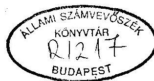
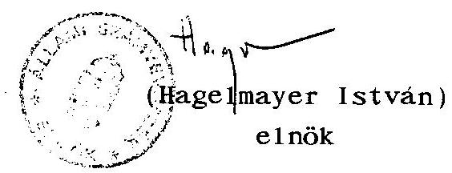
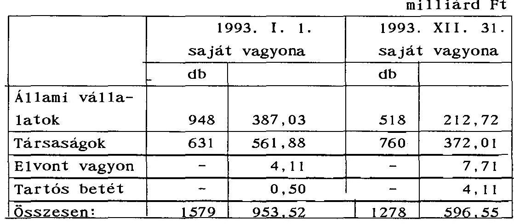
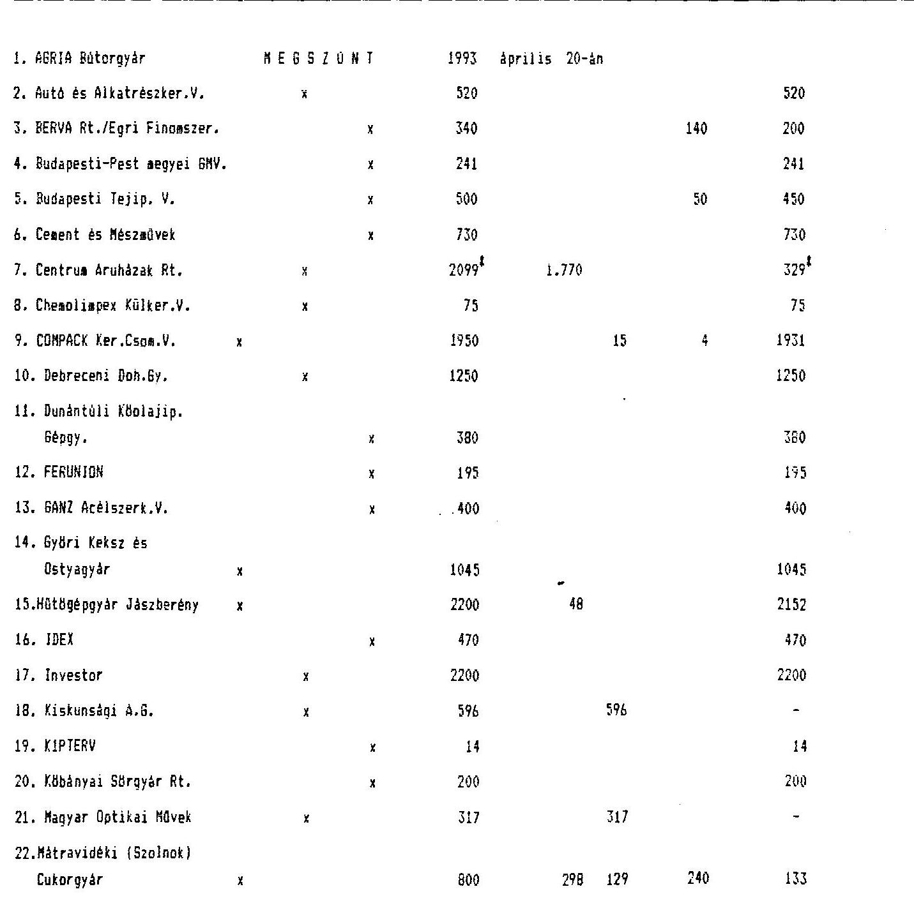
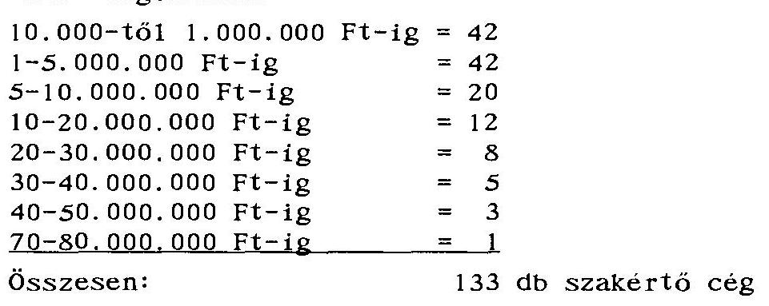
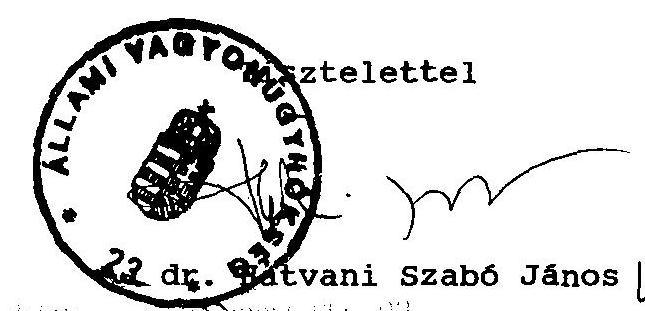
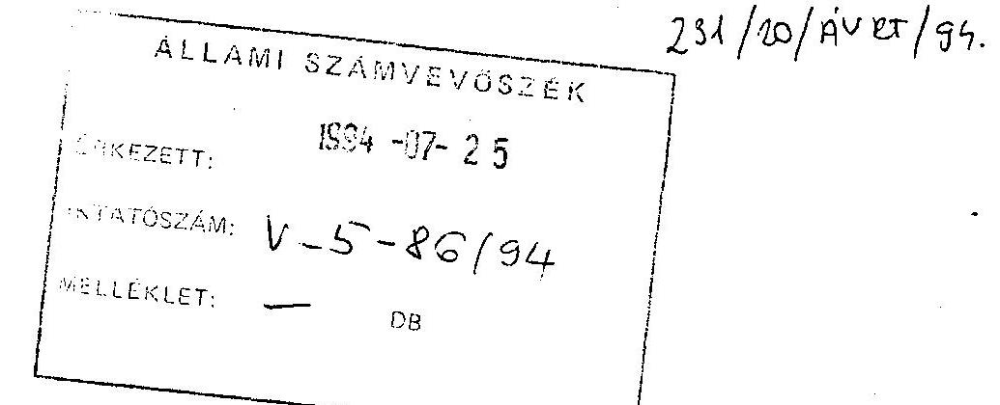

B/18. szám

# Allami 3xámverösxék 

## JELENTÉS

az Állami Vagyonügynökség 1993. évi tevékenységének ellenőrzésérő̉t

---

# A vizsgálatot vezette 

Harsányi Sándor
osztályvezető számvevő fő́t anácsos

A vizsgálatot végezte:

Beck Miklós
dr. Borisz József
Lörinc Alajos
dr. Majorosné dr. Locskai Noémi
Makkai Mária
dr. Molnár Barnabás
Németh Béláné
Rundik János
dr. Szöllősi Géza
Szücs Ivánné
számvevő
számvevő tanácsos
számvevő tanácsos
számvevő tanácsos
számvevő tanácsos
számvevő tanácsos
számvevő tanácsos
számvevő

---

# ÁLLAMI SZÁMVEVÖSZÉK 

$\mathrm{V}-5-82 / 1994$.
Témaszám: 218

J E L E N T É S
az Állami Vagyonügynökség 1993. évi tevékenységének vizsgálatáról

## I.

## B EVEZETÉS

Az Állami Vagyonügynökség (továbbiakban: ÁVÜ) 1993. évi tevékenységének jogszabályi hátterét - mint az ezt megelözö években is - a változékonyság jellemezte. Bár a törvényi szabályozás azaz az időlegesen állami tulajdonban lévő vagyon értékesítéséröl, hasznosításáról szóló 1992. évi LIV. törvény elöírásai nem változtak, az 1993. év konkrét privatizációs tevékenységét meghatározó 1993. évi Vagyonpolitikai Irányelveket az Országgyűlés 1993. december 14-ei ülésén fogadta el.

Az ÁVÜ 1993. évi tevékenysége megalapozásához felhasználható és törvényi kötelezettségként elöirt - az 1992. évi ÁVÜ tevékenységet értékelö Kormánybeszámolót és állami számvevőszéki jelentést az Országgyülés plenáris ülésen nem vitatta meg 1993-ban. A Kormány az ÁVÜ 1993. évi tevékenységéröl szóló beszámolóját eddig nem nyújtotta be az Országgyülésnek. Rendelkezésre csak a hivatalos Kormány beszámolót semmiképpen sem

---

helyettesitő, az Állami Vagyonügynökség és az ÁV Rt. által készített (négy kötet) tájékoztató jellegü anyag áll. Ezzel megismétlődik az 1993-évben is előállt helyzet, hogy az Állami Számvevőszék összefoglaló jelentése az ÁVŰ 1993. évi tevékenységéről előbb áll az Országgyűlés rendelkezésére, mint a Kormány beszámolója.

A vizsgálat - melyet a vizsgálat célja is tükröz - súlypontképzésre törekedett. Ebben az átlagosnál nagyobb szerepet kapott a Vagyonpolitikai Irányelvektől eltérő kiadási szerkezet, a privatizációs kiadásokon belűl a tanácsadók szerepének és költségeinek, a garanciális kötelezettségek helyzetének vizsgálata. Súlypontot jelentett az átalakulási folyamat ellenőrzése, a vagyonmérleg helyzete és először végezte el a Számvevőszék a belsóellenőrzés tevékenységének vizsgálatát.

A vizsgálat célja az volt, hogy megbízható, átfogó képet nyújtson az Állami Vagyonügynökség 1993. évi tevékenységéről.

Ellenőrizni kellett az 1992. évi LIV. törvényben, az 1993. évi Vagyonpolitikai Irányelvekben, továbbá az ÁVƯ belsö szabályzatrendszerében a privatizációs, a vagyonkezelési, a vagyonhasznosítási, a vagyonvédelmi, a vállalatok kötelezö átalakítási folyamataira elöírt normatív követelmények megvalósulását.

Meg kellett vizsgálni hogyan teljesültek az 1993. évi privatizációs bevételi és kiadási előirányzatok, a kiadások mennyire voltak szükségszerüek és célszerüek (különös tekintettel a garanciavállalásokra és a tanácsadókkal kapcsolatos költségekre). Hogyan változott a Vagyonügynökséghez tartozó állami vagyon nagysága és összetétele, a mér legszerű kimutatás tel jeskörűsége, megbízhatósága, ellenőrizhetősége biztosított-e.

---

A vizsgálat kiterjedt az Ávü tevékenysége külsõ és belsõ információs rendszerének törvènỵi követelményekhez való igazodására, a társadalmi kontroll èrvényesitési lehetöségeire, az átláthatóságra és a nyilvánosság èrvényesülésére, továbbá a döntéshozók (parlament, kormányzat, ÁvÜ Igazgatótanácsa stb.), valamint a piaci szereplök (vevök, befektetök, tanácsadók az Ávü tulajdonában résztulajdonában lévõ társaságok) informálásának, a visszacsatolási rendszerek hatékonyságának vizsgálatára, a Vagyonügynökség függetlenített belsõ ellenőrzésének müködésére.

Az ÁvÜ 1993. évi tevékenységének vizsgálatánál sajátosság volt, hogy "Az idölegesen állami tulajdonban levő vagyon értékesitéséröl, hasznosításáról és védelméról" szóló 1992. évi LIV. törvény alapján minöségi változást jelentett, hogy közel 900 gazdálkodó egység alapítói hatásköre is az Ávü-höz rendelödött és igy az Állami Számvevöszék először vizsgálta az ÁvÜ által nagy tömegber végzett társasági átalakítások bonyolult folyamatát.

További jellemző vonása volt a vizsgálatoknak, hogy viszonylag nagyszámú mintavétellel dolgozott. A mintát véletlenszerü kiválasztással, az ÁSZ-hoz érkezett jelzések figyelembevételével és az ÁvÜ által ajánlottakkal is kombináltan határozta meg.

A jelentéssel párhuzamosan - az Állami Számvevőszék elnökének döntése alapján - (továbbiakban ÁSZ) - elkészült az az összefoglaló elemzés, ame1y a számvevőszéki tapasztalatok alapján a privatizációt és az állami vállalatok vagyongazdálkodását 1990. március és 1994. március közötti időszakban mutatja be.

Az Állami Vagyonügynökségnek az ÁSZ-al történő együttmúködését a korrektségen túl az is jellemezte, hogy a helyszini vizsgálat ideje alatt feltárt hiányosságok kiküszöbölésére - ha erre lehetöség volt - azonnal intézkedett. Így például helyesbitették a kezesi felelősség átterhelése miatti kötelezettségvállalás

---

összegét, pontositották az állami vállalatoktól elvont részvények, üzletrészek nyilvántartásba vételét, az ÁSZ felhívására intézkedtek az ÁVÜ részére korábban átvállalt fizetési kötelezettség visszapótlására, amelyek közül jelentősebb összegeket az ÁVƯ számlájára a kötelezettek még a vizsgálat ideje alatt be is fizettek, stb.

A helyszini ellenőrzési ideje: 1994. március 10. - május 10. Az ellenőrzött időszak: 1993.
Az ellenőrzött szervezet: az Állami Vagyonügynökség.

Az ÁVÜ a Miniszterelnökség költségvetési fejezetbe tartozik. Ez a vizsgálat nem terjedt ki az intézményi gazdálkodásra. Ezt várhatóan 1994. II. félévében végzi el az Állami Számvevőszék.

# II. 

## ÖSSZEFOGLALÓ MEGÁLLAPÍTÁSOK, KÖVETKEZTETÉSEK, AJÁNLÁSOK

## 1. Összefoglaló megállapítások és következtetések

1.1. Az ÁVÜ 1993. évi tevékenységének egyik alapvető meghatározóját, a Vagyonpolitikai Irányelveket (VPI) az előző évhez hasonlóan a gazdasági év végén 1993. december 14-én hagyta jóvá az Országgyűlés. Ez még akkor is igen nagy mozgásteret adott az ÁVÜ döntéshozó fórumainak, ha az 1993. évi költségvetésről, valamint az 1993. évi pótkölttségvetésről szóló törvény, a privatizációs bevételekből teljesíthető egyes kiadások előirányzatait rögzítette.

---

1.2. Az ÁVÜ-höz tartozó vagyon privatizálhatóságának problémáit jelzi, hogy a tervezett 120 milliárd Ft-os összes bevéte1lel szemben ténylegesen 78 milliárd Ft keletkezett, amely a tervezettnek $65 \%$-a. A nagyarányú eltérés több okra is visszavezethető, bár ezek számszaki hatása nem mutatható ki. Közrejátszik ebben az értékesítés tervezhetőségének bizonytalansága, a költségvetési hiány csökkentése érdekében megjelenő felültervezési nyomás kényszere, továbbá a VPI összeállításánál megjelenő forrásigény, amely nem az értékesítés lehetőségeiből, hanem az igényekből indul ki.
1.3. A kiadások jogcímeit és rangsorát a VPI részletesen meghatározta. Az elöirányzott 70,3 milliárd Ft-tal szemben a tényleges kiadás, a tervezettöl elmaradó bevétel miatt 44 milliárd Ft volt. A kiadások jogcím szerinti összetétele, a már kötelezően elöirt rangsor ellenére - ugyanúgy mint 1992-ben - eltér a VPI-ben foglaltaktól. Az eltérés halmozott összege 10 milliárd Ft, a tényleges kiadások $23 \%$-a. Ez jelzi, hogy a VPI még a rangsor felállítása mellett sem jelent kemény korlátot az ÁVÜ Igazgatótanácsának. Az elvileg az Országgyúlés hatáskörébe tartozó jövedelemelosztó funkciót az ÁVÜ döntéshozó szerve szinte tetszés szerint gyakorolja. A VPI megsértésének semmiféle jogkövetkezménye, szankciója nincs, a VPI bertartásának folyamatba épített ellenörzése nem megoldott.
1.4. Az ÁVÜ értékesítési összes bevétele 1992-höz képest $8 \%$-kal nőtt, miközben költségei $8,8 \%$-kal csökkentek. Így a privatizációs költségek egységnyi értékesítésre jutó hányada az 1992. évi $24 \%$-ról $20 \%$-ra csökkent. Ez a tendencia érvényesült - a múlt évben kifogásolt - tanácsadói díjak esetében is, mert azok 1992-röl, 1993-ra $38 \%$-kal csökkentek.

---

1.5. Az ÁVÜ 85 gazdálkodó szervezetnél 22,3 milliárd Ft értékben vállalt garanciát, 49 féle jogcímen. A kötelezettségvállalás nyilvántartása megfelel ugyan az érvényes belsö utasításnak, de maga az utasítás ellentmond az 1992. évi LIV. törvény erre vonatkozó előírásainak. A kötelezettségvállalás összesen egy esetben felelt meg a törvényi szabályozásnak, ugyanis ebben az egy esetben kérték meg a Pénzügyminisztérium elözetes engedélyét. A belsö utasítás szerinti gyakorlatot már 1992-ben is kifogásolta az Állami Számvevöszék.

A garanciavállalás 49 féle jogcíme nem szabályozott, azaz nem lehet tudni, hogy egyes jogcímeknek mi a tartalma. Így nem lehet nyomonkövetni azt sem, hogy az adott garanciavállalást miért azon a jogcímen adja az ÁVÜ. Ez meglehetősen tágra nyitja az Igazgatótanács és az illetékes ügyintézők mozgásterét a garanciavállalásoknál. Az értékesítési szerződéskötési gyakorlat ellentmondásos. A kötelezettségek jogcíme és mértéke sok esetben nem állapítható meg. A szerzödések ugyanis a garanciális kötelezettségeket a vételárhoz kötik, ez azonban az esetek döntő többségében egyértelmüen nem határozható meg. Így tehát az ÁVÜ által vállalt kötelezettségek nagysága a szerződésekből nem követhető nyomon és nem is ellenörizhető. Más ügyiratból pl. IT határozat, elöterjesztés az IT-nek stb. - tehát nem a szerződésböl - lehet a tényleges kötelezettségvállalást megállapítani.

Ez a gyakorlat nagy esélyt ad a későbbi jogviták keletkezésének.
1.6. A szakértői díjak csökkenése mellett továbbra is az alkalmazott szakértői cégek koncentrálódása a jellemző. Az országos jelentőségű, jelentős vagyonnal rendelkező cégek

---

átalakításánál és privatizációjánál 97 tanácsadót alkalmaztak, de a kifizetett szakértői díjak $50 \%$-a 8 cég között oszlott meg. Ebből kettő magyar, négy külföldi és további kettő magyarországi vegyesvállalat. Az ÁVÚ összes devizabevételének $54 \%$-a a tanácsadó cégek közremüködésének eredménye, amely harmada négy tanácsadó céghez kötődik. A külföldi tanácsadó cégek foglalkoztatásának szükségessége a magyar cégek szakmai fejlettsége miatt lényegesen csökkent.

Az ÁVÚ 1991. óta rendelkezik a tanácsadó cégekkel fenntartott kapcsolatot szabályozó előírásokkal. A szabályozás azonban nem ellentmondás mentes, mert a régebbi szabályzatok módosítása több esetben nem történt meg.
1.7. Az ÁVU 1993-ban 507 privatizációs tranzakciót bonyolított. A 93,8 milliárd Ft névértékủ üzletrészből, részvényböl 79,7 milliárd Ft-ot értékesített, amelyböl 39,7 milliárd Ft volt a készpénz, a többi értékesítés mögött E-hitel és kárpótlási jegy állt. Az összes értékesítés szerződés szerinti értékének $28 \%$-a külföldi, $72 \%$-a pedig hazai tulajdonszerzés volt, azaz a hazai tulajdonszerzés aránya növekedett.

Az 1993. évi 507 tranzakcióban értékesített társaságok tökére vonatkozó átlagos adatai szerint a saját tőke és jegyzett tőke indexe $130 \%$. Az ehhez társuló átlagosan $85 \%$-os árfolyamú eladási ár, a saját tőkéhez viszonyítva mindössze $66 \%$. A piac értékitélete e tekintetben nem tűnik meghatározónak, hiszen átlagosan két pályázó csak minden harmadik tranzakciónál volt.

A pályázatok eljárási rendjét az ÁVÜ általában betartotta. Azonban az a gyakorlata, hogy a győztes pályázónak a kihirdetés után a kiíráshoz képest további anyagi kedvezményeket adott ellentétes a saját maga által szabályozott pályázati

---

eljárási rendjével, melyszerint "a benyújtott ajánlatok azonban ekkor sem módosíthatók, a kiíró erre vonatkozó hozzájárulása érvénytelen".

A privatizációs folyamat eljárási rendjén belül a szerződéses partnerek által vállalt kötelezettségekröl, az aktuális hátáridőről a felelősök szervezett tájékoztatása kialakult. Ugyanakkor a szerződés megkötésére és így értelemszerűen a befizetésekre nem rögzíti szabályozás a bruttó elszámolás elvét. Így nincs összhang a számvitel és a szerzödések között. Az emiatt kialakult kettős gyakorlat, azaz hogy egymás mellett él a bruttó és nettó elszámolás, - hogy melyiket rögziti a szerződés az teljesen esetleges - megkérdőjelezi mind a privatizációs bevételek, mind a privatizációs kiadások nyilvántartásainak megbizhatóságát.

Az 1993-ban müködő privatizációs technikák - MRP, lizing közül nagyobb jelentősége az MRP-nek van. A lebonyolításához szükséges eljárási rend kialakult. 117 ügyletböl 22,4 millió Ft értékű üzletrészt, részvényt 15,7 milliárd Ft-os - 70 \%-os árfolyam - szerződés szerinti értéken értékesítettek. A fejlődés döntő momentuma az E-hitel kamatának csökkentése és a kárpótlási jegyek elfogadása volt.
1.8. Az állami vállalatok tömeges társasággá alakítása az 1993. év egyik legnehezebb feladata volt, hiszen eddigieken túlmenően további 900 gazdálkodó egységre terjedt ki az ÁvÜ hatóköre. A privatizáció törvényi szabályozása szerint az 1993. december 31-ét követő átalakulásoknál kényszerátalakulás szabálya szerint kell eljárni. Ez nem tette lehetővé a vállalati vagyon átértékelését. Ennek következménye azonban a felszámolási hullám elindulását jelentette volna. Ezért az ÁvÜ IT kezdeményezte a törvény módosítását, de annak átfutási ideje miatt még elfogadás esetén is 1993. november vége lett volna. Ezért az ÁvÜ IT "átmeneti" ügyinté-

---

zési formát választva végrehajtotta a "listás" átalakitást azaz 1993. június 30 -án 151 céget átalakított, elkerülve a kényszerátalakulás következményeit. Ezt a törekvését a tulajdonossal szembeni elvárható gondosság alapján az állami vagyon védelme, müködöképességének fenntartása motiválta. Végül a törvénymódosítás visszamenőleg legitimálta a "listás" átalakítást.

Nem tartható azonban az a gyakorlat, hogy a jogi hézagot, a törvényi szabályozás végrehajthatatlanságát visszamenőleges hatályú törvényi szabályozás töltse ki. A végrehajtó hatásos intézkedésének utólagos legitimációja még az ellenőrzés számára sem kezelhető.
A végrehajtást megfelelően megtervezték és megindították. A vállalatok társasággá alakításának és privatizálásának elökészítéseként az összes vállalat $15 \%$-ára kiterjedően szakértői átvilágítási, előminősítési rendszert is megvalósitottak. A vállalatok átalakítása mindvégig az átalakítás általános szabályai szerint történt.

A kritikus gazdálkodási helyzetben lévő vállalatok esetében - nagy számban - csődmegállapodás tette csak lehetővé a társasággá alakulást, mert több gazdálkodó egység már csak negatív könyv szerinti vagyonnal rendelkezett. E cégeknél a társasági átalakulás a vagyon felértékelés miatti kedvezötlenebb költségszerkezet mellett, de legalább átmeneti müködési lehetőséget biztosít, bár a csödveszély változatlanul fennáll. A folyamatos vagyonvesztéssel érintett társaságok esetében a cégbírósági bejegyzés, az adósságkonszolidációba való bekerülés, illetve a gyors privatizáció sem biztosítéka az eredményes társasági müködésnek.

A társasági átalakulások során az ÁVÜ csak igen óvatos formában élt a müködési profiltól leválasztható vagyonelemek elvonásával. Az év során közel 70 vállalatot érintően,

---

összesen 8,1 milliárd Ft könyv szerinti értékũ vagyont vont el. Az elvonás többségében üzleti megfontolásokon alapult, mert jellemzően a könnyen értékesíthető ingatlanokra és üzletrészekre terjedt ki. A kōzōsségi hasznosíthatóságú, fōként kultúrális és sport célokat szolgáló vagyonelemek elvonására csak elvétve került sor. Az ilyen tartalmú és csak szórványosan felmerüló önkormányzati igényeket nem kezeltek érdemben. Mindezek hatására a társasági átalakulások kapcsán a tulajdonosi szerkezet kōzōsségi célú fejlödésében értékelhető elörelépés nem történt.

Az önkormányzatok, a belterületi földingatlannal kapcsolatos tulajdonrész és megváltási módozat meghatározásában in-formáció-hiany és elmaradt egyeztetések miatt érdemben nem tudtak részt venni. A bevételi várandóságaikat sem összegszerűségében, sem idöbeli várható beérkezésében nem ismerik, ezért terveikben mint reális pénzforrással számolni nem tudtak.
1.9. Az ÁVÜ fennállása óta elsó izben készítette el a vagyonváltozások tételes és aggregált kimutatását. A munkafolyamat még nem fejeződött be. A számítógépes adatszolgáltatás egyre megbizhatóbb kimutatásokkal segíti a vagyoni helyzet val tozásának követhetőségét.

Az adatok teljeskörűsége és megbizhatóságának foka nem igazolható és valószinűleg soha nem lesz megitélhető. A teljes megbizhatóság kimutatásának elöfeltétele több mint 1000 szervezet egyenkénti több tranzakciójának egyedi számszeri és tartalmi végigkövetése, amelyet elvégezni nem lehet.

Ezért a vagyonkimutatás tájékoztató jellegủ, amely azonban nem zárja ki a vagyonban lejátszódó folyamatok nyomonkövethetőségét.

---

A vagyonban történő kétirányú mozgás, növekedés-csökkenés alakította az ÁVÜ vagyonát. Ennek eredőjeként az 1993. január 1-jén 953,02 milliárd Ft-os saját vagyona 596,31 mi1liárd Ft-ra csökkent.

A vagyoncsökkenés egyik tényezője a VPI-ben meghatározott vagyonrészek ingyenes átruházási kötelezettségéből adódik. Az ÁVÜ itt is eltért a VPI elöírásaitól, mert a MÁV-nak és a kisbankoknak összesen 8,3 milliárd Ft (MÁV 5,3, kisbankoknak 3,0 milliárd Ft) portfóliót nem adott át. Ugyanígy a törvényben, VPI-ben, kormányhatározatban, ÁVÜ IT határozatában rögzített 1993. évre vonatkozó 40 milliárd Ft-ból összesen 375 millió Ft-ot adott át a TB-nek. Egyedül a Gépjármú Felelősségbiztosítási és Kárrendezési Alap részére teljesítette az előirt 2,2 milliárd Ft-os ingyenes vagyonátadást.

Az ÁVÜ 1993-ban 261,3 milliárd Ft értékủ társasági részesedést adott át az Áv Rt-nek, amely 3 milliárd Ft-tal meghaladta a kormányrendeletekben elöirtat. Az átadott vagyont a vagyonmérlegéből kivezette, de a kötelezettségek megosztásáról szóló megállapodást még nem írta alá az Áv Rt.-vel.
1.10. A vagyonvédelmi előírások teljesítésére az ÁVÜ-ben önálló szervezet nem jött létre, a szervezet jelenlegi tagozódása alkalmas a feladat megoldására. A vagyonvédelmi ügyek bonyolítása a törvényi kötelezettségek előírásai és a belsó ügyrendek alapján történt. Az 1993. évi elbirálások gyakorlata szervezettebb, szinvona1a érzékelhetően javult. Nem megfelelő az ügyek dokumentálása.
1.11. Az időlegesen állami tulajdonban lévő vagyon hasznosítása és kezelése keretében az ÁVÜ határozottan és jól kialakított gazdasági controlling és monitoring rendszerre támasz-

---

kodva megfelelően gyakorolja a közvetlen tulajdonosi jogait. A többségi ÁVÜ tulajdonú társaságoknál a gazdaságpolitikai és üzletpolitikai szempontokat az ÁVÜ IT, illetve az ügyvezetés határozza meg. Ezt érvényesítik a tranzakciós igazgatóságok. Az állami vállalatok és többségi állami tulajdonú társaságok ügyvezetőinek bérezését, a tisztségviselők dijazását részletes belsó szabályozás rögzíti, amelyet folyamatosan karbantartanak. Rendezték az újonnan - privatizáció után - létrejövő kisebbségi tulajdon esetén a követendő magatartást.

Közvetett vagyonkezelést még ma sem végez nagy számban az ÁVÜ. Továbbra sem rendezték az 1991. óta húzódó, az állami tulajdon hátrányára átengedett mintegy 180 millió Ft-os osztalék helyzetét, amelyet a CO-NEXUS Rt-vel kötött vagyonkezelési szerződés kapcsán az Állami Számvevőszék azóta folyamatosan ajánl. A CO-NEXUS-sal kötött vagyonkezelési szerződés teljesülésének értékelése alapján a CO-NEXUS és az ÁVÜ a szerződés teljesíthetőségét ellenkezően ítéli meg. Az ÁVÜ ugyanis nem látja alátámasztottnak a mai folyamatok alapján, hogy a szerződés lejáratakor a CO-NEXUS a 4 milliárd Ft-os fizetési kötelezettségének eleget tud tenni.

Az ÁVÜ 1993-ban két további közvetett vagyonkezelési szerződést kötött. Ezek közül az Agárdi Mezőgazdasági Kombinát vagyonkezelésbe adásánál a vagyonkezelő Kereskedelmi Bank Rt. a cégíróság cégbejegyzéssel kapcsolatos kiegészítő előírásainak eddig nem tett eleget.

A másik vagyonkezelési szerződés a Békéscsabai Baromfifeldolgozó Vállalat vagyonkezelésbe adását célozta. Ez esetben a vagyonkezelési szerződés konkrét tartalma meghatározó módon eltér az ÁVÜ vezetői értekezletén előirttól, amelynek súlyos kihatásai lehetnek az állami vagyonra. A szerződés

---

ugyanis nem indokolható módon versenyeztetés nélkül opciós jogot biztosít a vagyonkezelőnek a részvények minimálisan $51 \%$-ára $59,26 \%$-os árfolyamon és ugyanez a helyzet a jegyzett tőke $96 \%$-ára vonatkozóan is.
1.12. Az ÁVÚ belsö ellenörzési rendszere kiépült. Tevékenységének megfelelő szinvonalát az ellenörzést követő intézkedések jelzik. Jól mozgósította az ellenörzésbe bevonható külső kapacitásokat. Az ellenörzési tevékenység jellegét és sokaságát a panaszos bejelentések határozták meg, komplex problémák feltárása kevésbé jellemző. Az összefoglaló vizsgálati jelentések megállapításai szakmailag megalapozottak és tényszerűek. Nem müködik viszont az ÁVÚ hatáskörében megtehető intézkedésekre kényszerpályaszerü javaslati rendszer. A személyi felelősség feltárása és bizonyítása hézagos.
1.13. Az ÁVÚ információs rendszerének egésze egyre jobb szinvonalon és egyre nagyobb megbizhatósággal müködik. A rendszer "nagysága" és bonyolultsága - amelyet az ÁVÜ állandóan változó feladatai is növelnek - számos részrendszer összehangolatlanságában is megmutatkozik. Továbbra is megjelenik a feladatváltozás végrehajtása és az annak követkeéhez szükséges információs rendszerváltoztatás, bővités időigénye közötti ellentmondás. Jó szinvonalú a piaci szereplők információs ellátása, szabályozott és müködöképes a kormányzati és országgyűlési szervekkel kiépített kapcsolat. Mindemellett súlyosan terheli az információs rendszert, hogy az ÁVÜ müködésének megindulása óta - nemcsak a Vagyonügynökségnek felróható okok miatt - a hozzá tartozó vagyon számbavételének teljeskörüsége, és eredendő pontossága nem teremtődött meg. Ezért, az egyébként jelentős elörelépésnek tekinthető, most először 1993-ra előállított vagyonmérleg csak tájékoztató jellegü.

---

# 2. Ajánlások 

A "Jelentés" bevezetője utalt arra, hogy az 1993. évi vizsgálatttal párhuzamosan - az Állami Számvevőszék elnôkének döntése alapján - elkészült egy összefoglaló elemzés, ame1y a számvevőszéki tapasztalatok alapján a privatizációt és az állami vállalatok vagyongazdálkodását 1990. március és 1994. március közötti időszakban mutatja be. A magánosítással kapcsolatos négyéves tapasztatatokból leszűrhető ajánlások - amelyeket az 1993. évi vizsgálati eredmények is megerősítenek - jelen, éves idôszakot átfogó ellenőrzésben is szerepelnek. Az ÁVÚ ügyvezetése részére tett ajánlásokat a Függelékben szereplő "Részletes Megállapítások" is megalapozzák.

## 1. Az Országgyúlésnek

1.1. El kell készíteni a lehető legrövidebb idôn belül a Kormány tulajdonosi jogokkal rendelkezõ intézményeinek együttmüködésével azt a vagyonmérleget, me1y társaságonként minősítetten, a kereszttulajdonosokra is figyelemmel képes választ adni arra, hogy mi van még az állam birtokában és magánosítása érdekében milyen elökészítő lépésekre került sor, a vagyon egészét milyen kötelezettségek terhe1ik, beleértve a felszámolási eljárások átgyürűző hatásaít, a kárpótlás igényeit és a társadalombiztosítási vagyonátadás által lekötött tulajdont is.
1.2. Ki kell dolgozni és széles körben közzé kell tenni a tényhelyzetet mutató vagyonkép ismeretében azt a stratégiát, mely a realitásokból indul ki, számba veszi a megvalósítás minden külső -és belsô feltételét és az idő-tényezőt is, képes kormányzati szinten egységes, távlatokban gondolkodó vezérfonalat adni a további cse1ekvéshez.

---

1.3. Gondoskodni kell arról, hogy a megvalósítás szabályozási és szervezeti eszközrendszere összhangban legyen a célokkal. Annak müködése áttekinthető és egyszerü, cselekvési elveiben következetes, a személyi ráhatásokat kizáró, belsö kontrol1-mechanizmusaiban zárt és egységes legyen, biztosítsa a magánosítás költségeiben a takarékosságot.
1.4. Célszerü megvizsgálni a javaslatok 1.1., - 1.3., pontjai megvalósítása érdekében - a szervezés időigényére, várható gondjaira és előnyeire is figyelemmel -, hogy milyen vagyonkezelö szervezetek müködjenek. Eldöntendö, hogy a rendszer egységesebb müködése egy vagy több gazdálkodó szervezetként müködő - vagyonkezelők funkcionálását igényli, beleértve a minisztériumokhoz tartozó vállalati kört is. Gondoskodni kell arról, hogy a jelenlegi rendszer átalakítása során ne ismétlődjenek meg a korábbi információs, adatközlési és dokumentációs hibák, az átalakítással járó veszteségek minimálisak legyenek.
1.5. Meg kell fontolni, hogy privatizációs bevételek elosztásáról, felhasználásáról csak a tényleges bevételek ismeretében szülessen döntés, és az országgyűlési útmutatás ne a tervezett, vagy reménybeli bevételek elosztását tartalmazza. Ennek érdekében meg kell vizsgálni, hogy milyen további törvénymódosításokra van szükség, s miként kell a döntési mechanizmusokat átalakítani.
1.6. Meg kell oldani a vagyonkezelő szervezetek legfelső döntési fórumainak gyakorlati országgyűlési kontrollját. Szakítani kell azzal a gyakorlattal, mely a törvények

---

érvényesítését lazán kezel1, vagy figyelmen kívül hagyja a benne foglaltakat, az eltérések kifogásolásakor azok formái jellegére hivatkozva nem változtat, eltűri a szabálytalanságokat, nem szankcionálja a döntésektől való eltéréseket, s ezzel bátorít a mulasztásokra. A változáshoz a törvények alkotóinak példamutatására is szükség van. A Vagyonpolitikai Irányelvekkel, és az ÁVÚ - ÁV Rt. éves beszámolók megtárgyalásával kapcsolatos tapasztalatok megismétlődése nem lenne szerencsés.

# 2. A Kormánynak 

2.2. Dolgozza ki a VPI-ben rögzített kiadások jogcímenkénti betartásának folyamatba épített ellenőrzési rendszerét az Országgyűlés részére. Ezzel is biztosítsa, hogy a privatizációs bevételek elosztása az Országgyűlés határozatának felel jen meg. Az utólagos ellenőrzés ezt nem tudja biztosítani.
2.1. Tekintse át - az 1.5. pontban ajánlottakkal összefüggésben is - a Kormányprogram és az 1994. évi Vagyonpolitikai Irányelvekről hozott országgyűlési határozat összefüggéseit (99/1993. (XII. 24.) OGYh.) és szükség szerint kezdeményezze módosítását.

## 3. Az ÁVÚ ügyvezetésének

3.1. A garanciavállalás előírt törvényi kötelezettségének betartásához szükséges intézkedéseket - a belsó szabályzatok módosításával is - tegye meg. Határozza meg a garanciavállalás jogcímeinek tartalmát. Kezdeményezze az SZMSZ ennek megfelelő módosítását.

---

3.2. Mérlegelje olyan általános gyakorlat bevezetésének lehetőségét, hogy külföldi tanácsadó cégeket akkor fog-1alkoztasson ha a privatizálás során külföldi tőke bevonására van alapvetően szükség.
3.3. Az általános gyakorlatnak megfelelően szabályozza a Jogi Igazgatóság ellenjegyzési tevékenységét.
3.4. A tender kiírás tartalmát szabályozza újra, igazodjon az e tekintetben bevált külföldi gyakorlathoz, hogy a tender elnyerése után a további alkufolyamat szabályai világosak és egyértelmüek legyenek. Fontolja meg olyan szabályozási elem bevezetését amely egy limithatáron felül kizárja a további engedményadás lehetőségét.
3.5. Írja elő a szerződéskötések alapvető tartalmi követelményeként a bruttó elszámolási elv érvényesitését.
3.6. Gondoskodjon arról, hogy az átalakításra váró cégeknél a szükséges átvilágítás folytatódjon, illetve befejeződjön.
3.7. Rendel je el, hogy a tranzakciós igazgatóságok az általuk lezárt társasági átalakulások dokumentációit tegyék tel jessé és az írattári elhelyezésről gondoskodjanak.
3.8. Az értékesítésnél egyre inkább nö az E-hitelre történö értékesítések hányada. Ezért mérje fel az ebben rejlő lehetséges kockázat nagyságát, amely jelentősen érintheti a privatizációs folyamat további alakulását.

---

3.9. Dolgozza ki és vezesse be az önkormányzatokkal történő együttmüködés megfelelő rendszerét. Tegye lehetővé, hogy a privatizációból eredő bevételeik nagyságát, annak időbeni beérkezésének ütemét megismerhessék az önkormányzatok.
3.10. Folytassa és fejezze be a vagyonmérleg készitéséhez szükséges információs rendszer mind megbizhatóbb kiépitését. Dolgozza ki a végelszámolás stratégiáját. Rendezze a társadalombiztosításnak járó ingyenes vagyonátadással kapcsolatos kötelezettségét.
3.11. Dolgozza ki és érvényesitse annak metodikáját, hogy a vállala1tok az értékesített, elvont vagyontárgyak bevételével hogyan és mikor számoljanak el.
3.12. Kezdeményezze az ÁV Rt-nek történt vagyonátadással kapcsolatos kötelezettségek megosztásáról szóló megállapodás aláírását.
3.13. Értékel je az információs rendszer müködését, tegye meg a szükséges lépéseket az egyes alrendszerek kapcsolatrendszere harmonizálására, integrálására.
3. 14. Gondoskodjon a vagyonvéde1mi tevékenység megfelelő dokumentálásáról.
3. 15. Vizsgálja meg a CO-NEXUS Rt.-vel kötött vagyonkezelési szerződés teljesíthetőségének valószinűségét és ennek alapján tegye meg a szükségesnek itélt intézkedéseket. Kezdeményezze az 1991. évi osztalék ál1am javára történő rendezését.

---

3. 16. Vizsgálja felül a Bábolna Rt.-vel kötött, a Békéscsabai Baromfifeldolgozó Vállalat vagyonkezelésbe adásával kapcsolatos szerződést és ennek alapján tegye meg a szükséges intézkedéseket. Vizsgálja meg, hogy a vagyonkezelési szerződés miért tér el lényegesen a vezetői értekezleten hozott döntésektől, állapítsa meg az esetleges személyi felelősséget.
1. 17. Mérlegel je és gondolja át a belsö ellenörzés stratégiáját, elsősorban a bejelentések vizsgálatának és a komplex, nagyobb horderejü vizsgálatok aránya tekintetében. Alakitsa ki a belsö ellenörzés fejlesztésének fö irányait.

Budapest, 1994. július 22 .

---

ÁLLAMI SZÁMVEVÖSZÉK
$\mathrm{V}-5-82 / 1994$.
Témaszám: 218

F Ü G G E L É K
az Állami Vagyonügynökség 1993. évi tevékenységének ellenőrzéséröl szóló jelentéshez

RÉSZLETES MEGÁLLA P Í T ÁSOK

---

# T A R T A L O M J E G Y Z É K 

1. Privatizációs bevételek és kiadások ..... 1 - 2.
1.1. Bevételek ..... 2 - 4.
1.2. Kiadások ..... 4 - 11 .
1.2.1. Kiadási előirányzatok és azok teljesitése a Vagyonpolitikai Irányelvek szerint ..... 4 - 7.
1.2.2. Kiadások részletezve ..... 7 - 11.
1.3. Kötelezettség-vállalás, nyilvántartás, kifizetés ..... $11-19$.
1.3.1. A kötelezettség-vállalások szabályozása ..... $11-14$.
1.3.2. Kötelezettség-vállalások és kifizetések 1993-ban ..... $14-16$.
1.3.3. A kötelezettség-vállalások nyilvántartása ..... $17-18$.
1.3.4. A garanciális kötelezettségek és a szerződések kapcsolata ..... $18-19$.
1.4. Szakértői (tanácsadói) díjak ..... $19-29$.
1.4.1. Az ÁVÜ apparátusa és az igénybe vett szakértők által 1993-ban folytatott közvetlen privatizáció ..... $19-21$.
1.4.2. Az önprivatizációs el járáshoz kapcsolódó tanácsadói cégek müködése és költségei ..... $21-23$.
1.4.3. A tanácsadók kiválasztására vonatkozó jogi szabályozás ..... $23-24$.
1.4.4. A tanácsadó cégekkel kapcsolatos ÁVÜ szabály- zatok, a tanácsadói szerződések nyilvántartása ..... $25-26$.
1.4.5. A szerződések betartása ..... $26-28$.
1.4.6. Kifizetett tanácsadói díjak átvállalásával kapcsolatos megállapodás ..... $28-29$.
2. A privatizáció eljárási szabályainak érvényesülése ..... $29-39$.
2.1. A privatizációs értékesítés ..... $29-35$.
2.2. Privatizációs technikák a hazai befektetők részére ..... $36-39$.
3. Az állami vállalatok társasággá alakítása ..... $39-55$.
3.1. Általános helyzetkép a társasági átalakítások számszerú eredményei röl ..... $39-43$.
3.2. Vállalati átalakítások előkészítés, privatizációs célú előminősités ..... $43-46$.

---

3.3. Vállalatok társasággá történő átalakulása ..... $46-55$.
4. Az állami vagyon alakulása, hasznosítása ..... $56-70$.
4.1. Az ÁVÜ-höz tartozó állami vagyon nyilvántartásának helyzete ..... $56-57$.
4.2. Az ÁVÜ vagyona ..... 57.
4.2.1. Állami vállalatok ..... 58.
4.2.2. Társaságok ..... $58-59$.
4.3. Egyéb vagyonváltozások 1993. évben ..... 59.
4.3.1. Felszámolás ..... $59-60$.
4.3.2. Végelszámolás ..... $60-63$.
4.4. VagyoneIvonás ..... $63-66$.
4.5. Átadott vagyonelemek ..... $66-67$.
4.6. Állami vagyonrészek ingyenes átruházása ..... $67-68$.
4.7. Vagyonátadás a Társadalombizt. részére ..... $68-69$.
4.8. Vagyonátadás az ÁV Rt. részére ..... 69.
4.9. Befektetési társaságok alapítása ..... $69-70$.
5. A vagyonvédelmi elöírások teljesítése ..... $70-74$.
6. Az időlegesen állami tulajdonban levő vagyonhasznosítása, kezelése ..... $74-84$.
6.1. A tulajdonosi jogok közvetlen gyakorlása ..... $74-77$.
6.2. Közvetett vagyonkezelés ..... $77-79$.
6.3. 1993. évben kötött vagyonkezelési szerződések ..... $79-82$.
6.4. Sikertelen vagyonkezelési pályázat ..... 82.
6.5. A vagyonkezeléssel összefüggő egyéb intézkedések ..... 82.
6.6. Osztalékpolitika ..... $82-84$.
7. A belsö ellenőrzés helyzete ..... 84.
7.1. Ellenőrzési tevékenységi területek ..... $85-86$.
7.2. Lefolytatott vizsgálatok összesítése ..... $86-87$.
7.3. Az ellenőrzést követő intézkedések ..... $87-89$.
7.4. Az ellenőrzési tevékenységek értékelése ..... $89-92$.
8. Az információs rendszer helyzete ..... $93-97$.
8.1. Sajtó, marketingmunka ..... $95-96$.
8.2. Szervezeti változás ..... $96-97$.

---

# RÉSZLETES MEGÁLLA P Í T Á S O K 

## 1. Privatizációs bevételek és kiadások

Az időlegesen állami tulajdonban lévő vagyon értékesítéséröl, hasznosításáról és véde1mérő1 szóló 1992. évi LIV. törvény szerint az Ávü-hőz tartozó állami vagyon értékesítésével és hasznosításával összefüggő pénzbevételek (továbbiakban: privatizációs bevételek) elöirányzott mértékéröl és felhasználásáról az Országgyűlés Irányelvekben dönt. E törvény 18. §. (2) bekezdése meghatározza azt is, hogy az Irányelvekre vonatkozó javaslatot a Kormány terjeszti a következő évi állami költségvetésről szóló törvényjavaslattal egyidejüleg az Országgyülés elé.

Az 1993. évi költségvetési törvényjavaslattal egyidöben az 1993. évi Vagyonpolitikai Irányelveket (a továbbiakban: VPI) az Országgyülés nem tárgyalta és nem fogadta el. E helyett a privatizációs bevételekből teljesíthető kiadások egyes elöirányzatait rögzítette az 1993. évi költségvetésről szóló 1992. évi LXXX. törvényben, valamint az 1993. évi pótkö1tségvetésről szóló 1993. évi LXXII. törvényben.
E törvények biztosítottak jogi alapot a nevesített és számszerüsített kiadásokra.

Az 1993. évi Vagyonpolitikai Irányelvekröl az Országgyülés csak az év végén, 1993. december 14-én döntött, me1yet a 98/1993. (XII. 24.) OGY. határozatában rögzített. A Vagyonpolitikai Irányelvek kiadási jogcímei között megjelentek a korábban költségvetési törvényekben elöirt kiadások, s ezen felül további elöirányzatokat tartalmaz.

---

Az Országgyülés a VPI-ben - figyelembe véve az ÁSZ előző évi vizsgálata során adott javaslatát - a kiadások teljesítésére rangsort írt elö. Év végi elfogadása miatt azonban gyakorlati hatása korlátozott volt. A kiadások többségénél a VPI a valójában teljesítetteket számszerüsítette és rögzítette.

A VPI jóváhagyásakor az évböl eltelt több mint 11 hónap, mely időszak tényszámai - a bevételeknél és azok nagyságától függően teljesíthető kiadásoknál is - ismertek voltak. Az Irányelvekben megjelenő elöirányzatok ennek ellenére nem voltak összhangban a tényleges helyzettel, jóval felülmúlták az arányosan számítható értékeket.

# 1.1. Bevételek 

Az ÁvÜ-hőz tartozó állami vagyon értékesítéséből és hasznosításából - a kiadások teljesítésének bevételi fedezeteként - a készpénzbevételek előirányzott összege a VPI-ben 70.300 mi1110 Ft.

A készpénzbevételeken felül E-hitelre történö értékesítést 30.000 millió Ft-ban, kárpótlási jegyért történö értékesítést 20.000 millió Ft-ban, összesen 120.300 millió Ft bevételt terveztek.

A bevételeket az ÁvU - a Kormány által jóváhagyott Szervezeti és Müködési Szabályzat elöirása szerint - fajtánként bontott 9 db , MNB-nél vezetett számlán tartja nyilván. Az átutalók téves egyszámlaszám megjelölései miatt a számlákról a tényleges bevétel nem állapítható meg.

A Számviteli rend - helyesen - a bruttó elszámolás elvére épül, így nem zárható ki olyan típusú pénzügyi tranzakció sem, amely nem jár pénzmozgással. Emiatt és a vevőknek a nem

---

megfelelő fajtájú számlára történő átutalása következtében az 1993-évi privatizációs bevételek csak számítással határozhatók meg.
A banki bevételi számlák záróegyenlegeivel, valamint az Igazgatóságok szerinti megoszlást tartalmazó bevételi nyilvántartással nem egyezök.
A belsö nyilvántartás összetétele sem felelt meg a banki teljesítéseknek. Devizáért történt értékesités a forint értékesitésben és fordítva is szerepelt.

A szükséges javítások és korrekciók után az 1993. évi privatizációs - ténylegesen befolyt - bevételek az alábbiak szerint alakultak:

| Megnevezés | Tervezett | Tényleges | Teljesités |
| :--: | :--: | :--: | :--: |
|  | Millió | Ft-ban | \% |
| Vagyonhozadék és bérleti dij |  | 2.417,5 |  |
| Forintbevétel |  | 15.215,3 |  |
| Devizabevétel Ft-ban |  | 25.541 .3 |  |
| Készpénzbevétel összesen | 70.300 | 43.174 .1 | 61.4 |
| E-hitelre történő értékesités | 30.000 | 21.721 .0 | 72,4 |
| Értékesités kárpótlási jegyre | 20.000 | 18.600 .0 | 93.0 |
| Összesen bevétel | 120.300 | 83.495 .1 | 69.4 |

Az 1993. évi összes bevétel $55 \%$-a, 43.174,1 millió Ft volt a készpénz, azaz a kiadások forrását képező elosztható bevétel. Az összes értékékesitési bevétel ennél is alacsonyabb 39.983,6 millió Ft $51,3 \%$ volt. A kettő közötti különbséget a vagyonhozadék (osztalék) és bérleti dij, garanciatartalék, lekötött betétek kamata és az elkülönített betét adja.

---

A terv- és tényszámok nagyarányú eltérésének több számszakilag nem kimutatható oka van. Közrejátszik az értékesités tervezhetőségének jelentős bizonytalansága, a költségvetési hiány csökkentése érdekében megjelenő felültervezési nyomás kényszere és az egyéb, a VPI összeállításánál megjelenó forrásigény, amely nem az értékesités lehetőségeiből, hanem az igényekből indul ki.

# 1.2. Kiadások 

### 1.2.1. Kiadási elöirányzatok és azok teljesítése a Vagyonpolitikai Irányelvek szerint

Az előirányzatokat, illetve a tényleges kiadásokat a VPI teljesitési rangsora szerint összevetve, az alábbi kép alakul ki:

Rangsor Kiadási jogcím Elöirányzat Teljesítés Teljesítés \%
1. ÁVÜ múködési elöirányzata
$1.350 \quad 1.350 \quad 100,0$
2. Privatizációval összefüggő közvetlen és közvetett költségek
$6.810 \quad 3.936 \quad 57,8$
3. Jótállással, szavatossággal, kezességvállalással összefüggő kiadások
$6.000 \quad 5.646 \quad 94,1$

Rangsor Kiadási jogcím Elöirányzat Teljesítés Teljesítés \%
1. Önkormányzatot alapítói
jogon megillető rész
1. Önkormányzatot belterületi föld után megilletó rész
$500 \quad 168 \quad 33,6$

---

| Rangsor Kiadási jogcím | Elöirányzat Teljesítés | Teljesítés \% |
| :--: | :--: | :--: |
|  | Miliió Ft-ban |  |
| 1. Társaságot megilletó rész | 2.000 | 2.299 | 114,9 |
| 2. Foglalkoztatási Alaphoz hozzájárulás | 12.000 | 1.900 | 15,8 |
| 2. Területfejlesztési Alaphoz hozzájárulás | 6.000 | 1.300 | 21,7 |
| 2. Mezőgazdasági Fejlesztési Alaphoz hozzájárulás | 4.000 | 1.300 | 32,5 |
| 3. Vagyonkezelők díja, vagyonkezelés költsége | 500 | 360 | 72,0 |
| 3. Reorganizáció költségei | 6.000 | 5.935 | 98,9 |
| 3. Gazdasági társaság alapitás | 3.200 | 3.004 | 93,9 |
| 3. Kedvezményes hitelkonstrukció keretében értékesités garanciafedezete | 2.000 | 2.000 | 100,0 |
| 4. AV Rt. alaptőke hozzájárulás | 6.900 | 6.500 | 94,2 |
| 4. Magyar Befektetési és Fejlesztési Rt. alaptökeemelés | 2.000 | 2.000 | 100,0 |
| 4. Kisvállalkozói Garanciaalaphoz hozzájárulás | 4.000 | 2.000 | 50,0 |
| 4. Gépjármú Felelősségbiztosítási Alap részére átutalás | 700 | 724 | 103,4 |
| 5. Költségvetésnek befizetés | 5.340 | 2.605 | 48,8 |
| MINDÖSSZESEN | 70.300 | 44.004 | 62,6 |

A rangsor szerinti összes 3. helyen álló tételeket, a 4. helyen szereplők - Kisvállalkozói Garancialap kivételével mindegyikét és az első helyen állókból az önkormányzatot beiterületi föld után megilletó részt az 1993. december 14-én elfogadott VPI határozta meg. A többi kiadási jogcimet már korábban, a költségvetési törvények is tartalmazták.

---

A kiadási elöirányzatok teljesítésénél jelentős negatív eltérés az állami pénzalapokhoz (2. helyen álló tételek) történö hozzájárulásnál jelentkezett. E kiadási jogcím 1993. január 1-töl fennállt, a VPI megerősített, sőt a teljesítési rangsor második helyére sorolta.

A Vagyonpolitikai Irányelvek elfogadását követően az ÁvÚ figyelmen kivül hagyta a VPI teljesítési rangsorát. A legnagyobb elmaradásban lévő jogcímek mellőzésével az alábbi kiadásokat teljesítette:

- Áv Rt. alaptőkehozzájárulás
5.000 millió Ft
(XII. 22. és 28.) (rangsor: 4)
- MBF Ft. alaptőkeemelés
2.000 millió Ft
(XII. 17. és 28.) (rangsor: 4)
- Kisvállalkozói Garancialap
1.000 millió Ft
(XII. 22.) (rangsor: 4)
- Pilíér II. Ingatlan Befektetési Alap
2.000 millió Ft
(XII. 23.) (rangsor: 3)
- Központi költségvetésnek átutalás
2.415 millió Ft
(XII. 27) (rangsor: 5)

Az állami pénzalapok közül csak a Területfejlesztési Alapnak utalt át az ÁvÚ 500 millió Ft-ot 1993. decemberben. Az ÁvÜ Igazgatótanácsa 1993. december 13-i ülésén döntött a december hónapra várható bevételekről és kiadásokról. Ez képezte alapját az előzőekben részletezett kiadásoknak. A költségvetési törvény elöírása szerint az állami tulajdon után járó vagyonhozadék (osztalék) teljes egészében a központi költségvetést, illeti meg. A 2.415 millió Ft kizárólag e jogcímen került - a törvénynek megfelelően - átutalásra.

---

A kizárólag a Vagyonpolitikai Irányelvekben szereplő kiadási előirányzatok - az előzőekben kifogásoltakon kívül döntő része a VPI jóváhagyása előtt már ténylegesen teljesült, így az Irányelvek csak utólagos nevesítést és összegmegjelölést jelentettek.

1993-ban tehát megismétlődött az az előző évi vizsgálatban is kifogásolt jelenség, hogy az IT döntése eltért a VPI-ben foglaltaktól.

A VPI még a rangsor felállítása mellett sem jelent kemény korlátot az ÁVÜ IT-nek. Az elvileg az Országgyülés hatáskörébe tartozó jövedelemelosztó funkciót az ÁvÜ tetszés szerint gyakorolja. A VPI-t ugyanis eddig mindig az elosztás megtörténte után hagyta jóvá az Országgyülés, ha egyáltalán jóváhagyta. Mindazon kiadási tételnél, melyeket a VPI megjelenése előtt a költségvetési törvények nem tartalmaztak, az ÁvÜ Igazgatótanácsa határozott. A VPI megsértésének semmiféle jogkövetkezménye nincs, a VPI betartásának folyamatba épített ellenörzése nem megoldott.

A kiadások teljesítéséhez az utalványozási rend általános szabályait az ÁvÜ Szervezeti és Müködési Szabályzata tartalmazza. A privatizáció bonyolításával összefüggő közvetlen és közvetett költségek utalványozását ezentúl még a 10/1993. sz. Ügyvezető igazgatói utasítás részleteiben is meghatározza.
A kiadások utalványozása megfelel t az SZMSZ és az ügyvezető igazgatói utasításban foglaltaknak.

# 1.2.2. Kiadások részletezve 

Az elkülönített állami pénzalapok részére teljesített kiadások minden esetben Igazgatótanácsi határozaton alapultak.

---

A privatizációval összefüggö közvetlen és közvetett költségeknél, önkormányzatok részére történő átutalásoknál, vagyonkezeléssel összefüggö kiadásoknál, garanciális kifizetéseknél véletlen kiválasztáson alapuló ellenörzés volt.
A VPI további készpénzes kiadásánál tételes ellenörzés volt.

Reorganizációs költségek összesen 5.935 millió Ft-ot jelentettek. Az átutalások alapjai a jogcímet is tartalmazó IT határozatok voltak. Az ÁVÜ-nél nem szabályozott, hogy mi minösül reorganizációnak. A gyakorlat szerint minden, amit az Igazgatótanács annak minösít.
Így például:

- elsőbbségi részvény lejegyzése az Iparí Szövetkezeti Kereskedelmi Banknál 300 millió Ft értékben,
- a Hungária Szálloda és Étterem Vállalat külföldi hiteleinek kiegyenlitése a Duna-Intercontinentál értékesitéséböl befolyt bevételböl 2.522 millió Ft értékben,
- Gabonaforgalmi regionális vállalatoknak a gabonafelvásárlás finanszirozásához forgóeszköz kiegészítés 600 millió Ft-ban.

Gazdasági társaságalapítás jogcímen - erre törvènvi felhatalmazása van - 1993-ban az ÁVÜ 3.004 millió Ft kiadást teljesített, részben IT határozatok, részben a tranzakciós igazgatóságok rendelkezései alapján. Az 1993-ban e jogcímen teljesített kiadások közül csak három felel meg a törvényi elöírásnak. Nevezetesen a Pillér Második Ingatlanbefektetési Alap létrehozása 2.000 millió Ft-al, a Dél-alföldi Regionális Társaság alapítása 2,97 millió Ft-al, és a Hitelgarancia Rt. alaptőke hozzájárulás 500 millió Ft összegben.

---

A többi e címen teljesített 501 millió Ft kiadás nem társaság alapítás. Így például:

- a Konzum Banknál 100 millió Ft alaptökeemelés révén elsőbbségi részvény jegyzése. (Ugyanilyen tétel volt az előzőekben jelzett Ipari Szövetkezeti és Kereskedelmi Bank Rt. részvényjegyzése, melyet az IT reorganizációnak minösített),
- a Magyar Külkereskedelmi Bankkal kötött hitel-részvénycsere megállapodás miatt a Pick részvényekre érvényes ÁVƯ visszavásárlási opciója miatt kifizetett 163,4 millió Ft,
- Danubius részvények vásárlása 18,6 millió Ft összegben stb.

A VPI-nek megfelelően külön kiadási fajtánként jelenik meg az ÁV Rt, MBF Rt. alaptőkehozzájárulás, Kisvállalkozói Garanciaalap és a Gépjármü Felelősségbiztosítási alap részére történő készpénzátutalások.

Az Állami Vagyonügynökség 1993. május 3-án 4000 millió Ft-ot a privatizációs bevételekből az MNB-nél elkülönített betétszámlán lekötött. A rendelkező levél szerint a lekötés célja az 1993. évi költségvetési törvény 6. §. (4) bekezdése szerinti garanciális kifizetések fedezetének biztosítása. A garanciális kifizetések miatti elkülönített betétszámla megfelel a költségvetési törvény és a VPI elöírásainak.

A lekötés a Vagyonpolitikai Irányelvekben két kiadási elöirányzaton szerepel:
a) A jótállással, kezességvállalással, szavatossággal összefüggő kiadások részeként 2.000 millió Ft, melynek indokoltságát alátámasztja az e címen vállalt és nyilvántartott garanciák nagysága.

---

b) A lekötött betét másik 2000 millió Ft-ja a VPI-ben a kedvezményes hitelkonstrukció keretében történö értékesités jogszabályban rögzített garanciafedezetének képzéseként jelent meg, mint kiadás. A garanciafedezet képzését az Egzisztencia Hitel röl és Részletfizetési kedvezményröl szóló 28/1991. (II. 21.) Kormányrendelet 7. §. (4) bekezdése rögziti. Eszerint az 1990. évi LXXIV. törvény ("Elöprivatizációs törvény") hatálya alá tartozó üzletek bérleti jogának E-hitelre történő értékesítésekor a saját pénzforrásként befizetett készpénzböl garanciális tartalékot képez az ÁvÜ az esetleges fizetésképtelenségből adódó hitelezési veszteségek fedezésére.

A jogszabálynak megfelelö, képzett garanciatartalék 335 millió Ft. Az ezen felül megjelölt 2.000 millió Ft indokoltsága nem mérhetö. Az ÁvÜ-nek ugyanis nincs nyilvántartása arról, hogy mennyi volt az E-hitelre történő bérleti jog értékesités, s ez alapján mi a felső határa adott esetben az ebböl származó kezesí felelösségének.

Becsült értékek alapján az ÁvÜ fennállása óta 7-8 milliárd Ft-ra tehető az E-hitelre történt bérleti jog értékesités.

A lekötött 4.000 millió Ft betétböl 1994. április 29-ig felhasználás nem volt.

A privatizációval összefüggő négy fajta költségtípus 1993-ban:
milliú Ft

1. privatizációval összefüggő közvetlen és közvetett költség (részletezése a 1.sz. mellékletben)
3.936
2. vagyonkezelés költség

360

---

3. jótállással, szavatossággal, kezességvállalással (garancia) összefüggö
kö1tségek
4. reorganizáció költségei
összesen:
15.877
volt, így az összes értékesítési bevétel $20 \%$-át tette ki.

Az értékesítés összes bevétele 1992-höz képest $8 \%$-kal nőtt, miközben a privatizációs költségek $8,8 \%$-kal csökkentek.

Így a privatizációs költségek egységnyi értékesítési bevételre jutó hányada az 1992. évi $24 \%$-ról $20 \%$-ra csökkentek. Ez a tendencia érvényesült a múlt évben kifogásolt tanácsadói díjak esetében, mert azok $38 \%$-kal csökkentek 1993-ban 1992-höz képest.
1.3. Kötelezettség-vállalás, nyilvántartás, kifizetés
1.3.1. A kötelezettségvállalások szabályozása

Az ÁVÜ által szerződésszerűen vállalt kötelezettségvállalásokat az 1992. évi LIV. törvény 17 §. 1., pontja szabályozza. A törvény elöírja, hogy "A Vagyonügynökség a kezességvállalását vagy jótállási, illetve szavatossági felelösségét eredményező döntéseit megelőzően köteles a pénzügyminiszter egyetértését megszerezni."

Az ÁVÜ által anyagi kihatással járó kötelezettségvállalásokat a törvény hatályba lépése előtt (1992. augusztus 28.) már 1991-ben és 1992-ben is belső utasítás szabályozta. Az 1993-ban vállalt garanciákat a 11/1993. sz. Ügyvezető igazgatói utasítás alapján bonyolította.

---

A fenti utasítás szerint három típusú garanciát vállal az ÁVU:

- ...az adásvételi szerződés közvetlen tartalmi elemeitől elkülönítetten a vállalat (társaság) hitelezői (pénzintézetek, szállitók) felé meghatározott követelések kifizetésére. Ezek az ún. "bankgarancia" jellegủ kötelezettségvállalások,
- részvény, üzletrész, vagy más vagyontárgy értékesítése esetén, egy meghatározott időn belül bekövetkező kötele-zettség-vállalás összege, nagysága pontosan meghatározott, kiszámítható pl. foglalkoztatottak elbocsátásával járó költségek,
- jog- vagy kellékszavatosságként, illetve jótállásként, pontos mértéke (összege)előre nem ismert és bizonytalan annak bekövetkezése. Mind a helytállási időtartam, mind az összeg vonatkozásában egy minimum, illetve maximum kiköthető pl. vállalattal szemben fennálló peres követelésekért, vagy környezetvédelmi károkért vállalt garanciák.

Az 1993-ban vállalt kötelezettségeknél a felsorolt típusok mindegyike megtalálható. A fö típusokon belül 49 jogcímen történik garanciavállalás, ezeket azonban az Ügyvezető igazgatói utasítás nem szabályozza, így nincs meghatározva, hogy mikor, milyen esetben használhatók és mit jelentenek. Utasítás szabályozza a döntési hatásköröket:

1, 500 millió Ft-tot meg nem haladó kötelezettség esetében Tranzakciós igazgató (a PM-nek történő utólagos kimutatással)
2, 500 millió Ft felett és 1 milliárd Ft alatt Ügyvezető igazgató (döntést megelőzően írásban egyeztetve a PM közigazgatási államtitkárral)

---

3, 1 milliárd Ft-ot meghaladó kötelezettség-vállaláshoz a privatizációért felelós tárca nélküli miniszter egyetértése szükséges (pénzügyminiszterrel közvetlenül egyeztetve)

Az U̇gyvezetö igazgatói utasítás és az 1993-ban folytatott gyakorlat nem felelt meg a törvényi elöírásoknak tekintettel arra, hogy csak az 500 millió Ft felett vállalt garanciánál történt meg a Pénzügyminisztérium elözetes egyetértésének megkérése.

Az ÁVÜ 1992. évi tevékenységének ellenőrzésekor az ÁSZ ajánlásában megfogalmazta, hogy állítsa helyre a törvényi szabályozásnak megfelelő helyzetet, vagy kezdeményezze a törvényhely olyan módosítását, ame1y az ÁVÜ részére rugalmasabb garanciavállalási lehetőséget biztosít.

Ezt követően az 500 millió Ft alatti kötelezettségvállalásoknál ügyletenként (gazdálkodó megnevezése, jogcím, összeg) továbbra is saját hatáskörben döntött, amelyekröl utólag - a pénzügyminiszter és a privatizációért felelós tárca nélküli miniszter írásos megállapodása alapján - tájékoztatta a PM-t.
A 11/1993. sz. U̇gyvezetö igazgatói utasítást módosították, amelyben az szerepel, hogy az 500 millió Ft értékhatár alatti kötelezettségvállalások az IT ülések "vita nélküli szekciójában" kerüljenek elöterjesztésre és a kötelezettségvállalások rendje ezután a $3 / 1994$. sz. U̇gyvezető igazgatói utasítás alapján bonyolódjon. A korábbiakhoz képest csak ez jelent módosulást. Az ÁVÜ szabályozása ebben az esetben sem a törvény elöírását követi.

Az ÁVÜ megalakulásától 152 gazdálkodó szervezet esetében összesen 51.008 millió Ft kötelezettséget vállalt az alábbi részletezésben:

- 1991-ben 11.853 millió Ft 19 gazdálkodó szervezet
- 1992-ben $16.866^{*}$ millió Ft 48 gazdálkodó szervezet
- 1993-ban 22.289 millió Ft 85 gazdálkodó szervezet

[^0]
[^0]:    *módosult a Centrum Áruházak Vállalat és a Telefongyár/Siemens miatt

---

A vizsgálat során mintaként 39 gazdálkodó szervezet szerepelt, ez az összes kötelezettség-vállalás $25,76 \%$-a. (A mintavétel alapját képezte a még fennálló fizetési kötelezettség nagysága és a környezetvédelmi okokból bekövetkező garancia vállalások.) A kiválasztott 39 vállalat közül 12 vállalat - az összes kötelezettségvállalás $7,89 \%$-a esetében jelentkezik környezetvédelmi garancia (2. sz. melléklet).

# 1.3.2. Kötelezettségvállalások és kifizetések 1993-ban 

Az ÁVÜ 1993-ban 85 gazdálkodó szervnél 22.289 millió Ft értékben vállalt különböző jogcímen garanciát.

Ebből a vizsgálatra kiválasztott, mintaként szerepelt 16 társaság készfizető kezesség-, vagyone1vo-nás-, környezetvédelem-, előleg visszafizetés-, hitel-, általános-, egyéb nem részletezett, kártalanítás jogcímen vállalt garanciát, ame lynek felső határa 8.929 millió Ft volt.A jelenleg még fennálló fizetési kötelezettség ezeknél 6.896 millió Ft.

Az ÁVÜ 1993-ban kötelezettség-vállalásainak nyilvántartásba vétele az érvényes belsö utasítás elöírásainak megfelel. 500 millió Ft-ig vállalásairól a PM-t utólagos kimutatással tájékoztatta. A Papirípari Vállalatnál 1.500 millió Ft-os garanciavállalás volt, erről döntést megelőzően a pénzügyminiszter egyetértését az ÁVÜ megszerezte.1993-ban ebben az egy esetben felelt csak meg a kötelezettségvállalás az 1992. évi LIV. törvény elöírásának.

6 milliárd Ft-ot irányzott elő a kezességvállalással jótállással és szavatossággal kapcsolatos kiadásokra. Ténylegesen az ÁVÜ 3 milliárd 646 millió Ft-ot kifizetett, mely 33 gazdálkodó szervezetet érintett. A kifizetések 84 \%-a 10 gazdálkodó szerv (COMPACK Kereskedelmi Csomagoló Vállalat,

---

Magyar Optikai Múvek, Kiskunsági Állami Gazdaság, Mátravidéki (Szo1noki) Cukorgyár, Metallgesellschaft AG., Ózd, Nyirségi Konzervipari Vállalat, Papiripari Vállalat, Számitástechnikai Kutató Intézet és Innovációs Központ (SZKI) és Tannimpex Külkereskedelmi Vállalat, ÚTVASÚT,) miatt történt. 2 milliárd Ft-ot tartalékként, később esedékes kifizetések miatt elkülönített.

Az 1993. évi kifizetésböl 6 vállalat (Heves megyei Iparcikk Kereskedelmi Vállalat, Középdunántúli Téglaipari Vállalat, Magyar Optikai Múvek, NIKEX Külkereskedelmi Vállalat, Számitástechnikai Kutató Intézet és Innovációs Központ (SZKI), ÚTVASÚT) 1.425 millió Ft-os kiadása nem értékesítéssel (privatizációval) összefüggö, hanem vagyoneIvonás miatt keletkezett fizetési kötelezettség. A legtöbb esetben a vagyoneIvonással érintett cég hiteleinek kifizetéséröl intézkedett még az értékesítést megelözően. (3. sz. melléklet)

A rendkivül sok (49) féle garanciavállalási jogcím igen eltérő megalapozottságú.

Az ÁVÜ 1993. évi kifizetései között szerepel a DUNAFARM Kft. miatt 596 millió Ft. A Kiskunsági Állami Gazdaságból átalakult DUNAFARM Kft. értékesítését követő napon 1992. július 1-én az angol befektetői csoport beruházásaiért hitelgaranciát vállalt az ÁVƯ.
A Kiskunsági ÁG., illetve a DUNAFARM Kft. helyzetét vizsgálta az ÁVÜ Ellenőrzési Igazgatósága. A vizsgálati anyagból kiderült, hogy az angol konzorcium befektetése meghiúsult, ma már a DUNAFARM Kft. ismételten $100 \%$-os állami tulajdon, a hitelgarancia azonban beváltásra került. A nem körültekintő garancia-vállalás miatt 596 millió Ft kifizetésére kényszerült az ÁVƯ.

A garancia-kifizetések között szerepel a Magyar Optikai Múvek miatt 317 millió Ft ingatlan elvonáshoz kapcsolódó kötelezettség, ami kezesi fele-

---

lösség miatt áll fenn. A kifizetés a csődegyezségi megállapodás során jelentkező hitelezöi igények kielégitését jelentette.

Az 1993-ban kifizettek 261,9 millió Ft-ot a Magyar Külkereskedelmi Bank részére 12 \%-os kamatként. A nyilvántartásában szerepel vállalt garanciaként 524 millió Ft. E garancia - igy a kifizetés is az alábbiakból adódik: a Metallgesellschaft AG. (továbbiakban MG. AG) az Ózdi Acélmü Rt-ben történt tulajdonos váltás miatti követeléseit, 36.340 .472 DEM-re szóló kötelezvényét a Magyar Külkereskedelmi Bank Powerine Oil Company-val kapcsolatos 25 millió USD hitelkövetelésre cserélte. A fentiekkel elvileg egyetértett az ÁVÚ Igazgató Tanácsa, majd jóváhagyásra kérte a Kormányt, mely azt a 3260/1993. sz. határozattal megadta. Az MG. AG a fennálló követeléseken kívül két évig 12 \%-os kamatkövetelésre is jogosult volt, mely kamatfizetési kötelezettsége a követelés csere miatt az MKB-ra szállt át. Az 1993. évi garancia-kifizetések között meglévő 261,9 millió Ft az előző év 12 \%-os kamatkövetelésnek felel meg.

A Cement- és Mészmüvek (a továbbiakban CEMÜ) 1988-ban a spontán privatizáció időszakában őt gyáregységéből társaságokat szervezett, és holdingjellegủ vállalatként müködött tovább. A társaságban kisebbségi tulajdont szerzett a Heidelberger Zement AG. és a Schwenk KG. A CEMÚ privatizált, maga kötötte a szerződéseket. A részvény adás-vételi szerződésekben környezetvédelmi, pervesztés, készfizetö kezesség jogcímeken garanciákat vállalt, felsö határa 730 millió Ft.
Az ÁVÚ ezt megerősítette és jóváhagyásán túl a szerzödés hatálybalépésének feltételeként az E-18/9/ÁVÚ/1993. sz. határozata alapján átvállalta a CEMÚ, mint Eladó szerzödéses kötelezettségeit.

---

# 1.3.3. A kötelezettségvállalások nyílvántartása 

Az ÁVÜ összes kötelezettségéröl számitógépes feldolgozás keretében készül kimutatás (4. sz. melléklet).

A kötelezettségvállalás nyilvántartási rendszere, szervezési folyamata olyan nagy, hogy amennyiben a Tranzakciós Igazgatóság az utasitásban meghatározott adatokat tévesen, hiányosan közli nem lehet nyomon követni az ÁVÚ kötelezettségvállalását és nem lehet annak valós helyzetét megállapítani. Ez történt a Centrum Áruházak Vállalat és a Telefongyár/Siemens esetében is.

A Centrum Áruházak Vállalatot az IT államigazgatási felügyelet alá vonta. Az ÁVÜ jóváhagyott kötelezettségvállalások adatlapján 1992. március 1-én 1.770 millió Ft kötelezettséget jelölt meg, több garancia együtt (egyéb nem részletezett) jogcímen, amely a nyilvántartás szerint 1992-ben kifizetésre is került. 1993. március 11 -én vagyonelvonás címén 2.099 millió Ft-ról újabb adatlapot készített el. A SZIV Igazgatóság kimutatása ezt tartalmazza.

A tényleges állapot szerint azonban csak 2.099 millió Ft volt az ÁVÚ kötelezettségvállalása - vagyonelvonás miatt -, ebböl kifizetett az IT által engedélyezett 1.300 millió Ft helyett 2.500 millió Ft-ot. A többlet 1.200 millió Ft téves átutalás észlelése után az ÁVÚ megpróbálta az összeget visszaszerezni, de csak 729 millió Ft érkezett vissza számlájára. Mindezek után az ÁVÚ a Centrum Áruházak Vállalat miatt még fennálló kötelezettsége 329 millió Ft. Emiatt az ÁVÚ nyilvántartásában szereplő "vállalt" és még "fennálló" kötelezettségét is módosítani kell. Az ÁVÜ-nél személyi konzekvenciákat is vont maga után a téves átutalás.

A Telefongyár/Siemens jóváhagyott adatlap adatai szerint a vállalt kötelezettség 3.059 millió Ft. Nyilvántartásában összesen vállalt garanciaként 1.259 millió Ft szerepel. A garanciavállalás idópontjában még nem müködött az ÁVÜ-n belül a köte-lezettség-vállalások nyilvántartás rendszere. An-

---

nak felállitását követöen utólagos feltöltéssel készült a nyilvántartás. A tényleges vállalásokat alátámasztó rendelkezésre álló dokumentum szerint az ÁVU által vállalt kötelezettségek felsö határa 160 millió Ft. Ezt tartalmazza az 1992. február 26-1 IT ülés E-9/8/ÁVU/ 1992. sz. határozata. Ebben az esetben is az ÁVÚ nyilvántartásában szereplő "vállalt" és még "fennálló" kötelezettségét módosítani kell.

A garancia vállalásokon belūl az 1992-évi 5,1 \%-ról 1993-ra a vagyonelvonások miatti garancia vállalás aránya 7,8 \%-ra nött.

# 1.3.4. A garanciális kötelezettségek és a szerzödések kapcsolata 

Az értékesítési szerzödésekben a kötelezettségek jogcíme és mértéke sok esetben nem található meg. A szerződések tartalma szerint a kötelezettség összegének meghatározásához ismerni kellene az adott tranzakciónál jelentkező vételárat. A vételár a szerzödésekböl - az esetèk döntö többségében - nem állapítható meg. Mindezek miatt az ÁVÚ által vállalt kötelezettségek nagysága a szerződésekből nem követhető nyomon és általában nem is ellenőrizhető. Más ügyiratból pl. IT határozat, elöterjesztés az IT-nek stb.- tehát nem a szerzödésböl - lehet a tényleges kötelezettségvállalást megállapítani.

A COMPACK Kereskedelmi Csomagoló Vállalat esetében 1950 millió Ft környezetvédelmi garanciát vállalt az ÁVƯ. A szerződésböl sem azt, hogy mennyi volt az eladási ár, sem azt, hogy miért környezetvédelmi címen adta a garanciát nem állapítható meg. Ezen túlmenően ebben az eladásban olyan ingatlant is eladott az ÁVÚ aminek telekkönyvi bejegyzés szerint nem volt tulajdonosa. Ezért 15 millió Ft-os kártéritési díjat kellett fizetni.

Hütögépgyár Jászberény miatt az ÁVÜ 1991. január 1-én szerződésszerű kötelezettséget vállalt 2.200

---

millió Ft összegben, 1996. december 31-i érvényesithetöséggel, mérleg, környezetvédelmi, általános és müködési jogcímek alapján. A "Tulajdonrész vételi szerzödés"-az ÁVÜ és az AB Elektrolux Industrie Zanussi S.P.A. között 1991. március 19-én jött létre. A szerződésböl a vételár csak bonyolult módon állapítható meg.
A 2.200 millió Ft kötelezettségvállalásból kifizetésre került 1992-ben 48 millió Ft, jelenleg fennáll 2.152 millió Ft.

A Mátravidéki (Szolnok) Cukorgyár miatt az ÁVƯ 1991. június 26-án 800 millió Ft-os kötelezettséget vállalt. A véletlenszerüen kiválasztott vizsgálati mintában ez volt az egyetlen eset amikor az ÁVƯ a törvényi elöírásoknak megfelelően, a kötelezettségvállalásra 800 millió Ft-ot az MNB-nél vezetett számlára elkülönített. 400 millió Ft adótartozásra, társadalombiztosításra és 400 millió Ft pénzügyi-, mérleg-, környezetvédelem-, alkalma-zottak-, létszám jogcímen. A garancia nyilvántartásbavételt pusztán egy 1992. december 7-én kelt, az ÁVƯ Ugyvezető Igazgatója által aláirt levél rögziti amely szerint az ÁVÜ 168 millió Ft kötelezettséget ismer el, (ezeknek megfelelő bizonylatokkal történő igazolása után) kiegyenlítéséről átutalással gondoskodik.

A nyilvántartás szerint 1992-ben 298 millió Ft, 1993-ban 129 millió Ft kötelezettség teljesités volt, 240 millió Ft megszűnt, még fennáll 133 millió Ft. Az elkülönített garanclafedezet 1993. évvégi nagysága 110 millió Ft. Ez azt jelenti, hogy a kifizetéseket - helyesen - ebböl egyenlítették ki illetve a megszűnt fizetési kötelezettségnek megfelelő összeget felszabaditották.

# 1.4. Szakértö1 (tanácsadói) díjak 

Az ÁVÜ 1993-ban 1.061 millió Ft-ot, 1992-höz képest 344 mi11 ió Ft-tal, $25 \%$-kal kevesebb szakértői díjat fizetett ki.

Az állami vállatok gazdasági társasággá történő átalakítását és privatizációját az ÁVÜ két különböző módon végezte el. Az országos jelentőségü, jelentős vagyonnal rendelkező cégeket

---

közvetlenül az ÁVÜ apparátusa - egyedi pályázat alapján kiválasztott szakértői cég bevonásával - alakította át s privatizálta. Ebben az esetben a szakértő diját és költségeit az ÁVÜ fizette.

A vizsgálat 133 db szakértői cég, illetve szakértó és megbizójuk, azaz az ÁVÜ kapcsolatát fogta át. A véletlenszerüen kiválasztott 40 db szakértői cég volt - 21 db kizárt cég bevonásával - tekintet nélkül arra, hogy a megbizási szerződést me1y idópontban kötötték.

# 1.4.1. Az ÁvÜ apparátusa és az igénybevett szakértök által 1993-ban folytatott közvetlen privatizáció 

Az ÁvÜ alkalmazta a szakértő cégeket vagyonértéke1ésre, könyvvizsgálatra, értékesítésre, jogi tanácsadásra, vagyonkezelésre, marketing-reklám és cégátvilágításra. 1993-ban 97 db tanácsadó cég, illetve tanácsadó részére 600 millió Ft-ot fizetett ki, melyek a privatizáció során közvetlenül 162 gazálkodó szervezettel kapcsolatban láttak el feladatokat. (A szakértő cégeket és a ráfordításokat a 5. sz. melléklet tartalmazza.) A kifizetett dijak közel $50 \%$-a 8 db cég között oszlott meg. Ezek közül is kiemelkedtek a C.F.S.B. 80 millió Ft, Clifford Chance 48 millió Ft, Swiss Bank Co 40 millió Ft. A 8 cég között kettő magyar (Hozam Rt. és a Pénzügykutató Rt.), négy külföldi (Clifforg Chance, Swiss Bank Co, MM. Rothschild, KPMG Peat Marwick), kettő magyarországi vegyes vállalat (C.F.S.B., James Cape1)

Az ÁvÜ-nek 1993-ban 25.700 millió Ft volt a devizabevétele. Ennek $54 \%$-a, azaz összesen 13.800 millió Ft a tanácsadó cégek közremüködésének eredménye. E bevétel közel $30 \%$-a mintegy 400 millió Ft, összesen négy tanácsadó cég közremüködéséból származik. (Az 1993. évi devizabevételek cégek szerinti listáját a 6. sz. melléklet tartalmazza.)

---

A tanácsadói díjak zömét az ÁvÜ a privatizációs bevételeiböl fizeti s e költségek mindig készpénzkiadásként jelentkeznek. A bevételeknek azonban egyre növekvő hányadát az E-hiteles, részletfizetéses és kárpótlási jegyes fizetési formák adják. Ezért szükül a külföldi tanácsadásra fordítható források aránya.

# 1.4.2. Az önprivatizációs eljáráshoz kapcsolódó tanácsadói cégek müködése és költségei 

A kis és közepes vállalatok esetében az un. önprivatizációs (egyszerűsitett átalakítási eljárás) megoldást alkalmazták. Itt az ÁvÜ Igazgatótanácsa által meghatározott állami vállatok átalakulása és teljeskörű vagy részleges értékesítése az ÁvÜ által kiírt pályázat eredményeképpen összeállított, szakértöi névjegyzékben szereplő szakértőcégek igénybevételével valósult meg. Ez esetben az ÁvÜ helyett a szakértő járt el.

Az ÁvÜ a névjegyzékben szereplő, általa választott szakértővel un. keretszerződést kötött és a szakértő jogosult arra, hogy egyedi szerződést kössön a vállalattal, annak gazdasági társasággá történő átalakítása és értékesítése céljából. A szakértőt a vállalat fizeti, az ÁvÜ csak a vállalat privatizálása esetén térít - bevétel arányosan - bizományosi díjat. illetve prémiumot.

Az önprivatizációs program lényegében két ütemben zajlott le. Az I. ütem 1991. október 1-től 1993. március 31-ig tartott, (ebbe a körbe azok a vállalatok kapcsolódhattak be, amelyeknek

- saját vagyona nem több 300 millió Ft-nál
- alkalmazotti létszáma nem magasabb 300 fönél
- az éves árbevétele nem több, mint 300 millió Ft/év),

---

s ekkor a határozott időtartamra kötött ún. Keretszerződés I-ek megszüntek. Mive1 a privatizációs program még nem fejeződött be, a tanácsadókkal megkötésre került az ún. Keretszerződés az egyszerüsített átalakulási eljárás (önprivatizáció) I. üteme egyes tranzakcióinak bonyolítására elnevezésủ szerzödés, me1yet röviden Keretszerződés III-nak neveztek, s ez is meghatározott időtartamra, 1993. december 31-ig került megkötésre.

Az ún. II. ütem 1992. augusztus 8-án indu1t. Erre azért volt szükség, mert az önprivatizációs programba újabb jelentős cégek kerültek bevonásra, me1yek 1000 mi11ió Ft alatti saját vagyonna1, 1000 fő alatti dolgozói létszámma1, illetve 1000 mi11ió Ft/év alatti árbevétellel rendelkeztek. Az ebbe a programba bevont szakértőkkel szintén határozott idöre szóló (1993. december 31.) szerződést kötöttek, me1y a "Keretszerződés II." elnevezést kapta. A II. ütemben nagyobb értékc vállalatok kaptak lehetőséget az átalakulásra és a privatizációra, ezért a Keretszerződés II. jelentős módosításokat tartalmaz a Keretszerződés I-III-hoz képest. (A módosítások lényegét a 7. sz. me1léklet tartalmazza).

Az önprivatizációs programok megvalósításában jelentős szerepet kapott az ÁVÜ által alapított PRI-MAN Privatizációt Menedzseló Kft. A Kft megbízási szerződés alapján ellátja a Vállalati Kezdeményezésű Egyszerüsített Privatizációs Program (VKEP) bonyolításához szükséges szervezési, koordinációs, ellenörzési feladatokat, továbbá kiépíti és müködteti az ezzel összefüggö információs rendszert, végzi az ÁvÜ-nek fenntartott döntések előkészítését, a VKEP egészét segitő menedzselési tevékenységet is ellátja.

---

A PRI-MAN Kft szerződésszerűen teljesíti feladatait, adminisztrációja, nyilvántartási rendszere jól szervezett s hatékony. Munkájukat a szabályzatok betartása, jó szakmai felkészültség jellemzi.

# 1.4.3. A tanácsadók kiválasztására vonatkozó jogi szabályozás 

Már az 1990. évi VII. tv. 21 §-a előirta, hogy "az állami vagyon kezelése és bérbeadása, annak értékesítése, továbbá mindezekkel való megbízás pályáztatás útján történik." E paragrafust érdemben átvette az 1992.: LIV. tv. is (76. §), továbbá az 57. §-ban az egyszerűsitett átalakulási eljárás folyamán eljáró szakértők alkalmazását, jogait s kötelezettségeit is szabályozza. A 79 §-ban előirja, hogy az ÁVÜ-nek a versenyeztetési eljárásra szabályzatot kell készítenie. Az ÁVÜ elkészítette és 1992. július 22-én hatályba léptette Szabályzatát, a pályázati eljárások rendjéről (a versenyeztetésről). Az ÁVƯ a jogszabályi előírásoknak megfelelően az önprivatizációs programok végrehajtása során a szakértők kiválasztása céljából, pályázati felhívást bocsátott közre. A beérkezett pályázati anyagokat értékelték, az Igazgatótanács a szakértőket kiválasztotta. A szakértői listát jóváhagyta, illetve a kiválasztott szakértőkkel a Keretszerződések aláírásra kerültek. Az 1. programba 84, a 11. programba további 58 tanácsadó cég került kiválasztásra.

A szakértői cégek munkáját figyelemmel kisérték, és éltek az azonnali felmondás jogával a szakértő szerződésszegő magatartása esetén.

Az ÁVÜ apparátusa által közvetlenül megkötött egyedi tanácsadói szerzödések pályázati vagy ajánlatkérési fázisát több esetben nem tartották be, pl. a Bp. INVESTMENT-AROMA; a Célgazdasági Rt - Bp. TOUR1ST esetében.

---

1993-as SZMSZ rendelkezik a tanácsadói cégek kiválasztásának döntési rendjéről. Az Igazgató 5 millió Ft, vagy az alatti, az Ügyvezető igazgató 5 millió Ft feletti, de 80 millió Ft-ot meg nem haladó fixdijat tartalmazó tanácsadói szerződést hagyhat jóvá. A 80 millió Ft összeget meghaladó tanácsadói dij esetében az Igazgatótanács dönt.

Az Igazgatótanács 1993. május 12 -én a 10. sz. határozatában döntött a tanácsadói minősitési rendszer számítógépes nyilvántartásáról s karbantartásáról. A döntés végrehajtását a hiányos adatbázis nem tette lehetővé. Az ügyvezető igazgató ezért úgy döntött, hogy a továbbiakban a már meglévő tanácsadói listát kell vezetni, és a vezetői értekezleten kell minősiteni a tanácsadókat.

Az ügyvezető igazgató e döntésével eltért az IT határozattól, egyoldalúan más megoldást alkalmazott.

Az 1992. évi LIV. tv. 7. § (1) bek. "a Vagyonügynökség legfőbb döntéshozó testülete a 11 tagú igazgatótanács, ame lynek döntései a Vagyonügynökség ügyvezető igazgatójára kötelezőek".
1993. november 4-i, az Igazgatótanács részére e témában készített elöterjesztés tervezet korrekten elemzi a helyzetet s kéri az IT döntését.

Az elöterjesztést az IT nem tárgyalta. Egy másik 1993. december 15-i előterjesztés, me1y a tanácsadó cégek tevékenységét elemezte, me11őzte a tanácsadó cégek nyilvántartásával kapcsolatos problémák kifejtését.

Így az IT írásbeli tájékoztatás nélkül maradt a 10. sz. határozatában foglaltak végrehajtása tekintetében.

A meglévő tanácsadói lista viszont alkalmatlan arra, hogy az ÁVÜ által alkalmazott tanácsadói cégekről széles körü és megalapozott információkat nyújtson.

---

# 1.4.4. A tanácsadó cégekkel kapcsolatos ÁVÜ szabályzatok, a tanácsadói szerzödések nyilvántartása 

A 7/1991. sz. Ügyvezetői igazgatói utasítás a privatizációs tanácsadói szerződésekkel való megbízásról rendelkezik. Az ezt kiegészítő pénzügyi-gazdasági igazgató által készített utasítás a tanácsadók részére megtéríthető költségeket szabályozza.

A 4/1992. sz. Ügyvezető igazgatói utasítás az Iratkezelési Szabályzat kihirdetéséről a Szerződéstár létesítését rende1i e1, a 12/1993. sz. Ügyvezetői igazgatói utasítás pedig, a Szerződéstár Müködési Szabályzatáról, a vevői kötelezettségek nyilvántartásáról és figyeléséről rendelkezik.

Az 1993. évi SZMSZ egyes a1pontjai a tanácsadói szerződések megkötésével kapcsolatban állapítja meg a jóváhagyási szinteket, továbbá az egyes igazgatóságok feladatkörének megállapításában szerepelnek a tanácsadói szerződésekkel kapcsolatos feladatok.

Így az ÁVÜ 1991. óta rendelkezik a tanácsadó cégekkel fenntartott kapcsolatot szabályzó elöírásokkal. A szerződések nyilvántartási rendszerét folyamatosan fejlesztik, a Szerződéstár 1993-tól müködik.

A kiadott szabályzatok azonban nem minden esetben vannak egymással összhangban, mert elmaradt a régebbi szabályzatok módosítása.

P1: A 7/1991. Ügyvez. ut. c.a pontja "a megkötött szerzödések eredeti példányát a pénzügy részére le kell adni".

---

12/1993. Ügyvez. ut. 1.1.4. pontja "a felelős ügyintézőnek a szerződéskötéstől számított 48 órán belül a Szerződéstárba le kell adni a szerződés eredeti példányát."

7/1991. Ügyvez. ut. c.b. "a tanácsadói szerződésre kifizetés csak az illetékes igazgató által ellenjegyzett és magyar nyelven bemutatott számla alapján történhet. A költségszámlák tekintetében az igazgató csak azt köteles ellenőrizni, hogy az összegszerűség megfelel-e a szerződési feltételeknek. A tételes költségek elszámolásának jogosságát a pénzügy ellenőrzi."
Az 1993. évi SZMSZ szerint a Vagyonnyilvántartási Igazgatóság "bonyolítja a privatizációval összefüggő kiadások teljesítését". A gyakorlatban a Vagyonnyilvántartási Igazgatóság nem ellenőrzi a számlák, költségszámlák jogosságát, csak rendelkezik azok utalása felöl.

# 1.4.5. A szerződések betartása 

A 7/1991. sz. Ügyvezetői utasítás előírja, hogy "a szerződésre vonatkozó feljegyzést a jogi igazgató ellenjegyzi", illetve az 1993. évi SZMSZ 56/b. úgy rendelkezik, hogy "a Jogi Igazgatóság a Vagyonügynökség által kötendő szerződések megtárgyalásában résztvesz, a szerződéseket ellenjegy$z i^{\prime \prime}$.

Az ÁVÜ-nél alkalmazott ellenjegyzési módszer bürökratikus, mert az ellenjegyzö személyének megállapítása az alkalmazott szignó alapján nem lehetséges, azonban egyéb nyilvántartások alapján kereshető csak vissza.

Még szignóval sincs ellátva pl. a MERITUM Pénzügyi Tanácsadó Kft-vel kötött szerzödés, mely a NIKEX Külkereskedelmi Vállalat privatizációjára vonatkozik, továbbá az Eminenciás Üzleti és Tanácsadó Kft-vel a FÖLDGÉP részvénycsomagjának értékesítésére szóló megbizás sem.

---

A tanácsadók szerzödésszerű teljesítésének ellenőrzése - ügyvezető igazgatói utasítás szerint - az illetékes privatizációs igazgatóságok feladata, melyet az utasító kiterjeszt arra is, hogy "Az ügyvezető igazgatóhelyettes és az igazgató a vonatkozó szerződésekre (szakértői) kifizetett díj jogosságát illetően anyagi felelősséggel tartoznak." A Belső Személyzeti Önálló Iroda írásbeli nyilatkozata szerint az utasítás hatályba lépését követően a mai napig bezárólag (1994. IV. 7.) anyagi kihatással járó felelősségrevonás az ÁVÜ-nél nem történt.

Az ÁVÜ Ellenőrzési Igazgatósága feladatkörébe tartozik a privatizációs folyamatok ellenőrzése is, melynek keretében a privatizációba bevont szakértők tevékenységét is vizsgálják. 1993-ban szúrópróbaszerű ellenőrzést tartottak a privatizációs bevételből kifizetésre kerülő számlák jogosságát illetően, így az ellenőrzés kiterjedt a megkötött szerződések végrehajtásának folyamatára, és a ténylegesen elvégzett szakértői munka minősitésére.

Az 1993. május 19-i 12. sz. IT határozat alapján az önprivatizációs Program I. ütemében szereplő vállalatok átalakításában és privatizációjában résztvevő 23 cégből 7 vizsgálatát végzeték el.

A vizsgálat tárgya a 2 millió Ft-ot meghaladó kifizetések jogossága volt, illetve az, hogy a kifizetett összeg arányban állt-e a szakértői munka nehézségével. Összességében a vizsgálat azzal zárult, hogy a vizsgált körben olyan szabálytalansággal nem találkoztak, mely a szakértőnek a szakértői listából való törlését szükségessé tette volna.

Ezen ellenőrzési anyag megállapításai reálisak. Azonban észrevétel nélkül elfogadásra került a PORTFOLIÓ Bank Rt és a PANORÁMA Szálloda és Ven-

---

déglátó Vállalat között létrejött megállapodás azon pontja, melyben a társasági szerzödés elkészitéséért, cégbejegyzésért 1 millió Ft-ot (leszámlázva 1992. május 28.) fizetett ki a megbizó PANNONIA Vállalat a megbizottnak. Ez az eset tipikus példája a munkához képest aránytalanul magas kifizetésnek. (A munka értéke: kb. 100-150 ezer Ft.) Az Ellenörzési Igazgatóság célul tüzte ki, hogy mig 1993-ban lényegében egyedi bejelentések alapján végeztek ellenörzéseket, addig 1994-ben fokozott tulajdonosi ellenörzés keretében munkaprogram alapján folytatnak folyamatosan ellenörzéseket.

1993-ban huszonegy szakértői céget zárt ki az ÁVÚ a foglalkoztatott szakértői cégek közül. Ebből 19 magyar, 2 angol érdekeltségủ cég volt. A döntésthozó szerv 18 esetben az ÁVÜ IT, 2 esetben az ÁVÜ Vezetői értekezlete egy esetben az ÁVÜ Ipar I. és Önprivatizációs Igazgatóság.

Kizárás tizenhét esetben a gyenge szakmai teljesitmény miatt történt, három esetben a tanácsadói dijban nem tudtak megállapodni és nem kötöttek szerződést. Egy esetben a tanácsadó a Keretszerződés I. megkötésénél feltételét, hogy 10 millió Ft tehermentes tökével rendelkezik, nem igazolta.

Három tanácsadó cég ellen indult kártérítési igény érvényesítése, illetve vizsgálják a felelősségrevonás lehetőségeit.

# 1.4.6. Kifizetett tanácsadói díjak átvállalásával kapcsolatos megállapodás 

Szóbeli megállapodás született az ÁVÜ és az ÁV Rt között, a MATÁV Rt privatizációjának előkészitésében résztvett KPMG Peat Marwick tanácsadói dijának finanszírozásáról.

Az ÁVÜ 1993. június 14-i az ÁV Rt-nek megküldött levelében írásban rögzítette, hogy kifizeti a szakértő cégnek a 21,8 millió Ft összegủ tanácsadói díjat, mely összeget az

---

Áv Rt a MATÁv Rt privatizációs bevételeiböl az ÁvÜ-nek visszatéríti és kéri, hogy az Áv Rt. a fentieket megerősitő kötelezvényt, a megfelelő okirat formájában juttassa el az ÁvÜ-nek.

Ezzel szemben az Áv Rt a megerősitő kötelezvényt nem küldte meg, s az összeget sem utalta át. Az ÁvÜ írásban nem sürgette a kötelezvény kiadását, illetve a feltételhez kötött fizetési határidőt tágra szabta;

Az ÁSZ vizsgálat eredményeként az ügy azóta érdemben lezárult, az Áv Rt átutalta a jelzett összeget az ÁvÜ-nek.
2. A privatizáció eljárási szabályainak érvényesülése

# 2.1. A privatizációs értékesítés 

Az ÁvÜ 1993. évben 507 privatizációs tranzakciót bonyolított le. A vásárlásra felajánlott 93,8 milliárd Ft névértékủ üzletrészböl, részvényböl származó értékesítés értéke 79,7 milliárd Ft volt.

Az értékesítés pénzügyi konstrukciók szerint a következőképpen alakult:
1993. évi értékesítés készpénzért: 39,7 milliárd Ft Egzisztencia hitellel: 21,4 milliárd Ft kárpótlási jeggyel: 18,6 milliárd Ft Összesen: 79,7 milliárd Ft

Az összes értékesítésből a külföldi vállalkozók felé értékesített részvények szerződés szerinti értéke 22,1 milliárd Ft, a hazai tulajdonszerzés összességében pedig 57,6 milliárd Ft volt.

---

Megvalósult a Vagyonpolitikai Irányelvekben rögzített célkitüzés, mégpedig a hazai tulajdonszerzés jelentős támogatásával, a hazai befektetök felé az értékesítés növelése.

Az előző évben a hazai- külföldi tulajdonszerzés aránya 45-55 \% volt, 1993. évre pedig ez az arány 72-28 \%-ra változott, a hazai befektetők javára és ezzel együtt dinamikusan $85 \%$-al növekedett.

Ebben döntő szerepet játszott az E hitel kiterjesztése (12,6 milliárd Ft-os növekedés) s, a kárpótlási jegyért történő többlet értékesités ( 16,3 milliárd Ft). A készpénz értékesités az előző évhez viszonyítva változatlan - 17 milliárd Ft maradt.

Nem teljesült viszont a Vagyonpolitikai Irányelv célrendszeréből az a részcél, amely a külföldi befektetök privatizációs érdeklödésének fenntartását írta elő, ugyanis a devizáért történő értékesítés jelentősen lecsökkent (előző évi 41,0 milliárd Ft-ról 22,0 milliárd Ft-ra). A devizabevétel csökkenése az ÁVÜ széleskörű és intenzív marketingtevékenysége mellett következett be, döntő oka a gyengébb vagyoni kínálat volt.

A külföldi vásárlók száma a mintegy 507 tranzakcióból 39 volt. Jellemző, hogy a nagyobb vállalkozások felé fordultak. A külföldi vásárlók átlagosan 580 millió Ft-os, a hazai vállalkozók a jóval kisebb 120 millió Ft-os vállalkozásokba fektettek be.
1993. évben 93,8 milliárd Ft értékủ részvény 79,7 milliárd Ft-os szerződés szerinti értéken kelt el ami azt jelzi, hogy az értékesítés árfolyama átlagosan a névérték $85 \%$-án valósult meg, (előző év $100 \%$ volt), ebből a hazai vállalkozók a névérték $80 \%$-án jutottak az állami vagyonhoz, a külföldiek pedig $100 \%$-os árfolyamon.

---

A 79,7 milliárd Ft-os szerzödés szerinti érték úgy alakult ki, hogy az 507 tranzakcióból 110-nél a részvények a névértékénél 11 milliárd Ft-tal magasabb árat értek el, (ez 148 \%-os árfolyamnak felel meg), 397 ügyletnél a részvények névértékénél 25,2 ml1liárd Ft-tal alacsonyabb szerzödés szerinti árat érvényesitettek, ami $64 \%$-os árfolyamnak felel meg.

Kedvezötlen az, hogy mig a saját töke jegyzett tökéhez való viszonya $130 \%$-os, a szerződés szerinti vételár és a saját töke aránya $66 \%$-os, s ez azt jelzi, hogy a tömeges értékesitésnél az ár szerepe háttérbe szorult.

Az ÁvÜ a törvènỵi elöírásokban is rögzített versenyeztetési kötelezettségét betartotta az erre épülö pályázati eljárási rendjét megvalósitotta. Igy széles befektetői körnek lehetösége nyílott az állami vagyon kivásárlására pályázni. A tendert megvásárlók és a ténylegesen pályázatot benyújtok száma között ez utobbiak hátrányára nagy eltérések voltak. A ténylegesen jelentkezők, tehát a versenyben valóságosan résztvevők száma 1993. évben azt jelzi, hogy egy tranzakcióra 1,36 pályázó jutott. Igy a tranzakcióknak csupán harmadánál érvényesült a tényleges verseny és ezért a versenyár sem alakulhatott ki.

A PRIMAN Kft által értékesített vállalkozásoknál az átlagnál kedvezőbb a helyzet, itt 1,5 pályázó jut egy értékesítési ügyletre.

Az ÁvÜ 1993. évben 507 társaság üzletrészeit, részvényeit értékesítette részben vagy egészben. Ezekböl döntési szintek szerinti 300 tranzakciót a PRIMAN Kft bonyolított, 173 tranzakció az ÁvÜ Igazgatósági színtü döntésével végződött és 134 tranzakció az Igazgató Tanácsi határozattal fejeződött be.

---

A PRI-MAN Kft által bonyolított önprivatizációban megvalósuló 300 tranzakció a program eredményes végrehajtását jelzi. Megvalósult a kis és közepes vállalkozások tömeges privatizációja, amelyek piaci alapokon valósultak meg és szakértö cégek végezték el.

Az Igazgató Tanács kizárólagos hatáskörébe tartozik a 250 millió Ft-ot meghaladó névértékủ állami tulajdonrész értékesítése. Ezen értékhatár alatt az Igazgatóságok döntenek.
1993. évben az önprivatizációs eljárásban résztvevő vállalkozások közül 17 haladta meg a 250 millió Ft-os értékhatárt és ezeknek a cégeknek a privatizációs döntéseivel az Igazgatótanács nem foglalkozott. Ez ellentétes az SZMSZ-ben rögzítettekkel, nem felel meg az ÁvU saját szabályainak még akkor sem, ha az önprivatizációba bevont vállalkozásokat az IT döntés határozta meg. Külön ki kellett volna emelni, hogy ha ezek értékesítése 250 millió Ft érték felett történik, úgy az IT felhatalmazást meg kell szerezni.

Az ÁvU törvényi kötelezettségének megfelelően elkészítette szabályzatát a pályázati el járások rendjéről (a versenyeztetésről). Ezt széles körben a vállalatok, vállalkozások, tanácsadó szervezetek rendelkezésére bocsátotta annak érdekében, hogy az egyes értékesítések során a követendő eljárási szabályok áttekinthetőek, megismerhetőek legyenek. A Szabályzat 1992. VI. 22-én lépett hatályba.

A privatizációs pályázatok eljárási rendjének ellenőrzése mintavétel alapján történt. A kiválasztás alapja: minden döntési szintet ellenőrizni szükséges és a privatizációs technikák között is választási lehetőséget kellett biztosítani.

Az eljárási rend ellenőrzése során 25 vállalkozás üzletrész részvényeire kiírt pályázatnál az elbírálás rendje, a szerződés kötés folyamata került vizsgálat alá. (8. sz. melléklet)

---

Az ellenőrzött folyamatok az 1993. évi értékesítés $15 \%$-át fedték le, a külföldi értékesités $25 \%$-ára terjedtek ki és megfelelö reprezentációt biztosítottak.

A privatizációs folyamat eljárási szabályai alapelvként rögzítik a versenyeztetés alkalmazását. Az ÁVÚ versenyeztetési szabályzata is kimondja, hogy a versenyeztetés célja az állami vagyon leghatékonyabb formában történő hasznosítása a megalapozott szerződések létrejötte és a pályázók számára az azonos és egyenlő feltételek garantálása.

A Magyar Kábel Müvek Rt-nél a pályázat nyertesének a kiirástól eltérően az Rt részvényeire először annak további $10 \%$-ra opciót adott a vételárnak megfelelő árfolyamon ( $130 \%$ ), majd további 14,2 $\%$-ra adott opciót a vételárnál lényegesen alacsonyabb ( $77 \%$-os) árfolyamon.
A Földgép Rt-nél ugyancsak a pályázat nyertesének kihirdetett PORR AG-t az ajánlat elfogadása után az IT - az ajánlattól eltérő - kedvezményben részesítette. 56 millió Ft-tal csökkentette a 706 millió Ft-os pályázati ajánlati árat. Továbbá összesen maximum 210 millió Ft-os garanciális kiadást vállalt át az ÁVÚ a kiirástól eltérően. Majd ugyancsak a kiirástól eltérően olyan feladat finanszírozását vállalta át az ÁVÚ IT, amelyre a VPI-ek nem adnak felhatalmazást. Így három település gázhálózat építésének támogatására 200 millió Ft-ot ítélt meg.

Az OMKER Rt privatizációs pályázatát az IT eredményesnek nyilvánította és a pályázat győztesét is kihirdette. A felajánlott részvény értéke - amire a pályázat vonatkozott - 765 millió Ft volt, amelyért a győztes konzorcium 11 millió USD vételárat ajánlott fel; 5 millió USD-t szerzödéskötéskori, 6 millió USD-t 3 évi részletfizetéssel. A vevő pozíciója erősödött és módosítást kér, amit az ÁVÚ-IT megad. Az eladott részvények értékét a 765 millió Ft-os eredeti ajánlat után módosítja 870 millió Ft-ra, a vételárat változatlanul tartja, és a fizetési időt meghosszabbitja 3 évről 4 évre növeli.

---

A Köbányai Sörgyár Rt-nél a pályázat nyertesének kihirdetése után változásokról döntött az Ávü-1T, a vevő ajánlatának módosítását - a pályázat elbírálása után - elfogadta. Az eredeti vételárat 229 USD/részvény, 200 USD/részvény-re csökkentette és emellett 750 millió Ft-os szavatossági kötelezettséget vállalt az ÁvU.

A privatizációs folyamat el járási rendjén belül az ellenőrzés kiterjedt a fizetési fegyelem megvalósítására.

Az ÁvÜ nyilvántartási rendszere fejlődött e területen. A 12/1993. sz. Ügyvezetői Utasítás a Szerződéstár működési szabályzatáról, a vevői kötelezettségek nyilvántartásáról rendelkezik. A szerződéses partnerek által vállalt kötelezettségekről, az aktuális határidőkről tájékoztatják a felelős Igazgatóságokat. A számviteli nyilvántartás és a szerződéstár közötti összhang azonban nem megfelelő. Ennek következtében az értékesítés és a bevétel összhangja nem mutatható ki. Az előző évről áthúzódó bevételekről és a tárgyévi vevőtartozásokról nem tudtak számot adni sem összességében, sem részleteiben.

Alapvető hiányosság azonban, hogy az ÁvÜ-nél a szerződés megkötésére, és így a befizetésekre vonatkozóan nem rögzíti a szabályozás a bruttó elszámolás elvét. Bár a Számviteli Törvény az ÁvÜ vagyonnyilvántartására nem kötelező, de az ügynökségnek a nyilvántartás zártsága és ellenőrizhetősége érdekében indokolt a Számviteli Törvény szellemét alkalmazni. Így a szerződéskötésben és a fizetési módszereknél a bruttó elszámolás elvét a gyakorlatban is meg kell valósítani.

A kettős gyakorlat, bruttó és nettó elszámolás együttes alkalmazása a nyilvántartás megbízhatóságát is megkérdőjelezi, mind a privatizációs bevételek mind a privatizációs kiadások területén.

---

A Földgép Rt. 650 millió Ft-os szerződés szerinti vételárából 110 millió Ft folyt be az ÁVÜ számlájára. A többi részben az 1989. évi XIII. tv. alapján átalakult vállalatok részvényeinek értékesítése után járó vételár $20 \%$-ának visszatérítése fedezetére hagyta az ÁVÜ a társaságnál. ( 130 millió Ft-ot). A VPI kifejezetten rögzíti, 4.2.1. pontban a visszautalásra hagy fedezetet ( 2 milliárd Ft-ot) az ÁVÜ-nél, így ennek elszámolása nettó módon törvényellenes és felhasználása is ellenörizhetetlen. Egyébként az ellenőrzés során az tapasztalható, hogy a törvény alapján a társaságoknak visszautalt eladási ár $20 \%$-ának felhasználásáról az ÁVÜ nem rendelkezik megfelelö információkkal, azokat nem ellenörzi, (alaptökeemelésre, dolgozói részvénykibocsátásra fordította-e az Rt. stb.)

A további 210 millió Ft garancia alap is a Földgép Rt ÁVÜ elkülönített számláján került elszámolásra. A gázvezeték bővítésére szánt (az előzőekben már kifogásolt) 200 millió Ft is az ÁVÜ számlájának megkerülésével a Földgép Rt-ÁVÜ együttes számláján szerepel.

Ezzel az elszámolási móddal az esetleges felhasználás időpontjáig az ÁVÜ kamatbevételeiröl is lemond. Az ÁVÜ a VPI-ben elöirt garanciavállalások felhasználásáról sem adhat megbízható képet, mivel kiadásai között - a vételár nettó elszámolásával sem jelentkezik a garanciára adott 210 millió Ft értékủ összeg.

A nettó elszámolás a Kőbányai Sörgyár Rt privatizációjánál is szembeötlő. Az ÁVÜ-IT a vételárból 250 millió Ft-os értékủ összeggel az MKB tulajdonában álló ÁVÜ kötelezvény csökkentésére hatalmázta fel a vevőt. A kötelezvény csak vagyontárgyra fordítható, mégis a privatizációs bevételek csökkentésével egyenlítették ki, úgy, hogy a vevő közvetlenül az MKB-nek utalta át az összeget. Az ÁVÜ számlájának megkerülésével az összeg kifizetése a gazdasági eseményt nem regisztrálja. (A kötelezvény beváltása azonban jelentös kamattehertól mentesítette az ÁVÜ-t.)

---

# 2.2. Privatizációs technikák a hazai befektetök részére 

A privatizációs technikák - mint az MRP és lizing - 1993. évi jelentős kiterjesztése elősegítette a kisebb vállalkozások hazai befektetők felé történő értékesítésének bővítését.

A Munkavállalói Résztulajdonosi Program jogszabályi keretét az 1992. évi XLV. törvény adta meg, a pénzügyi háttér megteremtéséhez pedig a 28/1991. Kormányrendelet nyújtott segítséget, amely az Egzisztencia Hitelről és részletfizetési kedvezményröl rendelkezett.

Az ÁVÜ az MRP törvényhez kapcsolódóan kidolgozta a lebonyolításhoz szükséges el járási rendjét.
1993. évben a Program keretében 117 ügyletböl 22,4 milliárd Ft értékủ üzletrészt, részvényt, 15,7 milliárd Ft-os szerződés szerinti értéken értékesítettek, ez 70 \%-os árfolyamnak felel meg. Ebből az ÁVÜ-be készpénzben 2,4 milliárd Ft E-hitelböl 8,8 milliárd Ft, kárpótlási jegyből 3,3 milliárd Ft bevétele származott; összesen 14,5 milliárd Ft.

Az MRP keretében történő értékesítés 1993-ban 14,5 milliárd Ft, 1992. évben ilyen típusú bevétele csupán 2 milliárd Ft volt. A fejlődést nagymértékben elősegítette az E hitel kamatának csökkentése és a kárpótlási jegyek elfogadása. A kárpótlási jegy elfogadását az ÁVÜ IT határozatai fokozatosan terjesztették ki az MRP programban is. A tranzakciók vizsgálata alapján megállapítható, hogy az MRP-re vonatkozó jogszabályokat és belsö utasításokat az ÁVÜ betartotta.

A nehezen értékesíthető társasági tulajdonrészek gyorsitott privatizálása érdekében az ÁVÜ az 1992. évi LIV. törvény alapján felhatalmazást kapott a privatizációs lizingszerződés

---

megkötésére, azzal a feltétellel, hogy erre a technikára csak a már sikertelen privatizáció után kerülhet sor. Az ÁVÜ IT 1992. november 4-én döntött arról, hogy a lízingtechnika széleskörű bevezetését meg lehet kezdeni. A lizing célja: az állami vagyon olyan elidegenitése, amelynek során a lizingbevevö által a társaságnak nyújtott vezetési-szervezési szolgáltatás ellenértékével azonos összegű lizing törlesztő részletet a futamidő alatt a társaság az ÁvÜ-nek utalja át.

Az ÁVƯ 1993. évben 9 privatizációs lizingszerzödést kötött, amelynek során 3 milliárd Ft értékủ állami tulajdont privatizáltak.

A szerződéses érték 2,5 milliárd Ft volt; így a lizingárfolyam 85 \%-os, amely 5 \%-kal meghaladja az ÁVÜ átlagos hazai befektetők felé érvényesitett 80 \%-os árfolyamot.

A meghirdetett 9 társaságra 18 db lizingajánlat érkezett, átlagosan 2 db , de jelentös szóródással (pl. a Soproni Ruhagyár Rt-re öten pályáztak).

A privatizációs lizing lényeges eleme az ún. üzleti terv, amely teljesitése biztositéka a lizingdij kifizetésének, tekintettel arra, hogy a vételárat a vevő a lizingelt cég ráfordításai között számolhatja el. Az üzleti terv elbírálása mellett az ÁVÜ - a törvénnyel egyezően - megfelelő biztositéki hálót épített ki.

Az 1993. évi lizing szerződések a törvényes feltételeknek megfeleltek. A folyamatot az ÁVÜ szabályszerűen bonyolította és 1994. május l-ig esedékes lizingdijak az ÁVÜ számlájára hiánytalanul befolytak.

---

# 2.3. A tōzsde1 és tōzsdén kivül1 részvény és kárpótlási jegy értékesítés 

Az Állami Vagyonügynökség 1992. végéig öt cég részvényeit vezette be a tōzsdére (IBUSZ, STYL, Zalakerámia, Pick, Danubius).

1993-ban az ÁVÜ nyilvános ajánlattétel útján - a kibocsátási árfolyamon - 8.117,4 millió Ft értékủ részvényt értékesitett. Ez az ÁVÜ 1993. évi összértékesítésének, 9,3 \%-a. Az ebből származó bevétel 1994-ben várhatóan nem nö, mert a nyilvános ajánlattétel útján értékesítendő állami vagyonrészek jelentös részben átkerültek az ÁV Rt. portfóliójába. Nyilvános ajánlattétel útján 19 társaság részvényei, illetve egy befektetési alap befektetési jegyei kerültek értékesitésre.

Ezek közül a Zalakerámia az ajánlattétel idején már tőzsdén forgalmazott értékpapír volt, másik három társaság (Primagáz, Domus, Globus), illetve a Pillér Alap esetén pedig a nyilvános ajánlattételt követte a tőzsdei bevezetés. Mindegyik esetben biztosította az ÁVÜ a kárpótlási jegyek felhasználását, sőt a Pillér Alap befektetési jegyeit teljes egészében kárpótlási jegy ellenében lehetett jegyezni.

A nyilvános ajánlattétel útján történt privatizációnál az ÁVÜ a törvényi keretek közt lehetővé tette a dolgozói tulajdonszerzését. Pályázatot írtak ki mind a pénzügyi, mind a jogi, mind a marketing tanácsadó kiválasztására, a versenyeztetési eljárások betartásával.

A kiválasztott tanácsadók nemzetközi érdekeltségek magyar képviselöi, ami ugyan növelte a költségeket, de egyrészt nevük garanciát jelentett, illetve a munka jellege miatt anyagi felelösséget is kellett vállalniuk, másrészt a külföldi be-

---

fektetők bizalmának biztosítása szükségessé is tette részvételüket. A gyakorlatban aláirásra került ún. underwriting szerződés, amely értelmében a pénzügyi tanácsadók vállalták, hogy - érdeklődés hiányában - lejegyzik a részvényeket. Az Állami Értékpapír Felügyelet és a Budapesti Értékpapír Tözsde "bekapcsolása" további garanciát jelentett a törvényes elöírások betartására.

Ott ahol szükséges volt (pl. PRIMAGÁZ Rt.) a Versenyhivatal állásfoglalását kikérték.
3. Az állami vállalatok társasággá alakítása
3.1. Általános helyzetkép a társasági átalakítások számszerü eredménye1 röl

Az 1992. évi LIV. törvény hatályba lépését követően - a már korábban államigazgatási felügyelet alatt működő állami vállalatok mellett - további közel 900 gazdálkodó egység került az Állami Vagyonügynökség hatáskörébe. Az 1993. év kezdetén az ÁvÜ-höz a számítógépes nyilvántartásai alapján több mint 900 társasági átalakításra váró gazdálkodó egység tartozott, melyböl 46 negat 1 vagyonnal rendelkezett.

A tárgyév során összesen 430 egységet alakítottak át társasággá.

Az 1993-ban megindult felszámolások, végelszámolások, valamint a társasággá történő átalakítások eredményeként az átalakításra váró vállalatok száma az év végére 143-149 egységre csökkent, azonban az igen jelentős volumenü feladatok az 1992. évl LIV. törvény által eredetileg megszabott határidöre (1993. december 31.) nem teljesültek.

---

A tárgyidőszak során társasági átalakítások időbeli ütemezése és lefolyása a szervezet tevékenységében és főként a döntéshozó testületeknél, az Igazgatótanács munkájában igen egyenlőtlenül oszlott meg. Az ÁVÜ IT 1993. június 30-i ülésén szereplő 33 napirendi pont közül a 20. napirend keretében 59 állami gazdaság és 56 vállalat, összesen 115 egység átalakulási tőkeszerkezetet hagyott jóvá a Vagyonértékelési Önálló Iroda elöterjesztése alapján. Majd ezt követően július 7-i ülésén további 36 vállalat átalakulási tőkeszerkezetét határozta meg a korábbi ülésére visszautaló módon, június 30-i fordulónappal .

A 151 gazdálkodó egységet érintő, az ÁVÜ szóhasználatában "listás átalakításnak" nevezett tranzakcióra a szervezet több okból is rákényszerült. Az 1992. évi LIV. sz. törvény IV. fejezet 3. címe az 1993. június 30 -át követő átalakulásokra mint kényszerátalakításokra - eltérő szabályok alkalmazását írta elő, mely nem tette lehetővé a vállalati vagyon átértékelését. A kényszerátalakítási szabályok alkalmazása a csődhelyzetben lévő, esetenként már csak negatív vagyonnal rendelkezö, de ágazat politikailag kiemelhető, esetenként stratégiai jellegű vállalatokra is kiterjedő felszámolási hullám el indulását eredményezte volna. Mindezt akkor, amikor más oldalon a vállalati adóság könnyitési, hitelkonszolidációs és reorganizációs elképzelések már körvonalazódtak.

Az ÁVÜ IT megtette kezdeményezéseit a törvény módosítására, azonban a módosítás parlamenti átfutási idöszükségletére is figyelemmel a június 30-i listás átalakításokkal átmeneti ügyintézési formát alakitott ki. A listás átalakításban szereplő gazdálkodó egységekre vonatkozóan az év hátralévő időszakában azonban egyedileg is elkészültek az ÁVÜ IT döntését elökészítő tranzakciós igazgatósági előterjesztések, melyek az általános törvényl kötelezettségek szerint tartal-

---

mazták a gazdálkodó egység átalakulási tervét (terv kivonatot), vagyonmérleg tervezetét, továbbá elvonásra, illetve társasági decentralizált privatizációra szánt vagyonelemekre vonatkozó javaslatokat, illetve a belterületi földingatlannal kapcsolatos önkormányzati ügyintézés, valamint a társaságok vezető testületeinek személyi összetételére vonatkozó javaslatokat.

A szakmai tranzakciós felelősök aláírásával, valamint a humánpolitikai, jogi és vagyonértékeló egységek vezetőinek ellenjegyzésével ellátott előterjesztéseket az ÁvƯ IT egyenként napirendre tüzve egyedi átalakítási határozatokat is hozott, kezdetben az átalakulás időpontjául visszamenőlegesen június 30 -át rögzitve, később az egyedi döntés időpontját feltüntetve.

A tárgyidószak októberére már kialakult, hogy az 1992. évi LIV. törvény módosítását a Pénzügyminisztérium kezdeményezésében a Parlament az 1994. évi költségvetéssel együtt csak 1993. november végén fogja tárgyalni. Az ÁvƯ IT ezért az október 27-i ülésén úgy határozott, hogy az átalakulások leállításának elkerülésére a jogszabály változtatás bekövetkeztéig az átalakulás általános szabályait alkalmazza. Az átmeneti időszakban az IT határozatai azzal a felfüggesztő feltétellel születnek, hogy csak az Országgyúlés ezirányú döntését követően hatályosulnak.

A Magyar Köztársaság 1994. évi költségvetéséről szóló 1993. CXI. (december 28-án kihirdetett) törvény 67. §-a tartalmazta az ÁvƯ által is kezdeményezett privatizációs törvény módosítását. Ebben - többek között - a társasági átalakításokra vonatkozó határidő 1994. március 31-re módosult, valamint a kényszer átalakítások esetében a Vagyonügynökség hatáskörét kibővítette a "vagyonértékelés előírásának" jogával.

---

A törvény módosítás ezáltal hatályosította az ÁvÜ által az átmeneti idöszakban alkalmazott eljárást. Az Állami Vagyonügynökség a kényszer átalakításokra vonatkozó különös szabályokat az elmúlt időszakban sohasem alkalmazta. A törvénymódosítási kezdeményezésének befogadása arra utal, hogy a privatizációs alaptörvény határidöre vonatkozó követelményei nem voltak teljesíthetök. Az alaptörvény előkészitöi - alkotói nem kellően vették figyelembe a végrehajtás idöszükségletét és a gazdaság állapotát.

Az ÁvÜ Igazgatótanácsa, illetve ügyvezetése igen jelentős kockázatot vállalt a hatályban lévő privatizációs törvény elöírásaitól eltérő "átmeneti" ügyintézési formával. A kockázat vállalását azonban elsősorban a tulajdonossal szemben elvárható gondosság alapján, az állami vagyon védelmére, müködöképességének fenntartására irányuló törekvés motiválta.

Az ÁvÜ IT által alkalmazott junius 30-i listás átalakításokat valószinüleg az átalakításra váró vállalatok vagyonértékelési dokumentációinak időbeli elévülése is befolyásolta, mivel vagyonértékelések, vagyonleltárok és vagyonmérlegek többsége 1992. december 31-i fordulónáppal készült.

A "listás" átalakítási gyakorlat kampányszerúvé tette az ÁvÜ tevékenységet és jelentős jogbizonytalanságot is eredményezett a listás és a tényleges átalakulási döntés közötti idöbeli elhúzódás. Az átalakult társaságok többségének cégbejegyzése jelenleg van folyamatban. Föleg a kritikus gazdálkodási helyzetben lévő társaságok esetében azonban nem zárható ki, hogy az idömúlás során a korábban meghatározott tőkeszerkezet módosul, mely végső soron a társaság bejegyzésének meghiusulását eredményezheti.

---

Az 1993. december 31-én még átalakulásra váró gazdálkodó egységek esetében, a módosított privatizációs törvény a vállalati átalakítások befejezésére új határidőként 1994. március 31-ét rögzítette.

Az ÁVU ez év első negyedévében további 59 vállalatot alakított át társasággá, továbbá 57 gazdálkodó egységgel szemben indult felszámolási eljárás, illetve végelszámolás. A mintegy 27 (33) egységből álló maradvány a tulajdonjog szempontjából peresített 20 db regionális gyógyszertári központból, az átalakulást akadályozó jogi rendezés alatt álló 4 egységből, (Pallas Kőnyvkiadó, INTRASMANS, INTERGLOB és TEMAFORG Vállalat) jogszabály változás miatt menetközben az ÁV Rt-nek és minisztériumnak átadott egységekböl áll. (A számszerü eltérés a társasági átalakulások vezényléséhez alkalmazott adatok és a számítógépes adatszo1gáltatás között jelentkezik.

Az 1993. évben lefolytatott nagy volumenü, mintegy 430 vállalat átalakítási, társaságalapítási tranzakció áttekintésére az ellenörzés mintavételes dokumentáció vizsgálati módszert alkalmazott.

A mintát képező 26 gazdálkodó egység (9. sz. me11éklet) könyv szerinti vagyona 19.155 millió Ft, az átalakulási mérleg szerinti társasági vagyon 30.318 millió Ft ( $158,3 \%$-os felértékelés).

A társasági vagyon $59,55 \%-a, 18.055$ millió Ft szerepel a jegyzett tőkében.
A minta a társasági vagyont tekintve $15,5 \%$-os reprezentációt képvisel.

# 3.2. Vállalati átalakítások előkészítés, privatizációs célú elöminösítés 

Az ÁVƯ hatáskörébe került vállalatok privatizációs tevékenységének felgyorsítása érdekében a Roland Berger Co. Partner cég egy gyors vállalat felmérési és átvilágítási módszertant dolgozott ki. Szakmai támogatásával magyar ta-

---

nácsadó cégek bevonásával 140 vállalat privatizációs előminősitését kívánták elvégezni 1993. év folyamán PHARE forrásból történő finanszírozással.
A részvételre közel 150 magyar tanácsadó cég pályázott, melyekböl egy egységes értékelési rendszer szerinti legtöbb pontszámot szerzett 40 tanácsadó céget vonták be a program végrehajtásába, az átvilágítási módszertan alkalmazására irányuló felkészítő oktatásba.

Az átvilágítandó vállalatok körét a tranzakciós igazgatóságok javaslatai alapján határozták meg és főként olyan cégek kerültek bevonásra, mely kritikus gazdálkodási helyzetben lévő vállalatok jövője bizonytalan volt, illetve amely egységeknél a menedzsment és általuk alkalmazott tanácsadó cégek javaslatai alapjaiban eltértek az ÁvÜ által támogatott átalakítási elképzelésektől. Az egyes vállalatok privatizációs előminősitésére szóló konkrét megbízást a tanácsadó cégek egyedi pályázatok útján nyerhették el.

A kialakított módszertan szerint egy 30 oldalas kérdőív terjedelemben egységes adattartalommal került sor a cégek piaci pozíciójának, a várható cash-flow-nak, versenyhelyzetének, az eszközök szerkezetének, a menedzsment szakmai felkészültségének, a termelés teljesítményeinek és a privatizációs esélyeknek a felmérésére.
A módszer tanácsadói elemzéshez és értékeléshez egy döntéselőkészítési logikai sémát tartalmazott, melynek alapján az eladásra, decentralizációra, feljavításra és likvidálásra vonatkozó végső döntési javaslatok és a megvalósítás módjának tervezete kialakítható volt.

A pályázatot elnyerő tanácsadó cég által készített privatizációs előminősítési tanulmányt az ÁvÜ tranzakciós igazgatók elnökletével müködtetett Privatizációs Ágazgati Bizottságok (PAB) bírálták el és döntöttek annak tovább munkálásáról, illetve elfogadásáról, a tanácsadói döntési javaslatoknak a tranzakciós átalakítási munkába történő illesztéséről. Az előminősítésre kijelölt 140 vállalat közül jelen-

---

leg 115 cég elöminösitése értéke1hetö. A tanácsadó cégek 44 átalakítandó vállalat esetében javasolták a gyors privatizációs értékesítést, 30 esetben a cégek feljavítását, 13 esetben a decentralizálást, és 28 esetben a vállalatok felszámolását.

A vizsgálatra kiemelt 26 egységböl álló mintából összesen 7 egység került a privatizációs előminösitésre kiválasztásra, az alábbiak: - Autovillamossági Felszerelések Gyára, - EVIG, - Kossuth Nyomda, - GÖCS., - Metallogióbus, - VILATI, - Zalaco Sütőipari Vállalat.

Ezek közül az EVIG előminősitése nem készült el, mivel az egység előrehaladott átalakulási tevékenységére hivatkozással a tanácsadó cég közös megegyezéssel a szerzödést felbontotta.

A Magyar Gördülöcsapács Müvek Rt. (GÖCS) átvilágítása még nem zárult le, mivel a cég szerepel a 13 kiemelt adósság konszolidációba bevont stratégiai jellegủ vállalat között, és a privatizációs előminősitésen túlmenően a részletes reorganizációs feladatok kidolgozása is szükséges.
A Phare Iroda a további feladatok elvégzésére a magyar tanácsadó cég mellett külföldi céget is bevont (BOSTON CONSULTING GROUP).

A további 5 egység esetében az előminősítési javaslatok kisebb-nagyobb eltéréssel hasznosultak a cégek átalakításánál és müködésük eddigi menedzselésénél.

Az egységeknél kisebb eltérések a mobilizálható vagyon körében föleg abban jelentkeznek, hogy melyeket célszerű az átalakulást megelözően elvonni és értékesíteni, illetve a társaság vagyonába apportálva decentralizált privatizációra irányítani. (ÁVÜ vagyone1vonás esetén a kezesség vállalási kötelezettség mérlegelése).

---

Az átvilágitott cégek esetében egyedül a Zalaco Rt. pénzügyi helyzete tekintendó stabilnak. Ez esetben a tanácsadó cég javaslatával összhangban az átalakulást követően a szervezet decentralizációja, a zalaegerszegi és nagykanizsai sütöipari telepek szétválasztása is beindult.

Az ismertetett átvilágítási programrendszer eredményeként, a külföldön (német területen) már alkalmazott és a helyi viszonyokra honositott, standardizált know-how segitségével az erre kiképzett és kvalifikált magyar tanácsadó cégek látták el a privatizáció előkészitését.

A módszertan kidolgozására, a szakértök kiválasztására és oktatására, valamint a tényleges felmérési munkálatok lefolytatására csak egy év állt rendelkezésre. Az átalakításra váró közel 800 cég közül ezért csak az állomány 14,4 \%-ánál, a problématikusabb 115 egységnél sikerült a módszertan szerinti átvilágitást lefolytatni. A független szakértök bevonása azonban egy új nézöpontú probléma közelítést - kezelést eredményezett, és gazdagitotta (erösítette) az ÁvU tranzakciós területek ismeret anyagát.

# 3.3. Vállalatok társasággá történő átalakulása 

A vállalatok társasággá történő átalakításának dokumentálásában, a dokumentálás rendszerében alapvető eltérés van a PRI-MAN Kft. és az ÁvU tranzakciós igazgatásainak gyakorlatában. Az eltéréseket a tevékenységek közötti különbségek nem indokol ják.

A dokumentációs hiányok megnehezítették a tranzakciók áttekintését, de problémákat fognak okozni az ÁvU végső archiválási tevékenységében is.

---

Egyes esetekben hiányzik a vagyonértékelés teljes dokumentációja (GÖCS ingatlan értékelés) átalakulási mérleg (Autóvil lammossági Felszerelések Gyára) az átalakulást megelőzően, vagy azzal párhuzamosan végrehajtott vagyonvédelmi ügylet (telephely eladás) teljesülésére vonatkozó információk (Budapest Bányagépgyár PENOMAH).

Általában hiányosak a belterületi földingatlan önkormányzati megváltásával kapcsolatos iratok, illetve a hiányokon túlmenően tendenciaszerüen kirajzolódik, hogy az ÁvÚ a törvényi kötelezettségeknek - későbbiekben részletezett - minimális kielégitésére törekszik csak. További hiányosságok tapasztalhatóak a szakigazgatási szerveknek a vállalatok átalakításával és privatizációjával kapcsolatos véleményeknél. Az IT előterjesztési anyagok az önkormányzatok, valamint a szakmai főhatóságok véleményére azonban rövid utalásokat tartalmaznak, illetve az utóbbi esetben, delegáltjaik résztvesznek az ÁvÚ testületek munkájában.

A társasággá történő átalakulásnál megállapítható, hogy:

- az ÁvÚ a privatizációs törvény szoros időbeli követelményei mellett csak "nagyvonalúan" tudta kezelni az átalakulási vagyonértékelési szabályokat elsősorban a tőkeszerkezet és vagyonérték tekintetében.

A listás átalakulással érintett egységek közül az Egyesült Villamosgépgyár átalak itásával az ÁvÚ sem 1993. június 30 -án, sem az egyedi átalakulási döntés idópontjában október 15 -én nem rendelkezett érvényes vagyonértékeléssel. Mind két esetben a több mint egy éve készült vagyonértékelés és átalakulási mérleg alapján az átalakuló társaság vagyonát 1,15 milliárd Ft értékben rögzitették, amikor a folyamatosan vagyonát vesztő cég esetében már rendelkezésre álltak információk, mely szerint a vagyonérték csak 900 millió Ft-ra tehető. Az ÁvÚ időközben az új vagyonértékelést beindította,

---

melynek becsatolását a cégbíróság is - hiánypótlási jellegge1 - igényelte. Az új átalakulási mérleg szerint az EVIG a korábbival azonos jegyzett tőkével 889 millió Ft-os társasági vagyonnal alakul át.

További jelentős tőkeszerkezeti módosulások tapasztalhatóak az Autóvil lammossági Felszerelések Gyára átalakulása esetében a listás és egyedi átalakulási döntés közötti időszakban, valamint a Magyar Kábel Müvek esetében a cégbírósági bejegyzési szakban.

- a társaságl átalakulást megelözöen, illetve azzal párhuzamosan zajló vagyonvédelmi ügy formájában bonyolított va-gyon-értékesítések esetében jelentős keveredések tapasztalhatóak a vagyonértékeléseknél - vagyonleltáraknál.

A Budapesti Bányagépgyár átalakulásával párhuzamosan három vagyonvédelmi ügy van folyamatban, az óvoda, munkásszálló és a balatoni üdülő értékesítése. Az átalakulási vagyonmérlegben a vagyon elemek benne maradtak, ugyanakkor a belterületi földingatlan megváltására irányuló önkormányzatokkal folytatott ügyintézés ezekre már nem terjedt ki.
A PENOMAH Húsipari Vállalat a korszerű ceglédi export húsüzemének tehermentesítése érdekében az átalakulást megelözően négy gyáregységét (telephelyét) hirdette meg értékesítésre, a telephelyekre terhelt adósságok átvállalása ellenében. A versenyeztetés csak az Újpesti gyáregység esetében volt eredményes, ahol egy Kft. 252 millió Ft szállitói tartozást, valamint hitel állomány átvállalásával és 1 millió Ft készpénz fizetés ellenében megnyerte a pályázatot.
A listás átalakulásban is szereplő PENOMAH vállalat az ÁVÜ IT december 22-i határozatával alakult társasággá december 31-i időponttal. Az IT elöterjesztés szöveges részében az Újpesti gyáregység eladása mint lezárult tranzakció szerepel, ugyanakkor az átalakulási mérleg, ennek alapját képező vagyonértékelés és leltár szerint az Újpesti telephely benne maradt az átalakuló vagyonállományban.

---

Az adásvételi szerződést a felek 1993. július 1-vel kötötték meg, melyben az eladó PENOMAH nevében "jogutódként" az OPUSZ Rt. járt el. A szerződéskötésnél a társasági név és tulajdon forma használata korai, és megalapozottan mivel az átalakulási tőkeszerkezetet jóváhagyó listás döntés is csak július 7-én történt, és a társaság elnevezését (Ceglédi Húsfeldolgozó Rt.) valamint müködése megkezdésének (alapító okirat jóváhagyásának) időpontját a december 22-i IT döntés rögzítette. Az adásvételi szerződésben ugyan utalás történik az adósság konverzióval kapcsolatos hitelezői hozzájárulásokra, de ráutaló momentumok alapján ez a Kft. birtokba helyezését követő tizedik hónapban sem teljeskörűen biztosított, egyes hitelezők az adósságok átruházásához ezideig nem járultak hozzá.

- a vagyonvédelmi ügyletek és átalakulási tranzakciók keveredése bizonytalanságot eredményez a jogalkalmazásban is, mivel a belterületi földingatlan tulajdon megváltásánál vagyonvédelmi ügyeknél az 1991. évi XXXIII. törvény, a társasági átalakulásoknál az 1992.LIV. törvény szerint kell eljárni.

A párhuzamosan bonyolódó ügyletek esetében - amennyiben a vagyonvédelmi ügyként előirányzott ingatlan értékesités valaminlyen okból meghiusul és az ingatlan a már átalakult jogutód társasághoz származik vissza - fenn áll annak a veszélye, hogy az ügyletben érintett belterületi földingatlan önkormányzati megváltása elmarad. (PI. PENOMAH Újpesti Vágóhidja).

Az átalakulásokat megelözően az ÁVÚ IT csak ritkán él a vagyone lvonás eszközével.

A vizsgált mintában csak két esetben került sor vagyone lvonásra, a Zalaco Vállalat esetében 3 Kft. üzletrészeinek, valamint az Autóvillamossági

---

Felszerelések Gyáránál egy XIII. kerületi Kresz Géza utcai kultúrház vonatkozásában. A vagyonelvonással kapcsolatos kezesség vállalás mind két esetben nem járt jelentősebb kockázat vállalásával az előbbi cégnél a stabil pénzügyi helyzet miatt, illetve az elvont vagyonelemek kisebb értéke következtében.

A vizsgált egységek jelentős értékủ, célszerűen közösségi hasznosíthatóságú sportlétesítményekkel is rendelkeznek (pld. Kábel Müvek vízi és egyéb sportlétesítményei, GÖCS diósdi és a Mezőgazdasági Kombinát Környei létesítményei, a Budapesti Bányagépgyár sportlétesítményei, stb.), melyek benne maradtak az átalakult társaságok vagyonában. A vagyone lvonás alacsony színvonala egyúttal kedvezötlen kihatású a kárpótlási jeggyel szembeni kínálatteremtés szempontjából is.
Az átalakulási eljárások során az IKM több alkalommal tett javaslatot a termelési szerkezet javításának szándékával különböző leválasztásra, decentralizációra, melyek a korlátozott teherviselő képesség miatt szintén meghiusultak.

- a kritikus gazdálkodási helyzetben lévö vállalatoknál több esetben egy megelöző csőd megállapodás tette lehetővé csak az átalakulást, illetve több gazdálkodóegység az átalakulást megelőzően már negatív könyvszerinti vagyonnal rendelkezett.

Ezek átalakulásához szükséges töke a vagyon átértékeléséböl, ezen belül föként az ingatlan vagyon jelentős felértékeléséből származik.

A társasági átalakulás a felértékelés miatti kedvezöt lenebb tőkeszerkezet mellett is további müködési mozgásformát biztosított ezeknek a cégeknek. Ennek hatása azonban csak időleges, a csödveszélyes állapot változatlanul fennáll.

---

- az esetek többségénél az ÁVÜ IT a tökeszerkezet meghatározásánál a társasági tartalékvagyon kialakításánál élt az általános szabályoktól való eltéréssel, amelyre törvényl felhatalmazása van.

Az átalakuló társaságok tökeszerkezetének kialakításakor általában a tartalék vagyonba került a $10 \%$-os társasági vagyonrész, valamint a különböző kötelezettségekkel terhelt vagyon elemek mellett a profiltól leválasztható és mobilizálható, decentralizált értékesítésre szánt vagyonelemek is.

A tökeszerkezet meghatározására készített ÁvÜ módszertani útmutató a kívánatos tökeszerkezetet a cégek üzleti értékéből, a jegyzett tőkének ehhez az általában alacsony értékhez történő közelítésével vezeti le.

A tökeszerkezet ismertetett különböző szempontú közelítése eredményezte, hogy a társasági vagyon összetevöi közül a tartalék vagyon magas szinten, a jegyzett töke alacsony szinten került meghatározásra, ( $40-60 \%$-os arány kialakulása). Az egyes átalakított társaságoknál hosszú listát eredményez a társasági vagyonba apportált jóléti, szociális, kultúráli is létesítmények leválasztható telephelyek és termelőegységek különböző befektetések jegyzéke. A társaságok vagyonába bevitt és decentralizált értékesítésre szánt mozgósítható vagyonelemekkel a társaságok kezdeti gazdálkodási nehézségeinek áthidalását is elő kivánják segíteni. Továbbá ebbe a körbe kerültek az átalakításban közremüködő tanácsadó cégek, privatizációs előminősítést ellátó társaságok, valamint a minisztériumok által leválasztásra javasolt vagyontárgyak, melyek elvonásától az Ávü a kockázatos kezességvállalási kötelezettség miatt tartózkodott.

A vizsgált esetek közül két társaságnál az átalakítási döntés vagyonelemek decentralizált értékesítését, valamint a bevételek társasági felhasználását is előirta.

---

A MERKUR társaságot a jogelöd cég árképzési és garanciális fedezet képzési gyakorlata alapján jelentös vevőszolgálati és garanciális kötelezettségek terhelik, melyet a volumenében közel $10 \%$-ra lecsökkent folyó értékesitési tevékenység már nem képes fedezni. Ezért az átalakulásnál céltartalékot is képeztek, illetve további tartalékolásra hozzájárultak a debreceni telephely, valamint 4 üzlet társaság általi értékesitéséhez:
A Metalloglóbus társasághoz tartozik a jelentős környezeti károsodást okozó, ezért termelését leállítani kényszerült csepe1i Metallóchémia. A társaság ellen jelenleg a csepe1i önkormányzat által kezdeményezett 5,6 milliárd Ft kár megtérítésére irányuló per folyik. Elvi állásfoglalás szerint a Metalloglóbus privatizációs értékesitésére csak akkor kerülhet sor, ha a szennyezett környezet rehabilitációját lefolytatja. A rehabilitációhoz szükséges fedezet biztosítására a cég jelentős, közel 1,8 milliárd Ft tartalék vagyonnal rendelkezik. Engedélyezték a solymári és tarnaszentmiklósi telephelyek, 3 cég részvényeinek és 3 Kft . üzletrészeinek eladását is.

A társasági vagyoni szerkezetalakítás ellentmondásaira is utal, hogy a Metalloglóbus Rt-nek a vagyonába, ezen belül a jegyzett tőkéjébe került apportálásra a tevékenységi körével összefüggésbe nem hozható 32 db balatonboglári, egy tömbben lévő belterületi építési telek. A telkeken korábban típus sorházak építéséhez alapozások készültek.

Az ismertetett formában a társaságokba apportált vagyonnal, ezen belül a jelentős tartaléktőke állománnyal folytatott gazdálkodás ellenőrzését, az állami vagyon védelmét az ÁvÚ társasági alapító okíratra kialakított típusminta alapján biztosítja. Az e szerint készített alapító okiratok egy limitált érték feletti vagyonátadások, értékesítések engedélyezését a társaságok közgyülésének hatáskörébe utalja. Az ÁvÚ mint kizárólagos, illetve többségi tulajdonos a közgyüléseken keresztül irányítja -, a vállalati vagyonvédelmi ügyekhez hasonlóan - a folyamatokat.

---

- az ÁvÜ-nek állami vállalatok társasággá történö átalakítása során a belterületi földingatlan megváltására irányuló ügyintézése több vonatkozásban, minthogy alternativ megoldási lehetőség van, csak minimálisan teljesiti a jogszabályi követelményeket, illetve egyes esetekben eltér attól.

A jogszabály a belterületi földingatlan utáni önkormányzati részesedés kiadásánál alapvető módszerként a pénzbeni megváltást rögziti, de az önkormányzat és az ÁvÜ ezen irányú megállapodása alapján lehetővé teszi társasági üzletrész vagy részvény, illetve a vállalat más vagyontárgyának a kiadását is. Üzletrész kiadása esetén az önkormányzatnak a társaság átalakulásában alapítóként kell résztvennie.

Az esetek túlnyomó többségében az önkormányzati részesedés kiadásának előkészítése pénzbeni megváltás formájában történő teljesítésre történt.

A vizsgált egységek közül üzletrész (részvény) önkormányzatnak történő kiadására csak a Csepeli Csögyár esetében került sor. (Az egységek azonban a 1989. XIII. törvény alapján alakultak át).
A pénzbeni forma egyeduralkodóvá válása összefügg az ÁvÜ, valamint részben az önkormányzatok magatartásával is. Ugyan az önkormányzatokkal folytatott ügyintézést nagyobb részben az átalakítást végző tanácsadó cégek, illetve az átalakuló vállalatok az ÁvÜ ellenőrzése mellett látták el. Az önkormányzati tulajdon társasági vagyonelemmel, illetve üzletrésszel történő kiegyenlitése a szoros határidő követelmények mellett- bonyolított átalakulási folyamat idöszükségletét megnöveli. Az önkormányzatok - tapasztalatok hiányában a tranzakció kapcsán közeli pénzbefolyást remélve - túlsúlyban szintén a pénzbeni formát igényelték.

A vizsgált körben azonban egyes önkormányzat a tulajdon rész kiadását vagyonelem vagy üzletrész formájában igényelte, ezekre az igényekre azonban ÁvÜ reagálás nem történt, azokat érdemben nem ke-

---

zelték. (P1d. EVIG átalakulása kapcsán Mezőkovácsházi Önkormányzat, Környei Mezőgazdasági Kombinát esetében Környei Önkormányzat, Miskolci Sütőipari Vállalat átalakulásánál a városi önkormányzat, stb.)

A Környei Mezőgazdasági Kombinát átalakulását az ÁVÜ IT 1993. november 22-i határozata hagyta jóvá. A határozat 8. pontja rögziti, hogy az IT a környei önkormányzatnak történő ingyenes vagyonátadáshoz nem járul hozzá. (A csak hézagosan rendelkezésre álló információk alapján az ellenőrzés az "ingyenes" minösités megalapozottságát vitatja).

Megállapítható, hogy az ÁVÜ az 1992. évi LIV. törvénynek az önkormányzatokkal folytatandó eljárásra vonatkozó részét az elmúlt időszakban teljeskörűen nem szervezte meg, nem megfelelö az önkormányzatok információellátása, számos esetben az ÁVU nem tett eleget egyeztetési kötelezettségének. Az önkormányzati tulajdoni hányad kiszámításához még jelenleg is az 1992. január 7 -én kiadott 1. sz. Ügyvezető igazgatói utasítás mellékleteként csatolt számítási munkalapot alkalmazza. Az ennek alapján kialakított (százalékos) önkormányzati tulajdoni hányad meghatározása helyes, és összhangban áll a később kiadott privatizációs törvénynyel. A tulajdon rész pénzbeni értékének meghatározása többségében azonban átlagosan $40 \%$-al alacsonyabb jegyzett töke alapján és nem a jogszabály szerinti társasági vagyon alapján történik. Az ismertetett eltérés nem eredményez vagyoni hátrányt, mivel ennek csak "nyilvántartási" szerepe van. Végsósoron az önkormányzat tényleges pénzbevétele a privatizációs értékesítési árbevétel szerint alakul, mely jellemzően kisebb a társaság vagyonánál, illetve jegyzett tőkéje névértékénél. Az eltérés az ÁVU tevékenységének módszertani fogyatékosságaira utal, továbbá az egyeztetéseknél az önkormányzat félretájékoztatásával járhat.

---

- az ÁVÜ szervezési fogyatékossága, hogy a szervezet nem rendelkezik olyan számítógépes "listával", amely az átalakulásokkal (és egyéb tranzakciókkal) kapcsolatban kimutatja, hogy az egyes területi önkormányzatoknak részesedésük kiadása milyen formában történik, mennyiben valósult meg, illetve milyen bevételi várandóságaik vannak.

A hiányolt önkormányzati kimutatással kapcsolatban megállapítható, hogy ennek kialakítása, a számítógépes adatbázis egyedi tranzakciós adatokkal történő feltöltése már folyamatban van.

Esetenként az önkormányzati tulajdon pénzbeni megváltása a privatizációs törvény szabályaitól eltérő módon valósult meg. A vonatkozó önkormányzati bevételek folyósitása csak a konkrét társaság privatizációs árbevételének ÁvÜ-höz történő beérkezésének üteme szerint valósulhat meg. Az eltérés a kárpótlási jegy ellenében történő értékesítéseknél jelentkezik. A törvény kizárólagosan pénzbeni teljesítést ír elő, az ÁvÜ a kárpótlási jegyre történő értékesítéseknél a bevéte1lel azonos súlyú kárpótlási jegyet is továbbit az önkormányzati tulajdon megváltására. (Pl. eredetileg a minisztérium által alapított Magyar Divatintézet Kft.)

A törvény vonatkozó előírásának teljesítése az ÁvÜ részéről, külön forrás biztosítását igényelné az eltérő fizetési módok áthidalására. Ezt a külön forrást az 1993. évi - a tárgyidőszak végén decemberben kiadott - Vagyonpolitikai Irányelvek már tartalmazzák.

Az önkormányzatok a be1területi földingatlannal kapcsolatos tulajdonrész és megváltási módozat meghatározásában információ hiány és elmaradt egyeztetések miatt érdemben nem tudtak résztvenni. Az elhúzódó privatizáció miatt bevételi várandóságaikat sem összegszerűségében, valamint időbeli befolyásában sem tudják tervezni.

---

4. Az állami vagyon alakulása, hasznosítása
4.1. Az ÁvÜ-höz tartozó állami vagyon nyilvántartásának helyzete

Az állami vagyon alakulásában a vonatkozó törvény, a Vagyonpolitikai Irányelvek és kormányzati törekvések alapján je1lemzően két tendencia dominált. Egyrészt folytatni kellett az időlegesen állami tulajdonban lévő vagyon értékesítését, másrészt pedig valamennyi még önkormányzó vállalat esetében kezdeményezni kellett a társasággá történő átalakulást.

Míg a privatizáció az ÁvÜ-hőz tartozó vagyon csökkentését eredményezte, addig a társasági formába való átalakulás, a vagyon más formában történő kimutatását jelentette, illetve a vagyonértékelésböl adódó különbözetekkel módosította a kimutatott vagyonelemek értékét.

Törvényi előírás szerint a Kormánynak évente be kell számolnia az Országgyülésnek az ÁvÜ-höz tartozó állami vagyon alakulásáról, hasznosításának eredményéről. Az állami vagyon alakulásáról mérleget kell készíteni.

A törvény hatályba lépését követően az ÁvÜ az előkészületeket megkezdte a vagyonmérleg összeállításához. A rendkívül összetett, bonyolult feladatot jelentő vagyonmérleg munkálatai jelenleg is folyamatban vannak. A legnagyobb problémát a megbizható és hiteles vállalati és tranzakciós alapadatok begyüjtése jelentette.

Az ÁvÜ 1993. május közepén - 1990. óta először - készítette el azt a vagyonkimutatást, amelyböl már megállapíthatók az év során bekövetkezett változások (növekedések és csökkenések), továbbá megállapítható az év végén rendelkezésre álló vagyontömeg.

---

Az adatok teljeskörüségét és megbizhatóságát nem lehet megitélni. Még a megbizhatóság valószinüségének kimutatásához is több száz szervezetet érintően, több tranzakció számszerủ és tartalmi végigkövetésére lenne szükség, amit manuális eszközökkel elvégezni nem lehetséges.

Az ÁvU által összeállitott vagyonkimutatás jellegéból következően tájékoztató jellegü. Az elöállításába fektetett munka mennyisége elismerésre méltó. Az ÁvU fennállása során első izben került sor a vagyonváltozások tételes és aggregált kimutatására. A munkafolyamat még nem fejeződött be, az adatok pontositása folyamatban van. A számítógépes adatszolgáltatás folyamatos és egyre megbizhatóbb kimutatásokat produkál biztosítva ezzel a vagyoni helyzet változásának követhetöségét.

# 4.2. Az ÁvU vagyona 

Az adatszolgáltatás alapján az ÁvÜ-höz tartozó vállalatok, társaságok száma és vagyona az alábbiak szerint alakult 1993. évben:

---

# 4.2.1. Állami vállalatok 

Az év során 100 vállalat felszámolása kezdődött meg, 94 esetben végelszámolásról döntött az Igazgatótanács, továbbá 430 vállalat átalakulásáról hoztak döntést valamilyen szinten. (Az 10. sz. melléklet mutatja be a nyitó- és záróadatok alakulását.)
1993. év végén 518 vállalat tartozott az Ávü-höz, azonban ebből 269 felszámolás, 100 vállalat pedig végelszámolás alatt állt. Év végén tehát 149 vállalat müködött még önkormányzó vállalatként 73,91 milliárd Ft vagyonnal.

Átalakulás miatt könyv szerinti értéken 156,29 milliárd Ft-tal csökkent az állami vállalatok vagyona. Ezzel szemben a társaságok vagyona 430 vállalat átalakulásából 183,77 milliárd Ft-tal növekedett. A különbözet ( 27,48 milliárd Ft) azt mutatja, hogy az átalakuláskori vagyonmérlegben felértékelték a vállalatok vagyonát, 17,6 \%-kal magasabb értéken került át a társaságokba.

### 4.2.2. Társaságok

A társaságokban lévő állami vagyon év elején 631 társaságban 561,88 milliárd Ft értékú volt. Év végén - a privatizálások, felszámolási és végelszámolási el járások következtében - 760 társaságban 372,01 milliárd Ft vagyon található. Ezt a vagyonértéket is csökkenteni kell a felszámolás és végelszámolás alatt álló cégek vagyoni értékével, azaz 6,66 milliárd Ft-ta 1. (11. sz. melléklet)

Az ÁvÜ a társaságok csaknem 70 \%-ában még jelenleg is többségi tulajdonos.

---

1993-ban az ÁVÜ 297 társaságot érintően értékesített részvényeket, üzletrészeket 119, 23 milliárd Ft nyilvántartás szerinti (átalakulás utáni könyv szerinti) értében. Értékesítés miatt kivezetett, csökkentett vagyonérték tehát 119,23 milliárd Ft, ezzel szemben 1993-ban szerzödés szerint értékesített vagyonérték összesen 79,70 milliárd Ft volt. A két érték közötti különbözet tekinthető eladási árkülönbözetnek. Ennek összege 1993. évben 39, 53 milliárd Ft, ennyivel adta el alacsonyabb értéken a vagyont az ÁvU. Más szóval 1993-ban 66,84 \%-os átlagértéken kelt el az ÁvU vagyona.
4.3. Egyéb vagyonváltozások 1993. évben

Az átalakulás, illetve a vagyonértékesítés mellett a vagyon alakulását befolyásoló egyéb tényezők a felszámolás, végelszámolás is.

A felszámolás, illetve végelszámolás alá került cégek vagyonát nem lehet figyelembe venni, mint ÁvU által privatizálandó vagyontömeget. Privatizációjára, kötelezettség fejében történő átadására sor kerülhet, ebben azonban nem az ÁvU, hanem a bíróság által kinevezett felszámoló, illetve végelszámoló illetékes dönteni.

# 4.3.1. Felszámolás 

Felszámolási eljárás lefolytatására az adós fizetésképtelensége esetén, általában a csödegyezség meghiúsulását követően kerül sor. A felszámolás kezdő időpontjától a gazdálkodó szervezet vagyonával kapcsolatos jognyilatkozatot csak a felszámoló tehet.

---

|  |  |  | milliárd Ft |  |
| :-- | --: | --: | --: | --: |
| Cégforma | 1993. I. 1.   saját vagyon* | 1993. XII. 31.   saját vagyon* |  |  |
|  | db | db |  |  |
| Vállalat | 171 | 81,88 | 269 | 99,27 |
| Társaság | 8 | 3,45 | 25 | 6,35 |
| Összesen: | 179 | 85,33 | 294 | 105,62 |

A felszámolás alatt lévő 294 gazdálkodó szervezet 105,62 milliárd Ft vagyona "elveszett" az ÁVƯ privatizáció szempontjából. Ezen cégek hitelezöi is csak részlegesen, arányosan jutnak hozzá követeléseikhez.

# 4.3.2. Végelszámolás: 

Az 1992: LIV tv. előirta, hogy 1993. év során az állami vállalatoknak át kellett alakulnia gazdasági társasággá. Nem alakulhatott át az a vállalt, amelyik felszámolás vagy végelszámolás alatt állt.
milliárd Ft

| Cégforma | 1993. I. 1.   saját vagyon*   db |  | 1993. XII. 31.   saját   vagyon*   db |  |
| :-- | :--: | :--: | :--: | :--: |
| Vállalat | 7 | 2,40 | 100 | 39,54 |
| Társaság | - | - | 1 | 0,31 |
| Összesen: | 7 | 2,40 | 101 | 39,85 |

1993-ban az ÁVƯ Igazgatótanácsa 94 vállalat esetében döntött a végelszámolás megindításáról. Végelszámoláskor a gazdálkodó szervezet jogutód né1kül megszüník. Végelszámolási eljárást indítani akkor lehetséges, ha a cég nem fizetésképtelen. Ilyenkor várható, hogy vagyona fedezetet nyújt kötelezettségeire és kedvező esetben a megmaradó vagyon az alapítók között felosztásra kerül. A 100 vállalat esetében

[^0]
[^0]:    *A negatív saját vagyon a táblázatban értékkel nem szerepel.

---

az alapító az ÁVÜ. Nagyon fontos volt a végelszámoló személyének megfelelő kiválasztása, valamint tevékenységének és az eljárás folyamatának nyomonkövetése abból a szempontból, hogy a megmaradó vagyon az ÁvÜ tulajdonába visszakerül jön.

Az ÁvÜ nyilvántartási rendszere az IT döntések időpontja szerint mutatja ki a jogutód nélkül megszüntetendő cégeket.

Az ÁvÜ által kimutatott közel 40 milliárd Ft-os vagyontömeg 1993. december 31-én jogilag még nem állt végelszámolás alatt, csak az IT döntése történt meg 1993.-ban arról, hogy jogutód nélkül megszüntetik a cégeket.

Az ÁvÜ az állami vállalatot végelszámolással akkor szüntethette meg, ha a vállalat tevékenységére a nemzetgazdaságnak nincs szüksége, vagy a tevékenység más vállalat keretében gazdaságosabban látható el, 1994. március 31-ig pedig az át nem alakított vállalatok végelszámolásáról kellett dönteni.

Az ÁvÜ eljárási szabályozást, útmutatást nem adott ki a végelszámolásokra vonatkozóan, így azok nagyon változatos formában, eltérő megoldásokkal kerültek előterjesztésre és elfogadásra. Egyes esetekben elvonták a felesleges vagyont a végelszámolási eljárás megindítása előtt, más esetekben benne hagyták a vállalatban. A végelszámolás tekintetében az ÁvÜ nem rendelkezett egységes stratégiával az állami vagyon védelmére. Nem volt egységes magatartása a végelszámolásról szóló döntés meghozatala és a végelszámolás megkezdése, tekintetében. (pl. ORSZAK, MODUL Elektronikai Szolgáltató kisvállalat, ELEGANT Május 1. Ruhagyár, Fővárosi Ruhaipari Vállalat, ESZV, BUDAPRINT, BUDALAKK, stb.)

---

A végelszámolást megelőző vagyoneIvonásra a 9/1993. sz. ügyvezetői utasítás vonatkozik, ennek alkalmazásával járt és jár el az ÁVÜ. Hogy erre sor kerü1-e a végelszámolást megelőzően, mindig a konkrét gazdasági szituáció (pl.: a vagyontárgy iránti piaci érdeklődés, stb.) dönti el. Átfogó koncepciót a decentralizált privatizációra kijelölt vállalatok esetében alkalmaz az ÁVÜ a részenkénti értékesítéssel az Igazgatótanács döntése alapján meghatározott vállalati kör esetében.
1994. áprilisában készítette elö az ÁVÜ a "végelszámolások eljárási rendjének, a végelszámoló beszámoltatási és érdekeltségi rendszerének kialakítására" vonatkozó javaslatát. Az eljárási rend kialakítása legalább egy évet késett.

Elöfordult olyan eset is, hogy negatív saját tökével rendelkező vállalatnál határoztak végelszámolási eljárásról, holott ez esetben a felszámolási eljárást kellett volna kezdeményezn1.

A Centrum Áruházak Vállalat saját tőke értéke 1991. december 31-én 7.484. millió Ft, 1992. március 11-i elvonás összege ezt meghaladta, 7.530 millió Ft volt, ezáltal a vállalatnál negatíva fordult át a saját tőke. Egyidejüleg az ÁVÜ 1.770 millió Ft-ot a Centrum Vállalat hitelezöinek kielégitésére forditott, ezzel a vagyoneIvonás a hitelezők érdekeit nem sértette. Az eIvont vagyon értéke azonban nem haladhatja meg a saját tőke nagyságát, ezt már az 1993-ban kiadott ügyvezetői utasítás egyértelmüen rögziti is. Az ÁVÜ az 1991. év végén a Centrum Áruházak Vállalat vagyonából 8,7 milliárd Ft-ra értékelt vagyonrészt apportált a Centrum Áruházak Kft-be. A Kft-t az ÁVÜ Igazgatótanácsa az 1993. május 5-ei ülésén az E-19/1/ÁVƯ/1993. sz. határozatával részvénytársasággá alakította 1993. június 30 -ai határidővel. A jegyzett tőkét 5 milliárd Ft-ban a tőketartalékot 3,7 milliárd Ft-ban, a saját tőkét 8,7 milliárd Ft-ban állapította meg.

---

Ezt a tőkeszerkezetet az ÁvÜ azzal indokolta, hogy "A társaság jövőbeni lehetséges nyereségviszonyai vizsgálatán alakuló eredmény alapú üzleti értékeIés, amelyet 1993. nyarán a Deloitte and Touche végzett el a cég üzleti értéke számítási módtól függöen 900 millió Ft és 3700 millió Ft között van."

A két vagyonértékelés közti különbség nagyon nagy. A felső határt figyelembevéve 5 milliárd Ft, az alsó határon pedig az eltérés 7,8 milliárd Ft.
A második vagyonértékelésnek a szórása szokatlanul nagy 2,8 milliárd Ft, de az ÁvÜ végül ettöl is eltért - a felső határt figyelembevéve 1,3 milliárd Ft-tal -, amikor a jegyzett tőke nagyságrendjét meghatározta.

# 4.4. Vagyonel vonás 

Az 1992. évi LIV. törvény 53. §-a lehetöséget biztosít arra, hogy, az ÁvÜ az államigazgatási felügyelet alatt álló állami vállalattól eszközöket elvonjon. A törvény kimondja azt is, hogy az elvonás idópontjában fennálló tartozásokért - az elvont vagyon erejéig és az elvonás arányában - a Vagyonügynökség kezesként felel. Vagyonelvonás jogcímen 1992-93. években összesen 5.431 millió Ft készfizető kezességet vállalt az ÁvÜ, ebből 1.425 millió Ft az 1993. évi elvonások miatt keletkezett.

A vagyonelvonás ÁvÜ-n belüli eljárási rendjéről a 9/1993. sz. Ügyvezetői utasítás intézkedik. (Kiadva: 1993. március 31.)

Az utasítás kimondja, hogy törekedni kell arra, hogy tehermentes vagyont vonjon el az ÁvÜ. Az elvonásnál - az elvont vagyon könyv szerinti értéke alapján - 250 millió Ft felett igazgatótanácsi, az alatt igazgatói döntés szükséges.

---

# millió Ft 

Az elvont vagyon alakulása 1993. év során:
1993. január 1-jei nyitó állomány
4.108
1993. évi elvonás (növekedés)
$+8.122$
1993. évi értékesités (csökkenés)
- 4.199
apport, egyéb átadás (csökkenés)
- 323
1993. december 31-ei záróállomány
7.708
1993. év során tehát az ÁVÜ 8.122 millió Ft értékủ vagyontárgyat, döntōen ingatlanokat (irodaház, üdü1ö, lakóház, telek) vont el.

Az utasítás értelmében elvonhat az ÁVÜ üzletrészeket és részvényeket is a vállalatoktól. 1993. évben 9.346 millió Ft értékủ üzletrészt és részvényt vont el, amelyeket azonban nem az elvont vagyon listán mutat ki, hanem átvezeti a privatizációra váró portfóliójába.

Általában két alapesete van a vagyonelvonásnak az ÁVÜ gyakorlatában. Egyrészt átalakulás elött elvonja a megalakuló társaság számára nem szükséges vagyonelemeket, másrészt a végelszámolást megelözően vonja el az eszközöket az állami vállalatoktól. Mindkét esetnél gyakorlat az, hogy a vállalatot bízza meg az elvont vagyon értékesítésével. Az elvonással lényegében az értékesítés feltételei válnak kedvezöbbé, mert E-hitellel és kárpótlási jeggyel is fizethet a vevö. A kedvezöbb fizetési feltétellel az ÁVÜ döntéshozói előnyben részesíthetnek bizonyos vevőket.

Például, - IT határozattal elvont épület értékesítése (NIKEX székház), - Igazgatói hatáskörbe az Állami Pénzverőtől siófoki, balatonfüredi lakóházakat, üdülőegységeket vontak el. Az elvonásról szóló kiértesitő levélben az illetékes ÁVÜ igazgató a vevők nevét is közölte.

Az IT határozatok általában nem intézkednek egyértelmüen arról, hogy a vállalatok az értékesített, elvont vagyontárgyak bevételével mikor és hogyan kötelesek elszámolni.

---

Az ÁvÜ egyedi döntés alapján határozhat úgy is, hogy amennyiben a vállalati érdek indokolja, a bevétel a vállalatnál maradhat, illetve a vállalatot illeti meg. Ilyenkor az ÁvÜ általában meghatározza, hogy az összeg milyen célra használható fel, s esetenként elrendeli az elkülönített, vagy zárolt számlára való helyezését is, ha igy tartja biztosítottnak a rendeltetésnek megfelelő felhasználást.

Az elvont vagyonelemek közül az ingatlanok és egyéb tárgyi eszközök nyilvántartása az ÁvÜ-n belül megoldott átadása, értékesítése nyomon követhetö. Nem ugyanez a helyzet az elvont részvények, üzletrészek nyilvántartásánál. Az ÁvÜ társasági vagyonkimutatásaiban ezek teljeskörüen nem kerültek felvezetésre.

A nyilvántartásban fordított előjelü hibák is találhatók. A vagyone1vonás tényét a számítógépes nyilvántartás rendszerbe tévesen kitöltött PIR adatlap alapján felvezetik.

A CENTRUM Áruházak Vállalattól elvont 7.530 millió Ft értékú üzletrész esetében az elvonásról az IT 1992. március 11-i ülésen döntöt (E-11/ÁvÜ/92.). Az illetékes ügyintéző 1993. március 11-i IT határozatra hivatkozva töltötte ki az adatlapot. Ebben az időpontban az IT, a Centrum Áruházat érintően vagyone1vonásról nem hozott határozatot. A vagyone1vonással egyidejüleg 2.098,7 millió Ft összegü készfizető kezesség keletkezett, aminek érvényességi határideje 1999. december 31-ig áll fenn az adatlap szerint.

1993-ban könyv szerinti értéken 4.198,6 millió Ft elvont vagyonelemet értékesitettek, amelynek piaci értéke 12.432,7 millió Ft volt. A piaci érték kedvezően alakult az elvont vagyonelemeknél, csaknem háromszorosa volt a könyv szerinti értéknek.

---

Itt jelenik meg például a Hotel Intercontinental, a FONTANA Áruház és Belvárosi Irodaház Kft. által értékesített irodaépületek eladási ára is.

# 4.5. Átadott vagyonelemek 

1993. év során az ÁvÜ a nála nyilvántartott ingatlanokból igazgatótanácsi határozat alapján két ízben adott át vagyont. A Városépítési és Tudományos Intézettól elvont (Bp., I. Ge1lért hegy u. 30-32.sz. alatti, 25 millió Ft könyv szerinti értékủ irodaházat 1993. október 15 -ével átadta a Települések Fejlesztéséért Alapítvány tulajdonába.
Az IT döntés szerint az elvonás miatt fennálló a 4.930 ezer Ft kezesi felelösséget az Alapítványra át kellett volna terhelnie az ÁvÜ-nek. Az átterhelés 3.238 ezer Ft erejéig megtörtént. Az ÁvÜ azonban kötelezettségei között továbbra is a 4.930 ezer Ft-ot mutatja ki.

A FERUNION Külkereskedelmi Vállalattól elvont (Bp., XIV. Ilosvay S. u. 34. sz. alatti) számítóközpontot, értéke mintegy 9 millió Ft az Agrárszövetségnek 1993. május 20-án átadta.

Az IT 1993. szeptember 22-i ülésén hozzájárult ahhoz, hogy az Autóvillamossági Felszerelések Gyárától elvont Bp., XIII. Kresz Géza utcai kultúrházat, a XXI. Század Müvelödési és Oktatási Alapítvány részére kedvezményes feltételekkel 3 évre bérbeadja.

Az ÁvÜ egyes elvont ingatlanok értékesítésével és hasznosításával a Belvárosi Irodaház Kft.-t bízza meg. Az ÁvÜ ellenőrzési Igazgatósága rendszeresen ellenőrzéseket végez a Belvárosi Irodaház Kft-nél, amelynek keretében vizsgálja a kezelésére bízott vagyonelemek hasznosítását, privatizációját.

---

Az SZKI Rt.-töl 1992. évben az ÁVÜ, mint többségi tulajdonos jogtalanul elvonta a Bp., I. Donáti u. 35-45. sz. alatti irodaházat. Majd 1993. augusztus 12-én haszonkölcsön-szerződés keretében ingyenes használatra az Alkotmánybíróság részére átengedte. Az irodaépület nettó értéke 798 millió Ft volt. Az ÁVÜ az elvonás következtében átvállalt 349,4 millió Ft kö1-csön- és hitelkötelezettséget, 165 millió Ft folyószámla hitel erejéig készfizető kezességet, továbbá 90 millió Ft szállitói tartozást, 75 millió Ft költségtérítést. Egyidejüleg az SZKI saját tőkéjét 306 millió Ft-tal csökkenteni kellett. Kötelezettségek címén eddig 489 millió Ft-ot fizetett ki az ÁVU.

# 4.6. Állami vagyonrészek ingyenes átruházása 

Az 1993. évi Vagyonpolitikai Irányelvek elöirták, hogy az ÁVÜ a nála lévő állami vagyon terhére 1993-ban - 5,3 milliárd Ft értékủ portfóliót átad a MÁV-nak, - 3 milliárd Ft értékủ portfóliót átad a három kisbanknak (Dunabank, Iparbank, Konzumbank), 2,2 milliárd Ft értékủ portfóliót ad át a Gépjármú Felelősségbiztositási és Kárrendezési Alap részére.

Az ÁVU eltérve a VPI-beli elöírásoktól a MÁV-nak és a kisbankoknak nem adott át portfóliót. A GFKA javára 1.065 millió Ft értékủ portfólió átadása megtörtént.

Törvény, sem a Kormányrendelet nem rögzítette, hogy milyen minőségủ portfóliót nem utasíthat vissza az átvételre jogosult szervezet. Az ÁVÜ a tárgyalások során hiába mutatta be a kisebbségi portfólióját, mivel a gazdálkodó szervezeteink jelentős hányada (kétharmada) veszteséges volt, ezért az átvevő hozame lvárásai nem teljesülhettek és ezért az átadás meghiusült. Mivel a MÁV a Társadalombiztosítás felé fennálló

---

tartozásának törlesztésére a TB-nek kívánja átengedni az ÁVÜ-töl járó vagyont, ezért itt is az előzőekben részletezett kielégíthetetlen hozam-követelményekkel találtuk szemben magunkat.

# 4.7. Vagyonátadás a Társadalombiztosítás részére 

Az 1992. évi X. törvény 21. szakaszának (4) bekezdésében, valamint a Kormány 3257. sz. határozatában foglaltak alapján a Vagyonügynökségnek 1993. december 31-ig 40 milliárd Ft értékủ portfóliót kellett elkülönítenie és a TB-nek átadnia. Mindezt az E-34/ÁVÜ/93. sz. igazgatótanácsi határozat is megerősítette

Ténylegesen 1993. év során 375 millió Ft értékủ OMKER Rt. részvény átadása történt meg. A TB vagyonmérlegében szerepe1teti a részvényeket, az ÁVƯ azonban nyilvántartásából nem vezette ki. 1994-re áthúzódott a RICO Rt. részvényeinek át-adás-átvétele, ezen névértékủ részvénycsomag 276 millió Ft.

Az ÁVÜ Igazgatótanácsa két irodaépület átadásáról hozott döntést. Az E-59/ÁVÜ/93. sz. határozattal a Csepeli Szerszámgépgyártól (Budapest, XXI. Gyepsor u. 1.), valamint - az E-58/ÁVÜ/93. sz. határozattal a CEMÜ-töl (Vác, dr.Csányi László körút 16.) elvont irodaházakat javasolta átadásra.

Ezek tényleges átadása nem történt meg. Ezen és további ingatlanok átadásáról a tárgyalások a TB és az ÁVÜ között folyamatban vannak.

A törvényben, a VPI-ben, kormányhatározatban, ÁVU Igazgatótanácsi határozatban rögzített 1993. évre vonatkozó 40 milliárd Ft-os vagyonátadásból - 1993. december 31-ig 375 millió Ft -

---

a vizsgálat lezárásáig (1994. május 10.) tovább1 276 millió Ft összesen 651 millió Ft értékủ részvénycsomag átadása-átvétele történt meg. Ebben is szerepet játszott az, hogy a TB a portfóliót nem tartotta megfelelőnek.

# 4.8. Vagyonátadás az ÁV Rt. részére 

A 160/1993.(XI.12.) Kormányrendelet kiegészítette a 126/1992.(VIII.28.) Kormányrendelet "az erőművi, alaphálózati és áramszolgáltatói alrészvénytársaságaival." A kiegészítés 258.198 millió Ft - saját tökében kifejezett értékủ - portfó1 iónak az ÁV Rt. részére történő átadását jelentette.

Az ÁVÜ 1993-ban 261.260 millió Ft értékủ társasági részesedést adott át az ÁV Rt-nek. (A különbőzet az MBF Rt. tulajdonrészét tartalmazza). Az ÁVÜ portfóliója az átadás következtében 1/3-dal csökkent, így ennek arányában indokolt volt a kötelezettségek arányos részének átadása is az ÁV Rt-nek.

Az IT 1993. december 22-ei ülésén döntött arról, hogy az ÁV Rt-vel a tárgyalásokat legkésőbb 1994. január 10-ig be kell fejezni az átvállalt kötelezettségvállalásról. Az IT úgy határozott, hogy legalább 154.505 millió Ft kötelezettség átvállalásáról kell megállapodnia az ÁVÜ-nek az ÁV Rt-vel.

Az ÁVÜ az átadott vagyont vagyonmér legéböl 1993-ban kivezette, a kötelezettségek megosztásáról szóló megállapodást még nem írta alá az ÁV Rt-vel.

### 4.9. Befektetési társaságok alapítása

Az Igazgatótanács 1992. december 18-i ülésén döntött a befektetési részvénytársaságok megalapításáról. Elsőként a Dél-Alföldi Regionális Társaságot alapították meg 1993. október

---

25-én 440 millió Ft-os törzstőkével. Az ÁVÜ, tulajdoni aránya 25,14 %-volt, amit 110,6 millió Ft értékű apport teljesítésével szerzett meg:

|   | Névérték | Apportérték  |
| --- | --- | --- |
|  - Szegedi Élelmiszer Kereskedelmi Rt. részvényei | 98,5 millió Ft | 94,0 millió Ft  |
|  - UNIVERSAL Kereskedelmi Rt. részvények | 17,2 millió Ft | 16,6 millió Ft  |
|  Összesen | 115,7 millió Ft | 110,6 millió Ft  |

Az apportot 95,6%-os értéken fogadtatták el a tulajdonostársakkal. 1993. decemberében a tulajdonosok a társaság törzstőkéjét 303,9 millió Ft-tal felemelték. Az ÁVÜ törzsbetétjét 109,6 millió Ft értékủ UNIVERSAL Rt. részvénnyel emelte meg. Az IT 1994. január 12-i 19. sz. határozata alapján további alaptőke emelésre 100 millió Ft elkülönítése történt meg.

### 5. A vagyonvédelmi előírások teljesítése

A vagyonvédelmi előírások teljesítésére az ÁVÜ-ben önálló szervezet nem jött létre. A szervezet jelenlegi tagozódása alkalmas a feladat megoldására.

A vagyonvédelmi előírások betartásának vizsgálata reprezentatív úton történt. Az egyes Igazgatóságokná1 eltérő volt a mintavétel nagysága. Az összes vagyonvédelmi ügy 61%-a a Mezőgazdasági és Élelmiszerípari Igazgatóságon bonyolódott és ez a súly érvényesült a mintában. A reprezentáció mértéke 25%.

Tanácsadói szerepkörben létrehozták az Ágazati Privatizációs Bizottságokat, amelyekben a szaktárcák és az illetékes bankok képviselete is biztosított. A döntési jog változatlanul az ÁVÜ-nél maradt. A vagyonvédelmi ügyek pályázati rendje standardok alapján szabályozott ügyrend és a törvény szerint követhető módon történik.

---

1993-ban 762 db vagyonvédelmi ügyben történt bejelentés, illetve engedélykérés, vagy jött létre szerződéskötés. Ebböl 434 esetben tárgyi eszköz kivásárlása és apportálása történt.

A vagyonvédelmi ügyek száma az 1992. évi 449-röl 1993-ra 762-re, $70 \%$-kal nött.

A vagyonvédelemnek a törvény elöírásainak tételes tagolása szerinti ellenörzése nem lehetséges. Az információs adatbázis ugyanis csak a tárgyi eszközök értékesitését és az apportok, üzletrészek adás-vételét rögzitette, de előadói szinten a szükséges információk biztosíthatók.

A szerzödés szerinti értékek 29,3 milliárd Ft tárgyi eszközt és 11,3 milliárd Ft apportot, illetve üzletrészt érintenek.

Az 1993-ban megkötött és nyilvántartott szerződések alapján, mintegy 40 milliárd Ft-ot meghaladó eszközállomány, üzletrész, illetve apport került értékesitésre.

A 40 milliárd Ft-os értékesités nagyságrendet jelez. Ugyanis a vizsgált szerzödéseknél többször elöfordult téves értelmezésböl származó téves információ. Azaz az egyes igazgatóságok által szolgáltatott adatok tartalmi azonossága nem biztosított.

A vagyonvédelmi szerződések döntö részben hazai tulajdonosok körében jöttek létre, viszonylag kevés a külföldi vásárlás, apportálás.

Az ügyletek elökészitettsége az igazgatóságonként változó szinvonalú, de a törvény által elöirt szigorítások segitették a lebonyolítás tisztaságát és javitották annak egyértelmüségét.

---

Az ügyrend szerint elbírálási folyamata, mechanizmusa: első fázisban az ügyet minösítik aszerint, hogy a konkrét vásárlás milyen irányban befolyásolja az eszköz hatékony müködését. Ez a minösités kíséri az előterjesztést, amelyhez egyetértő vagy ellenkező tartalmú véleményt tesz a Vagyonértékeló Iroda és irányadó az Ágazati Privatizációs Bizottság javaslata. Az SZMSZ által megjelölt értékhatárok felett az Igazgatótanács dönt. Döntési hierarchia szerint az ÁvÜ vezetői értekezlete, az Ágazati Privatizációs Bizottságok és az Igazgatótanács között foglal helyet, és véleményező fórum.

Az ÁvÜ gyakorlatában csaknem kizárólag nyilvános pályázati kiírások útján került sor a vagyonvédelmi ügyek bonyolítására. A nem pályázati úton bonyolított ügyletekre általában valamely korlátozó ok miatt pl. elővásárlási jog, opció miatt került sor.

Az értékesítés másik útja a hirdetésen keresztül történő pályáztatás. Erre föként ingatlan értékesítése esetén került sor, általában a vagyonértékelés szerinti vagy a könyv szerinti értéken.

Előfordult azonban, hogy a becsült piaci érték alatt jött létre szerződéskötés. Ennek okai, hogy az ingatlan tartós bérleti joggal terhelt, vagy az ingatlan erősen beépített jelleggel bir, vagy rendezetlen a tulajdonjogi és a telekkönyvi nyilvántartás, vagy a piacon túlkínálat van.

Általában a vállalatoknál kialakult pénzügyi-gazdasági helyzet motiválta a vagyonvédelmi ügyek kezdeményezését.

A gazdasági társaságok állami tulajdonosi része esetében is sor került vagyonvédelmi ügyletek kezdeményezésére. Itt az ÁvÜ szerepe csak korlátozott mértékben érvényesülhetett. Másként érvényesül szerepe a $100 \%$-os tulajdonosi, a többségi

---

tulajdonosi, a kisebbségi tulajdonosi szerepkörökben. Ez utóbbinál a vagyonvesztés megakadályozásának a lehetösége minimális.

Az állami vállalatok túlnyomó többsége 1993-ban átalakult gazdasági társasággá. Következésképpen a vagyonvédelmi ügyek áthelyezödtek a közgyülés, taggyülés szintjére. A gazdasági társaságoknál zömmel az erős igazgatóság elve érvényesül a gyenge közgyülés elvének összekapcsolásával, így az állami érdekek képviselete háttérbe szorult.

A vagyonvédelmi ügyek bonyolítása a törvényi kötelezettség elöírásai és belsö ügyrendi elöírások alapján történt. Az 1993. évi elbirálások gyakorlata szervezettebb, és színvonala érzékelhető módon javult. Továbbra sem megfelelő, viszont az ügyek dokumentálása, különösen azokban az esetekben, ahol személyi változások történtek, illetve az ügyvitelben munkaköri változások következtek be.

A törvény elöirta a vagyonértékelés készitését, aktualizálását. Ettöl az igénytől az ÁvÜ saját döntési körben esetenként eltért. A törvény bár nem írja elő, hogy attól nem lehet eltérni, azonban az eltérés indokolásából nem derül ki az eltérés megalapozottsága (P1. az indoklásban szerepel, hogy nincs kereslet a tárgyi ingatlan iránt, nagy az ingatlan túlkinálata, stb.)

Az egyes vagyoni eszközök, üzletrészek könyv szerinti, illetve névértéken felül kerültek át az új tulajdonoshoz. Azonban a könyv szerinti érték nem tekinthető irányadó összehasonlítási alapnak részben, mert a számviteli törvény szerinti leírás alapján kialakult nettó érték lényegesen alacsonyabb a mindenkori forgalmi értéknél, részben pedig a vagyonértéke1é-

---

sek csaknem mindig magasabbak, mert azok eleve jobban igazodnak a forgalmi értékhez mint a konkrét könyv szerinti összeghez. Az üzletrészek esetében is van pozitív irányú különbség, itt azonban a névérték feletti értékesítést a kedvező piaci helyzet motiválja.
6. Az időlegesen állami tulajdonban levő vagyon hasznosítása, kezelése.

# 6.1. A tulajdonosi jogok közvetlen gyakorlása 

Az ÁVÚ be1sõ űgyvezető-igazgatói utasításban szabályozza a társaságok közgyüléseinek elökészítése során követendő eljárási követelményeket, az ÁVƯ többségi tulajdonában álló társaságok beszámoltatására vonatkozó elöírásokat. Az ÁVÚ Igazgatótanácsa 1993 októberében tárgyalta meg az ÁVÚ hatáskörébe tartozó vállalatok és többségi állami tulajdonú gazdasági társaságok helyzetét, azok 1992. évi mérlege, eredménykimutatása és 1993. elsö félévi controlling jelentése alapján. Megállapították, hogy a vizsgált 996 cég 1992. évi mérlege alapján a saját tőke 1991. évhez viszonyítva 1.193 milliárd Ft-ról 1992. év végére 1.101 milliárd Ft-ra, 92,1 \%-ra - a vállalatoknál $78,0 \%$-ra, a társaságoknál $99,3 \%$-ra - csökkent. E szervezetek vesztesége 1991. évi, összességében 15,2 milliárd Ft-ról 1992. évben 93,4 milliárd Ft-ra nőtt. Ennek $86 \%$-át a vállalatok termelték ki. A veszteséges szervezetek száma 288 -ról 572 -re nőtt, a nyereségeseké 708 -ról 422 -re csökkent. A szervezetek kötelezettségei a vizsgált időszakban 467 milliárd Ft-ról 404 milliárd Ft-ra csökkentek. A vállalatok likviditási helyzete tovább romlott, a társaságoknál viszont javult. A vállalatok eladósodása a társaságokhoz viszonyítva sokkal kedvezötlenebb képet mutatnak. A szervezetek nettó árbevétele 923 milliárd Ft-ról 1.148 milliárd Ft-ra nőtt.

---

Az 1993. I. félévi gazdálkodási helyzetet 753 cégre összesítették. Az 1993. I. félévi adatok alapján 422 vállalatból 150 volt nyereséges, míg a 331 gazdasági társaságból 180 ért el nyereséget. Az összveszteség 9,8 milliárd Ft, a vállalatok 11 milliárd Ft veszteséget, a társaságok 1,2 milliárd Ft nyereséget értek el. A vállalatok saját tőkéje 1993. VI. 30-án már 9,3 \%-kal alacsonyabb, mint a jegyzett tökéjük könyv szerinti értéke. A társaságoknál e vonatkozásban nincs romlás.

Egyértelműen javult a társaságok és jelentősen romlott a vállalatok hosszúlejáratú eladósodási helyzete. A nettó árbevétel $64 \%$-át a társaságok realizálták. A vizsgált cégeknél mintegy 300 ezer fő dolgozott ( $60 \%$-uk a társaságoknál). Az ÁVÚ vezetö1 értekezletének 1993. VI. 1-el határozata ér-telmében controlling-rendszer került bevezetésre az ÁVÜ hatáskörébe tartozó állami vállalatok és a többségi állami tulajdonba tartozó gazdasági társaságok müködésének, gazdasági helyzetének folyamatos értékelése és a privatizáció elösegítése céljából.

A vezetö1 értekezlet 1993 szeptemberében olyan monito-ring-rendszert fogadott el, amely a vállalatokra és a többségi állami tulajdonú vállalatokra a mérlegadatokon és az eredménykimutatáson alapuló információkon túlmenően stan-dard-mutatók alapján is rendszeres adatokat kér be e szervezetektöl. Az ÁVÜ Igazgatótanácsa prognózisokat is elöirt az ÁVÜ részére. Az 1993. évi elözetes mérlegadatok alapján a jelentős veszteséget felhalmozó vállalatokról, társaságokról 1994. február 28-ig előterjesztés készitését írta elő az Igazgatótanács részére.
Az előterjesztésnek ki kell térnie a veszteség okaira, az esetleges vezetési hiányosságokra, az ágazati problémákra és a jogosult intézkedésekre.

---

A többségi ÁVƯ-tulajdonú társaságoknál a gazdaságpolitikai és üzletpolitikai szempontokat és azok érvényesítését az Ávü Igazgatótanácsa, az ÁvƯ ügyvezetése határozza meg és azokat a tranzakciós igazgatóságok érvényesítik. A többségi ÁvÜ-tulajdonú társaságok igazgatóságába és felügyeló bizottságába való delegálás szempontjait a "Mit kell tudni egy vagyonügynöknek?" c. be1sõ kiadvány rögzíti. A kisebbségi ÁvÜ-tulajdonú társaságok személyi kérdésével kapcsolatosan az ÁvÜ Igazgatótanácsa 1994. március 16-án megfelelő határozatot hozott az ÁvƯ eddigiektől határozottabb fellépése és tulajdonosi jog gyakorlása megvalósításának érdekében.

Az állami vállalatok és többségi állami tulajdonú társaságok ügyvezetőinek bérezését, a társasági tisztségviselők díjazását részletes belsó szabályozás rögzíti, azt folyamatosan karbantartják. A díjazás 1994-tól alkalmazott kritériumait az ÁvÜ Igazgatótanácsa 1993. november 24-én fogadta el.

A kisebbségi ÁvƯ tulajdonosi társaságok személyi kérdéseire vonatkozó előterjesztést az ÁvÜ Igazgatótanácsa 1994. februárjában tárgyalta. A korábban kötött ÁvÜ szerződések nem foglalkoztak a kisebbségi tulajdonos, illetve azok jogainak védelmével. Előfordult, hogy a szintén kisebbségü külföldi tulajdonos a teljes managementi jogot megkapta. Az Igazgatótanács döntése értelmében az újonnan kötendő eladási szerzödésekben - ahol az ÁvÜ kisebbségbe kerül - az ÁvÜ-nek ki kell kötnie, hogy a maradandó tulajdoni hányadának megfelelő számú személyeket delegálhasson a társaságok igazgatóságába és a társaság managementje - a gazdasági társaságokról szóló törvényben rögzített tájékoztatáson túl - mindaddig köteles negyedéves controlling jelentést küldeni az Ávü-nek, amíg az ÁvÜ tulajdoni hányada $10 \%$ alá nem csökken.

---

A vizsgálat időpontjában - komplex módon - tanulmány tervezet formájában foglalkozik az ÁvÜ a kisebbségi részesedések érvényesitési lehetőségeinek kérdéseivel.

# 6.2. Közvetett vagyonkezelés 

A vagyonpolitikai irányelvek és az ÁvÜ-re vonatkozó jogszabályok az ÁvÜ számára megszabják a vagyonkezelésre vonatkozó irányelveket, ebben többek között azt is, hogy a vagyonkezelési szerzödések teljesitését évenként értékelni kell. Az ÁvÜ 1994. május 5-i kimutatása szerint az általa vagyonkezelésbe adott összérték 5.294 .1 millió Ft.

## Korábbi években megkötött szerződések ellenőrzése:

- A CO-NEXUS Rt-vel kötött - 2. vagyonkezelési pályázaton elnyert vagyonkezelési szerzödés - 1992. január 1-tól 1996. december 31-ig érvényes.

Az Állami Számvevőszék az ÁvÜ 1991. és 1992. évi tevékenységének értékelésénél - részletes érvrendszer kifejtésével - minden alkalommal kifogásolta, hogy a CONEXUS Rt-vel kötött vagyonkezelési, szerződés következtében az ÁvÜ az állami tulajdon hátrányára, kárára mintegy 182 millió Ft-os 1991. évi osztalékról lemondott a vagyonkezelő részére. Ajánlotta, hogy az ÁvÜ kezdeményezze az 1991. évi osztalék állam javára történő rendezését. Az ÁvÜ állásfoglalása e kérdésben nem volt egyértelmü.

Egyrészt a GT-re hivatkozva arra az álláspontra helyezkedett, hogy az osztalékigény nem érvényesíthető, ugyanakkor a kormánynak az ÁvÜ 1992. évi tevékenységéről szóló beszámolójában - melyet az Országgyülésnek benyújtott, de az nem tárgyalta az intézkedési terve egy pontjaként szerepelteti a vagyonkezelői szerződés "következtében függöben lévő 1991. év utáni osztalék ügyének állam javára történő rendezése, valamint a felelősség kérdésének megvizsgálása" feladatát.

---

Az osztalék ál1am javára történő rendezését ez idáig meg sem kisérelte az ÁVÜ. Ennek kikényszeritésére az ajánláson túlmenően az Állami Számvevőszéknek eszköze nincs.

A CO-NEXUS Rt. 1993. július 15 -én számolt be az ÁVÜ-nek a vagyonkezelésbe adott társaságok 1992. évi összesített beszámolójáról, az ÁvÜ-vel kötött vagyonkezelési szerződés helyzetéröl. A beszámolóhoz csatolt mellékletek tartalmazzák az érintett cégek 1992. évi mérleg- és eredménykimutatás adatait, de nincs mód a bázisidőszakkal szembeni összehasonlitásra, így arra sem, hogy az egyes társaságoknál történt-e vagyonvesztés.

A CO-NEXUS Rt. beszámolójában rögziti, hogy a kezelt vagyonnal kapcsolatos tevékenység 1992. évben a vagyonkezelési szerződésnek megfelelően folyt, nem merült fel olyan esemény, amely a vagyonkezelési szerződés eredményességét veszélyeztetné, ugyanakkor az ÁVÜ Ellenörzési Igazgatósága megállapítja, hogy a vagyonkezelési szerződés nem tartalmaz elöirást arra vonatkozóan, hogy a beszámoló mely kérdésekre adjon választ. Így a CO-NEXUS Rt. nem értékelte a vagyonkezelésbe vett cégek mérlegét és beszámolóját. A CO-NEXUS Rt.-nek a vagyonkezelési kötelezettség teljesitése formális, mivel nem kielégitően tájékoztat az elkülönített elszámolásokról. A vagyonkezelésbe vett cégek 1992. évi összesített eredménye 758,2 millió Ft veszteséget mutat. Így pl. a DÉLKER Rt. vesztesége és tökecsökkenése kiemelkedően magas 734,4 millió Ft. A veszteség és ennek okaíró1 a CO-NEXUS Rt. jelentése nem tartalmaz érdemi értékelést.

A CO-NEXUS Rt. a kezelı vagyonba tartozó társaságok vagyoni állapotát úgy itéli meg, hogy a vagyonkezelési szerződés végére sikerül a szerződésben szereplő értéken a vagyont privatizálni. Az ÁvÜ Ellenörzési Igazgatósága az 1992. évi teljesítmények alapján a CO-NEXUS Rt. ezen optimista megitélését nem tartja alátámasztottnak.

---

Az ÁVÜ Ellenőrzési Igazgatósága az átvett vagyon változásaihoz kapcsolódó pénzügyi elszámolások követhetetlensége miatt megkérdőjelezi az 5 évre szóló vagyonkezelési szerzödés elteltével, az ÁvÜ-nek a szerzödés szerinti 4 Mrd Ft összeg visszafizetését, és a vagyongyarapodás ellenőrizhetőségét.

Javasolják, hogy az ÁvÜ-n belül legyen a vagyonkezelést végző társaságnak vagy társaságoknak szakmai felelőse - azóta erre az Alkalmazott Módszertani Igazgatóság lett kijelölve-, aki illetékes a beszámolóval kapcsolatosan vizsgált kérdésekben továbbintézkedésre és a többi most nem érintett problémakörben is. A vagyonkezelési szerződés pontjait a szerződő felek pontosítsák úgy, hogy az a szerződés mellékletét képezze és megfeleljen annak a beavatkozási lehetőségnek, amit az ÁVÚ a beszámoló ellenőrzésén keresztül a szerződés 5 éves tartama alatt el kíván érni. A mellékletek vonatkozzanak az elszámolások időszakára, módjára, a beszámoló tartamára, a módosított megállapodás betartására.

A Zalaegerszegi Ruhagyár Rt.-ben lévö 378,8 millió Ft állami vagyon kezelője 1992. évtől 1997. június 30-ig a BÓNUS Vagyonkezelő és Szolgáltató Kft. Az ÁVÜ Alkalmazott Módszertani Igazgatóságának szakvéleménye alapján a Vagyonkezelő tevékenységére negatív észrevétel nem tehető.
6.3. 1993. évben kötött vagyonkezelési szerződések:

- Az ÁVƯ 1992. december 23-án, a szerződés aláírásának napjától számított 5 éves idötartamra vagyonkezelési szerződést kötött a Kereskedelmi Bank Rt.-vel az Agárdi Mezögazdasági Kombinát Rt. vagyonkezelésbe adásáról. A vagyonkezelésbe átadott Agárdi Mezőgazdasági Kombinát Rt. átadáskori jegyzett tőkéje: 10 millió Ft, tőketartaléka: 89 millió 615 ezer Ft, adósságállománya: 1 milliárd Ft.

---

Az ÁvÜ Ellenőrzési Igazgatósága a vagyonkezeléssel kapcsolatosan megállapította, hogy a Vagyonkezelö a szerzödésben tett vállalása ellenére a vagyonkezelési koncepciót 3 hónapon belül nem készítette el. A csödmenedzselési koncepció is elemeiben felületesen, csak a vagyonkezelés nyolcadik hónapjában került kidolgozásra. Az 1992. szeptember 30-ával egyszemélyes részvénytársasággá alakult és vagyonkezelésbe adott Agárdi Mezőgazdasági Kombinát cégbejegyzését a Fejér megyei Cégbíróság elutasította. A fellebbezés elbírálása a jelentés szerint is hosszabb idöt vesz igénybe. Ez idö alatt a napi 1 millió Ft körül veszteséget termelő gazdasági egység talpra állítása, illetve életben tartása ellehetetlenül, a Cégbírósági határozat jogerőssé válásával a vagyonkezelési szerződés aláírásának dátumára visszaható hatállyal érvénytelen, mivel a gazdasági társaság nem jött létre.

Az ÁvÜ az állami tulajdonú vagyon védelme szempontjából fenntartotta a vagyonkezelési szerződést, mivel a vagyonkezelés az összeomlás elkerülését garantálja, a társaság müködőképessége a szerződés két éves idötartama alatt fennmaradt. A vagyonkezelő biztosítja a további müködőképességet azzal, hogy az adóskonszolidáció keretében reorganizációs programot dolgoz ki a müködőképességre és az adósság menedzselésére. A vagyonkezelő a decentralizált egységek privatizálásával pénzügyi reorganizációt valósít meg. Az ÁvÜ szorgalmazza a cégbírósági bejegyzést, s felkérte a vagyonkezelőt is az érdemi lépésekre.

A vagyonkezelöt megalapozottabb válságkezelői koncepció kidolgozására kell felszólítani.

- Az ÁvÜ 1993. július 26-án 1995. december 31-ig szóló vagyonkezelési szerzödést kötött a Békéscsabai Baromfifeldol-

---

gozó Rt. 951.670 ezer Ft összegü vagyonának kezelésére a Bábolna Mezőgazdasági Termelö, Fejlesztö és Kereskedelmi Rt.-vel. A több problémával küzdö - vagyonkezelésbe adott céget - a legnagyobb hazai konkurens cég kapta meg vagyonkezelésre.

Az ÁVÜ 1993. június 3-i Vezetői Értekezlete határozott a vagyonkezelési szerződés tartalmáról, benne arról, hogy az ÁVÜ vagyonkezelői díjat nem állapít meg, a vagyonkezelés idötartama 3 év, a vagyonkezelö a három év elteltével 564 millió Ft opciós áron megvásárolhatja a Békéscsabai Baromfifeldolgozó Rt.-ben lévö ÁVÜ üzletrészt. A megkötött vagyonkezelési szerződésböl megállapítható, hogy a vagyonkezelési szerződés ÁVÜ részéről történő aláírója nem tartotta be a vezetői értekezlet határozatait, és hogy attól miért tért el, arra semminemü utalás nincs.

A vezetöi értekezlet döntésével szemben vagyonkezelési dij utólagosan mégis felszámítható, a szerzödést csak kettö és fél évre kötötték, az opciós jog már kettö és fél év elteltével megilleti a vagyonkezelöt. Valamennyi módosított feltétel a vagyonkezelö részére kedvezőbb.

A vagyonkezelési szerződés szerint az ÁVÜ a vagyonkezelőnek 1995. december 31-ig - lényegében versenyeztetés nélkül opciós vételi jogot biztosított a részvények minimálisan 51 \%-ára $59,26 \%$-on, ugyanakkor a jegyzett tőke $95 \%$-ára is ugyanezen az $59,26 \%$-on.

Vagyonkezelési díjat a vagyonkezelö nem kap, helyette az opciós vételi jog biztosítása szerepel részére. Ha ezzel az opciós vételi joggal a vagyonkezelö nem él, akkor a vagyonkezelőt az 564 millió Ft-os opciós ár 51 \%-ának megfelelö összeg illeti meg abban az esetben, amennyiben a társaság-

---

nál képződött osztalék erre fedezetet nyújt. A rendelkezésünkre bocsátott anyagokból azt megállapítani nem lehetett, hogy az osztalékfizetésnek a korábbi évekről vannak-e tartalékai vagy korlátai.

# 6.4. Sikertelen vagyonkezelési pályázat 

Az ÁvÜ Igazgatótanácsa 1993. augusztus 25-i ülésén hozott határozatot a Magyar Gördülöcsapágy Müvek Rt. vagyonkezelésbe adásáról, a meghirdetett pályázat sikertelen volt.

### 6.5. A vagyonkezeléssel összefüggö egyéb intézkedések

Az ÁvÜ a privatizációs lítingtechnikával, a részletfizetési kedvezménnyel történő értékesítés feltételeinek megteremtésével, a kisbefektetői részvényvásárlási program megteremtésével, bérbeadás útján és a gyorsított adósságkonszolidációs el járás megteremtésével igyekszik a már kevésbé eladható társaságokat, társasági vagyonrészeket értékesíteni, illetve értékesítésre elökészíteni. Az egyes konstrukciókhoz az e konstrukciókat igénybe vevők részére megfelelő garanciális kötelezettségeket ír elő az ÁvÜ arra vonatkozóan, ha az egyes konstrukciókat igénybe vevő egyáltalán nem vagy csak késedelmesen fizetne, illetve a vállalt feltételeket nem teljesítené. Nem megfelelő fizetés esetén ezen konstrukciókat az ÁvÜ-nek fel kell mondania, és gondoskodnia kell a visszakerülö állami vagyonrészek további vagyonkezeléséről, értékesítéséről. Az így értékesített vagy bérbe adott állami vagyon meglétét, az elöírt kötelezettségek teljesítését az Ávü folyamatosan ellenörzi a konstrukciók lejártának végéig.

### 6.6. Osztalékpolitika

Az ÁvÜ ügyvezető Igazgatója 1993. IV. 8-án belsö körlevélben határozt a meg a tranzakciós igazgatóságoknak az ÁvÜ-t illetö

---

1992. év után járó osztalékpolitikára vonatkozó elöírásalt, amit a közgyüléseken és taggyüléseken képviselniük kell. Ebben a tranzakciós igazgatók megkapták azt a jogot, hogy saját maguk dönthetik el, hogy az osztalékot részben vagy egészben elvonják, vagy a privatizációt elösegítően, illetve a csödhelyzet vagy a felszámolás megakadályozása érdekében az osztalékot visszaforgatják az adott társaságba. Megitélésünk, hogy az elvek jók, viszont nincs kontrollja egy esetleges indokolat lan osztalék-visszaforgatásnak.

Az ÁVÜ 23/1993. sz. Ügyvezetö Igazgatói utasítása 1993. XI. 12-én intézkedik az osztalékfizetési eljárás rendjéről. Ezen utasítás 1994. I. 1-től lépett hatályba, ebben szabályozásra kerültek: az ÁVƯ megbízottjai milyen utasítás szerint vegyenek részt az ÁVƯ-höz tartozó társaságok éves mérlegmegállapító közgyülésén, a közgyülési jegyzőkönyveket milyen határidőn belül kell az ÁVƯ szerződéstárába leadni, a szerződéstár a jegyzőkönyv anyagi kötelezettséget jelentő adataiból PIR-adat lapot állít ki. A Vagyonnyilvántartási Iroda a beérkező osztalékot beviszi a PIR-rendszerbe, 10 naponként vizsgálja a hátralékot, a társaságoktól be nem folyt osztalék befizetésére intézkedik, a Vagyonnyilvántartási Iroda társaságonként nyilvántartja az átengedett osztalékot.

Az 1993. évi osztalékpolitikára vonatkozóan az ÁVÜ 1994. március 22-én készített az Igazgatótanács részére elöterjesztést. Ebben a társaságok jegyzett tökéjének nagysága és a keletkezett mérleg szerinti eredmény függvényében az ÁVƯ ügyvezetése, illetve meghatározott eredménytömeg alatt az illetékes tranzakciós igazgató dönti el, hogy a közgyülésen résztvevő ÁVƯ megbízott milyen módon szavazzon az osztalékfizetés témájában.

---

Egy millió forint alatti nyereségnél az ÁvU osztalékot nem von el a vállalattól, a privatizációs pályáztatás alatt, illetve 1-5 millió Ft mérleg szerinti eredmény esetén minden esetben elvonja az osztalékot, fejlesztési vagy reorganizációs célú felhasználás esetén a jegyzett tőke nagyságától függően $20-70$ \%-os elvonást alkalmaz.

Ezen osztalékpolitika betartásának ellenőrzését a Vagyonnyilvántartási Iroda által az Igazgatótanács részére készítendő jelentés formájában biztosítani kellene - cégenként megjelölve - a részletes indokokat. Hogy csak a szakmai nyilvánosság elötti igazolhatóságot is kibíró osztalék-elengedésekre kerülhessen sor.

Az ÁvÜ-nek az osztalékból, bérleti díjakból származó 1993. évi vagyonhozadéki bevétele 2,4 milliárd Ft volt, szemben az 1992. évi 4,74 milliárd Ft-tal, és az 1991. évi 0,94 milliárd Ft-tal. Az ÁvU rendelkezésünkre bocsátott 1993. évi osztalékbefizetési nyilvántartásából nem tünik ki, hogy melyik cégek tartoznak osztalékot (vagyonhozadékot) fizetni, annak mi az összege, s abból 1993. évben mennyit nem teljesítettek, és nem teljesítés esetén az ÁvU m1lyen intézkedéseket foganatositott.

# 7. A belsö ellenörzés helyzete 

Az ÁvÜ belsö ellenőrzési szervezete és tevékenysége az elmúlt időszakban jelentős fejlődésen ment keresztül, és az 1992. évi LIV. tv. - tulajdonosi jogokat is származtató - privatizációs törvény szerinti ellenőrzési tevékenység és rendszer Ellenőrzési Igazgatóságként működő szervezet 1993. évre kialakult.

---

# 7.1. Ellenőrzési tevékenység1 területek 

Az Ellenőrzési Igazgatóság főbb tevékenységi területei az alábbiak voltak.

- Az állami vállalatoknak a társasággá történő átalakulásáig a teljes gazdálkodási folyamatoknak (illetve kiemelt részterületeknek) komplex alapítói jogon történő ellenőrzése.
- A privatizációs tranzakciós folyamatoknak az átfogó ellenőrzése, mely kiterjed az Állami Vagyonügynökség szakmai tevékenységén túl a privatizációba bevont szakmai tanácsadók müködésének vizsgálatára is.
- Elhatározott idôszaki célvizsgálatok lefolytatása.
- Az Állami Vagyonügynökség gazdálkodásának, költségvetésének, funkcionális tevékenységi folyamatainak ellenőrzése (hagyományos belsö ellenőrzési feladatok ellátása).

Az 1993. évben végrehajtott főbb téma, illetve célvizsgálati feladatok a következők voltak.

- Kereskedelmi vendéglátó és szolgáltató vállalatok spontán privatizációs ügyeinek felülvizsgálata. Mintegy 130 vállalat beszámoltatása, jelentős vagyonvesztés esetén külső szakértők bevonásával célvizsgálatok lefolytatása.
- Egyes kiemelt privatizációs szerződések végrehajtásának szúrópróba szerủ ellenőrzése, a tranzakciós munka minósitése, a kifizetésre kerülő számlák jogosságának az ellenőrzése.
- Az elöprivatizációs törvény hatálya alá tartozó, de nem pályázatok útján értékesített üzletek eladási körülményeinek vizsgálata, a jogszabályi követelmények betartása ( 97 értékesítési ügylet ellenőrzése).

---

- Az önprivatizációban közremüködő szakértő cégek számára folyósitott - 2 millió Ft-ot meghaladó - kifizetések ellenörzése, a tanácsadó cég tevékenységének értékelése (7 szakértő cég ellenörzése).

Az Ellenőrzési Igazgatóságon belül az év folyamán önálló munkatervvel rendelkező belsö ellenőrzési iroda kezdte meg müködését. Az iroda folyamatos feladatait képezi - a PIR adatbázis szúrópróba szerü ellenőrzése, - a költségvetési igazgatóság kifizetéseinek ellenőrzése,- a Belvárosi Irodaház Kft. müködésének és gazdálkodásának folyamatos figyelemmel kiséré-se,- reklám propaganda költségek alakulása,- iktatási, levelezési rendbetartása,- az Igazgatótanácsi határozatok végrehajtásának az ellenőrzése.

# 7.2. Lefolytatott vizsgálatok összesitése 

Az ÁvÜ-höz 1993-ban összesen 1684 db bejelentés érkezett, melyek alapján 1146 ellenőrzési ügydarab keletkezett. (A jelentös ellenőrzési feladatbővülést jelzi, hogy az igazgatóság 1992-ben összesen csak 142 ellenőrzési témát kezelt.)

Az ellenőrzési témák bonyolultsága és munkaigénye a bejelentések tartalmának függvényében széles körben szórtak. Az esetek többségében a rendelkezésre álló dokumentációk áttekintésével - rövid tájékozódás formájában - megitélhető volt a bejelentés megalapozottsága, pld. az értékesitési pályázatok elbírálásával kapcsolatos panaszok esetében.

Az összetettebb, föleg a vagyonvesztés, a gazdasági vezetés vagyonátmentési cselekedeteire irányuló bejelentések esetében egy-egy gazdálkodási részfolyamat átvilágitására is sor került és összesen 92 esetben megtörtént az érintett egység

---

teljes gazdálkodási tevékenységének az átfogó ellenörzése. (Ebben 72 esetben külső szakértő cég is közremüködött). Az ügyek elbirálására szolgáló ellenőrzési programok általában csak a bejelentésekben közölt megállapítások megalapozottságának feltárására irányultak. Az Ellenőrzési Igazgatóság a szükséges tájékozódások, vizsgálatok lefolytatásába a bejelentés természetétől függően bevonta az egység privatizációs biztosát, társaság esetében a felügyelő bizottságot, illetve a vizsgálatokat külsỏ szakértők megbizásával, vagy saját hatáskörben folytatta le.

Az igazgatóság a reáháruló feladatokat 12 érdemi ügyintézővel látta el, mely a saját hatáskörü vizsgálati feladatokon túl több mint 100 kihelyezett ügy összefogását jelentette éves szinten, személyenként. Az 1993-ban keletkezett ellenőrzési témák 465 társaságot és 124 átalakulás, (illetve felszámolás) elött álló vállalatot érintett.

# 7.3. Az ellenőrzést követö intézkedések 

Az 1993. évben végrehajtott vizsgálatok alapján 33 esetben történt bejelentés a rendőrség felé, ezek körül 24 bünvádi feljelentés, 9 pedig büncselekmény elkövetésére utaló jelzés volt.

A 24 bünvádi feljelentésre vonatkozóan a rendörség 18 esetben a nyomozást megtagadta, illetve megszüntette. A rendörségi határozattal szemben az ÁVÜ 9 esetben élt panaszbejelentéssel a Föügyészség felé, mely panaszoknak az 3 esetben helyt adott, és a nyomozás folytatását rendelte el.

Jelenleg összesen 9 ügy van folyamatban, 6 témában a rendörségi nyomozás folyik (illetve a nyomozás megszüntetéséről ezideig még visszajelzés nem történt), 3 ügyben a nyomozást

---

befejezték és vádenelési javaslattal átadták az ügyészségnek (Zuglói Közért Vállalat, Gyöngyösdomoszlói Állami Gazdaság és Szegedi Nyomda volt igazgatói ellen hütlen kezelés, illetve több gazdasági büncselekmény elkövetése.)
A büncselekmények elkövetésének lehetőségére utaló 9 jelzés esetében a rendőrség 4 esetben a nyomozást megtagadta, 5 esetben még visszajelzés nem történt.

A vizsgálati megállapítások alapján az Ellenőrzési Igazgatóság a bünvádi feljelentések és jelzések mellett az alábbi intézkedéseket kezdeményezte még:

- Új privatizációs biztos beállítására tett javaslatot 3 esetben (Miskolci Likőrgyár, Magyar Acélárugyár, Dunafarm Kft.).
- 31 gazdálkodó egység esetében kezdeményezett személycserét az irányító funkciókban ( IT, illetve, FB tagok, valamint könyvvizsgáló váltása).
- Az értékesítési pályázatokkal kapcsolatos bejelentések alapján összesen 41 pályáztatást vizsgált meg és 28 esetben helyt adva a bejelentéseknek új pályázat lefolytatását kezdeményezte.
- Kezdeményezésére 6 esetben került sor a privatizációs tanácsadó cég kizárása (Kecskemét Holding Rt., BROSS Holding Rt., Magyar PARIBAS Rt., VAGÉP Rt., CAPITAL Investmen Rt., Szenzor V Szervezési Kft.).
- Továbbá 1-1 esetben került sor vezetői prémium visszafizetésre, valamint fegyelmi eljárás lefolytatására. (CHEMIMAS Rt., BELSPED Rt.), 2 esetben pedig az egység végelszámolással történő megszüntetésére (Borsod Megyei ÁÉV., Biotechnika Rt.).

---

Az átalakulási és privatizációs folyamatban résztvevő szakértő cégek, befektetők, valamint az Állami Vagyonügynökség tranzakciós munkatársainak ellenőrzésére főként csak bejelentések, illetve utóvizsgálatok alapján került sor. A vizsgálatok során a "jogszabály sértések százalékosságára" utaló magatartást az ellenőrzés nem tárt fel, azonban gondatlan, felelőtlen ügyintézésből származó vagyoni kárt igen. Ezek realizálására történt meg 6 szakértő cég kizárásának kezdeményezése, illetve a büntetőfeljelentések megtétele. (A kezdeményezett - és időközben megszüntetett - büntető eljárások egyike hivatali visszaélés és vesztegetés alapos gyanúja miatt az ÁvÜ volt igazgatója ellen irányult.)

# 7.4. Az ellenőrzési tevékenységek értékelése 

Az ÁvÜ Ellenőrzési Igazgatóság tevékenységével kapcsolatos számvevőszéki ismeretek az egyedi témavizsgálatok, az éves gyakorisággal ellátott komplex ellenőrzések, valamint a tárgyévi vizsgálatnál eszközölt véletlenszerüen kiválasztott mintával kapcsolatos tapasztalatokra alapozódnak. A számvevőszéki egyedi témavizsgálatok általában nagy volumenú, széleskörü közérdeklődést kiváltó tranzakciókkal voltak kapcsolatosak, melynek során az ÁvÜ e tárgyban készített ellenőrzési jelentései, főként azok tényfeltáró tartalma jól volt hasznosítható.

Az ÁvÜ ellenőrzési tevékenységek áttekintéséhez alkalmazott szúrópróba szerüen jelölt - egységek körét és vizsgálati jellemzőit az 12. sz. melléklet tartalmazza.

Az Ellenőrzési Igazgatóság éves tevékenységével kapcsolatban összefoglalóan megállapítható, hogy a feladatok - föleg a panaszos bejelentések emelkedése folytán - jelentősen megnövekedtek. Míg bejelentések kapcsán 1992-ben összesen 142 ügy keletkezett, 1993-ban az igazgatóság már 1146 ügyet kezelt.

---

A megnövekedett feladatok ellátására az igazgatóság a meglévö belsö kapacitásai mellett jól mozgósitotta az ellenörzésbe bevonható külsö kapacitásokat, a társaságoknál müködö felügyelö bizottságokat, privatizációs biztosokat, esetileg bevont külsö szakértöket, illetve tanácsadó cégeket.

Az ÁVÜ, illetve az Ellenőrzési Igazgatóság a névvel ellátott bejelentések mellett érdemben kezelte a névtelen bejelentéseket is, föleg azokat, melyek tartalmát az általánosítható tapasztalatok is valószinüsítettek.

Az éves ellenőrzési tevékenységek jellegét, összetételét fôként a panaszos bejelentések határozták meg, és csak kisebb hányadban végeztek a szervezet által meghatározott téma, illetve célvizsgálatokat. Azonban ezeknek volumene is számottevö. (Kereskedelmi-szolgáltató egységek spontán privatizációs ügyleteinek, valamint a nem pályázati úton értékesített üzletek értékesítésének az ellenőrzése).

Az év folyamán ellátott jelentős számú ellenőrzési téma közül általában az esetek $10 \%$-ban került sor az egység gazdálkodásának teljeskörü vizsgálatára, közel $30 \%$-ra tehető azon esetek száma, hol egy-egy részterület átvilágítására részjelentés készült, mig a további eseteket különféle tájékozódási formákkal fedték le.

A megismert és feldolgozott jelentések követve a bejelentések tartalmát a panaszok megválaszolására törekedtek, és kapacitás kimélö szükségszerűség miatt is a komplexebb probléma feltárására csak szükebb körben vállalkoztak.

Az Ellenőrzési Igazgatóság által készített, illetve összefoglalt vizsgálati jelentések megállapításai szakmailag megalapozottak és tényszerüek, azonban az ÁVÜ hatáskörében megtehetö intézkedésekre nem tartalmaznak "egy kényszerpályaszerü" javaslati rendszert, a személyi felelősség feltárása és bizo-

---

nyitása is hézagos. A jelentések a szükséges intézkedések megtételét túlzottan az intézkedésekkel érintett tranzakciós igazgatóságokra, ügyvezetőségre, illetve igazgatótanácsra bízzák. A lefolytatott ellenőrzéseknek és tájékozódásoknak csak mintegy $10 \%$-ban történt valamilyen kezdeményezés és intézkedés.

Az ellenőrzési tapasztalatok hasznosítására, illetve érvényesítésére irányuló 1993. évi kezdeményezések kapcsán megállapítható, hogy az eredményességet több tényező is befolyásolta.

A lefolytatott vizsgálatok jelentős része a vagyonvesztésre, vagyon átmentésre, előnytelen szerződések kötésére, az évvel kapcsolatos vezetői cselekményekre irányultak.
Az ilyen típusú vizsgálatoknál szakmai módszertani nehézséget jelent a recesszió általánosítható körű1ményei között bekövetkezett piac és vagyonvesztés, valamint az ezt meghaladó, a menedzsmentnek az elmulasztott csőde1hárítási vagy egyéb cse1ekedetei alapján felróható vagyonvesztés e1határolása és elkülönült kezelése. Továbbá az állami vagyont ért sérelmek esetén a szándékosság bizonyítása. A részben adott objektív körülmények között az ÁVÜ szignalizációs, illetve bűnvádi kezdeményezési tevékenysége elfogadható, a 13-25 \%-ra becsülhető befogadási arány a bizonyítási eljárás nehézségeit mutatja.

További jelentős előrelépés jelentkezik a tranzakciós igazgatóságok által gyakorolt tulajdonosi (munkáltatói) és hatósági jogkörben foganasított realizálási intézkedéseknél, melyek új privatizációs biztosok, társasági testületi személycserék, új pályázatok elrendelése, illetve szakértői cégek kizárásának formájában valósultak meg.

---

Az állami vagyon sérelmére elkövetett károkozás eset eiben polgári eljárás keretében megalapozható kártérítési igénnyel, illetve az eredeti jogszerú állapot visszaállításának keresetével a számvevőszéki vizsgálat nem találkozott. Az ellenőrzési vizsgálatok alapján kezdeményezett ilyen típusú peres ügyekröl az ÁvÜ ellenőrzési statisztikája nem tartalmaz adatokat.

A kialakult helyzetet indokolhatja, hogy az ÁvÜ szervezeti hiearchiában mellérendelt pozícióban működő jogi igazgatóság - mely jellemzően főleg alperesi pozícióban peres ügyekkel túlterhelt - a peresítendő realizálási kezdeményezések befogadásában óvatos és tartózkodó. Másrészét ilyen peres eljárás kezdeményezésére decentralizáltan, a vállalat, illetve a jogutód társaság is felléphet.

A polgári peres el járásokra irányuló realizálások kezdeményezésében az ÁvÜ Ellenőrzési Igazgatósága megitélésünk szerint - ezideig nem merítette ki a lehetőségeket, továbbá a decentralizáltan folyamatba tett peres eljárásokkal, azok figyelemmel kísérésével tevékenységének kiterjesztése is szükséges.

Az ellenőrzések realizálására vonatkozó statisztikai adatszolgáltatás alapján az ÁvÜ munkatársak fegyelmi felelősségre vonására, kártérítésre, prémium megvonásra, illetve egyéb fegyelmező intézkedésre szintén nem került sor. Ez a körülmény csak részben áll kapcsolatban a munkavégzés minőségével és főként a "túlterhelést elismerő és együttérző" vezetői magatartással hozható összefüggésbe.

Az ÁvÜ ellenőrzési tevékenysége mind az érintett szakmai területek kiterjedésében, mind a vizsgált témák számára jelentősen megnövekedett. Az ellenőrzési tapasztalatok hasznosítását az intézkedési kezdeményezések hatásosságát azonban fokozni lehet.

---

# 8. Az információs rendszer helyzete 

Az ÁvU információs rendszere jelentős fejlődésen ment keresztül. Létrejött és müködöképes a szükséges számítógépes rendszer, létrejött a szerződéstár. E kettö azonban nincs integrálva. Így nincs pontos kép a szerződés szerint értékesített, de adott évben be nem folyt tranzakciónkénti összegekröl.

Az információs rendszer ma már kezelni tudja, azaz ki tudja mutatni a nyílt és zárt pályázatok egyes jellemzőit. Igaz, hogy a zárt pályázatok száma elenyésző (1993-ban 832 nyílt és 11 zárt pályázat volt.). Ki tudja mutatni a rendszer, hogy a külföldi és hazai befektetők mennyi könyv szerinti és szerződéses értékủ állami vagyonhoz jutottak. Ennek ágazatonkénti megbontása is rendelkezésre áll.

Ávü-n belüli ad-hoc adatkérésre sürgős esetben azonnal, egyébként 48 órán belül az információs rendszer képes választ adni. A belsö vezetés számára kidolgozott un. Operatív tájékoztató a cégek pillanatnyi helyzetét mutatja be.

A belsö vezetők számára készülő információk legfontosabb elemei a belsö standardok, a "Standard listák" és a beszámolók. A "standardak-ek" négy alapvető kategóriába, - döntése1őkészítő, tájékoztató, felkészítő és beszámoló jellegű anyagok - tartoznak.

A döntése1őkészítő anyagok a Privatizációs Albizottság a Vezetői értekezlet, az Igazgatótanács elöterjesztésének állandó mellékletei. (Vállalati/társasági adatlap, negyedéves jelentés, foglalkoztatási adatlap).

---

Az ÁvÜ-n kívüli adatszolgáltatás szükségessége esetén a Marketing, vagy a Nemzetközi Kapcsolatok Igazgatósága készít összefoglalót. A nyilvánosságot szolgálják a privatizációs gyorsjelentések (pl. Privatizációs Monitor, Lizing monitor, előprivatizációs jelentés, kárpótlási adatok stb.).

Az 1993. évi VPI célrendszere hangsúlyozza a magántulajdonra épülő gazdasági viszonyok megerősítése mellett, az állami tulajdon lebontásának ésszerũ gyorsítását és részcélként a fogla1koztatáspolitikai - munkahelymegőrzés, munkahelyteremtés és a munkavállalói szociális szempontok hatékonyabb érvényesítését. Az 1993. évi értékesítési tranzakciók keretében, ahol az ÁvÜ többségi részesedést értékesített, vagyis ahol az új befektetőnek a megszerzett tulajdonosi részesedése révén lehetősége nyílik a társaság munkaerő-gazdálkodásának érdemi befolyásolására az ÁvÜ a privatizációs pályázatok elbirálása során a foglalkoztatási szint megtartására törekedett. Ez a pályázati kiírásokban is megfogalmazást nyert. A pályázati kiírások standard szövege szerint az értékelésnél a minél magasabb foglalkoztatási szint megtartását valószinűsitő üzletpolitikai elképzeléseket az ÁvÜ pozitívumként vette figyelembe.

Az 1993. évi 507 db értékesítési tranzakcióból összesen 1 volt ahol munkahelyteremtés, 72 volt ahol munkahely megtartás jelentkezett. A reorganizáció munkahelyteremtő változata tehát alig müködött 1993-ban. Az értékesítési tranzakcióknál munkahelymegtartási szerződéses kötelezettség megsértése miatt 26 esetben alkalmazott az ÁvU szankciót.

Az 507 db tranzakciót figyelembe véve a munkahelymegtartást kikötő értékesítések aránya $14 \%$.

---

Az ÁvU álláspontja szerint a privatizáció és a munkanélküliség alakulása között kevés a közvetlen kapcsolat, nincs ok-okozati összefüggés. A létszámleépités az érintett vállalat, gazdasági társaság gazdasági helyzetének a függvénye. A privatizáció munkahelyeket megmentő szerepe akkor nyilvánvaló, amikor elkerülhetővé teszi a cégek felszámolását. A privatizált vállalatnál is történnek, történhetnek elbocsájtások, azonban a privatizálás nélkül esetleg még több dolgozótól kellett volna megválni.

A belsö vezetői és külső szervezetek információ igénye, valamint a privatizáció nyilvánossága iránti szükséglet olyan nagy tömegú adatkérésben nyilvánult meg, amelyen belül nehéz - bár szükséges - az információk, táblatervek és az információrendszer egységét és ugyanakkor a szükséges megkülönböztetéseket kialakítani. Az ÁvÜ a fenti követelményeknek nagy volumenü munka mellett is csak részben tudott eleget tenni.

Az ÁvU információs rendszer struktúrális elemeinek egységesítési, integrálási foka nem kielégitő. A vagyonmérleg, a reorganizáció, a garancia, az ÁvÜ kisebbségi és többségi tulajdonosi vagyona, a készpénz-, hitel-, kárpótlási jegyért történő értékesítés, lizing előprivatizáció és a privatizációs programok kapcsolatrendszere, egymásra hatásának kimutatása szintetizálása, továbbá az értékesítés és a számvitel kapcsolata nem megfelelő szinvonalú.

# 8.1. Sajtó, marketingmunka 

Az ÁvU sajtó, PR és marketing tevékenysége a piaci szereplők informálásában elsősorban 1993. második felétől fejlödött erőteljesen. A tájékoztató és sajtó munka során az általános tájékozódás szélesítését és elmélyítését szolgálta, az IT döntéséről való tájékoztatás (sajtótájékoztató az ÁvÜ-ben, Duna TV közvetítés a sajtótájékoztatásról, IT döntések közzé-

---

Az ÁvU álláspontja szerint a privatizáció és a munkanélküliség alakulása között kevés a közvetlen kapcsolat, nincs ok-okozati összefüggés. A létszámleépités az érintett vállalat, gazdasági társaság gazdasági helyzetének a függvénye. A privatizáció munkahelyeket megmentó szerepe akkor nyilvánvaló, amikor elkerülhetővé teszi a cégek felszámolását. A privatizált vállalatnál is történnek, történhetnek elbocsájtások, azonban a privatizálás nélkül esetleg még több dolgozótól kellett volna megválni.

A belsö vezetői és külsö szervezetek információ igénye, valamint a privatizáció nyilvánossága iránti szükséglet olyan nagy tömegú adatkérésben nyilvánult meg, amelyen belül nehéz - bár szükséges - az információk, táblatervek és az információrendszer egységét és ugyanakkor a szükséges megkülönböztetéseket kialakítani. Az ÁvÜ a fenti követelményeknek nagy volumenü munka mellett is csak részben tudott eleget tenni.

Az ÁvU információs rendszer struktúrális elemeinek egységesitési, integrálási foka nem kielégitő. A vagyonmérleg, a reorganizáció, a garancia, az ÁvÜ kisebbségi és többségi tulajdonosi vagyona, a készpénz-, hitel-, kárpótlási jegyért történő értékesítés, lizing előprivatizáció és a privatizációs programok kapcsolatrendszere, egymásra hatásának kimutatása szintetizálása, továbbá az értékesités és a számvitel kapcsolata nem megfelelő színvonalú.

# 8.1. Sajtó, marketingmunka 

Az ÁvU sajtó, PR és marketing tevékenysége a piaci szereplők informálásában elsősorban 1993. második felétől fejlödött erőteljesen. A tájékoztató és sajtó munka során az általános tájékozódás szélesítését és elmélyítését szolgálta, az IT döntéséről való tájékoztatás (sajtótájékoztató az ÁvÜ-ben, Duna TV közvetítés a sajtótájékoztatásról, IT döntések közzé-

---

tétele a Heti Privinfóba, a Vezetői Értekezlet és a Privatizációs Állandó Bizottsági állásfoglalások alapjára hozott igazgatói döntések közzététele.)

A célzott információs tájékoztatás is erősödött. Így például képviselők, polgármesterek, térségi lapok főszerkesztői kaptak különböző témájú információkat, a privatizációról.

Megszervezödött és működött a privatizáció országos helyzetét bemutató sajtótájékoztató sorozat. Tájékoztató konferenciák szerveződtek, felerősödött a reklámkampány, és működött a "Marketing adatbázis" (értékesítési információk az ügyfeleknek).

A propaganda tevékenység költségei elérték a 839 millió Ft-ot, amelyböl a legnagyobb összegek a bel és külföldi hirdetési díjak 319 millió Ft, a Rádió, TV müsorok és filmkészítés 211 millió Ft, a nagy reklámkampányok (pl. Pillér befektetési jegy) 154 millió Ft-ot tettek ki.

# 8.2. Szervezeti változás 

1992 áprilisában megalakult a Kormányzati Kapcsolatok Igazgatósága (továbbiakban: KKI) és ettől kezdve - a Kormány által jóváhagyott Szervezeti és Müködési Szabályzatban meghatározottak szerint - ez az Igazgatóság biztosította a kormányzati munkával kapcsolatos információáramlást.

Az ÁVU ezen szervezeti egysége speciális jogállású, mivel az ügyvezető igazgató közvetlen irányítása alá tartozik, de munkája a tárca nélküli miniszter Kabinettirodájához kapcsolódik. Feladata a kormányzati és a parlamenti elöterjesztésekkel összefüggő koordinációs és kidolgozói tevékenység végrehajtása.

---

A KKI koordinálta az ÁvU illetékes bizottságának bevonásával a privatizációért felelős tárca nélküli miniszter Kormány által elöírt feladatainak kidolgozását, a hitelkonszolidáció, a kedvezményes hazai tulajdonszerzést elősegítő technikák, a bankprivatizáció, a privatizációs törvények, a Vagyonpolitikai Irányelvek témakörében, tehát közvetítő szerepe mellett az ÁvU nemcsak puszta végrehajtó, hanem jelentős döntéselökészítő munkát is végzett.

---

# M E L L É K L E T E K 

az Állami Vagyonügynökség 1993. évi tevékenységének ellenőrzésérő1 szó1ó jelentéshez

---

Privatizációval összefüggö közvetlen és közvetett kiadások 1993-ban
M E G N E VE Z É S ..... Összeg (mil11ó Ft)
Tanácsadói di jak ..... 1.062
Ingatlan reorganizáció, melyböl

- Belvárosi Irodaház Kft. müködési ..... 313
költsége 93 millió Ft
- Irodaházprogram privatizációs költsége ..... 220 millió Ft
Duna Intercontinentál szerződésfel- bontása miatti kifizetés ..... 267
ÁFA ..... 726
Önprivatizációs és lizing szervezet (PRIMAN) költsége ..... 158
Értékesités bonyolítási dija ..... 161
Tőzsdei bevezetés költsége ..... 79
Részvényörzés, átruházás, szelvény- vágás ..... 43
Vagyonértékelés dija ..... 61
Megbizási dij ..... 17
Belföldi kiküldetés költsége ..... 4
Külföldi kiküldetés költsége ..... 7
TB járulék ..... 4
Postai szolgáltatás ..... 2
Hirdetési dij ..... 319
PR$\cdot$és marketing munkát segitő vállal- kozási dij ..... 510
Stádium Kft. részére kifizetett készen- léti dij és elvégzett munka ellenértéke ..... 30
Tulajdon alapitvány részére kifize- tett tanulmányok dija ..... 24
Egyéb kiadások* ..... 149
Összesen: ..... 3.936
*Az egyéb kiadások között taxi költség, forditási dij, bank- költség, ügyvédi dij, tolmácsolási dij, kárpótlási jegy megsem- misitési költsége, nyomdaköltség stb. szerepel.

---

# 2. sz. sellaklet 

## AVO kötelezettség-vallalásai

(MINTA)
Millió Ft-ban

| M E G N E V E Z \& S | Kotelezettség vallalás keite |  |  | Vállalat | Kifizetett osszeg |  | Megszunt | Meg fennálló |
| :--: | :--: | :--: | :--: | :--: | :--: | :--: | :--: | :--: |
|  | 1991. | 1992. | 1993. | fizetési köt. | 1992. | 1993. | fiz.köt. | fizetési köt. |

---

23. Metró Kózlekedés-
fejlesztési és beruh.
x
390
390
24. Mélyépítő Rt.
MEGSZONT
1993. április 20-án
25. Metallgeselshaft
AG. Ozd
x
524
262
262
26. Magyar Gördülöcsapágy
Mövek
x
500
500
27. Növényolajipari V.
x
2100
2100
28. Nyírségi Konzervip.Váll.
x
600
490
110
29. OMKER
x
470
470
30. Papiripari Vállalat
x
1500
73
1427
31. Pébé Gáz Ker. Kft.
x
500
500
32. Számitástechnikai
Kutató Intézet és In. Közp.
x
570
489
81
33. Szerencsi édesip. V.
Intercsokoládé
x
1950
1950
34. Tannimpex Külker V.
x
423
196
224
3
35. OTVASUT öt és Vasútép.
x
500
500
36. Elekthermax Vállalat
x
30
30
37. Fővárosi Asv. és Jégip. -
PEPSICO
x
80
80
38. Oxigén és Dissusgáz V.
x
3000
3000
39. Szénsavteruelö Vállalat
x
180
180
40. Kecskeméti Konzervgyár
x
50
50
41. Telefongyár/Siemens
x
16011
119
27
1t11
O S S Z E S E N
7
17
15
30049
2235 3094
4009
20711

1
Transzakciós lg. tájékoztatása alapján módosult, 1.770 millió Ft-tal csökken a kötelezettség-vállalás összege

11 1992. február 26-i E/9/8/AVO/1992. sz. IT határozat módosítja, 1099 millió Ft-tal csökken a kötelezettség-vállalás összege

---

AVO 1993-ban kifizetett kötelezettségvállalásai
Millió Ft-ban

| M E G N E V E Z E S | Kifizetett | Minta | Vagyonelvonas | Garancia tipusa, joqcine |
| :--: | :--: | :--: | :--: | :--: |
|  |  | összege |  |  |
| 1. ALFA Elolaiszer és Vegy.V. | 15 |  |  | 5 |
| 2. Balkányi Allasi gazdaság | 15 |  |  | 37 |
| 3. Békésmegyei GNV | 10 |  |  | 37 |
| 4. Budapesti Húsip. V. | 7 |  |  | 39 |
| 5. COMPACK Keresk. Csom. V. | 15 | 15 |  | 4 |
| 6. Délsomogyi MB. Kombinát | 50 |  |  | 37 |
| 7. Egri Dohánygyár | 75 |  |  | 5 |
| 8. FER-LAK Kft. | 18 |  |  | 30 |
| 9. Gasztroszerviz Kft. | 6 |  |  | 30 |
| 10. Helvéciai AG. | 3 |  |  | 30 |
| 11. Heves megyei 1p. Cikk.Ker.V. | 70 |  | 62 | 38,39 |
| 12. Hungarhotels Astoria | 6 |  |  | 48 |
| 13. Investcoop | 2 |  |  | 30 |
| 14. Kecskemét - Szikrai AG. | 49 |  |  | 37 |
| 15. Kemecsei AG. | 23 |  |  | 37 |
| 16. Középdunántúli Téglaip. V. | 7 |  | 7 | 38 |
| 17. Magyar Optikai Móvek | 317 | 317 | 317 | 38 |
| 18. Kiskunsági AG. | 596 | 596 |  | $5,6,9$ |
| 19. Mátravidėki (Szolnok) Cukorgy. | 129 | 129 |  | $2,10,17$ |
| 20. Metallgeselshaft AG. Ozd | 262 | 262 |  | 30 |
| 21. MIKEX KKV. | 50 |  | 50 | 38 |
| 22. Nyírségi Konzervip.V. | 490 | 490 |  | 6 |
| 23. Pelikán Rt. | 1 |  |  | 30 |
| 24. Palripari Vállalat | 73 | 73 |  | 6 |
| 25. Pest megyei Vendéglátóip.V. | 8 |  |  | 17 |

---

26. PICK Szeged Rt. (Szegedi Húsip.V.) 22
27. Száaitástechnikai Kutató Int. és In. Kö̉z. 489
28. Szegedi Nyoada 15
29. Szentlơrinci áG. 48
30. Tanninpex Külker. V. 196
31. Telefongyár/Sieaens 27
32. OTVASUT Ot és Vasútép. 500
33. Zalaegerszegi Agrár és Ip.Kft. 50
34. E-hitelre eladott berleti jogok 2
0 S S I E S E N 1
3.646
3.067
3.425

Barancia típusa, jogcime:
2. Pénzügyi
4. Környezetvêdelsi
5. Altalános
6. Hitel
8. Teheraentesség
9. Vagyon, szelleai, anyagi tulajdon
10. Adótartozások, társ. bizt.
11. Eldieg visszatizetes
12. Jóteljesités
17. Alkalaazottak (létszáa)
30. Több gar.együtt (Egyéb nem rész1.)
37. Rövidlejáratú hitelfedezet
38. Vagyonelvonás
39. Készfizetö kezesség
42. Tulajdonosi/részvény
48. Kártalanitás

---

94.04.20 11:41:de

ASZGAR93.XLS

# ÁVÜ összes* kötelezettség-vállalások

(millió Ft-ban)

|  Vállalat neve | Kőt. vállalás kelte | Érvényesítés vég ideje | Garancia típusa | Vállalt garanc alsó határa | Kifizetett öszszeg 92. év | Kifizetett öszszeg 93. év | Kifizetett öszszeg 94. év | Való szin nőség | Megszünt fizetési kötelezettség | Jelenleg fennálló fizetési kötelezettség | I g a z g  |
| --- | --- | --- | --- | --- | --- | --- | --- | --- | --- | --- | --- |
|  Agroker Szeged | 93.03.11 | 94.03.11 | 12 | 9 | 9 |  |  |  | K |  | 9  |
|  ALFA Élemiszer és vegy. V. | 92.06.11 | 93.06.01 | 5 | 15 |  |  |  |  | M |  | 0  |
|  Ált. Épülettervező V. | 92.09.21 | 93.09.21 | 38 | 133 |  |  |  |  | A | 133 | 0  |
|  Ált. Épülettervező V. | 92.09.21 | 92.10.21 | 38 | 2 |  |  |  |  | A | 2 | 0  |
|  Ált. Vállalk. Bank | 1992 | 1992 | 30 | 1.216 | 1.216 |  |  |  | M |  | 0  |
|  Alterra Közmű és Mélyépítő V. | 92.01.01 | 92.12.31 | 37 | 149 | 149 |  |  |  | M |  | 0  |
|  Alterra Közmű és Mélyépítő V. | 91.12.20 | 94.12.31 | 38 | 20 |  |  |  |  | A |  | 20  |
|  ALUFE Kft | 93.03.25 | 94.10.25 | 5 | 39 |  |  |  |  | M |  | 39  |
|  Angyalföldi Autójavító V | 91.01.01 | 96.01.01 | 1 | 10 |  |  |  |  | A |  | 10  |
|  Angyalföldi Autójavító V | 91.01.01 | 96.01.01 | 10 | 10 |  |  |  |  | A |  | 10  |
|  Aranypók Fontana | 92.09.20 | 93.4.8 | 37 | 80 |  |  |  |  | B | 80 | 0  |
|  Autófelsz. Váll. Sopron | 93.09.08 | 93.12.30 | 6 | 79 |  |  |  |  | A | 79 | 0  |
|  Autófelsz. Váll. Sopron | 93.09.20 | 94.04.30 | 6 | 40 |  |  |  |  | A |  | 40  |
|  Autóvillamossági Felsz Gy. | 93.06.30 | 94.12.31 | 37 | 67 |  |  |  |  | K |  | 67  |
|  Autó és Alkatrészkeresk. V. | 92.11.0 | 94.9.30 | 4 | 500 |  |  |  |  | A |  | 500  |
|  Autó és Alkatrészkeresk. V. | 92.01.01 | 94.01.01 | 17 | 10 |  |  |  |  | M |  | 10  |
|  Autó és Alkatrészkeresk. V. | 92.01.01 | 94.01.01 | 10 | 10 |  |  |  |  | A |  | 10  |
|  Bajai Hütőipari Rt | 93.12.20 | 95.12.20 | 5 | 74 |  |  |  |  | A |  | 74  |
|  Balaton Füszért Keresked. V | 93.10.09 | 93.12.31 | 3 | 5 |  |  |  |  | K | 5 | 0  |
|  Balkányi Állami Gazdaság | 93.08.04 | 93.12.31 | 37 | 25 |  |  |  |  | K | 10 | 0  |
|  Baranyamegyei Vendéglátó | 93.10.01 | 93.12.31 | 5 | 0 |  |  |  |  | A | 0 | 0  |
|  BERVA Rt/Egri Finomszer. | 93.04.07 | 93.05.30 | 39 | 90 |  |  |  |  | A | 90 | 0  |
|  BERVA Rt/Egri Finomszer. | 93.04.15 | 93.05.30 | 6 | 50 |  |  |  |  | M | 50 | 0  |
|  BERVA Rt/Egri Finomszer. | 93.05.13 | 95.06.30 | 39 | 200 |  |  |  |  | M | 0 | 200  |
|  Betonütépítő V. | 92.10.01 | 94.10.01 | 38,39 | 53 |  |  |  |  | A |  | 53  |
|  Békéscsabai Hütőipari Rt | 93.08.05 | 93.12.31 | 37 | 50 |  |  |  |  | A | 50 | 0  |
|  Békésmegyei GMV | 92.12.14 | 93.06.30 | 37 | 25 |  |  |  |  | M | 25 | 0  |
|  Békésmegyei GMV | 93.05.26 | 93.07.15 | 37 | 10 |  |  |  |  | M |  | 0  |
|  Bodrogközi Á.G. | 93.06.30 | 94.01.15 | 39 | 13 |  |  |  |  | 13 K |  | 0  |
|  Borsodm. Tejipari V. | 93.09.29 | 98.09.29 | 38 | 83 |  |  |  |  | A |  | 83  |
|  Budalakk Festék és Műgyanta gyár | 93.06.30 | 94.12.31 | 38 | 91 |  |  |  |  | A |  | 91  |
|  Budapesti-PestmegyGMV | 93.06.01 | 94.06.01 | 38 | 241 |  |  |  |  | K |  | 241  |
|  Budapesti Húsip. V | 92.10.27 | 1995 | 39 | 157 |  |  |  |  | A | 0 | 150  |

---

94.04.20 11:41 de ASZGAR93.XLS

ÁVÜ összes* kötelezettség-vállalások (millió Ft-ban) *nem tartalmazza a belt.föld után és alapító jog után fennálló köt.-ket

|  Vállalat neve | Kőt. vállalás kelte | Érvényesithető ségl ideje | Garancia típusa | Vállalt garanc alsó határa | Kifizetett összegy. 92.év | Kifizetett összegy. 93.év | Kifizetett összegy. 94.év | Való szí nü ség | Megszünt fizetési kötele- zettség | Jelenleg fennálló fizetési kötele- zettség  |
| --- | --- | --- | --- | --- | --- | --- | --- | --- | --- | --- |
|  Budapesti Lakásépítő V. | 92.06.01 | 97.06.10 | 38. |  | 300 |  |  |  | M | 300  |
|  Budapest Tejip.V. | 93.04.14 | 93.10.06 | 39 |  | 50 |  |  |  | A | 50  |
|  Budapest Tejip.V. | 93.04.21 | 95.01.17 | 39 |  | 450 |  |  |  | A | 0  |
|  Cement és Mészművek | 93.02.10 | 98.05.10 | 4 | 1 | 250 |  |  |  | K |   |
|  Cement és Mészművek | 93.08.31 | 94,12,31 | 39 |  | 108 |  |  |  | A |   |
|  Cement és Mészművek | 93,11,15 | 98,11,15 | 30(4) |  | 122 |  |  |  | K |   |
|  Cement és Mészművek | 93,11,15 | 98,11,15 | 4 | 1 | 250 |  |  |  | A |   |
|  Centrum Áruházak | ,92.03.0 | 92.03.01 | 30 |  | 1.770 | 1.770 |  |  | B |   |
|  Centrum Áruházak | 93,03,11 | 99,12,31 | 38 |  | 2.099 |  |  |  | K |   |
|  Chemokomplex Vállakozási és Ker | 93,06,29 | 99,06,30 | 38 |  | 0 |  |  |  | A |   |
|  Chemolimpex Külker V | 92.03.01 | 94.03.20 | 4,10.38 |  | 75 |  |  |  | A |   |
|  CHINOIN gyógyszergyár | 1991 | 1993 | 1,2,3, | 19 | 2.013 |  |  |  | A | 2013  |
|  Csepel M. Szerszám Gépgyár | 93.03.1. | 94.3.01. | 38 |  | 1 |  |  |  | A |   |
|  COMPACK Keresk Csom V. | 91,06,01 | 96,06,01 | 4 | 1 | 1.950 |  | 15 |  | K | 4  |
|  Danubius Hotels | 92.12.10 | 93.12.10 | 7 |  | 164 |  |  |  | A | 164  |
|  Debreceni Dohány gyár | 92,06,27 | 95,06,27 | 10, 3 | 50 | 1.250 |  |  |  | K |   |
|  Délalföldi Regionális Fejl. Társaság | 93.05.27 |  |  | .30 | 96 |  |  |  |  |   |
|  Déldunántúli Tervező Váll. | 93,06,29 | 94,06,29 | 38 |  | 3 |  |  |  | A |   |
|  Délsomogyi Mg Kombinát | 92.12.22 | 93.01.15 | 37 |  | 50 |  | 50 |  | M |   |
|  Duna Élelm.és Vegyiárú | 93,08,09 | 99,08,19 | 38 |  | 0 |  |  |  | A |   |
|  Dunakeszi Konzervgyár | 93.03.12 | .93.9.17 | 38 |  | 20 |  |  |  | A | 20  |
|  Dunántúli Köolajip. Gépgy. | 93,10,15 | 94,04,15 | 6 |  | 380 |  |  |  | A |   |
|  Északdunántúli Gázszolg. V. | 92.12.16 | 93.12.16 | 7,9,10,17,3 |  | 560 |  |  |  | A | 560  |
|  Északdunántúli Gázszolg. V | 92.12.16 | 93.12.18 | 38 |  | 75 |  |  |  | K | 75  |
|  Északdunántúli Tervező V. | 92.06.17 | 93.12.31 | 30 |  | 1 |  |  |  | K | 1  |
|  Égri Dohánygyár | 91,06,30 | 96,06,30 | 5 | 330 | 2.000 |  | 75 |  | K | 1500  |
|  Élekthermax Vállalat | 92.06.30 | 93.06.30 | .4 |  | 30 |  |  |  | K | 30  |
|  Élektromodul Vállalat | 93.06,30 | 94,06,30 | 38 |  | 78 |  |  |  | B |   |
|  ÉGSZI | 93.08.15 | 94.08.15 | 6 |  | 1 |  |  |  | A |   |
|  Építőipari Beruh V. | 92,04,22 | 97,04,22 | 38,6 |  | 60 | 45 |  |  | K |   |
|  FER-LAK Kft. | 93 | 93 | 30 |  | 18 |  | 18 |  | M |   |
|  Ferroglobus | 93.04.28 | 94.04.28 | 38 |  | 14 |  |  |  | K |   |
|  FERROVILL Keresk. V. | 93.10.01 | 94,03.01 | 38, |  | 10 |  |  |  | A |   |

2. LAP

---

94.04.20 11:41 de ASZGAR93.XLS

ÁVÜ összes* kötelezettség-vállalások (millió Ft-ban) *nem tartalmazza a belt.föld után és alapító jog után fennálló köt.-ket

|  Vállalat neve | Köt. vállalás kelte | Ervé- nyesit- hető- ségl. ideje | Garan- cia típusa | Vállalt garanc alsó határ | Vállalt garanc felső határa | Kifizetett ösz- szeg 92.év | Kifizetett ösz- szeg 93.év | Válp. színt fizetési kötele- zettség | Válp. fennálló fizetési kötele- zettség | Jelenleg fennálló fizetési kötele- zettség | I g a z g  |
| --- | --- | --- | --- | --- | --- | --- | --- | --- | --- | --- | --- |
|  FERUNION | 93.01.06 | 2000.01. | 38 |  | 45 |  |  |  | A |  | 45  |
|  FERUNION | 93.09.24 | 99.11.11 | 38 |  | 150 |  |  |  | B |  | 150  |
|  Fogtechnikai Vállalat | 93.12.06. |  | 38 |  | 20 |  |  |  | K |  | 20  |
|  Főv.Ásv. és Jégip.- PEPSICO | 92.01.25 | 94.01.25 | 4,8,10 | 1 | 80 |  |  |  | K | 80 | 0  |
|  Főv. Garázsipari V. | 93.05.26 | 94.02.16 | 38 |  | 13 |  |  |  | A |  | 13  |
|  Főv.Ruházati Szolg.V. | 93.10.31 | 93.11.30 | 5 |  | 25 |  |  |  | A | 25 | 0  |
|  Főv. Ép.Üzemg. és Ügyvit. | 93.03.24 | 98.03.24 | 39 |  | 5 |  |  |  | K |  | 5  |
|  Fűrész Lemez és Hordóip.V | 93.06.17 | 93.12.31 | 38 |  | 25 |  |  |  | A | 25 | 0  |
|  Fűrész Lemez és Hordóip.V | 93.06.17 | 93.12.31 | 38 |  | 104 |  |  |  | K | 104 | 0  |
|  GANZ Acélszerkezeti V. | 93.05.06 | 96.05.06 | 6 |  | 400 |  |  |  | K |  | 400  |
|  Gasztroszerviz Kft | 93 | 93 | 30 |  | 6 |  | 6 |  | M |  | 0  |
|  Generalimpex | 92.10.29 | 99.10.29 | 38 |  | 90 |  |  |  | K |  | 90  |
|  Gép és Szerszámértékesítő | 93.12.01 | 95.03.31 | 38 |  | 0 |  |  |  |  |  | 0  |
|  GLOBUS Nyomda | 93.04.30 | 94.04.30 | 47 |  | 4 |  |  |  | A |  | 4  |
|  Győr megyei ÁEV | 93.07.06 | 94.12.31 | 38 |  | 5 |  |  |  | A |  | 5  |
|  Győri Keksz és Ostyagyár | 91.03.01 | 96.03.01 | 2,3,10, | 9 | 1.045 |  |  |  | K |  | 1.045  |
|  Győri Közuti Ép. V | 93.09.15 | 94.09.15 | 38 |  | 1 |  |  |  | A |  | 1  |
|  Győr Sopron megyei Iparcikk ker. V. | 93.10.31 | 94.10.31 | 5 |  | 2 |  |  |  | A |  | 2  |
|  Helvéciai Á.G. | 92.01.01 | 92.12.31 | 30 |  | 48 | 45 | 3 |  | M | 0 | 0  |
|  Hevesmegyei Ip.cikk Ker V. | 93.01.31 | 93.12.31 | 38 |  | 62 |  | 62 |  | M |  | 0  |
|  Hevesmegyei Ip.cikk Ker V. | 92.11.20 | 93.02.28 | 39 |  | 10 | 2 | 8 |  | M |  | 0  |
|  Hungarhotels Astoria | 93.01.01 | 93.12.22 | 48 |  | 6 |  | 6 |  | B |  | 0  |
|  Hűtőgépgyár Jászberény | 91.01.01 | 96.01.01 | 4.5,3,7, | 5, 0 | 2.200 | 48 |  |  | K |  | 2.152  |
|  IBUSZ Rt | 91.03.01 | 96.03.01 | 1,2,3, |  | 739 |  |  |  | K |  | 739  |
|  IDEX | 93.12.08 | 98.12.08 | 38,39 |  | 470 |  |  |  | K |  | 470  |
|  Investcoop | 93 | 93 | 30 |  | 2 |  | 2 |  | M |  | 0  |
|  Investor | 92.01.28 | 94.01.28 | 22,8,13 |  | 2.200 |  |  |  | M |  | 2.200  |
|  Kaposvári Ruhagyár | 91.12.31 | 99.12.31 | 38 |  | 7 |  |  |  | A |  | 7  |
|  Kecskeméti Konzervgyár | .92.8.27 | 93.12.27 | 1,2,3,4, | 1 | 50 |  |  |  | K | 50 | 0  |
|  Kecskeméti Közúti Ép. V. | 91.09.04 | 93.09.04 | 38 |  | 4 |  |  |  |  | 4 | 0  |
|  Kecskemét-Szikrai Á.G. | 92.12.22 | 93.3.31. | 37 |  | 49 |  | 49 |  | B |  | 0  |
|  Kemecsei Á.G | .92.12.2 | .93.3.24 | 37 |  | 23 |  | 23 |  | M |  | 0  |
|  Kender- Juta és Politextil V. | 93.09.30 | 94.06.30 | 6 |  | 89 |  |  |  | K |  | 89  |

---

94.04.20 11:41 de ASZGAR93.XLS 4. LAP

ÁVÜ összes* kötelezettség-vállalások (millió Ft-ban) *nem tartalmazza a belt.föld után és alapító jog után fennálló köt.-ket

|  Vállalat neve | Kőt. vállalás kelte | Ervé-nyesít-hetö-ségi ideje | Garan-cia típusa | Vállalt garanc alsó határa | Kifizetett ösz-szeg 92.év | Kifizetett ösz-szeg 93.év | Kifizetett ösz-szeg 94.év | Va ló szi nűség | Meg-szűnt fizetési kötele-zettség | Jelenleg fennálló fizetési kötele-zettség | g a z g  |
| --- | --- | --- | --- | --- | --- | --- | --- | --- | --- | --- | --- |
|  Könnyűlp. Tervező V | 93.10.31 | 94.06.30 | 5 | 14 |  |  |  | A |  | 14 | 3  |
|  Kiskunsági Á..G. | 92.01.01 | 96.12.31 | 5 | 50 |  |  | 50 | M |  | 0 | M  |
|  Kiskunsági Á..G. | 92.01.01 | 96.12.31 | 9 | 520 |  |  | 520 | M |  | 0 | M  |
|  Kiskunsági Á..G. | 92.01.01 | 96.12.31 | 6 | 26 |  |  | 26 | M |  | 0 | M  |
|  KISTEXT Rt | 93.11.4. | 94.11.4. | 6 | 200 |  |  |  | K |  | 200 | 2  |
|  KIPTERV | 93.10.31 | 94.06.30 | 5 | 13,517 |  |  |  | A |  |  |   |
|  KNER Nyomda | 92.03.01 | 96.03.01 | 20 | 80 |  |  |  | A | 0 | 80 | 3  |
|  Komplex Külkereskedelmi V. | 93,06,30 | 99,06,30 | 38 | 33 |  |  |  | K |  | 33 | 4  |
|  Kőbányai Gyógyszergyár | 92.06.10 | 92.12.31 | 6 | 2.550 |  |  |  | A | 2550 | 0 | 1  |
|  Kőbányai Sörgyár Rt. | 93,11,03 | 96,11,16 | 30 | 200 |  |  |  | A |  | 200 | 1  |
|  Középdunántúli Téglalp. V. | 93. | 93. | 38 | 7 |  | 7 |  | M |  | 0 |   |
|  KÖZERT Vállalatok | 93.12.01 | 94.12.01 | 38 | 65 |  |  |  | K |  |  | K  |
|  Kristály Vendéglátó V. | 93,09,01 | 93,12,31 | 30 | 1 |  |  |  | A | 1 | 0 | K  |
|  Magyar Opikai Művek | 92.11.25 | 93.12.31 | 38 | 317 |  |  | 317 | M | 0 | 0 | 3  |
|  Magyar Gördülöcsapágy Müvek | 93,09,02 | 95.01.31 | 6 | 500 |  |  |  | K |  | 500 | 1  |
|  Mátravidéki (Szoln.)Cukorgy | 1991 | 93.12.31 | 3,4,10, | 800 | 298 |  |  | A | 240 | 133 | 3  |
|  Mátravidéki (Szoln.)Cukorgy | 1991. | 96.12.31 | 2,17,10 |  |  |  | 129 | A |  | 0 | 3  |
|  Mátravidéki Fémművek | 93.01.01 | 93.12.31 | 17 | 150 |  |  |  | A | 150 | 0 | 3  |
|  Metro Közlekedésfejlesztési és Beruh | 93.12.21 | 94.12.31 | 38 | 390 |  |  |  | K |  | 390 | 4  |
|  Mezőg Term. Eszk Keresk. V. | 93.06.15 | 2000.06. | 38 | 15 |  |  |  | A |  | 15 | K  |
|  Metallgeselshaft AG Özd | 92.10.01 | 94.09.30 | 30 | 524 |  |  | 262 | M | 0 | 0 | 1  |
|  Mosonmagyaróvári Fémszerelvény Rt | 93.11.17 | 94.12.22 | 22 | 38 |  |  |  | A |  | 38 | 1  |
|  MIRELITE V. | 92,06,30 | 92,12,31 | 38 | 110 | 110 |  |  | M |  | 0 | M  |
|  NIKÉX KKV | 92.08.05 | 92,12,31 | 38 | 488 | 320 |  | 50 | M | 118 | 0 | 4  |
|  Növényolajipari V. | 92.01.20 | 97.01.20 | 5 | 2.100 |  |  |  | K |  | 2.100 | M  |
|  Nyirmadai Á.G. | 92.07.15 | 98.08.15 | 6 | 100 | 80 |  |  | A | 20 | 0 | 2  |
|  Nyirségi Konzervipari Váll | 92.05.27 | 93.04.30 | 6 | 600 |  |  | 490 | M | 110 | 0 | M  |
|  Nyomdaipari Grafikai V. | 93.07.30 | 99.07.30 | 38 | 2 |  |  |  | K |  | 2 | 3  |
|  Offset és Játékkártya Nyomda | 93.10.01 | 93,12,31 | 38, 39 | 4 |  |  |  | M | 4 | 0 | 2  |
|  OMKER | 93.04.15 | 95.04.15 | 48 | 30 | 470 |  |  | K |  | 470 | 2  |
|  Országos Szakipari Vállalat | 93,07,20 | 99.12.31 | 38, 39 | 1 |  |  |  | A |  | 1 | 4  |
|  Oxigén és Dissusgáz V. | 91.02.01 | 92.02.01 | 3,4,30 | 43 | 3.000 |  |  | A | 3000 | 0 | 2  |
|  Palóc Keresk. Váll. | 93.12.30 | 94.12.30 | 38 | 2 |  |  |  |  |  | 2 | M  |

---

94.04.20 11:41 de

ASZGAR93.XLS

ÁVÜ összes* kötelezettség-vállalások (millió Ft-ban)

|  Vállalat neve | Kőt. vállalás kelte | Érvényesített/név tépet | Garancia típusa | Vállalt garanc alsó határa | Kifizetett összegy 92. év | Kifizetett összegy 93. év | Kifizetett összegy 94. év | Válózat téti öszz. szeg 94. év | Megszünt. fizetési kötelezettség | Jelenleg fennálló fizetési kötelezettség | I g a z g  |
| --- | --- | --- | --- | --- | --- | --- | --- | --- | --- | --- | --- |
|  Pelikán Rt | 93 | 93 | 30 |  | 1 |  | 1 |  | M |  | 0  |
|  Pécsi Pannonia Sörgyár Rt | 93.10.22 | 95.10.22 | 6 |  | 108 |  |  |  | K |  | 108  |
|  Pannonker. Rt | 92.02.01 | 92.12.31 | 6 |  | 76 | 71 |  |  | M | 5 | 0  |
|  Papiripari Vállalat | 93.06.01 | 94.06.30 | 6 |  | 1.500 |  | 73 |  | M |  | 1.427  |
|  PÉBE Gáz Kereskedelmi Kft | 93.12.15 | 94.12.15 | 30 |  | 500 |  |  |  | K |  | 500  |
|  Pest megyei Vendéglátóip.V. | 92.01.06 | 93.01.28 | 17 |  | 8 |  | 8 |  | M |  | 0  |
|  Pécsi Börgyár | 92.10.2 | 93.4.22 | 6 |  | 44 |  |  |  | K | 44 | 0  |
|  Pécsi Dohánygyár | 91.12.10 | 96.12.31 | 10 | 30 | 130 |  |  |  | K |  | 130  |
|  PICK Szeged Rt (Szegedi Húsip. V.) | 92.08.27 | 93.12.18 | 4 |  | 22 |  | 22 |  | M |  | 0  |
|  Salgótarjáni Koh. Üzemek Acélgyár Rt | 93.11.1. | 94.12.31 | 6 |  | 200 |  |  |  | A |  | 200  |
|  Sátoraljaujhelyi Dohánygyár | 92.08.10 | 92.12.31 | 6.3 |  | 320 |  |  |  | A | 320 | 0  |
|  Soproni Á.G. | 93.07.28 | 93.12.31 | 37 |  | 50 |  |  |  | A | 50 | 0  |
|  Szabadegyh.Szeszip.V | 91.03.01 | 92.12.31 | 6 | 23 | 700 |  |  |  | A | 700 | 0  |
|  Szabadegyh.Szeszip.V | 91.03.01 | 92.12.31 | 30 |  | 2.195 | 1.495 |  |  | M | 700 | 0  |
|  Szamosmenti Á.G. | 93.08.23 | 93.12.01 | 6 |  | 50 |  |  |  | A | 50 | 0  |
|  Számitástechnikai Koordinációs Int.és In | 92.10.27 | 93.3.31. | 38.6 |  | 570 |  | 489 |  | M | 81 | 0  |
|  Szegedi Nyomda | 92.10.28 | 94.05.06 | 2.24 |  | 80 |  |  |  | M |  | 80  |
|  Szegedi Nyomda | 92.11.17 | 96.12.31 | 39 |  | 120 |  | 15 |  | M |  | 105  |
|  Szénsavtermelő Vállalat | 91.03.01 | 95.03.01 | 4.30 | 18 | 180 |  |  |  | K |  | 180  |
|  Szentlórinci Á.G. | 93.08.14 | 93.12.31 | 39 |  | 48 |  | 48 |  | M |  | 0  |
|  Szerencsi Édesip.V.Intercsokoládé | 91.08.14 | 96.08.14 | 5 |  | 1.950 |  |  |  | A |  | 1.950  |
|  Tannimpex Külker.V. | 92.08.05 | 2000.08. | 38 |  | 3 |  |  |  |  |  |   |
|  Tannimpex Külker.V. | 92.12.02 | 93.12.2. | 37 |  | 165 |  | 196 |  | K | 224 | 0  |
|  Tannimpex Külker.V. |  |  | 39.38 |  | 255 |  |  |  | K |  | 0  |
|  Tannimpex Külker.V. | 92.08.15 | 2000.08. | 38 |  | 3 |  |  |  | B |  | 3  |
|  Telefongyár/Siemens | 91.03.01 | 96.03.01 | 3.4.9.1 | 1 | 900 | 119 |  |  | K |  | 781  |
|  Telefongyár/Siemens | 92.04.29 | 96.04.29 | 17.42 |  | 359 |  | 27 |  | K |  | 332  |
|  Temaforg | 93.03.19 | 99.03.19 | 38 |  | 13 |  |  |  | A |  | 13  |
|  Temaforg | 93.09.30 | 98.09.30 | 38 |  | 21 |  |  |  | A |  | 21  |
|  Texért Kereskedelmi Váll. | 93.09.23 | 93.12.31 | 30 |  | 25 |  |  |  | K | 25 | 0  |
|  Tiszamenti Vegyiművek | 92.01.01 | 94.01.01 | ? |  | 300 |  |  |  | K | 300 | 0  |
|  Tokaih ÁG Borkombinát | 92.01.01 | 93.12.31 | 38 |  | 200 |  |  |  | K | 200 | 0  |
|  Tolnamegyei Tejipari Váll. | 93.12.31 | 94.12.31 | 38 |  | 8 |  |  |  | A |  | 8  |

---

94.04.20 11:41 da ASZGAR93.XLS

ÁVÜ összes* kötelezettség-vállalások (millió Ft-ban) *nem tartalmazza a belt.föld után és alapító jog után fennálló köt.-ket

|  Vállalat neve | Kőt. vállalás kelte | Érvényesithetőségi ideje | Garancia típusa | Vállalt garanc alsó határa | Kifizetett ösz- szeg 92.év | Kifizetett ösz- szeg 93.év | Kifizetett ösz- szeg 94.év | Va ló szi nűség | Meg- szűnt fizetési kötele- zettség | Jelenleg fennálló fizetési kötele- zettség | I g a z g  |
| --- | --- | --- | --- | --- | --- | --- | --- | --- | --- | --- | --- |
|  Törökbálinti Á.G. | 93.06.20. |  | 38 |  | 20 |  |  |  |  |  | 20 M  |
|  UTVÁSÚT Ut és Vasutép | 92.01.01 | 93.05.15 | 8,11,12,38 |  | 500 |  | 500 |  | M | 0 | 0 R  |
|  Vasért V | 93,12,31 | 94,12,31 | 38 |  | 4 |  |  |  | A |  | 4 K  |
|  Vác és Körny Élelm | 93.12.31 | 94.12.31 | 38 |  | 3 |  |  |  | A |  | 3 E  |
|  Városépítési Tud. Tervező Int | 93,10,01 | 98,10,01 | 38 |  | 5 |  |  |  | A |  | 5 4  |
|  Vegyiműveket Tervező Vállalat | 93.11.24 | 98.11.30 | 38 |  | 8 |  |  |  | K |  | 8 3  |
|  Veszprémmegy.Vendéglátó V | 93.06.30 | 94.06.30 | 38 |  | 6 |  |  |  |  |  | 6 K  |
|  Vízivárosi Vagyon és Ingatlakez Rt | 93.12.06 | 94.04.30 | 39 |  | 82 |  |  |  | A |  | 82 3  |
|  Zalaegerszegi Agrár és Ip.Kft | 93.06.09 | 93.12.31 | 37 |  | 50 |  | 50 |  | M |  | 0 M  |
|  Zalaeg.Hütőipari Vállalat | 93.03.09 | 98.03.09 | 5 |  | 91 |  |  |  |  |  | 91 M  |
|  Zala megyei Tejipari Váll. | 93.06.29 | 93.12.31 | 38 |  | 5 |  |  |  |  | 5 | 0 M  |
|  Zrínyi Nyomda | 93.10.30 | 98.10.30 | 38 |  | 7 |  |  |  | B |  | 7 2  |
|  E-hitéire eladott bérleti jogok |  |  |  |  | 2.843 | 1 | 2 |  |  |  | 2.840  |

---

94.04.20 11:41 de

ASZGAR93.XLS

# ÁVÜ összes* kötelezettség-vállalások

(millió Ft-ban)

|  Vállalat neve | Kőt. vállalás kelte | Érvényesítés-ségl. ideje | Garancia típusa | Vállalt garanc alsó határa | Kifizetett összegy 92. év | Kifizetett összegy 93. év | Kifizetett összegy 94. év | Valló szinió | Megszünt. fizetési kötelezettség | Jelenleg fennálló fizetési kötelezettség  |
| --- | --- | --- | --- | --- | --- | --- | --- | --- | --- | --- |
|  0552555N |  |  |  |  | 53.877 | 5.769 | 3.646 | 13 | 14.127 | 28.979  |
|  Vállalt kötelezettségek a vállalás éve szerint: |  |  |  |  |  |  |  |  |  |   |
|  1991-ben vállalt | 11.853 |  |  |  |  |  |  |  |  |   |
|  1992-ben vállalt | 19.735 |  |  |  |  |  |  |  |  |   |
|  1993-ben vállalt | 22.289 |  |  |  |  |  |  |  |  |   |
|  1994-ben vállalt | 0 |  |  |  |  |  |  |  |  |   |

# Kötelezettségvállalás/garancia típusai

|  1 Jogi | 11 Előleg visszafizetés | 21 Netto érték | | 2 Pénzügyi | 12 Jóteljesítés | 22 Jóteljesítés | 23 Pármentesség | 14 Bizonyatán követelések | 15 Kintlévőségek | 16 Jogutód és érdekeltség | 17 Alkalmazottak (létszám) | 18 Számlák | 19 Biztosítás | 20 Hatósági engedélyek | 21 Leányválalatok | 22 Jelentészekre vonatk | 23 Egületrészekre vonatk | 24 Ingatlankimutatás teljes | 25 Önkormányzatok | 26 Hitelezök túlszerz. megakadályozása | 27 Épületrészekre vonatk | 28 Ingatlankimutatás teljes | 29 Tevékenység törvényes | 30 Több gar. együtt/egyéb nem részt. | 31 Részvénytart. opcióhoz | 32 Részvénytart. opcióhoz | 33 Munkaügy problém. nélküli | 34 Munkaügy problém. nélküli | 35 Készfizető kezesség | K Kormánygarancia | 46 Feltételekhez között | 49 Lejárt határidejű követelések |

1. LAP

*nem tartalmazza a belt.föld után és alapító jog után fennálló köt.-ket

28.979

28.979

Kötelezettségvállalás/garancia típusai 1 Jogi 2 Pénzügyi 3 Mérleg 4 Környezetvédelmi 5 Általános 6 Hitel 7 Működésre vonatk. 8 Tehermentesség 9 Vagyon, szellemi, anyági tulajdon 10 Adótartozások, társ.bizt. 31 Termékek szabványossága 34 Bank 37 Rövidlejáratú hitelledezet 40 Pervesztés 42 Tulajdonosítészvény 44 Konfliktus mentesseg 47 Kezesség 11 Előleg visszafizetés 12 Jóteljesítés 13 Pármentesség 14 Bizonyatán követelések 15 Kintlévőségek 16 Jogutód és érdekeltség 17 Alkalmazottak (létszám) 18 Számlák 19 Biztosítás 20 Hatósági engedélyek 32 Leányválalatok 35 Jelzálog mentesseg 38 Vagyonelvonás 41 Külső köv. átváll. 43 Részvények tehermentesek 45 Feltétel nélküli 48 Kártalanítás 12

---

Az AVU által közvetlenül alkalmazott szakértöi cégek
részére a privatizációs bevételből kifizetett tanácsadói díjak 1993-ban

| Tanácsadó cég neve | A tranzakcióban érintett vallalatok | Fizetett dij eFt-ban |
| :--: | :--: | :--: |
| 1. C.S.F.B. |  |  |
| Credit Suesse (HV.) | Nyidofer | 59.931 |
|  | Kőolajkutato Rt. | 20.000 |
| Osszesent |  | 79.931 |
| 2. Clifford Chana (K.) | eGAZ.KOGAZ-T-D-PB-DD | 48.326 |
| 3. SWISS Bank Co. (K.) | Hungarhotels | 39.594 |
| 4. James Capel (HV.) | Alfa Ker. | 7.484 |
|  | MASPED | 28.792 |
| Osszesen: |  | 36.276 |
| 5. HOZAM Rt. (M.) | Kőolajipari Rt. | 25.000 |
| 6. MM Rothschild (K.) | eGAZ, KOGAZ | 23.693 |
| 7. Pü. Kutato Rt. (M.) | Keravill Rt. | 16.977 |
|  | Garzon Bútor Rt. | 4.850 |
| Osszesen: |  | 21.827 |
| 8. KPMG Peat MARWICK (K.) | Matav | 21.825 |
| 9. Roland Berger and (K.) |  |  |
| Partner | AVU (átvilágitások) | 13.856 |
|  | CAOLA | 5.557 |
| Osszesent |  | 19.423 |
| 10. Bp. Investment (M.) | Aroma Ker. | 7.248 |
|  | OFAG | 4.415 |
|  | Ker.Szolg. Kft. | 6.550 |
|  | Balaton Fiuszert | 1.200 |
| Osszesent |  | 19.413 |

---

| Tanácsadó cég neve | A tranzakcióban érintett vallalatok | Fizetett díj eFt-ban |
| :--: | :--: | :--: |
| 11. CMS Vez. Tan. adó (M.) | Csepel Gyártelep | 12.600 |
|  | Mélyép Rt. | 500 |
|  | Szentendrei Papirker Rt. | 5.403 |
| Osszesen |  | 18.503 |
| 12. Ernst and Yang (HV.) | KUNEP | 10.924 |
|  | Balaton Füszert | 2.250 |
|  | SOFA | 5.322 |
| Osszesen: |  | 18.496 |
| 13. Banque Indosuez Rt. (HV.) | ARVIT Hütöin. Rt. | 14.715 |
| 14. Epic Wien (K.) | Pécsi Sörgyár | 13.696 |
|  | Kőbányai Sörgyár | 489 |
| Osszesen: |  | 14.185 |
| 15. Money Bross Rt. (M.) | $A G 36 \mathrm{db}$ | 8.938 |
|  | Karamell | 3.894 |
| Osszesen: |  | 12.882 |
| 16. ITAG OKOLEX Rt. (MV.) | X Kölcsönzö V. | 10.500 |
| 17. INVESTCOOP (M .) | Helvécia AG. | 2.415 |
|  | Pannonvin Rt. | 7.500 |
| Osszesen: |  | 9.915 |
| 18. Pricesoterhouse (HV.) | D-T-PB-E-Kgáz | 9.487 |
| 19. Daiwa (HV.) | Debreceni Hús Rt. | 1.000 |
|  | Glovita | 675 |
|  | Lakóterv | 2.655 |
|  | TRITEX | 5.000 |
| Osszesen: |  | 9.330 |
| 20. Agrár Rt. (M.) | Pélpusztai Aö. | 9.210 |

---

| Tanácsadó cég neve | A tranzakcióban érintett vallalatok | Fizetett dí eFt-ban |
| :--: | :--: | :--: |
| 21. Meritum Mü.Kut.Int. (M.) | Mrp. Kut. alapd. | 1.000 |
|  | Papirker Rt. | 3.206 |
|  | NIKEX | 2.000 |
|  | Pairip.Gepgy. | 2.656 |
| Osszesent |  | 8.862 |
| 22. Hydea (M.) | Szegedi $\Delta G$. | 8.640 |
| 23. Economic Rt. (M.) | Vasi Húsip. V. | 8.180 |
| 24. Hunqaroholding (M.) | Korona Rt. | 7.969 |
| 25. Szenzor Kft. (M.) | Bajai Húsip. V. | 5.675 |
|  | Bajai Hütöipar | 500 |
|  | MODI Ker. | 315 |
|  | M. óvári ELKI | 354 |
|  | Szolnoki Agroker | 600 |
| Osszesent |  | 7.444 |
| 26. American APR (HV.) | MèH Tröszt | 7.200 |
| 27. Eminenciás (M.) | Földgép Rt. | 4.050 |
|  | Tisza Bútor Rt. | 1.975 |
|  | Mofém Rt. | 400 |
| Osszesent |  | 6.425 |
| 28. KNOW-HOW (M.) | E.D.tuli PIERT Kft. | 6.157 |
| 29. Brion Charles (K.) | Pannonia Szall. | 6.005 |
| 30. MKB (M.) | AVU (tömeges priv.) | 5.000 |
| $+67 \mathrm{db}$ tanácsado |  | 83.103 |
| ceg. illetve tanácsado |  |  |
| Osszesent |  | 617.516 |
| Téves banki visszautalás miatt |  | $-5.996$ |
|  |  | 611.520 |
| K. $=$ Külföldi   M. $=$ Magyar   HV. = Hazai vegyesvallalat |  |  |

---

Szervezési, Informatikai, -és Vagyonnyilvántartási Igazgatóság

Az 1993. évi deviza bevételek
listája cégek szerint

| Név | eft   Deviza | Tanácsadó |
| :--: | :--: | :--: |
| Alufe Kft - Reinhold Mahla | 20.105 |  |
| Pick Szeged | 831.048 | James Capel |
| Fejértej-Pharmalat | 645.938 |  |
| Pest m-i Vill.Szer Kft - Fabricom | 60.000 | Money Brass |
| Elekthermax-Attacplan | 183.868 |  |
| Totalgaz-Citybank | 2.418 .466 | Clifford Chance \& Köves és T. |
| Duna Hotel - Mariott Pro. | 83.180 |  |
| Fôv. Ásványvíz J. Váll. - Pepsi | 995.711 |  |
| Intercontinental-Girocr | 4.597 .272 |  |
| Tôfalviné, Tosa K-Bernard Matthews | 338.874 |  |
| Zalaegerszegi Hûtô DEV | 195.120 |  |
| Szechenyi Nyomda DEV | 106.567 | ITAG-ÖXOLEX Rt. |
| Heves m-i Ruhaip. DEV | 10.811 | AGIC Treunand Kft. + Bálintfy és T.-i U.I |
| OKTÁV - Industrie-Wetterecouns | 41.160 | Budapest Holding |
| Aminac Holding | 42.094 |  |
| Soproni Faip.- Maschinvertiebs | 68.347 | Ernst and Young |
| Alt. Gyufaip. | 252.091 |  |
| VIV-Siemens | 140.000 |  |
| OMKER-OKHB | 354.840 | Szenzor Kft. |
| Nyéki Kavics-Lasselberger | 183.322 | Szenzor Kft.   Lassels Berg. Knauf   Posta Bank |
| Autoker Holding DEV | 329.758 |  |
| Krudy Complett - Wisma Trading | 5.612 | Capital Invest Kft. |
| Agroker | 401.561 |  |
| Kner Nyomda - Kleinvort Benson | 53.316 |  |
| Agrikon Idil Insaat Ticaret | 44.198 |  |
| Nyidofer-Processing Dept. | 714.021 | C.S.F.B.   Brian Charles |
| KONTAVILL-Lengrand | 25.749 | Budapest Holding |
| Sigma-Manz GMBH | 73.506 |  |
| MOFEM-Hans Stefan | 14.940 | Eminenciás Kft. |
| ORAS O.Y. | 9.998 |  |
| ÉRDGÉP-Krause Werk | 14.861 |  |
| MMG-Magistralna | 4.896 |  |
| GLOVITA-Fidrich Seitz | 2.435 | Daiwa |
| Kôbányai Sörgyár-Westgate Holding | 2.465 .122 | EPIC-WIEN |
| MKM-Wiener Käbel | 2.205 .546 |  |
| MOBIUS Rt. - P.U.H. | 265.148 |  |
| ÉGI-GEA Á.G. | 557.899 |  |

---

Pannónia Száll. K:HOLPA
4.989 .879 J.P. Morgan GLOBUS-GLOBUS részv. vás.
157.562 GiroCredit Bef. Rt. Kiskunlacházi Kavicsb. - Drezdner
119 Deák \& Deák P.T.I. PRIMAGÁZ-Auland Wienna
475.467 Creditanstalt

Veszprémtej-Bangrain S A
323.057 Manager Vez. Tan. MÉH Rt. - Skydirer
279.137 American APR
Kamikals-Saponia
329.332

Középköbányák-Basalt A.G.
64.200

Ipari Armaturagy. Kft. - Otto Gur
53.375 Dunaholding Robinson Road
Földgép - A. Porr A.G.
8.738

Alkatrészgy. Kft. - TAG
109.558 Eminenciás Kft.

Dunakenyér-Dunahandels
2.478

CARDO Kft.
42.095 Dunaholding
Kelet Pesti Fejú.-Milchrerorbeiting 10.000
CEMÜ
69.227 Creditinstalt

Összesen:
25.674 .093
ebből tanácsadói közremöködéssel
13.801 .916

Budapest2:11994. május 25.

---

Tanácsadói keretszerződés módosítás lényegének és a szakértöi dijak megoszlásának összefoglalása

1. A szakértö tudomásul veszi, hogy bármely idöpontban - a Keretszerződés idötartama alatt - legfeljebb 15 vállalattal állhat fenn szerzödéses viszonya. (II. 4. pont)
2. A vállalat a saját költségére, a szakértőtől független vagyonértékelövel készitteti és független könyvvizsgálóval hitelesitteti az átalakulási vagyonmérlegét. (8. pont)
3. A tagsági jog értékesíthetőségére vonatkozóan limitár került bevezetésre, melynek alapja a független könyvvizsgáló által hitelesített átalakulási vagyonmérleg szerinti saját tőke 80 \%-a. A limitárnál alacsonyabb áron történő értékesítéshez az ÁvÚ írásos engedélye szükséges, ennek hiányában az ÁvÚ a szakértő által megkötött szerződést a tudomásra-jutástól számított 30 napon belül visszautasíthatja. (II. 26/d-e. pontja)
4. A szakértő a tagsági jogot ugyanolyan pályázati eljárás, vagy más versenyeztetési eljárás szerint köteles értékesíteni, mint amilyet az ÁvÜ-re vonatkozó törvény alapján nyilvánosságra hoznak, azzal, hogy zártkörü pályázatot nem hirdethet és a versenyeztetés során köteles a pályázatot legalább két alkalommal két országos napilapban meghirdetni. (26. f. pontja)

---

5. A tagsági jog részleges, de asszimetrikus (üzletrész-arányostól eltėritett) jogokkal történő értékesítése, vagy rábővüléssel történő létesítése csak az ÁVÜ írásbeli engedélyével lehetséges $(30 / \mathrm{g} / \mathrm{II}$.
6. A szakértőt megillető tagsági jogok szabályozása csak a Keretszerződés II-ben történt meg, a nagyobb vállalati értékre való tekintettel. (29/A pont)
7. Az ÁVÜ különmegállapodás alapján részleges garancia-átvállalásra vállalhat kötelezettséget (39. pont)
8. A szakértő díjazása eltér a Keretszerződés I-ben foglaltaktól. (37. pont)
9. A Keretszerződés II. megnövelte a szakértő kötelezettségét azzal, hogy az ÁVÜ a szakértői díj $40 \%$-át garanciafedezetként 180 napra visszatartja és a Keretszerződés 49/b. I. VII. alpontjai alapján egyoldalú intézkedéssel elvonhatja. (A visszatartott $40 \%$-ot az ÁVÜ a Postabanknál nyitott külön kamatozószámlán keze1i.)
10. Rögzítette a Keretszerződés II., hogy a Vagyonügynökség a vállalatnak csak olyan vagyonvédelmi ügyét hagyja jóvá, melyet a tanácsadó cég írásban is javasol.
11. A Keretszerződés II. 27. pontja a kedvezményes dolgozói kivásárlás mértékére szűkítette le a szakértő visszaajánlási kötelezettségét. (Szemben a Keretszerződés I-gyel, melynek a 27. pontja a kialakult piaci áron a vállalat dolgozói részére elővásárlási jogot biztosított.)

---

Szakértői díjak megoszlása nagyság szerint 1993-ban 133 db szakértő cég összesen 1.061 .673 E Ft összegü szakértői díjat vett fel. Ebből önprivatizációra lett kifizetve 489.114 E Ft.

Ennek megoszlása :

A tanácsadó cégek, illetve tanácsadók megoszlása külföldi és belföldi, illetve Magyarországon bejegyzett vegyes cég között

| Összeghatár | Magyar cég | M.o.-n bejegyzett | Külföldi cég |
| :--: | :--: | :--: | :--: |
| vegyes cég |  |  |  |
| 10 E Ft - 1 M Ft | 36 | 4 | 2 |
| 1 M Ft - 5 M Ft | 33 | 6 | 3 |
| 5 M Ft - 10 M Ft | 14 | 4 | 2 |
| 10 M Ft - 20 M Ft | 6 | 4 | 2 |
| 20 M Ft - 30 M Ft | 5 | 1 | 2 |
| 30 M Ft - 40 M Ft | 3 | 1 | 1 |
| 40 M Ft - 50 M Ft | 2 | - | 1 |
| 70 M Ft - 80 M Ft | - | 1 | - |
| Összesen: db | 99 | 21 | $13=133$ |
| Összesen Ft: (kerekítve) | 620 M Ft | 250 M Ft | $\begin{gathered} 191 \mathrm{M} \mathrm{Ft}= \\ =1.091 \mathrm{M} \mathrm{Ft} \end{gathered}$ |

---

Összesítés az 1991. január 1. - 1993. december 31. között privatizációs bevételből kifizetett tanácsadói díjakról

|  Év | Fizetett dij   E Ft-ban | Privatizációval érintett vagyon E Ft-ban  |
| --- | --- | --- |
|  1991. | 990.128 | 106.693 .857  |
|  1992. | 1.405 .369 | 183.561 .260  |
|  1993. | 1.061 .673 | 108.147 .005  |
|  Összesen: | 3.457 .170 | 398.402 .122  |
|  (ebből önpriv. | 630.278 | 25.038 .811 )  |

---

A privatizáció cljárási szabályainak ellenôrzéséhez kiválasztott
társaságok megnevezése és jellemzô adatai

| Bont. Priv.   szint szerv. | Jelenlegi jegyztôke E Ft | Névérték   E Ft | Szerz. sz. érték E Ft | Külföldi értékesítés |
| :--: | :--: | :--: | :--: | :--: |
| I. kategória: Választott ügyletek |  |  |  |  |
| Agrikon Siló és Kabingyártó Müvek Rt. | 275,000 | 275,000 | 240,576 | 82, 785 |
| Agroker Eger Ker. és Szolgáltató Kft. | 170,000 | 170,000 | 190,285 | - |
| Balaton Bútorgyár | 268,500 | 268,500 | 300,022 | - |
| Bajai Ilütögépgyár Rt. | 643,000 | 619,209 | 371,900 | 371,900 |
| Csepel Transzformátor Rt. | 270,300 | 235,691 | 133,495 | - |
| Éptel: Rt. | 2, 397,600 | I, 198, 810 | 799,966 | - |
| Földgép Rt. | 640,000 | 494,000 | 650,000 | 650,000 |
| Köbányai Sörgyár Rt. | 4, 050,000 | I, 241,000 | 2, 216,800 | 2, 216,800 |
| OMKER Rt. | 1, 500,000 | 870,000 | 1, 156,500 | 978,750 |
| PRIMAGAZ | 3, 200,000 | I, 568,000 | 2, 038,400 | I, 632,000 |
| MAHIR Rt. | 270,000 | 241,710 | 241,710 | - |
| 0 s s ze s e n: | 13, 384, 400 | 7, 181, 920 | 8, 339, 654 | 5, 932, 535 |
| 13 ügylet |  |  |  |  |
| II. kategória: Lizing ügyletek |  |  |  |  |
| Budapesti Köolajipari Gépgyár Rt. | 844,000 | 639,000 | 337,500 |  |
| Karamell Sütö és Élesipari Rt. | 444,944 | 394,432 | 394,432 |  |
| Albertfalvai Cérnázógyár Rt. | 405,000 | 374,600 | 225,000 |  |
|  |  | 229,795 | 297,200 |  |
| Szolnoki Agroker. Rt. | 380,000 | 104,500 | 68,447 |  |
| 0 s s ze s e i: | 2, 073,944 | 1, 742,327 | 1, 322,579 |  |
| 1 ügylet |  |  |  |  |

---

| Dönt. Priv   szint szerv. | Jelenlegi   jegyz. tőke   E Ft | Névérték | Szerz. sz.   érték   E Ft | Ebböt   Külföldi |
| :--: | :--: | :--: | :--: | :--: |
| III. kategória: MRP ügyletek:   Lágymányosi Bútoripari Vállalat | 217,200 | 148,260 | 53,144 | - |
| Gyulai Autójavitó | 34,500 | 30,620 | 21,550 | - |
| Amfora Rt. | $1,035,490$ | $1,035,490$ | $1,672,730$ | - |
| Zéta Kft. | 370,000 | 316,340 | 440,000 | - |
| Zalaegerszegi Agroker Rt. | 190,093 | 96,210 | 96,210 | - |
| Masped Rt. | $2,650,090$ | $2,116,500$ | $1,364,508$ | - |
| Globus Rt. |  |  |  |  |
| Gábor Áron Gépgyár Rt. | 116,200 | 114,400 | 41,896 | - |
| Kék-Duna Divat és Szépségszalon Kft. | 46,444 | 80,000 | 80,000 | - |
|  |  | alsó limitár | alsó limitár |  |
| 0 s s z e s e n: | $4,464,537$ | $3,937,820$ | $3,770,038$ | - |
| 8 ügylét |  |  |  |  |

---

# VIJSGALT EGYSEG-KOH ANATAI 

| E Ft |  |  |  |  |  |  |
| :--: | :--: | :--: | :--: | :--: | :--: | :--: |
| tet. | Atal. | Guntes | Tarsasag | Konyusr. vagyon | Tarsasagi vagyon | Jegyzett toko | Megjegyzes |
| 1. | 93. | 03. 10. | Csupeli Csagyár Rt | 2.962 .299 | 4.343 .000 | 1.600 .000 | 89. övi XIII. tv. |
| 2. | 08. | 35. | Magr.Gürdü1öcs.M.Rt. | 887.820 | 1.843 .562 | 1.200 .000 | listás átal.Elöain. 500 M hit.gar. |
| 3. | 06. | 16. | Kossuth Hyonda Rt. | $1.350 .858$ | 1.450 .819 | 697.000 | elöain. |
| 4. | 09. | 22. | Autovill. Rt. | 1.199 .602 | 1.199 .602 | 154.024 | listás átal.Elöain.Vagyonelv. 136 M Ft |
| 5. | 11. | 24 | VILATI Autómat. Rt. | $-103.336$ | 498.849 | 201.000 | Listás átal. Elöain. |
| 6. | 10. | 15. | Egyesült Villgép Rt. | $-478.530$ | 1.140 .562 | 600.000 | Listás átal. Elöain. |
| 7. | 08. | 04. | Magr.Kabel Mövek Rt. | 3.842 .114 | 6.000 .000 | 5.284 .000 | Listás átal. |
| 8. | 04. | 07. | MERKOR Rt. | $-188.646$ | 722.205 | 650.000 | Collart. 390 M Ft |
| 9. | 12. | 22. | METALLOULOBOG Rt. | 4.699 .902 | 3.690 .834 | 1.916 .900 | Elöain. |
| 10. | 06. | 30. | ROLTEX Kft. | 63.779 | 33.370 | 28.960 |  |
| 11. | 12. | 22. | Ceglédi Húsfeld. Rt. | $-1.069 .454$ | 220.545 | 83.000 | Listás átal. |
| 12. | 11. | 22. | Környei Agráríp. Rt. | 2.192 .296 | 2.647 .852 | 1.193 .000 | Listás átal. |
| 13. | 10. | 15. | RINDA Húsip. Rt. | 1.057 .759 | 1.721 .532 | 824.841 | Listás átal. |
| 14. | 12. | 08. | ZALACO Gütö és Gip.öt. | 454.104 | 480.130 | 177.076 | Listás átal.Elöain.Vagyonelv. 135 M Ft |
| 15. | 01. | 01. | Niskolci Gütöip Kft. | 228.221 | 278.086 | 250.380 | Onkora. kárp. jegy |
| 16. | 04. | 01. | Debreconi Buhagyár Kft. | 168.504 | 201.521 | 124.210 |  |
| 17. | 01. | 01. | Danovia Gépip. Rt. | 272.737 | 263.377 | 207.600 |  |
| 18. | 11. | 01. | Budapest Bányagégyr.Rt. | 300.041 | 438.956 | 312.600 |  |
| 19. | 06. | 01. | Ojpesti Gépelengy. Kft. | 188.957 | 257.744 | 164.110 |  |
| 20. | 01. | 01. | Balatou Bútorgyár Rt. | 318.787 | 330.839 | 253.500 |  |
| 21. | 06. | 01. | PRIMANT Rt. | 198.226 | 551.078 | 432.650 |  |
| 22. | 01. | 01. | BATEX Rt. | 884.641 | 907.376 | 820.000 |  |
| 23. | 06. | 30. | PIERT-TAWERT Kft. | 236.213 | 253.800 | 197.894 |  |
| 24. | 01. | 01. | VOLANOPEC Rt. | 291.578 | 527.815 | 440.280 |  |
| 25. | 01. | 01. | Magyar Sivatiut. Kft. | 29.264 | 154.366 | 138.930 | Onkora. kárp. jegy |
| 26. | 02. | 20. | Baranya Patrolat Kft. | 67.231 | 103.220 | 103.000 | Onkora. kárp. jegy |
|  |  |  | 26 egység összesen: | 19.154 .971 | 30.318 .040 | 18.054 .955 |  |
|  |  |  |  | $(-1.839 .966)$ |  |  |  |
|  |  |  | ös | egys |  |  |  |
|  |  |  |  | 157.916 .305 | 195.330 .000 | 120.292 .010 |  |

---

# ÁLLAMI VAGYONÜGYNÖKSÉG 

## ÁLLAMI VALLALATI VAGYON   ALARULÁSÁNAK RÉSZLETEZÉSE

Db
M\&Ft
1993. évi nyitó

+ saját vagyonu
- saját vagyonu

Felszámolás alatt
Végelszámolás alatt

Összesen:
$721 \quad 302,75$
49
$171 \quad 81,88$
7
7
2,40

Összesen:
948
387,03

Csökkenés

- elvonás
- felszámolás alá esö
- végelszámolás
- átalakulás
- megszünés

Összesen:
17,46
17,71
37,88
156,29
1,07

- 624
- 230,41

Növekedés

- vagyonvédelem
- felszámolás alatti
- végelszámolás alatti

Összesen:
100
94
17,71
37,88

194
56,10

1993. évi záró

+ saját vagyonu
- saját vagyonu

Felszámolás alatt
Végelszámolás alatt
142
7
269
100
73,91
269
100
99,27
100
39,54

518
212,72

---

# ÁLLAMI VAGYONÜGYNÖKSÉG 

## TÁRSASÁGI VAGYON   ALAKULÁSÁNAK RÉSZLETEZÉSE

Db
13dFt
1993. évi nyitó

+ saját vagyonú
612
558,86
$0,43^{*}$
- saját vagyonú

11
Felszámolás alatt
8
3,45
Végelszámolás alatt

Összesen:
631
561,88
Növekedés

- átalakulásból 427
183,77
- alapítás 15
7,85
- visszavásárlás
0,71
- alaptőkeemelés
- 17
0,98
- felszámolás
17
2,91
- végelszámolás
1
0,31
Növekedés összesen:
461
196,53
Csökkenés
- értékesítés
- 297
119,23
vagyonátadás
- 17
- 263,04
- alaptőkecsökkentés
- 19
0,71
- felszámolás
- 19
3,14
- végelszámolás
- 2
0,50
Csökkenés összesen:
- 335
386,62
1993. évi záró
+ saját vagyonú
723
365,11
- saját vagyonu

Felszámolás alatt
25
6,35
Végelszámolás
1
0,31
758
371,77
* Teljes értékesítéseknél mutatkozó eltérés, ami a tranzakció összege és nyitó érték közötti különbözetböl adódik, mely a nyitó értéket fogja csökkenteni.

---

# A vizsgált egységek köre, az ÁvÚ ellenörzések jellemzői 

Az ellenörzéssel érintett egységek: Magyar Kábelmüvek Szegedi gyára, Környei Mezőgazdasági Kombinát Nyúlvertikum, ZALACO Részvénytársaság, INGA Húsipari Részvénytársaság, Merkur Vállalat, AUTOVIL Vállalat, VILATI, Miskolci Sütőipari Kft., EVIG, összesen 9 egység.

A lefolytatott vizsgálatok, tájékozódások mindegyike bejelentés, (összesen 16 bejelentés) alapján indult. A bejelentők között szerepelnek a privatizációs biztosok, területi képviselő, sikertelen pályázók, illetve nevesített és névtelen bejelentések. (összesen 5 névtelen bejelentés.)

A bejelentések vagyonvesztésre, vagyonát átjátszásra, elónyteler szerződés kötésre, versenyeztetési szabályok megsértésére, a privatizáció fékezésére, illetve akadályoztatására irányultak. A bejelentések alapján 5 egységnél átfogóbb vizsgálat lefolytatására is sor került, míg a többi bejelentést főként dokumentációs tájékozódás keretében rendezték.
A vizsgálatokat két egységnél az ÁvÚ Ellenőrzési Igazgatósága folytatta (AUTOVIL és RINGA Húsipari Rt.), külső tanácsadó cég, a privatizációs biztos, valamint a társaság felügyelö bizottságának elnöke egy-egy esetben járt el. (Magyar Kábelmüvek Szegedi gyára, EVIG és Miskolci Sütőipari Kft.).

A bejelentések kapcsán három esetben került sor valamilyen intézkedésre. A Merkur Vállalat esetében a vonatkozó APEII határozat módosítását az ÁvÚ megtámogatta, illetve fellépett a rendezés érdekében. Az MKM Szegedi gyára esetében a külsö szakértö a vezető tevékenységével kapcsolatos bejelentést csak részlegesen megalapozottnak tekintve a jogi felelősségre vonás mellőzését.

---

azok morális jellegủ vétségként való kezelését javasolta (a párhuzamosan folyó rendőrségi vizsgálat a nyomozás megszűntetésével ekkor már lezárult). További eredménynek tekinthető az AUTOVIL Vállalat vezetői által kötött nagyértékű életbiztosítási szerződéseknek a vizsgálatot követő felmondása.

Az összeségében csak szerény eredménnyel járó vizsgálatok hatásait fokozta, hogy időmúlás folytán az egyes felvetett problémák részben, vagy teljes egészében megoldódtak. Például a Miskolci Sütőipari Kft-nél az FB elnők által végzett vizsgálat során a cég értékesítve lett. Az új tulajdonosok az ÁVÜ által indított vizsgálat lefolytatását nem akadályozták, azonban a vizsgálat eredményére - kizárólagos jelleggel - igényt tartottak.
A Környei Mezőgazdasági Kombinát Nyúlvertikumának értékesítésével kapcsolatban a vesztes fél tett bejelentést. A nyertes külföldi vevő az elmúlt időszakban visszalépett, ezáltal a panaszos került vételi pozícióba.

Figyelmet érdemlő körülmény, hogy az ellenőrzésbe bevont vezetök is tettek peres, illetve büntetö kezdeményezéseket, melyekbe közvetetten a lefolytatott ellenőrzések hatásossága jelentkezik, ezek azonban nem szerepelnek az ÁVÜ vonatkozó statisztikájában. A vizsgált körben a Merkur Vállalat biztosa az ingatlanértékesítéssel megbízott INTELROBOT Rt. szerződésszegő magatartása alapján kezdeményezett peres eljárást. Az EVIG Vállalati vizsgálatot a privatizációs biztos folytatta le. A vizsgálat tapasztalatai alapján büntető feljelentést is tett.

Az áttekintett 16 bejelentésböl a vizsgálati tapasztalatok, illetve a lefolytatott tájékozódások alapján 8 panaszos bejelentés bizonyult megalapozatlannak.

---

dr. Hagelmayer István úr elnök
részére

# Állami Számvevôszék 

Budapest
Apáczai Cs. J. u. 10.

Tisztelt Elnök Ur!

Köszönettel megkaptuk "Az Állami Vagyonügynökség 1993. évi tevékenységének ellenôrzésérôl" az Allami Számvevôszék által készített jelentést.
Az Állami Számvevôszékről szóló 1989. évi XXXVIII. tv. 24 par.-ának megfelelôen észrevételeztuk azt.

A hivatkozott jelentés 115. oldalán megfogalmazott "Ajánlások" - ban foglaltak közül továbbra is fenntartjuk véleményunket:

- az AVƯ a pályázat gyôztesének kihirdetése után az állami vagyon terhére továbbí engedményeket nem tett, illetve nem tesz, de tudomásul kell vennünk, hogy a pályáztatás ideje alatt, az adott társaság anyagi helyzetében bekövetkezett negatív valtozásokat a pályázók nem hajlandók magukra vállalni (2.2.)
- a Allami Vagyonügynökségnek - mint, azt már több izben megjegyeztuk - érvényes vagyonkezelési szerzödése van a CO-NEXUS Rt-vel, melynek egyoldalú módosítására az AVƯ-nek nincs módja (2.9.)

Kérem észrevételeink szíves figyelembevételét.

Budapest, 1994. július 21.

---

# ÁLLAMI VAGYONKEZELÖ RÉSZVÉNYTÁRSASÁG 

1115 Budapest, Bánk bán u. 17/B. Tel.: 267-6696 Fax: 267-6698
Levélcím: 1519 Budapest, Pf. 409. Központi telefon: 267-6600
$400 / 2 / 6 / 94$
Vezérigazgató
Budapest, 1994. július 20.

Az ÁVÜ 1993. évi tevékenységének ellenôrzésérôl szólo jelentést, melyet az ÁSZ Elnóki Értekezlete is megtárgyalt, köszönettel megkaptam. A jelentésre az alábbi észrevételeket teszem:
1., A Függelék 13. oldal 4. bekezdéséhez:

A bekezdés utolsó mondata túl általánosan fogalmaz, amely szerint "az ÁVÜ szabályozása ebben az esetben sem a törvény elôirását követi", mivel a garanciavállalások esetén az IT anyagát a PM-nek az ülésen résztvevő államtitkára elôzetesen megkapta és az azzal kapcsolatos észrevételeiket vagy egyetértésüket az ülésen közölte, amely a jegyzőkönyvben rögzítésre került. Ezáltal a törvény tartalmi szempontból sérelmet nem szenvedett, hiszen a PM-nek módjában állt a garanciavállaláshoz történő hozzájárulását megtagadni vagy álláspontját érvényesiteni. Így az egyetértési jog gyakorlása minden garanciavállalás esetén érvényesült. Az eljárás rendjét miniszteri megállapodásban rögzítették, s a hozzájárulás megadására jogosult döntési szinteket ebben határozták meg.
2., A Függelék 69. oldalának 1: bekezdéséhez:

A TB részére történő vagyonátadás elhúzódását többek között nemcsak az befolyásolta, hogy a TB nem tartotta megfelelônek a felajánlott portfóliót, hanem az is, hogy egy jelentôs, vonzó feltételekkel rendelkező portföliómennyiségnek az ÁV Rt. részére történő átadásával kapcsolatos eljárás a folyamatot megnehezítette és a felajánlható jó minőségủ portfólió mennyiségét csökkentette. Az átadással kapcsolatos egyeztetési nehézségek a folyamat elhúzódását eredményezték.

Köszönöm szíves együttmüködésüket, amellyel lehetővé tették, hogy észrevételeimet az elkészült jelentéshez megtehessem.

Tisztelettel:
dr.Csepi Lajos