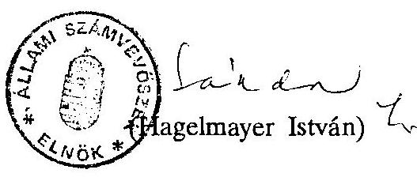
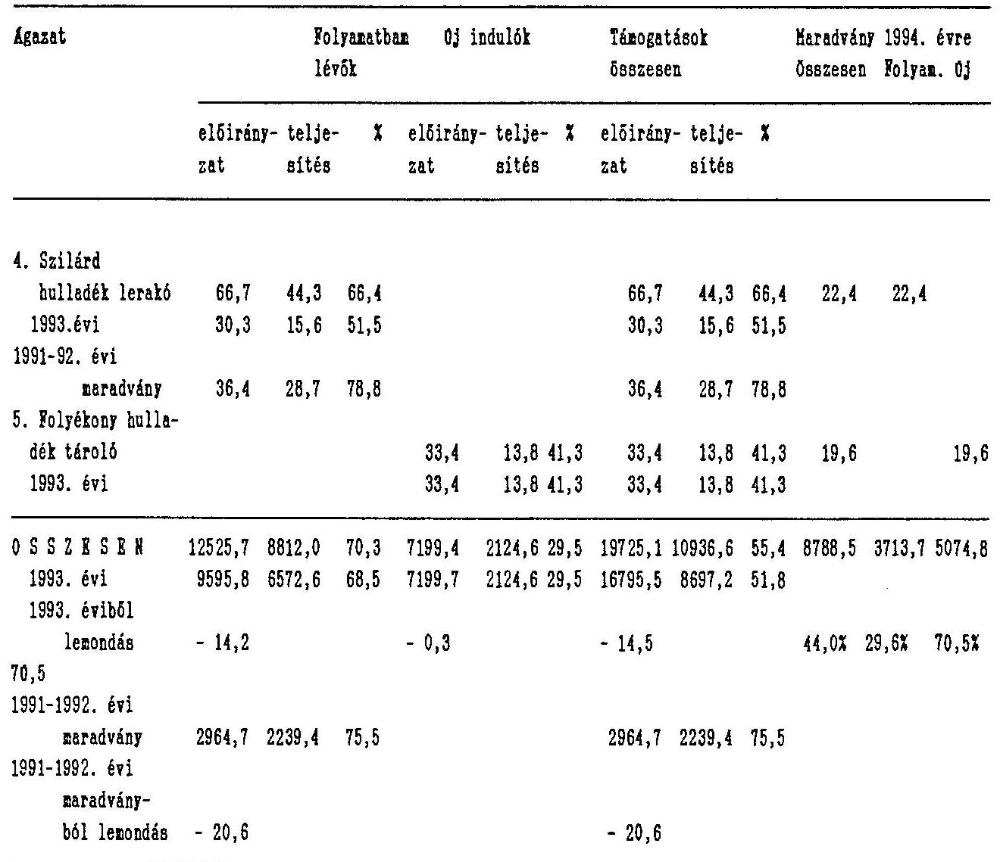

# Számvevőszék

## JELENTÉS

a helyi önkormányzatok beruházásaihoz nyújtott 1993. évi címzett- és céltámogatások vizsgálatáról

---

# JELENTÉS

a helyi önkormányzatok beruházásaihoz nyújtott 1993. évi címzett- és céltámogatások vizsgálatáról

A Magyar Köztársaság 1993. évi költségvetéséről szóló 1992. évi LXXX. tv. a címzett és céltámogatásokra együttesen 28740 millió forintot biztosított, amelyből 20821,2 millió forint a folyamatban lévő, 7919 millió forint az új induló beruházások és rekonstrukciók megvalósítására szolgált. Összeségében az 1991-1992. évi fel nem használt maradvány és a lemondások egyenlegeként 32376,4 millió forint állt rendelkezésre.

Az ellenőrzés célja: annak megállapítása volt, hogy

- a címzett és céltámogatások döntési rendszere és mechanizmusa miként segíti elő a helyi önkormányzatok fejlesztéseinek megvalósítását,
- a támogatások odaítélésénél és felhasználásánál érvényesült-e a törvényesség,
- a támogatásokkal megvalósított beruházásoknál és rekonstrukcióknál meg-valósult-e a pénzeszközök takarékos és hatékony felhasználása,
- az előző évekhez viszonyítva a központi szervek mennyiben változtatták meg a támogatás rendszerét, - figyelemmel az ÁSZ javaslatokra is - a változtatások milyen hatással voltak a beruházások megvalósítására.

Az ÁSZ az ellenőrzést a vonatkozó törvényi felhatalmazások alapján végezte.
A vizsgálat valamennyi megyére és a fővárosra kiterjedt. Az 1993. évi támogatásban részesült összes, számszerint 56 címzett támogatás igénylésének és felhasználásának helyzetét vizsgáltuk. Ez 12525,7 millió forint felhasználásának

---

ellenőrzését jelentette. A céltámogatások vizsgálata 123 helyi önkormányzatra irányult. Ezen belül 14 megyei és a fővárosi, valamint 108 települési (2 kerületi, 45 városi, 19 nagyközségi és 42 községi) önkormányzatra terjedt ki.
A rendelkezésre álló céltámogatások összegének 34,09%-át, 6702 millió forintot, összesen 258 céltámogatást ellenőriztünk. A helyszíni vizsgálatok tapasztalatait a függelékben (továbbiakban F) mutatjuk be.

Az önkormányzati törvény szerint az önkormányzatok egyes nagy költségigényű fejlesztési és rekonstrukciós feladataik megvalósításához az Országgyűlés címzett támogatást nyújthat, míg a társadalmilag kiemelt célok megvalósításához a meghatározott mértékben és feltételek mellett céltámogatásra jogosultak.

Az 1993. évi helyzet a megelőző években kialakult és folyamatosan változó rendszer következménye, ezért át kell tekinteni és értékelni a támogatási rendszer teljes folyamatát, változásait.

# A fejlesztések támogatási rendszerének alakulása, kritikai áttekintése

Az önkormányzatok első alkalommal az 1991. évi költségvetésről szóló 1990. évi CIV. tv. alapján, az ott felsorolt feltételek mellett és mértékben igényelhettek céltámogatást, ugyanakkor a törvény rendelkezett arról is, hogy erre a célra az állami költségvetésben 6,2 milliárd forint szolgál. Ugyanezen törvényben a támogatási feltételek és célok előzetes meghirdetése nélkül döntés született az önkormányzatok 1991. évi címzett támogatásának odaítéléséről is.
A nagy költségigényű - korábban általában megyeközponti fejlesztési és rekonstrukciós feladatokhoz kapcsolódóan 11814,5 millió forint címzett támogatást biztosítottak továbbá a megyei önkormányzatoknak 400 Ft/fő fejlesztési célú támogatást irányoztak elő, a térségi feladatokkal összefüggő, folyamatban lévő beruházások és rekonstrukciók, illetve az 1991. előtt keletkezett, de a címzett- és céltámogatási körbe nem vont fejlesztési kötelezettségek teljesítésére.

A támogatások meghatározását és az arányok kialakítását megelőzően az igénylés mechanizmusát, általánosan a címzett támogatásoknál az igénylés konkrét feltételét sem szabályozták. A döntést megelőző igényfelmérés adatai általában 10-15 évvel azelőtti - nem aktualizált - szakmai programokon és költségeken alapultak. A beérkezett igényeket utólag meghirdetett rendező elvek alapján

---

szelektálták. A döntés során a legfontosabb szempont a költségvetési keretnek való megfeleltetés volt, míg a szakmai szempontok háttérbe szorultak.

A feladat és a források összhangjának megteremtése érdekében kialakított rendszer, az elosztási mechanizmus szélsőségesen centralizálttá vált. Az Országgyűlés az előterjesztők által benyújtott támogatások esetében formailag döntött a több száz címzett-, illetve több ezer céltámogatási kérelemről.

A Belügyminisztériumban folyó döntéselőkészítő munkában, a szaktárcákkal való egyeztetés során nem minden esetben sikerült a törvényi előírásoknak való megfelelést biztosítani. Ez többnyire az idő, a megfelelő helyismeret és a szakmai koncepciók hiányára, továbbá a szakmai irányítás tisztázatlan hatásköri elveire vezethető vissza.

A finanszírozásnál a cél- címzett támogatással megvalósuló fejlesztések esetében számos probléma jelentkezett.
A bevezetéskor nem tisztázták előre, hogy a teljesítmény arányosság műszaki vagy pénzügyi teljesítést jelent-e, ezért az önkormányzatok egy részénél teljesítményhez nem kötődő igénylések is előfordultak, emiatt hosszabb időn keresztül szabad pénzeszközök halmozódtak fel, amelyet tartós betétként lekötöttek. Mások működési költségek terhére finanszírozták az átmenetileg elmaradó állami forrásokat. A teljesítést meghaladó többletfelhasználások szankcióit törvényi szinten nem rendezték.

Az ÁSZ vizsgálatai során több javaslatot tett az önkormányzati igényekhez jobban igazodó pályázati, igénylési feltételek pontosítására, a finanszírozási rendszer javítására.

Az 1992. költségvetésről szóló 1991. évi XCI. törvény már szigorító feltételeket alkalmazott a finanszírozás tekintetében.
Az önkormányzat amennyiben a támogatást nem a megjelölt feladatra használta fel, illetőleg a törvényben rögzített arányt meghaladó mértékű támogatást vett igénybe, év közben, de legkésőbb az önkormányzat éves költségvetési beszámolójának a TÁKISZ (FÁKISZ)-hoz történt benyújtást követő 15 napon belül köteles volt a támogatást, a kamattal együtt visszatéríteni. A kamatfizetési kötelezettség előírása bizonyos mértékű visszatartó hatást fejtett ki annak érdekében, hogy az önkormányzatok a várható kifizetések teljesítéséhez igényeljék a céltámogatást.

---

A törvény vonatkozó előírásai ugyanakkor nem tartalmazták, hogy az évközi, illetve éves szinten jogtalanul lehívott céltámogatások után a kamatfizetési kötelezettség milyen időtartam után jelentkezik és azt sem, hogy az ilyen céltámogatást és kamatait milyen központi bankszámlára kell befizetni. A jogtalanul igénybe vett céltámogatások és büntető kamatainak elszámolására és visszautalására a kormányzati szervek utólag rendelkeztek. Változatlanul jellemző volt a teljesítményarányost meghaladó, az általános pénzügyi helyzetet javító, céltámogatás igénybevétele.
Címzett támogatásoknál a kamatmentes előleg biztosítása a kivitelezőnek általános gyakorlattá vált, melyet csak az 1992. évi LXXXIX. tv. tiltott meg egyértelműen.
Ebben az évben a céltámogatásoknál változtak a feltételek és a támogatási arányok, új célok kerültek a támogatott körbe (alap- és középfokú kollégiumi ellátás, középiskolai tornaterem építés).

Az ÁSZ által, a vizsgálatok során feltárt jogtalan felhasználások elvonása nem rendeződött. Az illetékes kormányzati szervek (PM., BM.) nem intézkedtek a megoldására.

A címzett és céltámogatási rendszer működési zavarait észlelve az Országgyűlés törvényben, a Kormány rendeletben megpróbálta tökéletesíteni a címzett és céltámogatások rendszerét. Az 1992. évi LXXXIX. tv. és a végrehajtást szolgáló 46/1993. (III. 17.) Kormányrendelet együttesen kívánta szabályozni a címzett és céltámogatások igénybejelentési, elszámolási és ellenőrzési rendjének komplex rendszerben való működtetését.

A változtatások által a folyamat formailag, tartalmilag kétségtelenül szabályozottabbá vált, azonban érdemi előrelépést a rendszer hatékonyabb működtetése terén nem eredményezett, sőt újabb bizonytalansági tényezők is kerültek a rendszerbe.

A támogatási igények dinamikus növekedése és az állami költségvetés kedvezőtlen pénzügyi kondíciói miatt szükségszerűen bevezették az "ún." igérvények rendszerét, ennek feltételeit jogszabályok előzetesen nem rendezték. Az igérvények és az átütemezések miatt a megvalósítás elhúzódik 1996-ig, címzett támogatásoknál egyes esetekben 1998-ig. A hosszútávú elkötelezettség jelentős költségnövekedéssel is jár.

---

A nagyszámú igények kezelhetősége érdekében az 1992. évi LXXXIX. tv. már deklarálta, hogy az éves költségvetési törvényben az Országgyűlés szűkítheti a támogatandó célok körét, módosíthatja a támogatási arányokat, illetőleg felfüggesztheti a céltámogatási rendszer működését.
Az 1993. évi új céltámogatási igények kielégítésére már sorrendet állapítottak meg.

Az 1993. évben a feltételek szigorítása ellenére a támogatott célok körét illetően fellazulás következett be. Nem érvényesült az az elv, hogy ezen támogatási forma rendeltetése az legyen, hogy a kiemelt jelentőségű, a helyi önkormányzat erejét meghaladó beruházásokat, vagy rekonstrukciókat támogassa.
A címzett támogatásban részesülő beruházások közé bekerültek óvodák - és céltámogatással is támogatható - iskolák és szennyvíztisztító is a törvényi tilalom ellenére. A céltámogatások között megjelent az életveszélyessé vált iskolai tanterem építésének támogatása is.
A nagyszámú és növekvő költségű igények kezelhetősége érdekében, a támogatási célok és feltételek szigorítása mellett jogszabályokban nem rögzített eszközöket is alkalmaztak: hiánypótlásra visszaadták a tornatermi igények egy részét, a törvényben nem szabályozott feltételeknek való megfelelésre hivatkozással. Törvényi előírásoknak megfelelően - a jelentős költségnövekedésre tekintettel - öt nagy kórházrekonstrukció vizsgálatát rendelték el.

Az 1992. évi LXXX. tv. úgy rendelkezett, hogy finanszírozási szerződés alapján, címzett támogatás esetében az Állami Fejlesztési Intézet Rt., céltámogatásoknál a számlavezető bank teljesít kifizetéseket kollateralizált számlák alapján. A pénzintézetek beléptetésével teljesítés (teljesítmény) ellenőrzési kontrollt akart beépíteni a finanszírozási rendszerbe.
Ez az elvárás azonban csak részben teljesült. A céltámogatásoknál az állami forrás mellett a saját forrás arányos igénybevételét tudja ez a rendszer ellenőrizni. A pénzintézetek viszont automatikus utalási tevékenységet végeznek, amelyhez mindössze az önkormányzat által kollateralizált számlát kell benyújtani és rávezetni a támogatás azonosító adatait. A pénzintézetek nem vizsgálják az engedélyezésnek és a kiviteli terveknek, valamint az érvényes beruházási szerződéseknek való megfelelést, így a gyakorlatban továbbra sincs megfelelő kontroll a teljesítmények ellenőrzésére. Az új finanszírozási rendszerben általában 4,5 ezrelék kezelési költséget számítanak fel a pénzintézetek.

---

Az 1994. évi költségvetési törvényben már egyértelműen szűkítették és rangsorolták a támogatandó célokat és már törvényben szabályozott az időbeni csúsztatás az igények kielégítésében.

Az elmúlt három évben a támogatás feltételeit szigorító szabályozások ellenére nyilvánvalóvá vált, hogy nem sikerül feloldani a támogatási rendszer néhány alapvető ellentmondását.

Az önkormányzati döntési önállóság kiterjesztése - a támogatásra kijelölt célokkal szembe kerülve - oda vezetett, hogy nem mindig a tényleges szükségletekhez igazodó támogatási körről döntöttek.

A céltámogatások jelenlegi mechanizmusa kétszeresen is befolyásolja az önkormányzatok fejlesztési stratégiáit, mert egyrészt a meghirdetett támogatási célok arra ösztönzik, hogy e célok közül válasszák ki a maguk fejlesztési céljait, még akkor is, ha esetleg másra nagyobb szükségük lenne, de ahhoz nem kapnak támogatást. Másrészt a központi fejlesztési prioritásokhoz kell hozzárendelniük saját forrásaikat is annak érdekében, hogy az állami támogatáshoz hozzájussanak.

Optimális esetben a támogatási rendszer összeségében országosan hatékony is lehetne, racionális irányokba terelhetné a helyi elképzeléseket, de a gyakorlat azt mutatja, hogy az országos prioritások számos esetben helyileg nem konzisztensek a tényleges szükségletekkel és ami különösen nagy gond, hogy célszerűségi, hatékonysági követelmények sincsenek a támogatási célokhoz rendelve.

A támogatások odaítélése során figyelmen kívül maradt, hogy a beruházást megvalósítani szándékozó önkormányzat alkalmas és képes-e pénzügyileg és szakmailag a beruházással megvalósított objektum fenntartására és üzemeltetésére.

A pályázatokban bármelyik önkormányzat részt vehetett, így a pályázó és a támogatásban részesülő önkormányzatok száma fokozatosan emelkedett. Az "alanyi jogon" járó támogatások finanszírozása, az erre fordítandó keretek jelentős mértékű emelése mellett a rendszer lassan már átláthatatlan, kezelhetetlen és az állami források szétforgácsolódását okozza.
A preferált, de nem mindig a tényleges szükségletekhez igazodó erőltetett ütemű fejlesztések eladósodáshoz vezetnek.

---

Bebizonyosodott, hogy nem lehet olyan célokat és pályázati feltételeket alkotni, amely az alanyi jogosultság csorbítatlansága mellett képes az igényeket és a központi költségvetésben rendelkezésre álló összegeket összhangba hozni. Kétségtelenül ez a rendszer alkalmas a helyi források mozgósítására, azonban jelentősen befolyásolja az önkormányzati fejlesztések időbeni ütemezését.

A fejlesztési célok meghatározása és a tervezési gyakorlat is ellentmondásokkal terhes.
A rendszer működését, jelenleg is az éves költségvetési törvényekben meghatározott keretek és célok determinálják. Ebből fakad a céltámogatási rendszer alapvető és súlyos ellentmondása, miszerint az önkormányzatok a meghirdetett célokhoz
 rendelt támogatásokra „alanyi jogon” tarthatnak igényt, miközben a fejlesztési célok támogatására előre meghatározott, és erőteljesen korlátozott keret áll rendelkezésre.

Jelenleg az önkormányzatok a címzett támogatással megvalósuló beruházások esetében nem érdekeltek a megalapozott tervezésben, és abban, hogy az állami támogatásból megvalósítani kívánt célok a leggazdaságosabb ráfordítással legyenek elérhetők, hiszen csupán az adott célra történő felhasználás a kritérium. Az önkormányzatok az igények megfogalmazásánál inkább a túltervezésben, a beruházási összköltségek túlbecslésében érdekeltek.

Előrelépést jelenthet a tervezésben, hogy 1995-től a szakminisztériumok által kidolgozott, évenként felülvizsgált fajlagos költségeket kell alkalmazni.

Gondot okoz továbbá, hogy a címzett- és céltámogatások tervezése és igénybevétele eltér az önkormányzatok költségvetésére vonatkozó tervezési előírásoktól és gyakorlattól, ugyanis nem illeszthető be az egyéb állami támogatások tervezési körébe, részben a bizonytalan volta, részben pedig a döntések időbeni késedelme miatt. Az adott évi fejlesztési állami támogatások a költségvetési tervezés időszakában még nem ismertek. Ezideig az önkormányzatok csak akkor váltak ténylegesen jogosulttá a támogatásokra, ha ezeket a törvényben, vagy közleményben nyilvánosságra hozták.

---

# I.   A vizsgálat megállapításai 

1. Az 1993-ban támogatandó célok és a támogatás feltételrendszerének meghatározása.

A feladatok és a források összhangját sem a korábbi, sem pedig az 1993. évi - a rendszer működését javító - szabályozások nem tudták megteremteni. Ehhez hozzájárult a túlságosan centrális, felülről vezérelt rendszer is.

A támogatott célok köre folyamatosan bővült, fellazult, a jóváhagyási folyamat mértéktelenül elhúzódott.

Az 1993. évi támogatandó célok meghatározása és a támogatási rendszer kialakítása több lépcsőben történt. Az egyes szakaszok között hosszú idő telt el, lényeges döntések csak a folyamat végén konkretizálódtak.

A Magyar Köztársaság 1993. évi költségvetéséről szóló 1992. évi LXXX. tv. a külön törvényben meghatározott és szabályozott címzett és céltámogatásokra 28740 millió Ft-ot hagyott jóvá, melyből a folyamatban lévő beruházásokra 20 821,2 millió Ft fordítható.
A törvény tartalmazta továbbá a folyamatban lévő címzett- és céltámogatások finanszírozásával kapcsolatos szabályokat is.

Az 1992. dec. 31-én megjelent 1992. évi LXXXIX. tv. és a 46/1993. (III. 17.) Korm. sz. rendelet együtt célozta a címzett- és céltámogatások támogatási jogosultságának finanszírozási és elszámoltatási rendjének komplex rendszerbe foglalását.
A támogatott célok bővítésének lehetőségét teremtette meg azzal, hogy megengedte a beruházással létrejött létesítmények vásárlását is és bevezette a válsághelyzet megoldására ható támogatásokat is (pl. távfűtőmű létesítése). A válsághelyzet fogalmát jogszabályok nem rendezték.

A céltámogatások között az életveszélyessé nyilvánított általános iskolai tanterem kiváltása és a kórházrekonstrukciók támogatásánál a törvényi szabályozás hiányossága, hogy egyik támogatási cél fogalmát és megoldási formáját sem pontosították, így sajátos értelmezési lehetőségek adódtak.
A törvény felhatalmazta a Kormányt a címzett és céltámogatás igénybevételének, döntéselőkészítésének és elszámolási rendjének szabályozására. A Kormány ennek a felhatalmazásnak viszonylag későn 1993. március 17-én, a 46/1993. (III. 17.) Korm. rendelettel tett eleget. Emiatt az eredeti (március 14.) leadási határidőt március 19-én, 1993. május 14-re módosították.

A 46/1993. (III. 17.) Korm. rendelet azonban más ellentmondást is tartalmazott. Törvényhozási tárgykörbe tartozó szabályozást is tartalmazott a feltételek, illetve az igényjogosultság vonatkozásában. A rendelet mellékleteiben meghatározott adatlapok kitöltési útmutatójában több rejtett, feltételként funkcionáló, a jogosultság szempontjából érdemi előírás található (pl. „az ivóvízellátással és szennyvízcsatornázással kapcsolatos támogatás nem igényelhető pl. építésre kijelölt terület előközművesítésére, üdülőterület, temető stb. ellátására”, egészségügyi gép- és műszer beszerzésének előfeltétele az, hogy a megvalósítás egy év alatt történjen meg” stb.)

A június 8-án közzétett 1993. évi L. tv. törvény a helyi önkormányzatok folyamatban lévő címzett támogatásaira - összesen 33 feladatra - 11 167,1 millió forintot hagyott jóvá. Ebből a vízgazdálkodás területén a dél-alföldi ivóvízminőségjavító programra és Nógrád megyében a dunai vízátvezetés és nyugat-nógrádi távvezeték kialakítására 1163 millió forintot, az egészségügyi ellátásban 25 kórház rekonstrukcióra 8403 millió forintot, az oktatás és kulturális szolgáltatás területén 4 színház rekonstrukcióra 1440 millió forintot irányoztak elő. A törvényben döntöttek arról is, hogy - a korábban címzett támogatások között nem szereplő célokat - a berceli, a karancssági, a lucfalvai és a tari általános iskolák építésének finanszírozását az új címzett támogatások között kell folytatni. Döntöttek arról is, hogy a Fejér megyei Szent György Kórház, a gyöngyösi Bugát Pál Kórház, a Szabolcs-Szatmár-Bereg megyei Jósa András Kórház-Rendelőintézet, a mátészalkai II. Rákóczi Ferenc Kórház, továbbá a Zala megyei Megyei Kórház rekonstrukciójának szakmai tartalmát és beruházási összköltségét - a jelentős költségnövekedésre tekintettel - felül kell vizsgálni. A beruházás összköltségét, a bevonható saját forrást és az éves támogatási összegeket az új címzett támogatási igényeket jóváhagyó törvényben kell meghatározni.

A törvény önkormányzatonként és célonként részletezte a folyamatban lévő fejlesztési feladatokhoz kapcsolódó céltámogatásokat. Erre 9 595,8 millió forintot hagyott jóvá.

---

A központi támogatás szempontjából már folyamatban lévő beruházási körre általánosan szabályozta a finanszírozás, elszámolás, a támogatásról lemondás, a vagyonmegosztás, az elidegenítés, a hasznosítás, a jelzálog, valamint a létesítmények és fejlesztések működtetésével összefüggő kérdéseket.

A törvény az új céltámogatási igények kielégítésére sorrendet határozott meg.
Az 1993. augusztus 31-i Magyar Közlöny (119 sz) 1/a melléklete tartalmazta az 1993. évi új induló céltámogatásokról szóló kormányközleményt. Ebben erre a célra 7199,7 millió forintot biztosítottak.

Az 1993. évi LXXXVII. tv. - amelynek kihirdetésére csak 1993. okt. 15-én került sor - határozta meg az új induló címzett támogatások körét és döntött a felülvizsgált kórházrekonstrukciókról. A törvény szerint 23 feladatra (7001,2 millió forint össz. beruh. költségű) feladatra jogosultak az önkormányzatok 830,6 millió Ft saját forrás igénybevételével 6 170,6 millió forint állami támogatásra. Ebből 766,4 millió forint támogatást 1993-ra ütemeztek, míg további 5,4 milliárd forint 1996-ig esedékes. A támogatások között megjelent a szennyvíztisztító telep vásárlás, bővítés, általános iskola, konyha és mosoda építés támogatása.

Az 5 kórházrekonstrukció költségének felülvizsgálata során 4,5 milliárd Ft többletköltséget ismertek el. A 17889 millió Ft beruházási összköltség igényű rekonstrukciók 1994. és 1997. között 7597 millió Ft állami támogatásban részesülnek.

# 2. A tárcák döntéselőkészítő tevékenységének értékelése 

A Belügyminisztérium - a minisztériumok között létrejött munkamegosztás alapján - gyűjtötte össze a támogatási igényeket. A tervezés időszakában 1992. májustól - 9 alkalommal történt felmérés, tájékozódás, egyeztetés. A megvalósítani kívánt beruházások és rekonstrukciók támogatási igényei mind tartalmilag, mind formailag rendkívül eltérőek voltak, szélsőséges a műszaki előkészítettségük és gazdasági- és társadalompolitikai szempontú alátámasztottságuk is. Nem mindig nyújtottak elégséges információt a megalapozott döntéshez.
A minisztériumok csak az 1995. évi támogatási igényekre vonatkozóan írtak elő tartalmi követelményeket a fajlagos költségek meghatározásával, így az

---

elmúlt évek helytelen gyakorlatát követve eltérő részletezettségű igénybejelentések szolgáltak alapul a felülvizsgálatokhoz és a döntésekhez.

A minisztériumok közötti egyeztetések nem elsősorban szakmai szempontú kérdésekre irányultak, hanem az igények és lehetőségek közelítésére. A szakmai szempontok érvényesítése háttérbe szorult.
Nem játszott megfelelő szerepet az igények felülvizsgálatában, hogy a központi támogatással megvalósítandó létesítmény és fejlesztés működtetéséről az önkormányzat képes-e gondoskodni.
Az 1992. évi LXXXIX. tv. 20 §-a ugyan előírja, hogy egészségügyi beruházás esetén a működtetésről az önkormányzat a társadalombiztosítással közösen gondoskodik valamint, hogy a közös beruházással megvalósított létesítmény működtetéséről a felek megállapodnak. A törvény végrehajtására kiadott 46/1993. (III. 17.) Korm. sz. rendelet az igénybejelentés tartalmi követelményeként az Országos Társadalombiztosítási Főigazgatóság nyilatkozatát írta elő a működtetés finanszírozásának vállalásánál.
A fenti jogszabályok a társadalombiztosítási önkormányzati választások előtt keletkeztek, így az új típusú finanszírozási rendszer miatt az OTF - ma Egészségbiztosítási Önkormányzat - csak részben és feltételekkel vállalta egyes fejlesztések esetében a többletköltségeket.
A kialakult helyzetre tekintettel a BM Önkormányzati Gazdasági Főosztálya felhívta az önkormányzatok figyelmét, hogy az OTF nyilatkozat hiányában a képviselő-testület az önkormányzat saját forrása terhére is vállalhatja a működési többletterheket. A felhívás eredményeként az önkormányzatok többsége biztosította a BM-et a felmerülő többletköltségek vállalásáról. Ezek között néhány önkormányzat sajátos megoldást választott, nyilatkozatot csatolt be az igényléshez, mely szerint a megvalósítani kívánt beruházás vagy rekonstrukció „működési többletigénnyel nem jár”. Ezt az Egészségbiztosítási Pénztár is tudomásul vette.

Az 1992. évi XXVI. tv. már rögzítette, hogy az 1992. utáni években folytatódó beruházások központi támogatási összegének megállapítása - az akkor felülvizsgálatra kötelezett négy kórházrekonstrukció kivételével - az 1992. évi címzett támogatási igénybejelentésben megjelölt beruházási összeg alapján történik.

---

Ennek ellenére a Népjóléti Minisztérium által az öt kórháznál végzett felülvizsgálat eredményeképpen 4510 millió forint költségnövekedést hagytak jóvá. A költségnövekedések az 1994-1997. éveket terhelik.

A céltámogatások között az orvosi gép-műszer beszerzések szakmai felülvizsgálatát a Népjóléti Minisztérium végezte. Feladatuk - megfogalmazásuk szerint - arra szorítkozott, hogy a BM-ben átnézték a pályázatokat alaki és a célnak való megfelelőség szempontjából. Ugyanakkor felismerték, hogy a bevezetett automatizmus nem teszi lehetővé az egészségügy prioritásának érvényesítését, szükséges lenne a nem kívánatos fejlesztések elkerülése érdekében a célok szűkítése. Néhány igénybejelentésnél a túl általános indoklás és konkrét műszerlista, részletezés hiánya miatt pótlólagos listákat kértek.
(Pest megyei Önkormányzat 264 millió forint, Szolnok megyei Önkormányzat 104 millió forint, Békéscsaba 8 millió forintos, Csongrád megyei Önkormányzat 100 millió forintos, Somogy megyei Önkormányzat 116,5 millió forintos igénylésénél.)

A gyakorlatban használatos az egészségügyi gép-műszerként nyilvántartott eszközök rendszerezett jegyzéke - részben túlságosan széles választéka miatt - nem segítette megoldani az orvosi gép-műszer fogalomkörének tisztázását. A KHVM szakmailag megalapozatlanul támogatta Csenger Város szennyvíztisztító telep vásárlásának valamint Szentendre Város regionális szennyvíztisztító telep bővítésének igényét. (F1, F2)

Az újonnan indított támogatások előkészítettségének mértékéről a döntéshozók általában nem kellően győződtek meg.

A támogatási célok törvényi szabályozásának pontatlanságai, a címzett támogatási kör bővülése, a döntési mechanizmusra vonatkozó előírások lehetőséget teremtettek arra, hogy megfelelő előkészítés nélküli eltérő fajsúlyú igények kerültek a támogatott körbe. Így a támogatott feladatok közé kerültek részben céltámogatást már elnyert, vagy céltámogatási körbe tartozó tanteremfejlesztések, bővítések a törvényi előírás tilalma ellenére (pl. Hobol, Káptalantóti, Kéty, - továbbá a négy Nógrád megyei iskola építésének befejezése - Bercel, Lucfalva, - korábban tett kormány elkötelezettség alapján).

---

Négy óvoda megépítéséhez is címzett támogatást biztosítottak (Baja, Méhkerék, Moha, Ordacsehi önkormányzatának). Mind az iskolák, mind az óvodák esetében a saját forrás hiányát jelölték meg a támogatás indokaként, ugyanakkor ugyanezen hivatkozással igényeket utasítottak el.
A válsághelyzetre való tekintettel az 1031/1992. (V. 29.) sz. Kormányhatározat alapján került be az Ózdi Távfűtő megépítése összesen 682500 ezer forint - 1993-ra 48000 ezer forint - összeggel a címzett támogatások közé.

# 3. Cél- címzett támogatással megvalósuló fejlesztések finanszírozása 

A cél- és címzett fejlesztések finanszírozási rendszere 1993. évtől alapvetően megváltozott. Címzett támogatás esetén az Állami Fejlesztési Intézet RT.-nél, céltámogatásoknál a számlavezető banknál - döntően az OTP-nél - külön finanszírozási szerződés alapján történik a finanszírozás. A beruházásokhoz a céltámogatást a számlavezető pénzintézet is az ÁFI RT. útján veszi igénybe. A korábbi évekhez képest az új finanszírozási rendszerrel általában biztosítani lehetett a saját forrásokkal
 arányos, illetve az ezt meg nem haladó céltámogatások igénybevételét. Az 1993. évi pénzügyi teljesítések feltétele a pénzintézetekkel való szerződés megkötése volt. A szerződéskötések mértéktelenül elhúzódtak. Az 1992. évi költségvetési törvény már tartalmazta a finanszírozási szerződés megkötésének követelményét, azonban a szerződés konkrét tartamáról csak a június 8-án közzétett 1993. évi L. tv. rendelkezett. Az itt meghatározott július 23-iki határidőt az önkormányzatok nem tartották be, de nem is tarthatták, ugyanis a pénzintézetek – megkésve – 1993. szeptemberében kapták meg a központilag megszerkesztett finanszírozási szerződést. Ugyanez a késedelem vonatkozik az új induló beruházások finanszírozási szerződéskötésére is, melyeket szeptember 30-a helyett nagyobbrészt október-december hónapokban kötöttek meg. Ennek oka, hogy a pénzintézetek, valamint a PM. és BM. között a keretfeltételekre vonatkozó megállapodás csak jelentős késedelemmel jött létre.

A létrejött szerződések hibája, hogy a banki közreműködés a formális elemek alkalmazására szorítkozott. A számlaellenőrzés minden esetben a beruházó vagy az általa megbízott lebonyolító feladata maradt. A szerződés állomány, illetve annak tartalmi ismeretének hiányában az elszámolt teljesítmények, a benyújtott számlák érdemileg nem kontrollálhatók. Továbbra sem biztosított a céltól eltérő felhasználás kiszűrése. A pénzintézeti szolgáltatás kialakult

---

színvonala miatt az önkormányzatok is túlzottnak tartják a felszámított kezelési díj mértékét.
Az önkormányzatok számára a banki költségek halmozódását okozza, hogy a pénzintézetekkel kötött szerződés szerinti – általában 4,5 ezrelék – kezelési költség mellett az önkormányzatnál pénzforgalmat növelő teljesítés után (mint folyó számla forgalom) 1,0-1,5 ezrelék kezelési költséget is elszámol az OTP.

A szerződéses kapcsolatok ellenére is előfordultak hiányosságok:

- egyes önkormányzatok nem rendelkeztek szabályosan aláírt szerződéssel (pl. Balassagyarmat, Kéty),
- a megkötött szerződésben helytelenül nem vették figyelembe az önkormányzati saját erő biztosításának kötelezettségét (Bercel, Lucfalva),
- előfordult, hogy a pénzintézetek nem tartották be a jogszabályi előírásokat, illetve a finanszírozási szerződésben foglaltakat. Kollaudálatlan számlák alapján is történt kifizetés,
- a formai követelmények megtartásának számonkérése, ennek szigorúsága az OTP RT. egyes fiókjainál eltérő volt,
- az átutalási időkkel problémák adódtak, a viszonylag hosszú (15-20 nap) idő miatt az önkormányzatok esetenként megelőlegezték a kifizetéseket, illetve az alakilag és tartalmilag is helyes számlák alapján rendkívüli módon elhúzódott a címzett támogatás átutalása. (Moha Község november 17-tól a vizsgálat időpontjáig nem kapta meg).

4. Az állami támogatások igénybevételének és felhasználásának tapasztalatai

Az 1993. évi állami támogatásokkal kapcsolatban a megváltoztatott igénybejelentési rend szigorúbb feltételeket teremtett az önkormányzatok számára. A határidőig benyújtott céltámogatási igényeket a TÁKISZ (FÁKISZ)-ok abból a szempontból vizsgálták felül, hogy azok az igénybejelentés feltételeinek megfelelnek-e, hiánypótlásokra, javítási javaslatokat és beadási póthatáridőt szabtak meg. Az 1993. évre beadott pályázatok esetében a tartalmi, formai előírásokat döntő többségében megtartották, a korábbiaknál jobban érvényesült a törvényesség.
Néhány jellemző típushiba azonban változatlanul fennmaradt, ezek a döntéshozók figyelmét is elkerülték.

---

- Előfordult, hogy a pályázatok feltételeként megjelölt hatósági engedélyt nem csatolták, vagy jogi szempontból nem rendelkeztek érvényes engedéllyel (Mosonmagyaróvár, Komárom, Bábolna, Zirc, Káptalantót). (F3-F7)
- Az egészségügyi beruházásokkal kapcsolatos működési többletköltség vállalására vonatkozó nyilatkozattal nem rendelkeztek (Békés Megyei Önkormányzat). (F8)
- Az önkormányzatok egy részénél a saját anyagi lehetőségeiket meghaladó fejlesztési, illetőleg céltámogatás szerzési törekvések tapasztalhatók. Helyenként a képviselő-testületi határozatokat a támogatás elnyeréséhez szükséges formális eszköznek tekintették, de a feladatok megvalósításához saját pénzeszközt nem biztosítottak. Gyakrabban a kisebb településeken fordul elő, hogy az önkormányzatok költségvetésének nagyságrendje korlátozottan teszi lehetővé a vállalt saját forrás biztosítását. Emiatt a kivitelezés a saját erő függvényében szakaszolva, a műszaki tartalom csökkentésével halad, ami miatt csökkentett mértékű állami támogatás hívható le (Kiskunfélegyháza, Békés Megyei Önkormányzat, Szárliget, Hatvan, Borzavár-Porva, Zánka, Zalaegerszeg). (F9-F15)
- Helyi tervezési hiányosságok miatt számos pályázat műszaki tartalma és költségei nem voltak megalapozva, illetőleg egymással összhangban.
A címzett- és céltámogatási rendszer egyik hiányossága, hogy a támogatások alapja az önkormányzatok által jelzett várható bekerülési költség, amelyet kritika nélkül fogadtak el. A várható bekerülési költségekre vonatkozóan megbízható információk nem álltak rendelkezésre. A feladatok egy részénél a költségek felültervezése is érzékelhető volt, amely gyakran a jóváhagyott céltámogatás maradványát, a céltámogatás felesleges "lekötését" eredményezte. A műszaki tartalom, és a kivitelezési lehetőségek nem kellő felmérése miatt a fejlesztések egy része ütemtelenül elhúzódva valósul meg (Pécs, Baja, Miskolc és Szerencs, Komárom, Mátraterenye, Szendehely, Somogyzsitfa, Somogy Megyei Önkormányzat, Bábolna, Komárom, Nagylóc, Fővárosi Szociális Otthonok, Kalocsa, Hernádbüd, Budakeszi, Tárnok, Döge, Ivánc, Hódmezővásárhely, Komárom-Esztergom Megyei Önkormányzat, Komárom Város, Cibakháza, Tömörkény, Kecskemét, Zala Megyei Önkormányzat). (F16-F41)

---

- Több helyen egyoldalú előnyszerzés, a mindenáron való pénzszerzés céljából formálisan döntöttek közös fejlesztésről és kaptak ehhez többlet támogatást. Ezt a szabályok 1993. évtől is lehetővé teszik, mivel az önkormányzatok számára e beruházások közös finanszírozásához központilag nem határozták meg a fejlesztéshez való hozzájárulások alsó mértékét (Békés Város, Berettyóújfalu, Nemti, Cegléd, Tapolca). (F42-F46)

Az önkormányzatok többségének költségvetése tartalmazta a fejlesztésekhez elengedhetetlen saját pénzügyi eszközöket. A saját erő megteremtése céljából azonban gyakran jelentős mértékű hitel felvételére kényszerültek, lakossági hozzájárulást (érdekeltségi, illetve közmű hozzájárulást, kommunális adót) és intézményi anyagi eszközöket vontak be, vállalkozásoktól pénzeszközt és érdekeltségi hozzájárulást vettek át, pályázatokat nyújtottak be az egyes elkülönített állami pénzalapokra (Hódmezővásárhely, Bátonyterenye, Berettyóújfalu, Vas Megyei Önkormányzat). (F47-F50)

A nem megfelelő helyi előkészítés és a döntési folyamat mértéktelen elhúzódása következtében (gyorsított intézkedések mellett is) az 1993. év végén a beruházások készültségi foka rendkívül alacsony volt, a tervezett támogatásokból csak kis hányadot, esetenként semmit sem tudtak felhasználni, (Pécs, Dinnyeberki, Felsőregmec és Vilyvitány, Dévaványa, Mezőkovácsháza, Csongrád megyei Önkormányzat- Szeged és Kiszombor, Berettyóújfalu, Tata, Nemti, Cserhátsurány). (F51-F64)

Ellentmondás és pazarlás is, hogy az igényekhez képest korlátozottan rendelkezésre álló központi forrásokból országos szinten az 1993. évre folyamatban lévő beruházásoknál 22 % - 5371,8 millió forint - az új induló beruházásoknál 71,3 % - 5677,0 millió forint - maradt felhasználatlanul. Ehhez tartozik, hogy az Állami Fejlesztési Intézet RT. a teljes támogatási összeget lehívta, a 11048,8 millió forint maradvány ott kamatozik, miközben az állami forgóalap likviditási gondokkal küszködik.

A törvényekben és a közleményekben előirányzott támogatási összegekhez képest – a döntési folyamat során – kisebb eltérések következtek be. Az 1993. évre rendelkezésre álló kereteket ugyanakkor az 1991-ben keletkezett maradványok és lemondások lényegesen módosították.

---

(Az 1993. évben rendelkezésre álló és felhasznált cél-és címzett támogatásokat, valamint a maradványokat az 1-6. számú mellékletek tartalmazzák.) Törvényi előírás szerint meg kellett felelni az 1993. évi költségvetési törvény szerinti nyilvános versenytárgyalási kiírási kötelezettségnek, ezen belül a 60 napos ajánlatkérési határidőnek. A támogatások késői meghirdetése miatt ez is hozzájárult a kedvezőtlen felhasználási arány kialakításához.

Az önkormányzatok egy részénél nem tartották be a versenytárgyalás kiírás kötelezettségét (többek között: Kimle, Tát, Komárom-Esztergom Megyei Önkormányzat, Tata, Komárom, Pápa, Fővárosi Önkormányzat – Szociális Otthonok). A jogszabályokkal ellentétben nyílt versenytárgyalás helyett gyakran zártkörűt hirdettek meg.

A vagyon elidegenítési tilalom és a jelzálog bejegyeztetési törvényi előírás nem minden esetben teljesült.
Előfordult, hogy – a törvényi szabályozás tilalma ellenére – az önkormányzati tulajdonba tartozó közmű vagyont gazdasági társaságokba apportálták.
Törvényi szabályozási hiányosság, hogy az általánosan jelzálog bejegyzéssel biztosított állami tulajdon védelme a befejezett közmű létesítményekre ily módon nem oldható meg. Ennek megfelelően az állami tulajdon védelme ezeknél a beruházásoknál nincs biztosítva. A "vonalas" létesítmények esetében – más törvényi szabályozás szerint – az ingatlan nyilvántartásba bejegyezhető szolgalmi jogokat önállóan jelzáloggal megterhelni nem lehet.

Az érintett önkormányzatok az állami támogatást általában a megjelölt célnak megfelelően használták fel.
Ettől eltérő szabálytalan felhasználást is tapasztaltunk.
A jóváhagyott támogatásokat 9 esetben nem a támogatott célra használták fel. A jogtalanul igénybe vett támogatások mellett a támogatás összegének visszafizetésével a törvény kamatfizetési kötelezettséget is előír. Az ellenőrzés összesen 101604 ezer forint jogtalanul igénybe vett támogatást tárt fel, ezért ezek visszavonását javasoljuk a 7. sz. melléklet szerinti részletezésben.

---

# II.   Következtetések, javaslatok 

A helyi önkormányzatok címzett- és céltámogatási rendszerének továbbfejlesztését célzó törvényi és kormányrendeleti szintű átfogó szabályozást 1992. év végén és 1993. I. negyedévében alkották meg.

A megkésett feltételeket, formai előírásokat tartalmazó szigorítások nem tudtak egy koncepciózus, konzisztens rendszert kialakítani.
Nem sikerült a rendszer korábbi alapvető ellentmondásait feloldani.
A kiszámíthatóság, folyamatosság biztonsága eredendően hiányzott a rendszerből. A bizonytalanságot fokozta, hogy a támogatandó célok szűkítésére, rangsorolására, a megvalósítás és a pénzügyi támogatások átütemezésére menetközben számos intézkedés történt. Ezen belül hiba volt, hogy a támogatásokról évente döntöttek, esetenként megváltoztatva a korábbi előirányzatokat.
A korábban – az előzetes feltételek kidolgozásának hiányában – meghirdetett címzett támogatások köre folyamatosan, és jelentősen bővült.
A céltámogatási rendszer legfőbb hibáját, az alanyi jogosultság és a rendelkezésre álló költségvetési keretek ellentmondását, nem sikerült feloldani.
A pénzintézetek beléptetésével teljesítés ellenőrzési kontrollt akartak beépíteni a finanszírozási rendszerbe. Ez azonban csak részben sikerült, mert a tényleges teljesítés ellenőrzését továbbra is az önkormányzatoknál végzik, a pénzintézetek automatikus utalást végeznek. Az ezért felszámított kezelési költség a fejlesztésekhez rendelkezésre álló forrásokat csökkenti.
A rendszer javítását szolgáló intézkedések következtében a döntési folyamat rendkívüli mértékben elhúzódott, lényeges döntések a folyamat végén konkretizálódtak.
A cél- és címzett támogatási rendszer jellegéből, működési hiányosságaiból, az önkormányzatoknál a megvalósítás hibáiból következően az 1993-ra rendelkezésre álló központi forrásokból országos szinten a folyamatban lévő beruházásoknál 22,0 %, az új induló beruházásoknál 71,3 % arányú állami pénzeszköz összesen 11048,8 millió forint maradt felhasználatlanul.

---

# JAVASLATOK 

A vizsgálat tapasztalatai alapján javasoljuk, hogy:

## A Belügyminisztérium

- koncepcionálisan vizsgálja felül a támogatandó célokat, a feltételeket annak érdekében, hogy a gazdaság teljesítőképességéhez a központi költségvetés anyagi lehetőségéhez igazodjanak,
- a célok meghatározásába az önkormányzatokat fokozottabban vonják be. Indokolt az alanyi jogosultság finomítása. A fejlesztési célok szűkítésével, a helyi szükségletek regionális szintű koordinációjával a település típusonként felmért ellátottsági szinthez képest az ágazati szempontok érvényesítése révén történjen a célprioritások kitűzése. A fejlesztési célok meghatározásához kapcsolódjanak hatékonysági, működtetési követelmények, illetve garanciák,
- az önkormányzati fejlesztési célok, támogatási igények elbírálásának időtartamát lerövidítve biztosítsák, hogy a kormányzati, törvényhozói döntések az eddigieknél korábbi időpontban szülessenek meg. A pályázati feltételek meghirdetése, a támogatások biztosítása jobban alkalmazkodjon az önkormányzati költségvetés tervezési, jóváhagyási munka szakaszaihoz, ily módon is biztosítva a központi és helyi döntések összehangolását,
- határozzák meg a közös beruházásban résztvevő önkormányzatok fejlesztéseihez való hozzájárulás alsó határát,
- a teljesítmények és a lekötött pénzeszközök összhangja érdekében szabályozzák a folyósítást jobban megalapozó dokumentumok bekérésével (szerződések, hatósági engedélyek, műszaki dokumentáció stb.) a pénzintézetek fokozottabb részvételét az ellenőrzésben, illetve a szolgáltatással arányos díj mértékét határozzák meg,
- a szakmailag megalapozatlan támogatási igények és erőforrás lekötések ne maradjanak következmény, szankcionálás nélkül,
- dolgozzanak ki az önkormányzati beruházási tevékenység teljes folyamatára vonatkozó átfogó szabályozást,

---

- a vizsgálat által feltárt 101604 ezer forint
 jogtalanul igénybe vett állami támogatás visszavonásáról intézkedjenek.

Az Igazságügy Minisztérium a Közlekedési-, Hírközlési és Vízügyi Minisztérium bevonásával törvényi szabályozással teremtse meg a közmű létesítmények állami tulajdonának védelme érdekében a jelenleg fennálló törvényi összhang hiányát.

Budapest, 1994. július

---

A vizsgálatot vezette Farkas László régióvezető főtanácsos, dr. Nagy Ágnes és Fercsik Gyula tanácsosok és dr. Szirota István számvevő közreműködésével.

A vizsgálatot végezték:

| Baranya megye: | dr. Nagy Ágnes | tanácsos |
| :--: | :--: | :--: |
|  | dr. Ernst László | tanácsos |
| Bács-Kiskun megye: | Tréfás Antal | tanácsos |
|  | Nagy János | tanácsos |
| Békés megye: | Baji Ferencné | tanácsos |
|  | Galuska Józsefné | tanácsos |
| B.A.Z. megye: | Hegedűs György | tanácsos |
|  | Kocsis István | tanácsos |
| Csongrád megye: | dr. Boda Sándor | tanácsos |
| Fejér megye: | Ébner Vilmosné | tanácsos |
| Győr-M.- |  |  |
| Sopron megye: | dr. Szeli Tibor | tanácsos |
|  | Berényi Magdolna | tanácsos |
|  | dr. Lacó Bálintné | tanácsos |
| Hajdú-Bihar megye: | Kóródi József | tanácsos |
| Heves megye: | Nagy Sándorné | tanácsos |
| Jász-Nagykun-Szolnok megye: | Csomán Mihály | tanácsos |
|  | dr. Mezei Imréné | tanácsos |

---

| Komárom-Esztergom megye: | Koltayné Szepesi Zsuzsanna | tanácsos |
| :--: | :--: | :--: |
|  | Böröcz Imre | számvevő |
| Nógrád megye: | Fercsik Gyula | tanácsos |
|  | Zeke József | tanácsos |
|  | Huszár Sándorné | számvevő |
| Pest megye: | Benczik Lászlóné | tanácsos |
|  | Tímár József | tanácsos |
| Somogy megye: | dr. Hegedűs György | tanácsos |
| Szabolcs-Szatmár-Bereg megye: | Hadházy Sándor | számvevő |
| Tolna megye: | Kispálné Wiedemann Györgyi | számvevő |
| Vas megye: | Kántor Ilona | számvevő |
| Veszprém megye | Komlósiné Bogár Éva | számvevő |
|  | dr. Vasváriné dr. Rózsa Anikó | tanácsos |
| Zala megye: | Angyalosi Dániel | tanácsos |
| Főváros: | Fancsali Mária | számvevő |
|  | Turheimné Lakos Zsuzsa | számvevő |

---

A helyi önkormányzatok részére 1993. évben rendelkezésre álló és felhasznált címzett és céltámogatások, valamint a maradványok összege

| Megnevezés |  |  |  |
| :--: | :--: | :--: | :--: |
|  | Folyamatban levő | $\begin{gathered} \text { új } \\ \text { induló } \end{gathered}$ | Összesen: |
| 1.) Rendelkezésre állt |  |  |  |
| a.) Címzett támogatás |  |  |  |
| 1993. évi | 11167,1 | 766,4 | 11933,5 |
| 1991-1992. évi maradvány | 717,8 | - | 717,8 |
| Címzett támogatás összesen: | 11884,9 | 766,4 | 12651,3 |
| b.) Céltámogatás |  |  |  |
| 1993. évi | 9595,8 | 7199,7 | 16795,5 |
| 1993. éviból lemondás | $-14,2$ | $-0,3$ | $-14,5$ |
| 1991-1992. évi maradvány | 2964,7 | - | 2964,7 |
| 1991-1992. évi maradványból lemondás | $-20,6$ | - | $-20,6$ |
| Céltámogatás összesen: | 12525,7 | 7199,4 | 19725,1 |
| c.) Címzett- és céltámogatás össz.: | 24410,6 | 7965,8 | 32376,4 |
| 2.) Tényleges felhasználás |  |  |  |
| a.) Címzett támogatás |  |  |  |
| 1993. évi | 10191,0 | 164,2 | 10355,2 |
| 1991-1992. évi maradvány | 35,8 | - | 35,8 |
| Címzett támogatás összesen: | 10226,8 | 164,2 | 10391,0 |
| Teljesítés %-a | 86,0 | 21,4 | 82,1 |
| b.) Céltámogatás 1993. évi | 6572,6 | 2124,6 | 8697,2 |
| 1991-1992. évi maradvány | 2239,4 | - | 2239,4 |
| Céltámogatás összesen: | 8812,0 | 2124,6 | 10936,6 |
| Teljesítés %-a | 70,3 | 29,5 | 55,4 |
| c.) Címzett és cél összesen: | 19038,8 | 2288,8 | 21327,6 |
| Teljesítés %-a | 78,0 | 28,7 | 65,9 |
| 3.) Maradvány 1994. évre | 5371,8 | 5677,0 | 11048,8 |
| Teljesítés %-a | 22,0 | 71,3 | 34,1 |

---

2. sz. melléklet
a V-1019-249/93-94. sz. jelentéshez

A helyi önkormányzatok 1993. évi címzett támogatásainak rendelkezésre álló előirányzata és felhasználása

| Adat megnevezése |  |  |  |  |  |  |  |  |  |  |  |  |  | Millió Ft |  |
| :--: | :--: | :--: | :--: | :--: | :--: | :--: | :--: | :--: | :--: | :--: | :--: | :--: | :--: | :--: | :--: |
|  |  |  |  |  |  |  |  |  |  |  |  |  |  |  |  |
|  | Agazat megnevezése |  |  |  |  |  |  |  |  |  |  |  |  |  |  |
|  |  |  |  |  |  |  |  |  |  |  |  |  |  |  |  |
|  |  | előirány- | telje- |  |  | előirány- |  |  |  | előirány- |  |  |  |  |  |
|  |  | zat | sítés |  |  | zat |  |  |  | zat |  |  |  |  |  |
| 1. Vízgazdálkodás |  | 1179,7 |  | 822,2 | 69,7 | 170,8 |  | 0,1 | 0 | 1350,5 |  | 822,3 | 60,9 | 528,2 | 357,5 | 170,7 |
|  | 1993. évi |  | 1163,0 |  | 821,7 | 70,6 | 170,8 |  | 0,1 | 0 | 1333,8 |  | 821,8 | 61,6 |  |  |
|  | 1991-92. évi |  |  |  |  |  |  |  |  |  |  |  |  |  |  |  |
|  | maradvány |  | 16,7 |  | 0,5 |  |  |  |  |  | 16,7 |  |  | 0,5 |  |  |
| 2. Egészségügyi ellátás |  |  |  |  |  |  |  |  |  |  |  |  |  |  |  |  |
|  | ellátás |  | 8812,8 |  | 7610,8 | 86,4 | 150,0 |  | 98,7 | 65,8 | 8962,8 |  | 7709,5 | 86,0 | 1253,3 | 1202,0 | 51,3 |
|  | 1993. évi |  | 8403,0 |  | 7575,5 | 90,2 | 150,0 |  | 98,7 | 65,8 | 8553,0 |  | 7674,2 | 89,7 |  |  |  |
|  | 1991-92. évi |  |  |  |  |  |  |  |  |  |  |  |  |  |  |  |  |
|  | maradvány |  | 409,8 |  | 35,3 |  |  |  |  |  | 409,8 |  |  | 35,3 |  |  |  |
| 3. Oktatás és kulturális szol. |  |  |  |  |  |  |  |  |  |  |  |  |  |  |  |  |  |
|  | 1993. évi |  | 1440,0 |  | 1635,1 | 113,5 | 397,6 |  | 56,5 | 14,2 | 1637,6 |  | 1691,6 | 79,6 | 432,3 | 91,2 | 341,1 |
|  | 1991-92. évi |  |  |  |  |  |  |  |  |  |  |  |  |  |  |  |  |
|  | maradvány |  | 286,3 |  |  |  |  |  |  |  | 286,3 |  |  |  |  |  |  |
| 4. Távfűtőmű építés |  |  |  |  |  |  | 48,0 |  | 8,9 | 18,5 | 48,0 |  | 8,9 | 18,5 | 39,1 |  | 39,1 |
|  | 1993. évi |  |  |  |  |  | 48,0 |  | 8,9 | 18,5 | 48,0 |  | 8,9 | 18,5 |  |  |  |
| 5. Eötvények tőke és kamatterhe |  |  |  |  |  |  |  |  |  |  |  |  |  |  |  |  |  |
|  | 1993. évi |  | 166,1 |  | 158,7 | 98,5 |  |  |  |  | 166,1 |  | 158,7 | 98,5 | 7,4 | 7,4 |  |
|  | 1993. évi |  | 161,1 |  | 158,7 | 98,5 |  |  |  |  | 161,1 |  | 158,7 | 98,5 |  |  |  |
|  | 1991-92. évi |  |  |  |  |  |  |  |  |  |  |  |  |  |  |  |  |
|  | maradvány |  | 5,0 |  |  |  |

  |  |  |  | 5,0 |  |  |  |  |  |  |
| 0 S S Z E S E R: |  |  |  |  |  |  |  |  |  |  |  |  |  |  |  |  |  |
|  | 1993. évi |  | 11884,9 |  | 10226,8 | 86,0 | 766,4 |  | 164,2 | 21,4 | 12651,3 |  | 10391,0 | 82,1 | 2260,3 | 1658,1 | 602,2 |
|  | 1993. évi |  | 11167,1 |  | 10191,0 | 91,3 | 766,4 |  | 164,2 | 21,4 | 11933,5 |  | 10355,2 | 86,8 |  |  |  |
|  | 1991-92. évi |  |  |  |  |  |  |  |  |  |  |  |  |  |  |  |  |
|  | maradvány |  | 717,8 |  | 35,8 |  |  |  |  |  | 717,8 |  | 35,8 |  | 17,8% | 14,0% | 78,6% |

Megjegyzés: - 1993. évi L. törvény folyamatban lévők

- 1993. évi LXXVII. törvény új indulók
- Az előirányzatok és a teljesítések az 1991. és -92. évi maradványokat is tartalmazzák
- Adatokat az állami Fejlesztési Intézet Rt. biztosította

---

A helyi önkormányzatok 1993. évi céltámogatásainak rendelkezésre álló előirányzata és felhasználása

Mill16 Ft

| Agazat | Folyamatban lévők |  |  | Új indulók |  | Támogatások összesen |  | Maradvány 1994. évre összesen |  |
| :--: | :--: | :--: | :--: | :--: | :--: | :--: | :--: | :--: | :--: |
|  | előirányzat | $\begin{aligned} & \text { teljes } \\ & \text { ités } \end{aligned}$ | $\mathbf{X}$   zat | előirány-   ités | teljes   X | előirányzat | teljes   zat |  |  |

1. Vízgazdálkodás
1993. évi
1993. évből
lemondás
1991-92. évi
maradvány
1991-92. évi
maradványból
lemondás - 16,6

2. Egészségügyi
ellátás
1993. évi
1993. évből
lemondás - 0,4
1991-92. évi
maradvány
1991-92. évi
maradványból
lemondás - 1,2
3. Oktatás
1993. évi
1993. évből
lemondás - 4,7
1991-92. évi
maradvány
1991-1992. évi
maradványból
lemondás - 2,8

Támogatások
összesen
Folyam. Új
előirány- teljes X előirány- teljes X előirány- teljes X zat ités

- 9,1
- 9,1
1346,8 1060,4 78,7
- 16,6

$$
-16,6
$$

2. 

| ellátás | 1378,8 | 909,0 | 65,9 | 3078,2 | 914,6 29,7 | 4457,0 | 1823,6 | 40,9 | 2633,4 | 469,8 | 2163,6 |
| :--: | :--: | :--: | :--: | :--: | :--: | :--: | :--: | :--: | :--: | :--: | :--: |
| 1993. évi | 864,9 | 500,1 | 57,8 | 3078,5 | 914,6 29,7 | 3943,4 | 1414,7 | 35,9 |  |  |  |
| 1993. évből |  |  |  |  |  |  |  |  |  |  |  |
| lemondás | -0,4 |  |  | -0,3 |  |  | -0,7 |  |  |  |  |
| 1991-92. évi |  |  |  |  |  |  |  |  |  |  |  |
| maradvány | 515,5 | 408,9 | 79,3 |  |  |  | 515,5 | 408,9 | 79,3 |  |  |
| 1991-92. évi |  |  |  |  |  |  |  |  |  |  |  |
| maradvány- |  |  |  |  |  |  |  |  |  |  |  |
| ból lemondás | -1,2 |  |  |  |  |  | -1,2 |  |  |  |  |
| 3. Oktatás | 3398,8 | 2425,2 | 71,3 | 432,1 | 167,4 | 38,7 | 3830,9 | 2592,6 | 67,7 | 1238,3 | 973,6 |
| 1993. évi | 2340,3 | 1683,8 | 71,9 | 432,1 | 167,4 | 38,7 | 2772,4 | 1851,2 | 66,8 |  |  |
| 1993. évből |  |  |  |  |  |  |  |  |  |  |  |
| lemondás | -4,7 |  |  |  |  |  | -4,7 |  |  |  |  |
| 1991-92. évi |  |  |  |  |  |  |  |  |  |  |  |
| maradvány | 1066,0 | 741,4 | 69,5 |  |  |  | 1066,0 | 741,4 | 69,5 |  |  |
| 1991-1992. évi |  |  |  |  |  |  |  |  |  |  |  |
| maradvány- |  |  |  |  |  |  |  |  |  |  |  |
| ból lemondás | -2,8 |  |  |  |  |  | -2,8 |  |  |  |  |

---

Megjegyzés: - 1992. évi 74. sz. ME 1/b. melléklet (érvényes)

- 1993. évi L. törvény, folyamatban lévő
- 1993. évi 119. sz. ME. 1/a melléklet új induló
- Az adatokat az Állami Fejlesztési Intézet Bt. biztosította

---

# A helyi önkormányzatok céltámogatásainak szakágazati teljesítése 

Millió Ft

| Szakágazat megnevezése | Előirányzat | Teljesítés | % | Maradvány 1994. évre |
| :--: | :--: | :--: | :--: | :--: |
| 1. Vízgazdálkodás | 11337,1 | 6462,3 | 57,0 | 4874,8 |
| - ivóvízellátás | 3911,3 | 1948,3 | 49,8 | 1963,0 |
| - szennyvízelvezetés és tisztítás | 7425,8 | 4514,0 | 60,8 | 2911,8 |
| 2. Egészségügyi ellátás | 4457,0 | 1823,6 | 40,9 | 2633,4 |
| - kórház rekonstr. | 970,7 | 259,2 | 26,7 | 711,5 |
| - szoc. ott. bővítés | 1207,4 | 662,8 | 54,9 | 544,6 |
| - gép-műszer | 2278,9 | 901,6 | 39,6 | 1377,3 |
| 3. Oktatás | 3830,9 | 2592,6 | 67,7 | 1238,3 |
| - alapfokú tornaterem | 619,7 | 343,5 | 55,4 | 276,2 |
| - középfokú tornaterem | 275,4 | 175,9 | 63,9 | 99,5 |
| - alapfokú tanterem | 1278,7 | 1022,6 | 80,0 | 256,1 |
| - középfokú tanterem | 501,3 | 373,1 | 74,4 | 128,2 |
| - alapfokú és középfokú kollégium | 723,7 | 510,1 | 70,5 | 213,6 |
| - életveszélyessé vált alapfokú tant. | 432,1 | 167,4 | 38,7 | 264,7 |
| 4. Szilárd hulladék lerakó telep építés | 66,7 | 44,3 | 66,4 | 22,4 |
| 5. Települési folyékony hull. lerakó telep | 33,4 | 13,8 | 41,3 | 19,6 |
| Összesen: | 19725,1 | 10936,6 | 55,4 | 8788,5 |

---

5. sz. melléklet V-1019-249 /93-94. sz. jelentéshez

A helyi önkormányzatok rendelkezésére álló 1993. évi címzett támogatások megoszlása

|  |  |  | millió Ft |  |
| :-- | :--: | :--: | :--: | :--: |
| Ágazat megnevezése | Előirányzat | % | Teljesítés | % |
| Vízgazdálkodás | 1350,5 | 10,7 | 822,3 | 7,9 |
| Egészségügyi ellátás | 8962,8 | 70,8 | 7709,5 | 74,2 |
| Oktatás és kulturális szolgáltatás | 2123,9 | 16,8 | 1691,6 | 16,3 |
| Távfűtőmű építés | 48,0 | 0,4 | 8,9 | 0,1 |
| Kötvények tőke- és kamatterhe | 166,1 | 1,3 | 158,7 | 1,5 |
| ÖSSZESEN: | 12651,3 | 100,0 | 10391,0 | 100,0 |

---

6. sz. melléklet
a V-1019-249/1993-94. sz. jelentéshez

A helyi önkormányzatok rendelkezésére álló 1993. évi céltámogatások megoszlása
millió Ft

| Agazat megnevezése | Előirányzat | % | Teljesítés | % |
| :--: | :--: | :--: | :--: | :--: |
| Vízgazdálkodás | 11337,1 | 57,4 | 6462,3 | 59,1 |
| Egészségügyi ellátás | 4457,0 | 22,6 | 1823,6 | 16,7 |
| Oktatás | 3830,9 | 19,4 | 2592,6 | 23,7 |
| Szilárd hulladék lerakó telep építése | 66,7 | 0,4 | 44,3 | 0,4 |
| Települési folyékony hulladék tisztítótelep | 33,4 | 0,2 | 13,8 | 0,1 |
| ÖSSZESEN | 19725,1 | 100,0 | 10936,6 | 100,0 |

---

7. sz. melléklet
a V-1019-249/93-94. jelentéshez

Az 1993. évi helyszíni vizsgálatok során feltárt jogtalanul igénybe vett támogatások

Ezer forintban

Komárom E. m.
Tata Vaszary J. általános iskolai tornaterem építés 18240
Az önkormányzat a fejlesztési célhoz két igénybejelentést adott be. Ezek adat és szöveges tartalma teljesen azonos volt.
A műszaki és pénzügyi adatok megfelezésével megcélzott két tornaterem valójában egy létesítmény megépítésére irányult. Jelenleg egy $1669 \mathrm{~m}^{2}$ alapterületű $650 \mathrm{~m}^{2}$ küzdőterű sportcsarnokot építenek. A céltámogatási rendszer csak maximum $288 \mathrm{~m}^{2}$ küzdőtérig támogatja a tornaterem építést.

Nógrád megye
Karancsalja Általános iskolai tanterem 1600
kamat 713
Az önkormányzat figyelmen kívül hagyta az 1/1991. (XII. 31) OGY. Irányelvben foglaltakat, miszerint általános iskolai tanterem az 1-3. osztály helyben történő oktatásához építhető. Céltámogatási igényében nem jelölte meg, hogy a három tanterem kialakítására a karancslapujtői körzeti általános iskolába járó felsőtagozatos, 5-7. osztályba járó gyermekek helyben történő oktatásának megszervezése miatt van szükség.

Jász-Nagykun-Szolnok megye
Szolnok Kostantin Általános Iskola 3610
kamat 1453
A céltámogatást részben nem az igénybejelentésben megjelölt feladatra használták fel. A $288 \mathrm{~m}^{2}$ küzdőterű tornaterem és kiegészítő

---

helyiségei mellett 2 db $52 \mathrm{~m}^{2}$-es tanterem, 300 fős melegítő konyha és 60 fős ebédlő létesült, amely nem minősül támogatott műszaki tartalomnak. A létesítmény műszaki, pénzügyi szakaszolásának hiányában az elvonásra javasolt költségeket becsléssel állapítottuk meg.

Veszprém m.
Zánka Általános iskolai tanterem 10481
A beruházás nem volt folyamatban lévő, a pénzügyi teljesítés 1990. december 31-ig nem érte el a teljes beruházási költség 18%-át. Az 1992-93. évi igénylésnél a ráfordításokat helytelenül adták meg, amely után céltámogatásban részesültek.

Veszprém Szennyvízgyűjtő építése 26249
A céltámogatás jóváhagyása után olyan műszaki módosításokat hajtottak végre, amelyek nem tartoznak a céltámogatott körbe. (Főgyűjtő csapadékvíz csatornára, vízvezeték
 kiváltás, tervezési költség).

Veszprém Megyei kórház és rendelőintézet rekonstrukció

A rekonstrukció során, a gyógyszertár építésének költségeit is elszámolták, amelyre címzett támogatás nem vehető igénybe.

Szabolcs-Szatmár-Bereg m.
Kisvárda Városi Kórház rekonstrukció 100
A címzett támogatási keretből jogtalanul jutalmat fizettek ki.

Csenger Szennyvíztisztító telep vásárlása

36300
Sem a város, sem a minisztérium nem győződött meg a megvásárolni kívánt telep műszaki állapotáról, értékéről, így több éve használaton kívüli üzemeltetési engedéllyel sem rendelkező, műszakilag teljesen leromlott, csak jelentős költségráfordítással üzemeltethető telepet vásároltak meg.

---

Pest megye
Szigethalom ivóvízellátás javítása
2351
A több éve tartó beruházás során a rendezetlen pénzügyi bonyolítás, a műszaki teljesítmények és elszámolások összhangjának hiánya miatt történt a teljesítmény nélküli igénybevétel.

Összesen:
101604

---

# F Ü G G E L É K 

1. Csenger Város szennyvíztisztító telep vásárlására adta be igényét. Sem a város, sem a minisztérium nem győződött meg a tényleges műszaki állapotáról, értékéről. Így több éve használaton kívüli, üzemeltetési engedéllyel sem rendelkező, műszakilag teljesen leromlott, csak jelentős költségráfordítással üzemeltethető telepet vásároltak meg 36,3 millió forint címzett támogatással.
2. Az 1992. évi LXXXIX. törvénnyel ellentétes módon kapott címzett támogatást Szentendre Város Önkormányzata regionális szennyvíztisztító telep bővítésére 550 millió forint összegben. Ugyanis céltámogatási körben támogatott fejlesztésekhez - kórházrekonstrukció kivételével - címzett támogatás nem adható. Másrészt a tisztán állami tulajdonban lévő létesítmény bővítéséhez nem kérték meg időben a tulajdonos hozzájárulását.
3. Győr-Moson-Sopron megyében Mosonmagyaróvár város 1991. évi, új vízbázisra épülő közműves ivóvízellátásra vonatkozó igénybejelentéséhez nem csatolták az elvi vízjogi engedélyt, csak a beruházási programot, ennek ellenére a minisztérium az igényt elfogadta. Az elvi vízjogi engedélyt 1991. augusztus 27-én adta ki az ÉD. Vízügyi Igazgatóság.
4. Komárom város három csatornázási beruházásához a jegyző 1991. októberében létesítési engedélyt adott ki. Ezek közül az egyik határozatot a KMB Területi Hivatala megsemmisítette. A Közgazdasági Szakközépiskola tornatermének építéséhez a jegyző adott ki építési engedélyt 1993-ban.
5. Bábolna nagyközség szennyvíztisztító épületének megvalósításához szükséges építési engedélyt már csak annak elkészülte után adta ki Komárom város jegyzője.
6. Zirc város önkormányzata 1992-ben egy hosszútávú csatornázási programra nyújtott be céltámogatási igényt. Az Országgyűlés 1/1991. (XII. 31.) OGY. számú Irányelvének alapján az igénybejelentéshez vízjogi létesítési engedélyt is csatolni kellett. Az önkormányzat egy 1986. évi - lejárt - elvi vízjogi

---

engedélyt, az 1991. évben megvalósult I. ütemre vonatkozó vízjogi létesítési engedélyt és egy szintén lejárt, a II. ütem egy részére vonatkozó vízjogi létesítési engedélyt mellékelt az igénybejelentéshez. Ezeken kívül csatolták a KDT VÍZIG 1991. október 25-én kelt nyilatkozatát arra vonatkozóan, hogy a II. ütemre vonatkozó vízügyi létesítési engedély kérelem benyújtásra került. Így az igénybejelentés - kedvező elbírálása ellenére - nem felelt meg az OGY Irányelvekben megfogalmazott feltételeknek.
7. A Káptalantóti Községi Önkormányzatnak 8 tantermes általános iskola és konyha, valamint 30 férőhelyes óvoda építéséhez biztosítottak 8,2 millió forint címzett támogatási előirányzatot 2 éves ütemezésben. Az önkormányzat az igénybejelentésben 18 millió forint saját forrás biztosítását vállalta, azonban az 1993. évi költségvetésében a fedezetet nem teremtette meg. Az építési engedélyt 40 férőhelyes óvodára az önkormányzat jogszabálysértő módon a körjegyző adta meg.
8. Az OTF a Békés Megyei Önkormányzat kórházrekonstrukciós beruházásaira vonatkozóan a működési többletköltség finanszírozását nem vállalta. A képviselő-testület elnöke ezért a kórház igazgatótanács elnökével közösen nyilatkozott, amely szerint:
"A tulajdonos Békés Megyei Képviselő-testület és Megyei Kórház Igazgatótanácsa nevében látunk lehetőséget arra, hogy a beruházást követően OEP támogatása nélkül kezdje meg működését. A Megyei Kórház vállalja, hogy a meglévő forrásaiból a feltétlenül szükséges minimumot biztosítja, az önkormányzat pedig a mégis felmerülő többleteket viseli. Mindezt annak reményében vállaljuk, hogy az 1995/1996-os költségvetési évben már kiteljesedő teljesítményelvű finanszírozás lehetőséget biztosít az üzemvitelre". A fentiekben leírtak gyakorlatilag nem tartalmaznak kötelezettségvállalást a finanszírozásra vonatkozóan, a pályázat elbírálásánál ennek ellenére ezt nem kifogásolták.
9. A Bács megyei Kiskunfélegyháza város az 1993. évi új induló egészségügyi gép-műszer beszerzéshez költségvetési rendeletében és azok módosításaiban a 25097 ezer forint saját forrást biztosítani nem tudta. Ennek alapvető oka, hogy az 1993. évi költségvetés hiányát már az év elején is és az év során is hitelfelvétellel fedezték.
Ezt a fejlesztési elképzelést nem kellő megalapozottsággal készítették elő.

---

Nem vették figyelembe, hogy a már folyamatban lévő 15 céltámogatott beruházás 1993. évben jelentős saját pénzügyi forrásokat fog lekötni. Így az egészségügyi gép-műszer beszerzéshez 1993. évre jóváhagyott 16731 ezer forint céltámogatást nem vették igénybe.
10. A Békés Megyei Önkormányzatnál a kötelezettségvállalás ellenére a sugárterápiás centrum 1993. évi új induló beruházásánál a saját forrás teljes pénzügyi fedezetét még a vizsgálat ideje alatt sem teremtették meg. Ezért 1993. december hónapban a Területfejlesztési Alapból 16100 ezer forint támogatás igénybevételére pályáztak, amely mellett a testület 23900 ezer forint saját forrásra vállalt kötelezettséget.

A beadott pályázatra vonatkozóan döntés a vizsgálat lezárásáig nem született. A beruházáshoz 100 millió forint költséggel számolnak, melynek forrása saját erőként a Békés megye fejlesztését segítő kormányhatározatban biztosított összeg.
11. A Fejér megyei önállóvá vált Szárliget község önkormányzata 1991-ben 60%-os támogatással számolva és a Környezetvédelmi Alap támogatására számítva kötelezettséget vállalt arra, hogy a sérülékeny vízbázisúnak minősített közigazgatási területén megoldja a szennyvíztisztítást és elvezetést. Ehhez nem számoltak lakossági erő bevonásával, mivel a településen egyidejűleg kiépítették a gázhálózatot, melyhez az önkormányzat a ráeső részekhez 10 millió forint hitelt vett fel. Döntésük pénzügyi megalapozottsága már az elhatározáskor is megkérdőjelezhető volt. Egyidejűleg megkezdték a valóban indokolt községháza megépítését 30 millió forint ráfordítással, 8 millió forint éven belüli hitel felvételével. A képviselő-testület végső döntését, melyben a szennyvíz beruházás tervét elvetette, csupán 1993. szeptemberében hozta meg, belátva a saját pénzügyi fedezet hiányát. A beruházás megvalósításának szándéka továbbra is tapasztalható, reménykedve különféle pénzügyi lehetőségekben. A céltámogatásról nem mondtak le, az önkormányzat igényét a hatályos jogszabályok alapján 1996. év végéig érvényesítheti.
12. A Heves megyei Hatvan városnál anyagi lehetőségeiket meghaladó fejlesztési törekvések tapasztalhatók, amelyek céltámogatási pályázataiknak megalapozottságát, komolyságát kérdőjelezik meg.
1993. évre 6 db, különböző ágazatba tartozó, új induló beruházásra szóló

---

előterjesztést tárgyalt meg és fogadott el a képviselő-testület, összesen mintegy 550 millió forint költségszükséglettel.
A fejlesztések 1993. évi saját forrás igénye 82818 ezer forint, amelyből 65 979 ezer forintot hitellel kívántak biztosítani.
Ugyanakkor az 1993. évi eredeti költségvetési rendelet mindössze 22501 ezer forint hitelfelvétellel számolt a fejlesztések címén, a kiadások között viszont már eredetileg is 33400 ezer forint korábbi hiteltörlesztés szerepelt. A város nem rendelkezett az 1993. évi egészségügyi gép-műszer beszerzés pályázatában vállalt 37530 ezer forint saját erővel. Azt hitellel kívánta fedezni, de ez az 1993. évi költségvetési rendeletében nem jelent meg. A céltámogatás odaítélését követően újabb testületi határozat született - egy csökkent mértékű - 20000 ezer forint hitellel fedezett saját erő vállalásáról. Erre azonban 1993-ban nem került sor, mint ahogy a különbözetről történő lemondásra sem.
13. Veszprém megyében Borzavár-Porva községek közös beruházásban szennyvíztisztítót és szennyvízcsatornát építenek. A céltámogatási igénybejelentések alapján a beruházások 1993. évi saját forrása 19518 ezer forint, mely a két község közös költségvetésében nem került megtervezésre. A kifizetett számlák saját forrás részét - 3600 ezer forint - a költségvetési rendelet módosításai során tartalék felszabadításból, előirányzat átcsoportosításból és a generálkivitelezőtől felvett 1650 ezer forint kölcsönből biztosították.

Az önkormányzatok 1994. évi költségvetésében 75992 ezer forint céltámogatás (az 1993. évi maradvány és az 1994-re jóváhagyott összeg) és 34008 ezer forint hitel felvétel, kiadásként a két beruházásra 110000 ezer forint került megtervezésre. Az önkormányzat költségvetésének nagyságrendje (céltámogatás és hitelfelvétel nélkül, 36003 ezer forint a bevétel) nem teszi lehetővé a céltámogatási igénybejelentésben vállalt nagyságrendű hitel felvételét sem. Miután az önkormányzat Vízügyi Alap és Környezetvédelmi Alap támogatási igényét elutasították, a saját forrás biztosítása érdekében csatornatársulatot akar alakítani.
14. A Zánkán épülő körzeti általános iskola céltámogatási igénybejelentésében szereplő saját forrást lakosságszám arányosan 7 község biztosította volna, de a kiviteli tervek elkészülése után (ezt még közösen fizették) a közös beruházásból 5 község kivált. A beruházást folytató Zánka és Monoszló

---

községek anyagi lehetősége nem teszi lehetővé, hogy az eredetileg tervezett nagyságrendben biztosítsák a céltámogatás igénybevételéhez szükséges saját forrást. Ennek következtében a kivitelezési munkák nem a tervezett ütemben haladnak, mindig csak annyi feladatra tudnak szerződést kötni, amennyire a saját forrást biztosítani tudják. Így az 1991-93. évekre jóváhagyott 34433 ezer forint céltámogatásból csak 10481 ezer forintot (30,4%-ot) tudnak igénybe venni.
15. Zalaegerszeg városnál az 1992. évi képviselő-testületi határozatokban például a szennyvízcsatorna építésekhez 1993. évre vonatkozóan 26768 ezer forint (Csácsbozsok) és 23459 ezer forint (Andráshida) saját forrás biztosítására vállaltak kötelezettséget. Ugyanakkor az önkormányzat 1993. évi költségvetési rendelete mindössze 10500 ezer forint, illetve 5000 ezer forint (+áthúzódó kötelezettségként 4978 ezer forint) saját forrás biztosítását irányozta elő.

A saját forrás előirányzatok szükséges mértékű évközi módosítását - forráshiányra hivatkozva - az 1993. évi céltámogatási előirányzatok törvény útján történő közlését követően sem hajtották végre, ezzel eleve determinálva a költségvetés által biztosított céltámogatások alacsony szintű felhasználását. Az évközbeni költségvetési előirányzat módosítások végrehajtásában a képviselő-testület meghatározó szerepe kellően nem érvényesült. A vizsgált fejlesztéseknél az évközbeni előirányzat-módosításokat a hivatal előterjesztésére minden esetben a polgármester vagy helyettese rendelte el.
16. Pécs város önkormányzata az 1993-ban folyamatban lévő magyarürögi városrész szennyvízcsatorna építésének költségeit a pályázatban 346 millió forintban jelölte meg. Egyes szakértők szerint ebben 100 millió forintos nagyságrendű "tartalék" van, amely segítségével az eredetileg megjelölt utcákon felül más utcákat is be kívánnak vonni a programba.
17. Bács megyében Baja város önkormányzatánál túlbecsülték az 1992. évben induló szennyvízcsatorna építés költségeit, ugyanis a céltámogatási pályázat szerint 70 millió forint bekerülési költséggel számoltak, a tényleges költség 46 millió forint. Ezért 14,3 millió forint céltámogatásról le kellett mondaniuk.

---

18-19. Borsod-Abaúj-Zemplén megyében Miskolc és Szerencs városok az 1992. évről - folyamatban lévő beruházásaik igényét úgy nyújtották be, hogy megismételték a korábbi pályázatban a beruházás várható összegére vonatkozó adatokat. A pályázat benyújtásának időpontjában - 1992. VI-VII. hónapokban - viszont rendelkeztek már kiviteli tervekkel, s erre alapozva pontosabban lehetett volna meghatározni a műszaki tartalmat és a szükséges pénzügyi fedezetet.
Tervezési hibák miatt az 1993. évi céltámogatások és ennek maradványai a következők: a befejezett miskolci Tavi - Szent György források védőidom csatornázásánál 22,5 és 10,2 millió forint, a folyamatban lévő szerencsi középiskolai kollégium beruházásánál 20,5 és 9,8 millió forint.
20. Komárom városban az általános iskolai tornaterem építésére elnyert pályázattal a Közgazdasági Szakközépiskolánál tornacsarnok építését kezdték el, az eredetinél lényegesen nagyobb költségigénnyel.

Az 1991-ben és 1992-ben indult három csatornaépítés beruházási költségeire a meglévő tanulmánytervek alapján műszaki-pénzügyi előszámításokat végeztek, ezekben a várható költségeket jelentősen túlbecsülték.
A kivitelezővel kötött
 szerződésben meghatározott ár

- a szőnyi településrész csatornázásánál 75,2%-a,
- a Vitéz-telep csatornázásánál 73,2%-a,
- a délkeleti városrész csatornázásánál 68,2%-a
volt a céltámogatási igényekben jelzett beruházási összköltségnek. Az utóbbi két feladat 3,1 és 4,6 millió forint céltámogatási keretmaradványáról az önkormányzat lemondott.

21. A Nógrád megyei Mátraterenye nagyközségnél 8750 ezer forint beruházási összköltségű - általános iskolai tornaterem építésre vonatkozó - pályázat benyújtása volt a cél 1992-94. évi megvalósítással. Az előzetes kalkuláció alapján ez az összeg a külső kivitelezőkkel megvalósítandó legszükségesebb feladatokra nyújtott fedezetet, a saját kivitelezéssel és anyagvásárlásokkal nem számoltak. A nem kellően átgondolt döntés következményeként a 40%-os támogatottságú tornaterem beruházás ténylegesen 20%-os támogatásban részesül, az eredeti, műszakilag támogatható célkitűzés megvalósítása ellenére. A beruházáshoz 4 millió forint hitel felvétele elkerülhetetlen volt.

---

22. Szendehely község a tornatermi igénybejelentésben az 1992-94. évekre tervezett beruházás megvalósítási összköltséget 20,0 millió forintra becsülte. A versenytárgyalási ajánlatok közül azonban az elfogadott legalacsonyabb ajánlati ár is 30,0 millió forint volt. 1992. évben "Tornacsarnokot a falunak" alapítványt hoztak létre, melynek fő tevékenysége az ÁFA visszaigényelhetőségét kihasználva anyagok, berendezések beszerzésével segíteni a tornacsarnok létesítését. Az ehhez szükséges forrásokat a támogatásokból, illetve az önkormányzat kezességvállalásával felvehető hitelből tervezték megteremteni. Az alapítványi segítséggel, önkormányzati anyagbeszerzésekkel a kivitelezés költségei jelentősen csökkentek, az 1993. október 29-i szerződésmódosítás szerint 24-25 millió forintra tehető.
23. A Somogy megyei Somogyzsitfa ivóvízhálózat bővítési igényét először 1991-ben fogalmazta meg, de csak 1992-re tudta benyújtani, amelyet érvényessége miatt csak 1993-ra hagytak jóvá, vagyis ekkor valósíthatta meg a beruházást. Ebben az esetben az 1991-ben megfogalmazott igények számai kerültek be az 1992. évre benyújtott pályázatba, a céltámogatást 1993-ra kapta meg az önkormányzat. A költségbecslés megfelelő árindexelés hiányában készült.
Reális árak képzése esetén az 1993-ra elfogadott céltámogatás már nem lett volna elegendő az eredeti tervek megvalósításához.
24. A Somogy Megyei Önkormányzat egészségügyi gép-műszer beszerzési beruházása olyan nagy értékű (233 millió forint), hogy ekkora összeg saját forrásának (139 millió forint) biztosítása - egy éves teljesítésre - nagy kockázatot jelent.

Saját forrás hiányában 1993. évben nem tudták felhasználni a tervezett előirányzatot.
25. Komárom-Esztergom megyében Bábolna nagyközség szennyvízelvezetést, tisztítást célzó (1992-ben indult) beruházása egy műszakilag nem kellően megalapozott tanulmánytervre épült. A céltámogatási pályázat elnyerése után szükségessé vált az elképzelések módosítása, s a Bábolna Mezőgazdasági RT. dániai kapcsolatára építve kívánták az eredetitől eltérő helyen a beruházást megvalósítani.
A magas kiviteli árajánlat miatt végül is más kivitelezőt és technológiát választottak, de ez egyben az előkészítés jelentős elhúzódását is jelentette.

---

26. Komárom városban az 1992-ben indult szociális otthon kialakításánál a műszaki előkészítés nem lehetett kellően hatékony, mert a testület a fejlesztés helyét, módját menet közben módosította.
27. A Nógrád megyei Nagylóc községben az 1991. októberi igénybejelentés 250 m² küzdőterű tornaterem, kapcsolódó szociális létesítmény és kazánház építésre vonatkozott. Az eredeti célkitűzések időközben megváltoztak, minél nagyobb épület kialakítására törekedtek. A kiviteli terv elkészítésére 1992. márciusában adtak megbízást. 1992. áprilisában megbízási szerződést kötöttek 448 m² játékterű tornaterem kivitelezésének teljes lebonyolítására. Az 1992. októberében kiadott építési engedély 1323 m² alapterületű, az igényeket és az anyagi, illetve az építési területi lehetőségeket jelentősen meghaladó méretű tornaterem építésére irányult. A képviselő-testület 1992. novemberében döntött a kiviteli terv átdolgozásáról, a tornaterem méretének 688 m²-re történő csökkentéséről. Építési szerződést 1992. decemberében kötöttek. Így a beruházás - egy évet késve - 1994-ben fejeződik be.
28. A fővárosi szociális otthonok rekonstrukciója 1992-ben kezdődött. Ezek műszaki előkészítését csak az 1992. évre szóló céltámogatási igénybejelentést, illetve a törvény kihirdetését követően kezdték meg. Az 1992. évi elhúzódó előkészítéssel magyarázható, hogy az adott évre jóváhagyott céltámogatások 18-64%-a volt az év végi maradvány.
29. Bács-Kiskun megyében Kalocsa városnál mindhárom ellenőrzött fejlesztésnél problémák vannak a céltámogatási pályázatban rögzített beruházási ütemezéssel. Legjelentősebb a lemaradás a víziközmű társulás keretében megvalósuló városi szennyvízcsatorna építésénél, ahol jelenleg a készültségi fok kb. 7%, holott az eredeti ütem szerint ennek 34% körül kellene tartania. A jelentős beruházási elmaradás oka a kellően át nem gondolt pénzügyi és műszaki lehetőségekre vezethető vissza. A földgáz beruházás előtérbe kerülése miatt az önkormányzat és a lakosság pénzügyi lehetőségei is jelentősen csökkentek.
A beruházások elhúzódása miatt az önkormányzatnál évről-évre jelentős összegű céltámogatás nem került felhasználásra, amely 1993. év végére elérte a 89,7 millió forintot.
30. Borsod-Abaúj-Zemplén megyében Hernádbüd községben a tervezett 29303 ezer forint céltámogatásból 5894 ezer forintot vettek igénybe. Az alacsony

---

felhasználás oka, hogy az 1993. évi igény nem volt megalapozott, ugyanis a beruházási program (több mint 2 km vezeték, víztározó medence, közkifolyók) a pályázat benyújtásakor nem volt a műszaki előkészítettség olyan színvonalon, amely reális körülmények között az 1993. évi végi teljes befejezést biztosította volna.
31. Pest megyében Budakeszi nagyközség a közműves ivóvízellátás beruházásnál 31636 ezer forint céltámogatást "ütemezett" át 1993-ról 1994. évre saját forrás hiányában.
32. Tárnokon az 1993. év elején folyamatban lévő szennyvízelvezetés-tisztítás beruházásnál jelentős az ütemszerű megvalósítás elmaradása. Az 1993. évre befejezésre tervezett beruházás 92427 ezer forint összköltségéből csak 33346 ezer forint teljesült a munkák előkészítése, az engedélyeztetési eljárások elhúzódása miatt.
33. A Szabolcs-Szatmár-Bereg megyei Döge községben az életveszélyesnek nyilvánított iskola épület kiváltására a kiviteli terveket már 1991. novemberében jóváhagyták, ennek ellenére a kivitelezésre a pályázatot csak 1993. november 18-án hirdették meg a megyei lapban.
34. A Vas Megyei Önkormányzat Ivánci Szociális Otthonának rekonstrukciójára az 1992. évi ütemből 626 ezer forint és az 1993. évi 30000 ezer forint támogatás nem került felhasználásra. Ennek oka a saját forrás hiánya, mely a tervezett befejezés határidejét egy évvel meghosszabbítja.

Az egészségügyi gép-műszer beszerzésre biztosított céltámogatás éves ütemének 63,6%-a megrendeléssel lekötött volt, az igénybevétel csak 1%-os, mely teljesítésbeli elmaradás szintén a saját forrás hiányában keresendő.
35. Csongrád megyében Hódmezővásárhely önkormányzata felülvizsgálta a folyamatban lévő fejlesztési programját. Ennek eredményeképpen a megvalósítás határideje megváltozott. (A kórház rekonstrukció, illetve a tornacsarnok építésében.) A kivitelezés elhúzódása, az infláció és a tornacsarnok átterveztetése miatti 47 millió forint többletköltséget jelentett. A kórház rekonstrukció esetében többletköltség nem jelentkezett.

---

36. A Komárom-Esztergom Megyei Önkormányzat 1991-ben indult egészségügyi gép-műszer beszerzéshez az 1993. évi L. tv. 67720 ezer forint céltámogatást biztosított 1993-95. évekre. A megállapított céltámogatási keretek az 1991. október 21-én, illetve 1992. június 30-án benyújtott igénybejelentéseken alapultak. Az 1991., 1992. évi igénybejelentésekhez az önkormányzat, - a képviselő-testületi határozatokon kívül - más dokumentációt nem tudott szolgáltatni, így a 98053 ezer forint céltámogatással megvalósuló, 245133 ezer forint összköltségű beruházás úgy került jóváhagyásra, hogy annak műszaki tartalma, a tervezett beszerzések évenkénti ütemezése, költségigénye nem volt dokumentálva.
Az igénybejelentésnél nem volt követelmény a tervezett beszerzések felsorolása, ezáltal az 1994., 1995. évi céltámogatásokkal megvalósuló fejlesztéseknek csupán pénzügyi lehetőségei ismertek.
37. Komárom Város Önkormányzata 1991. év végén megfogalmazódott igénybejelentésében általános iskolai tornaterem kialakítását szerepeltette. A megvalósítani tervezett fejlesztési cél 1992-ben módosult, s az elnyert céltámogatással a Közgazdasági Szakközépiskola tornatermének építését kezdték meg. A műszaki tartalom 1993. évi változtatásával jelenleg tornacsarnok építése van folyamatban.
38. Jász-Nagykun-Szolnok megyében, Cibakháza nagyközség szennyvízcsatornahálózati és szennyvíztisztítási feladata esetében az 1992. évre 1991. október 21-én benyújtott céltámogatási kérelemben a megvalósítandó beruházás összköltségét 82600 ezer forintban határozták meg, amelyhez 49200 ezer forint céltámogatást igényeltek.A beruházás évenkénti összköltséghez viszonyított céltámogatása ekkor az alábbiak szerint alakult:
1992. év
4500 ezer forint
1993. év
7500 ezer forint
1993 után
37200 ezer forint

A tervezett befejezési év ekkor 1995. volt. E kérelem alapján a beruházási feladatot az 1992. évi XXVI. tv. 2. sz. melléklet 934. sorszámán befogadták, azonban ez szintén csak a céltámogatás 1992. évi összegét rögzítette.

Az 1992. július 4-én tett 1993. évre szóló folyamatban lévő beruházási céltámogatási igénybejelentés azonban az 1993. évi ütemet már 30120 ezer forint céltámogatási igény mellett tartalmazza, azaz a feladat műszaki

---

ütemezésében előrehozás történt.
Az igény alapján az 1993. évi L. tv. 2. sz. melléklete 117/285. tételén 1993-ra 30120 ezer forint, 1994-re 14748 ezer forint - összesen már 49368 ezer forint - céltámogatást határoztak meg.
39. Csongrád megyében Tömörkény község 20 férőhelyes otthon bővítés létesítését tervezte 1991-ben tetőtér-beépítési lehetőséggel, 9 milliós bekerülési összeggel, melyet elfogadtak.
Az eredeti elképzelés alapján a megépítésre tervezett otthont úgy terveztették át, hogy a tetőtérben még 20 férőhelyet alakítanak ki.
Ugyanez az építmény most már tetőtér beépítéssel két önkormányzat közös beruházásában 1993. évi új induló beruházásként 72 millió forintos bekerülési költséggel újra elfogadásra került. A tervezett 72 millió forintos költségvetés előkalkulációjában nem lehetett felfedezni a már meglévő anyag beszámítását.
A két előkalkuláció valamelyike vagy mindegyike is lehet pontatlan. Ugyanis Fábiánsebestyénben 21 férőhelyes szociális otthont 12 millió forintból valósítottak meg.
40. Bács-Kiskun megyében Kecskemét város 1991. október hó folyamán céltámogatási pályázatot nyújtott be 420 millió forintos fejlesztési költséggel a már meglévő szennyvíztisztító telep bővítésére. Az önkormányzat illetékes szakbizottsága és közgyűlése a több változatban elkészült tanulmányterv és műszaki felmérés közül a legkisebb költségigényű 420 millió forintos kivitelezési tervet és költségvetést fogadta el. Ebben a tervben azonban még nem szerepelt a biológiai tisztítási fokozat kiépítése. Ennek szükségességéről azonban a pályázat benyújtásának időpontjában tudniok kellett, hiszen a szegedi Vízgazdálkodási és Környezetvédelmi Felügyelőség egy 1991. január 7-én kelt szakvéleményében ezt már feltételként előírta.
Az 1991. év elején elkészített tervet, 1992. évben már kiegészítették a mechanikai tisztítást követő biológiai tisztítási fokozattal is. Így a fejlesztés összköltsége - ÁFA nélkül - a fővállalkozói szerződés alapján 803 millió forint. A saját erő pénzügyi fedezetét - 1993. évben - mintegy 370 millió forint hosszú lejáratú hitel felvételével tudták biztosítani.
A beruházás az eredetileg kitűzött határidőre (1994. június 30.) várhatóan befejeződik.

---

A jelentős beruházási költségnövekedést az önkormányzat azzal indokolja, hogy az eredeti tervtől eltérően egy magasabb minőségi követelményt kielégítő mechanikai és biológiai szennyvíztisztító rendszer kerül kiépítésre. Az eredeti terv 60000 m³/nap mechanikai tisztítást irányzott elő - a vízfogyasztás és ezzel együtt a keletkezett szennyvíz mennyiségének jelentős visszaesése következtében - a módosított terv 48000 m³/nap mechanikai és biológiai szennyvíztisztítást tartalmaz.
41. Zala megyei Kórház- és Rendelőintézet 1190 millió forint összberuházási költséggel tervezett rekonstrukciójához 1991-ben 1005 millió forint címzett támogatást biztosítottak. A beruházás előirányzatát 1992-ben 1295 millió forintban, majd 1993-ban a Népjóléti Minisztérium szakmai felülvizsgálatát követően 1983 millió forintban állapították meg. A beruházás pénzügyi elszámolásában 1992. év végén 6819 ezer forint volt a lehívott és fel nem használt címzett támogatás, azonban 1993. év végéig az előirányzatot 4,5 millió maradvány kivételével felhasználták. A befejezéshez még mintegy 688 millió forintra van szükség, amely 1994-95-ben áll rendelkezésre. A műszaki
 szükséglettől eltérő pénzügyi ütemezés hátráltatja és nehezíti a feladatok befejezését.
42. Békés város közös beruházás keretében 164 millió forint bekerülési költséggel 155 férőhelyes középiskolai kollégium megvalósításához 82 millió forintos céltámogatást igényelt.
A város a beruházáshoz 81 988 ezer forint, a többi települési önkormányzat egyenként 3 ezer forint saját forrást biztosított.
A közös beruházás miatti többlettámogatás 16,4 millió forint. Ugyancsak közös beruházás keretében hat másik települési önkormányzattal 625 ezer forint értékű egészségügyi gép-műszer beszerzésére kötött megállapodást a városi önkormányzat.
Békés város a 313 ezer forintos saját forrásból 297,5 ezer forintot, míg a települési önkormányzatok egyenként 2500 forintot vállaltak.
43. Hajdú-Bihar megyében a Berettyóújfalu Városi Önkormányzat a Területi Kórház egészségügyi gép-műszer beszerzéséhez, 1993. évre 25 692 ezer forint 50%-os céltámogatásban részesült, annak révén, hogy - az igénybejelentés szerint - Nagyrábé önkormányzatával közösen valósítják meg a beszerzést. A 25 693 ezer forint saját forrásból Nagyrábé önkormányzata az 1993.

---

május 10-én kelt együttműködési megállapodás tanúsága szerint - csupán 100 ezer forintot vállalt.
44. Nógrád megyében Nemti és három község az ivóvízhálózat közös beruházásához igénybe vették az 1993. évi preferenciákat, így az 1000 fő alatti települések, Nemti és Szuha (9,3 és 14,7 millió forint) +20% pontos, az 1000 fő feletti községek, Dorogháza és Mátramindszent (4,7 és 6,1 millió forint) +10% pontos, összesen 34,8 millió forint, 15,3% pontos többlet céltámogatásban részesültek, mely a beruházáshoz a saját forrásokat jelentősen csökkentette.
45. Pest megyében Cegléd város részére a 80 millió forint összegű közös kórházrekonstrukcióhoz a három társult község minimális (10-20-100 ezer forint) hozzájárulás 8007 ezer forint összegű többlettámogatást eredményezett.
46. Veszprém megyében a Tapolcai kórház rekonstrukciója közös beruházásként valósul meg. A környező 16 település egy "jelképes" összeggel (25-500 ezer forint), összesen 3625 ezer forinttal járul hozzá a kórház rekonstrukcióhoz. A 16 településből 12-nek az állandó lakossága 1000 fő alatti, így az utánuk járó preferencia 20%-os mértékű. A közös beruházás miatti céltámogatási többlet Tapolca esetében 30 353 ezer forint, ami 8,3-szorosa a települések által biztosított forrásnak.
47. Csongrád megyében Hódmezővásárhely város önkormányzata vállalta, hogy saját forrás hiánya és költségtúllépés esetén is biztosítja a szükséges forrást hitel felvételével. 1993-ban az önkormányzat 291 millió Ft fejlesztési hitelt vett fel a céltámogatott beruházások finanszírozására.
48. A Nógrád megyei Bátonyterenye városnál a középiskolai tornacsarnok építés 1993. évi üteméhez a saját forrás fedezetét teljes egészében 15 millió forint hitelből teremtették meg.
49. Hajdú-Bihar megyében a Berettyóújfalui Területi Kórház egészségügyi gép-műszer beszerzéséhez 1993. évre megjelölt 25 693 ezer forint saját forrásból csupán 5000 ezer forintot tesz ki a két önkormányzat (Berettyóújfalu és Nagyrábé) támogatása, a fennmaradó 20 693 ezer forintot

---

az egészségügyi intézmény saját erőből fedezi, ami az összes saját forrásnak több, mint a 80%-a.

A kórház fűtőmű rekonstrukciójához megjelölt 12 535 ezer forint saját forrásból csupán 1100 ezer forintot tesz ki a négy önkormányzat (Berettyóújfalu, Biharkeresztes, Pocsaj, Zsáka) támogatása, a fennmaradó 11 435 ezer forintot a kórház saját erőből biztosítja, ami az összes saját forrásnak több, mint a 90%-a.
50. A Vas Megyei Önkormányzat egészségügyi gép-műszer pályázatánál a saját forrás 67,3%-a intézményi hozzájárulás. A gyakorlatban a teljes saját erőt intézményi forrás teszi ki, mivel az önkormányzat a terv ellenére a beszerzésekhez hozzájárulni nem tud.
51. Baranya megyében Pécs város az egészségügyi gép-műszer beszerzésre rendelkezésre álló 40 000 ezer forintos céltámogatási keretből a teljesített szállítások és a beérkezett számlák alapján 1790 ezer forintot (4,5%) tudott lehívni.
52. Dinnyeberki község a közkifolyós ivóvízellátás megvalósításához 934 ezer forint céltámogatást vett igénybe, amely az 1993. évi 20 250 ezer forintos keretnek mindössze 4,5%-a.
53. Borsod-Abaúj-Zemplén megyében Felsőregmec, Vilyvitány községek közműves ivóvízellátásának 1993. évi beruházási feladataira 6549 ezer forint céltámogatást vettek igénybe, a maradvány 18 451 ezer forint. Korábbi központi döntés esetén - a jó műszaki előkészítettség miatt - nem lett volna gond teljesíteni a tervezett kivitelezési ütemet.

54. A Békés Megyei Önkormányzatnál a dévaványai szociális otthon férőhely bővítéséhez a kivitelezésre vonatkozó versenytárgyalás lezárása után a munkaterületet 1993. XII. 28-án adták át. Az 1993. évre tervezett ütem 20 millió forint, ebből felhasználás nem volt.
55. Mezőkovácsháza Szociális Otthon esetében a kivitelezés saját forrásból 1993. évben elkezdődött, ehhez kapcsolódóan a tervezett 60 000 ezer forint helyett 18 365 ezer forintot fizettek ki.

---

56. Csongrád megyében Szeged város a tervezett egészségügyi gép-műszer beszerzésének 38%-át, a Megyei Önkormányzat 4%-át, Kiszombor község 9%-át tudta a tárgyévben felhasználni.
57. A Hajdú-Bihar megyei Berettyóújfaluban épülő 20 férőhelyes szociális otthon megvalósításához jóváhagyott 5000 ezer forint, s a Berettyóújfalui Területi Kórház fűtőmű rekonstrukciójához engedélyezett 16 881 ezer forint céltámogatásból - a támogatás odaítélésének elhúzódása miatt - felhasználás 1993. évben nem történhetett.
58. Komárom-Esztergom megyében Tatán a kórházrekonstrukció a versenytárgyalást követően december 13-án indulhatott, s az 1993. évi céltámogatási ütem (22 758 ezer forint) 4%-a került csak felhasználásra.
59. A Nógrád megyei Nemtiben az ivóvízhálózat közös beruházásánál a versenytárgyalási felhívás megjelentetését, a lebonyolítási (megbízási), az építési vállalkozási szerződések megkötését és a kivitelezés megkezdését késleltette a támogatási döntés elhúzódása. Így az 1993. évre jóváhagyott 47,7 millió forint céltámogatásból 3,6 millió forintot használtak fel, a kivitelezést decemberben kezdték el.
60. Cserhátsurányban az ivóvízhálózati közös beruházásnál hasonló ok miatt jelentős a lemaradás, 1993. XII. 31-ig az ütemezett 65,9 millió forint ráfordítással szemben 9,4 millió forintot teljesítettek.
61. A Bács-Kiskun Megyei Önkormányzat a Katona József Megyei Könyvtár építéséhez kapott 580 millió forint címzett támogatást 2 éves ütemezésben. Az önkormányzat 270 millió forint saját forrást biztosít a beruházáshoz. Az igénybejelentésben 1995-ig ütemezték a beruházás megvalósítását, ez azonban a támogatás ütemezése miatt egy évvel későbbi időpontra tolódott. A beruházás kivitelezése a címzett támogatás jóváhagyásának elhúzódása miatt 1993-ban nem kezdődött meg.
62. A Méhkeréki Községi Önkormányzatnak 150 férőhelyes nemzetiségi óvoda és konyha építéséhez biztosítottak 54 millió forint címzett támogatást 2 éves ütemezésben. Az önkormányzat 40 millió forint saját forrást vállalt. Az 1993. évre biztosított 10 millió forint támogatásból az önkormányzat a

---

jogosultságra vonatkozó döntés elhúzódása miatt csak 300 ezer forintot tudott igénybe venni, a kivitelezést csak 1994-ben kezdték meg.
63. Az Ordacsehi Önkormányzat 200 m² óvodai konyha és kiszolgáló létesítmény megépítéséhez igényelt 6400 ezer forint címzett támogatást. Ebben a létesítményben általános iskola, óvoda és tornaterem is helyet kap. A beruházáshoz két jogcímen is igényeltek és kaptak 1993. évre érvényes céltámogatást. A központi döntések elhúzódása és koordinálatlansága miatt 1993-ban a címzett állami támogatást nem tudták igénybe venni.
64. A Tolna Megyei Önkormányzat Szekszárdon a Német Színház építéséhez kapott 25 millió forint címzett támogatást. Az önkormányzat saját forrásként a Baden-Württemberg Tartomány vezetői által ígért 25 millió forintos támogatást tüntette fel. Azonban a szerződés megkötésére csak 1994. januárjában került sor. A címzett támogatásról szóló döntés elhúzódása, a versenytárgyalások és a szerződéskötések időigénye miatt a kivitelezést 1993-ban nem tudták megkezdeni.

Budapest, 1994. július
