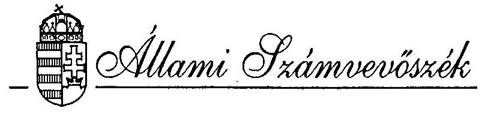
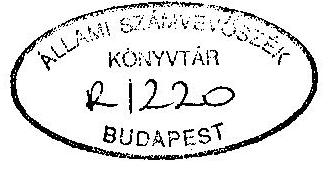
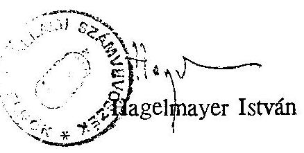
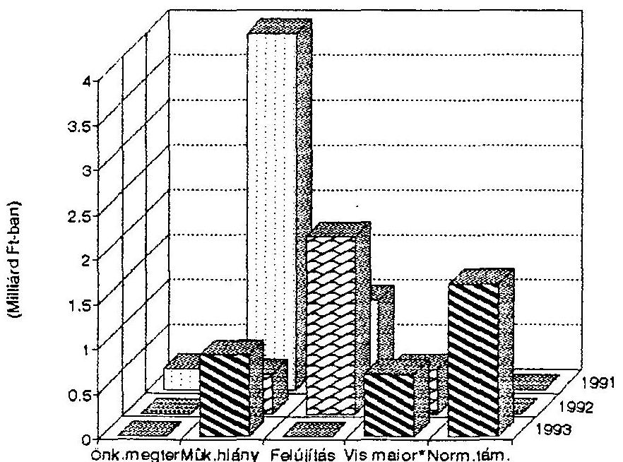
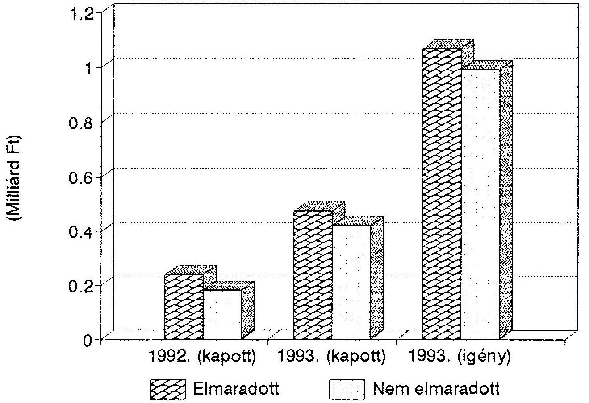
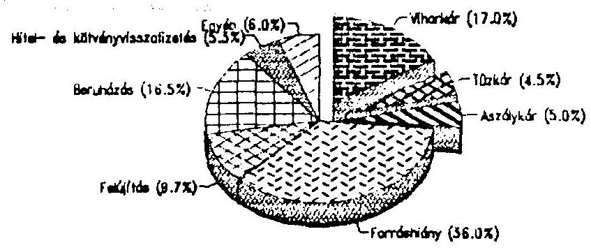

# JELENTÉS 

az önhibájukon kívül hátrányos helyzetben lévô önkormányzatok
1993. évi kiegészítô támogatásának ellenôrzésérôl

---

# JELENTÉS 

az önhibájukon kívül hátrányos helyzetben lévő önkormányzatok 1993. évi kiegészitő támogatásának ellenőrzéséről

Az önhibáján kivül hátrányos helyzetben lévô települési önkormányzatokat önállóságuk és müködőképességük megtartása védelmében az önkormányzati törvény 87.paragrafusának (1) bekezdése alapján 1993. évben is kiegészitő támogatás illette meg.

A Parlament az 1993. évi állami költségvetéséről szóló 1992. évi LXXX. törvény 18. § b/ pontja alapján az önhibáján kívüli hátrányos helyzetű önkormányzatok támogatására 1500 millió Ft-ot hagyott jóvá, melyböl 600 millió Ft-ot a rendkívüli körülményekkel /vis maior/ kapcsolatos kiadásokra különített el.

A Kormány a 122/1993. /IX. 16./ Korm. sz. rendeletével a pénzügyminiszter és a belügyminiszter együttes javaslatára - egyedi felülvizsgálat alapján - döntött az önkormányzatok támogatási igényeinek elfogadásáról.
A törvény felhatalmazása szerint a pénzügyminiszter és a belügyminiszter együttes döntése értelmében a vis maior keretből 1993. évben 107 önkormányzat 676.924 ezer Ft támogatást kapott.

Az Állami Számvevőszék éves ellenőrzési tervének megfelelően vizsgálta az 1993. évi kiegészitő̉ támogatás igénybevételének és felhasználásának a szabályszerűségét, célszerűségét.

A vizsgálat célja annak megállapítása volt, hogy:

- az önkormányzatok által közölt adatok valósnak minősíthetők-e, megfelelő információt jelentettek-e a kérelmek elbírálásához,
- megítélhető-e objektíven az önkormányzatok hátrányos helyzete, a kért adatszolgáltatás alapján,

---

- a TÁKISZ-ok közreműködése megfelelő információt nyújtott-e a kérelmek elbírálásához,
- megalapozottnak ítélhetők-e a hozott döntések,
- milyen okokra vezethető vissza az önkormányzatok hátrányos helyzete,
- a kapott támogatásokat mire fordították az önkormányzatok.

Helyszíni ellenőrzést tartottunk a Pénzügyminisztériumban, továbbá 13 megyében a megyei TÁKISZ-oknál, a kiegészítő támogatásban részesülő önkormányzatok 49,7\%-ánál, valamint a törvényi előírásoknak megfelelő támogatási igényt benyújtó, de elutasított önkormányzatok $28,8 \%$-ánál, a tartalékkeretből támogatott önkormányzatok $34,3 \%$-ánál. A 128 önkormányzatnál végzett ellenőrzés a támogatási keret $49 \%$-ára terjedt ki.

Az önkormányzatok kiegészítő támogatásának szükségességét az 1990-től életbe lépett új forrásszabályozási rendszer bevezetése tette indokolttá. Az Országgyúlés az önhibáján kívül hátrányos helyzetbe kerülő önkormányzatok kiegészítő támogatására 1991-ben 5, 1992-ben 2,75 milliárd Ft-ot irányzott elő.
A számvevőszék minden egyes alkalommal ellenőrizte a kiegészítő támogatás igénylésének, juttatásának és felhasználásának szabályszerűségét, eredményességét. Valamennyi vizsgálatunk alapvető szabályozásbeli ellentmondásokra és hiányosságokra hívta fel a figyelmet, javaslatot tettünk a szabályozórendszer módosítására, és a konkrétan kimutatott jogtalanul igénybe vett támogatások visszavonására. Megállapításaink azonban csak részben hasznosultak.

Az önkormányzati törvény e támogatási formára való alanyi jogosultságot keretjellegủen szabályozza, nem határozza meg az egyes fogalmak konkrét tartalmát. Előírja, hogy a támogatás mértékét, az igénylés feltételeit az éves költségvetési törvényekben kell meghatározni.

Először az 1991. évi költségvetésről szóló CIV. törvény 1 § (5) bekezdése rendelkezett az önhibáján kívül hátrányos helyzetben lévő önkormányzatok kiegészítő állami támogatásának mértékéről. Felhatalmazta a Kornányt, hogy intézkedjen az önkormányzatok ehhez kapcsolódó adatszolgáltatási kötelezettségének előírásáról, valamint a keretösszeg két ütemben történő felhasználásáról.

Az ellenőrzéseink megállapították, hogy a törvényileg szabályzott feltételrendszer hiányából, az igénylés rendszerének korlátaiból adódóan a kiegészítő támogatás elosztásának nem volt egzakt, objektív klinduló pontja. Az igény

---

meghatározásánál bázisszemléletű kiadások szolgáltak alapul, és a kiadások levezetésénél a korábbi alkumechanizmusra emlékeztető elemek is megjelentek.

1992-ben a kiegészítő támogatás feltételrendszerét az Országgyűlés külön, az 1992. évi XXIX. sz. törvényben határozta meg. A törvény előkészítői próbálták figyelembe venni, hogy a támogatás összege az önkormányzatok számára azonos feltételek mellett, a törvényben meghatározott számítási módszer alkalmazásával és adatszolgáltatással meghatározható legyen.

Az 1992. évi kiegészítő támogatás feltételrendszerének törvényi szabályozása és a kimutatott forráshiány teljeskörü elismerése elvileg biztosította volna, hogy az önkormányzatok az 1990. évi LXV. törvénynek megfelelően alanyi jogon jussanak a kiegészítő támogatáshoz.
Valójában ez 1992-ben sem valósulhatott meg. A nem megfelelően előkészített törvényl szabályozás szubjektív döntési mechanizmust eredményezett. A Pénzügyminisztérium a pályázatok felülvizsgálata közben több esetben korrigálta a szabályozás hiányosságait, belső ellentmondásait. A kérelmek formai felülvizsgálata alapján hozott döntések nem vették figyelembe az önkormányzatok különböző gazdasági, pénzügyi helyzetét.

A számvevőszék a kiegészítő támogatás múködését - már az 1991. évi vizsgálat alapján - kizárólag rendkívüli esetekben, egzakt feltételrendszer és egyedi elbírálás mellett javasolta fenntartani.
Ezt erősítette az 1992. évi kiegészítő támogatás elosztásának vizsgálata is. Nyilvánvalóvá vált, hogy az "önhibáján kívül hátrányos helyzet" meghatározása, kezelése az eddig alkalmazott módszerekkel nem tartható fenn, és feloldhatatlan ellentmondásban van az önkormányzatok forrásszabályozási rendszerével. Javasoltuk továbbá, hogy az 1993. évi igények benyújtását megelőzően egységes bírálati szempontok közzétételére tegyenek intézkedést.

Az elmúlt három évben a rendszer generális megváltoztatására nem került sor hivatkozva arra, hogy az önkormányzati törvény módosítása nem időszerű. Továbbra is fennmaradt a forráshiányos önkormányzatok "kiadás szemléletű" támogatása azzal a lényeges módosítással, hogy a támogatás feltételeit 1992-től már törvényben szabályozták, és 1993-ban egyedi elbírálás alapján ítélték oda a támogatásokat. Az irányadó jogszabályok azonban változatlanul hiányosak, nem tartalmazzák a kérelmek benyújtásához, elbírálásához nélkülözhetetlen szabályokat, tartalmi meghatározásokat.

A vizsgálataink által feltárt jogtalanul igénybevett támogatások és elutasított igények rendezésére is csak részben történt intézkedés.

---

Az 1991. évi támogatásról készült mindkét jelentést az Országgyűlés Önkormányzati, közigazgatási, belbiztonsági és rendőrségi bizottsága megtárgyalta, a jelentésekkel és a javaslatokkal egyetértett. Az első vizsgálat alapján nettó összegben 187.288 ezer Ft odaitélésére került sor az elutasított vagy részben elutasított önkormányzatoknak az 1992. évi keret terhére.
Ezzel szemben a második vizsgálatnál a két önkormányzatot érintő 10-10 millió Ft jogtalan támogatást nem vonták vissza.

Az 1992. évi támogatás elosztásáról készült jelentést parlamenti bizottság nem tárgyalta meg, és a javasolt 245.635 ezer Ft - valótlan adatszolgáltatás miatt jogtalanul igénybe vett támogatás visszavonására nem történt intézkedés annak ellenére, hogy az 1992. évi költségvetési törvény rendelkezik a kérelemben valótlan adatot szolgáltató önkormányzatok visszafizetési kötelezettségéről. A PM és a BM nem értett egyet a javaslattal, hivatkozva arra, hogy a támogatás már felhasználásra került és annak visszafizetése újabb forráshiányt okozna. A támogatások jó célra, alapvetően a müködésre kerültek felhasználásra, és a visszavonás eljárási rendje nincs kialakítva. Valójában azonban a szabályozási és az elosztási rendszer hiányosságai, ellentmondásai nem adtak kelló alapot az önkormányzatokkal szembeni következetes eljárásra.

# A vizsgálat megállapításai 

## I. Az 1993. évi kiegészítő állami támogatás feltételrendszere, szabályozottsága

1993. évben az önkormányzatok kiegészítő támogatási rendszerében az önkormányzati törvényben megfogalmazott alanyi jogosultság irányába történt elmozdulás.

Állandó lakosonként 2200 Ft/fő illette meg a gazdasági, társadalmi szempontokból elmaradott település önkormányzatát az 1992. január 1-jei állandó népesség száma alapján. (A települések jegyzékét a 97/1992. (VI.16.) Korm. sz. rendelet tartalmazta, amely az 1986. évi területi lehatároláson alapuló 1991. évi kijelölést nem helyezte új alapokra).

Így 1993. évben a kiegészítő támogatás mértéke normatív alapon 1691 millió, egyedi felülvizsgálat alapján müködési hiányra 900 millió, tartalékkeret terhére 600 millió, azaz összesen 3191 millió Ft volt. A támogatás részaránya az önkormányzatok állami hozzájárulásán belül 1,2\%-ot képviselt, melyen belül az alanyi jogú (normatív módon elosztott) kiegészítő támogatás részaránya $53 \%$.

---

Az 1993. évi költségvetésben az önhibáján kívül hátrányos helyzetben lévő önkormányzatok kiegészítő támogatására elkülönített 1,5 milliárd Ft elosztásának mechanizmusát a kormányzati szervek ismét módosították, és igyekeztek megteremteni az egyedi elbíráláshoz szükséges információs bázist.
Az 1993. évi költségvetési törvény 6. sz. mellékletében a támogatás igénylésének feltételeit azonban nem egyértelmúen meghatározható és ellenőrizhető módon fogalmazták meg.

A Kormány egyedi felülvizsgálata alapján adható kiegészitő támogatást csak az az önkormányzat Igényelhetett, amely "a normativan képződő forrásokon túl, a saját források maximális feltárására, a kiadások lehetséges csökkentésére tett intézkedések mellett sem volt képes az alapvető lakossági ellátást nyújtó intézmények müködtetésére, valamint az 1990. december 31. előtt vállalt hitel,- kötvény kötelezettség, azok kamatai 1993. évi üteme teljesitésére."

A költségvetési törvény melléklete a kérelmek benyújtásának formai követelményeit és a kizáró feltételeket rögzíti, az elbírálás szempontjait azonban nem tartalmazza.

A TÁKISZ-ok törvényben előírt kötelezettsége volt a kérelmek összegyűjtése, rövid elemzés készítése, illetve a kérelmek továbbítása a Pénzügyminisztériumba.
A kérelmeket az önkormányzatok 1993. május 31-ig küldhették meg a TÁKISZ-oknak, melyet június 31 -ig továbbítottak.
Az igények összeállítására megfelelő idő állt rendelkezésre.
Az illetékes minisztériumok intézkedései alapján a TÁKISZ-ok további feladata volt még, hogy az 1991. és 1992. évi költségvetések és beszámolók adatait az 1993. évi költségvetés szerkezetének megfelelően mutassák ki, és egyeztessék az önkormányzatok költségvetési és zárszámadási rendeleteiben foglalt adatokkal. Az elemzéseikben térjenek ki az egyedi, sajátos problémák mellett a közalkalmazotti és köztisztviselői törvények tervezett hatására, a 13. havi bér tervezett összegére, a befektetett pénzügyi eszközök, értékpapírok, pénzeszközök nagyságrendjére, a folyamatban lévő beruházások saját forrásának esetleges hiányára.

A TÁKISZ-ok a törvényben elöírt feladatukat - többnyire megfelelő színvonalon - elvégezték, a birtokukban lévô információk alapján általában reális értékeléseket készítettek a benyújtott igényekhez, az önkormányzatok adataiban meglévő pontatlanságokat kiszürték. Az elemzések azonban nem minden esetben tértek ki a minisztérium által kért szempontokra.

A TÁKISZ-ok értékelése az esetenkénti hiányosságok mellett is megfelelő kiindulási alapot adott az egyedi felülvizsgálathoz. Az elbírálás szempontjait azonban előzetesen

---

nem ismerték, így nem volt módjuk az elemzéseket ezek figyelembevételével célirányosan elkészíteni.

# II. A forráshiányos önkormányzatok támogatása 

1993-ban a 3148 települési önkormányzat közül 238 nyújtott be támogatási kérelmet, melyek összege meghaladta a 2 milliárd Ft-ot. A minisztériumok az egyedi felülvizsgálat alapján 165 önkormányzat igényét - részben, vagy teljes egészében tartották megalapozottnak, 73 települési önkormányzat igényét javasolták elutasítani.

A Kormányhatározat előterjesztése szerint az önkormányzatok által igényelt kiegészítő támogatás összegét az egyedi felülvizsgálat során csökkentették az alábbi jogcímekre hivatkozva:
—az 1993. május 1-jei hatályú, központi bérpolitikai intézkedésre adott állami támogatás összegével,

- a bruttó módon megtervezett 13. és/vagy 14. havi bér összegével,
— egyéb bérnövekményként tervezett összegekkel,
— részlegesen a beruházásokra, felújításokra a költségvetésben szereplő összegekkel.

Az egyedi felülvizsgálatra alapozott kiegészítő támogatási keret elosztása már a kiindulásnál ellentmondásos volt. A javasolt támogatás összegét a jelzett támogatási igényből kiindulva - csökkentéses módszerrel - állapították meg. Előzetesen kiadott szempontok hiányában azonban az önkormányzatok igen eltérő tartalommal határozták meg a támogatási igényüket.
A vizsgált önkormányzatok többsége a költségvetésében működési hitellel fedezett forráshiányt igényelte meg. Viszont számos önkormányzat szöveges kérelemben mutatta be azokat a kiadási szükségleteket, amelyeket forrás hiánya miatt nem tudtak betervezni, illetve azokat az elkötelezettségeket (hitelvisszatérítések, folyamatban lévő́ beruházások), amelyek teljesítése múködési problémákat okozhat.

Mindezek alapján az önkormányzatoknál eltérő induló helyzet (eltérő bázis) alakult ki, melyet tovább torzított a csökkentés indokaként feltüntetett okok nem kelló megalapozottsága, illetve ezen okok érvényesítésének következetlensége. (3. sz. melléklet)

Az 1993. május 1-jei hatályú központi bérpolitikai intézkedésre nyújtott állami támogatás összegének levonása az önkormányzatok kimutatott forráshiányából

---

indokolatlan volt. Az 1993. évi költségvetés elkészítésének és elfogadásának időpontjában a településeknek nem volt információjuk az esetleges központi bérfejlesztés időpontjáról, mértékéről így a kiadásaik között ez az előirányzat nem volt betervezve, azaz a kimutatott forráshiányok e tényező nélkül kerültek meghatározásra.
Ugyanakkor az egyedi felülvizsgálatot végzők az általuk meghatározott bírálati szempontokat sem alkalmazták következetesen.

Nem csökkentették e címen Békés megyében Csorvás, Almáskamarás, Magyardombegyház, Borsód-Abaúj-Zemplén megyében Sajövelezd, Tolna megyében Várdomb, Zala megyében, Vindornyaszólós önkormányzatok támogatási igényét.
Borsod-Abaúj-Zemplén megyében Bodrogolaszi, Tiszaladány községek az 1993. évi költségvetésükben nem terveztek be bérfejlesztést fedezet hiányában/, ennek ellenére az 1993. május 1 -jei központi bérpolitikai intézkedés fedezetét levonták a támogatási igényböl.

A 13. havi bér bruttó módon való megtervezése miatti levonás sem volt jogos és egységes.
Abban az esetben indokolt lenne a beterjesztett igények csökkentése, ha az önkormányzatok e jogcímen az 1993. évi munka alapján járó összegeket tervezték meg. Amennyiben az önkormányzat 1993. évi költségvetése az 1992. évi 13. havi illetményt tartalmazta, a tervezés szabályszerű volt, mivel kifizetését törvény teszi kötelezővé.

Mindezek alapján Indokolatlan csökkentés történt, például Hajdú Bihar megyében Szerep község, Heves megyében Heves város, Nógrád megyében Patak és Rétság, Pest megyében Aszód önkormányzatoknál.

Az alkalmazott bírálati elv egységes érvényesítése érdekében viszont csökkenteni kellett volna Hajdú-Bihar megyében Zsáka, Szentpéterszeg, Borsod-Abaúj-Zemplém megyében Sajövelezd, Békés megyében Csorvás, Almáskamarás, Bélmegyer, Zala megyében Nagygörbö, Szentpétertúr, Vindornyaszólós önkormányzatok igényét is.

A felhalmozási és tőkejellegủ kiadások elismerése, illetve az igények e címen való csökkentése - az önkormányzatok saját forrásának hiányára hivatkozva - a bírálók szubjektivizmusának tág teréül szolgált. Az önkormányzatok egy részénél a javasolt támogatási összeg meghatározásánál figyelmen kívül hagyták ezen előirányzatokat, más önkormányzatoknál részlegesen elfogadták, míg az esetek jelentős részénél teljes összegben beszámították korrekciós tényezőként.

---

A korrekciók érvényesítésénél az egyedi elbírálás során egyéb tényezőket (térségi hovatartozás, infrastrukturális ellátottság, a folyamatban lévő beruházások esetleges leállítások következményei, a gazdaság helyi adottságai stb.) is próbáltak figyelembe venni. Az elbírálás megalapozottsága, objektivitása azonban - többnyire a megfelelő információ hiányára, valamint a müködőképesség kritériumainak behatárolatlanságára visszavezethetően - a helyszíni vizsgálat tapasztalatai alapján több esetben vitatható.

Hajdú-Bihar megyében Újtilkos község önkormányzata 1991. évben vásárolta meg 2,5 millió Ft-ért a polgármesteri hivatal épületét. Az utolsó részlet 750 ezer Ft volt, melynek kifizetése 1993. évben vált esedékessé, így a költségvetésben ezen összeg fejlesztési kiadásként szerepelt. A település igényét emiatt csökkentették, annak ellenére, hogy az önkormányzat 1993. évre a fejlesztési és müködési kiadásait az előző évihez képest alacsonyabb szinten állitotta be a költségvetésébe.

Nógrád megyében Örhalom község támogatási igényét az ivóvízberuházásra szánt összeg miatt csökkentették, holott a törvény melléklete az ivóvízberuházások megvalósitóit nem zárta ki a támogatottak köréből. A település évek óta e feladatra tartalékol, a lakosság száma alapján a kedvezőbb ( $90 \%$-os) támogatástól elesett.

Somogy megyében Csoma községnek az 1993. évi költségvetésében felhalmozási kiadásaihoz 14.646 ezer Ft saját forrás volt szükséges. Ennek fedezetét a 9778 ezer Ft pénzmaradvánnyal, illetve a tervezett 6827 ezer Ft hitel felvételével kívánták megteremteni. A település 3000 ezer Ft támogatásban részesült, holott folyó kiadásainál $56,5 \%$-os növekedést tervezett a jelentős fejlesztési kiadásai mellett.

Tolna megyében Alsónána a betervezett 3 millió Ft-on felül 800 ezer Ft-ot igényelt orvosi rendelő felújitására, melyet elismertek annak ellenére, hogy költségvetésében nem tervezte meg.

Szabolcs-Szatmár-Bereg megyében Gacsály község gázellátását biztosító beruházása 1992-1993-ban valósult meg, az 1993. évi költségvetés e feladatra 5015 ezer Ft-ot irányzott elő. A beruházás fedezetére az ÁFI $50 \%$-os fedezetet biztosított. A további $50 \%$ a lakosság, az önkormányzat, és a gazdálkodó egységek hozzájárulásából tevődött volna ki. Az önkormányzatnál e beruházás kiadásait figyelmen kívül hagyva önhibáján kívül hátrányos helyzet nem alakult ki, mégis részesült kiegészitő támogatásban.

Hajdú-Bihar megyében Magyar homorog község önkormányzata által benyújtott igény 6,4 millió Ft volt, melyet a kiadási szükségletek alultervezése címén 1 millió Ft-al megnöveltek. A beterjesztett igényt nem csökkentették sem a központi bérpolitikai intézkedés, sem a betervezett 13. havi bér összegével. Az 1993. évi költségvetésben $44,6 \%$-os müködési kiadás növekedést irányoztak clő.

---

A támogatás teljes összegét fejlesztési kiadásokra fordították, sőt ezen túlmenően kiadási megtakarításból is 2,3 millió Ft fejlesztést valósítottak meg.

A törvényi előírásnak megfelelő igényt benyújtó, de kérelmüket elutasított önkormányzatoknál végzett helyszíni ellenőrzés tapasztalatai szerint az elutasítás általában megalapozott volt. Előfordult azonban olyan elutasítás is, amelyiknek megalapozottságát vizsgálatunk nem támasztotta alá.

Heves megyében Kömlő Önkormányzat 6,8 millió Ft-os támogatási igényének teljes elutasítása. A kérelemben megfogalmazott 2,5 millió Ft dologi kiadási elöirányzat /szociális ellátás minimális biztosítására/ forrás hiány miatt nem került megtervezésre az 1993. évi költségvetésben.

Tolna megyében Várdomb község önkormányzatának támogatási kérelmét a vastalanító beruházásának saját forrás hiányára való hivatkozással utasították vissza, holott az egészséges ívóvíz biztosítása törvényben előirt önkormányzati feladat.

# Az önkormányzatok adatszolgáltatása 

Az önkormányzatok többségére jellemző volt a benyújtott kérelmek korrekt összeállítása. Kevésbé volt tapasztalható az a bevétel eltitkolási és kiadást megalapozatlanul növelő gyakorlat, amelyet az 1992. évi helyszíni ellenőrzéseinknél tapasztaltunk.
Ennek ellenére a helyszíni ellenőrzések több hiányosságot is megállapítottak.

- A bevételi forrásokat néhány önkormányzatnál nem teljeskörűen vették számba az 1993. évi költségvetés tervezése során.

Zala megyében Lenti városnál az előző év tényszámaival ellentétben banki kamatbevételt alacsony összegben irányoztak elő, továbbá 1500 ezer Ft banki betétként lekötött pénzeszközt nem vettek figyelembe saját forrásként. Páka, Csömödör, Zalabaksa az előző évi pénzmaradványát csak részben, míg Csesztreg egyáltalán nem tervezte vissza.

Hajdú-Bihar megyében a 11 ellenőrzött önkormányzat közül 5-nél fordult elő, hogy az előző évi pénzmaradvány összegét az 1993. évi költségvetés tervezése során nem, vagy a ténylegesnél lényegesen alacsonyabb összegben vették figyelembe. Nem tervezett pénzmaradványt Furta, Álmosd község önkormányzata.

---

Zsáka község önkormányzata 1993. évi költségvetés tervezésének időszakában 6,5 millió Ft lekötött betéttel rendelkezett, és a kamatbevétel éves szinten 2072 ezer Ft volt. A költségvetésben ilyen címen előirányzatot nem tervezett.
—Az 1993. évi költségvetések szabálytalanul megtervezett kiadási előirányzatokat is tartalmaztak, melyek hatással voltak az önkormányzatok által igényelt kiegészítő támogatás mértékére.

Zala megyében Nagygörbő község 1992. decemberében Kft üzletrészt vásárolt 1500 ezer Ft-ért likvid hitel felvételével. E hitel visszafizetés teljes összegét az 1993. évi költségvetésében müködési hiányként kezelte.

Vas megyében Apátlstvánfalva község az igényelt és kapott 800 ezer Ft kiegészítő támogatásból 340 ezer Ft-ot jogtalanul vett igénybe, mert a Víziközmü Társulat pénzforgalmával összefüggésben az önkormányzat 1993. évi kiadásai között 340 ezer Ft hiteltörlesztést tervezett be, a lakossági befizetésekkel viszont nem számoltak.
—Az éves költségvetések, zárszámadások képviselőtestületi előterjesztéseinek tartalmi színvonala eseteként rendkívül alacsony, nem alkalmas a gazdálkodás átfogó elemzésére, az önkormányzat pénzügyi helyzetének reális megítélésére.

Számos önkormányzat költségvetési rendelete nem a költségvetési és az államháztartási törvények szerint tartalmazta a kiemelt előirányzatokat (bér, TB, fejlesztés).

A képviselötestületck által alkotott rendeletek és a költségvetési információk tartalmi azonosságát nem biztosították.

A fenti hiányosságok - a pénzmaradvány elszámolás pontatlanságai, a tervezési problémák - alapvetően szakmai felkészültség hiányára vezethetők vissza, való́tlan adatszolgáltatásnak nem minősíthetők. Az alkalmazott elosztási rendszerben a támogatásra való jogosultságot nem kérdőjelezik meg, sőt mértékének csökkentésére sem adnak egyértelmú alapot.
Nem hagyható figyelmen kívül ugyanis, hogy a döntés 3 év adatain és szöveges helyzetelemzésén alapult, melyből többek között megállapítható volt a működési, felhalmozási kiadások növekedési üteme, arányváltozása, a bevételek előirányzatának alakulása és teljesítése, a pénzmaradványok visszatervezése.
A pénzügyi helyzet és az önkormányzatok által bemutatott gazdálkodási körülmények ismeretében hozott döntés következtében kapott támogatás az önkormányzatokra nézve nem tekinthető jogtalan igénybevételnek még akkor sem, ha az önkormányzat saját döntése miatt került forráshiányos helyzetbe.

---

A szabályozás kiszámíthatatlan volta, a gazdálkodás feltételeinek az önkormányzattól független jelentős változásai, a kötelező feladatellátás szintjének meghatározatlansága miatt a kiadások indokoltsága, a döntések megalapozottsága - fóleg több év távlatában - egyértelmúen nem minősíthető.

A vizsgált önkormányzatok 1993. évi költségvetési előirányzatai többnyire csak a közalkalmazotti és a köztisztviselői törvény illetményrendszerének fokozatos bevezetéséhez szükséges, továbbá az árváltozások és a szociálpolitikai többletfeladatok miatti előirányzatokkal haladták meg az előző évit.

A forráshiányos önkormányzatok többsége a település hátrányos helyzete miatt bevételnővelő intézkedést nem tudott hozni. Az elöregedett népesség, a jelentős munkanélküliség, a közmúvesítés terhei miatt a helyi adó bevezetése nem jelentett volna számottevő realizálható többletbevételt.
A viszonylag kedvezőbb helyzetben lévő, nagyobb vagyonnal rendelkező önkormányzatok helyi adó bevezetésével, ingatlan értékesítéssel jutottak többlet bevételi forráshoz.

A kiadások mérséklésére szélesebb körben tettek intézkedéseket az önkormányzatok, amelyek zömében racionális megtakarításokat eredményeztek. Ezek elsősorban alacsony kihasználtságú intézmények kapacitásának csökkentésére, megszüntetésére, az intézmények integrálására irányultak.

Nógrád megyében Pásztó bölcsődei kapacitás csökkentése, Müvelődési Ház, Könyvtár összevonása, Rétság ÖNO megszüntetése. Csongrád megyében Pusztamérges község megszüntette az Általános Müvelődési Központot, mint önállóan gazdálkodó intézményt. Szabolcs-Szatmár-Bereg megyében Fehérgyarmat város bölcsőde és óvoda összevonása mellett döntött, Baktalorántháza, Tarpa megszüntette a bölcsődét. Zala megyében Csesztregen óvodai csoportokat vontak össze és a helyi múvelődési központ müködési szervezetét is módosították, mely intézkedéssel 5 munkakört tudtak megszüntetni.

E mellett egyre gyakoribbak az olyan intézkedések, amelyeket a kényszer szült. Jellemzőjük, hogy takarékossági hatásuk mérhető, de az önkormányzati feladatellátás hosszabb távon nagyobb mértékben romlik.

A közkutak leszerelése Mihálygerge, a felújítási feladatok teljes elhagyása Heves város és Nagyút, a dolgozóknak koráhhan adott béren kívüli juttatások megvonása Pusztamérges önkormányzatoknál.

A forráshiány miatt kiegészítő támogatásban részesült önkormányzatoknál a törvényben megfogalmazott kizáró okok nem álltak fenn, azaz 1993-ban indított céltámo-

---

gatott beruházásuk és hat hónapra vagy ennél hosszabb időre lekötött tartós betétjük nem volt. Szabad pénzeszközeiket általában két, három hónapos határidőre helyezték el tartós betétbe, és a lekötést többször megismételték.

# A hátrányos helyzet oka, és a támogatások felhasználása 

Az ellenőrzés által érintett önkormányzatok forráshiányának kialakulása több társa-dalmi-gazdasági és költségvetési szabályozási problémára vezethető vissza. Az egyedi felülvizsgálaton alapuló kiegészítő támogatásban részesülő önkormányzatok 53\%-a a társadalmilag, gazdaságilag elmaradott térségekbe tartozik.

Az elmúlt években megjelent törvények, rendelkezések jogos igényeket fogalmaztak meg. /Oktatási törvény, közalkalmazotti, köztisztviselői, szociális törvény, az egyházi tulajdon visszaadása stb./. E törvények végrehajtásához szükséges anyagi fedezetet központilag csak részben kompenzálták, és ennek következtében az önkormányzatok kiadási szükségletei a bevételeknél nagyobb mértékben növekednek.

A forráshiányos helyzetet döntően az önkormányzatok által alacsony kihasználtsággal müködtetett intézményhálózat fenntartása idézte elő.
A volt székhely települések körzeti feladat ellátására kiépített intézményei a helyi lakossághoz túlméretezettek.
A kistelepüléseknél a demográfiai okok, valamint az alsótagozatok helyben történő újra indítása miatt alsófoikú oktatásban, a kislétszámú osztályokban az oktatás fajlagos költségei magasak, s a normatív állami támogatást jelentősen ki kell egészíteni. Az ehhez szükséges pénzügyi források e települések egy részénél nem állnak rendelkezésre.
Az érintett települések alapellátást nyújtó intézményekből csak egyet üzemeltetnek, így a nagyobb kihasználtságot és a fajlagos költségcsökkentést összevonással nem lehet elérni.

Borsod-Abaúj-Zemplén megyében Tiszaadányban 12, Erdőhorvátiban 13, Sajóvelezden 14, Krasznokvajdán 16 fő az általános iskolai tanulócsoportok létszáma.

Csongrád megyében Öltömös község önkormányzata az 1993. évi eredeti bevételi előirányzatának 77,3 \%-át tervezte az Általános Müvelődési Központ müködtetésére. (Nem beszámítva a müködési hitelt).

Hajdú-Bihar megyében Bedő községi önkormányzat által fenntartott általános iskolában összesen 30 fôt oktatnak. A 3 összevont és 2 önálló osztályban a tanulólétszám 4 -től 7 fơlg terjed. Egy gyermek oktatására 183 ezer Ft-ot

---

irányoztak elő. A község 10 óvodáskorú gyermekének ellátására közel 1,8 millió Ft-ot terveztck be. Mezôas községi önkormányzat általános iskolájában a gyermeklétszám összesen 66 fó, melyböl 1-1 osztályba 7 - 11 fó közötti gyermek tanul.

Jelentős azoknak az önkormányzatoknak a száma, amelyek az elmúlt években - az öröklött elmaradottságuk csökkentése érdekében - alapellátást biztosító beruházást, felújítást hajtottak, illetve hajtanak végre saját pénzügyi lehetőségeiket meghaladóan, és a felvett hitelek törlesztése, kamatai, a fejlesztési kiadások, valamint az ezek megvalósítása révén jelentkező többlet müködési kiadások miatt váltak forráshiányossá.

Az önkormányzatok a kormányzati döntés elhúzódása, (az igényt május 31-ig kellett benyújtani, a Kormányrendelet 1993. IX.16-án kelt) és az igényelt támogatás különböző indokok alapján történt csökkentése miatt a tervezettnél is visszafogottabb gazdálkodásra kényszerültek.
A kiegészítő támogatás révén az önkormányzatok többsége a betervezett müködési hitel felvételét el tudta kerülni. Néhány esetben az említett okok miatt hitel felvételére kényszerültek.

Heves megyében Heves városnak már a támogatás átutalását megelőzően 1993. év júliusában 15 millió Ft müködési hitelt kellett felvennie. A szeptemberben átutalt kiegészítő támogatás ellenére decemberben újabb 7 millió Ft rövidlejáratú, továbbá 8,9 millió Ft munkabér hitel felvételére kényszerült.

Nagyút község a támogatás kiutalását megelőzően, 1993. március, április, június és július hónapokban 760 ezer Ft munkabér hitelt vett fel.

Nagykötényes község önkormányzata 1993. július 23-án a müködés biztosítása érdekében 5 millió Ft hitel felvételére kényszerült.

Az önkormányzatok többsége a kiegészítő támogatást az igényekben megfogalmazott célokra - müködtetésre, ezen belül is a tervezett bérfejlesztésekre, valamint az 1990. év előtt felvett hitel 1993. évet terhelő tőke és kamattörlesztésre, beruházásokra, felújításokra stb. - fordították. A kapott támogatások általában csak az 1993. évi müködésképtelenséget, eladósodást akadályozták meg, a hátrányos helyzetet kiváltó okok megszüntetését nem segítették elő. Ezek a települések várhatóan a jelenlegi szabályzőrendszer hatályban tartásáig potenciális pályázói lesznek e támogatási formának.

---

# III. A tartalékkeret terhére nyújtott támogatás 

Az 1993. évi költségvetésben a kiegészítő támogatásból 600 millió Ft-ot különítettek el, melynek összege az 1992. évi költségvetés végrehajtásáról szóló törvény előírásának értelmében év közben 85.719 ezer Ft-al növekedett.

A törvényi szabályozás a tartalékkeretet váratlan események, természeti vagy más károk mérséklésére, valamint az előre nem látható, az önkormányzat körültekintő gazdálkodása ellenére jelentkező kötelezettségek elismerésére hozta létre.

A tartalékkeret terhére beadott önkormányzati kérelmek igen széleskörű okokra hivatkozva igényeltek támogatást.

Az önkormányzatok az igényeiket vagy a Belügyminisztériumhoz vagy a Pénzügyminisztériumhoz terjesztették be. A Pénzügyminisztériumban összegyűjtött 197 kérelemből 16 nem felelt meg a törvényben előirt formai követelményeknek és 102 önkormányzat kapott támogatást, összesen 682.746 ezer Ft-ot. A támogatásban részesülő önkormányzatok igényeikhez általában csatolták a törvényben előírt okmányokat.

Az igényeket a két minisztérium vezető munkatársaiból álló bizottság kilenc ütemben vizsgálta felül. A bizottsági döntések mellett négy esetben volt külön intézkedés. (5. sz. melléklet)
A megbeszélésekről készített emlékeztetőkben és feljegyzésekben rögzítették a bírálat szempontjait.
A kérelmek elbírálása azonban nem mindig volt következetes, vagy a meghatározott szempontokhoz igazodó.

Jásd önkormányzata életveszélyes iskola kiváltása címén kapott támogatást, Püspökhatvan a novemberi VIII. ütemben életveszélyes iskola felújítására kapott 5000 ezer Ft-ot, a II. ütemben életveszélyes iskola kiváltására kért támogatást, s azt elutasitották.

Nagylak a határátkelőhely gondjaira, Gyula a határátkelőhely felújításához kapott támogatást, ugyanakkor az 1993. évi költségvetésben a Belügyminisztériumnak határátkelőhelyek fenntartásának támogatására és határnyiladék tisztitására kiemelt elöirányzat állt rendelkezésre.

Hortobágy a IV. ütemben kért hiányzó infrastruktúra kiépitéséhez - összeg megjelölése nélkül - támogatást, ezt elutasították, majd a VIII. ütemben autóbusz vásárlásához kapott 4000 ezer Ft támogatást.

---

Természeti események (tűz-, vihar-, aszálykár) önkormányzatokat sújtó többletkiadásaira a tartalékkeretnek csak 26,5\%-át használták fel. (6. sz. melléklet)

Működési hiány fedezetére összességében a tartalékkeret 36\%-át fordították. Ebből 8 megyei önkormányzat 191,2 millió Ft támogatást kapott többnyire a térségi feladatokat ellátó intézmények többletkiadásai miatt. Ez összességében a tartalékkeret $28,2 \%$-át jelentette.
Működési forráshiányt kért, de elutasított önkormányzatok egy része is a vis maior terhére kapott támogatást (Kaposvár, Eperjeske, Tiszabő).
A vis maior keret müködési forráshiányra való felhasználása nemcsak azért kifogásolható, mert nem ezt a célt szolgálja, hanem azért is mert így a kiegészítő támogatásban részesülő önkormányzatok mentesülnek, illetve mentesülhetnek a kizáró feltételek teljesitése alól. Ugyanakkor több esetben ugyanazon kiadások fedezete képezi a támogatás alapját, ami miatt a forráshiányos önkormányzatok támogatási igényét csökkentették.

A tartalékkeret terhére a Heves megyei önkormányzat 1993-ban 40 millió Ft kiegészítő támogatásban részesült a költségvetésében kimutatott 80 millió Ft-os forráshiány csökkentése érdekében. Az eredeti költségvetésben kimutatott forráshiány abból adódott, hogy jelentős bérfejlesztést terveztek, továbbá a 20 millió Ft-os áthúzódó beruházáshoz 57,7 millió Ft-os 1993-ban induló beruházást terveztck.

A Nógrád megyei önkormányzat a kérelem indokoltságát a bér- és dologi kiadások kényszerủ emelésének szükségességével támasztotta alá.

Kaposvár önkormányzata külön intézkedés alapján 38.500 ezer Ft-ot kapott müködési hiányának részbeni fedezetére. Az önhibáján kivülí hátrányos helyzete miatti támogatási kérelme a törvényben foglalt előírásoknak megfelel, de a központi bérpolitikai intézkedés miatti csökkentés alapján kérelmét elutasitották.

Jelentős volt a tartalékkeret terhére vállalt olyan kötelezettség, amelyeket más központi forrás hiányában e keretből finanszíroztak. (Pl. szigetközi települések víziközmű fejlesztésénél három önkormányzatnak saját forrás biztosítása, személyes szabadságukban korlátozottak kárpótlása, színház múködtetés támogatása stb.)
Emellett kormányhatározat, BM kötelezettségvállalás alapján finanszíroztak különböző feladatokat. (Mezőberényi kollégium építéséhez kibocsátott önkormányzati kötvény törlesztő részletének 1993. évi esedékes visszafizetése, a nagyrévi általános iskola építésének támogatása)

---

A kérelmek között nagyszámú volt az alapellátást nyújtó intézmények, polgármesteri hivatalok felújítására, a már megkezdett beruházások befejezésére, valamint beruházási hitel (és kamata) visszafizetésére irányuló kérelem.
A beruházásokra, felújításokra, hiteltörlesztésre adott támogatás a keretösszeg $31,5 \%$-át tette ki.

A kérelmek elbírálását megelőzően a bírálónak nincs módja a kérelem megalapozottságának vizsgálatára, a valótlan adatok kiszűrésére, azaz csak arra van lehetősége, hogy a törvényben előírt feltételeknek megfelel-e az önkormányzat igénye.

Nyírlugos nagyközség 1993. évi hitel visszafizetési kötelezettségére kapott 13.400 ezer Ft kiegészítő támogatást a vis maior keret terhére. A helyszini ellenőrzés megállapította, hogy a település hitel visszafizetési kötelezettsége csak 1995. évtől esedékes, a támogatást a kamatok fizetésére, illetve kis részét hiteltörlesztésre fordították.

Tiszaszentimre község a gyermekélelmezés helyzetének megoldására 5500 ezer Ft-ot kért és 2750 ezer Ft-ot kapott. Ehhez az összeghez további 2750 ezer Ft-ot nem tudtak saját forrásból hozzátenni. Ezért a támogatás igénylésekor szándékozott felújítási munka (óvoda tetőterében étterem kialakítása) helyett más célszerűbbnek tartott módon (ÁFÉSZ étterem tulajdonjogának megszerzésével és felújításával) akarják helyileg megoldani a gyermekélelmezést.

Almáskamarás 6100 ezer Ft-ot igényelt az önkormányzati ingatlanokban keletkezett károk helyreállításához. (A helyreállítás tervezett költségeként 7300 ezer Ft-ot jeleztek.) A település részére 7300 ezer Ft támogatást biztosítottak. Az épületeket nem vizsgáltatták meg műszaki szakértővel, így szakértői véleménnyel nem rendelkeztek. A károsult épületként jelzettek közül az egészségház és az idősck klubja felújításához már 1991-ben kért kiegészítő támogatást az önkormányzat, de a kivitelezésre nem került sor. 1994. január végéig - a vizsgálat idejéig - egyik intézménynél sem kezdődött el a helyreállítás.

A fentiek alapján változatlanul az az álláspontunk, hogy a vis maior keret terhére odaítélt támogatás felhasználásáról az érintett önkormányzatokat célszerű lenne elszámoltatni.

---

# IV. Következtetések, javaslatok 

Az 1993. évi kiegészítő támogatás egyedi felülvizsgálatra alapozott előirányzatának elosztásánál továbbra is alapvető problémát jelentett, hogy az önkormányzati törvényben keretjelleggel meghatározott fogalmak az éves költségvetési törvény vonatkozó szakaszaiban, illetve mellékleteiben nem kerültek pontos meghatározásra (mit jelent az önhibáján hátrányos helyzet, mi a müködőképesség határa stb.). Az elmúlt évi vizsgálatunk kapcsán tett javaslatunk ellenére nem tették közzé az elbírálás szempontjait.

Az önkormányzatok teendőit az elmúlt években számos feladattal bővítették, az eddig sem tisztázott önkormányzati és központi feladatkör jobban elmosódott. Ezáltal az ellenőrzés során nem lehet egyértelműen minősíteni az önkormányzat kötelező állami feladatainak megfelelő szintű ellátását, illetve a kiegészítő állami támogatás célszerű felhasználását.

A kormányzati szervek a kiegészítő támogatás elosztásának mechanizmusát ismét módosították, és igyekeztek megteremteni az egyedi elbíráláshoz szükséges információs bázist. Az adatgyűjtés azonban elsősorban a TÁKISZ-oknál fellelhető számszaki beszámolókra, költségvetésekre szorítkozott. A rendelkezésre álló pénzügyi keretet jelentősen meghaladó igények miatt az elbírálás során csökkentéseket lelett alkalmazni. A kormányrendelet előkészítői viszont olyan korrekciós tényezőket is alkalmaztak, melyek az önkormányzatoktól bekért dokumentumokban nem szerepeltek. Mindezek alapján a rendelkezésre álló forrás és a benyújtott igények közötti összhangnak egy objektív mérce alapján történő megteremtésére nem nyílt mód.

A tartalékkeret terhére nyújtott támogatás igénylésének, odaítélésének feltételeihez kapcsolódó fogalomkör szabályozatlansága széleskörű lehetőséget biztosított mind az önkormányzatok, mind a bírálatot végző minisztériumok számára a támogatás igénylése, odaítélése, felhasználása tekintetében. Jelenlegi formájában ez a támogatási forma alkalmatlan arra, hogy csak a valóban rászorulókat támogassa és kiszűrje az ügyeskedőket.

Az egyedi felülvizsgálat keretében juttatott kiegészítő támogatás az érintett önkormányzatoknál enyhítette a feszültségeket, de a forráshiányt kiváltó okokat nem szüntette meg, ezért elsősorban az alacsony lélekszámű települések forrásainak kiegészítésére a jövőben is szükség lesz. A kiegészítő támogatást kapott önkormányzatok jelentős része a társadalmilag, gazdaságilag elmaradottnak minősített telepü-

---

lések közül került ki annak ellenére, hogy 1993-ban bevezették az alanyi jogú normatív kiegészítő támogatást. Ez arra is utal, hogy a támogatás mértéke alacsony, nem volt képes érdemi módon javítani a hátrányos helyzetű önkormányzatok pénzügyi helyzetét.

Ugyanakkor előre meghatározott szigorú feltételek hiányában, a kialakult forráshiány kezelésére hozott döntések nem állítanak korlátot az önkormányzatok anyagi megalapozottságot nélkülöző önállósági törekvéseinek, döntéseinek. Nem segíti elő a gazdálkodás racionalitását, nem ösztönöz a teherviselő képességhez igazodó fejlesztésekre, hanem egyfajta pénzszerzési lehetőséget kínál. Sőt önhibáján kívüli hátrányos helyzetként fogadja el az utóbbi évek túlméretezett intézményeinek működtetési problémáit is.
Mindezáltal a támogatási forma jelenlegi működése alapvetően ellentétes a bevételorientált forrásszabályozással.

Az 1993. évi költségvetési törvény a támogatás teljes összegének elvonását írja elő arra az esetre, ha a települési önkormányzat valótlan adatot szolgáltat, és azt az Állami Számvevőszék utólagos ellenőrzése megállapítja. Az alkalmazott igénylési és elosztási rendszerben a valótlan adatszolgáltatás lehetősége szűkült. A TÁKISZ-ok felülvizsgálatai többnyire kiszűrték az adatszolgáltatás pontatlanságait. A helyszíni ellenőrzés során tapasztalt - főleg a szakmai hozzáértés hiányára visszavezethető kisebb tervezési hiányosságok valótlan adatszolgáltatásnak nem minősíthetők, és a támogatás jogosságát nem kérdőjelezik meg, különösen ha figyelembe vesszük, hogy akkor is részesültek önkormányzatok kiegészítő támogatásban, ha működési forráshiányt nem mutattak ki.

A kiegészítő támogatás bevezetését alapvetően a normativitásra épített forrásszabályozási rendszer bevezetése tette indokolttá. Értékelve a támogatási rendszer 1991-1993. évi müködését, megállapítható, hogy a kiegészítő támogatás feltételeinek, az elosztás szempontjainak a meghatározásánál általában igyekeztek figyelembe venni az előző év tapasztalatait, ezért az elosztás jogcímei, arányai évről-évre jelentősen változtak. A támogatás összegének és az elosztás feltételeinek a tervezhetőségét, meghatározását nagymértékben nehezítette, hogy a szabályozási rendszer változását követően a közigazgatási rendszer is alapvetően átalakult, ami számos olyan - részben előre nem látható - problémát hozott felszínre, amelyek miatt az önkormányzatok forráshiányossá, kiegészítő támogatásra jogosultakká váltak. (Önkormányzatiság feltételeinek kialakítása, öröklött adottságok stb.). Mindemellett a támogatási rendszer egyes elemeinek alkalmazásánál jelentkező problémák utólagos kezelésére is e keret nyújtott lehetőséget.

---

Így a költségvetésekben meghatározott keret és a különböző - évenként változó okok miatt jelentkező igények összehangolására az elbírálás során került sor, ami nem tette lehetővé, hogy célirányosan meghatározott információkra alapozva objektív elosztás valósuljon meg.

Az elmúlt három évben évről-évre csökkenő összeget különítettek el e célra. Valójában a forráshiányos önkormányzatok között egyre kisebb arányban fordul elő olyan, amely a tanácsrendszertől örökölt adósság, elmaradottság miatt vagy az önkormányzat müködésének beindításához kér segítséget. Növekszik viszont azoknak a száma, amelyek a romló társadalmi-gazdasági helyzet és a pénzügyi szabályozó rendszer, valamint az önkormányzatiságból eredő egyéb okok (társulási kézség hiánya, közös fenntartású intézmények költségeinek rendezetlensége, megalapozatlan, több évre szóló elkötelezettség) hatására kerültek hátrányos helyzetbe.

A várhatóan növekvő számban jelentkező forráshiány kezelését nem célszerű az egyedi mérlegelések, kiszámíthatatlan döntések körébe utalni, hanem e támogatási formában is nagyobb szerepet kellene kapnia a normativitásnak. Ugyanakkor egyedi felülvizsgálat alapján csak rendkívüli helyzetekben lehessen igényelni kiegészítő támogatást.

Az 1994. évi szabályozás az 1993. évihez képest alapvetően nem változott, de kiszámíthatatlanabbá vált mind az elbírálók, mind az önkormányzatok számára. Az igényeket az év során folyamatosan lehet benyújtani, és az elbírálás a beérkezés sorrendjében történik. A rendelkezésre álló keret felhasználása után jelentkező jogos igényeket is ki kell elégíteni az önkormányzati törvény értelmében.

A jelenlegi szabályozó rendszerben vitathatatlanul szükséges, hogy a pénzügyileg gyengébb helyi önkormányzatok védelmében pénzügyi kiegyenlítő eljárások müködjenek, amelyek célja a potenciális pénzügyi források egyenlőtlen eloszlásából fakadó hatások, valamint az így keletkező pénzügyi terhek korrekciója, csökkentése. Erre kötelez az általunk is aláírt, az Európa Tanács által elfogadott Helyi önkormányzatok Európai Chartája is. Ilyen kiegyenlítő eljárások azonban - a kiegészítő támogatáson túlmenően - jelenleg is múködnek. Az ennek ellenére jelentkező nagyszámú igények a kiegészítő támogatás iránt arra utalnak, hogy egyrészt a kiegyenlítő eljárások nem kellően hatékonyak, másrészt - a kiegészítő támogatás elosztásának lehatárolatlan jogi feltételei miatt - az önkormányzatok azt remélték, hogy pénzügyi nehézségeik bemutatásával pótlólagos állami forrásokhoz juthatnak.

---

Mindezeket figyelembe véve vizsgálatunk alapján a Pénzügyminisztériumnak és a Belügyminisztériumnak az alábbiakat javasoljuk:

- az 1995. évi tervezési munkák keretében kezdeményezzék a kiegészítő támogatás jelenlegi formájának a megváltoztatását. Az egyedi elbíráláson alapuló kiegészítő támogatást csak rendkívüli helyzet kezelésére tartsák fenn, melynek felhasználásáról az önkormányzat köteles legyen elszámolni.
- A költségvetési tervjavaslat kidolgozása során - a forráshiányt kiváltó okok ismeretében - törekedjenek olyan szabályozás kialakítására (normativitáson alapuló kiegyenlítő eljárások hatékonyabbá tételével, kiegészítésével), amely alkalmas a potenciális erőforrások egyenlőtlen elosztásából fakadó hátrányok ellensúlyozására.

Budapest, 1994. augusztus

---

A vizsgálatot vezette és az összefoglaló jelentést összeállította:
Németh Péterné főtanácsos

A jelentés összeállításában közremúködött:
dr. Klapcsik László számvevő tanácsos
Marosi Gyöngyi számvevő tanácsos

Vizsgálatot végezték:
Békés megye:
Kollár Lászlóné számvevő tanácsos
Borsod-Abaúj-Zemplén megye:
Dankó Géza számvevő tanácsos
Csongrád megye:
dr. Klapcsik László számvevő tanácsos
Hajdú-Bihar megye:
Kozák György számvevő tanácsos
Heves megye:
dr. Tóth András számvevő tanácsos
Jász-Nagykun-Szolnok megye:
dr. Csapó Anna számvevő tanácsos
Nógrád megye:
Bocsi Sándor számvevő tanácsos
Pest megye:
dr. Katona Béláné számvevő tanácsos
Marosi Gyöngyi számvevő tanácsos
Somogy megye:
Huszti István számvevő
Szaboles-Szatmár-Bereg megye:
Kenéz Sándor számvevő tanácsos
Tolna megye:
Csekei Gyula számvevő tanácsos
Vas megye:
Tóth Ferencné számvevő tanácsos
Zala megye:
Csuti Lajos számvevő

---

# Önhibáján kívül hátrányos helyzetben lévő önkormányzatok kiegészitő támogatása az 1991-1993. években 

|  |  |  |  | E Ft-ban |
| :--: | :--: | :--: | :--: | :--: |
| Támogatás | 1991 | 1992 | 1993 | Összesen |
| Önk.megter. | 230000 | 0 | 0 | 230000 |
| Mük.hiány | 3965353 | 421707 | 900000 | 5287060 |
| Felújítás | 990786 | 1971202 | 0 | 2961988 |
| Vis maior* | 0 | 484025 | 682746 | 1166771 |
| Norm.tám. | 0 | 0 | 1691021 | 1691021 |
| Mindösszesen | 5186139 | 2876934 | 3273767 | 11336840 |

* Költségvetési elöirányzat évközi módosítással növelt összege

---

# 3. sz. me11éklet 

a V-1023/1993-94. sz. je1entéshez

## Kiegészítő támogatás megoszlása a vizsgált önkormányzatoknál

| Sor-
szám | Önkormányzat megnevezése | Jelzett   tämogatás igénye | Adott   tämogatás | Elterés okai |  |  |  |  |  | Vis   maior |
| :--: | :--: | :--: | :--: | :--: | :--: | :--: | :--: | :--: | :--: | :--: |
|  |  |  |  | Köze.bér-   pol.int. | Ber.szajit forrás | $13+(14)$.   havi bér | Sajit   bérfejt. | Felajit. igénye | Egyéb |  |
|  | Békés megye |  |  |  |  |  |  |  |  |  |
|  | 1 | Almáskamarás | 5122 | 4529 | 593 |  |  |  |  | 7300 |
|  | 2 | Battunya | 11000 |  | 3805 |  | 7195 |  |  |  |
|  | 3 | Bélmegyer | 3561 | 3684 | 677 |  |  |  |  | 1000 |
|  | 4 | Csonvás | 11300 | 5000 |  | 6300 |  |  |  |  |
|  | 5 | Kisdombegyháza | 1987 | 1752 | 235 |  |  |  |  |  |
|  | 6 | Magyardombegyház | 968 | 968 |  |  |  |  |  |  |
|  | 7 | Medgyesboczás | 5850 | 3339 | 569 |  | 1091 |  |  | 851 |
|  | 8 | Mezdberény |  |  |  |  |  |  |  | 22500 |
|  |  | Összesen | 41788 | 19272 | 6079 | 6300 | 8286 | 0 | 0 | 1851 |
|  |  | Borzod-Abaúj-Zemplén megye |  |  |  |  |  |  |  |  |
|  | 9 | Alsódobsza | 416 | 416 |  |  |  |  |  |  |
|  | 10 | Redropolnati | 2963 | 1269 | 494 |  | 1200 |  |  |  |
|  | 11 | Erdőhorvati | 2200 | 1118 | 457 |  |  |  |  | 625 |
|  | 12 | Halmaj | 10459 | 4300 | 859 | 3894 | 1406 |  |  |  |
|  | 13 | Homrogl | 6500 | 2645 | 395 | 1500 | 1308 |  |  | 652 |
|  | 14 | Kraszaukvajda | 4321 | 3827 | 494 |  |  |  |  |  |
|  | 15 | Sajkenyé | 3000 | 3000 |  |  |  |  |  |  |
|  | 16 | Sajtvelezd | 2000 | 2000 |  |  |  |  |  |  |
|  | 17 | Tiszaladány | 3726 | 1793 | 433 |  | 1500 |  |  |  |
|  | 18 | Vizsoly | 3867 | 1894 | 717 |  | 1256 |  |  |  |
|  |  | Összesen | 39452 | 22262 | 3849 | 5394 | 6670 | 0 | 0 | 1277 |
|  |  | Csongrád megye |  |  |  |  |  |  |  |  |
|  | 19 | Ambrozfalva | 7575 | 3500 |  | 4075 |  |  |  |  |
|  | 20 | Csanádalberti | 13429 |  | 260 |  |  |  | 13169 |  |
|  | 21 | Csongrád | 127014 | 110428 | 15455 |  | 1131 |  |  |  |
|  | 22 | Ottomos | 7098 | 6517 | 581 |  |  |  |  |  |
|  | 23 | Pitvants |  |  |  |  |  |  |  | 1100 |
|  | 24 | Pozziamérges | 1883 | 1067 | 766 |  |  |  |  | 50 |
|  |  | Összesen | 156999 | 121512 | 17062 | 4075 | 1131 | 0 | 13169 | 50 |
|  |  | Hajdú-Bihar megye |  |  |  |  |  |  |  |  |
|  | 25 | Almosd | 5500 | 2742 | 1001 |  |  |  | 1757 |  |
|  | 26 | Bedó | 4835 | 4349 | 12 | 440 | 34 |  |  |  |
|  | 27 | Bojt | 6909 | 6909 |  |  |  |  |  |  |
|  | 28 | Parta | 4500 | 2000 | 593 |  |  |  |  | 1907 |
|  | 29 | Hosszúpályi | 7315 |  | 2617 | 721 | 3977 |  |  |  |
|  | 30 | Kismarja |  |  |  |  |  |  |  | 2778 |
|  | 31 | Magyarkomorog | 6400 | 7400 |  |  |  |  |  | $-1000$ |
|  | 32 | Mezőssz | 8644 | 5613 | 531 |  | 1500 |  |  | 1000 |
|  | 33 | Nagyrábé |  |  |  |  |  |  |  | 3500 |
|  | 34 | Szentpéterszeg | 2459 | 1785 | 674 |  |  |  |  | 9500 |
|  | 35 | Szerep | 3500 | 1608 | 692 |  | 1200 |  |  |  |
|  | 36 | Told | 1217 | 1217 |  |  |  |  |  |  |
|  | 37 | ujikus | 4300 | 529 | 470 | 1650 | 700 |  |  | 951 |
|  | 38 | Zsáka | 12225 | 4531 | 1297 | 6397 |  |  |  |  |
|  |  | Összesen | 67804 | 38683 | 7887 | 9208 | 7411 | 0 | 1757 | 2858 |
|  |  | Heves megye |  |  |  |  |  |  |  |  |
|  | 39 | Heves megyei Önk. |  |  |  |  |  |  |  | 40000 |
|  | 40 | Átány | 4013 | 2000 | 692 |  | 1321 |  |  |  |
|  | 41 | Hatvan |  |  |  |  |  |  |  | 22106 |
|  | 42 | Heves | 52478 | 30482 | 7116 |  | 14880 |  |  |  |
|  | 43 | Kereszend | 5000 |  |  | 5000 |  |  |  |  |
|  | 44 | Kizeló | 6800 |  |  | 1000 |  | 3300 |  | 2500 |
|  | 45 | Ladas | 2000 |  |  | 800 |  |  | 500 | 700 |
|  | 46 | Nagykökényes | 2700 | 1000 |  |  |  |  |  | 1700 |
|  | 47 | Nagyút | 4866 | 3488 | 380 |  | 998 |  |  |  |
|  | 48 | Brok |  |  |  |  |  |  |  | 5000 |
|  |  | Összesen | 77857 | 36970 | 8188 | 6800 | 17199 | 3300 | 500 | 4900 | 67106 |

---

|  Sorgår | Onkormásyzat megnevezése | Jelzett támogatás igénes | Adott támogatás | Eltérés okai |  |  |  |  |  | Vis maior  |
| --- | --- | --- | --- | --- | --- | --- | --- | --- | --- | --- |
|   |  |  |  | Kózp.bér- pol.ist. | Ber. saját forrás | 13 + (14). havi bér | Saját bérfeli. | Feliģik. igény | Egyéb |   |
|   | Jász-Nagykint-Szolnok megye |  |  |  |  |  |  |  |  |   |
|  49 | Kancsorbis | 3 198 | 2 741 | 457 |  |  |  |  |  |   |
|  50 | Szelesény | 5 260 | 4 722 | 538 |  |  |  |  |  |   |
|  51 | Tiszabó | 16 364 |  | 976 | 6 225 |  |  |  | 9 163 | 1 676  |
|  53 | Tiszaigaz | 5 200 | 1 523 | 494 | 2 370 | 813 |  |  |  |   |
|  54 | Tiszaistoka | 2 049 | 1 632 | 198 |  | 210 |  |  |  |   |
|  55 | Tiszaköri | 4 330 | 2 841 | 1 038 |  |  |  |  | 451 |   |
|  56 | Tiszaőrs | 8 741 | 5 425 | 816 |  |  |  | 2 500 |  | 2 500  |
|  57 | Tiszaszentimre | 17 655 | 16 493 | 1 162 |  |  |  |  |  | 2 750  |
|  58 | Tomajmonostora | 3 434 | 2 952 | 482 |  |  |  |  |  |   |
|   | Óvszesen | 66 222 | 38 329 | 6 161 | 8 595 | 1 023 | 0 | 2 500 | 9 614 | 6 926  |
|   | Nógrád megye |  |  |  |  |  |  |  |  |   |
|  59 | Nógrád megyei Ook. |  |  |  |  |  |  |  |  | 31 500  |
|  60 | Bánk | 6 327 |  | 235 | 6 092 |  |  |  |  |   |
|  61 | Mihálygorge | 4 500 | 4 500 |  |  |  |  |  |  |   |
|  62 | Pisztó | 36 416 | 31 771 | 4 645 |  |  |  |  |  |   |
|  63 | Patak | 5 238 | 1 000 | 408 | 2 830 | 1 000 |  |  |  |   |
|  64 | Rátság | 20 504 | 13 819 | 1 785 |  | 4 900 |  |  |  |   |
|  65 | Sziláspogóny | 3 000 | 2 589 | 161 |  | 250 |  |  |  |   |
|  66 | Tereske | 3 743 | 2 522 | 415 | 806 |  |  |  |  |   |
|  67 | *Pálom | 2 189 |  | 593 | 1 596 |  |  |  |  |   |
|   | Óvszesen | 81 917 | 56 201 | 8 242 | 11 324 | 6 150 | 0 | 0 | 0 | 31 500  |
|   | Pest megye |  |  |  |  |  |  |  |  |   |
|  68 | Azzód | 14 662 | 7 178 | 4 472 |  | 3 012 |  |  |  | 8 200  |
|  69 | Bernecobaráti | 4 786 | 3 529 | 513 |  | 744 |  |  |  |   |
|  70 | Iklad |  |  |  |  |  |  |  |  | 2 127  |
|  71 | Kemence | 10 839 | 10 147 | 692 |  |  |  |  |  |   |
|  72 | Kóspallag | 3 538 | 3 112 | 426 |  |  |  |  |  |   |
|  73 | Szigetszentmárton | 9 000 | 7 423 | 568 |  | 1 009 |  |  |  |   |
|  74 | Szokolya | 2 000 |  | 704 | 284 | 1 012 |  |  |  |   |
|  75 | Tatárszentgyörgy | 2 031 |  | 655 |  | 725 |  |  | 651 |   |
|   | Óvszesen | 46 856 | 31 389 | 8 030 | 284 | 6 502 | 0 | 0 | 651 | 10 327  |
|   | Somogy megye |  |  |  |  |  |  |  |  |   |
|  76 | Ádásd | 6 000 | 3 197 | 803 |  |  | 2 000 |  |  |   |
|  77 | Babócsa | 8 304 | 3 656 | 1 075 |  |  |  |  | 3 573 |   |
|  78 | Csoma | 6 827 | 3 000 | 235 | 3 592 |  |  |  |  |   |
|  79 | Felsőmocsolád | 5 154 | 3 387 | 457 | 500 | 810 |  |  |  |   |
|  80 | Gomás | 12 681 | 9 026 | 655 |  |  |  | 3 000 |  |   |
|  81 | Somogybírócske | 6 800 |  | 185 | 2 000 | 500 |  |  | 4 115 | 6 000  |
|  82 | Somogyfajás | 5 383 | 3 447 | 185 |  | 1 451 |  |  | 500 |   |
|  83 | *Ibadi | 6 623 |  |  | 6 623 |  |  |  |  |   |
|  84 | I.ab | 24 163 | 20 370 | 3 793 |  |  |  |  |  |   |
|  85 | Törökköpöny | 5 000 | 1 000 | 457 | 2 000 | 1 214 |  | 329 |  |   |
|  86 | Vése | 9 594 | 5 000 | 488 |  | 1 500 |  |  | 2 606 |   |
|   | Óvszesen | 96 729 | 52 083 | 8 333 | 14 715 | 5 475 | 2 000 | 3 329 | 10 794 | 6 000  |
|   | Szabolcs-Szatmár-Bereg megye |  |  |  |  |  |  |  |  |   |
|  87 | Baktalórántháza | 18 823 | 5 053 | 2 770 |  | 4 000 |  |  | 7 000 |   |
|  88 | Beregavány | 4 769 | 2 874 | 395 |  | 1 500 |  |  |  | 1 200  |
|  89 | Besenyád | 9 500 | 8 425 | 272 |  | 800 |  |  | 3 |   |
|  90 | Cégénydányád | 9 600 | 3 660 | 630 |  | 1 200 | 1 470 | 2 640 |  |   |
|  91 | Fehérgyarmat | 48 000 | 5 911 | 7 089 | 30 000 | 5 000 |  |  |  |   |
|  92 | Gacsály | 6 000 | 6 000 |  |  |  |  |  |  |   |
|  93 | Gomáse | 10 069 | 6 727 | 342 |  |  |  |  | 3 000 |   |
|  94 | Levelek |  |  |  |  |  |  |  |  | 3 000  |
|  95 | Másokpapi | 8 754 | 5 000 |  | 3 754 |  |  |  |  |   |
|  96 | Nyírhigos |  |  |  |  |  |  |  |  | 13 400  |
|  97 | Tarpa | 10 800 | 4 000 | 1 173 | 5 627 |  |  |  |  |   |
|  98 | Tiszaadony |  |  |  |  |  |  |  |  | 1 700  |
|  99 | Tiszakerecsény | 5 374 |  | 408 | 4 966 |  |  |  |  | 11 225  |
|  100 | Tiszaszalka |  |  |  |  |  |  |  |  | 5 125  |
|  101 | Ildombrád |  |  |  |  |  |  |  |  | 1 613  |
|   | Óvszesen | 131 689 | 47 650 | 13 079 | 44 347 | 12 500 | 1 470 | 2 640 | 10 003 | 37 263  |

---

|  Sor-
crim | Onkormányzat megyesvezése | Jelzett támogatás (cén) | Adott támogatás | Elterés okai |  |  |  |  |  | Vis maior  |
| --- | --- | --- | --- | --- | --- | --- | --- | --- | --- | --- |
|   |  |  |  | Kárp. bér- | Ber. saját | 13+(14), | Saját | Felújit. | Egyéb |   |
|   |  |  |  | nol.ni. | forrói | bérfei | leérge | leérge |  |   |
|   | Tolna megye |  |  |  |  |  |  |  |  |   |
|  102 | Tolna megyei Onk. |  |  |  |  |  |  |  |  | 26 200  |
|  103 | Alvánána | 3 800 | 1 750 | 408 | 967 |  |  | 50 | 625 |   |
|  104 | Bátnapáti | 3 030 | 2 497 | 161 |  | 372 |  |  |  |   |
|  105 | Gyönk | 6 622 |  | 1 606 | 200 |  |  | 400 | 4 416 |   |
|  106 | Harc |  |  |  |  |  |  |  |  | 2 000  |
|  107 | Kievejke | 1 548 | 1 548 |  |  |  |  |  |  |   |
|  108 | Mórágy | 2 412 | 1 055 | 457 |  | 900 |  |  |  |   |
|  109 | Sárpilla | 5 572 |  | 457 |  | 407 |  |  | 4 708 |   |
|  110 | Várdomb | 2 729 |  |  | 2 729 |  |  |  |  |   |
|   | Összesen | 25 713 | 6 850 | 3 089 | 3 896 | 1 679 | 0 | 450 | 9 749 | 28 200  |
|   | Vás megye |  |  |  |  |  |  |  |  |   |
|  111 | Apátistvánfalva | 800 | 800 |  |  |  |  |  |  |   |
|  112 | Bajácsenye | 2 392 |  | 544 |  | 1 566 |  |  | 282 |   |
|  113 | Bögöte |  |  |  |  |  |  |  |  | 1 100  |
|  114 | Hagyfula |  |  |  |  |  |  |  |  | 3 000  |
|  115 | Mensevát | 1 000 | 350 | 161 | 489 |  |  |  |  |   |
|   | Összesen | 4 192 | 1 150 | 705 | 489 | 1 566 | 0 | 0 | 282 | 4 100  |
|   | Zala megye |  |  |  |  |  |  |  |  |   |
|  116 | Csesztség | 13 270 | 5 000 | 605 |  | 1 050 |  |  | 6 615 |   |
|  117 | Csömödés | 5 089 | 3 800 | 643 |  | 646 |  |  |  |   |
|  118 | Fityeház |  |  |  |  |  |  |  |  | 8 800  |
|  119 | Gelse | 4 200 |  |  | 4 200 |  |  |  |  |   |
|  120 | Kisgörbő | 3 989 | 1 000 | 506 | 800 | 835 |  |  | 848 |   |
|  121 | Lenti | 22 248 | 8 072 | 5 176 |  | 9 000 |  |  |  | 5 000  |
|  122 | Letenye |  |  |  |  |  |  |  |  | 5 000  |
|  123 | Nagygórbő | 1 848 | 1 800 | 48 |  |  |  |  |  |   |
|  124 | Páka | 3 165 | 1 288 | 815 |  | 1 062 |  |  |  |   |
|  125 | Reai | 5 225 |  | 408 |  |  | 2 000 |  | 2 817 |   |
|  126 | Szentpétertír | 5 000 | 3 000 |  | 2 000 |  |  |  |  |   |
|  127 | Vindornyasztiós | 2 916 | 2 916 |  |  |  |  |  |  |   |
|  128 | Zolabaksa | 6 429 | 2 561 | 729 |  | 69 | 70 | 3 000 |  |   |
|   | Összesen | 73 379 | 29 437 | 8 930 | 7 000 | 12 662 | 2 070 | 3 000 | 10 280 | 18 800  |
|   | Mindösszesen | 910 597 | 501 788 | 99 634 | 122 427 | 88 254 | 8 840 | 27 345 | 62 309 | 268 700  |

---

# Gazdasági-társadalmi szempontból elmaradott önkormányzatok forráshánya 

1992-1993. években

---

# A TARTALÉKKERET ALAKULÅSA ÉS FELHASZNÁLÅSA 

## Keretösszeg:

1992. évi LXXX.tv. 18. paragrafusa szerint ..... 600000.0
1993. évi XCVIII.tv. 5. paragrafus (4) bek. szerint (november) ..... 85719.0
Összesen: ..... 685719.0
Felhasználás:
94045/1993. sz. Eperjeske ..... 5158.0
49011/1992. sz. Szeged ..... 3720.0
I. ütem (március) ..... 45312.6
II. ütem (május) ..... 43851.0
III. ütem (június) ..... 61000.0
IV. ütem (július) ..... 100849.0
IV/a. ütem (július) ..... 94800.0
96355/1993. sz. Kaposvár ..... 38500.0
96547/1993. sz. Aranyosapáti ..... 8000.0
V. ütem (szeptember) ..... 35905.4
VI. ütem (október) ..... 46969.2
VII. ütem (október) ..... 96400.0
VIII. ütem (november) ..... 88417.0
IV. ütem (december) ..... 16863.8
II. ütemben likviditási gondokra adott elöleg visszafizetése (Hédervár) ..... $-3000.0$
Összesen: ..... 682746.0
Maradvány: ..... 2973.0

---

# A tartalékkeretbôl adott támogatások alakulása: 

|  | Ezer Ft |
| :--: | :--: |
| Viharhár | 116036.4 |
| Tüzkár | 30939.1 |
| Aszálykár | 34351.0 |
| Forráshiány | 246006.1 |
| Ebbôl: megyei önkormányzatok | 191200.0 |
| Felújitás | 66024.4 |
| Beruházás | 112578.0 |
| Ebbôl: |  |
| - volt megyei tanácsi igérvény kiváltása | 19800.0 |
| - szigetközi települések vízikőzmủ fejlesztés támogatása | 23499.0 |
| - Nagyrév Általános iskola építéshez OG.1444/1992. sz. (BM) intézkedésben vállalt kötelezettség | 20000.0 |
| Hitel- és kötvényvisszafizetés | 35900.0 |
| Ebbol: |  |
| - Mezöberényben kollégium épitéséhez (1025/1993. Korm.hat. szerint) | 22500.0 |
| Egyéb | 40911.0 |
| Ebbôl:   - 97/1992. (VI.16.) Korm.r. hibás melléklete miatt Ujdombrád ( $2200 \mathrm{Ft} /$ állandó lakos) | 1612.6 |
| - 1993. I. 1. hatállyal alapitott Szeged Megyei Jogú Város Bábszinháza müködési támogatása | 3720.0 |
| - Rácalmás dunai partfalcsúszás | 8000.0 |
| - Aranyosapáti uszályhíd üzemeltetése | 8000.0 |
| - Határátkelôhely gondjai (Nagylak,Rédics) | 6500.0 |
| - Személyes szabadságukban korlátozottak kárpótlására 1992-ben kifizett ôsszeg | 5822.3 |
| Osszesen: | 682746.0 |

