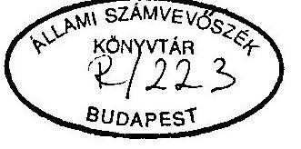
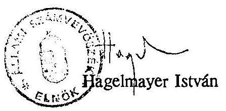
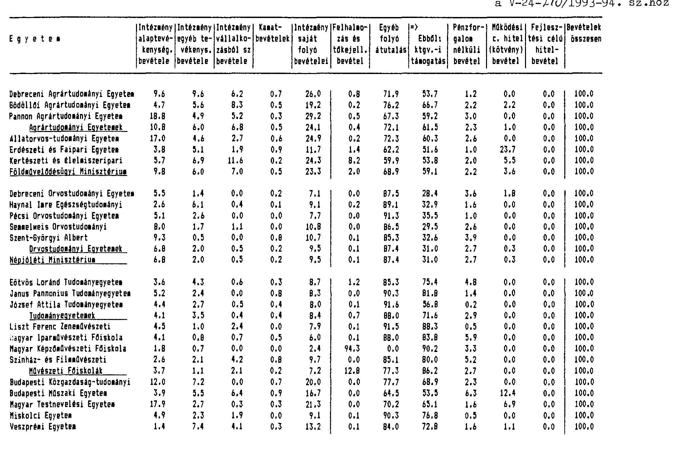

# JELENTÉS 

a magyar egyetemi felsőoktatás ellenőrzéséről

---

Az ellenőrzést vezette:

Matusek István
főtanácsos

Az ellenőrzést végezték:

Bittó Zoltán
Deák Tamásné
Éva Katalin
Hegedüsné Erdélyi Piroska
László Józsefné
Maklári Ferencné
dr. Mihály Sándor
Kovács József
dr. Köszegi Zoltán
dr. Nagy Mihályné
dr. Nagy Sándor
Varga Ildikó
számvevő tanácsos
számvevő tanácsos
számvevő tanácsos
számvevő tanácsos
számvevő tanácsos
számvevő tanácsos
külső szakértő
külső szakértő
külső szakértő
külső szakértő
külső szakértő
külső szakértő

---

# JELENTÉS 

## a magyar egyetemi felsőoktatás ellenőrzéséről

A fejlett ipari országokban mindenütt a felsőoktatás mennyiségi és minőségi tényezőinek alakulását olyan stratégiai kérdésnek tekintik, amely a versenyképesség fenntartásának, növelésének egyik alapvető feltétele. A különböző gazdasági elemzések egyértelműen azt igazolják, hogy a hosszú távú befektetéseknek egyik leghatékonyabb módja a magas színvonalú felsőfokú oktatás. A lemaradás nehezen áthidalható, több évtizedre kiterjedő hátrányokat konzervál és egész korosztályok adaptációs, alkalmazkodási képességét rontja, ami későbbi, nagyobb mértékű invesztíciókkal sem egyenlíthető ki teljesen.

A magyar felsőfokú oktatás minősége - szakértői megítélések szerint - eddig mindenkor megfelelt a kor színvonalának, helyenként és egyes tudományágakban élvonalbelinek számított és számít ma is.

A felsőoktatásban a század második felében, különösen annak utolsó harmadában a hallgatói létszám ugrásszerű növekedése ment végbe világszerte és a diverzifikálódással egyidejűleg a képzési formák és a szakmai szerkezet nagyarányú változását is magával hozta a fejlődés. Magyarország a változások kezdetén követte a nemzetközi trendet, de a 60-as évek második felétől kezdődően fokozatosan lemaradt (I-IV. sz. táblázatok).

Az egyre erősödő társadalmi kezdeményezésekből kiindulva a Kormány határozatot hozott a magyar felsőoktatás - 2000. évig terjedő időszakra szóló - mennyiségi és minőségi fejlesztéséről.

Több évi és sokoldalú előkészítés után az Országgyűlés megalkotta a magyar felsőoktatás első önálló törvényi szabályozását (1993. évi LXXX. törvény), amelynek

---

alapját - a Törvény preambuluma szerint- "az alkotmányos emberi jogok, az európai egyetemek Magna Chartája, valamint a társadalmi és a nemzeti lét jobb feltételeinek megteremtése iránti igény alkotja." Ezzel lezárult a magyar felsőoktatás egy szakasza, s megkezdődik egy rendszerében és minőségében teljesen más irányú fejlődés. Az ellenőrzés az átmenet időszakát vette vizsgálat alá.

A vizsgált időszakban 25 állami egyetem, illetve egyetemi rangú felsőoktatási intézmény működött. Az egyetemeken oktatott hallgatók száma az 1993/94. tanév kezdetén 82.738 fő. Az egyetemek által foglalkoztatottak száma 46.225 főt tett ki, amiből az oktatók száma 13.441 fő. Az egyetemi kutatóhelyeken kutatóként 1451 fő dolgozott. A kiadások együttes összege meghaladja az 54 milliárd Ft-ot. A tárgyi eszközállomány bruttó értéke 1992. december 31-én 49,3 milliárd Ft, nettó értéke 31 milliárd Ft volt.

Az ellenőrzésre az angol Számvevőszékkel (NAO) 1993-ban egyeztetett program szerint, párhuzamosan végzett helyszíni vizsgálatok alapján került sor. Munkánkat nagyban segítették a NAO ezirányú korábbi tapasztalatai, ellenőrzési módszerei, a rendelkezésünkre bocsátott értékelő, elemző anyagok, valamint az oktatás hatékonyságának és minőségének megítélésére kidolgozott és alkalmazott mérőszámok és mutatók.

Ellenőrzési megállapításaink során messzemenően figyelembe vettük a hazai tudományos kutatók által feltárt összefüggéseket és helyzetértékeléseket, a magyar felsőoktatásnak a nemzetközi standardokhoz mért elhelyezkedését, a továbbfejlesztés irányait és gazdasági feltételeit.

Az ellenőrzés kiterjedt minden állami kezelésben lévő egyetemre és az azokat irányító 4 minisztériumra. A vizsgálat a felsőoktatási intézményektől azonos szerkezetben bekért és feldolgozott adatokból levonható következtetéseket is hasznosította. Az adatfeldolgozást nagymértékben hátráltatta néhány egyetem helytelen, vagy pontatlan adatszolgáltatása, késedelme, adatszolgáltatási hiánya. Ennek ellenére a rendelkezésre álló és sok szempont szerint feldolgozott adatok nagymértékben megalapozzák, sokoldalúan és objektíven alátámasztják a helyszíni vizsgálati megállapításokat és az irányító, döntéshozó szervek számára is hasznosítható információkkal szolgálnak.

Az ellenőrzés alapvetően az 1992. és 1993. gazdasági évekre terjedt ki, esetenként egyes tanévek (1991/92., 1992/93. és 1993/94.) adatainak felhasználásával.

---

Az ellenőrzés célja annak megállapítása volt, hogy az egyetemek működéséhez és fejlesztéséhez nyújtott támogatások mennyiben voltak megalapozottak, a feladatok és a pénzügyi források között milyen volt az összhang. Az ellenőrzés értékelte a finanszírozás rendszerét, a rendelkezésre álló (személyi, anyagi, technikai, műszaki) feltételek és kapacitások felhasználásának törvényességét, célszerűségét és eredményességét, valamint a felsőoktatási törvényben előírt követelmények megvalósítása érdekében tett és tervezett intézkedéseket és azok kezdeti hatását.

# I. Összefoglaló megállapítások, következtetések és javaslatok 

A magyar felsőoktatás történeti fejlődése eredményeként az 1960-as évek végétől kezdődően duális rendszerűvé vált, azaz a felsőoktatási struktúra részévé váltak az egyetemeken kívül létesült főiskolák. Ugyanakkor - a nyugat-európai trendtől eltérően nem jöttek létre a szélesebb képzési profilú, multidiszciplináris egyetemek, az intézményhálózat széttagolt és ezért nem kellően kihasznált a meglévő infrastruktúra sem, a képzési profilok túlzottan specializáltak. Alacsony a hallgatói létszám. Korszerűtlen a kormányzati irányítás. Szerény az intézmények bevételszerző képessége, az intézmények belső működésében sem épültek ki ilyenek. Fejletlen az intézményi menedzsment és mindezek következtében a magyar felsőoktatás hatékonysága elmaradt az európai nívótól. (Polónyi István: A magyar felsőoktatás megújulási lehetőségei a finanszírozás és finanszírozhatóság szempontjából. 1992. A magyar felsőoktatás fejlesztése 2000-ig. 1992. július.)

A felsőoktatás mennyiségi fejlődésének nemzetközi tendenciáit, s azon belül a magyar felsőoktatás sorrendi elhelyezkedését számos kutató elemezte és erről több tanulmány jelent meg. A fontos részletkérdésekben eltérő álláspontok ellenére abban közösek a megállapítások, hogy az utóbbi 2-3 évtizedben Magyarország lemaradt, különösen azóta, amióta Nyugat-Európában az államok támogatásával a felsőoktatás mennyiségi növekedése felgyorsult. A felvételi keretszámok - elsődlegesen pénzügyi megfontolások alapján - alacsony szinten tartása miatt 1976-1986. között több, mint $11 \%$-kal csökkent a népességhez viszonyított hallgatólétszám és ennek folytán Magyarország a 80-as években csak Albániát és Romániát megelőzve az utolsók között helyezkedett el Európában. (Ladányi Andor: A felsőoktatás mennyiségi fejlődésének nemzetközi tendenciái c. elemzése.)

---

A 80-as évek végére lényegében társadalmi konszenzus alakult ki, hogy a helyzet nem elfogadható, nem felel meg az ország érdekeinek és fejlődési irányainak. Több év óta hangoztatott megállapítás, hogy a gazdasági fejlődés kulcskérdése a szellemi kapacitás fejlesztése, az iskolázottság növelése. A jó társadalmi közérzet biztosításának alapvető feltétele az igazgatási, jogi, mezőgazdasági, orvosi, művészeti stb. szolgáltatások - hozzáértést igazoló, - magas színvonala, valamint az a körülmény, hogy a nagyobb szellemi hányadot képviselő termékek a keresettek és adhatók el jó haszonnal. Az oktatás (felsőfokú oktatás) tehát hosszú távon folyamatosan megtérülő, rentábilis társadalmi beruházás.

A felsőoktatás korszerűsítésének előkészületei már a 90-es évek elején megkezdődtek és a szakmai viták eredményei végül a felsőoktatásról szóló 1993. LXXX. törvényben (FTv) öltöttek koncepcionális és jogi formát.

Az FTv célja a felsőoktatási intézmények rendszerének, működésének, autonómiájának, valamint az állam szerepvállalásának szabályozása. Részletesen szabályozza az FTv. a felsőoktatás pénzügyi rendszerét és támogatásának formáit, a felsőoktatással kapcsolatos állami hatásköröket és az FTv. végrehajtásával kapcsolatos feladatokat.

Az FTv. 125 §. (4) bekezdése a Kormány számára kötelezettségként írta elő, hogy a felsőoktatás fejlesztési tervét 1994. december 31-ig az Országgyűlés elé kell terjesztenie.

A fejlesztési terv előkészítése már az FTV elfogadása előtt megkezdődött. A Magyar Rektori Konferencia, a Főiskolai Főigazgatói Konferencia és az Országos Felsőoktatási Érdekvédelmi Szövetség együttes kezdeményezésére a Kormány a felsőoktatási szervezetek, a felsőoktatási intézmények irányításáért felelős tárcák és érdekképviseleti szervezetek bevonásával Felsőoktatási Tárcaközi Vegyes Bizottságot hozott létre, amelynek az volt a feladata, hogy elkészítse a Magyar Felsőoktatás Fejlesztése 2000-ig c. döntéselőkészítő tanulmányt, amely felvázolja a felsőoktatás korszerűsítésének részletes koncepcióját, a kapcsolódó fejlesztési javaslatokat, azok költségvonzatait és a megvalósítás tervezett időprogramját. Az elemző munkák eredményét már az 1993. évi költségvetés megalapozásához is fel kívánták használni.

A Vegyes Bizottság által elkészített dokumentum mindeddig a legátfogóbb összefoglalása a szakmai képviselők és a kormányzati tényezők egyeztetett állásfoglalásának.
"A koncepció rövid lényege" - a dokumentum fogalmazása szerint - "az, hogy a felsőoktatásban részt vevő hallgatók számát lényegesen emelni kell, ugyanakkor a

---

kiadott diplomák számát kisebb mértékben kell növelni, miközben lényegesen meg kell változtatni azok szintbeli és szakok szerinti arányát. Lényeges fordulatot kell elérni az oktatás szabadságösszetevőinek megvalósulása terén (bekerülés, szakválasztás, átjárhatóság, pályakorrekció, továbbképzés stb). A felsőoktatás szervezetét az oktatásszervezés és a gazdaságossági hatékonyság, a minőség, az igazgatás és ellenőrzés, az autonómia és irányítás, a hazai és európai konvertálhatóság együttes biztosítása érdekében át kell alakítani, miközben egyetértés van abban, hogy a magyar felsőoktatás minőségi mutatói helyenként jók, másutt elfogadhatóak, s ezeket az értékeket meg kell őrizni."

A Vegyes Bizottság által összeállított koncepcióban az előterjesztők két változatban állították össze a felsőoktatás mennyiségi fejlesztési irányszámait és célul tűzték ki a képzési költségek normatív jellegű meghatározását. Javaslatokat tettek a fejlesztési programtervezetre, az alap- és alkalmazott kutatás-fejlesztési kapacitások növelésére és finanszírozására, a felsőoktatási intézmények szervezeti integrációjára, a kapacitásbővítő és folyó beruházások finanszírozására és a Felsőoktatási Fejlesztési Programban szereplő célkitűzések megvalósítását elősegítő jogszabályok elkészítésére, továbbá a felsőoktatás fejlesztését szabályozó törvény elkészítésére.

Az ellenőrzés befejeződéséig az előterjesztésben foglaltakról nem hozott a Kormány döntést. E nélkül érdemlegesen nem folytathatók a hozzákapcsolódó munkálatok.

Vontatottan halad az FTv-ben foglalt egyéb célkitűzések megvalósítása is, amelynek több oka van:

- a folyamatos egyeztetések ellenére néhány ponton nem jött létre egyetértés. A két legnagyobb felsőoktatási intézményhálózatot felügyelő tárca, a Földművelésügyi Minisztérium (FM) és a Népjóléti Minisztérium (NM) általánosságban támogatja a fejlesztési programot, de a tárcairányítás és az átmeneti időszak tekintetében álláspontjuk eltér. Ezek a nézetbeli különbségek az ellenőrzés időszakában is fennálltak, mindeddig nem nyertek feloldást annak ellenére sem, hogy közben megszületett a Felsőoktatási Törvény. A nézetkülönbségeknek a gyakorlati együttműködésben is megjelenő negatív következményei vannak és a továbbiakban is várhatóak éles érdekütközések. (Pl.: a tangazdaságok, mezőgazdasági kutatóintézetek, klinikák hovatartozása, az egyetemek költségvetési támogatása, a tárcák és az MKM együttműködésének részletkérdéseiben.);

---

- a felsőoktatás finanszírozási rendszerének korszerűsítésére a FTv-ben foglaltak szerinti végrehajtására vonatkozóan több kormányelőterjesztés készült 1992-ben és 1993-ban az MKM részéről, de nem kerültek napirendre, döntés nem született;
- döntés hiányában bizonytalan a tandíjak megállapítási módja, mértéke, bevezetésének időpontja;
- bizonytalan továbbá a hallgatói támogatási rendszer fejlesztése, a felsőoktatás és a kutatások támogatásának további finanszírozási rendszere, az intézmények beruházási, felújítási támogatása, az intézmények bevételszerző tevékenységének, a részükre adott különböző adományok adókedvezménye, a gazdálkodás-, és tulajdonkorszerűsítés szabályozása.

Mindezek együttesen elbizonytalanítják az 1994/95-ös tanév, illetve az 1995. költségvetési év pénzügyi és szabályozási feltételeit.

A felsőoktatás finanszírozási rendszerének bizonytalansága nem csak az intézmények számára jelent súlyos helyzetet, alapvető kérdésekben esetleg döntésképtelenséget, hanem a hallgatók és a felsőoktatási tanulmányokat tervező leendő hallgatók és szüleik számára is. A diákok úgy nyilatkoztak, hogy függetlenül a tandíj mértékétől és a támogatás formájától, személyes sorsukat érzik veszélyeztetve bevezetésével.

Az ellenőrzés időszakában zárult le az a gazdasági év, amelyikre még minden tekintetben az FTv-t megelőző időszak szabályai vonatkoztak. Az ellenőrzött időszakban indultak meg azok a szakmai és gazdasági folyamatok, amelyek átvezetnek az átalakuló felsőoktatás viszonyai közé.

A vizsgált időszakban - részben spontán, részben kormányzatilag ösztönzött módon - kezdődött meg az egyetemek közötti együttműködési készség kifejlődni, szervezeti formákat ölteni. A szinte minden felsőoktatási intézményt átfogó
 szerveződések (szándéknyilatkozatok, szövetségek, központok, bizottságok, univerzitások) a Budapesti Szövetséget és a Pécsi Universitas Egyesülést kivéve, még sehol sem érték el az önálló jogi személyiségű társulások szintjét (FTv 12. § (1) bek.). Ugyanez a helyzet a Magyar Tudományos Akadémia kutatóintézetei, vagy más intézmények és a felsőoktatási intézmények együttműködése terén (FTv 12. §(2) bek.). Az igazgatás és a gazdálkodási feladatokra nem alakult még önálló szervezet sehol sem (3. bek). Egységes, új önálló integrált intézményt (Univerzitást) az Országgyűlés még törvénybe nem foglalt (4.bek.).

---

A valóságban az integrációs törekvések még nagyon kezdeti fokon állnak és spontán módon számottevő, gazdasági vagy egyéb eredményt hozó továbbfejlődésükre nincs reális esély.

Eredményeket felmutató szervezeti integráció eddig azokban a városokban sem alakult ki, ahol több felsőoktatási és kutatási intézmény működik. (Budapest, Miskolc, Pécs, Debrecen, Szeged, Veszprém.) Az intézmények egységes szervezetbe való összevonására az FTv sem tartalmaz egyértelmű utalást. A helyszíni ellenőrzések megerősítették a Világbank korábbi megállapításait abban, hogy a kis méretű intézmények önálló működtetése feltétlenül gazdaságtalanabb, mert a jogi és gazdasági különállásból szükségszerűen következik az azonos célú és rendeltetésű gazdasági, műszaki és egyéb ellátó szervezetek párhuzamos fenntartása, a rendelkezésre álló eszközök kevésbé hatékony kihasználása, a költségesebb beszerzés és raktározás. Az oktatásban is fennállnak esetenként párhuzamosságok, különösen az alaptudományok oktatása terén.

Az oktatás szerkezetében kifejeződő változások markánsan jelzik az egyetemek azon törekvését, hogy megfeleljenek az általuk művelt tudományágakban a kor követelményeinek. Kivétel nélkül minden egyetem hathatós intézkedéseket tett az oktatás korszerűsítésére. Az új karok, szakok, tantárgyak néhány egyetem jellegét is teljesen megváltoztatták (pl. Miskolci Egyetem, Veszprémi Egyetem). Új képzési formák jöttek létre, vagy vannak kialakulóban. A szakalapítás, a szakindítás bővítésével nagyobb lehetőség nyílt az egyes karok, szakok között az áthallgatásra, ezzel együtt a képzési feltételek hasznosítására. Több egyetemen megteremtették a feltételeit az új rendszerű doktori képzésnek, keresik a legjobb módjait a kutatóbázisok és az oktatás jobb együttműködésének. Az eddigi változások is jelzik, hogy a magyar felsőoktatás képzési struktúrája irányultságában a nyugat-európai, a fejlett országok trendjéhez közeledik; azok a képzési irányok vannak feljövőben (humán, természettudományi, közgazdasági szakterületek), amelyek iránt valós szükségletek merülnek fel, főként az államigazgatás, a pénzügyi szakma, a termelő szféra részéről.

A kredit rendszer meghonosításával kísérelik meg az egyetemek az oktatás rugalmasságának növelését, postsecundary képzés bevezetésével kívánják a középiskolát végzettek továbbképzését elősegíteni, bővítik az önköltséges képzés lehetőségeit; bővül a továbbképzést szervező egyetemek száma, foglalkoznak a távoktatás meghonosításával.

Az egyetemek gazdálkodásában a vizsgált időszakban jelentősebb módosulások, változások nem voltak. A megalapozott és a jelenleginél igényesebb gazdálkodási

---

magatartás kialakulását hátráltatja a gazdasági infrastruktúra elmaradottsága, a számviteli nyilvántartások hiányosságai, megbízhatatlansága. A költségvetési rendszerben bázis alapon elosztott forrásokat igyekeztek saját bevételekkel, vagy egyéb elérhető lehetőségekkel (pályázatok) kiegészíteni és kiadásaikat a források mértékén belül tartani. Eddigi stratégiájuk a túlélésre, a működőképesség fenntartására irányult. Más felfogású, távlatosabb gazdaság-stratégia - a felsőoktatás új finanszírozási rendszerének kialakulatlansága és bizonytalanságai miatt - nem alakítható ki.

A belső gazdálkodásban a kiadási előirányzatok centralizált, vagy decentralizált kezelése nem jelent minőségi különbséget, mivel az nem több, mint az előirányzat betartására való törekvés megvalósítási módja. A felsőoktatási intézmények gazdasági önállóságának szabadságfoka csak szűk határok között gyakorolható. A gazdasági jogosultság belső szabályozása az intézmények nagyobb részében elmaradt az állami szabályozástól és a FTv-től. Aktualizálásuk általános akadályát most az FTv-hez kapcsolódó további törvények, rendeletek és egyéb végrehajtási jogszabályok megjelenésének késedelme okozza.

Kivételes ma még a felsőoktatás szakmai és gazdasági vezetői körében a menedzsment mentalitás és törekvés, ehhez a feltételek is csak kezdetlegesen adottak. Megszűntek, vagy alacsony hatékonysággal működnek azok a belső kontroll szervezetek, amelyek hivatása lenne a gazdaságtalan megoldások kiszűrése (pl. műszer bizottságok). Jellemző gazdálkodási magatartásnak tekinthető ma még a kellő öntevékenység hiánya, a saját lehetőségek kihasználása helyett az irányító szervek állásfoglalásaira várás. A helyzet megváltoztatásában az érvényben lévő gazdálkodási szabályok sem teszik érdekeltté az egyetemek vezetését. A nagyobb gazdálkodási szabadságot (felelősséget) biztosító szabályozáson kívül a gazdasági önállóság növekedésének további feltétele az intézmények bevételeinek bővülése és olyan viszonyok kialakulása, ami vonzó lehet a más területeken is eredményes menedzserek megnyerésére, vagy az ilyen képességű vezetők megtartására.

Nem kielégítőek a vezetői ellenőrzések, sok helyen összeférhetetlen munkakörök egyidejű ellátását természetes adottságnak tekintik. Gyakori, hogy sem a függetlenített belső ellenőrzés, sem a felsőbb szervek ellenőrzési megállapításaira nem történik hatékony intézkedés. Minden különösebb konzekvencia nélkül tudomásul veszik a visszaélésekre utaló jelentéseket, felesleges nyűgnek tekintik a leltározási kötelezettséget. Gyakorlatilag együtt van jelen a szinte tűrhetetlen pénzhiány és a gazdaságtalan, pazarló pénzköltés. Ez utóbbit igen gyakran a jóindulatú segítőszándék is elősegíti. A FEFA pályázatok egy része olyan beszerzéseket támogatott, amelyek az adott intézménynél feleslegesek voltak, mert jobb belső együttműködés mellett a

---

meglévő berendezéssel a támogatott kutatás elvégezhető lett volna; vagy az intézmény számára kevésbé fontos beszerzést sorolt előre. Gondot jelent a terven felül kapott eszközök folyamatos működtetésének pénzügyi fedezete is.

A vizsgált időszakban a felsőoktatás létszámstruktúrája, az oktatói létszám és annak összetétele érdemlegesen nem változott. A gazdasági, műszaki és egyéb ellátó szervezetek létszámaránya túlságosan magas, ami az egyre növekvő adatszolgáltatási feladatok és a kapcsolódó infrastruktúra fejletlenségének a következménye. A kutatói létszámcsökkenés spontán folyamat eredménye és a pálya alacsony vonzásával függ össze.

A felsőoktatásban dolgozók és különösen az oktatók bérhelyzete lényegesen elmaradt a társadalmi megítélésben elfoglalt rangsortól. Az alkalmazottak és az oktatók egyéb jövedelmi forrásokat igyekeztek szerezni, ami azzal járt, hogy szakmai ismereteiket részben pénzszerzési, jövedelem kiegészítő tevékenységekre fordították.

A közalkalmazotti törvény megjelenése, a központi bérintézkedések a hátrányos helyzet felszámolását, a korábbinál arányosabb jövedelmi szerkezet kialakítását célozta. Kétségkívül kimutatható az intézkedések jövedelemnövelő, kisebb hányadban jövedelemarányokat módosító hatása. Részben az állami rendelkezések, részben az egyetemi vezetés hibája, hogy a jövedelmi intézkedések nem párosultak kézzelfogható teljesítmény-igénnyel. Az oktatás minőségi különbségeit sehol sem kísérelték meg honorálni. Így magasabb szinten képződik újra bérigény. A kialakult jövedelmi arányokat nem enyhítették az eddigi központi bérfejlesztések, inkább egyes kategóriákban még torzították is.

Az alkalmazott jövedelempolitika segít konzerválni a célszerűtlen szervezeti megoldásokat, a nemzetközi összehasonlításokban egyértelműen alacsony oktatói teljesítményeket. Félő, hogy az ellentmondásos helyzet nem ösztönzi továbbra sem a magas kvalifikációjú, dinamikus fiatalokat a felsőoktatásban szerepvállalásra, s nem ösztönzi az arra alkalmatlanoknak a felsőoktatásból való távozását sem. A közalkalmazotti törvény sem ad megfelelő lehetőségeket a szükséges és indokolt mobilitás érvényesítéséhez.

Gazdasági vonatkozásban tehát az egyetemek - külső és belső okok miatt - ma még alacsony hatékonysággal működnek, a nyújtott teljesítmények a reálisan elvárható alatt maradnak. Ugyanekkora anyagi ráfordítások, azonos színvonalon nagyobb kibocsátást finanszírozhatnának. Az állami támogatás feltételeinek változatlansága esetén a költségvetési gazdálkodás korszerűsítése nélkül az egyetemek gazdálkodá-

---

sának változatlan gyakorlata mellett finanszírozhatatlanná válik a további mennyiségi fejlesztés és megoldhatatlan a felsőoktatási infrastruktúra felújítása, bővítése és korszerűsítése. Átgondolt szabályozásokkal a szükséges változások létrehozhatók, illetve a helyenként fellelhető kezdeti lépések továbbfejleszthetők. A jelenleginél logikusabb, áttekinthetőbb költségvetési előirányzati szerkezet nélkül a felsőoktatás gazdálkodása a kívánatos irányba nem lesz kellően befolyásolható és számonkérhető.

Az intézmények tárgyi eszköz-állománya mennyiségében és minőségében elmarad a követelmények és az oktatás indokolt szükségleteihez képest. Az ingatlanok, gépek, berendezések, műszerek korszerűsége, használhatósága nagy szélsőségeket mutat, de tendenciájában gyorsulóan romló az elégtelen pótlási lehetőségek és a rendre elmaradó felújítások, nagyjavítások miatt. Az elmaradások pótlása, a szintrehozás és az oktatásban részt vevőkkel arányosan növelendő eszközállomány reális pénzügyi szükséglete még felméretlen. Egyes tanulmányokban, előterjesztésekben prognosztizált 60-70 milliárd Ft valószínűleg alábecsült összeg.

A diákjóléti ellátás rendszere magánviseli a korábbi időszakok felfogásbeli ellentmondásait. Az állam által adott jóléti célú támogatások paternalista alapelveken nyugszanak, s csak formálisan normatívak, szociális karakterük a valóban nehéz anyagi helyzetű diákok esetében nem eléggé határozottak. A támogatási rendszer érdemi teljesítménykövetelményeket nem támaszt. A kollégiumi férőhelyek korlátozott száma sok felsőoktatási intézmény hallgatója számára jelent komoly nehézséget, miközben a kollégiumok lakóinak egy része egyáltalán nem becsüli meg előnyös helyzetét. Indokolt lenne a diákok jóléti ellátási rendszerét a tandíj és más fizetési kötelezettségekkel együtt korszerűbben és a diákok igazságérzetének is jobban megfelelő rendszerben újraszabályozni.

Megállapításaink figyelembevételével a következő javaslatokat tesszük:

# a Kormány részére 

1) A Művelődési és Közoktatási Minisztérium és a felsőoktatási intézmények egyes csoportjait irányító minisztériumok együttműködésének fontos részletkérdései a fejlesztés, kutatás szakirányítás és felügyelet tekintetében tisztázatlanok. Kormányrendelet szintű jogszabályban indokolt a jog- és hatásköröket rendezni. Az FTv-vel összhangban módosítást igényelnek a miniszterek jogállását szabályozó 1990. évben kiadott kormányrendeletek.

---

2) A Felsőoktatási és Tudományos Tanács működőképessége érdekében indokolt felülvizsgálni annak személyi összetételét. Olyan döntési jogú államigazgatási képviselők kijelölését tartjuk célszerűnek, akik a Tanács folyamatos munkájában rendszeresen és aktívan közre tudnak működni és szakértelmükkel a döntések megalapozásához hozzá tudnak járulni.
3) Kormányrendelet szükséges a tandíjra és egyéb díjakra vonatkozó szabályokról (FTv. 31. §. (2). bek. a/pont). Késedelmes döntés esetén az 1994/95-ös tanévben a tandíj nem vezethető be és ez befolyásolja a felsőoktatást érintő költségvetés tervezését is.
4) A felsőoktatási intézmények integrációs folyamata külön intézkedések hiányában megakad. A felsőoktatás szervezeti és irányítási rendjének korszerűsítését, az oktatási, tudományos kutatási, az anyagi erőforrások hasznosítását, illetve az igazgatási és gazdálkodási feladatok hatékonyabb ellátását eredményező szervezetek létrehozását - főként a nagyobb városokban lévő intézmények vonatkozásában - központi kormányzati irányítással és közreműködéssel is indokolt elősegíteni. Jelenleg nem rendezett az FTv-n belül a társulások jogi státusza, s nem szabályozott az önálló jogi személyiséggel bíró integrált felsőoktatási intézmények létrehozása, belső szervezeti- és irányítási rendje.
5) Az intézményrendszer korszerűsítése nem nélkülözheti az Országos Akkreditációs Bizottság, valamint a Felsőoktatási Tudományos Tanács megalapozott szakvéleményét a tekintetben, hogy a szervezetek tevékenységének átvilágítása során mely szervezeteknél nem észlelhető eléggé a tartalmi megújulásra való törekvés, hol tartósan gyenge a képzési színvonal, alacsony a gazdasági hatékonyság.
6) Állásfoglalás szükséges a kidolgozás alatt álló normatív finanszírozás alapelveinek meghatározásához, a bevezetés ütemezéséhez.
7) A normatív és nem normatív támogatások szétosztását, azok felhasználásának szabályozását és ellenőrzését célszerűnek tartjuk - egyes nyugat-európai országok gyakorlatának megfelelően - egy erre létrehozott állami bizottságra, testületre bízni, amelynek feladatát képezhetné - többek között - a felsőoktatási intézmények szakmai és gazdasági tevékenységének folyamatos felügyelete és ellenőrzése, az oktatás minőségi követelményeinek meghatározása és mérése, a gazdaságtalan szerveződések felszámolásának kezdeményezése. A testület tevékenysége során

---

az MKM-mel és más minisztériumokkal szoros összhangban járna el, de azoktól szervezetileg függetlenül működne.
8) Az FTv és az akadémiai törvény birtokában a Magyar Tudományos Akadémia vezetésével együttműködve döntést igényel az alapkutatások további szervezeti rendje, a kutatások megosztása és összehangolása a párhuzamos kutatási kapacitások létrejöttének elkerülése érdekében.
9) Kormánydöntést igényel a klinikák, a mezőgazdasági
 kutatóintézetek és tangazdaságok hovatartozása, a felsőoktatással való kapcsolatának tisztázása, gazdálkodási rendszerük áttekinthető elkülönítése érdekében. Fenti intézmények szervezeti leválasztása a felsőoktatási intézményekről az oktatásban súlyos problémákat idézne elő.
10) A FTv-vel összefüggésben álló jogszabályalkotó munka során célszerű áttekinteni a felsőoktatási, közalkalmazotti, köztisztviselői és más új, vagy korábbról fennmaradt törvények és egyéb jogszabályok joghézagait és ellentmondásait azok harmonizációja érdekében.

# a Művelődési és Közoktatási Minisztérium részére 

1) A felsőfokú képzés korszerűsítése, valamint az intézmény-irányítás gazdasági hatékonyságának növelése érdekében készítse el az ezredfordulóig terjedő időszakra a képzés rendjének, intézményi struktúrájának, intézményirányításának, működési és finanszírozási rendjének koncepcióját.
2) A korábban elfogadott ütemezésnek megfelelően terjessze a Kormány elé döntésre a FTv-vel kapcsolatban szükséges törvények, rendeletek és egyéb jogszabályok tervezeteit. Az ezzel kapcsolatos munkálatokat a bevezethetőség érdekében fel kell gyorsítani.
3) Az elfogadott intézményi szabályzatok birtokában az alapító okiratokat vizsgálják felül az Államháztartási törvény rendelkezéseivel összhangban.
4) A FEFA pénzeszközök célirányosabb felhasználását, elszámolását, az eszközök nyilvántartási rendjét, a hasznosítás megítélésének, értékelésének nyomon-követhetőbb rendszerét kell kialakítani; a FEFA Titkárságon rendelkezésre álló számítógépállományt alkalmassá kell tenni arra, hogy biztosítható legyen a meghatározott ismérvek szerinti lekérdezés és kimutatások előállítása (pl. a projektek megoszlása szállítókként, országonként, intézményenként, egyetemi

---

címenként stb); a FEFA Bizottságnak gondoskodnia kell arról, hogy az állami támogatások felhasználásáról, szakmai megvalósulásáról, a beszerzések használatáról, kihasználásáról, a nyugat-európai felsőoktatáshoz való felzárkózás irányába történő elmozdulás alakulásáról értékelhető, ellenőrzési információkkal rendelkezzék.
5) Döntést indokolt hozni a volt szovjet laktanyák felsőoktatási célú hasznosításának rendezéséről; megoldást kell találni az épületek további állagromlásának megakadályozására. Ugyancsak döntést igényel - részben az előbbiekhez kapcsolódva is - a kollégiumi fejlesztések növelése, főként emeletráépítésekkel, meglévő épületek átalakításával.
6) Az erőforrások hatékonyabb allokációja érdekében a fejlesztési, beruházási támogatásokat pályázati úton indokolt elosztani. A felújítások, nagyjavítások támogatási igényeit célszerű konkrét műszaki felmérésekre alapozva elbírálni.

# a Honvédelmi Minisztérium részére 

1) A HM hatáskörbe utalt szabályozási kérdésekben és a gyakorlati megvalósításban az FTv előírásai kötelező érvényűek. A katonai felsőoktatási intézményekben a katonai hierarchiából adódóan súlyos gondot okoz az egymásnak ellentmondó jogszabályok, utasítások további működtetése. Ennek megfelelően kiemelt jelentőségű feladat, hogy a Honvédelmi Miniszter az 1993. évi CX (honvédelmi) törvény 12. § (1) bek.-ben kapott felhatalmazással élve utasítsa az illetékeseket a FTv-nek ellentmondó alacsonyabb szintű jogszabályok, utasítások, parancsok megadott határidőig történő visszavonására, (hatálytalanítására), illetve módosítására. A katonai jelleg érvényesülését szolgáló alacsonyabb szintű szabályozásoknak az FTv teljes körű végrehajtását és az egyetemi autonómia kibontakozását kell szolgálniuk.
2) A katonai felsőoktatási intézmények normatív finanszírozásának érdekében a végleges állásfoglalást csak mélyreható elemzés után lehet elindítani a Felsőoktatás-fejlesztési Tárcaközi Vegyes Bizottság keretében a HM feladattervvel egyezően. Az egyeztető és elemző munkát, mely tisztázni hivatott a HM területén kialakítandó finanszírozási modellt.
3) Az egyetemi képzést - a HM Kabinet döntésének megfelelően - át kell alakítani. Meghatározandók a képzési szintek és követelmények, a tudományos kutatás és

---

képzés feltételei. A hadtudományi egyetem követelményeinek megfelelően megoldandó a tanári kar felkészítése.
4) A ZMKA képzési rendszerének átalakításával összhangban újra szabályozást igényel az intézmény működése és gazdálkodása.

# a felsőoktatási intézmények (egyetemek) részére 

Élve az FTv által biztosított önállósággal és önkormányzati rendelkezési joggal (2.§ (1) bek.), az intézmények elemi érdeke feladatkörük olyan értelmű szabályozása, ami által

- a nem hatékony szervezetek átalakításra, a képzési rendszerek korszerűsítésre; az átoktatás és áthallgatás, a kredit rendszer, a rövidebb idejű, rugalmas képzési lehetőségek, lépcsőzetes képzés bevezetésre; a felesleges tantárgyi kötelezettségek elhagyásra; a képzésben a gyakorlati szempontok érvényesítésre, a nagyobb és arányosabb oktatási követelmények meghatározásra kerüljenek;
- a létszámcsökkentés, a foglalkoztatási mobilitás, a differenciált jövedelmek és más módszerek alkalmazásával a magyar felsőoktatás működése hatékonyabbá, még eredményesebbé váljék.

## II. Részletes megállapítások

A) A felsőoktatás állami irányítása

1. A felsőoktatásról szóló törvény és végrehajtási rendeletei

A Kormány programja szerint a felsőoktatás elé állított fő feladat az eltorzított szakmai, képzési szerkezet megszüntetése; az intézmények széttagoltságának felszámolásával a működés hatékonyabbá tétele; az oktatás és a kutatás integrációja; új gazdálkodási rendszer kialakítása, amely normatív forráselosztáson alapul, párosulva az intézmények autonóm működésével. Fontos eleme a programnak a felsőfokú szakosító tanfolyami képzési formák bővítése, az átjárhatóság, az áthallgatás biztosítása a karok, egyetemek között. A finanszírozás átalakításában a tandíj, az ösztöndíjrendszer, a tanulmányi hitelrendszer bevezetése és az adórendszer szükség szerinti módosítása képezi a főbb elveket. Ezek alapján

---

kezdődött a törvényi szabályozás előkészítése s ezek az elvek, szempontok a felsőoktatási törvényben meg is jelentek.

Az 1990-93. közötti évek a felsőoktatás fejlesztési irányát tekintve jelentős előkészítő, megalapozó időszaknak tekinthetők. A felsőoktatás problémáinak felmérésével, a helyzet feltárásával számottevő hazai és külföldi tudományos és szakerők foglalkoztak figyelembevéve a nemzetközi, közelebbről a nyugat-európai trendek alakulását is.

A kormányzati ütemtervhez képest bizonyos mértékű elcsúszás történt (pl. a törvények elfogadásánál), de tartalmilag a megvalósítás közel a program szerint haladt. Néhány feladat teljesítése elmaradt, illetve nehezen értékelhető hatásfokú (pl. az egyetemek és a kutatóintézetek integrációja, az egyetemi kutatások hatékonyabb szerepe az oktatásban).

Eredményesnek tekintendők a képzési struktúrában eddig bekövetkezett érzékelhető változások: a gazdasági szakember,- bölcsészképzés növekedése; a hazai és a nemzetközi kutatási pályázatok és források arányának növelése; a doktorandusz képzés és a kutatási előirányzatok külön feladatként szerepeltetése az 1993-94. évi költségvetésben.

Negatívum a finanszírozási rendszer korszerűsítésének elhúzódása; a regionális egyetemek megalakításában a lassú előrelépés, az univerzitások formális létrehozása; a felsőoktatás fejlesztési forrásainak szerény mértékű növekedése az éves költségvetési előirányzatokban.

A felsőoktatásról szóló 1993. LXXX törvényt (FTv) az Országgyűlés 1993. június 13-án alkotta meg.

A magasszintű jogszabály előkészítéséhez 21 európai ország felsőoktatással kapcsolatos törvényét tanulmányozták át és a törvény három éves munka eredményeként született meg. A koncepció, a tervezet kidolgozásában jelentős szerepük volt az időközben létrejött szakmai érdekérvényesítő szervezeteknek, amelyek partnereknek bizonyultak az egységes elvek, szempontok kialakításában. A törvény 1993. szeptember 1-jén lépett hatályba. A törvény rendelkezései szerint 1995. január 1-jétől a költségvetési támogatást egy fejezetben - a Művelődési és Közoktatási Minisztérium - fejezetében kell megállapítani. A törvény szerint tandíjfizetésre vonatkozó rendelkezések 1994. szeptember 1-jén lépnek hatályba. A felsőoktatás fejlesztési tervére vonatkozó javaslatot 1994. december 31-ig kell az Országgyűlés elé terjeszteni.

---

A finanszírozás új rendszerének (FTv. 9. és 10. §.) kidolgozása az egyik legfontosabb eleme a felsőoktatás új rendszerű működtetésének. Ebben, az egyik alapelemet képező kérdésben az ellenőrzés befejeződéséig még az illetékes irányító szervek (MKM; szaktárcák és a PM) között nem minden tekintetben jött létre egyetértés.

Az irányítási, felügyeleti rend törvény szerinti megváltoztatása bizonyos érzékenységet váltott ki a társ-tárcák részéről; befolyásuk, hatáskörük csökkenését látják az egységes irányítás megvalósulásában.

Az egyet nem értés sajátos megnyilvánulásának tekinthető, hogy a Népjóléti Minisztérium (NM) a felsőoktatás irányítását ellátókat átadta az MKM-nek, de a béralapot nem, az FM pedig sem a létszámot, sem a béralapot nem adta át. A kormány ezt tudomásul vette azzal, hogy külön keretet biztosított az új irányító szervezet működéséhez.

Az ellenőrzés befejeződéséig kétségtelenül fennálltak bizonyos ellentmondások és rendezetlenségek a felsőoktatásról szóló törvény 18. fejezete és az érintett tárcák feladat és hatáskörét szabályozó 1990-ben megjelent kormányrendeletekben (40/1990. /IX.15./, 47/1990. /IX.15., 49/1990. /IX. 15./ sz. Kormányrendelet) foglaltak között, amelyek együttműködési nehézségeket és esetenként súrlódásokat okoznak (15.sz. melléklet).

A törvény végrehajtása érdekében még több jogalkotási feladat vár megoldásra, ami igen feszített feladatot jelent az előkészítő szervek számára. A jogalkotási feladatok ütemezését a művelődési miniszter 1993. október 15-én jóváhagyta. Jelenleg 16 jogszabály előkészítése folyik, a Kormány elé terjesztés határideje 1994. I. és II. félévei között közel arányosan oszlik meg. Az előterjesztések közül hiányzik a tárcák együttműködését szabályozó kormányrendelet-tervezet.

[^0]
[^0]:    Fontosabb Jogalkotási előterjesztések: felsőoktatási intézmények létesítése, megszüntetése; a Felsőoktatási és Tudományos Tanács szervezete és működése; Országos Akkreditációs Bizottság megalakítása és működése; a habilitációs eljárás általános szabályai; a képesítési követelményrendszer; a doktori képzés, (PhD) fokozat odaítélése; kitüntetéses doktorrá avatás feltételeinek megállapítása; Professzor Emeritusz, a doktori fokozat (PhD) és a korábbi fokozattal, továbbá habilitációval rendelkezők szabályozása; felvételi eljárás általános szabályai; a hallgatói juttatásokról, kedvezményes szolgáltatásokról, valamint a felsőoktatásban fizetendő tandíjról és egyéb díjakról történő szabályozás; a diákigazolvány létesítése, szabályozása; a külföldi hallgatók magyarországi tanulmányainak szabályozása; a külföldi oklevelek honosítása és elismerése; a rövid ciklusú, középiskola utáni képzések bevezetése a felsőoktatásban; a

---

felsőoktatás fejlesztése; az 1995. évi komplex felsőoktatási költségvetés előterjesztése.

Az FTv a felsőoktatással kapcsolatos állami feladatok körében a művelődési és közoktatási miniszter feladatává teszi a felsőoktatási politikai döntések előkészítését, a felsőoktatási intézmények törvényességi felügyeletét, az állam által rendelkezésre bocsátott eszközök felhasználásának ellenőrzését, a felsőoktatással kapcsolatos tervezési feladatok ellátását, az intézmények nemzetközi kapcsolatainak támogatását, külföldi felsőoktatási intézmény magyarországi működését.

A felsőoktatás irányításában érdekelt többi minisztériumról csak a Felsőoktatási és Tudományos Tanács és a mellette képzési ágak (pl. agrár-felsőoktatás, műszaki, orvosi-egészségügyi, pedagógusképzési stb) szerint szervezett bizottságok tagjaiként történik említés a FTv 78. §. (2) bek.-ben.

A szaktárcáktól az MKM-hez átkerült felsőoktatási, kutatási feladatok zavartalan folytatása, fejlesztési gondjaik helyes megoldása nem hajtható végre az átadó minisztériumok, valamint az MKM rendszeres, szabályozott együttműködése nélkül. A NJ tárca és az MKM együttműködését szabályozó megállapodáshoz hasonló, de kormányszintű jogszabály hiányzik a tárcák együttműködésének legfontosabb elveiről és gyakorlati kérdéseiről.

Erre annál is inkább szükség lenne, mert az FTv 116. §. (1) bekezdése szerint "az egészségügyi felsőoktatási intézmények az egészségügy körébe tartozó feladatok ellátásában az agrár-felsőoktatási intézmények az agrárgazdaság körébe tartozó feladatok ellátásában, külön törvény, illetve kormányrendelet rendelkezései szerint vesznek részt." A felsőoktatási törvény végrehajtása érdekében az MKM irányításával készülő 16 jogszabály-tervezet között a 116. §-ban jelzett újabb törvény, illetve kormányrendelet előkészítése nem szerepel.
—Ellentmondás és joghézag észlelhető az egészségügyi törvény és a felsőoktatási törvény között is, amelyek feloldásán még az államigazgatási szervek dolgoznak.
— Döntéselőkészítés szakaszában van a külföldi orvosok magyarországi posztgraduális képzésének ügye, mivel az érvényben lévő törvény szerint olyan orvos, aki nincs a magyar orvosi kar nyilvántartásában, nem vehet részt továbbképzésben, nem dolgozhat klinikán és nem kezelhet beteget. Az oktatás törvényességének biztosítására ad hoc bizottság alakult.

---

- Rendezetlen a szakorvosképzés ügye, a külföldi állampolgárságú hazánkban tanulók diploma regisztrációja.
- Valamiképpen folyamatosan gondoskodni kell az orvosegyetemeken folyó oktatás és a gyógyító tevékenység szakmai integrációjáról, a két tárca más-más szempontú irányítótevékenységének összehangolásáról.
- Harmonizálatlan továbbá az egészségügyi felsőoktatás oktatási, kutatási és gyógyító tevékenységének finanszírozási rendszere. Hasonló gondok az agrárfelsőoktatás finanszírozásában is jelentkeznek.
- Ezideig tisztázatlan a további kapcsolatok rendszere az FM tárcánál maradó szakközépiskolák és szakmunkásképző tanüzemek és az MKM-hez került felsőfokú agrároktatás tanüzemi hálózata között. Problematikus az FM kutatóhálózata és az agrár-felsőoktatás további kapcsolata. Hasonló problémák a katonai felsőoktatás területén is jelentkeznek.

A katonai felsőoktatásra a törvény
 megjelenéséig a többi intézménytől eltérő szabályok vonatkoztak. A Honvédelmi Minisztérium (HM) - a többi tárcához hasonlóan - részt vett a felsőoktatási törvény előkészítésében és folyamatos intézkedésekkel segíti elő annak szakterületi megvalósulását. Közösen megállapított hibaként értékelhető, hogy a törvényben nem jelentek meg a katonai felsőoktatás fontosabb szakmai és finanszírozási szabályai.

A törvény hatálybalépéséig katonai felsőoktatás szabályozása a HM feladata volt. A 46/1987. (HK.20.) HM sz. utasítás már korszerű követelményeket és oktatói követelményrendszert állapított meg.

A Zrínyi Miklós Katonai Akadémia (ZMKA) új képzési rendszeréről az 5/1991. (VIII.28.) HM rendelet és a 68/1991. (HK 3/1992.) MH parancsnoki intézkedés határozott. Ezekhez kapcsolódott az 1992. februárban jóváhagyott részletes, alapos és szakszerű tantervi követelményrendszer.
2. A felsőoktatás szakirányítási rendszere és annak változásai

A FTv. hatálybalépéséig a szakterületi irányítási elv érvényesült. Az egyetemi szintű oktatás irányítása az MKM; FM; NM és HM feladata volt a hozzájuk rendelt intézmények tekintetében. Bizonyos ágazati (normatív pénzeszközök elosztása, statisztikai, oktatáspolitikai) feladatokat tárcaközi jelleggel az MKM látott el.

---

A széttagolt irányítás nehezítette a felsőoktatás egészét befolyásoló egységes elvek és gyakorlat érvényesítését. A felfogásbeli különbségek miatt előfordultak konfliktusos helyzetek is pl. a Felzárkózás az Európai Felsőoktatáshoz Alap (FEFA) program pénzeszközeinek elosztásánál, továbbá az egyetemek szakalapítása és szakindítása és a FTv, kidolgozása során.

A törvény hatálybalépéséig az MKM-nél a szakmai és költségvetési gazdálkodási feladatok két vetületben jelentkeztek: tárcaközi és tárcán belüli szinteken.

A felsőoktatás irányításával összefüggő tárcaközi feladatokat a Felsőoktatási és Kutatási Főosztály, a költségvetési és pénzügyi feladatokat a Művelődésgazdálkodási Főosztály látta el.

A Felsőoktatási és Kutatási Főosztály fennállása idején alapvetően megoldotta feladatait. Nagy részt vállalt a FTv előkészítésében, a finanszírozási rendszer kidolgozásában. A főosztály 1992-93. években 17 magas szintű jogszabály, 3 kormányhatározat kidolgozásában vett részt. A főosztály működése a koordinációban és a tudományos ügyek vitelében mutatott hiányosságot.

Az egyetemi oktatás irányításában érintett tárcáknál szintén megvoltak a felsőoktatást irányító felelős szervezetek.

Az FM-nél a Költségvetési Főosztály, a Humánpolitikai Önálló Osztály, a Tudományszervezési és Oktatási Főosztály, valamint az Ellenőrzési Főosztály látott el irányítási és ellenőrzési feladatokat.

A NM-ben az Oktatási Főosztály látta el az egyetemek irányításával kapcsolatos feladatokat.

A katonai felsőoktatás szakmai irányítása és pénzügyi rendszere alapvetően eltért a civil szférában működő felsőoktatási intézményekétől. A katonai felsőoktatás irányítását nem a HM minisztere, hanem a Magyar Honvédség Parancsnokságán (MHP) keresztül a Honvéd Vezérkar főnöke közvetlenül, személyesen, illetve a HVK hadműveleti főcsoportfőnök és az irányítása alá tartozó Hadműveleti Csoportfőnökség Törzskiképzési Osztálya útján irányította. A szakirányítást az MHP vezető szervei - HM főcsoportfőnökségek, HM főszemlélőségek és szolgálatfőnökségek látták el, amelyek egyben szakmai elöljárói a ZMKA illetékes tanszékeinek.

A kormány a művelődési és közoktatási miniszter előterjesztése alapján 1993. szeptember 1-jei hatállyal intézkedett a felsőoktatási törvényből adódó minisztériumi feladatátrendeződés személyi és bérfeltételeiről.

---

A kormány az MKM részére 15 fős létszámnövekedést engedélyezett. A költségvetési előirányzatot 1993-ra érvényesen 4,6 millió Ft-tal; 1994-re 18,5 millió Ft-tal felemelte.

Az átszervezés eredményeként a felsőoktatás és a kutatás irányítására 5 főosztály (4 szakmai főosztály és 1 főosztályi státusú Koordinációs Iroda) jött létre, összesen 78 fő engedélyezett létszámmal.

A Felsőoktatási és Tudományos Tanács és az Akkreditációs Bizottság Titkárság létszámigénye további, összesen 30 fő létszámtöbblettel jár.

A FTv-t követően megszűnt a NM Oktatási Főosztálya és az egészségügyi felsőoktatás irányítását ellátó munkatársak az MKM állományába kerültek (a rájuk jutó bér és járulékainak előirányzatait nem csoportosították át).

A HM kabinet 1993. novemberi ülése döntést hozott a katonai felsőoktatás új rendszerének kialakításáról és az új honvédelmi törvény 1994. I. 1-jei életbelépésével összefüggésben előirányozta a katonai felsőoktatás irányítási rendszere megváltoztatásának szükségességét.

A ZMKA és a többi katonai tanintézet törvényességi felügyelete - az oktatáspolitikai kérdések kidolgozásával és érvényesítésével együtt - 1992. I. 1-je óta működő HM Oktatási és Tudományos Főosztály feladata.

A FTv. úgy rendelkezett, hogy a felsőoktatást és a tudományos feladatok ellátását segítő, javaslattevő, döntéselőkészítő és véleményező testületként Felsőoktatási és Tudományos Tanácsot kell létrehozni.

A Tanácsnak részben képzési ágak szerint szervezett (pl. agrár-felsőoktatási, műszaki, orvos-egészségügyi, pedagógusképzési stb) részben funkcionális jellegű (pl. képzési, tudományos, kutatási, tervezési, finanszírozási stb) bizottságai működnek.

A FTT a helyszíni ellenőrzés befejeződéséig néhány alkalommal ülésezett, érdemi döntések főként ügyrendi kérdésekben születtek. A Tanács tevékenységét hátrányosan befolyásolta, hogy a miniszteri rangú tagjainak gyakori távolléte miatt több napirend megtárgyalását, vagy a határozat meghozatalát el kellett halasztani.

A felsőoktatásban a képzés, a tudományos tevékenység színvonalának folyamatos ellenőrzésére és a minősítés elvégzésére a Kormány Országos Akkreditációs Bizottságot hozott létre.

---

A Bizottság foglal állást abban, hogy az egyetem melyik tudományterületen, mely tudományágban folytathat doktori képzést, ítélhet oda doktori (PhD) fokozatot. Véleményt nyilvánít egyetem, főiskola, vagy szak létesítésről, indításáról, illetőleg megszüntetéséről, a képzési követelményekről, az egyetemek doktori, illetőleg habilitációs szabályzatairól.

Az Országos Akkreditációs Bizottság is megkezdte tevékenységét.

A Bizottság tevékenységének támogatására, döntéseinek megalapozására vezetői kollégiumokat hoztak létre, amelyek a legfontosabb szakmai felsőoktatási intézmények vezetőiből állnak, mintegy szakmai "előszűrőt" alkotva.
3. Az egyetemi oktatás finanszírozási rendszere, továbbfejlesztésének irányai

Az FTv. 125. § (2) bekezdésében foglaltak szerint a költségvetési támogatás rendszere 1995. január 1-jéig nem változik meg.

A még érvényben lévő finanszírozási rendszer az alku-mechanizmusra épül, az előre megadott keretösszegeket a tervezési alapelvek figyelembevételével kell úgy elosztani, hogy a kialakult arányok lehetőleg ne módosuljanak. A jelenlegi finanszírozási rendszer nehezen áttekinthető, teljesítményi szempontoktól nem függ.

Az éves költségvetési prezentációban nem jelenik meg elkülönítve a felsőoktatás és a kutatás támogatása, sőt, külön kigyűjtésekkel is csak közelítő adatok nyerhetők. A felsőoktatásból az egyetemi oktatásra történő ráfordítások a konstrukciók keveredése miatt ésszerűen ugyancsak nem mutathatók ki.

A fejezeti költségvetésekből nem lehet arra következtetni, hogy az egyes intézmények mennyit fordítanak egy-egy hallgató kiképzésére, milyen ráfordítást igényel a szakirányú képzés, mibe kerül egy képzési fokozat elvégzése stb.

A bázis számok, az ún. normatív támogatások semmiféle közgazdasági jellemzőt nem hordoznak, valójában nem érvényesül a normativitás. A működtetett rendszer annak nyújt nagyobb támogatást, aminek valami okból nagyobb bázis nívója volt, a valódi vagy indokolt szükségletektől teljesen függetlenül.

Az egyes szaktárcák - élve a fejezeti gazdálkodási jogkörükkel - a felsőoktatási intézményeket más, kevésbé fontosnak tekintett, vagy nagyobb önálló bevételekkel rendelkező szervezetekkel szemben további támogatásban részesítették. Ezek a többletráfordítások ugyancsak hézagosan mutathatók ki, vagy a katonai felsőoktatásban meg sem állapítható mértékűek.

---

Az egészségügyi felsőoktatásra fordítható összeg a NM költségvetésében egy összegben került megállapításra. Az egyes egyetemek részesedése csak külön kigyűjtéssel állapítható meg. A gyógyító tevékenységet a Társadalombiztosítás utólagosan - teljesítményarányosan - finanszírozza. Az intézmények költségvetésében a források összemosódnak.

Az agrártárca 1992-ben 6 egyetemre és 34 szakfeladatra bontva mutatta ki a bevételeket és kiadásokat. Az egyetemi oktatás az oktatási célú 5,5 milliárd Ft támogatásból 3,3 milliárd Ft-tal részesedett. De a tényleges ráfordítás ettől eltér, mert a szakfeladat nem tartalmazza a felsőoktatásban részt vevők kollégiumi ellátását, a könyvtári szakfeladat pedig az oktatás egészére kiterjed. A tárca az 1994. évi költségvetésében az agrár-felsőoktatás címet további 4 alcímre bontotta, hogy az egyetemi oktatásra fordított támogatás összege megállapítható legyen.

A ZMKA működési kiadásai a fejezeten belül a 4. "MH Tanintézetek" költségvetési címen a többi tanintézettel együtt kerülnek megtervezésre és finanszírozásra. A beruházás-felújítás kiadásait a többi 250 katonai alakulat ilyen célú összegeivel együtt irányozzák elő, esetenként természetbeni ellátmány formájában.

Az MKM az 1993. és az 1994. évi költségvetéshez előszámításokat végzett a felsőoktatási források normatív alapokra helyezése érdekében. A számított összegek többszörösen meghaladták a költségvetési lehetőségeket.
Alkalmazására tehát nem kerülhetett sor.
Az FTv. a finanszírozást öt, elkülönített alap létrehozásával kívánja megoldani:
Hallgatói alap: a fejkvóta szerinti közvetlen pénzbeli támogatás.
Képzési alap: szakirányonkénti differenciált normatíva, képzési szintenként.
Létesítmény-fenntartási és programfinanszírozási alap: fenntartási, nagyjavítási, felújítási keretek, oktatásfejlesztési célprogramok fedezete.
Kutatási alap: alap- és alkalmazott kutatások, doktori képzés támogatása pályázatok útján.
Fejlesztési alap: beruházási, infrastrukturális fejlesztések támogatása pályázatok útján.

Az elkülönített alapok közül a hallgatói támogatás, a kutatási alap, a fejlesztési alap már 1992. és 1993. évi költségvetésben is elkülönítetten jelent meg, s ebben a szakmai tárcák és a PM között vita nem merült fel. A pályázati rendszernek több előnye van, különösen a versenyhelyzet kialakításában és fenntartásában. Ennek ellenére jogosnak tartjuk több egyetem azon felvetését, hogy a kutatási pénzeszközök pályázati úton történő szétosztásának hátránya a pályáztatás

---

alkalomszerűsége és bizonytalansága, ami nem teszi lehetővé az oktatás szempontjából kívánatos kutatási bázisok kialakítását és fenntartását, a kutatások folyamatosságát. Különösen így van ez a költséges infrastruktúrát igénylő kutatásoknál. Célszerű tehát az oktatáshoz kapcsolódó kutatások finanszírozásának árnyaltabb továbbfejlesztésére törekedni. A hallgatói alaphoz kapcsolódóan a törvény hatálybalépését követően jogszabály előterjesztés-tervezetek készültek a felsőoktatási intézmények hallgatói által fizetendő díjakról és térítésekről, valamint a részükre nyújtandó állami támogatásokról és juttatásokról. (Az FTv 30.§. és 31 .§ alapján, valamint a $72 . \S$ k és 1 pontjában adott felhatalmazás alapján ezek az ügyek kormányrendeletben szabályozandók.) A hallgatók tandíj fizetésének megkönnyítésére törvény-tervezet készült a hallgatói hitelgarancia alapról.

Probléma két alapnál, a képzési és a létesítményfenntartási, programfinanszírozási alapnál jelentkezik: e két alap pénzeszközeinek volumene, aránya a legjelentősebb az összes forráson belül, amely abból adódik, hogy az eddig kidolgozott normatívák lényegében visszaosztáson, számított adatokon alapultak, tehát nem alulról építkezve alakították ki a normákat. Emiatt különösen fontossá vált, hogy a két alap elosztására, felhasználására külön finanszírozási modellt dolgozzanak ki. Az ezzel kapcsolatos előkészítő munka a Pénzügyi és Fejlesztési Főosztály és az erre a feladatra létrehozott bizottság közreműködésével megkezdődött.

Az eddig ismert elképzelések lényeges törekvések megvalósítását szolgálják: a közpénzek meghatározott feladatokhoz, teljesítményekhez való rendelése; megalapozottabb költségvetési tervezés; a finanszírozási rendszer kiszámíthatósága, biztonsága; a felsőoktatás politikai célkitűzések megvalósítása (a képzés, a kutatás minőségi, mennyiségi fejlesztése, a képzési struktúra korszerűsítése, az intézményhálózat racionalizálása, gazdálkodásának hatékonyabb működése, a hallgató létszám indokolt mértékű növelése).

Mintegy két éve folyik a hazai viszonyokra alkalmas nyugat-európai finanszírozási modell adaptálásának előkészítése. Ehhez több ország finanszírozási rendszerét tanulmányozták (angol, amerikai, ausztrál, holland) és az előkészítési folyamatban az utóbbi modellt tekintik az MKM és a PM részéről a legalkalmasabbnak. A holland módszer mellett szól, hogy az angolszász finanszírozáshoz képest, amelynek két támogatási eleme van (hallgatói létszám és kutatási terület), - az előbbi több tényezőt finanszíroz, számol az állami támogatás jelentős szerepvállalásával, nem engedi korlátlanul érvényesülni a piaci hatásokat, ezáltal biztonságosabb működési feltételeket teremt a felsőoktatási intézményeknek.

---

A finanszírozási rendszerről 1992-ben külön kormányelőterjesztés tervezet készült, azonban időközben realitását, aktualitását vesztette.

Az új finanszírozási modell lényeges eleme a norma, amely a feladatokhoz a szakirányú ráfordítás igényesség alapján differenciáltan rendel erőforrásokat (személyzeti eszközöket és működtetéshez szükséges egyéb eszközöket).

A normatív finanszírozás MKM által kidolgozás alatt álló rendszerével szembeni aggályait a társtárcák és a PM egyaránt megfogalmazták (15. sz. melléklet).

Az
 új rendszerű finanszírozás egyik alapkérdése a megfelelő adatbázis kialakítása. A jelenlegi adatbázis, az intézmények által szolgáltatott statisztikai adatgyűjtés és feldolgozás erre nem alkalmas. Az új adatbázis kialakításának előkészítése folyik, azonban konkrét döntés még nincs. Az adatbázis kidolgozása és a finanszírozási modell kialakítása összekapcsolódó feladatok. A munka sikere érdekében célszerű lenne az adatszolgáltató felsőoktatási intézmények minél szélesebb körét bevonni a megalapozó munkálatokba.

# 4. A felsőoktatás költségvetésének fejezet szintű tervezése 

A tervezés módszertana az 1992-93-as évek tervezésénél alapvetően nem változott, lényegében azon alapult, hogy a PM által előre megadott fő összegeket a tervezési előirányzatokban vissza kellett tervezni. Változatlanul bázis elvű a tervezés. Annyiban új a tervezés, hogy a fejezeti kezelésű előirányzatoknál - különösen az 1993-94-es tervezésnél - a címzett támogatásoknál, a feladat finanszírozásnál és a normatív finanszírozásnál új tételekkel is számoltak. Ezeknek egy része ágazati összegben is megjelent, az arányos elosztást követően a társ-tárcákat megillető előirányzatokat a PM részükre jóváírta, az MKM előirányzatát pedig csökkentette. A tankönyvkiadás támogatásánál volt késedelmes az elosztás.

A tervezést 1993-ban nehezítette, hogy az ÁHT 1992. júniusi hatálybalépését követően a végrehajtási rendeletek csak 1993. X. 15-én jelentek meg, s emiatt a jogszabály értelmezése gondot jelentett. Nagy feladatot jelent majd a havi elszámolási rendszerre való áttérés. Az ezzel kapcsolatos előkészületek az MKM-ben még nem tapasztalhatók (módszertan, koordináció, technikai feltételek biztosítása), bár a szisztéma kidolgozása a PM feladata, funkcionális jellegéből következően.

---

Mind a szakmai, mind a pénzügyi, költségvetési irányító, végrehajtó apparátusokra 1993-ban különösen sok feladat hárult a határidők összetorlódása, a megoldandó ügyek nagyságrendje miatt.
1993. február hóban az 1992. évi fejezeti beszámoló elkészítése; március hóban az 1993. évi intézményi költségvetések koordinálása; április hóban az 1992. évi szöveges beszámoló elkészítése; június hóban az 1994. évi költségvetés leadása.

Nem volt zavarmentes az 1993. és 1994. évi költségvetési előirányzatok tervezésének tárcaközi egyeztetése és az MKM költségvetésében tervezett, de a szaktárcák egyetemeit megillető pénzeszközök szétosztásánál sem.

Az agrár tárca az 1993. évi tervezés során kiadási előirányzatai között kiemelten kezelte az oktatás fejlesztését és ennek megfelelően mintegy 4,5 milliárd Ft összegű fejlesztési igényt nyújtott be. A felsőoktatás fejlesztésére szánt keretek tárcák közötti felosztására már nem került sor, hanem egy összegben az MKM fejezetnél irányozták elő. A PM a terv-egyeztető tárgyalások során 850 millió Ft fejlesztési lehetőséget tudott biztosítani.

A NM és az MKM között többszöri levélváltásra került sor az 1993. évi fejlesztési lehetőségekről, azok igénylési módjáról. Hasonlóképpen a NM-nak nem volt információja az 1994. évire tervezett és az egészségügyet illető fejlesztési lehetőségekről sem.

A NM és az FM egyaránt sérelmezi, hogy bár az 1994. évi fejezeti költségvetés még magában foglalja a felsőoktatási intézményeket, az MKM az ő megkerülésükkel juttatott pénzeszközöket az egyetemekhez.

Ez a gyakorlat mindenképpen hátrányos a kívánatos, jó együttműködésre nézve, de végül akkor is sérti az FTv-t (12 §. (2) bek, ha az 1993. évi költségvetési törvény 41. § (3-4.) bekezdése ezt lehetővé teszi.

A fejezeteket megkerülő központi juttatások miatt a fejezeti beszámolók nem tesznek eleget a számviteli törvény előírásának, miszerint a beszámolónak a valós, hű összképet kell tükröznie. Lehetetlenné teszi ez a gyakorlat a fejezetek által képzett pénzmaradvány elszámolását és ellenőrzését is.

A katonai felsőoktatás költségvetésének tervezési rendje specifikus, eltér a polgári felsőoktatásétól már abban is, hogy az MKM költségvetése nem tartalmaz HM tanintézeteket megillető előirányzatokat. A ZMKA és a katonai főiskolák költségvetése szervesen beépül a HM költségvetésébe.

---

A működési kiadások előirányzata a többi tanintézetével együtt jelenik meg, a felújítás, beruházás a 2/6 "Központi intézetek, ellátó és kiszolgáló szervezetek" Felújítás alcímében.

A HM. illetve a MHP nem rendelkezik olyan információs és értékelő rendszerrel, amelyből felhasználási jogcímek és tanintézetek csoportosításában megállapítható lenne a tanintézeteknek a képzés érdekében nyújtott pénzbeni és anyagi támogatás összege. Így tárcaszinten az egyetemi feladatellátás pénzügyi-anyagi szükséglete nem állapítható meg.

# 5. A felsőoktatás továbbfejlesztésének főbb célkitűzései 

A FTv. 125. §. (4) bekezdése szerint a Kormánynak a felsőoktatás fejlesztési tervére vonatkozó törvényjavaslatot 1994. december 31-ig kell az Országgyűlés elé terjesztenie.

A törvényi szabályozás célja a felsőoktatás átalakulása főbb kritériumainak meghatározása: az ezredfordulóig elérendő fejlesztési célok, az európai felsőoktatási rendszerekhez való kapcsolódás követelmény,- cél- és feladatrendszerének meghatározása, továbbá a célok elérésének szervezési és pénzügyi megalapozása.

A Felsőoktatás-fejlesztési Tárcaközi Vegyes Bizottság (FTVB) összeállította a felsőoktatás fejlesztési törvénynek és annak programjára vonatkozó tartalmi és pénzügyi javaslatait.

Ahhoz azonban, hogy a fejlesztési terv határidőre elkészüljön, több feladat ütemes megvalósítása szükséges.

Számos olyan terület van, ami nincs rendezve, többek között a postsecundary (a felsőfokú tanfolyami) képzés képzettségi struktúrába való elhelyezése, működtetése és finanszírozása; az egyetemek egyesülésének, az univerzitások megalakításának törvényi szintű szabályozása; a képzési szerkezet, a tartalmi kérdések szabályozása. A fejlesztési tervnek számolnia kell az egyetemek meglévő kapacitásának lehetőségeivel, ehhez az 1992-ben készített adatfelmérés - korrekcióval - alapul szolgálhat, bár ezzel kapcsolatban fenntartások változatlanul tapasztalhatók.

A kormánynak készült előterjesztés két változatot javasol az állami és egyházi felsőoktatási intézményekben tanuló nappali tagozatú és a postsecondary szakképzésben résztvevők létszámának növelésére. Az A változat szerint a nappali hallgatók létszáma az 1993. évihez képest 40.000 fővel; az összes hallgatóké 50.000 fővel növekedne, a B változat szerint a nappali hallgatók

---

létszámnövekedése 60.000 fő lenne, illetve az összes hallgató létszáma 70.000 fővel növekedne.

A még döntésre váró alternatívák pénzügyi (költségvetési) kihatása csak közelítő értékkel került beállításra, e szerint a szükséges kiegészítő beruházások, infrastrukturális fejlesztések, férőhelybővítések - a világbanki és egyéb segélyprogramok által nyújtott támogatásokon felül - mintegy 60-70 milliárd Ft összegű, egyszeri fejlesztési igénnyel járnak.

#### Abstract

A tervezet a fejlesztéssel együttjáró egyéb kiadásokat (működési többletkiadások, hallgatói támogatási többletek stb) nem prognosztizálja. A fejlesztési célkitűzésekkel foglalkozó egyéb tanulmányok szerzői ezeket a többletkiadásokat hasonló mértékűnek becsülik. Tehát a halmozott többletráfordítási igény 120-150 milliárd Ft nagyságrendre becsülhető. (Ez az összeg inkább a tényleges szükséglet alsó határának tekinthető.)

A később kidolgozandó felsőoktatás fejlesztési program legfontosabb elemei a Vegyes Bizottság javaslata szerint:
—a felsőoktatási képzési rendszer, a képzési formák és a képzés tartalmi fejlesztése,
—az intézményekben folyó kutatási-fejlesztési tevékenység fejlesztése,
—az indokolt hallgatói férőhely kapacitásának meghatározása,
—a felsőoktatási intézmények belső szervezeti és irányítási rendszerének korszerűsítése,
—az intézmények szervezeti integrációja,
—a kutatási intézmények együttműködésének ésszerűsítése és integrációja,
—a felsőoktatás és a felhasználói szféra közötti kapcsolati rendszer fejlesztése,
—a képzési, kutatási és szociális infrastruktúra fejlesztése,
—az intézményhálózat fejlesztési és működési forrásának biztosítása.
Az FTVB a fenti komponensek mélyebb kidolgozását a Kormány előzetes állásfoglalásától teszi függővé. Mélyebb tartalmi meghatározás nélkül a célok és azok realitása különösen a fejlesztést és működést fedező források reális feltárása és rendelkezésre állása nélkül - kérdéses.

A szaktárcák (FM; NM) véleménye a Vegyes Bizottság eddigi működéséről és az együttműködésről eléggé negatív, fontos kérdésekben koncepcionális eltérések állnak fenn.

Megítélésünk szerint az FTVB-ben dominál az MKM képviselete, az ágazat felelősségét viselő tárcák az albizottságokban képviseletet sem kaptak.

---

A HM tárca képviselői részt vettek a feszültségektől, vitáktól sem mentes koncepció kialakításában. A HM kabinet 1992-ben az FTVB koncepciójával összhangban állást foglalt a tisztképzés megújításáról, a katonai felsőoktatásnak a magyar felsőoktatási rendszerbe történő integrálásáról (15. sz. melléklet).

# 6. Az oktatás színvonalának kritériumrendszere 

A minőségi követelmények érvényesítése folyamatként értékelendő a 80-as évektől kezdődően. Az 1985. évi oktatási törvény a felsőoktatási intézmények hatáskörébe adta a követelményrendszer kialakítását. Az intézmények az oktatók kiválasztásánál, a vezetők kinevezésénél a minőségi szelekciót a tudományos minősítés, az aktív kutatómunka, az idegennyelv ismerete, a publikációs tevékenység megítéléséhez kötötték.

A felsőoktatás területén új minőséget jelentett a kutatások támogatásánál a pályázati rendszer bevezetése. A Tárca Kutatási Alap és a Felzárkózás az Európai Felsőoktatáshoz Alap pályázati felhívásai és az elfogadott témák nyilvánosan megjelentek a Magyar Felsőoktatás c. folyóiratban.

A pályázati rendszer jó szellemi koncentrációra adott lehetőséget, jelentős tudományos szaktekintélyek köré kreatív teamek csoportosultak; másfelől ugyanakkor az is cél volt, hogy a tehetséges fiatal kutatók kapjanak lehetőséget bizonyításra. Ez utóbbi szempontból a pályázati rendszer még nem eléggé nyitott, a névhez kapcsolódó elismertség, tekintélyelv a pályázatok elfogadásánál még az egyik meghatározó szempont.

Az oktatás komplexitásának és színvonalának emelési szándékával új karok létesültek, illetve karok létesítését kezdeményezték az egyetemek vezetői. A vizsgált időszakban 2 új kar létesült, további 6 kar létrehozását kezdeményezték. Viszont több egyetemnek nincs kari szervezete (művészeti egyetemek, Állatorvostudományi Egyetem, Magyar Testnevelési Egyetem). Nem teljesen felelnek meg az FTv. 3. §(1) a pontjában foglalt szervezeti követelményeknek a művészeti egyetemek, a Testnevelési Egyetem és a Zrínyi Miklós Katonai Akadémia, mivel képzési struktúrájuk nem terjed ki több tudományágra.

Új minőségi elemet jelentett a felsőoktatásban a legutóbbi két-három év gyakorlata, a szakalapítás és a szakindítás létesítése.

A szakalapítás még nem létező szak bevezetését jelenti a felsőoktatásban (pl. kulturális antropológia, kommunikációs, környezetvédelmi tanár, szociálismun-

---

kás, anyagfizikus, menedzser, műszaki informatikai szak stb). A szakindítás már valamelyik egyetemen működő szak létesítését jelenti.

Az eltelt két-három évben 20 szakot alapítottak és 40 szakot indítottak a felsőoktatási intézmények. A létesítésnél meghatározó volt a képesítési követelményeket kidolgozó bizottság szakmai véleménye, amely elsősorban a kurikullum (írott tanterv) és a kinevezendő vezető szakmai, tudományos alkalmasságának megítélésére terjedt ki. Szakalapítással azok az intézmények foglalkoztak, amelyek képzési struktúráját alapvetően meg kellett változtatni; az addig meglévő szakok iránti igény lényegesen csökkent, illetve megszűnt és helyette olyan szakokat alapítottak, amelyek iránt kereslet jelentkezett. (Pl. A Miskolci Egyetemen a korszerűsített kohászati, bányamérnöki képzés mellett közgazdasági, bölcsész szakok létesítése.) A szakalapítást, indítást az is motiválta, hogy az egyetemek ezáltal többletforráshoz jutottak (1993-ban 30 millió Ft volt az újszakok indításához adott összeg, a nyelvszakos képzés fejlesztésére pedig 20 millió Ft többlet támogatás jutott).

Az új karok, szakok indításán kívül új képzési formák is megjelentek. Több egyetem a korábbi oktatási formák mellé felvette a posztgraduális képzést, helyenként a középiskolát végzettek rövidített idejű továbbképzése céljából postsecundary képzés indítását is mérlegeli (BME, GATE, JPTE). Néhány egyetem (BME, BKE, ELTE, JPTE) interdiszciplináris témában másoddiploma megszerzését teszi lehetővé. Bizonyos előkészületek a távoktatás meghonosítása érdekében is folynak. Többnyire még csak szándékokról van szó, vagy kezdeti lépésekről, e kezdeményezések eredményei később jelentkeznek és válnak értékelhetővé.

A felsőoktatás követelményrendszere tovább bővült a doktorandusz képzés bevezetésével. A felsőoktatásról szóló törvény a tudományos fokozat odaítélésének jogát visszatelepíti az egyetemekre; az egyetem létesítésének, működésének feltétele, hogy alkalmas legyen tudományos kutatásra, doktori képzésre és doktori (PhD) fokozat odaítélésére. A képzési program még a törvény hatálybalépését megelőzően beindult, az Ideiglenes Országos Akkreditációs Bizottság közreműködésével.

A költségvetésben a fejezeti kezelésű előirányzatok között 1993-94-es időszakban elkülönítetten került jóváhagyásra erre a célra állami támogatás (1993-ban 314 millió Ft, 1994-ben 670 millió Ft).

---

1992-ben külön előirányzat hiányában a kutatási alap (115 millió Ft) és a FEFA második forduló pályázatai terhére (200 millió Ft) 10 egyetem már előbb beindította a doktorandusz-képzést és saját forrásaiból is támogatást nyújtott a kiadások fedezésére.
1993. szeptember 30-ig 18 egyetem kapta meg ideiglenesen a jogot - az IOAB javaslatára - adott tudományszakokból tudományos doktori fokozat odaítélésére és önálló tanfolyam indítására, mintegy 1.000 fő részvételével. A törvény alapján a kormánynak meg kell határoznia az Országos Akkreditációs Bizottság (OAB) szervezetét és működésének általános szabályait. Ez a feladat jelenleg előkészítés alatt áll, illetve folyamatban van. Az OAB lesz a felsőoktatásban a képzés, a tudományos tevékenység színvonalának folyamatos ellenőrző és minősítő szerve. Az akkreditált doktori programok indítása valamennyi egyetemen az OAB jóváhagyásával történhet; a felsőoktatási intézmények doktori programjaik akkreditálásával minősülnek egyetemi rangúakká.

Az oktatás minőségének alakításában külön feladatot jelent a ZMKA-n 1991-ben bevezetett képzési rendszer, ami a főiskolai képzésre épül. A két lépcsős képzés egyetemi fokozata 1 éves törzstiszti képzésből és 2 éves akadémiai alapképzésből áll, közötte meghatározott időtartamú csapatszolgálattal. A ZMKA által kiadott katonai diploma katonai-szakmai szempontból elismert képzés, csak a polgári diplomákkal nem azonosítható.

Az 1998-ig bevezetésre kerülő új képzési rendszer ezen a téren alapvető minőségi változást fog eredményezni, a katonai diploma akkreditálásával egyenértékűvé válik a polgári egyetemek diplomáival és külföldön is hasznosíthatóvá válik.

A képesítési követelményekről szakmai csoportonként külön jogszabály készül. A kormányrendelet szintű jogszabály az alapképzésben és a szakirányú továbbképzésben az oktatási, tanulmányi követelményeket a tantervekben és a tantárgyi programokban határozza meg. A kormányelőterjesztés szeptember 1-jei határideje miatt kétséges, hogy az 1995. évi költségvetés összeállításánál a finanszírozást össze lehet kapcsolni a képzési követelmények költségigényével.

---

# B) Az egyetemek pénzügyi-gazdasági helyzetének értékelése

## 1. Az egyetemek működésének szabályozottsága

## a.) Az egyetemek integrációs törekvései

A vizsgált időszakban élénk szervezeti mozgások jellemezték az egyetemi rangú felsőoktatási intézményeket. A szervezeti dinamizmus ellenére a felsőoktatásnak ez a szintje tulajdonképpen mégis változatlan, érintetlen maradt. Ennek a látszólagos ellentétnek az a magyarázata, hogy a változások intézményen belül történtek. Az oktatott tárgyak és azok korábbi arányai nagymértékben megváltoztak, új karok, tanszékek, intézetek alakultak, új foglalkozási ágak oktatását kezdték meg, diszciplinák változtak vagy olvadnak egybe, szinte mindenütt változóban van az oktatás struktúrája és belső tartalma. Ezzel egyidejűleg a felsőoktatásban - ide értve a főiskolákat is - részben spontán módon, részben állami vagy pénzügyi ösztönzések hatására megkezdődött egy látszólagos integrációs folyamat is, amely új viszonylatokat teremt a külső kapcsolatokban, de ezek a folyamatok - eddig - együtt sem eredményezték a széttagolt, több vonatkozásban gazdaságtalan szerkezet érdemleges javulását. Legfeljebb ebbe az irányba mutató tendenciák (is) észlelhetők (16. sz. melléklet).

A Világbank 1990. januárjában készített elemzésében rámutatott arra, - amit mostani vizsgálatunk is megerősített, - hogy a magyar felsőoktatási intézmények alacsony hatékonysággal működnek. Nemzetközi összehasonlításban kicsi az intézmények mérete és túlzottan specializált jellegük nehezíti a költséges berendezések és létesítmények gazdaságos üzemeltetését. A Világbank megállapítása szerint a tantermek és laboratóriumok kihasználtsága alacsony szintű, kivételesen fordul csak elő, hogy közeli intézmények közösen használnak létesítményeket, pl. könyvtárakat, laboratóriumokat, nyilvántartási erőforrásokat, vagy működtetnek közösen fenntartott adminisztratív állományt.

A magyar felsőoktatás Budapesten a legkoncentráltabb, az ország egyéb városaiban decentralizált szerkezetű. Az egyetemek az ország tíz városában helyezkednek el, a főiskolákat is figyelembe véve az ország 37 városában 61 állami felsőoktatási intézmény és 16 egyházi akadémia, főiskola működik. A szervezeti, területi széttagoltságot hivatott csökkenteni az intézmények integrációja. Az ellenőrzés tapasztalatai szerint az integráció valamely verziója megvalósulásának azonos városban van elsősorban realitása.

---

A formáció-gazdagság ellenére az integrációs szervezetek felettébb korlátozott jogkörű intézmények. Jogi személyiséggel nem rendelkeznek, többnyire nem jutottak messzebb az elvek és a célok megfogalmazásánál, létüknek általában kimutatható gazdasági haszna még nincs, vagy olyan kvázi szerveződésű érdekszövetségek, amelybe a fejlesztési célú támogatások nagyobb elnyerési esélye kényszeríti őket. Ösztönzőleg hatottak a FEFA pályázatok prioritásai.

Jogos tehát azok aggálya, akik az eddigi szerveződések pozitív célját óvják a látszatmegoldásoktól, az egyre áttekinthetetlenebb és bürokratikus vízfejektől (16. sz. melléklet).

Az integrálódás eddig követett gyakorlata optimális esetben is csak évtizedes léptékben hozhatja a kívánatos és lehetséges szakmai és gazdasági eredményeket. A tűrhetetlenül hosszú megvalósulás elkerülése és a felsőoktatásba fektetendő források minél hatékonyabb hasznosítása azt igényli, hogy radikálisabb intézkedésekre kerüljön sor.

A szervezeti koncentrációval együtt kell, hogy járjon az intézmények egy részénél a jogi önállóság megszüntetése, a szervezet átalakítása és a gazdálkodás átszervezése. Egyes esetekben elkerülhetetlen lehet a vagyonátcsoportosítás nem csak számvitelileg, hanem ténylegesen is.

A valóban integrált szervezeteknél fel kell számolni a korábbi különállás miatt indokoltan létező párhuzamosságokat az oktatásban, kutatásban és a gazdasági-műszaki ellátószervezeteknél egyaránt. Ez szükségessé teszi az érintett szervezetek teljes körű átvilágítását és újraszervezését.

Az érdemi, tartalmi integráció az FTv-ben nem kapott kellő súlyt; központi ráhatás nélkül az intézmények sajátos érdekei dominánsak maradnak.
b.) Az egyetemek belső szervezettsége és szabályozottsága

Az FTv szerint a felsőoktatási intézmények az FTv-ben meghatározott keretek között - a szervezetüket maguk alakítják ki úgy, hogy az alkalmas legyen az oktatási, tudományos kutatási, művészeti és egyéb feladatai ellátására, a gazdaságos működtetésre. Az FTv 126. § (6) bekezdése szerint 1994. szeptember 1-jéig készítik el szabályzatukat, addig korábbi szabályzataik érvényesek, feltéve, hogy rendelkezései az FTv-vel ellentétben nem állnak. Az intézmények a korszerűsített Szervezeti és Működési Szabályzataikat a művelődési és közoktatási miniszternek küldik meg.

---

A felsőfokú oktatási intézmények önkormányzatának hatáskörébe tartoznak a következő fontosabb jogosítványok: az oktatók, a tudományos kutatók és vezetők kiválasztása, a törvényben foglalt kivétellel; a felvétel feltételei és lebonyolítása; a tantervek, tananyagok, képzési program meghatározása, oklevelek kibocsátása; tudományos kutatási programok kidolgozása, tudományos kutatási feladatok meghatározása és szervezése; a jóváhagyott pénzügyi eszközök, források és előirányzatok feletti rendelkezési jog, a kezelésükben lévő vagyontárgyakkal kapcsolatos jogok gyakorlása; doktori képzés szervezése és a doktori (PhD) fokozat odaítélése, a habilitációs eljárás kidolgozása és lefolytatása.

Az FTv-ben is meghatározott karok, intézetek és tanszékek szerint tagozódó egyetemi belső szervezet általában megfelelő struktúrát ad, a tapasztalatok szerint azonban a nagyobb egyetemnél több karon működnek azonos profilú tanszékek (matematika, nyelvi, testnevelési stb), egyes egyetemeken több, kis létszámú tanszék vagy más szervezeti ellentmondás nehezíti az intézményi infrastruktúra hatékonyabb kihasználását, rontja az intézmény működésének gazdaságosságát.

Ilyen túlaprózott vagy átfedéseket mutató tanszéki struktúra különböző városokban több egyetem szervezetében található, pl: BKE; ELTE, BME, SOTE, VE, Iparművészeti Főiskola.

Az egyetemek mindegyike foglalkozik az FTv-vel összhangban álló SzMSz elkészítésével. Az SzMSz és a hozzákapcsoló egyéb, az SzMSz mellékletét képező szabályzatok készültségi foka különböző. Általános bizonytalanságot okoz az FTv-hez kapcsolódó kormányrendeletek és egyéb kiegészítő jogszabályok késedelme.

A végrehajtási rendeletek és jogszabályok hiánya, illetőleg késedelme egyaránt szabályozási nehézségeket okoz az oktatás szakmai vonatkozásában és a gazdálkodás belső szabályainak módosításánál. A habilitációs eljárást szabályozó rendelet hiányában előfordulhat pl., hogy nem nevezhetők ki egyetemi tanárok, s ahol esedékes a személyi változás a tanszékeken, a státusok nem lesznek betölthetők. Jogosnak tűnő felvetés (DOTE) az is, hogy célszerű lenne bevezetni az egyes egyetemi kurrikulumok "quality-controlja" érdekében a külföldön szokásos "National Board" vizsgát, mert e nélkül illúzió európai ekvivalenciára törekedni.

Csak részben hozható a végrehajtási rendeletek hiányával okozati összefüggésbe, hogy több - közöttük nagy - egyetem gazdálkodási szabályai elavultak, hiányosak, nem mindenben felelnek meg a velük szembeni követelményeknek és ebből esetenként káros kihatások származtak (17.sz. melléklet).

---

# 2. Az egyetemek gazdálkodása

## a.) A költségvetés tervezése

A felsőoktatás, ezen belül az egyetemek költségvetési tervezési gyakorlatában a vizsgált időszakban érdemleges változások nem voltak. Az állami költségvetés a fejezetek útján, az előző évi bázis adatok szintjéből kiindulva határozta meg a következő év bevételi és kiadási előirányzatait, amelyeknél figyelembevételre kerül a szervezeti változások költségvetési kihatása, kevésbé egyértelműen a feladatváltozások pénzügyi vonzata.

A bázis-alapú tervezés negatív és kontraszelekciós hatása közismert.
Az intézményi költségvetési tervezés általános jellemzője az előirányzatok alátervezése.

#### Abstract

A terv- és tényadatok rendszeres és esetenként jelentős mértékű eltérésének szubjektív oka az a gyakorlati tapasztalat, ha az intézményi bevételi előirányzatok (saját bevételek) tervezése megközelíti a reális mértéket, akkor ezt a központi tervező szervek az állami támogatás csökkentésével igazolják vissza. A bevételi előirányzatok alátervezésének objektív oka pedig több forrás bizonytalansága. Így pl. nem tervezhető kellő biztonsággal az átvett pénzeszköz, a pénzmaradvány, a pályázatok útján kapott támogatás, a szerződéses megbízások bevétele, a vállalkozások eredménye. A kiadási előirányzatok részben a bevételek függvényei, részben az infláció miatt kiszámíthatatlanok. Főképpen az energia, víz és csatornadíjak, távközlési szolgáltatások áremelkedése nehezen ellensúlyozható gazdálkodási eszközökkel. Fűteni, világítani kell. Az "átállások" más energiahordozóra, energiatakarékos megoldásokra többnyire már korábban megtörténtek. E téren túl sok lehetőség nincs. Néhány egyetemnél (pl. Állatorvostudományi Egyetem, POTE) bevétel és kiadás terv és teljesítési adatai közötti jelentős eltérés a költségvetési tervezés megalapozatlanságára utal.

A költségvetési előirányzatok célszerű felhasználását károsan befolyásolják a PM részéről rendszeresen tapasztalható rögtönzések, amelyek váratlan zárolásokban, elvonásokban, hirtelen (esetleg visszamenőleges hatályú) intézkedésekben, többszöri szabálymódosításokban nyilvánulnak meg, de legalább ilyen káros hatásúak az év vége közelében váratlanul juttatott pénzfelhasználási lehetőségek. Az intézményeket semmilyen garanciális rendszer nem védi az indokolatlan és megalapozatlan beavatkozások ellen, így a FTv-ben megfogalmazott autonómia gazdasági értelemben sérül.

---

Az egyetemek költségvetése évek óta alig tartalmaz fejlesztési és felújítási előirányzatot. Ilyen célra átcsoportosításra általában ott van lehetőség, ahol a saját bevételek erre lehetőséget adnak. A szabadon felhasználható bevételek mindenütt csökkentek.

A deformált pénzfelhasználás károsan hat a gazdálkodás tervszerűségére és célszerűségére. Nem ösztönöz előrelátó és gazdaságos megoldásokra.

Több egyetem gazdasági mutatói jelzik, hogy a működés zavartalansága az eddigi gyakorlat mellett nem tartható fenn. (ELTE, JATE, SOTE, JPTE, Képzőművészeti Főiskola, Miskolci Egyetem, BME, KLTE, Liszt F. Zeneművészeti Főiskola. Ez utóbbi helyen elhangzottak jól jellemzik a helyzetet: "már nincs gazdálkodás, csak túlélés.")

A legtöbb egyetemnél átmeneti finanszírozási zavarokat okozott az állami támogatás havi ütemezésű leutalási rendjének bevezetése. Több esetben (főképpen az MKM-hez tartozó egyetemeknél) a minisztérium rendelkezésére álló források igénybevételére volt szükség.

Az egészségügyi felsőoktatás (orvos-egyetemek) számára egyetemleges problémát jelent az intézmények hármas funkciójának (oktatás, kutatás, gyógyítás) eltérő rendszerű és feltételű finanszírozása.

A klinikákon folyó gyógyító munka a betegség fajtájától és időtartamától függő teljesítményfinanszírozással történik, utólagos elszámolással. A kiadások (költségek) elkülönítése szakfeladatonként történik, bár a feladatok összefonódnak. A kutatás forrásai többnyire a pályázatokon elnyert támogatások.

Az agrár felsőoktatás finanszírozásában az jelent speciális problémát, hogy a tangazdaságok feladata elsődlegesen az oktatáshoz (kutatáshoz) kapcsolódik, a nyereségesség ebből a szempontból másodlagos. Viszont a dolgok természetéből adódik, hogy a gazdaságokat érhetik természeti károk (aszály, belvíz, fagykár stb). Erre
 a költségvetési támogatás nem nyújt fedezetet.
b.) A bevételi és kiadási előirányzatok teljesítése

Az egyetemek összesített költségvetéséből és annak elszámolásából nem állapítható meg pontosan az egyetemi felsőoktatásra történt ráfordítások tényleges összege, mivel a fejezetek és az intézmények több előirányzata együttesen tartalmazza az oktatás különböző szintjeit (középfokú oktatást, főiskolai képzést, egyetemi képzést) megillető összevont összegeket.

---

Az intézmények sem mindenütt tudják a kiadások teljesítését a szakfeladatokon megbízhatóan elszámolni. Így pl. nem lehet megfelelően elkülöníteni a felsőoktatás támogatásán belül az oktatási, kutatási, ill. egészségügyi intézmények esetén a gyógyításra fordított összegeket.

Az egyetemek költségvetési tényleges kiadásaikat az eredeti előirányzathoz viszonyítva mindenütt "túlteljesítették", mint bemutattuk, ennek részben tervezés-metodikai okai vannak. A kiadási előirányzatokat a vizsgált intézmények többségénél megfelelő bevételi előirányzat növelési lehetőségek fedezték. Néhány egyetem csak irányítószervi segítséggel volt képes pénzügyi kötelezettségeit teljesíteni. Egyre több esetben fordul elő, hogy a saját bevételek csökkenése, a kiadások növekedése miatt a működési kiadások teljesítése nehézségekbe ütközik.

A bevételek fő forrása mindenütt az állami támogatás. Átlagosan, mintegy 70\%-át a bevételeknek az intézményfinanszírozás teszi ki és a normatív alapon juttatott költségvetési támogatással együtt az állami támogatás aránya eléri a $80 \%$-ot. Az arány még magasabb, ha a különböző elkülönített állami alapokból és alapítványokból kapott támogatásokat is figyelembe vesszük, amelyek - áttételesen ugyancsak költségvetési forrásoknak tekinthetők.

A saját bevételek elérési lehetősége az egyes egyetemek profiljától, a művelt tudományoktól és a személyes kapcsolatoktól függően különböző, de a legkedvezőbb helyzetű intézményeknél is alig haladja meg az összbevételekből a $10 \%$-ot (BKE, Veszprémi Egyetem, Pannon Agrár Egyetem, Állatorvostudományi Egyetem, Miskolci Egyetem, Budapesti Műszaki Egyetem, Debreceni Agrártudományi Egyetem, Kossuth Lajos Tudományegyetem). Az 1992. évi bevételi előirányzatok módosításai és tényszámai egyetemenként az 1/a-1/d. mellékletekben láthatók.

Az MKM fejezeti költségvetésben 1992-ben címenként (tudományegyetemek, műszaki egyetemek, művészeti és testnevelési egyetemek) az intézményfinanszírozási előirányzatok főcsoportonként jelentek meg (működési kiadás, felújítás, nagyjavítás, intézményi beruházások). A fejezeti kezelésű előirányzatok közötti tételek részben a felső és középfokú oktatás támogatását együttesen tartalmazzák (pl. a címzett támogatások közül beruházásból belépő létesítmények, tankönyvkiadás, feladatfinanszírozásból a kollégiumi berendezések cseréje, támogatása); másrészt az egyes tételek a felsőoktatás egészére tartalmazzák az előirányzatokat, ebből nem állapítható meg az egyetemek előirányzata (pl. a címzett támogatások közül a hallgatói létszám képzési többlete, a normatív finanszírozásnál a felsőoktatási intézmények hallgatóinak pénzbeli juttatása).

---

A fejezet 1993. évi költségvetésében a címek szerinti intézményfinanszírozás hasonlóan történt. A fejezeti kezelésű előirányzatok bér, TB járulék, dologi kiadásokra bontottak; így áttekinthetőbb az előirányzatok szerkezete; továbbá egyes tételek ágazati szintű előirányzatokat tartalmaznak, azaz az MKM és a társtárcák előirányzatai az MKM fejezeti költségvetésben jelennek meg, de azok arányos elosztásra és átutalásra kerülnek a PM-en keresztül. Néhány új tétel is megjelent az előirányzatok között (pl. doktoranduszképzés ágazati feladatai, FEFA program előirányzata, felsőoktatási kutatások, felsőoktatási speciális programok). Fejezeten belül azonban egyetem- főiskola bontásban ebben az évben sem volt fejezeti kezelésű terv. Az 1993. évi bevételi előirányzatokat a 2/a-2/c. számú mellékletek tartalmazzák.

Az 1994. évi fejezeti költségvetésben az előirányzatok tervezése az előző évhez hasonlóan történt, új tételként a Felsőoktatási és Tudományos Tanács és az Országos Akkreditációs Bizottság előirányzata jelent meg.

Az 1992. évi költségvetési tervhez képest 1993-94-ben új elem, hogy több új tétel jelent meg a fejezeti kezelésű előirányzatok között, ez a normativitás irányába mutató törekvésre utal.

Az éves költségvetésekből arra lehet következtetni, hogy kiemelt, növekvő támogatási előirányzatban részesültek az alábbi tételek: 1992-ben a hallgatói létszámnövelés, a tankönyvkiadás, a hallgatói támogatás, a szociális szakemberképzés; 1993-ban: beruházásból belépő létesítmények, hallgató létszámnövelés, tankönyvkiadás, doktoranduszképzés, felsőoktatási bérkorrekció, FEFA program, hallgatói ellátás, szociális szakemberképzés, felsőoktatási kutatások, felsőoktatási speciális programok; 1994-ben: beruházásból belépő létesítmények, hallgatói létszám növelés képzési többlete, tankönyvkiadás, doktoranduszképzés, felsőoktatói bérkorrekció, FEFA program, hallgatói juttatás, szociális szakemberképzés, felsőoktatási kutatások, felsőoktatási speciális programok, Felsőoktatási és Tudományos Tanács, Országos Akkreditációs Bizottság támogatása.

Ugyanakkor a költségvetés I. prezentációja nem alkalmas a felsőoktatás, ezen belül az egyetemek költségvetése fő irányszámainak, előirányzatainak elkülönített bemutatására; nem kellő bontású, a belső tartalmat illetően sok mindenre nem ad választ.

Az MKM fejezet 2-3-4 címen szereplő intézménycsoportok költségvetési kiadási előirányzata (működési kiadás, állóeszköz, felújítás, intézményi beruházások) 1992-ben 15,6 1993-ben 16,4; 1994-ben több, mint 19 milliárd Ft volt.

---

A fejezeti éves költségvetési törvényben a működési bevételek előirányzata 1992-ben 4,7 milliárd Ft volt. Ebből az egyetemek $49 \%$-os arányban részesedtek. Az arány 1992-ben több mint $54 \%$; 1993-ben $56 \%$ volt.

A fejezethez tartozó egyetemek kiadásai a vizsgált időszakban $54 \%$-kal nőttek. A kiadások fő tételeit a béralap, készletbeszerzés, szolgáltatások, a TB járulékok, a támogatások és elvonások képezték. (Ezek együtt az összes kiadás $60 \%$-át tették ki.) Az egyetemek 1992. és 1993. évi kiadások alakulását az 1/d-1/f. és a 2/d-2/f. mellékletekben mutatjuk be.

A béralap növelését a központi bérintézkedések, a saját bevételek növekedése és az átvett pénzeszközök tették lehetővé.

Az előirányzat átcsoportosítások viszonyított nagyságrendjére jellemző, hogy az irányítószervi és saját hatáskörű módosítások együttes összege közel 2 milliárd Ft-ot tett ki. A 6,7 milliárd összegű előirányzat átcsoportosítás az eredeti előirányzatnak $45 \%$-a, tehát a növekedés jelentős, különösen az átvett pénzeszközök külső források bővülése hatására.

A NM-hez tartozó egészségügyi felsőoktatási intézmények bevételi előirányzata 1992-ben 14,3; 1993-ban megközelítőleg 16 milliárd Ft volt. A tényleges bevétel 22,3 , illetve 23,2 milliárd Ft-ot tett ki. Ebből 11,6 milliárd Ft a TB támogatás összege, amely a teljesítményfinanszírozás miatt előre, pontosan nem tervezhető. A kiadás tényleges összegei valamelyest a bevételek alatt maradtak (21,9; 22,4 milliárd Ft).

A szomszédos országok diákjainak támogatására szolgáló keretből a NM 1992-ben 1,45 millió Ft-ot kapott. Ilyen címen 1993-ban a támogatást a NM tárcához tartozó egyetemek közvetlenül az MKM-től kapták meg. Ugyanígy került közvetlenül szétosztásra a nappali tagozatos hallgatói létszámnövekedés képzési többlete, a világbanki hitelprogram működési többlete ( 300 millió Ft ) és a FEFA támogatása ( 1 milliárd Ft ).

Az FM fejezeten belül az agrárfelsőoktatás címen az 1993. évi költségvetési bevételek összege 10 milliárd Ft volt, ami 3,4 milliárd Ft-tal haladta meg az eredeti előirányzatot.

A különbözetet alapvetően az előre nem tervezhető tényezők befolyásolták. Az átvett pénzeszközök összege 1,4 milliárd Ft-tal növelte meg a bevételi előirányzatot, a nem tervezhető értékpapírok bevételei 671,2 millió Ft-tal módosították az eredeti előirányzatot. A költségvetési támogatás összege az 5,1 milliárd

---

Ft-ról 5,9 milliárd Ft-ra módosult, ami a teljesítés összegének felel meg. A teljesített bevételeken belül a költségvetési támogatás részaránya $58 \%$ volt.

Költségvetési kiadások előirányzata 6,7 milliárd Ft-ról 9,9 milliárd Ft-ra módosult, amelyen belül legnagyobb változás a folyó kiadásokon belül volt.

Az 1992/93. évi főbb adatok összehasonlításából az állapítható meg, hogy az egy hallgatóra jutó költségek $4 \%$-kal emelkedtek, az 1 oktatóra jutó hallgatói létszám-mutató valamelyest javult ( $1 / \mathrm{g}$. és $2 / \mathrm{g}$. mellékletek).

Az egyetemek költségvetési gazdálkodásának főbb tapasztalatai a következők:

- a költségvetési tervezés változatlan metodikája miatt jelentősebb forrás átrendeződésre sem a fejezetek, sem az intézmények, sem az egyes előirányzatok között nem került sor; tehát a pénzügyi struktúra változatlan maradt;
- az egyetemek állami támogatása 1993-ban 13,4\%-kal volt magasabb, mint 1992-ben, ami nem érte el az ugyanezen időszak alatti árindex mértékét;
- a tényleges összes kiadások üteme ugyanakkor az egyetemekénél 16,5\%-os mértékben növekedett;
- a kiadások növekedési ütemét csak az egyetemek egy része volt képes saját bevételekkel, vagy tartalékai igénybevételével kigazdálkodni, több egyetem pénzügyi egyensúlyi zavarokkal küzdött;
- a gazdálkodás hatékonyságát kimutatható előnnyel sem a centralizáltan, sem a részben decentralizáltan szervezett belső gazdálkodási rendszer nem befolyásolta érdemlegesen. Ebből részben az eltűrt gazdálkodási fegyelmezetlenségekre, részben a gazdálkodási tartalékok tényleges hiányára lehet következtetni;
- nem tapasztalható erélyes fellépés még az ismertté vált pazarló, vagy visszaélésgyanús esetekben sem. Az egyetemek vezetése tudomásul vesz az így keletkezett veszteségeket (18. sz. melléklet);
- a különböző költségcsökkentést célzó kezdeményezésekkel az intézmények éltek (energia-racionalizálás, helyiségek bérbeadása, felesleges kapacitások értékesítése, hasznosítása stb), melyek több helyen eredménnyel jártak, de a megtakarítások mértéke nem kielégítő;
- az intézmények - sok helyen - még saját tényleges gazdasági lehetőségeiket sem ismerik, - idevonatkozó adatok hiányában - más, hasonló felsőoktatási intézményekhez saját teljesítményeiket nem tudják mérni;

---

- több egyetemen (ELTE, BKE, Iparművészeti Főiskola, POTE, DOTE) a gazdasági vezetés átszervezése, vagy személyi cserélődések hosszú időt vettek igénybe, ami megnehezítette a gazdálkodás kézbentartását, irányítását, szervezését;
- általában hiányzik a menedzser típusú vezetés, amelyik a gazdasági és szakmai célkitűzéseket egységbe hozná, ehhez megszervezné az organizmust és a pénzforrásokat (szponzorokat, bevételeket). Az egyetemek professzionálisabb gazdasági vezetése - változatlan anyagi és technikai ellátottság mellett is - hozzájárulhatna a hatékonyság növekedéséhez. Ennek feltételei közé tartozik, hogy az egyetemeken elérhető menedzserjövedelmek - eredményes működést feltételezve - közelítsenek más ágazatok hasonló kvalitású vezetők jövedelmeihez;
- az intézmények egy része nem rendelkezik megalapozott fejlesztési koncepcióval, ahol van ilyen koncepció, a végrehajtás időközben megakadt (pl. SZOTE, ELTE), mert a fejlesztési koncepció ütemezése, megvalósíthatósága folyamatosan összeütközésbe kerül a jogszabályi és pénzügyi feltételekkel, szabályozásokkal. Az egyes gazdasági évek nem egy célkitűzés láncszemei, a célhoz vezető lépcsők, hanem az adott év lehetőségei és teljesítményei.
c.) Az oktatás személyi feltételei

A bekért adatok szerint 1993-ban az állami egyetemek által foglalkoztatottak átlagos állományi létszáma 46.225 fő volt ebből oktató 12.507 fő ( $27 \%$ ); kutató 1451 fő (3\%); önálló gazdasági-műszaki alkalmazott 6.655 fő (14\%) egyéb közalkalmazott 25.612 fő ( $56 \%$ ). A vizsgált időszakban az egyetemek által foglalkoztatottak száma gyakorlatilag változatlan maradt, a kutatók körében volt jelentősebb ( 105 fős) csökkenés. A teljes munkaidőben oktatók átlagos aránya $88 \%$ volt 1993/94. tanév kezdetén. (Részletesebben lásd: 3; 3/a; 3/b. sz. mellékletekben.)

Az összes hallgatók létszáma az 1993/94. tanév kezdetén 82.738 fő volt, ebből a nappali hallgatóké 64.422 fő ( $78 \%$ ). A nappali hallgatói létszámra átszámított ún. redukált hallgatói létszám 1991-hez viszonyítva mintegy $25 \%$-os növekedést mutat. (4. sz. melléklet)

Az egyetemi oktatás egyik általánosan elfogadottnak tekintett teljesítménymutatója az egy oktatóra jutó összes hallgatói létszám 1993/94. tanév kezdetén 6,16 fő hallgató/oktató. Ez a mutató a Gödöllői Agráregyetemen (13,11), amely megfelel a nemzetközi átlag alsó értékének; és $(1,11)$ a ZMKA-nál, illetve $(1,72)$ a Színház- és Filmművészeti Főiskolán.)

---

Az egy oktatóra jutó nappali hallgatók száma ennél alacsonyabb (5,46). (5. sz. melléklet)

Rendkívül alacsony - bár a hallgatói létszám növekedése miatt valamelyest javult a mutató - az egy egyetemi alkalmazottra jutó hallgatók száma. Ez a mutató 1993-ban a nappali hallgatók esetében 1,39 fő volt, a redukált (összes) hallgatói létszám esetében 1,52 fő. Ugyanezek az értékek 1991-ben 1,12; ill. 1,2 voltak. Azaz, az oktatáshoz igénybe vett létszám megközelítőleg akkora volt 1991-ben, mint a nappali hallgatóké.

Az oktatók és kutatók létszámának a fele nő. A korcsoportok szerinti megoszlás is egyenletesnek tekinthető a középmezőnyben, alacsony a 29. év alattiak aránya ( $11 \%$ ) és viszonylag magas a 60 . évnél idősebbeké ( $10 \%$ ). (3/b. 3/és c. melléklet). Az elöregedés és a pálya relatív nőiesedésének oka a jövedelmi viszonyokban rejlik.

Főképpen a fiatal korosztályok alacsony aránya aggasztó, mert létszámuk nem biztosítja a felettük lévő korosztályok zavartalan utánpótlását, másfelől ők képviselhetik a szakmai és kutatási dinamizmust és ők a legkorszerűbb tudományos ismeretek továbbadásának a jövőbeni letéteményesei. Az e téren felhalmozódó lemaradások későbbi pótlólagos befektetésekkel - a dolog természeténél fogva - nem pótolhatók.

Az egyetemi oktatók közül 108 fő akadémikus, vagy akadémiai levelező tag, 743 fő a tudományok doktora, 2497 fő ért el kandidátusi fokozatot. Így összesen az oktatók megközelítőleg $30 \%$-a rendelkezik valamilyen tudományos címmel, fokozattal (6. sz. melléklet). (Az egyetemi doktori fokozattal rendelkezők számáról nem kértünk információt.)

A felsőoktatás másik - sokak által vitatott - teljesítmény mutatója az egy oktatóra jutó óraterhelések mértéke. Az 1991/92. és 1992/93. tanévekben megtartott órák adatainak feldolgozásából látható, hogy az egyes órákat (foglalkozásokat) milyen státuszú oktatók tartották (7/a. melléklet). Az 1992/93-as tanévre vonatkozóan átlagosan 1 főre 254 óra jutott. Az oktatásban legjobban igénybevett oktatói csoport az adjunktusoké ( 262 óra/fő), a legalacsonyabb az egyetemi tanároké (185 óra/fő), (7/b. sz. melléklet). Ezek az adatok heti bontásban átlagosan 5-7 órát tesznek ki.

Az egyetemek 1992. évi költségvetése 10\%-os bérautomatizmust tartalmazott.

---

Az 1992. szeptember hónaptól megvalósult újabb központi bérintézkedések hatására az egyetemi alkalmazottak (oktatók, kutatók, gazdasági, műszaki és egyéb alkalmazottak) egységesen $2000 \mathrm{Ft} / \mathrm{fő}$ bérfejlesztésben részesültek. Az alacsony bérszinvonal, valamint a felosztható összeg nagysága miatt differenciált emelésre nem kerülhetett sor. További kiegészítéshez lehetett jutni a céltámogatások felhasználásával (hallgatói létszám képzési többlete, speciális programok és szakok indítása címén).

Jelentős központi béremelésre nyílt lehetőség 1993-ban az állami költségvetés előirányzata alapján. E szerint a felsőoktatásban dolgozó oktatók és kutatók béremelésére 1993. szeptember 1-jei hatállyal az év hátralévő részére 1 milliárd Ft-ot lehetett felhasználni; ennek 1994. évi költségvetési kihatása közel 4 milliárd Ft lesz a TB járulékkal együtt. (A bérfejlesztés hatása a 8 . sz. mellékletben látható).

Az MKM vezetése és az érdekképviseleti szervek által elfogadott "Megállapodás"-ban foglaltak szerint az intézmények kötelesek minden oktató és kutató esetében a közalkalmazotti törvény szerinti $85 \%$-os illetménybeállást és az illetménypótlékot biztosítani. Az Érdekegyeztető Tanács több ajánlást tett a bérfejlesztés differenciált végrehajtására:
az oktatási és kutatási feladatokkal való leterheltség;
az oktató-kutató munka színvonala, nemzetközi elismertsége, publikációk;
a felsőoktatási törvényben, illetve az intézményi szabályzatban előírt oktatóikutatói követelményeknek való megfelelés, a szakmai-tudományos kvalifikáció, nyelvtudás;
a bérkereten belül kell biztosítani a Professzor Emerituszok illetményének pénzfedezetét is.

A kialakított alapelvek alkalmasak a teljesítménytől függő bérrendszerre történő átállás fokozatos kialakítására; az intézmények működési sajátosságainak figyelembevételére, az egyetemi belső differenciálás megvalósítására; a közalkalmazotti törvény $85 \%$-os beállási szintjének elérésére.

A keretek felosztása a FÉT által a fentiekben ismertetett alapelvek szerint történt. Az elosztásra vonatkozóan egyet nem értő visszajelzések az egészségügyi felsőoktatás területétől érkeztek (pl. a beállási szinthez közelebb álló DOTE kifogásolta, hogy a beállási szinttől lényegesen elmaradó SOTE, POTE, SZOTE nagyobb összegű emelésben részesült). Az MKM illetékesei nehezményezték a kifogást.

---

A katonai felsőoktatást nem érintette az 1993. szeptemberi általános központi béremelés. A HM tárcánál 1992. IX. 1-jével valósult meg az általános illetményemelés $5 \%$-os mértékben. A nem oktatói munkakörökben 1993-ban külön 20,1 millió Ft-os bérkeretet osztottak fel. Az HM-n belül az általános és az előbbi külön bérfejlesztésekkel együtt 1992-ről 1993-ra mintegy 10-11\%-kal nőtt a ZMKA hivatásos és polgári állományának bérszínvonala, mely $7 \%$-kal magasabb a MH tiszti bérszintnél és az illetmények $22 \%$-kal haladják meg az egyetemek átlagát. Azonban meg kell jegyezni, hogy más jövedelem szerzésére nincs lehetőség, túlóradíj nincs, jegyzetírásért nem, vagy alig fizetnek.

A helyszíni tapasztalatok szerint a központi bérintézkedések ellenére sem sikerült a felsőoktatás bérhelyzetében elérni a kívánatos stabilitást. A bérfejlesztéshez biztosított összegek általában lehetővé tették a $85 \%$-os bérbeállást, de szelektív bérfejlesztésre elenyésző mértékben került sor.

Az 1993. szeptemberében végrehajtott oktatói béremelésnek nem volt feltétele sem az oktatás színvonalának fejlesztése, sem valamilyen limitált teljesítménykövetelmény teljesítése. Eddig sem az oktatói, sem az oktatási követelményrendszert központilag nem dolgozták ki. Az új felsőoktatási törvényben nincs utalás oktatói követelményekre. Az intézmények gazdasági érdeke sem motiválja a mérhető teljesítmények meghatározását és érvényesítését. Az elején tart az oktatási, a tantárgyi követelményrendszer bevezetése, az oktatás tartalmának, minőségének az akkreditálás és a habilitálás mutatóinak kidolgozása. E két követelményrendszer hiányában a felsőoktatásban az oktatók munkájának mennyiségétől és minőségétől független a bérük és jövedelmük.

A vizsgálatba bevont egyetemek többsége már korábban kidolgozott és bevezetett egy oktatói követelményrendszert, amelyben meghatározták az egyes oktatói szintekkel szemben támasztott követelményeket (képesítés, szakmai gyakorlat, nyelvismeret, tudományos tevékenység, tudományos cím), amelyeket a felvétel, pályáztatás során érvényesítenek. Kivételesen fordul azonban elő, hogy a tényleges oktatói tevékenység eredményét próbálják valamilyen módon mérni (pl. Debreceni Orvostudományi Egyetemen és a Veszprémi Egyetemen kérdőívekkel mérik az oktatás színvonalát és ennek eredményét érvényesítik a bérezésben.) További problémát jelent, hogy a jelenlegi feltételek mellett az elért oktatói teljesítménynek nincs konzekvenciája a jövedelmek alakulásában.

A Pécsi Orvostudományi Egyetemen pl. van olyan oktató, akinek az 1993/94-es tanévben csak egy félévben van oktatandó tárgya. Az Állatorvostudományi Egyetem egyik tanszékének az I. félévben egyetlen órája sem volt, egy másik tanszék heti óra kötelezettsége 4 óra.

---

A hallgatói és oktatói létszám alakulása között szoros korreláció nincs. A hallgatói létszám növelését - az egészségügyi intézmények kivételével - az egyetemek és az irányítószervek is szükségesnek és lehetségesnek tartják és ahol erre lehetőség van, elősegítik.

Az 1991. évi szinthez képest 1993-ban elért 26\%-os összes hallgatói létszámnövekedés nagy szóródások mellett valósult meg. Pl. a Veszprémi Egyetem majdnem megkétszerezte a hallgatói létszámot, de jóval az átlagot meghaladó volt a létszámnövekedés a Miskolci Egyetemen és a Pannon Agrártudományi Egyetemen is (4. sz. melléklet).

Arra vonatkozó prognózisok nincsenek, hogy a végzettek iránt milyen reális igény mutatkozik. Ilyen felmérésekre még az újonnan induló szakoknál sincs példa. Eddig arra sem fordítottak az egyetemek (vagy az irányító minisztériumok) figyelmet, hogy a végzettek tudásanyaga, felkészültsége mennyire felelt meg az elhelyezkedések során a végzettek, vagy az őket foglalkoztatók számára.

Az oktatók számának növekedése ( $1,1 \%$ ) elmarad a hallgatók számának növekedési ütemétől ( $26 \%$ ), ennek hatására a hallgató/oktató mutató $22 \%$-kal javult (az 1 fő oktatóra jutó hallgató 5 főről 6,16 főre nőtt). Legnagyobb növekedés három egyetemen volt: Gödöllői Agrártudományi Egyetem (83,1), Veszprémi Egyetem $(58,1)$, Kossuth Lajos Tudományegyetem $(46,2 \%)$.

Néhány egyetemen annak ellenére is növekedett az oktatói létszám, hogy a hallgatói létszám csökkent. Pl.: Semmelweis Orvostudományi Egyetemen, Színház- és Filmművészeti Főiskolán, Állatorvostudományi Egyetemen, Debreceni Agrártudományi Egyetemen, Zrínyi Miklós Katonai Akadémián (3. sz. melléklet).

A rendelkezésre álló adatokból levonható az a következtetés, hogy az egyetemeken általában nem különösebben előnyös az önálló kutatói státus. Ezt jelzik a létszámcsökkenések is.

Az egy főre jutó átlagos bruttó illetmény $39.100 \mathrm{Ft} /$ hó, az oktatói átlagtól való eltérés 4 ezer Ft, de egyes egyetemeken az eltérés nagyobb (pl. az Állatorvostudományi Egyetemen a különbség 10,3 ezer Ft, a Semmelweis Orvostudományi Egyetemen 13,5 ezer Ft, a József Attila Tudományegyetemen 10,7 ezer Ft). Néhány esetben a kutatói bérek átlaga valamelyest meghaladja az oktatókét (pl. Eötvös Loránd Tudományegyetemen, a Kertészeti és Élelmiszerípari Egyetemen, és a Szent-Györgyi Albert Orvostudományi Egyetemen.)

---

A kutatói létszámcsökkenés valószínű oka még a nemzetközi kapcsolatok útján jelentkező elszívó-hatás, de ennek okait mélyebben az ellenőrzés most nem vizsgálta.

A létszámösszetételen belül általában magas az egyéb besorolású közalkalmazottak aránya ( $55 \%$-ot meghaladja).

Ennek oka a kiszolgáló folyamatok munkaigényessége, gépesítettségének alacsony foka, a széttelepült épületállomány üzemeltetésének nehézségei, Pl. a József Attila Tudományegyetemen az egyéb közalkalmazottak létszáma 1,7 szerese az oktatókénak.

A közalkalmazotti törvény érvényesítésével kapcsolatban említjük meg, hogy mivel a törvény hatálybalépésével kapcsolatos többletkiadások fedezetére az intézmények nem kaptak többlettámogatást, több egyetemen (Semmelweis Orvostudományi Egyetem, Gödöllői Agrártudományi Egyetem) nehézségeket okozott a 13. havi illetmény és a jubileumi jutalom kifizetése. Ott, ahol bér- és jutalmazási célokra tartalékot képeztek pl. létszámcsökkentésből, ott a törvény végrehajtása a korábban kialakított bér- és jutalmazási elképzeléseket zilálta szét (pl. Budapesti Műszaki Egyetem).

Az adatszolgáltatás alapján a megbízási díjakról létszám helyett esetszámhoz tartozóan értékelhetők a változások. E szerint az összes megbízási eset az 1991. évi 84. ezerről 1992-ben 80 ezerre csökkent, miközben a megbízási díjak összege 1.297 millió Ft-ról 1.472 millió Ft-ra nőtt. (Az egyetemek 1992. évi béralapja 14.617 millió Ft volt.) Az egy esetre eső megbízási díj 15,4 ezer Ft-ról 18,4 ezer Ft-ra nőtt ( $119,5 \%$ ). Csak következtetni lehet arra, hogy az egy főre eső megbízási díj ennél jóval magasabb és a ténylegesen megbízást teljesítők az átlagszámított összegnél lényegesen nagyobb díjazásban részesültek (8/a. számú melléklet).

Az egyetemek elsősorban a belső megbízásokat alkalmazták a szerződéses munkák ellátásánál; ezzel a részt vevők jövedelemkiegészítéshez jutottak, amelynek volumene, egy főre eső összege egyetemenként differenciált ( $8 / \mathrm{b}$. számú melléklet).

[^0]
[^0]:    A három legnagyobb megbízási díj összegét kifizető intézmény 1992-ben a BME ( 330 millió Ft), az ELTE ( 184 millió Ft) és a SOTE ( 154 millió Ft) volt; az egy esetre kifizetett összeg alapján a három intézmény sorrendje: BME ( 96,1 ezer Ft), Magyar Képzőművészeti Főiskola ( 90,2 ezer Ft), Liszt Ferenc ZMF ( 43,8 ezer Ft).

---

A helyszíni tapasztalatok szerint néhány egyetemen a szerződések ellenértéke nem kellően igazolt (BKE); a szerződések csak általánosságokat (Állatorvostudományi Egyetem), laza követelményeket (TF) tartalmaztak. A megbízások tartalmilag sokfélék, elég jelentősek az óraadással, a nyelvi képzéssel összefüggő szerződések (Miskolci Egyetem, Iparművészeti Főiskola, Állatorvostudományi Egyetem).

# d.) Az oktatás tárgyi feltételei 

Az egyetemek tárgyi eszközállományáról a 9; 9/a és 9/c. számú melléklet ad áttekintést.

Az egyetemek által birtokolt épületállomány életkora, oktatásra való alkalmassága, koncentrált, vagy szétszórt jellege még egyazon egyetemnél is nagyon különböző lehet, egységesen nem jellemezhető. A tradicionális, nagy egyetemek többsége 60-100 éve épült épületekben működik, ahol az elmaradt felújítások okoznak gondot, de a 60-as években létesült objektumok is megértek már a felújításra. Általánosnak mondható tehát az épületek üzemeltetési gondja, leromlott állapota, amely helyenként a működést veszélyezteti.

A csekély számú új, vagy újabb épületek a gondokat legfeljebb enyhítik, de sehol sem oldották meg. Az új épületek fenntartását nehezíti a karbantartásra fordítható összegek hiánya, vagy elégtelensége (19. sz. melléklet).

A gépek, műszerek általános állapota már csak a gyorsabb avulásuk és elhasználódásuk miatt is, sokkal rosszabb, mint az épületállományé. Az erősen elhasználódott eszközállomány nemcsak az intézmények működését nehezíti, hanem magát az alapfeladat ellátását, mivel az üzemeltetett gépek és műszerek többsége oktatási, kutatási célokat szolgálnak.

Az ELTE és a ZMKA idevonatkozó adatai nélkül készült összesítés szerint az egyetemek ingatlanállományának nettó értéke $72 \%$; a gépeké $45,6 \%$; a járműveké $37 \%$. Közismert, hogy a költségvetési szerveknél alkalmazott diktált leírási kulcsok nem fejezik ki az eszközök értékének a világban megszokott devalvációját és a "piaci" érték a kimutatottól feltétlenül alacsonyabb. Így - némi túlzással állítható, hogy az oktatásban felhasznált eszközállománnyal technokratikus múzeológus képzés folyik. Különösen súlyos problémát jelent ez a műszaki és orvosképzésben és mindenütt, ahol számítástechnikát használnak az oktatásban (9. sz. melléklet).

---

Az elégtelen központi fejlesztési források hiányát enyhítik a Világbank és a FEFA által nyújtott támogatások, de ezek a források együttesen is elégtelenek a helyzet megváltoztatására, céljuk is más. Így a külső források minden egyetemnél komoly segítséget jelentettek anélkül, hogy alapvető problémáikat megoldanák.

Az egyetemek többsége, az egészségügyi, gyógyító munkában résztvevő egyetemeknek pedig mindegyike rendelkezik nagy értékű géppel, műszerrel. Általában ezeket a berendezéseket többcélúan hasznosítják: oktatási, kutatási és egyéb célokra. Felhasználásuk pontos arányairól nem állnak rendelkezésre adatok, mert az üzemeltetők többnyire nem tartják nyilván az üzemidő felhasználás célok szerinti megoszlását. Megfigyelés alá az 5 millió Ft egyedi értékű gépeket és műszereket vettük (9/b számú melléklet).

Felmérésünk szerint - a BME nélkül - az egyetemeken 201 db 5 millió Ft értékű gép- és műszer van alkalmazásban, ebből 125 db az orvosegészségügyi egyetemeknél. Érték alapján az orvosi egyetemek birtokolják a nagyértékű berendezések 70\%-át. Nyilvánvalóan ennek alapvető oka a gyógyítás elősegítése és járulékos eredménye az oktatás színvonalának javulása.

A tantermek és egyéb oktatási helyiségek férőhelyeinek száma együttesen 113.880. Egy nappali hollgatóra átlagosan $1,7 \mathrm{~m}^{2}$ előadóterem és $1,4 \mathrm{~m}^{2}$ egyéb oktatási terület (szemináriumi, laboratóriumi stb) férőhely jut (10; 11; 12. sz. melléklet). Az átlaghoz képest - amely önmagában sem tekinthető ideálisnak előadótermek szempontjából lényegesen kedvezőtlenebb helyzetben van a Budapesti Műszaki Egyetem, az Eötvös Loránd Tudományegyetem, a Magyar Képzőművészeti Főiskola, a Miskolci Egyetem. Egyéb oktatási helyiségekben való ellátottság szempontjából az átlagosnál lényegesen rosszabb a helyzet a Budapesti Közgazdaságtudományi Egyetemen, a Jannus Pannonius Egyetemen, a József Attila Tudományegyetemen, a Magyar Testnevelési Egyetemen.

Messze a legkedvezőbb paraméterekkel a Zrínyi Miklós Katonai Akadémia rendelkezik, szemben az Eötvös Loránd Tudományegyetemmel és a Miskolci Egyetemmel, amelyek viszonylagos helyzete a legrosszabb.

A rendelkezésre álló férőhelyek maximális elhelyezési lehetőséget jelentenek, amit befolyásol a képzés jellege, (összevont előadások, gyakorlatok, vagy kiscsoportos foglalkozások) az egy időben szervezett foglalkozások összetétele, a helyiséggazdálkodás szervezettsége és más tényezők (pl. az épületek koncentrált, vagy dekoncentrált elhelyezkedése, az oktatási napok száma, az oktatás műszakszáma). Ezért arra pontos válasz nem adható, hogy a férőhelyek mikor "teltek meg." Elfogadhatónak tűnik az a szakfelmérés, miszerint a jelenlegi

---

# felsőoktatási infrastruktúra további pótlólagos bővítés, fejlesztés nélkül kb. $20 \%$-os létszámbővítést visel el, egyetemenként eltérő arányban. 

A 13. sz. mellékletben bemutatjuk az egyes egyetemek sportlétesítményekkel való ellátottságát is.

## e.) Fejlesztési források és azok felhasználása

Az MKM az 1992-93-as időszakban a korábban megkezdett rekonstrukciók befejezését, a volt szovjet laktanyák helyreállításának megkezdését, kezelésbevételét, épületvásárlással a működési feltételek javítását tekintette fő feladatnak. Az eddig végzett és a folyamatban lévő munkák állása szerint a megvalósítás részleges, a fejlesztések, bővítések egy része az egyetemek tevékenységében még nem hasznosul.

#### Abstract

A JPTE Bölcsészettudományi és Természettudományi Kar épületének korszerűsítése folyamatban van; az ELTE Trefort utcai B,C épületkorszerűsítése befejeződött, az A épület rekonstrukciója indítás előtt áll; a volt szovjet laktanyák helyreállítása Debrecenben, Szegeden elhúzódik, csak állagmegőrzésre futja a rendelkezésre álló keretekből. A vagyonjogi, tulajdoni rendezési kérdések is megoldatlanok; a Veszprémi Egyetem bővítéséhez átvett épület sem hasznosul még, az átalakítást követően válhat erre alkalmassá.

A fejlesztések pénzügyi megvalósításánál finanszírozási gond, lehetetlen helyzet nem állt elő, az éves pénzügyi ütemezésnél néhány esetben azonban lehetőség lett volna gyorsabb kivitelezés megvalósítására, ha a pénzügyi feltételek ezt lehetővé teszik (JPTE, ELTE Trefort utcai rekonstrukciós munkák).

Az MKM ellenőrzési szerepe az új épületek, rekonstrukciók kivitelezésénél a műszaki tartalom és a pénzügyi teljesítés vonatkozásában érvényesült; határidő csúszás, műszaki megoldás szükségessége miatt beavatkozás is indokolttá vált (pl. KLTE kollégium építése).

Az egyetemek 1992. évi költségvetésében a beruházások eredeti előirányzata a 775 millió Ft-ról a módosított előirányzat szerint 1038 millió Ft-ra emelkedett (134\%) és a teljesítés is közel azonos módon alakult (1006 millió Ft). A beruházási összeg felhasználása döntően épületrekonstrukciókra, épületvásárlásra és kisebb részben gép- műszer vásárlásra irányult. A tárca éves beruházási keretének 39\%-a felsőoktatási intézmények fejlesztésére jutott.

A tárca 1992. évi 2,6 milliárd Ft összegű központi beruházási keretéből 1992. novemberben 271 millió Ft volt az engedélyokirattal le nem kötött szabadkeret.

---

(Nem került sor a felsőoktatási célokra átvett volt szovjet laktanyák vételárának kifizetésére.)

A tárca már az 1992-es költségvetési évben számolt a hallgatói létszám fokozatos növekedésével, ennek kihatásával a szükséges feltételrendszer, mindenekelőtt az oktatási helyiségek, a kollégiumi férőhelyek bővítésére, és a gépműszer beszerzési keretek emelésére. A volt szovjet laktanyák átvételével a felsőoktatási intézmények kezelésében lévő épületek, helyiségek állománya növekedett, azonban ezek funkcióra alkalmassá tétele jelentős összegű ráfordítást igényelt. Ezek a költségek a tárca számításai szerint közel dupláját (900 millió Ft) tennék ki annak az összegnek, amelyet erre a célra a költségvetésből ténylegesen fordíthattak. A nagyobb összegű szükséges beruházási források hiányában a volt szovjet laktanyák épületei csak később hasznosíthatók a felsőoktatási célokra.

A tárca összes beruházási kerete 1993-ban 2490 millió Ft volt, 125 millióval kevesebb az előző évinél. A folyamatban lévő egyetemi beruházások száma 12 volt (ELTE 2, KLTE 2, JPTE 1, JATE 1, ME 2, VE 3, MTE 1; ezek döntően kollégium, felvonó, laboratórium, emeletráépítés, tetőtérbeépítési munkák, épületvásárlások voltak), összesen mintegy 675 millió Ft összegben. Új beruházásnak a JPTE épületvásárlása tekinthető 100 millió Ft összegben.

Az egyetemek fejlesztésére 1993-ban a tárca költségvetése eredetileg 760 millió Ft-ot irányzott elő, 15 millió Ft-tal kevesebbet az 1992. évi eredeti előirányzatnál. A módosított előirányzat szerint (1.126 millió Ft) 48%-kal több keret felhasználására nyílt lehetőség, ami 98 millió Ft-tal meghaladja az 1992. évi módosított előirányzatot.

Az 1993. évi beruházási előirányzatok módosításra kerültek; új fontos feladatok fogalmazódtak meg főként a felsőoktatási területen az épületvásárlásokkal összefüggésben. Más területen előirányzott beruházásoknál a hatósági engedélyezési eljárások elhúzódása, előre nem látható akadályok miatt a tervezett keretet (306 millió Ft) a kitűzött célra nem tudták felhasználni, így azokat átcsoportosították, többek között a felsőoktatás területére.

A szabad beruházási keret felhasználásának konkrét beruházási területei az alábbiak voltak: Képzőművészeti Főiskola rekonstrukciója, épületvásárlás; Liszt Ferenc Zeneművészeti Főiskola klímaberendezés, világítás; BME gödi sólyatér és kazánház épületvásárlás; JPTE kollégium vétele.

A NM felsőoktatási intézményei számára évente rendelkezésre álló gép-műszer beszerzési keret minden esetben elmaradt az igényektől, ezért a tárca olyan

---

mutatókat képezett, amelyek felhasználásával rangsorolást végzett az összegek elosztása során (a gép- és műszerállomány életkora, összetétele, az egy betegágyra jutó műszerérték, egyes orvosi szakmák műszerigénye).

A tárca 1991-92-ben rendelkezésére álló 740 millió Ft 55\%-kát (410 millió Ft-ot), 1993-ban az 500 millió Ft-os keretének több, mint 53%-át (267 millió Ft-ot) az egyetemek rendelkezésére bocsátotta.

A még hiányzó műszerek beszerzését a NM által kiírt szakmai programok megpályázásán keresztül eszközölték.

Több esetben közösen szereztek be eszközöket. A kiírt tenderek révén 20-25%-os árengedményt tudtak elérni.

Az FM tárca területén az 1993. évre jóváhagyott fejlesztési-beruházási keret összege 610,3 mFt volt. Az FM költségvetési intézményeinek kormányzati beruházási javaslatában szereplő fejlesztései zömében egy-két évre megkezdett program részét képezték. Jelentős összeget képviselt még a számítástechnikai és informatikai eszközök beszerzése. Mindezek mellett csak minimális összeg volt fordítható az egyébként nélkülözhetetlen gép- és műszerberendezésekre. Így nem volt lehetőség olyan több év óta húzódó gond megoldására, mint pl. a kollégiumi férőhely bővítése. A tárcához tartozó oktatási intézményekben a kollégiumi férőhely hiány megközelítően kb. 700 fő. Legjelentősebb összegű költségvetési juttatásban a Pannon Agráregyetem részesült, mivel aula építésre 105,0 millió Ft-ot kapott. A további, egyedileg jóváhagyott keret összege mind 10 millió Ft alatt maradtak.

Az 1994. évi intézményi igények összege 2,4 milliárd Ft volt, a rendelkezésre álló beruházási keret ennek harmadrésze 800 millió Ft.

A keretek elosztási javaslatát a közigazgatási államtitkár hagyta jóvá. Év közben jelentkező pótkeret igények szétosztása hasonló ügymenet keretében bonyolódott le.

A ZMKA rendelkezésére álló épületállomány mind számában, mind műszaki állapotában megfelelő színvonalon biztosítja - az egyetemek között szinte élen állva - az alaprendeltetésből adódó feladatok megoldását. Különösen kedvező a hallgatói tantermi férőhelyek biztosítása, a sportbázisok mennyisége és a korábbi rekonstrukciós program során HM finanszírozással megvalósított objektumok műszaki-technikai állapota, színvonala. Felújításra szorul az 1950-ben épített

---

hallgatói szálló és nagyon rossz állapotban van a gépjárműveket kiszolgáló telephelyi bázis.

A ZMKA széles körű gépi eszközállománnyal rendelkezik, de ezek színvonala a megfelelőség alsó határához közeledik. A hallgatók oktatásához szükséges haditechnikai eszközök 15-30 évesek, a többi kiképzéstechnikai és informatikai eszköz jelentős része is 5-10 éves. Az állománytábla szerint biztosított 50 db gépjármű nagy többsége elhasználódott, 8-12 éves eszközök. A kiképzéstechnikai feltételek javítását elsőrendű feladatának tekinti az akadémia vezetése. A saját bevételek nagyobb részét - évi 3-5 MFt - fordítják oktatástechnikai célokra (mint pl. korszerű digitális ZTV hálózat kiépítése.)

A ZMKA - saját kezdeményezése, az elöljáró engedélye alapján - vállalta a MH központi könyvtárának kialakítását és az MH informatikai regionális központ szerepét. Mindezek megvalósítása érdekében részt vesz az Információs Infrastruktúra Fejlesztési Programban egy pályázati úton elnyert, 14 MFt-os legkorszerűbb számítógép és hálózati szoftverek szolgáltatásba állításával.

A Zrínyi Miklós Katonai Akadémia a működési költségvetésen kívül a tárcától 1992-93-ban 202,2 millió Ft beruházási, fejlesztési lehetőséget kapott az 1990-ben leállított akadémiai rekonstrukciós program folytatásához (étterem, konyha rekonstrukció) és más kisebb beruházások elvégzésére.

Úgy ítélhető meg, hogy a HM tárca részére rendelkezésre álló beruházási-felújítási pénzforrások és a jelenlegi tárcán belüli központi elosztási rendszer - a műszaki-technikai eszközök vonalán - nem biztosítja a katonai felsőoktatás színvonalának emelését.

A felsőoktatás fejlesztési forrásait 1991-94. évben jelentősen bővítette, ill. bővíti a Világbanktól kapott 66 millió dollár összegű hitel, amelyet elkülönített állami pénzalapként "Felzárkózás az európai felsőoktatáshoz alap" (FEFA)
 címen működtetnek, amelyből 54 millió dollár a felsőoktatás szerkezetének korszerűsítésére (általános projektek), 12 millió dollár a nyelvi képzés fejlesztésére (nyelvi projektek) szolgál. Az állami költségvetés 5,5-6 milliárd Ft-tal járul hozzá a hitelforrás bővítéséhez, így összesen 10-11 milliárd Ft-ot lehetett pályázatok útján a felsőoktatás fejlesztésére fordítani.

[^0]
[^0]:    Az első két forduló projektjeinek kifizetései 1993. XII. 14-i állapot szerint az alábbiak szerint alakultak: az általános projekteknél az 1,6 milliárd Ft-os keretből 1,1 milliárd Ft, a 31 millió dollár keretből 12 millió dollár került

---

kiutalásra. A nyelvi programoknál az 575 millió Ft-os keretből 253 millió Ft, az 5,7 millió dollár keretből 0,7 millió dollár kifizetése történt meg.

Az Alap működésének eredménye, hogy beindította a felsőoktatási reformfolyamatot, új szakok indításával a képzés korszerűsítését, a gép, műszer, infrastruktú-ra-hálózat, állomány megújítását. A nyelvi képzésre elkülönített fejlesztési forrás az egyszakos nyelvtanári képzésben és a nyelvi tanszékek felszereltségének megújításában hozott eredményt.

Az MKM-nek a FEFA fejlesztési eszközök működtetéséről, hasznosításáról közvetlen, beszámoláson alapuló, értékelhető információi nincsenek. A FEFA Titkárságán jelenleg nem működik olyan adatfeldolgozó rendszer, amely a pénzeszközök felhasználásáról, az elnyert pályázati összegek hasznosításáról kielégítő információkat tartalmazna. A FEFA Bizottság sem rendelkezik ellenőrzési tapasztalatokkal az általa jóváhagyott pályázatok megvalósulásáról, a pénzeszközök célirányos felhasználásáról. A jelentős külföldi hitelből és költségvetési támogatásból juttatott nagyösszegű támogatások felhasználásáról átfogó, szintetizált értékelés eddig nem készült. A FEFA Bizottság versenypályázat útján szakértő céget kért fel, hogy részletes felmérést készítsen és értékelést végezzen az első két pályázati forduló programjainak megvalósulásáról. Megoldatlan a beszerzett eszközök nyilvántartása és állománybavétele, szabályozás hiányában sokféle és eltérő gyakorlati megoldások tapasztalhatók.

# f.) A nagyjavítási, karbantartási keretek felhasználása 

Az MKM által irányított egyetemektől a minisztérium bekérte a nagyjavítási, karbantartási éves javaslatok összeállításához az igényeket. A rangsort, az elosztási javaslatokat ezek ismeretében, valamint a rendelkezésre álló keretek figyelembevételével állították össze. Az igények 3-4-szeresen meghaladták a lehetőségeket, ami az épületállomány leromlott állagára is utal.

A keretek elosztásánál, felhasználásánál a fő célok az alábbiak voltak: az épület állagát veszélyeztető állapot megszüntetése; a funkcionális átrendezéssel összefüggő, az oktatási szerkezet változása miatti átalakítások; előre megtervezett felújítások, nagyjavítások megvalósítása.

Az intézmények épületnyilvántartással rendelkeznek, azonban épületkataszteri felméréssel nem, ennek összeállítása most van előkészítés alatt. Épületkataszteri felmérés hiányában az intézmények nincsenek birtokában az épületek állagának,

---

használhatóságának paramétereivel, és ez akadályozza a célirányosabb épületgazdálkodást, a nagyjavítások, felújítások megalapozottabb kivitelezését, megvalósítását.

A munkák lebonyolításáról a keretek ismeretében az intézmények gondoskodtak. Azonban a számlákat, a jogcím szerinti felhasználást az MKM Fejlesztési és Műszaki Osztálya ellenőrizte és ennek alapján történt a Pénzügyi Osztály részéről az utalványozás.

Jelentősebb nagyjavítási, karbantartási munkák az ELTE, a JPTE, a BME, az MTE, a JATE, a Képzőművészeti Főiskola és a BKE épületállagának megóvása érdekében folytak, főként kollégiumok, oktatási épületek, központi épületek, könyvtárak, közművek felújítása, rekonstrukciója.

Az egyetemek 1992. évi költségvetési törvényben jóváhagyott 843 millió Ft összegű felújítási kerete a módosításokkal 1.013 millió Ft-ra nőtt és a teljesítés is ilyen összegű volt. Közel megkétszereződött a műszaki egyetemek és a művészeti és testnevelési egyetemek kerete, de a tudományegyetemek részaránya döntő maradt ( $63 \%$ ).

Az 1993. évi keretek összességében $23 \%$-kal növekedtek és 1,25 milliárd Ft felhasználására volt lehetőség. A teljesítés összességében mindössze $1 \%$-kal emelkedett.

Az egyetemek súlyát a felújítási keretek felhasználásában mutatja, hogy a tárca keretének 53-54\%-át kapták, illetve használták fel 1992-93-ban.

Szűk keresztmetszetet jelentettek az FM területén a felújítási források. Tárca szinten 638,7 millió Ft állt rendelkezésre. Egyetemek szintjén az 1,2 milliárd Ft összigénnyel szemben mindössze 370 millió jutott felújításokra. A lehetőségek és az igények nagysága közötti összhang hiánya a források szétaprózódását eredményezte. Adott esetben a keret fedezte a benyújtott igényeket, de volt, ahol csak a felújítási megkezdésekre volt elegendő. Pl. EFE-n a 30 millió Ft-os igénnyel szemben, csak 10 millió Ft került jóváhagyásra, GATE-n az előadó és oktató termek felújítására 20 millió Ft-ot kértek, a jóváhagyott 10 millió Ft-tal szemben.

A NM tárca felújítási kerete 1992-ben 1.228,5, 1993-ban 1.150 millió Ft volt (a SOTE igénye önmagában 1.500 millió Ft volt), nagyon kevés a leromlott állományhoz képest.

---

Az egyetemek épületeinek háromnegyed része klinika. Állapotuk eltérő, néhány új létesítményen kívül nem éri el a közepes színvonalat, némelyik szinte düledezik (pl. POTE Bőrgyógyászati-, SOTE Belgyógyászati Klinika).

Az orvosegyetemi kollégiumok állapota megfelelő. Mind a négy egyetemen épült új kollégium is és a meglévők felújítása is megtörtént az elmúlt években.

Az egészségügyi felsőoktatási intézmények 1992. évi nagyjavítási keretét a 3602/1992. sz. kormányhatározatban rögzítették. A többletet, 40 millió Ft-ot, 1993-ban használták fel.

A beruházások és felújítások áthúzódó jellege miatt bizonytalan, hogy ezek a keretek 1995. január 1-től átkerülnek-e az MKM-hez. Az MKM nincs felkészülve fogadásukra, nincs olyan műszaki gárdája, amely az orvosi egyetemek beruházásait, felújításait irányítani tudná.

Az NM eddig az egyéb intézményei rovására finanszírozta az oktatási intézmények beruházásait és felújításait. Most, mikor már azokra is sor kerülhetne, akkor a költségvetési kereteket átviszik az MKM-be. Ezt a tárca képviselői sérelmezik.

A beruházási és felújítási keretek felhasználásának ellenőrzése biztosított. A beruházások alapokmányainak megnyitása az ÁFI-nál történik (gép-műszer beruházásé is), a bank ellenőrzi a felhasználás célszerűségét is.

# 3. A nappali hallgatói ellátás rendszerének értékelése 

A hallgatói ellátás rendszere két összetevőre épül: a pénzbeli támogatásra és a kollégiumi ellátásra. A hallgatói ellátást az állami felsőoktatási intézmények nappali tagozatos hallgatóit megillető juttatásokról és kedvezményes szolgáltatásokról szóló 7/1990. (VIII.28.) MKM sz. rendelet szabályozza. A rendelet hatálya az állami felsőoktatási intézmények nappali tagozatos hallgatóira terjed ki. Nem alkalmazható a külföldi diákokra és a környező országok itt tanuló magyar nemzetiségű hallgatóira. Új elem a szabályozásban, hogy az étkezés közvetett állami támogatása megszűnt, önköltség szerinti térítés ellenében vehető igénybe. A hallgatói támogatás normatíva alapján kerül a költségvetésbe beállításra. A kollégiumi elhelyezésért fizetendő díj intézményenkénti havi átlaga $600 \mathrm{Ft} /$ fő összegben került megállapításra.

A hallgatói pénzbeli juttatás normatív, fejkvóta szerinti összegének megállapítása, jóváhagyása az MKM költségvetésében történik; a hallgató létszámnak

---

megfelelő összeget az MKM leutalja az egyetemeknek. A konkrét szétosztás a hallgatói önkormányzat kompetenciája. A döntésnél a fejkvóta szerinti összegtől való eltérés lehetősége fennáll, a személyes körülmények figyelembevételével.

A normatív juttatás előirányzatából a hallgatók különböző jogcímek szerint részesülhetnek a hallgatói önkormányzat döntése alapján (így többek között: ösztöndíj, rendszeres szociális támogatás, lakhatási támogatás, szakmai gyakorlat miatti kiegészítés, segély, végzős hallgatók jutalma).

Az 1993. év végén az intézmények váratlan juttatásban részesültek, de a kapott összegek képzési módjáról nem kaptak tájékoztatást. Hasonló ellentmondással valósult meg a hallgatói juttatások év végi rendezése is. Pl. az FM felmérte a hátralékos igényeket és erről tájékoztatta az MKM-et, de az átutalt összegeket az intézmények közvetlenül megkapták, erről az MKM a felügyeleti szerveket nem informálta.

A normatív támogatási keret felhasználásáról az egyetemek a beszámoló mellékleteként külön kimutatásban kötelesek elszámolni.

# a.) A hallgatók pénzbeni juttatásai 

Az egyetemek hallgatóinak fejkvóta szerinti pénzbeli juttatása az 1991. évi 48.864 Ft/főről 1992-ben 60.100 Ft/főre emelkedett, az 1993. évi költségvetés 65.000 Ft/fő összeget hagyott jóvá. Az 1992. évi adatok szerint az egyetemek hallgatóinak normatív juttatási eredeti előirányzata 2,3 milliárd Ft, a módosított előirányzat az évközi változások miatt 2,5 milliárd Ft-ra emelkedett. Az MKM tárcához tartozó összes felsőoktatási intézmény hallgatói pénzmaradványa - 30,7 millió Ft volt.

A helyszíni ellenőrzések tapasztalata szerint mind az egyetemek, mind az irányítószervek (NM; FM) e téren szabályszerűen jártak el. A támogatások elosztási rendje az intézményeken belül általában megfelelően szabályozott. A diákönkormányzatok és Diákjóléti Bizottságok részvétele a döntésekben biztosított. A szociális támogatások elosztásánál az jelent esetenként nehézséget, hogy nem ismerik a hallgatók sem mindig kellően egymás tényleges családi, szociális helyzetét.

A diákönkormányzatokkal az egyetemek vezetésének jó, helyenként (POTE; Kossuth Lajos Tudományegyetem, Színház- és Filmművészeti Főiskola; SZOTE; Képzőművészeti Főiskola, Gödöllői Agrártudományi Egyetem) igen jó a kapcsolata.

---

A hallgatókat ma leginkább foglalkoztató szociális kérdés a tandíj bevezetése, annak mértéke. Az egyetemek által adható demonstrátori díjban részesíthetők köre igen szűk (4%), a díjazás mértékét (1200-1400 Ft/hó) a diákok alacsonynak tartják. A jegyzetek beszerzéséhez adott támogatás összege annak ellenére kevés, hogy a jegyzetek megvásárlásához az egyetemek egy része további támogatást ad.

A hallgatók véleménye szerint most már a jó tanulmányi átlagra nemcsak az ösztöndíjrendszer ösztönöz, hanem az elhelyezkedés szempontjából is jelentősége van.

A hallgatói ellátás a ZMK-nál gyakorlatilag azonos az MH-nál szolgálatot teljesítő tisztek ellátásával (illetmény, jutalom, ruházat, étkeztetés stb) és az általános hivatásos tiszti szabályozás és elbírálás vonatkozik rájuk.

A katonai hallgatók bentlakásos rendszerben kollégiumi szállókban nyernek elhelyezést. A kollégiumok státusza nem hasonlítható a polgári egyetemekhez: nem önállóak, nincs költségvetésük, nincs saját vezető szervük.

A ZMKA-n jelenleg a 18/1991. (MK 3) HM utasítás szerint hallgatói érdekképviseleti testületek működnek fakultási szinten. Döntési jogkörük nincs, javaslattételi joggal rendelkeznek leginkább szociális és általános tanulmányi kérdésekben. Az érdekképviseleti véleménynyilvánítási rendszer megfelelően működik. A hallgatók jól látják a jelenlegi képzési rendszer számos problémáját, szükségesnek tartják az általános egyetemi szintű képzés bevezetését.

Az FTv-ben előirányzott hallgatói önkormányzat megvalósításáról, a katonák jogállásáról szóló törvénytervezet megfelelően rendelkezik.

# b.) Kollégiumi ellátottság 

Az állami egyetemek - ide értve a Zrínyi Miklós Katonai Akadémiát is - 95 kollégiumot (szálláshelyet) tartanak fenn, illetve bérelnek. A lakószobák száma összesen 9327, amelyekben 27.402 férőhely van. A ténylegesen elszállásolt hallgatók száma 26.540 fő. A lakószobák átlagos alapterülete $22,5 \mathrm{~m}^{2}$. Egy kollégiumi lakosra $7,7 \mathrm{~m}^{2}$ lakóterület jut, ami kielégítőnek minősíthető. (Megjegyezzük, hogy az adatok részben főiskolai hallgatók adatait is tartalmazzák, de az nem volt megállapítható, hogy az összesenből mennyi az egyetemek részesedése.)

---

A kollégiumok állapota, felszereltsége nagy szélsőségeket takar, az egészen új, jól felszerelt épülettől, a szinte életveszélyesig. Különböző az egyes egyetemek kollégiumi ellátottsága, illetve a kollégiumi igény kielégítésének lehetősége (14. sz. melléklet). A felsőoktatás szociális ellátó rendszerének egyik központi problémája, hogy hely hiányában mintegy 8000-10.000 fő hallgató kollégiumi elhelyezése nincs megoldva. A hallgatói létszámok növekedésével a feszültségek tovább növekednek. Összességében az ellátottság egyetemenként eléggé differenciált, mennyiségileg és minőségileg egyaránt.

Jó a kollégiummal való ellátottság mennyiségileg az Iparművészeti Főiskolán, a Pécsi Orvostudományi Egyetemen, a Semmelweis Orvostudományi Egyetemen, az Állatorvostudományi Egyetemen, a Debreceni Agrártudományi Egyetemen, a Kertészeti és Élelmiszeripari Egyetemen, és a Testnevelési Egyetemen és a Zrínyi Miklós Katonai Akadémián.

Elhelyezési gondok vannak a József Attila Tudományegyetemen, az Eötvös Loránd Tudományegyetemen, a Budapesti Közgazdaságtudományi Egyetemen, a Liszt Ferenc Zeneművészeti Főiskolán, a Debreceni Orvostudományi Egyetemen, a Haynal Imre Egészségtudományi Egyetemen, a Veszprémi Egyetemen, a Gödöllői Agrártudományi Egyetemen, a Miskolci Egyetemen, a Budapesti Műszaki Egyetemen és a
 Kossuth Lajos Tudományegyetemen, az Erdészeti és Faipari Egyetemen.

Az elhelyezési gondokat az egyetemek többféleképpen próbálták enyhíteni.
A továbbképzésen résztvevőket bérelt lakásokban helyezi el a Haynal Imre Egészségtudományi Egyetem. A Budapesti Műszaki Egyetem azok részére, akik albérletben laknak, hozzájárulást fizet. A Kossuth Lajos Tudományegyetem hallgatói munkásszállói férőhelyeket bérelnek, a hallgatók segítik az ott lakókat. Az Erdészeti és Faipari Egyetem a kollégiumban zuhanyozókat alakított át szobákká.

A helyszíni ellenőrzések tapasztalatai szerint igen sok kollégium nem csak azért van leromlott állapotban, mert karbantartására, felújítására nem fordítottak elegendő pénzt, hanem elterjedt a diákok között a vandalizmus, az öncélú pusztítás. Ez nem jellemző az új épületekben lakókra, igaz megválogatják az ott lakók személyét.

Több helyen lenne lehetőség bővítésre (volt szovjet laktanyák átalakításával, emeletráépítéssel, bővítéssel), de eddig nem jutott rá pénz. Megfelelő beruházási fedezet mellett ez lenne a férőhely növelés járhatóbb útja.

---

A kollégiumok fenntartására fordított összeg meghaladja a 1,5 milliárd Ft-ot. Egy bentlakóra évente átlagosan 57000 Ft-ot kell költeni, amellyel szemben a hallgató által fizetett havi 600 Ft-os térítés csak töredéket ( $10 \%$ ) jelent. Felvetődött, hogy célszerűbb lenne a támogatási rendszer megváltoztatásával a kollégiumokat önfenntartóvá tenni és a bevételi többletet, ami az egyéb célú hasznosításból is elérhető, a színvonal és a szolgáltatás javítására fordítani.

Budapest, 1994. augusztus

Melléklet: 73 lap

---

1/2. sz. melléklet a V-24-210/1993-94.sz-hoz

| Egyetem | Eredeti elóirányzat | Előirányzatok módosítása /ezer Ft/ | | | | | | | | Módosított elóirányzat | Tényleges teljesítés | Tényleges össz.az | Összes módosítás X-os megoszlása | | | | | | | | | | | | | | | | | | | | | | | | | | | | | | | | | | | | | | | | | | | | | | | | | | | | | | | | | | | | | | | | | | | | | | | | | | | | | | | | | | | | | | | | | | | | | | | | | | | | | | | | | | | | | | | | | | | | | | | | | | | | | | | | | | | | | | | | | | | | | | | | | | | | | | | | | | | | | | | | | | | | | | | | | | | | | | | | | | | | | | | | | | | | | | | | | | | | | | | |

---

1992. évi bevételi előirányzatok, módosítások és tényleges adatok

1/2. sz. melléklet a V-24-210/1993-94.sz-hoz

|  Egyetem | Eredeti előirányzat | Előirányzatok módosítása /ezer Ft/ |  |  |  |  |  | Módosított előirányzat | Tényleges teljesítés | Tényleges össz.az |  |  |  |  |  |  |  |  |  |  |  |  |  |  |  |  |  |  |  |  |  |  |  |  |  |  |  |  |  |  |  |  |  |  |  |  |  |  |  |  |  |  |  |  |  |  |  |  |  |   |
| --- | --- | --- | --- | --- | --- | --- | --- | --- | --- | --- | --- | --- | --- | --- | --- | --- | --- | --- | --- | --- | --- | --- | --- | --- | --- | --- | --- | --- | --- | --- | --- | --- | --- | --- | --- | --- | --- | --- | --- | --- | --- | --- | --- | --- | --- | --- | --- | --- | --- | --- | --- | --- | --- | --- | --- | --- | --- | --- | --- | --- | --- | --- | --- | --- | --- | --- | --- | --- | --- | --- | --- | --- | --- | --- | --- | --- | --- | --- | --- | --- | --- | --- | --- | --- | --- | --- | --- | --- | --- | --- | --- | --- | --- | --- | --- | --- | --- | --- | --- | ---

---

Az 1992. évi tényleges bevétel adatai bevételcsoportonként / adatok ezer Ft-ban /

1/ b. sz. melléklet a V-24-2.0/1993-94. sz-hoz

| Egyetem | Intézmény | Intézmény | Intézmény | Kamat- | Intézmény | Felhalmo- | Egyéb | a) | Pénzfor- | Működési | Fejlesz- | Bevételek |
| --- | --- | --- | --- | --- | --- | --- | --- | --- | --- | --- | --- | --- |
| alaptevé- | egyéb te- | vállalko- | bevételek | saját | zás és | folyó | tábai | gálom | a. hitel | tési célú | összesen |  |
| kenység. | vékenys. | zásból sz |  | folyó | tábajell. | átutalás | átutalás | ktyv.-i | nélküli | bevételel | bevételel |  |
| bevétele | bevétele | bevétele | bevétele | bevételel | bevétel |  | bevétel | bevétel | bevétel | bevétel | bevétel |  |

Debreceni Agrártudományi Egyetem 49027 98053 107275 16728 2710831 11380 707645 597685 41040 0 0 1031148

Bódóllói Agrártudományi Egyetem 130016 110628 180007 27642 448293 34378 2020465 1852301 121688 7500 0 2632324

Fannon Agrártudományi Egyetem 346222 88180 104471 25741 564614 14264 1337059 1196158 111692 672732 0 2700361

Agrártudományi Egyetemnek 525265 296861 391753 70111 1283990 60022 4065169 3646144 274420 680232 0 6363833

Állatorvos-tudományi Egyetem 77804 8571 12421 6053 104849 4889 428728 384391 47335 0 0 585801

Erdészeti és Faipari Egyetem 11595 33506 25772 7492 78365 1120 419844 384025 6794 0 0 506123

Kertészeti és Élelmiszeripari 199502 85469 159202 18204 462377 3351 1104512 952645 53032 4917 4540 1632729

Földművelődésügyi Minisztérium 814166 424407 589148 101860 1929581 69382 6018253 5367205 381581 685149 4540 9088486

Debreceni Orvostudományi Egyetem 176340 15050 0 11341 202731 3544 3002155 956893 191478 0 0 3399908

Harvil Iure Egészségtudományi 41723 39890 0 3074 84687 -51 1742949 626934 52022 0 0 1879607

Pécsi Orvostudományi Egyetem 139569 59283 0 14206 213058 5256 2434205 915335 128139 0 0 2780658

Semmelweis Orvostudományi 543148 137806 103123 313 784390 600 6674972 2420448 12505 0 0 7472467

Szent-Györgyi Albert 290641 27329 0 46195 364165 7471 3142025 1106654 146236 0 0 3659897

Orvostudományi Egyetemek 1191421 279358 103123 75129 1649031 16820 16996306 6026264 530380 0 0 19192537

Népjöléti Minisztérium 1191421 279358 103123 75129 1649031 16820 16996306 6026264 530380 0 0 19192537

Eötvös Loránd Tudományegyetem 133082 110685 21658 16444 281869 48308 3487838 3090113 312486 0 0 4130501

Janus Pannonius Tudományegyetem 62101 20860 0 21700 104661 841 1209734 1098054 24527 0 0 1339763

József Attila Tudományegyetem 70789 56304 17370 14881 159344 909 1282150 1101111 127641 0 0 1570044

Kossuth Lajos Tudományegyetem 94110 41101 32850 21794 189855 22671 1197243 1036012 69646 0 0 1479415

Tudományegyetemek 360082 228950 71878 74819 735729 72729 7176965 6325290 534300 0 0 8519723

Liszt Ferenc Iznaművészeti 22717 6344 18570 1276 48907 3683 530031 516506 13715 0 0 596336

Magyar Iparművészeti Főiskola 13406 8523 4040 266 26235 0 178296 173200 11762 0 0 216293

Magyar Képződűvészeti Főiskola 4855 579 0 660 6094 0 189666 183412 7716 0 0 203476

Sínház- és Fiľadűvészeti 7906 1349 12420 1266 22941 6578 170567 163002 18043 0 0 218129

Művészeti Főiskolák 48884 16795 35030 3468 104177 10261 1068560 1036120 51236 0 0 1234234

Budapesti Közgazdaság-tudományi 118417 71948 10621 9081 210067 430 998027 865443 132647 0 0 1341171

Budapesti Műszaki Egyetem 241075 123063 379815 145522 889475 1906 3714578 3175649 130759 0 0 4736718

Magyar Testnevelési Egyetem 50264 9182 1907 5803 67156 0 291579 266724 9901 0 0 368636

Miskolci Egyetem 57283 25860 57456 657 141256 1604 1397297 1232758 30777 30993 0 1601927

---

Az 1992. évi tényleges bevétel adatai bevételcsoportonként / adatok ezer Ft-ban /

1/b. sz. melléklet a V-24-2.10/1993-94. sz-hoz

|  Egyetem | Intézmény alaptevékenység. bevétele | Intézmény egyéb tevékenys. bevétele | Intézmény vállalkozásból sz. bevétele | Xamat-bevételek | Intézmény saját folyó bevételei | Felhalmozás és tőkejell. bevétel | Egyéb folyó átutalás | Pénzforgalom nélküli bevétel | Müködési c. hitel (kötvény) bevétel | Fejlesz-tési célú hitel-bevétel | Bevételek összesen  |
| --- | --- | --- | --- | --- | --- | --- | --- | --- | --- | --- | --- |
|  Veszprém Egyetem | 17464 | 36341 | 38993 | 2667 | 95465 | 375 | 587608 | 520742 | 35931 | 0 | 0  |
|  Nivel és Közokt. Minisztérium | 893469 | 512139 | 595700 | 242017 | 2243325 | 87305 | 15234614 | 13422726 | 925551 | 30993 | 0  |
|  Zrínyi Miklós Katonai Akadémia | 8230 | 2500 | 0 | 2970 | 13700 | 0 | 719490 | 716460 | 15010 | 0 | 0  |
|  nonvédelmi Minisztérium | 8230 | 2500 | 0 | 2970 | 13700 | 0 | 719490 | 716460 | 15010 | 0 | 0  |
|  Mindösszesen : | 2907286 | 1218404 | 1287971 | 421976 | 5835637 | 173507 | 38968663 | 25532655 | 1852522 | 716142 | 4540  |

---

Az 1992. évi tényleges bevétel I-os megoszlása

1/c. sz. melléklet a V-24-210/1993-94.sz-hoz

|  Egyetem | Intézmény alaptevékenység, bevétele | Intézmény egyéb tevékenys, bevétele | Intézmény vállalkozásból sz. bevétele | Kamat-bevételek | Intézmény saját folyó bevételei | Felhalmo-zás és tőkejell. bevétel | Egyéb folyó átutalás | Pénzfor-galom nélküli bevétel | Működési ktqv.-i támogatás | Fajlesztési céló hitel-bevétel | Bevételek összesen  |
| --- | --- | --- | --- | --- | --- | --- | --- | --- | --- | --- | --- |
|  Debreceni Agrártudományi Egyetem | 4.8 | 9.5 | 10.4 | 1.6 | 26.3 | 1.1 | 68.6 | 58.0 | 4.0 | 0.0 | 0.0  |
|  Szabolcsi Agrártudományi Egyetem | 4.9 | 4.2 | 6.8 | 1.1 | 17.0 | 1.3 | 76.8 | 70.4 | 4.6 | 0.3 | 0.0  |
|  Pannon Agrártudományi Egyetem | 12.8 | 3.3 | 3.9 | 1.0 | 20.9 | 0.5 | 49.5 | 44.3 | 4.1 | 24.9 | 0.0  |
|  Agrártudományi Egyetemek | 8.3 | 4.7 | 6.2 | 1.1 | 20.2 | 0.9 | 65.9 | 57.3 | 4.3 | 10.7 | 0.0  |
|  Állatorvos-tudományi Egyetem | 13.3 | 1.5 | 2.1 | 1.0 | 17.9 | 0.8 | 73.2 | 65.6 | 8.1 | 0.0 | 0.0  |
|  Erdészeti és Faipari Egyetem | 2.3 | 6.6 | 5.1 | 1.5 | 15.5 | 0.2 | 83.0 | 75.9 | 1.3 | 0.0 | 0.0  |
|  Kertészeti és Élelmiszeripari | 12.2 | 5.2 | 9.8 | 1.1 | 28.3 | 0.2 | 67.6 | 58.3 | 3.2 | 0.3 | 0.3  |
|  Földművelődésügyi Minisztérium | 9.0 | 4.7 | 6.5 | 1.1 | 21.2 | 0.8 | 66.2 | 59.1 | 4.2 | 7.5 | 0.0  |
|  Debreceni Orvostudományi Egyetem | 5.2 | 0.4 | 0.0 | 0.3 | 6.0 | 0.1 | 88.3 | 28.1 | 5.6 | 0.0 | 0.0  |
|  Haynal Imre Egészségtudományi | 2.2 | 2.1 | 0.0 | 0.2 | 4.5 | 0.0 | 92.7 | 33.4 | 2.8 | 0.0 | 0.0  |
|  Pécsi Orvostudományi Egyetem | 5.0 | 2.1 | 0.0 | 0.5 | 7.7 | 0.2 | 87.5 | 32.9 | 4.6 | 0.0 | 0.0  |
|  Semmelweis Orvostudományi | 7.3 | 1.8 | 1.4 | 0.0 | 10.5 | 0.0 | 89.3 | 32.4 | 0.2 | 0.0 | 0.0  |
|  Szent-Györgyi Albert | 7.9 | 0.7 | 0.0 | 1.3 | 10.0 | 0.2 | 85.9 | 30.2 | 4.0 | 0.0 | 0.0  |
|  Orvostudományi Egyetemek | 6.2 | 1.5 | 0.5 | 0.4 | 8.6 | 0.1 | 88.6 | 31.4 | 2.8 | 0.0 | 0.0  |
|  Népjóléti Minisztérium | 6.2 | 1.5 | 0.5 | 0.4 | 8.6 | 0.1 | 88.6 | 31.4 | 2.8 | 0.0 | 0.0  |
|  Eötvös Loránd Tudományegyetem | 3.2 | 2.7 | 0.5 | 0.4 | 6.8 | 1.2 | 84.4 | 74.8 | 7.6 | 0.0 | 0.0  |
|  Janus Pannonius Tudományegyetem | 4.6 | 1.6 | 0.0 | 1.6 | 7.8 | 0.1 | 90.3 | 82.0 | 1.8 | 0.0 | 0.0  |
|  József Attila Tudományegyetem | 4.5 | 3.6 | 1.1 | 0.9 | 10.1 | 0.1 | 81.7 | 70.1 | 8.1 | 0.0 | 0.0  |
|  Kossuth Lajos Tudományegyetem | 6.4 | 2.8 | 2.2 | 1.5 | 12.8 | 1.5 | 80.9 | 70.0 | 4.7 | 0.0 | 0.0  |
|  Tudományegyetemek | 4.2 | 2.7 | 0.8 | 0.9 | 8.6 | 0.9 | 84.2 | 74.2 | 6.3 | 0.0 | 0.0  |
|  Liszt Ferenc Zeneművészeti | 3.8 | 1.1 | 3.1 | 0.2 | 8.2 | 0.6 | 88.9 | 86.6 | 2.3 | 0.0 | 0.0  |
|  Magyar Iparművészeti Főiskola | 5.2 | 3.9 | 1.9 | 0.1 | 12.1 | 0.0 | 82.4 | 80.1 | 5.4 | 0.0 | 0.0  |
|  Magyar Képzőművészeti Főiskola | 2.4 | 0.3 | 0.0 | 0.3 | 3.0 | 0.0 | 93.2 | 90.1 | 3.8 | 0.0 | 0.0  |
|  Színház- és Filmművészeti | 3.6 | 0.6 | 5.7 | 0.6 | 10.5 | 3.0 | 78.2 | 74.7 | 8.3 | 0.0 | 0.0  |
|  Művészeti Főiskolák | 4.0 | 1.4 | 2.8 | 0.3 | 8.4 | 0.8 | 86.6 | 83.9 | 4.2 | 0.0 | 0.0  |
|  Budapesti Közgazdaság-tudományi | 8.8 | 5.4 | 0.8 | 0.7 | 15.7 | 0.0 | 74.4 | 64.5 | 9.9 | 0.0 | 0.0  |
|  Budapesti Műszaki Egyetem | 5.1 | 2.6 | 8.0 | 3.1 | 18.8 | 0.0 | 78.4 | 67.0 | 2.8 | 0.0 | 0.0  |
|  Magyar Testnevelési Egyetem | 13.6 | 2.5 | 0.5 | 1.6 | 18.2 | 0.0 | 79.1 | 72.4 | 2.7 | 0.0 | 0.0  |
|  Miskolci Egyetem | 3.6 | 1.6 | 3.6 | 0.0 | 8.8 | 0.1 | 87.2 | 77.0 | 1.9 | 1.9 | 0.0  |

---

Az 1992. évi tényleges bevétel I-os megoszlása

- 2 -

Az 1992. évi tényleges bevétel I-os megoszlása

1/c. sz. melléklet a V-24-J10/1993-94.sz-hoz

|  Egyetem | Intézmény alaptevékenység bevétele | Intézmény egyéb tevékenys. bevétele | Intézmény vállalkozásból sz bevétele | Kamat-bevételek | Intézmény saját folyó bevételei | Felhalmozás és tőkejell. bevétel | Egyéb folyó átutalás | Pénzforgalom nélküli bevétel | Pénzforgalom nélküli bevétel | Működési c. hitel (kötvény) bevétel | Fejlesztési célú hitel-bevétel | Bevételek összesen  |
| --- | --- | --- | --- | --- | --- | --- | --- | --- | --- | --- | --- | --- |
|  Veszprém Egyetem | 2.4 | 5.1 | 5.4 | 0.4 | 13.3 | 0.1 | 81.7 | 72.4 | 5.0 | 0.0 | 0.0 | 100.0  |
|  Mivel. és Közokt. Minisztérium | 4.8 | 2.8 | 3.2 | 1.3 | 12.1 | 0.5 | 82.3 | 72.5 | 5.0 | 0.2 | 0.0 | 100.0  |
|  Irinyi Miklós Katonai Akadémia | 1.1 | 0.3 | 0.0 | 0.4 | 1.8 | 0.0 | 96.2 | 95.8 | 2.0 | 0.0 | 0.0 | 100.0  |
|  Honvédelmi Minisztérium | 1.1 | 0.3 | 0.0 | 0.4 | 1.8 | 0.0 | 96.2 | 95.8 | 2.0 | 0.0 | 0.0 | 100.0  |
|  Mindösszesen : | 6.1 | 2.6 | 2.7 | 0.9 | 12.3 | 0.4 | 82.0 | 53.7 | 3.9 | 1.5 | 0.0 | 100.0  |

---

1992. évi kiadási előirányzatok, módosítások és tényleges adatok

1/á. sz. melléklet a V-24-210/1993-94.sz-hoz

|  Egyetem | Eredeti előirányzat | Előirányzatok módosítása /ezer Ft/ | Módosított előirányzat | Tényleges céljosi tés | Tényleges össz. az eredeti módosít. | összes módosítás 1-os megoszlása  |
| --- | --- | --- | --- | --- | --- | --- |
|   |  | felsőbb szintű | saját hatáskörű | Egyéb | eredeti módosít. | felsőbb szintű  |
|   | /ezer Ft/ | Országgy. | Kormány | Felügy.sz | költségv. | vállalk.  |
|  Debreceni Agrártudományi E. | 645722 | 20026 | -5115 | 32779 | 31555 | 4322  |
|  Gödöllői Agrártudományi E. | 2123617 | 66094 | -15253 | 85516 | 99363 | 20577  |
|  Pannon Agrártudományi Egyetem | 1389326 | 27812 | -5547 | 9739 | 77838 | 19681  |
|  Agrártudományi Egyetemek | 4158665 | 113932 | -25915 | 128034 | 208756 | 44580  |
|  állatorvos-tudományi Egyetem | 466979 | 9498 | -4481 | -29245 | 30852 | 16483  |
|  Erdészeti és Faipari Egyetem | 398887 | 11684 | -4741 | 5975 | 3021 | 3773  |
|  Kertészeti és Élelmiszeripari Egyetem | 1277560 | 0 | 0 | 58546 | 37029 | 14966  |
|  Földművelődésügyi Minisztérium | 6302091 | 135114 | -35137 | 163310 | 279658 | 79802  |
|  Debreceni Orvostudományi E. | 2401960 | 18132 | 110062 | 0 | 0 | 0  |
|  Pécsi Orvostudományi Egyetem | 2054182 | 0 | -4591 | 143472 | 170284 | 6059  |
|  Semmelweis Orvostudományi E. | 5443322 | 39445 | 524513 | 119942 | 1865 | 0  |
|  Szent-Györgyi Albert Orv. E. | 2812953 | 17112 | 80900 | 35342 | 139695 | 6541  |
|  Orvostudományi Egyetemek | 12712417 | 74689 | 710884 | 298756 | 311844 | 12600  |
|  Népjóléti Minisztérium | 12712417 | 74689 | 710884 | 298756 | 311844 | 12600  |
|  Eötvös Loránd Tudományegyetem | 3055751 | 11348 | 38507 | 240425 | 253891 | 5309  |
|  Janus Pannonius Tudományegy. | 1035704 | 3368 | 20122 | 113265 | 47717 | 0  |
|  József Attila Tudományegyetem | 1078072 | 3964 | 7578 | 83574 | 122282 | 5359  |
|  Kossuth Lajos Tudományegyetem | 1033754 | 3769 | 17003 | 96926 | 58827 | 10819  |
|  Tudományegyetemek | 6203281 | 22449 | 83210 | 534200 | 482717 | 21487  |
|  Liszt Ferenc Zeneművészeti F. | 518688 | 2533 | -1515 | 19100 | 14460 | 2043  |
|  Magyar Iparművészeti Főiskola | 175415 | 712 | -1113 | 9931 | 34760 | 468  |
|  Magyar Képzőművészeti Főiskola | 184744 | 513 | 55 | 5748 | 2567 | 42  |
|  Színház- és Filmművészeti F. | 171104 | 817 | -1382 | 2478 | 6900 | 719  |
|  Művészeti Főiskolák | 1049951 | 4575 | -3955 | 53445 | 44587 | 1232  | | 37257 | 58687 | 3272  |
|  Budapesti Közgazdaság-tud. E. | 990070 | 3261 | -3902 | 49817 | 104322 | 12997  |
|  Budapesti Műszaki Egyetem | 4283414 | 13492 | 38761 | 95030 | -27007 | 5756  |
|  Magyar Testnevelési Egyetem | 287049 | 969 | -1009 | 8025 | 0 | 0  |
|  Miskolci Egyetem | 1333535 | 4860 | 26996 | 112218 | 7524 | 15161  |

---

1992. évi kiadási előirányzatok, módosítások és tényleges adatok

1/d. sz. melléklet a V-24-210/1993-94. sz.-hoz

|  Egyetem | Eredeti elő- irányzat | Előirányzatok módosítása /ezer Ft/ | Módosi- tott elő- irányzat | Tényleges téliesti- tés | Tényleges össz.az | összes módosítás 2-os megoszlása  |
| --- | --- | --- | --- | --- | --- | --- |
|   |  | felsőbb szintű | saját hatáskörű | Egyéb | eredeti | módosít.  |
|   | /ezer Ft/ | Országgy. | Kormány | Felügy.sz | költségv. | vállalk.  |

|  Veszprém Egyetem | 573283 | 1957 | -2713 | 54447 | 17230 | 10516 | 54081 | 708801 | 705007 | 123.0 | 99.5 | 1.4 | -2.0 | 40.2 | 12.7 | 7.8 | 39.9  |
| --- | --- | --- | --- | --- | --- | --- | --- | --- | --- | --- | --- | --- | --- | --- | --- | --- | --- | --- |
|  Mivel. és Közokt. Minisztérius | 14720583 | 51563 | 137388 | 890994 | 643473 | 69189 | 2136334 | 18649524 | 17954820 | 122.0 | 96.3 | 1.3 | 3.5 | 22.7 | 16.4 | 1.8 | 54.4 |   |
|  Irinyl Miklós Katonai Akadémia | 649840 | 0 | 0 | 88400 | 12550 | 0 | 0 | 750790 | 756660 | 116.4 | 100.8 | 0.0 | 0.0 | 87.6 | 12.4 | 0.0 | 0.0 |   |
|  Honvédelmi Minisztérius | 649840 | 0 | 0 | 88400 | 12550 | 0 | 0 | 750790 | 756660 | 116.4 | 100.8 | 0.0 | 0.0 | 87.6 | 12.4 | 0.0 | 0.0 |   |

|  Mindösszesen : | 34384931 | 261366 | 813135 | 1441460 | 1247525 | 161591 | 6794229 | 45104237 | 44590664 | 129.7 | 98.9 | 2.4 | 7.6 | 13.4 | 11.6 | 1.5 | 63.4  |
| --- | --- | --- | --- | --- | --- | --- | --- | --- | --- | --- | --- | --- | --- | --- | --- | --- | --- | --- |
|  |   |   |   |   |   |   |   |   |   |   |   |   |   |   |   |   |   |   |

A feldolgozásból kimaradt : - Haynal Imre Egészségtudományi Egyetem

---

Az 1992. évi tényleges kiadások adatai kiadáscsoportonként / adatok ezer Ft-ban /

1/e. sz. melléklet a V-24-710/1993-94.sz-hoz

|  Egyetem | Béralap | Bérjellegő kiadás | Készlet- beszerzés | Szolgál- tatás | Különféle kiadás és befizetés | (a) Ebből: TB járulék | Működési kiadások /1+2+3+4+5/ (7) | Kamat- fizetések | Felhalm. és tőrésítés (9) | Támogatás és elvonás (10) | Pénzforg. nélküli kiadás (11) | Műk. célú hitelkót. visszafiz. (12) | Fejl. célú hitelkót. visszafiz. (13) | Kiadások összesen /7+8+9+10+ +11+12+13/  |
| --- | --- | --- | --- | --- | --- | --- | --- | --- | --- | --- | --- | --- | --- | --- |
|  Debreceni Agrártudományi E. | 303747 | 44433 | 195882 | 112009 | 176182 | 126025 | 831453 | 2388 | 106004 | 74250 | 5163 | 9000 | 0 | 1028258  |
|  Gödöllői Agrártudományi E. | 840054 | 113216 | 273097 | 393962 | 461449 | 356288 | 2081778 | 3442 | 299454 | 183659 | 7667 | 0 | 1160 | 2577160  |
|  Pannon Agrártudományi Egyetem | 546005 | 80625 | 368553 | 189063 | 375897 | 231420 | 1560143 | 0 | 280028 | 99385 | 47267 | 0 | 631714 | 2618537  |
|  Agrártudományi Egyetemek | 1689806 | 238274 | 836732 | 695034 | 1013528 | 713733 | 4473374 | 5830 | 685486 | 357294 | 60097 | 9000 | 632874 | 6223955  |
|  Állatorvos-tudományi Egyetem | 193997 | 30613 | 54911 | 56794 | 119263 | 82439 | 455578 | 0 | 84419 | 38496 | 0 | 0 | 0 | 578493  |
|  Erdészeti és Faipari Egyetem | 151168 | 23388 | 26550 | 69773 | 88995 | 62897 | 359874 | 1 | 92134 | 46788 | 0 | 0 | 0 | 498797  |
|  Kertészeti és Élelme. Egyetem | 522145 | 62679 | 246387 | 182116 | 284293 | 204813 | 1297620 | 442 | 123643 | 158801 | 1037 | 0 | 0 | 1581543  |
|  Földművelődésügyi Minisztérium | 2557116 | 354954 | 1164580 | 1003717 | 1506079 | 1063882 | 6586446 | 6273 | 985682 | 601379 | 61134 | 9000 | 632874 | 8882788  |
|  Debreceni Orvostudományi E. | 969752 | 61205 | 946318 | 238729 | 538640 | 383779 | 2754644 | 0 | 403158 | 123704 | 0 | 0 | 0 | 3281506  |
|  Haynal Imre Egészségtud. E. | 550171 | 44638 | 558611 | 205395 | 309472 | 232482 | 1668287 | 0 | 139818 | 70746 | 0 | 0 | 0 | 1878851  |
|  Pécsi Orvostudományi Egyetem | 838500 | 48396 | 727679 | 287157 | 493290 | 364059 | 2395022 | 0 | 231931 | 102428 | 0 | 0 | 0 | 2729381  |
|  Semmelweis Orvostudományi E. | 2200807 | 133673 | 2154867 | 709860 | 1207343 | 953501 | 6406550 | 2368 | 686703 | 245039 | 0 | 0 | 0 | 7140660  |
|  Szent-Györgyi Albert Orv. E. | 1085969 | 37749 | 888549 | 424643 | 666423 | 483027 | 3103333 | 0 | 420362 | 121154 | 0 | 0 | 0 | 3644849  |
|  Orvostudományi Egyetemek | 5645199 | 325661 | 5276024 | 1865784 | 3215168 | 2416848 | 16327836 | 2368 | 1881972 | 663071 | 0 | 0 | 0 | 18875247  |
|  Népjóléti Minisztérium | 5645199 | 325661 | 5276024 | 1865784 | 3215168 | 2416848 | 16327836 | 2368 | 1881972 | 663071 | 0 | 0 | 0 | 18875247  |
|  Eötvös Loránd Tudományegyetem | 1288181 | 130012 | 286897 | 401412 | 673388 | 523364 | 2779890 | 0 | 435369 | 672483 | 8586 | 0 | 0 | 3896328  |
|  Janus Pannonius Tudományegy. | 388207 | 42356 | 89323 | 143283 | 205831 | 149350 | 869000 | 0 | 196974 | 230841 | 0 | 0 | 0 | 1296815  |
|  József Attila Tudományegyetem | 471623 | 85736 | 155522 | 170002 | 242682 | 187898 | 1125565 | 272 | 150985 | 240556 | 0 | 0 | 0 | 1517378  |
|  Kossuth Lajos Tudományegyetem | 460194 | 58101 | 155272 | 165743 | 220436 | 167654 | 1059746 | 1 | 165786 | 100106 | 54621 | 0 | 0 | 1380260  |
|  Tudományegyetemek | 2608205 | 316205 | 687014 | 880440 | 1342337 | 1028266 | 5834201 | 273 | 949114 | 1243986 | 63207 | 0 | 0 | 8090781  |
|  Liszt Ferenc Zeneművészeti F. | 277096 | 18660 | 27621 | 48924 | 118474 | 112875 | 490775 | 0 | 20365 | 82325 | 2873 | 0 | 0 | 596336  |
|  Magyar Iparművészeti Főiskola | 76765 | 7975 | 18163 | 22878 | 41829 | 34928 | 159610 | 0 | 17905 | 28562 | 230 | 0 | 0 | 206507  |
|  Magyar Képzőművészeti Főiskola | 82854 | 2437 | 15945 | 18717 | 41846 | 36121 | 161799 | 0 | 13257 | 24952 | 42 | -12 | 0 | 200038  |
|  Színház- és Filmművészeti F. | 82668 | 5494 | 13697 | 28420 | 42769 | 35616 | 173048 | 0 | 11277 | 10276 | 10424 | 0 | 0 | 205025  |
|  Művészeti Főiskolák | 519383 | 34566 | 67426 | 118939 | 244918 | 219540 | 985232 | 0 | 62804 | 146113 | 13569 | -12 | 0 | 1207706  |
|  Budapesti Közgazdaság-tud. E. | 428829 | 54409 | 79341 | 206589 | 223839 | 173571 | 993007 | 0 | 96857 | 219079 | 16164 | 0 | 0 | 1325107  |
|  Budapesti Műszaki Egyetem | 1539656 | 278945 | 318062 | 565522 | 785829 | 557837 | 3488014 | 0 | 712036 | 517756 | 0 | 0 | 0 | 4717806  |
|  Magyar Testnevelési Egyetem | 118324 | 12259 | 29117 | 50796 | 56460 | 47031 | 266956 | 1 | 59542 | 31208 | 4163 | 0 | 0 | 361870  |
|  Miskolci Egyetem | 533305 | 69329 | 97926 | 172542 | 255876 | 208531 | 1128978 | 4823 | 140133 | 255237 | 819 | 16553 | 0 | 1546543 |

---

Az 1992. évi tényleges kiadások adatai kiadáscsoportonként / adatok ezer Ft-ban /

1/e. sz. melléklet a V-24-J/0/1993-94.sz-höz

| Egyetem | Béralap | Bérjellegő kiadás | Készlet-beszerzés | Szolgál-tatás | Különféle kiadás és befizetés | => Ebből: TB járulék | Működési kiadások /1+2+3+4+5/ | Kamat-fizetések | Felhalm. és tökésítés | Támogatás és elvonás | Pénzforg. nélküli kiadás | Mük. célú hitelkót. visszafiz. | Fejl. célú hitelkót. visszafiz. | Kiadások összesen /7+8+9+10+ |
| --- | --- | --- | --- | --- | --- | --- | --- | --- | --- | --- | --- | --- | --- | --- |
| | (1) | (2) | (3) | (4) | (5) | (6) | (7) | (8) | (9) | (10) | (11) | (12) | (13) | +11+12+13/ |
| Veszprém Egyetem | 246713 | 34747 | 57662 | 93099 | 116841 | 89693 | 549062 | 0 | 80928 | 75017 | 0 | 0 | 0 | 705007 |
| Művel. és Közokt. Minisztérium | 5994415 | 800460 | 1336548 | 2087927 | 3026100 | 2324469 | 13245450 | 5097 | 2101414 | 2488396 | 97922 | 16541 | 0 | 17954820 |
| Irinyi Miklós Katonai Akadémia | 420720 | 16270 | 32450 | 67540 | 188430 | 178250 | 725410 | 0 | 14190 | 17060 | 0 | 0 | 0 | 756660 |
| Honvédelmi Minisztérium | 420720 | 16270 | 32450 | 67540 | 188430 | 178250 | 725410 | 0 | 14190 | 17060 | 0 | 0 | 0 | 756660 |
| Mindösszesen : | 14617450 | 1497345 | 7809602 | 5024968 | 7935777 | 5983449 | 36885142 | 13738 | 4983258 | 3769906 | 159056 | 25541 | 632874 | 46469515 |

---

Az 1992. évi tényleges kiadások %-os megoszlása

1/f. sz. melléklet

a V-24-2.10/1993-94.sz-hoz

| Egyetem | Béralap | Bérjellegő kiadás | Készlet- beszerzés | Szolgál- tatás | Különféle kiadás és befizetés | (a) Ebből: TB járulék | Működési kiadások /1+2+3+4+5/ (b) | Kamat- fizetések | Felhalm. és tökésítés | Támogatás és elvonás | Pénzforg. nélkül kiadás | Műk. célú hitelkót. visszafir. (12) | Fejl. célú hitelkót. visszafir. (13) | Kiadások összesen /7+8+9+10+ +11+12+13/ |
| --- | --- | --- | --- | --- | --- | --- | --- | --- | --- | --- | --- | --- | --- | --- |
| Debreceni Agrártudományi E. | 29.5 | 4.3 | 19.0 | 10.9 | 17.1 | 12.3 | 80.9 | 0.2 | 10.3 | 7.2 | 0.5 | 0.9 | 0.0 | 100.0 |
| Gödöllői Agrártudományi E. | 32.6 | 4.4 | 10.6 | 15.3 | 17.9 | 13.8 | 80.8 | 0.1 | 11.6 | 7.1 | 0.3 | 0.0 | 0.0 | 100.0 |
| Pannon Agrártudományi Egyetem | 20.9 | 3.1 | 14.1 | 7.2 | 14.4 | 8.8 | 59.6 | 0.0 | 10.7 | 3.8 | 1.8 | 0.0 | 24.1 | 100.0 |
| Agrártudományi Egyetemek | 27.2 | 3.8 | 13.4 | 11.2 | 16.3 | 11.5 | 71.9 | 0.1 | 11.0 | 5.7 | 1.0 | 0.1 | 10.2 | 100.0 |
| Állatorvos-tudományi Egyetem | 33.5 | 5.3 | 9.5 | 9.8 | 20.6 | 14.3 | 78.8 | 0.0 | 14.6 | 6.7 | 0.0 | 0.0 | 0.0 | 100.0 |
| Erdészeti és Faipari Egyetem | 30.3 | 4.7 | 5.3 | 14.0 | 17.8 | 12.6 | 72.1 | 0.0 | 18.5 | 9.4 | 0.0 | 0.0 | 0.0 | 100.0 |
| Kertészeti és Élel. Egyetem | 33.0 | 4.0 | 15.6 | 11.5 | 18.0 | 13.0 | 82.0 | 0.0 | 7.8 | 10.0 | 0.1 | 0.0 | 0.0 | 100.0 |
| Földművelődésügyi Minisztérium | 28.8 | 4.0 | 13.1 | 11.3 | 17.0 | 12.0 | 74.1 | 0.1 | 11.1 | 6.8 | 0.7 | 0.1 | 7.1 | 100.0 |
| Debreceni Orvostudományi E. | 29.6 | 1.9 | 28.8 | 7.3 | 16.4 | 11.7 | 83.9 | 0.0 | 12.3 | 3.8 | 0.0 | 0.0 | 0.0 | 100.0 |
| Haynal Imre Egészségtud. E. | 29.3 | 2.4 | 29.7 | 10.9 | 16.5 | 12.4 | 88.8 | 0.0 | 7.4 | 3.8 | 0.0 | 0.0 | 0.0 | 100.0 |
| Pécsi Orvostudományi Egyetem | 30.7 | 1.8 | 26.7 | 10.5 | 18.1 | 13.3 | 87.7 | 0.0 | 8.5 | 3.8 | 0.0 | 0.0 | 0.0 | 100.0 |
| Semmelweis Orvostudományi E. | 30.0 | 1.8 | 29.4 | 9.7 | 16.4 | 13.0 | 87.3 | 0.0 | 9.4 | 3.3 | 0.0 | 0.0 | 0.0 | 100.0 |
| Szent-Györgyi Albert Orv. E. | 29.8 | 1.0 | 24.4 | 11.7 | 18.3 | 13.3 | 85.1 | 0.0 | 11.5 | 3.3 | 0.0 | 0.0 | 0.0 | 100.0 |
| Orvostudományi Egyetemek | 29.9 | 1.7 | 28.0 | 9.9 | 17.0 | 12.8 | 86.5 | 0.0 | 10.0 | 3.5 | 0.0 | 0.0 | 0.0 | 100.0 |
| Mezőléti Minisztérium | 29.9 | 1.7 | 28.0 | 9.9 | 17.0 | 12.8 | 86.5 | 0.0 | 10.0 | 3.5 | 0.0 | 0.0 | 0.0 | 100.0 |
| Eötvös Loránd Tudományegyetem | 33.1 | 3.3 | 7.4 | 10.3 | 17.3 | 13.4 | 71.3 | 0.0 | 11.2 | 17.3 | 0.2 | 0.0 | 0.0 | 100.0 |
| Janus Pannonius Tudományegy. | 29.9 | 3.3 | 6.9 | 11.0 | 15.9 | 11.5 | 67.0 | 0.0 | 15.2 | 17.8 | 0.0 | 0.0 | 0.0 | 100.0 |
| József Attila Tudományegyetem | 31.1 | 5.7 | 10.2 | 11.2 | 16.0 | 12.4 | 74.2 | 0.0 | 10.0 | 15.9 | 0.0 | 0.0 | 0.0 | 100.0 |
| Kossuth Lajos Tudományegyetem | 33.3 | 4.2 | 11.2 | 12.0 | 16.0 | 12.1 | 76.8 | 0.0 | 12.0 | 7.3 | 4.0 | 0.0 | 0.0 | 100.0 |
| Tudományegyetemek | 32.2 | 3.9 | 8.5 | 10.9 | 16.6 | 12.7 | 72.1 | 0.0 | 11.7 | 15.4 | 0.8 | 0.0 | 0.0 | 100.0 |
| Liszt Ferenc Zeneművészeti F. | 46.5 | 3.1 | 4.6 | 8.2 | 19.9 | 18.9 | 82.3 | 0.0 | 3.4 | 13.8 | 0.5 | 0.0 | 0.0 | 100.0 |
| Magyar Iparművészeti Főiskola | 37.2 | 3.9 | 4.9 | 11.1 | 20.3 | 16.9 | 77.4 | 0.0 | 8.7 | 13.8 | 0.1 | 0.0 | 0.0 | 100.0 |
| Magyar Képzőművészeti Főiskola | 41.4 | 1.2 | 8.0 | 9.4 | 20.9 | 18.1 | 80.9 | 0.0 | 6.6 | 12.5 | 0.0 | 0.0 | 0.0 | 100.0 |
| Színház- és Filmművészeti F. | 40.3 | 2.7 | 6.7 | 13.9 | 20.9 | 17.4 | 84.4 | 0.0 | 5.5 | 5.0 | 5.1 | 0.0 | 0.0 | 100.0 |
| Művészeti Főiskolák | 43.0 | 2.9 | 5.6 | 9.8 | 20.3 | 18.2 | 81.6 | 0.0 | 5.2 | 12.1 | 1.1 | 0.0 | 0.0 | 100.0 |
| Budapesti Közgazdaság-tud. E. | 32.4 | 4.1 | 6.0 | 15.6 | 16.9 | 13.1 | 74.9 | 0.0 | 7.3 | 16.5 | 1.2 | 0.0 | 0.0 | 100.0 |
| Budapesti Műszaki Egyetem | 32.6 | 5.9 | 6.7 | 12.0 | 16.7 | 11.8 | 73.9 | 0.0 | 15.1 | 11.0 | 0.0 | 0.0 | 0.0 | 100.0 |
| Magyar Testnevelési Egyetem | 32.7 | 3.4 | 8.0 | 14.0 | 15.6 | 13.0 | 73.8 | 0.0 | 16.5 | 8.6 | 1.2 | 0.0 | 0.0 | 100.0 |
| Miskolci Egyetem | 34.5 | 4.5 | 6.3 | 11.2 | 16.5 | 13.5 | 73.0 | 0.3 | 9.1 | 16.5 | 0.1 | 1.1 | 0.0 | 100.0 |

---

Az 1992. évi tényleges kiadások %-os megoszlása

1/f. sz. melléklet a V-24-L/0/1993-94.sz-höz

| Egyetem | Béralap | Bérjellegő kiadás (1) | Készlet-beszerzés (3) | Szolgál-tatás (4) | Különféle kiadás és befizetés (5) | Ebből: TB járulék (6) | Működési kiadások /1+2+3+4+5/ (7) | Kamat-fizetések (8) | Felhalm. és tőkésítés (9) | Támogatás és elvonás (10) | Pénzforg. nélküli kiadás (11) | Műk. célú hitelköt. visszafiz. (12) | Fejl. célú hitelköt. visszafiz. (13) | Kiadások összesen /7+8+9+10+ +11+12+13/ |
| --- | --- | --- | --- | --- | --- | --- | --- | --- | --- | --- | --- | --- | --- | --- |
| Veszprém Egyetem | 35.0 | 4.9 | 8.2 | 13.2 | 16.6 | 12.7 | 77.9 | 0.0 | 11.5 | 10.6 | 0.0 | 0.0 | 0.0 | 100.0 |
| Művel. és Közokt. Minisztérium | 33.4 | 4.5 | 7.4 | 11.6 | 16.9 | 12.9 | 73.8 | 0.0 | 11.7 | 13.9 | 0.5 | 0.1 | 0.0 | 100.0 |
| Irinyi Miklós Katonai Akadémia | 55.6 | 2.2 | 4.3 | 8.9 | 24.9 | 23.6 | 95.9 | 0.0 | 1.9 | 2.3 | 0.0 | 0.0 | 0.0 | 100.0  |
|  Honvédelmi Minisztérium | 55.6 | 2.2 | 4.3 | 8.9 | 24.9 | 23.6 | 95.9 | 0.0 | 1.9 | 2.3 | 0.0 | 0.0 | 0.0 | 100.0  |
|  Mindösszesen : | 31.5 | 3.2 | 16.8 | 10.8 | 17.1 | 12.9 | 79.4 | 0.0 | 10.7 | 8.1 | 0.3 | 0.1 | 1.4 | 100.0  |

---

1992. évi összefoglaló adatok

1/z. sz. melléklet

a V-24-2/0/1993-94.sz-hoz

|  Egyetem | Működési kiadások összesen /ezer Ft/ | Bevételből ktgv.-i támogatás /ezer Ft/ | Ktgv.-i tám. a működési kiad. %-ában / %/ | Összes dolgozók száma /fő/ | Összes oktatók száma /fő/ | Össz. oktat. az összes dolg. %-ában / %/ | Összes hallgatók száma /fő/ | 1 hallgatóra jutó működési kiadás /ezer Ft/ | 1 oktatóra jutó bérköltség /ezer Ft/  |
| --- | --- | --- | --- | --- | --- | --- | --- | --- | --- |
|  Debreceni Agrártudományi E. | 831453 | 597685 | 71.9 | 1232 | 216 | 17.5 | 1278 | 651 | 5.92  |
|  Gödöllői Agrártudományi E. | 2081778 | 1852301 | 89.0 | 2339 | 536 | 22.9 | 5305 | 392 | 9.90  |
|  Pannon Agrártudományi Egyetem | 1560143 | 1196158 | 76.7 | 1740 | 246 | 14.1 | 1773 | 880 | 7.21  |
|  Agrártudományi Egyetemek | 4473374 | 3646144 | 81.5 | 5311 | 998 | 18.8 | 8356 | 535 | 8.37  |
|  Állatorvos-tudományi Egyetem | 455578 | 384391 | 84.4 | 653 | 101 | 15.5 | 508 | 897 | 5.03  |
|  Erdészeti és Faipari Egyetem | 359874 | 384025 | 106.7 | 502 | 171 | 34.1 | 926 | 389 | 5.42  |
|  Kertészeti és Élelmi. Egyetem | 1297620 | 952645 | 73.4 | 1958 | 340 | 17.4 | 1987 | 653 | 5.84  |
|  Földművelődésügyi Minisztérium | 6586446 | 5367205 | 81.5 | 8424 | 1610 | 19.1 | 11777 | 559 | 7.31  |
|  Debreceni Orvostudományi E. | 2754644 | 956893 | 34.7 | 3866 | 686 | 17.7 | 1326 | 2077 | 1.93  |
|  Haynal Imre Egészségtud. E. | 1668287 | 626934 | 37.6 | 1860 | 146 | 7.8 | 1454 | 1147 | 9.96  |
|  Pécsi Orvostudományi Egyetem | 2395022 | 915335 | 38.2 | 3035 | 634 | 20.9 | 1830 | 1309 | 2.89  |
|  Semmelweis Orvostudományi E. | 6406550 | 2420448 | 37.8 | 5957 | 1378 | 23.1 | 4092 | 1566 | 2.97  |
|  Szent-Györgyi Albert Orv. E. | 3103333 | 1106654 | 35.7 | 3823 | 720 | 18.8 | 2120 | 1464 | 2.94  |
|  Orvostudományi Egyetemek | 16327836 | 6026264 | 36.9 | 18541 | 3564 | 19.2 | 10822 | 1509 | 3.04  |
|  Népjóléti Minisztérium | 16327836 | 6026264 | 36.9 | 18541 | 3564 | 19.2 | 10822 | 1509 | 3.04  |
|  Eötvös Loránd Tudományegyetem | 2779890 | 3090113 | 111.2 | 3876 | 1698 | 43.8 | 11463 | 243 | 6.75  |
|  Janus Pannonius Tudományegy. | 869000 | 1098054 | 126.4 | 1247 | 598 | 48.0 | 4437 | 196 | 7.42  |
|  József Attila Tudományegyetem | 1125565 | 1101111 | 97.8 | 1750 | 604 | 34.5 | 5282 | 213 | 8.75  |
|  Kossuth Lajos Tudományegyetem | 1059746 | 1036012 | 97.8 | 1598 | 488 | 30.5 | 3692 | 287 | 7.57  |
|  Tudományegyetemek | 5834201 | 6325290 | 108.4 | 8471 | 3388 | 40.0 | 24874 | 235 | 7.34  |
|  Liszt Ferenc Zeneművészeti F. | 490775 | 516506 | 105.2 | 649 | 470 | 72.4 | 1354 | 362 | 2.88  |
|  Magyar Iparművészeti Főiskola | 159610 | 173200 | 108.5 | 239 | 145 | 60.7 | 426 | 375 | 2.94  |
|  Magyar Képzőművészeti Főiskola | 161799 | 183412 | 113.4 | 143 | 75 | 52.4 | 480 | 337 | 6.40  |
|  Színház- és Filmművészeti F. | 173048 | 163002 | 94.2 | 171 | 100 | 58.5 | 208 | 832 | 2.08  |
|  Művészeti Főiskolák | 985232 | 1036120 | 105.2 | 1202 | 790 | 65.7 | 2468 | 399 | 3.12  |
|  Budapesti Közgazdaság-tud. E. | 993007 | 865443 | 87.2 | 1167 | 584 | 50.0 | 4637 | 214 | 7.94  |
|  Budapesti Műszaki Egyetem | 3488014 | 3175649 | 91.0 | 4332 | 1621 | 37.4 | 8487 | 411 | 5.24  |
|  Magyar Testnevelési Egyetem | 266956 | 266724 | 99.9 | 380 | 108 | 28.4 | 941 | 284 | 8.71  |
|  Miskolci Egyetem | 1128978 | 1232758 | 109.2 | 1827 | 781 | 42.7 | 5670 | 199 | 7.26  |

---

1992. évi összefoglaló adatok

- 2 -

1 /g. sz. melléklet a V-24-110/1993-94. sz-hoz

| Egyetem | Működési kiadások összesen /ezer Ft/ | Bevételből ktgv.-i támogatás /ezer Ft/ | Ktgv.-i tám. a működési kiad. %-ában / %/ | Összes dolgozók száma /fő/ | Összes oktatók száma /fő/ | Össz. oktat. az összes dolg. %-ában / %/ | Összes hallgatók száma /fő/ | 1 hallgatóra jutó működési kiadás /ezer Ft/ | 1 oktatóra jutó hálózat tók száma /fő/ | 1 hallgatóra jutó bérköltség /ezer Ft/ |
| --- | --- | --- | --- | --- | --- | --- | --- | --- | --- | --- |
| Veszprém Egyetem | 549062 | 520742 | 94.8 | 710 | 217 | 30.6 | 1478 | 371 | 6.81 | 190 |
| Művel. és Közokt. Minisztérium | 13245450 | 13422726 | 101.3 | 18089 | 7489 | 41.4 | 48555 | 273 | 6.48 | 140 |
| Irinyi Miklós Katonai Akadémia | 725410 | 716460 | 98.8 | 725 | 619 | 85.4 | 746 | 972 | 1.21 | 586 |
| Honvédelmi Minisztérium | 725410 | 716460 | 98.8 | 725 | 619 | 85.4 | 746 | 972 | 1.21 | 586 |

Mindösszesen:

36885142 25532655 69.2 45779 13282 29.0 71900 513 5.41 224

---

1993. évi bevételi előirányzatok, módosítások és tényleges adatok

2/a. sz. melléklet a V-24-1/0/1993-94.sz-hoz

|  Egyetem | Eredeti elő- irányzat | Előirányzatok módosítása /ezer Ft/ |  |  |  |  |  | Módosi- tott elő- irányzat | Tényleges tét/eljesí- tés | Tényleges össz.az |  | Összes módosítás %-os megoszlása |  |  |  |   |
| --- | --- | --- | --- | --- | --- | --- | --- | --- | --- | --- | --- | --- | --- | --- | --- | --- |
|   |  | felsőbb szintű |  |  | saját hatáskörű |  | Egyéb |  |  | eredeti | módosít. |  | felsőbb szintű |  | saját hatáskörű |   |
|   | /ezer Ft/ | Országgy. | Kormány | Felügy.sz | költségv. | vállalk. |  | /ezer Ft/ | /ezer Ft/ | előirányz. %-ában | Országgy | Kormány | Felügy. | költségv | vállalk | Egyéb  |
|  Debreceni Agrártudományi E. | 907195 | 1970 | 24983 | 68777 | 7717 | 2042 | 110148 | 1122832 | 1058097 | 116.6 | 94.2 | 0.9 | 11.6 | 31.9 | 3.6 | 0.9  |
|  Gödöllői Agrártudományi E. | 1861501 | 8260 | 78517 | 464522 | 45652 | 0 | 111335 | 2569787 | 2572115 | 138.2 | 100.1 | 1.2 | 11.1 | 65.6 | 6.4 | 0.0  |
|  Pannon Agrártudományi Egyetem | 1387191 | 19021 | 0 | 365819 | 31858 | 33193 | 310178 | 2147260 | 2133227 | 153.8 | 99.3 | 2.5 | 0.0 | 48.1 | 4.2 | 4.4  |
|  Agrártudományi Egyetemek | 4155887 | 29251 | 103500 | 899118 | 85227 | 35235 | 531661 | 5839879 | 5763439 | 138.7 | 98.7 | 1.7 | 6.1 | 53.4 | 5.1 | 2.1  |
|  Állatorvos-tudományi Egyetem | 595620 | 1624 | 12751 | 54277 | 13097 | 3507 | 143102 | 823978 | 820106 | 137.7 | 99.5 | 0.7 | 5.6 | 23.8 | 5.7 | 1.5  |
|  Erdészeti és Faipari Egyetem | 358918 | 1348 | 13265 | 38974 | 6015 | 1212 | 302202 | 721934 | 721934 | 201.1 | 100.0 | 0.4 | 3.7 | 10.7 | 1.7 | 0.3  |
|  Kertészeti és Élelmi. Egyetem | 1308000 | 17000 | 40000 | 121000 | 13000 | 23000 | 231000 | 1753000 | 1812000 | 138.5 | 103.4 | 3.8 | 9.0 | 27.2 | 2.9 | 5.2  |
|  Földművelődésügyi Minisztérium | 6418425 | 49223 | 169516 | 1113369 | 117339 | 62954 | 1207965 | 9138791 | 9117479 | 142.1 | 99.8 | 1.8 | 6.2 | 40.9 | 4.3 | 2.3  |
|  Debreceni Orvostudományi E. | 2726500 | 2280 | 51143 | 148026 | 143500 | 735 | 916516 | 3988700 | 4056913 | 148.8 | 101.7 | 0.2 | 4.1 | 11.7 | 11.4 | 0.1  |
|  Haynal Imre Egészségtud. E. | 1610049 | 0 | 0 | 94089 | 7671 | 0 | 353336 | 2065145 | 2090613 | 129.8 | 101.2 | 0.0 | 0.0 | 20.7 | 1.7 | 0.0  |
|  Pécsi Orvostudományi Egyetem | 2403234 | 1555 | 55198 | 142562 | 32146 | 0 | 536527 | 3171222 | 3155132 | 131.3 | 99.5 | 0.2 | 7.2 | 18.6 | 4.2 | 0.0  |
|  Semmelweis Orvostudományi E. | 6042062 | 7430 | 104275 | 692279 | 0 | 93200 | 1821436 | 8760682 | 8775985 | 145.2 | 100.2 | 0.3 | 3.8 | 25.5 | 0.0 | 3.4  |
|  Szent-Györgyi Albert Orv. E. | 3182586 | 27519 | 45500 | 37771 | 148020 | 0 | 313018 | 3754414 | 3754414 | 118.0 | 100.0 | 4.8 | 8.0 | 6.6 | 25.9 | 0.0  |
|  Orvostudományi Egyetemek | 15964431 | 38784 | 256116 | 1114727 | 331337 | 93935 | 3940833 | 21740163 | 21833057 | 136.8 | 100.4 | 0.7 | 4.4 | 19.3 | 5.7 | 1.6  |
|  Néglóléti Minisztérium | 15964431 | 38784 | 256116 | 1114727 | 331337 | 93935 | 3940833 | 21740163 | 21833057 | 136.8 | 100.4 | 0.7 | 4.4 | 19.3 | 5.7 | 1.6  |
|  Eötvös Loránd Tudományegyetem | 3349100 | 118900 | 29300 | 587300 | 211700 | 14700 | 609400 | 4920400 | 4991700 | 149.0 | 101.4 | 7.6 | 1.9 | 37.4 | 13.5 | 0.9  |
|  Janus Pannonius Tudományegy. | 1266000 | 36000 | 10000 | 293000 | 25000 | 0 | 197000 | 1827000 | 1829000 | 144.5 | 100.1 | 6.4 | 1.8 | 52.2 | 4.5 | 0.0  |
|  József Attila Tudományegyetem | 1207430 | 43715 | 13855 | 333490 | 1918 | 6382 | 929264 | 2536054 | 2543515 | 210.7 | 100.3 | 3.3 | 1.0 | 25.1 | 0.1 | 0.5  |
|  Tudományegyetemek | 5822530 | 198615 | 53155 | 1213790 | 238618 | 21082 | 1735664 | 9283454 | 9364215 | 160.8 | 100.9 | 5.7 | 1.5 | 35.1 | 6.9 | 0.6  |
|  Liszt Ferenc Zeneművészeti F. | 543952 | 0 | 3156 | 71123 | 2568 | 6800 | 44508 | 672107 | 672100 | 123.6 | 100.0 | 0.0 | 2.5 | 55.5 | 2.0 | 5.3  |
|  Magyar Iparművészeti Főiskola | 180540 | 7621 | 1711 | 20641 | 14183 | 0 | 13011 | 237707 | 228769 | 126.7 | 96.2 | 13.3 | 3.0 | 36.1 | 24.8 | 0.0  |
|  Magyar Köprödvészeti Főiskola | 138100 | 0 | 0 | 30300 | 5100 | 0 | 16500 | 190000 | 182300 | 132.0 | 95.9 | 0.0 | 0.0 | 58.4 | 9.8 | 0.0  |
|  Színház- és Filmművészeti F. | 203929 | 7926 | 1552 | 12244 | 7625 | 1097 | 29055 | 263428 | 263335 | 129.1 | 100.0 | 13.3 | 2.6 | 20.6 | 12.8 | 1.8  |
|  Művészeti Főiskolák | 1066521 | 15547 | 6419 | 134308 | 29476 | 7897 | 103074 | 1363242 | 1346504 | 126.3 | 98.8 | 5.2 | 2.2 | 45.3 | 9.9 | 2.7  |
|  Budapesti Közgazdaság-tud. E. | 1052745 | 39555 | 8012 | 187749 | 30219 | 5288 | 216687 | 1540255 | 1545347 | 146.8 | 100.3 | 8.1 | 1.6 | 38.5 | 6.2 | 1.1  |
|  Budapesti Műszaki Egyetem | 4342000 | 131000 | 33000 | 402000 | 137000 | 148000 | 1416000 | 6609000 | 6640000 | 152.9 | 100.5 | 5.8 | 1.5 | 17.7 | 6.0 | 6.5  |
|  Magyar Testnevelési Egyetem | 300354 | 10906 | 2568 | 91839 | 6023 | -500 | 14772 | 425962 | 477163 | 158.9 | 112.0 | 8.7 | 2.0 | 73.1 | 4.8 | -0.4  |
|  Miskolci Egyetem | 1396082 | 0 | 0 | 459720 | 3021 | 7057 | 257452 | 2123332 | 2127709 | 152.4 | 100.2 | 0.0 | 0.0 | 63.2 | 0.4 | 1.0  |

---

1993. évi bevételi előirányzatok, módosítások és tényleges adatok

2/a. sz. melléklet a V-24-110/1993-94.sz-hoz

|  Egyetem | Eredeti előirányzat | Előirányzatok módosítása /ezer Ft/ |  |  |  |  |  |  | Módosított előirányzat | Tényleges teljesítés | Tényleges össz.az |  |  |  |  |  |  |  |  |  |  |  |  |  |  |  |  |  |  |  |  |  |  |  |  |  |  |  |  |  |  |  |  |  |  |  |  |  |  |  |  |  |  |  |  |  |  |  |  |  |  |  |  |   |
| --- | --- | --- | --- | --- | --- | --- | --- | --- | --- | --- | --- | --- | --- | --- | --- | --- | --- | --- | --- | --- | --- | --- | --- | --- | --- | --- | --- | --- | --- | --- | --- | --- | --- | --- | --- | --- | --- | --- | --- | --- | --- | --- | --- | --- | --- | --- | --- | --- | --- | --- | --- | --- | --- | --- | --- | --- | --- | --- | --- | --- | --- | --- | --- | --- | --- | --- | --- | --- | --- | --- | --- | --- | --- | --- | --- | --- | --- | --- | --- | --- | --- | --- | --- | --- | --- | --- | --- | --- | --- | --- | --- | --- | --- | --- | --- | --- | --- | --- | --- | ---

---

Az 1993. évi tényleges bevétel adatai bevételcsoportonként / adatok ezer Ft-ban /

2/b. sz. melléklet a V-24-210/1993-93.sz-höz

|  Egyetem | Intézmény alaptevékenység, bevétele | Intézmény egyéb tevékenys. bevétele | Intézmény vállalkozásból sz. bevétele | Kamat- bevételek | Intézmény saját folyó bevételei | Felhalmo- zás és tőkejell. bevétel | Egyéb folyó átutalás | a) Ebből: ktgv.-i támogatás | Pénzfor- galom nélküli bevétel | Működési c. hitel (kötvény) bevétel | Fejlesz- tési célú hitel- bevétel | Bevételek összesen  |
| --- | --- | --- | --- | --- | --- | --- | --- | --- | --- | --- | --- | --- |
|  Debreceni Agrártudományi Egyetem | 101270 | 101313 | 65486 | 7400 | 275469 | 8710 | 760808 | 567691 | 13110 | 0 | 0 | 1058097  |
|  Bödöllői Agrártudományi Egyetem | 122105 | 143194 | 213616 | 13681 | 492596 | 5608 | 1960720 | 1715326 | 56960 | 56231 | 0 | 2572115  |
|  Pannon Agrártudományi Egyetem | 401121 | 103892 | 110825 | 7227 | 623065 | 10175 | 1434936 | 1261809 | 65051 | 0 | 0 | 2133227  |
|  Agrártudományi Egyetemek | 624496 | 348399 | 389927 | 28308 | 1391130 | 24493 | 4156464 | 3544826 | 135121 | 56231 | 0 | 5763439  |
|  Állatorvos-tudományi Egyetem | 139382 | 37465 | 22153 | 4959 | 203959 | 1700 | 592976 | 494330 | 21471 | 0 | 0 | 820106  |
|  Erdészeti és Faipari Egyetem | 27649 | 36780 | 13629 | 6649 | 84707 | 9841 | 449192 | 372513 | 7227 | 170967 | 0 | 721934  |
|  Kertészeti és Élelmiszeripari | 103000 | 125000 | 210000 | 3000 | 441000 | 149000 | 1086000 | 974000 | 37000 | 99000 | 0 | 1812000  |
|  Földművelődésügyi Minisztérium | 894527 | 547644 | 635709 | 42916 | 2120796 | 185034 | 6284632 | 5385669 | 200819 | 326198 | 0 | 9117479  |
|  Debreceni Orvostudományi Egyetem | 223585 | 57094 | 0 | 7292 | 287971 | 1830 | 3551142 | 1150354 | 144970 | 71000 | 0 | 4056913  |
|  Haynal Imre Egészségtudományi | 53610 | 127231 | 7683 | 1311 | 189835 | 4844 | 1862763 | 688335 | 33171 | 0 | 0 | 2090613  |
|  Pécsi Orvostudományi Egyetem | 161724 | 81309 | 0 | 39 | 243072 | 677 | 2879237 | 1121026 | 32146 | 0 | 0 | 3155122  |
|  Semmelweis Orvostudományi | 705198 | 151094 | 93200 | 746 | 950238 | 567 | 7594899 | 2584722 | 230281 | 0 | 0 | 8775985  |
|  Szent-Györgyi Albert | 350000 | 20000 | 0 | 30000 | 400000 | 5000 | 3201394 | 1223077 | 148020 | 0 | 0 | 3754414  |
|  Orvostudományi Egyetemek | 1494117 | 436728 | 100883 | 39388 | 2071116 | 12918 | 19089435 | 6767514 | 588588 | 71000 | 0 | 21833057  |
|  Néplédleti Minisztérium | 1494117 | 436728 | 100883 | 39388 | 2071116 | 12918 | 19089435 | 6767514 | 588588 | 71000 | 0 | 21833057  |
|  Eötvös Loránd Tudományegyetem | 178000 | 213200 | 28100 | 13900 | 433200 | 60800 | 4256700 | 3761700 | 241000 | 0 | 0 | 4991700 |
| Janus Pannonius Tudományegyetem | 95000 | 43000 | 0 | 14000 | 152000 | 0 | 1652000 | 1496000 | 25000 | 0 | 0 | 1829000 |
| József Attila Tudományegyetem | 112931 | 67696 | 13144 | 10166 | 203937 | 3605 | 2330791 | 1445248 | 5182 | 0 | 0 | 2543515 |
| Tudományegyetemek | 385931 | 323896 | 41244 | 38066 | 789137 | 64405 | 8239491 | 6702948 | 271182 | 0 | 0 | 9364215 |
| Liszt Ferenc Zeneművészeti | 30371 | 6472 | 16200 | 0 | 53043 | 800 | 614911 | 593628 | 3346 | 0 | 0 | 672100 |
| Magyar Iparművészeti Főiskola | 9320 | 1754 | 1680 | 1080 | 13834 | 120 | 201317 | 191818 | 13498 | 0 | 0 | 228769 |
| Magyar Képzőművészeti Főiskola | 3200 | 1200 | 0 | 0 | 4400 | 171900 | 0 | 164400 | 6000 | 0 | 0 | 182300 |
| Színház- és Filmművészeti | 6918 | 5591 | 11000 | 2019 | 25528 | 4 | 223984 | 210543 | 13819 | 0 | 0 | 263335 |
| Művészeti Főiskolák | 49809 | 15017 | 28880 | 3099 | 96805 | 172824 | 1040212 | 1160389 | 36663 | 0 | 0 | 1346504 |
| Budapesti Közgazdaság-tudományi | 185609 | 111657 | 392 | 11141 | 308799 | 343 | 1200895 | 1064880 | 35310 | 0 | 0 | 1545347 |
| Budapesti Műszaki Egyetem | 262000 | 365000 | 422000 | 63000 | 1112000 | 1000 | 4286000 | 3555000 | 416000 | 825000 | 0 | 6640000 |
| Magyar Testnevelési Egyetem | 85485 | 13008 | 1628 | 1586 | 101707 | 0 | 335057 | 310435 | 7651 | 32748 | 0 | 477163 |
| Miskolci Egyetem | 103221 | 48825 | 40713 | 951 | 193710 | 2961 | 1920960 | 1633042 | 10078 | 0 | 0 | 2127709 |
| Veszprémi Egyetem | 13118 | 70664 | 39000 | 2623 | 125405 | 913 | 797648 | 691204 | 15387 | 10000 | 0 | 949353 |

---

Az 1993. évi tényleges bevétel adatai bevételcsoportonként / adatok ezer Ft-ban /

2/b. sz. melléklet a V-24-1/0/1993-94. sz-hoz

| Egyetem | Intézmény | Intézmény | Intézmény | Kamat- | Intézmény | Felhalmo- | Egyéb | a> | Pénzfor- | Működési | Fejlesz- | Bevételek |
| --- | --- | --- | --- | --- | --- | --- | --- | --- | --- | --- | --- | --- |
| | alaptevékenység. | egyéb te- | vállalko- | bevételek | saját | zás és | folyó | | galom | c. hitel | tési célú | összesen |
| | | | vékenys. | | folyó | tőkejell. | átutalás | | tégv.-i | nélküli | hitel- | |
| | bevétele | bevétele | bevétele | | bevételei | bevétel | | | bevétel | bevétel | bevétel | |
| Művel. és Közokt. Minisztérius | 1085173 | 948067 | 573857 | 120466 | 2727563 | 242446 | 17820263 | 15117898 | 792271 | 867748 | 0 | 22450291 |
| Irinyi Miklós Katonai Akadémia | 9680 | 2080 | 0 | 300 | 12060 | 0 | 874200 | 866400 | 4170 | 0 | 0 | 890430 |
| Honvédelmi Minisztérium | 9680 | 2080 | 0 | 300 | 12060 | 0 | 874200 | 866400 | 4170 | 0 | 0 | 890430 |
| Mindösszesen : | 3483497 | 1934519 | 1310449 | 203070 | 6931535 | 440398 | 44068530 | 28137481 | 1585848 | 1264946 | 0 | 54291257 |

A feldolgozásból kimaradt : - Kossuth Lajos Tudományegyetem

---

Az 1993. évi tényleges bevétel 2-os megoszlása

---

Az 1993. évi tényleges bevétel X-os megoszlása

- 2 -

Az 1993. évi tényleges bevétel X-os megoszlása

2/c. sz. melléklet a V-24-210/1993-94. sz-hoz

| Egyetem | Intézmény alaptevékenység, bevétele | Intézmény egyéb tevékenys, bevétele | Intézmény vállalkozásból sz bevétele | Kamat- bevételek | Intézmény saját folyó bevételei | Felhalmo- zás és tőkejell. bevétel | Egyéb folyó átutalás | Pénzfor- galom nélküli bevétel | Pénzfor- galom nélküli bevétel | Működési c. hitel (kötvény) bevétel | Fejlesz- tési célú hitel- bevétel | Bevételek összesen |
| --- | --- | --- | --- | --- | --- | --- | --- | --- | --- | --- | --- | --- |
| Mivel, és közokt. Minisztérium | 4.8 | 4.2 | 2.6 | 0.5 | 12.1 | 1.1 | 79.4 | 67.3 | 3.5 | 3.9 | 0.0 | 100.0 |
| Irinyi Miklós Katonai Akadémia | 1.1 | 0.2 | 0.0 | 0.0 | 1.4 | 0.0 | 98.2 | 97.3 | 0.5 | 0.0 | 0.0 | 100.0 |
| Honvédelmi Minisztérium | 1.1 | 0.2 | 0.0 | 0.0 | 1.4 | 0.0 | 98.2 | 97.3 | 0.5 | 0.0 | 0.0 | 100.0 |
| Mindösszesen: | 6.4 | 3.6 | 2.4 | 0.4 | 12.8 | 0.8 | 81.2 | 51.8 | 2.9 | 2.3 | 0.0 | 100.0 |

A feldolgozásból kimaradt: - Kossuth Lajos Tudományegyetem

---

2/d. sz. melléklet a V-24-2/0/1993-94. sz-hoz

1993. évi kiadás elbirányzatok, módosítások és tényleges adatok

| Egyetem | Eredeti elbirányzat | Elbirányzatok módosítása /ezer Ft/ | Módosított elbirányzat | Tényleges tés | Tényleges össz.az | összes módosítás X-os megoszlása |
| --- | --- | --- | --- | --- | --- | --- |
| | | felsőbb szintű | saját hatáskörű | | | |
| | | /ezer Ft/ | Országgy. | | | |
| | | Országgy. | | | | |
| Debreceni Agrártudományi E. | 907195 | 1970 | 24983 | 68777 | 12717 | 2042 |
| Bódóillbi Agrártudományi E. | 1861501 | 8260 | 78517 | 237728 | 45652 | 2029 |
| Pannon Agrártudományi Egyetem | 1387191 | 19021 | 0 | 365819 | 31858 | 33193 |
| Agrártudományi Egyetemek | 4155887 | 29251 | 103500 | 672324 | 90227 | 37264 |
| Allatervos-tudományi Egyetem | 595620 | 1624 | 12751 | 54277 | 13097 | 3507 |
| Erdészeti és Falpari Egyetem | 358918 | 1348 | 13265 | 38974 | 6594 | 1212 |
| Kertészeti és Elelai Egyetem | 1308000 | 17000 | 40000 | 121000 | 14000 | 23000 |
| Földművelődésügyi Minisztérium | 6418425 | 49223 | 169516 | 886575 | 123918 | 64983 |
| Debreceni Orvostudományi E. | 2726500 | 2280 | 51143 | 148026 | 143500 | 735 |
| Haynal Imre Egészségtud. E. | 1610049 | 1693 | 27449 | 64947 | 7671 | 0 |
| Pécsi Orvostudományi Egyetem | 2403234 | 1555 | 55198 | 142562 | 32146 | 0 |
| Semmelweis Orvostudományi E. | 6042062 | 7450 | 104275 | 692279 | 0 | 93200 |
| Szent-Györgyi Albert Orv. E. | 3182586 | 77519 | 45500 | 37771 | 148020 | 0 |
| Orvostudományi Egyetemek | 15964431 | 40477 | 283565 | 1085585 | 331337 | 93935 |
| Népjöléti Minisztérium | 15964431 | 40477 | 283565 | 1085585 | 331337 | 93935 |
| Eötvös Loránd Tudományegyetem | 3349100 | 118900 | 29300 | 587300 | 211700 | 14700 |
| Janus Pannonius Tudományegy. | 1266000 | 36000 | 10000 | 293000 | 24000 | 0 |
| József Attila Tudományegyetem | 1207430 | 43715 | 13855 | 333490 | 959 | 3191 |
| Kossuth Lajos Tudományegyetem | 1159548 | 39762 | 13512 | 354653 | 55089 | 0 |
| Tudományegyetemek | 6982078 | 238377 | 66667 | 1568443 | 291748 | 17891 |
| Liszt Ferenc Zeneművészeti F. | 543952 | 0 | 3156 | 71123 | 2568 | 6800 |
| Magyar Iparművészeti Főiskola | 180540 | 7621 | 1711 | 20641 | 14183 | 0 |
| Magyar Képzőművészeti Főiskola | 138100 | 0 | 0 | 30500 | 6000 | 0 |
| Színház- és Filmművészeti F. | 203929 | 7926 | 1552 | 12244 | 7625 | 1097 |
| Művészeti Főiskolák | 1066521 | 15547 | 6419 | 134508 | 30376 | 7897 |
| Budapesti Közgazdaság-tud. E. | 1052745 | 39555 | 8012 | 187749 | 30219 | 5288 |
| Budapesti Műszaki Egyetem | 4342000 | 131000 | 33000 | 402000 | 137000 | 1486406 |
| Magyar Testnevelési Egyetem | 300354 | 10906 | 2568 | 92296 | 0 | 6023 |

---

1993. évi kiadási elBíránzatok, módosítások és tényleges adatok

2/d. sz. melléklet

a V-24-2/0/1993-94. sz-hoz

| Egyetem | Eredeti elBíránzat | ElBíránzatok módosítása /ezer Ft/ | | | | | | | | | | | | | | | | | | | | | |
| --- | --- | --- | --- | --- | --- | --- | --- | --- | --- | --- | --- | --- | --- | --- | --- | --- | --- | --- | --- | --- | --- | --- | --- |
|   |  | felsőbb szintű |  |  | saját hatáskörű |  |  |  |  |  |  |  |  |  |  |  |  |  |  |  |  |  |   |
|   |  |  |  |  |  |  |  |  |  |  |  |  |  |  |  |  |  |  |  |  |  |  |   |
|   |  |  |  |  |  |  |  |  |  |  |  |  |  |  |  |  |  |  |  |  |  |  |   |
|   |  |  |  |  |  |  |  |  |  |  |  |  |  |  |  |  |  |  |  |  |  |  |   |
|   |  |  |  |  |  |  |  |  |  |  |  |  |  |  |  |  |  |  |  |  |  |  |   |
|   |  |  |  |  |  |  |  |  |  |  |  |  |  |  |  |  |  |  |  |  |  |  |   |
|   |  |  |  |  |  |  |  |  |  |  |  |  |  |  |  |  |  |  |  |  |  |  |   |
|   |  |  |  |  |  |  |  |  |  |  |  |  |  |  |  |  |  |  |  |  |  |  |   |
|   |  |  |  |  |  |  |  |  |  |  |  |  |  |  |  |  |  |  |  |  |  |  |   |
|   |  |  |  |  |  |  |  |  |  |  |  |  |  |  |  |  |  |  |  |  |  |  |   |
|   |  |  |  |  |  |  |  |  |  |  |  |  |  |  |  |  |  |  |  |  |  |  |   |
|   |  |  |  |  |  |  |  |  |  |  |  |  |  |  |  |  |  |  |  |  |  |  |   |
|   |  |  |  |  |  |  |  |  |  |  |  |  |  |  |  |  |  |  |  |  |  |  |   |
|   |  |  |  |  |  |  |  |  |  |  |  |  |  |  |  |  |  |  |  |  |  |  |   |
|   |  |  |  |  |  |  |  |  |  |  |  |  |  |  |  |  |  |  |  |  |  |  |   |
|   |  |  |  |  |  |  |  |  |  |  |  |  |  |  |  |  |  |  |  |  |  |  |   |
|   |  |  |  |  |  |  |  |  |  |  |  |  |  |  |  |  |  |  |  |  |  |  |   |
|   |  |  |  |  |  |  |  |  |  |  |  |  |  |  |  |  |  |  |  |  |  |  |   |
|   |  |  |  |  |  |  |  |  |  |  |  |  |  |  |  |  |  |  |  |  |  |  |   |
|   |  |  |  |  |  |  |  |  |  |  |  |  |  |  |  |  |  |  |  |  |  |  |   |
|   |  |  |  |  |  |  |  |  |  |  |  |  |  |  |  |  |  |  |  |  |  |  |   |
|   |  |  |  |  |  |  |  |  |  |  |  |  |  |  |  |  |  |  |  |  |  |  |   |
|   |  |  |  |  |  |  |  |  |  |  |  |  |  |  |  |  |  |  |  |  |  |  |   |
|   |  |  |  |  |  |  |  |  |  |  |  |  |  |  |  |  |  |  |  |  |  |  |   |
|   |  |  |  |  |  |  |  |  |  |  |  |  |  |  |  |  |  |  |  |  |  |  |   |
|   |  |  |  |  |  |  |  |  |  |  |  |  |  |  |  |  |  |  |  |  |  |  |   |
|   |  |  |  |  |  |  |  |  |  |  |  |  |  |  |  |  |  |  |  |  |  |  |   |
|   |  |  |  |  |  |  |  |  |  |  |  |  |  |  |  |  |  |  |  |  |  |  |   |
|   |  |  |  |  |  |  |  |  |  |  |  |  |  |  |  |  |  |  |  |  |  |  |   |
|   |  |  |  |  |  |  |  |  |  |  |  |  |  |  |  |  |  |  |  |  |  |  |   |
|   |  |  |  |  |  |  |  |  |  |  |  |  |  |  |  |  |  |  |  |  |  |  |  |
|   |  |  |  |  |  |  |  |  |  |  |  |  |  |  |  |  |  |  |  |  |  |  |   |

---

2/e. sz. melléklet a V-24-1/0/1993-94. sz.-hoz

|  Egyetem | Béralap | Bérjellegű kiadás | Készlet-beszerzés | Szolgál-tatás | Különféle kiadás és befizetés (5) | (6) Ebből: TB járulék | Működési kiadások /1+2+3+4+5/ (7) | Kamat-fizetések (8) | Felhalm. és tükésítés (9) | Támogatás és elvonás (10) | Pénzforg. nélküli kiadás (11) | Műk. célú hitelköt. visszafiz. (12) | Fejl. célú hitelköt. visszafiz. (13) | Kiadások összesen 7+8+9+10+ +11+12+13/  |
| --- | --- | --- | --- | --- | --- | --- | --- | --- | --- | --- | --- | --- | --- | --- |
|  Debreceni Agrártudományi E. | 353421 | 45099 | 175411 | 120482 | 226054 | 150557 | 920467 | 1065 | 81481 | 69518 | 880 | 0 | 0 | 1073411  |
|  Gödöllői Agrártudományi E. | 850735 | 106869 | 250557 | 362032 | 475826 | 341252 | 2046019 | 2742 | 161776 | 230526 | 18387 | 60134 | 1160 | 2520744  |
|  Pannon Agrártudományi Egyetem | 634139 | 89521 | 391871 | 202763 | 451209 | 269713 | 1769503 | 37 | 271433 | 88596 | 0 | 0 | 0 | 2129569  |
|  Agrártudományi Egyetemek | 1838295 | 241469 | 817839 | 685277 | 1153089 | 761522 | 4735989 | 3844 | 514690 | 388640 | 19267 | 60134 | 1160 | 5723724  |
|  Állatorvos-tudományi Egyetem | 268115 | 41274 | 118454 | 89394 | 160149 | 104723 | 677386 | 0 | 88494 | 40793 | 4867 | 0 | 0 | 811540  |
|  Erdészeti és Faipari Egyetem | 184897 | 29313 | 30729 | 55085 | 113463 | 81187 | 413487 | 0 | 76833 | 54559 | 703 | 165067 | 0 | 710649  |
|  Kertészeti és Élelmiszeripari Egyetem | 617000 | 75000 | 184000 | 200000 | 356000 | 253000 | 1432000 | 2000 | 106000 | 127000 | 6000 | 2000 | 0 | 1675000  |
|  Földművelődésügyi Minisztérium | 2908307 | 387076 | 1151022 | 1029756 | 1782701 | 1200432 | 7258862 | 5844 | 786017 | 610992 | 30837 | 227201 | 1160 | 8920913  |
|  Debreceni Orvostudományi E. | 1123685 | 76132 | 1052819 | 261550 | 654446 | 474657 | 3168632 | 0 | 299595 | 135829 | 735 | 174000 | 0 | 3778791  |
|  Haynal Imre Egészségtud. E. | 650030 | 37046 | 462104 | 268734 | 386416 | 286091 | 1804330 | 0 | 164668 | 75611 | 36500 | 0 | 0 | 2081109  |
|  Pécsi Orvostudományi Egyetem | 987279 | 71230 | 823148 | 345226 | 591488 | 432437 | 2818371 | 0 | 182981 | 130525 | 0 | 0 | 0 | 3131877  |
|  Semmelweis Orvostudományi E. | 2617401 | 188765 | 2345807 | 858082 | 1528926 | 1109741 | 7538981 | 4145 | 630569 | 226812 | 0 | 0 | 0 | 8400507  |
|  Szent-Györgyi Albert Orv. E. | 1202430 | 50653 | 1031655 | 440000 | 679176 | 501559 | 3403914 | 0 | 165500 | 145000 | 0 | 0 | 0 | 3714414  |
|  Orvostudományi Egyetemek | 6580825 | 423826 | 5715533 | 2173592 | 3840452 | 2804485 | 18734228 | 4145 | 1443313 | 713777 | 37235 | 174000 | 0 | 21106698  |
|  Hégjoléti Minisztérium | 6580825 | 423826 | 5715533 | 2173592 | 3840452 | 2804485 | 18734228 | 4145 | 1443313 | 713777 | 37235 | 174000 | 0 | 21106698  |
|  Eötvös Loránd Tudományegyetem | 1411400 | 228700 | 338400 | 538000 | 899500 | 651700 | 3416000 | 0 | 492800 | 767300 | 14600 | 0 | 0 | 4690700  |
|  József Attila Tudományegyetem | 487000 | 49000 | 110000 | 202000 | 272000 | 203000 | 1120000 | 0 | 111000 | 583000 | 0 | 0 | 0 | 1814000  |
|  József Attila Tudományegyetem | 594016 | 67334 | 131688 | 222245 | 317137 | 227973 | 1332420 | 0 | 797191 | 282326 | 1656 | 0 | 0 | 2413593  |
|  Kossuth Lajos Tudományegyetem | 567015 | 78683 | 201803 | 191314 | 296693 | 213887 | 1335508 | 0 | 123813 | 204640 | 0 | 45000 | 0 | 1708961  |
|  Tudományegyetemek | 3059431 | 423717 | 781891 | 1153559 | 1785330 | 1296560 | 7203928 | 0 | 1524804 | 1837266 | 16256 | 45000 | 0 | 10627254  |
|  Liszt Ferenc Zeneművészeti F. | 315326 | 18412 | 16603 | 56625 | 149229 | 115866 | 556195 | 0 | 24017 | 91840 | 0 | 0 | 0 | 672052  |
|  Magyar Iparművészeti Főiskola | 85595 | 7342 | 15060 | 25167 | 45915 | 37449 | 179079 | 22 | 12944 | 27872 | 1088 | 0 | 0 | 221005  |
|  Magyar Képzőművészeti Főiskola | 62600 | 2100 | 12800 | 17100 | 36500 | 28800 | 131100 | 0 | 16300 | 32000 | 0 | 0 | 0 | 179400  |
|  Színház- és Filmművészeti F. | 100532 | 10115 | 14537 | 35839 | 60605 | 44724 | 221628 | 0 | 23042 | 9609 | 5097 | 0 | 0 | 259376  |
|  Művészeti Főiskolák | 564053 | 37969 | 59000 | 134731 | 292249 | 226039 | 1088002 | 22 | 76303 | 161321 | 6185 | 0 | 0 | 1331833  |
|  Budapesti Közgázdaság-tud. E. | 509405 | 52228 | 98128 | 193698 | 266941 | 195101 | 1120400 | 0 | 104076 | 249839 | 12091 | 0 | 0 | 1486406  |
|  Budapesti Műszaki Egyetem | 1882000 | 280000 | 289000 | 644000 | 1011000 | 718000 | 4106000 | 0 | 1303000 | 16000 | 33000 | 1055000 | 0 | 6513000  |
|  Magyar Testnevelési Egyetem | 142361 | 20716 | 38570 | 63698 | 91337 | 60575 | 356682 | 0 | 64837 | 33538 | 16628 | 0 | 0 | 471685  |
|  Miskolci Egyetem | 679184 | 93823 | 184242 | 209003 | 366708 | 258316 | 1532960 | 2489 | 160554 | 368882 | 0 | 15000 | 0 | 2079885  |

---

Az 1993. évi tényleges kiadások adatai kiadáscsoportonként / adatok ezer Ft-ban /

2/e. sz. melléklet a V-24-1/0/1993-94. sz.-hoz

|  Egyetem | Béralap | Bérjellegű kiadás (1) | Készlet-beszerzés (3) | Szolgáltatás (4) | Különféle kiadás és befizetés (5) | Ebből: TB járulék (6) | Működési kiadások /1+2+3+4+5/ (7) | Kamat fizetések (8) | Felhalm. és tőkésítés (9) | Támogatás és elvonás (10) | Pénzforg. nélküli kiadás (11) | Műk. célú hitelköt. visszafiz. (12) | Fejl. célú hitelköt. visszafiz. (13) | Kiadások összesen /7+8+9+10+ +11+12+13/  |
| --- | --- | --- | --- | --- | --- | --- | --- | --- | --- | --- | --- | --- | --- | --- |
|  Veszprémi Egyetem | 299201 | 34593 | 75205 | 99913 | 160340 | 110881 | 669252 | 0 | 124979 | 101634 | 6090 | 0 | 10000 | 911955  |
|  Mivel. és Közokt. Minisztérium | 7135635 | 943046 | 1526036 | 2498602 | 3973905 | 2865472 | 16077224 | 2511 | 3358553 | 2768480 | 90250 | 1115000 | 10000 | 23422018  |
|  Irinyi Miklós Katonai Akadémia | 465410 | 22310 | 38130 | 94690 | 223500 | 207000 | 844040 | 0 | 5860 | 2470 | 0 | 0 | 0 | 852370  |
|  Honvédelmi Minisztérium | 465410 | 22310 | 38130 | 94690 | 223500 | 207000 | 844040 | 0 | 5860 | 2470 | 0 | 0 | 0 | 852370  |
|  Mindösszesen : | 17090177 | 1776258 | 8430721 | 5796640 | 9820558 | 7077389 | 42914354 | 12500 | 5593743 | 4095719 | 158322 | 1516201 | 11160 | 54301999  |

---

Az 1993. évi tényleges kiadások I-os megoszlása

2/f. sz. melléklet a V-24-2/0/1993-94. sz.-hoz

| Egyetem | Béralap | Bérjellegű kiadás | Készlet- beszerzés | Szolgáltatás | Különféle kiadás és befizetés | a> Ebbőlz | Működési kiadások /1+2+3+4+5/ | Kamat- fizetések | Felhalm. és tőkésítés | Támogatás és elvonás | Pénzforg. nélküli kiadás | Műk. célú hitelköt. visszafiz. | Fejl. célú hitelköt. visszafiz. | Kiadások összesen /7+8+9+10+ |
| --- | --- | --- | --- | --- | --- | --- | --- | --- | --- | --- | --- | --- | --- | --- |
| | (1) | (2) | (3) | (4) | (5) | (6) | (7) | (8) | (9) | (10) | (11) | (12) | (13) | +11+12+13/ |

Debreceni Agrártudományi E. 32.9 4.2 16.3 11.2 21.1 14.0 85.8 0.1 7.6 6.5 0.1 0.0 0.0 100.0
Gödöllői Agrártudományi E. 33.7 4.2 9.9 14.4 18.9 13.5 81.2 0.1 6.4 9.1 0.7 2.4 0.0 100.0
Pannon Agrártudományi Egyetem 29.8 4.2 18.4 9.5 21.2 12.7 83.1 0.0 12.7 4.2 0.0 0.0 0.0 100.0
Agrártudományi Egyetemek 32.1 4.2 14.3 12.0 20.1 13.3 82.7 0.1 9.0 6.8 0.3 1.1 0.0 100.0
Állatorvos-tudományi Egyetem 33.0 5.1 14.6 11.0 19.7 12.9 83.5 0.0 10.9 5.0 0.6 0.0 0.0 100.0
Erdészeti és Faipari Egyetem 26.0 4.1 4.3 7.8 16.0 11.4 58.2 0.0 10.8 7.7 0.1 23.2 0.0 100.0
Kertészeti és Élelmiszeripari Egyetem 36.8 4.5 11.0 11.9 21.3 15.1 85.5 0.1 6.3 7.6 0.4 0.1 0.0 100.0
Földművelődésügyi Minisztérium 32.6 4.3 12.9 11.5 20.0 13.5 81.4 0.1 8.8 6.8 0.3 2.5 0.0 100.0

Debreceni Orvostudományi E. 29.7 2.0 27.9 6.9 17.3 12.6 83.9 0.0 7.9 3.6 0.0 4.6 0.0 100.0
Haynal Imre Egészségtud. E. 31.2 1.8 22.2 12.9 18.6 13.7 86.7 0.0 7.9 3.6 1.8 0.0 0.0 100.0
Pécsi Orvostudományi Egyetem 31.5 2.3 26.3 11.0 18.9 13.8 90.0 0.0 5.8 4.2 0.0 0.0 0.0 100.0
Semmelweis Orvostudományi E. 31.2 2.2 27.9 10.2 18.2 13.2 89.0 0.0 7.5 2.7 0.0 0.0 0.0 100.0
Szent-Györgyi Albert Orv. E. 32.4 1.4 27.8 11.8 18.3 13.5 91.6 0.0 4.5 3.9 0.0 0.0 0.0 100.0
Orvostudományi Egyetemek 31.2 2.0 27.1 10.3 18.2 13.3 88.8 0.0 6.8 3.4 0.2 0.8 0.0 100.0
Népjóléti Minisztérium 31.2 2.0 27.1 10.3 18.2 13.3 88.8 0.0 6.8 3.4 0.2 0.8 0.0 100.0

Eötvös Loránd Tudományegyetem 30.1 4.9 7.2 11.5 19.2 13.9 72.8 0.0 10.5 16.4 0.3 0.0 0.0 100.0
Janus Pannonius Tudományegy. 26.8 2.7 6.1 11.1 15.0 11.2 61.7 0.0 6.1 32.1 0.0 0.0 0.0 100.0
József Attila Tudományegyetem 24.6 2.8 5.5 9.2 13.1 9.4 55.2 0.0 33.0 11.7 0.1 0.0 0.0 100.0
Kossuth Lajos Tudományegyetem 33.2 4.6 11.8 11.2 17.4 12.5 78.1 0.0 7.2 12.0 0.0 2.6 0.0 100.0
Tudományegyetemek 28.8 4.0 7.4 10.9 16.8 12.2 67.8 0.0 14.3 17.3 0.2 0.4 0.0 100.0
Liszt Ferenc Zeneművészeti F. 46.9 2.7 2.5 8.4 22.2 17.2 82.8 0.0 3.6 13.7 0.0 0.0 0.0 100.0
Magyar Iparművészeti Főiskola 38.7 3.3 6.8 11.4 20.8 16.9 81.0 0.0 5.9 12.6 0.5 0.0 0.0 100.0
Magyar Képzőművészeti Főiskola 34.9 1.2 7.1 9.5 20.3 15.6 73.1 0.0 9.1 17.8 0.0 0.0 0.0 100.0
Színház- és Filmművészeti F. 38.8 3.9 5.6 13.8 23.4 17.2 85.4 0.0 8.9 3.7 2.0 0.0 0.0 100.0
Művészeti Főiskolák 42.4 2.9 4.4 10.1 21.9 17.0 81.7 0.0 5.7 12.1 0.5 0.0 0.0 100.0
Budapesti Közgazdaság-tud. E. 34.3 3.5 6.6 13.0 18.0 13.1 75.4 0.0 7.0 16.8 0.8 0.0 0.0 100.0
Budapesti Műszaki Egyetem 28.9 4.3 4.4 9.9 15.5 11.0 63.0 0.0 20.0 0.2 0.5 16.2 0.0 100.0
Magyar Testnevelési Egyetem 30.2 4.4 8.2 13.5 19.4 12.8 75.6 0.0 13.7 7.1 3.5 0.0 0.0 100.0
Miskolci Egyetem 32.7 4.5 8.9 10.0 17.6 12.4 73.7 0.1 7.7 17.7 0.0 0.7 0.0 100.0

---

Az 1993. évi tényeges kiadások %-os megoszlása

2/f. sz. melléklet a V-24-210/1993-94.sz-hoz

| Egyetem | Bérjellegű kiadás (1) | Készlet-beszerzés (2) | Szolgáltatás (4) | Különféle kiadás és befizetés (5) | (6) Ebből: TB járulék (6) | (7) Működési kiadások /1+2+3+4+5/ (7) | (8) Kamat-fizetések (8) | Felhalm. és tőkésítés (9) | Támogatás és elvonás (10) | Pénzforg. nélküli kiadás (11) | Műk. célú hitelköt. visszafiz. (12) | Fejl. célú hitelköt. visszafiz. (13) | Kiadások összesen /7+8+9+10+ +11+12+13/ |
| --- | --- | --- | --- | --- | --- | --- | --- | --- | --- | --- | --- | --- | --- |
| Veszprém Egyetem | 32.8 | 3.8 | 8.2 | 11.0 | 17.6 | 12.2 | 73.4 | 0.0 | 13.7 | 11.1 | 0.7 | 0.0 | 1.1 | 100.0 |
| Művel. és Közokt. Minisztérium | 30.5 | 4.0 | 6.5 | 10.7 | 17.0 | 12.2 | 68.6 | 0.0 | 14.3 | 11.8 | 0.4 | 4.8 | 0.0 | 100.0 |
| Irinyi Miklós Katonai Akadémiai | 54.6 | 2.6 | 4.5 | 11.1 | 26.2 | 24.3 | 99.0 | 0.0 | 0.7 | 0.3 | 0.0 | 0.0 | 0.0 | 100.0 |
| Honvédelmi Minisztérium | 54.6 | 2.6 | 4.5 | 11.1 | 26.2 | 24.3 | 99.0 | 0.0 | 0.7 | 0.3 | 0.0 | 0.0 | 0.0 | 100.0 |
| Mindösszesen : | 31.5 | 3.3 | 15.5 | 10.7 | 18.1 | 13.0 | 79.0 | 0.0 | 10.3 | 7.5 | 0.3 | 2.8 | 0.0 | 100.0 |

---

1993. évi összefoglaló adatok

2 / 2. sz. melléklet a V-24-2/0/1993-94. sz-hoz

|  Egyetem | Működési kiadások összesen /ezer Ft/ | Bevételből ktgv.-i támogatás /ezer Ft/ | Ktgv.-i tám. a működési kiad. 1-ában / 1/ | Összes dolgozók száma /10/ | Összes oktatók száma /10/ | Össz. oktat. az összes dolg. 1-ában / 1/ | Összes hallgatók száma /10/ | 1 hallgatóra jutó működési kiadás /ezer Ft/ | 1 hallgatóra jutó bérköltség /ezer Ft/  |
| --- | --- | --- | --- | --- | --- | --- | --- | --- | --- |
|  Debreceni Agrártudományi E. | 920467 | 567691 | 61.7 | 1179 | 230 | 19.5 | 1295 | 711 | 5.63  |
|  Gödöllői Agrártudományi E. | 2046019 | 1715326 | 83.8 | 2281 | 535 | 23.5 | 7015 | 292 | 13.11  |
|  Pannon Agrártudományi Egyetem | 1769503 | 1261809 | 71.3 | 1778 | 255 | 14.3 | 2030 | 872 | 7.96  |
|  Agrártudományi Egyetemek | 4735989 | 3544826 | 74.8 | 5238 | 1020 | 19.5 | 10340 | 458 | 10.14  |
|  Állatorvos-tudományi Egyetem | 677386 | 494330 | 73.0 | 617 | 104 | 16.9 | 494 | 1371 | 4.75  |
|  Erdészeti és Faipari Egyetem | 413487 | 372513 | 90.1 | 511 | 180 | 35.2 | 1179 | 351 | 6.55  |
|  Kertészeti és Élelmi Egyetem | 1432000 | 974000 | 68.0 | 2384 | 332 | 13.9 | 2157 | 664 | 6.50  |
|  Földművelődésügyi Minisztérium | 7258862 | 5385669 | 74.2 | 8750 | 1636 | 18.7 | 14170 | 512 | 8.66  |
|  Debreceni Orvostudományi E. | 3168632 | 1150354 | 36.3 | 3951 | 698 | 17.7 | 1498 | 2115 | 2.15  |
|  Haynal Imre Egészségtud. E. | 1804330 | 688335 | 38.1 | 1840 | 148 | 8.0 | 1758 | 1026 | 11.88  |
|  Pécsi Orvostudományi Egyetem | 2818371 | 1121026 | 39.8 | 3081 | 664 | 21.6 | 2100 | 1342 | 3.16  |
|  Semmelweis Orvostudományi E. | 7538981 | 2584722 | 34.3 | 6052 | 1377 | 22.8 | 3994 | 1888 | 2.90  |
|  Szent-Györgyi Albert Orv. E. | 3405914 | 1223077 | 35.9 | 3873 | 700 | 18.1 | 2058 | 1654 | 2.94  |
|  Orvostudományi Egyetemek | 18734228 | 6767514 | 36.1 | 18797 | 3587 | 19.1 | 11408 | 1642 | 3.18  |
|  Népjóléti Minisztérium | 18734228 | 6767514 | 36.1 | 18797 | 3587 | 19.1 | 11408 | 1642 | 3.18  |
|  Eötvös Loránd Tudományegyetem | 3416000 | 3761700 | 110.1 | 3879 | 1814 | 46.8 | 13867 | 246 | 7.64  |
|  Janus Pannonius Tudományegy. | 1120000 | 1496000 | 133.6 | 1276 | 612 | 48.0 | 5188 | 216 | 8.48  |
|  József Attila Tudományegyetem | 1352420 | 1445248 | 108.5 | 1764 | 619 | 35.1 | 6007 | 222 | 9.70  |
|  Tudományegyetemek | 5868420 | 6702948 | 114.2 | 6919 | 3045 | 44.0 | 25062 | 234 | 8.23  |
|  Liszt Ferenc Zeneművészeti F. | 556195 | 593628 | 106.7 | 651 | 480 | 73.7 | 1445 | 385 | 3.01  |
|  Magyar Iparművészeti Főiskola | 179079 | 191818 | 107.1 | 245 | 142 | 58.0 | 468 | 383 | 3.30  |
|  Magyar Képzőművészeti Főiskola | 131100 | 164400 | 125.4 | 156 | 73 | 46.8 | 539 | 243 | 7.38  |
|  Színház- és Filmművészeti F. | 231628 | 210543 | 95.0 | 169 | 99 | 58.6 | 170 | 1304 | 1.72  |
|  Művészeti Főiskolák | 1088002 | 1160389 | 106.7 | 1221 | 794 | 65.0 | 2622 | 415 | 3.30  |
|  Budapesti Közgazdaság-tud. E. | 1120400 | 1064880 | 95.0 | 1162 | 603 | 51.9 | 5204 | 215 | 8.63  |
|  Budapesti Műszaki Egyetem | 4106000 | 3505000 | 86.6 | 3945 | 1552 | 39.3 | 8790 | 467 | 5.66  |
|  Magyar Testnevelési Egyetem | 356682 | 310435 | 87.0 | 387 | 107 | 27.6 | 1096 | 325 | 10.24  |
|  Miskolci Egyetem | 1532960 | 1633042 | 106.5 | 1914 | 856 | 44.7 | 6967 | 220 | 8.14  |
|  Veszprémi Egyetem | 669252 | 691204 | 103.3 | 715 | 245 | 34.3 | 2067 | 324 | 8.44  |

---

# 1993. évi összefoglaló adatok 

- 2 -

2/2. sz. melléklet
a V-24-210/1993-94. sz-hoz

| Egyetem | Működési kiadások összesen /ezer Ft/ | Bevételből ktgv.-i támogatás /ezer Ft/ | Ktgv.-i tám. a működési kiad. I-ában / I/ | Összes dolgozók száma /10/ | Összes oktatók száma /10/ | Össz. oktat. az összes dolg. I-ában / I/ | Összes hallgatók száma /10/ | 1 hallgatóra jutó működési kiadás /ezer Ft/ | 1 oktatóra jutó hallgatók száma /10/ | 1 hallgatóra jutó bérköltség /ezer Ft/ |
| :--: | :--: | :--: | :--: | :--: | :--: | :--: | :--: | :--: | :--: | :--: |
| Művel. és Közokt. Minisztérium | 14741716 | 15117898 | 102.6 | 16263 | 7202 | 44.3 | 51808 | 285 | 7.19 | 143 |
| Irinyi Miklós Katonai Akadémia | 844040 | 866400 | 102.6 | 728 | 514 | 70.6 | 572 | 1476 | 1.11 | 853 |
| Honvédelmi Minisztérium | 844040 | 866400 | 102.6 | 728 | 514 | 70.6 | 572 | 1476 | 1.11 | 853 |
| Mindösszesen : | 41578846 | 28137481 | 67.7 | 44538 | 12939 | 29.1 | 77958 | 533 | 6.03 | 234 |

A feldolgozásból kimaradt: - Kossuth Lajos Tudományegyetem

---

# 3. sz. melléklet

a V-24-2/0/1993-94. sz-hoz

| Egyetem | Oktatók | | | | Kutatók | | | | | | | | | | | | | | | | | | | | | | | | | | | | |
| --- | --- | --- | --- | --- | --- | --- | --- | --- | --- | --- | --- | --- | --- | --- | --- | --- | --- | --- | --- | --- | --- | --- | --- | --- | --- | --- | --- | --- | --- | --- | --- | --- | --- |
| | 1991 | 1992 | 1993 | 1993/91 | 1993/91 | 1993/91 | 1993/91 | 1993/91 | 1993/91 | 1993/91 | 1993/91 | 1993/91 | 1993/91 | 1993/91 | 1993/91 | 1993/91 | 1993/91 | 1993/91 | 1993/91 | 1993/91 | 1993/91 | 1993/91 | 1993/91 | 1993/91 | 1993/91 | 1993/91 | 1993/91 | 1993/91 | 1993/91 | 1993/91 | 1993/91 | |
| Debreceni Agrártudományi Egyetem | 215 | 206 | 214 | 99.5 | 48 | 63 | 64 | 133.3 | 189 | 239 | 238 | 125.9 | 712 | 724 | 663 | 93.1 | 1164 | 1232 | 1179 | 101.3 | 1114 | 1232 | 1179 | 101.3 | 1114 | 1232 | 1179 | 101.3 | 1114 | 1232 | 1179 | |
| Gödöllő Agrártudományi Egyetem | 508 | 481 | 485 | 95.5 | 103 | 121 | 116 | 112.6 | 336 | 333 | 327 | 97.3 | 1428 | 1404 | 1353 | 94.7 | 2375 | 2339 | 2281 | 96.0 | 2311 | 2339 | 2281 | 96.0 | 2311 | 2339 | 2281 | 96.0 | 2311 | 2339 | 2281 | |
| Pannon Agrártudományi Egyetem | 254 | 255 | 262 | 103.1 | 89 | 74 | 69 | 77.5 | 507 | 426 | 415 | 81.9 | 1100 | 985 | 1032 | 93.8 | 1950 | 1740 | 1778 | 91.2 | 1740 | 1778 | 91.2 | 1740 | 1778 | 91.2 | 1740 | 1778 | 91.2 | 1740 | 1778 | |
| Agrártudományi Egyetemek | 977 | 942 | 961 | 98.4 | 240 | 258 | 249 | 103.8 | 1032 | 998 | 980 | 95.0 | 3240 | 3113 | 3048 | 94.1 | 5489 | 5311 | 5238 | 95.4 | 5489 | 5311 | 5238 | 95.4 | 5489 | 5311 | 5238 | 95.4 | 5489 | 5311 | |
| Állatorvos-tudományi Egyetem | 106 | 101 | 104 | 98.1 | 39 | 43 | 37 | 94.9 | 103 | 101 | 100 | 97.1 | 410 | 408 | 376 | 91.7 | 658 | 653 | 617 | 93.8 | 653 | 617 | 65.8 | 653 | 617 | 65.8 | 653 | 617 | 65.8 | 653 | |
| Erdészeti és Faipari Egyetem | 161 | 160 | 171 | 106.2 | 21 | 19 | 13 | 61.9 | 83 | 86 | 94 | 113.3 | 240 | 237 | 233 | 97.1 | 505 | 502 | 511 | 101.2 | 101.2 | 101.2 | 101.2 | 101.2 | 101.2 | 101.2 | 101.2 | 101.2 | 101.2 | 101.2 | 101.2 | |
| Kertészeti és Élelmiszeripari Egyetem | 351 | 340 | 349 | 99.4 | 103 | 107 | 106 | 102.9 | 547 | 630 | 751 | 137.3 | 992 | 881 | 1178 | 118.8 | 1993 | 1958 | 2384 | 119.6 | 2384 | 119.6 | 2384 | 119.6 | 2384 | 119.6 | 2384 | 119.6 | 2384 | 119.6 | 2384 | |
| Földművelődésügyi Minisztérium | 1595 | 1543 | 1585 | 99.4 | 403 | 427 | 405 | 100.5 | 1765 | 1815 | 1925 | 109.1 | 4882 | 4639 | 4835 | 99.0 | 8645 | 8424 | 8750 | 101.2 | 101.2 | 101.2 | 101.2 | 101.2 | 101.2 | 101.2 | 101.2 | 101.2 | 101.2 | 101.2 | 101.2 | |
| Debreceni Orvostudományi Egyetem | 764 | 785 | 749 | 98.0 | 63 | 71 | 66 | 104.8 | 103 | 105 | 108 | 104.9 | 2918 | 2905 | 3028 | 103.8 | 3848 | 3866 | 3951 | 102.7 | 3951 | 3951 | 3951 | 3951 | 3951 | 3951 | 3951 | 3951 | 3951 | 3951 | |
| Haynal Imre Egészségtudományi Egyetem | 354 | 353 | 362 | 102.3 | 42 | 35 | 36 | 85.7 | 19 | 19 | 17 | 89.5 | 1481 | 1453 | 1425 | 96.2 | 1896 | 1860 | 1840 | 97.0 | 1840 | 1840 | 1840 | 1840 | 1840 | 1840 | 1840 | 1840 | 1840 | 1840 | |
| Pécsi Orvostudományi Egyetem | 547 | 559 | 577 | 105.5 | 27 | 28 | 24 | 88.9 | 200 | 221 | 225 | 112.5 | 2219 | 2227 | 2255 | 101.6 | 2993 | 3035 | 3081 | 102.9 | 3035 | 3081 | 3035 | 3081 | 3035 | 3035 | 3035 | 3035 | 3035 | 3035 | |
| Semmelweis Orvostudományi Egyetem | 1280 | 1271 | 1336 | 104.4 | 205 | 201 | 190 | 92.7 | 493 | 480 | 481 | 97.6 | 4036 | 4005 | 4045 | 100.2 | 6014 | 5957 | 6052 | 100.6 | 6052 | 6052 | 6052 | 6052 | 6052 | 6052 | 6052 | 6052 | 6052 | 6052 | |
| Szent-Györgyi Albert Orvostudományi Egyetem | 808 | 810 | 842 | 104.2 | 62 | 70 | 72 | 116.1 | 292 | 269 | 281 | 96.2 | 2613 | 2674 | 2678 | 102.5 | 3775 | 3823 | 3873 | 102.6 | 3873 | 3873 | 3873 | 3873 | 3873 | 3873 | 3873 | 3873 | 3873 | 3873 | |
| Orvostudományi Egyetemek | 3753 | 3778 | 3866 | 103.0 | 399 | 405 | 388 | 97.2 | 1107 | 1094 | 1112 | 100.5 | 13267 | 13264 | 13431 | 101.2 | 18526 | 18541 | 18797 | 101.5 | 18526 | 18541 | 18797 | 101.5 | 18526 | 18541 | 18797 | 101.5 | 18526 | 18541 | |
| Népjóléti Minisztérium | 3753 | 3778 | 3866 | 103.0 | 399 | 405 | 388 | 97.2 | 1107 | 1094 | 1112 | 100.5 | 13267 | 13264 | 13431 | 101.2 | 18526 | 18541 | 18797 | 101.5 | 18526 | 18541 | 18797 | 101.5 | 18526 | 18541 | 18797 | 101.5 | 18526 | 18541 | |
| Eötvös Loránd Tudományegyetem | 1578 | 1552 | 1546 | 98.0 | 158 | 168 | 153 | 96.8 | 397 | 386 | 392 | 98.7 | 1807 | 1770 | 1788 | 98.9 | 3940 | 3876 | 3879 | 98.5 | 3879 | 3879 | 3879 | 3879 | 3879 | 3879 | 3879 | 3879 | 3879 | |
| Janus Pannonius Tudományegyetem | 531 | 519 | 520 | 97.9 | 6 | 6 | 10 | 166.7 | 189 | 180 | 185 | 97.9 | 575 | 542 | 561 | 97.6 | 1301 | 1247 | 1276 | 98.1 | 981 | 981 | 981 | 981 | 981 | 981 | 981 | 981 | 981 | |
| József Attila Tudományegyetem | 567 | 568 | 582 | 102.6 | 88 | 84 | 75 | 85.2 | 381 | 369 | 391 | 102.6 | 703 | 709 | 716 | 101.8 | 1739 | 1750 | 1764 | 101.4 | 101.4 | 101.4 | 101.4 | 101.4 | 101.4 | 101.4 | 101.4 | 101.4 | 101.4 | |
| Kossuth Lajos Tudományegyetem | 511 | 512 | 512 | 100.2 | 65 | 46 | 46 | 70.8 | 512 | 486 | 498 | 97.3 | 559 | 554 | 631 | 112.9 | 1647 | 1598 | 1687 | 102.4 | 102.4 | 102.4 | 102.4 | 102.4 | 102.4 | 102.4 | 102.4 | 102.4 | 102.4 | |
| Tudományegyetemek | 3187 | 3151 | 3160 | 99.2 | 317 | 304 | 284 | 89.6 | 1479 | 1441 | 1466 | 99.1 | 3644 | 3575 | 3696 | 101.4 | 8627 | 8471 | 8606 | 99.8 | 99.8 | 99.8 | 99.8 | 99.8 | 99.8 | 99.8 | 99.8 | 99.8 | 99.8 |   |
|  Liszt Ferenc Zeneművészeti Főiskola | 359 | 381 | 397 | 110.6 | 0 | 0 | 0 | 0.0 | 74 | 70 | 72 | 97.3 | 191 | 198 | 182 | 95.3 | 624 | 649 | 651 | 104.3 | 104.3 | 104.3 | 104.3 | 104.3 | 104.3 | 104.3 | 104.3 | 104.3 | 104.3 |   |
|  Magyar Iparművészeti Főiskola | 113 | 113 | 116 | 102.7 | 0 | 0 | 0 | 0.0 | 8 | 8 | 9 | 112.5 | 116 | 118 | 120 | 103.4 | 237 | 239 | 245 | 103.4 | 103.4 | 103.4 | 103.4 | 103.4 | 103.4 | 103.4 | 103.4 | 103.4 |   |
|  Magyar Képzőművészeti Főiskola | 73 | 78 | 75 | 102.7 | 0 | 0 | 0 | 0.0 | 39 | 40 | 45 | 115.4 | 28 | 25 | 36 | 128.6 | 140 | 143 | 156 | 111.4 | 111.4 | 111.4 | 111.4 | 111.4 | 111.4 | 111.4 | 111.4 | 111.4 |   |
|  Színház- és Filmművészeti Főiskola | 54 | 49 | 44 | 81.5 | 0 | 0 | 0 | 0.0 | 24 | 26 | 31 | 129.2 | 95 | 96 | 94 | 98.9 | 173 | 171 | 169 | 97.7 | 17.7 | 17.7 | 17.7 | 17.7 | 17.7 | 17.7 | 17.7 | 17.7 |   |
|  Művészeti Főiskolák | 599 | 621 | 632 | 105.5 | 0 | 0 | 0 | 0.0 | 145 | 144 | 157 | 108.3 | 430 | 437 | 432 | 100.5 | 1174 | 1202 | 1221 | 104.0 | 104.0 | 104.0 | 104.0 | 104.0 | 104.0 | 104.0 | 104.0 | 104.0 | 104.0 |   |
|  Budapesti Közgazdaságtudományi Egyetem | 501 | 514 | 536 | 107.0 | 71 | 71 | 55 | 77.5 | 143 | 143 | 146 | 102.1 | 451 | 439 | 425 | 94.2 | 1166 | 1167 | 1162 | 99.7 | 99.7 | 99.7 | 99.7 | 99.7 | 99.7 | 99.7 | 99.7 | 99.7 |   |
|  Budapesti Műszaki Egyetem | 1575 | 1511 | 1450 | 92.1 | 312 | 277 | 252 | 80.8 | 1267 | 1267 | 1127 | 89.0 | 1287 | 1277 | 1116 | 86.7 | 4441 | 4332 | 3945 | 88.8 | 88.8 | 88.8 | 88.8 | 88.8 | 88.8 | 88.8 | 88.8 | 88.8 |   |

---

# 3. sz. melléklet

a V-24-LK/1993-94. sz-hoz

|  Egyetem | Oktatók |  |  |  |  |  |  |  |  |  |  |  |  |  |  |  |  |  |  |  |   |
| --- | --- | --- | --- | --- | --- | --- | --- | --- | --- | --- | --- | --- | --- | --- | --- | --- | --- | --- | --- | --- | --- |
|   | 1991 | 1992 | 1993 | Index 1991 | 1992 | 1993 | Index 1991 | 1992 | 1993 | Index 1991 | 1992 | 1993 | Index 1991 | 1992 | 1993 | Index 1991 | 1992 | 1993 | Index 1993/91 | 1993/91 |   |
|   | 1993/91 |  |  |  |  |  |  |  |  |  |  |  |  |  |  |  |  |  |  |  |   |
|   | 1993/91 |  |  |  |  |  |  |  |  |  |  |  |  |  |  |  |  |  |  |  |   |
|   | 1993/91 |  |  |  |  |  |  |  |  |  |  |  |  |  |  |  |  |  |  |  |   |
|  Magyar Testnevelési Egyetem | 106 | 108 | 107 | 100.9 | 33 | 37 | 32 | 97.0 | 18 | 17 | 18 | 100.0 | 220 | 218 | 230 | 104.5 | 377 | 380 | 387 | 102.7 |   |
|  Miskolci Egyetem | 602 | 636 | 666 | 110.6 | 16 | 18 | 16 | 100.0 | 227 | 225 | 250 | 110.1 | 1050 | 948 | 982 | 93.5 | 1895 | 1827 | 1914 | 101.0 |   |
|  Veszprémi Egyetem | 183 | 209 | 234 | 127.9 | 17 | 17 | 19 | 111.8 | 109 | 107 | 108 | 99.1 | 385 | 377 | 354 | 91.9 | 694 | 710 | 715 | 103.0 |   |
|  Mivel, és Közzét, Minisztérium | 6753 | 6750 | 6785 | 100.5 | 766 | 724 | 658 | 85.9 | 3388 | 3344 | 3272 | 96.6 | 7467 | 7271 | 7235 | 96.9 | 18374 | 18089 | 17950 | 97.7 |   |
|  Irinyi Miklós Katonai Akadémia | 269 | 267 | 271 | 100.7 | 0 | 0 | 0 | 0.0 | 368 | 344 | 346 | 94.0 | 151 | 114 | 111 | 73.5 | 788 | 725 | 728 | 92.4 |   |
|  Honvédelmi Minisztérium | 269 | 267 | 271 | 100.7 | 0 | 0 | 0 | 0.0 | 368 | 344 | 346 | 94.0 | 151 | 114 | 111 | 73.5 | 788 | 725 | 728 | 92.4 |   |
|  Mindösszesen : | 12370 | 12338 | 12507 | 101.1 | 1568 | 1556 | 1451 | 92.5 | 6628 | 6597 | 6655 | 100.4 | 25767 | 25288 | 25612 | 99.4 | 46333 | 45779 | 46225 | 99.8 |   |

---

## 3/a sz. melléklet

### a V-24-3.10/1993-94. sz-hoz

|  Egyetem | 1991 | 1992 | 1993 | 1993/91 | 1993/91 | 1993/91 | 1993/91 | 1993/91 | 1993/91 | 1993/91 | 1993/91 | 1993/91  |
| --- | --- | --- | --- | --- | --- | --- | --- | --- | --- | --- | --- | --- |
|  Debreceni Agrártudományi Egyetem | 221 | 216 | 230 | 104.1 | 214 | 212 | 218 | 101.9 | 217 | 211 | 219 | 100.9  |
|  Gödöllői Agrártudományi Egyetem | 560 | 536 | 535 | 95.5 | 516 | 488 | 488 | 94.6 | 524 | 496 | 495 | 94.5  |
|  Pannon Agrártudományi Egyetem | 251 | 246 | 255 | 101.6 | 250 | 245 | 255 | 102.0 | 260 | 252 | 261 | 100.4  |
|  Agrár | 1032 | 998 | 1020 | 98.8 | 980 | 945 | 961 | 98.1 | 1001 | 959 | 975 | 97.4  |
|  Állatorvos-tudományi Egyetem | 101 | 101 | 104 | 103.0 | 100 | 100 | 103 | 103.0 | 100 | 100 | 103 | 103.0  |
|  Erdészeti és Faipari Egyetem | 168 | 171 | 180 | 107.1 | 155 | 153 | 163 | 105.2 | 161 | 160 | 170 | 105.6  |
|  Kertészeti és Élelmiszeripari Egyetem | 351 | 340 | 332 | 94.6 | 313 | 293 | 308 | 98.4 | 325 | 307 | 323 | 99.4  |
|  Földművelésügyi Minisztérium | 1652 | 1610 | 1636 | 99.0 | 1548 | 1491 | 1535 | 99.2 | 1587 | 1526 | 1571 | 99.0  |
|  Debreceni Orvostudományi Egyetem | 689 | 686 | 698 | 101.3 | 670 | 664 | 679 | 101.3 | 239 | 239 | 242 | 101.3  |
|  Haysai Imre Egészségtudományi Egyetem | 149 | 146 | 148 | 99.3 | 113 | 111 | 110 | 97.4 | 125 | 123 | 123 | 98.4  |
|  Pécsi Orvostudományi Egyetem | 603 | 634 | 664 | 110.1 | 575 | 602 | 638 | 111.0 | 589 | 618 | 651 | 110.5  |
|  Semmelweis Orvostudományi Egyetem | 1380 | 1378 | 1377 | 99.8 | 1289 | 1281 | 1300 | 100.9 | 1329 | 1323 | 1336 | 100.5  |
|  Szent-Györgyi Albert Orvostudományi Egyetem | 763 | 720 | 700 | 91.7 | 763 | 715 | 690 | 90.4 | 763 | 717 | 693 | 90.8  |
|  Orvostudományi Egyetemek | 3584 | 3564 | 3587 | 100.1 | 3410 | 3373 | 3417 | 100.2 | 3045 | 3020 | 3045 | 100.0  |
|  Népművelési Minisztérium | 3584 | 3564 | 3587 | 100.1 | 3410 | 3373 | 3417 | 100.2 | 3045 | 3020 | 3045 | 100.0  |
|  Eötvös Loránd Tudományegyetem | 1773 | 1698 | 1814 | 102.3 | 1550 | 1543 | 1558 | 100.5 | 1613 | 1583 | 1631 | 101.1  |
|  Janus Pannonius Tudományegyetem | 590 | 598 | 612 | 103.7 | 531 | 519 | 520 | 97.9 | 561 | 559 | 566 | 100.9  |
|  József Attila Tudományegyetem | 591 | 604 | 619 | 104.7 | 549 | 549 | 555 | 101.1 | 567 | 567 | 582 | 102.7  |
|  Kossuth Lajos Tudományegyetem | 493 | 488 | 502 | 101.8 | 485 | 480 | 492 | 101.4 | 493 | 488 | 502 | 101.8  |
|  Tudományegyetemek | 3447 | 3388 | 3547 | 102.9 | 3115 | 3091 | 3125 | 100.3 | 3234 | 3197 | 3201 | 101.5  |
|  Liszt Ferenc Zeneadvészeti Főiskola | 435 | 470 | 480 | 110.3 | 277 | 309 | 293 | 105.8 | 359 | 381 | 397 | 110.6  |
|  Magyar Iparadvészeti Főiskola | 145 | 145 | 142 | 97.9 | 93 | 93 | 93 | 100.0 | 113 | 113 | 114 | 100.9  |
|  Magyar Kézőművészeti Főiskola | 76 | 75 | 73 | 96.1 | 70 | 69 | 69 | 98.6 | 71 | 72 | 71 | 100.0  |
|  Színház- és Filandvészeti Főiskola | 99 | 100 | 99 | 100.0 | 93 | 95 | 92 | 98.9 | 96 | 98 | 96 | 100.0  |
|  Művészeti Főiskolák | 755 | 790 | 794 | 105.2 | 533 | 566 | 547 | 102.6 | 639 | 664 | 678 | 106.1  |
|  Budapesti közgazdaság-tudományi Egyetem | 558 | 584 | 603 | 108.1 | 484 | 476 | 498 | 102.9 | 496 | 502 | 520 | 104.8  |

---

Oktatói létszám alakulása

- 2 -

3/a sz. melléklet a V-24-2/0/1993/94. sz-hoz

|  Egyetem | 1991 | 1992 | 1993 | 1993 | 1994 | 1994 | 1995 | 1995 | 1996 | 1996 | 1997 | 1997 | 1998 | 1998 | 1999 | 1999 | 1999 | 1999 | 1999 | 1999 | 1999 | 1999 | 1999 | 1999  |
| --- | --- | --- | --- | --- | --- | --- | --- | --- | --- | --- | --- | --- | --- | --- | --- | --- | --- | --- | --- | --- | --- | --- | --- | --- | --- |
|  Budapesti Műszaki Egyetem | 1672 | 1621 | 1552 | 92.8 | 1502 | 1438 | 1378 | 91.7 | 1559 | 1505 | 1440 | 92.4 | 106 | 101.9 | 105 | 107 | 107 | 101.9 | 647 | 781 | 856 | 132.3 | 588 | 644 | 674  |
|  Magyar Testnevelési Egyetem | 106 | 108 | 107 | 100.9 | 104 | 106 | 106 | 101.9 | 105 | 107 | 107 | 101.9 | 647 | 781 | 856 | 132.3 | 588 | 644 | 674 | 114.6 | 604 | 675 | 722 | 119.5 | 200 | 216  |
|  Miskolci Egyetem | 647 | 781 | 856 | 132.3 | 588 | 644 | 674 | 114.6 | 604 | 675 | 722 | 119.5 | 200 | 216 | 244 | 122.0 | 200 | 216 | 244 | 122.0 | 7385 | 7489 | 7704 | 104.3 | 6526 | 6537  |
|  Veszprémi Egyetem | 200 | 217 | 245 | 122.5 | 200 | 216 | 244 | 122.0 | 200 | 216 | 244 | 122.0 | 6537 | 6572 | 100.7 | 6837 | 6866 | 6992 | 102.3 | 7385 | 7489 | 7704 | 104.3 | 6526 | 6537  |
|  Művel. és Közokt. Minisztérium | 7385 | 7489 | 7704 | 104.3 | 6526 | 6537 | 6572 | 100.7 | 6837 | 6866 | 6992 | 102.3 | 505 | 619 | 514 | 101.8 | 269 | 267 | 271 | 100.7 | 278 | 284 | 303 | 109.0 | 284 | 303  |
|  Irinyi Miklós Katonai Akadémia | 505 | 619 | 514 | 101.8 | 269 | 267 | 271 | 100.7 | 278 | 284 | 303 | 109.0 | 505 | 619 | 514 | 101.8 | 269 | 267 | 271 | 100.7 | 278 | 284 | 303 | 109.0 | 284 | 303  |

Minden 13126 13282 13441 102.4 11753 11668 11795 100.4 11747 11696 11911 101.4

---

Oktatók és tudományos kutatók száma (1993. X. 15-i állapot)

3/b. sz. melléklet a V-24-2/0/1993-94.sz-hoz

|  Egyetem | Oktatok |  |  | Kutatok |  |  | Összesen |  |   |
| --- | --- | --- | --- | --- | --- | --- | --- | --- | --- |
|   | férfi | nő | együtt | férfi | nő | együtt | férfi | nő | együtt  |
|  Debreceni Agrártudományi Egyetem | 159 | 71 | 230 | 46 | 17 | 63 | 205 | 88 | 293  |
|  Gödöllői Agrártudományi Egyetem | 357 | 131 | 488 | 83 | 33 | 116 | 440 | 164 | 604  |
|  Pannon Agrártudományi Egyetem | 203 | 52 | 255 | 47 | 20 | 67 | 250 | 72 | 322  |
|  Agrártudományi Egyetemek | 719 | 254 | 973 | 176 | 70 | 246 | 895 | 324 | 1219  |
|  Állatorvos-tudományi Egyetem | 83 | 20 | 103 | 19 | 14 | 33 | 102 | 34 | 136  |
|  Erdészeti és Faipari Egyetem | 133 | 39 | 172 | 14 | 0 | 14 | 147 | 39 | 186  |
|  Kertészeti és Élelmiszeripari Egyetem | 199 | 133 | 332 | 64 | 53 | 117 | 263 | 186 | 449  |
|  Földművelődésügyi Minisztérium | 1134 | 446 | 1580 | 273 | 137 | 410 | 1407 | 583 | 1990  |
|  Debreceni Orvostudományi Egyetem | 427 | 271 | 698 | 41 | 21 | 62 | 468 | 292 | 760  |
|  Haynal Imre Egészségtudományi Egyetem | 247 | 186 | 433 | 27 | 20 | 47 | 274 | 206 | 480  |
|  Pécsi Orvostudományi Egyetem | 416 | 235 | 651 | 22 | 7 | 29 | 438 | 242 | 680  |
|  Semmelweis Orvostudományi Egyetem | 783 | 594 | 1377 | 130 | 92 | 222 | 913 | 686 | 1599  |
|  Szent-Györgyi Albert Orvostudományi Egyetem | 381 | 334 | 715 | 44 | 34 | 78 | 425 | 368 | 793  |
|  Orvostudományi Egyetemek | 2254 | 1620 | 3874 | 264 | 174 | 438 | 2518 | 1794 | 4312  |
|  Népjóléti Minisztérium | 2254 | 1620 | 3874 | 264 | 174 | 438 | 2518 | 1794 | 4312  |
|  Eötvös Loránd Tudományegyetem | 1154 | 660 | 1814 | 116 | 46 | 162 | 1270 | 706 | 1976  |
|  Janus Pannonius Tudományegyetem | 386 | 226 | 612 | 5 | 5 | 10 | 391 | 231 | 622  |
|  József Attila Tudományegyetem | 432 | 187 | 619 | 52 | 27 | 79 | 484 | 214 | 698  |
|  Kossuth Lajos Tudományegyetem | 352 | 150 | 502 | 30 | 16 | 46 | 382 | 166 | 548  |
|  Tudományegyetemek | 2324 | 1223 | 3547 | 203 | 94 | 297 | 2527 | 1317 | 3844  |
|  Liszt Ferenc Zeneművészeti Főiskola | 298 | 182 | 480 | 0 | 0 | 0 | 298 | 182 | 480  |
|  Magyar Iparművészeti Főiskola | 98 | 44 | 142 | 0 | 0 | 0 | 98 | 44 | 142  |
|  Magyar Képzőművészeti Főiskola | 55 | 14 | 69 | 0 | 0 | 0 | 55 | 14 | 69  |
|  Színház- és Filmművészeti Főiskola | 73 | 26 | 99 | 0 | 0 | 0 | 73 | 26 | 99  |
|  Művészeti Főiskolák | 524 | 266 | 790 | 0 | 0 | 0 | 524 | 266 | 790  |
|  Budapesti Közgazdaság-tudományi Egyetem | 381 | 234 | 615 | 40 | 25 | 65 | 421 | 259 | 680  |
|  Budapesti Műszaki Egyetem | 1245 | 307 | 1552 | 259 | 52 | 311 | 1504 | 359 | 1863  |
|  Magyar Testnevelési Egyetem | 76 | 31 | 107 | 16 | 16 | 32 | 92 | 47 | 139  |
|  Miskolci Egyetem | 643 | 213 | 856 | 14 | 2 | 16 | 657 | 215 | 872  |
|  Veszprémi Egyetem | 172 | 73 | 245 | 13 | 19 | 32 | 185 | 92 | 277
 |
| Művel. és Közokt. Minisztérium | 5365 | 2347 | 7712 | 545 | 208 | 753 | 5910 | 2555 | 8465 |

---

Oktatók és tudományos kutatók száma (1993. I. 15-i állapot)

3/b. sz. melléklet a V-24-210/1993-94. sz-hoz

| Egyetem | Oktatók | | | Kutatók | | | Összesen | |
| --- | --- | --- | --- | --- | --- | --- | --- | --- |
| | férfi | nő | együtt | férfi | nő | együtt | férfi | nő |
| Irinyi Miklós Katonai Akadémia | 226 | 45 | 271 | 0 | 0 | 0 | 226 | 45 |
| Honvédelmi Minisztérium | 226 | 45 | 271 | 0 | 0 | 0 | 226 | 45 |

| Mindösszesen : | 8979 | 4458 | 13437 | 1082 | 519 | 1601 | 10061 | 4977 | 15038 |
| --- | --- | --- | --- | --- | --- | --- | --- | --- |
| | | | | | | | | |

---

Hallgatói létszám alakulása 4. sz. melléklet a V-24-210/1993-94.sz-hoz

| Egyetem | | | | | | | | | | | | | | | | | | |
| --- | --- | --- | --- | --- | --- | --- | --- | --- | --- | --- | --- | --- | --- | --- | --- | --- | --- | --- |
| | | | | | | | | | | | | | | | | | | |
| | | | | | | | | | | | | | | | | | | |
| | | | | | | | | | | | | | | | | | | |
| | | | | | | | | | | | | | | | | | | |
| | | | | | | | | | | | | | | | | | | |
| | | | | | | | | | | | | | | | | | | |
| | | | | | | | | | | | | | | | | | | |
| | | | | | | | | | | | | | | | | | | |
| | | | | | | | | | | | | | | | | | | |
| | | | | | | | | | | | | | | | | | | |
| | | | | | | | | | | | | | | | | | | |
| | | | | | | | | | | | | | | | | | | |
| | | | | | | | | | | | | | | | | | | |
| | | | | | | | | | | | | | | | | | | |
| | | | | | | | | | | | | | | | | | | |
| | | | | | | | | | | | | | | | | | | |
| | | | | | | | | | | | | | | | | | | |
| | | | | | | | | | | | | | | | | | | |
| | | | | | | | | | | | | | | | | | | |
| | | | | | | | | | | | | | | | | | | |
| | | | | | | | | | | | | | | | | | | |
| | | | | | | | | | | | | | | | | | | |
| | | | | | | | | | | | | | | | | | | |
| | | | | | | | | | | | | | | | | | | |
| | | | | | | | | | | | | | | | | | | |
| | | | | | | | | | | | | | | | | | | |
| | | | | | | | | | | | | | | | | | | |
| | | | | | | | | | | | | | | | | | | |
| | | | | | | | | | | | | | | | | | | |
| | | | | | | | | | | | | | | | | | | |
| |

---

# Hallgatói létszám alakulása

## 4. sz. melléklet

### a V-24-2.10/1993-94. sz-hoz

| Összes hallgatói létszám (OHL) | Nappali hallgatói száma (NHL) | Redukált hallgatói száma (NHL) |
| --- | --- | --- |
| 1991 1992 1993 Index | 1991 1992 1993 Index | 1991 1992 1993 Index |
| 1.15 1.15 1.15 1993/91 1.15 1.15 1.15 1993/91 1.15 1.15 1.15 1993/91 | 1991 1992 1993 Index | 1991 1992 1993 Index  |
|  16 16 16 16 16 16 16 16 16 16 16 16 16 16 16 16 16 16 16 16 16 16 16 16 16 16 16 16 16 16 16 16 16 16 16 16 16 16 16 16 16 16 16 16 16 16 16 16 16 16 16 16 16 16 16 16 16 16 16 16 16 16 16 16 16 16 16

---

# Oktatói - hallgatói létszámarány alakulása

## 5. sz. melléklet

### a V-24-2/0/1993-94.sz-hoz

|  Egyetem | 1 oktatóra jutó összes hallgatói száma (NHL/ODL) | 1 főfogl. oktatóra jutó nappali hallgatói száma (NHL/POL) | 1 oktatóra jutó redukált hallgatói száma (NHL/ROL)  |
| --- | --- | --- | --- |
|   | 1991 1992 1993 Index | 1991 1992 1993 Index | 1991 1992 1993 Index  |
|   | 1.15 1.15 1.15 1993/91 1.15 1.15 1.15 1993/91 1.15 1.15 1.15 1993/91 | 1.15 1.15 1.15 1993/91 | 1.15 1.15 1.15 1993/91  |
|   | 10 10 10 10 10 10 10 10 10 10 10 10 10 10 10 10 10 10 10 10 10 10 10 10 10 10 10 10 10 10 10 10 10 10 10 10 10 10 10 10 10 10 10 10 10 10 10 10 10 10 10 10 10 10 10 10 10 10 10 10 10 10 10 10 10 10 10

---

Oktatói - hallgatói létszámarány alakulása

5. sz. melléklet

- 2 -

a V-24-110/1993-94. sz-hoz

|  Egyetem | 1 oktatóra jutó összes hallgatók száma (NHL/ODL) | 1 főfogl. oktatóra jutó nappali hallgatók száma (NHL/FOL) | 1 oktatóra jutó redukált hallgatók száma (RHL/ROL)  |
| --- | --- | --- | --- |
|   | 1991 1992 1993 Index | 1991 1992 1993 Index | 1991 1992 1993 Index  |
|   | 3.15 1.15 1.15 1993/91 1.15 1.15 1.15 1993/91 1.15 1.15 1.15 1993/91 | 3.15 1.15 1.15 1993/91 1.15 1.15 1.15 1993/91 | 3.15 1.15 1.15 1993/91  |
|  Budapesti Műszaki Egyetem | 4.87 5.24 5.66 116.2 | 4.63 5.13 5.60 121.0 | 4.69 5.12 5.58 119.0  |
|  Magyar Testnevelési Egyetem | 9.49 8.71 10.24 107.9 | 4.41 4.90 5.42 122.9 | 5.93 6.03 6.83 115.2  |
|  Miskolci Egyetem | 7.27 7.26 8.14 112.0 | 5.82 6.92 8.19 140.7 | 6.30 7.14 8.25 131.0  |
|  Veszprémi Egyetem | 5.34 6.81 8.44 158.1 | 4.15 5.31 6.27 151.1 | 4.51 5.77 6.93 153.7  |
|  Művel. és Közokt. Minisztérium | 6.06 6.48 7.35 121.3 | 5.34 6.00 6.82 127.7 | 5.53 6.12 6.93 125.3  |
|  Irinyi Miklós Katonai Akadémia | 1.13 1.21 1.11 98.2 | 1.12 1.69 1.33 118.8 | 1.38 1.90 1.40 101.5  |
|  Honvédelmi Minisztérium | 1.13 1.21 1.11 98.2 | 1.12 1.69 1.33 118.8 | 1.38 1.90 1.40 101.4  |
|  Mindösszesen : | 5.00 5.41 6.16 123.2 | 4.43 4.95 5.46 123.3 | 4.79 5.32 5.89 123.0  |

---

# Főfoglalkozású oktatók tudományos fokozata

/1993. október 15-i állapot szerint/

## 6. számelléklet

### a V-24-1/0/1993-94-es sz.hoz

|  Kezdési idő | Akadémikus tanácsát | Akadémikus levelező | Tudományok doktora | Tudományok kandidátusa | Összes tudományos fokozata oktatói látszám | Összes tudományos fokozata összesen | Tudományos fokozata aránya a főfogl. okt. látsz. belül  |
| --- | --- | --- | --- | --- | --- | --- | --- |
|  10/ | 10/ | 10/ | 10/ | 10/ | 10/ | 10/ | 7x10x6  |
|  1 | 2 | 3 | 4 | 5=11+2+3+4 | 6 | 7=10x6 |   |
|  0 | 0 | 5 | 44 | 49 | 87 | 56.3 |   |
|  2 | 4 | 37 | 100 | 143 | 471 | 30.4 |   |
|  3 | 15 | 101 | 338 | 457 | 1272 | 35.9 |   |
|  0 | 0 | 9 | 51 | 60 | 191 | 31.4 |   |
|  3 | 1 | 43 | 129 | 176 | 656 | 26.8 |   |
|  19 | 18 | 168 | 363 | 570 | 1370 | 41.6 |   |
|  0 | 0 | 10 | 37 | 47 | 140 | 33.6 |   |
|  1 | 1 | 20 | 109 | 131 | 414 | 31.6 |   |
|  0 | 0 | 18 | 62 | 80 | 328 | 24.4 |   |
|  1 | 2 | 17 | 88 | 108 | 452 | 23.9 |   |
|  4 | 6 | 56 | 158 | 224 | 520 | 43.1 |   |
|  1 | 1 | 18 | 62 | 82 | 308 | 26.6 |   |
|  5 | 2 | 32 | 163 | 202 | 457 | 44.2 |   |
|  1 | 0 | 6 | 3 | 10 | 389 | 3.2 |   |
|  0 | 0 | 2 | 3 | 5 | 84 | 6.0 |   |
|  0 | 0 | 3 | 0 | 3 | 52 | 5.8 |   |
|  0 | 0 | 2 | 12 | 14 | 93 | 15.1 |   |
|  2 | 1 | 27 | 127 | 157 | 674 | 23.3 |   |
|  1 | 1 | 13 | 82 | 97 | 332 | 41.8 |   |
|  1 | 1 | 31 | 94 | 127 | 592 | 21.5 |   |
|  4 | 4 | 72 | 257 | 337 | 1280 | 26.3 |   |
|  0 | 1 | 39 | 133 | 173 | 646 | 26.8 |   |
|  0 | 1 | 1 | 3 | 5 | 92 | 5.4 |   |
|  1 | 0 | 11 | 57 | 69 | 218 | 31.7 |   |
|  0 | 0 | 2 | 20 | 22 | 271 | 8.1 |   |
|  49 | 59 | 743 | 2497 | 3348 | 11209 | 29.9 |   |

---

Tantárgyi órák ellátása 7/a. sz. melléklet a V-24-2/C/1993-94. sz-hoz

|  Egyetem | Teljes munkaidőben foglalk. oktatók által ellátott órák | Teljes munkaidőben foglalk. kutatók által ellátott órák | További jogviszony keretében foglalk. oktatók órái | Külső óraadók által ellátott órák | TMB ösztöndíjasok által ellátott órák | Összesen  |
| --- | --- | --- | --- | --- | --- | --- |
|   | 91/92. 92/93. Index / / / / / / / / / / / / / / / / / / / / / / / / / / / / / / / / / / / / / / / / / / / / / / / / / / / / / / / / / / / / / / / / / / / / / / / / / / / / / / / / / / / / / / / / / / / / / / / / / / / / / / / / / / / / / / / / / / / / / / / / / / / / / / / / / / / / / / / / / / / / / / / / / / / / / / / / / / / / / / / / / / / / / / / / / / / / / / / / / / / / / / / / / / / / / / / / / / / / / / / /

---

Főfoglalkozású oktatók tanárcsoportonkénti éves óratartalése (1992/93.)

7/b. sz. melléklet a V-24-210/1993-94. sz-hoz

|  Egyetem | Egyet.-főisk. tanár / óra/10 | Egyet.-főisk. docens / óra/10 | Egyet.-főisk. adjunktus / óra/10 | Egyet.-főisk. tanársegéd / óra/10 | Összesen / óra/10  |
| --- | --- | --- | --- | --- | --- |
|  Debreceni Agrártudományi Egyetem | 148 | 224 | 193 | 126 | 178  |
|  Gödöllői Agrártudományi Egyetem | 138 | 188 | 306 | 173 | 225  |
|  Pannon Agrártudományi Egyetem | 121 | 252 | 239 | 176 | 211  |
|  Agrártudományi Egyetemek | 136 | 212 | 261 | 162 | 210  |
|  Állatorvös-tudományi Egyetem | 81 | 68 | 150 | 108 | 114  |
|  Erdészeti és Faipari Egyetem | 153 | 211 | 295 | 216 | 241  |
|  Kertészeti és Élelmiszeripari Egyetem | 206 | 331 | 309 | 175 | 264  |
|  Földművelődésügyi Minisztérium | 141 | 235 | 266 | 168 | 219  |
|  Debreceni Orvostudományi Egyetem | 141 | 295 | 342 | 173 | 218  |
|  Pécsi Orvostudományi Egyetem | 58 | 217 | 150 | 61 | 97  |
|  Semmelweis Orvostudományi Egyetem | 23 | 59 | 54 | 47 | 48  |
|  Szent-Györgyi Albert Orvostudományi Egyetem | 217 | 143 | 138 | 598 | 409  |
|  Orvostudományi Egyetemek | 90 | 155 | | 136 | 195 | 166 |
| Hégidleti Minisztérium | 90 | 155 | 136 | 195 | 166 |
| Eötvös Loránd Tudományegyetem | 163 | 268 | 293 | 251 | 257 |
| Janus Pannonius Tudományegyetem | 198 | 248 | 255 | 270 | 254 |
| József Attila Tudományegyetem | 149 | 210 | 243 | 207 | 214 |
| Kossuth Lajos Tudományegyetem | 146 | 177 | 183 | 247 | 191 |
| Tudományegyetemek | 161 | 236 | 259 | 246 | 238 |
| Liszt Ferenc Zeneművészeti Főiskola | 399 | 541 | 465 | 608 | 495 |
| Magyar Iparművészeti Főiskola | 281 | 249 | 260 | 261 | 261 |
| Magyar Köpréművészeti Főiskola | 315 | 353 | 328 | 383 | 343 |
| Színház- és Fiinnűvészeti Főiskola | 331 | 380 | 386 | 728 | 390 |
| Művészeti Főiskolák | 360 | 456 | 403 | 523 | 426 |
| Budapesti Közgázdaság-tudományi Egyetem | 34 | 84 | 168 | 224 | 136 |
| Budapesti Műszaki Egyetem | 299 | 384 | 389 | 608 | 408 |
| Magyar Testnevelési Egyetem | 73 | 176 | 260 | 320 | 226 |
| Miskolci Egyetem | 341 | 294 | 417 | 427 | 386 |
| Veszprémi Egyetem | 67 | 134 | 151 | 194 | 155 |
| Művel. és közokt. Minisztérium | 225 | 277 | 311 | 332 | 296 |

---

Főfoglalkozású oktatók tanárcsoportonkénti éves óratérhelése (1992/93.)

7/b. sz. melléklet a V-24-210/1993-94.sz-hoz

| Egyetem | Egyet.-főisk. tanár / óra/fő / | Egyet.-főisk. docens / óra/fő / | Egyet.-főisk. adjunktus / óra/fő / | Egyet.-főisk. tanársegéd / óra/fő / | Összesen / óra/fő / |
| --- | --- | --- | --- | --- | --- |
| Irinyi Miklós Katonai Akadémia Honvédelmi Minisztérium | 145 | 145 | 264 | 88 | 190 |
| | 145 | 145 | 264 | 88 | 190 |
| Mindösszesen : | 178 | 251 | 267 | 243 | 245 |

A feldolgozásból kimaradt : - Haynal Imre Egészségtunányi Egyetem

---

# Főbb létszám- (redukált) és illetményadatok

(1993. novemberi állapot szerint)

## 8. sz. melléklet

### a V-24-210/2993-94.-es sz.hoz

| Egyetem | | Oktatók | | Kutatók | | Önálló gazd. mÖsz. alkalm. | | Egyéb alkalmarott | | Összesen | |
| --- | --- | --- | --- | --- | --- | --- | --- | --- | --- | --- | --- |
| | létszám illetmény 1 főre j. | | létszám illetmény 1 főre j. | | létszám illetmény 1 főre j. | | létszám illetmény 1 főre j. | | létszám illetmény 1 főre j. | | létszám illetmény 1 főre j. |
| | /tő/ | /eFt/ | illetmény /eFt/ | /tő/ | /eFt/ | /eFt/ | /tő/ | /eFt/ | /eFt/ | /tő/ | /eFt/ |
| Gödöllői Agrártudományi Egyetem | 543 | 24320 | 44.8 | 117 | 4570 | 39.1 | 323 | 9112 | 28.2 | 1376 | 23245 |
| Pannon Agrártudományi Egyetem | 255 | 12953 | 50.8 | 57 | 2518 | 44.2 | 267 | 8037 | 30.1 | 823 | 14358 |
| Agrártudományi Egyetemek | 798 | 37273 | 46.7 | 174 | 7088 | 40.7 | 590 | 17149 | 29.1 | 2199 | 37603 |
| Allatorvos-tudományi Egyetem | 104 | 6192 | 59.5 | 32 | 1575 | 49.2 | 106 | 4116 | 38.8 | 367 | 8797 |
| Erdészeti és Faipari Egyetem | 166 | 7720 | 46.5 | 12 | 374 | 31.2 | 100 | 2525 | 25.3 | 245 | 3841 |
| Kertészeti és Elelmiszeripari Egyetem | 336 | 13854 | 41.2 | 106 | 3946 | 37.2 | 397 | 10080 | 25.4 | 737 | 12342 |
| Földművelődésügyi Minisztérium | 1404 | 65039 | 46.3 | 324 | 12983 | 40.1 | 1193 | 33870 | 28.4 | 3548 | 62583 |
| Debreceni Orvostudományi Egyetem | 260 | 11052 | 42.5 | 66 | 2551 | 38.7 | 632 | 23806 | 37.7 | 3028 | 78788 |
| Haynal Imre Egészségtudományi Egyetem | 406 | 16084 | 39.6 | 39 | 1374 | 35.2 | 17 | 943 | 55.5 | 1577 | 29797 |
| Pécsi Orvostudományi Egyetem | 630 | 26612 | 40.9 | 22 | 836 | 38.0 | 351 | 7956 | 22.7 | 2279 | 38953 |
| Semmelweis Orvostudományi Egyetem | 1361 | 83882 | 61.6 | 188 | 9034 | 48.1 | 863 | 35672 | 41.3 | 5335 | 125600 |
| Szent-Györgyi Albert Orvostudományi Egyetem | 804 | 29898 | 37.2 | 74 | 2792 | 37.7 | 126 | 4034 | 32.0 | 2824 | 50000 |
| Orvostudományi Egyetemek | 3481 | 167528 | 48.1 | 389 | 16587 | 42.6 | 1989 | 72411 | 36.4 | 15043 | 323338 |
| Népjóléti Minisztérium | 3481 | 167528 | 48.1 | 389 | 16587 | 42.6 | 1989 | 72411 | 36.4 | 15043 | 323338 |
| Eötvös Loránd Tudományegyetem | 1887 | 73993 | 39.2 | 137 | 5585 | 40.8 | 405 | 12412 | 30.6 | 1417 | 26114 |
| Janus Pannonius Tudományegyetem | 714 | 25610 | 35.9 | 0 | 0 | 0.0 | 194 | 4355 | 22.4 | 458 | 6804 |
| József Attila Tudományegyetem | 610 | 28400 | 46.6 | 53 | 1906 | 36.0 | 92 | 2190 | 23.8 | 967 | 18016 |
| Kossuth Lajos Tudományegyetem | 522 | 18074 | 34.6 | 41 | 1135 | 27.7 | 485 | 11177 | 23.0 | 548 | 8335 |
| Tudományegyetemek | 3733 | 146077 | 39.1 | 231 | 8626 | 37.3 | 1176 | 30134 | 25.6 | 3390 | 59269 |
| Liszt Ferenc Zeneművészeti Főiskola | 422 | 20945 | 49.6 | 0 | 0 | 0.0 | 76 | 3822 | 50.3 | 163 | 6673 |
| Magyar Iparművészeti Főiskola | 114 | 4070 | 35.7 | 2 | 58 | 29.0 | 2 | 46 | 23.0 | 119 | 2522 |
| Magyar Képzőművészeti Főiskola | 73 | 3569 | 48.9 | 0 | 0 | 0.0 | 26 | 613 | 23.6 | 55 | 1084 |
| Színház- és Filmművészeti Főiskola | 72 | 3083 | 42.8 | 0 | 0 | 0.0 | 24 | 860 | 35.8 | 101 | 1990 |
| Művészeti Főiskolák | 681 | 31667 | 46.5 | 2 | 58 | 29.0 | 128 | 5341 | 41.7 | 438 | 12269 |
| Budapesti Közgazdaság-tudományi Egyetem | 521 | 20992 | 40.3 | 57 | 2201 | 38.6 | 111 | 4010 | 36.1 | 431 | 8920 |
| Budapesti Műszaki Egyetem | 1433 | 51353 | 35.8 | 239 | 7594 | 31.8 | 1027 | 25518 | 24.8 | 901 | 15739 |
| Magyar Testnevelési Egyetem | 107 | 4452 | 41.6 | 32 | 1076 | 33.6 | 18 | 733 | 40.7 | 230 | 4197 |
| Miskolci Egyetem | 710 | 31090 | 43.8 | 17 | 523 | 30.8 | 221 | 7654 | 34.6 | 976 | 15411 |

---

Főbb létszám- (redukált) és illetményadatok (1993. novemberi állapot szerint)

# 8. sz. melléklet

a V-24-210/1993-94.-es sz.hos

| Egyete a | | Oktatók | | Kutatók | | Önálló gazd. mÖsz. alkalm. | | Egyéb alkalmazott | | | Összesen | | |
| --- | --- | --- | --- | --- | --- | --- | --- | --- | --- | --- | --- | --- | --- |
| | létszám illetmény 1 főre j. | | létszám illetmény 1 főre j. | | létszám illetmény 1 főre j. | | létszám illetmény 1 főre j. | | létszám illetmény 1 főre j. | | létszám illetmény 1 főre j. | | |
| | ift/ | /eFt/ | | ift/ | /eFt/ | | ift/ | /eFt/ | | ift/ | /eFt/ | | ift/ |
| Veszprémi Egyetem | 247 | 9149 | 37.0 | 17 | 499 | 29.4 | 113 | 3220 | 28.5 | 354 | 6415 | 18.1 | 731 |
| Művel. és Közokt. Minisztérium | 7432 | 294780 | 39.7 | 595 | 20577 | 34.6 | 2794 | 76610 | 27.4 | 6720 | 122220 | 18.2 | 17541 |
| Irinyi Miklós Katonai Akadémia | 262 | 12951 | 49.4 | 0 | 0 | 0.0 | 176 | 5740 | 32.6 | 281 | 6783 | 24.1 | 719 |
| Honvédelmi Minisztérium | 262 | 12951 | 49.4 | 0 | 0 | 0.0 | 176 | 5740 | 32.6 | 281 | 6783 | 24.1 | 719 |
 Mindösszesen : | 12579 | 540298 | 43.0 | 1308 | 50147 | 38.3 | 6152 | 188631 | 30.7 | 25592 | 514924 | 20.1 | 45631 |

A feldolgozásból kimaradt: - Debreceni Agrártudományi Egyetem

---

Megbízási díjak alakulása (1991-92.)

8/a. sz. melléklet a V-24-i 10/1993-94. sz-hoz

| Egyetem | | | | | | | | | | | | | | | | | | | | | | |
| --- | --- | --- | --- | --- | --- | --- | --- | --- | --- | --- | --- | --- | --- | --- | --- | --- | --- | --- | --- | --- | --- | --- |
| | | | | | | | | | | | | | | | | | | | | | | |
| | | | | | | | | | | | | | | | | | | | | | | |
| | | | | | | | | | | | | | | | | | | | | | | |
| | | | | | | | | | | | | | | | | | | | | | | |
| | | | | | | | | | | | | | | | | | | | | | | |
| | | | | | | | | | | | | | | | | | | | | | | |
| | | | | | | | | | | | | | | | | | | | | | | |
| | | | | | | | | | | | | | | | | | | | | | | |
| | | | | | | | | | | | | | | | | | | | | | | |
| | | | | | | | | | | | | | | | | | | | | | | |
| | | | | | | | | | | | | | | | | | | | | | | |
| | | | | | | | | | | | | | | | | | | | | | | |
| | | | | | | | | | | | | | | | | | | | | | | |
| | | | | | | | | | | | | | | | | | | | | | | |
| | | | | | | | | | | | | | | | | | | | | | | |
| | | | | | | | | | | | | | | | | | | | | | | |
| | | | | | | | | | | | | | | | | | | | | | | |
| | | | | | | | | | | | | | | | | | | | | | | |
| | | | | | | | | | | | | | | | | | | | | | | |
| | | | | | | | | | | | | | | | | | | | | | | |
| | | | | | | | | | | | | | | | | | | | | | | |
| | | | | | | | | | | | | | | | | | | | | | | |
| | | | | | | | | | | | | | | | | | | | | | | |
| | | | | | | | | | | | | | | | | | | | | | | |
| | | | | | | | | | | | | | | | | | | | | | | |
| | | | | | | | | | | | | | | | | | | | | | | |
| | | | | | | | | | | | | | | | | | | | | | | |
| | | | | | | | | | | | | | | | | | | | | | | |
| | | | | | | | | | | | | | | | | | | | | | | |
| | | | | | | | | | | | | | | | | | | | | | | |
| | | | | | | | | | | | | | | |
 |  |  |  |  |  |  |  |  |  |  |  |  |   |
|   |

---

# Belső megbízási díjak alakulása

## 8/b sz. melléklet

### a V-24-2/0/1993-94. sz-hoz

### Egyetem

|  Oktatói megbízás |  |  |  | Kutatói megbízás |  |  |  | Önálló gazdasági és műszaki alkalmazotti megb. |  |  |  | Egyéb besorolású alkalmazotti megbízás |  |  |  |  |  |  |  |  |  |  |  |  |  |  |  |  |  |  |  |  |  |  |  |  |  |  |  |   |
| --- | --- | --- | --- | --- | --- | --- | --- | --- | --- | --- | --- | --- | --- | --- | --- | --- | --- | --- | --- | --- | --- | --- | --- | --- | --- | --- | --- | --- | --- | --- | --- | --- | --- | --- | --- | --- | --- | --- | --- |
|  létszám |  |  |  |  |  |  |  |  |  |  |  |  |  |  |  |  |  |  |  |  |  |  |  |  |  |  |  |  |  |  |  |  |  |  |  |  |  |  |   |
|  1991. | 1992. | 1991. | 1992. | 1991. | 1992. | 1991. | 1992. | 1991. | 1992. | 1991. | 1992. | 1991. | 1992. | 1991. | 1992. | 1991. | 1992. | 1991. | 1992. | 1991. | 1992. | 1991. | 1992. | 1991. | 1992. | 1991. | 1992. | 1991. | 1992. | 1991. | 1992. | 1991. | 1992. | 1991. | 1992. | 1991. | 1992. | 1991. | 1992. | 1991. | 1992. | 1991. | 1992. | 1991. | 1992. | 1991. | 1992. | 1991. | 1992. | 1991. | 1992. | 1991. | 1992. | 1991. | 1992. | 1991. | 1992. | 1991. | 1992. | 1991. | 1992. | 1991. | 1992. | 1991. | 1992. | 1991. | 1992. | 1991. | 1992. | 1991. | 1992. | 1991. | 1992. | 1991. | 1992. | 1991. | 1992. | 1991. | 1992. | 1991. | 1992. | 1991. | 1992. | 1991. | 1992.
 1991. 1992. 1991. 1992. 1991. 1992. 1991. 1992. 1991. 1992. 1991. 1992. 1991. 1992. 1991. 1992.
1991. 1992. 1991. 1992. 1991. 1992. 1991. 1992. 1991. 1992. 1991. 1992. 1991. 1992. 1991. 1992.
1991. 1992. 1991. 1992. 1991. 1992. 1991. 1992. 1991. 1992. 1991. 1992. 1991. 1992. 1991. 1992.
1991. 1992. 1991. 1992. 1991. 1992. 1991. 1992. 1991. 1992. 1991. 1992. 1991. 1992. 1991. 1992.
1991. 1992. 1991. 1992. 1991. 1992. 1991. 1992. 1991. 1992. 1991. 1992. 1991. 1992. 1991. 1992.
1991. 1992. 1991. 1992. 1991. 1992. 1991. 1992. 1991. 1992. 1991. 1992. 1991. 1992. 1991. 1992.
1991. 1992. 1991. 1992. 1991. 1992. 1991. 1992. 1991. 1992. 1991. 1992. 1991. 1992. 1991. 1992.
1991. 1992. 1991. 1992. 1991. 1992. 1991. 1992. 1991. 1992. 1991. 1992. 1991. 1992. 1991. 1992.
1991. 1992. 1991. 1992. 1991. 1992. 1991. 1992. 1991. 1992. 1991. 1992. 1991. 1992. 1991. 1992.
1991. 1992. 1991. 1992. 1991. 1992. 1991. 1992. 1991. 1992. 1991. 1992. 1991. 1992. 1991. 1992.
1991. 1992. 1991. 1992. 1991. 1992. 1991. 1992. 1991. 1992. 1991. 1992. 1991. 1992. 1991. 1992.
1991. 1992. 1991. 1992. 1991. 1992. 1991. 1992. 1991. 1992. 1991. 1992. 1991. 1992. 1991. 1992.
1991. 1992. 1991. 1992. 1991. 1992. 1991. 1992. 1991. 1992. 1991. 1992. 1991. 1992. 1991. 1992.
1991. 1992. 1991. 1992. 1991. 1992. 1991. 1992. 1991. 1992. 1991. 1992. 1991. 1992. 1991. 1992.
1991. 1992. 1991. 1992. 1991. 1992. 1991. 1992. 1991. 1992. 1991. 1992. 1991. 1992. 1991. 1992.
1991. 1992. 1991. 1992. 1991. 1992. 1991. 1992. 1991. 1992. 1991. 1992. 1991. 1992. 1991. 1992. 1991. 1992. 1991. 1992. 1991. 1992. 1991. 1992. 1991. 1992. 1991. 1992. 1991. 1992. 1991. 1992. 1991. 1992. 1991. 1992. 1991. 1992. 1991. 1992. 1991. 1992. 1991. 1992. 1991. 1992. 1991. 1992. 1991. 1992. 1991. 1992. 1991. 1992. 1991. 1992. 1991. 1992. 1991. 1992. 1991. 1992. 1991. 1992. 1991. 1992. 1991. 1992. 1991. 1992. 1991. 1992. 1991. 1992. 1991. 1992. 1991. 1992. 1991. 1992. 1991. 1992. 1991. 1992. 1991. 1992. 1991. 1992. 1991. 1992. 1991. 1992. 1991. 1992. 1991. 1992. 1991. 1992. 1991. 1992. 1991. 1992. 1991. 1992. 1991. 1992. 1991. 1992. 1991. 1992. 1991. 1992. 1991. 1992. 1991. 1992. 1991. 1992. 1991. 1992. 1991. 1992. 1991. 1992. 1991. 1992. 1991. 1992. 1991. 1992. 1991. 1992. 1991. 1992. 1991. 1992. 1991. 1992. 1991. 1992. 1991. 1992. 1991. 1992. 1991. 1992. 1991. 1992. 1991. 1992. 1991. 1992. 1991. 1992. 1991. 1992. 1991. 1992. 1991. 1992. 1991. 1992. 1991. 1992. 1991. 1992. 1991. 1992. 1991. 1992. 1991. 1992. 1991. 1992. 1991. 1992. 1991. 1992. 1991. 1992. 1991. 1992. 1991. 1992. 1991. 1992.
 1991. 1992. 1991. 1992. 1991. 1992. 1991. 1992. 1991. 1992. 1991. 1992. 1991. 1992. 1991. 1992. 1991. 1992. 1991. 1992. 1991. 1992. 1991. 1992. 1991. 1992. 1991. 1992. 1991. 1992. 1991. 1992. 1991. 1992. 1991. 1992. 1991. 1992. 1991. 1992. 1991. 1992. 1991. 1992. 1991. 1992. 1991. 1992. 1991. 1992. 1991. 1992. 1991. 1992. 1991. 1992. 1991. 1992. 1991. 1992. 1991. 1992. 1991. 1992. 1991. 1992. 1991. 1992. 1991. 1992. 1991. 1992. 1991. 1992. 1991. 1992. 1991. 1992. 1991. 1992. 1991. 1992. 1991. 1992. 1991. 1992. 1991. 1992. 1991. 1992. 1991. 1992. 1991. 1992. 1991. 1992. 1991. 1992. 1991. 1992. 1991. 1992. 1991. 1992. 1991. 1992. 1991. 1992. 1991. 1992. 1991. 1992. 1991. 1992. 1991. 1992. 1991. 1992. 1991. 1992. 1991. 1992. 1991. 1992. 1991. 1992. 1991. 1992. 1991. 1992. 1991. 1992. 1991. 1992. 1991. 1992. 1991. 1992. 1991. 1992. 1991. 1992. 1991. 1992. 1991. 1992. 1991. 1992. 1991. 1992. 1991. 1992. 1991. 1992. 1991. 1992. 1991. 1992. 1991. 1992. 1991. 1992. 1991. 1992. 1991. 1992. 1991. 1992. 1991. 1992.
 1991. 1992. 1991. 1992. 1991. 1992. 1991. 1992. 1991. 1992. 1991. 1992. 1991. 1992. 1991. 1992. 1991. 1992. 1991. 1992. 1991. 1992. 1991. 1992. 1991. 1992. 1991. 1992. 1991. 1992. 1991. 1992. 1991. 1992. 1991. 1992. 1991. 1992. 1991. 1992. 1991. 1992. 1991. 1992. 1991. 1992. 1991. 1992. 1991. 1992. 1991. 1992. 1991. 1992. 1991. 1992. 1991. 1992. 1991. 1992. 1991. 1992. 1991. 1992. 1991. 1992. 1991. 1992. 1991. 1992. 1991. 1992. 1991. 1992. 1991. 1992. 1991. 1992. 1991. 1992. 1991. 1992. 1991. 1992. 1991. 1992. 1991. 1992. 1991. 1992. 1991. 1992. 1991. 1992. 1991. 1992. 1991. 1992. 1991. 1992. 1991. 1992. 1991. 1992. 1991. 1992. 1991. 1992. 1991. 1992. 1991. 1992. 1991. 1992. 1991. 1992. 1991. 1992. 1991. 1992. 1991. 1992. 1991. 1992. 1991. 1992. 1991. 1992. 1991. 1992. 1991. 1992. 1991. 1992. 1991. 1992. 1991. 1992. 1991. 1992. 1992. 1991. 1992. 1991. 1992. 1991. 1992. 1991. 1992. 1991. 1992. 1991. 1992. 1991. 1992. 1991. 1992. 1991. 1992. 1991. 1992. 1991. 1992. 1991. 1992. 1991. 1992. 1991. 1992. 1991. 1992. 1991. 1992. 1991. 1992. 1991. 1992. 1991. 1992. 1992. 1991. 1992. 1991. 1992. 1991. 1992. 1991. 1992. 1991. 1992. 1992. 1991. 1992. 1992. 1992. 1992. 1992. 1992. 1992. 1992. 1992. 1992. 1992. 1992. 1992. 1992. 1992. 1992. 1992. 1992. 1992. 1992. 1992. 1992. 1992. 1992. 1992. 1992. 1992. 1992. 1992. 1992. 1992. 1992. 1992. 1992. 1992. 1992. 1992. 1992. 1992. 1992. 1992. 1992. 1992. 1992. 1992. 1992. 1992. 1992. 1992. 1992. 1992. 1992. 1992. 1992. 1992. 1992.
 1992. 1992. 1992. 1992. 1992. 1992. 1992. 1992. 1992. 1992. 1992. 1992. 1992. 1992. 1992. 1992. 1992. 1992. 1992. 1992. 1992. 1992. 1992. 1992. 1992. 1992. 1992. 1992. 1992. 1992. 1992. 1992. 1992. 1992. 1992. 1992. 1992. 1992. 1992. 1992. 1992. 1992. 1992. 1992. 1992. 1992. 1992. 1992. 1992. 1992. 1992. 1992. 1992. 1992. 1992. 1992. 1992. 1992. 1992. 1992. 1992. 1992. 1992. 1992. 1992. 1992. 1992. 1992. 1992. 1992. 1992. 1992. 1992. 1992. 1992. 1992. 1992. 1992. 1992. 1992. 1992. 1992. 1992. 1992. 1992. 1992. 1992. 1992. 1992. 1992. 1992. 1992. 1992. 1992. 1992. 1992. 1992. 1992. 1992. 1992. 1992. 1992. 1992. 1992. 1992. 1992. 1992. 1992. 1992. 1992. 1992. 1992. 1992. 1992. 1992. 1992. 1992. 1992. 1992. 1992. 1992. 1992. 1992. 1992. 1992. 1992. 1992. 1992. 1992. 1992. 1992. 1992. 1992. 1992. 1992. 1992. 1992. 1992. 1992. 1992. 1992. 1992. 1992. 1992. 1992. 1992. 1992. 1992. 1992. 1992. 1992. 1992. 1992. 1992. 1992. 1992. 1992. 1992. 1992. 1992. 1992. 1992. 1992. 1992. 1992. 1992. 1992. 1992. 1992. 1992. 1992. 1992. 1992. 1992. 1992. 1992. 1992. 1992. 1992. 1992. 1992. 1992. 1992. 1992. 1992. 1992. 1992. 1992. 1992. 1992. 1992. 1992. 1992. 1992. 1992. 1992. 1992. 1992. 1992. 1992. 1992. 1992. 1992. 1992. 1992. 1992. 1992. 1992. 1992. 1992. 1992. 1992. 1992. 1992. 1992. 1992. 1992. 1992. 1992. 1992. 1992. 1992. 1992. 1992. 1992. 1992. 1992. 1992. 1992. 1992. 1992. 1992. 1992. 1992. 1992. 1992. 1992. 1992. 1992. 1992. 1992. 1992. 1992. 1992. 1992. 1992. 1992. 1992. 1992. 1992. 1992. 1992. 1992. 1992. 1992. 1992. 1992. 1992. 1992. 1992. 1992. 1992. 1992. 1992. 1992. 1992. 1992. 1992. 1992. 1992. 1992. 1992. 1992. 1992. 1992. 1992. 1992. 1992. 1992. 1992. 1992. 1992. 1992. 1992. 1992. 1992. 1992. 1992. 1992. 1992. 1992. 1992. 1992. 1992. 1992. 1992. 1992. 1992. 1992. 1992. 1992. 1992. 1992. 1992. 1992. 1992. 1992. 1992. 1992. 1992. 1992. 1992. 1992. 1992. 1992. 1992. 1992. 1992. 1992. 1992. 1992. 1992. 1992. 1992. 1992. 1992. 1992. 1992. 1992. 1992. 1992. 1992. 1992. 1992. 1992. 1992. 1992. 1992. 1992. 1992. 1992. 1992. 1992. 1992. 1992. 1992. 1992. 1992. 1992. 1992. 1992. 1992. 1992. 1992. 1992. 1992. 1992. 1992. 1992. 1992. 1992. 1992. 1992. 1992. 1992. 1992. 1992. 1992. 1992. 1992. 1992. 1992. 1992. 1992. 1992. 1992. 1992. 1992. 1992. 1992. 1992. 1992. 1992. 1992. 1992. 1992. 1992. 1992. 1992. 1992. 1992. 1992. 1992. 1992. 1992. 1992. 1992. 1992. 1992. 1992. 1992. 1992. 1992. 1992. 1992. 1992. 1992. 1992. 1992. 1992. 1992. 

---

# 8/b. sz. melléklet

a V-24-210/1993-94. sz-hoz

## Egyetem

|  Oktatói |  |  |  |  |  |  |  |  |  |  |  |  |  |  |  |  |  |  |  |  |  |  |  |  |  |   |
|---|---|---|---|---|---|---|---|---|---|---|---|---|림픽|---|---|---|---|---|---|---|---|---|---|---|---|---|
|  létszám |  |  |  |  |  |  |  |  |  |  |  |  |  |  |  |  |  |  |  |  |  |  |  |  |  |   |
|---|---|---|---|---|---|---|---|---|---|---|---|---|---|---|---|---|---|---|---|---|---|---|---|---|---|---|
|  1991. | 1992. | 1991. | 1992. | 1991. | 1992. | 1991. | 1992. | 1991. | 1992. | 1991. | 1992. | 1991. | 1992. | 1991. | 1992. | 1991. | 1992. | 1991. | 1992. | 1991. | 1992. | 1991. | 1992. | 1991. | 1992. |
 1991. 1991. 1991. 1991. 1991. 1991. 1991. 1991. 1991. 1991. 1991. 1991. 1991. 1991. 1991. 1991. 1991. 1991. 1991. 1991. 1991. 1991. 1991. 1991. 1991. 1991. 1991. 1991. 1991. 1991. 1991. 1991. 1991. 1991. 1991. 1991. 1991. 1991. 1991. 1991. 1991. 1991. 1991. 1991. 1991. 1991. 1991. 1991. 1991. 1991. 1991. 1991. 1991. 1991. 1991. 1991. 1991. 1991. 1991. 1991. 1991. 1991. 1991. 1991. 1991. 1991. 1991. 1991. 1991. 1991. 1991. 1991. 1991. 1991. 1991. 1991. 1991. 1991. 1991. 1991. 1991. 1991. 1991. 1991. 1991. 1991. 1991. 1991. 1991. 1991. 1991. 1991. 1991. 1991. 1991. 1991. 1991. 1991. 1991. 1991.
 1991. 1991. 1991. 1991. 1991. 1991. 1991. 1991. 1991. 1991. 1991. 1991. 1991. 1991. 1991. 1991. 1991. 1991. 1991. 1991. 1991. 1991. 1991. 1991. 1991. 1991. 1991. 1991. 1991. 1991. 1991. 1991. 1991. 1991. 1991. 1991. 1991. 1991. 1991. 1991. 1991. 1991. 1991. 1991. 1991. 1991. 1991. 1991. 1991. 1991. 1991. 1991. 1991. 1991. 1991. 1991. 1991. 1991. 1991. 1991. 1991. 1991. 1991. 1991. 1991. 1991. 1991. 1991. 1991. 1991. 1991. 1991. 1991. 1991. 1991. 1991. 1991. 1991. 1991. 1991. 1991. 1991. 1991. 1991. 1991. 1991. 1991. 1991. 1991. 1991. 1991. 1991. 1991. 1991. 1991. 1991. 1991. 1991. 1991. 1991.
 1992. 1991. 1992. 1991. 1992. 1991. 1992. 1991. 1992. 1991. 1992. 1991. 1992. 1991. 1992. 1991. 1992. 1991. 1992. 1991. 1992. 1991. 1992. 1991. 1992. 1991. 1992. 1991. 1992. 1991. 1992. 1991. 1992. 1991. 1992. 1991. 1992. 1991. 1992. 1991. 1992. 1991. 1992. 1991. 1992. 1991. 1992. 1991. 1992. 1991. 1992. 1991. 1992. 1991. 1992. 1991. 1992. 1991. 1992. 1991. 1992. 1991. 1992. 1991. 1992. 1991. 1992. 1991. 1992. 1991. 1992. 1991. 1992. 1991. 1992. 1991. 1992. 1991. 1992. 1991. 1992. 1991. 1992. 1991. 1992. 1991. 1992. 1991. 1992. 1991. 1992. 1991. 1992. 1991. 1992. 1991. 1992. 1991. 1992. 1991. 1992. 1991. 1992. 1991. 1992. 1991. 1992. 1991. 1992. 1991. 1992. 1991. 1992. 1991. 1992. 1991. 1992. 1991. 1992. 1991. 1992. 1991. 1992. 1991. 1992. 1991. 1992. 1991. 1992. 1991. 1992. 1991. 1992. 1991. 1992. 1991. 1992. 1991. 1992. 1991. 1992. 1991. 1992. 1991. 1992. 1991. 1992. 1991. 1992. 1991. 1992. 1991. 1992. 1991. 1992. 1991. 1992. 1991. 1992. 1991. 1992. 1991. 1992. 1991. 1992. 1991. 1992. 1991. 1992. 1991. 1992. 1991. 1992. 1991. 1992. 1991. 1992. 1991. 1992. 1991. 1992. 1991. 1992. 1991. 1992. 1991. 1992. 1991. 1992. 1991. 1992. 1991. 1992. 1991. 1992. 1991. 1992. 1991. 1992. 1991. 1992. 1991. 1992. 1991. 1992. 1991. 1992. 1991. 1992. 1991. 1992. 1991. 1992. 1991. 1992. 1991. 1992. 1991. 1992. 1991. 1992. 1991. 1992. 1991. 1992. 1991. 1992. 1991. 1992. 1991. 1992. 1991. 1992. 1991. 1992. 1991. 1992. 1991. 1992. 1991. 1992. 1991. 1992. 1991. 1992. 1991. 1992. 1991. 1992. 1991. 1992. 1991. 1992. 1991. 1992. 1991. 1992. 1991. 1992. 1991. 1992. 1991. 1992. 1991. 1992. 1991. 1992. 1991. 1992. 1991. 1992. 1991. 1992. 1991. 1992. 1991. 1992. 1991. 1992. 1991. 1992. 1991. 1992. 1991. 1992. 1991. 1992. 1991. 1992. 1991. 1992. 1991. 1992. 1991. 1992. 1991. 1992. 1991. 1992. 1991. 1992. 1991. 1992. 1991. 1992. 1991. 1992. 1991. 1992. 1991. 1992. 1991. 1992. 1991. 1992. 1991. 1992. 1991. 1992. 1991. 1992. 1991. 1992. 1991. 1992. 1991. 1992. 1991. 1992. 1991. 1992. 1991. 1992. 1991. 1992. 1991. 1992. 1991. 1992. 1991. 1992. 1991. 1992. 1991. 1992. 1991. 1992. 1991. 1992. 1991. 1992. 1991. 1992. 1991. 1992. 1991. 1992. 1991. 1992. 1991. 1992. 1991. 1992. 1991. 1992. 1991. 1992. 1991. 1992. 1991. 1992. 1991. 1992. 1991. 1992. 1991. 1992. 1991. 1992. 1991. 1992. 1991. 1992. 1991. 1992. 1991. 1992. 1991. 1992. 1991. 1992. 1991. 1992. 1991. 1992. 1991. 1992. 1991. 1992. 1991. 1992. 1991. 1992. 1991. 1992. 1991. 1992. 1991. 1992. 1991. 1992. 1991. 1992. 1991. 1992. 1991. 1992. 1991. 1992. 1991. 1992. 1991. 1992. 1991. 1992. 1991. 1992. 1991. 1992. 1991. 1992. 1991. 1992. 1991. 1992. 1991. 1992. 1991. 1992. 1991. 1992. 1991. 1992. 1991. 1992. 1991. 1992. 1991. 1992. 1991. 1992. 1991. 1992. 1991. 1992. 1991. 1992. 1991. 1992. 1991. 1992. 1991. 1992. 1991. 1992. 1991. 1992. 1991. 1992. 1991. 1992. 1991. 1992. 1991. 1992. 1992. 1991. 1992. 1991. 1992. 1991. 1992. 1991. 1992. 1991. 1992. 1991. 1992. 1991. 1992. 1991. 1992. 1991. 1992. 1991. 1992. 1991. 1992. 1991. 1992. 1991. 1992. 1991. 1992. 1991. 1992. 1991. 1992. 1991. 1992. 1991. 1992.
 1991. 1992. 1991. 1992. 1991. 1992. 1991. 1992. 1991. 1992. 1991. 1992. 1991. 1992. 1991. 1992. 1991. 1992. 1991. 1992. 1991. 1992. 1991. 1992. 1992. 1991. 1992. 1991. 1992. 1991. 1992. 1991. 1992. 1991. 1992. 1991. 1992. 1992. 1992. 1992. 1992. 1992. 1992. 1992. 1992. 1992. 1992. 1992. 1992. 1992. 1992. 1992. 1992. 1992. 1992. 1992. 1992. 1992. 1992. 1992. 1992. 1992. 1992. 1992. 1992. 1992. 1992. 1992. 1992. 1992. 1992. 1992. 1992. 1992. 1992. 1992. 1992. 1992. 1992. 1992. 1992. 1992. 1992. 1992. 1992. 1992. 1992. 1992. 1992. 1992. 1992. 1992. 1992. 1992.
 1992. 1992. 1992. 1992. 1992. 1992. 1992. 1992. 1992. 1992. 1992. 1992. 1992. 1992. 1992. 1992. 1992. 1992. 1992. 1992. 1992. 1992. 1992. 1992. 1992. 1992. 1992. 1992. 1992. 1992. 1992. 1992. 1992. 1992. 1992. 1992. 1992. 1992. 1992. 1992. 1992. 1992. 1992. 1992. 1992. 1992. 1992. 1992. 1992. 1992. 1992. 1992. 1992. 1992. 1992. 1992. 1992. 1992. 1992. 1992. 1992. 1992. 1992. 1992. 1992. 1992. 1992. 1992. 1992. 1992. 1992. 1992. 1992. 1992. 1992. 1992. 1992. 1992. 1992. 1992. 1992. 1992. 1992. 1992. 1992. 1992. 1992. 1992. 1992. 1992. 1992. 1992. 1992. 1992. 1992. 1992. 1992. 1992. 1992. 1992. 1992. 1992. 1992. 1992. 1992. 1992. 1992. 1992. 1992. 1992. 1992. 1992. 1992. 1992. 1992. 1992. 1992. 1992. 1992. 1992. 1992. 1992. 1992. 1992. 1992. 1992. 1992. 1992. 1992. 1992. 1992. 1992. 1992. 1992. 1992. 1992. 1992. 1992. 1992. 1992. 1992. 1992. 1992. 1992. 1992. 1992. 1992. 1992. 1992. 1992. 1992. 1992. 1992. 1992. 1992. 1992. 1992. 1992. 1992. 1992. 1992. 1992. 1992. 1992. 1992. 1992. 1992. 1992. 1992. 1992. 1992. 1992. 1992. 1992. 1992. 1992. 1992. 1992. 1992. 1992. 1992. 1992. 1992. 1992. 1992. 1992. 1992. 1992. 1992. 1992. 1992. 1992. 1992. 1992. 1992. 1992. 1992. 1992. 1992. 1992. 1992. 1992. 1992. 1992. 1992. 1992. 1992. 1992. 1992. 1992. 1992. 1992. 1992. 1992. 1992. 1992. 1992. 1992. 1992. 1992. 1992. 1992. 1992. 1992. 1992. 1992. 1992. 1992. 1992. 1992. 1992. 1992. 1992. 1992. 1992. 1992. 1992. 1992. 1992. 1992. 1992. 1992. 1992. 1992. 1992. 1992. 1992. 1992. 1992. 1992. 1992. 1992. 1992. 1992. 1992. 1992. 1992. 1992. 1992. 1992. 1992. 1992. 1992. 1992. 1992. 1992. 1992. 1992. 1992. 1992. 1992. 1992. 1992. 1992. 1992. 1992. 1992. 1992. 1992. 1992. 1992. 1992. 1992. 1992. 1992. 1992. 1992. 1992. 1992. 1992. 1992. 1992. 1992. 1992. 1992. 1992. 1992. 1992. 1992. 1992. 1992. 1992. 1992. 1992. 1992. 1992. 1992. 1992. 1992. 1992. 1992. 1992. 1992. 1992. 1992. 1992. 1992. 1992. 1992. 1992. 1992. 1992. 1992. 1992. 1992. 1992. 1992. 1992. 1992. 1992. 1992. 1992. 1992. 1992. 1992. 1992. 1992. 1992. 1992. 1992. 1992. 1992. 1992. 1992. 1992. 1992. 1992. 1992. 1992. 1992. 1992. 1992. 1992. 1992. 1992. 1992. 1992. 1992. 1992. 1992. 1992. 1992. 1992. 1992. 1992. 1992. 1992. 1992. 1992. 1992. 1992. 1992. 1992. 1992. 1992. 1992. 1992. 1992. 1992. 1992. 1992. 1992. 1992. 1992. 1992. 1992. 1992. 1992. 1992. 1992. 1992. 1992. 1992. 1992. 1992. 1992. 1992. 1992. 1992. 1992. 1992. 1992. 1992. 1992. 1992. 1992. 1992. 1992. 1992. 1992. 1992. 1992. 1992. 1992. 1992. 1992. 1992. 1992. 1992. 1992. 1992. 1992. 1992. 1992. 1992. 1992. 1992. 1992. 1992. 1992. 1992. 1992. 1992. 1992. 1992. 1992. 1992. 1992. 1992. 1992. 1992. 1992. 1992. 1992. 1992. 1992. 1992. 1992. 1992. 1992. 1992. 1992. 1992. 1992. 1992. 1992. 1992. 1992. 1992. 1992. 1992. 1992. 1992. 1992. 1992. 1992. 1992. 1992. 1992. 1992. 1992. 1992. 1992. 1992. 1992. 1992. 1992. 1992. 1992. 1992. 1992. 1992. 1992. 1992. 1992. 1992. 1992. 1992. 1992. 1992. 1992. 1992. 1992. 1992. 1992. 1992. 1992. 1992. 1992. 1992. 1992. 1992. 1992. 1992. 1992. 1992. 1992. 1992. 1992. 1992. 1992. 1992. 1992. 1992. 1992. 1992. 1992. 1992. 1992. 1992. 1992. 1992. 1992. 1992. 1992. 1992. 1992. 1992. 1992. 1992. 1992. 1992. 1992. 1992. 1992. 1992. 1992. 1992. 1992. 1992. 1992. 1992. 1992. 1999. 1992. 1992. 1992. 1992. 1992. 1992. 1992. 1992. 1992. 1992. 1992. 1992. 1992. 1992. 1992. 1992. 1992. 1992. 1992. 1992. 1992. 1992. 1992. 1992. 1992. 1992. 1992. 1992. 1992. 1992. 1992. 1992. 1992. 1992. 1992. 1992. 1992. 1992. 1992. 1992. 1992. 1992. 1992. 1992. 1992. 1992. 1992. 1992. 1992. 1992. 1992. 1992. 1992. 1992. 1992. 1992. 1992. 1992. 1992. 1992. 1992. 1992. 1992. 1992. 1992. 1992. 1992. 1992. 1992. 1992. 1992. 1992. 1992. 1992. 1992. 1992. 1992. 1992. 1992. 1992. 1992. 1992. 1992. 1992. 1992. 1992. 1992. 1992. 1992. 1992. 1992. 1992. 1992. 1992. 1992. 1992. 1992. 1992. 1992. 1992. 1992. 1992. 1992. 1992. 1992. 1992. 1992. 1992. 1992. 1992. 1992. 1992. 1992. 1992. 1992. 1992. 1992. 1992. 1992. 1992. 1992. 1992. 1992. 1992. 1992. 1992. 1992. 1992. 1992. 1992. 1992. 1992. 1992. 1992. 1992. 1992. 1992. 1992. 1992. 1992. 1992. 1992. 1992. 1992. 1992. 1992. 1992. 1992. 1992. 1992. 1992. 1992. 1992. 1992. 1992. 1992. 1992. 1992. 1992. 1992. 1992. 1992. 1992. 1992. 1992. 1992. 1992. 1992. 1992. 1992. 1992. 1992. 1992. 1992. 1992. 1992. 1992. 1992. 1992. 1992. 1992. 1992. 1992. 1992. 1992. 1992. 1992. 1992. 1992. 1992. 1992. 1992. 1992. 1992. 1992. 1992. 1992. 1992. 1992. 1992. 1992. 1992. 1992. 1992. 1992. 1992. 1992. 1992. 1992. 1992. 1992. 1992. 1992. 1992. 1992. 1992. 1992. 1992. 1992. 1992. 1992. 1992. 1992. 1992. 1992. 1992. 1992. 1992. 1992. 1992. 1992. 1992. 1992. 1992. 1992. 1992. 1992. 1992. 1992. 1992. 1992. 1992. 1992. 1992. 1992. 1992. 1992. 1992. 1992. 1992. 1992. 1992. 1992. 1992. 1992. 1992. 1992. 1992. 1992. 1992. 1992. 1992. 1992. 1992. 1992. 1992. 1992. 1992. 1992. 1992. 1992. 1992. 1992. 1992. 1992. 1992. 1992. 1992. 1992. 1992. 1992. 1992. 1992. 1992. 1992. 1992. 1992. 1992. 1992. 1992. 1992. 1992. 1992. 1992. 1992. 1992. 1992. 1992. 1992. 1992. 1992. 1992. 1992. 1992. 1992. 1992. 1992. 1992. 1992. 1992. 1992. 1992. 1992. 1992. 1992. 192. 1992. 1992. 192. 192. 192. 192. 192. 192. 192. 192. 192. 192. 192. 192. 192. 192. 192. 192. 192. 192. 192. 192. 192. 192. 192. 192. 192. 192. 192. 192. 192. 192. 192. 192. 192. 192. 192. 192. 192. 192. 192. 192. 192

---

Tárgyi eszközök állománya 9. sz. melléklet (1992. december 31.-i mérlegpontás alapján) a V-24-2/9/1993-94-es sz.hoz (Beruházásra adott előleg nélküli)

|  Egyetem | Ingatlanok | Gépek | Járművek | Beruházások | Tárgyi eszközök (beruh. a.e.n.)  |
| --- | --- | --- | --- | --- | --- |
|   | Bruttó érték /eFt/ | Nettó/ érték /eFt/ | Bruttó érték /eFt/ | Nettó/ érték /eFt/ | Bruttó érték /eFt/  |
|  Állatorvos-tudományi Egyetem | 472368 | 281745 59,6 | 335446 | 163472 48,7 | 22535  |
|  Budapesti Közgazdaság-tudományi Egyetem | 938248 | 513915 53,6 | 287300 | 115261 40,1 | 5377  |
|  Budapesti Műszaki Egyetem | 3016417 | 1963577 65,2 | 3535932 | 1196356 33,8 | 9009  |
|  Debreceni Agrártudományi Egyetem | 638131 | 450655 70,6 | 314594 | 154802 49,2 | 58977  |
|  Debreceni Orvostudományi Egyetem | 1505428 | 1081204 71,8 | 1699130 | 877260 51,6 | 22716  |
|  Erdészeti és Fafipari Egyetem | 525488 | 432707 82,3 | 172231 | 70182 40,7 | 25014  |
|  Gödöllői Agrártudományi Egyetem | 2035278 | 1450668 71,3 | 794624 | 316223 39,8 | 94350  |
|  Haynal Imre Egészségtudományi Egyetem | 1375151 | 1163035 84,6 | 806457 | 459390 57,0 | 7335  |
|  Janus Pannonius Tudományegyetem | 1440455 | 1152205 80,0 | 228890 | 117657 51,4 | 13699  |
|  József Attila Tudományegyetem | 883907 | 523281 59,2 | 603801 | 262823 43,5 | 14793  |
|  Kertészeti és Élelmiszeripari Egyetem | 1082068 | 787997 72,8 | 605891 | 284908 47,0 | 61674  |
|  Kossuth Lajos Tudományegyetem | 791960 | 475635 60,1 | 625350 | 271522 43,4 | 10315  |
|  Liszt Ferenc Zeneművészeti Főiskola | 265333 | 137445 51,8 | 188238 | 87804 46,6 | 170  |
|  Magyar Iparművészeti Főiskola | 198826 | 168267 84,6 | 57160 | 19516 34,1 | 1719  |
|  Magyar Képzőművészeti Főiskola | 161162 | 82585 51,2 | 25691 | 15333 59,7 | 2381  |
|  Magyar Testnevelési Egyetem | 461048 | 364408 79,0 | 92047 | 36355 39,5 | 3771  |
|  Miskolci Egyetem | 1090921 | 758580 69,5 | 1128851 | 362683 32,1 | 13657  |
|  Pannon Agrártudományi Egyetem | 2085213 | 1820388 87,3 | 642425 | 373173 58,1 | 81254  |
|  Pécsi Orvostudományi Egyetem | 2035639 | 1495654 73,5 | 1337811 | 789935 59,0 | 10231  |
|  Semmelweis Orvostudományi Egyetem | 3297405 | 2010335 61,0 | 3100084 | 1449062 46,7 | 18022  |
|  Szent-Györgyi Albert Orvostudományi Egyetem | 2359387 | 1993320 84,5 | 1975433 | 1061679 53,7 | 16220  |
|  Színház- és Filmművészeti Főiskola | 108386 | 68432 63,1 | 87138 | 31360 36,0 | 668  |
|  Veszprémi Egyetem | 513610 | 371237 72,3 | 530221 | 227837 43,0 | 12259  |

Összesen: 27301829 19549275 71,6 19174745 8744593 45,6 506146 187629 37,1 2340114 2520022 107,7 49322834 31001519 62,9

A feldelezésből kimaradt: - Eötvös Loránd Tudományegyetem - Irinyi Miklós Katonai Akadémia

---

Tárgyi eszközök állományának megoszlása (1992. december 31.-i mérlegpontás alapján) (beruházásra adott előleg nélkül)

9/a. sz. melléklet a V-24-2/10/1993-94. sz-hoz

|  Egyetem | Ingatlanok | Gépek, ber. | Járművek | Beruházások bruttó ért. részaránya a tárgyi eszk. belül | 1 redukált hallgatóra jutó |   |
| --- | --- | --- | --- | --- | --- | --- |
|   | nettó ért.részaránya a tárgyi eszk.belül |  |  |  | bruttó ért.tárgyi eszk.jnettó ért.tárgyi eszk |   |
|   | / % / | / % / | / % / | / % / | / eFt / | / eFt /  |
|  Állatorvos-tudományi Egyetem | 59,3 | 34,4 | 2,3 | 0,0 | 1635 | 936  |
|  Budapesti Közgazdaság-tudományi Egyetem | 80,4 | 18,0 | 0,4 | 0,6 | 342 | 174  |
|  Budapesti Műszaki Egyetem | 61,7 | 37,5 | 0,1 | 0,3 | 853 | 413  |
|  Debreceni Agrártudományi Egyetem | 70,8 | 24,3 | 2,0 | 1,8 | 971 | 600  |
|  Debreceni Orvostudományi Egyetem | 40,9 | 33,2 | 0,4 | 17,3 | 2944 | 1995  |
|  Erdészeti és Fafipari Egyetem | 82,4 | 13,4 | 2,7 | 0,0 | 914 | 664  |
|  Gödöllői Agrártudományi Egyetem | 79,2 | 17,3 | 1,3 | 0,0 | 835 | 523  |
|  Haynal Imre Egészségtudományi Egyetem | 71,5 | 28,2 | 0,3 | 0,0 | 2146 | 1595  |
|  Janus Pannonius Tudományegyetem | 88,5 | 9,0 | 0,5 | 0,0 | 435 | 336  |
|  József Attila Tudományegyetem | 66,0 | 33,1 | 0,9 | 0,0 | 347 | 183  |
|  Kertészeti és élelmiszeripari Egyetem | 72,3 | 26,1 | 1,5 | 5,6 | 933 | 548  |
|  Kossuth Lajos Tudományegyetem | 47,5 | 27,1 | 0,5 | 14,8 | 518 | 309  |
|  Liszt Ferenc Zeneművészeti Főiskola | 61,0 | 39,0 | 0,0 | 0,0 | 335 | 166  |
|  Magyar Iparművészeti Főiskola | 89,0 | 10,3 | 0,7 | 0,0 | 605 | 444  |
|  Magyar Képzőművészeti Főiskola | 82,8 | 15,4 | 1,8 | 0,0 | 423 | 223  |
|  Magyar Testnevelési Egyetem | 90,7 | 9,0 | 0,3 | 0,0 | 863 | 623  |
|  Miskolci Egyetem | 60,2 | 28,8 | 0,4 | 0,0 | 463 | 261  |
|  Pannon Agrártudományi Egyetem | 80,0 | 16,4 | 1,4 | 0,0 | 1928 | 1563  |
|  Pécsi Orvostudományi Egyetem | 58,8 | 31,1 | 0,2 | 6,9 | 1986 | 1390  |
|  Semmelweis Orvostudományi Egyetem | 45,5 | 32,8 | 0,2 | 13,0 | 1801 | 1081  |
|  Szent-Györgyi Albert Orvostudományi Egyetem | 63,9 | 34,0 | 0,3 | 1,3 | 2116 | 1498  |
|  Színház- és Filmművészeti Főiskola | 68,1 | 31,2 | 0,1 | 0,0 | 1250 | 640  |
|  Veszprémi Egyetem | 60,8 | 37,3 | 0,7 | 0,0 | 848 | 490  |
|  Összesen: | 63,1 | 28,2 | 0,6 | 4,7 | 956 | 601  |

A feldolgozásból kimaradt : - Eötvös Loránd Tudományegyetem - Irinyi Miklós Katonai Akadémia

---

9/b. sz. melléklet a V-24-2/0/1993-94. sz-hoz

|  Egyetem | Oktatás |  |  | Kutatás |  | Kiszolgálás /saját részre/ |  | Szolgáltatás /vállalkozás/ |  | Egyéb célú |  | Összesen |   |
| --- | --- | --- | --- | --- | --- | --- | --- | --- | --- | --- | --- | --- | --- |
|   | gépek
száma
/db/ | gépek
értéke
/eFt/ | gépek
száma
/db/ | gépek
értéke
/eFt/ | gépek
száma
/db/ | gépek
értéke
/eFt/ | gépek
száma
/db/ | gépek
értéke
/eFt/ | gépek
száma
/db/
 | gépek
értéke
/eFt/ | gépek
száma
/db/ | gépek
értéke
/eFt/ | gépek
száma
/db/  |
|  Állatorvos-tudományi Egyetem | 0 | 0 | 0 | 0 | 0 | 0 | 0 | 0 | 0 | 0 | 0 | 0 | 0  |
|  Budapesti Közgazdaság-tud. E. | 0 | 0 | 0 | 0 | 0 | 0 | 0 | 0 | 0 | 0 | 0 | 0 | 0  |
|  Debreceni Agrártudományi E. | 1 | 9671 | 0 | 0 | 0 | 0 | 0 | 0 | 0 | 0 | 1 | 9671  |
|  Debreceni Orvostudományi E. | 2 | 12174 | 1 | 5564 | 5 | 62051 | 0 | 0 | 14 | 192789 | 22 | 272578 |   |
|  Eötvös Loránd Tudományegyetem | 7 | 51079 | 5 | 43081 | 3 | 52393 | 0 | 0 | 0 | 0 | 15 | 146553 |   |
|  Erdészeti és Faipari Egyetem | 1 | 5305 | 1 | 7287 | 0 | 0 | 0 | 0 | 0 | 0 | 2 | 12592 |   |
|  Gödöllői Agrártudományi E. | 1 | 6000 | 0 | 0 | 0 | 0 | 0 | 0 | 0 | 0 | 1 | 6000 |   |
|  Haynal Imre Egészségtud. E. | 7 | 100891 | 6 | 100890 | 0 | 0 | 0 | 0 | 2 | 10695 | 15 | 212476 |   |
|  Janus Pannonius Tudományegy. | 1 | 7296 | 0 | 0 | 0 | 0 | 0 | 0 | 0 | 0 | 1 | 7296 |   |
|  József Attila Tudományegyetem | 3 | 33305 | 6 | 90473 | 0 | 0 | 0 | 0 | 0 | 0 | 9 | 123778 |   |
|  Kertészeti és Élelm. Egyetem | 1 | 21220 | 5 | 42888 | 1 | 8836 | 0 | 0 | 0 | 0 | 7 | 72944 |   |
|  Kossuth Lajos Tudományegyetem | 7 | 29239 | 3 | 63224 | 2 | 12942 | 2 | 10693 | 0 | 0 | 14 | 116098 |   |
|  Liszt Ferenc Zeneművészeti F. | 1 | 7350 | 0 | 0 | 0 | 0 | 0 | 0 | 0 | 0 | 1 | 7350 |   |
|  Magyar Iparművészeti Főiskola | 0 | 0 | 0 | 0 | 0 | 0 | 0 | 0 | 0 | 0 | 0 | 0 | 0  |
|  Magyar Testnevelési Egyetem | 0 | 0 | 1 | 7000 | 0 | 0 | 0 | 0 | 0 | 0 | 1 | 7000 |   |
|  Miskolci Egyetem | 3 | 20126 | 5 | 43575 | 1 | 20789 | 0 | 0 | 0 | 0 | 9 | 84490 |   |
|  Pannon Agrártudományi Egyetem | 0 | 0 | 6 | 114583 | 0 | 0 | 0 | 0 | 0 | 0 | 6 | 114583 |   |
|  Pécsi Orvostudományi Egyetem | 11 | 132911 | 0 | 0 | 0 | 0 | 0 | 0 | 0 | 0 | 11 | 132911 |   |
|  Semmelweis Orvostudományi E. | 11 | 221927 | 4 | 26406 | 26 | 418638 | 0 | 0 | 0 | 0 | 41 | 666971 |   |
|  Szent-Györgyi Albert Orv. E. | 8 | 152082 | 4 | 38280 | 22 | 212577 | 2 | 211031 | 0 | 0 | 36 | 613970 |   |
|  Színház- és Filmművészeti F. | 0 | 0 | 0 | 0 | 0 | 0 | 0 | 0 | 0 | 0 | 0 | 0 | 0  |
|  Veszprémi Egyetem | 5 | 54647 | 1 | 6969 | 0 | 0 | 0 | 0 | 0 | 0 | 6 | 61616 |   |
|  Zrínyi Miklós Katonai Akadémia | 2 | 18610 | 0 | 0 | 1 | 16000 | 0 | 0 | 0 | 0 | 3 | 34610 |   |
|  Összesen: | 72 | 883833 | 48 | 590220 | 61 | 804226 | 4 | 221724 | 16 | 203484 | 201 | 2703487 |   |

A feldolgozásból kimaradt : - Budapesti Műszaki Egyetem

- Magyar Képzőművészeti Főiskola

---

Oktatási helyiségek főbb adatai (1993. X. '15-i állapot)

10. sz. melléklet a V-24-2/0/1993-94-es sz.hoz

|  Egyetem | Száma | területe | hallgatói férőhely | 1 nappali hallgatóra jutó ter. | 1 redukált hallgatóra jutó ter. | 1 nappali hallgatóra jutó ter.  |
| --- | --- | --- | --- | --- | --- | --- |
|   | /db/ | /m²/ | /fő/ | /m²/fő/ | /m²/fő/ | /db/  |
|  Állatorvos-tudományi Egyetem | 11 | 1186 | 1011 | 2,4 | 2,4 | 26  |
|  Budapesti Közgazdásán-tud. E. | 47 | 4630 | 3959 | 1,3 | 1,1 | 74  |
|  Budapesti Műszaki Egyetem | 43 | 7400 | 8662 | 1,0 | 0,9 | 201  |
|  Debreceni Agrártudományi E. | 22 | 2875 | 2550 | 2,8 | 2,6 | 74  |
|  Eötvös Loránd Tudományegyetem | 90 | 9114 | 8211 | 0,9 | 0,8 | 313  |
|  Erdészeti és Faipari Egyetem | 20 | 1986 | 1410 | 2,5 | 2,2 | 54  |
|  Gödöllői Agrártudományi E. | 83 | 6861 | 5134 | 2,1 | 1,5 | 122  |
|  Janus Pannonius Tudományegy. | 59 | 4911 | 4163 | 1,1 | 1,1 | 84  |
|  József Attila Tudományegyetem | 125 | 10523 | 5763 | 2,3 | 2,1 | 85  |
|  Kertészeti és Élelm. Egyetem | 37 | 3289 | 2495 | 1,7 | 1,5 | 104  |
|  Kossuth Lajos Tudományegyetem | 94 | 6294 | 4704 | 1,7 | 1,5 | 112  |
|  Liszt Ferenc Zeneművészeti F. | 215 | 8011 | 4096 | 5,5 | 5,5 | 0  |
|  Magyar Iparművészeti Főiskola | 17 | 1469 | 850 | 3,1 | 3,1 | 40  |
|  Magyar Képzőművészeti Főiskola | 7 | 474 | 420 | 0,9 | 0,9 | 0  |
|  Magyar Testnevelési Egyetem | 7 | 1350 | 770 | 2,3 | 1,8 | 15  |
|  Miskolci Egyetem | 45 | 5096 | 4779 | 0,9 | 0,9 | 132  |
|  Pannon Agrártudományi Egyetem | 32 | 3657 | 2991 | 2,5 | 2,2 | 80  |
|  Pécsi Orvostudományi Egyetem | 40 | 3929 | 3233 | 2,0 | 2,0 | 126  |
|  Semmelweis Orvostudományi E. | 22 | 4968 | 3858 | 1,2 | 1,2 | 48  |
|  Szent-Györgyi Albert Orv. E. | 34 | 4082 | 3245 | 2,1 | 2,1 | 66  |
|  Színház- és Filmművészeti F. | 3 | 873 | 537 | 7,0 | 6,3 | 32  |
|  Veszprémi Egyetem | 25 | 2045 | 1698 | 1,3 | 1,2 | 142  |
|  Zrínyi Miklós Katonai Akadémia | 72 | 8330 | 1710 | 23,1 | 19,6 | 14  |
|  Összesen: | 1150 | 103353 | 76249 | 1,7 | 1,5 | 1944  |

A feldolgozásból kimaradt : - Debreceni Orvostudományi Egyetem - Haynal Imre Egészségtudományi Egyetem

10. sz. melléklet a V-24-2/0/1993-94-es sz.hoz

---

Tanternek, előadóternek jellemző adatai (1993. október 15-i állapot)

11. sz. melléklet a V-24-1/0/1993/94-es sz.hoz

|   | - 50 főig |  | 51 - 100 fős |  | 101 - 150 fős |  | 151 - 200 fős |  | 201 - 300 fős |  | 301 - 500 fős |  | 501 fő felett |  | Ö s s z e s e n |   |
| --- | --- | --- | --- | --- | --- | --- | --- | --- | --- | --- | --- | --- | --- | --- | --- | --- | --- |
|  Egyetem | szá- | terü- hallg. | szá- | terü- hallg. | szá- | terü- hallg. | szá- | terü- hallg. | szá- | terü- hallg. | szá- | terü- hallg. | szá- | terü- hallg. | szá- | terü- hallg. | szá-  |
|   | ma | lete férőh. | ma | lete férőh. | ma | lete férőh. | ma | lete férőh. | ma | lete férőh. | ma | lete férőh. | ma | lete férőh. | ma | lete férőh. | ma  |
|   | /db/ | /m²/ /fő/ | /db/ | /m²/ /fő/ | /db/ | /m²/ /fő/ | /db/ | /m²/ /fő/ | /db/ | /m²/ /fő/ | /db/ | /m²/ /fő/ | /db/ | /m²/ /fő/ | /db/ | /m²/ /fő/ | /db/  |
|  Állatorvos-tudományi Egyetem | 2 | 107 | 65 | 4 | 450 | 332 | 5 | 629 | 614 | 0 | 0 | 0 | 0 | 0 | 0 | 0 | 11  |
|  Budapesti Közgazdaság-tud. E. | 28 | 1664 | 1117 | 11 | 953 | 854 | 1 | 266 | 120 | 3 | 462 | 530 | 1 | 330 | 220 | 3 | 955  |
|  Budapesti Műszaki Egyetem | 2 | 88 | 48 | 12 | 1037 | 963 | 6 | 666 | 764 | 4 | 609 | 736 | 11 | 2086 | 2445 | 5 | 1662  |
|  Debreceni Agrártudományi E. | 5 | 256 | 182 | 6 | 520 | 434 | 6 | 1004 | 746 | 2 | 435 | 348 | 2 | 435 | 440 | 1 | 225  |
|  Eötvös Loránd Tudományegyetem | 47 | 2763 | 1921 | 23 | 2071 | 1691 | 7 | 828 | 819 | 4 | 641 | 780 | 5 | 1341 | 1220 | 4 | 1470  |
|  Erdészeti és Faipari Egyetem | 4 | 411 | 176 | 14 | 1335 | 932 | 1 | 90 | 110 | 1 | 150 | 192 | 0 | 0 | 0 | 0 | 0  |
|  Gödöllői Agrártudományi E. | 60 | 3257 | 1989 | 8 | 668 | 565 | 7 | 867 | 850 | 4 | 796 | 650 | 4 | 1273 | 1080 | 0 | 0  |
|  Janus Pannonius Tudományegy. | 22 | 1301 | 803 | 25 | 1974 | 1502 | 5 | 518 | 590 | 6 | 871 | 968 | 0 | 0 | 0 | 1 | 247  |
|  József Attila Tudományegyetem | 99 | 7048 | 3234 | 18 | 2002 | 1324 | 5 | 746 | 599 | 2 | 392 | 320 | 1 | 335 | 286 | 0 | 0  |
|  Kertészeti és Élelm. Egyetem | 20 | 1140 | 682 | 11 | 879 | 773 | 4 | 536 | 504 | 0 | 0 | 0 | 2 | 734 | 536 | 0 | 0  |
|  Kossuth Lajos Tudományegyetem | 77 | 4248 | 2795 | 14 | 1343 | 1260 | 2 | 418 | 424 | 0 | 0 | 0 | 1 | 285 | 225 | 0 | 0  |
|  Liszt Ferenc Zeneművészeti F. | 203 | 6001 | 1214 | 7 | 644 | 488 | 1 | 121 | 150 | 0 | 0 | 0 | 0 | 0 | 0 | 3 | 745  |
|  Magyar Iparművészeti Főiskola | 11 | 690 | 370 | 5 | 554 | 360 | 1 | 225 | 120 | 0 | 0 | 0 | 0 | 0 | 0 | 0 | 0  |
|  Magyar Képzőművészeti Főiskola | 3 | 176 | 120 | 4 | 298 | 300 | 0 | 0 | 0 | 0 | 0 | 0 | 0 | 0 | 0 | 0 | 0  |
|  Magyar Testnevelési Egyetem | 2 | 90 | 70 | 3 | 360 | 180 | 1 | 150 | 120 | 0 | 0 | 0 | 0 | 0 | 0 | 1 | 750  |
|  Kiskolci Egyetem | 15 | 853 | 561 | 11 | 1098 | 802 | 14 | 1758 | 1784 | 2 | 343 | 378 | 0 | 0 | 0 | 2 | 614  |
|  Pannon Agrártudományi Egyetem | 10 | 474 | 552 | 9 | 816 | 661 | 11 | 1760 | 1328 | 2 | 607 | 450 | 0 | 0 | 0 | 0 | 0  |
|  Pécsi Orvostudományi Egyetem | 21 | 1155 | 716 | 10 | 929 | 712 | 1 | 136 | 120 | 7 | 1503 | 1436 | 1 | 206 | 240 | 0 | 0  |
|  Semmelweis Orvostudományi E. | 0 | 0 | 0 | 0 | 0 | 0 | 9 | 1601 | 1180 | 7 | 1657 | 1168 | 3 | 761 | 600 | 3 | 949  |
|  Szent-Györgyi Albert Orv. E. | 6 | 368 | 235 | 14 | 1096 | 570 | 5 | 635 | 560 | 6 | 1235 | 1180 | 2 | 414 | 400 | 1 | 334  |
|  Színház- és Filmművészeti F. | 0 | 0 | 0 | 2 | 528 | 200 | 0 | 0 | 0 | 0 | 0 | 0 | 0 | 0 | 1 | 345 | 337  |
|  Veszprémi Egyetem | 15 | 859 | 534 | 6 | 552 | 380 | 2 | 260 | 280 | 0 | 0 | 0 | 2 | 374 | 504 | 0 | 0  |
|  Irinyi Miklós Katonai Akadémia | 68 | 7360 | 1270 | 3 | 660 | 190 | 0 | 0 | 0 | 0 | 0 | 0 | 1 | 310 | 250 | 0 | 0  |

Összesen: 720 40309 18654 220 20767 15473 94 13214 11791 50 9701 9136 36 8884 8446 25 8296 9329 5 2182 3420 1150 103353 76249

A feldolgozásból kimaradt : - Debreceni Orvostudományi Egyetem - Haynal Imre Egészségtudományi Egyetem

---

Egyéb oktatási helyiségek jellemző adatai (1993. október 15-i állapot)

## 12. sz. melléklet

a V 24-2/0/1993-94-es sz.hoz

|  Egyetem |  |  |  |  |  |  |  |  |  |  |  |  |  |  |   |
| --- | --- | --- | --- | --- | --- | --- | --- | --- | --- | --- | --- | --- | --- | --- | --- |
|   |  |  |  |  | 11 - 20 fő közötti |  |  | 21 - 25 fő közötti |  |  | 26 - fő feletti |  |  | Összesen |   |
|   |  |  |  |  | száma területe hallgatói |  |  | száma területe hallgatói |  |  | száma területe hallgatói |  |  | száma területe hallgatói |   |
|   |  |  |  |  | férőhely |  |  | férőhely |  |  | férőhely |  |  | férőhely |   |
|   | /db/ | /nm/ | /fő/ | /db/ | /nm/ | /fő/ | /db/ | /nm/ | /fő/ | /db/ | /nm/ | /fő/ | /db/ | /nm/ | /fő/  |
|  Állatorvos-tudományi Egyetem | 2 | 32 | 10 | 14 | 856 | 234 | 4 | 590 | 134 | 6 | 483 | 110 | 26 | 1961 | 488  |
|  Budapesti közgazdasági-tudományi Egyetem | 5 | 141 | 50 | 45 | 1289 | 755 | 19 | 812 | 448 | 5 | 207 | 134 | 74 | 2449 | 1387  |
|  Budapesti Műszaki Egyetem | 8 | 519 | 76 | 57 | 2229 | 973 | 54 | 3023 | 1304 | 82 | 5513 | 2664 | 201 | 11284 | 5017  |
|  Debreceni Agrártudományi Egyetem | 5 | 190 | 72 | 34 | 1307 | 589 | 27 | 954 | 627 | 8 | 501 | 244 | 74 | 2952 | 1532  |
|  Eötvös Loránd Tudományegyetem | 35 | 714 | 300 | 160 | 4719 | 2773 | 64 | 2107 | 1519 | 54 | 2036 | 1539 | 313 | 9576 | 6131  |
|  Erdészeti és Faipari Egyetem | 15 | 467 | 82 | 31 | 1810 | 490 | 2 | 671 | 45 | 6 | 456 | 178 | 54 | 3404 | 795  |
|  Gödöllői Agrártudományi Egyetem | 58 | 976 | 247 | 39 | 1368 | 646 | 19 | 712 | 462 | 6 | 240 | 180 | 122 | 3296 | 1535  |
|  János Pannonius Tudományegyetem | 25 | 858 | 148 | 30 | 1280 | 460 | 16 | 520 | 366 | 13 | 476 | 348 | 84 | 3144 | 1322  |
|  József Attila Tudományegyetem | 22 | 481 | 131 | 39 | 1508 | 621 | 15 | 681 | 335 | 9 | 787 | 298 | 85 | 3457 | 1385  |
|  Kertészeti és Élelmiszeripari Egyetem | 14 | 629 | 111 | 50 | 2236 | 795 | 27 | 1482 | 638 | 13 | 933 | 390 | 104 | 5280 | 1934  |
|  Kossuth Lajos Tudományegyetem | 6 | 113 | 51 | 64 | 2264 | 1039 | 31 | 1279 | 745 | 11 | 1403 | 452 | 112 | 5059 | 2287  |
|  Liszt Ferenc Zeneművészeti Főiskola | 0 | 0 | 0 | 0 | 0 | 0 | 0 | 0 | 0 | 0 | 0 | 0 | 0 | 0 | 0  |
|  Magyar Iparművészeti Főiskola | 21 | | 646 | 132 | 14 | 674 | 283 | 3 | 203 | 68 | 2 | 156 | 54 | 40 | 1679 | 457  |
|  Magyar Közművészeti Főiskola | 0 | 0 | 0 | 0 | 0 | 0 | 0 | 0 | 0 | 0 | 0 | 0 | 0 | 0 | 0  |
|  Magyar Testnevelési Egyetem | 0 | 0 | 0 | 7 | 140 | 90 | 5 | 120 | 120 | 3 | 90 | 80 | 15 | 350 | 290  |
|  Miskolci Egyetem | 0 | 0 | 0 | 33 | 1637 | 684 | 36 | 1554 | 842 | 63 | 3334 | 2270 | 132 | 6525 | 3796  |
|  Pannon Agrártudományi Egyetem | 3 | 64 | 30 | 47 | 1296 | 784 | 19 | 1180 | 467 | 11 | 372 | 298 | 80 | 2912 | 1579  |
|  Pécsi Orvostudományi Egyetem | 8 | 184 | 72 | 32 | 1019 | 528 | 51 | 2559 | 1102 | 35 | 2062 | 1066 | 126 | 5824 | 2768  |
|  Semmelweis Orvostudományi Egyetem | 0 | 0 | 0 | 38 | 3364 | 625 | 9 | 1069 | 183 | 1 | 118 | 30 | 48 | 4551 | 838  |
|  Szent-Györgyi Albert Orvostudományi Egyetem | 3 | 108 | 30 | 34 | 1159 | 781 | 20 | 1089 | 460 | 9 | 648 | 305 | 66 | 3004 | 1576  |
|  Színház- és Filmművészeti Főiskola | 20 | 914 | 106 | 12 | 669 | 93 | 0 | 0 | 0 | 0 | 0 | 0 | 32 | 1583 | 199  |
|  Veszprémi Egyetem | 49 | 1284 | 223 | 48 | 2454 | 810 | 27 | 1422 | 613 | 18 | 1210 | 549 | 142 | 6370 | 2195  |
|  Irinyi Miklós Katonai Akadémia | 10 | 100 | 50 | 4 | 110 | 70 | 0 | 0 | 0 | 0 | 0 | 0 | 14 | 210 | 120  |
|  Összesen: | 309 | 8420 | 1921 | 832 | 33388 | 14043 | 448 | 22037 | 10478 | 355 | 21025 | 11189 | 1944 | 84870 | 37631  |

A feldolgozásból kimaradt : - Debreceni Orvostudományi Egyetem - Haynal Imre Egészségtudományi Egyetem

---

Az egyetemi sportlétesítmények főbb adatai (1993. október 15-i állapot)

13. sz. melléklet a V-24-ZG/1993-94-es sz.hoz

|  Egyetem | Tornaterem | Sportcsarnok | Uszoda | Egyéb fedett sportlétes. | Labdarúgópálya | Atlétikai pálya | Kézi-röplabdapálya | Teniszpálya | Vitorlás- telep | Egyéb szabad- téri sportl. | Egyéb sport- létesítmény  |
| --- | --- | --- | --- | --- | --- | --- | --- | --- | --- | --- | --- |
|   | /db/ | /db/ | /db/ | /db/ | /db/ | /db/ | /db/ | /db/ | /db/ | /db/ | /db/  |
|  Állatorvos-tudományi Egyetem | 1 | 537 | 0 | 0 | 0 | 0 | 0 | 0 | 0 | 0 | 0  |
|  Budapesti Közgazdasági-tud. E. | 3 | 1594 | 0 | 0 | 0 | 0 | 0 | 0 | 0 | 0 | 0  |
|  Budapesti Műszaki Egyetem | 5 | 1068 | 0 | 0 | 1 | 917 | 0 | 2 | 14100 | 2 | 5920  |
|  Debreceni Agrártudományi E. | 3 | 2087 | 0 | 0 | 0 | 0 | 1 | 142 | 1 | 10396 | 1  |
|  Eötvös Loránd Tudományegyetem | 8 | 1990 | 1 | 2417 | 1 | 827 | 0 | 0 | 2 | 11660 | 1  |
|  Erdészeti és Faipari Egyetem | 0 | 0 | 1 | 1062 | 0 | 0 | 0 | 0 | 0 | 0 | 0  |
|  Gödöllői Agrártudományi E. | 3 | 1698 | 2 | 5938 | 1 | 138 | 1 | 97 | 6 | 33841 | 1  |
|  Janus Pannonius Tudományegy. | 3 | 827 | 1 | 245 | 1 | 199 | 0 | 0 | 2 | 11093 | 2  |
|  József Attila Tudományegyetem | 2 | 1050 | 0 | 0 | 0 | 0 | 0 | 0 | 3 | 2709 | 1  |
|  Kertészeti és Élelmiszer. Egyetem | 2 | 933 | 1 | 734 | 0 | 0 | 0 | 0 | 0 | 0 | 0  |
|  Kossuth Lajos Tudományegyetem | 5 | 1510 | 0 | 0 | 0 | 0 | 0 | 0 | 2 | 13975 | 1  |
|  Liszt Ferenc Zeneművészeti F. | 0 | 0 | 0 | 0 | 0 | 0 | 1 | 65 | 0 | 0 | 0  |
|  Magyar Iparművészeti Főiskola | 0 | 0 | 0 | 0 | 0 | 0 | 1 | 18 | 0 | 0 | 0  |
|  Magyar Közművészeti Főiskola | 0 | 0 | 0 | 0 | 0 | 0 | 0 | 0 | 0 | 0 | 0  |
|  Magyar Testnevelési Egyetem | 2 | 720 | 1 | 1380 | 1 | 1037 | 4 | 2100 | 1 | 5000 | 1  |
|  Miskolci Egyetem | 2 | 694 | 1 | 1490 | 0 | 0 | 3 | 672 | 2 | 14204 | 1  |
|  Pannon Agrártudományi Egyetem | 2 | 3020 | 1 | 727 | 0 | 0 | 1 | 48 | 3 | 18700 | 2  |
|  Pécsi Orvostudományi Egyetem | 6 | 1057 | 1 | 1153 | 1 | 360 | 2 | 71 | 0 | 0 | 0  |
|  Semmelweis Orvostudományi E. | 1 | 240 | 1 | 1524 | 0 | 0 | 2 | 601 | 2 | 2000 | 0  |
|  Szent-Györgyi Albert Orv. E. | 1 | 56 | 0 | 0 | 0 | 0 | 0 | 0 | 1 | 1000 | 0  |
|  Színház- és Filmművészeti F. | 4 | 478 | 0 | 0 | 0 | 0 | 0 | 0 | 0 | 0 | 0  |
|  Veszprémi Egyetem | 8 | 871 | 1 | 1098 | 0 | 0 | 3 | 656 | 2 | 1300 | 1  |
|  Irinyi Miklós Katonai Akadémia | 2 | 900 | 0 | 1017 | 0 | 0 | 0 | 0 | 1 | 6000 | 1  |

|  Összesen: | 63 | 21330 | 12 | 18785 | 6 | 3478 | 19 | 4470 | 30 | 145978 | 15 | 50964 | 85 | 62149 | 133 | 80714 | 4 | 4610 | 6 | 7031 | 11 | 5704 | 2 | 873  |
| --- | --- | --- | --- | --- | --- | --- | --- | --- | --- | --- | --- | --- | --- | --- | --- | --- | --- | --- | --- | --- | --- | --- | --- | --- |
|  |   |   |   |   |   |   |   |   |   |   |   |   |   |   |   |   |   |   |   |   |   |   |   |   |

A feldolgozásból kimaradt : - Debreceni Orvostudományi Egyetem - Haynal Imre Egészségtudományi Egyetem

---

Kollégiumok, diákotthonok főbb férőhely- és területi adatai

14/ . sz. melléklet a V-24-110/1993-94.sz-hoz

| Egyetem | Kollégium megnevezése | Lakószobák száma /db/ | Lakószobák területe /m²/ | Férőhely /fő/ | Ténylegesen elszállásolt diákok száma /fő/ | Férőhely- kihasználás (5:4) / \% / |
| --- | --- | --- | --- | --- | --- | --- |
| Állatorvos-tudományi Egyetem | ABONYI UTI K. | 24 | 733 | 48 | 26 | 54,2 |
|  | MAREK K. | 116 | 3248 | 320 | 257 | 80,3 |
|  | Egyetem összesen: | 140 | 3981 | 368 | 283 | 76,9 |
| Budapesti Közgazdaság-tud. E. | TARKARdT | 140 | 3500 | 420 | 417 | 99,3 |
|  | KINIZSI U. | 180 | 2911 | 412 | 406 | 98,5 |
|  | RADAY U. | 103 | 1945 | 288 | 291 | 101,0 |
|  | HORÁNSZKY U. | 27 | 512 | 71 | 75 | 105,6 |
|  | Egyetem összesen: | 450 | 8868 | 1191 | 1189 | 99,8 |
| Budapesti Műszaki Egyetem | VÁSÁRHELYI PAL | 238 | 12701 | 608 | 608 | 100,0 |
|  | KARMAN TODOR | 465 | 15174 | 929 | 929 | 100,0 |
|  | BERCSÉNYI | 125 | 5320 | 272 | 272 | 100,0 |
|  | MARTOS FLORA | 191 | 6274 | 380 | 380 | 100,0 |
|  | SCHONHERZ ZOLTAN | 256 | 15455 | 1000 | 1000 | 100,0 |
|  | BAROSS GABOR | 126 | 6705 | 325 | 325 | 100,0 |
|  | Egyetem összesen: | 1401 | 61629 | 3514 | 3514 | 100,0 |
| Debreceni Agrártudományi E. | VERES PETER K. DEBR. | 138 | 3588 | 552 | 508 | 92,0 |
|  | TESSEDIK S. K. SZARVAS | 102 | 1836 | 315 | 305 | 96,8 |
|  | ÁLLATTENY.FŐISK. K. | 91 | 1729 | 273 | 175 | 64,1 |
|  | Egyetem összesen: | 331 | 7153 | 1140 | 988 | 86,7 |
| Debreceni Orvostudományi E. | MARKUSOVÖLGYI 1. ÉP. | 32 | 640 | 104 | 104 | 100,0 |
|  | MARKUSOVÖLGYI 2. ÉP. | 56 | 1260 | 224 | 222 | 99,1 |
|  | MARKUSOVÖLGYI 3. ÉP. | 120 | 3144 | 360 | 355 | 98,6 |
|  | NYÍREGYHÁZA | 45 | 802 | 153 | 153 | 100,0 |
|  | GYULA | 6 | 60 | 24 | 24 | 100,0 |

---

|  Egyetem | Kollégium megnevezése | Lakószobák száma | Lakószobák területe /m² | Férőhely | Ténylegesen elszállásolt diákok száma | Férőhely- kihasználás (5:4) / % /  |
| --- | --- | --- | --- | --- | --- | --- |
|   |  | /db/ | /m²/ | /f8/ | /f8/ |   |
|   | Egyetem összesen: | 259 | 5906 | 865 | 858 | 99,2  |
|  Eötvös Loránd Tudományegyetem | KÖRÖSI CSOMA SÁNDOR | 411 | 5611 | 1233 | 1277 | 103,6  |
|   | BIBÓ ISTVÁN SZAKKOLLÉGIUM | 24 | 418 | 64 | 56 | 87,5  |
|   | VEZÉR ÚTI KOLLÉGIUM | 119 | 1460 | 366 | 342 | 93,4  |
|   | NAGYTÉTÉNYI ÚTI KOLLÉGIUM | 125 | 2250 | 487 | 461 | 94,7  |
|   | AJTÓSI DÜRER KOLLÉGIUM | 123 | 1612 | 250 | 241 | 96,4  |
|   | TFK GÖDÖLLŐ | 0 | 0 | 0 | 0 | 0,0  |
|   | BOLYAI KOLLÉGIUM | 0 | 0 | 0 | 0 | 0,0  |
|   | Egyetem összesen: | 802 | 11351 | 2400 | 2377 | 99,0  |
|  Erdészeti és Faipari Egyetem | FEKETE ZOLTÁN K. | 163 | 2447 | 420 | 420 | 100,0  |
|   | SZ.FEHÉRVÁRI FŐISK. KOLL. | 40 | 822 | 128 | 128 | 100,0  |
|   | Egyetem összesen: | 203 | 3269 | 548 | 548 | 100,0  |
|  Gödöllői Agrártudományi E. | GÖDÖLLŐ A. KOLL. | 131 | 2175 | 393 | 393 | 100,0  |
|   | GÖDÖLLŐ B. KOLL. | 114 | 1892 | 342 | 342 | 100,0  |
|   | GÖDÖLLŐ C. KOLL. | 137 | 2274 | 411 | 411 | 100,0  |
|   | GÖDÖLLŐ D. KOLL. | 59 | 649 | 118 | 0 | 0,0  |
|   | GATE MGF K. GYÖNGYÖS | 82 | 1017 | 246 | 240 | 97,6  |
|   | GATE MGF K. NYÍREGYHÁZA | 82 | 1267 | 246 | 241 | 98,0  |
|   | GATE MGF K. MEZŐTÚR | 104 | 1533 | 312 | 294 | 94,2  |
|   | Egyetem összesen: | 709 | 10807 | 2068 | 1921 | 92,9  |
|  Haynal Imre Egészségtud. E. | ERKEL ÚTI KOLL. | 19 | 372 | 82 | 82 | 100,0  |
|   | MISKOLCI | 30 | 461 | 60 | 60 | 100,0  |
|   | KEREKES ÚTI (BERLÉMÉNY) | 71 | 1065 | 213 | 211 | 99,1  |

---

Kollégiumok, diákotthonok főbb férőhely- és területi adatai

- 3 -

|  Egyetem | Kollégium megnevezése | Lakószobák száma | Lakószobák területe | Férőhely | Ténylegesen elszállásolt diákok száma | Férőhely- kihasználás (5:4) /\% /  |
| --- | --- | --- | --- | --- | --- | --- |
|   |  | /db/ | /m²/ | /f8/ | /f8/ |   |
|   | Egyetem összesen: | 120 | 1898 | 355 | 353 | 99,4  |
|  Janus Pannonius Tudományegy. | JAKABHEGYI K. | 150 | 3704 | 600 | 400 | 66,7  |
|   | UNIVERSITAS K. | 171 | 2982 | 513 | 513 | 100,0  |
|   | VASASI K. | 10 | 358 | 65 | 60 | 92,3  |
|   | SZÁNTÓ K. | 237 | 5057 | 711 | 588 | 82,7  |
|   | RÁKÓCZI K. | 29 | 552 | 76 | 75 | 98,7  |
|   | DAMJANICH K. | 27 | 770 | 108 | 108 | 100,0  |
|   | Egyetem összesen: | 624 | 13423 | 2073 | 1744 | 84,1  |
|  József Attila Tudományegyetem | HERMANN | 90 | 1593 | 270 | 272 | 100,7  |
|   | KÁROLYI | 278 | 3590 | 793 | 793 | 100,0  |
|   | MÓRA | 80 | 2061 | 320 | 320 | 100,0  |
|   | EÖTVÖS | 30 | 332 | 59 | 59 | 100,0  |
|   | Egyetem összesen: | 478 | 7576 | 1442 | 1444 | 100,1  |
|  Kertészeti és Elelm. Egyetem | SOMOGYI IMRE | 131 | 1834 | 262 | 255 | 97,3  |
|   | MOHÁCSY MÁTYÁS | 49 | 1000 | 194 | 193 | 99,5  |
|   | FEHÉRVÁRI ÚTI | 14 | 280 | 52 | 52 | 100,0  |
|   | MARAMAROSI ÚTI | 12 | 180 | 39 | 38 | 97,4  |
|   | ÉLEL. FŐISK.K. | 90 | 1009 | 270 | 281 | 104,1  |
|   | KERT. FŐISK. K. | 95 | 1900 | 285 | 275 | 96,5  |
|   | Egyetem összesen: | 391 | 6203 | 1102 | 1094 | 99,3  |
|  Kossuth Lajos Tudományegyetem | NAGYERDEI I. | 72 | 1656 | 288 | 288 | 100,0  |
|   | NAGYERDEI II. | 72 | 1656 | 288 | 288 | 100,0  |
|   | NAGYERDEI III. | 203 | 5278 | 566 | 566 | 100,0  |
|   | BENCZÚR GY. | 53 | 1486 | 403 | 403 | 100,0  |

---

|  | Kollégiumok, diákotthonok főbb férőhely- és területi adatai |  |  |  | 14/ . sz. melléklet |  |
| :--: | :--: | :--: | :--: | :--: | :--: | :--: |
|  | $-4-$ |  |  | a V-24-20/1993-94. sz.-hoz |  |  |
| Egyetem | Kollégium megnevezése | Lakószobák száma | Lakószobák területe | Férőhely | Ténylegesen elszállásolt diákok száma | Férőhely-   kihasználás   (5:4) |
|  |  | /db/ | /m²/ | /f8/ | /f8/ |  |
|  | Egyetem összesen: | 400 | 10076 | 1545 | 1545 | 100,0 |
| Liszt Ferenc Zeneművészeti F. | WEINER LEÓ KOLL. | 33 | 751 | 106 | 106 | 100,0 |
|  | BARTÓK B. KOLL. | 27 | 650 | 88 | 99 | 112,5 |
|  | Egyetem összesen: | 60 | 1401 | 194 | 205 | 105,7 |
| Magyar Iparművészeti Főiskola | XII. ZUGLIGETI ÚTI | 48 | 1314 | 96 | 88 | 91,7 |
|  | Egyetem összesen: | 48 | 1314 | 96 | 88 | 91,7 |
| Magyar Képzőművészeti Főiskola | EÖTVÖS U. K. | 6 | 142 | 18 | 0 | 0,0 |
|  | STRÓBL ALAJOS U. K. | 68 | 1077 | 136 | 125 | 91,9 |
|  | Egyetem összesen: | 74 | 1219 | 154 | 125 | 81,2 |
| Magyar Testnevelési Egyetem | A | 26 | 555 | 65 | 96 | 147,7 |
|  | B | 33 | 677 | 66 | 66 | 100,0 |
|  | C | 38 | 652 | 85 | 63 | 74,1 |
|  | RÓMAI EMELETES | 12 | 310 | 32 | 26 | 81,3 |
|  | RÓMAI FÖLDSZINTES | 6 | 60 | 21 | 0 | 0,0 |
|  | BARAKK | 18 | 260 | 39 | 39 | 100,0 |
|  | Egyetem összesen: | 133 | 2514 | 308 | 290 | 94,2 |
| Miskolci Egyetem | BOLYAI KOLL. | 650 | 12429 | 1940 | 2005 | 103,4 |
|  | KERPELY KOLL. | 113 | 2035 | 440 | 565 | 128,4 |
|  | BERLÉMÉNY | 51 | 842 | 98 | 98 | 100,0 |
|  | Egyetem összesen: | 814 | 15306 | 2478 | 2668 | 107,7 |

---

|  14/ . sz. melléklet |  |  |  |  |  |   |
| --- | --- | --- | --- | --- | --- | --- |
|  - 5 - |  |  | a V-24-f. $10 / 1993-94. sz-hoz |  |  |   |
|  Egyetem | Kollégium megnevezése | Lakószobák száma | Lakószobák területe | Férőhely | Ténylegesen elszállásolt (fő/ | Férőhely-
kihasználás
(5:4)
/ \% /  |
|   |  | /db/ | /m²/ | /fő/ |  |   |
|  Pannon Agrártudományi Egyetem | PETHE FERENC K. | 112 | 2488 | 340 | 338 | 99,4  |
|   | CSERHÁTI SÁNDOR K. | 124 | 3195 | 404 | 404 | 100,0  |
|   | CSUKÁS SÁNDOR K. | 145 | 2175 | 290 | 290 | 100,0  |
|   | Egyetem összesen: | 381 | 7858 | 1034 | 1032 | 99,8  |
|  Pécsi Orvostudományi Egyetem | POTE KOLL. | 290 | 4165 | 628 | 590 | 93,9  |
|   | EO. FŐISK. KOLL. KVAR | 42 | 1496 | 160 | 96 | 60,0  |
|   | EO. FŐISK. KOLL. SZHELY | 45 | 882 | 155 | 155 | 100,0  |
|   | EO. FŐISK. KOLL. ZALAEG. | 27 | 486 | 102 | 99 | 97,1  |
|   | Egyetem összesen: | 404 | 7029 | 1045 | 940 | 90,0  |
|  Semmelweis Orvostudományi E. | APÁTHY I. K. | 27 | 416 | 54 | 56 | 103,7  |
|   | BALASSA J. K. | 124 | 2940 | 496 | 478 | 96,4  |
|   | KORÁNYI F. K. | 26 | 482 | 56 | 56 | 100,0  |
|   | MARKUSOVSZKY K. | 100 | 2000 | 400 | 378 | 94,5  |
|   | SELYE J. K. | 32 | 532 | 70 | 70 | 100,0  |
|   | Egyetem összesen: | 309 | 6370 | 1076 | 1038 | 96,5  |
|  Szent-Györgyi Albert Orv. E. | JÁNSÓ M. KOLL. | 61 | 1148 | 226 | 226 | 100,0  |
|   | SEMMELWEIS KOLL. | 55 | 1320 | 220 | 220 | 100,0  |
|   | BÉKE UTCAI KOLL. | 40 | 1115 | 130 | 130 | 100,0  |
|   | APÁTHY KOLL. | 72 | 1386 | 216 | 216 | 100,0  |
|   | MADZSAR J. KOLL. | 45 | 1080 | 176 | 176 | 100,0  |
|   | Egyetem összesen: | 273 | 6049 | 968 | 968 | 100,0  |
|  Színház- és Filmművészeti F. | SZÍNHÁZ- ÉS FILM.FŐISK.K. | 17 | 269 | 34 | 40 | 117,6  |

---

|  | - 6 - |  |  |  | 14/.sz.melléklet a V-24-2/0/1993-94.sz-hoz |  |
| :--: | :--: | :--: | :--: | :--: | :--: | :--: |
| Egyetem | Kollégium megnevezése | Lakószobák száma | Lakószobák területe | Férőhely | Ténylegesen elszállásolt diákok száma | Férőhely-   kihasználás   (5:4)   / \% / |
|  |  | /db/ | /m²/ | /f8/ |  |  |
|  | Egyetem összesen: | 17 | 269 | 34 | 40 | 117,6 |
| Veszprémi Egyetem | KÖZPONTI KOLL.   JEDLIK ÁNYOS KOLL. | $\begin{aligned} & 150 \\ & 26 \end{aligned}$ | $\begin{aligned} & 2760 \\ & 338 \end{aligned}$ | $\begin{aligned} & 600 \\ & 64 \end{aligned}$ | $\begin{aligned} & 600 \\ & 48 \end{aligned}$ | $\begin{aligned} & 100,0 \\ & 75,0 \end{aligned}$ |
|  | Egyetem összesen: | 176 | 3098 | 664 | 648 | 97,6 |
| Zrínyi Miklós Katonai Akadémia | K. ÉP. | 140 | 2700 | 360 | 260 | 72,2 |
|  | D. ÉP. | 190 | 2850 | 380 | 380 | 100,0 |
|  | Egyetem összesen: | 330 | 5550 | 740 | 640 | 86,5 |
| Összesen: |  | 9327 | 210117 | 27402 | 26540 | 96,9 |

---

15. sz. melléklet
a V-24-2/0/1993-94. sz-hoz

# A társtárcák észrevételei a felsőoktatási törvény végrehajtásával kapcsolatos egyes kérdésekről

A felsőoktatási törvény kihirdetése és hatálybalépése között - NM megítélése szerint legalább még egy évnek kellett volna eltelni ahhoz, hogy az intézményrendszer átállására elegendő időt biztosítsanak. Ez idő alatt mind a szakmai felügyeletet, mind a költségvetést változatlanul a NM irányítása alatt kellett volna hagyni. Ennek indoka az, hogy míg az orvostudományi egyetemek szervezete (és költségvetése) magában foglalja a klinikai hálózatot (és költségvetést), a felügyeletet eddig gyakorló miniszter mind a felsőoktatást, mind pedig az egészségügyi ellátást érintő jogosítványaival csak rendkívül korlátozott mértékkel élhet. Ebben a jelenlegi helyzetben a klinikák hovatartozása bizonytalan. A NM felelős vezetője szerint csak "egységes magyar egészségügy" létezik, mely szerint a klinikák felügyelete szakmailag változatlan marad. Felvetődik még az egyetemek és a klinikák szétválasztásának lehetősége, annak esetleges előnyeivel és hátrányaival együtt.

Az 5 orvosi egyetem önállósága és felelőssége a kettős átmeneti irányítás időszakában az eddigiekhez képest még nagyobb lesz.

Hasonló a Földművelési Minisztérium (FM) illetékeseinek a véleménye is.

A FTv-hez kapcsolódó finanszírozási modell tartalmi kérdéseiben sem alakult még ki az irányító szervek között teljes egyetértés. Az alapul vett, és a magyar viszonyokra adaptálandó holland finanszírozási modell alapelvei a következők:

- A feladatarányos létszámot főbb kategóriánként (oktató, kutató, adminisztratív) tervezik meghatározni;

---

- a megállapított létszám és az állományi bértáblázat szorzatából állapítható meg a bérigény és a hozzátartozó közteher;
- a dologi kiadások költségigényét az üzemeltetési, fenntartási feladatokat indikátorok és normatívák alapján határozzák meg;
- a modell számol az intézmények bevételeivel is, melyek csökkentik a támogatási igényt;
- mivel az általános keretbe nem illeszthetők, ezért elkülönítetten finanszíroznák a speciális feladatokat (menza, orvosi rendelő, könyvtár, kollégium).

A modell alkalmazása esetén
képzési előirányzat és
létesítmény fenntartási előirányzat tagolásban
készülnének az intézményi költségvetési tervek.
Érzékelhetővé válnának az intézmények feltételeiben meglévő különbségek.

Az igen vázlatosan körvonalazott elvekről az egyes minisztériumok véleménye a következő:

A NM szerint a rendszer

- a mennyiség növelésére ösztönöz, nem a minőségi fejlesztésre;
- a kapcsolódó háttér tevékenységekhez tartozó feltételek pl. a létszám, vagyon stb feladatonkénti szétválasztásának hiányzik a szervezeti struktúrája és információs rendszere;
- az eddigi tényszámokból kiinduló átlagnormatívával vagy túlfinanszírozza, vagy működésképtelenséget okozna az intézményeknél;
- indokolatlan forrásátrendeződéshez vezetne a feladatfinanszírozás közgazdasági tartalmának kidolgozása nélkül.

---

Az FM véleménye szerint:

- a jól kialakított normatív finanszírozás feltétlenül előnyösebb lenne, megszüntetné a terv-valku-mechanizmusát;
- de a normativitás elvei még kialakulatlanok és a kidolgozott tervszámok nem közgazdaságilag megalapozott számításokból, hanem a korábbi bázisból kiindulva készültek:

A PM álláspontja az, hogy

- az állami támogatások normatív alapon történő elosztásával abban az esetben ért egyet, ha a modellkísérletek annak működőképességét igazolják;
- egyetért az egységköltségek kimutatásával és azokat a finanszírozás során figyelembe veendőnek tartja.

A Felsőoktatás-fejlesztési Tárcaközi Vegyes Bizottság (FTVB) által összeállított felsőoktatás-fejlesztési koncepciót az FM és NJ tartalmilag kiforratlannak tekinti, amelynek okát abban látják, hogy az FTVB szaktevékenységében az orvosegészségügyi és mezőgazdasági szempontok csak marginálisan érvényesülnek.

A szaktárcák által korábban készített fejlesztési terveket az FTVB nem minden tekintetben vette figyelembe.

Mindegyik irányítószerv kialakította a maga felsőoktatási fejlesztési stratégiáját, amelyek nem teljesen egyeznek az FTVB által összeállított koncepcióval, (A magyar felsőoktatás fejlesztése 2000-ig), ebből következik, hogy az erre a fejlesztési stratégiára épülő fejlesztési terv tartalmával sem érthetnek teljesen egyet.

Az FM véleménye szerint a koncepció gazdaságilag és demográfiailag megalapozatlan, amelyben a mennyiségi tényezők elnyomják az oktatás minőségi szempontjait.

---

Véleményük szerint a koncepció kizárólag a területi integrációval számol, a szakmai integráció háttérbe szorul. Megítélésük szerint a szakfelügyelet és a finanszírozás elválasztása hibákhoz és konfliktusokhoz vezet.

Az FM a saját oktatás fejlesztési koncepcióját 1990-ben bocsátotta vitára. A koncepció főbb elvei a következők:

- az alap-, közép- és felsőfokú szakképzésnek egymásra kell épülnie;
- az oktatást a megváltozott gazdálkodási viszonyokhoz kell igazítani és meghatározott viszonyok között szaktanácsadást is végző mintagazdaságokat kell létrehozni;
- a felsőfokú oktatás és kutatás terén az integrációs folyamatot tovább kell vinni;
- az oktatási intézmények alkalmazkodó képességét fokozni kell.

A NM véleménye szerint:

- az orvoslétszám magas, csökkenteni kell a hallgatói létszámot;
- a posztgraduális képzés számára meg kell szabni a szakképesítést szerzők létszámát:
- előtérbe kell helyezni a főiskolai képzést, azon belül a nővérképzést (1-2 év) és a diplomás egészségügyi dolgozók képzését (3-4 év),
- a klinikák helyzete a kétirányú finanszírozás miatt nehezebb lesz, mint az elméleti oktatóké;
- össze kell hangolni a klinikák és megyei kórházak feladatait.

Harmónikusabb az FTVB és a HM kapcsolata, ennek köszönhetően egyeznek a fejlesztési elképzeléseik is.

A HM kabinet rendelkezésének megfelelően készült el a katonai felsőoktatás fejlesztési terve:

---

Egy erre létrehozott Felsőoktatási Munkacsoport kimunkálta a koncepció részleteit és ez lett az alapja a 9/1993. sz. honvédelmi miniszteri intézkedésnek, amely már a javaslatok kialakításának ütemtervét is tartalmazta. E szerint a ZMKA-t négyéves, hadtudományi és szervezéstudományi alapképzésű, legkésőbb 1998-ig akkreditált katonai egyetemmé kell átalakítani, a jelenlegi főiskolák érintetlenül hagyásával.

A kapcsolódó szabályozás - tervezetek részben a katonák jogállásáról szóló törvénybe építetten, részben miniszteri-rendelettervezetek formájában előkészítést nyertek, véglegesítés előtt állnak.

Nincs még kimunkálva a felügyeleti rend működtetése, különös tekintettel az egyetemek autonómiájára. Az oktatás-kutatási feladatokkal való össze nem egyeztethető volta miatt tárca szinten még foglalkozni szükséges a ZMKA intézményének, mint katonai hadrendi elemnek a kiiktatása kérdésével.

Budapest, 1994.

---

# Az egyes egyetemi integrációs szervezetek eddig elért eredményei

A felsőoktatási intézmények ún. integrációjának jelenleg két fő vonulata figyelhető meg; az egyik szervezeti megoldás végső célja a felsőoktatási intézmények oktatási struktúrájának az univerzális irányú összevonása különböző, a lehető legtöbb tudományág egy intézmény keretében történő művelése és oktatása. A művelődési tárca tapasztalataink szerint ezt a verziót támogatja. A másik irányzat - amelyet inkább a szaktárcák szorgalmaznak - az azonos jellegű intézmények együttműködése, valamilyen integrációja.

Több kezdeményezés is történt a területi koncentráció növelésére, a nagyobb egyetemek és főiskolák vonzáskörzetébe tartozó felsőoktatási intézmények oktatási, kutatási, gazdasági és adminisztratív együttműködésének fokozása érdekében. Létrejött, illetve szervezőben van

- a Budapesti Universitas
- a Budapesti Egyetemi Szövetség
- a Szegedi Universitas Egyesülés
- a Debreceni Universitas Egyesülés
- a Pécsi Universitas Egyesülés
- az Észak-magyarországi Universitas Szövetség
- a Gödöllői Universitas Szövetség
- a Közép-Dunántúli Egyetemi Szövetség
- a Nyugat-Dunántúli Universitas Szövetség
(Hasonló szerveződések a főiskoláknál is találhatók.)
Felvetődött, hogy kiemelt fejlesztések érdekében egyetemi és főiskolai központok létrehozása is indokolt lenne Budapesten és a nagy egyetemi városokban (Szeged, Debrecen, Pécs, Miskolc, Gödöllő, Veszprém, Sopron).

---

Egyéb szerveződések is megfigyelhetők pl. a művészeti egyetemek egyesületként létrehozták a Művészeti Egyetemek Rektori Székét, Egyetemi Kutatási Koordinációs Bizottság alakult a GATE szervezésében; Budapesten Egyetemközi Környezetgazdálkodási Központot hozott létre a BKE és a BME.

A Budapesti Egyetemek Szövetsége (BESZ) csak formálisan jött létre, gyakorlati jelentősége az oktatás tekintetében - eddig - nincs, az egyetemközi oktatás jelenleg szervezés alatt áll. A BESZ létrehozásával a FEFA pályázatok elnyerési esélyét is fokozni kívánták.

A Szegedi Universitas Egyesülés - az elmúlt évek tapasztalatai szerint - a koordinált irányítás hiánya miatt nem vált működőképessé. A régió főiskolái sem érdekeltek az integráció gyakorlati megvalósulásában. Bizonyos eredményeket a nyelvoktatásban és a telefonhálózat fejlesztésében értek el.

A Művészeti Egyetemek Egyesülete a leendő áthallgatások céljából összehangolta a nyelvi lektorátusok működését, közös koncepciót dolgoztak ki a felsőoktatási törvény módosítására, közös képesítési követelményeket határoztak meg és közös FEFA pályázatot nyújtottak be.

A Pécsi Universitas Egyesülés egy bizottságot hozott létre, amely kidolgozta az együttműködés elveit. Létrejött továbbá egy Nyelvoktatási Bizottság, a nyelvoktatás összehangolására. Az Egyesülést a bíróság 1992. februárjában bejegyezte. A Jannus Pannonius Tudományegyetem Szenátusa és a Pollach Mihály Műszaki Főiskola Tanácsa a két intézmény teljes integrációjáról fogadott el szándéknyilatkozatot, amit 1994. június 22-én kormány, ill. az országgyűlés elé terjesztett hivatalos kérelem követett. A Pécsi Orvostudományi Egyetem az egyesülési törekvésekből jórészt kimaradt, főképpen a sajtóból értesült a történetekről.

A Debreceni Universitas Egyesülés létrehozásához kapcsolódó beruházási költségelőirányzata mintegy 4 milliárd Ft összegű. A kormány kihelyezett ülésén hozott 1065/1993. (X. 26.) Korm. határozattal a DOTE rekonstrukciós és az Universitáshoz kapcsolódó fejlesztési elképzelését támogatásra ajánlotta.

---

A Veszprémi Egyetem a Pannon Agrártudományi Egyetem egy karával és egy veszprémi főiskolával közösen 1993. áprilisában alakította meg a Közép-Dunántúli Egyetemi Szövetséget agrárkémikus-agrármérnök, valamint környezetvédelmi mérnökképzés érdekében.

Az Agráregyetemek és Kutatóintézetek Szövetségének Alapokmánya a tudományterület közös művelésére, új képzési és kutatási területek feltárására, a magas színvonalú agrárszakember és tudósképzés szakmai és tudományos megalapozására vonatkozó szándéknyilatkozat.

Az agráregyetemek a pótlólagos fejlesztési forrásokhoz való jutás érdekében igényeiket szövetségként, univerzitásként nyújtották be és ezzel előnyösebb elbírálásban részesültek.

A Miskolci Egyetem vezetése tudatosan vállalja a kulturális, tudományos elkötelezettségét a régióban, vonzáskörzetében; nyitott az integrációs törekvések megvalósítására.

A Miskolci Universitas Szövetségben az Egyetem és az Egri Tanárképző Főiskola együttműködése alapozhatja meg a természettudományi kar létrehozását (az Egyetem 7. karaként). Az Egyetem más felsőfokú intézmények integrálására is késznek mutatkozik, elismerve a helyi intézmény szakmai kötődését az anyaintézményhez.

Budapest, 1994.

---

# A helyszíni ellenőrzés által feltárt belső szabályozási hiányosságok 

Az Iparművészeti Főiskoláról a felügyeleti ellenőrzés megállapította, hogy a szabályzatok nagyobb hányada elavult, az oktatói heti órateljesítést az intézmény központilag nem tartja nyilván, nincs szabályozva a készletek tárolási rendje, a bizonylati és leltározási szabályzat nem felel meg a számviteli törvény előírásainak.

Az ÁSZ korábbi ellenőrzése során felvetette már, hogy a DOTE-nak át kell tekintenie és aktualizálnia SZMSZ-ét a folyamatba épített ellenőrzés zártságának és hézagmentességének érdekében.

Megszüntetésre várnak még mindig a belsőellenőrzés által feltárt összeférhetetlenségi körülmények, meg kell teremteni a bizonylati rendet és okmányfegyelmet. szabályozásra vár a dolgozók anyagi felelőssége és kártérítési kötelezettsége. A leltározás újraszabályozása szükséges, de nem elégséges intézkedés a nagymértékű leltárhiányok megszüntetése érdekében. (1990-ben 870 ezer Ft, 1991-ben több mint 900 ezer Ft, 1992-ben több mint 4 millió Ft-os hiány fordult elő.)

Az Állatorvostudományi Egyetem leltározási szabályzata nem felel meg az 1991. évi XVIII. törvény 42. §-ában rögzített előírásnak, miszerint az év végi mérlegben kimutatott eszközök és források mennyiségét leltárral kell alátámasztani. (Az egyetem szabályzata megengedi, hogy leltározás nélkül, a nyilvántartási kartonok adatai szerint vegyék figyelembe a pénz- és egyéb készleteket.) Az ellenőrzés felhívására a korábbi szabálytalan pénzkezelést megszüntették. A belső szabályzattól eltérően kötelezettséget nem csak a rektor vállalt. Tűz- és robbanásveszélyes anyagok kezelése nem zárt rendszerben történik. Megengedett a felelős kezelőt és nyilvántartását megkerülő tanszéki beszerzés.

---

A Budapesti Műszaki Egyetem főbb szabályzata közül a leltározási szabályzat 1990-es kiadású, nem tartalmazza a az 1991. évi XVIII. törvény és a hozzákapcsolódó kormányrendelet követelményeit. A kötelezettségvállalás és a selejtezés rendjét 1982-ben szabályozták, aktualizálásra szorulnak. A szöveges számlarend és számlatükör szintén módosításra vár.

A Haynal Imre Egészségtudományi Egyetem belső ellenőrzési rendszerének hiányosságait már az ÁSZ 1990. augusztusi és 1992. júliusi ellenőrzései is kifogásolták. Az ÁSZ vizsgálatot követően a Népjóléti Minisztérium a miniszter aláírásával szólította fel a rektor urat a szükséges intézkedésekre. Az ellenőrzés lezárását követően adott egyetemi tájékoztatás szerint Belső ellenőrzési osztály alakult a Rektor közvetlen hatáskörébe tartozóan.

A Magyar Testnevelési Egyetem gazdálkodása - kevés kivételtől eltekintve - szabályozatlan. A létező szabályozások pedig nem alkalmasak a tevékenység számonkérésére. Szabályozatlan a leltározás, eszközgazdálkodás, selejtezés rendje. Nem készült számlarend. Teljes mértékben hiányzik az 1992. évi mérleg leltári alátámasztása. Nincs nyilvántartása a kötelezettségvállalásoknak.

Budapest, 1994.

---

# A helyszíni ellenőrzések során észlelt súlyosabb gazdálkodási hiányosságok 

A Debreceni Orvostudományi Egyetemen a költségvetési beszámolók adatai szerint a leltárhiány összege 1990-ben meghaladta a 860 ezer Ft-ot, 1991-ben a 900 ezer Ft-ot, 1992-ben a 4,1 millió ft-ot közelítette meg. Az 1993. december 31-i állapot szerint a leltárhiány mintegy 1,9 millió ft-ra "csökkent", de hét szervezeti egység felmentést kapott az ütemezett leltározás alól, további 14 szervezeti egység nem végezte el az előírt leltározást. Mindezek a hiányosságok megkérdőjelezik az 1993. évi mérleg valódiságát.

Ugyanitt külföldről hozott számítógépekhez, fénymásolók működtetéséhez szükséges speciális papírokat és festékeket értékesített a közeli boltokban a DOTE egy dolgozója, ugyanezen az anyagokból a DOTE rendszeresen vásárolt. Felmerült annak gyanúja, hogy ezek az anyagok tulajdonképpen az egyetem raktárából származnak. A vonatkozó anyagok forgalmának hiányos dokumentálása eredménytelenné tette a nyomozást. Azonban az ügyet lezáró ügyészi határozat nem került elő és az egyetem rektora sem kívánt további prevenciót eredményező intézkedést tenni.

Az Állatorvostudományi Egyetem - a belső szabályzattól eltérően - nemcsak a rektor vállalt pénzügyi kihatású kötelezettségeket. Nem vezettek nyilvántartást a vállalt kötelezettségekről. A készletek leltározási kötelezettségének az egyetem csak részben tett eleget. Az átmenetileg szabad pénzeszközöket nem az 1991. évi XCI. tv. 51. §. (3-4.) bek., illetve az 1992. évi XXXVIII. tv. 99-100.§ előírásainak betartásával hasznosította.

A Semmelweis Orvostudományi Egyetem 1992-ben 12 millió Ft-ért sütőipari berendezéseket vásárolt, s azokat bérbeadta az EUROFOOD 91. Kft részére, amelynek ügyvezetője egyébként az egyetem élelmezési osztályának vezetője volt egyidejűleg. A pékáru készítése érdekében 214 ezer Ft értékű villanyszerelési munkát is elvégeztetett az egyetem, egyéb szolgáltatások mellett. A takarítószemélyzetet

---

és a takarító eszközöket szintén az egyetem biztosította az Élelmezési Osztály költségei terhére.

A Kft részére teljesített szolgáltatások és tárgyi eszközök együttes értéke 13,6 millió Ft-ot tettek ki. Ellenben a Kft a helyiségért járó 12 millió Ft bérleti díjat nem fizette ki. A részleteket - bejelentés alapján az Egyetem Ellenőrzési Osztálya tárta fel, a rektor utasítására. Jogi segítséget egy jogi iroda részéről vett igénybe az egyetem, viszont ugyanez az iroda képviselte a másik fél érdekeit is (!). Az élelmezési osztályvezetőt az ÁSZ ellenőrzésének befejezése után lefolytatott fegyelmi eljárás során elmarasztalták és elbocsátás fegyelmi büntetéssel sújtották. Az ügyben a SOTE rendőri feljelentést tett. A berendezések hasznosításáról az egyetem gondoskodni kíván.

A Közgazdaság tudományi Egyetemen működő Economix Rt-nek a társasági szerződés szerint rezsi térítést kellett fizetnie. Az általa igénybevett helyiségeket apportként 30 éves elkötelezettséggel vitte be az egyetem.

Az RT térítést nem fizetett. Az 1993. évi leltározás során az iroda teljes felszerelésének hiányát állapították meg. A hiány vizsgálására az egyetem - az ellenőrzés befejezéséig - nem tett intézkedéseket.

Több olyan - az egyetem épületében működő - szervezet van, amelyik a szerződésben vállalt térítési kötelezettségének nem tett eleget és az egyetem a szerződésekben kikötött felmondási jogával velük szemben nem élt, sőt, az is előfordult, hogy a szerződést megújították.

A BKE-n az 1991. évi leltárhiány 6,1 millió Ft volt, a leltártöbbleteké 1,6 millió Ft. Az 1993. évi leltáreltérések vizsgálata az ellenőrzés időpontjában még folyamatban volt. Több számítógép, televízió, írógép, monitor stb hiánya szerepel a jegyzőkönyvekben. Az írásbeli magyarázatok többsége nem fogadható el. A korábbi években a hiányokért sem fegyelmi felelősségrevonásra, sem kártérítésre nem került sor.

A Pécsi Orvostudományi Egyetem kis értékű tárgyi eszközállományában 1992-ben 1,2 millió Ft, 1993-ban 230 ezer

---

Ft értékű leltárhiány mutatkozott. A legnagyobb hiány a textíliáknál fordult elő. Felelősségre vonás a három műszakos foglalkoztatásra hivatkozással nem történt.

A Jannus Pannonius Tudományegyetem szabályzatai nem fogják át komplexen az egyetem működését, részben el is avultak. A gazdálkodásban döntően a "szokásjog" érvényesül. A karok eltérő végrehajtási fegyelme miatt a törvényekben foglaltak egyetemi szintű érvényesítése nem teljes körű. Így pl. a mérleg-adatok leltárokkal való alátámasztását csak részben valósította meg az egyetem, az 1993. évi leltáreltérések rendezésére a helyszíni ellenőrzés befejezéséig nem került sor, a nagyértékű gépek üzemeltetésének dokumentálására vonatkozó belső és külső előírásokat nem hajtották végre. Portaszolgálati hiányosságok miatt nem kellően biztosított az intézmény eszközeinek védelme sem.

A Magyar Testnevelési Egyetem az átmenetileg szabad pénzeszközeit nem a vonatkozó törvények betartásával helyezte ki. 1990-1993. év tavaszáig a törvényi előírások figyelmen kívül hagyásával, jellemzően a City Banknál helyezték el. A kötvény bemutatását, a tulajdonukat képező értékpapírok sorszámainak közlését egyetlen esetben sem kérték, a banki letéti igazolás sem tartalmazta. Több esetben, nagyobb összegeket a mindössze $10 \%$-kal kamatozó fedezeti számlán tartottak napokig.

Az egyetem tulajdonában lévő gépeket, berendezéseket ténylegesen 1990-ben leltározták utoljára. A szervezeti egységek közötti mozgás dokumentálása esetleges. Egy eszköz több főkönyvi számlán is nyilván van tartva.

A Liszt Ferenc Zeneművészeti Főiskola belső ellenőri vizsgálata feltárta, hogy az intézmény 8,9 millió Ft értékű használt fogyóeszközt tévesen szerepeltetett a raktáron lévő új készletek között, mert ez sérti a mérlegvalódiság elvét. A mérleg valódiságát kérdésessé teszi továbbá az is, hogy az 1992. év végi leltár nem mennyiségi felvétellel, hanem a raktári fejlapok és a könyvelési kartonok egyeztetése alapján készült el. A készlet értéke az 1993. évi beszámolóban már helyesen szerepel és új leltárutasítás kiadására is sor került.

Budapest, 1994.

---

# Néhány példa az egyetemek tárgyi eszköz-ellátottságának helyzetéről 

A Pécsi Orvostudományi Egyetem új Nefrológiai és Művese állomással rendelkezik, amelyik a legkorszerűbben van berendezve. Ugyanakkor a Bőrgyógyászat épülete nem felel meg az oktatás követelményeinek, sem az alapvető higiénés feltételeknek. A műtő és az ambuláns kezelés alagsorban van, a betegszobák állapota kritikán aluli. A szülészeti és nőgyógyászati klinikája 3 épületrészben van. Az
 egyik új épület, a másik felújított, a harmadik felújításra vár. A Mikrobiológiai Intézet épülete erősen leromlott, szennyvize az intézet alatti uszoda vizébe folyt, amit be kellett zárni.

A Debreceni Orvostudományi Egyetem oktatási helyiségeinek száma kevés, minőségben átlagos vagy gyenge, kivéve néhány intézetet. Sok klinikája és intézete szinte nyomorúságos körülmények között tart szemináriumot, gyakorlatot. Több klinikája még a hallgatói köpenyek higiéniés elhelyezését sem tudja megoldani.

Az Eötvös Loránd Tudományegyetem 120 épületének többsége közel 100 éves, műemlék épület. Fűtésük, világításuk a térkiképzés adottságai miatt nagyon költséges. Évente a nagyjavításra, felújításra szükséges 7-800 millió Ft helyett 300 milliót tudnak költeni.

A Semmelweis Orvostudományi Egyetem az elégtelen elhelyezés miatt az ELTE-től bérelt oktatási helyiségeket, de az ELTE a bérletet felmondta. Hasonló megállapításokat az egyetemek többségéről lehetne tenni.

A Debreceni Orvostudományi Egyetem saját becslése szerint az oktatási infrastruktúra egyszeri szintrehozásához 250 millió Ft-ra lenne szükség. Ma az a helyzet, nem tudnak a hallgatók kezébe elfogadható színvonalú mikroszkópot adni, nincs elegendő spektrofotométer. Klinikai területen nem vehetnek endoszkópokat, mert azok a betegellátáshoz sem elégségesek. A szemészek nem rendelkeznek meg-

---

felelő számú szemtükörrel. A modern diagnosztikához szükséges gépek nagy részét (pl. ultrahang készülékek) tankönyvek ábráiról, vagy látásból ismerik a hallgatók.

A Gödöllői Agrártudományi Egyetem eszközeinek átlagos elhasználtsága $60-70 \%$-os.

A Veszprémi Egyetem berendezéseinek, műszereinek elhasználódási átlagszintje 43\%-os. A szintentartáshoz az oktatás-kutatás színvonalasabb tárgyi ellátottságához - a tervezett létszámbővülést figyelembevéve - évente 50-100 millió Ft közötti összegre lenne szükség.

A Budapesti Műszaki Egyetemen költségvetési támogatásból évente 7-8 millió Ft jut eszközbeszerzésre (az összes ráfordítás $2 \%$-a.) A gépek, berendezések, felszerelések nettó értéke $34 \%$. Az eszközök között 3.553 db 0 -ra leírt, ezen belül az 5.008 db számítástechnikai eszközből 1.278 db 0 -ra leírt van.

A soproni Erdészeti és Faipari Egyetemen van olyan előadóterem, amelynek berendezését még 1923-ban hozták át Selmecbányáról. A táblákat maguk festegetik, amelyiken csúszik a kréta, az előadó idejének nagy részét a tábla törlésével tölti, mert a tábla kicsi. Összesen két előadóterem van videóval, írásvetítővel felszerelve, a többi előadóterembe hozni, vinni kell a gépeket. A helyiség gondokat délelőtti-délutáni előadások szervezésével lehet csak megoldani.

Budapest, 1994. augusztus
