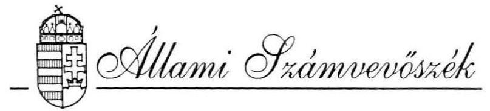
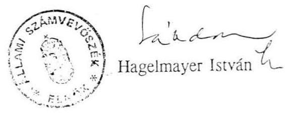

B. 62 .

# VÉLEMÉNY 

a Magyar Köztársaság 1994. évi pótköltségvetéséről

---

# 1. Introduction

This document provides an overview of the key concepts and methodologies used in the study of **quantum mechanics**. It covers fundamental principles, mathematical formulations, and practical applications.

## 2. Fundamental Principles

### 2.1 Wave-Particle Duality

Quantum mechanics introduces the concept of wave-particle duality, where particles such as electrons and photons exhibit both wave-like and particle-like properties. This duality is central to understanding the behavior of quantum systems.

### 2.2 Superposition

The principle of superposition states that a quantum system can exist in multiple states simultaneously until it is measured. This is mathematically represented by a wave function, denoted as $$|\psi\rangle$$.

## 3. Mathematical Formulations

### 3.1 Schrödinger Equation

The Schrödinger equation is a fundamental equation in quantum mechanics that describes how the quantum state of a physical system changes over time. It is given by:

$$i\hbar \frac{\partial}{\partial t} \Psi(\mathbf{r}, t) = \hat{H} \Psi(\mathbf{r}, t)$$

where $$i$$ is the imaginary unit, and $$\hbar$$ is the reduced Planck constant.

### 3.2 Dirac Notation

Dirac notation is a convenient and convenient way to represent quantum states and operators. It uses bra-ket notation, where a quantum state is described by a quantum state, and bra-ket notation is used to represent quantum states and operators.

## 4. Practical Applications

### 4.1 Quantum Computing

Quantum computing leverages the principles of superposition and entanglement to perform computations that are infeasible for classical computers. Quantum bits, or qubits, are the fundamental units of quantum information.

### 4.2 Quantum Cryptography

Quantum cryptography uses the principles of quantum mechanics to secure communication. Quantum key distribution (QKD) is a cornerstone of quantum computing, where key distribution is used to identify key states and operators.

## 5. Conclusion

Quantum mechanics is a cornerstone of modern physics, providing a framework for understanding the behavior of particles at the smallest scales. Its principles and mathematical formulations have led to groundbreaking technologies and continue to drive innovation in various fields.

## 6. References

- Griffiths, D. J. (2005). *Introduction to Quantum Mechanics*. Pearson.
- Shankar, R. (2012). *Principles of Quantum Mechanics*. Plenum Press.

---

Az Állami Számvevőszék alkotmányos kötelezettségének, valamint az államháztartási törvénynek megfelelően véleményezi a Kormány pótköltségvetési javaslatának megalapozottságát, a bevételi előirányzatok teljesíthetőségét.

A számvevőszéki vélemény elkészítésére törvényes határidő nincs, de az államháztartási törvény előírja, hogy az Országgyűlés a pótköltségvetési törvényjavaslatot az Állami Számvevőszék véleményével együtt tárgyalja. Azért, hogy az Országgyűlés munkáját az ÁSz ne késleltesse, véleményét (az elmúlt évekhez hasonlóan) néhány nap alatt alakította ki. Elsősorban törvényességi és számszaki szempontból ellenőriztük a törvényjavaslatot, de korábbi vizsgálataink megállapításai alapján néhány további intézkedés megfontolására is felhívjuk az Országgyűlés figyelmét.

# I. A pótköltségvetés törvényessége 

1) Az államháztartási törvény (ÁHT) 41. § (1-2) bekezdése akkor kötelezi a Kormányt pótköltségvetés benyújtására, ha "... évközben a körülmények oly módon valtoznak meg, hogy ezek a költségvetés teljesítését jelentősen veszélyeztetik. ....", valamint "... a költségvetésben előirányzott általános tartalékot felhasználták és a költségvetési törvényben megállapított források nem elégségesek a kiadási előirányzatok fedezetére."

A körülmények, amelyek a pótköltségvetés készítését indokolhatják a következőképpen alakultak:
a.) Tartalékfelhasználás

A pótköltségvetés benyújtásáig a Kormány a 25 milliárd forintos általános tartalékból 23 milliárd forintot használt fel, illetve kötött le, ami az előirányzat 92%-a. Az általános tartalék kormányhatározattal történő lekötése minősül felhasználásnak.

---

b.) Az előirányzatok várható alakulása

Az indoklás mellékleteiben közzétett adatok alapján az 1994. évi költségvetés forrásai és kiadásai - pótköltségvetés nélkül - várhatóan az alábbiak szerint alakultak volna:

|  |  |  | millió forint |
| :--: | :--: | :--: | :--: |
|  | 1994. évi   ELŐIRÁNYZAT | 1994. évi VÁRHATÓ | ELTÉRÉS |
| BEVÉTEL | 1308133,8 | 1301148,9 | $-6984,9$ |
| KIADÁS | 1637695,2 | 1681975,8 | $+44280,6$ |
| HIÁNY | $-329561,4$ | $-380826,9$ | $+51265,5$ |

A hiány tehát várhatóan 51 milliárd forinttal haladná meg az eredetileg tervezettet. Ennek alapvető oka a kiadások 44 milliárd Ft-os többlete, amire az általános tartalék már nem nyújt fedezetet. A bevételek a tervezetthez viszonyítva eltérő struktúrában teljesülnek, de összességében mindössze 6,9 milliárd Ft bevételkieséssel kell számolni.

Megállapítható, hogy az 1994. évi adatok alapján a pótköltségvetés készítési kötelezettség mindkét feltétele teljesült.

A pótköltségvetéssel a Kormány a hiány jelentős növelése nélkül teremtette meg a kiadási többletek fedezetét, és az Országgyűlés jóváhagyását kéri a kiadási előirányzatok teljesítéséhez.
c.) A várható előirányzatok megalapozottsága

Az 1994. évi előirányzatok pótköltségvetésben közzétett várható teljesítése az államháztartási információs rendszer hiányosságai miatt nehezen ítélhető meg.

A várható bevételeket a forgóalap I-VIII. havi adatai, illetve a korábbi évek évközi teljesítése alapján összességében teljesíthetőnek ítéljük. A 44 milliárd forintos kiadási többlet realitásának minősítésére viszont csak az indoklásban szereplő információk álltak rendelkezésünkre.
2) Az ÁHT 38. §-a előírja, hogy a Kormány az általános tartalék 40%-át használhatja fel az első félévben. A 25 milliárd forintból az első félévben ténylegesen 12 786,8 millió forintról döntöttek, vagyis az előirányzat 51,1%-át használták fel. Erre a

---

Kormánynak törvényi felhatalmazása nem volt, s nem is kérte az Országgyűlés jóváhagyását.
3) A Kormány által benyújtott pótköltségvetési javaslat szerkezetében megfelel az államháztartási törvény 41. § (4) bekezdésének, mert a pótelőirányzatokkal összhangban módosítja a költségvetési törvényt. Ugyanakkor nem teljesíti az ÁHT 41.§ (3,5,6) bekezdéseiben foglalt előírásokat, amelyek szerint külön kell szerepeltetni a javaslatban a pótelőirányzatokat és az új előirányzatokat. Emiatt a javaslat nehezebben áttekinthető és értékelhető.

Pótelőirányzat az Országgyűlés által elfogadott költségvetési törvényben szereplő előirányzat megváltoztatását szolgáló előirányzat.
Az új előirányzat olyan jogcímen keletkező előirányzat, amely nem szerepelt a költségvetési törvény előirányzatai között.
4) A pótköltségvetés 1., 2., 5. számú mellékleteit, a törvényjavaslat szövegének hivatkozásait ellenőriztük. Megállapítottuk, hogy azok számszakilag egyeznek

A pótköltségvetési törvényben javasolt valamennyi törvénymódosítás beilleszthető a jelenleg hatályos törvényi szövegbe. (A 2.§-ban lemaradt hogy milyen törvényszakasz helyébe lép a módosított szöveg.)
5) A törvényjavaslat indokolásának mellékletei alapján a bevételek és kiadások előirányzatait három jogcímen változtatja meg a törvényjavaslat:
— 1994. évi automatizmusok,

- az általános tartalék felhasználása,
— pótköltségvetési intézkedés.
A három jogcím közül az első részletesebb magyarázatot kíván. Az ÁHT 40. §-a szerint "A költségvetési törvényben meghatározott egyes előirányzatoknál külön szabályozott módosítás nélkül is eltérhet a teljesülés a jóváhagyottól. Ezen előirányzatok között olyan bevételi, illetve kiadási előirányzat jelölhető meg, amelynek teljesülése jogszabályon alapul, illetve olyan tényezők következménye, amelyek alakulására a Kormánynak közvetlen befolyása nincs. Ha ezek az előirányzatok a tervezett egyenleg megvalósulását veszélyeztetik, a Kormány köteles a tervezett költségvetési egyenleg biztosítása érdekében a szükséges intézkedést megtenni."

Az 1994. évi költségvetésről szóló 1993. évi CXL törvény 40. §-a tételesen felsorolja azokat a költségvetési címeket, amelyek módosítási kötelezettség nélkül

---

automatikusan eltérhetnek az előirányzatoktól. Ezek tekintendők olyan "automatizmusnak", amelyek alakulására a Kormánynak közvetlen befolyása nincs.

Ha a tényleges teljesítés a tervezettől eltérően alakul, az "automatikusan" változó tételek előirányzatait nem szükséges módosítani. A többi előirányzatnál viszont csak az Országgyűlés jóváhagyása esetén lehet növelni vagy csökkenteni az előirányzatokat.

A törvényjavaslat indoklásában az "1994. évi automatizmus" oszlopban szereplő tételeket átvizsgálva megállapítottuk, hogy számos tétel nem tartozik az automatikusan változó tételek közé. A tételek a következő csoportokba sorolhatók:
-CXI. tv. 40. § szerint automatikus tételek növekményének összege:
$26.713,5 \mathrm{M} \mathrm{Ft}$
-a CXI. tv. szerint nem automatikus, csak intézkedéssel módosítható tételek összege:
$\frac{17.570,0 \mathrm{M} \mathrm{Ft}}{44.283,5 \mathrm{M} \mathrm{Ft}}$
-a VII. Miniszterelnökség fejezet 29. cím Költségvetés általános tartaléka során szereplő összeg
$\frac{-11.051,8 \mathrm{M} \mathrm{Ft}}{33.231,7 \mathrm{M} \mathrm{Ft}}$

A 201-208. oldalakon az általános tartalék tételes elszámolásából megállapítható, hogy az automatikusnak minősített tételek javára kormányhatározatot nem hoztak, ezért a 147. oldalon a VII. fejezet 29 címén, a "Költségvetés általános tartalékának" 11.051,8 M Ft-os csökkentése "automatizmus" jogcímen nem fogadható el.

Ennek az összegnek az általános tartalék felhasználása oszlopban kell szerepelnie. A felhasznált tartalék - 23.010,4 M Ft-os összege is csak e számszaki korrekcióval $[(-11.958,6)+(-11.051,8)]$ egyezik meg a tartalék terhére engedélyezett pótelőirányzatok összegével.

---

A 17.570 M Ft az alábbi tételekből tevődik össze:
VII. Miniszterelnökség fejezet 27. cím 3. alcím
központi költségvetési közalkalmazottainak
bérpolitikai kerete
$5.100,-$ M Ft
XV. Földművelődési Minisztérium fejezet 13. cím 2. alcím

Mezőgazdasági Fejlesztési Alap támogatás
$3.000,-$ M Ft
XVI. Munkaügyi Minisztérium fejezet 14. cím 1. alcím

Foglalkoztatási Alap támogatás
$4.600,-$ M Ft
XX. Környezetvédelmi és Területfejlesztési

Minisztérium fejezet 9. cím 1. alcím
Területfejlesztési Alap támogatás
$2.000,-$ M Ft
VII., VIII., XVII., XX., XXXI fejezeteknél kisebb tételek összege
$2.870 .-$ M Ft

Az összességében 17.570 M Ft-ot kitevő tételeknek - kiadásnövelő hatásuk ellenére - a pótköltségvetési intézkedés-csomagban a helyük, hiszen az általános tartalék felhasználása miatt csak az Országgyűlés hozzájárulásával növelhető a kiadási előirányzatuk.

Fedezetüket az intézkedés-csomag meg is teremti. Kifogásoljuk viszont, hogy hiányzik az egyértelmű elszámolás a többletkiadásokról, mert a pótköltségvetési törvényjavaslat mellékleteinek jóváhagyásával az Országgyűlés a 17.570,0 M Ft automatikusnak nem minősíthető kiadási előirányzat engedélyezéséről is rendelkezik. E tételekkel az indoklás ugyan foglalkozik, de egyértelműen nem számol el. Vélelmezhetően egyes tételeknél már intézkedett a Kormány, mert az indoklásból az megállapítható, hogy olyan kiadási determinációról van szó, amelynek fedezetéről az általános tartalék hiányában gondoskodni kell.

Ezek a kötelezettségek törvényi előírások alapján keletkeztek, amelyekre az 1994. évi költségvetési törvény nem, vagy nem elegendő fedezetet tartalmazott. (Sőt a felsorolt alapok támogatását növelő 9,6 milliárd forint kiadási többlet éppen a költségvetési törvény - a pótköltségvetéssel már korrigált - előírása alapján keletkezett.)

---

6) A törvényjavaslat 8.§.(3) bekezdése felhatalmazza a Kormányt, hogy az államháztartási törvény 24.§. szerinti előirányzatok között átcsoportosítást hajthat végre.

Jóváhagyása azt jelentené, hogy a Kormány a fejezeteken belül nemcsak a címek között, hanem a kiemelt előirányzatok, - bér, TB, dologi kiadások - célfeladatok, a kormányzati beruházások és felújítások között is átcsoportosíthatna. (Pl. a fejezetek a dologi kiadásaikat átcsoportosíthatnák a bérhez.)

Az átcsoportosítási lehetőségek liberalizálása nem indokolt, nem felel meg a közpénzekkel való "szoros" gazdálkodás elvének. A tervezési és gazdálkodási fegyelmet lazítaná és a pótköltségvetés intézkedéseiről is áttekinthetetlenné tenné az elszámoltatást.

A törvényjavaslat 8.§.(3) bekezdés elhagyását javasoljuk.
7) A pótköltségvetés 3.§-ában rendelkezik a módosított hiány finanszírozásáról és meghatározza a rövid- és hosszúlejáratú értékpapír-kibocsátást.

Az elmúlt évek finanszírozási gyakorlata arra utal, hogy a költségvetési törvényekben előirányzott finanszírozási elképzelések nem valósulnak meg, és az éves hiányt az előirányzottat jelentősen meghaladó rövidlejáratú forrásokkal fedezték. Javasoljuk, hogy a költségvetési törvény az értékpapír-kibocsátás összegét együttesen tartalmazza, és más módon rendezze a hosszúlejáratú értékpapír-kibocsátási kötelezettség preferenciáját.
8) Az ÁHT szerint csak törvényben szabályozott elkülönített állami pénzalap működhet. A pótköltségvetésben szereplő Bérgarancia Alap-ról nem rendelkezik törvény, tehát ez az alap jogilag nem létezik.
9) Törvényi előírások hiányában nem kifogásolható, hogy a pótköltségvetési törvényjavaslat 1. és 2. sz. melléklete a bevételek és kiadások valamennyi tételének előirányzatát az "1994. évi várható teljesítés"-hez
 igazítja. Felhívjuk a figyelmet arra, hogy emiatt az eredeti költségvetés számos tétele külön intézkedés nélkül kisebb-nagyobb mértékben nő vagy csökken.

A várható előirányzatok tartalma a pótköltségvetésben különböző. Egyes tételeknél a teljesítések becslését tartalmazzák, míg másoknál az eredeti előirányzatot, illetve annak 1-2 jogcímen megváltoztatott összegét.

---

Az évközi várható teljesítéshez igazodó teljes körű előirányzat-átrendezés akadályozza a költségvetési előirányzatok teljesítésének értékelését, az évek közötti összehasonlítást.
(Ennek illusztrálására állítottuk össze a mellékletet, amely a XXXI. Adósságszolgálat fejezet előirányzatainak módosításait tartalmazza.)

# II. A pótköltségvetési javaslat egyes tételeivel kapcsolatban a következőkre hívjuk fel a figyelmet. 

1) Az általános tartalékot a Kormány előre nem tervezett kiadások teljesítésére, illetve elmaradt bevételek pótlására használhatja fel. Ettől eltérően az a gyakorlat alakult ki, hogy az általános tartalék nagy részét előre tervezhető, a költségvetésekből fedezet híján kimaradt kiadások finanszírozására használják. A tervezett tartalék évenként növekvő összege miatt egyre több esetben az Országgyűlés előre tervezhető feladatok kiadásairól is utólag, csak a zárszámadás során szerezhet tudomást.
1994. évben az előre nem tervezett kiadások részben különböző törvények hatályba lépésének következtében merültek fel. Ennek fedezésére az általános tartalékból 9760,8 millió forintot kötöttek le.

A tartalék 1994. évi felhasználása ismét felhívja a figyelmet arra, hogy a törvényeket előterjesztő minisztereket kötelezni kellene a törvényjavaslatok költségvetési előirányzatokra gyakorolt hatásának számszerűsítésére. Az Országgyűlésnek a számítások ismeretében kellene megalkotnia a törvényeket.

Az általános tartalék összegét 15,5 millió Ft-tal megnövelte a Kormány 3133/94. sz. határozata. Az előirányzat a Péch Antal Bányaipari Aknászképző Technikum önkormányzatnak történő átadása miatt változott. Tekintettel arra, hogy az intézmény működését a jövőben önkormányzati források fedezik, az előirányzatot nem a tartalék növelésével kellett volna zárolni, hanem a kiadások végösszegét csökkenteni. Ezzel a megoldással a hiány összege is csökkent volna, míg a tartalékba történő átcsoportosítással újabb kiadások fedezetéül szolgál a 15,5 millió Ft.

---

2) A pótköltségvetési intézkedés-csomag a központi költségvetési szervek körében a támogatás-megtakarítást elsősorban a készletbeszerzések, felújítások, néhány esetben a bérelőirányzat visszafogásával éri el. Az előirányzatok ilyen jellegű lefaragása a feladatok felülvizsgálatára nem terjed ki, ezért valódi, hosszabb távon ható megtakarítást az ilyen típusú intézkedésekkel nem lehet elérni.
3) A pótköltségvetési törvényjavaslat a nagyberuházások előirányzatait 4607,2 M Ft-tal, a nagyjavításokét pedig 207,4 M Ft-tal csökkenti. Megjegyezzük, hogy amennyiben a beruházási célok nem változnak, a zárolt összegek többletigényként az 1995. évi költségvetést terhelik.
4) Az elkülönített alapok 1994. évi nyitóállománya a pótköltségvetésben 16,3 Mrd Ft-tal magasabb az eredeti költségvetésben szereplő nyitóállománynál, mert az 1993. évi zárszámadásban felülvizsgálták az elkülönített alapok elszámolásait. A felülvizsgálat 16,3 millió forint többletforrást fedett fel, amely számszerűen a nyitóállomány növekedésében jelentkezik.

Sem a 1993. évi zárszámadási törvényjavaslat, sem a pótköltségvetés nem számol azzal, hogy ez a többletforrás miként mobilizálható a költségvetés kondíciójának javítására.
5) A nagyberuházások folyószámla-vezetésével kapcsolatban az ÁFI Rt az előző évekről felhalmozódott költségvetési pénzeszközöket kezeli. A pótköltségvetés potenciális forrása lehetne, ha ezeket átmenetileg bevonnák a költségvetési hiány finanszírozásába.

A helyi önkormányzatok beruházásaihoz nyújtott 1993. évi címzett és céltámogatás ellenőrzéséről készített jelentésünkben megállapítottuk, hogy az önkormányzatok céltámogatásából 11 milliárd forint halmozódott fel az ÁFI-nál. A Világkiállítási Alap által kibocsátott felsőoktatási kötvény bevétele - több mint 3 milliárd forint - az Alap költségvetésében nem szerepel, ezért erről a pótköltségvetés nem is rendelkezik. A 3 milliárd forintot szintén az ÁFI kezeli.
6) Az 1993. évi zárszámadási törvényjavaslat 19,5 milliárd forint privatizációs bevétel azonnali befizetésére kötelezi az ÁVÜ-t az elkülönített állami pénzalapoknak járó privatizációs bevétel elmaradása miatt. (1993-ban évben a központi költségvetést terhelte ez az összeg.)

Bár a zárszámadási törvény még nem született meg, ilyen nagyságrendű potenciális bevételt a pótköltségvetésben indokolt számításba venni.

---

Ezúton hívjuk fel ismét a figyelmet arra, hogy évről-évre áttekinthetetlenebb helyzetet teremt az a gyakorlat, ami szerint a privatizációs bevételeket a költségvetésben nem "futtatják át", de annak terhére különböző, támogatás-jellegű közvetlen fizetési kötelezettséget írnak elő.

Az elkülönített alapok támogatása a privatizációs bevételből az elmúlt években a következőképpen alakult:

|  |  |  | millió forint |
| :--: | :--: | :--: | :--: |
|  | Eredeti előirányzat | Teljesítés | Különbség (Ki nem utalt bevétel) |
| 1993. | 26.000 | 7.200 | $-18.800$ |
| 1994. | 28.269 | * | * $(-28.269)$ |

*/ A pótköltségvetés nem tartalmaz a privatizációs bevételek várható alakulására becslést, de a Forgóalap I-VIII. havi kimutatása szerint 1994. évben átutalás még nem történt.

A ki nem utalt bevétel pótlására különböző technikákat alkalmaznak, amelyek azonban a központi költségvetés hiányát rendszeresen növelik.
7) A pótköltségvetési törvényjavaslat 35-39. §-ai intézkednek a költségvetési szerveknél a 13. havi fizetés folyósításának 1995. január hónapra való átütemezéséről.

A törvényjavaslatban nem történik intézkedés arra vonatkozóan, hogy azoknál a költségvetési szerveknél, amelyeknél az 1994. évi költségvetési előirányzat a 13. havi fizetés pénzügyi fedezetét tartalmazza, az átütemezést hogyan kell megvalósítani. A pótköltségvetési törvénytervezet költségvetési előirányzataiból nem derül ki, hogy az átütemezést a javasolt előirányzatokon átvezették-e vagy sem.
8) A pótköltségvetési törvény 20.§-a módosítja az illetékről szóló (1990. évi XCII.) törvényt.
Ennek lényege, hogy az illetékeknél előleg fizetési kötelezettséget ír elő. A

---

földhivatalok a beiktatott szerződések egy példányát illetékelőleg megállapítása céljából azonnal megküldik az illetékhivataloknak. Ez az előírás az illetékhivatalok tevékenységében, ügymenetében jelentős változást okoz.

Az Állami Számvevőszék a közelmúltban vizsgálta az illetékhivatalok tevékenységét. (V-3O-33/1994. Tsz. 196.) A vizsgálat tapasztalatai azt bizonyították, hogy a bevételek növeléséhez, a pótköltségvetésben javasolt illeték törvény végrehajtásához a szervezetek működési feltételeit javító további intézkedésekre is szükség van. (Az illetékhivatalok működését az önkormányzatok finanszírozzák.) A hivatalok a velük szemben támasztott követelményeknek a törvénymódosítás előtt sem tudtak teljesen megfelelni. (A vizsgált hivataloknál a 60 napon túli ügyintézés részaránya 56%-os volt.)

Az illetékbevétel 50-50%-os megosztása az önkormányzat és a központi költségvetés között csökkenti a behajtási tevékenységben a feladatot végrehajtó önkormányzatok érdekeltségét.

További probléma, hogy
—a forgalmi értékmegállapító munkában nem érvényesülnek maradéktalanul a törvényi előírások. A privatizáció keretében, vagy más módon átruházott vállalkozói vagyon értékelési gyakorlata kialakulatlan, ellentmondásos.

- A helyi önkormányzati rendeletekben szabályozott érdekeltség alacsony hatásfokú, nem ösztönöz kellően az illetékbevételek fokozására, a hátralékok csökkentésére, az ügyintézési átfutási idő rövidítésére.

Mindezek azért érdemelnek figyelmet, mert a piacgazdaság kiteljesedésével, a magántulajdon forgalmának növekedésével az illetékek jelentősége megnövekszik.
9) A bevételi előirányzatok teljesíthetőségét az Állami Számvevőszék részleteiben is a benyújtott törvényjavaslat és a Pénzügyminisztérium számítási anyaga alapján értékelte. A bevételek teljesíthetőségének megítélését nehezíti, hogy a számítási anyagok nem kellően részletezettek, egyes esetekben hiányoznak.

A fogyasztási adónál a törvényjavaslat közel 20 milliárd forintos csökkenést prognosztizál. Figyelembe véve a fogyasztási adó növelésére vonatkozó intézkedéseket is. (3,9 milliárd Ft többlet) A Pénzügyminisztérium által megküldött számítási anyag sem az élvezeti cikkekre, sem az üzemanyagokra és ipari

---

tüzelőolajokra nem tartalmaz részletes számítást. Nem valószínűsítették az adóemelés bejelentésének fogyasztást csökkentő hatását sem.

A lakossági illeték várhatóan 4,0 milliárd forinttal csökken. A pótköltségvetési törvényben szereplő illeték jogszabály-módosításának bevételt növelő hatása csak 1995. évben érvényesül.

A vám és import befizetések 24 milliárd forintos növelése reálisnak tűnik. Figyelembe véve a befizetések negyedéves szezonális ingadozását az sem kizárt, hogy a pótköltségvetési előirányzat túlteljesül.

Ugyanakkor a vámszigorító intézkedések eredményességét illetően felhívjuk a figyelmet arra, hogy a fizetési fegyelem 1994. év folyamán tovább romlott. A vám kintlevőségek 1994. VII. 31-én meghaladták a 10 milliárd forintot. A VPOP hatáskörébe tartozó importot terhelő adókkal együtt a tartozás mintegy 70 milliárd forint, melynek 50%-a felszámolási eljárással és végelszámolással érintett, ahol a behajtás eredményessége nem számottevő.

Az általános forgalmi adó a pótköltségvetés szerint 8,5 milliárd forinttal csökken, míg a személyijövedelem-adó 11,7 milliárd forinttal nő. Számításokkal a pótköltségvetés előirányzatai nincsenek alátámasztva.

Összegezve megállapítható, hogy a pótköltségvetési törvényjavaslat megteremti az 1994-ben várható többletkiadásokra a fedezetet. Ugyanakkor a pótköltségvetéssel beterjesztett intézkedés-csomag nem tartalmaz olyan elemeket, amelyek az államháztartásban jelentősebb változásokat indítanának el, és a kiadásokat hosszabb távon is mérsékelnék.

Budapest, 1994. szeptember 16.

---

# A várható teljesítésekhez igazodó előirányzat-módosítások a XXXI. Belföldi államadósság fejezetnél 

| Költségvetési   cím/alcím | 1994. évi eredeti   előirányzat | Módosítás | A törvényjavaslat 1.   számú melléklete |
| :-- | :--: | :--: | :--: |
| 1.1.1 | 8.176,0 | - | 8.176,0 |
| 1.1.2 | 2.050,0 | - | 2.050,0 |
| 1.2 | 2.630,0 | - | 2.630,0 |
| 1.4 | 636,0 | - | 636,0 |
| 1.5 | 5.900,0 | - | 5.900,0 |
| 1.6 | 1.000,0 | - | 1.000,0 |
| 1.7 | 3.620,0 | - | 3.620,0 |
| 1.8 | 45.000,0 | - | 45.000,0 |
| 1.10 | 214,0 | - | 214,0 |
| 2.1.1 | 36.618,6 | -1.099,8 | 35.518,8 |
| 2.1.2 | 1.360,4 | -1,5 | 1.358,9 |
| 2.1.5 | 574,7 | -0,6 | 574,1 |
| 2.1.6 | 20.782,6 | -0,7 | 20.781,9 |
| 2.1.7 | 462,0 | 53,6 | 515,6 |
| 2.1.8 | 3.472,0 | -3,6 | 3.468,4 |
| 2.1.10 | 422,7 | - | 422,7 |
| 2.2 | 13.200,1 | 907,4 | 14.107,4 |
| 3.1 | 54.057,9 | 7.254,5 | 61.312,4 |
| 3.2 | 60.609,4 | 3.543,2 | 64.152,6 |
| 4 | 65.203,1 | -10.870,5 | 54.332,6 |
| 5.2 | 2.000,0 | 500,0 | 2.500,0 |
| 5.3 | 4.076,2 | -1.199,6 | 2.876,6 |
| 5.4 | 18.039,9 | 3.150,1 | 21.190,0 |
| 5.5 | 3.600,0 | 1.900,0 | 5.500,0 |
| 5.7 | 300,0 | - | 300,0 |
| 5.8 | 430,0 | - | 430,0 |
| 5.9 | 32,0 | - | 32,0 |
| 5.10 | - | 1.000,0 | 1.000,0 |
| 7.3 | - | 1.000,0 | 1.000,0 |
| Összesen | 354.467,5 | 6.132,5 | 360.600,0 |
| Növelő tételek összege: |  | 19.308,8 |  |
| Csökkentő tételek összege: |  | 13.176,3 |  |
| Módosítások egyenlege: |  | 6.132,5 |  |

