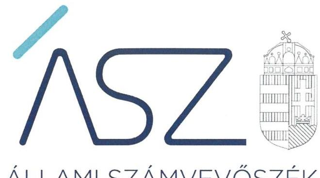
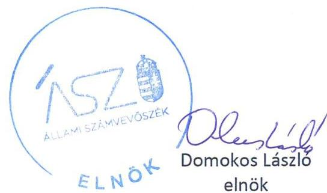

ÁLLAMI SZÁMVEVŐSZÉK

# JELENTÉS

A Fővárosi Önkormányzatot és a kerületi önkormányzatokat osztottan megillető bevételek 2021. évi megosztásáról szóló önkormányzati rendelet felülvizsgálata

2022.

22001
www.asz.hu

---

ÁLLAMI SZÁMVEVŐSZÉK

# JELENTÉS

A Fővárosi Önkormányzatot és a kerületi önkormányzatokat osztottan megillető bevételek 2021. évi megosztásáról szóló önkormányzati rendelet felülvizsgálata

2022. 04. hó 07. nap

22001
www.asz.hu

---

# AZ ELLENŐRZÉST VEZETTE ÉS A VÉGREHAJTÁSÁÉRT FELELŐS: 

DR. BENEDEK MÁRIA ellenőrzésvezető
NEMESVÁRI-HORTHY ESZTER ellenőrzésvezető
A PROGRAM ÖSSZEÁLLÍTÁSÁÉRT FELELŐS:
DR. FELFÖLDI IZABELLA projektvezető
A TÉMÁHOZKAPCSOLÓDÓ KORÁBBISZÁMVEVŐSZÉKI JELENTÉSEK:

- címe: A Fővárosi Önkormányzatot és a kerületi önkormányzatokat osztottan megillető bevételek 2020. évi megosztásáról szóló önkormányzati rendelet felülvizsgálata
- sorszáma 21003

Jelentéseink az Országgyűlés számítógépes hálózatán és az interneten a www.asz.hu címen is olvashatóak.

IKTATÓSZÁM: EL-3502-001/2022.
TÉMASZÁM: 2604
ELLENŐRZÉS-AZONOSÍTÓ SZÁM: V0948

---

# TARTALOMJEGYZÉK 

- ÖSSZEGZÉS ..... 5
- AZ ELLENŐRZÉS CÉLJA ..... 6
- AZ ELLENŐRZÉS TERÜLETE ..... 7
- AZ ELLENŐRZÉS HÁTTERE, INDOKOLTSÁGA ..... 8
- A JELENTÉS LÉNYEGES KÉRDÉSKÖREI ..... 9
- AZ ELLENŐRZÉS HATÓKÖRE ÉS MÓDSZEREI ..... 10
- MEGÁLLAPÍTÁSOK ..... 11
- JAVASLATOK ..... 14
- MELLÉKLETEK ..... 15
I. sz. melléklet: Értelmező szótár ..... 15
- FÜGGELÉK: ÉSZREVÉTELEK ..... 17
- RÖVIDÍTÉSEK JEGYZÉKE ..... 19

---

.

---

# ÖSSZEGZÉS 

Budapest Főváros Önkormányzata 2021. évi Forrásmegosztási rendeletalkotás előkészítési folyamata a Főpolgármesteri Hivatalnál nem volt szabályozott, ezáltal nem volt szabályszerű. A 2021. évi forrásmegosztásnál figyelembe vett bevételek és kiadások megállapítása és elszámolása szabályszerű volt. A 2022. évi forrásmegosztás során korrekció érvényesítése nem indokolt.

## Az ellenőrzés társadalmi indokoltsága

Az ellenőrzés végrehajtásával a törvényalkotás számára tapasztalatok állnak rendelkezésre a forrásmegosztás szabályozásáról, a Forrásmegosztási rendelet ${ }^{1}$ szabályszerűségéről, következtetés vonható le arra vonatkozóan, hogy indokolt-e jogszabályi módosítás kezdeményezése. Az ellenőrzés az ellenőrzött számára visszajelzést ad a forrásmegosztás végrehajtásának szabályosságáról. A társadalom számára jelzi, hogy a közpénz tervezett megosztása sem maradhat ellenőrizetlenül, az ÁSZ ${ }^{2}$ értékteremtő rend kialakításához és megőrzéséhez hozzájáruló tevékenysége pozitív hatással lesz a szervezetről kialakított összkép formálására.

Az ellenőrzés rávilágít arra, hogy a közpénzek felhasználása a jogszabályokban megfogalmazott feltételek mellett, az azokban foglaltaknak megfelelően történt-e, az esetleges eltérések miatt szükség volt-e korrekció érvényesítésére.

## Főbb megállapítások, következtetések, javaslatok

A Főpolgármesteri Hivatalban ${ }^{3}$ a Forrásmegosztási rendelet szabályozott és szabályszerű megalkotása előkészítési folyamatához a 2020. november 1-jétől hatályba lépett, az SZMSZ ${ }_{2}{ }^{4}$-ben előírtakkal összhangban lévő, a világos szervezeti struktúrát, a folyamatok átláthatóságát biztosító belső szabályzatokat nem alakítottak ki. A Főjegyző ${ }^{5}$ a Forrásmegosztási rendeletalkotás előkészítésében részt vevő Költségvetési Tervezési és Felügyeleti Főosztály részére a Bkr. ${ }^{6}$-ben előírtak ellenére az ellenőrzési nyomvonalat nem készítette el és az SZMSZ ${ }_{2}$-ben előírtak ellenére nem hagyta jóvá, valamint az SZMSZ ${ }_{2}$-ben előírtak ellenére nem határozta meg ügyrendjét. Ezáltal a Forrásmegosztási rendeletalkotás előkészítési folyamata a Főpolgármesteri Hivatalban nem volt szabályozott és szabályszerű.

A Fővárosi Önkormányzatot ${ }^{7}$ és a kerületi önkormányzatokat ${ }^{8}$ osztottan megillető helyi iparűzési adó és idegenforgalmi adó, pótlék és bírság bevételek megalapozottan kerültek megtervezésre. A forrásmegosztásnál figyelembe vett, a Fővárosi Önkormányzati Adóhatóság működtetésével összefüggő, helyi adózással kapcsolatos kiadások megállapítása és elszámolása szabályszerű volt. A kerületi önkormányzatok felé többletkiadás érvényesítése nem történt, mert a Fővárosi Önkormányzat a Forrásmegosztási törvény ${ }^{9}$-ben előírtakkal összhangban kizárólag a helyi adóhoz kapcsolódóan kiszabott pótlékból és bírságból származó bevételek 50%-áig terjedő mértékben érvényesített kiadást.

A 2021. évben a megosztandó bevételek és kiadások pénzügyi elszámolása szabályszerű volt. Az ÁSZ ellenőrzése a 2021. évi Forrásmegosztási rendelet felülvizsgálata során nem tárt fel jogosulatlanul igénybe vett, vagy a jogszerűen megillető forrásnál alacsonyabb összegű részesedést, ezért a 2022. évi forrásmegosztás során korrekció érvényesítését nem tartja indokoltnak.

Az ÁSZ az intézkedések megtétele céljából a Főpolgármesteri Hivatal Főjegyzőjének 2 javaslatot fogalmazott meg.

---

# AZ ELLENŐRZÉS CÉLJA

**AZ ELLENŐRZÉS CÉLJA** a Fővárosi Önkormányzatot és a kerületi önkormányzatokat osztottan megillető bevételek 2021. évi megosztásának, valamint a helyi adóztatással kapcsolatos kiadások megállapítása, elszámolása szabályszerűségének ellenőrzése.

---

# **AZ ELLENŐRZÉS TERÜLETE**

## **A Fővárosi Önkormányzat 2021. évi Forrásmegosztási rendeletalkotása és annak végrehajtása**

A Fővárosi Önkormányzatot és a kerületi önkormányzatokat osztottan megillető bevételek körét és a részesedési arányokat a Forrásmegosztási törvény határozza meg. Ennek értelmében a Fővárosi Önkormányzat által kivetett helyi iparűzési adóból származó bevétel, valamint a hozzá kapcsolódóan kiszabott pótlékból és bírságból származó bevételekből a Fővárosi Önkormányzat részesedése 54,0%, míg a kerületi önkormányzatok együttes részesedése 46,0%. A kerületi önkormányzatok a bevételből való részesedésük arányában kötelesek hozzájárulni a Fővárosi Önkormányzati Adóhatóság^{10} helyi adóztatással kapcsolatban felmerülő kiadásaihoz.

A Helyi adó tv.^{11} szerint a helyi iparűzési adót a Fővárosi Önkormányzat, míg a főváros esetében az idegenforgalmi adót a kerületi önkormányzat jogosult bevezetni. A kerületi önkormányzat képviselő-testülete azonban, előzetes beleegyezése alapján az idegenforgalmi adó bevezetését átengedheti a Fővárosi Önkormányzatnak. Ezzel a lehetőséggel 2021. évben hat kerületi önkormányzat^{12} – a XVII., XVIII., XX., XXI., XXII., XXIII. kerületi önkormányzat – élt. Esetükben a Forrásmegosztási rendelet alapján kivetett idegenforgalmi adóból származó bevétel a Forrásmegosztási törvényben meghatározott szabályok szerint osztottan illeti meg a Fővárosi Önkormányzatot és a kerületi önkormányzatokat.

A Forrásmegosztási rendeletet a 478/2020. (XI. 3.) Korm. rendelet^{13}-ben kihirdetett veszélyhelyzetre figyelemmel a 2011. évi CXXVIII. törvény^{14} előírása alapján a Fővárosi Közgyűlés feladat- és hatáskörét gyakorló Budapest Főpolgármestere^{15} adta ki. A Forrásmegosztási rendelet bevételi és kiadási tervszámait az 1. táblázat mutatja be.

1. táblázat

| A FORRÁSMEGOSZTÁSI RENDELETBEN MEGOSZTANDÓ BEVÉTELEK ÉS KIADÁSOK TERVEZETT ÖSSZEGE 2021. (ADATOK EZER FT-BAN) |  |  |   |
|---|---|---|---|
| Megosztandó bevétel/kiadás | Megosztandó forrás összege (100%) | Főváros részesedése (54%) | Kerületek részesedése (46%)  |
| Helyi iparűzési adó | 258 000 000 | 139 320 000 | 118 680 000  |
| 6 kerületi önkormányzat által bevezetésre átengedett idegenforgalmi adó | 9 000 | 4 860 | 4 140  |
| Kivetett adókhoz kapcsolódó pótlék, bírság | 450 000 | 243 000 | 207 000  |
| Megosztandó bevételek összesen | 258 459 000 | 139 567 860 | 118 891 140  |
| Helyi adók beszedésével összefüggő kiadások | 374 430 | 202 192 | 172 238  |

*Forrás: Forrásmegosztási rendelet*

---

# AZ ELLENŐRZÉS HÁTTERE, INDOKOLTSÁGA 

A Fővárosi Önkormányzatot és a kerületi önkormányzatokat osztottan megillető bevételek körét, valamint a forrásmegosztás szabályait a Forrásmegosztási törvény határozza meg. A törvény előírása alapján a Fővárosi Önkormányzat tárgyévre vonatkozó Forrásmegosztási rendeletét az ÁSZ felülvizsgálja. Ha az ÁSZ megállapítja, hogy a Fővárosi Önkormányzat vagy valamely kerületi önkormányzat jogosulatlan forráshoz jutott vagy az őt jogszerűen megillető forrásnál alacsonyabb összegben részesült, ennek mértékével a Forrásmegosztási törvény alapján meghatározott, a felülvizsgálat lezárását követő évi forrásmegosztást a Fővárosi Önkormányzat rendeletében módosítja.

Az ellenőrzés várható hasznosulását az ÁSZ több szinten tervezi. Az ellenőrzés az ellenőrzött számára visszajelzést ad a forrásmegosztás végrehajtásának szabályosságáról, javaslataival hozzájárul az esetleges hiányosságok kiküszöböléséhez. A társadalom számára jelzi, hogy a közpénz tervezett megosztása sem maradhat ellenőrizetlenül, az ÁSZ értékteremtő rend kialakításához és megőrzéséhez hozzájáruló tevékenysége pozitív hatással lesz a szervezetről kialakított összkép formálására.

---

# A JELENTÉS LÉNYEGES KÉRDÉSKÖREI 

1. - A Fővárosi Önkormányzat 2021. évi Forrásmegosztási rendeletalkotási folyamata szabályozott és szabályszerű volt-e?
2. - A forrásmegosztás bevételi tervszámai megalapozottak voltak-e, a forrásmegosztás szabályszerű volt-e?
3. - A forrásmegosztásnál figyelembe vett, a Fővárosi Önkormányzati Adóhatóság működtetésével összefüggő, helyi adózással kapcsolatos kiadások megállapítása és elszámolása szabályszerű volt-e?
4. - Szükséges-e korrekciót érvényesíteni a 2022. évi forrásmegosztás során?

---

# AZ ELLENŐRZÉS HATÓKÖRE ÉS MÓDSZEREI 

## Az ellenőrzés típusa

Szabályszerűségi ellenőrzés.

## Az ellenőrzött időszak

2020. október 1-jétől 2021. szeptember 30-ig tartó időszak.

## Az ellenőrzés tárgya

A Fővárosi Önkormányzatot és a kerületi önkormányzatokat osztottan megillető bevételek megosztásáról szóló 2021. évi forrásmegosztási rendelet, a helyi adóztatással kapcsolatos kiadások megállapítása, elszámolása.

## Az ellenőrzött szervezet

A Fővárosi Önkormányzat és a Főpolgármesteri Hivatal.

## Az ellenőrzés jogalapja

Az ellenőrzés jogszabályi alapját az ÁSZ tv. ${ }^{16}$ 1. § (3) bekezdése és 3. § (1) bekezdése, valamint a Forrásmegosztási törvény 6. § (1) bekezdése képezi.

## Az ellenőrzés módszerei

Az ellenőrzés szakmai módszertana az ÁSZ hivatalos honlapján (https://www.asz.hu/az-allami-szamvevoszek-ellenorzeseinek-szakmaiszabalyai) közzétett szakmai szabályokon alapul.

Az ellenőrzési kérdések megválaszolásához szükséges bizonyítékok megszerzése az ellenőrzött által rendelkezésre bocsátott dokumentumok, adatok elemzésével valósul meg, kiegészítve a megfigyelés, szemrevételezés, kérdésfeltevés (információkérés) módszerével.

Az ellenőrzés ideje alatt az ÁSZ az ellenőrzött szervezettel történő kapcsolattartást az ÁSZSZMSZ ${ }^{17}$ vonatkozó előírásai alapján biztosítja.

---

# 1. A Fővárosi Önkormányzat 2021. évi Forrásmegosztási rendeletalkotási folyamata szabályozott és szabályszerű volt-e? 

Összegző megállapítás

A Fővárosi Önkormányzat 2021. évi Forrásmegosztási rendeletalkotásának előkészítési folyamata a Főpolgármesteri Hivatalnál 2020. október 31-ig szabályozott volt. 2020. november 1-jétől nem volt szabályozott, ezáltal nem volt szabályszerű.

A Főpolgármesteri Hivatal rendelkezett az Áht. ${ }^{18}$ előírásaival összhangban a szervezetét és működését meghatározó SZMSZ ${ }_{1}$-el ${ }^{19}$ és SZMSZ ${ }_{2}$-vel. A Főjegyző a Főpolgármesteri Hivatalban 2020. október 31-ig szabályozta a Forrásmegosztási rendeletalkotás előkészítési folyamatát, a Főpolgármesteri Hivatal érintett szervezeti egységeinek, az Adó Főosztálynak és a Pénzügyi Főosztálynak a rendeletalkotás előkészítésével kapcsolatos feladatait és hatáskörét meghatározó belső szabályzatok, munkaköri leírások elkészítésével.

Az SZMSZ ${ }_{2}$ előírásai alapján a Pénzügyi Főosztály helyett 2020. november 1-jétől a Forrásmegosztási rendeletalkotással, annak előkészítésével kapcsolatos feladatokat ellátó, újonnan létrejött Költségvetési Tervezési és Felügyeleti Főosztály feladatait és hatáskörét meghatározó belső szabályzatokat nem készített és nem hagyott jóvá a Főjegyző az alábbiak szerint:
$\longrightarrow$ a Bkr. 6. § (3) bekezdésében előírtak ellenére nem gondoskodott az ellenőrzési nyomvonal elkészítéséről és az SZMSZ ${ }_{2}$ 58. § (5) bekezdésében előírtak ellenére az ellenőrzési nyomvonalat nem hagyta jóvá;
$\longrightarrow$ az SZMSZ ${ }_{2}$ 16. § (1) bekezdésében előírtak ellenére nem gondoskodott a Költségvetési Tervezési és Felügyeleti Főosztály működésének részletes szabályai, az önálló szervezeti egység belső tagozódása, az egyes osztályok és csoportok létszáma és feladatköre ügyrendben történő meghatározásáról és az SZMSZ ${ }_{2}$ 16. § (2) bekezdés c) pontjában előírtak ellenére az ügyrendet nem hagyta jóvá.
Fentiekből következően a Főjegyző az Áht. 69. § (2) bekezdésében, a belső kontrollrendszer működtetéséért előírt felelősségi körében a Bkr. 6. § (1) bekezdés a) és b) pontjában előírtak ellenére a belső kontrollrendszer részeként 2020. november 1-jétől, az SZMSZ ${ }_{2}$ hatálybalépésétől a Forrásmegosztási rendeletalkotás előkészítési folyamata tekintetében nem alakított ki olyan kontrollkörnyezetet, amelyben világos a szervezeti struktúra, a folyamatok átláthatóak, valamint egyértelműek a felelősségi, hatásköri viszonyok és feladatok.

A Költségvetési Tervezési és Felügyeleti Főosztály tekintetében feltárt hiányosságok következtében a Forrásmegosztási rendeletalkotás előkészítési folyamata nem volt szabályozott, ezáltal nem volt szabályszerű.

---

# 2. A forrásmegosztás bevételi tervszámai megalapozottak voltak-e, a forrásmegosztás szabályszerű
 volt-e? 

Összegző megállapítás

A 2021. évi forrásmegosztás helyi iparűzési adó, idegenforgalmi adó, valamint a helyi adóhoz kapcsolódóan kiszabott pótlék és bírság bevételi tervszámai megalapozottak voltak, a forrásmegosztás szabályszerű volt.

A Forrásmegosztási rendeletben a Fővárosi Önkormányzat és a kerületi önkormányzatok között megosztandó helyi adó kivetéséből (helyi iparűzési és idegenforgalmi adó), és a kapcsolódó pótlék és bírság kiszabásából származó bevételi tervszámok megalapozottak voltak.

A Forrásmegosztási rendeletben a Fővárosi Önkormányzat szabályszerűen, a Forrásmegosztási törvény előírásaival összhangban állapította meg a Fővárosi Önkormányzatot, valamint a kerületi önkormányzatokat osztottan megillető bevételt, mely alapján a Fővárosi Önkormányzat 54%-ban, a kerületi önkormányzatok 46%-ban részesültek.

A kerületi önkormányzatokat egyenként megillető részesedés - helyi iparűzési adó és idegenforgalmi adó - tervezett összege a Forrásmegosztási törvény mellékletében előírt részesedési arányok figyelembevételével került meghatározásra.

A 2021. január 1-től 2021. szeptember 30-ig befolyt megosztandó helyi adóbevételek pénzügyi elszámolása szabályszerű volt. A Fővárosi Önkormányzat a tárgyhónapban befolyt bevételek kerületeket megillető hányadát a Forrásmegosztási törvényben meghatározott arányszámok alkalmazásával állapította meg, a kerületi önkormányzatokat megillető összeget a kerületi önkormányzatok számára a jogszabályi előírás szerinti határidőn belül, a megosztás szerinti arányban, teljes összegben átutalta.

## 3. A forrásmegosztásnál figyelembe vett, a Fővárosi Önkormányzati Adóhatóság működtetésével összefüggő, helyi adózással kapcsolatos kiadások megállapítása és elszámolása szabályszerű volt-e?

Összegző megállapítás

A forrásmegosztásnál figyelembe vett, a Fővárosi Önkormányzati Adóhatóság működésével összefüggő, a helyi adózással kapcsolatos kiadások megállapítása és elszámolása szabályszerű volt.

A forrásmegosztásnál figyelembe vett, a Fővárosi Önkormányzatot és a kerületi önkormányzatokat osztottan terhelő, a helyi adók beszedésével összefüggő, a Fővárosi Önkormányzati Adóhatóság működési kiadásai megállapítása és elszámolása szabályszerű volt.

A kerületi önkormányzatok felé többletkiadás érvényesítése nem történt, mert a Fővárosi Önkormányzat a Forrásmegosztási törvény 2. § (6) bekezdésében előírtakkal összhangban kizárólag a helyi adóhoz

---

kapcsolódóan kiszabott pótlékból és bírságból származó bevételek 50%-áig terjedő mértékben érvényesített kiadást.

A Fővárosi Önkormányzati Adóhatóság működtetésével kapcsolatos kiadási előlegek és a kiadási különbözet elszámolása a Forrásmegosztási törvényben lévő arányszámok és határidők betartásával történt.

# 4. Szükséges-e korrekciót érvényesíteni a 2022. évi forrásmegosztás során? 

Összegző megállapítás
Az ÁSZ ellenőrzés nem tárt fel a 2021. évi forrásmegosztást érintő eltérést, így a 2022. évi forrásmegosztás során korrekció érvényesítése nem indokolt.

A 2021. évi Forrásmegosztási rendelet felülvizsgálata során az ÁSZ nem tárt fel a Forrásmegosztási törvény 6. § (2) bekezdésében foglaltak szerinti, jogosulatlanul igénybe vett, vagy a jogszerűen megillető forrásnál alacsonyabb összegű részesedést, ezért a 2022. évi forrásmegosztási eljárás során korrekció nem indokolt.

---

# JAVASLATOK 

Az ÁSZ tv. 33. § (1) bekezdésében foglaltak értelmében az ellenőrzött szervezet vezetője köteles a jelentésben foglalt megállapításokhoz kapcsolódó intézkedési tervet összeállítani és azt a jelentés kézhezvételétől számított 30 napon belül az ÁSZ részére megküldeni. Amennyiben az ellenőrzött szervezet vezetője nem küldi meg határidőben az intézkedési tervet, vagy továbbra sem elfogadható intézkedési tervet küld, az Állami Számvevőszék elnöke az ÁSZ tv. 33. § (3) bekezdése a) és b) pontjaiban foglaltakat érvényesítheti.

## Főpolgármesteri Hivatal főjegyzője részére

1. Intézkedjen a jövőben a jogszabályi, valamint az SZMSZ${ }_{2}$ előírások szerint az ellenőrzési nyomvonal elkészítéséről, jóváhagyásáról.
(1. sz. megállapítás 2. bekezdés 1. francia bekezdése alapján)
2. Intézkedjen a jövőben az SZMSZ${ }_{2}$ előírások szerint a Költségvetési Tervezési és Felügyeleti Főosztály működésének részletes szabályai, az önálló szervezeti egység belső tagozódása, az egyes osztályok és csoportok létszáma és feladatköre ügyrendben történő meghatározásáról, ügyrendjének jóváhagyásáról.
(1. sz. megállapítás 2. bekezdés 2. francia bekezdése alapján)

---

# MELLÉKLETEK 

## I. SZ. MELLÉKLET: ÉRTELMEZŐ SZÓTÁR

Fővárosi Önkormányzat által kivetett helyi adóhoz kapcsolódóan kiszabott pótlék és bírság
helyi adóztatással kapcsolatos kiadás
helyi iparűzési adó
idegenforgalmi adó
kiadási előleg
részesedés

A fővárost és a kerületeket osztottan illetik meg a fővárosi önkormányzat közgyűlésének rendelete alapján kivetett helyi adóhoz kapcsolódóan kiszabott pótlékból és bírságból származó bevételek. (Forrás: A Forrásmegosztási törvény 2. § (2) bekezdése alapján meghatározott fogalom.)
A fővárosi önkormányzati helyi adóztatással kapcsolatos - a tárgyévre vonatkozóan a fővárosi önkormányzatot és a kerületi önkormányzatokat osztottan megillető bevételek (iparűzési adó, hat kerületnél befolyt idegenforgalmi adó, a kivetett helyi adóhoz kapcsolódóan kiszabott pótlék és bírság) beszedésével összefüggően felmerült - kiadásokat a Forrásmegosztási törvény 2. § (1) bekezdés a) pontja szerinti bevételből részesülők viselik részesedésük arányában. Kiadásként a fővárosi önkormányzatnál a beszedéssel - a fővárosi önkormányzati adóhatóság működtetésével összefüggően felmerült működtetési kiadásokat kell figyelembe venni. A Forrásmegosztási törvény 2. § (1) bekezdés a) pontja és a (4) bekezdés szerint figyelembe vehető kiadásokat a (2) bekezdésben felsorolt bevételek legfeljebb 50%-áig terjedő mértékben lehet érvényesíteni. (Forrás: A Forrásmegosztási törvény 2. § (4), (6) bekezdése alapján meghatározott fogalom.)
A Helyi adó tv. felhatalmazása alapján a Fővárosi Közgyűlés rendeletével kivetett helyi adónem. A Fővárosi Önkormányzat illetékességi területén vállalkozói tevékenységet (iparűzési tevékenységet) állandó vagy ideiglenes jelleggel végző vállalkozó helyi iparűzési adót köteles fizetni. Adóköteles iparűzési tevékenységnek tekintendő e törvény alapján a vállalkozó e minőségben végzett nyereség-, illetőleg jövedelemszerzésre irányuló tevékenysége. (Forrás: A Helyi adó tv. 1. § (2) bekezdése, valamint a 35. § és 36. § alapján meghatározott fogalom.)

A kommunális jellegű adók közül a kerület döntése alapján átengedett helyi idegenforgalmi adóból beszedett bevétel. A helyi idegenforgalmi adót a kerületi önkormányzat helyett a Fővárosi Önkormányzat rendeletével akkor jogosult bevezetni, ha ahhoz minden adóév tekintetében az érintett kerület önkormányzatának képviselőtestülete előzetes beleegyezését adja. A fővárosi önkormányzat által közvetlenül igazgatott terület tekintetében a kerületi önkormányzat által bevezethető adó bevezetésére a fővárosi önkormányzat jogosult. (Forrás: A Helyi adó tv. 1. §-a és a III. fejezet Kommunális jellegű adók 2. pontja alapján meghatározott fogalom).
A tárgyévet megelőző év költségvetési rendeletének végrehajtásáról szóló Fővárosi Önkormányzati rendeletben elfogadott adóbeszedéssel kapcsolatos kiadásokat kell előlegként figyelembe venni és a levonását a rendelet hatályba lépését követő havi utalásban kell a kerületi önkormányzatok felé érvényesíteni. Az előleg és a tárgyévi tényleges kiadások különbözetét a tárgyévi költségvetési rendelet végrehajtásáról szóló rendelet hatályba lépését követő havi utalásban kell elszámolni. (Forrás: A Forrásmegosztási törvény 2. § (5) bekezdése alapján meghatározott fogalom.)
A forrásmegosztásba bevont bevételekből a Fővárosi Önkormányzatot és a kerületi önkormányzatokat együttesen megillető részesedés arányszáma. A Fővárosi Önkormányzatot és a kerületi önkormányzatokat a Forrásmegosztási törvény 3. § alapján osztottan megillető bevételekből a Fővárosi Önkormányzatot 54,0%, a kerületi önkormányzatokat együttesen 46,0% részesedés illeti meg. (Forrás: A Forrásmegosztási törvény 2-3. §-ai alapján meghatározott fogalom.)

---

| részesedési arányok | A kerületi önkormányzatokat megillető források egyes kerületek közötti megosztásának aránya, amelyet a Forrásmegosztási törvény 1. melléklete tartalmaz. (Forrás: A Forrásmegosztási törvény 4. § (1) bekezdése alapján meghatározott fogalom.) |
| :--: | :--: |
| tárgyév | Azon gazdasági év, amelyhez tartozó megosztandó bevételeknek a Fővárosi Önkormányzat és a kerületi önkormányzatok közötti megosztását a forrásmegosztási rendelet határozza meg. (Forrás: A Forrásmegosztási törvény 1. §-a alapján meghatározott fogalom.) |

---

# FÜGGELÉK: ÉSZREVÉTELEK 

Az ellenőrzés megállapításait a Számvevőszék 15 napos észrevételezésre megküldte az ellenőrzött szervezetek vezetőinek az ÁSZ tv. 29. § (1) bekezdése előírásának megfelelően.

Budapest Főváros Önkormányzata főpolgármestere, valamint Budapest Főváros Főpolgármesteri Hivatal főjegyzője az ellenőrzés megállapításaira észrevételt tettek. Az ÁSZ tv. 29. § (3) bekezdésével összhangban az ÁSZ a Függelékben feltünteti a jelentéstervezet megállapításaival kapcsolatban tett, figyelembe nem vett észrevételeket, és megindokolja, hogy azokat miért nem fogadta el.

[^0]
[^0]:    * 29. § (1) Az Állami Számvevőszék az ellenőrzési megállapításait megküldi az ellenőrzött szervezet vezetőjének vagy az általa megbízott személynek, és annak, akinek személyes felelősségét állapította meg.
    (2) Az ellenőrzött szervezet vezetője és a felelősként megjelölt személy az ellenőrzés megállapításaira tizenöt napon belül írásban észrevételt tehet.
    (3) Az Állami Számvevőszék az észrevételre a beérkezésétől számított harminc napon belül írásban válaszol. A figyelembe nem vett észrevételeket köteles a jelentésben feltüntetni, és megindokolni, hogy azokat miért nem fogadta el.

---

Budapest Főváros Önkormányzata főpolgármestere, valamint Budapest Főváros Főpolgármesteri Hivatal főjegyzője a Fővárosi Önkormányzat 2021. évi forrásmegosztási rendeletalkotásának előkészítési folyamata szabályozottságával kapcsolatban tett észrevételt.

Az ÁSZ az ellenőrzési megállapításait Budapest Főváros Önkormányzata és Budapest Főváros Főpolgármesteri Hivatala által a törvényi határidőn belül az ellenőrzés rendelkezésére bocsátott, az ellenőrzött időszakra vonatkozó, a teljességi és hitelességi nyilatkozatban feltüntetett hiteles dokumentumok alapján tette meg.

A főpolgármester és a főjegyző az észrevételében az ellenőrzés vonatkozó megállapításait nem vitatták. Elismerték, hogy a Költségvetési Tervezési és Felügyeleti Főosztály ügyrendje nem került kihirdetésre.

A főjegyző a Budapest Főváros Főpolgármesteri Hivatal szervezeti és működési szabályzatáról szóló Budapest Főváros Önkormányzata Főpolgármesterének 25/2020. (X. 26.) utasításában előírtak ellenére nem gondoskodott a Költségvetési Tervezési és Felügyeleti Főosztály működésének részletes szabályai, az önálló szervezeti egység belső tagozódása, az egyes osztályok és csoportok létszáma és feladatköre ügyrendben történő meghatározásáról, az ügyrendet nem hagyta jóvá. Ügyrend hiányában a Főjegyző nem alakította ki a 2021. évi Forrásmegosztásról szóló rendelet megalkotása előkészítési folyamatához a világos szervezeti struktúrát, a folyamatok átláthatóságát biztosító belső szabályzatot, így ez a folyamat szabályozás hiányában nem volt szabályszerű.

A 2021. évi Forrásmegosztásról szóló rendeletben a fővárosi önkormányzat és a kerületi önkormányzatok közötti forrásmegosztásról szóló 2006. évi CXXXIII. törvényben rögzített, a Budapest Főváros Önkormányzatot és a kerületi önkormányzatokat osztottan megillető bevételekből e törvény 3. §-ában meghatározott részesedés szerint Budapest Főváros Önkormányzata 54%-ban, a kerületi önkormányzatok 46%-ban részesültek, és e törvény 4. § (1) bekezdésében előírtak szerinti arányban történt meg a kerületi önkormányzatokat mindösszesen megillető források felosztása. Ez alapján nem volt indokolt a 2022. évi forrásmegosztási eljárás során korrekció érvényesítése.
Mindezek alapján az ÁSZ az észrevételt nem veszi figyelembe, az ellenőrzés megállapításának módosítása nem volt indokolt.

---

# RÖVIDÍTÉSEKJEGYZÉKE 

${ }^{1}$ Forrásmegosztási rendelet
${ }^{2}$ ÁSZ
${ }^{3}$ Főpolgármesteri Hivatal
${ }^{4}$ SZMSZ${ }_{2}$
${ }^{5}$ Főjegyző
${ }^{6}$ Bkr.
${ }^{7}$ Fővárosi Önkormányzat
${ }^{8}$ kerületi önkormányzatok
${ }^{9}$ Forrásmegosztási törvény
${ }^{10}$ Fővárosi Önkormányzati Adóhatóság
${ }^{11}$ Helyi adó tv.
${ }^{12}$ hat kerületi önkormányzat
${ }^{13}$ 478/2020. (XI. 3.) Korm. rendelet
${ }^{14}$ 2011. évi CXXVIII. törvény
${ }^{15}$ Budapest Főpolgármestere
${ }^{16}$ ÁSZ tv.
${ }^{17}$ ÁSZ SZMSZ
${ }^{18}$ Áht.
${ }^{19}$ SZMSZ${ }_{2}$

Budapest Főváros Önkormányzata Közgyűlésének, a Fővárosi Önkormányzatot és a kerületi önkormányzatokat osztottan megillető bevételek 2021. évi megosztásáról szóló 2/2021. (I. 29.) önkormányzati rendelete (hatályos 2021. január 1-től)
Állami Számvevőszék
Budapest Főváros Főpolgármesteri Hivatal
Budapest Főváros Önkormányzata Főpolgármesterének 25/2020. (X. 26.) utasítása a Budapest Főváros Főpolgármesteri Hivatal szervezeti és működési szabályzatáról (hatályos 2020. november 1-től)
Budapest Főváros Főpolgármesteri Hivatal Főjegyzője
370/2011. (XII. 31.) Korm. rendelet a költségvetési szervek belső
kontrollrendszeréről és belső ellenőrzéséről (hatályos 2012. január 1-től)
Budapest Főváros Önkormányzata
Budapest Főváros I-XXIII. kerületeinek önkormányzatai
2006. évi CXXXIII. törvény a fővárosi önkormányzat és a kerületi önkormányzatok közötti forrásmegosztásról (hatályos 2006. december 27-től)
Budapest Főváros Főpolgármesteri Hivatala

 Adó Főosztály
1990. évi C. törvény a helyi adókról (hatályos 1991. január 1-től)
a XVII., XVIII., XX., XXI., XXII., XXIII. kerületi önkormányzatok
478/2020. (XI. 3.) Korm. rendelet a veszélyhelyzet kihirdetéséről (hatálytalan 2021. február 8-tól)
2011. évi CXXVIII. törvény a katasztrófavédelemről és a hozzá kapcsolódó egyes törvények módosításáról (hatályos 2012. január 1-től)
Budapest Főváros Önkormányzata Főpolgármestere
2011. évi LXVI. törvény az Állami Számvevőszékről (hatályos 2011. július 1-től)
Az Állami Számvevőszék ellenőrzés során hatályos Szervezeti és Működési Szabályzata: Az Állami Számvevőszék elnökének 3/2021. (VIII.13.) ÁSZ utasítása az Állami Számvevőszék Szervezeti és Működési Szabályzatáról (hatályos 2021. augusztus 16-tól)
2011. évi CXCV. törvény az államháztartásról (hatályos 2012. január 1-től) Budapest Főváros Önkormányzata Főpolgármestere és Főjegyzője 6/2015. (II. 3.) együttes utasítása Budapest Főváros Főpolgármesteri Hivatal Szervezeti és Működési Szabályzatáról, Ügyrendjéről (hatályos 2015. február 3-tól 2020. október 31-ig)

---

# ÁSZ 

ÁLLAMI SZÁMVEVŐSZÉK
1052 Budapest, Apáczai Cs. J. u. 10. | 1364 Budapest 4. Pf. 54
TEL: +36 14849100
email: szamvevoszek@asz.hu
web: www.asz.hu | www.aszhirportal.hu
