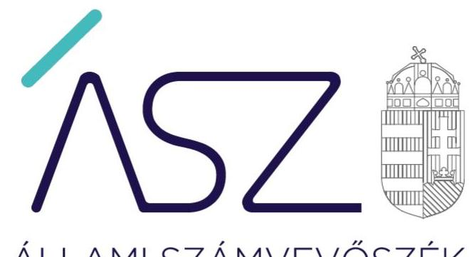
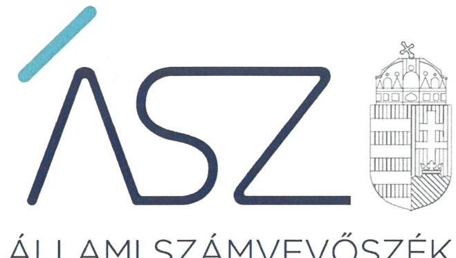
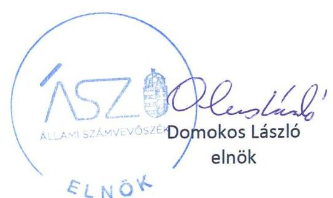
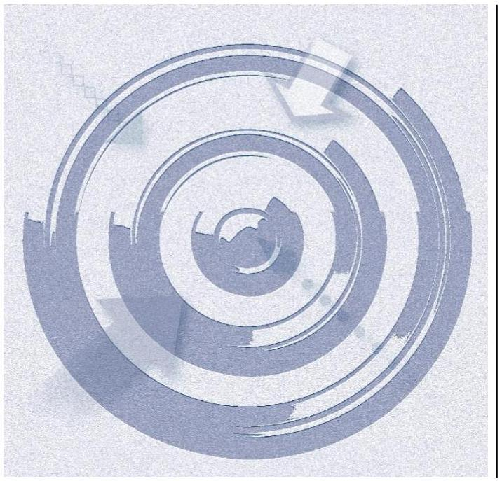
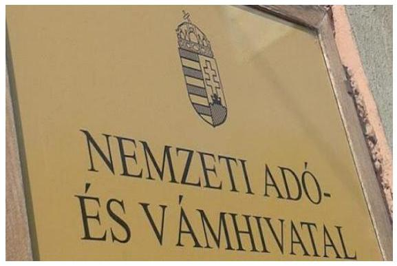
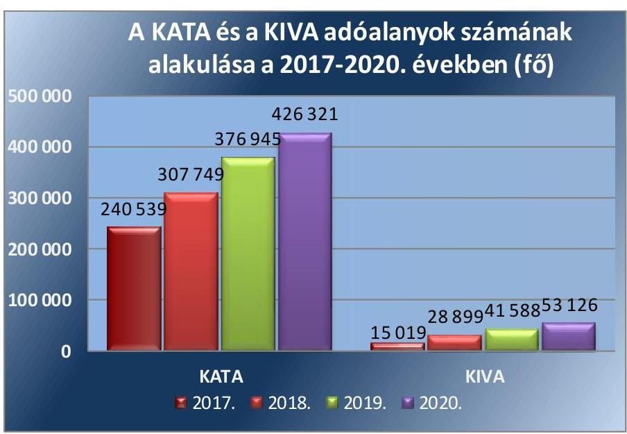
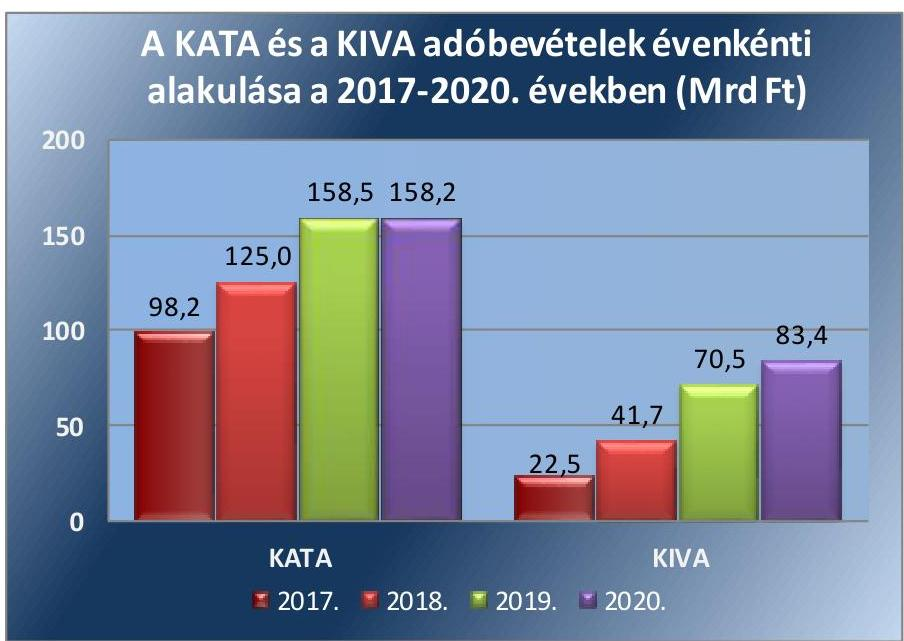
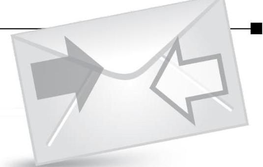

ÁLLAMI SZÁMVEVŐSZÉK

# JELENTÉS 

A Nemzeti Adó- és Vámhivatal kisadózó vállalkozások tételes adójával és a kisvállalati adóval, valamint egyéb feladataival kapcsolatos tevékenységének ellenőrzése

2022. 

22002
www.asz.hu

---

ÁLLAMI SZÁMVEVŐSZÉK

# JELENTÉS

A Nemzeti Adó- és Vámhivatal kisadózó vállalkozások tételes adójával és a kisvállalati adóval, valamint egyéb feladataival kapcsolatos tevékenységének ellenőrzése

2022. 02. hó 22. nap

22002
www.asz.hu

---

# AZ ELLENŐRZÉST VEZETTE ÉS A VÉGREHAJTÁSÁÉRT FELELŐS: 

DORMÁN ISTVÁN ZOLTÁN ellenőrzésvezető
SALAMON ILDIKÓ ellenőrzésvezető
MAKKAI MÁRIA felügyeleti vezető

## A PROGRAM ÖSSZEÁLLÍTÁSÁÉRT FELELŐS:

## NAGY ADRIENN projektvezető

## A TÉMÁHOZ KAPCSOLÓDÓ KORÁBBI SZÁMVEVŐSZÉKI JELENTÉSEK:

- címe: Jelentés - Nemzeti Adó- és Vámhivatal társasági adóval kapcsolatos feladatellátásának ellenőrzése 2020.
- sorszáma: 20073
- címe: Jelentés - Adóbeszedési eljárások ellenőrzése - Egyes adóbeszedési tevékenységekkel kapcsolatos feladatellátás szabályszerűségének ellenőrzése 2016.
- sorszáma: 16037
- címe: Jelentés a foglalkoztatási célú adó- és járulékkedvezmények igénybevételének szabályszerűségi ellenőrzéséről
- sorszáma: 15044

IKTATÓSZÁM: EL-3524-001/2022
TÉMASZÁM: 2576
ELLENŐRZÉS-AZONOSÍTÓ SZÁM: V0919

---

# TARTALOMJEGYZÉK 

- ÖSSZEGZÉS ..... 5
- AZ ELLENŐRZÉS CÉLJA ..... 6
- AZ ELLENŐRZÉS TERÜLETE ..... 7
- AZ ELLENŐRZÉS HÁTTERE, INDOKOLTSÁGA ..... 9
- A JELENTÉS LÉNYEGES KÉRDÉSKÖREI. ..... 10
- AZ ELLENŐRZÉS HATÓKÖRE ÉS MÓDSZEREI. ..... 11
- MEGÁLLAPÍTÁSOK ..... 13
- MELLÉKLETEK. ..... 17
I. sz. melléklet: Értelmező szótár ..... 17
- FÜGGELÉK: ÉSZREVÉTELEK ..... 19
- RÖVIDÍTÉSEK JEGYZÉKE ..... 21

---

.

---

# ÖSSZEGZÉS 

A Nemzeti Adó- és Vámhivatal a kisadózó vállalkozások tételes adójához és a kisvállalati adóhoz kapcsolódó tevékenységeit szabályozta, a kisadózók adóellenőrzéseit szabályszerűen hajtotta végre. Az ellenőrzött időszakot követően az Állami Számvevőszék figyelemfelhívására a Nemzeti Adó- és Vámhivatal által tett intézkedések hatására a közpénzügyek átláthatósága, rendezettsége pozitív irányba változott, a közpénzügyi helyzet javult.

## Az ellenőrzés társadalmi indokoltsága

A kis- és közepes vállalkozói kör adózásának egyszerűsítése érdekében az Országgyűlés 2012. évben két gyökeresen új és egyszerű, az érintettek számára választható adónemet vezetett be, a kisadózó vállalkozások tételes adóját és a kisvállalati adót. A kisadók 2012. évi bevezetése óta egyre szélesebb körben vált elérhetővé, és egyre többen is választják a két adónemet, aminek következtében a központi költségvetés kisadózó vállalkozások tételes adójából és kisvállalati adóból származó bevételei folyamatosan nőttek a 2013. és 2019. évek között. A 2021. évtől kezdődően a kisadók tekintetében szigorítások léptek életbe.

Az Állami Számvevőszék törvényben rögzített feladata az állami adóhatóság adóztatási tevékenységének ellenőrzése. Az ÁSZ korábban nem végzett ellenőrzést a Nemzeti Adó- és Vámhivatal kisadókhoz kapcsolódó tevékenységeire vonatkozóan. Mindezek alapján, illetve társadalmi súlyára, az érintett vállalkozói kör foglalkoztatásban betöltött szerepére is tekintettel indokolt volt, hogy az Állami Számvevőszék jelen ellenőrzés keretében értékelje az adóhatóság kisadókkal (a kisadózó vállalkozások tételes adójával és a kisvállalati adóval) kapcsolatos egyes tevékenységeinek szabályozottságát, valamint a feladatellátást.

## Értékelés

Az adóigazgatási rendtartásról szóló 2017. évi CLI. törvény megalkotásával cél volt átlátható és könnyen követhető szabályozási környezet megteremtése; az adóhatóság szolgáltató jellegének erősítése; az eljárási határidők és a jogorvoslati rend felülvizsgálatával ésszerű határidőn belül lezárható eljárások kialakítása; az adóhatóság rendelkezésére álló információk, adatok hatékonyabb felhasználásával az adózókkal a személyes kapcsolatfelvétel szükségessége esetköreinek szűkítése; az önkéntes jogkövetők támogatása kötelezettségeik teljesítésében, az adózók adminisztrációs terheinek csökkentése és adókötelezettségeik teljesítésének megkönnyítése. E célok elérése érdekében az Országgyűlés a törvényben módosította az ellenőrzésre, a jogorvoslatra, valamint az adózókkal való kapcsolattartásra vonatkozó korábbi előírásokat.

A számvevőszéki ellenőrzés megállapításai is megerősítik, hogy a Nemzeti Adó- és Vámhivatal kisadózó vállalkozások tételes adójához és a kisvállalati adózást választó kisadózókhoz kapcsolódó tevékenységeinek szabályozottsága követte a törvényi előírások módosításait. Szabályszerűen járt el a kisadózók adóellenőrzései, valamint a hátralékok kezelése során. Az ellenőrzés a bírósági megkeresések alapján foganatosított vagyonelkobzásokhoz kapcsolódó feladatokra vonatkozó belső szabályozás kialakítása, a kisadózók panaszairól nyilvántartás vezetése, valamint a vagyonelkobzások végrehajtása területén állapított meg hibákat, hiányosságokat, amelyek kiküszöbölése volt szükséges annak érdekében, hogy a Nemzeti Adó- és Vámhivatal kisadókkal kapcsolatos egyes tevékenységeinek szabályozottsága, és feladatellátásának szabályszerűsége biztosított legyen.

Az Állami Számvevőszék figyelemfelhívó levélben ismertette a Nemzeti Adó- és Vámhivatal vezetőjével a feltárt hibákat, hiányosságokat. Ennek eredményeként intézkedtek a behajthatatlan, elévült vagy ideiglenesen eredménytelen végrehajtással érintett adóhátralékok kezelésére, a bírósági megkeresések alapján foganatosított vagyonelkobzásokhoz kapcsolódó feladatokra vonatkozó belső szabályozás kialakítása, valamint a vagyonelkobzások végrehajtása területén a feltárt hiányosságok megszüntetése érdekében. Az intézkedések hatására a kisadózó vállalkozások tételes adójához és a kisvállalati adózást választó kisadózókhoz kapcsolódóan a hátralékkezelési tevékenység szabályozásának és a kisadózók adótartozásai végrehajtásának szabályszerűsége jelentősen javult.

---

# AZ ELLENŐRZÉS CÉLJA 

AZ ELLENŐRZÉS CÉLJA annak megállapítása, hogy a NAV ${ }^{1}$ kisadókkal (KATA², KIVA ${ }^{3}$ ) kapcsolatos egyes tevékenységeinek (bejelentéshez, bevalláshoz, ellenőrzéshez, hátralékkezeléshez (adóbeszedéshez), behajthatatlan követelésekhez, adóalanyiság megszűnéséhez, pa-nasz- és bejelentés kezeléshez kapcsolódó tevékenységek) szabályozottsága, valamint feladatellátása megfelelő volt-e. Az ellenőrzés kiterjedt a feladatok szabályszerű ellátását biztosító belső kontrollok kiépítettségének és müködtetésének értékelésére, valamint a NAV egyéb feladatainak ellátására.

---

# AZ ELLENŐRZÉS TERÜLETE 

## A Nemzeti Adó- és Vámhivatal kisadózó vállalkozások tételes adójával és a kisvállalati adóval, valamint egyéb feladataival kapcsolatos tevékenysége

A NEMZETI ADÓ- ÉS VÁMHIVATAL feladata többek között a központi költségvetés javára teljesítendő kötelező befizetés, a központi költségvetés terhére juttatott támogatás, adó-visszaigénylés vagy adó-visszatérítés megállapítása, beszedése, nyilvántartása, végrehajtása, visszatérítése és ellenőrzése. Az Art. ${ }_{2}{ }^{4}$, Ákr. ${ }^{5}$, Air. ${ }^{6}$, Avt. ${ }^{7}$, Vht. ${ }^{8}$ alapján a NAV jár el minden adók módjára behajtandó köztartozás végrehajtása és az ezzel összefüggő nyilvántartás tekintetében, feltéve, hogy azt jogszabály nem utalja más hatóság hatáskörébe. A NAV felügyeletét az adópolitikáért felelős miniszter látja el a Pénzügyminisztérium útján.

Az Országgyűlés az értékteremtő munka és a vállalkozások, kiemelten a kis- és közepes vállalkozások adózási feltételeinek javítása érdekében alkotta meg a kisadózó vállalkozások tételes adójáról és a kisvállalati adóról szóló 2012. évi CXLVII. törvényt. A Katv. ${ }^{9}$ a kisvállalati adózói kör adózásának egyszerűsítése érdekében két egyszerű, az érintettek számára választható adónem, a KATA és a KIVA anyagi jogi szabályait, valamint az adó választására, megfizetésére, bevallására vonatkozó eljárási rendelkezéseket rögzítette. A Katv. alapján a KATA-val és a KIVA-val összefüggő hatósági ügyben az eljárás a NAV hatáskörébe tartozott.

Az ellenőrzött időszakban a KATA alanya az az egyéni vállalkozó, egyéni cég, valamint közkereseti társaság és betéti társaság lehetett, amely a választását, valamint legalább egy általa foglalkoztatott kisadózót bejelentette a NAV-hoz, és vele szemben a törvényben nevesített kizáró okok nem álltak fenn. A KATA szerinti adóalanyiság a választás bejelentését követő hónap első napjával jött létre. A KATA havi összege a bejelentett főállású kisadózó után 50 ezer forint, főállásúnak nem minősülő kisadózó után havi 25 ezer forint volt. Amennyiben a kisadózó vállalkozás bevétele meghaladta a 12 millió forintot, az azt meghaladó rész után az adó mértéke 40\% volt, melyet a tételes adótól függetlenül kellett megfizetni. A kisadózó vállalkozás a KATA megfizetése esetén a törvényben meghatározott közterhek alól mentesült.

A KIVA-t a kisvállalatok munkaerő piacon betöltött szerepének és súlyának növelése érdekében a maximum 50 főt foglalkoztató kisvállalatok választhatták, kiváltva ezzel a vállalkozás profitját terhelő adókat és a bérek után fizetendő közterheket, így a társasági adót és a szociális hozzájárulási adót. A KIVA szerinti adóalanyiság a választás NAV-hoz történő bejelentését követő hónap első napjával jött létre. Az adó mértéke 2017. évben az adó alapjának 14\%-a, 2018. évben és 2019. évben 13\%-a, a 2020. évben $12 \%$-a volt.
2017. évről 2020. évre a KATA adóalanyok száma 77\%-kal, a KIVA adóalanyok száma 3,5-szeresére nőtt, a NAV 2020. évben 426321 fő KATA és

---

53126 fő KIVA adóalanyt tartott nyilván. A KATA és KIVA adóalanyok számának alakulását az 1. ábra mutatja.

*Forrás: A NAV éves tevékenységéről szóló beszámolók*

2017. évről 2020. évre a KATA adóbevétel 1,6-szorosára, 60,0 Mrd Fttal, a KIVA adóbevétel 3,7-szeresére, 60,9 Mrd Ft-tal nőtt, 2020. évben a KATA adóbevétel 158,2 Mrd Ft, a KIVA adóbevétel 83,4 Mrd Ft volt. A KATA és KIVA adóbevételek évenkénti alakulását a 2. ábra mutatja.

*Forrás: Magyarország éves központi költségvetéséről szóló törvény végrehajtásáról szóló törvények*

Az előzőekkel összhangban az ellenőrzés területét képezte a Nemzeti Adó- és Vámhivatal kisadókkal (KATA, KIVA) kapcsolatos bejelentési, bevallás kezelési, ellenőrzési, hátralékkezelési (adóbeszedési) tevékenysége, a behajthatatlan követelések kezelése, az adóalanyiság megszűnéséhez, a panasz- és bejelentés kezeléshez kapcsolódó tevékenysége, valamint a bírósági megkeresések alapján foganatosított egyes végrehajtási tevékenysége kontrollrendszerének kiépítése és működtetése.

---

# AZ ELLENŐRZÉS HÁTTERE, INDOKOLTSÁGA 

AZ ÁLLAMI SZÁMVEVŐSZÉK törvényben rögzített feladata az állami adóhatóság adóztatási tevékenységének ellenőrzése. A NAV feladatellátását érintő ellenőrzéseit az ÁSZ ${ }^{10}$ szisztematikus terv szerint, évente végzi, törekedve a NAV tevékenységi területeinek minél teljesebb ellenőrzési lefedettségére. A korábbiakban nem ellenőrzött adónemek tekintetében indokolt, hogy az ÁSZ ellenőrzése keretében értékelje a NAV adóbeszedéssel, nyilvántartással, ellenőrzéssel kapcsolatos feladatellátásának végrehajtását.

Az Állami Számvevőszék ellenőrzési megállapításaival hozzájárul az Országgyűlés törvényalkotó munkájához és a jó kormányzás gyakorlatának erősítéséhez. Az esetleges szabályszerűségi hibák, kockázatok feltárásával az ellenőrzés hozzájárulhat a NAV szabályszerű feladatellátásához.

---

# A JELENTÉS LÉNYEGES KÉRDÉSKÖREI 

1.     - A NAV szabályszerűen építette-e ki a kisadózó vállalkozások tételes adóját (KATA) és a kisvállalati adózást (KIVA) választó kisadózókhoz kapcsolódó tevékenységeinek belső kontrolljait?
2.     - A NAV szabályszerűen hajtotta-e végre a kisadózók KATA/KIVA adóival kapcsolatos ellenőrzési eljárásait?
3.     - A NAV szabályszerűen járt-e el a kisadózók KATA/KIVA adótartozásainak végrehajtása során?
4.     - A NAV szabályszerűen bírálta-e el a kisadózók panaszait?
5.     - A NAV szabályszerűen hajtotta-e végre a bírósági megkeresések alapján foganatosított vagyonelkobzásokat?

---

# AZ ELLENŐRZÉS HATÓKÖRE ÉS MÓDSZEREI 

## Az ellenőrzés típusa

| Megfelelőségi ellenőrzés.

## Az ellenőrzött időszak

A Nemzeti Adó- és Vámhivatal KATA-val, KIVA-val kapcsolatos, és egyes egyéb feladatainak ellátásának alapjául szolgáló kontrollrendszer kialakítása tekintetében a 2017-2020. évek, a kisadózók KATA, KIVA adóival kapcsolatos ellenőrzési eljárások végrehajtása, a kisadózók KATA, KIVA adótartozásainak végrehajtása, a bírósági megkeresések alapján foganatosított vagyonelkobzások végrehajtása, a kisadózók panaszainak elbírálása tekintetében a 2019-2020. évek.

## Az ellenőrzés tárgya

A Nemzeti Adó- és Vámhivatal a kisadókkal (KATA, KIVA) kapcsolatos bejelentési, bevallás kezelési, ellenőrzési, hátralékkezelési (adóbeszedési) tevékenysége, a behajthatatlan követelések kezelése, az adóalanyiság megszűnéséhez, a panasz- és bejelentés kezeléshez kapcsolódó tevékenysége, valamint bírósági megkeresések alapján foganatosított egyes végrehajtási tevékenysége kontrollrendszerének kiépítése és müködtetése.

## Az ellenőrzött szervezetek

A Nemzeti Adó- és Vámhivatal.

## Az ellenőrzés jogalapja

Az ellenőrzés jogszabályi alapját az Állami Számvevőszékről szóló 2011. évi LXVI. törvény 5. § (2), (3), (5), (6) és (8) bekezdései képezték.

## Az ellenőrzés módszerei

Az ellenőrzést az ÁSZ a program kérdéseire adott válaszok kiértékelésével és a vonatkozó időszakban hatályos jogszabályok, az ellenőrzés szakmai szabályai, a jelen ellenőrzésre irányadó ÁSZ módszertanok alapján folytatja le.

---

Az ellenőrzési kérdések megválaszolásához szükséges bizonyítékok megszerzése a következő ellenőrzési eljárások alkalmazásával történik: megfigyelés, összehasonlítás, elemző eljárás, mintavétel. Az ellenőrzési bizonyítékként felhasználható adatforrások közé tartoznak az ellenőrzési program részletes szempontjainál felsorolt adatforrások, valamint minden egyéb - az ellenőrzés folyamán feltárt, az ellenőrzés szempontjából információt tartalmazó-dokumentum. Az ellenőrzés a NAV kontrolltevékenységeinek működtetése szempontjából a KATA/KIVA adóalanyokkal kapcsolatos 2019-2020. évi NAV tevékenysége mellett a bírósági megkeresések alapján foganatosított vagyonelkobzási eljárásokra fókuszál. Az ellenőrzés során a NAV 2019-2020. évi ellenőrzési tevékenységét, végrehajtási tevékenységét, panaszkezelését és a bírósági megkeresések alapján foganatosított vagyonelkobzások szabályszerűségét egyszerű mintavétellel ellenőrizzük. A kiválasztási eljárás során minden tétel azonos valószínűséggel kerülhet a mintába. A vizsgált terület „szabályszerü", ha a minta ellenőrzésének eredménye alapján 95\%-os bizonyossággal a teljes sokaságban az átlagos hibaarány nem haladja meg a 10\%-ot, „nem szabályszerű", ha nagyobb, mint 10\%. Amennyiben a sokaság elemszáma nem haladja meg az előírt minta elemszámot, akkor a sokaság valamennyi elemének tételes ellenőrzésére kerül sor.

Az ellenőrzést az ÁSZ a program kérdéseire adott válaszok kiértékelésével, valamint a programban ismertetett ellenőrzési kérdések, kritériumok, adatforrások között megjelölt adatforrások figyelembevételével folytatja le. Az ellenőrzés - a megfelelőségi ellenőrzés számvevőszéki alapelveiben rögzítettek szerint - a bizonyosság ésszerűen magas szintjének eléréséhez szükséges dokumentumok körének bekérését és értékelését követően arra irányul, hogy a NAV kisadókkal (KATA, KIVA) kapcsolatos és egyes egyéb tevékenységeinek szabályozottsága, valamint feladatellátása megfelelő volt-e.

Az ellenőrzés során az ellenőrzött szervezettel történő kapcsolattartást az ÁSZ a szervezeti és működési szabályzatának vonatkozó előírásai alapján biztosítja.

---

# 1. A NAV szabályszerűen építette-e ki a kisadózó vállalkozások tételes adóját (KATA) és a kisvállalati adózást (KIVA) választó kisadózókhoz kapcsolódó tevékenységeinek belső kontrolljait? 

Összegző megállapítás

A NAV szabályszerűen építette ki a kisadózó vállalkozások tételes adóját és a kisvállalati adózást választó kisadózókhoz kapcsolódó tevékenységeinek belső kontrolljait.

A NAV az Ávr. ${ }^{11}$,és az Áht. ${ }^{12}$, előírásainak megfelelően az SZMSZ ${ }^{13}$-ben és az Úgyrend ${ }^{14}$-ben, a Bkr. ${ }^{15}$ előírásaival összhangban a belső kontroll szabályzat ${ }^{16}$ részeként az ellenőrzési nyomvonalakban meghatározta a kisadózó vállalkozások tételes adóját és a kisvállalati adózást választó kisadózókhoz kapcsolódó tevékenységeinek munkafolyamatait. A belső szabályzatok lefedték az adóalanyiságra vonatkozó bejelentésekkel, az adóbevallások feldolgozásával, a kockázatelemzési eljárás kiválasztási folyamataival, a végrehajtási tevékenységgel, a panasz- és bejelentés kezeléssel kapcsolatos munkafolyamatokat. Tartalmazták a tevékenységekért felelős szervezeti egységek vezetőinek és alkalmazottainak feladat- és hatáskörét, a helyettesítés rendjét, a felelősségi és információs szinteket és kapcsolatokat, valamint az irányítási folyamatokat.

AZ ADÓALANYISÁGRA VONATKOZÓ BEJELENTÉSEKHEZ KAPCSOLÓDÓ TEVÉKENYSÉGEK belső szabályozását a NAV az Áht., Ávr., Bkr. és a Katv. előírásainak megfelelően kialakította.

Az adóalanyiságot és adókötelezettséget érintő változás bejelentéseire, az adóalanyiság megszűnésére vonatkozó belső szabályozások mind a kisadózó vállalkozások tételes adóját választó adózók, mind a kisvállalati adózást választó adózók tekintetében összhangban voltak a Katv. előírásaival.

A BEVALLÁS-FELDOLGOZÁS munkafolyamatára, a bevallások benyújtási kötelezettségére, feldolgozására, helyességének adóhatósági megvizsgálására, valamint a bevallások, bejelentések nyomtatványainak közzétételére vonatkozó belső szabályozást a NAV a jogszabályi előírásoknak megfelelően kialakította.

AZ IRATKEZELÉSSEL, ELEKTRONIKUS ÜGYINTÉZÉSSEL kapcsolatos feladatokat a NAV a jogszabályi előírásokkal összhangban szabályozta, a hatályos információátadási szabályzat tartalmazta az Eüsztv. ${ }^{17}$-ben előírt tartalmi elemeket.

A NAV az Ltv. ${ }^{18}$ előírása szerint rendelkezett az illetékes közlevéltárral egyetértésben kiadott iratkezelési szabályzattal, amely tartalmazta az Ltv.-

---

ben, valamint a 335/2005. (XII. 29) Korm. rendeletben ${ }^{19}$ és a 451/2016. (XII. 19.) Korm. rendeletben ${ }^{20}$ előírt tartalmi elemeket.

# A NAV KOCKÁZATELEMZÉSI ELJÁRÁS KIVÁ- 

LASZTÁSI FOLYAMATAI a jogszabályi előírásoknak és a belső szabályozásoknak megfelelően biztosították a kisadózók ellenőrzésekre történő kiválasztását.

A NAV eljárásrendjeiben az adókötelezettségek teljesítésével összefüggő kockázatok azonosítására vonatkozó előírásokat az Art. ${ }_{1}{ }^{21}$ előírása szerint, az ellenőrzésre való kötelező kiválasztást az Art. ${ }_{1}$ és az Air. előírásai szerint szabályozta.

## A KISADÓZÓKKAL KAPCSOLATOS VÉGREHAJ-

TÁSI TEVÉKENYSÉGRE vonatkozó belső szabályozást a NAV a jogszabályi előírásoknak megfelelően kialakította.

A NAV a végrehajtás megindítására, a biztosítási intézkedésekre, a különböző vagyonelemekre vezetett végrehajtásra vonatkozó előírásokat az Art. ${ }_{1}$, az Avt., és az Air. előírásai szerint szabályozta a belső szabályzatokban.

## A PANASZ- ÉS BEJELENTÉS-KEZELÉSI RENDSZERÉT a NAV szabályozta, az Ávr. és az Áht. előírásainak megfelelően az SZMSZ-ben és az Ügyrendben, a Bkr. előírásaival összhangban a belső kontroll szabályzat részeként az ellenőrzési nyomvonalban meghatározta kapcsolódó tevékenységeinek munkafolyamatait, valamint az irányítási folyamatokat.

## 2. A NAV szabályszerűen hajtotta-e végre a kisadózók KATA/KIVA adóival kapcsolatos ellenőrzési eljárásait?

Összegző megállapítás

A NAV szabályszerűen hajtotta végre a kisadózók KATA, KIVA adóival kapcsolatos ellenőrzési eljárásait.

A KISADÓZÓK ADÓELLENŐRZÉSEIT a NAV az Art. ${ }_{2}$ és az Air. előírásai szerint, szabályszerűen hajtotta végre. Az ellenőrzéseket a 485/2015. Korm. rendelet és az Air. előírása szerint az állami adó- és vámhatóság illetékes igazgatósága hajtotta végre. Az ellenőrzések megkezdése, lefolytatása, befejezése az Air. előírásai szerint történt. Az ellenőrzésre rendelkezésre álló határidőt a NAV az Air., valamint az Art. ${ }_{2}$ előírásainak megfelelően betartotta, ellenőrzési határidő hosszabbítás esetén az Air.-ban foglalt előírások szerint járt el. Az ellenőrzések alapján a megállapításokat az Air. előírása szerint jegyzőkönyvbe foglalta.

Az adókülönbözetre vonatkozó megállapításokról történő határozathozatal az Air., az adókülönbözet előírása az adózó adószámláján az Art. ${ }_{2}$ előírásai szerint megtörtént. A határozatokat a NAV az Art. ${ }_{2}$ előírása szerint a jegyzőkönyvek kézbesítésének napjától számított határidőn belül meghozta.

---

# A KISADÓZÓK ADÓZÁSI TEVÉKENYSÉGÉT A MUNKAVISZONYTÓL VALÓ ELHATÁROLÁS ÖSZSZEFÜGGÉSÉBEN a NAV az Art. ${ }_{2}$, az Air. valamint a Katv. előírásainak megfelelően, szabályszerűen ellenőrizte, a megállapításokat az Air. előírása szerint jegyzőkönyvbe foglalta. 

## 3. A NAV szabályszerűen járt-e el a kisadózók KATA/KIVA adótartozásainak végrehajtása során?

Összegző megállapítás

A NAV szabályszerűen járt el a kisadózók KATA, KIVA adótartozásainak végrehajtása során. Belső szabályozása 2020-ban nem követte a jogszabályi változásokat.

AZ ADÓSZÁMLAVEZETÉSHEZ KAPCSOLÓDÓ KÖTELEZETTSÉGEK tekintetében a NAV a KATA, KIVA kötelezettséget, a teljesített befizetést és kiadást az Art. ${ }_{2}$ előírásainak megfelelően az adózó adószámláján adónemenként tartotta nyilván; az adózói adószámlán nyilvántartott adózói kötelezettségek a NAV határozatával alátámasztottak voltak.

A NAV a 465/2017. (XII.28) Korm. rendelet ${ }^{22}$ előírásainak megfelelően az adózó adószámlájának adónemenkénti egyenlegéről, valamint annak részletezéséről és a tartozásai után felszámított késedelmi pótlékról az adózók részére elektronikus tájékoztatást küldött.

Az Avt. előírásainak megfelelően a végrehajtásban kezelt kötelezettségekről a NAV elkülönítetten egyedi, analitikus nyilvántartást vezetett.

A VÉGREHAJTÁSI ELJÁRÁSOKAT a NAV az Art. ${ }_{2}$ előírása szerint indította el, a helyszíni végrehajtási cselekményekről, eljárásokról az Avt. előírásai szerint jegyzőkönyvet készített.

A végrehajtási eljárás során felmerült költségekről a NAV a 8/2018. (III.19) NGM rendelet ${ }^{23}$ előírásai szerint végzést hozott, a végrehajtási eljárásban felmerült költségátalányt a jogszabályi előírásnak megfelelően állapította meg.

A BEHAJTHATATLAN, ELÉVÜLT VAGY IDEIGLENESEN EREDMÉNYTELEN VÉGREHAJTÁSSAL ÉRINTETT ADÓHÁTRALÉKOK KEZELÉSÉRE vonatkozó belső szabályozás kialakítása 2020-ban nem felelt meg a jogszabály előírásoknak. A NAV tartozások behajthatatlanná minősítéséről, a behajthatatlan tartozások nyilvántartásáról és felülvizsgálatáról szóló eljárási rendje ${ }^{24}$ 2020. január 1-jétől nem követte az Avt. 20. § (1) és (3) bekezdés szerinti jogszabályi előírások módosítását. A jogszabályi előírások módosítása alapján a behajthatatlan tartozás szabályának helyett az ideiglenesen eredménytelen végrehajtással érintett tartozás szabályai léptek hatályba. A NAV az eljárási rendben nem határozta meg az adós tartozások ideiglenesen eredménytelen végrehajtással érintett tartozássá minősítésének eseteit és nem szabályozta a minősített tartozások Avt.-ben előírt évenkénti felülvizsgálatát. A NAV az Avt. előírásával összhangban rögzítette a

---

végrehajtáshoz való jog elévülése megszakításának, meghosszabbodásának, nyugvásának eseteit.

# 4. A NAV szabályszerűen bírálta-e el a kisadózók panaszait? 

## Összegző megállapítás

A NAV nem szabályszerűen kezelte a kisadózók panaszait.
A NAV rendelkezett az adózók panaszainak, bejelentéseinek kezelését rögzítő belső szabályozásokkal, ellenőrzési nyomvonallal, a feladatok egyértelmű meghatározását biztosító belső szabályozásokkal.

A kisadózói panaszok kezelése azonban nem volt szabályszerű, mert az alapvető jogok biztosa, illetve a Nemzeti Adatvédelmi és Információszabadság Hatóság elnöke megkereséseinek, valamint a panaszok intézésének és kivizsgálásának rendjéről szóló a Nemzeti Adó- és Vámhivatal vezetője által kiadott 1072/2018/ VEZ eljárási rend 10. pontjában rögzítettek ellenére a kisadózók által 2019. január 1. után benyújtott és a NAV által 2020. december 31-ig kezelt/elbírált panaszok nyilvántartásával a NAV nem rendelkezett.

## 5. A NAV szabályszerűen hajtotta-e végre a bírósági megkeresések alapján foganatosított vagyonelkobzásokat?

## Összegző megállapítás

A NAV nem szabályszerűen kezelte a bírósági megkeresések alapján foganatosított vagyonelkobzásokat.

A BÍRÓSÁGI MEGKERESÉSEK ALAPJÁN FOGANATOSÍTOTT VAGYONELKOBZÁSOKHOZ kapcsolódó ellenőrzési nyomvonalát a Bkr. 6. § (3) bekezdésben előírtak ellenére a NAV nem alakította ki, nem szabályozta a múködési folyamatokkal kapcsolatos felelősségi és információs szinteket és kapcsolatokat, irányítási folyamatokat.

A végrehajtási eljárás megindításának feltétele, hogy az NAV-naka tartozás fennállását igazoló okirat álljon a rendelkezésére. A vagyonelkobzások esetében a NAV a végrehajtási eljárásban a végrehajtást az Avt. 29. § (1) bekezdése szerinti végrehajtható okirat alapján indította meg.

---

# MELLÉKLETEK 

## I. SZ. MELLÉKLET: ÉRTELMEZŐ SZÓTÁR

adóellenőrzés
adóigazgatási eljárás
adókülönbözet
adószámla
adótartozás
adózó
behajtást kérő
belső kontrollrendszer
fizetési kedvezmény
fizetési könnyítés
kisadózó
kisadózó vállalkozás

Adóellenőrzés keretében az adóhatóság az adózó adómegállapítási, adatbejelentési, bevallási kötelezettsége teljesítését adónként, támogatásonként és időszakonként vagy meghatározott időszakra több adó és támogatás tekintetében is vizsgálja. (forrás: Air. 90 § (1) bek, hatályos 2018. jan. 1-től).
Az adóigazgatási eljárásban az adóhatóság megállapítja az adózó jogait, kötelezettségeit, ellenőrzi az adókötelezettségek teljesítését, a joggyakorlás törvényességét, nyilvántartást vezet az adózást érintő tényekről, adatokról, körülményekről, és adatot igazol, illetve az ezeket érintő döntését érvényesíti. (forrás: Air. 9 § (1) hatályos 2018. jan. 1-től)

A bevallott, bejelentett, bevallani, bejelenteni elmulasztott vagy az adatbejelentés, bevallás alapján kivetett, illetve kivethető és az adóhatóság által utólag megállapított adó, költségvetési támogatás különbözete, ide nem értve a következő időszakra átvihető követelés különbözetét (forrás: Art. 7. § 4. pont, hatályos 2018. jan. 1-től).
Az állami adó- és vámhatóság, illetve az önkormányzati adóhatóság által vezetett, az adózói fizetési kötelezettség és költségvetési támogatási igény, valamint az azokkal összefüggő pénzforgalom tételes, illetve egyenleg szintű kimutatására szolgáló nyilvántartás (forrás: Art. 7. § 5. pont, hatályos 2018. jan. 1-től).
Az esedékességkor meg nem fizetett adó és a jogosulatlanul igénybe vett költségvetési támogatás (forrás: Art. 7. § 6. pont, hatályos 2018. jan. 1-től).
Az a személy, akinek adókötelezettségét, adófizetési kötelezettségét, adót, költségvetési támogatást megállapító törvény vagy más törvény írja elő (forrás: Air. 11. § (1) bekezdés, hatályos 2018. jan. 1-től).
Az adók módjára behajtandó köztartozásnak minősülő fizetési kötelezettséget megállapító, nyilvántartó szerv vagy a tartozás jogosultja, illetve az Avt. 29. § (1) bekezdés 6. és 9-21. pontjában meghatározott megkeresések esetében jogszabály alapján végrehajtás kezdeményezésére jogosult szerv vagy személy, ideértve a zár alá vétel tekintetében a megkeresőt is (forrás: Avt. 7. § (1) bekezdés 3. pont, hatályos 2018. jan. 1-től)
A belső kontrollrendszer a kockázatok kezelése és tárgyilagos bizonyosság megszerzése érdekében kialakított folyamatrendszer, amely azt a célt szolgálja, hogy a müködés és gazdálkodás során a tevékenységeket szabályszerűen, gazdaságosan, hatékonyan, eredményesen hajtsák végre, az elszámolási kötelezettségeket teljesítsék, megvédjék az erőforrásokat a veszteségektől, károktól és nem rendeltetésszerű használattól (forrás: Áht. 69. § (1) bekezdése).
Fizetési könnyítés, illetve mérséklés (forrás: Avt. 7. § (1) bekezdés 7. pont, hatályos 2018. jan. 1-től).

Fizetési halasztás, illetve részletfizetés (forrás: Avt. 7. § (1) bekezdés 8. pont, hatályos 2018. jan. 1-től).

A kisadózó vállalkozások tételes adóját jogszerűen választó egyéni vállalkozó esetében az egyéni vállalkozó, mint magánszemély, egyéni cég esetén annak tagja, közkereseti társaság, betéti társaság, valamint ügyvédi iroda esetén a társaság, az ügyvédi iroda kisadózóként bejelentett tagja (forrás: Katv. 2. § 11. pont).
A kisadózó vállalkozások tételes adóját jogszerűen választó egyéni vállalkozó, egyéni cég, közkereseti társaság és betéti társaság, valamint ügyvédi iroda (forrás: Katv. 2. § 10. pont).

---

közérdekú bejelentés

panasz

tartozás
ügyfélazonosító-szám
végrehajtó

Olyan körülményre hívja fel a figyelmet, amelynek orvoslása vagy megszüntetése a közösség vagy az egész társadalom érdekét szolgálja. A közérdekú bejelentés javaslatot is tartalmazhat (forrás: 2013. évi CLXV. törvény 1. § (3) bekezdés).
Olyan kérelem, amely egyéni jog- vagy érdeksérelem megszüntetésére irányul, és elintézése nem tartozik más - így különösen bírósági, közigazgatási - eljárás hatálya alá. A panasz javaslatot is tartalmazhat (forrás: 2013. évi CLXV. törvény 1. § (2) bekezdés). Az esedékesség időpontjáig meg nem fizetett adó, vám, az általános közigazgatási rendtartás alapján végrehajtásra átadott fizetési kötelezettség, adók módjára behajtandó köztartozás, valamint a jogosulatlanul igénybe vett költségvetési támogatás (forrás: Avt. 7. § (1) bekezdés 22. pont, hatályos 2018. jan. 1-től).
A telefonos ügyféltájékoztató és ügyintéző rendszerben az adózó vagy képviselője azonosítására szolgáló számsor (forrás: 47/2013. NGM. rend. (2018. január 1-jétől hatályon kívül helyezve); Art.; 258. §, hatályos 2018. jan. 1-től)
Az adóhatóság nevében eljárni jogosult kormánytisztviselő, köztisztviselő vagy pénzügyőr (forrás: Avt. 7. § (1) bekezdés 23. pont, hatályos 2018. jan. 1-től).

---

# FÜGGELÉK: ÉSZREVÉTELEK 

Az Állami Számvevőszék az ÁSZ tv. 29. §* (1) bekezdése alapján ismertette a Nemzeti Adó- és Vámhivatal vezetőjével az ellenőrzés megállapításait.

A Nemzeti Adó- és Vámhivatal vezetője az ellenőrzés megállapításait tartalmazó figyelemfelhívó levélre válaszolt. A kisadózók által benyújtott panaszok nyilvántartása esetében a válaszban megfogalmazott tájékoztatás nem változtatta meg a vonatkozó ellenőrzési megállapítás tartalmát.

[^0]
[^0]:    * 29. § (1) Az Állami Számvevőszék az ellenőrzési megállapításait megküldi az ellenőrzött szervezet vezetőjének vagy az általa megbízott személynek, és annak, akinek személyes felelősségét állapította meg.
    (2) Az ellenőrzött szervezet vezetője és a felelősként megjelölt személy az ellenőrzés megállapításaira tizenöt napon belül írásban észrevételt tehet.
    (3) Az Állami Számvevőszék az észrevételre a beérkezésétől számított harminc napon belül írásban válaszol. A figyelembe nem vett észrevételeket köteles a jelentésben feltüntetni, és megindokolni, hogy azokat miért nem fogadta el.

---

.

---

# RÖVIDÍTÉSEKJEGYZÉKE 

${ }^{1}$ NAV
${ }^{2}$ KATA
${ }^{3}$ KIVA
${ }^{4}$ Art. ${ }_{2}$
${ }^{5}$ Ákr.
${ }^{6}$ Air.
${ }^{7}$ Avt.
${ }^{8}$ Vht.
${ }^{9}$ Katv.
${ }^{10}$ ÁSZ
${ }^{11}$ Ávr.
${ }^{12}$ Áht.
${ }^{13}$ SZMSZ

Nemzeti Adó- és Vámhivatal
Kisadózó vállalkozások tételes adója
Kisvállalati adó
2017. évi CL. törvény az adózás rendjéről (hatályos: 2018. január 1-jétől)
2016. évi CL. törvény az általános közigazgatási rendtartásról (hatályos: 2018. január 1-jétől)
Az adóigazgatási rendtartásról szóló 2017. évi CLI. tv (hatályos: 2018. január 1-jétől)
Az adóhatóság által foganatosítandó végrehajtási eljárásokról szóló 2017. évi CLIII. törvény (hatályos: 2018. január 1-jétől)
1994. évi LIII. törvény a bírósági végrehajtásról (hatályos: 1994. szeptember 1-től)
2012. évi CXLVII. törvény a kisadózó vállalkozások tételes adójáról és a kisvállalati adóról
Állami Számvevőszék
368/2011. (XII. 31.) Korm. rendelet az államháztartásról szóló törvény végrehajtásáról
2011. évi CXCV. törvény az államháztartásról

A nemzetgazdasági miniszter 26/2015. (XII.30.) NGM utasítása a Nemzeti Adó- és Vámhivatal Szervezeti és Müködési Szabályzatáról (egységes szerkezetben az azt módosító 17/2016. (X. 6.) NGM utasítással, valamint a 7/2017. (II.21.) NGM utasítással)
A nemzetgazdasági miniszter 26/2015. (XII.30.) NGM utasítása a Nemzeti Adó- és Vámhivatal Szervezeti és Müködési Szabályzatáról (egységes szerkezetben az azt módosító 17/2016. (X. 6.) NGM utasítással, valamint a 7/2017. (II.21.) NGM utasítással)
A nemzetgazdasági miniszter26/2015. (XII.30.) NGM utasítása Nemzeti Adó- és Vámhivatal Szervezeti és Müködési Szabályzatáról (egységes szerkezetben a 23/2017. (VIII. 11.) NGM utasítással)
A nemzetgazdasági miniszter 26/2015. (XII.30.) NGM utasítása a Nemzeti Adó- és Vámhivatal Szervezeti és Müködési Szabályzatáról (egységes szerkezetben az azt módosító a 4/2018. (III. 26.) NGM utasítással)
A nemzetgazdasági miniszter 26/2015. (XII.30.) NGM utasítása a Nemzeti Adó- és Vámhivatal Szervezeti és Müködési Szabályzatáról (egységes szerkezetben az azt módosító a 4/2019. (III. 29.) PM utasítással)
A nemzetgazdasági miniszter 26/2015. (XII.30.) NGM utasítása a Nemzeti Adó- és Vámhivatal Szervezeti és Müködési Szabályzatáról (egységes szerkezetben az azt módosító 12/2020. (VI. 11.) PM utasítással)
A Nemzeti Adó- és Vámhivatal vezetője által kiadott 2002/2016/VEZ szabályzat a Nemzeti Adó- és Vámhivatal Központi Irányítása ügyrendjéről
A Nemzeti Adó- és Vámhivatal vezetője által kiadott 2057/2017/VEZ szabályzat a Nemzeti Adó- és Vámhivatal Központi Irányítása ügyrendjéről
A Nemzeti Adó- és Vámhivatal vezetője által kiadott 2009/2018/VEZ szabályzat a Nemzeti Adó- és Vámhivatal Központi Irányítása ügyrendjéről

---

${ }^{15}$ Bkr.
${ }^{16}$ belső kontroll szabályzat

17 Eüsztv.
${ }^{18}$ Ltv.
${ }^{19} 335 / 2005$. (XII. 29) Korm. rendelet
${ }^{20} 451 / 2016$. (XII. 19.) Korm. rendelet
${ }^{21}$ Art. 1
${ }^{22} 465 / 2017$. (XII. 28.) Korm. rendelet
${ }^{23} 8 / 2018$. (III. 19) NGM rendelet
${ }^{24}$ eljárási rend

A Nemzeti Adó- és Vámhivatal vezetője által kiadott 2027/2019/VEZ szabályzat a Nemzeti Adó- és Vámhivatal Központi irányítása ügyrendjéről
A Nemzeti Adó- és Vámhivatal vezetője által kiadott 2031/2020/VEZ szabályzat a Nemzeti Adó- és Vámhivatal Központi irányítása ügyrendjéről
370/2011. (XII. 31.) Korm. rendelet a költségvetési szervek belső kontrollrendszeréről és belső ellenőrzéséről
A Nemzeti Adó- és Vámhivatal vezetője által kiadott 2160/2016/VEZ szabályzat a Nemzeti Adó- és Vámhivatal egységes belső kontrollrendszeréről
A Nemzeti Adó- és Vámhivatal vezetője által kiadott 2072/2017/VEZ szabályzat a Nemzeti Adó- és Vámhivatal egységes belső kontrollrendszeréről szóló 2160/2016/VEZ szabályzat módosításáról
A Nemzeti Adó- és Vámhivatal vezetője által kiadott 2066/2018/VEZ szabályzat a Nemzeti Adó- és Vámhivatal egységes belső kontrollrendszeréről szóló 2160/2016/VEZ szabályzat módosításáról
A Nemzeti Adó- és Vámhivatal vezetője által kiadott 2047/2019/VEZ szabályzat a Nemzeti Adó- és Vámhivatal egységes belső kontrollrendszeréről szóló 2160/2016/VEZ szabályzat módosításáról
A Nemzeti Adó- és Vámhivatal vezetője által kiadott 2042/2020/VEZ szabályzat a Nemzeti Adó- és Vámhivatal egységes belső kontrollrendszeréről szóló 2072/2019/VEZ szabályzat módosításáról
2015. évi CCXXII. törvény az elektronikus ügyintézés és a bizalmi szolgáltatások általános szabályairól
1995. évi LXVI. törvény a köziratokról, a közlevéltárakról és a magánlevéltári anyag védelméről
335/2005. (XII. 29.) Korm. rendelet a közfeladatot ellátó szervek iratkezelésének általános követelményeiről
451/2016. (XII. 19.) Korm. rendelet az elektronikus ügyintézés részletszabályairól 2003. évi XCII. törvény az adózás rendjéről

465/2017. (XII. 28.) Korm. rendelet az adóigazgatási eljárás részletszabályairól 8/2018. (III.19) NGM rendelet az adóhatóság által foganatosítandó végrehajtási eljárás során felmerült végrehajtási költségek és a végrehajtási költségátalány megállapításának és megfizetésének részletes szabályairól
A Nemzeti Adó- és Vámhivatal vezetője által kiadott 1134/2018/VEZszámú eljárási rend a tartozások behajthatatlanná minősítéséről, a behajthatatlan tartozások nyilvántartásáról és felülvizsgálatáról

---

# ASZ 

ALLAMI SZAMVEVOSZEK
1052 Budapest, Apáczai Cs. J. u. 10. | 1364 Budapest 4. Pf. 54
TEL: +36 14849100
email: szamvevoszek@asz.hu
web: www.asz.hu | www.aszhirportal.hu