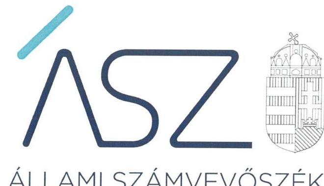
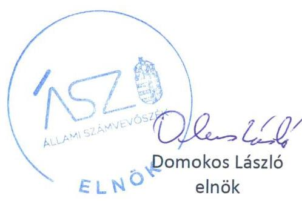

ÁLLAMI SZÁMVEVŐSZÉK

# JELENTÉS 

## Az önkormányzatok ellenőrzése

Önkormányzati intézmények integritás és belső kontrollrendszerének ellenőrzése31 önkormányzati intézmény
2022.

22003
www.asz.hu

---

ÁLLAMI SZÁMVEVŐSZÉK

# JELENTÉS 

## Az önkormányzatok ellenőrzése

Önkormányzati intézmények integritás és belső kontrollrendszerének ellenőrzése -
31 önkormányzati intézmény
2022. 2 . hó 8 nap

22003
www.asz.hu

---

# AZ ELLENŐRZÉST VEZETTE ÉS A VÉGREHAJTÁSÁÉRT FELELŐS: 

SALAMON ILDIKÓ ellenőrzésvezető
VARGA EDIT ellenőrzésvezető
A PROGRAM ÖSSZEÁLLÍTÁSÁÉRT FELELŐS:
GÖRGÉNYI GÁBOR osztályvezető

IKTATÓSZÁM: EL-3533-001/2022.
TÉMASZÁM: 23
ELLENŐRZÉS-AZONOSÍTÓ SZÁM: V0892

---

# TARTALOMJEGYZÉK 

■ ÖSSZEGZÉS ..... 5
■ AZ ELLENŐRZÉS CÉLJA ..... 8
■ AZ ELLENŐRZÉS TERÜLETE ..... 9
■ AZ ELLENŐRZÉS HÁTTERE, INDOKOLTSÁGA ..... 10
■ A JELENTÉS LÉNYEGES KÉRDÉSKÖREI ..... 11
■ ELLENŐRZÉS HATÓKÖRE ÉS MÓDSZEREI ..... 12
■ ÉRTÉKELÉSEK. ..... 14
■ MELLÉKLETEK. ..... 17
I. sz. melléklet: Az ellenőrzött intézmények kockázati besorolása ..... 17
II. sz. melléklet: Fogalomtár ..... 19
■ FÜGGELÉK ..... 21
I. sz. függelék: Az ellenőrzött intézmények kockázatiterületeinek értékelése ..... 21
■ RÖVIDÍTÉSEK JEGYZÉKE ..... 23

---

.

---

# ÖSSZEGZÉS 

Az önkormányzatok, az önkormányzati társulások által fenntartott, közétkeztetéstnyújtó 31 ellenőrzött intézmény közül 30 intézmény müködésében és gazdálkodásában az Állami Számvevőszék kockázatokat azonosított, ezért figyelemfelhívással fordult az intézmények vezetöihez.
Az Állami Számvevőszék figyelemfelhívására 19 intézményvezető felelős vezetői intézkedéseket tett, amelyekkel csökkentették a kockázatokat. 3 intézményvezető intézkedései nem csökkentették az ellenőrzött időszakra azonosított kockázatokat. 8 intézményvezető nem tett lépéseket a kockázatok csökkentése érdekében, így az ellenőrzött időszakot követően a gazdálkodásban és az integritás érvényesülése tekintetében a hibák elöfordulásának kockázatai növekedtek.
Az Állami Számvevőszék megkeresésére az irányító szervek vezetői további négy intézmény esetében intézkedéseket tettek a hibák jövőbeni elöfordulásának megelőzése érdekében.

## Az ellenőrzés társadalmi indokoltsága

A helyi önkormányzatok intézményei által ellátott feladatok közvetlenül érintik a társadalom valamennyi rétegét, a feladatot ellátó intézmények működésének minősége hatással van az emberek közérzetére. Az intézmények szabályszerű, hatékony és eredményes működésének és gazdálkodásának, az integritás érvényesülésének alapfeltétele a belső kontrollrendszer megfelelő kialakítása.

Az önkormányzatok, illetve a társulások fenntartásában működő, közétkeztetést nyújtó intézmények olyan közszolgáltatást nyújtanak, amelyet vagy életkoruk, vagy társadalmi helyzetük miatt a társadalom legkiszolgáltatottabb rétegei vesznek igénybe. A gyermekétkeztetés, vagy a szociális alapon történő étkeztetés kiemelt figyelmetérde mel, ezért különösen fontos, hogy az intézmények tevékenysége, müködtetése átlátható és elszámoltatható legyen.

Az integritási kockázatok feltárása, megismerése elengedhetetlenül fontos, mert ezt követően tehetők meg azok a lépések, amelyek a kockázatok csökkentését, felszámolását és kezelését célozzák. A belső kontrollrendszer - benne az integritás kontrollok - megfelelő kialakítása, müködése a helyi önkormányzatok és társulások irányítása alatt álló közétkeztetést nyújtó intézményeknél is hozzájárul a társadalmi közbizalom erősítéséhez. Ezeknek a kontrolloknak a kialakítása teremti meg ugyanis annak az alapjait, hogy a müködés és gazdálkodás során a rendelkezésre álló erőforrásokat célszerűen használják fel, megvédjék a veszteségektől, károktól és a nem rendeltetésszerű használattól. Mindezzel garanciát biztosítsanak arra, hogy a közszolgáltatásokat igénybe vevők a közpénzekből a lehető legjobb ellátást kaphassák.

Jelen ellenőrzés önkormányzatok, önkormányzati társulások irányítása alá tartozó 31 intézmény belső kontrollrendszerének pillérei közül a kontrollkörnyezet, a kontrolltevékenységek lényeges elemei és az integrált kockázatkezelési rendszer kialakítására terjedt ki. Az intézmények nem reprezentálják a hazai önkormányzati intézményeket.

Az Állami Számvevőszék a törvényi felhatalmazással élve ellenőrzi az önkormányzati intézményeket, hogy értékelésével támogassa az ellenőrzött szervezetek szabályszerű gazdálkodását, müködését. Napjainkban kiemelt aktualitást és jelentőséget kapott a közpénzügyi helyzet javítása, az integritási szemlélet érvényesítésének erősítése, mert a koronavírus okozta társadalmi és gazdasági válság növeli az integritás kockázatokat.

---

# Értékelés 

AZ ELLENŐRZÖTT IDŐSZAKRA, a 2019. évre vonatkozóan az Állami Számvevőszék 31 közétkeztetést nyújtó intézmény belső kontrollrendszerének lényeges elemei kialakítását ellenőrizte. Az ellenőrzés súlypontok meghatározásával lehetőséget biztosított az intézmények működésére és gazdálkodására vonatkozó kockázatok azonosítására.
ALACSONY KOCKÁZATOT azonosított az ÁSZ 10 közétkeztetést nyújtó intézménynél, mivel az intézményvezetők kialakították a belső kontrollrendszer lényeges elemeit.
KOCKÁZATOS minősítést ért el 3 közétkeztetést nyújtó intézmény, esetükben a belső kontrollrendszer lényeges elemei egyes területeken hiányoztak.
MAGAS KOCKÁZATOT azonosított az ÁSZ 18 közétkeztetést nyújtó intézmény belső kontrollrendszerében a feltárt hiányosságok miatt. 16 intézmény vezetője - a szervezeti és múködési szabályzat, illetve a számviteli politika hiánya következtében-nem gondoskodott a kontrollkörnyezet kialakításáról. Így nem biztosították a szabályszerű intézményi múködés, a közpénzekkel való elszámolás, a könyvvezetés és költségvetési beszámoló készítés alapvető feltételeit. Két esetben az intézményvezető nem alakította ki a gazdálkodási kontrolltevékenységek szabályszerű gyakorlásának előfeltételeit, továbbá 8 esetben az integrált kockázatkezelési rendszert, ami növelte az integritási kockázatokat.
AZ ELLENŐRZÖTT IDŐSZAKOT KÖVETŐEN az ellenőrzés lehetővé tette a kockázatok mérséklését, az Állami Számvevőszék figyelemfelhívására teendő intézkedésekkel.

A vezetők által jelzett intézkedések értékelésének alapvető szempontja az volt, hogy felelős vezetői magatartásukkal, intézkedéseikkel csökkentették, változatlanul hagyták, vagy növelték az intézmény belső kontrollrendszerének lényeges elemei kialakítására, valamint az integritás érvényesülésére vonatkozóan az ellenőrzött időszakra azonosított kockázatokat.

19 közétkeztetést nyújtó intézmény esetében a vezetők felelős magatartást tanúsítottak, intézkedtek, vagy intézkedési tervet állítottak össze a jelzett szabálytalanságok javítása érdekében, és ezt dokumentumokkal is igazolták. Ezeknek az intézményeknek az esetében a kockázatok mérséklődtek, megteremtve ezzel az integritás alapú, átlátható közpénzfelhasználás egyik alapfeltételét.

3 közétkeztetést nyújtó intézmény esetében a vezetők visszaigazolták a korábban azonosított kockázatokat, a hibák jövőbeni előfordulása kockázatai csökkentése érdekében csak részben intézkedtek, vagy a jelzett intézkedéseket dokumentumokkal nem igazolták.

8 közétkeztetést nyújtó intézmény vezetője nem tanúsított felelős vezetői magatartást, nem múködött együtt a hiba jövőbeni előfordulása kockázatai csökkentése tekintetében. Ezen intézmények ellenőrzött időszakot követő szabályszerű és átlátható múködésében és gazdálkodásában, az integritás érvényesülésében azonosított magas kockázatok tovább növekedtek.

A kockázatokat nem csökkentő intézmények esetében az irányító szervek bevonása vált indokolttá. 4 intézmény esetében az irányító szerv vezetője olyan intézkedésekről adott számot, amelyek a szabályosság növelésével elősegítik az integritás alapú közpénzfelhasználást.

Az intézmények kockázati besorolásának minősítését és annak változását az I. sz. függelék mutatja be.

---

# Következtetés 

A közétkeztetést végző intézmények a társadalom legkiszolgáltatottabb rétegei számára nyújtanak közszolgáltatást, ezért szabályszerű múködésük és gazdálkodásuk helyreállítása és fenntartása szempontjából alapvető fontosságú a felelős vezetői magatartás és feladatellátás.

Az intézmények integritásának alapvető feltétele a szabályozottság megléte. Az integritási kockázatok csökkenthetők azáltal, hogy az intézmények kialakítják a szervezeti és múködési kereteket, a gazdálkodásra vonatkozó alapvető szabályozási környezetet. Az intézmények vezetőinek belső kontrollrendszer minőségét értékelő - nem megalapozott - nyilatkozata azt mutatja, hogy hiányzott a felelős vezetői feladatellátás és fennáll a kockázata, hogy az intézményvezető nem rendelkezik megfelelő információval az intézmény múködéséről. A belső kontrollrendszer minőségének évenkénti, megfelelő tartalmú értékelése hozzájárul a belső kontrollrendszer jogszabályi előírásoknak megfelelő fenntartásához, fejlesztéséhez, ezáltal az intézmények szabályszerű, átlátható ás elszámoltatható, valamint eredményes múködéséhez, az integritás érvényesüléséhez.

A közvagyon, a közpénzek célszerű felhasználása kérdőjelezhető meg azoknál az intézményeknél, amelyek a magas kockázati besorolás ellenére nem tettek intézkedést a szabályosság helyreállítására. Ezek az alábbiak: Almáskamarás Konyha, Besztereci Konyha, Nógrádsipek Község Önkormányzatának Konyhája, Öpályi Községi Konyha, Nyírlugosi Szociális Alapszolgáltató Központ.

---

# AZ ELLENŐRZÉS CÉLJA 

A kockázatalapú ellenőrzés célja annak megállapítása, hogy az önkormányzat irányítása alá tartozó intézmény a belső kontrollrendszere egyes elemeit kialakította-e.

---

# AZ ELLENŐRZÉS TERÜLETE 

## Önkormányzati intézmények

Az ellenőrzött 31 intézmény önkormányzatok, illetve önkormányzati társulások által fenntartott volt, amelyek irányító szervei a települési önkormányzatok képviselő testületei, illetve a társulási tanácsok voltak. Az ellenőrzött 31 költségvetési szerv gazdasági szervezettel nem rendelkezett, a gazdálkodási feladatokat az önkormányzati hivatalok látták el.

A feladatellátásuk szerint az ellenőrzött költségvetési szervek óvodai, iskolai és egyéb gyermekétkeztetés, szociális és egyéb felnőtt étkeztetést végeztek, illetve idősek, fogyatékosok szociális ellátása bentlakás nélkül főtevékenység mellett alaptevékenységeik között szerepelt a szociális étkeztetés, gyermekétkeztetés köznevelési intézményben, munkahelyi étkeztetés köznevelési intézményben és intézményen kívüli gyermekétkeztetés.

Az ellenőrzött intézmények felsorolása az I. számú mellékletben található.

---

# AZ ELLENŐRZÉS HÁTTERE, INDOKOLTSÁGA 

A helyi önkormányzatok intézményei által ellátott feladatok közvetlenül érintik a társadalom valamennyi rétegét, a feladatot ellátó intézmények működésének minősége hatással van az emberek közérzetére. Az intézmények szabályszerű, gazdaságos, hatékony és eredményes müködésének és gazdálkodásának alapfeltétele a belső kontrollrendszer megfelelő kialakítása. Az ÁSZ ${ }^{1}$ a törvényi felhatalmazással élve ellenőrzi az önkormányzati intézményeket, hogy megállapításaival támogassa az ellenőrzött szervezetek szabályszerű gazdálkodását, müködését.

A lényeges területekre kiterjedő ellenőrzés hozzájárult - az ellenőrzött szervezetek leterheltségének mérséklése mellett - az ellenőrzés időtartamának csökkentéséhez, vagyis az ellenőrzési hatékonyság növeléséhez, továbbá az ellenőrzött szervezetek számának növeléséhez, ezáltal az önkormányzati intézmények ellenőrzésének nagyobb lefedettségéhez.

---

# A JELENTÉS LÉNYEGES KÉRDÉSKÖREI 

1. Az önkormányzati intézmény vezetője nyilatkozatban értékelte-e a szervezet belső kontrollrendszerének a minőségét?
2. Az önkormányzati intézménynél kialakították-e a belső kontrollrendszer lényeges elemeit - a kontrollkörnyezetet, a gazdálkodási kontrolltevékenységeket, valamint az integrált kockázatkezelési rendszert?

---

# ELLENŐRZÉS HATÓKÖRE ÉS MÓDSZEREI 

## Az ellenőrzés típusa

| Megfelelőségi ellenőrzés.

## Az ellenőrzött időszak

2019. év

## Az ellenőrzés tárgya

Az önkormányzat irányítása alá tartozó intézmény belső kontrollrendszere egyes elemeinek kialakítása. A belső kontrollrendszer pillérei közül a kontrollkörnyezet, a kontrolltevékenységek lényeges elemei és az integrált kockázatkezelési rendszer kialakítása.

## Az ellenőrzött szervezetek

31 önkormányzati intézmény az I. melléklet szerint.

## Az ellenőrzés jogalapja

Az ellenőrzés jogszabályi alapját az ÁSZ tv. ${ }^{2}$ 1. § (3) bekezdés, 5. § (6) bekezdése, valamint az Áht. ${ }^{3} 61 . \S$ (2) bekezdése.

## Az ellenőrzés módszerei

Az ellenőrzés az ellenőrzött időszakban hatályos jogszabályok, az ellenőrzés szakmai szabályai, a jelen ellenőrzésre irányadó ÁSZ módszertanok, az ellenőrzési programban foglalt értékelési szempontok szerint került végrehajtásra. Az ellenőrzést az ÁSZa program kérdéseire adott válaszok kiértékelésével, valamint a programban ismertetett adatforrások, továbbá az adott időszakban hatályos jogszabályok figyelembevételével folytatta le.

A kockázatértékelésen alapuló, új megközelítésű ellenőrzés során azokat a lényeges területeket értékelte az ÁSZ, amelyek érdemi kockázatot jelenthetnek az ellenőrzött szervezet közpénzügyi helyzetére. Jelen ellenőrzés a szervezet belső kontrollkörnyezetének és kontrolltevékenységének, valamint az integrált kockázatkezelési rendszerének kialakítására terjedt ki, és súlypontok meghatározásával lehetőséget biztosított a kockázatok azonosítására.

---

Az ÁSZ az ellenőrzés során meghatározott lényeges dokumentumok tartalmi értékelését végezte el, olyan kiválasztott kritériumok alapján, amelyek bármelyikének a múltbeli időszakra vonatkozóan megállapított hiánya kockázatot jelent az ellenőrzött szervezet jövőbeli gazdálkodására, működésére. A fentiekre tekintettel az ÁSZ nem a lényeges területek és azokat alátámasztó dokumentumok szabályszerűségére tett megállapítást, hanem az ellenőrzött szervezetre vonatkozó működési és gazdálkodási kockázatokat azonosította.

A kockázatok beazonosítása alapján kerültek besorolásra az egyes intézmények kockázati kategóriákba:

- Alacsony kockázati besorolású az az intézmény, amelynél a lényeges területek (kontrolkörnyezet, gazdálkodással kapcsolatos kontrolltevékenység, integrált kockázatkezelési rendszer) kialakításának értékelése során, valamennyi területen a megfelelőség aránya a $85 \%$-ot meghaladta.
- Kockázatos besorolású az az intézmény, amelynél a lényeges területek kialakításának értékelése során a megfelelőség aránya egy vagy több lényeges területen nem érte el a $85 \%$-ot.
- Magas kockázati besorolású az az intézmény, amennyiben valamely lényeges dokumentum hiánya állt fent.
A figyelemfelhívásra tett 2021. évi intézkedések alapján a kockázati elmozdulás értékelésre került.

Az ellenőrzés ideje alatt az ellenőrzött szervezettel történő kapcsolattartás az ÁSZ SZMSZ²-ének vonatkozó előírásai alapján történt.

---

# 1. Az önkormányzati intézmény vezetője nyilatkozatban érté-kelte-e a szervezet belső kontrollrendszerének a minőségét? 

Összegző értékelés

A 31 ellenőrzött önkormányzati intézményben valamennyi intézmény vezetője értékelte az intézmény belső kontrollrendszerének minőségét, amelyek közül 21 értékelő nyilatkozat nem volt megalapozott.

A BELSŐ KONTROLLRENDSZER MINŐSÉGÉT 31 intézmény vezetője nyilatkozatban értékelte és közülük 10 intézmény vezetője igazolta a nyilatkozatában foglaltakat, mert kialakította az intézmény belső kontrollrendszerének lényeges elemeit.

21 intézmény vezetője nem támasztotta alá az intézmény belső kontrollrendszerének szabályszerű kialakításáról tett nyilatkozatát, a kontrollkörnyezet, a gazdálkodási kontrolltevékenység, valamint az integrált kockázatkezelési rendszer kialakításában fennálló hiányosságok miatt. Nem megalapozott vezetői nyilatkozat-tétel esetén a szabályszerű belső kontrollrendszer kialakításának hiánya magas kockázatot hordoz az intézmények átlátható és elszámoltatható működésének és gazdálkodásának, valamint az integritásérvényesülésének tekintetében.

## 2. Az önkormányzati intézménynél kialakították-e a belső kontrollrendszer lényeges elemeit - a kontrollkörnyezetet, a gazdálkodási kontrolltevékenységeket, valamint az integrált kockázatkezelési rendszert?

Összegző értékelés

A 31 önkormányzati intézmény közül 10 intézmény kialakította a belső kontrollrendszer lényeges elemeit, 21 intézmény azonban a belső kontrollrendszer egy vagy több lényeges elemét, illetve a gazdálkodás egyes lényeges feltételeit nem alakította ki.

10 önkormányzati intézmény kialakította belső kontrollrendszere lényeges elemeit ezáltal működése és gazdálkodása alapvető szabályozási feltételeit, ami alacsony kockázatott jelentett múködésük és gazdálkodásuk átláthatósága és elszámoltathatósága szempontjából.

21 intézmény belső kontrollrendszerének lényeges elemét, vagy elemeit nem alakította ki a belső kontrollrendszerében az l. sz. függelékben részletezettek szerint.

KONTROLLKÖRNYEZETÉT 19 intézmény nem alakította ki, mivel nem rendelkeztek a jogszabályi előírásoknak megfelelő szervezeti és múködési szabályzattal és/vagy számviteli politikával.

---

A szervezeti és múködési szabályzat hiánya miatt nem biztosították az intézmények múködésének alapvető feltételét, az intézmények szervezetének, feladatai ellátásának részletes belső rendjének és módjának, felelősségi viszonyainak kialakítását. A számviteli politika hiánya miatt nem biztosították a közpénzekkel való szabályszerű elszámolás alapfeltételét, a szabályszerű könyvvezetés és költségvetési beszámoló készítés kialakítását, a számviteli alapelvek érvényesítését.

A feladatokat, a hatásköri és felelősségi viszonyokat meghatározó szervezeti és múködési szabályzat, valamint a számviteli politika hiánya kockázatot hordoz az intézmények szabályszerű közpénzfelhasználásának, valamint átlátható és elszámoltatható múködésének és gazdálkodásának tekintetében.

GAZDÁLKODÁSI KONTROLLTEVÉKENYSÉGEIT 3 intézmény nem alakította ki, mert nem rendelkeztek a jogszabályi előírások ellenére a gazdálkodásra vonatkozó kötelezően elkészítendő szabályozókkal, nyilvántartásokkal, amely hiányosság magas kockázatot hordoz a források cél szerinti, elszámoltatható felhasználására.

# INTEGRÁLT KOCKÁZATKEZELÉSI RENDSZERÉT 

8 intézmény nem alakította ki a jogszabályi előírások ellenére, ezáltal nem járultak hozzá az intézmények kockázatkezelési képességének javításához, a korrupciós kockázatok csökkentéséhez és a gazdálkodás szabályszerűségének, minőségének folyamatos fejlesztéséhez.

---

.

---

# MELLÉKLETEK 

I. SZ. MELLÉKLET: AZ ELLENŐRZÖTT INTÉZMÉNYEK KOCKÁZATI BESOROLÁSA
2019. évre vonatkozóan az ÁSZ az ellenőrzés során feltárt hiányosságok alapján az alábbi kockázati csoportba sorolta az ellenőrzött intézményeket:

## Alacsony kockázatú intézmények

| $\longrightarrow$ | Alsónémedi Önkormányzati Konyha |
| :-- | :-- |
| $\longrightarrow$ | Csengersima Községi Konyha |
| $\longrightarrow$ | Ecseri Önkormányzati Konyha |
| $\longrightarrow$ | Jászfelsőszentgyörgy Községi Önkormányzat Konyhája |
| $\longrightarrow$ | Kemenesmagasi Önkormányzati Konyha |
| $\longrightarrow$ | Közös Szociális Konyha Gelénes |
| $\longrightarrow$ | Mezőcsáti Élelmezési Központ |
| $\longrightarrow$ | Pacsa Város Önkormányzati Konyha |
| $\longrightarrow$ | Nyírábrányi Önkormányzati Konyha |
| $\longrightarrow$ | Detk Önkormányzati Konyha |

## Kockázatos intézmények

| $\longrightarrow$ | Kurityáni Községi Konyha |
| :-- | :-- |
| $\longrightarrow$ | Lánycsóki Konyha |
| $\longrightarrow$ | Központi Konyha (Súlysáp) |

## Magas kockázatú intézmények

| $\longrightarrow$ | Almáskamarás Konyha |
| :-- | :-- |
| $\longrightarrow$ | Aranyosapáti Önkormányzati Konyha |
| $\longrightarrow$ | Baktalórántházai Összevont Konyhai Intézmény |
| $\longrightarrow$ | Besztereci Konyha |
| $\longrightarrow$ | Bodrogolaszi Konyha |
| $\longrightarrow$ | Élelmezési Központ (Tiszakeszi) |
| $\longrightarrow$ | Gyermekés Közétkeztetési Intézmény (Naszály) |
| $\longrightarrow$ | Gyönki Gyermekétkeztetési Intézmény |
| $\longrightarrow$ | Kompolt-Nagyút-Kápolna Gyermek és Szociális Étkezde |
| $\longrightarrow$ | Nógrádsipek Község Önkormányzatának Konyhája |
| $\longrightarrow$ | Nyírlugosi Szociális Alapszolgáltató Központ |
| $\longrightarrow$ | Ópályi Községi Konyha |
| $\longrightarrow$ | Szirmabesenyői Segítő Szolgálat és Konyha |
| $\longrightarrow$ | Üllési Önkormányzati Konyha |
| $\longrightarrow$ | Visegrád Városi Konyha |
| $\longrightarrow$ | Pócspetri Községi Múvelődési Ház és Könyvtár |
| $\longrightarrow$ | Püspökhatvani Gyermekélelmezési Konyha |
| $\longrightarrow$ | Nyírkáta Községi Önkormányzat Idősek Napközi Otthona és Konyha |

---

A kockázatok változása a figyelemfelhívó levelekre adott intézményvezetői válaszok alapján:
Az ÁSZ figyelemfelhívására az intézményvezető mérsékelte a kockázatot

- Alsónémedi Önkormányzati Konyha
- Aranyosapáti Önkormányzati Konyha
- Baktalórántházai Összevont Konyhai Intézmény
- Bodrogolaszi Konyha
- Csengersima Községi Konyha
- Ecseri Önkormányzati Konyha
- Élelmezési Központ (Tiszakeszi)
- Gyermek és Közétkeztetési Intézmény (Naszály)
- Gyönki Gyermekétkeztetési Intézmény
- Kemenesmagasi Önkormányzati Konyha
- Közös Szociális Konyha Gelénes
- Kurityáni Községi Konyha
- Mezőcsáti Élelmezési Központ
- Pócspetri Községi Múvelődési Ház és Könyvtár
- Pacsa Város Önkormányzati Konyha
- Püspökhatvani Gyermekélelmezési Konyha
- Szirmabesenyői Segítő Szolgálat és Konyha
- Üllési Önkormányzati Konyha
- Visegrád Városi Konyha

# Az ÁSZ figyelemfelhívása ellenére az intézményvezető nem mérsékelte a kockázatot 

- Központi Konyha (Sülysáp)
- Nyírlugosi Szociális Alapszolgáltató Központ
- Nyírkáta Községi Önkormányzat Idősek Napközi Otthona és Konyha

Az ÁSZ figyelemfelhívása ellenére nőtt a kockázat

- Almáskamarás Konyha
- Besztereci Konyha
- Detk Önkormányzati Konyha
- Kompolt-Nagyút Gyermek és Szociális Étkezde
- Jászfelsőszentgyörgy Községi Önkormányzat Konyhája
- Lánycsóki Konyha
- Nógrádsipek Község Önkormányzatának Konyhája
- Öpályi Községi Konyha

Az ÁSZ felhívására az iránvitó szerv intézkedett

- Almáskamarás Konyha
- Detk Önkormányzati Konyha
- Kompolt-Nagyút-Kápolna Gyermek és Szociális Étkezde
- Lánycsóki Konyha
- Nyírkáta Községi Önkormányzat Idősek Napközi Otthona és Konyha

---

# II. SZ. MELLÉKLET: FOGALOMTÁR 

belső kontrollrendszer

belső kontrollrendszer területei
integrált kockázatkezelési rendszer
integritás

Integritási kockázatok
kockázat
kontrollkörnyezet
kontrollkörnyezet
kockázat
kontrollkörnyezet
kontrolltevékenységek
intézmény

A belső kontrollrendszer a kockázatok kezelése és tárgyilagos bizonyosság megszerzése érdekében kialakított folyamatrendszer, amely azt a célt szolgálja, hogy a múködés és gazdálkodás során a tevékenységeket szabályszerűen, gazdaságosan, hatékonyan, eredményesen hajtsák végre, az elszámolási kötelezettségeket teljesítsék, megvédjék az erőforrásokat a veszteségektől, károktól és nem rendeltetésszerű használattól. (Forrás: Áht. 69. § (1) bekezdése)
A kontrollkörnyezet, az integrált kockázatkezelési rendszer, a kontrolltevékenységek, az információs és kommunikációs rendszer, valamint a nyomon követési (monitoring) rendszer. (Forrás: Bkr. ${ }^{5}$ 3. §-a)
Olyan folyamatalapú kockázatkezelési rendszer, amely a szervezet minden tevékenységére kiterjed, egységes módszertan és eljárások alkalmazásával, a szervezet célkitűzéseinek és értékeinek figyelembevételével biztosítja a szervezet kockázatainak teljes körű azonosítását, azok meghatározott kritériumok szerinti értékelését, valamint a kockázatok kezelésére vonatkozó intézkedési terv elkészítését és az abban foglaltak nyomon követését. (Forrás: Bkr. 2. § m) pontja)
Az integritás az elvek, értékek, cselekvések, módszerek, intézkedések konzisztenciáját jelenti, vagyis olyan magatartásmódot, amely meghatározott értékeknek megfelel. (Forrás: Nemzetgazdasági Minisztérium: Államháztartási belső kontroll standardok és gyakorlati útmutató 1.1.3. pontja, 2017. szeptember)
Integritási kockázatnak minősül a szervezet célkitűzéseit, értékeit, elveit sértő vagy veszélyeztető visszaélés, szabálytalanság, vagy egyéb esemény lehetősége. A korrupciós kockázat olyan integritási kockázat, amely korrupciós cselekmény bekövetkezésének lehetőségét jelenti. Minden korrupciós kockázat egyben integritási kockázatis. Korrupciós cselekményeknek nevezzük azokat a vesztegetésszerű cselekményeket, amelyeket általában a Büntető Törvénykönyvis büntetéssel fenyeget.
A kockázat annak a valószínűségét jelenti, hogy egy vagy több esemény vagy intézkedés nem kívánt módon befolyásolja a rendszer múködését, céljainak megvalósulását. (Forrás: Javaslatok a korrupciós kockázatok kezelésére - Kockázatkezelési és ellenőrzési módszertan 35. oldal, ÁSZ)
A költségvetési szerv vezetője által kialakított olyan elvek, eljárások, belső szabályzatok összessége, amelyben világos a szervezeti struktúra, a folyamatok átláthatók, egyértelműek a felelősségi, hatásköri viszonyok és feladatok, meghatározottak, ismertek és elfogadottak az etikai elvárások a szervezet minden szintjén, átlátható a humánerőforrás-kezelés, biztosított a szervezeti célok és értékek irányában való elkötelezettség fejlesztése és elősegítése. (Forrás: Bkr. 6. § (1) bekezdés)
A költségvetési szerv vezetője által a szervezeten belül kialakított (kontroll) tevékenységek, melyek biztosítják a kockázatok kezelését, hozzájárulnak a szervezet céljainak eléréséhez és erősítik a szervezet integritását.(Forrás: Bkr. 8. § (1) bekezdés)
A helyi önkormányzatok és társulások irányítása alá tartozó költségvetési szervek. (A képviselő-testület a feladatkörébe tartozó közszolgáltatások ellátására - jogszabályban meghatározottak szerint-költségvetési szervet (önkormányzati intézmény) alapíthat; Forrás: Mötv. ${ }^{6}$ 41. § (6) bek.)

---

.

---

# FÜGGELÉK 

I. SZ. FÜGGELÉK: AZ ELLENŐRZÖTT INTÉZMÉNYEK KOCKÁZATI TERÜLETEINEK ÉRTÉKELÉSE

| Ssz. | Intézmény neve | Rendelkezésre-   állt-e a vezetői   nyilatkozat a   belső kontroll-   rendszer minősé-   gének értékelésé-   ról? (I/N) | Az intézmény   kontrollkör-   nyezetének   kialakítása   biztosított   volt-e? (I/N) | Az intézmény   gazdálkodási   kontrolltevé-   kienységének   kialakítása   biztosított   volt-e? (I/N) | Kialakították   e az integrált   kockázatkeze-   lési rend-   szert? (I/N) | Kockázati   értékelés | Kockázat válto-   zása   intézményveze-   tői intézkedés   alapján |
| :--: | :--: | :--: | :--: | :--: | :--: | :--: | :--: |
| 1. | Alsónémedi Önkor-   minyzati Konyha | I | I | I | I | Alacsony | Csökkent |
| 2. | Csengersima Községi   Konyha | I | I | I | I | Alacsony | Csökkent |
| 3. | Ecseri Önkormány-   zati Konyha | I | I | I | I | Alacsony | Csökkent |
| 4. | Jászfelsőszentgyörgy   Községi Önkormány-   zat Konyhája | I | I | I | I | Alacsony | Nött |
| 5. | Kemenesmagasi Ön-   kormányzati Konyha | I | I | I | I | Alacsony | Csökkent |
| 6. | Közös Szociális   Konyha Gelénes | I | I | I | I | Alacsony | Csökkent |
| 7. | Mezőcsáti Élelme-   zési Központ | I | I | I | I | Alacsony | Csökkent |
| 8. | Pacsa Város Önkor-   minyzati Konyha | I | I | I | I | Alacsony | Csökkent |
| 9. | Nyírábrányi Önkor-   minyzati Konyha | I | I | I | I | Alacsony | Nem volt figye-   lemfelhívás |
| 10. | Detk Önkormányzati   Konyha | I | I | I | I | Alacsony | Nött |
| 11. | Kurityáni Községi   Konyha | I | N | I | I | Kockázatos | Csökkent |
| 12. | Lánycsóki Konyha | I | N | I | I | Kockázatos | Nött |
| 13. | Központi Konyha   (Súlysáp) | I | N | N | I | Kockázatos | Nem változott |
| 14. | Almáskamarás   Konyha | I | N | I | I | Magas | Nött |
| 15. | Aranyosapáti Önkor-   minyzati Konyha | I | N | I | I | Magas | Csökkent |
| 16. | Baktalórántházai   Összevont Konyhai   Intézmény | I | N | I | N | Magas | Csökkent |
| 17. | Besztereci Konyha | I | N | N | N | Magas | Nött |
| 18. | Bodrogolaszi Konyha | I | N | I | N | Magas | Csökkent |
| 19. | Élelmezési Központ   (Tiszakeszi) | I | N | I | I | Magas | Csökkent |
| 20. | Gyermek és Közét-   keztetési Intézmény   (Naszály) | I | I | I | N | Magas | Csökkent |

---

| Sz2 | Intézmény neve | Rendelkezésre állt-e a vezetőnyilatkozat a belső kontrollrendszer minőségeinek értékeléséről? (I/N) | Az intézmény kontrollkörnyezetének kialakítása biztosított volt-é? (I/N) | Az intézmény gazdálkodás, kontrolltevékenységének kialakítása biztosított volt-é? (I/N) | Kialakították a az Integrált kockázatkezelési rendszert? (I/N) | Kockázati értékelés | Kockázat változásá intézményvezetői intézkedés alapján |
| :--: | :--: | :--: | :--: | :--: | :--: | :--: | :--: |
| 21. | Gyönki Gyermekétkeztetési Intézmény | I | I | I | N | Magas | Csökkent |
| 22. | Kompolt-Nagyút-Kápolna Gyermek és Szociális Étkezde | I | N | I | I | Magas | Nőtt |
| 23. | Nógrádsipek Község Önkormányzatának Konyhája | I | N | I | I | Magas | Nőtt |
| 24. | Nyirlugosi Szociális Alapszolgáltató Központ | I | N | I | N | Magas | Nem változott |
| 25. | Ópályi Községi Konyha | I | N | N | I | Magas | Nőtt |
| 26. | Szirmabesenyői Segitő Szolgálat és Konyha | I | N | I | I | Magas | Csökkent |
| 27. | Üllési Önkormányzati Konyha | I | N | I | N | Magas | Csökkent |
| 28. | Visegrád Városi Konyha | I | N | I | N | Magas | Csökkent |
| 29. | Pócspetri Községi Múvelődési Ház és Könyvtár | I | N | I | I | Magas | Csökkent |
| 30. | Püspökhatvani Gyermekélelmezési Konyha | I | N | I | I | Magas | Csökkent |
| 31. | Nyirkáta Községi Önkormányzat Idősek Napközi Otthona és Konyha | I | N | I | I | Magas | Nem változott |
| Igen |  | 31 | 12 | 28 | 23 |  |  |
| Nem |  | 0 | 19 | 3 | 8 |  |  |
| Alacsony kockázat |  |  |  |  |  | 10 |  |
| Kockázatos |  |  |  |  |  | 3 |  |
| Magas kockázat |  |  |  |  |  | 18 |  |
| Kockázat csökkent |  |  |  |  |  |  | 19 |
| Kockázat nem változott |  |  |  |  |  |  | 3 |
| Kockázat nőtt |  |  |  |  |  |  | 8 |
| Intézkedés nem volt indokolt |  |  |  |  |  |  | 1 |
| Összesen |  | 31 | 31 | 31 | 31 | 31 | 31 |

---

# RÖVIDÍTÉSEKJEGYZÉKE 

${ }^{1}$ ÁSZ
${ }^{2}$ ÁSZtv.
${ }^{3}$ Áht.
${ }^{4}$ ÁSZ SZMSZ
${ }^{5}$ Bkr.
${ }^{6}$ Mötv.

Állami számvevőszék
2011. évi LXVI. törvény az Állami Számvevőszékről (hatályos 2011. július1-jétől)
2011. évi CXCV. törvény az államháztartásról (hatályos 2011. december 31-étől)

Az Állami Számvevőszék Szervezeti és Működési Szabályzata
370/2011. (XII. 31.) Korm. rendelet a költségvetési szervek belső
kontrollrendszeréről és belső ellenőrzésről (hatályos 2012. január 1-jétől)
2011. évi CLXXXIX. törvény Magyarország helyi önkormányzatairól

---

# ASZ 

ALLAMI SZAMVEVOSZEK
1052 Budapest, Apáczai Cs. J. u. 10. | 1364 Budapest 4. Pf. 54
TEL: +36 14849100
email: szamvevoszek@asz.hu
web: www.asz.hu | www.aszhirportal.hu