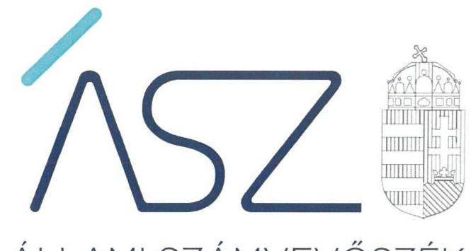

ÁLLAMI SZÁMVEVŐSZÉK

# JELENTÉS 

## Az önkormányzatok ellenőrzése

Önkormányzati intézmények integritás és belső kontrollrendszerének ellenőrzése 40 önkormányzati intézmény

2022. 

22004
www.asz.hu

---

ÁLLAMI SZÁMVEVŐSZÉK

# JELENTÉS 

## Az önkormányzatok ellenőrzése

Önkormányzati intézmények integritás és belső kontrollrendszerének ellenőrzése 40 önkormányzati intézmény
2022. 02 . hó 08 nap

22004
www.asz.hu

---

AZ ELLENŐRZÉST VEZETTE ÉS A VÉGREHAJTÁSÁÉRT FELELŐS:
SALAMON ILDIKÓ ellenőrzésvezető
DR. KOVÁCS DIÁNA ellenőrzésvezető

A PROGRAM ÖSSZEÁLLÍTÁSÁÉRT FELELŐS:
GÖRGÉNYI GÁBOR osztályvezető

IKTATÓSZÁM: EL-3532-001/2022
TÉMASZÁM: 2548
ELLENŐRZÉS-AZONOSÍTÓ SZÁM: V089261

Jelentéseink az Országgyúlés számítógépes hálózatán és az interneten a www.asz.hu címen is olvashatóak.

---

# TARTALOMJEGYZÉK 

- ÖSSZEGZÉS ..... 5
- AZ ELLENŐRZÉS CÉLJA ..... 8
- AZ ELLENŐRZÉS TERÜLETE ..... 9
- AZ ELLENŐRZÉS HÁTTERE, INDOKOLTSÁGA ..... 10
- AZ ELLENŐRZÉS LÉNYEGES KÉRDÉSKÖREI. ..... 11
- AZ ELLENŐRZÉS HATÓKÖRE ÉS MÓDSZEREI. ..... 12
- ÉRTÉKELÉS ..... 13
- MELLÉKLETEK ..... 15
I. sz. melléklet: Értelmező szótár ..... 15
II. sz. melléklet: Az ellenőrzött szervezetek kockázati besorolása ..... 16
- RÖVIDÍTÉSEK JEGYZÉKE ..... 19

---

.

---

# ÖSSZEGZÉS 

Az önkormányzatok, az önkormányzati társulások által fenntartott, közétkeztetést nyújtó ellenörzött intézmények müködésében és gazdálkodásában az Állami Számvevöszék magas kockázatokat azonosított. Az intézményvezetők nem alakították ki a kontrollrendszer alapvető feltételeit, amelyek biztosithatnák a közszolgáltatást igénybe vevők - adott feltételek melletti-jobb ellátását.
Az Állami Számvevöszék figyelemfelhívására 6 intézményvezető felelős vezetői intézkedéseket tett, amelyekkel mérséklődtek a kockázatok. 24 intézményvezető - az intézkedések elmaradásával - visszaigazolta a magas kockázatokat. 8 intézményvezető nem tett lépéseket a magas kockázatok csökkentése érdekében, így az ellenőrzött időszakot követően a gazdálkodásban és az integritás érvényesülése tekintetében a hibák előfordulásának kockázatai tovább növekedtek. Az ellenőrzött időszakot követően a fenntartók 2 közétkeztetést nyújtó intézmény megszüntetéséről döntöttek.
Az Állami Számvevőszék megkeresésére az irányító szervek vezetői további 8 intézmény esetében intézkedéseket tettek a hibák jövőbeni előfordulásának megelőzése érdekében.

## Az ellenőrzés társadalmi indokoltsága

A helyi önkormányzatok és a társulások intézményei szerteágazó feladatokat látnak el, az intézmények múködtetése közvetlenül érinti a társadalom valamennyi rétegét, a feladatot ellátó intézmények múködésének és gazdálkodásának a minősége hatással van az emberek közérzetére. Az intézmények szabályszerű, gazdaságos, hatékony és eredményes múködésének és gazdálkodásának alapfeltétele a belső kontrollrendszer megfelelő kialakítása. Az ÁSZ ${ }^{1}$ a törvényi felhatalmazással élve ellenőrzi az önkormányzati intézményeket, hogy megállapításaival támogassa az ellenőrzött szervezetek szabályszerű gazdálkodását, múködését.

Az önkormányzati/társulási fenntartásban múködő, közétkeztetést nyújtó intézmények olyan közszolgáltatást nyújtanak, amelyet vagy életkoruk, vagy társadalmi helyzetük miatt a társadalom legkiszolgáltatottabb rétegei vesznek igénybe. A gyermekétkeztetés, vagy a szociális alapon történő étkeztetés kiemelt figyelmet érdemel, ezért különösen fontos, hogy az intézmények tevékenysége, múködtetése átlátható és elszámoltatható legyen.

Az integritási kockázatok feltárása, megismerése elengedhetetlenül fontos, mert ezt követően tehetők meg azok a lépések, amelyek a kockázatok csökkentését, felszámolását és kezelését célozzák. A belső kontrollrendszer - benne az integritás kontrollok - megfelelő kialakítása, múködése a helyi önkormányzatok és társulások irányítása alatt álló közétkeztetést nyújtó intézményeknél is hozzájárul a társadalmi közbizalom erősítéséhez. Ezeknek a kontrolloknak a kialakítása teremti meg ugyanis annak az alapjait, hogy a múködés és gazdálkodás során a rendelkezésre álló erőforrásokat célszerűen használják fel, megvédjék a veszteségektől, károktól és a nem rendeltetésszerű használattól. Mindezzel garanciát biztosítsanak arra, hogy a közszolgáltatásokat igénybe vevők a közpénzekből a lehető legjobb ellátást kaphassák.

## Értékelés, következtetések

Az Állami Számvevőszék az önkormányzatok, illetve társulások fenntartásában múködő 38 közétkeztetést nyújtó intézmény belső kontrollrendszerének lényeges elemei kialakítását ellenőrizte a 2019. évre vonatkozóan. Az ellenőrzés az intézmények múködésében és gazdálkodásában magas kockázatokat azonosított.

---

A jogszabályban előírt kötelezettsége ellenére 21 intézmény vezetője vezetői nyilatkozatban nem értékelte a szervezet 2019. évi belső kontrollrendszerének minőségét, további 17 esetben az intézményvezető a 2019. évi belső kontrollrendszer értékeléséről készített vezetői nyilatkozatát nem küldte meg az irányító szerve részére a jogszabályban előírtak ellenére.

A 38 ellenőrzött közétkeztetést nyújtó intézmény vezetője nem lépett fel a korrupciós kockázatok ellen, mert a belső kontrollrendszer kialakításáról kiállított vezetői nyilatkozat hiányában elmaradt a belső kontrollok működéséhez szükséges szabályozottság aktuális állapotának felmérése, a lehetséges működési, integritási kockázatok számbavétele, így nem nyílt lehetőség a kockázatok csökkentésére teendő intézkedések kidolgozására és a belső kontrollok erősítésére. Amennyiben a vezetői nyilatkozat kiállítását követően nem történt meg annak irányító szerv felé való megküldése, úgy a fenntartó felé történő beszámolási kötelezettség teljesítésében merült fel integritási kockázat.

A fentiek következtében az ellenőrzött 38 intézmény belső kontrollrendszerében feltárt hiányosságok magas kockázatot jelentettek az intézmények szabályszerű és átlátható működésére és gazdálkodására, az integritás érvényesülésére. Az intézményvezetők nem teremtették meg annak alapvető feltételeit, hogy a rendelkezésre álló erőforrásokat, a közpénzeket megvédjék a veszteségektől, károktól és nem rendeltetésszerű használattól. Ezért az intézmények vezetőinek intézkedése volt indokolt a kockázatok csökkentése érdekében.

Az ellenőrzés lehetővé tette a kockázatok mérséklését, az Állami Számvevőszék figyelemfelhívására teendő intézkedésekkel.

A vezetők által jelzett intézkedések értékelésének alapvető szempontja az volt, hogy felelős vezetői magatartásukkal, intézkedéseikkel csökkentették, változatlanul hagyták, vagy növelték az intézmény belső kontrollrendszerének lényeges elemei kialakítására, valamint az integritás érvényesülésére vonatkozóan azonosított magas kockázatokat.

6 közétkeztetést nyújtó intézmény esetében a vezetők felelős magatartást tanúsítottak, intézkedtek, vagy intézkedési tervet állítottak össze a jelzett szabálytalanság jövőbeni javítása érdekében, és ezt dokumentumokkal is igazolták. Ezeknek az intézményeknek az esetében a kockázatok mérséklődtek, megteremtve ezzel az integritás alapú, átlátható közpénzfelhasználás egyik alapfeltételét.

24 közétkeztetést nyújtó intézmény esetében a vezetők visszaigazolták a magas kockázatokat, a hiba jövőbeni előfordulása kockázatai csökkentése érdekében nem tettek intézkedéseket, vagy a jelzett intézkedéseket dokumentumokkal nem igazolták.

8 közétkeztetést nyújtó intézmény vezetője nem tanúsított felelős vezetői magatartást, nem működött együtt a hiba jövőbeni előfordulása kockázatai csökkentése tekintetében. Ezen intézmények ellenőrzött időszakot követő szabályszerű és átlátható működésében és gazdálkodásában, az integritás érvényesülésében azonosított magas kockázatok tovább növekedtek.

A kockázatokat nem csökkentő intézmények esetében az irányító szervek bevonása vált indokolttá. 8 intézmény esetében az irányító szerv vezetője olyan intézkedésekről adott számot, amelyek a szabályosság növelésével elősegítik az integritás alapú közpénzfelhasználást.

Az intézmények kockázati besorolásának minősítését és annak változását a II. sz. melléklet mutatja be.
A társadalom legkiszolgáltatottabb rétegei számára közszolgáltatást nyújtó intézmények szabályszerű működésének és gazdálkodásának helyreállítása és fenntartása szempontjából alapvető fontosságú a felelős vezetői magatartás és feladatellátás. Ennek része, hogy az intézmények vezetői a jövőben a vonatkozó jogszabályi előírások szerint kialakítsák belső kontroll környezetüket, elkészítsék a belső kontrollrendszer minőségének értékeléséről szóló vezetői nyilatkozatot, és arról igazoltan tájékoztassák az irányító szervet. A belső kontrollrendszer minőségének évenkénti értékelése hozzájárul a belső kontrollrendszer jogszabályi előírások szerinti fenntartásához, fejlesztéséhez, ezáltal az intézmények szabályszerű és átlátható működéséhez, az integritás érvényesüléséhez.

A közvagyon, a közpénzek célszerű felhasználása kérdőjelezhető meg azoknál az intézményeknél, amelyek a magas kockázati besorolás ellenére nem tettek intézkedést a szabályosság helyreállítására. Ezek az alábbiak: Bagamér Nagyközség Konyhája, Balatonföldvári Többcélú Kistérségi Társulás Pénzügyi Gondnoksága, Bihartorda Községi Önkormányzat Élelmezési Intézménye, Pétervására Báziskonyha, Balatonszemes Község Önkormányzat Közkonyhája, Balsai Önkormányzat Konyhája, Boldogkőváraljai Főzőkonyha, Geleji Élelmezési és Gondozási Központ, Intézmények

---

# Összegzés 

Konyhája (Szügy), Kállói Önkormányzati Főzőkonyha, Központi Konyha (Kiskunlacháza), Olaszliszkai Közétkeztetési Intézmény, Szakoly Község Önkormányzati Konyha, Tiszanánai Önkormányzati Konyha, Tiszatarjáni Élelmezési és Gondozási Központ, Vámosmikolai Önkormányzati Konyha, Vámospércs Városi Önkormányzat Élelmezési Intézménye, Vámosújfalui Önkormányzati Konyha, Vásárosdombói Főzőkonyha, Sióagárd Község Konyhája, Baks Községi Önkormányzat Gondozási Központ, Abaújkéri Főzőkonyha.

---

# AZ ELLENŐRZÉS CÉLJA 

## A KOCKÁZATALAPÚ ELLENŐRZÉS

CÉLJA annak megállapítása, hogy az önkormányzat vagy társulás irányítása alá tartozó költségvetési szerv a belső kontrollrendszere egyes elemeit kialakította-e.

---

# **AZ ELLENŐRZÉS TERÜLETE**

## **Önkormányzati költségvetésszervek**

Helyi önkormányzati költségvetési szervet az államháztartásról szóló 2011. évi CXCV törvény szerint a helyi önkormányzat, a helyi önkormányzatok társulása, a térségi fejlesztési tanács, az átalakult nemzetiségi önkormányzat alapíthat, a költségvetési szerv alapító okiratában meghatározott önkormányzati közfeladatok ellátására. A helyi önkormányzati költségvetési szervek önálló jogi személyek, éves költségvetésből gazdálkodva látják el feladataikat. A helyi önkormányzati költségvetési szervek gazdasági szervezettel rendelkeznek, azonban ha a költségvetési szerv éves átlagos statisztikai állományi létszáma a 100 főt nem éri el, a gazdasági szervezet feladatait az önkormányzati hivatal, vagy az irányító szerv döntése alapján az irányító szerv irányítása alá tartozó, gazdasági szervezettel rendelkező más költségvetési szerv látja el.

Az önkormányzati költségvetési szervek irányító szervi feladatait az alapító önkormányzatok képviselő-testületei gyakorolják, a képviselő testület nevezi ki az önkormányzati költségvetési szervek vezetőit, a társulások által alapított költségvetési szervek esetében az irányítói jogok gyakorlásának rendjét a működésüket szabályozó, illetve az alapításban részt vevő helyi önkormányzatok megállapodása határozza meg.

Az ellenőrzés a helyi önkormányzatok és társulások által irányított költségvetési szervekre terjedt ki.

Feladatellátásuk szerint az ellenőrzött költségvetési szervek alaptevékenységként konyhai üzemeltetési feladatokat látnak el, ezen belül az intézményi és az intézményen kívüli gyermekétkeztetést is közfeladatként végzik. A konyhák feladata alapvetően az önkormányzatok kezelésében lévő oktatási-nevelési intézmények, szociális ellátást biztosító intézmények, valamint egyéb külső igénybevevők részére étkezés biztosítása.

Jelen ellenőrzés keretében 40 ellenőrzött intézmény került kijelölésre. Az ellenőrzött 38 intézmény közül 35 helyi önkormányzat által, három helyi önkormányzati társulás által irányított költségvetési szerv. Önálló gazdasági szervezettel hat intézmény rendelkezett.

Kettő esetben az ellenőrzés lefolytatásának feltételei nem álltak fenn, mivel az intézmények 2020. december 31-én jogutód nélkül megszűntek.

---

# AZ ELLENŐRZÉS HÁTTERE, INDOKOLTSÁGA 

A helyi önkormányzatok és a társulások intézményei által ellátott feladatok, a bölcsődei, óvodai ellátás, a betegek és idősek gondozása, a közművelődési intézmények, könyvtárak működtetése közvetlenül érintik a társadalom valamennyi rétegét, a feladatot ellátó intézmények működésének minősége hatással van az emberek közérzetére.

Az intézmények szabályszerű, gazdaságos, hatékony és eredményes múködésének és gazdálkodásának alapfeltétele a belső kontrollrendszer megfelelő kialakítása. Az ÁSZ a törvényi felhatalmazással élve ellenőrzi az önkormányzati intézményeket, hogy megállapításaival támogassa az ellenőrzött szervezetek szabályszerű gazdálkodását, múködését.

---

# AZ ELLENŐRZÉS LÉNYEGES KÉRDÉSKÖREI 

1. Az önkormányzati intézmények vezetője nyilatkozatban érté-kelte-e a szervezet belső kontrollrendszerének a minőségét?
2. Az önkormányzati intézmények kontrollkörnyezetének kialakítása biztosított volt-e?
3. Az önkormányzati intézmények gazdálkodási kontrolltevékenységének kialakítása biztosított volt-e?
4. Az önkormányzati intézményeknél kialakították-e a jogszabályi előírások figyelembevételével az integrált kockázatkezelési rendszert?
5. Milyen kockázatot hordoz az ellenőrzött szervezetnél a belső kontroll szabályozás fennálló minősége?

---

# AZ ELLENŐRZÉS HATÓKÖRE ÉS MÓDSZEREI 

## Az ellenőrzés típusa

Megfelelőségi ellenőrzés.

## Az ellenőrzött időszak

2019. év

## Az ellenőrzés tárgya

Az önkormányzat/társulás irányítása alá tartozó költségvetési szerv belső kontrollrendszere egyes elemeinek kialakítása. A belső kontrollrendszer pillérei közül a kontrollkörnyezet, a kontrolltevékenységek lényeges elemei és az integrált kockázatkezelési rendszer kialakítása.

## Az ellenőrzött szervezet

A helyi önkormányzatok és társulások által irányított (az önálló gazdasági szervezettel nem rendelkezők is) költségvetési szervek az önkor mányzati hivatalok kivételével a II. mellékletben felsoroltak szerint.

## Az ellenőrzés jogalapja

Az ellenőrzés jogszabályi alapját az ÁSZ tv. ${ }^{2} 1 . \S$ (3) bekezdése, 5. § (6) bekezdése, valamint az Áht. ${ }^{3} 61 . \S$ (2) bekezdése képezik.

## Az ellenőrzés módszerei

Az ellenőrzés az ellenőrzött időszakban hatályos jogszabályok, az ellenőrzés szakmai szabályai, a jelen ellenőrzésre irányadó ÁSZ módszertanok, az ellenőrzési programban foglalt értékelési szempontok szerint kerül végrehajtásra. Az ellenőrzést az ÁSZa program kérdéseire adott válaszok kiértékelésével, valamint a programban ismertetett adatforrások, továbbá az adott időszakban hatályos jogszabályok figyelembevételével folytatja le.

A kockázatértékelésen alapuló módszertanú ellenőrzés a szervezet belső kontrollkörnyezetének kialakítása, valamint az integrált kockázatkezelési kontrollok kialakítása lényeges területeire terjed ki, és súlypontok meghatározásával lehetőséget biztosít a kockázatok beazonosítására.

A figyelemfelhívásra tett 2021. évi intézkedések alapján a kockázati elmozdulás értékelésre került.

Az ellenőrzés ideje alatt az ÁSZ az ellenőrzött szervezettel történő kapcsolattartást az ÁSZSZMSZ4-ének vonatkozó előírásai alapján biztosítja.

---

# 1. Az önkormányzati intézmények vezetője nyilatkozatban értékelte-e a szervezet belső kontrollrendszerének a minőségét? 

Összegző értékelés

38 intézmény múködése a 2019. évre vonatkozóan magas kockázatot hordoz a vezetői nyilatkozattal összefüggő hiányosságok miatt.

Az ellenőrzött 38 önkormányzati intézmény vezetője közül 21 intézményvezető a Bkr. ${ }^{5}$ 11. § (1) bekezdésében foglaltak ellenére nem készítette el a Bkr. 1. melléklet szerinti vezetői nyilatkozatát, a költségvetési szerv belső kontrollrendszerének minőségét a 2019. évre vonatkozóan a Bkr. 1. melléklet szerinti vezetői nyilatkozatban nem értékelte.

Az ellenőrzött 38 önkormányzati intézmény vezetője közül 17 intézményvezető a Bkr. 11. § (2a) bekezdésében foglaltak ellenére a vezetői nyilatkozatot a 2019. évre vonatkozóan az irányító szerv részére nem küldte meg.

A vezetői nyilatkozatban történik meg a belső kontrollrendszer minőségének éves értékelése, amely alapján megismerhető a belső kontrollok múködéséhez szükséges szabályozottság aktuális állapota. Amennyiben a költségvetési szerv vezetője nyilatkozatát nem teszi meg, elmarad a költségvetési szerv belső kontrollrendszere minőségének nyomon követése, a lehetséges múködési, integritási kockázatok számbavétele, valamint a kockázatok csökkentésére teendő intézkedések kidolgozása és a belső kontrollok erősítése. A vezetői nyilatkozat irányító szerv számára történő megküldése a költségvetési szerv átláthatósága miatt fontos, ennek hiányában az irányító szerv felé történő beszámolási kötelezettség sérül.

---

.

---

# MELLÉKLETEK 

## I. SZ. MELLÉKLET: ÉRTELMEZŐ SZÓTÁR

belső kontrollrendszer

belső kontrollrendszer területei
integrált kockázatkezelési rendszer
integritás

Integrritási kockázatok
kockázat
kontrollkörnyezet
kontrolltevékenységek
intézmény

A belső kontrollrendszer a kockázatok kezelése és tárgyilagos bizonyosság megszerzése érdekében kialakított folyamatrendszer, amely azt a célt szolgálja, hogy a múködés és gazdálkodás során a tevékenységeket szabályszerűen, gazdaságosan, hatékonyan, eredményesen hajtsák végre, az elszámolási kötelezettségeket teljesítsék, megvédjék az erőforrásokat a veszteségektől, károktól és nem rendeltetésszerű használattól. (Forrás: Áht. 69. § (1) bekezdése)
A kontrollkörnyezet, az integrált kockázatkezelési rendszer, a kontrolltevékenységek, az információs és kommunikációs rendszer, valamint a nyomon követési (monitoring) rendszer. (Forrás: Bkr. 3. §-a)
Olyan folyamatalapú kockázatkezelési rendszer, amely a szervezet minden tevékenységére kiterjed, egységes módszertan és eljárások alkalmazásával, a szervezet célkitűzéseinek és értékeinek figyelembevételével biztosítja a szervezet kockázatainak teljes körű azonosítását, azok meghatározott kritériumok szerinti értékelését, valamint a kockázatok kezelésére vonatkozó intézkedési terv elkészítését és az abban foglaltak nyomon követését. (Forrás: Bkr. 2. § m) pontja)
Az integritás az elvek, értékek, cselekvések, módszerek, intézkedések konzisztenciáját jelenti, vagyis olyan magatartásmódot, amely meghatározott értékeknek megfelel. (Forrás: Nemzetgazdasági Minisztérium: Államháztartási belső kontroll standardok és gyakorlati útmutató 1.1.3. pontja, 2017. szeptember)
Integritási kockázatnak minősül a szervezet célkitűzéseit, értékeit, elveit sértő vagy veszélyeztető visszaélés, szabálytalanság, vagy egyéb esemény lehetősége. A korrupciós kockázat olyan integritási kockázat, amely korrupciós cselekmény bekövetkezésének lehetőségét jelenti. Minden korrupciós kockázat egyben integritási kockázatis. Korrupciós cselekményeknek nevezzük azokat a vesztegetésszerű cselekményeket, amelyeket általában a Büntető Törvénykönyv is büntetéssel fenyeget.
A kockázat annak a valószínűségét jelenti, hogy egy vagy több esemény, vagy intézkedés nem kívánt módon befolyásolja a rendszer működését, céljainak megvalósulását. (Forrás: Javaslatok a korrupciós kockázatok kezelésére - Kockázatkezelési és ellenőrzési módszertan 35. oldal, ÁSZ)
A költségvetési szerv vezetője által kialakított olyan elvek, eljárások, belső szabályzatok összessége, amelyben világos a szervezeti struktúra, a folyamatok átláthatók, egyértelműek a felelősségi, hatásköri viszonyok és feladatok, meghatározottak, ismertek és elfogadottak az etikai elvárások a szervezet minden szintjén, átlátható a humánerőforrás-kezelés, biztosított a szervezeti célok és értékek irányában való elkötelezettség fejlesztése és elősegítése. (Forrás: Bkr. 6. § (1) bekezdés)
A költségvetési szerv vezetője által a szervezeten belül kialakított (kontroll) tevékenységek, melyek biztosítják a kockázatok kezelését, hozzájárulnak a szervezet céljainak eléréséhez és erősítik a szervezet integritását. (Forrás: Bkr. 8. § (1) bekezdés)
A helyi önkormányzatok és társulások irányítása alá tartozó költségvetési szervek. (A képviselő-testület a feladatkörébe tartozó közszolgáltatások ellátására - jogszabályban meghatározottak szerint-költségvetési szervet (önkormányzati intézmény) alapíthat; Forrás: Mötv. ${ }^{6}$ 41. § (6) bekezdés)

---

II. SZ. MELLÉKLET: AZ ELLENŐRZÖTT SZERVEZETEK KOCKÁZATI BESOROLÁSA

|  | Ellenőrzött intézmény neve | Irányító szerv neve | Az intézmény vezetője nem készítette el a Bkr. 1. melléklet szerinti vezetői nyilatkozatát | Vezetői nyilatkozatát nem küldte meg az irányító szerv részére | Kockázati besorolás | Kockázati besorolás változása az intézményvezetők intézkedései alapján |
| :--: | :--: | :--: | :--: | :--: | :--: | :--: |
| 1. | Bagamér Nagyközség Konyhája | Bagamér Nagyköz-   ség Önkormányzata |  | $x$ | Magas | Változatlan |
| 2. | Balatonföldvári Többcélú Kistérségi Társulás Pénzügyi Gondnoksága | Balatonföldvári   Többcélú Kistérségi Társulás | $x$ |  | Magas | Változatlan |
| 3. | Bihartorda Községi Önkormányzat Élelmezési Intézménye | Bihartorda Községi Önkormányzat | $x$ |  | Magas | Változatlan |
| 4. | ÖnkormányzatiKonyha (Csépa) | Csépa Községi Önkormányzat |  | $x$ | Magas | Csökkent |
| 5. | Pétervására Báziskonyha | Pétervására Városi Önkormányzat | $x$ |  | Magas | Változatlan |
| 6. | Sárándi Főzőkonyha | Sáránd Község Önkormányzata |  | $x$ | Magas | Nőtt |
| 7. | Andocsi Önkormányzati Konyha | Andocs Község Önkormányzata |  | $x$ | Magas | Csökkent |
| 8. | Balatonszemes Község Önkormányzat Közkonyhája | Balatonszemes Köz-   ségi Önkormányzat | $x$ |  | Magas | Nőtt |
| 9. | Balsai Önkormányzat Konyhája | Balsa Község Önkormányzata | $x$ |  | Magas | Változatlan |
| 10. | Boldogkőváraljai Főzőkonyha | Boldogkőváralja Községi Önkormányzat | $x$ |  | Magas | Változatlan |
| 11. | Buzsák Térségi Konyha | Buzsák Község Önkormányzata | $x$ |  | Magas | Változatlan |
| 12. | Geleji Élelmezési és Gondozási Központ | Gelej Község Önkormányzata |  | $x$ | Magas | Változatlan |
| 13. | Hercegkúti Konyha | Hercegkút Község Önkormányzata |  | $x$ | Magas | Változatlan |
| 14. | Hernádi Önkormányzati Konyha | Hernád Nagyközség Önkormányzata | $x$ |  | Magas | Csökkent |
| 15. | Intézmények Konyhája | Szügy Község Önkormányzata | $x$ |  | Magas | Nőtt |
| 16. | Kállói Önkormányzati Főzőkonyha | Kálló Község Önkormányzata | $x$ |  | Magas | Nőtt |
| 17. | Királyi Konyha Gyermekeinkért | Pázmánd Község Önkormányzata |  | $x$ | Magas | Változatlan |
| 18. | Központi Konyha | Kiskunlacháza Város Önkormányzata |  | $x$ | Magas | Változatlan |
| 19. | Nagyszekeresi Közétkeztetési Konyha | Nagyszekeresi Közétkeztetés Fenn-   tartó Társulás | $x$ |  | Magas | Változatlan |

---

|  | Ellenőrzött intézmény neve | Irányító szerv neve | Az intézmény vezetöje nem készítette el a Bkr. 1. melléklet szerinti vezetői nyilatkozatát | Vezetői nyilatkozatát nem küldte meg az irányító szerv részére | Kockázati besorolás | Kockázati besorolás változása az intézményvezetők in tézkedései alapján |
| :--: | :--: | :--: | :--: | :--: | :--: | :--: |
| 20. | Nyírjákói Napközi Otthonos Konyha | Nyírjákó Község Önkormányzata |  | $x$ | Magas | Csökkent |
| 21. | Olaszliszkai Közétkeztetési Intézmény | Olaszliszka Község Önkormányzata |  | $x$ | Magas | Nötr |
| 22. | Orosháza Városi Önkormányzat Gyermek- és Diákélelmezési Intézménye | Orosháza Város Önkormányzata |  | $x$ | Magas | Változatlan |
| 23. | Pocsaji Gyermekétkeztetési Konyha | Pocsaj Nagyközség Önkormányzata | $x$ |  | Magas | Csökkent |
| 24. | Szakoly Község Önkormányzati Konyha | Szakoly Község Önkormányzata | $x$ |  | Magas | Változatlan |
| 25. | Tázlár Község Önkormányzat Konyhája | Tázlár Község Önkormányzata | $x$ |  | Magas | Változatlan |
| 26. | Tiszanánai Önkormányzati Konyha | Tiszanána Község Önkormányzata |  | $x$ | Magas | Változatlan |
| 27. | Tiszatarjáni Élelmezési és Gondozási Központ | Tiszatarján Község Önkormányzata |  | $x$ | Magas | Változatlan |
| 28. | Vámosmikolai Önkormányzati Konyha | Vámosmikola Község Önkormányzata | $x$ |  | Magas | Változatlan |
| 29. | Vámospércs Városi Önkormányzat Élelmezési Intézménye | Vámospércs Városi Önkormányzat |  | $x$ | Magas | Nötr |
| 30. | Vámosújfalui Önkormányzati Konyha | Vámosújfalu Község Önkormányzata |  | $x$ | Magas | Változatlan |
| 31. | Vásárosdombói Főzökonyha | Vásárosdombói Intézményfenntartó Társulás |  | $x$ | Magas | Változatlan |
| 32. | Verpeléti Gyermek és Szociális Étkeztetés | Verpelét Város Önkormányzata |  | $x$ | Magas | Változatlan |
| 33. | Felgyői Konyha | Felgyő Községi Önkormányzat | $x$ |  | Magas | Változatlan |
| 34. | Rezi Község Önkormányzata Mini Bölcsődéje és Konyhája (Rezi Község Önkormányzata Konyhája) | Rezi Község Önkormányzata | $x$ |  | Magas | Változatlan |
| 35. | Sióagárd Község Konyhája | Sióagárd Község Önkormányzata | $x$ |  | Magas | Nötr |
| 36. | Baks Községi Önkormányzat Gondozási Központ | Baks Községi Önkormányzat | $x$ |  | Magas | Változatlan |
| 37. | Abaújkéri Főzökonyha | Abaújkér Község Önkormányzata | $x$ |  | Magas | Nötr |
| 38. | Hejópapi Konyha és Étkezde | Hejópapi Község Önkormányzata | $x$ |  | Magas | Csökkent |

---

|  Az intézmény vezetője nem készítette el a Bkr. 1. melléklet szerinti vezetői nyilatkozatát | 21 |  |  |   |
| --- | --- | --- | --- | --- |
|  Vezetői nyilatkozatát nem küldte meg az irányító szerv részére |  | 17 |  |   |
|  Magas kockázat |  |  | 38 |   |
|  Kockázat csökkent (intézményvezetői intézkedés) |  |  |  | 6  |
|  Kockázat változatlan (intézményvezetői intézkedés) |  |  |  | 24  |
|  Kockázat nőtt (intézményvezetői intézkedés) |  |  |  | 8  |
|  Összesen | 38 |  | 38 | 38  |

---

# RÖVIDÍTÉSEKJEGYZÉKE 

${ }^{1}$ ÁSZ
${ }^{2}$ ÁSZtv.
${ }^{3}$ Áht.
${ }^{4}$ ÁSZ SZMSZ
${ }^{5}$ Bkr.
${ }^{6}$ Mötv.

Állami Számvevőszék
2011. évi LXVI. törvény az Állami Számvevőszékről (hatályos 2011. július 1-jétől)
2011. évi CXCV. törvény az államháztartásról (hatályos 2011. december 31-étől)

Az Állami Számvevőszék Szervezeti és Müködési Szabályzata
370/2011. (XII. 31.) Korm. rendelet a költségvetési szervek belső
kontrollrendszeréről és belső ellenőrzéséről
2011. évi CLXXXIX. törvény - Magyarország helyi önkormányzatairól (hatályos:
2012. január 1-jétől)

---

# ASZ 

ALLAMI SZAMVEVOSZEK
1052 Budapest, Apáczai Cs. J. u. 10. | 1364 Budapest 4. Pf. 54
TEL: +36 14849100
email: szamvevoszek@asz.hu
web: www.asz.hu | www.aszhirportal.hu