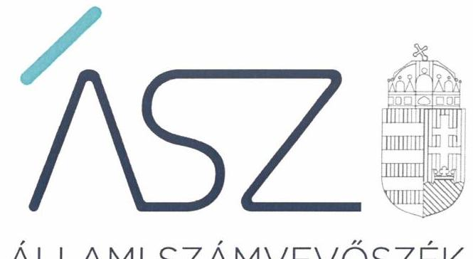
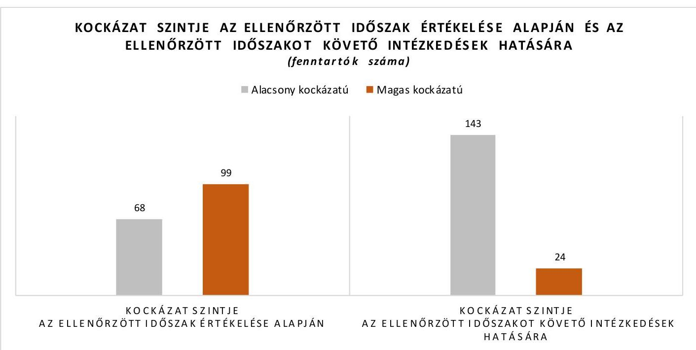
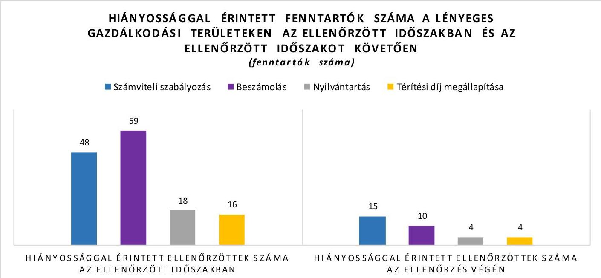

ÁLLAMI SZÁMVEVŐSZÉK

# JELENTÉS 

## Nem állami humánszolgáltatók kockázatalapú ellenőrzése

A köznevelési humánszolgáltatást nyújtó intézmények, szolgáltatók államháztartáson kívüli fenntartói központi költségvetésből kapott támogatásai felhasználásának ellenőrzése
2022.

22005
www.asz.hu

---

ÁLLAMI SZÁMVEVŐSZÉK

# JELENTÉS 

## Nem állami humánszolgáltatók kockázatalapú ellenőrzése

A köznevelési humánszolgáltatást nyújtó intézmények, szolgáltatók államháztartáson kívüli fenntartói központi költségvetésből kapott támogatásai felhasználásának ellenőrzése
2022. 02. hó 45 nap

22005
www.asz.hu

---

# AZ ELLENŐRZÉST VEZETTE ÉS A VÉGREHAJTÁSÁÉRT FELELŐS: 

HOFMEISTER LÁSZLÓ ellenőrzésvezető
DR. NAGY IMRE ellenőrzésvezető

A PROGRAM ÖSSZEÁLLÍTÁSÁÉRT FELELŐS:
GÖRGÉNYI GÁBOR programkészítésért felelős vezetö

IKTATÓSZÁM: EL-3546-001/2022.
TÉMASZÁM: 2549
ELLENŐRZÉS-AZONOSÍTÓ SZÁM: V0891

---

# TARTALOMJEGYZÉK 

$\square$ ÖSSZEGZÉS ..... 5
$\square$ AZ ELLENŐRZÉS CÉLJA ..... 9
$\square$ AZ ELLENŐRZÉS TERÜLETE ..... 10
$\square$ AZ ELLENŐRZÉS HÁTTERE, INDOKOLTSÁGA ..... 11
$\square$ A JELENTÉS LÉNYEGES KÉRDÉSKÖREI. ..... 12
$\square$ ELLENŐRZÉS HATÓKÖRE ÉS MÓDSZEREI ..... 13
$\square$ ÉRTÉKELÉSEK. ..... 16
$\square$ MELLÉKLETEK. ..... 19
I. sz. melléklet: Ellenőrzéssel érintett fenntartók kockázati besorolás szerint ..... 19
II. sz. melléklet: Értelmező szótár ..... 27
$\square$ RÖVIDÍTÉSEK JEGYZÉKE ..... 29

---

.

---

# ÖSSZEGZÉS 

167 köznevelési humánszolgáltatást nyújtó intézményfenntartó gazdálkodásának ellenőrzött időszakra vonatkozó értékelése alapján 68 fenntartó gazdálkodása alacsony, 99 fenntartó gazdálkodása magas kockázatot hordozott. Az ellenőrzött időszakot követően az Állami Számvevőszék felhívására tett intézkedések hatására 76 fenntartónál csökkentek, azonban 1 korábban alacsony kockázatú fenntartónál nőttek a gazdálkodási kockázatok. Így az ellenőrzött időszakot követően 143 fenntartó gazdálkodásában alacsony a kockázat, míg 24 fenntartó gazdálkodása magas kockázatot hordoz a közfeladat ellátására, valamint a közfeladatra kapott közpénzek elszámoltathatóságára és átláthatóságára.

## Az ellenőrzés társadalmi indokoltsága

A művelődéshez való jog érvényesítése és a kapcsolódó feladatok ellátása az Alaptörvényben ${ }^{1}$ meghatározott, a társadalom szempontjából fontos tevékenységek. Jogszabályok teszik lehetővé, hogy államháztartáson kívüli szervezetek - így például az alapítványok, gazdasági társaságok, egyesületek - által fenntartott intézmények is végezzenek köznevelési feladatokat. Mindehhez a központi költségvetés évente jelentős összegű támogatással járul hozzá. Az államháztartáson kívüli, humánszolgáltatást végző intézmények az igényelt közpénzekből társadalmilag hasznos, közösségteremtő, közérdekű tevékenységet végeznek, illetve közfeladatokat látnak el.

Az intézményfenntartók ellenőrzésével az Állami Számvevőszék hozzájárul ahhoz, hogy ezen közpénzeket az államháztartáson kívüli szervezetek is ellenőrizhető, átlátható és elszámoltatható módon használják fel a közfeladatok ellátása során. Az ellenőrzések célja továbbá, hogy a nyilvánosság és az igénybevevők megfelelő tájékoztatást kapjanak az államháztartáson kívüli közfeladatot ellátók múködéséről.

Az ÁSZ ellenőrzése arra ad választ, hogy az intézményfenntartók közpénzfelhasználása hordoz-e kockázatot. A közfeladat ellátás szakmai céljainak megvalósításához, valamint a társadalmi közbizalom fenntartásához elengedhetetlen, hogy a fenntartók a támogatásokat szabályszerűen használják fel.

## Összegző értékelés

AZ ELLENŐRZÖTT IDŐSZAKRA, A 2017-2019. ÉVEKRE vonatkozóan az Állami Számvevőszék értékelte 167 nem állami, nem önkormányzati, köznevelési közfeladatokat ellátó intézményfenntartó gazdálkodásának azon lényeges területeit, amelyek érdemi kockázatot jelenthetnek az ellenőrzött szervezeteknek kifizetett közpénzek felhasználásának átláthatóságára és elszámoltathatóságára. Az ellenőrzött intézményfenntartóknál ilyen lényeges terület volt egyrészt a gazdálkodás alapvető szabályozási kereteinek megléte, másrészt a közpénzekre, a központi költségvetésből kapott támogatásokra vonatkozó nyilvántartási kötelezettségek teljesítése.

AZ ELLENŐRZÖTT IDŐSZAKOT KÖVETŐEN az Állami Számvevőszék vagyonmegóvási intézkedést kezdeményezett azoknál az intézményfenntartóknál, amelyek nem biztosították a gazdálkodásuk lényeges területeinek ellenőrizhetőségét, illetve azoknál a fenntartóknál, amelyeknél az ellenőrzés során feltárt lényeges szabálytalanságok miatt felmerült a rendeltetésellenes közpénzfelhasználás veszélye. Az Állami Számvevőszék a vagyonmegóvási intézkedéssel lehetőséget biztosított az érintett fenntartóknak, hogy igazolják, 2021-ben a törvényes gazdálkodás és a cél szerinti közpénzfelhasználás alapvető feltételei biztosítottak.

Emellett a közpénzügyek átláthatóságának, rendezettségének mielőbbi előmozdítása érdekében az Állami Számvevőszék figyelemfelhívó levéllel fordult azon ellenőrzött fenntartók vezetőit felé, amelyek esetében a rendeltetésellenes közpénzfelhasználás veszélye nem merült fel, ugyanakkor az ellenőrzött időszakra vonatkozóan hiányosságot

---

tárt fel az ellenőrzés. Az Állami Számvevőszék a figyelemfelhívással lehetőséget biztosított arra, hogy a fenntartók vezetői lépéseket tegyenek a feltárt hiányosságok megszüntetésére.

Az ellenőrzési tapasztalatok, valamint a vagyonmegóvási intézkedés elrendelésére és a számvevőszéki figyelemfelhívásokra érkezett válaszok értékelése alapján az ellenőrzött fenntartók alacsony és magas kockázatú kategóriákba sorolhatók be a gazdálkodásra vonatkozó kockázat mértéke alapján.

Az ellenőrzött fenntartók kockázati besorolását az I. számú melléklet, a fenntartók kockázati szint szerinti megoszlását az 1. ábra mutatja be.

**ALACSONY A KOCKÁZAT** a kapott közpénzek elszámoltathatóságára és átláthatóságára vonatkozóan 143 intézményfenntartónál.

Közülük 67 fenntartó gazdálkodása már az ellenőrzött időszakban alacsony kockázatot hordozott.

- 54 alacsony kockázatú fenntartónál az ellenőrzött időszakban, a 2017-2019. években kialakították a gazdálkodáshoz előírt alapvető számviteli szabályozásokat, a közfeladat ellátásához kapott közpénzeket a jogszabályi előírások szerint elkülönítve tartották nyilván, továbbá összeállították a számviteli törvény szerinti beszámolójukat. A jogszabályi rendelkezések és a kialakított belső szabályozások betartását érintő kockázatokat ezeknek a fenntartóknak is kezelnie kell.
- 9 alacsony kockázatú fenntartó az ellenőrzött időszakot követően intézkedett a feltárt hiányosságok megszüntetésére az Állami Számvevőszék felhívására. Ezeknél a fenntartóknál a szabályszerű gazdálkodás akkor biztosítható, ha a számvevőszéki felhívásra válaszul jelzett intézkedések érvényesülnek a fenntartók gazdálkodásában, továbbá kezelik a gazdálkodáshoz kapcsolódó jogszabályok és a kialakított belső szabályozások betartását érintő kockázatokat.
- 4 fenntartónál a gazdálkodást érintő hiányosságok mellett az ellenőrzött időszak utolsó évében alacsony volt a kapott közpénzek elszámoltathatóságára és átláthatóságára vonatkozó kockázat. Ugyanakkor az érintett fenntartók az Állami Számvevőszék felhívására nem intézkedtek a hiányosságok megszüntetésére, amely kezelendő kockázatot jelent a fenntartók gazdálkodásában.

A 143 fenntartóból 76 magas kockázatú fenntartó az ellenőrzött időszakot követően intézkedett a feltárt hiányosságok megszüntetésére az Állami Számvevőszék felhívására. Ezeknél a fenntartóknál a szabályszerű gazdálkodás akkor biztosítható, ha a számvevőszéki felhívásra válaszul jelzett intézkedések érvényesülnek a fenntartók gazdálkodásában, továbbá kezelik a gazdálkodáshoz kapcsolódó jogszabályok és a kialakított belső szabályozások betartását érintő kockázatokat.

---

MAGAS A KOCKÁZAT a kapott közpénzek elszámoltathatóságára és átláthatóságára vonatkozóan 24 intézményfenntartónál. Közülük az ellenőrzött időszakban 23 fenntartó gazdálkodása magas kockázatot hordozott. Ezeknél a fenntartóknál az ellenőrzött időszakot követően sem intézkedtek a feltárt hiányosságok megszüntetése érdekében, ezért a gazdálkodást érintő kockázatok fennmaradtak. Egy fenntartó gazdálkodása az ellenőrzött időszakban alacsony kockázatot hordozott, ugyanakkor a feltárt hiányosság megszüntetésére irányuló intézkedés elmaradása növelte a gazdálkodásra vonatkozó kockázatokat. Ezen intézményfenntartók esetében felmerül annak a kockázata, hogy a jövőben a kapott támogatásokat nem szabályszerűen használják fel, nem arra a közfeladatra fordítják, amire kapták, a közpénzeket nem átláthatóan kezelik.

Az ellenőrzött időszakra vonatkozóan feltárt és az ellenőrzött időszakot követően fennmaradt hiányossággal érintett fenntartókat a 2. ábra mutatja be.
2. ábra

A gazdálkodás átláthatóságának és a közpénzfelhasználás elszámoltathatóságának alapja a számviteli törvény szerinti beszámoló elkészítése. A beszámoló egyaránt szolgálja a közpénzt biztosító állam, a szélesebb értelemben vett társadalom, a helyi lakosság, továbbá kiemelten a köznevelési szolgáltatást igénybe vevők és a szülők tájékoztatását a fenntartó gazdálkodásáról.

A beszámolóhoz elengedhetetlen azoknak a számviteli szabályozásoknak a megalkotása és alkalmazása, amelyek biztosítják a könyvvezetés megbízhatóságát és a beszámoló készítéséhez szükséges adatok rendelkezésre állását. Ugyancsak kiemelten fontos, hogy a fenntartók megalkossák azokat a szabályokat és kialakítsák azokat a nyilvántartásokat, amelyek a közpénzek és a köznevelési szolgáltatást igénybe vevők befizetéseinek ellenőrizhető, cél szerinti felhasználásához szükségesek.

Emellett lényeges, hogy a fenntartók a térítési díjak, a tandíjak megállapítására vonatkozó szabályok és a szociális kedvezmények feltételeinek meghatározása területén biztosítsák az egyenlő bánásmódot, vagyis azt, hogy a köznevelési szolgáltatásokat igénybe vevők azonos feltételek mellett juthassanak a szolgáltatásokhoz.

# Következtetések 

Az ellenőrzés tapasztalatai alapján az ellenőrzött időszakban csak az ellenőrzöttek 40\%-a biztosította az átlátható és elszámoltatható közpénzfelhasználás alapvető feltételeit, amely rendszerszintű kockázatot jelez a köznevelési közfeladatok nem állami humánszolgáltatókáltali ellátása tekintetében. Emellett az alacsony kockázatot hordozó fenntartók aránya a közpénzügyi ellenőrzés harmadik védelmi vonalának szerepét betöltő Állami Számvevőszék ellenőrzésének és az ezen alapuló felhívásának hatására 40\%-ról 85\%-ra nőtt.

---

Az ellenőrzési adatok megerősítik, hogy az ellenőrzés rendet teremt, vagyis erősíti a közpénzekkel való gazdálkodás szabályszerűségét. Emellett az ellenőrzési tapasztalatok alapján az első védelmi vonalat jelentő fenntartói kontrollok és a második védelmi vonalat jelentő Magyar Államkincstár ellenőrzése ellenére hiányosságok maradtak fenn a közpénzek felhasználásának átláthatóságában és elszámoltathatóságában, a költségvetési források célszerű elköltésében.

A nem állami humánszolgáltatóknál az első védelmi vonal hatásos eszköze lehetne a kockázatok és szabálytalanságok feltárását és kezelését támogató belső kontrollrendszer, ezen belül is a belső ellenőrzés kialakítása és múködtetése. Az államháztartáson kívüli intézményfenntartók ugyanazon feladatokat látják el, mint az államháztartáson belüli szervezetek, ugyanazon jogcímen biztosít költségvetési támogatást a mindenkori költségvetési törvény számukra, esetükben mégis hiányzik a belső kontrollok kialakítására vonatkozó jogszabályi előírás.

A közpénzekkel nem elszámoltatható szervezetek magas aránya arra hívja fel a figyelmet, hogy a közpénzek védelme érdekében szükséges a Magyar Államkincstár ellenőrzésének erősítése. Jogos elvárás, hogy az állam ne csak támogatást nyújtson, hanem győződjön meg annak szabályszerű felhasználásáról. A közpénzekkel nem átláthatóan gazdálkodó szervezetekkel szemben szigorú fellépésre van szükség, akár a támogatásra való jogosultságból való kizárással.

---

# AZ ELLENŐRZÉS CÉLJA 

Az ellenőrzés célja annak értékelése volt, hogy a nem állami, nem önkormányzati köznevelési intézmények fenntartója biztosította-e a szabályszerű, átlátható és elszámoltatható közpénzfelhasználás alapvető feltételeit.

---

# AZ ELLENŐRZÉS TERÜLETE 

## 167 nem állami, nem önkormányzati intézmény fenntartó

Az ellenőrzés 167 kijelölt nem állami, nem önkormányzati köznevelési fenntartónál került lefolytatásra.

A köznevelési feladatok ellátása jellemzően intézményi formában történik. Köznevelési intézményt, ha a tevékenység folytatásának jogát - jogszabályban foglaltak szerint - megszerezte, az Nkt. ${ }^{2}$ szerint más személy vagy szervezet (például civil szervezet, alapítvány, gazdasági társaság) alapíthat és tarthat fenn.

A köznevelési szolgáltatást biztosító nem állami fenntartó a mindenkori költségvetési törvényben biztosított támogatásra jogosult. Az Áht. ${ }^{3}$, Ávr. ${ }^{4}$, Nkt. vhr. ${ }^{5}$ előírásai szerint a Magyar Államkincstár a megítélt támogatásokat a fenntartó részére folyósítja.
Az ellenőrzéssel érintett fenntartókra vonatkozó információkat az I. számú melléklet mutatja be.

---

# AZ ELLENŐRZÉS HÁTTERE, INDOKOLTSÁGA 

A köznevelési és szociális feladatokat ellátó nem állami intézményfenntartók részére közfeladataik ellátására évente jelentős összegű pénzügyi támogatást biztosítottak a mindenkori költségvetési törvények a bennük megfogalmazott feltételek mellett. A felhasználható állami támogatások Kvtv.-ek ${ }^{6}$ szerinti előirányzata 2017. - 2019. években együtt 929 Mrd Ft volt. A 2013. évben jelentős változások következtek be a normatív finanszírozás rendszerében. Az Országgyűlés elfogadta az Nkt.-t, amely jelentősen átalakította a korábbi finanszírozási rendszert 2013 szeptemberétől. Módosították a Szoc. tv. ${ }^{7}$-t is, amely - többek között - 2012. január 1-jei hatállyal megfogalmazta a finanszírozási rendszerbe történő befogadással összefüggő szabályokat. Mindkét területen új feladatfinanszírozási forma (átlagbéralapú támogatás) jelent meg, amely az államháztartáson kívüli intézményfenntartókra is vonatkozik. A kockázat alapú ellenőrzés a közpénzekkel való gazdálkodás kereteinek biztosítására és a támogatások jogszabályokkal összhangban történő nyilvántartásának ellenőrzésére fókuszál a költségvetési támogatásokat felhasználó államháztartáson kívüli szervezetek körében. Az ellenőrzések indokoltságát az is alátámasztja, hogy az ÁSZ ${ }^{8}$ számos szervezetet még nem ellenőrzött ezen a területen.

Az ÁSZ stratégiájában foglaltak alapján is indokolt az ellenőrzés, amely a társadalom számára jelzi, hogy a közpénz államháztartáson kívüli felhasználása sem maradhat ellenőrizetlenül. Az államháztartáson kívülre nyújtott költségvetési támogatások ellenőrzésével az ÁSZ hozzájárul ahhoz, hogy a közpénzeket a nem állami humán fenntartók átlátható módon használják fel a közfeladatok ellátására kötött szerződésekben vállalt kötelezettségek teljesítése érdekében. Az ellenőrzés javaslataival hozzájárulhat az említett rendszerek szabályszerű támogatás felhasználásához, javíthatja a társa-dalmi-gazdasági döntések megalapozottságát, amely a „jól irányított állam működésének" feltétele.

---

# A JELENTÉS LÉNYEGES KÉRDÉSKÖREI 

1- Az államháztartáson kívüli fenntartók a jogszabályokkal összhangban alakították-e ki a közpénzekkel való gazdálkodás alapvető szabályozási kereteit?
2- Az államháztartáson kívüli fenntartók eleget tettek-e a kapott támogatások cél szerinti felhasználásának ellenőrizhetőségét szolgáló beszámolási és nyilvántartási elöirásoknak?

---

# ELLENŐRZÉS HATÓKÖRE ÉS MÓDSZEREI 

## Az ellenőrzés típusa

Megfelelőségi ellenőrzés.

## Az ellenőrzött időszak

2017. január 1. és 2019. december 31. közötti időszak azon évei, amelyben a nem állami, nem önkormányzati fenntartó köznevelési közfeladatellátásra az államháztartásból támogatást kapott és/vagy használt fel.

## Az ellenőrzés tárgya

Az ellenőrzés a köznevelési humánszolgáltatási közfeladatokat ellátó államháztartáson kívüli fenntartók gazdálkodása alapvető szabályozási kereteinek meglétére, valamint a humánszolgáltatási közfeladataik ellátásához a központi költségvetésből kapott támogatások és azok humánszolgáltatási közfeladatokra való fenntartó általi felhasználásával kapcsolatosan vezetett nyilvántartások ellenőrzésére terjedt ki.

Az ellenőrzés kiterjedt minden olyan körülményre és adatra, amely az ÁSZ jogszabályban meghatározott feladatainak teljesítéséhez, valamint a program végrehajtása folyamán felmerült újabb összefüggések feltárásához szükséges volt.

## Az ellenőrzött szervezetek

167 köznevelési humánszolgáltatási közfeladatokat ellátó államháztartáson kívüli fenntartó az I. melléklet szerint.

## Az ellenőrzés jogalapja

Az ellenőrzés jogszabályi alapját az ÁSZ tv. ${ }^{9}$ 1. § (3) bekezdésében, 5. § (3) bekezdésében foglalt előírások adják.

AZ ÁSZ az államháztartásból származó források felhasználásának keretében ellenőrzi az államháztartásból nyújtott támogatás felhasználását többek között - az államháztartáson kívüli humánszolgáltatók fenntartóinál. Amennyiben a kedvezményezett szervezet az államháztartásból támogatásban részesül, gazdálkodási tevékenységének egésze ellenőrizhető.

Az ÁSZ törvényességi szempontból ellenőrzi az egyházi jogi személyek vagy azok nevelési-oktatási, felsőoktatási, egészségügyi, karitatív, szociális,

---

család-, gyermek- és ifjúságvédelmi, kulturális vagy sporttevékenység végzésére létrehozott, a bevett egyház belső szabálya szerint jogi személyiséggel nem rendelkező intézménye részére az államháztartásból nem hitéleti célra nyújtott támogatás felhasználását.

# Az ellenőrzés módszerei 

Az ellenőrzést az ellenőrzött időszakban hatályos jogszabályok, az ellenőrzés szakmai szabályai, a jelen ellenőrzésre irányadó ÁSZ módszertanok, az ellenőrzési programban foglalt értékelési szempontok szerint hajtja végre az ÁSZ. Az ellenőrzést az ÁSZ a program kérdéseire adott válaszok kiértékelésével, valamint a programban ismertetett ellenőrzési kérdések, kritériumok, adatforrások között megjelölt adatforrások, továbbá az adott időszakban hatályos jogszabályok figyelembevételével folytatja le. Az ellenőrzési bizonyítékként felhasználható adatforrások közé tartoznak az ellenőrzési programban felsorolt adatforrások, továbbá minden - az ellenőrzés folyamán - feltárt, az ellenőrzés szempontjából információkat tartalmazó dokumentum.

Az ellenőrzés során azokat a lényeges területeket értékeli az ÁSZ, amelyek érdemi kockázatot jelenthetnek az ellenőrzöttszervezet közpénzekkel való gazdálkodására. Ilyen lényeges terület egyrészt a gazdálkodás alapvető szabályozási kereteinek megléte, másrészt a központi költségvetésböl kapott támogatásokra vonatkozó nyilvántartási kötelezettségek teljesítése.

Az ÁSZ az ellenőrzés során meghatározott lényeges dokumentumok tartalmi értékelését végzi el, olyan kiválasztott alapvető kritériumok alapján, amelyek bármelyikének az ellenőrzött múltbeli időszakra vonatkozóan megállapított hiánya kockázatot jelent a jövőben az ellenőrzött szervezet részéről a közpénzek fogadására, a közpénzekkel való jövőbeli gazdálkodására. A fentiekre tekintettel az ÁSZ nem a lényeges területek és azokat alátámasztó, ellenőrzött dokumentumok szabályszerűségére tesz megállapítást, hanem az ellenőrzött szervezetre vonatkozó közpénzügyi kockázatokat azonosítja.

Az ellenőrzött szervezetek kockázati besorolását az ÁSZ az alábbi szempontok figyelembevételével végzi el:

A kockázati besorolás az ellenőrzött szervezet esetében magas, amenynyiben:
— számviteli törvény szerinti beszámolóval az adott évben nem rendelkezett;
— számviteli politikával és annak keretében elkészített pénzkezelési szabályzattal együttesen az adott évben nem rendelkezett;
— az adott évben nem a jogszabályokkal összhangban alakította ki a közpénzekkel való gazdálkodás alapvető szabályozási kereteit;
— a köznevelési és szociális közfeladat ellátásra kapott támogatás felhasználásának adott évre vonatkozó elkülönített nyilvántartását igazoló dokumentummal nem rendelkezett, vagy a nyilvántartás nem a jogszabályi előírásoknak szerint történt.

---

Az ellenőrzés ideje alatt az ellenőrzött szervezetekkel történő kapcsolattartás az ÁSZ szervezeti és múködési szabályzatának vonatkozó előírásai alapján történik.

A törvényi előírásokat, valamint az ÁSZ által meghirdetett, nyilvános módszertant figyelembe véve az ellenőrzés hatóköre kiegészülhet kockázatjelzések alapján, a kockázatértékelés függvényében további lényeges területek szabályosságának ellenőrzésével az ellenőrzés megkezdésének időpontjáig.

Az ellenőrzött fenntartók vezetői számára figyelemfelhívó levél kerül megküldésre az ellenőrzött időszak utolsó évére vonatkozó szabálytalanságokról, az ÁSZ tv. előírásával összhangban 15 nap áll rendelkezésükre az ebben foglaltak elbírálására, valamint a megfelelő intézkedések meghozatalára.

Az ellenőrzött fenntartók vezetői által a figyelemfelhívó levélre adott válaszok alapján az ÁSZ értékeli az ellenőrzött időszak utolsó évére vonatkozóan feltárt hiányosságok kezelését. Amennyiben az ellenőrzött fenntartók vezetői intézkedéseket fogalmaznak meg a hiányosság megszüntetése érdekében, az ÁSZ a gazdálkodás lényeges területein korábban fennálló kockázatokról megállapítja, hogy azokat csökkentették.

---

# 1. Az államháztartáson kívüli fenntartók a jogszabályokkal összhangban alakították-e ki a közpénzekkel való gazdálkodás alapvető szabályozási kereteit?

## Összegző értékelés

Az ellenőrzéssel érintett 167 fenntartó közül 112 fenntartó a közpénzekkel való gazdálkodás alapvető szabályozási kereteit jogszabályi előírásokkal összhangban kialakította 2019-ben.

A közpénzekkel való gazdálkodás szabályozási kereteinek jogszabályokkal összhangban történő kialakítása alapvető fontosságú a közpénzfelhasználás átláthatósága és elszámoltathatósága érdekében. Ezek a szabályzatok, dokumentumok szükségesek ahhoz, hogy a fenntartók el tudjanak számolni a kapott közpénzekkel való gazdálkodásukkal az Alaptörvényben előírtaknak megfelelően. Az alapvető számviteli szabályzatok hiánya kockázatot jelent a közpénzek szabályszerű, átlátható és elszámoltatható felhasználására.

Hét fenntartó nem biztosította a gazdálkodás alapvető szabályozási kereteinek ellenőrizhetőségét, mivel nem biztosították a székhelyén való elérhetőségüket. Az ellenőrzött fenntartóknál a gazdálkodás alapvető szabályozási kereteinek értékelését az 1. táblázat mutatja be.

1. táblázat

|  Ssz. | Értékelés | Érintett fenntartók számát |  |   |
| --- | --- | --- | --- | --- |
|   |  | 2017 ev | 2018 ev | 2019 ev  |
|  1. | JOGSZABÁLYOKKAL ÖSSZHANGBAN ALAKÍTOTTA KI
a közpénzekkel való gazdálkodás alapvető szabályozási kereteit | 107 | 110 | 112  |
|  2. | NEM ALAKÍTOTTA KI
a közpénzekkel való gazdálkodás alapvető szabályozási kereteit, mert nem rendelkezett
sem számviteli politikával, sem pedig az annak kere-tében elkészítendő pénzkezelési
szabályzattal | 23 | 19 | 19  |
|  3. | HIÁNYOSAN ALAKÍTOTTA KI
a közpénzekkel való gazdálkodás alapvető szabályozási kereteit, mert a 2. sorban fog-
laltakon kívüli egyéb hiányosságot tárt fel az ellenőrzés a számviteli politikával, a keret-
ében elkészítendő szabályzatokkal és/vagy a számlarenddel kapcsolatban | 30 | 31 | 29  |

Forrás: ÁSZ szerkesztés

---

# 2. Az államháztartáson kívüli fenntartók eleget tettek-e a kapott támogatások cél szerinti felhasználásának ellenőrizhetőségét szolgáló beszámolási és nyilvántartási előírásoknak? 

Összegző értékelés Az ellenőrzött 167 fenntartó közül 77 fenntartó esetében a közpénzek felhasználásához kapcsolódó beszámolási és nyilvántartási feladatok ellátása a 2019. év értékelése alapján kockázatot hordoz.

TÖRVÉNY SZERINTI BESZÁMOLÓVAL a 2017. évben 62, a 2018. évben 61, a 2019. évben pedig 59 fenntartó nem rendelkezett. A beszámoló hiánya kockázatot jelent a gazdálkodás átláthatóságára és a közpénzek felhasználásának elszámoltathatóságára. Hét fenntartó nem biztosította a gazdálkodás alapvető szabályozási kereteinek ellenőrizhetőségét, mivel nem biztosították a székhelyén való elérhetőségüket.

Az ellenőrzött fenntartóknál a beszámoló készítéséhez kapcsolódó törvényi előírások értékelését a 2. táblázat mutatja be.
2. táblázat

| Ssz. | Értékelés | Értintett fenntartók száma |  |  |
| :--: | :--: | :--: | :--: | :--: |
|  |  | 2017. év | 2018. év | 2019. év |
| 1. | a fenntartó a törvényi előírás ellenére nem készített beszámolót | 34 | 32 | 33 |
| 2. | a fenntartó beszámolója törvényi előírás ellenére nem tartalmazott kiegészítő mellékletet | 8 | 9 | 9 |
| 3. | a fenntartó beszámolójának kiegészítő melléklete törvényi előírások ellenére nem mutatta be a köznevelési feladatokra kapott központi támogatásból felhasznált összegeket támogatásonként | 20 | 20 | 17 |

A KÖZNEVELÉSI FELADATRA KAPOTT TÁMOGATÁSOK CÉL SZERINTI FELHASZNÁLÁSÁNAK ELLENÖRIZHETÖSÉGÉT a törvényi előírások szerinti beszámolóval rendelkező fenntartók közül 2017. évben 26, 2018. évben 19 és a 2019. évben 18 fenntartó nem biztosította. Ezek a fenntartók a támogatások felhasználását alapfeladatonkénti bontásban elkülönítetten nem tartották nyilván, illetve nem gondoskodtak olyan nyilvántartás kialakításáról, amelyből megállapítható lenne, hogy a támogatások milyen célra kerültek felhasználásra. Jogszabályi előírás szerinti nyilvántartás hiányában nem igazolt, hogy a Fenntartó a kapott támogatásokat az ellátott köznevelési közfeladatra fordította.

Az ellenőrzött fenntartóknál a kapott támogatások cél szerinti felhasználásának ellenőrizhetőségéhez kapcsolódó törvényi előírások értékelését a köznevelési feladatok esetében a 3. számú táblázat mutatja be. Egyes szervezeteknél több hiányosságot is feltárt az ellenőrzés.

---

|  3. táblázat |  |  |  |   |
| --- | --- | --- | --- | --- |
|  Ssz. | Értékelés | Érintett fenntartók száma |  |   |
|   |  | 2017. év | 2018. év | 2019. év  |
|  1. | a beszámolójában nem biztosította az alapcél szerinti (közhasznú) tevékenysége és a gazdasági-vállalkozási tevékenysége elkülönített nyilvántartási kötelezettségét, amennyiben folytatott vállalkozási tevékenységet | 2 | 0 | 0  |
|  2. | nem volt biztosított az egyezőség a beszámolóban kimutatott támogatások adatai, továbbá az év végi zárás előtti főkönyvi kivonat adatai között | 15 | 9 | 8  |
|  3. | a fenntartó a kapott költségvetési támogatás felhasználását nem alapfeladatonkénti és jogcímenkénti bontásban elkülönítetten tartotta nyilván, úgy, hogy abból megállapítható lenne, hogy a támogatások milyen célra kerültek felhasználásra | 13 | 11 | 12  |

Fonrás: ÁSZszerkesztés

# AZ INTÉZMÉNYI TÉRÍTÉSI DÍJ MEGÁLLAPÍTÁSÁ-

**HOZ** kapcsolódó jogszabályi előírásoknak a kapott támogatások cél szerinti ellenőrizhetőségét biztosító fenntartók közül a 2017. évben 22, 2018. évben 20, a 2019. évben pedig 16 fenntartó nem eleget tett. A kérhető térítési díj és tandíj megállapítására vonatkozó szabályok és a szociális alapon adható kedvezmények feltételeinek meghatározása hiányában nem biztosított, hogy a szolgáltatásokat igénybe vevők azonos feltételek mellett jutnak a szolgáltatásokhoz.

---

# MELLÉKLETEK 

I. SZ. MELLÉKLET: ELLENŐRZÉSSEL ÉRINTETT FENNTARTÓK KOCKÁZATI BESOROLÁS SZERINT

ALACSONY KOCKÁZATÚ az a fenntartó, amelynek gazdálkodása az ellenőrzött időszak utolsó évében alacsony kockázatot hordozott, vagy magas kockázatot hordozott, és az Állami Számvevőszék felhívására intézkedett a feltárt hiányosságok megszüntetéséről és a kockázatok csökkentéséről.
—_Ezen belül „Továbbra is alacsony kockázatú" értékelést kapott az a fenntartó, amelynek gazdálkodása tekintetében nem tárt fel hiányosságot az ellenőrzés.
—_Az alacsony kockázatú fenntartók közül „Alacsony kockázatú, intézkedett" értékelést kapott az a fenntartó, amelynél az ellenőrzött időszak utolsó évében alacsony vagy magas volt a kockázat, és az Állami Számvevőszék felhívására intézkedett a feltárt hiányosságok megszüntetéséről és a kockázatok csökkentéséről.
—_Az alacsony kockázatú fenntartókon belül „Alacsony kockázatú, de intézkedést nem tett" értékelést kapott az a fenntartó, amelynél a gazdálkodást érintő hiányosságok mellett az ellenőrzött időszak utolsó évében alacsony volt a kockázat, ugyanakkor az Állami Számvevőszék felhívására nem intézkedett a feltárt hiányosságok megszüntetéséről.
MAGAS KOCKÁZATÚ az a fenntartó, amelynek gazdálkodása az ellenőrzött időszak utolsó évében magas kockázatot hordozott, és az Állami Számvevőszék felhívására nem intézkedett a hiányosságok megszüntetésére. Egy fenntartó gazdálkodása az ellenőrzött időszakban alacsony kockázatot hordozott, ugyanakkor a feltárt hiányosság megszüntetésére irányuló intézkedés elmaradása a hiányosság jellege és súlya miatt növelte a gazdálkodásra vonatkozó kockázatokat.

| ALACSONY KOCKÁZATÚ FENNTARTÓK |  |  |  |  |  |  |  |
| :--: | :--: | :--: | :--: | :--: | :--: | :--: | :--: |
| Ssz. | Fenntartó | Székhely | 2017. évi   kockázati   besorolás | 2018. évi   kockázati   besorolás | 2019. évi   kockázati   besorolás | kockázati   besorolás   az ÁSZ fel-   hívását   követően | Ebből a változás iránya   alapján: |
| 1. | Apáczai Iskoláért Egyesület | Szombathely | magas | magas | magas | Alacsony   kockázatú | Alacsony kockázatú, in-   tézkedett |
| 2. | Óvoda az Óvodás Gyerekekért Alapit-   vány | Budapest | magas | magas | alacsony | Alacsony   kockázatú | Alacsony kockázatú, in-   tézkedett |
| 3. | ALBA TÁNC Nonprofit Korlátolt Fele-   lősségű Társaság | Székesfehér-   vár | magas | magas | magas | Alacsony   kockázatú | Alacsony kockázatú, in-   tézkedett |
| 4. | Alba-School Alapítvány | Székesfehér-   vár | alacsony | alacsony | alacsony | Alacsony   kockázatú | Alacsony kockázatú, in-   tézkedett |
| 5. | Altisz Alapítvány | Budapest | magas | magas | magas | Alacsony   kockázatú | Alacsony kockázatú, in-   tézkedett |
| 6. | Angolpalánta Közhasznú Nonprofit   Korlátolt Felelősségű Társaság | Fót | alacsony | alacsony | alacsony | Alacsony   kockázatú | Továbbra is alacsony   kockázatú |
| 7. | APPLETREE Gyermekcentrum Non-   profit Korlátolt Felelősségű Társaság | Budapest | magas | magas | magas | Alacsony   kockázatú | Alacsony kockázatú, in-   tézkedett |
| 8. | ARS NOVA-2003 MÜVÉSZETI Non-   profit Közhasznú Korlátolt Felelős-   ségű Társaság | Balatonke-   nese | magas | magas | magas | Alacsony   kockázatú | Alacsony kockázatú, in-   tézkedett |
| 9. | Bagatell Alapítvány | Fertőd | alacsony | alacsony | alacsony | Alacsony   kockázatú | Továbbra is alacsony   kockázatú |
| 10. | Balassi Kózalapítvány | Békéscsaba | magas | magas | magas | Alacsony   kockázatú | Alacsony kockázatú, in-   tézkedett |

---

| 11. | BALTÓF Oktatási és Tanácsadó Nonprofit Korlátolt Felelősségú Társaság | Páty | magas | magas | magas | Alacsony kockázatú | Alacsony kockázatú, intézkedett |
| :--: | :--: | :--: | :--: | :--: | :--: | :--: | :--: |
| 12. | Bliss Alapítvány | Budapest | magas | magas | magas | Alacsony kockázatú | Alacsony kockázatú, intézkedett |
| 13. | Bokréta Múvészeti Alapítvány | Sátoraljaújhely | magas | magas | magas | Alacsony kockázatú | Alacsony kockázatú, intézkedett |
| 14. | Boldog Gyermekévek Egyesület | Dunakeszi | magas | magas | magas | Alacsony kockázatú | Alacsony kockázatú, intézkedett |
| 15. | Budakeszi Mezei Mária Múvészeti Iskola Alapítvány | Budakeszi | magas | magas | magas | Alacsony kockázatú | Alacsony kockázatú, intézkedett |
| 16. | Budakörnyéki Waldorf Alapítvány | Budakeszi | alacsony | alacsony | alacsony | Alacsony kockázatú | Továbbra is alacsony kockázatú |
| 17. | Budenz József Gimnázium Alapítvány | Budapest | magas | magas | magas | Alacsony kockázatú | Alacsony kockázatú, intézkedett |
| 18. | Cuháré Oktatási és Szolgáltató Közhasznú Nonprofit Korlátolt Felelösségü Társaság | Sajóörös | alacsony | alacsony | alacsony | Alacsony kockázatú | Továbbra is alacsony kockázatú |
| 19. | Csanád Óvodai Alapítvány | Érd | magas | magas | magas | Alacsony kockázatú | Alacsony kockázatú, intézkedett |
| 20. | Csillag Pagony Nonprofit Korlátolt Felelősségü Társaság | Budapest | magas | magas | magas | Alacsony kockázatú | Alacsony kockázatú, intézkedett |
| 21. | Csillagrét Waldorf Egyesület | Sopron | magas | magas | magas | Alacsony kockázatú | Alacsony kockázatú, intézkedett |
| 22. | CSIP-CSUP CSODÁK 2003 Nonprofit Korlátolt Felelősségü Társaság | Budapest | alacsony | alacsony | alacsony | Alacsony kockázatú | Továbbra is alacsony kockázatú |
| 23. | Csodaovi Nonprofit Korlátolt Felelősségü Társaság | Vereb | magas | magas | magas | Alacsony kockázatú | Alacsony kockázatú, intézkedett |
| 24. | Diana Vadász - Felnőttképző Alapítvány | Csongrád | magas | magas | magas | Alacsony kockázatú | Alacsony kockázatú, intézkedett |
| 25. | Dr. Vass Miklós Alapítvány a megváltozott fejlődésmenetú gyermekek fejlesztéséért | Biatorbágy | magas | magas | magas | Alacsony kockázatú | Alacsony kockázatú, intézkedett |
| 26. | EDU-Zsolna Nonprofit Korlátolt Felelősségü Társaság | Budapest | közfeladatot nem látott el | alacsony | alacsony | Alacsony kockázatú | Alacsony kockázatú, de intézkedést nem tett |
| 27. | Egérkirály Nonprofit Korlátolt Felelősségü Társaság | Budapest | alacsony | alacsony | alacsony | Alacsony kockázatú | Továbbra is alacsony kockázatú |
| 28. | EGÉSZSÉGESEBB ÓVODÁS GYERMEKEKÉRT KÖZHASZNÚ ALAPÍTVÁNY | Budaörs | magas | magas | magas | Alacsony kockázatú | Alacsony kockázatú, intézkedett |
| 29. | EGY-MÁSÉRT Waldorf Pedagógiai Alapítvány | Debrecen | alacsony | alacsony | alacsony | Alacsony kockázatú | Továbbra is alacsony kockázatú |
| 30. | ÉLETFA GYERMEKEINKÉRT EGYESÜLET | Veresegyház | alacsony | alacsony | alacsony | Alacsony kockázatú | Továbbra is alacsony kockázatú |
| 31. | "EMPÁTIA A BÓLCSŐDÉS ÉS AZ ÓVODÁSKORÚ GYERMEKEKÉRT" Alapítvány | Debrecen | magas | magas | magas | Alacsony kockázatú | Alacsony kockázatú, intézkedett |
| 32. | English Garden Kereskedelmi Szolgáltató Nonprofit Korlátolt Felelősségü Társaság | Budapest | magas | alacsony | alacsony | Alacsony kockázatú | Továbbra is alacsony kockázatú |

---

| 33. | EPONA Spanyol Lovasiskola Nonprofit Korlátolt Felelősségű Társaság | Szár | alacsony | alacsony | alacsony | Alacsony kockázatú | Továbbra is alacsony kockázatú |
| :--: | :--: | :--: | :--: | :--: | :--: | :--: | :--: |
| 34. | FANTÁZIA NONPROFIT Korlátolt Felelősségű Társaság | Szigetszentmiklós | alacsony | alacsony | alacsony | Alacsony kockázatú | Alacsony kockázatú, intézkedett |
| 35. | Fecskefészek-Schwalbennest Oktatási Alapítvány | Budapest | alacsony | alacsony | alacsony | Alacsony kockázatú | Továbbra is alacsony kockázatú |
| 36. | Felső-Bácskai Fiatal Művészekért Kulturális Alapítvány | Jánoshalma | magas | magas | magas | Alacsony kockázatú | Alacsony kockázatú, intézkedett |
| 37. | Fermentum Antropozófiai Műhely Közhasznú Egyesület | Németkér | alacsony | alacsony | alacsony | Alacsony kockázatú | Továbbra is alacsony kockázatú |
| 38. | FŐNIX 2004 Művészetoktatási Alapítvány | Szeged | alacsony | alacsony | alacsony | Alacsony kockázatú | Továbbra is alacsony kockázatú |
| 39. | Fű Ibolya a Gyermekekért | Tahitótfalu | magas | alacsony | Magas | Alacsony kockázatú | Alacsony kockázatú, intézkedett |
| 40. | Göllner Mária Waldorf Pedagógiai Alapítvány | Dunaújváros | alacsony | alacsony | alacsony | Alacsony kockázatú | Továbbra is alacsony kockázatú |
| 41. | GRÁCIA Művészeti, Művészetoktatási és Sportszervezési Nonprofit Korlátolt Felelősségű Társaság | Győr | magas | magas | magas | Alacsony kockázatú | Alacsony kockázatú, intézkedett |
| 42. | Grotta Müvészeti Egyesület | Csongrád | alacsony | alacsony | alacsony | Alacsony kockázatú | Továbbra is alacsony kockázatú |
| 43. | Gyerekerdő Szolgáltató és Kereskedelmi Közhasznú Nonprofit Korlátolt Felelősségű Társaság | Budapest | alacsony | alacsony | alacsony | Alacsony kockázatú | Továbbra is alacsony kockázatú |
| 44. | Gyermekbolygó Nonprofit Korlátolt Felelősségű Társaság | Balatonfüred | magas | magas | magas | Alacsony kockázatú | Alacsony kockázatú, intézkedett |
| 45. | Gyermekkert Személyiségfejlesztő Óvoda Alapítvány | Debrecen | alacsony | alacsony | alacsony | Alacsony kockázatú | Továbbra is alacsony kockázatú |
| 46. | Gyermekkuckó Alapítvány | Budapest | alacsony | alacsony | alacsony | Alacsony kockázatú | Továbbra is alacsony kockázatú |
| 47. | HABOS KAKAÓ Szolgáltató Nonprofit Korlátolt Felelősségű Társaság | Budapest | magas | alacsony | alacsony | Alacsony kockázatú | Továbbra is alacsony kockázatú |
| 48. | Hajdú Táncegyüttesért Közhasznú Alapítvány | Debrecen | magas | magas | magas | Alacsony kockázatú | Alacsony kockázatú, intézkedett |
| 49. | Hangvár Alapítvány a Minőségi Gyermeki Nevelésért és Oktatásért | Budapest | magas | magas | magas | Alacsony kockázatú | Alacsony kockázatú, intézkedett |
| 50. | Hansági Ferenc Oktatási Alapítvány | Szeged | alacsony | közfeladatot nem látott el | közfeladatot nem látott el | Alacsony kockázatú | Továbbra is alacsony kockázatú |
| 51. | HAPPY HOUSE MAGYARORSZÁG NONPROFIT Korlátolt Felelősségű Társaság | Üröm | magas | magas | magas | Alacsony kockázatú | Alacsony kockázatú, intézkedett |
| 52. | Hébé Alapítvány a Művészetoktatásért | Oroszlány | magas | magas | magas | Alacsony kockázatú | Alacsony kockázatú, intézkedett |
| 53. | Hétpettyes Katica Óvodai Alapítvány | Budapest | magas | magas | magas | Alacsony kockázatú | Alacsony kockázatú, intézkedett |
| 54. | Hétszínvirág Gyermekkert 2003 Alapítvány | Esztergom | magas | magas | alacsony | Alacsony kockázatú | Továbbra is alacsony kockázatú |

---

| 55. | Héttükör Gyerekszínház Alapítvány | Budapest | magas | alacsony | alacsony | Alacsony kockázatú | Továbbra is alacsony kockázatú |
| :--: | :--: | :--: | :--: | :--: | :--: | :--: | :--: |
| 56. | Hungaro-Art Alapfokú Művészeti Iskola Nonprofit Közhasznú Korlátolt Felelősségű Társaság | Budapest | magas | magas | magas | Alacsony kockázatú | Alacsony kockázatú, intézkedett |
| 57. | Igazgyöngy Alapítvány | Berettyóújfalu | magas | magas | magas | Alacsony kockázatú | Alacsony kockázatú, intézkedett |
| 58. | JÁTÉKKUCKÓ-Kreatív Óvodát Müködtető Nonprofit Közhasznú Korlátolt Felelősségű Társaság | Gödöllő | magas | magas | magas | Alacsony kockázatú | Alacsony kockázatú, intézkedett |
| 59. | Keresztény Szellemú Nevelésért Alapítvány | Miskolc | alacsony | alacsony | alacsony | Alacsony kockázatú | Továbbra is alacsony kockázatú |
| 60. | KISKAVICSOK Szolgáltató Közhasznú Nonprofit Korlátolt Felelősségű Társaság | Budapest | magas | magas | magas | Alacsony kockázatú | Alacsony kockázatú, intézkedett |
| 61. | KISKUN-MÜVÉSZ Közhasznú, Nonprofit Oktatási Kft. | Kiskunfélegyháza | alacsony | alacsony | alacsony | Alacsony kockázatú | Továbbra is alacsony kockázatú |
| 62. | Kisvárdai Korai Fejlesztő Nonprofit Korlátolt Felelősségű Társaság | Kisvárda | magas | alacsony | alacsony | Alacsony kockázatú | Továbbra is alacsony kockázatú |
| 63. | Kolibri Oktatási és Kulturális Alapítvány | Porcsalma | magas | magas | alacsony | Alacsony kockázatú | Alacsony kockázatú, intézkedett |
| 64. | Körfény Közhasznú Nonprofit Korlátolt Felelősségű Társaság | Vác | magas | magas | magas | Alacsony kockázatú | Alacsony kockázatú, intézkedett |
| 65. | KPVDSZ Múvelődési Ház Közhasznú Alapítvány | Tatabánya | alacsony | magas | alacsony | Alacsony kockázatú | Alacsony kockázatú, intézkedett |
| 66. | Kreatív élet Alapítvány | Eger | alacsony | alacsony | alacsony | Alacsony kockázatú | Továbbra is alacsony kockázatú |
| 67. | Legújabb Suli Alapítvány | Dunaharaszti | magas | magas | magas | Alacsony kockázatú | Alacsony kockázatú, intézkedett |
| 68. | LEONARDO EDUCATION Oktató és Szolgáltató Nonprofit Korlátolt Felelősségű Társaság | Nyíregyháza | alacsony | közfeladatot nem látott el | közfeladatot nem látott el | Alacsony kockázatú | Továbbra is alacsony kockázatú |
| 69. | "Levendula" Művészeti Egyesület | Dunaföldvár | magas | magas | magas | Alacsony kockázatú | Alacsony kockázatú, intézkedett |
| 70. | LIETO Alapfokú Múvészetoktatási Nonprofit Korlátolt Felelősségű Társaság | Szeged | magas | magas | magas | Alacsony kockázatú | Alacsony kockázatú, intézkedett |
| 71. | M.E.S.E.K.A.S.T.É.L.Y. ÓVODA Nonprofit Korlátolt Felelősségű Társaság | Gödöllő | magas | magas | magas | Alacsony kockázatú | Alacsony kockázatú, intézkedett |
| 72. | "Magic" Táncsport Közhasznú Alapítvány | Szeged | alacsony | alacsony | alacsony | Alacsony kockázatú | Továbbra is alacsony kockázatú |
| 73. | Magyar Futball Akadémia Alapítvány | Budapest | alacsony | alacsony | magas | Alacsony kockázatú | Alacsony kockázatú, intézkedett |
| 74. | Magyarok Öröksége Alapítvány | Százhalombatta | magas | magas | magas | Alacsony kockázatú | Alacsony kockázatú, intézkedett |
| 75. | MAMI Magyar Motorkerékpár Alapítvány | Mogyoród | közfeladatot nem látott el | magas | magas | Alacsony kockázatú | Alacsony kockázatú, intézkedett |
| 76. | MANUALART ALAPÍTVÁNY | Szabolcs | magas | magas | magas | Alacsony kockázatú | Alacsony kockázatú, intézkedett |

---

| 77. | Mary Poppins Óvodai Alapítvány | Szentendre | magas | magas | magas | Alacsony kockázatú | Alacsony kockázatú, intézkedett |
| :--: | :--: | :--: | :--: | :--: | :--: | :--: | :--: |
| 78. | Mesevilág Köznevelési Nonprofit Korlátolt Felelősségű Társaság | Budapest | alacsony | alacsony | alacsony | Alacsony kockázatú | Továbbra is alacsony kockázatú |
| 79. | MIHÁLKA ART 2003 Oktatási-Művészeti Nonprofit Közhasznú Korlátolt Felelősségű Társaság | Cegléd | alacsony | alacsony | alacsony | Alacsony kockázatú | Továbbra is alacsony kockázatú |
| 80. | MILANO EDUCATIO Nonprofit Korlátolt Felelősségű Társaság | Miskolc | alacsony | alacsony | alacsony | Alacsony kockázatú | Alacsony kockázatú, de intézkedést nem tett |
| 81. | Módos Oktatási Alapítvány | Szentendre | magas | magas | magas | Alacsony kockázatú | Alacsony kockázatú, intézkedett |
| 82. | MUSIC-LIGHT Intézményfenntartó és Művészeti Oktatástámogató Közhasznú Nonprofit Korlátolt Felelősségű Társaság | Gödöllő | magas | magas | magas | Alacsony kockázatú | Alacsony kockázatú, intézkedett |
| 83. | CIVIL INTEGRÁCIÓ Közhasznú Alapítvány (előző neve: Műszaki és Üzleti Oktatásért Alapítvány) | Eger | alacsony | alacsony | alacsony | Alacsony kockázatú | Továbbra is alacsony kockázatú |
| 84. | Múvészet az Oktatásban Alapítvány | Gyula | alacsony | alacsony | magas | Alacsony kockázatú | Alacsony kockázatú, intézkedett |
| 85. | Nagykovácsi Waldorf Óvoda Alapítvány | Nagykovácsi | magas | alacsony | alacsony | Alacsony kockázatú | Továbbra is alacsony kockázatú |
| 86. | Nagykovácsi Zenei Alapítvány | Nagykovácsi | alacsony | alacsony | alacsony | Alacsony kockázatú | Továbbra is alacsony kockázatú |
| 87. | NANDA Közhasznú Nonprofit Korlátolt Felelősségű Társaság | Dunakeszi | magas | magas | magas | Alacsony kockázatú | Alacsony kockázatú, intézkedett |
| 88. | Napsugarak Háza Szolgáltató Nonprofit Korlátolt Felelősségű Társaság | Budapest | magas | magas | magas | Alacsony kockázatú | Alacsony kockázatú, intézkedett |
| 89. | Német Óvoda Egyesület | Budapest | magas | magas | magas | Alacsony kockázatú | Alacsony kockázatú, intézkedett |
| 90. | Nemzetközi Sportovia Gyermekekért Közhasznú Alapítvány | Göd | magas | magas | magas | Alacsony kockázatú | Alacsony kockázatú, intézkedett |
| 91. | Osztrák-Magyar Óvodai Alapítvány | Budapest | magas | magas | magas | Alacsony kockázatú | Alacsony kockázatú, intézkedett |
| 92. | ÖVÖ KLUB Nevelési és Képességfejlesztési Közhasznú Nonprofit Korlátolt Felelősségű Társaság | Budapest | magas | magas | magas | Alacsony kockázatú | Alacsony kockázatú, intézkedett |
| 93. | Öko-Hámor Környezetvédelmi Nonprofit Korlátolt Felelősségű Társaság | Budapest | magas | magas | magas | Alacsony kockázatú | Alacsony kockázatú, intézkedett |
| 94. | Örökségem az Örökséged Egyesület | Kiskunlacháza | alacsony | alacsony | alacsony | Alacsony kockázatú | Továbbra is alacsony kockázatú |
| 95. | Örökségünk Népművészetéért Alapítvány | Szeged | magas | alacsony | alacsony | Alacsony kockázatú | Továbbra is alacsony kockázatú |
| 96. | ÖSSZEFOGÁS A KORAI NYELVOKTATÁSÉRT ALAPÍTVÁNY | Budapest | magas | magas | magas | Alacsony kockázatú | Alacsony kockázatú, intézkedett |
| 97. | PK-Kindergarten Nonprofit Korlátolt Felelősségű Társaság | Pécel | magas | magas | magas | Alacsony kockázatú | Alacsony kockázatú, intézkedett |
| 98. | Presto Zeneművészeti Közhasznú Nonprofit Korlátolt Felelősségű Társaság | Budapest | magas | alacsony | közfeladatot nem látott el | Alacsony kockázatú | Továbbra is alacsony kockázatú |

---

| 99. | PRO ARTIS Alapítvány | Budaörs | magas | magas | magas | Alacsony kockázatú | Alacsony kockázatú, intézkedett |
| :--: | :--: | :--: | :--: | :--: | :--: | :--: | :--: |
| 100. | Rábaköz Öröksége Alapítvány | Kapuvár | magas | magas | magas | Alacsony kockázatú | Alacsony kockázatú, intézkedett |
| 101. | Rejtett Kincsek Down Egyesület | Nyíregyháza | alacsony | alacsony | alacsony | Alacsony kockázatú | Alacsony kockázatú, de intézkedést nem tett |
| 102. | REMÉDIUM Alapítvány | Tatabánya | alacsony | alacsony | alacsony | Alacsony kockázatú | Továbbra is alacsony kockázatú |
| 103. | RITMUS Oktató Közhasznú Nonprofit Korlátolt Felelősségű Társaság | Tarján | magas | alacsony | alacsony | Alacsony kockázatú | Továbbra is alacsony kockázatú |
| 104. | SARTORIS Alapítvány | Nemescsó | magas | magas | magas | Alacsony kockázatú | Alacsony kockázatú, intézkedett |
| 105. | SPARTACUS Vízimanók óvodai Alapítvány | Budapest | magas | magas | magas | Alacsony kockázatú | Alacsony kockázatú, intézkedett |
| 106. | "Sport az Egészséges Gyermekekért" Alapítvány | Budapest | magas | magas | magas | Alacsony kockázatú | Alacsony kockázatú, intézkedett |
| 107. | Súni Magánóvoda Nonprofit Korlátolt Felelősségű Társaság | Halásztelek | alacsony | alacsony | alacsony | Alacsony kockázatú | Továbbra is alacsony kockázatú |
| 108. | Szabolcs Művészeti Alapítvány | Nyíregyháza | magas | magas | alacsony | Alacsony kockázatú | Továbbra is alacsony kockázatú |
| 109. | Szadai Meseház Kulturális Alapítvány | Szada | magas | magas | alacsony | Alacsony kockázatú | Alacsony kockázatú, de intézkedést nem tett |
| 110. | Szakma és Érettségi - Esélyegyenlőségért Alapítvány | Szigetszentmiklós | alacsony | magas | alacsony | Alacsony kockázatú | Továbbra is alacsony kockázatú |
| 111. | SZAK-MŰVÉSZET Nonprofit Közhasznú Korlátolt Felelősségű Társaság | Demecser | magas | magas | magas | Alacsony kockázatú | Alacsony kockázatú, intézkedett |
| 112. | Szeged Táncegyüttes Alapítvány | Szeged | magas | magas | magas | Alacsony kockázatú | Alacsony kockázatú, intézkedett |
| 113. | Szent Kinga Caritas Alapítvány | Komló | magas | magas | magas | Alacsony kockázatú | Alacsony kockázatú, intézkedett |
| 114. | Szín és Vonal Múvészetoktatási Közhasznú Alapítvány | Badacsonytördemic | magas | magas | magas | Alacsony kockázatú | Alacsony kockázatú, intézkedett |
| 115. | Színészképző Stúdió Alapítvány | Budapest | magas | magas | magas | Alacsony kockázatú | Alacsony kockázatú, intézkedett |
| 116. | "Szivárvány" Alapfokú Múvészeti Iskoláért Alapítvány | Szentes | magas | magas | magas | Alacsony kockázatú | Alacsony kockázatú, intézkedett |
| 117. | Szülők a gyermekekért 2002 Alapítvány | Budajenő | magas | magas | magas | Alacsony kockázatú | Alacsony kockázatú, intézkedett |
| 118. | TEÁTRUM-2003 Múvészeti Alapiskola Nonprofit Korlátolt Felelősségű Társaság | Szolnok | magas | magas | magas | Alacsony kockázatú | Alacsony kockázatú, intézkedett |
| 119. | Tébláb Táncművészeti Alapítvány | Budapest | alacsony | alacsony | alacsony | Alacsony kockázatú | Továbbra is alacsony kockázatú |
| 120. | Tehetség Múvészeti Alapítvány | Paks | közfeladatot nem látott el | alacsony | alacsony | Alacsony kockázatú | Alacsony kockázatú, intézkedett |

---

| 121. | Tigris Kölyök Alapfokú Oktatási és Szociális Ellátási Közhasznú Nonprofit Korlátolt Felelősségű Társaság | Eger | magas | magas | magas | Alacsony kockázatú | Alacsony kockázatú, intézkedett |
| :--: | :--: | :--: | :--: | :--: | :--: | :--: | :--: |
| 122. | Tiszafüredi Népművészeti Alapítvány | Tiszafüred | alacsony | alacsony | alacsony | Alacsony kockázatú | Továbbra is alacsony kockázatú |
| 123. | Tiszaliget Alapítvány | Tivadar | alacsony | alacsony | alacsony | Alacsony kockázatú | Továbbra is alacsony kockázatú |
| 124. | TOMÁKA Közhasznú Nonprofit Korlátolt Felelősségű Társaság | Győr | magas | magas | magas | Alacsony kockázatú | Alacsony kockázatú, intézkedett |
| 125. | TRIOLA Művészpalántákért és Oktatóikért Közhasznú Alapítvány | Szeged | magas | magas | alacsony | Alacsony kockázatú | Alacsony kockázatú, intézkedett |
| 126. | Tudáscentrum a Társadalmi Esélyegyenlőségért Oktatási és Kulturális Alapítvány | Hatvan | magas | magas | magas | Alacsony kockázatú | Alacsony kockázatú, intézkedett |
| 127. | Tunyogi Erzsébet Gyógyító látszóháza Alapítvány a halmozottan sérült gyermekekért | Budapest | magas | magas | magas | Alacsony kockázatú | Alacsony kockázatú, intézkedett |
| 128. | Túrkevéért Alapítvány | Túrkeve | alacsony | alacsony | alacsony | Alacsony kockázatú | Továbbra is alacsony kockázatú |
| 129. | ÚJ ART ÉRT Alapítvány | Sárospatak | alacsony | alacsony | alacsony | Alacsony kockázatú | Továbbra is alacsony kockázatú |
| 130. | Ulrich Óvodai Alapítvány | Budapest | magas | magas | magas | Alacsony kockázatú | Alacsony kockázatú, intézkedett |
| 131. | Ungarnsca Táncegyüttes Művészeti és Szolgáltató Nonprofit Korlátolt Felelősségű Társaság | Szombathely | alacsony | alacsony | alacsony | Alacsony kockázatú | Továbbra is alacsony kockázatú |
| 132. | Úszó Pingvin Óvoda Közhasznú Nonprofit Korlátolt Felelősségű Társaság | Budapest | alacsony | alacsony | alacsony | Alacsony kockázatú | Továbbra is alacsony kockázatú |
| 133. | VARÁZSFELHŐ a Boldog Gyermekekért Humán Szolgáltató Alapítvány | Budapest | magas | magas | magas | Alacsony kockázatú | Alacsony kockázatú, intézkedett |
| 134. | Varázstükör Óvodai Alapítvány | Törökbálint | alacsony | alacsony | alacsony | Alacsony kockázatú | Továbbra is alacsony kockázatú |
| 135. | VITUS Múvészeti és Oktatási Közhasznú Nonprofit Korlátolt Felelősségű Társaság | Győrszemere | magas | magas | alacsony | Alacsony kockázatú | Alacsony kockázatú, intézkedett |
| 136. | Waldorf-Ház Egyesület | Budapest | alacsony | alacsony | alacsony | Alacsony kockázatú | Továbbra is alacsony kockázatú |
| 137. | XXI. Század Művelődési és Oktatási Komplex Alapítvány | Budapest | alacsony | alacsony | alacsony | Alacsony kockázatú | Továbbra is alacsony kockázatú |
| 138. | Zalai Waldorf Egyesület | Zalaegerszeg | alacsony | alacsony | alacsony | Alacsony kockázatú | Továbbra is alacsony kockázatú |
| 139. | Zeg-Zug Waldorf Egyesület | Budapest | magas | magas | alacsony | Alacsony kockázatú | Továbbra is alacsony kockázatú |
| 140. | Zeneliget Alapítvány | Veresegyház | magas | magas | alacsony | Alacsony kockázatú | Alacsony kockázatú, intézkedett |
| 141. | ZFH A Jövő Nemzedékért Közhasznú Alapítvány | Eger | alacsony | alacsony | alacsony | Alacsony kockázatú | Továbbra is alacsony kockázatú |
| 142. | Zuglói Waldorf-pedagógiai Alapítvány | Budapest | magas | magas | magas | Alacsony kockázatú | Alacsony kockázatú, intézkedett |
| 143. | "ZSELIC" Tehetséggondozó Közalapítvány | Szenna | magas | magas | magas | Alacsony kockázatú | Alacsony kockázatú, intézkedett |

---

| MAGAS KOCKÁZATÚ FENNTARTÓK |  |  |  |  |  |  |
| :--: | :--: | :--: | :--: | :--: | :--: | :--: |
| Ssz. | Fenntartó | Székhely | 2017. évi   kockázati   besorolás | 2018. évi   kockázati   besorolás | 2019. évi   kockázati   besorolás | Kockázati besorolás az ÁSZ felhívását kövėdés |
| 1. | Bilimbo Nonprofit Korlátolt Felelősségű Társaság | Budapest | alacsony | alacsony | alacsony | Magas kockázatú |
| 2. | Cigány Szociális és Művelődési Módszertani Bázis Egyesület | Pécs | alacsony | magas | magas | Magas kockázatú |
| 3. | CSERIARI Nevelő, Oktató és Szolgáltató Nonprofit Korlátolt Felelősségű Társaság | Kecskemét | magas | magas | magas | Magas kockázatú |
| 4. | DUOART Alapítvány | Kisvárda | magas | magas | magas | Magas kockázatú |
| 5. | Egyetlen Gyermekkor Alapítvány | Budapest | magas | magas | magas | Magas kockázatú |
| 6. | Együtt a Szülőkkel a Családokért Közhasznú Alapítvány | Budapest | magas | magas | magas | Magas kockázatú |
| 7. | ÉLETEN ÁT TARTÓ TANULÁSÉRT Közhasznú Nonprofit Korlátolt Felelősségű Társaság | Kisvárda | magas | magas | magas | Magas kockázatú |
| 8. | "Esélytérben a tanulók" Alapítvány | Nyíregyháza | magas | magas | közfeladatot nem látott el | Magas kockázatú |
| 9. | Felnőtt Oktatási Központ Alapítvány | Budapest | magas | magas | magas | Magas kockázatú |
| 10. | GNM Szinitanoda Egyesület | Budapest | magas | magas | magas | Magas kockázatú |
| 11. | Gyermekszem.Pont Alapítvány | Budapest | magas | magas | magas | Magas kockázatú |
| 12. | Heidi Óvoda Alapítvány | Budapest | magas | magas | magas | Magas kockázatú |
| 13. | High School Education Nonprofit Korlátolt Felelősségű Társaság | Baja | magas | magas | magas | Magas kockázatú |
| 14. | JÖVÖNKÉRT Alapfokú Művészeti Iskola Nonprofit Közhasznú Korlátolt Felelősségű Társaság | Szentes | magas | magas | magas | Magas kockázatú |
| 15. | Korszerű Oktatás Támogatásáért Alapítvány | Budapest | magas | magas | magas | Magas kockázatú |
| 16. | LOZANO Kereskedelmi és Szolgáltató Nonprofit Korlátolt Felelősségű Társaság | Budapest | magas | magas | magas | Magas kockázatú |
| 17. | Második Esély Közhasznú Magánalapítvány | Szeged | magas | magas | magas | Magas kockázatú |
| 18. | Millennium Ovi Fenntartó Nonprofit Korlátolt Felelősségű Társaság | Budapest | magas | magas | magas | Magas kockázatú |
| 19. | Négy Évszak Waldorf-pedagógiai Alapítvány | Szekszárd | magas | magas | magas | Magas kockázatú |
| 20. | ORBIS Alapítvány | Szekszárd | magas | magas | magas | Magas kockázatú |
| 21. | Óvodától Iskoláig Alapítvány | Budapest | magas | alacsony | magas | Magas kockázatú |
| 22. | Richter Gedeon Vegyészeti Gyár Nyilvánosan Müködő Rt. | Budapest | magas | magas | magas | Magas kockázatú |
| 23. | TEKNŐSVÁR MAGÁNÓVODA Nonprofit Korlátolt Felelősségű Társaság | Kecskemét | magas | magas | magas | Magas kockázatú |
| 24. | Tudásfa Tanoda Alapítvány | Budapest | magas | magas | magas | Magas kockázatú |

---

# II. SZ. MELLÉKLET: ÉRTELMEZŐ SZÓTÁR 

civil szervezet
humánszolgáltatás
költségvetési támogatás
nem állami, nem önkormányzati (államháztartáson kívüli) intézményfenntartó

A Civil tv. ${ }^{10}$ 2. § 6. pontja szerint civil szervezet a civil társaság, a Magyarországon nyilvántartásba vett egyesület (a párt, a szakszervezet és a kölcsönös biztosító egyesület kivételével), a közalapítvány és a pártalapítvány kivételével az alapítvány.
Külön törvényben meghatározott szociális, gyermekjóléti, gyermekvédelmi, közoktatási, felsőoktatási, kulturális közfeladatok (2014. évi Kvtv. 34. § (1), (4) bekezdés, 1. számú melléklet XX/20/2. alcím, 19. alcím, 2015. évi Kvtv. 43. § (1), (4) bekezdés, 1. számú melléklet XX/20/2/3. jogcím csoport, 19. alcím, 2016. évi Kvtv. 41. § (1), (4) bekezdés, 1. számú melléklet XX/20/2/3. jogcím csoport, 19. alcím).
a társadalombiztosítás pénzügyi alapjai kivételével az államháztartás központi alrendszeréből ellenérték nélkül, pénzben nyújtott támogatások (Áht. 1. § 14. pont) A költségvetési törvényekben (2013. évi CCXXX. törvény 3334. §, 2014. évi C. törvény 42-43. §, 2015. évi C. törvény 40-41. §) megállapított támogatás. Például a 2015. évi C. törvény 40-41. § szerint többek között: Az Országgyúlés a szociális, gyermekjóléti, gyermekvédelmi közfeladatot ellátó intézményt, szolgáltatást fenntartó egyházi jogi személy, civil szervezet, közalapítvány, országos nemzetiségi önkormányzat, települési vagy területi nemzetiségi önkormányzat, gazdasági társaság, és a humánszolgáltatást alaptevékenységként végző, az Szja tv. ${ }^{11}$ hatálya alá tartozó egyéni vállalkozó (a továbbiakban együtt: nem állami szociális fenntartó) részére támogatást állapít meg a következők szerint: a támogatás a nem állami szociális fenntartót a települési önkormányzatok 2. melléklet III. pont 3. alpont c)-k) pontjában és III. pont 5. alpont a) pontjában meghatározott támogatásaival azonos jogcímeken, összegben és feltételek mellett illeti meg.
A szociális, gyermekjóléti és gyermekvédelmi közfeladatokat/humánszolgáltatásokat ellátó intézményt fenntartó egyházi jogi személy, társadalmi szervezet, alapítvány, közalapítvány, civil szervezet, országos nemzetiségi önkormányzat, nonprofit gazdasági társaság, gazdasági társaság és a humánszolgáltatást alaptevékenységként végző, Szja tv. hatálya alá tartozó egyéni vállalkozó. (2013. évi Kvtv. 35. § (1), (3) bekezdés, 2014. évi Kvtv. 33. §, 34. § (1), (4) bekezdés, 2015. évi Kvtv. 42. §, 43. § (1), (4) bekezdés, 2016. évi Kvtv. 40. §, 41. § (1), (4) bekezdés, 2017. évi Kvtv. 41. § (1), (4))

---

.

---

# RÖVIDÍTÉSEKJEGYZÉKE 

${ }^{1}$ Alaptörvény
${ }^{2}$ Nkt.
${ }^{3}$ Áht.
${ }^{4}$ Ávr.
${ }^{5}$ Nkt. vhr.
${ }^{6}$ Kvtv.-ek
${ }^{7}$ Szoc. tv.
${ }^{8}$ ÁSZ
${ }^{9}$ ÁSZ tv.
${ }^{10}$ Civil tv.
${ }^{11}$ Szja tv.

Magyarország Alaptörvénye
2011. évi CXC. törvény a nemzeti köznevelésről
2011. évi CXCV. törvény az államháztartásról

368/2011. (XII. 31.) Korm. rendelet az államháztartásról szóló törvény végrehajtásáról
229/2012. (VIII. 28.) Korm. rendelet a nemzeti köznevelésről szóló törvény végrehajtásáról
2016. évi XC. törvény Magyarország 2017. évi központi költségvetéséről
2017. évi C. törvény Magyarország 2018. évi központi költségvetéséről
2018. évi L. törvény Magyarország 2019. évi központi költségvetéséről
1993. évi III. törvény a szociális igazgatásról és szociális ellátásokról

Állami Számvevőszék
2011. évi LXVI. törvény az Állami Számvevőszékről
2011. évi CLXXV. törvény az egyesülési jogról, a közhasznú jogállásról, valamint a civil szervezetek müködéséről és támogatásáról
1995. évi CXVII. törvény a személyi jövedelemadóról

---

# ASZ 

ALLAMI SZAMVEVOSZEK
1052 Budapest, Apáczai Cs. J. u. 10. | 1364 Budapest 4. Pf. 54
TEL: +36 14849100
email: szamvevoszek@asz.hu
web: www.asz.hu | www.aszhirportal.hu