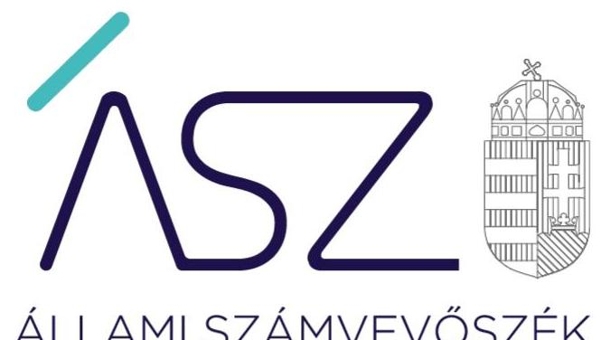
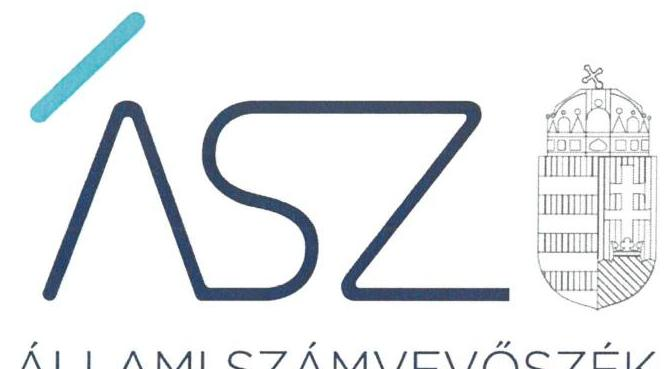
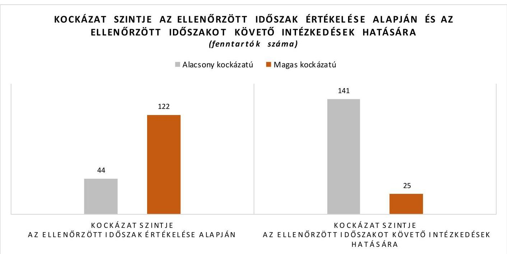
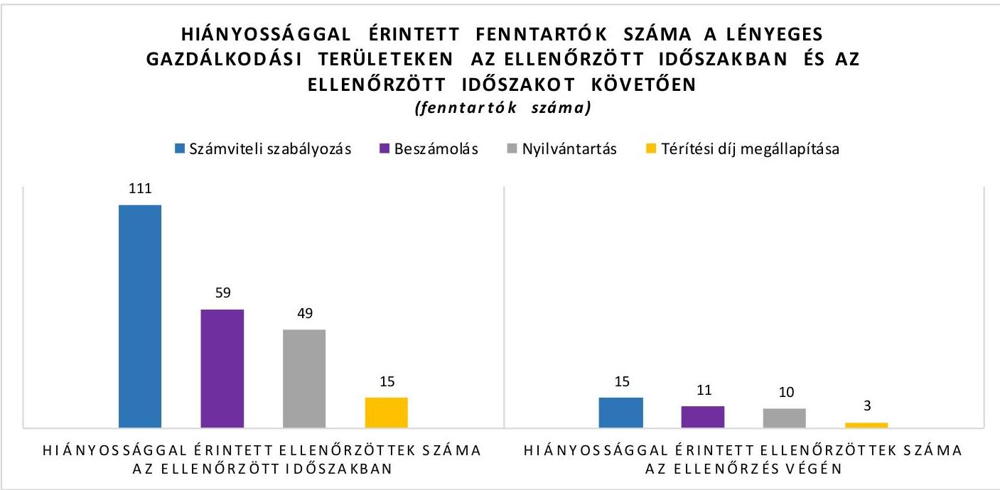
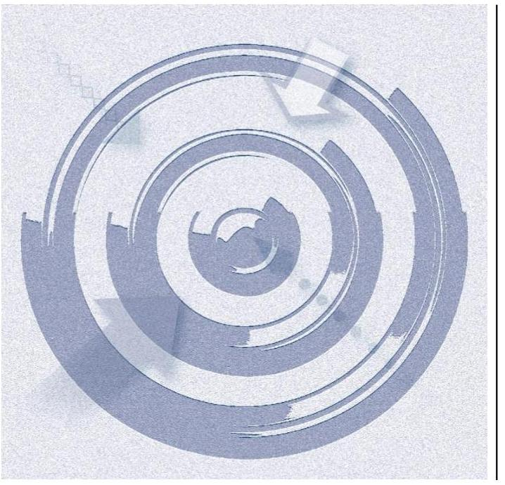

ÁLLAMI SZÁMVEVŐSZÉK

# JELENTÉS 

## Nem állami humánszolgáltatók kockázatalapú ellenőrzése

A szociális humánszolgáltatást nyújtó intézmények, szolgáltatók államháztartáson kívüli fenntartói központi költségvetésből kapott támogatásai felhasználásának ellenőrzése
2022.

22006
www.asz.hu

---

ÁLLAMI SZÁMVEVŐSZÉK

# JELENTÉS 

## Nem állami humánszolgáltatók kockázatalapú ellenőrzése

A szociális humánszolgáltatást nyújtó intézmények, szolgáltatók államháztartáson kívüli fenntartói központi költségvetésből kapott támogatásai felhasználásának ellenőrzése
2022. 02. hó 15. nap

22006
www.asz.hu

---

# AZ ELLENŐRZÉST VEZETTE ÉS A VÉGREHAJTÁSÁÉRT FELELŐS: 

ÓD OR ZOLTÁN TAMÁS ellenőrzésvezető
DR. NAGY IMRE ellenőrzésvezető

A PROGRAM ÖSSZEÁLLÍTÁSÁÉRT FELELŐS:
GÖRGÉNYI GÁBOR programkészítésért felelős vezető

IKTATÓSZÁM: EL-3549-001/2022.
TÉMASZÁM: 2549
ELLENŐRZÉS-AZONOSÍTÓ SZÁM: V0891

---

# TARTALOMJEGYZÉK 

■ ÖSSZEGZÉS ..... 5
■ AZ ELLENŐRZÉS CÉLJA ..... 9
■ AZ ELLENŐRZÉS TERÜLETE ..... 10
■ AZ ELLENŐRZÉS HÁTTERE, INDOKOLTSÁGA ..... 11
■ A JELENTÉS LÉNYEGES KÉRDÉSKÖREI ..... 12
■ ELLENŐRZÉS HATÓKÖRE ÉS MÓDSZEREI ..... 13
■ ÉRTÉKELÉSEK ..... 16
■ MELLÉKLETEK ..... 19
I. sz. melléklet: Ellenőrzött fenntartók kockázati besorolás szerint ..... 19
II. sz. melléklet: Értelmező szótár ..... 28
■ RÖVIDÍTÉSEK JEGYZÉKE ..... 29

---

.

---

# ÖSSZEGZÉS 

166 szociális humánszolgáltatást nyújtó intézményfenntartó gazdálkodásának ellenőrzött időszakra vonatkozó értékelése alapján 44 fenntartó gazdálkodása alacsony, 122 fenntartó gazdálkodása magas kockázatot hordozott. Az ellenőrzött időszakot követően az Állami Számvevőszék felhívására tett intézkedések hatására 97 fenntartónál csökkentek a gazdálkodási kockázatok. Így az ellenőrzött időszakot követően 141 fenntartó gazdálkodásában alacsony a kockázat, már csak 25 fenntartó gazdálkodása hordoz magas kockázatot a közfeladat ellátására, valamint a közfeladatra kapott közpénzek elszámoltathatóságára és átláthatóságára.

## Az ellenőrzés társadalmi indokoltsága

A szociális gondoskodást igénylők védelme az Alaptörvényben ${ }^{1}$ meghatározott, a társadalom szempontjából fontos tevékenység. Jogszabályok teszik lehetővé, hogy államháztartáson kívüli szervezetek - így például az alapítványok, gazdasági társaságok, egyesületek - által fenntartott intézmények is végezzenek szociális feladatokat. Mindehhez a központi költségvetés évente jelentős összegű támogatással járul hozzá. Az államháztartáson kívüli, humánszolgáltatást végző intézmények az igényelt közpénzekből társadalmilag hasznos, közösségteremtő, közérdekű tevékenységet végeznek, illetve közfeladatokat látnak el.

Az intézményfenntartók ellenőrzésével az Állami Számvevőszék hozzájárul ahhoz, hogy ezen közpénzeket az államháztartáson kívüli szervezetek is ellenőrizhető, átlátható és elszámoltatható módon használják fel a közfeladatok ellátása során. Az ellenőrzések célja továbbá, hogy a nyilvánosság és az igénybevevők megfelelő tájékoztatást kapjanak az államháztartáson kívüli közfeladatot ellátók működéséről.

Az ÁSZ ellenőrzése arra ad választ, hogy az intézményfenntartók közpénz felhasználása hordoz-e kockázatot. A közfeladat ellátás szakmai céljainak megvalósításához, valamint a társadalmi közbizalom fenntartásához elengedhetetlen, hogy a fenntartók a támogatásokat szabályszerűen használják fel.

## Összegző értékelés

AZ ELLENŐRZÖTT IDŐSZAKRA, A 2017-2019. ÉVEKRE vonatkozóan az Állami Számvevőszék értékelte 166 nem állami, nem önkormányzati, szociális közfeladatokat ellátó intézményfenntartó gazdálkodásának azon lényeges területeit, amelyek érdemi kockázatot jelenthetnek az ellenőrzött szervezeteknek kifizetett közpénzek felhasználásának átláthatóságára és elszámoltathatóságára. Az ellenőrzött intézményfenntartóknál ilyen lényeges terület volt egyrészt a gazdálkodás alapvető szabályozási kereteinek megléte, másrészt a közpénzekre, a központi költségvetésből kapott támogatásokra vonatkozó nyilvántartási kötelezettségek teljesítése.

AZ ELLENŐRZÖTT IDŐSZAKOT KÖVETŐEN az Állami Számvevőszék vagyonmegóvási intézkedést kezdeményezett azoknál az intézményfenntartóknál, amelyek nem biztosították a gazdálkodásuk lényeges területeinek ellenőrizhetőségét, illetve azoknál a fenntartóknál, amelyeknél az ellenőrzés során feltárt lényeges szabálytalanságok miatt felmerült a rendeltetésellenes közpénzfelhasználás veszélye. Az Állami Számvevőszék a vagyonmegóvási intézkedéssel lehetőséget biztosított az érintett fenntartóknak, hogy igazolják: 2021-ben a törvényes gazdálkodás és a cél szerinti közpénzfelhasználás alapvető feltételei biztosítottak.

Emellett a közpénzügyek átláthatóságának, rendezettségének mielőbbi előmozdítása érdekében az Állami Számvevőszék figyelemfelhívó levéllel fordult azon ellenőrzött fenntartók vezetői felé, amelyek esetében a rendeltetésellenes közpénzfelhasználás veszélye nem merült fel, ugyanakkor az ellenőrzött időszakra vonatkozóan hiányosságot

---

tárt fel az ellenőrzés. Az Állami Számvevőszék a figyelemfelhívással lehetőséget biztosított arra, hogy a fenntartók vezetői lépéseket tegyenek a feltárt hiányosságok megszüntetésére.

Az ellenőrzési tapasztalatok, valamint a vagyonmegóvási intézkedés elrendelésére és a számvevőszéki figyelemfelhívásokra érkezett válaszok értékelése alapján az ellenőrzött fenntartók alacsony és magas kockázatú kategóriákba sorolhatók be a gazdálkodásra vonatkozó kockázat mértéke alapján.

Az ellenőrzött fenntartók kockázati besorolását az I. számú melléklet, a fenntartók kockázati szint szerinti megoszlását az 1. ábra mutatja be.

### ALACSONY A KOCKÁZAT

ALACSONY A KOCKÁZAT a kapott közpénzek elszámoltathatóságára és átláthatóságára vonatkozóan 141 intézményfenntartónál.

Közülük 44 fenntartó gazdálkodása már az ellenőrzött időszakban alacsony kockázatot hordozott.

- 31 alacsony kockázatú fenntartónál az ellenőrzött időszakban, a 2017-2019. években kialakították a gazdálkodáshoz előírt alapvető számviteli szabályozásokat, a közfeladat ellátásához kapott közpénzeket a jogszabályi előírások szerint elkülönítve tartották nyilván, továbbá összeállították a számviteli törvény szerinti beszámolójukat. A jogszabályi rendelkezések és a kialakított belső szabályozások betartását érintő kockázatokat ezeknek a fenntartóknak is kezelnie kell.
- 9 alacsony kockázatú fenntartó az ellenőrzött időszakot követően intézkedett a feltárt hiányosságok megszüntetésére az Állami Számvevőszék felhívására. Ezeknél a fenntartóknál a szabályszerű gazdálkodás akkor biztosítható, ha a számvevőszéki felhívásra válaszul jelzett intézkedések érvényesülnek a fenntartók gazdálkodásában, továbbá kezelik a gazdálkodáshoz kapcsolódó jogszabályok és a kialakított belső szabályozások betartását érintő kockázatokat.
- 4 fenntartónál a gazdálkodást érintő hiányosságok mellett az ellenőrzött időszak utolsó évében alacsony volt a kapott közpénzek elszámoltathatóságára és átláthatóságára vonatkozó kockázat. Ugyanakkor az érintett fenntartók az Állami Számvevőszék felhívására nem intézkedtek a hiányosságok megszüntetésére, amely kezelendő kockázatot jelent a fenntartók gazdálkodásában.

A 141 fenntartóból 97 magas kockázatú fenntartó az ellenőrzött időszakot követően intézkedett a feltárt hiányosságok megszüntetésére az Állami Számvevőszék felhívására. Ezeknél a fenntartóknál a szabályszerű gazdálkodás akkor biztosítható, ha a számvevőszéki felhívásra válaszul jelzett intézkedések érvényesülnek a fenntartók gazdálkodásában, továbbá kezelik a gazdálkodáshoz kapcsolódó jogszabályok és a kialakított belső szabályozások betartását érintő kockázatokat.

---

MAGAS A KOCKÁZAT a kapott közpénzek elszámoltathatóságára és átláthatóságára vonatkozóan 25 intézményfenntartónál. Ezeknél a fenntartóknál az ellenőrzött időszakot követően sem intézkedtek a feltárt hiányosságok megszüntetése érdekében, ezért a gazdálkodást érintő kockázatok fennmaradtak. Ezen intézményfenntartók esetében felmerül annak a kockázata, hogy a jövőben a kapott támogatásokat nem szabályszerűen használják fel, nem arra a közfeladatra fordítják, amire kapták, a közpénzeket nem átláthatóan kezelik.

Az ellenőrzött időszakra vonatkozóan feltárt és az ellenőrzött időszakot követően fennmaradt hiányossággal érintett fenntartókat a 2. ábra mutatja be.
2. ábra

A gazdálkodás átláthatóságának és a közpénzfelhasználás elszámoltathatóságának alapja a számviteli törvény szerinti beszámoló elkészítése. A beszámoló egyaránt szolgálja a közpénzt biztosító állam, a szélesebb értelemben vett társadalom, a helyi lakosság, továbbá kiemelten a szociális szolgáltatást igénybe vevők és a hozzátartozók tájékoztatását a fenntartó gazdálkodásáról.

A beszámolóhoz elengedhetetlen azoknak a számviteli szabályozásoknak a megalkotása és alkalmazása, amelyek biztosítják a könyvvezetés megbízhatóságát és a beszámoló készítéséhez szükséges adatok rendelkezésre állását. Ugyancsak kiemelten fontos, hogy a fenntartók megalkossák azokat a szabályokat és kialakítsák azokat a nyilvántartásokat, amelyek a közpénzek és a szociális szolgáltatást igénybe vevők befizetéseinek ellenőrizhető, cél szerinti felhasználásához szükségesek.

Emellett lényeges, hogy a fenntartók a térítési díjak, a tandíjak megállapítására vonatkozó szabályok és a szociális kedvezmények feltételeinek meghatározása területén biztosítsák az egyenlő bánásmódot, vagyis azt, hogy a szociális szolgáltatásokat igénybe vevők azonos feltételek mellett juthassanak a szolgáltatásokhoz.

# Következtetések 

Az ellenőrzés tapasztalatai alapján az ellenőrzött időszakban csak az ellenőrzöttek 26%-a biztosította az átlátható és elszámoltatható közpénzfelhasználás alapvető feltételeit, amely rendszerszintű kockázatot jelez a szociális közfeladatok nem állami humánszolgáltatók általi ellátása tekintetében. Emellett az alacsony kockázatot hordozó fenntartók aránya a közpénzügyi ellenőrzés harmadik védelmi vonalának szerepét betöltő Állami Számvevőszék ellenőrzésének és az ezen alapuló felhívásának hatására 26%-ról 85%-ra nőtt.

---

Az ellenőrzési adatok megerősítik, hogy az ellenőrzés rendet teremt, vagyis erősíti a közpénzekkel való gazdálkodás szabályszerűségét. Emellett az ellenőrzési tapasztalatok alapján az első védelmi vonalat jelentő fenntartói kontrollok és a második védelmi vonalat jelentő Magyar Államkincstár ellenőrzése ellenére hiányosságok maradtak fenn a közpénzek felhasználásának átláthatóságában és elszámoltathatóságában, a költségvetési források célszerű elköltésében.

A nem állami humánszolgáltatóknál az első védelmi vonal hatásos eszköze lehetne a kockázatok és szabálytalanságok feltárását és kezelését támogató belső kontrollrendszer, ezen belül is a belső ellenőrzés kialakítása és működtetése. Az államháztartáson kívüli intézményfenntartók ugyanazon feladatokat látják el, mint az államháztartáson belüli szervezetek, ugyanazon jogcímen biztosít költségvetési támogatást a mindenkori költségvetési törvény számukra, esetükben mégis hiányzik a belső kontrollok kialakítására vonatkozó jogszabályi előírás.

A közpénzekkel nem elszámoltatható szervezetek magas aránya arra hívja fel a figyelmet, hogy a közpénzek védelme érdekében szükséges a Magyar Államkincstár ellenőrzésének erősítése. Jogos elvárás, hogy az állam ne csak támogatást nyújtson, hanem győződjön meg annak szabályszerű felhasználásáról. A közpénzekkel nem átláthatóan gazdálkodó szervezetekkel szemben szigorú fellépésre van szükség, akár a támogatásra való jogosultságból való kizárással.

---

# AZ ELLENŐRZÉS CÉLJA 

Az ellenőrzés célja annak értékelése volt, hogy a nem állami, nem önkormányzati szociális intézmények fenntartója biztosította-e a szabályszerű, átlátható és elszámoltatható közpénzfelhasználás alapvető feltételeit.

---

# AZ ELLENŐRZÉS TERÜLETE 

## 166 nem állami, nem önkormányzati intézmény fenntartó

Az ellenőrzés 166 kijelölt nem állami, nem önkormányzati szociális humánszolgáltatást biztosító fenntartónál került lefolytatásra.

Nem állami szociális és gyermekjóléti, gyermekvédelmi intézményfenntartó lehet a Szoc. tv. ${ }^{2}$ és a Gyvt. ${ }^{3}$ szerint a helyi önkormányzat mellett az egyházi jogi személy, az egyéni vállalkozó és a magyarországi székhelyű jogi személy.

A szociális szolgáltatást biztosító nem állami fenntartó a mindenkori költségvetési törvényben biztosított támogatásra jogosult. Az Áht. ${ }^{4}$, Ávr. ${ }^{5}$, Nkt. vhr. ${ }^{6}$ előírásai szerint a Magyar Államkincstár a megítélt támogatásokat a fenntartó részére folyósítja.
Az ellenőrzött fenntartókra vonatkozó információkat az I. számú melléklet mutatja be.

---

# AZ ELLENŐRZÉS HÁTTERE, INDOKOLTSÁGA 

A köznevelési és szociális feladatokat ellátó nem állami intézményfenntartók részére közfeladataik ellátására évente jelentős összegű pénzügyi támogatást biztosítottak a mindenkori költségvetési törvények a bennük megfogalmazott feltételek mellett. A felhasználható állami támogatások Ktv.-ek ${ }^{7}$ szerinti előirányzata 2017. - 2019. években együtt 929 Mrd Ft volt. A 2013. évben jelentős változások következtek be a normatív finanszírozás rendszerében. Az Országgyűlés elfogadta az Nkt. ${ }^{8}$-t, amely jelentősen átalakította a korábbi finanszírozási rendszert 2013. szeptemberétől. Módosították a Szoc. tv.-t is, amely - többek között - 2012. január 1-jei hatállyal megfogalmazta a finanszírozási rendszerbe történő befogadással összefüggő szabályokat. Mindkét területen új feladatfinanszírozási forma (átlagbéralapú támogatás) jelent meg, amely az államháztartáson kívüli intézményfenntartókra is vonatkozik. A kockázat alapú ellenőrzés a közpénzekkel való gazdálkodás kereteinek biztosítására és a támogatások jogszabályokkal összhangban történő nyilvántartásának ellenőrzésére fókuszál a költségvetési támogatásokat felhasználó államháztartáson kívüli szervezetek körében. Az ellenőrzések indokoltságát az is alátámasztja, hogy az ÁSZ számos szervezetet még nem ellenőrzött ezen a területen.

Az ÁSZ stratégiájában foglaltak alapján is indokolt az ellenőrzés, amely a társadalom számára jelzi, hogy a közpénz államháztartáson kívüli felhasználása sem maradhat ellenőrizetlenül. Az államháztartáson kívülre nyújtott költségvetési támogatások ellenőrzésével az ÁSZ hozzájárul ahhoz, hogy a közpénzeket a nem állami humán fenntartók átlátható módon használják fel a közfeladatok ellátására kötött szerződésekben vállalt kötelezettségek teljesítése érdekében. Az ellenőrzés javaslataival hozzájárulhat az említett rendszerek szabályszerű támogatás felhasználásához, javíthatja a társadalmi-gazdasági döntések megalapozottságát, amely a
 „jól irányított állam működésének” feltétele.

---

# A JELENTÉS LÉNYEGES KÉRDÉSKÖREI 

1- Az államháztartáson kívüli fenntartók a jogszabályokkal összhangban alakították-e ki a közpénzekkel való gazdálkodás alapvető szabályozási kereteit?
2- Az államháztartáson kívüli fenntartók eleget tettek-e a kapott támogatások cél szerinti felhasználásának ellenőrizhetőségét szolgáló beszámolási és nyilvántartási előírásainak?

---

# ELLENŐRZÉS HATÓKÖRE ÉS MÓDSZEREI 

## Az ellenőrzés típusa

| Megfelelőségi ellenőrzés.

## Az ellenőrzött időszak

2017. január 1. és 2019. december 31. közötti időszak azon évei, amelyben a nem állami, nem önkormányzati fenntartó szociális közfeladat-ellátásra az államháztartásból támogatást kapott és/vagy használt fel.

## Az ellenőrzés tárgya

Az ellenőrzés a szociális humánszolgáltatási közfeladatokat ellátó államháztartáson kívüli fenntartók gazdálkodása alapvető szabályozási kereteinek meglétére, valamint a humánszolgáltatási közfeladataik ellátásához a központi költségvetésből kapott támogatások és azok humánszolgáltatási közfeladatokra való fenntartó általi felhasználásával kapcsolatosan vezetett nyilvántartások ellenőrzésére terjedt ki.

Az ellenőrzés kiterjedt minden olyan körülményre és adatra, amely az ÁSZ jogszabályban meghatározott feladatainak teljesítéséhez, valamint a program végrehajtása folyamán felmerült újabb összefüggések feltárásához szükséges volt.

## Az ellenőrzött szervezetek

166 szociális humánszolgáltatási közfeladatokat ellátó államháztartáson kívüli fenntartó az I. melléklet szerint.

## Az ellenőrzés jogalapja

Az ellenőrzés jogszabályi alapját az ÁSZ tv. ${ }^{9}$ 1. § (3) bekezdésében, 5. § (3) bekezdésében foglalt előírások adják.

AZ ÁSZ az államháztartásból származó források felhasználásának keretében ellenőrzi az államháztartásból nyújtott támogatás felhasználását többek között - az államháztartáson kívüli humánszolgáltatók fenntartóinál. Amennyiben a kedvezményezett szervezet az államháztartásból támogatásban részesül, gazdálkodási tevékenységének egésze ellenőrizhető.

Az ÁSZ törvényességi szempontból ellenőrzi az egyházi jogi személyek vagy azok nevelési-oktatási, felsőoktatási, egészségügyi, karitatív, szociális,

---

család-, gyermek- és ifjúságvédelmi, kulturális vagy sporttevékenység végzésére létrehozott, a bevett egyház belső szabálya szerint jogi személyiséggel nem rendelkező intézménye részére az államháztartásból nem hitéleti célra nyújtott támogatás felhasználását.

# Az ellenőrzés módszerei 

Az ellenőrzést az ellenőrzött időszakban hatályos jogszabályok, az ellenőrzés szakmai szabályai, a jelen ellenőrzésre irányadó ÁSZ módszertanok, az ellenőrzési programban foglalt értékelési szempontok szerint hajtja végre az ÁSZ. Az ellenőrzést az ÁSZ a program kérdéseire adott válaszok kiértékelésével, valamint a programban ismertetett ellenőrzési kérdések, kritériumok, adatforrások között megjelölt adatforrások, továbbá az adott időszakban hatályos jogszabályok figyelembevételével folytatja le. Az ellenőrzési bizonyítékként felhasználható adatforrások közé tartoznak az ellenőrzési programban felsorolt adatforrások, továbbá minden - az ellenőrzés folyamán - feltárt, az ellenőrzés szempontjából információkat tartalmazó dokumentum.

Az ellenőrzés során azokat a lényeges területeket értékeli az ÁSZ, amelyek érdemi kockázatot jelenthetnek az ellenőrzöttszervezet közpénzekkel való gazdálkodására. Ilyen lényeges terület egyrészt a gazdálkodás alapvető szabályozási kereteinek megléte, másrészt a központi költségvetésből kapott támogatásokra vonatkozó nyilvántartási kötelezettségek teljesítése.

Az ÁSZ az ellenőrzés során meghatározott lényeges dokumentumok tartalmi értékelését végzi el, olyan kiválasztott alapvető kritériumok alapján, amelyek bármelyikének az ellenőrzött múltbeli időszakra vonatkozóan megállapított hiánya kockázatot jelent a jövőben az ellenőrzött szervezet részéről a közpénzek fogadására, a közpénzekkel való jövőbeli gazdálkodására. A fentiekre tekintettel az ÁSZ nem a lényeges területek és azokat alátámasztó, ellenőrzött dokumentumok szabályszerűségére tesz megállapítást, hanem az ellenőrzött szervezetre vonatkozó közpénzügyi kockázatokat azonosítja.

Az ellenőrzött szervezetek kockázati besorolását az ÁSZ az alábbi szempontok figyelembevételével végzi el:

A kockázati besorolás az ellenőrzött szervezet esetében magas, amennyiben:
számviteli törvény szerinti beszámolóval az adott évben nem rendelkezett;
számviteli politikával és annak keretében elkészített pénzkezelési szabályzattal együttesen az adott évben nem rendelkezett;
az adott évben nem a jogszabályokkal összhangban alakította ki a közpénzekkel való gazdálkodás alapvető szabályozási kereteit;
a köznevelési és szociális közfeladat ellátásra kapott támogatás felhasználásának adott évre vonatkozó elkülönített nyilvántartását igazoló dokumentummal nem rendelkezett, vagy a nyilvántartás nem a jogszabályi előírásoknak megfelelően történt.

---

Az ellenőrzés ideje alatt az ellenőrzött szervezetekkel történő kapcsolattartás az ÁSZ szervezeti és működési szabályzatának vonatkozó előírásai alapján történik.

A törvényi előírásokat, valamint az ÁSZ által meghirdetett, nyilvános módszertant figyelembe véve az ellenőrzés hatóköre kiegészülhet kockázatjelzések alapján, a kockázatértékelés függvényében további lényeges területek szabályosságának ellenőrzésével az ellenőrzés megkezdésének időpontjáig.

Az ellenőrzött fenntartók vezetői számára figyelemfelhívó levél kerül megküldésre az ellenőrzött időszak utolsó évére vonatkozó szabálytalanságokról, az ÁSZ tv. előírásával összhangban 15 nap áll rendelkezésükre az ebben foglaltak elbírálására, valamint a megfelelő intézkedések meghozatalára.

Az ellenőrzött fenntartók vezetői által a figyelemfelhívó levélre adott válaszok alapján az ÁSZ értékeli az ellenőrzött időszak utolsó évére vonatkozóan feltárt hiányosságok kezelését. Amennyiben az ellenőrzött fenntartók vezetői intézkedéseket fogalmaznak meg a hiányosság megszüntetése érdekében, az ÁSZ a gazdálkodás lényeges területein korábban fennálló kockázatokról megállapítja, hogy azokat csökkentették.

---

# 1. Az államháztartáson kívüli fenntartók a jogszabályokkal összhangban alakították-e ki a közpénzekkel való gazdálkodás alapvető szabályozási kereteit?

## Összegző értékelés

Az ellenőrzött 166 fenntartó közül 55 fenntartó a közpénzekkel való gazdálkodás alapvető szabályozási kereteit jogszabályi előírásokkal összhangban kialakította 2019-ben.

A közpénzekkel való gazdálkodás szabályozási kereteinek jogszabályokkal összhangban történő kialakítása alapvető fontosságú a közpénzfelhasználás átláthatósága és elszámoltathatósága érdekében. Ezek a szabályzatok, dokumentumok szükségesek ahhoz, hogy a fenntartók el tudjanak számolni a kapott közpénzekkel való gazdálkodásukkal az Alaptörvényben előírtaknak megfelelően. Az alapvető számviteli szabályzatok hiánya kockázatot jelent a közpénzek szabályszerű, átlátható és elszámoltatható felhasználására.

Az ellenőrzött fenntartóknál a gazdálkodás alapvető szabályozási kereteinek értékelését az 1. táblázat mutatja be.

1. táblázat

|  Ssz. | Értékelés | Érintett fenntartók száma |  |   |
| --- | --- | --- | --- | --- |
|   |  | 2017. év | 2018. év | 2019. év  |
|  1. | JOGSZABÁLYOKKAL ÖSSZHANGBAN ALAKÍTOTTA KI a közpénzekkel való gazdálkodás alapvető szabályozási kereteit | 55 | 55 | 55  |
|  2. | NEM ALAKÍTOTTA KI a közpénzekkel való gazdálkodás alapvető szabályozási kereteit, mert nem rendelkezett sem számviteli politikával, sem pedig az annak keretében elkészítendő pénzkezelési szabályzattal | 31 | 29 | 29  |
|  3. | HIÁNYOSAN ALAKÍTOTTA KI a közpénzekkel való gazdálkodás alapvető szabályozási kereteit, mert a 2. sorban foglalt takon kívüli egyéb hiányosságot tárt fel az ellenőrzés a számviteli politikával, a keretében elkészítendő szabályzatokkal és/vagy a számlarenddel kapcsolatban | 80 | 82 | 82  |

Forrás: ÁSZ szerkesztés

---

# 2. Az államháztartáson kívüli fenntartók eleget tettek-e a kapott támogatások cél szerinti felhasználásának ellenőrizhetőségét szolgáló beszámolási és nyilvántartási előírásoknak?

## Összegző értékelés

Az ellenőrzött 166 fenntartó közül 108 fenntartó esetében a közpénzek felhasználásához kapcsolódó beszámolási és nyilvántartási feladatok ellátása a 2019. év értékelése alapján kockázatot hordoz.

TÖRVÉNY SZERINTI BESZÁMOLÓVAL a 2017. évben 56, a 2018. évben 58, a 2019. évben pedig 59 fenntartó nem rendelkezett. A beszámoló hiánya kockázatot jelent a gazdálkodás átláthatóságára és a közpénzek felhasználásának elszámoltathatóságára.

Az ellenőrzött fenntartóknál a beszámoló készítéséhez kapcsolódó törvényi előírások értékelését a 2. táblázat mutatja be.

## 2. táblázat

|  SZL. | Értékelés | Érintett fenntartók száma |  |   |
| --- | --- | --- | --- | --- |
|   |  | 2017. év | 2018. év | 2019. év  |
|  1. | a fenntartó a törvényi előírás ellenére nem készített beszámolót | 52 | 54 | 54  |
|  2. | a fenntartó beszámolója törvényi előírás ellenére nem tartalmazott kiegészítő mellékletet | 4 | 4 | 5  |

Forrás: ÁSZ szerkesztés

## A SZOCIÁLIS FELADATRA KAPOTT TÁMOGATÁSOK CÉL SZERINTI FELHASZNÁLÁSÁNAK ELLENŐRIZHETŐSÉGÉT

a törvényi előírások szerinti beszámolóval rendelkező fenntartók közül 2017. évben 44, 2018. évben 45, a 2019. évben pedig 49 fenntartó nem biztosította. Ezek a fenntartók a jogszabályi kötelezettségük ellenére nem gondoskodtak arról, hogy az állami támogatások felhasználásának, a fenntartó, illetve a nem önállóan gazdálkodó intézménye gazdálkodásának elkülönített elszámolására az adatok rendelkezésre álljanak. A szociális közfeladat ellátásra kapott közpénzek felhasználásának elkülönített nyilvántartása hiánya kockázatot hordoz a közpénzek átlátható és elszámoltatható felhasználására, valamint a fenntartók beszámolójának megalapozottságára. Elkülönítés hiányában nem igazolt, hogy a fenntartók a közpénzt arra a közfeladatra fordították, amire kapták.

Az ellenőrzött fenntartóknál a kapott támogatások cél szerinti felhasználásának ellenőrizhetőségéhez kapcsolódó törvényi előírások értékelését a szociális feladatok esetében a 3. táblázat mutatja be. Egyes szervezeteknél több hiányosságot is feltárt az ellenőrzés.

---

|  | Értékelés | Érintett fenntartók száma |  |  |
| :-- | :-- | :--: | :--: | :--: |
| Ssz. |  | 2017. év | 2018. év | 2019. év |
| 1. | a beszámolójában nem biztosította az alapcél szerinti (közhasznú) tevékenysége és a gazdasági-vállalkozási tevékenysége elkülönített nyilvántartási kötelezettségét, amennyiben folytatott vállalkozási tevékenységet | 5 | 6 | 5 |
| 2. | nem volt biztosított az egyezőség a beszámolóban kimutatott támogatások adatai, továbbá az év végi zárás előtti főkönyvi kivonat adatai között | 16 | 15 | 18 |
| 3. | a fenntartó a kapott költségvetési támogatás felhasználását nem feladatonkénti bontásban, elkülönítetten tartotta nyilván | 35 | 35 | 38 |
| 4. | ha az intézménye/i önállóan gazdálkodó volt/ak, a központi költségvetési támogatás teljes összegét nem adta át | 2 | 2 | 2 |

Forrás: ÁSZ szerkesztés
AZ INTÉZMÉNYI TÉRÍTÉSI DÍJ MEGHATÁROZÁSÁHOZ kapcsolódó jogszabályi előírásoknak a kapott támogatások cél szerinti ellenőrizhetőségét biztosító fenntartók közül a 2017. évben 15, 2018. évben 16, a 2019. évben pedig 15 fenntartó nem eleget tett. Az intézményi térítési díj meghatározása hiányában nem biztosított, hogy a szolgáltatásokat igénybe vevők azonos feltételek mellett jutnak a szolgáltatásokhoz.

---

# MELLÉKLETEK

I. SZ. MELLÉKLET: ELLENŐRZÖTT FENNTARTÓK KOCKÁZATI BESOROLÁS SZERINT

**ALACSONY KOCKÁZATÚ** az a fenntartó, amelynek gazdálkodása az ellenőrzött időszak utolsó évében alacsony kockázatot hordozott, vagy magas kockázatot hordozott, és az Állami Számvevőszék felhívására intézkedett a feltárt hiányosságok megszüntetéséről és a kockázatok csökkentéséről.

- Ezen belül *"Továbbra is alacsony kockázatú"* értékelést kapott az a fenntartó, amelynek gazdálkodása tekintetében nem tárt fel hiányosságot az ellenőrzés.
- Az alacsony kockázatú fenntartók közül *"Alacsony kockázatú, intézkedett"* értékelést kapott az a fenntartó, amelynél az ellenőrzött időszak utolsó évében alacsony vagy magas volt a kockázat, és az Állami Számvevőszék felhívására intézkedett a feltárt hiányosságok megszüntetéséről és a kockázatok csökkentéséről.
- Az alacsony kockázatú fenntartókon belül *"Alacsony kockázatú, de intézkedést nem tett"* értékelést kapott az a fenntartó, amelynél a gazdálkodást érintő hiányosságok mellett az ellenőrzött időszak utolsó évében alacsony volt a kockázat, ugyanakkor az Állami Számvevőszék felhívására nem intézkedett a feltárt hiányosságok megszüntetéséről.

**MAGAS KOCKÁZATÚ** az a fenntartó, amelynek gazdálkodása az ellenőrzött időszak utolsó évében magas kockázatot hordozott, és az Állami Számvevőszék felhívására nem intézkedett a hiányosságok megszüntetésére.

|  Ssz. | Fenntartó | Székhely | 2017. évi kockázati besorolás | 2018. évi kockázati besorolás | 2019. évi kockázati besorolás | Kockázati besorolás az ÁSZ felhívását követően | Ebből a változás iránya alapján:  |
| --- | --- |

 --- | --- | --- | --- | --- | --- |
|  1. | Békés Otthon Eger Idősekért és Betegekért Szociális Alapítvány | Felsőtárkány | magas | magas | magas | Alacsony kockázatú | Alacsony kockázatú, intézkedett  |
|  2. | "BOROSTYÁNVIRÁG" ALAPÍTVÁNY A CSALÁD NÉLKÜL MEGSZÜLETETT GYERMEKEK ÉS FIATAL ANYÁK MEGSEGÍTÉSÉRE | Kaposvár | magas | magas | magas | Alacsony kockázatú | Alacsony kockázatú, intézkedett  |
|  3. | GRÉTI Időseket Támogató és Gondozó Alapítvány | Mezőhegyes | magas | magas | magas | Alacsony kockázatú | Alacsony kockázatú, intézkedett  |
|  4. | ADA Gondozó Nonprofit Kft. | Végegyháza | magas | magas | magas | Alacsony kockázatú | Alacsony kockázatú, intézkedett  |
|  5. | Alapvető Segítség Közhasznú Alapítvány | Bocskaikert | alacsony | alacsony | alacsony | Alacsony kockázatú | Továbbra is alacsony kockázatú  |
|  6. | Alba Caritas Hungarica Alapítvány | Székesfehérvár | magas | magas | magas | Alacsony kockázatú | Alacsony kockázatú, intézkedett  |
|  7. | AMBRÓZIA Gondozóház Szolgáltató Nonprofit Korlátolt Felelősségű Társaság | Dunaharaszti | alacsony | alacsony | alacsony | Alacsony kockázatú | Továbbra is alacsony kockázatú  |
|  8. | Angyalliget Közhasznú Alapítvány az Autisták Lakóotthonáért | Balmazújváros | alacsony | alacsony | alacsony | Alacsony kockázatú | Továbbra is alacsony kockázatú  |
|  9. | Apraja Falva Közhasznú Egyesület | Kiskunfélegyháza | magas | magas | magas | Alacsony kockázatú | Alacsony kockázatú, intézkedett  |

---

|  10. | Arany Középút Egyesület | Debrecen | alacsony | alacsony | alacsony | Alacsony kockázatú | Továbbra is alacsony kockázatú  |
| --- | --- | --- | --- | --- | --- | --- | --- |
|  11. | Arany Ösz Nyugdíjas Otthon Szolgáltató Közhasznú Nonprofit Korlátolt Felelősségű Társaság | Balatonföldvár | magas | magas | magas | Alacsony kockázatú | Alacsony kockázatú, intézkedett  |
|  12. | Autista Sérültekért Zalában Alapítvány | Zalaegerszeg | alacsony | alacsony | alacsony | Alacsony kockázatú | Továbbra is alacsony kockázatú  |
|  13. | AUT-PONT Autista Gyermekekért és Fiatalokért Alapítvány | Békéscsaba | magas | magas | magas | Alacsony kockázatú | Alacsony kockázatú, intézkedett  |
|  14. | Baby Bocsok Alapítvány | Dunakeszi | magas | magas | magas | Alacsony kockázatú | Alacsony kockázatú, intézkedett  |
|  15. | BARKA Szociális Segítő Alapítvány | Kalocsa | magas | magas | magas | Alacsony kockázatú | Alacsony kockázatú, intézkedett  |
|  16. | BÉKÉS ALKONY Időskorúakat Gondozó Alapítvány | Farkaslyuk | alacsony | alacsony | alacsony | Alacsony kockázatú | Alacsony kockázatú, de intézkedést nem tett  |
|  17. | BERZSÁNÉK Idősek Háza Nonprofit Szolgáltató Korlátolt Felelősségű Társaság | Tatabánya | magas | magas | magas | Alacsony kockázatú | Alacsony kockázatú, intézkedett  |
|  18. | BÉTHEL Alapítvány | Békéscsaba | alacsony | alacsony | alacsony | Alacsony kockázatú | Továbbra is alacsony kockázatú  |
|  19. | „BICE-BÓCA" Alapítvány a Mozgássérült Gyermekekért | Budapest | alacsony | alacsony | alacsony | Alacsony kockázatú | Alacsony kockázatú, de intézkedést nem tett  |
|  20. | Biztos Pont Szociális Szolgáltató Nonprofit Közhasznú Korlátolt Felelősségű Társaság | Gárdony | magas | magas | magas | Alacsony kockázatú | Alacsony kockázatú, intézkedett  |
|  21. | Boldog Családokért Szociális és Gyermekvédelmi Egyesület | Mátészalka | magas | magas | magas | Alacsony kockázatú | Alacsony kockázatú, intézkedett  |
|  22. | "BOROSTYÁN" Időskorúak Otthona Alapítvány | Várda | magas | magas | magas | Alacsony kockázatú | Alacsony kockázatú, intézkedett  |
|  23. | Cédrus Alapítvány az Egészséges Életért | Szigetszentmiklós | magas | magas | magas | Alacsony kockázatú | Alacsony kockázatú, intézkedett  |
|  24. | Csibe Bölcsi Közhasznú Nonprofit Korlátolt Felelősségű Társaság | Telki | magas | magas | magas | Alacsony kockázatú | Alacsony kockázatú, intézkedett  |
|  25. | Debreceni Szegényeket Támogató Alapítvány | Debrecen | magas | magas | magas | Alacsony kockázatú | Alacsony kockázatú, intézkedett  |
|  26. | Diótörés Alapítvány | Budapest | magas | magas | magas | Alacsony kockázatú | Alacsony kockázatú, intézkedett  |
|  27. | DUNAKESZI-SZTK Egészségügyi és Szociális Közhasznú Nonprofit Kft. | Dunakeszi | magas | magas | magas | Alacsony kockázatú | Alacsony kockázatú, intézkedett  |
|  28. | Ébredések Alapítvány | Budapest | magas | magas | magas | Alacsony kockázatú | Alacsony kockázatú, intézkedett  |
|  29. | Édes Pihenő Idősek Otthona Nonprofit Közhasznú Korlátolt Felelősségű Társaság | Lovasberény | magas | magas | magas | Alacsony kockázatú | Alacsony kockázatú, intézkedett  |
|  30. | Egalitás Mozgássérültek Létbiztonságát Elősegítő Alapítvány | Budapest | magas | magas | magas | Alacsony kockázatú | Alacsony kockázatú, intézkedett  |

---

| 31. | EGYENSÚLY AE Egyesület | Békéscsaba | magas | magas | magas | Alacsony kockázatú | Alacsony kockázatú, intézkedett |
| :--: | :--: | :--: | :--: | :--: | :--: | :--: | :--: |
| 32. | Egyensúlyunkért Alapítvány | Székesfehérvár | magas | magas | magas | Alacsony kockázatú | Alacsony kockázatú, intézkedett |
| 33. | Együtt A Sérült Emberekért Alapítvány | Szerencs | magas | magas | magas | Alacsony kockázatú | Alacsony kockázatú, intézkedett |
| 34. | Életút Egyesület a Sérült Fiatalokért | Esztergom | magas | magas | magas | Alacsony kockázatú | Alacsony kockázatú, intézkedett |
| 35. | EMLÉKEZÜNK Alapítvány | Nyíregyháza | magas | magas | magas | Alacsony kockázatú | Alacsony kockázatú, intézkedett |
| 36. | "ÉRME" Élet-Remény-Munka-Esély Közhasznú Alapítvány | Békés | alacsony | alacsony | alacsony | Alacsony kockázatú | Alacsony kockázatú, intézkedett |
| 37. | Értelmi Fogyatékossággal Élők és Segítőik Országos Érdekvédelmi Szövetsége Nógrád Megyei Közhasznú Egyesület | Balassagyarmat | alacsony | alacsony | alacsony | Alacsony kockázatú | Alacsony kockázatú, intézkedett |
| 38. | "Esélyt a hátrányos helyzetű embereknek" Alapítvány | Szolnok | magas | magas | magas | Alacsony kockázatú | Alacsony kockázatú, intézkedett |
| 39. | Esőemberekért Egyesület | Tata | magas | magas | magas | Alacsony kockázatú | Alacsony kockázatú, intézkedett |
| 40. | ESŐEMBERKE Alapítvány a Vas megyei autistákért | Szombathely | magas | magas | alacsony | Alacsony kockázatú | Alacsony kockázatú, intézkedett |
| 41. | "Esthajnal - az Idősek Gondozásáért Alapítvány" | Vése | magas | magas | magas | Alacsony kockázatú | Alacsony kockázatú, intézkedett |
| 42. | Esthajnal Alapítvány | Zalaegerszeg | magas | magas | magas | Alacsony kockázatú | Alacsony kockázatú, intézkedett |
| 43. | EZEL EGÉSZSÉGÜGYI és SZOCIÁLIS Közhasznú Nonprofit Korlátolt Felelősségű Társaság | Kunágota | magas | magas | magas | Alacsony kockázatú | Alacsony kockázatú, intézkedett |
| 44. | Ezüst Évek Idősek Otthona Nonprofit Korlátolt Felelősségű Társaság | Madaras | magas | magas | magas | Alacsony kockázatú | Alacsony kockázatú, intézkedett |
| 45. | Ezüstfény Nonprofit Korlátolt Felelősségű Társaság | Budapest | közfeladatot nem látott el | magas | magas | Alacsony kockázatú | Alacsony kockázatú, intézkedett |
| 46. | Fehér Kereszt Baráti Kör Kiemelten Közhasznú Egyesület | Budapest | magas | magas | magas | Alacsony kockázatú | Alacsony kockázatú, intézkedett |
| 47. | Fény Felé Alapítvány | Debrecen | magas | magas | magas | Alacsony kockázatú | Alacsony kockázatú, intézkedett |
| 48. | FOETUS-CAR Humán Szolgáltató és Mezőgazdasági Nonprofit Korlátolt Felelősségű Társaság | Somberek | magas | magas | magas | Alacsony kockázatú | Alacsony kockázatú, intézkedett |
| 49. | "FOGD A KEZEM ALAPÍTVÁNY" | Pécs | alacsony | alacsony | alacsony | Alacsony kockázatú | Továbbra is alacsony kockázatú |
| 50. | Gesztus Közhasznú Egyesület | Záhony | magas | magas | magas | Alacsony kockázatú | Alacsony kockázatú, intézkedett |
| 51. | Golgota Keresztény Gyülekezet | Budapest | magas | magas | magas | Alacsony kockázatú | Alacsony kockázatú, intézkedett |

---

|  52. | Gondoskodás Alapítvány | Mezőkövesd | alacsony | alacsony | alacsony | Alacsony kockázatú | Továbbra is alacsony kockázatú  |
| --- | --- | --- | --- | --- | --- | --- | --- |
|  53. | Gyémánt Otthon Nonprofit Korlátolt Felelősségű Társaság | Nagyrábé | magas | magas | magas | Alacsony kockázatú | Alacsony kockázatú, intézkedett  |
|  54. | GYÓGYÍTÁS ÉS SZERETET Egészségügyi és Szociális Szolgáltató Nonprofit Kft | Kaszaper | magas | magas | magas | Alacsony kockázatú | Alacsony kockázatú, intézkedett  |
|  55. | Gyúró Ilona Szociális Ellátó Nonprofit Korlátolt Felelősségű Társaság | Törökbálint | magas | magas | magas | Alacsony kockázatú | Alacsony kockázatú, intézkedett  |
|  56. | Hajdú-Sansz Humánszolgáltató Nonprofit Korlátolt Felelősségű Társaság | Hajdúdorog | alacsony | alacsony | alacsony | Alacsony kockázatú | Továbbra is alacsony kockázatú  |
|  57. | Harmóniáért Közhasznú Egyesület | Budapest | alacsony | alacsony | alacsony | Alacsony kockázatú | Továbbra is alacsony kockázatú  |
|  58. | Hétszínvirág '98 Gyermekjóléti Nonprofit Korlátolt Felelősségű Társaság | Nyíregyháza | magas | magas | magas | Alacsony kockázatú | Alacsony kockázatú, intézkedett  |
|  59. | HÉTSZINVIRÁG-TUSKEVÁR SZOLGÁLTATÓ NONPROFIT BETÉTI TÁRSASÁG | Gyomaendrőd | magas | magas | magas | Alacsony kockázatú | Alacsony kockázatú, intézkedett  |
|  60. | "HÍD A JÓVŐBE" Értelmi Sérülteket Segítő Alapítvány | Nyúl | magas | magas | magas | Alacsony kockázatú | Alacsony kockázatú, intézkedett  |
|  61. | Horgony Pszichiátriai Betegekért Közhasznú Alapítvány | Veszprém-Gyulafirátót | magas | magas | magas | Alacsony kockázatú | Alacsony kockázatú, intézkedett  |
|  62. | HUMANITER Nonprofit Szolgáltató Korlátolt Felelősségű Társaság | Nyíregyháza | alacsony | alacsony |

 magas | Alacsony kockázatú | Alacsony kockázatú, intézkedett  |
|  63. | "IMPULZUS" Pályakezdők Munkaszocializációjával Foglalkozó Szakemberek Egyesülete | Szolnok | magas | magas | magas | Alacsony kockázatú | Alacsony kockázatú, intézkedett  |
|  64. | IZABELLA Idősek Otthona Alapítvány | Ravazd | alacsony | alacsony | alacsony | Alacsony kockázatú | Továbbra is alacsony kockázatú  |
|  65. | Jót és Jól a Szatmári Kistérségben Egyesület | Géberjén | alacsony | alacsony | alacsony | Alacsony kockázatú | Alacsony kockázatú, intézkedett  |
|  66. | Kallódó Ifjúságot Mentő Missziós Támogató Alapítvány | Hidas | magas | magas | magas | Alacsony kockázatú | Alacsony kockázatú, intézkedett  |
|  67. | Kapocs a Gyermekekért Nonprofit Korlátolt Felelősségű Társaság | Budapest | alacsony | alacsony | magas | Alacsony kockázatú | Alacsony kockázatú, intézkedett  |
|  68. | Kastélyház Nonprofit Szolgáltató Korlátolt Felelősségű Társaság | Hajdúbószörmény | alacsony | alacsony | alacsony | Alacsony kockázatú | Alacsony kockázatú, intézkedett  |
|  69. | Kék Pont Drogkonzultációs Központ és Drogambulancia Alapítvány | Budapest | magas | magas | magas | Alacsony kockázatú | Alacsony kockázatú, intézkedett  |
|  70. | Keleti Szivárvány Alapítvány | Nyíregyháza | magas | magas | alacsony | Alacsony kockázatú | Alacsony kockázatú, intézkedett  |
|  71. | Keresztény Advent Közösség Szociális Szolgálata Alapítvány | Budapest | alacsony | alacsony | magas | Alacsony kockázatú | Alacsony kockázatú, intézkedett  |
|  72. | Komp Egyesület | Hajdúbőszörmény | alacsony | alacsony | alacsony | Alacsony kockázatú | Továbbra is alacsony kockázatú  |

---

| 73. | Kóródi Gyula Alapítvány | Ugod | magas | magas | magas | Alacsony kockázatú | Alacsony kockázatú, intézkedett |
| :--: | :--: | :--: | :--: | :--: | :--: | :--: | :--: |
| 74. | Körmendi Idősekért Nonprofit Korlátolt Felelősségű Társaság | Körmend | magas | magas | magas | Alacsony kockázatú | Alacsony kockázatú, intézkedett |
| 75. | KRÍZIS Szociális Szolgálat a Veszélyeztetett Családok Integrációjának Megőrzéséért | Budapest | magas | magas | magas | Alacsony kockázatú | Alacsony kockázatú, intézkedett |
| 76. | Küldetés Egyesület | Budapest | magas | magas | magas | Alacsony kockázatú | Alacsony kockázatú, intézkedett |
| 77. | Kürti Erzsébet Önsegítő Egyesület | Budapest | magas | magas | magas | Alacsony kockázatú | Alacsony kockázatú, intézkedett |
| 78. | Laurus Szociális és Kulturális Egyesület | Miskolc | alacsony | alacsony | alacsony | Alacsony kockázatú | Alacsony kockázatú, intézkedett |
| 79. | LEO AMICI 2002 Addiktológiai Alapítvány | Pécs | magas | magas | magas | Alacsony kockázatú | Alacsony kockázatú, intézkedett |
| 80. | Lépéselőny Közhasznú Egyesület | Debrecen | alacsony | alacsony | alacsony | Alacsony kockázatú | Továbbra is alacsony kockázatú |
| 81. | Magyar Kékkereszt Egyesület | Budapest | magas | alacsony | alacsony | Alacsony kockázatú | Továbbra is alacsony kockázatú |
| 82. | Magyar Protestáns Segélyszervezet | Kerepes | magas | alacsony | alacsony | Alacsony kockázatú | Továbbra is alacsony kockázatú |
| 83. | MAGYAR VÖRÖSKERESZT JÁSZ-NAGY-KUN-SZOLNOK MEGYEI SZERVEZETE | Szolnok | alacsony | alacsony | alacsony | Alacsony kockázatú | Továbbra is alacsony kockázatú |
| 84. | MAGYAR VÖRÖSKERESZT SZABOLCS-SZATMÁR-BEREG MEGYEI SZERVEZETE | Nyíregyháza | alacsony | alacsony | alacsony | Alacsony kockázatú | Továbbra is alacsony kockázatú |
| 85. | MEDOTEL Egészségügyi Szolgáltató és Jogi Tanácsadó NONPROFIT Korlátolt Felelősségű Társaság | Vác | magas | magas | magas | Alacsony kockázatú | Alacsony kockázatú, intézkedett |
| 86. | MEGBECSÜLÉS Idős Otthon Szociális Ellátó Közhasznú Nonprofit Korlátolt Felelősségű Társaság | Tapolca | magas | magas | magas | Alacsony kockázatú | Alacsony kockázatú, intézkedett |
| 87. | MEGBÉKÉLÉS Szociális Otthon Alapítvány | Marcali | magas | magas | magas | Alacsony kockázatú | Alacsony kockázatú, intézkedett |
| 88. | Mentálhigiénés Egyesület | Békés | magas | magas | magas | Alacsony kockázatú | Alacsony kockázatú, intézkedett |
| 89. | "Misszió Alapítvány" - "Micva Ház" - "Jótett" | Budapest | magas | magas | magas | Alacsony kockázatú | Alacsony kockázatú, intézkedett |
| 90. | Molnár Gábor Műhely Alapítvány | Ajka | magas | magas | magas | Alacsony kockázatú | Alacsony kockázatú, intézkedett |
| 91. | Moravcsik Alapítvány | Budapest | magas | magas | alacsony | Alacsony kockázatú | Továbbra is alacsony kockázatú |
| 92. | Mozgáskorlátozottak Egyesületeinek Országos Szövetsége | Budapest | alacsony | alacsony | alacsony | Alacsony kockázatú | Továbbra is alacsony kockázatú |
| 93. | Mozgáskorlátozottak Közép-Magyarországi Regionális Egyesülete | Vác | magas | magas | magas | Alacsony kockázatú | Alacsony kockázatú, intézkedett |

---

|  94. | Mozgáskorlátozottak Szabolcs-Szatmár-Bereg Megyei Egyesülete | Nyíregyháza | alacsony | alacsony | alacsony | Alacsony kockázatú | Továbbra is alacsony kockázatú  |
| --- | --- | --- | --- | --- | --- | --- | --- |
|  95. | Mozgássérültek Budapesti Egyesülete | Budapest | alacsony | alacsony | magas | Alacsony kockázatú | Alacsony kockázatú, intézkedett  |
|  96. | Mozgássérültek Fejér Megyei Egyesülete | Székesfehérvár | magas | magas | magas | Alacsony kockázatú | Alacsony kockázatú, intézkedett  |
|  97. | NAPFÉNY IDŐSEK OTTHONA Szociális Szolgáltató Nonprofit Korlátolt Felelősségű Társaság | Iváncsa | magas | magas | magas | Alacsony kockázatú | Alacsony kockázatú, intézkedett  |
|  98. | Napsugár Idősek Otthona Közhasznú Nonprofit Korlátolt Felelősségű Társaság | Budapest | magas | magas | alacsony | Alacsony kockázatú | Alacsony kockázatú, de intézkedést nem tett  |
|  99. | "Napsugaras Örök Idősek Otthona" Szociális Szolgáltató Nonprofit Korlátolt Felelősségű Társaság | Veresegyház | alacsony | alacsony | alacsony | Alacsony kockázatú | Továbbra is alacsony kockázatú  |
|  100. | Nyírteleki Civil Koordinációs és Szociális Szolgáltató Egyesület | Nyírtelek | magas | magas | magas | Alacsony kockázatú | Alacsony kockázatú, intézkedett  |
|  101. | Nyugodt Öregkor Illocskai Idősotthon Nonprofit Korlátolt Felelősségű Társaság | Illocska | magas | magas | magas | Alacsony kockázatú | Alacsony kockázatú, intézkedett  |
|  102. | Oltalom Idősek Otthona Szociális Közhasznú Nonprofit Korlátolt Felelősségű Társaság | Farkasgyepű | magas | magas | alacsony | Alacsony kockázatú | Alacsony kockázatú, intézkedett  |
|  103. | Otthon XVI. kerület Alapítvány | Budapest | magas | magas | magas | Alacsony kockázatú | Alacsony kockázatú, intézkedett  |
|  104. | Önálló Másság Életminőség Fejlesztő Alapítvány | Miskolc | alacsony | alacsony | magas | Alacsony kockázatú | Alacsony kockázatú, intézkedett  |
|  105. | "PIA CAUSA" Alapítvány az időskorúakért | Nyékládháza | alacsony | alacsony | alacsony | Alacsony kockázatú | Továbbra is alacsony kockázatú  |
|  106. | Piroskavárosi Szociális és Rehabilitációs Foglalkoztató Nonprofit Korlátolt Felelősségű Társaság Csongrád | Csongrád | magas | magas | magas | Alacsony kockázatú | Alacsony kockázatú, intézkedett  |
|  107. | PRESIDIUM Közhasznú Egyesület | Dombóvár | alacsony | alacsony | alacsony | Alacsony kockázatú | Alacsony kockázatú, de intézkedést nem tett  |
|  108. | PROVIDUS HÁZ Időskorúakat Ellátó Közhasznú Nonprofit Korlátolt Felelősségű Társaság | Leányfalu | alacsony | alacsony | alacsony | Alacsony kockázatú | Továbbra is alacsony kockázatú  |
|  109. | Regionális Esélyegyenlőség Egyesület | Szeged | magas | magas | magas | Alacsony kockázatú | Alacsony kockázatú, intézkedett  |
|  110. | Remény és Gondviselés Közhasznú Egyesület | Cserénfa | magas | magas | magas | Alacsony kockázatú | Alacsony kockázatú, intézkedett  |
|  111. | REMÉNY SZERETET HIT Egyesület | Vaja | magas | magas | magas | Alacsony kockázatú | Alacsony kockázatú, intézkedett  |
|  112. | RENTNER Nyugdíjasgondozó Közhasznú Nonprofit Korlátolt Felelősségű Társaság | Tiszaalpár | alacsony | alacsony | alacsony | Alacsony kockázatú | Továbbra is alacsony kockázatú  |
|  113. | RÓZSAKERT - Gondoskodás az Egészséges Életmódért Alapítvány | Kondoros | alacsony | alacsony | alacsony | Alacsony kockázatú | Továbbra is alacsony kockázatú  |
|  114. | SALUS Alapítvány | Budapest | magas | magas | magas | Alacsony kockázatú | Alacsony kockázatú, intézkedett  |

---

| 115. | Salus Egészségügyi Jogvédelmi Társadalmi Szervezet | Budapest | magas | magas | magas | Alacsony kockázatú | Alacsony kockázatú, intézkedett |
| :--: | :--: | :--: | :--: | :--: | :--: | :--: | :--: |
| 116. | Sárkányölő Szent György Alapítvány | Szokolya | magas | magas | magas | Alacsony kockázatú | Alacsony kockázatú, intézkedett |
| 117. | Segítséggel Élők Alapítványa | Hajdúnánás | alacsony | alacsony | alacsony | Alacsony kockázatú | Továbbra is alacsony kockázatú |
| 118. | SENGÁ-NET Szolgáltató Nonprofit Közhasznú Korlátolt Felelősségű Társaság | Fegyvernek | magas | magas | magas | Alacsony kockázatú | Alacsony kockázatú, intézkedett |
| 119. | SOCIUS Idősek Otthona Alapítvány | Úri | magas | magas | magas | Alacsony kockázatú | Alacsony kockázatú, intézkedett |
| 120. | STAMIEL STAR Szolgáltató Nonprofit Korlátolt Felelősségű Társaság | Mátészalka | magas | magas | magas | Alacsony kockázatú | Alacsony kockázatú, intézkedett |
| 121. | Summa Vitae Alapítvány | Piliscsaba | magas | magas | magas | Alacsony kockázatú | Alacsony kockázatú, intézkedett |
| 122. | SUPPORT Humán Segítő és Szolgáltató Alapítvány | Kistarcsa | alacsony | alacsony | alacsony | Alacsony kockázatú | Továbbra is alacsony kockázatú |
| 123. | SZENT ANTAL NYUGDÍJASOTTHON Közhasznú Nonprofit Korlátolt Felelősségű Társaság | Bana | magas | magas | magas | Alacsony kockázatú | Alacsony kockázatú, intézkedett |
| 124. | Szent Bernát Alapítvány | Budapest | magas | magas | magas | Alacsony kockázatú | Alacsony kockázatú, intézkedett |
| 125. | Szent Erzsébet Caritas Alapítvány | Szekszárd |

 alacsony | alacsony | alacsony | Alacsony kockázatú | Alacsony kockázatú, intézkedett |
| 126. | "Szent Erzsébet Szeretetotthon Felépítéséért" Alapítvány | Miskolc | magas | magas | magas | Alacsony kockázatú | Alacsony kockázatú, intézkedett |
| 127. | Szent Kamil Életet az Életnek Közhasznú Alapítvány | Nyíregyháza | alacsony | alacsony | alacsony | Alacsony kockázatú | Továbbra is alacsony kockázatú |
| 128. | Szifigyet Közhasznú Nonprofit Korlátolt Felelősségű Társaság | Gárdony | magas | magas | magas | Alacsony kockázatú | Alacsony kockázatú, intézkedett |
| 129. | Szigony-útitárs a Komplex Pszicho-szociális Rehabilitációért Közhasznú Nonprofit Korlátolt Felelősségű Társaság | Budapest | magas | magas | magas | Alacsony kockázatú | Alacsony kockázatú, intézkedett |
| 130. | Szorgoskert Oktatási, Nevelési és Szociális Nonprofit Korlátolt Felelősségű Társaság | Miskolc | magas | magas | magas | Alacsony kockázatú | Alacsony kockázatú, intézkedett |
| 131. | Szt. Cirill és Method Alapítvány | Győr | magas | magas | magas | Alacsony kockázatú | Alacsony kockázatú, intézkedett |
| 132. | Tábor Ifjúságmentő Alapítvány | Hejce | magas | magas | magas | Alacsony kockázatú | Alacsony kockázatú, intézkedett |
| 133. | TALENTUM EURÓPAI FEJLŐDÉSÉRT Közhasznú Alapítvány | Nyíregyháza | magas | magas | magas | Alacsony kockázatú | Alacsony kockázatú, intézkedett |
| 134. | TÁMASZ 2. Idősek Otthona Veszprém Szociálisellátó Nonprofit Korlátolt Felelősségű Társaság | Veszprém | magas | magas | magas | Alacsony kockázatú | Alacsony kockázatú, intézkedett |
| 135. | Utcai Szociális Segítők Egyesülete | Tatabánya | alacsony | alacsony | alacsony | Alacsony kockázatú | Továbbra is alacsony kockázatú |

---

| 136. | Vakok és Gyengénlátók Közép-Magyarországi Regionális Egyesülete | Budapest | alacsony | alacsony | alacsony | Alacsony kockázatú | Továbbra is alacsony kockázatú |
| :-- | :-- | :-- | :-- | :-- | :-- | :-- | :-- |
| 137. | Vertus Corde Szociális és Egészségügyi   Szolgáltató Közhasznú Nonprofit Korlátolt   Felelősségű Társaság | Nyíregyháza | magas | magas | magas | Alacsony   kockázatú | Alacsony kockázatú, intézkedett |
| 138. | Veszprém Megyei Értelmi Fogyatékossággal élők és Segítők Országos Érdekvédelmi Szövetsége Közhasznú Egyesülete Tapolca | Tapolca | magas | magas | magas | Alacsony   kockázatú | Alacsony kockázatú, intézkedett |
| 139. | Vidám Aprófalva Közhasznú Alapítvány   a Gyermekek Fejlődésének Elősegítésére | Somlóvecse | alacsony | alacsony | alacsony | Alacsony   kockázatú | Továbbra is alacsony kockázatú |
| 140. | Vissza az életbe Alapítvány | Esztergom | magas | magas | magas | Alacsony   kockázatú | Alacsony kockázatú, intézkedett |
| 141. | Völgy Alapítvány | Bázakerettye | magas | magas | magas | Alacsony   kockázatú | Alacsony kockázatú, intézkedett |

MAGAS KOCKÁZATÚ FENNTARTÓK

| Ssz. | Fenntartó | Székhely | 2017. évi kockázati besorolás | 2018. évi kockázati besorolás | 2019. évi kockázati besorolás | Kockázati besorolás az ÁSZ felhívását követően |
| :--: | :--: | :--: | :--: | :--: | :--: | :--: |
| 1. | "Zselci Rózsakert" Idősek Otthona Nonprofit Korlátolt Felelősségű Társaság | Kaposvár | magas | magas | magas | Magas kockázatú |
| 2. | ASSISI SZENT KLÁRA Nonprofit Korlátolt Felelősségű Társaság | Tard | magas | magas | magas | Magas kockázatú |
| 3. | Bárka Alapítvány | Dunaharaszti | magas | magas | magas | Magas kockázatú |
| 4. | BÉBI HOTEL Szolgáltató Közhasznú Nonprofit Korlátolt Felelősségű Társaság | Páty | magas | magas | magas | Magas kockázatú |
| 5. | Egymásért 2001 Szociális Szolgáltató Nonprofit Korlátolt Felelősségű Társaság | Előszállás | magas | magas | magas | Magas kockázatú |
| 6. | "Együtt a nyugodt öregkorért" Alapítvány | Győrújbarát | magas | magas | magas | Magas kockázatú |
| 7. | Értelmi Sérültek Gyöngyház Egyesülete | Iklad | magas | magas | magas | Magas kockázatú |
| 8. | Ezüst Otthon Alapítvány | Balatonfüred | magas | magas | magas | Magas kockázatú |
| 9. | FIGYELI RÁM fogyatékos emberek társadalmi esélyegyenlőségét elősegítő Közhasznú Egyesület | Szentendre | magas | magas | magas | Magas kockázatú |
| 10. | Idősekért Egyesület - Alkony Otthon „felszámolás alatt" | Tatabánya | magas | magas | magas | Magas kockázatú |
| 11. | Kállói Idősek Otthona Szociális Nonprofit Kft | Budapest | magas | magas | magas | Magas kockázatú |
| 12. | Magnólia Szociális Ellátó Nonprofit Korlátolt Felelősségű Társaság (előző neve: Közép-Magyarországi Szociális Ellátó Nonprofit Kft.) | Budapest | magas | magas | magas | Magas kockázatú |
| 13. | Krétai Szent András Alapítvány | Halásztelek | magas | magas | magas | Magas kockázatú |

---

| 14. | Lila Fecske Alapítvány | Budapest | magas | magas | magas | Magas kockázatú |
| :--: | :--: | :--: | :--: | :--: | :--: | :--: |
| 15. | Magányos Idős Emberek Gondviselése Alapítvány | Mezőkövesd | magas | magas | magas | Magas kockázatú |
| 16. | MBSZ(Mesekuckó Bölcsőde Szada) Családsegítő és Egészségmegőrző Nonprofit Közhasznú Kft. | Szada | magas | magas | magas | Magas kockázatú |
| 17. | Öszi Liget Nonprofit Korlátolt Felelősségű Társaság | Veresegyház | magas | magas | magas | Magas kockázatú |
| 18. | Regens-Wagner Közhasznú Alapítvány | Balatonmáriafürdő | magas | magas | magas | Magas kockázatú |
| 19. | SANAMED Egészségügyi Szolgáltató és Kereskedelmi Közhasznú Nonprofit Korlátolt Felelősségű Társaság | Cegléd | magas | magas | magas | Magas kockázatú |
| 20. | Segély Helyett Esély Alapítvány | Budapest | magas | magas | magas | Magas kockázatú |
| 21. | Segíts velem Alapítvány | Miskolc | közfeladatot nem látott el | magas | magas | Magas kockázatú |
| 22. | Sérültekért Alapítvány | Százhalombatta | magas | magas | magas | Magas kockázatú |
| 23. | Szellemi Sérült Testvéreinkért Alapítvány | Budapest | magas | magas | magas | Magas kockázatú |
| 24. | Új Út Szociális Egyesület | Budapest | magas | magas | magas | Magas kockázatú |
| 25. | Visegrád Aranykor Alapítvány | Visegrád | magas | magas | magas | Magas kockázatú |

---

# II. SZ. MELLÉKLET: ÉRTELMEZŐ SZÓTÁR 

civil szervezet
humánszolgáltatás
költségvetési támogatás
nem állami, nem önkormányzati (államháztartáson kívüli) intézményfenntartó
szociális szolgáltató
szociális intézmény

A Civil tv. ${ }^{10}$ 2. § 6. pontja szerint civil szervezet a civil társaság, a Magyarországon nyilvántartásba vett egyesület (a párt, a szakszervezet és a kölcsönös biztosító egyesület kivételével), a közalapítvány és a pártalapítvány kivételével az alapítvány.
Külön törvényben meghatározott szociális, gyermekjóléti, gyermekvédelmi, közoktatási, felsőoktatási, kulturális közfeladatok (2014. évi Kvtv. 34. § (1), (4) bekezdés, 1. számú melléklet XX/20/2. alcím, 19. alcím, 2015. évi Kvtv. 43. § (1), (4) bekezdés, 1. számú melléklet XX/20/2/3. jogcím csoport, 19. alcím, 2016. évi Kvtv. 41. § (1), (4) bekezdés, 1. számú melléklet XX/20/2/3. jogcím csoport, 19. alcím).
a társadalombiztosítás pénzügyi alapjai kivételével az államháztartás központi alrendszeréből ellenérték nélkül, pénzben nyújtott támogatások (Áht. 1. § 14. pont) A költségvetési törvényekben (2013. évi CCXXX. törvény 33-34. §, 2014. évi C. törvény 42-43. §, 2015. évi C. törvény 40-41. §) megállapított támogatás. Például a 2015. évi C. törvény 40-41. § szerint többek között: Az Országgyűlés a szociális, gyermekjóléti, gyermekvédelmi közfeladatot ellátó intézményt, szolgáltatást fenntartó egyházi jogi személy, civil szervezet, közalapítvány, országos nemzetiségi önkormányzat, települési vagy területi nemzetiségi önkormányzat, gazdasági társaság, és a humánszolgáltatást alaptevékenységként végző, az Szja tv. ${ }^{11}$ hatálya alá tartozó egyéni vállalkozó (a továbbiakban együtt: nem állami szociális fenntartó) részére támogatást állapít meg a következők szerint: a támogatás a nem állami szociális fenntartót a települési önkormányzatok 2. melléklet III. pont 3. alpont c)-k) pontjában és III. pont 5. alpont a) pontjában meghatározott támogatásaival azonos jogcímeken, összegben és feltételek mellett illeti meg.
A szociális, gyermekjóléti és gyermekvédelmi közfeladatokat/humánszolgáltatásokat ellátó intézményt fenntartó egyházi jogi személy, társadalmi szervezet, alapítvány, közalapítvány, civil szervezet, országos nemzetiségi önkormányzat, nonprofit gazdasági társaság, gazdasági társaság és a humánszolgáltatást alaptevékenységként végző, Szja tv. hatálya alá tartozó egyéni vállalkozó. (2013. évi Kvtv. 35. § (1), (3) bekezdés, 2014. évi Kvtv. 33. §, 34. § (1), (4) bekezdés, 2015. évi Kvtv. 42. §, 43. § (1), (4) bekezdés, 2016. évi Kvtv. 40. §, 41. § (1), (4) bekezdés, 2017. évi Kvtv. 41. § (1), (4))
az a személy vagy szervezet, amely kizárólag a Szoc. tv. 60-65/E. §-ban meghatározott szociális alapszolgáltatásokat nyújtja. (Szoc. tv. 4. § (1) g) pont) (hatályos: 2005. január 1-től)
a Szoc. tv.-ben meghatározott nappali, illetve bentlakásos ellátást vagy támogatott lakhatást nyújtó szervezet; (Szoc. tv. 4. § (1) h) pont) (hatályos: 2013. január 2-től)

---

# RÖVIDÍTÉSEKJEGYZÉKE 

${ }^{1}$ Alaptörvény
${ }^{2}$ Szoc tv.
${ }^{3}$ Gyvt.
${ }^{4}$ Áht.
${ }^{5}$ Ávr.
${ }^{6}$ Nkt. vhr.
${ }^{7}$ Kvtv.-ek
${ }^{8}$ Nkt.
${ }^{9}$ ÁSZ tv.
${ }^{10}$ Civil tv.
${ }^{11}$ Szja tv.

Magyarország Alaptörvénye
1993. évi III. törvény a szociális igazgatásról és szociális ellátásokról
1997. évi XXXI. törvény a gyermekek védelméről és a gyámügyi igazgatásról
2011. évi CXCV. törvény az államháztartásról

368/2011. (XII. 31.) Korm. rendelet az államháztartásról szóló törvény végrehajtásáról
229/2012. (VIII. 28.) Korm. rendelet a nemzeti köznevelésről szóló törvény végrehajtásáról
2016. évi XC. törvény Magyarország 2017. évi központi költségvetéséről
2017. évi C. törvény Magyarország 2018. évi központi költségvetéséről
2018. évi L. törvény Magyarország 2019. évi központi költségvetéséről
2011. évi CXC. törvény a nemzeti köznevelésről
2011. évi LXVI. törvény az Állami Számvevőszékről
2011. évi CLXXV. törvény az egyesülési jogról, a közhasznú jogállásról, valamint a civil szervezetek működéséről és támogatásáról
1995. évi CXVII. törvény a személyi jövedelemadóról

---

# ASZ 

ÁLLAMI SZÁMVEVŐSZÉK
1052 Budapest, Apáczai Cs. J. u. 10. | 1364 Budapest 4. Pf. 54
TEL: +36 14849100
email: szamvevoszek@asz.hu
web: www.asz.hu | www.aszhirportal.hu

