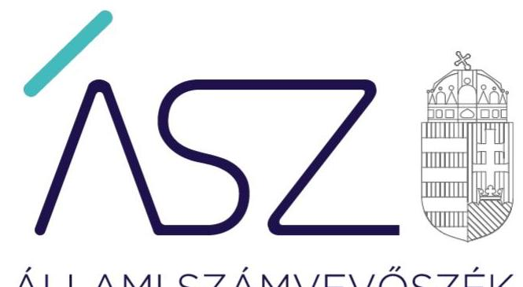
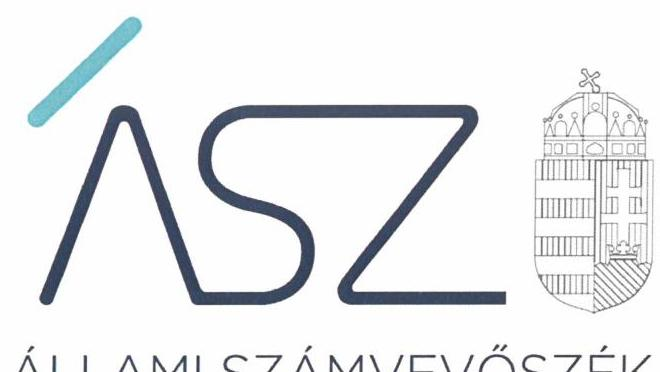
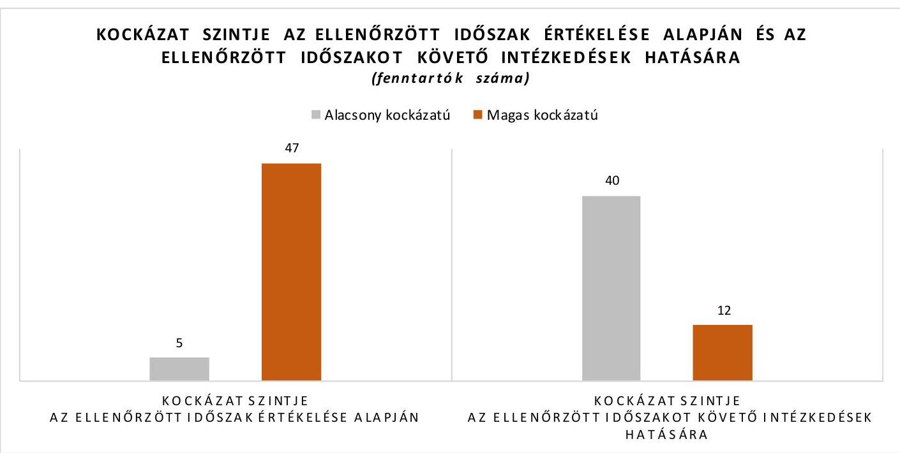
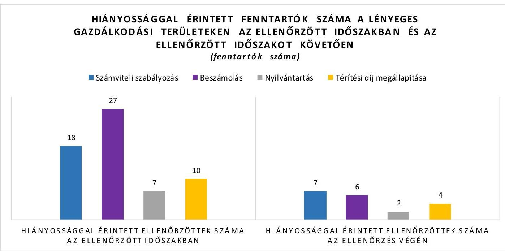

ÁLLAMI SZÁMVEVŐSZÉK

# JELENTÉS 

## Nem állami humánszolgáltatók kockázatalapú ellenőrzése

A köznevelési és szociális humánszolgáltatást nyújtó intézmények, szolgáltatók államháztartáson kívüli fenntartói központi költségvetésből kapott támogatásai felhasználásának ellenőrzése
2022.

22007
www.asz.hu

---

ÁLLAMI SZÁMVEVŐSZÉK

# JELENTÉS 

## Nem állami humánszolgáltatók kockázatalapú ellenőrzése

A köznevelési és szociális humánszolgáltatást nyújtó intézmények, szolgáltatók államháztartáson kívüli fenntartói központi költségvetésből kapott támogatásai felhasználásának ellenőrzése
2022. 02. 16.

22007
www.asz.hu

---

# AZ ELLENŐRZÉST VEZETTE ÉS A VÉGREHAJTÁSÁÉRT FELELŐS: 

FEKETE-NAGY ANDRÁS ellenőrzésvezető
DR. NAGY IMRE ellenőrzésvezető

A PROGRAM ÖSSZEÁLLÍTÁSÁÉRT FELELŐS:
GÖRGÉNYI GÁBOR programkészítésért felelős vezető

IKTATÓSZÁM: EL-3547-001/2022.
TÉMASZÁM: 2549
ELLENŐRZÉS-AZONOSÍTÓ SZÁM: V0891

---

# TARTALOMJEGYZÉK 

■ ÖSSZEGZÉS ..... 5
■ AZ ELLENŐRZÉS CÉLJA ..... 9
■ AZ ELLENŐRZÉS TERÜLETE ..... 10
■ AZ ELLENŐRZÉS HÁTTERE, INDOKOLTSÁGA ..... 11
■ A JELENTÉS LÉNYEGES KÉRDÉSKÖREI ..... 12
■ ELLENŐRZÉS HATÓKÖRE ÉS MÓDSZEREI ..... 13
■ ÉRTÉKELÉSEK ..... 16
■ MELLÉKLETEK ..... 19
I. sz. melléklet: Ellenőrzéssel érintett fenntartók kockázati besorolás szerint ..... 19
II. sz. melléklet: Értelmező szótár ..... 22
■ RÖVIDÍTÉSEK JEGYZÉKE ..... 23

---

.

---

# ÖSSZEGZÉS 

52 köznevelési és szociális humánszolgáltatást nyújtó intézményfenntartó gazdálkodásának ellenőrzött időszakra vonatkozó értékelése alapján 5 fenntartó gazdálkodása alacsony, 47 fenntartó gazdálkodása magas kockázatot hordozott. Az ellenőrzött időszakot követően az Állami Számvevőszék felhívására tett intézkedések hatására 36 fenntartónál csökkentek, azonban 1 korábban alacsony kockázatú fenntartónál nőttek a gazdálkodási kockázatok. Így az ellenőrzött időszakot követően 40 fenntartó gazdálkodásában alacsony a kockázat, míg 12 fenntartó gazdálkodása magas kockázatot hordoz a közfeladat ellátására, valamint a közfeladatra kapott közpénzek elszámoltathatóságára és átláthatóságára.

## Az ellenőrzés társadalmi indokoltsága

A művelődéshez való jog érvényesítése, a szociális gondoskodást igénylők védelme és a kapcsolódó feladatok ellátása az Alaptörvényben ${ }^{1}$ meghatározott, a társadalom szempontjából fontos tevékenységek. Jogszabályok teszik lehetővé, hogy államháztartáson kívüli szervezetek - így például az alapítványok, gazdasági társaságok, egyesületek - által fenntartott intézmények is végezzenek köznevelési és szociális feladatokat. Mindehhez a központi költségvetés évente jelentős összegű támogatással járul hozzá. Az államháztartáson kívüli, humánszolgáltatást végző intézmények az igényelt közpénzekből társadalmilag hasznos, közösségteremtő, közérdekű tevékenységet végeznek, illetve közfeladatokat látnak el.

Az intézményfenntartók ellenőrzésével az Állami Számvevőszék hozzájárul ahhoz, hogy ezen közpénzeket az államháztartáson kívüli szervezetek is ellenőrizhető, átlátható és elszámoltatható módon használják fel a közfeladatok ellátása során. Az ellenőrzések célja továbbá, hogy a nyilvánosság és az igénybevevők megfelelő tájékoztatást kapjanak az államháztartáson kívüli közfeladatot ellátók működéséről.

Az ÁSZ ellenőrzése arra ad választ, hogy az intézményfenntartók közpénzfelhasználása hordoz-e kockázatot. A közfeladat ellátás szakmai céljainak megvalósításához, valamint a társadalmi közbizalom fenntartásához elengedhetetlen, hogy a fenntartók a támogatásokat szabályszerűen használják fel.

## Összegző értékelés

AZ ELLENŐRZÖTT IDŐSZAKRA, A 2017-2019. ÉVEKRE vonatkozóan az Állami Számvevőszék értékelte 52 nem állami, nem önkormányzati, köznevelési és szociális közfeladatokat ellátó intézményfenntartó gazdálkodásának azon lényeges területeit, amelyek érdemi kockázatot jelenthetnek az ellenőrzött szervezeteknek kifizetett közpénzek felhasználásának átláthatóságára és elszámoltathatóságára. Az ellenőrzött intézmény fenntartóknál ilyen lényeges terület volt egyrészt a gazdálkodás alapvető szabályozási kereteinek megléte, másrészt a közpénzekre, a központi költségvetésből kapott támogatásokra vonatkozó nyilvántartási kötelezettségek teljesítése.

AZ ELLENŐRZÖTT IDŐSZAKOT KÖVETŐEN az Állami Számvevőszék vagyonmegóvási intézkedést kezdeményezett azoknál az intézményfenntartóknál, amelyek nem biztosították a gazdálkodásuk lényeges területeinek ellenőrizhetőségét, illetve azoknál a fenntartóknál, amelyeknél az ellenőrzés során feltárt lényeges szabálytalanságok miatt felmerült a rendeltetésellenes közpénzfelhasználás veszélye. Az Állami Számvevőszék a vagyonmegóvási intézkedéssel lehetőséget biztosított az érintett fenntartóknak, hogy igazolják: 2021-ben a törvényes gazdálkodás és a cél szerinti közpénzfelhasználás alapvető feltételei biztosítottak.

Emellett a közpénzügyek átláthatóságának, rendezettségének mielőbbi előmozdítása érdekében az Állami Számvevőszék figyelemfelhívó levéllel fordult azon ellenőrzött fenntartók vezetői felé, amelyek esetében a rendeltetésellenes közpénzfelhasználás veszélye nem merült fel, ugyanakkor az ellenőrzött időszakra vonatkozóan hiányosságot

---

tárt fel az ellenőrzés. Az Állami Számvevőszék a figyelemfelhívással lehetőséget biztosított arra, hogy a fenntartók vezetői lépéseket tegyenek a feltárt hiányosságok megszüntetésére.

Az ellenőrzési tapasztalatok, valamint a vagyonmegóvási intézkedés elrendelésére és a számvevőszéki figyelemfelhívásokra érkezett válaszok értékelése alapján az ellenőrzött fenntartók alacsony és magas kockázatú kategóriákba sorolhatók be a gazdálkodásra vonatkozó kockázat mértéke alapján.

Az ellenőrzött fenntartók kockázati besorolását az I. számú melléklet, a fenntartók kockázati szint szerinti megoszlását az 1. ábra mutatja be.

### ALACSONY A KOCKÁZAT

ALACSONY A KOCKÁZAT a kapott közpénzek elszámoltathatóságára és átláthatóságára vonatkozóan 40 intézményfenntartónál.

Közülük 4 fenntartó gazdálkodása már az ellenőrzött időszakban alacsony kockázatot hordozott. Ezek a fenntartók az ellenőrzött időszakban, a 2017-2019. években kialakították a gazdálkodáshoz előírt alapvető számviteli szabályozásokat, a közfeladat ellátásához kapott közpénzeket a jogszabályi előírások szerint elkülönítve tartották nyilván, továbbá összeállították a számviteli törvény szerinti beszámolójukat. A jogszabályi rendelkezések és a kialakított belső szabályozások betartását érintő kockázatokat ezeknek a fenntartóknak is kezelnie kell.

A 40 fenntartóból 36 magas kockázatú fenntartó az ellenőrzött időszakot követően intézkedett a feltárt hiányosságok megszüntetésére az Állami Számvevőszék felhívására. Ezeknél a fenntartóknál a szabályszerű gazdálkodás akkor biztosítható, ha a számvevőszéki felhívásra válaszul jelzett intézkedések érvényesülnek a fenntartók gazdálkodásában, továbbá kezelik a gazdálkodáshoz kapcsolódó jogszabályok és a kialakított belső szabályozások betartását érintő kockázatokat.

### MAGAS A KOCKÁZAT

MAGAS A KOCKÁZAT a kapott közpénzek elszámoltathatóságára és átláthatóságára vonatkozóan 12 intézményfenntartónál. Közülük az ellenőrzött időszakban 11 fenntartó gazdálkodása magas kockázatot hordozott. Ezeknél a fenntartóknál az ellenőrzött időszakot követően sem intézkedtek a feltárt hiányosságok megszüntetése érdekében, ezért a gazdálkodást érintő kockázatok fennmaradtak. Egy fenntartó gazdálkodása az ellenőrzött időszakban alacsony kockázatot hordozott, ugyanakkor a feltárt hiányosság megszüntetésére irányuló intézkedés elmaradása növelte a gazdálkodásra vonatkozó kockázatokat. Ezen intézményfenntartók esetében felmerül annak a kockázata, hogy a jövőben a kapott támogatásokat nem szabályszerűen használják fel, nem arra a közfeladatra fordítják, amire kapták, a közpénzeket nem átláthatóan kezelik.

Az ellenőrzött időszakra vonatkozóan feltárt és az ellenőrzött időszakot követően fennmaradt hiányossággal érintett fenntartókat a 2. számú ábra mutatja be.

---

A gazdálkodás átláthatóságának és a közpénzfelhasználás elszámoltathatóságának alapja a számviteli törvény szerinti beszámoló elkészítése. A beszámoló egyaránt szolgálja a közpénzt biztosító állam, a szélesebb értelemben vett társadalom, a helyi lakosság, továbbá kiemelten a köznevelési és szociális szolgáltatást igénybe vevők, valamint a szülők és a hozzátartozók tájékoztatását a fenntartó gazdálkodásáról.

A beszámolóhoz elengedhetetlen azoknak a számviteli szabályozásoknak a megalkotása és alkalmazása, amelyek biztosítják a könyvvezetés megbízhatóságát és a beszámoló készítéséhez szükséges adatok rendelkezésre állását. Ugyancsak kiemelten fontos, hogy a fenntartók megalkossák azokat a szabályokat és kialakítsák azokat a nyilvántartásokat, amelyek a közpénzek és a köznevelési és szociális szolgáltatást igénybe vevők befizetéseinek ellenőrizhető, cél szerinti felhasználásához szükségesek.

Emellett lényeges, hogy a fenntartók a térítési díjak, a tandíjak megállapítására vonatkozó szabályok és a szociális kedvezmények feltételeinek meghatározása területén biztosítsák az egyenlő bánásmódot, vagyis azt, hogy a köznevelési és szociális szolgáltatásokat igénybe vevők azonos feltételek mellett juthassanak a szolgáltatásokhoz.

# Következtetések 

Az ellenőrzés tapasztalatai alapján az ellenőrzött időszakban csak az ellenőrzöttek 10%-a biztosította az átlátható és elszámoltatható közpénzfelhasználás alapvető feltételeit, amely rendszerszintű kockázatot jelez a köznevelési közfeladatok nem állami humánszolgáltató általi ellátása tekintetében. Emellett az alacsony kockázatot hordozó fenntartók aránya a közpénzügyi ellenőrzés harmadik védelmi vonalának szerepét betöltő Állami Számvevőszék ellenőrzésének és az ezen alapuló felhívásának hatására 10%-ról 77%-ra nőtt.

Az ellenőrzési adatok megerősítik, hogy az ellenőrzés rendet teremt, vagyis erősíti a közpénzekkel való gazdálkodás szabályszerűségét. Emellett az ellenőrzési tapasztalatok alapján az első védelmi vonalat jelentő fenntartói kontrollok és a második védelmi vonalat jelentő Magyar Államkincstár ellenőrzése ellenére hiányosságok maradtak fenn a közpénzek felhasználásának átláthatóságában és elszámoltathatóságában, a költségvetési források célszerű elköltésében.

A nem állami humánszolgáltatóknál az első védelmi vonal hatásos eszköze lehetne a kockázatok és szabálytalanságok feltárását és kezelését támogató belső kontrollrendszer, ezen belül is a belső ellenőrzés kialakítása és működtetése. Az államháztartáson kívüli intézményfenntartók ugyanazon feladatokat látják el, mint az államháztartáson belüli szervezetek, ugyanazon jogcímen biztosít költségvetési támogatást a mindenkori költségvetési törvény számukra, esetükben mégis hiányzik a belső kontrollok kialakítására vonatkozó jogszabályi előírás.

---

A közpénzekkel nem elszámoltatható szervezetek magas aránya arra hívja fel a figyelmet, hogy a közpénzek védelme érdekében szükséges a Magyar Államkincstár ellenőrzésének erősítése. Jogos elvárás, hogy az állam ne csak támogatást nyújtson, hanem győződjön meg annak szabályszerű felhasználásáról. A közpénzekkel nem átláthatóan gazdálkodó szervezetekkel szemben szigorú fellépésre van szükség, akár a támogatásra való jogosultságból való kizárással.

---

# AZ ELLENŐRZÉS CÉLJA 

Az ellenőrzés célja annak értékelése volt, hogy a nem állami, nem önkormányzati köznevelési és szociális intézmények fenntartója biztosította-e a szabályszerű, átlátható és elszámoltatható közpénzfelhasználás alapvető feltételeit.

---

# AZ ELLENŐRZÉS TERÜLETE 

## 52 nem állami, nem önkormányzati intézmény fenntartó

Az ellenőrzés 52 kijelölt nem állami, nem önkormányzati köznevelési és szociális humánszolgáltatást nyújtó fenntartónál került lefolytatásra.

A köznevelési feladatok ellátása jellemzően intézményi formában történik. Köznevelési intézményt, ha a tevékenység folytatásának jogát - jogszabályban foglaltak szerint - megszerezte, az Nkt. ${ }^{2}$ szerint más személy vagy szervezet (például civil szervezet, alapítvány, gazdasági társaság) alapíthat és tarthat fenn.

Nem állami szociális és gyermekjóléti, gyermekvédelmi intézményfenntartó lehet a Szoc. tv. ${ }^{3}$ és a Gyvt. ${ }^{4}$ szerint a helyi önkormányzat mellett az egyházi jogi személy, az egyéni vállalkozó és a magyarországi székhelyű jogi személy.
A köznevelési és szociális szolgáltatást biztosító nem állami fenntartó a mindenkori költségvetési törvényben biztosított támogatásra jogosult. Az Áht. ${ }^{5}$, Ávr. ${ }^{6}$, Nkt. vhr. ${ }^{7}$ előírásai szerint a Magyar Államkincstár a megítélt támogatásokat a fenntartó részére folyósítja.

Az ellenőrzéssel érintett fenntartókra vonatkozó információkat az I. számú melléklet mutatja be.

---

# AZ ELLENŐRZÉS HÁTTERE, INDOKOLTSÁGA 

A köznevelési és szociális feladatokat ellátó nem állami intézményfenntartók részére közfeladataik ellátására évente jelentős összegű pénzügyi támogatást biztosítottak a mindenkori költségvetési törvények a bennük megfogalmazott feltételek mellett. A felhasználható állami támogatások Ktv.-ek ${ }^{8}$ szerinti előirányzata 2017-2019. években együtt 929 Mrd Ft volt. A 2013. évben jelentős változások következtek be a normatív finanszírozás rendszerében. Az Országgyűlés elfogadta az Nkt.-t, amely jelentősen átalakította a korábbi finanszírozási rendszert 2013 szeptemberétől. Módosították a Szoc. tv.-t is, amely - többek között - 2012. január 1-jei hatállyal megfogalmazta a finanszírozási rendszerbe történő befogadással összefüggő szabályokat. Mindkét területen új feladatfinanszírozási forma (átlagbéralapú támogatás) jelent meg, amely az államháztartáson kívüli intézményfenntartókra is vonatkozik. A kockázat alapú ellenőrzés a közpénzekkel való gazdálkodás kereteinek biztosítására és a támogatások jogszabályokkal összhangban történő nyilvántartásának ellenőrzésére fókuszál a költségvetési támogatásokat felhasználó államháztartáson kívüli szervezetek körében. Az ellenőrzések indokoltságát az is alátámasztja, hogy az ÁSZ ${ }^{9}$ számos szervezetet még nem ellenőrzött ezen a területen.

Az ÁSZ stratégiájában foglaltak alapján is indokolt az ellenőrzés, amely a társadalom számára jelzi, hogy a közpénz államháztartáson kívüli felhasználása sem maradhat ellenőrizetlenül. Az államháztartáson kívülre nyújtott költségvetési támogatások ellenőrzésével az ÁSZ hozzájárul ahhoz, hogy a közpénzeket a nem állami humán fenntartók átlátható módon használják fel a közfeladatok ellátására kötött
 szerződésekben vállalt kötelezettségek teljesítése érdekében. Az ellenőrzés javaslataival hozzájárulhat az említett rendszerek szabályszerű támogatás felhasználásához, javíthatja a társadalmi-gazdasági döntések megalapozottságát, amely a „jól irányított állam működésének" feltétele.

---

# A JELENTÉS LÉNYEGES KÉRDÉSKÖREI 

1- Az államháztartáson kívüli fenntartók a jogszabályokkal összhangban alakították-e ki a közpénzekkel való gazdálkodás alapvető szabályozási kereteit?
2- Az államháztartáson kívüli fenntartók eleget tettek-e a kapott támogatások cél szerinti felhasználásának ellenőrizhetőségét szolgáló beszámolási és nyilvántartási előírásoknak?

---

# ELLENŐRZÉS HATÓKÖRE ÉS MÓDSZEREI 

## Az ellenőrzés típusa

| Megfelelőségi ellenőrzés.

## Az ellenőrzött időszak

2017. január 1. és 2019. december 31. közötti időszak azon évei, amelyben a nem állami, nem önkormányzati fenntartó köznevelési és szociális közfeladat-ellátásra az államháztartásból támogatást kapott és/vagy használt fel.

## Az ellenőrzés tárgya

Az ellenőrzés a köznevelési és szociális humánszolgáltatási közfeladatokat ellátó államháztartáson kívüli fenntartók gazdálkodása alapvető szabályozási kereteinek meglétére, valamint a humánszolgáltatási közfeladataik ellátásához a központi költségvetésből kapott támogatások és azok humánszolgáltatási közfeladatokra való fenntartó általi felhasználásával kapcsolatosan vezetett nyilvántartások ellenőrzésére terjedt ki.

Az ellenőrzés kiterjedt minden olyan körülményre és adatra, amely az ÁSZ jogszabályban meghatározott feladatainak teljesítéséhez, valamint a program végrehajtása folyamán felmerült újabb összefüggések feltárásához szükséges volt.

## Az ellenőrzött szervezetek

52 köznevelési és szociális humánszolgáltatási közfeladatokat ellátó államháztartáson kívüli fenntartó az I. melléklet szerint.

## Az ellenőrzés jogalapja

Az ellenőrzés jogszabályi alapját az ÁSZ tv. ${ }^{10}$ 1. § (3) bekezdésében, 5. § (3) bekezdésében foglalt előírások adják.

AZ ÁSZ az államháztartásból származó források felhasználásának keretében ellenőrzi az államháztartásból nyújtott támogatás felhasználását többek között - az államháztartáson kívüli humánszolgáltatók fenntartóinál. Amennyiben a kedvezményezett szervezet az államháztartásból támogatásban részesül, gazdálkodási tevékenységének egésze ellenőrizhető.

Az ÁSZ törvényességi szempontból ellenőrzi az egyházi jogi személyek vagy azok nevelési-oktatási, felsőoktatási, egészségügyi, karitatív, szociális,

---

család-, gyermek- és ifjúságvédelmi, kulturális vagy sporttevékenység végzésére létrehozott, a bevett egyház belső szabálya szerint jogi személyiséggel nem rendelkező intézménye részére az államháztartásból nem hitéleti célra nyújtott támogatás felhasználását.

# Az ellenőrzés módszerei 

Az ellenőrzést az ellenőrzött időszakban hatályos jogszabályok, az ellenőrzés szakmai szabályai, a jelen ellenőrzésre irányadó ÁSZ módszertanok, az ellenőrzési programban foglalt értékelési szempontok szerint hajtja végre az ÁSZ. Az ellenőrzést az ÁSZ a program kérdéseire adott válaszok kiértékelésével, valamint a programban ismertetett ellenőrzési kérdések, kritériumok, adatforrások között megjelölt adatforrások, továbbá az adott időszakban hatályos jogszabályok figyelembevételével folytatja le. Az ellenőrzési bizonyítékként felhasználható adatforrások közé tartoznak az ellenőrzési programban felsorolt adatforrások, továbbá minden - az ellenőrzés folyamán - feltárt, az ellenőrzés szempontjából információkat tartalmazó dokumentum.

Az ellenőrzés során azokat a lényeges területeket értékeli az ÁSZ, amelyek érdemi kockázatot jelenthetnek az ellenőrzött szervezet közpénzekkel való gazdálkodására. Ilyen lényeges terület egyrészt a gazdálkodás alapvető szabályozási kereteinek megléte, másrészt a központi költségvetésből kapott támogatásokra vonatkozó nyilvántartási kötelezettségek teljesítése.

Az ÁSZ az ellenőrzés során meghatározott lényeges dokumentumok tartalmi értékelését végzi el, olyan kiválasztott alapvető kritériumok alapján, amelyek bármelyikének az ellenőrzött múltbeli időszakra vonatkozóan megállapított hiánya kockázatot jelent a jövőben az ellenőrzött szervezet részéről a közpénzek fogadására, a közpénzekkel való jövőbeli gazdálkodására. A fentiekre tekintettel az ÁSZ nem a lényeges területek és azokat alátámasztó, ellenőrzött dokumentumok szabályszerűségére tesz megállapítást, hanem az ellenőrzött szervezetre vonatkozó közpénzügyi kockázatokat azonosítja.

Az ellenőrzött szervezetek kockázati besorolását az ÁSZ az alábbi szempontok figyelembevételével végzi el:

A kockázati besorolás az ellenőrzött szervezet esetében magas, amennyiben:
számviteli törvény szerinti beszámolóval az adott évben nem rendelkezett;
számviteli politikával és annak keretében elkészített pénzkezelési szabályzattal együttesen az adott évben nem rendelkezett;
az adott évben nem a jogszabályokkal összhangban alakította ki a közpénzekkel való gazdálkodás alapvető szabályozási kereteit;
a köznevelési és szociális közfeladat ellátásra kapott támogatás felhasználásának adott évre vonatkozó elkülönített nyilvántartását igazoló dokumentummal nem rendelkezett, vagy a nyilvántartás nem a jogszabályi előírásoknak megfelelően történt.

---

Az ellenőrzés ideje alatt az ellenőrzött szervezetekkel történő kapcsolattartás az ÁSZ szervezeti és működési szabályzatának vonatkozó előírásai alapján történik.

A törvényi előírásokat, valamint az ÁSZ által meghirdetett, nyilvános módszertant figyelembe véve az ellenőrzés hatóköre kiegészülhet kockázatjelzések alapján, a kockázatértékelés függvényében további lényeges területek szabályosságának ellenőrzésével az ellenőrzés megkezdésének időpontjáig.

Az ellenőrzött fenntartók vezetői számára figyelemfelhívó levél kerül megküldésre az ellenőrzött időszak utolsó évére vonatkozó szabálytalanságokról, az ÁSZ tv. előírásával összhangban 15 nap áll rendelkezésükre az ebben foglaltak elbírálására, valamint a megfelelő intézkedések meghozatalára.

Az ellenőrzött fenntartók vezetői által a figyelemfelhívó levélre adott válaszok alapján az ÁSZ értékeli az ellenőrzött időszak utolsó évére vonatkozóan feltárt hiányosságok kezelését. Amennyiben az ellenőrzött fenntartók vezetői intézkedéseket fogalmaznak meg a hiányosság megszüntetése érdekében, az ÁSZ a gazdálkodás lényeges területein korábban fennálló kockázatokról megállapítja, hogy azokat csökkentették.

---

# 1. Az államháztartáson kívüli fenntartók a jogszabályokkal összhangban alakították-e ki a közpénzekkel való gazdálkodás alapvető szabályozási kereteit?

## Összegző értékelés

Az ellenőrzéssel érintett 52 fenntartó közül 33 fenntartó a közpénzekkel való gazdálkodás alapvető szabályozási kereteit jogszabályi előírásokkal összhangban kialakította 2019-ben.

A közpénzekkel való gazdálkodás szabályozási kereteinek jogszabályokkal összhangban történő kialakítása alapvető fontosságú a közpénzfelhasználás átláthatósága és elszámoltathatósága érdekében. Ezek a szabályzatok, dokumentumok szükségesek ahhoz, hogy a fenntartók el tudjanak számolni a kapott közpénzekkel való gazdálkodásukkal az Alaptörvényben előírtaknak megfelelően. Az alapvető számviteli szabályzatok hiánya kockázatot jelent a közpénzek szabályszerű, átlátható és elszámoltatható felhasználására.

Egy fenntartó nem biztosította a gazdálkodás alapvető szabályozási kereteinek ellenőrizhetőségét, mivel nem biztosította a székhelyén való elérhetőségét. Az ellenőrzött fenntartóknál a gazdálkodás alapvető szabályozási kereteinek értékelését az 1. táblázat mutatja be.

1. táblázat

|  Ssz. | Értékelés | Érintett fenntartók száma |  |   |
| --- | --- | --- | --- | --- |
|   |  | 2017 év | 2018 év | 2019 év  |
|  1. | JOGSZABÁLYOKKAL ÖSSZHANGBAN ALAKÍTOTTA KI a közpénzekkel való gazdálkodás alapvető szabályozási kereteit | 30 | 32 | 33  |
|  2. | NEM ALAKÍTOTTA KI a közpénzekkel való gazdálkodás alapvető szabályozási kereteit, mert nem rendelkezett sem számviteli politikával, sem pedig az annak keretében elkészítendő pénzkezelési szabályzattal | 9 | 9 | 8  |
|  3. | HIÁNYOSAN ALAKÍTOTTA KI a közpénzekkel való gazdálkodás alapvető szabályozási kereteit, mert a 2. sorban foglaltakon kívüli egyéb hiányosságot tárt fel az ellenőrzés a számviteli politikával, a keretében elkészítendő szabályzatokkal és/vagy a számlarenddel kapcsolatban | 12 | 10 | 10  |

Forrás: ÁSZ szerkesztés

---

# 2. Az államháztartáson kívüli fenntartók eleget tettek-e a kapott támogatások cél szerinti felhasználásának ellenőrizhetőségét szolgáló beszámolási és nyilvántartási előírásoknak? 

Összegző értékelés Az ellenőrzéssel érintett 52 fenntartó közül 37 fenntartó esetében a közpénzek felhasználásához kapcsolódó beszámolási és nyilvántartási feladatok ellátása a 2019. év értékelése alapján kockázatot hordoz.

TÖRVÉNY SZERINTI BESZÁMOLÓVAL a 2017. évben 26, a 2018. évben 27, a 2019. évben pedig 27 fenntartó nem rendelkezett. A törvényi előírások szerinti beszámoló hiánya kockázatot jelent a gazdálkodás átláthatóságára és a közpénzek felhasználásának elszámoltathatóságára. Egy fenntartó nem biztosította a beszámolásra és nyilvántartásra vonatkozó előírások betartásának ellenőrizhetőségét, mivel nem biztosította a székhelyén való elérhetőségét.

Az ellenőrzött fenntartóknál a beszámoló készítéséhez kapcsolódó törvényi előírások értékelését a 2. táblázat mutatja be.
2. táblázat

| Ssz. | Értékelés | Érintett fenntartók száma |  |  |
| :--: | :--: | :--: | :--: | :--: |
|  |  | 2017. év | 2018. év | 2019. év |
| 1. | a Fenntartó a törvényi előírás ellenére nem készített beszámolót | 21 | 22 | 23 |
| 2. | a Fenntartó beszámolója törvényi előírás ellenére nem tartalmazott kiegészítő mellékletet | 5 | 5 | 4 |

A KÖZNEVELÉSI FELADATRA KAPOTT TÁMOGATÁSOK CÉL SZERINTI FELHASZNÁLÁSÁNAK ELLENŐRIZHETŐSÉGÉT a törvényi előírások szerinti beszámolóval rendelkező fenntartók közül 2017. évben 8, 2018. évben 7 és a 2019. évben 6 fenntartó nem biztosította. Jogszabályi előírás szerinti nyilvántartás hiányában nem igazolt, hogy a Fenntartó a kapott támogatásokat az ellátott köznevelési közfeladatra fordította.

Az ellenőrzött fenntartóknál a kapott támogatások cél szerinti felhasználásának ellenőrizhetőségéhez kapcsolódó törvényi előírások értékelését a köznevelési feladatok esetében a 3. táblázat mutatja be. Egyes szervezeteknél több hiányosságot is feltárt az ellenőrzés.
3. táblázat

| Ssz. | Értékelés | Érintett fenntartók száma |  |  |
| :--: | :--: | :--: | :--: | :--: |
|  |  | 2017. év | 2018. év | 2019. év |
| 1. | nem volt biztosított az egyezőség a beszámolóban kimutatott támogatások adatai, továbbá az év végi zárás előtti főkönyvi kivonat adatai között | 2 | 2 | 1 |
| 2. | a fenntartó a kapott költségvetési támogatás felhasználását nem alapfeladatonkénti és jogcímenkénti bontásban elkülönítetten tartotta nyilván, úgy, hogy abból megállapítható lenne, hogy a támogatások milyen célra kerültek felhasználásra | 7 | 6 | 5 |

---

# A SZOCIÁLIS FELADATRA KAPOTT TÁMOGATÁSOK CÉL SZERINTI FELHASZNÁLÁSÁNAK ELLENŐRIZHETŐSÉGÉT a törvényi előírások szerinti beszámolóval rendelkező fenntartók közül 2017. évben 11, 2018. évben 10 és a 2019. évben 7 fenntartó nem biztosította. Jogszabályi előírás szerinti nyilvántartás hiányában nem igazolt, hogy a Fenntartó kapott támogatásokat az ellátott szociális közfeladatra fordította.

Az ellenőrzött fenntartóknál a kapott támogatások cél szerinti felhasználásának ellenőrizhetőségéhez kapcsolódó törvényi előírások értékelését a szociális feladatok esetében a 4. táblázat mutatja be. Egyes szervezeteknél több hiányosságot is feltárt az ellenőrzés.
4. táblázat

|  Noz. | Értékelés | Érintett fenntartók száma |  |  |  |   |
| --- | --- | --- | --- | --- | --- | --- |
|   |  | 2017 év | 2018 év | 2019 év |  |   |
|  1. | nem volt biztosított az egyezőség a beszámolóban kimutatott támogatások adatai, továbbá az év végi zárás előtti főkönyvi kivonat adatai között | 2 | 1 | 1 |  |   |
|  2. | a fenntartó a kapott költségvetési támogatás felhasználását nem feladatonkénti bontásban, elkülönítetten tartotta nyilván | 11 | 10 | 7 |  |   |
|  3. | ha az intézménye/i önállóan gazdálkodó volt/ak, a központi költségvetési támogatás teljes összegét nem adta át | 1 | 1 | 1 |  |   |

A köznevelési humánszolgáltatás tekintetében a kapott támogatások cél szerinti ellenőrizhetőségét biztosító fenntartók közül 2017. évben 12, 2018. évben 11 és a 2019. évben 12 fenntartó a kérhető térítési díj és tandíj megállapítására vonatkozó szabályokat és a szociális alapon adható kedvezmények feltételeit nem határozta meg.

A szociális humánszolgáltatás tekintetében a kapott támogatások cél szerinti ellenőrizhetőségét biztosító fenntartók közül 2017. évben 8, 2018. évben 9 és a 2019. évben 10
 fenntartó nem határozta meg a térítési díjat.

Az intézményi térítési díjakhoz és tandíjakhoz kapcsolódó jogszabályi kötelezettségek elmulasztása esetén nem biztosított, hogy a szolgáltatásokat igénybe vevők azonos feltételek mellett jutnak a szolgáltatásokhoz.

---

# MELLÉKLETEK 

## I. SZ. MELLÉKLET: ELLENŐRZÉSSEL ÉRINTETT FENNTARTÓK KOCKÁZATI BESOROLÁS SZERINT

ALACSONY KOCKÁZATÚ az a fenntartó, amelynek gazdálkodása az ellenőrzött időszak utolsó évében alacsony kockázatot hordozott, vagy magas kockázatot hordozott, és az Állami Számvevőszék felhívására intézkedett a feltárt hiányosságok megszüntetéséről és a kockázatok csökkentéséről.

- Ezen belül „Továbbra is alacsony kockázatú" értékelést kapott az a fenntartó, amelynek gazdálkodása tekintetében nem tárt fel hiányosságot az ellenőrzés.
- Az alacsony kockázatú fenntartók közül „Alacsony kockázatú, intézkedett" értékelést kapott az a fenntartó, amelynél az ellenőrzött időszak utolsó évében magas volt a kockázat, és az Állami Számvevőszék felhívására intézkedett a feltárt hiányosságok megszüntetéséről és a kockázatok csökkentéséről.

MAGAS KOCKÁZATÚ az a fenntartó, amelynek gazdálkodása az ellenőrzött időszak utolsó évében magas kockázatot hordozott, és az Állami Számvevőszék felhívására nem intézkedett a hiányosságok megszüntetésére. Egy fenntartó gazdálkodása az ellenőrzött időszakban alacsony kockázatot hordozott, ugyanakkor a feltárt hiányosság megszüntetésére irányuló intézkedés elmaradása a hiányosság jellege és súlya miatt növelte a gazdálkodásra vonatkozó kockázatokat.

| ALACSONY KOCKÁZATÚ FENNTARTÓK |  |  |  |  |  |  |  |
| :--: | :--: | :--: | :--: | :--: | :--: | :--: | :--: |
| Ssz. | Fenntartó | Székhely | 2017. évi   kockázati   besorolás | 2018. évi   kockázati   besorolás | 2019. évi   kockázati   besorolás | Kockázati   besorolás   az ÁSZ fel-   hívását   követően | Ebből a változás irá-   nya alapján: |
| 1. | Almafa Gyerekház Nonprofit Korlátolt   Felelősségű Társaság | Pomáz | magas | magas | magas | Alacsony   kockázatú | Alacsony kockázatú,   intézkedett |
| 2. | Ampók Alapítvány a Kisgyermekeket   Nevelő Családok Lelki Egészségéért | Budapest | magas | magas | magas | Alacsony   kockázatú | Alacsony kockázatú,   intézkedett |
| 3. | Angyalkert Magánóvoda Nonprofit   Korlátolt Felelősségű Társaság | Kecskemét | magas | magas | magas | Alacsony   kockázatú | Alacsony kockázatú,   intézkedett |
| 4. | Autizmus Alapítvány | Budapest | magas | magas | magas | Alacsony   kockázatú | Alacsony kockázatú,   intézkedett |
| 5. | "Az Én Ovim" Alapítvány | Szekszárd | magas | magas | magas | Alacsony   kockázatú | Alacsony kockázatú,   intézkedett |
| 6. | Bandi Cica Játékpedagógiai Alapítvány | Zalaegerszeg | magas | magas | magas | Alacsony   kockázatú | Alacsony kockázatú,   intézkedett |
| 7. | Családi Napközi a Boldogabb Gyermek-   korért Alapítvány | Budapest | magas | magas | magas | Alacsony   kockázatú | Alacsony kockázatú,   intézkedett |
| 8. | CSALÁDI NAPKÖZI Közhasznú Nonpro-   fit Korlátolt Felelősségű Társaság | Tanakajd | magas | magas | magas | Alacsony   kockázatú | Alacsony kockázatú,   intézkedett |
| 9. | Csodabogár Közoktatási Alapítvány | Budakalász | magas | magas | magas | Alacsony   kockázatú | Alacsony kockázatú,   intézkedett |
| 10. | "CSODAVILÁG" Szolgáltató Közhasznú   Nonprofit Korlátolt Felelősségű Társa-   ság | Budapest | magas | magas | magas | Alacsony   kockázatú | Alacsony kockázatú,   intézkedett |
| 11. | DELFINO Oktatási Nonprofit Korlátolt   Felelősségű Társaság | Budapest | magas | magas | magas | Alacsony   kockázatú | Alacsony kockázatú,   intézkedett |

---

| 12. | Dzsembori Közhasznú Nonprofit Szolgáltató Korlátolt Felelősségű Társaság | Miskolc | magas | magas | magas | Alacsony kockázatú | Alacsony kockázatú, intézkedett |
| :--: | :--: | :--: | :--: | :--: | :--: | :--: | :--: |
| 13. | Fabussland Nonprofit Korlátolt Felelősségű Társaság | Budapest | magas | magas | magas | Alacsony kockázatú | Alacsony kockázatú, intézkedett |
| 14. | Feketerigó Alapítvány | Tárnok | magas | magas | magas | Alacsony kockázatú | Alacsony kockázatú, intézkedett |
| 15. | Fitskool Oktatási Egyesület | Budaörs | magas | magas | magas | Alacsony kockázatú | Alacsony kockázatú, intézkedett |
| 16. | Hetedhét Ország Alapítvány | Budapest | magas | magas | magas | Alacsony kockázatú | Alacsony kockázatú, intézkedett |
| 17. | HUNGARO-DALTON Pedagógiai Innovációs Egyesület | Győr | magas | magas | magas | Alacsony kockázatú | Alacsony kockázatú, intézkedett |
| 18. | JELEN A JÓVŐNK-ÉRT Egészségmegőrző, Szociális és Oktatási Nonprofit Korlátolt Felelősségű Társaság | Pomáz | alacsony | magas | alacsony | Alacsony kockázatú | Továbbra is alacsony kockázatú |
| 19. | Kalocsai Krisztina Alapítvány | Szeged | magas | magas | magas | Alacsony kockázatú | Alacsony kockázatú, intézkedett |
| 20. | "KARAKTER" Alapítvány | Tiszaújváros | magas | magas | magas | Alacsony kockázatú | Alacsony kockázatú, intézkedett |
| 21. | Kecskeméti Micimackó Óvoda Alapítvány | Kecskemét-Hetényegyháza | magas | magas | magas | Alacsony kockázatú | Alacsony kockázatú, intézkedett |
| 22. | KICSI KINCSEM Közhasznú Nonprofit Korlátolt Felelősségű Társaság | Székesfehérvár | magas | magas | magas | Alacsony kockázatú | Alacsony kockázatú, intézkedett |
| 23. | Kinderovi Alapítvány | Kecskemét | magas | magas | magas | Alacsony kockázatú | Alacsony kockázatú, intézkedett |
| 24. | Kis Mazsolák Egyesület | Nagykovácsi | magas | magas | magas | Alacsony kockázatú | Alacsony kockázatú, intézkedett |
| 25. | Kis Pingvin Nonprofit Közhasznú Korlátolt Felelősségű Társaság | Mezőkövesd | magas | magas | magas | Alacsony kockázatú | Alacsony kockázatú, intézkedett |
| 26. | LURKÓ CSALÁDI NAPKÓZI Képességfejlesztő Nonprofit Korlátolt Felelősségű Társaság | Orosháza | magas | magas | magas | Alacsony kockázatú | Alacsony kockázatú, intézkedett |
| 27. | Máriakéméndi Gyertyaláng Gyermekfalu Alapítvány | Máriakéménd | alacsony | alacsony | alacsony | Alacsony kockázatú | Továbbra is alacsony kockázatú |
| 28. | MÉZESKALÁCS GYERMEKHÁZ Nonprofit Közhasznú Korlátolt Felelősségű Társaság | Budapest | magas | magas | magas | Alacsony kockázatú | Alacsony kockázatú, intézkedett |
| 29. | Micimackó Óvodáért Alapítvány | Dunakeszi | magas | magas | magas | Alacsony kockázatú | Alacsony kockázatú, intézkedett |
| 30. | Montesz Alapítvány | Budapest | magas | magas | magas | Alacsony kockázatú | Alacsony kockázatú, intézkedett |
| 31. | Napfény Gyermekház Nonprofit Korlátolt Felelősségű Társaság | Budapest | magas | magas | magas | Alacsony kockázatú | Alacsony kockázatú, intézkedett |
| 32. | "Orgonácska" Gyermek Képesség-fejlesztő Alapítvány | Pécs | magas | alacsony | alacsony | Alacsony kockázatú | Továbbra is alacsony kockázatú |
| 33. | PAJKOS FÉNYSUGÁR Alapítvány | Borsodgeszt | magas | magas | magas | Alacsony kockázatú | Alacsony kockázatú, intézkedett |

---

| 34. | Pán Péter Közhasznú Alapítvány | Budapest | magas | magas | magas | Alacsony   kockázatú | Alacsony kockázatú,   intézkedett |
| :-- | :-- | :-- | :-- | :-- | :-- | :-- | :-- |
| 35. | Picurka Csana Nonprofit Korlátolt Felelősségű Társaság | Budapest | magas | magas | magas | Alacsony   kockázatú | Alacsony kockázatú,   intézkedett |
| 36. | Pro Rekreatione Közhasznú Nonprofit   Korlátolt Felelősségű Társaság | Gárdony | alacsony | alacsony | alacsony | Alacsony   kockázatú | Továbbra is ala-   csony kockázatú |
| 37. | Szép Gyermekkor Alapítvány | Budapest | magas | magas | magas | Alacsony   kockázatú | Alacsony kockázatú,   intézkedett |
| 38. | Tulpános Óvodai Oktató Nonprofit   Korlátolt Felelősségű Társaság | Gyomaendrőd | magas | magas | magas | Alacsony   kockázatú | Alacsony kockázatú,   intézkedett |
| 39. | Világfa Waldorf Közhasznú Alapítvány | Bálványos | magas | magas | magas | Alacsony   kockázatú | Alacsony kockázatú,   intézkedett |
| 40. | Zsebibaba Német Nemzetiségi Óvoda   Alapítvány | Budapest | magas | magas | magas | Alacsony   kockázatú | Alacsony kockázatú,   intézkedett |

MAGAS KOCKÁZATÚ FENNTARTÓK

|  |  |  |  |  |  |  |
| :-- | :-- | :-- | :-- | :-- | :-- | :-- |
| Ssz. | Fenntartó | Székhely | 2017. évi   kockázati   besorolás | 2018. évi   kockázati   besorolás | 2019. évi   kockázati   besorolás | Kockázati beso-   rolás az ÁSZ fel-   hívását köve-   rülön |
| 1. | Balambér Világa Alapítvány a gyermekek egészséges   fejlődéséért | Budapest | magas | magas | magas | Magas kocká-   zatú |
| 2. | Eszterház Néphagyomány Éltető Alapítvány | Pomáz | magas | magas | magas | Magas kocká-   zatú |
| 3. | FARBE Gyermekek és Fiatalok Fejlődését Segítő Köz-   hasznú Alapítvány | Veszprém | magas | magas | magas | Magas kocká-   zatú |
| 4. | Gyermekünk a jövő Nonprofit Korlátolt Felelősségű   Társaság "kényszertörlés alatt" | Budapest | magas | magas | magas | Magas kocká-   zatú |
| 5. | Két Kis Mazsola Szolgáltató Nonprofit Korlátolt Fele-   lősségű Társaság | Nagykovácsi | magas | magas | közfelada-   tot nem lá-   tott el | Magas kocká-   zatú |
| 6. | Kicsi Csillag Alapítvány | Veresegyház | magas | magas | magas | Magas kocká-   zatú |
| 7. | Kiscsikó Óvodai Alapítvány | Tököl | magas | magas | magas | Magas kocká-   zatú |
| 8. | Maria Montessori módszerrel az óvodás gyermeke-   kért Alapítvány | Budapest | magas | magas | magas | Magas kocká-   zatú |
| 9. | Népmese-ház Nonprofit Korlátolt Felelősségű Társa-   ság | Mosonma-   gyaróvár | magas | magas | magas | Magas kocká-   zatú |
| 10. | Pitypang Virágai Oktatási Alapítvány | Jakabszállás | magas | magas | magas | Magas kocká-   zatú |
| 11. | Tiszta Bolygó Nonprofit Kft. | Budaörs | magas | magas | magas | Magas kocká-   zatú |
| 12. | "Vidék Hangulata" Nonprofit Korlátolt Felelősségű
   Társaság | Orosháza | magas | magas | alacsony | Magas kockázatú |

---

# II. SZ. MELLÉKLET: ÉRTELMEZŐ SZÓTÁR 

civil szervezet
humánszolgáltatás
költségvetési támogatás
nem állami, nem önkormányzati (államháztartáson kívüli) intézményfenntartó
szociális szolgáltató
szociális intézmény

A Civil tv. ${ }^{11}$ 2. § 6. pontja szerint civil szervezet a civil társaság, a Magyarországon nyilvántartásba vett egyesület (a párt, a szakszervezet és a kölcsönös biztosító egyesület kivételével), a közalapítvány és a pártalapítvány kivételével az alapítvány.
Külön törvényben meghatározott szociális, gyermekjóléti, gyermekvédelmi, közoktatási, felsőoktatási, kulturális közfeladatok (2014. évi Kvtv. 34. § (1), (4) bekezdés, 1. számú melléklet XX/20/2. alcím, 19. alcím, 2015. évi Kvtv. 43. § (1), (4) bekezdés, 1. számú melléklet XX/20/2/3. jogcím csoport, 19. alcím, 2016. évi Kvtv. 41. § (1), (4) bekezdés, 1. számú melléklet XX/20/2/3. jogcím csoport, 19. alcím).
a társadalombiztosítás pénzügyi alapjai kivételével az államháztartás központi alrendszeréből ellenérték nélkül, pénzben nyújtott támogatások (Áht. 1. § 14. pont) A költségvetési törvényekben (2013. évi CCXXX. törvény 33-34. §, 2014. évi C. törvény 42-43. §, 2015. évi C. törvény 40-41. §) megállapított támogatás. Például a 2015. évi C. törvény 40-41. § szerint többek között: Az Országgyűlés a szociális, gyermekjóléti, gyermekvédelmi közfeladatot ellátó intézményt, szolgáltatást fenntartó egyházi jogi személy, civil szervezet, közalapítvány, országos nemzetiségi önkormányzat, települési vagy területi nemzetiségi önkormányzat, gazdasági társaság, és a humánszolgáltatást alaptevékenységként végző, az Szja tv. ${ }^{12}$ hatálya alá tartozó egyéni vállalkozó (a továbbiakban együtt: nem állami szociális fenntartó) részére támogatást állapít meg a következők szerint: a támogatás a nem állami szociális fenntartót a települési önkormányzatok 2. melléklet III. pont 3. alpont c)-k) pontjában és III. pont 5. alpont a) pontjában meghatározott támogatásaival azonos jogcímeken, összegben és feltételek mellett illeti meg.
A szociális, gyermekjóléti és gyermekvédelmi közfeladatokat/humánszolgáltatásokat ellátó intézményt fenntartó egyházi jogi személy, társadalmi szervezet, alapítvány, közalapítvány, civil szervezet, országos nemzetiségi önkormányzat, nonprofit gazdasági társaság, gazdasági társaság és a humánszolgáltatást alaptevékenységként végző, Szja tv. hatálya alá tartozó egyéni vállalkozó. (2013. évi Kvtv. 35. § (1), (3) bekezdés, 2014. évi Kvtv. 33. §, 34. § (1), (4) bekezdés, 2015. évi Kvtv. 42. §, 43. § (1), (4) bekezdés, 2016. évi Kvtv. 40. §, 41. § (1), (4) bekezdés, 2017. évi Kvtv. 41. § (1), (4))
az a személy vagy szervezet, amely kizárólag a Szoc.tv. 60-65/E. §-ban meghatározott szociális alapszolgáltatásokat nyújtja. (Szoc. tv. 4. § (1) g) pont) (hatályos: 2005. január 1-től)
a Szoc. tv.-ben meghatározott nappali, illetve bentlakásos ellátást vagy támogatott lakhatást nyújtó szervezet; (Szoc. tv. 4. § (1) h) pont) (hatályos: 2013. január 2-től)

---

# RÖVIDÍTÉSEKJEGYZÉKE 

${ }^{1}$ Alaptörvény
${ }^{2}$ Nkt.
${ }^{3}$ Szoc. tv.
${ }^{4}$ Gyvt.
${ }^{5}$ Áht.
${ }^{6}$ Ávr.
${ }^{7}$ Nkt. vhr.
${ }^{8}$ Kvtv.-ek
${ }^{9}$ ÁSZ
${ }^{10}$ ÁSZ tv.
${ }^{11}$ Civil tv.
${ }^{12}$ Szja tv.

Magyarország Alaptörvénye
2011. évi CXC. törvény a nemzeti köznevelésről
1993. évi III. törvény a szociális igazgatásról és szociális ellátásokról
1997. évi XXXI. törvény a gyermekek védelméről és a gyámügyi igazgatásról
2011. évi CXCV. törvény az államháztartásról

368/2011. (XII. 31.) Korm. rendelet az államháztartásról szóló törvény végrehajtásáról
229/2012. (VIII. 28.) Korm. rendelet a nemzeti köznevelésről szóló törvény végrehajtásáról
2016. évi XC. törvény Magyarország 2017. évi központi költségvetéséről
2017. évi C. törvény Magyarország 2018. évi központi költségvetéséről
2018. évi L. törvény Magyarország 2019. évi központi költségvetéséről

Állami Számvevőszék
2011. évi LXVI. törvény az Állami Számvevőszékről
2011. évi CLXXV. törvény az egyesülési jogról, a közhasznú jogállásról, valamint a civil szervezetek működéséről és támogatásáról
1995. évi CXVII. törvény a személyi jövedelemadóról

---

# ÁSZ 

ÁLLAMI SZÁMVEVŐSZÉK
1052 Budapest, Apáczai Cs. J. u. 10. | 1364 Budapest 4. Pf. 54
TEL: +36 14849100
email: szamvevoszek@asz.hu
web: www.asz.hu | www.aszhirportal.hu
