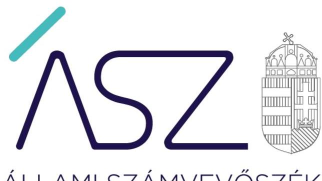
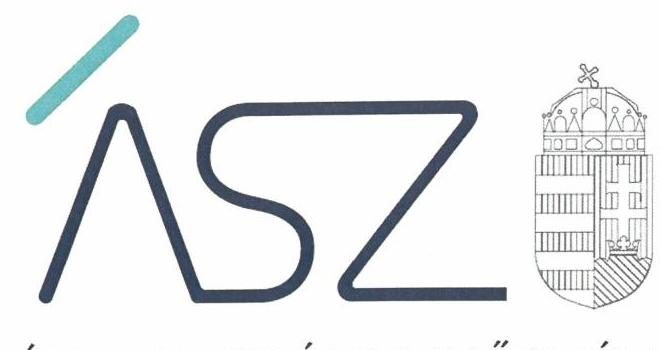
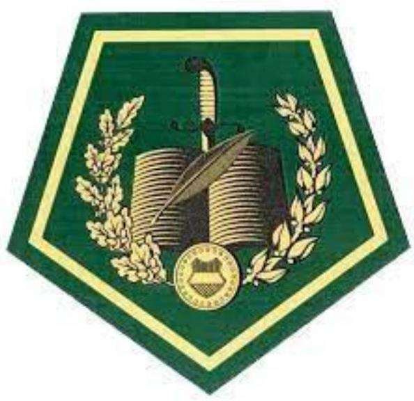

#  

## JELENTÉS

## Katonai beszerzések ellenőrzése

A Védelemgazdasági Hivatal katonai beszerzésekkel kapcsolatos ellenőrzési tevékenységének ellenőrzése
2022.

22008
www.asz.hu

---

ÁLLAMI SZÁMVEVŐSZÉK

# JELENTÉS 

## Katonai beszerzések ellenőrzése

A Védelemgazdasági Hivatal katonai beszerzésekkel kapcsolatos ellenőrzési tevékenységének ellenőrzése
2022. 03. hó 25. nap

22008
www.asz.hu

---

# AZ ELLENŐRZÉST VEZETTE ÉS A VÉGREHAJTÁSÁÉRT FELELŐS: 

MAKKAI MÁRIA ellenőrzésvezető
DR. NAGY IMRE ellenőrzésvezető
KLINGA LÁSZLÓ ellenőrzésvezető

## A PROGRAM ÖSSZEÁLLÍTÁSÁÉRT FELELŐS:

KUSZINGER ANDREA programkészítésért felelős vezető

IKTATÓSZÁM: EL-3602-001/2022.
TÉMASZÁM: 2601
ELLENŐRZÉS-AZONOSÍTÓ SZÁM: V0945

---

# TARTALOMJEGYZÉK 

■ ÖSSZEGZÉS ..... 5
■ AZ ELLENŐRZÉS TERÜLETE ..... 7
■ AZ ELLENŐRZÉS HATÓKÖRE ÉS MÓDSZEREI ..... 8
■ MELLÉKLET ..... 11
I. sz. melléklet: Fogalomtár ..... 11
■ RÖVIDÍTÉSEK JEGYZÉKE ..... 13

---

.

---

# ÖSSZEGZÉS 

A Honvédelmi Minisztérium Védelemgazdasági Hivatalnál kialakított és müködtetett kontrollok rendszere biztositotta az ellenőrzési feladatainak ellátásához szükséges alapvető feltételeket.

## Értékelés

Az ellenőrzés a 2020. év tekintetében a Honvédelmi Minisztérium Védelemgazdasági Hivatal belső kontrollrendszerének azon lényeges elemeire terjedt ki, amelyeknek kialakítása és működtetése kulcsfontosságú az ellenőrzési feladatainak szabályszerű ellátásához.

A kontrollkörnyezetét a Honvédelmi Minisztérium Védelemgazdasági Hivatal szabályszerűen kialakította. Az integrált kockázatkezelési rendszer kialakítása és működtetése szabályszerűen történt. A monitoring rendszer kialakítása és működtetése szabályszerű volt. A belső ellenőrzés kialakítása és működtetése szabályszerűen történt. Jogszabályi előírások szerinti nyilatkozatban értékelte a szervezet belső kontrollrendszerének minőségét a Honvédelmi Minisztérium Védelemgazdasági Hivatal főigazgatója.

Mindezek alapján a Honvédelmi Minisztérium Védelemgazdasági Hivatalnál a belső kontrollrendszer ellenőrzési tevékenység szempontjából lényeges elemeinek kialakítása és működtetése a jogszabályi előírásokkal összhangban történt. A Honvédelmi Minisztérium Védelemgazdasági Hivatal ellenőrzési tevékenységéhez szükséges alapvető feltételek a belső kontrollrendszer tekintetében szabályszerűen rendelkezésre álltak.

## Az ellenőrzés jelentősége, aktualitása, társadalmi szerepe, szempontjai

A NATO tagsággal járó kötelezettségeknek eleget téve Magyarország jelentős mértékű közpénzt fordít a védelmi kiadásokra, a honvédelemhez kapcsolódó eszközpark megújítására, az infrastruktúra növelésére.

Ezzel összhangban került elfogadásra a Zrínyi 2026 Honvédelmi és Haderőfejlesztési Program. A program elsődleges célja korszerű eszközökkel felszerelni a hadsereget, valamint a szükséges technikai eszközök megújítása, beszerzése. A 2026-ig terjedő időszakban a Magyar Honvédség fejlesztésére fordítható összeg a program szerint meghaladja majd a 3500 milliárd forintot.

Jelenleg a program a végrehajtási idejének a felénél tart. A honvédelmi szervezetek beszerzési igényeit, beszerzési tilalom alóli mentesítési kötelezettségének teljesítését a Honvédelmi Minisztérium Védelemgazdasági Hivatal ellenőrzi. Az „ellenőrök ellenőreként" az Állami Számvevőszék munkájának eredményei hatványozottan jelentkeznek, hiszen megállapításai az első védelmi vonalat jelentő Védelemgazdasági Hivatal ellenőrzési tevékenységében hasznosulnak.

Ezért volt indokolt az Állami Számvevőszéknek értékelni, hogy a katonai beszerzések felett az első védelmi funkciót ellátó szervezet hogyan készült fel erre a jelentős közpénzfelhasználást érintő ellenőrzési feladatra, belső kontrollrendszerének egyes pillérei biztosítják-e ellenőrzési feladatainak ellátásához a feltételeket.

---

# HONVÉDELMI MINISZTÉRIUM VÉDELEMGAZDASÁGI HIVATAL 

## KATONÁS

## A REND

Értékelte az Állami Számvevőszék a Honvédelmi Minisztérium Védelemgazdasági Hivatal belső kontroltrendszerének kulcselemeit. A Hivatal ellenőrzi a honvédelmi szervezetek beszerzési igényeit, beszerzési tilalom alóli mentesítési kötelezettségének teljesítését a több mint 3500 milliárd Ft-ra tervezett Zrínyi 2026 Honvédelmi és Haderőfejlesztési Program beszerzéseinél.

## KONTROLLKÖRNYEZET

A szabályszertjen kialakított kontrolikörnyezet biztosította az ellenőrzési feladatok ellátásának szabályozási, szervezeti, felelősségi és integritási kereteit.

## MONITORING

RENDSZER
A szabályszertően kialakított és müködtetett monitoring rendszer biztosította az ellenőrzési feladattelátáshoz kapcsolódó folyamatok és szervezeti célok megvalósításának nyomonkövetését.

## KOCKÁZATKEZELÉSI RENDSZER

A szabályszertien kialakított és müködtetett kockázatkezelési rendszer biztosította az ellenőrzési feladattelátáshoz kapcsolódó kockázatok azonosítását és kezelését.

## BELEÓ

## ELLÉNÖRZÉS

A szabályszertien kialakított és müködtetett belső ellenőrzési biztosította az ellenőrzési tevékenységben a hibák feltárását, kezelését, a hibák lehetőségének minimális szintre történő csökkentését.

---

# **AZ ELLENŐRZÉS TERÜLETE**

## **Honvédelmi Minisztérium Védelemgazdasági Hivatal**

A Honvédelmi Minisztérium Védelemgazdasági Hivatal a honvédelmi miniszter közvetlen alárendeltségébe tartozó, a Honvédelmi Minisztérium védelemgazdaságért felelős helyettes államtitkár irányítása mellett, önállóan működő és gazdálkodó költségvetési szerv.

A Honvédelmi Minisztérium Védelemgazdasági Hivatal alapításának dátuma 2007. január 1., megalakulásának időpontja jogfolytonosság alapján 1996. november 15. jelenlegi elnevezésével 2013. október 31-től működik.

A Honvédelmi Minisztérium Védelemgazdasági Hivatal államháztartási szakfeladatrend szerinti besorolása védelmi képesség fenntartása; ár- és belvízvédelemmel összefüggő tevékenységek; minősített időszaki tevékenységek (kivéve ár- és belvízvédelem); nemzetközi katonai és rendészeti szerepvállalás béketámogató és válságkezelő műveletekben; védelmi képesség fejlesztése.

A honvédelmi szervezetek beszerzéseinek eljárási rendjéről szóló 48/2018. (XII. 21.) HM utasítás alapján a Honvédelmi Minisztérium Védelemgazdasági Hivatal – az utasításban meghatározott kivételekkel – kizárólagos jogosultsággal a honvédelmi miniszter nevében eljárva ajánlatkérőként végezte a Zrínyi 2026 Honvédelmi és Haderőfejlesztési Program fejlesztési feladatokhoz kapcsolódó beszerzések lefolytatását, továbbá ellenőrizte a honvédelmi szervezetek beszerzési igényeit, beszerzési tilalom alóli mentesítési kötelezettségének teljesítését.

A Honvédelmi Minisztérium Védelemgazdasági Hivatalt a főigazgató vezeti, akit a honvédelmi miniszter nevez ki, illetve ment fel. A jelenlegi főigazgatót a honvédelmi miniszter 2020. március 1-i hatállyal nevezte ki.

---

# AZ ELLENŐRZÉS HATÓKÖRE ÉS MÓDSZEREI 

## Az ellenőrzés típusa

Szabályszerúségi ellenőrzés.

## Az ellenőrzött időszak

Az ellenőrzött időszak a 2020. év.

## Az ellenőrzés tárgya

Az ellenőrzött szervezet belső kontrollrendszerének kialakítása és egyes elemeinek múködtetése.

## Az ellenőrzött szervezet

Honvédelmi Minisztérium Védelemgazdasági Hivatal

## Az ellenőrzés jogalapja

Az ellenőrzés jogszabályi alapját az Állami Számvevőszék tv. ${ }^{1}$ 1. § (3) bekezdés és az 5. § (5) bekezdései képezik.

## Az ellenőrzés módszerei

Az Állami Számvevőszék az ellenőrzést az ellenőrzési program szempontjai, az ellenőrzött időszakban hatályos jogszabályok, az ellenőrzés szakmai szabályai, a jelen ellenőrzésre irányadó Állami Számvevőszék módszertanok figyelembevételével hajtja végre.

Az ellenőrzési kérdések megválaszolásához szükséges bizonyítékok megszerzése az ellenőrzött által rendelkezésre bocsátott dokumentumokra, adatokra alapozva megfigyelés, szemle (szemrevételezés), kérdésfeltevés (információkérés), valamint elemző eljárás útján történik. Az ellenőrzési bizonyítékként felhasználható adatforrások közé tartoznak az ellenőrzési program részletes szempontjainál felsorolt adatforrások, valamint minden egyéb - az ellenőrzés folyamán feltárt, az ellenőrzés szem-pontjából információt tartalmazó - dokumentum.

Az ellenőrzés lefolytatásához az ellenőrzött szervezet tanúsítvány kitöltésével, valamint az Állami Számvevőszék által kért dokumentumok megküldésével szolgáltat adatokat, amelyek valódiságát és teljeskörűségét az

---

ellenőrzött szervezet vezetője által tett teljességi és hitelességi nyilatkozat igazolja. A rendelkezésre bocsátott adatok, információk kontrollja az ellenőrzés keretében történik.

Az ellenőrzés ideje alatt az ellenőrzött szervezettel történő kapcsolattartást az Állami Számvevőszék SZMSZ-ének² vonatkozó előírásai alapján biztosítja az Állami Számvevőszék.

---

.

---

# MELLÉKLET 

- I. SZ. MELLÉKLET: FOGALOMTÁR
belső ellenőrzés
belső kontrollrendszer
belső kontrollrendszer területei
integrált kockázatkezelési rendszer
irányító szerv
kockázat
kontrollkörnyezet
monitoring
monitoring-rendszer

Független, tárgyilagos bizonyosságot adó és tanácsadó tevékenység, amelynek célja, hogy az ellenőrzött szervezet működését fejlessze és eredményességét növelje, az ellenőrzött szervezet céljai elérése érdekében rendszerszemléletű megközelítéssel és módszeresen értékeli, illetve fejleszti az ellenőrzött szervezet irányítási és belső kontrollrendszerének hatékonyságát. (Forrás: Bkr. ${ }^{3}$ 2. § b) pontja)
A belső kontrollrendszer a kockázatok kezelése és tárgyilagos bizonyosság megszerzése érdekében kialakított folyamatrendszer, amely azt a célt szolgálja, hogy a múködés és gazdálkodás során a tevékenységeket szabályszerűen, gazdaságosan, hatékonyan, eredményesen hajtsák végre, az elszámolási kötelezettségeket teljesítsék, megvédjék az erőforrásokat a veszteségektől, károktól és nem rendeltetésszerű használattól. (Forrás: Áht. ${ }^{4}$ 69. § (1) bekezdése)
A kontrollkörnyezet, az integrált kockázatkezelési rendszer, a kontrolltevékenységek, az információs és kommunikációs rendszer, valamint a nyomon követési (monitoring) rendszer. (Forrás: Bkr. 3. §-a)
Olyan folyamatalapú kockázatkezelési rendszer, amely a szervezet minden tevékenységére kiterjed, egységes módszertan és eljárások alkalmazásával, a szervezet célkitűzéseinek és értékeinek figyelembevételével biztosítja a szervezet kockázatainak teljes körű azonosítását, azok meghatározott kritériumok szerinti értékelését, valamint a kockázatok kezelésére vonatkozó intézkedési terv elkészítését és az abban foglaltak nyomon követését. (Forrás: Bkr. 2. § m) pontja, 2016. október 1-jétől)

A költségvetési szerv tekintetében az Áht-ban meghatározott irányítási hatáskört gyakorló szerv. (Forrás: Áht. 1. § 9. pontja)
A kockázat annak a valószínűségét jelenti, hogy egy vagy több esemény vagy intézkedés nem kívánt módon befolyásolja a rendszer múködését, céljainak megvalósulását. (Forrás: Javaslatok a korrupciós kockázatok kezelésére - Kockázatkezelési és ellenőrzési módszertan 35. oldal, Állami Számvevőszék)
A költségvetési szerv vezetője által kialakított olyan elvek, eljárások, belső szabályzatok öszszessége, amelyben világos a szervezeti struktúra, a folyamatok átláthatók, egyértelműek a felelősségi, hatásköri viszonyok és feladatok, meghatározottak, ismertek és elfogadottak az etikai elvárások a szervezet minden szintjén, átlátható a humánerőforrás-kezelés, biztosított a szervezeti célok és értékek irányában való elkötelezettség fejlesztése és elősegítése. (Forrás: Bkr. 6. § (1) bekezdés)
A monitoring általánosságban a különböző szintű szervezeti célok megvalósításának folyamatát kíséri figyelemmel, melynek során a releváns eseményekről és tevékenységekről (együtt: folyamatokról) rendszeres jelleggel, strukturált, döntéstámogató információkhoz jutnak a szervezet vezetői. (Forrás: Államháztartási belső kontroll standardok és gyakorlati útmutató, 2017. szeptember)

A költségvetési szerv vezetője köteles kialakítani a szervezet tevékenységének a célok megvalósításának nyomon követését biztosító rendszert, mely az operatív tevékenységek keretében megvalósuló folyamatos és eseti nyomon követésből, valamint az operatív tevékenységektől függetlenül múködő belső ellenőrzésből állhat. (Forrás: Bkr. 10. §)

---

.

---

# RÖVIDÍTÉSEK JEGYZÉKE 

${ }^{1}$ ÁSZ tv.
${ }^{2}$ ÁSZ SZMSZ
${ }^{3}$ Bkr.
${ }^{4}$ Áht.
2011. évi LXVI. törvény az Állami Számvevőszékről

Állami Számvevőszék Szervezeti és működési szabályzata
370/2011. (XII. 31.) Korm. rendelet a költségvetési szervek belső kontrollrendszeréről és belső ellenőrzésről
2011. évi CXCV. törvény az államháztartásról

---

# ASZ 

ALLAMI SZAMVEVOSZEK
1052 Budapest, Apáczai Cs. J. u. 10. I 1364 Budapest 4. Pf. 54 TEL: +36 14849100
email: szamvevoszek@asz.hu
web: www.asz.hu | www.aszhirportal.hu