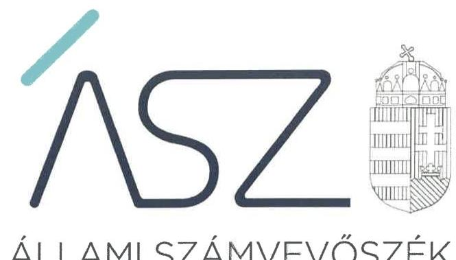
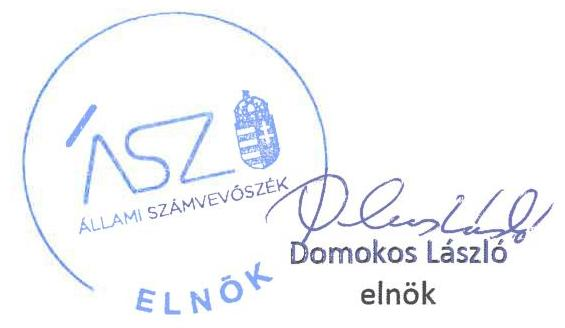
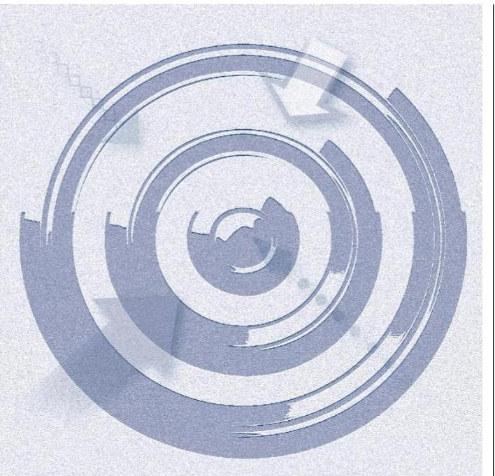
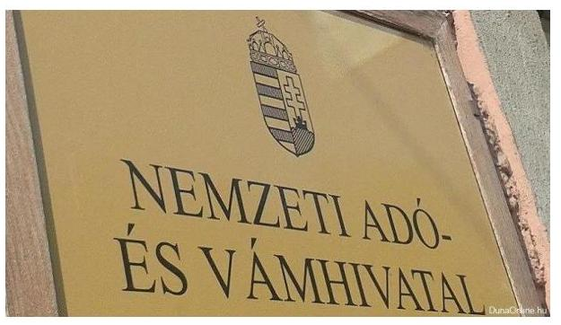
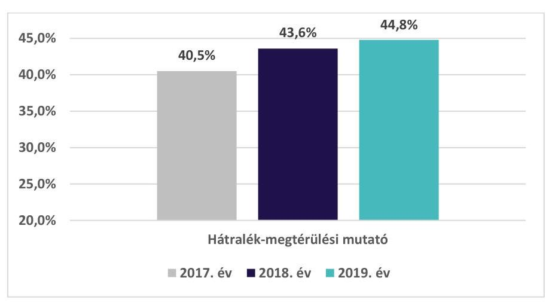
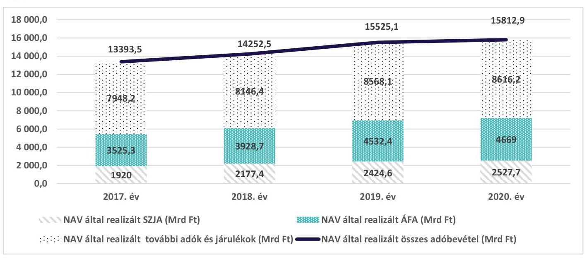

ÁLLAMI SZÁMVEVŐSZÉK

# JELENTÉS 

A Nemzeti Adó- és Vámhivatal kisadózó vállalkozások tételes adójával és a kisvállalati adóval, valamint egyéb feladataival kapcsolatos tevékenységének ellenőrzése -

Teljesítmény-ellenőrzés

2022. 

22009
www.asz.hu

---

ÁLLAMI SZÁMVEVŐSZÉK

# JELENTÉS 

A Nemzeti Adó- és Vámhivatal kisadózó vállalkozások tételes adójával és a kisvállalati adóval, valamint egyéb feladataival kapcsolatos tevékenységének ellenőrzése -

Teljesítmény-ellenőrzés
2022. 05 . hó 19. nap

22009
www.asz.hu

---

# AZ ELLENŐRZÉST VEZETTE ÉS A VÉGREHAJTÁSÁÉRT FELELŐS: 

SALAMON ILDIKÓ ellenőrzésvezető
ERDÉLYI ATTILA ellenőrzésvezető
BAJNAI ZSUZSANNA ellenőrzésvezető

A PROGRAM ÖSSZEÁLLÍTÁSÁÉRT FELELŐS:
HORVÁTH TÍMEA ellenőrzés-tervezési projektvezető

IKTATÓSZÁM: EL-3611-001/2022.
TÉMASZÁM: 17
ELLENŐRZÉS-AZONOSÍTÓ SZÁM: V0919

Jelentéseink az Országgyúlés számítógépes hálózatán és az Interneten a www.asz.hu címen is olvashatóak.

---

# TARTALOMJEGYZÉK 

■ ÖSSZEGZÉS ..... 5
■ AZ ELLENŐRZÉS CÉLJA ..... 7
■ AZ ELLENŐRZÉS TERÜLETE ..... 8
■ AZ ELLENŐRZÉS HÁTTERE, INDOKOLTSÁGA ..... 9
■ A JELENTÉS LÉNYEGES KÉRDÉSKÖREI ..... 10
■ AZ ELLENŐRZÉS HATÓKÖRE ÉS MÓDSZEREI ..... 11
■ MEGÁLLAPÍTÁSOK ..... 13
■ MELLÉKLETEK ..... 17
I. sz. melléklet: Értelmező szótár ..... 17
■ FÜGGELÉK: ÉSZREVÉTELEK ..... 19
■ RÖVIDÍTÉSEK JEGYZÉKE ..... 21

---

.

---

# ÖSSZEGZÉS 

A Nemzeti Adó- és Vámhivatal adóztatási feladatellátása 2017-2020 között eredményes volt. A Nemzeti Adó- és Vámhivatal a hátralékkezelési tevékenységének eredményes ellátásával, a digitális eszközök bevezetésével és alkalmazásával, az adóhatósági ellenőrzési tevékenység eredményességével, az adózók kötelezettségének teljesitését ösztönző és a tudatos adózást erősitő intézkedések megtételével hozzájárult a realizált adóbevételek 2017-2020 közötti növekedéséhez. Az adóztatási feladatellátás eredményességét mutatja, hogy az adóbevételek a koronavírus-járvány kedvezőtlen gazdasági hatásai ellenére 2019. évről 2020. évre is növekedni tudtak.

## Az ellenőrzés társadalmi indokoltsága

Az Állami Számvevőszék törvényben rögzített feladata az állami adóhatóság adóztatási tevékenységének ellenőrzése. Az adópolitika 2010 óta gyökeres átalakuláson ment át, amelynek egyik fő célja a szolgáltató jellegű adóhatósági tevékenység előtérbe helyezése, a NAV ${ }^{1}$ működésének ügyfél-centrikussá tétele. Ezzel a célkitűzéssel összefüggésben a „NAV 2.0 A Megújulás Stratégiai Programja" című öt éves stratégiai program 2017-ben került elfogadásra. A program általános jövőbeli célja az volt, hogy a NAV 2021-re Európa egyik leghatékonyabb, integrált módon működő adóhatósága legyen, amely az állami adóbevételeket elsősorban az önkéntes jogkövetés ösztönzése és a gazdaság fehérítése útján biztosítsa. Feladatát a bürokrácia lehető legkisebb terhe mellett, az adózókat partnerként kezelve végezze.

A gazdaság fenntartható kifehérítése, az adózók önkéntes jogkövetésének erősítése nem csupán az állam számára jelent többletbevételt, hanem az adófizető állampolgárok javát is szolgálja. A gazdaság kifehérítéséből származó többlet adóbevételek ugyanis lehetőséget biztosítanak a személyi jövedelemadó és a béreket terhelő járulékok mérséklésére. Az adóztatási tevékenység eredményes ellátásával így a NAV a költségvetés bevételeinek teljesülésének biztosításán túl a társadalom életszínvonalára is hatást gyakorol.

Az Állami Számvevőszék ellenőrzése a NAV által realizált - az államháztartás bevételeit képező adó és járulék bevételekhez kapcsolódó feladatellátása eredményességének értékelésére irányult. Az adófizető állampolgárok számára az ellenőrzés egy objektív értékelést, visszajelzést kíván adni az állami adóhatóság feladatellátásának eredményességéről.

## Főbb megállapítások, következtetések

A NAV adóztatási tevékenysége során alkalmazott ösztönző eszközök hatására az adózók adóbevallási, adófizetési hajlandósága, magatartása erősödött. A hátralékkezelési tevékenység eredményes ellátása, a digitális eszközök bevezetése és alkalmazása, az adóhatósági ellenőrzési tevékenység eredményessége, az adózók kötelezettségének teljesítését ösztönző és a tudatos adózást erősítő intézkedések együttesen hozzájárultak a NAV által realizált adóbevételek 2017-2020 közötti 18,1\%-os növekedéséhez. Az adóbevételek a koronavírus-járvány kedvezőtlen gazdasági hatásai ellenére 2019. évről 2020. évre 1,9\%-kal növekedtek.

A NAV a hátralékkezelési tevékenység teljesítményének mérési feltételeként létrehozta a hátralék-megtérülési mutatót és meghatározta annak célértékét, amely a 2017-2019 közötti időszakban teljesült. A 2017-2019 közötti időszakban csökkent a NAV által nyilvántartott hátralékállomány összege és annak adóbevételekhez viszonyított aránya, valamint növekedett a fizetési felszólításokból realizált bevételek összege.
A digitális eszközök közül az E-SZJA rendszer és az Elektronikus Árverési Felület bevezetésének eredménye kimutatható módon hozzájárult a NAV által realizált adóbevételek növekedéséhez. Az Online pénztárgépek és az Online Számlázási rendszer alkalmazása a forgalmi adatok, az Elektronikus Közútiáruforgalom-ellenőrző Rendszer a

---

felderített törvénysértésekhez, illetve szabálysértésekhez kapcsolódó eljárások számának alakulása alapján járult hozzá a gazdaság kifehérítéséhez, így a NAV által realizált adóbevételek növekedéséhez.
Az adóhatósági ellenőrzési tevékenység eredményességének értékeléséhez a 2017-2020 közötti időszakban a NAV által meghatározásra kerültek az elérni kívánt célok és célértékek, amelyek közül a NAV a 2020. évi célokat visszamérte, a kijelölt célértékeket teljesítette. Az adóhatósági ellenőrzési tevékenység eredményességét mutatja az ellenőrzések során megállapított nettó adókülönbözetek éves összegének növekedése, amelyeket a 2017-2020. években támogattak az elkészített ellenőrzési tervek, továbbá a 2017-2019 közötti időszakban emelkedő éves ellenőrzések.

# Következtetések 

A NAV adóztatási tevékenységének ellátása során 2017-2020 közötti időszakban alkalmazott ösztönző eszközök (pl. fizetési felszólítások küldése a hátralékos adózók számára, támogató eljárások) hozzájárultak ahhoz, hogy az adózók az adókötelezettségeiket ne behajtás útján, hanem önkéntes alapon teljesítsék. A 2017-2020 közötti időszakban bevezetett és alkalmazott digitális eszközök (Online pénztárgépek, Online Számlázási rendszer, E-SZJA rendszer, Elektronikus Árverési Felület, EKÁER) támogatták az önkéntes jogkövetés erősödését és a gazdaság fenntartható kifehérítését.

Az adóztatási tevékenység során alkalmazott ösztönző eszközök, a bevezetett és alkalmazott digitális eszközök, az adóhatósági ellenőrzési tevékenység, illetve a tudatos adózást erősítő intézkedések következtében javult az adózói morál és erősödött az adózók önkéntes jogkövetése. A NAV eredményes adóztatási feladatellátása 2017-2020 között hozzájárult a realizált adóbevételek és az adókötelezettségek teljesítésének növekedéséhez.

A NAV a 2017-2020 közötti időszakban az adóztatási feladatellátása keretében a hátralékkezelési és ellenőrzési tevékenységéhez kapcsolódóan meghatározta az elérendő célokat, célértékeket és ezeket mérő mutatószámokat, amellyel ezen területeken megteremtette a teljesítményalapú feladatellátás feltételeit, az eredményesség visszamérhetőségét. A NAV a hátralékkezelési és ellenőrzési feladatellátásának teljesítménymérésével biztosította az objektív értékelés lehetőségét egyfelől a NAV Stratégiában kitűzött célok teljesüléséről, azok előrehaladásáról, másfelől a tevékenységéhez szükséges közpénz felhasználásának eredményességéről az Országgyűlés és az adófizető állampolgárok számára.

Az adóztatási tevékenységen belül a digitális eszközök tekintetében azonban van még tere a teljesítményalapú feladatellátás fejlődésének. A teljesítménymérés feltételeinek digitális eszközökre történő kiterjesztésével ugyanis mérhetővé tehető a rendszerek bevezetésének és alkalmazásának eredményessége, hozzájárulásuk a NAV által realizált adóbevételek növekedéséhez. Az adóelkerülés visszaszorítása érdekében meghozott adóhatósági intézkedések eredményességének visszamérhetőségét az adórés számítására vonatkozóan módszertan kidolgozása és mutató kialakítása támogathatja.

---

# **AZ ELLENŐRZÉS CÉLJA**

Az ellenőrzés célja annak megállapítása, hogy a NAV adóztatási feladatellátása eredményes volt-e.

---

# AZ ELLENŐRZÉS TERÜLETE 

## Nemzeti Adó- és Vámhivatal

A NAV államigazgatási és fegyveres rendvédelmi feladatokat is ellátó központi költségvetési, országos hatáskörű szerv, amely gazdasági szervezettel rendelkezik, és önálló költségvetési fejezetet képez. A NAV felügyeletét az adópolitikáért felelős miniszter látja el a Pénzügyminisztérium útján.

A NAV feladata többek között a központi költségvetés javára teljesítendő kötelező befizetés, a központi költségvetés terhére juttatott támogatás, adó-visszaigénylés vagy adó-viszszatérítés megállapítása, beszedése, nyilvántartása, végrehajtása, visszatérítése és ellenőrzése. Az Art. ${ }^{2}$, Ákr. ${ }^{3}$, Air. ${ }^{4}$, Avt. ${ }^{5}$, Vht. ${ }^{6}$ alapján a NAV jár el minden adók módjára behajtandó köztartozás végrehajtása és az ezzel összefüggő nyilvántartás tekintetében, feltéve, hogy azt jogszabály nem utalja más hatóság hatáskörébe.

---

# AZ ELLENŐRZÉS HÁTTERE, INDOKOLTSÁGA 

Az Állami Számvevőszék törvényben rögzített feladata az állami adóhatóság adóztatási tevékenységének ellenőrzése. A NAV feladatellátását érintő ellenőrzéseit az ÁSZ ${ }^{7}$ szisztematikus terv szerint, évente végzi, törekedve a NAV tevékenységi területeinek minél teljesebb ellenőrzési lefedettségére. A korábbiakban nem ellenőrzött adónemek tekintetében indokolt, hogy az ÁSZ ellenőrzése keretében értékelje a NAV adóztatási tevékenységével kapcsolatos feladatellátásának végrehajtását.

A társadalmi igénnyel összhangban az Áht. ${ }^{8}$ és a Bkr. ${ }^{9}$ is előírja a NAV részére, hogy a költségvetési szerv valamennyi tevékenysége és célja összhangban legyen a gazdaságosság, hatékonyság és eredményesség követelményeivel. A Bkr. alapján a költségvetési szerv vezetője évente nyilatkozik arról, hogy gondoskodott-e a szervezet tevékenységében a gazdaságosság, hatékonyság és eredményesség követelményeinek érvényesítéséről. A gazdaságos, hatékony és eredményes feladatellátáshoz szükség van célok és célértékek kialakítására, a célok megvalósulásának mérését elősegítő mutatószámokra, valamint a mérhetőség, ellenőrizhetőség, értékelhetőség feltételeinek kialakítására.

A NAV Stratégia ${ }^{10}$ szerint a központi költségvetés bevételeinek növelése érdekében szükséges az adótudatosság növelése.

Az ÁSZ ellenőrzése a döntéshozók, az ellenőrzött, az irányító szerv, a társadalom számára objektív visszajelzést ad a végrehajtott szervezeti, szervezési intézkedésekről, a feladatellátás, a tevékenységek folyamatában kialakított célokról, intézkedésekről, azok teljesülésének előrehaladásáról. Az esetleges hibák, hiányosságok, kockázatok feltárásával az ellenőrzés hozzájárulhat a NAV eredményes feladatellátásához. Az Állami Számvevőszék ellenőrzési megállapításaival hozzájárulhat az Országgyűlés törvényalkotó munkájához és a jó kormányzás gyakorlatának erősítéséhez.

---

# A JELENTÉS LÉNYEGES KÉRDÉSKÖREI 

1.     - A NAV adóztatási tevékenységével kapcsolatos feladatellátása hogyan járult hozzá az adóbevételek realizálásához, az adókötelezettségek teljesitéséhez?
2.     - A NAV milyen eszközökkel ösztönözte az adózók kötelezettségének teljesitését, a tudatos adózás erősitését?

---

# AZ ELLENŐRZÉS HATÓKÖRE ÉS MÓDSZEREI 

## Az ellenőrzés típusa

Teljesítmény-ellenőrzés.

## Az ellenőrzött időszak

Az ellenőrzött időszak a 2017-2020. év

## Az ellenőrzés tárgya

A NAV valamennyi adónemre kiterjedő adóztatási tevékenységének adóbevételek növekedéséhez való hozzájárulása, a NAV adóztatási tevékenységéhez kapcsolódó feladatainak eredményes ellátása.

## Az ellenőrzött szervezet

Nemzeti Adó- és Vámhivatal

## Az ellenőrzés jogalapja

Az ellenőrzés jogszabályi alapját az Állami Számvevőszékről szóló 2011. évi LXVI. törvény 1. § (3) bekezdése és az 5. § (2), (3), (5), (6) és (8) bekezdései képezik.

## Az ellenőrzés módszerei

Az ÁSZ az ellenőrzést az ellenőrzési program ellenőrzési kérdései, az ellenőrzött időszakban hatályos jogszabályok, az ellenőrzés szakmai szabályok és módszertanok alapján, a nemzetközi standardok figyelembevételével végzi. Az ellenőrzés ideje alatt az ÁSZ az ellenőrzött szervezettel történő kapcsolattartást az ÁSZ Szervezeti és Müködési Szabályzatának ${ }^{11}$ vonatkozó előírásai alapján biztosítja.

Az ellenőrzési kérdések megválaszolásához szükséges bizonyítékok megszerzése több ütemben, a következő ellenőrzési eljárások alkalmazásával történik: megfigyelés, információkérés, összehasonlítás, kérdésfelvetés, interjú, valamint elemző eljárás. Az ellenőrzési bizonyítékként felhasználható adatforrások közé tartoznak az ellenőrzési programban felsorolt adatforrások továbbá minden - az ellenőrzés folyamán - feltárt, az ellenőrzés szempontjából információkat tartalmazó dokumentum.

---

Az ÁSZ az ellenőrzés végrehajtása során a rendelkezésre álló dokumentumokat bizonyosság szerint csoportosítja és veszi figyelembe az ellenőrzési értékelések és következtetések levonása során.

Az ellenőrzés megközelítése eredmény (kimenet-) alapú, mely során az ÁSZ azt értékeli, hogy az eredményeket, a „kimeneteket" a tervezettek szerint elérték-e, a szolgáltatások (közszolgáltatások) a tervezettek szerint múködtek-e.

Az ÁSZ az ellenőrzést a kérdésekre adott válaszok kiértékelésével, valamint a megjelölt adatforrások felhasználásával, továbbá az adott időszakban hatályos jogszabályok figyelembevételével folytatja le.

---

# 1. A NAV adóztatási tevékenységével kapcsolatos feladatellátása hogyan járult hozzá az adóbevételek realizálásához, az adókötelezettségek teljesítéséhez? 

Összegző megállapítás

A NAV a hátralékkezelési tevékenységének eredményes ellátásával, a digitális eszközök bevezetésével és alkalmazásával, valamint az adóhatósági ellenőrzési tevékenységével a 20172020 közötti időszakban hozzájárult az adóbevételek realizálásának, az adókötelezettségek teljesítésének növekedéséhez.

A NAV A HÁTRALÉKKEZELÉSI TEVÉKENYSÉG teljesítményének mérése érdekében létrehozta a hátralék-megtérülési mutatót és meghatározta annak célértékét. Az előírt 30\%-os célérték a 2017-2019 közötti időszakban teljesült. (1. ábra).

A NAV a hátralékkezelési tevékenységének ellátására vonatkozóan 2020-ban a koronavírus-járvány miatt elrendelt veszélyhelyzetre és a végrehajtási eljárások szüneteltetésére* tekintettel nem határozott meg célértéket.

A 2017-2019. évek között a hátralékállomány 44,2 Mrd Ft-tal (1216,3 Mrd Ft-ról 1172,1 Mrd Ft-ra), az adóbevétel arányos hátralékállomány 1,6 százalékponttal ( $9,1 \%$-ról $7,5 \%$-ra) csökkent, míg a fizetési

[^0]
[^0]:    * A járványhelyzet, illetve a kihirdetett veszélyhelyzet miatt a végrehajtási eljárások az 57/2020. (III. 23.) Korm. rendelet alapján 2020. március 24. napjától 2020. július 2. napjáig szüneteltetésre kerültek.

---

felszólításokból realizált bevétel 30,7 Mrd Ft-tal (49,7 Mrd Ft-ról 80,4 Mrd Ft-ra) növekedett. (2. ábra)
2. ábra

Hátralékkezelési tevékenységhez kapcsolódó mutatók alakulása 2017-2019 között

| Adóbevétel arányos   hátralék-állomány   -1,6 százalékpont | Hátralék-állomány   -44,2 Mrd Ft | Fizetési felszólításokból   realizált bevétel   $+30,7 \mathrm{Mrd} \mathrm{Ft}$ |
| :--: | :--: | :--: |

Forrás: NAV adatszolgáltatás alapján, ÁSZ szerkesztés
A hátralékkezelési tevékenységhez kapcsolódó mutatók 2017-2019. évek közötti alakulása az adózói morál és az önkéntes jogkövetés javulását mutatják, amely folyamat az időszakban hozzájárult a realizált adóbevételek és adókötelezettségek teljesítésének növekedéséhez.

A hátralékkezelési tevékenységhez kapcsolódó adatok alakulását a 2019. évről 2020. évre történő, a követelések nyilvántartására vonatkozó módszertani változás, valamint a járványhelyzet, illetve az ennek okán kihirdetett veszélyhelyzettel kapcsolatos intézkedések befolyásolták. A módszertani változás miatti torzító hatás következtében a 2020. évi adatok előző évekkel történő összehasonlító értékelésére nem került sor.

A DIGITÁLIS ESZKÖZÖK közül az E-SZJA rendszer és az Elektronikus Árverési Felület bevezetésének eredménye kimutatható a NAV által realizált adóbevételek növekedésében. Az E-SZJA rendszerben készített bevallások alapján ugyanis a bevallott SZJA ${ }^{12}$ összege 2017. évről 2020. évre 485,5 Mrd Ft-ról 1837,7 Mrd Ft-ra növekedett, míg az EÁF ${ }^{13}$-en meghirdetett értékesítéssel végződött árverésekből 2017-2020. között összesen 5,4 Mrd Ft bevétel realizálódott. Az Online pénztárgépek, az Online Számlázási rendszer és az EKÁER ${ }^{14}$ a realizált adóbevételek növekedését a gazdaság fenntartható kifehérítésén keresztül támogatta.
$\longrightarrow$ Az Online pénztárgépek és az Online Számlázási rendszer bevezetése a forgalmi adatok növekedése alapján a gazdaság kifehérítésén keresztül hozzájárult a NAV által realizált adóbevételek növekedéséhez.
$\longrightarrow$ Az EKÁER alapján felderített törvénysértésekhez, illetve szabálysértésekhez kapcsolódó eljárások száma 2017. évről 2019. évre 28,7\%kal növekedett, ugyanakkor 2019. évről 2020. évre 40,2\%-kal csökkent. Az EKÁER bevezetése erősítette az önkéntes jogkövetést, ami hozzájárult a NAV által realizált adóbevételek növekedéséhez.
A digitális eszközök bevezetésének és alkalmazásának eredménye az Online pénztárgép rendszer, az Online Számlázási rendszer és az EKÁER esetében közvetlenül nem mutatható ki a NAV által realizált adóbevételek növekedésében, a NAV erre vonatkozó módszertant nem határozott meg.

---

# AZ ADÓHATÓSÁGI ELLENŐRZÉSI TEVÉKENYSÉG 

eredményességének értékeléséhez a 2017-2020 közötti időszakban a NAV által meghatározásra kerültek az elérni kívánt célok és célértékek, amelyek közül a NAV a 2020. évi mutatók teljesítményét mérte vissza. A NAV a 2020. évre meghatározott adózási fegyelemre, a kiutalások előtti-, illetve az utólagos adóellenőrzések hatékonyságára vonatkozó célértékeket teljesítette. Az adóhatósági ellenőrzési tevékenység eredményességét mutatja az ellenőrzések során megállapított nettó adókülönbözetek éves összegének növekedése, amelyeket a 2017-2020. években támogattak az elkészített ellenőrzési tervek, továbbá a 2017-2019 közötti időszakban emelkedő éves ellenőrzések.

## 2. A NAV milyen eszközökkel ösztönözte az adózók kötelezettségének teljesítését, a tudatos adózás erősítését?

Összegző megállapítás

A NAV az adózók kötelezettségének teljesítését, a tudatos adózás erősítését célzó intézkedésekkel, digitális eszközök bevezetésével és alkalmazásával, valamint az adóhatósági ellenőrzési tevékenységgel ösztönözte.

A NAV az 1. táblázatban összefoglalt eszközök alkalmazásával és intézkedések meghozatalával ösztönözte az adózók kötelezettségének teljesítését, a tudatos adózás erősítését. A NAV adóztatási tevékenysége során alkalmazott ösztönző eszközök hatására az adózók adóbevallási, adófizetési hajlandósága, magatartása erősödött.

1. táblázat

| Bevezetett, alkalmazott ösztönző eszköz/intézkedés | Ösztönző eszközök/intézkedések célja |
| :-- | :-- |
| Tájékoztató „holland" levelek   2017-2020 között 3697 számlázási láncolatban érintett adózó részére | adókötelezettségek teljesítése, tudatos adózás   erősítése |
| Üdvözlő levelek kezdő vállalkozások részére   2018-2020 között 355 424 db kiküldött levél | adótudatosság erősítése, jogkövető adózási gya-   korlat támogatása |
| Támogató eljárások   2017-2020 között több, mint 35 ezer lefolytatott eljárás | szakmai támogatás, adókötelezettségek teljesít   tése |
| Együttműködési megállapodások   6 felsőoktatási intézménnyel és kamarákkal | adótudatosság erősítése, adózási ismeretek át-   adása |
| Fórumok „Amit az adózásról tudni érdemes" „Hogyan adózzak?"   2018-2020 között 1142 alkalom | adótudatosság erősítése, adózási ismeretek át-   adása |
| Adótudatossági stratégia megalkotása 2020-2025 közötti időszakra | adózási morál és az önkéntes jogkövetés erősítése |

A hátralékkezelési tevékenység eredményes ellátása, a digitális eszközök bevezetés és alkalmazása, az adóhatósági ellenőrzési tevékenység eredményessége, az adózók kötelezettségének teljesítését ösztönző és a tudatos adózást erősítő intézkedések hozzájárultak a NAV által realizált adóbevételek 2017-2020 közötti 18,1\%-os növekedéséhez. Az adóhatósági tevékenység eredményességét mutatja, hogy az adóbevételek a koronaví-rus-járvány kedvezőtlen gazdasági hatásai ellenére 2019. évről 2020. évre 1,9\%-kal növekedtek. A NAV által realizált adóbevételek alakulását 2017-2020 között a 3. ábra mutatja.

---

Forrás: NAV adatszolgáltatás alapján, ÁSZ szerkesztés

A NAV az adóelkerülés visszaszorítása érdekében tett intézkedések eredményességét, a gazdaság fenntartható kifehérítésének visszamérését szolgáló adórés számítására vonatkozó módszertani előírásokkal, mutatószámmal nem rendelkezett, így a vizsgált időszakban az adórés javulásának értékelésére nem volt lehetőség.

---

# MELLÉKLETEK 

- I. SZ. MELLÉKLET: ÉRTELMEZŐ SZÓTÁR
adórés

EKÁER

Elektronikus Árverési Felület

E-SZJA
holland levelek

NAV Stratégia

Az adóelkerülés mértékét számszerűsítő mutató, amelyet leginkább az ÁFA adónem esetében vizsgálnak. A költségvetésből kieső áfabevételek százalékos arányát mutatja. Az adóelkerülés visszaszorítása érdekében tett intézkedések eredményességét, a gazdaság fenntartható kifehérítésének visszamérést szolgálja.
Elektronikus Közútiáruforgalom-ellenőrző Rendszer, a NAV által működtetett rendszer, amelynek köszönhetően ellenőrizhetővé válik az EU bármely tagállamából Magyarországra, vagy fordítva, Magyarországról egy EU-s országba irányuló, az adott termék közúton való fuvarozásával, valamint az országon belül történő közúti fuvarozásával összefüggő adókötelezettségek teljesítése.
Az Elektronikus Árverési Felület (EÁF) olyan virtuális árverési csarnok, ahol a NAV végrehajtási eljárásai során lefoglalt és a NAV birtokában lévő ingóságok és ingatlanok árverése történik. Az árverésen résztvevők - ideértve annak nyertesét is - az árverés befejezéséig anonim módon árvereznek. Árverési vevő lehet bárki, aki regisztrálta magát az Úgyfélkapun és az árverés szabályait elfogadja. Egy árverési tételre vonatkozó árverés az árverés kezdődátumtól a végdátumig tart, ez alatt kell az ajánlatokat megtenni. Az árverés nyertese az árverési vételár fejében az illetékes adóigazgatóságnál veheti át az ingóságot. Ingatlan árverés esetén a részvétel előfeltétele a hirdetményben szereplő előleg megfizetése átutalás útján az árverés kezdetéig.
A NAV WEB alapú a személyi jövedelemadóval kapcsolatos, online bizonylat kitöltést biztosító alkalmazása
Art (régi) 97. §-a alapján - ha az adóhatóság ellenőrzése során olyan, több adózót - egymással összefüggő módon - érintő kapcsolatot, tényt, körülményt észlel, amellyel összefüggésben az adótörvényekben foglalt rendelkezések megkerülése vélelmezhető, azt az érintettek tudomására hozhatja. Az adókötelezettség teljesítésének megkerüléséről szóló Art. (új) szerinti tájékoztatási kötelezettség 267. §-a alapján a 2020. évtől kiegészítésre került a (2) bekezdéssel, mely bekezdés alapján az állami adó- és vámhatóság a foglalkoztató ellenőrzése során olyan, a foglalkoztatáshoz kapcsolódó tényt, körülményt észlel, amellyel összefüggésben az adótörvényekben foglalt rendelkezések megkerülését végleges döntéssel megállapította, ezt a tényt az érintett foglalkoztatottak tudomására hozza.
NAV 2.0 A Megújulás Stratégiai Programja, amely a NAV 2.0, a Nemzeti Adó- és Vámhivatal Megújulásának Stratégiai Programjáról szóló 1306/2017. (VI. 8.) Korm. határozattal került elfogadásra. A NAV 2.0 Stratégia célja egy olyan korszerű, átláthatóan és hatékonyan működő szolgáltató és ügyfélközpontú adóhatóság kialakítása volt, amely a korábbinál eredményesebben képes biztosítani a költségvetés bevételeit.

---

online pénztárgép
online számlázási rendszer
támogató eljárás

Pénztárgép, amely online kapcsolatban van a NAV központi szerverével, mely meghatározott adatokat, meghatározott gyakorisággal küld a pénztárgépről mobil internet kapcsolaton keresztül, a NAV központi szerverébe.
Az online adatszolgáltatás bevezetésének és az adatokat kezelő Online Számla rendszer kialakításának célja a gazdaság fehérítése, az adócsalások visszaszorítása. Az Online Számla rendszerben jelentős számlaforgalom válik láthatóvá és követhetővé a NAV számára. Ennek nyomán hatékonyabb a kockázatok feltárása és kezelése. Az Online Számla rendszerben a kiállított számlákról valós idejű adatok érkeznek a NAV-hoz, a kiállított számlákat lekérdezhetik a számlabefogadók és a számlakibocsátók is, a nagy mennyiségű számlaadat gyorsan elérhető hatékony kockázatelemzés és ellenőrzés céljára, ami segíti az adócsalások felderítését, és ez a tisztességes adózók számára is előnyökkel jár, az adatszolgáltatás automatizálásával az adminisztratív terhek csökkennek a számlázó programot használóknál, az új rendszer kiváltja a számlakibocsátók összesített adatszolgáltatását.
Az önkéntes jogkövetésre történő ösztönzés előmozdítása érdekében a jogalkotó 2017-ben új lehetőségeket és eszközöket biztosított a NAV számára. (Régi Art. 90/A. § (5) bekezdés a) pontja, illetve az új Art. 139. §-a) A támogató eljárás olyan új jogintézmény, amely az adózók érdekét szolgálja. A támogató eljárás keretében az állami adóhatóság kapcsolatfelvételt kezdeményezhet az adózóval, melynek célja a feltárt hibák, hiányosságok orvoslása az adóhatóság szakmai támogatásával, melynek révén a szankciók elkerülhetők. A támogató eljárásnak nemcsak a múltban elkövetett hibák kijavítása a célja, hanem az is, hogy a hibákat a jövőre nézve is kiküszöböljék az adózó gyakorlatában.

---

# FÜGGELÉK: ÉSZREVÉTELEK 

A jelentéstervezetet a Számvevőszék 15 napos észrevételezésre megküldte az ellenőrzött szervezet vezetőjének az ÁSZ tv. 29. §̊ (1) bekezdése előírásának megfelelően.

A Nemzeti Adó- és Vámhivatalt vezető államtitkár az ellenőrzés megállapításaira észrevételt tett. Az ÁSZ tv. 29. § (3) bekezdésével összhangban az ÁSZ a Függelékben feltünteti az ellenőrzés megállapításaival kapcsolatban tett, figyelembe nem vett észrevételeket, és megindokolja, hogy azokat miért nem fogadta el.

[^0]
[^0]:    ${ }^{+} 29. \S$ (1) Az Állami Számvevőszék az ellenőrzési megállapításait megküldi az ellenőrzött szervezet vezetőjének vagy az általa megbízott személynek, és annak, akinek személyes felelősségét állapította meg.
    (2) Az ellenőrzött szervezet vezetője és a felelősként megjelölt személy az ellenőrzés megállapításaira tizenöt napon belül írásban észrevételt tehet.
    (3) Az Állami Számvevőszék az észrevételre a beérkezésétől számított harminc napon belül írásban válaszol. A figyelembe nem vett észrevételeket köteles a jelentésben feltüntetni, és megindokolni, hogy azokat miért nem fogadta el.

---

Az ellenőrzés megállapításaival kapcsolatban a Nemzeti Adó- és Vámhivatalt (továbbiakban: NAV) vezető államtitkár által 2022. február 25-én tett észrevételei és azok el nem fogadásának indokolása.

1. Az 1. megállapítás 6. bekezdés 2. franciabekezdésében az EKÁER alapján felderített törvénysértésekhez, illetve szabálysértésekhez kapcsolódó eljárások számával kapcsolatban tett észrevétel

Az államtitkár észrevételében kérte a megállapítás szövegének kiegészítését - az 1. oldalon található hátralékkezelési tevékenység ellátására vonatkozó 2020-as hivatkozáshoz hasonlóan - a koronavírus-járvány, eljárások számára gyakorolt negatív hatásának említésével, mivel az EKAER jogsértések feltárási esetszáma a lefolytatott ellenőrzések számához kapcsolódik. 2020 tavaszán a koronavírus-járvány miatt csökkent az EKAER ellenőrzések nagyobb részét kitevő, szúrópróbaszerű közúti EKÁER ellenőrzések száma. A korlátozások miatt 164746 db-ról 71782 db-ra, több mint 56\%-kal esett vissza számuk, melynek tükrében indokolható a jogsértésekhez kapcsolódó eljárások számának 40,2\%-os csökkenése is, amelyet alátámasztanak az ellenőrzés rendelkezésére bocsátott „Beszámoló_NAV 2020.évi.docx" dokumentumban foglaltak.

Az államtitkár észrevételében nem vitatta az ellenőrzés megállapítását. Figyelemmel arra, hogy az ellenőrzés hatóköre az ellenőrzési program alapján az okok feltárására nem terjedt ki, az ellenőrzési megállapítás kiegészítése, módosítása nem indokolt.
2. Az 1. megállapítás 7. bekezdésében a digitális eszközök bevezetése és alkalmazása és az adóbevételek közötti összefüggéssel kapcsolatban tett észrevétel

Az államtitkár észrevételében leírta, hogy a NAV a makrogazdasági folyamatok szabályozásáért és előrejelzéséért felelős szervek nélkül önállóan nem tud és nem is határozhat meg módszertant, ezért kéri az utolsó mondatrész törlését.

Az államtitkár észrevételében leírtak az ellenőrzés megállapítását nem vitatták. A 2021. október 29-én a NAV székhelyén helyszíni interjú keretében készült jegyzőkönyvben rögzítettek alapján a NAV nem mutatta ki, hogy a digitális eszközök bevezetése és alkalmazása hogyan járult hozzá az adóbevételek növekedéséhez, továbbá erre vonatkozó mérési módszereket nem határozott meg a 2017-2020. évek vonatkozásában. A rendelkezésre bocsátott adatok alapján, az egymásra ható intézkedések következményeinek a közvetlen költségvetési bevételi hatása nem számszerűsíthető.

A fentiekre tekintettel az ellenőrzés megállapítása megalapozott, módosítása nem indokolt.
3. A 2. megállapítás 1. táblázat 1. sorában található „holland levelek" kifejezéssel kapcsolatban tett észrevétel

Az államtitkár észrevétele szerint a „holland levelek" kifejezés kizárólag szakmai zsargon, ezért javasolta a jogszabály szerinti pontos megnevezés használatát: a NAV az adózás rendjéről szóló 2017. évi CL. törvény 267. §-a alapján küld tájékoztató leveleket az adózók részére.

Az államtitkár észrevételében leírtak az ellenőrzés megállapítását nem vitatták. Mivel a számvevőszéki jelentés I. sz. melléklete (Értelmező szótár) tartalmazza a „holland levelek" szófordulat szómagyarázatát a jogszabályra történő hivatkozással, az ellenőrzés megállapításának módosítása nem indokolt.
4. A 2. megállapítás utolsó bekezdésében az adórés számítására vonatkozó módszertani előírásokkal kapcsolatban tett észrevétel

Az államtitkár észrevétele szerint a NAV mutatószámmal nem rendelkezhetett, tekintettel arra, hogy a mutatószám számítása a makrogazdasági szabályozásért felelős társszervekkel együtt valósítható csak meg. A Pénzügyminisztériummal együttműködve már meglévő áfarés módszertan alkalmazásának vizsgálata folyamatban van, illetve az Európai Bizottság által, egységes módszertan alapján évente készített áfarésről szóló jelentés fontos indikátor a NAV számára, melynek 2020. évi értéke 6,1\%, mely jelentős eredmény a 2010. évi 22\%-os értékhez képest.

Az államtitkár észrevételében leírtak az ellenőrzés megállapítását nem vitatták. A 2021. október 29-én a NAV székhelyén helyszíni interjú keretében készült, a jegyzőkönyvben rögzítettek alapján a NAV nem rendelkezett adórés számítására vonatkozó módszertani leírásokkal a 2017-2020. évek vonatkozásában. Az adórés számítására vonatkozó módszertani előírást tartalmazó dokumentumokat a NAV nem azonosított be és nem bocsátott az ellenőrzés rendelkezésére.

A fentiekre tekintettel az ellenőrzés megállapítása megalapozott, módosítása nem indokolt.

---

# RÖVIDÍTÉSEK JEGYZÉKE 

${ }^{1}$ NAV
${ }^{2}$ Art.
${ }^{3}$ Ákr.
${ }^{4}$ Air.
${ }^{5}$ Avt.
${ }^{6}$ Vht.
${ }^{7}$ ÁSZ
${ }^{8}$ Áht.
${ }^{9}$ Bkr.
${ }^{10}$ NAV Stratégia
${ }^{11}$ ÁSZ Szervezeti és Müködési Szabályzata
${ }^{12}$ SZJA
${ }^{13}$ EÁF
${ }^{14}$ EKÁER

Nemzeti Adó- és Vámhivatal
2017. évi CL. törvény az adózás rendjéről
2016. évi CL. törvény az általános közigazgatási rendtartásról
2017. évi CLI. törvény az adóigazgatási rendtartásról
2017. évi CLIII. törvény az adóhatóság által foganatosítandó végrehajtási eljárásokról
1994. évi LIII. törvény a bírósági végrehajtásról

Állami Számvevőszék
2011. évi CXCV. törvény az államháztartásról

370/2011. (XII. 31.) Korm. rendelet a költségvetési szervek belső
kontrollrendszeréről és belső ellenőrzéséről
NAV 2.0, A Megújulás Stratégiai Programja
az Állami Számvevőszék elnökének 3/2021. (VIII. 13.) ÁSZ utasítása az Állami
Számvevőszék Szervezeti és Müködési Szabályzatáról
személyi jövedelemadó
Elektronikus Árverési Felület
Elektronikus Közúti Áruforgalom Ellenőrző Rendszer

---

1052 Budapest, Apáczai Cs. J. u. 10. | 1364 Budapest 4. Pf. 54
TEL: +36 14849100
email: szamvevoszek@asz.hu
web: www.asz.hu | www.aszhirportal.hu