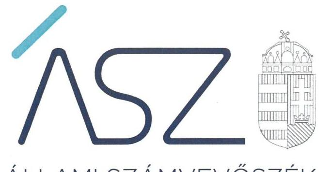

ÁLLAMI SZÁMVEVŐSZÉK

# JELENTÉS 

## Utóellenőrzések

A kormányzati szektorba sorolt, vagy a Bkr. hatálya alá nem tartozó gazdasági társaságok és egyéb szervezetek utóellenőrzése
2022.

22010
www.asz.hu

---

ÁLLAMI SZÁMVEVŐSZÉK

# JELENTÉS 

## Utóellenőrzések

A kormányzati szektorba sorolt, vagy a Bkr. hatálya alá nem tartozó gazdasági társaságok és egyéb szervezetek utóellenőrzése
2022. 03. hó 30. nap

22010
www.asz.hu

---

Jelentéseink az Országgyúlés számítógépes hálózatán és az interneten a www.asz.hu címen is olvashatóak.

## AZ ELLENŐRZÉST VEZETTE ÉS A VÉGREHAJTÁSÁÉRT FELELŐS:

DR. NAGY IMRE ellenőrzésvezető
DR. KISS ESZTER ellenőrzésvezető
KAKAS SÁNDOR ellenőrzésvezető

## A PROGRAM ÖSSZEÁLLÍTÁSÁÉRT FELELŐS:

DR. KÁDÁR KRISZTA programkészítésért felelős vezető

## A TÉMÁHOZ KAPCSOLÓDÓ KORÁBBI SZÁMVEVŐSZÉKI JELENTÉSEK:

- címe: Nem állami humánszolgáltatók ellenőrzése A humánszolgáltatást nyújtó államháztartáson kívüli köznevelési és szociális intézmények, szolgáltatók fenntartói központi költségvetésből kapott támogatásai felhasználásának ellenőrzése - Mú-Hely Líceum Alapítvány 2019.
- sorszáma: 19112
- címe: Nemzeti tulajdonú gazdasági társaságok ellenőrzése MÓRAÉP Városüzemeltetési, Szolgáltató és Kereskedelmi Nonprofit Közhasznú Korlátolt Felelősségű Társaság 2019.
- sorszáma: 19186
- címe: Nem állami humánszolgáltatók ellenőrzése A humánszolgáltatást nyújtó államháztartáson kívüli köznevelési és szociális intézmények, szolgáltatók fenntartói központi költségvetésből kapott támogatásai felhasználásának ellenőrzése - Prizma Oktatási és Kulturális Alapítvány 2019.
- sorszáma: 19198
- címe: Nemzeti tulajdonú gazdasági társaságok ellenőrzése Miskolci Csodamalom Bábszínház Nonprofit Kft. 2019.
- sorszáma: 19211
- címe: Nemzeti tulajdonú gazdasági társaságok ellenőrzése JÁSZFÉNYSZARU IPARI CENTRUM Korlátolt Felelősségű Társaság 2019.
- sorszáma: 19219
- címe: Nem állami humánszolgáltatók ellenőrzése A humánszolgáltatást nyújtó államháztartáson kívüli köznevelési és szociális intézmények, szolgáltatók fenntartói központi költségvetésből kapott támogatásai felhasználásának ellenőrzése - IRMÁK Közhasznú Nonprofit Kft. 2019.
- sorszáma: 19224

IKTATÓSZÁM: EL-3595-001/2022.
TÉMASZÁM: 2610
ELLENŐRZÉS-AZONOSÍTÓ SZÁM: V0954

---

# TARTALOMJEGYZÉK 

- ÖSSZEGZÉS ..... 5
- AZ ELLENŐRZÉS CÉLJA ..... 7
- AZ ELLENŐRZÉS TERÜLETE ..... 8
- AZ ELLENŐRZÉS HÁTTERE, INDOKOLTSÁGA ..... 9
- A JELENTÉS LÉNYEGES KÉRDÉSKÖRE ..... 10
- AZ ELLENŐRZÉS HATÓKÖRE ÉS MÓDSZEREL. ..... 11
- MEGÁLLAPÍTÁSOK ..... 13
- MELLÉKLETEK. ..... 17
I. sz. melléklet: Értelmező szótár ..... 17
- FÜGGELÉK: ÉSZREVÉTELEK ..... 19
- RÖVIDÍTÉSEK JEGYZÉKE ..... 21

---

.

---

# ÖSSZEGZÉS 

Az utóellenőrzés értékelése alapján az IRMÁK Nonprofit Kft., a PRIZMA Oktatási és Kulturális Alapítvány, a Miskolci Csodamalom Bábszínház Nonprofit Kft., a MÓRAÉP Nonprofit Közhasznú Kft. esetében a feltárt szabálytalanságokat megszüntető intézkedések hatására a szabálytalan működés kockázata csökkent, ezáltal a közpénzügyi helyzet javult.
Kettő szervezet vezetője nem tanúsított felelős vezetői magatartást, mivel a szabálytalanságok megszüntetése érdekében nem tettek intézkedéseket. Az intézkedések elmaradása miatt a Mú-Hely Líceum Alapítványnál a költségvetési támogatások cél szerinti felhasználása tekintetében, a JÁSZFÉNYSZARU IPARI CENTRUM Kft.-nél a gazdálkodás elszámoltathatósága és a közvagyon veszélyeztetettsége tekintetében nőtt a kockázat.

## Az ellenőrzés társadalmi indokoltsága

Az Állami Számvevőszék a stratégiájában célul tűzte ki a számvevőszéki munka hasznosulása révén a közpénzügyi helyzet javítását. Ezen cél megvalósítása érdekében hangsúlyos szerepet szán annak, hogy az államháztartáson kívülre nyújtott költségvetési támogatások felhasználását és a nemzeti tulajdonú gazdasági társaságoknak a közfeladatuk ellátásához nyújtott ingyenes vagyonjuttatásokat ellenőrzi.

Szociális és köznevelési humánszolgáltatási közfeladatokat jogszabályi felhatalmazás alapján államháztartáson kívüli szervezetek (pl. alapítvány) által fenntartott intézmények is elláthatnak, amelyhez a központi költségvetés évente jelentős összegű támogatást nyújt. Az Állami Számvevőszék az intézményfenntartók ellenőrzésével hozzájárul ahhoz, hogy a támogatásként kapott közpénzeket az államháztartáson kívüli szervezetek is átlátható és elszámoltatható módon használják fel a közfeladatok ellátása során. Az ellenőrzés társadalmi jelentősége abban nyilvánul meg, hogy ezek az intézmények a közpénzekből társadalmilag hasznos, közösségteremtő, közérdekű tevékenységet végeznek és a társadalom tagjai jogosultak megfelelő tájékoztatást kapni a működésükről.

A nemzeti tulajdonú gazdasági társaságok ellenőrzésével az Állami Számvevőszék hozzájárul ahhoz, hogy a közpénzeket az államháztartáson kívül működő szervezetek is átlátható, rendezett módon használják fel és a vagyonmegőrzést veszélyeztető kockázatok feltárásával, értékelésével előmozdíthatja a vagyonvesztés megelőzését. Ellenőrzésük társadalmilag kiemelt fontosságú, mivel az általuk ellátott közszolgáltatásokon keresztül a lakosság széles köre kerül kapcsolatba a társaságokkal és a gazdálkodásuk körébe tartozó, a közfeladat ellátását biztosító nemzeti vagyon nagysága is számottevő.

Az Állami Számvevőszék utóellenőrzés során értékeli, hogy az ellenőrzött szervezetek az intézkedési tervben vállalt feladatok végrehajtásával megszüntették-e a korábbi ellenőrzés során feltárt hiányosságokat és szabálytalanságokat, csökkentve ezzel a szabálytalan működés kockázatát, hozzájárulva a közpénzügyi helyzet javulásához.

## Főbb megállapítások, következtetések

Az utóellenőrzés a hat ellenőrzött szervezet közül négy esetében állapította meg, hogy csökkent a szabálytalan működés kockázata több területen az ellenőrzött időszakot követően végrehajtott intézkedések hatására. Egy alapítvány és egy gazdasági társaság esetében nőtt a kockázat, mivel a szervezetek vezetői nem tettek intézkedéseket a feltárt hiányosságok megszüntetése érdekében, ezért nem tanúsítottak felelős vezetői magatartást. Az intézkedési tervben vállalt feladatok végrehajtásának elmaradása következtében fennálló szabálytalan működési gyakorlatok kockázatot hordoznak.

---

AZ IRMÁK NONPROFIT KFT. a szociális közfeladat ellátására kapott központi költségvetési támogatás felhasználásának feladatonkénti bontású, elkülönített kezelésével és az éves beszámolási kötelezettség teljesítésével az intézkedési tervben vállalt valamennyi feladatot végrehajtotta, ezáltal a feltárt szabálytalanságokat megszüntette. Az intézkedések hatására csökkentek a költségvetési támogatások cél szerinti felhasználásának és az elszámoltathatóságának kockázatai, ezáltal a közpénzügyi helyzet javult.

A PRIZMA OKTATÁSI ÉS KULTURÁLIS ALAPÍTVÁNY a köznevelési közfeladat ellátására kapott központi költségvetési támogatás felhasználásának alapfeladatonkénti bontású, elkülönített nyilvántartásával és az éves beszámolási kötelezettség teljesítésével az intézkedési tervben vállalt feladatokat végrehajtotta, ezáltal a feltárt működési szabálytalanságokat megszüntette. Az intézkedések hatására csökkentek a költségvetési támogatások cél szerinti felhasználásának és az elszámoltathatóságának kockázatai, ezáltal a közpénzügyi helyzet javult.

A MISKOLCI CSODAMALOM BÁBSZÍNHÁZ NONPROFIT KFT. az éves beszámoló mérlegtételeit alátámasztó leltár összeállításával az intézkedési tervben vállalt feladatot végrehajtotta, ezáltal a feltárt működési szabálytalanságot megszüntette. Az intézkedés hatására csökkent a beszámoló megalapozottságát veszélyeztető kockázat, ezáltal a vagyonvédelmi és a közpénzügyi helyzet javult.
A MÓRAÉP NONPROFIT KÖZHASZNÚ KFT. a mérlegtételek leltári alátámasztásával, valamint a saját és a kezelt vagyon elkülönített vagyonnyilvántartásával az intézkedési tervben vállalt feladatokat végrehajtotta, ezáltal a feltárt működési szabálytalanságokat megszüntette. Az intézkedések hatására a szabálytalan működési kockázatok csökkentek, ezáltal a vagyonvédelmi és a közpénzügyi helyzet javult.

A JÁSZFÉNYSZARU IPARI CENTRUM KFT. vezetője az intézkedési tervben vállaltak ellenére nem intézkedett az éves beszámoló mérlegtételeit alátámasztó leltár összeállításáról, ezáltal a feltárt működési szabálytalanság nem szűnt meg. A mérleg tételeit alátámasztó leltár hiánya kockázatot hordoz a beszámoló megalapozottságára, valamint a nemzeti vagyon védelmére vonatkozóan, amelynek következtében a szabálytalan működés kockázata nőtt.

A MŰ-HELY LÍCEUM ALAPÍTVÁNY vezetője az intézkedési tervben vállaltak ellenére nem intézkedett a törvényi előírások szerinti számviteli politika kialakításáról, a számlarend elkészítéséről és a köznevelési közfeladatellátásra kapott támogatás felhasználása kapcsán elkülönített nyilvántartás vezetéséről, ezáltal a belső szabályozottság terén feltárt hiányosság és a költségvetési támogatások elszámoltathatósága vonatkozásában feltárt szabálytalanság nem szűnt meg. Az elkülönített nyilvántartás hiánya, illetve a számviteli szabályozás kialakításának hiányossága kockázatot hordoz a költségvetési támogatások cél szerinti felhasználására vonatkozóan, amelynek következtében a szabálytalan működés kockázata nőtt.

---

# AZ ELLENŐRZÉS CÉLJA 

AZ UTÓELLENŐRZÉS CÉLJA annak kockázatalapú értékelése, hogy az ellenőrzött szervezetek a szervezet vezetője által összeállított intézkedési tervben foglalt intézkedések végrehajtásával hasznosították-e az ÁSZ ${ }^{1}$ jelentésben a hiányosságok megszüntetése, illetve a kockázatok csökkentése érdekében tett megállapításokat, összességében javult-e a közpénzügyi helyzet.

---

# AZ ELLENŐRZÉS TERÜLETE 

## Utóellenőrzések (harmadik szakasz)

A kockázati értékelésen alapuló utóellenőrzés az átlátható és elszámoltatható közpénzfelhasználás érdekében egy szociális humánszolgáltatást nyújtó gazdasági társaság, kettő köznevelési humánszolgáltatást nyújtó alapítvány és három nemzeti tulajdonú gazdasági társaság vonatkozásában azt értékelte, hogy az ellenőrzöttek intézkedései nyomán a gazdálkodás belső szabályozottsága és működésének lényeges területein csökkent-e a kockázat.

Az ÁSZ az IRMÁK Nonprofit Kft.-t, a Mú-Hely Líceum Alapítványt és a PRIZMA Oktatási és Kulturális Alapítványt, mint a szociális/köznevelési humánszolgáltatási közfeladatokat ellátó államháztartáson kívüli fenntartókat 2015-2017. évekre vonatkozóan ellenőrizte és a központi költségvetésből kapott támogatás felhasználásának szabályszerűségét értékelte. Az ellenőrzési megállapításait a 19224. számú, a 19112. számú és a 19198. számú számvevőszéki jelentésben hozta nyilvánosságra.

Az ÁSZ a Miskolci Csodamalom Bábszínház Nonprofit Kft.-t, a MÓRAÉP Nonprofit Közhasznú Kft.-t és a JÁSZFÉNYSZARU IPARI CENTRUM Kft.-t, mint nemzeti tulajdonú gazdasági társaságokat 2015-2017. évekre vonatkozóan ellenőrizte és a vagyongazdálkodásukat, a saját vagyon tekintetében a vagyonnyilvántartások vezetését, leltárát, a társaság vagyonkezelésében lévő nemzeti vagyon tekintetében a vagyon értékének megőrzését, gyarapítását és hasznosítását értékelte. Az ellenőrzési megállapításait a 19211. számú, a 19186. számú és a 19219. számú számvevőszéki jelentésben hozta nyilvánosságra.

Az ellenőrzött szervezetek által készített intézkedési tervek az ellenőrzési megállapítások alapján mind a hat szervezet esetében feladatokat határoztak meg a gazdálkodás belső szabályozottsága és működése kiemelt kockázattal bíró területeit érintően.

---

# AZ ELLENŐRZÉS HÁTTERE, INDOKOLTSÁGA 

Az ÁSZ tv. ${ }^{2}$ 33. § (1) bekezdése értelmében a számvevőszéki jelentések megállapításai alapján az ellenőrzött szervezet vezetője intézkedési tervet köteles összeállítani, és az ÁSZ részére megküldeni.

Az utóellenőrzés során az ÁSZ értékeli, hogy az érintett számvevőszéki jelentésben foglalt megállapításokkal összhangban, az ellenőrzött szervezet által készített intézkedési tervben meghatározott feladatokat a feladatra kijelöltek végrehajtották-e.

Az intézkedések végrehajtásával az adott terület szabályszerű működése vonatkozásában a kockázatok csökkenhetnek, azonban hosszabb távon az intézkedési tervben foglaltak végrehajtásával önmagában nem szűnnek meg, csak akkor, ha beépülnek az ellenőrzött szervezet működésébe, azokat folyamatosan karban tartják, figyelembe véve, illetve kezelve a változásokat. Emellett az intézkedések végrehajtásáig újabb kockázatok merülhetnek fel a szabályszerű működés vonatkozásában, amelyek kezelése szintén kiemelten fontos az ellenőrzött szervezet számára.

Az ellenőrzött szervezet vezetője által készített intézkedési tervekben foglalt feladatok hiányos, illetve késedelmes végrehajtása, vagy annak elmaradása a felelős vezetői magatartás vonatkozásában kockázatot hordoz, amely azt mutatja, hogy az ellenőrzések során feltárt hibák, hiányosságok és szabálytalanságok kezelése nem kapott kellő hangsúlyt. Az utóellenőrzés során is fennálló szabálytalanságok esetén a közpénzek, a közvagyon veszélyeztetettségének kockázata további intézkedéseket vonhat maga után.

Az utóellenőrzés feltárja, hogy az ellenőrzött szervezet az intézkedések végrehajtásával hasznosította-e a korábbi ellenőrzési jelentésben a hiányosságok megszüntetése, illetve a kockázatok kezelése érdekében tett megállapításokat, illetve az intézkedések végrehajtása hozzájárult-e a közpénzügyi helyzet javulásához. Visszacsatolást ad továbbá az ellenőrzési jelentések hasznosulásáról, valamint feltárja az intézkedések elmaradásának vagy részleges megvalósulásának a közpénzekre, a közvagyonra gyakorolt valószínűsített hatását.

---

# A JELENTÉS LÉNYEGES KÉRDÉSKÖRE 

- Csökkent-e az ellenőrzött szervezet szabálytalan működésének kockázata?

---

# AZ ELLENŐRZÉS HATÓKÖRE ÉS MÓDSZEREI 

## Az ellenőrzés típusa

| Megfelelőségi ellenőrzés.

## Az ellenőrzött időszak

2019. január 1-től 2021. szeptember 27-ig, az adatszolgáltatásra felhívó levél keltezésének napjáig.

## Az ellenőrzés tárgya

Az érintett számvevőszéki jelentésben foglalt megállapításokhoz kapcsolódó - az ellenőrzött szervezet vezetője által készített - intézkedési tervben meghatározott feladatok végrehajtásának kockázatalapú értékelése.

## Az ellenőrzött szervezet

Az ellenőrzés a kormányzati szektorba sorolt, vagy a Bkr. ${ }^{3}$ hatálya alá nem tartozó gazdasági társaságoknál, alapítványoknál végzett ellenőrzésekről készült jelentésben foglalt megállapításokhoz kapcsolódó intézkedésre kötelezett alábbi szervezetekre terjedt ki:
$\longrightarrow$ JÁSZFÉNYSZARU IPARI CENTRUM Kft.
$\longrightarrow$ IRMÁK Nonprofit Kft.
$\longrightarrow$ Miskolci Csodamalom Bábszínház Nonprofit Kft.
$\longrightarrow$ MÓRAÉP Nonprofit Közhasznú Kft.
$\longrightarrow$ Mú-Hely Líceum Alapítvány
$\longrightarrow$ PRIZMA Oktatási és Kulturális Alapítvány.

## Az ellenőrzés jogalapja

Az
 ellenőrzés jogszabályi alapját az ÁSZ tv. 1. § (3) bekezdés és a 33. § (7) bekezdésének előírásai képezik.

## Az ellenőrzés módszerei

Az ellenőrzés az ellenőrzött időszakban hatályos jogszabályok, az ellenőrzés szakmai szabályai, a jelen ellenőrzésre irányadó ÁSZ módszertanok, az

---

ellenőrzési programban foglalt értékelési szempontok szerint kerül végrehajtásra.

Az ellenőrzés ideje alatt az ellenőrzött szervezetekkel történő kapcsolattartás az ÁSZSZMSZ ${ }^{4}$-ének vonatkozó előírásai alapján kerül biztosításra.

Az utóellenőrzés megállapításait az ÁSZ rendelkezésére álló dokumentumok, valamint az ellenőrzött szervezetek által rendelkezésre bocsátott dokumentumok, adatok alapján kell megfogalmazni, amely kiegészülhet az ellenőrzött szervezet székhelyén történő adatbetekintéssel is.

Az ellenőrzési kérdések megválaszolásához szükséges bizonyítékok megszerzése az ellenőrzöttek által rendelkezésre bocsátott dokumentumokra, adatokra alapozva megfigyelés, szemle (szemrevételezés) kérdésfeltevés (információkérés), valamint elemző eljárás alkalmazásával történik. Az ellenőrzési bizonyítékként felhasználható adatforrások közé tartoznak egyrészt az ellenőrzési program részletes szempontjainál felsorolt adatforrások, másrészt minden - az ellenőrzés folyamán feltárt, az ellenőrzés szempontjából információt tartalmazó - dokumentum. Az ellenőrzést arra az évre vonatkozóan kell lefolytatni és az értékeléseket arra az évre kell megtenni, amelyre az ellenőrzött szervezet az intézkedési tervében a vállalásokat tette. Az ellenőrzés kiterjed minden olyan körülményre és adatra, amely az ÁSZ jogszabályban meghatározott feladatainak teljesítéséhez, valamint a program végrehajtása folyamán felmerült újabb összefüggések feltárásához szükséges.

Az ÁSZ az utóellenőrzés során kockázati értékelésen alapuló ellenőrzési megközelítés alkalmazásával azt értékeli, hogy az ÁSZ által kockázatosnak jelölt területeken feltárt hibák kijavítása megtörtént-e, csökkent-e a szervezet szabálytalan működésének kockázata. Az értékelés eredménye alapján az ÁSZ további intézkedéseket kezdeményezhet.

---

# Csökkent-e az ellenőrzött szervezet szabálytalan működésének kockázata? 

Összegző megállapítás

Az ellenőrzött hat szervezet közül négy szervezet esetében csökkent a szabálytalan működés kockázata, mivel a feltárt szabálytalanságok megszüntetése érdekében a vállalt intézkedéseket megtették. Két szervezet esetében az intézkedések elmaradása miatt nőtt a kockázat.

Az IRMÁK NONPROFIT KFT.-nél csökkent a szabálytalan működés kockázata, mivel az intézkedési tervben vállalt valamennyi feladatot végrehajtotta.
A szociális közfeladat ellátására kapott költségvetési támogatás elkülönített nyilvántartása vonatkozásában feltárt szabálytalanságot megszüntette azzal, hogy
$\longrightarrow$ a számviteli politikáját módosította és kialakította a költségvetési támogatások felhasználásához jogszabályban megkövetelt, feladatonkénti bontású, elkülönített nyilvántartás vezetését előíró számviteli szabályokat,
$\longrightarrow$ a szociális közfeladatra kapott költségvetési támogatások felhasználását - az Atr. ${ }^{5}$ előírása szerint - feladatonkénti bontásban, elkülönítetten kezelte és tartotta nyilván.
A Társaság a beszámolási kötelezettség teljesítése kapcsán feltárt működési szabálytalanságot megszüntette azzal, hogy elkészítette a működéséről, vagyoni, pénzügyi és jövedelmi helyzetéről a 2019. évi éves beszámolót a Számv. tv. ${ }^{6}$ előírása szerint.

## A PRIZMA OKTATÁSI ÉS KULTURÁLIS ALAPÍTVÁNYNÁL csökkent a szabálytalan működés kockázata, mivel a köznevelési közfeladatellátására kapott költségvetési támogatás elkülönített nyilvántartása vonatkozásában feltárt szabálytalanságot megszüntette azáltal, hogy a támogatások felhasználását - az Nkt. vhr. ${ }^{7}$ előírása szerint - alapfeladatonkénti bontásban, elkülönítetten és naprakészen tartotta oly módon nyilván, hogy abból megállapítható volt, hogy a támogatások milyen határnappal kerültek átadásra és milyen célra kerültek felhasználásra.

Az Alapítvány a beszámolási kötelezettség teljesítése kapcsán feltárt működési szabálytalanságot megszüntette azzal, hogy elkészítette a működéséről, vagyoni, pénzügyi és jövedelmi helyzetéről a 2019. évi éves beszámolót a Civil tv. ${ }^{8}$ és a Számv. tv. előírása szerint.

---

# A MISKOLCI CSODAMALOM BÁBSZÍNHÁZ NONPROFIT KFT.-NÉL csökkent a szabálytalan működés kockázata, mivel intézkedett és ezzel megszüntette a mérleg tételeinek alátámasztásához készült leltár vonatkozásában feltárt szabálytalanságot. A 2019. évre vonatkozóan a mérleg tételeinek alátámasztásához - a Számv. tv. előírása szerint - olyan leltárt állított össze, amely tételesen, ellenőrizhető módon tartalmazta a mérleg fordulónapján meglévő eszközöket és forrásokat mennyiségben és értékben.

## A MÓRAÉP NONPROFIT KÖZHASZNÚ KFT.-NÉL csökkent a szabálytalan működés kockázata, mivel megszüntette a saját és a kezelt vagyonnal kapcsolatos elkülönített vagyonnyilvántartás, valamint a mérleg tételeinek alátámasztásához készült leltár vonatkozásában feltárt szabálytalanságokat az intézkedési tervében meghatározott feladatok teljesítésével.

A Társaság az egyszerűsített éves beszámolót elkészítette, a vagyonkezelésbe vett vagyonelemeket - a Számv. tv. előírásai szerint - a beszámoló mérlegében, valamint a kiegészítő mellékletben bemutatta, továbbá a mérlegtételeket a Számv. tv. előírása szerinti leltárral alátámasztotta.

## A JÁSZFÉNYSZARU IPARI CENTRUM KFT.-NÉL nőtt a szabálytalan működés kockázata,

mivel az intézkedési tervben a beszámoló megalapozottságának biztosítása érdekében vállalt intézkedést nem hajtotta végre. A korábban feltárt szabálytalanság nem szűnt meg, mivel a Társaság a Számv. tv. 69. § (1) bekezdés előírása ellenére a 2019. évi éves beszámoló mérlegtételeinek alátámasztásához nem állított össze olyan leltárt, amely tételesen, ellenőrizhető módon tartalmazza a mérleg fordulónapján meglévő eszközöket és forrásokat mennyiségben és értékben. A mérleg tételeit alátámasztó leltár hiánya kockázatot hordoz a beszámoló megalapozottságára, megbízhatóságára és valódiságára, valamint a nemzeti vagyon védelmére vonatkozóan.

## A MŰ-HELY LÍCEUM ALAPÍTVÁNYNÁL nőtt a

szabálytalan működés kockázata, mivel az intézkedési tervben a költségvetési támogatások szabályszerű felhasználásának biztosítása érdekében vállalt intézkedéseket nem hajtotta végre, a belső szabályozottsági hiányosságokat nem szüntette meg. A korábban feltárt szabálytalanságok nem szűntek meg, mert
a számviteli politika keretében - a Számv. tv. 14. § (4) és (12) bekezdéseiben előírtak ellenére - nem rögzítette írásban azokat a gazdálkodóra jellemző szabályokat, előírásokat, módszereket, amelyekkel meghatározza, hogy mit tekint a számviteli elszámolás, az értékelés szempontjából kivételes nagyságú vagy előfordulású bevételnek, költségnek, ráfordításnak,
a számlarendet - a Számv. tv. 161. § (1) és (4) bekezdéseiben előírtak ellenére - nem készítette el,
a köznevelési közfeladat ellátására kapott támogatások felhasználását - az Nkt. vhr. 37/G. § (1) bekezdésben előírtak ellenére - alap-

---

feladatonkénti bontásban, elkülönítetten és naprakészen nem tartotta nyilván, abból nem volt megállapítható, hogy a támogatások milyen határnappal kerültek átadásra és milyen célra kerültek felhasználásra.
Az elkülönített nyilvántartás hiánya, illetve a számviteli szabályozás kialakításának hiányossága kockázatot hordoz a költségvetési támogatások cél szerinti felhasználására vonatkozóan.

---

.

---

# MELLÉKLETEK 

## I. SZ. MELLÉKLET: ÉRTELMEZŐ SZÓTÁR

alapítvány

Bkr. hatálya alá tartozó szervezetek

Bkr. hatálya alá nem tartozó szervezetek
civil szervezet
kormányzati szektorba sorolt egyéb szervezetek

Az alapító által az alapító okiratban meghatározott tartós cél folyamatos megvalósítására létrehozott jogi személy. Az alapító az alapító okiratban meghatározza az alapítványnak juttatott vagyont és az alapítvány szervezetét. [Ptk. ${ }^{9}$ 3:378. §]
A Bkr. hatálya kiterjed:
a) az államháztartásról szóló 2011. évi CXCV. törvény 3. §-ában felsoroltakra az állam és a törvény által az államháztartás központi alrendszerébe sorolt köztestületek kivételével,
b) a térségi fejlesztési tanács munkaszervezetére,
c) az a) pontban meghatározottak által alapított szervekre, szervezetekre, ha azok tulajdonosi jogokat vagy vagyonkezelői jogot gyakorolnak,
d) a kormányzati szektorba sorolt egyéb szervezetekre és
e) jogszabály alapján a költségvetési szervek belső kontrollrendszerére és belső ellenőrzésére vonatkozó szabályokat alkalmazó más szervre, szervezetre. [Bkr. 1. § (2) bekezdés a-e) pontjai]
A Bkr. 1. § (2) bekezdés a-e) pontokban fel nem sorolt jogi személyek, különösen:
a) gazdasági társaságok: üzletszerű közös gazdasági tevékenység folytatására, a tagok vagyoni hozzájárulásával létrehozott, jogi személyiséggel rendelkező vállalkozások [Ptk. 3:88. § (1) bekezdés];
b) alapítványok: az alapító által az alapító okiratban meghatározott tartós cél folyamatos megvalósítására létrehozott jogi személyek [Ptk. 3:88. § (1) bekezdése]
Civil szervezet a civil társaság, a Magyarországon nyilvántartásba vett egyesület (a párt, a szakszervezet és a kölcsönös biztosító egyesület kivételével), a közalapítvány és a párt-alapítvány kivételével az alapítvány. [Civiltv. 112. § 6. pontja]
Az Áht. ${ }^{10}$ 3. § (2) és (3) bekezdésében foglaltakon kívül az Európai Közösséget létrehozó szerződéshez csatolt, a túlzott hiány esetén követendő eljárásról szóló jegyzőkönyv alkalmazásáról szóló 2009. május 25-i 479/2009/EK rendelet szerint a kormányzati szektorba sorolt szervezet. [Áht. 1. § 12. pontja]

---

.

---

# FÜGGELÉK: ÉSZREVÉTELEK 

Az ellenőrzési megállapításait a Számvevőszék 15 napos észrevételezésre megküldte az ellenőrzött szervezetek vezetőinek az ÁSZ tv. 29. § (1) bekezdése előírásának megfelelően.

JÁSZFÉNYSZARU IPARI CENTRUM Kft. vezetője az ellenőrzés megállapításaira észrevételt tett. A függelék tartalmazza az ellenőrzött észrevételét, illetve az el nem fogadott észrevétel elutasításának indoklását.

[^0]
[^0]:    * 29. § (1) Az Állami Számvevőszék az ellenőrzési megállapításait megküldi az ellenőrzött szervezet vezetőjének vagy az általa megbízott személynek, és annak, akinek személyes felelősségét állapította meg.
    (2) Az ellenőrzött szervezet vezetője és a felelősként megjelölt személy az ellenőrzés megállapításaira tizenöt napon belül írásban észrevételt tehet.
    (3) Az Állami Számvevőszék az észrevételre a beérkezésétől számított harminc napon belül írásban válaszol. A figyelembe nem vett észrevételeket köteles a jelentésben feltüntetni, és megindokolni, hogy azokat miért nem fogadta el.

---

# 1. A JÁSZFÉNYSZARU IPARI CENTRUM Korlátolt Felelősségű Társaság ügyvezetője az észrevételében a leltározással kapcsolatos ellenőrzési megállapításra tett észrevételt. 

Az Állami Számvevőszék az ellenőrzési megállapítását a JÁSZFÉNYSZARU IPARI CENTRUM Korlátolt Felelősségű Társaság (a továbbiakban: Társaság) által a törvényi határidőn belül az ellenőrzés rendelkezésére bocsátott, az ellenőrzött időszakra vonatkozó, a teljességi és hitelességi nyilatkozatban feltüntetett hiteles dokumentumok alapján tette meg.

Az Állami Számvevőszék az EL-3375-005/2021. iktatószámú adatbekérő levélben kérte az ellenőrzés rendelkezésére bocsátani a mérleg tételeit alátámasztó leltár összeállításához kapcsolódó leltározás záró jegyzőkönyveket.

Az ellenőrzött időszakra vonatkozóan a mérleg tételeit alátámasztó leltár összeállításához kapcsolódó leltározás záró jegyzőkönyveket a Társaság nem bocsátotta az ellenőrzés rendelkezésére. Ezek hiányában a Társaság nem igazolta, hogy az ellenőrzött időszakban a beszámoló mérlegtételeinek alátámasztásához olyan leltárt állított volna össze, amely tételesen, ellenőrizhető módon tartalmazza a mérleg fordulónapján meglévő eszközöket és forrásokat mennyiségben és értékben.

Mindezek alapján az ellenőrzés megállapításának módosítása nem indokolt.

---

# RÖVIDÍTÉSEKJEGYZÉKE 

${ }^{1}$ ÁSZ
${ }^{2}$ ÁSZ tv.
${ }^{3}$ Bkr.
${ }^{4}$ ÁSZ SZMSZ
${ }^{5}$ Atr.
${ }^{6}$ Számv. tv.
${ }^{7}$ Nkt. vhr.
${ }^{8}$ Civil tv.
${ }^{9}$ Ptk.
${ }^{10}$ Áht.

Állami Számvevőszék
2011. évi LXVI. törvény az Állami Számvevőszékről

370/2011. (XII. 31.) Korm. rendelet a költségvetési szervek belső
kontrollrendszeréről és belső ellenőrzéséről
Állami Számvevőszék Szervezeti és Működési Szabályzata
489/2013. (XII. 18.) Korm. rendelet az egyházi és nem állami fenntartású szociális, gyermekjóléti és gyermekvédelmi szolgáltatók, intézmények és hálózatok állami támogatásáról
2000. évi C. törvény a számvitelről

229/2012. (VIII. 28.) Korm. rendelet a nemzeti köznevelésről szóló törvény végrehajtásáról
2011. évi CLXXV. törvény az egyesülési jogról, a közhasznú jogállásról, valamint a civil szervezetek működéséről és támogatásáról
2013. évi V. törvény a Polgári Törvénykönyvről
2011. évi CXCV. törvény az államháztartásról

---

# ÁSZ 

ÁLLAMI SZÁMVEVŐSZÉK
1052 Budapest, Apáczai Cs. J. u. 10. | 1364 Budapest 4. Pf. 54
TEL: +36 14849100
email: szamvevoszek@asz.hu
web: www.asz.hu | www.aszhirportal.hu

