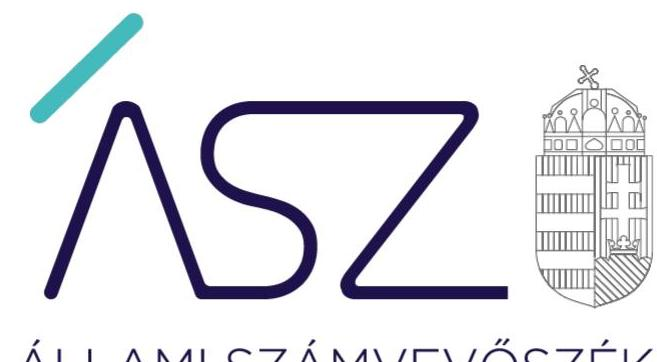
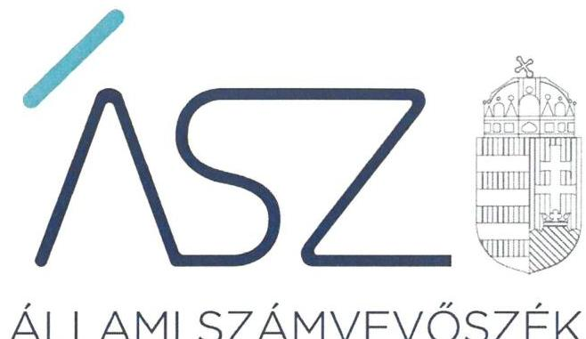
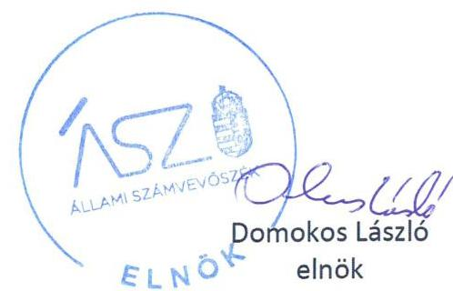
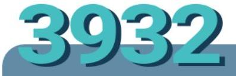

ÁLLAMI SZÁMVEVŐSZÉK

# JELENTÉS 

Az önkormányzat és társulás irányítása alá tartozó intézmények integritásának monitoring típusú ellenőrzése 11 önkormányzati intézmény

Értékelés - a számvevőszéki tanácsadás hatása az intézmények integritási kockázataira
2022.

22011
www.asz.hu

---

ÁLLAMI SZÁMVEVŐSZÉK

# JELENTÉS

Az önkormányzat és társulás irányítása alá tartozó intézmények integritásának monitoring típusú ellenőrzése – 11 önkormányzati intézmény

Értékelés – a számvevőszéki tanácsadás hatása az intézmények integritási kockázataira

2022. 03. hó 31. nap

22011
www.asz.hu

---

# AZ ELLENŐRZÉST FELÜGYELTE: 

SALAMON ILDIKÓ felügyeleti vezető

AZ ELLENŐRZÉST VEZETTE ÉS A VÉGREHAJTÁSÁÉRT FELELŐS:
SZAPPANOS JÚLIA ellenőrzésvezető
BALÁZSNÉ ANTONI ERIKA ellenőrzésvezető
BAJNAI ZSUZSANNA ellenőrzésvezető
SIPOSNÉ DÓCZI KLÁRA ellenőrzésvezető
JANIK JÓZSEF ellenőrzésvezető
ÓDOR ZOLTÁN TAMÁS ellenőrzésvezető

A PROGRAM ÖSSZEÁLLÍTÁSÁÉRT FELELŐS:
DR. FELFÖLDI IZABELLA programkészítésért felelős vezető

IKTATÓSZÁM: EL-3461-023/2022.
TÉMASZÁM: 2568
ELLENŐRZÉS-AZONOSÍTÓ SZÁM: V0928

---

# TARTALOMJEGYZÉK 

$\square$ ÖSSZEGZÉS ..... 5
$\square$ AZ ELLENŐRZÉS JELENTŐSÉGE, AKTUALITÁSA, TÁRSADALMI SZEREPE, SZEMPONTJAI ..... 8
$\square$ AZ ELLENŐRZÉS TERÜLETE ..... 9
$\square$ ELLENŐRZÉS HATÓKÖRE ÉS MÓDSZERE ..... 10
$\square$ MELLÉKLETEK. ..... 13
I. sz. melléklet: Az értékelés módszertana ..... 13
II. sz. melléklet: Értelmező szótár ..... 15
$\square$ FÜGGELÉKEK ..... 17
I. sz. függelék: Az értékelt szervezetek és azok integritási kockázatainak ellenőrzés hatására történő változása a jelentés lezárását követően ..... 17
II. sz. függelék: Az ellenőrzött szervezetek és azok kockázati értékelése ..... 43
$\square$ RÖVIDÍTÉSEK JEGYZÉKE ..... 45

---

.

---

# ÖSSZEGZÉS 

Az Állami Számvevőszék figyelemfelhívásának és tanácsadásának eredményeként az önkormányzatok és társulások irányítása alatt álló 3932 ellenőrzött intézmény közül 1899 intézménynél a kockázatok alacsony szintűek, illetve - a tervezett intézkedések végrehajtásával - a kockázatok alacsony szintre csökkennek. Ezzel az alacsony integritási kockázatú intézmények aránya a tanácsadás hatására megduplázódott.
Ezeknek az intézményeknek javult az integritása, erősödtek a csalásmentes működés feltételei.

## Értékelések

Alapvető elvárás, hogy - a lakossági igényekre és a helyi sajátosságokra figyelemmel - az állampolgárok azonos elvek alapján, azonos elbírálás szerint jussanak hozzá a közszolgáltatásokhoz, és a helyi önkormányzatok, önkormányzati társulások irányítása alá tartozó intézmények működtetésében érvényesüljenek az alapvető integritási elvárások. Az intézmények által nyújtott szerteágazó közszolgáltatások minősége közvetlen hatással van az azokat igénybe vevő állampolgárok életére, így az integritás alapú működés hiánya gyengíti a közbizalmat, ezen elvek mentén történő működési környezet kiépítése és fejlesztése pedig felelős vezetői magatartást igényel.

Az Állami Számvevőszék 2021-ben egyidejűleg végezte el az önkormányzatok irányítása alá tartozó 3341, valamint az önkormányzati társulások irányítása alá tartozó 591 intézmény integritásának, vagyis korrupció elleni védettségének jelen idejű monitoring értékelését. A 2021. évre vonatkozó monitoring ellenőrzés a 3932 önkormányzati intézmény belső kontrollrendszerének lényeges elemei kialakítására terjedt ki. Az ellenőrzés a súlypontok meghatározásával lehetőséget biztosított a szervezeti integritás, működés és vezetés, valamint a gazdálkodás területén a kockázatok azonosítására.

A szervezeti integritás alapvető feltétele a szabályozottság, azaz jogszabályokban előírt belső szabályzatok megléte, azok - hatályos jogszabályoknak - megfelelő tartalma és gyakorlati alkalmazhatósága. Az integritási kockázatok szervezeti szinten csökkenthetők azáltal, hogy az intézményvezetők kialakítják a szervezeti és működési kereteket, a gazdálkodásra vonatkozó alapvető szabályozási környezetet, valamint a kontrolltevékenységek szabályszerű gyakorlásának, az integrált kockázatkezelésnek és az integritást sértő események kezelésének a feltételeit. Az intézményenként értékelt 15 - mindenkor jelen időben hatályos - dokumentumnak folyamatosan rendelkezésre kell állniuk, ugyanis ezek alapvető feltételei az adott intézmény szabályozottságának, szabályos és átlátható gazdálkodásának, illetve csalásmentes működésének.

A 3932 ellenőrzött közül 677 intézmény vezetője tett eleget az ellenőrzött területek mindegyikén az integritási kontrollok alapvető feltételeit jelentő, a jogszabályban előírt szabályozási kötelezettségének. Közülük 436 intézmény vezetője a jogszabályi előírásokon túl további erőfeszítéseket is tett az integritás erősítése érdekében, felismerte további olyan integritási kontrollok kialakításának indokoltságát, amelyet jogszabály nem ír elő, így szervezeti szinten hozzájárul a korrupcióval szembeni védettség megszilárdításához.

3408 intézmény esetében az intézményvezető intézkedése volt szükséges a kockázatok csökkentése érdekében, mivel 1154 intézménynél a jogszabályok által előírt kontrollok területén, 2013 intézménynél a jogszabályok által előírt és a további, jogszabály által nem előírt integritási kontrollok területén egyaránt, 241 intézménynél az utóbbi kontrollok területén voltak hiányosságok. A dokumentumok kiértékelése alapján - az integritás további fejlesztése érdekében - az Állami Számvevőszék azonosította a lényeges kockázati területeket, és már az ellenőrzés lefolytatásával párhuzamosan, a 2021. évre vonatkozóan a kockázatok csökkentésére hívta fel az intézményvezetők figyelmét.

Az Állami Számvevőszék figyelemfelhívására határidőben válaszoló intézményvezetők közül 1425 arról tájékoztatta az Állami Számvevőszéket, hogy valamennyi kockázatos területen, 527 pedig a kockázatos területek egy részénél már tett, illetve a jövőben tesz intézkedést a jelzett kockázatok csökkentése érdekében. A jogszabályi előírásokon túli integritási kontrollok területén az érintettek közül 1150 intézmény vezetője a jelzett kockázatok teljes körű, 93 pedig azok részbeni felszámolásáról adtak számot. Mindezek eredményeként a 3408 vezetői levélben jelzett, közel

---

18 ezer kockázati területből több mint 8 ezer esetben (45,0\%-ánál) az intézményvezetők tettek, vagy terveztek intézkedéseket.

Az ellenőrzés rendelkezésre bocsátott adatok értékelése, illetve a figyelemfelhívásokra tett intézkedések alapján az Állami Számvevőszék értékelte az ellenőrzött intézmények integritási kockázatait és azok változását. Első lépésben az intézmények dokumentumainak, valamint az adatok rendelkezésre bocsátásának az értékelése és kockázati kategóriába (alacsony, közepes, magas) sorolása történt meg. A figyelemfelhívó levelekre adott válaszok alapján a kockázatok változásának irányát értékelte az Állami Számvevőszék. Csökkenő kockázatot jelzett, amennyiben a figyelemfelhívó levélre adott intézményvezetői válasz a figyelemfelhívással összhangban volt, valamennyi kockázati területen intézkedett vagy intézkedést tervezett. Növekvő kockázatot jelzett, amennyiben az intézményvezető nem volt együttműködő, a figyelemfelhívó levélre nem válaszolt, vagy válasza alapján nem intézkedett és nem tervezett intézkedést, így a tanácsadást megelőző kockázati értékelést a felelős vezetői magatartás kockázata növelte.

Az Állami Számvevőszék figyelemfelhívására határidőben tett intézkedések eredményeként az ellenőrzött 3932 intézmény közül összesen 1615 intézménynél (41,1\%) a kockázatok alacsony szintűek, illetve - a tervezett intézkedések végrehajtásával - a kockázatok alacsony szintre csökkennek. Az Állami Számvevőszék 2021 decemberében összesen 22 jelentésben hozta nyilvánosságra az önkormányzatok irányítása alá tartozó 3330, valamint a társulások irányítása alá tartozó 591 intézmény integritásának értékelését. A fennmaradó 11 intézmény ellenőrzéséről készített értékelést a II. sz. Függelék tartalmazza.

A 11 intézmény esetében az intézményvezető intézkedése volt szükséges a kockázatok csökkentése érdekében, mivel 1 intézménynél a jogszabályok által előírt kontrollok területén, 9 intézménynél a jogszabályok által előírt és a további, jogszabály által nem előírt integritási kontrollok területén egyaránt, 1 intézménynél utóbbi kontrollok területén voltak hiányosságok. A jogszabályok által előírt kontrollok területén 2, a jogszabály által nem előírt integritási kontrollok területén 3 intézményvezető tett intézkedéseket. 8 intézménynél további intézkedések szükségesek az integritást biztosító alapvető feltételek kiépítése, illetve kiegészítése érdekében.

A jelentések nyilvánosságra hozatalával egyidejűleg az Állami Számvevőszék megkereste a figyelemfelhívására nem válaszoló, illetve a jelzett kockázatokra nem, vagy csak részben intézkedő intézmények irányító szerveit, az integritás kiépítésének további támogatása érdekében. Mindemellett - a közpénzügyi helyzet javítása érdekében - a figyelemfelhívásra nem, vagy nem teljeskörűen intézkedő intézményvezetők figyelmét is felhívta a további intézkedések indokoltságára.

Az Állami Számvevőszék felhívásainak eredményeként - 2022. február 15-ig - további 512 olyan intézményvezetői tájékoztatás érkezett, amelyek a jelzett integritási kockázati területeken történt, vagy tervezett intézkedésekről számoltak be. A figyelemfelhívásra - határidőn túl - történt intézkedések eredményeként további 284 intézménynél csökkentek a kockázatok alacsony szintre. Ezzel az alacsony integritási kockázatú intézmények aránya a tanácsadást megelőző 25,2\%-ról 48,3\%-ra növekedett. Az I. sz. Függelék mutatja a jelentés lezárását követően intézkedő szervezeteket és azok integritási kockázatainak ellenőrzés hatására történő változását.

# Következtetések 

A szabályozások és nyilvántartások kialakításának célja nem önmagában a jogszabályi rendelkezések betartása, hanem az intézmény szabályozottságán keresztül a szabályszerű és csalásmentes gazdálkodás feltételeinek megteremtése, ezáltal az Alaptörvényben előírt átláthatóság és elszámoltathatóság elvének érvényesítése. Ezeknek az alapelveknek az érvényesülése hozzájárulhat ahhoz, hogy az intézmények, mint közszolgáltatást nyújtó szervezetek felé a közszolgáltatásokat igénybe vevők, és általuk az állampolgárok általános bizalma is erősödjön.

Az Állami Számvevőszék tanácsadása alapján, az érintett vezetők felelős vezetői magatartása által, a kockázatos területeken tett további intézkedésekkel növekedhet az integritás kontrollok kiépítettsége az intézményeknél, amely tovább javíthatja az önkormányzati alrendszer integritási színvonalát.

Az integritás elvű működés erősítése érdekében további kockázatcsökkentő lépések szükségesek a vezetés-irányítás, valamint a pénzügyi- és a vagyongazdálkodás szabályszerű feltételeinek kialakítása terén, amelyeket - az ÁSZ által jelzett kockázatos területek figyelembevételével - az érintetteknek lehetőségük van megtenni.

---

# AZ INTÉZMÉNYEK A TETTEK MEZEJÉRE LÉPTEK

## HELYI ÖNKORMÁNYZATOK ÉS ÖNKORMÁNYZATI TÁRSULÁSOK IRÁNYÍTÁSA ALÁ TARTOZÓ INTÉZMÉNYEK INTEGRITÁSÁT ÉRTÉKELTE AZ ÁSZ

Az Állami Számvevőszék egyidejűleg értékelte Magyarország összes, 1912 helyi önkormányzatok és önkormányzati társulások irányítása alá tartozó intézménye 2021. évi integritását. Az intézmények fontos közszolgáltatásokat nyújtanak (pl. bölcsődei, óvodai, közművelődési, egészségügyi és szociális szolgáltatások).

## TANÁCSADÁS

Monitoring ellenőrzése során az ÁSZ levélben hívta fel az ellenőrzöttek figyelmét a feltárt kockázatokra, hiányosságokra, lehetőséget biztosítva azok orvoslására.

## MEGDUPLÁZÓDOTT AZ ALACSONY KOCKÁZATÚ INTÉZMÉNYEK ARÁNYA

|  Kockázatos* | 74,8% | 58,9% | 51,7%  |
| --- | --- | --- | --- |
|  Alacsony kockázatú | 26,2% | 41,1% | 48,9%  |
|  Tanácsadást megelőzően |  | Tanácsadást követően | Jelentések nyilvánosságra hozatalát követően**  |

- Az alacsony kockázatú intézmények aránya a tanácsadás következtében 25,2%-ról 48,5%-ra nőtt.
- Az ellenőrzés eredményeként javult az intézmények integritása, erősödtek a csalásmentes működés feltételei.
- A kockázatok csökkenése a polgármestereknek és az elnököknek is köszönhető.

* Megszűnt intézményekkel együtt

** 2022. február 15-ös határidőig, válaszlevelek alapján

## SZÁMOKBAN:

- 3 408 VEZETŐI LEVÉL
- 17 847 KOCKÁZATI TERÜLET
- 8 033 INTÉZKEDÉS
- 45,0% INTÉZKEDÉSI ARÁNY

---

# AZ ELLENŐRZÉS JELENTŐSÉGE, AKTUALITÁSA, TÁRSADALMI SZEREPE, SZEMPONTJAI 

Az Alaptörvény alapértékeket, elveket fogalmaz meg, amely szerint a közpénzekkel gazdálkodó minden szervezet köteles a nyilvánosság előtt elszámolni a közpénzekre vonatkozó gazdálkodásával. A közpénzeket és a nemzeti vagyont az átláthatóság és a közélet tisztaságának elve szerint kell kezelni.

Magyarország helyi önkormányzatairól szóló törvény ${ }^{1}$ a helyi közhatalom gyakorlás széleskörű érvényesítésével összhangban tág teret ad a helyi önkormányzatoknak a feladataik, a közszolgáltatások legkülönbözőbb formákban történő ellátására. Így a helyi önkormányzatok széleskörű lehetőséggel rendelkeznek intézmények alapítására, illetve arra, hogy a feladataikat önként létrehozott társulások útján lássák el.

A helyi önkormányzatok, önkormányzati társulások irányítása alá tartozó intézmények szerteágazó közszolgáltatásokat nyújtanak. Az intézmények működtetése közvetlenül érinti a társadalom valamennyi rétegét, a közfeladatot ellátó intézmények működésének minősége közvetlen hatással van az azokat igénybe vevő állampolgárok életére.

Az intézmények szabályszerű és eredményes működésének és gazdálkodásának alapfeltétele a belső kontrollrendszer - benne az integritási kontrollok - megfelelő kialakítása. Az ÁSZ² a törvényi felhatalmazással élve ellenőrzi az önkormányzati intézményeket, hogy megállapításaival támogassa az ellenőrzött szervezetek szabályszerű gazdálkodását, működését.

A helyi önkormányzatok, önkormányzati társulások intézményei által ellátott feladatok, a bölcsődei, óvodai ellátás, a gyermekétkeztetés, a betegek és idősek gondozása, a közművelődési intézmények, könyvtárak működtetése által a lakosság ezeken a területeken találkozik legszélesebb körben az önkormányzatok által nyújtott szolgáltatásokkal. A szolgáltatásokat igénybe vevők jelentős száma,
 a feladatellátáshoz használt nemzeti vagyon és az erre fordított közpénz nagysága indokolja, hogy az ÁSZ további, az előző ellenőrzésekre épülő ellenőrzéseket végezzen ezen a területen, illetve további olyan területeken, ahol az önkormányzati szolgáltatást a lakosság széles köre veszi igénybe.

Az ellenőrzés célja annak értékelése, hogy a helyi önkormányzatok, önkormányzati társulások irányítása alá tartozó intézmények megteremtették-e az integritás biztosításához szükséges feltételeket, kialakították-e az alapvető, a szervezeti kereteket, az integritási kontrollokhoz kapcsolódó, valamint a korrupció elleni védelmet szolgáló szabályozásokat. Továbbá, hogy az intézményvezető gondoskodott-e a szervezeti teljesítmény mérés alapfeltételeinek kialakításáról az eredményességi szempontoknak való megfelelés megalapozottsága biztosítása érdekében. A monitoring típusú ellenőrzés célja hatékonyan támogatni az ellenőrzött szervezeteket, ezáltal növelve az ÁSZ tanácsadó szerepét, elősegítve a „jól irányított állam” működését.

Az ÁSZ célja, hogy új ellenőrzési megközelítést alkalmazva támogassa a közpénzügyi helyzet javítását; a monitoring típusú ellenőrzéssel jelen időben adjon helyzetképet az integritási szemlélet érvényesítéséről, rávilágítson az integritási kontrollok kiépítettségére, illetve további fejlesztésére. Napjainkban mindez kiemelt fontosságúvá vált. Minden szervezetnek fel kell készülnie arra, hogy a koronavírus járvány okozta társadalmi és gazdasági válság növelni fogja a korrupciós nyomást. Az ÁSZ ebben a helyzetben is alapvető kötelességének tartja, hogy a közpénzek őre legyen, és ellenőrzéseit az önkormányzati alrendszer intézményei körében is folytassa.

Fontos, hogy az intézmények vezetői felismerjék az integritás kockázatokat, azokat ismételten mérjék fel, és alakítsanak ki átlátható, jól szabályozott rendszereket, döntési mechanizmusokat. Az integritási kockázatok feltárása, megismerése elengedhetetlenül fontos, mert ezt követően tehetők meg azok a lépések, amelyek a kockázatok csökkentését, felszámolását és kezelését célozzák. A belső kontrollrendszer - benne az integritás kontrollok - megfelelő kialakítása, működése a helyi önkormányzatok, önkormányzati társulások irányítása alatt álló intézményeknél is hozzájárul a társadalmi közbizalom erősítéséhez.

Az ellenőrzés rámutat az integritási jó gyakorlatokra is, továbbá felhívja a figyelmet a jogszabályi követelmények teljesítéséhez szükséges lépésekre is.

---

# AZ ELLENŐRZÉS TERÜLETE 

## Az önkormányzatok és a társulások irányítása alá tartozó intézmények

Helyi önkormányzati költségvetési szervet az államháztartásról szóló 2011. évi CXCV törvény (Áht. ${ }^{3}$ ) szerint a helyi önkormányzat, a helyi önkormányzatok társulása, a térségi fejlesztési tanács, az átalakult nemzetiségi önkormányzat alapíthat, a költségvetési szerv alapító okiratában meghatározott önkormányzati közfeladatok ellátására. A költségvetési szervek önálló jogi személyek, éves költségvetésükből gazdálkodva látják el feladataikat. A költségvetési szervek gazdasági szervezettel rendelkeznek, ha azonban a költségvetési szerv éves átlagos statisztikai állományi létszáma a 100 főt nem éri el, a gazdasági szervezet feladatait az önkormányzati hivatal, vagy az irányító szerv döntése alapján az irányító szerv irányítása alá tartozó, gazdasági szervezettel rendelkező más költségvetési szerv látja el.

Az államháztartásról szóló törvény végrehajtásáról szóló 368/2011. (XII. 31.) Korm. rendelet (Ávr. ${ }^{4}$ ) 1. melléklete szerint, az államháztartás önkormányzati alrendszerében a helyi önkormányzat által irányított költségvetési szerv esetében az irányító szerv hatáskörét a képviselőtestület, közgyűlés gyakorolja, és annak vezetője a polgármester, főpolgármester, megyei közgyűlés elnöke. A társulás által irányított költségvetési szerv esetében az irányító szervi feladatokat a társulási tanács és annak elnöke gyakorolja.

Egyrészt az értékelés kiterjedt az önkormányzatok és a társulások irányítása alá tartozó, az I. sz. Függelékben felsorolt költségvetési szervekre, az intézményvezetők által jelzett - az intézmények értékelését tartalmazó jelentések lezárását követően az ÁSZ-hoz érkezett - további intézkedések feldolgozása vonatkozásában.

Másrészt az ellenőrzés kiterjedt az önkormányzatok irányítása alá tartozó, az II. sz. Függelékben felsorolt költségvetési szervekre. A feladatellátásuk szerint az ellenőrzött költségvetési szervek óvodai, bölcsődei, művelődési, egészségügyi és közétkeztetési feladatokat látnak el. Az ellenőrzött 11 intézmény nem rendelkezik saját gazdasági szervezettel.

---

# ELLENŐRZÉS HATÓKÖRE ÉS MÓDSZERE 

## Az ellenőrzés típusa

Megfelelőségi ellenőrzés.

## Az ellenőrzött időszak

A 2021. év, a Bkr. ${ }^{5}$ szerinti vezetői nyilatkozat, valamint annak alátámasztottsága vonatkozásában a 2020. év.

## Az ellenőrzés tárgya

A szervezeti keretekkel, a működéssel és gazdálkodással kapcsolatos szabályzatok, szabályozások, valamint a szervezeti elvekkel, értékekkel összefüggő integritás kontrollok kiépítettsége, a szervezeti teljesítmény mérés alapfeltételeinek kialakítása.

## Az ellenőrzött szervezetek

Az értékelt intézményeket az I. sz. Függelék, az ellenőrzött intézményeket a II. sz. Függelék tartalmazza.

## Az ellenőrzés jogalapja

Az ellenőrzés jogszabályi alapját az ÁSZ tv. ${ }^{6}$ 1. § (3) bekezdése, 5. § (6) bekezdése, valamint az Áht. 61. § (2) bekezdése képezik.

## Az ellenőrzés módszerei

Az ÁSZ az ellenőrzést az ellenőrzési program szempontjai, az ellenőrzött időszakban hatályos jogszabályok, a jelen ellenőrzésre irányadó ÁSZ módszertan figyelembevételével és a nemzetközi standardokat irányadónak tekintve végzi.

Az ellenőrzés ideje alatt az ÁSZ az ellenőrzött szervezetekkel történő kapcsolattartást az ÁSZSZMSZ ${ }^{7}$ -ének vonatkozó előírásai alapján biztosítja.

Az ellenőrzési kérdések megválaszolásához szükséges bizonyítékok megszerzése a következő ellenőrzési eljárások alkalmazásával történik: megfigyelés, összehasonlítás, elemző eljárás. Az ellenőrzési bizonyítékként felhasználható adatforrások közé tartoznak az ellenőrzési programban felsorolt adatforrások, továbbá minden - az ellenőrzés folyamán - feltárt, az ellenőrzés szempontjából információkat tartalmazó dokumentum.

---

Az ÁSZ az ellenőrzést a kérdésekre adott válaszok kiértékelésével, valamint a megjelölt adatforrások, továbbá az adott időszakban hatályos jogszabályok, valamint az ÁSZ honlapján közzétett helyénvalósági kritériumok figyelembevételével folytatja le.

A monitoring típusú ellenőrzés az önkormányzatok irányítása alá tartozó intézmények integritás alapú működésének lényeges területeire és a közpénzügyi helyzet javítása érdekében az elért eredmények fenntartására fókuszál. Lehetőséget biztosít az integritási kontrollok kiépítettségében lévő hiányosságok, a szervezeti teljesítmény mérés alapfeltételei kialakításának hiánya beazonosítására az eredményességi szempontoknak való megfelelés megalapozottsága biztosítása érdekében, az önkormányzatok, társulások irányítása alá tartozó intézmények integritásának elemzésére, részletes ellenőrzések megalapozására.

---

.

---

# MELLÉKLETEK 

## I. SZ. MELLÉKLET: AZ ÉRTÉKELÉS MÓDSZERTANA

Az egyes kockázati területek és kockázatforrások minősítése „pontozásos módszerrel”, az integritás „jelző” dokumentumai és a vezetői magatartás ellenőrzéshez kapcsolódóan tanúsított tényhelyzeteinek értékelése alapján történt.

Az értékelt dokumentumokhoz, nyilvántartásokhoz, kockázati besorolásokhoz minden esetben pontszám került hozzárendelésre, amelyek értéke alapján az ellenőrzött szervezetek kockázati csoportba kerültek besorolásra:
$\longrightarrow$ Alacsony kockázatú - az elérhető összes pontszám legalább 80\%-a
$\longrightarrow$ Közepes kockázatú - az elérhető pontszám 50-79\%-a között
$\longrightarrow$ Magas kockázatú - az elérhető pontszám 50\%-a alatt
Az első lépésben azonosításra kerültek azok az intézményi szabályozások és nyilvántartások, amelyek meglétét jogszabály írja elő, hiánya pedig felveti a csalás és korrupció kockázatát.

Második lépésben az adatoknak az ellenőrzés rendelkezésére bocsátása kockázati kritériumainak meghatározása, majd értékelése történt meg.

Harmadik lépésben a figyelemfelhívó levelekre adott válaszok kockázati kritériumainak meghatározása, majd értékelése történt meg.

Az összesített kockázati értékelést javította, amennyiben
$\longrightarrow$ az intézmény rendelkezett olyan szabályozással, amely kötelező meglétét jogszabály nem írja elő, de segíti a csalás és a korrupció megelőzését (helyénvalósági dokumentumok).
Az összesített kockázati értékelést rontotta, amennyiben
$\longrightarrow$ az integritás szempontjából meghatározó dokumentum - az intézményi SZMSZ - hiányzott, és javítása érdekében a figyelemfelhívó levél hatására sem történt intézkedés.
A figyelemfelhívó levelekre adott válaszok értékelése alapján:
$\longrightarrow$ A kockázat csökkent, amennyiben a figyelemfelhívó levélre adott válasza a figyelemfelhívással összhangban volt, valamennyi kockázati területen intézkedett vagy intézkedést tervezett.
$\longrightarrow$ A kockázat változatlan, amennyiben a figyelemfelhívó levélben foglaltaktól eltérő magatartást tanúsított, intézkedése a figyelemfelhívással részben volt összhangban, a kockázati területeken részben intézkedett vagy intézkedést tervezett.
$\longrightarrow$ A kockázat nőtt, amennyiben nem volt együttműködő, a figyelemfelhívó levélre nem válaszolt, vagy válasza alapján nem intézkedett és nem tervezett intézkedést.

---

# Az önkormányzatok és a társulások irányítása alá tartozó intézmények kockázati csoportba sorolásának értékelési keretrendszere 

I. Dokumentumokkal rendelkezés
lényeges dokumentumok, amelyek hiánya felveti a csalás és korrupció kockázatát
I.1. A szervezeti integritás, működés és vezetés alapvető szabályozási feltételei

- intézmény SZMSZ-e
- vezetői nyilatkozat a 2020. évre vonatkozóan az intézmény belső kontrollrendszer minőségének értékeléséről, valamint a nyilatkozat megalapozottságát bizonyító dokumentumok
- integrált kockázatkezelés eljárásrendje
- az integritást sértő események kezelésének eljárásrendje
I.2. A pénz- és vagyongazdálkodáshoz kapcsolódó alapvető szabályozások
- számviteli politika
- az eszközök és a források leltárkészítési és leltározási szabályzata
- az eszközök és a források értékelési szabályzata
- pénzkezelési szabályzat
- számlarend
- beszerzések lebonyolításával kapcsolatos eljárásrend
- a kötelezettségvállalásra, teljesítés igazolására jogosult személyekről és aláírás-mintájukról vezetett nyilvántartás
II. Az adatoknak az ellenőrzés rendelkezésére bocsátása kockázati értékelése
II.1. Nem kockázatos: a megnevezett adatokkal rendelkezett és a törvényi határidőn belül hiánytalanul rendelkezésre bocsátotta. Figyelemfelhívó levél nem volt indokolt.
II.2. Kiemelten magas kockázatú: a megnevezett adatokat nem bocsátotta rendelkezésre.
III. Figyelemfelhívó levelekre adott válaszok kockázati értékelése
III.1. Alacsony kockázatú: együttműködése a figyelemfelhívó levéllel összhangban volt.
III.2. Közepes kockázatú: a figyelemfelhívó levélben foglaltaktól eltérő együttműködést tanúsított.
III.3. Magas kockázatú: nem reagált, nem intézkedett, így nem volt együttműködő.

---

# II. SZ. MELLÉKLET: ÉRTELMEZŐ SZÓTÁR 

belső kontrollrendszer

belső kontrollrendszer területei
integrált kockázatkezelési rendszer
integritás

Integritási kockázatok
kockázat
kontrollkörnyezet
kontrollkörnyezet
kockázat
kontrollkörnyezet
költségvetési szerv vezetője által kialakított olyan elvek, eljárások, belső szabályzatok összessége, amelyben világos a szervezeti struktúra, a folyamatok átláthatók, egyértelműek a felelősségi, hatásköri viszonyok és feladatok, meghatározottak, ismertek és elfogadottak az etikai elvárások a szervezet minden szintjén, átlátható a humánerőforrás-kezelés, biztosított a szervezeti célok és értékek irányában való elkötelezettség fejlesztése és elősegítése. (Forrás: Bkr. 6. § (1) bekezdés)
A költségvetési szerv vezetője által a szervezeten belül kialakított (kontroll) tevékenységek, melyek biztosítják a kockázatok kezelését, hozzájárulnak a szervezet céljainak eléréséhez és erősítik a szervezet integritását. (Forrás: Bkr. 8. § (1) bekezdés)
A helyi önkormányzatok irányítása alá tartozó költségvetési szervek. (A képviselő-testület a feladatkörébe tartozó közszolgáltatások ellátására - jogszabályban meghatározottak szerint - költségvetési szervet (önkormányzati intézmény) alapíthat; Forrás: Mötv. 41. § (6) bekezdés)

---

.

---

# FÜGGELÉKEK

- I. SZ. FÜGGELÉK: AZ ÉRTÉKELT SZERVEZETEK ÉS AZOK INTEGRITÁSI KOCKÁZATAINAK ELLENŐRZÉS HATÁSÁRA TÖRTÉNŐ VÁLTOZÁSA A JELENTÉS LEZÁRÁSÁT KÖVETŐEN

|  Sorszám | Ellenőrzött szervezet megnevezése | Irányító szerv (önkormányzat) megnevezése | Helység | Megye | Határidőt követően történt intézkedés | A kockázati szint alacsonyra csökkent-e  |
| --- | --- | --- | --- | --- | --- | --- |
|  1. | VISKI KÁROLY MÚZEUM KALOCSA | KALOCSA VÁROS ÖNKORMÁNYZATA | KALOCSA | BÁCS-KISKUN | I | N  |
|  2. | KALOCSA VÁROS ÓVODÁJA ÉS BÖLCSÖDÉJE | KALOCSA VÁROS ÖNKORMÁNYZATA | KALOCSA | BÁCS-KISKUN | I | N  |
|  3. | ADY ENDRE VÁROSI KÖNYVTÁR | BAJA VÁROS ÖNKORMÁNYZAT | BAJA | BÁCS-KISKUN | I | N  |
|  4. | KATYMÁR KÖZSÉGI ÓVODA | KATYMÁR KÖZSÉGI ÖNKORMÁNYZAT | KATYMÁR | BÁCS-KISKUN | I | I  |
|  5. | GONDOZÁSI KÖZPONT | LAKITELEK ÖNKORMÁNYZATA | LAKITELEK | BÁCS-KISKUN | I | I  |
|  6. | KÖZSÉGI KÖNYVTÁR | LAKITELEK ÖNKORMÁNYZATA | LAKITELEK | BÁCS-KISKUN | I | I  |
|  7. | VÉCSEY KÁROLY MŰVELŐDÉSI HÁZ ÉS KÖNYVTÁR | SOLT VÁROS ÖNKORMÁNYZAT | SOLT | BÁCS-KISKUN | I | N  |
|  8. | SOLT VÁROS ÖNKORMÁNYZAT ALAPSZOLGÁLTATÁSI KÖZPONT | SOLT VÁROS ÖNKORMÁNYZAT | SOLT | BÁCS-KISKUN | I | N  |
|  9. | VÁROSI
 ÓVODÁK ÉS BÖLCSŐDÉK | TISZAKÉCSKE VÁROS ÖN-
KORMÁNYZATA | TISZAKÉCSKE | BÁCS-KISKUN | I | I  |
|  10. | ARANY JÁNOS MÜVELŐDÉSI KÖZPONT ÉS VÁROSI KÖNYVTÁR | TISZAKÉCSKE VÁROS ÖN-
KORMÁNYZATA | TISZAKÉCSKE | BÁCS-KISKUN | I | I  |
|  11. | IDŐSEK NAPKÖZI OTTHONA | AKASZTÓ KÖZSÉG ÖNKOR-
MÁNYZATA | AKASZTÓ | BÁCS-KISKUN | I | I  |
|  12. | FÜLÖPJAKABI NAPSUGÁR ÓVODA | FÜLÖPJAKAB KÖZSÉG ÖN-
KORMÁNYZATA | FÜLÖPJAKAB | BÁCS-KISKUN | I | I  |
|  13. | KISKUNFÉLEGYHÁZI PETŐFI SÁNDOR VÁROSI KÖNYVTÁR | KISKUNFÉLEGYHÁZA VÁ-
ROS ÖNKORMÁNYZATA | KISKUNFÉL-
EGYHÁZA | BÁCS-KISKUN | I | I  |
|  14. | MÓRA FERENC MÜVELŐDÉSI KÖZPONT | KISKUNFÉLEGYHÁZA VÁ-
ROS ÖNKORMÁNYZATA | KISKUNFÉL-
EGYHÁZA | BÁCS-KISKUN | I | I  |
|  15. | KISKUNMAJSAI NAPSUGÁR ÓVODA | KISKUNMAJSA VÁROS ÖN-
KORMÁNYZATA | KISKUNMAJSA | BÁCS-KISKUN | I | I  |
|  16. | KISKUNMAJSAI GYERMEKJÖLÉTI, SZOCIÁLIS ÉS EGÉSZSÉGÜGYI SZOLGÁLTATÓ INTÉZMÉNY | KISKUNMAJSA VÁROS ÖN-
KORMÁNYZATA | KISKUNMAJSA | BÁCS-KISKUN | I | I  |
|  17. | PÁLMONOSTORAI NAPSUGÁR ÓVODA ÉS SZOCIÁLIS SZOLGÁLTATÓ | PÁLMONOSTORA KÖZSÉG ÖNKORMÁNYZATA | PÁLMONOS-
TORA | BÁCS-KISKUN | I | I  |
|  18. | BERECZ SKOLASZTIKA SZOCIÁLIS INTÉZMÉNY | TISZAUG KÖZSÉG ÖNKOR-
MÁNYZATA | TISZAUG | BÁCS-KISKUN | I | I  |

---

|  Sorszám | Ellenőrzött szervezet megnevezése | Irányító szerv (önkormányzat) megnevezése | Helység | Megye | Határidőt követően történt intézkedés | A kockázati szint alacsonyra csökkent-e  |
| --- | --- | --- | --- | --- | --- | --- |
|  19. | TISZAUGI ÓVODA | TISZAUG KÖZSÉG ÖNKORMÁNYZATA | TISZAUG | BÁCS-KISKUN | I | N  |
|  20. | KOMLÓ VÁROS ÖNKORMÁNYZAT VÁROSGONDNOKSÁG | KOMLÓ VÁROS ÖNKORMÁNYZAT | KOMLÓ | BARANYA | I | I  |
|  21. | ERDŐSMECSKEI ÓVODA ÉS KONYHA | ERDŐSMECSKE KÖZSÉG ÖNKORMÁNYZATA | ERDŐSMECSKE | BARANYA | I | N  |
|  22. | GERESDLAKI NAPRAFORGÓ NÉMET NEMZETISÉGI ÓVODA ÉS KONYHA | GERESDLAK KÖZSÉG ÖNKORMÁNYZATA | GERESDLAK | BARANYA | I | N  |
|  23. | NAPSUGÁR ÓVODA BEREMEND | BEREMEND NAGYKÖZSÉG ÖNKORMÁNYZAT | BEREMEND | BARANYA | I | I  |
|  24. | ALMAMELLÉKI MINI BÖLCSŐDE | ALMAMELLÉK KÖZSÉGI ÖNKORMÁNYZAT | ALMAMELLÉK | BARANYA | I | N  |
|  25. | VÁSÁROSDOMBÓI MESEVÁR ÓVODA | VÁSÁROSDOMBÓI INTÉZMÉNYFENNTARTÓ TÁRSULÁS | VÁSÁROSDOMBÓ | BARANYA | I | I  |
|  26. | ALAPSZOLGÁLTATÁSI KÖZPONT BEREMEND | BEREMENDI GYERMEKJÖLÉTI ÉS SZOCIÁLIS TÁRSULÁS | BEREMEND | BARANYA | I | N  |
|  27. | DÉL-ZSELIC ÓVODÁI, BÖLCSŐDÉJE ÉS KONYHÁI | SZIGETVÁR-DÉL-ZSELIC TÖBBCÉLÚ KISTÉRSÉGI TÁRSULÁS | SZIGETVÁR | BARANYA | I | N  |
|  28. | ORFÚI FEKETE ISTVÁN ÓVODA ÉS KONYHA | ORFÚI ÓVODAFENNTARTÓ TÁRSULÁS | ORFÚ | BARANYA | I | N  |
|  29. | NAPRAFORGÓ ÓVODA, MINI BÖLCSŐDE ÉS KONYHA | KÉTÚJFALU ÉS TÉRSÉGE ÓVODAFENNTARTÓ TÁRSULÁS | KÉTÚJFALU | BARANYA | I | N  |
|  30. | HÁZI SEGÍTSÉGNYÚJTÁST ÉS SZOCIÁLIS ÉTKEZTETÉST BIZTOSÍTÓ ALAPINTÉZMÉNY | KÉTÚJFALU KÖRNYÉKI SZOCIÁLIS INTÉZMÉNYFENNTARTÓ TÁRSULÁS | KÉTÚJFALU | BARANYA | I | N  |
|  31. | MOZSGÓI ÓVODA ÉS KONYHA | MOZSGÓI INTÉZMÉNYFENNTARTÓ ÖNKORMÁNYZATI TÁRSULÁS | MOZSGÓ | BARANYA | I | N  |
|  32. | DRÁVA KINCSE ÓVODA ÉS KONYHA | DRÁVASZABOLCS, DRÁVACSEHI, DRÁVAPALKONYA, GORDISA ÓVODA FENNTARTÓ ÉS SZOCIÁLIS ÉTKEZTETÉST ELLÁTÓ TÁRSULÁS | DRÁVASZABOLCS | BARANYA | I | I  |
|  33. | MÁGOCSI TÜNDÉRKERT ÓVODA-BÖLCSŐDE | MÁGOCSI ÓVODAFENNTARTÓ TÁRSULÁS | MÁGOCS | BARANYA | I | N  |
|  34. | FELSŐSZENTMÁRTONI HORVÁT NEMZETISÉGI ÓVODA | FELSŐSZENTMÁRTONI ÓVODAI TÁRSULÁS | FELSŐSZENTMÁRTON | BARANYA | I | N  |
|  35. | ERZSÉBETI GYERMEKSZÍV ÓVODA, MINI BÖLCSŐDE ÉS KONYHA | ERZSÉBETI GYERMEKSZÍV ÓVODA FENNTARTÓ TÁRSULÁS | ERZSÉBET | BARANYA | I | N  |
|  36. | ÖFALUI NÉMET NEMZETISÉGI KÉTNYELVŰ ÓVODA ÉS MINI BÖLCSŐDE | NÉMET ÖNKORMÁNYZAT ÖFALU | ÖFALU | BARANYA | I | N  |
|  37. | GYÓDI ÓVODA | GYÓD KÖZSÉG ÖNKORMÁNYZATA | GYÓD | BARANYA | I | N  |

---

| Sorszám | Ellenőrzött szervezet megnevezése | Irányító szerv (önkormányzat) megnevezése | Helység | Megye | Határidőt követően történt intézkedés | A kockázati szint alacsonyra csökkent-e |
| :--: | :--: | :--: | :--: | :--: | :--: | :--: |
| 38. | BORSODIVÁNKA KÖZSÉG ELLÁTÓ ÉS ÉLELMEZÉSI KÖZPONT | BORSODIVÁNKA KÖZSÉG ÖNKORMÁNYZATA | BORSODIVÁNKA | BORSOD-ABAÚJZEMPLÉN | I | N |
| 39. | MISKOLCI INTEGRÁLT ÓVODAI INTÉZMÉNY | MISKOLC MEGYEI JOGÚ VÁROS ÖNKORMÁNYZATA | MISKOLC | BORSOD-ABAÚJZEMPLÉN | I | I |
| 40. | MISKOLCI EGYESÍTETT SZOCIÁLIS, EGÉSZSÉGÜGYI ÉS GYERMEKJÓLÉTI INTÉZMÉNY | MISKOLC MEGYEI JOGÚ VÁROS ÖNKORMÁNYZATA | MISKOLC | BORSOD-ABAÚJZEMPLÉN | I | I |
| 41. | MISKOLCI EGÉSZSÉGFEJLESZTÉSI INTÉZET | MISKOLC MEGYEI JOGÚ VÁROS ÖNKORMÁNYZATA | MISKOLC | BORSOD-ABAÚJZEMPLÉN | I | N |
| 42. | PUTNOKI HUMÁN SZOLGÁLTATÓ KÖZPONT | PUTNOK VÁROS ÖNKORMÁNYZATA | PUTNOK | BORSOD-ABAÚJZEMPLÉN | I | I |
| 43. | PAX HÁLÓZATFEJLESZTŐ GONDOZÁSI KÖZPONT | ENCS VÁROS ÖNKORMÁNYZATA | ENCS | BORSOD-ABAÚJZEMPLÉN | I | I |
| 44. | HERNÁDKAK KÖZSÉGI ÓVODA | HERNÁDKAK KÖZSÉG ÖNKORMÁNYZATA | HERNÁDKAK | BORSOD-ABAÚJZEMPLÉN | I | I |
| 45. | KISTOKAJI ÓVODA, BÖLCSŐDE ÉS KONYHA | KISTOKAJ KÖZSÉG ÖNKORMÁNYZATA | KISTOKAJ | BORSOD-ABAÚJZEMPLÉN | I | I |
| 46. | MUHI PÖTTÖMKERT ÓVODA | MUHI KÖZSÉG ÖNKORMÁNYZATA | MUHI | BORSOD-ABAÚJZEMPLÉN | I | N |
| 47. | A MÜVELŐDÉS HÁZA ÉS KÖNYVTÁRA MÜVELŐDÉSI KÖZPONT ÉS NÉPFŐISKOLA | SÁROSPATAK VÁROS ÖNKORMÁNYZATA | SÁROSPATAK | BORSOD-ABAÚJZEMPLÉN | I | I |
| 48. | SÁROSPATAKI KOMMUNÁLIS SZERVEZET | SÁROSPATAK VÁROS ÖNKORMÁNYZATA | SÁROSPATAK | BORSOD-ABAÚJZEMPLÉN | I | I |
| 49. | ALSÓSZUHAI KONYHA | ALSÓSZUHA KÖZSÉG ÖNKORMÁNYZATA | ALSÓSZUHA | BORSOD-ABAÚJZEMPLÉN | I | N |
| 50. | ALSÓZSOLCAI 2. SZ. ÓVODA ÉS KONYHA | ALSÓZSOLCA VÁROS ÖNKORMÁNYZATA | ALSÓZSOLCA | BORSOD-ABAÚJZEMPLÉN | I | I |
| 51. | FEKETE ISTVÁN ÓVODA ÉS BÖLCSŐDE | ALSÓZSOLCA VÁROS ÖNKORMÁNYZATA | ALSÓZSOLCA | BORSOD-ABAÚJZEMPLÉN | I | I |
| 52. | ALSÓZSOLCAI GONDOZÁSI KÖZPONT | ALSÓZSOLCA VÁROS ÖNKORMÁNYZATA | ALSÓZSOLCA | BORSOD-ABAÚJZEMPLÉN | I | I |
| 53. | FELSŐZSOLCAI KÖZÖSSÉGI HÁZ ÉS VÁROSI KÖNYVTÁR | FELSŐZSOLCA VÁROS ÖNKORMÁNYZATA | FELSŐZSOLCA | BORSOD-ABAÚJZEMPLÉN | I | I |
| 54. | IGRICI SZÁZSZORSZÉP ÓVODA | IGRICI KÖZSÉG ÖNKORMÁNYZATA | IGRICI | BORSOD-ABAÚJZEMPLÉN | I | I |
| 55. | IGRICI KONYHA | IGRICI KÖZSÉG ÖNKORMÁNYZATA | IGRICI | BORSOD-ABAÚJZEMPLÉN | I | I |
| 56. | KISGYŐRI SZOCIÁLIS INTÉZMÉNY | KISGYŐR KÖZSÉG ÖNKORMÁNYZATA | KISGYŐR | BORSOD-ABAÚJZEMPLÉN | I | N |
| 57. | KÖRÖMI ANTALL JÓZSEF NAPKÖZI OTTHONOS ÓVODA | KÖRÖM KÖZSÉG ÖNKORMÁNYZATA | KÖRÖM | BORSOD-ABAÚJZEMPLÉN | I | I |
| 58. | NAGYCSÉCSI MICIMACKÓ ÓVODA | NAGYCSÉCS KÖZSÉG ÖNKORMÁNYZATA | NAGYCSÉCS | BORSOD-ABAÚJZEMPLÉN | I | I |
| 59. | RÉVLEÁNYVÁR ÓVODA ÉS BÖLCSŐDE | RÉVLEÁNYVÁR KÖZSÉG ÖNKORMÁNYZATA | RÉVLEÁNYVÁR | BORSOD-ABAÚJZEMPLÉN | I | I |

---

|  Sorszám | Ellenőrzött szervezet megnevezése | Irányító szerv (önkormányzat) megnevezése | Helység | Megye | Határidőt követően történt intézkedés | A kockázati szint alacsonyra csökkent-e  |
| --- | --- | --- | --- | --- | --- | --- |
|  60. | RÉVLEÁNYVÁR KONYHA | RÉVLEÁNYVÁR KÖZSÉG ÖNKORMÁNYZATA | RÉVLEÁNYVÁR | BORSOD-ABAÚJZEMPLÉN | I | I  |
|  61. | CSODA-VÁR ÓVODA ÉS MINI BÖLCSŐDE SAJÓKERESZTÚR | SAJÓKERESZTÚR KÖZSÉG ÖNKORMÁNYZATA | SAJÓKE-
RESZTÚR | BORSOD-ABAÚJZEMPLÉN | I | N  |
|  62. | MÜVELŐDÉSI HÁZ, KÖZSÉGI ÉS ISKOLAI KÖNYVTÁR | SAJÓKERESZTÚR KÖZSÉG ÖNKORMÁNYZATA | SAJÓKE-
RESZTÚR | BORSOD-ABAÚJZEMPLÉN | I | N  |
|  63. | SAJÓSZÖGEDI ÁLTALÁNOS MÜVELŐDÉSI KÖZPONT- CSALÁD ÉS GYERMEKJÓLÉTI SZOLGÁLAT - KONYHA -MÜVELŐDÉSI HÁZ ÉS KÖNYVTÁR | SAJÓSZÖGED KÖZSÉGI ÖNKORMÁNYZAT | SAJÓSZÖGED | BORSOD-ABAÚJZEMPLÉN | I | I  |
|  64. | SAJÓSZÖGEDI ZÖLD SZIGET BÖLCSŐDE | SAJÓSZÖGED KÖZSÉGI ÖNKORMÁNYZAT | SAJÓSZÖGED | BORSOD-ABAÚJZEMPLÉN | I | I  |
|  65. | MAGAS-HEGYI TURISZTIKAI ÉS SPORTKÖZPONT | SÁTORALJAÚJHELY VÁROS ÖNKORMÁNYZATA | SÁTORALJAÚJHELY | BORSOD-ABAÚJZEMPLÉN | I | I  |
|  66. | TISZABÁBOLNA KÖZSÉG ELLÁTÓ ÉS ÉLELMEZÉSI KÖZPONT | TISZABÁBOLNA KÖZSÉG ÖNKORMÁNYZATA | TISZABÁBOLNA | BORSOD-ABAÚJZEMPLÉN | I | N  |
|  67. | TISZADOROGMAI ÉLELMEZÉSI KÖZPONT | TISZADOROGMA KÖZSÉG ÖNKORMÁNYZATA | TISZADOROGMA | BORSOD-ABAÚJZEMPLÉN | I | I  |
|  68. | TISZAKESZI HÉTSZÍNVIRÁG ÓVODA | TISZAKESZI KÖZSÉG ÖNKORMÁNYZATA | TISZAKESZI | BORSOD-ABAÚJZEMPLÉN | I | I  |
|  69. | MEZŐCSÁTI KISTÉRSÉG HUMÁNSZOLGÁLTATÓ KÖZPONT | MEZŐCSÁT KISTÉRSÉG TÖBBCÉLÚ TÁRSULÁSA | MEZŐCSÁT | BORSOD-ABAÚJZEMPLÉN | I | I  |
|  70. | BODROGKÖZI TÖBBCÉLÚ KISTÉRSÉGI TÁRSULÁS SZOCIÁLIS SZOLGÁLTATÓ KÖZPONT | BODROGKÖZI TÖBBCÉLÚ KISTÉRSÉGI TÁRSULÁS | CIGÁND | BORSOD-ABAÚJZEMPLÉN | I | I  |
|  71. | BÓDVASZILASI KÖRZETI CSALÁDSEGÍTŐ ÉS GYERMEKJÓLÉTI SZOLGÁLAT | BÓDVASZILAS KÖRNYÉKI CSALÁDSEGÍTŐ ÉS GYERMEKJÓLÉTI INTÉZMÉNYFENNTARTÓ TÁRSULÁS | BÓDVASZILAS | BORSOD-ABAÚJZEMPLÉN | I | I  |
|  72. | SAJÓKAZAI NAPPALI SZOCIÁLIS KÖZPONT | DÉDESTAPOLCSÁNY-SAJÓ-GALGÓC-SAJÓIVÁNKA-SA-JÓKAZA-SZUHAKÁLLÓVADNA NAPPALI SZOCIÁLIS KÖZPONT INTÉZMÉNYFENNTARTÓ TÁRSULÁS | SAJÓKAZA | BORSOD-ABAÚJZEMPLÉN | I | N  |
|  73. | PRÜGY KÖZSÉGI SZOCIÁLIS SZOLGÁLTATÓ KÖZPONT | PRÜGY KÖRNYÉKI SZOCIÁLIS ALAPELLÁTÓ ÉS GYERMEKJÓLÉTI TÁRSULÁS | PRÜGY | BORSOD-ABAÚJZEMPLÉN | I | N  |
|  74. | SZIKSZÓI SZOCIÁLIS SZOLGÁLTATÓ KÖZPONT | SZIKSZÓI KISTÉRSÉGI TÖBBCÉLÚ TÁRSULÁS | SZIKSZÓ | BORSOD-ABAÚJZEMPLÉN | I | I  |
|  75. | ZSADÁNY KÖZSÉG ÖNKORMÁNYZAT NAPKÖZI OTTHONOS KONYHA | ZSADÁNY KÖZSÉG ÖNKORMÁNYZATA | ZSADÁNY | BÉKÉS | I | I  |
|  76. | ZSADÁNYI TÜNDÉRKERT ÓVODA | ZSADÁNY KÖZSÉG ÖNKORMÁNYZATA | ZSADÁNY | BÉKÉS | I | I  |
|  77. | MEZŐGYÁN KÖZSÉG ÖNKORMÁNYZATÁNAK KONYHÁJA | MEZŐGYÁN KÖZSÉG ÖNKORMÁNYZATA | MEZŐGYÁN | BÉKÉS | I |

 | N  |
|  78. | GESZT KÖZSÉG ÖNKORMÁNYZATÁNAK KONYHÁJA | GESZT KÖZSÉG ÖNKORMÁNYZATA | GESZT | BÉKÉS | I | N  |

---

|  Sorszám | Ellenőrzött szervezet megnevezése | Irányító szerv (önkormányzat) megnevezése | Helység | Megye | Határidőt követően történt intézkedés | A kockázati szint alacsonyra csökkent-e  |
| --- | --- | --- | --- | --- | --- | --- |
|  79. | DÉRCZY FERENC KÖNYVTÁR ÉS KÖZÖSSÉGI HÁZ | KONDOROS VÁROS ÖNKORMÁNYZATA | KONDOROS | BÉKÉS | I | N  |
|  80. | SARKAD VÁROS ÖNKORMÁNYZAT VÁROSGAZDÁLKODÁSI IRODÁJA | SARKAD VÁROS ÖNKORMÁNYZATA | SARKAD | BÉKÉS | I | N  |
|  81. | SARKAD VÁROS ÖNKORMÁNYZATÁNAK KÖZÉTKEZTETÉSI INTÉZMÉNYE | SARKAD VÁROS ÖNKORMÁNYZATA | SARKAD | BÉKÉS | I | N  |
|  82. | CSORVÁS VÁROS ÖNKORMÁNYZATÁNAK EGYESÍTETT SZOCIÁLIS INTÉZMÉNYE | CSORVÁS VÁROS ÖNKORMÁNYZATA | CSORVÁS | BÉKÉS | I | N  |
|  83. | SARKAD VÁROS ÖNKORMÁNYZAT MAZSOLA BÖLCSÖDE | SARKAD VÁROS ÖNKORMÁNYZATA | SARKAD | BÉKÉS | I | N  |
|  84. | BÉKÉSCSABAI EGÉSZSÉGÜGYI ALAPELLÁTÁSI INTÉZMÉNY | BÉKÉSCSABA MEGYEI JOGÚ VÁROS ÖNKORMÁNYZATA | BÉKÉSCSABA | BÉKÉS | I | I  |
|  85. | SARKAD VÁROS ÖNKORMÁNYZAT ÓVODA | SARKAD VÁROS ÖNKORMÁNYZATA | SARKAD | BÉKÉS | I | N  |
|  86. | BÉLMEGYERI ÓVODA | BÉLMEGYER KÖZSÉG ÖNKORMÁNYZATA | BÉLMEGYER | BÉKÉS | I | I  |
|  87. | KERTÉSZSZIGET KÖZSÉG NAPKÖZI OTTHONOS ÓVODA | KERTÉSZSZIGET KÖZSÉG ÖNKORMÁNYZATA | KERTÉSZSZIGET | BÉKÉS | I | N  |
|  88. | KÉTEGYHÁZI TÁNCSICS MIHÁLY MŰVELŐDÉSI HÁZ | KÉTEGYHÁZA NAGYKÖZSÉG ÖNKORMÁNYZATA | KÉTEGYHÁZA | BÉKÉS | I | I  |
|  89. | KÖRÖS MŰVELŐDÉSI HÁZ ÉS KÖNYVTÁR | BÉKÉSSZENTANDRÁS NAGYKÖZSÉG ÖNKORMÁNYZATA | BÉKÉSSZENTANDRÁS | BÉKÉS | I | N  |
|  90. | BÉKÉSSZENTANDRÁS NAGYKÖZSÉG ÖNKORMÁNYZATÁNAK GONDOZÁSI KÖZPONTJA | BÉKÉSSZENTANDRÁS NAGYKÖZSÉG ÖNKORMÁNYZATA | BÉKÉSSZENTANDRÁS | BÉKÉS | I | N  |
|  91. | KÉTEGYHÁZI NAPSUGÁR ÓVODA | KÉTEGYHÁZA NAGYKÖZSÉG ÖNKORMÁNYZATA | KÉTEGYHÁZA | BÉKÉS | I | I  |
|  92. | ECSEGFALVI ÓVODA | ECSEGFALVA KÖZSÉG ÖNKORMÁNYZATA | ECSEGFALVA | BÉKÉS | I | N  |
|  93. | SZENT ANTAL NÉPHÁZ ÉS MŰVELŐDÉSI HÁZ | GYOMAENDRŐD VÁROS ÖNKORMÁNYZATA | GYOMAENDRŐD | BÉKÉS | I | I  |
|  94. | BÉKÉSSZENTANDRÁS NAGYKÖZSÉG ÖNKORMÁNYZATÁNAK BÖLCSÖDÉJE | BÉKÉSSZENTANDRÁS NAGYKÖZSÉG ÖNKORMÁNYZATA | BÉKÉSSZENTANDRÁS | BÉKÉS | I | N  |
|  95. | BIHARUGRA ÖNKORMÁNYZATI KONYHA | BIHARUGRA KÖZSÉG ÖNKORMÁNYZATA | BIHARUGRA | BÉKÉS | I | N  |
|  96. | DESZKI MŰVELŐDÉSI HÁZ ÉS KÖNYVTÁR | DESZK KÖZSÉG ÖNKORMÁNYZATA | DESZK | CSONGRÁD-CSANÁD | I | I  |
|  97. | ALGYŐI SZIVÁRVÁNY ÓVODA | ALGYŐ NAGYKÖZSÉG ÖNKORMÁNYZATA | ALGYŐ | CSONGRÁD-CSANÁD | I | I  |
|  98. | ALGYŐI EGYESÍTETT SZOCIÁLIS INTÉZMÉNY | ALGYŐ NAGYKÖZSÉG ÖNKORMÁNYZATA | ALGYŐ | CSONGRÁD-CSANÁD | I | I  |
|  99. | ALGYŐI KÖNYVTÁR | ALGYŐ NAGYKÖZSÉG ÖNKORMÁNYZATA | ALGYŐ | CSONGRÁD-CSANÁD | I | N  |

---

|  Sorszám | Ellenőrzött szervezet megnevezése | Irányító szerv (önkormányzat) megnevezése | Helység | Megye | Határidőt követően történt intézkedés | A kockázati szint alacsonyra csökkent-e  |
| --- | --- | --- | --- | --- | --- | --- |
|  100. | MAKÓI EGYESÍTETT NÉPJÓLÉTI INTÉZMÉNY | MAKÓ VÁROS ÖNKORMÁNYZATA | MAKÓ | CSONGRÁD-CSANÁD | I | N  |
|  101. | MAKÓI ÓVODA | MAKÓ VÁROS ÖNKORMÁNYZATA | MAKÓ | CSONGRÁD-CSANÁD | I | N  |
|  102. | JÓZSEF ATTILA VÁROSI KÖNYVTÁR ÉS MÚZEUM | MAKÓ VÁROS ÖNKORMÁNYZATA | MAKÓ | CSONGRÁD-CSANÁD | I | N  |
|  103. | KELLER LAJOS MŰVELŐDÉSI KÖZPONT ÉS KÖNYVTÁR | MINDSZENT VÁROS ÖNKORMÁNYZATA | MINDSZENT | CSONGRÁD-CSANÁD | I | I  |
|  104. | NAGYMÁGOCSI SZOCIÁLIS SZOLGÁLTATÓ KÖZPONT | NAGYMÁGOCS NAGYKÖZSÉGI ÖNKORMÁNYZAT | NAGYMÁGOCS | CSONGRÁD-CSANÁD | I | I  |
|  105. | NAGYMÁGOCSI NAPKÖZI OTTHONOS ÓVODA ÉS BÖLCSÖDE | NAGYMÁGOCS NAGYKÖZSÉGI ÖNKORMÁNYZAT | NAGYMÁGOCS | CSONGRÁD-CSANÁD | I | I  |
|  106. | SZENTES VÁROS ÖNKORMÁNYZATÁNAK SPORTKÖZPONTJA | SZENTES VÁROS ÖNKORMÁNYZATA | SZENTES | CSONGRÁD-CSANÁD | I | N  |
|  107. | BABASZIGET MINI BÖLCSÖDE | TISZASZIGET KÖZSÉG ÖNKORMÁNYZATA | TISZASZIGET | CSONGRÁD-CSANÁD | I | I  |
|  108. | ESÉLY SZOCIÁLIS ALAPELLÁTÁSI KÖZPONT | ALSÓ-TISZA-MENTI ÖNKORMÁNYZATI TÁRSULÁS | CSONGRÁD | CSONGRÁD-CSANÁD | I | N  |
|  109. | HOMOKHÁTI KISTÉRSÉG TÖBBCÉLÚ TÁRSULÁSA INTEGRÁLT SZOCIÁLIS ÉS GYERMEKJÓLÉTI KÖZPONT | HOMOKHÁTI KISTÉRSÉG TÖBBCÉLÚ TÁRSULÁSA | ZÁKÁNYSZÉK | CSONGRÁD-CSANÁD | I | I  |
|  110. | ALSÓ-TISZA-MENTI TÖBBCÉLÚ ÓVODÁK ÉS MINI BÖLCSÖDÉK | ALSÓ-TISZA-MENTI ÖNKORMÁNYZATI TÁRSULÁS | FELGYŐ | CSONGRÁD-CSANÁD | I | N  |
|  111. | TÁCI SZÁZSZORSZÉP ÓVODA ÉS MINI BÖLCSÖDE | TÁC KÖZSÉG ÖNKORMÁNYZATA | TÁC | FEJÉR | I | I  |
|  112. | TIPEGÓ BÖLCSÖDE | SÁRSZENTMIHÁLY KÖZSÉGI ÖNKORMÁNYZAT | SÁRSZENTMIHÁLY | FEJÉR | I | I  |
|  113. | VÖRÖSMARTY SZÍNHÁZ | SZÉKESFEHÉRVÁR MEGYEI JOGÚ VÁROS ÖNKORMÁNYZATA | SZÉKESFEHÉRVÁR | FEJÉR | I | I  |
|  114. | SÁRBOGÁRDI ZENGŐ ÓVODA | SÁRBOGÁRD VÁROS ÖNKORMÁNYZAT | SÁRBOGÁRD | FEJÉR | I | I  |
|  115. | SZÉKESFEHÉRVÁR MEGYEI JOGÚ VÁROS ÖNKORMÁNYZATA KRÍZISKEZELŐ KÖZPONT | SZÉKESFEHÉRVÁR MEGYEI JOGÚ VÁROS ÖNKORMÁNYZATA | SZÉKESFEHÉRVÁR | FEJÉR | I | I  |
|  116. | SÁRBOGÁRDI HÁRSFAVIRÁG BÖLCSÖDE | SÁRBOGÁRD VÁROS ÖNKORMÁNYZAT | SÁRBOGÁRD | FEJÉR | I | I  |
|  117. | TANKA JÁNOS KÖZÖSSÉGI HÁZ ÉS VÁROSI KÖNYVTÁR | ABA VÁROS ÖNKORMÁNYZATA | ABA | FEJÉR | I | N  |
|  118. | SEREGÉLYESI MŰVELŐDÉSI HÁZ ÉS KÖNYVTÁR | SEREGÉLYES NAGYKÖZSÉG ÖNKORMÁNYZATA | SEREGÉLYES | FEJÉR | I | N  |
|  119. | SZÉKESFEHÉRVÁR MEGYEI JOGÚ VÁROS ÖNKORMÁNYZATA FRIM JAKAB KÉPESSÉGFEJLESZTŐ SZAKOSÍTOTT OTTHON | SZÉKESFEHÉRVÁR MEGYEI JOGÚ VÁROS ÖNKORMÁNYZATA | SZÉKESFEHÉRVÁR | FEJÉR | I | I  |

---

| Sorszám | Ellenőrzött szervezet megnevezése | Irányító szerv (önkormányzat) megnevezése | Helység | Megye | Határidőt követően történt intézkedés | A kockázati szint alacsonyra csökkent-e |
| :--: | :--: | :--: | :--: | :--: | :--: | :--: |
| 120. | FELSŐVÁROSI ÓVODA | SZÉKESFEHÉRVÁR MEGYEI JOGÚ VÁROS ÖNKORMÁNYZATA | SZÉKESFEHÉRVÁR | FEJÉR | I | I |
| 121. | ABAI HÉTSZÍNVIRÁG ÓVODA ÉS BÖLCSÖDE | ABA VÁROS ÖNKORMÁNYZATA | ABA | FEJÉR | I | N |
| 122. | NAGYKARÁCSONYI ÖRÖKZÖLD ÓVODA | NAGYKARÁCSONY KÖZSÉG ÖNKORMÁNYZATA | NAGYKARÁCSONY | FEJÉR | I | I |
| 123. | ABAI IDŐSEK OTTHONA | ABA VÁROS ÖNKORMÁNYZATA | ABA | FEJÉR | I | N |
| 124. | SÁRKERESZTÚRI NAPRAFORGÓ ÓVODA | SÁRKERESZTÚR KÖZSÉG ÖNKORMÁNYZATA | SÁRKERESZTÚR | FEJÉR | I | N |
| 125. | MÁNYI KÖZSÉGI MŰVELŐDÉSI HÁZ | MÁNY KÖZSÉG ÖNKORMÁNYZATA | MÁNY | FEJÉR | I | N |
| 126. | SEREGÉLYESI SZOCIÁLIS INTÉZMÉNY | SEREGÉLYES NAGYKÖZSÉG ÖNKORMÁNYZATA | SEREGÉLYES | FEJÉR | I | I |
| 127. | ALAPI ÓVODA-MINI BÖLCSÖDE | ALAP - SÁREGRES ÓVODAI INTÉZMÉNYI TÁRSULÁS | ALAP | FEJÉR | I | I |
| 128. | ISZKASZENTGYÖRGYI SZOCIÁLIS ALAPSZOLGÁLTATÁSI INTÉZMÉNY | ISZKASZENTGYÖRGYI SZOCIÁLIS INTÉZMÉNYI TÁRSULÁS | ISZKASZENTGYÖRGY | FEJÉR | I | N |
| 129. | MESEHÁZ ÓVODA-BÖLCSÖDE | "MÖRI" TÖBBCÉLÚ KISTÉRSÉGI TÁRSULÁS | MÖR | FEJÉR | I | I |
| 130. | SZOCIÁLIS ALAPSZOLGÁLTATÁSI KÖZPONT | MÖR MIKROKÖRZETI SZOCIÁLIS INTÉZMÉNYI TÁRSULÁS | MÖR | FEJÉR | I | N |
| 131. | BISCHITZ JOHANNA INTEGRÁLT HUMÁN SZOLGÁLTATÓ KÖZPONT | BUDAPEST FÖVÁROS VII. KER. ERZSÉBETVÁROS ÖNKORMÁNYZATA | BUDAPEST | FÖVÁROS | I | I |
| 132. | FERENCVÁROSI MŰVELŐDÉSI KÖZPONT ÉS INTÉZMÉNYEI | BUDAPEST FÖVÁROS IX. KERÜLET FERENCVÁROS ÖNKORMÁNYZATA | BUDAPEST | FÖVÁROS | I | I |
| 133. | FERENCVÁROSI CSICSERGŐ ÓVODA | BUDAPEST FÖVÁROS IX. KERÜLET FERENCVÁROS ÖNKORMÁNYZATA | BUDAPEST | FÖVÁROS | I | I |
| 134. | BUDAPEST FÖVÁROS XV. KERÜLETI ÖNKORMÁNYZAT EGYESÍTETT BÖLCSÖDÉK | BUDAPEST FÖVÁROS XV. KERÜLET RÁKOSPALOTA, PESTÚJHELY, ÚJPALOTA ÖNKORMÁNYZATA | BUDAPEST | FÖVÁROS | I | I |
| 135. | BUDAPEST FÖVÁROS II. KERÜLETI ÖNKORMÁNYZAT TÖRÖKVÉSZ ÚTI KÉZMŰVES ÓVODA | BUDAPEST FÖVÁROS II. KERÜLETI ÖNKORMÁNYZAT | BUDAPEST | FÖVÁROS | I | I |
| 136. | JÁTÉKKAL-MESÉVEL ÓVODA | BELVÁROS -LIPÖTVÁROS BUDAPEST FÖVÁROS V. KER. ÖNKORMÁNYZATA | BUDAPEST | FÖVÁROS | I | N |
| 137. | JÓZSEFVÁROSI EGYESÍTETT BÖLCSÖDÉK | BUDAPEST FÖVÁROS VIII. KERÜLET JÓZSEFVÁROSI ÖNKORMÁNYZAT | BUDAPEST | FÖVÁROS | I | I |
| 138. | FERENCVÁROSI KEREKERDŐ ÓVODA | BUDAPEST FÖVÁROS IX. KERÜLET FERENCVÁROS ÖNKORMÁNYZATA | BUDAPEST | FÖVÁROS | I | I |
| 139. | KÖBÁNYAI MÁSZÓKA ÓVODA | BUDAPEST FÖVÁROS X. KERÜLET KÖBÁNYAI ÖNKORMÁNYZAT | BUDAPEST | FÖVÁROS | I | I |

---

| Sorszám | Ellenőrzött szervezet megnevezése | Irányító szerv (önkormányzat) megnevezése | Helység | Megye | Határidőt követően történt intézkedés | A kockázati szint alacsonyra csökkent-e |
| :--: | :--: | :--: | :--: | :--: | :--: | :--: |
| 140. | KÖBÁNYAI BÓBITA ÓVODA | BUDAPEST FÖVÁROS X. KERÜLET KÖBÁNYAI ÖNKORMÁNYZAT | BUDAPEST | FÖVÁROS | I | I |
| 141. | KÖBÁNYAI GESZTENYE ÓVODA | BUDAPEST FÖVÁROS X. KERÜLET KÖBÁNYAI ÖNKORMÁNYZAT | BUDAPEST | FÖVÁROS | I | I |
| 142. | KÖBÁNYAI CSODAPÓK ÓVODA | BUDAPEST FÖVÁROS X. KERÜLET KÖBÁNYAI ÖNKORMÁNYZAT | BUDAPEST | FÖVÁROS | I | I |
| 143. | KÖBÁNYAI APRÓK HÁZA ÓVODA | BUDAPEST FÖVÁROS X. KERÜLET KÖBÁNYAI ÖNKORMÁNYZAT | BUDAPEST | FÖVÁROS | I | I |
| 144. | KÖBÁNYAI GÉZENGÚZ ÓVODA | BUDAPEST FÖVÁROS X. KERÜLET KÖBÁNYAI ÖNKORMÁNYZAT | BUDAPEST | FÖVÁROS | I |

 I |
| 145. | KÖBÁNYAI ZSIVAI ÓVODA | BUDAPEST FÖVÁROS X. KERÜLET KÖBÁNYAI ÖNKORMÁNYZAT | BUDAPEST | FÖVÁROS | I | I |
| 146. | KÖBÁNYAI EGYESÍTETT BÖLCSÖDÉK | BUDAPEST FÖVÁROS X. KERÜLET KÖBÁNYAI ÖNKORMÁNYZAT | BUDAPEST | FÖVÁROS | I | I |
| 147. | BELVÁROS-LIPÓTVÁROS BUDAPEST FÖVÁROS V. KER. ÖNKORMÁNYZATA KÖZTERÜLETFELÜGYELET | BELVÁROS-LIPÓTVÁROS BUDAPEST FÖVÁROS V. KER. ÖNKORMÁNYZATA | BUDAPEST | FÖVÁROS | I | I |
| 148. | KÖBÁNYAI GYERMEKEK HÁZA ÓVODA | BUDAPEST FÖVÁROS X. KERÜLET KÖBÁNYAI ÖNKORMÁNYZAT | BUDAPEST | FÖVÁROS | I | I |
| 149. | BÁRKA KÖBÁNYAI HUMÁNSZOLGÁLTATÓ KÖZPONT | BUDAPEST FÖVÁROS X. KERÜLET KÖBÁNYAI ÖNKORMÁNYZAT | BUDAPEST | FÖVÁROS | I | N |
| 150. | FÖVÁROSI ÖNKORMÁNYZAT KAMARAERDEI ÚTI IDŐSEK OTTHONA | BUDAPEST FÖVÁROS ÖNKORMÁNYZATA | BUDAPEST | FÖVÁROS | I | N |
| 151. | BUDAPESTI MŰVELŐDÉSI KÖZPONT | BUDAPEST FÖVÁROS ÖNKORMÁNYZATA | BUDAPEST | FÖVÁROS | I | N |
| 152. | BUDAPEST FÖVÁROS LEVÉLTÁRA | BUDAPEST FÖVÁROS ÖNKORMÁNYZATA | BUDAPEST | FÖVÁROS | I | N |
| 153. | FÖVÁROSI ÖNKORMÁNYZAT VÁZSONYI VILMOS IDŐSEK OTTHONA | BUDAPEST FÖVÁROS ÖNKORMÁNYZATA | BUDAPEST | FÖVÁROS | I | I |
| 154. | FÖVÁROSI ÖNKORMÁNYZAT GÖDÖLLŐI IDŐSEK OTTHONA | BUDAPEST FÖVÁROS ÖNKORMÁNYZATA | GÖDÖLLŐ | FÖVÁROS | I | I |
| 155. | FÖVÁROSI ÖNKORMÁNYZAT GYULAI IDŐSEK OTTHONA | BUDAPEST FÖVÁROS ÖNKORMÁNYZATA | GYULA | FÖVÁROS | I | N |
| 156. | BARTÓK BÉLA EMLÉKHÁZ | BUDAPEST FÖVÁROS ÖNKORMÁNYZATA | BUDAPEST | FÖVÁROS | I | I |
| 157. | BUDAPESTI MÓDSZERTANI SZOCIÁLIS KÖZPONT ÉS INTÉZMÉNYEI | BUDAPEST FÖVÁROS ÖNKORMÁNYZATA | BUDAPEST | FÖVÁROS | I | I |
| 158. | FÖVÁROSI ÖNKORMÁNYZAT ÓVODÁJA | BUDAPEST FÖVÁROS ÖNKORMÁNYZATA | BUDAPEST | FÖVÁROS | I | N |

---

| Sorszám | Ellenőrzött szervezet megnevezése | Irányító szerv (önkormányzat) megnevezése | Helység | Megye | Határidőt követően történt intézkedés | A kockázati szint alacsonyra csökkent-e |
| :--: | :--: | :--: | :--: | :--: | :--: | :--: |
| 159. | ÖBUDAI TÁRSASKÖR MŰVELŐDÉSI HÁZ | BUDAPEST FÖVÁROS III.   KERÜLET, ÖBUDA-BÉKÁSMEGYER ÖNKORMÁNYZAT | BUDAPEST | FÖVÁROS | I | N |
| 160. | TERÉZVÁROSI EGYESÍTETT BÖLCSÖDÉK | BUDAPEST FÖVÁROS VI.   KERÜLET TERÉZVÁROS ÖNKORMÁNYZATA | BUDAPEST | FÖVÁROS | I | I |
| 161. | ZUGLÓI EGÉSZSÉGÜGYI SZOLGÁLAT | BUDAPEST FÖVÁROS XIV. KERÜLET ZUGLÓ ÖNKORMÁNYZATA | BUDAPEST | FÖVÁROS | I | I |
| 162. | ÁGOSTON MŰVÉSZETI ÓVODA | BUDAPEST FÖVÁROS III. KERÜLET, ÖBUDA-BÉKÁSMEGYER ÖNKORMÁNYZAT | BUDAPEST | FÖVÁROS | I | I |
| 163. | ÖBUDAI HÉTPETTYES ÓVODA | BUDAPEST FÖVÁROS III. KERÜLET, ÖBUDA-BÉKÁSMEGYER ÖNKORMÁNYZAT | BUDAPEST | FÖVÁROS | I | I |
| 164. | ÖBUDAI GYERMEKVILÁG ÓVODA | BUDAPEST FÖVÁROS III. KERÜLET, ÖBUDA-BÉKÁSMEGYER ÖNKORMÁNYZAT | BUDAPEST | FÖVÁROS | I | I |
| 165. | GYERMEKSZIGET MONTESSORI ÓVODA | BUDAPEST FÖVÁROS III. KERÜLET, ÖBUDA-BÉKÁSMEGYER ÖNKORMÁNYZAT | BUDAPEST | FÖVÁROS | I | I |
| 166. | ÖBUDA-BÉKÁSMEGYER VÉDŐNŐI SZOLGÁLATA | BUDAPEST FÖVÁROS III. KERÜLET, ÖBUDA-BÉKÁSMEGYER ÖNKORMÁNYZAT | BUDAPEST | FÖVÁROS | I | I |
| 167. | TERÉZVÁROSI ÖNKORMÁNYZAT JÁTÉKVÁR ÓVODÁJA | BUDAPEST FÖVÁROS VI. KERÜLET TERÉZVÁROS ÖNKORMÁNYZATA | BUDAPEST | FÖVÁROS | I | I |
| 168. | TERÉZVÁROSI ÖNKORMÁNYZAT MESEVILÁG ÓVODÁJA | BUDAPEST FÖVÁROS VI. KERÜLET TERÉZVÁROS ÖNKORMÁNYZATA | BUDAPEST | FÖVÁROS | I | I |
| 169. | TERÉZVÁROSI ÖNKORMÁNYZAT FASORI KICSINYEK ÓVODÁJA | BUDAPEST FÖVÁROS VI. KERÜLET TERÉZVÁROS ÖNKORMÁNYZATA | BUDAPEST | FÖVÁROS | I | I |
| 170. | TERÉZVÁROSI ÖNKORMÁNYZAT KINCSESKERT ÓVODÁJA | BUDAPEST FÖVÁROS VI. KERÜLET TERÉZVÁROS ÖNKORMÁNYZATA | BUDAPEST | FÖVÁROS | I | I |
| 171. | TERÉZVÁROSI ÖNKORMÁNYZAT SZÍV ÓVODA | BUDAPEST FÖVÁROS VI. KERÜLET TERÉZVÁROS ÖNKORMÁNYZATA | BUDAPEST | FÖVÁROS | I | I |
| 172. | BUDAPEST FÖVÁROS XIII. KERÜLETI ÖNKORMÁNYZAT GONDOZÓHÁZ | BUDAPEST FÖVÁROS XIII. KERÜLETI ÖNKORMÁNYZAT | BUDAPEST | FÖVÁROS | I | I |
| 173. | BUDAPEST FÖVÁROS XIII. KERÜLETI ÖNKORMÁNYZAT SZOCIÁLIS SZOLGÁLTATÓ KÖZPONT | BUDAPEST FÖVÁROS XIII. KERÜLETI ÖNKORMÁNYZAT | BUDAPEST | FÖVÁROS | I | I |
| 174. | BUDAPEST FÖVÁROS XIII. KERÜLETI ÖNKORMÁNYZAT EGYESÍTETT ÓVODA | BUDAPEST FÖVÁROS XIII. KERÜLETI ÖNKORMÁNYZAT | BUDAPEST | FÖVÁROS | I | N |
| 175. | ZUGLÓI EGYESÍTETT BÖLCSÖDÉK | BUDAPEST FÖVÁROS XIV. KERÜLET ZUGLÓ ÖNKORMÁNYZATA | BUDAPEST | FÖVÁROS | I | I |
| 176. | ZUGLÓI SZOCIÁLIS SZOLGÁLTATÓ KÖZPONT | BUDAPEST FÖVÁROS XIV. KERÜLET ZUGLÓ ÖNKORMÁNYZATA | BUDAPEST | FÖVÁROS | I | N |

---

| Sorszám | Ellenőrzött szervezet megnevezése | Irányító szerv (önkormányzat) megnevezése | Helység | Megye | Határidőt követően történt intézkedés | A kockázati szint alacsonyra csökkent-e |
| :--: | :--: | :--: | :--: | :--: | :--: | :--: |
| 177. | RÁKOSMENTI CSILLAGSZEM ÓVODA | BUDAPEST FÖVÁROS XVII. KERÜLET RÁKOSMENTE ÖNKORMÁNYZATA | BUDAPEST | FÖVÁROS | I | I |
| 178. | BUDAFOK-TÉTÉNYI CSALÁD- ÉS GYERMEKJÓLÉTI KÖZPONT | BUDAFOK-TÉTÉNY BUDAPEST XXII. KERÜLET ÖNKORMÁNYZATA | BUDAPEST | FÖVÁROS | I | I |
| 179. | ÖBUDAI MÚZEUM | BUDAPEST FÖVÁROS III. KERÜLET, ÖBUDA-BÉKÁSMEGYER ÖNKORMÁNYZAT | BUDAPEST | FÖVÁROS | I | N |
| 180. | BUDAPEST FÖVÁROS XVIII. KERÜLET PESTSZENTLŐRINC-PESTSZENTIMRE ÖNKORMÁNYZATA EGYESÍTETT SZOCIÁLIS INTÉZMÉNY | BUDAPEST FÖVÁROS XVIII. KERÜLET PESTSZENTLŐRINC-PESTSZENTIMRE ÖNKORMÁNYZATA | BUDAPEST | FÖVÁROS | I | I |
| 181. | ROMANO KHER BUDAPESTI ROMA MŰVELŐDÉSI HÁZ | BUDAPEST FÖVÁROS ÖNKORMÁNYZATA | BUDAPEST | FÖVÁROS | I | N |
| 182. | CSEPPKŐ ÓVODA | BUDAPEST FÖVÁROS ÖNKORMÁNYZATA | BUDAPEST | FÖVÁROS | I | N |
| 183. | ZUGLÓI ÖNKORMÁNYZATI RENDÉSZET | BUDAPEST FÖVÁROS XIV. KERÜLET ZUGLÓ ÖNKORMÁNYZATA | BUDAPEST | FÖVÁROS | I | N |
| 184. | DEÁK17 GYERMEK ÉS IFJÚSÁGI MŰVÉSZETI GALÉRIA | BUDAPEST FÖVÁROS ÖNKORMÁNYZATA | BUDAPEST | FÖVÁROS | I | I |
| 185. | ÖTTEVÉNYI MACKÓ-KUCKÓ NAPKÖZIOTTHONOS ÓVODA ÉS BÖLCSÖDE | ÖTTEVÉNY KÖZSÉG ÖNKORMÁNYZATA | ÖTTEVÉNY | GYŐR-MOSONSOPRON | I | N |
| 186. | PÉRI VADVIRÁG ÓVODA | PÉR KÖZSÉG ÖNKORMÁNYZATA | PÉR | GYŐR-MOSONSOPRON | I | N |
| 187. | FERTŐDI MŰVELŐDÉSI HÁZ ÉS SZABADIDŐKÖZPONT | FERTŐD VÁROS ÖNKORMÁNYZATA | FERTŐD | GYŐR-MOSONSOPRON | I | N |
| 188. | FELPÉCI MESEVILÁG ÓVODA | FELPÉC KÖZSÉG ÖNKORMÁNYZATA | FELPÉC | GYŐR-MOSONSOPRON | I | I |
| 189. | EGYESÍTETT EGÉSZSÉGÜGYI ÉS SZOCIÁLIS INTÉZMÉNY GYŐR | GYŐR MEGYEI JOGÚ VÁROS ÖNKORMÁNYZATA | GYŐR | GYŐR-MOSONSOPRON | I | I |
| 190. | GYŐRI NEMZETI SZÍNHÁZ | GYŐR MEGYEI JOGÚ VÁROS ÖNKORMÁNYZATA | GYŐR | GYŐR-MOSONSOPRON | I | I |
| 191. | GYŐR MEGYEI JOGÚ VÁROS GYERMEKTÁBORA | GYŐR MEGYEI JOGÚ VÁROS ÖNKORMÁNYZATA | GYŐRÚJBARÁT | GYŐR-MOSONSOPRON | I | I |
| 192. | EGYESÍTETT BÖLCSÖDEI INTÉZMÉNYHÁLÓZAT GYŐR | GYŐR MEGYEI JOGÚ VÁROS ÖNKORMÁNYZATA | GYŐR | GYŐR-MOSONSOPRON | I | I |
| 193. | CSALÁD- ÉS GYERMEKJÓLÉTI KÖZPONT GYŐR | GYŐR MEGYEI JOGÚ VÁROS ÖNKORMÁNYZATA | GYŐR | GYŐR-MOSONSOPRON | I | I |
| 194. | GYŐRI FILHARMONIKUS ZENEKAR | GYŐR MEGYEI JOGÚ VÁROS ÖNKORMÁNYZATA | GYŐR | GYŐR-MOSONSOPRON | I | N |
| 195. | RÖMER FLÓRIS MŰVÉSZETI ÉS TÖRTÉNETI MÚZEUM | GYŐR MEGYEI JOGÚ VÁROS ÖNKORMÁNYZATA | GYŐR | GYŐR-MOSONSOPRON | I | I |
| 196. | VASKAKAS BÁBSZÍNHÁZ | GYŐR MEGYEI JOGÚ VÁROS ÖNKORMÁNYZATA | GYŐR | GYŐR-MOSONSOPRON | I | I |

---

| Sorszám | Ellenőrzött szervezet megnevezése | Irányító szerv (önkormányzat) megnevezése | Helység | Megye | Határidőt követően történt intézkedés | A kockázati szint alacsonyra csökkent-e |
| :--: | :--: | :--: | :--: | :--: | :--: | :--: |
| 197. | ÚJVÁROSI MŰVELŐDÉSI HÁZ | GYŐR MEGYEI JOGÚ VÁROS ÖNKORMÁNYZATA | GYŐR | GYŐR-MOSONSOPRON | I | N |
| 198. | GYŐRI BALETT | GYŐR MEGYEI JOGÚ VÁROS ÖNKORMÁNYZATA | GYŐR | GYŐR-MOSONSOPRON | I | I |
| 199. | GENERÁCIÓK MŰVELŐDÉSI HÁZA | GYŐR MEGYEI JOGÚ VÁROS ÖNKORMÁNYZATA | GYŐR | GYŐR-MOSONSOPRON | I | I |
| 200. | MOLNÁR VID BERTALAN MŰVELŐDÉSI KÖZPONT | GYŐR MEGYEI JOGÚ VÁROS ÖNKORMÁNYZATA | GYŐR | GYŐR-MOSONSOPRON | I | I |
| 201. | ERZSÉBET LIGETI ÓVODA | GYŐR MEGYEI JOGÚ VÁROS ÖNKORMÁNYZATA | GYŐR | GYŐR-MOSONSOPRON | I | I |
| 202. | DR. KOVÁCS PÁL KÖNYVTÁR ÉS KÖZÖSSÉGI TÉR | GYŐR MEGYEI JOGÚ VÁROS ÖNKORMÁNYZATA | GYŐR | GYŐR-MOSONSOPRON | I | I |
| 203. | VÁROSRENDÉSZET GYŐR | GYŐR MEGYEI JOGÚ VÁROS ÖNKORMÁNYZATA | GYŐR | GYŐR-MOSONSOPRON | I | I |
| 204. | MEZŐŐRI ÉS PARKŐRI SZOLGÁLAT GYŐR | GYŐR MEGYEI JOGÚ VÁROS ÖNKORMÁNYZATA | GYŐR | GYŐR-MOSONSOPRON | I | I |
| 205. | SIMONYI KÁROLY ÓVODA | EGYHÁZASFALU KÖZSÉG ÖNKORMÁNYZATA | EGYHÁZASFALU | GYŐR-MOSONSOPRON | I | N |
| 206. | GÖNYÜI KÉK DUNA ÓVODA ÉS BÖLCSÖDE | GÖNYÜ KÖZSÉG ÖNKORMÁNYZATA | GÖNYÜ | GYŐR-MOSONSOPRON | I | I |
| 207. | IVÁNI NAPKÖZIOTTHONOS ÓVODA ÉS KONYHA | IVÁN KÖZSÉGI ÖNKORMÁNYZAT | IVÁN | GYŐR-MOSONSOPRON | I | N |
| 208. | JOBAHÁZI KONYHA | JOBAHÁZA KÖZSÉG ÖNKORMÁNYZATA | JOBAHÁZA | GYŐR-MOSONSOPRON | I | I |
| 209. | MÁRIAKÁLNOKI CSICSERGŐ ÓVODA | MÁRIAKÁLNOK KÖZSÉG ÖNKORMÁNYZATA | MÁRIAKÁLNOK | GYŐR-MOSONSOPRON | I | N |
| 210. | NAGYCENKI ARANYPATAK ÓVODA ÉS MINI BÖLCSÖDE | NAGYCENK NAGYKÖZSÉG ÖNKORMÁNYZATA | NAGYCENK | GYŐR-MOSONSOPRON | I | I |
| 211. | ARANYKAPU ÓVODA ÉS BÖLCSÖDE | NYÚL KÖZSÉG ÖNKORMÁNYZATA | NYÚL | GYŐR-MOSONSOPRON | I | I |
| 212. | SZÉCHENYI ISTVÁN VÁROSI KÖNYVTÁR | SOPRON MEGYEI JOGÚ VÁROS ÖNKORMÁNYZATA | SOPRON | GYŐR-MOSONSOPRON | I | I |
| 213. | TREFORT TÉRI ÓVODA | SOPRON MEGYEI JOGÚ VÁROS ÖNKORMÁNYZATA | SOPRON | GYŐR-MOSONSOPRON | I | I |
| 214. | ÚJKÉRI MOCORGÓ ÓVODA | ÚJKÉR KÖZSÉG ÖNKORMÁNYZATA | ÚJKÉR | GYŐR-MOSONSOPRON | I | I |
| 215. | RÁBATAMÁSI KÖRZETI NAPKÖZIOTTHONOS ÓVODA | RÁBATAMÁSI-MAGYARKE-RESZTÚR-JOBAHÁZA ÖNKORMÁNYZATA | RÁBATAMÁSI | GYŐR-MOSONSOPRON | I | I |

 ÓVODAFENNTARTÓ TÁRSULÁSA | RÁBATAMÁSI | GYŐR-MOSONSOPRON | I | N |
| 216. | KÖNYI SZOCIÁLIS ÉS GYERMEKJÓLÉTI ALAPSZOLGÁLTATÁSI KÖZPONT ÉS "CSIRIBIRI" CSALÁDI BÖLCSŐDE HÁLÓZAT | SZOCIÁLIS ÉS GYERMEKJÓLÉTI FELADATOKAT ELLÁTÓ TÁRSULÁS | KÖNY | GYŐR-MOSONSOPRON | I | N |

---

| Sorszám | Ellenőrzött szervezet megnevezése | Irányító szerv (önkormányzat) megnevezése | Helység | Megye | Határidőt követően történt intézkedés | A kockázati szint alacsonyra csökkent-e |
| :--: | :--: | :--: | :--: | :--: | :--: | :--: |
| 217. | VERES PÉTER KULTURÁLIS KÖZPONT | BALMAZÚJVÁROS VÁROS ÖNKORMÁNYZATA | BALMAZÚJVÁROS | HAJDÚ-BIHAR | I | N |
| 218. | IFJÚSÁG UTCAI ÓVODA | DEBRECEN MEGYEI JOGÚ VÁROS ÖNKORMÁNYZATA | DEBRECEN | HAJDÚ-BIHAR | I | I |
| 219. | MOSOLYKERT ÓVODA | DEBRECEN MEGYEI JOGÚ VÁROS ÖNKORMÁNYZATA | DEBRECEN | HAJDÚ-BIHAR | I | I |
| 220. | LEVENDULA ÓVODA | DEBRECEN MEGYEI JOGÚ VÁROS ÖNKORMÁNYZATA | DEBRECEN | HAJDÚ-BIHAR | I | I |
| 221. | THALY KÁLMÁN UTCAI ÓVODA | DEBRECEN MEGYEI JOGÚ VÁROS ÖNKORMÁNYZATA | DEBRECEN | HAJDÚ-BIHAR | I | N |
| 222. | KARÁCSONY GYÖRGY UTCAI ÓVODA | DEBRECEN MEGYEI JOGÚ VÁROS ÖNKORMÁNYZATA | DEBRECEN | HAJDÚ-BIHAR | I | I |
| 223. | DEBRECEN MEGYEI JOGÚ VÁROS VÁROSI SZOCIÁLIS SZOLGÁLAT | DEBRECEN MEGYEI JOGÚ VÁROS ÖNKORMÁNYZATA | DEBRECEN | HAJDÚ-BIHAR | I | I |
| 224. | HAJDÚNÁNÁSI ÓVODA | HAJDÚNÁNÁS VÁROSI ÖNKORMÁNYZAT | HAJDÚNÁNÁS | HAJDÚ-BIHAR | I | I |
| 225. | TISZACSEGEI VÁROSI ÓVODA ÉS BÖLCSŐDE | TISZACSEGE VÁROS ÖNKORMÁNYZATA | TISZACSEGE | HAJDÚ-BIHAR | I | N |
| 226. | VÁMOSPÉRCSI SZOCIÁLIS SZOLGÁLTATÓ KÖZPONT | VÁMOSPÉRCS VÁROSI ÖNKORMÁNYZAT | VÁMOSPÉRCS | HAJDÚ-BIHAR | I | I |
| 227. | VÁMOSPÉRCSI MÜVELŐDÉSI HÁZ ÉS KÖNYVTÁR | VÁMOSPÉRCS VÁROSI ÖNKORMÁNYZAT | VÁMOSPÉRCS | HAJDÚ-BIHAR | I | I |
| 228. | NYÍRMÁRTONFALVI ÁLTALÁNOS MÜVELŐDÉSI KÖZPONT | NYÍRMÁRTONFALVA KÖZSÉGI ÖNKORMÁNYZAT | NYÍRMÁRTONFALVA | HAJDÚ-BIHAR | I | I |
| 229. | VÁMOSPÉRCSI ÓVODA ÉS MINI BÖLCSŐDE | VÁMOSPÉRCS VÁROSI ÖNKORMÁNYZAT | VÁMOSPÉRCS | HAJDÚ-BIHAR | I | I |
| 230. | SZÚCS SÁNDOR ÁLTALÁNOS MÜVELŐDÉSI KÖZPONT | BIHARNAGYBAJOM KÖZSÉGI ÖNKORMÁNYZAT | BIHARNAGYBAJOM | HAJDÚ-BIHAR | I | I |
| 231. | MONOSTORPÁLYI ÓVODABÖLCSŐDE | MONOSTORPÁLYI KÖZSÉG ÖNKORMÁNYZATA | MONOSTORPÁLYI | HAJDÚ-BIHAR | I | I |
| 232. | CSALÁD- ÉS GYERMEKJÓLÉTI SZOLGÁLAT, KÖZPONT ÉS VÁROSI BÖLCSŐDE | HAJDÚNÁNÁS-FOLYÁS-TISZAGYULAHÁZA-ÚJTIKOS SZOCIÁLIS ÉS GYERMEKJÓLÉTI ÖNKORMÁNYZATI TÁRSULÁS | HAJDÚNÁNÁS | HAJDÚ-BIHAR | I | N |
| 233. | HORTI SZOCIÁLIS ELLÁTÓ INTÉZMÉNY | HORT NAGYKÖZSÉGI ÖNKORMÁNYZAT | HORT | HEVES | I | I |
| 234. | GYÖNGYÖSPATAI BOKRÉTA ÓVODA ÉS BÖLCSŐDE | GYÖNGYÖSPATA VÁROS ÖNKORMÁNYZATA | GYÖNGYÖSPATA | HEVES | I | N |
| 235. | VISONTAI SZIVÁRVÁNY ÓVODA ÉS KONYHA | VISONTA KÖZSÉGI ÖNKORMÁNYZAT | VISONTA | HEVES | I | N |
| 236. | MÁTRABALLAI CSODASZARVAS ÓVODA | MÁTRABALLA KÖZSÉGI ÖNKORMÁNYZAT | MÁTRABALLA | HEVES | I | N |
| 237. | MÁTRADERECSKEI SZIVÁRVÁNY ÓVODA | MÁTRADERECSKE KÖZSÉGI ÖNKORMÁNYZAT | MÁTRADERECSKE | HEVES | I | N |

---

| Sorszám | Ellenőrzött szervezet megnevezése | Irányító szerv (önkormányzat) megnevezése | Helység | Megye | Határidőt követően történt intézkedés | A kockázati szint alacsonyra csökkent-e |
| :--: | :--: | :--: | :--: | :--: | :--: | :--: |
| 238. | SARUDI TAVIRÓZSA ÓVODA | SARUD KÖZSÉGI ÖNKORMÁNYZAT | SARUD | HEVES | I | N |
| 239. | IVÁDI NAPKÖZIOTTHONOS ÓVODA | IVÁD KÖZSÉGI ÖNKORMÁNYZAT | IVÁD | HEVES | I | N |
| 240. | SARUD KÖZSÉG ÖNKORMÁNYZATI KONYHA | SARUD KÖZSÉGI ÖNKORMÁNYZAT | SARUD | HEVES | I | N |
| 241. | TARNAMÉRAI NAPSUGÁR ÓVODA | TARNAMÉRA KÖZSÉGI ÖNKORMÁNYZAT | TARNAMÉRA | HEVES | I | N |
| 242. | GRASSALKOVICH MÜVELŐDÉSI HÁZ | HATVAN VÁROS ÖNKORMÁNYZATA | HATVAN | HEVES | I | I |
| 243. | NAGYFÜGEDI CSICSERGŐK ÓVODA | NAGYFÜGED KÖZSÉGI ÖNKORMÁNYZAT | NAGYFÜGED | HEVES | I | N |
| 244. | GYÖNGYÖSOROSZI ÁLTALÁNOS MÜVELŐDÉSI KÖZPONT | GYÖNGYÖSOROSZI KÖZSÉGI ÖNKORMÁNYZAT | GYÖNGYÖSOROSZI | HEVES | I | N |
| 245. | NAGYTÁLYAI SZIVÁRVÁNY ÓVODA | NAGYTÁLYA KÖZSÉG ÖNKORMÁNYZATA | NAGYTÁLYA | HEVES | I | N |
| 246. | MAKLÁRI NAPSUGÁR ÓVODA | MAKLÁR KÖZSÉG ÖNKORMÁNYZATA | MAKLÁR | HEVES | I | N |
| 247. | FÜZESABONYI PÖTTÖMKE ÓVODA ÉS BÖLCSŐDE | FÜZESABONY-DORMÁND KÖZNEVELÉSI INTÉZMÉNYFENNTARTÓ MIKROTÁRSULÁS | FÜZESABONY | HEVES | I | I |
| 248. | VERPELÉTI GYÖNGYSZEM ÓVODA | VERPELÉT-TARNASZENTMÁRIA ÓVODAFENNTARTÓ TÁRSULÁS | VERPELÉT | HEVES | I | I |
| 249. | BÉLAPÁTFALVAI SZÁZSZORSZÉP ÓVODA, BÖLCSŐDE ÉS KONYHA | BÉLAPÁTFALVA-BÜKKSZENTMÁRTON-MÓNOSBÉL KÖZNEVELÉSI INTÉZMÉNYFENNTARTÓ TÁRSULÁS | BÉLAPÁTFALVA | HEVES | I | I |
| 250. | BÉLAPÁTFALVAI GYERMEKJÓLÉTI ÉS SZOCIÁLIS INTÉZMÉNY | BÉLAPÁTFALVAI GYERMEKJÓLÉTI ÉS SZOCIÁLIS TÁRSULÁS | BÉLAPÁTFALVA | HEVES | I | I |
| 251. | MÓRICZ ZSIGMOND MÜVELŐDÉSI HÁZ | KENDERES VÁROSI ÖNKORMÁNYZAT | KENDERES | JÁSZ-NAGYKUNSZOLNOK | I | I |
| 252. | JÁSZTELEKI SZÁZSZORSZÉP ÓVODA | JÁSZTELEK KÖZSÉGI ÖNKORMÁNYZAT | JÁSZTELEK | JÁSZ-NAGYKUNSZOLNOK | I | N |
| 253. | OZORÓCZKY MÁRIA SZOCIÁLIS KÖZPONT | JÁSZLADÁNY NAGYKÖZSÉGI ÖNKORMÁNYZAT | JÁSZLADÁNY | JÁSZ-NAGYKUNSZOLNOK | I | N |
| 254. | CSERKESZŐLŐ FÜRDŐ ÉS GYÖGYÁSZATI KÖZPONT | CSERKESZŐLŐ KÖZSÉGI ÖNKORMÁNYZAT | CSERKESZŐLŐ | JÁSZ-NAGYKUNSZOLNOK | I | N |
| 255. | KENGYELI JÓZSEF ATTILA MÜVELŐDÉSI HÁZ ÉS KÖNYVTÁR | KENGYEL KÖZSÉGI ÖNKORMÁNYZAT | KENGYEL | JÁSZ-NAGYKUNSZOLNOK | I | I |
| 256. | JÁSZKISÉRI VÁROSI ÓVODA | JÁSZKISÉR VÁROS ÖNKORMÁNYZATA | JÁSZKISÉR | JÁSZ-NAGYKUNSZOLNOK | I | N |
| 257. | ALAPSZOLGÁLTATÁSI KÖZPONT | JÁSZKISÉR VÁROS ÖNKORMÁNYZATA | JÁSZKISÉR | JÁSZ-NAGYKUNSZOLNOK | I | N |

---

| Sorszám | Ellenőrzött szervezet megnevezése | Irányító szerv (önkormányzat) megnevezése | Helység | Megye | Határidőt követően történt intézkedés | A kockázati szint alacsonyra csökkent-e |
| :--: | :--: | :--: | :--: | :--: | :--: | :--: |
| 258. | A JÁSZKISÉRI MŰVELŐDÉSI HÁZ ÉS KÖNYVTÁR | JÁSZKISÉR VÁROS ÖNKORMÁNYZATA | JÁSZKISÉR | JÁSZ-NAGYKUNSZOLNOK | I | N |
| 259. | VÁROSI BÖLCSŐDE | JÁSZKISÉR VÁROS ÖNKORMÁNYZATA | JÁSZKISÉR | JÁSZ-NAGYKUNSZOLNOK | I | N |
| 260. | NAPSUGÁR MŰVÉSZETI MODELLÓVODA ÉS MINIBÖLCSŐDE | KENGYEL KÖZSÉGI ÖNKORMÁNYZAT | KENGYEL | JÁSZ-NAGYKUNSZOLNOK | I | I |
| 261. | NAGYKÖRÚI BÖLCSŐDE | NAGYKÖRÚ KÖZSÉGI ÖNKORMÁNYZAT | NAGYKÖRÚ | JÁSZ-NAGYKUNSZOLNOK | I | N |
| 262. | MEZŐHÉKI ÓVODA | MEZŐHÉK KÖZSÉG ÖNKORMÁNYZATA | MEZŐHÉK | JÁSZ-NAGYKUNSZOLNOK | I | N |
| 263. | KENGYELI EGYESÍTETT SZOCIÁLIS INTÉZMÉNY | KENGYEL KÖZSÉGI ÖNKORMÁNYZAT | KENGYEL | JÁSZ-NAGYKUNSZOLNOK | I | I |
| 264. | TÖTH JÓZSEF ALAPSZOLGÁLTATÁSI KÖZPONT | ÖCSÖD NAGYKÖZSÉGI ÖNKORMÁNYZAT | ÖCSÖD | JÁSZ-NAGYKUNSZOLNOK | I | N |
| 265. | TÖRÖKSZENTMIKLÓSI SZOCIÁLIS SZOLGÁLTATÓ KÖZPONT | TÖRÖKSZENTMIKLÓS VÁROSI ÖNKORMÁNYZAT | TÖRÖKSZENTMIKLÓS | JÁSZ-NAGYKUNSZOLNOK | I | I |
| 266. | SZENT NORBERT IDŐSEK KLUBJA | JÁNOSHIDA KÖZSÉGI ÖNKORMÁNYZAT | JÁNOSHIDA | JÁSZ-NAGYKUNSZOLNOK | I | I |
| 267. | PETŐFI MŰVELŐDÉSI HÁZ JÁSZÁROKSZÁLLÁS | JÁSZÁROKSZÁLLÁS VÁROS ÖNKORMÁNYZATA | JÁSZÁROKSZÁLLÁS | JÁSZ-NAGYKUNSZOLNOK | I | I |
| 268. | JÁSZFÉNYSZARU VÁROS GONDOZÁSI KÖZPONTJA | JÁSZFÉNYSZARU VÁROS ÖNKORMÁNYZATA | JÁSZFÉNYSZARU | JÁSZ-NAGYKUNSZOLNOK | I | I |
| 269. | JÁSZ MÚZEUM | JÁSZBERÉNY VÁROSI ÖNKORMÁNYZAT | JÁSZBERÉNY | JÁSZ-NAGYKUNSZOLNOK | I | I |
| 270. | TISZAKÜRTI ÓVODA, BÖLCSŐDE ÉS KONYHA | TISZAKÜRT KÖZSÉG ÖNKORMÁNYZAT | TISZAKÜRT | JÁSZ-NAGYKUNSZOLNOK | I | I |
| 271. | JÁNOSHIDAI NAPSUGÁR ÓVODA ÉS MINI BÖLCSŐDE | JÁNOSHIDA KÖZSÉGI ÖNKORMÁNYZAT | JÁNOSHIDA | JÁSZ-NAGYKUNSZOLNOK | I | I |
| 272. | KOVÁCS PÁL MŰVELŐDÉSI KÖZPONT | TISZAFÜRED VÁROS ÖNKORMÁNYZATA | TISZAFÜRED | JÁSZ-NAGYKUNSZOLNOK | I | I |
| 273. | VÁROSI KÖNYVTÁR ÉS MŰVELŐDÉSI KÖZPONT | JÁSZAPÁTI VÁROSI ÖNKORMÁNYZAT | JÁSZAPÁTI | JÁSZ-NAGYKUNSZOLNOK | I | I |
| 274. | SZIVÁRVÁNY GONDOZÁSI KÖZPONT | TISZABURA KÖZSÉGI ÖNKORMÁNYZAT | TISZABURA | JÁSZ-NAGYKUNSZOLNOK | I | I |
| 275. | PLATÁNFA ÓVODA ÉS KONYHA | TISZAGYENDA KÖZSÉGI ÖNKORMÁNYZAT | TISZAGYENDA | JÁSZ-NAGYKUNSZOLNOK | I | I |
| 276. | TISZASÜLYI VACKOR ÓVODA ÉS KONYHA | TISZASÜLY KÖZSÉGI ÖNKORMÁNYZAT | TISZASÜLY | JÁSZ-NAGYKUNSZOLNOK | I | I |
| 277. | TISZAÖRSI SÁRGARIGÓ ÓVODA | TISZAÖRS KÖZSÉGI ÖNKORMÁNYZAT | TISZAÖRS | JÁSZ-NAGYKUNSZOLNOK | I | I |
| 278. | SZOLNOKI KISTÉRSÉG TÖBBCÉLÚ TÁRSULÁSA SZOCIÁLIS SZOLGÁLTATÓ BESENYSZÖGI KÖZPONTJA | SZOLNOKI KISTÉRSÉG TÖBBCÉLÚ TÁRSULÁSA | BESENYSZÖG | JÁSZ-NAGYKUNSZOLNOK | I | I |

---

|  Sorszám | Ellenőrzött szervezet megnevezése | Irányító szerv (önkormányzat) megnevezése | Helység | Megye | Határidőt követően történt intézkedés | A kockázati szint alacsonyra csökkent-e  |
| --- | --- | --- | --- | --- | --- | --- |
|  279. | KOMÁROMI TÓPARTI ÓVODA | KOMÁROM VÁROS ÖNKORMÁNYZATA | KOMÁROM | KOMÁROM-ESZTERGOM | I | N  |
|  280. | TATABÁNYAI EGYESÍTETT BÖLCSÖDÉK | TATABÁNYA MEGYEI JOGÚ VÁROS ÖNKORMÁNYZATA | TATABÁNYA | KOMÁROM-ESZTERGOM | I | N  |
|  281. | KOMÁROMI KLAPKA GYÖRGY MÚZEUM | KOMÁROM VÁROS ÖNKORMÁNYZATA | KOMÁROM | KOMÁROM-ESZTERGOM | I | I  |
|  282. | ADY ENDRE MŰVELŐDÉSI KÖZPONT ÉS KÖNYVTÁR | NYERGESÚJFALU VÁROS ÖNKORMÁNYZATA | NYERGESÚJFALU | KOMÁROM-ESZTERGOM | I | I  |
|  283. | KOCSI MESEKERT ÓVODA ÉS BÖLCSŐDE | KOCS KÖZSÉG ÖNKORMÁNYZATA | KOCS | KOMÁROM-ESZTERGOM | I | N  |
|  284. | CSÁSZÁRI NYITNIKÉK ÓVODA | CSÁSZÁR KÖZSÉG ÖNKORMÁNYZATA | CSÁSZÁR | KOMÁROM-ESZTERGOM | I | I  |
|  285. | NYERGESÚJFALUI NAPSUGÁR ÓVODA | NYERGESÚJFALU VÁROS ÖNKORMÁNYZATA | NYERGESÚJFALU | KOMÁROM-ESZTERGOM | I | I  |
|  286. | BÁBOLNA VÁROSI KÖNYVTÁR, MŰVELŐDÉSI- ÉS SPORTKÖZPONT | BÁBOLNA VÁROS ÖNKORMÁNYZATA | BÁBOLNA | KOMÁROM-ESZTERGOM | I | N  |
|  287. | CSILLAGSZIGET BÖLCSŐDE | TATA VÁROS ÖNKORMÁNYZATA | TATA | KOMÁROM-ESZTERGOM | I | I  |
|  288. | LÁBATLANI

 GERENDAY KÖZÖSSÉGI HÁZ ÉS KÖNYVTÁR | LÁBATLAN VÁROS ÖNKORMÁNYZATA | LÁBATLAN | KOMÁROM-ESZTERGOM | I | N  |
|  289. | SZOMORI NAPKÖZIOTTHONOS ÓVODA | SZOMOR KÖZSÉG ÖNKORMÁNYZATA | SZOMOR | KOMÁROM-ESZTERGOM | I | N  |
|  290. | VÁRGESZTES FALUHÁZ | VÁRGESZTES KÖZSÉG ÖNKORMÁNYZATA | VÁRGESZTES | KOMÁROM-ESZTERGOM | I | N  |
|  291. | VÁRGESZTESI NÉMET NEMZETISÉGI ÓVODA | VÁRGESZTES KÖZSÉG ÖNKORMÁNYZATA | VÁRGESZTES | KOMÁROM-ESZTERGOM | I | N  |
|  292. | KECSKÉDI NAPKÖZI OTTHONOS ÓVODA | KECSKÉD KÖZSÉG ÖNKORMÁNYZATA | KECSKÉD | KOMÁROM-ESZTERGOM | I | N  |
|  293. | SZÁKSZENDI KISKUCKÓ NAPKÖZI OTTHONOS ÓVODA | SZÁKSZEND KÖZSÉG ÖNKORMÁNYZATA | SZÁKSZEND | KOMÁROM-ESZTERGOM | I | I  |
|  294. | TARJÁNI NÉMET NEMZETISÉGI ÓVODA | TARJÁN KÖZSÉG ÖNKORMÁNYZATA | TARJÁN | KOMÁROM-ESZTERGOM | I | N  |
|  295. | DÁGI ÓVODA-BÖLCSÖDE | DÁG KÖZSÉG ÖNKORMÁNYZATA | DÁG | KOMÁROM-ESZTERGOM | I | I  |
|  296. | ÚNYI ÓVODA | ÚNY KÖZSÉG ÖNKORMÁNYZATA | ÚNY | KOMÁROM-ESZTERGOM | I | I  |
|  297. | TARJÁNI ÖNKORMÁNYZATI KONYHA | TARJÁN KÖZSÉG ÖNKORMÁNYZATA | TARJÁN | KOMÁROM-ESZTERGOM | I | N  |
|  298. | SZÁKSZENDI SZOCIÁLIS ÉS GYERMEKIÓLÉTI ALAPSZOLGÁLTATÁSI KÖZPONT | SZÁKSZEND KÖZSÉG ÖNKORMÁNYZATA | SZÁKSZEND | KOMÁROM-ESZTERGOM | I | I  |
|  299. | CSOLNOK ÉS KÖRNYÉKE KÖRZETI ÓVODA-BÖLCSÖDE | CSOLNOK ÉS KÖRNYÉKE KÖZOKTATÁSI INTÉZMÉNYFENNTARTÓ TÁRSULÁS | CSOLNOK | KOMÁROM-ESZTERGOM | I | I  |

---

| Sorszám | Ellenőrzött szervezet megnevezése | Irányító szerv (önkormányzat) megnevezése | Helység | Megye | Határidőt követően történt intézkedés | A kockázati szint alacsonyra csökkent-e |
| :--: | :--: | :--: | :--: | :--: | :--: | :--: |
| 300. | BAKONYSÁRKÁNYI CSUKÁS ISTVÁN ÓVODA | AKA-BAKONYSÁRKÁNYVÉRTESKETHELY KÖZNEVELÉSI INTÉZMÉNYFENNTARTÓ TÁRSULÁS | BAKONYSÁRKÁNY | KOMÁROM-ESZTERGOM | I | N |
| 301. | ENDREFALVAI NAPSUGÁR ÓVODA | ENDREFALVA KÖZSÉG ÖNKORMÁNYZATA | ENDREFALVA | NÓGRÁD | I | N |
| 302. | MIKSZÁTH KÁLMÁN MÜVELŐDÉSI KÖZPONT | BALASSAGYARMAT VÁROS ÖNKORMÁNYZATA | BALASSAGYARMAT | NÓGRÁD | I | I |
| 303. | BALASSAGYARMATI KÖZPONTI ÓVODA | BALASSAGYARMAT VÁROS ÖNKORMÁNYZATA | BALASSAGYARMAT | NÓGRÁD | I | I |
| 304. | BALASSAGYARMAT VÁROSI BÖLCSÖDE | BALASSAGYARMAT VÁROS ÖNKORMÁNYZATA | BALASSAGYARMAT | NÓGRÁD | I | I |
| 305. | TOLMÁCSI KISBAGOLY ÓVODA | TOLMÁCS KÖZSÉG ÖNKORMÁNYZATA | TOLMÁCS | NÓGRÁD | I | N |
| 306. | MIHÁLYGERGEI CSICSERGŐ ÓVODA | MIHÁLYGERGE KÖZSÉG ÖNKORMÁNYZATA | MIHÁLYGERGE | NÓGRÁD | I | N |
| 307. | ÉRSEKVADKERTI ÖREGEK EGYESÍTETT SZOCIÁLIS INTÉZMÉNYE | ÉRSEKVADKERT KÖZSÉG ÖNKORMÁNYZATA | ÉRSEKVADKERT | NÓGRÁD | I | N |
| 308. | BÁRNAI CSICSERGŐ ÓVODAMINI BÖLCSÖDE | BÁRNA KÖZSÉG ÖNKORMÁNYZATA | BÁRNA | NÓGRÁD | I | I |
| 309. | LUDÁNYHALÁSZI MESEKERT ÓVODA | LUDÁNYHALÁSZI KÖZSÉGI ÖNKORMÁNYZAT | LUDÁNYHALÁSZI | NÓGRÁD | I | N |
| 310. | FELSŐPETÉNYI ÓVODA | FELSŐPETÉNY KÖZSÉG ÖNKORMÁNYZATA | FELSŐPETÉNY | NÓGRÁD | I | I |
| 311. | PÁSZTÓ VÁROSI ÓVODA ÉS BÖLCSÖDE | PÁSZTÓ VÁROSI ÖNKORMÁNYZAT | PÁSZTÓ | NÓGRÁD | I | N |
| 312. | TESSEDIK SÁMUEL ÓVODA | CSERHÁTSURÁNY KÖZSÉG ÖNKORMÁNYZATA | CSERHÁTSURÁNY | NÓGRÁD | I | I |
| 313. | HERENCSÉNYI NAPSUGÁR ÓVODA | HERENCSÉNY KÖZSÉG ÖNKORMÁNYZATA | HERENCSÉNY | NÓGRÁD | I | I |
| 314. | NYUGAT - NÓGRÁD CSALÁDÉS GYERMEKJÓLÉTI SZOLGÁLAT | NYUGAT - NÓGRÁD CSALÁD- ÉS GYERMEKJÓLÉTI SZOLGÁLTATÁSI TÁRSULÁS | NAGYOROSZI | NÓGRÁD | I | N |
| 315. | PETŐFI SÁNDOR MÜVELŐDÉSI HÁZ | CSÖMÖR NAGYKÖZSÉG ÖNKORMÁNYZATA | CSÖMÖR | PEST | I | I |
| 316. | IDŐSEK OTTHONA ÉS KLUBJA | VÁC VÁROS ÖNKORMÁNYZAT | VÁC | PEST | I | I |
| 317. | KATONA LAJOS VÁROSI KÖNYVTÁR | VÁC VÁROS ÖNKORMÁNYZAT | VÁC | PEST | I | N |
| 318. | ÜRÖMI NAPRAFORGÓ ÓVODA | ÜRÖM KÖZSÉG ÖNKORMÁNYZATA | ÜRÖM | PEST | I | I |
| 319. | IDŐSEK KLUBJA | ÜRÖM KÖZSÉG ÖNKORMÁNYZATA | ÜRÖM | PEST | I | I |
| 320. | KOSSUTH LAJOS KÖZÖSSÉGI HÁZ ÉS KÖNYVTÁR | ÜRÖM KÖZSÉG ÖNKORMÁNYZATA | ÜRÖM | PEST | I | I |

---

| Sorszám | Ellenőrzött szervezet megnevezése | Irányító szerv (önkormányzat) megnevezése | Helység | Megye | Határidőt követően történt intézkedés | A kockázati szint alacsonyra csökkent-e |
| :--: | :--: | :--: | :--: | :--: | :--: | :--: |
| 321. | KISTARCSAI GESZTENYÉS ÓVODA | KISTARCSA VÁROS ÖNKORMÁNYZATA | KISTARCSA | PEST | I | N |
| 322. | ALAPSZOLGÁLTATÁSI KÖZPONT | KISTARCSA VÁROS ÖNKORMÁNYZATA | KISTARCSA | PEST | I | N |
| 323. | NAGYBÖRZSÖNYI APRÓKA ÓVODA | NAGYBÖRZSÖNY KÖZSÉG ÖNKORMÁNYZATA | NAGYBÖRZSÖNY | PEST | I | N |
| 324. | NAGYBÖRZSÖNY KONYHA | NAGYBÖRZSÖNY KÖZSÉG ÖNKORMÁNYZATA | NAGYBÖRZSÖNY | PEST | I | N |
| 325. | KISTARCSAI TIPEGÓ BÖLCSÖDE | KISTARCSA VÁROS ÖNKORMÁNYZATA | KISTARCSA | PEST | I | N |
| 326. | FÓTI KÖZMŰVELŐDÉSI ÉS KÖZGYÜJTEMÉNYI KÖZPONT | FÓT VÁROS ÖNKORMÁNYZATA | FÓT | PEST | I | I |
| 327. | VÁCI MIHÁLY MÜVELŐDÉSI KÖZPONT | VERESEGYHÁZ VÁROS ÖNKORMÁNYZATA | VERESEGYHÁZ | PEST | I | I |
| 328. | KÉZ A KÉZBEN ÓVODA | VERESEGYHÁZ VÁROS ÖNKORMÁNYZATA | VERESEGYHÁZ | PEST | I | I |
| 329. | SZENTLŐRINCKÁTAI GESZTENYEFA ÓVODA ÉS KONYHA | SZENTLŐRINCKÁTA KÖZSÉG ÖNKORMÁNYZATA | SZENTLŐRINCKÁTA | PEST | I | N |
| 330. | ÁCS KÁROLY MÜVELŐDÉSI KÖZPONT | RÁCKEVE VÁROS ÖNKORMÁNYZATA | RÁCKEVE | PEST | I | I |
| 331. | MESELIGET VÁROSI ÖNKORMÁNYZATI BÖLCSÖDE | VERESEGYHÁZ VÁROS ÖNKORMÁNYZATA | VERESEGYHÁZ | PEST | I | I |
| 332. | SZIGETSZENTMIKLÓSI PITYPANG ÓVODA | SZIGETSZENTMIKLÓS VÁROS ÖNKORMÁNYZATA | SZIGETSZENTMIKLÓS | PEST | I | I |
| 333. | DÁNYI BÓBITA SZOCIÁLIS ÉS GYERMEKJÓLÉTI ALAPSZOLGÁLTATÁSI KÖZPONT | DÁNY KÖZSÉG ÖNKORMÁNYZATA | DÁNY | PEST | I | I |
| 334. | KEREPESI BABALIGET BÖLCSÖDE | KEREPES VÁROS ÖNKORMÁNYZATA | KEREPES | PEST | I | N |
| 335. | VÁMOSMIKOLAI VACKOR ÓVODA | VÁMOSMIKOLA KÖZSÉG ÖNKORMÁNYZATA | VÁMOSMIKOLA | PEST | I | N |
| 336. | BERNECEBARÁTI BARÁTCINEGE ÓVODA | BERNECEBARÁTI KÖZSÉG ÖNKORMÁNYZATA | BERNECEBARÁTI | PEST | I | I |
| 337. | KEMENCEI KISBENCE ÓVODA | KEMENCE KÖZSÉG ÖNKORMÁNYZATA | KEMENCE | PEST | I | N |
| 338. | BERNECEBARÁTI KONYHA | BERNECEBARÁTI KÖZSÉG ÖNKORMÁNYZATA | BERNECEBARÁTI | PEST | I | N |
| 339. | ÉRDI KÖZTERÜLET-FENNTARTÓ INTÉZMÉNY | ÉRD MEGYEI JOGÚ VÁROS ÖNKORMÁNYZATA | ÉRD | PEST | I | I |
| 340. | MŰVÉSZETEK HÁZA - KULTURÁLIS KÖZPONT ÉS VÁROSI KÖNYVTÁR, PILISVÖRÖSVÁR | PILISVÖRÖSVÁR VÁROS ÖNKORMÁNYZATA | PILISVÖRÖSVÁR | PEST | I | I |
| 341. | TÖRÖKBÁLINT VÁROS ÖNKORMÁNYZAT SEGÍTŐ KÉZ SZOLGÁLAT | TÖRÖKBÁLINT VÁROS ÖNKORMÁNYZATA | TÖRÖKBÁLINT | PEST | I | I |

---

|  Sorszám | Ellenőrzött szervezet megnevezése | Irányító szerv (önkormányzat) megnevezése | Helység | Megye | Határidőt követően történt intézkedés | A kockázati szint alacsonyra csökkent-e  |
| --- | --- | --- | --- | --- | --- | --- |
|  342. | TÖRÖKBÁLINTI BÓBITA ÓVODA | TÖRÖKBÁLINT VÁROS ÖNKORMÁNYZATA | TÖRÖKBÁLINT | PEST | I | I  |
|  343. | VOLF GYÖRGY KÖNYVTÁR ÉS HELYTÖRTÉNETI GYÜJTEMÉNY | TÖRÖKBÁLINT VÁROS ÖNKORMÁNYZATA | TÖRÖKBÁLINT | PEST | I | I  |
|  344. | MUNKÁCSY MIHÁLY MŰVELŐDÉSI HÁZ | TÖRÖKBÁLINT VÁROS ÖNKORMÁNYZATA | TÖRÖKBÁLINT | PEST | I | I  |
|  345. | TATÁRSZENTGYÖRGYI ÁLTALÁNOS MŰVELŐDÉSI KÖZPONT | TATÁRSZENTGYÖRGY KÖZSÉG ÖNKORMÁNYZATA | TATÁRSZENTGYÖRGY | PEST | I | I  |
|  346. | KI AKAROK NYÍLNI ÓVODA | ERDŐKERTES KÖZSÉG ÖNKORMÁNYZATA | ERDŐKERTES | PEST | I | I  |
|  347. | ERDŐKERTESI FALUHÁZ ÉS KÖNYVTÁR | ERDŐKERTES KÖZSÉG ÖNKORMÁNYZATA | ERDŐKERTES | PEST | I | I  |
|  348. | PÉCELI CSALÁD- ÉS GYERMEKJÓLÉTI SZOLGÁLAT | PÉCEL VÁROS ÖNKORMÁNYZATA | PÉCEL | PEST | I | N  |
|  349. | PÉCEL VÁROS ÖVODÁI | PÉCEL VÁROS ÖNKORMÁNYZATA | PÉCEL | PEST | I | N  |
|  350. | BARTÓK BÉLA MŰVELŐDÉSI HÁZ ÉS KÖNYVTÁR | TURA VÁROS ÖNKORMÁNYZATA | TURA | PEST | I | N  |
|  351. | WASS ALBERT MŰVELŐDÉSI KÖZPONT ÉS KÖNYVTÁR | SÜLYSÁP VÁROS ÖNKORMÁNYZATA | SÜLYSÁP | PEST | I | N  |
|  352. | VECSÉSI TÜNDÉRKERT ÓVODA | VECSÉS VÁROS ÖNKORMÁNYZATA | VECSÉS | PEST | I | N  |
|  353. | DÖMSÖDI NAGYKÖZSÉGI ÓVODA | DÖMSÖD NAGYKÖZSÉG ÖNKORMÁNYZATA | DÖMSÖD | PEST | I | I  |
|  354. | PETŐFI SÁNDOR OKTATÁSI ÉS MŰVELŐDÉSI KÖZPONT-NAGYKÖZSÉGI KÖNYVTÁR | DÖMSÖD NAGYKÖZSÉG ÖNKORMÁNYZATA | DÖMSÖD | PEST | I | I  |
|  355. | MŰVELŐDÉSI HÁZ ÉS KÖNYVTÁR ÖRBOTTYÁN | ÖRBOTTYÁN VÁROS ÖNKORMÁNYZATA | ÖRBOTTYÁN | PEST | I | N  |
|  356. | ÉRDI KINCSES ÓVODA | ÉRD MEGYEI JOGÚ VÁROS ÖNKORMÁNYZATA | ÉRD | PEST | I | I  |
|  357. | ÉRDI SZIVÁRVÁNY ÓVODA | ÉRD MEGYEI JOGÚ VÁROS ÖNKORMÁNYZATA | ÉRD | PEST | I | I  |
|  358. | ABONYI GYÖNGYSZEMEK ÓVODA | ABONY VÁROS ÖNKORMÁNYZATA | ABONY | PEST | I | I  |
|  359. | SZÁZHALOMBATTAI SZÁZSZORSZÉP ÓVODA | SZÁZHALOMBATTA VÁROS ÖNKORMÁNYZATA | SZÁZHALOMBATTA | PEST | I | I  |
|  360. | POMÁZI HÉTSZÍNVIRÁG ÓVODA-BÖLCSÖDE | POMÁZ VÁROS ÖNKORMÁNYZATA | POMÁZ | PEST | I | I  |
|  361. | BÖLCSÖDEI ÉS VÉDŐNŐI IGAZGATÓSÁG | CEGLÉD VÁROS ÖNKORMÁNYZATA | CEGLÉD | PEST | I | I  |
|  362. |

 TÖBBSZÍNES ÓVODA-BÖLCSŐDE | TURA VÁROS ÖNKORMÁNYZATA | TURA | PEST | I | N  |
|  363. | SZIGETMONOSTOR FALUHÁZ | SZIGETMONOSTOR KÖZSÉG ÖNKORMÁNYZATA | SZIGETMONOSTOR | PEST | I | N  |

---

| Sorszám | Ellenőrzött szervezet megnevezése | Irányító szerv (önkormányzat) megnevezése | Helység | Megye | Határidőt követően történt intézkedés | A kockázati szint alacsonyra csökkent-e |
| :--: | :--: | :--: | :--: | :--: | :--: | :--: |
| 364. | KÉK GÉZA MÚVELŐDÉSI HÁZ ÉS KÖNYVTÁR | DIÓSD VÁROS ÖNKORMÁNYZATA | DIÓSD | PEST | I | N |
| 365. | MÁRIANOSZTRAI KISTÚCSÖK ÓVODA | MÁRIANOSZTRA KÖZSÉG ÖNKORMÁNYZATA | MÁRIANOSZTRA | PEST | I | I |
| 366. | VÁCKISÚJFALUI KISVAKOND ÓVODA | VÁCKISÚJFALU KÖZSÉG ÖNKORMÁNYZATA | VÁCKISÚJFALU | PEST | I | I |
| 367. | GALGAGYÖRKI LIGET ÓVODA | GALGAGYÖRK KÖZSÉG ÖNKORMÁNYZATA | GALGAGYÖRK | PEST | I | I |
| 368. | ZÖLDFA BÖLCSŐDE | DIÓSD VÁROS ÖNKORMÁNYZATA | DIÓSD | PEST | I | I |
| 369. | GOSZTONYI KONYHA | GALGAGYÖRK KÖZSÉG ÖNKORMÁNYZATA | GALGAGYÖRK | PEST | I | I |
| 370. | ÚJHARTYÁNI EGYESÍTETT MÚVELŐDÉSI HÁZ ÉS KÖNYVTÁR | ÚJHARTYÁN VÁROS ÖNKORMÁNYZATA | ÚJHARTYÁN | PEST | I | N |
| 371. | EPERKE BÖLCSŐDE ÚJHARTYÁN | ÚJHARTYÁN VÁROS ÖNKORMÁNYZATA | ÚJHARTYÁN | PEST | I | N |
| 372. | PÉCELI NAPSUGÁR BÖLCSŐDE | PÉCEL VÁROS ÖNKORMÁNYZATA | PÉCEL | PEST | I | N |
| 373. | CEGLÉDI TÖBBCÉLÚ KISTÉRSÉGI TÁRSULÁS HUMÁN SZOLGÁLTATÓ KÖZPONTJA | CEGLÉDI TÖBBCÉLÚ KISTÉRSÉGI TÁRSULÁS | ABONY | PEST | I | I |
| 374. | CEGLÉDI KISTÉRSÉGI SZOCIÁLIS SZOLGÁLTATÓ ÉS GYERMEKJÖLÉTI KÖZPONT | CEGLÉDI TÖBBCÉLÚ KISTÉRSÉGI TÁRSULÁS | CEGLÉD | PEST | I | I |
| 375. | LÁBODI CSICSERGŐ ÓVODA ÉS KONYHA | LÁBOD KÖZSÉG ÖNKORMÁNYZATA | LÁBOD | SOMOGY | I | I |
| 376. | ANDOCSI SZENT FERENC MINI BÖLCSŐDE ÉS ÓVODA | ANDOCS KÖZSÉG ÖNKORMÁNYZATA | ANDOCS | SOMOGY | I | N |
| 377. | NÁGOCSI HÉTSZÍNVIRÁG ÓVODA | NÁGOCS KÖZSÉG ÖNKORMÁNYZATA | NÁGOCS | SOMOGY | I | N |
| 378. | BALATONLELLEI FÜLES MACKÓ BÖLCSŐDE | BALATONLELLE VÁROS ÖNKORMÁNYZATA | BALATONLELLE | SOMOGY | I | I |
| 379. | KAPOSVÁRI RÉT UTCAI KÖZPONTI ÓVODA | KAPOSVÁR MEGYEI JOGÚ VÁROS ÖNKORMÁNYZATA | KAPOSVÁR | SOMOGY | I | N |
| 380. | KAPOSVÁRI FÉSŰS ÉVA KÖZPONTI ÓVODA | KAPOSVÁR MEGYEI JOGÚ VÁROS ÖNKORMÁNYZATA | KAPOSVÁR | SOMOGY | I | I |
| 381. | ZÁKÁNYFALU HÁRSVIRÁG ÓVODA ÉS KONYHA | ZÁKÁNYFALU KÖZSÉG ÖNKORMÁNYZATA | ZÁKÁNYFALU | SOMOGY | I | I |
| 382. | BALATONSZABADI ARANYALMA ÓVODÁJA ÉS BÖLCSÖDÉJE | BALATONSZABADI KÖZSÉGI ÖNKORMÁNYZATA | BALATONSZABADI | SOMOGY | I | N |
| 383. | SOMOGYVÁRI TÜNDÉRKERT ÓVODA | SOMOGYVÁR KÖZSÉG ÖNKORMÁNYZATA | SOMOGYVÁR | SOMOGY | I | N |
| 384. | NAGYBERÉNYI PILLANGÓ ÓVODA ÉS KONYHA | NAGYBERÉNY KÖZSÉG ÖNKORMÁNYZATA | NAGYBERÉNY | SOMOGY | I | I |

---

|  Sorszám | Ellenőrzött szervezet megnevezése | Irányító szerv (önkormányzat) megnevezése | Helység | Megye | Határidőt követően történt intézkedés | A kockázati szint alacsonyra csökkent-e  |
| --- | --- | --- | --- | --- | --- | --- |
|  385. | KUTASI MICIMACKÓ ÓVODA, ZSEBIBABA MINI BÖLCSŐDE | KUTAS KÖZSÉG ÖNKORMÁNYZATA | KUTAS | SOMOGY | I | I  |
|  386. | MÓRICZ ZSIGMOND MŰVELŐDÉSI KÖZPONT ÉS DRÁVA KÖZÉRDEKŰ MUZEÁLIS KIÁLLÍTÓHELY | BARCS VÁROS ÖNKORMÁNYZATA | BARCS | SOMOGY | I | I  |
|  387. | BARCSI SZOCIÁLIS KÖZPONT | BARCS VÁROS ÖNKORMÁNYZATA | BARCS | SOMOGY | I | N  |
|  388. | BARCS VÁROSI ÖNKORMÁNYZAT VÁROSGAZDÁLKODÁSI IGAZGATÓSÁGA | BARCS VÁROS ÖNKORMÁNYZATA | BARCS | SOMOGY | I | I  |
|  389. | TÁSKAI TÖZIKE ÓVODA | TÁSKA KÖZSÉG ÖNKORMÁNYZATA | TÁSKA | SOMOGY | I | N  |
|  390. | BALATONENDRÉDI KEREKERDŐ ÓVODA | BALATONENDRÉD KÖZSÉG ÖNKORMÁNYZATA | BALATONENDRÉD | SOMOGY | I | N  |
|  391. | KISBAJOMI GYÖNGYSZEM NAPKÖZIOTTHONOS ÓVODA | KISBAJOM KÖZSÉG ÖNKORMÁNYZATA | KISBAJOM | SOMOGY | I | I  |
|  392. | SZABÁSI KISPIPITÉR NAPKÖZIOTTHONOS ÓVODA | SZABÁS KÖZSÉG ÖNKORMÁNYZATA | SZABÁS | SOMOGY | I | I  |
|  393. | MEZŐCSOKONYAI MESEVÁR ÓVODA ÉS MINI BÖLCSŐDE | MEZŐCSOKONYA KÖZSÉG ÖNKORMÁNYZATA | MEZŐCSOKONYA | SOMOGY | I | N  |
|  394. | SÁGVÁRI BÓBITA ÓVODA ÉS BÖLCSŐDE | SÁGVÁR ÉS KÖRNYÉKE ÖNKORMÁNYZATI FELADATELLÁTÓ TÁRSULÁSA | SÁGVÁR | SOMOGY | I | N  |
|  395. | TARANYI MESEVÁR ÓVODA ÉS KONYHA | TARANY-BAKHÁZA NEVELÉSI INTÉZMÉNYFENNTARTÓ TÁRSULÁSA | TARANY | SOMOGY | I | N  |
|  396. | BÖHÖNYEI SZOCIÁLIS ALAPSZOLGÁLTATÁSI KÖZPONT | BÖHÖNYE ÉS KÖRNYÉKE ÖNKORMÁNYZATAI TÁRSULÁSA | BÖHÖNYE | SOMOGY | I | N  |
|  397. | KUTAS KÖZPONTÚ CSALÁD- ÉS GYERMEKJÓLÉTI SZOLGÁLAT | KUTAS KÖZPONTÚ SZOCIÁLIS ALAPSZOLGÁLTATÓ TÁRSULÁSA | KUTAS | SOMOGY | I | N  |
|  398. | BALATONSZÁRSZÓI SZÁZSZORSZÉP ÓVODA ÉS MINI BÖLCSŐDE | BALATONSZÁRSZÓI ÓVODAFENNTARTÓ TÁRSULÁSA | BALATONSZÁRSZÓ | SOMOGY | I | N  |
|  399. | TÖRÖKKOPPÁNYI NAPKÖZIOTTHONOS ÓVODA | ÉRTÉNY-KÁRA-KOPPÁNY-SZÁNTÓ-MIKLÓSI-SOMOGYACSA-SOMOGYDÓ-RÖCSKE-SZOROSAD-TÖRÖKKOPPÁNY KÖZSÉGEK ÓVODAFENNTARTÓ TÁRSULÁSA | TÖRÖKKOPPÁNY | SOMOGY | I | N  |
|  400. | KÉTHELYI NAPSUGÁR ÓVODA ÉS BÖLCSŐDE | KÉTHELYI ÓVODA INTÉZMÉNYFENNTARTÓ TÁRSULÁSA | KÉTHELY | SOMOGY | I | I  |
|  401. | MESZTEGNYŐI SZOCIÁLIS ÉS GYERMEKJÓLÉTI INTÉZMÉNY | MESZTEGNYŐ KÖRNYÉKI ÖNKORMÁNYZATOK TÁRSULÁSA | MESZTEGNYŐ | SOMOGY | I | N  |
|  402. | DRÁVAMENTI ALAPSZOLGÁLTATÁSI KÖZPONT | BARCSI TÖBBCÉLÚ KISTÉRSÉGI TÁRSULÁS | CSOKONYAVISONTA | SOMOGY | I | N  |

---

| Sorszám | Ellenőrzött szervezet megnevezése | Irányító szerv (önkormányzat) megnevezése | Helység | Megye | Határidőt követően történt intézkedés | A kockázati szint alacsonyra csökkent-e |
| :--: | :--: | :--: | :--: | :--: | :--: | :--: |
| 403. | VÁROSI KÖNYVTÁR ÉS MÚVELŐDÉSI HÁZ | TISZALÖK VÁROS ÖNKORMÁNYZATA | TISZALÖK | SZABOLCS-SZATMAR-BEREG | I | I |
| 404. | TISZALÖK VÁROS ÖNKORMÁNYZATA EGYESÍTETT SZOCIÁLIS INTÉZMÉNYE | TISZALÖK VÁROS ÖNKORMÁNYZATA | TISZALÖK | SZABOLCS-SZATMAR-BEREG | I | N |
| 405. | TISZATELEK KÖZSÉGI KÖNYVTÁR | TISZATELEK KÖZSÉG ÖNKORMÁNYZATA | TISZATELEK | SZABOLCS-SZATMAR-BEREG | I | N |
| 406. | TISZATELEKI JÁTÉKSZIGET ÓVODA ÉS KONYHA | TISZATELEK KÖZSÉG ÖNKORMÁNYZATA | TISZATELEK | SZABOLCS-SZATMAR-BEREG | I | N |
| 407. | CÉGÉNYDÁNYÁD GONDOZÁSI KÖZPONT | CÉGÉNYDÁNYÁD KÖZSÉG ÖNKORMÁNYZATA | CÉGÉNYDÁNYÁD | SZABOLCS-SZATMAR-BEREG | I | N |
| 408. | NYÍRGELSEI NYITNIKÉK ÓVODA ÉS KONYHA | NYÍRGELSE KÖZSÉG ÖNKORMÁNYZATA | NYÍRGELSE | SZABOLCS-SZATMAR-BEREG | I | N |
| 409. | TISZAKÖRÖDI IDŐSEK OTTHONA | TISZAKÖRÖD KÖZSÉG ÖNKORMÁNYZATA | TISZAKÖRÖD | SZABOLCS-SZATMAR-BEREG | I | N |
| 410. | KÁNTORJÁNOSI GYERMEKJÖLÉTI ÉS SZOCIÁLIS INTÉZMÉNY | KÁNTORJÁNOSI KÖZSÉG ÖNKORMÁNYZATA | KÁNTORJÁNOSI | SZABOLCS-SZATMAR-BEREG | I | N |
| 411. | KEMECSEI CSALÁDSEGÍTŐ- ÉS GYERMEKJÖLÉTI KÖZPONT | KEMECSE VÁROS ÖNKORMÁNYZATA | KEMECSE | SZABOLCS-SZATMAR-BEREG | I | I |
| 412. | KISLÉTA KÖZSÉG ÖNKORMÁNYZAT EGYESÍTETT SZOCIÁLIS INTÉZMÉNYE | KISLÉTA KÖZSÉG ÖNKORMÁNYZATA | KISLÉTA | SZABOLCS-SZATMAR-BEREG | I | I |
| 413. | RÉTKÖZI MÚZEUM | KISVÁRDA VÁROS ÖNKORMÁNYZATA | KISVÁRDA | SZABOLCS-SZATMAR-BEREG | I | I |
| 414. | NAGYDOBOSI ÖNKORMÁNYZATI KONYHA | NAGYDOBOS KÖZSÉG ÖNKORMÁNYZATA | NAGYDOBOS | SZABOLCS-SZATMAR-BEREG | I | N |
| 415. | NYÍRCSAHOLYI HÉTSZÍNVIRÁG ÓVODA ÉS BÖLCSŐDE | NYÍRCSAHOLY KÖZSÉG ÖNKORMÁNYZATA | NYÍRCSAHOLY | SZABOLCS-SZATMAR-BEREG | I | I |
| 416. | NYÍRKÁTAI BAJZA JÓZSEF ÓVODA, KÖNYVTÁR ÉS MŰVELŐDÉSI HÁZ | NYÍRKÁTA KÖZSÉG ÖNKORMÁNYZATA | NYÍRKÁTA | SZABOLCS-SZATMAR-BEREG | I | N |
| 417. | NYÍRMADAI SZOCIÁLIS ÁPOLÁSI-GONDOZÁSI KÖZPONT | NYÍRMADA VÁROS ÖNKORMÁNYZATA | NYÍRMADA | SZABOLCS-SZATMAR-BEREG | I | N |
| 418. | TIMÁRI NAPKÖZIOTTHONOS ÓVODA | TIMÁR KÖZSÉG ÖNKORMÁNYZATA | TIMÁR | SZABOLCS-SZATMAR-BEREG | I | I |
| 419. | TISZABERCELI MESEVÁR ÓVODA | TISZABERCEL KÖZSÉG ÖNKORMÁNYZATA | TISZABERCEL | SZABOLCS-SZATMAR-BEREG | I | I |
| 420. | TISZANAGYFALUI ÓVODA | TISZANAGYFALU KÖZSÉG ÖNKORMÁNYZATA | TISZANAGYFALU | SZABOLCS-SZATMAR-BEREG | I | I |
| 421. | KORNISNÉ LIPTAY ELZA SZOCIÁLIS ÉS GYERMEKJÓLÉTI KÖZPONT | TISZAVASVÁRI VÁROS ÖNKORMÁNYZATA | TISZAVASVÁRI | SZABOLCS-SZATMAR-BEREG | I | I |
| 422. | EGYESÍTETT SZOCIÁLIS INTÉZMÉNYEK VAJA | VAJA VÁROS ÖNKORMÁNYZATA | VAJA | SZABOLCS-SZATMAR-BEREG | I | N |
| 423. | "ARANYÉVEK" SZOCIÁLIS GONDOZÁSI KÖZPONT | RAKAMAZ ÉS TÉRSÉGE SZOCIÁLIS TÁRSULÁSA | RAKAMAZ | SZABOLCS-SZATMAR-BEREG | I | I |

---

| Sorszám | Ellenőrzött szervezet megnevezése | Irányító szerv (önkormányzat) megnevezése | Helység | Megye | Határidőt követően történt intézkedés | A kockázati szint alacsonyra csökkent-e |
| :--: | :--: | :--: | :--: | :--: | :--: | :--: |
| 424. | BEREG-NYÍRSÉG INTEGRÁLT SZOCIÁLIS TÁRSULÁS IDŐSEK OTTHONA | BEREG-NYÍRSÉG INTEGRÁLT SZOCIÁLIS TÁRSULÁS | LÓNYA | SZABOLCS-SZATMAR-BEREG | I | N |
| 425. | ÖKÖRITÖFÜLPÖSI GYÖNGYSZEM ÓVODA | ÖKÖRITÖFÜLPÖS ÉS RÁPOLT KÖZSÉGEK KÖZNEVELÉSI INTÉZMÉNYFENNTARTÓ TÁRSULÁSA | ÖKÖRITÖFÜLPÖS | SZABOLCS-SZATMAR-BEREG | I | N |
| 426. | MANDULA NÉNI ÓVODÁJA | PASZAB KÖZSÉG ÖNKORMÁNYZATA | PASZAB | SZABOLCS-SZATMAR-BEREG | I | N |
| 427. | PASZABI MESEKERT BÖLCSŐDE | PASZAB KÖZSÉG ÖNKORMÁNYZATA | PASZAB | SZABOLCS-SZATMAR-BEREG | I | N |
| 428. | GYÖRTELEKI NAPSUGÁR ÓVODA ÉS KONYHA | GYÖRTELEK KÖZSÉG ÖNKORMÁNYZATA | GYÖRTELEK | SZABOLCS-SZATMAR-BEREG | I | N |
| 429. | DUNAFÖLDVÁRI MŰVELŐDÉSI KÖZPONT ÉS KÖNYVTÁR | DUNAFÖLDVÁR VÁROS ÖNKORMÁNYZATA | DUNAFÖLDVÁR | TOLNA | I | I |
| 430. | VÁRDOMBI BÖLCSŐDE, ÓVODA ÉS KONYHA | VÁRDOMB KÖZSÉG ÖNKORMÁNYZATA | VÁRDOMB | TOLNA | I | N |
| 431. | SZÁLKAI ÓVODA | SZÁLKA KÖZSÉG ÖNKORMÁNYZATA | SZÁLKA | TOLNA | I | N |
| 432. | DUNAFÖLDVÁRI ESZTERLÁNC ÓVODA, BÖLCSŐDE ÉS KONYHA | DUNAFÖLDVÁR VÁROS ÖNKORMÁNYZATA | DUNAFÖLDVÁR | TOLNA | I |

 I |
| 433. | TOLNAI KULTURÁLIS KÖZPONT ÉS KÖNYVTÁR | TOLNA VÁROS ÖNKORMÁNYZATA | TOLNA | TOLNA | I | I |
| 434. | ÖCSÉNYI TARKABARKA ÓVODA ÉS CSALÁDI BÖLCSŐDE | ÖCSÉNY KÖZSÉG ÖNKORMÁNYZATA | ÖCSÉNY | TOLNA | I | N |
| 435. | KAKASDI BEZERÉDJ AMÁLIA ÓVODA ÉS MINI BÖLCSŐDE | KAKASD KÖZSÉG ÖNKORMÁNYZATA | KAKASD | TOLNA | I | I |
| 436. | TAMÁSI ARANYERDŐ ÓVODA ÉS BÖLCSŐDE | TAMÁSI VÁROS ÖNKORMÁNYZATA | TAMÁSI | TOLNA | I | I |
| 437. | ÖCSÉNYI KONYHA | ÖCSÉNY KÖZSÉG ÖNKORMÁNYZATA | ÖCSÉNY | TOLNA | I | N |
| 438. | FELSŐNYÉKI SZIROMBONTOGATÓ ÓVODA ÉS KONYHA | FELSŐNYÉK KÖZSÉGI ÖNKORMÁNYZAT | FELSŐNYÉK | TOLNA | I | I |
| 439. | SIÓAGÁRDI KISFECSKÉK ÓVODA ÉS MINI BÖLCSŐDE | SIÓAGÁRD KÖZSÉG ÖNKORMÁNYZATA | SIÓAGÁRD | TOLNA | I | N |
| 440. | BONYHÁDI GONDOZÁSI KÖZPONT | VÖLGYSÉGI ÖNKORMÁNYZATOK TÁRSULÁSA | BONYHÁD | TOLNA | I | N |
| 441. | VÁRALJAI ŐSZIKÉK SZOCIÁLIS INTÉZMÉNY | VÁRALJA KÖZSÉG ÉS NAGYMÁNYOK VÁROS SZOCIÁLIS INTÉZMÉNYEINEK INTÉZMÉNYFENNTARTÓ TÁRSULÁSA | VÁRALJA | TOLNA | I | I |
| 442. | CSALÁDSEGÍTŐ KÖZPONT | TOLNA ÉS KÖRNYÉKE SZOCIÁLIS ALAPSZOLGÁLTATÁSI ÉS GYERMEKJÖLÉTI TÁRSULÁSA | TOLNA | TOLNA | I | I |

---

|  Sorszám | Ellenőrzött szervezet megnevezése | Irányító szerv (önkormányzat) megnevezése | Helység | Megye | Határidőt követően történt intézkedés | A kockázati szint alacsonyra csökkent-e  |
| --- | --- | --- | --- | --- | --- | --- |
|  443. | TEVELI SZIVÁRVÁNY ÓVODÁK ÉS KONYHA | TEVEL-ZÁVOD-LENGYEL ÓVODAFENNTARTÓ TÁRSULÁS | TEVEL | TOLNA | I | N  |
|  444. | EGYHÁZASRÁDÓCI MESEHÁZ ÓVODA | EGYHÁZASRÁDÓC KÖZSÉG ÖNKORMÁNYZATA | EGYHÁZASRÁDÓC | VAS | I | I  |
|  445. | GASZTONYI TAPSIFÜLES ÓVODA | GASZTONY KÖZSÉGI ÖNKORMÁNYZAT | GASZTONY | VAS | I | N  |
|  446. | VASKERESZTESI SZIVÁRVÁNY ÓVODA | VASKERESZTES KÖZSÉG ÖNKORMÁNYZATA | VASKERESZTES | VAS | I | N  |
|  447. | BÉRBALTAVÁRI MICIMACKÓ ÓVODA | BÉRBALTAVÁR KÖZSÉG ÖNKORMÁNYZATA | BÉRBALTAVÁR | VAS | I | I  |
|  448. | DR. HORVÁTH TIBOR SZOCIÁLIS KÖZPONT | BÜK VÁROS ÖNKORMÁNYZATA | BÜK | VAS | I | I  |
|  449. | CSÁKÁNYDOROSZLÓI HARANGVIRÁG ÓVODA ÉS BÖLCSŐDE | CSÁKÁNYDOROSZLÓ KÖZSÉG ÖNKORMÁNYZATA | CSÁKÁNYDOROSZLÓ | VAS | I | I  |
|  450. | EGYHÁZASHOLLÓSI MESESZIGET ÓVODA | EGYHÁZASHOLLÓS KÖZSÉG ÖNKORMÁNYZATA | EGYHÁZASHOLLÓS | VAS | I | N  |
|  451. | KÖRMENDI KULTURÁLIS KÖZPONT, MÚZEUM ÉS KÖNYVTÁR | KÖRMEND VÁROS ÖNKORMÁNYZATA | KÖRMEND | VAS | I | I  |
|  452. | OSZKÓI ÓVODA | OSZKÓ KÖZSÉG ÖNKORMÁNYZATA | OSZKÓ | VAS | I | I  |
|  453. | PÜSPÖKMOLNÁRI MESEFALVA ÓVODA | PÜSPÖKMOLNÁRI KÖZSÉG ÖNKORMÁNYZATA | PÜSPÖKMOLNÁRI | VAS | I | I  |
|  454. | SAVARIA MEGYEI HATÓKÖRŰ VÁROSI MÚZEUM | SZOMBATHELY MEGYEI JOGÚ VÁROS ÖNKORMÁNYZATA | SZOMBATHELY | VAS | I | I  |
|  455. | SZOMBATHELYI ARÉNA ÓVODA | SZOMBATHELY MEGYEI JOGÚ VÁROS ÖNKORMÁNYZATA | SZOMBATHELY | VAS | I | I  |
|  456. | SZOMBATHELYI BARÁTSÁG ÓVODA | SZOMBATHELY MEGYEI JOGÚ VÁROS ÖNKORMÁNYZATA | SZOMBATHELY | VAS | I | N  |
|  457. | SZOMBATHELYI HÉTSZÍNVIRÁG ÓVODA | SZOMBATHELY MEGYEI JOGÚ VÁROS ÖNKORMÁNYZATA | SZOMBATHELY | VAS | I | N  |
|  458. | SZOMBATHELYI DONÁSZY MAGDA ÓVODA | SZOMBATHELY MEGYEI JOGÚ VÁROS ÖNKORMÁNYZATA | SZOMBATHELY | VAS | I | I  |
|  459. | SZOMBATHELYI MESEVÁR ÓVODA | SZOMBATHELY MEGYEI JOGÚ VÁROS ÖNKORMÁNYZATA | SZOMBATHELY | VAS | I | I  |
|  460. | SZOMBATHELYI KÖRÖSI CSOMA SÁNDOR UTCAI ÓVODA | SZOMBATHELY MEGYEI JOGÚ VÁROS ÖNKORMÁNYZATA | SZOMBATHELY | VAS | I | I  |
|  461. | SZOMBATHELYI GAZDAG ERZSI ÓVODA | SZOMBATHELY MEGYEI JOGÚ VÁROS ÖNKORMÁNYZATA | SZOMBATHELY | VAS | I | I  |
|  462. | SZOMBATHELYI MAROS ÓVODA | SZOMBATHELY MEGYEI JOGÚ VÁROS ÖNKORMÁNYZATA | SZOMBATHELY | VAS | I | I  |

---

|  Sorszám | Ellenőrzött szervezet megnevezése | Irányító szerv (önkormányzat) megnevezése | Helység | Megye | Határidőt követően történt intézkedés | A kockázati szint alacsonyra csökkent-e  |
| --- | --- | --- | --- | --- | --- | --- |
|  463. | SZOMBATHELYI JÁTÉKSZIGET ÓVODA | SZOMBATHELY MEGYEI JOGÚ VÁROS ÖNKORMÁNYZATA | SZOMBATHELY | VAS | I | I  |
|  464. | SZOMBATHELYI NAPSUGÁR ÓVODA | SZOMBATHELY MEGYEI JOGÚ VÁROS ÖNKORMÁNYZATA | SZOMBATHELY | VAS | I | I  |
|  465. | SZOMBATHELYI SZÚRCSAPÓ ÓVODA | SZOMBATHELY MEGYEI JOGÚ VÁROS ÖNKORMÁNYZATA | SZOMBATHELY | VAS | I | I  |
|  466. | SZOMBATHELYI SZIVÁRVÁNY ÓVODA | SZOMBATHELY MEGYEI JOGÚ VÁROS ÖNKORMÁNYZATA | SZOMBATHELY | VAS | I | I  |
|  467. | SZOMBATHELYI MARGARÉTA ÓVODA | SZOMBATHELY MEGYEI JOGÚ VÁROS ÖNKORMÁNYZATA | SZOMBATHELY | VAS | I | I  |
|  468. | SZOMBATHELYI MOCORGÓ ÓVODA | SZOMBATHELY MEGYEI JOGÚ VÁROS ÖNKORMÁNYZATA | SZOMBATHELY | VAS | I | I  |
|  469. | SZOMBATHELYI PIPITÉR ÓVODA | SZOMBATHELY MEGYEI JOGÚ VÁROS ÖNKORMÁNYZATA | SZOMBATHELY | VAS | I | I  |
|  470. | SZOMBATHELYI BENCZÚR GYULA UTCAI ÓVODA | SZOMBATHELY MEGYEI JOGÚ VÁROS ÖNKORMÁNYZATA | SZOMBATHELY | VAS | I | I  |
|  471. | SZOMBATHELYI WEÖRES SÁNDOR ÓVODA | SZOMBATHELY MEGYEI JOGÚ VÁROS ÖNKORMÁNYZATA | SZOMBATHELY | VAS | I | I  |
|  472. | SZOMBATHELYI VADVIRÁG ÓVODA | SZOMBATHELY MEGYEI JOGÚ VÁROS ÖNKORMÁNYZATA | SZOMBATHELY | VAS | I | I  |
|  473. | NAGY GÁSPÁR MÜVELŐDÉSI KÖZPONT | VASVÁR VÁROS ÖNKORMÁNYZATA | VASVÁR | VAS | I | N  |
|  474. | VÖNÖCKI ÓVODA | VÖNÖCK KÖZSÉG ÖNKORMÁNYZATA | VÖNÖCK | VAS | I | N  |
|  475. | GYÖNGYÖS-SOROK MENTI SZOCIÁLIS ALAPELLÁTÓ | TÁPLÁNSZENTKERESZTI MIKROTÉRSÉGI TÁRSULÁS | TÁPLÁNSZENTKERESZT | VAS | I | N  |
|  476. | CSEPREGI ÓVODA ÉS BÖLCSŐDE KÖZÖS IGAZGATÁSÚ KÖZNEVELÉSI INTÉZMÉNY | KÖZÉP-RÉPCEMENTI INTÉZMÉNYFENNTARTÓ TÁRSULÁS | CSEPREG | VAS | I | I  |
|  477. | PANKASZ, KISRÁKOS, VISZÁK ÓVODÁJA | PANKASZ-KISRÁKOSVISZÁK KÖZSÉGEK INTÉZMÉNYFENNTARTÓ TÁRSULÁSA | PANKASZ | VAS | I | I  |
|  478. | HEGYHÁTI CSEPEREDŐ ÓVODA | HEGYHÁTI CSEPEREDŐ ÓVODA INTÉZMÉNYFENNTARTÓ TÁRSULÁS | GERSEKARÁT | VAS | I | I  |
|  479. | FELSŐCSATÁRI ÓVODA-CUVARNICA | ÓVODA-CUVARNICA FELSŐCSATÁR INTÉZMÉNYFENNTARTÓ TÁRSULÁS | FELSŐCSATÁR | VAS | I | I  |
|  480. | PORVAI NEFELEICS NÉMET NEMZETISÉGI ÓVODA | PORVA KÖZSÉGI ÖNKORMÁNYZAT | PORVA | VESZPRÉM | I | N  |
|  481. | RINGATÓ BÖLCSŐDE | VÁRPALOTA VÁROS ÖNKORMÁNYZATA | VÁRPALOTA | VESZPRÉM | I | N  |

---

|  Sorszám | Ellenőrzött szervezet megnevezése | Irányító szerv (önkormányzat) megnevezése | Helység | Megye | Határidőt követően történt intézkedés | A kockázati szint alacsonyra csökkent-e  |
| --- | --- | --- | --- | --- | --- | --- |
|  482. | PÁPAI EGYESÍTETT BÖLCSŐDÉK | PÁPA VÁROS ÖNKORMÁNYZATA | PÁPA | VESZPRÉM | I | N  |
|  483. | PANNÓNIA KULTURÁLIS KÖZPONT ÉS KÖNYVTÁR | BALATONALMÁDI VÁROS ÖNKORMÁNYZATA | BALATONALMÁDI | VESZPRÉM | I | I  |
|  484. | BADACSONYTÖRDEMICI RÓZSAKÖ ÓVODA | BADACSONYTÖRDEMIC KÖZSÉG ÖNKORMÁNYZATA | BADACSONYTÖRDEMIC | VESZPRÉM | I | N  |
|  485. | CSÓTI CSODAVILÁG ÓVODA ÉS MINI BÖLCSŐDE | CSÓT KÖZSÉG ÖNKORMÁNYZATA | CSÓT | VESZPRÉM | I | N  |
|  486. | NAGYGYIMÓTI MESEVILÁG ÓVODA | NAGYGYIMÓT KÖZSÉG ÖNKORMÁNYZATA | NAGYGYIMÓT | VESZPRÉM | I | N  |
|  487. | SZÁZHOLDAS PAGONY KÖZÖS FENNTARTÁSÚ NAPKÖZIOTTHONOS ÓVODA | LESENCEISTVÁND, UZSA KÖZSÉGEK ÖNKORMÁNYZATAINAK ÓVODAFENNTARTÓ TÁRSULÁSA | LESENCEISTVÁND | VESZPRÉM | I | N  |
|  488. | KÖZÖS FENNTARTÁSÚ UGODI ÓVODA ÉS MINI BÖLCSŐDE | UGOD-BAKONYSZÚCS-BAKONYKOPPÁNY-NAGYTEVEL ÓVODAFENNTARTÓ TÁRSULÁS | UGOD | VESZPRÉM | I | I  |
|  489. | "SALLA" MÜVELŐDÉSI KÖZPONT ÉS KÖNYVTÁR | ZALALÖVÖ VÁROS ÖNKORMÁNYZATA | ZALALÖVÖ | ZALA | I | N  |
|  490. | INTEGRÁLT SZOCIÁLIS INTÉZMÉNY | ZALASZENTLÁSZLÓ KÖZSÉG ÖNKORMÁNYZATA | ZALASZENTLÁSZLÓ | ZALA | I | I  |
|  491. | KIRÁLYI PÁL ÓVODA ÉS ÁLTALÁNOS MÜVELŐDÉSI KÖZPONT SZEPETNEK | SZEPETNEK KÖZSÉGI ÖNKORMÁNYZAT | SZEPETNEK | ZALA | I | I  |
|  492. | NAGYKANIZSAI CSALÁD- ÉS GYERMEKIÓLÉTI KÖZPONT | NAGYKANIZSA MEGYEI JOGÚ VÁROS ÖNKORMÁNYZATA | NAGYKANIZSA | ZALA | I | I  |
|  493. | ZALASZENTGYÖRGYI NAPKÖZIOTTHONOS ÓVODA | ZALASZENTGYÖRGY KÖZSÉG ÖNKORMÁNYZATA | ZALASZENTGYÖRGY | ZALA | I | I  |
|  494. | KANIZSAI KULTURÁLIS KÖZPONT | NAGYKANIZSA MEGYEI JOGÚ VÁROS ÖNKORMÁNYZATA | NAGYKANIZSA | ZALA | I | N  |
|  495. | ZALASZENTLÁSZLÓI KEREKERDŐ ÓVODA-BÖLCSŐDE | ZALASZENTLÁSZLÓ KÖZSÉG ÖNKORMÁNYZATA | ZALASZENTLÁSZLÓ | ZALA | I | N  |
|  496. | PUSZTAMAGYARÓDI ÓVODA ÉS KONYHA | PUSZTAMAGYARÓD KÖZSÉG ÖNKORMÁNYZATA | PUSZTAMAGYARÓD | ZALA | I | N  |
|  497. | BECSVÖLGYEI NYITNIKÉK ÓVODA | BECSVÖLGYE KÖZSÉGI ÖNKORMÁNYZAT | BECSVÖLGYE | ZALA | I | I  |
|  498. | ÖNKISZOLGÁLÓ ÉTTEREM ÉS TURISTASZÁLLÓ | LOVÁSZI KÖZSÉG ÖNKORMÁNYZATA | LOVÁSZI | ZALA | I | N  |
|  499. | BERTHA BULCSÚ MÜVELŐDÉSI HÁZ ÉS KÖNYVTÁR | BALATONGYÖRÖK KÖZSÉG ÖNKORMÁNYZATA | BALATONGYÖRÖK | ZALA | I | I  |
|  500. | LETENYEI HÖVIRÁG ÓVODA | LETENYE VÁROS ÖNKORMÁNYZATA | LETENYE | ZALA | I | I  |
|  501. | ZALAEGERSZEGI EGÉSZSÉGÜGYI ALAPELLÁTÁSI
 INTÉZMÉNY | ZALAEGERSZEG MEGYEI JOGÚ VÁROS ÖNKORMÁNYZATA | ZALAEGERSZEG | ZALA | I | N  |

---

| Sorszám | Ellenőrzött szervezet megnevezése | Irányító szerv (önkormányzat) megnevezése | Helység | Megye | Határidőt követően történt intézkedés | A kockázati szint alacsonyra csökkent-e |
| :--: | :--: | :--: | :--: | :--: | :--: | :--: |
| 502. | ZALAEGERSZEGI BELVÁROSI I.   SZÁMÚ ÓVODA | ZALAEGERSZEG MEGYEI   JOGÚ VÁROS ÖNKORMÁNYZATA | ZALAEGERSZEG | ZALA | I | N |
| 503. | ZALAEGERSZEGI BELVÁROSI II.   SZÁMÚ ÓVODA | ZALAEGERSZEG MEGYEI   JOGÚ VÁROS ÖNKORMÁNYZATA | ZALAEGERSZEG | ZALA | I | I |
| 504. | ZALAEGERSZEGI LANDORHEGYI   ÓVODA | ZALAEGERSZEG MEGYEI   JOGÚ VÁROS ÖNKORMÁNYZATA | ZALAEGERSZEG | ZALA | I | I |
| 505. | BÖLCSÖDE LENTI | LENTI VÁROS ÖNKORMÁNYZATA | LENTI | ZALA | I | I |
| 506. | LETENYEI CSALÁD- ÉS GYERMEKJÓLÉTI   KÖZPONT | LETENYE VÁROS ÖNKORMÁNYZATA | LETENYE | ZALA | I | I |
| 507. | ZALASZENTGRÓTI SZOCIÁLIS,   CSALÁD- ÉS GYERMEKJÓLÉTI   KÖZPONT | ZALASZENTGRÓT ÉS KÖRNYEZŐ   TELEPÜLÉSEK INTÉZMÉNYFENNTARTÓ   TÁRSULÁSA | ZALASZENTGRÓT | ZALA | I | N |
| 508. | TÖFEJI "MESESZIGET" ÓVODA | TÖFEJI INTÉZMÉNYFENNTARTÓ   TÁRSULÁS | TÖFEJ | ZALA | I | N |
| 509. | CSONKAHEGYHÁTI BÓBITA   ÓVODA | CSONKAHEGYHÁTI INTÉZMÉNYI   TÁRSULÁS | CSONKAHEGYHÁT | ZALA | I | N |
| 510. | TÁMASZ ALAPSZOLGÁLTATÁSI   INTÉZMÉNY | BOCFÖLDEI SZOCIÁLIS INTÉZMÉNYFENNTARTÓ   TÁRSULÁS | BOCFÖLDE | ZALA | I | N |
| 511. | SURDI NAPKÖZIOTTHONOS   ÓVODA | SURD, NEMESPÁTRÓ ÉS   BELEZNA KÖZSÉGI ÖNKORMÁNYZATOK   INTÉZMÉNYFENNTARTÓ TÁRSULÁSA | SURD | ZALA | I | N |
| 512. | GÖCSEJ KAPUJA BAK ÓVODA   ÉS ÁLTALÁNOS MŰVELŐDÉSI   KÖZPONT | BAKI KÖZNEVELÉSI ÉS KÖZMŰVELŐDÉSI   TÁRSULÁS | BAK | ZALA | I | I |

| Intézkedés történt (határidőn túl) | 512 |  |
| :-- | :-- | :--: |
| Kockázat alacsony szintre csökkent |  | 294* |
| Kockázat nem csökkent alacsony szintre |  | 218 |
| Összesen |  | 512 |

*Ebből változatlan kockázati besorolású 10 intézmény.

---

| Sorszám | Ellenőrzött szervezet megnevezése | Irányító szerv (önkormányzat) megnevezése | Helység | Tanácsadást megelőző kockázati besorolás | Intézkedést követően a kockázati értékelés változása | A kockázati szint alacsonyra csökkent-e |
| :--: | :--: | :--: | :--: | :--: | :--: | :--: |
| 1. | FEGYVERNEKI GYERMEKÉLELMEZÉSI KONYHA | FEGYVERNEK VÁROS ÖNKORMÁNYZATA | FEGYVERNEK | MAGAS | NÖTT | N |
| 2. | HALIMBAI HÁRSFA ÓVODA, MINI BÖLCSÖDE ÉS KONYHA | HALIMBA KÖZSÉG ÖNKORMÁNYZATA | HALIMBA | KÖZEPES | CSÖKKENT | I |
| 3. | NAGYRÉCSEI TÜNDÉRKERT ÓVODA ÉS BÖLCSÖDE | NAGYRÉCSE KÖZSÉG ÖNKORMÁNYZATA | NAGYRÉCSE | KÖZEPES | NÖTT | N |
| 4. | DOMBEGYHÁZI KÖZMŰVELŐDÉSI INTÉZMÉNY-IKSZT | DOMBEGYHÁZ NAGYKÖZSÉG ÖNKORMÁNYZATA | DOMBEGYHÁZ | MAGAS | NÖTT | N |
| 5. | TATAI EGÉSZSÉGÜGYI ALAPELLÁTÓ INTÉZMÉNY | TATA VÁROS ÖNKORMÁNYZATA | TATA | ALACSONY | nem volt szabályszerűségi hiba | I |
| 6. | SÚRI SZIVÁRVÁNY ÓVODA | SÚR KÖZSÉG ÖNKORMÁNYZATA | SÚR | KÖZEPES | NÖTT | N |
| 7. | BÁCSBORSÓD KÖZSÉGI ÓVODA | BÁCSBORSÓD KÖZSÉGI ÖNKORMÁNYZAT | BÁCSBORSÓD | KÖZEPES | CSÖKKENT | I |
| 8. | KIKELET NAPKÖZIOTTHONOS ÓVODA ÉS BÖLCSÖDE, KONYHA ÉS ÉTKEZDE | TARCAL KÖZSÉG ÖNKORMÁNYZATA | TARCAL | KÖZEPES | NÖTT | N |
| 9. | GYŐRÚJFALUI VADVIRÁG ÓVODA ÉS BÖLCSÖDE | GYŐRÚJFALU KÖZSÉGI ÖNKORMÁNYZAT | GYŐRÚJFALU | MAGAS | NÖTT | N |
| 10. | NYÍRPILISI MENŐ MANÓ ÓVODA | NYÍRPILIS KÖZSÉG ÖNKORMÁNYZATA | NYÍRPILIS | MAGAS | NÖTT | N |
| 11. | NYÍRPILIS ÖNKORMÁNYZAT KONYHÁJA | NYÍRPILIS KÖZSÉG ÖNKORMÁNYZATA | NYÍRPILIS | MAGAS | NÖTT | N |

| Alacsony kockázatú | 1 |  |  |
| :-- | :-- | :-- | :-- |
| Közepes kockázatú | 5 |  |  |
| Magas kockázatú | 5 |  |  |
| Kockázat csökkent |  | 2 |  |
| Kockázat nem változott |  | 0 |  |
| Kockázat nőtt |  | 8 |  |
| Nem volt indokolt figyelemfelhívó levél (szabályszerűségi vagy szabályszerűségi és helyénvalósági hiba hiányában) |  | 1 |  |
| Kockázat alacsony szintre csökkent |  |  | 3 |
| Kockázat nem csökkent alacsony szintre |  |  | 8 |
| Összesen | 11 | 11 | 11 |

---

.

---

# RÖVIDÍTÉSEKJEGYZÉKE 

${ }^{1}$ Mötv.
${ }^{2}$ ÁSZ
${ }^{3}$ Áht.
${ }^{4}$ Ávr.
${ }^{5}$ Bkr.
${ }^{6}$ ÁSZtv.
${ }^{7}$ ÁSZ SZMSZ
${ }^{8}$ Büntető Törvénykönyv
2011. évi CLXXXIX. törvény - Magyarország helyi önkormányzatairól(hatályos: 2012. január 1-jétől)

Állami Számvevőszék
2011. évi CXCV. törvény az államháztartásról (hatályos 2011. december 31-étől) 368/2011. (XII. 31.) Korm. rendelet az államháztartásról szóló törvény végrehajtásáról (hatályos 2012. január 1-jétől)
370/2011. (XII. 31.) Korm. rendelet a költségvetési szervek belső kontrollrendszeréről és belső ellenőrzésről (hatályos 2012. január 1-jétől)
2011. évi LXVI. törvény az Állami Számvevőszékről (hatályos 2011. július 1-jétől)

Az Állami Számvevőszék Szervezeti és Működési Szabályzata
2012. évi C. törvény a Büntető Törvénykönyvről (hatályos 2013. július 1-jétől)

---

# ASZ 

ÁLLAMI SZÁMVEVŐSZÉK
1052 Budapest, Apáczai Cs. J. u. 10. | 1364 Budapest 4. Pf. 54
TEL: +36 14849100
email: szamvevoszek@asz.hu
web: www.asz.hu | www.aszhirportal.hu

