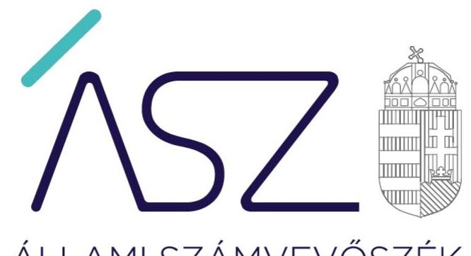
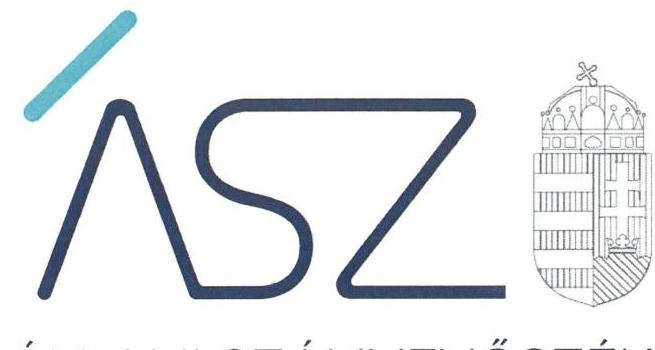
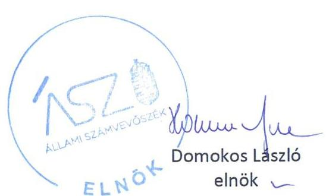

ÁLLAMI SZÁMVEVŐSZÉK

# JELENTÉS 

A költségvetési támogatásban részesülő pártalapítványok 2019-2020. évi gazdálkodása törvényességének ellenőrzése

Táncsics Mihály Alapítvány
2022.

22012
www.asz.hu

---

ÁLLAMI SZÁMVEVŐSZÉK

# JELENTÉS 

A költségvetési támogatásban részesülő pártalapítványok 2019-2020. évi gazdálkodása törvényességének ellenőrzése

Táncsics Mihály Alapítvány
2022. 04. hó 25. nap

22012
www.asz.hu

---

# AZ ELLENŐRZÉST FELÜGYELTE: 

DR. BENEDEK MÁRIA felügyeleti vezető

## AZ ELLENŐRZÉST VEZETTE ÉS A VÉGREHAJTÁSÁÉRT FELELŐS:

DR. NAGY JUDIT ellenőrzésvezető
JANIK JÓZSEF LÁSZLÓ ellenőrzésvezető

## A PROGRAM ÖSSZEÁLLÍTÁSÁÉRT FELELŐS:

DR. KÁDÁR KRISZTA projektvezető

## A TÉMÁHOZ KAPCSOLÓDÓ KORÁBBI SZÁMVEVŐSZÉKI JELENTÉSEK:

- címe: Jelentés - A költségvetési támogatásban részesülő pártalapítványok 2017-2018. évi gazdálkodása törvényességének ellenőrzése -
Táncsics Mihály Alapítvány
- sorszáma: 20179

IKTATÓSZÁM: EL-3597-001/2022.
TÉMASZÁM: 2581
ELLENŐRZÉS-AZONOSÍTÓ SZÁM: V092401

---

# TARTALOMJEGYZÉK 

■ ÖSSZEGZÉS ..... 5
■ AZ ELLENŐRZÉS CÉLJA ..... 7
■ AZ ELLENŐRZÉS TERÜLETE ..... 8
■ AZ ELLENŐRZÉS HÁTTERE, INDOKOLTSÁGA ..... 9
■ A JELENTÉS LÉNYEGES KÉRDÉSKÖREI ..... 10
■ AZ ELLENŐRZÉS HATÓKÖRE ÉS MÓDSZEREI ..... 11
■ MEGÁLLAPÍTÁSOK ..... 14
■ MELLÉKLETEK ..... 17
I. sz. melléklet: Értelmező szótár ..... 17
II. sz. melléklet: Az ÁSZ 20179 számú jelentéséhez kapcsolódó intézkedési terv végrehajtásáról ..... 18
■ FÜGGELÉK: ÉSZREVÉTELEK ..... 19
■ RÖVIDÍTÉSEK JEGYZÉKE ..... 21

---

.

---

# ÖSSZEGZÉS 

A Táncsics Mihály Alapítvány gazdálkodásának törvényessége a 2019-2020. években biztosított volt. Az ÁSZ korábbi jelentése alapján 2019-ben végrehajtott intézkedések eredményeként a szabályozottság javult. A Táncsics Mihály Alapítvány a 2019-2020. években gazdálkodása során eleget tett az Alaptörvényben és a Pártalapítványi törvényben előírt alapvető követelményeknek, gazdálkodása átlátható volt.

## Az ellenőrzés társadalmi indokoltsága

A politikai kultúra fejlesztése érdekében tudományos, ismeretterjesztő, kutatási és oktatási tevékenységük elősegítésére költségvetési támogatásra jogosult alapítványt hozhatnak létre a pártok.

A pártok működését segítő tudományos, ismeretterjesztő, kutatási, oktatási tevékenységet végző alapítványokról szóló törvény (Pártalapítványi törvény), valamint a pártok működéséről és gazdálkodásáról szóló törvény (Párt törvény) állapítja meg a pártalapítványok gazdálkodására, a költségvetési támogatásra vonatkozó szabályokat. A Pártalapítványi törvény szerint a pártalapítványok a professzionális politika olyan szellemi bázisaiként működnek, amelyek tudományos tevékenységükkel, kutatómunkájukkal, a politikai gyakorlat számára készített javaslataikkal nemcsak egy-egy párt, de a törvényalkotás és a végrehajtás egészének jobb, hatékonyabb, a közjót fokozottabban szolgáló működéséhez járulnak hozzá. A pártok mellett létrehozott alapítványok, a pártok társadalmi fontosságának széles körben történő bemutatásával az állampolgári tájékoztatást, ismeretterjesztést, oktatást hívatottak szolgálni.

Magyarország Alaptörvénye szerint a központi költségvetésből csak olyan szervezet részére nyújtható támogatás, amelynek a támogatás felhasználására irányuló tevékenysége átlátható. Ezáltal a pártalapítványok működésének és költségvetési támogatásának alapja, hogy gazdálkodásuk törvényes és átlátható legyen.

A pártalapítványoknak évente be kell számolniuk a törvényi keretek szerinti gazdálkodásról. Törvényi előírás alapján az Állami Számvevőszék a költségvetési támogatásban részesült pártalapítványok gazdálkodását kétévente ellenőrzi. A pártalapítványok pénzügyi beszámolása alapján az ellenőrzés visszajelzést ad arról, hogy a pártalapítványok eleget tettek-e az Alaptörvényben és a Pártalapítványi törvényben a pártalapítványként előírt alapvető követelményeknek, gazdálkodásuk törvényes és átlátható volt-e.

## Összegző értékelés

A Táncsics Mihály Alapítvány gazdálkodása szervezeti és szabályozási kereteit a jogszabályban előírtak szerint kialakította, ezáltal a törvényes gazdálkodás alapvető kereteit biztosította.

A Táncsics Mihály Alapítvány könyvvezetése és gazdálkodása során a jogszabályi előírásokat betartotta, a 2019-2020. években a kapott támogatások elfogadása, felhasználása és nyilvántartása szabályszerű volt, a tevékenysége kiadásait és a nyújtott támogatásokat szabályszerűen számolta el. Mindezek alapján biztosított volt a könyvvezetés, a támogatások felhasználásának átláthatósága.

A Táncsics Mihály Alapítvány a 2019-2020. évekre a jogszabályi rendelkezések szerint elkészítette a tevékenységéről szóló éves jelentéseket és az egyszerűsített éves számviteli beszámolókat, amelyeket a jogszabályi előírások szerinti határidőben letétbe helyezett és közzétett, megteremtve ezzel a gazdálkodásának átláthatóságát.

A Táncsics Mihály Alapítvány 2017-2018. évi gazdálkodása törvényességének ellenőrzéséről szóló 20179. számú jelentés megállapításai alapján készített intézkedési tervben meghatározott feladatot határidőben végrehajtotta, ennek eredményeként a szabályozottság javult.

---

# Következtetések 

Az Állami Számvevőszék a Táncsics Mihály Alapítvány gazdálkodását korábban több alkalommal ellenőrizte. A 2019-2020. évekre vonatkozó jelen ellenőrzés megállapította, hogy a Táncsics Mihály Alapítvány a korábbi ellenőrzések során feltárt hiányosságok megszüntetéséről gondoskodott: gazdálkodására vonatkozó belső szabályozását megfeleltette a jogszabályi előírásoknak, a könyvvezetése, a gazdálkodása, a tevékenységéről szóló éves jelentések készítése során betartotta a jogszabályi előírásokat, továbbá határidőben végrehajtotta az ellenőrzési megállapításokra készített intézkedési tervben meghatározott feladatot.

A gazdálkodás törvényessége és átláthatósága területén a lényeges és visszatérő törvénysértések megszüntetésére tett intézkedések eredményeként a Táncsics Mihály Alapítvány gazdálkodásában a 2019-2020. években a Pártalapítványi törvény és az Alaptörvény vonatkozó rendelkezései, a pártalapítványként működés, a költségvetési támogatáshoz jutás és azok elszámolásának alapvető feltételei érvényesültek. A Táncsics Mihály Alapítvány a 2019-2020. évekre biztosította a törvényes és átlátható, a közpénzekkel való felelős gazdálkodást, a közpénzek felhasználásának elszámoltathatóságát az állampolgárok felé.

---

# AZ ELLENŐRZÉS CÉLJA 

AZ ELLENŐRZÉS CÉLJA, hogy az ÁSZ ${ }^{1}$ - mint az Országgyűlés legfőbb ellenőrző szerve - független és szakmailag megalapozott véleményt adjon a pártalapítványok, mint ellenőrzött szervezetek gazdálkodásának törvényességéről. Annak megállapítása, hogy a pártalapítvány törvényesen gazdálkodott-e, az éves számviteli beszámolók és a pártalapítvány tevékenységéről szóló éves jelentések a jogszabályi előírásoknak megfeleltek-e, a könyvvezetés és gazdálkodás során a vonatkozó jogszabályi rendelkezéseket és belső előírásokat betartották-e.

Az ellenőrzés célja továbbá annak értékelése, hogy az előző számvevőszéki jelentésben foglalt megállapításokkal összhangban készített intézkedési tervben meghatározott feladatokat az ellenőrzött szervezet végrehajtotta-e.

---

# AZ ELLENŐRZÉS TERÜLETE 

## Táncsics Mihály Alapítvány

Az ellenőrzés a Párt tv. ${ }^{2}$ alapján a politikai kultúra fejlesztése érdekében tudományos, ismeretterjesztő, kutatási, oktatási tevékenység folytatása céljából, a Ptk. ${ }^{3}$ szerinti létesítő/alapító okiraton alapuló bírósági nyilvántartásba vétellel létrejött pártalapítványok gazdálkodására terjed ki. A pártalapítványok törvényes gazdálkodásának (könyvvezetése, beszámolása, jelentéstétele) szabályait alapvetően a Pártalapítványi tv. ${ }^{4}$-en túl, a Számv. tv ${ }^{5}$ és annak a végrehajtási rendelete a Számviteli vhr. ${ }^{6}$ határozzák meg.

A Táncsics Mihály Alapítványt a Magyar Szocialista Párt - a Párt tv.-ben és a Pártalapítványi tv.-ben biztosított lehetőséggel élve - 2003-ban alapította, 1,0 millió Ft induló vagyonnal.

A Pártalapítvány ${ }^{7}$ Alapító okirat ${ }^{8}$-ban rögzített céljai között szerepelt, hogy elősegítse a Magyar Szocialista Párt Alkotmányban biztosított, a népakarat kialakításában, valamint kinyilvánításában történő hatékony közreműködését. A Pártalapítvány testületi vezető szerve a hét tagú Kuratórium ${ }^{9}$. Képviseletét minden ügyre kiterjedő hatáskörrel a Kuratórium elnöke látja el. Ellenőrzött időszakban az Alapító okirat kétszer módosult, a Kuratórium tagjainak megbízatása és személyeinek változása miatt.

A Pártalapítvány tevékenységét a Felügyelő Bizottság ${ }^{10}$, egyszerűsített éves beszámolóját választott könyvvizsgáló ellenőrizte. Pénzügyi-számviteli feladatait külső szervezettel látta el.

A Pártalapítvány 2006-ban, 8,0 millió forint törzstőkével megalapította a Kapcsolat.hu Kommunikációs és Szolgáltató Nonprofit Korlátolt Felelősségű Társaságot.

A Pártalapítvány a 2019. évben 359,3 millió Ft, 2020. évben 359,3 millió Ft, az ellenőrzött időszakban összesen 718,6 millió Ft költségvetési támogatásban részesült. Ezenkívül a Pártalapítvány egy, az alapítványhoz csatlakozott magánszemélytől fogadott el támogatást az ellenőrzött időszakban, 2000 Ft/hó összegben. A Pártalapítvány az ellenőrzött időszakban vállalkozási tevékenységet nem végzett, nem lett tagja más jogalanynak, nem alapított alapítványt és nem csatlakozott alapítványhoz. Az ellenőrzött időszakban törvényességi, illetve külső ellenőrzés lefolytatására nem került sor, a Pártalapítvány a Párt tv. előírásának megfelelően az Alapító ${ }^{11}$ részére vagyoni hozzájárulást nem nyújtott. Tovább utalási céllal támogatást, az Alapítótól nem vagyoni hozzájárulásként adományt az ellenőrzött időszakban nem kapott.

Az ÁSZ 2020. évben ellenőrizte a Pártalapítvány gazdálkodásának törvényességét. Az utóellenőrzés az ÁSZ tv. ${ }^{12}$ 2011. július 1-jei hatálybalépését követően a Pártalapítványnál a 2020. évben végzett ellenőrzés alapján készített 20179. sz. számvevőszéki jelentés ${ }^{13}$-ben foglalt megállapításokra készített intézkedési tervben foglaltak végrehajtásának ellenőrzésére terjedt ki.

---

# AZ ELLENŐRZÉS HÁTTERE, INDOKOLTSÁGA 

Társadalmi elvárás a közpénzek értékelvű, rendeltetésszerű felhasználása, a közpénzekből nyújtott támogatások átláthatóságának megteremtése, amelyhez az ÁSZ az államháztartásból nyújtott támogatások ellenőrzésével kíván hozzájárulni. A Párt tv. 9/A § (1) bekezdése alapján a politikai kultúra fejlesztése érdekében tudományos, ismeretterjesztő, kutatási, oktatási tevékenység folytatása céljából létrehozott pártalapítványok gazdálkodása törvényességének ellenőrzése - Pártalapítványi tv. 4. § (2) bekezdése értelmében - az ÁSZ feladata. E törvény 4. § (4) bekezdése alapján az ÁSZ kétévente - kötelező jelleggel - ellenőrzi azoknak a pártalapítványoknak a gazdálkodását, amelyek állami költségvetési támogatásban részesültek.

Az ÁSZ, mint az Országgyűlés ellenőrző szerve a pártalapítványok gazdálkodása törvényességének/szabályszerűségének értékelésével hozzájárul ahhoz, hogy a társadalom objektív képet alkothasson a pártalapítványok működéséről. Az ellenőrzés eredményeinek célzott felhasználói a nyilvánosság, a jogalkotó, továbbá a pártalapítványok esetén azok alapítója és szervei. A jelentésben foglalt megállapítások, következtetések és javaslatok alapján a törvényalkotók konkrét lépéseket tehetnek a pártalapítványokra vonatkozó szabályozások megváltoztatása, átláthatóbbá, ellenőrizhetőbbé tétele irányába. Az ellenőrzött szervezetek szintjén a hiányosságok, szabálytalanságok feltárása, az ennek kapcsán megfogalmazott megállapítások elősegíthetik a pártalapítványok szabályszerű gazdálkodását.

Az ÁSZ tv. 33. § (1) bekezdése értelmében az ellenőrzött szervezet vezetője köteles a jelentésben foglalt megállapításokhoz kapcsolódó intézkedési tervet összeállítani, és azt a jelentés kézhezvételétől számított harminc napon belül az Állami Számvevőszék részére megküldeni.

Az ÁSZ tv. 33. § (1) bekezdése értelmében, amennyiben az ÁSZ elnöke az ellenőrzés során feltárt jogszabálysértő gyakorlat, illetve a vagyon rendeltetésellenes vagy pazarló felhasználásának megszüntetése érdekében figyelemfelhívó levéllel fordult az ellenőrzött szervezet vezetőjéhez, az abban foglaltakat az ellenőrzött szerv vezetője köteles elbírálni, a megfelelő intézkedést megtenni és erről az ÁSZ elnökét értesíteni.

Az ÁSZ által befogadott intézkedési tervben foglaltak megvalósítását az ÁSZ tv. 33. § (7) bekezdésében előírtak alapján - az ÁSZ utóellenőrzés keretében - ellenőrizheti. Az utóellenőrzések keretében - az intézkedések értékelése során - az ÁSZ figyelembe veszi az ellenőrzött szervezetek működési feltételeiben, valamint a jogszabályi előírásokban bekövetkezett változásokat.

---

# A JELENTÉS LÉNYEGES KÉRDÉSKÖREI 

1.     - A Táncsics Mihály Alapítvány gazdálkodásának törvényessége biztosított volt-e?
2.     - A Táncsics Mihály Alapítvány könyvvezetése és gazdálkodása során a vonatkozó jogszabályi rendelkezéseket és belső előírásokat betartották-e?
3.     - A Táncsics Mihály Alapítvány tevékenységéről szóló éves jelentések, az éves számviteli beszámolók a jogszabályi előírásoknak megfeleltek-e?
4.     - A Táncsics Mihály Alapítvány az intézkedési tervben meghatározott feladatokat végrehajtotta-e?

---

# AZ ELLENŐRZÉS HATÓKÖRE ÉS MÓDSZEREI 

## Az ellenőrzés típusa

Szabályszerűségi ellenőrzés.

## Az ellenőrzött időszak

2019-2020. évek, amely kiterjedhet az ellenőrzés megkezdéséig. Továbbá az utóellenőrzés alapját képező ÁSZ jelentés közzétételének napjától jelen ellenőrzésről szóló kiértesítő levél keltének napjáig tartó időszak.

## Az ellenőrzés tárgya

Az ellenőrzés tárgyát képezi a pártalapítvány gazdálkodása, a könyvvezetés szabályozása és gyakorlata szabályszerűsége, az éves számviteli beszámolókra és az alapítvány tevékenységéről szóló éves jelentésekre vonatkozó kötelezettség teljesítése, valamint a gazdálkodáshoz kapcsolódó ellenőrzések javaslatainak hasznosítására irányuló tevékenység.

Az ÁSZ tv. 2011. július 1-jei hatálybalépését követően a számvevőszéki jelentésben foglalt megállapításokhoz kapcsolódó - a pártalapítvány által - készített intézkedési tervben foglaltak, valamint a figyelemfelhívó levélre adott válaszlevélben rögzítettek végrehajtásának ellenőrzése.

Az ellenőrzés kiterjed minden olyan körülményre és adatra, amely az ÁSZ jogszabályban meghatározott feladatainak
 teljesítéséhez, valamint a program végrehajtása folyamán felmerült újabb összefüggések feltárásához szükséges.

## Az ellenőrzött szervezet

Táncsics Mihály Alapítvány

## Az ellenőrzés jogalapja

Az ÁSZ tv. 1. § (3) bekezdése, 5. § (3) bekezdése, 33. § (7) bekezdése, a Pártalapítványi tv. 4. § (2) és (4) bekezdései.

---

# Az ellenőrzés módszerei 

Az ellenőrzést az Ellenőrzési program szempontjai, az ellenőrzött időszakban hatályos jogszabályok, a jelen ellenőrzésre irányadó ÁSZ módszertan figyelembevételével kell elvégezni.

Az ellenőrzés ideje alatt az ellenőrzött szervezettel történő kapcsolattartás az ÁSZ SZMSZ ${ }^{14}$-ének vonatkozó előírásai alapján történik.

Az ellenőrzést az ellenőrzött szervezetek által rendelkezésre bocsátott dokumentumokra, adatokra kell alapozni. A rendelkezésre bocsátott adatok, információk kontrollja az ellenőrzés keretében történik. Az ellenőrzés céljának eléréséhez szükséges bizonyítékokat a számvevő az egyes adatok közvetlen, részletes elemzésével szerzi meg, a következő ellenőrzési eljárások alkalmazásával: megfigyelés, szemrevételezés, információkérés, megerősítés, mintavétel, valamint elemző eljárás. Az ellenőrzésvezető indoklással kezdeményezheti a helyszínen végrehajtott szemrevételezést.

Az ÁSZ a tételes ellenőrzés mellett statisztikai alapú mintavételezést és értékelést alkalmaz. Az alapítvány alapcélon túli kiadásai, ráfordításai elszámolásának, az alapítvány által nyújtott támogatások elszámolásának, valamint az alapítvány beszámolóinál a mérlegtételek besorolása, év végi értékelése szabályszerűségének, azok leltárral való alátámasztottságának értékelése érték szerint rétegzett mintavétellel történt. A minta tételeinek értékelése „szabályszerű", ha a minta ellenőrzésének eredménye alapján 95\%-os bizonyossággal a teljes sokaságban az átlagos hibaarány nem haladja meg a 10\%-ot, „nem szabályszerű", ha nagyobb, mint 10\%. Abban az esetben, ha a teljes sokaság tekintetében a 10\%-os hibaarányhoz való viszony megítélésének megbízhatósága nem éri el a 95\%-ot, annak elérése érdekében az értékelés további szempontokkal egészül ki, a feltárt hibák értéke is figyelembevételre kerül. Amennyiben a sokaság elemszáma nem haladja meg az előírt minta elemszámot, akkor a sokaság valamennyi elemének tételes ellenőrzésére került sor.

Az ellenőrzési bizonyítékként felhasználható adatforrások közé tartoznak egyrészt az Ellenőrzési program részletes szempontjainál felsorolt adatforrások, másrészt minden egyéb - az ellenőrzés folyamán - feltárt, az ellenőrzés szempontjából információt tartalmazó dokumentum.

Az ellenőrzés lefolytatásához az ellenőrzött a tanúsítványok elektronikus kitöltésével, valamint az ÁSZ által kért dokumentumok elektronikus megküldésével szolgáltat adatokat. Az így rendelkezésre bocsátott adatok, információk, a tanúsítványok adatai valódiságának kontrollja az ellenőrzés keretében történik.

Az utóellenőrzés megállapításait az ÁSZ rendelkezésére álló dokumentumok, valamint az ÁSZ adatbekérése szerint, az ellenőrzött szervezetek által elektronikusan rendelkezésre bocsátott dokumentumok, adatok alapján kell megfogalmazni, amely indokolt esetben kiegészülhet az ellenőrzött szervezet székhelyén történő adatbetekintéssel, helyszínen végrehajtott ellenőrzéssel is. Az ellenőrzés esetében az intézkedési tervekben előírt feladatokat, azok végrehajtása, illetve végrehajtása szempontjából az alábbiak szerint kell értékelni:
$\longrightarrow$ „határidőben végrehajtott" a feladat, ha a teljesítés dokumentáltan, az intézkedési tervben előírt határidőben és tartalommal megtörtént;

---

— „határidőn túl végrehajtott" a feladat, ha annak teljesítése az intézkedési tervben meghatározott módon, de az abban előírt határidőn túl történt meg;
— „nem végrehajtott" a feladat, ha a végrehajtás nem történt meg, vagy amennyiben a teljesítést/végrehajtást nem dokumentálják, dokumentumokkal nem tudják igazolni annak teljesítését;
— „okafogyottá vált" a feladat, ha végrehajtására - meghatározott esemény bekövetkezése, továbbá külső körülmény, a működést érintő feltétel változása miatt - már nincs szükség, illetve lehetőség, és egyértelműen megállapítható, hogy az intézkedést szükségessé tevő körülmény a jövőben nem fordulhat elő;
— „nem időszerű" az a feladat, amelynek ellenőrzési időszakon belül végrehajtására azért nem került sor (kerülhetett) sor, mert az intézkedés alapjául szolgáló esemény nem következett be, de annak a jövőbeni előfordulása lehetséges, a végrehajtása nem volt esedékes, vagy a végrehajtása határideje még nem járt le.

---

# 1. A Táncsics Mihály Alapítvány gazdálkodásának törvényessége biztosított volt-e? 

Összegző megállapítás

A Táncsics Mihály Alapítvány gazdálkodásának törvényessége a 2019-2020. években biztosított volt, a törvényes gazdálkodás alapvető kereteit kialakította.

A Pártalapítvány gazdálkodása szervezeti kereteinek kialakítása, gazdálkodására vonatkozó belső szabályozás megfelelt a jogszabályi előírásoknak.

A Pártalapítvány gazdálkodásával kapcsolatos könyvvezetési-, nyilvántartási rendszerének, a számviteli kereteknek, a szabályzatainak a kialakítása a jogszabályi előírásoknak megfelelt. A Pártalapítvány kialakította a Számv. tv.-ben előírt Számviteli politikáját, annak keretében elkészítette az eszközök és a források leltárkészítési és leltározási szabályzatát, az eszközök és a források értékelési szabályzatát, a pénzkezelési szabályzatát, továbbá a számlarendjét.

A Pártalapítvány alapcélja ellátásához kapcsolódó gazdálkodási tevékenysége szabályszerű volt.

## 2. A Táncsics Mihály Alapítvány könyvvezetése és gazdálkodása során a vonatkozó jogszabályi rendelkezéseket és belső előírásokat betartották-e?

## Összegző megállapítás

A Táncsics Mihály Alapítvány könyvvezetése és gazdálkodása során a 2019-2020. években a vonatkozó jogszabályi rendelkezéseket és belső előírásokat betartotta.

A Pártalapítványnál a támogatások elfogadása, elszámolása, felhasználása a 2019-2020. években szabályszerű volt.

A Pártalapítványnál az ellenőrzött években a központi költségvetésből, illetve belföldi magánszemélytől kapott támogatási forrásból finanszírozott kiadások nyilvántartása megfelelt a jogszabályok és belső szabályzatok előírásainak.

A Kuratórium döntése szerinti támogatási célok összhangban voltak a jogszabályi előírásokon alapuló, Alapító okiratban meghatározott célokkal.

A Pártalapítvány tevékenységének költségeinek, ráfordításainak kifizetése és elszámolása szabályszerű volt. A Pártalapítvány által nyújtott támogatásokra fordított összegek elszámolása szabályszerű volt.

---

# 3. A Táncsics Mihály Alapítvány tevékenységéről szóló éves jelentések, az éves számviteli beszámolók a jogszabályi előírásoknak megfeleltek-e? 

Összegző megállapítás A Táncsics Mihály Alapítvány tevékenységéről szóló éves jelentések, az egyszerűsített éves számviteli beszámolók a 2019-2020. években a jogszabályi előírásoknak megfeleltek.

A Pártalapítvány a 2019. évi és 2020. évi tevékenységéről szóló éves jelentéseit és az egyszerűsített éves számviteli beszámolóit a jogszabályi előírások szerinti tartalommal elkészítette.

A 2019-2020. évi egyszerűsített éves számviteli beszámoló mérlegtételeinek besorolása, év végi értékelése, azok leltárral való alátámasztottsága a jogszabályi és belső szabályozási előírásoknak megfelelt.

A Pártalapítvány az egyszerűsített éves számviteli beszámolóiban biztosította, nyilvántartásaiban eleget tett az alapcél szerinti tevékenysége, illetve a költségvetési támogatások szétválasztási, elkülönített nyilvántartási kötelezettségének.

A Pártalapítvány egyszerűsített éves számviteli beszámolóit a 2019. és 2020. években a Számv. tv.-ben foglalt határidőig a Kuratórium elfogadta, a jogszabályi előírások szerinti határidőben letétbe helyezte és közzétette.

## 4. A Táncsics Mihály Alapítvány az intézkedési tervben meghatározott feladatokat végrehajtotta-e?

Összegző megállapítás A Táncsics Mihály Alapítvány a 20179. sz. ÁSZ jelentés megállapításai alapján készült intézkedési tervben meghatározott feladatot határidőben végrehajtotta.

A Pártalapítvány 2017-2018. évi gazdálkodása törvényességének ellenőrzéséről készült 20179. számú jelentés megállapításai alapján készített intézkedési terve egy intézkedést tartalmazott, amelyet határidőben végrehajtott.

A Pártalapítvány a Számviteli politika és a Számlarend módosításával a jogszabálysértő gyakorlatot megszüntette. A nyilvántartási (könyvvezetési) rendszerét annak érdekében tovább részletezte, hogy abból a közpénzek felhasználásával kapcsolatos információk rendelkezésre álljanak.

Az intézkedési tervben meghatározott feladatot, határidőt, felelőst és a feladat végrehajtását a II. számú melléklet mutatja be.

---

.

---

# MELLÉKLETEK 

## I. SZ. MELLÉKLET: ÉRTELMEZŐ SZÓTÁR

alapítvány
adomány
gazdálkodó tevékenység
gazdasági-vállalkozási tevékenység
költségvetésből juttatott/nyújtott forrás/támogatás
pártalapítvány
támogatást nyújtó személy
törzsvagyon

Az alapítvány az alapító által az alapító okiratban meghatározott tartós cél folyamatos megvalósítására létrehozott jogi személy. Az alapító az alapító okiratban meghatározza az alapítványnak juttatott vagyont és az alapítvány szervezetét. Alapítvány nem alapítható gazdasági-vállalkozási tevékenység folytatására. Az alapítvány az alapítványi cél megvalósításával közvetlenül összefüggő gazdasági tevékenység végzésére jogosult. Alapítvány nem lehet korlátlan felelősségű tagja más jogalanynak, nem létesíthet alapítványt és nem csatlakozhat alapítványhoz. (Forrás: Ptk. 3:378. §, 3:379. § (1) - (3) bekezdés)
a civil szervezetnek - létesítő/alapító okiratban rögzített céljaira - ellenszolgáltatás nélkül juttatott eszköz, illetve nyújtott szolgáltatás (Forrás: Ectv ${ }^{15}$. 2. § 1. pont.)
azon tevékenységek összessége, amelyek a civil szervezet vagyoni, pénzügyi, jövedelmi helyzetére kiható gazdasági eseményt eredményeznek. (Forrás: Ectv. 2. § 10. pont.)
A jövedelem- és vagyonszerzésre irányuló vagy azt eredményező, üzletszerűen végzett gazdasági tevékenység, kivéve az adomány (ajándék) elfogadását, a létesítő okiratban meghatározott cél szerinti tevékenységet (ideértve a közhasznú tevékenységet is), 2015. november 28-tól - a pénzeszközök betétbe, értékpapírba, társasági részesedésbe történő elhelyezését és az ingatlan megszerzését, használatának átengedését és átruházását. (Forrás: Ectv. 2. § 11. pont.)
a pártalapítványoknak a Párt tv. 9/A. § (1) bekezdése és a Pártalapítványi tv. 1. § előírásainak értelmében, az éves költségvetési törvények szerint - jellemzően az

1. számú melléklet I. Országgyűlés fejezet 9. Pártalapítványok támogatás címen - az állami költségvetésből juttatott forrás/támogatás.
az államháztartás központi alrendszeréből - a Tb alap kivételével - ellenérték nélkül, pénzben nyújtott költségvetési támogatás (Forrás: Áht ${ }^{16}$. 1. § 14. pont)
a politikai kultúra fejlesztése érdekében, tudományos, ismeretterjesztő, kutatási és oktatási tevékenység folytatása céljából pártok által létrehozott, külön jogszabályban - a Pártalapítványi tv. 1. § és 3. § (1) bekezdése - meghatározott, jogi személynek minősülő egyéb szervezet, speciális jogállású alapítvány (Forrás: Párt tv. 9/A. § (1) bekezdés, Pártalapítványi tv. 1. §, Ectv. 1. § (2) bekezdés, 2. § 6. c) pont, Számv. tv. 3. § (1) bekezdése 4. pont, Számviteli vhr. 2. § (1) bekezdés I) pont)
egyértelműen azonosítható - természetes, vagy jogi - személy.
(Forrás: Pártalapítványi tv. 3. § (3) (4) bekezdése)
az induló tőke, megnövelve alapítvány esetében a csatlakozók által kifejezetten az induló tőke növelése érdekében rendelkezésre bocsátott vagyonnal
(Forrás: Ectv. 2. § 28. pont)

---

II. SZ. MELLÉKLET: AZ ÁSZ 20179 SZÁMÚ JELENTÉSÉHEZ KAPCSOLÓDÓ INTÉZKEDÉSI TERV VÉGREHAJTÁSÁRÓL

| Sorszám | Intézkedési terv alapján meghatározott feladat | Az intézkedési tervben meghatározott határidő | Az intézkedési tervben meghatározott feladat felelőse | A feladat végrehajtása |
| :--: | :--: | :--: | :--: | :--: |
| 1. | A közpénzek felhasználásával kapcsolatos információk elérhetőségéhez szükséges alapítványi nyilvántartási (könyvvezetési) rendszer további részletezése kialakításra került, a Kuratórium 2019. május 9-i ülésén elfogadta a módosított Számlarendet. | 2020. szeptember 28. | Kuratóriumi   elnök | A Pártalapítvány a közpénzek felhasználásával kapcsolatos információk elérhetőségéhez szükséges alapítványi nyilvántartási (könyvvezetési) rendszer további részletezése kialakításának érdekében 2019. szeptember 11-én a Számviteli Politikáját és Számlarendjét 2019. január 1-jei hatállyal a Kuratórium 47./2019. (09.11) T.A. határozatával módosította. A módosított Számviteli Politika és Számlarend tartalmazza, hogy a bevételeket és kiadásokat gyűjtőkódos jelöléssel különítik el. Az AKV jelzésű gyűjtőkód a költségvetésből kapott bevételeket és ebből finanszírozott kiadásokat gyűjti. |

---

# FÜGGELÉK: ÉSZREVÉTELEK 

Az ellenőrzés megállapításait a Számvevőszék 15 napos észrevételezésre megküldte az ellenőrzött szervezet vezetőjének az ÁSZ tv. 29. § (1) bekezdése előírásának megfelelően.

Az ellenőrzés megállapításaira az ellenőrzött szervezet vezetője nem tett észrevételt.

[^0]
[^0]:    * 29. § (1) Az Állami Számvevőszék az ellenőrzési megállapításait megküldi az ellenőrzött szervezet vezetőjének vagy az általa megbízott személynek, és annak, akinek személyes felelősségét állapította meg.
    (2) Az ellenőrzött szervezet vezetője és a felelősként megjelölt személy az ellenőrzés megállapításaira tizenöt napon belül írásban észrevételt tehet.
    (3) Az Állami Számvevőszék az észrevételre a beérkezésétől számított harminc napon belül írásban válaszol. A figyelembe nem vett észrevételeket köteles a jelentésben feltüntetni, és megindokolni, hogy azokat miért nem fogadta el.

---

.

---

# RÖVIDÍTÉSEK JEGYZÉKE 

${ }^{1}$ ÁSZ
${ }^{2}$ Párt tv.
${ }^{3}$ Ptk.
${ }^{4}$ Pártalapítványi tv.
${ }^{5}$ Számv.

 tv
${ }^{6}$ Számviteli tv.
${ }^{7}$ Pártalapítvány
${ }^{8}$ Alapító okirat
Alapító okirat ${ }_{1}$

Alapító okirat ${ }_{2}$

Alapító okirat ${ }_{3}$
${ }^{9}$ Kuratórium
${ }^{10}$ Felügyelő Bizottság
${ }^{11}$ Alapító
${ }^{12}$ ÁSZ tv.
${ }^{13}$ 20179. számú számvevőszéki jelentés
${ }^{14}$ ÁSZ SZMSZ
${ }^{15}$ Ectv.
${ }^{16}$ Áht.

Állami Számvevőszék
1989. évi XXXIII. törvény a pártok működéséről és gazdálkodásáról (hatályos: 1989. október 30-tól)
2013. évi V. törvény a Polgári Törvénykönyvről (hatályos: 2014. március 15-től)
2003. évi XLVII. törvény a pártok működését segítő tudományos, ismeretterjesztő, kutatási, oktatási tevékenységet végző alapítványokról (hatályos: 2003. július 1-jétől)
2000. évi C. törvény a számvitelről (hatályos: 2001. január 1-jétől)
479/2016. (XII.28.) Korm. rendelet a számviteli törvény szerinti egyes egyéb szervezetek beszámoló készítési és könyvvezetési kötelezettségének sajátosságairól (hatályos: 2017. január 1-jétől)
Táncsics Mihály Alapítvány

Táncsics Mihály Alapítvány Alapító okirata (hatályos: 2018. december 13-tól 2019. szeptember 30-ig)

Táncsics Mihály Alapítvány Alapító okirata (hatályos: 2019. szeptember 30-tól 2020. április 15-ig)

Táncsics Mihály Alapítvány Alapító okirata (hatályos: 2020. április 15-től)
Táncsics Mihály Alapítvány Kuratóriuma
Táncsics Mihály Alapítvány Felügyelő Bizottsága
Magyar Szocialista Párt
2011. évi LXVI. törvény az Állami Számvevőszékről (hatályos: 2011. július 1-jétől)
„A költségvetési támogatásban részesülő pártalapítványok 2017-2018. évi gazdálkodása törvényességének ellenőrzése Táncsics Mihály Alapítvány" címmel, 2020. szeptember 10-én megjelent számvevőszéki jelentés

Állami Számvevőszék Szervezeti és Működési Szabályzata
2011. évi CLXXV. törvény az egyesülési jogról, a közhasznú jogállásról, valamint a civil szervezetek működéséről és támogatásáról
(hatályos: 2011. december 22-től)
2011. évi CXCV. törvény az államháztartásról (hatályos: 2011. december 31-től)

---

# ÁSZ 

ÁLLAMI SZÁMVEVŐSZÉK
1052 Budapest, Apáczai Cs. J. u. 10. I 1364 Budapest 4. Pf. 54 TEL: +36 14849100
email: szamvevoszek@asz.hu
web: www.asz.hu | www.aszhirportal.hu

