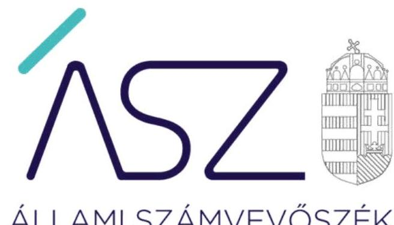
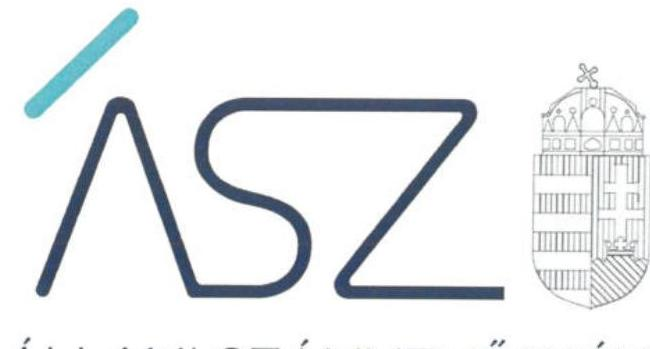
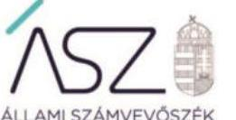

ÁLLAMI SZÁMVEVŐSZÉK

# JELENTÉS 

Az önkormányzatok ellenőrzése - A pénzforgalomban megjelenő kiadások elszámolásának ellenőrzése

Selyeb Község Önkormányzata
Selyebi Közös Önkormányzati Hivatal
2022.

22014
www.asz.hu

---

ÁLLAMI SZÁMVEVŐSZÉK

# JELENTÉS 

## Az önkormányzatok ellenőrzése - A pénzforgalomban megjelenő kiadások elszámolásának ellenőrzése

Selyeb Község Önkormányzata
Selyebi Közös Önkormányzati Hivatal
2022. 04. hó 12. nap

22014
www.asz.hu

---

|  | AZ ELLENŐRZÉST VEZETTE ÉS A VÉGREHAJTÁSÁÉRT FELELŐS: |
| :--: | :--: |
|  | BAJNAI ZSUZSANNA ellenőrzésvezető |
|  | MAKKAI MÁRIA ellenőrzésvezető |
|  | DR. SZELECZKI ZSUZSANNA JUDIT ellenőrzésvezető |
|  | VALASTYÁNNÉ DR. VÍZHÁNYÓ JÚLIA ellenőrzésvezető |
|  | A PROGRAM ÖSSZEÁLLÍTÁSÁÉRT FELELŐS: |
|  | DR. KÁDÁR KRISZTA ellenőrzés tervezési projektvezető |
|  | A TÉMÁHOZ KAPCSOLÓDÓ KORÁBBI SZÁMVEVŐSZÉKI JELENTÉSEK: |
| - címe: | Jelentés - Selyeb Község Önkormányzata adósságrendezési eljárásának ellenőrzése |
| - sorszáma: | 16204 |
| - címe: | Jelentés - Önkormányzatok ellenőrzése Az önkormányzatok integritásának ellenőrzése -Borsod-Abaúj-Zemplén megye települési önkormányzatai |
| - sorszáma: | 21009 |
| IKTATÓSZÁM: EL-3603-001/2022. |  |
| TÉMASZÁM: 2585 |  |
| ELLENŐRZÉS-AZONOSÍTÓ SZÁM: V0929 |  |

---

# TARTALOMJEGYZÉK 

■ ÖSSZEGZÉS ..... 5
— AZ ELLENŐRZÉS CÉLJA ..... 6
— AZ ELLENŐRZÉS TERÜLETE ..... 7
— AZ ELLENŐRZÉS HÁTTERE, INDOKOLTSÁGA ..... 8
— A JELENTÉS LÉNYEGES KÉRDÉSKÖREI ..... 9
— AZ ELLENŐRZÉS HATÓKÖRE ÉS MÓDSZEREI ..... 10
— FÜGGELÉK ..... 13
— RÖVIDÍTÉSEK JEGYZÉKE ..... 15

---

.

---

# ÖSSZEGZÉS 

Selyeb Község Önkormányzata, valamint a Selyebi Közös Önkormányzati Hivatal gazdálkodásában a korábbi ellenőrzésnél feltárt integritási kockázatok realizálódtak.

## Az ellenőrzés társadalmi indokoltsága

Magyarország Alaptörvénye és a nemzeti vagyonról szóló törvény értelmében a közpénzeket és a nemzeti vagyont az átláthatóság és a közélet tisztaságának elve szerint kell kezelni. Az elvek gyakorlatban történő megvalósítása az államháztartásról és számvitelről szóló jogszabályok rendelkezéseinek betartása révén követhető nyomon.

Selyeb Község Önkormányzatánál a 2010-es évek elején két alkalommal folytattak le adósságrendezési eljárást, melynek során a hitelezők követeléseinek csupán töredéke került kiegyenlítésre. A nem kellően átgondolt gazdasági döntésekhez, a fizetésképtelenség kialakulásához hozzájárult a számviteli előírások megsértése is.

Az Állami Számvevőszék 2020. évre vonatkozó integritási kockázat kiértékelése kockázatosnak minősítette Selyeb Község Önkormányzatát és a Selyebi Közös Önkormányzati Hivatalt, mivel hiányosságokat tárt fel a szabályos és átlátható gazdálkodás, a csalásmentes múködés alapvető feltételeinek biztosításában, ezért indokolt annak ellenőrzése, hogy a pénzforgalomban megjelenő kiadások teljesítése és elszámolása során realizálódtak-e kockázatok.

## Értékelés

Selyeb Község Önkormányzatánál és a Selyebi Közös Önkormányzati Hivatalnál a kifizetések nem voltak jogszerűek, mert azokat az államháztartásról szóló törvény és annak végrehajtási rendeletében előírtak ellenére kötelezettségvállalás és teljesítésigazolás nélkül végezték el. A kötelezettségvállalással és a teljesítésigazolással kapcsolatban megállapított - a függelékben részletezett - hiányosságok alapján visszaigazolódott a nem rendeltetésszerű, pazarló közpénzfelhasználás.

---

# AZ ELLENŐRZÉS CÉLJA 

Az ellenőrzés célja az önkormányzatoknál, az önkormányzati hivataloknál a pénzforgalomban megjelenő kiadások teljesítésének és elszámolásának értékelése annak érdekében, hogy az önkormányzatok, önkormányzati hivatalok gazdálkodásában rejlő kockázatok beazonosításával támogassa a közpénzekkel való felelős gazdálkodást.

---

# **AZ ELLENŐRZÉS TERÜLETE**

## **Selyeb Község Önkormányzata és a Selyebi Közös Önkormányzati Hivatal**

Selyeb község Borsod-Abaúj-Zemplén megyében, a Szikszói járásban található. Lakosainak száma 2020. január 1-jén a Belügyminisztérium nyilvántartása szerint 501 fő volt.

Selyeb Község Önkormányzatának működésével, gazdálkodásával kapcsolatos feladatokat a Selyebi Közös Önkormányzati Hivatal látja el. A közös hivatal fenntartásához további hat település járul hozzá.

A polgármester személye az ellenőrzött időszakban nem változott, a jelenlegi jegyző 2020. március 1-jén került kinevezésre.

---

# AZ ELLENŐRZÉS HÁTTERE, INDOKOLTSÁGA 

Magyarország Alaptörvényének 39. cikk (2) bekezdése szerint a közpénzeket és a nemzeti vagyont az átláthatóság és a közélet tisztaságának elve szerint kell kezelni.

Az ÁSZ¹ a 2020. évre vonatkozóan a helyi önkormányzati kör egészét lefedve elvégezte Magyarország önkormányzatai integritási kockázatának kiértékelését Az ellenőrzés során az ellenőrzött szervezetek integritását jelző, a felépítését, működését, felelősségi viszonyait, gazdálkodását meghatározó szabályzatok és nyilvántartások rendelkezésre állása, valamint lényeges szabályozási területei kerültek értékelésre. Azon önkormányzatok és hivatalaik tekintetében, ahol a szabályos és átlátható gazdálkodás, a csalásmentes működés alapvető feltételeinek biztosításában az ellenőrzés kockázatokat azonosított, indokolt azok csökkentésének támogatására a végrehajtás - a jogszabályban, belső szabályozásban előírt folyamatok további ellenőrzése.

Az Állami Számvevőszék értékelése hozzájárul ahhoz, hogy az azonosított kockázatok alapján a helyi önkormányzatok és az önkormányzati hivatalok gazdálkodása során a közpénzek felhasználásakor érvényesüljenek az integritási alapelvek, amelyek segítik a közpénzek és a közvagyon szabályos, célszerű felhasználását, támogatják az önkormányzatok, önkormányzati hivatalok eredményes gazdálkodását, amellyel az önkormányzatok a köz javát, a köz érdekét szolgálják.

---

# A JELENTÉS LÉNYEGES KÉRDÉSKÖREI 

1.     - Fennáll-e kockázat az önkormányzat és az önkormányzati hivatal gazdálkodásában?

---

# AZ ELLENŐRZÉS HATÓKÖRE ÉS MÓDSZEREI 

## Az ellenőrzés típusa

Megfelelőségi ellenőrzés.

## Az ellenőrzött időszak

A 2020. január 1-jétől 2020. december 31-ig terjedő időszak.

## Az ellenőrzés tárgya

A pénzforgalomban megjelenő kiadások teljesítésének és elszámolásának megfelelősége.

## Az ellenőrzött szervezetek

Selyeb Község Önkormányzata és a Selyebi Közös Önkormányzati Hivatal

## Az ellenőrzés jogalapja

Az ellenőrzés jogalapját az ÁSZ tv². 1. § (3) bekezdése, és 5. § (6) bekezdése képezi.

## Az ellenőrzés módszerei

Azellenőrzés az ellenőrzési program szempontjai, az ellenőrzött időszakban hatályos jogszabályok, a jelen ellenőrzésre irányadó ÁSZ módszertan figyelembevételével és a nemzetközi standardokat irányadónak tekintve végzi az ÁSZ.

Az ellenőrzés ideje alatt az ÁSZ az ellenőrzött szervezettel történő kapcsolattartást az ÁSZ SZMSZ²-ének vonatkozó előírásai alapján biztosítja.

Az ellenőrzési kérdések megválaszolásához szükséges bizonyítékok megszerzése a következő ellenőrzési eljárások alkalmazásával történik történt: megfigyelés, összehasonlítás, elemző eljárás. Az ellenőrzési bizonyítékként felhasználható adatforrások közé tartoztak az ellenőrzési programban felsorolt adatforrások, továbbá minden - az ellenőrzés folyamán - feltárt, az ellenőrzés szempontjából információkat tartalmazó dokumentum.

Az ellenőrzés a kérdésekre adott válaszok kiértékelésével, valamint a megjelölt adatforrások, továbbá az adott időszakban hatályos jogszabályok, figyelembevételével zajlik.

---

A pénzforgalomban megjelenő kiadások teljesítése és elszámolása szabályszerűségének ellenőrzése és értékelése lényegességi elv szerint kiválasztott tételek alapján történik. A helyi önkormányzat és az önkormányzati hivatal fizetési számlája és a házipénztárban kezelt készpénzállománya terhére megvalósuló pénzforgalma 2020. évi tételes adataiból a nem kockázatos tételek kiszűrését követően kerültek kiválasztásra az érték alapján lényegesnek minősített kiadások. Amennyiben a lényeges kiadások teljesítése és elszámolása tekintetében az átlagos hibaarány nem haladja meg a 10\%-t, az értékelés eredményeként a lényegesnek minősített kiadások esetében nem kerül további kockázat beazonosításra az ÁSZ által az ellenőrzés során. Amennyiben a kiadási tételek száma a fizetési számla vagy a házipénztár tekintetében nem haladja meg a 2020. évben a 15 lényeges tételt, valamennyi kiadási tétel értékelésre kerül.

---

.

---

# FÜGGELÉK 

Az Állami Számvevőszék jogállásából adódóan hatósági jogkör nélküli hivatali típusú szervezet, az ellenőrzések során feltárt tényekhez kapcsolódó további körülmények tisztázására ezért eszközrendszerrel nem rendelkezik. Ellenőrzéseit a vonatkozó törvényi előírások szerint és meghatározott módszertani keretek között hajtja végre.

A közpénzek felhasználásának átláthatósága és elszámoltathatósága érdekében kiemelten fontos, hogy a települési önkormányzatok, valamint az önkormányzati hivatalok a helyi közügyek ellátásakor betartsák a törvényi előírásokat.

Selyeb Község Önkormányzata és a Selyebi Közös Önkormányzati Hivatal a 2020. évben a szabályszerú és csalásmentes gazdálkodás feltételeit nem teremtette meg, ezáltal az Alaptörvényben előirt átláthatóság és elszámoltathatóság, továbbá a tiszta közélet elvét sem érvényesitette. Ezért az ellenőrzött szervezeteknél fennállt a visszaélés és a korrupció veszélye.
I. Selyeb Község Önkormányzata a házipénztárból történő kifizetések esetében nem igazolta, hogy betartotta:

1. a települési szociális támogatások kifizetésénél az Ávr. 60. (2) bekezdése szerinti összeférhetetlenségre, valamint a Selyeb Község Önkormányzat Képvi-selő-testületének a szociális ellátások helyi szabályairól szóló 12/2016. (XI.18.) önkormányzati rendelet 6. § (6) bekezdése szerinti települési támogatások megállapítására vonatkozó szabályokat, mert a rendelkezésre álló dokumentumok alapján a kifizetést a kötelezettségvállaló a saját javára engedélyezte;
2. az önkormányzati dolgozók részére 700.000,- Ft értékben kifizetett egyes szociális támogatások esetében a döntéseket megalapozó határozatok kiadása az általános közigazgatási rendtartásról szóló 2016. évi CL. törvény 81. § (2) bekezdésének megfelelő jogcímek alapján történtek;
3. az önkormányzat házipénztárából kifizetett munkabérek, összesen 71 kifizetés esetében az Ávr. 56. (1) bekezdése szerinti kötelezettségvállalásra vonatkozó szabályokat, mert a rendelkezésre álló dokumentumok alapján a kifizetés időpontja megelőzte a kötelezettségvállalás időpontját;
4. az önkormányzat által, összesen 6.509.525,- Ft értékben kifizetett (117 kifizetést érintően) munkabérek esetében az Áht. 37. § (1) bekezdése szerinti kötelezettségvállalás szabályait, mert a rendelkezésre álló dokumentumok alapján kötelezettségvállalás nélkül került sor a kifizetésekre.

---

II. Selyebi Közös Önkormányzati Hivatal a fizetési számlájának terhére történt kifizetések esetében nem igazolta, hogy az ellenőrzött időszakban betartotta:

1. egy 442.400,- Ft összegben történt (irattári selejtezés, rendezés jogcímen) kifizetés esetében az Áht. 37. § (1) bekezdésében, az Áht. 38. § (1) bekezdésében, valamint az Ávr. 52. § (1) és 57. § (1) bekezdésében foglalt kötelezettségvállalás és teljesítésigazolás szabályait, mert a rendelkezésre álló dokumentumok alapján kötelezettségvállalás és teljesitésigazolás nélkül került sor a kifizetésre;
2. egy 960.000,- Ft összegben történt (belső ellenőri szolgáltatás jogcímen) kifizetés esetében az Áht. 38. § (1) bekezdésében és az Ávr. 57. § (1) bekezdésében foglaltak szerinti teljesítésigazolás szabályait, mert teljesitésigazolás nélkül került sor a kifizetésre.
Mindezek alapján a törvényi előírások ellenére a kifizetések teljesítése során nem igazolták, hogy azok az önkormányzat, valamint az önkormányzati hivatal gazdasági érdekeinek megfelelően történtek, így nem igazolt a megbízások tényleges tárgya, továbbá a tényleges teljesités sem.
A kifizetésekkel összefüggésben nem igazolt, hogy a kötelezettségvállalások és kifizetések az ellenőrzött szervezetek feladatellátását szolgálták, illetve szerződésszerü teljesitésekhez kapcsolódtak.
A hiányosságok alapján Selyeb Község Önkormányzata és a Selyebi Közös Önkormányzati Hivatal korrupciós veszélyeztetettsége rendkívül magas.

---

# RÖVIDÍTÉSEK JEGYZÉKE 

${ }^{1}$ ÁSZ
${ }^{2}$ ÁSZ tv.
${ }^{3}$ ÁSZ SZMSZ

Állami Számvevőszék
2011. évi LXVI. törvény az Állami Számvevőszékről
Az Állami Számvevőszék elnökének 7/2020. (XII.28.) ÁSZ utasítása az Állami Számvevőszék Szervezeti és Müködési Szabályzatáról

---

1052 Budapest, Apáczai Cs. J. u. 10. | 1364 Budapest 4. Pf. 54
TEL: +36 1 484 9100
email: szamvevoszek@asz.hu
web: www.asz.hu | www.aszhirportal.hu