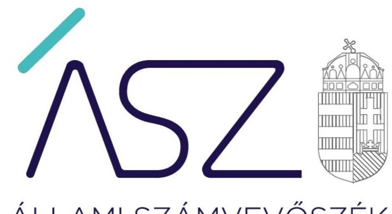
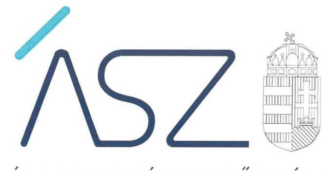
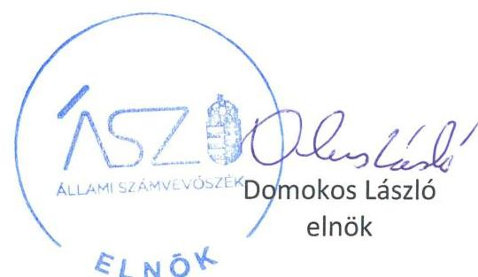

ÁLLAMI SZÁMVEVŐSZÉK

# JELENTÉS 

Az önkormányzatok ellenőrzése - Önkormányzati intézmények integritás és belső kontrollrendszerének ellenőrzése

78 önkormányzati intézmény

2022. 

22015
www.asz.hu

---

ÁLLAMI SZÁMVEVŐSZÉK

# JELENTÉS

Az önkormányzatok ellenőrzése – Önkormányzati intézmények integritás és belső kontrollrendszerének ellenőrzése

78 önkormányzati intézmény

2022. 05. hó 05. nap

22015
www.asz.hu

---

# AZ ELLENŐRZÉST VEZETTE ÉS A VÉGREHAJTÁSÁÉRT FELELŐS: 

SALAMON ILDIKÓ ellenőrzésvezető
LAJÓ ADRIENN ellenőrzésvezető
DR. GÁL NÓRA ellenőrzésvezető
JANIK JÓZSEF LÁSZLÓ ellenőrzésvezető
KUSZINGER ANDREA ellenőrzésvezető

A PROGRAM ÖSSZEÁLLÍTÁSÁÉRT FELELŐS:
GÖRGÉNYI GÁBOR ETAMO osztályvezető

## IKTATÓSZÁM: EL-3621-001/2022.

TÉMASZÁM: 2548
ELLENŐRZÉS-AZONOSÍTÓ SZÁM: V0892

---

# TARTALOMJEGYZÉK 

■ ÖSSZEGZÉS ..... 5
■ AZ ELLENŐRZÉS CÉLJA ..... 8
■ AZ ELLENŐRZÉS TERÜLETE ..... 9
■ AZ ELLENŐRZÉS HÁTTERE, INDOKOLTSÁGA ..... 10
■ A JELENTÉS LÉNYEGES KÉRDÉSKÖREI ..... 11
■ ELLENŐRZÉS HATÓKÖRE ÉS MÓDSZEREI ..... 12
■ ÉRTÉKELÉSEK ..... 14
■ MELLÉKLETEK ..... 19
I. sz. melléklet: Az ellenőrzött intézmények kockázati besorolása és azok változása ..... 19
II. számú melléklet: Azok az ellenőrzöttek, ahol a figyelemfelhívást követően a kockázatok nőttek ..... 23
III. számú melléklet: Fogalomtár ..... 24
■ FÜGGELÉK: ÉSZREVÉTELEK ..... 25
■ RÖVIDÍTÉSEK JEGYZÉKE ..... 27

---

.

---

# ÖSSZEGZÉS 

Az önkormányzatok, az önkormányzati társulások által fenntartott, közszolgáltatásokat nyújtó 78 ellenőrzött intézmény közül 43 intézmény működésében és gazdálkodásában az Állami Számvevőszék kockázatokat azonosított, ezért figyelemfelhívással fordult az intézmények vezetőihez.
Az Állami Számvevőszék figyelemfelhívására 25 intézményvezető felelős vezetői intézkedéseket tett, amelyekkel csökkentették a hibák jövőbeni előfordulásának kockázatait. 12 intézményvezető intézkedései nem csökkentették az azonosított kockázatokat. 6 intézményvezető nem tett lépéseket a kockázatok csökkentése érdekében. Így a vezetői cselekvés hiánya miatt az ellenőrzött időszakot követően a gazdálkodásban és az integritás érvényesülése tekintetében a hibák jövőbeni előfordulásának kockázatai növekedtek.

## Az ellenőrzés társadalmi indokoltsága

A helyi önkormányzatok és önkormányzati társulások intézményei szerteágazó feladatokat látnak el, az intézmények működtetése közvetlenül érinti a társadalom valamennyi rétegét, a feladatot ellátó intézmények működésének és gazdálkodásának a minősége hatással van az emberek közérzetére. Az intézmények szabályszerű, hatékony és eredményes működésének és gazdálkodásának alapfeltétele a belső kontrollrendszer megfelelő kialakítása. Az ÁSZ ${ }^{1}$ a törvényi felhatalmazással élve ellenőrzi az önkormányzati intézményeket, hogy megállapításaival támogassa az ellenőrzött szervezetek szabályszerű gazdálkodását, működését.
Az önkormányzati/társulási fenntartásban működő, gazdasági, műszaki ellátó szervezetek a településeken jellemzően településüzemeltetési, vagyongazdálkodási, város és községgazdálkodási, étkeztetési, ingatlan üzemeltetési és hasznosítási, gazdasági hivatali, közfoglalkoztatási feladatokat látnak el. Közszolgáltatási feladataik túlmutatnak az adott költségvetési szerv keretein, hatással vannak más intézmények működésére éppúgy, mint a településen élők életminőségére. Az ellenőrzött kulturális és közművelődési közszolgáltatást nyújtó intézmények feladatellátása szintén a társadalom széles körét érinti. A szolgáltatásokat igénybe vevők jelentős száma, és az erre fordított közpénz nagysága indokolja, hogy az ÁSZ - kockázati alapon - további, az előző ellenőrzésekre épülő ellenőrzéseket végezzen ezen a területen, illetve további olyan területeken, ahol az önkormányzati szolgáltatást a lakosság széles köre veszi igénybe.
Az intézményi működés minőségét nagyban befolyásolja az adott intézmény szabályozottsága. Az intézmények szabályszerű, hatékony és eredményes működésének és gazdálkodásának alapfeltétele a belső kontrollrendszer megfelelő kialakítása. A jogszabályokban előírt belső szabályzatok megléte, azok aktuális jogszabályoknak folyamatosan megfelelő tartalma és gyakorlati alkalmazhatósága elengedhetetlen a szabályszerű működéshez, így a minőségi szolgáltatáshoz. A szervezeti, működési és gazdálkodási kereteket kialakító szabályozási környezetet, mint a kontrolltevékenységek és ezen belül az integrált kockázatkezelés szabályszerű gyakorlásának előfeltételeit minden közpénzt felhasználó szervezetnek, így az önkormányzati intézményeknek is meg kell teremteni.

## Értékelés

A 2019. ÉVRE vonatkozóan az Állami Számvevőszék 78 - jellemzően gazdasági, műszaki ellátó szervezeti feladatokat végző - önkormányzati intézmény belső kontrollrendszerének lényeges elemei kialakítását ellenőrizte. Az ellenőrzés súlypontok meghatározásával lehetőséget biztosított az intézmények működésére és gazdálkodására vonatkozó kockázatok azonosítására.

---

ALACSONY KOCKÁZATOT azonosított az Állami Számvevőszék 33 önkormányzati intézménynél, mivel az intézményvezetők kialakították a belső kontrollrendszer lényeges elemeit.
KOCKÁZATOS minősítést ért el 16 intézmény, esetükben a belső kontrollrendszer lényeges elemei egyes területeken hiányoztak.
MAGAS KOCKÁZATOT azonosított az Állami Számvevőszék 29 intézmény belső kontrollrendszerében a feltárt hiányosságok miatt. 22 intézmény vezetője - a szervezeti keretek, illetve a számviteli politika és/vagy a keretébe tartozó szabályzatok hiánya következtében - nem gondoskodott a kontrollkörnyezet kialakításáról. Így nem biztosították a szabályszerű intézményi működés, a közpénzekkel való elszámolás, a könyvvezetés és költségvetési beszámoló készítés alapvető feltételeit. Nyolc esetben az intézményvezető nem alakította ki a gazdálkodási kontrolltevékenységek szabályszerű gyakorlásának előfeltételeit, továbbá 18 esetben az integrált kockázatkezelési rendszert, ami növelte az integritási kockázatokat.
AZ ELLENŐRZÖTT IDŐSZAKOT KÖVETŐEN az ellenőrzés lehetővé tette a kockázatok mérséklését, az Állami Számvevőszék figyelemfelhívására teendő intézkedésekkel. A kockázatos és magas kockázatú összesen 45 intézmény közül az ellenőrzött időszakot követően két intézmény megszűnt.

Az intézményvezetők által jelzett intézkedések értékelésének alapvető szempontja az volt, hogy felelős vezetői magatartásukkal, jövőre vonatkozó intézkedéseikkel csökkentették, változatlanul hagyták, vagy növelték az intézmény belső kontrollrendszerének lényeges elemei kialakítására, valamint az integritás érvényesülésére vonatkozóan az ellenőrzött időszakra azonosított kockázatokat.

25 önkormányzati intézmény esetében a vezetők felelős magatartást tanúsítottak, intézkedtek, vagy intézkedési tervet állítottak össze a feltárt szabálytalanságok jövőbeni előfordulásának elkerülése érdekében. Ezeknek az intézményeknek az esetében a kockázatok mérséklődtek, megteremtve ezzel az integritás alapú, átlátható közpénzfelhasználás egyik alapfeltételét.

12 önkormányzati intézmény esetében a vezetők visszaigazolták a korábban azonosított kockázatokat, a hibák jövőbeni előfordulása kockázatai csökkentése érdekében nem, vagy csak részben intézkedtek.

6 önkormányzati intézmény vezetője nem tanúsított felelős vezetői magatartást, nem működött együtt a hiba jövőbeni előfordulása kockázatai csökkentése tekintetében. Ezen intézmények ellenőrzött időszakot követő szabályszerű és átlátható működésében és gazdálkodásában, az integritás érvényesülésében azonosított magas kockázatok tovább növekedtek.

Az intézmények kockázati besorolásának minősítését és annak változását az I. sz. melléklet mutatja be.

# Következtetések 

Az Alaptörvény szerint a közpénzekkel gazdálkodó minden szervezet köteles a nyilvánosság előtt elszámolni a közpénzekre vonatkozó gazdálkodásával. Az elszámoltathatóság érvényesülésének alapvető feltétele, hogy a hatályos jogszabályi előírások, továbbá a gazdálkodó szervezetek belső szabályozásai biztosítsák a felelős gazdálkodás kereteit, a gazdálkodásért való felelősségi viszonyok egyértelmű meghatározását. Ezen elv érvényesülését szem előtt tartva az Állami Számvevőszék már az ellenőrzés során felhívással élt és megszólította azon vezetőket, ahol hiányosságot tárt fel, hogy a jogszabálysértő gyakorlatot megszüntessék. Az Állami Számvevőszék célja a felhívásokkal az volt, hogy az intézmények a működés és a költségvetési támogatás-felhasználás magas kockázatait csökkentsék, biztosítva ezzel a közfeladatra kapott közpénzek elszámoltathatóságát és átláthatóságát.

Az intézkedési kötelemmel járó figyelemfelhívás ellenére 6 intézmény nem intézkedett a jogszabálysértő gyakorlat megszüntetésére, így nőtt a kockázat az intézmények működésének és gazdálkodásának átláthatósága és elszámoltathatósága, az integritás érvényesülése vonatkozásában.

A közvagyon, a közpénzek célszerű felhasználása kérdőjelezhető meg azoknál az intézményeknél, amelyek a kockázati besorolás ellenére nem tettek intézkedést a szabályosság helyreállítására. Ezek a következők: Nyírbátori Gazdasági és Szolgáltató Intézmény (jogutód: Nyírbátori Kerekerdő Óvoda), Piliscsaba Város Fejlesztési és Üzemeltetési Intézmény, Mór Városi Önkormányzat Ellátó Központja, Intézményi Gondnokság Érd, Kerületgazda Szolgáltató Szervezet Budapest Főváros XVI. Kerület, Pécsi Ellátó Központ.

---

# Kiket ellenőriztünk? 

Önkormányzatok gazdasági, műszaki ellátó szervezetei 78 intézmény

Ingatlan
(1)
üzemeltetés

## MIRE JUTOTT AZ ÁSZ?

Az értékelés eredményei

29 intézmény
magas
kockázatú

16 intézmény
kockázatos

33 intézmény
alacsony
kockázatú
*2 intézmény megszűnt

A figyelemfelhívó levelek nyomán

25 intézménynél csökkentek a kockázatok

12 intézmény nem, vagy csak részben intézkedett

6 intézmény nem működött együtt, tovább nőttek a kockázatok

---

# AZ ELLENŐRZÉS CÉLJA 

## A KOCKÁZATALAPÚ ELLENŐRZÉS

CÉLJA annak megállapítása, hogy az önkormányzat/társulás irányítása alá tartozó költségvetési szerv a belső kontrollrendszere egyes elemeit kialakította-e.

---

# AZ ELLENŐRZÉS TERÜLETE

## 78 önkormányzati gazdasági ellátó intézmény

Helyi önkormányzati költségvetési szervet az államháztartásról szóló 2011. évi CXCV törvény szerint a helyi önkormányzat, a helyi önkormányzatok társulása, a térségi fejlesztési tanács, az átalakult nemzetiségi önkormányzat alapíthat, a költségvetési szerv alapító okiratában meghatározott önkormányzati közfeladatok ellátására. A helyi önkormányzati költségvetési szervek önálló jogi személyek, éves költségvetésből gazdálkodva látják el feladataikat. A helyi önkormányzati költségvetési szervek gazdasági szervezettel rendelkeznek, azonban ha a költségvetési szerv éves átlagos statisztikai állományi létszáma a 100 főt nem éri el, a gazdasági szervezet feladatait az önkormányzati hivatal, vagy az irányító szerv döntése alapján az irányító szerv irányítása alá tartozó, gazdasági szervezettel rendelkező más költségvetési szerv látja el.

Az önkormányzati költségvetési szervek irányító szervi feladatait az alapító önkormányzatok képviselő-testületei gyakorolják, a képviselő testület nevezi ki az önkormányzati költségvetési szervek vezetőit, a társulások által alapított költségvetési szervek esetében az irányítói jogok gyakorlásának rendjét a működésüket szabályozó, illetve az alapításban részt vevő helyi önkormányzatok megállapodása határozza meg.

Az ellenőrzés a helyi önkormányzatok és társulások által irányított költségvetési szervekre terjedt ki.

A feladatellátásuk szerint az ellenőrzött költségvetési szervek egy része gazdasági, műszaki ellátó szervezet volt, ami a településeken jellemzően településüzemeltetési, vagyongazdálkodási, város és községgazdálkodási, étkeztetési, ingatlan üzemeltetési és hasznosítási, gazdasági hivatali, közfoglalkoztatási feladatokat látott el. Ezen túl az ellenőrzött szervezetek között voltak kulturális és közművelődési közszolgáltatást nyújtó intézmények.

Az ellenőrzött időszakot követően 6 ellenőrzött intézmény megszűnt.

---

# AZ ELLENŐRZÉS HÁTTERE, INDOKOLTSÁGA 

A helyi önkormányzatok és a társulások intézményei által ellátott feladatok, a bölcsődei, óvodai ellátás, a betegek és idősek gondozása, a közművelődési intézmények, könyvtárak működtetése közvetlenül érintik a társadalom valamennyi rétegét, a feladatot ellátó intézmények működésének minősége hatással van az emberek közérzetére. Az intézmények szabályszerű, gazdaságos, hatékony és eredményes működésének és gazdálkodásának alapfeltétele a belső kontrollrendszer megfelelő kialakítása. Az ÁSZ a törvényi felhatalmazással élve ellenőrzi az önkormányzati intézményeket, hogy megállapításaival támogassa az ellenőrzött szervezetek szabályszerű gazdálkodását, működését.

A lényeges területekre kiterjedő ellenőrzés hozzájárult - az ellenőrzött szervezetek leterheltségének mérséklése mellett - az ellenőrzés időtartamának csökkentéséhez, vagyis az ellenőrzési hatékonyság növeléséhez, továbbá az ellenőrzött szervezetek számának növeléséhez, ezáltal az önkormányzati intézmények ellenőrzöttségének nagyobb lefedettségéhez.

---

# A JELENTÉS LÉNYEGES KÉRDÉSKÖREI 

1. Az önkormányzati intézmény vezetője nyilatkozatban értékelte-e a szervezet belső kontrollrendszerének a minőségét?
2. Az önkormányzati intézmények kontrollkörnyezetének kialakítása biztosított volt-e?
3. Az önkormányzati intézmények gazdálkodási kontrolltevékenységének kialakítása biztosított volt-e?
4. Az önkormányzati intézményeknél kialakították-e a jogszabályi előírások figyelembevételével az integrált kockázatkezelési rendszert?
5. Az önkormányzati intézmény vezetője intézkedett-e a feltárt jogszabálysértő gyakorlat jövőbeni előfordulásának elkerülése érdekében?

---

# ELLENŐRZÉS HATÓKÖRE ÉS MÓDSZEREI 

## Az ellenőrzés típusa

Megfelelőségi ellenőrzés.

## Az ellenőrzött időszak

2019. év

## Az ellenőrzés tárgya

Az önkormányzat/társulás irányítása alá tartozó költségvetési szerv belső kontrollrendszere egyes elemeinek kialakítása. A belső kontrollrendszer pillérei közül a kontrollkörnyezet, a kontrolltevékenységek lényeges elemei és az integrált kockázatkezelési rendszer kialakítása.

## Az ellenőrzött szervezetek

A helyi önkormányzatok és társulások által irányított (az önálló gazdasági szervezettel nem rendelkezők is) költségvetési szervek az önkormányzati hivatalok kivételével. 78 önkormányzati intézmény az I. sz. melléklet szerint.

## Az ellenőrzés jogalapja

Az ellenőrzés jogszabályi alapját az ÁSZ tv. ${ }^{2}$ 1. § (3) bekezdése, 5. § (6) bekezdése, valamint az Áht. ${ }^{3} 61 . \S$ (2) bekezdése képezik.

## Az ellenőrzés módszerei

Az ellenőrzést az ellenőrzött időszakban hatályos jogszabályok, az ellenőrzés szakmai szabályai, a jelen ellenőrzésre irányadó ÁSZ módszertanok, az ellenőrzési programban foglalt értékelési szempontok szerint került végrehajtásra. Az ellenőrzést az ÁSZ a

 program kérdéseire adott válaszok kiértékelésével, valamint a programban ismertetett adatforrások, továbbá az adott időszakban hatályos jogszabályok figyelembevételével folytatja le.

Az ÁSZ az ellenőrzés során meghatározott alapvető dokumentumok tartalmi értékelését végzi el, olyan kiválasztott kritériumok alapján, amelyek bármelyikének a múltbeli időszakra vonatkozóan megállapított

---

hiánya kockázatot jelent az ellenőrzött szervezet jövőbeli gazdálkodására, működésére. Az ÁSZ az alapvető dokumentumok értékelése alapján az ellenőrzött szervezetre vonatkozó működési és gazdálkodási kockázatokat azonosítja. A kockázatok beazonosítása alapján történik az egyes intézmények kockázati minősítése.

Alacsony kockázati besorolású az az intézmény, amely teljeskörűen az ellenőrzés rendelkezésére bocsátja az alapvető dokumentumokat, és a belső kontrollrendszer ellenőrzött területeinek mindegyike szabályszerű. Kockázatos besorolású az az intézmény, amely teljeskörűen az ellenőrzés rendelkezésére bocsátja az alapvető dokumentumokat, de a belső kontrollrendszer ellenőrzött területeinek legalább egyike nem szabályszerű. Magas kockázati besorolású az az önkormányzati intézmény, amely esetében az alapvető dokumentumok nem álltak teljeskörűen rendelkezésre.

Az ÁSZ minden esetben megjelölte, hogy mely dokumentum minősül alapvető dokumentumnak. Az alapvető dokumentum hiánya esetében további dokumentumok nem kerültek értékelésre.

Az ellenőrzés folyamata - az ellenőrzött időszakot követően, de még az ellenőrzés folyamán - lehetővé tette a feltárt kockázatok mérséklését az ellenőrzött intézmények vezetői számára. Az intézmények vezetőinek - a feltárt jogszabálysértő gyakorlatok megszüntetésére tett - intézkedései csökkentik, míg az intézkedések hiánya növeli a felelős vezetői feladatellátásban fennálló kockázatokat az intézmény belső kontrollrendszerének lényeges elemei kialakítására vonatkozóan.

Az ellenőrzés ideje alatt az ÁSZ az ellenőrzött szervezettel történő kapcsolattartást az ÁSZ SZMSZ⁴-ének vonatkozó előírásai alapján biztosítja.

---

# ÉRTÉKELÉSEK 

## 1. Az önkormányzati intézmény vezetője nyilatkozatban értékelte-e a szervezet belső kontrollrendszerének a minőségét?

Összegző részértékelés Az önkormányzati intézmények vezetői nyilatkozatban értékelték a szervezet belső kontrollrendszerének minőségét.

Az ellenőrzött 78 önkormányzati intézmény vezetője a Bkr.⁵ előírásai szerint szabályszerűen megtette a belső kontrollrendszerre vonatkozó vezetői nyilatkozatát és értékelte a szervezet belső kontrollrendszerének minőségét, továbbá a vezetői nyilatkozatot megküldte az irányító szerv számára.

A nyilatkozatban történik meg a belső kontrollrendszer minőségének éves értékelése, amely alapján megismerhető a belső kontrollok működéshez szükséges szabályozottságának aktuális állapota és a lehetséges működési, integritási kockázatok. A dokumentum tartalmának ismeretében lehetőség nyílik a kockázatok csökkentésére teendő intézkedések kidolgozására, a belső kontrollok erősítésére.

## 2. Az önkormányzati intézmények kontrollkörnyezetének kialakítása biztosított volt-e?

## Összegző részértékelés

## 33 önkormányzati intézménynél a kontrollkörnyezet kialakítása nem volt biztosított.

16 önkormányzati intézmény vezetője nem gondoskodott arról, hogy az Áht. 10. § (5) bekezdésében és az Áht. 9. § b) pontjában előírtak szerint az önkormányzati intézmény jóváhagyott szervezeti és működési szabályzattal rendelkezzen. Így nem biztosította a szervezeti és működési keretek jogszabályi előírásoknak megfelelő kialakítását, a törvényes működés alapvető feltételét.

A szervezeti és működési szabályzattal rendelkező önkormányzati intézmények közül egy önkormányzati intézmény szabályozása nem tartalmazta a szervezeti felépítést és a működés rendjét; a szervezeti egységek - ezen belül a gazdasági szervezet - megnevezését, feladatait. A nevesített munkakörökhöz tartozó feladat- és hatásköröket két önkormányzati intézmény nem szabályozta. Nyolc intézmény szabályozása nem tartalmazta a szervezeti ábrát az Ávr.⁶ 13. § (1) bekezdés e) pontja ellenére. A hatáskörök gyakorlásának módját és/vagy a helyettesítés rendjét az Ávr. 13. § (1) bekezdés g) pontja ellenére öt esetben nem tartalmazta az önkormányzati intézmények szervezeti és működési szabályzata.

A szervezeti és működési szabályzat határozza meg az adott szervezet működésének részletes szabályait és felelősségi viszonyait, amely feltétele a szervezet belső kontrollrendszere szabályszerű kialakításának és működtetésének. A szabályzat biztosítja továbbá az átlátható és elszámoltatható működés alapfeltételeit, a felelősségi és feladat-ellátási

---

viszonyokat. A kockázatok rendszerszinten történő kezelésének alapvető feltétele a szervezeti és működési szabályzat megléte.

Az alapvető szervezeti és működési kereteket meghatározó önkormányzati intézmények közül egy önkormányzati intézmény vezetője nem gondoskodott a Számv. tv.⁷ 14. § (3) bekezdésében és az Áhsz.⁸ 50. § (1) bekezdésében előírtak ellenére a számviteli politika elkészítéséről, így a gazdálkodás és a jogszabály szerinti beszámoló-készítés alapvető feltételét nem biztosította.

20 önkormányzati intézmény a Számv. tv. 14. § (4) bekezdés ellenére nem szabályozta, hogy mit tekint a számviteli elszámolás, az értékelés szempontjából lényegesnek, nem lényegesnek, továbbá 38 önkormányzati intézmény nem határozta meg, hogy az értékelés szempontjából mit tekint jelentősnek, nem jelentősnek, kivételes nagyságú vagy előfordulású bevételnek, költségnek, ráfordításnak.

A számviteli politika határozza meg a vagyon védelmét szolgáló, egységes elvek mentén történő értékelést és számbavételt. A jogszabályi előírások szerinti tartalommal történő elkészítése a feltétele annak, hogy a szervezet tevékenységét, gazdasági folyamatait bemutató éves beszámoló adatai megbízhatóak és valósak legyenek, a vagyoni, pénzügyi és jövedelmi helyzetéről és azok alakulásáról objektív információk álljanak rendelkezésre.

Az alapvető szervezeti és működési kereteket meghatározó önkormányzati intézmények közül értékelési szabályzattal három önkormányzati intézmény nem rendelkezett a Számv. tv. 14. § (5) bekezdés b) pontja és az Áhsz. 50. § (1) bekezdés ellenére.

Az eszközök és a források értékelési szabályzatának célja az eszközök és források értékelésére vonatkozó számviteli döntések, értékelési módok, eljárások összefoglalása. Meghatározza a számviteli politika keretében hozott döntések gyakorlati végrehajtását, amely kihatással van a vagyon szabályszerű megőrzésére, gyarapítására.

Az alapvető szervezeti és működési kereteket meghatározó önkormányzati intézmények közül az eszközök és a források leltárkészítési és leltározási szabályzatával a Számv. tv. 14. § (5) bekezdés a) pontja és az Áhsz. 50. § (1) bekezdése ellenére két önkormányzati intézmény nem rendelkezett.

Kilenc önkormányzati intézménynél a leltárkészítési és leltározási szabályzat a Számv. tv. 69. § (3) bekezdése és az Áhsz. 22. § (2) bekezdés b) pontja ellenére nem tartalmazta a használt, de a mérlegben értékkel nem szereplő immateriális javak, tárgyi eszközök, készletek leltározásának módját.

Az eszközök és a források leltárkészítési és leltározási szabályzatában foglaltak alkalmazásával biztosítható a tulajdon védelme, továbbá, hogy a könyvviteli mérleg a tényleges helyzetnek megfelelő valós képet mutassa a vagyoni, pénzügyi helyzetről. Ennek hiányában a beszámoló valódisága nem biztosított.

Az alapvető szervezeti és működési kereteket meghatározó önkormányzati intézmények közül kilenc önkormányzati intézmény a Bkr. 6. § (3) bekezdésében előírtak ellenére nem rendelkezett ellenőrzési nyomvonallal, amely az átláthatóság és elszámoltathatóság egyik alapvető biztosítéka.

---

# 3. Az önkormányzati intézmények gazdálkodási kontrolltevékenységének kialakítása biztosított volt-e? 

| Összegző részértékelés | 10 önkormányzati intézmény   kontrolltevékenységének kialakítása nem volt biztosított. |
| :--: | :--: |

Nyolc önkormányzati intézmény a kötelezettségvállalásra, teljesítésigazolására jogosult személyekről és aláírás-mintájukról az Ávr. 60. § (3) bekezdés előírása ellenére nem vezetett naprakész nyilvántartást. Három önkormányzati intézmény esetében az Ávr. 53. § (2) bekezdés előírása ellenére az intézmény a belső szabályzatában nem rögzítette az előzetes írásbeli kötelezettségvállalást nem igénylő kifizetésekre vonatkozó eljárásrendet. Három önkormányzati intézmény az Áht. 10. § (5) bekezdése előírása ellenére nem rendelkezett hatályos, a gazdálkodás részletes rendjét meghatározó szabályozással.

A gazdálkodási szabályzat, illetve a gazdálkodási jogkörgyakorlásra jogosult személyekről és aláírás mintájukról vezetett naprakész nyilvántartás elkészítése és vezetése által biztosítható a központi költségvetésből kapott támogatások átlátható és elszámoltatható igénybevétele és felhasználása. Ennek hiányában a szabályos kifizetések alapvető feltétele hiányzik.

## 4. Az önkormányzati intézményeknél kialakították-e a jogszabályi előírások figyelembevételével az integrált kockázatkezelési rendszert?

## Összegző részértékelés

## 23 önkormányzati intézmény az integrált kockázatkezelési rendszert nem alakította ki.

Az integrált kockázatkezelési rendszerrel kapcsolatos belső szabályozással 16 önkormányzati intézmény nem rendelkezett, így az önkormányzati intézmény vezetője nem gondoskodott a Bkr. 7. § (2) bekezdésében előírt, a kockázatkezelési tevékenység működtetéséhez szükséges alapvető tevékenységek szabályozásáról. A kockázatkezelési rendszer kialakítását szabályozó önkormányzati intézmények közül egy intézmény szabályozása nem tartalmazta a költségvetési szerv tevékenységében rejlő és a szervezeti célokkal összefüggő kockázatok felmérésének és megállapításának a módját, a Bkr. 7. § (2) bekezdésének előírása ellenére. Három intézmény szabályozása nem rendelkezett az egyes kockázatokkal kapcsolatban szükséges intézkedésekről, illetve négy intézmény az intézkedések teljesítésének folyamatos nyomon követése módjáról, a Bkr. 7. § (2) bekezdés előírásával ellentétesen.

A kockázatkezelési szabályzat jogszabályi előírások szerinti elkészítése javítja a szervezet kockázatkezelési képességét, csökkenti a korrupciós kockázatokat és hozzájárul a gazdálkodás szabályszerűségének, minőségének folyamatos fejlesztéséhez.

---

14 önkormányzati intézmény nem rendelkezett a szervezeti integritást sértő események kezelésének eljárásrendjével a Bkr. 6. § (4) bekezdése ellenére.

A szervezeti integritást sértő események kezelésének eljárásrendjével rendelkező önkormányzati intézmények közül hét intézmény nem fogalmazott meg a szabályzatában az integritást sértő események megelőzésére kialakított eljárási szabályokat és az ilyen események elhárításához szükséges intézkedéseket a Bkr. 6. § (4a) bekezdés e) és h) pontja ellenére.

Az eljárásrend a szervezet működésével összefüggő visszaélések, integritási és korrupciós kockázatok feltárására és kivizsgálására vonatkozó általános szabályok meghatározásával hozzájárulhat a korrupciós kockázatok szervezeten belüli hatékony kezeléséhez, valamint a szervezet korrupcióval szembeni ellenálló képességének javításához. Szabályozás nélkül az önkormányzati intézmény korrupció elleni védettsége hiányzik.

# 5. Az önkormányzati intézmény vezetője intézkedett-e a feltárt jogszabálysértő gyakorlat jövőbeni előfordulásának elkerülése érdekében? 

Összegző részértékelés

A figyelemfelhívással érintett 43 önkormányzati intézmény közül 25 intézmény vezetője intézkedett a jogszabálysértő gyakorlat jövőbeni elkerülése érdekében. 12 intézmény vezetője nem igazolta a feltárt kockázatok csökkenését. 6 intézmény vezetője a figyelemfelhívásra nem válaszolt, így a kockázatok növekedtek.

A 78 ellenőrzött intézmény közül a 2019. évre vonatkozóan a gazdasági és működési kockázatok 33 esetben alacsonynak, 16 esetben kockázatosnak, 29 esetben magasnak minősültek.

Az ÁSZ a kockázatos és magas kockázatú 43 intézmény esetében figyelemfelhívó levél küldésével lehetőséget biztosított az intézményvezetőknek, hogy intézkedjenek a feltárt szabálytalanságok jövőbeni előfordulásának elkerülése érdekében. 37 intézmény vezetője a törvényben rögzített kötelezettségének megfelelve - határidőn belül tájékoztatást küldött a megtett, illetve tervezett intézkedésekről.

25 intézmény vezetője intézkedett, vagy intézkedési tervet készített a jelzett szabálytalanságok jövőbeni előfordulásának elkerülése érdekében, esetükben a feltárt kockázatok csökkentek.

12 intézmény esetében az intézményvezetők által összeállított intézkedési tervek, megtett intézkedések nem vagy nem teljes körűen igazolták a feltárt szabálytalanságok jövőbeni megszüntetését, így a kockázatok nem változtak.

6 intézmény vezetője nem válaszolt az ÁSZ intézkedési kötelemmel járó figyelemfelhívására, esetükben - a felelős vezetői magatartás hiánya miatt - a kockázatok nőttek.

---

.

---

# MELLÉKLETEK

■ I. SZ. MELLÉKLET: AZ ELLENŐRZÖTT INTÉZMÉNYEK KOCKÁZATI BESOROLÁSA ÉS AZOK VÁLTOZÁSA

|  Sorszám | Intézmény | Székhely | Kockázati besorolás az ellenőrzött 2019. év alapján | Kockázat változása a figyelemfelhívásokat követően  |
| --- | --- | --- | --- | --- |
|  1. | Balatonvilágos Község Önkormányzat Gazdasági Ellátó és Vagyongazdálkodó Szervezete | Balatonvilágos | MAGAS | Csökkent  |
|  2. | Enying Város Önkormányzatának Városgondnoksága | Enying | MAGAS | Csökkent  |
|  3. | Gazdasági Működtető Központ Győr | Győr | MAGAS | Nem változott  |
|  4. | Ibrány Város Képviselő-Testülete
Gazdasági Műszaki Ellátó és
Szolgáltató Szervezete | Ibrány | MAGAS | Csökkent  |
|  5. | Isaszegi Városüzemeltető
 Szervezet | Isaszeg | MAGAS | Csökkent  |
|  6. | Jánossomorjai Városüzemeltetési és Műszaki Ellátó Szervezet | Jánossomorja | MAGAS | Nem változott  |
|  7. | Körmend Város Gondnoksága | Körmend | MAGAS | Csökkent  |
|  8. | Körösladány Város Önkormányzata Víziközmű Intézmény | Körösladány | MAGAS | Nem változott  |
|  9. | Örbottyáni Gazdasági és Műszaki Ellátó Szervezet | Örbottyán | MAGAS | Csökkent  |
|  10. | Piliscsaba Város Fejlesztési és Üzemeltetési Intézmény | Piliscsaba | MAGAS | Nőtt  |
|  11. | Szendrői Gazdasági Műszaki Ellátó és Szolgáltató Szervezet | Szendrő | MAGAS | Csökkent  |
|  12. | Felsőzsolcai Gazdasági Műszaki Ellátó és Szolgáltató Szervezet | Felsőzsolca | MAGAS | Nem változott  |
|  13. | Dunapataji Településgazdálkodási Intézmény | Dunapataj | MAGAS | Nem változott  |
|  14. | Hajdúdorogi Városi Önkormányzati Képviselő-Testület GAMESZ | Hajdúdorog | MAGAS | Nem változott  |
|  15. | Budapest Főváros XIX. Kerület Kispest Önkormányzat Gazdasági Ellátó Szervezet | Budapest | MAGAS | Csökkent  |
|  16. | Intézményi Gondnokság | Érd | MAGAS | Nőtt  |
|  17. | Vác Város Önkormányzat Gazdasági Hivatala | Vác | MAGAS | Nem változott  |
|  18. | Csongrád Városi Önkormányzat Gazdasági Ellátó Szervezet | Csongrád | MAGAS | Csökkent  |
|  19. | Törökszentmiklós Városi Önkormányzat Városellátó Szolgálat | Törökszentmiklós | MAGAS | Nem változott  |
|  20. | Budapest Főváros II. Kerületi Önkormányzat Intézményeket Működtető Központja | Budapest | MAGAS | Csökkent  |
|  21. | Forrás Intézményüzemeltető Központ | Taksony | MAGAS | Csökkent  |

---

| Sorszám | Intézmény | Székhely | Kockázati besorolás az ellenőrzött 2019. év alapján | Kockázat változása a figyelemfelhívásokat követően |
| :--: | :--: | :--: | :--: | :--: |
| 22. | Debreceni Intézményműködtető Központ | Debrecen | MAGAS | Nem változott |
| 23. | Budapest Főváros XIX. Kerület Kispest Önkormányzat Vagyonkezelő Műszaki Szervezet | Budapest | MAGAS | Megszűnt intézmény |
| 24. | "Petőfi Sándor" Könyvtári Közművelődési és Intézményfenntartó Központ | Csenger | MAGAS | Nem változott |
| 25. | Balassagyarmati Gazdasági Műszaki Ellátó Szervezet | Balassagyarmat | MAGAS | Nem változott |
| 26. | Budapest III. Ker. Óbuda-Békásmegyer Önkormányzata Költségvetési Szerveket Kiszolgáló Intézmény | Budapest | MAGAS | Csökkent |
| 27. | Zalaegerszeg Megyei Jogú Város Vásárcsarnok Gazdálkodási Szervezet | Zalaegerszeg | MAGAS | Csökkent |
| 28. | Mór Városi Önkormányzat Ellátó Központja | Mór | MAGAS | Nőtt |
| 29. | Pápa Város Önkormányzata Közoktatási és Közművelődési Intézmények Gazdasági Ellátó Szervezete | Pápa | MAGAS | Megszűnt intézmény |
| 30. | Békéscsabai Kulturális Ellátó Központ | Békéscsaba | KOCKÁZATOS | Csökkent |
| 31. | Nyírbátori Gazdasági és Szolgáltató Intézmény (2021. augusztus 31-től jogutód: Nyírbátori Kerekerdő Óvoda) | Nyírbátor | KOCKÁZATOS | Nőtt |
| 32. | Önkormányzati Műszaki Ellátó Szervezet | Pátroha | KOCKÁZATOS | Csökkent |
| 33. | Pécsi Ellátó Központ | Pécs | KOCKÁZATOS | Nőtt |
| 34. | Veszprémi Intézményi Szolgáltató Szervezet | Veszprém | KOCKÁZATOS | Csökkent |
| 35. | Vép Város Önkormányzat Gazdasági Műszaki Ellátó és Szolgáltató Szervezet | Vép | KOCKÁZATOS | Csökkent |
| 36. | Győri Művészeti és Fesztiválközpont | Győr | KOCKÁZATOS | Csökkent |
| 37. | Nevelési és Kulturális Intézmények Gazdasági Szolgálata | Szeged | KOCKÁZATOS | Nem változott |
| 38. | Intézmények Gazdálkodását Ellátó Szervezet Sárvár | Sárvár | KOCKÁZATOS | Csökkent |
| 39. | Szolnok Megyei Jogú Város Intézményszolgálata | Szolnok | KOCKÁZATOS | Csökkent |
| 40. | Balatonalmádi Városgondnokság | Balatonalmádi | KOCKÁZATOS | Csökkent |
| 41. | Kerületgazda Szolgáltató Szervezet | Budapest | KOCKÁZATOS | Nőtt |
| 42. | Rákosmenti Mezei Örszolgálat | Budapest | KOCKÁZATOS | Csökkent |
| 43. | Városgondnokság Celldömölk | Celldömölk | KOCKÁZATOS | Csökkent |
| 44. | Közintézmények Szolgáltató Irodája | Berettyóújfalu | KOCKÁZATOS | Csökkent |

---

| Sorszám | Intézmény | Székhely | Kockázati besorolás az ellenőrzött 2019. év alapján | Kockázat változása a figyelemfelhívásokat követően |
| :--: | :--: | :--: | :--: | :--: |
| 45. | Budapest I. Kerület Budavári Önkormányzat Gazdasági Műszaki Ellátó és Szolgáltató Szervezet | Budapest | KOCKÁZATOS | Csökkent |
| 46. | Nyékládházi Városgondnokság | Nyékládháza | ALACSONY | Figyelemfelhívásra nem volt szükség |
| 47. | Békésszentandrás Nagyközség Önkormányzatának Településüzemeltetési Intézménye | Békésszentandrás | ALACSONY | Figyelemfelhívásra nem volt szükség |
| 48. | Bicske Városi Konyha | Bicske | ALACSONY | Figyelemfelhívásra nem volt szükség |
| 49. | Nagykovácsi Településüzemeltetési Intézmény | Nagykovácsi | ALACSONY | Figyelemfelhívásra nem volt szükség |
| 50. | Intézmények Gazdasági Hivatala | Tata | ALACSONY | Figyelemfelhívásra nem volt szükség |
| 51. | Törökbálinti Városgondnokság | Törökbálint | ALACSONY | Figyelemfelhívásra nem volt szükség |
| 52. | Székesfehérvári Intézményi Központ | Székesfehérvár | ALACSONY | Figyelemfelhívásra nem volt szükség |
| 53. | Étkeztetési Szolgáltató Gazdasági Szervezet | Budapest | ALACSONY | Figyelemfelhívásra nem volt szükség |
| 54. | Fővárosi Önkormányzat Csarnok és Piac Igazgatósága | Budapest | ALACSONY | Figyelemfelhívásra nem volt szükség Megszűnt intézmény |
| 55. | Miskolci Közintézmény-Működtető Központ | Miskolc | ALACSONY | Figyelemfelhívásra nem volt szükség |
| 56. | Hévíz Város Önkormányzat Gazdasági, Műszaki Ellátó Szervezet | Hévíz | ALACSONY | Figyelemfelhívásra nem volt szükség |
| 57. | Budapest Főváros IV. Kerület Újpest Önkormányzat Gazdasági Intézménye | Budapest | ALACSONY | Figyelemfelhívásra nem volt szükség |
| 58. | Zalaegerszegi Gazdasági Ellátó Szervezet | Zalaegerszeg | ALACSONY | Figyelemfelhívásra nem volt szükség |
| 59. | Budapest Főváros XI. Kerület Újbuda Önkormányzata Gazdasági Műszaki Ellátó Szolgálat | Budapest | ALACSONY | Figyelemfelhívásra nem volt szükség |
| 60. | Gazdasági Ellátó Szervezet Alsópáhok | Alsópáhok | ALACSONY | Figyelemfelhívásra nem volt szükség |
| 61. | Budapest Főváros XIII. Kerületi Önkormányzat Intézményműködtető és Fenntartó Központ | Budapest | ALACSONY | Figyelemfelhívásra nem volt szükség |
| 62. | Ferencvárosi Intézményüzemeltetési Központ | Budapest | ALACSONY | Figyelemfelhívásra nem volt szükség |
| 63. | Sajószentpéteri Városgondnokság | Sajószentpéter | ALACSONY | Figyelemfelhívásra nem volt szükség |
| 64. | Budapest Főváros XVIII. Kerület Gazdasági Ellátó Szolgálat | Budapest | ALACSONY | Figyelemfelhívásra nem volt szükség |
| 65. | Tolnai Intézményműködtető Központ | Tolna | ALACSONY | Figyelemfelhívásra nem volt szükség Megszűnt intézmény |

---

|  Sorszám | Intézmény | Székhely | Kockázati besorolás az ellenőrzött 2019. év alapján | Kockázat változása a figyelemfelhívásokat követően  |
| --- | --- | --- | --- | --- |
|  66. | Szombathelyi Köznevelési Intézmények Gazdasági Műszaki Ellátó és Szolgáltató Szervezete | Szombathely | ALACSONY | Figyelemfelhívásra nem volt szükség  |
|  67. | Fóti Gazdasági Ellátó Szervezet | Fót | ALACSONY | Figyelemfelhívásra nem volt szükség  |
|  68. | Városi Kincstár Tiszavasvári | Tiszavasvári | ALACSONY | Figyelemfelhívásra nem volt szükség Megszűnt intézmény  |
|  69. | Gazdasági Ellátó Szervezet, Pilisvörösvár | Pilisvörösvár | ALACSONY | Figyelemfelhívásra nem volt szükség  |
|  70. | Szentesi Intézmények Gazdasági Szervezete | Szentes | ALACSONY | Figyelemfelhívásra nem volt szükség  |
|  71. | Jászfényszaru Városi Önkormányzat Gazdasági, Műszaki Ellátó és Szolgáltató Szervezete | Jászfényszaru | ALACSONY | Figyelemfelhívásra nem volt szükség  |
|  72. | Kaposvári Humánszolgáltatási Gondnokság | Kaposvár | ALACSONY | Figyelemfelhívásra nem volt szükség  |
|  73. | Egri Közszolgáltatások Városi Intézménye | Eger | ALACSONY | Figyelemfelhívásra nem volt szükség  |
|  74. | Intézményi Működtető és Gazdálkodási Szervezet Mosonmagyaróvár | Mosonmagyaróvár | ALACSONY | Figyelemfelhívásra nem volt szükség  |
|  75. | Dabasi Intézményfenntartó Központ | Dabas | ALACSONY | Figyelemfelhívásra nem volt szükség  |
|  76. | Dunaújvárosi Gazdasági Ellátó Szervezet | Dunaújváros | ALACSONY | Figyelemfelhívásra nem volt szükség  |
|  77. | Dunaharaszti Területi Gondozási Központ | Dunaharaszti | ALACSONY | Figyelemfelhívásra nem volt szükség  |
|  78. | Kulturális és Művészeti Intézményeket Működtető Iroda | Szigetszentmiklós | ALACSONY | Figyelemfelhívásra nem volt szükség  |
|  Alacsony kockázatú |  |  | 33 |   |
|  Kockázatos |  |  | 16 |   |
|  Magas kockázatú |  |  | 29 |   |
|  Kockázat csökkent |  |  |  | 25  |
|  Kockázat nem változott |  |  |  | 12  |
|  Kockázat nőtt |  |  |  | 6  |
|  Figyelemfelhívással érintett megszűnt intézmény |  |  |  | 2  |
|  Figyelemfelhívásra nem volt szükség |  |  |  | 33  |
|  Összesen |  |  | 78 | 78  |

---

- Az önkormányzati intézmény alapvető dokumentumai nem álltak rendelkezésre, a költségvetési szerv nem bizonyította, hogy a szabályszerű, gazdaságos, hatékony és eredményes működésének és gazdálkodásának alapfeltételeit biztosította. Az intézmény nem működött együtt az Állami Számvevőszékkel, így nem az ÁSZ tv. 28. § szerint járt el, melynek értelmében a közreműködésre felhívott szervezet a kért adatokat, dokumentumokat, tájékoztatást köteles megadni. Az intézményvezető a figyelemfelhívó levélben felsorolt jogsértő gyakorlat megszüntetésére vonatkozóan nem intézkedett.

1. Nyírbátori Gazdasági és Szolgáltató Intézmény (jogutód 2021. szeptember 2-től: Nyírbátori Kerekerdő Óvoda)
2. Piliscsaba Város Fejlesztési és Üzemeltetési Intézmény
3. Mór Városi Önkormányzat Ellátó Központja
4. Kerületgazda Szolgáltató Szervezet (Budapest Főváros XVI. Kerület)
5. Intézményi Gondnokság (Érd)

- Az önkormányzati intézmény alapvető dokumentumai nem álltak rendelkezésre, a költségvetési szerv nem bizonyította, hogy a szabályszerű, gazdaságos, hatékony és eredményes működésének és gazdálkodásának alapfeltételeit biztosította. Az intézményvezető a figyelemfelhívó levélben felsorolt jogsértő gyakorlat megszüntetésére vonatkozóan nem intézkedett.

6. Pécsi Ellátó Központ

---

# ■ III. SZÁMÚ MELLÉKLET: FOGALOMTÁR 

belső kontrollrendszer
belső kontrollrendszer területei
integrált kockázatkezelési rendszer
integritás

Integritási kockázatok
kockázat
kontrollkörnyezet
kontrolltevékenységek
önkormányzati intézmény

A belső kontrollrendszer a kockázatok kezelése és tárgyilagos bizonyosság megszerzése érdekében kialakított folyamatrendszer, amely azt a célt szolgálja, hogy

 a működés és gazdálkodás során a tevékenységeket szabályszerűen, gazdaságosan, hatékonyan, eredményesen hajtsák végre, az elszámolási kötelezettségeket teljesítsék, megvédjék az erőforrásokat a veszteségektől, károktól és nem rendeltetésszerű használattól. (Forrás: Áht. 69. § (1) bekezdése)
A kontrollkörnyezet, az integrált kockázatkezelési rendszer, a kontrolltevékenységek, az információs és kommunikációs rendszer, valamint a nyomon követési (monitoring) rendszer. (Forrás: Bkr. 3. §-a)
Olyan folyamatalapú kockázatkezelési rendszer, amely a szervezet minden tevékenységére kiterjed, egységes módszertan és eljárások alkalmazásával, a szervezet célkitűzéseinek és értékeinek figyelembevételével biztosítja a szervezet kockázatainak teljes körű azonosítását, azok meghatározott kritériumok szerinti értékelését, valamint a kockázatok kezelésére vonatkozó intézkedési terv elkészítését és az abban foglaltak nyomon követését. (Forrás: Bkr. 2. § m) pontja)
Az integritás az elvek, értékek, cselekvések, módszerek, intézkedések konzisztenciáját jelenti, vagyis olyan magatartásmódot, amely meghatározott értékeknek megfelel. (Forrás: Nemzetgazdasági Minisztérium: Államháztartási belső kontroll standardok és gyakorlati útmutató 1.1.3. pontja, 2017. szeptember)
Integritási kockázatnak minősül a szervezet célkitűzéseit, értékeit, elveit sértő vagy veszélyeztető visszaélés, szabálytalanság, vagy egyéb esemény lehetősége. A korrupciós kockázat olyan integritási kockázat, amely korrupciós cselekmény bekövetkezésének lehetőségét jelenti. Minden korrupciós kockázat egyben integritási kockázat is. Korrupciós cselekményeknek nevezzük azokat a vesztegetésszerű cselekményeket, amelyeket általában a Büntető Törvénykönyv is büntetéssel fenyeget.
A kockázat annak a valószínűségét jelenti, hogy egy vagy több esemény vagy intézkedés nem kívánt módon befolyásolja a rendszer működését, céljainak megvalósulását. (Forrás: Javaslatok a korrupciós kockázatok kezelésére Kockázatkezelési és ellenőrzési módszertan 35. oldal, ÁSZ)
A költségvetési szerv vezetője által kialakított olyan elvek, eljárások, belső szabályzatok összessége, amelyben világos a szervezeti struktúra, a folyamatok átláthatók, egyértelműek a felelősségi, hatásköri viszonyok és feladatok, meghatározottak, ismertek és elfogadottak az etikai elvárások a szervezet minden szintjén, átlátható a humánerőforrás-kezelés, biztosított a szervezeti célok és értékek irányában való elkötelezettség fejlesztése és elősegítése. (Forrás: Bkr. 6. § (1) bekezdés)
A költségvetési szerv vezetője által a szervezeten belül kialakított (kontroll) tevékenységek, melyek biztosítják a kockázatok kezelését, hozzájárulnak a szervezet céljainak eléréséhez és erősítik a szervezet integritását. (Forrás: Bkr. 8. § (1) bekezdés)
A helyi önkormányzatok és társulások irányítása alá tartozó költségvetési szervek. (A képviselő-testület a feladatkörébe tartozó közszolgáltatások ellátására jogszabályban meghatározottak szerint - költségvetési szervet (önkormányzati intézmény) alapíthat; Forrás: Mötv. ${ }^{9}$ 41. § (6) bekezdés)

---

# FÜGGELÉK: ÉSZREVÉTELEK 

Az ellenőrzési megállapításokat a Számvevőszék 15 napos észrevételezésre megküldte az érintett ellenőrzött szervezetek vezetőinek az ÁSZ tv. 29. § (1) bekezdése előírásának megfelelően.

A Közintézmények Szolgáltató Irodája intézményvezetője, a Kerületgazda Szolgáltató Szervezet igazgatója és a Nyírbátori Kerekerdő Óvoda, mint a Nyírbátori Gazdasági és Szolgáltató Intézmény jogutódja intézményvezetője az ellenőrzés megállapításaira észrevételt tett. A többi, megállapítással érintett ellenőrzött szervezet vezetője nem tett észrevételt.
Az ÁSZ tv. 29. § (3) bekezdésével összhangban az ÁSZ a Függelékben feltünteti az ellenőrzés megállapításaival kapcsolatban tett, figyelembe nem vett észrevételeket, és megindokolja, hogy azokat miért nem fogadta el.

[^0]
[^0]:    * 29. § (1) Az Állami Számvevőszék az ellenőrzési megállapításait megküldi az ellenőrzött szervezet vezetőjének vagy az általa megbízott személynek, és annak, akinek személyes felelősségét állapította meg.
    (2) Az ellenőrzött szervezet vezetője és a felelősként megjelölt személy az ellenőrzés megállapításaira tizenöt napon belül írásban észrevételt tehet.
    (3) Az Állami Számvevőszék az észrevételre a beérkezésétől számított harminc napon belül írásban válaszol. A figyelembe nem vett észrevételeket köteles a jelentésben feltüntetni, és megindokolni, hogy azokat miért nem fogadta el.

---

1. Az ellenőrzés megállapításaival kapcsolatban a Kerületgazda Szolgáltató Szervezet igazgatója által 2021. november 9-én kelt levélben tett észrevétel és el nem fogadásának indokolása.

Az igazgató észrevételében leírta, hogy az intézmény alapvető dokumentumai rendelkezésre álltak, a kért adatokat, dokumentumokat, tájékoztatást határidőre megadták. Az erről szóló dokumentumokat 2021. július 9-én elektronikus úton, továbbá a kísérőlevél kinyomtatott példányát a szabályzatokkal együtt az észrevételéhez csatoltan megküldték.

Az ÁSZ az ellenőrzési megállapításait az ÁSZ tv. 33. § (6) bekezdése szerinti időszakon belül megtett intézkedésekre alapozta. Az észrevételben hivatkozott levélben tájékoztattuk az igazgatót az ÁSZ hivatalos kapcsolattartási, kommunikációs csatornáiról, melyeken a kért dokumentumot nem bocsátották rendelkezésre. Az igazgató a figyelemfelhívó levélben foglalt szabálytalanságok megszüntetésére tett intézkedéseit hitelt érdemlő módon nem igazolta, ezért a számvevőszéki megállapítás megalapozott, módosítása nem volt indokolt.
2. Az ellenőrzés megállapításaival kapcsolatban a Nyírbátori Kerekerdő Óvoda, mint a Nyírbátori Gazdasági és Szolgáltató Intézmény jogutódjának intézményvezetője által 2021. november 11-én kelt levélben tett észrevétel és azok el nem fogadásának indokolása.

Az intézményvezető észrevételében leírta, hogy a Nyírbátori Gazdasági és Szolgáltató Intézmény, mint jogelőd mindhárom megkeresésre valamennyi dokumentumot feltöltötte, a kért adatokat szolgáltatta, melyeket a leveléhez mellékelt fénymásolat formájában szereplő teljességi és hitelességi nyilatkozatok bizonyítanak. Az intézményvezető kérte, hogy az észrevételében leírtak alapján az ellenőrzési megállapításokat az ÁSZ vizsgálja felül, és amennyiben a megküldött megállapítás tartalma nem változik, akkor méltányosságból tegye lehetővé a jogutód intézménynek, hogy az esetleges, számukra jelenleg még nem ismert hiányosságokat pótolhassák.

Az intézményvezető észrevételében hivatkozott, ahhoz mellékletként csatolt dokumentumok az adatbekérő leveleikhez kapcsolódó, adatszolgáltatási dokumentumok, melyek hiányosságai vonatkozásában az ÁSZ a 2021. június 23-án kelt figyelemfelhívó levéllel fordult a Nyírbátori Gazdasági és Szolgáltató Intézmény vezetőjéhez a számvevőszéki ellenőrzés során feltárt jogszabálysértő gyakorlat megszüntetése érdekében. Az ÁSZ megállapította, hogy az intézményvezető nem tett intézkedéseket a figyelemfelhívó levélben foglalt szabálytalanságok megszüntetésére. Az ÁSZ az ellenőrzési megállapításait az ÁSZ tv. 33. § (6) bekezdése szerinti időszakon belül megtett intézkedésekre alapozta.

A fentiekre tekintettel az ellenőrzés megállapítása megalapozott, módosítása nem volt indokolt.

---

# RÖVIDÍTÉSEK JEGYZÉKE 

${ }^{1}$ ÁSZ
${ }^{2}$ ÁSZ tv.
${ }^{3}$ Áht.
${ }^{4}$ ÁSZ SZMSZ
${ }^{5}$ Bkr.
${ }^{6}$ Ávr.
${ }^{7}$ Számv. tv.
${ }^{8}$ Áhsz.
${ }^{9}$ Mötv.

Állami Számvevőszék
2011. évi LXVI. törvény az Állami Számvevőszékről (hatályos 2011. július 1-jétől)
2011. évi CXCV. törvény az államháztartásról (hatályos 2011. december 31-étől)

Az Állami Számvevőszék Szervezeti és Működési Szabályzata
370/2011. (XII. 31.) Korm. rendelet a költségvetési szervek belső
kontrollrendszeréről és belső ellenőrzéséről
368/2011. (XII. 31.) Korm. rendelet az államháztartásról szóló törvény végrehajtásáról
2000. évi C. törvény a számvitelről (hatályos: 2001. január 1-jétől)

4/2013. (I. 11.) Korm. rendelet az államháztartás számviteléről (hatályos: 2014. január 1-jétől)
2011. évi CLXXXIX. törvény Magyarország helyi önkormányzatairól (hatályos: 2012. január 1-jétől)

---

# ASZ 

ÁLLAMI SZÁMVEVŐSZÉK
1052 Budapest, Apáczai Cs. J. u. 10. I 1364 Budapest 4. Pf. 54 TEL: +36 14849100
email: szamvevoszek@asz.hu
web: www.asz.hu | www.aszhirportal.hu

