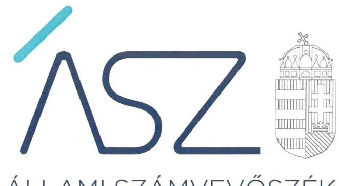
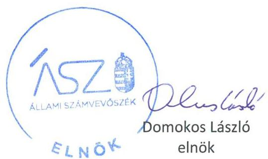
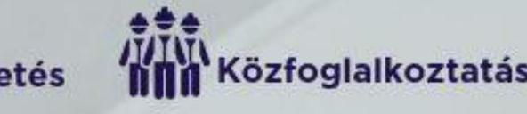

ÁLLAMI SZÁMVEVŐSZÉK

# JELENTÉS 

Az önkormányzatok ellenőrzése - Önkormányzati intézmények integritás és belső kontrollrendszerének ellenőrzése

62 önkormányzati intézmény
2022.

22016
www.asz.hu

---

ÁLLAMI SZÁMVEVŐSZÉK

# JELENTÉS

Az önkormányzatok ellenőrzése – Önkormányzati intézmények integritás és belső kontrollrendszerének ellenőrzése

62 önkormányzati intézmény

2022. 05. hó 04. nap

22016
www.asz.hu

---

# AZ ELLENŐRZÉST VEZETTE ÉS A VÉGREHAJTÁSÁÉRT FELELŐS: 

SALAMON ILDIKÓ ellenőrzésvezető
LAJÓ ADRIENN ellenőrzésvezető
DR. GÁL NÓRA ellenőrzésvezető
DR. KOVÁCS DIÁNA ellenőrzésvezető

A PROGRAM ÖSSZEÁLLÍTÁSÁÉRT FELELŐS:
GÖRGÉNYI GÁBOR ETAMO osztályvezető

IKTATÓSZÁM: EL-3621-002/2022.
TÉMASZÁM: 2548
ELLENŐRZÉS-AZONOSÍTÓ SZÁM: V0892

---

# TARTALOMJEGYZÉK 

■ ÖSSZEGZÉS ..... 5
■ AZ ELLENŐRZÉS CÉLJA ..... 8
■ AZ ELLENŐRZÉS TERÜLETE ..... 9
■ AZ ELLENŐRZÉS HÁTTERE, INDOKOLTSÁGA ..... 10
■ A JELENTÉS LÉNYEGES KÉRDÉSKÖREI ..... 11
■ ELLENŐRZÉS HATÓKÖRE ÉS MÓDSZEREI ..... 12
■ ÉRTÉKELÉSEK ..... 14
■ MELLÉKLETEK ..... 17
I. sz. melléklet: Az ellenőrzött intézmények kockázati besorolása és azok változása ..... 17
II. sz. melléklet: a figyelemfelhívásra a kockázatokat nem mérséklő ellenőrzött intézmények ..... 20
III. sz. melléklet: Fogalomtár ..... 21
■ FÜGGELÉK: ÉSZREVÉTELEK ..... 23
■ RÖVIDÍTÉSEK JEGYZÉKE ..... 27

---

.

---

# ÖSSZEGZÉS 

Az önkormányzatok és önkormányzati társulások által fenntartott, közszolgáltatásokat nyújtó 62 ellenőrzött intézménynél az átlátható és elszámoltatható gazdálkodás feltételei nem voltak biztosítottak a 2019. évben.
Az Állami Számvevőszék figyelemfelhívására 43 intézményvezető felelős vezetői intézkedéseket tett, amelyekkel mérséklődtek a kockázatok. 7 intézmény vezetője nem igazolta a kockázatok csökkenését. 10 intézményvezető nem tett lépéseket a magas kockázatok csökkentése érdekében. Így a vezetői cselekvés hiánya miatt az ellenőrzött időszakot követően a gazdálkodásban és az integritás érvényesülése tekintetében a hibák előfordulásának kockázatai tovább növekedtek.
Az ellenőrzött időszakot követően a fenntartók 2 intézmény megszünéséről döntöttek.

## Az ellenőrzés társadalmi indokoltsága

A helyi önkormányzatok és önkormányzati társulások intézményei szerteágazó feladatokat látnak el, az intézmények működtetése közvetlenül érinti a társadalom valamennyi rétegét, a feladatot ellátó intézmények működésének és gazdálkodásának a minősége hatással van az emberek közérzetére. Az intézmények szabályszerű, hatékony és eredményes működésének és gazdálkodásának alapfeltétele a belső kontrollrendszer megfelelő kialakítása. Az ÁSZ ${ }^{1}$ a törvényi felhatalmazással élve ellenőrzi az önkormányzati intézményeket, hogy megállapításaival támogassa az ellenőrzött szervezetek szabályszerű gazdálkodását, működését.
Az önkormányzati/társulási fenntartásban működő, gazdasági, műszaki ellátó szervezetek a településeken jellemzően településüzemeltetési, vagyongazdálkodási, város és községgazdálkodási, étkeztetési, ingatlan üzemeltetési és hasznosítási, gazdasági hivatali, közfoglalkoztatási feladatokat látnak el. Közszolgáltatási feladataik túlmutatnak az adott költségvetési szerv keretein, hatással vannak más intézmények működésére éppúgy, mint a településen élők életminőségére. Az ellenőrzött kulturális és közművelődési közszolgáltatást nyújtó intézmények feladatellátása szintén a társadalom széles körét érinti. A szolgáltatásokat igénybe vevők jelentős száma, és az erre fordított közpénz nagysága indokolja, hogy az ÁSZ - kockázati alapon - további, az előző ellenőrzésekre épülő ellenőrzéseket végezzen ezen a területen, illetve további olyan területeken, ahol az önkormányzati szolgáltatást a lakosság széles köre veszi igénybe.
Az intézményi működés minőségét nagyban befolyásolja az adott intézmény szabályozottsága. Az intézmények szabályszerű, hatékony és eredményes működésének és gazdálkodásának alapfeltétele a belső kontrollrendszer megfelelő kialakítása. A jogszabályokban előírt belső szabályzatok megléte, azok aktuális jogszabályoknak folyamatosan megfelelő tartalma és gyakorlati alkalmazhatósága elengedhetetlen a szabályszerű működéshez, így a minőségi szolgáltatáshoz. A szervezeti, működési és gazdálkodási kereteket kialakító szabályozási környezetet, mint a kontrolltevékenységek és ezen belül az integrált kockázatkezelés szabályszerű gyakorlásának előfeltételeit minden közpénzt felhasználó szervezetnek, így az önkormányzati intézményeknek is meg kell teremteni.

## Értékelés

Az Állami Számvevőszék az önkormányzatok, önkormányzati társulások fenntartásában működő 62 intézmény belső kontrollrendszerének lényeges elemei kialakítását ellenőrizte a 2019. évre vonatkozóan. Az ellenőrzés az intézmények működésében és gazdálkodásában magas kockázatokat azonosított.

22 intézmény vezetője a jogszabályban előírtak ellenére nyilatkozatban nem értékelte az intézmény belső kontrollrendszerének minőségét, így nem igazolták, hogy felelős vezetőként gondoskodtak a belső kontrollrendszer lényeges elemeinek - a kontrollkörnyezet és a gazdálkodási kontrolltevékenységek, valamint az integrált

---

kockázatkezelési rendszer - szabályszerű kialakításáról. 38 önkormányzati intézmény vezetője nem igazolta, hogy a nyilatkozatát megküldte az irányító szerv részére, valamint 2 önkormányzati intézmény vezetője - a nyilatkozatában foglaltak szerint - nem gondoskodott az intézmény belső kontrollkörnyezetének kialakításáról.

Az intézmények integritásának alapvető feltétele a szabályozottság megléte, és az integritási kockázatok csökkenthetők azáltal, hogy az intézmények kialakítják a szervezeti és működési kereteket, a gazdálkodásra vonatkozó alapvető szabályozási környezetet. Az intézmények vezetőinek belső kontrollrendszer minőségét értékelő nyilatkozatának hiánya, valamint az intézmény vezetője által kiállított, a belső kontroll környezet kialakításának hiányát bizonyító nyilatkozat esetén a felelős vezetői feladatellátás nem valósult meg.

A 62 önkormányzati intézmény belső kontrollrendszerében feltárt hiányosságok magas kockázatot hordoznak az intézmények ellenőrzött időszakot követő szabályszerű, átlátható és elszámoltatható működésére és gazdálkodására, az integritás érvényesülésére, ezért az intézmények vezetőinek intézkedése volt indokolt a kockázatok csökkentése érdekében.

Az ellenőrzés lehetővé tette a kockázatok mérséklését, az Állami Számvevőszék figyelemfelhívására teendő intézkedésekkel. Az Állami Számvevőszék célja a felhívásokkal az volt, hogy az intézmények a működés és a költségvetési támogatás-felhasználás magas kockázatait csökkentsék, biztosítva ezzel a közfeladatra kapott közpénzek elszámoltathatóságát és átláthatóságát.

Az intézményvezetők által jelzett intézkedések értékelésének alapvető szempontja az volt, hogy felelős vezetői magatartásukkal, intézkedéseikkel csökkentették, változatlanul hagyták, vagy növelték az intézmény belső kontrollrendszerének lényeges elemei kialakítására, valamint az integritás érvényesülésére vonatkozóan azonosított magas kockázatokat.

43 intézmény esetében a vezetők felelős magatartást tanúsítottak, intézkedtek a jelzett szabálytalanság jövőbeni javítása érdekében, és ezt dokumentumokkal is igazolták. Ezeknek az intézményeknek az esetében a kockázatok mérséklődtek, megteremtve ezzel az integritás alapú, átlátható közpénzfelhasználás egyik alapfeltételét.

7 intézmény esetében a vezetők által tett intézkedések nem igazolták a feltárt szabálytalanság megszüntetését, esetükben az azonosított kockázatok nem változtak.

10 intézmény vezetője nem tanúsított felelős vezetői magatartást, nem működött együtt a hiba jövőbeni előfordulása kockázatai csökkentése tekintetében. Ezen intézmények ellenőrzött időszakot követő szabályszerű és átlátható működésében és gazdálkodásában, az integritás érvényesülésében azonosított magas kockázatok tovább növekedtek.

Az intézmények kockázati besorolásának minősítését és annak változását az I. sz. melléklet, a figyelemfelhívásra a kockázatokat nem mérséklő intézményeket a II. sz. melléklet tartalmazza.

# Következtetések 

A közszolgáltatást nyújtó intézmények szabályszerű működésének és gazdálkodásának helyreállítása és fenntartása szempontjából alapvető fontosságú a felelős vezetői magatartás és feladatellátás. Ennek része, hogy az intézmények vezetői a jövőben a vonatkozó jogszabályi előírások szerint kialakítsák belső kontroll környezetüket, elkészítsék a belső kontrollrendszer minőségének értékeléséről szóló vezetői nyilatkozatot, és arról igazoltan tájékoztassák az irányító szervet. A belső kontrollrendszer minőségének évenkénti értékelése hozzájárul a belső kontrollrendszer jogszabályi előírások szerinti fenntartásához, fejlesztéséhez, ezáltal az intézmények szabályszerű és átlátható működéséhez, az integritás érvényesüléséhez.

A közvagyon, a közpénzek célszerű felhasználása kérdőjelezhető meg azoknál az intézményeknél, amelyek a magas kockázati besorolás és az intézkedési kötelemmel járó figyelemfelhívás ellenére nem tettek intézkedést a szabályosság helyreállítására. Ezek a következők:

Budapest Főváros XVI. Kerületi Önkormányzat Gazdasági, Működtető-Ellátó Szervezet, Madarasi Településellátó, Beruházó és Szolgáltató Szervezet, Galamboki Szolgáltató Központ, Tiszalök Város Önkormányzata Városüzemeltetési Intézménye, Vésztői Városüzemeltetési Iroda, Balatonkenese Város Városgondnoksága, Emőd Város Városgondnoksága, Kéki Konyha, Központi Gyermekkonyha, Nógrádsáp Község Gazdasági- Műszaki Ellátó Szervezet.

---

# Kiket ellenőriztünk? 

Önkormányzatok gazdasági, műszaki ellátó szervezetei 62 intézmény

Ingatlan
(1)üzemeltetés

Étkeztetés

Közfoglalkoztatás

## MIRE JUTOTT AZ ÁSZ?

Az értékelés eredményei

## 60 figyelemfelhívás*

## 43 intézménynél csökkentek a kockázatok

Mind a 62
intézmény
magas
kockázatú

## 10 intézmény nem működött együtt, tovább nőttek a kockázatok

---

# AZ ELLENŐRZÉS CÉLJA 

## A KOCKÁZATALAPÚ ELLENŐRZÉS

CÉLJA annak megállapítása, hogy az önkormányzat/társulás irányítása alá tartozó költségvetési szerv a belső kontrollrendszere egyes elemeit kialakította-e.

---

# AZ ELLENŐRZÉS TERÜLETE 

## 62 önkormányzati gazdasági ellátó intézmény

Helyi önkormányzati költségvetési szervet az államháztartásról szóló 2011. évi CXCV törvény szerint a helyi önkormányzat, a helyi önkormányzatok társulása, a térségi fejlesztési tanács, az átalakult nemzetiségi önkormányzat alapíthat, a költségvetési szerv alapító okiratában meghatározott önkormányzati közfeladatok ellátására. A helyi önkormányzati költségvetési szervek önálló jogi személyek, éves költségvetésből gazdálkodva látják el feladataikat. A helyi önkormányzati költségvetési szervek gazdasági szervezettel rendelkeznek, azonban ha a költségvetési szerv éves átlagos statisztikai állományi létszáma a 100 főt nem éri el, a gazdasági szervezet feladatait az önkormányzati hivatal, vagy az irányító szerv döntése alapján az irányító szerv irányítása alá tartozó, gazdasági szervezettel rendelkező más költségvetési szerv látja el.

Az önkormányzati költségvetési szervek irányító szervi feladatait az alapító önkormányzatok képviselő-testületei gyakorolják, a képviselő testület nevezi ki az önkormányzati költségvetési szervek vezetőit. Az önkormányzati társulások által alapított költségvetési szervek esetében az irányítói jogok gyakorlásának rendjét a működésüket szabályozó, illetve az alapításban részt vevő helyi önkormányzatok megállapodása határozza meg.

Az ellenőrzés a helyi önkormányzatok és társulások által irányított költségvetési szervekre terjedt ki.

A feladatellátásuk szerint az ellenőrzött költségvetési szervek egy része gazdasági, műszaki ellátó szervezet volt, ami a településeken jellemzően településüzemeltetési, vagyongazdálkodási, város és községgazdálkodási, étkeztetési, ingatlan üzemeltetési és hasznosítási, gazdasági hivatali, közfoglalkoztatási feladatokat látott el. Ezen túl az ellenőrzött szervezetek között voltak kulturális és közművelődési közszolgáltatást nyújtó intézmények is.
Az ellenőrzött időszakot követően 2 ellenőrzött intézmény megszűnt.

---

# AZ ELLENŐRZÉS HÁTTERE, INDOKOLTSÁGA 

A helyi önkormányzatok és az önkormányzati társulások intézményei által ellátott feladatok, a bölcsődei, óvodai ellátás, a betegek és idősek gondozása, a közművelődési intézmények, könyvtárak működtetése közvetlenül érintik a társadalom valamennyi rétegét, a feladatot ellátó intézmények működésének minősége hatással van az emberek közérzetére. Az intézmények szabályszerű, gazdaságos, hatékony és eredményes működésének és gazdálkodásának alapfeltétele a belső kontrollrendszer megfelelő kialakítása. Az ÁSZ a törvényi felhatalmazással élve ellenőrzi az önkormányzati intézményeket, hogy megállapításaival támogassa az ellenőrzött szervezetek szabályszerű gazdálkodását, működését.

A lényeges területekre kiterjedő ellenőrzés hozzájárult - az ellenőrzött szervezetek leterheltségének mérséklése mellett - az ellenőrzés időtartamának csökkentéséhez, vagyis az ellenőrzési hatékonyság növeléséhez, továbbá az ellenőrzött szervezetek számának növeléséhez, ezáltal az önkormányzati intézmények ellenőrzöttségének nagyobb lefedettségéhez.

---

# A JELENTÉS LÉNYEGES KÉRDÉSKÖREI 

1. Az önkormányzati intézmény vezetője nyilatkozatban értékelte-e a szervezet belső kontrollrendszerének a minőségét?
2. Az önkormányzati intézmény vezetője intézkedett-e a feltárt jogszabálysértő gyakorlat jövőbeni előfordulásának elkerülése érdekében?

---

# ELLENŐRZÉS HATÓKÖRE ÉS MÓDSZEREI 

## Az ellenőrzés típusa

Megfelelőségi ellenőrzés.

## Az ellenőrzött időszak

2019. év

## Az ellenőrzés tárgya

Az önkormányzat/társulás irányítása alá tartozó költségvetési szerv belső kontrollrendszere egyes elemeinek kialakítása. A belső kontrollrendszer pillérei közül a kontrollkörnyezet, a kontrolltevékenységek lényeges elemei és az integrált kockázatkezelési rendszer kialakítása.

## Az ellenőrzött szervezetek

A helyi önkormányzatok és társulások által irányított (az önálló gazdasági szervezettel nem rendelkezők is) költségvetési szervek az önkormányzati hivatalok kivételével. 62 önkormányzati intézmény az I. sz. Függelék szerint.

## Az ellenőrzés jogalapja

Az ellenőrzés jogszabályi alapját az ÁSZ tv. ${ }^{2}$ 1. § (3) bekezdése, 5. § (6) bekezdése, valamint az Áht. ${ }^{3} 61 . \S$ (2) bekezdése képezik.

## Az ellenőrzés módszerei

Az ellenőrzés az ellenőrzött időszakban hatályos jogszabályok, az ellenőrzés szakmai szabályai, a jelen ellenőrzésre irányadó ÁSZ módszertanok, az ellenőrzési programban foglalt értékelési szempontok szerint került végrehajtásra. Az ellenőrzést az ÁSZ a program kérdéseire adott válaszok kiértékelésével, valamint a programban ismertetett adatforrások, továbbá az adott időszakban hatályos jogszabályok figyelembevételével folytatja
 le.

Az ÁSZ az ellenőrzés során meghatározott lényeges dokumentumok tartalmi értékelését végzi, olyan kiválasztott kritériumok alapján, amelyek bármelyikének a múltbeli időszakra vonatkozóan megállapított hiánya

---

kockázatot jelent az ellenőrzött szervezet jövőbeli gazdálkodására, működésére. Az ÁSZ a lényeges dokumentumok értékelése alapján az ellenőrzött szervezetre vonatkozó működési és gazdálkodási kockázatokat azonosítja. A kockázatok beazonosítása alapján történik az egyes intézmények kockázati minősítése.

Alacsony kockázati besorolású az az intézmény, amely teljes körűen az ellenőrzés rendelkezésére bocsátja az alapvető dokumentumokat, és a belső kontrollrendszer ellenőrzött területeinek mindegyikének értékelése szabályszerű. Kockázatos besorolású az az intézmény, amely teljes körűen az ellenőrzés rendelkezésére bocsátja az alapvető dokumentumokat, de a belső kontrollrendszer ellenőrzött területeinek legalább egyikének értékelése nem szabályszerű. Magas kockázati besorolású az az intézmény, amely esetében az alapvető dokumentumok nem álltak teljes körűen rendelkezésre.

Az ÁSZ minden esetben megjelöli, hogy mely dokumentum minősül alapvető dokumentumnak. Az alapvető dokumentum hiánya esetében a további dokumentumok nem kerülnek értékelésre.

Az ellenőrzés folyamata - az ellenőrzött időszakot követően, de még az ellenőrzés folyamán - lehetővé teszi a feltárt kockázatok mérséklését az ellenőrzött intézmények vezetői számára. Az intézmények vezetőinek - a feltárt jogszabálysértő gyakorlatok megszüntetésére tett - intézkedései csökkentik, míg az intézkedések hiánya növeli a felelős vezetői feladatellátásban fennálló kockázatokat az intézmény belső kontrollrendszerének lényeges elemei kialakítására vonatkozóan.

Az ellenőrzés ideje alatt az ÁSZ az ellenőrzött szervezettel történő kapcsolattartást az ÁSZ SZMSZ4-ének vonatkozó előírásai alapján biztosítja.

---

# 1. Az önkormányzati intézmény vezetője nyilatkozatban értékelte-e a szervezet belső kontrollrendszerének a minőségét? 

Összegző részértékelés A 62 intézmény vezetője nem biztosította az integritás érvényesülésének alapvető feltételét a 2019. évben.

22 önkormányzati intézmény vezetője a Bkr. ${ }^{5}$ 11. § (1) bekezdésében foglaltak ellenére nem nyilatkozott az általa vezetett intézmény belső kontrollrendszerének minőségéről, így nem igazolták, hogy felelős vezetőként gondoskodtak az intézmények tevékenységében a szabályszerűséget, elszámoltathatóságot, eredményességet és hatékonyságot, valamint az integritás érvényesítését biztosító belső kontrollrendszer kialakításáról és működtetéséről, a rendelkezésre álló források célnak megfelelő felhasználásáról, illetve arról, hogy az általuk vezetett intézményeknél a megfelelő folyamatokat működtették feladataik ellátása során.

38 önkormányzati intézmény vezetője nem igazolta, hogy a belső kontrollrendszer értékelésére vonatkozó nyilatkozatát a Bkr. 11. § (2) bekezdésében foglalt előírás szerint az irányító szerv vezetője részére megküldte.

2 intézményvezető a Bkr. 11. § (1) bekezdésében foglalt nyilatkozata szerint nem gondoskodott a szervezet belső kontrollkörnyezetének kialakításáról, ennek hiányában nem biztosítottak a belső kontrollrendszer szabályos működésének feltételei.

2 önkormányzati intézmény az ellenőrzött időszakot követően megszűnt.

A szabályszerű belső kontrollrendszer kialakításának hiánya, illetve az éves írásos vezetői nyilatkozat hiánya magas kockázatot hordoz az intézmények átlátható és elszámoltatható működésének és gazdálkodásának, valamint az integritás érvényesülésének tekintetében.

---

# 2. Az önkormányzati intézmény vezetője intézkedett-e a feltárt jogszabálysértő gyakorlat jövőbeni előfordulásának elkerülése érdekében? 

Összegző részértékelés 60 önkormányzati intézmény közül 43 intézmény vezetője intézkedett a jogszabálysértő gyakorlat jövőbeni elkerülése érdekében. 7 intézmény vezetője nem igazolta a feltárt kockázatok csökkenését. 10 intézmény vezetője a figyelemfelhívásra nem válaszolt, így a kockázatok nőttek.

Az ÁSZ figyelemfelhívó levél küldésével lehetőséget biztosított a 60 ellenőrzött intézmény vezetőjének a feltárt szabálytalanságok megszüntetésére, a kockázatok csökkentésére.

43 intézmény esetében az intézményvezetők intézkedtek a feltárt jogszabálysértő gyakorlat megszüntetése érdekében, a 2020. évre vonatkozóan nyilatkoztak az általuk vezetett intézmények belső kontrollrendszerének minőségéről, ezen intézmények esetében a feltárt kockázatok csökkentek.

7 intézmény esetében az intézményvezetői intézkedések nem igazolták a feltárt szabálytalanságok jövőbeni megszüntetését, így a feltárt kockázatok nem változtak.

Az ÁSZ intézkedési kötelemmel járó figyelemfelhívására 10 intézmény vezetője nem válaszolt, esetükben a feltárt kockázatok - a felelős vezetői magatartás hiánya miatt - nőttek.

---

.

---

# MELLÉKLETEK

I. SZ. MELLÉKLET: AZ ELLENŐRZÖTT INTÉZMÉNYEK KOCKÁZATI BESOROLÁSA ÉS AZOK VÁLTOZÁSA

|  Sorszám | Intézmény | Székhely | Kockázati besorolás az ellenőrzött 2019. év alapján | Kockázat változása a figyelem-felhívásokat követően  |
| --- | --- | --- | --- | --- |
|  1. | Kiskunhalas Város Önkormányzata Költségvetési Intézmények Gazdasági Szervezete | Kiskunhalas | MAGAS | CSÖKKENT  |
|  2. | Mozaik Gazdasági Szervezet | Budapest | MAGAS | MEGSZŰNT 2021. 03.31.  |
|  3. | Polgár Város Önkormányzatának Városgondnoksága | Polgár | MAGAS | CSÖKKENT  |
|  4. | Budapest Főváros XII. Kerület Hegyvidéki Önkormányzat Gazdasági Ellátó Szolgálat | Budapest | MAGAS | CSÖKKENT  |
|  5. | Szigetszentmiklós Város Önkormányzat Egészségügyi és Oktatási Intézményeket Működtető Iroda | Szigetszentmiklós | MAGAS | NEM VÁLTOZOTT  |
|  6. | Budapest Főváros XVI. Kerületi Önkormányzat Gazdasági, Működtető-Ellátó Szervezet | Budapest | MAGAS | NÖTT  |
|  7. | Sarkad Város Önkormányzat Intézményi Gondnokság | Sarkad | MAGAS | NEM VÁLTOZOTT  |
|  8. | Özdi Városüzemeltető Intézmény | Özd | MAGAS | CSÖKKENT  |
|  9. | Tokaji Városüzemeltető Szervezet | Tokaj | MAGAS | CSÖKKENT  |
|  10. | Tiszaújvárosi Intézményműködtető Központ | Tiszaújváros | MAGAS | CSÖKKENT  |
|  11. | Szombathelyi Egészségügyi és Kulturális Intézmények Gazdasági Ellátó Szervezete | Szombathely | MAGAS | CSÖKKENT  |
|  12. | Sátoraljaújhelyi Városellátó Szervezet | Sátoraljaújhely | MAGAS | CSÖKKENT  |
|  13. | Szolnoki Kulturális Ellátó Szervezet | Szolnok | MAGAS | CSÖKKENT  |
|  14. | Zamárdi Önkormányzat Gazdasági-Műszaki Ellátó és Szolgáltató Szervezete | Zamárdi | MAGAS | CSÖKKENT  |
|  15. | Székesfehérvár Megyei Jogú Város Önkormányzata Humán Szolgáltató Intézet | Székesfehérvár | MAGAS | CSÖKKENT  |
|  16. | Intézmény- és Piacfenntartó Szervezet | Kecskemét | MAGAS | CSÖKKENT  |
|  17. | Salgótarjáni Költségvetési Intézmények Gazdasági Szolgálata | Salgótarján | MAGAS | CSÖKKENT  |
|  18. | Tatabányai Gazdasági és Műszaki Ellátó és Szolgáltató Szervezet | Tatabánya | MAGAS | CSÖKKENT  |
|  19. | Gazdasági Műszaki Ellátó Szervezet | Veresegyház | MAGAS | CSÖKKENT  |
|  20. | Hajdúszoboszlói Gazdasági Szolgáltató Intézmény | Hajdúszoboszló | MAGAS | CSÖKKENT  |
|  21. | Madarasi Településellátó, Beruházó és Szolgáltató Szervezet | Kunmadaras | MAGAS | NÖTT  |
|  22. | Berkesz Önkormányzati Konyha | Berkesz | MAGAS | CSÖKKENT  |
|  23. | Tiszacsege Kommunális Szolgáltató Szervezet | Tiszacsege | MAGAS | CSÖKKENT  |

---

|  Sorszám | Intézmény | Székhely | Kockázati besorolás az ellenőrzött 2019. év alapján | Kockázat változása a figyelem-felhívásokat követően  |
| --- | --- | --- | --- | --- |
|  24. | Tiszasas Község Településellátó és Szolgáltató Szervezete | Tiszasas | MAGAS | CSÖKKENT  |
|  25. | Gyenesdiás Nagyközség Önkormányzata Étkezdéje | Gyenesdiás | MAGAS | CSÖKKENT  |
|  26. | Aba Város Városgondnoksága (2021.02.10-től Abai Fórum Étterem) | Aba | MAGAS | NEM VÁLTOZOTT  |
|  27. | Galamboki Szolgáltató Központ | Galambok | MAGAS | NÖTT  |
|  28. | Mányi Önkormányzati Konyha | Mány | MAGAS | CSÖKKENT  |
|  29. | Gazdasági Ellátó Szervezet Kőtelek | Kőtelek | MAGAS | CSÖKKENT  |
|  30. | Tiszalök Város Önkormányzata Városüzemeltetési Intézménye | Tiszalök | MAGAS | NÖTT  |
|  31. | Kommunális Üzemeltető és Építő Szervezet | Ják | MAGAS | NEM VÁLTOZOTT  |
|  32. | Vésztői Városüzemeltetési Iroda | Vésztő | MAGAS | NÖTT  |
|  33. | Füzéri Községgondnokság | Füzér | MAGAS | CSÖKKENT  |
|  34. | Balatonkenese Város Városgondnoksága | Balatonkenese | MAGAS | NÖTT  |
|  35. | Lőrinci Városüzemeltetési Intézmény | Lőrinci | MAGAS | NEM VÁLTOZOTT  |
|  36. | Heves Városi Mezei Őrszolgálat | Heves | MAGAS | NEM VÁLTOZOTT  |
|  37. | Emőd Város Városgondnoksága | Emőd | MAGAS | NÖTT  |
|  38. | Csépai Gazdasági Műszaki Ellátó Szervezet | Csépa | MAGAS | CSÖKKENT  |
|  39. | Kalocsai Közétkeztetési Intézmény | Kalocsa | MAGAS | CSÖKKENT  |
|  40. | Öcsödi Községgondnokság és Könyvtár | Öcsöd | MAGAS | CSÖKKENT  |
|  41. | Kenderes Városgazdálkodás | Kenderes | MAGAS | NEM VÁLTOZOTT  |
|  42. | Kéki Konyha | Kék | MAGAS | NÖTT  |
|  43. | Központi Gyermekkonyha | Sopron | MAGAS | NÖTT  |
|  44. | Kecskeméti Városrendészet | Kecskemét | MAGAS | CSÖKKENT  |
|  45. | Gazdasági-Műszaki Ellátó és Szolgáltató Szervezet | Szabadszállás | MAGAS | CSÖKKENT  |
|  46. | Érsekvadkert Községi Önkormányzat Képviselő-Testületének Gazdasági, Műszaki Ellátó és Szolgáltató Szervezete | Érsekvadkert | MAGAS | MEGSZŰNT 2021.05.10.  |
|  47. | Alsóörsi Településműködtetési és Községgazdálkodási Szervezet | Alsóörs | MAGAS | CSÖKKENT  |
|  48. | Szadai Gyermekélelmezési és Szociális Étkeztetési Konyha | Szada | MAGAS | CSÖKKENT  |
|  49. | Egészségügyi, Gyermekjóléti és Szociális Intézmény | Kiskőrös | MAGAS | CSÖKKENT  |
|  50. | Település Ellátó és Szolgáltató Szervezet | Berhida | MAGAS | CSÖKKENT  |
|  51. | Kisbéri Városigazgatóság | Kisbér | MAGAS | CSÖKKENT  |
|  52. | Tihanyi Falugondnokság | Tihany | MAGAS | CSÖKKENT  |
|  53. | Nagykáta Város Önkormányzata Városgazdálkodási Szervezete | Nagykáta | MAGAS | CSÖKKENT  |
|  54. | Székelyi Önkormányzati Konyha | Székely | MAGAS | CSÖKKENT  |
|  55. | Nógrádsáp Község Gazdasági- Műszaki Ellátó Szervezet | Nógrádsáp | MAGAS | NÖTT  |

---

|  Sorszám | Intézmény | Székhely | Kockázati besorolás az ellenőrzött 2019. év alapján | Kockázat változása a figyelem-felhívásokat követően  |
| --- | --- | --- | --- | --- |
|  56. | Szeghalom Város Önkormányzat Intézményműködtető Központja | Szeghalom | MAGAS | CSÖKKENT  |
|  57. | Szolnok Megyei Jogú Város Polgármesteri Hivatal Ellátó és Szolgáltató Szervezete | Szolnok | MAGAS | CSÖKKENT  |
|  58. | Közintézményeket Működtető Központ | Nyíregyháza | MAGAS | CSÖKKENT  |
|  59. | Városi Intézmények Működtető Szervezete | Ajka | MAGAS | CSÖKKENT  |
|  60. | Üllő Város Humán Szolgáltató Központ, Óvoda és Központi Rendelő Többcélú Közös Igazgatású Intézmény | Üllő | MAGAS | CSÖKKENT  |
|  61. | Demecser Város Önkormányzata

 Konyha és
Étterem | Demecser | MAGAS | CSÖKKENT  |
|  62. | Tiszabercel Község Önkormányzatának
Közétkeztetési Intézménye | Tiszabercel | MAGAS | CSÖKKENT  |
|  Magas kockázati besorolás |  |  | 62 |   |
|  Kockázat csökkent |  |  |  | 43  |
|  Kockázat nem változott |  |  |  | 7  |
|  Kockázat nőtt |  |  |  | 10  |
|  Megszűnt intézmény |  |  |  | 2  |
|  Összesen |  |  | 62 | 62  |

---

# Nem változott a kockázat 

- Az intézmény vezetője nem alakította ki a kontrolltevékenységének gyakorlására vonatkozó szabályokat a 2019. évben, mivel az intézményvezető nem készítette el a Bkr. 11. § (1) bekezdése szerinti, a költségvetési szerv belső kontrollrendszerének minőségét értékelő, a jogszabály rendelkezéseinek megfelelő nyilatkozatot. 1. Szigetszentmiklós Város Önkormányzat Egészségügyi és Oktatási Intézményeket Működtető Iroda
- Az intézmény vezetője nem alakította ki a kontrolltevékenységének gyakorlására vonatkozó szabályokat a 2019. évben, mivel az intézményvezető nem készítette el a Bkr. 11. § (1) bekezdése szerinti, a költségvetési szerv belső kontrollrendszerének minőségét értékelő, a jogszabály rendelkezéseinek megfelelő nyilatkozatot. A felelős vezetői feladatellátás nem valósult meg, mivel az intézmény által rendelkezésre bocsátott 2020. évi vezetői nyilatkozat nem felel meg a Bkr. 11. § (1) bekezdésben előírtaknak.

2. Sarkad Város Önkormányzat Intézményi Gondnokság
3. Aba Város Városgondnoksága (2021.02.10-től Abai Fórum Étterem)
4. Heves Városi Mezei Örszolgálat
5. Lőrinci Városüzemeltetési Intézmény
6. Kenderes Városgazdálkodás

- Az intézmény vezetője nem alakította ki a kontrolltevékenységének gyakorlására vonatkozó szabályokat a 2019. évben, mivel az intézményvezető nem készítette el a Bkr. 11. § (1) bekezdése szerinti, a költségvetési szerv belső kontrollrendszerének minőségét értékelő, a jogszabály rendelkezéseinek megfelelő nyilatkozatot. A felelős vezetői feladatellátás sem valósult meg, mivel az intézmény nem bocsátotta az ÁSZ rendelkezésére a Bkr. 11. § (1) bekezdésben előírtaknak megfelelően a 2020. évi vezetői nyilatkozatot

7. Kommunális Üzemeltető és Építő Szervezet (Ják)

## Nőtt a kockázat

- Az önkormányzati intézmény alapvető dokumentumai nem álltak rendelkezésre, a költségvetési szerv nem bizonyította, hogy a szabályszerű, gazdaságos, hatékony és eredményes működésének és gazdálkodásának alapfeltételeit biztosította. Az intézmény nem működött együtt az Állami Számvevőszékkel, így nem az ÁSZ tv. 28. § szerint járt el, melynek értelmében a közreműködésre felhívott szervezet a kért adatokat, dokumentumokat, tájékoztatást köteles megadni. Az intézményvezető a figyelemfelhívó levélben felsorolt jogsértő gyakorlat megszüntetésére vonatkozóan nem intézkedett.

1. Nógrádsáp Község Gazdasági- Műszaki Ellátó Szervezet
2. Központi Gyermekkonyha (Sopron)
3. Kéki Konyha
4. Emőd Város Városgondnoksága
5. Balatonkenese Város Városgondnoksága
6. Vésztői Városüzemeltetési Iroda
7. Madarasi Településellátó, Beruházó és Szolgáltató Szervezet
8. Budapest Főváros XVI. Kerületi Önkormányzat Gazdasági, Működtető Ellátó Szervezet
9. Tiszalök Város Önkormányzata Városüzemeltetési Intézménye
10. Galamboki Szolgáltató Központ

---

belső kontrollrendszer
belső kontrollrendszer területei
integrált kockázatkezelési rendszer
integritás

Integritási kockázatok
kockázat
kontrollkörnyezet
kontrollkörnyezet
kontrolltevékenységek
intézmény

A belső kontrollrendszer a kockázatok kezelése és tárgyilagos bizonyosság megszerzése érdekében kialakított folyamatrendszer, amely azt a célt szolgálja, hogy a működés és gazdálkodás során a tevékenységeket szabályszerűen, gazdaságosan, hatékonyan, eredményesen hajtsák végre, az elszámolási kötelezettségeket teljesítsék, megvédjék az erőforrásokat a veszteségektől, károktól és nem rendeltetésszerű használattól. (Forrás: Áht. 69. § (1) bekezdése)
A kontrollkörnyezet, az integrált kockázatkezelési rendszer, a kontrolltevékenységek, az információs és kommunikációs rendszer, valamint a nyomon követési (monitoring) rendszer. (Forrás: Bkr. 3. §-a)
Olyan folyamatalapú kockázatkezelési rendszer, amely a szervezet minden tevékenységére kiterjed, egységes módszertan és eljárások alkalmazásával, a szervezet célkitűzéseinek és értékeinek figyelembevételével biztosítja a szervezet kockázatainak teljes körű azonosítását, azok meghatározott kritériumok szerinti értékelését, valamint a kockázatok kezelésére vonatkozó intézkedési terv elkészítését és az abban foglaltak nyomon követését. (Forrás: Bkr. 2. § m) pontja)
Az integritás az elvek, értékek, cselekvések, módszerek, intézkedések konzisztenciáját jelenti, vagyis olyan magatartásmódot, amely meghatározott értékeknek megfelel. (Forrás: Nemzetgazdasági Minisztérium: Államháztartási belső kontroll standardok és gyakorlati útmutató 1.1.3. pontja, 2017. szeptember)
Integritási kockázatnak minősül a szervezet célkitűzéseit, értékeit, elveit sértő vagy veszélyeztető visszaélés, szabálytalanság, vagy egyéb esemény lehetősége. A korrupciós kockázat olyan integritási kockázat, amely korrupciós cselekmény bekövetkezésének lehetőségét jelenti. Minden korrupciós kockázat egyben integritási kockázat is. Korrupciós cselekményeknek nevezzük azokat a vesztegetésszerű cselekményeket, amelyeket általában a Büntető Törvénykönyv is büntetéssel fenyeget.
A kockázat annak a valószínűségét jelenti, hogy egy vagy esemény, vagy intézkedés nem kívánt módon befolyásolja a rendszer működését, céljainak megvalósulását. (Forrás: Javaslatok a korrupciós kockázatok kezelésére - Kockázatkezelési és ellenőrzési módszertan 35. oldal, ÁSZ)
A költségvetési szerv vezetője által kialakított olyan elvek, eljárások, belső szabályzatok összessége, amelyben világos a szervezeti struktúra, a folyamatok átláthatók, egyértelműek a felelősségi, hatásköri viszonyok és feladatok, meghatározottak, ismertek és elfogadottak az etikai elvárások a szervezet minden szintjén, átlátható a humánerőforrás-kezelés, biztosított a szervezeti célok és értékek irányában való elkötelezettség fejlesztése és elősegítése. (Forrás: Bkr. 6. § (1) bekezdés)
A költségvetési szerv vezetője által a szervezeten belül kialakított (kontroll) tevékenységek, melyek biztosítják a kockázatok kezelését, hozzájárulnak a szervezet céljainak eléréséhez és erősítik a szervezet integritását. (Forrás: Bkr. 8. § (1) bekezdés)
A helyi önkormányzatok és társulások irányítása alá tartozó költségvetési szervek. (A képviselő-testület a feladatkörébe tartozó közszolgáltatások ellátására jogszabályban meghatározottak szerint - költségvetési szervet (önkormányzati intézmény) alapíthat; Forrás: Mötv. ${ }^{6}$ 41. § (6) bekezdés)

---

.

---

# FÜGGELÉK: ÉSZREVÉTELEK 

Az ellenőrzési megállapításokat a Számvevőszék 15 napos észrevételezésre megküldte az érintett ellenőrzött szervezetek vezetőinek az ÁSZ tv. 29. § (1) bekezdése előírásának megfelelően.

A Tatabányai Gazdasági és Műszaki Ellátó és Szolgáltató Szervezet igazgatója, a Budapest Főváros XVI. Kerületi Önkormányzat Gazdasági, Működtető-Ellátó Szervezet, az Emőd Város Városgondnoksága, a Lőrinci Városüzemeltetési Intézmény és a Sarkad Város Önkormányzat Intézményi Gondnokság intézményvezetői az ellenőrzés megállapításaira észrevételt tettek. A többi, megállapítással érintett ellenőrzött szervezet vezetője nem tett észrevételt.
Az ÁSZ tv. 29. § (3) bekezdésével összhangban az ÁSZ a Függelékben feltünteti az ellenőrzés megállapításaival kapcsolatban tett, figyelembe nem vett észrevételeket, és megindokolja, hogy azokat miért nem fogadta el.

[^0]
[^0]:    * 29. § (1) Az Állami Számvevőszék az ellenőrzési megállapításait megküldi az ellenőrzött szervezet vezetőjének vagy az általa megbízott személynek, és annak, akinek személyes felelősségét állapította meg.
    (2) Az ellenőrzött szervezet vezetője és a felelősként megjelölt személy az ellenőrzés megállapításaira tizenöt napon belül írásban észrevételt tehet.
    (3) Az Állami Számvevőszék az észrevételre a beérkezésétől számított harminc napon belül írásban válaszol. A figyelembe nem vett észrevételeket köteles a jelentésben feltüntetni, és megindokolni, hogy azokat miért nem fogadta el.

---

1. Az ellenőrzés megállapításaival kapcsolatban a Budapest Főváros XVI. Kerületi Önkormányzat Gazdasági, Működtető-Ellátó Szervezet intézményvezetője által 2021. október 12-én kelt levélben tett észrevétel és el nem fogadásának indokolása.

Az intézményvezető észrevételében leírta, hogy a Bkr. 11. § (1) bekezdésében foglalt 2019. évi nyilatkozatot határidőben elkészítette, a beszámolóhoz csatolta és az ellenőrzés során feltöltötte az adatbekérési felületre. A figyelemfelhívó levélben kért 2020. évi vezetői nyilatkozatot a 2020. évi beszámolóval együtt 2021. június 15-én elektronikus úton (emailben) megküldte az ÁSZ részére, amelyre visszajelzést nem kapott.

Az intézményvezető a 2019. évre vonatkozóan a Bkr. 11. § (1) és (4) bekezdéseiben előírt vezetői nyilatkozat Bkr. 11. § (2a) bekezdése szerinti irányító szervnek történő megküldését az ÁSZ felé hitelt érdemlő módon nem igazolta. Az intézményvezetőt tájékoztattuk a hivatalos kapcsolattartási, kommunikációs csatornákról, amelyeken a kért dokumentumot nem bocsátották rendelkezésre. Az ÁSZ már az ellenőrzés során figyelemfelhívással élt és szólította meg azon ellenőrzött szervezeteket, ahol hiányosságot tárt fel és egyúttal lehetőséget adott arra, hogy a jogszabálysértő gyakorlatot megszüntessék, és erről beszámoljanak. Az intézményvezető észrevételében a 2020. évre vonatkozó vezetői nyilatkozat ÁSZ részére történő megküldését nem igazolta.

Az ÁSZ megállapította, hogy az intézményvezető a figyelemfelhívás ellenére, a levélben rögzített, az ellenőrzés során feltárt jogszabálysértő gyakorlat megszüntetése érdekében nem intézkedett, az ÁSZ tv. 28. §-ában előírt közreműködési kötelezettségének nem tett eleget. Az ÁSZ a megállapításait az ÁSZ tv. szerinti határidőben rendelkezésre bocsátott dokumentumokra alapozza.

Fentiekre tekintettel a számvevőszéki megállapítás megalapozott.
2. Az ellenőrzés megállapításaival kapcsolatban Emőd Város Városgondnoksága intézményvezetője által 2021. október 6-án kelt levélben tett észrevétel és el nem fogadásának indokolása.

Az intézményvezető észrevételében leírta, hogy az ellenőrzés adatszolgáltatása során dokumentumokat bocsátott az ÁSZ rendelkezésére. Az ÁSZ figyelemfelhívó levelében bekért, a Bkr. 11. § (1) bekezdésében foglalt 2020. évi nyilatkozatot elkészítette és észrevételéhez megküldte, kérte a nyilatkozat figyelembevételét.

Az adatszolgáltatás során az ÁSZ rendelkezésére bocsátott dokumentumok nem igazolták a 2019. évre vonatkozó vezetői nyilatkozat Bkr. 11. § (2a) bekezdése szerinti irányító szervnek történő megküldését. A feltárt hiányossággal kapcsolatosan az ÁSZ már az ellenőrzés során figyelemfelhívással élt az intézményvezető felé, egyúttal lehetőséget adott arra, hogy a jogszabálysértő gyakorlatot megszüntessék, és erről beszámoljanak.

A rendelkezésre álló adatok alapján az intézményvezető a figyelemfelhívásban foglaltakat nem értékelte, az ellenőrzés során feltárt jogszabálysértő gyakorlat megszüntetése érdekében lépéseket nem tett. Az intézményvezető az észrevételéhez mellékelten küldte meg az ÁSZ által a figyelemfelhívó levélben kért 2020. évi vezetői nyilatkozatot, így az abban jelzett együttműködési kötelezettségének határidőben nem tett eleget. Az ÁSZ a megállapításait az ÁSZ tv. szerinti határidőben rendelkezésre bocsátott dokumentumokra alapozza.

Fentiekre tekintettel a számvevőszéki megállapítás megalapozott.
3. Az ellenőrzés megállapításaival kapcsolatban a Lőrinci Városüzemeltetési Intézmény intézményvezetője által 2021. október 14-én kelt levélben tett észrevétel és el nem fogadásának indokolása.

Az intézményvezető észrevételében leírta, hogy a Bkr. 11. § (1) bekezdésében foglalt 2019. és 2020. évi nyilatkozatot elkészítette és az ÁSZ figyelemfelhívó levelében megadott határidőn belül megküldte az ÁSZ részére, kérte a nyilatkozatok figyelembevételét, a megállapítás módosítását.

Az intézményvezető által az ÁSZ rendelkezésére bocsátott 2019. évre vonatkozó vezetői nyilatkozatot a Lőrinci Polgármesteri Hivatal jegyzője írta alá és látta el bélyegzővel. A Bkr. 11. § (1) bekezdése értelmében a költségvetési szerv

---

vezetője köteles az 1. melléklet szerinti nyilatkozatban értékelni a költségvetési szerv belső kontrollrendszerének minőségét. Ezért a rendelkezésre bocsátott nyilatkozat nem felelt meg a Bkr. által szabályozottaknak.

Az ÁSZ már az ellenőrzés során figyelemfelhívással élt és szólította meg azon ellenőrzött szervezeteket, ahol hiányosságot tárt fel és egyúttal lehetőséget adott arra, hogy a jogszabálysértő gyakorlatot megszüntessék, és erről beszámoljanak.

Az ÁSZ megállapította, hogy a válaszlevélben hivatkozott 2020. évi vezetői nyilatkozatot a Lőrinci Polgármesteri Hivatal jegyzője adta ki, az intézményvezető által aláírt vezetői nyilatkozatot nem bocsátottak rendelkezésre. A Bkr. 11. § (1) bekezdése értelmében a költségvetési szerv vezetője köteles az 1. melléklet szerinti nyilatkozatban értékelni a költségvetési szerv belső kontrollrendszerének minőségét. Az ÁSZ rendelkezésre bocsátott 2020. évre vonatkozó nyilatkozat ezért nem felelt meg a Bkr.
 1. mellékletében foglaltaknak, mivel nem a jogszabályban meghatározott kritériumok szerint került kiállításra, ezáltal nem tudta szerepét betölteni. Az ÁSZ a megállapításait az ÁSZ tv. szerinti határidőben rendelkezésre bocsátott dokumentumokra alapozta.

Fentiekre tekintettel a számvevőszéki megállapítás megalapozott.
4. Az ellenőrzés megállapításaival kapcsolatban Sarkad Város Önkormányzat Intézményi Gondnokság intézményvezetője által 2021. október 12-én kelt levélben tett észrevétel és el nem fogadásának indokolása.

Az intézményvezető észrevételében leírta, hogy a Bkr. 11. § (1) bekezdésében foglalt 2019. és 2020. évi nyilatkozatot elkészítette és az ÁSZ figyelemfelhívó levelében megadott határidőn belül az ÁSZ rendelkezésére bocsátotta. A 2019. évre vonatkozó, nem teljeskörű, valamint a 2020. évre vonatkozó, korai dátumozású nyilatkozatokat javította és észrevételéhez ismételten megküldte. Kérte a nyilatkozatok elfogadását, figyelembevételét.

Az intézményvezető az ÁSZ rendelkezésére bocsátotta a 2020. december 22-én kelt, 2019. évre vonatkozó vezetői nyilatkozatot, amely nem felelt meg a Bkr. 1. mellékletében foglaltaknak, mivel nem a jogszabályban meghatározott határidő szerint és nem a teljes 2019. év vonatkozásában került kiállításra, ezáltal nem tudta szerepét betölteni. Továbbá az intézményvezető a vezetői nyilatkozat Bkr. 11. § (2a) bekezdése szerinti irányító szerv felé történő megküldését nem igazolta.

Az ÁSZ már az ellenőrzés során figyelemfelhívással élt és szólította meg azon ellenőrzött szervezeteket, ahol hiányosságot tárt fel és egyúttal lehetőséget adott arra, hogy a jogszabálysértő gyakorlatot megszüntessék, és erről beszámoljanak. Az ÁSZ rendelkezésére bocsátott 2020. évre vonatkozó nyilatkozat nem felelt meg a Bkr. 1. mellékletében foglaltaknak, mivel nem a jogszabályban meghatározott határidő szerint került kiállításra, ezáltal nem tudta szerepét betölteni. Az ÁSZ a megállapításait az ÁSZ tv. szerinti határidőben rendelkezésre bocsátott dokumentumokra alapozta.

Fentiekre tekintettel a számvevőszéki megállapítás megalapozott.

---

.

---

# RÖVIDÍTÉSEK JEGYZÉKE 

${ }^{1}$ ÁSZ
${ }^{2}$ ÁSZ tv.
${ }^{3}$ Áht.
${ }^{4}$ ÁSZ SZMSZ
${ }^{5}$ Bkr.
${ }^{6}$ Mötv.

Állami Számvevőszék
2011. évi LXVI. törvény az Állami Számvevőszékről (hatályos 2011. július 1-jétől)
2011. évi CXCV. törvény az államháztartásról (hatályos 2011. december 31-étől)

Az Állami Számvevőszék Szervezeti és Működési Szabályzata
370/2011. (XII. 31.) Korm. rendelet a költségvetési szervek belső
kontrollrendszeréről és belső ellenőrzéséről
2011. évi CLXXXIX. törvény Magyarország helyi önkormányzatairól (hatályos:
2012. január 1-jétől)

---

# ASZ 

ÁLLAMI SZÁMVEVŐSZÉK
1052 Budapest, Apáczai Cs. J. u. 10. I 1364 Budapest 4. Pf. 54 TEL: +36 14849100
email: szamvevoszek@asz.hu
web: www.asz.hu | www.aszhirportal.hu
