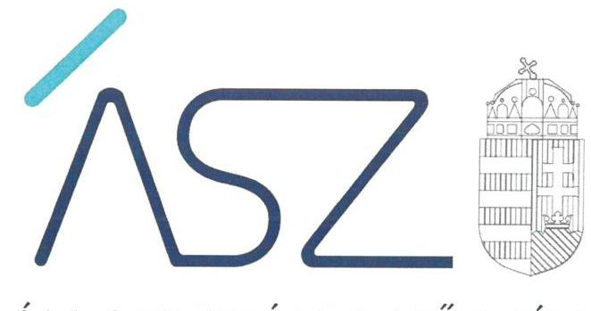
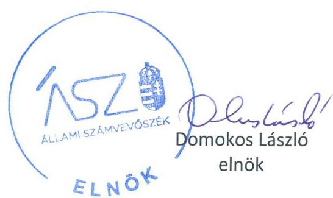

ÁLLAMI SZÁMVEVŐSZÉK

# JELENTÉS 

A jelentős beruházások ellenőrzése - 5 beruházás

2022. 

22017
www.asz.hu

---

ÁLLAMI SZÁMVEVŐSZÉK

# JELENTÉS

A jelentős beruházások ellenőrzése – 5 beruházás

2022. 05. hó 11. nap

22017
www.asz.hu

---

Jelentéseink az Országgyúlés számítógépes hálózatán és az interneten a www.asz.hu címen is olvashatóak.

## AZ ELLENŐRZÉST VEZETTE ÉS A VÉGREHAJTÁSÁÉRT FELELŐS:

ÁRPÁSI TIBOR ellenőrzésvezető
MAKKAI MÁRIA ellenőrzésvezető
DR. PETRÁNYI GÁBOR ellenőrzésvezető

## A PROGRAM ÖSSZEÁLLÍTÁSÁÉRT FELELŐS:

## NAGY ADRIENN projektvezető

## A TÉMÁHOZ KAPCSOLÓDÓ KORÁBBI SZÁMVEVŐSZÉKI JELENTÉSEK:

- címe: A jelentős beruházások ellenőrzése - Petz Aladár Megyei Oktató Kórházat érintő beruházási projekt
- sorszáma: 21061
- címe: A jelentős beruházások ellenőrzése - Nyíregyházi Atlétikai Centrumot érintő beruházási projekt
- sorszáma: 21046
- címe: A jelentős beruházások ellenőrzése - Harkányi Gyógy- és Strandfürdő fejlesztése beruházási projekt
- sorszáma: 21045
- címe: A jelentős beruházások ellenőrzése - Szolnoki Szigligeti Színházhoz kapcsolódó felújítás projektje
- sorszáma: 21001

IKTATÓSZÁM: EL-3627-001/2022
TÉMASZÁM: 2579
ELLENŐRZÉS-AZONOSÍTÓ SZÁM: V0922

---

# TARTALOMJEGYZÉK 

■ ÖSSZEGZÉS ..... 5
■ AZ ELLENŐRZÉS CÉLJA ..... 7
■ AZ ELLENŐRZÉS TERÜLETE ..... 8
■ AZ ELLENŐRZÉS HÁTTERE, INDOKOLTSÁGA ..... 11
■ A JELENTÉS LÉNYEGES KÉRDÉSKÖREI ..... 12
■ AZ ELLENŐRZÉS HATÓKÖRE ÉS MÓDSZEREI ..... 13
■ MEGÁLLAPÍTÁSOK ..... 16
■ MELLÉKLETEK ..... 19
I. sz. melléklet: Fogalomtár ..... 19
■ FÜGGELÉK: ÉSZREVÉTELEK ..... 23
■ RÖVIDÍTÉSEK JEGYZÉKE ..... 25

---

.

---

# ÖSSZEGZÉS 

Az ellenőrzött öt beruházás döntés-előkészítése szabályszerű volt. Egy beruházásnál biztosított volt a megfelelő előkészítés. Az ellenőrzött időszakot követően az Állami Számvevőszék figyelemfelhívására három beruházás megalapozottsága pozitív irányba változott. Egy beruházásnál az előkészítés még hátralévő fázisainak területén van tere a fejlődésnek.

## Az ellenőrzés jelentősége, társadalmi szerepe

A beruházások előkészítésére irányuló ellenőrzéssel az Állami Számvevőszéknek az a célja, hogy az általa kijelölt kritériumok szerinti értékelés tapasztalatai alapján rá tudjon világítani a kockázatos területekre, és azok kezelése alapján javuljon a közpénzügyi helyzet. Ez ad lehetőséget arra, hogy már az előkészítési folyamatokban erősíthető legyen az átláthatóság és az elszámoltathatóság, amely megalapozza a beruházás célszerinti, eredményes megvalósítását.

Az Alaptörvény és a nemzeti vagyonról szóló 2011. évi CXCVI. törvény értelmében a közpénzeket és a nemzeti vagyont az átláthatóság és a közélet tisztaságának elve szerint kell kezelni. Ezen kritériumnak érvényesülniük kell a közpénzből megvalósuló beruházások esetében is, tekintettel a megvalósításra fordított költségvetési források nagyságrendjére és a beruházások révén létrehozott nemzeti vagyon hasznosítására. Mindez szükségessé teszi a közpénzek szabályos és átlátható felhasználását és azokkal összhangban az integritási szempontok érvényesülését.

Az ellenőrzés arra fókuszál, hogy az ellenőrzött szervezetek hogyan biztosították a beruházások eredményes megvalósítása érdekében a szabályos döntéselőkészítést és kontrollkörnyezetet, valamint az integritási szempontok érvényesülését. Mindezek teremtik meg a jogszabályi előírásoknak és a „jó gyakorlatokon" alapuló helyénvalósági szempontoknak megfelelő átlátható és elszámoltatható beruházás kereteit, valamint az integritási szemlélet érvényesülésének alapfeltételeit.

Az ellenőrzés így hozzájárulhat az Állami Számvevőszék kockázatértékelő rendszere alapján kiválasztott, államháztartásból származó forrásból finanszírozott beruházások eredményességéhez, a beruházási folyamat transzparenciájának biztosításához és integritásának fokozásához.

## Értékelés

A beruházások döntés-előkészítése mindegyik beruházás esetében szabályszerű volt.
A beruházások előkészítését végző szervezetek belső szabályozottságának kialakítása biztosította a beruházás megfelelő előkészítését.

A beruházások nyomon-követését biztosító monitoring rendszer és kockázatkezelő rendszer kialakításával és múködtetésével négy beruházás esetében az előkészítést végző szervezeteknél az integritási kockázatok tovább csökkenthetők. Ezáltal támogatva az azonosított kockázatok bekövetkezése esetén azok hatékony kezelését, a következmények enyhítését, a meghozott intézkedések végrehajtása ellenőrzését és a szükséges beavatkozást.

A beruházások megvalósításának előkészítési fázisai közül a fenntartási és üzemeltetési modell és a költség és időkalkuláció területe a négy beruházás esetében erősítendő. A fenntartási és üzemeltetési modellek révén válhatnak ismertté a beruházás megvalósítását követően szükségessé váló, a múködtetéshez kapcsolódó forrásigények. A költség- és időkalkuláció biztosíthatja a beruházás megvalósítása múszaki és pénzügyi nyomon-követhetőségét.

A beruházások megvalósításának előkészítési szakaszában kötött szerződések megfelelőek voltak.
Az Állami Számvevőszék megismertette a beruházások előkészítését végző szervezetekkel a beruházások előkészítési fázisai területén feltárt hiányosságokat és ajánlásokat fogalmazott meg az integritás elvű működés érvényesítését támogató helyénvalósági kritériumok értékelése alapján az integritási kockázatok mérséklése érdekében.

---

Ennek eredményeként a beruházások előkészítését végző szervezetek egy kivétellel intézkedtek az előkészítő fázisok területén a fenntartási és üzemeltetési modell és a költség és időkalkuláció elkészítése érdekében, valamint lépéseket tettek a beruházások nyomon-követését biztosító monitoring rendszer és kockázatkezelő rendszer kialakítására és működtetésére. Az intézkedések hatására a beruházások megalapozottsága három beruházás esetében jelentősen javult, az integritási kockázatok mérséklődtek.

---

# AZ ELLENŐRZÉS CÉLJA 

AZ ELLENŐRZÉS CÉLJA, hogy a beruházás eredményes megvalósulásának elősegítése érdekében, a folyamatban lévő beruházás vonatkozásában, a beruházás megfelelő előkészítését biztosította-e a kialakított kontrollkörnyezet, a beruházás előkészítési szakaszában érvényesültek-e az integritási szempontok.

---

# AZ ELLENŐRZÉS TERÜLETE 

## 1. és 2. Az új Cirkuszművészeti Központ létrehozása beruházási projekt és a Baross Imre Artistaképző Intézet, Előadó-művészeti Szakgimnázium, Gimnázium és Alapfokú Táncművészeti Iskola elhelyezését célzó beruházás / EMMI ${ }^{1}$, NAECK Nkft. ${ }^{2}$

A Kormány ${ }^{3}$ az 1866/2015. (XII.2.) Korm. határozatban ${ }^{4}$ döntött a Liget Budapest projekt - ennek egyik elemeként a Fővárosi Nagycirkusz projekt megvalósításáról. A 2015. évi C. törvényben ${ }^{5}$ a Fővárosi Nagycirkusz elhelyezése és kialakítása címen 3,5 milliárd Ft került meghatározásra. A támogatási szerződéssel ${ }^{6}$ ezen összegből támogatási előlegként 1536410000 Ft lett biztosítva a NAECK Nkft. részére a projekttel összefüggő 2016. évi feladatok megvalósítására. A támogatási szerződés többszöri módosításával a rendelkezésre bocsátott összeg felhasználásának utolsó napjaként 2025. január 30-a lett megjelölve. Az új Cirkuszművészeti Központ megvalósítási helyét az 1495/2019. (VIII. 2.) Korm. határozatban ${ }^{7}$ jelölték ki. Az 1019/2021. (I.28.) Korm. határozatban ${ }^{8}$ a Kormány döntött az új Cirkuszművészeti Központ részeként az Intézet ${ }^{9}$ elhelyezésével kapcsolatos beruházás elfogadásáról, amely a Fővárosi Nagycirkusz projekt I. ütemeként valósulna meg és forrásigényét a támogatási szerződéssel rendelkezésre bocsátott támogatási előleg fel nem használt része biztosítja. Az előkészítési fázis megvalósítási határideje: 2021. november 30. A beruházásokhoz kapcsolódó egyes közigazgatási hatósági ügyeket a 25/2021. (I. 28.) Korm. rendelet ${ }^{10}$ nemzetgazdasági szempontból kiemelt jelentőségű üggyé, a beruházásokat pedig kiemelten közérdekű beruházássá nyilvánította. A Támogatói Okiratban ${ }_{1}{ }^{11}$, a NAECK Nkft. vagyonkezelésében levő ingatlanok korszerűsítési munkálataira vonatkozóan történt támogatás biztosítása 1140000000 Ft értékben. A támogatás felhasználásának határideje: 2021. július 19. A Támogatói Okiratban ${ }_{2}{ }^{12}$, a Nemzeti Cirkuszművészeti Központ megvalósítása előkésztése során felmerülő költségekre került sor támogatás biztosítására 127600000 Ft értékben. A támogatás felhasználásának határideje: 2020. január 30. A beruházások előkészítését végző NAECK NKft. 2019 január 1. és 2020. december 31. között nem tartozott sem a Bkr. ${ }^{13}$ sem a Gbkr. ${ }^{14}$ hatálya alá, míg 2021. január 1-től a Gbkr. hatálya alá tartozó gazdasági társaság.

---

# 3. A debreceni velodrom beruházási projekt / EMMI, BFK Nzrt. ${ }^{15}$ 

Az 1298/2020. (VI. 11.) Korm. határozatban ${ }^{16}$ döntött a Kormány a Debrecen külterület 017/1 helyrajzi számú ingatlanon a Kemény Ferenc Sportlé-tesítmény-fejlesztési program keretén belül, a kelet-magyarországi kerékpáros létesítmény megvalósításáról. Az 1070/2021. (II. 19.) Korm. határozatban ${ }^{17}$ a beruházás előkészítése kormányzati felelősének az emberi erőforrások minisztere, míg a beruházás előkészítésére a BFK Nzrt. lett kijelölve. A beruházás előkészítési szakaszát legkésőbb 2021. december 31-ig kell megvalósítani. A 77/2021. (II. 19.) Korm. rendelet ${ }^{18}$, a beruházáshoz kapcsolódó egyes közigazgatási hatósági ügyeket nemzetgazdasági szempontból kiemelt jelentőségű üggyé nyilvánította. A támogatói okirat ${ }^{19}$ tárgya a debreceni velodrom előkészítésével kapcsolatos feladatok, a támogatás összege 419879392 Ft , a támogatás felhasználásának határideje 2022. január 15. A támogatói okiratot 2021. május 14-én módosították. A módosított támogatói okirat ${ }^{20}$ szerint a támogatás teljes összege 1282588692 Ft. A beruházás előkészítését végző BFK Nzrt. 2021. január 1-jétől a Gbkr. hatálya alá tartozó gazdasági társaság.

## 4. A Magyar Nemzeti Táncegyüttes állandó játszóhelyének kialakítását célzó beruházás / EMMI, Honvéd Együttes Nkft. ${ }^{21}$

A Honvéd Együttes Magyarország legrégibb művészegyüttese, egyik tagozata, a Magyar Nemzeti Táncegyüttes Magyarország legnagyobb létszámú hivatásos néptáncegyüttese, amely nem rendelkezik állandó játszóhellyel, telephelyén csak a működéséhez szükséges próba-, iroda-, raktár- és egyéb kiszolgáló helyiségek állnak rendelkezésére. A Kormány az 1443/2019. (VII. 26.) Korm. határozatában ${ }^{22}$ a Táncegyüttes ${ }^{23}$ telephelyén (Budapest VIII. Kerepesi út 29/b) támogatta az új játszóhely építését, amely beruházás előkészítésére 638226000 millió Ft költségvetési forrást biztosított. A beruházás előkészítési feladatainak ellátására - az emberi erőforrások miniszterének szakmai felügyeletével és együttműködésével - a Honvéd Együttes Nkft. -t jelölte ki a Kormány. Az előkészítési fázis megvalósítási határideje 2021. november 01. A 103/2021. (III. 3.) Korm. rendelet ${ }^{24}$ a beruházást kiemelten közérdekű beruházássá, a beruházás megvalósításával összefüggő egyes közigazgatási hatósági ügyeket pedig nemzetgazdasági szempontból kiemelt jelentőségű üggyé nyilvánította. A támogatói okirat ${ }^{25}$ tárgya a Magyar Nemzeti Táncegyüttes állandó játszóhelyének kialakítása, továbbá a kapcsolódó fejlesztések megvalósítása előkészítésével összefüggő feladatok, a támogatás összege 636000000 Ft , a támogatás felhasználásának határideje 2021. szeptember 30. A beruházást előkészítését végző Honvéd Együttes Nkft. 2019. évben a Bkr. míg 2020. január 1-jétől a Gbkr. hatálya alá tartozik, ugyanakkor a Gbkr. 26.§ (1) bekezdése értelmében rendelkezéseit csak 2021. január 1-től kell alkalmazni.

---

# 5. A Bicskei Egészségügyi Központ teljes körű rekonstrukciója / Bicske Város Önkormányzata 

A Kormány az 1780/2019. (XII. 23.) számú Korm. határozatban ${ }^{26}$ egyetértett a bicskei járás egészségügyi ellátásának fejlesztésével, támogatta a Bicskei Egészségügyi Központ fejlesztésének koncepcióját és döntött a beruházás előkészítési feladatai megvalósításához szükséges források biztosításáról. A beruházás-előkészítési feladatok ellátására Bicske Város Önkormányzata került kijelölésre. Az előkészítési fázis megvalósítási határideje 2021. március 31. A Kormány az 1161/2021. (IV. 2.) Korm. határozatával ${ }^{27}$ szűkítette a beruházás előkészítési feladatokat és rendelkezett a támogatási jogviszony ennek megfelelő módosításáról azzal, hogy az átcsoportosított összegből a fel nem használt 117744240 Ft összeg visszafizetése is kerüljön rögzítésre. A támogatási okirat ${ }^{28}$ tárgya a Bicskei Egészségügyi Központ felújításának előkészítésével kapcsolatos feladatok, a támogatás összege 220563440 Ft , a támogatás felhasználásának határideje 2021. április 30. Az 1161/2021. (IV.2.) Korm. határozat előírása alapján az EMMI 2021. április 29-én felszólította ${ }^{29}$ az Önkormányzatot a támogatói okirat keretében átadott támogatás fel nem használt támogatásrészének visszautalására 2021. április 30-i határidővel.

---

# AZ ELLENŐRZÉS HÁTTERE, INDOKOLTSÁGA 

A közpénzek szabályos és átlátható felhasználásának támogatása céljából az ÁSZ ${ }^{30}$ a beruházások ellenőrzését - a megvalósításra fordított költségvetési források nagyságrendjére, a beruházások révén létrehozott nemzeti vagyon hasznosítására tekintettel - kiemelt fontosságú területként kezeli.

Az ÁSZ a jelentős beruházások ellenőrzésével támogatja a közpénzek szabályos és átlátható felhasználását. A közpénzből megvalósuló beruházások eredményes megvalósulása érdekében indokolt már a beruházás megvalósításának előkészítő szakaszában értékelni a szabályozottságot, az átláthatóság és elszámoltathatóság követelményével összhangban az integritási szempontok érvényesülését.

A beruházás előkészítésében közreműködő szervezetnek az Alaptörvényben ${ }^{31}$ meghatározott alapelvek szerint kell a közpénzeket felhasználnia. A szervezet köteles kiépíteni azokat a kontrollokat, amelyek az átláthatóság, az önállóság és a felelősség, azaz elszámoltathatóság, a törvényesség, a célszerűség és az eredményesség követelményének teljesülését szolgálják.

Tekintettel arra, hogy a beruházások jellemzően több tízmillió, vagy több milliárd Ft-os támogatásból valósulnak meg, ezért az Alaptörvény követelményeinek betartásához szükséges szervezeti keretek, a szabályozó eszközök kialakítása, és azok betartása a beruházási kockázatok feltárása és kezelése elvárás a szervezet felé.

Az átláthatóság lényege, hogy a szervezetnek a törvényeknek és egyéb jogszabályoknak megfelelően kell végeznie a tevékenységét és arról nyilvánosan be kell számolnia. Az elszámoltathatóság lényege a felelősség. A szervezet felelős a közfeladatai ellátásáért, a közpénzek használatáért. Az eredményesség a kitűzött célok és azok megvalósulásának összehasonlításával mérhető. A beruházások előkészítésének ellenőrzése hozzájárulhat a beruházási folyamat transzparenciájának erősítéséhez.

Az ellenőrzés eredményeinek célzott felhasználói a nyilvánosság, valamint a beruházások előkészítésében és megvalósításában résztvevő szervezetek.

---

# A JELENTÉS LÉNYEGES KÉRDÉSKÖREI 

1.     - A beruházás döntés-előkészitése szabályszerűen történt-e?
2.     - A beruházás előkészitését végző ellenőrzött szervezet belső szabályozottsága, monitoring és beszámolási folyamatai biztositották-e a beruházás megfelelő előkészitését?
3.     - A beruházás megvalósitásának előkészitése, valamint a keretében megkötött szerződések megfelelőek voltak-e?

---

# AZ ELLENŐRZÉS HATÓKÖRE ÉS MÓDSZEREI 

## Az ellenőrzés típusa

Megfelelőségi ellenőrzés.

## Az ellenőrzött időszak

2019-től az ellenőrzés megkezdéséig előkészítési szakaszban lévő beruházások

## Az ellenőrzés tárgya

Az ellenőrzés a beruházást érintő önkormányzati, kormányzati beruházási döntés-előkészítést beterjesztő szervezet, valamint a beruházás előkészítését végző önkormányzat és gazdálkodási feladatait ellátó polgármesteri hivatal, költségvetési szerv, nemzeti tulajdonban lévő gazdasági társaság döntés-előkészítési és beruházás előkészítési tevékenységének működési folyamataira, azok belső szabályozottságára, a megvalósítás előkészítésének megfelelőségére terjed ki.

## Az ellenőrzött szervezet

Az Új Cirkuszművészeti Központ létrehozására irányuló beruházás és a Nemzeti Cirkuszművészeti Központ részeként a Baross Imre Artistaképző Intézet Előadó-művészeti Szakgimnázium, Gimnázium és Alapfokú Táncművészeti Iskola elhelyezését célzó beruházás kapcsán a Nemzeti Artista-Előadó- és Cirkuszművészeti Központ Nonprofit Korlátolt Felelősségű Társaság (előkészítő) és az Emberi Erőforrások Minisztériuma (kormányzati felelős);

A Debreceni Velodrom beruházás kapcsán a BFK Budapest Fejlesztési Központ Nonprofit Zrt. (előkészítő) és az Emberi Erőforrások Minisztériuma (kormányzati felelős);

A Magyar Nemzeti Táncegyüttes állandó játszóhelyének kialakítását célzó beruházással összefüggésben a Honvéd Együttes Művészeti Nonprofit Korlátolt Felelősségű Társaság (előkészítő) és az Emberi Erőforrások Minisztériuma (kormányzati felelős);

A Bicskei Egészégügyi Központ teljes körű rekonstrukciójára irányuló beruházással összefüggésben Bicske Város Önkormányzata

---

# Az ellenőrzés jogalapja 

Az ellenőrzés jogszabályi alapját az ÁSZ tv. ${ }^{32}$ 1. § (3) bekezdés, 5. § (2)-(6) bekezdései, valamint az Áht. 61. § (2) bekezdésének előírásai képezik.

## Az ellenőrzés módszerei

Az ÁSZ az ellenőrzést az ellenőrzési program szempontjai, kérdései, az ellenőrzött időszakban hatályos jogszabályok, az ellenőrzés szakmai szabályai, az ÁSZ megfelelőségi ellenőrzési módszertana alapján végzi.

Az ÁSZ az ellenőrzés ideje alatt az ellenőrzött szervezettekkel történő kapcsolattartást a Szervezeti és Múködési Szabályzatának vonatkozó előírásai alapján biztosítja.

A program ellenőrzési szempontjai a szabályszerűségi szempontok szerinti ellenőrzésben a jogszabályok, közjogi szervezetszabályozó eszközök, önkormányzati rendeletek, határozatok, további belső utasítások, belső szabályozók előírásai, a helyénvalósági szempontok szerinti ellenőrzésben az ÁSZ korábbi beruházásokat érintő ellenőrzései során beazonosított „jó gyakorlatok" és általánosan elfogadott szakmai szabályok alapján kerültek meghatározásra.

Az ellenőrzési szempontok tartalmaznak helyénvalósági kritériumokat is, amelyet az ÁSZ honlapján tett közzé. A helyénvalósági kritériumok az ellenőrzés tárgyát képező, általánosan elfogadott, jogszabályok által nem szabályozott, illetve nemzetközi vagy hazai „jó gyakorlatokon" alapuló ellenőrzési szempontok, melyek hozzájárulnak az ellenőrzött szervezetek integritásának megerősítéséhez.

Az ellenőrzési kérdések megválaszolásához szükséges bizonyítékok megszerzése a következő ellenőrzési eljárások alkalmazásával történik: megfigyelés, kérdésfeltevés (információkérés), összehasonlítás, mintavételi eljárás, valamint elemző eljárás. Az ellenőrzés végrehajtásához a rétegzett mintavételi eljárással történik a mintavétel. Az ellenőrzési bizonyítékként felhasználható adatforrások közé tartoznak egyrészt az ellenőrzési programban felsorolt adatforrások, másrészt adatforrás lehet még minden - az ellenőrzés folyamán - feltárt, az ellenőrzés szempontjából információkat tartalmazó dokumentum.

Mintavételes ellenőrzésre a beruházás előkészítésére vonatkozóan, közbeszerzési eljárások eredményeként kötött szerződések, továbbá a közbeszerzési értékhatárt el nem érő beszerzések (megrendelésekre, megbízásokra) szerinti rétegzés alapján kiválasztott szerződések esetében került sor.

A mintatételek kiválasztása a beruházás előkészítésére vonatkozóan, közbeszerzési eljárások eredményeként kötött szerződések, továbbá a közbeszerzési értékhatárt el nem érő beszerzések esetében véletlen rétegzett mintavétellel történt. A vizsgált terület „szabályszerű" minősítést kapott, ha a minta ellenőrzésének eredménye alapján 95\%-os bizonyossággal a teljes sokaságban az átlagos hibaarány nem haladta meg a 10\%-ot, „nem szabályszerű" minősítést kapott, ha nagyobb volt, mint 10\%. Abban az esetben, ha a teljes sokaság tekintetében a 10\%-os hibaarányhoz való viszony megítélésének megbízhatósága nem érte el a

---

95\%-ot, annak elérése érdekében az értékelés további szempontokkal egészült ki, a feltárt hibák értéke is figyelembe vételre került. Amennyiben a sokaság elemszáma nem haladta meg az előírt minta elemszámot, akkor a sokaság valamennyi elemének tételes ellenőrzésére került sor.

Az ellenőrzés során minden olyan körülmény és adat is ellenőrzésre kerül, amely a program végrehajtása kapcsán felmerült újabb összefüggéseknek az ellenőrzés céljaival összhangban lévő feltárásához szükséges.

---

# MEGÁLLAPÍTÁSOK 

## 1. és 2. Az új Cirkuszművészeti Központ létrehozására, és az Intézet elhelyezésére szolgáló beruházások

Összegző megállapítás

A beruházásokról szóló döntések előkészítése szabályszerűen történt. A NAECK Nkft. belső szabályozottságának kialakítása biztosította a beruházások megfelelő előkészítését. Az Új Cirkuszművészeti Központ létrehozása projekt megvalósításának előkészítése megfelelő volt, az Intézet elhelyezését célzó beruházás megvalósításának előkészítése kockázatot hordoz.

A beruházási döntéseket előkészítő EMMI előterjesztés ${ }_{1,2}{ }^{33}$ a Kormány ügyrendjével ${ }^{34}$, az EMMI SZMSZ-ével ${ }^{35}$ illetőleg a döntéselőkészítésben résztvevő szervezeti egységek ügyrendjével ${ }_{1,2,3}{ }^{36}$ összhangban készült. A Támogatási szerződés és annak módosításai, illetőleg a Támogatói okirat ${ }_{1,2}$ a beruházási döntéseknek megfelelt, és az Áht. ${ }^{37}$ és az Ávr. ${ }^{38}$ előírásai szerint szabályszerű volt.

A beruházások előkészítését végző NAECK Nkft. a vonatkozó jogszabályok szerinti szervezeti és működési szabályzattal, számviteli politikával, az eszközök és a források leltárkészítési és leltározási illetőleg értékelési szabályzatával, számlarenddel és közbeszerzési szabályzattal rendelkezett. Az etikai elvárásokat, a tevékenységben rejlő és a szervezeti célokkal öszszefüggő kockázatokat meghatározták.

A beruházással kapcsolatosan feladatokat ellátó szervezeti egységek feladatait, a nevesített munkakörökhöz tartozó feladat- és hatásköröket megállapították, valamint a kötelezettségvállalásra és a teljesítésigazolásra vonatkozó előírásokat és feltételeket meghatározták. A beruházások nyomon-követését biztosító monitoring rendszerének és kockázatkezelő rendszerének kialakításával és müködtetésével a beruházások integritási kockázatai tovább csökkenthetők.

Az új Cirkuszművészeti Központ létrehozására irányuló beruházás megvalósításának előkészítése során az Ámbr. ${ }^{39} 4$. § előírásai szerinti, az állami magasépítési beruházás előkészítési fázisok elvégzésére vonatkozó döntés - figyelemmel a támogatási szerződés és ennek keretében a határidők többszöri módosítására - még nem született, az előkészítés során kötött szerződések megfelelőek voltak.

Az Intézet elhelyezésére szolgáló beruházás megvalósítása előkészítésének további megalapozását szolgálná az Ámbr. 4.§ b) és f) pontja szerinti fenntartási és üzemeltetési modell, valamint költség- és időkalkuláció. A beruházás kapcsán szerződéskötésre nem került sor.

---

# 3. A debreceni velodrom beruházás 

## Összegző megállapítás

A beruházásról szóló döntés előkészítése szabályszerűen történt. A BFK Nzrt. belső szabályozottságának kialakítása biztosított a beruházás megfelelő előkészítését. A beruházás megvalósításának előkészítése kockázatot hordoz.

A beruházási döntést előkészítő előterjesztés ${ }_{3}{ }^{40}$ a Kormány ügyrendjével összhangban készült. A módosított támogatói okirat ${ }_{3}$ a beruházási döntésnek megfelelt és az Áht. és az Ávr. előírásai szerint szabályszerű volt.

A beruházás előkészítését végző BFK Nzrt. a vonatkozó jogszabályok szerinti szervezeti és múködési szabályzattal, számviteli politikával, az eszközök és a források leltárkészítési és leltározási illetőleg értékelési szabályzatával, számlarenddel, valamint közbeszerzési szabályzattal rendelkezett. Az etikai elvárásokat, a tevékenységben rejlő és a szervezeti célokkal öszszefüggő kockázatokat meghatározták.

A beruházással kapcsolatosan feladatokat ellátó szervezeti egységek feladatait, a nevesített munkakörökhöz tartozó feladat- és hatásköröket, valamint a kötelezettségvállalásra és a teljesítésigazolásra vonatkozó előírásokat és feltételeket meghatározták A beruházás monitoringját és kockázatkezelő rendszerét kialakították és müködtették.

A beruházás megvalósítása előkészítésének további megalapozását szolgálná az Ámbr. 4.§ b) pontja szerinti fenntartási és üzemeltetési modell. Az előkészítés során kötött szerződések megfelelőek voltak.

## 4. A Magyar Nemzeti Táncegyüttes állandó játszóhelyének kialakítása

## Összegző megállapítás

A beruházásról szóló döntés előkészítése szabályszerűen történt. A Honvéd Együttes Nkft. belső szabályozottságának kialakítása biztosította a beruházás megfelelő előkészítését. A beruházás megvalósításának előkészítése kockázatot hordoz.

A beruházási döntést előkészítő EMMI előterjesztés ${ }_{4,5}{ }^{41}$ a Kormány ügyrendjével, az EMMI SZMSZ-ével illetőleg a döntéselőkészítésben résztvevő szervezeti egységek ügyrendjével ${ }_{1,2,3}$ összhangban készült. A Támogatói okirat ${ }_{4}$ a beruházási döntésnek megfelelt és az Áht. és az Ávr. előírásai szerint szabályszerű volt.

A beruházás előkészítését végző Honvéd Együttes Nkft. rendelkezett a vonatkozó jogszabályok szerinti szervezeti és múködési szabályzattal, számviteli politikával, az eszközök és a források leltárkészítési és leltározási illetőleg értékelési szabályzatával és számlarenddel. Az etikai elvárásokat meghatározták.

A beruházással kapcsolatosan feladatokat ellátó szervezeti egységek feladatait, a nevesített munkakörökhöz tartozó feladat- és hatásköröket, a kötelezettségvállalásra és a teljesítésigazolásra vonatkozó előírásokat és feltételeket meghatározták. A beruházás nyomon-követését biztosító monitoring rendszerének és kockázatkezelő rendszerének müködtetésével a beruházás integritási kockázatai tovább csökkenthetők.

---

A beruházás megvalósítása előkészítésének további megalapozását szolgálná az Ámbr. 4.§ b) pontja szerinti fenntartási és üzemeltetési modell. Az előkészítés során kötött szerződések megfelelőek voltak.

# 5. A Bicskei Egészségügyi Központ teljes körű rekonstrukciója 

## Összegző megállapítás

A beruházásról szóló döntés előkészítése szabályszerűen történt. Bicske Város Önkormányzata belső szabályozottságának kialakítása biztosította a beruházás megfelelő előkészítését. A beruházás megvalósításának előkészítése kockázatot hordoz.

A beruházásról szóló önkormányzati döntéseket a képviselő-testület ${ }^{42}$ és a Kat. ${ }^{43}$ felhatalmazása alapján a veszélyhelyzetre tekintettel a polgármester ${ }^{44}$ meghozta. A Támogatói okirat5 a beruházási döntésnek megfelelt és az Áht. és az Ávr. előírásai szerint szabályszerű volt.

A beruházás előkészítését végző Bicske Város Önkormányzatának kép-viselő-testülete az Mötv. ${ }^{45}$ alapján megalkotta a 2020-2025. évek gazdasági programját, amely tartalmazta a beruházást is. Bicske Város Önkormányzata és a Bicskei Polgármesteri Hivatal rendelkezett a vonatkozó jogszabályok szerinti szervezeti és működési szabályzattal és etikai kódexszel, amelyben meghatározásra kerültek az etikai elvárások, gazdálkodási szabályzattal valamint a kötelezettségvállalásra és teljesítésigazolásra jogosultak részére kiadott írásbeli felhatalmazással, a személyükről és aláírás-mintájukról vezetett nyilvántartással. Rendelkeztek továbbá a vonatkozó jogszabályok szerinti számviteli politikával, az eszközök és a források leltárkészítési és leltározási illetőleg értékelési szabályzatával, számlarenddel, és belső kontrollrendszer szabályzattal, amelyben a Bkr. szerinti ellenőrzési nyomvonal kialakításra került.

A beruházás nyomon-követését biztosító monitoring rendszerének és kockázatkezelő rendszerének múködtetésével a beruházás integritási kockázatai tovább csökkenthetők.

A beruházás megvalósítása előkészítésének további megalapozását szolgálná az Ámbr. 4.§ b) és f) pontja szerinti fenntartási és üzemeltetési modell valamint költség- és időkalkuláció. Az előkészítés során kötött szerződések megfelelőek voltak.

---

# MELLÉKLETEK 

- I. SZ. MELLÉKLET: FOGALOMTÁR
állami vagyon
belső ellenőrzés
belső kontrollrendszer
beruházás
beterjesztő szervezet
előkészítési szakaszban lévő beruházás

Állami vagyonnak minősül:
a) az állam tulajdonában lévő dolog, valamint a dolog módjára hasznosítható természeti erő,
b) az a) pont hatálya alá nem tartozó mindazon vagyon, amely vonatkozásában törvény az állam kizárólagos tulajdonjogát nevesíti,
c) az állam tulajdonában lévő tagsági jogviszonyt megtestesítő értékpapír, illetve az államot megillető egyéb társasági részesedés,
d) az államot megillető olyan immateriális, vagyoni értékkel rendelkező jogosultság, amelyet jogszabály vagyoni értékű jogként nevesít,
e) az állam tulajdonában lévő pénzügyi eszközök.
(Forrás: Vtv. ${ }^{46}$ 1. § (2) bekezdése)
Független, tárgyilagos bizonyosságot adó és tanácsadó tevékenység, amelynek célja, hogy az ellenőrzött szervezet működését fejlessze és eredményességét növelje, az ellenőrzött szervezet céljai elérése érdekében rendszerszemléletű megközelítéssel és módszeresen értékeli, illetve fejleszti az ellenőrzött szervezet irányítási és belső kontrollrendszerének hatékonyságát. (Forrás: Bkr. 2. § b) pontja)
A belső kontrollrendszer a kockázatok kezelése és tárgyilagos bizonyosság megszerzése érdekében kialakított folyamatrendszer, amely azt a célt szolgálja, hogy a működés és gazdálkodás során a tevékenységeket szabályszerűen, gazdaságosan, hatékonyan, eredményesen hajtsák végre, az elszámolási kötelezettségeket teljesítsék, megvédjék az erőforrásokat a veszteségektől, károktól és nem rendeltetésszerű használattól. (Forrás: Áht. 69. § (1) bekezdése)
A tárgyi eszközök beszerzése, létesítése, saját vállalkozásban történő előállítása, a beszerzett tárgyi eszköz üzembe helyezése, rendeltetésszerű használatbavétele érdekében az üzembe helyezésig, a rendeltetésszerű használatbavételig végzett tevékenység (szállítás, vámkezelés, közvetítés, alapozás, üzembe helyezés, továbbá mindaz a tevékenység, amely a tárgyi eszköz beszerzéséhez hozzákapcsolható, ideértve a tervezést, az előkészítést, a lebonyolítást, a hiteligénybevételt, a biztosítást is); beruházás a meglévő tárgyi eszköz bővítését, rendeltetésének megváltoztatását, átalakítását, élettartamának, teljesítőképességének közvetlen növelését eredményező tevékenység is, az előbbiekben felsorolt, e tevékenységhez hozzákapcsolható egyéb tevékenységekkel együtt. (Forrás: Számv. tv. 3. § (4) bekezdés 7. pont). A jelentős beruházásokat érintően beruházásnak tekintjük az immateriális javak beszerzését is.
A beruházási döntésre vonatkozó előterjesztésért felelős képviselőtestület bizottsága, polgármester, és/vagy a beruházási döntésre vonatkozó előterjesztésért felelős minisztérium
A beruházással kapcsolatos első döntéstől - amelyben a Kormány, vagy az önkormányzat először döntött nevesítetten az adott beruházás megvalósításáról, forrás biztosításáról, vagy bármilyen előkészítő tevékenységről (kormányrendelet, kormányhatározat, önkormányzati rendelet, határozat) - a beruházás előkészítési szakaszának befejezéséig a megvalósításra vonatkozó közbeszerzési eljárás meghirdetésének időpontjáig - terjedő időszak.

---

építési tevékenység
felújítás
gazdasági társaság
integritás
jelentős beruházás
képviselő-testület
kockázat
monitoring

Építmény, építményrész, épületegyüttes megépítése, átalakítása, bővítése, felújítása, helyreállítása, korszerűsítése, karbantartása, javítása, lebontása, elmozdítása érdekében végzett építési-szerelési vagy bontási munka végzése. (Forrás: Étv. ${ }^{47}$ 2. § 36. pont)
Az elhasználódott tárgyi eszköz eredeti állaga (kapacitása, pontossága) helyreállítását szolgáló, időszakonként visszatérő olyan tevékenység, amely mindenképpen azzal jár, hogy az adott eszköz élettartama megnövekszik, eredeti múszaki állapota, teljesítőképessége megközelítően vagy teljesen visszaáll, az előállított termékek minősége vagy az adott eszköz használata jelentősen javul és így a felújítás pótlólagos ráfordításából a jövőben gazdasági előnyök származnak; felújítás a korszerűsítés is, ha az a korszerű technika alkalmazásával a tárgyi eszköz egyes részeinek az eredetitől eltérő megoldásával vagy kicserélésével a tárgyi eszköz üzembiztonságát, teljesítőképességét, használhatóságát vagy gazdaságosságát növeli; a tárgyi eszközt akkor kell felújítani, amikor a folyamatosan, rendszeresen elvégzett karbantartás mellett a tárgyi eszköz oly mértékben elhasználódott (szerkezeti elemei elöregedtek), amely elhasználódottság már a rendeltetésszerű használatot veszélyezteti; nem felújítás az elmaradt és felhalmozódó karbantartás egyidőben való elvégzése, függetlenül a költségek nagyságától. (Forrás: Számv.tv. ${ }^{48}$ 3. § (4) bekezdés 8. pont)
Az ellenőrzési programban gazdasági társaság alatt a nemzeti tulajdonban levő gazdasági társaságokat értjük. A gazdasági társaság fogalma a Ptk szerint: „A gazdasági társaságok üzletszerű közös gazdasági tevékenység folytatására, a tagok vagyoni hozzájárulásával létrehozott, jogi személyiséggel rendelkező vállalkozások, amelyekben a tagok a nyereségből közösen részesednek, és a veszteséget közösen viselik." (Forrás: Polgári Törvénykönyvről szóló 2013. évi V. törvény 3:88. § [A gazdasági társaság fogalma])
Az államigazgatási szerv szabályszerű, a hivatali szervezet vezetője és az irányító szerv által meghatározott célkitúzéseknek, értékeknek és elveknek megfelelő múködése. (Forrás: 50/2013. (II. 25.) Korm. rendelet ${ }^{49}$ 2. § a) pontja).

Jelentős beruházás az a beruházás, amelyet az ÁSZ kockázatelemzés alapján annak tekint. A kockázat-elemzés során figyelembe vett szempontok: a beruházás háttere, funkciója, bekerülési értéke, a szervezet költségvetéséhez, gazdasági társaság esetén mérlegfőösszegéhez való nagyságrendi viszonya, beruházás megvalósítási költségében a központi költségvetési támogatás részaránya.
Képviselő-testület, Közgyűlés
A kockázat annak a valószínűségét jelenti, hogy egy vagy több esemény vagy intézkedés nem kívánt módon befolyásolja a rendszer múködését, céljainak megvalósulását. (Forrás: Javaslatok a korrupciós kockázatok kezelésére - Kockázatkezelési és ellenőrzési módszertan 35. oldal, ÁSZ)
A monitoring általánosságban a különböző szintű szervezeti célok megvalósításának folyamatát kíséri figyelemmel, melynek során a releváns eseményekről és tevékenységekről (együtt: folyamatokról) rendszeres jelleggel, strukturált, döntéstámogató információkhoz jutnak a szervezet vezetői. (Forrás: NGM ${ }^{50}$ Útmutató a költségvetési szervek monitoring rendszeréhez 2011. november)

---

önkormányzat
önkormányzati döntés
önkormányzat vagyona
polgármesteri hivatal
projekt

A helyi önkormányzat jogi személy. Az önkormányzati feladatok ellátását a képviselő-testület és szervei biztosítják. A képviselő-testület szervei: a polgármester, a főpolgármester, a megyei közgyűlés elnöke, a képviselőtestület bizottságai, a részönkormányzat testülete, a polgármesteri hivatal, a megyei önkormányzati hivatal, a közös önkormányzati hivatal, a jegyző, továbbá a társulás. A képviselő-testület a feladatkörébe tartozó közszolgáltatások ellátására - jogszabályban meghatározottak szerint költségvetési szervet, a Polgári perrendtartásról szóló 2016. évi CXXX. törvény szerinti gazdálkodó szervezetet, nonprofit szervezetet és egyéb szervezetet (a továbbiakban együtt: intézmény) alapíthat, továbbá szerződést köthet természetes és jogi személlyel vagy jogi személyiséggel nem rendelkező szervezettel. (Forrás: Mötv. 41. § (1), (2), (6) bekezdései) Önkormányzati döntést a képviselő-testület, a képviselő-testület felhatalmazása alapján a képviselő-testület bizottsága, a részönkormányzat testülete, a társulása, a polgármester, továbbá a jegyző hozhat. (Forrás: Mötv. 41. § (3) bek.)
A helyi önkormányzat vagyona a tulajdonából és a helyi önkormányzatot megillető vagyoni értékű jogokból áll, amelyek az önkormányzati feladatok és célok ellátását szolgálják. (Forrás: Mötv. 106. § (2) bekezdés);
A helyi önkormányzat vagyona törzsvagyon vagy üzleti vagyon lehet. A helyi önkormányzat tulajdonában álló nemzeti vagyon külön része a törzsvagyon, amely közvetlenül a kötelező önkormányzati feladatkör ellátását vagy hatáskör gyakorlását szolgálja, és amelyet
a) a törvény kizárólagos önkormányzati tulajdonban állónak minősít,
b) a törvény, vagy helyi önkormányzat rendelete nemzetgazdasági szempontból kiemelt jelentőségű nemzeti vagyonnak minősít, törvény, vagy a helyi önkormányzati rendelete korlátozottan forgalomképes vagyonelemként állapít meg. (Forrás: Nvtv. ${ }^{51}$ 5. § (1)-(2) bekezdés)
A polgármesteri hivatal megnevezés alatt a települési polgármesteri hivatalt, a főpolgármesteri hivatalt, fővárosi kerületi polgármesteri hivatalt, a megyei önkormányzati hivatalt, megyei jogú város polgármesteri hivatalt, a közös önkormányzati hivatalt értjük.
A projekt egy olyan egyedi folyamatrendszer, amely kezelési és befejezési időpontokkal megjelölt, specifikus követelményeknek - határidő, költség, erőforrás - megfelelő célkitúzés elérése érdekében vállalt, koordinált és kontrollált tevékenységek csoportja." (ISO $8402^{52}$, 1994)

---

.

---

# FÜGGELÉK: ÉSZREVÉTELEK 

A jelentéstervezetet a Számvevőszék 15 napos észrevételezésre megküldte az ellenőrzött szervezetek vezetőinek az ÁSZ tv. 29. §* (1) bekezdése előirásának megfelelően.

Bicske Város Önkormányzata polgármestere az ellenőrzés megállapításaira észrevételt tett. A fenntartási és üzemeltetési modellel, valamint a költség- és időkalkulációval kapcsolatban tett észrevétel az ellenőrzés során, az arra nyitva álló határidőben teljesitett adatszolgáltatásra figyelemmel nem változtatta meg az ellenőrzött időszakra vonatkozó megállapítást.

A Nemzeti Artista- Előadó- és Cirkuszmüvészeti Központ Nonprofit Korlátolt Felelősségű Társaság ügyvezetője az ellenőrzés megállapításaira észrevételt tett. A fenntartási és üzemeltetési modellel, valamint a költség- és időkalkulációval kapcsolatban tett észrevétel az ellenőrzés során, az arra nyitva álló határidőben teljesitett adatszolgáltatásra figyelemmel nem változtatta meg az ellenőrzött időszakra vonatkozó megállapítást.

[^0]
[^0]:    * 29. § (1) Az Állami Számvevőszék az ellenőrzési megállapításait megküldi az ellenőrzött szervezet vezetőjének vagy az általa megbízott személynek, és annak, akinek személyes felelősségét állapította meg.
    (2) Az ellenőrzött szervezet vezetője és a felelősként megjelölt személy az ellenőrzés megállapításaira tizenöt napon belül írásban észrevételt tehet.
    (3) Az Állami Számvevőszék az észrevételre a beérkezésétől számított harminc napon belül írásban válaszol. A figyelembe nem vett észrevételeket köteles a jelentésben feltüntetni, és megindokolni, hogy azokat miért nem fogadta el.

---

.

---

# RÖVIDÍTÉSEK JEGYZÉKE 

${ }^{1}$ EMMI
${ }^{2}$ MACIVA/NAECK Nkft.
${ }^{3}$ Kormány
${ }^{4}$ 1866/2015. (XII.2.) Korm. határozat
${ }^{5}$ 2015. évi C. törvény
${ }^{6}$ Támogatási szerződés
${ }^{7}$ 1495/2019. (VIII. 2.) Korm. határozat
${ }^{8}$ 1019/2021. (I.28.) Korm. határozat
${ }^{9}$ Intézet
${ }^{10}$ 25/2021. (I. 28.) Kormányrendelet
${ }^{11}$ Támogatói Okirat ${ }_{1}$
${ }^{12}$ Támogatói Okirat ${ }_{2}$
${ }^{13}$ Bkr.
${ }^{14}$ Gbkr.
${ }^{15}$ BFK Nzrt.
${ }^{16}$ 1298/2020. (VI. 11.) Korm. határozat
${ }^{17}$ 1070/2021. (II. 19.) Korm. határozat
${ }^{18}$ 77/2021. (II. 19.) Korm. rendelet
${ }^{19}$ Támogatói okirat ${ }_{3}$
${ }^{20}$ Módosított támogatói okirat ${ }_{3}$

Emberi Erőforrások Minisztériuma
Magyar Cirkusz és Varieté Nonprofit Kft. (2019. május 31-től Nemzeti Artista-Előadó- és Cirkuszművészeti Központ Nonprofit Kft.)
Magyarország Kormánya
A Liget Budapest projekt megvalósításához szükséges intézkedésekről szóló kormányhatározat
Magyarország 2016. évi központi költségvetéséről szóló 2015. évi C. törvény
Az EMMI és a MACIVA Nkft. között 2016. november 28-án kelt támogatási szerződés a Fővárosi Nagycirkusz fejlesztési feladatainak megvalósítására (Iktatószám: 13450-2/2016)
A Nemzeti Cirkuszművészeti Központ elhelyezésével összefüggő intézkedésekről szóló 1495/2019. (VIII. 2.) Korm. határozat
A Nemzeti Cirkuszművészeti Központ részeként a Baross Imre Artistaképző Intézet Előadó-művészeti Szakgimnázium, Gimnázium és Alapfokú Táncművészeti Iskola elhelyezését célzó beruházással összefüggő intézkedésekről szóló 1019/2021. (I.28.) Korm. határozat

Baross Imre Artistaképző Intézet, Előadó-művészeti Szakgimnázium, Gimnázium és Alapfokú Táncművészeti Iskola
A Nemzeti Cirkuszművészeti Központ létesítményei elhelyezését célzó beruházásokkal összefüggő közigazgatási hatósági ügyek nemzetgazdasági szempontból kiemelt jelentőségű üggyé és a beruházás kiemelten közérdekű beruházássá nyilvánításáról szóló 25/2021. (I. 28.) Korm. rendelet
Az EMMI és a NAECK Nkft. között 2019. november 6-án kelt támogatói okirat (Iktatószám: 29226-7/2019)
Az EMMI és a NAECK Nkft. között 2019. november 27-én kelt támogatói okirat (Iktatószám: 41980-3/2019)
A költségvetési szervek belső kontrollrendszeréről és belső ellenőrzéséről szóló 370/2011. (XII.31.) Korm. rendelet
A köztulajdonban álló gazdasági társaságok belső kontrollrendszeréről szóló 339/2019. (XII.23.) Korm. rendelet
BFK Budapesti Fejlesztési Központ Nonprofit Zrt.
A debreceni velodrom előkészítésével összefüggő intézkedésekről szóló 1298/2020. (VI. 11.) Korm. határozat
A debreceni velodrom előkészítésével összefüggő intézkedésekről szóló 1298/2020. (VI. 11.) Korm. határozat és a Kemény Ferenc Sportlétesítményfejlesztési Programról szóló 1839/2016. (XII. 23.) Korm. határozat módosításáról szóló 1070/2021. (II.19.) Korm. határozat
A debreceni velodrom beruházással összefüggő közigazgatási hatósági ügyek nemzetgazdasági szempontból kiemelt jelentőségű üggyé nyilvánításáról és az eljáró hatóságok kijelöléséről szóló 77/2021. (II. 19.) Korm. rendelet
Az EMMI és a BFK Budapesti Fejlesztési Központ Nzrt. között 2021. március 12-én kelt támogatói okirat (Iktatószám: IX/1771-2/2021/SPORTLET)
Az EMMI és a BFK Budapesti Fejlesztési Központ Nzr. között 2021. március 12-én kelt támogatói okirat módosításáról 2021. május 14-én kelt támogatói okirat módosítás (Iktatószám: IX/1771-8/2021/SPORTLET)

---

${ }^{21}$ Honvéd Együttes Nkft.
${ }^{22} 1443 / 2019$. (VII. 26.) Korm. határozat
${ }^{23}$ Táncegyüttes
${ }^{24} 103 / 2021$. (III. 3.) Korm. rendelet
${ }^{25}$ Támogatói okirat4
${ }^{26} 1780 / 2019$. (XII.23.) Korm. határozat
${ }^{27} 1161 / 2021$. (IV.2) Korm. határozat
${ }^{28}$ Támogatói okirat5
${ }^{29}$ EMMI fizetési felszólítás
${ }^{30}$ ÁSZ
${ }^{31}$ Alaptörvény
${ }^{32}$ ÁSZ tv.
${ }^{33}$ EMMI előterjesztés1,

EMMI előterjesztés2
${ }^{34}$ Kormány ügyrendje
${ }^{35}$ EMMI SZMSZ
${ }^{36}$ Ügyrend1
Ügyrend2
Ügyrend3
${ }^{37}$ Áht.
${ }^{38}$ Ávr.
${ }^{39}$ Ámbr.
${ }^{40}$ Előterjesztés3

Honvéd Együttes Művészeti Nonprofit Korlátolt Felelősségű Társaság
a Magyar Nemzeti Táncegyüttes állandó játszóhely-kialakítását célzó beruházás előkészítésének a Beruházás Előkészítési Alapból történő támogatásáról szóló 1443/2019. (VII. 26.) Korm. határozat
Magyar Nemzeti Táncegyüttes
a Magyar Nemzeti Táncegyüttes állandó játszóhelyének kialakítását célzó beruházás megvalósításával összefüggő közigazgatási hatósági ügyek nemzetgazdasági szempontból kiemelt jelentőségű üggyé és a beruházás kiemelten közérdekű beruházássá nyilvánításáról szóló 103/2021. (III.3.) Korm. rendelet
Az EMMI és a Honvéd Együttes Nkft. között 2019. október 2-án kelt támogatói okirat (Iktatószám: 39493-4/2019/PKF)
A Bicskei Egészségügyi Központ felújítását célú beruházás előkészítési feladatainak megvalósításához szükséges forrás biztosításáról szóló 1780/2019. (XII.23.) Korm. határozat
A Bicskei Egészségügyi Központ felújítását célzó beruházás előkészítési feladatainak megvalósításáról szóló 1161/2021. (IV.2.) Korm. határozat
Az EMMI és Bicske Város Önkormányzata között 2020. július 16-án kelt támogatói okirat (Iktatószám: IV/3747-6/2020/EKF)
Az EMMI által 2021. április 29-én kiállított fizetési felszólítás Bicske Város Önkormányzata részére (Iktatószám: IV/4294/2021/EKF)
Állami Számvevőszék
Magyarország Alaptörvénye
Az Állami Számvevőszékről szóló 2011. évi LXVI. törvény
A Nemzeti Cirkuszművészeti Központ elhelyezésével összefüggő intézkedésekről szóló 2019. január 17-én készült 4078/2019. számú előterjesztés a Kormány részére
A Gazdaságvédelmi Akcióterv végrehajtása keretében a kulturális ágazatban a koronavírus világjárvány által okozott gazdasági problémák enyhítésére szolgáló támogatás biztosításáról, továbbá a Nemzeti Cirkuszművészeti Központ részeként a Baross Imre Artistaképző Intézet Előadó-művészeti Szakgimnázium, Gimnázium és Alapfokú Táncművészeti Iskola elhelyezését célzó beruházással összefüggő intézkedésekről szóló 2020. november 11-én készült II/8197/2020/IOGPERFO számú előterjesztés a Kormány részére

A Kormány ügyrendjéről szóló 1144/2010. (VII.7.) Korm. határozat
Az Emberi Erőforrások Minisztériuma Szervezeti és Működési Szabályzatáról szóló 16/2018. (VII.26.) EMMI miniszteri utasítás
Az EMMI Portfóliókezelő Főosztály 29201/2017/PKF számú 2017. május 10-én kelt ügyrendje
Az EMMI Kulturális Fejlesztési és Monitoring Főosztály 2017. április 20-án kelt ügyrendje
Az EMMI Kulturális Fejlesztési és Monitoring Főosztály 2019. július 15-én kelt ügyrendje
Az államháztartásról szóló 2011. évi CXCV. törvény
Az államháztartásról szóló törvény végrehajtásáról szóló 368/2011. (XII.31.) Korm. rendelet
Az állami magasépítési beruházásokról szóló 299/2018. (XII.27.) Korm. rendelet
A debreceni velodrom előkészítésével összefüggő további intézkedésekről szóló 2021. január 14-én készült MKI/147/2021 számú kiemelt budapesti fejlesztésekért és nemzetközi sporteseményekért felelős kormánybiztos, Aktív Magyarországért

---

| 41 EMMI előterjesztés4 | felelős kormánybiztos, Miniszterelnöki Kabinetiroda és Igazságügyi miniszteri közös előterjesztés a Kormány részére |
| :--: | :--: |
|  | A Nemzeti Táncszínház, a Magyar Nemzeti Táncegyüttes és egyes művészeti együttesek elhelyezésével és múködésével kapcsolatos intézkedésekről szóló 2019. május 21-én készült 21248/2019/JOGPERFO számú előterjesztés a Kormány részére |
| EMMI előterjesztés5 | A Magyar Nemzeti Tánegyüttes állandó játszóhelyének kialakítását célzó beruházás megvalósításával összefüggő közigazgatási hatósági ügyek nemzetgazdasági szempontból kiemelt jelentőségű üggyé és a beruházás kiemelten közérdekú beruházássá nyilvánításáról szóló 2021. január 27-én készült II/1037-1/2021/KODIF számú előterjesztés a Kormány részére |
| ${ }^{42}$ Képviselő-testület | Bicske Város Önkormányzatának képviselő-testülete |
| ${ }^{43}$ Kat. | A katasztrófavédelemről és a hozzá kapcsolódó egyes törvények módosításáról szóló 2011. évi CXXVIII. törvény |
| ${ }^{44}$ Polgármester | Bicske Város Önkormányzatának polgármestere |
| ${ }^{45}$ Mötv. | Magyarország helyi önkormányzatairól szóló 2011. évi CLXXXIX. törvény |
| ${ }^{46}$ Vtv. | Az állami vagyonról szóló 2007. évi CVI. törvény |
| ${ }^{47}$ Étv. | Az épített környezet alakításáról és védelméről szóló 1997. évi LXXVIII. törvény |
| ${ }^{48}$ Számv. tv, | A számvitelről szóló 2000. évi C. törvény |
| ${ }^{49}$ 50/2013. (II.25.) Korm. rendelet | Az államigazgatási szervek integritásirányítási rendszeréről és az érdekérvényesitők fogadásának rendjéről szóló 50/2013. (II.25.) Korm. rendelet |
| ${ }^{50}$ NGM | Nemzetgazdasági Minisztérium |
| ${ }^{51}$ Nvtv. | A nemzeti vagyonról szóló 2011. évi CXCVI. törvény |
| ${ }^{52}$ ISO 8402 | Minőségirányítás és minőségbiztosítás. Szakszótár (ISO 8402:1994) |

---

# ASZ 

ALLAMI SZAMVEVOSZEK
1052 Budapest, Apáczai Cs. J. u. 10. I 1364 Budapest 4. Pf. 54 TEL: +36 14849100
email: szamvevoszek@asz.hu
web: www.asz.hu | www.aszhirportal.hu