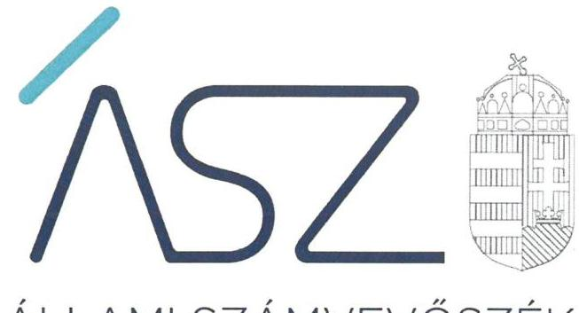
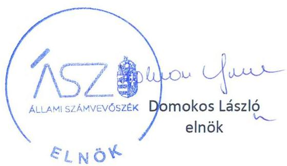

ÁLLAMI SZÁMVEVŐSZÉK

# JELENTÉS 

Az önkormányzatok ellenőrzése - A pénzforgalomban megjelenő kiadások elszámolásának ellenőrzése

Baranyajenő Község Önkormányzat és a Mindszentgodisai Közös Önkormányzati Hivatal
2022.

22018
www.asz.hu

---

ÁLLAMI SZÁMVEVŐSZÉK

# JELENTÉS

Az önkormányzatok ellenőrzése – A pénzforgalomban megjelenő kiadások elszámolásának ellenőrzése

Baranyajenő Község Önkormányzat és a Mindszentgodisai Közös Önkormányzati Hivatal

2022. 06. hó 29. nap

22018 www.asz.hu

---

# AZ ELLENŐRZÉST VEZETTE ÉS A VÉGREHAJTÁSÁÉRT FELELŐS: 

MAKKAI MÁRIA ellenőrzésvezető
VARGA EDIT ellenőrzésvezető

## A PROGRAM ÖSSZEÁLLÍTÁSÁÉRT FELELŐS:

DR. KÁDÁR KRISZTA ellenőrzés tervezési projektvezető

## A TÉMÁHOZ KAPCSOLÓDÓ KORÁBBI SZÁMVEVŐSZÉKI JELENTÉSEK:

- címe: Jelentés - Önkormányzatok ellenőrzése Az önkormányzatok integritásának ellenőrzése Baranya megye települési önkormányzatai
- sorszáma: 21006

Jelentéseink az Országgyúlés számítógépes hálózatán és az interneten a www.asz.hu címen is olvashatóak.

IKTATÓSZÁM: EL-3634-001/2022.
TÉMASZÁM: 2585
ELLENŐRZÉS-AZONOSÍTÓ SZÁM: V0929

---

# TARTALOMJEGYZÉK 

■ ÖSSZEGZÉS ..... 5
— AZ ELLENŐRZÉS CÉLJA ..... 6
— AZ ELLENŐRZÉS TERÜLETE ..... 7
— AZ ELLENŐRZÉS HÁTTERE, INDOKOLTSÁGA ..... 8
— A JELENTÉS LÉNYEGES KÉRDÉSKÖREI ..... 9
— AZ ELLENŐRZÉS HATÓKÖRE ÉS MÓDSZEREI ..... 10
— ÉRTÉKELÉS ..... 12
— FÜGGELÉK: ÉSZREVÉTELEK ..... 15
— RÖVIDÍTÉSEK JEGYZÉKE ..... 17

---

.

---

# ÖSSZEGZÉS 

Baranyajenő Község Önkormányzatnál és a gazdálkodási feladatait ellátó Mindszentgodisai Közös Önkormányzati Hivatal gazdálkodásában feltárt jogszabálysértő gyakorlatok visszaigazolták a korábbi ellenőrzésnél feltárt integritási kockázatok realizálódását.

## Az ellenőrzés társadalmi indokoltsága

Magyarország Alaptörvénye és a nemzeti vagyonról szóló törvény értelmében a közpénzeket és a nemzeti vagyont az átláthatóság és a közélet tisztaságának elve szerint kell kezelni. Az elvek a számvitelről szóló jogszabályok rendelkezéseiben jelennek meg.

Az Állami Számvevőszék a 2020. évre vonatkozó a helyi önkormányzati kör egészét érintő integritási kockázatának kiértékelése rámutatott a további részletes ellenőrzés szükségességére. Azon önkormányzatok és hivatalaik tekintetében, ahol a szabályos és átlátható gazdálkodás, a csalásmentes működés alapvető feltételeinek biztosításában az ellenőrzés hiányosságokat tárt fel, indokolt volt a pénzforgalomban megjelenő kiadások teljesítésének és elszámolásának részletes ellenőrzése.

Az Állami Számvevőszék értékelése hozzájárul ahhoz, hogy az azonosított kockázatok alapján a helyi önkormányzatok és az önkormányzati hivatalok gazdálkodása során a közpénzek felhasználásakor érvényesüljenek az integritási alapelvek, amelyek segítik a közpénzek és a közvagyon szabályos, célszerű felhasználását, támogatják az önkormányzatok, önkormányzati hivatalok eredményes gazdálkodását, amellyel az önkormányzatok a köz javát, a köz érdekét szolgálják.

Az Állami Számvevőszék 2020. évre vonatkozó integritási kockázat kiértékelése kockázatosnak minősítette Baranyajenő Község Önkormányzatát és a Mindszentgodisai Közös Önkormányzati Hivatalt, az ellenőrzött szervezetek az Állami Számvevőszék felhívására nem csökkentették a kockázatokat. Mindez indokolta annak ellenőrzését, hogy a pénzforgalomban megjelenő kiadások teljesítése és elszámolása során a kockázatok realizálódtak-e.

## Értékelés

Baranyajenő Község Önkormányzata nem rendelkezett 2020. évi éves költségvetési beszámolóval. Így nem biztosította a saját vagyoni, pénzügyi és jövedelmi helyzetére vonatkozó objektív információkat, a közpénzekkel való felelős gazdálkodás átláthatóságát és elszámoltathatóságát. A pénzforgalomban megjelenő lényeges kiadások teljesítése és elszámolása nem szabályszerűen valósult meg a kifizetések teljesítésének igazolása és a kiadások számviteli elszámolása terén.

Mindszentgodisai Közös Önkormányzati Hivatalnál a fizetési számlája terhére és a házipénztárából teljesített lényeges kifizetések teljesítése és elszámolása nem volt szabályszerű. Továbbá a tárgyi eszközök nyilvántartásának hiányosságai miatt a vagyonvédelem nem volt biztosított.

Az előzőekben részletezettek miatt nem álltak rendelkezésre objektív információk a pénzügyi és jövedelmi helyzetre vonatkozóan, ami továbbra is kockázatot jelent a felelős, megalapozott gazdasági döntések meghozatalában.

---

# AZ ELLENŐRZÉS CÉLJA 

Annak értékelése, hogy az önkormányzatoknál a pénzforgalomban megjelenő kiadások teljesítése és elszámolása szabályszerű volt-e, azokat a könyvekben szabályszerűen mutatták-e ki, felmerülhet-e a jogosulatlan közpénzfelhasználás gyanúja.

---

# AZ ELLENŐRZÉS TERÜLETE

## Baranyajenő Község Önkormányzat és a Mindszentgodisai Közös Önkormányzati Hivatal

Baranyajenő község Baranya megyében, a Hegyháti járásban található. Lakosainak száma 430 fő. Baranyajenő másik hét társult településsel közös önkormányzati hivatalt tart fent. A Mindszentgodisai Közös Önkormányzati Hivatal ellátja a társult települések önkormányzatainak működésével, fenntartásával kapcsolatos feladatokat.

---

# AZ ELLENŐRZÉS HÁTTERE, INDOKOLTSÁGA 

Az Alaptörvény alapértékeket, elveket fogalmaz meg, a közpénzekkel gazdálkodó minden szervezet köteles a nyilvánosság előtt elszámolni e forrásból megvalósuló gazdálkodásával. A közpénzeket és a nemzeti vagyont az átláthatóság és a közélet tisztaságának elve szerint kell kezelni.

Az ÁSZ ${ }^{1}$ a 2020. évre vonatkozóan a helyi önkormányzati kör egészét lefedve elvégezte Magyarország önkormányzatai integritási kockázatának kiértékelését. Az ellenőrzés során az ellenőrzött szervezetek integritását jelző, a felépítését, működését, felelősségi viszonyait, gazdálkodását meghatározó szabályzatok és nyilvántartások rendelkezésre állása, valamint lényeges szabályozási területei kerültek értékelésre. Azon önkormányzatok és hivatalaik tekintetében, ahol a szabályos és átlátható gazdálkodás, a csalásmentes működés alapvető feltételeinek biztosításában az ellenőrzés hiányosságokat tárt fel, indokolt volt a pénzforgalomban megjelenő kiadások teljesítésének és elszámolásának részletes ellenőrzése.

Az Állami Számvevőszék értékelése hozzájárul ahhoz, hogy az azonosított kockázatok alapján a helyi önkormányzatok és az önkormányzati hivatalok gazdálkodása során a közpénzek felhasználásakor érvényesüljenek az integritási alapelvek, amelyek segítik a közpénzek és a közvagyon szabályos, célszerű felhasználását, támogatják az önkormányzatok, önkormányzati hivatalok eredményes gazdálkodását, amellyel az önkormányzatok a köz javát, a köz érdekét szolgálják.

---

# A JELENTÉS LÉNYEGES KÉRDÉSKÖREI 

1.     - Fennáll-e kockázat az önkormányzat és az önkormányzati hivatal gazdálkodásában?

---

# AZ ELLENŐRZÉS HATÓKÖRE ÉS MÓDSZEREI 

## Az ellenőrzés típusa

Megfelelőségi ellenőrzés.

## Az ellenőrzött időszak

A 2020. január 1-jétől 2020. december 31-ig terjedő időszak.

## Az ellenőrzés tárgya

A pénzforgalomban megjelenő kiadások teljesítésének és elszámolásának megfelelősége.

## Az ellenőrzött szervezetek

Baranyajenő Község Önkormányzat és a Mindszentgodisai Közös Önkormányzati Hivatal

## Az ellenőrzés jogalapja

Az ellenőrzés jogalapját az ÁSZ tv². 1. § (3) bekezdése, és 5. § (6) bekezdése képezi.

## Az ellenőrzés módszerei

Az ellenőrzés az ellenőrzési program szempontjai, az ellenőrzött időszakban hatályos jogszabályok, a jelen ellenőrzésre irányadó ÁSZ módszertan figyelembevételével és a nemzetközi standardokat irányadónak tekintve végzi az ÁSZ.

Az ellenőrzés ideje alatt az ÁSZ az ellenőrzött szervezettel történő kapcsolattartást az ÁSZ SZMSZ³-ének vonatkozó előírásai alapján biztosítja.

Az ellenőrzési kérdések megválaszolásához szükséges bizonyítékok megszerzése a következő ellenőrzési eljárások alkalmazásával történt: megfigyelés, összehasonlítás, elemző eljárás. Az ellenőrzési bizonyítékként felhasználható adatforrások közé tartoztak az ellenőrzési programban felsorolt adatforrások, továbbá minden - az ellenőrzés folyamán - feltárt, az ellenőrzés szempontjából információkat tartalmazó dokumentum.

---

Az ellenőrzés a kérdésekre adott válaszok kiértékelésével, valamint a megjelölt adatforrások, továbbá az adott időszakban hatályos jogszabályok, figyelembevételével zajlott.

A pénzforgalomban megjelenő kiadások teljesítése és elszámolása szabályszerűségének ellenőrzése és értékelése lényegességi elv szerint kiválasztott tételek alapján történik. A helyi önkormányzat és az önkormányzati hivatal fizetési számlája és a házipénztárban kezelt készpénzállománya terhére megvalósuló pénzforgalma 2020. évi tételes adataiból a nem kockázatos tételek kiszűrését követően kerültek kiválasztásra az érték alapján lényegesnek minősített kiadások. Amennyiben a lényeges kiadások teljesítése és elszámolása tekintetében az átlagos hibaarány nem haladta meg a 10\%-t, az értékelés eredményeként a lényegesnek minősített kiadások esetében nem került további kockázat beazonosításra az ÁSZ által az ellenőrzés során. Amennyiben a kiadási tételek száma a fizetési számla vagy a házipénztár tekintetében nem haladja meg a 2020. évben a 15 lényeges tételt, valamennyi kiadási tétel értékelésre kerül.

---

# 1. Fennáll-e kockázat az önkormányzat és az önkormányzati hivatal gazdálkodásában? 

Összegző megállapítás

Az önkormányzatnál és az önkormányzati hivatalnál az ellenőrzés visszaigazolta a korábbi ellenőrzés által feltárt integritási kockázatok realizálódását.

AZ ÖNKORMÁNYZAT fizetési számlája terhére teljesített lényeges kifizetések teljesítésére egy db tétel esetén nem szabályszerű bizonylatok alapján került sor, mert az Ávr. 57. § (1) bekezdésének előírása ellenére az önkormányzat a teljesítésigazolás során nem ellenőrizte a kiadások teljesítésének jogosságát, összegszerűségét.

A kiadások számviteli elszámolása nem volt szabályszerű. Az önkormányzat nem rendelkezett éves költségvetési beszámolóval, mivel azt az Áhsz. ${ }^{4} 31$. § (1) bekezdésének előírása ellenére a jegyző és a gazdasági szerv vezetője aláírásával nem látta el.

Az önkormányzat fizetési számlát érintő 15 db-, míg a házipénztárból teljesített kifizetéseket érintően 11 db tétel számviteli elszámolása nem felelt meg a Számv. tv. ${ }^{5}$ 167. § (1) bekezdés h)-i) pontjai előírásainak: a költségelszámolást közvetlenül alátámasztó bizonylaton nem szerepelt a költségvetési nyilvántartási és pénzügyi könyvviteli számlák feltüntetése, a könyvelés időpontja és igazolása.

AZ ÖNKORMÁNYZATI HIVATAL fizetési számlája terhére teljesített lényeges kifizetéseknél nyolc esetben nem állt rendelkezésre az írásbeli kötelezettségvállalás dokumentuma (megbízási szerződés, szerződés, megrendelés, vagy egyéb megállapodás), így a Hivatal kötelezettségvállalás hiányában nem tett eleget az Áht ${ }^{6}$. 36. §, Ávr., 52. § (1) bekezdése, 53. § (1) bekezdés a) pontja rendelkezéseinek.

Az önkormányzati hivatal házipénztárából teljesített kifizetéseknél két esetben az Ávr. 53. § (1) bekezdés előírása ellenére az írásbeli kötelezettségvállalás elmaradt. Egy tétel sztornózott útiköltség elszámolás volt, a sztornózás oka nem dokumentált. A tétel nem szerepel a főkönyvi adatállományban, az Áhsz. 39. § (1) bekezdése előírása ellenére nem vezettek megfelelő, folyamatos, zárt rendszerű, áttekinthető nyilvántartást.

A kiadások számviteli elszámolása nem szabályszerűen történt. 14 db házipénztárból teljesített kifizetés nem felelt meg a Számv. tv. 167. § (1) bekezdése h) - i) pontjai előírásainak, mert a költségelszámolást közvetlenül alátámasztó bizonylaton nem szerepelt a költségvetési nyilvántartási és pénzügyi könyvviteli számlák feltüntetése, a könyvelés időpontja és igazolása.

A Tárgyi eszközök esetében 13 db nem volt megtalálható a Hivatal helyiségében. Ebből kilenc db hiányzó, használaton kívüli, nulla forintos nettó értéken nyilvántartott eszköz esetében a Hivatal dokumentáltan nem győződött meg a használaton kívüliség okáról és ezt követően nem tett eleget a Számv. tv. 53. § (2) bekezdés - használaton kívüli eszközök kivezetésére vonatkozó - előírásának. Továbbá az otthoni munkavégzésre kiadott négy esz-

---

# Értékelés 

köz esetében nem tettek eleget az Áhsz. 14. melléklet VII. pont o) bekezdésében leírtaknak, mivel a tárgyi eszköz nyilvántartás nem tartalmazta a személyre kiadott eszközök esetén a használó személy azonosításához szükséges adatokat.

---

.

---

# FÜGGELÉK: ÉSZREVÉTELEK 

Az Állami Számvevőszék az ÁSZ tv. 29. §* (1) bekezdése alapján ismertette az ellenőrzött szervezetek vezetőivel az ellenőrzés megállapításait.

Baranyajenő Község Önkormányzat és a Mindszentgodisai Közös Önkormányzati Hivatal vezetője az ÁSZ tv. 29. § (2) bekezdésében foglalt észrevételezési jogával nem élt.

[^0]
[^0]:    * 29. § (1) Az Állami Számvevőszék az ellenőrzési megállapításait megküldi az ellenőrzött szervezet vezetőjének vagy az általa megbízott személynek, és annak, akinek személyes felelősségét állapította meg.
    (2) Az ellenőrzött szervezet vezetője és a felelősként megjelölt személy az ellenőrzés megállapításaira tizenöt napon belül írásban észrevételt tehet.
    (3) Az Állami Számvevőszék az észrevételre a beérkezésétől számított harminc napon belül írásban válaszol. A figyelembe nem vett észrevételeket köteles a jelentésben feltüntetni, és megindokolni, hogy azokat miért nem fogadta el.

---

.

---

# RÖVIDÍTÉSEK JEGYZÉKE 

${ }^{1}$ ÁSZ
${ }^{2}$ ÁSZ tv.
${ }^{3}$ ÁSZ SZMSZ
${ }^{4}$ Áhsz.
${ }^{5}$ Számv. tv.
${ }^{6}$ Áht.

Állami Számvevőszék
2011. évi LXVI. törvény az Állami Számvevőszékről
Az Állami Számvevőszék elnökének 7/2020. (XII.28.) ÁSZ utasítása az Állami Számvevőszék Szervezeti és Működési Szabályzatáról
4/2013. (I.11.) Korm. rendelet az államháztartás számviteléről
2000. évi C. törvény a számvitelről
2011. évi CXCV. törvény az államháztartásról

---

1052
 Budapest, Apáczai Cs. u. 10. | 1364 Budapest 4. Pf. 54
TEL: +36 1 4849100
email: szamvevoszek@asz.hu
web: www.asz.hu | www.aszhirportal.hu
