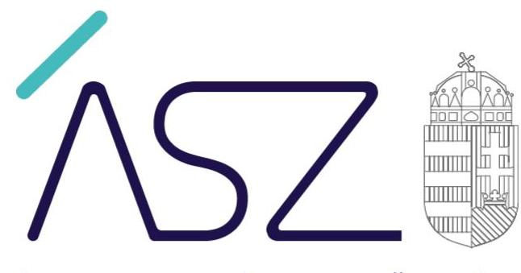
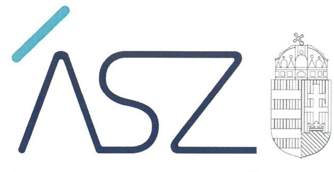
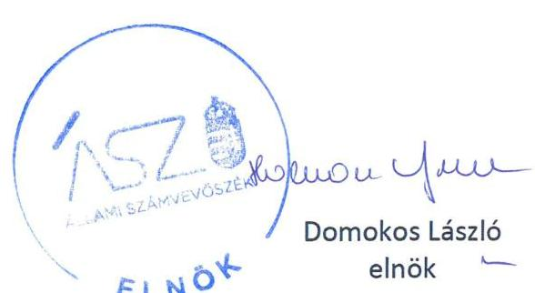
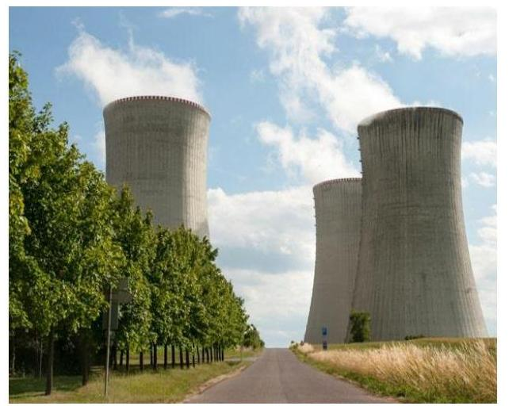

ÁLLAMI SZÁMVEVŐSZÉK

# JELENTÉS 

A nukleáris biztonság ellenőrzése

2022. 

22019
www.asz.hu

---

ÁLLAMI SZÁMVEVŐSZÉK

# JELENTÉS

A nukleáris biztonság ellenőrzése

2022. **vs.** hó 24. nap

22019
www.asz.hu

---

# AZ ELLENŐRZÉST VEZETTE ÉS A VÉGREHAJTÁSÁÉRT FELELŐS: 

SALAMON ILDIKÓ ellenőrzésvezető
DR. GÁL NÓRA ellenőrzésvezető
DR. GYŐRI GABRIELLA MÁRTA ellenőrzésvezető

A PROGRAM ÖSSZEÁLLÍTÁSÁÉRT FELELŐS:
KUSZINGER ANDREA programkészítésért felelős vezető

IKTATÓSZÁM: EL-3282-002/2022.
TÉMASZÁM: 2602
ELLENŐRZÉS-AZONOSÍTÓ SZÁM: V0946

---

# TARTALOMJEGYZÉK 

■ ÖSSZEGZÉS ..... 5
■ AZ ELLENŐRZÉS CÉLJA ..... 7
■ AZ ELLENŐRZÉS TERÜLETE ..... 8
■ AZ ELLENŐRZÉS HÁTTERE, INDOKOLTSÁGA ..... 10
■ A JELENTÉS LÉNYEGES KÉRDÉSKÖREI ..... 11
■ AZ ELLENŐRZÉS HATÓKÖRE ÉS MÓDSZEREI ..... 12
■ MEGÁLLAPÍTÁSOK ..... 14
■ MELLÉKLETEK ..... 19
I. sz. melléklet: Értelmező szótár ..... 19
■ FÜGGELÉK: ÉSZREVÉTELEK ..... 21
■ RÖVIDÍTÉSEK JEGYZÉKE ..... 23

---

.

---

# ÖSSZEGZÉS 

Az Országos Atomenergia Hivatal szabályozottsága biztosította a nukleáris létesítményeket és a radioaktívhulladék-tárolókat érintő hatósági ellenőrzési feladatok szabályozott ellátását. A Központi Nukleáris Pénzügyi Alap kezelésében és felhasználásában részt vevő szervezetek a szabályozottság megteremtésével hozzájárultak a Központi Nukleáris Pénzügyi Alapban elkülönített pénzek szabályszerű felhasználásához. Az Állami Számvevőszék korábbi ellenőrzési megállapításaira tett intézkedések a közpénzügyi helyzet javulását eredményezték az Országos Atomenergia Hivatalnál és a Radioaktív Hulladékokat Kezelő Közhasznú Nonprofit Korlátolt Felelősségű Társaságnál. Az Innovációs és Technológiai Minisztérium Központi Nukleáris Pénzügyi Alap kezeléséhez kapcsolódó feladatellátására vonatkozóan az Állami Számvevőszék nem tárt fel kockázatot.

## Az ellenőrzés társadalmi indokoltsága

Magyarország számára a nukleáris energia szerepe kulcsfontosságú, mivel villamosenergia-szükségletének csaknem 50 százalékát nukleáris energiából fedezi, tehát a nukleáris energiatermelés jóval nagyobb arányt képvisel, mint az utána következő energiahordozók.

A hazai atomenergia alkalmazása biztonságos és folyamatos energiaellátást tesz lehetővé és csökkenti az ország energiaimport-függőségét. Műszaki és gazdasági szempontok alapján az atomerőmű jelenti a hosszú távú, biztonságos és versenyképes magyar villamosenergia-ellátás alapját. A klímavédelem és a nemzetközi energiapiacok bizonytalanságának kivédése szintén ennek az erőforrásnak a további fejlesztése irányába mutat. Az atomenergetika a villamosenergia-termelésen kívül fontos szerepet tölt be Magyarországon a gyógyászat, a mezőgazdaság, valamint az oktatás és a tudományos kutatás számos területén, aktív szerepet tölt be mindennapjainkban.

Magyarországon a radioaktív hulladék végleges elhelyezésének, a kiégett üzemanyag átmeneti tárolásának és a nukleáris üzemanyag-ciklus lezárásának, továbbá a nukleáris létesítmény leszerelésével összefüggő feladatok finanszírozását elkülönített állami pénzalap, a Központi Nukleáris Pénzügyi Alap (a továbbiakban: Nukleáris Alap ${ }^{1}$ ) biztosítja, melynek kezelésével kapcsolatban az Innovációs és Technológiai Minisztérium részére az Atomtörvény² számos feladatot határoz meg.

Az Országos Atomenergia Hivatal (a továbbiakban: Hivatal) a nukleáris létesítmények vonatkozásában lát el hatósági feladatokat, valamint engedélyezi új létesítmények kialakítását.

A Radioaktív Hulladékokat Kezelő Közhasznú Nonprofit Kft. kiemelt feladata a Nemzeti Radioaktívhulladék-tároló és a Kiégett Átmeneti Tárolójának üzemeltetése és bővítése, a Radioaktív Hulladék Feldolgozó és Tároló biztonságának növelése, ezen kívül a hosszú élettartamú, nagy aktivitású hulladék végleges elhelyezésére szolgáló tároló telephelyének kijelölése. A Kft. tevékenységének pénzügyi forrása a Nukleáris Alap.

A nukleáris biztonság alapját egyrészt az ellenőrzés szabályozási kereteinek jogszabályi előírás szerinti kialakítása, másrészt a biztonság megteremtésére rendelt közpénz szabályszerű felhasználását biztosító szabályozási környezet megteremtése képezi.

A nukleáris biztonság fenntartása, az ezzel kapcsolatos kockázatok csökkentése az egész társadalom érdeke, ennek okán kiemelt jelentőséggel bír, hogy a nukleáris biztonságot megalapozó ellenőrzési tevékenység, illetve a nukleáris biztonság fenntartását célzó állami források szabályszerű és átlátható felhasználása az érintett szervezeteknél biztosított legyen. Mindemellett a jelenlegi bizonytalan időszakban, az ukrán-orosz háború idején stratégiai biztonságérzetet adhat a nukleáris biztonságot nyújtó szervezetek ellenőrzése, valamint annak pozitív eredménye.

Ennek okán az Állami Számvevőszék társadalmi szerepvállalása körében arra vállalkozik, hogy a nukleáris biztonság témájában objektív képet adjon a társadalom számára és értékelje, hogy milyen állapotban van az ellenőrzés és forrás-felhasználás szabályozottsága, hiszen ezek minősége befolyásolhatja a szolgáltatások minőségét és biztonságosságát.

---

Az Állami Számvevőszék az ellenőrzés körében feltárt hiányosságok bemutatásával rávilágít a fejlesztendő területekre, ezzel hozzájárulva a terület szabályozottságának fejlesztéséhez, összehangolásához.

# Főbb megállapítások, következtetések 

AZ ORSZÁGOS ATOMENERGIA HIVATAL rendelkezett szervezeti és működési szabályzattal, a hatósági ellenőrzési feladatokat ellátó főosztályok ügyrendjével, valamint az integrált kockázatkezelés eljárásrendjével. A hatósági ellenőrzési feladatokhoz kapcsolódóan a jogszabályi előírásoknak megfelelően rendelkezett ellenőrzési tervekkel és a hatósági ellenőrzési feladatok ellenőrzési nyomvonalával. Ezzel biztosított volt hatósági ellenőrzési feladatainak szabályozott ellátása.

AZ INNOVÁCIÓS ÉS TECHNOLÓGIAI MINISZTÉRIUMNÁL a szervezeti és működési szabályzatban és ügyrendben meghatározták a Nukleáris Alap kezelésével kapcsolatos feladatokat, hatásköröket. Az ellenőrzött időszakban rendelkeztek a tervezési, gazdálkodási, finanszírozási, adatszolgáltatási és beszámolási feladatokra vonatkozó szabályzattal.

A 2018. évben az Innovációs és Technológiai Minisztérium a jogszabályi előírások ellenére nem rendelkezett a Nukleáris Alapra vonatkozó számviteli politikával. A 2019. évben elkészítették a Nukleáris Alapra is kiterjedő hatályú számviteli politikát, így az átláthatóság és elszámoltathatóság a gazdálkodás területén a jövőre nézve biztosított.

Az Innovációs és Technológiai Minisztérium az ellenőrzött időszakban rendelkezett a Nukleáris Alap kezelésére vonatkozóan ellenőrzési nyomvonallal.

Az Innovációs és Technológiai Minisztérium megkötötte a radioaktív hulladékok végleges elhelyezésével, a kiégett üzemanyag átmeneti tárolásával, a nukleáris üzemanyag-ciklus lezárásával és a nukleáris létesítmény leszerelésével összefüggő feladatok ellátására irányuló szerződéseket a Radioaktív Hulladékokat Kezelő Nonprofit Kft.-vel, rendelkezésre állt továbbá a megkötött szerződésekről vezetett nyilvántartás.

Az Innovációs és Technológiai Minisztérium a 2018., 2019. és 2020. évi, Nukleáris Alapból finanszírozandó tevékenységekre vonatkozó közép- és hosszú távú terveket, valamint annak részeként a befizetési kötelezettségek jóváhagyott javaslatát, továbbá az éves munkaprogramokat miniszteri jóváhagyásra előterjesztette.

Az Innovációs és Technológiai Minisztérium a 2018. és 2019. évekre vonatkozó, a Nukleáris Alapból finanszírozott tevékenységekről a Radioaktív Hulladékokat Kezelő Nonprofit Kft. által készített beszámolót miniszteri jóváhagyásra előterjesztette.

Az éves munkaprogramok és a beszámolók miniszteri felterjesztéséhez csatolandó, Országos Atomenergia Hivatal által készített szakmai értékeléssel az Innovációs és Technológiai Minisztérium csak a 2020. évi éves munkaprogram vonatkozásában rendelkezett.

Az Innovációs és Technológiai Minisztérium a 2020. év vonatkozásában ellenőrizte a Nukleáris Alap szabályszerű felhasználását és gondoskodott az ellenőrzés javaslata alapján megtett intézkedések nyomon követéséről.

A RADIOAKTÍV HULLADÉKOKAT KEZELŐ NONPROFIT KFT. rendelkezett számviteli politikával, pénzkezelési szabályzattal és számlarenddel, ezzel megteremtve az elkülönített pénzek felhasználásának alapvető szabályozási kereteit. Rendelkezett továbbá a 2018-2020. évek vonatkozásában integrált kockázatkezelés eljárásrenddel, valamint a tevékenységek és a célok megvalósítása nyomon követésének kialakítását igazoló dokumentumokkal.

Az Országos Atomenergia Hivatal és a Radioaktív Hulladékokat Kezelő Nonprofit Kft. által a korábbi számvevőszéki ellenőrzések során tett megállapítások alapján készített intézkedési tervekben szereplő feladatok végrehajtása megtörtént, hozzájárulva ezzel a közpénzügyi helyzet javulásához.

A közpénzügyi helyzet mielőbbi javítása céljából, az ellenőrzés által feltárt jogszabálysértő gyakorlat megszüntetése érdekében az Állami Számvevőszék figyelemfelhívással fordult a Radioaktív Hulladékokat Kezelő Nonprofit Kft. ügyvezetőjéhez. Ennek eredményeként az ellenőrzött időszakot követően a bizonylati rend külön dokumentumként rendelkezésre áll.

---

# AZ ELLENŐRZÉS CÉLJA 

AZ ELLENŐRZÉS CÉLJA a nukleáris létesítmények és a radioaktívhulladék-tárolókat érintő ellenőrzési feladatok szabályozottságának az ellenőrzése. Az ellenőrzés emellett értékeli a Nukleáris Alap kezelésének a szabályszerűségét, hogy az Alap kezelésében, felhasználásában részt vevő szervezetek irányítása, szabályozottsága, ellenőrzési rendszere mennyiben biztosította az elkülönített pénzek szabályszerű és a céloknak megfelelő felhasználását. Az Állami Számvevőszék továbbá ellenőrzi, hogy a korábbi ellenőrzések során tett megállapításokra tett intézkedések javították-e a közpénzügyi helyzetet.

---

# AZ ELLENŐRZÉS TERÜLETE 

## Országos Atomenergia Hivatal, Innovációs és Technológiai Minisztérium, Radioaktív Hulladékokat Kezelő Nonprofit Kft.

Az ellenőrzés a nukleáris létesítmények és a radioaktívhulladéktárolókat érintő hatósági ellenőrzési feladatok ellátásában, a Nukleáris Alap kezelésében, felhasználásában részt vevő Hivatal, az Innovációs és Technológiai Minisztériumra (a továbbiakban: Minisztérium) és Radioaktív Hulladékokat Kezelő Nonprofit Kft-re (a továbbiakban: Társaság) terjed ki.

A HIVATAL a Kit. ${ }^{3}$ 2. § (3) bekezdés b) pontja alapján kormányzati főhivatalként működik. Központi költségvetési szerv, melyet főigazgató vezet. Feladata az atomenergia kizárólag békés célra való alkalmazásával, a nukleáris létesítmények és a radioaktívhulladék-tárolók, továbbá a nukleáris és más radioaktív anyagok szállításához használt konténerek biztonságával és sugárvédelmével, valamint azok védettségével összefüggő hatósági feladatok ellátása. A Hivatal általános építésügyi hatósági és építésfelügyeleti jogkörrel rendelkezik a nukleáris létesítmények és radioaktívhulladék-tárolók biztonsági övezetében elhelyezkedő építményekre vonatkozóan. Új nukleáris létesítmény esetén a Hivatal felügyeli a teljes létesítési folyamatot, a telephely vizsgálatának módszertanától kezdve az üzembe helyezésig és üzemeltetésig. A Hivatal hatósági felügyeleti tevékenysége keretében ellenőrzéseket végez, amelyek során megvizsgálja az általa kiadott engedélyekben foglaltak, valamint a jogszabályok és a nukleáris biztonsági szabályzatok szerinti előírások betartását, a hivatal által elrendelt intézkedések végrehajtását, illetőleg az atomenergia békés célú alkalmazásának biztonságosságát és védettségét.

A MINISZTÉRIUM a Kormány irányítása alatt álló különös hatáskörű központi kormányzati igazgatási szerv. A Minisztérium a 94/2018. (V. 22.) Korm. rendelet ${ }^{4}$ 162. § (1) bekezdés c) pontjának rendelkezései alapján 2018. május 22-től érvényes átnevezéséig Nemzeti Fejlesztési Minisztérium néven működött. Az Atomtörvény rendelkezései és a 94/2018. (V. 22.) Korm. rendeletben meghatározott kijelölés szerint a Minisztérium a Nukleáris Alap kezelő szerve, valamint a Hivatal felügyeletét ellátó szerv.

A TÁRSASÁG jogelődje, a Radioaktív Hulladékokat Kezelő Közhasznú Társaság 1998. június 2-án jött létre, amely - igazodva az Európai Unióban működő gazdasági társasági formákhoz - 2008. január 7-én Radioaktív Hulladékokat Kezelő Közhasznú Nonprofit Kft.-vé alakult.

A Társaság feladata az Atomtörvény 40. § (1) bekezdésében meghatározottak szerint a radioaktív hulladék végleges elhelyezésével, valamint a kiégett üzemanyag átmeneti tárolásával és végleges elhelyezésével, továbbá a nukleáris létesítmény leszerelésével összefüggő feladatok elvégzése. A feladatok ellátása során javaslatot tesz a radioaktív hulladék és a kiégett üzemanyag kezelésére vonatkozó nemzeti politikára és nemzeti

---

programra, valamint azok felülvizsgálatára. A műszaki feladatai közül a legfontosabbak: a Nemzeti Radioaktívhulladék-tároló és a Kiégett Átmeneti Tárolójának üzemeltetése és bővítése, a Radioaktív Hulladék Feldolgozó és Tároló biztonságának növelése, ezen kívül a hosszú élettartamú, nagy aktivitású hulladék végleges elhelyezésére szolgáló tároló telephelyének kijelölése. A Társaság tevékenységének pénzügyi forrása a Nukleáris Alap.

A Társaság beszámolója szerint a 2020. évben 14 505,5 M Ft bevételt ért el, a ráfordítások összege 14 497,1 M Ft volt. A mérleg szerinti adózott eredményét 7,2 M Ft, mérlegfőösszegét 130 284,5 M Ft összegben mutatták ki.

A Hatóságot az ÁSZ megfelelőségi ellenőrzés keretében ellenőrizte 2020-ban a 2015. január 1-jétől a 2018. december 31-ig tartó ellenőrzési időszakra vonatkozóan, míg a Társaságot szabályszerűségi ellenőrzés keretében ellenőrizte 2015-ben a 2010. január 1-jétől a 2013. december 31-ig terjedő időszakra vonatkozóan.

---

# AZ ELLENŐRZÉS HÁTTERE, INDOKOLTSÁGA 

A nukleáris energia használatának hatásait folyamatosan figyelemmel kísérik, értékelik az atomenergetikai hatóságok és az ágazati irányítást ellátó minisztérium.

Az ellenőrzés során az Állami Számvevőszék értékeli a hatósági feladatokat ellátó intézményrendszer szabályozottságát, valamint azt is, hogy a nukleáris biztonság megteremtése és fenntartása érdekében elkülönített pénzeszköz szabályszerű felhasználásához milyen módon járultak hozzá a Nukleáris Alap kezelésében és felhasználásában résztvevő szervezetek.

Az ellenőrzés tájékoztatást ad a társadalom, a jogalkotók, valamint a felelős hatóságok számára a nukleáris létesítmények ellenőrzése szabályozottságának hazai helyzetéről, valamint rávilágít azokra a területekre, amelyek kezelésével biztosítható
 a szakterület szabályszerűbb és hatékonyabb feladatellátása. Az „ellenőrök ellenőreként" az ÁSZ bizonyítékokon alapuló értékelése hatványozottan hasznosul, hiszen megállapításai közvetlenül az ellenőrzők tevékenységében érvényesülnek.

---

# A JELENTÉS LÉNYEGES KÉRDÉSKÖREI 

1. Az Országos Atomenergia Hivatal milyen eszközökkel biztosította a nukleáris létesítményeket és a radioaktív hulladék-tárolókat érintő hatósági ellenőrzési feladatainak szabályozott ellátását?
2. A Nukleáris Alap kezelésében és felhasználásában részt vevő szervezetek milyen módon járultak hozzá a Nukleáris Alapban elkülönített pénzek szabályszerű felhasználásához?
3. Az Országos Atomenergia Hivatal és a Radioaktív Hulladékokat Kezelő Nonprofit Kft. közpénzügyi helyzetének javulását hogyan támogatták a korábbi ÁSZ ellenőrzések során tett megállapításokra tett intézkedések?

---

# AZ ELLENŐRZÉS HATÓKÖRE ÉS MÓDSZEREI 

## Az ellenőrzés típusa

Szabályszerűségi ellenőrzés.

## Az ellenőrzött időszak

2018-2020. évek. Az utóellenőrzés vonatkozásában az adatbekérő levél kiküldéséig terjedő időszak.

## Az ellenőrzés tárgya

Az Országos Atomenergia Hivatal esetében a nukleáris létesítmények és a radioaktív hulladék-tárolókat érintő hatósági ellenőrzési feladatok ellátásának szabályozottsága. A Központi Nukleáris Pénzügyi Alap kezelésében, felhasználásában részt vevő szervezetek irányítása, szabályozottsága, ellenőrzési rendszere által az elkülönített pénzek szabályszerű felhasználásának biztosítása. A Radioaktív Hulladékokat Kezelő Nonprofit Kft. és az Országos Atomenergia Hivatal esetében a korábbi ÁSZ ellenőrzések során tett megállapításokra tett intézkedések közpénzügyi helyzetre gyakorolt hatása.

## Az ellenőrzött szervezetek

Országos Atomenergia Hivatal, mint atomenergia felügyeleti szerv és nukleáris biztonsági hatóság.

Radioaktív Hulladékokat Kezelő Nonprofit Kft., mint a Nukleáris Alappal kapcsolatos tervezési és beszámolási tevékenység előkészítését végző szerv, mely szervezet tevékenységének pénzügyi forrása a Nukleáris Alap.

Innovációs és Technológiai Minisztérium, mint a Nukleáris Alap kezelő szerve és az Országos Atomenergia Hivatal felügyeletét ellátó szerv.

## Az ellenőrzés jogalapja

Az ellenőrzés jogalapját az ÁSZ tv. ${ }^{5}$ 1. § (3) bekezdésének, 5. § (2)-(4) bekezdéseinek és 33. § (7) bekezdésének előírásai képezik.

---

# Az ellenőrzés módszerei 

Az ÁSZ az ellenőrzést az ellenőrzési program szempontjai, ellenőrzési kérdései, az ellenőrzött időszakban hatályos jogszabályok, és a megfelelőségi ellenőrzésre irányadó ÁSZ módszertan figyelembevételével végzi.

Az ellenőrzési kérdések megválaszolásához szükséges bizonyítékok megszerzése a következő ellenőrzési eljárások alkalmazásával történik: információkérés, szemle, összehasonlítás, elemző eljárás. Az ellenőrzési bizonyítékként felhasználható adatforrások közé tartoznak az ellenőrzési program részletes szempontjainál felsorolt adatforrások, valamint minden - az ellenőrzés folyamán feltárt - az ellenőrzés szempontjából információt tartalmazó dokumentum. Az ellenőrzést az ellenőrzési kérdésekhez kapcsolódó adatforrások és tanúsítvány felhasználásával, az adott időszakban hatályos jogszabályok figyelembevételével, valamint az ellenőrzési kérdésekre adott válaszok kiértékelésével kell lefolytatni.

Az egységes értelmezést támogatja az ellenőrzési program mellékletét képező fogalomtár és rövidítésjegyzék.

Az ÁSZ az ellenőrzés ideje alatt az ellenőrzött szervezettel történő kapcsolattartást az ÁSZ SZMSZ-ének vonatkozó előírásai alapján biztosítja.

Az ÁSZ utóellenőrzés keretében ellenőrzi, hogy a korábbi ÁSZ ellenőrzések során tett megállapítások hogyan hasznosultak, és a megtett intézkedések által javult-e a közpénzügyi helyzet.

---

# MEGÁLLAPÍTÁSOK 

## 1. Az Országos Atomenergia Hivatal milyen eszközökkel biztosította a nukleáris létesítményeket és a radioaktív hulladék-tárolókat érintő hatósági ellenőrzési feladatainak szabályozott ellátását?

Összegző megállapítás

A Hivatal a 2018-2020. években a szabályozási környezet megfelelő kialakításával biztosította a nukleáris létesítményeket és a radioaktív hulladék-tárolókat érintő hatósági ellenőrzési feladatainak szabályozott ellátását.

A Hivatal SZMSZ-e ${ }^{6}$ az Áht. ${ }^{7}$ 10. § (5) bekezdése alapján tartalmazta a hatósági ellenőrzési feladatokat ellátó főosztályok feladatainak részletes leírását.

A Hivatal szabályzatai ${ }^{8}$ az Ávr. ${ }^{9}$ 13. § (5) bekezdése alapján tartalmazták a hatósági ellenőrzési feladatokat ellátó szervezeti egységek munkafolyamatainak leírását, a szervezeti egységek vezetőjének feladatkörét, hatáskörét és a szervezeti egységek alkalmazottainak feladatkörét, hatáskörét.

A Hivatal az NBSZK Kr. ${ }^{10}$ 22. § (9) bekezdésében foglaltaknak megfelelően rendelkezett ellenőrzési tervekkel az ellenőrzött időszakban.

A Hivatal a Bkr. ${ }^{11}$ 6. § (3) bekezdés alapján rendelkezett a hatósági ellenőrzés folyamatának ellenőrzési nyomvonalával ${ }^{12}$, valamint a Bkr. 6. § (4) bekezdésének előírása szerint rendelkezett az integrált kockázatkezelés eljárásrendjével ${ }^{13}$.

---

# 2. A Nukleáris Alap kezelésében és felhasználásában részt vevő szervezetek milyen módon járultak hozzá a Nukleáris Alapban elkülönített pénzek szabályszerű felhasználásához? 

Összegző megállapítás

A Nukleáris Alap kezelésében és felhasználásában részt vevő szervezetek a szabályozottság megteremtésével, a tervezési, beszámoltatási és ellenőrzési feladatok végrehajtásával hozzájárultak a Nukleáris Alapban elkülönített pénzek szabályszerű felhasználásához.
2.1. számú megállapítás

A Nukleáris Alapot kezelő Minisztérium a 2019. évtől kialakította a gazdálkodásával kapcsolatos, jogszabályi előírásoknak megfelelő szabályozást. A Nukleáris Alapból finanszírozott tevékenységekhez kapcsolódó tervezési és beszámoltatási feladatokat végrehajtották.

A Minisztériumnál az ellenőrzött időszakban az Áht. és az Ávr. előírásainak megfelelően meghatározásra kerültek az SZMSZ ${ }^{14}$-ben és ügyrendben a Nukleáris Alap kezelésével kapcsolatos feladatokat ellátó szervezeti egységek feladatai. Továbbá az Ávr. előírásának megfelelően belső szabályzatban meghatározták a Nukleáris Alap kezelésével kapcsolatos feladatokat ellátó szervezeti egységek munkafolyamatainak leírását, a szervezeti egységek vezetőjének és a szervezeti egységek alkalmazottainak feladatkörét, hatáskörét. A minisztérium az ellenőrzött időszakban rendelkezett az Ávr. előírása szerinti tervezési, gazdálkodási finanszírozási, adatszolgáltatási és beszámolási feladatokra vonatkozó szabályzattal.

A Minisztérium a 2018. évben a Számv. tv. ${ }^{15}$ 14. § (3) bekezdése és az Áhsz. ${ }^{16}$ 50. § (1) bekezdése ellenére nem rendelkezett a Nukleáris Alapra vonatkozó számviteli politikával, azonban a 2019. évtől kialakította a Nukleáris Alapra is kiterjedő hatályú számviteli politikáját. Az ellenőrzött időszakban a Minisztérium a Bkr. előírásainak megfelelően rendelkezett a Nukleáris Alap kezelésére vonatkozó ellenőrzési nyomvonallal.

Az Atomtörvény előírásának megfelelve a Minisztérium rendelkezett az Atomtörvény 40. § szerinti feladatok finanszírozására a 215/2013. (VI. 21.) Korm. rendelet ${ }^{17}$ 1. § (1) bekezdésében kijelölt szervvel, a Társasággal megkötött szerződésekkel, valamint a Minisztériumnál rendelkezésre állt a Társaság és a Minisztérium között létrejött szerződésekről vezetett nyilvántartás.
2018., 2019. és 2020. évre vonatkozóan az Atomtörvény előírásának megfelelően a Nukleáris Alapból finanszírozandó tevékenységekre vonatkozó közép- és hosszú távú terveket, valamint ezek részeként a befizetési kötelezettségekre tett javaslatokat, tovább az éves munkaprogramokat miniszter ${ }^{18}$ általi jóváhagyásra előterjesztették.

A 2018. és 2019. évi munkaprogramokhoz kapcsolódóan hiányzott a miniszteri jóváhagyásra felterjesztéshez csatolandó, Hivatal által készített előzetes szakmai értékelés, az Atomtörvény 62. § (5) bekezdésében előír-

---

takkal ellentétesen. E hiányosság a 2020. évi éves munkaprogram tekintetében már nem állt fenn, a Minisztérium rendelkezett a Hivatal előzetes jóváhagyásra való felterjesztés előtti - szakmai értékelésével.

A 2018. és 2019. évek vonatkozásában az Atomtörvény előírásának megfelelően a Társaság által a Nukleáris Alapból finanszírozott tevékenységekről készített beszámolókat az Atomtörvény előírásának megfelelően miniszter általi jóváhagyásra előterjesztették. Azonban a beszámolókhoz kapcsolódóan hiányzott a miniszteri jóváhagyásra felterjesztéshez csatolandó, Hivatal által készített előzetes szakmai értékelés, az Atomtörvény 62. § (5) bekezdésében előírtakkal ellentétesen. A 2020. évi beszámoló jóváhagyásra felterjesztése az ellenőrzötti adatszolgáltatás időpontjában folyamatban volt.

# 2.2. számú megállapítás 

A Minisztérium a 2020. év vonatkozásában ellenőrizte a Nukleáris Alap szabályszerű felhasználását és gondoskodott az ellenőrzés javaslata alapján megtett intézkedések nyomon követéséről.

A Minisztérium a 2020. évben a Nukleáris Alap felhasználása tekintetében a gazdálkodási jogkörgyakorlással kapcsolatban ellenőrzést végzett. A 2020. évben a Bkr.-ben előírtaknak megfelelően vezetett nyilvántartása szerint nyomon követte a Nukleáris Alap felhasználására vonatkozó korábbi ellenőrzési javaslatok alapján megtett intézkedéseket.

## A Társaság a 2018-2020. években a megfelelő szabályozási keretek megteremtésével biztosította a Nukleáris Alap szabályszerű felhasználását.

A Nukleáris Alap szabályszerű felhasználása érdekében a Társaság működését és gazdálkodását meghatározó szabályozásai elkészültek.

A Társaság rendelkezett Számviteli politikával ${ }_{1,2,3}{ }^{19}$, Pénzkezelési szabályzattal ${ }_{1,2,3}{ }^{20}$ és Számlarenddel ${ }_{1,2}{ }^{21}$. Azonban a Számlarend ${ }_{1,2}$ a Számv. tv. 161. § (2) bekezdés d) pontjának előírása ellenére nem tartalmazta a számlarendben foglaltakat alátámasztó bizonylati rendet egyik ellenőrzött évben sem.

A kockázatkezelési rendszer keretében a Társaság a 2018-2019. években rendelkezett a Bkr. előírásainak megfelelően integrált kockázatkezelés eljárásrenddel ${ }^{22}$, a tevékenységek és a célok megvalósítása nyomon követésének kialakítását igazoló dokumentumokkal, amelyet a Társaság vezetősége minden évben értékelt és felülvizsgált.

A 2018-2019. években a Bkr. 6. § (3) bekezdés előírása ellenére nem rendelkezett a Nukleáris Alap felhasználásának ellenőrzését támogató ellenőrzési nyomvonallal.

A 2020. évben a Társaság a Bkr. 1. § (2) bekezdés d) pontjában foglaltak alapján a Taktv. ${ }^{23}$ 7/J.§ (3) bekezdésében előírt belső kontrollrendszer kialakítása körében rendelkezett integrált kockázatkezelési eljárásrenddel, illetve a tevékenységek és célok megvalósításának nyomon követésének kialakítását igazoló dokumentumokkal, amelyet a Társaság értékelt és felülvizsgált.

---

# 3. Az Országos Atomenergia Hivatal és a Radioaktív Hulladékokat Kezelő Nonprofit Kft. közpénzügyi helyzetének javulását hogyan támogatták a korábbi ÁSZ ellenőrzések során tett megállapításokra tett intézkedések? 

Összegző megállapítás

A Hivatal és a Társaság közpénzügyi helyzetének javulását eredményezték a korábbi ÁSZ ellenőrzések során tett megállapításokra tett intézkedések.

### 3.1. számú megállapítás

A Hivatal a korábbi ÁSZ ellenőrzés során tett megállapítások alapján készített intézkedési tervben szereplő feladatok teljes körű végrehajtásával hozzájárult a közpénzügyi helyzetének javulásához.

Az ÁSZ a 2015-2018. évek vonatkozásában ellenőrizte a Hivatal pénzügyi gazdálkodását, belső kontroll rendszerének kialakítását és működtetését, vagyongazdálkodását, továbbá a teljesítmény mérésére alkalmas követelmények kialakítását. Az ÁSZ a Hivatal főigazgatójának 3 javaslatot tett. Az ellenőrzött szervezet 2020. július 28. napján intézkedési tervet készített és az abban foglalt feladatokat végrehajtotta:

- A Hivatalnál intézkedtek a kötelezettségvállalások és más fizetési kötelezettségek nyilvántartásának jogszabályi előírás szerinti elkészítéséről.
- A Hivatalnál intézkedtek a gazdálkodási jogkört gyakorló személyek szabályszerű kijelöléséről és felhatalmazásáról.
- A Hivatalnál mérőszámok, indikátorok, feladat- és teljesítménymutatók kerültek meghatározásra a számviteli politikában.
A kötelezettségvállalások, egyéb fizetési kötelezettségek nyilvántartásának jogszabályi előírás szerinti vezetésével, valamint a gazdálkodási jogkörgyakorlók szabályszerű kijelölésével javult a Hivatalnál a közpénzügyi helyzet.

A feladat- és teljesítménymutatók meghatározásával a Hivatal megteremtette a feltételeit annak, hogy a költségvetési szerv valamennyi tevékenysége és célja összhangban legyen a gazdaságosság, hatékonyság és eredményesség követelményeivel, mely szervezeti szinten szolgálja a közpénzügyi helyzet javulását.
3.2. számú megállapítás

A Társaság a korábbi ÁSZ ellenőrzés során tett megállapítások alapján készített intézkedési tervben szereplő feladatok végrehajtásával hozzájárult a közpénzügyi helyzetének javulásához.

Az ÁSZ a Társaságot a 2010-2013. évek vonatkozásában ellenőrizte. Az ellenőrzés célja annak értékelése volt, hogy a Társaság által ellátott feladat bevételeinek, ráfordításainak elszámolása, és a vagyongazdálkodási tevékenység szabályozása megfelelt-e a jogszabályi és a tulajdonosi előírásoknak és azok végrehajtása szabályszerű volt-e, valamint a Társaság kiépítette és működtette-e a kontroll- és monitoring rendszert a szabályszerű vagyongazdálkodás érdekében. Az ÁSZ a Társaság ügyvezető igazgatójának

---

3 javaslatot tett. Az ellenőrzött szervezet a feladatok végrehajtása érdekében 2015. szeptember 7. napján intézkedési tervet készített. A Társaság két feladatot határidőben, egy feladatot határidőn túl hajtott végre.

A Társaságnál határidőben intézkedtek a vagyonkezelési szerződés módosítása és egységes szerkezetbe foglalása iránt, valamint a számlarend jogszabályi előírás szerinti elkészítéséről. A Társaságnál a közérdekű adatok megismerésére irányuló igények teljesítésének rendjét is tartalmazó adatvédelmi és adatbiztonsági szabályzatot határidőn túl, 2016. december 14-én készítették el.

Az intézkedések végrehajtásának hatására javult a közpénzügyi helyzet a Társaságnál.

Az ÁSZ kockázatként azonosította, hogy az adatvédelmi és adatbiztonsági szabályzat
 kiadásáig a Társaságnál nem érvényesültek az adatvédelem és az adatbiztonság, valamint a közérdekű adatok megismerésére irányuló igények teljesítésének jogszabályi követelményei.

---

# MELLÉKLETEK 

- I. SZ. MELLÉKLET: ÉRTELMEZŐ SZÓTÁR
atomenergia-felügyeleti szerv, nukleáris biztonsági hatóság engedélyező
felügyeleti szerv
hatósági ellenőrzés
nukleáris létesítmény
nukleáris létesítmények
radioaktív hulladék-tároló

RHK feladatai, tevékenységének pénzügyi forrása
az Országos Atomenergia Hivatal (Forrás: Atomtörvény 6. § (2) bekezdés, NBSZ Kr. 1. § (2) bekezdés)
az atomenergia alkalmazói közül, aki hatósági engedéllyel engedélyköteles tevékenységet folytat (Forrás: Atomtörvény 2. § 22. pont)
az Innovációs és Technológiai Minisztérium (Forrás: Országos Atomenergia Hivatal KIHÁT/928/3/2019. számú, 2019.07.09. napjától alkalmazandó alapító okirata)
az atomenergia-felügyeleti szerv hatáskörébe tartozik a nukleáris létesítménnyel és a radioaktív hulladék tárolóval összefüggő építmények hatósági engedélyezése és ellenőrzése. (Forrás: Atomtörvény 17. § (2) bekezdés 3. pont)
a dúsítóüzem, nukleáris üzemanyagot gyártó üzem, atomerőmű, újrafeldolgozó üzem, nukleáris üzemanyagot vizsgáló laboratórium, kutatóreaktor, oktatóreaktor, nukleáris kritikus és más neutronsokszorozás célját szolgáló rendszer, friss nukleáris üzemanyag tárolására és kiégett üzemanyag átmeneti tárolására szolgáló létesítmény, illetve a felsorolt nukleáris létesítményekhez közvetlenül kapcsolódó, ugyanazon a telephelyen található, radioaktív hulladék tárolására szolgáló létesítmények, amennyiben külön létesítménynek minősülnek (Forrás: Atomtörvény 2. § 7. pont a), b) alpont)
Paksi Atomerőmű, Magyar Tudományos Akadémia Energiatudományi Kutatóközpontjának Kutatóreaktora (Budapesti Kutatóreaktor), Budapesti Műszaki és Gazdaságtudományi Egyetem Nukleáris Technikai Intézetének Oktatóreaktora (a felsorolás példálózó jellegű)
a radioaktív hulladék végleges és átmeneti elhelyezésére szolgáló létesítmény
(Forrás: Atomtörvény 2. § 16. pont)
Az Atomtörvény 40. § (1) bekezdésében meghatározott feladatok ellátása. Feladatai: javaslatot tesz a radioaktív hulladék és a kiégett üzemanyag kezelésére vonatkozó nemzeti politikára és nemzeti programra, valamint azok felülvizsgálatára, továbbá gondoskodik a radioaktív hulladékok végleges elhelyezésével, a kiégett üzemanyag átmeneti tárolásával, a nukleáris üzemanyag-ciklus lezárásával, és a nukleáris létesítmény leszerelésével összefüggő feladatok elvégzéséről. Az RHK tevékenységének pénzügyi forrása a KNPA.
(Forrás: 215/2013. (VI. 21.) Korm. rendelet)

---

.

---

# FÜGGELÉK: ÉSZREVÉTELEK 

Az ellenőrzés megállapításait a Számvevőszék 15 napos észrevételezésre megküldte az ellenőrzött szervezetek vezetőinek az ÁSZ tv. 29. § (1) bekezdése előírásának megfelelően.

Az ellenőrzés megállapításaira az Országos Atomenergia Hivatal vezetője nem tett észrevételt. Az Innovációs és Technológiai Minisztérium minisztere jelezte, hogy a megállapításokra nem tesz észrevételt.
A Radioaktív Hulladékokat Kezelő Közhasznú Nonprofit Kft. ügyvezetője a megállapításokra észrevételt tett. Az ÁSZ tv. 29. § (3) bekezdésével összhangban az ÁSZ a Függelékben feltünteti az ellenőrzés megállapításaival kapcsolatban tett, figyelembe nem vett észrevételeket, és megindokolja, hogy azokat miért nem fogadta el.

[^0]
[^0]:    * 29. § (1) Az Állami Számvevőszék az ellenőrzési megállapításait megküldi az ellenőrzött szervezet vezetőjének vagy az általa megbízott személynek, és annak, akinek személyes felelősségét állapította meg.
    (2) Az ellenőrzött szervezet vezetője és a felelősként megjelölt személy az ellenőrzés megállapításaira tizenöt napon belül írásban észrevételt tehet.
    (3) Az Állami Számvevőszék az észrevételre a beérkezésétől számított harminc napon belül írásban válaszol. A figyelembe nem vett észrevételeket köteles a jelentésben feltüntetni, és megindokolni, hogy azokat miért nem fogadta el.

---

Az ellenőrzés megállapításaival kapcsolatban a Radioaktív Hulladékokat Kezelő Közhasznú Nonprofit Kft. ügyvezetője által 2022. március 10-én tett észrevétel és annak el nem fogadásának indokolása.

# A bizonylati renddel kapcsolatban tett észrevétel 

Az ügyvezető észrevételében jelezte, hogy a Társaság rendelkezett bizonylati renddel az ellenőrzött időszakra vonatkozóan, továbbá elismerte, hogy azt az ellenőrzés során nem bocsátották az ÁSZ rendelkezésére.

Az ÁSZ az ellenőrzési megállapításait az ellenőrzés adatbekérése során határidőben átadott, a teljességi és hitelességi nyilatkozatban feltüntetett, hiteles dokumentumok alapján tette meg.

A fentiekre tekintettel az ellenőrzés megállapítása megalapozott, módosítása nem indokolt.

---

# RÖVIDÍTÉSEK JEGYZÉKE 

${ }^{1}$ Nukleáris Alap
${ }^{2}$ Atomtörvény
${ }^{3}$ Kit.
${ }^{4}$ 94/2018. (V. 22.) Korm. rendelet
${ }^{5}$ ÁSZ tv.
${ }^{6}$ SZMSZ
${ }^{7}$ Áht.
${ }^{8}$ szabályzatok
${ }^{9}$ Ávr.
${ }^{10}$ NBSZ Kr.
${ }^{11}$ Bkr.
${ }^{12}$ ellenőrzési nyomvonal
${ }^{13}$ integrált kockázatkezelés eljárásrendje
${ }^{14}$ SZMSZ
${ }^{15}$ Számv. tv.
${ }^{16}$ Áhsz.
${ }^{17}$ 215/2013. (VI. 21.) Korm. rendelet
${ }^{18}$ miniszter
${ }^{19}$ Számviteli politika 1
Számviteli politika 2
Számviteli politika 3

A Központi Nukleáris Pénzügyi Alap a radioaktív hulladék végleges elhelyezésének, a kiégett üzemanyag átmeneti tárolásának és a nukleáris üzemanyag-ciklus lezárásának, továbbá a nukleáris létesítmény leszerelésével összefüggő feladatok finanszírozását biztosító elkülönített állami pénzalap
az atomenergiáról szóló 1996. évi CXVI. törvény
a kormányzati igazgatásról szóló 2018. évi CXXV. törvény
a Kormány tagjainak feladat- és hatásköréről szóló 94/2018. (V. 22.) Korm. rendelet
az Állami Számvevőszékről szóló 2011. évi LXVI. törvény
az Országos Atomenergia Hivatal Szervezeti és Működési Szabályzata (hatályos: 2017. szeptember 7. - 2020. december 10.), az Országos Atomenergia Hivatal Szervezeti és Működési Szabályzata (hatályos: 2020. december 11-től)
az államháztartásról szóló 2011. évi CXCV. törvény
Az OAH Ügyrendje (hatályos: 2018. március 27-től), az OAH Minőségügyi eljárásrendjei (hatályos: 2016. augusztus 7-től és 2020. november 3-tól), az OAH szervezeti és működési szabályzata (hatályos: 2017. szeptember 7. - 2020. december 10. és 2020. december 11-től)
az államháztartásról szóló törvény végrehajtásáról szóló 368/2011. (XII. 31.) Korm. rendelet
a nukleáris létesítmények nukleáris biztonsági követelményeiről és az ezzel összefüggő hatósági tevékenységről szóló 118/2011. (VII. 11.) Korm. rendelet
a költségvetési szervek belső kontrollrendszeréről és belső ellenőrzéséről szóló 370/2011. (XII. 31.) Korm. rendelet
Minőségügyi eljárás (hatályos: 2016. augusztus 7-től) és annak 5. sz. melléklete, és Minőségügyi eljárás (hatályos: 2020. november 3-tól) és annak 4. sz. melléklete Kockázatkezelési szabályzat (hatályos: 2017. augusztus 14-től) és Kockázatmenedzsment szabályzat (hatályos: 2019. január 31-től)
a Nemzeti Fejlesztési Minisztérium Szervezeti és Működési Szabályzatáról szóló 33/2014. (X. 10.) NFM utasítás (hatályos 2019. február 28-ig)
az Innovációs és Technológiai Minisztérium Szervezeti és Működési Szabályzatáról szóló 4/2019. (II. 28.) ITM utasítás (hatályos 2019. január 1-jétől)
a számvitelről szóló 2000. évi C. törvény
az államháztartás számviteléről szóló 4/2013. (I. 11.) Korm. rendelet
a radioaktív hulladékokkal és a kiégett üzemanyaggal kapcsolatos egyes feladatokat ellátó szerv kijelöléséről, tevékenységéről és annak pénzügyi forrásáról szóló 215/2013. (VI. 21.) Korm. rendelet
innovációs és technológiai miniszter
Radioaktív Hulladékokat Kezelő Közhasznú Nonprofit Kft. Számviteli politikája (hatályos: 2017. január 1-jétől)
Radioaktív Hulladékokat Kezelő Közhasznú Nonprofit Kft. Számviteli politikája (hatályos: 2019. június 10-től)
Radioaktív Hulladékokat Kezelő Közhasznú Nonprofit Kft. Számviteli politikája (hatályos: 2020. július 31-től)

---

${ }^{20}$ Pénzkezelési szabályzat ${ }_{1}$

Pénzkezelési szabályzat ${ }_{2}$

Pénzkezelési szabályzat ${ }_{3}$
${ }^{21}$ Számlarend ${ }_{1}$

Számlarend ${ }_{2}$
${ }^{22}$ Integrált kockázatkezelési eljárásrend
${ }^{23}$ Taktv.

Radioaktív Hulladékokat Kezelő Közhasznú Nonprofit Kft. Házipénztár kezelésének rendje szabályzat (hatályos: 2016. november 3-tól)
Radioaktív Hulladékokat Kezelő Közhasznú Nonprofit Kft. Házipénztár kezelésének rendje szabályzat (hatályos: 2018. április 30-tól)
Radioaktív Hulladékokat Kezelő Közhasznú Nonprofit Kft. Házipénztár kezelésének rendje szabályzat (hatályos: 2019. augusztus 2-től)
Radioaktív Hulladékokat Kezelő Közhasznú Nonprofit Kft. Számlarendje (hatályos: 2017. február 24-től)

Radioaktív Hulladékokat Kezelő Közhasznú Nonprofit Kft. Számlarendje (hatályos: 2020. augusztus 10-től)

Radioaktív Hulladékokat Kezelő Közhasznú Nonprofit Kft. Szervezeti működési és gazdasági kockázatok kezelése szabályzat (hatályos: 2017. november 15-től) 2009. évi CXXII. törvény a köztulajdonban álló gazdasági társaságok takarékosabb működéséről

---

# ÁSZ 

ÁLLAMI SZÁMVEVŐSZÉK
1052 Budapest, Apáczai Cs. J. u. 10. I 1364 Budapest 4. Pf. 54 TEL: +36 14849100
email: szamvevoszek@asz.hu
web: www.asz.hu | www.aszhirportal.hu

