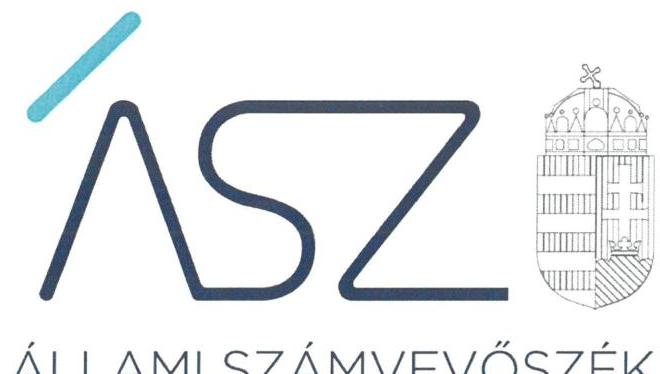
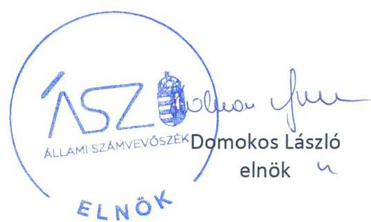
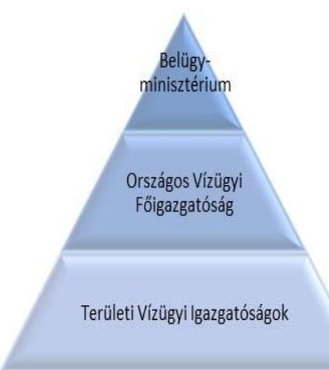

ÁLLAMI SZÁMVEVŐSZÉK

# JELENTÉS 

## Központi költségvetési szervek ellenőrzése

Az Országos Vízügyi Főigazgatóság középirányító központi költségvetési szerv ellenőrzése
2022.

22020
www.asz.hu

---

ÁLLAMI SZÁMVEVŐSZÉK

# JELENTÉS

## Központi költségvetési szervek ellenőrzése

Az Országos Vízügyi Főigazgatóság középirányító központi költségvetési szerv ellenőrzése

2022. 06. hó 13. nap

22020
www.asz.hu

---

# AZ ELLENŐRZÉST VEZETTE ÉS A VÉGREHAJTÁSÁÉRT FELELŐS: 

DR. KISS ESZTER ellenőrzésvezető
MAKKAI MÁRIA ellenőrzésvezető
SIPOSNÉ DÓCZI KLÁRA ellenőrzésvezető
SZAPPANOS JÚLIA ellenőrzésvezető

A PROGRAM ÖSSZEÁLLÍTÁSÁÉRT FELELŐS:
KUSZINGER ANDREA projektvezető

IKTATÓSZÁM: EL-3644-001/2022.
TÉMASZÁM: 2549
ELLENŐRZÉS-AZONOSÍTÓ SZÁM: V0926

---

# TARTALOMJEGYZÉK 

■ ÖSSZEGZÉS ..... 5
■ AZ ELLENŐRZÉS CÉLJA ..... 6
■ AZ ELLENŐRZÉS TERÜLETE ..... 7
■ AZ ELLENŐRZÉS HÁTTERE, INDOKOLTSÁGA ..... 8
■ A JELENTÉS LÉNYEGES KÉRDÉSKÖREI ..... 9
■ AZ ELLENŐRZÉS HATÓKÖRE ÉS MÓDSZEREI ..... 10
■ MEGÁLLAPÍTÁSOK ..... 12
■ MELLÉKLET ..... 15
■ FÜGGELÉK: ÉSZREVÉTELEK ..... 17
■ RÖVIDÍTÉSEK JEGYZÉKE ..... 19

---

.

---

# ÖSSZEGZÉS 

Az Országos Vízügyi Főigazgatóság a középirányítói feladatainak szabályszerű ellátásával, az átruházott irányítási hatáskörök felelős gyakorlásával, gazdálkodása során a nemzeti vagyon védelmének és elszámoltathatóságának biztosításával elősegítette az irányítása alá tartozó költségvetési szervek közfeladatainak szabályszerű ellátását.

## Az ellenőrzés társadalmi indokoltsága

Az Országos Vízügyi Főigazgatóság a Kormány által 2012. január 1-jén alapított központi költségvetési szerv, 2012. március 23-tól a területi vízügyi igazgatóságok középirányító szerve. Az Országos Vízügyi Főigazgatóság középirányító szervként irányítja, koordinálja és ellenőrzi a területi vízügyi igazgatóságok szakmai tevékenységét, és részt vesz a területi vízügyi igazgatóságok stratégiai céljainak kialakításában.

A középirányító szervek a feladataik ellátásával elősegítik az irányításuk alá tartozó irányított költségvetési szervek közfeladatainak szabályszerű és hatékony ellátását. Ezzel hozzájárulnak ahhoz, hogy mind az intézményekre, mind a középirányító szervi feladatok ellátására fordított közpénzek, a rájuk bízott nemzeti vagyon cél szerint hasznosuljanak, működésük átlátható és elszámoltatható legyen. Ezek alapján a közpénzügyek átláthatóságának előmozdítása és a közvagyon védelme érdekében szükséges a középirányító költségvetési szervek feladatellátásának ellenőrzése.

A középirányító szervi feladatokat ellátó központi költségvetési szervek ellenőrzésével az Állami Számvevőszék hozzájárulhat az intézményrendszer szabályszerűbb, eredményesebb és hatékonyabb feladatellátásához, gazdálkodásához. Az elvégzett ellenőrzések során az Állami Számvevőszék „jó gyakorlatokat" is azonosíthat, amelyeket tanácsadó funkciója keretében szélesebb körben - a középirányító szervekkel és az irányító szervekkel - is megismertethet, ezáltal is hozzájárulva a költségvetési rendszer szabályozott, átlátható, kiegyensúlyozott működéséhez.

## Főbb megállapítások, következtetések

Az Országos Vízügyi Főigazgatóság a szervezeti és a gazdálkodási kereteket a jogszabályi előírásokkal összhangban kialakította, a kiépített kontrollkörnyezet hozzájárult az átlátható és felelős gazdálkodáshoz.

Az Országos Vízügyi Főigazgatóság a beszámolási kötelezettségének a 2018-2020. években a jogszabályi előírások szerint eleget tett. Az irányító szerv által jóváhagyott éves költségvetési beszámolók főkönyvi kivonattal és leltárral alátámasztottak voltak, ami biztosította a nemzeti vagyon védelmét és elszámoltathatóságát.

A középirányítói feladatok ellátásának szabályozottsága, a középirányító szervre átruházott irányítói hatáskörök gyakorlása és a középirányítói feladatok ellátása megfelelt a jogszabályban foglaltaknak.

Az Országos Vízügyi Főigazgatóság kialakított a teljesítmény mérésére alkalmas követelményeket.
Az átláthatóság érvényesülését támogatta, hogy az irányító szerv 2020. évben, illetve 2020. évre vonatkozóan beszámoltatta a középirányító szervet a középirányítói hatáskörök gyakorlása vonatkozásában.

---

# AZ ELLENŐRZÉS CÉLJA 

AZ ELLENŐRZÉS CÉLJA annak értékelése, hogy a központi költségvetési szerv középirányítói feladatainak ellátása során hozzájárul-e a „jól irányított államhoz".

---

# AZ ELLENŐRZÉS TERÜLETE 

## Országos Vízügyi Főigazgatóság, Belügyminisztérium

Az Országos Vízügyi Főigazgatóságot Magyarország Kormánya alapította 2012. január 1-jén. A vízügyi igazgatási szervek irányításáért felelős miniszter irányítása alá tartozó központi költségvetési szerv, 2012. március 23-tól a területi vízügyi igazgatóságok középirányító szerve. Irányító szerve 2018. január 1-2020. december 31. között a Belügyminisztérium volt.

Az Országos Vízügyi Főigazgatóság a 223/2014. (IX. 4.) Korm. rendelet ${ }^{1}$ szerint - többek között - irányítja, koordinálja és ellenőrzi a területi vízügyi igazgatóságok szakmai tevékenységét, és részt vesz a területi vízügyi igazgatóságok stratégiai céljainak kialakításában.

Az Országos Vízügyi Főigazgatóság a 223/2014. (IX. 4.) Korm. rendelet szerint a területi vízügyi igazgatóságok középirányító szerveként
a) egyetértése esetén jóváhagyásra továbbítja a fejezetet irányító szerv részére a területi vízügyi igazgatóságok szervezeti és működési szabályzatát,
b) gyakorolja a területi vízügyi igazgatóságok vezetője tekintetében - a kinevezés, felmentés, megbízás vagy megbízás visszavonása jogának kivételével - a munkáltatói jogköröket,
c) jogszabályban meghatározott esetekben gyakorolja a területi vízügyi igazgatóságok döntéseinek előzetes egyetértése vagy utólagos jóváhagyása jogkörét,
d) egyedi utasítást adhat feladat elvégzésére vagy mulasztás pótlására,
e) a területi vízügyi igazgatóságokat jelentéstételre vagy beszámolóra kötelezheti,
f) kezeli a területi vízügyi igazgatóságok kezelésében lévő közérdekű adatokat és közérdekből nyilvános adatokat, valamint a b)-e) pont szerinti irányítási jogkörök gyakorlásához szükséges, törvényben meghatározott személyes adatokat.

A 223/2014. (IX. 4.) Korm. rendelet 4. §-a 12 Területi Vízügyi Igazgatóságot nevesít.

---

# AZ ELLENŐRZÉS HÁTTERE, INDOKOLTSÁGA 

A „jól irányított állam" elképzelhetetlen a közintézmények eredményes és hatékony irányítása nélkül. A középirányító szervek tevékenységének hiányosságai nemcsak az egyes intézmények működésére és gazdálkodására, hanem a közfeladat ellátására is hatással lehetnek.

Kizárólag a jól, hatékonyan és eredményesen irányított szervek szolgálják a köz érdekét. A jelentős számú, közfeladatot ellátó szerv központi alrendszerbe kerülésével a középirányító szervek szerepe is előtérbe került. Az irányíthatóság biztosítása érdekében a kormányzati irányítási feladatok ellátására középirányító szerveket jelöltek ki. A központi alrendszer intézményeinek tevékenysége, gazdálkodásuk minősége, hatékonysága és eredményessége hatással van a felelős közpénzgazdálkodásra, az általuk nyújtott közszolgáltatásokon keresztül a lakosság életminőségére, biztonságára, egészségére és jólétére. A központi alrendszer intézményeinél az elszámoltathatóság, a szabályos közpénzfelhasználás és vagyongazdálkodás egyik biztosítéka a megfelelő irányítási rendszer kialakítása és az irányítási hatáskörök felelős gyakorlása.

Az államháztartás központi alrendszerébe tartozó szervezet vagyona a nemzeti vagyon része, mellyel történő gazdálkodás a közérdek szolgálata érdekében történik. Az Állami Számvevőszék az ellenőrzések megállapításaival támogatja az ellenőrzött szervezetek szabályszerű gazdálkodását, javaslataival elősegíti az Alaptörvényben megfogalmazott alapvetések érvényesülését a mindennapi életben a szervezetek szintjén.

---

# A JELENTÉS LÉNYEGES KÉRDÉSKÖREI 

1.     - A középirányító szerv belső kontrollkörnyezetének kialakítása szabályszerű volt-e?
2.     - A középirányító szervnél biztosított volt-e a vagyongazdálkodás szabályozottsága?
3.     - A középirányító szerv nemzeti vagyon kimutatása szabályszerű volt-e?
4.     - A középirányító szervre átruházott irányítói hatáskörök gyakorlásának és a középirányítói feladatok ellátásának belső szabályait a középirányító szerv kialakította-e?
5.     - A középirányító szervre átruházott irányítói hatáskörök gyakorlása és a középirányítói feladatok ellátása megfelelt-e a jogszabályban foglaltaknak?
6.     - Az irányító szerv beszámoltatta-e és ellenőrizte-e a középirányító szervet a középirányítói hatáskörök gyakorlása vonatkozásában?
7.     - A középirányító szerv kialakított-e a szervezeti teljesítménykövetelmények érvényesülését biztosító, mérhető, nyomon követhető teljesítménycélokat, teljesítménykövetelményeket?

---

# AZ ELLENŐRZÉS HATÓKÖRE ÉS MÓDSZEREI 

## Az ellenőrzés típusa

Megfelelőségi ellenőrzés.

## Az ellenőrzött időszak

Az 1., 4., 5., 6. és 7. fókuszkérdések vonatkozásában a 2020. év. A 2. és 3. fókuszkérdések vonatkozásában a 2018-2020. évek.

## Az ellenőrzés tárgya

Az Országos Vízügyi Főigazgatóság, mint középirányító költségvetési szerv belső kontrollkörnyezetének kialakításának szabályszerűsége. A középirányító szerv nemzeti vagyonnal való gazdálkodásra vonatkozó szabályozási környezete kialakításának szabályszerűsége. A középirányító szerv beruházásai előkészítésének megfelelősége, a nemzeti vagyon kimutatásának szabályszerűsége. A középirányítói feladatok ellátásának szabályozottsága. A középirányító szervre átruházott irányítói hatáskörök gyakorlásának és a középirányítói feladatok ellátásának szabályszerűsége. A Belügyminisztérium, mint irányító szerv által végzett beszámoltatási és ellenőrzési tevékenységek az Országos Vízügyi Főigazgatóság középirányítói hatáskör gyakorlására vonatkozóan. A középirányító szervnél a szervezeti teljesítmény követelmények érvényesülését biztosító, mérhető, nyomon követhető teljesítménycélok, teljesítménykövetelmények kialakítása.

## Az ellenőrzött szervezet

Az Országos Vízügyi Főigazgatóság, mint középirányítói feladatokat ellátó központi költségvetési szerv és a Belügyminisztérium, mint az Országos Vízügyi Főigazgatóság irányító szerve.

## Az ellenőrzés jogalapja

Az ellenőrzés jogalapját az ÁSZ tv. ${ }^{2}$ 1. § (3) bekezdésének, 5. § (2)-(3) bekezdésének, a (4) bekezdés a) pontjának és a (6) bekezdésének, valamint az Áht. ${ }^{3}$ 61. § (2) bekezdésének előírásai képezik.

---

# Az ellenőrzés módszerei 

Az ÁSZ ${ }^{4}$ az ellenőrzést az ellenőrzési program ellenőrzési kérdései, az ellenőrzött időszakban hatályos jogszabályok, az ellenőrzés-szakmai szabályok és a megfelelőségi ellenőrzésre irányadó ÁSZ módszertan figyelembevételével végzi.

Az ellenőrzési kérdések megválaszolásához szükséges bizonyítékok megszerzése a következő ellenőrzési eljárások alkalmazásával történik: információkérés, összehasonlítás, valamint elemző eljárás. Az ellenőrzési bizonyítékként felhasználható adatforrások közé tartoznak az ellenőrzési program részletes szempontjainál felsorolt adatforrások, valamint minden - az ellenőrzés folyamán feltárt - az ellenőrzés szempontjából információkat tartalmazó dokumentum. Az ellenőrzés lefolytatása az ellenőrzési kérdésekhez kapcsolódó adatforrások és tanúsítvány felhasználásával, az adott időszakban hatályos jogszabályok figyelembevételével, valamint az ellenőrzési kérdésekre adott válaszok kiértékelésével történik.

A középirányító szervre átruházott irányítói hatáskörök gyakorlása és a középirányítói feladatok ellátása a jogszabályi előírásoknak nem megfelelő, ha a középirányító szervre átruházott irányítói hatáskörök gyakorlásának és a középirányítói feladatok ellátásának belső szabályait a középirányító szerv nem alakította ki. Nem megfelelő továbbá a középirányító szervre átruházott irányítói hatáskörök gyakorlása és a középirányítói feladatok ellátása, ha a középirányító nem teljesítette a jogszabályban megfogalmazott kötelezettségét.

Az ÁSZ az ellenőrzés ideje alatt az ellenőrzött szervezettel történő kapcsolattartást az ÁSZ SZMSZ${ }^{5}$-ének vonatkozó előírásai alapján biztosítja.

---

# 1. A középirányító szerv belső kontrollkörnyezetének kialakítása szabályszerű volt-e? 

Összegző megállapítás Az Országos Vízügyi Főigazgatóság belső kontrollkörnyezetének kialakítása a 2020. évben szabályszerű volt.

Az Országos Vízügyi Főigazgatóság a működési és szervezeti kereteit szabályszerűen alakította ki, mivel rendelkezett - az Áht. előírása szerint a Belügyminisztérium, mint irányító szerv által jóváhagyott SZMSZ${ }^{6}$-szel, valamint a szervezeti egységekre vonatkozó szabályokat - beleértve a gazdasági szervezetét is - az Ügyrendjében ${ }^{7}$ az Ávr. ${ }^{8}$ előírása szerint határozta meg.

Az Országos Vízügyi Főigazgatóság rendelkezett a szabályszerű gazdálkodást meghatározó gazdálkodási szabályzat${ }^{9}$-vel, valamint szabályozták a Bkr. ${ }^{10}$ előírásai szerint az integrált kockázatkezelés és a szervezeti integritást sértő események kezelésének eljárásrendjeit.

## 2. A középirányító szervnél biztosított volt-e a vagyongazdálkodás szabályozottsága?

## Összegző megállapítás Az Országos Vízügyi Főigazgatóságnál 2018-2020. években a vagyongazdálkodás szabályozottsága biztosított volt.

Az Országos Vízügyi Főigazgatóság rendelkezett a Számv. tv. ${ }^{11}$ és az Áhsz. ${ }^{12}$ előírásaival összhangban lévő, az ellenőrzött időszakban hatályos számviteli politika${ }^{13}$-vel, eszközök és források leltárkészítési és leltározási szabályzat${ }^{14}$-val, eszközök és források értékelési szabályzat${ }^{15}$-vel, pénzkezelési szabályzat${ }^{16}$-val, valamint számlarend${ }^{17}$-vel.

Az Országos Vízügyi Főigazgatóság rendelkezett a gazdálkodás részletes rendjét tartalmazó szabályzatokkal: beszerzések és közbeszerzések eljárásrendjéről szóló szabályzat, kötelezettségvállalás, ellenjegyzés, érvényesítés, utalványozás eljárásrendjét szabályozó főigazgatói utasítás, felesleges vagyontárgyak hasznosításának és selejtezési szabályzata, bizonylati szabályzatról szóló főigazgatói utasítás, megbízás az Országos Vízügyi Főigazgatóság kiadási előirányzatai terhére történő kötelezettségvállalásra, anyag- és eszközgazdálkodási szabályzat, önköltségszámítási szabályzat.

---

# 3. A középirányító szerv nemzeti vagyon kimutatása szabályszerű volt-e? 

Összegző megállapítás Az Országos Vízügyi Főigazgatóság nemzeti vagyon kimutatása 2018-2020. években szabályszerű volt.

Az Országos Vízügyi Főigazgatóság rendelkezett - az Áhsz. előírásainak megfelelően - a Belügyminisztérium, mint irányító szerv által jóváhagyott éves költségvetési beszámolóval az ellenőrzött
 időszakban, amelyek adatai főkönyvi kivonattal alátámasztottak voltak.

Az Országos Vízügyi Főigazgatóság a jogszabályi előírásoknak megfelelően 2020. évben mennyiségi felvétellel történő leltárral meggyőződött a legalább háromévente mennyiségi felvétellel leltározandó eszközök esetén a mérlegbe bekerülő adatok valódiságáról. A nemzeti vagyon kimutatásáról gondoskodott, a vagyon védelme biztosított volt.

## 4. A középirányító szervre átruházott irányítói hatáskörök gyakorlásának és a középirányítói feladatok ellátásának belső szabályait a középirányító szerv kialakította-e?

Összegző megállapítás Az Országos Vízügyi Főigazgatóság 2020. évben kialakította az átruházott irányítói hatáskörök gyakorlásának és a középirányítói feladatok ellátásának belső szabályait.

Az Országos Vízügyi Főigazgatóság SZMSZ-e és Ügyrendje együttesen tartalmazta a szervezeti egységek középirányítói feladatait és szabályozta a 223/2014. (IX. 4.) Korm. rendelet 3/A. § b), c), e) pontjaiban meghatározott átruházott irányítói hatáskörök gyakorlásának rendjét.

## 5. A középirányító szervre átruházott irányítói hatáskörök gyakorlása és a középirányítói feladatok ellátása megfelelt-e a jogszabályban foglaltaknak?

Összegző megállapítás Az Országos Vízügyi Főigazgatóságnál az átruházott irányítói hatáskörök gyakorlása és a középirányítói feladatok ellátása megfelelt a jogszabályban foglaltaknak a 2020. évben, illetve a 2020. év vonatkozásában.

Az Országos Vízügyi Főigazgatóság az átruházott irányítói hatáskörében - az Áht. és a 223/2014. (IX. 4.) Korm. rendelet előírása szerint - rendszeresen jelentéstételre, illetve beszámolóra kötelezte az irányítása alá tartozó 12 területi vízügyi igazgatóságot és gyakorolta a vagyongazdálkodáshoz kapcsolódóan a területi vízügyi igazgatóságok döntéseinek előzetes egyetértésére vonatkozó hatáskörét.

---

Az Országos Vízügyi Főigazgatóság ellátta - a 223/2014. (IX. 4.) Korm. rendelet előírása szerint - a területi vízügyi igazgatóságok vonatkozásában a szakmai tevékenységük irányításával és ellenőrzésével kapcsolatos középirányítói feladatait, mivel az irányítása alá tartozó területi vízügyi igazgatóságokra kiterjedő hatállyal normatív tartalmú belső szabályozásokat adott ki, ellenőrizte szakmai tevékenységüket, ügyvezetési jellegű feladataikat. Az Országos Vízügyi Főigazgatóság gazdálkodási középirányítói feladatkörében valamennyi területi vízügyi igazgatóságra kiterjedő hatályú szabályzatokat adott ki, ellenőrizte a területi vízügyi igazgatóságok 2020. évi éves elemi költségvetési beszámolóit.

# 6. Az irányító szerv beszámoltatta-e és ellenőrizte-e a középirányító szervet a középirányítói hatáskörök gyakorlása vonatkozásában? 

Összegző megállapítás Az irányító szerv a 2020. évben, illetve 2020. évre vonatkozóan beszámoltatta az Országos Vízügyi Főigazgatóságot a középirányítói hatáskörök gyakorlása vonatkozásában.

A Belügyminisztérium, mint irányító szerv rendszeresen figyelemmel kísérte és az Áht. 9. § i) pontjával összhangban beszámoltatta az Országos Vízügyi Főigazgatóságot a középirányítói hatáskörök gyakorlásáról, illetve feladatok ellátásáról a 2020. év vonatkozásában.

## 7. A középirányító szerv kialakított-e a szervezeti teljesítménykövetelmények érvényesülését biztosító, mérhető, nyomon követhető teljesítménycélokat, teljesítménykövetelményeket?

Összegző megállapítás Az Országos Vízügyi Főigazgatóság kialakított a szervezeti teljesítménykövetelmények érvényesülését biztosító, mérhető, nyomon követhető teljesítménycélokat, teljesítménykövetelményeket.

Az Országos Vízügyi Főigazgatóság vezetője belső irányítási eszközökben meghatározta a szervezeti célok elérését szolgáló feladatok, folyamatok, tevékenységek mérésére használható indikátorokat, mérőszámokat, feladat- és teljesítménymutatókat, amelyek alkalmasak a szervezeti tevékenység teljesítményének mérésére.

---

# MELLÉKLET 

irányító szerv
kontrollkörnyezet
középirányító szerv által gyakorolt irányítási hatáskörök
nemzeti vagyon

Országos Vízügyi Főigazgatóság alapítása
vagyongazdálkodás

Az Országos Vízügyi Főigazgatóság és a területi vízügyi igazgatóságok irányító szerve a Belügyminisztérium. (Forrás: Országos Vízügyi Főigazgatóság és a területi vízügyi igazgatóságok alapító okiratai)
A költségvetési szerv vezetője által kialakított olyan elvek, eljárások, belső szabályzatok összessége, amelyben világos a szervezeti struktúra; a folyamatok átláthatók; egyértelműek a felelősségi, hatásköri viszonyok és feladatok; meghatározottak, ismertek és elfogadottak az etikai elvárások a szervezet minden szintjén; átlátható a humánerőforráskezelés; biztosított a szervezeti célok és értékek irányában való elkötelezettség fejlesztése és elősegítése. (Forrás: Bkr. 6. § (1) bekezdés)
Törvény vagy kormányrendelet által meghatározott azon irányítási hatáskörök, amelyek a központi költségvetési szerv irányítása alá tartozó más költségvetési szervre, mint középirányító szervre átruházhatók. (Forrás: Áht. 9/A. § (3) bekezdés b) pontja)
a) az állam vagy a helyi önkormányzat kizárólagos tulajdonában álló dolgok,
b) az a) pont hatálya alá nem tartozó, az állam vagy a helyi önkormányzat tulajdonában lévő dolog,
c) az állam vagy a helyi önkormányzat tulajdonában lévő pénzügyi eszközök, továbbá az államot vagy a helyi önkormányzatot megillető társasági részesedések,
d) az államot vagy a helyi önkormányzatot megillető bármely vagyoni értékkel rendelkező jogosultság, amelyet jogszabály vagyoni értékű jogként nevesít,
e) Magyarország határa által körbezárt terület feletti légtér,
f) az üvegházhatású gázok kibocsátási egységeinek kereskedelméről szóló törvény szerinti kibocsátási egység és légiközlekedési kibocsátási egység, valamint az ENSZ Éghajlatváltozási Keretegyezménye és annak Kiotói Jegyzőkönyv végrehajtási keretrendszeréről szóló törvény szerinti kiotói egység,
g) állami vagy helyi önkormányzati fenntartású közgyűjtemény (muzeális intézmény, levéltár, közgyűjteményként működő kép- és hangarchívum, valamint könyvtár) saját gyűjteményében nyilvántartott kulturális javak körébe tartozó dolog, kivéve, ha az állami vagy önkormányzati tulajdon jogszerű létrejötte kétséget kizáró módon nem bizonyítható és a dologra nézve más a tulajdonjogát bizonyítja vagy a kulturális javakra vonatkozó jogszabályokban meghatározott eljárás keretében valószínűsíti,
h) a régészeti lelet,
i) a nemzeti adatvagyon körébe tartozó állami nyilvántartások fokozottabb védelméről szóló törvény szerinti nemzeti adatvagyon. (Forrás: Nvtv. ${ }^{18}$ 1. § (2) bekezdés a)-i) pontok)
Az Országos Vízügyi Főigazgatóság a Kormány által 2012. január 1-jén alapított központi költségvetési szerv. Az alapításáról rendelkező jogszabály: a vízügyi igazgatási szervek irányításának átalakításával összefüggésben egyes kormányrendeletek módosításáról szóló 300/2011. (XII. 22.) Korm. rendelet. (Forrás: Országos Vízügyi Főigazgatóság A212/1/2019. sz., 2019.07.03-án kelt alapító okirata)
A nemzeti vagyongazdálkodás feladata a nemzeti vagyon rendeltetésének megfelelő, az állam, az önkormányzat mindenkori teherbíró képességéhez igazodó, elsődlegesen a közfeladatok ellátásához és a mindenkori társadalmi szükségletek kielégítéséhez szükséges, egységes elveken alapuló, átlátható, hatékony és költségtakarékos működtetése, értékének megőrzése, állagának védelme, értéknövelő használata, hasznosítása, gyarapítása, továbbá az állam vagy a helyi önkormányzat feladatának ellátása szempontjából feleslegessé váló vagyontárgyak elidegenítése. (Forrás: Nvtv. 7. § (2) bekezdés)

---

.

---

# FÜGGELÉK: ÉSZREVÉTELEK 

Az Állami Számvevőszék az ÁSZ tv. 29. § (1) bekezdése alapján ismertette az ellenőrzött szervezetek vezetőivel az ellenőrzés megállapításait.

Az Országos Vízügyi Főigazgatóság főigazgatója és a Belügyminiszter nemleges észrevételt tett.

[^0]
[^0]:    * 29. § (1) Az Állami Számvevőszék az ellenőrzési megállapításait megküldi az ellenőrzött szervezet vezetőjének vagy az általa megbízott személynek, és annak, akinek személyes felelősségét állapította meg.
    (2) Az ellenőrzött szervezet vezetője és a felelősként megjelölt személy az ellenőrzés megállapításaira tizenöt napon belül írásban észrevételt tehet.
    (3) Az Állami Számvevőszék az észrevételre a beérkezésétől számított harminc napon belül írásban válaszol. A figyelembe nem vett észrevételeket köteles a jelentésben feltüntetni, és megindokolni, hogy azokat miért nem fogadta el.

---

.

---

# RÖVIDÍTÉSEK JEGYZÉKE 

${ }^{1} 223 / 2014$. (IX. 4.) Korm. rendelet
${ }^{2}$ ÁSZ tv.
${ }^{3}$ Áht.
${ }^{4}$ ÁSZ
${ }^{5}$ ÁSZ SZMSZ
${ }^{6}$ SZMSZ
${ }^{7}$ Ügyrend
${ }^{8}$ Ávr.
${ }^{9}$ gazdálkodási szabályzat ${ }_{1}$
gazdálkodási szabályzat ${ }_{2}$
${ }^{10}$ Bkr.
${ }^{11}$ Számv. tv.
${ }^{12}$ Áhsz.
${ }^{13}$ számviteli politika ${ }_{1}$
számviteli politika ${ }_{2}$
${ }^{14}$ eszközök és források leltárkészítési és leltározási szabályzata ${ }_{3}$
eszközök és források leltárkészítési és leltározási szabályzata ${ }_{2}$
eszközök és források leltárkészítési és leltározási szabályzata ${ }_{3}$
${ }^{15}$ eszközök és források értékelési szabályzata ${ }_{1}$

223/2014. (IX. 4.) Korm. rendelet a vízügyi igazgatási és a vízügyi, valamint a vízvédelmi hatósági feladatokat ellátó szervek kijelöléséről (hatályos: 2014. szeptember 5-től)
2011. évi LXVI. törvény az Állami Számvevőszékről (hatályos: 2011. július 1-től)
2011. évi CXCV. törvény az államháztartásról (hatályos 2011. december 31-től)

Állami Számvevőszék
Állami Számvevőszék Szervezeti és Működési Szabályzata
Az Országos Vízügyi Főigazgatóság főigazgatójának 7/2019. (OVF) számú utasítása az Országos Vízügyi Főigazgatóság Szervezeti és Működési Szabályzatáról (hatályos: 2019. február 20-tól)

Az Országos Vízügyi Főigazgatóság főigazgatójának 17/2019. (OVF) számú utasítása az Országos Vízügyi Főigazgatóság ügyrendjéről (hatályos: 2019. április 8-tól)
368/2011. (XII. 31.) Korm. rendelet az államháztartásról szóló törvény végrehajtásáról (hatályos: 2012. január 1-től)
Az Országos Vízügyi főigazgató 30/2018. számú utasítása a kötelezettségvállalás, pénzügyi ellenjegyzés, szakmai teljesítésigazolás, érvényesítés, utalványozás, valamint a jogi ellenjegyzés rendjéről és a gazdálkodási jogkörök gyakorlásának szabályairól (hatályos: 2019. január 20-tól)
Az Országos Vízügyi Főigazgatóság főigazgatójának 49/2020. számú utasítása a kötelezettségvállalás, pénzügyi ellenjegyzés, szakmai teljesítésigazolás, érvényesítés, utalványozás, valamint a jogi ellenjegyzés rendjéről és a gazdálkodási jogkörök gyakorlásának szabályairól (hatályos: 2020. augusztus 11-től)
370/2011. (XII. 31.) Korm. rendelet a költségvetési szervek belső kontrollrendszeréről és belső ellenőrzéséről (hatályos: 2012. január 1-től)
2000. évi C. törvény a számvitelről (hatályos: 2001. január 1-jétől)

4/2013. (I. 11.) Korm. rendelet az államháztartás számviteléről (hatályos: 2014. január 1-től)
Az Országos Vízügyi Főigazgatóság főigazgatójának 7/2015. (OVF) számú szabályzata az Országos Vízügyi Főigazgatóság számviteli politikájának egyes szabályairól (hatályos: 2015. március 31-től)
Az Országos Vízügyi Főigazgatóság főigazgatójának 72/2020. (OVF) számú utasítása az Országos Vízügyi Főigazgatóság számviteli politikájának egyes szabályairól (hatályos: 2020. december 28-tól)
Az Országos Vízügyi Főigazgatóság főigazgatójának 37/2014. (OVF) számú szabályzata az Országos Vízügyi Főigazgatóság eszközeinek és forrásainak leltározásáról és leltárkészítésről (hatályos: 2014. november 1-jétől)
Az Országos Vízügyi Főigazgatóság főigazgatójának 41/2014. (OVF) számú utasítása az Országos Vízügyi Főigazgatóság főigazgatójának 37/2014. számú, az Országos Vízügyi Főigazgatóság eszközeinek és forrásainak leltározásáról és leltárkészítéséről szóló szabályzat módosításáról (hatályos: 2014. december 1-től)
Az Országos Vízügyi Főigazgatóság főigazgatójának 68/2020. (OVF) számú utasítása az Országos Vízügyi Főigazgatóság eszközeinek és forrásainak leltározásáról és leltárkészítéséről (hatályos: 2020. december 7-től)
Az Országos Vízügyi Főigazgatóság főigazgatójának 38/2014. (OVF) számú szabályzata az Országos Vízügyi Főigazgatóság eszköz-forrás értékeléséről (hatályos: 2014. november 1-től)

---

eszközök és források értékelési szabályzata ${ }_{2}$

Az Országos Vízügyi Főigazgatóság főigazgatójának 69/2020. (OVF) számú utasítása az Országos Vízügyi Főigazgatóság eszköz-forrás értékeléséről (hatályos: 2020. december 16-tól)
16 pénzkezelési szabályzat ${ }_{1}$
pénzkezelési szabályzat ${ }_{2}$
pénzkezelési szabályzat ${ }_{3}$
${ }^{17}$ számlarend ${ }_{1}$
számlarend ${ }_{2}$
${ }^{18}$ Nvtv.

Az Országos Vízügyi Főigazgatóság főigazgatójának 36/2014. (OVF) számú szabályzata az Országos Vízügyi Főigazgatóság pénzforgalmi és pénztári pénzkezelési szabályzatáról (hatályos: 2014. november 1-től)
Az Országos Vízügyi Főigazgatóság főigazgatójának 2/2017. (OVF) számú utasítása az Országos Vízügyi Főigazgatóság Duna Múzeum pénzforgalmi és pénztári pénzkezelési szabályairól (hatályos: 2017. január 2-től)
Az Országos Vízügyi Főigazgatóság főigazgatójának 48/2020. (OVF) számú utasítása a pénzforgalmi és pénztári pénzkezelési szabályairól (hatályos: 2020. július 1-től)
Az Országos Vízügyi Főigazgatóság főigazgatójának 8/2015. (OVF) számú szabályzata az Országos Vízügyi Főigazgatóság számlarendjéről (hatályos: 2015. március 31-től)
Az Országos Vízügyi Főigazgatóság főigazgatójának 70/2020. (OVF) számú utasítása az Országos Vízügyi Főigazgatóság számlarendjéről és számlatúrkréről (hatályos: 2020. december 21-től)
2011. évi CXCVI. törvény a nemzeti vagyonról (hatályos: 2011. december 31-től)

---

1052 Budapest, Apáczai Cs. J. u. 10. | 1364 Budapest 4. Pf. 54
TEL: +36 14849100
email: szamvevoszek@asz.hu
web: www.asz.hu | www.aszhirportal.hu

