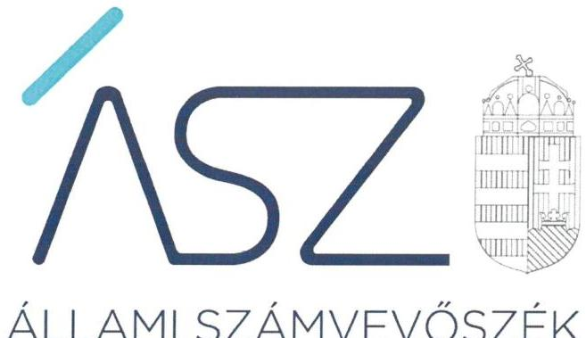
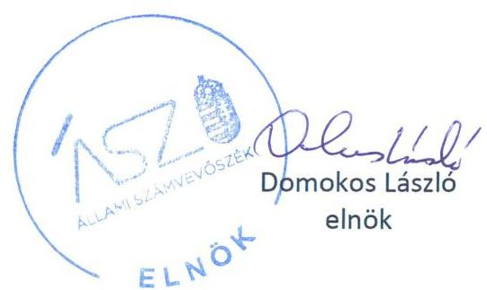
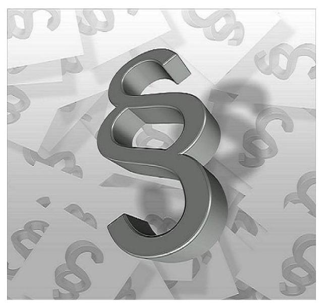

ÁLLAMI SZÁMVEVŐSZÉK

# JELENTÉS 

A költségvetési támogatásban részesülő pártalapítványok 2019-2020. évi gazdálkodása törvényességének ellenőrzése

Jobbik Magyarországért Alapítvány
2022.

22021
www.asz.hu

---

ÁLLAMI SZÁMVEVŐSZÉK

# JELENTÉS

A költségvetési támogatásban részesülő pártalapítványok 2019-2020. évi gazdálkodása törvényességének ellenőrzése

> Jobbik Magyarországért Alapítvány

2021. 06. hó 14. nap

22021 www.asz.hu

---

# AZ ELLENŐRZÉST FELÜGYELTE: 

DR. BENEDEK MÁRIA felügyeleti vezető

## AZ ELLENŐRZÉST VEZETTE ÉS A VÉGREHAJTÁSÁÉRT FELELŐS:

DR. NAGY JUDIT ellenőrzésvezető
JANIK JÓZSEF LÁSZLÓ ellenőrzésvezető

## A PROGRAM ÖSSZEÁLLÍTÁSÁÉRT FELELŐS:

DR. KÁDÁR KRISZTA projektvezető

## A TÉMÁHOZ KAPCSOLÓDÓ KORÁBBI SZÁMVEVŐSZÉKI JELENTÉSEK:

- címe: Jelentés - A költségvetési támogatásban részesülő pártalapítványok 2017-2018. évi gazdálkodása törvényességének ellenőrzése Jobbik Magyarországért Alapítvány

Jelentéseink az Országgyűlés számítógépes hálózatán és az interneten a www.asz.hu címen is olvashatóak.

IKTATÓSZÁM: EL-3647-001/2022.
TÉMASZÁM: 2581
ELLENŐRZÉS-AZONOSÍTÓ SZÁM: V092402

---

# TARTALOMJEGYZÉK 

■ ÖSSZEGZÉS ..... 5
— AZ ELLENŐRZÉS CÉLJA ..... 7
— AZ ELLENŐRZÉS TERÜLETE ..... 8
— AZ ELLENŐRZÉS HÁTTERE, INDOKOLTSÁGA ..... 9
— A JELENTÉS LÉNYEGES KÉRDÉSKÖREI ..... 10
— AZ ELLENŐRZÉS HATÓKÖRE ÉS MÓDSZEREI ..... 11
— MEGÁLLAPÍTÁSOK ..... 13
— JAVASLATOK ..... 15
— MELLÉKLETEK ..... 17
I. sz. melléklet: Értelmező szótár ..... 17
— FÜGGELÉK: ÉSZREVÉTELEK ..... 19
— RÖVIDÍTÉSEK JEGYZÉKE ..... 21

---

.

---

# ÖSSZEGZÉS 

A Jobbik Magyarországért Alapítvány a 2019-2020. években a törvényes gazdálkodás alapvető szabályozási feltételeit biztosította. Ugyanakkor a 2019-2020. években a tevékenységéről, a gazdálkodásáról a törvény által előírt éves jelentést és beszámolót nem készített. Ezáltal nem biztosította a közpénzek felhasználásának elszámoltathatóságát az állampolgárok felé. A Jobbik Magyarországért Alapítvány gazdálkodása során a 2019-2020. években nem tett eleget az Alaptörvényben és a Pártalapítványi törvényben előírt alapvető követelményeknek, gazdálkodása nem volt átlátható.

## Az ellenőrzés társadalmi indokoltsága

A politikai kultúra fejlesztése érdekében tudományos, ismeretterjesztő, kutatási és oktatási tevékenységük elősegítésére költségvetési támogatásra jogosult alapítványt hozhatnak létre a pártok.

A pártok működését segítő tudományos, ismeretterjesztő, kutatási, oktatási tevékenységet végző alapítványokról szóló törvény (Pártalapítványi törvény), valamint a pártok működéséről és gazdálkodásáról szóló törvény (Párt törvény) állapítja meg a pártalapítványok gazdálkodására, a költségvetési támogatásra vonatkozó szabályokat. A Pártalapítványi törvény szerint a pártalapítványok a professzionális politika olyan szellemi bázisaiként működnek, amelyek tudományos tevékenységükkel, kutatómunkájukkal, a politikai gyakorlat számára készített javaslataikkal nemcsak egy-egy párt, de a törvényalkotás és a végrehajtás egészének jobb, hatékonyabb, a közjót fokozottabban szolgáló működéséhez járulnak hozzá. A pártok mellett létrehozott alapítványok, a pártok társadalmi fontosságának széles körben történő bemutatásával az állampolgári tájékoztatást, ismeretterjesztést, oktatást hívatottak szolgálni.

Magyarország Alaptörvénye szerint a központi költségvetésből csak olyan szervezet részére nyújtható támogatás, amelynek a támogatás felhasználására irányuló tevékenysége átlátható. Ezáltal a pártalapítványok működésének és költségvetési támogatásának alapja, hogy gazdálkodásuk törvényes és átlátható legyen.

A pártalapítványoknak évente be kell számolniuk a törvényi keretek szerinti gazdálkodásról. Törvényi előírás alapján az Állami Számvevőszék a költségvetési támogatásban részesült pártalapítványok gazdálkodását kétévente ellenőrzi. A pártalapítványok pénzügyi beszámolása alapján az ellenőrzés visszajelzést ad arról, hogy a pártalapítványok eleget tettek-e az Alaptörvényben és a Pártalapítványi törvényben a pártalapítványként előírt alapvető követelményeknek, gazdálkodásuk törvényes és átlátható volt-e.

## Összegző értékelés, javaslat

A Jobbik Magyarországért Alapítvány a 2019-2020. években gazdálkodásával kapcsolatos könyvvezetési-, nyilvántartási rendszerét, a számviteli kereteket a jogszabályban előírtak szerint kialakította, ezáltal törvényes gazdálkodása alapvető kereteit biztosította.

A Jobbik Magyarországért Alapítvány a 2019-2020. években nem készített a Számv. tv. szerinti éves számviteli beszámolót, a tevékenységéről szóló éves jelentést. Ezáltal a felhasznált közpénzekre vonatkozó gazdálkodása átláthatóságát, a költségvetési támogatás felhasználásának elszámoltathatóságát nem biztosította.

Az Állami Számvevőszék a megállapítások alapján a Jobbik Magyarországért Alapítvány kuratóriumi elnökének 1 javaslatot fogalmazott meg.

---

# Következtetések 

Az Állami Számvevőszék a Jobbik Magyarországért Alapítvány gazdálkodásának törvényességét korábban több alkalommal ellenőrizte. A 2017-2018. évekhez képest a 2019-2020. évekre vonatkozó jelen ellenőrzés a gazdálkodás törvényessége és átláthatósága területén lényeges, új törvénysértéseket állapított meg, ugyanis a Jobbik Magyarországért Alapítvány nem tett eleget a törvény által előírt beszámolási kötelezettségének. Ezáltal nem biztosította a közpénzek felhasználásának elszámoltathatóságát a nyilvánosság felé, továbbá a Számv. tv. szerinti beszámoló hiányában nem hiteles beszámolók közzétételével megtévesztette az állampolgárokat.

---

# AZ ELLENŐRZÉS CÉLJA 

AZ ELLENŐRZÉS CÉLJA, hogy az ÁSZ ${ }^{1}$ - mint az Országgyűlés legfőbb ellenőrző szerve - független és szakmailag megalapozott véleményt adjon a pártalapítványok, mint ellenőrzött szervezetek gazdálkodásának törvényességéről. Annak megállapítása, hogy a pártalapítvány törvényesen gazdálkodott-e, az éves számviteli beszámolók és a pártalapítvány tevékenységéről szóló éves jelentések a jogszabályi előírásoknak megfeleltek-e, a könyvvezetés és gazdálkodás során a vonatkozó jogszabályi rendelkezéseket és belső előírásokat betartották-e.

---

# AZ ELLENŐRZÉS TERÜLETE 

## Jobbik Magyarországért Alapítvány

Az ellenőrzés a Párt tv. ${ }^{2}$ alapján a politikai kultúra fejlesztése érdekében tudományos, ismeretterjesztő, kutatási, oktatási tevékenység folytatása céljából, a Ptk. ${ }^{3}$ szerinti létesítő/alapító okiraton alapuló bírósági nyilvántartásba vétellel létrejött pártalapítványok gazdálkodására terjed ki. A pártalapítványok törvényes gazdálkodásának (könyvvezetése, beszámolása, jelentéstétele) szabályait alapvetően a Pártalapítványi tv. ${ }^{4}$-en túl, a Számv. tv ${ }^{5}$ és annak a végrehajtási rendelete a Számviteli vhr. ${ }^{6}$ határozzák meg.

A Jobbik Magyarországért Mozgalom - Párt tv. és a Pártalapítványi tv. előírásai által biztosított lehetőséggel élve - 2011-ben megalapította a Gyarapodó Magyarországért Alapítványt. Ez az alapítvány a 2015. június 2-i Alapító okirat ${ }^{7}$ módosítása óta Jobbik Magyarországért Alapítvány néven működik. A Pártalapítvány ${ }^{8}$ induló vagyona 2,2 millió Ft volt.

Az ellenőrzött időszakban hatályos Alapító okirat szerint, a Pártalapítvány célja a politikai kultúra fejlesztése a magyar nemzettudat, a nemzeti elkötelezettség és a keresztény identitás jegyében. A Pártalapítvány legfőbb ügyvezető és kezelőszerve a négy tagú Kuratórium ${ }^{9}$ volt, melynek élén az elnök állt. Az Alapító okirat módosítására az ellenőrzött időszakban két ízben, a kuratóriumi tagok és a törvényes képviselő személyének változása miatt került sor.

Képviseletét harmadik személyekkel és hatóságokkal szemben a Kuratórium elnöke látta el. Könyvviteli és munkaügyi feladatait külső vállalkozó végezte.

A Pártalapítvány a Kvtv. ${ }^{10}$ szerint 2019. évben 702,4 millió Ft, a 2020. évben 702,4 millió Ft, az ellenőrzött időszakban összesen 1.404,8 millió Ft költségvetési támogatásban részesült. A Pártalapítvány az ellenőrzött időszakban - nyilatkozata alapján - vállalkozási tevékenységet nem végzett.

A Pártalapítvány a Ptk. és a Ectv. ${ }^{11}$ előírásai alapján 2013. évben alapította a Kiegyensúlyozott Médiáért Alapítványt 10,0 millió Ft indulóvagyonnal, melynél az ellenőrzött időszakban is alapítói joggyakorlóként működött. Az ellenőrzött időszakban a Pártalapítvány nem lett tagja más jogalanynak, nem alapított alapítványt és nem csatlakozott alapítványhoz. A Pártalapítványnál a 2019-2020. években törvényességi, illetve külső ellenőrzésre nem került sor.

Az ÁSZ 2020. évben ellenőrizte a Pártalapítvány gazdálkodásának törvényességét. A 20103. számú számvevőszék jelentés ${ }^{12}$ javaslatot nem fogalmazott meg a Kuratórium elnöke részére.

---

# AZ ELLENŐRZÉS HÁTTERE, INDOKOLTSÁGA 

Társadalmi elvárás a közpénzek értékelvű, rendeltetésszerű felhasználása, a közpénzekből nyújtott támogatások átláthatóságának megteremtése, amelyhez az ÁSZ az államháztartásból nyújtott támogatások ellenőrzésével kíván hozzájárulni. A Párt tv. 9/A § (1) bekezdése alapján a politikai kultúra fejlesztése érdekében tudományos, ismeretterjesztő, kutatási, oktatási tevékenység folytatása céljából létrehozott pártalapítványok gazdálkodása törvényességének ellenőrzése - Pártalapítványi tv. 4. § (2) bekezdése értelmében - az ÁSZ feladata. E törvény 4. § (4) bekezdése alapján az ÁSZ kétévente - kötelező jelleggel - ellenőrzi azoknak a pártalapítványoknak a gazdálkodását, amelyek állami költségvetési támogatásban részesültek.

Az ÁSZ, mint az Országgyűlés ellenőrző szerve a pártalapítványok gazdálkodása törvényességének/szabályszerűségének értékelésével hozzájárul ahhoz, hogy a társadalom objektív képet alkothasson a pártalapítványok működéséről. Az ellenőrzés eredményeinek célzott felhasználói a nyilvánosság, a jogalkotó, továbbá a pártalapítványok esetén azok alapítója és szervei. A jelentésben foglalt megállapítások, következtetések és javaslatok alapján a törvényalkotók konkrét lépéseket tehetnek a pártalapítványokra vonatkozó szabályozások megváltoztatása, átláthatóbbá, ellenőrizhetőbbé tétele irányába. Az ellenőrzött szervezetek szintjén a hiányosságok, szabálytalanságok feltárása, az ennek kapcsán megfogalmazott megállapítások elősegíthetik a pártalapítványok szabályszerű gazdálkodását.

Az ÁSZ tv. ${ }^{13}$ 33. § (1) bekezdése értelmében, amennyiben az ÁSZ elnöke az ellenőrzés során feltárt jogszabálysértő gyakorlat, illetve a vagyon rendeltetésellenes vagy pazarló felhasználásának megszüntetése érdekében figyelemfelhívó levéllel fordult az ellenőrzött szervezet vezetőjéhez, az abban foglaltakat az ellenőrzött szerv vezetője köteles elbírálni, a megfelelő intézkedést megtenni és erről az ÁSZ elnökét értesíteni.

---

# A JELENTÉS LÉNYEGES KÉRDÉSKÖREI 

1.     - A Jobbik Magyarországért Alapítvány gazdálkodásának törvényessége biztosított volt-e?
2.     - A Jobbik Magyarországért Alapítvány könyvvezetése és gazdálkodása során a vonatkozó jogszabályi rendelkezéseket és belső előírásokat betartották-e?
3.     - A Jobbik Magyarországért Alapítvány tevékenységéről szóló éves jelentések, az éves számviteli beszámolók a jogszabályi előírásoknak megfeleltek-e?

---

# AZ ELLENŐRZÉS HATÓKÖRE ÉS MÓDSZEREI 

## Az ellenőrzés típusa

Szabályszerűségi ellenőrzés.

## Az ellenőrzött időszak

2019-2020. évek, amely kiterjedhet az ellenőrzés megkezdéséig.

## Az ellenőrzés tárgya

Az ellenőrzés tárgyát képezi a pártalapítvány gazdálkodása, a könyvvezetés szabályozása és gyakorlata szabályszerűsége, az éves számviteli beszámolókra és az alapítvány tevékenységéről szóló éves jelentésekre vonatkozó kötelezettség teljesítése, valamint a gazdálkodáshoz kapcsolódó ellenőrzések javaslatainak hasznosítására irányuló tevékenység.

Az ellenőrzés kiterjed minden olyan körülményre és adatra, amely az ÁSZ jogszabályban meghatározott feladatainak teljesítéséhez, valamint a program végrehajtása folyamán felmerült újabb összefüggések feltárásához szükséges.

## Az ellenőrzött szervezet

Jobbik Magyarországért Alapítvány

## Az ellenőrzés jogalapja

Az ÁSZ tv. 1. § (3) bekezdése, 5. § (3) bekezdése, 33. § (7) bekezdése, a Pártalapítványi tv. 4. § (2) és (4) bekezdései.

## Az ellenőrzés módszerei

Az ellenőrzést az Ellenőrzési program szempontjai, az ellenőrzött időszakban hatályos jogszabályok, a jelen ellenőrzésre irányadó ÁSZ módszertan figyelembevételével kell elvégezni.

Az ellenőrzés ideje alatt az ellenőrzött szervezettel történő kapcsolattartás az ÁSZ SZMSZ ${ }^{14}$-ének vonatkozó előírásai alapján történik.

Az ellenőrzést az ellenőrzött szervezetek által rendelkezésre bocsátott dokumentumokra, adatokra kell alapozni. A rendelkezésre bocsátott adatok, információk kontrollja az ellenőrzés keretében történik. Az ellenőrzés

---

céljának eléréséhez szükséges bizonyítékokat a számvevő az egyes adatok közvetlen, részletes elemzésével szerzi meg, a következő ellenőrzési eljárások alkalmazásával: megfigyelés, szemrevételezés, információkérés, megerősítés, mintavétel, valamint elemző eljárás. Az ellenőrzésvezető indoklással kezdeményezheti a helyszínen végrehajtott szemrevételezést.

Az ellenőrzési bizonyítékként felhasználható adatforrások közé tartoznak egyrészt az Ellenőrzési program részletes szempontjainál felsorolt adatforrások, másrészt minden egyéb - az ellenőrzés folyamán - feltárt, az ellenőrzés szempontjából információt tartalmazó dokumentum.

Az ellenőrzés lefolytatásához az ellenőrzött a tanúsítványok elektronikus kitöltésével, valamint az ÁSZ által kért dokumentumok elektronikus megküldésével szolgáltat adatokat. Az így rendelkezésre bocsátott adatok, információk, a tanúsítványok adatai valódiságának kontrollja az ellenőrzés keretében történik.

---

# 1. A Jobbik Magyarországért Alapítvány gazdálkodásának törvényessége biztosított volt-e? 

Összegző megállapítás

A Jobbik Magyarországért Alapítvány törvényes gazdálkodásának alapvető szabályozási feltételeit a 2019-2020. években biztosította.

A Pártalapítvány gazdálkodása szervezeti kereteinek kialakítása, gazdálkodására vonatkozó belső szabályozás a jogszabályokban előírtaknak megfelel.

A Pártalapítvány a gazdálkodásával kapcsolatos könyvvezetési-, nyilvántartási rendszerének, a számviteli kereteknek, a szabályzatainak a kialakítása a jogszabályi előírásoknak megfelel. A Pártalapítvány kialakította a Számv. tv.-ben előírt számviteli politikáját, annak keretében elkészítette az eszközök és a források leltárkészítési és leltározási szabályzatát,
 az eszközök és a források értékelési szabályzatát, a pénzkezelési szabályzatát, továbbá a számlarendjét.

## 2. A Jobbik Magyarországért Alapítvány könyvvezetése és gazdálkodása során a vonatkozó jogszabályi rendelkezéseket és belső előírásokat betartották-e?

Összegző megállapítás

A Jobbik Magyarországért Alapítvány könyvvezetése és gazdálkodása során a jogszabályi és belső előírásokat a 2019-2020. években nem tartotta be.

A Pártalapítvány a 2019-2020. években a költségvetési támogatás felhasználásával, kiadásaival és az általa nyújtott támogatásokkal a törvény által előírt elszámolási kötelezettségét nem teljesítette, mert a 3. pontban részletezettek szerint az éves számviteli beszámoló készítési kötelezettségének nem tett eleget.

A Kuratórium döntése szerinti támogatási célok összhangban voltak a jogszabályi előírásokon alapuló, Alapító okiratban meghatározott célokkal.

---

# 3. A Jobbik Magyarországért Alapítvány tevékenységéről szóló éves jelentések, az éves számviteli beszámolók a jogszabályi előírásoknak megfeleltek-e? 

Összegző megállapítás

A Jobbik Magyarországért Alapítvány a tevékenységéről szóló, a jogszabályi előírások szerinti éves jelentési és beszámolási kötelezettségét 2019-2020-ban nem teljesítette.

A Pártalapítvány a jogszabályi előírások szerinti, a tevékenységéről szóló éves jelentési, az éves beszámolási kötelezettségeit a 2019-2020. évekre nem teljesítette, mivel a Számv. tv. 4. § (1) bekezdésében és 20. § (6) bekezdésében előírtak ellenére a Pártalapítvány a 2019. és 2020. években nem rendelkezett a jogszabályi előírások szerinti éves számviteli beszámolókkal. A Pártalapítvány által a Pártalapítványi tv. 3/A. § (5) bekezdésében előírtak alapján a Magyar Közlöny mellékleteként megjelenő Hivatalos Értesítő 2020. évi 35. és 2021. évi 27. számában közzétett, a Pártalapítvány gazdálkodására vonatkozó adatok a Számv. tv. szerinti éves számviteli beszámolókkal nem alátámasztottak.

---

# JAVASLATOK 

Az ÁSZ tv. 33. § (1) bekezdésében foglaltak értelmében az ellenőrzött szervezet vezetője köteles a jelentésben foglalt megállapításokhoz kapcsolódó intézkedési tervet összeállítani és azt a jelentés kézhezvételétől számított 30 napon belül az ÁSZ részére megküldeni. Amennyiben az ellenőrzött szervezet vezetője nem küldi meg határidőben az intézkedési tervet, vagy továbbra sem elfogadható intézkedési tervet küld, az Állami Számvevőszék elnöke az ÁSZ tv. 33. § (3) bekezdése a) és b) pontjaiban foglaltakat érvényesítheti.

## A Jobbik Magyarországért Alapítvány kuratóriumi elnökének

1. Intézkedjen a jövőben a Pártalapítvány tevékenységéről szóló éves jelentés és számviteli beszámoló jogszabályi előírások szerinti elkészítéséről.
(3. sz. megállapítás 1. bekezdés 1. mondata alapján)

---

.

---

# MELLÉKLETEK 

I. SZ. MELLÉKLET: ÉRTELMEZŐ SZÓTÁR
alapítvány
adomány
gazdálkodó tevékenység
gazdasági-vállalkozási tevékenység
költségvetésből juttatott/nyújtott forrás/támogatás
pártalapítvány
támogatást nyújtó személy
törzsvagyon

Az alapítvány az alapító által az alapító okiratban meghatározott tartós cél folyamatos megvalósítására létrehozott jogi személy. Az alapító az alapító okiratban meghatározza az alapítványnak juttatott vagyont és az alapítvány szervezetét. Alapítvány nem alapítható gazdasági-vállalkozási tevékenység folytatására. Az alapítvány az alapítványi cél megvalósításával közvetlenül összefüggő gazdasági tevékenység végzésére jogosult. Alapítvány nem lehet korlátlan felelősségű tagja más jogalanynak, nem létesíthet alapítványt és nem csatlakozhat alapítványhoz. (Forrás: Ptk. 3:378. §, 3:379. § (1) - (3) bekezdés) a civil szervezetnek - létesítő/alapító okiratban rögzített céljaira - ellenszolgáltatás nélkül juttatott eszköz, illetve nyújtott szolgáltatás (Forrás: Ectv 2. § 1. pont.) azon tevékenységek összessége, amelyek a civil szervezet vagyoni, pénzügyi, jövedelmi helyzetére kiható gazdasági eseményt eredményeznek. (Forrás: Ectv. 2. § 10. pont.) A jövedelem- és vagyonszerzésre irányuló vagy azt eredményező, üzletszerűen végzett gazdasági tevékenység, kivéve az adomány (ajándék) elfogadását, a létesítő okiratban meghatározott cél szerinti tevékenységet (ideértve a közhasznú tevékenységet is), - 2015. november 28-tól - a pénzeszközök betétbe, értékpapírba, társasági részesedésbe történő elhelyezését és az ingatlan megszerzését, használatának átengedését és átruházását. (Forrás: Ectv. 2. § 11. pont.)
a pártalapítványoknak a Párt tv. 9/A. § (1) bekezdése és a Pártalapítványi tv. 1. § előírásainak értelmében, az éves költségvetési törvények szerint - jellemzően az 1. számú melléklet I. Országgyűlés fejezet 9. Pártalapítványok támogatás címen - az állami költségvetésből juttatott forrás/támogatás.
az államháztartás központi alrendszeréből - a Tb alap kivételével - ellenérték nélkül, pénzben nyújtott költségvetési támogatás (Forrás: Áht ${ }^{15}$. 1. § 14. pont)
a politikai kultúra fejlesztése érdekében, tudományos, ismeretterjesztő, kutatási és oktatási tevékenység folytatása céljából pártok által létrehozott, külön jogszabályban - a Pártalapítványi tv. 1. § és 3. § (1) bekezdése - meghatározott, jogi személynek minősülő egyéb szervezet, speciális jogállású alapítvány (Forrás: Párt tv. 9/A. § (1) bekezdés, Pártalapítványi tv. 1. §, Ectv. 1. § (2) bekezdés, 2. § 6. c) pont, Számv. tv. 3. § (1) bekezdése 4. pont, Számviteli vhr. 2. § (1) bekezdés I) pont)
egyértelműen azonosítható - természetes, vagy jogi - személy. (Forrás: Pártalapítványi tv. 3. § (3) (4) bekezdése)
az induló tőke, megnövelve alapítvány esetében a csatlakozók által kifejezetten az induló tőke növelése érdekében rendelkezésre bocsátott vagyonnal (Forrás: Ectv. 2. § 28. pont)

---

.

---

# FÜGGELÉK: ÉSZREVÉTELEK 

Az ellenőrzés megállapításait a Számvevőszék 15 napos észrevételezésre megküldte az ellenőrzött szervezet vezetőjének az ÁSZ tv. 29. § (1) bekezdése előírásának megfelelően.
Az ellenőrzött szervezet vezetője az ellenőrzés megállapításaira észrevételt tett.

A függelék tartalmazza az ellenőrzött észrevételét, illetve az el nem fogadott észrevétel elutasításának indoklását.

A Pártalapítvány kuratóriumi elnöke észrevételében a Pártalapítvány tevékenységéről szóló, a jogszabályi előírások szerinti éves jelentési és beszámolási kötelezettség 2019-2020. évi teljesítésével kapcsolatos ellenőrzési megállapításra tett észrevételt.
A Számv. tv. 4. § (1) bekezdésben előírt éves beszámolási kötelezettség szabályszerű teljesítése biztosítja a Pártalapítvány tevékenysége, gazdálkodása átláthatóságát, a költségvetési támogatások felhasználásának elszámoltathatóságát. Az éves beszámolót a Számv. tv. 20. § (6) bekezdés előírásával összhangban a képviseletre jogosult személy a hely és a kelet feltüntetésével köteles aláírni, ezáltal érvényesül a képviseletre jogosult személy felelőssége.
Az ellenőrzés rendelkezésére bocsátott dokumentumok azt igazolták, hogy a Pártalapítvány a 2019-2020. években nem rendelkezett a törvényi előírások szerint éves beszámolókkal.
Mindezek alapján az ellenőrzés megállapítása helytálló, módosítása nem indokolt.

[^0]
[^0]:    * 29. § (1) Az Állami Számvevőszék az ellenőrzési megállapításait megküldi az ellenőrzött szervezet vezetőjének vagy az általa megbízott személynek, és annak, akinek személyes felelősségét állapította meg.
    (2) Az ellenőrzött szervezet vezetője és a felelősként megjelölt személy az ellenőrzés megállapításaira tizenöt napon belül írásban észrevételt tehet.
    (3) Az Állami Számvevőszék az észrevételre a beérkezésétől számított harminc napon belül írásban válaszol. A figyelembe nem vett észrevételeket köteles a jelentésben feltüntetni, és megindokolni, hogy azokat miért nem fogadta el.

---

.

---

# RÖVIDÍTÉSEK JEGYZÉKE 

${ }^{1}$ ÁSZ
${ }^{2}$ Párt tv.
${ }^{3}$ Ptk.
${ }^{4}$ Pártalapítványi tv.
${ }^{5}$ Számv. tv
${ }^{6}$ Számviteli vhr.
${ }^{7}$ Alapító okirat
${ }^{8}$ Pártalapítvány
${ }^{9}$ Kuratórium
${ }^{10}$ Kvtv.
Kvtv: $\square$

Kvtv::
${ }^{11}$ Ectv.
${ }^{12}$ 20103. számú jelentés
${ }^{13}$ ÁSZ tv.
${ }^{14}$ ÁSZ SZMSZ
${ }^{15}$ Áht.

Állami Számvevőszék
1989. évi XXXIII. törvény a pártok működéséről és gazdálkodásáról (hatályos: 1989. október 30-tól)
2013. évi V. törvény a Polgári Törvénykönyvről (hatályos: 2014. március 15-től)
2003. évi XLVII. törvény a pártok működését segítő tudományos, ismeretterjesztő, kutatási, oktatási tevékenységet végző alapítványokról (hatályos: 2003. július 1-jétől)
2000. évi C. törvény a számvitelről (hatályos: 2001. január 1-jétől)
479/2016. (XII. 28.) Korm. rendelet a számviteli törvény szerinti egyes egyéb szervezetek beszámoló készítési és könyvvezetési kötelezettségének sajátosságairól szóló (hatályos: 2017. január 1-jétől)
A Jobbik Magyarországért Alapítvány 2020. november 25-én kelt módosításokkal egységes szerkezetű alapító okirata
Jobbik Magyarországért Alapítvány
Jobbik Magyarországért Alapítvány Kuratóriuma
2018. évi L. törvény Magyarország 2019. évi központi költségvetéséről támogatásáról (hatályos: 2018. november 1-jétől)
2019. évi LXXI. törvény Magyarország 2020. évi központi költségvetéséről (hatályos: 2019. november 1-jétől)
2011. évi CLXXV. törvény az egyesülési jogról, a közhasznú jogállásról, valamint a civil szervezetek működéséről és támogatásáról (hatályos: 2011. december 22-től)
„A költségvetési támogatásban részesülő pártalapítványok 2017-2018. évi gazdálkodása törvényességének ellenőrzése - Jobbik Magyarországért Alapítvány" címmel 2020. március 3-án megjelent számvevőszéki jelentés 2011. évi LXVI. törvény az Állami Számvevőszékről (hatályos: 2011. július 1-jétől)

Állami Számvevőszék Szervezeti és Működési Szabályzata
2011. évi CXCV. törvény az államháztartásról (hatályos: 2011. december 31-től)

---

# ASZ 

ÁLLAMI SZÁMVEVŐSZÉK
1052 Budapest, Apáczai Cs. J. u. 10. I 1364 Budapest 4. Pf. 54
TEL: +36 14849100
email: szamvevoszek@asz.hu
web: www.asz.hu | www.aszhirportal.hu
