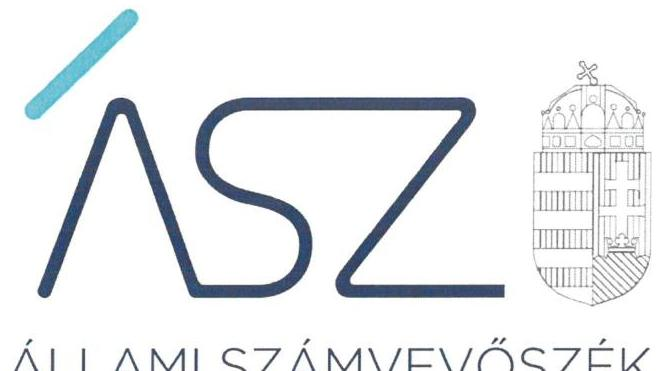
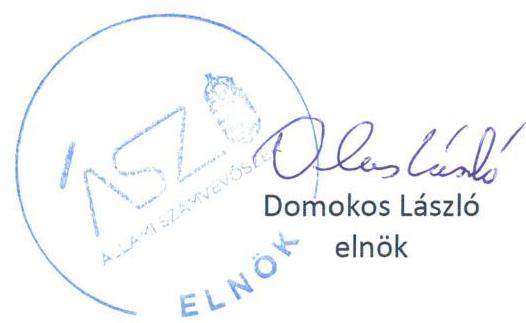

ÁLLAMI SZÁMVEVŐSZÉK

# JELENTÉS 

A költségvetési támogatásban részesülő pártalapítványok 2019-2020. évi gazdálkodása törvényességének ellenőrzése

Megújuló Magyarországért Alapítvány
2022.

22022
www.asz.hu

---

# JELENTÉS

A költségvetési támogatásban részesülő pártalapítványok 2019-2020. évi gazdálkodása törvényességének ellenőrzése

Megújuló Magyarországért Alapítvány

2022. 06. hó 14. nap

22022
www.asz.hu

---

# AZ ELLENŐRZÉST FELÜGYELTE: 

DR. BENEDEK MÁRIA felügyeleti vezető

## AZ ELLENŐRZÉST VEZETTE ÉS A VÉGREHAJTÁSÁÉRT FELELŐS:

DR. NAGY JUDIT ellenőrzésvezető
JANIK JÓZSEF LÁSZLÓ ellenőrzésvezető

## A PROGRAM ÖSSZEÁLLÍTÁSÁÉRT FELELŐS:

DR. KÁDÁR KRISZTA projektvezető

## A TÉMÁHOZ KAPCSOLÓDÓ KORÁBBI SZÁMVEVŐSZÉKI JELENTÉSEK:

- címe: Jelentés - A költségvetési támogatásban részesülő pártalapítványok 2017-2018. évi gazdálkodása törvényességének ellenőrzése Megújuló Magyarországért Alapítvány
- sorszáma: 20171

IKTATÓSZÁM: EL-3648-001/2022.
TÉMASZÁM: 2581
ELLENŐRZÉS-AZONOSÍTÓ SZÁM: V092404

---

# TARTALOMJEGYZÉK 

■ ÖSSZEGZÉS ..... 5
■ AZ ELLENŐRZÉS CÉLJA ..... 7
■ AZ ELLENŐRZÉS TERÜLETE ..... 8
■ AZ ELLENŐRZÉS HÁTTERE, INDOKOLTSÁGA ..... 9
■ A JELENTÉS LÉNYEGES KÉRDÉSKÖREI ..... 10
■ AZ ELLENŐRZÉS HATÓKÖRE ÉS MÓDSZEREI ..... 11
■ MEGÁLLAPÍTÁSOK ..... 14
■ JAVASLATOK ..... 17
■ MELLÉKLETEK ..... 19
I. sz. melléklet: Értelmező szótár ..... 19
II. sz. melléklet: Az ÁSZ 20171 számú jelentéséhez kapcsolódó intézkedési terv végrehajtásáról ..... 20
■ FÜGGELÉK: ÉSZREVÉTELEK ..... 23
■ RÖVIDÍTÉSEK JEGYZÉKE ..... 25

---

.

---

# ÖSSZEGZÉS 

A Megújuló Magyarországért Alapítvány a 2019-2020. években nem tett eleget az Alaptörvényben és a Pártalapítványi törvényben előírt alapvető követelményeknek, gazdálkodása nem volt átlátható.
A Megújuló Magyarországért Alapítvány az általa nyújtott támogatások elszámolása során egyik ellenőrzött évben sem teljesítette a törvényi követelményeket. Emiatt a 2019-2020. években az éves beszámolói nem voltak megalapozottak.

## Az ellenőrzés társadalmi indokoltsága

A politikai kultúra fejlesztése érdekében tudományos, ismeretterjesztő, kutatási és oktatási tevékenységük elősegítésére költségvetési támogatásra jogosult alapítványt hozhatnak létre a pártok.

A pártok működését segítő tudományos, ismeretterjesztő, kutatási, oktatási tevékenységet végző alapítványokról szóló törvény (Pártalapítványi törvény), valamint a pártok működéséről és gazdálkodásáról szóló törvény (Párt törvény) állapítja meg a pártalapítványok gazdálkodására, a költségvetési támogatásra vonatkozó szabályokat. A Pártalapítványi törvény szerint a pártalapítványok a professzionális politika olyan szellemi bázisaiként működnek, amelyek tudományos tevékenységükkel, kutatómunkájukkal, a politikai gyakorlat számára készített javaslataikkal nemcsak egy-egy párt, de a törvényhozás és a végrehajtás egészének jobb, hatékonyabb, a közjót fokozottabban szolgáló működéséhez járulnak hozzá. A pártok mellett létrehozott alapítványok, a pártok társadalmi fontosságának széles körben történő bemutatásával az állampolgári tájékoztatást, ismeretterjesztést, oktatást hívatottak szolgálni.

Magyarország Alaptörvénye szerint a központi költségvetésből csak olyan szervezet részére nyújtható támogatás, amelynek a támogatás felhasználására irányuló tevékenysége átlátható. Ezáltal a pártalapítványok működésének és költségvetési támogatásának alapja, hogy gazdálkodásuk törvényes és átlátható legyen.

A pártalapítványoknak évente be kell számolniuk a törvényi keretek szerinti gazdálkodásról. Törvényi előírás alapján az Állami Számvevőszék a költségvetési támogatásban részesült pártalapítványok gazdálkodását kétévente ellenőrzi. A pártalapítványok pénzügyi beszámolása alapján az ellenőrzés visszajelzést ad arról, hogy a pártalapítványok eleget tettek-e az Alaptörvényben és a Pártalapítványi törvényben a pártalapítványként előírt alapvető követelményeknek, gazdálkodásuk törvényes és átlátható volt-e.

## Összegző értékelés, javaslat

A Megújuló Magyarországért Alapítvány gazdálkodásával kapcsolatos könyvvezetési-, nyilvántartási rendszerének, a számviteli kereteknek a kialakítása 2020. október 29-ig nem felelt meg a jogszabályi előírásoknak. A Számv. tv. előírásai szerinti számlarend biztosításával a törvényes gazdálkodás alapvető kereteit 2020. október 30-tól alakította ki.

A Megújuló Magyarországért Alapítvány a kiadásainak elszámolása területén az általa nyújtott támogatásokra vonatkozó, a törvény által előírt elszámolási kötelezettségének a 2019-2020. években nem tett eleget, ugyanis a számviteli nyilvántartásaiba nem a törvényi előírások szerinti bizonylatok alapján jegyzett be adatokat. Ezáltal a könyvvezetés adatainak valódiságát a bizonylatok nem támasztották alá.

A tevékenységéről szóló éves jelentési-, beszámolási- és közzétételi kötelezettségének 2019-2020. években a jogszabályi előírások szerinti határidőre eleget tett, azonban a könyvvezetésében feltárt szabálytalanságok miatt a 2019. és a 2020. évi egyszerűsített éves beszámolói nem voltak megalapozottak, nem biztosították a Megújuló Magyarországért Alapítvány gazdálkodásának átláthatóságát.

A Megújuló Magyarországért Alapítvány a 2017-2018. évi gazdálkodás törvényességének ellenőrzéséről szóló 20171. számú számvevőszéki jelentés megállapításai alapján készített intézkedési tervben meghatározott feladatokból a határidőben végrehajtott intézkedésekkel megteremtette a törvényes gazdálkodás alapvető kereteit, a

---

megalapozott éves számviteli beszámoló készítésének alapfeltételeit. Nem intézkedett a könyvviteli nyilvántartások fokozott ellenőrzéséről, az egyes gazdálkodási funkciókat ellátó személyek feladatainak szétválasztásáról, valamint az SZMSZ módosításáról a beszámolót alátámasztó leltár ellenőrzése területén.

A Megújuló Magyarországért Alapítvány a végre nem hajtott intézkedések miatt fennmaradt kockázatok felszámolására az Állami Számvevőszék felhívására tervezett intézkedésekről adott tájékoztatást, amelyek végrehajtása hozzájárulhat az átlátható gazdálkodás feltételeinek érvényesüléséhez.

Az Állami Számvevőszék a megállapítások alapján a Megújuló Magyarországért Alapítvány elnökének 1 javaslatot fogalmazott meg.

# Következtetések 

Az Állami Számvevőszék a Megújuló Magyarországért Alapítvány gazdálkodásának törvényességét korábban több alkalommal ellenőrizte. A 2019-2020. évekre vonatkozó jelen ellenőrzés visszatérő szabálytalanságként azonosította, hogy a Megújuló Magyarországért Alapítvány könyvvezetése, éves beszámolóinak megalapozottsága nem felelt meg a törvényi előírásoknak. Ezáltal a Megújuló Magyarországért Alapítvány nem biztosította a törvényes és átlátható, a közpénzekkel való felelős gazdálkodást, a közpénzek felhasználásának elszámoltathatóságát az állampolgárok felé.

A Megújuló Magyarországért Alapítvány könyvvezetésében azonosított visszatérő szabálytalanságok arra mutatnak rá, hogy a Pártalapítvány nem gondoskodott a korábbi ellenőrzések során feltárt hiányosságok megszüntetéséről, annak ellenére, hogy ezt a Pártalapítvány az ellenőrzési megállapításokra készített intézkedési terveiben vállalta.

---

# AZ ELLENŐRZÉS CÉLJA 

AZ ELLENŐRZÉS CÉLJA, hogy az ÁSZ ${ }^{1}$ - mint az Országgyűlés legfőbb ellenőrző szerve - független és szakmailag megalapozott véleményt adjon a pártalapítványok, mint ellenőrzött szervezetek gazdálkodásának törvényességéről. Annak megállapítása, hogy a pártalapítvány törvényesen gazdálkodott-e, az éves számviteli beszámolók és a pártalapítvány tevékenységéről szóló éves jelentések a jogszabályi előírásoknak megfeleltek-e, a könyvvezetés és gazdálkodás során a vonatkozó jogszabályi rendelkezéseket és belső előírásokat betartották-e.

Az ellenőrzés célja továbbá annak értékelése, hogy az előző számvevőszéki jelentésben foglalt megállapításokkal összhangban készített intézkedési tervben meghatározott feladatokat az ellenőrzött szervezet végrehajtotta-e.

---

# AZ ELLENŐRZÉS TERÜLETE 

## Megújuló Magyarországért Alapítvány

Az ellenőrzés a Párt tv. ${ }^{2}$ alapján a politikai kultúra fejlesztése érdekében tudományos, ismeretterjesztő, kutatási, oktatási tevékenység folytatása céljából, a Ptk. ${ }^{3}$ szerinti létesítő/alapító okiraton alapuló bírósági nyilvántartásba vétellel létrejött pártalapítványok gazdálkodására terjedt ki. A pártalapítványok törvényes gazdálkodásának (könyvvezetése, beszámolása, jelentéstétele) szabályait alapvetően a Pártalapítványi tv. ${ }^{4}$-en túl, a Számv. tv ${ }^{5}$ és annak a végrehajtási rendelete a Számviteli vhr. ${ }^{6}$ határozzák meg.

A Megújuló Magyarországért Alapítványt a Párbeszéd Magyarországért Párt - a Párt tv.-ben és a Pártalapítványi tv.-ben biztosított lehetőséggel élve - 2014-ben alapította, 0,2 millió Ft induló vagyonnal.

Az Alapító okirat ${ }^{7}$ szerint a Pártalapítvány ${ }^{8}$ célja a politikai kultúra fejlesztése érdekében történő tudományos, ismeretterjesztő, kutatási és oktatási tevékenység volt. A Pártalapítvány legfőbb döntést hozó és kezelő szerve a hét taggal működő Kuratórium ${ }^{9}$ volt. Tevékenységét Felügyelő Bizottság ${ }^{10}$ ellenőrizte. Az Alapító okirat módosítására az ellenőrzött időszakban két alkalommal, székhely változás és a Kuratórium működési rendjének változása miatt került sor. Képviseletét harmadik személyekkel és hatóságokkal szemben a Kuratórium elnöke önállóan vagy a két kuratóriumi tag együttesen látta el. Egyszerűsített éves számviteli beszámolóját választott könyvvizsgáló nem ellenőrizte. Könyvelési és beszámoló készítési feladatait külső szervezet látta el.

A Megújuló Magyarországért Alapítvány a 2019. évben 27,4 millió Ft, a 2020. évben 27,5 millió Ft az ellenőrzött időszakban összesen 54,9 millió Ft költségvetési támogatásban, az Alapító ${ }^{11}$-tól pedig 2020-ban 1,1 millió Ft támogatásban részesült. A Pártalapítvány az ellenőrzött időszakban vállalkozási tevékenységet nem végzett, nem lett tagja más jogalanynak, nem alapított alapítványt és nem csatlakozott alapítványhoz. Az ellenőrzött időszakban törvényességi, illetve külső ellenőrzés lefolytatására nem került sor, a Pártalapítvány a Párt tv. előírásának megfelelően az alapító párt részére vagyoni hozzájárulást nem nyújtott.

Az ÁSZ a 2020. évben ellenőrizte a Pártalapítvány gazdálkodásának törvényességét. Az utóellenőrzés az ÁSZ tv. ${ }^{12}$ 2011. július 1-jei hatálybalépését követően a Pártalapítványnál a 2020. évben végzett ellenőrzés alapján készített 20171. sz. számvevőszéki jelentés ${ }^{13}$-ben foglalt megállapításokra készített intézkedési tervben foglaltak végrehajtásának ellenőrzésére terjedt ki.

---

# AZ ELLENŐRZÉS HÁTTERE, INDOKOLTSÁGA 

Társadalmi elvárás a közpénzek értékelvű, rendeltetésszerű felhasználása, a közpénzekből nyújtott támogatások átláthatóságának megteremtése, amelyhez az ÁSZ az államháztartásból nyújtott támogatások ellenőrzésével kíván hozzájárulni. A Párt tv. 9/A § (1) bekezdése alapján a politikai kultúra fejlesztése érdekében tudományos, ismeretterjesztő, kutatási, oktatási tevékenység folytatása céljából létrehozott pártalapítványok gazdálkodása törvényességének ellenőrzése - Pártalapítványi tv. 4. § (2) bekezdése értelmében - az ÁSZ feladata. E törvény 4. § (4) bekezdése alapján az ÁSZ kétévente - kötelező jelleggel - ellenőrzi azoknak a pártalapítványoknak a gazdálkodását, amelyek állami költségvetési támogatásban részesültek.

Az ÁSZ, mint az Országgyűlés ellenőrző szerve a pártalapítványok gazdálkodása törvényességének/szabályszerűségének értékelésével hozzájárul ahhoz, hogy a társadalom objektív képet alkothasson a pártalapítványok működéséről. Az ellenőrzés eredményeinek célzott felhasználói a nyilvánosság, a jogalkotó, továbbá a pártalapítványok esetén azok alapítója és szervei. A jelentésben foglalt megállapítások, következtetések és javaslatok alapján a törvényalkotók konkrét lépéseket tehetnek a pártalapítványokra vonatkozó szabályozások megváltoztatása, átláthatóbbá, ellenőrizhetőbbé tétele irányába. Az ellenőrzött szervezetek szintjén a hiányosságok, szabálytalanságok feltárása, az ennek kapcsán megfogalmazott megállapítások elősegíthetik a pártalapítványok szabályszerű gazdálkodását.

Az ÁSZ tv. 33. § (1) bekezdése értelmében az ellenőrzött szervezet vezetője köteles a jelentésben foglalt megállapításokhoz kapcsolódó intézkedési tervet összeállítani, és azt a jelentés kézhezvételétől számított harminc napon belül az Állami Számvevőszék részére megküldeni.

Az ÁSZ által befogadott intézkedési tervben foglaltak megvalósítását az ÁSZ tv. 33. § (7) bekezdésében foglaltak alapján - az ÁSZ utóellenőrzés keretében ellenőrizheti. Az utóellenőrzések keretében - az intézkedések értékelése során - az ÁSZ figyelembe veszi az ellenőrzött szervezetek működési feltételeiben, valamint a jogszabályi előírásokban bekövetkezett változásokat.

---

# A JELENTÉS LÉNYEGES KÉRDÉSKÖREI 

1.     - A Megújuló Magyarországért Alapítvány gazdálkodásának törvényessége biztosított volt-e?
2.     - A Megújuló Magyarországért Alapítvány könyvvezetése és gazdálkodása során a vonatkozó jogszabályi rendelkezéseket és belső előírásokat betartották-e?
3.     - A Megújuló Magyarországért Alapítvány tevékenységéről szóló éves jelentések, az éves számviteli beszámolók a jogszabályi előírásoknak megfeleltek-e?
4.     - A Megújuló Magyarországért Alapítvány az intézkedési tervben meghatározott feladatokat végrehajtotta-e?

---

# AZ ELLENŐRZÉS HATÓKÖRE ÉS MÓDSZEREI 

## Az ellenőrzés típusa

Szabályszerűségi ellenőrzés.

## Az ellenőrzött időszak

2019-2020. évek, amely kiterjedhet az ellenőrzés megkezdéséig. Továbbá az utóellenőrzés alapját képező ÁSZ jelentés közzétételének napjától jelen ellenőrzésről szóló kiértesítő levél keltének napjáig tartó időszak.

## Az ellenőrzés tárgya

Az ellenőrzés tárgyát képezi a pártalapítvány gazdálkodása, a könyvvezetés szabályozása és gyakorlata szabályszerűsége, az éves számviteli beszámolókra és az alapítvány tevékenységéről szóló éves jelentésekre vonatkozó kötelezettség teljesítése, valamint a gazdálkodáshoz kapcsolódó ellenőrzések javaslatainak hasznosítására irányuló tevékenység.

Az ÁSZ tv. 2011. július 1-jei hatálybalépését követően a számvevőszéki jelentésben foglalt megállapításokhoz kapcsolódó, a pártalapítvány által készített intézkedési tervben foglaltak végrehajtásának ellenőrzése.

Az ellenőrzés kiterjed minden olyan körülményre és adatra, amely az ÁSZ jogszabályban meghatározott feladatainak teljesítéséhez, valamint a
 program végrehajtása folyamán felmerült újabb összefüggések feltárásához szükséges.

## Az ellenőrzött szervezet

Megújuló Magyarországért Alapítvány

## Az ellenőrzés jogalapja

Az ÁSZ tv. 1. § (3) bekezdése, 5. § (3) bekezdése, 33. § (7) bekezdése, a Pártalapítványi tv. 4. § (2) és (4) bekezdései.

## Az ellenőrzés módszerei

Az ellenőrzést az Ellenőrzési program szempontjai, az ellenőrzött időszakban hatályos jogszabályok, a jelen ellenőrzésre irányadó ÁSZ módszertan figyelembevételével kell elvégezni.

---

Az ellenőrzés ideje alatt az ellenőrzött szervezettel történő kapcsolattartás az ÁSZ SZMSZ ${ }^{14}$-ének vonatkozó előírásai alapján történik.

Az ellenőrzést az ellenőrzött szervezetek által rendelkezésre bocsátott dokumentumokra, adatokra kell alapozni. A rendelkezésre bocsátott adatok, információk kontrollja az ellenőrzés keretében történik. Az ellenőrzés céljának eléréséhez szükséges bizonyítékokat a számvevő az egyes adatok közvetlen, részletes elemzésével szerzi meg, a következő ellenőrzési eljárások alkalmazásával: megfigyelés, szemrevételezés, információkérés, megerősítés, mintavétel, valamint elemző eljárás. Az ellenőrzésvezető indoklással kezdeményezheti a helyszínen végrehajtott szemrevételezést.

Az ÁSZ a tételes ellenőrzés mellett statisztikai alapú mintavételezést és értékelést alkalmaz. Az alapítvány alapcélon túli kiadásai, ráfordításai elszámolásának, az alapítvány által nyújtott támogatások elszámolásának, valamint az alapítvány éves számviteli beszámolóinál a mérlegtételek besorolása, év végi értékelése szabályszerűségének, azok leltárral való alátámasztottságának értékelése érték szerint rétegzett mintavétellel történt. A minta tételeinek értékelése „szabályszerű", ha a minta ellenőrzésének eredménye alapján 95%-os bizonyossággal a teljes sokaságban az átlagos hibaarány nem haladja meg a 10%-ot, „nem szabályszerű", ha nagyobb, mint 10%. Abban az esetben, ha a teljes sokaság tekintetében a 10%-os hibaarányhoz való viszony megítélésének megbízhatósága nem éri el a 95%-ot, annak elérése érdekében az értékelés további szempontokkal egészül ki, a feltárt hibák értéke is figyelembevételre kerül. Amennyiben a sokaság elemszáma nem haladja meg az előírt minta elemszámot, akkor a sokaság valamennyi elemének tételes ellenőrzésére került sor.

Az ellenőrzési bizonyítékként felhasználható adatforrások közé tartoznak egyrészt az Ellenőrzési program részletes szempontjainál felsorolt adatforrások, másrészt minden egyéb - az ellenőrzés folyamán - feltárt, az ellenőrzés szempontjából információt tartalmazó dokumentum.

Az ellenőrzés lefolytatásához az ellenőrzött a tanúsítványok elektronikus kitöltésével, valamint az ÁSZ által kért dokumentumok elektronikus megküldésével szolgáltat adatokat. Az így rendelkezésre bocsátott adatok, információk, a tanúsítványok adatai valódiságának kontrollja az ellenőrzés keretében történik.

Az utóellenőrzés megállapításait az ÁSZ rendelkezésére álló dokumentumok, valamint az ÁSZ adatbekérése szerint, az ellenőrzött szervezetek által elektronikusan rendelkezésre bocsátott dokumentumok, adatok alapján kell megfogalmazni, amely indokolt esetben kiegészülhet az ellenőrzött szervezet székhelyén történő adatbetekintéssel, helyszínen végrehajtott ellenőrzéssel is. Az ellenőrzés esetében az intézkedési tervekben előírt feladatokat, azok végrehajtása, illetve végrehajtása szempontjából az alábbiak szerint kell értékelni:
„határidőben végrehajtott" a feladat, ha a teljesítés dokumentáltan, az intézkedési tervben előírt határidőben és tartalommal megtörtént;
„határidőn túl végrehajtott" a feladat, ha annak teljesítése az intézkedési tervben meghatározott módon, de az abban előírt határidőn túl történt meg;
„nem végrehajtott" a feladat, ha a végrehajtás nem történt meg, vagy amennyiben a teljesítést/végrehajtást nem dokumentálják, dokumentumokkal nem tudják igazolni annak teljesítését;

---

$\longrightarrow$ „okafogyottá vált" a feladat, ha végrehajtására - meghatározott esemény bekövetkezése, továbbá külső körülmény, a működést érintő feltétel változása miatt - már nincs szükség, illetve lehetőség, és egyértelműen megállapítható, hogy az intézkedést szükségessé tevő körülmény a jövőben nem fordulhat elő;
$\longrightarrow$ „nem időszerű" az a feladat, amelynek ellenőrzési időszakon belül végrehajtására azért nem került sor (kerülhetett) sor, mert az intézkedés alapjául szolgáló esemény nem következett be, de annak a jövőbeni előfordulása lehetséges, a végrehajtása nem volt esedékes, vagy a végrehajtása határideje még nem járt le.

---

# 1. A Megújuló Magyarországért Alapítvány gazdálkodásának törvényessége biztosított volt-e? 

Összegző megállapítás

A Megújuló Magyarországért Alapítvány törvényes gazdálkodásának alapvető szabályozási feltételeit a 2019. évben és 2020. január 1-jétől 2020. október 29-ig nem biztosította, 2020. október 30-tól biztosította.

A Pártalapítvány gazdálkodása szervezeti kereteinek kialakítása megfelelt a jogszabályi előírásoknak.

A Pártalapítvány kialakította a Számv. tv.-ben előírt számviteli politikáját, annak keretében elkészítette az eszközök és a források leltárkészítési és leltározási szabályzatát, az eszközök és a források értékelési szabályzatát, a pénzkezelési szabályzatát. A Pártalapítvány gazdálkodásával kapcsolatos könyvvezetési-, nyilvántartási rendszerének, a számviteli kereteknek, szabályzatainak kialakítása 2020. október 29-ig nem felelt meg a jogszabályi előírásoknak, mert nem rendelkezett a Számv. tv. előírásai szerinti számlarenddel. A Pártalapítvány gazdálkodásának törvényessége 2020. október 30-tól a Számv. tv. 161. § (1)-(2) bekezdésében előírtaknak megfelelő számlarend hatályba lépésével biztosított volt.

## 2. A Megújuló Magyarországért Alapítvány könyvvezetése és gazdálkodása során a vonatkozó jogszabályi rendelkezéseket és belső előírásokat betartották-e?

Összegző megállapítás

A Megújuló Magyarországért Alapítvány könyvvezetése és gazdálkodása során a vonatkozó jogszabályi rendelkezéseket és belső előírásokat 2019-ben nem tartotta be, 2020-ban az által nyújtott támogatások elszámolása kivételével betartotta.

A Pártalapítvány kiadásainak elszámolása 2019-ben nem volt szabályszerű mivel:
$\longrightarrow$ A Kuratórium elnöki feladatainak ellátására vonatkozó megbízási szerződés alapján történt kifizetések könyvviteli elszámolását közvetlenül alátámasztó bizonylatok a Számv. tv. 167. § (1) bekezdés c) pontjában előírtak ellenére nem tartalmazták az utalványozó és a rendelkezés végrehajtását igazoló személy, valamint az ellenőr aláírását.
A Pártalapítvány kiadásainak elszámolása 2020-ban szabályszerű volt.

---

A Pártalapítványnál a támogatások elfogadása, felhasználása és elszámolása a 2019-2020. években szabályszerű volt. A Pártalapítványnál az ellenőrzött években a központi költségvetésből, belföldi magánszemélyektől, illetve 2020-ban az Alapítótól kapott támogatási forrásból finanszírozott kiadások nyilvántartása megfelelt a jogszabályok és belső szabályzatok előírásainak.

A Kuratórium döntése szerinti támogatási célok összhangban voltak a jogszabályi előírásokon alapuló, Alapító okiratban meghatározott célokkal.

A Pártalapítvány által nyújtott támogatások elszámolása a 2019-2020. években nem volt szabályszerű, mivel:
$\longrightarrow$ A támogatási szerződések alapján történt kifizetések könyvviteli elszámolását közvetlenül alátámasztó bizonylatok 2019-ben és 2020-ban a Számv. tv. 167. § (1) bekezdés c) pontjában előírtak ellenére nem tartalmazták az utalványozó és a rendelkezés végrehajtását igazoló személy, valamint az ellenőr aláírását.
Emiatt a bizonylatok nem feleltek meg a bizonylat általános alaki és tartalmi követelményeinek, a Pártalapítvány nem tartotta be a Számv. tv. 165. § (2) bekezdésében előírtakat, amely szerint a számviteli (könyvviteli) nyilvántartásokba csak szabályszerűen kiállított bizonylat alapján szabad adatokat bejegyezni.

# 3. A Megújuló Magyarországért Alapítvány tevékenységéről szóló éves jelentések, az éves számviteli beszámolók a jogszabályi előírásoknak megfeleltek-e? 

Összegző megállapítás

A Megújuló Magyarországért Alapítvány tevékenységéről szóló éves jelentések, az egyszerűsített éves számviteli beszámolók a 2019-2020. években az általa nyújtott támogatások elszámolása, valamint a 2019. évben a kiadások elszámolása kivételével megfeleltek a jogszabályi előírásoknak.

A Pártalapítvány a 2019. évi és 2020. évi tevékenységéről szóló éves jelentéseit és egyszerűsített éves számviteli beszámolóit a Számv. tv.-ben foglalt határidőig a Kuratórium elfogadta, azokat a Pártalapítvány a jogszabályi előírások szerinti formában és határidőben letétbe helyezte és közzétette, azonban a 2. pontban részletezettek alapján nem a jogszabályi előírások szerinti tartalommal készítette el.

A Pártalapítvány nyilvántartásaiban eleget tett a költségvetési támogatások szétválasztási, elkülönített nyilvántartási kötelezettségének.

A Kuratórium döntése szerinti támogatási célok összhangban voltak a jogszabályi előírásokon alapuló, Alapító okiratban meghatározott célokkal.

---

# 4. A Megújuló Magyarországért Alapítvány az intézkedési tervben meghatározott feladatokat végrehajtotta-e? 

Összegző megállapítás

A Megújuló Magyarországért Alapítvány a 20171. sz. számvevőszéki jelentésben foglalt, intézkedést igénylő megállapítások alapján készített intézkedési tervben meghatározott feladatok közül 14 feladatot határidőben hajtott végre, 4 feladatot nem hajtott végre.

A Pártalapítvány a 2017-2018. évi gazdálkodása törvényességének ellenőrzéséről készült 20171. számú jelentés megállapításai alapján készített intézkedési terv és annak kiegészítése összesen 18 intézkedést tartalmazott, amelyből 14 feladatot határidőben végrehajtott, 4 feladatot nem hajtott végre.

A Pártalapítvány az Alapító okiratát, belső szabályzatait, számviteli gyakorlatát a jogszabályi előírások szerint módosította és gondoskodott az éves számviteli beszámolók mérlegtételeinek alátámasztásához a Számv. tv. előírásai szerinti leltár összeállításáról. Ezzel megteremtette a gazdálkodása törvényessége kereteit, a megalapozott éves számviteli beszámoló készítésének feltételeit.

A Pártalapítvány nem hajtotta végre a könyvviteli nyilvántartások fokozott ellenőrzésére, az egyes gazdálkodási funkciókat ellátó személyek feladatainak szétválasztására, valamint az SZMSZ módosítására - annak érdekében, hogy előírja a Kuratórium számára a Felügyelő Bizottság ellenőrzése mellett az éves beszámolót alátámasztó leltárnak az ellenőrzését - vonatkozó intézkedéseket. Ezért gazdálkodásában fennmaradtak a hiányos kontrollból fakadó kockázatok.

Az intézkedési tervben meghatározott feladatokat, határidőket, felelősöket és a feladatok végrehajtását a II. sz. melléklet tartalmazza.

---

# JAVASLATOK 

Az ÁSZ tv. 33. § (1) bekezdésében foglaltak értelmében az ellenőrzött szervezet vezetője köteles a jelentésben foglalt megállapításokhoz kapcsolódó intézkedési tervet összeállítani és azt a jelentés kézhezvételétől számított 30 napon belül az ÁSZ részére megküldeni. Amennyiben az ellenőrzött szervezet vezetője nem küldi meg határidőben az intézkedési tervet, vagy továbbra sem elfogadható intézkedési tervet küld, az Állami Számvevőszék elnöke az ÁSZ tv. 33. § (3) bekezdés a) és b) pontjaiban foglaltakat érvényesítheti.

## Megújuló Magyarországért Alapítvány kuratóriumi elnökének

1. Intézkedjen a jövőben a jogszabályi előírás szerint a támogatási szerződések alapján történt kifizetések könyvviteli elszámolását közvetlenül alátámasztó bizonylatokon az utalványozó és a rendelkezés végrehajtását igazoló személy, valamint az ellenőr aláírásának feltüntetéséről
(2. sz. megállapítás 5. bekezdés 1. francia bekezdése alapján)

---

.

---

# MELLÉKLETEK 

- I. SZ. MELLÉKLET: ÉRTELMEZŐ SZÓTÁR
alapítvány
adomány
gazdálkodó tevékenység gazdasági-vállalkozási tevékenység
költségvetésből juttatott/nyújtott forrás/támogatás
pártalapítvány
támogatást nyújtó személy
törzsvagyon

Az alapítvány az alapító által az alapító okiratban meghatározott tartós cél folyamatos megvalósítására létrehozott jogi személy. Az alapító az alapító okiratban meghatározza az alapítványnak juttatott vagyont és az alapítvány szervezetét. Alapítvány nem alapítható gazdasági-vállalkozási tevékenység folytatására. Az alapítvány az alapítványi cél megvalósításával közvetlenül összefüggő gazdasági tevékenység végzésére jogosult. Alapítvány nem lehet korlátlan felelősségű tagja más jogalanynak, nem létesíthet alapítványt és nem csatlakozhat alapítványhoz. (Forrás: Ptk. 3:378. §, 3:379. § (1) - (3) bekezdés) a civil szervezetnek - létesítő/alapító okiratban rögzített céljaira - ellenszolgáltatás nélkül juttatott eszköz, illetve nyújtott szolgáltatás (Forrás: Ectv ${ }^{15}$. 2. § 1. pont.) azon tevékenységek összessége, amelyek a civil szervezet vagyoni, pénzügyi, jövedelmi helyzetére kiható gazdasági eseményt eredményeznek. (Forrás: Ectv. 2. § 10. pont.) A jövedelem- és vagyonszerzésre irányuló vagy azt eredményező, üzletszerűen végzett gazdasági tevékenység, kivéve az adomány (ajándék) elfogadását, a létesítő okiratban meghatározott cél szerinti tevékenységet (ideértve a közhasznú tevékenységet is), - 2015. november 28-tól - a pénzeszközök betétbe, értékpapírba, társasági részesedésbe történő elhelyezését és az ingatlan megszerzését, használatának átengedését és átruházását. (Forrás: Ectv. 2. § 11. pont.)
a pártalapítványoknak a Párt tv. 9/A. § (1) bekezdése és a Pártalapítványi tv. 1. § előírásainak értelmében, az éves költségvetési törvények szerint - jellemzően az 1. számú melléklet I. Országgyűlés fejezet 9. Pártalapítványok támogatás címen - az állami költségvetésből juttatott forrás/támogatás.
az államháztartás központi alrendszeréből - a Tb alap kivételével - ellenérték nélkül, pénzben nyújtott költségvetési támogatás (Forrás: Áht ${ }^{16}$. 1. § 14. pont)
a politikai kultúra fejlesztése érdekében, tudományos, ismeretterjesztő, kutatási és oktatási tevékenység folytatása céljából pártok által létrehozott, külön jogszabályban - a Pártalapítványi tv. 1. § és 3. § (1)
 bekezdése - meghatározott, jogi személynek minősülő egyéb szervezet, speciális jogállású alapítvány (Forrás: Párt tv. 9/A. § (1) bekezdés, Pártalapítványi tv. 1. §, Ectv. 1. § (2) bekezdés, 2. § 6. c) pont, Számv. tv. 3. § (1) bekezdése 4. pont, Számviteli vhr. 2. § (1) bekezdés I) pont)
egyértelműen azonosítható - természetes, vagy jogi - személy. (Forrás: Pártalapítványi tv. 3. § (3) (4) bekezdése)
az induló tőke, megnövelve alapítvány esetében a csatlakozók által kifejezetten az induló tőke növelése érdekében rendelkezésre bocsátott vagyonnal (Forrás: Ectv. 2. § 28. pont)

---

II. SZ. MELLÉKLET: AZ ÁSZ 20171 SZÁMÚ JELENTÉSÉHEZ KAPCSOLÓDÓ INTÉZKEDÉSI TERV VÉGREHAJTÁSÁRÓL

|  | Intézkedési terv alapján meghatározott feladat | Az intézkedési tervben meghatározott határidő | Az intézkedési tervben meghatározott feladat felelőse | A feladat végrehajtása |
| :--: | :--: | :--: | :--: | :--: |
| 1. | Az Alapítvány 2020. október 31. napjáig módosítja a Számlarendjét (Számlatükör) úgy, hogy az tartalmazza a számlák értéke növekedésének, csökkenésének jogcímeit, a számlákat érintő gazdasági eseményeket, azok más számlákkal való kapcsolatát, a főkönyvi számlák és az analitikus nyilvántartás kapcsolatát, továbbá a számlarendben foglaltakat alátámasztó bizonylati rendet. | 2020. október 31. | Kuratórium elnöke | A Pártalapítvány a Számlarendet és a Bizonylati rendet 2020. október 30-án a Kuratórium 5/2020.10.30. számú határozatával módosította. A módosított Számlarend tartalmazza a vállalt intézkedésben foglaltakat. |
| 2. | Az Alapítvány a jövőben kizárólag a munkaszerződésben rögzített munkabért számfejti és utalja el a munkavállalónak. | 2020. október 31. | Kuratórium elnöke | A 2020. évi kiadási mintatételek alátámasztják, hogy a jogszabálysértő gyakorlatot 2020-tól megszüntették: 2020-ban a bérszámfejtés a munkaszerződésben megállapított összegben teljesült. |
| 3. | Az Alapítvány módosítja a vonatkozó szabályzatait úgy, hogy tartalmazza az utalványozó és a rendelkezés végrehajtását igazoló személy aláírását és feltünteti az érintett könyviteli számlákra történő hivatkozást. | 2020. október 31. | Kuratórium elnöke | A Pártalapítvány a Bizonylati rendet 2020. október 30-án a Kuratórium 5/2020. 10. 30. számú határozatával módosította. A módosított Bizonylati rend előírja a bizonylat alaki és tartalmi kellékei között az utalványozó és a rendelkezés végrehajtását igazoló személy aláírását, valamint az érintett könyvviteli számlákra történő hivatkozást. |
| 4. | A gazdasági műveleteket elrendelő személy az Alapító Okirat és az alapdokumentumok alapján a Kuratórium elnöke. | 2020. december 30. | Kuratórium elnöke | A Pártalapítvány 2020. július 29-én módosított Alapító okirata tartalmazza, hogy a Kuratórium elnöke az Alapítványt önállóan képviseli. A 2020. október 30-án a Kuratórium 5/2020. 10. 30. számú határozatával módosított SZMSZ tartalmazza, hogy a Kuratórium elnökének a feladata a pénzügyi kötelezettségek vállalása. |
| 5. | Az utalványozó az Alapító Okirat és az alapdokumentumok alapján a Kuratórium elnöke (akadályoztatása esetén a Kuratórium 2 tagja). | 2020. december 30. | Kuratórium elnöke | A Pártalapítvány 2020. július 29-én módosított Alapító okirata tartalmazza, hogy a Kuratórium elnöke önállóan rendelkezik utalványozási joggal. A 2020. október 30-tól hatályos SZMSZ szerint utalványozási joggal a Kuratórium elnöke önállóan rendelkezik. |

---

| 6. | A számlákon a munkaszámok feltüntetéséről az Alapítvány adminisztrációja gondoskodik. | 2020. december 30. | Kuratórium elnöke | A 2019-2020. évi kiadási mintatételek az intézkedés végrehajtását alátámasztják, az ellenőrzött években a munkaszámot feltüntették a számlákon. |
| :--: | :--: | :--: | :--: | :--: |
| 7. | A számlákon a könyvelés módjára, az érintett könyvviteli számlákra történő hivatkozást az alapítvány könyvelési szolgáltatója vezeti fel. | 2020. december 30. | Kuratórium elnöke | A 2019-2020. évi kiadási mintatételek az intézkedés végrehajtását alátámasztják, az ellenőrzött években a számlákra az érintett könyvviteli számlákra való hivatkozást felvezették. |
| 8. | Az Alapítvány folytatja eddigi gyakorlatát, miszerint Alapítvány Excel formátumú éves költségvetési-tervének 1. számú melléklete a költségvetési támogatás felhasználása tekintetében költségnemenkénti bontásban, pénzforgalmi szemléletű kimutatást végez. | 2020. december 30. | Kuratórium elnöke | A Pártalapítvány a költségvetési támogatás felhasználásáról szóló kimutatást 2019. és a 2020. évre vonatkozóan elkészítette, azokat a 2019. és 2020. évi éves beszámoló kiegészítő melléklete tartalmazta. |
| 9. | Az Alapítvány az egyszerűsített éves beszámolói elkészítéséhez, a mérlegtételek alátámasztásához jövőben a Számv. tv. 69. §. (1) bekezdése szerinti leltárt készíti el a jelenleg is érvényben lévő Eszközök és források leltárkészítési és leltározási szabályzata szerint. | üzleti év végi zárás | az Alapítvány megbízott könyvelője | A Pártalapítvány a 2019. és 2020. évre vonatkozóan elkészítette a Számv. tv. 69. § (1) bekezdésének és a Leltárkészítési szabályzatának megfelelő leltárt, amely tételesen, ellenőrizhető módon tartalmazza az Pártalapítvány a mérleg fordulónapján meglévő eszközeit és forrásait, mennyiségben és értékben. |
| 10. | Az Alapítvány módosítja SZMSZ-ét a megállapításnak megfelelően. (Az intézkedés a korábban vállalt intézkedési terv előző ellenőrzésig nem végrehajtott feladatára vonatkozó megállapításhoz kapcsolódik, amely a következő: „A Pártalapítvány az alábbi intézkedési tervben vállalt feladatait nem hajtotta végre: a Pártalapítvány az SZMSZ-ét nem egészítette ki a tevékenységéről szóló éves jelentés határidőben történő közzététele érdekében.") | 2020. október 31. | az Alapítvány megbízott ügyvédje | A Pártalapítvány az SZMSZ-t 2020. október 30-án a Kuratórium 5/2020. 10. 30. számú határozatával módosította. A módosított SZMSZ tartalmazza, hogy az Alapítvány Kuratóriuma elnöke köteles a jelentését a tárgyévet követő évben, legkésőbb június 30-áig a Magyar Közlöny mellékleteként megjelenő Hivatalos Értesítőben, továbbá saját honlapján közzétenni, oly módon, hogy az Alapítvány Kuratóriuma a Felügyelőbizottság jelentésével egyidejűleg éves beszámolóját és jelentését minden év április 30. napjáig elfogadja és a meghirdetésről a Kuratórium elnöke május 30. napjáig gondoskodik. |
| 11. | Az Alapítvány Számlarendjét úgy módosítja, hogy az megfeleljen a Pártalapítványi tv. 3/A. §. (3) bekezdés b) pontjának, mely szerinti - a költségvetési támogatás felhasználására vonatkozó kimutatás adataival kapcsolatos - információk rendelkezésre álljanak. Ezért az Alapítvány áttér az ún. munkaszámos könyvelésre. | 2020. december 30. | a Kuratórium elnöke | A Pártalapítvány a Számlarendet 2020. október 30-án a Kuratórium 5/2020. 10. 30. számú határozatával módosította. A módosított Számlarend tartalmazza a munkaszámos könyvelés intézkedési tervben megfogalmazott szabályait. |

---

| 12. | Az Alapítvány gondoskodik arról a jövőben, hogy az elektronikus pénz formájában kapott adományokat a pénzeszközök között számolja el, illetve az egyéb pénzeszközöket érintő tételeket tárgyhó követő 15. napjáig rögzítse a könyvekben, megbízott könyvelője útján. | 2020. október 31. | az Alapítvány megbízott könyvelője | A 2019-2020. évi főkönyvi kartonok alapján megállapítható, hogy 2019-2020-ban az elektronikus pénz formájában kapott adományokat a 3842-es elszámolási betétszámlán pénzeszközként számolták el, és a könyvekben való rögzítés folyamatosan megtörtént. |
| :--: | :--: | :--: | :--: | :--: |
| 13. | Az Alapítvány 2020. évben és a következő években is a módosított szabályzatának megfelelően minden tárgyévet követően április 30-ig elfogadja éves beszámolóját és szöveges beszámolóját annak érdekében, hogy az minden év június 20. napjáig a Magyar Közlöny Hivatalos Mellékletében meghirdetésre kerüljön. | tárgyév április 30. és június 20. | a Kuratórium elnöke | A 2019. évi éves beszámolóját a Kuratórium 2020. április 28-i ülésén megtárgyalta és 2/2020/04. 28. számú határozatával elfogadta. A 2019. évi éves beszámoló a Magyar Közlöny 2020. június 11-i számában jelent meg.   A 2020. évi éves beszámolóját a Kuratórium 2020. április 29-i ülésén megtárgyalta és 3/2021. 04. 29. számú határozatával elfogadta. A 2020. évi éves beszámoló a Magyar Közlöny 2021. június 10-i számában jelent meg. |
| 14. | A kifizetés, teljesítés és a számla megfelelőséget ellenőrző személynek a Kuratórium munkavállalója kerül kinevezésre | 2020. december 30. | a Kuratórium elnöke | A munkavállaló munkaköri leírása kiegészítésre került, mely szerint a munkavállaló feladata 2020. 11. 01-től a kifizetés, a teljesítés és a számla megfelelőség ellenőrzése a Kuratórium elnökének ellenőrzése mellett. |
|  | Nem végrehajtott feladatok |  |  |  |
| 1. | Az Alapítvány 2018. évtől fokozottan ellenőrizte a könyviteli nyilvántartását, amit jelenleg is és a következő időszakban is ugyanilyen fokozottan ellenőriz, annak érdekében, hogy a jövőben gazdasági esemény számviteli bizonylat nélkül rögzítésre ne kerülhessen. | 2020. október 31. | a Kuratórium elnöke | Az intézkedés végrehajtását igazoló dokumentumot nem bocsátották az ellenőrzés rendelkezésére. |
| 2. | Az Alapítvány eddigi gyakorlata szerint a gazdasági műveletet elrendelő személynek, a teljesítést igazoló (rendelkezés végrehajtását igazoló) és utalványozó személynek a Kuratórium elnöke személyében tett összevonását megszűnteti. | 2020. december 30. | a Kuratórium elnöke | Az intézkedés végrehajtását igazoló dokumentumot nem bocsátották az ellenőrzés rendelkezésére. |
| 3. | A számlák teljesítésének (a rendelkezés végrehajtásának) igazolását az Alapítvány ügyvezető igazgatója látja el (akadályoztatása esetén a Kuratórium elnöke vagy annak 2 tagja). | 2020. december 30. | a Kuratórium elnöke | Az intézkedés végrehajtását igazoló dokumentumot nem bocsátották az ellenőrzés rendelkezésére. |
| 4. | Az Alapítvány az SZMSZ-ét oly módon módosítja, hogy előírja a Kuratórium számára - a Felügyelőbizottság ellenőrzése mellett - a beszámolót alátámasztó leltár ellenőrzését. | 2020. október 31. | az Alapítvány megbízott ügyvédje | A 2020. október 30-án módosított SZMSZ a vállalt intézkedést illetően nem tartalmaz rendelkezéseket, nem tartalmazza a Kuratórium feladataként a beszámolót alátámasztó leltár ellenőrzését. |

---

# FÜGGELÉK: ÉSZREVÉTELEK 

Az ellenőrzés megállapításait a Számvevőszék 15 napos észrevételezésre megküldte az ellenőrzött szervezet vezetőjének az ÁSZ tv. 29. § (1) bekezdése előírásának megfelelően.
Az ellenőrzött szervezet vezetője az ellenőrzés megállapításaira észrevételt tett. Az elfogadott észrevétel alapján a Számvevőszék módosította a jelentést.
A függelék tartalmazza az ellenőrzött észrevételeit, illetve az el nem fogadott észrevételek elutasításának indoklását.

A Pártalapítvány kuratóriumi elnöke 1. számú észrevételében a Pártalapítvány 2019. évi kiadásainak elszámolása szabályszerűségével kapcsolatos ellenőrzési megállapításra tett észrevételt.
A Pártalapítvány kuratóriumi elnöke az 1. számú észrevételében az ellenőrzés vonatkozó megállapítását nem vitatta, hanem az ellenőrzött időszakot, a 2019-2020. éveket megelőző, a 2017-2018. évi gazdálkodása törvényességének ellenőrzéséről készült 20171 számú számvevőszéki jelentés kézhezvételét követően a Pártalapítvány által tett intézkedésekről adott tájékoztatást a 2019. évi kiadások könyvviteli elszámolását alátámasztó bizonylatok tekintetében feltárt szabálytalanságokhoz kapcsolódóan.
Mindezek alapján az ellenőrzés megállapítása helytálló, módosítása nem indokolt.
A Pártalapítvány kuratóriumi elnöke a 2. számú észrevételében a Pártalapítvány által nyújtott támogatások elszámolása szabályszerűségével kapcsolatban tett észrevételt.
A Számv. tv. meghatározza a számviteli bizonylat fogalmát, amely szerint számviteli bizonylat többek között minden olyan a gazdálkodó által kiállított, készített okmány
 (számla, szerződés, megállapodás, kimutatás, bankkivonat), amely a gazdasági esemény számviteli elszámolását támasztja alá. A Számv.tv. meghatározza továbbá a könyvviteli elszámolást közvetlenül alátámasztó bizonylatok általános alaki és tartalmi kellékeit. Ezek közé tartozik, hogy a bizonylatnak tartalmaznia kell az utalványozó, a rendelkezés végrehajtását igazoló személy, és az ellenőr aláírását. A bizonylatok tartalmára vonatkozó előírások betartása azért elengedhetetlen, mert a törvény előírása szerint a könyvviteli nyilvántartásokba csak szabályszerűen kiállított bizonylat alapján szabad adatokat bejegyezni. A bizonylatokra vonatkozó előírások betartása a törvény szerinti megalapozott és valós összképet adó beszámoló alátámasztását biztosító szabályszerű könyvvezetés alapvető feltétele.
A Pártalapítvány kuratóriumi elnöke észrevételével érintett megállapítás a bizonylatokkal kapcsolatos fenti törvényi előírások betartására vonatkozik. A Pártalapítvány kuratóriumi elnöke észrevételében foglaltak megerősítették, hogy a Pártalapítvány által az ÁSZ ellenőrzés rendelkezésére bocsátott, a tárgyi gazdasági esemény (kifizetés) számviteli elszámolását alátámasztó támogatási szerződések a Számv. tv. előírása ellenére nem tartalmazták az utalványozó, a rendelkezés végrehajtását igazoló személy, és az ellenőr aláírását.
Mindezek alapján az ÁSZ az észrevételt nem veszi figyelembe, az ellenőrzés megállapításának módosítása nem indokolt.

[^0]
[^0]:    * 29. § (1) Az Állami Számvevőszék az ellenőrzési megállapításait megküldi az ellenőrzött szervezet vezetőjének vagy az általa megbízott személynek, és annak, akinek személyes felelősségét állapította meg.
    (2) Az ellenőrzött szervezet vezetője és a felelősként megjelölt személy az ellenőrzés megállapításaira tizenöt napon belül írásban észrevételt tehet.
    (3) Az Állami Számvevőszék az észrevételre a beérkezésétől számított harminc napon belül írásban válaszol. A figyelembe nem vett észrevételeket köteles a jelentésben feltüntetni, és megindokolni, hogy azokat miért nem fogadta el.

---

# A Pártalapítvány Kuratóriumi elnöke a 3. számú észrevételében a Pártalapítvány intézkedési tervében meghatározott feladatok végrehajtásával kapcsolatban tett észrevételt. 

Az ellenőrzés rendelkezésére bocsátott dokumentumok nem igazolták a Pártalapítvány könyvviteli nyilvántartásának fokozott ellenőrizését, annak érdekében, hogy a jövőben gazdasági esemény számviteli bizonylat nélkül rögzítésre ne kerülhessen. A Pártalapítvány kuratóriumi elnöke észrevételében jelzett körülmény a múltra vonatkozik, mivel az ÁSZ rendelkezésére bocsátott ellenőrzési jegyzőkönyvben foglaltak alapján a már kifizetett számlákat ellenőrzi a könyvviteli nyilvántartásban a Felügyelőbizottság, így az ellenőrzési megállapítást nem érinti.
A Pártalapítvány által az ÁSZ ellenőrzés rendelkezésére bocsátott 2020. október 30. napjától hatályos SZMSZ-ben foglaltak alapján az ellenőrzés feltárta, hogy a Kuratórium elnöke utalványozási joggal önállóan rendelkezik és a Pártalapítvány képviseletében pénzügyi kötelezettségek vállalására, jogok érvényesítésére, kötelezettségek teljesítésére jogosult. Ezáltal az ellenőrzés rendelkezésére bocsátott dokumentumok azt igazolták, hogy a Pártalapítvány az eddigi gyakorlata szerinti, a gazdasági múveletet elrendelő személynek, a teljesítést igazoló (rendelkezés végrehajtását igazoló) és utalványozó személynek a Kuratórium elnöke személyében tett összevonását nem szüntette meg. Ezen túl az ellenőrzés rendelkezésére bocsátott dokumentumok nem igazolták a számlák teljesítése (a rendelkezés végrehajtásának) igazolásának a Pártalapítvány ügyvezető igazgatója (akadályoztatása esetén a Kuratórium elnöke vagy annak 2 tagja) által történő ellátását sem.
Az ellenőrzés rendelkezésére bocsátott dokumentumok nem igazolták a Pártalapítvány SZMSZ-ének oly módon történt módosítását, hogy előírta volna a Kuratórium számára - a Felügyelőbizottság ellenőrzése mellett - a beszámolót alátámasztó leltár ellenőrzését. Ezért a Pártalapítvány kuratóriumi elnöke által jelzett körülmény - amely szerint a leltározási okiratokat a Felügyelőbizottság elnöke, a leltározási bizottság tagjaként aláírta - nem azonos a Pártalapítvány SZMSZ-ének az intézkedési tervben vállaltak szerinti módosításával, így az ellenőrzési megállapítást nem érinti. Mindezek alapján az ÁSZ az észrevételeit nem veszi figyelembe, az ellenőrzés megállapításainak módosítása nem indokolt.
Az ellenőrzési dokumentumok felülvizsgálata során az ellenőrzés feltárta, hogy a Pártalapítvány az adatszolgáltatás során az ellenőrzés rendelkezésére bocsátotta a Pártalapítvány munkavállalójának 2020. október 30-i keltezésű munkaköri leírás módosítását, amelynek 1. számú melléklete tartalmazza a munkavállaló 2020. november 1-től ellátandó feladatai között a kifizetés, a teljesítés és a számla megfelelősége ellenőrzésének feladatát a Kuratórium elnökének ellenőrzése mellett.
Az észrevétel alapján az ÁSZ az ellenőrzési megállapítást módosítja.

---

# RÖVIDÍTÉSEK JEGYZÉKE 

${ }^{1}$ ÁSZ
${ }^{2}$ Párt tv.
${ }^{3}$ Ptk.
${ }^{4}$ Pártalapítványi tv.
${ }^{5}$ Számv. tv.
${ }^{6}$ Számviteli vhr.
${ }^{7}$ Alapító okirat
Alapító okirat ${ }_{1}$

Alapító okirat ${ }_{2}$
${ }^{8}$ Pártalapítvány
${ }^{9}$ Kuratórium
${ }^{10}$ Felügyelő Bizottság
${ }^{11}$ Alapító
${ }^{12}$ ÁSZ tv.
${ }^{13}$ 20171. számú számvevőszéki jelentés
${ }^{14}$ ÁSZ SZMSZ
${ }^{15}$ Ectv.
${ }^{16}$ Áht.

Állami Számvevőszék
1989. évi XXXIII. törvény a pártok működéséről és gazdálkodásáról (hatályos: 1989. október 30-tól)
2013. évi V. törvény a Polgári Törvénykönyvről (hatályos: 2014. március 15-től)
2003. évi XLVII. törvény a pártok működését segítő tudományos, ismeretterjesztő, kutatási, oktatási tevékenységet végző alapítványokról (hatályos: 2003. július 1-jétől)
2000. évi C. törvény a számvitelről (hatályos: 2001. január 1-jétől)
479/2016. (XII. 28.) Korm. rendelet a számviteli törvény szerinti egyes egyéb szervezetek beszámoló készítési és könyvvezetési kötelezettségének sajátosságairól (hatályos: 2017. január 1-jétől)

Megújuló Magyarországért Alapítvány Alapító okirata (hatályos: 2019. május 24-től);
Megújuló Magyarországért Alapítvány Alapító okirata (hatályos: 2020. július 29-től)
Megújuló Magyarországért Alapítvány
Megújuló Magyarországért Alapítvány Kuratórium
Megújuló Magyarországért Alapítvány Felügyelő Bizottság
Párbeszéd Magyarországért Párt
2011. évi LXVI. törvény az Állami Számvevőszékről (hatályos: 2011. július 1-jétől) „A költségvetési támogatásban részesülő pártalapítványok 2017-2018. évi gazdálkodása törvényességének ellenőrzése - Megújuló Magyarországért Alapítvány" címmel 2020. augusztus 17-én megjelent számvevőszéki jelentés
Állami Számvevőszék Szervezeti és Működési Szabályzata
2011. évi CLXXV. törvény az egyesülési jogról, a közhasznú jogállásról, valamint a civil szervezetek működéséről és támogatásáról
(hatályos: 2011. december 22-től)
2011. évi CXCV. törvény az államháztartásról (hatályos: 2011. december 31-től)

---

# ASZ 

ÁLLAMI SZÁMVEVŐSZÉK
1052 Budapest, Apáczai Cs. J. u. 10. I 1364 Budapest 4. Pf. 54
TEL: +36 14849100
email: szamvevoszek@asz.hu
web: www.asz.hu | www.aszhirportal.hu

