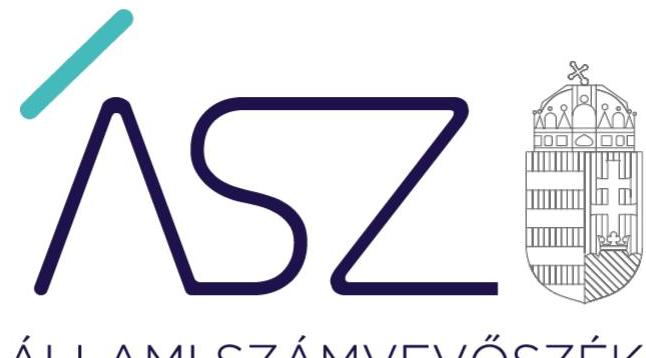
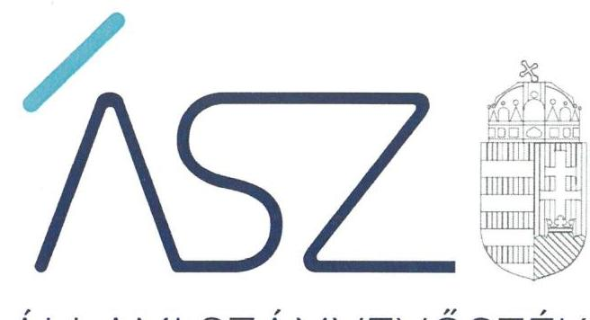

#  

## JELENTÉS

Nemzeti tulajdonú gazdasági társaságok ellenőrzése 23 gazdasági társaságnál

Teljesítmény-ellenőrzés
2022.

22023
www.asz.hu

---

ÁLLAMI SZÁMVEVŐSZÉK

# JELENTÉS 

Nemzeti tulajdonú gazdasági társaságok ellenőrzése 23 gazdasági társaságnál

Teljesítmény-ellenőrzés
2022. 06. hó 01. nap

22023
www.asz.hu

---

AZ ELLENŐRZÉST VEZETTE ÉS A VÉGREHAJTÁSÁÉRT FELELŐS:
TESKI NORBERT ellenőrzésvezető
SIPOSNÉ DŐCZI KLÁRA IBOLYA ellenőrzésvezető
A PROGRAM ÖSSZEÁLLÍTÁSÁÉRT FELELŐS:
HORVÁTH TÍMEA ellenőrzés tervezési projektvezető

IKTATÓSZÁM: EL-3654-001/2022.
TÉMASZÁM: 32/2
ELLENŐRZÉS-AZONOSÍTÓ SZÁM: V-0955

Jelentéseink az Országgyúlés számítógépes hálózatán és az interneten a www.asz.hu címen is olvashatóak.

---

# TARTALOMJEGYZÉK 

■ ÖSSZEGZÉS ..... 5
■ AZ ELLENŐRZÉS JELENTŐSÉGE, AKTUALITÁSA, TÁRSADALMI SZEREPE, SZEMPONTJAI ..... 7
■ AZ ELLENŐRZÉS TERÜLETE ..... 8
■ MELLÉKLETEK ..... 9
■ ELLENŐRZÉS HATÓKÖRE ÉS MÓDSZERE ..... 10
■ ESETTANULMÁNY ..... 12
■ ÉRTELMEZŐ SZÓTÁR ..... 15
■ FÜGGELÉKEK ..... 17
I. sz. függelék: Az ellenőrzött gazdasági társaságok listája ..... 17
■ RÖVIDÍTÉSEK JEGYZÉKE ..... 19

---

.

---

# ÖSSZEGZÉS 

Az ellenőrzött 23 gazdasági társaság a teljesítménycélok meghatározásával, azok mérésével, értékelésével támogatta a teljesítményelvű működés és gazdálkodás megvalósulását. A gazdasági társaságok gyakorlatában megjelent, a teljesítményértékelés elemeinek és a teljesítményösztönzés kereteinek kialakítása, a szervezeti célok elérését veszélyeztető kockázatok felmérése és azonosítása, valamint az eredmények nyomon követése.

## Értékelések

A nemzeti tulajdonban lévő gazdasági társaságok eredményes működése és gazdálkodása, az általuk kezelt közvagyon, valamint az ellátott közszolgáltatások minősége és hatásossága miatt kiemelten fontos az ország gazdasági teljesítménye szempontjából. A teljesítmény fejlesztését előtérbe helyező gazdasági társaságok hozzájárulnak a nemzeti vagyon értékének megőrzéséhez, továbbá növelik a beléjük vetett közbizalmat.

Egy szervezet egészét tekintve az eredményes működés és gazdálkodás érvényesülése ad motivációt. Amennyiben a gazdasági társaság nem tűz ki maga elé teljesítménycélokat, nem méri és értékeli a célok megvalósulását, úgy nem ösztönzi az eredmények elérését. Az eredményes közpénzfelhasználás követelményeinek érvényesülése érdekében az ellenőrzött 23 gazdasági társaság üzleti tervben, vagy egyéb módon meghatározta a 2020-ra vonatkozó szervezeti teljesítménycélokat, 17 gazdasági társaság emellett rövid-, közép és/vagy hosszútávú stratégiát is készített. 21 gazdasági társaság rendelkezett a tulajdonosi joggyakorló által megfogalmazott, a célokra vonatkozó elvárásokkal, amelyeket a gazdasági társaságok figyelembe vettek a szervezeti eredmények elérése érdekében. A teljesítménycélok teljesülését a gazdasági társaságok mérték, értékelték.

Az eredményesség, és az azokat befolyásoló tényezők egy szervezet esetében nem csak szervezeti szinten, hanem a szervezeti egységek, valamint az egyének szintjén is megjelennek. A szervezeti célok összekapcsolása az egyéni teljesítmények ösztönzésével és értékelésével azért erősítheti a gazdasági társaságok teljesítményét, mert egyértelművé teszi az egyes dolgozók számára, hogy mi a feladatuk, a felelősségük a szervezeti célok elérésében. A teljesítmény erősítése érdekében 22 gazdasági társaság esetében teljesítményértékelési és/vagy teljesítményösztönzési rendszer támogatta az eredményességet.

A kitűzött teljesítménycélok elérését olyan előre nem látható, akár véletlenszerűen is bekövetkezhető események is befolyásolhatják, amelyek kockázatot jelentenek a várható eredményekre. Ezen kockázatok felmérése, és bekövetkezései esélyeinek csökkentése támogatja a célok zökkenőmentesebb teljesülését. A teljesítményelvű feladatellátás érvényesítése érdekében 20 gazdasági társaság felmérte és azonosította a szervezeti célok elérését veszélyeztető, a folyamatokban rejlő kockázatokat.

A teljesítménycélok megvalósulásának nyomon követése gyors beavatkozásra ad lehetőséget a céloktól való eltérések azonosítása esetén. A beavatkozásokhoz kapcsolódó vezetői döntések meghozatalát a szükséges információ áramlásának biztosítása támogatja. Az eredmények megvalósulásának nyomon követése, illetve a kapcsolódó döntéshozatali tevékenység eredményessége érdekében 20 gazdasági társaság folytatott olyan monitoring tevékenységet, amely magában foglalta az eredményesség alakulásának nyomon követését és/vagy az adat-, információátadás, információáramlás módjának meghatározását.

## Következtetések

Az ellenőrzött gazdasági társaságok gondoskodtak a teljesítménykövetelmények érvényesítéséről. A tulajdonosi joggyakorlók szintjén stratégiaalkotási, tervezési, beszámolási tevékenységükkel támogatták a teljesítményelvű működést és gazdálkodást. Ügyvezetői szinten a célok mérése, értékelése, a szervezeti teljesítményértékelés és teljesítményösztönzés kereteinek kialakítása, a kockázatok felmérése és azonosítása, valamint az eredmények nyomon követése járult hozzá a szervezeti eredmények eléréséhez. A dolgozók szintjén a gazdasági társaságok meghatároztak

---

szervezeti egység szintű és egyéni teljesítménykövetelményeket, továbbá egyéni teljesítményértékeléseket végeztek. Gyakorlatukban a legnagyobb mértékben elterjedt tevékenység a teljesítménycélok meghatározása, mérése, értékelése volt, ezt követte a teljesítményértékelés elemeinek és a teljesítményösztönzés kereteinek kialakítása, majd a kockázatok felmérése és azonosítása, az eredmények nyomon követése.

19 gazdasági társaság mind a teljesítménycélok kialakításával, mérésével és értékelésével, mind a teljesítményértékelést, teljesítményösztönzést, kockázatértékelést és nyomon követést elősegítő irányítási eszközökkel támogatta a teljesítményelvű működést és gazdálkodást.

A gazdasági társaságok által alkalmazott irányítási eszközök hozzájárultak a teljesítményelvű működés és gazdálkodás kereteinek kialakításához és fenntartásához. Ezzel a gazdasági társaságok hozzájárultak a jól irányított szervezetek megteremtéséhez, valamint a közpénzek és az általuk kezelt nemzeti vagyon eredményes felhasználásához. A jól irányított szervezetek eredményes gazdálkodása erősíti az állam működését, mivel ezen szervezetek együttese teremti meg a jól irányított államot és az államba vetett közbizalmat.

# Eredményességet támogató tevékenységek és irányítási eszközök elterjedési piramisa a gazdasági társaságok gyakorlatában 

23 gazdasági társaság

## Kockázatok felmérése és azonosítása, az eredmények nyomon követése

## Teljesítményértékelés elemeinek és teljesítményösztönzés kereteinek kialakítása

## Teljesítménycélok kialakítása, mérése, értékelése

---

# AZ ELLENŐRZÉS JELENTŐSÉGE, AKTUALITÁSA, TÁRSADALMI SZEREPE, SZEMPONTJAI 

Magyarország Alaptörvénye rögzíti, hogy az állam és a helyi önkormányzat tulajdona nemzeti vagyon, valamint azt, hogy az állam és a helyi önkormányzatok tulajdonában álló gazdálkodó szervezetek törvényben meghatározott módon, önállóan és felelősen gazdálkodnak a törvényesség, a célszerűség és az eredményesség követelményei szerint.

A nemzeti tulajdonú gazdálkodó szervezetek ellenőrzése kiemelten fontos a nemzeti vagyon megőrzése, megóvása érdekében. Mivel az általuk ellátott közszolgáltatások, sajátos feladatellátások során tevékenységük a lakosság széles körét érinti, ezért tevékenységük jellemzően a közérdeklődés és a média figyelmének középpontjában áll, amihez hozzájárul a gazdálkodásuk körébe tartozó nemzeti vagyon nagysága, illetve az általuk ellátott közszolgáltatások minősége és hatásossága.

A gazdasági társaságok szabályszerű, átlátható, elszámoltatható működése és gazdálkodása kiemelt közérdek, ami csak a társaságok eredményes irányításával biztosítható.

A nemzeti tulajdonban lévő gazdasági társaságok gazdálkodásának eredményessége jelentős mértékben befolyásolja az ország gazdasági teljesítményét. A Kormány „jól irányított állam" megteremtésével kapcsolatos céljaival összhangban van, hogy olyan teljesítményértékelési rendszer kerüljön kialakításra és működtetésre, amely hozzájárul a szervezeti teljesítmény növeléséhez, a fejlődési lehetőségek kihasználásához. Az ÁSZ a rendszer kiépítésében vállalt aktív ellenőrzési, értékelési tevékenységével kíván hozzájárulni a „jól irányított állam" megteremtéséhez.

Az ÁSZ jelen ellenőrzése a döntéshozók, ellenőrzöttek, tulajdonosi joggyakorlók és a társadalom számára objektív visszajelzést ad a végrehajtott szervezeti, szervezési intézkedésekről, a közfeladat-ellátás és a kapcsolódó tevékenységek folyamatában kialakított célokról, intézkedésekről, azok teljesülésének előrehaladásáról. A jó gyakorlatok bemutatásával az ÁSZ hozzájárulhat a követendő megoldások megismertetéséhez, terjesztéséhez.

Amennyiben a gazdasági társaságok hangsúlyt helyeznek a teljesítményelvű működés és gazdálkodás kereteinek kialakítására és fenntartására, azzal hozzájárulnak a jól irányított szervezetek megteremtéséhez, valamint a közpénzek és az általuk kezelt nemzeti vagyon eredményes felhasználásához.

Az ellenőrzés célja a gazdálkodás eredményességének értékelése, hogy sor került-e a nemzeti tulajdonú gazdasági társaságoknál az eredményesség követelményeinek érvényesülését biztosító, mérhető, nyomon követhető teljesítménycélok kitűzésére, teljesítménykövetelmények kialakítására, az ellenőrzött időszakban a teljesítménycélok mérése, értékelése az eredményesség követelményeinek érvényesítése területén megtörtént-e. Az ellenőrzés célja továbbá a vezető tevékenységében rejlő kockázatok azonosítása az egyes vezetői feladatok ellátásával összefüggésben.

Az ellenőrzés rámutat a teljesítményelvű működés és gazdálkodás terén megjelenő jó gyakorlatokra, továbbá beazonosítja azokat a területeket, amelyek kapcsán a gazdasági társaságok eredményességének támogatása érdekében van tere a fejlődésnek.

---

# AZ ELLENŐRZÉS TERÜLETE 

## 23 nemzeti tulajdonú gazdasági társaság

A nemzet tulajdonában álló gazdasági társaságok törvényben meghatározott módon, önállóan és felelősen gazdálkodnak a törvényesség, a célszerűség és az eredményesség követelményei szerint.

A nemzeti tulajdonú gazdasági társaságok működésük és gazdálkodásuk során jelentős mértékű közvagyonnal gazdálkodnak, az általuk ellátott közszolgáltatások minősége és hatékonysága jelentős mértékben érintik a lakosság életminőségét, egészségét, biztonságát, ezen keresztül a lakosság jólétét. A gazdasági társaságok szabályszerű, átlátható, elszámoltatható működése és gazdálkodása kiemelt közérdek, ami csak a társaságok eredményes irányításával biztosítható.

Az eredményes közpénzfelhasználás elősegítése érdekében az ellenőrzés 23 többségi és/vagy kizárólagos nemzeti tulajdonban lévő gazdasági társaság teljesítményelvű működése és gazdálkodása biztosításához szükséges tevékenységek, irányítási eszközök alkalmazását értékeli. Jelen ellenőrzés kiterjed az ellenőrzött szervezetnél az ellenőrzött időszakban a gazdálkodási folyamatok vonatkozásában kitűzött teljesítménycélok és az azokhoz kapcsolódó célértékek, teljesítménykövetelmények meghatározására, valamint a célok megvalósulását támogató irányítási eszközökre.

Az ellenőrzésre kijelölt 23 nemzeti tulajdonú gazdasági társaságból 15 zártkörűen működő részvénytársaságként végzi tevékenységeit, 8 pedig korlátolt felelősségű társaságként működik. A gazdasági társaságok közfeladataikat számos területen látják el, többek között személyszállítás, villamosenergia termelés, honvédelmi eszközök fejlesztése, előadóművészet, turizmusfejlesztés, befektetésösztönzés, területfejlesztés tartozik a tevékenységi körükbe.

Az ÁSZ ${ }^{1}$ a nemzeti tulajdonú gazdasági társaságok korábban lefolytatott ellenőrzései során értékelte a gazdasági társaságok integritás- és belső kontrollját, jelen ellenőrzés olyan gazdasági társaságokra terjed ki, amelyek esetében a gazdasági társaság vezető tisztségviselőjének személyében 2020. január 1-től a jelen ellenőrzés megkezdéséig nem történt változás, illetve a korábban lefolytatott integritás- és belső kontrollt értékelő ellenőrzés során megfelelő eredményt értek el.

Az ellenőrzött gazdasági társaságok listáját az I. sz. Függelék tartalmazza, a tevékenységükhöz kapcsolódó jó gyakorlatok bemutatása a jelentés mellékletét képező esettanulmányban történik.

---

# MELLÉKLETEK

---

# ELLENŐRZÉS HATÓKÖRE ÉS MÓDSZERE 

## Az ellenőrzés típusa

Teljesítmény-ellenőrzés.

## Az ellenőrzött időszak

Az ellenőrzött időszak 2020. év

## Az ellenőrzés tárgya

Az ellenőrzött szervezetnél az ellenőrzött időszakban a gazdálkodási folyamatok vonatkozásában kitűzött mérhető, nyomon követhető teljesítménycélok, az azokhoz kapcsolódó célértékek, teljesítménykövetelmények meghatározása; a célok megvalósulásának mérése, értékelése, nyomon követése, a szükséges beavatkozások megtétele. Az ellenőrzés kiterjed továbbá a vezető tevékenységében rejlő kockázatok azonosítására is.

## Az ellenőrzött szervezetek

Többségi és/vagy kizárólagos nemzeti tulajdonban lévő gazdasági társaságok. Az ellenőrzött gazdasági társaságok listáját az I. sz. Függelék tartalmazza.

## Az ellenőrzés jogalapja

Az ellenőrzés jogszabályi alapját az ÁSZ tv. ${ }^{2}$ 1. § (3) bekezdésében, valamint az 5. § (3)-(5) bekezdéseiben foglalt előírások képezik.

## Az ellenőrzés módszerei

Az ÁSZ az ellenőrzést az ellenőrzési program szempontjai, az ellenőrzött időszakban hatályos jogszabályok, az ellenőrzés szakmai szabályai, a jelen ellenőrzésre irányadó ÁSZ módszertanok figyelembevételével hajtja végre.

Az ellenőrzés teljesítmény-ellenőrzés, melynek teljesítmény kategóriája az eredményesség. Az ellenőrzés a tényleges és a tervezett eredmények (hatások) összevetésével azt értékeli, hogy kitűzött célokat és a szándékolt eredményeket a megvalósítás során elérték-e, eredményes volt-e a társaság pénzügyi- és vagyongazdálkodási gyakorlata.

Az ellenőrzési kérdések megválaszolásához szükséges bizonyítékok megszerzése az ellenőrzött által rendelkezésre bocsátott dokumentumokra, adatokra alapozva megfigyelés, szemle (szemrevételezés), valamint elemző eljárás útján történik. Az ellenőrzési bizonyítékként felhasználható adatforrások közé tartoznak az ellenőrzési program részletes

---

szempontjainál felsorolt adatforrások, valamint minden egyéb - az ellenőrzés folyamán feltárt, az ellenőrzés szempontjából releváns információt tartalmazó - dokumentum.

Az ellenőrzés lefolytatásához az ellenőrzött szervezet az ÁSZ által kért tanúsítványok, dokumentumok megküldésével szolgáltat adatokat, amelyek valódiságát és teljes körűségét az ellenőrzött szervezet vezetője által tett teljességi és hitelességi nyilatkozat igazolja. A rendelkezésre bocsátott adatok, információk kontrollja az ellenőrzés keretében történik. Az ellenőrzés végrehajtása során a rendelkezésre álló dokumentumokat bizonyosság szerint csoportosítjuk és vesszük figyelembe az ellenőrzési értékelések és következtetések levonása során. Az ÁSZ adatszolgáltatásra kérheti fel a tulajdonosi joggyakorlót.

Az ellenőrzés ideje
 alatt az ellenőrzött szervezettel történő kapcsolattartás az ÁSZ SZMSZ-ének ${ }^{3}$ vonatkozó előírásai alapján biztosított.

---

# ESETTANULMÁNY

---

# Az eredményes működést és gazdálkodást támogató tevékenységek és irányítási eszközök az ellenőrzött gazdasági társaságok gyakorlatában 

## A TELJESÍTMÉNYCÉLOK MEGHATÁROZÁSA

Az ellenőrzött gazdasági társaságok mindegyike határozott meg szervezeti teljesítménycélokat, azok elérését mérték, értékelték. Az ellenőrzött 23 gazdasági társaság meghatározta a 2020-ra vonatkozó szervezeti teljesítménycélokat. Emellett 17 gazdasági társaság rövid-, közép- és/vagy hosszútávú stratégiát is készített.

Több gazdasági társaság a szervezeti célokat a stratégiában rögzítette, a célokhoz mutatószámokat rendelt, meghatározta a célok elérni kívánt célértékét, célállapotát, és végrehajtási idejét. Emellett számos esetben a gazdasági társaságok stratégiájukban jövőképet és küldetést is megfogalmaztak. Egy gazdasági társaság a 2017-2021. közötti időszakra vonatkozó stratégiájának felülvizsgálatát is elvégezte a 2020-2022. évek tekintetében a stratégiai célok pontosítása érdekében. Egyes gazdasági társaságok esetében előfordult, hogy a tulajdonosi joggyakorló a stratégiában szereplő teljesítménycélok kapcsán is határozott meg elvárásokat. 21 gazdasági társaság rendelkezett a tulajdonosi joggyakorló által a stratégiában vagy az üzleti tervben megfogalmazott célokra vonatkozó elvárásokkal. A tulajdonosi joggyakorlók által megfogalmazott elvárásokat a gazdasági társaságok figyelembe vették. A stratégiaalkotási tevékenység amellett, hogy a tulajdonosi joggyakorló szintjén is támogatta a teljesítményelvű működés és gazdálkodás megvalósulását, a dolgozók számára is elősegítette a teljesítménycélokkal való azonosulást.

## A TELJESÍTMÉNYCÉLOK MÉRÉSE ÉS ÉRTÉKELÉSE

A meghatározott teljesítménycélokat a gazdasági társaságok mérték, értékelték. A teljesítménycélok alakulását 8 gazdasági társaság havonta, 10 gazdasági társaság pedig éves szinten mérte, de ezek mellett megjelent a negyedéves és féléves mérési gyakoriság is. 13 gazdasági társaság a teljesítménycélok értékelését az éves beszámolóban és/vagy az üzleti jelentésben végezte el. Ezek mellett monitoring jelentések keretében több gazdasági társaság értékelt féléves, negyedéves, vagy akár havi rendszerességgel is.

Egy gazdasági társaság esetében a teljesítménycélok elérésének alakulását a felelősök a célkitűzésekre vonatkozó időszakon belül rendszeresen mérték, a megvalósítást folyamatosan nyomon követték. A célkitűzések értékelése negyedévente beszámolókban történt.

## TELJESÍTMÉNYÉRTÉKELÉSI ÉS TELJESÍTMÉNYÖSZTÖNZÉSI RENDSZER

A gazdasági társaságok eredményeinek elérését teljesítményértékelési és teljesítményösztönzési rendszer támogatta. A teljesítményelvű működést és gazdálkodást támogató irányítási eszközként a gazdasági társaságok gyakorlatában megjelent a szervezeti egység szintű és az egyéni teljesítménykövetelmények meghatározása, illetve az egyéni teljesítményértékelések elvégzése. Több gazdasági társaság vezetője meghatározta a teljesítményösztönzés kereteit a szervezeti egység szintű és egyéni teljesítményértékelés elemeit, a teljesítménykövetelmények értékeléséért felelős személyeket.

Egyes gazdasági társaságok vezetői teljesítménykövetelményeket és teljesítményértékelési szempontokat tartalmazó szabályzatot adtak ki, de egyéb gyakorlatok is megjelentek a teljesítménykövetelmények és teljesítményértékelések folyamatának kialakítására. Egy gazdasági társaság vezetője a szervezeti egységek vezetőin keresztül határozta meg a teljesítményértékelés elemeit, így az adott szervezeti egység vezetője volt felelős a követelmények kiírásáért és a teljesítmények értékeléséért. Egy gazdasági társaság esetében az üzleti terv tartalmazta a szervezeti egység szintű teljesítménykövetelményeket.

További egy gazdasági társaság vezetője minden egyes munkavállalóra vonatkozóan az egyéni teljesítményértékelés tekintetében négy elemet határozott meg: központi cél, szervezeti cél, egyéni cél és kompetencia. A gazdasági társaság vezetője felelősségi mátrix formájában meghatározta a teljesítménykövetelmények értékeléséért felelős személyeket és a teljesítménykövetelmények értékelésének határidőit, amely alapján sor került az egyéni teljesítménykövetelmények meghatározására és az egyéni teljesítménykövetelmények kiértékelésére. 19 gazdasági társaság esetében egyéni teljesítményértékelésre is sor került, több gazdasági társaság intézkedett az egyéni teljesítmény-követelmény-előírások negatív értékelése esetén a teljesítmény kezelése érdekében.

---

Az egyéni teljesítménykövetelmények, teljesítményösztönzés kereteinek kialakítása az ügyvezetőket is érintette, több gazdasági társaság esetében a tulajdonosi joggyakorló meghatározta a teljesítményösztönzés kereteit a gazdasági társaság vezetője számára.

A gazdasági társaságok gyakorlatában megjelenő megoldások mindegyike szervezeti és egyéni szinten is hozzájárult a gazdasági társaságok teljesítményének erősítéséhez, mivel tudatosította az egyes dolgozókban, hogy mi a feladatuk és a felelőségük a szervezeti célok elérése érdekében.

# KOCKÁZATMENEDZSMENT 

A teljesítményelvű feladatellátás érvényesítését kockázatmenedzsment támogatta. A kockázatmenedzsment tevékenység keretében 20 gazdasági társaság felmérte és azonosította a szervezeti célok elérését veszélyeztető, a folyamatokban rejlő kockázatokat. A magas kockázati besorolású kockázatok kezelése érdekében több gazdasági társaság intézkedéseket határozott meg, volt olyan gazdasági társaság, amely kockázati stratégiát készített és az év során felülvizsgálta azt. Egy gazdasági társaság kockázatelemzési jelentést és kockázatkezelési tervet készített, egy másik gazdasági társaság az üzleti tervben rögzített eredményességi célok eléréséhez kapcsolódóan határozta meg a legkritikusabb területeket, amelyek vonatkozásában belső ellenőrzést hajtott végre. Egy gazdasági társaság havi kontrolling jelentések keretében tételesen felsorolta az üzleti terv teljesülését befolyásoló beazonosított kockázatokat. Egy gazdasági társaság éves jelentést készített a belső kontrollrendszer működéséről, amelyben bemutatásra kerültek az egyes részterületeken - kontrollkörnyezet, integrált kockázatkezelés, információ és kommunikáció, nyomon követési rendszer, compliance - elért eredmények. Egy gazdasági társaság a kockázatok felmérésére és beazonosítására integrált kockázatkezelési szabályzatot és integritást sértő események kezeléséhez kapcsolódó eljárásrendet adott ki.

## MONITORING RENDSZER

A teljesítménycélok megvalósulásának nyomon követése keretében az adat-, információátadás, információáramlás módját 17 gazdasági társaság határozta meg. Egy gazdasági társaság esetében a belső kommunikáció főbb csatornái az intranet, a körlevelek, a faliújság és a negyedéves szinten megtartott állománygyűlések voltak. Ezen túlmenően a gazdasági társaság vezetője által heti rendszereséggel megtartott vezetői értekezletek, szervezeti értekezletek szolgáltak a vezetők és munkavállalók tájékoztatására. Egy másik gazdasági társaság vezetője a monitoring rendszer keretében meghatározta a vezetői értekezletek gyakoriságát, a célkitűzésekkel, a megvalósításra vonatkozó elvekkel, megfogalmazott értékekkel kapcsolatos kommunikációs feladatok végrehajtását, az információ áramlásának módját.

Több gazdasági társaság esetében készült értékelés, beszámoló a vagyon megőrzése, a gazdasági társaság eredményességének alakulása témákban, amelyek alapján, amennyiben szükségessé vált, a gazdasági társaságok intézkedéseket hoztak a célok elérése érdekében. Egy gazdasági társaság a saját teljesítményeket információs rendszerben rögzítette, amelyből a havi zárásokat követően az adatokat vállalatirányítási rendszerbe továbbította. A havi rendszerességgel készült kontrolling jelentések figyelemmel kísérték a gazdasági társaság eredményességét, tartalmazták a teljesítménycéloktól való eltérések okát, valamint a szükséges beavatkozáshoz kapcsolódó intézkedéseket.

A gazdasági társaságok gyakorlatában az információáramlás biztosítása, valamint az eredményességhez kapcsolódó értékelések, beszámolók készítése támogatta a teljesítménycélok megvalósulásának nyomon követését, amely gyors lehetőséget adott az esetleges beavatkozások tekintetében a céloktól való eltérések azonosítása esetén.

A gazdasági társaságok esetében a szervezeti teljesítménycélok kialakítása, a mérés és értékelés, illetve a vezetők által kialakított irányítási eszközök támogatták a teljesítményelvű működést és gazdálkodást. 19 gazdasági társaság mind a teljesítménycélok kialakításával, mérésével és értékelésével, mind a teljesítményértékelést, teljesítményösztönzést, kockázatértékelést és nyomon követést elősegítő irányítási eszközökkel támogatta a teljesítményelvű működést és gazdálkodást. Egy gazdasági társaság esetében a teljesítményértékelést, teljesítményösztönzést, kockázatértékelést és nyomon követést elősegítő irányítási eszközök alkalmazásával további tere van a fejlődésnek. Egy gazdasági társaság esetében a kockázatértékelést és nyomon követést, egy másik gazdasági társaságnak a kockázatértékelést, valamint további egy gazdasági társaságnak a nyomon követést elősegítő irányítási eszközök alkalmazása támogathatja a teljesítményelvű működés és gazdálkodás erősítését.

---

# ÉRTELMEZŐ SZÓTÁR 

gazdasági társaság
eredményesség elve
kockázat
közszolgáltatás
közfeladat
mutatószám
teljesítmény-ellenőrzés
többségi befolyás
tulajdonosi jogok gyakorlója
vagyongazdálkodás
vezető

A gazdasági társaságok üzletszerű közös gazdasági tevékenység folytatására, a tagok vagyoni hozzájárulásával létrehozott, jogi személyiséggel rendelkező vállalkozások, amelyekben a tagok a nyereségből közösen részesednek, és a veszteséget közösen viselik. (Forrás: Ptk. ${ }^{4}$ 3:88. § (1) bekezdése)
Az eredményesség elve a kitűzött célok és a szándékolt eredmények (hatások) elérését jelenti. A gazdálkodás, feladatellátás eredményességét mutatja a tényleges és a tervezett eredmények (hatások) összevetése. (ÁSZ: Módszertani útmutató a teljesítmény-ellenőrzéshez, 2020. április)
A kockázat annak a valószínűségét jelenti, hogy egy vagy több esemény vagy intézkedés nem kívánt módon befolyásolja a rendszer működését, céljainak megvalósulását. (Forrás: Javaslatok a korrupciós kockázatok kezelésére - Kockázatkezelési és ellenőrzési módszertan 35. oldal, ÁSZ)
Az Ebktv. ${ }^{5}$ 3. § d) pontja a következőképpen határozza meg a közszolgáltatást: „szerződéskötési kötelezettség alapján a lakosság alapvető szükségleteinek ellátására irányuló szolgáltatás, így különösen a villamos energia-, gáz-, hő-, víz-, szennyvíz- és hulladékkezelési, köztisztasági, postai és távközlési szolgáltatás, továbbá a menetrend alapján közlekedő járművekkel végzett közforgalmú személyszállítás".
Az Áht. ${ }^{6}$ 3/A. § (1) bekezdése alapján közfeladat a jogszabályban meghatározott állami vagy önkormányzati feladat.
A cél elérése érdekében tett intézkedések nyomon követésére alkalmazott olyan indikátor, amely alkalmas a cél elérésének megállapítására.
A teljesítmény-ellenőrzés a számvevőszéki ellenőrzés azon típusa, amely annak megállapítására irányul, hogy a közpénzekkel és a nemzeti vagyonnal való gazdálkodás megfelel-e az eredményesség, hatékonyság, gazdaságosság elveinek, illetve vannak-e lehetőségek a teljesítmény javítására. (ÁSZ: Módszertani útmutató a teljesítmény-ellenőrzéshez, 2020. április)
Az a kapcsolat, amelynek révén természetes személy vagy jogi személy egy jogi személyben a szavazatok több mint 50\%-ával vagy meghatározó befolyással rendelkezik (Forrás: Nvtv. ${ }^{7}$ 3. § (1) bek. 16. pontja)
Aki a nemzeti vagyon felett az államot vagy a helyi önkormányzatot megillető tulajdonosi jogok és kötelezettségek összességének gyakorlására jogosult (Forrás: Nvtv. 3. § (1) bek. 17. pontja)

A nemzeti vagyongazdálkodás feladata a nemzeti vagyon rendeltetésének megfelelő, az állam, az önkormányzat mindenkori teherbíró képességéhez igazodó, elsődlegesen a közfeladatok ellátásához és a mindenkori társadalmi szükségletek kielégítéséhez szükséges, egységes elveken alapuló, átlátható, hatékony és költségtakarékos működtetése, értékének megőrzése, állagának védelme, értéknövelő használata, hasznosítása, gyarapítása, továbbá az állam vagy a helyi önkormányzat feladatának ellátása szempontjából feleslegessé váló vagyontárgyak elidegenítése. (Forrás: Nvtv. 7. § (2) bekezdése)
a gazdasági társaság ügyvezetője, vezérigazgatója (Ptk. 3:112. § (1)-(2) bek., 3:283. §)

---

.

---

# FÜGGELÉKEK

I. 52. FÜGGELÉK: AZ ELLENŐRZÖTT GAZDASÁGI TÁRSASÁGOK LISTÁJA

|  Ssz. | Gazdasági társaság neve  |
| --- | --- |
|  1. | AEROPLEX Közép-Európai Légijármű Műszaki Központ Korlátolt Felelősségű Társaság  |
|  2. | ATOMIX Kereskedelmi és Szolgáltató Korlátolt Felelősségű Társaság  |
|  3. | ÉRV. Északmagyarországi Regionális Vízművek Zártkörűen Működő Részvénytársaság  |
|  4. | Eszterháza Kulturális, Kutató- és Fesztiválközpont Közhasznú Nonprofit Korlátolt Felelősségű Társaság  |
|  5. | HM ARZENÁL Elektromechanikai zártkörűen működő Részvénytársaság  |
|  6. | HM CURRUS Gödöllői Harcjárműtechnikai Zártkörűen Működő Részvénytársaság  |
|  7. | Magyar Közút Nonprofit Zártkörűen Működő Részvénytársaság  |
|  8. | Magyar Turisztikai Ügynökség Zártkörűen Működő Részvénytársaság  |
|  9. | MÁV Magyar Államvasutak Zártkörűen Működő Részvénytársaság  |
|  10. | MÁV-START Vasúti Személyszállító Zártkörűen Működő Részvénytársaság  |
|  11. | MVM Paksi Atomerőmű Zártkörűen Működő Részvénytársaság  |
|  12. | Nemzeti Artista- Előadó- és Cirkuszművészeti Központ Nonprofit Korlátolt Felelősségű Társaság  |
|  13. | Nemzeti Filmintézet Közhasznú Nonprofit Zártkörűen Működő Részvénytársaság  |
|  14. | Nemzeti Színház Közhasznú Nonprofit Zártkörűen Működő Részvénytársaság  |
|  15. | Tiszamenti Regionális Vízművek Zártkörűen működő Részvénytársaság  |
|  16. | Univerzál Beszerző Korlátolt Felelősségű Társaság  |
|  17. | Bányavagyon-hasznosító Nonprofit Közhasznú Korlátolt Felelősségű Társaság  |
|  18. | HIPA Nemzeti Befektetési Ügynökség Nonprofit Zártkörűen Működő Részvénytársaság  |
|  19.
 | Nemzeti Táncszínház Nonprofit Korlátolt Felelősségű Társaság  |
|  20. | Magyar Export-Import Bank Zártkörűen Működő Részvénytársaság  |
|  21. | MÁV Központi Felépítményvizsgáló Korlátolt Felelősségű Társaság  |
|  22. | Várkapitányság Integrált Területfejlesztési Központ Nonprofit Zártkörűen Működő Részvénytársaság  |
|  23. | Magyar Divat & Design Ügynökség Nonprofit Zártkörűen Működő Részvénytársaság  |

---

.

---

# RÖVIDÍTÉSEK JEGYZÉKE 

${ }^{1}$ ÁSZ
${ }^{2}$ ÁSZ tv.
${ }^{3}$ ÁSZ SZMSZ
${ }^{4}$ Ptk.
${ }^{5}$ Ebktv.
${ }^{6}$ Áht.
${ }^{7}$ Nvtv.

Állami Számvevőszék
az Állami Számvevőszékről szóló 2011. évi LXVI. törvény
Állami Számvevőszék Szervezeti és Működési Szabályzata
a Polgári Törvénykönyvről szóló 2013. évi V. törvény
egyenlő bánásmódról és az esélyegyenlőség előmozdításáról szóló 2003. évi CXXV. törvény
az államháztartásról szóló 2011. évi CXCV. törvény
a nemzeti vagyonról szóló 2011. évi CXCVI. törvény

---

# ÁSZ 

ÁLLAMI SZÁMVEVŐSZÉK
1052 Budapest, Apáczai Cs. J. u. 10. I 1364 Budapest 4. Pf. 54 TEL: +36 14849100
email: szamvevoszek@asz.hu
web: www.asz.hu | www.aszhirportal.hu
