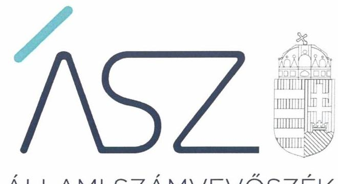
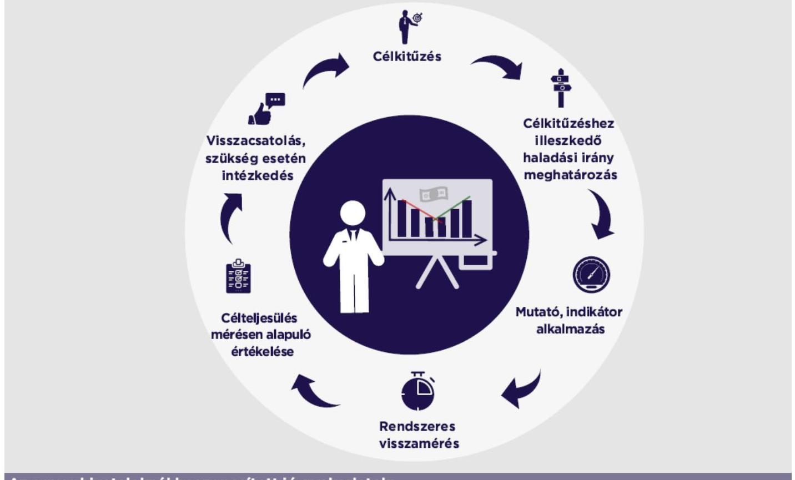

ÁLLAMI SZÁMVEVŐSZÉK

# JELENTÉS

Önkormányzatok ellenőrzése – Önkormányzati hivatalok szervezeti teljesítmény-ellenőrzése

2022.

22024
www.asz.hu

---

ÁLLAMI SZÁMVEVŐSZÉK

# JELENTÉS 

Önkormányzatok ellenőrzése - Önkormányzati hivatalok szervezeti teljesítmény-ellenőrzése
2022. OC. hó 02. nap

22024
www.asz.hu

---

# AZ ELLENŐRZÉST VEZETTE ÉS A VÉGREHAJTÁSÁÉRT FELELŐS: 

BALÁZSNÉ ANTONI ERIKA ellenőrzésvezető
KISTÓTH KRISZTINA ellenőrzésvezető
GYŐRI GABRIELLA MÁRTA ellenőrzésvezető
SIPOSNÉ DÓCZI KLÁRA ellenőrzésvezető

A PROGRAM ÖSSZEÁLLÍTÁSÁÉRT FELELŐS:
HORVÁTH TÍMEA projektvezető

IKTATÓSZÁM: EL-3677-001/2022.
TÉMASZÁM: 2584
ELLENŐRZÉS-AZONOSÍTÓ SZÁM: V-092701

---

# TARTALOMJEGYZÉK 

■ ÖSSZEGZÉS ..... 5
■ AZ ELLENŐRZÉS AKTUALITÁSA, TÁRSADALMI SZEREPE, SZEMPONTJA ..... 7
■ AZ ELLENŐRZÉS TERÜLETE ..... 8
■ MELLÉKLETEK ..... 9
■ AZ ELLENŐRZÉS HATÓKÖRE ÉS MÓDSZERE ..... 10
■ ÉRTELMEZŐ SZÓTÁR ..... 13
■ FÜGGELÉKEK ..... 15
I. sz. függelék: Szervezeti teljesítménycélok és a célok teljesítésének mérése és értékelése az önkormányzati hivataloknál ..... 15
■ RÖVIDÍTÉSEK JEGYZÉKE ..... 19

---

.

---

# ÖSSZEGZÉS 

A 2020. évben kilenc önkormányzati hivatalnál tettek lépéseket a szervezeti teljesítménykövetelmények kialakítására, a teljesítménycélok mérésére, értékelésére az eredményesség és a hatékonyság követelményeinek érvényesülése érdekében. Az értékelés során az Állami Számvevőszék jó gyakorlatokat azonosított.

## Értékelés

A teljesítmény ellenőrzésre kiválasztott húsz önkormányzati hivatal ${ }^{1}$ (továbbiakban: Hivatal) 2020. évi integritása korrupció elleni védettsége -, illetve a működést meghatározó alapvető szabályozási környezetük kialakítása a legmagasabb, ötös értékelést kapta az Állami Számvevőszék 2021.évben nyilvánosságra hozott jelentésében. Az integritás elvű vezetés-irányítás, valamint a pénzügyi és a vagyongazdálkodás szabályszerű feltételeinek kialakítása biztosítja az előfeltételt a közpénz, a közvagyon teljesítményelvű, eredményes felhasználásához.

A Hivatalok eredményes működését és forrásfelhasználását támogatja a szervezeti teljesítménycéljainak, követelményeinek meghatározása, a célok teljesülésének nyomon követése, mérése, értékelése, a céltól való eltérés esetén az intézkedések megtétele. A feladatellátás eredményességének értékelése a tervezett és a tényleges eredmények összevetésével történik. A teljesítményelvű működés alapfeltétele a teljesítménymérés tudatos alkalmazása.

A 2020. évben a hivatali szervezeti teljesítménycélok, követelmények között szerepelt az ügyintézés és hivatali működés racionalizálása, a költségek csökkentése, a saját bevételek, adóbevételek hatékonyabb beszedése, továbbá a pályázati források növelése. Hivatali szervezeti teljesítménycélokat az irányítási hatáskört gyakorló szerv, a képviselő-testület vagy a közgyűlés (továbbiakban: irányító) határoz meg. Az ezzel összhangban a jegyző által a tevékenységre, szervezeti egységre, személyre lebontott célok támogatták a végrehajtás számon kérhetőségét. Szervezeti teljesítménycélokat öt Hivatalnál az irányító, egy Hivatalnál a jegyző, míg három Hivatalnál mind az irányító, mind a jegyző meghatározott. A Hivatal stratégiájának, operatív terveinek megvalósulását támogatja az ezzel összhangban kitűzött elérni kívánt mérhető, nyomon követhető célkijelölés.

A teljesítménycélok megvalósulásának mérésére két Hivatalnál alkalmaztak mutatószámot, indikátort. Mérték és értékelték a helyi adó előirányzat beszedési arányát, az ügyintézési határidő tartása érdekében a hátralékos iratok számának alakulását, a határozatok szakszerűsége vonatkozásában a fellebbezések számát és az előterjesztések esetében a törvényességi és egyéb szempontok szerint a javításra, átdolgozásra visszaadott előterjesztések számát. További két Hivatal nem alkalmazott mutatószámot, azonban a célkitúzés teljesülését értékelte. A teljesítménycélok nyomon követési és a visszacsatolási rendszerének kiépítése és működtetése jelzést, információt biztosít, felhívja a vezetés figyelmét a céloktól való elmaradásra, a megvalósítást akadályozó tényezőkkel kapcsolatos korrekciós intézkedések meghozatalának szükségességére. Ezzel támogatja a szervezet működésével kapcsolatos döntéseket, a döntéshozatalt a teljesítmény javítására.

Az Állami Számvevőszék a Hivataloknál több jó gyakorlatot azonosított. A Hivatalok szervezeti teljesítménycéljai között szereplő ügyfélbarát közigazgatás, az ügyfélközpontú szolgáltatások fejlesztése, az ügyfélelégedettség növelése célkitúzés teljesülésének mérésére egy Hivatal évente kérdőíves felmérést végzett. Egy Hivatalnál a jegyző a szervezeti célokat utasításban rögzítette és azok munkavállalókkal való megismertetését dokumentálta. A célok megvalósításának fontos feltétele, hogy a szervezet tagjai a célokat azonosan értelmezzék, azonosuljanak a célokkal és érdekeltek legyenek annak megvalósításában. A szervezeti célok megvalósítását támogatja azok egyénekre történő lebontása, az egyéni szintű kritériumok és felelősök megjelölése. Ugyanakkor szervezeti szintű teljesítmény-célkitűzést és teljesítménymérést nem pótolhatja csak az egyéni szintű teljesítménykövetelmény meghatározás és teljesítmény értékelés.

---

# Következtetés 

A közpénz eredményes elköltéséhez nélkülözhetetlen a rendszerbe illesztett és dokumentált formában biztosított, az eredményesség és a hatékonyság követelményeinek érvényesülését szolgáló szervezeti teljesítménycélok kitűzése és a célok teljesülésének nyomon követése, értékelése. A célkitűzést követően a célkitűzéshez illeszkedő haladási irány meghatározása, a célkitűzés teljesülésének mutatók alkalmazásával történő folyamatos figyelemmel kísérése, rendszeres visszamérése és a mérésen alapuló értékelés hívja fel a vezetés figyelmét a céloktól való elmaradásra, a szükséges intézkedések megtételére. Ezen elemek együttesen járulnak hozzá, hogy a szervezet a kitűzött célok irányába haladjon.

Az elemek együttes alkalmazása szükséges a Hivataloknál a szervezeti célok meghatározását és a célok megvalósulását biztosító nyomon követési, értékelési rendszer kialakításához és működtetéséhez. A Hivataloknál még van tere a fejlődésnek.

A célkitűzés és a megvalósulás nyomon követésének további fejlesztése, a teljesítménymérés minél szélesebb területen megvalósuló tudatos alkalmazása minden Hivatalnál hozzájárul a közpénz, a közvagyon teljesítményelvű, eredményes felhasználásához, a közpénz eredményes elköltéséhez.

## AZ EREDMÉNYESSÉG, HATÉKONYSÁG KÖVETELMÉNYEINEK ÉRVÉNYESÜLÉSÉT BIZTOSÍTÓ SZERVEZETI TÉLJESÍTMÉNYCÉLOK KITŰZÉSE, MAJD A CÉLOK TÉLJESÜLÉSÉNEK ÉRTÉKELÉSE HOZZÁJÁRUL A KÖZPÉNZ EREDMÉNYES ELKÖLTÉSÉHEZ

## Az egyes hivataloknál beszoncsított jó gyakorlatok:

Évente kérdőíves felmérés az ügyfélelégedettség mérésére
Szervezeti célok megismertetése a munkavállalókkal

---

# AZ ELLENŐRZÉS AKTUALITÁSA, TÁRSADALMI SZEREPE, SZEMPONTJA 

Az ÁSZ ${ }^{2}$ az ÁSZ törvényben ${ }^{3}$ kapott felhatalmazással élve ellenőrzi az önkormányzatok gazdálkodását, működését, hogy megállapításaival támogassa az ellenőrzött szervezetek szabályszerű gazdálkodását, javaslataival elősegítse az Alaptörvényben ${ }^{4}$ megfogalmazott alapvetések érvényesülését a mindennapi életben a szervezetek szintjén.

A társadalmi igénnyel összhangban az önkormányzati hivatalok, mint költségvetési szervek részére az Áht. ${ }^{5}$ és a Bkr. ${ }^{6}$ is előírja, hogy valamennyi tevékenysége és célja összhangban legyen a gazdaságosság, hatékonyság és eredményesség követelményeivel. A Bkr. alapján a költségvetési szerv vezetője évente nyilatkozik arról, hogy gondosko-dott-e a szervezet tevékenységében a gazdaságosság, hatékonyság és eredményesség követelményeinek érvényesítéséről. A hatékony és eredményes gazdálkodáshoz szükség van célok és célértékek kialakítására, a célok megvalósulásának mérését elősegítő mutatószámokra, valamint a mérhetőség, ellenőrizhetőség, értékelhetőség feltételeinek kialakítására. A helyi önkormányzat rendelkezésére álló források szabályszerű, hatékony és eredményes felhasználásával az eredményes, célszerű, tudatos és felelős, azaz minőségi közpénz-költés követelménye fogalmazódik meg.

Az ÁSZ jelen teljesítmény-ellenőrzés során ellenőrzi, hogy az önkormányzati hivataloknál alakítottak-e ki az eredményesség és a hatékonyság követelményeinek érvényesülését biztosító, mérhető, nyomon követhető teljesítménycélokat, teljesítménykövetelményeket, mérték-e, értékelték-e a célok előrehaladását annak érdekében, hogy a teljesítménycélok megvalósulása a kitűzött irányba haladjon.

Az önkormányzati hivatal vonatkozásában mind az irányító, mind az önkormányzati hivatal, mint költségvetési szerv felelős vezetője, a jegyző határozhat meg szervezeti teljesítményekét. A célkitűzések megvalósulásáról a költségvetési szerv vezetésének folyamatosan információval kell rendelkeznie, amelyet a célok megvalósítása előrehaladásának folyamatosan figyelemmel kísérése, a teljesítés alakulásának naprakész mérése szolgál. Az így biztosított információ hívja fel a vezetés figyelmét a céloktól való elmaradásra, a megvalósítást akadályozó tényezőkkel kapcsolatos korrekciós intézkedések meghozatalának szükségességére.

---

# **AZ ELLENŐRZÉS TERÜLETE**

## **20 önkormányzati hivatal**

Az önkormányzatok alapvető feladata a helyi közszolgáltatások biztosítása a lakosság számára. Az önkormányzatok működésével, valamint a polgármester vagy a jegyző feladat- és hatáskörébe tartozó ügyek döntésre való előkészítésével és végrehajtásával kapcsolatos feladatokat az önkormányzati hivatal látja el.

A Hivatal tevékenysége, mint minden a köz érdekében végzett feladatellátás, teljesítményorientált. Az Mötv.7 a helyi önkormányzat működésével kapcsolatban rögzíti a rendelkezésére álló források szabályszerű, hatékony és eredményes felhasználásának követelményét.

A kockázati alapon kiválasztott 20 Hivatalhoz tartozó települések kilenc megyében találhatók, lakónépességük az 1959 főtől a 300 945 főig változik, mindösszesen a településeken 2021. január 1-én 514 063 fő élt. Az értékelt Hivatalok felsorolását az 1. táblázat mutatja be. A település lakónépesség száma a KSH8 2021. január 1-i adatait tartalmazza.

1. táblázat

|  Az értékelt önkormányzati hivatalok | Megye | A település lakónépessége (tó)  |
| --- | --- | --- |
|  Bagi Polgármesteri Hivatal | Pest | 3 810  |
|  Budafok-Tétény Budapest XXII. Kerületi Polgármesteri Hivatal | Budapest | 55 598  |
|  Csévharaszti Polgármesteri Hivatal | Pest | 2 030  |
|  Csobánkai Polgármesteri Hivatal | Pest | 3 550  |
|  Dunaharaszti Polgármesteri Hivatal | Pest | 23 536  |
|  Fehérgyarmati Polgármesteri Hivatal | Szabolcs-Szatmár-Bereg | 7 768  |
|  Harkányi Polgármesteri Hivatal | Baranya | 4 949  |
|  Jobbágyi Polgármesteri Hivatal | Nógrád | 1 959  |
|  Martonvásári Polgármesteri Hivatal | Fejér | 5 843  |
|  Mohácsi Polgármesteri Hivatal | Baranya | 16 993  |
|  Mosonmagyaróvári Polgármesteri Hivatal | Győr-Moson-Sopron | 34 439  |
|  Pátroha Községi Önkormányzat Polgármesteri Hivatala | Szabolcs-Szatmár-Bereg | 2 821  |
|  Pöcsmegyer Község Önkormányzat Polgármesteri Hivatala | Pest | 2 619  |
|  Sárándi Polgármesteri Hivatal | Hajdú-Bihar | 2 210  |
|  Sárrétudvari Polgármesteri Hivatal | Hajdú-Bihar | 2 794  |
|  Somogy Megyei Önkormányzati Hivatal | Somogy | 300 945  |
|  Tápiószentmártoni Polgármesteri Hivatal | Pest | 5 477  |
|  Telki Község Polgármesteri Hivatala | Pest | 4 479  |
|  Törökbálinti Polgármesteri Hivatal | Pest | 14 264  |
|  Vecsési Polgármesteri Hivatal | Pest | 21 529  |

*Forrás: KSH, ÁSZ ellenőrzési adatok*

---

MELLÉKLETEK

---

# AZ ELLENŐRZÉS HATÓKÖRE ÉS MÓDSZERE 

## Az ellenőrzés típusa

Teljesítmény ellenőrzés.

## Az ellenőrzött időszak

Az ellenőrzött időszak: a 2020. év.

## Az ellenőrzés tárgya

Az ellenőrzött szervezetnél kialakított, az eredményesség és a hatékonyság követelményeinek érvényesülését biztosító, mérhető, nyomon követhető teljesítménycélok, valamint az azokhoz meghatározott célértékek, teljesítménykövetelmények meghatározása; a célok megvalósulásának mérése, értékelése; az eredményesség és a hatékonyság követelményeinek érvényesítése a jogszabályi előírások alapján elkészítendő dokumentumokban.

## Az ellenőrzött szervezetek

Kockázatelemzés alapján kiválasztott 20 önkormányzati hivatal. A Hivatalok felsorolását az ellenőrzés területe fejezet tartalmazza.

## Az ellenőrzés jogalapja

Az ellenőrzés jogszabályi alapját az ÁSZ törvény 1. § (3) bekezdése, valamint az 5. § (2) és (6) bekezdéseinek előírásai képezik.

## Az ellenőrzés módszerei

Az ÁSZ az ellenőrzést az ellenőrzési program szempontjai, az ellenőrzött időszakban hatályos jogszabályok, az ellenőrzés szakmai szabályai, a jelen ellenőrzésre irányadó ÁSZ módszertanok figyelembevételével hajtja végre.

Az ellenőrzés megközelítési módja a rendszer-alapú ellenőrzési megközelítés, azaz az ellenőrzött szervezet belső irányítási és szabályozási rendszerének múködését értékeli.

Az ellenőrzési kérdések megválaszolásához szükséges bizonyítékok megszerzése az ellenőrzött által több ütemben rendelkezésre bocsátott dokumentumokra, adatokra alapozva interjú, megfigyelés, szemle (szemrevételezés), kérdésfeltevés (információkérés), valamint elemző eljárás útján történik. Az ellenőrzési bizonyítékként felhasználható adatforrások közé tartoznak az ellenőrzési program részletes szempontjainál felsorolt

---

adatforrások, valamint minden egyéb - az ellenőrzés folyamán feltárt, az ellenőrzés szempontjából információt tartalmazó - dokumentum.

Az ellenőrzés végrehajtása során a rendelkezésre álló dokumentumokat bizonyosság szerint csoportosítjuk és vesszük figyelembe az ellenőrzési értékelések és következtetések levonása során. A dokumentumok valódiságát és teljes körűségét az ellenőrzött szervezet vezetője által tett teljességi és hitelességi nyilatkozat igazolja. A rendelkezésre bocsátott adatok, információk kontrollja az ellenőrzés keretében történik.

Az ellenőrzés ideje alatt az ellenőrzött szervezettel történő kapcsolattartást az ÁSZ SZMSZ ${ }^{\circledR}$-ének vonatkozó előírásai alapján biztosítjuk.

---

.

---

# ÉRTELMEZŐ SZÓTÁR 

eredményesség elve
gazdaságosság elve
hatékonyság elve
irányító
mérőszámok-mutatók
rendszer alapú ellenőrzési megközelítés
szervezeti teljesítmény
teljesítmény-ellenőrzés
teljesítmény-kritérium
teljesítménymutató

Az eredményesség elve a kitűzött célok és a szándékolt eredmények (hatások) elérését jelenti. A feladatellátás eredményességét mutatja a tényleges és a tervezett eredmények (hatások) összevetése. (ÁSZ: A teljesítmény-ellenőrzés alapelvei. 2015.)
A gazdaságosság elve az elért eredményekhez igénybe vett erőforrások költségeinek minimalizálását jelenti. Az igénybe vett erőforrásoknak a megfelelő időben, helyen, mennyiségben és minőségben, valamint a legkedvezőbb áron kell rendelkezésre állniuk. A költség-minimalizálás nem egyenlő a legolcsóbb megoldással, a ráfordításokat mindig a ténylegesen elért eredményekhez viszonyítva kell minősíteni, figyelembevéve a mennyiségi, minőségi szempontokat és az idő-tényezőt. (ÁSZ: A teljesítményellenőrzés alapelvei. 2015.)
A hatékonyság elve azt jelenti, hogy a rendelkezésre álló erőforrásokkal a lehető legtöbbet érjük el. Ez az elv az igénybe vett erőforrások és az elért eredmények mennyiségben, minőségben és időben kifejezett kapcsolatát jelenti, azaz az adott erőforrásokkal a lehető legjobb teljesítményt érjük el, figyelembe véve a mennyiségi, a minőségi szempontokat és az időtényezőt. (ÁSZ: A teljesítmény-ellenőrzés alapelvei. 2015.)
A költségvetési szerv tekintetében az Áht. törvényben meghatározott irányítási hatáskört gyakorló szerv, a képviselő-testület/ közgyűlés. (Áht. 1. § 9. pontja)
A mérőszámok a tevékenységtől közvetlenül elvárt eredményre vonatkoznak, annak valamilyen mennyiségi jellemzőjét határozzák meg, ezzel szemben a mutatók (indikátorok) olyan tevékenységekkel kapcsolatos teljesítmények mérésére szolgálnak, amelyekhez nehéz vagy költséges közvetlen mérőszámokat rendelni (pl. megfelelő adattartalom hiányában), ezek inkább a teljesítményváltozás irányát és mértékét határozzák meg, és kevésbé a teljesítmény abszolút mértékét. (Államháztartási Belső Kontroll Standardok és Gyakorlati Útmutató-2017.) A számvevőszéki teljesítmény-ellenőrzés ellenőrzési megközelítésének egyike, amely az ellenőrzött szervezet (program, tevékenység) belső irányítási és szabályozási rendszerének múködését értékeli. (ÁSZ: A teljesítmény-ellenőrzés alapelvei. 2015.)
A teljesítmény három szintje a szervezeti-, a csoport-, és az egyéni teljesítményszint. A szervezeti teljesítmény a teljes szervezethez, annak kulcs erőforrásaihoz kapcsolódik, és figyelembe veszi a kockázatokat is. Összetevői az emberi erőforrások (tudás és kompetenciák, motiváltság, munkaköri, konkrét körülmények), a szervezeti stratégia, az alkalmazott technológia, a külső környezeti hatások, valamint az erőforrások minősége és mennyisége. (Veresné dr. Somosi Mariann - Teljesítményalapú szervezet- alakítás elmélete és módszertana - Miskolci Egyetemi Kiadó 2013.)
A teljesítmény-ellenőrzés a számvevőszéki ellenőrzés azon típusa, amely annak megállapítására irányul, hogy a közpénzekkel és a nemzeti vagyonnal való gazdálkodás megfelel-e az eredményesség, hatékonyság, gazdaságosság elveinek, illetve vannak-e lehetőségek a teljesítmény javítására. (ÁSZ: A teljesítmény-ellenőrzés alapelvei. 2015.)
A teljesítményértékelési szempontoknak, a közpénzfelhasználást minősítő vizsgálati eljárásoknak, számításoknak, mutatóknak stb. az összessége. (Államháztartási Belső Kontroll Standardok és Gyakorlati Útmutató-2017.)
A teljesítménykritériumok részét képező, naturáliákban mérhető és kifejezhető mutatók. (Államháztartási Belső Kontroll Standardok és Gyakorlati Útmutató-2017.)

---

.

---

# FÜGGELÉKEK

I. SZ. FÜGGELÉK: SZERVEZETI TELJESÍTMÉNYCÉLOK ÉS A CÉLOK TELJESÍTÉSÉNEK MÉRÉSE ÉS ÉRTÉKELÉSE AZ ÖNKORMÁNYZATI HIVATALOKNÁL

|  Sz. | Az értékelt szervezet megnevezése | Megye | A megye integritásának értékelése | Önkormányzat és hivatala integritási osztályrata | A Hivatal számára az irányító által meghatározott eredményességi szervezeti teljesítménycélok. | A Hivatal számára a jegyző által meghatározott szervezeti teljesítménycélok. | A teljesítménycélokhoz rendelt mérő-, mutatószámok. | A szervezeti teljesítménycélok megvalósulását mérték. | A mérések eredményét értékelték.  |
| --- | --- | --- | --- | --- | --- | --- | --- | --- | --- |
|  1. | Bagi Polgármesteri Hivatal | Pest | 4,3 | 5 |  |  |  |  |   |
|  2. | Budafok-Tétény Budapest XXII. Kerületi Polgármesteri Hivatal | Budapest |  | 5 |  |  |  |  |   |
|  3. | Csévharaszti Polgármesteri Hivatal | Pest | 4,3 | 5 |  |  |  |  |   |
|  4. | Csobánkai Polgármesteri Hivatal | Pest | 4,3 | 5 | Dokumentált szervezeti cél a Hivatal hatékony feladatellátása érdekében a Hivatal müködésének fejlesztése, a hivatali honlap fejlesztése. |  |  |  |   |
|  5. | Dunaharaszti Polgármesteri Hivatal | Pest | 4,3 | 5 | Dokumentált szervezeti cél a közigazgatás fejlesztés keretében a hivatali munka még professzionálisabb megszervezése, a technikai feltételek javítása, a lakossági igények színvonalasabb kiszolgálása. |  |  |  |   |
|  6. | Fehérgyarmati Polgármesteri Hivatal | Szabolcs-
Szattmár-
Bereg | 4,4 | 5 |  |  |  |  |   |
|  7. | Harkányi Polgármesteri Hivatal | Baranya | 4,1 | 5 |  |  |  |  |   |
|  8. | Jobbágyi Polgármesteri Hivatal | Nögrád | 4,2 | 5 |  |  |  |  |   |
|  9. | Martonvásári Polgármesteri Hivatal | Fejér | 4,4 | 5 |  |  |  |  |   |
|  10. | Mohácsi Polgármesteri Hivatal | Baranya | 4,1 | 5 |  |  |  |  |   |

---

|  Ssz. | Az értékelt szervezet megnevezése | Megye | A megye integritásának értékelése | Önkormányzat és hivatala integritási osztályzata | A Hivatal számára az irányító meghatározott eredményességi szervezeti teljesítménycélokat. | A Hivatal számára a jegyző meghatározott szervezeti teljesítménycélokat. | A teljesítménycélokhoz rendeltek mérő-, mutatószámot. | A szervezeti teljesítménycélok megvalósulását mérték. | A mérések eredményértékelték.  |
| --- | --- | --- | --- | --- | --- | --- | --- | --- | --- |
|  11. | Mosoonmagyaróvári Polgármesteri Hivatal | Győr-Mosoon-Sopron | 4,5 | 5 | Polgármester és Jegyző közös utasításban dokumentált szervezeti célok a Képviselő-testületi előterjesztések szakmai színvonalának javítása, a hatósági ügyintézés és hivatali múködés költségeinek csökkentése, racionalizálása, a hátralékos ügyintézés további csökkentése, az ezzel kapcsolatos ellenőrzések biztosítása. A saját bevételek beszedésének hatékonyabbá tétele, különös tekintettel a helyi adókra, az éves költségvetésben meghatározott helyi adó előirányzatok 100 %-ban történő beszedése | Helyi adó előirányzat
Terv/tény teljesülés aránya a mutatószám | A helyi adóra befolyt összegeket, a teljesítés %-os értékeit kimutatták a félévre, és az év végére vonatkozóan. | A Hivatal 2020. évi tevékenységéről készített beszámoló és az adóhatósági beszámoló tartalmazta a szervezeti teljesítménycélok megvalósítása alakulásának értékelését. |   |
|  12. | Pátroha Községi Önkormányzat Polgármesteri Hivatala | Szabolcs-Szatmár-Bereg | 4,4 | 5 | Dokumentált szervezeti cél az adókimunkálás, adóbehajtás színvonalának, hatékonyságának fokozásával növelni kell az adóbevételeket. Pályázati forrás megszerzése. Az önkormányzati vagyontárgyak magas színvonalon történő kezelése és hasznosítása. A munkavállalók a célokat dokumentáltan megismerték. |  |  |  |   |
|  13. | Pócsmegyer Község Önkormányzat Polgármesteri Hivatala | Pest | 4,3 | 5 | Dokumentált szervezeti cél pályázati források megszerzése. |  |  |  |   |
|  14. | Sárándi Polgármesteri Hivatal | Hajdú-Bihar | 4,3 | 5 |  |  |  |  |   |
|  15. | Sárrétudvari Polgármesteri Hivatal | Hajdú-Bihar | 4,3 | 5 |  |  |  |  |   |
|  16. | Somogy Megyei Önkormányzati Hivatal | Somogy | 4,1 | 5 |  |  |  |  |   |
|  17. | Tápiószentmártoni Polgármesteri Hivatal | Pest | 4,3 | 5 | Dokumentált szervezeti cél a hivatal megfelelő színvonalú feladatellátása érdekében a szolgáltató és ügyfélbarát közigazgatás megteremtése, az információs szolgáltatás működtetésének kiterjesztése, a községfejlesztésre alkalmas közigazgatás személyi és tárgyi feltételeinek biztosítása, az elektronikus ügyintézés és költségvetési adat lekérdezés lehetőségének bevezetése és fenntartása. |  |  |  |   |

---

|  Ssz. | Az értékelt szervezet megnevezése | Megye | A megye integritásának értékelése | Önkormányzat és hivatala integritási osztályzata | A Hivatal számára az irányító meghatározott eredményességi szervezeti teljesítménycélokat. | A Hivatal számára a jegyző meghatározott szervezeti teljesítménycélokat. | A teljesítménycélokhoz rendeltek mérő-, mutatószámok. | A szervezeti teljesítménycélok megvalósulását mérték. | A mérések eredményé értékelték.  |
| --- | --- | --- | --- | --- | --- | --- | --- | --- | --- |
|  18. | Telki Község Polgármesteri Hivatala | Pest | 4,3 | 5 | Dokumentált szervezeti cél az önkormányzati vagyon tartósan ne csökkenjen, adóbevételek növelése, a szolgáltató és ügyfélbarát közigazgatás megteremtése, az elektronikus ügyintézés biztosítása, a közigazgatás tárgyi és személyi feltételeinek biztosítása, az információs szolgáltatás működtetésének kiterjesztése. | Dokumentált szervezeti cél az ügyfélközpontú, ügyfélbarát, az ügyfél elégedettségét javító ügyintézés, az önkormányzati kintlévőségek csökkentése (a hátralékosokkal szemben hatékony intézkedések megtétele), adóhátralékok csökkentése (az adóhatósági ellenőrző munka erősítése, a követelések beszedéséhez hatékony eszközök alkalmazása), magas színvonalú emberi erőforrás (munkatársak képzése). |  |  | Jegyzői utasításban a Hivatal szervezeti teljesítménycélok, teljesülését értékelték.  |
|  19. | Törökbálinti Polgármesteri Hivatal | Pest | 4,3 | 5 | Dokumentált szervezeti cél a hivatali szerkezet átalakítása, a szervezeti egységek közötti feladatmegosztás újra gondolása, a humánerőforrás (a személyi állomány korösszetételének javítása, az ösztöndíjas foglalkoztatás minél szélesebb körben történő alkalmazása), a lakosság ösztönzése az elektronikus ügyintézés minél szélesebb körű használatára a lehetséges fórumok maximális kihasználásával. |  |  |  | A Hivatal 2020. évi tevékenységéről készített beszámoló tartalmazza a szervezeti teljesítménycélok megvalósításának értékelését.  |
|  20. | Vecsési Polgármesteri Hivatal | Pest | 4,3 | 5 | Dokumentált szervezeti cél, hogy egyszerűbb, gyorsabb, költségtakarékosabb, jogszerűbb közigazgatás legyen és váljon rendszeresebbé a közigazgatás külső és belső ellenőrzése. | Dokumentált szervezeti cél az ügyintézési idő csökkentése. A dolgozók közötti kommunikáció fejlesztése. Az elektronikus eszközök teremtette ügymenet gyorsítási lehetőségek hatékonyabb kihasználása. Az önkormányzati vagyonnal (ingó és ingatlanvagyon) való hatékony gazdálkodás, a helyi adók és tervezett bevételek maximális összegének való elérésére való törekvés. A lakosság széles körű közszükségletének hatékony és színvonalas kielégítése. A „jó gazda” funkció hatékonyabb ellátása. | Hátralékos iratok száma, a fellebbezések száma, a javításra, vagy átdolgozásra visszaadott előterjesztések száma. | A mutatók értékeit havonta, negyed- évente mérték, a lakosság, mint ügyfél elégedettséget papíron és digitálisan kitölthető kérdőívvel mérték. | A Hivatal szervezeti teljesítménycélok teljesülését vezetőségi átvizsgálás keretében értékelték.  |

---

.

---

# RÖVIDÍTÉSEK JEGYZÉKE 

${ }^{1}$ önkormányzati hivatal
${ }^{2}$ ÁSZ
${ }^{3}$ ÁSZ törvény
${ }^{4}$ Alaptörvény
${ }^{5}$ Áht.
${ }^{6}$ Bkr.
${ }^{7}$ Mötv.
${ }^{8}$ KSH
${ }^{9}$ ÁSZ SZMSZ
az államháztartásról szóló 2011. évi CXCV. törvény 1. § 18. pontja szerint az önkormányzati hivatal a polgármesteri hivatal, a főpolgármesteri hivatal, a megyei önkormányzati hivatal és a közös önkormányzati hivatal
Állami Számvevőszék
az Állami Számvevőszékről szóló 2011. évi LXVI. törvény
Magyarország Alaptörvénye az Országgyűlés által elfogadva 2011. április 18-án, kihirdetve április 25-én
az államháztartásról szóló 2011. évi CXCV. törvény
a költségvetési szervek belső kontrollrendszeréről és belső ellenőrzéséről szóló 370/2011. (XII. 31.) Korm. rendelet
Magyarország helyi önkormányzatairól szóló 2011. évi CLXXXIX. törvény
Központi Statisztikai Hivatal
Állami Számvevőszék Szervezeti és Müködési Szabályzata

---

# ASZ 

ALLAMI SZAMVEVOSZEK
1052 Budapest, Apáczai Cs. J. u. 10. I 1364 Budapest 4. Pf. 54 TEL: +36 14849100
email: szamvevoszek@asz.hu
web: www.asz.hu | www.aszhirportal.hu