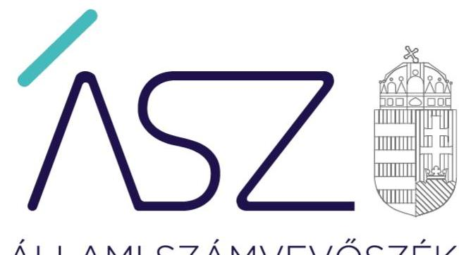
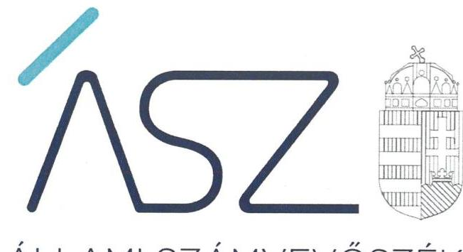
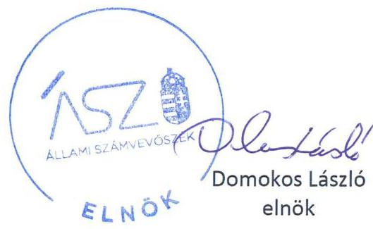
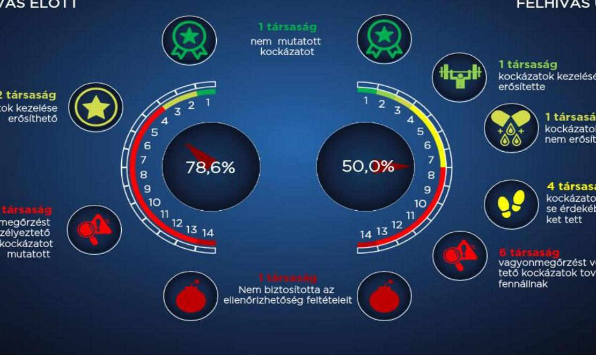

ÁLLAMI SZÁMVEVŐSZÉK

# JELENTÉS

Nemzeti tulajdonú gazdasági társaságok ellenőrzése – A nemzeti tulajdonú gazdasági társaságoknál a vagyonmegőrzést veszélyeztető helyzet bekövetkezése kockázatainak ellenőrzése

2022.

22025
www.asz.hu

---

ÁLLAMI SZÁMVEVŐSZÉK

# JELENTÉS

Nemzeti tulajdonú gazdasági társaságok ellenőrzése – A nemzeti tulajdonú gazdasági társaságoknál a vagyonmegőrzést veszélyeztető helyzet bekövetkezése kockázatainak ellenőrzése

2022. 06. hó 21. nap

22025
www.asz.hu

---

# AZ ELLENŐRZÉST VEZETTE ÉS A VÉGREHAJTÁSÁÉRT FELELŐS: 

DR. NAGY IMRE ellenőrzésvezető
KISTÓTH KRISZTINA ellenőrzésvezető
KLINGA LÁSZLÓ ellenőrzésvezető

A PROGRAM ÖSSZEÁLLÍTÁSÁÉRT FELELŐS:
KUSZINGER ANDREA projektvezető

IKTATÓSZÁM: EL-3674-001/2022.
TÉMASZÁM: 2565
ELLENŐRZÉS-AZONOSÍTÓ SZÁM: V-0909

Jelentéseink az Országgyúlés számítógépes hálózatán és az interneten a www.asz.hu címen is olvashatóak.

---

# TARTALOMJEGYZÉK 

■ ÖSSZEGZÉS ..... 5
■ AZ ELLENŐRZÉS AKTUALITÁSA, TÁRSADALMI SZEREPE, SZEMPONTJA ..... 8
■ AZ ELLENŐRZÉS TERÜLETE ..... 9
■ AZ ELLENŐRZÉS HATÓKÖRE ÉS MÓDSZERE ..... 11
■ ÉRTELMEZŐ SZÓTÁR ..... 15
■ RÖVIDÍTÉSEK JEGYZÉKE ..... 17

---

.

---

# ÖSSZEGZÉS 

Az értékelt 14 nemzeti tulajdonú gazdasági társaság közül háromnál biztosított volt a vagyonmegőrzés. Tíz társaságnál fennállt a vagyonvesztés bekövetkezésének kockázata, amely a vezető tisztségviselő intézkedését igényelte a vagyonvesztés megelőzése, a nemzeti vagyon védelme érdekében. Egy társaság nem biztosította az ellenőrizhetőség feltételeit.
Az Állami Számvevőszék kezdeményezésére az ellenőrzött időszakot követően a tíz társaságból négy gazdasági társaságnál pozitív irányú változások indultak el, ezáltal csökkenhetnek a vagyonmegőrzést veszélyeztető kockázatok. Hat gazdasági társaság nem tett lépéseket a nemzeti vagyon megőrzését veszélyeztető kockázatok csökkentésére, emiatt a közpénzügyi helyzet nem javult.

## Értékelés

A nemzeti tulajdonú gazdasági társaságok a vagyonmegőrzést veszélyeztető kockázatok beazonosításával, a kockázatok eredményes kezelésével, ezáltal a vagyonvesztés megelőzésével a nemzeti vagyon védelmét biztosítják. Az Állami Számvevőszék a megelőzést szolgáló eszközök és a kockázatok bemutatásával támogatja a társaságok vezető tisztségviselőinek és tulajdonosi joggyakorlóinak feladatellátását.

Az értékelt 14-ből egy társaság, az "Urbs Novum" Nagykállói Városfejlesztési Kft. nem működött együtt és ezáltal nem igazolta a nemzeti vagyon megőrzéséhez kapcsolódó jogszabályok, előírások betartását, a vagyonmegőrzést veszélyeztető kockázatok azonosítását, kezelését.

Három társaság vezető tisztségviselője a nemzeti vagyon megóvását biztosította, a vagyonmegőrzést veszélyeztető jelenséget nem tárt fel és az ÁSZ sem azonosított lényeges kockázatot az ellenőrzés területe vonatkozásában.

PREVENTÍV ESZKÖZÖK támogatják a vagyonmegőrzést veszélyeztető kockázatok beazonosítását, a fizetőképességet, és ezen keresztül a vagyonmegőrzést veszélyeztető jelenségek korai felismerését, amelyek a követelések, kötelezettségek szabályszerű nyilvántartása, az évközi cash flow és pénzügyi terv készítése. Tíz társaság vezető tisztségviselője egy vagy több preventív eszköz alkalmazásának hiányában nem rendelkezett információval a fizetőképességre és ezen keresztül a vagyonmegőrzésre veszélyt jelentő jelenségek korai felismeréséhez, amely hátráltatta a vagyonvesztés megelőzését szolgáló intézkedések megtételét.

A vagyonvesztés bekövetkezése kockázatára utalhat, ha nem biztosított a társaság fizetési készsége, a kötelezettségek határidőben történő teljesítése. Hét társaság vezető tisztségviselője nem gondoskodott a fizetési határidőn belül, de legfeljebb a fizetési határidőt követő 90 napon belül a társaság részére kiállított számlák kiegyenlítéséről.

A nemzeti vagyon megóvásának fő eszköze a vagyonmegőrzést veszélyeztető jelenségek azonosítása és kezelése. Kettő vezető tisztségviselő nem gondoskodott a Számviteli törvény szerinti 2019. évi beszámoló elkészítéséről, ezzel a pénzügyi- és vagyongazdálkodásának átláthatóságát, elszámoltathatóságát nem biztosította. A beszámoló hiánya növeli a vagyonvesztés bekövetkezésének kockázatát, mert nem biztosított a veszélyeztetettség felismerésének és elemzésének lehetősége.

Hét gazdasági társaságnál a 2019. évi beszámoló szerint a saját tőke nem érte el a törzstőke jogszabályban meghatározott minimális összegét. A hétből egy társaság vezető tisztségviselője nem azonosított a társaság vagyonmegőrzését veszélyeztető jelenséget, nem ismerte fel, nem azonosította a veszélyeztetettséget. Hat társaság vezető tisztségviselője azonosította a vagyonmegőrzést veszélyeztető jelenséget, azt értékelte, elemezte, arról a tulajdonosi joggyakorlót értesítette. Közülük egy vezető tisztségviselő dokumentált intézkedést saját hatáskörében nem kezdeményezett és az öt intézkedőből négy a meghatározott intézkedések nyomon követéséről nem gondoskodott.

---

Egy további gazdasági társaság vezető tisztségviselője vagyonmegőrzése egyéb veszélyeztetettségét azonosította, a helyzetet elemezte, intézkedést kezdeményezett, de nem gondoskodott intézkedései nyomon követéséről. A veszélyeztetettség fel nem ismerése, az intézkedések elmaradása, valamint a szükséges intézkedések végrehajtása nyomon követésének hiányában tíz társaságnál fennállt a vagyonvesztés bekövetkezésének kockázata.

A TULAJDONOSI ELLENŐRZÉST a felügyelő bizottság működése támogatja. A 11 tulajdonosi joggyakorló közül egy nem gondoskodott a felügyelőbizottság felállításáról és hét nem gondoskodott a felügyelő bizottság ügyrendjének jóváhagyásáról, ezzel a nemzeti vagyon megóvása érdekében nem biztosította az ügyvezetés tevékenységének ellenőrzését.

# Következtetés 

Az ellenőrzés értékelése alapján 10 nemzeti tulajdonú gazdasági társaságnál a társaság vezető tisztségviselőjének és tulajdonosi joggyakorlójának intézkedése volt szükséges a vagyonmegőrzést veszélyeztető kockázatok csökkentése és a közpénzügyi helyzet javítása érdekében. Ezáltal biztosítható a nemzeti vagyon célszerű felhasználása, megóvása, a társaságok folyamatos, átlátható működése, valamint a közszolgáltatás jó minőségének fenntartása.

Az Állami Számvevőszék emiatt az ellenőrzés során felhívással élt 10 gazdasági társaság vezetője felé. Az Állami Számvevőszék célja a felhívással az volt, hogy a hiányosságok és a fejleszthető területek bemutatásával már az ellenőrzés folyamatában előmozdítsa a pozitív irányú változásokat: a vagyonmegőrzést veszélyeztető helyzet kialakulásához kapcsolódó kockázatok csökkentését, a kockázatok hatásos időben történő felismerését és kezelését, ezáltal a közpénzügyek átláthatóságának és rendezettségének javulását.

Az Állami Számvevőszék felhívására a 10 társaságból négy gazdasági társaság vezetője lépéseket tett a vagyonmegőrzést veszélyeztető kockázatok csökkentésére. A vezetők által jelzett intézkedések megvalósítása hozzájárulhat a nemzeti vagyon megóvásához, a társaságok folyamatos, átlátható működéséhez, a felelős gazdálkodás megerősítéséhez, valamint a közfeladatellátás jó minőségének fenntartásához. Három gazdasági társaság vezetője nem válaszolt a felhívásra, három pedig nem tett megfelelő hatásosságú lépéseket a feltárt kockázatok csökkentése érdekében. Esetükben a közpénzügyi helyzet nem javult, a nemzeti vagyon megőrzését veszélyeztető kockázatok kezelése erősítendő.

További két gazdasági társaságnál az Állami Számvevőszék nem tárt fel a vagyonmegőrzést veszélyeztető helyzetet, ugyanakkor a vagyonmegőrzéshez kapcsolódó kockázatok kezelésének erősítése ezeknél a társaságoknál is indokolt volt. Egy társaság vezetője az Állami Számvevőszék felhívására lépéseket tett a vagyonmegőrzést veszélyeztető kockázatok kezelésének erősítésére. Egy társaság vezetője nem válaszolt a felhívásra, nem tett lépéseket a kockázatok kezelésének erősítésére.

Az ellenőrzés tapasztalatai és a társaságok felhívásra adott válaszainak értékelése alapján az Állami Számvevőszék hét gazdasági társaság tulajdonosi joggyakorlója felé felhívással élt a társaságoknál fennmaradt kockázatok csökkentése, és a vagyonmegőrzéshez kapcsolódó kockázatok kezelésének erősítése érdekében.

Az "Urbs Novum" Nagykállói Városfejlesztési Kft. nem biztosította az ellenőrizhetőségét, ezáltal nem igazolta a nemzeti vagyon megőrzéséhez kapcsolódó jogszabályi előírások betartását, ami kiemelt kockázatot jelent a nemzeti vagyon megóvása tekintetében. Emiatt kérdésként merül fel, célszerű-e olyan gazdasági társaság fenntartása, amely nem igazolta, hogy megfelelne az Alaptörvényben foglalt felelős és törvényes gazdálkodás alapvető követelményének? Az Állami Számvevőszék emiatt felhívással fordult a társaság tulajdonosi joggyakorlója felé.

Emellett az Állami Számvevőszék figyelemfelhívással fordult nyolc tulajdonosi joggyakorló felé az ellenőrzés során feltárt hiányosságok megszüntetése, ezáltal a társaságok feletti tulajdonosi kontrollok erősítése érdekében. Öt tulajdonosi joggyakorló lépéseket tett a felügyelőbizottság alapvető működési feltételeinek kialakítására, ezáltal az érintett társaságok esetében a tulajdonosi ellenőrzés erősítheti a vagyonmegőrzéshez kapcsolódó kockázatok kezelését. Két tulajdonosi joggyakorló nem válaszolt a felhívásra, egy pedig nem tett megfelelő hatásosságú lépéseket a feltárt kockázatok csökkentésére. Esetükben a tulajdonosi kontrollok nem javultak, a tulajdonosi joggyakorlók intézkedése nem tudott hozzájárulni az érintett társaságok vagyonának megőrzését veszélyeztető kockázatok kezeléséhez.

---

# A NEMZETI VAGYON MEGŐRZÉSE FOLYAMATOS NYOMONKÖVETÉST IGÉNYEL 

## VAGYONMEGŐRZÉS VESZÉLYEZTETŐ KOCKÁZATOK ALAKULÁSA

FELHIVÁS ELŐTT

---

# AZ ELLENŐRZÉS AKTUALITÁSA, TÁRSADALMI SZEREPE, SZEMPONTJA 

Magyarország Alaptörvénye alapján a nemzeti vagyon kezelésének, védelmének célja a közérdek szolgálata, a közös szükségletek kielégítése és a természeti erőforrások megóvása, valamint a jövő nemzedékek szükségleteinek figyelembevétele. A közfeladatok ellátása nagyrészt önkormányzati tulajdonba tartozó gazdasági társaságok útján valósul meg. A közérdek szolgálata elsősorban a közfeladatok elvárt színvonalú biztosítását jelenti, ideértve a lakosság közszolgáltatásokkal való ellátását, melyhez nemzeti vagyonra van szüksége az azokat ellátó gazdasági társaságoknak.

Az ÁSZ ${ }^{1}$ folyamatosan figyelemmel kíséri az önkormányzatok pénzügyi helyzetét, és az eladósodás megelőzése érdekében rendszeresen értékeli az önkormányzatok pénzügyi egyensúlyi helyzetét és az arra ható kockázatokat. Ezen kockázatok jelentős része a többségi önkormányzati tulajdonban álló gazdasági társaságoknál azonosítható. Az önkormányzati tulajdonban levő gazdasági társaság vagyonvesztése, pénzügyi kockázata a tulajdonosi joggyakorló önkormányzat pénzügyi kockázatává alakulhat át, mert az önkormányzati és ezen keresztül a nemzeti vagyon pótlása közpénzből, a tulajdonos önkormányzat rendelkezésére bocsátott forrásokból rendezhető.

Az ÁSZ ellenőrzésével felhívja a figyelmet a többségi tulajdonban álló önkormányzati tulajdonú gazdasági társaságoknál a vagyonmegőrzést veszélyeztető helyzetre, annak érdekében, hogy a vagyonvesztés megelőzhetővé váljon. Az ÁSZ ellenőrzésével támogatja az önkormányzati tulajdonú gazdasági társaság vezető tisztségviselőjét és tulajdonosi joggyakorlóját a felelős gazdálkodás megerősítésében.

A vagyonmegőrzést veszélyeztető alapvető kockázatként értékelte az ÁSZ a társaság vagyonvesztését, melynek következtében a társaság vagyona nem fedezi a tartozásait.

Az ÁSZ a nemzeti vagyon megőrzését veszélyeztető kockázatot növelő tényezőként értékelte, ha a gazdasági társaság vezető tisztségviselője nem gondoskodott a fizetőképesség fenntartása preventív eszközeinek alkalmazásáról. Ezen preventív, megelőző eszköz a követelések, kötelezettségek nyilvántartása, a tartozások és kintlévőségek esedékességének elemzése, az évközi cash flow és az üzleti tervezés keretében a pénzügyi terv készítése. Mindezek hiányában a vezető nem rendelkezik információval a vagyonmegőrzés egyik elemét, a fizetőképességet veszélyeztető jelenségek korai felismeréséhez. Az ÁSZ további lényeges területként értékelte a gazdasági társaság fizetési készségét, azt, hogy a vezető tisztségviselő gondoskodott-e arról, hogy a társaság a fizetési kötelezettségének határidőben eleget tegyen. A vagyonmegőrzést veszélyeztető kockázatot növelő további tényező, ha a gazdasági társaság vezető tisztségviselője nem gondoskodott arról, hogy fizetési határidőn belül, de legfeljebb a fizetési határidőt követő 90 napon belül ki legyenek egyenlítve a társaság részére kiállított számlák.

Az azonosított vagyonmegőrzést veszélyeztető helyzet esetén az ÁSZ a kockázatot csökkentő tényezőként értékelte, ha a gazdasági társaság vezető tisztségviselője a helyzet kezelésére eredményesen intézkedett és a megtett intézkedéseket dokumentáltan nyomon követte.

---

# AZ ELLENŐRZÉS TERÜLETE

## 14 nemzeti tulajdonú gazdasági társaság és azok tulajdonosi joggyakorlói

Az önkormányzati tulajdonú gazdasági társaságok által ellátott közszolgáltatások minősége és hatékonysága jelentős mértékben érintik a lakosság életminőségét, egészségét, biztonságát, ezen keresztül a lakosság jólétét. A társaságok gazdálkodásuk során jelentős nagyságú nemzeti vagyont működtetnek.

Az ellenőrzés a kockázatértékelés alapján kiválasztott olyan 14 önkormányzati tulajdonú gazdasági társaságra terjedt ki, melyeknél az ÁSZ korábban lefolytatott ellenőrzései során integritási kockázatot azonosított.

Amennyiben egy többségi nemzeti tulajdonban lévő gazdasági társaságnál a gazdálkodási és kockázatkezelésre vonatkozó alapvető szabályozás terén integritási kockázat azonosítható, indokolt értékelni a bevételek beszedését és elszámolását, tekintettel arra, hogy ez az adott társaság fizetőképességére közvetlenül hatást gyakorol. A fizetőképesség pedig a nemzeti vagyon megőrzésének egyik kiemelt eleme. Az ellenőrzéssel érintett 14 gazdasági társaságnál a fizetőképességen keresztül a vagyonmegőrzést veszélyeztető kockázati tényezők értékelését végezte el az ÁSZ.

A társaságok fő tevékenysége diákétkeztetés; hulladék-gyűjtés és -szállítás; épület, intézmény karbantartás, üzemeltetés, film-, videó-, televízió-műsor-gyártás, fürdő, uszoda üzemeltetés, rehabilitációs foglalkoztatás, sporttevékenység, sport-szabadidős képzés, településtisztaság biztosítása, valamint víztermelés, -kezelés, -ellátás volt.

Ellenőrzött gazdasági társaságok, valamint tulajdonosi joggyakorlóik felsorolását az 1. táblázat tartalmazza.

1. táblázat

### AZ ELLENŐRZÖTT TÁRSASÁGOK ÉS
 TULAJDONOSI JOGGYAKORLÓIK

|  Ellenőrzött társaság | A társaság tulajdonosi joggyakorlója  |
| --- | --- |
|  ALFA-SZÉLPARK Energiatermelő Korlátolt Felelősségű Társaság | Mosonszolnok Község Önkormányzata  |
|  DKKA-Dunaújvárosi Kohász Kézilabda Akadémiai Nonprofit Korlátolt Felelősségű Társaság | Dunaújváros Megyei Jogú Város Önkormányzata  |
|  ÉTH Érd és Térsége Hulladékkezelési Nonprofit Korlátolt Felelősségű Társaság | Érd Megyei Jogú Város Önkormányzata  |
|  FALCO KC Szombathely Sportszolgáltató Korlátolt Felelősségű Társaság | Szombathely Megyei Jogú Város Önkormányzata  |
|  Hódmezővásárhelyi Működtető és Szolgáltató Nonprofit Zártkörűen Működő Részvénytársaság | Hódmezővásárhely Megyei Jogú Város Önkormányzata  |
|  Jászalsószentgyörgyi Vízmű Koncessziós Közmű Üzemeltető Korlátolt Felelősségű Társaság | Jászalsószentgyörgyi Községi Önkormányzat  |

---

| Ellenőrzött társaság | A társaság tulajdonosi joggyakorlója |
| :--: | :--: |
| Kanizsa Rehab Nonprofit Korlátolt Felelősségű Társaság | Nagykanizsa Megyei Jogú Város Önkormányzata |
| Nagykanizsa Városfejlesztő Korlátolt Felelősségű Társaság |  |
| KANIZSA MÉDIAHÁZ Kereskedelmi és Szolgáltató Egyszemélyes Korlátolt Felelősségű Társaság |  |
| Nagykanizsa Vagyongazdálkodási és Szolgáltató Zártkörűen Működő Részvénytársaság | Kisvárda Város Önkormányzata |
| Kisvárdai Intézményműködtető Nonprofit Korlátolt Felelősségű Társaság | Kisvárda Város Önkormányzata |
| Kristályfürdő Idegenforgalmi és Szolgáltató Kft. | Ajka Város Önkormányzata |
| Örkény Városfejlesztési Nonprofit Korlátolt Felelősségű Társaság | Örkény Város Önkormányzata |
| "Urbs Novum" Nagykállói Városfejlesztési Nonprofit Korlátolt Felelősségű Társaság | Nagykálló Város Önkormányzata |

Forrás: ÁSZ ellenőrzési adatok

---

# AZ ELLENŐRZÉS HATÓKÖRE ÉS MÓDSZERE 

## Az ellenőrzés típusa

Megfelelőségi ellenőrzés.

## Az ellenőrzött időszak

Az ellenőrzött időszak a 2020. január 01-től 2020. december 31-ig terjedő időszak. Éves beszámoló tekintetében 2019. év.

## Az ellenőrzés tárgya

Az ellenőrzés tárgyát képezi a többségi nemzeti tulajdonban álló gazdasági társaságok vezető tisztségviselőjének eljárása a társaság vagyonmegőrzését veszélyeztető jelenségek felmérése, azonosítása, elemzése, kezelése és nyomon követése tekintetében, a cash-flow kimutatások figyelemmel kísérése a társaság esedékes/lejárt tartozásainak kiegyenlítéséről való gondoskodás vonatkozásában. Az ellenőrzés a társasági vagyonvesztés azon eseteire terjed ki, amely esetekben a Ptk. azonnali intézkedési kötelezettséget határoz meg, valamint a fizetőképesség szempontjából a vagyonmegőrzés (a saját tőke értékének megőrzése) biztosítására, a vagyon megőrzését veszélyeztető jelenségek kezelésére, intézkedések kezdeményezésére és nyomon követésére. Az ellenőrzés kiterjed továbbá a tulajdonosi joggyakorló értesülésére, tudomás szerzésére a társaságot fenyegető vagyonvesztésről, a tulajdonosi ellenőrzés eszközének működtetésére az ügyvezetés tevékenysége ellenőrzésének vonatkozásában, valamint az intézkedés megtételének kezdeményezésére, egyszemélyes társaság esetében alapítói határozat meghozására a vagyon visszapótlása, egyben a vagyonmegőrzés érdekében.

## Az ellenőrzött szervezetek

14 többségi nemzeti tulajdonban álló gazdasági társaság és azok tulajdonosi joggyakorlói

## Az ellenőrzés jogalapja

Az ÁSZ tv. ${ }^{2}$ 1. § (3) bekezdése és az 5. § (3)-(5) bekezdései képezik.

## Az ellenőrzés módszerei

Az ÁSZ az ellenőrzést az ellenőrzési program szempontjai, az ellenőrzött időszakban hatályos jogszabályok, a jelen ellenőrzésre irányadó ÁSZ módszertan figyelembe vételével és a nemzetközi standardokat

---

irányadónak tekintve végzi. Az ÁSZ az ellenőrzés ideje alatt az ellenőrzött szervezettel történő kapcsolattartást az ÁSZ SZMSZ³-ének vonatkozó előírásai alapján biztosítja.

Az ellenőrzési kérdések megválaszolásához szükséges bizonyítékok megszerzése a következő ellenőrzési eljárások alkalmazásával történik: megfigyelés, szemle, összehasonlítás, mintavételezés, valamint elemző eljárás. Az ellenőrzési bizonyítékként felhasználható adatforrások közé tartoznak az ellenőrzési programban felsorolt adatforrások, továbbá minden - az ellenőrzés folyamán - feltárt, az ellenőrzés szempontjából információkat tartalmazó dokumentum.

Az ellenőrzést a kérdésekre adott válaszok kiértékelésével, valamint a megjelölt adatforrások felhasználásával, továbbá az adott időszakban hatályos jogszabályok figyelembevételével végzi az ÁSZ.

A program ellenőrzési kérdései a jogszabályok által elő nem írt, úgynevezett helyénvalósági kritériumok szerinti ellenőrzésében a társaságok vezető tisztségviselőitől, tulajdonosi joggyakorlóitól elvárható gondosság mellett alkalmazott jó gyakorlat alapján kerültek meghatározásra. Ezen kritériumok betartását nem írja elő a társaságok számára kötelező jelleggel jogszabály, azonban alkalmazásukkal pozitív változások indulhatnak el a társaságok pénzügyi és vagyoni helyzetében. A helyénvalósági kritériumokra vonatkozó értékelések a jelentésben dőlt betűvel szerepelnek.

Az ÁSZ folytatja a kockázatalapú ellenőrzéseket a nemzeti tulajdonú gazdasági társaságok tekintetében. A kockázatalapú ellenőrzések lehetőséget teremtenek arra, hogy az ÁSZ ellenőrzöttek széles körének, azonos jellemzők alapján történő csoportosításával, a lényeges dokumentumok meghatározott szempontok szerinti értékelése alapján objektív képet kapjon a szervezeteknél fennálló azon területekről, melyek a gazdálkodásukat érintően a jövőre vonatkozóan kockázatot hordoznak.

A kockázatértékelési megközelítéssel végrehajtott ellenőrzés a társaság fizetőképességén keresztül vizsgálva a vagyon megőrzésének lényeges területére terjed ki a gazdasági társaság vezető tisztségviselőjének eljárásán, valamint a tulajdonosi joggyakorlók intézkedéseinek kezdeményezésén, tulajdonosi ellenőrzés eszközének működtetésén keresztül és súlypontok meghatározásával lehetőséget biztosít további kockázatok beazonosítására, a fizetőképessége, vagyona megőrzésének lényeges területére.

A társaság esedékes/90 napot meghaladóan lejárt tartozásai kiegyenlítésének értékelését az ÁSZ egyszerű véletlen mintavétellel ellenőrzi. A mintavétellel ellenőrzött területek esetében az egyes tételek vonatkozásában a megfelelőségre vonatkoznak a kérdések, amelyek eredménye összesítésre kerül. „Szabályszerű"/„Megfelelő" az ellenőrzött terület, amennyiben 95\%-os bizonyossággal a lényeges sokaságban az átlagos hibaarány legfeljebb 10\%, Nem szabályszerű"/„Nem megfelelő", amennyiben 10\%-nál magasabb arányt képviselt. Abban az esetben, ha a lényeges sokaság tekintetében a 10\%-os hibaarányhoz való viszony megítélésének megbízhatósága nem éri el a 95\%-ot, annak elérése érdekében értékelésük további szempontokkal kerül kiegészítésre, figyelembe véve a feltárt hibák értékét.

A társaság fizetőképességének megőrzése tekintetében alapvető kockázatot a társaság veszteség folytán bekövetkező vagyonvesztése

---

jelenti, melynek következtében a társaság vagyona a tartozásait nem fedezi.

Az ellenőrzés a kockázatértékelés alapján kiválasztott olyan nemzeti tulajdonú gazdasági társaságokra terjed ki, melyeknél integritási kockázat került azonosításra. A törvényi előírásokat, valamint az ÁSZ által meghirdetett, nyilvános módszertant figyelembe véve az ellenőrzés hatóköre kiegészülhet kockázatjelzések alapján, a kockázatértékelés függvényében további lényeges területek szabályosságának ellenőrzésével az ellenőrzés megkezdésének időpontjáig.

---

.

---

# ÉRTELMEZŐ SZÓTÁR 

Cash-flow kimutatás
fizetőképesség
gazdasági társaság
nemzeti vagyon
többségi tulajdonú gazdasági társaság
többségi befolyás
vagyonvesztés
vezető tisztségviselő

A társaság működése, befektetései és pénzügyi tevékenysége által generált pénzáramlásokat tartalmazó kimutatás. A társaság pénzügyi helyzetében bekövetkezett változásokat mutatja be, mely pénzügyi előrejelzést jelent és a pénzügyi terv része.
A likviditás időpontbeli állapota, melyet az éppen esedékes kötelezettségek és a kiegyenlítésükhöz - likvid, fizetésre alkalmas - eszközök viszonya jellemez. A priori (előzetes) vizsgálata: előrejelzés, becslés a jövőbeni likviditási állapotokra vonatkozóan, a posteriori (utólagos) vizsgálat már konkrét tényszámokon alapszik.
A gazdasági társaságok üzletszerű közös gazdasági tevékenység folytatására, a tagok vagyoni hozzájárulásával létrehozott, jogi személyiséggel rendelkező vállalkozások, amelyekben a tagok a nyereségből közösen részesednek, és a veszteséget közösen viselik. (Forrás: Ptk. ${ }^{4}$ 3:88. § (1) bekezdés)
Nvtv. ${ }^{5}$ 1. § (2) bekezdése szerint nemzeti vagyonba tartozik többek között: az állam vagy a helyi önkormányzat tulajdonában lévő pénzügyi eszközök, továbbá az államot vagy a helyi önkormányzatot megillető társasági részesedések.
Többségi tulajdonú az a társaság, ahol a tulajdonosi joggyakorló a Ptk. 8:2. § (1) bekezdés szerinti többségi befolyással rendelkezik.
Az olyan kapcsolat, amelynek révén a befolyással rendelkező egy jogi személyben a szavazatok több mint ötven százalékával - közvetlenül vagy a jogi személyben szavazati joggal rendelkező más jogi személy (köztes vállalkozás) szavazati jogán keresztül - rendelkezik, azzal, hogy a közvetett módon való rendelkezés meghatározása során a jogi személyben szavazati joggal rendelkező más jogi személyt (köztes vállalkozást) megillető szavazati hányadot meg kell szorozni a befolyással rendelkezőnek a köztes vállalkozásban, illetve vállalkozásokban fennálló szavazati hányadával, ha azonban a köztes vállalkozásban fennálló szavazatainak hányada az ötven százalékot meghaladja, akkor azt egy egészként kell figyelembe venni. A befolyás számításánál nem kell figyelembe venni a huszonöt százalékot el nem érő közvetett befolyást. (Forrás: Taktv. ${ }^{6}$ 1. § b) pont).
A vagyonvesztés késedelem nélküli intézkedést igénylő esetei a Ptk. alapján:

- a korlátolt felelősségű társaság saját tőkéje veszteség folytán a törzstőke felére csökkent;
- a korlátolt felelősségű társaság saját tőkéje a törzstőke törvényben meghatározott minimális összege alá csökkent;
- a részvénytársaság saját tőkéje veszteség következtében az alaptőke kétharmadára csökkent;
- a részvénytársaság saját tőkéje az alaptőke törvényben meghatározott minimális összege alá csökkent
- a társaságot fizetésképtelenség fenyegeti vagy fizetéseit megszüntette
- vagyona tartozásait nem fedezi.
(forrás: Ptk. 3:189.§ (1) bekezdés a), b), c), d) pontok; 3:270. § (1) bekezdés a), b) pontok)
A jogi személy irányításával kapcsolatos olyan döntések meghozatalára, amelyek nem tartoznak a tagok vagy az alapítók hatáskörébe, egy vagy több vezető tisztségviselő vagy a vezető tisztségviselőkből álló testület jogosult. A vezető tisztségviselő ügyvezetési tevékenységét a jogi személy érdekének megfelelően köteles ellátni. A jogi személy első vezető tisztségviselőit a jogi személy létesítő okiratában kell kijelölni. A jogi személy létrejöttét követően a vezető tisztségviselőket a jogi személy tagjai, tagság nélküli jogi személyek esetén a jogi személy alapítói választják meg, nevezik ki, vagy hívják vissza. A vezető tisztségviselői megbízás a tisztségnek a kijelölt, megválasztott vagy kinevezett személy által történő elfogadásával jön létre. (Forrás: Ptk. 3:21. §)

---

.

---

# RÖVIDÍTÉSEK JEGYZÉKE 

${ }^{1}$ ÁSZ
${ }^{2}$ ÁSZ tv.
${ }^{3}$ ÁSZ SZMSZ
${ }^{4}$ Ptk.
${ }^{5}$ Nvtv.
${ }^{6}$ Taktv.

Állami Számvevőszék
az Állami Számvevőszékről szóló 2011. évi LXVI. törvény
Állami Számvevőszék Szervezeti és Működési Szabályzata
a Polgári Törvénykönyvről szóló 2013. évi V. törvény
a nemzeti vagyonról szóló 2011. évi CXCVI. törvény
a köztulajdonban álló gazdasági társaságok takarékosabb működéséről szóló 2009. évi CXXII. törvény

---

# ASZ 

ÁLLAMI SZÁMVEVŐSZÉK
1052 Budapest, Apáczai Cs. J. u. 10. I 1364 Budapest 4. Pf. 54 TEL: +36 14849100
email: szamvevoszek@asz.hu
web: www.asz.hu | www.aszhirportal.hu
