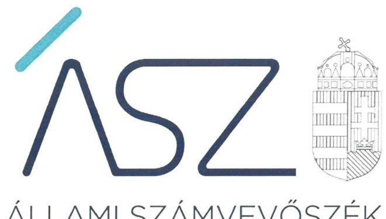
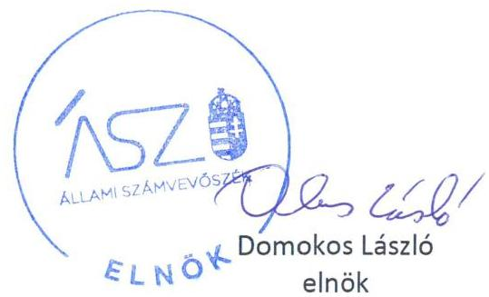

ÁLLAMI SZÁMVEVŐSZÉK

# JELENTÉS 

## A nemzeti tulajdonú gazdasági társaságok feletti tulajdonosi joggyakorlás ellenőrzése

Abasár Községi Önkormányzat, Balmazújváros Város Önkormányzata, Csurgó Város Önkormányzata, Mogyoród Nagyközség Önkormányzata, Pest Megye Önkormányzata

2022. 

22026
www.asz.hu

---

ÁLLAMI SZÁMVEVŐSZÉK

# JELENTÉS

A nemzeti tulajdonú gazdasági társaságok feletti tulajdonosi joggyakorlás ellenőrzése

Abasár Községi Önkormányzat, Balmazújváros Város Önkormányzata, Csurgó Város Önkormányzata, Mogyoród Nagyközség Önkormányzata, Pest Megye Önkormányzata

2022. 06. hó 23. nap

22026
www.asz.hu

---

# AZ ELLENŐRZÉST VEZETTE ÉS A VÉGREHAJTÁSÁÉRT FELELŐS: 

DR. GÁL NÓRA ellenőrzésvezető
VARGA EDIT ellenőrzésvezető

## A PROGRAM ÖSSZEÁLLÍTÁSÁÉRT FELELŐS:

DR. FELFÖLDI IZABELLA program készítésért felelős vezető

IKTATÓSZÁM: EL-3681-001/2022.
TÉMASZÁM: 2565
ELLENŐRZÉS-AZONOSÍTÓ SZÁM: V0909

---

# TARTALOMJEGYZÉK 

■ ÖSSZEGZÉS ..... 5
■ AZ ELLENŐRZÉS CÉLJA ..... 7
■ AZ ELLENŐRZÉS TERÜLETE ..... 8
■ AZ ELLENŐRZÉS HÁTTERE, INDOKOLTSÁGA ..... 10
■ A JELENTÉS LÉNYEGES KÉRDÉSKÖREI ..... 11
■ AZ ELLENŐRZÉS HATÓKÖRE ÉS MÓDSZEREI ..... 12
■ MEGÁLLAPÍTÁSOK ..... 14
■ MELLÉKLETEK ..... 17
I. sz. melléklet: Értelmező szótár ..... 17
■ FÜGGELÉK: ÉSZREVÉTELEK ..... 19
■ RÖVIDÍTÉSEK JEGYZÉKE ..... 21

---

.

---

# ÖSSZEGZÉS 

Az Állami Számvevőszék által ellenőrzött öt tulajdonosi joggyakorló közül Mogyoród Nagyközség Önkormányzata, a Pest Megye Önkormányzata, valamint Balmazújváros Város Önkormányzata a tulajdonosi joggyakorlás szabályozási kereteit kialakította és a jogszabályi előírásokon túl a nemzeti vagyon megőrzését erősítő, további tulajdonosi monitoring tevékenységet is végzett a 2020. évben. A tulajdonosi jogait Mogyoród Nagyközség Önkormányzata, valamint a Pest Megye Önkormányzata gyakorolta megfelelően. Balmazújváros Város Önkormányzatánál a tulajdonosi joggyakorlás nem volt elszámoltatható a 2018-2020. évben. Az Abasár Községi Önkormányzat és Csurgó Város Önkormányzata esetében a tulajdonosi joggyakorlás szabályozási keretei hiányoztak és a tulajdonosi ellenőrzés a gyakorlatban sem érvényesült, ezért a nemzeti vagyon megőrzése nem volt biztosított a 2018-2020. évben.

## Az ellenőrzés társadalmi indokoltsága

A nemzeti tulajdonú gazdasági társaságok ellenőrzése kiemelten fontos a nemzeti vagyon megőrzése érdekében. Gazdálkodásuk jellemzően a közérdeklődés és a média figyelmének középpontjában áll, amihez hozzájárul a gazdálkodásuk körébe tartozó - a nemzeti vagyon részét képező - vagyon nagysága, illetve az általuk ellátott közszolgáltatások minősége és hatékonysága. Az Állami Számvevőszék 2020-ban egyidejűleg értékelte az összes magyarországi önkormányzatnál a működést meghatározó alapvető szabályozási környezetet. Az értékelés ${ }^{1}$ rávilágított arra, hogy több önkormányzatnál hiányoznak a működést meghatározó alapvető szabályozások, nyilvántartások, amelyek a szabályszerű gazdálkodás feltételeinek megteremtéséhez nélkülözhetetlenek. Különösen kockázatos a szabályozási keretek hiánya azoknál az önkormányzatoknál, amelyek gazdasági társasággal rendelkeznek, hiszen ezek az önkormányzatok a nemzeti vagyonba tartozó vagyonuk egy részét kihelyezik a társaságba és az alaptörvényi elveknek megfelelő nemzeti vagyon megőrzési kötelezettségüknek ez esetben tulajdonosi joggyakorlóként kötelesek eleget tenni. Ennek a kötelezettségnek történő megfelelés szoros kapcsolatban áll a szabályozási környezet állapotával. Ezért azon ellenőrzötteknél, ahol az ÁSZ² 2020. évre vonatkozóan magas integritási kockázatot észlelt, a szabályos és átlátható gazdálkodás, a csalásmentes működés alapvető feltételeinek biztosításának hiánya miatt indokolt volt - a nemzeti vagyon megőrzése és védelme alaptörvényi elveinek érvényesülését biztosítandó - további ellenőrzés elvégzése.

Ellenőrzéseink feltárják, hogy a tulajdonosi felügyelet hozzájárult-e a szabályszerű gazdálkodáshoz és feladatellátáshoz. A jó gyakorlatok bemutatásával az ÁSZ hozzájárulhat a követendő megoldások megismertetéséhez, terjesztéséhez.

## Főbb megállapítások, következtetések

A gazdasági társaságok feletti tulajdonosi joggyakorlás kereteit Balmazújváros Város Önkormányzatánál, Mogyoród Nagyközség Önkormányzatánál, valamint a Pest Megye Önkormányzatánál a jogszabályi előírásoknak megfelelően kialakították a 2020. évben. Mogyoród Nagyközség Önkormányzatánál, valamint a Pest Megye Önkormányzatánál a gazdasági társaságok feletti tulajdonosi joggyakorlás a jogszabályi és a belső előírások figyelembevételével történt a 2018-2020. évben. Balmazújváros Város Önkormányzatánál az önkormányzat gazdasági társasága feletti tulajdonosi joggyakorlás nem volt szabályszerű, az önkormányzat nem gondoskodott a társaság elszámoltatásáról a 2018-2020. évben.

---

A hivatkozott három önkormányzat az Alaptörvényben megfogalmazott nemzeti vagyon értékének megőrzésére és védelmére vonatkozó elvek érvényesítése érdekében a gazdasági társaságai tevékenységének mérésére, értékelésére alkalmas - monitorozható - követelményeket, elvárásokat is kialakított és ezek teljesülésének évenkénti monitorozását elvégezte.

Abasár Községi Önkormányzat és Csurgó Város Önkormányzata a tulajdonosi joggyakorlás kereteit nem alakította ki. A jogszabályi előírások szerinti szabályozási környezet hiányában a nemzeti vagyon megőrzése nem volt biztosított a 2020. évben, az önkormányzatoknak további lépéseket kell tenniük a nemzeti vagyon megőrzésének alaptörvényi követelménye teljesítéséhez. A szabályozási keretek hiányában a tulajdonosi jogok gyakorlása nem volt szabályszerű a 2018-2020. években. A tulajdonosi ellenőrzés alapvető feltételeinek hiánya a vagyonvesztés kockázatát hordozza az érintett önkormányzatoknál.

Az ÁSZ által feltárt szabálytalanságok jövőre vonatkozó megszüntetése érdekében Abasár Községi Önkormányzatának, Csurgó Város Önkormányzatának és Balmazújváros Város Önkormányzatának vezetője az ÁSZ tv. 33. § (1) bekezdésében foglaltak értelmében köteles a jelentésben foglalt megállapításokhoz kapcsolódó intézkedési tervet összeállítani és azt a jelentés kézhezvételétől számított 30 napon belül az ÁSZ részére megküldeni.

---

# AZ ELLENŐRZÉS CÉLJA 

AZ ELLENŐRZÉS CÉLJA annak megállapítása, hogy a tulajdonosi joggyakorló a gazdasági társaságai feletti tulajdonosi joggyakorlás kereteit kialakította-e, tulajdonosi jogait megfelelően gyakorolta-e és kötelezettségeit teljesítette-e.

---

# AZ ELLENŐRZÉS TERÜLETE 

## Abasár Községi Önkormányzat, Balmazújváros Város Önkormányzata, Csurgó Város Önkormányzata, Mogyoród Nagyközség Önkormányzata és Pest Megye Önkormányzata, mint az önkormányzati tulajdonú gazdasági társaságok felett tulajdonosi jogokat gyakorló szervezetek

AZ ABASÁR KÖZSÉGI ÖNKORMÁNYZATot 1990. szeptember 30-án alapították. Az önkormányzat székhelye Abasár község, amely Heves megyében, a Gyöngyösi járásban fekszik, lakosainak száma 2465 fő. Az Önkormányzat a Szervezeti és Működési Szabályzatában foglaltak szerint önként vállalt feladatok ellátására hozta létre az önkormányzat 100%-os tulajdonában lévő gazdasági társaságait.

Az ABAVIZÉP Abasári Vízgazdálkodási, Építő és Szolgáltató Nonprofit Kft. ${ }^{3}$-t a helyi környezet- és természetvédelmi, vízgazdálkodási, vízkárelhárítási feladatok ellátásának biztosítására, az Abasári Nonprofit Településüzemeltetési és Fejlesztési Kft.-t egyes településüzemeltetési feladatok ellátására hozták létre. Az ellenőrzött időszakban működő Abaproject Company Kft. „v.a." elnevezésű társaságra vonatkozó tulajdonosi joggyakorlás tekintetében az ÁSZ nem végzett ellenőrzést, a társaság 2020. október 1. óta végelszámolás alatt áll.

BALMAZÚJVÁROS VÁROS ÖNKORMÁNYZATát 1990. október 20-án alapították. Az önkormányzat székhelye Balmazújváros, amely Hajdú-Bihar megyében a Balmazújvárosi járás székhelye is egyben. Balmazújváros lakosságszáma meghaladja a 17 ezer főt.

A Balmazújvárosi VESZ Városi Egészségügyi Szolgálat Nonprofit Korlátolt Felelősségű Társaságot a Balmazújváros Város Önkormányzata 2007. október 27-én alapította, egyszemélyes társaságként. A Társaság Balmazújváros és térsége lakosainak egészségügyi ellátását végzi. Tevékenysége során az Mtötv. ${ }^{4}$ rendelkezései szerinti helyi önkormányzati közfeladatot is ellát, mivel alapellátást végez a háziorvosi szolgálat, a gyermekorvosi szolgálat, a védőnői szolgálat, az anya-csecsemő-gyermekvédelem és iskola egészségügyi ellátás, a házi szakápolás és a foglalkozás-egészségügyi alapellátás területeken, továbbá az alapellátáson kívül járóbeteg szakellátási feladatokat végez.

CSURGÓ VÁROS ÖNKORMÁNYZATát 1990. szeptember 30-án alapították. Az önkormányzat székhelye Csurgó, amely Somogy megyében található, a Csurgói járás központja, lakosságszáma 4885 fő.

Csurgó Város Önkormányzata az ellenőrzött, 2018-2020. közötti időszakban hat gazdasági társaságban rendelkezett tulajdonnal, melyből három társaságban az önkormányzat kizárólagos tulajdonos, három társaságban pedig kisebbségi tulajdonos volt.

---

Az ÁSZ ellenőrzése a Csurgói Ipari Park Beruházó Kft.-hez kapcsolódó tulajdonosi joggyakorlás ellenőrzésére terjedt ki. A társaságot az önkormányzat 2015. szeptember 9-én alapította, egyszemélyes társaságként. Fő tevékenysége üzletviteli és egyéb vezetési tanácsadás.

MOGYORÓD NAGYKÖZSÉG ÖNKORMÁNYZATát 1990. szeptember 30-án alapították. A község Pest megyében, a Gödöllői járásban található, lakosainak száma 7247 fő. Az önkormányzat a 100%-os önkormányzati tulajdonban lévő Mogyoród Településüzemeltető Nonprofit Kft.-t önként vállalt feladatok ellátására hozta létre és tartja fenn.

PEST MEGYE ÖNKORMÁNYZATA területi önkormányzat, amely törvényben meghatározottak szerint területfejlesztési, vidékfejlesztési, területrendezési, valamint koordinációs feladatokat lát el. Illetékességi területe Pest megye közigazgatási területére terjed ki, székhelye Budapesten található, a területén lakók száma meghaladja az 1,3 millió főt. A Pest Megye Önkormányzata a Pest Megyei Területfejlesztési Nonprofit Kft.-t 1999-ben alapította, egyszemélyes társaságként. Alapításának célja Pest megye gazdasági teljesítőképességének növelése, az egyes térségek fejlettségi különbségének mérséklése, az egységes területi tervezés megvalósítása során a döntés előkészítési, tervezési és operatív koordinációs feladatainak ellátása. A gazdasági társaság közhasznú tevékenységet is ellát, közhasznú főtevékenysége üzletviteli és egyéb tanácsadás.

---

# AZ ELLENŐRZÉS HÁTTERE, INDOKOLTSÁGA 

A nemzeti tulajdonú gazdasági társaságok ellenőrzése kiemelten fontos, mivel a társaságok a nemzeti vagyon részei. A társaságok feletti tulajdonosi joggyakorlás szabályszerűségének, a tulajdonosi jogok megfelelő gyakorlásának hiánya veszélyezteti a nemzeti vagyon megőrzésére vonatkozó alaptörvényi követelményt. Az ellenőrzéseink megállapításai alapján megfogalmazott számvevőszéki javaslatok hozzájárulhatnak a meglévő hibák megszüntetéséhez, a nemzeti vagyon védelméhez.

---

# A JELENTÉS LÉNYEGES KÉRDÉSKÖREI 

1. A gazdasági társaság feletti tulajdonosi joggyakorlás kereteit kialakították-e?
2. A gazdasági társaság feletti tulajdonosi joggyakorlás a jogszabályi és a belső előírások figyelembevételével történt-e?

---

# AZ ELLENŐRZÉS HATÓKÖRE ÉS MÓDSZEREI 

## Az ellenőrzés típusa

Megfelelőségi ellenőrzés.

## Az ellenőrzött időszak

Az ellenőrzött időszak a 2020. év, az önkormányzati tulajdonú gazdasági társaságok éves beszámolóinak elfogadására vonatkozó értékelés, valamint a vagyonkezelésbe adott nemzeti vagyonnal való gazdálkodás ellenőrzésének értékelése tekintetében a 2018-2020. évek.

## Az ellenőrzés tárgya

Az önkormányzati tulajdonban (résztulajdonban) lévő gazdasági társaság feletti tulajdonosi joggyakorlás kialakítása és működtetése.

## Az ellenőrzött szervezet

- Abasár Községi Önkormányzat
- Balmazújváros Város Önkormányzata
- Csurgó Város Önkormányzata
- Mogyoród Nagyközség Önkormányzata
- Pest Megye Önkormányzata,
mint az önkormányzati tulajdonban (résztulajdonban) lévő gazdasági társaságok feletti tulajdonosi jogok gyakorlója.

## Az ellenőrzés jogalapja

Az ellenőrzés jogalapját az ÁSZ tv. 5. § (3) bekezdése, 5. § (4) bekezdése képezi.

## Az ellenőrzés módszerei

Az ÁSZ az ellenőrzést az ellenőrzési program ellenőrzési kérdései, az ellenőrzött időszakban hatályos jogszabályok, az ellenőrzés szakmai szabályok és módszertanok alapján, a nemzetközi standardok figyelembevételével végzi.

---

Az ellenőrzés ideje alatt az ellenőrzött szervezettel történő kapcsolattartást az ÁSZ Szervezeti és Működési Szabályzatának vonatkozó előírásai alapján biztosítja az ÁSZ.

Az ellenőrzési kérdések megválaszolásához szükséges bizonyítékok megszerzése a következő ellenőrzési eljárások alkalmazásával történik: megfigyelés, információkérés, összehasonlítás, valamint elemző eljárás. Az ellenőrzési bizonyítékként felhasználható adatforrások közé tartoznak az ellenőrzési programban felsorolt adatforrások, továbbá minden - az ellenőrzés folyamán - feltárt, az ellenőrzés szempontjából információkat tartalmazó dokumentum.

A 2020. évre vonatkozóan ellenőrzi az ÁSZ a tulajdonosi joggyakorlás kereteinek kialakítását, a tulajdonosi joggyakorló tevékenységét a felügyelőbizottság és a független könyvvizsgáló működéséhez kapcsolódóan, valamint azt, hogy a tulajdonosi joggyakorló - amennyiben a gazdasági társaság feladatellátásához és vagyonkezeléséhez kapcsolódóan határozott meg követelményeket, elvárásokat - a nemzeti vagyon értékének megőrzése érdekében monitorozta-e azok teljesülését. Az ÁSZ a 2018-2020. évek vonatkozásában ellenőrzi a tulajdonosi joggyakorló részvételét az éves beszámoló elfogadására vonatkozó döntéshozatalban, valamint amennyiben adott a társaságainak vagyonkezelésbe nemzeti vagyont, akkor azt, hogy az azzal történő gazdálkodást a tulajdonosi joggyakorló ellenőrizte-e.

A program egyes ellenőrzési kérdései - a jogszabályok által elő nem írt, úgynevezett helyénvalósági kritériumok szerinti ellenőrzésében - a társaságok tulajdonosi joggyakorlóitól elvárható gondosság mellett alkalmazott jó gyakorlat alapján kerültek meghatározásra. Ezen kritériumok betartását nem írja elő kötelező jelleggel jogszabály, azonban alkalmazásukkal pozitív változások indulhatnak el a társaságok pénzügyi és vagyoni helyzetében. A helyénvalósági kritériumokra vonatkozó értékelések a jelentésben dőlt betűvel szerepelnek.

Az ellenőrzést a kérdésekre adott válaszok kiértékelésével, valamint a megjelölt adatforrások, a csatolt tanúsítványok felhasználásával, továbbá az adott időszakban hatályos jogszabályok figyelembevételével kell végezni.
 lefolytatni.

---

# 1. A gazdasági társaság feletti tulajdonosi joggyakorlás kereteit kialakították-e? 

Összegző megállapítás

A gazdasági társaságok feletti tulajdonosi joggyakorlás kereteit három önkormányzatnál kialakították, két önkormányzatnál nem alakították ki 2020-ban.

Az ellenőrzött önkormányzatok mindegyike rendelkezett a jogszabályi előírások szerinti Szervezeti és Működési Szabályzattal ${ }^{6}$, amelyek tartalmazták a tulajdonosi jogkör gyakorlás tekintetében a feladat- és hatásköröket.

Az Abasár Községi Önkormányzat a Hötv. ${ }^{7}$ 138. § (1) bekezdés j) pontjának előírásával ellentétesen nem határozta meg az önkormányzati vagyonnal történő gazdálkodás szabályait. A további négy ellenőrzött tulajdonosi joggyakorló ezen jogszabályi kötelezettségének eleget tett.

Csurgó Város Önkormányzata kivételével az ellenőrzött önkormányzatoknál a Taktv. ${ }^{8}$ 5. § (3) bekezdés és a Ptk. ${ }^{9}$ 3:109. § (4) bekezdés előírásaival összhangban gondoskodtak a gazdasági társaságokra vonatkozó Javadalmazási szabályzatok elkészítéséről. A Javadalmazási szabályzatok tartalmazták a vezető tisztségviselő, a felügyelőbizottsági tagok, az Mt. ${ }^{10}$ 208. §-ának hatálya alá eső munkavállalók javadalmazásáról, valamint a jogviszony megszűnése esetére biztosított juttatásokról szóló szabályozást.

Csurgó Város Önkormányzata kivételével az ellenőrzött tulajdonosi jogkörgyakorlók 2020. évben gondoskodtak arról, hogy a Tak.tv. 4. § (1) bekezdés előírásával összhangban a társaságok felügyelőbizottsággal rendelkezzenek.

Az Abasár Községi Önkormányzatnál, valamint Balmazújváros Város Önkormányzatánál a Ptk. 3:122. § (3) bekezdés ellenére a gazdasági társaságok felügyelőbizottsága nem rendelkezett a tulajdonosi joggyakorló által jóváhagyott ügyrenddel.

Az Abasár Községi Önkormányzat az ellenőrzött két gazdasági társaságából csak az egyikre vonatkozóan határozott meg, Csurgó Város Önkormányzata a tulajdonában lévő gazdasági társaságra vonatkozóan nem határozott meg a gazdasági társaság tevékenységének mérésére, értékelésére alkalmas követelményeket, elvárásokat a 2020. évben.

A hivatkozott két önkormányzat esetében az Alaptörvény 38. cikkében és az Nvtv. ${ }^{11}$ 7. §-ban megfogalmazott nemzeti vagyon értékének megőrzésére vonatkozó elvek érvényesítése a tulajdonukban álló gazdasági társaságok tekintetében nem volt biztosított.

Balmazújváros Város Önkormányzata, a Pest Megye Önkormányzata, valamint Mogyoród Nagyközség Önkormányzata a tulajdonában lévő gazdasági társaságra vonatkozóan a 2020. évben meghatározta a gazdasági társaság tevékenységének mérésére, értékelésére alkalmas - monitorozható - követelményeket, elvárásokat. Mogyoród Nagyközség Önkormány-

---

zata meghatározta továbbá a vagyonkezelésbe adott vagyonnal való gazdálkodás értékének megőrzésére, védelmére alkalmas - monitorozható követelményeket, elvárásokat.

# 2. A gazdasági társaság feletti tulajdonosi joggyakorlás a jogszabályi és a belső előírások figyelembevételével történt-e? 

Összegző megállapítás

Két önkormányzatnál a gazdasági társaság feletti tulajdonosi joggyakorlás a jogszabályi és a belső előírások figyelembevételével történt a 2018-2020. évben. Három önkormányzat nem szabályszerűen gyakorolta a tulajdonosi jogait a 2018-2020. évben.

A Pest Megye Önkormányzata, valamint Mogyoród Nagyközség Önkormányzata, mint tulajdonosi joggyakorló a 2018-2020. évre vonatkozóan a gazdasági társaságai Számv. tv. ${ }^{12}$ szerinti éves beszámolói jóváhagyásáról a jogszabályi előírásoknak megfelelően döntött, a 2020. évre vonatkozóan a tulajdonosok a beszámolók elfogadásáról a felügyelőbizottságok jelentéseinek birtokában döntöttek, a jogszabályi előírásnak megfelelően.

Az Abasár Községi Önkormányzat, mint tulajdonosi joggyakorló a Ptk. 3:109. § (2) pontjában meghatározott kötelezettsége ellenére a tulajdonában lévő két társaság 2018-2020. évekre vonatkozó Számv. tv. szerinti éves beszámolóit nem hagyta jóvá, így az egyik legfontosabb tulajdonosi jogot nem gyakorolta.

Balmazújváros Város Önkormányzata, mint tulajdonosi joggyakorló a tulajdonában álló gazdasági társaság esetében a 2018-2020. évekre vonatkozóan nem igazolta a Számv. tv. 20. § (6) bekezdés előírásának megfelelő, a gazdasági társaság képviseletére jogosult személy által aláírt éves beszámolók jóváhagyását.

Csurgó Város Önkormányzata, mint tulajdonosi joggyakorló a tulajdonában álló gazdasági társaság esetében a 2018-2020. évekre vonatkozóan nem igazolta, hogy a gazdasági társaság a Tak.tv. 4. § (1) bekezdés előírásának megfelelően felügyelő bizottságot működtet. A Ptk. 3:120. § (2) bekezdés előírása szerint a beszámolóról a tulajdonosi joggyakorló a felügyelőbizottság írásbeli jelentésének birtokában dönthet. A felügyelő bizottság működésének hiányában a tulajdonosi joggyakorló nem igazolta a beszámolók jogszabályi előírás szerinti jóváhagyását.

Az Abasár Községi Önkormányzat azon gazdasági társaságánál, amelynél meghatározta a 2020. évben a gazdasági társaság tevékenységének mérésére, értékelésére alkalmas követelményeket, azok teljesülésének monitorozását nem végezte el.

Balmazújváros Város Önkormányzata, a Pest Megye Önkormányzata, valamint Mogyoród Nagyközség Önkormányzata a tulajdonában lévő gazdasági társaságra vonatkozóan meghatározott, a gazdasági társaság tevékenységének mérésére, értékelésére alkalmas követelmények, elvárások teljesülését legalább évente monitorozta. Mogyoród Nagyközség Önkormányzata a vagyonkezeléshez kapcsolódóan meghatározott követelmények teljesülésének monitorozását a 2020. évben elvégezte.

---

.

---

# MELLÉKLETEK 

- I. SZ. MELLÉKLET: ÉRTELMEZŐ SZÓTÁR
gazdasági társaság
kisebbségi tulajdonú gazdasági társaság
közszolgáltatás
közfeladat
nemzeti vagyon
többségi tulajdonú gazdasági társaság
tulajdonosi jogok gyakorlója
vagyonkezelői jog

A gazdasági társaságok üzletszerű közös gazdasági tevékenység folytatására, a tagok vagyoni hozzájárulásával létrehozott, jogi személyiséggel rendelkező vállalkozások, amelyekben a tagok a nyereségből közösen részesednek, és a veszteséget közösen viselik.
(Forrás: Ptk. 3:88. § (1) bekezdése)
Kisebbségi tulajdonú az a társaság, ahol a tulajdonosi joggyakorló nem rendelkezik a Ptk. 8:2. § (1) bekezdés szerinti többségi befolyással.
Az Ebktv. ${ }^{13}$ 3. § d) pontja a következőképpen határozza meg a közszolgáltatást: „szerződéskötési kötelezettség alapján a lakosság alapvető szükségleteinek ellátására irányuló szolgáltatás, így különösen a villamos energia-, gáz-, hő-, víz-, szennyvíz- és hulladékkezelési, köztisztasági, postai és távközlési szolgáltatás, továbbá a menetrend alapján közlekedő járművekkel végzett közforgalmú személyszállítás".
Az Áht. 3/A. § (1) bekezdése alapján közfeladat a jogszabályban meghatározott állami vagy önkormányzati feladat.
Nvtv. 1. § (2) bekezdése szerint nemzeti vagyonba tartozik többek között:
„az állam vagy a helyi önkormányzat kizárólagos tulajdonában álló dolgok, az a) pont hatálya alá nem tartozó, állam vagy a helyi önkormányzat tulajdonában lévő dolog,
az állam vagy a helyi önkormányzat tulajdonában lévő pénzügyi eszközök, továbbá az államot vagy a helyi önkormányzatot megillető társasági részesedések,
az államot vagy a helyi önkormányzatot megillető bármely vagyoni értékkel rendelkező jogosultság, amelyet jogszabály vagyoni értékű jogként nevesít."
Többségi tulajdonú az a társaság, ahol a tulajdonosi joggyakorló a Ptk. 8:2. § (1) bekezdés szerinti többségi befolyással rendelkezik.

Többségi befolyás az olyan kapcsolat, amelynek révén természetes személy vagy jogi személy (befolyással rendelkező) egy jogi személyben a szavazatok több mint felével vagy meghatározó befolyással rendelkezik.
Aki a nemzeti vagyon felett az államot vagy a helyi önkormányzatot megillető tulajdonosi jogok és kötelezettségek összességének gyakorlására jogosult. (Forrás: Nvtv. 3. § (1) bekezdés 17. pontja)
A képviselő-testület a helyi önkormányzat tulajdonában lévő nemzeti vagyonra a nemzeti vagyonról szóló törvény rendelkezései szerint az önkormányzati közfeladat átadásához kapcsolódva vagyonkezelői jogot létesíthet. Vagyonkezelői jog önkormányzati lakóépületre és vegyes rendeltetésű épületre, társasházban lévő önkormányzati lakásra és nem lakás céljára szolgáló helyiségre kizárólag a helyi önkormányzat 100%-os tulajdonában álló gazdálkodó szervezettel, vagy annak 100%-os tulajdonában álló gazdálkodó szervezettel létesíthető, és kizárólag általuk gyakorolható. A vagyonkezelési szerződésnek a gazdálkodó szervezet tulajdonosi szerkezetében történő tulajdonosváltozás miatti megszűnésének esetére a nemzeti vagyonról szóló törvényben meghatározottak az irányadók.
(Forrás: Mötv. 109. § (1) bek.)

---

.

---

# FÜGGELÉK: ÉSZREVÉTELEK 

Az ellenőrzés megállapításait a Számvevőszék 15 napos észrevételezésre megküldte az ellenőrzött szervezetek vezetőinek az ÁSZ tv. 29. § (1) bekezdése előírásának megfelelően.

A törvény által biztosított határidőben egyik ellenőrzött szervezet sem élt észrevételezési jogával.

[^0]
[^0]:    * 29. § (1) Az Állami Számvevőszék az ellenőrzési megállapításait megküldi az ellenőrzött szervezet vezetőjének vagy az általa megbízott személynek, és annak, akinek személyes felelősségét állapította meg.
    (2) Az ellenőrzött szervezet vezetője és a felelősként megjelölt személy az ellenőrzés megállapításaira tizenöt napon belül írásban észrevételt tehet.
    (3) Az Állami Számvevőszék az észrevételre a beérkezésétől számított harminc napon belül írásban válaszol. A figyelembe nem vett észrevételeket köteles a jelentésben feltüntetni, és megindokolni, hogy azokat miért nem fogadta el.

---

.

---

# RÖVIDÍTÉSEK JEGYZÉKE 

${ }^{1}$ 2020. évi értékelés
${ }^{2}$ ÁSZ
${ }^{3} \mathrm{Kft}$.
${ }^{4}$ Mötv.
${ }^{5}$ ÁSZ tv.
${ }^{6}$ SZMSZ
${ }^{7}$ Hötv.
${ }^{8}$ Taktv.
${ }^{9}$ Ptk.
${ }^{10} \mathrm{Mt}$.
${ }^{11}$ Nvtv.
${ }^{12}$ Számv. tv.
${ }^{13}$ Ebktv.

21004-21024. számú ÁSZ jelentések
Állami Számvevőszék
Korlátolt felelősségű társaság
2011. évi CLXXXIX. törvény a Magyarország helyi önkormányzatairól (hatályos: 2012. január 1-től)
2011. évi LXVI. törvény az Állami Számvevőszékről (hatályos: 2011. július 1-jétől)

Abasár Községi Önkormányzat Képviselő-testületének 17/2014 (XI.28.) önkormányzati rendelete az Önkormányzat Szervezeti és Működési Szabályzatáról
Balmazújváros Város Önkormányzata Képviselő-testületének 16/2010. (XI. 25.) önkormányzati rendelete a Képviselő-testület Szervezeti és Működési Szabályzatáról
Csurgó Város Önkormányzata Képviselő-testületének a Szervezeti és Működési Szabályzatról szóló 10/2014. (X.27.) önkormányzati rendelet, hatályos: 2014. év október 27-től

Mogyoród Nagyközség Önkormányzat Képviselő-testületének 19/2019(X.24) önkormányzati rendelete Mogyoród Nagyközség Önkormányzat Szervezeti és Működési Szabályzatáról
Pest Megye Közgyűlésének 13/2014. (XII.08.) önkormányzati rendelete
Pest Megye Önkormányzatának Közgyűlése és szervei szervezeti és működési szabályzatáról
1991. évi XX. törvény a helyi önkormányzatok és szerveik, a köztársasági megbízottak, valamint egyes centrális alárendeltségű szervek feladat- és hatásköreiről (hatályos: 1991. VII. 23-tól)
2009. évi CXXII. törvény a köztulajdonban álló gazdasági társaságok takarékosabb működéséről (hatályos: 2009. december 4-től)
2013. évi V. törvény a Polgári Törvénykönyvről
2012. évi I. törvény a munka törvénykönyvéről
2011. évi CXCVI. törvény a nemzeti vagyonról
2000. évi C. törvény a számvitelről
egyenlő bánásmódról és az esélyegyenlőség előmozdításáról szóló 2003. évi CXXV. törvény

---

# ASZ 

ÁLLAMI SZÁMVEVŐSZÉK
1052 Budapest, Apáczai Cs. J. u. 10. I 1364 Budapest 4. Pf. 54 TEL: +36 14849100
email: szamvevoszek@asz.hu
web: www.asz.hu | www.aszhirportal.hu

