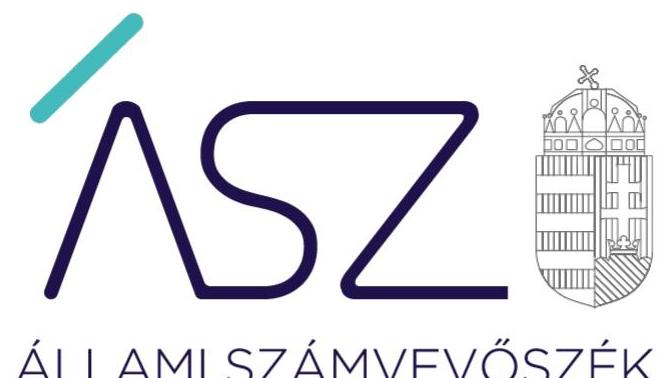
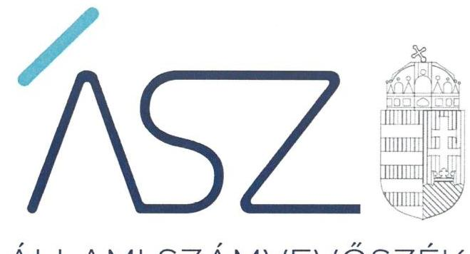
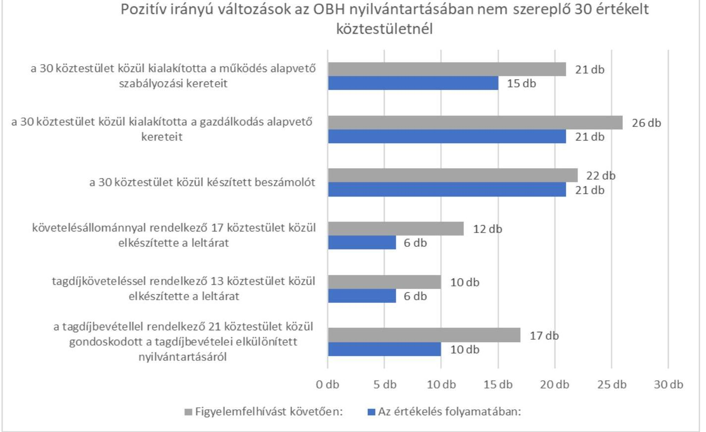
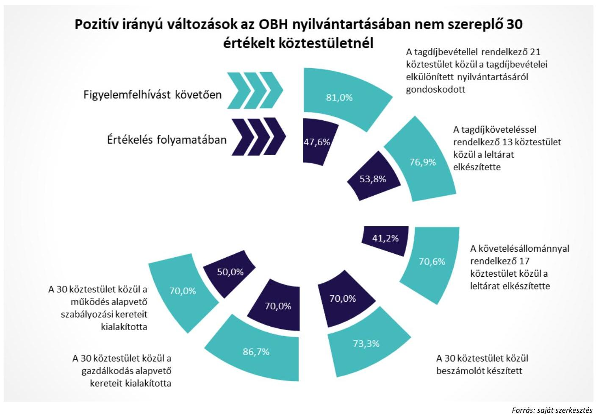
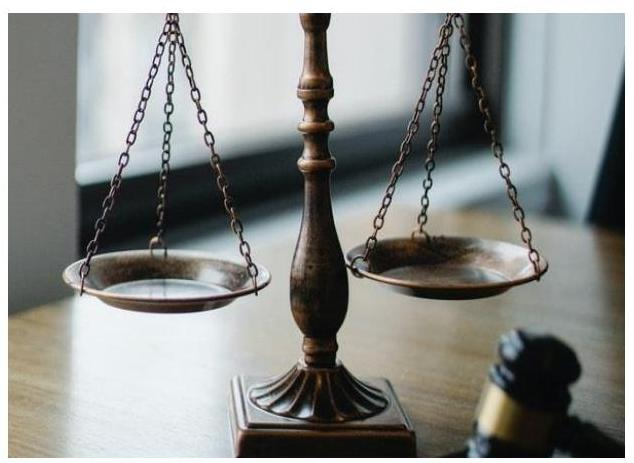
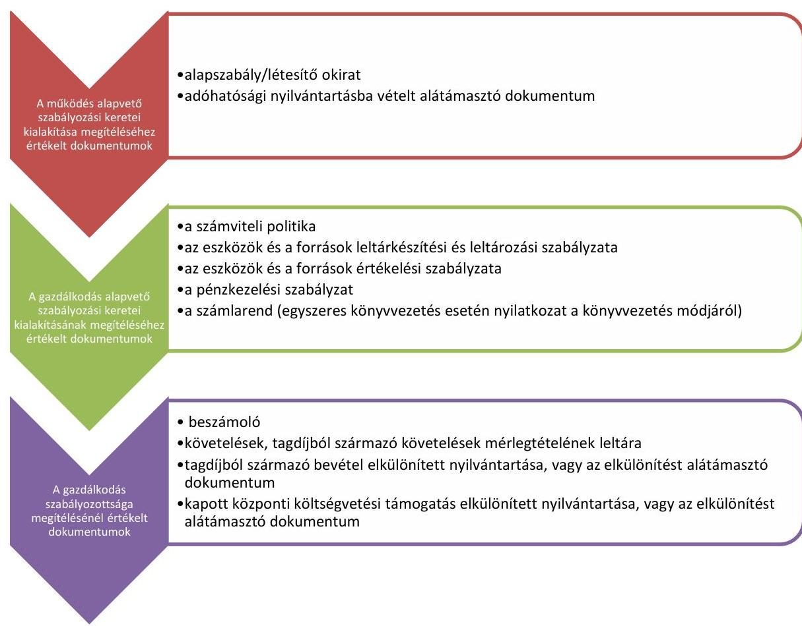

# JELENTÉS 

## Köztestületek monitoring típusú értékelése

Országos Bírósági Hivatal nyilvántartásában nem szereplő köztestületek értékelése
2022.

22027
www.asz.hu

---

ÁLLAMI SZÁMVEVŐSZÉK

# JELENTÉS 

## Köztestületek monitoring típusú értékelése

Országos Bírósági Hivatal nyilvántartásában nem szereplő köztestületek értékelése
2022. 06. hó 24. nap

22027
www.asz.hu

---

# AZ ÉRTÉKELÉST VEZETTE ÉS A VÉGREHAJTÁSÁÉRT FELELŐS: 

DR. BENEDEK MÁRIA ellenőrzésvezető
NEMESVÁRI-HORTHY ESZTER ellenőrzésvezető
ÁRPÁSI TIBOR ellenőrzésvezető

A PROGRAM ÖSSZEÁLLÍTÁSÁÉRT FELELŐS:
NAGY ADRIENN projektvezető

IKTATÓSZÁM: EL-3447-005/2022.
TÉMASZÁM: 2575
AZONOSÍTÓ SZÁM: V091805
Jelentéseink az Országgyúlés számítógépes hálózatán és az interneten a www.asz.hu címen is olvashatóak.

---

# TARTALOMJEGYZÉK 

■ ÖSSZEGZÉS ..... 5
■ AZ ÉRTÉKELÉS CÉLJA ..... 8
■ AZ ÉRTÉKELÉS TERÜLETE ..... 9
■ AZ ÉRTÉKELÉS HÁTTERE, INDOKOLTSÁGA ..... 10
■ A JELENTÉS LÉNYEGES KÉRDÉSKÖREI ..... 11
■ AZ ÉRTÉKELÉS HATÓKÖRE ÉS MÓDSZEREI ..... 12
■ ÉRTÉKELÉSEK ..... 14
■ MELLÉKLETEK ..... 17
I. sz. melléklet: Értelmező szótár ..... 17
II. sz. melléklet: Értékelt köztestületek, székhelyük és létrehozó törvényük ..... 18
III. sz. melléklet: A köztestületek értékelése keretében értékelt lényeges dokumentumok ..... 19
■ FÜGGELÉKEK ..... 21
I. sz. függelék: Tájékoztató az ellenőrzés indokoltságáról ..... 21
■ RÖVIDÍTÉSEK JEGYZÉKE ..... 23

---

.

---

# ÖSSZEGZÉS 

Az Országos Bírósági Hivatal nyilvántartásában nem szereplő 30 köztestület közül 15 gondoskodott a müködés alapvető szabályozási kereteinek kialakításáról, 21 a gazdálkodás alapvető kereteit is kialakította. 21 köztestület készített beszámolót. A követelésállománnyal, tagdijköveteléssel rendelkezők közül 6-6 köztestület elkészítette a leltárat. 10 köztestület gondoskodott a tagdijbevételei elkülönített nyilvántartásáról.
Az értékelés folyamán 20 köztestületnél pozitív irányú változások indultak el a források szabályszerű, átlátható és elszámoltatható felhasználása alapvető feltételeit biztosító müködés és gazdálkodás szabályozása terén. Két köztestület nem tett lépéseket a pozitív változások elindítására, esetükben a források átlátható, elszámoltatható felhasználása alapvető feltételeit biztosító jogszabály követő magatartása nem javult.

## Az értékelés társadalmi indokoltsága

A köztestületek létrehozását törvények rendelik el. A köztestületek a végzett tevékenységükhöz kapcsolódóan közfeladatokat látnak el. A köztestületek által ellátott feladatok a társadalom széles rétegét érintik, ezért közérdeklődésre tartanak számot.

A köztestületek értékelésével az Állami Számvevőszék hozzájárul ahhoz, hogy a köztestületek a közpénzeket és a tagdijakat átlátható és elszámoltatható módon kezeljék. Az értékelések célja továbbá, hogy a nyilvánosság és a müködéshez forrást biztosító tagok megfelelő tájékoztatást kapjanak a közfeladatot ellátó köztestületek müködéséről.

Az Állami Számvevőszék köztestületeket érintő értékelése a köztestületek működése és gazdálkodása alapvető szabályozási kereteinek kialakítására, valamint a feladatellátást biztosító forrásokkal való gazdálkodásra terjed ki.

A közfeladatokat ellátó köztestületek szabályszerű gazdálkodása elengedhetetlen közfeladataik ellátása érdekében megfogalmazott szakmai céljaik megvalósításához, valamint a társadalmi közbizalom fenntartásához és erősítéséhez.

## Értékelés

Az Állami Számvevőszék módszertana alapján monitoring típusú megközelítés szerint végzett értékelés keretében az Országos Bírósági Hivatal nyilvántartásában nem szereplő köztestületek jelen állapotban hatályos lényeges dokumentumaira fókuszálva értékelte a forrásaik szabályszerű, átlátható és elszámoltatható felhasználása alapvető feltételeit.

A köztestületek közfeladatokat látnak el, ezért a tagjaik és a közfeladataik ellátását igénybe vevők számára is kiemelt jelentőségű, hogy a feladataik ellátásához kapott közpénzeket és a tagdijakat átlátható és elszámoltatható módon kezeljék.

A 30 köztestület közül a működés alapvető szabályozási keretei kialakításáról - az értékelt lényeges dokumentumok, az alapszabály és az adóhatósági nyilvántartásba vételt alátámasztó dokumentum alapján -15 köztestület gondoskodott, 15 azonban nem. 21 köztestület alakította ki a gazdálkodás alapvető szabályozási kereteit, 9 nem. A müködés és a gazdálkodás alapvető szabályozási kereteinek kialakítása alapvető feltétele a köztestületek átlátható és elszámoltatható működéséhez, gazdálkodásához.

A 30 köztestület közül 21 rendelkezett beszámolóval, biztosítva ezzel átláthatóságát és elszámoltathatóságát tagsága és a közvélemény felé. 17 követelésállománnyal rendelkező és 13 tagdíjkövetelés állománnyal rendelkező közül 6-6 köztestület gondoskodott a leltár elkészítéséről. 21 tagdíjbevétellel rendelkező közül 10 köztestület gondoskodott a tagdíjból származó bevételei elkülönített nyilvántartásáról.

---

A gazdálkodó múködéséről, vagyoni, pénzügyi és jövedelmi helyzetéről megalapozott és valós összképet mutató, a köztestület képviseletére jogosult személy által aláírt beszámoló elkészítése azért lényeges, mert biztosítja a szervezet múködésének és gazdálkodásának átláthatóságát és elszámoltathatóságát. A követelések leltárának jogszabályi előírások szerinti elkészítése azért lényeges, mert biztosítja a beszámolóban kimutatott követelésállomány megalapozottságát, a követelések mérlegtételének tételesen és ellenőrizhetően történő alátámasztását. A tagdíjak elkülönített nyilvántartása azért lényeges, mert az alapján biztosítható az eredménykimutatásban a tagdíj bevételek elkülönített kimutatása, a beszámoló részét képező eredménykimutatás adatainak megalapozottsága, a beszámoló megalapozottsága.

# Következtetés 

A közjegyzői, a végrehajtói és az ügyvédi tevékenység kiemelt társadalmi érintettséggel bír: az állampolgárok nagy része élete során igénybe vesz valamely közjegyzői, ügyvédi szolgáltatást vagy részese lehet végrehajtási eljárásnak. Mindegyik tevékenység az állampolgárok jogait számottevően érinti, így mindegyik értékelt területen a közfeladatellátás javításának és a közbizalom erősítésének folyamatosan fennálló kritériumnak kell lennie, mely kritériumhoz az Állami Számvevőszék elsősorban tanácsadó jellegű monitoring megközelítéssel tud és kíván hozzájárulni. Ennek érvényesülését szem előtt tartva az Állami Számvevőszék már az értékelés során felhívással élt és megszólította a köztestületek vezetőit a hiányosságok vonatkozásában lehetőséget biztosítva arra, hogy azokat megszüntessék. Az Állami Számvevőszék célja a felhívásokkal az volt, hogy már az értékelés folyamatában előmozdítsa a pozitív irányú változásokat és javuljon a köztestületeknél a közfeladat ellátásához biztosított, törvény által előírt pénzügyi források, és a kötelező tagság által fizetett hozzájárulások, továbbá tagdíjak szabályszerű, átlátható és elszámoltatható felhasználása alapvető feltételeit biztosító múködés és gazdálkodás szabályozása.

## 1. ábra

Pozitív irányú változások az OBH nyilvántartásában nem szereplő 30 értékelt köztestületnél

Forrás: saját szerkesztés

---

Forrás: saját szerkesztés
A figyelemfelhívást követően a köztestületek 66,7 \%-a - szám szerint 20 köztestület - lépéseket tett a források szabályszerű, átlátható, elszámoltatható felhasználása alapvető feltételeit biztosító működés és gazdálkodás szabályozottsága terén a szabályok kialakítására, a korábbi hiányosságok javítására és ezáltal a közfeladat-ellátás javítására.

Két köztestület - a Magyar Ügyvédi Kamara és a Veszprém Megyei Ügyvédi Kamara - nem tett lépéseket a pozitív változások elindítására, esetükben a források szabályszerű, átlátható, elszámoltatható felhasználása alapvető feltételeit biztosító működés és gazdálkodás szabályozottsága, ezáltal a közfeladat-ellátás nem javult.

---

# AZ ÉRTÉKELÉS CÉLJA 

AZ ÉRTÉKELÉS CÉLJA annak bemutatása, hogy a köztestület a feladatellátását biztosító források szabályszerű, átlátható és elszámoltatható felhasználásának alapvető feltételeit biztosította-e a múködés és gazdálkodás szabályozásával. Az értékelés célja továbbá a minimum vezetői kontrollpontok kialakításának támogatása.

---

# AZ ÉRTÉKELÉS TERÜLETE 

## Országos Bírósági Hivatal nyilvántartásában nem szereplő köztestületek

A KÖZTESTÜLET az Áhtm. ${ }^{1}$ 8/A.§ (1) bekezdése alapján önkormányzattal és nyilvántartott tagsággal rendelkező szervezet, amelynek létrehozását törvény rendeli el. A köztestület a tagságához, illetve a tagsága által végzett tevékenységhez kapcsolódó közfeladatot lát el. A köztestület jogi személy. Az Áhtm. 8/A.§ (3) bekezdése alapján törvény meghatározhat olyan közfeladatot, amelyet a köztestület köteles ellátni. A köztestület a közfeladat ellátásához szükséges - törvényben meghatározott - jogosítványokkal rendelkezik, és ezeket önigazgatása útján érvényesíti.

A MAGYAR ÜGYVÉDI KAMARA köztestület, az ügyvédi tevékenységet gyakorlók országos szervezete, amelynek tagjai a területi kamarák. A Magyar Ügyvédi Kamara tevékenységét a területi kamarák, azok tagjai és az ügyvédi kamarai nyilvántartásban szereplők javára, azok közös érdekeinek megfelelően folytatja. A Magyar Ügyvédi Kamara szervei: a küldöttgyűlés, az elnökség, az összeférhetetlenségi bizottság, a választási bizottság és az országos fegyelmi bizottság. Az értékelt ügyvédi kamarák nevét, székhelyét és létrehozó törvényüket a II. számú melléklet sorolja fel.

## A MAGYAR ORSZÁGOS KÖZJEGYZŐI KAMARÁT a

területi kamarák alkotják. A Magyar Országos Közjegyzői Kamara köztestület, amely mint legfőbb önkormányzati szerv képviseli a közjegyzői kart és szervezeteit. Magyarország területén öt területi kamara müködik. Az értékelt közjegyzői kamarák nevét, székhelyét és létrehozó törvényüket a II. számú melléklet sorolja fel.

Jelen értékelés keretében további 3 köztestület a Magyar Igazságügyi Szakértői Kamara, a Magyar Szabadalmi Ügyvivői Kamara, valamint a Magyar Bírósági Végrehajtói Kar értékelésére került sor. A Magyar Igazságügyi Szakértői Kamara önkormányzati elven alapuló, az igazságügyi szakértők érdekeit képviselő köztestület. A Magyar Szabadalmi Ügyvivői Kamara a szabadalmi ügyvivők köztestülete, amely képviseli a szabadalmi ügyvivők érdekeit, védi a szabadalmi ügyvivők jogait, őrködik a szabadalmi ügyvivői kötelezettségek teljesítésén, és őrzi a szabadalmi ügyvivői kar tekintélyét. A Magyar Bírósági Végrehajtói Kar a végrehajtók szakmai és érdek-képviseleti szerve, amely képviseli és védi a végrehajtók, végrehajtó-helyettesek és végrehajtójelöltek érdekeit, ellátja a végrehajtói szolgálattal kapcsolatos, jogszabályban meghatározott feladatokat. A Magyar Igazságügyi Szakértői Kamara, a Magyar Szabadalmi Ügyvivői Kamara, valamint a Magyar Bírósági Végrehajtói Kar székhelyét, létrehozó törvényét a II. számú melléklet sorolja fel.

---

# AZ ÉRTÉKELÉS HÁTTERE, INDOKOLTSÁGA 

A köztestületek szerepe kiemelt jelentőségű a müködésük szerinti szakmai területeken, közfeladatot látnak el, sok esetben szakmai, etikai felügyeletet gyakorolnak tagjaik felett. Elvárás, hogy a közfeladat ellátásához biztosított pénzügyi támogatást és a kötelező tagsághoz kapcsolódó tagdíjat átlátható és elszámoltatható módon kezeljék. A szabályozások kialakítása alapvető feltétele annak, hogy a köztestület a feladatellátását biztosító forrásokkal szabályszerűen és átláthatóan gazdálkodjon, biztosítsa a felelős elszámolás alapfeltételeit. A feladatellátást biztosító források értékelvű, rendeltetésszerű felhasználása, átláthatóságának megteremtése társadalmi elvárás, amelyhez az ÁSZ² az alapvető működési és gazdasági feltételek értékelésével kíván hozzájárulni.

Az ÁSZ célja, hogy új értékelési megközelítést alkalmazva támogassa a közpénzügyi helyzet javítását, a közpénzügyek fejlesztését, az eredmények fenntartását. Az ÁSZ a digitalizáció adta lehetőségek felhasználásával kíván helyzetképet adni a köztestületek alapvető szabályozottságáról, fennálló főbb hiányosságokról. Az ellenőrzés által az ÁSZ erősíti hozzáadott értéket teremtő tevékenységét és tanácsadó szerepét.

Új értékelési megközelítést alkalmazva az ÁSZ támogatja az értékelt szervezetek szabályszerű működés és gazdálkodás alapvető feltételeinek kialakítását.

---

# A JELENTÉS LÉNYEGES KÉRDÉSKÖREI 

1.     - A köztestületek kialakították-e a müködés alapvető szabályozási kereteit?
2.     - A köztestületek kialakították-e a gazdálkodás alapvető szabályozási kereteit?
3.     - A köztestületek rendelkeztek-e beszámolóval, gondoskodtak-e a követelések leltárának elkészítéséről, valamint a bevételek elkülönített nyilvántartásáról?

---

# AZ ÉRTÉKELÉS HATÓKÖRE ÉS MÓDSZEREI 

## Az értékelés típusa

Megfelelőségi ellenőrzés módszertana alapján monitoring típusú megközelítés szerint végzett értékelés.

## Az értékelt időszak

A múködés és gazdálkodás alapvető feltételeinek biztosítása tekintetében a 2021. év. A múködés és gazdálkodás tekintetében az utolsó számviteli beszámolóval lezárt gazdasági év.

## Az értékelés tárgya

Az értékelés tárgya kiterjed a köztestületnél a múködéssel és gazdálkodással kapcsolatos alapvető szabályzatok és a belső szabályozási rendszer kialakítására, a beszámoló és a követelések leltárának elkészítésére, valamint a bevételek elkülönített nyilvántartására.

## Az értékelt szervezet

Azon Országos Bírósági Hivatal nyilvántartásában nem szereplő köztestületek, amelyek jogi személyek (országos vagy területi szervek) és jogszabály alapján beszámoló készítésére kötelezettek. Az értékelt 30 köztestület felsorolását a II. melléklet tartalmazza.

## Az értékelés jogalapja

Az értékelés jogszabályi alapját az Alaptörvény ${ }^{3}$ 43. cikk (1) bekezdés és az ÁSZ tv. ${ }^{4} 1 . \S$ (3)-(4) bekezdés előírásai képezték.

## Az értékelés módszerei

Az értékelést az ÁSZ a program kérdéseire adott válaszok kiértékelésével és a vonatkozó időszakban hatályos jogszabályok alapján folytatja le. A törvényi előírásokat, valamint az ÁSZ által meghirdetett, nyilvános módszertant figyelembe véve az értékelés hatóköre kiegészülhet kockázatjelzés alapján, a kockázatértékelés függvényében további lényeges területek szabályosságának értékelésével.

---

Az értékelési kérdések megválaszolásához szükséges bizonyítékok megszerzése a következő eljárások alkalmazásával történik: megfigyelés, öszszehasonlítás, elemző eljárás. Az értékelési bizonyítékként felhasználható adatforrások közé tartoznak a program részletes szempontjainál felsorolt adatforrások, valamint minden egyéb - az értékelés folyamán feltárt, az értékelés szempontjából információt tartalmazó - dokumentum.

Az értékelés a program kérdéseire adott válaszok kiértékelésével, valamint a programban ismertetett értékelési kérdések, kritériumok, adatforrások figyelembevételével kerül lefolytatásra.

Az értékelés során az értékelt szervezettel történő kapcsolattartást az ÁSZ a szervezeti és működési szabályzatának vonatkozó előírásai alapján biztosítja.

A monitoring típusú értékelés - a jelen állapot lényeges dokumentumaira fókuszálva - a kiválasztott szempontok alapján valós idejű értékelést végez.

Az Országos Bírósági Hivatal nyilvántartásában nem szereplő 30 köztestület vezetője számára figyelemfelhívó levél került megküldésre az értékelt időszakra vonatkozó hiányosságokról, és az ÁSZ tv. előírásával összhangban 15 nap állt rendelkezésükre az ebben foglaltak elbírálására, a megfelelő intézkedések megtételére és erről az Állami Számvevőszék elnökének az értesítés megküldésére.

---

# 1. A köztestületek kialakították-e a müködés alapvető szabályozási kereteit? 

Összegző értékelés

A 30 köztestület közül 15 gondoskodott a müködés alapvető szabályozási kereteinek kialakításáról.

A MÚKÖDÉS ALAPVETŐ SZABÁLYOZÁSI KERETEINEK KIALAKÍTÁSÁRÓL 15 köztestület gondoskodott, mivel a Ptk. ${ }^{5}$ előírásaival összhangban rendelkeztek alapszabállyal, amely tartalmazta a köztestület nevét, székhelyét és célját vagy fő tevékenységét, továbbá az Art. előírásaival összhangban gondoskodtak adóhatósági nyilvántartásba vételükről, rendelkeztek adószámmal. További egy köztestület rendelkezett alapszabállyal, de az állami adóhatósági nyilvántartásba vétel iránt nem intézkedett.

14 köztestület nem rendelkezett alapszabállyal, közülük öt nem gondoskodott az adóhatósági nyilvántartásba vétel iránt sem.

A müködés alapvető szabályozási kereteinek kialakításában kiemelt jelentőséggel bír a jogi személyek létesítő okirata, alapszabálya, amely a jogi személy létesítésére vonatkozó akaratnyilvánítás írásbeli kifejezésére szolgál, ezen túlmenően abban kötelező tartalmi elemeket is szükséges rögzíteni a Ptk. előírásai szerint.

Az adószám az adóköteles tevékenység végzésének alapvető feltétele, adóköteles tevékenység adószám birtokában végezhető.

## 2. A köztestületek kialakították-e a gazdálkodás alapvető szabályozási kereteit?

## Összegző értékelés

A 30 köztestület közül 21 kialakította a gazdálkodás alapvető szabályozási kereteit.

A GAZDÁLKODÁS ALAPVETŐ SZABÁLYOZÁSI KE-
RETEIT 21 köztestület alakította ki. A Számv. tv. ${ }^{6}$-ben előírt, kötelezően elkészítendő számviteli politikával, az eszközök és a források leltárkészítési és leltározási szabályzatával és pénzkezelési szabályzattal 21 köztestület, az eszközök és a források értékelési szabályzatával 20 köztestület rendelkezett. Számlarendjét, az annak készítésére kötelezett 21 köztestület közül 13 készítette el. A tagdíjakból bevétellel rendelkező 20 köztestület közül 9 szabályozta a Számv. tv. előírásaival összhangban azok elkülönített nyilvántartását.

A Számv. tv. szerint kötelezően elkészítendő számviteli politikával, az eszközök és a források leltárkészítési és leltározási szabályzatával és pénzkezelési szabályzattal 9 köztestület, az eszközök és a források értékelési

---

szabályzatával 10 köztestület nem rendelkezett. Számlarendjét, az annak készítésére kötelezett 21 köztestület közül 8 nem készítette el.

A Számv. tv.-ben meghatározott, kötelezően elkészítendő számviteli politika, az eszközök és források értékelési, az eszközök és a források leltárkészítési és leltározási szabályzata, a pénzkezelési szabályzat, valamint a kettős könyvvitelt vezető gazdálkodók által elkészítendő számlarend tartalmazza a Számv. tv.-ben rögzített alapelvek, értékelési előírások alapján e törvény végrehajtásának módszereit, eszközeit meghatározó szabályokat, amelyek biztosítják az alapvető feltételeket a számviteli alapelveknek megfelelő, szabályszerű könyvvezetéshez és a beszámoló készítéshez. A tagdíjakból származó bevételek elkülönített nyilvántartásának szabályozásával a tagdíjak átlátható könyiviteli nyilvántartása alapvető feltételei biztosítottak.

# 3. A köztestületek rendelkeztek-e beszámolóval, gondoskodtak-e a követelések leltárának elkészítéséről, valamint a bevételek elkülönített nyilvántartásáról? 

Összegző értékelés A 30 köztestületből 21 rendelkezett beszámolóval. A 17 követelésállománnyal rendelkezőből 6, 13 tagdíjköveteléssel rendelkezőből 6 gondoskodott a leltár elkészítéséről. 21 tagdíjbevétellel rendelkező köztestületből 10 gondoskodott azok elkülönített nyilvántartásáról.

BESZÁMOLÓVAL a Számv. tv. és a 479/2016. (XII. 28.) Korm. rendelet ${ }^{7}$ előírásai alapján a 30 köztestületből 21 rendelkezett, 9 köztestület nem.

A beszámoló elkészítése egy lezárt gazdasági évről a gazdálkodó működéséről, vagyoni, pénzügyi és jövedelmi helyzetéről ad tájékoztatást a köztestület vezetősége, a köztestület tagsága és a közvélemény számára. A beszámoló elkészítése alapvető feltétele annak, hogy a köztestület müködésének és gazdálkodásának átláthatósága biztosított legyen.

A LELTÁRAK ELKÉSZÍTÉSÉRŐL a 17 követelésállománnyal rendelkezőből 6, 13 tagdíjköveteléssel rendelkezőből 6 gondoskodott a Számv. tv. szerinti leltár elkészítéséről, 11, illetve 7 köztestület nem gondoskodott a követelések, illetve a tagdíjkövetelések leltárának elkészítéséről.

A leltározás eredményeként a mérlegben a követelések, a tagdíjkövetelések tételeit alátámasztó leltár biztosítja, hogy a beszámolóba felvett tételek a valóságban is megtalálhatóak, bizonyíthatóak, kívülállók által is megállapíthatóak legyenek. Ennek alapvető feltétele az, hogy a Számv. tv. szerint készüljön el a beszámolót alátámasztó leltár. Így a leltár hozzájárul a vagyon védelméhez. A köztestület a követelések, a tagdíjkövetelések leltárainak elkészítésével biztosítja, hogy átlátható és elszámoltatható legyen a tartozások kezelése.

---

# A TAGDÍJBEVÉTELEK ELKÜLÖNÍTETT NYILVÁNTARTÁSÁRÓL a Számv. tv. előírásai szerint 21 tagdíjbevétellel rendelkező köztestületből 10 gondoskodott, 11 nem. 

Az elkülönített nyilvántartás vezetésével biztosítható a közpénzek nyilvánossága és ellenőrizhetősége, a tagdíjakkal való átlátható és elszámoltatható gazdálkodás. A tagdíjak elkülönített nyilvántartásával biztosított, hogy a köztestület a tagok által befizetett tagdíjakról, azok felhasználásáról a tagsága felé számot tudjon adni.

---

# MELLÉKLETEK 

- I. SZ. MELLÉKLET: ÉRTELMEZŐ SZÓTÁR
államháztartás
költségvetési támogatás
köztestület
az államháztartás a közfeladatok ellátásának egységes szervezeti, tervezési, gazdálkodási, ellenőrzési, finanszírozási, adatszolgáltatási és beszámolási szabályok szerint működő rendszere, amely központi és önkormányzati alrendszerből áll. (Forrás: Áht. ${ }^{8}$ 2. §, 3. § (1) bekezdés 2015. január 1-től)
az államháztartás alrendszerei terhére nyújtott pénzbeli vagy nem pénzbeli juttatás, amelyet a támogató nem elsősorban ellenszolgáltatás ellenében, de konkrét program megvalósítása vagy meghatározott időszakban a támogatott szervezet müködtetése érdekében nyújt. Költségvetési támogatás különösen: a pályázat útján, valamint egyedi döntéssel kapott költségvetési támogatás; az Európai Unió strukturális alapjaiból, illetve a Kohéziós Alapból származó, a költségvetésből juttatott támogatás; az Európai Unió költségvetéséből vagy más államtól, nemzetközi szervezettől származó támogatás és a személyi jövedelemadó meghatározott részének az adózó rendelkezése szerint felajánlott összege. (Forrás: Ectv. ${ }^{9}$ 2. § 15. pont. Hatályos: 2020. június 30 -ig)
a társadalombiztosítás pénzügyi alapjai kivételével az államháztartás központi alrendszeréből ellenérték nélkül, pénzben nyújtott támogatások (Forrás: Áht. 1. § 14. pont)
A köztestület önkormányzattal és nyilvántartott tagsággal rendelkező szervezet, amelynek létrehozását törvény rendeli el. A köztestület a tagságához, illetőleg a tagsága által végzett tevékenységhez kapcsolódó közfeladatot lát el. A köztestület jogi személy. Törvény előírhatja, hogy valamely közfeladatot kizárólag köztestület láthat el, illetve, hogy meghatározott tevékenység csak köztestület tagjaként folytatható. (Forrás: 2006. évi LXV. törvény ${ }^{10}$ 8/A. § (1), (4) bekezdés)

---

# II. SZ. MELLÉKLET: ÉRTÉKELT KÖZTESTÜLETEK, SZÉKHELYÜK ÉS LÉTREHOZÓ TÖRVÉNYÜK 

## ÉRTÉKELT KÖZTESTÜLETEK, SZÉKHELYÜK ÉS LÉTREHOZÓ TÖRVÉNYÜK

| Sorszám | Értékelt köztestülete neve | Székhelye | Létrehozó törvényük |
| :--: | :--: | :--: | :--: |
| Magyar Ügyvédi Kamara és terülelt szervezetei |  |  |  |
| 1. | Magyar Ügyvédi Kamara | Budapest | az ügyvédi tevékenységről szóló 2017. évi LXXVIII. törvény (hatályos 2017. június 29-től) |
| 2. | Budapesti Ügyvédi Kamara | Budapest |  |
| 3. | Bács-Kiskun Megyei Ügyvédi Kamara | Kecskemét | A Magyar Ügyvédi Kamara az 1937. évi IV. törvény 4. Magyar Ügyvédi Kamara az 1937. évi IV. tör- |
| 4. | Békés Megyei Ügyvédi Kamara | Gyula |  |
| 5. | Borsod-Abaúj-Zemplén Megyei Ügyvédi Kamara | Miskolc | erejú rendelet, valamint a többszörösen módosított 1983. évi 4. törvényerejű rendelet alapján |
| 6. | Debreceni Ügyvédi Kamara | Debrecen |  |
| 7. | Fejér Megyei Ügyvédi Kamara | Székesfehérvár | létrehozott országos ügyvédi önkormányzati szervek - legutóbbi elnevezés szerint: Országos Ügyvédi Kamara - teljes körű jogutódja. (Magyar |
| 8. | Győr-Moson-Sopron Megyei Ügyvédi Kamara | Győr |  |
| 9. | Heves Megyei Ügyvédi Kamara | Eger | Ügyvédi Kamara - teljes körű jogutódja. (Magyar |
| 10. | Jász-Nagykun-Szolnok Megyei Ügyvédi Kamara | Szolnok | Ügyvédi Kamara Alapszabály I.3.) |
| 11. | Komárom-Esztergom Megyei Ügyvédi Kamara | Tata |  |
| 12. | Nógrád Megyei Ügyvédi Kamara | Balassagyarmat |  |
| 13. | Nyíregyházi Ügyvédi Kamara | Nyíregyháza |  |
| 14. | Pest Megyei Ügyvédi Kamara | Budapest |  |
| 15. | Pécsi Ügyvédi Kamara | Pécs |  |
| 16. | Somogy Megyei Ügyvédi Kamara | Kaposvár |  |
| 17. | Szegedi Ügyvédi Kamara | Szeged |  |
| 18. | Tolna Megyei Ügyvédi Kamara | Szekszárd |  |
| 19. | Vas Megyei Ügyvédi Kamara | Szombathely |  |
| 20. | Veszprém Megyei Ügyvédi Kamara | Veszprém |  |
| 21. | Zala Megyei Ügyvédi Kamara | Zalaegerszeg |  |
| Magyar Országos Közjegyzői Kamara és területi szervezetei |  |  |  |
| 1. | Magyar Országos Közjegyzői Kamara | Budapest | 1991. évi XLI. törvény a közjegyzökről (hatályos 1991. november 1-től) |
| 2. | Budapesti Közjegyzői Kamara | Budapest |  |
| 3. | Győri Közjegyzői Kamara | Győr |  |
| 4. | Miskolci Közjegyzői Kamara | Miskolc |  |
| 5. | Pécsi Közjegyzői Kamara | Pécs |  |
| 6. | Szegedi Közjegyzői Kamara | Szeged |  |
| Jelen értékelés keretében értékelt további 3 köztestület |  |  |  |
| 1. | Magyar Igazságügyi Szakértői Kamara | Budapest | 2016. évi XXIX. törvény az igazságügyi szakértők ről (hatályos 2016. június 15-től) |
| 2. |  |  | 1995. évi XXXII. törvény |
|  | Magyar Szabadalmi Ügyvivői Kamara | Budapest | a szabadalmi ügyvivőkról (hatályos 1996. január 1-jétől) |
| 3. | Magyar Bírósági Végrehajtói Kar | Budapest | 1994. évi LIII. törvény a bírósági végrehajtásról (hatályos 1994. szeptember 1-jétől) |

---

# Az értékelés keretében értékelt lényeges dokumentumok 

---

.

---

# FÜGGELÉKEK 

- I. SZ. FÜGGELÉK: TÁJÉKOZTATÓ AZ ELLENŐRZÉS INDOKOLTSÁGÁRÓL

Az ellenőrzés keretében értékelt kamarák, mint köztestületek szerepe kiemelt jelentőségű: a müködésük szerinti szakmai területeken közfeladatot látnak el, amelyek a társadalom széles rétegét érintik, átlátható és elszámoltatható müködésük pozitívan hat a közbizalom erősitésére.
A köztestületek törvényben rögzítettek szerint közfeladatot látnak el. Az államháztartásról szóló 1992. évi XXXVIII. törvény és egyes kapcsolódó törvények módosításáról szóló 2006. évi LXV. törvény 8/A. § (1) bekezdése kifejezetten úgy rendelkezik, hogy a köztestületi közfeladatellátás kötelező velejárója a jogi személyi forma. A közfeladat az államháztartásról szóló 2011. évi CXCV. törvény 3/A. § (1) bekezdésének előirása szerint jogszabályban meghatározott állami vagy önkormányzati feladat. Köztesület létrehozása esetében az Országgyülés ilyen feladat ellátásával bízza meg a köztestületet (állam által átengedett állami feladat).
Az állam a törvényben rögzített közfeladat ellátásához pénzügyi forrást biztosít a kötelező tagság által fizetett díjakon, kiszabható pénzbírságon keresztül, továbbá egyes köztestületeket a kamarai hatósági eljárásokért az eljáró kamara részére fizetett igazgatási szolgáltatási díjak is megilletik.
A köztesületek szervezeten belüli ellenőrzésén túl a második védelmi vonal, azaz a törvényességi felügyelet, nem terjed ki a köztestületek gazdálkodásának ellenőrzésére, a könyvvezetés szabályosságának ellenőrzésére, az átláthatóság biztosítására. Figyelemmel arra, hogy ezen szervezetek közfeladatot látnak el, kötelező tagdijfizetés kapcsolódik müködésükhöz, elengedhetetlen, hogy az Országgyülés ellenőrző funkcióját betöltő Állami Számvevőszék ezt a rést - monitoring ellenőrzése keretében - betöltse.
Az Alaptörvény indokolása szerint az Országgyülés az ellenőrzési jogkörét közvetlenül csak korlátozottan tudja gyakorolni, az Alaptörvény ezért önálló intézményként statuálja az e feladat ellátására hivatott Számvevőszéket. Az Állami Számvevőszék ezen jogi keretek között végezte el a köztestületek, benne az egyes szakmai kamarák monitoring típusú ellenőrzését.
Ezen túlmenően az Országgyülés 2021. évben kifejezetten meg is erősítette a közfeladatellátás értékelésének feladatát az Állami Számvevőszék számára, amikor a 17/2021. (VI. 16.) OGY határozatában úgy rendelkezett, hogy ,,Az Országgyülés - a jól irányított állam müködésének elősegítése érdekében - támogatja az Állami Számvevőszék ellenőrzési és elemzési feladatai mellett a tanácsadó szerepének erősitését a közpénzügyi helyzet, a közfeladatellátás javulása, valamint a közbizalom erősitése érdekében. "

---

.

---

# RÖVIDÍTÉSEK JEGYZÉKE 

${ }^{1}$ Áhtm.
${ }^{2}$ ÁSZ
${ }^{3}$ Alaptörvény
${ }^{4}$ ÁSZ tv.
${ }^{5}$ Ptk.
${ }^{6}$ Számv. tv.
${ }^{7}$ 479/2016. (XII. 28.) Korm. rendelet
${ }^{8}$ Áht.
${ }^{9}$ Ectv.
${ }^{10}$ 2006. évi LXV. törvény
2006. évi LXV. törvény az államháztartásról szóló 1992. évi XXXVIII. törvény és egyes kapcsolódó törvények módosításáról (hatályos: 2006. augusztus 24-től) Állami Számvevőszék
Magyarország Alaptörvénye (2011. április 25.)
2011. évi LXVI. törvény az Állami Számvevőszékről (hatályos: 2011. július 1-jétől) 2013. évi V. törvény a Polgári Törvénykönyvről (hatályos: 2014. március 15-től) 2000. évi C. törvény a számvitelről (hatályos: 2001. január 1-től)

479/2016. (XII. 28.) Korm. rendelet a számviteli törvény szerinti egyes egyéb szervezetek beszámoló készítési és könyvvezetési kötelezettségének sajátosságairól (hatályos: 2017. január 1-től)
az államháztartásról szóló 2011. évi CXCV. törvény
2011. évi CLXXV. törvény az egyesülési jogról, a közhasznú jogállásról, valamint a civil szervezetek müködéséről és támogatásáról
az államháztartásról szóló 1992. évi XXXVIII. törvény és egyes kapcsolódó törvények módosításáról

---

# ASZ 

ALLAMI SZAMVEVOSZEK
1052 Budapest, Apáczai Cs. J. u. 10. I 1364 Budapest 4. Pf. 54 TEL: +36 14849100
email: szamvevoszek@asz.hu
web: www.asz.hu | www.aszhirportal.hu