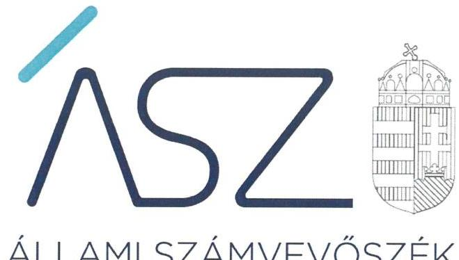

ÁLLAMI SZÁMVEVŐSZÉK

# JELENTÉS 

A szerzői jog rendszerének ellenőrzése

A Szellemi Tulajdon Nemzeti Hivatala tevékenységének és a szerzői jogot kezelő szervezetek elszámoltathatóságának és átláthatóságának ellenőrzése
2022.

22028
www.asz.hu

---

ÁLLAMI SZÁMVEVŐSZÉK

# JELENTÉS 

A szerzői jog rendszerének ellenőrzése

A Szellemi Tulajdon Nemzeti Hivatala tevékenységének és a szerzői jogot kezelő szervezetek elszámoltathatóságának és átláthatóságának ellenőrzése
2022. 06. hó 24. nap

22028
www.asz.hu

---

# AZ ELLENŐRZÉST VEZETTE ÉS A VÉGREHAJTÁSÁÉRT FELELŐS: 

KAKAS SÁNDOR ellenőrzésvezető
DR. GÁL NÓRA ellenőrzésvezető

A PROGRAM ÖSSZEÁLLÍTÁSÁÉRT FELELŐS:
DR. FELFÖLDI IZABELLA programkészítésért felelős vezető

## A TÉMÁHOZ KAPCSOLÓDÓ KORÁBBI SZÁMVEVŐSZÉKI JELENTÉSEK:

- címe: Jelentés a Szellemi Tulajdon Nemzeti Hivatala pénzügyi és vagyongazdálkodásának, a HIPAvilon Nkft-vel fennálló szerződéses kapcsolatai szabályszerűségének és a közös jogkezelő szervezetekkel kapcsolatos feladatellátásának ellenőrzéséről
- sorszáma: 16070
- címe: Jelentés - Utóellenőrzések - A Szellemi Tulajdon Nemzeti Hivatala pénzügyi és vagyongazdálkodásának, a HIPAvilon Nkft-vel fennálló szerződéses kapcsolatai szabályszerűségének, és a közös jogkezelő szervezetekkel kapcsolatos feladatellátásának utóellenőrzése
- sorszáma: 18235

IKTATÓSZÁM: EL-3558-001/2022
TÉMASZÁM: 2570
ELLENŐRZÉS-AZONOSÍTÓ SZÁM: V0913

---

# TARTALOMJEGYZÉK 

■ ÖSSZEGZÉS ..... 5
■ AZ ELLENŐRZÉS CÉLJA ..... 9
■ AZ ELLENŐRZÉS TERÜLETE ..... 10
■ AZ ELLENŐRZÉS HÁTTERE, INDOKOLTSÁGA ..... 13
■ A JELENTÉS LÉNYEGES KÉRDÉSKÖREI ..... 14
■ AZ ELLENŐRZÉS HATÓKÖRE ÉS MÓDSZEREI ..... 15
■ MEGÁLLAPÍTÁSOK ..... 18
■ JAVASLATOK ..... 21
■ MELLÉKLETEK ..... 23
I. sz. melléklet: A közös és a független jogkezelő szervezetek értékelése és javaslatok ..... 23
II. sz. melléklet: Értelmező szótár ..... 34
■ FÜGGELÉKEK ..... 37
I. sz. függelék: Tájékoztató az ellenőrzés indokoltságáról ..... 38
II. sz. függelék: Észrevételek ..... 39
■ RÖVIDÍTÉSEK JEGYZÉKE ..... 61

---

.

---

# ÖSSZEGZÉS 

Az Állami Számvevőszék a közös és a független jogkezelő szervezetek megalakulása óta elsőként készített a törvényi felhatalmazás alapján végzett feladatuk ellátását alapjaiban meghatározó müködési és gazdálkodási keretek állapotára vonatkozó értékelést. A közös és a független jogkezelő szervezetek az ellenőrzés során együttmüködtek az Állami Számvevőszékkel.
Az Állami Számvevőszék által feltárt szabálytalanságok megszüntetésére tett vezetői intézkedések eredményeként a 2022. évre a jogkezelő szervezetek transzparenciája növekedett, az ÁSZ által feltárt szabálytalanságok közel a felére csökkentek. A továbbra is fennálló szabálytalanságok jövőbeni megszüntetése elengedhetetlen az átláthatóság és elszámoltathatóság követelményének biztosításához.
A közös és a független jogkezelő szervezetek felügyeletét ellátó Szellemi Tulajdon Nemzeti Hivatala felügyeleti tevékenysége tekintetében az ÁSZ lényeges kockázatot nem tárt fel.

## Az ellenőrzés társadalmi indokoltsága

A szerzői jogok védelme nemzetstratégiai érdek, amely elősegíti a gazdasági növekedést és hozzájárul Magyarország versenyképességéhez. Ebből kifolyólag kiemelt közérdek a szerzői jogok védelmét biztosító intézményrendszer, valamint az erre fordított közpénzek ellenőrzése.

Az Állami Számvevőszék az ellenőrök ellenőreként értékeli a Szellemi Tulajdon Nemzeti Hivatala közös- és független jogkezelőkkel kapcsolatos feladatellátását és felügyeleti tevékenységét, továbbá a jogkezelők elszámoltathatóságát és átláthatóságát.

A jogkezelő szervezeteknek törvény által elrendelt feladataik vannak, amelyek ellentételezésére a törvény biztosítja a bevételek beszedési lehetőségét is. Vagyis a törvény által meghatározott feladatokat a törvény által biztosított bevételekből fedezik és múködésüket kötelesek a törvényi előírásoknak megfelelően végezni. Ennek okán az elszámoltathatóságuk és átláthatóságuk ellenőrzése a társadalmi közbizalom erősítésére szolgálhat. Az ellenőrzés feltárhatja a közös jogkezelő szervezetek és a független jogkezelő szervezetek nyilvántartásának vezetésével, felügyeletével és a reprezentatív közös jogkezelő szervezetek díjszabásának jóváhagyásával, illetve azok jogkezelő szervezeteknél történő végrehajtásával kapcsolatos hiányosságokat, ezzel hozzájárulhat a feladatellátás minőségének javulásához.
Az Állami Számvevőszék ellenőrzése révén a Szellemi Tulajdon Nemzeti Hivatala tevékenysége, gazdálkodása szabályosságának javításával előmozdítja a közpénzügyek átláthatóságát, rendezettségét.
A közös-, valamint a független jogkezelő szervezetek jogvédő funkciójukat akkor képesek betölteni, ha múködési és gazdálkodási kereteik szabályszerűek és átláthatóak. Az ellenőrzés a törvényalkotás számára támogatást nyújthat a közös-, valamint a független jogkezelőkkel kapcsolatos előírások finomításához. Az ellenőrzés révén a társadalom objektív képet kaphat a Szellemi Tulajdon Nemzeti Hivatala, valamint a szerzői jogok kezelőinek múködéséről, gazdálkodásáról.

## Főbb megállapítások, következtetések

A Szellemi Tulajdon Nemzeti Hivatala a 2019-2020. években a múködési és szervezeti kereteit nem szabályszerűen alakította ki, mert a független jogkezelő szervezetekkel kapcsolatos feladatellátás szervezeti és múködési kereteit nem határozta meg. A 2019. évben nem alakította ki az integrált kockázatkezelési rendszert, 2020. augusztus 30-ig nem készített ellenőrzési nyomvonalat a közös- és a független jogkezelő szervezetekkel kapcsolatos múködési folyamatokhoz. A 2019-2020. években a gazdálkodást megalapozó pénzügyi-számviteli szabályozással rendelkezett.

---

A Szellemi Tulajdon Nemzeti Hivatala a közös és független jogkezelő szervezetek feletti felügyeleti tevékenységét 2019-2020. években szabályszerűen gyakorolta, azonban a 2019-2020. években a jogkezelő szervezetek nyilvántartásának vezetése-, valamint a 2020. évben a felügyeleti díjak elszámolása során a jogszabályi előírásokat nem tartotta be.

A Szellemi Tulajdon Nemzeti Hivatala a 2020. évben kialakította a szervezeti teljesítmény követelmények érvényesülését biztosító, mérhető teljesítménycélokat, amelyek megalapozhatják a rendelkezésre álló források eredményes felhasználását.

A közös jogkezelő szervezetek közül a 2019. évben négy szervezet a működési kereteit szabályszerűen kialakította, hat szervezet nem alakította ki. A szabályszerű gazdálkodást megalapozó pénzügyi-számviteli szabályozással a 2019. évben hat szervezet nem rendelkezett. Az éves számviteli beszámolót a 2019. évre vonatkozóan két közös jogkezelő szervezet nem készítette el, így az elszámoltathatóságot nem biztosította. A 2019. évre vonatkozóan öt közös jogkezelő szervezet nem készítette el az éves átláthatósági jelentését, így nem volt biztosított az átláthatóság.

A független jogkezelő szervezetek a 2019. évben a működés kereteit nem szabályszerűen alakították ki. A szabályszerű gazdálkodást megalapozó pénzügyi-számviteli szabályozással 2019. évben egy szervezet rendelkezett, egy nem rendelkezett. Az éves számviteli beszámolót a 2019. évre vonatkozóan egy közös jogkezelő szervezet elkészítette, egy nem készítette el, így az elszámoltathatóságot nem biztosította.

A közös és független jogkezelő szervezetek értékelését a 2019. évre vonatkozóan az alábbi táblázat foglalja össze:

|  JOGEKZELŐ SZÉRVEZETEK |  | működési és gazdálkodás szabályozási keretek | gazdálkodást megalapozó pénzügyiszámviteli szabályozás | számviteli beszámoló elkészítése | átláthatósági jelentés elkészítése | jogkezeléssel összefüggő nyilvántartási kötelezettségek | jogkezeléssel összefüggő gazdálkodás  |
| --- | --- | --- | --- | --- | --- | --- | --- |
|  ARTISJUS Magyar Szerzői Jogvédő Iroda Egyesület |  |  |  |  |  |  |   |
|  DIGITALFILM Filmalkotók Magyarországı Digitális Jogkezelő Egyesület |  |  |  |  |  |  |   |
|  Előadóművészi Jogvédő Iroda Egyesület |  |  |  |  |  |  |   |
|  FILMJUS Filmszerzők és Előállítók Szerzői Jogvédő Egyesülete |  |  |  |  |  |  |   |
|  HUNGART Vizuális Művészek Közös Jogkezelő Társasága |  |  |  |  |  |  |   |
|  Magyar Hangfelvétel-kiadók Szövetsége Közös Jogkezelő Egyesület |  |  |  |  |  |  |   |
|  Magyar Irodalmi Szerzői Jogvédő és Jogkezelő Egyesület |  |  |  |  |  |  |   |
|  Magyar Reprográfiai Szövetség |  |  |  |  |  |  |   |
|  Magyar Szak- és Szépirodalmi Szerzők és Kiadók Reprográfiai Egyesülete |  |  |  |  |  |  |   |
|  Reprogress Magyar Lapkiadók Reprográfiai Egyesülete |  |  |  |  |  |  |   |
|  CloudCasting Kft. |  |  |  |  |  |  |   |
|  MPLC Magyarország Korlátolt Felelősségű Társaság |  |  |  |  |  |  |   |

Jelmagyarázat: szabályszerű: $\checkmark$ nem szabályszerű: $\times$ nem releváns: $\square$

---

A közös és független jogkezelő szervezetek múködését és gazdálkodását az Országgyűlés által alkotott törvények határozzák meg, mint ahogy azt is, hogy a közös és független jogkezelő szervezetek a jogdíjbevételek után állami bevételt képező felügyeleti díjat kötelesek fizetni a Szellemi Tulajdon Nemzeti Hivatalának. Amennyiben az ellenőrzött szervezetek feladatellátása nem felel meg a törvényi követelményeknek, megkérdőjeleződik, hogy végezhetik-e az Országgyűlés által rájuk ruházott feladatot.

Az ellenőrzés által feltárt jogszabálysértő gyakorlatok mielőbbi megszüntetése érdekében az Állami Számvevőszék figyelemfelhívással fordult az ellenőrzött szervezetekhez.
A Szellemi Tulajdon Nemzeti Hivatala elnöke intézkedést tett a szervezeti és múködési szabályzat felülvizsgálata, továbbá az elektronikusan benyújtott űrlapok használatával kapcsolatosan feltárt szabálytalanság megszüntetése érdekében.

Két közös jogkezelő szervezet, a Magyar Hangfelvétel-kiadók Szövetsége Közös Jogkezelő Egyesület és a Magyar Reprográfiai Szövetség esetében az ÁSZ által feltárt hiányosságok mindegyikének megszüntetése megtörtént, ezen szervezeteknél az átláthatóság és elszámoltathatóság alapvető feltételei biztosítottak a jövőre nézve.

Nyolc jogkezelő szervezet esetében (ARTISJUS Magyar Szerzői Jogvédő Iroda Egyesület, Előadóművészi Jogvédő Iroda Egyesület, FILMJUS Filmszerzők és Előállítók Szerzői Jogvédő Egyesülete, HUNGART Vizuális Művészek Közös Jogkezelő Társasága, Magyar Irodalmi Szerzői Jogvédő és Jogkezelő Egyesület, Magyar Szak- és Szépirodalmi Szerzők és Kiadók Reprográfiai Egyesülete, Reprogress Magyar Lapkiadók Reprográfiai Egyesülete, CloudCasting Kft.) az ÁSZ figyelemfelhívó levele alapján tett intézkedéseken túl további intézkedések megtétele indokolt az ÁSZ által feltárt szabálytalanságok felszámolása érdekében. A feltárt szabálytalanságok megszüntetésével a hivatkozott szervezeteknél biztosíthatóak az elszámoltathatóság és átláthatóság feltételei.

Az MPLC Magyarország Kft., mint független jogkezelő szervezet az ÁSZ figyelemfelhívó levelét nem vette át, az ÁSZ által feltárt szabálytalanságok elhárítására nem intézkedett, az átláthatóság és elszámoltathatóság követelményének megfelelő működés és gazdálkodás alapvető feltételei a társaságnál nem biztosítottak. A törvényi követelményeknek megfelelés hiányában a szervezet létjogosultsága megkérdőjelezhető.

---

Az ellenőrzés által feltárt hiányosságokra tett intézkedéseket követően a közös és független jogkezelő szervezetek szabályozottságát az alábbi táblázat foglalja össze:

| JOGOREZELŐ SZERVEZETEK | | müködési és gazdálkodás szabályozási keretek | gazdálkodást megalapozó pénzügviszámolteli szabályozás | számviteli beszámoló elkészítése | átláthatósági jelentés elkészítése | jogkezeléssel összefüggő nyilvántartási kötelezettségek | jogkezeléssel összefüggő gazdálkodás |
| :--: | :--: | :--: | :--: | :--: | :--: | :--: |
|  | ARTIS/US Magyar Szerzői Jogvédő Iroda Egyesület |  |  |  |  |  |  |
|  | DIGITALFILM Filmalkotók Magyarországi Digitális Jogkezelő́ Egyesület |  |  | MEGSZÖNT |  |  |  |
|  | Előadóművészi Jogvédő Iroda Egyesület |  |  |  |  |  |  |
|  | FILMIUS Filmszerzők és Előállítók Szerzői Jogvédő́ Egyesülete |  |  |  |  |  |  |
|  | HUNGART Vizuális Művészek Közös Jogkezelő Társasága |  |  |  |  |  |  |
|  | Magyar Hangfelvétel-kiadók Szövetsége Közös Jogkezelő́ Egyesület |  |  |  |  |  |  |
|  | Magyar Irodalmi Szerzői Jogvédő és Jogkezelő́ Egyesület |  |  |  |  |  |  |
|  | Magyar Reprográfiai Szövetség |  |  |  |  |  |  |
|  | Magyar Szak- és Szépirodalmi Szerzők és Kiadók Reprográfiai Egyesülete |  |  |  |  |  |  |
|  | Reprogress Magyar Lapkiadók Reprográfiai Egyesülete |  |  |  |  |  |  |
|  | CloudCasting Kft. |  |  |  |  |  |  |
|  | MPLC Magyarország Korlátolt Felelősségü Társaság |  |  |  |  |  |  |

Jelmagyarázat:
szabályszerü: $\checkmark$
intézkedés hatására szabályszerűvé vált: $\checkmark$
nem szabályszerű: $\times$
nem releváns: -

A fenti táblázatból jól látható, hogy a jelenleg is működő 11 jogkezelő szervezetből 2 szervezetnél a szabályozási keretek alkalmasak az átláthatóság és elszámoltathatóság biztosítására. 8 szervezet esetében az ÁSZ figyelemfelhívására tett intézkedéseken túl további intézkedések szükségesek ahhoz, hogy az átláthatóság és elszámoltathatóság követelménye teljesüljön.

Egy jogkezelő szervezet esetében a működés és gazdálkodás kereteinek kialakítása hiányában az átláthatóság és elszámoltathatóság nem biztosított, így nem tudja ellátni a rábízott feladatot, amely megkérdőjelezi a szervezet létjogosultságát.

A DIGITALFILM Filmalkotók Magyarországi Digitális Jogkezelő́ Egyesülete a megszűnése okán már nem volt érintett a javításra tett intézkedésekben.

Az intézkedéseket követően továbbra is fennálló szabálytalanságok megszüntetése érdekében az Állami Számvevőszék az ellenőrzés megállapításai alapján 9 ellenőrzött szervezet képviselője számára összesen 29 javaslatot tett.

---

# AZ ELLENŐRZÉS CÉLJA 

AZ ELLENŐRZÉS CÉLJA annak értékelése, hogy a Szellemi Tulajdon Nemzeti Hivatala belső kontrollkörnyezete megfelelt-e a jogszabályi előírásoknak. Az ellenőrzés keretében értékeljük, hogy a Szellemi Tulajdon Nemzeti Hivatala jogkezelőkkel kapcsolatos feladatellátása, felügyeleti tevékenysége szabályszerű volt-e, a jogkezeléssel kapcsolatban a Szellemi Tulajdon Nemzeti Hi-vatala-t megillető bevételek (igazgatási szolgáltatási díjak, felügyeleti díjak, bírságok, késedelmi pótlékok) megállapítása, elszámolása megfelelt-e a jogszabályi előírásoknak. Alakítottak-e ki mérhető, nyomon követhető teljesít-
ménycélokat, teljesítménykövetelményeket. Értékeljük továbbá, hogy a jogkezelő szervezetek elszámoltathatóak és átláthatóak-e.

---

# **AZ ELLENŐRZÉS TERÜLETE**

## **Szellemi Tulajdon Nemzeti Hivatala, a közös és a független jogkezelő szervezetek**

Az Szellemi Tulajdon Nemzeti Hivatalát 1896. március 1-jén alapították. A Szellemi Tulajdon Nemzeti Hivatala jogállása a találmányok szabadalmi oltalmáról szóló 1995. évi XXXIII. törvény 115/D. § (1) bekezdése alapján a szellemi tulajdon védelméért felelős kormányzati főhivatal. A Szellemi Tulajdon Nemzeti Hivatala a Kormány irányítása alá tartozik, felügyeletét az Innovációs és Technológiai Minisztérium látja el 2018. május 22-től, ezt megelőzően az Igazságügyi Minisztérium felügyelete alá tartozott.

A Szellemi Tulajdon Nemzeti Hivatala elnökét a miniszterelnök, három elnökhelyettesét - az elnök javaslatára - a felügyeletet gyakorló miniszter nevezi ki és menti fel.

A Szellemi Tulajdon Nemzeti Hivatala feladat- és hatáskörébe tartozik többek között a szerzői és a szerzői joghoz kapcsolódó jogokkal összefüggő egyes feladatok ellátása. A Kjkt.^{1} felhatalmazása alapján a Szellemi Tulajdon Nemzeti Hivatala hatóságként jár el a közös jogkezelő szervezet és független jogkezelő szervezet jogkezelési tevékenységének bejelentése, a reprezentatív közös jogkezelő szervezetként végzett közös jogkezelési tevékenység engedélyezése, az engedély módosítása és visszavonása, a közös jogkezelő szervezetek és független jogkezelő szervezetek nyilvántartása valamint a közös jogkezelő szervezetek és független jogkezelő szervezetek jogkezelési tevékenysége feletti felügyeleti ügyekben.

A Szellemi Tulajdon Nemzeti Hivatala központi költségvetési szerv, amely működését saját bevételeiből fedezi, amelyekkel önállóan gazdálkodik. Bevételei igazgatási szolgáltatási díjakból, felügyeleti díjbevételből, késedelmi pótlékból és bírságból származnak. A Kvtv.^{2} a 2019. évben 111,0 M Ft, a 2020. évben a Kvtv.^{3} 131,9 M Ft, központi költségvetés javára teljesítendő befizetési kötelezettséget írt elő a Szellemi Tulajdon Nemzeti Hivatala számára. A 2019. évi 0,5 M Ft összegű bérkompenzáción kívül az ellenőrzött időszakban az Szellemi Tulajdon Nemzeti Hivatala költségvetési támogatásban nem részesült. A Szellemi Tulajdon Nemzeti Hivatala bevételeinek és kiadásainak összegét az ellenőrzött időszakban az 1. táblázat mutatja be.

Az ellenőrzés az alábbi közös jogkezelő szervezetekre terjedt ki:

- Artisjus Magyar Szerzői Jogvédő Iroda Egyesület
- DIGITALFILM Filmalkotók Magyarországi Digitális Jogkezelő Egyesület
- Előadóművészi Jogvédő Iroda Egyesület
- FILMJUS Filmszerzők és Előállítók Szerzői Jogvédő Egyesülete
- HUNGART Vizuális Művészek Közös Jogkezelő Társasága
- Magyar Hangfelvétel-kiadók Szövetsége Közös Jogkezelő Egyesület
- Magyar Irodalmi Szerzői Jogvédő és Jogkezelő Egyesület

---

2. táblázat

KÖZÖS JOGKEZELŐ SZERVEZETEK KÖLTSÉGVETÉSI TÁMOGATÁSA A 2019-2020. ÉVEKBEN (MILLIÓ FT)

|  |  | 2019 | 2020 |
| :--: | :--: | :--: | :--: |
| Magyar Hangfelvétel-   kiadók Szövetsége   Közös Jogkezelö   Egyesület |  | 9,0 | 9,0 |
| Magyar Irodalmi Szerzői Jogvédő és Jogkezelő Egyesület |  | 72,2 | 72,2 |

Forrás: Közös jogkezelő szervezetek beszámolói
$\longrightarrow$ Magyar Reprográfiai Szövetség
$\longrightarrow$ Magyar Szak- és Szépirodalmi Szerzők és Kiadók Reprográfiai Egyesülete
—_ Repropress Magyar Lapkiadók Reprográfiai Egyesülete
A közös jogkezelő szervezetek közül kilenc reprezentatív közös jogkezelő szervezetként végezte a jogkezelést, egy közös jogkezelő szervezet (DIGITALFILM Filmalkotók Magyarországi Digitális Jogkezelő Egyesület) nem minősült reprezentatív közös jogkezelőnek. A 2006. márciusában alapított DIGITALFILM Filmalkotók Magyarországi Digitális Jogkezelő Egyesületet a Szellemi Tulajdon Nemzeti Hivatala - nyilvánosan elérhető elektronikus nyilvántartása szerint - közös jogkezelő szervezetként 2019. december 20-án vette nyilvántartásba, 2021. április 15-én törölte a nyilvántartásból. A 2019-2020. években két közös jogkezelő szervezet, a Magyar Hang-felvétel-kiadók Szövetsége Közös Jogkezelő Egyesület és a Magyar Irodalmi Szerzői Jogvédő és Jogkezelő Egyesület részesült költségvetési támogatásban, a támogatások összegét a 2. táblázat mutatja be.

A közös jogkezelő szervezetek 2018-2019. évi jogdíj bevételeit és a 2019-2020. években befizetett felügyeleti díjak összegét a 3. táblázat mutatja be.
3. táblázat

KÖZÖS JOGKEZELŐK JOGDÍJBEVÉTELEI ÉS A BEFIZETETT FELÜGYELETI DÍJAK (MILLIÓ FT)

| Ellenőrzött szervezet | Jogdíjbevétel |  | Felügyeleti díj |  |
| :--: | :--: | :--: | :--: | :--: |
|  | 2018 | 2019 | 2019 | 2020 |
| ARTISJUS Magyar Szerzői Jogvédő Iroda Egyesület | 20882,6 | 23266,6 | 74,43 | 82,72 |
| DIGITALFILM Filmalkotók Magyarországi Digitális Jogkezelő Egyesület | nem releváns | n.a.* | nem releváns | 0,00 |
| Előadóművészi Jogvédő Iroda Egyesület | 2568,0 | 2838,8 | 13,04 | 14,61 |
| FILMJUS Filmszerzők és Előállítók Szerzői Jogvédő Egyesülete | 896,0 | 1067,2 | 5,37 | 6,31 |
| HUNGART Vizuális Művészek Közös Jogkezelő Társasága | 256,5 | 217,8 | 1,39 | 1,17 |
| Magyar Hangfelvétel-kiadók Szövetsége Közös Jogkezelő Egyesület | 2315,5 | 2444,6 | 10,63 | 11,23 |
| Magyar Irodalmi Szerzői Jogvédő és Jogkezelő Egyesület | 72,2 | n.a.* | 0,38 | 0,51 |
| Magyar Reprográfiai Szövetség | 343,2 | 346,3 | 0,70 | 0,71 |
| Magyar Szak- és Szépirodalmi Szerzők és Kiadók Reprográfiai Egyesülete | n.a.* | 159,3 | 0,81 | 0,79 |
| Repropress Magyar Lapkiadók Reprográfiai Egyesülete | 12,3 | 12,1 | 0,06 | 0,06 |

Forrás: Közös jogkezelők számviteli beszámolói, Szellemi Tulajdon Nemzeti Hivatala adatszolgáltatása

Az ellenőrzés kiterjedt az alábbi független jogkezelő szervezetekre:
CloudCasting Kft.
MPLC Magyarország Korlátolt Felelősségű Társaság

[^0]
[^0]:    * n.a. - nincs hiteles számviteli beszámoló adat

---

A független jogkezelő szervezetek az ellenőrzött időszakban költségvetési támogatásban nem részesültek.

A független jogkezelő szervezetek 2018-2019. évi jogdíj bevételeit és a 2019-2020. években befizetett felügyeleti díjak összegét a 4. táblázat mutatja be.
4. táblázat

FÜGGETLEN JOGKEZELŐK JOGDÍJBEVÉTELEI ÉS A BEFIZETETT FELÜGYELETI DÍJAK (MILLIÓ FT)

| Ellenőrzött szervezet | Jogdíjbevétel |  | Felügyeleti díj |  |
| :-- | :--: | :--: | :--: | :--: |
|  | 2018. | 2019. | 2019. | 2020. |
| CloudCasting Kft. | n.a | n.a | 0,03 | 0,02 |
| MPLC Magyarország Korlátolt Fels-   lösségü Társaság | n.a. ${ }^{+}$ | n.a. | 0,05 | 0,06 |

Fonrás: Független jogkezelők számviteli beszámolói, Szellemi Tulajdon Nemzeti Hivatala adatszolgáltatása

[^0]
[^0]:    ${ }^{+}$n.a. - nincs hiteles számviteli beszámoló adat

---

# AZ ELLENŐRZÉS HÁTTERE, INDOKOLTSÁGA 

A Szellemi Tulajdon Nemzeti Hivatala a közös jogkezelőkkel és a független jogkezelőkkel kapcsolatos feladatellátása, felügyeleti tevékenysége hozzájárul a szerzői jogok törvényben előírt védelméhez. A Szellemi Tulajdon Nemzeti Hivatala közös jogkezelő szervezetekkel és a független jogkezelő szervezetekkel kapcsolatos feladatellátása magába foglalja a jogkezelő szervezetek felügyeletével, nyilvántartásával és a reprezentatív közös jogkezelők díjszabás jóváhagyásának előkészítésével kapcsolatos feladatokat.

Az ellenőrzés értékeli, hogy a Szellemi Tulajdon Nemzeti Hivatala feladatellátását szabályszerűen kialakított kontrollkörnyezetben végzi-e és a jogkezelő szervezetek elszámoltathatóak, átláthatóak-e. A Szellemi Tulajdon Nemzeti Hivatala feladatellátása, tevékenysége valóban hozzájárul-e a szerzői jogok törvényben előírt védelméhez. Az ÁSZ ${ }^{4}$ az ellenőrzés keretében a jogkezelők működéséről, gazdálkodásáról is képet kap. Az ellenőrzés feltárja a közös jogkezelő szervezetek és a független jogkezelő szervezetek nyilvántartásának vezetésével, felügyeletével és a reprezentatív közös jogkezelő szervezetek díjszabásának jóváhagyásával, illetve azok jogkezelő szervezeteknél történő végrehajtásával kapcsolatos hiányosságokat, ezzel hozzájárul a feladatellátás minőségének javulásához. A teljesítménykövetelmények meghatározása megalapozhatja a Szellemi Tulajdon Nemzeti Hivatalánál a teljesítmény ellenőrzés lefolytatását.

---

# A JELENTÉS LÉNYEGES KÉRDÉSKÖREI 

1.     - A Szellemi Tulajdon Nemzeti Hivatala belső kontrollkörnyezetének kialakítása szabályszerű volt-e?
2.     - A Szellemi Tulajdon Nemzeti Hivatala közös jogkezelő szervezetekkel és a független jogkezelő szervezetekkel kapcsolatos feladatellátása, felügyeleti tevékenysége szabályszerű volt-e?
3.     - A Szellemi Tulajdon Nemzeti Hivatalát a jogkezeléssel kapcsolatban megillető igazgatási szolgáltatási dij, felügyeleti dij, felügyeleti bírság és késedelmi pótlék bevételek megállapítása, elszámolása szabályszerű volt-e?
4.     - A Szellemi Tulajdon Nemzeti Hivatala kialakította-e a szervezeti teljesítmény követelmények érvényesülését biztositó, mérhető, nyomon követhető teljesítménycélokat, teljesítménykövetelményeket?
5.     - A közös jogkezelő szervezetek szabályszerűen müködtek-e, beszámolási, nyilvántartási feladataikat szabályszerűen látták-e el?
6.     - A független jogkezelő szervezetek szabályszerűen müködtek-e, beszámolási, nyilvántartási feladatait szabályszerűen látták-e el?

---

# AZ ELLENŐRZÉS HATÓKÖRE ÉS MÓDSZEREI 

## Az ellenőrzés típusa

Megfelelőségi ellenőrzés.

## Az ellenőrzött időszak

1-4. fókuszkérdések esetében 2019-2020. évek, az 5-6. fókuszkérdések esetében 2018-2019. évek, kivéve a mintatételek ellenőrzése esetében, ami 2018-tól az adatbekérő levél keltének napjáig tartó időszak.

## Az ellenőrzés tárgya

A Szellemi Tulajdon Nemzeti Hivatala belső kontrollkörnyezete kialakításának szabályszerűsége. A Szellemi Tulajdon Nemzeti Hivatala közös jogkezelő szervezetekkel és a független jogkezelő szervezetekkel kapcsolatos feladatellátásának, felügyeleti tevékenységének szabályszerűsége, a jogkezeléssel kapcsolatban a Szellemi Tulajdon Nemzeti Hivatalát megillető bevételek (igazgatási szolgáltatási díjak, felügyeleti díjak, bírságok, késedelmi pótlékok) megállapításának, elszámolásának szabályszerűsége. A Szellemi Tulajdon Nemzeti Hivatalánál a mérhető, nyomon követhető teljesítménycélok, teljesítménykövetelmények kialakítása. Tovább a jogkezelő szervezetek elszámoltathatóságának és átláthatóságának értékelése.

## Az ellenőrzött szervezetek

- Szellemi Tulajdon Nemzeti Hivatala
- ARTISJUS Magyar Szerzői Jogvédő Iroda Egyesület
- DIGITALFILM Filmalkotók Magyarországi Digitális Jogkezelő Egyesület
- Előadóművészi Jogvédő Iroda Egyesület
- FILMJUS Filmszerzők és Előállítók Szerzői Jogvédő Egyesülete
- HUNGART Vizuális Művészek Közös Jogkezelő Társasága
- Magyar Hangfelvétel-kiadók Szövetsége Közös Jogkezelő Egyesület
- Magyar Irodalmi Szerzői Jogvédő és Jogkezelő Egyesület
- Magyar Reprográfiai Szövetség
- Magyar Szak- és Szépirodalmi Szerzők és Kiadók Reprográfiai Egyesülete
- Reprogress Magyar Lapkiadók Reprográfiai Egyesülete
- CloudCasting Kft.
- MPLC Magyarország Korlátolt Felelősségű Társaság

---

# Az ellenőrzés jogalapja 

Az ÁSZ tv. ${ }^{5} 1 . \S$ (3) bekezdése, 5. § (3) és (6) bekezdése, 25. § (3) bekezdése, valamint Áht. ${ }^{6} 61 . \S$ (2) bekezdése.

## Az ellenőrzés módszerei

Az ellenőrzést az ÁSZ az ellenőrzési program szempontjai, kérdései, az ellenőrzött időszakban hatályos jogszabályok, a nemzetközi standardokat irányadónak tekintve, az ellenőrzés szakmai szabályok és módszertanok figyelembevételével végzi.

Az ellenőrzési kérdések megválaszolásához szükséges bizonyítékok megszerzése az ellenőrzött által rendelkezésre bocsátott dokumentumokra, adatokra alapozva megfigyelés, szemle (szemrevételezés), összehasonlítás, kérdésfeltevés (információkérés útján), mintavételezés, valamint elemző eljárással történik. Az ellenőrzési bizonyítékként felhasználható adatforrások közé tartoznak egyrészt a szakmai program részletes szempontjainál felsorolt adatforrások, másrészt minden - az ellenőrzés folyamán feltárt, az ellenőrzés szempontjából információt tartalmazó - dokumentum.

Az ellenőrzés lefolytatásához az ellenőrzött szervezet a kitöltött tanúsítványok, valamint az ÁSZ által kért dokumentumok elektronikus úton való megküldésével szolgáltat adatokat, információkat. Az így rendelkezésre bocsátott adatok, információk és a tanúsítványok adatai valódiságának kontrollja az ellenőrzés keretében történik.

Mintatételek kiválasztása egyszerű véletlen mintavételi eljárással, illetve érték alapján szűkített lényeges sokaságon végrehajtott mintavételi eljárással történik. A mintavételi eredmények értékelését az ÁSZ 95\%-os megbízhatósági szint mellett végzi.

A Szellemi Tulajdon Nemzeti Hivatala tevékenységének és a szerzői jogot kezelő szervezetek esetében mintatételek kiválasztása egyszerű véletlen mintavételi eljárással, illetve érték alapján szűkített lényeges sokaságon végrehajtott mintavételi eljárás alapján történik.

Egyszerű véletlen mintavétel esetében a vizsgált terület „szabályszerű" minősítést kap, ha a minta ellenőrzésének eredménye alapján 95\%-os bizonyossággal a teljes sokaságban az átlagos hibaarány nem haladja meg a 10\%-ot, „nem szabályszerű" minősítést kap, ha nagyobb, mint 10\%. Abban az esetben, ha az ellenőrzött sokaság tekintetében a 10\%-os hibaarányhoz való viszony megítélésnek megbízhatósága nem éri el a 95\%-ot, annak elérése érdekében az értékelés további szempontokkal egészül ki, figyelembevételre kerül a feltárt hibák értéke. Amennyiben a sokaság elemszáma nem haladja meg az előírt minta elemszámot, akkor a sokaság valamennyi elemének tételes ellenőrzésére kerül sor.

Lényeges sokaságon alapuló mintavétel esetében a vizsgált terület „szabályszerű" minősítést kap, ha a minta ellenőrzésének eredménye alapján 95\%-os bizonyossággal a lényeges sokaságban az átlagos hibaarány nem haladja meg a 10\%-ot, „nem szabályszerű" minősítést kap, ha nagyobb, mint 10\%. Abban az esetben, ha a lényeges sokaság tekintetében a 10\%os hibaarányhoz való viszony megítélésének megbízhatósága nem éri el a

---

95\%-ot, annak elérése érdekében az értékelés további szempontokkal egészül ki, a feltárt hibák értéke is figyelembevételre kerül. Amennyiben a lényeges sokaság elemszáma nem haladja meg az előírt minta elemszámot, akkor a lényeges sokaság valamennyi elemének tételes ellenőrzésére kerül sor.

Az egységes értelmezést támogatja a jelentés mellékletét képező értelmező szótár és a rövidítések jegyzéke.

Az ellenőrzés ideje alatt az ellenőrzött szervezettel történő kapcsolattartást az ÁSZ az ÁSZ SZMSZ7-ének vonatkozó előírásai alapján biztosítja.

---

# 1. A Szellemi Tulajdon Nemzeti Hivatala belső kontrollkörnyezetének kialakítása szabályszerű volt-e? 

Összegző megállapítás

A Szellemi Tulajdon Nemzeti Hivatala belső kontrollkörnyezetének kialakítása a 2019-2020. években nem volt szabályszerű.

A Szellemi Tulajdon Nemzeti Hivatala a 2019. és 2020. években a közös jogkezelő szervezetekkel kapcsolatos feladatellátás szervezeti és müködési kereteit meghatározta, a független jogkezelő szervezetekkel kapcsolatban nem határozta meg, mivel a jogszabályi előírás ellenére a szervezeti és müködési szabályzat nem tartalmazta a független jogkezelő szervezetekkel kapcsolatos feladatokat ellátó szervezeti egység megnevezését, feladatait.

A Szellemi Tulajdon Nemzeti Hivatala a 2019. január 1. - 2020. augusztus 30. közötti időszakban a jogszabályi előírás ellenére nem rendelkezett a közös jogkezelő szervezetek és a független jogkezelő szervezetek nyilvántartásának vezetésével, a díjszabások jóváhagyásának előkészítésével, a felügyeleti tevékenység ellátásával kapcsolatos ellenőrzési nyomvonallal, 2020. augusztus 31-től rendelkezett.

A Szellemi Tulajdon Nemzeti Hivatala a 2019. és 2020. években rendelkezett a jogszabályi előírás szerint számviteli politikával, eszközök és a források leltárkészítési és leltározási szabályzatával, eszközök és a források értékelési szabályzatával, pénzkezelési szabályzattal, valamint számlarenddel.

A Szellemi Tulajdon Nemzeti Hivatala a 2019. évben a jogszabályban előírtak ellenére nem alakította ki az integrált kockázatkezelési rendszert, a 2020. évben szabályszerűen kialakította.

## 2. A Szellemi Tulajdon Nemzeti Hivatala közös jogkezelő szervezetekkel és a független jogkezelő szervezetekkel kapcsolatos feladatellátása, felügyeleti tevékenysége szabályszerű volt-e?

Összegző megállapítás

A Szellemi Tulajdon Nemzeti Hivatala a jogkezelő szervezetek feletti felügyeleti tevékenységét 2019-2020. években szabályszerűen gyakorolta. Ugyanakkor a jogkezelő szervezetek nyilvántartásának vezetése során a jogszabályi előírásokat nem tartotta be.

A Szellemi Tulajdon Nemzeti Hivatala a közös jogkezelő szervezetek és a független jogkezelő szervezetek nyilvántartását a 2019-2020. években a jogszabályi előírások figyelembevételével alakította ki. A nyilvántartások vezetése nem volt szabályszerű a 2019-2020. években, mivel a jogszabályi

---

előírás ellenére a nyilvántartásban történt módosítások nem minden esetben elektronikusan benyújtott űrlap alapján kerültek végrehajtásra.

A Szellemi Tulajdon Nemzeti Hivatala a 2019-2020. években a reprezentatív közös jogkezelő szervezetek által benyújtott díjszabások véleményezése során betartotta a jogszabályi előírásokat.

A Szellemi Tulajdon Nemzeti Hivatala a 2019-2020. években a közös jogkezelő szervezetek és független jogkezelő szervezetek felett a jogszabályi előírások szerint gyakorolta felügyeleti tevékenységét.

# 3. A Szellemi Tulajdon Nemzeti Hivatalát a jogkezeléssel kapcsolatban megillető igazgatási szolgáltatási díj, felügyeleti díj, felügyeleti bírság és késedelmi pótlék bevételek megállapítása, elszámolása szabályszerű volt-e? 

Összegző megállapítás

A Szellemi Tulajdon Nemzeti Hivatala a felügyeleti díjak elszámolása során a 2019. évben betartotta, a 2020. évben nem tartotta be a jogszabályi előírásokat.

A közös jogkezelő és a független jogkezelő szervezetek esetében a felügyeleti díjak megállapítása a 2019-2020. években a jogszabályi előírások figyelembevételével történt. A felügyeleti díjak elszámolása a 2019. évben szabályszerű volt. A 2020. évben a felügyeleti díjak elszámolása nem volt szabályszerű, mert a Szellemi Tulajdon Nemzeti Hivatala a jogszabályi előírás ellenére nem vett minden befizetett felügyeleti díjat ilyen jogcímen a könyveiben nyilvántartásba.

- A Szellemi Tulajdon Nemzeti Hivatala által rendelkezésre bocsátott felügyeleti díjbefizetést alátámasztó bankkivonatok alapján a 2020. évben a jogkezelő szervezetek 118206295 Ft felügyeleti díjat utaltak át a Szellemi Tulajdon Nemzeti Hivatala számlájára. A Szellemi Tulajdon Nemzeti Hivatala által teljességi és hitelességi nyilatkozattal rendelkezésre bocsátott felügyeleti díjak nyilvántartása dokumentumok szerint a Szellemi Tulajdon Nemzeti Hivatala számviteli nyilvántartásába mindösszesen 20784296 Ft lett rögzítve. A Szellemi Tulajdon Nemzeti Hivatala a 2020. évben 97421999 Ft felügyeleti díjbevételt ilyen jogcímen nem számolt el a könyveiben. A Szellemi Tulajdon Nemzeti Hivatala ezzel megsértette a Számv. tv. ${ }^{8}$ 159. §-ának előírását, mely szerint a gazdasági múveletekről olyan könyvviteli nyilvántartást köteles vezetni, amely az eszközökben (aktívákban) és a forrásokban (passzívákban) bekövetkezett változásokat a valóságnak megfelelően, folyamatosan, zárt rendszerben, áttekinthetően mutatja. A Szellemi Tulajdon Nemzeti Hivatala eljárásával kapcsolatban előzőek alapján felmerülhet a vagyonvesztés kockázata.
Az ellenőrzött időszakban felügyeleti bírság kiszabására nem került sor.
Az igazgatási szolgáltatási díjak megállapítása és elszámolása a 20192020. években a jogszabályi előírások szerint történt.

---

# 4. A Szellemi Tulajdon Nemzeti Hivatala kialakította-e a szervezeti teljesítmény követelmények érvényesülését biztosító, mérhető, nyomon követhető teljesítménycélokat, teljesítménykövetelményeket? 

Összegző megállapítás

A Szellemi Tulajdon Nemzeti Hivatala a 2019. évben nem alakította ki, a 2020. évben kialakította a szervezeti teljesítmény követelmények érvényesülését biztosító, mérhető teljesítménycélokat.

A Szellemi Tulajdon Nemzeti Hivatala a 2019. évben nem tűzött ki a szervezeti teljesítmény követelmények érvényesülését biztosító, mérhető, nyomon követhető teljesítménycélokat, teljesítmény-követelményeket. A 2020. évben a szervezeti teljesítménycélokat kitűzték, a célok elérése érdekében az eredményességi teljesítmény-követelményeket meghatározták.

## 5. A közös jogkezelő szervezetek szabályszerűen müködtek-e, beszámolási, nyilvántartási feladataikat szabályszerűen látták-e el?

Összegző értékelés

A 2018-2019. években három közös jogkezelő szervezet működött szabályszerű keretek között. A beszámoló készítési kötelezettségének az ellenőrzött időszakban nyolc közös jogkezelő szervezet tett eleget.

A közös jogkezelő szervezetek részletes értékelését és a kapcsolódó javaslatokat az I. sz. melléklet 1-10. pontjai tartalmazzák.

## 6. A független jogkezelő szervezetek szabályszerűen müködtek-e, beszámolási, nyilvántartási feladatait szabályszerűen látták-e el?

Összegző értékelés

A 2018-2019. években a független jogkezelő szervezetek nem szabályszerű keretek között müködtek. A beszámoló készítési kötelezettségének az ellenőrzött időszakban egy független jogkezelő szervezet tett szabályszerűen eleget.

A független jogkezelő szervezetek részletes értékelését és a kapcsolódó javaslatokat az I. sz. melléklet 11-12. pontjai tartalmazzák.

---

# JAVASLATOK 

Az ÁSZ tv. 33. § (1) bekezdésében foglaltak értelmében az ellenőrzött szervezet vezetője köteles a jelentésben foglalt megállapításokhoz kapcsolódó intézkedési tervet összeállítani és azt a jelentés kézhezvételétől számított 30 napon belül az ÁSZ részére megküldeni. Amennyiben az ellenőrzött szervezet vezetője nem küldi meg határidőben az intézkedési tervet, vagy továbbra sem elfogadható intézkedési tervet küld, az Állami Számvevőszék elnöke az ÁSZ tv. 33. § (3) bekezdése a) és b) pontjaiban foglaltakat érvényesítheti.

## JAVASLAT a Szellemi Tulajdon Nemzeti Hivatala elnöke számára

1. Intézkedjen a felügyeleti dij jogcímen befizetett bevételek jogszabályi előirásnak megfelelő nyilvántartása iránt.
(3. megállapítás 2. bekezdés 3. mondata alapján)

## JAVASLAT a közös és a független jogkezelő szervezetek képviselői számára

A javaslatok szervezetenként az I. sz. mellékletben találhatóak.

---

.

---

# 1. ARTISJUS Magyar Szerzői Jogvédő Iroda Egyesület 

Összegző megállapítás:

Az ARTISJUS Magyar Szerzői Jogvédő Iroda Egyesület a 2018-2019. években a gazdálkodás kereteit szabályszerűen kialakította. A szerzői jogok törvényi védelmének érvényesülése nem volt biztosított.

Az ARTISJUS Magyar Szerzői Jogvédő Iroda a 2018-2019. években a gazdálkodás szabályozási kereteit szabályszerűen kialakította, rendelkezett a szabályszerű gazdálkodást megalapozó pénzügyi-számviteli szabályozással. A közös jogkezeléssel összefüggésben nyilvántartási (könyvvezetési) rendszerét szabályszerűen kialakította. Számviteli beszámoló készítési kötelezettségének az ellenőrzött időszakban eleget tett. A múködés kereteinek kialakítása körében a 2018-2019. években nem rendelkezett szervezeti és múködései szabályzattal a jogszabályi előírás ellenére. A 2018. évre vonatkozóan elkészítette, a 2019. évre a jogszabályi előírás ellenére nem készítette el éves átláthatósági jelentését, ezáltal az átláthatóság nem volt biztosított. A szerzői jogok törvényi védelmének érvényesülése nem volt biztosított, mert a felügyelő bizottság a 2018-2019. évekre vonatkozóan a jogszabályi előírás ellenére nem határozta meg ügyrendjét, valamint a jogszabályban előírt ellenőrzési feladatait nem látta el. Az ellenőrzött időszakban közös jogkezeléssel kapcsolatos gazdálkodása a jogszabályokban foglalt követelményeknek nem felelt meg, mert a jogszabályi előírás ellenére a jogosultak részére történő jogdíj kifizetését számviteli bizonylattal nem támasztotta alá.

## JAVASLATOK az ARTISJUS Magyar Szerzői Jogvédő Iroda Egyesület elnökének

1. Intézkedjen, hogy az Egyesület a jogszabályi előírás szerinti, küldöttgyülés által elfogadott szervezeti és müködési szabályzattal rendelkezzen.
(I. 1. pont 2. bekezdés 4. mondat szerinti értékelés alapján)
2. Intézkedjen, az Egyesület Alapszabálya módosításának előkészítése iránt, annak érdekében, hogy az Egyesület felügyelőbizottsága a jogszabályi előírás szerint határozhassa meg ügyrendjét.
(I. 1. pont 2. bekezdés 6. mondat szerinti értékelés alapján)
3. Intézkedjen a jogosult részére történő jogdij kifizetések számviteli bizonylattal történő alátámasztása iránt.
(I. 1. pont 2. bekezdés 7. mondat szerinti értékelés alapján)

---

# 2. DIGITALFILM Filmalkotók Magyarországi Digitális Jogkezelő Egyesülete 

Összegző megállapítás

A DIGITALFILM Filmalkotók Magyarországi Digitális Jogkezelő Egyesülete a 2018-2019. években az elszámoltathatóságot és átláthatóságot nem biztosította.

A DIGITALFILM Filmalkotók Magyarországi Digitális Jogkezelő Egyesülete a 2018-2019. években a múködés és gazdálkodás szabályozási kereteit nem alakította ki, nem rendelkezett a szabályszerű gazdálkodást megalapozó pénzügyi-számviteli szabályozással. A 2018-2019. évekre vonatkozóan a jogszabályi előírás ellenére nem készítette el éves számviteli beszámolóját.

## Javaslattétel a nyilvántartásból való törlés miatt okafogyott.

## 3. Előadóművészi Jogvédő Iroda Egyesület

## Összegző megállapítás

Az Előadóművészi Jogvédő Iroda Egyesület a múködés és gazdálkodás szabályozási kereteit kialakította, a szerzői jogok törvényi védelmének érvényesülése azonban nem volt biztosított a 2018-2019. években.

Az Előadóművészi Jogvédő Iroda Egyesület a 2018-2019. években a múködés és gazdálkodás szabályozási kereteit szabályszerűen kialakította, rendelkezett a szabályszerű gazdálkodást megalapozó pénzügyi-számviteli szabályozással. A közös jogkezeléssel összefüggésben nyilvántartási (könyvvezetési) rendszerét szabályszerűen kialakította. Számviteli beszámoló készítési kötelezettségének a 2018. évre vonatkozóan eleget tett, a 2019. évi számviteli beszámoló elfogadásáról a küldöttgyűlés a jogszabályban előírtakat figyelmen kívül hagyva a felügyelőbizottság álláspontjának ismerete nélkül döntött. Az éves átláthatósági jelentéseit az ellenőrzött időszakban szabályszerűen elkészítette. A szerzői jogok törvényi védelmének érvényesülése nem volt biztosított, mert a felügyelő bizottság a 20182019. évekre vonatkozóan a jogszabályi előírás ellenére nem határozta meg ügyrendjét. Az ellenőrzött időszakban közös jogkezeléssel kapcsolatos gazdálkodása a jogszabályokban foglalt követelményeknek nem felelt meg, mert a jogszabályi előírás ellenére a jogosultak részére történő jogdíj kifizetését számviteli bizonylattal nem támasztotta alá.

---

# JAVASLATOK az Előadóművészi Jogvédő Iroda Egyesület elnökének 

1. Intézkedjen a jogosult részére történő jogdij kifizetések számviteli bizonylattal történő alátámasztása iránt.
(I. 3. pont 2. bekezdés 8. mondat szerinti értékelés alapján)

## 4. FILMJUS Filmszerzők és Előállítók Szerzői Jogvédő Egyesülete

Összegző megállapítás

A FILMJUS Filmszerzők és Előállítók Szerzői Jogvédő Egyesülete a 2018-2019. években a múködési kereteit nem szabályszerűen alakította ki, továbbá a szerzői jogok törvényi védelmének érvényesülése nem volt biztosított.

A FILMJUS Filmszerzők és Előállítók Szerzői Jogvédő Egyesülete a 20182019. években a működési kereteit nem szabályszerűen alakította ki, mert nem rendelkezett a küldöttgyűlés által jóváhagyott alapszabállyal. Pénz-ügyi-számviteli szabályozással az ellenőrzött időszakban rendelkezett. A közös jogkezeléssel összefüggésben nyilvántartási (könyvvezetési) rendszerét szabályszerűen kialakította. Számviteli beszámoló készítési kötelezettségének az ellenőrzött időszakban eleget tett, éves átláthatósági jelentéseit szabályszerűen elkészítette. A szerzői jogok törvényi védelmének érvényesülése nem volt biztosított, mert a felügyelő bizottság a 2018-2019. években a jogszabályban előírt ellenőrzési feladatait nem látta el. Az ellenőrzött időszakban közös jogkezeléssel kapcsolatos gazdálkodása a jogszabályokban foglalt követelményeknek nem felelt meg, mert a jogszabályi előírás ellenére a jogosultak részére történő jogdíj kifizetését számviteli bizonylattal nem támasztotta alá.

## JAVASLATOK a FILMJUS Filmszerzők és Előállítók Szerzői Jogvédő Egyesülete elnökének

1. Intézkedjen, hogy az Egyesület rendelkezzen a jogszabályban elöirtak szerinti Alapszabállyal.
(I. 4. pont 2. bekezdés 1. mondat szerinti értékelés alapján)
2. Intézkedjen, hogy a felügyelő bizottság az éves beszámolási kötelezettségének úgy tegyen eleget, hogy az a jogszabályi előírás szerinti ellenőrzési feladatának ellátásáról számot adjon minden évben.
(I. 4. pont 2. bekezdés 5. mondat szerinti értékelés alapján)
3. Intézkedjen a jogosult részére történő jogdij kifizetések számviteli bizonylattal történő alátámasztása iránt.
(I. 4. pont 2. bekezdés 6. mondat szerinti értékelés alapján)

---

# 5. HUNGART Vizuális Művészek Közös Jogkezelő Társasága 

Összegző megállapítás

A HUNGART Vizuális Müvészek Közös Jogkezelő Társasága 2019-re a müködés és gazdálkodás kereteit szabályszerűen kialakította. A közös jogkezeléssel kapcsolatos gazdálkodása a 2019. évben nem felelt meg a jogszabályokban foglalt követelményeknek.

A HUNGART Vizuális Müvészek Közös Jogkezelő Társasága a 2018-2019. években a müködés kereteit szabályszerűen kialakította. A 2018. évre vonatkozóan a jogszabályi előírás ellenére nem készítette el a számlarendet, ezért a szabályszerű gazdálkodást megalapozó pénzügyi-számviteli szabályozással nem rendelkezett, a 2019. évben rendelkezett. Számviteli beszámoló készítési kötelezettségének a 2018. évre vonatkozóan eleget tett, a 2019. évi számviteli beszámoló elfogadásáról a küldöttgyűlés a jogszabályban előírtakat figyelmen kívül hagyva a felügyelőbizottság álláspontjának ismerete nélkül döntött. A szerzői jogok törvényi védelmének érvényesülése a 2019. évben nem volt biztosított, mert a felügyelő bizottság a jogszabályban előírt ellenőrzési feladatait nem látta el. Az ellenőrzött időszakban közös jogkezeléssel kapcsolatos gazdálkodása a jogszabályokban foglalt követelményeknek nem felelt meg, mert a jogszabályi előírás ellenére a jogosultak részére történő jogdíj kifizetését számviteli bizonylattal nem támasztotta alá, valamint nem adott részletes tájékoztatást évente egy alkalommal a jogosultaknak, akiknek a tájékoztatással érintett időszakban jogdíjbevételt osztott fel vagy egyéb kifizetéseket teljesített, illetve a teljesített adatszolgáltatás nem tartalmazta a jogosult részére felosztott jogdíjbevételt, valamint a kezelési költség címén történt levonásokat.

## JAVASLATOK a HUNGART Vizuális Müvészek Közös Jogkezelő Társasága elnökének

1. Intézkedjen, hogy a jövőben az éves beszámoló elfogadása a felügyelőbizottság álláspontjának ismeretében történjen meg.
(I. 5. pont 2. bekezdés 3. mondat szerinti értékelés alapján)
2. Intézkedjen, hogy a felügyelő bizottság az éves beszámolási kötelezettségének úgy tegyen eleget, hogy az a jogszabályi előírás szerinti ellenőrzési feladatának ellátásáról számot adjon minden évben.
(I. 5. pont 2. bekezdés 4. mondat szerinti értékelés alapján)
3. Intézkedjen a jogosult részére történő jogdij kifizetések számviteli bizonylattal történő alátámasztása iránt.
(I. 5. pont 2. bekezdés 5. mondat szerinti értékelés alapján)

---

4. Intézkedjen, hogy az Egyesület a jogszabályi előirás szerint a közös jogkezelési tevékenységről legalább évente egy alkalommal adjon részletes tájékoztatást annak a jogosultnak, akinek a tájékoztatással érintett időszakban jogdijbevételt osztott fel vagy egyéb kifizetéseket teljesitett.
(I. 5. pont 2. bekezdés 5. mondat szerinti értékelés alapján)

# 6. Magyar Hangfelvétel-kiadók Szövetsége Közös Jogkezelő 

Egyesület

Összegző megállapítás

A Magyar Hangfelvétel-kiadók Szövetsége Közös Jogkezelő Egyesület a 2018-2019. években a múködés kereteit szabályszerűen kialakította, azonban a szerzői jogok törvényi védelmének érvényesülése nem volt biztosított.

A Magyar Hangfelvétel-kiadók Szövetsége Közös Jogkezelő Egyesület a 2018-2019. években a múködés kereteit szabályszerűen kialakította. Az ellenőrzött időszakban a jogszabályi előírás ellenére nem készítette el a számlarendet, ezért a szabályszerű gazdálkodást megalapozó pénzügyiszámviteli szabályozással nem rendelkezett. Számviteli beszámoló készítési kötelezettségének az ellenőrzött időszakban eleget tett. A jogszabályi előírás ellenére a 2018. és 2019. évekre vonatkozóan nem készítette el az éves átláthatósági jelentéseket, ezáltal az átláthatóság nem volt biztosított. A szerzői jogok törvényi védelmének érvényesülése nem volt biztosított, mert a felügyelő bizottság a 2018-2019. évekre vonatkozóan a jogszabályi előírás ellenére nem határozta meg ügyrendjét, valamint a jogszabályban előírt ellenőrzési feladatait nem látta el. Az ellenőrzött időszakban közös jogkezeléssel kapcsolatos gazdálkodása a jogszabályokban foglalt követelményeknek a 2018. évben nem felelt meg, mert a jogszabályi előírás ellenére nem adott részletes tájékoztatást évente egy alkalommal a jogosultaknak, akiknek a tájékoztatással érintett időszakban jogdijbevételt osztott fel vagy egyéb kifizetéseket teljesített.

## JAVASLATOT az ÁSZ nem fogalmaz meg, mert az ellenőrzött szervezet intézkedései a feltárt hiányosságok megszüntetésére alkalmasak voltak.

---

# 7. Magyar Irodalmi Szerzői Jogvédő és Jogkezelő Egyesület 

Összegző megállapítás

A Magyar Irodalmi Szerzői Jogvédő és Jogkezelő Egyesület a 2018-2019. években a múködés és gazdálkodás szabályozási kereteit nem alakította ki, továbbá a szerzői jogok törvényi védelmének érvényesülése nem volt biztosított.

A Magyar Irodalmi Szerzői Jogvédő és Jogkezelő Egyesület a 2018-2019. években a múködés szabályozási kereteit nem alakította ki, nem rendelkezett a közgyűlés által jóváhagyott alapszabállyal. Az ellenőrzött időszakban nem rendelkezett a szabályszerű gazdálkodást megalapozó pénzügyiszámviteli szabályozással, mert a jogszabályi előírás ellenére nem készítette el a számviteli politikát, az eszközök és a források leltárkészítési és leltározási szabályzatát, az eszközök és a források értékelési szabályzatát, a pénzkezelési szabályzatot, valamint a számlarendet. Számviteli beszámoló készítési kötelezettségének a 2018. évre vonatkozóan eleget tett, a 2019. évi számviteli beszámolót a törvényi előírás ellenére nem készítette el, az elszámoltathatóságot nem biztosította. A szerzői jogok törvényi védelmének érvényesülése nem volt biztosított a 2018-2019. években, mert a felügyelő bizottság a jogszabályban előírt ellenőrzési feladatait nem látta el.

## JAVASLATOK a Magyar Irodalmi Szerzői Jogvédő és Jogkezelő Egyesület elnökének

1. Intézkedjen, hogy a jogszabályban előírtak szerint az Egyesület rendelkezzen küldöttgyülés által jóváhagyott alapszabállyal.
(I. 7. pont 2. bekezdés 1. mondat szerinti értékelés alapján)
2. Intézkedjen, hogy a jogszabályban előírtak szerint Társaság rendelkezzen az arra jogosult által jóváhagyott és aláírt számviteli beszámolóval
(I. 7. pont 2. bekezdés 3. mondat szerinti értékelés alapján)
3. Intézkedjen, hogy a felügyelő bizottság az éves beszámolási kötelezettségének úgy tegyen eleget, hogy az a jogszabályi előírás szerinti ellenőrzési feladatának ellátásáról számot adjon minden évben.
(I. 7. pont 2. bekezdés 4. mondat szerinti értékelés alapján)

---

# 8. Magyar Reprográfiai Szövetség 

Összegző megállapítás

A Magyar Reprográfiai Szövetség a 2018-2019. években a múködés és gazdálkodás szabályozási kereteit szabályszerűen kialakította. A szerzői jogok törvényi védelmének érvényesülése a 2018-2019. években nem volt biztosított.

A Magyar Reprográfiai Szövetség, rendelkezett a szabályszerű gazdálkodást megalapozó pénzügyi-számviteli szabályozással. A közös jogkezeléssel összefüggésben nyilvántartási (könyvvezetési) rendszerét szabályszerűen kialakította. Számviteli beszámoló készítési kötelezettségének az ellenőrzött időszakban eleget tett. Az éves átláthatósági jelentéseit a 2018-2019. években a közgyűlés nem fogadta el, ezáltal az átláthatóság nem volt biztosított., mert a felügyelő bizottság a jogszabályban előírt ellenőrzési feladatait nem látta el. Az ellenőrzött időszakban közös jogkezeléssel kapcsolatos gazdálkodása a jogszabályokban foglalt követelményeknek nem felelt meg, mert a jogszabályi előírás ellenére a jogosultak felé teljesített adatszolgáltatás nem tartalmazta a kezelési költség címén történt levonásokat.

## JAVASLATOT az ÁSZ nem fogalmaz meg, mert az ellenőrzött szervezet intézkedései a feltárt hiányosságok megszüntetésére alkalmasak voltak.

## 9. Magyar Szak- és Szépirodalmi Szerzők és Kiadók Reprográfiai Egyesület

Összegző megállapítás

A Magyar Szak- és Szépirodalmi Szerzők és Kiadók Reprográfiai Egyesület a 2018-2019. években a múködés és gazdálkodás kereteit nem szabályszerűen alakította ki, továbbá a szerzői jogok törvényi védelmének érvényesülése nem volt biztosított.

A Magyar Szak- és Szépirodalmi Szerzők és Kiadók Reprográfiai Egyesület a mert az alapszabályban nem rendelkeztek a szerzői művek és kapcsolódó jogi teljesítmények nem kereskedelmi célú felhasználásának engedélyezésére vonatkozó szabályokról, valamint az elektronikus kapcsolattartás részletes szabályairól. Az ellenőrzött időszakban nem rendelkezett a szabályszerű gazdálkodást megalapozó pénzügyi-számviteli szabályozással, mert a jogszabályi előírás ellenére nem készítette el az eszközök és a források leltárkészítési és leltározási szabályzatát, valamint a számlarendet. A közös jogkezeléssel összefüggésben nyilvántartási (könyvvezetési) rendszerét nem szabályszerűen alakította ki, mert a kifizetésre váró jogdíj kötelezettségekről, valamint a függő jogdíj kötelezettségekről nem vezetett nyilvántartást mű- vagy teljesítmény típusonként a tárgyév és az előző év vonatkozásában. A 2018. évi számviteli beszámolót a törvényi előírás ellenére

---

nem készítette el, az elszámoltathatóságot nem biztosította, a 2019. évre vonatkozóan eleget tett számviteli beszámoló készítési kötelezettségének. A szerzői jogok törvényi védelmének érvényesülése nem volt biztosított, mert a felügyelő bizottság a 2018-2019. évekre vonatkozóan a jogszabályi előírás ellenére nem határozta meg ügyrendjét, valamint a jogszabályban előírt ellenőrzési feladatait nem látta el. A 2019. évben a közös jogkezeléssel kapcsolatos gazdálkodása a jogszabályokban foglalt követelményeknek nem felelt meg, mert a jogszabályi előírás ellenére a jogosultak részére történő jogdíj kifizetését számviteli bizonylattal nem támasztotta alá, valamint a jogosultak felé teljesített adatszolgáltatás nem tartalmazta a kezelési költség címén történt levonásokat.

# JAVASLATOK a Magyar Szak- és Szépirodalmi Szerzők és Kiadók Reprográfiai Egyesülete igazgatójának 

1. Intézkedjen a Társaság jogszabályban előirtak szerinti számlarendjének kialakítása iránt.
(I. 9. pont 2. bekezdés 2. mondat szerinti értékelés alapján)
2. Intézkedjen a Társaság jogszabályban előirtak szerinti eszközök és a források leltárkészítési és leltározási szabályzatának kialakítása iránt.
(I. 9. pont 2. bekezdés 2. mondat szerinti értékelés alapján)
3. Intézkedjen a jogszabályban előirtak szerint a kifizetésre váró jogdij kötelezettségekkel, valamint a függő jogdij kötelezettségekkel kapcsolatosan vezetett nyilvántartás mü- vagy teljesítmény típusonkénti vezetéséről.
(I. 9. pont 2. bekezdés 3. mondat szerinti értékelés alapján)
4. Intézkedjen a felügyelő bizottság ügyrendjének előkészítése iránt.
(I. 9. pont 2. bekezdés 5. mondat szerinti értékelés alapján)
5. Intézkedjen, hogy a jogszabályi előírás szerint az Egyesület által teljesítendő adatszolgáltatás a jogszabályi előírás szerint tartalmazza a kezelési költség címén történt levonásokat.
(I. 9. pont 2. bekezdés 6. mondat szerinti értékelés alapján)
6. Intézkedjen, a jogosult részére történő jogdij kifizetését számviteli bizonylattal alátámasztása iránt.
(I. 9. pont 2. bekezdés 6. mondat szerinti értékelés alapján)

---

# 10. Reprogress Magyar Lapkiadók Reprográfiai Egyesülete 

Összegző megállapítás

A Reprogress Magyar Lapkiadók Reprográfiai Egyesülete a 2018-2019. években a múködés kereteit szabályszerűen kialakította, a szabályszerű gazdálkodást megalapozó pénzügyiszámviteli szabályozással azonban nem rendelkezett.

A Reprogress Magyar Lapkiadók Reprográfiai Egyesülete a 2018-2019. években a múködés kereteit szabályszerűen kialakította. Az ellenőrzött időszakban nem rendelkezett a szabályszerű gazdálkodást megalapozó pénzügyi-számviteli szabályozással, mert a jogszabályi előírás ellenére nem készítette el a számviteli politikát, az eszközök és a források leltárkészítési és leltározási szabályzatát, az eszközök és a források értékelési szabályzatát, a pénzkezelési szabályzatot, valamint a számlarendet. A közös jogkezeléssel összefüggésben nyilvántartási (könyvvezetési) rendszerét nem szabályszerűen alakította ki, mert a kifizetésre váró jogdíj kötelezettségekről nem vezetett nyilvántartást mú- vagy teljesítmény típusonként a tárgyév és az előző év vonatkozásában. Számviteli beszámoló készítési kötelezettségének az ellenőrzött időszakban eleget tett. A jogszabályi előírás ellenére a közgyűlés nem döntött a 2018. és 2019. évekre vonatkozóan az éves átláthatósági jelentések elfogadásáról, ezáltal az átláthatóság nem volt biztosított.

## JAVASLATOK a Reprogress Magyar Lapkiadók Reprográfiai Egyesülete elnökének

1. Intézkedjen, a jogszabályban elöirtak szerint a jogdijak értékével kapcsolatosan vezetett nyilvántartás mü- vagy teljesítmény típusonkénti vezetéséröl.
(I. 10. pont 2. bekezdés 3. mondat szerinti értékelés alapján)

## 11. MPLC Magyarország Korlátolt Felelősségű Társaság

## Összegző megállapítás

Az MPLC Magyarország Korlátolt Felelősségű Társaság a 20182019. években nem szabályszerű keretek között működött.

Az MPLC Magyarország Korlátolt Felelősségű Társaság a 2018-2019. években a múködés és gazdálkodás szabályozási kereteit nem alakította ki, nem rendelkezett a szabályszerű gazdálkodást megalapozó pénzügyi-számviteli szabályozással. A 2018. és 2019. évre vonatkozóan a jogszabályi előírás ellenére nem készítette el éves számviteli beszámolóját, ezáltal az elszámoltathatóságot és átláthatóságot nem biztosította.

---

# JAVASLATOK MPLC Magyarország Korlátolt Felelősségű Társaság ügyvezetőjének 

1. Intézkedjen, hogy a jogszabályban elöirtak szerint a Társaság rendelkezzen létesito okirattal.
(I. 11. pont 2. bekezdés 1. mondat szerinti értékelés alapján)
2. Intézkedjen, hogy a jogszabályban elöirtak szerint Társaság rendelkezzen az arra jogosult által jóváhagyott és aláirt számviteli beszámolóval.
(I. 11. pont 2. bekezdés 2. mondat szerinti értékelés alapján)
3. Intézkedjen a Társaság jogszabályban elöirtak szerinti számviteli politikájának kialakítása iránt.
(I. 11. pont 2. bekezdés 1. mondat szerinti értékelés alapján)
4. Intézkedjen a Társaság jogszabályban elöirtak szerinti eszközök és a források leltárkészitési és leltározási szabályzatának kialakítása iránt.
I. 11. pont 2. bekezdés 1. mondat szerinti értékelés alapján)
5. Intézkedjen a Társaság jogszabályban elöirtak szerinti eszközök és a források értékelési szabályzatának kialakítása iránt.
(I. 11. pont 2. bekezdés 1. mondat szerinti értékelés alapján)
6. Intézkedjen a Társaság jogszabályban elöirtak szerinti pénzkezelési szabályzatának kialakítása iránt.
(I. 11. pont 2. bekezdés 1. mondat szerinti értékelés alapján)
7. Intézkedjen a Társaság jogszabályban elöirtak szerinti számlarendjének kialakítása iránt.
(I. 11. pont 2. bekezdés 1. mondat szerinti értékelés alapján)

## 12. CloudCasting Kft.

Összegző megállapítás

A CloudCasting Kft. 2018-2019. években a múködési kereteket nem szabályszerűen alakította, azonban rendelkezett a szabályszerű gazdálkodást meghatározó pénzügyi-számviteli szabályozással.

A CloudCasting Kft. a 2018-2019. években a múködési kereteket nem szabályszerűen alakította ki. A 2018-2019. években rendelkezett a szabályszerű gazdálkodást meghatározó pénzügyi-számviteli szabályozással, a

---

jogszabályi előírás alapján elkészítette a számviteli politikát, leltározási és leltárkészítési szabályzatot és a pénzkezelési szabályzatot, valamint a számlarendet. Éves beszámoló készítési kötelezettségének a jogszabályi előírás szerint eleget tett. A 2019. évben a felügyeleti felhívásban foglaltakat, illetve az előírt kötelezettségeket szabályszerűen teljesítette, 2020. évben nem kapott felügyeleti felhívást. A jogkezeléssel összefüggő gazdálkodása a 2018-2019. években nem felelt meg a jogszabályi előírásoknak, mert a jogszabályi előírás ellenére a jogosultak részére történő jogdíj kifizetését számviteli bizonylattal nem támasztotta alá.

# JAVASLATOK a CloudCasting Kft. ügyvezetőjének 

1. Intézkedjen, a jogosult részére történő jogdij kifizetését számviteli bizonylattal alátámasztása iránt.
(I. 12. pont 2. bekezdés 5. mondat szerinti értékelés alapján)

---

# II. SZ. MELLÉKLET: ÉRTELMEZŐ SZÓTÁR 

átláthatóság
államháztartásból származó forrás
elszámoltathatóság
felügyeleti tevékenység
független jogkezelő szervezet
gazdálkodó tevékenység
gazdasági-vállalkozási tevékenység
integrált kockázatkezelési rendszer

Előfeltétele az elszámoltathatóságnak, a célok elérése érdekében folytatott tevékenységekről, folyamatokról a fontos információk közzévagy hozzáférhetővé legyenek téve (Forrás: Az államháztartási belső kontroll standardok és gyakorlati útmutató, 28. oldal, NGM, 2017)
az államháztartás központi és önkormányzati alrendszeréből származó forrás
A vezető vagy a munkatárs felelős a tevékenységéért, az érintettek pedig jogosultak számon kérni azt, hogy a tevékenység valóban az ő érdekükben, és az elvártnak megfelelően történt (Forrás: Az államháztartási belső kontroll standardok és gyakorlati útmutató, 28. oldal, NGM, 2017) Az Szellemi Tulajdon Nemzeti Hivatala felügyeleti eljárása - amely nem minősül hatósági ellenőrzésnek - kiterjed különösen annak vizsgálatára, hogy
a) a közös jogkezelő szervezet és a független jogkezelő szervezet működése, gazdálkodása, valamint a Kjkt. 102. § (1) bekezdése szerinti dokumentumai megfelelnek-e a jogkezelésre vonatkozó jogszabályokban foglalt követelményeknek,
b) a közös jogkezelés megkezdésének a Kjkt. 32. § szerint irányadó feltételei folyamatosan megvalósulnak-e,
c) a reprezentatív közös jogkezelő szervezet vonatkozásában a Kjkt. 34. $\S$-ban foglalt engedélyezési feltételek folyamatosan megvalósulnak-e, a több tagállam területére kiterjedő hatályú engedélyeket adó közös jogkezelő szervezet megfelel-e a második részben foglalt követelményeknek. (Kjkt. 108. §)
Olyan szervezet, amely céljaként vagy fő tevékenységeként szerzői jogot vagy kapcsolódó jogot kezel több jogosult érdekében és közös javára erre vonatkozó törvény, szerződés vagy egyéb jogviszony alapján, továbbá
a) nem áll a jogosultak tulajdonában vagy ellenőrzése alatt, és
b) nyereségszerzési céllal működik. (Kjkt. 4. § 4. pont)
azon tevékenységek összessége, amelyek a civil szervezet vagyoni, pénzügyi, jövedelmi helyzetére kiható gazdasági eseményt eredményeznek. (Ectv. ${ }^{9}$ 2. § 10. pont)
A jövedelem- és vagyonszerzésre irányuló vagy azt eredményező, üzletszerűen végzett gazdasági tevékenység, kivéve az adomány (ajándék) elfogadását, a létesítő okiratban meghatározott cél szerinti tevékenységet
(ideértve a közhasznú tevékenységet is), - 2015. november 28-tól - a pénzeszközök betétbe, értékpapírba, társasági részesedésbe történő elhelyezését és az ingatlan megszerzését, használatának átengedését és átruházását. (Ectv. 2. § 11. pont)
Olyan folyamatalapú kockázatkezelési rendszer, amely a szervezet minden tevékenységére kiterjed, egységes módszertan és eljárások alkalmazásával, a szervezet célkitűzéseinek és értékeinek figyelembevételével biztosítja a szervezet kockázatainak teljes körű azonosítását, azok meghatározott kritériumok szerinti értékelését, valamint a kockázatok kezelésére vonatkozó intézkedési terv elkészítését és az abban foglaltak nyomon követését. (Bkr. 2. § m) pont)

---

integritás
irányító szerv
jogkezelő szervezet
jogosult
kockázat
kontrollkörnyezet
költségvetési támogatás
közhasznú tevékenység
közös jogkezelés

Az integritás az elvek, értékek, cselekvések, módszerek, intézkedések konzisztenciáját jelenti, vagyis olyan magatartásmódot, amely meghatározott értékeknek megfelel. (Forrás: Nemzetgazdasági Minisztérium: Magyarországi államháztartási belső kontroll standardok Útmutató 1.6.1. pontja, 2012. december)

A költségvetési szerv tekintetében az Áht.-ban meghatározott irányítási hatáskört gyakorló szerv. (Áht. 1. § 9. pont)
A Kjkt. 4. § 8. pontjában meghatározott közös jogkezelő szervezet és a Kjkt. 4. § 4. pontjában meghatározott független jogkezelő szervezet együtt.
Olyan közös jogkezelő szervezetnek vagy független jogkezelő szervezetnek nem minősülő személy vagy szervezet, akit vagy amelyet szerzői mú vagy kapcsolódó jogi teljesítmény tekintetében a szerzői és kapcsolódó jogi vagyoni jogok részben vagy egészben megilletnek. (Kjkt. 4. § 5. pont)
A kockázat annak a valószínűségét jelenti, hogy egy vagy több esemény vagy intézkedés nem kívánt módon befolyásolja a rendszer múködését, céljainak megvalósulását. (Forrás: Javaslatok a korrupciós kockázatok kezelésére - Kockázatkezelési és ellenőrzési módszertan 35. oldal, ÁSZ)
A költségvetési szerv vezetője által kialakított olyan elvek, eljárások, belső szabályzatok összessége, amelyben világos a szervezeti struktúra, a folyamatok átláthatók, egyértelmúek a felelősségi, hatásköri viszonyok és feladatok, meghatározottak, ismertek és elfogadottak az etikai elvárások a szervezet minden szintjén, átlátható a humánerőforrás-kezelés, biztosított a szervezeti célok és értékek irányában való elkötelezettség fejlesztése és elősegítése. (Bkr. 6. § (1) bekezdés)
az államháztartás alrendszerei terhére nyújtott pénzbeli vagy nem pénzbeli juttatás, amelyet a támogató nem elsősorban ellenszolgáltatás ellenében, de konkrét program megvalósítása vagy meghatározott időszakban a támogatott szervezet múködtetése érdekében nyújt. Költségvetési támogatás különösen: a pályázat útján, valamint egyedi döntéssel kapott költségvetési támogatás; az Európai Unió strukturális alapjaiból, illetve a Kohéziós Alapból származó, a költségvetésből juttatott támogatás; az Európai Unió költségvetéséből vagy más államtól, nemzetközi szervezettől származó támogatás és a személyi jövedelemadó meghatározott részének az adózó rendelkezése szerint felajánlott öszszege. (Ectv. 2. § 15. pont)
A társadalombiztosítás pénzügyi alapjai kivételével az államháztartás központi alrendszeréből ellenérték nélkül, pénzben nyújtott támogatások, ide nem értve az Áht. 1. § 14. pont a-n) pontban felsoroltakat. (Áht. 1. § 14. pont)
minden olyan tevékenység, amely a létesítő okiratban megjelölt közfeladat teljesítését közvetlenül vagy közvetve szolgálja, ezzel hozzájárulva a társadalom és az egyén közös szükségleteinek kielégítéséhez. (Ectv. 2. § 20. pont)
Egyes szerzői vagyoni jogok és a szerzői joghoz kapcsolódó vagyoni jogok több jogosult érdekében és közös javára közös jogkezelő szervezet által történő gyakorlása és érvényesítése függetlenül attól, hogy azt törvény írja elő vagy az a jogosultak elhatározásán alapul, és a következőkre terjed ki:

---

a) a szerzői múvek és kapcsolódó jogi teljesítmények felhasználásának engedélyezése vagy dijigény érvényesítése,
b) a jogdíjak és a felhasználás egyéb feltételeinek megállapítása, vagy az ebben való részvétel,
c) a felhasználás figyelemmel kísérése,
d) a jogdíjak beszedése,
e) a jogdíjak jogosultak között történő felosztása, kifizetése, vagy felosztás céljára másik szervezetnek történő átadása,
f) fellépés a szerzői jog vagy kapcsolódó jog megsértésével szemben, ideértve az eljárás kezdeményezését a bíróság, illetve hatóság előtt, valamint az eljárás során nyilatkozat, észrevétel vagy indítvány megtételét és eljárási cselekmény elvégzését. (Kjkt. 4. § 7. pont)
közös jogkezelő szervezet
reprezentatív közös jogkezelő szervezet

Olyan szervezet, amely erre vonatkozó törvény, szerződés vagy egyéb jogviszony alapján céljaként vagy fő tevékenységeként közös jogkezelést végez, és a következő feltételek közül legalább az egyiket teljesíti:
a) tagjai jogosultak vagy jogosultakat képviselő szervezetek - ideértve más közös jogkezelő szervezeteket és a jogosultak szövetségeit is - vagy ez utóbbi személyek ellenőrzése alatt áll,
b) nyereségszerzési cél nélkül múködik. (Kjkt. 4. § 8. pont)
Olyan közös jogkezelő szervezet, amely az általa kezelt szerzői jog vagy kapcsolódó jog tekintetében megfelel a Kjkt. 34. §-ban meghatározott követelményeknek, és az adott szerzői jog vagy kapcsolódó jog vonatkozásában reprezentatív közös jogkezelő szervezetként végzett közös jogkezelési tevékenységhez szükséges hatósági engedéllyel rendelkezik. (Kjkt. 4. § 10. pont)

---

# FÜGGELÉKEK 

Az ellenőrzés megállapításait a Számvevőszék 15 napos észrevételezésre megküldte az ellenőrzött szervezetek vezetőinek az ÁSZ tv. 29. §7 (1) bekezdése előírásának megfelelően.

Az ellenőrzés megállapításaira a DIGITALFILM Filmalkotók Magyarországi Digitális Jogkezelő Egyesület és az MPLC Magyarország Korlátolt Felelősségü Társaság ellenőrzött szervezet nem tett észrevételt. 11 ellenőrzött szervezet vezetője az ellenőrzés megállapításaira észrevételt tett. Az ÁSZ tv. 29. § (3) bekezdésével összhangban az ÁSZ a Függelékben feltünteti a jelentéstervezet megállapításaival kapcsolatban tett, figyelembe nem vett észrevételeket, és megindokolja, hogy azokat miért nem fogadta el.

[^0]
[^0]:    ${ }^{5}$ 29. § (1) Az Állami Számvevőszék az ellenőrzési megállapításait megküldi az ellenőrzött szervezet vezetőjének vagy az általa megbízott személynek, és annak, akinek személyes felelősségét állapította meg.
    (2) Az ellenőrzött szervezet vezetője és a felelősként megjelölt személy az ellenőrzés megállapításaira tizenöt napon belül írásban észrevételt tehet.
    (3) Az Állami Számvevőszék az észrevételre a beérkezésétől számított harminc napon belül írásban válaszol. A figyelembe nem vett észrevételeket köteles a jelentésben feltüntetni, és megindokolni, hogy azokat miért nem fogadta el.

---

Az ellenőrzés keretében - az SZTNH feladatellátásának ellenőrzése mellett - a Számvevőszék értékelte a közös jogkezelő szervezetek átlátható és elszámoltatható müködését is.
A közös jogkezelő szervezetek speciális egyesületek, a speciális jogállásuk törvényi rendelkezéseken alapulnak a következők szerint.
A szerzői jogról szóló 1999. évi LXXVI. törvény (a továbbiakban: Szjt.) 20. § (7) bekezdése szerint a szerzői jogi jogosultak dijigényüket csak közös jogkezelő szervezeteik útján érvényesithetik. A szerzői jogok és a szerzői joghoz kapcsolódó jogok közös kezeléséről szóló 2016. évi XCIII. törvény (a továbbiakban: Kjkt.) 4. § (7) pontja szerint közös jogkezelés egyes szerzői vagyoni jogok és a szerzői joghoz kapcsolódó vagyoni jogok több jogosult érdekében és közös javára közös jogkezelő szervezet által történő gyakorlása és érvényesitése függetlenül attól, hogy azt törvény írja elő vagy az a jogosultak elhatározásán alapul, és - többek között - a következőkre terjed ki:

- a szerzői múvek és kapcsolódó jogi teljesítmények felhasználásának engedélyezése vagy dijigény érvényesitése,
- a jogdijak és a felhasználás egyéb feltételeinek megállapítása, vagy az ebben való részvétel,
- a jogdijak beszedése,
- a jogdijak jogosultak között történő felosztása, kifizetése, vagy felosztás céljára másik szervezetnek történő átadása.

A Kjkt. 111. § (1) bekezdése szerint „Az SZTNH által gyakorolt felügyelettel összefüggésben felmerült költségek fedezése érdekében a közös jogkezelő szervezetek és a független jogkezelő szervezetek az SZTNH javára évente felügyeleti dijat kötelesek fizetni. " A felügyeleti dij tehát az SZTNH, mint költségvetési szerv bevételét képezi a közös jogkezelő szervezetek és a független jogkezelő szervezetek müködésének és a jogkezeléssel kapcsolatos eljárások részletes szabályairól szóló 216/2016. (VII. 22.) Korm. rendelet 39. §-a szerint. A felügyeleti dij számításának szabályait a Kjkt. 111. § (2) bekezdése határozza meg, mely szabályok érvényesülése kihatással van a felügyeleti dij és ezáltal az SZTNH bevételének mértékére.
Figyelemmel arra, hogy

- a közös jogkezelő szervezetek a jogdijak beszedésére, felosztására és kifizetésére törvényi felhatalmazás alapján jogosultak,
- a közös jogkezelő szervezetek igénybevétele a szerzői jogi jogosultak által kötelező és megkerülhetetlen a szerzői jogi dijigények érvényesitése céljából,
- a közös jogkezelő szervezetek tevékenységéből az államnak - közvetlenül az SZTNH-nak, mint kormányzati föhivatalnak - bevétele származik, a Számvevőszék, mint az Országgyülés ellenőrző funkcióját betöltő szervezet általi ellenőrzés szükséges.
Az Országgyülés ugyanis csak a Számvevőszék alkotmányos felhatalmazásán alapuló ellenőrzése által kaphat képet arról, hogy azok a közös jogkezelő szervezetek, melyek müködésének törvényeken alapuló kereteit, a müködésükhöz szükséges törvényi felhatalmazását megteremtette, mennyiben feleltek meg az átláthatóság és elszámoltathatóság követelményének.

---

# II. SZ. FÜGGELÉK: ÉSZREVÉTELEK 

## 1. Szellemi Tulajdon Nemzeti Hivatala

## A Szellemi Tulajdon Nemzeti Hivatala (a továbbiakban: SZTNH) elnöke a felügyeleti dijak nyilvántartásával kapcsolatos megállapításra tett észrevételt.

„A 2020. évben a felügyeleti díjak elszámolása során a jogszabályi előírások nem kerültek betartásra, mert a Szellemi Tulajdon Nemzeti Hivatala a számvitelről szóló 2000. évi C. törvény 165. § (1) bekezdésének előírása ellenére nem minden befizetett felügyeleti díjat vett ilyen jogcímen a könyveiben nyilvántartásba.
A T. Elnök Úr által is hivatkozott számvitelről szóló 2000 évi C. törvény (a továbbiakban: Számv. tv.) 165. § (1) bekezdése azt mondja ki, hogy a gazdasági műveletek (események) folyamatát tükröző összes bizonylat adatait a könyvviteli nyilvántartásokban rögzíteni kell. A hivatkozott jogszabályhely nem rendelkezik azonban arról, hogy a nyilvántartásba vétel, a könyvelés során milyen jogcímet kell alkalmazni, vagyis hová kell lekönyvelni a befizetési tételt, ebben a kérdésben az államháztartásról szóló 2011. évi CXCV. törvény (a továbbiakban: Aht.) rendelkezései az iránydók. Az Áht. 4/A. § (5) bekezdése szerint nem lehet bevételként [...] elszámolni a pénzeszközök olyan változásának hatását, amelyek [...] az azonosításhoz szükséges feltételek hiánya miatt átmenetileg nem számolhatók el. Az SZTNH az említett jogszabályoknak megfelelően járt el.
Az SZTNH az egyes felügyeleti díjak kapcsán érkezett befizetéseket mindaddig előlegszámlán, és nem bevételszámlán kezeli, amíg az adott dí alapját képező eljárás le nem zárul. A felügyeleti díj jogkezelő általi helyes kiszámítása és maradéktalan megfizetése a felügyeleti eljárás tárgyát képezi, erre tekintettel csak a díjfizetés helyességét megállapító, eljárást lezáró határozat vagy végzés esetén kerülnek a befizetett felügyeleti díjak az előlegszámíáról a bevételek közé, ugyanis a díjmérték helyességét tekintve e határozat vagy végzés szolgál bizonyosságul, mint azonosításhoz szükséges döntés.
A közös jogkezelő szervezetek és független jogkezelő szervezetek egyes felügyeleti díj fizetési és felügyeleti adatszolgáltatási kötelezettségeinek (pl.: a Kjkt. 111. § szerinti felügyeleti díj, a Kjkt. 110. § szerinti rendszeres adatszolgáltatási kötelezettség, vagy a Kjkt. 50. § szerinti éves átláthatósági jelentés készítési kötelezettség) teljesítése és ellenőrzése a felügyelt szervezet számviteli törvény szerinti beszámolójának elkészültét és hiteles elfogadását követően lehetséges. A 2020. évben a koronavírus-járvány miatti Gazdaságvédelmi Akcióterv részeként 2020. április 21-én megjelent, az adózási kötelezettségek enyhítéséről szóló 140/2020. (IV 21.) Korm. rendelet alapján a számviteli törvény szerinti beszámoló készítési kötelezettség határideje szeptember 30-ra módosult és a beszámolók közzétételére, benyújtására nyitva álló határidők 2020. szeptember 30-ig meghosszabbodtak, „azzal, hogy az ezen beszámolókra épülő további számviteli kötelezettségek határidejét ettől a naptól kell számítani."
A hivatkozott 140/2020. Korm. rendeletre tekintettel a közös jogkezelő szervezetek és független jogkezelő szervezetek 2020. évi éves felügyeleti eljárásait az SZTNH csak 2020. szeptember 30. után tudta megkezdeni. E körülményekre tekintettel az említett eljárások közül nem mindegyik zárult le a 2020. év során.
Tájékoztatom a T. Elnök Urat, hogy a 2020-as felügyeleti eljárásokhoz köthető, az adott tárgyévben előlegszámlán tartott két közös jogkezelő szervezet felügyeleti díja a felügyeleti eljárást lezáró döntés meghozatala után bevételként 2021. február 2. és 2021. május 20. napján könyvelésre kerültek 9021003154 illetve 9021032907 bizonylatszámon. A Kjkt. 2021. június 1-i módosításáig, az azt megelőző időszakban a független jogkezelő szervezeteket az SZTNH kétévente vizsgálta hivatalból indított felügyeleti eljárás keretében a Kjkt. 112. § (2) bekezdésének korábbi szövege alapján, ezért az általuk évente befizetett felügyeleti díj csak kétévente - a felügyeleti eljárások lezárását követően - került bevételként könyvelésre. A Kjkt. 2021. június 1-i módosításával az SZTNH már a független jogkezelő szervezeteket is évente vizsgálja."
Az ÁSZ az ellenőrzés során bekérte a 2020. évben fizetendő felügyeleti díj és esetlegesen kapcsolódó késedelmi pótlék megfizetését igazoló (Kjkt. 111. § (1), (5) bekezdés) dokumentumot, valamint a 19. pontban a 3. számú tanúsítványt az SZTNH közös jogkezelő szervezetek és független jogkezelő szervezetek felett gyakorolt felügyeleti tevékenységéről és megfizetett felügyeleti díjról a 2020. évben. Az ellenőrzés rendelkezésére bocsátott dokumentumokból megállapítható, hogy banki kivonatokkal igazoltan felügyeleti díjként 118,2 millió Ft érkezett az SZTNH-hoz, amelyből azonban bevételként - a 3. sz. tanúsítvány szerint - csak 20,7 millió Ft-ot vettek nyilvántartásba (a beszámolóban felügyeleti díjként szereplő összeggel egyezően). Az ellenőrzés rendelkezésére bocsátott dokumentumokból nem állapítható meg, hogy a banki kivonatokkal igazoltan felügyeleti díj jogcímen az SZTNH-hoz érkezett 118,2 millió Ft-ból a bevételként le nem könyvelt 97,5 millió Ft az SZTNH könyvelésében milyen jogcímen jelent meg. Az ÁSZ az ellenőrzési megállapításait az ellenőrzés adatbekérése során határidőben átadott, a teljességi és hitelességi nyilatkozatban feltüntetett, hiteles dokumentumok alapján tette meg.
Mindezek alapján az észrevételt az Állami Számvevőszék nem vette figyelembe, az ellenőrzés megállapításának módosítása nem volt indokolt.

---

1. Az Artisjus Magyar Szerzői Jogvédő Iroda Egyesület föigazgatója a szervezeti és müködési szabályzat küldöttgyülés általi el nem fogadásával kapcsolatos megállapításra tett észrevételt.
„A szerzői jogok és a szerzői joghoz kapcsolódó jogok közös kezeléséről szóló 2016. évi XCIII. törvény (továbbiakban: Kjkt.) 26. § (1) bekezdés d) pontjában előírtak ellenére a 2018 -2019. közötti időszakra vonatkozóan a küldöttgyűlés nem döntött a szervezeti és működési szabályzat elfogadásáról.

A tisztelt Állami Számvevőszék ezzel összefüggő megállapításával szemben egyesületünk a Kjkt. 26. § (1) bekezdés d) pontjában foglalt kötelezettségnek nem csupán az ellenőrzéssel érintett időszakban, hanem az azt megelőző és azt követő időszakokban is megfelelt. A felhívott jogszabályi rendelkezés nyilvánvalóan nem írja elő a közös jogkezelő szervezet kötelezettségeként, hogy évente új szervezeti és működési szabályzatot (a továbbiakban: SZMSZ) fogadjon el, az SZMSZ hatálya nem egy naptári évre szól, hanem határozatlan időre. A 2018. és 2019. években hatályos SZMSZ-t az eljárás folyamán hiánytalanul feltöltöttük az ellenőrzés abr felületére. Ezeket számba véve megállapítható, hogy 2018. január 1. napján az Egyesület 2012. november 23-án elfogadott és legutoljára 2016. december 13. napján módosított SZMSZ volt hatályban. Ennek szövegét az azt elfogadó küldöttgyűlési határozattal együtt elektronikusan feltöltöttük az ellenőrzési az I. ellenőrzési ütem iratai közé a megfelelő rovatba. Az SZMSZ-t ezt követően 2018. május 29. napján módosította az Artisjus küldöttgyűlése, ennek szövegét az elfogadó határozattal együtt ugyancsak feltöltöttük az abr megfelelő rovatába. Az ellenőrzött időszak során utoljára a 2018. december 17. napján módosított SZMSZ szövege volt hatályos a teljes 2019. naptári évben is. A szöveget és az elfogadó küldöttgyűlési határozatot az ellenőrzés I. ütemében feltöltöttük az abr megfelelő rovatába. Ezeket, az elfogadó küldöttgyűlési határozatokkal együtt most a t. Állami Számvevőszék részére újból mellékeljük jelen észrevételünkhöz."

Az ÁSZ az ellenőrzés során bekérte a jogkezelő szervezet szervezeti és működési szabályzata [Kjkt. 26. § (1) bekezdés d) pont, a Polgári Törvénykönyvről szóló 2013. évi V. törvény (a továbbiakban: Ptk.) 3:4. § (1) bekezdés] dokumentumát. A főigazgató úr a 2021. február 19-i keltezésű teljességi és hitelességi nyilatkozattal - amelyben az átadott dokumentumok, adatok megbízhatóságáról és teljes körűségéről nyilatkozott - az „SZMSZ_2016.12.13.egységes.pdf, SZMSZ-2018.05.29.egységes.pdf, SZMSZ-2018.12.17.egységes.pdf" elnevezésű adatokat bocsátotta az ellenőrzés rendelkezésére.

A 2021. február 19-én kelt teljességi és hitelességi nyilatkozattal az ellenőrzés rendelkezésére bocsátott adatokat ismételten megvizsgáltuk és megállapítottuk, hogy az ÁSZ rendelkezésére bocsátott adatok nem kiadmányozottak, így nem igazolják, hogy azokat az arra jogosult kiadta, így nem tudták szerepüket betölteni. Az ÁSZ az ellenőrzési megállapításait az ellenőrzési adatbekérés során határidőben átadott, a teljességi és hitelességi nyilatkozatban feltüntetett, hiteles dokumentumok alapján tette meg.

Mindezek alapján az észrevételt az Állami Számvevőszék nem vette figyelembe, az ellenőrzés megállapításának módosítása nem volt indokolt.
2. Az Artisjus Magyar Szerzői Jogvédő Iroda Egyesület főigazgatója az átláthatósági jelentés hiányával kapcsolatos megállapításra tett észrevételt.
„Az Egyesület a Kjkt. 55. § (1) bekezdésben előírtak ellenére nem készítette el a 2019. évre vonatkozó éves átláthatósági jelentését.

Szemben a tisztelt Állami Számvevőszék megállapításával, a 2019. évi vonatkozó átláthatósági jelentést Egyesületünk elkészítette, Felügyelőbizottsága megvizsgálta és elfogadásra javasolta (2020. május 21. 2020/1/6. sz. határozat), majd az Artisjus küldöttgyűlése a koronavírus járványhelyzet miatt elrendelt veszélyhelyzet okán az akkor hatályos 102/2020 (IV. 10.) Korm. rend. 3. § (2) b) pontja alapján ülés tartása nélküli határozathozatallal fogadta el (határozatszám: 2/2020.). Időközben kiderült, hogy szükségessé vált egy számszaki hiba javítása a jelentésben, ezért 2021. május 29-én a küldöttgyűlés ülés tartása nélküli határozathozatal útján a 9/2021- számú határozatával ismét elfogadta a 2019. évi átláthatósági jelentés kijavított szövegét. Az átláthatósági jelentést a Kjkt. 55. § (2) bekezdés rendelkezéseinek megfelelően az Artisjus honlapján is közzé tettük:
https://www.artisjus.hu/wp-content/uploads/2021/06/Artisjus_atlathatosagi_jelentes_2019.pdf. Az ellenőrzés II. ütemének megfelelő rovataiba az abr felületre mind az a 2019. évre vonatkozó átláthatósági jelentést, mind pedig az azt elfogadó ülésen kívüli határozathozatal okiratait hiánytalanul feltöltöttük. Ezen okiratokat - ideértve a számvevőszéki iratcsatolási felhívás után több hónappal kijavított jelentést és az azt elfogadó küldöttgyűlési határozatot - jelen levélhez mellékelten ismételten megküldjük."

---

Az ÁSZ az ellenőrzés során bekérte a közös jogkezelő szervezet jóváhagyott 2019. évi éves átláthatósági jelentésének (Kjkt. 55. § (1) bekezdés) dokumentumát. A főigazgató úr a 2021. március 24-ei keltezésű teljességi és hitelességi nyilatkozattal - amelyben az átadott dokumentumok, adatok megbízhatóságáról és teljes körűségéről nyilatkozott - az „ÁTLÁTHATÓSÁGI JELENTÉS 2019.pdf" elnevezésű adatot bocsátotta az ellenőrzés rendelkezésére.

A 2021. március 24-én kelt teljességi és hitelességi nyilatkozattal az ellenőrzés rendelkezésére bocsátott adatot ismételten megvizsgáltuk és megállapítottuk, hogy az nem kiadmányozott, így nem igazolja, hogy azt az arra jogosult kiadta, így nem tudta szerepét betölteni. Az ÁSZ az ellenőrzési megállapításait az ellenőrzési adatbekérés során határidőben átadott, a teljességi és hitelességi nyilatkozatban feltüntetett, hiteles dokumentumok alapján tette meg.

Mindezek alapján az észrevételt az Állami Számvevőszék nem vette figyelembe, az ellenőrzés megállapításának módosítása nem volt indokolt.
3. Az Artisjus Magyar Szerzői Jogvédő Iroda Egyesület föigazgatója a felügyelő bizottság ügyrendjének hiányával kapcsolatos megállapításra tett észrevételt.
„A felügyelő bizottság a 2018-2019. évekre vonatkozóan a Kjkt. 31. § (2) bekezdésben előírtak ellenére nem határozta meg ügyrendjét.
Az Artisjus alapszabályának 2018. és 2019. évben is hatályos szövege hiánytalanul tartalmazza az Egyesületünknél működő Felügyelőbizottság ügyrendjét. Az abr. felületre feltöltött, a 2018. és 2019. években hatályos alapszabály ma is változatlan szövegű XIV. fejezetének rendelkezései tartalmazzák a Felügyelőbizottság ügyrendjét. Kétségtelen, hogy a Kjkt. 31. § (2) bekezdése alapján a felügyelőbizottság maga állapítja meg ügyrendjét, ugyanakkor erre Egyesületünknél azért nem került sor, mert az alapszabály már a Kjkt. hatálybalépését megelőzően is egyező tartalommal rögzítette a testület ügyrendjére vonatkozó rendelkezéseket, és utóbb, a Kjkt. hatálybalépését követően sem merült fel annak igénye, hogy az alapszabályból, mint a szervezet legfőbb szerve által meghatározott alapokiratának rendelkezései közül kikerüljenek e szabályok. Nyilvánvaló, hogy nem minősülhet szabálytalanságnak amennyiben az egyesületi tagok érdekében működő felügyelőbizottság ügyrendje egy magasabb szintű okiratban kerül rögzítésre, amelyet az egyesület legfőbb döntéshozó szerve fogad el. Természetesen az Egyesület vezetése az Artisjus Felügyelőbizottságát, mint érintett szervet tájékoztatta a tisztelt Állami Számvevőszék megállapításáról. A Felügyelőbizottság a kérdést megtárgyalja a soron következő, 2021. december 3-i ülésén, melyen megfontolja, hogy a jelenlegi állapotot fenntartva a továbbiakban is az alapszabály vonatkozó rendelkezéseit tekinti saját ügyrendjének, vagy kezdeményezi a küldöttgyűlésnél a vonatkozó alapszabályi rendelkezések hatályon kívül helyezését, és ezt követően maga állapítja meg az ügyrendjét. Ennek igazolására mellékelten megküldjük a felügyelőbizottsági ülés meghívóját."
Ahogy az ARTISJUS főigazgatója az észrevételében maga is elismerte a Kjkt. 31. § (2) bekezdése alapján a felügyelő bizottságnak magának kell az ügyrendjét megállapítania.

Mindezek alapján az észrevételt az Állami Számvevőszék nem vette figyelembe, az ellenőrzés megállapításának módosítása nem volt indokolt.

# 4. Az Artisjus Magyar Szerzői Jogvédő Iroda Egyesület főigazgatója a felügyelő bizottság ellenőrzési feladatainak el nem látásával kapcsolatos megállapításra tett észrevételt. 

„A felügyelő bizottság a 2018-2019. években a Kjkt. 31. § (4) bekezdés a-b) pontjaiban előírt ellenőrzési feladatait nem látta el.

A tisztelt Állami Számvevőszék megállapításával szemben az Egyesület Felügyelőbizottsága a 2018-2019 közötti időszakban is megfelelően ellátta a Kjkt. 31.§ (4) a-b) pontjaiban előírt ellenőrzési feladatait. Az Egyesület éves beszámolójának elfogadása előtt a Felügyelőbizottság elnöke a küldöttgyűlésnek értékelte az Egyesület működését és az elfogadás előtt álló éves beszámolóról is kifejtette a Felügyelőbizottság véleményét. Az Artisjus vezetése az ellenőrzési feladatok ellátásával kapcsolatos számvevőszéki megállapításokról is tájékoztatta a Felügyelőbizottságot, amely a soron következő, 2021. december 3ii ülésének napirendjére vette az ezzel összefüggő intézkedésekről való döntés meghozatalát. A Felügyelőbizottság az ülésen várhatóan határozni fog arról, hogy megfelelőnek tartja-e vagy ki kívánja-e egészíteni a Kjkt. 31. § (4) bekezdés a) pontja szerinti ellenőrzési tevékenységét azon túlmenően, hogy az Egyesület éves beszámolójának részeként évente megvizsgálja és döntést hoz az Egyesület Vezetősége által elfogadott üzleti jelentésről, amely a Vezetőségnek (Elnökségnek), mint a vezető tisztségviselők testületének az Egyesület éves működéséről szóló beszámolója. Az ülésen arról is döntés születhet, hogy a Felügyelőbizottság milyen módon kívánja a Felügyelő Bizottság a Kjkt. 31.§ (4) b.) pont szerinti ellenőrzési tevékenységét gyakorolni, illetve, hogy ebben a körben megfelelőnek tartja-e azt, ha az Egyesület munkaszervezete e tárgyban 2022. májusáig a részére éves jelentést készít, amelyet a Felügyelőbizottság ülésén megvizsgál."

---

Az ÁSZ az ellenőrzés során bekérte a felügyelő bizottsági ülés megtartását igazoló, aláírt jegyzőkönyvek (Kjkt. 31. § (2) bekezdés) dokumentumait. A főigazgató úr a 2021. március 24-ei keltezésű teljességi és hitelességi nyilatkozattal - amelyben az átadott dokumentumok, adatok megbízhatóságáról és teljes körűségéről nyilatkozott - az „FB Jkv-2019-05-21.pdf, FB-jkv-2018-1206.pdf, FB-jkv-2018-05-28.pdf, FB-jkv-2019-11-26.pdf" elnevezésű dokumentumokat bocsátotta az ellenőrzés rendelkezésére.

Az ellenőrzés során rendelkezésre bocsátott dokumentumokat ismételten megvizsgáltuk és megállapítottuk, hogy a felügyelő bizottság döntéseiről rendelkezésre bocsátott jegyzőkönyvek a Kjkt-ban előírt ellenőrzési feladatok végrehajtására vonatkozóan nem tartalmaztak információt. Az ÁSZ az ellenőrzési megállapításait az ellenőrzés adatbekérése során határidőben átadott, a teljességi és hitelességi nyilatkozatban feltüntetett, hiteles dokumentumok alapján tette meg.

Mindezek alapján az észrevételt az Állami Számvevőszék nem vette figyelembe, az ellenőrzés megállapításának módosítása nem volt indokolt.
5. Az Artisjus Magyar Szerzői Jogvédő Iroda Egyesület föigazgatója a jogosult részére történő jogdij kifizetések számviteli bizonylattal való alátámasztottságával kapcsolatos megállapításra tett észrevételt.
„A számvitelről szóló 2000. évi C. törvény 165. § (1) bekezdésében előírtak ellenére a jogosult részére történő jogdíj kifizetését a 2018-2019. években számviteli bizonylattal nem támasztották alá.

Egyesületünk a számviteli kötelezettségének minden időben maradéktalanul eleget tett, így az ellenőrzött időszakban minden teljesített jogdijkifizetése megfelelő számviteli bizonylattal került rögzítésre a nyilvántartásokban, így e kifizetések megfelelő bizonylattal alátámasztottak. A jogosultak részére történő jogdijkifizetéseket az „Értesítő szerzői jogdíjról" megnevezésű okirattal, mint számviteli bizonylatokkal igazoltuk a tisztelt Állami Számvevőszék ellenőrzése során. A számvevőszéki ellenőrzés IV. ütemében ezen értesítőket, mindösszesen 80 darabot (azonos tételek esetén egy fájlban feltöltve), mindazon kiválasztott tételekhez feltöltöttük az abr rendszerbe, ahol az rendelkezésre állt. Azon jogdíj tételek esetén, ahol a kifizetésre nem volt lehetőség (pl. ismeretlen jogosult), értelemszerűen ilyen bizonylat kiállítására nem került sor, hiszen kifizetés (bizonylatolandó gazdasági esemény) nem történt. Az értesítők egy példányát minden esetben megküldtük a jogosult részére is. Az „értesítés szerzői jogdíjról" okiratok tartalma és formája teljes egészében megfelel a Számv. tv. 167. §-ában támasztott követelményeknek. Ezen felül azokban az esetekben, ahol a jogosult számlakibocsátásra kötelezett, az Egyesület kifizetést az ilyen jogosult által kibocsátott számla alapján teljesít. Ilyen esetben a megfelelő számlákat is a tisztelt Állami Számvevőszék rendelkezésére bocsátottuk (összesen 12 darabot). Megjegyezzük, hogy a jogosultak nagy része, akiknek kifizetést kell teljesítenünk, nem köteles számla vagy más bizonylat önálló kibocsátására. Ezekben az eseteken a kifizetés bizonylata az általunk a jogosult részére kiállított és átadott számviteli bizonylat."

Az észrevételben is hivatkozott dokumentumokat ismételten megvizsgáltuk és megállapítottuk, hogy az ARTISJUS nem bocsátott az ÁSZ ellenőrzés rendelkezésére valamennyi bekért mintatételt alátámasztó számviteli bizonylatot.

Mindezek alapján az észrevételt az Állami Számvevőszék nem vette figyelembe, az ellenőrzés megállapításának módosítása nem volt indokolt.

Az ellenőrzött szervezet vitatta az átláthatóság és elszámoltathatóság témakörében végzett ÁSZ ellenőrzés végrehajtását.
3. Előadóművészi Jogvédő Iroda Egyesület

1. Az Előadóművészi Jogvédő Iroda Egyesület elnöke a 2019. évi beszámoló elfogadásáról a felügyelőbizottság álláspontjának ismerete nélkül hozott küldöttgyűlési döntéssel kapcsolatos megállapításra tett észrevételt
„A Tisztelt Számvevőszék megállapítása szerint: „A felügyelőbizottság a Polgári Törvénykönyvről szóló 2013. évi V. törvény 3:27. § (1) bekezdésben előírtak ellenére a küldöttgyűlés elé terjesztett 2019. évi beszámolót nem vizsgálta meg, így a küldöttgyűlés a felügyelőbizottság álláspontjának ismerete nélkül döntött a 2019. évi beszámoló elfogadásáról."

Az EJI a Tisztelt Számvevőszék jelen pont szerinti megállapításával részben egyetért, ugyanakkor álláspontunk szerint azzal összefüggésben figyelemmel kell lenni az alábbi tényekre.

Az EJI által 2021. márciusában, EL-3104-078/2021. iktatószámra hivatkozással benyújtott felügyelőbizottsági beszámoló (fájlnév: 02_LB beszámoló a 2019. évről) rögzítette, hogy a Felügyelőbizottság az EJI 2019. évi működését az EJI Elnökségének 2019. évi beszámolója alapján (is) vizsgálta. Figyelemmel arra, hogy az Elnökségi Beszámoló a Számviteli Beszámolón alapul - amely tényt igazol az Elnökségi Beszámoló mellékletét képező Könyvvizsgálói jelentés - megállapítható, hogy
a) a Felügyelőbizottság a Számviteli Beszámoló adatait a határozathozatalt megelőzően megismerte,
b) az EJI 2019. müködéséről ezen adatok ismeretében hozott határozatot, s így
c) a Küldöttgyűlés a Felügyelőbizottság véleményének ismeretében fogadta el a 2019. évi beszámolót.

---

Az EJI Felügyelőbizottsága - a hatályos jogszabályoknak megfelelően - minden évben vizsgálja az EJI számviteli beszámolóját, valamint az elnökségi beszámolót. A jövőre tekintettel az EJI fokozott figyelmet fog szentelni arra, hogy a vizsgálat lefolytatásának ténye az egyesületi dokumentumokból egyértelműen, az erre vonatkozó külön határozat alapján megállapítható legyen."

Az EJI által az ÁSZ ellenőrzés rendelkezésére bocsátott, az észrevételben is hivatkozott, 2020. szeptember 25-én kelt Felügyelőbizottsági beszámoló nem azt tartalmazta, hogy a Felügyelőbizottság a beszámoló elkészítésével kapcsolatban megvizsgálta a számviteli beszámoló tervezetét, hanem azt, hogy az EJI 2019. évi tevékenységét - többek között - az EJI Elnökségének 2019. évi beszámoló tervezete alapján vizsgálta. Vagyis a hivatkozott Felügyelőbizottsági beszámoló nem tartalmazott a számviteli beszámoló tervezetének vizsgálatára vonatkozó tényközlést, ahogy ezt az ellenőrzött szervezet elnöke az észrevételében el is ismerte.

Mindezek alapján az észrevételt az Állami Számvevőszék nem vette figyelembe, az ellenőrzés megállapításának módosítása nem volt indokolt.

# 2. Az Előadóművészi Jogvédő Iroda Egyesület elnöke a felügyelőbizottság ügyrendjének hiányával kapcsolatos megállapításra tett észrevételt. 

„A Tisztelt Számvevőszék megállítása szerint: „A felügyelő bizottság a 2018-2019. évekre vonatkozóan a szerzői jogok és a szerzői joghoz kapcsolódó jogok közös kezeléséről szóló 2016. évi XCIII. törvény (továbbiakban: Kjkt.) 31. § (2) bekezdésben előírtak ellenére nem határozta meg ügyrendjét."

Az EJI a Tisztelt Számvevőszék megállapításával részben egyetért, ugyanakkor álláspontunk szerint azzal összefüggésben figyelemmel kell lenni az alábbi tényekre.

Annak, hogy a Felügyelőbizottság formálisan nem határozta meg az ügyrendjét egyrészt az EJI belső szabályozási rendszeréből fakadó, másrészt történeti okai vannak. Az EJI Felügyelőbizottságára vonatkozó szabályokat (ideértve az ügyrendre vonatkozó rendelkezéseket is) az EJI - Küldöttgyűlés által elfogadott - Alapszabálya (9.6. pont), valamint Szervezeti és Müködési Szabályzata (4.3. pont) szabályozza, vagyis azok a felügyelőbizottsági határozatnál magasabb döntéshozatali szintű dokumentumokban kerültek rögzítésre. Az EJI Alapszabályát és SZMSZ-ét az irányadó jogszabályok betartása szempontjából a Szellemi Tulajdon Nemzeti Hivatala (SZTNH) ellenőrzi, az SZTNH az Alapszabály, illetve az SZMSZ vonatkozásában jogszabályba ütközést nem állapított meg.

KI kell emelni továbbá, hogy az EJI egyesület, illetve azon belül a Fel ügyelőbizottság jogelődje, a Művészeti Szakszervezetek Szövetsége Előadóművészi Jogvédő Irodájának Ellenőrző Bizottsága a megalakulásakor meghatározta ügyrendjét, amelyet az EJI később megválasztásra kerülő - a jogelőddel személyében is azonos összetételű - felügyelőbizottságai sem változtattak meg.

Figyelemmel az ÁSZ tv. 33. § (6) bekezdése szerinti intézkedési kötelezettségre az EJI tájékoztatja a Tisztelt Számvevőszéket, hogy az EJI kidolgozta és a Felügyelőbizottság rendelkezésére bocsátotta a megújított ügyrend tervezetét, amelyet jelen levelemhez csatolok.

Az EJI a Felügyelőbizottság által elfogadott ügyrendet annak elfogadását követően megküldi a Tisztelt Számvevőszék részére."

Az EJI elnöke az észrevételében maga is elismerte, hogy az Felügyelőbizottság nem határozta meg az ügyrendjét. Az ellenőrzés során megállapításra került, hogy az adott évben hatályos SZMSZ-ek tartalmaztak a Felügyelőbizottság működésével, tevékenységével kapcsolatos előírásokat, ugyanakkor a szerzői jogok és a szerzői joghoz kapcsolódó jogok közös kezeléséről szóló 2016. évi XCIII. törvény 31. § (2) bekezdésében foglaltak alapján a Felügyelőbizottság maga határozza meg az ügyrendjét. A Felügyelőbizottság a 2018-2019. évekre nem határozta meg az ügyrendjét.

Mindezek alapján az észrevételt az Állami Számvevőszék nem vette figyelembe, az ellenőrzés megállapításának módosítása nem volt indokolt.

## 3. Az Előadóművészi Jogvédő Iroda Egyesület elnöke a jogosult részére történő jogdij kifizetések számviteli bizonylattal való alá nem támasztásával kapcsolatos megállapításra tett észrevételt.

„A Tisztelt Számvevőszék megállítása szerint: A számvitelről szóló 2000. évi C. törvény 165. § (1) bekezdésében előírtak ellenére a jogosult részére történő jogdíj kifizetését a 2018-2019. években számviteli bizonylattal nem támasztották alá.

Álláspontunk szerint a Tisztelt Számvevőszék jelen pont szerinti megállapítása nem felel meg a tényeknek.

---

Az EL-3104-269 /2021. iktatószámú adatkérésében a Tisztelt Számvevőszék az érintett jogosultak szerzői jogdijainak kifizetését alátámasztó dokumentumokat kérte bemutatni. A kifizetések igazolására az ellenőrzéssel érintett bankszámlakivonatokat az EJI megküldte a Tisztelt Számvevőszék részére. A helyszíni ellenőrzésről készült jegyzőkönyv alapján megállapítható, hogy a Tisztelt Számvevőszék a bankszámlakivonatok benyújtását a kifizetések igazolásaként elfogadta, kérve ugyanakkor, hogy azokon a „kedvezményezettek" neve, valamint a részükre kifizetett jogdijak összege kerüljön feltüntetésre. Egyéb dokumentum benyújtását a jegyzőkönyv tanúsága szerint a Tisztelt Számvevőszék nem kérte. Az EJI a kért adatokat a jegyzőkönyvben foglaltak szerint megküldte a Tisztelt Számvevőszéknek. Jelezni kívánjuk továbbá, hogy az EJI nyilvántartásában valamennyi, jogdij kifizetésekkel kapcsolatos számviteli dokumentum rendelkezésre áll.

A jogdij kifizetések minden esetben számviteli bizonylattal alátámasztottak. A kifizetések, utalások alapja számla, illetve SZJA és EKHO szabályok szerinti kifizetések esetében az analitikus bérszámfejtés bizonylatai. Az analitikus bérszámfejtés feladatköre az előadóművészek számfejtett jogdijainak, és a levont és megfizetett adóknak a havi bontásban történő nyilvántartása, az adóhatóság felé történő havi bevallása. A főkönyvbe a számfejtett jogdíjösszegek bérfeladással kerülnek.

Az ÁSZ tv. 24. § (1) bekezdésének d) pontja alapján a Tisztelt Számvevőszék jelen pont szerinti megállapításával kapcsolatban is kifogásoljuk, hogy a Tisztelt Számvevőszék a megállapítását megalapozó tényeket a Felhívásban nem mutatta be, azt nem indokolta."

Az EJI által az ÁSZ ellenőrzés rendelkezésére bocsátott, az észrevételben is hivatkozott dokumentumokat ismételten megvizsgáltuk és megállapítottuk, hogy az EJI nem bocsátotta az ÁSZ ellenőrzés rendelkezésére a bekért mintatételeket érintő jogdij kifizetések teljes körét alátámasztó bankkivonatokat.

Mindezek alapján az észrevételt az Állami Számvevőszék nem vette figyelembe, az ellenőrzés megállapításának módosítása nem volt indokolt.

Az ellenőrzött szervezet nem vitatta az átláthatóság és elszámoltathatóság témakörében végzett ÁSZ ellenőrzés végrehajtását.
4. A FILMJUS Filmszerzők és Előállítók Szerzői Jogvédő Egyesülete

1. A FILMJUS Filmszerzők és Előállítók Szerzői Jogvédő Egyesülete elnöke a 2019. évi beszámoló elfogadásáról a felügyelöbizottság álláspontjának ismerete nélkül hozott küldöttgyűlési döntéssel kapcsolatos megállapításra tett észrevételt.
„A megállapítás gyakorlatilag jogi nonszensz, hiszen Egyesületünk nem is működhetne, a bíróság nem is jegyezhette volna be, ha az állítás igaz lenne. De természetesen nem az.

Az adatszolgáltatási megkeresések a vizsgált időszakban érvényes alapszabályok benyújtását kérték, melynek mi eleget tettünk, hiszen benyújtottuk mind a 2016-ban, mind a 2018-ban, mind a 2020-ban módosított és onnan hatályos alapszabályunkat, valamint az azt jóváhagyó küldöttgyűlési jegyzőkönyveket.

Az átláthatóság jegyében a FilmJUS valamennyi korábbi Alapszabálya olvasható a FilmJUS honlapján (http://www.film-jus.hu/8 archivum/archivum_0.htm), a jelenleg is hatályos szintén olvasható a honlapon (http://www.filmjus.hu/1 alapsza-baly/alapito_0.htm).

A fentiek alapján érthetetlen, min alapszik a levélben megfogalmazott megállapításuk."
Az ÁSZ az ellenőrzés során bekérte a jogkezelő szervezet hatályos alapszabályának [a szerzői jogok és a szerzői joghoz kapcsolódó jogok közös kezeléséről szóló 2016. évi XCIII. törvény (a továbbiakban: Kjkt.) 22. §, a Polgári Törvénykönyvről szóló 2013. évi V. törvény (a továbbiakban: Ptk.) 3:4. §, 3:64. §] dokumentumát, 5. pontjában a közgyűlés/küldöttgyűlés döntését az alapszabály elfogadásáról (Kjkt. 26. § (1) bek. a) pont, 28. § (1) és (3) bek., Ptk. 3:4. § (1) bek., 3:64. §; 3: 71. § (3) bek.). A főigazgató úr a 2021. február 18-ai keltezésű teljességi és hitelességi nyilatkozattal - amelyben az átadott dokumentumok, adatok megbízhatóságáról és teljes körűségéről nyilatkozott - az „FJ AlapSZabaly 20160211.pfd, FJ_alapszabaly_18_05.pdf, KUGYU_jegyzokonyv_20180515.pdf, FJ Kügyü jkv 20160211.pdf, KUGYU_jegyzokonyv_20151210.pdf, KUGYU_jegyzokonyv_20190514.pdf és KUGYU_jegyzokonyv_20200827.pdf" elnevezésű dokumentumokat bocsátotta az ellenőrzés rendelkezésére. Az ÁSZ ellenőrzési megállapításait az ellenőrzési adatbekérés során határidőben átadott, a teljességi és hitelességi nyilatkozatban feltüntetett, hiteles dokumentumok alapján tette meg.

A 2016. február 11-én elfogadott egységes szerkezetbe foglalt alapszabályt (FJ AlapSZabaly 20160211.pfd), a küldöttgyűlés a 2016. február 11-ei jegyzőkönyv (Kügyü jkv 20160211.pdf) szerinti második napirendi pontjában tárgyalta és fogadta el. Ez az alapszabály volt hatályos 2018. május 14-ig. A „KUGYU_jegyzokonyv_20180515.pdf" megnevezésű dokumentum, a címével ellentétesen, nem a 2018. május 15-ei küldöttgyűlés, hanem a 2016. február 25-ei küldöttgyűlés jegyzőkönyve. Vagyis 2018. május

---

15-től kezdődően az ellenőrzött szervezet az ÁSZ felé hiteles dokumentummal nem igazolta, hogy rendelkezett küldöttgyűlés által elfogadott alapszabállyal.

Mindezek alapján az észrevételt az Állami Számvevőszék nem vette figyelembe, az ellenőrzés megállapításának módosítása nem volt indokolt.

# 2. A FILMJUS Filmszerzők és Előállítók Szerzői Jogvédő Egyesülete elnöke a felügyelő bizottság ellenőrzési feladatainak el nem látásával kapcsolatos megállapításra tett észrevételt. 

„Az adatszolgáltatások során benyújtottuk a Felügyelő Bizottság (FB) üléseinek jegyzőkönyvét, illetve a Küldöttgyűlésnek szóló megállapításaikat tartalmazó beszámolókat. Ez Is mutatja, hogy az FB minden évben alaposan és részletesen áttekinti az éves pénzügyi és működési adatokat, és ennek alapján alakítja ki álláspontját a beszámolóról (átláthatósági jelentésről).

Ezen túlmenően, mint az az alapszabályból és a küldöttgyűlési jegyzőkönyvekből is kiderül, az FB tagjai állandó meghívottként jelen vannak a Küldöttgyűlés ülésein, így teljes betekintést kapnak a működéssel kapcsolatos egyéb információkba, a vezető (és további) tisztségviselők és akár munkavállalók tevékenységébe, bármikor bármilyen kérdéssel fordulhatnak a Vezetőséghez, az Elnökhöz, az Ügyvezető-Igazgatóhoz, vagy a Jogi Iroda jelen lévő képviselőihez. Ezt gyakran meg is tették.

Az FB-jegyzőkönyvek mindeddig általánosan és összefoglalóan fogalmazták meg megállapításaikat, az elkövetkezőkben a Kjkt. 31. § és a 26. § foglaltakban felsorolt ügyekre vonatkozó megállapításait tételesen is írásba foglalja majd."
A FILMJUS által az ÁSZ ellenőrzés rendelkezésére bocsátott, az észrevételben is hivatkozott dokumentumokat ismételten megvizsgáltuk. Megállapítottuk, hogy sem az ellenőrzés rendelkezésére bocsátott, a FILMJUS felügyelőbizottsági üléseiről készített 2019-2020. évi jegyzőkönyvek, sem a Küldöttgyűlésnek szóló megállapításaikat tartalmazó beszámolók nem tartalmaznak arra való utalást, hogy a FB 2018-2019. években ellátta volna a Kjkt. 31.§ (4) bekezdés a)-b) pontjaiban előírt ellenőrzési feladatokat, így az FB dokumentáltan nem ellenőrizte a vezető tisztségviselő tevékenységét, a taggyűlés által hozott határozatok, továbbá a 26. § (1) bekezdés b)-c) pontjában említett szabályzatok és politikák végrehajtását.

Mindezek alapján az észrevételt az Állami Számvevőszék nem vette figyelembe, az ellenőrzés megállapításának módosítása nem volt indokolt.
3. A FILMJUS Filmszerzők és Előállítók Szerzői Jogvédő Egyesülete elnöke a közös jogkezelési tevékenységről legalább évente egy alkalommal adandó részletes tájékoztatás hiányával kapcsolatos megállapításra tett észrevételt.
„Egyesületünk minden téren eleget tesz a törvényi követelményeknek. A jogosultakat minden évben részletesen tájékoztatjuk tevékenységünkről a honlapunkon közzétett átláthatósági jelentéssel (beszámolóval), mely minden olyan adatot és részletet tartalmaz, mely működésünkkel kapcsolatos. Ha bárki meg akarja ismerni egy adott évben végzett munkánkat, gazdálkodásunkat, minimális fáradtsággal fellelheti jelentésünket honlapunkon, melyben mind a pénzügyi adatok (bevételek, kifizetések, egyéb tételek) többféle bontásban, jogdíjakra lebontva, külföldi - belföldi csoportosításban is megtekinthetőek. Jelentésünk adatait minden évben könyvvizsgáló hitelesíti, így azok tartalma, nemcsak hogy valós, hanem könyvelési adatokkal, bizonylatokkal megalapozott Is. Ezen jelentés egyben tartalmazza mindazon, pénzügyi adatokon túli tevékenységi tájékoztatást is, ami az adott évben az Egyesületet érintette, pl. peres vagy egyéb eljárások eredményeit is.

Honlapunkon szintén bárki által hozzáférhetőek azon tájékoztató anyagok, melyek a jogosultak által is kevéssé ismert közös jogkezelési tevékenységet ismertetik, annak alapját és gyakorlatunkat, valamint egyes részletkérdéseket is bemutatnak (pl. az un. „kilépés").

Ezen túlmenően bárki megkeresheti Egyesületünket akár általános, akár saját jogdíjaira vonatkozó kérdéssel, melyet gazdasági részlegünk vagy jogi részlegünk megválaszol. Nem ismerünk olyan megkeresést, melyet a jogosult számára megnyugtatóan ne zártunk volna le.

A hivatkozott jogszabályhely, illetve az ezt részletező kormányrendelet szabályainak így teljes körűen eleget teszünk, hiszen a jogosultnak a konkrétan rá vonatkozó adatokról külön jogdíjértesítőben, minden kifizetés előtt, míg a működésünkkel kapcsolatos általános adatokról, tényekről az éves jelentésben adunk számot.

Egyben jelezzük azt is, hogy az SZTNH 2021. évi jelzése alapján felülvizsgáltuk tájékoztatási gyakorlatunkat, és abba további elemeket is beépítettünk, így a fentieken túl a jogosultak még többször és még több információt kapnak."

Az ÁSZ az ellenőrzés során bekérte a közös jogkezelő szervezet által a jogosultnak megküldött részletes tájékoztatás a felosztott jogdíjbevételekről (Kjkt. 53. § (1) bek., 68. § (2) bek.) dokumentumait. Az ÁSZ az ellenőrzési megállapításait a FILMJUS

---

igazgatójának 2021. június 16 -ai keltezésú teljességi és hitelességi nyilatkozatában - amelyben az átadott dokumentumok, adatok megbízhatóságáról és teljes körűségéről nyilatkozott - feltüntetett hiteles dokumentumok alapján tette meg.

Mindezek alapján az észrevételt az Állami Számvevőszék nem vette figyelembe, az ellenőrzés megállapításának módosítása nem volt indokolt.

# 4. A FILMJUS Filmszerzők és Előállítók Szerzői Jogvédő Egyesülete elnöke a jogosult részére történő jogdij kifizetések számviteli bizonylattal való alá nem támasztásával kapcsolatos megállapításra tett észrevételt. 

„Ha az észrevételben azt fogalmazták volna meg, hogy az utolsó adatszolgáltatási körben kért adatok hiánya miatt nem látják a bizonylatokat, ezt el tudnánk fogadni, hiszen a jogi kérdés tisztázatlansága miatt azok nem jutottak el az ÁSZ-hoz. De ez nem jelenti, nem is jelentheti azt, hogy a bizonylatok nem léteznek!

Természetes, hogy minden egyes kifizetéshez megszületik annak dokumentálása, hogy miért pont annyi a jogosultak részére járó jogdij, és természetesen minden kifizetésnek rendelkezésre áll a számviteli bizonylata is úm.: a felosztott jogdij összegéről szóló jogdijértesítő, a jogdij összegéről a jogosult által kiállított számla, illetve magánszemély esetén a benyújtott Nyilatkozat, valamint a jogdij kifizetéséről a banki kivonat.

Ezen ponttal kapcsolatban szeretnénk jelezni, hogy az adatkérések során csupán az utolsó (2021,06.09-én kelt, 306. sorszámú) levélben kértek ennek áttekintésére alkalmas dokumentációt, azonban az általunk feltett jogi kérdés tisztázásának elmaradása miatt ez nem jutott el az ÁSZ-hoz. Hangsúlyozzuk, hogy a dokumentáció rendelkezésre áll, a válaszra várva azokat össze is állítottuk (nem kis munka árán), azonban nem kaptunk érdemi választ."

Az ÁSZ az ellenőrzés során bekérte a szerzői jogdij kifizetését alátámasztó dokumentumokat (Kjkt. 40. § (1) - (2) bek., a számvitelről szóló 2000. évi C. törvény 165-166. §). Az ÁSZ az ellenőrzési megállapításait a FILMJUS igazgatójának 2021. június 16 -ai keltezésű teljességi és hitelességi nyilatkozatában - amelyben az átadott dokumentumok, adatok megbízhatóságáról és teljes körűségéről nyilatkozott - feltüntetett hiteles dokumentumok alapján tette meg.

Mindezek alapján az észrevételt az Állami Számvevőszék nem vette figyelembe, az ellenőrzés megállapításának módosítása nem volt indokolt.

Az ellenőrzött szervezet vitatta az átláthatóság és elszámoltathatóság témakörében végzett ÁSZ ellenőrzés végrehajtását.
5. HUNGART Vizuális Művészek Közös Jogkezelő Társasága

1. A HUNGART Vizuális Múvészek Közös Jogkezelő Társasága elnöke a 2019. évi beszámoló elfogadásáról a felügyelöbizottság álláspontjának ismerete nélkül hozott küldöttgyúlési döntéssel kapcsolatos megállapításra tett észrevételt.
„A felügyelőbizottság a Polgári Törvénykönyvről szóló 2013. évi V. törvény 3:27. § (I) bekezdésében előírtak ellenére a küldöttgyűlés elé terjesztett 2019. évi beszámolót nem vizsgálta meg, így a küldöttgyűlés a felügyelőbizottság álláspontjának ismerete nélkül döntött a 2019. évi beszámoló elfogadásáról.

A 2019 évi beszámoló elfogadása elektronikus szavazás útján történt, a Felügyelő Bizottság előzetesen megvizsgálta a dokumentumokat és ajánlotta azok elfogadását a Küldöttgyűlésnek. Csatolom a

- 2020.június 25-i, az FB tagjainak küldött köremail-t a megvizsgálandó anyagokkal
- 2020. július 7-i. az FB tagjainak a szavazás eredményéről küldött köremail-t.
- 2020. július 8-i, a Küldöttgyűlés tagjainak szóló köremail-t, melyben szerepel a tájékoztatás, hogy az FB megvizsgálta és elfogadásra ajánlja a dokumentumokat."

Az ÁSZ az ellenőrzés során kérte az ÁSZ rendelkezésére bocsátani a felügyelőbizottság álláspontja a közös jogkezelő szervezet 2019. évi éves számviteli beszámolójáról [a Polgári Törvénykönyvről szóló 2013. évi V. törvény (a továbbiakban: Ptk.) 3:27. § (1) bek.] dokumentumot. Az ellenőrzött szervezet elnöke a 2021. március 24-i keltezésű teljességi és hitelességi nyilatkozattal amelyben az átadott dokumentumok, adatok megbízhatóságáról és teljes körűségéről nyilatkozott - a „Felugyelo_biz_2020.junius.pdf" elnevezésű adatot bocsátotta az ellenőrzés rendelkezésére. A rendelkezésre bocsátott adatot ismételten megvizsgáltuk és megállapítottuk, hogy az nem kiadmányozott, így nem tudta szerepét betölteni. Az ÁSZ az ellenőrzési megállapításait az ellenőrzési adatbekérés során határidőben átadott, a teljességi és hitelességi nyilatkozatban feltüntetett, hiteles dokumentumok alapján tette meg.

Mindezek alapján az észrevételt az Állami Számvevőszék nem vette figyelembe, az ellenőrzés megállapításának módosítása nem volt indokolt.

---

2. A HUNGART Vizuális Müvészek Közös Jogkezelő Társasága elnöke a felügyelő bizottság ellenőrzési feladatainak el nem látásával és a felügyelő bizottság küldöttgyülésnek való be nem számolásával kapcsolatos megállapításokra tett észrevételeket.
„A felügyelő bizottság a 2019. évben a szerzői jogok és a szerzői joghoz kapcsolódó jogok közös kezeléséről szóló 2016. évi XCIII. törvény (továbbiakban: Kjkt.) 31. § (4) bekezdés a)- b) pontjaiban előírt ellenőrzési feladatait nem látta el.

A felügyelőbizottság elnöke a 2019. évben a Kjkt. 31. § (6) bekezdésében előírtak ellenére a felügyelőbizottság tevékenységéről és megállapításairól nem számolt be a küldöttgyűlésnek.

A két megállapítás összefügg, így egyben válaszolunk rá.
A Felügyelő Bizottság aktívan részt vesz a HUNGART működésében, állandó meghívottak az Elnökség és a Küldöttgyűlés ülésein, ahol részt is vesznek, így történt ez 2019. márciusában, májusában és augusztusában is (az FB-vel történt egyeztetésre, az elnök felszólalására kifejezett utalást tartalmaz több jegyzőkönyv is).

A fentiek ellenére az Állami Számvevőszék levelét az FB tagjainak megküldtem, s felhívtam figyelmüket a törvényekben rögzített feladataik fokozott figyelemmel történő ellátására (csatolom)."

Az ÁSZ az ellenőrzés során kérte az ÁSZ rendelkezésére bocsátani a felügyelőbizottság elnökének a felügyelőbizottság 2018. és 2019. évi tevékenységéről és megállapításairól a közgyűlésnek/küldöttgyűlésnek szóló beszámolást alátámasztó dokumentumot [a szerzői jogok és a szerzői joghoz kapcsolódó jogok közös kezeléséről szóló 2016. évi XCIII. törvény (a továbbiakban: Kjkt.) 31. § (6) bek., 28. § (1) és (3) bek.]. Az ellenőrzött szervezet elnöke a 2021. március 24-i keltezésű teljességi és hitelességi nyilatkozattal - amelyben az átadott dokumentumok, adatok megbízhatóságáról és teljes körűségéről nyilatkozott - a „Kuldottgyulesi_jkv_2019.05.30.pdf", valamint a „Kuldottgyulesi_jkv_ 2020.07.17.pdf" elnevezésű dokumentumokat bocsátotta az ellenőrzés rendelkezésére. A 2019. évre vonatkozó megállapításhoz kapcsolódóan a „Kuldottgyulesi_jkv_ 2020.07.17.pdf" elnevezésű dokumentumot ismételten megvizsgáltuk és megállapítottuk, hogy az a felügyelőbizottság 2019. évi tevékenységéről és megállapításairól információt nem tartalmaz. Az ÁSZ az ellenőrzési megállapításait az ellenőrzési adatbekérés során határidőben átadott, a teljességi és hitelességi nyilatkozatban feltüntetett, hiteles dokumentumok alapján tette meg.

Mindezek alapján az észrevételeket az Állami Számvevőszék nem vette figyelembe, az ellenőrzés megállapításainak módosítása nem volt indokolt.
3. A HUNGART Vizuális Müvészek Közös Jogkezelő Társasága elnöke a közös jogkezelési tevékenységről legalább évente egy alkalommal adandó részletes tájékoztatás hiányával kapcsolatos megállapításra tett észrevételt.
„Az Egyesület a Kjkt. 53. § (1) bekezdésében előírtak ellenére a közös jogkezelési tevékenységről legalább évente egy alkalommal nem adott részletes tájékoztatást annak a jogosultnak, akinek a tájékoztatással érintett időszakban jogdíjbevételt osztott fel vagy egyéb kifizetéseket teljesített a 2018. évben 13 esetben, a 2019. évben pedig kettő esetben.

A HUNGART Felosztási Szabályzata az alábbiak szerint rendelkezik:
12. A HUNGART az általa végzett közös jogkezelési tevékenységről legalább évente egy alkalommal (vagy a kifizetéssel egyidejűleg) részletes írásbeli tájékoztatást ad annak a jogosultnak, akinek a tájékoztatással érintett időszakban jogdíjbevételt osztott fel vagy egyéb kifizetéseket teljesített.
A tájékoztató az alábbi adatokra terjed ki:

- minden olyan elérhetőségi adatra, amelynek használatára a jogosult felhatalmazta a HUNGART-ot a jogosult azonosítása és felkutatása céljából,
- a jogosult részére felosztott jogdíjbevételre,
- a jogosult számára kifizetett összegekre, a kezelt vagyoni jogok fajtái és a felhasználási módok szerinti bontásban,
- követő, reprodukciós és sugárzási jogdíj esetében a mű címére, az értékesítő, vagy a felhasználó nevére, a kiadvány, vagy a műsor címére, amelyben a felhasználás történt, kivéve akkor, ha a felhasználók általi adatszolgáltatáshoz kapcsolódó objektív okok megakadályozzák a HUNGART-ot ezen információk elérhetővé tételében,
- azon időszakra, amelynek során a jogosult részére felosztott és kifizetett összegek alapjául szolgáló felhasználásra sor került, kivéve akkor, ha a felhasználók általi adatszolgáltatáshoz kapcsolódó objektív okok megakadályozzák a HUNGART-ot ezen információk elérhetővé tételében,
- a kezelési költség címén történt levonásokra,
- a kezelési költség címén történt levonásoktól eltérő célra történt levonásokra, ideértve a jogdíjak közösségi célra történő felhasználására levont összeget.

---

- a számfejtés adataira (jogdíj, egyéni költség, adóelőleg, kifizetendő összeg)
- a jogosult számára felosztott, bármely időszakra vonatkozó, még ki nem fizetett jogdíjbevételekre.

A HUNGART vezetése azt a gyakorlatot folytatja, hogy minden egyes kifizetést a fenti tartalommal bíró dokumentum kíséri, így az éves egyszeri - külön - tájékoztatás szükségtelen."

A HUNGART által az ÁSZ ellenőrzés rendelkezésére bocsátott dokumentumokat ismételten megvizsgáltuk és megállapítottuk, hogy a HUNGART valamennyi bekért mintatételhez kapcsolódóan nem igazolta a közös jogkezelő szervezet által a jogosultnak megküldött részletes tájékoztatás meglétét (Kjkt. 53. § (1) bek.).

Mindezek alapján az észrevételt az Állami Számvevőszék nem vette figyelembe, az ellenőrzés megállapításának módosítása nem volt indokolt.

Az ellenőrzött szervezet nem vitatta az átláthatóság és elszámoltathatóság témakörében végzett ÁSZ ellenőrzés végrehajtását.
6. Magyar Hangfelvétel-kiadók Szövetsége Közös Jogkezelő Egyesület

1. A Magyar Hangfelvétel-kiadók Szövetsége Közös Jogkezelő Egyesület elnöke a szervezeti és müködési szabályzat közgyülés általi el nem fogadásával kapcsolatos megállapításra tett észrevételt.
„A szerzői jogok és a szerzői joghoz kapcsolódó jogok közös kezeléséről szóló 2016. évi XCIII. törvény (továbbiakban: Kjkt.) 26. § (1) bekezdés d) pontjában előírtak ellenére a 2018-2019. közötti évekre vonatkozóan a közgyűlés nem döntött a szervezeti és működési szabályzat elfogadásáról.

Tájékoztatom a Tisztelt Állami Számvevőszéket, hogy a hatályos szervezeti és működési szabályzatot - továbbiakban SZMSZ - a MAHASZ közgyűlése 2016.12.14-én elfogadta a 6/2016.12.14. számú közgyűlési határozatával.

Az SZMSZ-t még az első vizsgálati körben (ügyszám: AV-0642-016/2020) benyújtottuk, majd a második vizsgálati körben (ügyszám: EL-3104-002/2021.) az SZMSZ-t ismételten benyújtottuk, valamint a szabályzatot elfogadó 2016.12.14-ei közgyűlési határozatot is csatoltuk. Az SZMSZ-t azóta a MAHASZ nem módosította, tehát jelenleg is az utoljára 2016.12.14-én módosított szabályzat van hatályban, így értelemszerűen 2018-ban és 2019-ben sem kellett az SZMSZ elfogadásáról döntenie a közgyűlésnek.

A Tisztelt Állami Számvevőszék által hivatkozott Kjkt. 26.§. (1) bek. arról rendelkezik, hogy a közgyűlés kizárólagos, át nem ruházható hatáskörébe tartozik az SZMSZ elfogadása, de azt nem írja elő, hogy minden évben el kellene fogadni az egyébként hatályos szabályzatokat, és értelemszerűen ilyen kötelezettséget törvény nem is írhat elő, mert ez esetben a hatályosság jogi intézménye megszűnne létezni. A MAHASZ a Kjkt. előírásainak megfelelően járt el, a közgyűlés fogadta el még 2016ban az SZMSZ-t, ami azóta is változatlan tartalommal hatályban és érvényben van."

Az ÁSZ az ellenőrzés során kérte az ÁSZ rendelkezésére bocsátani a közgyűlés/küldöttgyűlés döntését a szervezeti és működési szabályzat elfogadásáról [a szerzői jogok és a szerzői joghoz kapcsolódó jogok közös kezeléséről szóló 2016. évi XCIII. törvény (a továbbiakban: Kjkt.) 26. § (1) bek. d) pont, 28. § (1) és (3) bek., valamint a Polgári Törvénykönyvről szóló 2013. évi V. törvény (a továbbiakban: Ptk.) 3:4. § (1) bek.]. Az ellenőrzött szervezet elnöke a 2021. február 19-i keltezésű teljességi és hitelességi nyilatkozattal - amelyben az átadott dokumentumok, adatok megbízhatóságáról és teljes körűségéről nyilatkozott - a „2016_Mahasz_közgyűlési határozatok.pdf" elnevezésű adatot bocsátotta az ellenőrzés rendelkezésére. Az ÁSZ rendelkezésére bocsátott „2016_Mahasz_közgyűlési határozatok.pdf" elnevezésű adatot ismételten megvizsgáltuk és megállapítottuk, hogy az nem kiadmányozott, így nem tudta szerepét betölteni. Az ÁSZ az ellenőrzési megállapításait az ellenőrzési adatbekérés során határidőben átadott, a teljességi és hitelességi nyilatkozatban feltüntetett, hiteles dokumentumok alapján tette meg.

Mindezek alapján az észrevételt az Állami Számvevőszék nem vette figyelembe, az ellenőrzés megállapításának módosítása nem volt indokolt.
2. A Magyar Hangfelvétel-kiadók Szövetsége Közös Jogkezelő Egyesület elnöke az éves átláthatósági jelentés elkészítésének hiányával kapcsolatos megállapításra tett észrevételt.
„Az Egyesület a Kjkt. 55. § (1) bekezdésben előírtak ellenére nem készítette el a 2018. és a 2019. évre vonatkozó éves átláthatósági jelentését.

Tájékoztatom a Tisztelt Állami Számvevőszéket, hogy a MAHASZ 2018. és 2019. évben is elkészítette az átláthatósági jelentést, a jelentéseket a közgyűlés elfogadta és a Kjkt. előírásai szerint a MAHASZ a honlapján a jelentéseket közzétette, jelenleg is megtalálható mindkettő átláthatósági jelentés a MAHASZ weboldalán.

---

A 2018. és 2019. évi átláthatósági jelentést, valamint az elfogadást igazoló közgyűlési jegyzőkönyvi kivonatokat a harmadik vizsgálati körben (úgyszám: EL-3104-078/2021) benyújtottuk."

Az ÁSZ az ellenőrzés során kérte az ÁSZ rendelkezésére bocsátani a „közös jogkezelő szervezet jóváhagyott 2018-2019. évi éves átláthatósági jelentéseit (Kjkt. 55. § (1) bek.)". Az ellenőrzött szervezet elnöke a 2021. március 24-i keltezésű teljességi és hitelességi nyilatkozattal - amelyben az átadott dokumentumok, adatok megbízhatóságáról és teljes körűségéről nyilatkozott - az „atlathatosagi_jelentes_2018.pdf", valamint a „atlathatosagi_jelentes_2019.pdf" elnevezésű adatokat bocsátotta az ellenőrzés rendelkezésére. A hivatkozott adatokat ismételten megvizsgáltuk és megállapítottuk, hogy azok nem kiadmányozottak, így nem tudták szerepüket betölteni. Az ÁSZ az ellenőrzési megállapításait az ellenőrzési adatbekérés során határidőben átadott, a teljességi és hitelességi nyilatkozatban feltüntetett, hiteles dokumentumok alapján tette meg.

Mindezek alapján az észrevételt az Állami Számvevőszék nem vette figyelembe, az ellenőrzés megállapításának módosítása nem volt indokolt.

# 3. A Magyar Hangfelvétel-kiadók Szövetsége Közös Jogkezelő Egyesület elnöke a felügyelő bizottság ügyrendjének hiányával kapcsolatos megállapításra tett észrevételt. 

„A felügyelő bizottsága 2018-2019. évekre vonatkozóan a Kjkt. 31. § (2) bekezdésben előírtak ellenére nem határozta meg ügyrendjét.

A harmadik vizsgálati körben (úgyszám: EL-3104-078/2021) előadtuk, hogy a MAHASZ Felügyelő Bizottsága a Ptk. és Kjkt. előírásainak megfelelően a Fővárosi Törvényszék által jóváhagyott alapszabály V/16. pontjában foglalt, valamint az SZMSZ II/5. pontjában foglak részletes szabályok alapján működik és ülésezik, a Felügyelő Bizottság erre tekintettel nem tartotta indokoltnak külön ügyrend kialakítását. Egyesületi formánál a Felügyelő Bizottság részére ügyrendet a Kjkt. a Ptk. és a Civil tv. sem ír elő kötelező rendelkezésként, erre tekintettel a Felügyelő Bizottság külön ügyrenddel nem rendelkezik."

A MAHASZ elnöke észrevételében elismerte, hogy a MAHASZ felügyelő bizottsága nem rendelkezett ügyrenddel. A Kjkt. 31. § (2) bekezdése szerint a felügyelő bizottság maga határozza meg ügyrendjét.

Mindezek alapján az észrevételt az Állami Számvevőszék nem vette figyelembe, az ellenőrzés megállapításának módosítása nem volt indokolt.

## 4. A Magyar Hangfelvétel-kiadók Szövetsége Közös Jogkezelő Egyesület elnöke a felügyelő bizottság ellenőrzési feladatainak el nem látásával kapcsolatos megállapításra tett észrevételt.

„A felügyelő bizottság a 2018-2019. években a Kjkt. 31. § (4) bekezdés a-b) pontjaiban előírt ellenőrzési feladatait nem látta el.

A Kjtk. hivatkozott rendelkezése szerint:
A felügyelóbizottság köteles különösen
a) a vezető tisztségviselő tevékenységét ellenőrizni,
b) a közgyűlés által hozott határozatok, továbbá a 26. § (1) bekezdés b)-c) pontjában említett szabályzatok és politikák végrehajtását ellenőrizni,
A Kjkt. 26.(1) bek. b) és c) pontja a felosztási szabályzat és a bevételek befektetésére vonatkozó befektetési politikáról rendelkezik.
a) Tisztelettel tájékoztatom az Állami Számvevőszéket, hogy a MAHASZ Felügyelő Bizottsága álláspontunk szerint eleget tett a fenti törvényi kötelezettségének. A harmadik vizsgálati körben (úgyszám: EL-3104-078/2021) már becsatolt 2018.05.23-ai, 2018.12.13-ai, 2019.05.24-ei és 2019.12.11-ei közgyűlési jegyzőkönyvek tartalmazzák az FB elnökének azon nyilatkozatát, mely igazolja, hogy a MAHASZ költségvetését (beleértve a beszámolót, és üzleti jelentést, átláthatósági jelentést) az FB megvizsgálta és azt elfogadta. A költségvetésnek része a MAHASZ elnöke által készített éves, részletes üzleti jelentés, az FB tehát igazoltan megvizsgálta a 2018. és 2019. évre vonatkozó vezető tisztségviselői jelentést is, vagyis a Kjkt. 31. § (4) bekezdés a) bek. szerinti feladatát elvégezte, a vezető tisztségviselő tevékenységét ellenőrizte.
b) A Kjkt. 31. § (4) bekezdés b) bek. vonatkozásában
b/1. a közgyűlési határozatok végrehajtása az FB részére csatolt éves beszámoló értékelése keretében ellenőrzésre kerültek.
b/2. a 26. § (1) bekezdés b) pont szerinti felosztási szabályzat végrehajtását az FB szintén a költségvetés és beszámoló keretében tudja ellenőrizni, tekintettel arra, hogy ezen okiratok tartalmazzák azt, hogy a MAHASZ az adott évben

---

milyen jogcímen, mekkora jogdíjbevételre tett szert és azt hogyan osztotta fel a felosztási szabályzatban foglaltaknak megfelelően
b/3. a 26. § (1) bekezdés b) pont szerinti bevételek befektetésére vonatkozó befektetési politika szintén ellenőrzésre került az FB által, tekintettel arra, hogy az éves beszámoló mellé csatolt üzleti jelentés minden évben rendelkezik a befektetési politikáról,

2018-ban és 2019-ben is a vezetői üzleti jelentés az alábbi megállapítást tette:
„Az Egyesület a Közgyűlés által elfogadott éves költségvetés szerint gazdálkodik. Legfőbb gazdaságpolitikai célja, hogy a beszedett jogdíj kezelési költsége fedezze a jogdíj kezelésével kapcsolatban felmerült működési költségeit, további nyereségre nem törekszik, mivel az Egyesület célja nem a profitszerzés. Az Egyesület árképzésében jelentős szerepet játszanak a törvényi előírások. A fizetendő jogdijakat az igazságügyi miniszter által elfogadott jogdíjközlemény alapján szedi be a MAHASZ, és a Közgyűlés által elfogadott felosztási szabályzat alapján osztja szét. Az Egyesület nem rendelkezik hitellel, a szabad pénzeszközeit banki lekötéssel, kincstárjegy vásárlással kamatoztatja, Befektetési politikájának megfelelően. Egyéb pénzügyi befektetéssel nem rendelkezik."

Az FB tehát az éves beszámoló elfogadásával elfogadta a vezetői üzleti jelentést is, mely tartalmazta a befektetési politikának megfelelő tevékenységet is."

Az ÁSZ az ellenőrzés során kérte az ÁSZ rendelkezésére bocsátani a felügyelőbizottsági ülés megtartását igazoló, aláírt jegyzőkönyveket, továbbá a felügyelőbizottság elnökének a felügyelőbizottság 2018. és 2019. évi tevékenységéről és megállapításairól a közgyűlésnek/küldöttgyűlésnek szóló beszámolást alátámasztó dokumentumokat. A hivatkozott adatbekéréshez kapcsolódóan a MAHASZ elnöke a 2021. március 22-i keltezésű nyilatkozatát bocsátotta az ellenőrzés rendelkezésére. Nyilatkozatában leírta, hogy a MAHASZ felügyelő bizottsága a Ptk. és Kjkt. előírásainak megfelelően a Fővárosi Törvényszék által jóváhagyott alapszabály V/16. pontjában foglalt, valamint az SZMSZ 11/5. pontjában foglalt részletes szabályok alapján működik és ülésezik. Az elnök nyilatkozata tartalmazza, hogy szabályzataik nem írják elő, hogy a felügyelő bizottságnak az üléseiről jegyzőkönyvet kell készítenie, ilyen kötelezettséget a Kjkt., a Ptk. és az egyesülési jogról, a közhasznú jogállásról, valamint a civil szervezetek müködéséről és támogatásáról szóló 2011. évi CLXXV. törvény sem ír elő kötelező rendelkezésként, amire tekintettel a felügyelő bizottság az ülései vonatkozásában jegyzőkönyvvel nem rendelkezik. Az alapszabály hivatkozott V/16.11. pontja ugyanakkor előírja, hogy a felügyelő bizottság elnöke a felügyelő bizottság tevékenységéről és megállapításairól legalább évente beszámol a közgyűlésnek. A nyilatkozat tartalmazza továbbá, hogy a MAHASZ alapszabályát és SZMSZ-ét az adatszolgáltatás során csatolták, valamint a felügyelő bizottság tevékenységéről és megállapításairól szóló beszámolókat igazoló közgyűlési jegyzőkönyvek kivonatát csatolták az adatbekérő levél 12. pontjához kapcsolódóan.

A MAHASZ elnöke által a nyilatkozatban hivatkozott közgyűlési jegyzőkönyvek közül három jegyzőkönyv („20180523 kgy jkv kivonat.pdf.", „20190514 kgy jkv kivonat.pdf." és „20191211 kgy jkv kivonat.pdf" megnevezésű dokumentumok) napirendi pontjai a felügyelő bizottság 2018. és 2019. évi tevékenységéről és megállapításairól szóló beszámolást és azt alátámasztó tényközlést nem tartalmaznak. A MAHASZ elnöke által a nyilatkozatban hivatkozott „20181213 kgy jkv kivonat.pdf" megnevezésű adatot ismételten megvizsgáltuk és megállapítottuk, hogy az nem kiadmányozott, így nem tudta a szerepét betölteni. Az ÁSZ az ellenőrzési megállapításait az ellenőrzési adatbekérés során határidőben átadott, a teljességi és hitelességi nyilatkozatban feltüntetett, hiteles dokumentumok alapján tette meg.

Mindezek alapján az észrevételt az Állami Számvevőszék nem vette figyelembe, az ellenőrzés megállapításának módosítása nem volt indokolt.

# 5. A Magyar Hangfelvétel-kiadók Szövetsége Közös Jogkezelő Egyesület elnöke a felügyelő bizottság ellenőrzési feladatainak el nem látásával kapcsolatos megállapításra tett észrevételt. 

„Az Egyesület a számvitelről szóló 2000. évi C. törvény (továbbiakban: Számv. tv.) 161. § (1) bekezdésének előírása ellenére a 2018-2019. évekre vonatkozóan a számlarendet nem készítette el.
Tájékoztatom az Állami Számvevőszéket, hogy a második vizsgálati körben (ügyszám: EL- 3104-002/2021) a 2021. évben hatályos számlarend került benyújtásra.
Előadom, hogy a MAHASZ a 2018. és 2019. évre vonatkozóan is elkészítette a számlarendet.
Jelen levelemhez mellékelem a 2018. és a 2019. évi számlarendet is."
Az ÁSZ az ellenőrzés során kérte az ÁSZ rendelkezésére bocsátani az ellenőrzött időszakban hatályos számlarendet. A MAHASZ elnöke a 2021. február 29-i keltezésű teljességi és hitelességi nyilatkozattal - amelyben az átadott dokumentumok, adatok megbízhatóságáról és teljes körűségéről nyilatkozott - a „MAHASZ_Szamlarend.pdf" elnevezésű adatot bocsátotta az ellenőrzés rendelkezésére. A hivatkozott adatot ismételten megvizsgáltuk és megállapítottuk, hogy az nem kiadmányozott, így nem tudta a

---

szerepét betölteni. Az ÁSZ az ellenőrzési megállapításait az ellenőrzési adatbekérés során határidőben átadott, a teljességi és hitelességi nyilatkozatban feltüntetett, hiteles dokumentumok alapján tette meg.

Mindezek alapján az észrevételt az Állami Számvevőszék nem vette figyelembe, az ellenőrzés megállapításának módosítása nem volt indokolt.
Az ellenőrzött szervezet nem vitatta az átláthatóság és elszámoltathatóság témakörében végzett ÁSZ ellenőrzés végrehajtását.

# 7. Magyar Irodalmi Szerzői Jogvédő és Jogkezelő Egyesület 

1. A Magyar Irodalmi Szerzői Jogvédő és Jogkezelő Egyesület elnöke a közgyülés által jóváhagyott alapszabály hiányával kapcsolatos megállapításra tett észrevételt.
„Mellékelten küldöm a 2018. május 17-i közgyűlésen, valamint 2019. május 27-i közgyűlésen elfogadott, aláírt alapszabályunkat. Figyelmetlenségből fordulhatott elő, hogy a közgyűlés előkészítési fázisából származó dokumentumtervezetek kerültek az Állami Számvevőszék felé benyújtásra. Rendelkeztünk aláírt alapszabállyal a hivatkozott években, melyeket a Fővárosi Törvényszék is átvezetett a végzéseiben a változásokat. (Jelen levelemhez csatoltam a 77.Pk.61.039/2007/40. és 77.Pk.61.039/2007/50. számú végzéseket.)"

Az ÁSZ az ellenőrzés során bekérte a jogkezelő szervezet 2018-2019. évben hatályos alapszabályának [a szerzői jogok és a szerzői joghoz kapcsolódó jogok közös kezeléséről szóló 2016. évi XCIII. törvény (a továbbiakban: Kjkt.) 22. §, Ptk. 3:4. § 3:64. §] dokumentumát, 5. pontjában a közgyűlés/küldöttgyűlés döntését az alapszabály elfogadásáról [Kjkt. 26. § (1) bek. a) pont, 28. § (1) és (3) bek., a Polgári Törvénykönyvről szóló 2013. évi V. törvény (a továbbiakban: Ptk.) 3:4. § (1) bek., 3:64. §; 3: 71. § (3) bek.]. A MISZJE igazgatója a 2021. február 17-ei keltezésű teljességi és hitelességi nyilatkozattal - amelyben az átadott dokumentumok, adatok megbízhatóságáról és teljes körűségéről nyilatkozott - az „MISZJE_Alapszabály_2020.pdf, MISZJE_hatályos_Alapsza-bály_elf.pdf" elnevezésű dokumentumokat bocsátotta az ellenőrzés rendelkezésére. Az ÁSZ az ellenőrzési megállapításait az ellenőrzési adatbekérés során határidőben átadott, a teljességi és hitelességi nyilatkozatban feltüntetett, hiteles dokumentumok alapján tette meg.
Az ÁSZ az ellenőrzés során megállapította, hogy az előzőekben hivatkozott elnevezésű dokumentumok nem az ellenőrzött időszakra vonatkoznak, az adatszolgáltatás során a MISZJE 2020. évre vonatkozó adatokat bocsátott az ÁSZ rendelkezésére.

Mindezek alapján az észrevételt az Állami Számvevőszék nem vette figyelembe, az ellenőrzés megállapításának módosítása nem volt indokolt.
2. A Magyar Irodalmi Szerzői Jogvédő és Jogkezelő Egyesület elnöke a jogosult által jóváhagyott és aláírt beszámoló hiányával kapcsolatos megállapításra tett észrevételt.
„2020 júniusában a 102/2020. (IV. 10.) Korm. rendelet 5. § (1) bekezdése alapján a 40/2020. (III. 11.) Korm. rendelettel kihirdetett veszélyhelyzet ideje alatt a MISZJE ügyvezetése, az Elnökség határozott a számviteli törvény szerinti beszámoló elfogadásáról, az adózott eredmény felhasználásáról és a döntéshozó szerv hatáskörébe tartozó, a MISZJE törvényes működésének fenntartásához, a veszélyhelyzet miatt kialakult helyzet kezeléséhez szükséges, valamint az észszerű és felelős gazdálkodás körében felmerülő halaszthatatlan ügyekben. Az Elnökség 2. sz. (2/2020.) számú határozati javaslattal elfogadta a MISZJE 2019. évi számviteli beszámolóját, továbbá annak kiegészítő mellékleteit, a közhasznúsági jelentést, továbbá az igazgatói beszámolót, üzleti jelentést. Ezt a 2020. szeptember 17. napján tartott közgyűlés 2. napirendi pont alkalmával fogadta el (4/2020. közgyűlési határozat). (Csatoltam a közgyűlésen elfogadott 2019. évre vonatkozó jóváhagyott, aláírt számviteli beszámolót.)"

Az ÁSZ az ellenőrzés során bekérte a jogkezelő szervezet jóváhagyott 2018. és 2019. évi éves számviteli beszámolóit [Kjkt. 46. § (2) bek., a számvitelről szóló 2000. évi C. törvény (a továbbiakban: Számv. tv.) 4. § (1) bek., az egyesülési jogról, a közhasznú jogállásról, valamint a civil szervezetek működéséről és támogatásáról szóló 2011. évi CLXXV. törvény 28. § (1) bek., 29. § (2)-(3) bek., a számviteli törvény szerinti egyes egyéb szervezetek beszámoló készítési és könyvvezetési kötelezettségének sajátosságairól szóló 479/2016. (XII. 28.) Korm. rendelet 7. § (1) bek., (4) bek. c) pont]. A MISZJE igazgatója a 2021. február 17-ei keltezésű teljességi és hitelességi nyilatkozattal - amelyben az átadott dokumentumok, adatok megbízhatóságáról és teljes körűségéről nyilatkozott - az „MISZJE_Számviteli beszámoló_2018.pdf, és MISZJE_Számviteli beszámoló_2019.pdf" elnevezésű dokumentumokat bocsátotta az ellenőrzés rendelkezésére.

A 2021. február 17-én kelt teljességi és hitelességi nyilatkozata szerint - amelyben az átadott dokumentumok, adatok megbízhatóságáról és teljes körűségéről nyilatkozott - a MISZJE a jogosult által jóváhagyott és aláírt számviteli beszámolóval a 2019. év vonatkozásában nem rendelkezett. Az ÁSZ az ellenőrzési megállapításait az ellenőrzési adatbekérés során határidőben átadott, a teljességi és hitelességi nyilatkozatban feltüntetett, hiteles dokumentumok alapján tette meg.

---

Mindezek alapján az észrevételt az Állami Számvevőszék nem vette figyelembe, az ellenőrzés megállapításának módosítása nem volt indokolt.
3. A Magyar Irodalmi Szerzői Jogvédő és Jogkezelő Egyesület elnöke a felügyelő bizottság ellenőrzési feladatainak el nem látásával kapcsolatos megállapításra tett észrevételt.
„Mellékelten küldöm a 2018. május 3-án, valamint 2019. május 3-án tartott felügyelő bizottsági ülés jegyzőkönyvét, illetve a 2020. június 6-i feljegyzését (a járványügyi intézkedések miatt nem került sor fizikai ülésezésre, de a felügyelőbizottság tagjai elektronikus úton megkapták a döntéshez szükséges dokumentumokat), melyek a 2018. május 17-i közgyűlésen (6. napirendi pont), valamint 2019. május 27-i közgyűlésen (6. napirendi pont), 2020. szeptember 17-i közgyűlésen (9. napirendi pont) ismertetésre, elfogadásra kerültek."

Az ÁSZ az ellenőrzés során bekérte a jogkezelő szervezettől a felügyelőbizottsági ülés megtartását igazoló, aláírt jegyzőkönyveket (Kjkt. 31. § (2) bekezdés). Az elnök úr a 2021. március 23 -ai keltezésű teljességi és hitelességi nyilatkozattal - amelyben az átadott dokumentumok, adatok megbízhatóságáról és teljes körűségéről nyilatkozott - az „11_1_jegyzőkönyv_2019_FB.pdf" és a „11_2_FEB_nyilatkozat.pdf" elnevezésű dokumentumokat bocsátotta az ellenőrzés rendelkezésére.

A 2021. március 23-án kelt teljességi és hitelességi nyilatkozattal az ellenőrzés rendelkezésére bocsátott dokumentumokat ismételten megvizsgáltuk és megállapítottuk, hogy a rendelkezésre bocsátott „11_1_jegyzőkönyv_2019_FB.pdf" elnevezésű dokumentum a felügyelő bizottság 2019. május 03 -ai bizottsági üléséről készített jegyzőkönyv, a „11_2_FEB_nyilatkozat.pdf" elnevezésű dokumentum a MISZJE 2019. évi beszámolójának felügyelő bizottság általi, 2020. június 06-án kelt elfogadását tartalmazta. Az ellenőrzés rendelkezésére bocsátott dokumentumok nem igazolták, hogy a felügyelő bizottság 2018-2019. években, a Kjkt. 31. § (4) bekezdés a-b) pontjaiban előírt ellenőrzési feladatokat ellátta. A MISZJE dokumentummal nem támasztották alá, hogy a felügyelő bizottság ellenőrizte a vezető tisztségviselő tevékenységét, a közgyűlés által hozott határozatok, továbbá a Kjkt. 26. § (1) bekezdés b)-c) pontjaiban említett szabályzatok és politikák végrehajtását. Az ÁSZ az ellenőrzési megállapításait az ellenőrzési adatbekérés során határidőben átadott, a teljességi és hitelességi nyilatkozatban feltüntetett, hiteles dokumentumok alapján tette meg.

Mindezek alapján az észrevételt az Állami Számvevőszék nem vette figyelembe, az ellenőrzés megállapításának módosítása nem volt indokolt.

# 4. A Magyar Irodalmi Szerzői Jogvédő és Jogkezelő Egyesület elnöke a számlarend hiányával kapcsolatos megállapításra tett észrevételt. 

„Számviteli politikánkat úgy értelmeztük, hogy Egyesületünk rendelkezik számlarenddel. Évek óta kialakult gyakorlatunk van, ahol minden mérlegfőösszegnek megvan az analitikus nyilvántartása. Azonban a figyelemfelhívó levélben foglaltakat megfogadtuk, az észlelt hiányosság pótlása érdekében intézkedtem."

Az ÁSZ az ellenőrzés során bekérte a jogkezelő szervezet számlarendjét (Számv. tv. 161. § (1) bek.). Az igazgató úr a 2021. február 17-ei keltezésű teljességi és hitelességi nyilatkozattal - amelyben az átadott dokumentumok, adatok megbízhatóságáról és teljes körűségéről nyilatkozott - a „MISZJE_Számlarend 2018.pdf és MISZJE_Számlarend 2019.pdf" elnevezésű dokumentumokat bocsátotta az ellenőrzés rendelkezésére.

A 2021. február 17-én kelt teljességi és hitelességi nyilatkozattal az ellenőrzés rendelkezésére bocsátott adatokat ismételten megvizsgáltuk és megállapítottuk, hogy az ÁSZ rendelkezésére bocsátott adatok nem kiadmányozottak, így nem tudták szerepüket betölteni. Az ÁSZ az ellenőrzési megállapításait az ellenőrzési adatbekérés során határidőben átadott, a teljességi és hitelességi nyilatkozatban feltüntetett, hiteles dokumentumok alapján tette meg.

Mindezek alapján az észrevételt az Állami Számvevőszék nem vette figyelembe, az ellenőrzés megállapításának módosítása nem volt indokolt.
5. A Magyar Irodalmi Szerzői Jogvédő és Jogkezelő Egyesület elnöke a számviteli politika, a leltárkészítési és leltározási szabályzat, az értékelési szabályzatát és a pénzkezelési szabályzat hiányával kapcsolatos megállapításokra tett észrevételeket.
„Sajnos az adatbekérés során tévedésből rossz fájlt töltöttünk fel a rendszerbe. Csatoltan küldöm Egyesületünk 2016. január 1. napjától hatályos (2015. december 9. napján elfogadott) számviteli politikáját, mely egységes szerkezetben, egy dokumentumban tartalmazza mind az eszközök és a források leltárkészítési és leltározási szabályzatát, valamint az eszközök és a források értékelési szabályzatát, továbbá a pénzkezelési szabályzatot."

---

Az ÁSZ az ellenőrzés során bekérte a jogkezelő szervezet 2018-2019. évben hatályos számviteli politikáját (Számv. tv. 14. § (3) bek.), 10. pontjában az eszközök és források leltározási és leltárkészítési szabályzatát (Számv. tv. 14. § (5) bek. a) pont), 11. pontjában az eszközök és források értékelési szabályzatát (Számv. tv. 14. § (5) bek. b) pont) és 12. pontjában a pénzkezelési szabályzatát. (Számv. tv. 14. § (5) bek. d) pont). Az igazgató úr a 2021. február 17-ei keltezésű teljességi és hitelességi nyilatkozattal - amelyben az átadott dokumentumok, adatok megbízhatóságáról és teljes körűségéről nyilatkozott - a „MISZJE_Számviteli politika.pdf, MISZJE_Eszközök és források leltár.pdf, MISZJE_Eszközök és források értékel.pdf, MISZJE_Pénzkezelési Szabályzat.pdf" elnevezésű adatokat bocsátotta az ellenőrzés rendelkezésére.

A 2021. február 17-én kelt teljességi és hitelességi nyilatkozattal az ellenőrzés rendelkezésére bocsátott adatokat ismételten megvizsgáltuk és megállapítottuk, hogy a „MISZJE_Számviteli politika.pdf" elnevezésű adat nem az ellenőrzött időszakra vonatkozik, a „MISZJE_Eszközök és források leltár.pdf, MISZJE_Eszközök és források értékel.pdf, MISZJE_Pénzkezelési Szabályzat.pdf" elnevezésű adatok pedig nem kiadmányozottak, így nem igazolják, hogy azokat az arra jogosult kiadta és az érintettek megismerték, így nem tudták szerepüket betölteni. Az ÁSZ az ellenőrzési megállapításait az ellenőrzési adatbekérés során határidőben átadott, a teljességi és hitelességi nyilatkozatban feltüntetett, hiteles dokumentumok alapján tette meg.

Mindezek alapján az észrevételeket az Állami Számvevőszék nem vette figyelembe, az ellenőrzés megállapításainak módosítása nem volt indokolt.

Az ellenőrzött szervezet nem vitatta az átláthatóság és elszámoltathatóság témakörében végzett ÁSZ ellenőrzés végrehajtását.

# 8. Magyar Reprográfiai Szövetség 

1. A Magyar Reprográfiai Szövetség igazgatója a 2018. és 2019. évi éves átláthatósági jelentésre vonatkozó közgyűlési döntéssel kapcsolatos megállapításra tett észrevételt.
„A közgyűlés a szerzői jogok és a szerzői joghoz kapcsolódó jogok közös kezeléséről szóló 2016. évi XCIII. törvény (továbbiakban: Kjkt.) 26. § (1) bekezdés e) pont előírása ellenére a 2018-2019. években nem döntött az éves átláthatósági jelentés elfogadásáról.

A vizsgálati eljárás során korábban előadtuk, hogy az RSZ 2019.04.25-ei közgyűlésen elfogadta 3/2019. sz. határozatával a 2018. évi beszámolót, mely beszámoló adatainak felhasználásával készült el az átláthatósági jelentés. Az RSZ 2020.05.11-ei közgyűlésének ülésen kívüli határozathozatala során elfogadta 1/2020. sz. határozatával a 2019. évi beszámolót, mely beszámoló adatainak felhasználásával készült el az átláthatósági jelentés. Az átláthatósági jelentés melléklete a közgyűlés által elfogadott beszámoló, mely beszámolóban foglalt adatokhoz képest az átláthatósági jelentés újabb, vagy eltérő adatot nem tartalmaz. Az RSZ 2018.05.07.-ei közgyűlésen 7/2018. sz. határozatával megbízta a könyvvizsgálót a 2018. évi átláthatósági jelentés ellenőrzésével. Az RSZ 2019.04.25-ei közgyűlésen 7/2019. sz. határozatával megbízta a könyvvizsgálót a 2019. évi átláthatósági jelentés ellenőrzésével. Az átláthatósági jelentések az RSZ honlapján közzétételre kerültek."

Az MRSZ igazgatója észrevételében elismerte, hogy a közgyűlés által elfogadott beszámoló alapján készült el az átláthatósági jelentés, az ellenőrzés során rendelkezésre bocsátott közgyűlési határozat így annak jóváhagyását nem tartalmazhatta. Az ÁSZ az ellenőrzési megállapításait az ellenőrzés adatbekérése során határidőben átadott, a teljességi és hitelességi nyilatkozatban feltüntetett, hiteles dokumentumok alapján tette meg.

Mindezek alapján az észrevételt az Állami Számvevőszék nem vette figyelembe, az ellenőrzés megállapításának módosítása nem volt indokolt.
2. A Magyar Reprográfiai Szövetség igazgatója a felügyelőbizottság 2018-2019. évi ellenőrzési feladatainak el nem látására vonatkozó megállapításra tett észrevételt.
„A felügyelő bizottság a 2018-2019. években a Kjkt. 31. § (4) bekezdés a-b) pontjaiban előírt ellenőrzési feladatait nem látta el.

A Kjkt. hivatkozott rendelkezése szerint:
A felügyelőbizottság köteles különösen
a) a vezető tisztségviselő tevékenységét ellenőrizni,
b) a közgyűlés által hozott határozatok, továbbá a 26. § (1) bekezdés b)-c) pontjában említett szabályzatok és politikák végrehajtását ellenőrizni,

A Kjkt. 26. (1) bek. b) és c) pontja a felosztási szabályzat és a bevételek befektetésére vonatkozó befektetési politikáról rendelkezik.

---

Tisztelettel tájékoztatjuk az Állami Számvevőszéket, hogy az RSZ Felügyelő Bizottsága - továbbiakban FB - álláspontunk szerint eleget tett a fenti törvényi kötelezettségének. A vizsgálati eljárás során már becsatolt
a) 2018.05.07-én kelt Felügyelő Bizottsági ülési jegyzőkönyv 1. napirendi pontja szerint az FB tagjai megvizsgálták a Szövetség 2017. évi mérlegbeszámolójának számszaki részét, az eredmény kimutatást, a kiegészítő mellékletet, az üzleti jelentést, vezetői levelet, valamint a könyvvizsgáló jelentését. Az FB 1/2018. és 2/2018. számú határozatával elfogadta a Magyar Reprográfiai Szövetség 2017. december 31-i mérlegbeszámolóját és az RSZ 2018 évi üzleti tervét.
b) 2019.04.25-én kelt Felügyelő Bizottsági ülési jegyzőkönyv 1. napirendi pontja szerint az FB tagjai megvizsgálták a Szövetség 2018. évi Éves beszámolójának mérleg kimutatását, számszaki részét, az eredmény kimutatást, a közhasznúsági és kiegészítő mellékletet, a teljességi nyilatkozatot, könyvvizsgálói véleményt, az üzleti jelentést, továbbá a vezetői levelet, valamint a könyvvizsgáló jelentését. Az FB 1/2019. és 2/2019. számú határozatával elfogadta a Magyar Reprográfiai Szövetség 2018. évi éves beszámolóját és az RSZ 2018 évi üzleti tervét.

Az FB tehát igazoltan megvizsgálta a 2017. és 2018. évre vonatkozó vezetői jelentést is, vagyis a Kjkt. 31. § (4) bekezdés a) bek. szerinti feladatát elvégezte, a vezető tisztségviselő tevékenységét ellenőrizte.
c) A Kjkt. 31. § (4) bekezdés b) bek. vonatkozásában
c/1. a közgyűlési határozatok végrehajtása az FB részére csatolt éves beszámoló értékelése keretében ellenőrzésre kerültek.
c/2. a 26. § (1) bekezdés b) pont szerinti felosztási szabályzat vonatkozásában korábban előadtuk, hogy az RSZ minden évben egyszer a jogosultakat (szerzőket és a részesedésre jogosult kiadókat) közvetlenül képviselő közös jogkezelő szervezetek számára átutalja az általa előző évben beszedett jogdíjat. A Kjkt 12. § (1 )-(3) és az Szjt. 21. § (6), (7) és (8) bekezdései alapján és az érintett közös jogkezelő szervezetek egymás közötti megállapodása határozza meg, hogy a beszedett összegből a tagszervezetek milyen mértékben és arányban részesülnek. Erre való tekintettel a Magyar Reprográfiai Szövetség felosztási szabályzattal nem rendelkezik és nem is kell rendelkeznie ilyen szabályzattal. A jogosultak és a részesedésre jogosultak műveinek nyilvántartását és az egyedi jogdíj felosztást a tagszervezetek felosztási szabályzatuk alapján önállóan végzik. Az FB-nek tehát nem feladata a felosztási szabályzat vizsgálata, figyelemmel arra, hogy nincs ilyen szabályzata az RSZ-nek.
c/3. a 26. § (1) bekezdés b) pont szerinti bevételek befektetésére vonatkozó befektetési politika szintén ellenőrzésre került az FB által, tekintettel arra, hogy az éves beszámoló mellé csatolt vezetői levél minden évben rendelkezik a befektetési politikáról,
a) így 2018-ban a vezetői levél az alábbi megállapítást tette: „A banki kamatpolitika változása miatt 2017. közepétől betéti kamatokat gyakorlatilag nem tudunk realizálni, mivel azok 0\%-os szintre süllyedek. Ebben változás 2018-ban sem várható. Ugyanakkor a befolyt díjakat korábbi tagi döntés értelmében, befektetési szabályzatunknak megfelelően, továbbra is bankbetétben tartjuk."
b) 2019-ban a vezetői levél alábbi megállapítást tette: „Korábbi tagi döntés értelmében, befektetési szabályzatunknak megfelelően az RSZ továbbra is bankbetétben tartja a pénzét, kamatbevétel realizálására azonban 2018 óta nincs lehetőség."

Az FB tehát az éves beszámoló elfogadásával elfogadta a vezetői beszámolót is, mely tartalmazta a befektetési politikának megfelelő tevékenységet is."

Az ÁSZ az ellenőrzési megállapításait az ellenőrzés adatbekérése során határidőben átadott, a teljességi és hitelességi nyilatkozatban feltüntetett, hiteles dokumentumok alapján tette meg. Az ellenőrzés során rendelkezésre bocsátott dokumentumokat ismételten megvizsgáltuk és megállapítottuk, hogy az FB döntéseiről rendelkezésre bocsátott jegyzőkönyvek az éves beszámolók és üzleti tervek tárgyalásáról, elfogadásáról szóltak. A szerzői jogok és a szerzői joghoz kapcsolódó jogok közös kezeléséről szóló 2016. évi XCIII. törvényben (a továbbiakban: Kjkt.) előírt további ellenőrzési feladatok végrehajtására vonatkozóan a jegyzőkönyvek nem tartalmaztak információt.

Mindezek alapján az észrevételt az Állami Számvevőszék nem vette figyelembe, az ellenőrzés megállapításának módosítása nem volt indokolt.

# 3. A Magyar Reprográfiai Szövetség igazgatója a kezelési költség címén történt levonások 2018-2019. évi adatszolgáltatásban való fel nem tüntetésére vonatkozó megállapításra tett észrevételt. 

„A közös jogkezelő szervezetek és a független jogkezelő szervezetek működésének és a jogkezeléssel kapcsolatos eljárások részletes szabályairól szóló 216/2016. (VII. 22.) Korm. rendelet (továbbiakban: Kjkt. vhr.) 4. § (1) bekezdés e) pontjában

---

előírtak ellenére a Kjkt. 53. § (1) és (2) bekezdése, valamint 72. §-a alapján a Szövetség által teljesítendő adatszolgáltatás a 2018-2019. években egy esetben sem tartalmazta a kezelési költség címén történt levonásokat.

Tájékoztatom az Állami Számvevőszéket, hogy a Kjkt. 53.§ (2) bek. szerint, ha a közös jogkezelő szervezet tagjai olyan szervezetek, amelyek a jogdíjbevételek jogosultak számára történő felosztásáért felelnek, a közös jogkezelő szervezet az (1) bekezdés szerinti tájékoztatást e szervezetek felé teljesíti, feltéve, hogy ezek az információk még nem állnak e szervezetek rendelkezésére.

A törvényi rendelkezés álláspontunk szerint akként értelmezendő, hogy tagjainknak akkor kell az 53.§ (1) bek. szerinti tájékoztatást megadni, ha ezek az információk még nem állnak e szervezetek rendelkezésére.

Figyelemmel arra, hogy az RSZ valamennyi tagjának megküldésre kerül a közgyűlési meghívó mellékleteként az éves beszámoló, mely beszámoló tartalmazza a 216/2016. (VII. 22.) Korm. rendelet (továbbiakban: Kjkt. vhr.) 4. § (1) bekezdés e) pontja szerinti kezelési költség címen történt levonást is, és ezt követően a közgyűlés határozatával elfogadja az éves beszámolót, ezzel igazolt, hogy az RSZ tagjai a Kjkt. 53.§ tájékoztató levél kiküldése előtt rendelkeztek információval a kezelési költség összegéről, tehát az 53.§ (2) bek. alapján véleményünk szerint az RSZ nem követett el szabálytalanságot azzal, hogy a jogdíj tájékoztatóban nem tüntette fel ismételten a levont kezelési költséget."

Az ÁSZ az ellenőrzés során bekérte a közös jogkezelő szervezet által a jogosultnak megküldött részletes tájékoztatást a felosztott jogdíjbevételekről (Kjkt. 53. § (1) bek., 68. § (2) bek.). Az ÁSZ az ellenőrzési megállapításait az ellenőrzés adatbekérése során határidőben átadott, a teljességi és hitelességi nyilatkozatban feltüntetett, hiteles dokumentumok alapján tette meg. Az ellenőrzés során a 2021. június 3-án kelt teljességi és hitelességi nyilatkozattal rendelkezésre bocsátott dokumentumokat ismételtem megvizsgáltuk és megállapítottuk, hogy az MRSZ kizárólag a beszedett és a tagok részére felosztott, kifizetett jogdíjak összegére vonatkozó adatokat bocsátott az ÁSZ rendelkezésére.

Mindezek alapján az észrevételt az Állami Számvevőszék nem vette figyelembe, az ellenőrzés megállapításának módosítása nem volt indokolt.

Az ellenőrzött szervezet nem vitatta az átláthatóság és elszámoltathatóság témakörében végzett ÁSZ ellenőrzés végrehajtását.
9. Magyar Szak-és Szépirodalmi Szerzők és Kiadók Reprográfiai Egyesület

1. A Magyar Szak-és Szépirodalmi Szerzők és Kiadók Reprográfiai Egyesület igazgatója a kifizetésre váró és függő jogdij kötelezettségekről mú- vagy teljesítmény típusonként vezetendő nyilvántartással kapcsolatos megállapításra tett észrevételt.
„A kifizetésre váró reprográfiai jogdíj-kötelezettségekről a MASZRE a reprográfiai jogdíj-típusnál egyéni és kiadói jogosultak szerinti bontásban, valamint a felosztás éve szerinti további tagolásokat alkalmazva vezet nyilvántartást. Szíves tájékoztatásukra mellékeljük a 2018-as és 2019-es excel nyitótáblázatainkat az egyéni jogosultak felsorolásával, a tábla alján látható füleken szöveges formában is jelezzük az ott feltüntetett felosztási évet, illetve egyéb, később regisztrált elévülési időn belül a függőszámláról vagy céltartalékból fizetendő jogdíjakat. (3. számú melléklet első része és 3. számú melléklet második része)"

Az ÁSZ az ellenőrzés során bekérte a Magyar Szak- és Szépirodalmi Szerzők és Kiadók Reprográfiai Egyesülettől (továbbiakban: MASZRE) a 2018-2019. évek vonatkozásában a közös jogkezelő szervezet elkülönített nyilvántartását (A közös jogkezelő szervezetek és a független jogkezelő szervezetek múködésének és a jogkezeléssel kapcsolatos eljárások részletes szabályairól szóló 216/2016. (VII. 22.) Korm. rendelet 6. § (1) bek., 7-8. §) - többek között - a kifizetésre váró jogdíj kötelezettségekre és a függő jogdíj kötelezettségekre vonatkozóan.

A 2021. április 14-én kelt teljességi és hitelességi nyilatkozattal az ellenőrzés rendelkezésére bocsátott dokumentumokat ismételten megvizsgáltuk és megállapítottuk, hogy az ÁSZ rendelkezésére bocsátott dokumentumok a 2018-2019. évre vonatkozóan az egyéni és kiadói jogdíjakat, a kifizetett és kifizetésre váró, valamint a függő tételeket jogosultak és kiadók szerint bemutatták, azonban a szerzői jogok és a szerzői joghoz kapcsolódó jogok közös kezeléséről szóló 2016. évi XCIII. törvény (a továbbiakban: Kjkt.) 8. § (3) bekezdéseiben előírtak ellenére a függő és a kifizetésre váró jogdíjkötelezettségeket mű- vagy teljesítmény típusonként és vagyoni jogonként nem mutatták be. Az Állami Számvevőszék ellenőrzési megállapításait az ellenőrzési adatbekérés során határidőben átadott, a teljességi és hitelességi nyilatkozatban feltüntetett, hiteles dokumentumok alapján tette meg.

Mindezek alapján az észrevételt az Állami Számvevőszék nem vette figyelembe, az ellenőrzés megállapításának módosítása nem volt indokolt.

---

# 2. A Magyar Szak-és Szépirodalmi Szerzők és Kiadók Reprográfiai Egyesület igazgatója a felügyelőbizottság ügyrendjével kapcsolatos megállapításra tett észrevételt. 

„A MASZRE Felügyelő Bizottsága 2015. május 27-én fogadta el ügyrendjét, melyet a taggyűlés a 6/2017. határozatával módosította és fogadta el, 2017. január 24-i dátummal. Az FB ezen ügyrend szerint látja el feladatait. Ha elmulasztottuk volna, szíves tájékoztatásukra csatoljuk az FB hatályban lévő ügyrendjét."

Az ÁSZ az ellenőrzés során bekérte a MASZRE-tól a 2018-2019. évek vonatkozásában a közös jogkezelő szervezet felügyelőbizottságának ügyrendjét. (Kjkt. 31. § (2) bek.)

A 2021. április 14-én kelt teljességi és hitelességi nyilatkozattal az ellenőrzés rendelkezésére bocsátott dokumentumot ismételten megvizsgáltuk és megállapítottuk, hogy az ÁSZ rendelkezésére bocsátott dokumentum nem kiadmányozott, így nem igazolja, hogy azt az arra jogosult kiadta és az érintettek megismerték. Az Állami Számvevőszék ellenőrzési megállapításait az ellenőrzési adatbekérés során határidőben átadott, a teljességi és hitelességi nyilatkozatban feltüntetett, hiteles dokumentumok alapján tette meg.

Mindezek alapján az észrevételt az Állami Számvevőszék nem vette figyelembe, az ellenőrzés megállapításának módosítása nem volt indokolt.

## 3. A Magyar Szak-és Szépirodalmi Szerzők és Kiadók Reprográfiai Egyesület igazgatója az eszközök és a források leltárkészítési és leltározási szabályzatával kapcsolatos megállapításra tett észrevételt.

„Az Egyesület tevékenységében a 2018-as és a 2019-es esztendőben semmilyen változás nem történt, így a leltározást ezekben az években is a 2017-ben elkészített szabályzat alapján végeztük el."

Az ÁSZ az ellenőrzés során bekérte a MASZRE-tól a 2018-2019. évek vonatkozásában az eszközök és források leltározási és leltárkészítési szabályzatát. (Számv. tv. 14. § (5) bek. a) pont)

A 2021. február 15-én kelt teljességi és hitelességi nyilatkozattal az ellenőrzés rendelkezésére bocsátott dokumentumokat ismételten megvizsgáltuk és megállapítottuk, hogy a MASZRE az „eszközök és források szabályzata.pdf", valamint az „eszközök és források.pdf" elnevezésű dokumentumokat bocsátotta az ellenőrzés rendelkezésére. Mindkét hivatkozott fájlban az eszközök és források értékelési szabályzata található, leltározási szabályzatot az ellenőrzött nem bocsátott az ÁSZ rendelkezésére.

Az Állami Számvevőszék ellenőrzési megállapításait az ellenőrzési adatbekérés során határidőben átadott, a teljességi és hitelességi nyilatkozatban feltüntetett, hiteles dokumentumok alapján tette meg.

Mindezek alapján az észrevételt az Állami Számvevőszék nem vette figyelembe, az ellenőrzés megállapításának módosítása nem volt indokolt.
4. A Magyar Szak-és Szépirodalmi Szerzők és Kiadók Reprográfiai Egyesület igazgatója a MASZRE által teljesített 2019. évi adatszolgáltatás tartalmi hiányosságával (kezelési költség) kapcsolatos megállapításra tett észrevételt.
„A Reprográfiai Szövetségtől kapott éves jogdíjkeretből a Felosztási Szabályzatunknak megfelelően a működésűnket biztosító tervezett kezelési költség kerül először levonásra. Ezt egészítjük ki az előző évi kamat-bevétellel és az előző évi működési költség megtakarításával. Ezt követően a törvény rendelkezése szerint 60-40\%-os arányban határozzuk meg és osztjuk fel a tárgyévre vonatkozó szerzői és kiadói jogdíjkeret összegét. A felosztott tételeket nem terheli kezelési költség-levonás."

Az ÁSZ az ellenőrzés során bekérte a MASZRE-tól a 2018-2019. évek vonatkozásában a közös jogkezelő szervezetek által a jogosultnak megküldött részletes tájékoztatást a felosztott jogdíjbevételekről (Kjkt. 53. § (1) bek., 68. § (2) bek.)

A 2021. május 25-én kelt teljességi és hitelességi nyilatkozattal az ellenőrzés rendelkezésére bocsátott dokumentumokat ismételten megvizsgáltuk és megállapítottuk, hogy a 2019. évben a jogdíjra jogosultak részére kiadott részletes tájékoztatások egy esetben sem tartalmazták a kezelési költséget. A Kjkt. 4. § (1) és 53. § (1) és (2) bekezdése alapján teljesítendő adatszolgáltatásnak legalább a következő adatokra kell kiterjednie: a jogosult részére felosztott jogdíjbevételre, és a kezelési költség címén történt levonásokra.

Az Igazgató úr által az észrevételben jelzett gyakorlatból is az következik, hogy a kifizetéseket terheli kezelési költség levonás, csak azt a kifizetések előtt érvényesítik.

Mindezek alapján az észrevételt az Állami Számvevőszék nem vette figyelembe, az ellenőrzés megállapításának módosítása nem volt indokolt.

---

5. A Magyar Szak-és Szépirodalmi Szerzők és Kiadók Reprográfiai Egyesület igazgatója a MASZRE által a 2019. évben a jogosult részére történő jogdij kifizetések számviteli bizonylattal való alátámasztottságával kapcsolatos megállapításra tett észrevételt.
„A jogosultak részére történő jogdij kifizetését igazoló számviteli bizonylatokat, az egyéni jogosultakat megillető jogdijöszszeg számfejtését, a szerzői és kiadói jogdíjra jogosultak által kiállított számlákat, valamint a mindezek kifizetését igazoló bankkivonatokat reményeink szerint az ellenőrzés során korábban már csatoltuk."

Az ÁSZ az ellenőrzés során bekérte a MASZRE-tól a szerzői jogdíj kifizetését alátámasztó dokumentumot. (Kjkt. 40. § (1) - (2) bek., Számv. tv.165-166. §)

A 2021. május 25-én kelt teljességi és hitelességi nyilatkozattal az ellenőrzés rendelkezésére bocsátott dokumentumokat ismételten megvizsgáltuk és megállapítottuk, hogy a jogdíjbevétel jogosult részére történő kifizetésének tényét alátámasztó bankkivonatot a MASZRE nem bocsátott az ÁSZ rendelkezésére.

Az Állami Számvevőszék ellenőrzési megállapításait az ellenőrzési adatbekérés során határidőben átadott, a teljességi és hitelességi nyilatkozatban feltüntetett, hiteles dokumentumok alapján tette meg.

Mindezek alapján az észrevételt az Állami Számvevőszék nem vette figyelembe, az ellenőrzés megállapításának módosítása nem volt indokolt.

Az ellenőrzött szervezet nem vitatta az átláthatóság és elszámoltathatóság témakörében végzett ÁSZ ellenőrzés végrehajtását.

# 10. Reprogress Magyar Lapkiadók Reprográfiai Egyesülete 

1. A Reprogress Magyar Lapkiadók Reprográfiai Egyesülete elnöke a szerzői múvek és kapcsolódó jogi teljesítmények nem kereskedelmi célú felhasználásának engedélyezésére vonatkozó szabályok alapszabályban való nem rögzítésével kapcsolatos megállapításra tett észrevételt.
„A szerzői jogok és a szerzői joghoz kapcsolódó jogok közös kezeléséről szóló 2016. évi XCIII. törvény (továbbiakban: Kjkt.) 22. § d) pontjában rögzített előírás ellenére a Egyesület a 2018-2019. évekre vonatkozó alapszabályában nem rendelkezett a szerzői művek és kapcsolódó jogi teljesítmények nem kereskedelmi célú felhasználásának engedélyezésére vonatkozó szabályokról.

Jelenleg felülvizsgálat és módosítás alatt van az Egyesület Alapszabálya, a tervezet elkészítésének részeként rendelkezést fog tartalmazni a nem kereskedelmi célú felhasználásáról. Álláspontunk szerint ugyanakkor a reprográfiai jogdíj egy átalány jogdíj, ami a másolásra képes műszaki eszközök, kiegészítők stb. kiskereskedelmi árába kerül beépítésre - az eszköz, kiegészítő stb. - megvásárlásával kerül megfizetésre, így ebben a kontextusban a nem kereskedelmi célú felhasználás nehezen értelmezhető.

A Reprogress mint a folyóirat- és napilap kiadóinak közös jogkezelője, kizárólag e jogosultaknak a papír alapon történő magáncélú másolatkészítés kompenzációjaként járó reprográfiai díjigényt veszi át a Magyar Reprográfiai Szövetségtől a köztük fennálló szerződés alapján, és ezt a díjat osztja fel tagjai között. Ebből fakadóan felhasználási engedélyt nem ad, az által képviselt jogosultak egyéni jogérvényesítését nem végzi, a felhasználókkal közvetlen jogviszonyba nem kerül.

A Kjkt. 22. § (1) bekezdés d) pont szerint a közös jogkezelőnek alapszabályában rendelkeznie kell a szerzői művek és kapcsolódó jogi teljesítmények nem kereskedelmi célú felhasználásának engedélyezésére vonatkozó szabályokról, de ilyen engedélyezés a Reprogress oldaláról nem történt 2018-2019-ben, és nem történik jelenleg sem, sem kereskedelmi, sem nem kereskedelmi célú felhasználások tekintetében."

A Reprogress elnöke észrevételében elismerte, hogy az egyesület alapszabálya nem tartalmazott rendelkezést a nem kereskedelmi célú felhasználás engedélyezésére vonatkozó szabályokról.

Mindezek alapján az észrevételt az Állami Számvevőszék nem vette figyelembe, az ellenőrzés megállapításának módosítása nem volt indokolt.
2. A Reprogress Magyar Lapkiadók Reprográfiai Egyesülete elnöke a 2018. és 2019. évi éves átláthatósági jelentésre vonatkozó közgyűlési döntéssel kapcsolatos megállapításra tett észrevételt.
„A közgyűlés a Kjkt. 26. § (1) bekezdés e) pontjának előírása ellenére nem döntött a 2018. és 2019. évi éves átláthatósági jelentés elfogadásáról.

Igen, az idei évben erre már kiemelt figyelmet fordítottunk. Ugyanakkor - és ezt jeleztük is az eljárás során - az éves beszámoló 2018. és 2019. években is (a maga teljességében minden évben a tagok által elfogadásra került) - azok részeként

---

tartalmazza az átláthatósági jelentést. A 2021. évben a 2020-as átláthatósági jelentés külön határozattal is elfogadásra került."

A Reprogress elnöke észrevételében elismerte, hogy a közgyűlés az éves átláthatósági jelentést külön határozattal nem fogadta el. Az ellenőrzés során rendelkezésre bocsátott dokumentumok ismételt felülvizsgálatát követően megállapítottuk, hogy a 2018. évi beszámolóhoz a Reprogress elnöke nyilatkozatot adott, mely szerint a közgyűlés által elfogadott beszámoló teljes körű volt, annak része volt az átláthatósági jelentés, arról külön határozat nem készült. A 2019. évi beszámolóhoz kapcsolódóan nyilatkozatot, illetve közgyűlési határozatot, döntést nem bocsátottak rendelkezésre.

Mindezek alapján az észrevételt az Állami Számvevőszék nem vette figyelembe, az ellenőrzés megállapításának módosítása nem volt indokolt.
3. A Reprogress Magyar Lapkiadók Reprográfiai Egyesülete elnöke a jogdíjak értékével kapcsolatosan mú- vagy teljesítmény típusonként vezetendő nyilvántartással kapcsolatos megállapításra tett észrevételt.
„Az Egyesület a 2018-2019. években a közös jogkezelő szervezetek és a független jogkezelő szervezetek működésének és a jogkezeléssel kapcsolatos eljárások részletes szabályairól szóló 216/2016. (VII. 22.) Korm. rendelet (továbbiakban: Kjkt. vhr.) 8. § (1) és a (3) bekezdésben előírtak ellenére a jogdíjak értékével kapcsolatosan nem vezetett nyilvántartást mű- vagy teljesítmény típusonként a tárgyév és az előző év vonatkozásában.

Az érintett időszakban a Reprogress a fenti nyilvántartásokat a felügyeleti szerv által összeállított „SZTNH Felügyeleti beszámoló sablon dokumentumban" is megküldte az SZTNH felé, így nyilvántartásaink az előírtaknak megfelelően elkészültek. Szíves felhasználásra csatoljuk levelünkhöz ezeknek a megküldését tanúsító levelezést és a fájlokat."

Az ÁSZ az ellenőrzési megállapításait az ellenőrzés adatbekérése során határidőben átadott, a teljességi és hitelességi nyilatkozatban feltüntetett, hiteles dokumentumok alapján tette meg. Az ellenőrzés során rendelkezésre bocsátott dokumentumok ismételt felülvizsgálatát követően megállapítottuk, hogy a figyelemfelhívásban jelzett nyilvántartásokkal a Reprogress nem teljes körűen rendelkezett. A Reprogress elnöke az ellenőrzés során nyilatkozatot adott, mely szerint az egyesület kizárólag egy típusú (ún. reprográfiai) díjat vesz át az ernyőszervezetétől évente egy alkalommal, amelyet a működési költségek levonása után oszt fel a jogosultak között. A nyilatkozathoz nyilvántartásként a főkönyvi számlákat mellékelte. A főkönyvi nyilvántartás azonban nem felel meg a közös jogkezelő szervezetek és a független jogkezelő szervezetek működésének és a jogkezeléssel kapcsolatos eljárások részletes szabályairól szóló 216/2016. (VII. 22.) Korm. rendelet 8. §-ában előírt nyilvántartásnak, mivel a főkönyvi számlák a jogszabályban előírt adatokat mű- vagy teljesítmény típusonként nem tartalmazzák. Az észrevételhez mellékelt, az SZTNH részére benyújtott felügyeleti beszámoló sablon szintén nem tartalmazza a jogszabályban előírt bontásban a kifizetésre váró jogdíjakat.

Mindezek alapján az észrevételt az Állami Számvevőszék nem vette figyelembe, az ellenőrzés megállapításának módosítása nem volt indokolt.

Az ellenőrzött szervezet nem vitatta az átláthatóság és elszámoltathatóság témakörében végzett ÁSZ ellenőrzés végrehajtását.
11. CloudCasting Kft.

1. A CloudCasting Kft. ügyvezetője a valamennyi tag által aláírt létesítő okirat hiányával kapcsolatos megállapításra tett észrevételt.
„...2019. évre a Társaság nem rendelkezett valamennyi alapító tag által aláírt létesítő okirattal."
Az alábbi észrevételt tesszük:
A CloudCasting Kft-t 2012-ben alapították. Akkor egyszemélyes kft volt, és az alapító aláírta az alapító okiratot, melyet mellékelünk. 2019-ben lett többszemélyes a kft, amikoris a társasági szerződést az összes tag aláírta, ezt is mellékeljük.
A beadott társasági szerződés a jelenleg hatályos, amit viszont már nem kellett minden tagnak aláírni a Ptk 3:102.§ (4) bekezdése alapján."

Az ÁSZ az ellenőrzés során bekérte a független jogkezelő szervezet hatályos létesítő okiratának (Ptk. 3:4. § (1) bek., 3:94. §) dokumentumát. Az ügyvezető úr a 2021. február 19-i keltezésű teljességi és hitelességi nyilatkozattal - amelyben az átadott dokumentumok, adatok megbízhatóságáról és teljes körűségéről nyilatkozott - a „Taggyul_jkv_2019aug6.pdf, Tarsasagi_szerzodes_2019aug6.pdf" elnevezésű dokumentumokat bocsátotta az ellenőrzés rendelkezésére. Az ÁSZ az ellenőrzési megállapításait az ellenőrzési adatbekérés során határidőben átadott, a teljességi és hitelességi nyilatkozatban feltüntetett, hiteles dokumentumok alapján tette meg. Az ellenőrzés során a Társaság 2018. évben hatályos létesítő okiratot nem bocsátott az ÁSZ

---

rendelkezésére. Az ellenőrzés rendelkezésére kizárólag a 2019. augusztus 06-tól hatályos társasági szerződés módosítást, és az annak elfogadásáról szóló taggyűlési jegyzőkönyvet bocsátották.

A Társaság az ellenőrzés során nem bocsátotta az ÁSZ rendelkezésére az észrevételhez csatolt 2019. június 17-én kelt, a társaság többszemélyes kft.-vé alakulásáról szóló, minden tag által aláírt társasági szerződést.

Mindezek alapján az észrevételt az Állami Számvevőszék nem vette figyelembe, az ellenőrzés megállapításának módosítása nem volt indokolt.
2. A CloudCasting Kft. ügyvezetője a jogosult részére felosztott jogdijbevételt, valamint a kezelési költség címén történt levonásokat tartalmazó adatszolgáltatás hiányával kapcsolatos megállapításra tett észrevételt.
„...a Társaság által teljesítendő adatszolgáltatás a 2018-2019. években egy esetben sem tartalmazta a jogosult részére felosztott jogdijbevételt, valamint a kezelési költség címén történt levonásokat."
Az alábbi észrevételt tesszük:
Minden évben megküldtük az SZTNH-nak az előző év jogdijbevételét, viszont nem tüntettük fel az összesen két jogosultnak történt kifizetést külön-külön, csak együttesen. A hiányosságról intézkedtem, 2020-ra már jogosultanként jelentettünk. Kezelési költség levonására jogkezelésünk alatt nem volt példa, de ezt jeleztük is az SZTNH jelentésben."

Az ÁSZ az ellenőrzés során bekérte a „független jogkezelő szervezet által a jogosultnak megküldött részletes tájékoztatás a felosztott jogdíjbevételekről [a szerzői jogok és a szerzői joghoz kapcsolódó jogok közös kezeléséről szóló 2016. évi XCIII. törvény (a továbbiakban: Kjkt.) 53. § (1) bek., 72. §]" dokumentumát. Az ügyvezető úr a 2021. május 25-ei keltezésű teljességi és hitelességi nyilatkozattal - amelyben az átadott dokumentumok, adatok megbízhatóságáról és teljes körűségéről nyilatkozott - az adatbekérő levél 2. pontjához kapcsolódó dokumentumokat nem bocsátott az ÁSZ rendelkezésére. Az ÁSZ az ellenőrzési megállapításait az ellenőrzési adatbekérés során határidőben átadott, a teljességi és hitelességi nyilatkozatban feltüntetett, hiteles dokumentumok alapján tette meg.

A társaság ügyvezetője a megállapítást nem vitatta, észrevételében az SZTNH-nak küldött hiányos adatszolgáltatásról adott tájékoztatást.

Mindezek alapján az észrevételt az Állami Számvevőszék nem vette figyelembe, az ellenőrzés megállapításának módosítása nem volt indokolt.
3. A CloudCasting Kft. ügyvezetője a jogdijak kifizetésének számviteli bizonylattal való alá nem támasztásával kapcsolatos megállapításra tett észrevételt.
„...a jogosult részére történő jogdíj kifizetését a 2018-2019. években számviteli bizonylattal nem támasztották alá." Az alábbi észrevételt tesszük:
Mivel az egyik jogosulttal vevő-szállító viszonyban vagyunk, és az elszámolásunk visszanyúlik 2014-ig, valamint a havi jogdíjelszámolás miatt havi számlák vannak, nem lett volna egyértelmű, ha például az átutalás banki bizonylatait csatoljuk. Ezért soroltuk fel inkább a vevő és szállító számlákat, illetve a bankból lekért utalási listát, mert így sokkal átláthatóbb az elszámolásunk. De minden bizonylat rendelkezésre áll, amennyiben szükséges, megküldjük."

Az ÁSZ az ellenőrzés során bekérte „A szerzői jogdíj kifizetését alátámasztó dokumentum (Kjkt. 53. § (1) bek., a számvitelről szóló 2000. évi C. törvény 165-166.§)" dokumentumát. Az ügyvezető úr a 2021. május 25-ei keltezésű teljességi és hitelességi nyilatkozattal - amelyben az átadott dokumentumok, adatok megbízhatóságáról és teljes körűségéről nyilatkozott - az adatbekérő levél 3. pontjához kapcsolódó dokumentumokat nem bocsátott az ÁSZ rendelkezésére. Az Állami Számvevőszék ellenőrzési megállapításait az ellenőrzési adatbekérés során határidőben átadott, a teljességi és hitelességi nyilatkozatban feltüntetett, hiteles dokumentumok alapján tette meg.

Mindezek alapján az észrevételt az Állami Számvevőszék nem vette figyelembe, az ellenőrzés megállapításának módosítása nem volt indokolt.

Az ellenőrzött szervezet nem vitatta az átláthatóság és elszámoltathatóság témakörében végzett ÁSZ ellenőrzés végrehajtását.

---

.

---

# RÖVIDÍTÉSEK JEGYZÉKE 

${ }^{1}$ Kjkt.
${ }^{2}$ Kvtv. 1
${ }^{3}$ Kvtv. 2
${ }^{4}$ ÁSZ
${ }^{5}$ ÁSZ tv.
${ }^{6}$ Áht.
${ }^{7}$ ÁSZ SZMSZ
${ }^{8}$ Számv. tv.
${ }^{9}$ Ectv.
2016. évi XCIII. törvény a szerzői jogok és a szerzői joghoz kapcsolódó jogok közös kezeléséről
2018. évi L. törvény Magyarország 2019. évi központi költségvetéséről 2019. évi LXXI. törvény Magyarország 2020. évi központi költségvetéséről Állami Számvevőszék
2011. évi LXVI. törvény az Állami Számvevőszékről (hatályos 2011. július 1-jétől) 2011. évi CXCV. törvény az államháztartásról (hatályos 2012. január 1-jétől) Állami Számvevőszék Szervezeti és Müködési Szabályzata 2000. évi C. törvény a számvitelről
2011. évi CLXXV. törvény az egyesülési jogról, a közhasznú jogállásról, valamint a civil szervezetek müködéséről és támogatásáról

---

# ASZ 

ALLAMI SZAMVEVOSZEK
1052 Budapest, Apáczai Cs. J. u. 10. I 1364 Budapest 4. Pf. 54 TEL: +36 14849100
email: szamvevoszek@asz.hu
web: www.asz.hu | www.aszhirportal.hu