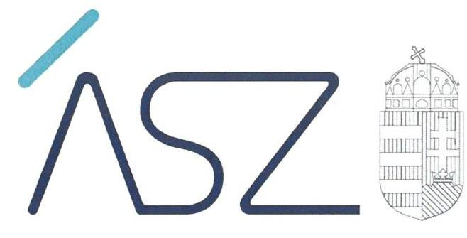
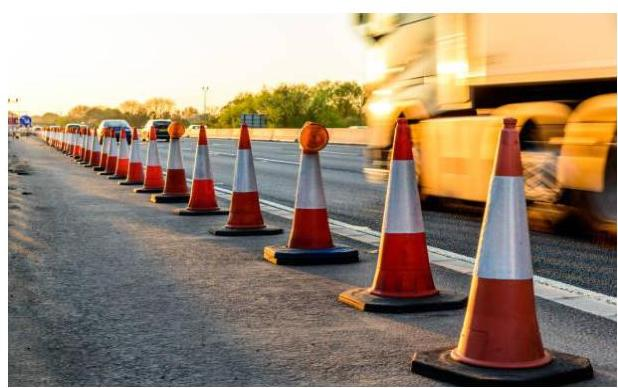
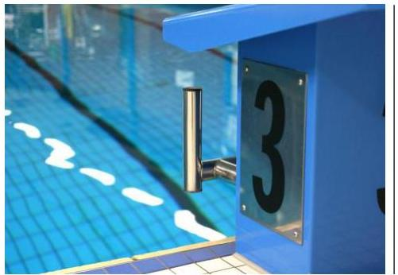
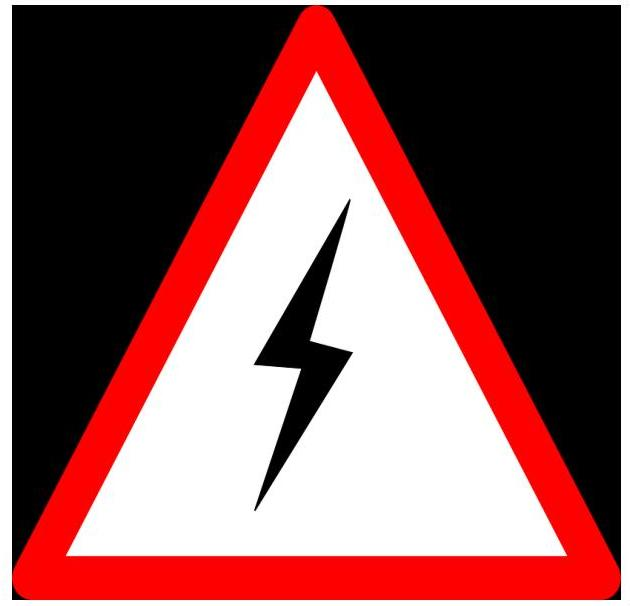

ÁLLAMI SZÁMVEVŐSZÉK

# JELENTÉS 

A jelentős beruházások ellenőrzése - 5 beruházás

2022. 

22029
www.asz.hu

---

ÁLLAMI SZÁMVEVŐSZÉK

# JELENTÉS 

A jelentős beruházások ellenőrzése - 5 beruházás

22029
www.asz.hu

---

# AZ ELLENŐRZÉST VEZETTE ÉS A VÉGREHAJTÁSÁÉRT FELELŐS: 

ÁRPÁSI TIBOR ellenőrzésvezető
MAKKAI MÁRIA ellenőrzésvezető
DR. PETRÁNYI GÁBOR ellenőrzésvezető

## A PROGRAM ÖSSZEÁLLÍTÁSÁÉRT FELELŐS:

## NAGY ADRIENN projektvezető

## A TÉMÁHOZ KAPCSOLÓDÓ KORÁBBI SZÁMVEVŐSZÉKI JELENTÉSEK:

- címe: A jelentős beruházások ellenőrzése - Petz Aladár Megyei Oktató Kórházat érintő beruházási projekt
- sorszáma: 21061
- címe: A jelentős beruházások ellenőrzése - Nyíregyházi Atlétikai Centrumot érintő beruházási projekt
- sorszáma: 21046
- címe: A jelentős beruházások ellenőrzése - Harkányi Gyógyés Strandfürdő fejlesztése beruházási projekt
- sorszáma: 21045
- címe: A jelentős beruházások ellenőrzése - Szolnoki Szigligeti Színházhoz kapcsolódó felújítás projektje
- sorszáma: 21001

IKTATÓSZÁM: EL-3686-001/2022.
TÉMASZÁM: 2579
ELLENŐRZÉS-AZONOSÍTÓ SZÁM: V0922

---

# TARTALOMJEGYZÉK 

■ ÖSSZEGZÉS ..... 5
—_ AZ ELLENŐRZÉS CÉLJA ..... 6
—_ AZ ELLENŐRZÉS TERÜLETE ..... 7
—_ AZ ELLENŐRZÉS HÁTTERE, INDOKOLTSÁGA ..... 11
—_ A JELENTÉS LÉNYEGES KÉRDÉSKÖREI ..... 12
—_ AZ ELLENŐRZÉS HATÓKÖRE ÉS MÓDSZEREI ..... 13
—_ MEGÁLLAPÍTÁSOK ..... 16
— MELLÉKLETEK ..... 21
I. sz. melléklet: Értelmező szótár ..... 21
—_ FÜGGELÉK: ÉSZREVÉTELEK ..... 23
—_ RÖVIDÍTÉSEK JEGYZÉKE ..... 25

---

.

---

# ÖSSZEGZÉS 

Három beruházás döntés-előkészítése, valamint az előkészítést végző szervezeteknél a beruházások előkészítését szolgáló kontrollkörnyezet szabályszerű volt.
További egy beruházásnál a beruházás előkészítése érdekében szabályszerűen kihirdették a nemzetközi szerződéseket és a beruházás előkészítését végző szervezet belső szabályozottságát kialakították, a monitoring és beszámolási folyamatait müködtették.

## Az ellenőrzés társadalmi indokoltsága

Az Alaptörvény ${ }^{1}$ és a nemzeti vagyonról szóló 2011. évi CXCVI. törvény értelmében a közpénzeket és a nemzeti vagyont az átláthatóság és a közélet tisztaságának elve szerint kell kezelni. Ezért a beruházás előkészítésében közreműködő szervezetek kötelesek kiépíteni azokat a kontrollokat, amelyek az átláthatóság, az önállóság és a felelősség, azaz az elszámoltathatóság követelményének teljesülését szolgálják.

Az ellenőrzés arra fókuszál, hogy az ellenőrzött szervezetek hogyan biztosították a beruházások megvalósítása érdekében a szabályos döntéselőkészítést és kontrollkörnyezetet, valamint az integritási szempontok érvényesülését.

## Főbb megállapítások

Az új felüljáró építése az M2 autóút felett Göd térségében beruházás, a Bajai Városi Sportuszoda és Élményfürdő fejlesztése beruházás és a MotoGP kelet-magyarországi helyszínen történő megrendezése beruházás döntés-előkészítése szabályszerű volt. A beruházások megfelelő előkészítése érdekében az előkészítését végző szervezetek kialakították a beruházások előkészítéséhez kapcsolódó belső szabályozottságot.

A Paks II. beruházás esetében a nukleáris energia békés célú felhasználása terén folytatandó együttműködésről Magyarország Kormánya és az Oroszországi Föderáció Kormánya között létrejött Egyezmény² és a beruházás finanszírozására vonatkozó Megállapodás ${ }^{3}$ magyarországi kihirdetése szabályszerűen történt, azok kötelező hatályának elismerésére az Országgyűlés a felhatalmazást megadta. A beruházás szabályszerű előkészítését szolgálta, hogy az Egyezményben rögzített együttműködésből fakadó tevékenységekkel kapcsolatos kötelezettségek végrehajtására kijelölt Paks II. Zrt. a szervezeti kereteit, szabályozó eszközeit a vonatkozó jogszabályoknak megfelelően kialakította, a beruházási kockázatokat felmérte és kezelte, a beruházás monitoringját működtette.

A gödi ipari-innovációs fejlesztési terület energiaellátásához kapcsolódó villamosenergia-elosztó hálózati infra-struktúra-fejlesztése beruházás megvalósításának finanszírozási modelljét az 1633/2021. (IX.14.) Korm. határozat ${ }^{4}$ aszerint változtatta meg, hogy az ITM ${ }^{5}$ a villamosenergia-elosztó hálózati infrastruktúra-fejlesztési feladatok megvalósítása érdekében Pest Megye Önkormányzata helyett az ELMŰ Hálózati Kft.-vel hozzon létre támogatási jogviszonyt. A támogatási jogviszonyok rendezése az ellenőrzött időszakban nem zárult le.

---

# AZ ELLENŐRZÉS CÉLJA 

AZ ELLENŐRZÉS CÉLJA, hogy a beruházás eredményes megvalósulásának elősegítése érdekében, a folyamatban lévő beruházás vonatkozásában, a beruházás megfelelő előkészítését biztosította-e a kialakított kontrollkörnyezet, a beruházás előkészítési szakaszában érvényesültek-e az integritási szempontok.

---

# **AZ ELLENŐRZÉS TERÜLETE**

## **1. Új felüljáró építése az M2 autóút felett Göd térségében beruházás / ITM, NIF Zrt6**

A Kormány7 az 1071/2020. (III.5.) Korm. határozatban8 egyetértését fejezte ki a Göd város közigazgatási területén működő gazdasági övezet bővítése keretében kialakításra kerülő ipari-innovációs fejlesztési terület kialakításával kapcsolatos, valamint a Göd város és térsége, valamint a környező települések fejlesztését is szolgáló közlekedési infrastruktúra-, valamint közműberuházások megvalósításával, egyben felhívta az innovációért és technológiáért felelős minisztert, hogy – a fejlesztési terület használatában érintett szereplők és szervezetek bevonásával – készítsen előterjesztést a Kormány részére a megvalósításhoz szükséges intézkedésekről. Az 1173/2020. (IV.22.) Korm. határozatban9 többek között döntés született – a villamosenergiaellátáshoz, a gázellátáshoz, a víziközmű-hálózatokhoz kapcsolódó infrastruktúra-fejlesztések mellett – a gödi ipari-innovációs fejlesztési területhez kapcsolódó közlekedés infrastruktúra-fejlesztéssel összefüggő feladatok elvégzéséről és a megvalósításukhoz szükséges 7 161 600 000 forint forrás biztosításáról. A közlekedés infrastruktúra-fejlesztéssel összefüggő feladatok összesen 6 projektet foglalnak magukban, melyek egyike az új felüljáró építése az M2 autóút felett Göd térségében. A Támogató okiratban10 a gödi ipari-innovációs infrastruktúra-fejlesztéssel kapcsolatos közlekedési beruházások előkészítése és megvalósítása során felmerülő költségekre 1 160 000 000 forint támogatási előleg került biztosításra a NIF Zrt. részére a 2021-2025. évek szerinti bontásban. A támogatott tevékenység időtartama 2021. január 4. – 2025. december 31., a támogatás felhasználásának határideje 2026. január 31. Az új felüljáró építése projekt kormányzati felelőse az ITM, előkészítője a NIF Zrt, a projektre nem vonatkoznak az Ámbr.11 rendelkezései. A beruházás előkészítését végző NIF Zrt. a Gbkr.12 hatálya alá tartozó gazdasági társaság.

## **2. Bajai Városi Sportuszoda és Élményfürdő fejlesztése beruházás / EMMI13, BMSK Zrt.14**

Az 1018/2021. (I.28.) Korm. határozatban15 a Kormány egyetértését fejezte ki a bajai sportuszoda és élményfürdő létrehozására irányuló beruházás kormányzati magasépítési beruházásként történő előkészítésével, egyben felhívta az emberi erőforrások miniszterét és a nemzeti vagyon kezeléséért felelős tárca nélküli minisztert, hogy – a Beruházási Ügynökség bevonásával – készítsenek előterjesztést a Kormány részére a beruházás előkészítésére vonatkozóan. Az 1507/2021. (VII.29.) Korm. határozatban16 született döntés a beruházás helyszínéről és megvalósítása Ámbr. 4.§ a-p) pontjai szerinti előkészítési fázisainak 2022. szeptember 30. napjáig történő elvégzéséről. A beruházás kormányzati felelőse a nemzeti vagyon kezeléséért felelős tárca nélküli miniszter az EMMI bevonásával, előkészítője BMSK Zrt. - mint a Kormány által kijelölt Beruházási Ügynökség -, amely a Gbkr. hatálya alá tartozó gazdasági társaság. A beruházás előkészítési fázisaira a BMSK Zrt. által vállalható kötelezettség összege 1 018 775 000 forintban lett meghatározva.

---

# 3. MotoGP kelet-magyarországi helyszínen történő megrendezése beruházás / ITM, Miniszterelnöki Kormányiroda, KMVP Kft. ${ }^{17}$ és HUMDA Zrt. ${ }^{18}$, BMSK Zrt. 

A Kormány az 1399/2020. (VII.15.) Korm. határozatban ${ }^{19}$ egyetértését fejezte ki azzal, hogy a MotoGP futam magyarországi megrendezésére Hajdúnánás külterületén kialakítandó pályahelyszínen, versenypálya kialakításával kerüljön sor. A fejlesztés előkészítésének és megvalósításának kormányzati felelőseként az ITM-t irányító miniszter ${ }^{20}$ lett kijelölve. A Kormány felhívta továbbá az NVTNM-t²1, hogy az MNV Zrt. ${ }^{22}$ útján tegye meg a szükséges intézkedéseket a KMVP Kft. megalapítása érdekében, amely társaságot a Kormány a beruházás előkészítésére és megvalósítására jelölte ki. A KMVP Kft. feletti tulajdonosi jogok és kötelezettségek összességét tulajdonosi joggyakorlóként a HUMDA Zrt. gyakorolta. Az 1399/2020. (VII.15.) Korm. határozatban a Kormány egyedileg mentesítette a beruházást az Ámbr. szerinti eljárásrend alól és a beruházás teljes előkészítése befejezésének határidejét 2020. december 31-ben jelölte meg, melyet 2021 februárjában egy évvel, 2021. december 31-ig meghosszabbítottak. Az 1535/2021. (VIII.3.) Korm. határozatban ${ }^{23}$ a Kormány a fejlesztés előkészítésének és megvalósításának kormányzati felelőseként az ITM-t irányító miniszter helyett az NVTNM-t jelölte ki és egyetértett azzal, hogy a beruházás további előkészítésére és megvalósítására állami magasépítési beruházásként, a rendelkezésre álló tervek és szakmai előkészítés alapján a KMVP Kft. helyett a BMSK Zrt., mint Beruházási Ügynökség által kerüljön sor. A Kormány felhívta az ITM-t irányító minisztert és az NVTNM-t, hogy készítsenek előterjesztést a KMVP Kft. által megvalósított előkészítési feladatokról és felhasznált forrásokról, valamint a BMSK Zrt. által megvalósítandó előkészítési és megvalósítási feladatok ütemezéséről, és az előkészítési feladatok felmerülő forrásigényéről. A Kormány továbbá egyetértett azzal, hogy a beruházás megvalósításához szükséges ingatlanok, valamint a beruházás során létrejövő felépítmények a Magyar Állam tulajdonába kerüljenek és felhívta az ITM-t irányító minisztert, hogy a beruházás üzemeltetésével kapcsolatban készítsen előterjesztést, és mutassa be az üzemeltetéssel járó indokolt költségeket. Az 1791/2021. (XI.8.) Korm. határozatában ${ }^{24}$ a Kormány egyetértett a részére bemutatott koncepció szerinti beruházás előkészítés folytatásával, azzal, hogy az előkészítés egyes meghatározott fázisai - hatástanulmány, szakvélemények, szakértői tanulmányok készítése, engedélyezési dokumentáció készítése, engedélyeztetés lefolytatása, a kivitelezési dokumentációs elkészítése - 2024. június 30-ig kerüljenek lezárásra. A BMSK Zrt. által vállalható kötelezettség összegét 6008941500 forintban határozták meg a részére irányadó kötelezettégvállalási keret terhére. A 458/2021. (VIII.3.) Korm. rendelet ${ }^{25}$ a MotoGP versenypálya és sportkomplexum megvalósítására irányuló beruházást kiemelten közérdekű beruházássá nyilvánította. A beruházás előkészítése az engedélyezési dokumentáció készítése fázisában tart. Az NVTNM tevékenységét a 94/2018. (V.22.) Korm. rendelet ${ }^{26}$ értelmében a Miniszterelnöki Kormányiroda segíti. A KMVP Kft. nem, míg a BMSK Zrt. a Gbkr. hatálya alá tartozó gazdasági társaság. A KMVP Kft. 2022. január 19-én a HUMDA Zrt-be történő beolvadással jogutódlással megszűnt.

---

# 4. Gödi ipari-innovációs fejlesztési terület energiaellátásához kapcsolódó villamosenergia-elosztó hálózati infrastruktúrafejlesztése / ITM, Pest Megye Önkormányzata és a gazdálkodási feladatait ellátó Pest Megyei Önkormányzati Hivatal 

A Kormány az 1071/2020. (III.5.) Korm. határozatban egyetértett a gödi ipari-innovációs fejlesztési terület és ipari és innovációs létesítményei, építményei hosszú távú biztonságos villamosenergia-ellátása érdekében szükséges áramellátási kapacitásához szükséges fejlesztések megvalósításával, egyben felhívta az innovációért és technológiáért felelős minisztert, hogy ezen cél megvalósítása érdekében készítsen előterjesztést a Kormány részére. Az 1173/2020. (IV.22.) Korm. határozatban döntés született többek között a gödi ipariinnovációs fejlesztési terület energiaellátáshoz kapcsolódó, a villamos energia átviteli és elosztó hálózati infrastruktúrafejlesztés keretében a villamosenergia-ellátáshoz kapcsolódó infrastruktúra-fejlesztéssel összefüggő feladatok elvégzéséről. A villamosenergia-elosztó hálózati infrastruktúra-fejlesztési feladatok megvalósítására 4000000000 forint lett meghatározva. Az 1581/2020 (IX.10.) Korm. határozatban ${ }^{27}$ a Kormány egyetértett azzal, hogy a villamosenergia-elosztó hálózati infrastruktúra-fejlesztési feladatok megvalósítása érdekében az ITM Pest Megye Önkormányzata, mint kedvezményezett javára támogatói okiratot bocsásson ki. A Támogatói okiratban ${ }^{28}$ a kedvezményezett támogatási igénye és szakmai programja alapján a villamosenergia-elosztó hálózati infrastruktúra-fejlesztés I. ütemével összefüggő feladatok megvalósítására 3998000000 forint támogatási előleg került biztosításra Pest Megye Önkormányzata részére. A támogatott tevékenység időtartama 2020. december 1. - 2025. december 31., a támogatás felhasználásának határideje 2021. június 30. Az 1633/2021. (IX.14.) Korm. határozat aszerint változtatta meg a beruházás megvalósításának finanszírozási modelljét, hogy az ITM a villamosenergia-elosztó hálózati infrastruktúra-fejlesztési feladatok megvalósítása érdekében Pest Megye Önkormányzata helyett az ELMŰ Hálózati Kft.-vel, mint kedvezményezettel hozzon létre támogatási jogviszonyt, és tegye meg a szükséges intézkedéseket a támogatási jogviszonyok ennek megfelelő rendezése érdekében.
Pest Megye Önkormányzata támogatási igénye és szakmai programja alapján - összhangban az 1111/2021. (III.10.) Korm. határozattal ${ }^{29}$ - a Támogatói okiratban ${ }^{30}$ az ITM 332833500 forint támogatást biztosított Pest Megye Önkormányzata részére a beruházással kapcsolatosan többek között területszerzésre és rendezésre, lőszermentesítésre, műszaki tervezésre, megvalósíthatósági tanulmánykészítésre, tervezési és műszaki ellenőri szolgáltatásokra, valamint projektmenedzsmenti feladatok ellátására. A támogatott tevékenység időtartama 2021. április 1. - 2022. június 30., a támogatás felhasználásának határideje 2022. június 30.

---

# 5. Paks II. beruházás / Paks II. Zrt. ${ }^{31}$ 

Az Országgyűlés 40/2008. (IV.17.) OGY. határozatában ${ }^{32}$ hívta fel az akkori kormányt arra, hogy kezdje meg az új atomerőművi kapacitásokra vonatkozó döntés-előkészítő munkát, és a szakmai, környezetvédelmi és társadalmi megalapozást követően javaslatait terjessze az Országgyűlés elé. Ennek eredményeként az Országgyűlés az 1996. évi CXVI. törvény ${ }^{33}$ 7.§-ának (2) bekezdése alapján a 25/2009. (IV. 2.) OGY határozatában ${ }^{34}$ a paksi atomerőmű telephelyén új atomerőművi blokk(ok) létesítésének előkészítését szolgáló tevékenység megkezdéséhez szükséges előzetes, elvi hozzájárulást megadta. A Kormány, valamint az Oroszországi Föderáció Kormánya a nukleáris energia békés célú felhasználása terén folytatandó együttműködésről 2014. január 14-én a beruházást megalapozó Egyezményt kötött. Az Egyezményben foglaltak szerint a két egyezményes fél együttműködik a Paksi Atomerőmű teljesítményének fenntartásában és fejlesztésében, beleértve két új 5-6. blokk tervezését, megépítését, üzembe helyezését és üzemen kívül helyezését, VVER (vízhűtéses vízmoderátoros) típusú reaktorral, mindkét blokkra vonatkozóan legalább 1000 MW beépített kapacitással. A 2014. március 28-án kötött Megállapodás 1. cikk 1. pontja szerint az Orosz Fél a paksi atomerőmű 5. és 6. erőműblokkja tervezéséhez, megépítéséhez és üzembe helyezéséhez szükséges munkálatok, szolgáltatások és eszközbeszerzések finanszírozására maximum 10 milliárd euró összegű állami hitelt nyújt a Magyar Fél részére, az állami hitel 2014-2025 között használható fel. Az 1429/2014. (VII. 31.) Korm. határozatban ${ }^{35}$ a Kormány egyetértett azzal, hogy az energiapolitikáért felelős miniszter a Paks II. Zrt-t jelölje ki Magyar Szervezetként az Egyezményben rögzített együttműködésből fakadó tevékenységekkel kapcsolatos kötelezettségek végrehajtására. 2014. december 9-én a Paks II Zrt. és az orosz Joint-Stock Company Nizhny Novgorod Engineering Company Atomenergoproekt az Egyezményből következően aláírta az Egyezmény rendelkezéseit részletező, a két új atomerőművi blokkra vonatkozó három Megvalósítási Megállapodást. A Paks II. Zrt. a Gbkr. hatálya alá tartozó gazdasági társaság, mely felett a tulajdonosi jogokat a PTNM ${ }^{36}$ gyakorolja.

---

# AZ ELLENŐRZÉS HÁTTERE, INDOKOLTSÁGA 

Az ÁSZ ${ }^{37}$ a jelentős beruházások ellenőrzésével támogatja a közpénzek szabályos és átlátható felhasználását.

A beruházások jellemzően több tízmillió, vagy több milliárd Ft-os támogatásból valósulnak meg, ezért az Alaptörvény követelményeinek betartásához szükséges szervezeti keretek, a szabályozó eszközök kialakítása, és azok betartása a beruházási kockázatok feltárása és kezelése elvárás a szervezet felé.

---

# A JELENTÉS LÉNYEGES KÉRDÉSKÖREI 

1.     - A beruházás döntés-előkészitése szabályszerűen történt-e?
2.     - A beruházás előkészitését végző ellenőrzött szervezet belső szabályozottsága, monitoring és beszámolási folyamatai biztositották-e a beruházás megfelelő előkészitését?
3.     - A beruházás megvalósitásának előkészitése, valamint a keretében megkötött szerződések megfelelőek voltak-e?

---

# AZ ELLENŐRZÉS HATÓKÖRE ÉS MÓDSZEREI 

## Az ellenőrzés típusa

Megfelelőségi ellenőrzés.

## Az ellenőrzött időszak

2019-től az ellenőrzés megkezdéséig előkészítési szakaszban lévő beruházások

## Az ellenőrzés tárgya

Az ellenőrzés a beruházást érintő önkormányzati, kormányzati beruházási döntéselőkészítést beterjesztő szervezet, valamint a beruházás előkészítését végző önkormányzat és gazdálkodási feladatait ellátó polgármesteri hivatal, költségvetési szerv, nemzeti tulajdonban lévő gazdasági társaság döntés-előkészítési és beruházás előkészítési tevékenységének működési folyamataira, azok belső szabályozottságára, a megvalósítás előkészítésének megfelelőségére terjed ki.

## Az ellenőrzött szervezet

Az új felüljáró építése az M2 autóút felett Göd térségében beruházás kapcsán a NIF Nemzeti Infrastruktúra Fejlesztő Zrt. (előkészítő) és az Innovációs és Technológiai Minisztérium (kormányzati felelős);

A Bajai Városi Sportuszoda és Élményfürdő fejlesztése beruházás kapcsán a BMSK Beruházási, Műszaki Fejlesztési, Sportüzemeltetési és Közbeszerzési Zrt. (előkészítő) és az Emberi Erőforrások Minisztériuma (kormányzati felelős);

A MotoGP kelet-magyarországi helyszínen történő megrendezése beruházással kapcsolatban az Innovációs és Technológiai Minisztérium (kormányzati felelős 2021. augusztus 2-ig) és a Miniszterelnöki Kormányiroda (a 2021. augusztus 3-tól kormányzati felelős Nemzeti Vagyon Kezeléséért Felelős Tárca nélküli Miniszter munkáját segítő szervezet), valamint a Kelet-Magyarországi Versenypálya Kft. (2021. augusztus 2-ig a beruházás előkészítő szervezete; 2022. január 19-i beolvadás utáni jogutódja a HUMDA Magyar Autó-Motorsport és Zöld Mobilitásfejlesztési Ügynökség), továbbá a BMSK Beruházási, Műszaki Fejlesztési, Sportüzemeltetési és Közbeszerzési Zrt. (a beruházás előkészítő szervezete 2021. augusztus 3-tól);

A Gödi ipari-innovációs fejlesztési terület energiaellátásához kapcsolódó villamosenergia-elosztó hálózati infrastruktúra-fejlesztése

---

beruházással összefüggésben az Innovációs és Technológiai Minisztérium (kormányzati felelős), valamint a Pest Megye Önkormányzata és a gazdálkodási feladatait ellátó Pest Megyei Önkormányzati Hivatal;

A Paks II. beruházás esetében a Miniszterelnökség és az Innovációs és Technológiai Minisztérium, valamint a Paks II. Atomerőmű Zártkörűen Működő Részvénytársaság;

# Az ellenőrzés jogalapja 

Az ellenőrzés jogszabályi alapját az ÁSZ tv. ${ }^{38}$ 1. § (3) bekezdés, 5. § (2)-(6) bekezdései, valamint az Áht. 61. § (2) bekezdésének előírásai képezik.

## Az ellenőrzés módszerei

Az ÁSZ az ellenőrzést az ellenőrzési program szempontjai, kérdései, az ellenőrzött időszakban hatályos jogszabályok, az ellenőrzés szakmai szabályai, az ÁSZ megfelelőségi ellenőrzési módszertana alapján végzi.

Az ÁSZ az ellenőrzés ideje alatt az ellenőrzött szervezettekkel történő kapcsolattartást a Szervezeti és Múködési Szabályzatának vonatkozó előírásai alapján biztosítja.

A program ellenőrzési szempontjai a szabályszerűségi szempontok szerinti ellenőrzésben a jogszabályok, közjogi szervezetszabályozó eszközök, önkormányzati rendeletek, határozatok, további belső utasítások, belső szabályozók előírásai, a helyénvalósági szempontok szerinti ellenőrzésben az ÁSZ korábbi beruházásokat érintő ellenőrzései során beazonosított „jó gyakorlatok" és általánosan elfogadott szakmai szabályok alapján kerültek meghatározásra.

Az ellenőrzési szempontok tartalmaznak helyénvalósági kritériumokat is, amelyet az ÁSZ honlapján tett közzé. A helyénvalósági kritériumok az ellenőrzés tárgyát képező, általánosan elfogadott, jogszabályok által nem szabályozott, illetve nemzetközi vagy hazai „jó gyakorlatokon" alapuló ellenőrzési szempontok, melyek hozzájárulnak az ellenőrzött szervezetek integritásának megerősítéséhez.

Az ellenőrzési kérdések megválaszolásához szükséges bizonyítékok megszerzése a következő ellenőrzési eljárások alkalmazásával történik: megfigyelés, kérdésfeltevés (információkérés), összehasonlítás, mintavételi eljárás, valamint elemző eljárás. Az ellenőrzés végrehajtásához a rétegzett mintavételi eljárással történik a mintavétel. Az ellenőrzési bizonyítékként felhasználható adatforrások közé tartoznak egyrészt az ellenőrzési programban felsorolt adatforrások, másrészt adatforrás lehet még minden - az ellenőrzés folyamán - feltárt, az ellenőrzés szempontjából információkat tartalmazó dokumentum.

Mintavételes ellenőrzésre a beruházás előkészítésére vonatkozóan, közbeszerzési eljárások eredményeként kötött szerződések, továbbá a közbeszerzési értékhatárt el nem érő beszerzések (megrendelésekre, megbízásokra) szerinti rétegzés alapján kiválasztott szerződések esetében került sor.

---

A mintatételek kiválasztása a beruházás előkészítésére vonatkozóan, közbeszerzési eljárások eredményeként kötött szerződések, továbbá a közbeszerzési értékhatárt el nem érő beszerzések esetében véletlen rétegzett mintavétellel történt. A vizsgált terület „szabályszerü" minősítést kapott, ha a minta ellenőrzésének eredménye alapján 95\%-os bizonyossággal a teljes sokaságban az átlagos hibaarány nem haladta meg a 10\%-ot, „nem szabályszerű" minősítést kapott, ha nagyobb volt, mint 10\%. Abban az esetben, ha a teljes sokaság tekintetében a 10\%-os hibaarányhoz való viszony megítélésének megbízhatósága nem érte el a 95\%-ot, annak elérése érdekében az értékelés további szempontokkal egészült ki, a feltárt hibák értéke is figyelembe vételre került. Amennyiben a sokaság elemszáma nem haladta meg az előírt minta elemszámot, akkor a sokaság valamennyi elemének tételes ellenőrzésére került sor.

Az ellenőrzés során minden olyan körülmény és adat is ellenőrzésre kerül, amely a program végrehajtása kapcsán felmerült újabb összefüggéseknek az ellenőrzés céljaival összhangban lévő feltárásához szükséges.

---

# 1. Új felüljáró építése az M2 autóút felett Göd térségében beruházás 

## Összegző megállapítás

A beruházásról szóló döntés előkészítése szabályszerűen történt. A NIF Zrt. a beruházás előkészítéséhez kapcsolódó belső szabályozottságát kialakította.

A beruházási döntést előkészítő ITM előterjesztés ${ }^{39}$ a Kormány ügyrendjével ${ }^{40}$, az ITM SZMSZ-ével ${ }^{41}$ illetőleg a döntéselőkészítésben résztvevő szervezeti egység ügyrendjével; ${ }^{42}$ összhangban készült. A Támogatói okirat; a beruházási döntéseknek megfelelt, és az Áht. ${ }^{43}$ és az Ávr. ${ }^{44}$ előírásai szerint szabályszerű volt.

A beruházás előkészítését végző NIF Zrt. a vonatkozó jogszabályok szerinti szervezeti és működési szabályzattal, számviteli politikával, az eszközök és a források leltárkészítési és leltározási illetőleg értékelési szabályzatával, számlarenddel és közbeszerzési szabályzattal rendelkezett. Az etikai elvárásokat, a tevékenységben rejlő és a szervezeti célokkal összefüggő kockázatokat meghatározták.

A beruházással kapcsolatosan feladatokat ellátó szervezeti egységek feladatait, a nevesített munkakörökhöz tartozó feladat- és hatásköröket, valamint a kötelezettségvállalásra és a teljesítésigazolásra vonatkozó előírásokat és feltételeket meghatározták. A beruházás monitoringját és kockázatkezelő rendszerét kialakították és működtették.

Az előkészítés során kötött szerződés megfelelő volt. A beruházás bár nem tartozik az Ámbr. hatálya alá, a NIF Zrt. rendelkezett a helyénvalósági kritériumként értékelt, a beruházás időbeli ütemezését tartalmazó időkalkulációval, a beruházás tervezésének szakértővel történt véleményezésével és a beruházás költségvetését költségtervvel alátámasztotta.

## 2. Bajai Városi Sportuszoda és Élményfürdő fejlesztése beruházás

## Összegző megállapítás

A beruházásról szóló döntés előkészítése szabályszerűen történt. A BMSK Zrt. a beruházás előkészítéséhez kapcsolódó belső szabályozottságát kialakította.

A beruházási döntést előkészítő EMMI előterjesztés ${ }^{45}$ a Kormány ügyrendjével, az EMMI SZMSZ-ével ${ }^{46}$ illetőleg a döntéselőkészítésben résztvevő szervezeti egység ügyrendjével; ${ }^{47}$ összhangban készült.

A beruházás előkészítését végző BMSK Zrt. a vonatkozó jogszabályok szerinti szervezeti és működési szabályzattal, számviteli politikával, az eszközök és a források leltárkészítési és leltározási illetőleg értékelési szabályzatával, valamint közbeszerzési szabályzattal rendelkezett. Az etikai elvárásokat, illetőleg a tevékenységben rejlő kockázatokat meghatározták.

A beruházással kapcsolatosan feladatokat ellátó szervezeti egységek feladatait, a nevesített munkakörökhöz tartozó feladat- és hatásköröket,

---

valamint a kötelezettségvállalásra és a teljesítésigazolásra vonatkozó előírásokat és feltételeket meghatározták.

A beruházás előkészítése az Ámbr. 4.§ a) pontja szerinti magvalósíthatósági tanulmány készítésének fázisában tart, így az Ámbr. 4.§ b) pontja szerinti fenntartási és üzemeltetési modell, és az Ámbr. 4.§ f) pontja szerinti költség- és időkalkuláció még nem készült. Az előkészítés során szerződéskötésre nem került sor.

# 3. MotoGP kelet-magyarországi helyszínen történő megrendezése beruházás 

## Összegző megállapítás

A beruházásról szóló döntések előkészítése szabályszerűen történt. A beruházás előkészítő szervezetei a beruházás előkészítéséhez kapcsolódó belső szabályozottságukat kialakították.

A beruházási döntéseket előkészítő ITM előterjesztés ${ }_{1,2}{ }^{4849}$ a Kormány ügyrendjével, az ITM és a Miniszterelnöki Kormányiroda SZMSZ-ével ${ }^{50}$ illetőleg a döntéselőkészítésben résztvevő szervezeti egységek ügyrendjével ${ }_{1,2}{ }^{5152}$ összhangban készült. A beruházás előkészítését 2021 augusztusáig végző KMVP Kft. alapítása a beruházási döntés szerint történt.

A KMVP Kft. a vonatkozó jogszabályok szerinti számviteli politikával, az eszközök és a források leltárkészítési és leltározási illetőleg értékelési szabályzatával, számlarenddel valamint közbeszerzési szabályzattal rendelkezett.

A BMSK Zrt. a vonatkozó jogszabályok szerinti szervezeti és működési szabályzattal, számviteli politikával, az eszközök és a források leltárkészítési és leltározási illetőleg értékelési szabályzatával, valamint közbeszerzési szabályzattal rendelkezett. Az etikai elvárásokat, illetőleg a tevékenységben rejlő kockázatokat meghatározták. A beruházással kapcsolatosan feladatokat ellátó szervezeti egységek feladatait, a nevesített munkakörökhöz tartozó feladat- és hatásköröket, valamint a kötelezettségvállalásra és a teljesítésigazolásra vonatkozó előírásokat és feltételeket meghatározták. A beruházás monitoringját kialakították és működtették.

Az előkészítés során a KMVP Kft. és a BMSK Zrt. általi szerződéskötések megfelelőek voltak. A beruházást a Kormány 2021. augusztus 2-ig egyedileg mentesítette az Ámbr. szerinti eljárásrend alól, ennek ellenére a KMVP Kft. gondoskodott a beruházás időkalkulációjának - ütemterv - és költségkalkulációjának valamint a beruházási és a 2024. -2028. évek közötti működtetési időszak üzleti tervének elkészítéséről, melyet a BMSK Zrt. részére átadott. A BMSK Zrt. ezeken felül az Ámbr. szerint elkészítette a beruházás új időbeli ütemezését.

---

# 4. Gödi ipari-innovációs fejlesztési terület energiaellátásához kapcsolódó villamosenergia-elosztó hálózati infrastruktúra- fejlesztése beruházás 

## Összegző megállapítás

A beruházás finanszírozási modellje megváltozott, Pest Megye Önkormányzata helyett kedvezményezettként az ELMŰ Hálózati Kft. került kijelölésre.

Az 1633/2021. (IX.14.) Korm. határozat aszerint változtatta meg a beruházás megvalósításának finanszírozási modelljét, hogy az ITM a villamosener-gia-elosztó hálózati infrastruktúra-fejlesztési feladatok megvalósítása érdekében Pest Megye Önkormányzata helyett az ELMŰ Hálózati Kft.-vel, mint kedvezményezettel hozzon létre támogatási jogviszonyt és tegye meg a szükséges intézkedéseket a támogatási jogviszonyok ennek megfelelő rendezése érdekében. Pest Megye Jegyzőjének ellenőrzés során tett nyilatkozata értelmében a támogatási jogviszonyok rendezése az ellenőrzött időszakban nem zárult le.

## 5. Paks II. beruházás

## Összegző megállapítás

Az Egyezmény és a Megállapodás magyarországi kihirdetése szabályszerűen történt, azok kötelező hatályának elismerésére az Országgyúlés a felhatalmazást megadta. A beruházás szabályszerű előkészítése érdekében a Paks II. Zrt. belső szabályozottságát kialakították, a monitoring és beszámolási folyamatokat müködtették.

A beruházás előkészítését megalapozó Egyezményt Magyarországon a 2014. évi II. törvénnyel ${ }^{53}$, a Megállapodást a 2014. évi XXIV. törvénnyel ${ }^{54}$ hirdették ki. Az Egyezmény és a Megállapodás magyarországi kihirdetése és az azok kötelező hatályának elismerésére adott országgyűlési felhatalmazás a 2005. évi L. törvény ${ }^{55}$ előírásaival összhangban történt. A Megvalósítási Megállapodás megkötését az Egyezmény irányozta elő és tartalmazta a beruházás megvalósításának ütemezéséhez kapcsolódó előírásokat és az egyes teljesítéshez kapcsolódó mérföldköveket.

Az Egyezményben rögzített együttműködésből fakadó tevékenységekkel kapcsolatos kötelezettségek végrehajtására kijelölt magyar szervezet, a Paks II. Zrt. a vonatkozó jogszabályok szerinti szervezeti és múködési szabályzattal, számviteli politikával, az eszközök és a források leltárkészítési és leltározási illetőleg értékelési szabályzatával, számlarenddel valamint közbeszerzési szabályzattal rendelkezett. Az etikai elvárásokat, illetőleg a tevékenységben rejlő és a szervezeti célokkal összefüggő kockázatokat meghatározták. A beruházásra vonatkozó kockázatkezelő rendszert és az operatív tevékenységek keretében megvalósuló folyamatos és eseti nyomon követési (monitoring) rendszert működtették. Ezek keretében a beruházást érintő kockázatokat és az azokkal kapcsolatban szükséges intézkedéseket megállapították, valamint kialakították és működtették a beruházás kockázataival kapcsolatban meghatározott intézkedések teljesítésének folyamatos nyomon követését. A Paks II. Zrt. a PTNM által előírt jelentésté-

---

teli, illetőleg beszámolási kötelezettségnek eleget tett. A beruházással kapcsolatosan feladatokat ellátó szervezeti egységek feladatait, a nevesített munkakörökhöz tartozó feladat- és hatásköröket, valamint a kötelezettségvállalásra és a teljesítésigazolásra vonatkozó előírásokat és feltételeket meghatározták.

---

.

---

# MELLÉKLETEK 

- I. SZ. MELLÉKLET: ÉRTELMEZŐ SZÓTÁR
állami vagyon
beruházás
beterjesztő szervezet
előkészítési szakaszban lévő beruházás
gazdasági társaság
integritás

Állami vagyonnak minősül:
a) az állam tulajdonában lévő dolog, valamint a dolog módjára hasznosítható természeti erő,
b) az a) pont hatálya alá nem tartozó mindazon vagyon, amely vonatkozásában törvény az állam kizárólagos tulajdonjogát nevesíti,
c) az állam tulajdonában lévő tagsági jogviszonyt megtestesítő értékpapír, illetve az államot megillető egyéb társasági részesedés,
d) az államot megillető olyan immateriális, vagyoni értékkel rendelkező jogosultság, amelyet jogszabály vagyoni értékű jogként nevesít,
e) az állam tulajdonában lévő pénzügyi eszközök.
(Forrás: Vtv. ${ }^{56}$ 1. § (2) bekezdése)
A tárgyi eszközök beszerzése, létesítése, saját vállalkozásban történő előállítása, a beszerzett tárgyi eszköz üzembe helyezése, rendeltetésszerű használatbavétele érdekében az üzembe helyezésig, a rendeltetésszerű használatbavételig végzett tevékenység (szállítás, vámkezelés, közvetítés, alapozás, üzembe helyezés, továbbá mindaz a tevékenység, amely a tárgyi eszköz beszerzéséhez hozzákapcsolható, ideértve a tervezést, az előkészítést, a lebonyolítást, a hiteligénybevételt, a biztosítást is); beruházás a meglévő tárgyi eszköz bővítését, rendeltetésének megváltoztatását, átalakítását, élettartamának, teljesítőképességének közvetlen növelését eredményező tevékenység is, az előbbiekben felsorolt, e tevékenységhez hozzákapcsolható egyéb tevékenységekkel együtt. (Forrás: Számv. tv. 3. § (4) bekezdés 7. pont). A jelentős beruházásokat érintően beruházásnak tekintjük az immateriális javak beszerzését is.
A beruházási döntésre vonatkozó előterjesztésért felelős képviselő-testület bizottsága, polgármester, és/vagy a beruházási döntésre vonatkozó előterjesztésért felelős minisztérium
A beruházással kapcsolatos első döntéstől - amelyben a Kormány, vagy az önkormányzat először döntött nevesítetten az adott beruházás megvalósításáról, forrás biztosításáról, vagy bármilyen előkészítő tevékenységről (kormányrendelet, kormányhatározat, önkormányzati rendelet, határozat) - a beruházás előkészítési szakaszának befejezéséig - a megvalósításra vonatkozó közbeszerzési eljárás meghirdetésének időpontjáig - terjedő időszak. Az ellenőrzési programban gazdasági társaság alatt a nemzeti tulajdonban levő gazdasági társaságokat értjük. A gazdasági társaság fogalma a Ptk szerint: „A gazdasági társaságok üzletszerű közös gazdasági tevékenység folytatására, a tagok vagyoni hozzájárulásával létrehozott, jogi személyiséggel rendelkező vállalkozások, amelyekben a tagok a nyereségből közösen részesednek, és a veszteséget közösen viselik." (Forrás: Polgári Törvénykönyvről szóló 2013. évi V. törvény 3:88. § [A gazdasági társaság fogalma])
Az államigazgatási szerv szabályszerű, a hivatali szervezet vezetője és az irányító szerv által meghatározott célkitűzéseknek, értékeknek és elveknek megfelelő működése. (Forrás: 50/2013. (II. 25.) Korm. rendelet ${ }^{57}$ 2. § a) pontja).

---

jelentős beruházás
képviselő-testület
kockázat
monitoring
önkormányzat
polgármesteri hivatal
projekt

Jelentős beruházás az a beruházás, amelyet az ÁSZ kockázatelemzés alapján annak tekint. A kockázat-elemzés során figyelembe vett szempontok: a beruházás háttere, funkciója, bekerülési értéke, a szervezet költségvetéséhez, gazdasági társaság esetén mérlegfőösszegéhez való nagyságrendi viszonya, beruházás megvalósítási költségében a központi költségvetési támogatás részaránya.
Képviselő-testület, Közgyűlés
A kockázat annak a valószínűségét jelenti, hogy egy vagy több esemény vagy intézkedés nem kívánt módon befolyásolja a rendszer múködését, céljainak megvalósulását. (Forrás: Javaslatok a korrupciós kockázatok kezelésére Kockázatkezelési és ellenőrzési módszertan 35. oldal, ÁSZ)
A monitoring általánosságban a különböző szintű szervezeti célok megvalósításának folyamatát kíséri figyelemmel, melynek során a releváns eseményekről és tevékenységekről (együtt: folyamatokról) rendszeres jelleggel, strukturált, döntéstámogató információkhoz jutnak a szervezet vezetői. (Forrás: NGM ${ }^{58}$ Útmutató a költségvetési szervek monitoring rendszeréhez 2011. november)

A helyi önkormányzat jogi személy. Az önkormányzati feladatok ellátását a képviselő-testület és szervei biztosítják. A képviselő-testület szervei: a polgármester, a főpolgármester, a megyei közgyűlés elnöke, a képviselő-testület bizottságai, a részönkormányzat testülete, a polgármesteri hivatal, a megyei önkormányzati hivatal, a közös önkormányzati hivatal, a jegyző, továbbá a társulás. A képviselő-testület a feladatkörébe tartozó közszolgáltatások ellátására - jogszabályban meghatározottak szerint - költségvetési szervet, a Polgári perrendtartásról szóló 2016. évi CXXX. törvény szerinti gazdálkodó szervezetet, nonprofit szervezetet és egyéb szervezetet (a továbbiakban együtt: intézmény) alapíthat, továbbá szerződést köthet természetes és jogi személlyel vagy jogi személyiséggel nem rendelkező szervezettel.
(Forrás: Mötv. 41. § (1), (2), (6) bekezdései)
A polgármesteri hivatal megnevezés alatt a települési polgármesteri hivatalt, a főpolgármesteri hivatalt, fővárosi kerületi polgármesteri hivatalt, a megyei önkormányzati hivatalt, megyei jogú város polgármesteri hivatalt, a közös önkormányzati hivatalt értjük.
A projekt egy olyan egyedi folyamatrendszer, amely kezelési és befejezési időpontokkal megjelölt, specifikus követelményeknek - határidő, költség, erőforrás - megfelelő célkitúzés elérése érdekében vállalt, koordinált és kontrollált tevékenységek csoportja." (ISO 840259, 1994)

---

# FÜGGELÉK: ÉSZREVÉTELEK 

Az ellenőrzés megállapításait a Számvevőszék 15 napos észrevételezésre megküldte az ellenőrzött szervezetek vezetőinek az ÁSZ tv. 29. §* (1) bekezdése előírásának megfelelően.

Az ellenőrzött szervezetek észrevételt nem tettek.

[^0]
[^0]:    * 29. § (1) Az Állami Számvevőszék az ellenőrzési megállapításait megküldi az ellenőrzött szervezet vezetőjének vagy az általa megbízott személynek, és annak, akinek személyes felelősségét állapította meg.
    (2) Az ellenőrzött szervezet vezetője és a felelősként megjelölt személy az ellenőrzés megállapításaira tizenöt napon belül írásban észrevételt tehet.
    (3) Az Állami Számvevőszék az észrevételre a beérkezésétől számított harminc napon belül írásban válaszol. A figyelembe nem vett észrevételeket köteles a jelentésben feltüntetni, és megindokolni, hogy azokat miért nem fogadta el.

---

.

---

# RÖVIDÍTÉSEK JEGYZÉKE 

${ }^{1}$ Alaptörvény
${ }^{2}$ Egyezmény
${ }^{3}$ Megállapodás
${ }^{4} 1633 / 2021$. (IX.14.) Korm. határozat
${ }^{5}$ ITM
${ }^{6}$ NIF Zrt.
${ }^{7}$ Kormány
${ }^{8} 1071 / 2020$. (III.5.) Korm. határozat
${ }^{9} 1173 / 2020$. (IV.22.) Korm. határozat
${ }^{10}$ Támogatói okirat:
${ }^{11}$ Ámbr.
${ }^{12}$ Gbkr.
${ }^{13}$ EMMI
${ }^{14}$ BMSK Zrt.
${ }^{15} 1018 / 2021$. (I.28.) Korm. határozat
${ }^{16} 1507 / 2021$. (VII.29.) Korm. határozat
${ }^{17}$ KMVP Kft.
${ }^{18}$ HUMDA Zrt.
${ }^{19} 1399 / 2020$. (VII.15.) Korm. határozat
${ }^{20}$ ITM-t irányító miniszter
${ }^{21}$ NVTNM
${ }^{22}$ MNV Zrt.
${ }^{23} 1535 / 2021$. (VIII.3.) Korm. határozat
${ }^{24} 1791 / 2021$. (XI.8.) Korm. határozat

Magyarország Alaptörvénye
Magyarország Kormánya és az Oroszországi Föderáció Kormánya között a nukleáris energia békés célú felhasználása terén folytatandó együttműködésről szóló Egyezmény
A Magyarország Kormánya és az Oroszországi Föderáció Kormánya között a Magyarország Kormányának a magyarországi atomerőmű építésének finanszírozásához nyújtandó állami hitel folyósításáról szóló Megállapodás
A Gazdaságvédelmi Akcióterv keretében a gödi ipari-innovációs fejlesztési terület infrastruktúra-fejlesztéseiről szóló 1173/2020. (IV. 22.) Korm. határozat módosításáról szóló 1633/2021. (IX.14.) Korm. határozat
Innovációs és Technológiai Minisztérium
NIF Nemzeti Infrastruktúra Fejlesztő Zrt.
Magyarország Kormánya
A gödi ipari-innovációs fejlesztési terület kialakításával összefüggő infrastruktúrafejlesztésekről szóló 1071/2020. (III.5.) Korm. határozat
A Gazdaságvédelmi Akcióterv keretében a gödi ipari-innovációs fejlesztési terület infrastruktúra-fejlesztéseiről szóló 1173/2020. (IV.22.) Korm. határozat
Az ITM és a NIF Zrt. között 2021. április 21-én kelt támogatói okirat (Iktatószám: KIFEF/503-11/2021-ITM_SZERZ)
az állami magasépítési beruházásokról szóló 299/2018. (XII. 27.) Korm. rendelet
A köztulajdonban álló gazdasági társaságok belső kontrollrendszeréről szóló 339/2019. (XII.23.) Korm. rendelet
Emberi Erőforrások Minisztériuma
Beruházási, Műszaki Fejlesztési, Sportüzemeltetési és Közbeszerzési Zrt.
A bajai sportuszoda és élményfürdő beruházás előkészítéséről szóló 1018/2021. (I.28.) Korm. határozat

A bajai sportuszoda és élményfürdő beruházás előkészítésével kapcsolatos intézkedésekről szóló 1507/2021. (VII.29.) Korm. határozat
Kelet-Magyarországi Versenypálya Kft.
HUMDA Magyar Autó-Motorsport és Zöld Mobilitásfejlesztési Ügynökség Zrt.
A MotoGP kelet-magyarországi helyszínen történő megrendezésével, valamint egyes autó-motorsport stratégiai kérdésekkel kapcsolatos döntésekről szóló 1399/2020. (VII.15.) Korm. határozat
Innovációért és technológiáért felelős miniszter
Nemzeti vagyon kezeléséért felelős tárca nélküli miniszter
Magyar Nemzeti Vagyonkezelő Zrt.
a hazai MotoGP versenypálya és sportkomplexum megvalósításával, valamint üzemeltetésével kapcsolatos feladatokról szóló 1535/2021. (VIII.3.) Korm. határozat
a Kelet-Magyarországi versenypálya megvalósításával kapcsolatos átadás-átvételi feladatokról és a további előkészítési feladatokhoz szükséges források biztosításáról szóló 1791/2021. (XI.8.) Korm. határozat

---

${ }^{25} 458 / 2021$. (VIII.3.) Korm. rendelet
${ }^{26} 94 / 2018$. (V.22.) Korm. rendelet
${ }^{27} 1581 / 2020$. (IX.10.) Korm. határozat
${ }^{28}$ Támogatói okirat ${ }_{1}$
${ }^{29} 1111 / 2021$. (III.10.) Korm. határozat
${ }^{30}$ Támogatói okirat ${ }_{2}$
${ }^{31}$ Paks II. Zrt.
${ }^{32} 40 / 2008$. (IV.17.) OGY határozat
${ }^{33}$ 1996. évi CXVI. törvény
${ }^{34} 25 / 2009$. (IV.2.) OGY határozat
${ }^{35} 1429 / 2014$. (VII.31.) Korm. határozat
${ }^{36}$ PTNM
${ }^{37}$ ÁSZ
${ }^{38}$ ÁSZ tv.
${ }^{39}$ ITM előterjesztés
${ }^{40}$ Kormány ügyrendje
${ }^{41}$ ITM SZMSZ
${ }^{42}$ Ügyrend
${ }^{43}$ Áht.
${ }^{44}$ Ávr.
${ }^{45}$ EMMI előterjesztés
${ }^{46}$ EMMI SZMSZ
az egyes beruházásokkal összefüggő közigazgatási hatósági ügyek nemzetgazdasági szempontból kiemelt jelentőségű üggyé nyilvánításáról, valamint egyes nemzetgazdasági szempontból kiemelt jelentőségű beruházásokkal összefüggő kormányrendeletek módosításáról szóló 83/2021. (II. 23.) Korm. rendelet módosításáról szóló 458/2021. (VIII.3.) Korm. rendelet

A Kormány tagjainak feladat- és hatásköréről szóló 94/2018. (V.22.) Korm. rendelet

A Gazdaságvédelmi Akcióterv keretében a gödi ipari-innovációs fejlesztési terület infrastruktúra-fejlesztéseiről szóló 1173/2020. (IV. 22.) Korm. határozat módosításáról szóló 1581/2020. (IX.10.) Korm. határozat
Az ITM és Pest Megye Önkormányzata között 2020. december 22-én kelt támogatói okirat (Iktatószám: VEF/1627-9/2020-ITM_SZERZ)
A Gazdaságvédelmi Akcióterv keretében a gödi ipari-innovációs fejlesztési terület infrastruktúra-fejlesztéseiről szóló 1173/2020. (IV. 22.) Korm. határozat módosításáról szóló 1111/2021. (III.10) Korm. határozat
Az ITM és Pest Megye Önkormányzata között 2021. december 9-én kelt támogatói okirat (Iktatószám: VEF/1013-10/2021-ITM_SZERZ)
Paks II. Atomerőmű Zártkörűen Működő Részvénytársaság (2017. október 13-ig
MVM Paks II. Atomerőmű Fejlesztő Zártkörűen Működő Részvénytársaság)
A 2008-2020 közötti időszakra vonatkozó energiapolitikáról szóló 40/2008.
(IV.17.) OGY határozat
Az atomenergiáról szóló 1996. évi CXVI. törvény
Az atomenergiáról szóló 1996. évi CXVI. törvény 7. §-ának (2) bekezdése alapján, a paksi atomerőmű telephelyén új atomerőművi blokk(ok) létesítésének előkészítését szolgáló tevékenység megkezdéséhez szükséges előzetes, elvi hozzájárulás megadásáról szóló 25/2009. (IV.2.) OGY határozat
A Magyarország Kormánya és az Oroszországi Föderáció Kormánya közötti nukleáris energia békés célú felhasználása terén folytatandó együttműködésről szóló Egyezmény kihirdetéséről szóló 2014. évi II. törvény szerinti Magyar Kijelölt Szervezet kijelölése érdekében szükséges intézkedésről szóló 1429/2014. (VII.31.) Korm. határozat
A Paksi Atomerőmű két új blokkja tervezéséért, megépítéséért és üzembe helyezéséért felelős tárca nélküli miniszter
Állami Számvevőszék
Az Állami Számvevőszékről szóló 2011. évi LXVI. törvény
A gödi ipari-innovációs fejlesztési terület közúti infrastruktúra fejlesztésről szóló 2020. március ITM előterjesztés a Kormány részére

A Kormány ügyrendjéről szóló 1144/2010. (VII.7.) Korm. határozat
Az Innovációs és Technológiai Minisztérium Szervezeti és Működési Szabályzatáról szóló 4/2019. (II.28.) ITM utasítás
Az Innovációs és Technológiai Minisztérium Közúti Infrastruktúra Fejlesztési Főosztály KIFEF/110171/2021-ITM iktatószámú ügyrendje
Az államháztartásról szóló 2011. évi CXCV. törvény
Az államháztartásról szóló törvény végrehajtásáról szóló 368/2011. (XII.31.) Korm. rendelet
A bajai sportuszoda és élményfürdő beruházás előkészítéséhez szükséges források biztosításáról szóló 2021. júliusi előterjesztés a Kormány részére
Az Emberi Erőforrások Minisztériuma Szervezeti és Müködési Szabályzatáról szóló 16/2018. (VII.26.) EMMI utasítás

---

${ }^{47}$ Ügyrend: $\square$

- ${ }^{48}$ ITM előterjesztés:
- ${ }^{49}$ ITM előterjesztés:
- ${ }^{50}$ Miniszterelnöki Kormányiroda SZMSZ
- ${ }^{51}$ Ügyrend:
- ${ }^{52}$ Ügyrend:
- ${ }^{53}$ 2014. évi II. törvény
- ${ }^{54}$ 2014. évi XXIV. törvény
- ${ }^{55}$ 2005. évi L. törvény
- ${ }^{56}$ Vtv.
- ${ }^{57}$ 50/2013. (II.25.) Korm. rendelet
- ${ }^{58}$ NGM
- ${ }^{59}$ ISO 8402

Az Emberi Erőforrások Minisztériuma Sportlétesítmény-Fejlesztési Főosztály IX/6790-2/2020/SPORTLET
A Kelet Magyarországi versenypálya megvalósításával kapcsolatos további intézkedésekről szóló 2021 júniusi ITM előterjesztés a Kormány részére
a Kelet-Magyarországi versenypálya megvalósításával kapcsolatos átadás-átvételi feladatokról és a további előkészítési feladatokhoz szükséges források biztosításáról szóló 2021 októberi ITM és NVTNM előterjesztés a Kormány részére
A Miniszterelnöki Kormányiroda Szervezeti és Működési Szabályzatáról szóló 3/2018. (VI.11.) ME utasítás
A Miniszterelnöki Kormányiroda Állami Beruházásokat Támogató Főosztályának ÁBTF/5164/1/2021 számú ügyrendje
A Miniszterelnöki Kormányiroda Állami Vagyonelemek Főosztályának ÁVF/5169/1/2021 számú ügyrendje
A Magyarország Kormánya és az Oroszországi Föderáció Kormánya közötti nukleáris energia békés célú felhasználása terén folytatandó együttműködésről szóló Egyezmény kihirdetéséről szóló 2014. évi II. törvény
Az Oroszországi Föderáció Kormánya és Magyarország Kormánya között a Magyarország Kormányának a magyarországi atomerőmű építésének finanszírozásához nyújtandó állami hitel folyósításáról szóló megállapodás kihirdetéséről szóló 2014. évi XXIV. törvény
A nemzetközi szerződésekkel kapcsolatos eljárásról szóló 2005. évi L. törvény
Az állami vagyonról szóló 2007. évi CVI. törvény
Az államigazgatási szervek integritásirányítási rendszeréről és az érdekérvényesítők fogadásának rendjéről szóló 50/2013. (II.25.) Korm. rendelet
Nemzetgazdasági Minisztérium
Minőségirányítás és minőségbiztosítás. Szakszótár (ISO 8402:1994)

---

# ASZ 

ALLAMI SZAMVEVOSZEK
1052 Budapest, Apáczai Cs. J. u. 10. I 1364 Budapest 4. Pf. 54 TEL: +36 14849100
email: szamvevoszek@asz.hu
web: www.asz.hu | www.aszhirportal.hu