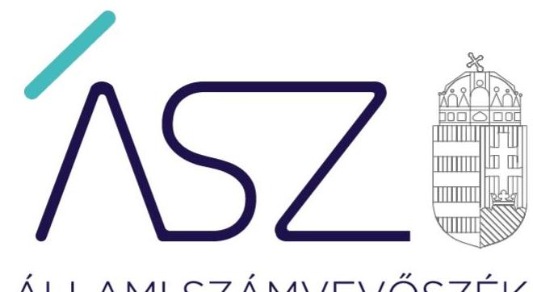

ÁLLAMI SZÁMVEVŐSZÉK

# JELENTÉS 

Az önkormányzatok ellenőrzése során egyes második védelmi vonalat jelentő ellenőrző szervek ellenőrzése
fővárosi és megyei kormányhivatalok ellenőrzése
2022.

22030
www.asz.hu

---

ÁLLAMI SZÁMVEVŐSZÉK

# JELENTÉS 

Az önkormányzatok ellenőrzése során egyes második védelmi vonalat jelentő ellenőrző szervek ellenőrzése
fővárosi és megyei kormányhivatalok ellenőrzése
2022. 05. hó 31. nap

22030
www.asz.hu

---

# AZ ELLENŐRZÉST VEZETTE ÉS A VÉGREHAJTÁSÁÉRT FELELŐS: 

DR. PÁLMAI GERGELY ellenőrzésvezető
DORMÁN ISTVÁN ellenőrzésvezető
KAKAS SÁNDOR ellenőrzésvezető
DR. GÁL NÓRA ellenőrzésvezető
KUSZINGER ANDREA ellenőrzésvezető

A PROGRAM ÖSSZEÁLLÍTÁSÁÉRT FELELŐS:
NAGY ADRIENN program készítésért felelős vezető
HORVÁTH TÍMEA program készítésért felelős vezető

Jelentéseink az Országgyűlés számítógépes hálózatán és az interneten a www.asz.hu címen is olvashatóak.

IKTATÓSZÁM: EL-3693-001/2022.
TÉMASZÁM: 2564, 2567
ELLENŐRZÉS-AZONOSÍTÓ SZÁM: V0908, V0911

---

# TARTALOMJEGYZÉK 

■ ÖSSZEGZÉS ..... 5
■ AZ ELLENŐRZÉS JELENTŐSÉGE, AKTUALITÁSA, TÁRSADALMI SZEREPE, SZEMPONTJAI ..... 7
■ AZ ELLENŐRZÉS TERÜLETE ..... 8
■ AZ ELLENŐRZÉS HATÓKÖRE ÉS MÓDSZERE ..... 10
■ MELLÉKLETEK ..... 13
I. melléklet: A kormányhivataloktól érkezett válaszok összefoglalója ..... 13
II. melléklet: A kormányhivatali feladatellátás hatása az önkormányzatok szabályozottságára - értékelés és annak módszere ..... 14
III. melléklet: Értelmező szótár ..... 15
■ FÜGGELÉKEK ..... 17
I. sz. függelék: Az ellenőrzött kormányhivatalok és az azokhoz tartozó önkormányzatok és az önkormányzati hivatalok száma ..... 17
■ RÖVIDÍTÉSEK JEGYZÉKE ..... 19

---

.

---

# ÖSSZEGZÉS 

A fővárosi és megyei kormányhivatalok az önkormányzatok törvényességi felügyeletét a jogszabályok által meghatározott rendelkezések szerint látták el.

## Értékelések

A fővárosi és megyei kormányhivatalok (a továbbiakban: kormányhivatalok) az önkormányzatok feletti törvényességi felügyeleti tevékenységükre vonatkozóan az intézményi munkatervekben célokat és részcélokat határoztak meg. A munkatervben meghatározták a feladatok végrehajtásának eredményét és határidejét is. Az erről szóló beszámolóikat a kormányhivatalok vezetői elkészítették. A beszámolókban szerepeltették a munkatervekben megjelölt célok megvalósulását, értékelték, hogy a feladatok közül mely feladat teljesült vagy részben valósult meg. A kormányhivatalok a helyi önkormányzatok feletti törvényességi felügyeleti tevékenységre vonatkozóan meghatározott céljaikat teljesítették.

A kormányhivatalok törvényességi felügyeleti tevékenységük tapasztalatait összegző beszámolóinak adatai alapján a törvényességi felügyeleti tevékenység eltolódott az érintettek részére biztosított szakmai segítségnyújtás felé. Emellett szükséges kiemelni, hogy a törvényességi felügyeleti eljárás úgynevezett vizsgálati szakasza - melyben a kormányhivatalok a tudomásukra jutott adatok alapján megvizsgálják, hogy történt-e jogszabálysértés az önkormányzatok részéről - a jogszabály rendelkezése szerint külön döntés meghozatala nélkül lezárul. Az ellenőrzés során ennek a rendelkezésnek a kockázatait értékelve, az ÁSZ ${ }^{1}$ az érintett kormányhivatalok vezetőit - tanácsadó funkciója keretében - levélben kereste meg. A kormányhivataloktól érkezett válaszok összefoglalóját az I. melléklet tartalmazza.

Az ÁSZ értékelte, hogy a kormányhivatalok törvényességi felügyeleti tevékenysége milyen hatást gyakorolt az önkormányzatok működése és szabályszerű gazdálkodása alapfeltételeinek megteremtésére. Az önkormányzatok működésének és szabályszerű gazdálkodásának alapfeltételeit - a törvényességi felügyeleti tevékenység által lefedett önkormányzati SZMSZ-en, mint rendeleten kívül - legfőképpen a nem rendeleti szinten elkészítendő számviteli szabályzatok - különösen a számviteli politika, leltárkészítési és leltározási szabályzat, pénzkezelési szabályzat - jelentik. A közpénzzel és a nemzeti vagyonnal való gazdálkodás és elszámolás alapvető szabályait - a jogszabályi rendelkezéseken túl és az adott önkormányzatra vonatkozóan - ezek biztosítják. Az ellenőrzés értékelése szerint a kormányhivatalok törvényességi felügyeleti tevékenysége és az önkormányzatok szabályszerű működésének és gazdálkodásának alapfeltételeit jelentő szabályozási dokumentumok szabályszerűsége között nincs kimutatható kapcsolat. Az értékelés módszerét az II. melléklet tartalmazza.

## Következtetések

A kormányhivatalok önkormányzatok felett gyakorolt törvényességi felügyeletének célja - az önkormányzati törvény előírása szerint - az önkormányzatok jogszerű működésének biztosítása. Ennek keretében a kormányhivatalok vizsgálják többek között az érintett önkormányzatok működésének, döntéshozatali eljárásainak, valamint döntéseinek jogszerűségét is.

A 2020-2021. években az ÁSZ által végzett, valamennyi önkormányzatot (3197) és hivatalt (1284), valamint több ezer önkormányzati intézményt (3932) érintő ellenőrzés eredménye szerint az önkormányzatok, valamint hivatalaik és intézményeik jelentős része a pénzügyi-gazdálkodási tevékenysége kereteinek kialakításáról nem gondoskodott. Holott éppen ezek a szabályozások biztosítják a közpénzekkel és nemzeti vagyonnal való gazdálkodás és elszámolás alapvető feltételeit.

A kormányhivatalok törvényességi felügyeleti tevékenysége - a jelenlegi jogszabályi keretek között - nem tud hozzájárulni az önkormányzatok, valamint hivatalaik és intézményeik közpénzekkel és nemzeti vagyonnal való gazdálkodásuk és elszámolásuk alapvető feltételeinek kialakításához. Ezért az önkormányzatok pénzügyi ellenőrzése területén a jogszabályoknak az önkormányzatok integritását, korrupció elleni védelmét erősítő fejlesztése szükséges.

---

# A kormányhivatalokat értékeltük 

Az ÁSZ értékelte a kormányhivatali törvényességi felügyelet és az önkormányzatok lényeges működési és gazdálkodási feltételei kialakítása közötti összefüggéseket.

Az önkormányzatok a törvényes keretek között szabadon dönthetnek a helyi közügyekben.

A törvényességi felügyelet célja az önkormányzatok működése jogszerűségének biztosítása.

Ennek érdekében törvényben meghatározott eszközöket alkalmazhat.

## HOGYAN ÉRTÉKELT AZ ÁSZ?

A kormányhivatalok az önkormányzatok törvényességi felügyeletét a jogszabályok által meghatározott rendelkezések szerint látták el.

A kormányhivatalok törvényességi felügyeleti tevékenysége nem tud hozzájárulni az önkormányzatok, valamint hivatalaik és intézményeik közpénzekkel és nemzeti vagyonnal való gazdálkodásuk és elszámolásuk alapvető feltételeinek kialakításához.

Az önkormányzatok pénzügyi ellenőrzése területén a jogszabályoknak az önkormányzatok integritását, korrupció elleni védelmét erősítő fejlesztése szükséges.

---

# AZ ELLENŐRZÉS JELENTŐSÉGE, AKTUALITÁSA, TÁRSADALMI SZEREPE, SZEMPONTJAI 

Helyi lakossági közérdek, hogy az önkormányzatok, hivatalaik és intézményeik, melyek a helyi lakosságot érintő döntések meghozataláért és a helyi közügyek intézéséért felelősek, szabályosan működjenek. Az önkormányzati autonómia - mely a nemzetközi jog és így az Alaptörvény által is garantált védelmet élvez - lényege, hogy az önkormányzatok a törvényes keretek között szabadon dönthetnek a helyi közügyekben. A működés törvényességét azonban garantálni kell, hiszen az integritási kockázatok realizálása esetén a helyi lakosság szenvedhet hátrányokat, adott esetben egy helyi közfeladat nem megfelelő ellátása esetén.

Az Áht. ${ }^{2}$ az államháztartás pénzeszközeivel és a nemzeti vagyonnal történő gazdálkodás biztosítása érdekében az államháztartás ellenőrzési rendszerében három területet nevesít: az államháztartás belső kontrollrendszerét, a kormányzati szintű ellenőrzést, valamint a külső ellenőrzést. Ez a három terület az államháztartás három védelmi vonala.

A helyi önkormányzatok esetében - a Magyar Államkincstár által végzett ellenőrzés mellett - az ellenőrzés második védelmi vonalát jelenti a kormányhivatali törvényességi felügyelet, melynek működését az Alaptörvény írja elő a Kormány részére. A felügyelet az ellenőrzésnél jóval szorosabb kapcsolatot jelent az ellenőrzött/felügyelt intézménnyel, jelen esetben az önkormányzatokkal, éppen azért, hogy szükséges esetben, ha a törvényesség másként nem állítható helyre, az kikényszeríthető lehessen a felügyeletet gyakorló szerv, jelen esetben a kormányhivatalok által.

Az ÁSZ által valamennyi önkormányzatot és hivatalaikat érintő 2020. évi integritás ellenőrzés ${ }^{3}$ számos hiányosságot tárt fel az önkormányzati működés és gazdálkodás szabályozottságának területén, mely tapasztalatokat a 2021. évben végrehajtott több ezer önkormányzati intézmény ellenőrzése megerősített. A jogszabályi előírások szerinti szabályozások hiányában az önkormányzatok, hivatalik és intézményeik működésében nem biztosított a csalásmentes kontrollkörnyezet, mely a feladatok ellátására is hatással van. Az alapvető szabályozási feltételek meglétének hiánya, vagy hibája esetén a működésük és gazdálkodásuk átláthatósága és elszámoltathatósága nem biztosított.

Az önkormányzatok törvényes működésének biztosítása a kormányhivatalok törvényességi felügyeleti tevékenységének a célja, ezért indokolt volt ellenőrzés keretében értékelni, hogy az önkormányzatok alapvető szabályozási kritériumoknak megfelelő működésének és gazdálkodásának megteremtése és fenntartása mennyiben függ a kormányhivatal feladatellátásának szabályosságától és eredményességétől. A szabályozási feltételek jogszabályi előírások szerinti kialakításában, naprakészen tartásában, a hiányosságok kijavításában ugyanis a kormányhivataloknak felügyeleti tevékenységükön keresztül - meghatározó szerepük van.

A második védelmi vonalba tartozó szervezetek ellenőrzésének eredményeként az ÁSZ a lehető legnagyobb hatást képes elérni a közpénzekkel való szabályszerű, felelős és fegyelmezett gazdálkodás előmozdítása érdekében, hiszen az ÁSZ ellenőrzések eredményei - azáltal, hogy az ellenőrzők tevékenysége szabályszerűbbé, hatékonyabbá és átláthatóbbá válik - közvetetten hasznosulhatnak az ellenőrző szervezetek által ellenőrzöttek működésében is. Az ÁSZ ellenőrzése így rávilágíthat azokra a kockázatokra és szempontokra, amelyek kezelésével a törvényességi felügyeleti feladatellátás eredményesebbé és hatásosabbá tehető. Ezáltal közvetetten az önkormányzatok, hivatalik és intézményeik működésének és gazdálkodásának szabályszerűsége, átláthatósága és elszámoltathatósága is növelhető, melynek hasznait végső soron a helyi lakosság élvezi.

---

# AZ ELLENŐRZÉS TERÜLETE 

## A fővárosi és megyei kormányhivatalok

A fővárosi és megyei kormányhivatalok a kormány általános hatáskörű területi kormányzati igazgatási szervei. A területi közigazgatás legnagyobb egységeit képező 20 kormányhivatal a megyeszékhelyeken, a főváros és Pest Megye esetében pedig Budapesten működik.

A fővárosi és megyei kormányhivatalokról, valamint a fővárosi és megyei kormányhivatalok kialakításával és a területi integrációval összefüggő törvénymódosításokról szóló 2010. évi CXXVI. törvény rendelkezik, alapítására, átalakítására, megszüntetésére jogosult szerv az Országgyűlés. A kormányhivatalok a miniszterelnökséget vezető miniszter irányítása alá tartozó központi költségvetési szervek.

A kormányhivatalok a kormányzati igazgatásról szóló 2018. évi CXXV. törvényben foglaltak szerint olyan hatósági, felügyeleti, jogorvoslati, ellenőrzési, koordinációs, tájékozódási, javaslattevő és véleményezési jogkörökkel rendelkeznek, amelyek elősegítik a területi közigazgatás jellemzőire, sajátos igényeire figyelemmel lévő központi döntések kidolgozását és végrehajtását. A kormányhivatalok a hatósági eljárásokban felügyeleti szervként, illetve egyes ügyekben elsőfokú és másodfokú hatóságként járnak el. Az Alaptörvényben foglaltaknak megfelelően törvényességi felügyeletet gyakorolnak a helyi önkormányzatok felett. Az Mötv. ${ }^{4}$ alapján a kormányhivatalok törvényességi felügyeleti eljárásának célja a helyi önkormányzat működése jogszerűségének biztosítása. A kormányhivatal törvényességi felügyeleti eljárásában vizsgálja a helyi önkormányzat képviselő-testülete, bizottsága, részönkormányzata, polgármestere, főpolgármestere, megyei közgyűlés elnöke, társulása, jegyzője (a törvény szerint: érintettek) működésének, döntéshozatali eljárásának, döntéseinek jogszerűségét, a jogalkotási, jogszabályon alapuló döntési és feladatellátási kötelezettség teljesítését. A törvényességi felügyelet eszközeire, terjedelmére, valamint a kormányhivatal információkérési javaslattételi jogára és a szakmai segítségnyújtásra vonatkozó előírásokat az Mötv. szabályozza.
A helyi önkormányzatok törvényességi felügyeletének részletes szabályairól a 119/2012. (VI. 26.) Korm. rendelet rendelkezik. A törvényességi felügyeleti eljárás vizsgálati szakasszal kezdődik, amely a kormányhivatal hivatali hatáskörében tudomására jutott adatok alapján vagy bejelentésre indul meg. A vizsgálati szakaszt az intézkedési szakasz követheti, amennyiben a kormányhivatal egy önkormányzati intézkedéssel kapcsolatban jogszabálysértést észlel, vagy az érintett határidőig nem tesz eleget a kormányhivatal információkérésre irányuló megkeresésének. Ez esetben a kormányhivatal megkezdi a törvényességi felügyeleti eszközök alkalmazását.

Az ÁSZ egyrészről valamennyi kormányhivatal tekintetében teljesítményellenőrzés keretében értékelte, hogy az önkormányzatok feletti törvényességi felügyeletéhez kapcsolódóan megtörtént-e a célok meghatározása és azok teljesülésének értékelése, a felügyeleti tevékenység eredményes volt-e.

---

Az ÁSZ másrészt megfelelőségi ellenőrzés keretében értékelte Budapest Főváros Kormányhivatala és kilenc megyei - a Csongrád-Csanád Megyei, a Fejér Megyei, a Győr-Moson-Sopron Megyei, a Hajdú-Bihar Megyei, a Komárom-Esztergom Megyei, a Nógrád Megyei, a Tolna Megyei, a Vas Megyei és a Zala Megyei - kormányhivatal helyi önkormányzatok feletti törvényességi felügyeletére vonatkozó kötelezettségének teljesítését. Az ellenőrzés kiterjedt a törvényességi felügyeleti tevékenységgel kapcsolatos folyamatok (feltárás, intézkedés, lezárás) szabályozottságának, a kontrollpontok kialakításának értékelésére, valamint a felügyeleti tevékenység végrehajtására.

Az ellenőrzött kormányhivatalokat és az azokhoz tartozó önkormányzatok és önkormányzati hivatalok számát az I. Függelék tartalmazza.

---

# AZ ELLENŐRZÉS HATÓKÖRE ÉS MÓDSZERE 

## Az ellenőrzés típusa

Teljesítmény és megfelelőségi ellenőrzés

## Az ellenőrzött időszak

2019-2020. évek

## Az ellenőrzés tárgya

A kormányhivatalok által végzett, a helyi önkormányzatok feletti törvényességi felügyeleti tevékenysége, melynek eredményes végrehajtásával az ellenőrzött szervezet hozzájárul a helyi önkormányzatok jogszerű működéséhez, valamint a közpénzekkel való szabályszerű
 és felelős gazdálkodásához, valamint a kormányhivatalok önkormányzatok feletti törvényességi felügyeleti tevékenységének szabályozottsága, valamint a jogszabályokban foglalt előírásoknak megfelelő feladatellátásuk.

## Az ellenőrzött szervezetek

Az ellenőrzött szervezeteket az I. sz. Függelék tartalmazza.

## Az ellenőrzés jogalapja

Az ellenőrzés jogszabályi alapját az ÁSZ tv ${ }^{5}$. 1. § (3) bekezdésében, az ÁSZ tv. 5. § (2) és (6) bekezdéseiben és az Áht. 61. § (2) bekezdésében foglalt előírások képezik.

## Az ellenőrzés módszerei

Az ÁSZ az ellenőrzést az ellenőrzési program szempontjai, az ellenőrzött időszakban hatályos jogszabályok, az ellenőrzés szakmai szabályai alapján, a jelen ellenőrzésre irányadó ÁSZ módszertanok figyelembevételével hajtja végre.

Az ellenőrzés egyrészt teljesítmény-ellenőrzés, melynek során az ÁSZ a kormányhivatalok tevékenységének eredményességét értékeli az ÁSZ által az önkormányzatok integritásának 2020. évi monitoring típusú ellenőrzése jelentéseiben tett megállapítások és következtetések, valamint a törvényességi felügyeleti tevékenység kereteinek kialakítása alapján. Az ÁSZ értékeli továbbá a kormányhivatalok önkormányzatok feletti törvényességi felügyelete tekintetében meghatározott célok mérését, értékelését és végrehajtását.

---

Az ellenőrzés másrészt megfelelőségi ellenőrzés, melyben az ÁSZ a kormányhivatalok önkormányzatok tevékenysége feletti törvényességi felügyeletéhez kapcsolódó feladatellátás szabályozottságát, a felügyeleti tevékenység ellátása jogszabályokban foglalt előírásoknak való megfelelőségét (szabályszerűségét), továbbá a felügyelet ellátása során az átláthatóság követelményeinek érvényesülését ellenőrzi. A mintavételezés a kormányhivatalok 2020. évben lezárult törvényességi felügyeleti ügyeiről vezetett nyilvántartásból egyszerű véletlen mintavételi eljárással történt.

Az ellenőrzési kérdések megválaszolásához szükséges bizonyítékok megszerzése az ellenőrzött által rendelkezésre bocsátott dokumentumokra, adatokra alapozva megfigyelés, szemle (szemrevételezés), valamint elemző eljárás útján történik. Az ellenőrzési bizonyítékként felhasználható adatforrások közé tartoznak az ellenőrzési program részletes szempontjainál felsorolt adatforrások, valamint minden egyéb - az ellenőrzés folyamán feltárt, az ellenőrzés szempontjából információt tartalmazó - dokumentum.

Az ellenőrzés lefolytatásához az ellenőrzött szervezet dokumentumok rendelkezésre bocsátásával, valamint interjú keretében szolgáltatott adatokat, amelyek valódiságát és teljes körűségét az ellenőrzött szervezet vezetője által tett teljességi és hitelességi nyilatkozat igazolja. A rendelkezésre bocsátott adatok, információk kontrollja az ellenőrzés keretében történt. A kormányhivatalok irányításáért felelős minisztériumtól kapott tájékoztatás szerint a kormányhivatalok az önkormányzatok törvényességi felügyeleti jogkörében utólagos, dokumentum alapú kontrollt végeznek, az önkormányzatok működésének folyamatos ellenőrzésére az nem terjed ki. A felügyeleti eljárás az önkormányzati döntések meghozatalának szabályszerűségére terjed ki.

Az ellenőrzés ideje alatt az ellenőrzött szervezettel történő kapcsolattartás az ÁSZ SZMSZ-ének ${ }^{6}$ vonatkozó előírásai alapján biztosított.

---

.

---

# MELLÉKLETEK 

I. MELLÉKLET: A KORMÁNYHIVATALOKTÓL ÉRKEZETT VÁLASZOK ÖSSZEFOGLALÓJA

1. A törvényességi felügyeleti eljárás vizsgálati szakasza lezárásának dokumentálása

A helyi önkormányzatok törvényességi felügyeletének részletes szabályairól szóló 119/2012. (VI.26.) Korm. rendelet 1. § (3) bekezdése szerint „Amennyiben a lefolytatott vizsgálat során a fővárosi és megyei kormányhivatal jogszabálysértést nem észlel, a vizsgálati szakasz külön döntés meghozatala nélkül lezárul." Az ÁSZ megfelelőségi ellenőrzésének egyik szempontja volt, hogy ennek a rendelkezésnek a végrehajtása során a külön döntés nélküli lezárást a kormányhivatalok hogyan kezelik, a lezárás dokumentálása megfelelő-e.

Az ÁSZ az érintett kormányhivatali vezetők felé - tanácsadó funkciója keretében - figyelemfelhívással élt. A figyelemfelhívás célja az volt, hogy lehetőséget teremtsen az érintett kormányhivatalok vezetői számára, hogy az ellenőrzés során feltárt hiányosságokat és kockázatokat már az ellenőrzés folyamatában orvosolják, illetve kezeljék.

A kormányhivatalok vezetői arról adtak tájékoztatást, hogy a törvényességi felügyeleti eljárás vizsgálati szakasza külön döntés nélküli lezárásának dokumentálása a Törvényességi Felügyelet Írásbeli Kapcsolattartás Modul (TFIK modul) alkalmazásával történik, melynek használatáról a Nemzeti Jogszabálytárról szóló 338/2011. (XII. 29.) Korm. rendelet - 2021. április 1-jétől hatályos 8/A. §-a rendelkezik. (Egy vonatkozó kormányhivatali válasz szerint: „A TFIK Modul felületén ez úgy valósul meg, hogy amennyiben a megküldött jegyzőkönyv, döntés megfelel a jogszabályi előírásoknak, úgy a törvényességi felügyeleti vizsgálati eljárás az elektronikus rendszerben („klikkeléssel") lezárásra, az irat archiválásra kerül, ez külön döntést, dokumentálást nem igényel.")
2. Az információkérés és javaslattétel eredményességének értékelése

A kormányhivatalok törvényességi felügyeleti tevékenységének tapasztalatait összegző beszámolóik adatai alapján a törvényességi felügyeleti tevékenység eltolódott az érintettek részére biztosított szakmai segítségnyújtás felé. Figyelemmel a szakmai segítségnyújtás jelentőségére, az ÁSZ ellenőrzésének szintén fontos szempontja volt, hogy a kormányhivatalok az önkormányzatoktól való információkérés és az önkormányzatok felé tett javaslatok eredményességét értékelték-e.

Az értékelés azért lényeges, mert így állapítható meg, hogy a kormányhivatalok az alkalmazott „puha" eszközökkel képesek-e törvényességi eljárás megindítása és törvényességi felügyeleti eszköz alkalmazása nélkül az önkormányzatok törvényes működését biztosítani.

A kormányhivatalok válaszaikban kifejtették, hogy az értékelést a vonatkozó jogszabályok nem írják elő, így az nem is kötelező, a vonatkozó jogszabályok „... normaszövege nem tartalmaz a törvényességi felügyeleti jogkör gyakorlójára nézve ... külön „értékelési" kötelezettséget".
3. A törvényességi felügyeleti tevékenységre vonatkozó belső szabályozók rendelkezésre állása

Az érintett kormányhivatalok vezetői arról adtak tájékoztatást, hogy a szabályozó dokumentumok (ügyrend, ellenőrzési nyomvonal) naprakész rendelkezésre állása és alkalmazása érdekében a szükséges intézkedéseket megteszik.

---

II. MELLÉKLET: A KORMÁNYHIVATALI FELADATELLÁTÁS HATÁSA AZ ÖNKORMÁNYZATOK SZABÁLYOZOTTSÁGÁRA ÉRTÉKELÉS ÉS ANNAK MÓDSZERE

Az ÁSZ által lefolytatott, Magyarország összes önkormányzatára kiterjedő, 2020. évi integritás ellenőrzés a törvényes működés és gazdálkodás olyan alapdokumentumait értékelte, amelyek hiányában az átlátható és elszámoltatható működés és gazdálkodás alapfeltételei nem biztosítottak. Az így rendelkezésre álló adatok lehetőséget adtak annak vizsgálatára, hogy a kormányhivatalok által az önkormányzatok vonatkozásában végzett törvényességi felügyeleti feladatellátás mennyire eredményes, hatékonyan járul-e hozzá az önkormányzatok szabályozottságához.
A kormányhivatalok irányításáért felelős minisztérium és az ÁSZ között az ellenőrzés lefolytatása során nem alakult ki megegyezés a teljesítmény-ellenőrzés kritériumrendszerét illetően. Ezért az ÁSZ saját értékelést dolgozott ki annak érdekében, hogy a kormányhivatal törvényességi felügyeleti tevékenységének és az önkormányzatok működésének és gazdálkodásának alapvető keretei kialakításának kapcsolata értékelhető és ez alapján az esetleges elmozdulás iránya meghatározható legyen.
Az ÁSZ értékelése három lényeges szempont alapján történt:

- lakosságszám arányosan értékelte az egyes kormányhivatalok illetékességi területén működő önkormányzatok képviselő-testületei szervezeti és működési szabályzatainak rendelkezésre állását, a 2020. évi integritás ellenőrzés értékelésének adatai alapján;
- értékelte, hogy az egyes kormányhivatalok a törvényességi felügyeleti tevékenységhez kapcsolódóan a törvényességi felhívás mellett alkalmaztak-e tanácsadó, szakmai támogató tevékenységet (információ kérés, szakmai segítségnyújtás), illetve ennek adatait nyilvántartották-e, az egyes kormányhivatalok beszámolói alapján;
- értékelte, hogy az ÁSZ által a kormányhivatalok számára a 2017-2019. közötti időszakban megküldött, az önkormányzatok működésével és gazdálkodásával kapcsolatos szabálytalanságokra vonatkozó jelzések hasznosultak-e az önkormányzatoknál a kormányhivatal feladatellátásának hatására, az ÁSZ rendelkezésére álló kormányhivatali visszajelzések alapján.
A 2020. évi integritás ellenőrzés feltárta, hogy a Magyarországon működő, összesen 3197 önkormányzatból 655 önkormányzat képviselő-testülete nem rendelkezett a képviselő-testület szervezetét és működését meghatározó szervezeti és működési szabályzattal. Ez a szabályzat olyan alapvető fontosságú, az adott önkormányzat sajátosságait figyelembe vevő rendelkezéseket rögzít, amelyek alapfeltételei az önkormányzat integritás alapú működésének.
Az ellenőrzés lakosságszám arányos értékelése szerint a lakosság 25 %-a él olyan, a különböző kormányhivatalok illetékességi területéhez tartozó településeken, ahol az önkormányzati működés alapvető szabályozási feltételeinek kialakítása nem biztosított.
Szakmai tanácsadó tevékenységet a kormányhivatalok mindegyike végzett, amelyhez a kormányhivatalok 70 %-a számadatokat is rendelt.
Az ÁSZ az önkormányzatok feletti törvényességi felügyeleti tevékenységet ellátó kormányhivatalok számára a 2017-2019. közötti időszakban 33 esetben küldött jelzést olyan szabályozási dokumentumok hiánya, vagy szabálytalansága miatt, amelyek a 2020. évi integritás ellenőrzés során is értékelésre kerültek. Az ÁSZ 2020. évi integritás ellenőrzésének értékelése visszaigazolta, hogy az ÁSZ által a kormányhivatalok számára tett 33 jelzésből 18 esetben (54,5 %) a kormányhivatalok intézkedésének hatására javult az érintett önkormányzatoknál a szabályozási dokumentumok jogszabályoknak való megfelelősége.
Az ellenőrzés megállapította, hogy az ÁSZ által kidolgozott három lényeges szempont szerinti értékelés összesítése alapján kialakult eredmény és a 2020. évi integritás ellenőrzés értékelése alapján kialakult eredmény (az önkormányzatok integritásának értékelése megyék szerint) között nincs kimutatható összefüggés.

---

# III. MELLÉKLET: ÉRTELMEZŐ SZÓTÁR 

belső kontrollrendszer
átláthatóság
a helyi önkormányzatok törvényességi felügyelete
eredményesség elve
intézményi munkaterv
integritás

A belső kontrollrendszer a kockázatok kezelése és tárgyilagos bizonyosság megszerzése érdekében kialakított folyamatrendszer, amely azt a célt szolgálja, hogy a működés és gazdálkodás során a tevékenységeket szabályszerűen, gazdaságosan, hatékonyan, eredményesen hajtsák végre, az elszámolási kötelezettségeket teljesítsék, megvédjék az erőforrásokat a veszteségektől, károktól és nem rendeltetésszerű használattól. (Forrás: Áht. 69. § (1) bekezdése)
Az átláthatóság az egyik előfeltétele az elszámoltathatóságnak, vagyis annak, hogy a felelősök tevékenységükért, döntéseikért elszámoltathatóak, felelősségre vonhatóak legyenek. Az érintettek igénylik, és részükre biztosítani szükséges, hogy a célok elérése érdekében folytatott tevékenységekről, folyamatokról, a rendszeres, vagy időközönkénti tájékoztatást, azaz valamilyen formában megbízható, időszerű, a tevékenység szempontjából fontos információkat közzé- vagy hozzáférhetővé legyenek téve. (forrás: Államháztartási belső kontroll standardok és gyakorlati útmutató, NGM, 2017)
A kormányhivatal törvényességi felügyeleti eljárásának célja a helyi önkormányzat képviselő-testülete, bizottsága, részönkormányzata, polgármestere, főpolgármestere, megyei közgyűlés elnöke, társulása, jegyzője (továbbiakban: érintett) működésének jogszerűségének biztosítása. (forrás: Mötv. 132. § (2) bek.)
A kormányhivatal törvényességi felügyeleti eljárásában vizsgálja az érintett
a) működésének, döntéshozatali eljárásának jogszerűségét;
b) döntéseinek jogszerűségét;
c) jogalkotási, továbbá jogszabályon alapuló döntési és feladatellátási kötelezettségének teljesítését. (forrás: Mötv. 132. § (3) bek.)
Az eredményesség elve a kitűzött célok és a szándékolt eredmények (hatások) elérését jelenti. A feladatellátás eredményességét mutatja a tényleges és a tervezett eredmények (hatások) összevetése. (ÁSZ: A teljesítmény-ellenőrzés alapelvei. 2015.)
Az intézményi munkaterv egy naptári évre szóló intézkedési és erőforrás felhasználási rövid távú stratégiai tervdokumentum, amely tartalmazza
a) az adott időszakra vonatkozó szervezeti célokat, programokat, intézkedéseket;
b) az a) pontban foglaltak teljesítési határidőit;
c) az a) pontban foglaltak teljesítéséhez szükséges személyi, tárgyi, szakmai és szervezeti feltételeket; valamint
d) az a)-c) pontokban foglaltak teljesítéséért felelősök meghatározását.
(38/2012. (III.12.) Korm. rendelet 30. §.)
Az integritás az elvek, értékek, cselekvések, módszerek, intézkedések konzisztenciáját jelenti, vagyis olyan magatartásmódot, amely meghatározott értékeknek megfelel. (Forrás: Nemzetgazdasági Minisztérium: Államháztartási belső kontroll standardok és gyakorlati útmutató 1.1.3. pontja, 2017. szeptember)
A szervezeti integritás a szervezet védekezőképessége a korrupció lehetőségével szemben. Az integritás erősítése - mint preventív eszközrendszer - a korrupció megelőzésére fókuszál. A szervezeti integritás a működés, a szervezeti kultúra minőségét is jelzi.
Az ellenőrzés megközelítése szerint az integritás a szervezet értékeinek és célkitűzéseinek megfelelő működést jelenti. Minél magasabb színvonalú egy szervezet integritása, az annál ellenállóbb a korrupcióval, a korrupciós veszélyekkel szemben, vagyis az integritás erősítése - elsősorban az egyes szervezetek szintjén - a korrupciós kockázatok mérséklésének egyik fontos eszköze. Az integritás ugyanakkor tágabb jelentésű fogalom, nemcsak a korrupciótól, hanem más helytelen magatartásoktól (például csalás, önkényesség) való mentességet és a szervezet céljainak követését is jelenti. Egy szervezet integritását úgy is meghatározhatjuk, mint a szervezet ellenálló-

---

|  | képességét annak a veszélynek, hogy dolgozói helytelen magatartásukkal kárt okozzanak.   Az integritás megerősítése és fenntartása elsősorban a szervezet elsőszámú vezető-   jének felelőssége. |
| :--: | :--: |
| jelzés | Az ÁSZ tv. 1. § (5) bekezdése szerint „Az Állami Számvevőszék megállapításai alapján az ellenőrzött szervezetekkel és a felelős személyekkel szemben az illetékes szervezetnél eljárást kezdeményezhet." |
| kockázat | A
 kockázat annak a valószínűségét jelenti, hogy egy vagy több esemény, vagy intézkedés nem kívánt módon befolyásolja a rendszer működését, céljainak megvalósulását. (Forrás: Javaslatok a korrupciós kockázatok kezelésére - Kockázatkezelési és ellenőrzési módszertan 35. oldal, ÁSZ) |
| kontrollkörnyezet | A költségvetési szerv vezetője által kialakított olyan elvek, eljárások, belső szabályzatok összessége, amelyben világos a szervezeti struktúra, a folyamatok átláthatók, egyértelműek a felelősségi, hatásköri viszonyok és feladatok, meghatározottak, ismertek és elfogadottak az etikai elvárások a szervezet minden szintjén, átlátható a humánerőforrás-kezelés, biztosított a szervezeti célok és értékek irányában való elkötelezettség fejlesztése és elősegítése. (Forrás: Bkr. 6. § (1) bekezdés) |
| teljesítmény-ellenőrzés | A teljesítmény-ellenőrzés a számvevőszéki ellenőrzés azon típusa, amely annak megállapítására irányul, hogy a közpénzekkel és a nemzeti vagyonnal való gazdálkodás megfelel-e az eredményesség, hatékonyság, gazdaságosság elveinek, illetve vannak-e lehetőségek a teljesítmény javítására. (ÁSZ: A teljesítmény-ellenőrzés alapelvei. 2015.) |
| intézmény | A helyi önkormányzatok irányítása alá tartozó költségvetési szervek. (A képviselő-testület a feladatkörébe tartozó közszolgáltatások ellátására - jogszabályban meghatározottak szerint - költségvetési szervet (önkormányzati intézmény) alapíthat; Forrás: Mötv. 41. § (6) bekezdés) |

---

# FÜGGELÉKEK

- I. SZ. FÜGGELÉK: AZ ELLENŐRZÖTT KORMÁNYHIVATALOK ÉS AZ AZOKHOZ TARTOZÓ ÖNKORMÁNYZATOK ÉS AZ ÖNKORMÁNYZATI HIVATALOK SZÁMA

|  |   |   |   |
| --- | --- | --- | --- |
|  Kormányhivatal | önkormányzat | önkormányzati hivatal | az önkormányzatok integritásának értékelése a 2020. évi jelentés alapján*  |
|  Bács-Kiskun Megyei Kormányhivatal | 120 | 77 | 4,6  |
|  Baranya Megyei Kormányhivatal | 302 | 57 | 4,1  |
|  Békés Megyei Kormányhivatal | 76 | 46 | 4,2  |
|  Borsod-Abaúj-Zemplén Megyei Kormányhivatal | 359 | 119 | 4,5  |
|  Csongrád-Csanád Megyei Kormányhivatal | 61 | 41 | 4,6  |
|  Budapest Főváros Kormányhivatala | 24 | 24 |  |
|  Pest Megyei Kormányhivatal | 188 | 150 | 4,3  |
|  Fejér Megyei Kormányhivatal | 109 | 67 | 4,4  |
|  Győr-Moson-Sopron Megyei Kormányhivatal | 184 | 71 | 4,5  |
|  Hajdú-Bihar Megyei Kormányhivatal | 83 | 54 | 4,3  |
|  Heves Megyei Kormányhivatal | 122 | 62 | 3,9  |
|  Jász-Nagykun-Szolnok Megyei Kormányhivatal | 79 | 53 | 4,1  |
|  Komárom-Esztergom Megyei Kormányhivatal | 77 | 45 | 4,3  |
|  Nógrád Megyei Kormányhivatal | 132 | 50 | 4,2  |
|  Somogy Megyei Kormányhivatal | 247 | 64 | 4,1  |
|  Szabolcs-Szatmár-Bereg Megyei Kormányhivatal | 230 | 110 | 4,4  |
|  Tolna Megyei Kormányhivatal | 110 | 38 | 4,2  |
|  Vas Megyei Kormányhivatal | 217 | 44 | 4,7  |
|  Veszprém Megyei Kormányhivatal | 218 | 58 | 3,9  |
|  Zala Megyei Kormányhivatal | 259 | 54 | 4,0  |
|  Összesen: | 3197 | 1284 |   |

- Az ÁSZ 1-5 skálán osztályozta az egyes önkormányzatokat, ahol 1-es osztályzat jelenti a legmagasabb, az 5-ös pedig a legkisebb korrupciós kockázatot. A Budapest Főváros és kerületeinek értékelését a 23 megyei jogú várost és a 19 megyei önkormányzatot is magában foglaló jelentés tartalmazza.

---

.

---

# RÖVIDÍTÉSEK JEGYZÉKE 

${ }^{1}$ ÁSZ
${ }^{2}$ Áht.
${ }^{3}$ 2020. évi Integritás ellenőrzés
${ }^{4}$ Mötv.
${ }^{5}$ ÁSZ tv.
${ }^{6}$ ÁSZ SZMSZ

Állami Számvevőszék
az államháztartásról szóló 2011. évi CXCV. törvény
„Önkormányzatok ellenőrzése - Az önkormányzatok integritásának ellenőrzése" 21004- 21024. számú jelentések
2011. évi CLXXXIX. törvény Magyarország helyi önkormányzatairól
2011. évi LXVI. törvény az Állami Számvevőszékről

Állami Számvevőszék Szervezeti és Működési Szabályzata

---

# ÁSZ 

ÁLLAMI SZÁMVEVŐSZÉK
1052 Budapest, Apáczai Cs. J. u. 10. I 1364 Budapest 4. Pf. 54 TEL: +36 14849100
email: szamvevoszek@asz.hu
web: www.asz.hu | www.aszhirportal.hu
