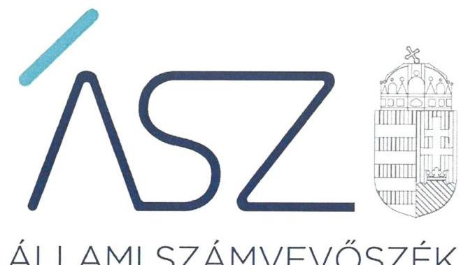
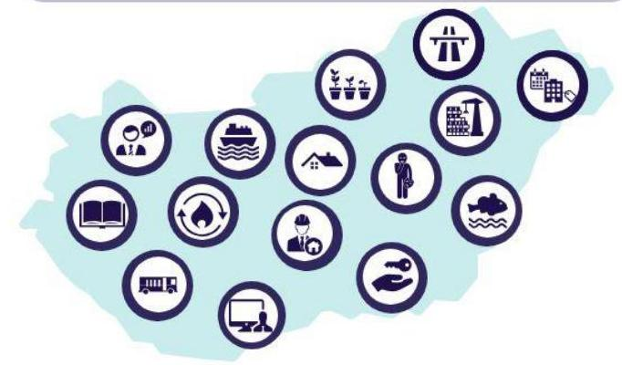
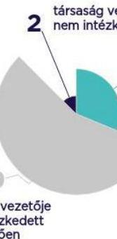
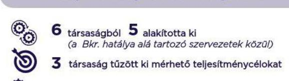

ÁLLAMI SZÁMVEVŐSZÉK

# JELENTÉS 

Nemzeti tulajdonú gazdasági társaságok kockázatalapú vagyonellenőrzése

2022. 

22031
www.asz.hu

---

ÁLLAMI SZÁMVEVŐSZÉK

# JELENTÉS 

Nemzeti tulajdonú gazdasági társaságok kockázatalapú vagyonellenőrzése

2022. 06. hó 22. nap

22031
www.asz.hu

---

# AZ ELLENŐRZÉST VEZETTE ÉS A VÉGREHAJTÁSÁÉRT FELELŐS: 

## SZAPPANOS JÚLIA ellenőrzésvezető

MÉSZÁROSNÉ PLJESOVSZKI ANITA ellenőrzésvezető
ÁRPÁSI TIBOR ellenőrzésvezető

## A PROGRAM ÖSSZEÁLLÍTÁSÁÉRT FELELŐS:

DR. FELFÖLDI IZABELLA projektvezető

## A TÉMÁHOZ KAPCSOLÓDÓ KORÁBBI SZÁMVEVŐSZÉKI JELENTÉSEK:

- címe: A többségi állami tulajdonú gazdasági társaságok integritásának ellenőrzése - 148 gazdasági társaságnál
- sorszáma: 21089
- címe: A többségi állami tulajdonú gazdasági társaságok integritásának ellenőrzése - 208 gazdasági társaságnál
- sorszáma: 21092

IKTATÓSZÁM: EL-3696-001/2022
TÉMASZÁM: 2574
ELLENŐRZÉS-AZONOSÍTÓ SZÁM: V0917

---

# TARTALOMJEGYZÉK 

- ÖSSZEGZÉS ..... 5
- AZ ELLENŐRZÉS JELENTŐSÉGE, AKTUALITÁSA, TÁRSADALMI SZEREPE, SZEMPONTJAI ..... 8
- AZ ELLENŐRZÉS TERÜLETE ..... 9
- MELLÉKLETEK ..... 11
- ELLENŐRZÉS HATÓKÖRE ÉS MÓDSZERE ..... 12
- ÉRTELMEZŐ SZÓTÁR ..... 15
- FÜGGELÉKEK ..... 17
I. sz. Függelék: Az ellenőrzött gazdasági társaságok vagyongazdálkodásának kockázati besorolása és azok változása ..... 17
- RÖVIDÍTÉSEK JEGYZÉKE ..... 19

---

.

---

# ÖSSZEGZÉS 

A társadalmi, gazdasági súlyuk, üzemméretük következtében kiemelt szerepet játszó 19 gazdasági társaság értékelése alapján mindössze háromnál volt igazolt a felelős gazdálkodás és a nemzeti vagyon védelme a 2020. évben. Az Állami Számvevőszék felhívására tizenhat szervezetből öt esetében a feltárt szabálytalanságokat megszüntető intézkedések hatására a vagyongazdálkodás területén fennálló hiányosságok miatti kockázat csökkent, ezáltal a közpénzügyi helyzet javult.
Tizenegy szervezet vezetője nem tanúsított felelős vezetői magatartást, mivel a szabálytalanságok megszüntetése érdekében nem tettek intézkedéseket. Az intézkedések elmaradása miatt a vagyongazdálkodás elszámoltathatósága és a közvagyon veszélyeztetettsége tekintetében az adatok rendelkezésre bocsátása óta esetükben továbbra is fennáll a kockázat.
A jogszabályi előírásokon túli kontrollok területén az érintett 12 gazdasági társaság közül nyolc szervezet vezetője a jelzett kockázatok csökkentésére tett, illetve tervezett intézkedésekről adott számot.

## Értékelések

A nemzeti tulajdonú gazdasági társaságok ellenőrzése kiemelten fontos a nemzeti vagyon megőrzése, megóvása érdekében. Az állami, vagy önkormányzati tulajdonban lévő gazdasági társasági részesedés - mint nemzeti vagyon nagysága miatt a nemzeti tulajdonú gazdasági társaságok gazdálkodása a közérdeklődés középpontjában áll.

Az Állami Számvevőszék a 2018-2020. évekre vonatkozóan értékelte tizenkilenc nemzeti tulajdonú gazdasági társaság vagyongazdálkodásának azon lényeges területeit, amelyek kockázatot jelentenek a beszámoló vagyonról nyújtott információinak megbízhatóságára és hitelességére. Ilyen lényeges terület a beszámolók jóváhagyásához kapcsolódó tulajdonosi joggyakorlói tevékenység, valamint a számviteli törvény szerinti beszámoló mérlegében szereplő adatok megalapozottsága.

Három társaság biztosította, hogy beszámolójában a társaság vagyonára vonatkozó valós információk szerepeljenek, így az ő esetükben igazolt a felelős gazdálkodás és a nemzeti vagyon védelme.

Tizenhárom társaság esetében a 2020. évben magas kockázatot jelentett, hogy nem rendelkeztek a törvényi előírásoknak megfelelő számviteli beszámolóval: egy társaság esetében nem igazolt a beszámoló legfőbb szerv általi jóváhagyása, két társaság esetében a beszámoló nem tartalmazta a kötelezően készítendő kiegészítő mellékletet, tíz társaság pedig a beszámoló elkészítéséhez, a mérleg tételeinek alátámasztásához nem állított össze olyan leltárt, amely tételesen, ellenőrizhető módon tartalmazza a mérleg fordulónapján meglévő eszközöket és forrásokat mennyiségben és értékben. Ha egy gazdasági társaság nem rendelkezik szabályszerű számviteli beszámolóval, akkor nem biztosítja a vagyoni, pénzügyi és jövedelmi helyzetéről és azok alakulásáról olyan objektív információk rendelkezésre állását, amelyek a működéséhez, a partnerek, és egyéb gazdasági szereplők döntéseinek megalapozásához szükségesek, valamint nem teremti meg a gazdálkodásának átláthatóságát és ellenőrizhetőségét. A kiegészítő mellékletben részletezett adatok elősegítik a társaság vagyonáról, vagyonának alakulásáról, pénzügyi helyzetéről és tevékenységéről a megbízható és valós összkép bemutatását. A jogszabályi előírásoknak megfelelően elkészített leltár biztosítja a beszámoló mérlegadatainak megbízhatóságát, valódiságát. A beszámoló érvényességének nélkülözhetetlen kelléke az arra jogosult testület által történt jóváhagyás.

Közepes kockázatot jelent három társaság beszámolója vagyonról nyújtott információinak megbízhatóságára, hogy egy társaság vezetője nem igazolta, hogy a beszámolóról a társaság legfőbb szerve a felügyelőbizottság írásbeli jelentésének birtokában döntött, két társaság pedig rendelkezett beszámolóval, azonban nem szabályszerűen kiállított bizonylat alapján jegyzett be adatokat a számviteli nyilvántartásaiba.

---

Az ellenőrzés során a mérhető teljesítménycélok, teljesítménykövetelmények kialakításának 2020. évi értékelése alapján azok megvalósítása a Bkr. hatálya alá tartozó hat szervezet közül öt szervezet esetében történt meg a jogszabályi előírásoknak megfelelően. Tizenhárom társaság közül háromnál tűztek ki mérhető teljesítménycélokat, ebből kettőnél azok megvalósulásának értékelésére is sor került. A mérhető teljesítménycélok meghatározása és a megvalósulásuk értékelése támogatja a gazdasági társaságok céljainak megvalósulását, hozzájárul az eredményes működéshez és gazdálkodáshoz.

# Következtetések 

Az ellenőrzés értékelése alapján 16 nemzeti tulajdonú gazdasági társaságnál a társaság vezető tisztségviselőjének intézkedése volt szükséges a nemzeti vagyon célszerű felhasználása, megóvása, a társaságok elszámoltatható, átlátható működése, valamint a közszolgáltatás jó minőségének fenntartása érdekében.

Az Állami Számvevőszék emiatt az ellenőrzés során felhívással élt a 16 gazdasági társaság vezetője felé. Az Állami Számvevőszék célja a felhívással az volt, hogy a hiányosságok és a fejleszthető területek bemutatásával már az ellenőrzés folyamatában előmozdítsa a pozitív irányú változásokat: a szabályszerű vagyongazdálkodást veszélyeztető helyzet kialakulásához kapcsolódó kockázatok csökkentését, a kockázatok hatásos időben történő felismerését és kezelését, ezáltal a közpénzügyek átláthatóságának és rendezettségének javulását.

Az Állami Számvevőszék felhívására a 16 társaságból öt gazdasági társaság vezetője lépéseket tett a társaságok szabályszerű működését veszélyeztető kockázatok csökkentésére. A vezetők által jelzett, a szabályszerű vagyongazdálkodást érintő intézkedések megvalósítása hozzájárulhat a közpénzekkel és nemzeti vagyonnal való gazdálkodás átláthatóságát és elszámoltathatóságát biztosító, megbízható és valós összképet nyújtó beszámoló elkészítéséhez, továbbá csökkenti a vagyonvesztések kockázatát. Két gazdasági társaság vezetője nem válaszolt a felhívásra, kilenc pedig nem tett megfelelő hatásosságú lépéseket a feltárt kockázatok csökkentése érdekében. Esetükben a nemzeti vagyon megőrzését veszélyeztető kockázatok kezelése erősítendő.

Az ellenőrzés tapasztalatai és a társaságok felhívásra adott válaszainak értékelése alapján az Állami Számvevőszék a teljesítmény-értékelés és mérés feltételeinek kialakítására tett intézkedéseket azonosított tizenkét társaság közül nyolc szervezet esetében. Ezen társaságok vezetői a hibák feltárását követően intézkedtek a feltételek megteremtésével ahhoz, hogy a szervezetek a kitűzött célok irányába haladjanak.

---

# MEGFELELŐ VOLT A VAGYONGAZDÁLKODÁS A NEMZETI TULAJDONÚ GAZDASÁGI TÁRSASÁGOKNÁL? 

## Miért ellenőrizte a Számvevőszék a nemzeti tulajdonú gazdasági társaságokat?

Kiemelten fontos az ellenőrzésük a nemzeti vagyon megőrzése, megóvása érdekében.

## Miért őket ellenőrizte a Számvevőszék?

A 19 nemzeti tulajdonú gazdasági társaság ellenőrzésére társadalmi, gazdasági súlyuk, üzemméretük alapján került sor.

## Milyen tevékenységeket látnak el?

## Mit tapasztalt a Számvevőszék? (2018-2020 időszakban)

3 társaság alacsony kockázatú biztosították a felelős gazdálkodást és a nemzeti vagyon védelmét

3 társaság közepes kockázatú a vagyonról nyújtott információinak megbízhatósága nem biztosított

13 társaság magas kockázatú
nem biztosították a felelős gazdálkodást és a nemzeti vagyon védelmét

## Javult a vagyongazdálkodás a figyelemfelhívó levelek hatására?

társaság vezetője
nem intézkedett
társaság vezetője
lépéseket tett
a kockázatok
csökkentése
érdekében
társaság vezetője
nem intézkedett
megfelelően

Hogyan változtak a kockázatok?

8 társaság alacsony kockázatú

2 társaság közepes kockázatú

9 társaság magas kockázatú

## Kialakították a teljesítménycélokat és a teljesítménykövetelményeket?

intézkedtek a kialakításáról a
levelekben megfogalmazottak hatására?

Intézkedtek a kialakításáról a levelekben megfogalmazottak hatására?

12
társaságnál azonosított teljesítmény-értékelés és
mérés feltételeinek kialakítására tett intézkedéseket a Számvevőszék

---

# AZ ELLENŐRZÉS JELENTŐSÉGE, AKTUALITÁSA, TÁRSADALMI SZEREPE, SZEMPONTJAI 

Magyarország Alaptörvénye rögzíti, hogy az állam és a helyi önkormányzat tulajdona nemzeti vagyon. Az Nvtv ${ }^{1}$.) 1. § (2) bekezdés c) pontja szerint a nemzeti vagyonba tartoznak az államot vagy a helyi önkormányzatot megillető társasági részesedések. Az Alaptörvény alapján a nemzeti vagyon kezelésének, védelmének célja a közérdek szolgálata, a közös szükségletek kielégítése és a természeti erőforrások megóvása, valamint a jövő nemzedékek szükségleteinek figyelembevétele. Ezzel összhangban a társadalom alapvető érdeke a nemzeti vagyonnal való felelős gazdálkodás során a részesedés értékének megőrzése, valamint a társasági részesedések értékének növelése.

A nemzeti vagyon értékének számbavételekor a gazdasági társaságokban meglévő részesedés értéke meghatározásának kiinduló pontja és leglényegesebb dokumentuma a társaságok beszámolója. Ebből a megközelítésből az állam és a helyi önkormányzatok érdeke az, hogy a tulajdonukban lévő társaságok beszámolói a társaság vagyoni, pénzügyi és jövedelmi helyzetéről valós képet mutassanak. A beszámolónak a tulajdonos általi elfogadása igazolja a tulajdonos egyetértését a vagyon számbavételének módjára, illetve a vagyon értékére vonatkozóan.

Az ÁSZ kockázatértékelésen alapuló ellenőrzése hozzájárul a társasági részesedés, mint nemzeti vagyon védelméhez. Az ellenőrzés elősegíti, hogy a többségi, illetve kizárólagos nemzeti tulajdonú gazdasági társaságok beszámolói valós képet mutassanak a társaságok vagyoni, pénzügyi és jövedelmi helyzetéről. Az ellenőrzés rámutat a többségi és kizárólagos nemzeti tulajdonú gazdasági társaságok beszámolói jogszabálynak megfelelő elkészítésével kapcsolatos jó gyakorlatokra, továbbá felhívja a figyelmet a jogszabályi követelmények teljesítéséhez szükséges feltételek megteremtésének szükségességére.

---

# **AZ ELLENŐRZÉS TERÜLETE**

## **Nemzeti tulajdonban lévő gazdasági társaság**

Az ellenőrzés tizenkilenc kockázati alapon kiválasztott, kizárólagos nemzeti tulajdonban lévő gazdasági társaság vagyongazdálkodásának azon lényeges területeit értékelte, amelyek releváns kockázatot jelentenek az ellenőrzött szervezet beszámolója vagyonról nyújtott információinak megbízhatóságára és hitelességére.

Jelen ellenőrzés keretében ellenőrzött nemzeti tulajdonban lévő gazdasági társaságok mind tevékenységükből, mind közfeladat-ellátásban betöltött szerepükből eredően kiemeltek, az állam működésével közvetlenül összefüggő feladatokat látnak el.

2020-ban hat gazdasági társaság tartozott a Bkr.2 hatálya alá, vagy a kormányzati szektorba sorolt egyéb szervezetnek minősítés, vagy pedig a Taktv.3 2020. január 1-től hatályos 7/J (1) bekezdésének hatálya alá tartozás miatt.

Az MVM CEEnergy Zártkörűen Működő Részvénytársaság neve 2021. június 30-ig Magyar Földgázkereskedő Zrt. volt, a Szabolcsi Alma Centrum Nonprofit Korlátolt Felelősségű Társaság neve 2022. március 1-ig MKSZN Magyar Kertészeti Szaporítóanyag Nonprofit Korlátolt Felelősségű Társaság volt.

Az ellenőrzött társaságok felsorolását, az alapítási időpontjával, valamint fő tevékenységükkel az 1. táblázat mutatja be.

1. táblázat

|  Az ellenőrzött társaság | Alapítás időpontja | Főtevékenység  |
| --- | --- | --- |
|  Balatoni Halgazdálkodási Nonprofit Zártkörűen Működő Részvénytársaság | 2009. 05. 22. | Édesvízihal-gazdálkodás  |
|  Concerto Akadémia Nonprofit Korlátolt Felelősségű Társaság | 2008. 12. 08. | Előadó-művészet  |
|  EXPO PARK Ingatlanfejlesztő, Kereskedelmi és Szolgáltató Korlátolt Felelősségű Társaság | 2004. 12. 02. | Saját tulajdonú, bérelt ingatlan bérbeadása, üzemeltetése  |
|  Kisfaludy2030 Turisztikai Fejlesztő Nonprofit Zártkörűen Működő Részvénytársaság | 2017. 01. 18. | Üzleti élet szabályozása, hatékonyságának ösztönzése  |
|  KOPINT-DATORG Informatikai és Vagyonkezelő Kft. | 1992. 06. 30. | Egyéb információ-technológiai szolgáltatás  |
|  Könyvtárellátó Közhasznú Nonprofit Korlátolt Felelősségű Társaság | 2007. 07. 02. | Könyv-kiskereskedelem  |
|  Magyar Posta Ingatlankezelő Korlátolt Felelősségű Társaság | 2017. 12. 21. | Saját tulajdonú, bérelt ingatlan bérbeadása, üzemeltetése  |
|  MAHART Magyar Hajózási Zártkörűen Működő Részvénytársaság | 1946. 03. 30. | Vizi szállítást kiegészítő szolgáltatás  |
|  MFB-Ingatlanfejlesztő Zártkörűen Működő Részvénytársaság | 2002. 03. 06. | Saját tulajdonú, bérelt ingatlan bérbeadása, üzemeltetése  |

## **AZ ELLENŐRZÖTT GAZDASÁGI TÁRSASÁGOK**

|  Ellenőrzött társaság | Alapítás időpontja | Főtevékenység  |
| --- | --- | --- |
|  Balatoni Halgazdálkodási Nonprofit Zártkörűen Működő Részvénytársaság | 2009. 05. 22. | Édesvízihal-gazdálkodás  |
|  Concerto Akadémia Nonprofit Korlátolt Felelősségű Társaság | 2008. 12. 08. |

 Előadó-művészet  |
|  EXPO PARK Ingatlanfejlesztő, Kereskedelmi és Szolgáltató Korlátolt Felelősségű Társaság | 2004. 12. 02. | Saját tulajdonú, bérelt ingatlan bérbeadása, üzemeltetése  |
|  Kisfaludy2030 Turisztikai Fejlesztő Nonprofit Zártkörűen Működő Részvénytársaság | 2017. 01. 18. | Üzleti élet szabályozása, hatékonyságának ösztönzése  |
|  KOPINT-DATORG Informatikai és Vagyonkezelő Kft. | 1992. 06. 30. | Egyéb információ-technológiai szolgáltatás  |
|  Könyvtárellátó Közhasznú Nonprofit Korlátolt Felelősségű Társaság | 2007. 07. 02. | Könyv-kiskereskedelem  |
|  Magyar Posta Ingatlankezelő Korlátolt Felelősségű Társaság | 2017. 12. 21. | Saját tulajdonú, bérelt ingatlan bérbeadása, üzemeltetése  |
|  MAHART Magyar Hajózási Zártkörűen Működő Részvénytársaság | 1946. 03. 30. | Vizi szállítást kiegészítő szolgáltatás  |
|  MFB-Ingatlanfejlesztő Zártkörűen Működő Részvénytársaság | 2002. 03. 06. | Saját tulajdonú, bérelt ingatlan bérbeadása, üzemeltetése  |

---

| Ellenőrzött társaság | Alapítás időpontja | Főtevékenység |
| :--: | :--: | :--: |
| MVM CEEnergy Zártkörűen Működő Részvénytársaság | 2000. 10. 16. | Gázkereskedelem |
| MVM Mobiliti Kft. | 2011. 07. 11. | Mérnöki tevékenység, műszaki tanácsadás |
| NEG Nemzeti Energiagazdálkodási Zártkörűen Működő Részvénytársaság | 2014. 01. 28. | Mérnöki tevékenység, műszaki tanácsadás |
| NHSZ Gyöngyösi Regionális Hulladékkezelő Korlátolt Felelősségű Társaság | 2013. 03. 29. | Saját tulajdonú, bérelt ingatlan bérbeadása, üzemeltetése |
| NIF Nemzeti Infrastruktúra Fejlesztő zártkörűen működő Részvénytársaság | 1999. 09. 13. | Út, autópálya építése |
| PIP Közép-Duna Menti Térségfejlesztési Nonprofit Korlátolt Felelősségű Társaság | 1997. 06. 17. | Épületépítési projekt szervezése |
| Pro Populo Carpathico Nonprofit Korlátolt Felelősségű Társaság | 2018. 02. 15. | Saját tulajdonú ingatlan adásvétele |
| Sopron-Fertő Turisztikai Fejlesztő Nonprofit Zártkörűen Működő Részvénytársaság | 2017. 02. 15. | Épületépítési projekt szervezése |
| Szabolcsi Alma Centrum Nonprofit Korlátolt Felelősségű Társaság | 2009. 06. 24. | Növényi szaporítóanyag termesztése |
| VOLÁNBUSZ Közlekedési zártkörűen működő Részvénytársaság | 1992. 12. 31. | Városi, elővárosi szárazföldi személyszállítás Forrás: ÁSZ ellenőrzési adatok |

---

# MELLÉKLETEK

---

# ELLENŐRZÉS HATÓKÖRE ÉS MÓDSZERE 

## Az ellenőrzés típusa

Megfelelőségi ellenőrzés.

## Az ellenőrzött időszak

Az ellenőrzött időszak a 2018-2020. évek.

## Az ellenőrzés tárgya

Az ellenőrzés tárgyát a többségi vagy kizárólagos nemzeti tulajdonban lévő gazdasági társaságok valós információkat biztosító beszámolóinak az értékelése, valamint a tulajdonosi joggyakorló számviteli beszámoló szabályszerű elfogadására vonatkozó gyakorlata képezi. Az ellenőrzés kiterjed továbbá a gazdasági társaság számviteli politikájára, az eszközök és források leltárkészítési és leltározási szabályzatára, a beszámoló mérlegtételeit alátámasztó leltárára, a befektetett eszközökhöz kapcsolódó ügyleteire, valamint a mérhető teljesítménycélok, teljesítménykövetelmények kialakítására is.

## Az ellenőrzött szervezetek

Az ellenőrzött gazdasági társaságokat az I. sz. Függelék tartalmazza.

## Az ellenőrzés jogalapja

Az ellenőrzés jogszabályi alapját az ÁSZ. tv. ${ }^{4}$ 1. § (3), 5. § (3)-(5) bekezdései képezik.

## Az ellenőrzés módszerei

Az ellenőrzést az ellenőrzési program szempontjai, az ellenőrzött időszakban hatályos jogszabályok, a jelen ellenőrzésre irányadó ÁSZ módszertan figyelembe vételével és a nemzetközi standardokat irányadónak tekintve kell elvégezni.

Az ellenőrzési kérdések megválaszolásához szükséges bizonyítékok megszerzése a következő ellenőrzési eljárások alkalmazásával történik: megfigyelés, szemle, összehasonlítás, elemző eljárás. Az ellenőrzési bizonyítékként felhasználható adatforrások közé tartoznak az ellenőrzési programban felsorolt adatforrások, továbbá minden - az ellenőrzés folyamán feltárt, az ellenőrzés szempontjából információkat tartalmazó dokumentum.

---

Az ellenőrzést a kérdésekre adott válaszok kiértékelésével, valamint a megjelölt adatforrások felhasználásával, továbbá az adott időszakban hatályos jogszabályok figyelembe vételével kell lefolytatni.

A kockázatértékelésen alapuló megközelítésű ellenőrzés során azokat a lényeges területeken felmerülő kockázatokat értékeli az ÁSZ, amelyek érdemi kockázatot jelenthetnek a gazdasági társaság vagyoni helyzetére. A kockázatok beazonosítása a lényeges dokumentumok alapvető szempontok szerinti ellenőrzése alapján történik. A meghatározott lényeges dokumentumok tartalmi értékelése olyan kiválasztott kritériumok alapján történik, amelyek bármelyikének az ellenőrzött múltbeli időszakra vonatkozóan megállapított hiánya kockázatot jelent a gazdasági társaság vagyonnal való szabályszerű gazdálkodására.

Az értékelés alapján az ÁSZ azonosítja az ellenőrzött szervezetre vonatkozó gazdálkodási kockázatokat. A lényeges dokumentumok alapján végzett ellenőrzések alkalmasak az ellenőrzött szervezetek kockázat szerinti csoportosítására.

A lényeges dokumentumok alapján végzett ellenőrzés kiterjed a beszámoló jóváhagyásának, a számviteli politikának, valamint az eszközök és források leltárkészítési és leltározási szabályzatának ellenőrzésére, továbbá a beszámoló mérlegtételei alátámasztásához összeállított leltár értékelésére. A törvényi előírásokat, valamint az ÁSZ által meghirdetett, nyilvános módszertant figyelembe véve az ellenőrzés hatóköre kiegészülhet az ellenőrzés megkezdésének időpontjáig kockázatjelzések alapján, valamint a kockázatértékelés függvényében további lényeges területek szabályosságának ellenőrzésére is kiterjedhet.

Dokumentumok elemzésével vizsgáljuk, hogy a társaság a teljesítményértékelés feltételeit kialakította-e.

A helyénvalósági kritériumokra vonatkozó értékelések a jelentésben dőlt betűvel szerepelnek.

---

.

---

# ÉRTELMEZŐ SZÓTÁR 

gazdasági társaság
legfőbb szerv
a legfőbb szerv feladata
egyszemélyes társaság döntéshozatala
kizárólagos nemzeti tulajdonú gazdasági társaság
nemzeti vagyonba tartozó részesedés
többségi nemzeti tulajdonú gazdasági társaság
tulajdonosi jogok gyakorlója
leltár
leltározás

A gazdasági társaságok üzletszerű közös gazdasági tevékenység folytatására, a tagok vagyoni hozzájárulásával létrehozott, jogi személyiséggel rendelkező vállalkozások, amelyekben a tagok a nyereségből közösen részesednek, és a veszteséget közösen viselik. (Forrás: Ptk. 3:88. § (1) bekezdés)
A gazdasági társaság tagjainak döntéshozó szerve a legfőbb szerv. (Forrás: Ptk. 3:109. § (1) bekezdés)
A gazdasági társaság legfőbb szervének feladata a társaság alapvető üzleti és személyi kérdéseiben való döntéshozatal. A legfőbb szerv hatáskörébe tartozik a számviteli törvény szerinti beszámoló (a továbbiakban: beszámoló) jóváhagyása és a nyereség felosztásáról való döntés. (Forrás: Ptk. 3:109. § (2) bekezdés)
Egyszemélyes társaságnál a legfőbb szerv hatáskörét az alapító vagy az egyedüli tag gyakorolja. A legfőbb szerv hatáskörébe tartozó kérdésekben az alapító vagy az egyedüli tag írásban határoz és a döntés az ügyvezetéssel való közléssel válik hatályossá. (Forrás: Ptk. 3:109. § (4) bekezdés)
Olyan gazdasági társaság, amelyben az államnak vagy az önkormányzatnak 100%-os tulajdoni részesedése van.
Az államot vagy a helyi önkormányzatot megillető társasági részesedés. (Forrás: Nvtv. 1. § (2) bekezdés c) pontja)

Olyan gazdasági társaság, amelyben az államnak vagy az önkormányzatnak többségi részesedése van.
Aki a nemzeti vagyon felett az államot vagy a helyi önkormányzatot megillető tulajdonosi jogok és kötelezettségek összességének gyakorlására jogosult. (Forrás: Nvtv. 3. § (1) bekezdés 17. pontja)

A társaságnak a mérleg fordulónapján meglévő eszközeit és forrásait mennyiségben és értékben tételesen, ellenőrizhető módon tartalmazó dokumentum, amely a mérleg tételeinek alátámasztására szolgál. (Forrás: Számv. tv. 69. § (1) bekezdés)
Az a tevékenység, amelynek során az eszközöknél mennyiségi felvétellel vagy egyeztetés útján, a kötelezettségeknél egyeztetés útján a leltárba bekerülő adatok valódiságát igazolja a társaság. (Forrás: Számv. tv. 69. §(3)-(4) bekezdés)

---

.

---

# FÜGGELÉKEK

I. SZ. FÜGGELÉK: AZ ELLENŐRZÖTT GAZDASÁGI TÁRSASÁGOK VAGYONGAZDÁLKODÁSÁNAK KOCKÁZATI BESOROLÁSA ÉS AZOK VÁLTOZÁSA

|  Ssz. | Társaság megnevezése | 2020. évi vagyongazdálkodás kockázati értékelése | Kockázat változása a figyelemfelhívásokat követően  |
| --- | --- | --- | --- |
|  1. | Balatoni Halgazdálkodási Nonprofit Zártkörűen Működő Részvénytársaság | MAGAS | MAGAS  |
|  2. | Concerto Akadémia Nonprofit Korlátolt Felelősségű Társaság | ALACSONY | ALACSONY  |
|  3. | EXPO PARK Ingatlanfejlesztő, Kereskedelmi és Szolgáltató Korlátolt Felelősségű Társaság | MAGAS | MAGAS  |
|  4. | Kisfaludy2030 Turisztikai Fejlesztő Nonprofit Zártkörűen Működő Részvénytársaság | MAGAS | ALACSONY  |
|  5. | KOPINT-DATORG Informatikai és Vagyonkezelő Kft. | KÖZEPES | ALACSONY  |
|  6. | Könyvtárellátó Közhasznú Nonprofit Korlátolt Felelősségű Társaság | MAGAS | ALACSONY  |
|  7. | Magyar Posta Ingatlankezelő Korlátolt Felelősségű Társaság | MAGAS | ALACSONY  |
|  8. | MAHART Magyar Hajózási Zártkörűen Működő Részvénytársaság | MAGAS | MAGAS  |
|  9. | MFB-Ingatlanfejlesztő Zártkörűen Működő Részvénytársaság | MAGAS | MAGAS  |
|  10. | MVM CEEnergy Zártkörűen Működő Részvénytársaság | KÖZEPES | KÖZEPES  |
|  11. | MVM Mobiliti Kft. | MAGAS | MAGAS  |
|  12. | NEG Nemzeti Energiagazdálkodási Zártkörűen Működő Részvénytársaság | MAGAS | ALACSONY  |
|  13. | NHSZ Gyöngyösi Regionális Hulladékkezelő Korlátolt Felelősségű Társaság | ALACSONY | ALACSONY  |
|  14. | NIF Nemzeti Infrastruktúra Fejlesztő zártkörűen működő Részvénytársaság | MAGAS | MAGAS  |
|  15. | PIP Közép-Duna Menti Térségfejlesztési Nonprofit Korlátolt Felelősségű Társaság | KÖZEPES | KÖZEPES  |
|  16. | Pro Populo Carpathico Nonprofit Korlátolt Felelősségű Társaság | MAGAS | MAGAS  |
|  17. | Sopron-Fertő Turisztikai Fejlesztő Nonprofit Zártkörűen Működő Részvénytársaság | ALACSONY | ALACSONY  |
|  18. | Szabolcsi Alma Centrum Nonprofit Korlátolt Felelősségű Társaság | MAGAS | MAGAS  |
|  19. | VOLÁNBUSZ Közlekedési zártkörűen működő Részvénytársaság | MAGAS | MAGAS  |

---

.

---

# RÖVIDÍTÉSEK JEGYZÉKE 

${ }^{1}$ Nvtv.
${ }^{2}$ Bkr.
${ }^{3}$ Taktv.
a nemzeti vagyonról szóló 2011. évi CXCVI. törvény
a költségvetési szervek belső kontrollrendszeréről és belső ellenőrzéséről szóló 370/2011. (XII. 31.) Korm. rendelet
a köztulajdonban álló gazdasági társaságok takarékosabb működéséről szóló 2009. évi CXXII. törvény

---

# ÁSZ 

ÁLLAMI SZÁMVEVŐSZÉK
1052 Budapest, Apáczai Cs. J. u. 10. I 1364 Budapest 4. Pf. 54 TEL: +36 14849100
email: szamvevoszek@asz.hu
web: www.asz.hu | www.aszhirportal.hu

