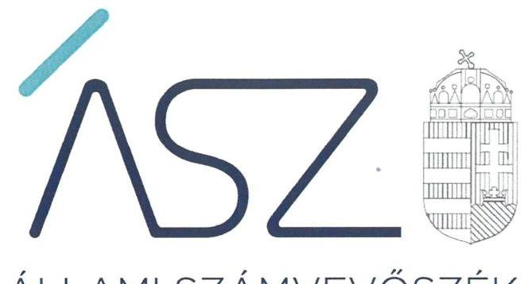

ÁLLAMI SZÁMVEVŐSZÉK

# JELENTÉS 

A központi költségvetési szervek ellenőrzése

Dunaújvárosi Egyetem

2022.

22032
www.asz.hu

---

ÁLLAMI SZÁMVEVŐSZÉK

# JELENTÉS 

A központi költségvetési szervek ellenőrzése

Dunaújvárosi Egyetem

22032
www.asz.hu

---

# AZ ELLENŐRZÉST VEZETTE ÉS A VÉGREHAJTÁSÁÉRT FELELŐS: 

DR. CZINDER ENIKŐ ellenőrzésvezető
SZAPPANOS JÚLIA ellenőrzésvezető
JANIK JÓZSEF ellenőrzésvezető

## A PROGRAM ÖSSZEÁLLÍTÁSÁÉRT FELELŐS:

NAGY ADRIENN projektvezető

## DÁM-POLYÁK ORSOLYA projektvezető

## A TÉMÁHOZ KAPCSOLÓDÓ KORÁBBI SZÁMVEVŐSZÉKI JELENTÉSEK:

- címe: Jelentés a Dunaújvárosi Főiskola ellenőrzéséről - Az állami felsőoktatási intézmények gazdálkodásának, működésének ellenőrzése
- sorszáma: 15040
- címe: Jelentés - Az állami felsőoktatási intézmények gazdálkodásának, működésének ellenőrzéséről készült jelentések utóellenőrzése - Dunaújvárosi Egyetem
- sorszáma: 17113

IKTATÓSZÁM: EL-3699-001/2022.
TÉMASZÁM: 2549
ELLENŐRZÉS-AZONOSÍTÓ SZÁM: V0926

---

# TARTALOMJEGYZÉK 

■ ÖSSZEGZÉS ..... 5
■ AZ ELLENŐRZÉS CÉLJA ..... 6
■ AZ ELLENŐRZÉS TERÜLETE ..... 7
■ AZ ELLENŐRZÉS HÁTTERE, INDOKOLTSÁGA ..... 8
■ A JELENTÉS LÉNYEGES KÉRDÉSKÖREI ..... 9
■ AZ ELLENŐRZÉS HATÓKÖRE ÉS MÓDSZEREI ..... 10
■ MEGÁLLAPÍTÁSOK ..... 12
■ ÉRTELMEZŐ SZÓTÁR ..... 15
■ FÜGGELÉK: ÉSZREVÉTELEK ..... 17
■ RÖVIDÍTÉSEK JEGYZÉKE ..... 19

---

.

---

# ÖSSZEGZÉS 

A Dunaújvárosi Egyetemnél a vagyongazdálkodás szabályozottsága, a nemzeti vagyon kimutatása területén, valamint a fenntartóváltáshoz kapcsolódó záró beszámoló tekintetében az ellenőrzés szabálytalanságokat tárt fel. A szervezeti teljesítmény méréséhez az Egyetem nem határozott meg célokat.

## Az ellenőrzés társadalmi indokoltsága

Az államháztartás központi alrendszerébe tartozó szervezet vagyona a nemzeti vagyon része. Magyarország Alaptörvénye rögzíti, hogy a vagyonnal való gazdálkodás célja a közérdek szolgálata. Magyarország versenyképessége szoros kapcsolatban van a felsőoktatás minőségével, amely nem képzelhető el hatékony és eredményes közpénz felhasználás nélkül. Az ellenőrzött időszakban a Dunaújvárosi Egyetem az államháztartás központi alrendszerébe tartozó szervezet volt.

Az ellenőrzést indokolja az is, hogy a Dunaújvárosi Egyetem a felsőoktatási modellváltással érintett intézmények közé tartozik, 2021. augusztus 1-től a Dunaújvárosi Egyetem fenntartója a Dunaújvárosi Egyetemért Alapítvány. Az Egyetem fenntartói jogait, amelyeket addig az állam nevében az illetékes miniszter gyakorolt, a kormány által létrehozott közérdekű vagyonkezelő alapítvány vette át, és azokat az alapítvány kuratóriuma gyakorolja.

Az Állami Számvevőszék tanácsadó funkciója keretében az ellenőrzési megállapításokon keresztül támogatja a közfeladat ellátását szolgáló vagyonnal való szabályos gazdálkodást.

## Főbb megállapítások, következtetések

A Dunaújvárosi Egyetem a 2018-2020. években a jogszabály előírásaival összhangban rendelkezett számviteli politikával, az eszközök és a források értékelési szabályzatával, az eszközök és a források leltárkészítési és leltározási szabályzatával, valamint önköltségszámítási szabályzattal. A vagyongazdálkodás szabályozottsága területén a számlarend tekintetében tárt fel szabálytalanságot az ellenőrzés.

A Dunaújvárosi Egyetemnél a 2018-2020. közötti időszakban a vagyon kimutatása területén, a jogszabály által előírtak szerinti leltár kapcsán szabálytalanságokat tárt fel az ellenőrzés.

A 2021. augusztus 1-jei fenntartóváltáshoz kapcsolódóan a jogszabályban előírt záró beszámolót a Dunaújvárosi Egyetem elkészítette, azonban a rendelkezésre bocsátott záró beszámolóhoz kapcsolódó leltár nem támasztotta alá a beszámoló adatait a Befektetett pénzügyi eszközök, az Egyéb sajátos elszámolások, a Saját tőke és a Halasztott eredményszemléletű bevételek mérlegsorok vonatkozásában.

A 2018-2020. években a Dunaújvárosi Egyetem nem alakított ki a teljesítményelv érvényesülésének alapját jelentő mérési követelményeket.

A jogutód Dunaújvárosi Egyetem rektora tájékoztatása alapján, a fenntartóváltás fordulónapjára elkészült záró beszámoló valamennyi mérlegtételét alátámasztó leltár hozzájárulhat ahhoz, hogy az ellenőrzés során feltárt, jelzett indulási kockázatok a jogutód Dunaújvárosi Egyetemnél csökkenjenek.

---

# AZ ELLENŐRZÉS CÉLJA 

AZ ELLENŐRZÉS CÉLJA annak értékelése, hogy az államháztartás központi alrendszerébe tartozó közpénzekkel gazdálkodó szervezet gazdálkodását elszámoltathatóan végzi-e. Az ellenőrzés célja továbbá annak értékelése, hogy a központi költségvetési szerv kialakította-e a teljesítmény értékelés feltételeit.

---

# AZ ELLENŐRZÉS TERÜLETE 

## Dunaújvárosi Egyetem

A Dunaújvárosi Egyetem ${ }^{1}$ jogelődje a felsőoktatási intézményhálózat átalakításáról, továbbá a felsőoktatásról szóló 1993. évi CXXX. törvény módosításáról szóló 1999. évi LII. törvény rendelkezései alapján 2000. január 1-jei hatállyal jött létre a Dunaújvárosi Főiskola volt, a Miskolci Egyetem Dunaújvárosi Főiskolai Karának teljes körű jogutódjaként alakult önálló és egyben autonóm felsőoktatási intézmény. A Dunaújvárosi Főiskola 2016. január 1. napjától Dunaújvárosi Egyetem elnevezéssel, alkalmazott tudományok egyetemeként működött tovább.

A Dunaújvárosi Egyetem képzést folytat, folytathat felsőoktatási szakképzés keretében a gazdaságtudományok, informatika, társadalomtudomány, műszaki és művészet területén, alapképzés keretében a gazdaságtudományok, bölcsészettudomány, informatika, műszaki és társadalomtudomány területén és mesterképzés keretében pedagógusképzés és a műszaki képzés területén.

A Dunaújvárosi Egyetem felett 2019. szeptember 1-től 2021. július 31-ig a fenntartói jogokat az Innovációs és Technológiai Minisztérium, ezt megelőzően az Emberi Erőforrások Minisztériuma gyakorolta. A 2021. évi XI. törvényben az Országgyűlés a Dunaújvárosi Egyetemért Alapítványról, és a Dunaújvárosi Egyetem alapítványi fenntartásáról döntött. A Dunaújvárosi Egyetem fenntartója 2021. augusztus 1. napjától a Dunaújvárosi Egyetemért Alapítvány lett.

Az Egyetem vezető testülete a Szenátus, annak elnöke a rektor, mint első számú vezető volt. Az Egyetem a 2021. évi fenntartó váltásig az államháztartás központi alrendszerébe tartozó költségvetési szerv volt, annak működtetését az Nftv. ${ }^{2}$ 13/A.§ felhatalmazása alapján a kancellár végezte. A rektor és a kancellár személye az ellenőrzött időszakban nem változott.

---

# AZ ELLENŐRZÉS HÁTTERE, INDOKOLTSÁGA 

Az államháztartás központi alrendszerébe tartozó szervezet vagyona a nemzeti vagyon része, mellyel történő gazdálkodás a közérdek szolgálata érdekében történik. Az ÁSZ ellenőrzi az éves költségvetési törvény végrehajtását, majd az ellenőrzés során feltárt kockázatok és a terület folyamatos kockázat-elemzésével beazonosított kockázatok kezelése érdekében ráépülő ellenőrzésekkel ellenőrzi a költségvetési szervek gazdálkodását, működését. Ezáltal az ellenőrzések megállapításaival támogatja az ellenőrzött szervezetek szabályszerű gazdálkodását, javaslataival elősegíti az Alaptörvényben megfogalmazott alapvetések érvényesülését a mindennapi életben a szervezetek szintjén.

A központi költségvetés rendszerében zajló folyamatok holisztikus elemzései, a kockázatok folyamatos figyelemmel kísérésének módszerével, az így kiválasztott szervezetek célzott, hatékony ellenőrzéseivel az ÁSZ betölti a legfőbb gazdasági ellenőrző szerv küldetését.

Az egyes ellenőrzések megállapításaival és egy időszak ellenőrzési eredményeinek elemzésével az ÁSZ ráirányíthatja a jogalkotók figyelmét a központi alrendszerben vagy annak egy ágazatában esetlegesen felmerülő vagyongazdálkodási, szabályozási feszültségekre.

---

# A JELENTÉS LÉNYEGES KÉRDÉSKÖREI 

1. Biztosított volt-e a vagyongazdálkodás szabályozottsága?
2. A nemzeti vagyon nyilvántartását és kimutatását a valóságnak megfelelő módon, szabályszerűen végezték-e?
3. Az Egyetem a fenntartóváltás során a használatában levő vagyontárgyakat szabályszerűen mutatta-e ki a záró beszámolójában?
4. A szervezeti teljesítmény mérés feltételeit kialakították-e?

---

# AZ ELLENŐRZÉS HATÓKÖRE ÉS MÓDSZEREI 

## Az ellenőrzés típusa

Megfelelőségi ellenőrzés.

## Az ellenőrzött időszak

A 2018-2020. évek, továbbá 2021. január 1-jétől a felsőoktatási intézmény Nftv. szerinti fenntartóváltásának napjáig, 2021. augusztus 1-ig terjedő időszak.

## Az ellenőrzés tárgya

A központi költségvetési szerv vagyongazdálkodási feltételeinek kialakítása, annak szabályszerűsége, az elszámoltathatóság biztosítása a szabályozás szintjén. Az intézmény könyveiben, mérlegében kimutatott nemzeti vagyon nyilvántartásának szabályszerűsége, vagyon kimutatása, értékelése és a mérleg leltárral való alátámasztásának szabályszerűsége. A felsőoktatási intézmény záró beszámolójában kimutatott nemzeti vagyon kimutatása és a mérleg leltárral való alátámasztásának szabályszerűsége.

## Az ellenőrzött szervezet

Dunaújvárosi Egyetem

## Az ellenőrzés jogalapja

Az ellenőrzés jogszabályi alapját az ÁSZ tv. 1. § (3) bekezdés, 5. § (2)-(3)-(4) és (6) bekezdései, valamint az Áht. ${ }^{3}$ 61. § (2) bekezdésének előírásai képezik.

## Az ellenőrzés módszerei

Az ÁSZ az ellenőrzést az ellenőrzési program szempontjai, az ellenőrzött időszakban hatályos jogszabályok, az ellenőrzés szakmai szabályai, a jelen ellenőrzésre irányadó ÁSZ módszertanok figyelembevételével hajtja végre. Az ellenőrzés során az ellenőrzött szervezettel történő kapcsolattartást az ÁSZ a szervezeti és működési szabályzatának vonatkozó előírásai alapján biztosítja.

---

Az ellenőrzési kérdések megválaszolásához szükséges bizonyítékok megszerzése az ellenőrzött szervezet által rendelkezésre bocsátott dokumentumokra és adatokra alapozva, továbbá megfigyelés, szemle (szemrevételezés), kérdésfeltevés (információkérés), érték alapján szűkített, lényeges sokaságon végrehajtott mintavétellel, valamint elemző eljárás útján történik. Az ellenőrzési bizonyítékként felhasználható adatforrások közé tartoznak az ellenőrzési program részletes szempontjainál felsorolt adatforrások, valamint minden egyéb - az ellenőrzés folyamán feltárt, az ellenőrzés szempontjából információt tartalmazó - dokumentum. Az ellenőrzés lefolytatásához az ellenőrzött szervezet az ÁSZ által kért dokumentumok rendelkezésre bocsátásával szolgáltat adatokat, amelyekről az ellenőrzött szervezet vezetője teljességi és hitelességi nyilatkozatot állít ki. A rendelkezésre bocsátott dokumentumok, adatok és információk kontrollja az ellenőrzés keretében történik.

---

# 1. Biztosított volt-e a vagyongazdálkodás szabályozottsága? 

## Összegző megállapítás

A vagyongazdálkodás szabályozottsága területén a 2018-2020. években szabálytalanságokat tárt fel az ellenőrzés.

AZ EGYETEM a 2018-2020. években a Számv.tv. ${ }^{4}$ és az Áhsz. ${ }^{5}$ előírásaival összhangban rendelkezett számviteli politikával, az eszközök és a források értékelési szabályzatával, az eszközök és a források leltárkészítési és leltározási szabályzatával, önköltségszámítási szabályzattal.
Az Egyetem rendelkezett számlarenddel, azonban a számlarend
$\longrightarrow$ a Számv. tv. 161. § (2) bekezdés a) pontjában és az Áhsz. 51. § (2) bekezdésében előírtak ellenére nem tartalmazta minden alkalmazásra kijelölt számla számjelét és megnevezését,
$\longrightarrow$ az Áhsz. 51. § (3) bekezdésében előírtak ellenére nem szabályozta a részletező nyilvántartások és az egységes rovatrend rovataihoz kapcsolódóan vezetett nyilvántartási számlák adataiból a pénzügyi könyvvezetéshez készült összesítő bizonylatok elkészítésének rendjét, valamint az összesítő bizonylat tartalmi és formai követelményeit.
Az Egyetem rendelkezett gazdálkodási szabályzattal, kötelezettségvállalási és utalványozási szabályzattal.

## 2. A nemzeti vagyon nyilvántartását és kimutatását a valóságnak megfelelő módon, szabályszerűen végezték-e?

## Összegző megállapítás

Az Egyetemnél a nemzeti vagyon szabályszerű nyilvántartása és kimutatása a 2018-2020. években nem volt igazolt.

A 2018-2020. ÉVEKBEN az Egyetem a nemzeti vagyon szabályszerű nyilvántartását és kimutatását nem igazolta, mert nem bocsátott az ellenőrzés rendelkezésére az Áhsz. 5. § (1) bekezdésében és 22. § (1) bekezdésében, valamint a Számv.tv. 69. § (1) bekezdésében előírtak szerint olyan leltárt, amely tételesen és ellenőrizhető módon tartalmazta a mérlegben szereplő eszközöket és forrásokat mennyiségben és értékben.

---

# 3. Az Egyetem a fenntartóváltás során a használatában levő vagyontárgyakat szabályszerűen mutatta-e ki a záró beszámolójában? 

Összegző megállapítás A fenntartóváltás során az Egyetemnél a nemzeti vagyon kimutatása nem volt szabályszerű.

AZ EGYETEM elkészítette a fenntartóváltás napját megelőző fordulónappal a záró beszámolót az Nftv. rendelkezésével összhangban.
Az Egyetem a vagyonnal való gazdálkodása során a nemzeti vagyon kimutatását nem szabályszerűen végezte, mivel nem bocsátott az ellenőrzés rendelkezésére - az Nftv. 117/C. § (4a) bekezdésében szereplő rendelkezése alapján- az Áhsz. 5. § (1) bekezdésében és a 22. § (1) bekezdésében előírtak szerinti olyan leltárt, amely tételesen és ellenőrizhető módon tartalmazta volna a záró beszámolóban szereplő eszközöket és forrásokat mennyiségben és értékben. A rendelkezésre bocsátott záró beszámolóhoz kapcsolódó leltár nem támasztotta alá a beszámoló adatait a Befektetett pénzügyi eszközök, az Egyéb sajátos elszámolások, a Saját tőke és a Halasztott eredményszemléletű bevételek mérlegsorok vonatkozásában.

## 4. A szervezeti teljesítmény mérés feltételeit kialakították-e?

## Összegző megállapítás Az Egyetem nem alakított ki a teljesítmény mérésére alkalmas követelményeket a 2018-2020. években.

AZ EGYETEMNÉL nem alakítottak ki a szervezeti célok elérését szolgáló feladatok, folyamatok, tevékenységek mérésére használható indikátorokat, mérőszámokat, feladat- és teljesítménymutatókat, amelyek alkalmasak lettek volna a szervezeti tevékenység teljesítményének mérésére a Bkr. ${ }^{6} 2$. § g) i) és j) pontjaiban meghatározott eredményesség, gazdaságosság és hatékonyság követelményeinek érvényesítése érdekében.

Az Egyetem az ellenőrzött időszakban Minősítési és Teljesítményértékelési Szabályzattal rendelkezett, mely az Egyetem által foglalkoztatott közalkalmazottak teljesítményének értékelésére határozott meg indikátorokat, feladat- és teljesítménymutatókat.

---

.

---

# ÉRTELMEZŐ SZÓTÁR

 állami vagyon
állami vagyon kezelője /vagyonkezelő
irányító szerv
működtetés
nemzeti vagyon

Állami vagyonnak minősül:
a) az állam tulajdonában lévő dolog, valamint a dolog módjára hasznosítható természeti erő,
b) az a) pont hatálya alá nem tartozó mindazon vagyon, amely vonatkozásában törvény az állam kizárólagos tulajdonjogát nevesíti,
c) az állam tulajdonában lévő tagsági jogviszonyt megtestesítő értékpapír, illetve az államot megillető egyéb társasági részesedés,
d) az államot megillető olyan immateriális, vagyoni értékkel rendelkező jogosultság, amelyet jogszabály vagyoni értékű jogként nevesít,
e) az állam tulajdonában lévő pénzügyi eszközök.
(Forrás: Vtv. ${ }^{7}$ 1. § (2) bekezdése)
Az állami tulajdonában álló vagyon tekintetében - a nemzeti vagyonról szóló törvényben vagyonkezelőként meghatározott azon személy, amellyel az állami vagyon vagyonkezelésére a Magyar Nemzeti Vagyonkezelő Zrt. valamint annak jogelődje, vagy az állami tulajdonosi joggyakorlója vagyonkezelési szerződést kötött, továbbá akit törvény vagyonkezelőnek kijelölt. (Forrás: Vtvr. 1. § (7) bekezdés b) pontja és az Nvtv. ${ }^{8}$ 3. § (1) bekezdés 19. a) pontja)
A költségvetési szerv tekintetében az e törvényben meghatározott irányítási hatáskört gyakorló szerv. (Forrás: Áht. 1. § 9. pontja)
a nemzeti vagyon birtoklásából, használatából, hasznai szedéséből, a nemzeti vagyon fenntartásából és üzemeltetéséből álló tevékenységek együttese, amely jogszabály vagy szerződés alapján - a nemzeti vagyon felújítására, fejlesztésére, a birtoklásának, használatának hasznai szedése jogának továbbengedésére is kiterjedhet. (Forrás: Nvtv. 3. § (1) bekezdés 10. pontja)
Nemzeti vagyonba tartozik:
a) az állam vagy a helyi önkormányzat kizárólagos tulajdonában álló dolgok,
b) az a) pont hatálya alá nem tartozó, az állam vagy a helyi önkormányzat tulajdonában lévő dolog,
c) az állam vagy a helyi önkormányzat tulajdonában lévő pénzügyi eszközök, továbbá az államot vagy a helyi önkormányzatot megillető társasági részesedések,
d) az államot vagy a helyi önkormányzatot megillető bármely vagyoni értékkel rendelkező jogosultság, amelyet jogszabály vagyoni értékű jogként nevesít,
e) Magyarország határa által körbezárt terület feletti légtér,
f) az üvegházhatású gázok kibocsátási egységeinek kereskedelméről szóló törvény szerinti kibocsátási egység és légiközlekedési kibocsátási egység, valamint az ENSZ Éghajlatváltozási Keretegyezménye és annak Kiotói Jegyzőkönyvének végrehajtási keretrendszeréről szóló törvény szerinti kiotói egység,
g) állami vagy helyi önkormányzati fenntartású közgyűjtemény (muzeális intézmény, levéltár, közgyűjteményként működő kép- és hangarchívum, valamint könyvtár) saját gyűjteményében nyilvántartott kulturális javak körébe tartozó dolog, kivéve, ha az állami vagy önkormányzati tulajdon jogszerű létrejötte kétséget kizáró módon nem bizonyítható és a dologra nézve más a tulajdonjogát bizonyítja vagy a kulturális javakra vonatkozó jogszabályokban meghatározott eljárás keretében valószínűsíti,
h) a régészeti lelet,
i) a nemzeti adatvagyon körébe tartozó állami nyilvántartások fokozottabb védelméről szóló törvény szerinti nemzeti adatvagyon (Forrás: Nvtv. 1. § (2) bekezdés a)-i) pontok).

---

tulajdonosi joggyakorló
vagyongazdálkodás

Aki a nemzeti vagyon felett az államot vagy a helyi önkormányzatot megillető tulajdonosi jogok és kötelezettségek összességének gyakorlására jogosult. (Forrás: Nvtv. 3. § (1) bekezdés 17. pontja)
A nemzeti vagyongazdálkodás feladata a nemzeti vagyon rendeltetésének megfelelő, az állam, az önkormányzat mindenkori teherbíró képességéhez igazodó, elsődlegesen a közfeladatok ellátásához és a mindenkori társadalmi szükségletek kielégítéséhez szükséges, egységes elveken alapuló, átlátható, hatékony és költségtakarékos működtetése, értékének megőrzése, állagának védelme, értéknövelő használata, hasznosítása, gyarapítása, továbbá az állam vagy a helyi önkormányzat feladatának ellátása szempontjából feleslegessé váló vagyontárgyak elidegenítése. (Forrás: Nvtv. 7. § (2) bekezdése)

---

# FÜGGELÉK: ÉSZREVÉTELEK 

A jelentéstervezetet a Számvevőszék 15 napos észrevételezésre megküldte az ellenőrzött szervezet vezetőjének az ÁSZ tv. 29. § (1) bekezdése előírásának megfelelően.

A Dunaújvárosi Egyetem rektora az ellenőrzés megállapításaira észrevételt tett. Az ÁSZ tv. 29. § (3) bekezdésével összhangban az ÁSZ a Függelékben feltünteti a megállapításokkal kapcsolatban tett, figyelembe nem vett észrevételeket, és megindokolja, hogy azokat miért nem fogadta el.

[^0]
[^0]:    ** 29. § (1) Az Állami Számvevőszék az ellenőrzési megállapításait megküldi az ellenőrzött szervezet vezetőjének vagy az általa megbízott személynek, és annak, akinek személyes felelősségét állapította meg.
    (2) Az ellenőrzött szervezet vezetője és a felelősként megjelölt személy az ellenőrzés megállapításaira tizenöt napon belül írásban észrevételt tehet.
    (3) Az Állami Számvevőszék az észrevételre a beérkezésétől számított harminc napon belül írásban válaszol. A figyelembe nem vett észrevételeket köteles a jelentésben feltüntetni, és megindokolni, hogy azokat miért nem fogadta el.

---

Az ellenőrzés megállapításaival kapcsolatban a Dunaújvárosi Egyetem rektora által 2022. április 25-én tett észrevételek és azok el nem fogadásának indokolása.

# 1. A nemzeti vagyon nyilvántartásával, kimutatásával kapcsolatos ellenőrzési megállapításra tett észrevétel 

A rektor észrevételében az ellenőrzési megállapítást elfogadta. A rendelkezésre bocsátott dokumentumok mindössze a főbb mérlegsorok összesített érték adatait tartalmazták.

A fentiekre tekintettel az ellenőrzés megállapítása megalapozott.

## 2. A fenntartóváltás során az Egyetem használatában levő vagyontárgyak záró beszámolóban történő kimutatásával kapcsolatos ellenőrzési megállapításra tett észrevétel

Az Egyetem által teljességi és hitelességi nyilatkozattal rendelkezésre bocsátott, összesen 11 db leltározáshoz kapcsolódó dokumentum alapján a fenntartóváltás napját megelőző fordulónappal elkészített záró beszámolóhoz kapcsolódó leltár nem támasztotta alá a beszámoló adatait a Befektetett pénzügyi eszközök, az Egyéb sajátos elszámolások, a Saját tőke és a Halasztott eredményszemléletű bevételek mérlegsorok vonatkozásában.

A fentiekre tekintettel az ellenőrzés megállapítása megalapozott.

## 3. A szervezeti teljesítménycélok és szervezeti teljesítmény mérésére alkalmas követelmények kialakításával kapcsolatban kapcsolatos ellenőrzési megállapításra tett észrevétel

Az Egyetem teljességi és hitelességi nyilatkozata szerint, olyan nyilatkozatot bocsátott rendelkezésre, mely szerint a szervezetnél kialakított eredményességi követelményeket tartalmazó dokumentumokat érintően az Egyetemnél nem képződött releváns adat az ellenőrzött időszakban. Az ÁSZ az ellenőrzési megállapítását a határidőben átadott, teljességi és hitelességi nyilatkozattal alátámasztott dokumentumokra alapozva tette meg.

A fentiekre tekintettel az ellenőrzés megállapítása megalapozott.

---

# RÖVIDÍTÉSEK JEGYZÉKE 

${ }^{1}$ Egyetem
${ }^{2}$ Nftv.
${ }^{3}$ Áht.
${ }^{4}$ Számv.tv.
${ }^{5}$ Áhsz.
${ }^{6}$ Bkr.
${ }^{7}$ Vtv.
${ }^{8}$ Nvtv.

Dunaújvárosi Egyetem
Nemzeti felsőoktatásról szóló 2011.évi CCIV. törvény (hatályos: 2012. január 1-től)
2011. évi CXCV. törvény az államháztartásról (hatályos 2011. december 31-től)
2000. évi C. törvény a számvitelről (hatályos: 2001. január 1-től)
4/2013. (I. 11.) Korm. rendelet az államháztartás számviteléről (hatályos: 2014. január 1-től)

370/2011. (XII. 31.) Korm. rendelet a költségvetési szervek belső kontrollrendszeréről és belső ellenőrzéséről (hatályos: 2012. január 1-től) 2007. évi CVI. törvény az állami vagyonról (hatályos 2007. szeptember 25-től)
2011. évi CXCVI. törvény a nemzeti vagyonról (hatályos: 2011. december 31-től)

---

# ASZ 

ÁLLAMI SZÁMVEVŐSZÉK
1052 Budapest, Apáczai Cs. J. u. 10. I 1364 Budapest 4. Pf. 54 TEL: +36 14849100
email: szamvevoszek@asz.hu
web: www.asz.hu | www.aszhirportal.hu

