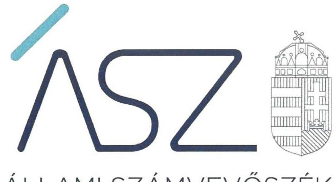

ÁLLAMI SZÁMVEVŐSZÉK

# JELENTÉS 

## A központi költségvetési szervek ellenőrzése

Szent István Egyetem
2022.

22033
www.asz.hu

---

ÁLLAMI SZÁMVEVŐSZÉK

# JELENTÉS 

## A központi költségvetési szervek ellenőrzése

Szent István Egyetem

22033
www.asz.hu

---

# AZ ELLENŐRZÉST FELÜGYELTE: 

DR. CZINDER ENIKŐ ellenőrzésvezető
SZAPPANOS JÚLIA ellenőrzésvezető
JANIK JÓZSEF ellenőrzésvezető

## A PROGRAM ÖSSZEÁLLÍTÁSÁÉRT FELELŐS:

GÖRGÉNYI GÁBOR ETAMO osztályvezető
NAGY ADRIENN projektvezető
DÁM-POLYÁK ORSOLYA projektvezető

## A TÉMÁHOZ KAPCSOLÓDÓ KORÁBBI SZÁMVEVŐSZÉKI JELENTÉSEK:

- címe: Jelentés a Szent István Egyetem ellenőrzéséről - Az állami felsőoktatási intézmények gazdálkodásának, működésének ellenőrzése
- sorszáma: 15039
- címe: Jelentés - Az állami felsőoktatási intézmények gazdálkodásának, működésének ellenőrzéséről készült jelentések utóellenőrzése - Szent István Egyetem
- sorszáma: 16235

IKTATÓSZÁM: EL-3698-001/2022
TÉMASZÁM: 2549
ELLENŐRZÉS-AZONOSÍTÓ SZÁM: V0893, V0926

---

# TARTALOMJEGYZÉK 

■ ÖSSZEGZÉS ..... 5
—■ AZ ELLENŐRZÉS CÉLJA ..... 6
—■ AZ ELLENŐRZÉS TERÜLETE ..... 7
—■ AZ ELLENŐRZÉS HÁTTERE, INDOKOLTSÁGA ..... 8
—■ A JELENTÉS LÉNYEGES KÉRDÉSKÖREI ..... 9
—■ AZ ELLENŐRZÉS HATÓKÖRE ÉS MÓDSZEREI ..... 10
—■ MEGÁLLAPÍTÁSOK ..... 12
—■ ÉRTELMEZŐ SZÓTÁR ..... 15
—■ FÜGGELÉK: ÉSZREVÉTELEK ..... 17
—■ RÖVIDÍTÉSEK JEGYZÉKE ..... 19

---

.

---

# ÖSSZEGZÉS 

A Szent István Egyetem vagyongazdálkodása szabályozottsága a 2017-2020. közötti időszakban biztosított volt. Az Egyetemnél a vagyon kimutatása területén, valamint a fenntartóváltáshoz kapcsolódó záró beszámoló tekintetében tárt fel az ellenőrzés szabálytalanságokat. Az Egyetemnél szervezeti teljesítménycélokat meghatároztak, azok alakulását mérték.

## Az ellenőrzés társadalmi indokoltsága

Az államháztartás központi alrendszerébe tartozó szervezet vagyona a nemzeti vagyon része. Magyarország Alaptörvénye rögzíti, hogy a vagyonnal való gazdálkodás célja a közérdek szolgálata. Magyarország versenyképessége szoros kapcsolatban van a felsőoktatás minőségével, amely nem képzelhető el hatékony és eredményes közpénz felhasználás nélkül. Az ellenőrzött időszakban az államháztartás központi alrendszerébe tartozó szervezet volt a Szent István Egyetem.

Az ellenőrzést indokolja az is, hogy az Egyetem a felsőoktatási modellváltással érintett intézmények közé tartozik, 2021. február 1-jén megalakult a Magyar Agrár- és Élettudományi Egyetem, amelynek fenntartója a Magyar Agrárés Élettudományi Egyetemért Alapítvány lett. Az Egyetem fenntartói jogait, amelyeket addig az állam nevében az illetékes miniszter gyakorolt, a kormány által létrehozott közérdekű vagyonkezelő alapítvány vette át, és azokat az alapítvány kuratóriuma gyakorolja.

Az Állami Számvevőszék tanácsadó funkciója keretében az ellenőrzési megállapításokon keresztül támogatja a közfeladat ellátását szolgáló vagyonnal való szabályos gazdálkodást.

## Főbb megállapítások, következtetések

A Szent István Egyetemnél a 2017-2020. években a vagyongazdálkodás szabályszerűségét a jogszabályi előírásokkal összhangban kialakított számviteli politika, eszközök és a források értékelési szabályzata, eszközök és a források leltárkészítési és leltározási szabályzata, önköltségszámítás rendjére vonatkozó szabályzat és további, a gazdálkodás rendjére vonatkozó szabályzatok támogatták.

A Szent István Egyetemnél a 2017-2020. közötti időszakban a vagyon kimutatása területén tárt fel az ellenőrzés szabálytalanságokat. A 2021. február 1-jei fenntartóváltáshoz kapcsolódóan a jogszabályi előírások szerint - a fenntartóváltással érintett felsőoktatási intézmény fenntartóváltás napját megelőző fordulónappal, jogszabályban előírt határidőben elkészített - záró beszámolót a Szent István Egyetem nem bocsátott az ellenőrzés rendelkezésére.

A Szent István Egyetemre vonatkozó eredményességi szervezeti teljesítménycélokat meghatározták, a szervezeti teljesítmény mérését szolgáló gazdaságossági és hatékonysági követelményeket kialakították, a teljesítménycélok megvalósulását mérték, amivel megteremtették a feltételeket ahhoz, hogy a szervezet a kitűzött célok irányába haladjon.

A jogutód Magyar Agrár- és Élettudományi Egyetem rektora tájékoztatása szerint, az Egyetemnél a jogszabály által előírt követelményeknek megfelelően történik a tételes mennyiségi leltározás, továbbá a fenntartóváltás fordulónapjára, 2021 szeptemberében elkészített záró beszámoló és ahhoz tartozó analitikus nyilvántartás rendelkezésre állása támogatja mindazt, hogy az ellenőrzés során feltárt, jelzett indulási kockázatok a jogutód Magyar Agrár- és Élettudományi Egyetemnél megszüntetésre kerüljenek.

---

# AZ ELLENŐRZÉS CÉLJA 

AZ ELLENŐRZÉS CÉLJA annak értékelése, hogy az államháztartás központi alrendszerébe tartozó közpénzekkel gazdálkodó szervezet gazdálkodását elszámoltathatóan végzi-e.

Az ellenőrzés értékeli továbbá, hogy sor került-e az ellenőrzött szervezetnél az eredményesség, a hatékonyság és a gazdaságosság követelményeinek érvényesülését biztosító, mérhető, nyomon követhető teljesítménycélok kitűzésére, teljesítménykövetelmények kialakítására, illetve hogy az ellenőrzött időszakban a teljesítménycélok mérése, értékelése, az eredményesség, a hatékonyság és a gazdaságosság követelményeinek érvényesítése megtörtént-e.

---

# AZ ELLENŐRZÉS TERÜLETE 

## Szent István Egyetem

A Szent István Egyetem ${ }^{1}$ a felsőoktatási intézmények integrációs programjának részeként a Gödöllői Agrártudományi Egyetem, az Állatorvosi Egyetem, a Kertészeti és Élelmiszeripari Egyetem, a Jászberényi Tanítóképző Főiskola, valamint az Ybl Miklós Műszaki Főiskola szervezeti integrációjával 2000. január 1-jén jött létre. Az Egyetem Magyarország állami felsőoktatási intézménye az Nftv. ${ }^{2}$ alapján létrehozott jogi személy. Alapítója az Országgyúlés, az állam nevében a fenntartói jogokat 2019. szeptember 1-től az Innovációs és Technológiai Minisztérium, ezt megelőzően az Emberi Erőforrások Minisztériuma gyakorolta.

Az Egyetem alaptevékenysége az Nftv. 2. § (1) bekezdés szerint az oktatás, tudományos kutatás és művészeti alkotótevékenység.

Az Egyetem rektorának személye az ellenőrzött időszakban két alkalommal változott. Az Egyetem működtetését az Nftv. 13/A. § felhatalmazása alapján a kancellár végezte, akinek személye a 2020. év során változott. Az Egyetem vezető testülete a 26 tagú Szenátus volt.

Az Egyetem struktúrája, szervezete 2003-2020. között többször változott, szervezeti átalakulás, integráció, kiválás, következtében, ezt követően történt a működési forma és a fenntartó váltás. Az Országgyúlés által elfogadott 2020. évi CXLII. és 2020. évi CXLIX. törvény értelmében 2021. február 1-jén megalakult a Magyar Agrár- és Élettudományi Egyetem (amelynek közvetlen elődje a Szent István Egyetem), az intézmény fenntartója a Magyar Agrár- és Élettudományi Egyetemért Alapítvány lett. Ezzel egyidőben az Egyetemhez csatlakozott a Nemzeti Agrárkutatási és Innovációs Központ 11 kutatóintézete és gazdasági társaságai, valamint a Debreceni Egyetem Agrár Kutatóintézetek és Tangazdaság Karcagi Kutatóintézete.

---

# AZ ELLENŐRZÉS HÁTTERE, INDOKOLTSÁGA 

Az államháztartás központi alrendszerébe tartozó szervezet vagyona a nemzeti vagyon része, mellyel történő gazdálkodás a közérdek szolgálata érdekében történik. Az ÁSZ ellenőrzi az éves költségvetési törvény végrehajtását, majd az ellenőrzés során feltárt kockázatok és a terület folyamatos kockázat-elemzésével beazonosított kockázatok kezelése érdekében ráépülő ellenőrzésekkel ellenőrzi a költségvetési szervek gazdálkodását, működését. Ezáltal az ellenőrzések megállapításaival támogatja az ellenőrzött szervezetek szabályszerű gazdálkodását, javaslataival elősegíti az Alaptörvényben megfogalmazott alapvetések érvényesülését a mindennapi életben a szervezetek szintjén.

A központi költségvetés rendszerében zajló folyamatok holisztikus elemzései, a kockázatok folyamatos figyelemmel kísérésének módszerével, az így kiválasztott szervezetek célzott, hatékony ellenőrzéseivel az ÁSZ betölti a legfőbb gazdasági ellenőrző szerv küldetését.

Az egyes ellenőrzések megállapításaival és egy időszak ellenőrzési eredményeinek elemzésével az ÁSZ ráirányíthatja a jogalkotók figyelmét a központi alrendszerben vagy annak egy ágazatában esetlegesen felmerülő vagyongazdálkodási, szabályozási feszültségekre.

---

# A JELENTÉS LÉNYEGES KÉRDÉSKÖREI 

1. Biztosított volt-e a vagyongazdálkodás szabályozottsága?
2. A nemzeti vagyon nyilvántartását és kimutatását a valóságnak megfelelő módon, szabályszerűen végezték-e?
3. Az Egyetem a fenntartóváltás során a záró beszámolót a jogszabályi előírásoknak megfelelően készítette-e el?
4. A központi költségvetési szerv rendelkezett-e szervezeti teljesítménycélokkal, a központi költségvetési szerv vezetője kialakította-e és érvényesítette-e a szervezeti teljesítmény mérésére alkalmas követelményeket?

---

# AZ ELLENŐRZÉS HATÓKÖRE ÉS MÓDSZEREI 

## Az ellenőrzés típusa

Megfelelőségi ellenőrzés és teljesítmény-ellenőrzés.

## Az ellenőrzött időszak

A 2017-2020. évek, továbbá 2021. január 1-jétől a felsőoktatási intézmény Nftv. szerinti fenntartóváltásának napjáig, 2021. február 1-ig terjedő időszak, a 4. lényeges kérdéskör teljesítmény-ellenőrzés tekintetében a 2020. év.

## Az ellenőrzés tárgya

A központi költségvetési szerv vagyongazdálkodási feltételeinek kialakítása, annak szabályszerűsége, az elszámoltathatóság biztosítása a szabályozás szintjén. Az intézmény könyveiben, mérlegében kimutatott nemzeti vagyon nyilvántartásának szabályszerűsége, vagyon kimutatása, értékelése és a mérleg leltárral való alátámasztásának szabályszerűsége. A felsőoktatási intézmény záró beszámolójában kimutatott nemzeti vagyon kimutatása és a mérleg leltárral való alátámasztásának szabályszerűsége. Az ellenőrzött szervezetnél kialakított, az eredményesség, a hatékonyság és a gazdaságosság követelményeinek érvényesülését biztosító, mérhető, nyomon követhető teljesítménycélok, valamint az azokhoz meghatározott célértékek, teljesítménykövetelmények meghatározása; a célok megvalósulásának mérése, értékelése; az eredményesség, a hatékonyság és a gazdaságosság követelményeinek érvényesítése a jogszabályi előírások alapján elkészítendő dokumentumokban.

## Az ellenőrzött szervezet

Szent István Egyetem

## Az ellenőrzés jogalapja

Az ellenőrzés jogszabályi alapját az ÁSZ tv. 1. § (3) bekezdés, 5. § (2)-(3) és (6) bekezdései, valamint az Áht. ${ }^{3}$ 61. § (2) bekezdésének előírásai képezik.

## Az ellenőrzés módszerei

Az ellenőrzést az ÁSZ a program kérdéseire adott válaszok kiértékelésével

---

és a vonatkozó időszakban hatályos jogszabályok, az ellenőrzés szakmai szabályai, a jelen ellenőrzésre irányadó ÁSZ módszertanok alapján folytatja le.

Az ellenőrzés során az ellenőrzött szervezettel történő kapcsolattartást az ÁSZ a szervezeti és működési szabályzatának vonatkozó előírásai alapján biztosítja.

Az ellenőrzési kérdések megválaszolásához szükséges bizonyítékok megszerzése az ellenőrzött szervezet által rendelkezésre bocsátott dokumentumokra és adatokra alapozva, továbbá megfigyelés, szemle (szemrevételezés), kérdésfeltevés (információkérés), érték alapján szűkített, lényeges sokaságon végrehajtott mintavétellel, valamint elemző eljárás útján történik. Az ellenőrzési bizonyítékként felhasználható adatforrások közé tartoznak az ellenőrzési program részletes szempontjainál felsorolt adatforrások, valamint minden egyéb - az ellenőrzés folyamán feltárt, az ellenőrzés szempontjából információt tartalmazó - dokumentum. Az ellenőrzés lefolytatásához az ellenőrzött szervezet tanúsítványok kitöltésével, valamint az ÁSZ által kért dokumentumok rendelkezésre bocsátásával szolgáltat adatokat, amelyekről az ellenőrzött szervezet vezetője teljességi és hitelességi nyilatkozatot állít ki. A rendelkezésre bocsátott dokumentumok, adatok és információk kontrollja az ellenőrzés keretében történik.

Az ellenőrzés részét képezi a szabályszerűségi ellenőrzésre épülő teljesítmény ellenőrzés, melynek keretében az ÁSZ arra fókuszál, hogy a központi költségvetési szervek a jogszabályi előírások alapján elkészítendő dokumentumokban, vagy más egyéb, nem jogszabály által meghatározott dokumentumokban alakítottak-e ki és érvényesítették-e a szervezet teljesítményének mérésére alkalmas követelményeket.

---

# 1. Biztosított volt-e a vagyongazdálkodás szabályozottsága? 

## Összegző megállapítás

A vagyongazdálkodás szabályozottsága a 2017-2020. években biztosított volt.

AZ EGYETEM a 2017-2020. években a Számv.tv. ${ }^{4}$ és az Áhsz. ${ }^{5}$ előírásaival összhangban rendelkezett számviteli politikával, az eszközök és a források értékelési szabályzatával, az eszközök és a források leltárkészítési és leltározási szabályzatával, önköltségszámítás rendjére vonatkozó belső szabályzattal.

Az Egyetem az ellenőrzött időszakra kialakította a Gazdálkodási Szabályzatát, a Kötelezettségvállalási és Utalványozási Szabályzatát, valamint a Vagyongazdálkodási Szabályzatát.

## 2. A nemzeti vagyon nyilvántartását és kimutatását a valóságnak megfelelő módon, szabályszerűen végezték-e?

## Összegző megállapítás

Az Egyetem a nemzeti vagyon szabályszerű nyilvántartását és kimutatását nem igazolta.

A 2017-2020. ÉVEKBEN az Egyetem a nemzeti vagyon szabályszerű nyilvántartását és kimutatását nem igazolta, mert nem bocsátott az ellenőrzés rendelkezésére az Áhsz. 5. § (1) bekezdésében és 22. § (1) bekezdésében, valamint a Számv.tv. 69. § (1) bekezdésében előírtak szerint olyan leltárt, amely tételesen és ellenőrizhető módon tartalmazta a mérlegben szereplő eszközöket és forrásokat mennyiségben és értékben. Az Ávr. ${ }^{6}$ 60. § (3) bekezdésében előírt kötelezettségvállalásra, teljesítés igazolására jogosult személyek aláírás-mintájáról a 2017-2019. évekre vonatkozóan nem vezettek a jogszabályi előírásoknak megfelelő nyilvántartást, a 2020. évben rendelkeztek az Ávr.-ben előírtaknak megfelelő nyilvántartással.

---

# 3. Az Egyetem a fenntartóváltás során a záró beszámolót a jogszabályi előírásoknak megfelelően készítette-e el? 

Összegző megállapítás

Az Egyetem a jogszabályi előírások szerint - a fenntartóváltással érintett felsőoktatási intézmény fenntartóváltás napját megelőző fordulónappal - az államháztartási számviteli szabályok szerinti, jogszabályban előírt határidőben elkészített záró beszámolót nem bocsátott az ellenőrzés rendelkezésére.

AZ EGYETEM az Nftv. 117/C. § (4a) bekezdése szerint - a fenntartóváltással érintett felsőoktatási intézmény fenntartóváltás napját megelőző fordulónappal - az államháztartási számviteli szabályok szerinti, a jogszabályban előírt határidőben elkészített záró beszámolót nem bocsátott az ellenőrzés rendelkezésére.

## 4. A központi költségvetési szerv rendelkezett-e szervezeti teljesítménycélokkal, a központi költségvetési szerv vezetője kialakította-e és érvényesítette-e a szervezeti teljesítmény mérésére alkalmas követelményeket?

Összegző megállapítás

Az Egyetem rendelkezett szervezeti teljesítménycélokkal, az Egyetem vezetője kialakította a szervezeti teljesítmény mérésére alkalmas követelményeket, mérte a teljesítménycélok megvalósulását.

AZ EGYETEMNÉL kialakították a szervezeti célok elérését szolgáló feladatok, folyamatok, tevékenységek mérésére használható indikátorokat, mérőszámokat, feladat-és teljesítménymutatókat, amelyek alkalmasak a szervezeti tevekénység teljesítményének mérésére a Bkr. ${ }^{7} 2 . \S$ g), i), j) pontjaiban meghatározott eredményesség, gazdaságosság és hatékonyság követelményeinek érvényesítése érdekében.

Az Egyetem részletesen meghatározta az Intézményfejlesztési Tervben a költségvetési szerv által végrehajtandó hatékonysági és gazdaságossági szervezeti célkitűzéseket. Az Egyetem a 2020. évben mérte a teljesítménycélok megvalósulását, ideértve a hallgatói létszám alakulását, az innovációs partnerekkel való együttműködések fejlesztését, az egyetemi és a hálózati partnerek $\mathrm{K}+\mathrm{F}+\mathrm{I}^{8}$ infrastruktúrái kihasználtságát, valamint a szakok átvizsgálását, racionalizálását.

---

.

---

# ÉRTELMEZŐ SZÓTÁR 

állami vagyon
állami vagyonarkezelője /vagyonkezelő
irányító szerv
működtetés

Állami vagyonnak minősül:
a) az állam tulajdonában lévő dolog, valamint a dolog módjára hasznosítható természeti erő,
b) az a) pont hatálya alá nem tartozó mindazon vagyon, amely vonatkozásában törvény az állam kizárólagos tulajdonjogát nevesíti,
c) az állam tulajdonában lévő tagsági jogviszonyt megtestesítő értékpapír, illetve az államot megillető egyéb társasági részesedés,
d) az államot megillető olyan immateriális, vagyoni értékkel rendelkező jogosultság, amelyet jogszabály vagyoni értékű jogként nevesít,
e) az állam tulajdonában lévő pénzügyi eszközök.
(Forrás: Vtv. ${ }^{9}$ 1. § (2) bekezdése)
Az állami tulajdonában álló vagyon tekintetében - a nemzeti vagyonról szóló törvényben vagyonkezelőként meghatározott azon személy, amellyel az állami vagyon vagyonkezelésére a Magyar Nemzeti Vagyonkezelő Zrt. valamint annak jogelődje, vagy az állami tulajdonosi joggyakorlója vagyonkezelési szerződést kötött, továbbá akit törvény vagyonkezelőnek kijelölt. (Forrás: Vtvr. 1. § (7) bekezdés b) pontja és az Nvtv. ${ }^{10}$ 3. § (1) bekezdés 19. a) pontja)
A költségvetési szerv tekintetében az e törvényben meghatározott irányítási hatáskört gyakorló szerv. (Forrás: Áht. 1. § 9. pontja)
a nemzeti vagyon birtoklásából, használatából, hasznai szedéséből, a nemzeti vagyon fenntartásából és üzemeltetéséből álló tevékenységek együttese, amely jogszabály vagy szerződés alapján - a nemzeti vagyon felújítására, fejlesztésére, a birtoklásának, használatának hasznai szedése jogának továbbengedésére is kiterjedhet. (Forrás: Nvtv. 3. § (1) bekezdés 10. pontja)

---

nemzeti vagyon

Tulajdonosi joggyakorló
vagyongazdálkodás

Nemzeti vagyonba tartozik:
a) az állam vagy a helyi önkormányzat kizárólagos tulajdonában álló dolgok,
b) az a) pont hatálya alá nem tartozó, az állam vagy a helyi önkormányzat tulajdonában lévő dolog,
c) az állam vagy a helyi önkormányzat tulajdonában lévő pénzügyi eszközök, továbbá az államot vagy a helyi önkormányzatot megillető társasági részesedések, d) az államot vagy a helyi önkormányzatot megillető bármely vagyoni értékkel rendelkező jogosultság, amelyet jogszabály vagyoni értékű jogként nevesít, e) Magyarország határa által körbezárt terület feletti légtér,
f) az üvegházhatású gázok kibocsátási egységeinek kereskedelméről szóló törvény szerinti kibocsátási egység és légiközlekedési kibocsátási egység, valamint az ENSZ Éghajlatváltozási Keretegyezménye és annak Kiotói Jegyzőkönyve végrehajtási keretrendszeréről szóló törvény szerinti kiotói egység,
g) állami vagy helyi önkormányzati fenntartású közgyűjtemény (muzeális intézmény, levéltár, közgyűjteményként múködő kép- és hangarchívum, valamint könyvtár) saját gyűjteményében nyilvántartott kulturális javak körébe tartozó dolog, kivéve, ha az állami vagy önkormányzati tulajdon jogszerű létrejötte kétséget kizáró módon nem bizonyítható és a dologra nézve más a tulajdonjogát bizonyítja vagy a kulturális javakra vonatkozó jogszabályokban meghatározott eljárás keretében valószínűsíti,
h) a régészeti lelet,
i) a nemzeti adatvagyon körébe tartozó állami nyilvántartások fokozottabb védelméről szóló törvény szerinti nemzeti adatvagyon (Forrás: Nvtv. 1. § (2) bekezdés a)-i) pontok).
Aki a nemzeti vagyon felett az államot vagy a helyi önkormányzatot megillető tulajdonosi jogok és kötelezettségek összességének gyakorlására jogosult. (Forrás: Nvtv. 3. § (1) bekezdés 17. pontja)
A nemzeti vagyongazdálkodás feladata a nemzeti vagyon rendeltetésének megfelelő, az állam, az önkormányzat mindenkori teherbíró képességéhez igazodó, elsődlegesen a közfeladatok ellátásához és a mindenkori társadalmi szükségletek kielégítéséhez szükséges, egységes elveken alapuló, átlátható, hatékony és költségtakarékos működtetése, értékének megőrzése, állagának védelme, értéknövelő használata, hasznosítása, gyarapítása, továbbá az állam vagy a helyi önkormányzat feladatának ellátása szempontjából feleslegessé váló vagyontárgyak elidegenítése. (Forrás: Nvtv. 7. § (2) bekezdése)

---

# FÜGGELÉK: ÉSZREVÉTELEK 

A jelentéstervezetet a Számvevőszék 15 napos észrevételezésre megküldte az ellenőrzött szervezet vezetőjének az ÁSZ tv. 29. §* (1) bekezdése előírásának megfelelően.

A Magyar Agrár- és Élettudományi Egyetem rektora az ellenőrzés megállapításaira észrevételt tett. Az ÁSZ tv. 29. § (3) bekezdésével összhangban az ÁSZ a Függelékben feltünteti a megállapításokkal kapcsolatban tett, figyelembe nem vett észrevételeket, és megindokolja, hogy azokat miért nem fogadta el.

[^0]
[^0]:    ** 29. § (1) Az Állami Számvevőszék az ellenőrzési megállapításait megküldi az ellenőrzött szervezet vezetőjének vagy az általa megbízott személynek, és annak, akinek személyes felelősségét állapította meg.
    (2) Az ellenőrzött szervezet vezetője és a felelősként megjelölt személy az ellenőrzés megállapításaira tizenöt napon belül írásban észrevételt tehet.
    (3) Az Állami Számvevőszék az észrevételre a beérkezésétől számított harminc napon belül írásban válaszol. A figyelembe nem vett észrevételeket köteles a jelentésben feltüntetni, és megindokolni, hogy azokat miért nem fogadta el.

---

Az ellenőrzés megállapításaival kapcsolatban a Magyar Agrár- és Élettudományi Egyetem rektora által 2022. április 22-én tett észrevételek és azok el nem fogadásának indokolása.

# 1. A nemzeti vagyon nyilvántartásával, kimutatásával kapcsolatos ellenőrzési megállapításra tett észrevétel 

Az ÁSZ az ellenőrzési megállapításait az ellenőrzés adatbekérése során határidőben átadott, a teljességi és hitelességi nyilatkozatban feltüntetett, hiteles dokumentumok alapján tette meg. Az Egyetem a kancellár által aláírt „Tanúsítvány a 2017. december 31-ei, a 2018. december 31-ei és a 2019. december 31-ei leltár adatairól" című, továbbá a 2020. december 31. fordulónapra elkészített „Összesítő leltárjegyzőkönyv" című dokumentummal rendelkezett teljességi és hitelességi nyilatkozata alapján. Az ÁSZ adatbekérő levélben a 2017-2019. évi, illetve a 2020. évi mérleg tételeit alátámasztó leltárakat kérte rendelkezésre bocsátani, beleértve a használt, de a mérlegben értékkel nem szereplő immateriális javakról, tárgyi eszközökről, készletekről készített leltárakat is. A rendelkezésre bocsátott dokumentumok és tanúsítványok az összesítő leltár jegyzőkönyv mindössze a főbb mérlegsorok összesített érték adatait tartalmazták.

A 2017. január 1 - 2019. december 31. közötti időszakra vonatkozó kötelezettségvállalásra, teljesítés igazolására jogosult személyekről és aláírás-mintájukról vezetett naprakész nyilvántartásra vonatkozó ellenőrzési megállapítását az ÁSZ teljességi és hitelességi nyilatkozattal alátámasztott, határidőben átadott dokumentumokra alapozva tette meg. Az Egyetem által rendelkezésre bocsátott, a „Kötelezettségvállalási jogkörök átruházásáról szóló rektori-kancel-lári-kancellárhelyettesi utasítás" mellékletei dokumentumok az Ávr. 60. § (3) bekezdésében előírt jogszabályi előírásoknak nem feleltek meg, ugyanis azokban a kötelezettségvállalásra jogosultak státusza volt nevesítve, azonban az erre felhatalmazott személyek megnevezését és aláírás mintáját nem tartalmazták a dokumentumok, továbbá a hivatkozott dokumentumban a teljesítés igazolási jogkör sem volt nevesítve. Erre tekintettel az ellenőrzés megállapításai megalapozottak.

## 2. A fenntartóváltás során az Egyetem által készített záró beszámolóval kapcsolatos ellenőrzési megállapításra tett észrevétel

A Fenntartóváltás napját megelőző fordulónappal készített záró beszámolóra vonatkozó ellenőrzési megállapítását az ÁSZ az adatszolgáltatás során, határidőn belül az ellenőrzés rendelkezésére bocsátott, az ellenőrzött időszakra vonatkozó, a teljességi és hitelességi nyilatkozatban feltüntetett hiteles dokumentumok alapján tette meg. Erre tekintettel az ellenőrzés megállapítása megalapozott.

---

# RÖVIDÍTÉSEK JEGYZÉKE 

${ }^{1}$ Egyetem
${ }^{2}$ Nftv.
${ }^{3}$ Áht.
${ }^{4}$ Számv.tv.
${ }^{5}$ Áhsz.
${ }^{6}$ Ávr.
${ }^{7}$ Bkr.
${ }^{8} \mathrm{~K}+\mathrm{F}+\mathrm{I}$
${ }^{9} \mathrm{Vtv}$.
${ }^{10} \mathrm{Nvtv}$.

Szent István Egyetem
Nemzeti felsőoktatásról szóló 2011.évi CCIV. törvény (hatályos: 2012. január 1-jétől)
2011. évi CXCV. törvény az államháztartásról (hatályos 2011. december 31-től)
2000. évi C. törvény a számvitelről (hatályos: 2001. január 1-jétől)
4/2013. (I. 11.) Korm. rendelet az államháztartás számviteléről (hatályos: 2014. január 1-jétől)
368/2011. (XII. 31.) Korm. rendelet az államháztartásról szóló törvény végrehajtásáról (hatályos: 2012. január 1-jétől)
370/2011. (XII. 31.) Korm. rendelet a költségvetési szervek belső kontrollrendszeréről és belső ellenőrzéséről (hatályos: 2012. január 1-jétől) kutatási, fejlesztési és innovációs
2007. évi CVI. törvény az állami vagyonról (hatályos 2007. szeptember 25-től)
2011. évi CXCVI. törvény a nemzeti vagyonról (hatályos: 2011. december 31-től)

---

# ASZ 

ALLAMI SZAMVEVOSZEK
1052 Budapest, Apáczai Cs. J. u. 10. I 1364 Budapest 4. Pf. 54 TEL: +36 14849100
email: szamvevoszek@asz.hu
web: www.asz.hu | www.aszhirportal.hu