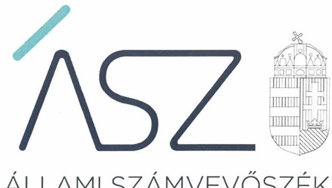
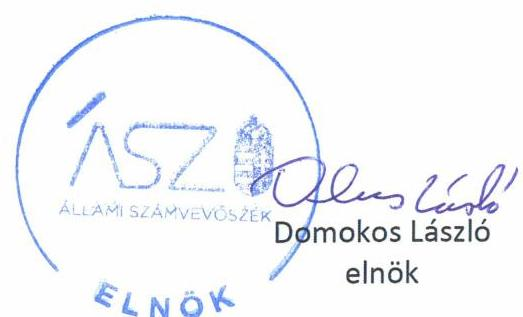

ÁLLAMI SZÁMVEVŐSZÉK

# JELENTÉS

A költségvetési támogatásban részesülő pártalapítványok 2019-2020. évi gazdálkodása törvényességének ellenőrzése

Új Köztársaságért Alapítvány

2022.

22034
www.asz.hu

---

ÁLLAMI SZÁMVEVŐSZÉK

# JELENTÉS

A költségvetési támogatásban részesülő pártalapítványok 2019-2020. évi gazdálkodása törvényességének ellenőrzése

Új Köztársaságért Alapítvány

2022. 06. hó 14. nap

22034
www.asz.hu

---

# AZ ELLENŐRZÉST FELÜGYELTE: 

DR. BENEDEK MÁRIA felügyeleti vezető

## AZ ELLENŐRZÉST VEZETTE ÉS A VÉGREHAJTÁSÁÉRT FELELŐS:

DR. NAGY JUDIT ellenőrzésvezető
JANIK JÓZSEF LÁSZLÓ ellenőrzésvezető

## A PROGRAM ÖSSZEÁLLÍTÁSÁÉRT FELELŐS:

DR. KÁDÁR KRISZTA projektvezető

## A TÉMÁHOZ KAPCSOLÓDÓ KORÁBBI SZÁMVEVŐSZÉKI JELENTÉSEK:

- címe: Jelentés - A költségvetési támogatásban részesülő pártalapítványok 2017-2018. évi gazdálkodása törvényességének ellenőrzése -
Új Köztársaságért Alapítvány
- sorszáma: 20207

IKTATÓSZÁM: EL-3704-001/2022.
TÉMASZÁM: 2581
ELLENŐRZÉS-AZONOSÍTÓ SZÁM: V092405

---

# TARTALOMJEGYZÉK 

■ ÖSSZEGZÉS ..... 5
■ AZ ELLENŐRZÉS CÉLJA ..... 7
■ AZ ELLENŐRZÉS TERÜLETE ..... 8
■ AZ ELLENŐRZÉS HÁTTERE, INDOKOLTSÁGA ..... 9
■ A JELENTÉS LÉNYEGES KÉRDÉSKÖREI ..... 10
■ AZ ELLENŐRZÉS HATÓKÖRE ÉS MÓDSZEREI ..... 11
■ MEGÁLLAPÍTÁSOK ..... 13
■ JAVASLATOK ..... 15
■ MELLÉKLETEK ..... 17
I. sz. melléklet: Értelmező szótár ..... 17
■ FÜGGELÉK: ÉSZREVÉTELEK ..... 19
■ RÖVIDÍTÉSEK JEGYZÉKE ..... 21

---

.

---

# ÖSSZEGZÉS 

Az Új Köztársaságért Alapítvány a 2019-2020. években nem tett eleget az Alaptörvényben és a Pártalapítványi törvényben előirt alapvető követelményeknek, a gazdálkodása nem volt átlátható.
Az Új Köztársaságért Alapítvány 2019-ben a tevékenységéről, a gazdálkodásáról a törvény által előirt éves jelentést és beszámolót nem készített, 2020-ban a kiadások, az általa nyújtott támogatások elszámolása során nem teljesítette a törvényi követelményeket. Emiatt nem biztositotta a közpénzek felhasználásának elszámoltathatóságát az állampolgárok felé.

## Az ellenőrzés társadalmi indokoltsága

A politikai kultúra fejlesztése érdekében tudományos, ismeretterjesztő, kutatási és oktatási tevékenységük elősegítésére költségvetési támogatásra jogosult alapítványt hozhatnak létre a pártok.

A pártok múködését segítő tudományos, ismeretterjesztő, kutatási, oktatási tevékenységet végző alapítványokról szóló törvény (Pártalapítványi törvény), valamint a pártok múködéséről és gazdálkodásáról szóló törvény (Párt törvény) állapítja meg a pártalapítványok gazdálkodására, a költségvetési támogatásra vonatkozó szabályokat. A Pártalapítványi törvény szerint a pártalapítványok a professzionális politika olyan szellemi bázisaiként múködnek, amelyek tudományos tevékenységükkel, kutatómunkájukkal, a politikai gyakorlat számára készített javaslataikkal nemcsak egy-egy párt, de a törvényalkotás és a végrehajtás egészének jobb, hatékonyabb, a közjót fokozottabban szolgáló múködéséhez járulnak hozzá. A pártok mellett létrehozott alapítványok, a pártok társadalmi fontosságának széles körben történő bemutatásával az állampolgári tájékoztatást, ismeretterjesztést, oktatást hívatottak szolgálni.

Magyarország Alaptörvénye szerint a központi költségvetésből csak olyan szervezet részére nyújtható támogatás, amelynek a támogatás felhasználására irányuló tevékenysége átlátható. Ezáltal a pártalapítványok múködésének és költségvetési támogatásának alapja, hogy gazdálkodásuk törvényes és átlátható legyen.

A pártalapítványoknak évente be kell számolniuk a törvényi keretek szerinti gazdálkodásról. Törvényi előírás alapján az Állami Számvevőszék a költségvetési támogatásban részesült pártalapítványok gazdálkodását kétévente ellenőrzi. A pártalapítványok pénzügyi beszámolása alapján az ellenőrzés visszajelzést ad arról, hogy a pártalapítványok eleget tettek-e az Alaptörvényben és a Pártalapítványi törvényben a pártalapítványként előírt alapvető követelményeknek, gazdálkodásuk törvényes és átlátható volt-e.

## Összegző értékelés, javaslatok

Az Új Köztársaságért Alapítvány a 2019-2020. években gazdálkodásával kapcsolatos könyvvezetési rendszerét, a számviteli kereteket a jogszabályban előírtak szerint kialakította, ezáltal törvényes gazdálkodása alapvető kereteit biztosította.

Az Új Köztársaságért Alapítvány a 2019. évben nem készített a Számv. tv. szerinti éves számviteli beszámolót, a tevékenységéről szóló éves jelentést. Ezáltal a felhasznált közpénzekre vonatkozó gazdálkodása átláthatóságát, a költségvetési támogatások felhasználásának elszámoltathatóságát nem biztosította.

Az Új Köztársaságért Alapítvány tevékenysége kiadásaira, az általa nyújtott támogatások felhasználására vonatkozó, a törvény által előírt elszámolási kötelezettségének a 2020. évben nem tett eleget, ugyanis a számviteli nyilvántartásaiba nem a törvényi előírások szerinti bizonylatok alapján jegyzett be adatokat. Ezáltal a könyvvezetés adatainak valódiságát a bizonylatok nem támasztották alá.

A tevékenységéről szóló éves jelentési-, beszámolási- és közzétételi kötelezettségének 2020. évben a jogszabályi előírások szerinti határidőben eleget tett, azonban a könyvvezetésben feltárt szabálytalanságok miatt a 2020. évi

---

beszámolója nem volt megalapozott, nem biztosította az Új Köztársaságért Alapítvány gazdálkodásának átláthatóságát.

Az Új Köztársaságért Alapítvány a 2020. évben az ötszázezer forintot meghaladó összegű támogatás esetében a támogatást nyújtó személy azonosításához szükséges adatokra és a támogatás összegére vonatkozó, a törvény által előírt közzétételi kötelezettségének nem tett eleget, nem biztosította a nyilvánosság tájékoztatását, ezáltal az átláthatóság sérült.

Az Állami Számvevőszék a megállapítások alapján az Új Köztársaságért Alapítvány kuratóriumi elnökének 4 javaslatot fogalmazott meg.

# Következtetések 

Az Állami Számvevőszék az Új Köztársaságért Alapítvány gazdálkodásának törvényességét korábban több alkalommal ellenőrizte. A 2019-2020. évekre vonatkozó jelen ellenőrzés hiányosságként azonosította, hogy az Új Köztársaságért Alapítvány 2019-ben nem tett eleget a törvény által előírt beszámolási kötelezettségének, 2020-ban könyvvezetése, éves beszámolójának megalapozottsága nem felelt meg a törvényi előírásoknak. Ezáltal az Új Köztársaságért Alapítvány nem biztosította a törvényes és átlátható, a közpénzekkel való felelős gazdálkodást, a közpénzek felhasználásának elszámoltathatóságát, továbbá a Számv. tv. szerinti beszámoló hiányában 2019-ben nem hiteles beszámoló közzétételével megtévesztette az állampolgárokat.

---

# AZ ELLENŐRZÉS CÉLJA 

AZ ELLENŐRZÉS CÉLJA, hogy az ÁSZ ${ }^{1}$ - mint az Országgyűlés legfőbb ellenőrző szerve - független és szakmailag megalapozott véleményt adjon a pártalapítványok, mint ellenőrzött szervezetek gazdálkodásának törvényességéről. Annak megállapítása, hogy a pártalapítvány törvényesen gazdálkodott-e, az éves számviteli beszámolók és a pártalapítvány tevékenységéről szóló éves jelentések a jogszabályi előírásoknak megfeleltek-e, a könyvvezetés és gazdálkodás során a vonatkozó jogszabályi rendelkezéseket és belső előírásokat betartották-e.

---

# **AZ ELLENŐRZÉS TERÜLETE**

## **Új Köztársaságért Alapítvány**

Az ellenőrzés a Párt tv.2 alapján a politikai kultúra fejlesztése érdekében tudományos, ismeretterjesztő, kutatási, oktatási tevékenység folytatása céljából, a Ptk.3 szerinti létesítő/alapító okiraton alapuló bírósági nyilvántartásba vétellel létrejött pártalapítványok gazdálkodására terjed ki. A pártalapítványok törvényes gazdálkodásának (könyvvezetése, beszámolása, jelentéstétele) szabályait alapvetően a Pártalapítványi tv.4-en túl, a Számv. tv5 és annak a végrehajtási rendelete a Számviteli vhr.6 határozzák meg.

A Demokratikus Koalíció – a Párt tv. és a Pártalapítványi tv. által biztosított lehetőséggel élve – 2014-ben megalapította az Új Köztársaságért Alapítványt, 200 ezer Ft induló vagyonnal. A Pártalapítvány7-t a Fővárosi Törvényszék a 2014. december 10-én jogerőre emelkedett végzésével vette nyilvántartásba. A Pártalapítvány ügyvezető és kezelő szerve a három tagú Kuratórium8. Képviseletét a Kuratórium elnöke látja el.

Az ellenőrzött időszakban az Alapító okirat egy alkalommal változott, a székhelyben, főbb tevékenységeiben, valamint Kuratórium tagjainak személyében és működésének szabályaiban történt változás miatt.

A Pártalapítvány Alapító okirat9 szerinti célja: a politikai kultúra fejlesztése érdekében történő politikai képzés, kutatás, tudományos és ismeretterjesztő tevékenység támogatása.

Könyvelési és beszámoló készítési feladatait külső szervezettel látta el.

A Pártalapítvány a Ptk. előírásaiban foglaltaknak megfelelően nem alapított más jogalanyt, nem volt tagja más jogalanynak, illetve nem csatlakozott más jogalanyhoz sem, nem volt alapítója más alapítványnak, nem csatlakozott más alapítványhoz.

A Pártalapítvány a Kvtv.10 szerint 2019. évben 194,5 millió Ft, a 2020. évben 194,5 millió Ft, az ellenőrzött időszakban összesen 389,0 millió Ft költségvetési támogatásban részesült. Vagyoni hozzájárulást az ellenőrzött időszakban nem kapott.

A Pártalapítvány az ellenőrzött időszakban vállalkozási tevékenységet nem végzett. A Pártalapítványnál a 2019-2020. években törvényességi, illetve külső ellenőrzésre nem került sor.

Az ÁSZ 2020. évben ellenőrizte a Pártalapítvány gazdálkodásának törvényességét. A 2020. számú számvevőszék jelentés11 javaslatot nem tartalmazott.

---

# AZ ELLENŐRZÉS HÁTTERE, INDOKOLTSÁGA 

Társadalmi elvárás a közpénzek értékelvű, rendeltetésszerű felhasználása, a közpénzekből nyújtott támogatások átláthatóságának megteremtése, amelyhez az ÁSZ az államháztartásból nyújtott támogatások ellenőrzésével kíván hozzájárulni. A Párt tv. 9/A § (1) bekezdése alapján a politikai kultúra fejlesztése érdekében tudományos, ismeretterjesztő, kutatási, oktatási tevékenység folytatása céljából létrehozott pártalapítványok gazdálkodása törvényességének ellenőrzése - Pártalapítványi tv. 4. § (2) bekezdése értelmében - az ÁSZ feladata. E törvény 4. § (4) bekezdése alapján az ÁSZ kétévente - kötelező jelleggel - ellenőrzi azoknak a pártalapítványoknak a gazdálkodását, amelyek állami költségvetési támogatásban részesültek.

Az ÁSZ, mint az Országgyűlés ellenőrző szerve a pártalapítványok gazdálkodása törvényességének/szabályszerúségének értékelésével hozzájárul ahhoz, hogy a társadalom objektív képet alkothasson a pártalapítványok működéséről. Az ellenőrzés eredményeinek célzott felhasználói a nyilvánosság, a jogalkotó, továbbá a pártalapítványok esetén azok alapítója és szervei. A jelentésben foglalt megállapítások, következtetések és javaslatok alapján a törvényalkotók konkrét lépéseket tehetnek a pártalapítványokra vonatkozó szabályozások megváltoztatása, átláthatóbbá, ellenőrizhetőbbé tétele irányába. Az ellenőrzött szervezetek szintjén a hiányosságok, szabálytalanságok feltárása, az ennek kapcsán megfogalmazott megállapítások elősegíthetik a pártalapítványok szabályszerű gazdálkodását.

---

# A JELENTÉS LÉNYEGES KÉRDÉSKÖREI 

1. Az Új Köztársaságért Alapítvány gazdálkodásának törvényessége biztositott volt-e?
2. Az Új Köztársaságért Alapítvány könyvvezetése és gazdálkodása során a vonatkozó jogszabályi rendelkezéseket és belső elöírásokat betartották-e?
3. Az Új Köztársaságért Alapítvány tevékenységéről szóló éves jelentések, az éves számviteli beszámolók a jogszabályi elöírásoknak megfeleltek-e?

---

# AZ ELLENŐRZÉS HATÓKÖRE ÉS MÓDSZEREI 

## Az ellenőrzés típusa

Szabályszerűségi ellenőrzés.

## Az ellenőrzött időszak

2019-2020. évek, amely kiterjedhet az ellenőrzés megkezdéséig.

## Az ellenőrzés tárgya

Az ellenőrzés tárgyát képezi a pártalapítvány gazdálkodása, a könyvvezetés szabályozása és gyakorlata szabályszerűsége, az éves számviteli beszámolókra és az alapítvány tevékenységéről szóló éves jelentésekre vonatkozó kötelezettség teljesítése, valamint a gazdálkodáshoz kapcsolódó ellenőrzések javaslatainak hasznosítására irányuló tevékenység.

Az ellenőrzés kiterjed minden olyan körülményre és adatra, amely az ÁSZ jogszabályban meghatározott feladatainak teljesítéséhez, valamint a program végrehajtása folyamán felmerült újabb összefüggések feltárásához szükséges.

## Az ellenőrzött szervezet

Új Köztársaságért Alapítvány

## Az ellenőrzés jogalapja

Az ÁSZ tv. 1. § (3) bekezdése, 5. § (3) bekezdése, 33. § (7) bekezdése, a Pártalapítványi tv. 4. § (2) és (4) bekezdései.

## Az ellenőrzés módszerei

Az ellenőrzést az Ellenőrzési program szempontjai, az ellenőrzött időszakban hatályos jogszabályok, a jelen ellenőrzésre irányadó ÁSZ módszertan figyelembevételével kell elvégezni.

Az ellenőrzés ideje alatt az ellenőrzött szervezettel történő kapcsolattartás az ÁSZ SZMSZ ${ }^{12}$-ének vonatkozó előírásai alapján történik.

Az ellenőrzést az ellenőrzött szervezetek által rendelkezésre bocsátott dokumentumokra, adatokra kell alapozni. A rendelkezésre bocsátott adatok, információk kontrollja az ellenőrzés keretében történik. Az ellenőrzés

---

céljának eléréséhez szükséges bizonyítékokat a számvevő az egyes adatok közvetlen, részletes elemzésével szerzi meg, a következő ellenőrzési eljárások alkalmazásával: megfigyelés, szemrevételezés, információkérés, megerősítés, mintavétel, valamint elemző eljárás. Az ellenőrzésvezető indoklással kezdeményezheti a helyszínen végrehajtott szemrevételezést.

Az ÁSZ a tételes ellenőrzés mellett statisztikai alapú mintavételezést és értékelést alkalmaz. Az alapítvány alapcélon túli kiadásai, ráfordításai elszámolásának, az alapítvány által nyújtott támogatások elszámolásának, valamint az alapítvány beszámolóinál a mérlegtételek besorolása, év végi értékelése szabályszerűségének, azok leltárral való alátámasztottságának értékelése érték szerint rétegzett mintavétellel történt. A minta tételeinek értékelése „szabályszerű", ha a minta ellenőrzésének eredménye alapján 95\%-os bizonyossággal a teljes sokaságban az átlagos hibaarány nem haladja meg a 10\%-ot, „nem szabályszerű", ha nagyobb, mint 10\%. Abban az esetben, ha a teljes sokaság tekintetében a 10\%-os hibaarányhoz való viszony megítélésének megbízhatósága nem éri el a 95\%-ot, annak elérése érdekében az értékelés további szempontokkal egészül ki, a feltárt hibák értéke is figyelembevételre kerül. Amennyiben a sokaság elemszáma nem haladja meg az előírt minta elemszámot, akkor a sokaság valamennyi elemének tételes ellenőrzésére került sor.

Az ellenőrzési bizonyítékként felhasználható adatforrások közé tartoznak egyrészt az Ellenőrzési program részletes szempontjainál felsorolt adatforrások, másrészt minden egyéb - az ellenőrzés folyamán - feltárt, az ellenőrzés szempontjából információt tartalmazó dokumentum.

Az ellenőrzés lefolytatásához az ellenőrzött a tanúsítványok elektronikus kitöltésével, valamint az ÁSZ által kért dokumentumok elektronikus megküldésével szolgáltat adatokat. Az így rendelkezésre bocsátott adatok, információk, a tanúsítványok adatai valódiságának kontrollja az ellenőrzés keretében történik.

---

# 1. Az Új Köztársaságért Alapítvány gazdálkodásának törvényessége biztosított volt-e? 

Összegző megállapítás

Az Új Köztársaságért Alapítvány a törvényes gazdálkodás alapvető szabályozási kereteit a 2019-2020. években kialakította.

A Pártalapítvány szervezeti kereteinek kialakítása megfelelt a jogszabályi előírásoknak, kialakította az alapcél szerinti, illetve a vállalkozási tevékenység szerinti bevételek és ráfordítások szétválasztását.

A Pártalapítvány gazdálkodására vonatkozó belső szabályozás megfelelt az ellenőrzött jogszabályi előírásoknak.

## 2. Az Új Köztársaságért Alapítvány könyvvezetése és gazdálkodása során a vonatkozó jogszabályi rendelkezéseket és belső előírásokat betartották-e?

## Összegző megállapítás

Az Új Köztársaságért Alapítvány könyvvezetése és gazdálkodása során a vonatkozó jogszabályi rendelkezéseket és belső előírásokat a 2019-2020. években nem tartotta be.

A Pártalapítvány a 2019. évben a költségvetési támogatás felhasználásával, kiadásaival és az általa nyújtott támogatásokkal a törvény által előírt elszámolási kötelezettségét nem teljesítette, mert a 3. pontban leírtak szerint a Számv. tv. előírása szerinti éves számviteli beszámoló készítési kötelezettségének nem tett eleget.

A Pártalapítvány a 2020. évben a költségvetésből és magánszemélytől kapott támogatást, azonban a támogatásra vonatkozó közzétételi kötelezettségét nem teljesítette, mert a Pártalapítványi tv. 3. § (4) bekezdés a) pontjában előírtak ellenére a honlapján nem tette közzé az ötszázezer forintot meghaladó támogatást nyújtó magánszemély azonosításához szükséges adatokat és a támogatás összegét.

A Kuratórium döntése szerinti támogatási célok összhangban voltak a jogszabályi előírásokon alapuló, Alapító okiratban meghatározott célokkal.

A Pártalapítvány kiadásainak, ráfordításainak és az általa nyújtott támogatásoknak és a kapott támogatások felhasználásának az elszámolása 2020-ban nem volt szabályszerű, mivel:
$\longrightarrow$ a személyi jellegú ráfordítások és a Pártalapítvány által nyújtott támogatások könyvviteli elszámolását közvetlenül alátámasztó bizonylatok a Számv. tv. 167. § (1) bekezdés c) pontjában előírtak ellenére nem tartalmazták az utalványozó személy aláírását;
$\longrightarrow$ a kiadások, ráfordítások esetében a könyvviteli elszámolást közvetlenül alátámasztó bizonylatokon a Számlarendben nem szereplő könyvviteli számla került megjelölésre hivatkozásként. Mivel a

---

számlarendnek a Számv. tv. 161.§ (2) bekezdés a) pontjában előírtak szerint tartalmaznia kell minden alkalmazásra kijelölt számla számjelét és megnevezését, a bizonylatok a számlarendben alkalmazásra kijelölt számlára történt helyes hivatkozás hiányában nem feleltek meg a Számv. tv. 167.§ (1) bekezdés h) pontjában előírt általános tartalmi kellékeknek, követelményeknek.
Emiatt a Pártalapítvány nem tartotta be a Számv. tv. 165. § (2) bekezdésében előírtakat, amely szerint a számviteli (könyvviteli) nyilvántartásokba csak szabályszerűen kiállított bizonylat alapján szabad adatokat bejegyezni.

# 3. Az Új Köztársaságért Alapítvány tevékenységéről szóló éves jelentések, az éves számviteli beszámolók a jogszabályi előírásoknak megfeleltek-e? 

## Összegző megállapítás

Az Új Köztársaságért Alapítvány a jogszabályi előírások szerinti tevékenységéről szóló éves jelentési- és beszámolási kötelezettségét 2019-ben nem teljesítette, a 2020. évi számviteli beszámoló nem volt alátámasztott.

A Pártalapítvány a jogszabályi előírások szerinti éves beszámolási kötelezettségét a 2019. évre nem teljesítette, mivel a Számv. tv. 4. § (1) bekezdésében és 20. § (6) bekezdésében előírtak ellenére a Pártalapítvány a 2019. évben nem rendelkezett a Számv. tv. szerinti éves számviteli beszámolóval. A Pártalapítvány által a Pártalapítványi tv. 3/A. § (5) bekezdésében előírtak alapján a Magyar Közlöny mellékleteként megjelenő Hivatalos Értesítő 2020. évi 35. számában közzétett, a Pártalapítvány 2019. évi gazdálkodására vonatkozó adatok a Számv. tv. szerinti éves számviteli beszámolóval nem alátámasztottak.

A Pártalapítvány a 2020. évi tevékenységéről szóló éves jelentését és egyszerűsített éves számviteli beszámolóját a jogszabályi előírások szerinti formában elkészítette, a Kuratórium elfogadta, azt a Pártalapítvány a jogszabályi előírások szerinti határidőben letétbe helyezte és közzétette, azonban az egyszerűsített éves számviteli beszámoló - a 2. pontban leírt szabálytalanságok miatt - a Számv. tv. 4. § (1) bekezdés előírása ellenére nem volt alátámasztott a Számv. tv. -ben meghatározott könyvvezetéssel.

A Pártalapítvány 2020. évi egyszerűsített éves számviteli beszámolója mérlegtételeinek besorolása, év végi értékelése, azok leltárral való alátámasztottsága nem volt szabályszerű, mivel a 2. pontban részletezett szabálytalanságok miatt a törvényi előírásoknak nem megfelelő könyvvezetés alapozta meg.

A Pártalapítvány 2020. évi tevékenységére vonatkozó jelentése a Pártalapítványi tv. 3/A. § (3) bekezdés f) pontjában előírtak ellenére nem tartalmazta az egyes vezető tisztségviselőknek nyújtott juttatások értékét, illetve összegét.

---

# JAVASLATOK 

Az ÁSZ tv. 33. § (1) bekezdésében foglaltak értelmében az ellenőrzött szervezet vezetője köteles a jelentésben foglalt megállapításokhoz kapcsolódó intézkedési tervet összeállítani és azt a jelentés kézhezvételétől számított 30 napon belül az ÁSZ részére megküldeni. Amennyiben az ellenőrzött szervezet vezetője nem küldi meg határidőben az intézkedési tervet, vagy továbbra sem elfogadható intézkedési tervet küld, az Állami Számvevőszék elnöke az ÁSZ tv. 33. § (3) bekezdése a) és b) pontjaiban foglaltakat érvényesítheti.

## Új Köztársaságért Alapítvány kuratóriumi elnökének

1. Intézkedjen a jövőben a jogszabályi előirás szerint a Pártalapítvány számára támogatást nyújtó személy azonosításához szükséges adatoknak és a támogatás összegének a Pártalapítvány honlapján történő közzétételéről az ötszázezer forintot meghaladó összegű támogatás esetében.
(2. sz. megállapítás 2. bekezdése alapján)
2. Intézkedjen a jövőben a jogszabályi előirás szerint a személyi jellegű ráfordítások, valamint a Pártalapítvány által nyújtott támogatások könyvviteli elszámolását közvetlenül alátámasztó bizonylatokon az utalványozó személy aláírásának feltüntetéséről.
(2. sz. megállapítás 4. bekezdés 1. francia bekezdése alapján)
3. Intézkedjen a jövőben a jogszabály, valamint a Számlarend előirásai szerint a kiadások, ráfordítások könyvviteli elszámolását közvetlenül alátámasztó bizonylatokon az alkalmazásra kijelölt, érintett könyvviteli számlákra történő hivatkozás feltüntetéséről.
(2. sz. megállapítás 4. bekezdés 2. francia bekezdése alapján)
4. Intézkedjen a jövőben, hogy a Pártalapítvány tevékenységéről szóló jelentés a jogszabályi előirás szerint tartalmazza az egyes vezető tisztségviselőknek nyújtott juttatások értékét, illetve összegét.
(3. sz. megállapítás 4. bekezdése alapján)

---

.

---

# MELLÉKLETEK 

## I. SZ. MELLÉKLET: ÉRTELMEZŐ SZÓTÁR

alapítvány
adomány
gazdálkodó tevékenység
gazdasági-vállalkozási tevékenység
költségvetésből juttatott/nyújtott forrás/támogatás
pártalapítvány
támogatást nyújtó személy
törzsvagyon

Az alapítvány az alapító által az alapító okiratban meghatározott tartós cél folyamatos megvalósítására létrehozott jogi személy. Az alapító az alapító okiratban meghatározza az alapítványnak juttatott vagyont és az alapítvány szervezetét. Alapítvány nem alapítható gazda-sági-vállalkozási tevékenység folytatására. Az alapítvány az alapítványi cél megvalósításával közvetlenül összefüggő gazdasági tevékenység végzésére jogosult. Alapítvány nem lehet korlátlan felelősségű tagja más jogalanynak, nem létesíthet alapítványt és nem csatlakozhat alapítványhoz.
(Forrás: Ptk. 3:378. §, 3:379. § (1) - (3) bekezdés)
a civil szervezetnek - létesítő/alapító okiratban rögzített céljaira - ellenszolgáltatás nélkül juttatott eszköz, illetve nyújtott szolgáltatás (Forrás: Ectv. ${ }^{13}$ 2. § 1. pont.)
azon tevékenységek összessége, amelyek a civil szervezet vagyoni, pénzügyi, jövedelmi helyzetére kiható gazdasági eseményt eredményeznek. (Forrás: Ectv. 2. § 10. pont.)
A jövedelem- és vagyonszerzésre irányuló vagy azt eredményező, üzletszerűen végzett gazdasági tevékenység, kivéve az adomány (ajándék) elfogadását, a létesítő okiratban meghatározott cél szerinti tevékenységet (ideértve a közhasznú tevékenységet is), - 2015. november 28 -tól - a pénzeszközök betétbe, értékpapírba, társasági részesedésbe történő elhelyezését és az ingatlan megszerzését, használatának átengedését és átruházását.
(Forrás: Ectv. 2. § 11. pont.)
a pártalapítványoknak a Párt tv. 9/A. § (1) bekezdése és a Pártalapítványi tv. 1. § előírásainak értelmében, az éves költségvetési törvények szerint - jellemzően az 1. számú melléklet I. Országgyűlés fejezet 9. Pártalapítványok támogatás címen - az állami költségvetésből juttatott forrás/támogatás.
az államháztartás központi alrendszeréből - a Tb alap kivételével - ellenérték nélkül, pénzben nyújtott költségvetési támogatás (Forrás: Áht. ${ }^{14}$ 1. § 14. pont)
a politikai kultúra fejlesztése érdekében, tudományos, ismeretterjesztő, kutatási és oktatási tevékenység folytatása céljából pártok által létrehozott, külön jogszabályban - a Pártalapítványi tv. 1. § és 3. § (1) bekezdése - meghatározott, jogi személynek minősülő egyéb szervezet, speciális jogállású alapítvány (Forrás: Párt tv. 9/A. § (1) bekezdés, Pártalapítványi tv. 1. §, Ectv. 1. § (2) bekezdés, 2. § 6. c) pont, Számv. tv. 3. § (1) bekezdése 4. pont, Számviteli vhr. 2. § (1) bekezdés I) pont)
egyértelműen azonosítható - természetes, vagy jogi - személy.
(Forrás: Pártalapítványi tv. 3. § (3) (4) bekezdése)
az induló tőke, megnövelve alapítvány esetében a csatlakozók által kifejezetten az induló tőke növelése érdekében rendelkezésre bocsátott vagyonnal (Forrás: Ectv. 2. § 28. pont)

---

.

---

# FÜGGELÉK: ÉSZREVÉTELEK 

Az ellenőrzés megállapításait a Számvevőszék 15 napos észrevételezésre megküldte az ellenőrzött szervezet vezetőjének az ÁSZ tv. 29. §* (1) bekezdése előírásának megfelelően.
Az ellenőrzött szervezet vezetője az ellenőrzés megállapításaira észrevételt tett.

A függelék tartalmazza az ellenőrzött észrevételeit, illetve az el nem fogadott észrevételek elutasításának indoklását.

A Pártalapítvány kuratóriumi elnöke az 1. számú észrevételében a Pártalapítvány által magánszemélytől kapott, ötszázezer forintot meghaladó támogatást nyújtó azonosításához szükséges adatok közzétételével kapcsolatos ellenőrzési megállapításra tett észrevételt.
A kuratóriumi elnök az ellenőrzés vonatkozó megállapítását nem vitatta, arról adott tájékoztatást, hogy miért nem tudta megjeleníteni a Pártalapítvány a Pártalapítványi tv. 3. § (4) bekezdés a) pontja előírásai szerint a honlapján az ötszázezer forintot meghaladó támogatást nyújtó magánszemély azonosításához szükséges adatokat és a támogatás összegét.
Mindezek alapján az ellenőrzés megállapítása helytálló, módosítása nem indokolt.
A Pártalapítvány kuratóriumi elnöke a 2. számú észrevételében a Pártalapítvány által kifizetett személyi jellegú ráfordítások és a Pártalapítvány által nyújtott támogatások könyvviteli elszámolása szabályszerűségével kapcsolatban tett észrevétel.
Az ÁSZ az adatbekérő levélben kérte a Pártalapítvány által kifizetett személyi jellegú ráfordítások és a Pártalapítvány által nyújtott támogatások könyvviteli elszámolására vonatkozó dokumentumoknak a rendelkezésre bocsátását.
A kuratóriumi elnök által az ellenőrzés során az észrevétellel érintett dokumentumok vonatkozásában tett teljességi és hitelességi nyilatkozat szerint az ellenőrzés rendelkezésre bocsátott dokumentumok, adatok a bekért dokumentumokra, adatokra vonatkozóan teljes körű információkat tartalmaznak. A teljességi és hitelességi nyilatkozat szerint az ellenőrzés rendelkezésére bocsátott dokumentumok alapján az ellenőrzés feltárta, hogy a kuratóriumi elnök dokumentáltan azt igazolta, hogy a nevezett kifizetésekhez kapcsolódó dokumentumok nem tartalmazták az utalványozó személy aláírását, így a kifizetések elszámolásai nem feleltek meg a Számv. tv. 167. § (1) bekezdés c) pontja előírásainak.
Mindezek alapján az ellenőrzés megállapítása helytálló, módosítása nem indokolt.
A Pártalapítvány Kuratóriumi elnöke a 3. számú észrevételében a könyvviteli elszámolás során a Számlarendben nem szereplő könyvviteli számlákkal kapcsolatban tett észrevételt.
A kuratóriumi elnök nem vitatta az ellenőrzés vonatkozó megállapítását, az ellenőrzött időszakot, a 2019. és 2020. éveket követően, 2021-ben a Pártalapítvány Számviteli Politikája és annak mellékleteit képező szabályzatok, közülük a Számlarend megújításáról adott tájékoztatást, amely szerint a Számlarendben valamennyi használt főkönyvi számla szerepel.

[^0]
[^0]:    * 29. § (1) Az Állami Számvevőszék az ellenőrzési megállapításait megküldi az ellenőrzött szervezet vezetőjének vagy az általa megbízott személynek, és annak, akinek személyes felelősségét állapította meg.
    (2) Az ellenőrzött szervezet vezetője és a felelősként megjelölt személy az ellenőrzés megállapításaira tizenöt napon belül írásban észrevételt tehet.
    (3) Az Állami Számvevőszék az észrevételre a beérkezésétől számított harminc napon belül írásban válaszol. A figyelembe nem vett észrevételeket köteles a jelentésben feltüntetni, és megindokolni, hogy azokat miért nem fogadta el.

---

A tájékoztatás a 2019-2020. évekre vonatkozó megállapítást nem érinti, a megállapítás módosítását nem igényli. A Pártalapítvány kuratóriumi elnöke 4. számú észrevételében a Pártalapítvány 2020. évi tevékenységére vonatkozó jelentése tartalmával kapcsolatban tett észrevételt.
A Pártalapítványi tv. 3/A. § (3) bekezdés f) pontja előírása alapján a Pártalapítvány tevékenységére vonatkozó jelentésnek kötelezően tartalmaznia kell az alapítvány egyes vezető tisztségviselőinek nyújtott juttatások értékének, illetve összegének megnevezését. A törvényi előírás nem tesz különbséget arra az esetre, ha az alapítvány egyes vezető tisztségviselőinek nyújtott juttatások összege nulla Ft, vagy attól eltérő összeg.
A kuratóriumi elnök által az ellenőrzés során az észrevétellel érintett dokumentumok vonatkozásában tett teljességi és hitelességi nyilatkozat szerint az ellenőrzés rendelkezésre bocsátott dokumentumok, adatok a bekért dokumentumokra, adatokra vonatkozóan teljes körű információkat tartalmaznak. A teljességi és hitelességi nyilatkozat szerint az ellenőrzés rendelkezésére bocsátott dokumentumok alapján az ellenőrzés feltárta, hogy a kuratóriumi elnök dokumentáltan azt igazolta, hogy a Pártalapítvány 2020. évi tevékenységére vonatkozó jelentése nem tartalmazta az egyes vezető tisztségviselőknek nyújtott juttatások értékét, illetve összegét.
A fentiekre tekintettel az ellenőrzés megállapítása helytálló, módosítása nem indokolt.

---

# RÖVIDÍTÉSEK JEGYZÉKE 

${ }^{1}$ ÁSZ
${ }^{2}$ Párt tv.
${ }^{3}$ Ptk.
${ }^{4}$ Pártalapítványi tv.
${ }^{5}$ Számv. tv
${ }^{6}$ Számviteli vhr.
${ }^{7}$ Pártalapítvány
${ }^{8}$ Kuratórium
${ }^{9}$ Alapító okirat
${ }^{10}$ Kvtv
Kvtv:
Kvtv:
${ }^{11}$ 20207. számú jelentés
${ }^{12}$ ÁSZ SZMSZ
${ }^{13}$ Ectv.
${ }^{14}$ Áht.

Állami Számvevőszék
1989. évi XXXIII. törvény a pártok működéséről és gazdálkodásáról (hatályos: 1989. október 30-tól)
2013. évi V. törvény a Polgári Törvénykönyvről (hatályos: 2014. március 15-től)
2003. évi XLVII. törvény a pártok működését segítő tudományos, ismeretterjesztő, kutatási, oktatási tevékenységet végző alapítványokról (hatályos: 2003. július 1-jétől)
2000. évi C. törvény a számvitelről (hatályos: 2001. január 1-jétől)
479/2016. (XII. 28.) Korm. rendelet a számviteli törvény szerinti egyes egyéb szervezetek beszámoló készítési és könyvvezetési kötelezettségének sajátosságairól szóló (hatályos: 2017. január 1-jétől)
Új Köztársaságért Alapítvány
Az Új Köztársaságért Alapítvány Kuratóriuma
Új Köztársaságért Alapítvány Alapító okirata (hatályos: 2014. október 1-jétől), módosítva 2017. június 23-án és 2020. március 6-án
2018. évi L. törvény Magyarország 2019. évi központi költségvetéséről támogatásáról (hatályos: 2018. november 1-jétől)
2019. évi LXXI. törvény Magyarország 2020. évi központi költségvetéséről (hatályos: 2019. november 1-jétől)
„A költségvetési támogatásban részesülő pártalapítványok 2017-2018. évi gazdálkodása törvényességének ellenőrzése - Új Köztársaságért Alapítvány" címmel 2020. november 21-én megjelent számvevőszéki jelentés
Állami Számvevőszék Szervezeti és Működési Szabályzata
2011. évi CLXXV. törvény az egyesülési jogról, a közhasznú jogállásról, valamint a civil szervezetek müködéséről és támogatásáról (hatályos: 2011. december 22től)
2011. évi CXCV. törvény az államháztartásról (hatályos: 2011. december 31-től)

---

# ASZ 

ALLAMI SZAMVEVOSZEK
1052 Budapest, Apáczai Cs. J. u. 10. I 1364 Budapest 4. Pf. 54 TEL: +36 14849100
email: szamvevoszek@asz.hu
web: www.asz.hu | www.aszhirportal.hu