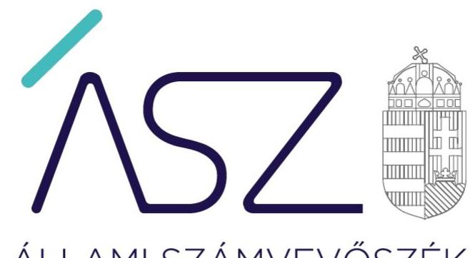
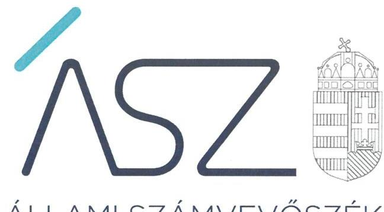
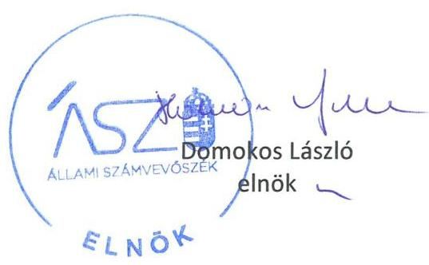

ÁLLAMI SZÁMVEVŐSZÉK

# JELENTÉS 

## Az önkormányzatok ellenőrzése - A pénzforgalomban megjelenő kiadások elszámolásának ellenőrzése

Orfűi Közös Önkormányzati Hivatalhoz tartozó Önkormányzatok - Abaliget Község Önkormányzata, Husztót Község Önkormányzata, Kovácsszénája Község Önkormányzat, Kővágótöttös Község Önkormányzat
2022.

---

ÁLLAMI SZÁMVEVŐSZÉK

# JELENTÉS 

## Az önkormányzatok ellenőrzése - A pénzforgalomban megjelenő kiadások elszámolásának ellenőrzése

Orfűi Közös Önkormányzati Hivatalhoz tartozó Önkormányzatok - Abaliget Község Önkormányzata, Husztót Község Önkormányzata, Kovácsszénája Község Önkormányzat, Kővágótöttös Község Önkormányzat
2022. 06. hó 27. nap

22035

---

# AZ ELLENŐRZÉST VEZETTE ÉS A VÉGREHAJTÁSÁÉRT FELELŐS: 

BALÁZSNÉ ANTONI ERIKA ellenőrzésvezető
MAKKAI MÁRIA ellenőrzésvezető
VALASTYÁNNÉ DR. VÍZHÁNYÓ JÚLIA ellenőrzésvezető

## A PROGRAM ÖSSZEÁLLÍTÁSÁÉRT FELELŐS:

DR. KÁDÁR KRISZTA ellenőrzés tervezési projektvezető

## A TÉMÁHOZ KAPCSOLÓDÓ KORÁBBI SZÁMVEVŐSZÉKI JELENTÉSEK:

- címe: Jelentés - Önkormányzatok ellenőrzése Az önkormányzatok integritásának ellenőrzése Baranya megye települési önkormányzatai
- sorszáma: 21006

Jelentéseink az Országgyúlés számítógépes hálózatán és az interneten a www.asz.hu címen is olvashatóak.

IKTATÓSZÁM: EL-3705-001/2022.
TÉMASZÁM: 2585
ELLENŐRZÉS-AZONOSÍTÓ SZÁM: V092903

---

# TARTALOMJEGYZÉK 

■ ÖSSZEGZÉS ..... 5
■ AZ ELLENŐRZÉS CÉLJA ..... 6
■ AZ ELLENŐRZÉS TERÜLETE ..... 7
■ AZ ELLENŐRZÉS HÁTTERE, INDOKOLTSÁGA ..... 8
■ A JELENTÉS LÉNYEGES KÉRDÉSKÖREI ..... 9
■ AZ ELLENŐRZÉS HATÓKÖRE ÉS MÓDSZEREI ..... 10
■ MEGÁLLAPÍTÁSOK. ..... 12
■ FÜGGELÉK: ÉSZREVÉTELEK ..... 15
■ RÖVIDÍTÉSEK JEGYZÉKE ..... 17

---

.

---

# ÖSSZEGZÉS 

Abaliget Község Önkormányzatánál, Husztót Község Önkormányzatánál, Kovácsszénája Község Önkormányzatnál, Kővágótöttös Község Önkormányzatnál és az Orfűi Közös Önkormányzati Hivatalnál a korábban jelzett integritási kockázatok realizálódtak. Így a 2020. évi vagyongazdálkodásuk nem volt rendeltetésszerű, amely pazarló közpénzfelhasználáshoz vezetett.

## Az ellenőrzés társadalmi indokoltsága

Magyarország Alaptörvénye és a nemzeti vagyonról szóló törvény értelmében a közpénzeket és a nemzeti vagyont az átláthatóság és a közélet tisztaságának elve szerint kell kezelni. Az elvek részletes tartalma a számvitelről szóló jogszabályok rendelkezéseiben kerültek meghatározásra.

Az Állami Számvevőszék helyi önkormányzati kör egészét érintő 2020. évre vonatkozó integritási kockázat kiértékelése rámutatott további ellenőrzések szükségességére. Azon önkormányzatok és hivatalaik tekintetében, ahol az ellenőrzés hiányosságokat tárt fel a szabályos és átlátható gazdálkodás, a csalásmentes működés alapvető feltételeinek biztosításában, indokolt volt a pénzforgalomban megjelenő kiadások teljesítésének és elszámolásának részletes ellenőrzése.

Az Állami Számvevőszék 2020. évre vonatkozó integritási kockázat kiértékelése kockázatosnak minősítette az Önkormányzati Hivatalhoz ${ }^{1}$ tartozó hétből négy önkormányzatot, amelyeknél a minősítés a pénzforgalomban megjelenő kiadások teljesítésének és elszámolásának részletes ellenőrzését indokolta.

## Főbb megállapítások

Az ÁSZ korábbi ellenőrzése alapján kockázatosnak minősített Abaliget Község Önkormányzata, Husztót Község Önkormányzata, Kovácsszénája Község Önkormányzat, Kővágótöttös Község Önkormányzat nem rendelkezett az arra jogosult jegyző által aláírt 2020. évi éves költségvetési beszámolóval, így a gazdálkodás nem volt átlátható és elszámoltatható.

A négy önkormányzatnál és az Önkormányzati Hivatalnál az ellenőrzött lényeges kiadásoknál a kötelezettségvállalások és a teljesítésigazolások elmaradása, valamint a szabálytalan könyvvezetés miatt nem volt biztosított a szabályos, átlátható gazdálkodás.

Husztót Község Önkormányzatánál a valóságban nem fellelhető tárgyi eszközök miatt a vagyonvédelem nem érvényesült.

Az ÁSZ által feltárt szabálytalanságok jövőre vonatkozó megszüntetése érdekében az Abaliget Község Önkormányzata, Husztót Község Önkormányzata, Kovácsszénája Község Önkormányzat, Kővágótöttös Község Önkormányzat, valamint az Önkormányzati Hivatal vezetője az ÁSZ tv. 33. § (1) bekezdésében foglaltak értelmében köteles a jelentésben foglalt megállapításokhoz kapcsolódó intézkedési tervet összeállítani és azt a jelentés kézhezvételétől számított 30 napon belül az ÁSZ részére megküldeni.

---

# AZ ELLENŐRZÉS CÉLJA 

Az ellenőrzés célja az önkormányzatoknál, az önkormányzati hivataloknál a pénzforgalomban megjelenő kiadások teljesítésének és elszámolásának értékelése annak érdekében, hogy az önkormányzatok, önkormányzati hivatalok gazdálkodásában rejlő kockázatok beazonosításával támogassa a közpénzekkel való felelős gazdálkodást.

---

# AZ ELLENŐRZÉS TERÜLETE 

## Orfűi Közös Önkormányzati Hivatalhoz tartozó Önkormányzatok - Abaliget Község Önkormányzata, Husztót Község Önkormányzata, Kovácsszénája Község Önkormányzat, Kővágótöttös Község Önkormányzat

Abaliget Baranya megyében, a Pécsi járásban található. Lakosainak száma 685 fő volt 2020. január 1. napján. Husztót község lakosainak száma 51 fő, Kovácsszénája községé 87 fő, Kővágótöttös községé 350 fő volt 2020. január 1. napján. A négy önkormányzatnál az ellenőrzött időszakban nem volt változás a 2019. október 13-tól kinevezett polgármestereinek személyében.

A négy önkormányzat másik három önkormányzattal társulva tartja fenn az Orfűi Közös Önkormányzati Hivatalt. Az Önkormányzati Hivatal ellátja az önkormányzatok működésével és gazdálkodásával kapcsolatos feladatokat. A jegyző 2019. december 9-től vezeti a hivatalt.

---

# AZ ELLENŐRZÉS HÁTTERE, INDOKOLTSÁGA 

Magyarország Alaptörvénye 39. cikk (2) bekezdése szerint a közpénzeket és a nemzeti vagyont az átláthatóság és a közélet tisztaságának elve szerint kell kezelni.

Az ÁSZ² a 2020. évre vonatkozóan a helyi önkormányzati kör egészét lefedve elvégezte Magyarország önkormányzatai integritási kockázatának kiértékelését. Az ellenőrzés során az ellenőrzött szervezetek integritását jelző, a felépítését, működését, felelősségi viszonyait, gazdálkodását meghatározó szabályzatok és nyilvántartások rendelkezésre állása, valamint lényeges szabályozási területei kerültek értékelésre. Azon önkormányzatok és hivatalaik tekintetében, ahol a szabályos és átlátható gazdálkodás, a csalásmentes működés alapvető feltételeinek biztosításában az ellenőrzés kockázatokat azonosított, indokolt azok csökkentésének támogatására a végrehajtás - a jogszabályban, belső szabályozásban előírt folyamatok további ellenőrzése.

Az ÁSZ értékelése hozzájárul ahhoz, hogy az azonosított kockázatok alapján a helyi önkormányzatok és az önkormányzati hivatalok gazdálkodása során a közpénzek felhasználásakor érvényesüljenek az integritási alapelvek, amelyek segítik a közpénzek és a közvagyon szabályos, célszerű felhasználását, támogatják az önkormányzatok, önkormányzati hivatalok eredményes gazdálkodását, amellyel az önkormányzatok a köz javát, a köz érdekét szolgálják.

---

# A JELENTÉS LÉNYEGES KÉRDÉSKÖREI 

1.     - Fennáll-e kockázat az önkormányzat és az önkormányzati hivatal gazdálkodásában?

---

# AZ ELLENŐRZÉS HATÓKÖRE ÉS MÓDSZEREI 

## Az ellenőrzés típusa

Megfelelőségi ellenőrzés.

## Az ellenőrzött időszak

A 2020. január 1-jétől 2020. december 31-ig terjedő időszak, továbbá a helyszíni szemrevételezéssel érintett nap.

## Az ellenőrzés tárgya

A pénzforgalomban megjelenő kiadások teljesítésének és elszámolásának megfelelősége.

## Az ellenőrzött szervezetek

Orfűi Közös Önkormányzati Hivatal és a hozzá tartozó Önkormányzatok Abaliget Község Önkormányzata, Husztót Község Önkormányzata, Kovácsszénája Község Önkormányzat, Kővágótöttös Község Önkormányzat

## Az ellenőrzés jogalapja

Az ellenőrzés jogalapját az ÁSZ tv³. 1. § (3) bekezdése, és 5. § (6) bekezdése képezi.

## Az ellenőrzés módszerei

Az ellenőrzést az ellenőrzési program szempontjai, az ellenőrzött időszakban hatályos jogszabályok, a jelen ellenőrzésre irányadó ÁSZ módszertan figyelembevételével és a nemzetközi standardokat irányadónak tekintve végzi az ÁSZ.

Az ellenőrzés ideje alatt az ÁSZ az ellenőrzött szervezettel történő kapcsolattartást az ÁSZ SZMSZ ${ }^{4}$-ének vonatkozó előírásai alapján biztosítja.

Az értékelések bizonyítékokon, az ellenőrzött időszakban, vagy azt megelőzően keletkezett rendelkezésre bocsátott dokumentumokon alapulnak, az adott időszak tényeit feltárva.

Az ellenőrzési kérdések megválaszolásához szükséges bizonyítékok megszerzése az ellenőrzött szervezetek által rendelkezésre bocsátott dokumentumokra, adatokra alapozva megfigyelés, szemle (szükség esetén helyszíni szemle, szemrevételezés), kérdésfeltevés (információkérés), valamint elemző eljárás útján történik. Az ellenőrzési bizonyítékként felhasználható adatforrások közé tartoznak egyrészt az ellenőrzési program részletes szempontjainál felsorolt adatforrások, másrészt minden egyéb - az ellenőrzés folyamán feltárt, - az ellenőrzés szempontjából releváns információt tartalmazó dokumentum.

Az ellenőrzést a kérdésekre adott válaszok kiértékelésével, valamint a megjelölt adatforrások, továbbá az adott időszakban hatályos jogszabályok figyelembevételével folytatja le az ÁSZ.

A pénzforgalomban megjelenő kiadások teljesítése és elszámolása szabályszerűségének ellenőrzése és értékelése lényegességi elv szerint kiválasztott tételek alapján történik. A helyi önkormányzat és az önkormányzati hivatal fizetési számlája és a házipénztárban kezelt készpénzállománya terhére megvalósuló pénzforgalma 2020. évi tételes adataiból a nem kockázatos tételek kiszűrését követően kerültek kiválasztásra az érték alapján lényegesnek minősített kiadások. Amennyiben a lényeges kiadások teljesítése és elszámolása tekintetében az átlagos hibaarány nem haladja meg a 10\%-ot, az értékelés eredményeként a lényegesnek minősített kiadások esetében nem került további kockázat beazonosításra az ÁSZ által az ellenőrzés során. Amennyiben a kiadási tételek száma a fizetési számla vagy a házipénztár tekintetében nem haladja meg a 2020. évben a 15 lényeges tételt, valamennyi kiadási tétel értékelésre kerül.

A törvényi előírásokat, valamint az ÁSZ által meghirdetett, nyilvános módszertant figyelembe véve az ellenőrzés hatóköre kiegészülhet kockázatjelzések alapján, a kockázatértékelés függvényében további lényeges területek szabályosságának ellenőrzésével az ellenőrzés megkezdésének időpontjáig.

---

# 1. Fennáll-e kockázat az önkormányzat és az önkormányzati hivatal gazdálkodásában? 

Összegző megállapítás

Abaliget Község Önkormányzata, Husztót Község Önkormányzata, Kovácsszénája Község Önkormányzat, Kővágótöttös Község Önkormányzat és az Önkormányzati Hivatal gazdálkodásában a 2020. évi lényeges kiadások teljesítése és elszámolása szabálytalan volt. Az Önkormányzatok nem rendelkeztek a jogosult által aláírt 2020. évi éves költségvetési beszámolókkal.

ABALIGET KÖZSÉG ÖNKORMÁNYZATA lényeges kiadásai tekintetében a kötelezettségvállalásra és teljesítésigazolásra jogosultak feladatellátásának hiányosságai miatt nem igazolt, hogy a kötelezettségvállalások és kifizetések az ellenőrzött szervezet feladatellátását szolgálták, illetve szerződésszerű teljesítésekhez kapcsolódtak:
$\longrightarrow$ a 2962466 Ft összegű informatikai célú eszközbeszerzésnél írásbeli kötelezettségvállalás nélkül került sor a teljesítésre az Áht. ${ }^{5}$ 37. § (1) bekezdése Ávr. ${ }^{6}$ 52. § (1) bekezdés c) pontjában foglaltak ellenére;
$\longrightarrow$ a január, október és november havi bér-, és lakossági víz- és csatorna támogatás célú, összesen 14157693 Ft összegű kifizetések teljesítésigazolás nélkül végezték az Áht. 38. § (1) bekezdésében és Ávr. 57. § (1) bekezdésében előírtak ellenére;
$\longrightarrow$ a 8249353 Ft összegű, az Önkormányzati hivatal működésére támogatás és orvosi eszközök beszerzése kifizetéseknél a teljesítés igazolása nem felelt meg az Ávr. 57. § (3) bekezdésében foglaltaknak, mert a teljesítésigazoláson az arra jogosult személy a teljesítésigazolás dátumát nem tüntette fel;
$\longrightarrow$ a házipénztárból egy 200000 Ft összegű gépjármű javítás miatt írásbeli kötelezettségvállalás, valamint teljesítésigazolás nélkül történt kifizetés az Áht. 37. § (1) bekezdésében, az Áht. 38. § (1) bekezdésében, valamint az Ávr. 52. § (1) c) pontjában és 57. § (1) bekezdésében foglaltak ellenére.
A házipénztárból teljesített megbízási díj és munkabér célú, összesen 127330 Ft összegű kifizetéseknél az elszámoltatható közpénzfelhasználás feltételei hiányoztak, mivel a hivatali feladatellátás hiányosságai miatt nem gondoskodtak a kötelezettségvállalás nyilvántartásba vételéről az Ávr. 56. § (1) bekezdésében foglaltak ellenére.

Az önkormányzat nem rendelkezett 2020. évi éves költségvetési beszámolóval, az Áhsz. 31. §. (1) bekezdésében foglaltak ellenére nem az arra jogosult jegyző, hanem a polgármester írta alá, így nem érvényesült a vezetői felelősségvállalás.

HUSZTÓT KÖZSÉG ÖNKORMÁNYZATA lényeges kiadásai tekintetében a kötelezettségvállalásra és teljesítésigazolásra jogosultak

---

feladatellátásának hiányosságai miatt nem igazolt, hogy a kötelezettségvállalások és kifizetések az ellenőrzött szervezetek feladatellátását szolgálták, illetve szerződésszerű teljesítésekhez kapcsolódtak:

- összesen 2624056 Ft összegű üzemeltetést érintő kifizetés esetében írásbeli kötelezettségvállalás nélkül került sor az Áht. 37. § (1) bekezdése Ávr. ${ }^{7}$ 52. § (1) bekezdés c) pontjában foglaltak ellenére;
- a hét felújítást, szolgáltatási és üzemeltetési díjat érintő, 5620395 Ft összegű kifizetést teljesítésigazolás nélkül végezték az Áht. 38. § (1) bekezdésében és Ávr. 57. § (1) bekezdésében előírtak ellenére;
- a két felújítással összefüggő 3707130 Ft összegű kifizetésnél a teljesítés igazolása nem felelt meg az Ávr. 57. § (1) bekezdésében foglaltaknak, mert a teljesítés igazolása során nem győződtek meg arról, hogy a teljesítés összege a kötelezettségvállalás dokumentumában szereplő összeggel (részösszeggel) megegyező volt-e, mivel a kifizetés során attól eltértek.
Az önkormányzat nem rendelkezett 2020. évi éves költségvetési

 beszámolóval, az Áhsz. 31. §. (1) bekezdésében foglaltak ellenére nem az arra jogosult jegyző, hanem a polgármester írta alá, így nem érvényesült a vezetői felelősségvállalás.

Az Önkormányzat tárgyi eszközeiről a Számv. tv. ${ }^{8}$ 159. §-ában előírtak ellenére nem vezettek olyan könyvviteli nyilvántartást, amely a bekövetkezett változásokat a valóságnak megfelelően, folyamatosan, áttekinthetően mutatja, mert a hivatali feladatellátás hiányosságai miatt az Önkormányzat könyvviteli nyilvántartásában szereplő eszközök nem voltak beazonosíthatók, ezért a nemzeti vagyon védelme nem volt biztosított. A nem azonosítható tárgyi eszközök nyilvántartás szerinti értéke összesen 380664 Ft volt.

Az Önkormányzatnál a Számv. tv. 159. §-ában előírtak ellenére a számviteli nyilvántartásban szereplő négy, összesen 10897751 Ft nyilvántartás szerinti értékű eszköz a valóságban nem volt fellelhető, ezért a vagyonvédelem nem érvényesült.

# KOVÁCSSZÉNÁJA KÖZSÉG ÖNKORMÁNYZAT 

lényeges kiadásai tekintetében a kötelezettségvállalásra és teljesítésigazolásra jogosultak feladatellátásának hiányosságai miatt nem igazolt, hogy a kötelezettségvállalások és kifizetések az ellenőrzött szervezetek feladatellátását szolgálták, illetve szerződésszerű teljesítésekhez kapcsolódtak:

- három üzemeltetéssel összefüggő kifizetésnél összesen 1349934 Ft teljesítésére írásbeli kötelezettségvállalás nélkül került sor az Áht. 37. § (1) bekezdésében és Ávr. 52. § (1) bekezdés c) pontjában foglaltak ellenére;
— két kifizetést - melyből az egyikre 2325000 Ft összegben írásbeli kötelezettségvállalás nélkül került sor - teljesítésigazolás nélkül végezték el az Áht. 38. § (1) bekezdésében és Ávr. 57. § (1) bekezdés előírásai ellenére;
- a fizetési számláról írásbeli kötelezettségvállalás nélkül teljesített három kifizetésből két, összesen 684324 Ft kifizetésnél a teljesítés igazolása nem felelt meg az Ávr. 57. § (3) bekezdésében foglaltaknak, mert a teljesítésigazoláson az arra jogosult személy a teljesítésigazolás dátumát nem tüntette fel.

---

Az önkormányzat nem rendelkezett 2020. évi éves költségvetési beszámolóval, az Áhsz. ${ }^{9}$ 31. §. (1) bekezdésében foglaltak ellenére nem az arra jogosult jegyző, hanem a polgármester írta alá, így nem érvényesült a vezetői felelősségvállalás.

KÖVÁGÓTÖTTÖS KÖZSÉG ÖNKORMÁNYZAT lényeges kiadásai tekintetében a kötelezettségvállalásra és teljesítésigazolásra jogosultak feladatellátásának hiányosságai miatt nem igazolt, hogy a kötelezettségvállalások és kifizetések az ellenőrzött szervezetek feladatellátását szolgálták, illetve szerződésszerű teljesítésekhez kapcsolódtak:
— hét kifizetésre - ezen belül egy 7373000 Ft összegű felújításra írásbeli kötelezettségvállalás nélkül került sor az Áht. 37. § (1) bekezdésében és Ávr. 52. § (1) bekezdés c) pontjában foglaltak ellenére.
A házipénztárból 100000 Ft támogatás kifizetéséről a hivatali feladatellátás hiányosságai miatt a számviteli nyilvántartásba bizonylat nélkül jegyeztek be adatot a Számv. tv. 165. § (2) bekezdésében foglaltak ellenére. Az elszámoltatható közpénzfelhasználás feltételei hiányoztak.

Az Önkormányzat tárgyi eszközeiről a Számv. tv. 159. §-ában előírtak ellenére nem vezettek olyan könyvviteli nyilvántartást, amely a bekövetkezett változásokat a valóságnak megfelelően, folyamatosan, áttekinthetően mutatja, mert a hivatali feladatellátás hiányosságai miatt az Önkormányzat könyvviteli nyilvántartásában szereplő eszközök nem voltak beazonosíthatók, ezért a nemzeti vagyon védelme nem volt biztosított. A nem azonosítható tárgyi eszközök nyilvántartás szerinti értéke összesen 1328053 Ft volt.

Az önkormányzat nem rendelkezett 2020. évi éves költségvetési beszámolóval, az Áhsz. 31. §. (1) bekezdésében foglaltak ellenére nem az arra jogosult jegyző, hanem a polgármester írta alá, így nem érvényesült a vezetői felelősségvállalás.

AZ ÖNKORMÁNYZATI HIVATAL lényeges kiadásai teljesítésénél és elszámolásánál a hivatali feladatellátás hiányosságai az alábbi szabálytalanságokat okozták, amelyek miatt nem igazolt, hogy a kötelezettségvállalások és kifizetések az ellenőrzött szervezetek feladatellátását szolgálták, illetve szerződésszerű teljesítésekhez kapcsolódtak:
— három, összesen 1130300 Ft összegű mérnöki és pénzügyi tanácsadás díj fizetésére írásbeli kötelezettségvállalás nélkül került sor az Áht. 37. § (1) bekezdésében és Ávr. 52. § (1) bekezdés a) pontjában foglaltak ellenére;
— egy 215900 Ft összegű mérnöki díj kifizetésnél a teljesítés igazolása nem felelt meg az Ávr. 57. § (3) bekezdésében foglaltaknak, mert a teljesítés igazolására jogosult személy a teljesítésigazolás dátumát nem tüntette fel.
— Egy 29950 Ft összegű szabadidő megváltás kifizetésről a számviteli nyilvántartásba bizonylat nélkül jegyeztek be adatot a Számv. tv. 165. § (2) bekezdésében foglaltak ellenére. Az elszámoltatható közpénzfelhasználás feltételei hiányoztak.

---

# FÜGGELÉK: ÉSZREVÉTELEK 

Az Állami Számvevőszék az ÁSZ tv. 29. § (1) bekezdése alapján ismertette az ellenőrzött szervezetek vezetőivel az ellenőrzés megállapításait.

Husztót Község Önkormányzata és Kovácsszénája Község Önkormányzat az ÁSZ tv. 29. § (2) bekezdésében foglalt észrevételezési jogával nem élt. Abaliget Község Önkormányzata, Kővágótöttös Község Önkormányzat és az Orfüi Közös Önkormányzati Hivatal az ellenőrzés megállapításaira észrevételt tett. A függelék az alábbiakban tartalmazza a figyelembe nem vett észrevételeket, és annak indoklását, hogy azokat az Állami Számvevőszék miért nem fogadta el.

## Abaliget Község Önkormányzatának észrevétele

Az ÁSZ által feltárt, a gazdálkodási jogkörök gyakorlását és a költségvetési beszámolót érintő hiányosságok dokumentumai rendelkezésre állnak, emellett a szükséges intézkedéseket megteszik, hogy a jövőben a feltárt problémák ne forduljanak elő.

## Kővágótöttös Község Önkormányzatának észrevétele

A hiányzó dokumentációk rendelkezésre állnak, azonban az ellenőrzés során nem kerültek átadásra az ellenőrzést végzők számára, mivel különböző helyeken tárolták őket. A jelzett hiányosságokat javítják és jövőben fokozott figyelmet fordítanak a belső ellenőrzésre.

## Orfüi Közös Önkormányzati Hivatal észrevétele

A hiányzó dokumentációk rendelkezésre állnak, azonban az ellenőrzés során nem kerültek átadásra az ellenőrzést végzők számára. Az észrevétel tartalmazza, hogy a jelzett hiányosságokat javítják és jövőben fokozott figyelmet fordítanak a belső ellenőrzésre.

## Az észrevétel el nem fogadásának indoklása

Az ÁSZ ellenőrzési megállapításai minden esetben az ÁSZ tv.-nek megfelelően az ellenőrzés során bekért és rendelkezésre bocsátott dokumentumokon alapulnak, amelyek teljeskörüségéről a helyszíni adatbetekintésről készült jegyzőkönyvben az ellenőrzött szervezetek vezetői nyilatkoztak. Az észrevételben hivatkozott dokumentumokat nem bocsátották az ellenőrzés rendelkezésére.

[^0]
[^0]:    * 29. § (1) Az Állami Számvevőszék az ellenőrzési megállapításait megküldi az ellenőrzött szervezet vezetőjének vagy az általa megbízott személynek, és annak, akinek személyes felelősségét állapította meg.
    (2) Az ellenőrzött szervezet vezetője és a felelősként megjelölt személy az ellenőrzés megállapításaira tizenöt napon belül írásban észrevételt tehet.
    (3) Az Állami Számvevőszék az észrevételre a beérkezésétől számított harminc napon belül írásban válaszol. A figyelembe nem vett észrevételeket köteles a jelentésben feltüntetni, és megindokolni, hogy azokat miért nem fogadta el.

---

.

---

# RÖVIDÍTÉSEK JEGYZÉKE 

${ }^{1}$ Önkormányzati Hivatal
${ }^{2}$ ÁSZ
${ }^{3}$ ÁSZ tv.
${ }^{4}$ ÁSZ SZMSZ
${ }^{5}$ Áht.
${ }^{6}$ Ávr.
${ }^{7}$ Ávr.
${ }^{8}$ Számv. tv.
${ }^{9}$ Áhsz.

Orfüi Közös Önkormányzati Hivatal
Állami Számvevőszék
2011. évi LXVI. törvény az Állami Számvevőszékről

Az Állami Számvevőszék elnökének 7/2020. (XII.28.) ÁSZ utasítása az Állami Számvevőszék Szervezeti és Működési Szabályzatáról
2011. évi CXCV. törvény az államháztartásról

368/2011. (XII. 31.) Korm. rendelet az államháztartásról szóló törvény végrehajtásáról
368/2011. (XII. 31.) Korm. rendelet az államháztartásról szóló törvény végrehajtásáról
2000. évi C. törvény a számvitelről

4/2013. (I.11.) Korm. rendelet az államháztartás számviteléről

---

1052 Budapest, Apáczai Cs. J. u. 10. | 1364 Budapest 4. Pf. 54
TEL: +36 14849100
email: szamvevoszek@asz.hu
web: www.asz.hu | www.aszhirportal.hu

