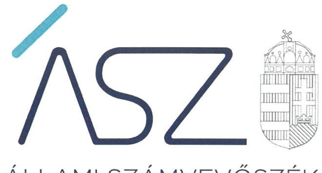
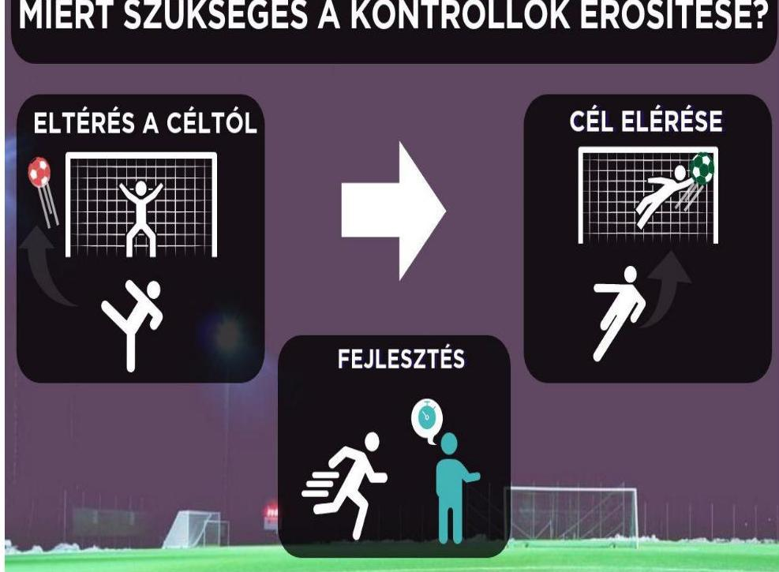
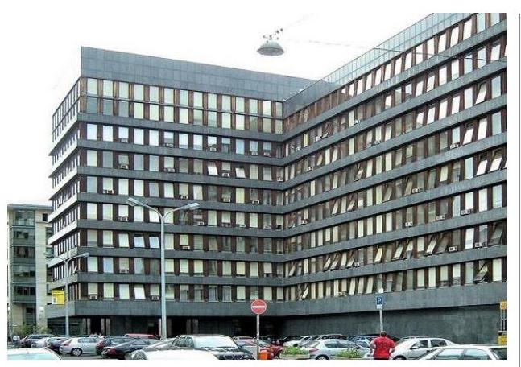

ÁLLAMI SZÁMVEVŐSZÉK

# JELENTÉS 

Az államháztartás központi alrendszere fejezeteinek ellenőrzése - A sportegyesületeknek, sportszövetségeknek nyújtott költségvetési támogatási rendszerhez kapcsolódó feladatellátás ellenőrzése

Emberi Erőforrások Minisztériuma

2022. 

22036
www.asz.hu

---

ÁLLAMI SZÁMVEVŐSZÉK

# JELENTÉS 

Az államháztartás központi alrendszere fejezeteinek ellenőrzése - A sportegyesületeknek, sportszövetségeknek nyújtott költségvetési támogatási rendszerhez kapcsolódó feladatellátás ellenőrzése

Emberi Erőforrások Minisztériuma
2022. 06. hó 20. nap

22036
www.asz.hu

---

# AZ ELLENŐRZÉST VEZETTE ÉS A VÉGREHAJTÁSÁÉRT FELELŐS: 

BAJNAI ZSUZSANNA ellenőrzésvezető
KLINGA LÁSZLÓ ellenőrzésvezető
DR. PETRÁNYI GÁBOR ellenőrzésvezető

A PROGRAM ÖSSZEÁLLÍTÁSÁÉRT FELELŐS:
KUSZINGER ANDREA ellenőrzés tervezési projektvezető

IKTATÓSZÁM: EL-3714-001/2022.
TÉMASZÁM: 2613
ELLENŐRZÉS-AZONOSÍTÓ SZÁM: V0957

---

# TARTALOMJEGYZÉK 

■ ÖSSZEGZÉS ..... 5
■ AZ ELLENŐRZÉS JELENTŐSÉGE, AKTUALITÁSA, TÁRSADALMI SZEREPE, SZEMPONTJAI ..... 6
■ AZ ELLENŐRZÉS TERÜLETE ..... 7
■ MELLÉKLETEK ..... 9
■ ELLENŐRZÉS HATÓKÖRE ÉS MÓDSZERE ..... 10
■ ÉRTELMEZŐ SZÓTÁR ..... 13
■ RÖVIDÍTÉSEK JEGYZÉKE ..... 15

---

.

---

# ÖSSZEGZÉS 

Az Emberi Erőforrások Minisztériuma a sportegyesületeknek, sportszövetségeknek folyósított állami támogatásokat érintő ellenőrzési tevékenységével nem járult hozzá a központi költségvetésből származó sport célú támogatások céljainak eléréséhez.

## Értékelések

Az Emberi Erőforrások Minisztériuma a sportegyesületeknek, sportszövetségeknek folyósított, 2020. évben lezárt központi költségvetési támogatások felhasználásának ellenőrzése során az államháztartásról szóló törvény végrehajtására, valamint az állami sport célú támogatások felhasználására és elosztására vonatkozó rendeletekben foglalt előírások ellenére nem ellenőrizte minden esetben a támogatás jogszerű és célszerű felhasználását igazoló bizonylatok létezését, ezáltal a kedvezményezett szervezet által benyújtott összesítő elszámolással való egyezőségének meglétét. Azokban az esetekben amikor az EMMI ${ }^{1}$ a bizonylatokat ellenőrizte, az ellenőrzésbe bevonandó bizonylatok darabszámára, értékére, hitelességi kellékeire vonatkozó előírásokat nem érvényesítette következetesen minden esetben. Az elszámolások alátámasztására az ellenőrzések során az EMMI elfogadott olyan bizonylatokat, amelyeken záradékban nem került feltüntetésre, hogy a bizonylaton szereplő összegből mennyit számoltak el a hivatkozott támogatási szerződés terhére. Az EMMI nem igazolta, hogy ellenőrzései során a közbeszerzési értékhatárt elérő beszerzések vonatkozásában minden esetben meggyőződött arról, hogy a közbeszerzést lebonyolították-e. Mindezek alapján az EMMI sportegyesületeknek, sportszövetségeknek folyósított, 2020. évben lezárt központi költségvetési támogatások felhasználására irányuló ellenőrzési tevékenysége nem volt szabályszerű, ellenőrzéseivel nem járult hozzá a támogatások célszerű felhasználásához.

## Következtetések

## MIÉRT SZÜKSÉGES A KONTROLLOK ERŐSÍTÉSE?

A sportegyesületeknek, sportszövetségeknek adott költségvetési támogatások felhasználását igazoló bizonylatokat érintő kontrollok nem megfelelő működtetése fokozta az állami források céltól eltérő, jogszerűtlen felhasználásának bekövetkezési lehetőségét, így nem teljesült az integritás követelménye.

---

# AZ ELLENŐRZÉS JELENTŐSÉGE, AKTUALITÁSA, TÁRSADALMI SZEREPE, SZEMPONTJAI 

Magyarország Alaptörvénye előírja, hogy a közpénzeket és a nemzeti vagyont az átláthatóság és a közélet tisztaságának elve szerint kell kezelni. Az ÁSZ² Stratégiában rögzített célkitűzése, hogy az államháztartáson kívülre nyújtott költségvetési támogatás és vagyonjuttatás ellenőrzésével hozzájáruljon ahhoz, hogy a közpénzeket a szervezetek átlátható módon és célszerűen használják fel.

Magyarország Alaptörvénye rögzíti, hogy mindenkinek joga van a testi és lelki egészséghez, amely jog érvényesítését Magyarország - többek között - a sportolás és a rendszeres testedzés támogatásával segíti elő. A sportegyesületek, sportszövetségek működésükre és szakmai tevékenységük ellátására költségvetési támogatásban vagy ingyenes vagyonjuttatásban részesülhetnek. A 2020. évi központi költségvetés végrehajtása során a sport célú támogatásokra mintegy 125 milliárd Ft került kifizetésre, amely indokolja, hogy az ÁSZ e területen is ellenőrizze a költségvetési támogatások rendeltetésszerű felhasználását, átláthatóságát.

Az ellenőrzés célja annak értékelése, hogy a sportegyesületeknek, sportszövetségeknek nyújtott költségvetési támogatási rendszerhez kapcsolódó feladatellátás hogyan járult hozzá a központi költségvetésből származó sport célú támogatások céljainak eléréséhez.

Az ellenőrzés eredményeként a törvényalkotás számára tapasztalatok állnak majd rendelkezésre a sportegyesületeknek, sportszövetségeknek nyújtott költségvetési támogatások felhasználásával kapcsolatos ellenőrzési folyamatokról. Az ellenőrzött szervezet szintjén a költségvetési támogatások felhasználásával kapcsolatos ellenőrzési tevékenység vonatkozásában megfogalmazott megállapítások hozzájárulnak a támogató jogszabályi előírások szerinti ellenőrzési tevékenységének megvalósításához a költségvetési támogatások célszerű felhasználása érdekében. Az ellenőrzés a társadalom számára információt szolgáltat arról, hogy a sportegyesületeknek, sportszövetségeknek nyújtott költségvetési támogatással összefüggő feladatellátás hogyan járult hozzá a központi költségvetésből származó sport célú támogatások céljainak eléréséhez.

---

# AZ ELLENŐRZÉS TERÜLETE 

## Emberi Erőforrások Minisztériuma

A 2020. évben az Emberi Erőforrások Minisztériuma önálló jogi személyiséggel rendelkező, a Kormány irányítása alatt álló, különös hatáskörű, központi kormányzati igazgatási szerv volt, vezetője az emberi erőforrások minisztere.

A 2020. évben a sportért felelős államtitkár hatáskörébe tartozott a sport kormányzati irányítási és intézményrendszerének kialakítása, működtetése, az ehhez szükséges szabályozási és egyéb feltételek biztosítása, a sportlétesítmény-fejlesztés és -gazdálkodás, a sport célú költségvetési támogatások elosztása, a felhasználás ellenőrzése, a nemzetközi két- és többoldalú kapcsolatok.

A miniszter és a sportért felelős államtitkár személye az ellenőrzött időszakban nem változott.

---

.

---

# MELLÉKLETEK

---

# ELLENŐRZÉS HATÓKÖRE ÉS MÓDSZERE 

## Az ellenőrzés típusa

Szabályszerűségi ellenőrzés.

## Az ellenőrzött időszak

a 2020. év

## Az ellenőrzés tárgya

Az ellenőrzés a sportegyesületeknek, sportszövetségeknek nyújtott költségvetési támogatással összefüggő feladatellátásra, a nyújtott költségvetési támogatásokhoz kapcsolódó beszámoltatásra, a támogatások felhasználásának ellenőrzésével kapcsolatos tevékenységre terjed ki.

## Az ellenőrzött szervezet

Emberi Erőforrások Minisztériuma (a támogatást nyújtó minisztérium)

## Az ellenőrzés jogalapja

Az ellenőrzés jogalapját az ÁSZ tv³. 1. § (3) bekezdése, és 5. § (2) bekezdése képezi.

## Az ellenőrzés módszerei

Az ÁSZ az ellenőrzést az ellenőrzési program szempontjai, az ellenőrzött időszakban hatályos jogszabályok, a jelen ellenőrzésre irányadó ÁSZ módszertan figyelembevételével és a nemzetközi standardokat irányadónak tekintve végzi.

Az ÁSZ az ellenőrzés ideje alatt az ellenőrzött szervezettel történő kapcsolattartást az ÁSZ SZMSZ ${ }^{4}$-ének vonatkozó előírásai alapján biztosítja.

Az ellenőrzési kérdések megválaszolásához szükséges bizonyítékok megszerzése a következő ellenőrzési eljárások alkalmazásával történik: megfigyelés, szemle, összehasonlítás, elemzés, mintavételezés, valamint elemző eljárás. Az ellenőrzési bizonyítékként felhasználható adatforrások közé tartoznak az ellenőrzési programban felsorolt adatforrások, továbbá minden - az ellenőrzés folyamán - feltárt, az ellenőrzés szempontjából információkat tartalmazó dokumentum.

---

Az ellenőrzés lefolytatásához az ellenőrzött szervezet az ÁSZ által meghatározott dokumentumok rendelkezésre bocsátásával szolgáltat adatokat, információkat.

Az ellenőrzés végrehajtása során az ÁSZ bizonyíték-alapú megközelítési módszereket alkalmaz, felhasználva a digitalizáció által nyújtott lehetőségeket is. A dokumentumalapú ellenőrzéssel az értékelések bizonyítékokon, az ellenőrzött időszakban, vagy azt megelőzően keletkezett rendelkezésre álló dokumentumokon alapulnak, az adott időszak tényeit feltárva.

Az ellenőrzés során minden olyan körülmény és adat is ellenőrzésre kerül, amely a program végrehajtása kapcsán felmerült újabb összefüggéseknek az ellenőrzés céljaival összhangban lévő feltárásához szükséges.

A sportegyesületeknek, sportszövetségeknek nyújtott támogatások felhasználása szabályszerűségére irányuló beszámoltatási és ellenőrzési tevékenység értékelését az ÁSZ egyszerű véletlen mintavétellel ellenőrzi. A mintavétellel ellenőrzött területek esetében az egyes tételek vonatkozásában a szabályszerűségre vonatkoznak a kérdések, amelyek eredménye összesítésre kerül. „Szabályszerű" az ellenőrzött terület, amennyiben 95\%-os bizonyossággal a sokaságban az átlagos hibaarány legfeljebb 10\%, „nem szabályszerű", amennyiben 10\%-nál magasabb arányt képviselt. Abban az esetben, ha a sokaság tekintetében a 10\%-os hibaarányhoz való viszony megítélésének megbízhatósága nem éri el a 95\%-ot, annak elérése érdekében értékelésük további szempontokkal kerül kiegészítésre, figyelembe véve a feltárt hibák értékét.

A törvényi előírásokat, valamint az ÁSZ által meghirdetett, nyilvános módszertant figyelembe véve az ellenőrzés hatóköre kiegészülhet kockázatjelzések alapján, a kockázatértékelés függvényében további lényeges területek szabályosságának ellenőrzésével az ellenőrzés megkezdésének időpontjáig.

---

.

---

# ÉRTELMEZŐ SZÓTÁR 

civil szervezet
költségvetési támogatás
sportegyesület
sportegyesületeknek nyújtott költségvetési támogatás
sportszövetség
a civil társaság; a Magyarországon nyilvántartásba vett egyesület - a párt, a szakszervezet és a kölcsönös biztosító egyesület kivételével és a közalapítvány és a pártalapítvány kivételével - az alapítvány. (Forrás: Civil tv. ${ }^{5}$ 2. § 6. pont a)-c) pontjai)
a társadalombiztosítás pénzügyi alapjai kivételével az államháztartás központi alrendszeréből ellenérték nélkül, pénzben nyújtott támogatások (Forrás: Áht. ${ }^{6}$ 1. § 14. pontja)
Sportegyesület - a Sport törvényben megállapított eltérésekkel - az egyesülési jogról, a közhasznú jogállásról, valamint a civil szervezetek működéséről és támogatásáról szóló törvény (a továbbiakban: Civil tv.) és a Polgári Törvénykönyv ${ }^{7}$ szabályai szerint működő olyan egyesület, amelynek alaptevékenysége a sporttevékenység szervezése, valamint a sporttevékenység feltételeinek megteremtése. A sportegyesület a magyar sport hagyományos szervezeti alapegysége, a versenysport, a tehetséggondozás, az utánpótlás-nevelés és a szabadidősport műhelye. (Forrás: Stv. ${ }^{8}$ 16.§ (1)-(2) bekezdés)
az állami sport célú támogatások felhasználásáról és elosztásáról szóló 27/2013. (III. 29.) EMMI rendelet ${ }^{9}$ 1. §-ában meghatározott fejezeti kezelésű előirányzatokból nyújtott támogatás
A sportszövetségek meghatározott sporttevékenységek körében a sportversenyek szervezésére, a tagok érdekvédelmére és a részükre való szolgáltatásokra, valamint a nemzetközi kapcsolatok lebonyolítására létrehozott, jogi személyiséggel és önkormányzattal rendelkező, a Civil tv. és a Polgári Törvénykönyv alapján - az Stv.-ben foglalt eltérésekkel - különös formában működő egyesületek.
(Forrás: Stv. 19.§ (1) bekezdés)

---

.

---

# RÖVIDÍTÉSEK JEGYZÉKE 

${ }^{1}$ EMMI
${ }^{2}$ ÁSZ
${ }^{3}$ ÁSZ tv.
${ }^{4}$ ÁSZ SZMSZ
${ }^{5}$ Civil tv.
${ }^{6}$ Áht.
${ }^{7}$ Polgári Törvénykönyv
${ }^{8}$ Stv.
${ }^{9}$ 27/2013. (III. 29.) EMMI rendelet

Emberi Erőforrások Minisztériuma
Állami Számvevőszék
2011. évi LXVI. törvény az Állami Számvevőszékről

Állami Számvevőszék Szervezeti és Működési Szabályzata
2011. évi CLXXV. törvény - az egyesülési jogról, a közhasznú jogállásról, valamint a civil szervezetek működéséről és támogatásáról
2011. évi CXCV. törvény - az államháztartásról
2013. évi V. törvény - a Polgári Törvénykönyvről
2004. évi I. törvény - a sportról

27/2013. (III. 29.) EMMI rendelet - az állami sport célú támogatások felhasználásáról és elosztásáról

---

# ÁSZ 

ÁLLAMI SZÁMVEVŐSZÉK
1052 Budapest, Apáczai Cs. J. u. 10. I 1364 Budapest 4. Pf. 54 TEL: +36 14849100
email: szamvevoszek@asz.hu
web: www.asz.hu | www.aszhirportal.hu
