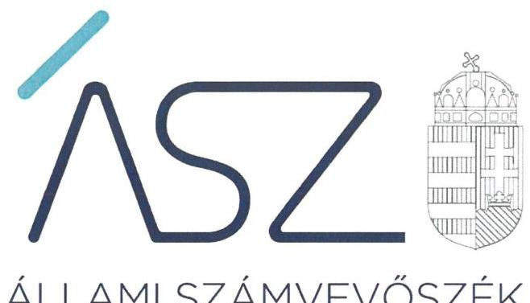
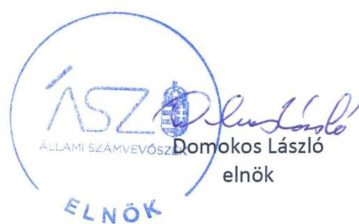

ÁLLAMI SZÁMVEVŐSZÉK

# JELENTÉS 

## Vélemény a 2023. évi központi költségvetésről

Vélemény Magyarország 2023. évi központi költségvetéséről szóló törvényjavaslatról
2022.

$$
T / 152 / 3
$$

22037
www.asz.hu

---

ÁLLAMI SZÁMVEVŐSZÉK

# JELENTÉS

Vélemény a 2023. évi központi költségvetésről

Vélemény Magyarország 2023. évi központi költségvetéséről szóló törvényjavaslatról 2022. OG. hó 17. nap

T/152/3
22037
www.asz.hu

---

# AZ ELLENŐRZÉST FELÜGYELTE: 

DR. PULAY GYULA felügyeleti vezető

## AZ ELLENŐRZÉST VEZETTE ÉS A VÉGREHAJTÁSÁÉRT FELELŐS:

ERDÉLYI ATTILA ellenőrzésvezető

## A PROGRAM ÖSSZEÁLLÍTÁSÁÉRT FELELŐS:

WELTHERNÉ SZOLNOKI DÓRA projektvezető
SZABÓ CECÍLIA osztályvezető

## A TÉMÁHOZ KAPCSOLÓDÓ KORÁBBI SZÁMVEVŐSZÉKI JELENTÉSEK:

- címe: Vélemény Magyarország 2022. évi központi költségvetéséről szóló törvényjavaslatról
- sorszáma: 21053
- címe: Vélemény Magyarország 2021. évi központi költségvetéséről szóló törvényjavaslatról
- sorszáma: 20102

IKTATÓSZÁM: EL-3678-262/2022.
TÉMASZÁM: 2
ELLENŐRZÉS-AZONOSÍTÓ SZÁM: V0967

---

# TARTALOMJEGYZÉK 

■ ÖSSZEGZÉS ..... 5
■ A VÉLEMÉNYADÁS CÉLJA ..... 9
■ A VÉLEMÉNYADÁS TERÜLETE ..... 10
■ A VÉLEMÉNYADÁS HÁTTERE, INDOKOLTSÁGA ..... 11
■ A VÉLEMÉNYADÁS LÉNYEGES KÉRDÉSKÖREI ..... 12
■ A VÉLEMÉNYADÁS HATÓKÖRE ÉS MÓDSZEREI ..... 13
■ ÁSZ VÉLEMÉNYEK ..... 16
■ MELLÉKLETEK ..... 31
I. sz. melléklet: Értelmező szótár ..... 31
II. sz. melléklet: A 2023. évi központi költségvetésről szóló törvényjavaslat részben megalapozott, nem megalapozott és kockázatos bevételi, valamint kiadási előirányzatai. ..... 33
III. sz. melléklet: A központi alrendszer azon előirányzatai, melyek teljesülése módosítás nélkül eltérhet az előirányzattól ..... 35
■ FÜGGELÉKEK ..... 37
I. sz. Függelék: Módszertani összefoglaló ..... 37
■ RÖVIDÍTÉSEK JEGYZÉKE ..... 39

---

.

---

# ÖSSZEGZÉS 

A 2023. évi központi költségvetésről szóló törvényjavaslat tervezése megfelelt a törvényi előírásoknak, valamint a Tervezési tájékoztatóban megfogalmazott követelmények betartásával történt. A törvényjavaslat és a Konvergencia Program között az összhang biztositott. Az államadósság-mutató csökkentésének alkotmányos kötelezettsége teljesül. A törvényjavaslat bevételi előirányzatai - 14 előirányzat kivételével, amelyek az alátámasztó számítások elkészültével válhatnak megalapozottá - megalapozottak és teljesíthetők. A törvényjavaslat kiadási előirányzatai - 15 előirányzat kivételével, amelyek az alátámasztó számítások elkészültével válhatnak megalapozottá - megalapozottak. A központi tartalékok - a céltartalékok mellett - a kiadási kockázatok kezeléséhez elegendő összeget irányoznak elő rendkívüli intézkedésekre, valamint beruházási, beruházás előkészitési, járványügyi, valamint energiaár-növekedés kompenzációs feladatokra.

## A véleményadás társadalmi indokoltsága

A véleményadás keretében az ÁSZ törvény ${ }^{1}$ 5. § (1) bekezdése alapján az ÁSZ ${ }^{2}$ támogatja az Országgyűlést a költségvetési törvényjavaslatról való megalapozott döntéshozatalban. Ezáltal hozzájárul ahhoz, hogy az Országgyűlés a jogszabályok által előírt követelményeket teljesítő költségvetési törvényt fogadhasson el.

A véleményadás keretében az Állami Számvevőszék rámutat a 2023. évi költségvetésről szóló törvényjavaslatban azonosított kockázatokra, amelyek kezelése hatékonyan és időben megtörténhet az Országgyűlés által. A véleményadás megállapításai támogatják a költségvetés tervezéséért felelős intézményeket és szervezeteket, illetve a költségvetési szerveket is a megalapozott jövőbeli költségvetési tervek elkészítésében.

## Értékelés

A 2023. évi központi költségvetésről szóló törvényjavaslat elkészítése során a tervezést végző szervezetek a jogszabályi előírásokat betartották. A 2023. évi központi költségvetésről szóló törvényjavaslat szerkezete összhangban van a jogszabályi előírásokkal, ezáltal teljesül az átlátható költségvetési gazdálkodás követelménye.

A 2023. évi költségvetési törvényjavaslat a 2022-2026. évre vonatkozóan elkészített Konvergencia Programmal összhangban 2023. évre 4,1\%-os gazdasági növekedéssel, 5,2\%-os inflációval, és 3,5\%-os GDP-arányos hiánycéllal tervez. Az Állami Számvevőszék annak feltételezésével végzi a törvényjavaslat értékelését, hogy a kormányzat által meghatározott makrogazdasági prognózisok teljesülnek. A 2023. évi költségvetési törvényjavaslatban a makrogazdasági folyamatoktól függő bevételi és kiadási előirányzatokat a költségvetési törvényjavaslat indokolásában rögzített gazdasági előrejelzésekkel összhangban határozták meg.

A törvényjavaslat indoklása számszerűen bemutatja, hogy a kormányzati szektor Európai Unió módszertana szerint számított hiánya (maastrichti hiány) 2 422,5 Mrd Ft, amely a 2023. évre tervezett nominális GDP 3,5\%-a. A kormányzati szektor - európai uniós módszertan szerint számított - GDP 3,0\%-át meghaladó hiányát, az európai uniós szabályok előreláthatóan a 2023. évre vonatkozóan is lehetővé teszik.

A 2023. évi központi költségvetésről szóló törvényjavaslatban, összhangban a jogszabályi előírásokkal, meghatározták a költségvetési év utolsó napjára a GDP arányában tervezett államadósság-mutató nagyságát, amely megegyezik az Európai Unió által meghatározott módszertan szerinti államadósság-mutatóval. Az államadósság-mutató 2022. év végihez viszonyított 2,3 százalékpontos csökkenése megfelel az Alaptörvényben meghatározott államadósság-szabálynak és a Magyarország gazdasági stabilitásáról szóló törvényben foglalt előírásoknak.

---

A Magyarország 2023. évi központi költségvetéséről szóló törvényjavaslat költségvetési egyenlegcél betartására meghatározó hatást gyakorló bevételi előirányzatok összegének - összesen 84 db előirányzat - 95,8\%-a megalapozott, 4,1\%-a részben megalapozott, 0,1\%-a nem megalapozott. A meghatározó bevételi előirányzatok 0,1\%-ának teljesülése kockázatos. Az ellenőrzés során a részben megalapozottnak minősített bevételi előirányzatok összege 1 188,1 Mrd Ft, a nem megalapozottnak minősített bevételi előirányzatok összege 40,0 Mrd Ft, a kockázat összege 27,8 Mrd Ft. A kockázat kezelésére a tartalék elegendő. A közvetlen bevételi előirányzatok megalapozottak és teljesíthetők a Társasági adó, a Megtett úttal arányos útdíj, a Vidékfejlesztési program (VP), a Magyar Halgazdálkodási Operatív Program (MAHOP), az Európai Hálózatfinanszírozási Eszköz (CEF) projektek, a Magyar Halgazdálkodási Operatív Program (MAHOP) Plusz, az Európai Hálózatfinanszírozási Eszköz (CEF) projektek 2021-től, az Egyéb programok 2021-2027, a Helyreállítási és Ellenállóképességi Eszköz (RRF) bevételi előirányzatok az alátámasztó számítások elkészültével válhatnak megalapozottá. A Társasági adó és az Egyéb programok 2021-2027 bevételi előirányzata kockázatos.

A költségvetési egyenlegcél betartására meghatározó hatást gyakorló kiadási előirányzatok összegének (216 db) 95,1\%-a megalapozott, 4,4\%-a részben megalapozott, 0,5\%-a nem megalapozott. A meghatározó kiadási előirányzatok 0,3\%-a a közfeladat ellátása tekintetében kockázatot hordoz. A részben megalapozott kiadási előirányzatok öszszege 1 296,8 Mrd Ft, a nem megalapozott minősítésű előirányzatok összege 155,2 Mrd Ft, a kockázat összege 100,0 Mrd Ft. A kockázat kezelésére a tartalék elegendő. A költségvetés meghatározó közvetlen kiadási előirányzatai - öt részben megalapozott előirányzat kivételével - megalapozottak. A Lakástámogatások, a Felszámolásokkal és szanálással kapcsolatos kiadások, az Egyéb vegyes kiadások, a Gazdálkodó szervezetek által befizetett termékdíj-visszaigénylés, a Garantiqa Hitelgarancia Zrt. garanciaügyleteiből eredő fizetési kötelezettség előirányzatai az alátámasztó számítások elkészültével válhatnak megalapozottá. A költségvetési fejezetek által tervezett meghatározó kiadási előirányzatok - három nem megalapozott előirányzat kivételével - megalapozottak. A Miniszterelnöki Kabinetiroda fejezeten belül az Eximbank Zrt. kamatkiegyenlítése, a Peres ügyek, az Agrárminisztérium fejezeten belül az Állat, nö-vény- és GMO- kártalanítás kiadási előirányzatok összegének túllépése kockázatot jelent.

A költségvetés hiányának megfelelő szinten tartása szempontjából kockázatot hordoz, hogy a 2023. évi kiadási előirányzatok főösszegéhez viszonyítva 49,2\%-os az aránya azon előirányzatoknak, amelyek teljesülése módosítás nélkül eltérhet az előirányzattól. A részben megalapozott kiadási előirányzatok mindegyike felülről nyitott előirányzat, az összegük 1 296,8 Mrd Ft, mely a kiadási főösszeg 3,9\%-át teszi ki.

A központi alrendszer tartalékát képező Energia-árnövekedés kompenzáció, a Járványügyi kiadások, a Beruházási Alap, a Rendkívüli kormányzati intézkedések, a Brexit Alkalmazkodási Tartalék, továbbá a Céltartalékok előirányzata megalapozott.

A Nyugdíjbiztosítási Alap és Egészségbiztosítási Alap bevételi és kiadási előirányzatai megalapozottak. A Nyugdíjbiztosítási Alap kiadásai tartalmazzák többek között a 13. havi nyugdíjellátás mellett a 2023. évben is a tervezett inflációval azonos mértékű nyugdíjemelést, továbbá a nyugdíjprémium fedezetét. Az Egészségbiztosítási Alap tartalmazza az egészségügyi ellátórendszer működtetéséhez szükséges forrásokat és kiadásokat, mely előirányzatok a várható infláció és béremelkedések figyelembevétele mellett került megtervezésre.

Az adósságszolgálattal kapcsolatos bevételek és kiadások tervezett összege megalapozott.
A Honvédelmi Alap fejezeten belül a Pénzügyi szervezetek befizetései és a Pénzügyi tranzakciós illeték és a Biztosítási adó előirányzata az alátámasztó számítások elkészültével válhat megalapozottá. A Rezsivédelmi Alap fejezeten belül a Rezsivédelmi Alap központi kiadásai az alátámasztó számítások elkészültével válhatnak megalapozottá. Az alap kiadásainak forrására tervezett adóbevételek közül a Bányajáradék megalapozott, az Energia ágazat befizetései az alátámasztó számítások elkészültével válhatnak megalapozottá.

A Nemzeti Foglalkoztatási Alap bevételi és kiadási előirányzatai kettő kivételével megalapozottak. Az EU-s elő- és társfinanszírozás kiadási előirányzata az alátámasztó számítások elkészültével válhatnak megalapozottá. A Start-munkaprogram kiadási előirányzata nem megalapozott, az előirányzat felülről nyitott, így túllépése kockázatot hordoz.

Az ÁSZ által értékelésre kiválasztott kormányzati programokban és tervekben foglalt célkitűzések megvalósításához kapcsolódó költségvetési kiadások tervezett összege megalapozott.

---

# Következtetések 

1. A 2021. év végére a magyar gazdaság ellenállóképessége a 2021. évi gazdaság újraindulását támogató gazdaságpolitikának köszönhetően megerősödött. Magyarország az Európai Unió tagországaihoz képest is jelentős mértékű - 7,1\%-os - gazdasági növekedést ért el a 2021. évben. A kiemelkedő növekedési ütem a 2022. év első negyedévének gazdasági teljesítményére is pozitív hatást gyakorolt. A bruttó hazai termék (GDP) 2022. I. negyedévében 8,2\%-kal bővült. A 2021. évi erős gazdasági teljesítmény 2022. évre áthúzódó hatása azért is kiemelt jelentőségű, mert a nemzetgazdaságra 2021. második felétől egyre nagyobb nyomást gyakorolnak az alapanyag- és energiaárak emelkedésének, és a globálisan növekvő inflációnak a kedvezőtlen hatásai. Ezeket a 2022. február 24-én kirobbant orosz-ukrán háború tovább fokozza. A háború és az Oroszországgal szembeni gazdasági szankciók problémákat, tovagyűrűző negatív hatásokat, bizonytalanságokat okoznak a világgazdaságban. Az orosz-ukrán háború elhúzódása globálisan átalakíthatja a kereskedelmi kapcsolatokat, megváltoztathatja a külföldi működőtőke befektetések volumenét, tartósan magas árszinten tarthatja az élelmiszer-, alapanyag- és energiaárakat, mindemellett az országokat az energia-ellátás diverzifikálását célzó fejlesztésekre, illetve a katonai kapacitásokat növelő beruházások megindítására ösztönözheti. E tényezők alapvetően befolyásolják Magyarország 2023. évi makrogazdasági és költségvetési folyamatait.
2. A nagyfokú külső bizonytalanság ellenére az előrejelzéseket készítő hazai és nemzetközi szervezetek prognózisai szerint Magyarországon a 2023. évben 2,6 - 5,0\%-os GDP növekedés várható. Ezzel összhangban a 2023. évi költségvetési törvényjavaslat 2023. évre 4,1\%-os gazdasági növekedéssel tervez. Az ÁSZ annak feltételezésével végezte a törvényjavaslat értékelését, hogy az annak alapjául szolgáló kormányzati makrogazdasági prognózis teljesül, kitérve arra is, hogy a törvényjavaslat elegendő mozgásteret tartalmaz-e a reálisan várható gazdasági kockázatok bekövetkezésének kezelésére. Az ÁSZ értékelés azonban nem számol a háború eszkalációjával, mivel az egy egészen más költségvetést tenne szükségessé, aminek elkészítésére háborús veszélyhelyzetben a Kormánynak felhatalmazása van. A Honvédelmi Alap létrehozása és a honvédelmi kiadásoknak a GDP 2,0 százalékára emelése jól szolgálja Magyarország honvédelmének megerősítését.
3. A 2023. évi központi költségvetés törvényjavaslat a külső kockázatokat tartalékok létrehozásával kezeli. Ezek összege - a béremelések fedezetéül szolgáló céltartalékok nélkül - 648,7 Mrd Ft. A tartalékok a jelenleg számszerűsíthető kockázatok kezeléséhez elégségesek. A törvényjavaslat azonban nem irányoz elő tartalékokat a prognosztizálttól lényegesen eltérő makrogazdasági folyamatoknak a költségvetés hiányát növelő kockázatai kezelésére. Ugyanakkor az államadósságmutató 2,3 százalékpontos előirányzott csökkentése az államadósságszabály teljesülése szempontjából ún. implicit tartalékot jelent, mivel az államadósságszabály változatlan államadósság mellett még a GDP 2,4 százalékos növekedése esetén is teljesülne. A 2023. évi költségvetési hiány mértékére vonatkozó hazai és uniós jogszabályi kötelezettség nincs, de Magyarország érdeke, hogy a hiány mértéke minél kevésbé haladja meg a GDP 3,0 százalékát. A törvényjavaslat előírást tartalmaz arra vonatkozóan, hogy a prognosztizáltnál kedvezőbb gazdasági növekedésből származó többletbevételeket a költségvetési egyenleg javítására kell fordítani.
4. Az államháztartás központi alrendszere pénzforgalmi hiánya 2023. évi csökkenését a 2022. évhez képest az teszi lehetővé, hogy a működési költségvetés nullszaldós egyenlege mellett a hazai fejlesztési költségvetés egyenlege több mint 1500 Mrd Ft-tal javul. A költségvetés beruházásainak visszafogása nemcsak a költségvetési egyensúlyt javítja, hanem a beruházási kereslet túlfűtöttségének és magas importigényének mérséklésével hozzájárul az infláció csökkentéséhez és a külkereskedelmi mérleg javításához is. Ezzel szemben az európai uniós fejlesztési költségvetés tervezett egyenlege 2022. évhez képest több mint 700 Mrd Ft-tal romlik. További kockázatot jelent, hogy az uniós bevételek beérkezésének feltételét jelentő megállapodások az új programok tekintetében még nem születtek meg. Amennyiben a kockázatok bekövetkeznének, és egyensúlyt javító intézkedésekre lenne szükség, akkor a kockázatokat az uniós bevételek megelőlegezése feltételeinek szigorításával, a megelőlegezés rangsorolásával is lehetne mérsékelni. A kormányzati szektoron kívüli kedvezményezettek magas importvonzatú fejlesztéseihez adott előlegek szigorúbb feltételekhez kötése ugyanis mérsékelné az államadósság növekedését és kedvezően hatna a fizetési mérleg egyenlegére is.

---

5. A Rezsivédelmi Alap létrehozása és kiadásainak felülről nyitott előirányzattá minősítése megfelelő mozgásteret teremt a háztartások rezsidíjainak alacsony szinten tartásához, ami a társadalmi béke megőrzésének fontos eszköze. Az így megmaradó lakossági vásárlóerő ösztönzi a háztartások fogyasztását, ami a gazdasági növekedés fontos tényezője lehet 2023-ban. Ugyanakkor az energiaáraknak a prognosztizáltnál kedvezőtlenebb alakulása a 670 Mrd Ft-os előirányzat lényeges túllépését teheti szükségessé. Ebben az esetben ennek egyenlegrontó hatását más intézkedésekkel kellene kompenzálni.
6. Az államadósságmutató 2,3 százalékpontos tervezett javulása ellenére az államadósság összege közel 4000 Mrd Ft-tal emelkedik, a kamatkiadások pedig a 2021. évi teljesüléshez képest közel másfélszeresére nőnek. Ebben a helyzetben különösen fontos, hogy a kifizetett kamatok minél inkább visszakerüljenek a magyar gazdaság körforgásába, amelynek feltétele a hazai finanszírozás részarányának növelése. A törvényjavaslat e tekintetben csak szerény javulással számol. A lakossági finanszírozás részarányának nagyobb arányú növelése lenne célszerű.

---

# A VÉLEMÉNYADÁS CÉLJA 

A VÉLEMÉNYADÁS CÉLJA annak értékelése volt, hogy a központi költségvetésről szóló törvényjavaslat összeállítása megfelel-e a jogszabályi előírásoknak, a törvényjavaslat bevételi és kiadási előirányzatait a makrogazdasági előrejelzéseket is figyelembe véve tervezték-e meg; biztosították-e a tervezésnél alkalmazott módszerek, háttérszámítások, hatástanulmányok, valamint az állami szabályozó eszközök javasolt módosításai a törvényjavaslat megalapozottságát. A véleményadás kiterjed továbbá arra is, hogy teljesültek-e a Tervezési Tájékoztatóban ${ }^{3}$ megfogalmazott követelmények, az Alaptörvényben ${ }^{4}$ és a Gst. ${ }^{5}$-ben foglaltak alapján érvényesül-e az államadósság-szabály, biztosított-e az összhang a törvényjavaslat és a kormányzati programnak részét képező tervek között; a tervezett előirányzatok tartalmazzák-e a közfeladatok ellátáshoz szükséges kiadásokat, számításba vették-e az EU ${ }^{6}$ tagság pénzügyi, gazdasági hatásait. A véleményadás célja összességében, hogy az ÁSZ támogassa az Országgyűlést a költségvetési törvényjavaslatról való megalapozott döntéshozatalban.

Az ÁSZ a költségvetés véleményezéséhez kapcsolódóan elemzések készítésével támogatja a $\mathrm{KT}^{7}$ munkáját. Az ÁSZ támogató tevékenysége keretében véleményezi a 2023. évi költségvetési törvényjavaslatot annak hitelességére és végrehajthatóságára vonatkozóan, ezen felül értékeli az államadósság-mutató kidolgozására vonatkozó eljárásokat, valamint az Alaptörvényben rögzített adósságszabály érvényesülését.

---

# A VÉLEMÉNYADÁS TERÜLETE 

A VÉLEMÉNYADÁS során az ÁSZ azt értékelte, hogy a központi költségvetésről szóló törvényjavaslat összeállítása szabályszerűen történte; Magyarország 2023. évi központi költségvetéséről szóló törvényjavaslat bevételi és kiadási előirányzatai keretszámainak megtervezése szabályszerű volt-e, a tervezett előirányzatok megalapozottak, illetve alátámasztottak-e, a bevételi előirányzatok teljesíthetők-e. Az ÁSZ értékelése arra is kiterjedt, hogy az Alaptörvényben és a Gst.-ben foglalt államadósság-szabály érvényesül-e.

---

# A VÉLEMÉNYADÁS HÁTTERE, INDOKOLTSÁGA 

Az ÁSZ törvényi kötelezettségének teljesítésével véleményezi a költségvetésről szóló törvényjavaslatot rámutatva annak kockázataira. Ezáltal támogatja az országgyűlési képviselőket a jogszabályi követelményeket teljesítő költségvetési törvény elfogadásában.

Az ÁSZ törvény 5. § (13) bekezdése alapján az ÁSZ elemzéseket és tanulmányokat készít, az ÁSZ elnök KT tagjaként ellátandó feladatait - a Gst. 23. § (2) bekezdése értelmében - az ÁSZ a KT által tárgyalt kérdésekhez kapcsolódó elemzések és megállapítások rendelkezésre bocsátásával segíti a KT-t a feladatai ellátásában. Az ÁSZ a 2023. évi központi költségvetés véleményezéséhez kapcsolódó elemzésekben véleményt nyilvánít a 2023. évi költségvetési törvényjavaslat tervezetéről, az államadósság-mutató kidolgozására vonatkozó eljárásokról, a tervezett államadósság összegét megalapozó számításokról, azok alátámasztottságáról, valamint a 2023. évi költségvetési törvényjavaslat parlamenti zárószavazását megelőzően az Alaptörvényben és a Gst.-ben rögzített államadósságszabály érvényesüléséről, vagyis arról, hogy a törvényjavaslat elfogadásához szükséges feltételek teljesültek-e. Az ÁSZ által a KT részére készített elemzések hozzájárulnak az KT megalapozott állásfoglalásának kialakításához, a törvényalkotói munka támogatásához.

A 2023. évi költségvetési tervezés szempontjából meghatározó körülmény a 2022. február 24-én kirobbant orosz-ukrán háború és az Oroszországgal szembeni szankciók kedvezőtlen gazdasági hatásai, amelyek alapvető megváltoztatták a globális és a magyar gazdaság 2022. és 2023. évi kilátásait.

---

# A VÉLEMÉNYADÁS LÉNYEGES KÉRDÉSKÖREI 

1- A központi költségvetési törvényjavaslat összeállítása a jogszabályi előírásoknak megfelelően történt-e?
2. A Magyarország 2023. évi központi költségvetéséről szóló törvényjavaslatában foglalt bevételi és kiadási előirányzatok meg-alapozottak-e és a bevételi előirányzatok teljesíthetőek-e?

---

# A VÉLEMÉNYADÁS HATÓKÖRE ÉS MÓDSZEREI 

## A véleményadás típusa

Értékelés.

## A véleményadással érintett időszak

A 2023. év.

## A véleményadás tárgya

A 2023. évi központi költségvetésről szóló törvényjavaslat összeállításának szabályszerűsége, a tervezés megalapozottsága, az előirányzatok megalapozottsága, alátámasztottsága, a bevételi előirányzatok teljesíthetősége, az államadósság-szabály érvényesülése.

## A véleményadásban érintett szervezetek

Pénzügyminisztérium, Belügyminisztérium, Kulturális és Innovációs Minisztérium (Emberi Erőforrások Minisztériuma), Agrárminisztérium, Honvédelmi Minisztérium, Igazságügyi Minisztérium, Külgazdasági és Külügyminisztérium, Miniszterelnökség, Technológiai és Ipari Minisztérium (Innovációs és Technológiai Minisztérium), Gazdságfejlesztési miniszter (nemzeti vagyon kezeléséért felelős tárca nélküli miniszter), Miniszterelnöki Kabinetiroda (Miniszterelnöki Kormányiroda), Építési és Beruházási Minisztérium, Nemzeti Adó- és Vámhivatal, Nemzeti Egészségbiztosítási Alapkezelő, Államadósság Kezelő Központ Zrt., Magyar Államkincstár.

## A véleményadás jogalapja

Az ÁSZ tv. 1. § (3), 5. § (1) és (13) bekezdéseiben foglaltak.

## A véleményadás módszerei

Az ÁSZ a makrogazdasági mutatók alakulásától függően bevételi és kiadási előirányzatok megalapozottságát annak alapján értékeli, hogy azok összhangban vannak-e a makrogazdasági prognózisban foglaltakkal. Az ÁSZ a törvényjavaslat részét képező makrogazdasági prognózis megbízhatóságát

---

nem minősíti, azt megfelelő alapnak tekinti a 2023. évi költségvetés tervezéséhez. Következésképpen a bevételi előirányzatok teljesülését azon feltételezés mellett értékeli, hogy a gazdasági folyamatok tényleges alakulása a törvényjavaslat indokolása szerinti prognózisban előre jelzetthez közeli lesz.

Az ÁSZ a törvényjavaslatot megalapozó makrogazdasági prognózist megfelelő alapnak tekinti a 2023. évi költségvetés tervezéséhez. Következésképpen a bevételi előirányzatok teljesülését azon feltételezés mellett értékeli, hogy a gazdasági folyamatok tényleges alakulása a prognózisban előre jelzetthez közeli lesz.

Az ÁSZ a véleményadást a program kérdései, a véleményadással érintett időszakban hatályos, illetve a 2023. évre vonatkozóan tervezett jogszabályok és az irányadó ÁSZ módszertan (Módszertani útmutató Magyarország központi költségvetéséről szóló törvényjavaslat véleményezését megalapozó ellenőrzéshez, Kiegészítés a központi költségvetésről szóló törvényjavaslat véleményezését megalapozó ellenőrzéshez készített módszertani útmutatóhoz) figyelembevételével végezte.

Az ÁSZ az irányadó ÁSZ módszertan alapján a véleményadás során a költségvetési törvényjavaslat meghatározó előirányzatait értékelte. Az értékelés eredményeként a meghatározó előirányzatok minősítése lehet megalapozott, részben megalapozott, nem megalapozott, illetve kockázatos. Az ÁSZ módszertana alapján meghatározó előirányzatnak minősülnek a költségvetési egyenlegcél betartására meghatározó hatást gyakorló, a központi alrendszer bevételi, illetve kiadási főösszegének 0,5\%-át elérő, vagy meghaladó összegű előirányzatok, illetve további szűrőfeltételek alapján - az előző 3 évben az ÁSZ által kockázatosnak ítélt, az 1,0 Mrd Ftot meghaladó felülről nyitott, az állami vagyonnal, az államadósság kezelésével, az EU-s támogatásokkal kapcsolatos, továbbá a 80\%-os lefedettséghez - kiválasztott előirányzatok köre.

Az ÁSZ a részben megalapozott és a nem megalapozott előirányzatok minősítésén azt érti, hogy megalapozottakká válhatnak, amennyiben az alátámasztó számítások elkészülnek, illetve a jogszabályi alátámasztottságot biztosító jogszabályok kihirdetésre kerülnek.

Az elemzési, véleményadási kérdések megválaszolásához szükséges bizonyítékok megszerzése az adatszolgáltatásra kötelezett szervezetek által rendelkezésre bocsátott dokumentumokra, adatokra alapozva megfigyelés, szemle (szemrevételezés), kérdésfeltevés (információkérés), valamint elemző eljárás útján történt. A bizonyítékként felhasználható adatforrások közé tartoztak egyrészt az adatbekérő levelek mellékletében szereplő dokumentumok jegyzékében rögzített adatforrások, másrészt minden a vélemény kialakítása folyamán feltárt, az elemzés, véleményadás szempontjából információt tartalmazó dokumentum.

A központi költségvetésről szóló törvényjavaslatban szereplő előirányzatok esetében a véleményadás a bevételi főösszeg 93,0\%-ára, illetve a kiadási főösszeg 89,0\%-ára terjedt ki.

A véleményadáshoz az adatszolgáltatásra kötelezett szervezetek a tanúsítványok és monitoring táblázatok kitöltésével, valamint az ÁSZ által kért teljességi és hitelességi nyilatkozattal alátámasztott dokumentumok rendelkezésre bocsátásával szolgáltattak adatokat.

---

A véleményadás lefolytatása során az ÁSZ figyelembe vette az Európai Bizottság részére a Kormány által benyújtott Magyarország 2022-2026. évekre vonatkozó Konvergencia Programot.

Az ÁSZ vélemény a 2022. június 7. napjáig benyújtott törvényjavaslatokat és módosításokat vette figyelembe, és az adatszolgáltatók által 2022. június 15. nap 12:00 óráig rendelkezésre bocsájtott adatok alapján.

---

# 1. A központi költségvetési törvényjavaslat összeállítása a jogszabályi előírásoknak megfelelően történt-e? 

Összegző vélemény

1.1. számú vélemény

A 2023. évi Kvtv. javaslat ${ }^{8}$ összeállítása a jogszabályi előírásoknak megfelelően történt, az államadósság alakulásával kapcsolatos jogszabályi előírások teljesülnek.

A 2023. évi Kvtv. javaslat előkészítésének és összeállításának folyamata szabályszerű volt, a fejezetet irányító szervek szabályszerűen hajtották végre a tervezési feladatokat, a törvényjavaslat összeállítása megfelel a jogszabályi előírásoknak.

A 2023. évi Kvtv. javaslat szerkezeti felépítése az Áht. ${ }^{9}$ előírásai szerint került kialakításra. Az előirányzatok összege hazai müködési, felhalmozási és uniós fejlesztési kiadások és bevételek szerinti bontásban is rendelkezésre áll. Az Áht.-ben foglaltaknak megfelelően a költségvetési szervek a fejezeteken belül címet alkotnak, a IX., XLI., XLII., XLIII. és XLIV. fejezetek kizárólag központi kezelésű előirányzatokat tartalmaznak.

A 2023. évi Kvtv. javaslat általános, illetve részletes indoklása tartalmazza a Kormány gazdaságpolitikáját, az államháztartás céljait és kereteit, Magyarország és az EU költségvetési kapcsolatait, az államháztartás központi alrendszere hiányának finanszírozását, az adósság kezelését és alakulását, a strukturális egyenleg alakulását, valamint a központi költségvetés bruttó adósságát és a Gst. szerint számított államadósság-mutató alakulását a GDP ${ }^{10}$ százalékában. Ugyanakkor nem került bemutatásra a Nyugdíjbiztosítási Alap bevételeire és kiadásaira vonatkozó demográfiai folyamatokat és az azok hatásait figyelembe vevő ötven évre szóló előrejelzés, figyelmen kívül hagyva az Áht. 22. § (3) bekezdés e) pontjában foglaltakat. A 2023. évi Kvtv. javaslat a Vélemény elkészítéséig a fejezeti indoklásokat még nem tartalmazta.

Az államháztartásért felelős miniszter gondoskodott a 2023. évi Kvtv. javaslat összeállításához szükséges feltételekről és az érvényesítendő követelményekről szóló Tervezési tájékoztató összeállításáról, valamint biztosította annak nyilvános elérhetőségét.

A fejezetet irányító szervek az ágazati jogszabályok vonatkozó rendelkezései, valamint az államháztartásért felelős miniszter által a Tervezési tájékoztatóban közzétett szempontok figyelembevételével jártak el, a tervezési feladatokat szabályszerűen hajtották végre.

Az államháztartásért felelős miniszterrel a tervezett bevételeket és kiadásokat, valamint az azokhoz kapcsolódó javaslatokat - az előzetes adatszolgáltatásokat követően - egyeztették. Az egyeztetés után a tervezett bevételeket és kiadásokat a fejezetet irányító szervek véglegezték, az előirányzatokat rögzítették a KAR ${ }^{11}$-ban.

---

### 1.2. számú vélemény

A 2023. évi Kvtv. és a Konvergencia Program közötti összhang biztosított. Az államháztartás hiányára vonatkozóan a Gst.-ben meghatározott előírásokat 2021-2023. évekre nem kell alkalmazni.

A Kormány elkészítette és közzétette 2022. év áprilisában Magyarország 2022-2026. évekre vonatkozó Konvergencia Programját. A 2023. évre vonatkozóan a tervezésnél a Konvergencia Programban ${ }^{12}$ foglaltakkal megegyezően, 5,2\%-os inflációt és 4,1\%-os GDP bővülést vettek figyelembe. A 2023. évi Kvtv. javaslatban az államadósság-mutató 2023. december 31-re tervezett mértéke (a GDP \%-ában) 73,8\%, valamint a kormányzati szektor uniós módszertan szerint számított egyenlege (maastrichti egyenleg, a kormányzati szektor ESA ${ }^{13}$ egyenlege) a GDP \%-ában -3,5\%, összhangban vannak a Konvergencia Programban foglaltakkal.

A 2023. évi Kvtv. javaslat az államháztartás központi alrendszerének pénzforgalmi hiányát 2 352,2 Mrd Ft-ban állapítja meg, amely a hazai felhalmozási költségvetés 1 001,3 Mrd Ft-os hiányából és az európai uniós fejlesztési költségvetés 1 350,9 Mrd Ft-os hiányából tevődik össze. A múködési költségvetés egyenlege az elmúlt öt év gyakorlatának megfelelően nulla. Az államháztartás központi alrendszerének 2023. évre tervezett pénzforgalmi hiánya a 68 450,4 Mrd Ft összegű GDP 3,4\%-át teszi ki.

Az államháztartás központi alrendszerének tervezett hiánya a TB Alapok ${ }^{14}$ nullszaldós egyenlegével és az elkülönített állami pénzalapok 83,0 Mrd Ft-os többlete mellett teljes egészében a központi költségvetés 2 435,2 Mrd Ft hiányából adódik. Azindoklásban foglaltak alapján az államháztartás önkormányzati alrendszerének pénzforgalmi egyenlege 66,9 Mrd Ft többletet mutat.

A törvényjavaslat indoklása az Áht. 22. § (3) bekezdés d) pontja előírását betartva ismerteti a kormányzati szektor Gst. 1. § c) pontja szerinti egyenlegét, valamint a Gst. 1. § e) pontja szerinti strukturális egyenleget. A Gst. az elfogadható maximális hiánycélt az európai uniós előírással összhangban a GDP 3,0\%-os mértékében rögzíti.

A kormányzati szektor uniós módszertan szerint számított hiánya (ESA egyenleg) -2 422,5 Mrd Ft, amely a 2023. évre tervezett nominális GDP 3,5\%-a. A hiány tervezett összegére vonatkozóan a Gst. 3/A. § (2) bekezdés b) pontjának előírását - mely szerint a kormányzati szektor egyenlegének hiánya ne haladja meg a GDP 3\%-át - a Gst. 48.§ (3) bekezdésében foglaltak alapján 2021-2023. költségvetési években nem kell alkalmazni.

A Konvergencia Program alapján a középtávú költségvetési cél - a strukturális egyenlegre meghatározott célérték -, mely 2023-tól 2025-ig a GDP 1,0\%-ának megfelelő strukturális hiány. A Kvtv. javaslat indoklása szerint a költségvetés strukturális egyenlege 2023-ban a GDP 4,5\%-ának megfelelő mértékű hiányt mutat, ami meghaladja a strukturális egyenlegre meghatározott középtávú 1,0\%-os célértéket. A törvényjavaslat indoklása szerint a középtávú célértéktől való eltérés oka, hogy a kibocsátási rés értéke (a tényleges és a potenciális GDP százalékos eltérése) a koronavírus-világjárvány hatására kialakult gazdasági válság miatt még a 2023. évben is negatív lesz.

---

### 1.3. számú vélemény

A 2023. évi Kvtv. javaslat alapján az államadósság alakulásával kapcsolatos jogszabályi előírások teljesülnek. A 2023. évi Kvtv. javaslat az államadósság-mutató 2022. év végihez viszonyított 2,3 százalékpontos csökkenését tartalmazza.

A Kvtv. javaslatban - a Gst. 4. § (1) bekezdése előírásának megfelelően meghatározták az államadósság-mutató 2023. év utolsó napjára tervezett mértékét (73,8\%), amely a Gst. előírásainak megfelelően megegyezik az EU által meghatározott módszertan szerinti államadósság-mutatóval. A mutató számításakor a Gst. 2. § a) pontja szerinti államadósságot a Gst. 1. § f) pontjában meghatározott módon számították ki, annak 2023. év végére tervezett összege 50 510,4 Mrd Ft. A konszolidált államadósság 2022. december 31-ére várható összege 46 551,1 Mrd Ft (a GDP arányában 76,1\%). A tervezett államadósság-mutató alapján a 2023. évben - a GDP arányos államadósság 2,3 százalékpontos csökkenése mellett - az államadósság 8,5\%-os növekedésével számol a törvényjavaslat.

Az államadósság-mutató 2022. év utolsó napjához viszonyított 2,3 százalékpontos csökkenése megfelel az Alaptörvény 36. cikk (5) bekezdésében előírt államadósság-szabálynak és a Gst. 4. § (2a) bekezdésében foglalt követelménynek. Utóbbi jogszabályhely rendelkezik arról, hogy az állam-adósság-mutató éves csökkenése, az államadósság mértékére vonatkozó európai uniós szabályok érvényesítése mellett legalább 0,1 százalékpontot érjen el.

A Kvtv. javaslat indoklásában a központi költségvetés 2023. december 31-ai várható bruttó adósságát névértéken 48 189,3 Mrd Ft-ban határozták meg, mely 3 969,7 Mrd Ft-tal ( $9,0 \%$-kal) meghaladja a 2022. december 31-i várható adósság állományt. A 2023. évi tervezett - Gst. szerinti - államadósság (50 510,4 Mrd Ft) a központi költségvetés névértéken számított bruttó adósságán túl (45 884,2 Mrd Ft, 95,4\%t), 2 321,1 Mrd Ft öszszegben $(4,6 \%)$ tartalmaz egyéb tételeket.

Az egyéb tételek meghatározó részét a kormányzati szektorba besorolt, államháztartáson kívüli szervezetek (1 798,6 Mrd Ft), valamint az önkormányzatok konszolidált (310,0 Mrd Ft) 2023. december 31-ére tervezett várható adóssága teszi ki.

A makrogazdasági prognózistól eltérő változásokat ellensúlyozza az implicit tartalék, amely azt mutatja meg, hogy mekkora mozgásteret tartalmaz az államadósság-mutató összetevőire vonatkozóan a prognózis az államadósság-szabály teljesülése mellett.

1. táblázat

# AZ ÁLLAMADŐSSÁG-KEZELÉS IMPLICIT TARTALÉKA A 2023. ÉVBEN (MRD FT) 

|  | 2023. év várható | 2023. év tervezett | Maximális államadósság | Minimális nominális GDP | Minimális nominális GDP növekedés | Még megengedett mértékú állam- adósság növekedés |
| :--: | :--: | :--: | :--: | :--: | :--: | :--: |
| Nominális GDP | 61185,4 | 68450,4 |  |  |  |  |
| Államadósság | 46551,1 | 50510,4 | 52022,3 | 66461,1 | 8,6\% | 1511,9 |

Forrás: ÁSZ számítás Magyarország 2023. évi központi költségvetéséről szóló törvényjavaslat adatai alapján
Az államadósság-szabály akkor nem teljesülne, ha az államadósság tervezett GDP növekedés mellett - további 1511,9 Mrd Ft-ot meghaladó

---

mértékben növekedne, vagy pedig a nominális GDP növekedési üteme - a tervezett államadósság mellett - nem érné el a 8,6\%-ot. Ez 2,4\%-os reál GDP növekedést jelentene a prognosztizált 4,1\%-kal szemben.

# 2. A Magyarország 2023. évi központi költségvetéséről szóló törvényjavaslatában foglalt bevételi és kiadási előirányzatok megalapozottak-e és a bevételi előirányzatok teljesíthetőek-e? 

Összegző vélemény

2.1. számú vélemény

A Magyarország 2023. évi Kvtv. javaslat meghatározó bevételi előirányzatainak 95,78\%-a megalapozott, 4,08\%-a részben megalapozott, $0,14 \%$-a nem megalapozott, melyek közül 0,10\%-ának teljesülése kockázatos. A meghatározó kiadási előirányzatok 95,05\%-a megalapozott, 4,42\%-a részben megalapozott, $0,53 \%$-a nem megalapozott, a $0,34 \%$-a várhatóan nem nyújt fedezetet a közfeladatok ellátására.

A közvetlen bevételi előirányzatok megalapozottak és teljesíthetők a következő kivételekkel: a Társasági adó részben megalapozott, kockázatos, a Megtett úttal arányos útdíj részben megalapozott. A Vidékfejlesztési program (VP), Magyar Halgazdálkodási Operatív Program (MAHOP), az Európai Hálózatfinanszírozási Eszköz (CEF) projektek, Magyar Halgazdálkodási Operatív Program (MAHOP) Plusz, az Európai Hálózatfinanszírozási Eszköz (CEF) projektek 2021-től, az Egyéb programok 2021-2027, a Helyreállítási és Ellenállóképességi Eszköz (RRF) bevételi előirányzatok az alátámasztó számítások elkészültével válhatnak megalapozottá. A fejezetek bevételi előirányzatainak tervezése megfelelő volt, azok megalapozottak.

A Költségvetés közvetlen bevételei és kiadásai fejezet 2023. évre tervezett bevételi előirányzat összege 17 196,4 Mrd Ft, a 2022. évi eredeti előirányzatot (14 761,9 Mrd Ft) 16,5\%-kal a 2021. évi előzetes teljesítést (14 107,5 Mrd Ft) 21,9\%-kal haladja meg.

A fejezet bevételeinek 83,7\%-a származik a - meghatározó előirányzatnak minősülő - beszedett adóbevételekből. A 2022. évi eredeti előirányzathoz viszonyított 2023. évi adónemnövekmény meghatározó részét az Általános forgalmi adó (1 612,6 Mrd Ft-os, 29,4\%-os), a Személyi jövedelemadó (867,2 Mrd Ft-os, 30,3\%-os), a Társasági adó (203,3 Mrd Ft-os, 34,5\%-os), valamint a Jövedéki adó (162,7 Mrd Ft-os, 12,6\%-os) növekménye eredményezi. A 2022. évi eredeti előirányzathoz képest magasabb adóbevétel növekménnyel tervezték a Kiskereskedelmi adó (126,3\%-kal), a Gépjármúadó ( $91,4 \%$-kal), a Kisvállalati adó ( $36,9 \%$-kal), a Lakossági illetékek (31,5\%-kal) előirányzatait.

Az Általános forgalmi adó előirányzat tervezett összege 7 099,7 Mrd Ft, a tervezés során az adónem teljesülését befolyásoló tényezőket figyelembe vették, az előirányzat megalapozott.

---

A Jövedéki adó előirányzat tervezett összege 1 458,9 Mrd Ft, a tervezés során az adómérték emeléseket, a makrogazdasági prognózisokat, valamint az egyes termékkörök piacát jellemző trendeket figyelembe vették. Az előirányzat megalapozott.

A Személyi jövedelemadó és a Lakossági illeték előirányzat tervezett öszszege megalapozott.

A Kisadózók tételes adója előirányzat tervezett összege 226,8 Mrd Ft, a tervezés során a 40\%-os többletadó előirányzatra gyakorolt hatását, valamint a KATA ${ }^{15}$ körbe tartozók létszámának mérsékelt növekedését figyelembe vették. A Kisvállalati adó előirányzat tervezett összege 165,9 Mrd Ft, a tervezés során az adóalanyok számának növekedését, a versenyszféra bruttó bér- és keresettömegének bővülését figyelembe vették. Mindkét adónem tervezett előirányzata megalapozott.

A Kiskereskedelmi adó tervezett előirányzata 172,7 Mrd Ft, amely öszszeget a 197/2022. (VI. 4.) Korm. rendeletben ${ }^{16}$ foglaltak és a vásárolt fogyasztás prognosztizált növekedésének figyelembevételével határozták meg. Az előirányzat megalapozott.

A Gépjármúadó tervezett előirányzatának meghatározását a cégautó adó 2023. évtől a gépjármúadóba történő integrálásának figyelembevételével határozták meg, az előirányzat megalapozott.

A Társasági adó előirányzat 2023. évi tervezett összege 792,0 Mrd Ft, mely a 2021. évi előzetes teljesítés összegét 41,9\%-kal (234,0 Mrd Ft-tal), a 2022. évi eredeti előirányzat összegét 34,5\%-kal, (203,3 Mrd Ft-tal) haladja meg. Az adóbevétel tervezett összegéből 40,0 Mrd Ft jogszabállyal nem megalapozott, a PM közlése szerint a törvényjavaslat még nem került benyújtásra az Országgyűlés részére. Az előirányzatból 40,0 Mrd Ft összeg kockázatot hordoz, a kockázat becsült összege a 23,8 Mrd Ft.

A Megtett úttal arányos útdíj tervezett 309,2 Mrd Ft összegéből 4,2 Mrd Ft jogszabállyal nem megalapozott, az előirányzat részösszege a jogszabály kihirdetésével válhat megalapozottá.

Az Európai Uniós bevételek előirányzatai közül a Kohéziós Operatív Programok (KOP) és a Kohéziós Operatív Programok 2021-2027 bevételi előirányzatok tervezése megalapozottak. A Vámbeszedési költség megtérítése előirányzat megalapozott.

A Vidékfejlesztési Program (VP) előirányzat (tervezett összege 232,0 Mrd Ft), a Magyar Halgazdálkodási Operatív Program (MAHOP) előirányzat (tervezett összege 2,7 Mrd Ft) és az Európai Hálózatfinanszírozási Eszköz (CEF) projektek előirányzat (tervezett összege 19,6 Mrd Ft) jogszabályi megalapozottsága biztosított, az előirányzatok az alátámasztó dokumentumok elkészültével válhat megalapozottá.

Az Egyéb programok előirányzat tervezett összege 12,8 Mrd Ft, mely a Belügyi Alapok 2014-2020 (3,0 Mrd Ft), a Svájci-Magyar Együttműködési Program II. (5,8 Mrd Ft) és az EGT és Norvég Finanszírozási Mechanizmusok 2014-2021. (4,0 Mrd Ft) programok bevételeit tartalmazza. Utóbbi program tervezett összege - a Magyarország és az Európai Bizottság közötti megállapodás hiányában - nem alátámasztott. Az Egyéb programok előirányzat tervezett összegéből ezért 4,0 Mrd Ft az alátámasztó dokumentumok elkészültével válhat megalapozottá. Az előirányzat kockázatot hordoz, a kockázat becsült összege 4,0 Mrd Ft.

---

A Magyar Halgazdálkodási Operatív Program (MAHOP) Plusz (0,5 Mrd Ft) az Európai Hálózatfinanszírozási Eszköz (CEF) projektek 2021-től (23,4 Mrd Ft), az Egyéb programok 2021-2027 (7,6 Mrd Ft) és a Helyreállítási és Ellenállóképességi Eszköz (RRF) (394,1 Mrd Ft) bevételi előirányzatokok az alátámasztó dokumentumok elkészültével válhat megalapozottá.

Az AM ${ }^{17}$, a $\mathrm{BM}^{18}$, a $\mathrm{PM}^{19}$, a $\mathrm{TIM}^{20}$, a $\mathrm{KKM}^{21}$ és a $\mathrm{KIM}^{22}$ fejezetek meghatározó bevételi előirányzatainak tervezése a PM által megadott keretszámok, a fejezeten belüli átcsoportosítások, továbbá a fejezetek közötti átcsoportosítások alapján történt. A fejezeteknél a bevételi előirányzatok alátámasztottak és teljesíthetőek, így megalapozottak.
2.2. számú vélemény

A költségvetés közvetlen meghatározó kiadási előirányzatai - öt előirányzat kivételével - megalapozottak. A fejezetek által tervezett meghatározó kiadási előirányzatok - öt előirányzat kivételével - megalapozottak. A MIKA fejezeten belül a Nemzeti Útdíjfizetési Szolgáltató Zrt. tulajdonosi joggyakorlásával kapcsolatos kiadások, a Eximbank Zrt. kamatkiegyenlítése, a Peres ügyek, az BM fejezeten belül a Víz-, környezeti és természeti katasztrófa kárelhárítás, a Tömeges bevándorlás kezeléséhez kapcsolódó kiadások, az AM fejezeten belül az Állat, növény- és GMO- kártalanítás kiadási összegek esetében az előirányzat túllépése kockázatot hordoz.

A költségvetés közvetlen bevételei és kiadási fejezet 2023. évi kiadási főöszszege 3 792,2 Mrd Ft, amely 1674,0 Mrd Ft-tal (79,0\%-kal) haladja meg a 2022. évi eredeti kiadási főösszeget (2 118,2 Mrd Ft). A költségvetés közvetlen kiadási előirányzatai alátámasztottak és megalapozottak öt előirányzat kivételével, amelyek részben megalapozottak.

A költségvetés közvetlen kiadásainak meghatározó előirányzatai közül a Babaváró támogatások, a Diákhitel konstrukciók támogatása, a Szociálpolitikai menetdíj-támogatás, az 1\% SZJA közcélú felhasználása, az Eximbank Zrt. által vállalt garanciaügyletekből eredő fizetési kötelezettség, a MEHIB Zrt. általi biztosítási tevékenységből eredő fizetési kötelezettség, az AgrárVállalkozási Hitelgarancia Alapítvány garanciaügyleteiből eredő fizetési kötelezettség, az MFB Zrt. által nyújtott hitelekből és vállalt garanciaügyletekből eredő fizetési kötelezettség, a Pénzbeli kárpótlás, a Kiadások támogatására pénzeszköz-átadás (Nyugdíjbiztosítási alap támogatása), a Tizenharmadik havi nyugdíj visszaépítésének támogatása, a Nyugdíjprémium céltartalék támogatása, a Járulék címen átadott pénzeszköz, a Kiadások támogatására pénzeszköz-átadás(Egészségbiztosítási Alap támogatása), a Nemzetközi pénzügyi intézmények felé vállalt kötelezettségek kiadásai, az IBRD alaptőkeemelés, az IFC tőkeemelés, az IDA alaptőke-hozzájárulás, a nemzetközi pénzügyi intézményekkel kapcsolatos egyéb kiadások, a Hozzájárulás az EU költségvetéséhez kiadások, a Filmszakmai közvetett támogatások mozgókép törvény szerinti kiegészítő finanszírozása, az Alapok támogatása Központi Nukleáris Pénzügyi Alap támogatása kiadási előirányzatok alátámasztottak és a tervező becslését elfogadva elegendők a közfeladat ellátásához, így megalapozottak.

A költségvetés közvetlen kiadásai között felülről nyitott előirányzatként tervezett Lakástámogatások, Felszámolásokkal és szanálással kapcsolatos kiadások, Egyéb vegyes kiadások, Gazdálkodó szervezetek által befizetett termékdíj-visszaigénylés, Garantiqa Hitelgarancia Zrt. garanciaügyleteiből

---

eredő fizetési kötelezettség kiadási előirányzatok az alátámasztó dokumentumok elkészültével válhat megalapozottá.

Az $\mathrm{IM}^{23}, \mathrm{ME}, \mathrm{AM}, \mathrm{HM}^{24}, \mathrm{BM}, \mathrm{PM}, \mathrm{ÉBM}^{25}$, TIM KKM, KIM, KKMB ${ }^{26}$, MIKA ${ }^{27}$ fejezetek által tervezett meghatározó kiadási előirányzatok alátámasztottak és elegendőek a közfeladat ellátásához, így megalapozottak.

A MIKA fejezeten belül az Eximbank Zrt. kamatkiegyenlítése kiadási előirányzat összege 31,2 Mrd Ft, a 2022. évi eredeti előirányzat összegével egyező összegben került megtervezésre, a 2021. évi előzetes teljesítést pedig 4,8 Mrd Ft-tal (18,2\%-kal) haladja meg. A tervező a 2023. évre tervezett előirányzat összegének több mint kétszeresében, 74,0 Mrd Ft-ban határozta meg a kamatkiegyenlítési igényét, amelynek alátámasztottságát számításokkal nem alapozta meg. A kiadási előirányzat az alátámasztó dokumentumok elkészültével válhat megalapozottá, az előirányzat felülről nyitott, így túllépése kockázatot hordoz. A kockázat mértéke az előző 3 év átlagos teljesítési tendenciája alapján magas, a várható becsült eltérés a 2023. évi előirányzathoz képest 31,0 Mrd Ft.

A MIKA fejezeten belül a Peres ügyek kiadási előirányzata 2,0 Mrd Ft, amely megegyezik a 2022. évi eredeti előirányzat összegével és 21,8 Mrd Ft-tal ( $91,6 \%$-kal) alacsonyabb a 2021. évi előzetes teljesítéstől. A kiadási előirányzat nem alátámasztott, nem megalapozott, az előirányzat felülről nyitott, így túllépése kockázatot hordoz. A becsült kockázat mértéke magas, a becsült várható eltérés összege 10,8 Mrd Ft.

A BM fejezeten belül a Víz-, környezeti és természeti katasztrófa kárelhárítás kiadások és a Tömeges bevándorlás kezeléséhez kapcsolódó kiadások tervezett előirányzatának összege nem alátámasztott, nem megalapozott, az előirányzatok felülről nyitottak, így túllépésük kockázatot hordoz. A kockázat mértéke az előző 3 év átlagos teljesítési tendenciája alapján magas, a várható becsült eltérés a 2023. évi előirányzathoz képest a kettő előirányzatra összevontan 32,3 Mrd Ft.

Az AM fejezeten belül az Állat, növény- és GMO- kártalanítás előirányzat tervezett összege 9,8 Mrd Ft, ami 180,0\%-kal, (6,3 Mrd Ft-tal) magasabb a 2022. évi eredeti előirányzatnál. Az AM közlése szerint az előirányzat tervezésénél figyelembe vették, hogy az egyes állatbetegségek, valamint a növényi kórokozók és károsítók járványos fellépése, annak mértéke előre nem becsülhető. A 2023. évre tervezett kiadás összege nem alátámasztott, nem megalapozott, az előirányzat felülről nyitott, így túllépése kockázatot hordoz. A kockázat mértéke az előző 3 év átlagos teljesítési tendenciája alapján magas, a várható becsült eltérés a 2023. évi előirányzathoz képest 15,4 Mrd Ft.

# 2.3. számú vélemény 

A központi tartalékok tervezése megalapozott. A tervezett tartalékok a felmerülő kockázatok kezelésére csak a Kvtv. javaslat indokolása szerinti prognózis teljesülése esetén elegendők.

A központi tartalékok közül a Beruházás előkészítési alap (3,0 Mrd Ft), a Beruházási alap (200,0 Mrd Ft), a Céltartalékok (179,3 Mrd Ft), a Járványügyi kiadások ( 7,7 Mrd Ft), az Energia árnövekedés kompenzáció ( 70,0 Mrd Ft), a Rendkívüli kormányzati intézkedések (170,0 Mrd Ft) előirányzatai megalapozottak. A Céltartalékok kötött felhasználásúak, ezért nem vesznek részt a költségvetés végrehajtása során jelentkező kockázatok kezelésében.

---

A központi tartalékokon belül a Járványügyi kiadások előirányzat tervezett összege 7,7 Mrd Ft, az előirányzat egymillió vakcina fedezetét képezi, amelyek beszerzésével a jelenlegi készleteket és a 2022. évi ütemezett beszerzéseket egészítik ki. Az Energia árnövekedés kompenzáció előirányzat tervezett összege 70,0 Mrd Ft a globális energiaárak növekedéséből eredően a költségvetési szerveknél felmerülő energiaár-növekedés kompenzálására szolgál. A Rendkívüli kormányzati intézkedések előirányzat 170,0 Mrd Ft tervezett összegét az Áht. 21. § (1)-(2) bekezdésében előírtak szerint tervezték meg.

A KKM fejezetnél került megtervezésre a Brexit Alkalmazkodási Tartalék 4,0 Mrd Ft összegben, amely az államháztartásért felelős miniszter engedélyével túlléphető. Az előirányzat alátámasztott és elegendő a közfeladat ellátásához, így megalapozott.
2.4. számú vélemény

A Rezsivédelmi Alap bevételi előirányzatai közül a Bányajáradék megalapozott, az Energia ágazat befizetései az alátámasztó számítások elkészültével válhat megalapozottá. A Rezsivédelmi Alap központi kiadásai előirányzata az alátámasztó számítások elkészültével megalapozottá válthat. A Honvédelmi Alap kiadási előirányzatai megalapozottak. A Pénzügyi szervezetek befizetései és a Pénzügyi tranzakciós illeték és a Biztosítási adó bevételi előirányzat az alátámasztó számítások elkészültével megalapozottá válthat. A Nemzeti Foglalkoztatási Alap bevételi és kiadási előirányzatai kettő kivételével megalapozottak. Az EU-s elő- és társtinanszírozás kiadási előirányzata részben megalapozott, a Start-munkaprogram kiadási előirányzata nem megalapozott, így kockázatos.

A Rezsivédelmi Alap fejezet 670,0 Mrd Ft kiadási előirányzattal - melyből 70 Mrd Ft a központi tartalékot képező Energia árnövekedés kompenzáció - és 608,7 Mrd Ft bevételi előirányzattal került megtervezésre. A fejezet a Bányajáradék bevételi előirányzata megalapozott.

Az Energia ágazat befizetései bevételi előirányzat tervezett összege 242,3 Mrd Ft, amely a 2022. évi eredeti előirányzatot 342,2\%-kal (187,5 Mrd Ft-tal) meghaladja, és a 2021. évi előzetes teljesülésnél 213,6\%-kal (165,0 Mrd Ft-tal) magasabb. Az előirányzat összegének jogszabályi alátámasztása a 197/2022. (VI.4.) Korm. rendelet alapján biztosított, az előirányzat az alátámasztó számítások elkészültével válhat megalapozottá.

A Rezsivédelmi Alap központi kiadásai kiadási előirányzat felülről nyitott előirányzat, melynek tervezett összege 600,0 Mrd Ft. Az előirányzat tervezett összege az alátámasztó számítások elkészültével válhat megalapozottá.

A Honvédelmi Alap fejezet 842,0 Mrd Ft kiadási előirányzattal és 841,1 Mrd Ft bevételi előirányzattal került megtervezésre. A fejezeten belül a Légierő képességek fejlesztése és a Szárazföldi képességek fejlesztése új előirányzatként szerepelnek a Kvtv. javaslatban. A kiadási előirányzatok alátámasztottak és a tervező becslését elfogadva elegendőek a közfeladat ellátásához, így megalapozottak.

A Pénzügyi szervezetek befizetései bevételi előirányzat 2023. évi tervezett összege 337,9 Mrd Ft, amely a 2022. évi eredeti előirányzatot 454,8\%kal (277,0 Mrd Ft-tal) meghaladja, és a 2021. évi előzetes teljesülésnél

---

450,6\%-kal (276,5 Mrd Ft-tal) magasabb. A Pénzügyi tranzakciós illeték 2023. évi tervezett összege 323,5 Mrd Ft, amely a 2022. évi eredeti előirányzatot 39,1\%-kal (91,1 Mrd Ft-tal) meghaladja, és a 2021. évi előzetes teljesülésnél 38,8\%-kal (90,4 Mrd Ft-tal) magasabb. A Biztosítási adó 2023. évi tervezett összege 179,7 Mrd Ft, amely a 2022. évi eredeti előirányzatnál 55,7\%-kal (64,3 Mrd Ft-tal), a 2021. évi előzetes teljesülésnél 72,3\%-kal (75,4 Mrd Ft-tal) magasabb. Mindhárom előirányzat összegének jogszabályi alátámasztása a 197/2022. (VI.4.) Korm.rendelet alapján biztosított, Az előirányzatok az alátámasztó számítások elkészültével válhat megalapozottá.

A Nemzeti Foglalkoztatási Alap fejezet 2023. évi bevételi előirányzata 391,1 Mrd Ft, kiadási előirányzata 368,3 Mrd Ft. A NEFA ${ }^{28}$ fejezeten belül az Elöfinanszírozott uniós programok kiadásainak visszatérülése (60,0 Mrd Ft), a Társadalombiztosítási járulék Nemzeti Foglalkoztatási Alapot megillető része (327,7 Mrd Ft) bevételi előirányzatok, valamint a Passzív kiadások, álláskeresési támogatások (115,7 Mrd Ft), a Bérgarancia kifizetések (2,5 Mrd Ft) kiadási előirányzatok megalapozottak.

A EU-s elő- és társfinanszírozás tervezett kiadás összege 85,0 Mrd Ft, amely a 2022. évi előirányzattal azonos összegű, és a 2021. évi előzetes teljesülésnél 119,6\%-kal (46,3 Mrd Ft-tal) magasabb. Az előirányzat felülről nyitott, a teljesülése külön szabályozás nélkül is eltérhet az előirányzattól. Az előirányzat az alátámasztó számítások elkészültével válhat megalapozottá.

A Start-munkaprogram tervezett kiadás összege 110,0 Mrd Ft, amely a 2022. évi eredeti előirányzatnál 8,3\%-kal (10,0 Mrd Ft-tal) alacsonyabb, és a 2021. évi előzetes teljesülésnél 26,2\%-kal (39,1 Mrd Ft-tal) alacsonyabb. Az előirányzat nem alátámaszott, nem megalapozott, az előirányzat felülről nyitott, így túllépése kockázatot hordoz. A kockázat becsült mértéke 4,0 Mrd Ft.

# 2.5. számú vélemény 

A Társadalombiztosítás pénzügyi alapjainak bevételi és kiadási előirányzatait megfelelően tervezték meg, az előirányzatok alátámasztottak és megalapozottak.

A TB Alapok az állam által működtetett szociális ellátórendszer részei, a társadalom tagjainak közös kockázatvállalása jegyében. Elemei a nyugdíjbiztosítás és az egészségbiztosítás.

A TB Alapok tervezett bevételi és kiadási főösszege 8 820,4 Mrd Ft, amely a 2022. évi eredeti bevételi és kiadási előirányzatokat 13,5\%-kal (1 049,9 Mrd Ft-tal) haladja meg. Ezen belül az Ny. Alap ${ }^{29}$ 2023. évi tervezett összege 4 902,6 Mrd Ft, az E. Alap ${ }^{30}$ 2023. évi tervezett összege 3 917,8 Mrd Ft.

A TB Alapok bevételeinek és kiadásainak tervezése során a tervező közlése szerint figyelembe vették a makrogazdasági paramétereken belül az infláció 2023. évre várható 5,2\%-os hatását, a bruttó bér- és keresettömeg 10,5\%-os, a bruttó átlagkereset 10,2\%-os, valamint a foglalkoztatottak számának 0,3\%-os tervezett növekedését, valamint a jogszabályváltozásokat. Az előirányzatok megalapozottak.

Az Ny. Alapból a nyugellátásokra fordított bevételek tervezése során a tervező közlése szerint figyelembe vették a bázisévi folyamatokat, jogsza-

---

bályváltozásokat, bele-értve a veszélyhelyzet gazdasági hatásai miatt szükséges intézkedések kereszthatását is, amelyek közül kiemelendő a szociális hozzájárulási adó mértékének csökkentése. A központi költségvetés biztosítja a kifizetésekhez szükséges forrásokat az Ny. Alap részére, a kiadási előirányzat összegével egyezően. Az Ny. Alapból a nyugellátásokra fordított kiadások tervezése során a tervező közlése szerint figyelembe vették a 13. havi nyugdíjra, a nyugdíjemelésre és a nyugdíjprémiumra tervezett kifizetéseket, továbbá a korhatár alatti nyugellátás igénybevételének fedezetét a 40 év jogosultsági idővel rendelkező nők részére. Az Ny. Alap bevételi és kiadási előirányzatai megalapozottak.

Az E. Alap bevételeinek 57,3 \%-át alkotja a szociális hozzájárulási adó E. Alapot megillető része és munkáltatói egészségbiztosítási járulék (718,0 Mrd Ft), valamint a társadalombiztosítási járulék E. Alapot megillető része (1 528,5 Mrd Ft). A két előirányzat a 2022. évi eredeti előirányzatot 15,2\%kal (295,7 Mrd Ft-tal) haladja meg. Az E. Alap kiadásainak meghatározó hányadát, 57,5\%-át a gyógyító-megelőző ellátás (2 254,4 Mrd Ft), illetve 12,0\%-át a gyógyszertámogatás (472,0 Mrd Ft) előirányzat teszi ki. A gyó-gyító-megelőző ellátás kiadásai tervezése során a tervező közlése szerint figyelembe vették az egészségügyi dolgozók béremelésének fedezetét. A gyógyszertámogatás kiadásai tervezésénél számoltak a patikai vényforgalom növekedésével. Az E. Alap kiadásainak egyéb előirányzatainak 2023. évi tervezett összege együttesen számítva 1 191,2 Mrd Ft, mely tervezése az ellátotti, jogosulti létszámváltozás figyelembe vételével valósult meg. Az E. Alap bevételi és kiadási előirányzatai megalapozottak.
2.6. számú vélemény

Az uniós forrásokhoz kapcsolódó előirányzatok tervezése megalapozott. Az UF ${ }^{31}$ fejezet előirányzatai egy előirányzat kivételével megalapozottak, az Emberi Erőforrás Fejlesztési OP Plusz kiadási előirányzat az alátámasztó számítások elkészültével válhat megalapozottá. A BM és AM fejezet uniós fejlesztéseket érintő előirányzatai megalapozottak.

Az európai uniós fejlesztési költségvetés bevételi előirányzatainak 2023. évi tervezett összege 2 057,1 Mrd Ft, amely 306,2 Mrd Ft-tal kevesebb a 2022. évi előirányzatnál, annak 87,0\%-a. A kiadási előirányzatok tervezett összege 3 407,9 Mrd Ft, amely 406,7 Mrd Ft-tal, 13,6\%-kal magasabb a 2022. évi előirányzatnál.

Az uniós bevételi előirányzatok döntő része a $\mathrm{KKBV}^{32}$ fejezetben került megtervezésre (2 045,5 Mrd Ft), értékelésük is ennél a fejezetnél történt. Ezen felül a BM fejezetben ( 0,2 Mrd Ft), és az UF fejezetben (11,3 Mrd Ft) uniós fejlesztési bevétel szerepel. A kiadási előirányzatok nagyrészt az UF fejezetben (3 361,8 Mrd Ft) jelennek meg, továbbá az AM fejezetben (13,0 Mrd Ft), a BM fejezetben (24,1 Mrd Ft), és a KKM fejezetben (9,0 Mrd Ft).

Az UF fejezet kiadásainak 2023. évi tervezett összege 3510,7 Mrd Ft, amely összeg 333,6 Mrd Ft-tal haladja meg a 2022. évre előirányzott kiadást. A kiadásból a legnagyobb részt a kohéziós politikai operatív programok 2014-2020 (8 előirányzat együttesen 683,7 Mrd Ft), és a kohéziós politikai operatív program plusz-ok 2021-2027 (7 előirányzat együttesen 1 521,2 Mrd Ft) teszik ki, ez a fejezet kiadásainak 62,8\%-a. A 15 előirányzatra összesen a kiadási előirányzat 2 204,9 Mrd Ft, ez a 2022. évi tervezettnél 64,4 Mrd Ft-tal, 3,0\%-kal több, a 2021. évi várható teljesítést

---

334,0 Mrd Ft-tal, 17,9\%-kal haladja meg. Az előirányzatok az Emberi Erőforrás Fejlesztési OP Plusz előirányzat kivételével megalapozottak.

Az Emberi Erőforrás Fejlesztési OP Plusz 2023. évre tervezett kiadási előirányzata 73,4 Mrd Ft, mely a 2022. évi tervezett előirányzat 91,9\%-a. Az operatív program elfogadása még nem történt meg, 2022. évben várhatóan nem lesz teljesítés az előirányzatra, ezért a 2023. évre a 2022 évi előirányzatnál kevesebb összeget terveztek. Az előirányzat az alátámasztó számítások elkészültével válhat megalapozottá.

Az Alapok alapja pénzügyi eszközök bevételi és kiadási előirányzatai, valamint a Helyreállítási és Ellenállóképességi Eszközök (RRF), a Szakmai fejezeti kezelésú előirányzatok kiadási előirányzatai megalapozottak.

A BM fejezet három uniós kiadási előirányzata 2023. évi tervezett öszszege együttesen 24,1 Mrd Ft, uniós bevételi előirányzata 0,2 Mrd Ft. Az előirányzatok alátámasztottak, megalapozottak.

Az AM fejezet az Uniós programok kiegészítő támogatása előirányzat 2023. évi tervezett összege 13,0 Mrd Ft, az előirányzat alátámasztott, megalapozott.

# 2.7. számú vélemény 

Az adósságszolgálattal kapcsolatos bevételek és kiadások 2023. évre tervezett összege alátámasztott és megalapozott.

Az Adósságszolgálattal kapcsolatos bevételi előirányzatok 2023. évi tervezett összege 306,2 Mrd Ft, a kiadási előirányzatok tervezett összege 2 111,5 Mrd Ft az egyenlegük -1 805,3 Mrd Ft.

A 2023. évben nagyobb szerepet kap a külföldi finanszírozás, azonban az államadósságon belül a devizában fennálló adósság részarányának mértéke nem haladja meg az ÁKK által benchmarkként meghatározott 10-25\% közötti adósságon belüli részarányt. Az ÁKK ${ }^{33}$ prognózisa szerint a lakossági finanszírozás aránya várhatóan a teljes adósságon belül 24,7\%-ról 24,9\%ra tovább emelkedik.

Az adósságszolgálattal kapcsolatos bevételek 50,9\%-a a költségvetési hiányt finanszírozó és adósságmegújító államkötvények kamatelszámolásai jogcímen került megtervezésre, tervezett összege 155,8 Mrd Ft. Az Adósságszolgálattal kapcsolatos kiadások döntő részét, 98,0\%-át a kamatkiadások teszik ki, amelynek 12,1\%-a devizában, 87,9\%-a forintban fennálló kamatelszámolás. Az adósság és követeléskezelés egyéb kiadásai 2,0\%-os arányt képviselnek. Az előirányzat tervezése során figyelembe vették a külső makrogazdasági környezet bizonytalanságainak, a globálisan emelkedő inflációnak a hatására növekvő állampapír referenciahozamok megnövekedését. (lásd. 2. táblázat). A kamatkiadások tervezett összege (2 069,1 Mrd Ft), amely a 2022. évi eredeti előirányzatot 51,1\%-kal (699,5 Mrd Ft-tal), a 2021. évi előzetes teljesülést 47,3\%-kal (664,6 Mrd Ft-tal) haladja meg. A bevételi és kiadási előirányzatok alátámasztottak, megalapozottak.

A főbb állampapírok befektetői hozamainak alakulását a 2. táblázat mutatja:

---

# A FŐBB ÁLLAMPAPÍROK AUKCIÓS BEFEKTETŐI HOZAMAINAK ALAKULÁSA 

| Állampapír megnevezése | 2021.   szeptember | 2021.   december | 2022.   január | 2022.   április |
| :-- | :--: | :--: | :--: | :--: |
| 3 hónapos diszkontkincstárjegy | $1,16 \%$ | $2,36 \%$ | $3,44 \%$ | $5,91 \%$ |
| 5 éves futamidejű államkötvény | $2,53 \%$ | $4,28 \%$ | $4,73 \%$ | $7,05 \%$ |
| 10 éves futamidejű államkötvény | $3,05 \%$ | $4,54 \%$ | $4,83 \%$ | $6,71 \%$ |

A Devizában fennálló adósság és követelések kamatelszámolásai (249,8 Mrd Ft), a Devizahitelek kamatelszámolásai ( $34,8 \mathrm{MrdFt}$ ), a Devizakötvények kamatelszámolásai ( $215,0 \mathrm{MrdFt}$ ), a Forintban fennálló adósság és követelések kamatelszámolásai (1 819,3 Mrd Ft), a Forinthitelek kamatelszámolásai ( $54,2 \mathrm{MrdFt}$ ), az Államkötvények kamatelszámolása (1 655,6 Mrd Ft), a Kincstárjegyek kamatelszámolásai ( $107,0 \mathrm{MrdFt}$ ), az Adósság és követeléskezelés egyéb kiadása ( $42,5 \mathrm{MrdFt}$ ) előirányzatok tervezett összegei alátámasztottak, megalapozottak.
2.8. számú vélemény

Az Állami vagyonnal kapcsolatos bevételek és kiadások az ÁFA ${ }^{34}$ elszámolás kiadási előirányzata kivételével megalapozottak. A Nemzeti Földalappal kapcsolatos bevételek és kiadások megalapozottak.

Az Állami vagyonnal kapcsolatos bevételek és kiadások fejezet tervezett bevételi előirányzatainak összege 30,7 Mrd Ft, amely a 2022. évi eredeti előirányzatnál 163,8 Mrd Ft-tal - annak 15,8\%-a-, a 2021. évi előzetes teljesítésnél 61,3 Mrd Ft-tal - annak 33,4\%-a - alacsonyabb összegben került megtervezésre. A fejezet bevételi előirányzatának 2023. évi csökkenésében meghatározó, a Kvtv. javaslatban előirányzatként már nem tervezett frekvencia használati jog értékesítéséből származó 150,2 Mrd Ft összegű bevétel. A bevételi előirányzatok változásában közrejátszott a 2023. évi tervezett bevételi előirányzatoknál bekövetkezett szerkezeti változás. A fejezet tervezett bevételi előirányzatai alátámasztottak teljesíthetők, így megalapozottak.

A fejezet kiadásainak előirányzata 99,3 Mrd Ft, amely a 2022. évi eredeti előirányzat 55,4\%-a, annál 80,0 Mrd Ft-tal kevesebb, és a 2021. évi előzetes kiadások teljesítése összegének 16,5\%-a. A fejezet 2023. évre tervezett költségvetési kiadások előirányzatai csökkenését meghatározó szerkezeti változás következtében más fejezetek alá került 113,9 Mrd Ft, valamint más fejezettől átvett 21,0 Mrd Ft összegek hatása nélkül értékelve azonban a fejezet kiadási előirányzata a 2022. évi előirányzathoz viszonyítva 7,2\%-kal, 12,9 Mrd Ft-tal növekedett. A fejezet tervezett előirányzatai alátámasztottak, a tervező becslését elfogadva elegendőek a közfeladat ellátásához, így megalapozottak.

Az MNV Zrt. ${ }^{35}$ rábízott vagyonával kapcsolatos költségvetési bevételek 2023. évi előirányzata ( $17,8 \mathrm{Mrd}$ Ft) és kiadások előirányzata ( $88,5 \mathrm{Mrd}$ Ft) megalapozott.

Az MNV Zrt. rábízott vagyonával kapcsolatos költségvetési kiadások jogcímcsoporton belül az ÁFA elszámolás előirányzat felhasználása 1,0 Mrd Ft összegű, a 2023. évi várható eltérés összege az átlagos teljesítési arány alapján 6,8 Mrd Ft (683,0\%), nem teljesíthető, így nem

---

megalapozott, az előirányzat kockázatos, a kockázat becsült mértéke 6,8 Mrd Ft.

A GFM ${ }^{36}$ tulajdonosi joggyakorlásával kapcsolatos bevételek és kiadások 2023. évi tervezett bevételi ( 7,9 Mrd Ft) és kiadási ( 0,4 Mrd Ft) előirányzata megalapozott.

Az MVH Zrt. ${ }^{37}$ tulajdonosi joggyakorlásával kapcsolatos bevételek és kiadások előirányzat, a 2023. évi Kvtv. javaslatban új előirányzatként tervezett. Az MVH Zrt. tulajdonosi joggyakorlásával kapcsolatos bevételek alcímen tervezett bevételek 2023. évi tervezett előirányzata (4,7 Mrd Ft) A tervezett előirányzat számszakilag, jogszabállyal alátámasztott, az ÁSZ Módszertan ${ }^{38}$ 2.4.1.2. pont alapján új előirányzatként teljesíthetősége nem értékelhető, az előirányzat megalapozott. Az MVH Zrt. tulajdonosi joggyakorlásával kapcsolatos kiadások 2023. évi tervezett előirányzata (5,3 Mrd Ft) alátámasztottak és a tervező becslését elfogadva elegendő a közfeladat ellátásához, így megalapozott.

A Fejezeti tartalék 2023. évi tervezett előirányzata (5,0 Mrd Ft) a vagyongazdálkodással összefüggő, előre nem, vagy nem pontosan tervezhető kiadások fedezetére szolgál. A kiadási előirányzat alátámasztott, a tervező becslését elfogadva elegendő a közfeladat ellátáshoz, így megalapozott.

A Nemzeti Földalappal kapcsolatos bevételek és kiadások fejezet tervezett bevételi előirányzata 303,6 Mrd Ft, amely 298,3 Mrd Ft-tal haladja meg a 2022. évi előirányzat 5,3 Mrd Ft-os és 293,8 Mrd Ft-tal a 2021. évi előzetes teljesítés összegét. A jelentős különbség az ingatlan értékesítésből származó bevétel tervezett összegének 300,0 Mrd Ft-ra való emelkedéséből adódott, mely a Nemzeti Földalapba tartozó területek, termőföldek megnövekedett értékesítési bevételének összege indokolja. A tervezett bevételi előirányzat a Tszfh.tv. ${ }^{39}$ előírásai, szerződések és a feladat ellátásához szükséges kiadások figyelembevételével történt. A fejezet bevételi előirányzatai alátámasztottak és teljesíthetők, így megalapozottak.

A Nemzeti Földalappal kapcsolatos bevételek és kiadások fejezet tervezett kiadási előirányzata 20,9 Mrd Ft, amely a 2022. évi eredeti előirányzatot (17,7 Mrd Ft-ot), 18,0\%-kal, a 2021. évi előzetes teljesítés összegét (13,7 Mrd Ft-ot) 52,6\%-kal haladja meg. A fejezet tervezett kiadási előirányzata alátámasztott és a tervező becslését elfogadva a tervezett kiadás összege elegendő a közfeladat ellátásához, így megalapozott.

# 2.9. számú vélemény 

## A helyi önkormányzatok központi költségvetési támogatásának előirányzatai megalapozottak.

A Helyi önkormányzatok támogatásának tervezett kiadási előirányzata 968,8 Mrd Ft, amely a 2022. évi 873,4 Mrd Ft eredeti előirányzathoz viszonyítva 10,9\%-os növekedést mutat.

A fejezeten belül az Önkormányzati szolidaritási hozzájárulás tervezett bevételi előirányzata 217,0 Mrd Ft, amely 67,2\%-kal magasabb, mint a 2022. évi eredeti előirányzat, és 40,0\%-kal haladja meg a 2021. évi előzetes teljesítést. A szolidaritási hozzájárulás alapja az önkormányzatok iparűzési adóerő-képességet meghatározó adó alapja. A bevételi előirányzat alátámasztott és teljesíthető, így megalapozott.

A települési önkormányzatok múködésének általános támogatására tervezett előirányzat 280,7 Mrd Ft, amely a 2022. évi eredeti előirányzathoz

---

képest 5,3\%-os emelkedést jelent, ami tartalmában a múködés általános támogatása (igazgatás, településüzemeltetés, közvilágítás) növekedését jelenti. A települési önkormányzatok egyes köznevelési feladatainak támogatására tervezett kiadás 238,1 Mrd Ft, amely a 2022. évi eredeti előirányzathoz viszonyítva 9,8\%-kal magasabb. A települési önkormányzatok egyes szociális és gyermekjóléti feladatainak támogatására tervezett előirányzat 213,9 Mrd Ft, amely a 2022. évre tervezett eredeti előirányzatot 18,3\%-kal haladja meg. A kiadási előirányzatok alátámasztottka, a tervező becslését elfogadva elegendők a tervezett közfeladatok ellátására, így megalapozottak.

# 2.10. számú vélemény 

A kiválasztott kormányzati programokban és tervekben foglalt célkitűzések megvalósításához kapcsolódó költségvetési forrásokat a felelős tárcák megtervezték a 2023. évi Kvtv. javaslatban.

A 2023. évi Kvtv. javaslatban az ÁSZ által értékelésre kiválasztott kormányzati programokban és tervekben foglalt célkitűzések megvalósításához kapcsolódó költségvetési előirányzatokat megtervezték, a felelős tárcák a tervezéssel kapcsolatos feladataik ellátása érdekében megalkották a belső szabályzataikat, a tervezésért felelős egységeket kijelölték.

A Magyar Falu Program 2023. évre tervezett kiadási előirányzata 26,7 Mrd Ft, amely a kormányhatározatokban ${ }^{40,41,42}$ előírtak alapján biztosít forrást. A Modern Városok Program 2023. évre tervezett kiadási előirányzata 23,3 Mrd Ft, amely öt támogatói okirattal érintett projekt kötelezettségvállalására és négy projekt megvalósítására a 250/2016. (VIII. 24.) Korm. rendeletben ${ }^{43}$ előírtak alapján biztosít forrásokat. A Magyar Falu Program és a Modern Városok Programok 2023. évi előirányzatai alátámasztott, a tervező becslését elfogadva a kiadások összege elegendő a tervezett közfeladatok ellátáshoz, így megalapozottak.

A Fővárosi fejlesztések 2023. évi tervezett előirányzata (5,9 Mrd Ft) alátámasztott, és a tervező becslését elfogadva a kiadások összege elegendő a tervezett közfeladatok ellátáshoz, így megalapozott.

A Közlekedési beruházásokon ${ }^{44}$ belül a Közúti fejlesztések, a Vasúti fejlesztések, a Térségi közúti beruházások előirányzatai alátámasztottak, és a tervezett kiadások összege elegendő a közfeladatok ellátáshoz, így megalapozottak.

Az Energia- és klímapolitikai modernizációs rendszer ${ }^{45}$ és a Gazdaságfejlesztési feladatok előirányzatainak tervezett összegei alátámasztottak és a tervezett kiadások összege elegendő a közfeladatok ellátáshoz, így megalapozottak.

A Paks II. Zrt. tőkeemelés és a Liget Budapest projekt előirányzatok 2023. évre tervezett kiadásainak összege alátámasztott, és a tervezett kiadások összege elegendő a közfeladatok ellátáshoz, így megalapozott.

---

.

---

# MELLÉKLETEK 

- I. SZ. MELLÉKLET: ÉRTELMEZŐ SZÓTÁR
államadósság-mutató
államadósság-szabály
cserélődési hatás
előirányzatok alátámasztottsága
előirányzatok megalapozottsága
előirányzatok teljesíthetősége
felülről nyitott előirányzatok
infláció
kockázatos előirányzat
konszolidált adósság

Az államadósság-mutató olyan százalékban kifejezett, egy tizedesig kerekített hányados, amely számlálójában az államháztartás központi alrendszerének, az államháztartás önkormányzati alrendszerének, és a kormányzati szektorba sorolt egyéb szervezetek egymással szembeni kötelezettségek kiszűrésével számított (konszolidált) adósságának, nevezőjében a nemzeti és regionális számlák európai rendszeréről szóló tanácsi rendeletben meghatározottak szerint számított bruttó hazai terméknek a Gst. szerinti értéke szerepel.
Az Országgyűlés nem fogadhat el olyan központi költségvetésről szóló törvényt, amelynek eredményeképpen az államadósság meghaladná a teljes hazai össztermék felét. Mindaddig, amíg az államadósság a teljes hazai össztermék felét meghaladja, az Országgyűlés csak olyan központi költségvetésről szóló törvényt fogadhat el, amely az államadósság a teljes hazai össztermékhez viszonyított arányának csökkentését tartalmazza. (Forrás: Alaptörvény, Az állam fejezet 36. cikk (4) és (5) bekezdése)
A bruttó bérnövekedés eredményeként az újonnan ellátotti körbe kerülők nyugellátására fordított kiadások meghaladják az ellátotti körből kikerülő állampolgárok nyugellátására felhasznált kiadások értékét.
Egy előirányzat alátámasztott, amennyiben az irányító szerv, vagy az előirányzatot kezelő szerv felmérte a várható teljesítéseket és előirányzat-maradványokat; az előirányzat kialakítását dokumentáló módszertan, modellek, számítások, hatástanulmányok, stratégia rendelkezésre állnak, a számítások alátámasztják a kialakított költségvetési előirányzatot; a jogszabályi háttere biztosított, valamint a szervezeti és szerkezeti változásokat figyelembe véve alakították ki az előirányzatot; megfelel a makrogazdasági előrejelzéseknek, a gazdaságpolitikai céloknak. (Forrás: Módszertani útmutató a Magyarország központi költségvetéséről szóló törvényjavaslat véleményezését megalapozó ellenőrzéshez.)
Egy kiadási előirányzat megalapozottsága azt jelenti, hogy a tervezett kiadás összege alátámasztott és elegendő a közfeladat ellátásához. A bevételi előirányzat akkor megalapozott, ha összege alátámasztott és teljesíthető. (Forrás: Módszertani útmutató a Magyarország központi költségvetéséről szóló törvényjavaslat véleményezését megalapozó ellenőrzéshez.)
A bevételi előirányzat teljesíthető, ha az előirányzat az előző évi tendenciákkal és a várható értékkel összhangban van, vagy túlteljesülés várható. (Forrás: Módszertani útmutató a Magyarország központi költségvetéséről szóló törvényjavaslat véleményezését megalapozó ellenőrzéshez.)
A központi alrendszer azon - a költségvetési törvény mellékletében felsorolt - előirányzatai, amelyek teljesülése módosítás nélkül eltérhet (felfelé) az előirányzattól.
Az árszínvonal tartós emelkedése, a pénz vásárlóerejének romlása mellett.
Azon előirányzat, amelynek nincs szabályozási, illetve számítási háttere, stratégiája, hatástanulmánya és nem teljesíthető a tervezett értéke.
A Gst. 2. § (1) bekezdésének a) pontja értelmében az államháztartás központi alrendszerének, az államháztartás önkormányzati alrendszerének, és a kormányzati szektorba sorolt egyéb szervezetek egymással szembeni kötelezettségek kiszűrésével számított adóssága.

---

Konvergencia Program
kormányzati szektor
makrogazdasági előrejelzések
meghatározó előirányzat
részben megalapozott előirányzat
strukturális egyenleg
teljesíthető előirányzat
Tervezési tájékoztató

Az 1997. június 16-án és június 17-én elfogadott Stabilitási és Növekedési Paktum egyik fő célja a Gazdasági és Monetáris Unió megteremtésének további lépéseihez szükséges költségvetési fegyelem biztosítása. Az euró-övezeti tagállamok által készített stabilitási, illetve az egyéb tagállamok által beterjesztett konvergencia program a tagállamok középtávú költségvetési stratégiáját ismerteti, azaz azt, hogy az egyes tagállamok a Paktummal összhangban miként kívánnak középtávon rendezett költségvetési egyenleget elérni, vagy megőrizni.
Az uniós statisztika szerinti „kormányzati szektor" magában foglalja a „központi kormányzatot", a „tartományi kormányzatot", a „helyi önkormányzatot" és a „társadalombiztosítási alapokat". A magyar terminológia szerinti költségvetési szerveken kívül egyéb, meghatározott feltételeknek eleget tevő szervezetek is a kormányzati szektorhoz, azon belül meghatározott alszektorokba tartoznak.
A Kormány által készített makrogazdasági előrejelzések.
A költségvetési egyenlegcél betartására meghatározó hatást gyakorló, a központi alrendszer bevételi, illetve kiadási főösszegének 0,5\%-át elérő, vagy meghaladó összegű előirányzatok, amelyek körének kialakítását további szűrők (kiemelten:a felülről nyitott, 5 Mrd Ft-ot meghaladó előirányzatok; az állami vagyonnal, az államadósság kezeléssel és az EU-s támogatásokkal kapcsolatos, valamint a központi tartalék előirányzatok, az előző 3 évben az Ász véleményezés során kockázatosnak ítélt előirányzatok) támogatják.
Azon előirányzat, amelye teljesíthető és részben alátámasztott minősítéssel rendelkezik.
A kormányzati szektornak a gazdaság ciklikus hatásaitól és egyedi tételektől megtisztított egyenlege.
Azon előirányzat, amelynek tervezett értéke az előző évi tendenciákkal és várható értékkel összhangban van.
Az államháztartásért felelős miniszter által kidolgozott, a központi költségvetési tervezés részletes ütemtervét, kereteit, tartalmi követelményeit, így különösen a tervezés során érvényesítendő számszerű és szabályozási követelményeket, a tervezéshez használt dokumentumokat, módszertani elveket, feltevéseket és paramétereket, továbbá az előírt adatszolgáltatások teljesítésének módját meghatározó dokumentum. (Forrás: Áht. 13. § (1) bekezdése)

---

II. SZ. MELLÉKLET: A 2023. ÉVI KÖZPONTI KÖLTSÉGVETÉSRŐL SZÓLÓ TÖRVÉNYJAVASLAT RÉSZBEN MEGALAPOZOTT, NEM MEGALAPOZOTT ÉS KOCKÁZATOS BEVÉTELI, VALAMINT KIADÁSI ELŐIRÁNYZATAI
(Mrd Ft)

| Bevételi előirányzat |  |  |  |  |
| :--: | :--: | :--: | :--: | :--: |
| Megnevezés | 2023. évi előirányzat | Részben megalapozott | Nem megalapozott | Kockázat értéke* |
| XLII. A KÖLTSÉGVETÉS KÖZVETLEN BEVÉTELEI ÉS KIADÁSAI |  |  |  |  |
| 1/1. Társasági adó | 792,0 |  | 40,0 | 23,8 |
| 4/2/4. Megtett úttal arányos útdíj | 309,2 | 4,2 |  |  |
| 6/10. Vidékfejlesztési Program (VP) | 232,0 | 232,0 |  |  |
| 6/11. Magyar Halgazdálkodási Operatív Program (MAHOP) | 2,7 | 2,7 |  |  |
| 6/12. Európai Hálózatfinanszírozási Eszköz (CEF) projektek | 19,6 | 19,6 |  |  |
| 6/13. Egyéb programok 2014-2020 | 12,8 | 4,0 |  | 4,0 |
| 6/16. Magyar Halgazdálkodási Operatív Program (MAHOP) Plusz | 0,5 | 0,5 |  |  |
| 6/17. Európai Hálózatfinanszírozási Eszköz (CEF) projektek 2021-től | 23,4 | 23,4 |  |  |
| 6/18. Egyéb programok 2021-2027 | 7,6 | 7,6 |  |  |
| 6/19. Helyreállítási és Ellenállóképességi Eszköz (RRF) | 394,1 | 394,1 |  |  |
| L. REZSIVÉDELMI ALAP |  |  |  |  |
| 3. Energia ágazat befizetései | 242,3 | 150,0 |  |  |
| LI. HONVÉDELMI ALAP |  |  |  |  |
| 3. Pénzügyi szervezetek befizetései | 337,9 | 250,0 |  |  |
| 10/1. Pénzügyi tranzakciós illeték | 323,5 | 50,0 |  |  |
| 10/2. Biztosítási adó | 179,7 | 50,0 |  |  |
| Összesen: | 2877,4 | 1188,1 | 40,0 | 27,8 |

| Kiadási előirányzatok |  |  |  |  |
| :--: | :--: | :--: | :--: | :--: |
| Megnevezés | 2023. évi előirányzat | Részben megalapozott | Nem megalapozott | Kockázat értéke |
| XII. AGRÁRMINISZTÉRIUM |  |  |  |  |
| 20/6. Állat, növény- és GMO-kártalanítás | 9,8 |  | 9,8 | 15,4 |
| XIV. BELÜGYMINISZTÉRIUM |  |  |  |  |
| 20/1/50. Víz-, környezeti és természeti katasztrófa kárelhárítás | 1,2 |  | 1,2 | 2,3 |
| 20/21. Tömeges bevándorlás kezeléséhez kapcsolódó kiadások | 1,0 |  | 1,0 | 29,9 |

---

| XIX. UNIÓS FEJLESZTÉSEK |  |  |  |  |
| :--: | :--: | :--: | :--: | :--: |
| 3/9/3. Emberi Erőforrás Fejlesztési OP   Plusz (EFOP Plusz) (2021-2027) | 73,4 | 73,4 |  |  |
| XXI. MINISZTERELNÖKI KABINETIRODA |  |  |  |  |
| 22/2. Eximbank Zrt. kamatkiegyenlítése | 31,2 |  | 31,2 | 31,0 |
| 22/3. Peres ügyek | 2,0 |  | 2,0 | 10,8 |
| XLII. A KÖLTSÉGVETÉS KÖZVETLEN BEVÉTELEI ÉS KIADÁSAI |  |  |  |  |
| 29. Lakástámogatások | 491,2 | 491,2 |  |  |
| 32/1/4. Felszámolásokkal és szanálással kapcsolatos kiadások | 2,0 | 2,0 |  |  |
| 32/1/11. Egyéb vegyes kiadások | 24,7 | 15,0 |  |  |
| 32/1/22. Gazdálkodó szervezetek által befizetett termékdíj-visszaigénylés | 2,2 | 2,2 |  |  |
| 33/5. Garantiqa Hitelgarancia Zrt. garanciaügyleteiből eredő fizetési kötelezettség | 28,0 | 28,0 |  |  |
| XLIII. AZ ÁLLAMI VAGYONNAL KAPCSOLATOS BEVÉTELEK ÉS KIADÁSOK |  |  |  |  |
| 1/2/3/7. ÁFA elszámolás | 1,0 |  | 1,0 | 6,8 |
| L. REZSIVÉDELMI ALAP |  |  |  |  |
| 1.Rezsivédelmi Alap központi kiadása | 600,0 | 600,0 |  |  |
| LXIII. NEMZETI FOGLALKOZTATÁSI ALAP |  |  |  |  |
| 6. Start-munkaprogram | 110,0 |  | 110,0 | 4,0 |
| 7. EU-s elő- és társfinanszírozás | 85,0 | 85,0 |  |  |
| Összesen | 1462,7 | 1296,8 | 156,2 | 100,2 |

* A kockázat mértéke az előző 3 év átlagos teljesítési tendenciája alapján került besorolásra. Az egyes évek esetében a teljesítési arány az adott év teljesítési adatának az előirányzat eredetileg jóváhagyott összegéhez viszonyított arányát jelenti. A 2023-as várható eltérés összege a 2023-ra tervezett előirányzat és a 2020-2022. évi teljesítési arányok átlagának szorzata alapján számított várható teljesítés összegének és az előirányzat tervezett összegének különbözete.
A várható eltérés mértékét a tervezés pontatlansága (amit az egyes évek teljesítési arányaiban látható esetleges nagy mértékű kilengések jeleznek), valamint az adott előirányzatra specifikusan ható egyéb tényezők is (mint pl. a felhasználás tendenciái, a jogszabályi változások hatásai, az adott előirányzat szempontjából releváns makrogazdasági mutatók alakulása, stb) is befolyásolhatják.
A Becsült kockázat mértéke alacsony, ha a becsült várható eltérés összege negatív vagy 0 , továbbá, ha pozitív, de mértéke az $5 \%$-ot nem éri el. Amennyiben a korrigált várható eltérés pozitív, és mértéke 5-10\% közötti, a kockázat mértéke közepes, 10\%-ot meghaladó mértékű pozitív érték pedig magas kockázatot jelez.

---

III. SZ. MELLÉKLET: A KÖZPONTI ALRENDSZER AZON ELŐIRÁNYZATAI, MELYEK TELJESÜLÉSE MÓDOSÍTÁS NÉLKÜL ELTÉRHET AZ ELŐIRÁNYZATTÓL
(Mrd Ft)

| Megnevezés | Előirányzat összege   Kiadási előirányzat |
| :-- | :--: |
| 1. A teljesülés külön szabályozás nélkül is eltérhet az előirányzattól | 11202,3 |
| 2. Az előirányzat a Kormány jóváhagyásával túlléphető | 1781,4 |
| 3, Az európai uniós tagsághoz kapcsolódó támogatások felhasználása érdekében, illetve   ha az átcsoportosítási szabályokban foglalt lehetőségek kimerültek, az együttes eredeti   kiadási előirányzat 30\%-ig az államháztartásért felelős miniszter engedélye, e fölött a Kor-   mány döntése alapján túlléphető | 3406,2 |
| 4. A gyógyszertári tulajdoni hányad állami elővásárlásával összefüggésben az egészségbiz-   tosításért felelős miniszter engedélyével, az államháztartásért felelős miniszter egyetér-   tése mellett túlléphető | 0,3 |
| 5. A nyugdíjszerű ellátásban részesülő személyek évközi ellátás-emelése végrehajtásával   összefüggésben tételes elszámolás alapján a szociál- és nyugdíjpolitikáért felelős miniszter   engedélyével túlléphető | 7,5 |
| Összesen | 16397,6 |
| Kiadási főösszeg összesen | 33328,4 |
| Felülről nyitott előirányzatok aránya | $49,2 \%$ |

---

.

---

# FÜGGELÉKEK 

## I. SZ. FÜGGELÉK: MÓDSZERTANI ÖSSZEFOGLALÓ

A meghatározó előirányzatok elemzésével, minősítésével, kockázatainak megjelölésével a költségvetési törvényjavaslat egészéről ad véleményt az ÁSZ. A költségvetés egésze megalapozott, ha a minősített (meghatározó és új) előirányzatok összegének 80\%-a megalapozott, valamint teljesül az államadósság-szabály követelménye.

A minősítés során a megalapozottságot, azaz bevételek esetében az alátámasztottságot és teljesíthetőséget, míg a kiadásoknál az alátámasztottságot és a közfeladat ellátásához tervezett kiadás biztosítottságát veszi figyelembe az ÁSZ és értékeli azokat. Az alátámasztottság hiánya ellenére a bevételi előirányzat lehet teljesíthető, és a kiadási előirányzat tervezett összege biztosíthatja a közfeladat ellátását.

Az előirányzatok megalapozottságának minősítési kategóriái:
A bevételi előirányzatok minősítése ötféle lehet:

- alátámasztott és teljesíthető (megalapozott);
- $\quad$ részben alátámasztott és az előző évi tendenciák alapján teljesíthető (részben megalapozott);
- részben alátámasztott és alulteljesülés valószínűsíthető (részben megalapozott);
- nem alátámasztott, de az előző évi tendenciák alapján teljesíthető (részben megalapozott);
- $\quad$ nem alátámasztott és alulteljesülés valószínűsíthető (nem megalapozott).

A kiadási előirányzatok minősítése négyféle lehet:

- alátámasztott és a tervezett kiadás összege elegendő a közfeladat ellátásához (megalapozott);
- részben alátámasztott, de a tervezett kiadás összege elegendő a közfeladat ellátásához (részben megalapozott);
- $\quad$ nem alátámasztott, de a tervezett kiadás összege elegendő a közfeladat ellátásához (részben megalapozott);
- $\quad$ nem alátámasztott és az előirányzat összege nem elegendő a közfeladat ellátásához (nem megalapozott).

Kockázatos előirányzatnak tekintendő egy bevételi előirányzat, ha az átadott dokumentumok alapján a tervévben alulteljesülése várható, illetve egy kiadási előirányzat, ha felhasználása várhatóan meghaladja a tervezett összeget. A kockázat mértékét az ÁSZ a véleményben számszerűsíti.

---

.

---

# RÖVIDÍTÉSEK JEGYZÉKE 

${ }^{1}$ ÁSZ törvény
${ }^{2}$ ÁSZ
${ }^{3}$ Tervezési Tájékoztató
${ }^{4}$ Alaptörvény
${ }^{5}$ Gst.
${ }^{6}$ EU
${ }^{7}$ KT
${ }^{8}$ 2023. év Kvtv. javaslat
${ }^{9}$ Áht.
${ }^{10}$ GDP
${ }^{11}$ KAR
${ }^{12}$ Konvergencia Program
${ }^{13}$ ESA
${ }^{14}$ TB Alapok
${ }^{15}$ KATA
${ }^{16}$ 197/2022. (VI. 4.) Korm. rendelet
${ }^{17}$ AM
${ }^{18}$ BM
${ }^{19}$ PM
${ }^{20}$ TIM
${ }^{21}$ KKM
${ }^{22}$ KIM
${ }^{23}$ IM
${ }^{24}$ HM
${ }^{25}$ ÉBM
${ }^{26}$ KKMB
${ }^{27}$ MIKA
${ }^{28}$ NEFA
${ }^{29}$ Ny. Alap
${ }^{30}$ E. Alap
${ }^{31}$ UF
${ }^{32}$ KKBV
${ }^{33}$ ÁKK
${ }^{34}$ ÁFA
${ }^{35}$ MNV Zrt.
${ }^{36}$ GFM
${ }^{37}$ MVH Zrt.
${ }^{38}$ ÁSZ Módszertan

2011. évi LXVI. törvény az Állami Számvevőszékről

Állami Számvevőszék
Tájékoztató a 2023. évi költségvetési törvényjavaslat összeállításához szükséges feltételekről és az érvényesítendő követelményekről
Magyarország Alaptörvénye (2011. április 25.)
2011. évi CXCIV. törvény Magyarország gazdasági stabilitásáról

Európai Unió
Költségvetési Tanács
Törvényjavaslat Magyarország 2023. évi központi költségvetéséről
2011. évi CXCV. törvény az államháztartásról

Bruttó Hazai Termék (Gross Domestic Product)
Költségvetési Adatcserélő Rendszer
Magyarország Konvergencia Programja 2022-2026
Európai Unió Nemzetgazdasági Számlák Statisztikai Rendszere
Társadalombiztosítási Alapok
Kisadózók tételes adója
197/2022. (VI. 4.) Korm. rendelet az extraprofit adókról
Agrárminisztérium
Belügyminisztérium
Pénzügyminisztérium
Technológiai és Ipari Minisztérium
Külgazdasági és Külügyminisztérium
Kulturális és Innovációs Minisztérium
Igazságügyi Minisztérium
Honvédelmi Minisztérium
Építési és Beruházási Minisztérium
Kiemelt Kormányzati Magasépítési Beruházások
Miniszterelnöki Kabinetiroda
Nemzeti Foglalkoztatási Alap
Nyugdíjbiztosítási Alap
Egészségbiztosítási Alap
Uniós fejlesztések
Költségvetés közvetlen bevételei és kiadásai
Államadósság Kezelő Központ Zártkörűen Működő Részvénytársaság
Általános forgalmi adó
Magyar Nemzeti Vagyonkezelő Zártkörű részvénytársaság
gazdaságfejlesztési miniszter
Maradványvagyon-hasznosító Zrt.
A Magyarország Központi költségvetéséről szóló törvényjavaslat
Véleményezését megalapozó ellenőrzéshez

---

${ }^{39}$ Tszfh.tv.
${ }^{40}$ 1646/2019. (XI. 19.) Korm. határozat
${ }^{41} 1653 / 2020$. (X. 9.) Korm. határozat
${ }^{42} 1129 / 2021$. (III. 17.) Korm. határozat
${ }^{43} 250 / 2016$. (VIII. 24.) Korm. rendelet
${ }^{44}$ Közlekedési beruházások
${ }^{45}$ Gazdaságfejlesztési feladatok
2020. évi törvény a termelőszövetkezeti földhasználati jog alatt álló földrészletek tulajdonjogának rendezéséről és egyes földügyi tárgyú törvények módosításáról 1646/2019. (XI. 19.) Korm. határozat a Magyar Falu Program keretében megvalósuló egyes programelemekkel összefüggő intézkedések végrehajtásához szükséges feladatokról
1653/2020. (X. 9.) Korm. határozat a Magyar Falu Program - sportparkok építése alprogram keretében megvalósuló egyes beruházásokhoz szükséges fedezet biztosításáról
1129/2021. (III. 17.) Korm. határozat a Magyar Falu Program - óvodai sport alprogram keretében megvalósuló egyes beruházások megvalósításához szükséges fedezet biztosításáról
250/2016. (VIII. 24.) Korm. rendelet a Modern Városok Program megvalósításáról Közúti fejlesztések, Vasúti fejlesztések, Térségi közúti beruházások
Autó-motorsport támogatása, Gazdaságfejlesztési programok, Térségi fejlesztési feladatok, Nemzeti Oltóanyaggyár és Nemzeti Koronavírus-Oltóanyaggyár megvalósítása

---

# ASZ 

ALLAMI SZAMVEVOSZEK
1052 Budapest, Apáczai Cs. J. u. 10. I 1364 Budapest 4. Pf. 54 TEL: +36 14849100
email: szamvevoszek@asz.hu
web: www.asz.hu | www.aszhirportal.hu