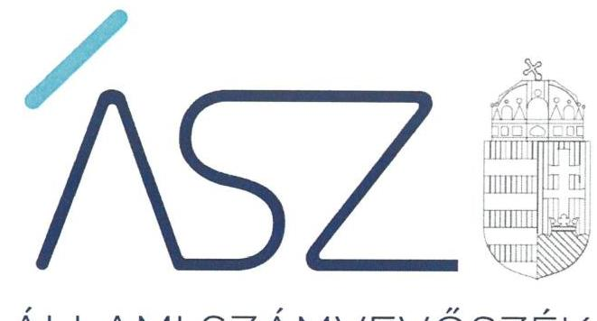
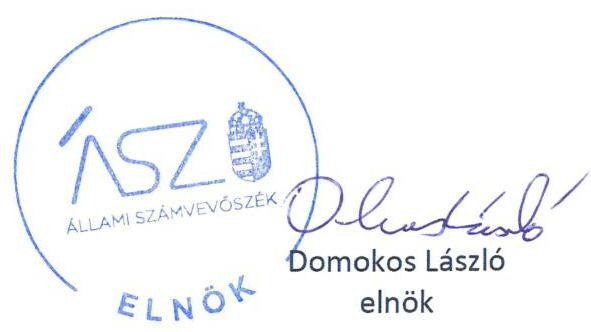
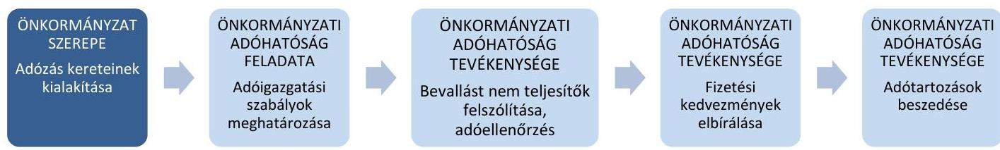
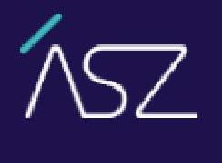
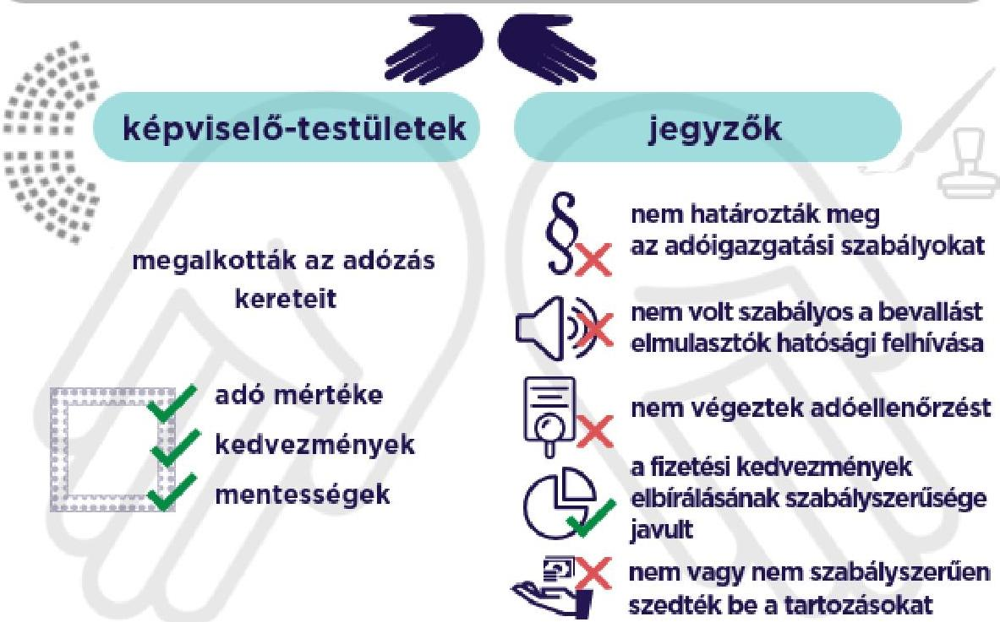

ÁLLAMI SZÁMVEVŐSZÉK

# JELENTÉS 

Önkormányzatok ellenőrzése

Az önkormányzatok helyi iparűzési adóval kapcsolatos tevékenységének ellenőrzése
2022.

22038
www.asz.hu

---

ÁLLAMI SZÁMVEVŐSZÉK

# JELENTÉS 

Önkormányzatok ellenőrzése

Az önkormányzatok helyi iparűzési adóval kapcsolatos tevékenységének ellenőrzése
2022. 06 . hó 24. nap

22038
www.asz.hu

---

Jelentéseink az Országgyúlés számítógépes hálózatán és az interneten a www.asz.hu címen is olvashatóak.

## AZ ELLENŐRZÉST VEZETTE ÉS A VÉGREHAJTÁSÁÉRT FELELŐS:

SALAMON ILDIKÓ ellenőrzésvezető
DR. BENEDEK MÁRIA ellenőrzésvezető
DR. NAGY IMRE ellenőrzésvezető
DR. DOMOKOS MAGDOLNA ellenőrzésvezető
FEKETE-NAGY ANDRÁS ellenőrzésvezető
DR. GYŐRI GABRIELLA MÁRTA ellenőrzésvezető
ÓDOR ZOLTÁN TAMÁS ellenőrzésvezető
BAJNAI ZSUZSANNA ellenőrzésvezető

## A PROGRAM ÖSSZEÁLLÍTÁSÁÉRT FELELŐS:

HORVÁTH TÍMEA program készítéséért felelős vezető

DR. KÁDÁR KRISZTA program készítéséért felelős vezető

IKTATÓSZÁM: EL-3731-001/2022.
TÉMASZÁM: 2578
ELLENŐRZÉS-AZONOSÍTÓ SZÁM: V0921

---

# TARTALOMJEGYZÉK 

■ ÖSSZEGZÉS ..... 5
■ AZ ELLENŐRZÉS JELENTŐSÉGE, AKTUALITÁSA, TÁRSADALMI SZEREPE, SZEMPONTJAI ..... 9
■ AZ ELLENŐRZÉS TERÜLETE ..... 10
■ AZ ELLENŐRZÉS HATÓKÖRE ÉS MÓDSZEREI ..... 11
■ MELLÉKLETEK ..... 13
I. sz. melléklet: Ellenőrzött szervezetek ..... 13
II. sz. melléklet: A nagyobb adóbevétellel rendelkező 36 ellenőrzött szervezet ellenőrzés szempontjából lényeges adatai ..... 15
III. sz. melléklet: A nagyobb adóbevétellel rendelkező 36 ellenőrzött szervezet ellenőrzési megállapítások ellenőrzött szervezetenként ..... 19
IV. sz. melléklet: A kisebb adóbevétellel rendelkező 30 ellenőrzött szervezet ellenőrzés szempontjából lényeges adatai ..... 44
V. sz. melléklet: A kisebb adóbevétellel rendelkező 30 ellenőrzött szervezet ellenőrzési megállapítások ellenőrzött szervezetenként ..... 48
VI. sz. melléklet: Értelmező szótár ..... 69
■ FÜGGELÉK: ÉSZREVÉTELEK ..... 71
■ RÖVIDÍTÉSEK JEGYZÉKE ..... 89

---

.

---

# ÖSSZEGZÉS 

Nem töltötték be a szerepüket az önkormányzati adóhatóságok a helyi iparúzési adó bevételek beszedésében, mivel a 2018-2020. években az adóigazgatási feladatok ellátása során nem gondoskodtak a jogszabályi előírások betartásáról és az önkormányzat adórendeletében foglaltak érvényre juttatásáról.
Az önkormányzati adóhatóságok nem tettek meg mindent annak érdekében, hogy a rendelkezésükre álló, az adóbevételek realizálása érdekében lehetővé tett eszközökkel a helyi iparúzési adó bevételeket eredményesen realizálják.

## Értékelések

A helyi iparúzési adóból származó bevételek rendelkezésre állása akkor lehet biztosított az önkormányzati feladatok ellátásához, ha mind az önkormányzat, mind az önkormányzati adóhatóságként jogszabályban kijelölt jegyző törvényesen látja el az adózáshoz kapcsolódó feladatait, és ezzel betölti a szerepét a helyi iparúzési adózás tekintetében. Erre figyelemmel az ellenőrzés az önkormányzatok és az önkormányzati adóhatóságok tevékenységének azon lényeges területeit értékelte, amelyek meghatározók a helyi iparúzési adó kivetésének és beszedésének törvényessége, és az adóbevételek realizálása szempontjából.

## AZ ELLENŐRZÉS ÉRTÉKELÉSÉNEK REPREZENTATÍV JELLEGE:

- A nagyobb adóbevétellel - az összes magyarországi helyi iparúzési adó bevétel 80\%-ával - rendelkező 121 önkormányzat és adóhatóság közül reprezentatív mintaként kiválasztott és ellenőrzött 36 önkormányzat és önkormányzati adóhatóság értékelése az általuk reprezentált 121 önkormányzat és adóhatóság értékelését is jelenti.
- A kisebb adóbevétellel - az összes magyarországi helyi iparúzési adó bevétel 20\%-ával - rendelkező 2744 önkormányzat és adóhatóság közül reprezentatív mintaként kiválasztott és ellenőrzött 30 önkormányzat és önkormányzati adóhatóság értékelése az általuk reprezentált 2744 önkormányzat és adóhatóság értékelését is jelenti, az alábbi területek kivételével: fizetési kedvezmények és az adótartozások beszedése területén (a kapcsolódó adóhatósági intézkedések alacsony száma miatt az értékelés kizárólag a 30 ellenőrzött önkormányzati adóhatóságra vonatkozik).

## Az iparúzési adóbevétellel rendelkező, összesen 2865 önkormányzatra és önkormányzati adóhatóságra vonatkozó reprezentatív értékelés

AZ ADÓZÁS KERETEIT az önkormányzatok 2018-2020. években a törvényi előírásokkal összhangban alakították ki, az adórendeletben a jogszabályi előírásokat betartva döntöttek a helyi iparúzési adó mértékéről, az adókedvezményekről és mentességekről.

AZ ADÓIGAZGATÁSI SZABÁLYOKAT a helyi iparúzési adó beszedéséhez az önkormányzati adóhatóságok 2018-2020. években nem határozták meg. Az adóigazgatás során ellátandó feladatok rögzítése, ezekhez kapcsolódóan az adóhatóságnál a felelősségek és a folyamatok meghatározása a helyi iparúzési adó beszedésének

---

alapvető feltétele. Ezek hiánya kockázatot jelent az önkormányzati adóhatóságnál a helyi iparűzési adóval kapcsolatos feladatok maradéktalan és szabályos ellátására, továbbá arra, hogy az adóigazgatási tevékenységét minden érintett számára azonos módon, befolyástól mentesen végezze.

A BEVALLÁSI KÖTELEZETTSÉGÜKET NEM TELJESÍTŐ adózókat az önkormányzati adóhatóságok jogszabályi előírás ellenére nem hívták fel vagy nem szabályszerűen hívták fel a bevallási kötelezettségük jogszerű teljesítésére 2018-2020. években. Ezáltal az adóhatóságok nem gondoskodtak a képviselő-testület által elfogadott adórendeletben foglaltak érvényre juttatásáról, és arról, hogy a helyi iparűzési adó bevételek az önkormányzati feladatok ellátásához rendelkezésre álljanak. Adóellenőrzést nem végeztek az önkormányzati adóhatóságok, annak ellenére, hogy a jogszabályban biztosított ellenőrzési jogkör gyakorlása hozzájárulhat a helyi iparűzési adóhoz kapcsolódó adózói kötelezettségek teljesítésének erősítéséhez és a helyi adóból származó bevételek realizálásához.

# Az összes helyi iparűzési adó bevétel 80\%-ával rendelkező 121 önkormányzatra és önkormányzati adóhatóságra vonatkozó reprezentatív értékelés 

A FIZETÉSI KEDVEZMÉNYEKRŐL az önkormányzati adóhatóságok 2018-ban nem szabályszerűen, 2019-ben és 2020-ban szabályszerűen döntöttek. Az adóhatóságnál a fizetési kedvezmények iránti kérelmek szabályos elbírálása mind az adóbevételek beszedése, mind az adózók azonos mércével történő, befolyástól mentes kezelése szempontjából kiemelten fontos.

A HELYI IPARÚZÉSI ADÓ TARTOZÁSOK beszedése érdekében az önkormányzati adóhatóságok nem intézkedtek szabályszerűen a 2018-2020. években. Az adóhatóságok ezáltal nem gondoskodtak a képviselőtestület által elfogadott adórendeletben foglaltak érvényre juttatásáról, és arról, hogy a helyi iparűzési adó bevételek az önkormányzati feladatok ellátásához rendelkezésre álljanak.

## Az összes helyi iparűzési adó bevétel 20\%-ával rendelkező 2744 önkormányzat és önkormányzati adóhatóság közül kiválasztott, 30 ellenőrzött önkormányzati adóhatóságra vonatkozó értékelés

A FIZETÉSI KEDVEZMÉNYEKRŐL döntő, ellenőrzött önkormányzati adóhatóságok 50\%-a a jogszabályi előírásokkal összhangban járt el a helyi iparűzési adóhoz kapcsolódó fizetési kedvezményeknél 2018-ban. A szabályszerűen döntő adóhatóságok aránya 2019-re 66\%-ra, 2020-ra 85\%-ra nőtt. Az adóhatóságnál a fizetési kedvezmények iránti kérelmek szabályos elbírálása mind az adóbevételek beszedése, mind az adózók azonos mércével történő, befolyástól mentes kezelése szempontjából kiemelten fontos.

A HELYI IPARÚZÉSI ADÓ TARTOZÁST nyilvántartó, ellenőrzött önkormányzati adóhatóságok 77\%-a 2018-ban, 70\%-a 2019-ben és 80\%-a 2020-ban nem intézkedett vagy nem szabályszerűen intézkedett az adótartozások beszedése érdekében. Ezek az adóhatóságok nem gondoskodtak a képviselő-testület által elfogadott adórendeletben foglaltak érvényre juttatásáról, és arról, hogy a helyi iparűzési adó bevételek az önkormányzati feladatok ellátásához rendelkezésre álljanak.

## Az iparűzési adóbevéteIlel rendelkező, összesen 2865 önkormányzatra és önkormányzati adóhatóságra vonatkozó reprezentatív értékelés a teljesítmény ellenőrzés tekintetében

A TELJESÍTMÉNY-ELLENŐRZÉS azt értékelte, hogy az önkormányzati adóhatóság tevékenysége hozzájárult-e a helyi iparűzési adóbevételek realizálásához, az adókötelezettségek teljesítéséhez.

Az önkormányzatok ADÓHATÓSÁGI TEVÉKENYSÉGÜK keretében az adóbevételek minél eredményesebb teljesülését ellenőrzés lefolytatásával, támogató eljárás keretében az adózók önellenőrzésre történő ösztönzésével, a hibák, hiányosságok orvoslása érdekében az adózót érintő felhívással, továbbá az adózók kérelme alapján fizetési kedvezmény biztosításával, és végrehajtási cselekmények lefolytatásával mozdíthatták elő.

Az értékelt 2018-2020. időszakban a helyi iparűzési adóval kapcsolatos tevékenységgel kapcsolatban jellemző volt, az önkormányzati adóhatóságok nem határoztak meg CÉLOKAT, elvárásokat, ily módon nem járultak hozzá a helyi iparűzési adóbevételek teljesítésének eredményességéhez. Az önkormányzati adóhatóságok tevékenységük keretében jellemzően nem biztosították, hogy a helyi iparűzési adó vonatkozásában kockázatelemzési tevékenységet,

---

ellenőrzési tevékenységet végezzenek, továbbá támogató eljárás keretében végzett cselekménnyel járuljanak hozzá az iparűzési adóbevételek realizálásához.

Az adóhatósági tevékenység keretében rendelkezésre álló eszközök közül a nagyobb helyi iparűzési adó bevétellel rendelkező önkormányzati adóhatóságok fizetési kedvezmény biztosításával és hátralékkezelési tevékenység keretében végrehajtási cselekménnyel mozdították elő az adóbevételek realizálását, az adóbevételek teljesítését. A FIZETÉSI KEDVEZMÉNYt biztosító önkormányzati adóhatóságok negyede esetében tevékenységük eredményessége kis mértékben erősödött az ellenőrzött időszakban, a VÉGREHAJTÁSI CSELEKMÉNYt foganatosító önkormányzatok kevesebb, mint felénél erősödött az eredményesség a 2018. és 2019. év viszonylatában, mely arány kis mértékben emelkedett a 2020. évben. A kisebb helyi iparűzési adó bevétellel rendelkező önkormányzati adóhatóságok végrehajtási cselekménnyel nem támogatták az adóbevételek realizálását.

Az önkormányzati adóhatóságok a helyi iparűzési adóval kapcsolatos tevékenységük ellátásához a humán erőforrást biztosították.

# Következtetések 

BETÖLTÖTTÉK SZEREPÜKET AZ ÖNKORMÁNYZATOK a helyi iparűzési adózás kereteinek kialakítása tekintetében. A helyi iparűzési adót kivető önkormányzatok törvényesen éltek az Alaptörvényben foglalt lehetőséggel, amely szerint a helyi önkormányzatok a törvények keretei között döntenek a helyi adók fajtájáról és mértékéről.

## NEM TÖLTÖTTÉK BE A SZEREPÜKET AZ ÖNKORMÁNYZATI ADÓHATÓSÁGOK

a helyi iparűzési adóhoz kapcsolódó adóigazgatási tevékenységek tekintetében. Az önkormányzati adóhatóságok tevékenységében feltárt hiányosságok kockázatot jelentenek a képviselő-testületek által megállapított helyi iparűzési adó és a kapcsolódó mulasztási bírság bevételek beszedésére és rendelkezésre állására az önkormányzati feladatok ellátásához. Emellett a feltárt hiányosságok kockázatot jelentenek arra is, hogy az önkormányzati adóhatóságok a helyi adókkal kapcsolatos adóigazgatási tevékenységüket az integritás elvű feladatellátást szem előtt tartva, minden érintett számára azonos módon, befolyástól mentesen végezzék.

AZ ÖNKORMÁNYZATI ADÓHATÓSÁGOK NEM TETTEK MEG MINDENT annak érdekében, hogy a rendelkezésükre álló eszközök eredményes felhasználása által a helyi iparűzési adó bevételeket realizálják. Az önkormányzatok az adóhatósági tevékenységgel kapcsolatos feladatellátásuk során a 2018-2020. években jellemző fizetési kedvezmények biztosításán és hátralékkezelési tevékenységen túl, további eszközök alkalmazása kockázatelemzés, ellenőrzés és támogató eljárás lefolytatása - a helyi iparűzési adóbevételek eredményesebb beszedését eredményezhette volna. A helyi iparűzési adóból származó bevételek realizálása az önkormányzati feladatok finanszírozása szempontjából volt lényeges.

## TOVÁBBFEJLESZTÉSRE JAVASOLT A VÉGREHAJTÁS KONTROLLJAINAK KI-

ÉPÍTÉSE, mivel az ellenőrzött területen a belső irányítási és kontrollrendszer nem épült ki, nem biztosította a feladatok szabályszerű és eredményes végrehajtását.

FELVETŐDHET a helyi iparűzési adóhoz kapcsolódó adóigazgatási tevékenységek rendszerszintű felülvizsgálatának indokoltsága az önkormányzati adóhatóságok tevékenységében azonosított kockázatok alapján.

---

# A számvevőszék ellenőrizte, hogy az önkormányzatok hogyan bánnak a helyi iparűzési adóval

## 2018-2020. évek

## Jó kezekben van a helyi iparűzési adó?

### Képviselő-testületek

- Megalkották az adózás
- Kereteit
- Adó mértéke
- Kedvezmények
- Mentességek

### Jegyzők

- Nem határozták meg az adóigazgatási szabályokat
- Nem volt szabályos a bevallást elmulasztók hatósági felhívása
- Nem végeztek adóellenőrzést
- A fizetési kedvezmények elbírálásának szabályszerűsége javult
- Nem vagy nem szabályszerűen szedték be a tartozásokat

### Eredményes volt az önkormányzati adóhatóságok tevékenysége?

- Biztosították a humán-erőforrást
- Javult a teljesítés a nagyobb adóbevételű önkormányzatoknál
- Fizetési kedvezményekkel
- Végrehajtásokkal
- Nem határozták meg a célokat, elvárásokat
- Nem végeztek kockázatelemzést
- Nem végeztek ellenőrzést
- Nem folytattak támogató eljárást

## A hiányosságok veszélyeztethetiik az önkormányzati feladatok finanszírozását.

---

# AZ ELLENŐRZÉS JELENTŐSÉGE, AKTUALITÁSA, TÁRSADALMI SZEREPE, SZEMPONTJAI 

Magyarország Alaptörvénye kimondja, hogy a helyi közügyek intézése és a helyi közhatalom gyakorlása érdekében helyi önkormányzatok működnek hazánkban. Az önkormányzatok alapvető feladata a helyi közszolgáltatások folyamatos biztosítása, ehhez pedig fontos, hogy fenntartható költségvetéssel rendelkezzenek. A feladatnak a helyi sajátosságokhoz és igényekhez igazítható ellátása elengedhetetlenné teszi az önkormányzatok önálló gazdálkodásának a megteremtését, aminek egyik eszköze a helyi adók rendszere. Az Alaptörvény rögzíti, hogy a helyi önkormányzatok a törvények keretei között döntenek a helyi adók fajtájáról és mértékéről.

A helyi adózást érintő kérdések nagy társadalmi relevanciával bírnak, hiszen az önkormányzatok gazdálkodásában mind társadalompolitikai jelentősége, mind volumene miatt fontos szerepet tölt be a helyi adóztatás. A helyi adók alkalmazásának lehetőségével a települési önkormányzatok 99,3\%-a élt 2019-ben. Az önkormányzatok költségvetési bevételeinek mintegy egyharmadát tették ki a helyi adókból származó bevételek. A helyi adóbevételeken belül a legnagyobb súlyt (közel 80\%-ot) a helyi iparűzési adó képviselte. Az önkormányzatok által beszedett helyi adók nem csak bevételt jelentenek, hanem kiadás formájában megjelennek a vállalkozások, háztartások költségvetésében is.

A helyi adóztatás sokrétű, szakértelmet igénylő feladat, amely magában foglalja az önkormányzat részéről az adó mértékének meghatározását, és az adókedvezmények, adómentességek megállapítását, valamint a jegyző, mint önkormányzati adóhatóság részéről az adó beszedését, az adóellenőrzést és a hátralékok behajtását. Minden érintett érdeke, hogy ez az adóztatási tevékenység összhangban legyen a jogszabályi előírásokkal, biztosítsa az önkormányzat feladatellátáshoz szükséges bevételeket, emellett a helyben működő vállalkozások fennmaradása és a lakosság fizetőképessége is biztosított legyen. Emellett mind az önkormányzat, mind az adózók szempontjából lényeges, hogy az önkormányzati adóhatóság a helyi adókkal kapcsolatos adóigazgatási tevékenységét minden érintett számára azonos módon, befolyástól mentesen végezze.

Az iparűzési adó jelentős bevételi forrást jelent a helyi önkormányzatok számára, ezért az ellenőrzés célja az önkormányzatok adóztatási tevékenységén belül az iparűzési adóval kapcsolatos tevékenység szabályszerűségének, eredményességének és hatékonyságának értékelése.

Az ÁSZ ellenőrzése az esetleges hiányosságok feltárásával hozzájárul a helyi önkormányzatok, önkormányzati adóhatóságok jogkövető magatartásához, és rámutathat a helyi iparűzési adóból származó önkormányzati bevételek rendelkezésre állását érintő adóztatási kockázatokra.

---

# AZ ELLENŐRZÉS TERÜLETE 

## 66 önkormányzat és önkormányzati adóhatóság

Magyarország Alaptörvénye értelmében a helyi önkormányzat a helyi közügyek intézése körében törvény keretei között dönt a helyi adók fajtájáról és mértékéről. Az Mötv. ${ }^{1}$ rögzíti, hogy a helyi adóval kapcsolatos feladatok ellátása a helyi önkormányzatok feladata. A Hatásköri tv. ${ }^{2}$, valamint a Htv. ${ }^{3}$ értelmében a helyi adók bevezetéséről a települési önkormányzat képviselőtestülete dönt.

A Htv. rögzíti, hogy az önkormányzatok adómegállapítási joga kiterjed az adó bevezetésére, a már bevezetett adó hatályon kívül helyezésére, illetőleg módosítására, az adó mértékének a törvényi keretek közötti megállapítására, a törvényben meghatározott mentességeken, kedvezményeken túli további mentességek, kedvezmények biztosítására, valamint a Htv., az Art. ${ }^{4}$, az Air. ${ }^{5}$ keretei között az adózás részletes szabályainak meghatározására. A Hatásköri tv. és az Air. előírja, hogy adóügyekben elsőfokú hatósági jogkörben a település jegyzője, mint önkormányzati adóhatóság jár el.

Az ellenőrzött 66 önkormányzat és önkormányzati adóhatóság lényeges adatait a II-III. számú melléklet mutatja be. Nógrádmarcal Község Önkormányzata a teljesítmény-ellenőrzés feltételeit nem biztosította.

---

# AZ ELLENŐRZÉS HATÓKÖRE ÉS MÓDSZEREI 

## Az ellenőrzés típusa

Megfelelőségi és teljesítmény-ellenőrzés.

## Az ellenőrzött időszak

Az ellenőrzött időszak a 2018. január 1.-2020. december 31. közötti időszak.

## Az ellenőrzés tárgya

Az önkormányzatok helyi iparúzési adóval kapcsolatos tevékenységének ellátása.

## Az ellenőrzött szervezet

Az I. számú mellékletben felsorolt önkormányzatok és önkormányzati adóhatóságok

## Az ellenőrzés jogalapja

Az ellenőrzés jogszabályi alapját az ÁSZ törvény ${ }^{6}$ 5. § (2), (6) és (8) bekezdései képezik.

## Az ellenőrzés módszerei

Az ellenőrzést az ellenőrzési program szempontjai, az ellenőrzött időszakban hatályos jogszabályok, az ellenőrzés általános szakmai szabályai és az ellenőrzésre irányadó ÁSZ módszertanok alapján végzi az ÁSZ.

Az ellenőrzés ideje alatt az ellenőrzött szervezetekkel történő kapcsolattartást az ÁSZ SZMSZ-ének vonatkozó előírásai alapján biztosítja az ÁSZ.

Az ellenőrzési kérdések megválaszolásához szükséges bizonyítékok megszerzése az ellenőrzött szervezetek által rendelkezésre bocsátott dokumentumokra, adatokra alapozva megfigyelés, szemle (szemrevételezés), kérdésfeltevés (információkérés), mintavételezés, valamint elemző eljárás útján történik. Az ellenőrzési bizonyítékként felhasználható adatforrások közé tartoznak egyrészt az ellenőrzési program részletes szempontjainál felsorolt adatforrások, másrészt minden egyéb - az ellenőrzés folyamán feltárt, az ellenőrzés szempontjából információt tartalmazó - dokumentum.

---

Az ellenőrzés végrehajtása során a rendelkezésre álló dokumentumokat bizonyosság szerint csoportosítjuk és vesszük figyelembe az ellenőrzési értékelések és következtetések levonása során.

Az ellenőrzés lefolytatásához az ellenőrzött szervezetek tanúsítványok elektronikus kitöltésével, valamint az ÁSZ által kért dokumentumok elektronikus megküldésével szolgáltatnak adatokat, amelyek valódiságát és teljes körűségét az ellenőrzött szervezetek vezetője által tett teljességi és hitelességi nyilatkozat igazolja. A rendelkezésre bocsátott adatok, információk kontrollja az ellenőrzés keretében történik.

Az egyes adóhatósági tevékenységek (ellenőrzés; fizetési kedvezmények engedélyezése; hátralékok beszedése) szabályszerűségének ellenőrzésénél mintavételezést alkalmaz az ÁSZ. A mintatételek kiválasztása egyszerű véletlen mintavételi eljárással történik. A minta tételeinek értékelése „szabályszerű", ha a minta ellenőrzésének eredménye alapján 95\%-os bizonyossággal a teljes sokaságban az átlagos hibaarány nem haladja meg a 10\%-ot, „nem szabályszerű", ha nagyobb, mint 10\%.

Az Állami Számvevőszék az ellenőrzés során statisztikai ellenőrzési módszereket alkalmazott.

A nagyobb adóbevétellel - az összes magyarországi helyi iparűzési adó bevétel 80\%-ával - rendelkező 121 önkormányzat és önkormányzati adóhatóság közül reprezentatív mintaként 36 önkormányzat és önkormányzati adóhatóság került kiválasztásra. Így az ellenőrzött, reprezentatív mintaként kiválasztott 36 önkormányzat és önkormányzati adóhatóság reprezentálja azt a 121 önkormányzatot és adóhatóságot, amelyekhez az összes magyarországi helyi iparűzési adó bevétel 80\%-a folyt be 2020-ban. Mindezek alapján az ellenőrzés értékelése nem csak az ellenőrzött 36 önkormányzatra és adóhatóságra vonatkozik, hanem az általuk reprezentált 121 önkormányzat és adóhatóság értékelését is jelenti.

A kisebb adóbevétellel - az összes magyarországi helyi iparűzési adó bevétel 20\%-ával - rendelkező 2744 önkormányzat és önkormányzati adóhatóság közül reprezentatív mintaként 30 önkormányzat és önkormányzati adóhatóság került kiválasztásra. Így az ellenőrzött, reprezentatív mintaként kiválasztott 30 önkormányzat és önkormányzati adóhatóság reprezentálja azt a 2744 önkormányzatot és adóhatóságot, amelyekhez az öszszes magyarországi helyi iparűzési adó bevétel 20\%-a folyt be 2020-ban. Mindezek alapján az ellenőrzés értékelése nem csak az ellenőrzött 30 önkormányzatra és adóhatóságra vonatkozik, hanem az általuk reprezentált 2744 önkormányzat és adóhatóság értékelését is jelenti. Ugyanakkor az ellenőrzött adóhatóságoknál a fizetési kedvezmények és az adótartozások beszedése iránti intézkedések alacsony száma miatt ezeken a területeken az értékelés nem volt kivetíthető a 2744 adóhatóságra, hanem kizárólag a 30 ellenőrzött önkormányzati adóhatóságra vonatkozik.

Azokon az ellenőrzött területeken, ahol a reprezentatív mintaként kiválasztott 36 önkormányzat és önkormányzati adóhatóság által reprezentált megállapítások a 121 önkormányzat és adóhatóság vonatkozásában megegyeztek a reprezentatív mintaként kiválasztott 30 önkormányzat és önkormányzati adóhatóság által reprezentált 2744 önkormányzat és adóhatóság megállapításaival, az eredmény az iparűzési adó bevétellel rendelkező valamennyi, 2865 önkormányzatra és önkormányzati adóhatóságra vonatkozik.

---

# MELLÉKLETEK

I. SZ. MELLÉKLET: ELLENŐRZÖTT SZERVEZETEK

|  Ellenőrzött önkormányzat | Hivatal  |
| --- | --- |
|  1. ALSÓNÉMEDI NAGYKÖZSÉG ÖNKORMÁNYZATA | ALSÓNÉMEDI POLGÁRMESTERI HIVATAL  |
|  2. BAJA MEGYEI JOGÚ VÁROS ÖNKORMÁNYZAT | BAJA MEGYEI JOGÚ VÁROS POLGÁRMESTERI HIVATALA  |
|  3. BALASSAGYARMAT VÁROS ÖNKORMÁNYZATA | BALASSAGYARMATI KÖZÖS ÖNKORMÁNYZATI HIVATAL  |
|  4. BIATORBÁGY VÁROS ÖNKORMÁNYZATA | BIATORBÁGYI POLGÁRMESTERI HIVATAL  |
|  5. BOLDVA KÖZSÉG ÖNKORMÁNYZATA | BOLDVAI KÖZÖS ÖNKORMÁNYZATI HIVATAL  |
|  6. BUDAJENŐ KÖZSÉG ÖNKORMÁNYZATA | BUDAJENŐI KÖZÖS ÖNKORMÁNYZATI HIVATAL  |
|  7. BUDAÖRS VÁROS ÖNKORMÁNYZATA | BUDAÖRSI POLGÁRMESTERI HIVATAL  |
|  8. BUDAPEST FÖVÁROS ÖNKORMÁNYZATA | BUDAPEST FÖVÁROS FÖPOLGÁRMESTERI HIVATAL  |
|  9. CSÉCSE KÖZSÉG ÖNKORMÁNYZATA | ECSEGI KÖZÖS ÖNKORMÁNYZATI HIVATAL  |
|  10. CSOMBÁRD KÖZSÉGI ÖNKORMÁNYZAT | JUTAI KÖZÖS ÖNKORMÁNYZATI HIVATAL  |
|  11. CSÖMÖR NAGYKÖZSÉG ÖNKORMÁNYZATA | CSÖMÖRI POLGÁRMESTERI HIVATAL  |
|  12. DOROG VÁROS ÖNKORMÁNYZATA | DOROGI POLGÁRMESTERI HIVATAL  |
|  13. DRÁVAFOK KÖZSÉG ÖNKORMÁNYZATA | SELLYEI KÖZÖS ÖNKORMÁNYZATI HIVATAL  |
|  14. DUNAEGYHÁZA KÖZSÉG ÖNKORMÁNYZATA | APOSTAGI KÖZÖS ÖNKORMÁNYZATI HIVATAL  |
|  15. EGER MEGYEI JOGÚ VÁROS ÖNKORMÁNYZATA | EGER MEGYEI JOGÚ VÁROS POLGÁRMESTERI HIVATAL  |
|  16. EGYHÁZASKOZÁR KÖZSÉG ÖNKORMÁNYZAT | EGYHÁZASKOZÁRI KÖZÖS ÖNKORMÁNYZATI HIVATAL  |
|  17.ERDŐHORVÁTI KÖZSÉGI ÖNKORMÁNYZAT | TOLCSVAI KÖZÖS ÖNKORMÁNYZATI HIVATAL  |
|  18. ESZTERGOM MEGYEI JOGÚ VÁROS ÖNKORMÁNYZATA | ESZTERGOMI KÖZÖS ÖNKORMÁNYZATI HIVATAL  |
|  19. FEHÉRGYARMAT VÁROS ÖNKORMÁNYZATA | FEHÉRGYARMATI POLGÁRMESTERI HIVATAL  |
|  20. FELSÖDOBSZA KÖZSÉG ÖNKORMÁNYZAT | ABAÚJSZÁNTÓI KÖZÖS ÖNKORMÁNYZATI HIVATAL  |
|  21. FELSÖPÁHOK KÖZSÉG ÖNKORMÁNYZATA | ZALACSÁNYI KÖZÖS ÖNKORMÁNYZATI HIVATAL  |
|  22. FÓT VÁROS ÖNKORMÁNYZATA | FÓTI KÖZÖS ÖNKORMÁNYZATI HIVATAL  |
|  23. GÖDÖLLŐ VÁROS ÖNKORMÁNYZATA | GÖDÖLLŐI POLGÁRMESTERI HIVATAL  |
|  24. GYÖNGYÖS VÁROSI ÖNKORMÁNYZAT | GYÖNGYÖSI KÖZÖS ÖNKORMÁNYZATI HIVATAL  |
|  25. GYŐR MEGYEI JOGÚ VÁROS ÖNKORMÁNYZATA | GYŐR MEGYEI JOGÚ VÁROS POLGÁRMESTERI HIVATALA  |
|  26. HAJDÚBÖSZÖRMÉNY VÁROS ÖNKORMÁNYZATA | HAJDÚBÖSZÖRMÉNYI POLGÁRMESTERI HIVATAL  |
|  27. HALASTÓ KÖZSÉGI ÖNKORMÁNYZAT | MOLNASZECSÖDI KÖZÖS ÖNKORMÁNYZATI HIVATAL  |
|  28. HERNÁDVÉCSE KÖZSÉG ÖNKORMÁNYZATA | NOVAJIDRÁNYI KÖZÖS ÖNKORMÁNYZATI HIVATAL  |
|  29. HÓDMEZŐVÁSÁRHELY MEGYEI JOGÚ VÁROS ÖNKORMÁNYZATA | HÓDMEZŐVÁSÁRHELY MEGYEI JOGÚ VÁROS POLGÁRMESTERI HIVATALA  |
|  30. ISTENMEZEJE KÖZSÉG ÖNKORMÁNYZATA | ISTENMEZEJEI KÖZÖS ÖNKORMÁNYZATI HIVATAL  |
|  31. JÁSZBERÉNY VÁROSI ÖNKORMÁNYZAT | JÁSZBERÉNYI POLGÁRMESTERI HIVATAL  |
|  32. JÁSZFÉNYSZARU VÁROS ÖNKORMÁNYZATA | JÁSZFÉNYSZARUI KÖZÖS ÖNKORMÁNYZATI HIVATAL  |
|  33. KECSKÉD KÖZSÉG ÖNKORMÁNYZATA | KECSKÉD KÖZSÉG POLGÁRMESTERI HIVATALA  |
|  34. KECSKEMÉT MEGYEI JOGÚ VÁROS ÖNKORMÁNYZATA | KECSKEMÉT MEGYEI JOGÚ VÁROS POLGÁRMESTERI HIVATALA  |

---

|  Ellenőrzött önkormányzat | Hivatal  |
| --- | --- |
|  35. KEMENESSZENTPÉTER KÖZSÉG ÖNKORMÁNYZATA | NEMESGÖRZSÖNYI KÖZÖS ÖNKORMÁNYZATI HIVATAL  |
|  36. KESZÖHIDEGKÚT KÖZSÉG ÖNKORMÁNYZATA | REGÖLYI KÖZÖS ÖNKORMÁNYZATI HIVATAL  |
|  37. KESZTHELY VÁROS ÖNKORMÁNYZATA | KESZTHELYI POLGÁRMESTERI HIVATAL  |
|  38. KISKÖRÖS VÁROS ÖNKORMÁNYZATA | KISKÖRÖSI POLGÁRMESTERI HIVATAL  |
|  39. KISKUNHALAS VÁROS ÖNKORMÁNYZATA | KISKUNHALASI KÖZÖS ÖNKORMÁNYZATI HIVATAL  |
|  40. KOMÁROM VÁROS ÖNKORMÁNYZATA | KOMÁROMI POLGÁRMESTERI HIVATAL  |
|  41. MÁTRASZELE KÖZSÉG ÖNKORMÁNYZATA | MÁTRASZELEI KÖZÖS ÖNKORMÁNYZATI HIVATAL  |
|  42. MÉLYKÚT VÁROS ÖNKORMÁNYZAT | MÉLYKÚTI POLGÁRMESTERI HIVATAL  |
|  43. MEZŐKÖVESD VÁROS ÖNKORMÁNYZATA | MEZŐKÖVESDI KÖZÖS ÖNKORMÁNYZATI HIVATAL  |
|  44. MISKOLC MEGYEI JOGÚ VÁROS ÖNKORMÁNYZATA | MISKOLC MEGYEI JOGÚ VÁROS POLGÁRMESTERI HIVATALA  |
|  45. MOHORA KÖZSÉG ÖNKORMÁNYZATA | CSERHÁTSURÁNYI KÖZÖS ÖNKORMÁNYZATI HIVATAL  |
|  46. MONORIERDŐ KÖZSÉG ÖNKORMÁNYZATA | MONORIERDŐI POLGÁRMESTERI HIVATAL  |
|  46. MÓR VÁROSI ÖNKORMÁNYZAT | MÓRI POLGÁRMESTERI HIVATAL  |
|  48. NÁDUDVAR VÁROS ÖNKORMÁNYZATA | NÁDUDVARI POLGÁRMESTERI HIVATAL  |
|  49. NAGYVENYIM NAGYKÖZSÉG ÖNKORMÁNYZATA | NAGYVENYIMI POLGÁRMESTERI HIVATAL  |
|  50. NÓGRÁDMARCAL KÖZSÉG ÖNKORMÁNYZATA | SZÜGYI KÖZÖS ÖNKORMÁNYZATI HIVATAL  |
|  51. NYERGESÚJFALU VÁROS ÖNKORMÁNYZATA | NYERGESÚJFALUI POLGÁRMESTERI HIVATAL  |
|  52. NYÍRBÁTOR VÁROS ÖNKORMÁNYZATA | NYÍRBÁTORI POLGÁRMESTERI HIVATAL  |
|  53. OROSHÁZA VÁROS ÖNKORMÁNYZATA | OROSHÁZI POLGÁRMESTERI HIVATAL  |
|  54. PÁTY KÖZSÉG ÖNKORMÁNYZATA | PÁTYI POLGÁRMESTERI HIVATAL  |
|  55. RAVAZD KÖZSÉG ÖNKORMÁNYZATA | ÉCSI KÖZÖS ÖNKORMÁNYZATI HIVATAL  |
|  56. SOMLÓSZŐLŐS KÖZSÉG ÖNKORMÁNYZATA | SOMLÓVÁSÁRHELYI KÖZÖS ÖNKORMÁNYZATI HIVATAL  |
|  57. SOPONYA NAGYKÖZSÉG ÖNKORMÁNYZAT | KÁLOZI KÖZÖS ÖNKORMÁNYZATI HIVATAL  |
|  58. SZIGETSZENTMIKLÓS VÁROS ÖNKORMÁNYZATA | SZIGETSZENTMIKLÓSI POLGÁRMESTERI HIVATAL  |
|  59. TATABÁNYA MEGYEI JOGÚ VÁROS ÖNKORMÁNYZATA | TATABÁNYA MEGYEI JOGÚ VÁROS POLGÁRMESTERI HIVATALA  |
|  60. TISZAKÉCSKE VÁROS ÖNKORMÁNYZATA | TISZAKÉCSKEI POLGÁRMESTERI HIVATAL  |
|  61. TÓALMÁS KÖZSÉG ÖNKORMÁNYZAT | TÓALMÁSI POLGÁRMESTERI HIVATAL  |
|  62. TOKAJ VÁROS ÖNKORMÁNYZATA | TOKAJI KÖZÖS ÖNKORMÁNYZATI HIVATAL  |
|  63. TÖRÖKSZENTMIKLÓS VÁROSI ÖNKORMÁNYZAT | TÖRÖKSZENTMIKLÓSI POLGÁRMESTERI HIVATAL  |
|  64. VÁC VÁROS ÖNKORMÁNYZAT | VÁCI POLGÁRMESTERI HIVATAL  |
|  65. ZÁKÁNYSZÉK KÖZSÉG ÖNKORMÁNYZATA | ZÁKÁNYSZÉKI POLGÁRMESTERI HIVATAL  |
|  66. ZALAGYÖMÖRÖ KÖZSÉG ÖNKORMÁNYZATA | GÓGÁNFAI KÖZÖS ÖNKORMÁNYZATI HIVATAL  |

---

II. SZ. MELLÉKLET: A NAGYOBB ADÓBEVÉTELLEL RENDELKEZŐ 36 ELLENŐRZÖTT SZERVEZET ELLENŐRZÉS SZEMPONTJÁBÓL LÉNYEGES ADATAI

| Ssz. | Önkormányzat és adóhatóság | Megye | Lakosság (fő, 2019.) | Adóalanyok száma 2018. (fő) | Adóalanyok száma 2020. (fő) | Adóbevételek összege 2018. (millió Ft) | Adóbevételek összege 2020. (millió Ft) | Adótartozások összege 2018. (millió Ft) | Adótartozások összege 2020. (millió Ft) |
| :--: | :--: | :--: | :--: | :--: | :--: | :--: | :--: | :--: | :--: |
| 1. | ALSÓNÉMEDI NAGYKÖZSÉG ÖNKORMÁNYZATA, ALSÓNÉMEDI POLGÁRMESTERI HIVATAL | Pest | 5337 | 888 | 978 | 1031,7 | 1258,7 | 35,7 | 58,7 |
| 2. | BAJA MEGYEI JOGÚ VÁROS ÖNKORMÁNYZAT, BAJA MEGYEI JOGÚ VÁROS POLGÁRMESTERI HIVATALA | Bács-Kiskun | 36041 | 4530 | 4783 | 1813,7 | 1837,9 | 140,3 | 75,8 |
| 3. | BALASSAGYARMAT VÁROS ÖNKORMÁNYZATA, BALASSAGYARMATI KÖZÖS ÖNKORMÁNYZATI HIVATAL | Nógrád | 15025 | 1720 | 1821 | 799,1 | 722,6 | 29,9 | 25,4 |
| 4. | BIATORBÁGY VÁROS ÖNKORMÁNYZATA, BIATORBÁGYI POLGÁRMESTERI HIVATAL | Pest | 13692 | 1892 | 2207 | 2527,0 | 3103,6 | 75,3 | 134,5 |
| 5. | BUDAÖRS VÁROS ÖNKORMÁNYZATA, BUDAÖRSI POLGÁRMESTERI HIVATAL | Pest | 29709 | 5936 | 6311 | 8616,8 | 8951,5 | 286,8 | 253,6 |
| 6. | BUDAPEST FÖVÁROS ÖNKORMÁNYZATA, BUDAPEST FÖVÁROS FÖPOLGÁRMESTERI HIVATAL | Budapest | 1739277 | 388630 | 427443 | 273022,2 | 267549,1 | 17677,6 | 24802,9 |
| 7. | CSÖMÖR NAGYKÖZSÉG ÖNKORMÁNYZATA, CSÖMÖRI POLGÁRMESTERI HIVATAL | Pest | 9768 | 1245 | 1488 | 1181,4 | 1164,4 | 16,2 | 68,3 |
| 8. | DOROG VÁROS ÖNKORMÁNYZATA, DOROGI POLGÁRMESTERI HIVATAL | Komá-rom-Esztergom | 12055 | 733 | 1131 | 1299,7 | 1266,2 | 42,3 | 785,2 |
| 9. | EGER MEGYEI JOGÚ VÁROS ÖNKORMÁNYZATA, EGER MEGYEI JOGÚ VÁROS POLGÁRMESTERI HIVATAL | Heves | 52660 | 8933 | 9338 | 3589,6 | 3655,0 | 204,2 | 266,7 |

---

| Ssz. | Önkormányzat és adóhatóság | Megye | Lakosság (fő, 2019.) | Adóalanyok száma 2018. (fő) | Adóalanyok száma 2020. (fő) | Adóbevételek összege 2018. (millió Ft) | Adóbevételek összege 2020. (millió Ft) | Adótartozások összege 2018. (millió Ft) | Adótartozások összege 2020. (millió Ft) |
| :--: | :--: | :--: | :--: | :--: | :--: | :--: | :--: | :--: | :--: |
| 10. | ESZTERGOM MEGYEI JOGÚ VÁROS ÖNKORMÁNYZATA, ESZTERGOMI KÖZÖS ÖNKORMÁNYZATI HIVATAL | Komá-rom-Esztergom | 29476 | 3304 | 5768 | 4477,7 | 3786,6 | 100,0 | 160,0 |
| 11. | FÖT VÁROS ÖNKORMÁNYZATA, FÖTI KÖZÖS ÖNKORMÁNYZATI HIVATAL | Pest | 20479 | 2847 | 3173 | 1206,4 | 1492,1 | 74,5 | 233,9 |
| 12. | GÖDÖLLŐ VÁROS ÖNKORMÁNYZATA, GÖDÖLLŐI POLGÁRMESTERI HIVATAL | Pest | 32043 | 3660 | 4271 | 3161,1 | 3351,4 | 175,5 | 248,5 |
| 13. | GYÖNGYÖS VÁROSI ÖNKORMÁNYZAT, GYÖNGYÖSI KÖZÖS ÖNKORMÁNYZATI HIVATAL | Heves | 29036 | 3991 | 3811 | 2597,8 | 2564,8 | 101,9 | 65,7 |
| 14. | GYŐR MEGYEI JOGÚ VÁROS ÖNKORMÁNYZATA, GYŐR MEGYEI JOGÚ VÁROS POLGÁRMESTERI HIVATALA | Győr-Mo-son-Sopron | 124685 | 15133 | 15532 | 21565,8 | 21238,5 | 155,7 | 205,5 |
| 15. | HAJDÚBŐSZÖRMÉNY VÁROS ÖNKORMÁNYZATA, HAJDÚBŐSZÖRMÉNYI POLGÁRMESTERI HIVATAL | Hajdú-Bihar | 30854 | 4619 | 4890 | 1146,4 | 0238,2 | 103,7 | 45,2 |
| 16. | HÖDMEZÖVÁSÁRHELY MEGYEI JOGÚ VÁROS ÖNKORMÁNYZATA, HÖDMEZÖVÁSÁRHELY MEGYEI JOGÚ VÁROS POLGÁRMESTERI HIVATALA | Csong-rád-Csanád | 44808 | 5028 | 5718 | 2086,7 | 2088,3 | 34,1 | 102,9 |
| 17. | JÁSZBERÉNY VÁROSI ÖNKORMÁNYZAT, JÁSZBERÉNYI POLGÁRMESTERI HIVATAL | Jász-NagykunSzolnok | 26257 | 3809 | 3825 | 2600,6 | 2502,7 | 60,8 | 80,4 |
| 18. | JÁSZFÉNYSZARU VÁROS ÖNKORMÁNYZATA, JÁSZFÉNYSZARUI KÖZÖS ÖNKORMÁNYZATI HIVATAL | Jász-NagykunSzolnok | 5818 | 333 | 433 | 1582,9 | 1956,9 | 28,5 | 50,0 |

---

| Ssz. | Önkormányzat és adóhatóság | Megye | Lakosság (fő, 2019.) | Adóalanyok száma 2018. (fő) | Adóalanyok száma 2020. (fő) | Adóbevételek összege 2018. (millió Ft) | Adóbevételek összege 2020. (millió Ft) | Adótartozások összege 2018. (millió Ft) | Adótartozások összege 2020. (millió Ft) |
| :--: | :--: | :--: | :--: | :--: | :--: | :--: | :--: | :--: | :--: |
| 19. | KECSKEMÉT MEGYEI JOGÚ VÁROS ÖNKORMÁNYZATA, KECSKEMÉT MEGYEI JOGÚ VÁROS POLGÁRMESTERI HIVATALA | Bács-Kiskun | 110621 | 12285 | 13651 | 10563,5 | 11832,1 | 193,1 | 242,5 |
| 20. | KESZTHELY VÁROS ÖNKORMÁNYZATA, KESZTHELYI POLGÁRMESTERI HIVATAL | Zala | 19334 | 2988 | 3180 | 917,6 | 935,3 | 81,9 | 74,2 |
| 21. | KISKÖRÖS VÁROS ÖNKORMÁNYZATA, KISKÖRÖSI POLGÁRMESTERI HIVATAL | Bács-Kiskun | 14202 | 2146 | 2359 | 871,4 | 902,5 | 123,1 | 83,1 |
| 22. | KISKUNHALAS VÁROS ÖNKORMÁNYZATA, KISKUNHALASI KÖZÖS ÖNKORMÁNYZATI HIVATAL | Bács-Kiskun | 28392 | 3704 | 3776 | 926,3 | 885,6 | 43,7 | 71,5 |
| 23. | KOMÁROM VÁROS ÖNKORMÁNYZATA, KOMÁROMI POLGÁRMESTERI HIVATAL | Komá-rom-Esztergom | 19248 | 2275 | 2538 | 2147,3 | 2427,6 | 76,2 | 104,8 |
| 24. | MEZÖKÖVESD VÁROS ÖNKORMÁNYZATA, MEZÖKÖVESDI KÖZÖS ÖNKORMÁNYZATI HIVATAL | Borsod-AbaújZemplén | 16437 | 1664 | 1862 | 955,1 | 1144,9 | 17,8 | 18,2 |
| 25. | MISKOLC MEGYEI JOGÚ VÁROS ÖNKORMÁNYZATA, MISKOLC MEGYEI JOGÚ VÁROS POLGÁRMESTERI HIVATALA | Borsod-AbaújZemplén | 159265 | 14219 | 15768 | 10987,8 | 10930,7 | 444,0 | 422,5 |
| 26. | MÓR VÁROSI ÖNKORMÁNYZAT, MÓRI POLGÁRMESTERI HIVATAL | Fejér | 14045 | 877 | 1015 | 1736,0 | 1520,2 | 5,9 | 8,8 |
| 27. | NÁDUDVAR VÁROS ÖNKORMÁNYZATA, NÁDUDVARI POLGÁRMESTERI HIVATAL | Hajdú-Bihar | 8767 | 1030 | 1037 | 518,7 | 748,4 | 8,1 | 7,8 |

---

| Ssz. | Önkormányzat és adóhatóság | Megye | Lakosság (fő, 2019.) | Adóalanyok száma 2018. (fő) | Adóalanyok száma 2020. (fő) | Adóbevételek összege 2018. (millió Ft) | Adóbevételek összege 2020. (millió Ft) | Adótartozások összege 2018. (millió Ft) | Adótartozások összege 2020. (millió Ft) |
| :--: | :--: | :--: | :--: | :--: | :--: | :--: | :--: | :--: | :--: |
| 28. | NYERGESÜJFALU VÁ-   ROS ÖNKORMÁNY-   ZATA, NYERGESÜJFA-   LUI POLGÁRMESTERI   HIVATAL | Komá-   rom-Esz-   tergom | 7508 | 882 | 948 | 790,6 | 840,2 | 17,3 | 10,2 |
| 29. | NYÍRBÁTOR VÁROS ÖNKORMÁNYZATA, NYÍRBÁTORI POLGÁRMESTERI HIVATAL | Szabolcs-   Szatmár-   Bereg | 12199 | 1024 | 1211 | 1565,2 | 1441,4 | 9,9 | 16,4 |
| 30. | OROSHÁZA VÁROS ÖNKORMÁNYZATA, OROSHÁZI POLGÁRMESTERI HIVATAL | Békés | 28647 | 3872 | 3946 | 1699,6 | 1661,8 | 47,3 | 21,1 |
| 31. | PÁTY KÖZSÉG ÖNKORMÁNYZATA, PÁTYI POLGÁRMESTERI HIVATAL | Pest | 7925 | 1107 | 1241 | 602,3 | 549,3 | 26,7 | 58,0 |
| 32. | SZIGETSZENTMIKLÓS VÁROS ÖNKORMÁNYZATA, SZIGETSZENTMIKLÓSI POLGÁRMESTERI HIVATAL | Pest | 39439 | 5434 | 6102 | 3622,7 | 3949,0 | 113,1 | 144,2 |
| 33. | TATABÁNYA MEGYEI JOGÚ VÁROS ÖNKORMÁNYZATA, TATABÁNYA MEGYEI JOGÚ VÁROS POLGÁRMESTERI HIVATALA | Komá-   rom-Esz-   tergom | 68698 | 7626 | 7885 | 5407,0 | 5334,1 | 382,8 | 262,9 |
| 34. | TISZAKÉCSKE VÁROS ÖNKORMÁNYZATA, TISZAKÉCSKEI POLGÁRMESTERI HIVATAL | Bács-Kis-   kun | 11453 | 1083 | 1137 | 1665,2 | 1981,7 | 37,4 | 66,1 |
| 35. | TÖRÖKSZENTMIKLÓS VÁROSI ÖNKORMÁNYZAT, TÖRÖKSZENTMIKLÓSI POLGÁRMESTERI HIVATAL | Jász-   Nagykun-   Szolnok | 20913 | 1589 | 1431 | 743,1 | 829,5 | 67,1 | 64,3 |
| 36. | VÁC VÁROS ÖNKORMÁNYZAT, VÁCI POLGÁRMESTERI HIVATAL | Pest | 34102 | 4507 | 4930 | 2468,4 | 2703,1 | 201,6 | 144,3 |

---

# 1. ALSÓNÉMEDI NAGYKÖZSÉG ÖNKORMÁNYZATA ALSÓNÉMEDI POLGÁRMESTERI HIVATAL 

A számvevőszéki ellenőrzés az alábbi megállapításokat tette:

1. 2018-2020. években a jegyző, mint a jegyző, mint a költségvetési szerv vezetője a Bkr. ${ }^{7}$ 6. § (3) bekezdésében előírtak ellenére nem készítette el az adóellenőrzés ellenőrzési nyomvonalát.
2. 2018-2020. években a jegyző, mint a költségvetési szerv vezetője a Bkr. 6. § (3) bekezdésében előírtak ellenére nem készítette el a fizetési halasztás elbírálásának ellenőrzési nyomvonalát.
3. 2018-2020. években a jegyző, mint a költségvetési szerv vezetője a Bkr. 6. § (3) bekezdésében előírtak ellenére nem készítette el a részletfizetés elbírálásának ellenőrzési nyomvonalát.
4. 2018-2020. években a jegyző, mint a költségvetési szerv vezetője a Bkr. 6. § (3) bekezdésében előírtak ellenére nem készítette el az adómérséklés elbírálásának ellenőrzési nyomvonalát.
5. 2018-2020. években a jegyző, mint a költségvetési szerv vezetője a Bkr. 6. § (3) bekezdésében előírtak ellenére nem készítette el a végrehajtási eljárás ellenőrzési nyomvonalát.

Az adóigazgatás során ellátandó feladatok rögzítése, ezekhez kapcsolódóan az adóhatóságnál a felelősségek és a folyamatok meghatározása a helyi iparűzési adó beszedésének alapvető feltétele. Ezek biztosítják az önkormányzati adóhatóságnál a helyi iparűzési adóval kapcsolatos feladatok maradéktalan és szabályos ellátásának feltételeit.
6. Az önkormányzati adóhatóság 2018. és 2019. években több esetben nem hívta fel az adózót az Art. 221. § (1) bekezdés a) pontjában előírtak ellenére a mulasztás jogkövetkezményeire történő figyelmeztetés mellett, tizenöt napos határidő tűzésével a helyi iparűzési adó tekintetében bevallási kötelezettsége jogszerű teljesítésére. 2020. évben több esetben az Art. 221. § (2) bekezdésében előírtak ellenére az adókötelezettség határidőn belüli nem, illetve nem jogszerű teljesítése esetén az adóhatóság az adózót mulasztási bírsággal nem sújtotta, illetve a mulasztás jogkövetkezményeire történő figyelmeztetés mellett, tizenöt napos határidő tűzésével ismételten nem hívta fel az adózót a helyi iparűzési adókötelezettség bevallási kötelezettsége jogszerű teljesítésére.
7. Az önkormányzati adóhatóság a fizetési kedvezmények elbírálása során 2019. évben több esetben nem tartotta be az Air. 50. § (2) bekezdésében előírt ügyintézési határidőt.
8. Az önkormányzati adóhatóság 2018-2019. években az Avt. ${ }^{8}$ 30. § (1) bekezdésében előírtak ellenére, végrehajtást nem indított el a helyi iparűzési adótartozások megfizetése érdekében. 2020. évben az Avt. 30. § (1) bekezdésében előírtak ellenére, végrehajtást több esetben nem indított el a helyi iparűzési adótartozások megfizetése érdekében.

A bevallási kötelezettséget nem teljesítő adózók törvény szerinti felszólítása és a vonatkozó törvényben előírt esetekben a végrehajtási eljárások indítása biztosítja annak a feltételeit, hogy az adóhatóság gondoskodjon a képviselőtestület által elfogadott adórendeletben foglaltak érvényre juttatásáról, és hogy a helyi iparűzési adó bevételek az önkormányzati feladatok ellátásához rendelkezésre álljanak. Az adóhatóságnál a fizetési kedvezmények iránti kérelmek szabályos elbírálása mind az adóbevételek beszedése, mind az adózók azonos mércével történő, befolyástól mentes kezelése szempontjából kiemelten fontos.

Az Alsónémedi Polgármesteri Hivatal jegyzője az ellenőrzés során a 15 napos észrevételezésre megküldött ellenőrzési megállapítások alapján a hiányosságok megszüntetésére megtett intézkedésekről adott tájékoztatást, ezzel hozzájárult a helyi iparűzési adóval kapcsolatos egyes adóhatósági tevékenységek szabályozottságának és szabályszerűségének javulásához.

---

# 2. BAJA MEGYEI JOGÚ VÁROS ÖNKORMÁNYZATA BAJA MEGYEI JOGÚ VÁROS POLGÁRMESTERI HIVATALA 

A számvevőszéki ellenőrzés az alábbi megállapításokat tette:

1. 2018-2020. években a jegyző, mint a jegyző, mint a költségvetési szerv vezetője a Bkr. 6. § (3) bekezdésében előírtak ellenére nem készítette el az adóellenőrzés ellenőrzési nyomvonalát.
2. 2018-2020. években a jegyző, mint a költségvetési szerv vezetője a Bkr. 6. § (3) bekezdésében előírtak ellenére nem készítette el a fizetési halasztás elbírálásának ellenőrzési nyomvonalát.
3. 2018-2020. években a jegyző, mint a költségvetési szerv vezetője a Bkr. 6. § (3) bekezdésében előírtak ellenére nem készítette el a részletfizetés elbírálásának ellenőrzési nyomvonalát.
4. 2018-2020. években a jegyző, mint a költségvetési szerv vezetője a Bkr. 6. § (3) bekezdésében előírtak ellenére nem készítette el az adómérséklés elbírálásának ellenőrzési nyomvonalát.
5. 2018-2020. években a jegyző, mint a költségvetési szerv vezetője a Bkr. 6. § (3) bekezdésében előírtak ellenére nem készítette el a végrehajtási eljárás ellenőrzési nyomvonalát.

Az adóigazgatás során ellátandó feladatok rögzítése, ezekhez kapcsolódóan az adóhatóságnál a felelősségek és a folyamatok meghatározása a helyi iparűzési adó beszedésének alapvető feltétele. Ezek biztosítják az önkormányzati adóhatóságnál a helyi iparűzési adóval kapcsolatos feladatok maradéktalan és szabályos ellátásának feltételeit.
6. Az önkormányzati adóhatóság 2018-2020. években nem hívta fel az adózót az Art. 221. § (1) bekezdés a) pontjában előírtak ellenére a mulasztás jogkövetkezményeire történő figyelmeztetés mellett, tizenöt napos határidő tűzésével a helyi iparűzési adó tekintetében bevallási kötelezettsége jogszerű teljesítésére.
7. Az önkormányzati adóhatóságnál az Avt. 29. § (1) bekezdés 1. és 2. pontjában előírtak ellenére 2018-2019. években több esetben a végrehajtási eljárás megindítása nem végrehajtható okirat alapján történt, valamint az Avt. 18. § b) pontjában foglaltak ellenére a végrehajtási eljárást több esetben - a tartozás teljes összegű behajtása ellenére - nem szüntette meg. 2020. évben az Avt. 30. § (1) bekezdésében előírtak ellenére nem indított el végrehajtást a helyi iparűzési adótartozások megfizetése érdekében.

A bevallási kötelezettséget nem teljesítő adózók törvény szerinti felszólítása és a vonatkozó törvényben előírt esetekben a végrehajtási eljárások indítása biztosítja annak a feltételeit, hogy az adóhatóság gondoskodjon a képviselőtestület által elfogadott adórendeletben foglaltak érvényre juttatásáról, és hogy a helyi iparűzési adó bevételek az önkormányzati feladatok ellátásához rendelkezésre álljanak.

## 3. BALASSAGYARMAT VÁROS ÖNKORMÁNYZATA BALASSAGYARMATI KÖZÖS ÖNKORMÁNYZATI HIVATAL

A számvevőszéki ellenőrzés az alábbi megállapításokat tette:

1. 2018-2020. években a jegyző, mint a költségvetési szerv vezetője a Bkr. 6. § (3) bekezdésében előírtak ellenére nem készítette el az adóellenőrzés ellenőrzési nyomvonalát.

Az adóigazgatás során ellátandó feladatok rögzítése, ezekhez kapcsolódóan az adóhatóságnál a felelősségek és a folyamatok meghatározása a helyi iparűzési adó beszedésének alapvető feltétele. Ezek biztosítják az önkormányzati adóhatóságnál a helyi iparűzési adóval kapcsolatos feladatok maradéktalan és szabályos ellátásának feltételeit.
2. Az önkormányzati adóhatóság 2018-2020. években nem hívta fel az adózót az Art. 221. § (1) bekezdés a) pontjában előírtak ellenére a mulasztás jogkövetkezményeire történő figyelmeztetés mellett, tizenöt napos határidő tűzésével a helyi iparűzési adó tekintetében bevallási kötelezettsége jogszerű teljesítésére. 2018-2020. években az Art. 221. § (2) bekezdésében előírtak ellenére az adókötelezettség határidőn belüli nem, illetve nem jogszerű teljesítése esetén az adóhatóság az adózót mulasztási bírsággal nem sújtotta, illetve a mulasztás jogkövetkezményeire történő figyelmeztetés mellett, tizenöt napos határidő tűzésével ismételten nem hívta fel az adózót a helyi iparűzési adókötelezettség bevallási kötelezettsége jogszerű teljesítésére.
3. Az önkormányzati adóhatóság 2018. évben az Avt. 18. § b) pontjában foglaltak ellenére a végrehajtási eljárást a tartozás teljes összegű behajtása ellenére - nem szüntette meg.

---

A bevallási kötelezettséget nem teljesítő adózók törvény szerinti felszólítása és a vonatkozó törvényben előírt esetekben a végrehajtási eljárások indítása biztosítja annak a feltételeit, hogy az adóhatóság gondoskodjon a képviselőtestület által elfogadott adórendeletben foglaltak érvényre juttatásáról, és hogy a helyi iparűzési adó bevételek az önkormányzati feladatok ellátásához rendelkezésre álljanak.

# 4. BIATORBÁGY VÁROS ÖNKORMÁNYZATA   BIATORBÁGYI POLGÁRMESTERI HIVATAL 

A számvevőszéki ellenőrzés az alábbi megállapításokat tette:

1. 2018-2020. években a jegyző, mint a költségvetési szerv vezetője a Bkr. 6. § (3) bekezdésében előírtak ellenére nem készítette el az adóellenőrzés ellenőrzési nyomvonalát.
2. 2018-2020. években a jegyző, mint a költségvetési szerv vezetője a Bkr. 6. § (3) bekezdésében előírtak ellenére nem készítette el a fizetési halasztás elbírálásának ellenőrzési nyomvonalát.
3. 2018-2020. években a jegyző, mint a költségvetési szerv vezetője a Bkr. 6. § (3) bekezdésében előírtak ellenére nem készítette el a részletfizetés elbírálásának ellenőrzési nyomvonalát.
4. 2018-2020. években a jegyző, mint a költségvetési szerv vezetője a Bkr. 6. § (3) bekezdésében előírtak ellenére nem készítette el az adómérséklés elbírálásának ellenőrzési nyomvonalát.
5. 2018-2020. években a jegyző, mint a költségvetési szerv vezetője a Bkr. 6. § (3) bekezdésében előírtak ellenére nem készítette el a végrehajtási eljárás ellenőrzési nyomvonalát.

Az adóigazgatás során ellátandó feladatok rögzítése, ezekhez kapcsolódóan az adóhatóságnál a felelősségek és a folyamatok meghatározása a helyi iparűzési adó beszedésének alapvető feltétele. Ezek biztosítják az önkormányzati adóhatóságnál a helyi iparűzési adóval kapcsolatos feladatok maradéktalan és szabályos ellátásának feltételeit.
6. Az önkormányzati adóhatóság 2018-2020. években több esetben nem hívta fel az adózót az Art. 221. § (1) bekezdés a) pontjában előírtak ellenére a mulasztás jogkövetkezményeire történő figyelmeztetés mellett, tizenöt napos határidő tűzésével a helyi iparűzési adó tekintetében bevallási kötelezettsége jogszerű teljesítésére.
7. Az önkormányzati adóhatóságnál 2018. évben több esetben nem gondoskodtak a 335/2005. (XII. 29.) Korm. rend. ${ }^{9}$ 55. § rendelkezéseiben foglaltak érvényre juttatásáról, ezáltal dokumentáltan nem igazolták a fizetési kedvezmény igénybevételére irányuló kérelem elbírálására vonatkozó ügyintézési határidő betartását.
8. 2019. évben az Avt. 29. § (1) bekezdésében előírtak ellenére a végrehajtási eljárás megindítására nem végrehajtható okirat alapján került sor, illetve az Avt. 30. § (1) bekezdésében előírtak ellenére végrehajtást nem indított el a helyi iparűzési adótartozások megfizetése érdekében. 2020. évben az Avt. 18. § (1) bekezdés b) pontjában foglaltak ellenére a végrehajtási eljárást több esetben - a tartozás teljes összegű behajtása ellenére - nem szüntette meg.

A bevallási kötelezettséget nem teljesítő adózók törvény szerinti felszólítása és a vonatkozó törvényben előírt esetekben a végrehajtási eljárások indítása biztosítja annak a feltételeit, hogy az adóhatóság gondoskodjon a képviselőtestület által elfogadott adórendeletben foglaltak érvényre juttatásáról, és hogy a helyi iparűzési adó bevételek az önkormányzati feladatok ellátásához rendelkezésre álljanak. Az adóhatóságnál a fizetési kedvezmények iránti kérelmek szabályos elbírálása mind az adóbevételek beszedése, mind az adózók azonos mércével történő, befolyástól mentes kezelése szempontjából kiemelten fontos.

---

# 5. BUDAÖRS VÁROS ÖNKORMÁNYZATA BUDAÖRSI POLGÁRMESTERI HIVATAL 

A számvevőszéki ellenőrzés az alábbi megállapításokat tette:

1. 2018-2020. években a Hivatal szervezeti és működési szabályzata az Ávr. ${ }^{10}$ 13. § (1) bekezdés e) pontjában előírtak ellenére nem tartalmazta az adóigazgatási feladatokat ellátó szervezeti egység feladatait.
2. 2018-2020. években a Hivatal szervezeti és működési szabályzatában, ügyrendjében vagy más szabályzataiban az Ávr. 13. § (5) bekezdésében előírtak ellenére a jegyző nem rögzítette az adóigazgatási feladatokat ellátó szervezeti egység alkalmazottainak feladat- és hatásköreit.
3. 2018-2020. években a Hivatal szervezeti és működési szabályzatában, ügyrendjében vagy más szabályzataiban az Ávr. 13. § (5) bekezdésében előírtak ellenére a jegyző nem rögzítette az adóigazgatási feladatokat ellátó szervezeti egység költségvetési szerven kívüli külső kapcsolattartásának módját, szabályait.
4. 2018-2020. években a jegyző az Mötv. 81. § (3) bekezdés j) pontjában előírtak ellenére nem szabályozta a kiadmányozás rendjét az adóigazgatási ügyekben.
5. 2018-2020. években a jegyző, mint a költségvetési szerv vezetője a Bkr. 6. § (3) bekezdésében előírtak ellenére nem készítette el az adóellenőrzés ellenőrzési nyomvonalát.
6. 2018-2020. években a jegyző, mint a költségvetési szerv vezetője a Bkr. 6. § (3) bekezdésében előírtak ellenére nem készítette el a fizetési halasztás elbírálásának ellenőrzési nyomvonalát.
7. 2018-2020. években a jegyző, mint a költségvetési szerv vezetője a Bkr. 6. § (3) bekezdésében előírtak ellenére nem készítette el a részletfizetés elbírálásának ellenőrzési nyomvonalát.
8. 2018-2020. években a jegyző, mint a költségvetési szerv vezetője a Bkr. 6. § (3) bekezdésében előírtak nem készítette el az adómérséklés elbírálásának ellenőrzési nyomvonalát.
9. 2018-2020. években a jegyző, mint a költségvetési szerv vezetője a Bkr. 6. § (3) bekezdésében előírtak ellenére nem készítette el a végrehajtási eljárás ellenőrzési nyomvonalát.

Az adóigazgatás során ellátandó feladatok rögzítése, ezekhez kapcsolódóan az adóhatóságnál a felelősségek és a folyamatok meghatározása a helyi iparűzési adó beszedésének alapvető feltétele. Ezek biztosítják az önkormányzati adóhatóságnál a helyi iparűzési adóval kapcsolatos feladatok maradéktalan és szabályos ellátásának feltételeit.
10. Az önkormányzati adóhatóság 2018. évben nem hívta fel, 2019-2020. években több esetben nem hívta fel az adózót az Art. 221. § (1) bekezdés a) pontjában előírtak ellenére a mulasztás jogkövetkezményeire történő figyelmeztetés mellett, tizenöt napos határidő tűzésével a helyi iparűzési adó tekintetében bevallási kötelezettsége jogszerű teljesítésére.
11. Az önkormányzati adóhatóság 2018-2019. évben nem tartotta be az Air. 94. § (1) bekezdés a) pontjában, illetve 95. § (1) bekezdésben rögzített ellenőrzési határidőt.
12. Az önkormányzati adóhatóság a fizetési kedvezmények elbírálása során 2018. évben több esetben nem tartotta be, 2019. évben nem tartotta be az Air. 50. § (2) bekezdésében előírt ügyintézési határidőt.
13. 2018. évben az Avt. 18. § b) pontjában foglaltak ellenére a végrehajtási eljárást - a tartozás teljes összegű behajtása ellenére - nem szüntette meg.

A bevallási kötelezettséget nem teljesítő adózók törvény szerinti felszólítása és a vonatkozó törvényben előírt esetekben a végrehajtási eljárások indítása biztosítja annak a feltételeit, hogy az adóhatóság gondoskodjon a képviselőtestület által elfogadott adórendeletben foglaltak érvényre juttatásáról, és hogy a helyi iparűzési adó bevételek az önkormányzati feladatok ellátásához rendelkezésre álljanak. A jogszabályban biztosított ellenőrzési jogkör gyakorlása hozzájárulhat a helyi iparűzési adóhoz kapcsolódó adózói kötelezettségek teljesítésének erősítéséhez és a helyi adóból származó bevételek realizálásához. Az adóhatóságnál a fizetési kedvezmények iránti kérelmek szabályos elbírálása mind az adóbevételek beszedése, mind az adózók azonos mércével történő, befolyástól mentes kezelése szempontjából kiemelten fontos.

---

# 6. BUDAPEST FŐVÁROS ÖNKORMÁNYZATA BUDAPEST FŐVÁROS FŐPOLGÁRMESTERI HIVATAL 

A számvevőszéki ellenőrzés az alábbi megállapításokat tette:

1. 2018-2020. években a jegyző, mint a költségvetési szerv vezetője a Bkr. 6. § (3) bekezdésében előírtak ellenére nem készítette el a fizetési halasztás elbírálásának ellenőrzési nyomvonalát.
2. 2018-2020. években a jegyző, mint a költségvetési szerv vezetője a Bkr. 6. § (3) bekezdésében előírtak ellenére nem készítette el a részletfizetés elbírálásának ellenőrzési nyomvonalát.
3. 2018-2020. években a jegyző, mint a költségvetési szerv vezetője a Bkr. 6. § (3) bekezdésében előírtak ellenére nem készítette el az adómérséklés elbírálásának ellenőrzési nyomvonalát.

Az adóigazgatás során ellátandó feladatok rögzítése, ezekhez kapcsolódóan az adóhatóságnál a felelősségek és a folyamatok meghatározása a helyi iparűzési adó beszedésének alapvető feltétele. Ezek biztosítják az önkormányzati adóhatóságnál a helyi iparűzési adóval kapcsolatos feladatok maradéktalan és szabályos ellátásának feltételeit.
4. Az Art. 221. § (2) bekezdésében előírtak ellenére 2019-2020. években több esetben az adókötelezettség határidőn belüli nem, illetve nem jogszerű teljesítése esetén az adóhatóság az adózót mulasztási bírsággal nem sújtotta, illetve a mulasztás jogkövetkezményeire történő figyelmeztetés mellett, tizenöt napos határidő tűzésével ismételten nem hívta fel az adózót a helyi iparűzési adókötelezettség bevallási kötelezettsége jogszerű teljesítésére. 2019-2020. években egy-egy esetben az Art. 221. § (3) bekezdésében előírtak ellenére az Art. 221. § (2) bekezdés szerinti határidő eredménytelen elteltét követően az adóhatóság az adózót mulasztási bírsággal nem sújtotta, illetve a mulasztás jogkövetkezményeire történő figyelmeztetés mellett, tizenöt napos határidő tűzésével ismételten nem hívta fel az adózót a helyi iparűzési adókötelezettség bevallási kötelezettsége jogszerű teljesítésére.
5. Az önkormányzati adóhatóság a fizetési kedvezmények elbírálása során 2020. évben nem tartotta be az Air. 50. § (2) bekezdésében előírt ügyintézési határidőt.
6. Az önkormányzati adóhatóság a 2019. évben a Avt. 18. § b) pontjában, 2020. évben az Avt. 18. § (1) bekezdés b) pontjában foglaltak ellenére a végrehajtási eljárást - a tartozás teljes összegű behajtása ellenére - nem szüntette meg.

A bevallási kötelezettséget nem teljesítő adózók törvény szerinti felszólítása és a vonatkozó törvényben előírt esetekben a végrehajtási eljárások indítása biztosítja annak a feltételeit, hogy az adóhatóság gondoskodjon a képviselőtestület által elfogadott adórendeletben foglaltak érvényre juttatásáról, és hogy a helyi iparűzési adó bevételek az önkormányzati feladatok ellátásához rendelkezésre álljanak. Az adóhatóságnál a fizetési kedvezmények iránti kérelmek szabályos elbírálása mind az adóbevételek beszedése, mind az adózók azonos mércével történő, befolyástól mentes kezelése szempontjából kiemelten fontos.

## 7. CSÖMÖR NAGYKÖZSÉG ÖNKORMÁNYZATA CSÖMÖRI POLGÁRMESTERI HIVATAL

A számvevőszéki ellenőrzés az alábbi megállapításokat tette:

1. 2018. évben a Hivatal szervezeti és működési szabályzata az Ávr. 13. § (1) bekezdés e) pontjában előírtak ellenére nem tartalmazta az adóigazgatási feladatokat ellátó szervezeti egység feladatait.
2. 2018-2020. években a Hivatal szervezeti és működési szabályzatában, ügyrendjében vagy más szabályzataiban az Ávr. 13. § (5) bekezdésében előírtak ellenére a jegyző nem rögzítette az adóigazgatási feladatokat ellátó szervezeti egység alkalmazottainak feladat- és hatásköreit.
3. 2018-2020. években a Hivatal szervezeti és működési szabályzatában, ügyrendjében vagy más szabályzataiban az Ávr. 13. § (5) bekezdésében előírtak ellenére a jegyző nem rögzítette az adóigazgatási feladatokat ellátó szervezeti egység költségvetési szerven kívüli külső kapcsolattartásának módját, szabályait.
4. 2018. évben a jegyző az Mötv. 81. § (3) bekezdés j) pontjában előírtak ellenére nem szabályozta a kiadmányozás rendjét az adóigazgatási ügyekben.

---

5. 2018-2020. években a jegyző, mint a költségvetési szerv vezetője a Bkr. 6. § (3) bekezdésében előírtak ellenére nem készítette el az adóellenőrzés ellenőrzési nyomvonalát.
6. 2018-2020. években a jegyző, mint a költségvetési szerv vezetője a Bkr. 6. § (3) bekezdésében előírtak ellenére nem készítette el a fizetési halasztás elbírálásának ellenőrzési nyomvonalát.
7. 2018-2020. években a jegyző, mint a költségvetési szerv vezetője a Bkr. 6. § (3) bekezdésében előírtak ellenére nem készítette el a részletfizetés elbírálásának ellenőrzési nyomvonalát.
8. 2018-2020. években a jegyző, mint a költségvetési szerv vezetője a Bkr. 6. § (3) bekezdésében előírtak nem készítette el az adómérséklés elbírálásának ellenőrzési nyomvonalát.
9. 2018-2020. években a jegyző, mint a költségvetési szerv vezetője a Bkr. 6. § (3) bekezdésében előírtak ellenére nem készítette el a végrehajtási eljárás ellenőrzési nyomvonalát.

Az adóigazgatás során ellátandó feladatok rögzítése, ezekhez kapcsolódóan az adóhatóságnál a felelősségek és a folyamatok meghatározása a helyi iparűzési adó beszedésének alapvető feltétele. Ezek biztosítják az önkormányzati adóhatóságnál a helyi iparűzési adóval kapcsolatos feladatok maradéktalan és szabályos ellátásának feltételeit.
10. Az önkormányzati adóhatóság 2018. évben az Avt. 30. § (1) bekezdésében előírtak ellenére nem indított el végrehajtást a helyi iparűzési adótartozások megfizetése érdekében. 2019. évben az Avt. 18. § b) pontjában foglaltak ellenére a végrehajtási eljárást - a tartozás teljes összegű behajtása ellenére - nem szüntették meg.

A bevallási kötelezettséget nem teljesítő adózók törvény szerinti felszólítása és a vonatkozó törvényben előírt esetekben a végrehajtási eljárások indítása biztosítja annak a feltételeit, hogy az adóhatóság gondoskodjon a képviselőtestület által elfogadott adórendeletben foglaltak érvényre juttatásáról, és hogy a helyi iparűzési adó bevételek az önkormányzati feladatok ellátásához rendelkezésre álljanak.

# 8. DOROG VÁROS ÖNKORMÁNYZATA DOROGI POLGÁRMESTERI HIVATAL 

A számvevőszéki ellenőrzés az alábbi megállapításokat tette:

1. 2018-2020. években a Hivatal szervezeti és működési szabályzatában, ügyrendjében vagy más szabályzataiban az Ávr. 13. § (5) bekezdésében előírtak ellenére a jegyző nem rögzítette az adóigazgatási feladatokat ellátó szervezeti egység alkalmazottainak feladat- és hatásköreit.
2. 2018-2020. években a Hivatal szervezeti és működési szabályzatában, ügyrendjében vagy más szabályzataiban az Ávr. 13. § (5) bekezdésében előírtak ellenére a jegyző nem rögzítette az adóigazgatási feladatokat ellátó szervezeti egység költségvetési szerven kívüli külső kapcsolattartásának módját, szabályait.
3. 2018. évben a jegyző, mint a jegyző, mint a költségvetési szerv vezetője a Bkr. 6. § (3) bekezdésében előírtak ellenére nem készítette el az adóellenőrzés ellenőrzési nyomvonalát.
4. 2018. évben a jegyző, mint a jegyző, mint a költségvetési szerv vezetője a Bkr. 6. § (3) bekezdésében előírtak ellenére nem készítette el a fizetési halasztás elbírálásának ellenőrzési nyomvonalát.
5. 2018. évben a jegyző, mint a jegyző, mint a költségvetési szerv vezetője a Bkr. 6. § (3) bekezdésében előírtak ellenére nem készítette el a részletfizetés elbírálásának ellenőrzési nyomvonalát.
6. 2018. évben a jegyző, mint a költségvetési szerv vezetője a Bkr. 6. § (3) bekezdésében előírtak ellenére nem készítette el az adómérséklés elbírálásának ellenőrzési nyomvonalát.
7. 2018. évben a jegyző, mint a költségvetési szerv vezetője a Bkr. 6. § (3) bekezdésében előírtak ellenére nem készítette el a végrehajtási eljárás ellenőrzési nyomvonalát.

Az adóigazgatás során ellátandó feladatok rögzítése, ezekhez kapcsolódóan az adóhatóságnál a felelősségek és a folyamatok meghatározása a helyi iparűzési adó beszedésének alapvető feltétele. Ezek biztosítják az önkormányzati adóhatóságnál a helyi iparűzési adóval kapcsolatos feladatok maradéktalan és szabályos ellátásának feltételeit.
8. Az önkormányzati adóhatóság 2018. és 2019. években több esetben nem hívta fel, 2020-ban nem hívta fel az adózót az Art. 221. § (1) bekezdés a) pontjában előírtak ellenére tizenöt napos határidő tűzésével a helyi iparűzési adó tekintetében bevallási kötelezettsége jogszerű teljesítésére. Az Art. 221. § (2) bekezdésében

---

előírtak ellenére 2018-2019. években több esetben nem sújtotta, 2020-ban nem sújtotta az adókötelezettség határidőn belüli nem, illetve nem jogszerű teljesítése esetén az adóhatóság az adózót mulasztási bírsággal, illetve a mulasztás jogkövetkezményeire történő figyelmeztetés mellett, tizenöt napos határidő tűzésével ismételten nem hívta fel az adózót a helyi iparűzési adókötelezettség bevallási kötelezettsége jogszerű teljesítésére.
9. Az önkormányzati adóhatóság 2018-2019. években az Avt. 18. § b) pontjában, 2020. évben az Avt. 18. § (1) bekezdés b) pontjában foglaltak ellenére a végrehajtási eljárást - a tartozás teljes összegű behajtása ellenére nem szüntette meg.

A bevallási kötelezettséget nem teljesítő adózók törvény szerinti felszólítása és a vonatkozó törvényben előírt esetekben a végrehajtási eljárások indítása biztosítja annak a feltételeit, hogy az adóhatóság gondoskodjon a képviselőtestület által elfogadott adórendeletben foglaltak érvényre juttatásáról, és hogy a helyi iparűzési adó bevételek az önkormányzati feladatok ellátásához rendelkezésre álljanak.

A Dorogi Polgármesteri Hivatal jegyzője az ellenőrzés során a 15 napos észrevételezésre megküldött ellenőrzési megállapítások alapján a hiányosságok megszüntetésére a jövőre vonatkozóan tervezett intézkedésekről adott tájékoztatást, ezzel hozzájárult a helyi iparűzési adóval kapcsolatos egyes adóhatósági tevékenységek szabályozottságának és szabályszerűségének javulásához.

# 9. EGER MEGYEI JOGÚ VÁROS ÖNKORMÁNYZATA EGER MEGYEI JOGÚ VÁROS POLGÁRMESTERI HIVATAL 

A számvevőszéki ellenőrzés az alábbi megállapításokat tette:

1. Az önkormányzati adóhatóság 2018-2020. években nem hívta fel az adózót az Art. 221. § (1) bekezdés a) pontjában előírtak ellenére a mulasztás jogkövetkezményeire történő figyelmeztetés mellett, tizenöt napos határidő tűzésével a helyi iparűzési adó tekintetében bevallási kötelezettsége jogszerű teljesítésére.
2. Az önkormányzati adóhatóság 2018-2019. években az Avt. 18. § b) pontjában, 2020. évben az Avt. 18. § (1) bekezdés b) pontjában foglaltak ellenére a végrehajtási eljárást - a tartozás teljes összegű behajtása ellenére - nem szüntette meg.

A bevallási kötelezettséget nem teljesítő adózók törvény szerinti felszólítása és a vonatkozó törvényben előírt esetekben a végrehajtási eljárások indítása biztosítja annak a feltételeit, hogy az adóhatóság gondoskodjon a képviselő-testület által elfogadott adórendeletben foglaltak érvényre juttatásáról, és hogy a helyi iparűzési adó bevételek az önkormányzati feladatok ellátásához rendelkezésre álljanak.

## 10. ESZTERGOM MEGYEI JOGÚ VÁROS ÖNKORMÁNYZATA ESZTERGOMI KÖZÖS ÖNKORMÁNYZATI HIVATAL

A számvevőszéki ellenőrzés az alábbi megállapításokat tette:

1. 2018-2020. években a Hivatal szervezeti és működési szabályzatában, ügyrendjében vagy más szabályzataiban az Ávr. 13. § (5) bekezdésében előírtak ellenére a jegyző nem rögzítette az adóigazgatási feladatokat ellátó szervezeti egység költségvetési szerven kívüli külső kapcsolattartásának módját, szabályait.
2. 2018-2020. években a jegyző, mint a költségvetési szerv vezetője a Bkr. 6. § (3) bekezdésében előírtak ellenére nem készítette el az adóellenőrzés ellenőrzési nyomvonalát.
3. 2018-2020. években a jegyző, mint a költségvetési szerv vezetője a Bkr. 6. § (3) bekezdésében előírtak ellenére nem készítette el a fizetési halasztás elbírálásának ellenőrzési nyomvonalát.
4. 2018-2020. években a jegyző, mint a költségvetési szerv vezetője a Bkr. 6. § (3) bekezdésében előírtak ellenére nem készítette el a részletfizetés elbírálásának ellenőrzési nyomvonalát.
5. 2018-2020. években a jegyző, mint a költségvetési szerv vezetője a Bkr. 6. § (3) bekezdésében előírtak ellenére nem készítette el az adómérséklés elbírálásának ellenőrzési nyomvonalát.

---

6. 2018-2020. években a jegyző, mint a költségvetési szerv vezetője a Bkr. 6. § (3) bekezdésében előírtak ellenére nem készítette el a végrehajtási eljárás ellenőrzési nyomvonalát.

Az adóigazgatás során ellátandó feladatok rögzítése, ezekhez kapcsolódóan az adóhatóságnál a felelősségek és a folyamatok meghatározása a helyi iparűzési adó beszedésének alapvető feltétele. Ezek biztosítják az önkormányzati adóhatóságnál a helyi iparűzési adóval kapcsolatos feladatok maradéktalan és szabályos ellátásának feltételeit.
7. Az önkormányzati adóhatóság 2018. évben több esetben nem hívta fel, 2019-2020. években nem hívta fel az adózót az Art. 221. § (1) bekezdés a) pontjában előírtak ellenére tizenöt napos határidő tűzésével a helyi iparűzési adó tekintetében bevallási kötelezettsége jogszerű teljesítésére. 2020-ban az Art. 221. § (2) bekezdésében előírtak ellenére az adókötelezettség határidőn belüli nem, illetve nem jogszerű teljesítése esetén az adóhatóság az adózót mulasztási bírsággal nem sújtotta, illetve a mulasztás jogkövetkezményeire történő figyelmeztetés mellett, tizenöt napos határidő tűzésével ismételten nem hívta fel az adózót a helyi iparűzési adókötelezettség bevallási kötelezettsége jogszerű teljesítésére.
8. Az önkormányzati adóhatóságnál 2018-2019. években több esetben nem gondoskodtak, 2020-ban nem gondoskodtak a 335/2005. (XII. 29.) Korm. rend. 55. § rendelkezéseiben foglaltak érvényre juttatásáról, ezáltal dokumentáltan nem igazolták a fizetési kedvezmény igénybevételére irányuló kérelem elbírálására vonatkozó ügyintézési határidő betartását.
9. 2018. évben az Avt. 29. § (1) bekezdésében előírtak ellenére a végrehajtási eljárás megindítására nem végrehajtható okirat alapján került sor, továbbá az Avt. 18. § b) pontjában foglaltak ellenére a végrehajtási eljárást - a tartozás teljes összegű behajtása ellenére - nem szüntette meg.

A bevallási kötelezettséget nem teljesítő adózók törvény szerinti felszólítása és a vonatkozó törvényben előírt esetekben a végrehajtási eljárások indítása biztosítja annak a feltételeit, hogy az adóhatóság gondoskodjon a képviselőtestület által elfogadott adórendeletben foglaltak érvényre juttatásáról, és hogy a helyi iparűzési adó bevételek az önkormányzati feladatok ellátásához rendelkezésre álljanak. Az adóhatóságnál a fizetési kedvezmények iránti kérelmek szabályos elbírálása mind az adóbevételek beszedése, mind az adózók azonos mércével történő, befolyástól mentes kezelése szempontjából kiemelten fontos.

# 11. FÓT VÁROS ÖNKORMÁNYZATA   FÓTI KÖZÖS ÖNKORMÁNYZATI HIVATAL 

A számvevőszéki ellenőrzés az alábbi megállapításokat tette:

1. Az önkormányzati adóhatóság 2018-2020. években nem hívta fel az adózót az Art. 221. § (1) bekezdés a) pontjában előírtak ellenére a mulasztás jogkövetkezményeire történő figyelmeztetés mellett, tizenöt napos határidő tűzésével a helyi iparűzési adó tekintetében bevallási kötelezettsége jogszerű teljesítésére.
2. Az önkormányzati adóhatóságnál 2018-2020. években több esetben nem gondoskodtak a 335/2005. (XII. 29.) Korm. rend. 55. § rendelkezéseiben foglaltak érvényre juttatásáról, ezáltal dokumentáltan nem igazolták a fizetési kedvezmény igénybevételére irányuló kérelem elbírálására vonatkozó ügyintézési határidő betartását.

A bevallási kötelezettséget nem teljesítő adózók törvény szerinti felszólítása és a vonatkozó törvényben előírt esetekben a végrehajtási eljárások indítása biztosítja annak a feltételeit, hogy az adóhatóság gondoskodjon a képviselőtestület által elfogadott adórendeletben foglaltak érvényre juttatásáról, és hogy a helyi iparűzési adó bevételek az önkormányzati feladatok ellátásához rendelkezésre álljanak. Az adóhatóságnál a fizetési kedvezmények iránti kérelmek szabályos elbírálása mind az adóbevételek beszedése, mind az adózók azonos mércével történő, befolyástól mentes kezelése szempontjából kiemelten fontos.

A Fóti Közös Önkormányzati Hivatal jegyzője az ellenőrzés során a 15 napos észrevételezésre megküldött ellenőrzési megállapítások alapján a hiányosságok megszüntetésére megtett intézkedésekről adott tájékoztatást, ezzel hozzájárult a helyi iparűzési adóval kapcsolatos egyes adóhatósági tevékenységek szabályozottságának és szabályszerűségének javulásához.

---

# 12. GÖDÖLLŐ VÁROS ÖNKORMÁNYZATA GÖDÖLLŐI POLGÁRMESTERI HIVATAL 

A számvevőszéki ellenőrzés az alábbi megállapításokat tette:

1. 2018-2020. években a jegyző, mint a költségvetési szerv vezetője a Bkr. 6. § (3) bekezdésében előírtak ellenére nem készítette el az adóellenőrzés ellenőrzési nyomvonalát.
2. 2018-2020. években a jegyző, mint a költségvetési szerv vezetője a Bkr. 6. § (3) bekezdésében előírtak ellenére nem készítette el a fizetési halasztás elbírálásának ellenőrzési nyomvonalát.
3. 2018-2020. években a jegyző, mint a költségvetési szerv vezetője a Bkr. 6. § (3) bekezdésében előírtak ellenére nem készítette el a részletfizetés elbírálásának ellenőrzési nyomvonalát.
4. 2018-2020. években a jegyző, mint a költségvetési szerv vezetője a Bkr. 6. § (3) bekezdésében előírtak ellenére nem készítette el az adómérséklés elbírálásának ellenőrzési nyomvonalát.
5. 2018-2020. években a jegyző, mint a költségvetési szerv vezetője a Bkr. 6. § (3) bekezdésében előírtak ellenére nem készítette el a végrehajtási eljárás ellenőrzési nyomvonalát.

Az adóigazgatás során ellátandó feladatok rögzítése, ezekhez kapcsolódóan az adóhatóságnál a felelősségek és a folyamatok meghatározása a helyi iparűzési adó beszedésének alapvető feltétele. Ezek biztosítják az önkormányzati adóhatóságnál a helyi iparűzési adóval kapcsolatos feladatok maradéktalan és szabályos ellátásának feltételeit.
6. Az önkormányzati adóhatóság 2018-2020. években nem hívta fel az adózót az Art. 221. § (1) bekezdés a) pontjában előírtak ellenére tizenöt napos határidő tűzésével a helyi iparűzési adó tekintetében bevallási kötelezettsége jogszerű teljesítésére. 2018-2020. években az Art. 221. § (2) bekezdésében előírtak ellenére az adókötelezettség határidőn belüli nem, illetve nem jogszerű teljesítése esetén az adóhatóság az adózót mulasztási bírsággal nem sújtotta, illetve a mulasztás jogkövetkezményeire történő figyelmeztetés mellett, tizenöt napos határidő tűzésével ismételten nem hívta fel az adózót a helyi iparűzési adókötelezettség bevallási kötelezettsége jogszerű teljesítésére.
7. Az önkormányzati adóhatóság a fizetési kedvezmények elbírálása során 2019. évben több esetben nem tartotta be, 2020-ban nem tartotta be az Air. 50. § (2) bekezdésében előírt ügyintézési határidőt.
8. Az önkormányzati adóhatóság 2018. évben az Avt. 30. § (1) bekezdésében előírtak ellenére, végrehajtást több esetben nem indított el a helyi iparűzési adótartozások megfizetése érdekében. 2020. évben az Avt. 18. § (1) bekezdés b) pontjában foglaltak ellenére a végrehajtási eljárást - a tartozás teljes összegű behajtása ellenére nem szüntette meg.

A bevallási kötelezettséget nem teljesítő adózók törvény szerinti felszólítása és a vonatkozó törvényben előírt esetekben a végrehajtási eljárások indítása biztosítja annak a feltételeit, hogy az adóhatóság gondoskodjon a képviselőtestület által elfogadott adórendeletben foglaltak érvényre juttatásáról, és hogy a helyi iparűzési adó bevételek az önkormányzati feladatok ellátásához rendelkezésre álljanak. Az adóhatóságnál a fizetési kedvezmények iránti kérelmek szabályos elbírálása mind az adóbevételek beszedése, mind az adózók azonos mércével történő, befolyástól mentes kezelése szempontjából kiemelten fontos.

## 13. GYÖNGYÖS VÁROSI ÖNKORMÁNYZAT GYÖNGYÖSI KÖZÖS ÖNKORMÁNYZATI HIVATAL

A számvevőszéki ellenőrzés az alábbi megállapításokat tette:

1. 2018. évben a Hivatal szervezeti és működési szabályzatában, ügyrendjében vagy más szabályzataiban az Ávr. 13. § (5) bekezdésében előírtak ellenére a jegyző nem rögzítette az adóigazgatási feladatokat ellátó szervezeti egység alkalmazottainak feladat- és hatásköreit.
2. 2018-2020. években a jegyző, mint a költségvetési szerv vezetője a Bkr. 6. § (3) bekezdésében előírtak ellenére nem készítette el az adóellenőrzés ellenőrzési nyomvonalát.
3. 2018-2020. években a jegyző, mint a költségvetési szerv vezetője a Bkr. 6. § (3) bekezdésében előírtak ellenére nem készítette el a fizetési halasztás elbírálásának ellenőrzési nyomvonalát.

---

4. 2018-2020. években a jegyző, mint a költségvetési szerv vezetője a Bkr. 6. § (3) bekezdésében előírtak ellenére nem készítette el a részletfizetés elbírálásának ellenőrzési nyomvonalát.
5. 2018-2020. években a jegyző, mint a költségvetési szerv vezetője a Bkr. 6. § (3) bekezdésében előírtak ellenére nem készítette el az adómérséklés elbírálásának ellenőrzési nyomvonalát.
6. 2018-2020. években a jegyző, mint a költségvetési szerv vezetője a Bkr. 6. § (3) bekezdésében előírtak ellenére nem készítette el a végrehajtási eljárás ellenőrzési nyomvonalát.

Az adóigazgatás során ellátandó feladatok rögzítése, ezekhez kapcsolódóan az adóhatóságnál a felelősségek és a folyamatok meghatározása a helyi iparűzési adó beszedésének alapvető feltétele. Ezek biztosítják az önkormányzati adóhatóságnál a helyi iparűzési adóval kapcsolatos feladatok maradéktalan és szabályos ellátásának feltételeit.
7. Az önkormányzati adóhatóság 2018-2020. években több esetben nem hívta fel az adózót az Art. 221. § (1) bekezdés a) pontjában előírtak ellenére tizenöt napos határidő tűzésével a helyi iparűzési adó tekintetében bevallási kötelezettsége jogszerű teljesítésére. 2018-2020. években több esetben az Art. 221. § (2) bekezdésében előírtak ellenére az adókötelezettség határidőn belüli nem, illetve nem jogszerű teljesítése esetén az adóhatóság az adózót mulasztási bírsággal nem sújtotta, illetve a mulasztás jogkövetkezményeire történő figyelmeztetés mellett, tizenöt napos határidő tűzésével ismételten nem hívta fel az adózót a helyi iparűzési adókötelezettség bevallási kötelezettsége jogszerű teljesítésére.
8. Az önkormányzati adóhatóság a fizetési kedvezmények elbírálása során 2018. évben több esetben nem tartotta be az Air. 50. § (2) bekezdésében előírt ügyintézési határidőt.
9. Az önkormányzati adóhatóság 2018-2019. években az Avt. 18. § b) pontjában, 2020. évben az Avt. 18. § (1) bekezdés b) pontjában foglaltak ellenére a végrehajtási eljárást - a tartozás teljes összegű behajtása ellenére - nem szüntette meg.

A bevallási kötelezettséget nem teljesítő adózók törvény szerinti felszólítása és a vonatkozó törvényben előírt esetekben a végrehajtási eljárások indítása biztosítja annak a feltételeit, hogy az adóhatóság gondoskodjon a képviselőtestület által elfogadott adórendeletben foglaltak érvényre juttatásáról, és hogy a helyi iparűzési adó bevételek az önkormányzati feladatok ellátásához rendelkezésre álljanak. Az adóhatóságnál a fizetési kedvezmények iránti kérelmek szabályos elbírálása mind az adóbevételek beszedése, mind az adózók azonos mércével történő, befolyástól mentes kezelése szempontjából kiemelten fontos.

# 14. GYŐR MEGYEI JOGÚ VÁROS ÖNKORMÁNYZATA GYŐR MEGYEI JOGÚ VÁROS POLGÁRMESTERI HIVATALA 

A számvevőszéki ellenőrzés az alábbi megállapításokat tette:

1. 2018-2019. években a Hivatal szervezeti és működési szabályzatában, ügyrendjében vagy más szabályzataiban az Ávr. 13. § (5) bekezdésében előírtak ellenére a jegyző nem rögzítette az adóigazgatási feladatokat ellátó szervezeti egység költségvetési szerven kívüli külső kapcsolattartásának módját, szabályait.

Az adóigazgatás során ellátandó feladatok rögzítése, ezekhez kapcsolódóan az adóhatóságnál a felelősségek és a folyamatok meghatározása a helyi iparűzési adó beszedésének alapvető feltétele. Ezek biztosítják az önkormányzati adóhatóságnál a helyi iparűzési adóval kapcsolatos feladatok maradéktalan és szabályos ellátásának feltételeit.
2. Az önkormányzati adóhatóság 2018-2020. években több esetben nem hívta fel az adózót az Art. 221. § (1) bekezdés a) pontjában előírtak ellenére tizenöt napos határidő tűzésével a helyi iparűzési adó tekintetében bevallási kötelezettsége jogszerű teljesítésére. 2018-2020. években az Art. 221. § (2) bekezdésében előírtak ellenére az adókötelezettség határidőn belüli nem, illetve nem jogszerű teljesítése esetén az adóhatóság az adózót mulasztási bírsággal nem sújtotta, illetve a mulasztás jogkövetkezményeire történő figyelmeztetés mellett, tizenöt napos határidő tűzésével ismételten nem hívta fel az adózót a helyi iparűzési adókötelezettség bevallási kötelezettsége jogszerű teljesítésére.
3. Az önkormányzati adóhatóság a fizetési kedvezmények elbírálása során 2019. évben nem tartotta be az Air. 50. § (2) bekezdésében előírt ügyintézési határidőt.

---

4. Az önkormányzati adóhatóság 2018-2019. években az Avt. 18. § b) pontjában, 2020. évben az Avt. 18. § (1) bekezdés b) pontjában foglaltak ellenére a végrehajtási eljárást - a tartozás teljes összegű behajtása ellenére - nem szüntette meg.

A bevallási kötelezettséget nem teljesítő adózók törvény szerinti felszólítása és a vonatkozó törvényben előírt esetekben a végrehajtási eljárások indítása biztosítja annak a feltételeit, hogy az adóhatóság gondoskodjon a képviselőtestület által elfogadott adórendeletben foglaltak érvényre juttatásáról, és hogy a helyi iparűzési adó bevételek az önkormányzati feladatok ellátásához rendelkezésre álljanak. Az adóhatóságnál a fizetési kedvezmények iránti kérelmek szabályos elbírálása mind az adóbevételek beszedése, mind az adózók azonos mércével történő, befolyástól mentes kezelése szempontjából kiemelten fontos.

# 15. HAJDÚBÖSZÖRMÉNY VÁROS ÖNKORMÁNYZATA HAJDÚBÖSZÖRMÉNYI POLGÁRMESTERI HIVATAL 

A számvevőszéki ellenőrzés az alábbi megállapításokat tette:

1. 2018-2020. években a jegyző, mint a költségvetési szerv vezetője a Bkr. 6. § (3) bekezdésében előírtak ellenére nem készítette el a fizetési halasztás elbírálásának ellenőrzési nyomvonalát.
2. 2018-2020. években a jegyző, mint a költségvetési szerv vezetője a Bkr. 6. § (3) bekezdésében előírtak ellenére nem készítette el a részletfizetés elbírálásának ellenőrzési nyomvonalát.
3. 2018-2020. években a jegyző, mint a költségvetési szerv vezetője a Bkr. 6. § (3) bekezdésében előírtak ellenére nem készítette el az adómérséklés elbírálásának ellenőrzési nyomvonalát.

Az adóigazgatás során ellátandó feladatok rögzítése, ezekhez kapcsolódóan az adóhatóságnál a felelősségek és a folyamatok meghatározása a helyi iparűzési adó beszedésének alapvető feltétele. Ezek biztosítják az önkormányzati adóhatóságnál a helyi iparűzési adóval kapcsolatos feladatok maradéktalan és szabályos ellátásának feltételeit.

## 16. HÓDMEZŐVÁSÁRHELY MEGYEI JOGÚ VÁROS ÖNKORMÁNYZATA HÓDMEZŐVÁSÁRHELY MEGYEI JOGÚ VÁROS POLGÁRMESTERI HIVATALA

A számvevőszéki ellenőrzés az alábbi megállapításokat tette:

1. 2018-2020. években a Hivatal szervezeti és működési szabályzatában, ügyrendjében vagy más szabályzataiban az Ávr. 13. § (5) bekezdésében előírtak ellenére a jegyző nem rögzítette az adóigazgatási feladatokat ellátó szervezeti egység költségvetési szerven kívüli külső kapcsolattartásának módját, szabályait.
2. 2018-2020. években a jegyző, mint a költségvetési szerv vezetője a Bkr. 6. § (3) bekezdésében előírtak ellenére nem készítette el a fizetési halasztás elbírálásának ellenőrzési nyomvonalát.
3. 2018-2020. években a jegyző, mint a költségvetési szerv vezetője a Bkr. 6. § (3) bekezdésében előírtak ellenére nem készítette el a részletfizetés elbírálásának ellenőrzési nyomvonalát.
4. 2018-2020. években a jegyző, mint a költségvetési szerv vezetője a Bkr. 6. § (3) bekezdésében előírtak ellenére nem készítette el az adómérséklés elbírálásának ellenőrzési nyomvonalát.
5. 2018-2020. években a jegyző, mint a költségvetési szerv vezetője a Bkr. 6. § (3) bekezdésében előírtak ellenére nem készítette el a fizetési halasztás elbírálásának ellenőrzési nyomvonalát.
6. 2018-2020. években a jegyző, mint a költségvetési szerv vezetője a Bkr. 6. § (3) bekezdésében előírtak ellenére nem készítette el a részletfizetés elbírálásának ellenőrzési nyomvonalát.
7. 2018-2020. években a jegyző, mint a költségvetési szerv vezetője a Bkr. 6. § (3) bekezdésében előírtak nem készítette el az adómérséklés elbírálásának ellenőrzési nyomvonalát.

Az adóigazgatás során ellátandó feladatok rögzítése, ezekhez kapcsolódóan az adóhatóságnál a felelősségek és a folyamatok meghatározása a helyi iparűzési adó beszedésének alapvető feltétele. Ezek biztosítják az önkormányzati adóhatóságnál a helyi iparűzési adóval kapcsolatos feladatok maradéktalan és szabályos ellátásának feltételeit.
8. 2018. évben az Art. 221. § (2) bekezdésében előírtak ellenére az adókötelezettség határidőn belüli nem, illetve nem jogszerű teljesítése esetén az adóhatóság az adózót mulasztási bírsággal nem sújtotta, illetve a mulasztás

---

jogkövetkezményeire történő figyelmeztetés mellett, tizenöt napos határidő tűzésével ismételten nem hívta fel az adózót a helyi iparűzési adókötelezettség bevallási kötelezettsége jogszerű teljesítésére.
9. Az önkormányzati adóhatóság 2018. évben az Avt. 18. § b) pontjában foglaltak ellenére a végrehajtási eljárást a tartozás teljes összegű behajtása ellenére - nem szüntette meg.

A bevallási kötelezettséget nem teljesítő adózók törvény szerinti felszólítása és a vonatkozó törvényben előírt esetekben a végrehajtási eljárások indítása biztosítja annak a feltételeit, hogy az adóhatóság gondoskodjon a képviselőtestület által elfogadott adórendeletben foglaltak érvényre juttatásáról, és hogy a helyi iparűzési adó bevételek az önkormányzati feladatok ellátásához rendelkezésre álljanak.

# 17. JÁSZBERÉNY VÁROSI ÖNKORMÁNYZAT   JÁSZBERÉNYI POLGÁRMESTERI HIVATAL 

A számvevőszéki ellenőrzés az alábbi megállapításokat tette:

1. 2018-2020. években a jegyző, mint a költségvetési szerv vezetője a Bkr. 6. § (3) bekezdésében előírtak ellenére nem készítette el az adóellenőrzés ellenőrzési nyomvonalát.
2. 2018-2020. években a jegyző, mint a költségvetési szerv vezetője a Bkr. 6. § (3) bekezdésében előírtak ellenére nem készítette el a fizetési halasztás elbírálásának ellenőrzési nyomvonalát.
3. 2018-2020. években a jegyző, mint a költségvetési szerv vezetője a Bkr. 6. § (3) bekezdésében előírtak ellenére nem készítette el a részletfizetés elbírálásának ellenőrzési nyomvonalát.
4. 2018-2020. években a jegyző, mint a költségvetési szerv vezetője a Bkr. 6. § (3) bekezdésében előírtak ellenére nem készítette el az adómérséklés elbírálásának ellenőrzési nyomvonalát.
5. 2018-2020. években a jegyző, mint a költségvetési szerv vezetője a Bkr. 6. § (3) bekezdésében előírtak ellenére nem készítette el a végrehajtási eljárás ellenőrzési nyomvonalát.

Az adóigazgatás során ellátandó feladatok rögzítése, ezekhez kapcsolódóan az adóhatóságnál a felelősségek és a folyamatok meghatározása a helyi iparűzési adó beszedésének alapvető feltétele. Ezek biztosítják az önkormányzati adóhatóságnál a helyi iparűzési adóval kapcsolatos feladatok maradéktalan és szabályos ellátásának feltételeit.
6. 2018-2020. években az Art. 221. § (2) bekezdésében előírtak ellenére az adókötelezettség határidőn belüli nem, illetve nem jogszerű teljesítése esetén az adóhatóság az adózót mulasztási bírsággal nem sújtotta, illetve a mulasztás jogkövetkezményeire történő figyelmeztetés mellett, tizenöt napos határidő tűzésével ismételten nem hívta fel az adózót a helyi iparűzési adókötelezettség bevallási kötelezettsége jogszerű teljesítésére.
7. Az önkormányzati adóhatóság 2019. évben az Avt. 18. § b) pontjában foglaltak ellenére a végrehajtási eljárást a tartozás teljes összegű behajtása ellenére - nem szüntette meg.

A bevallási kötelezettséget nem teljesítő adózók törvény szerinti felszólítása és a vonatkozó törvényben előírt esetekben a végrehajtási eljárások indítása biztosítja annak a feltételeit, hogy az adóhatóság gondoskodjon a képviselőtestület által elfogadott adórendeletben foglaltak érvényre juttatásáról, és hogy a helyi iparűzési adó bevételek az önkormányzati feladatok ellátásához rendelkezésre álljanak.

---

# 18. JÁSZFÉNYSZARU VÁROS ÖNKORMÁNYZATA JÁSZFÉNYSZARUI KÖZÖS ÖNKORMÁNYZATI HIVATAL 

A számvevőszéki ellenőrzés az alábbi megállapításokat tette:

1. Az önkormányzati adóhatóság 2018. évben nem hívta fel, 2019. évben egy esetben, 2020. évben több esetben nem hívta fel az adózót az Art. 221. § (1) bekezdés a) pontjában előírtak ellenére tizenöt napos határidő tűzésével a helyi iparűzési adó tekintetében bevallási kötelezettsége jogszerű teljesítésére. Az Art. 221. § (2) bekezdésében előírtak ellenére 2018. évben nem sújtotta, 2019. évben egy esetben nem sújtotta az adókötelezettség határidőn belüli nem, illetve nem jogszerű teljesítése esetén az adóhatóság az adózót mulasztási bírsággal, illetve a mulasztás jogkövetkezményeire történő figyelmeztetés mellett, tizenöt napos határidő tűzésével ismételten nem hívta fel az adózót a helyi iparűzési adókötelezettség bevallási kötelezettsége jogszerű teljesítésére.
2. Az önkormányzati adóhatóság 2019. évben az Avt. 18. § b) pontjában foglaltak ellenére a végrehajtási eljárást - a tartozás teljes összegű behajtása ellenére - több esetben nem szüntette meg.

A bevallási kötelezettséget nem teljesítő adózók törvény szerinti felszólítása és a vonatkozó törvényben előírt esetekben a végrehajtási eljárások indítása biztosítja annak a feltételeit, hogy az adóhatóság gondoskodjon a képviselőtestület által elfogadott adórendeletben foglaltak érvényre juttatásáról, és hogy a helyi iparűzési adó bevételek az önkormányzati feladatok ellátásához rendelkezésre álljanak.

## 19. KECSKEMÉT MEGYEI JOGÚ VÁROS ÖNKORMÁNYZATA KECSKEMÉT MEGYEI JOGÚ VÁROS POLGÁRMESTERI HIVATALA

A számvevőszéki ellenőrzés az alábbi megállapításokat tette:

1. Az önkormányzati adóhatóság 2018-2020. években több esetben nem hívta fel az adózót az Art. 221. § (1) bekezdés a) pontjában előírtak ellenére, a mulasztás jogkövetkezményeire történő figyelmeztetés mellett, tizenöt napos határidő tűzésével a helyi iparűzési adó tekintetében bevallási kötelezettsége jogszerű teljesítésére. 20182020. években több esetben az Art. 221. § (2) bekezdésében előírtak ellenére az adókötelezettség határidőn belüli nem, illetve nem jogszerű teljesítése esetén az adóhatóság az adózót mulasztási bírsággal nem sújtotta, illetve a mulasztás jogkövetkezményeire történő figyelmeztetés mellett, tizenöt napos határidő tűzésével ismételten nem hívta fel az adózót a helyi iparűzési adókötelezettség bevallási kötelezettsége jogszerű teljesítésére.
2. Az önkormányzati adóhatóság több esetben az adós által maradéktalanul megfizetett tartozás, valamint a tartozás adóhatóság általi teljes egészében történő behajtása ellenére a végrehajtási eljárást nem szüntette meg 2018-2019. években az Avt. 18. § a) - b) pontjában előírtak, 2020. évben az Avt. 18. § (1) bekezdés a) - b) pontjában előírtak ellenére.

A bevallási kötelezettséget nem teljesítő adózók törvény szerinti felszólítása és a vonatkozó törvényben előírt esetekben a végrehajtási eljárások indítása biztosítja annak a feltételeit, hogy az adóhatóság gondoskodjon a képviselőtestület által elfogadott adórendeletben foglaltak érvényre juttatásáról, és hogy a helyi iparűzési adó bevételek az önkormányzati feladatok ellátásához rendelkezésre álljanak.

A Kecskemét Megyei Jogú Város Polgármesteri Hivatala jegyzője az ellenőrzés során a 15 napos észrevételezésre megküldött ellenőrzési megállapítások alapján a hiányosságok megszüntetésére megtett intézkedésekről adott tájékoztatást, ezzel hozzájárult a helyi iparűzési adóval kapcsolatos egyes adóhatósági tevékenységek szabályozottságának és szabályszerűségének javulásához.

---

# 20. KESZTHELY VÁROS ÖNKORMÁNYZATA KESZTHELYI POLGÁRMESTERI HIVATAL 

A számvevőszéki ellenőrzés az alábbi megállapításokat tette:

1. Az önkormányzati adóhatóság a helyi iparűzési adóhoz kapcsolódó ellenőrzési feladatai ellátása során 2018. évben egy esetben az Air. 117. § (1) bekezdés előírása ellenére az ellenőrzés eredményétől függetlenül a megállapításokról határozatot nem hozott.
2. Az önkormányzati adóhatóság 2019-2020. években az Avt. 30. § (1) bekezdésében előírtak ellenére, végrehajtást több esetben nem indított el a helyi iparűzési adótartozások megfizetése érdekében.

A bevallási kötelezettséget nem teljesítő adózók törvény szerinti felszólítása és a vonatkozó törvényben előírt esetekben a végrehajtási eljárások indítása biztosítja annak a feltételeit, hogy az adóhatóság gondoskodjon a képviselőtestület által elfogadott adórendeletben foglaltak érvényre juttatásáról, és hogy a helyi iparűzési adó bevételek az önkormányzati feladatok ellátásához rendelkezésre álljanak. A jogszabályban biztosított ellenőrzési jogkör gyakorlása hozzájárulhat a helyi iparűzési adóhoz kapcsolódó adózói kötelezettségek teljesítésének erősítéséhez és a helyi adóból származó bevételek realizálásához.

## 21. KISKŐRÖS VÁROS ÖNKORMÁNYZATA KISKŐRÖSI POLGÁRMESTERI HIVATAL

A számvevőszéki ellenőrzés az alábbi megállapításokat tette:

1. 2018-2020. években a jegyző, mint a költségvetési szerv vezetője a Bkr. 6. § (3) bekezdésében előírtak ellenére nem készítette el az adóellenőrzés ellenőrzési nyomvonalát.

Az adóigazgatás során ellátandó feladatok rögzítése, ezekhez kapcsolódóan az adóhatóságnál a felelősségek és a folyamatok meghatározása a helyi iparűzési adó beszedésének alapvető feltétele. Ezek biztosítják az önkormányzati adóhatóságnál a helyi iparűzési adóval kapcsolatos feladatok maradéktalan és szabályos ellátásának feltételeit.
2. Az önkormányzati adóhatóság 2018-2020. években több esetben nem hívta fel az adózót az Art. 221. § (1) bekezdés a) pontjában előírtak ellenére tizenöt napos határidő tűzésével a helyi iparűzési adó tekintetében bevallási kötelezettsége jogszerű teljesítésére.
3. Az önkormányzati adóhatóságnál 2019. évben több esetben, 2020. évben egy esetben a végrehajtási eljárás megindítására nem az Avt. 29 § (1) bekezdés 2. pont szerinti végrehajtható okirat alapján került sor. 2019-2020. években több esetben az önkormányzati adóhatóság által kiadmányozott adóhatósági végzés nem felelt meg a 335/2005. (XII. 29.) Korm. rend. 53. § (1) bekezdés a) pontjában rögzített hitelességi követelménynek.

A bevallási kötelezettséget nem teljesítő adózók törvény szerinti felszólítása és a vonatkozó törvényben előírt esetekben a végrehajtási eljárások indítása biztosítja annak a feltételeit, hogy az adóhatóság gondoskodjon a képviselőtestület által elfogadott adórendeletben foglaltak érvényre juttatásáról, és hogy a helyi iparűzési adó bevételek az önkormányzati feladatok ellátásához rendelkezésre álljanak.

A Kiskőrösi Polgármesteri Hivatal jegyzője az ellenőrzés során a 15 napos észrevételezésre megküldött ellenőrzési megállapítások alapján a hiányosságok megszüntetésére megtett intézkedésekről adott tájékoztatást, ezzel hozzájárult a helyi iparűzési adóval kapcsolatos egyes adóhatósági tevékenységek szabályozottságának és szabályszerűségének javulásához.

---

# 22. KISKUNHALAS VÁROS ÖNKORMÁNYZATA KISKUNHALASI KÖZÖS ÖNKORMÁNYZATI HIVATAL 

A számvevőszéki ellenőrzés az alábbi megállapításokat tette:

1. 2018-2019. években a Hivatal szervezeti és működési szabályzatában, ügyrendjében vagy más szabályzataiban az Ávr. 13. § (5) bekezdésében előírtak ellenére a jegyző nem rögzítette az adóigazgatási feladatokat ellátó szervezeti egység alkalmazottainak feladat- és hatásköreit.
2. 2018-2019. években a Hivatal szervezeti és működési szabályzatában, ügyrendjében vagy más szabályzataiban az Ávr. 13. § (5) bekezdésében előírtak ellenére a jegyző nem rögzítette az adóigazgatási feladatokat ellátó szervezeti egység költségvetési szerven kívüli külső kapcsolattartásának módját, szabályait.
3. 2018-2020. években a jegyző, mint a költségvetési szerv vezetője a Bkr. 6. § (3) bekezdésében előírtak ellenére nem készítette el az adóellenőrzés ellenőrzési nyomvonalát.
4. 2018-2020. években a jegyző, mint a költségvetési szerv vezetője a Bkr. 6. § (3) bekezdésében előírtak ellenére nem készítette el a fizetési halasztás elbírálásának ellenőrzési nyomvonalát.
5. 2018-2020. években a jegyző, mint a költségvetési szerv vezetője a Bkr. 6. § (3) bekezdésében előírtak ellenére nem készítette el a részletfizetés elbírálásának ellenőrzési nyomvonalát.
6. 2018-2020. években a jegyző, mint a költségvetési szerv vezetője a Bkr. 6. § (3) bekezdésében előírtak ellenére nem készítette el az adómérséklés elbírálásának ellenőrzési nyomvonalát.
7. 2018-2020. években a jegyző, mint a költségvetési szerv vezetője a Bkr. 6. § (3) bekezdésében előírtak ellenére nem készítette el a végrehajtási eljárás ellenőrzési nyomvonalát.

Az adóigazgatás során ellátandó feladatok rögzítése, ezekhez kapcsolódóan az adóhatóságnál a felelősségek és a folyamatok meghatározása a helyi iparűzési adó beszedésének alapvető feltétele. Ezek biztosítják az önkormányzati adóhatóságnál a helyi iparűzési adóval kapcsolatos feladatok maradéktalan és szabályos ellátásának feltételeit.
8. 2019. évben az Art. 221. § (2) bekezdésében előírtak ellenére az adókötelezettség határidőn belüli nem, illetve nem jogszerű teljesítése esetén az adóhatóság az adózót mulasztási bírsággal nem sújtotta, illetve a mulasztás jogkövetkezményeire történő figyelmeztetés mellett, tizenöt napos határidő tűzésével ismételten nem hívta fel az adózót a helyi iparűzési adókötelezettség bevallási kötelezettsége jogszerű teljesítésére.
9. 2018. és 2020. években az adóhatóság több esetben az Air. 72. § előírása ellenére a fizetési kedvezmény igénybevételére irányuló kérelem elbírálásáról határozattal nem döntött. 2018. évben több esetben az önkormányzati adóhatóság által kiadmányozott adóhatósági végzés nem felelt meg a 335/2005. (XII. 29.) Korm. rend. 52. § (2) bekezdésében és 53. § (3) bekezdésének a) pontjában rögzített hitelességi követelménynek. Az önkormányzati adóhatóságnál 2018-2020. években több esetben nem gondoskodtak a 335/2005. (XII. 29.) Korm. rend. 55. § rendelkezéseiben foglaltak érvényre juttatásáról, ezáltal dokumentáltan nem igazolták a fizetési kedvezmény igénybevételére irányuló kérelem elbírálására vonatkozó ügyintézési határidő betartását.

A bevallási kötelezettséget nem teljesítő adózók törvény szerinti felszólítása és a vonatkozó törvényben előírt esetekben a végrehajtási eljárások indítása biztosítja annak a feltételeit, hogy az adóhatóság gondoskodjon a képviselőtestület által elfogadott adórendeletben foglaltak érvényre juttatásáról, és hogy a helyi iparűzési adó bevételek az önkormányzati feladatok ellátásához rendelkezésre álljanak. Az adóhatóságnál a fizetési kedvezmények iránti kérelmek szabályos elbírálása mind az adóbevételek beszedése, mind az adózók azonos mércével történő, befolyástól mentes kezelése szempontjából kiemelten fontos.

---

# 23. KOMÁROM VÁROS ÖNKORMÁNYZATA KOMÁROMI POLGÁRMESTERI HIVATAL 

A számvevőszéki ellenőrzés az alábbi megállapításokat tette:

1. Az önkormányzati adóhatóság 2019. évben nem hívta fel, 2020. évben több esetben nem hívta fel az adózót az Art. 221. § (1) bekezdés a) pontjában előírtak ellenére tizenöt napos határidő tűzésével a helyi iparűzési adó tekintetében bevallási kötelezettsége jogszerű teljesítésére. Az Art. 221. § (2) bekezdésében előírtak ellenére 2019. évben nem sújtotta, 2020. évben több esetben nem sújtotta az adókötelezettség határidőn belüli nem, illetve nem jogszerű teljesítése esetén az adóhatóság az adózót mulasztási bírsággal, illetve a mulasztás jogkövetkezményeire történő figyelmeztetés mellett, tizenöt napos határidő tűzésével ismételten nem hívta fel az adózót a helyi iparűzési adókötelezettség bevallási kötelezettsége jogszerű teljesítésére.
2. Az önkormányzati adóhatóság 2018. és 2020. évben több esetben, 2019-ben egy esetben dokumentummal nem igazolta, hogy az Air. 88. §-ban előírtak szerint az adózókat célzott kiválasztási rendszerek alkalmazásával, vagy egyedi kockázatelemzési eljárás eredményeként választotta ki ellenőrzésre.
3. Az önkormányzati adóhatóságnál 2018. évben nem gondoskodtak a 335/2005. (XII. 29.) Korm. rend. 55. § rendelkezéseiben foglaltak érvényre juttatásáról, ezáltal dokumentáltan nem igazolták a fizetési kedvezmény igénybevételére irányuló kérelem elbírálására vonatkozó ügyintézési határidő betartását.
4. Az önkormányzati adóhatóságnál az Avt. 29. § (1) bekezdés 1. és 2. pontjában előírtak ellenére 2018. évben a végrehajtási eljárás megindítása nem végrehajtható okirat alapján történt, valamint az Avt. 18. § b) pontjában foglaltak ellenére a végrehajtási eljárást - a tartozás teljes összegű behajtása ellenére - az adóhatóság nem szüntette meg. Az önkormányzati adóhatóságnál az adóhatóság által foganatosítandó végrehajtási eljárásokról szóló 2017. évi CLIII. törvény (továbbiakban: Avt.) 29. § (1) bekezdés 1. és 2. pontjában előírtak ellenére 20182019. években több esetben a végrehajtási eljárás megindítása nem végrehajtható okirat alapján történt

A bevallási kötelezettséget nem teljesítő adózók törvény szerinti felszólítása és a vonatkozó törvényben előírt esetekben a végrehajtási eljárások indítása biztosítja annak a feltételeit, hogy az adóhatóság gondoskodjon a képviselőtestület által elfogadott adórendeletben foglaltak érvényre juttatásáról, és hogy a helyi iparűzési adó bevételek az önkormányzati feladatok ellátásához rendelkezésre álljanak. A jogszabályban biztosított ellenőrzési jogkör gyakorlása hozzájárulhat a helyi iparűzési adóhoz kapcsolódó adózói kötelezettségek teljesítésének erősítéséhez és a helyi adóból származó bevételek realizálásához. Az adóhatóságnál a fizetési kedvezmények iránti kérelmek szabályos elbírálása mind az adóbevételek beszedése, mind az adózók azonos mércével történő, befolyástól mentes kezelése szempontjából kiemelten fontos.

## 24. MEZŐKÖVESD VÁROS ÖNKORMÁNYZATA MEZŐKÖVESDI KÖZÖS ÖNKORMÁNYZATI HIVATAL

A számvevőszéki ellenőrzés az alábbi megállapításokat tette:

1. 2019. évben a Hivatal szervezeti és működési szabályzata az Ávr. 13. § (1) bekezdés e) pontjában előírtak ellenére nem tartalmazta az adóigazgatási feladatokat ellátó szervezeti egység feladatait.
2. 2018-2020. években a Hivatal szervezeti és működési szabályzatában, ügyrendjében vagy más szabályzataiban az Ávr. 13. § (5) bekezdésében előírtak ellenére a jegyző nem rögzítette az adóigazgatási feladatokat ellátó szervezeti egység alkalmazottainak feladat- és hatásköreit.
3. 2018-2020. években a Hivatal szervezeti és működési szabályzatában, ügyrendjében vagy más szabályzataiban az Ávr. 13. § (5) bekezdésében előírtak ellenére a jegyző nem rögzítette az adóigazgatási feladatokat ellátó szervezeti egység költségvetési szerven kívüli külső kapcsolattartásának módját, szabályait.
4. 2018-2020. években a jegyző, mint a költségvetési szerv vezetője a Bkr. 6. § (3) bekezdésében előírtak ellenére nem készítette el az adóellenőrzés ellenőrzési nyomvonalát.

Az adóigazgatás során ellátandó feladatok rögzítése, ezekhez kapcsolódóan az adóhatóságnál a felelősségek és a folyamatok meghatározása a helyi iparűzési adó beszedésének alapvető feltétele. Ezek biztosítják az önkormányzati adóhatóságnál a helyi iparűzési adóval kapcsolatos feladatok maradéktalan és szabályos ellátásának feltételeit.

---

5. Az Art. 221. § (2) bekezdésében előírtak ellenére 2019. évben több esetben nem sújtotta, 2020. évben nem sújtotta az adókötelezettség határidőn belüli nem, illetve nem jogszerű teljesítése esetén az adóhatóság az adózót mulasztási bírsággal, illetve a mulasztás jogkövetkezményeire történő figyelmeztetés mellett, tizenöt napos határidő tűzésével ismételten nem hívta fel az adózót a helyi iparűzési adókötelezettség bevallási kötelezettsége jogszerű teljesítésére.
6. Az önkormányzati adóhatóságnál 2018-2020. években több esetben nem gondoskodtak a 335/2005. (XII. 29.) Korm. rend. 55. § rendelkezéseiben foglaltak érvényre juttatásáról, ezáltal dokumentáltan nem igazolták a fizetési kedvezmény igénybevételére irányuló kérelem elbírálására vonatkozó ügyintézési határidő betartását. 2018. évben több esetben, 2020. évben egy esetben az önkormányzati adóhatóság által kiadmányozott adóhatósági végzés nem felelt meg a 335/2005. (XII. 29.) Korm. rendelet 52. § (2) bekezdésében és 53. § (3) bekezdésének a) pontjában rögzített hitelességi követelménynek.
7. Az önkormányzati adóhatóság 2018-2020. években az Avt. 30. § (1) bekezdésében előírtak ellenére, végrehajtást több esetben nem indított el a helyi iparűzési adótartozások megfizetése érdekében. Továbbá az önkormányzati adóhatóság 2018-2019. években az Avt. 18. § b) pontjában, 2020. évben az Avt. 18. § (1) bekezdés b) pontjában foglaltak ellenére a végrehajtási eljárást - a tartozás teljes összegű behajtása ellenére - több esetben nem szüntette meg.

A bevallási kötelezettséget nem teljesítő adózók törvény szerinti felszólítása és a vonatkozó törvényben előírt esetekben a végrehajtási eljárások indítása biztosítja annak a feltételeit, hogy az adóhatóság gondoskodjon a képviselőtestület által elfogadott adórendeletben foglaltak érvényre juttatásáról, és hogy a helyi iparűzési adó bevételek az önkormányzati feladatok ellátásához rendelkezésre álljanak. Az adóhatóságnál a fizetési kedvezmények iránti kérelmek szabályos elbírálása mind az adóbevételek beszedése, mind az adózók azonos mércével történő, befolyástól mentes kezelése szempontjából kiemelten fontos.

# 25. MISKOLC MEGYEI JOGÚ VÁROS ÖNKORMÁNYZATA MISKOLC MEGYEI JOGÚ VÁROS POLGÁRMESTERI HIVATALA 

A számvevőszéki ellenőrzés az alábbi megállapításokat tette:

1. 2018. évben a jegyző az Mötv. 81. § (3) bekezdés j) pontjában előírtak ellenére nem szabályozta a kiadmányozás rendjét az adóigazgatási ügyekben.
2. 2018. évben a jegyző, mint a költségvetési szerv vezetője a Bkr. 6. § (3) bekezdésében előírtak ellenére nem készítette el az adóellenőrzés ellenőrzési nyomvonalát.
3. 2018. évben a jegyző, mint a költségvetési szerv vezetője a Bkr. 6. § (3) bekezdésében előírtak ellenére nem készítette el a fizetési halasztás elbírálásának ellenőrzési nyomvonalát.
4. 2018. évben a jegyző, mint a költségvetési szerv vezetője a Bkr. 6. § (3) bekezdésében előírtak ellenére nem készítette el a részletfizetés elbírálásának ellenőrzési nyomvonalát.
5. 2018. évben a jegyző, mint a költségvetési szerv vezetője a Bkr. 6. § (3) bekezdésében előírtak ellenére nem készítette el az adómérséklés elbírálásának ellenőrzési nyomvonalát.
6. 2018. évben a jegyző, mint a költségvetési szerv vezetője a Bkr. 6. § (3) bekezdésében előírtak ellenére nem készítette el a végrehajtási eljárás ellenőrzési nyomvonalát.

Az adóigazgatás során ellátandó feladatok rögzítése, ezekhez kapcsolódóan az adóhatóságnál a felelősségek és a folyamatok meghatározása a helyi iparűzési adó beszedésének alapvető feltétele. Ezek biztosítják az önkormányzati adóhatóságnál a helyi iparűzési adóval kapcsolatos feladatok maradéktalan és szabályos ellátásának feltételeit.
7. 2018-2020. években több esetben az Art. 221. § (2) bekezdésében előírtak ellenére az adókötelezettség határidőn belüli nem, illetve nem jogszerű teljesítése esetén az adóhatóság az adózót mulasztási bírsággal nem sújtotta, illetve a mulasztás jogkövetkezményeire történő figyelmeztetés mellett, tizenöt napos határidő tűzésével ismételten nem hívta fel az adózót a helyi iparűzési adókötelezettség bevallási kötelezettsége jogszerű teljesítésére.

---

8. Az önkormányzati adóhatóság 2018-2019. években az Avt. 18. § b) pontjában, 2020. évben az Avt. 18. § (1) bekezdés b) pontjában foglaltak ellenére a végrehajtási eljárást - a tartozás teljes összegű behajtása ellenére - nem szüntette meg.

A bevallási kötelezettséget nem teljesítő adózók törvény szerinti felszólítása és a vonatkozó törvényben előírt esetekben a végrehajtási eljárások indítása biztosítja annak a feltételeit, hogy az adóhatóság gondoskodjon a képviselőtestület által elfogadott adórendeletben foglaltak érvényre juttatásáról, és hogy a helyi iparűzési adó bevételek az önkormányzati feladatok ellátásához rendelkezésre álljanak.

# 26. MÓR VÁROSI ÖNKORMÁNYZAT   MÓRI POLGÁRMESTERI HIVATAL 

A számvevőszéki ellenőrzés az alábbi megállapításokat tette:

1. 2018-2020. években a jegyző, mint a költségvetési szerv vezetője a Bkr. 6. § (3) bekezdésében előírtak ellenére nem készítette el az adóellenőrzés ellenőrzési nyomvonalát.
2. 2018-2020. években a jegyző, mint a költségvetési szerv vezetője a Bkr. 6. § (3) bekezdésében előírtak ellenére nem készítette el a fizetési halasztás elbírálásának ellenőrzési nyomvonalát.
3. 2018-2020. években a jegyző, mint a költségvetési szerv vezetője a Bkr. 6. § (3) bekezdésében előírtak ellenére nem készítette el a részletfizetés elbírálásának ellenőrzési nyomvonalát.
4. 2018-2020. években a jegyző, mint a költségvetési szerv vezetője a Bkr. 6. § (3) bekezdésében előírtak ellenére nem készítette el az adómérséklés elbírálásának ellenőrzési nyomvonalát.
5. 2018-2020. években a jegyző, mint a költségvetési szerv vezetője a Bkr. 6. § (3) bekezdésében előírtak ellenére nem készítette el a végrehajtási eljárás ellenőrzési nyomvonalát.

Az adóigazgatás során ellátandó feladatok rögzítése, ezekhez kapcsolódóan az adóhatóságnál a felelősségek és a folyamatok meghatározása a helyi iparűzési adó beszedésének alapvető feltétele. Ezek biztosítják az önkormányzati adóhatóságnál a helyi iparűzési adóval kapcsolatos feladatok maradéktalan és szabályos ellátásának feltételeit.
6. Az önkormányzati adóhatóság 2018-2020. években több esetben nem hívta fel az Art. 221. § (1) bekezdés a) pontjában előírtak ellenére a mulasztás jogkövetkezményeire történő figyelmeztetés mellett, tizenöt napos határidő tűzésével a helyi iparűzési adó tekintetében bevallási kötelezettsége jogszerű teljesítésére.
7. Az önkormányzati adóhatóságnál az Avt. 29. § (1) bekezdés 1. és 2. pontjában előírtak ellenére 2018-2019. években a végrehajtási eljárás megindítása nem végrehajtható okirat alapján történt, valamint az Avt. 18. § b) pontjában foglaltak ellenére a végrehajtási eljárást - a tartozás teljes összegű behajtása ellenére - az adóhatóság nem szüntette meg.

A bevallási kötelezettséget nem teljesítő adózók törvény szerinti felszólítása és a vonatkozó törvényben előírt esetekben a végrehajtási eljárások indítása biztosítja annak a feltételeit, hogy az adóhatóság gondoskodjon a képviselőtestület által elfogadott adórendeletben foglaltak érvényre juttatásáról, és hogy a helyi iparűzési adó bevételek az önkormányzati feladatok ellátásához rendelkezésre álljanak.

---

# 27. NÁDUDVAR VÁROS ÖNKORMÁNYZATA NÁDUDVARI POLGÁRMESTERI HIVATAL 

A számvevőszéki ellenőrzés az alábbi megállapításokat tette:

1. Az önkormányzati adóhatóság 2018-2020. években több esetben nem hívta fel az adózót az Art. 221. § (1) bekezdés a) pontjában előírtak ellenére a mulasztás jogkövetkezményeire történő figyelmeztetés mellett, tizenöt napos határidő tűzésével a helyi iparűzési adó tekintetében bevallási kötelezettsége jogszerű teljesítésére.
2. Az önkormányzati adóhatóság 2020. évben az Avt. 18. § (1) bekezdés b) pontjában foglaltak ellenére a végrehajtási eljárást - a tartozás teljes összegű behajtása ellenére - nem szüntette meg.

A bevallási kötelezettséget nem teljesítő adózók törvény szerinti felszólítása és a vonatkozó törvényben előírt esetekben a végrehajtási eljárások indítása biztosítja annak a feltételeit, hogy az adóhatóság gondoskodjon a képviselőtestület által elfogadott adórendeletben foglaltak érvényre juttatásáról, és hogy a helyi iparűzési adó bevételek az önkormányzati feladatok ellátásához rendelkezésre álljanak.

A Nádudvari Polgármesteri Hivatal jegyzője az ellenőrzés során a 15 napos észrevételezésre megküldött ellenőrzési megállapítások alapján a hiányosságok megszüntetésére megtett intézkedésekről adott tájékoztatást, ezzel hozzájárult a helyi iparűzési adóval kapcsolatos egyes adóhatósági tevékenységek szabályozottságának és szabályszerűségének javulásához.

## 28. NYERGESÚJFALU VÁROS ÖNKORMÁNYZATA NYERGESÚJFALUI POLGÁRMESTERI HIVATAL

A számvevőszéki ellenőrzés az alábbi megállapításokat tette:

1. 2018-2019. években a Hivatal szervezeti és működési szabályzata az Ávr. 13. § (1) bekezdés e) pontjában előírtak ellenére nem tartalmazta az adóigazgatási feladatokat ellátó szervezeti egység feladatait.
2. 2018-2019. években a Hivatal szervezeti és működési szabályzatában, ügyrendjében vagy más szabályzataiban az Ávr. 13. § (5) bekezdésében előírtak ellenére a jegyző nem rögzítette az adóigazgatási feladatokat ellátó szervezeti egység alkalmazottainak feladat- és hatásköreit.
3. 2018-2020. években a Hivatal szervezeti és működési szabályzatában, ügyrendjében vagy más szabályzataiban az Ávr. 13. § (5) bekezdésében előírtak ellenére a jegyző nem rögzítette az adóigazgatási feladatokat ellátó szervezeti egység költségvetési szerven kívüli külső kapcsolattartásának módját, szabályait.
4. 2018-2020. években a jegyző, mint a költségvetési szerv vezetője a Bkr. 6. § (3) bekezdésében előírtak ellenére nem készítette el az adóellenőrzés ellenőrzési nyomvonalát.
5. 2018-2020. években a jegyző, mint a költségvetési szerv vezetője a Bkr. 6. § (3) bekezdésében előírtak ellenére nem készítette el a fizetési halasztás elbírálásának ellenőrzési nyomvonalát.
6. 2018-2020. években a jegyző, mint a költségvetési szerv vezetője a Bkr. 6. § (3) bekezdésében előírtak ellenére nem készítette el a részletfizetés elbírálásának ellenőrzési nyomvonalát.
7. 2018-2020. években a jegyző, mint a költségvetési szerv vezetője a Bkr. 6. § (3) bekezdésében előírtak ellenére nem készítette el az adómérséklés elbírálásának ellenőrzési nyomvonalát.
8. 2018. évben a jegyző, mint a költségvetési szerv vezetője a Bkr. 6. § (3) bekezdésében előírtak ellenére nem készítette el a végrehajtási eljárás ellenőrzési nyomvonalát.

Az adóigazgatás során ellátandó feladatok rögzítése, ezekhez kapcsolódóan az adóhatóságnál a felelősségek és a folyamatok meghatározása a helyi iparűzési adó beszedésének alapvető feltétele. Ezek biztosítják az önkormányzati adóhatóságnál a helyi iparűzési adóval kapcsolatos feladatok maradéktalan és szabályos ellátásának feltételeit.
9. Az önkormányzati adóhatóság 2018. és 2020. években egy-egy esetben, 2019. évben több esetben nem hívta fel az adózót az Art. 221. § (1) bekezdés a) pontjában előírtak ellenére a mulasztás jogkövetkezményeire történő figyelmeztetés mellett, tizenöt napos határidő tűzésével a helyi iparűzési adó tekintetében bevallási kötelezettsége jogszerű teljesítésére. Az Art. 221. § (2) bekezdésében előírtak ellenére 2018. évben egy esetben, 2019.

---

évben több esetben az adókötelezettség határidőn belüli nem, illetve nem jogszerű teljesítése esetén az adóhatóság az adózót mulasztási bírsággal nem sújtotta, illetve a mulasztás jogkövetkezményeire történő figyelmeztetés mellett, tizenöt napos határidő tűzésével ismételten nem hívta fel az adózót a helyi iparűzési adókötelezettség bevallási kötelezettsége jogszerű teljesítésére. 2018. évben egy esetben, 2019. évben több esetben az Art. 221. § (3) bekezdésében előírtak ellenére az Art. 221. § (2) bekezdés szerinti határidő eredménytelen elteltét követően az adóhatóság az adózót mulasztási bírsággal nem sújtotta, illetve a mulasztás jogkövetkezményeire történő figyelmeztetés mellett, tizenöt napos határidő tűzésével ismételten nem hívta fel az adózót a helyi iparűzési adókötelezettség bevallási kötelezettsége jogszerű teljesítésére.
10. 2018. évben az Avt. 29. § (1) bekezdésében előírtak ellenére a végrehajtási eljárás megindítására nem végrehajtható okirat alapján került sor, illetve az Avt. 30. § (1) bekezdésében előírtak ellenére az adóhatóság végrehajtást nem indított el a helyi iparűzési adótartozások megfizetése érdekében. 2018. évben több esetben az Avt. 18. § b) pontjában foglaltak ellenére a végrehajtási eljárást - a tartozás teljes összegű behajtása ellenére - nem szüntette meg.

A bevallási kötelezettséget nem teljesítő adózók törvény szerinti felszólítása és a vonatkozó törvényben előírt esetekben a végrehajtási eljárások indítása biztosítja annak a feltételeit, hogy az adóhatóság gondoskodjon a képviselőtestület által elfogadott adórendeletben foglaltak érvényre juttatásáról, és hogy a helyi iparűzési adó bevételek az önkormányzati feladatok ellátásához rendelkezésre álljanak.

A Nyergesújfalui Polgármesteri Hivatal jegyzője az ellenőrzés során a 15 napos észrevételezésre megküldött ellenőrzési megállapítások alapján a hiányosságok megszüntetésére a jövőre vonatkozóan tervezett intézkedésekről adott tájékoztatást, ezzel hozzájárult a helyi iparűzési adóval kapcsolatos egyes adóhatósági tevékenységek szabályozottságának és szabályszerűségének javulásához.

# 29. NYÍRBÁTOR VÁROS ÖNKORMÁNYZATA   NYÍRBÁTORI POLGÁRMESTERI HIVATAL 

A számvevőszéki ellenőrzés az alábbi megállapításokat tette:

1. 2018. évben a jegyző, mint a költségvetési szerv vezetője a Bkr. 6. § (3) bekezdésében előírtak ellenére nem készítette el a fizetési halasztás elbírálásának ellenőrzési nyomvonalát.
2. 2018. évben a jegyző, mint a költségvetési szerv vezetője a Bkr. 6. § (3) bekezdésében előírtak ellenére nem készítette el a részletfizetés elbírálásának ellenőrzési nyomvonalát.
3. 2018. évben a jegyző, mint a költségvetési szerv vezetője a Bkr. 6. § (3) bekezdésében előírtak ellenére nem készítette el az adómérséklés elbírálásának ellenőrzési nyomvonalát.

Az adóigazgatás során ellátandó feladatok rögzítése, ezekhez kapcsolódóan az adóhatóságnál a felelősségek és a folyamatok meghatározása a helyi iparűzési adó beszedésének alapvető feltétele. Ezek biztosítják az önkormányzati adóhatóságnál a helyi iparűzési adóval kapcsolatos feladatok maradéktalan és szabályos ellátásának feltételeit.
4. Az önkormányzati adóhatóság 2018. évben több esetben nem hívta fel, 2019-2020. években nem hívta fel az adózót az Art. 221. § (1) bekezdés a) pontjában előírtak ellenére a mulasztás jogkövetkezményeire történő figyelmeztetés mellett, tizenöt napos határidő tűzésével a helyi iparűzési adó tekintetében bevallási kötelezettsége jogszerű teljesítésére.
5. Az önkormányzati adóhatóság 2020. évben az Avt. 18. § (1) bekezdés b) pontjában foglaltak ellenére a végrehajtási eljárást több esetben - a tartozás teljes összegű behajtása ellenére - nem szüntette meg.

A bevallási kötelezettséget nem teljesítő adózók törvény szerinti felszólítása és a vonatkozó törvényben előírt esetekben a végrehajtási eljárások indítása biztosítja annak a feltételeit, hogy az adóhatóság gondoskodjon a képviselőtestület által elfogadott adórendeletben foglaltak érvényre juttatásáról, és hogy a helyi iparűzési adó bevételek az önkormányzati feladatok ellátásához rendelkezésre álljanak.

---

# 30. OROSHÁZA VÁROS ÖNKORMÁNYZATA   OROSHÁZI POLGÁRMESTERI HIVATAL 

A számvevőszéki ellenőrzés az alábbi megállapításokat tette:

1. 2018-2020. években a jegyző, mint a költségvetési szerv vezetője a Bkr. 6. § (3) bekezdésében előírtak ellenére nem készítette el a fizetési halasztás elbírálásának ellenőrzési nyomvonalát.
2. 2018-2020. években a jegyző, mint a költségvetési szerv vezetője a Bkr. 6. § (3) bekezdésében előírtak ellenére nem készítette el a részletfizetés elbírálásának ellenőrzési nyomvonalát.
3. 2018-2020. években a jegyző, mint a költségvetési szerv vezetője a Bkr. 6. § (3) bekezdésében előírtak nem készítette el az adómérséklés elbírálásának ellenőrzési nyomvonalát.

Az adóigazgatás során ellátandó feladatok rögzítése, ezekhez kapcsolódóan az adóhatóságnál a felelősségek és a folyamatok meghatározása a helyi iparűzési adó beszedésének alapvető feltétele. Ezek biztosítják az önkormányzati adóhatóságnál a helyi iparűzési adóval kapcsolatos feladatok maradéktalan és szabályos ellátásának feltételeit.
4. Az önkormányzati adóhatóság 2018. évben egy esetben, 2019-2020. években több esetben nem hívta fel az adózót az Art. 221. § (1) bekezdés a) pontjában előírtak ellenére a mulasztás jogkövetkezményeire történő figyelmeztetés mellett, tizenöt napos határidő tűzésével a helyi iparűzési adó tekintetében bevallási kötelezettsége jogszerű teljesítésére. Az Art. 221. § (2) bekezdésében előírtak ellenére 2018. évben egy esetben, 20192020. években több esetben az adókötelezettség határidőn belüli nem, illetve nem jogszerű teljesítése esetén az adóhatóság az adózót mulasztási bírsággal nem sújtotta, illetve a mulasztás jogkövetkezményeire történő figyelmeztetés mellett, tizenöt napos határidő tűzésével ismételten nem hívta fel az adózót a helyi iparűzési adókötelezettség bevallási kötelezettsége jogszerű teljesítésére. 2018. évben egy esetben, 2019. évben több esetben az Art. 221. § (3) bekezdésében előírtak ellenére az Art. 221. § (2) bekezdés szerinti határidő eredménytelen elteltét követően az adóhatóság az adózót mulasztási bírsággal nem sújtotta, illetve a mulasztás jogkövetkezményeire történő figyelmeztetés mellett, tizenöt napos határidő tűzésével ismételten nem hívta fel az adózót a helyi iparűzési adókötelezettség bevallási kötelezettsége jogszerű teljesítésére.
5. Az Avt. 30. § (1) bekezdésében előírtak ellenére végrehajtást 2018. és 2020. években nem indított, 2019. évben több esetben nem indított el a helyi iparűzési adótartozások megfizetése érdekében. A végrehajtási eljárást - a tartozás teljes összegű behajtása ellenére -az Avt. 18. § b) pontjában foglaltak ellenére több esetben, 2020. évben az Avt. 18. § (1) bekezdés b) pontjában foglaltak ellenére nem szüntették meg.

A bevallási kötelezettséget nem teljesítő adózók törvény szerinti felszólítása és a vonatkozó törvényben előírt esetekben a végrehajtási eljárások indítása biztosítja annak a feltételeit, hogy az adóhatóság gondoskodjon a képviselőtestület által elfogadott adórendeletben foglaltak érvényre juttatásáról, és hogy a helyi iparűzési adó bevételek az önkormányzati feladatok ellátásához rendelkezésre álljanak.

## 31. PÁTY KÖZSÉG ÖNKORMÁNYZATA PÁTYI POLGÁRMESTERI HIVATAL

A számvevőszéki ellenőrzés az alábbi megállapításokat tette:

1. 2018-2020. években a Hivatal szervezeti és működési szabályzatában, ügyrendjében vagy más szabályzataiban az Ávr. 13. § (5) bekezdésében előírtak ellenére a jegyző nem rögzítette az adóigazgatási feladatokat ellátó szervezeti egység költségvetési szerven kívüli külső kapcsolattartásának módját, szabályait.
2. 2018-2020. években a jegyző, mint a költségvetési szerv vezetője a Bkr. 6. § (3) bekezdésében előírtak ellenére nem készítette el az adóellenőrzés ellenőrzési nyomvonalát.
3. 2018-2020. években a jegyző, mint a költségvetési szerv vezetője a Bkr. 6. § (3) bekezdésében előírtak ellenére nem készítette el a fizetési halasztás elbírálásának ellenőrzési nyomvonalát.
4. 2018-2020. években a jegyző, mint a költségvetési szerv vezetője a Bkr. 6. § (3) bekezdésében előírtak ellenére nem készítette el a részletfizetés elbírálásának ellenőrzési nyomvonalát.

---

5. 2018-2020. években a jegyző, mint a költségvetési szerv vezetője a Bkr. 6. § (3) bekezdésében előírtak ellenére nem készítette el az adómérséklés elbírálásának ellenőrzési nyomvonalát.
6. 2018-2020. években a jegyző, mint a költségvetési szerv vezetője a Bkr. 6. § (3) bekezdésében előírtak ellenére nem készítette el a végrehajtási eljárás ellenőrzési nyomvonalát.

Az adóigazgatás során ellátandó feladatok rögzítése, ezekhez kapcsolódóan az adóhatóságnál a felelősségek és a folyamatok meghatározása a helyi iparűzési adó beszedésének alapvető feltétele. Ezek biztosítják az önkormányzati adóhatóságnál a helyi iparűzési adóval kapcsolatos feladatok maradéktalan és szabályos ellátásának feltételeit.
7. Az önkormányzati adóhatóság 2018. évben egy esetben, 2019-2020. években több esetben nem hívta fel az adózót az Art. 221. § (1) bekezdés a) pontjában előírtak ellenére a mulasztás jogkövetkezményeire történő figyelmeztetés mellett, tizenöt napos határidő tűzésével a helyi iparűzési adó tekintetében bevallási kötelezettsége jogszerű teljesítésére. Az Art. 221. § (2) bekezdésében előírtak ellenére 2018-2020. években több esetben az adókötelezettség határidőn belüli nem, illetve nem jogszerű teljesítése esetén az adóhatóság az adózót mulasztási bírsággal nem sújtotta, illetve a mulasztás jogkövetkezményeire történő figyelmeztetés mellett, tizenöt napos határidő tűzésével ismételten nem hívta fel az adózót a helyi iparűzési adókötelezettség bevallási kötelezettsége jogszerű teljesítésére.
8. Az önkormányzati adóhatóság 2018-2020. években az Avt. 30. § (1) bekezdésében előírtak ellenére, végrehajtást több esetben nem indított el a helyi iparűzési adótartozások megfizetése érdekében.

A bevallási kötelezettséget nem teljesítő adózók törvény szerinti felszólítása és a vonatkozó törvényben előírt esetekben a végrehajtási eljárások indítása biztosítja annak a feltételeit, hogy az adóhatóság gondoskodjon a képviselőtestület által elfogadott adórendeletben foglaltak érvényre juttatásáról, és hogy a helyi iparűzési adó bevételek az önkormányzati feladatok ellátásához rendelkezésre álljanak.

# 32. SZIGETSZENTMIKLÓS VÁROS ÖNKORMÁNYZATA SZIGETSZENTMIKLÓSI POLGÁRMESTERI HIVATAL 

A számvevőszéki ellenőrzés az alábbi megállapításokat tette:

1. 2018-2019. években a jegyző az Mötv. 81. § (3) bekezdés j) pontjában előírtak ellenére nem szabályozta a kiadmányozás rendjét az adóigazgatási ügyekben.
2. 2018-2020. években a jegyző, mint a költségvetési szerv vezetője a Bkr. 6. § (3) bekezdésében előírtak ellenére nem készítette el az adóellenőrzés ellenőrzési nyomvonalát.
3. 2018-2020. években a jegyző, mint a költségvetési szerv vezetője a Bkr. 6. § (3) bekezdésében előírtak ellenére nem készítette el a fizetési halasztás elbírálásának ellenőrzési nyomvonalát.
4. 2018-2020. években a jegyző, mint a költségvetési szerv vezetője a Bkr. 6. § (3) bekezdésében előírtak ellenére nem készítette el a részletfizetés elbírálásának ellenőrzési nyomvonalát.
5. 2018-2020. években a jegyző, mint a költségvetési szerv vezetője a Bkr. 6. § (3) bekezdésében előírtak ellenére nem készítette el az adómérséklés elbírálásának ellenőrzési nyomvonalát.
6. 2018-2020. években a jegyző, mint a költségvetési szerv vezetője a Bkr. 6. § (3) bekezdésében előírtak ellenére nem készítette el a végrehajtási eljárás ellenőrzési nyomvonalát.

Az adóigazgatás során ellátandó feladatok rögzítése, ezekhez kapcsolódóan az adóhatóságnál a felelősségek és a folyamatok meghatározása a helyi iparűzési adó beszedésének alapvető feltétele. Ezek biztosítják az önkormányzati adóhatóságnál a helyi iparűzési adóval kapcsolatos feladatok maradéktalan és szabályos ellátásának feltételeit.
7. Az önkormányzati adóhatóság 2018-2020. években nem hívta fel az adózót az Art. 221. § (1) bekezdés a) pontjában előírtak ellenére a mulasztás jogkövetkezményeire történő figyelmeztetés mellett, tizenöt napos határidő tűzésével a helyi iparűzési adó tekintetében bevallási kötelezettsége jogszerű teljesítésére.
8. Az önkormányzati adóhatóság 2019. évben az Avt. 18. § b) pontjában, 2020. évben az Avt. 18. § (1) bekezdés b) pontjában foglaltak ellenére a végrehajtási eljárást - a tartozás teljes összegű behajtása ellenére - nem szüntette meg.

---

A bevallási kötelezettséget nem teljesítő adózók törvény szerinti felszólítása és a vonatkozó törvényben előírt esetekben a végrehajtási eljárások indítása biztosítja annak a feltételeit, hogy az adóhatóság gondoskodjon a képviselőtestület által elfogadott adórendeletben foglaltak érvényre juttatásáról, és hogy a helyi iparűzési adó bevételek az önkormányzati feladatok ellátásához rendelkezésre álljanak.

# 33. TATABÁNYA MEGYEI JOGÚ VÁROS ÖNKORMÁNYZATA TATABÁNYA MEGYEI JOGÚ VÁROS POLGÁRMESTERI HIVATAL 

A számvevőszéki ellenőrzés az alábbi megállapításokat tette:

1. Az önkormányzati adóhatóság 2018-2019. években nem hívta fel az adózót az Art. 221. § (1) bekezdés a) pontjában előírtak ellenére a mulasztás jogkövetkezményeire történő figyelmeztetés mellett, tizenöt napos határidő tűzésével a helyi iparűzési adó tekintetében bevallási kötelezettsége jogszerű teljesítésére. 2018-2019. években az Art. 221. § (2) bekezdésében előírtak ellenére az adókötelezettség határidőn belüli nem, illetve nem jogszerű teljesítése esetén az adóhatóság az adózót mulasztási bírsággal nem sújtotta, illetve a mulasztás jogkövetkezményeire történő figyelmeztetés mellett, tizenöt napos határidő tűzésével ismételten nem hívta fel az adózót a helyi iparűzési adókötelezettség bevallási kötelezettsége jogszerű teljesítésére. 2018-2020. években az Art. 221. § (3) bekezdésében előírtak ellenére az Art. 221. § (2) bekezdés szerinti határidő eredménytelen elteltét követően az adóhatóság az adózót mulasztási bírsággal nem sújtotta, illetve a mulasztás jogkövetkezményeire történő figyelmeztetés mellett, tizenöt napos határidő tűzésével ismételten nem hívta fel az adózót a helyi iparűzési adókötelezettség bevallási kötelezettsége jogszerű teljesítésére.

A bevallási kötelezettséget nem teljesítő adózók törvény szerinti felszólítása és a vonatkozó törvényben előírt esetekben a végrehajtási eljárások indítása biztosítja annak a feltételeit, hogy az adóhatóság gondoskodjon a képviselőtestület által elfogadott adórendeletben foglaltak érvényre juttatásáról, és hogy a helyi iparűzési adó bevételek az önkormányzati feladatok ellátásához rendelkezésre álljanak.

## 34. TISZAKÉCSKE VÁROS ÖNKORMÁNYZATA TISZAKÉCSKEI POLGÁRMESTERI HIVATAL

A számvevőszéki ellenőrzés az alábbi megállapításokat tette:

1. 2018-2020. években a Hivatal szervezeti és működési szabályzatában, ügyrendjében vagy más szabályzataiban az Ávr. 13. § (5) bekezdésében előírtak ellenére a jegyző nem rögzítette az adóigazgatási feladatokat ellátó szervezeti egység alkalmazottainak feladat- és hatásköreit.
2. 2018-2020. években a jegyző, mint a költségvetési szerv vezetője a Bkr. 6. § (3) bekezdésében előírtak ellenére nem készítette el az adóellenőrzés ellenőrzési nyomvonalát.
3. 2018-2020. években a jegyző, mint a költségvetési szerv vezetője a Bkr. 6. § (3) bekezdésében előírtak ellenére nem készítette el a fizetési halasztás elbírálásának ellenőrzési nyomvonalát.
4. 2018-2020. években a jegyző, mint a költségvetési szerv vezetője a Bkr. 6. § (3) bekezdésében előírtak ellenére nem készítette el a részletfizetés elbírálásának ellenőrzési nyomvonalát.
5. 2018-2020. években a jegyző, mint a költségvetési szerv vezetője a Bkr. 6. § (3) bekezdésében előírtak ellenére nem készítette el az adómérséklés elbírálásának ellenőrzési nyomvonalát.
6. 2018-2020. években a jegyző, mint a költségvetési szerv vezetője a Bkr. 6. § (3) bekezdésében előírtak ellenére nem készítette el a végrehajtási eljárás ellenőrzési nyomvonalát.

Az adóigazgatás során ellátandó feladatok rögzítése, ezekhez kapcsolódóan az adóhatóságnál a felelősségek és a folyamatok meghatározása a helyi iparűzési adó beszedésének alapvető feltétele. Ezek biztosítják az önkormányzati adóhatóságnál a helyi iparűzési adóval kapcsolatos feladatok maradéktalan és szabályos ellátásának feltételeit.
7. Az önkormányzati adóhatóság 2018-2020. években nem hívta fel az adózót az Art. 221. § (1) bekezdés a) pontjában előírtak ellenére a mulasztás jogkövetkezményeire történő figyelmeztetés mellett, tizenöt napos határidő tűzésével a helyi iparűzési adó tekintetében bevallási kötelezettsége jogszerű teljesítésére. 2018-2020. években

---

az Art. 221. § (2) bekezdésében előírtak ellenére az adókötelezettség határidőn belüli nem, illetve nem jogszerű teljesítése esetén az adóhatóság az adózót mulasztási bírsággal nem sújtotta, illetve a mulasztás jogkövetkezményeire történő figyelmeztetés mellett, tizenöt napos határidő tűzésével ismételten nem hívta fel az adózót a helyi iparűzési adókötelezettség bevallási kötelezettsége jogszerű teljesítésére. 2018-2020. években az Art. 221. § (3) bekezdésében előírtak ellenére az Art. 221. § (2) bekezdés szerinti határidő eredménytelen elteltét követően az adóhatóság az adózót mulasztási bírsággal nem sújtotta, illetve a mulasztás jogkövetkezményeire történő figyelmeztetés mellett, tizenöt napos határidő tűzésével ismételten nem hívta fel az adózót a helyi iparűzési adókötelezettség bevallási kötelezettsége jogszerű teljesítésére.
8. 2018. és 2019. években több esetben az Avt. 29. § (1) bekezdésében előírtak ellenére a végrehajtási eljárás megindítására nem végrehajtható okirat alapján került sor. Az önkormányzati adóhatóság 2018. évben az Avt. 18. § b) pontban foglaltak ellenére a végrehajtási eljárást - a tartozás teljes összegű behajtása ellenére - több esetben nem szüntette meg. Az Avt. 30. § (1) bekezdésében előírtak ellenére az adóhatóság 2019. évben egy esetben végrehajtást nem indított el a helyi iparűzési adótartozások megfizetése érdekében.

A bevallási kötelezettséget nem teljesítő adózók törvény szerinti felszólítása és a vonatkozó törvényben előírt esetekben a végrehajtási eljárások indítása biztosítja annak a feltételeit, hogy az adóhatóság gondoskodjon a képviselőtestület által elfogadott adórendeletben foglaltak érvényre juttatásáról, és hogy a helyi iparűzési adó bevételek az önkormányzati feladatok ellátásához rendelkezésre álljanak.

# 35. TÖRÖKSZENTMIKLÓS VÁROSI ÖNKORMÁNYZAT TÖRÖKSZENTMIKLÓSI POLGÁRMESTERI HIVATAL 

A számvevőszéki ellenőrzés az alábbi megállapításokat tette:

1. Az önkormányzati adóhatóság 2018-2020. években nem hívta fel az adózót az Art. 221. § (1) bekezdés a) pontjában előírtak ellenére a mulasztás jogkövetkezményeire történő figyelmeztetés mellett, tizenöt napos határidő tűzésével a helyi iparűzési adó tekintetében bevallási kötelezettsége jogszerű teljesítésére.
2. Az Avt. 29. § (1) bekezdésében előírtak ellenére a végrehajtási eljárás megindítására 2018. és 2019. években több esetben nem végrehajtható okirat alapján került sor. Az Avt. 30. § (1) bekezdésében előírtak ellenére az adóhatóság végrehajtást 2018. és 2019. években több esetben nem indított el, 2020. évben nem indított el a helyi iparűzési adótartozások megfizetése érdekében. Az önkormányzati adóhatóság 2018. és 2019. években az Avt. 18. § b) pontban foglaltak ellenére a végrehajtási eljárást - a tartozás teljes összegű behajtása ellenére több esetben nem szüntette meg, 2020. évben az Avt. 18. § (1) bekezdés b) pontban foglaltak ellenére nem szüntette meg.

A bevallási kötelezettséget nem teljesítő adózók törvény szerinti felszólítása és a vonatkozó törvényben előírt esetekben a végrehajtási eljárások indítása biztosítja annak a feltételeit, hogy az adóhatóság gondoskodjon a képviselőtestület által elfogadott adórendeletben foglaltak érvényre juttatásáról, és hogy a helyi iparűzési adó bevételek az önkormányzati feladatok ellátásához rendelkezésre álljanak.

## 36. VÁC VÁROS ÖNKORMÁNYZAT   VÁCI POLGÁRMESTERI HIVATAL

A számvevőszéki ellenőrzés az alábbi megállapításokat tette:

1. Az önkormányzati adóhatóság 2018-2019. években nem hívta fel, 2020. évben több esetben nem hívta fel az adózót az Art. 221. § (1) bekezdés a) pontjában előírtak ellenére a mulasztás jogkövetkezményeire történő figyelmeztetés mellett, tizenöt napos határidő tűzésével a helyi iparűzési adó tekintetében bevallási kötelezettsége jogszerű teljesítésére. 2020. évben több esetben az Art. 221. § (2) bekezdésében előírtak ellenére az adókötelezettség határidőn belüli nem, illetve nem jogszerű teljesítése esetén az adóhatóság az adózót mulasztási bírsággal nem sújtotta, illetve a mulasztás jogkövetkezményeire történő figyelmeztetés mellett, tizenöt napos

---

határidő tűzésével ismételten nem hívta fel az adózót a helyi iparűzési adókötelezettség bevallási kötelezettsége jogszerű teljesítésére.
2. Az önkormányzati adóhatóságnál 2018-2020. években az Avt. 30. § (1) bekezdésében előírtak ellenére végrehajtást nem indított el a helyi iparűzési adótartozások megfizetése érdekében. Az önkormányzati adóhatóság 2018-2019. években az Avt. 18. § b) pontban foglaltak ellenére a végrehajtási eljárást - a tartozás teljes összegű behajtása ellenére - nem szüntette meg.

A bevallási kötelezettséget nem teljesítő adózók törvény szerinti felszólítása és a vonatkozó törvényben előírt esetekben a végrehajtási eljárások indítása biztosítja annak a feltételeit, hogy az adóhatóság gondoskodjon a képviselőtestület által elfogadott adórendeletben foglaltak érvényre juttatásáról, és hogy a helyi iparűzési adó bevételek az önkormányzati feladatok ellátásához rendelkezésre álljanak.

---

# - IV. SZ. MELLÉKLET: A KISEBB ADÓBEVÉTELLEL RENDELKEZŐ 30 ELLENŐRZÖTT SZERVEZET ELLENŐRZÉS SZEMPONTJÁBÓL LÉNYEGES ADATAI

|  Ssz. | Önkormányzat és adóhatóság | Megye | Lakossá | (fő, 2021) | Adóalanyok száma 2018. (fő) | Adóalanyok száma 2019. (fő) | Adóalanyok száma 2020. (fő) | Adóbevételé összege 2018. (millió Ft) | Adóbevételé összege 2019. (millió Ft) | Adó tartozások összege 2018. (millió Ft) | Adó tartozások összege 2020. (millió Ft) | Adó tartozások összege 2020. (millió Ft)  |
| --- | --- | --- | --- | --- | --- | --- | --- | --- | --- | --- | --- |
|  1. | Boldva Község Önkormányzata, Boldvai Közös Önkormányzati Hivatal | Borsod-AbaújZemplén | 2248 | 146 | 155 | 159 | 13,2 | 21,3 | 17,6 | 1,7 | 0,3  |
|  2. | Budajenő Község Önkormányzata, Budajenői Közös Önkormányzati Hivatal | Pest | 2136 | 400 | 439 | 454 | 121,7 | 73,6 | 65,2 | 55,4 | 31,8  |
|  3. | Csécse Község Önkormányzata, Ecsegi Közös Önkormányzati Hivatal | Nógrád | 839 | 82 | 72 | 71 | 7,9 | 9,9 | 12,2 | 0,4 | 0,3  |
|  4. | Csombárd Községi Önkormányzat, Jutai Közös Önkormányzati Hivatal | Somogy | 240 | - | - | - | - | - | - | - | -  |
|  5. | Drávafok Község Önkormányzata, Sellyei Közös Önkormányzati Hivatal | Baranya | 448 | 64 | 68 | 73 | 2,9 | 3,1 | 3,1 | 0,1 | 0,7  |
|  6. | Dunaegyháza Község Önkormányzata, Apostagi Közös Önkormányzati Hivatal | Bács-Kiskun | 1444 | 76 | 78 | 77 | 28,4 | 38,6 | 34,1 | 1,4 | 6,0  |
|  7. | Egyházaskozár Község Önkormányzat, Egyházaskozári Közös Önkormányzati Hivatal | Baranya | 742 | 79 | 82 | 87 | 7,8 | 6,4 | 5,6 | 1,4 | 4,2  |
|  8. | Erdőhorváti Községi Önkormányzat, Tolcsvai Közös Önkormányzati Hivatal | Borsod-AbaújZemplén | 577 | 56 | 57 | 56 | 9,3 | 8,6 | 5,8 | 0,3 | 2,4  |

---

|  Ssz. | Önkormányzat és adóhatóság | Megye | Lakosság (III, 2021) | Adóalanyok száma 2018. (III) | Adóalanyok száma 2019. (III) | Adóalanyok száma 2020. (III) | Adóbevételek összege 2018. (millió Ft) | Adóbevételek összege 2019. (millió Ft) | Adóbevételek összege 2020. (millió Ft) | Adótartozások összege 2018. (millió Ft) | Adótartozások összege 2020. (millió Ft)  |
| --- | --- | --- | --- | --- | --- | --- | --- | --- | --- | --- | --- |
|  9. | Fehérgyarmat Város Önkormányzata, Fehérgyarmati Polgármesteri Hivatal | Szabolcs-
Szatmár-
Bereg | 7768 | 1052 | 1147 | 1225 | 264,5 | 330,9 | 325,3 | 21,6 | 63,8  |
|  10. | Felsődobsza Község Önkormányzat, Abaújszántói Közös Önkormányzati Hivatal | Borsod-
Abaúj-
Zemplén | 869 | 45 | 50 | 44 | 11,3 | 5,9 | 6,4 | 5,7 | 5,8  |
|  11. | Felsőpáhok Község Önkormányzata, Zalacsányi Közös Önkormányzati Hivatal | Zala | 697 | 89 | 92 | 112 | 15,6 | 22,5 | 16,1 | 1,4 | 0,2  |
|  12. | Halastó Községi Önkormányzat, Molnaszecsődi Közös Önkormányzati Hivatal | Vas | 68 | - | - | - | - | - | - | - | -  |
|  13. | Hernádvécse Község Önkormányzata, Novajidrányi Közös Önkormányzati Hivatal | Borsod-
Abaúj-
Zemplén | 1081 | 58 | 63 | 66 | 6,1 | 5,8 | 5,1 | 1,4 | 4,5  |
|  14. | Istenmezeje Község Önkormányzata, Istenmezejei Közös Önkormányzati Hivatal | Heves | 1416 | 113 | 110 | 108 | 8,9 | 8,5 | 8,7 | 5,9 | 7,6  |
|  15. | Kecskéd Község Önkormányzata, Kecskéd Község Polgármesteri Hivatala | Komárom-
Esztergom | 2134 | 173 | 154 | 147 | 49,3 | 47,7 | 43,0 | 2,2 | 1,8  |
|  16. | Kemenesszentpéter Község Önkormányzata, Nemesgörzsönyi Közös Önkormányzati Hivatal | Veszprém | 674 | 46 | 55 | 57 | 1,9 | 2,1 | 2,6 | 0,6 | 1,2  |

---

|  Ssz. | Önkormányzat és adóhatóság | Megye | Lakossá | (fő, 2021) | Adólatanyok száma 2018. (fő) | Adólatanyok száma 2019. (fő) | Adólatanyok száma 2020. (fő) | Adóbevételek összege 2018. (millió Ft) | Adóbevételek összege 2019. (millió Ft) | Adóbevételek összege 2020. (millió Ft) | Adó tartozások összege 2018. (millió Ft) | Adótattozások összege 2020. (millió Ft)  |
| --- | --- | --- | --- | --- | --- | --- | --- | --- | --- | --- | --- | --- |
|  17. | Keszőhidegkút Község Önkormányzata, Regölyi Közös Önkormányzati Hivatal | Tolna | 211 | 0 | 11 | 22 | 0 | 2,2 | 6,0 | 0 | 0,3 |   |
|  18. | Mátraszele Község Önkormányzata, Mátraszelei Közös Önkormányzati Hivatal | Nógrád | 931 | 67 | 75 | 69 | 9,5 | 11,3 | 7,4 | 4,6 | 5,9 |   |
|  19. | Mélykút Város Önkormányzat, Mélykúti Polgármesteri Hivatal | Bács-Kiskun | 4665 | 860 | 866 | 836 | 158,0 | 187,4 | 166,6 | 16,0 | 14,6 |   |
|  20. | Mohora Község Önkormányzata, Cserhátsurányi Közös Önkormányzati Hivatal | Nógrád | 943 | - | - | - | - | - | - | - | - |   |
|  21. | Monorierdő Község Önkormányzata, Monorierdői Polgármesteri Hivatal | Pest | 4578 | 377 | 439 | 469 | 69,2 | 75,8 | 69,6 | 21,3 | 19,8 |   |
|  22. | Nagyvenyim Nagyközség Önkormányzata, Nagyvenyimi Polgármesteri Hivatal | Fejér | 4091 | 482 | 489 | 512 | 85,9 | 87,7 | 75,3 | 4,7 | 8,6 |   |
|  23. | Nógrádmarcal Község Önkormányzata, Szügyi Közös Önkormányzati Hivatal | Nógrád | 481 | - | - | - | - | - | - | - | - |   |
|  24. | Ravazd Község Önkormányzata, Écsi Közös Önkormányzati Hivatal | Győr-Mo-son-Sopron | 1197 | 140 | 154 | 166 | 20,7 | 26,7 | 23,3 | 0,6 | 1,8 |   |
|  25. | Somlószőlős Község Önkormányzata, Somlóvásárhelyi Közös Önkormányzati Hivatal | Veszprém | 631 | 79 | 88 | 96 | 10,7 | 8,8 | 9,3 | 1,7 | 2,2 |   |

---

|  Ssz. | Önkormányzat és adóhatóság | Megye | Lakosság (III, 2021) | Adóalanyok száma 2018. (III) | Adóalanyok száma 2019. (III) | Adóalanyok száma 2020. (III) | Adóbevételek összege 2018. (millió Ft) | Adóbevételek összege 2019. (millió Ft) | Adóbevételek összege 2020. (millió Ft) | Adótartozások összege 2018. (millió Ft) | Adótartozások összege 2020. (millió Ft)  |
| --- | --- | --- | --- | --- | --- | --- | --- | --- | --- | --- | --- |
|  26. | Soponya Nagyközség Önkormányzat, Kálozi Közös Önkormányzati Hivatal | Fejér | 1722 | 208 | 218 | 219 | 40,0 | 39,3 | 30,2 | - | -  |
|  27. | Tokaj Város Önkormányzata, Tokaji Közös Önkormányzati Hivatal | Borsod-Abaúj-Zemplén | 3850 | 527 | 605 | 620 | 111,8 | 120,3 | 107,5 | 59,2 | 83,8  |
|  28. | Tőalmás Község Önkormányzat, Tőalmási Polgármesteri Hivatal | Pest | 3682 | 244 | 208 | 216 | 76,0 | 69,7 | 65,6 | 3,3 | 3,8  |
|  29. | Zákányszék Község Önkormányzata, Zákányszéki Polgármesteri Hivatal | Csongrád-Csanád | 2723 | 567 | 604 | 640 | 54,1 | 68,4 | 64,3 | 4,2 | 7,2  |
|  30. | Zalagyömörő Község Önkormányzata, Gógánfai Közös Önkormányzati Hivatal | Veszprém | 426 | 41 | 41 | 42 | 2,5 | 2,9 | 4,0 | 0,7 | 0,8  |

---

# V. SZ. MELLÉKLET: A KISEBB ADÓBEVÉTELLEL RENDELKEZŐ 30 ELLENŐRZÖTT SZERVEZET ELLENŐRZÉSI MEGÁLLAPÍTÁSOK ELLENŐRZÖTT SZERVEZETENKÉNT 

## 1. BOLDVA KÖZSÉG ÖNKORMÁNYZATA BOLDVAI KÖZÖS ÖNKORMÁNYZATI HIVATAL

A számvevőszéki ellenőrzés az alábbi megállapításokat tette:

1. 2018-2019. években a Hivatal szervezeti és működési szabályzata az Ávr. 13. § (1) bekezdés e) pontjában előírtak ellenére nem tartalmazta az adóigazgatási feladatokat ellátó szervezeti egység feladatait.
2. 2018-2019. években a Hivatal szervezeti és működési szabályzatában, ügyrendjében vagy más szabályzataiban az Ávr. 13. § (5) bekezdésében előírtak ellenére a jegyző nem rögzítette az adóigazgatási feladatokat ellátó szervezeti egység alkalmazottainak feladat- és hatásköreit.
3. 2018-2019. években a Hivatal szervezeti és működési szabályzatában, ügyrendjében vagy más szabályzataiban az Ávr. 13. § (5) bekezdésében előírtak ellenére a jegyző nem rögzítette az adóigazgatási feladatokat ellátó szervezeti egység költségvetési szerven kívüli külső kapcsolattartásának módját, szabályait.
4. 2018-2020. években a jegyző az Mötv. 81. § (3) bekezdés j) pontjában előírtak ellenére nem szabályozta a kiadmányozás rendjét az adóigazgatási ügyekben.
5. 2018-2020. években a teljességi és hitelességi nyilatkozat alapján a jegyző, mint a költségvetési szerv vezetője Bkr. 6. § (3) bekezdésében előírtak ellenére nem készítette el az adóellenőrzés ellenőrzési nyomvonalát.
6. 2018-2020. években a teljességi és hitelességi nyilatkozat alapján a jegyző, mint a költségvetési szerv vezetője a Bkr. 6. § (3) bekezdésében előírtak ellenére nem készítette el a fizetési halasztás elbírálásának ellenőrzési nyomvonalát.
7. 2018-2020. években a teljességi és hitelességi nyilatkozat alapján a jegyző, mint a költségvetési szerv vezetője a Bkr. 6. § (3) bekezdésében előírtak ellenére nem készítette el a részletfizetés elbírálásának ellenőrzési nyomvonalát.
8. 2018-2020. években a teljességi és hitelességi nyilatkozat alapján a jegyző, mint a költségvetési szerv vezetője a Bkr. 6. § (3) bekezdésében előírtak ellenére nem készítette el az adómérséklés elbírálásának ellenőrzési nyomvonalát.
9. 2018-2020. években a teljességi és hitelességi nyilatkozat alapján a jegyző, mint a költségvetési szerv vezetője a Bkr. 6. § (3) bekezdésében előírtak ellenére nem készítette el a végrehajtási eljárás ellenőrzési nyomvonalát.

Az adóigazgatás során ellátandó feladatok rögzítése, ezekhez kapcsolódóan az adóhatóságnál a felelősségek és a folyamatok meghatározása a helyi iparűzési adó beszedésének alapvető feltétele. Ezek biztosítják az önkormányzati adóhatóságnál a helyi iparűzési adóval kapcsolatos feladatok maradéktalan és szabályos ellátásának feltételeit.

## 2. BUDAJENŐ KÖZSÉG ÖNKORMÁNYZATA BUDAJENŐI KÖZÖS ÖNKORMÁNYZATI HIVATAL

A számvevőszéki ellenőrzés az alábbi megállapításokat tette:

1. 2018-2020. években a Hivatal szervezeti és működési szabályzata az Ávr. 13. § (1) bekezdés e) pontjában előírtak ellenére nem tartalmazta az adóigazgatási feladatokat ellátó szervezeti egység feladatait.
2. 2018-2019. években a Hivatal szervezeti és működési szabályzatában, ügyrendjében vagy más szabályzataiban az Ávr. 13. § (5) bekezdésében előírtak ellenére a jegyző nem rögzítette az adóigazgatási feladatokat ellátó szervezeti egység alkalmazottainak feladat- és hatásköreit.
3. 2018-2019. években a Hivatal szervezeti és működési szabályzatában, ügyrendjében vagy más szabályzataiban az Ávr. 13. § (5) bekezdésében előírtak ellenére a jegyző nem rögzítette az adóigazgatási feladatokat ellátó szervezeti egység költségvetési szerven kívüli külső kapcsolattartásának módját, szabályait.
4. 2018-2020. években a jegyző, mint a költségvetési szerv vezetője a Bkr. 6. § (3) bekezdésében előírtak ellenére nem készítette el az adóellenőrzés ellenőrzési nyomvonalát.
5. 2018-2020. években a jegyző, mint a költségvetési szerv vezetője a Bkr. 6. § (3) bekezdésében előírtak ellenére nem készítette el a fizetési halasztás elbírálásának ellenőrzési nyomvonalát.

---

6. 2018-2020. években a jegyző, mint a költségvetési szerv vezetője a Bkr. 6. § (3) bekezdésében előírtak ellenére nem készítette el a részletfizetés elbírálásának ellenőrzési nyomvonalát.
7. 2018-2020. években a jegyző, mint a költségvetési szerv vezetője a Bkr. 6. § (3) bekezdésében előírtak ellenére nem készítette el az adómérséklés elbírálásának ellenőrzési nyomvonalát.
8. 2018-2020. években a jegyző, mint a költségvetési szerv vezetője a Bkr. 6. § (3) bekezdésében előírtak ellenére nem készítette el a végrehajtási eljárás ellenőrzési nyomvonalát.

Az adóigazgatás során ellátandó feladatok rögzítése, ezekhez kapcsolódóan az adóhatóságnál a felelősségek és a folyamatok meghatározása a helyi iparűzési adó beszedésének alapvető feltétele. Ezek biztosítják az önkormányzati adóhatóságnál a helyi iparűzési adóval kapcsolatos feladatok maradéktalan és szabályos ellátásának feltételeit.
9. Az önkormányzati adóhatóság 2018-ban, 2019-ben és 2020-ban is több esetben nem hívta fel az adózót az Art. 221. § (1) bekezdés a) pontjában előírtak ellenére, a mulasztás jogkövetkezményeire történő figyelmeztetés mellett, tizenöt napos határidő tűzésével a helyi iparűzési adó tekintetében bevallási kötelezettsége jogszerű teljesítésére.
10. Az önkormányzati adóhatóság 2018-2019. években az Avt. 30. § (1) bekezdését bekezdésében előírtak ellenére, végrehajtást nem indított el a helyi iparűzési adótartozások megfizetése érdekében. Az Avt. 29. § (1) bekezdés 1, 2. pontjaiban előírtak ellenére 2020. évben egy esetben a végrehajtási eljárás megindítása nem végrehajtható okirat alapján történt.
11. Az önkormányzati adóhatóság 2020-ban az ellenőrzött eljárások közül több esetben az adós által maradéktalanul megfizetett tartozás, valamint a tartozás adóhatóság általi teljes egészében történő behajtása ellenére, az Avt. 18. § (1) bekezdése a) - b) pontjában előírtak ellenére a végrehajtási eljárást végzéssel nem szüntette meg.

A bevallási kötelezettséget nem teljesítő adózók törvény szerinti felszólítása és a vonatkozó törvényben előírt esetekben a végrehajtási eljárások indítása biztosítja annak a feltételeit, hogy az adóhatóság gondoskodjon a képviselőtestület által elfogadott adórendeletben foglaltak érvényre juttatásáról, és hogy a helyi iparűzési adó bevételek az önkormányzati feladatok ellátásához rendelkezésre álljanak.

# 3. CSÉCSE KÖZSÉG ÖNKORMÁNYZATA ECSEGI KÖZÖS ÖNKORMÁNYZATI HIVATAL 

A számvevőszéki ellenőrzés az alábbi megállapításokat tette:

1. 2018. évben a Hivatal szervezeti és működési szabályzata az Ávr. 13. § (1) bekezdés e) pontjában előírtak ellenére nem tartalmazta az adóigazgatási feladatokat ellátó szervezeti egység feladatait.
2. 2018. évben a Hivatal szervezeti és működési szabályzatában, ügyrendjében vagy más szabályzataiban az Ávr. 13. § (5) bekezdésében előírtak ellenére a jegyző nem rögzítette az adóigazgatási feladatokat ellátó szervezeti egység alkalmazottainak feladat- és hatásköreit.
3. 2018. évben a Hivatal szervezeti és működési szabályzatában, ügyrendjében vagy más szabályzataiban az Ávr. 13. § (5) bekezdésében előírtak ellenére a jegyző nem rögzítette az adóigazgatási feladatokat ellátó szervezeti egység költségvetési szerven kívüli külső kapcsolattartásának módját, szabályait.
4. 2018. évben a jegyző az Mötv. 81. § (3) bekezdés j) pontjában előírtak ellenére nem szabályozta a kiadmányozás rendjét az adóigazgatási ügyekben.
5. 2018-2020. években a jegyző, mint a költségvetési szerv vezetője a Bkr. 6. § (3) bekezdésében előírtak ellenére nem készítette el az adóellenőrzés ellenőrzési nyomvonalát.
6. 2018-2020. években a jegyző, mint a költségvetési szerv vezetője a Bkr. 6. § (3) bekezdésében előírtak ellenére nem készítette el az adómérséklés elbírálásának ellenőrzési nyomvonalát.

Az adóigazgatás során ellátandó feladatok rögzítése, ezekhez kapcsolódóan az adóhatóságnál a felelősségek és a folyamatok meghatározása a helyi iparűzési adó beszedésének alapvető feltétele. Ezek biztosítják az önkormányzati adóhatóságnál a helyi iparűzési adóval kapcsolatos feladatok maradéktalan és szabályos ellátásának feltételeit.

---

7. Az önkormányzati adóhatóság 2018-ban, 2019-ben és 2020-ban is több esetben nem hívta fel az adózót az Art. 221. § (1) bekezdés a) pontjában előírtak ellenére, a mulasztás jogkövetkezményeire történő figyelmeztetés mellett, tizenöt napos határidő tűzésével a helyi iparűzési adó tekintetében bevallási kötelezettsége jogszerű teljesítésére.
8. Az önkormányzati adóhatóság 2020. évben az Avt. 30. § (1) bekezdésében előírtak ellenére, végrehajtást nem indított el a helyi iparűzési adótartozások megfizetése érdekében. Az Avt. 29. § (1) bekezdés 1., 2. pontjaiban előírtak ellenére 2018. évben egy esetben a végrehajtási eljárás megindítása nem végrehajtható okirat alapján történt.

A bevallási kötelezettséget nem teljesítő adózók törvény szerinti felszólítása és a vonatkozó törvényben előírt esetekben a végrehajtási eljárások indítása biztosítja annak a feltételeit, hogy az adóhatóság gondoskodjon a képviselőtestület által elfogadott adórendeletben foglaltak érvényre juttatásáról, és hogy a helyi iparűzési adó bevételek az önkormányzati feladatok ellátásához rendelkezésre álljanak.

# 4. CSOMBÁRD KÖZSÉGI ÖNKORMÁNYZAT   JUTAI KÖZÖS ÖNKORMÁNYZATI HIVATAL 

A számvevőszéki ellenőrzés az alábbi megállapításokat tette:

1. 2018-2020. években a Hivatal szervezeti és működési szabályzata az Ávr. 13. § (1) bekezdés e) pontjában előírtak ellenére nem tartalmazta az adóigazgatási feladatokat ellátó szervezeti egység feladatait.
2. 2018-2020. években a Hivatal szervezeti és működési szabályzatában, ügyrendjében vagy más szabályzataiban az Ávr. 13. § (5) bekezdésében előírtak ellenére a jegyző nem rögzítette az adóigazgatási feladatokat ellátó szervezeti egység alkalmazottainak feladat- és hatásköreit.
3. 2018-2020. években a Hivatal szervezeti és működési szabályzatában, ügyrendjében vagy más szabályzataiban az Ávr. 13. § (5) bekezdésében előírtak ellenére a jegyző nem rögzítette az adóigazgatási feladatokat ellátó szervezeti egység költségvetési szerven kívüli külső kapcsolattartásának módját, szabályait.
4. 2018-2020. években a jegyző az Mötv. 81. § (3) bekezdés j) pontjában előírtak ellenére nem szabályozta a kiadmányozás rendjét az adóigazgatási ügyekben.
5. 2018-2020. években a jegyző, mint a költségvetési szerv vezetője a Bkr. 6. § (3) bekezdésében előírtak ellenére nem készítette el az adóellenőrzés ellenőrzési nyomvonalát.
6. 2018-2020. években a jegyző, mint a költségvetési szerv vezetője a Bkr. 6. § (3) bekezdésében előírtak ellenére nem készítette el a fizetési halasztás elbírálásának ellenőrzési nyomvonalát.
7. 2018-2020. években a jegyző, mint a költségvetési szerv vezetője a Bkr. 6. § (3) bekezdésében előírtak ellenére nem készítette el a részletfizetés elbírálásának ellenőrzési nyomvonalát.
8. 2018-2020. években a jegyző, mint a költségvetési szerv vezetője a Bkr. 6. § (3) bekezdésében előírtak ellenére nem készítette el az adómérséklés elbírálásának ellenőrzési nyomvonalát.
9. 2018-2020. években a jegyző, mint a költségvetési szerv vezetője a Bkr. 6. § (3) bekezdésében előírtak ellenére nem készítette el a végrehajtási eljárás ellenőrzési nyomvonalát.

Az adóigazgatás során ellátandó feladatok rögzítése, ezekhez kapcsolódóan az adóhatóságnál a felelősségek és a folyamatok meghatározása a helyi iparűzési adó beszedésének alapvető feltétele. Ezek biztosítják az önkormányzati adóhatóságnál a helyi iparűzési adóval kapcsolatos feladatok maradéktalan és szabályos ellátásának feltételeit.

## 5. DRÁVAFOK KÖZSÉG ÖNKORMÁNYZATA   SELLYEI KÖZÖS ÖNKORMÁNYZATI HIVATAL

A számvevőszéki ellenőrzés az alábbi megállapításokat tette:

1. 2018-2019. években a Hivatal szervezeti és működési szabályzata az Ávr. 13. § (1) bekezdés e) pontjában előírtak ellenére nem tartalmazta az adóigazgatási feladatokat ellátó szervezeti egység feladatait.

---

2. 2018-2019. években a Hivatal szervezeti és működési szabályzatában, ügyrendjében vagy más szabályzataiban az Ávr. 13. § (5) bekezdésében előírtak ellenére a jegyző nem rögzítette az adóigazgatási feladatokat ellátó szervezeti egység alkalmazottainak feladat- és hatásköreit.
3. 2018-2019. években a Hivatal szervezeti és működési szabályzatában, ügyrendjében vagy más szabályzataiban az Ávr. 13. § (5) bekezdésében előírtak ellenére a jegyző nem rögzítette az adóigazgatási feladatokat ellátó szervezeti egység költségvetési szerven kívüli külső kapcsolattartásának módját, szabályait.
4. 2018-2019. években a jegyző az Mötv. 81. § (3) bekezdés j) pontjában előírtak ellenére nem szabályozta a kiadmányozás rendjét az adóigazgatási ügyekben.
5. 2018-2020. években a jegyző, mint a költségvetési szerv vezetője a Bkr. 6. § (3) bekezdésében előírtak ellenére nem készítette el az adóellenőrzés ellenőrzési nyomvonalát.
6. 2018-2020. években a jegyző, mint a költségvetési szerv vezetője a Bkr. 6. § (3) bekezdésében előírtak ellenére nem készítette el a fizetési halasztás elbírálásának ellenőrzési nyomvonalát.
7. 2018-2020. években a jegyző, mint a költségvetési szerv vezetője a Bkr. 6. § (3) bekezdésében előírtak ellenére nem készítette el a részletfizetés elbírálásának ellenőrzési nyomvonalát.
8. 2018-2020. években a jegyző, mint a költségvetési szerv vezetője a Bkr. 6. § (3) bekezdésében előírtak ellenére nem készítette el az adómérséklés elbírálásának ellenőrzési nyomvonalát.
9. 2018-2020. években a jegyző, mint a költségvetési szerv vezetője a Bkr. 6. § (3) bekezdésében előírtak ellenére nem készítette el a végrehajtási eljárás ellenőrzési nyomvonalát.

Az adóigazgatás során ellátandó feladatok rögzítése, ezekhez kapcsolódóan az adóhatóságnál a felelősségek és a folyamatok meghatározása a helyi iparűzési adó beszedésének alapvető feltétele. Ezek biztosítják az önkormányzati adóhatóságnál a helyi iparűzési adóval kapcsolatos feladatok maradéktalan és szabályos ellátásának feltételeit.
10. Az önkormányzati adóhatóság 2018-ban, 2019-ben és 2020-ban is több esetben nem hívta fel az adózót az Art. 221. § (1) bekezdés a) pontjában előírtak ellenére, a mulasztás jogkövetkezményeire történő figyelmeztetés mellett, tizenöt napos határidő tűzésével a helyi iparűzési adó tekintetében bevallási kötelezettsége jogszerű teljesítésére.
11. Az önkormányzati adóhatóság 2018-2020. években az Avt. 30. § (1) bekezdésében előírtak ellenére, végrehajtást nem indított el a helyi iparűzési adótartozások megfizetése érdekében.

A bevallási kötelezettséget nem teljesítő adózók törvény szerinti felszólítása és a vonatkozó törvényben előírt esetekben a végrehajtási eljárások indítása biztosítja annak a feltételeit, hogy az adóhatóság gondoskodjon a képviselő-testület által elfogadott adórendeletben foglaltak érvényre juttatásáról, és hogy a helyi iparűzési adó bevételek az önkormányzati feladatok ellátásához rendelkezésre álljanak.

# 6. DUNAEGYHÁZA KÖZSÉG ÖNKORMÁNYZATA   APOSTAGI KÖZÖS ÖNKORMÁNYZATI HIVATAL 

A számvevőszéki ellenőrzés az alábbi megállapításokat tette:

1. 2018-2019. években a Hivatal szervezeti és működési szabályzata az Ávr. 13. § (1) bekezdés e) pontjában előírtak ellenére nem tartalmazta az adóigazgatási feladatokat ellátó szervezeti egység feladatait.
2. 2018-2019. években a Hivatal szervezeti és működési szabályzatában, ügyrendjében vagy más szabályzataiban az Ávr. 13. § (5) bekezdésében előírtak ellenére a jegyző nem rögzítette az adóigazgatási feladatokat ellátó szervezeti egység alkalmazottainak feladat- és hatásköreit.
3. 2018-2019. években a Hivatal szervezeti és működési szabályzatában, ügyrendjében vagy más szabályzataiban az Ávr. 13. § (5) bekezdésében előírtak ellenére a jegyző nem rögzítette az adóigazgatási feladatokat ellátó szervezeti egység költségvetési szerven kívüli külső kapcsolattartásának módját, szabályait.
4. 2018-2019. években a jegyző az Mötv. 81. § (3) bekezdés j) pontjában előírtak ellenére nem szabályozta a kiadmányozás rendjét az adóigazgatási ügyekben.
5. 2018-2020. években a jegyző, mint a költségvetési szerv vezetője a Bkr. 6. § (3) bekezdésében előírtak ellenére nem készítette el az adóellenőrzés ellenőrzési nyomvonalát.

---

6. 2018-2020. években a jegyző, mint a költségvetési szerv vezetője a Bkr. 6. § (3) bekezdésében előírtak ellenére nem készítette el a fizetési halasztás elbírálásának ellenőrzési nyomvonalát.
7. 2018-2020. években a jegyző, mint a költségvetési szerv vezetője a Bkr. 6. § (3) bekezdésében előírtak ellenére nem készítette el a részletfizetés elbírálásának ellenőrzési nyomvonalát.
8. 2018-2020. években a jegyző, mint a költségvetési szerv vezetője a Bkr. 6. § (3) bekezdésében előírtak ellenére nem készítette el az adómérséklés elbírálásának ellenőrzési nyomvonalát.
9. 2018-2020. években a jegyző, mint a költségvetési szerv vezetője a Bkr. 6. § (3) bekezdésében előírtak ellenére nem készítette el a végrehajtási eljárás ellenőrzési nyomvonalát.

Az adóigazgatás során ellátandó feladatok rögzítése, ezekhez kapcsolódóan az adóhatóságnál a felelősségek és a folyamatok meghatározása a helyi iparűzési adó beszedésének alapvető feltétele. Ezek biztosítják az önkormányzati adóhatóságnál a helyi iparűzési adóval kapcsolatos feladatok maradéktalan és szabályos ellátásának feltételeit.
10.Az önkormányzati adóhatóság 2018-ban, 2019-ben és 2020-ban is több esetben nem hívta fel az adózót az Art. 221. § (1) bekezdés a) pontjában előírtak ellenére, a mulasztás jogkövetkezményeire történő figyelmeztetés mellett, tizenöt napos határidő tűzésével a helyi iparűzési adó tekintetében bevallási kötelezettsége jogszerű teljesítésére.
11.Az önkormányzati adóhatóság 2018-2020. években az Avt. 30. § (1) bekezdésében előírtak ellenére, végrehajtást nem indított el a helyi iparűzési adótartozások megfizetése érdekében.

A bevallási kötelezettséget nem teljesítő adózók törvény szerinti felszólítása és a vonatkozó törvényben előírt esetekben a végrehajtási eljárások indítása biztosítja annak a feltételeit, hogy az adóhatóság gondoskodjon a képviselő-testület által elfogadott adórendeletben foglaltak érvényre juttatásáról, és hogy a helyi iparűzési adó bevételek az önkormányzati feladatok ellátásához rendelkezésre álljanak.

# 7. EGYHÁZASKOZÁR KÖZSÉG ÖNKORMÁNYZAT EGYHÁZASKOZÁRI KÖZÖS ÖNKORMÁNYZATI HIVATAL 

A számvevőszéki ellenőrzés az alábbi megállapításokat tette:

1. 2018-2020. években a jegyző, mint a költségvetési szerv vezetője a Bkr. 6. § (3) bekezdésében előírtak ellenére nem készítette el az adóellenőrzés ellenőrzési nyomvonalát.
2. 2018-2020. években a jegyző, mint a költségvetési szerv vezetője a Bkr. 6. § (3) bekezdésében előírtak ellenére nem készítette el a fizetési halasztás elbírálásának ellenőrzési nyomvonalát.
3. 2018-2020. években a jegyző, mint a költségvetési szerv vezetője a Bkr. 6. § (3) bekezdésében előírtak ellenére nem készítette el a részletfizetés elbírálásának ellenőrzési nyomvonalát.
4. 2018-2020. években a jegyző, mint a költségvetési szerv vezetője a Bkr. 6. § (3) bekezdésében előírtak ellenére nem készítette el az adómérséklés elbírálásának ellenőrzési nyomvonalát.
5. 2018-2020. években a jegyző, mint a költségvetési szerv vezetője a Bkr. 6. § (3) bekezdésében előírtak ellenére nem készítette el a végrehajtási eljárás ellenőrzési nyomvonalát.

Az adóigazgatás során ellátandó feladatok rögzítése, ezekhez kapcsolódóan az adóhatóságnál a felelősségek és a folyamatok meghatározása a helyi iparűzési adó beszedésének alapvető feltétele. Ezek biztosítják az önkormányzati adóhatóságnál a helyi iparűzési adóval kapcsolatos feladatok maradéktalan és szabályos ellátásának feltételeit.
6. Az önkormányzati adóhatóság 2018-ban, 2019-ben és 2020-ban is több esetben nem hívta fel az adózót az Art. 221. § (1) bekezdés a) pontjában előírtak ellenére, a mulasztás jogkövetkezményeire történő figyelmeztetés mellett, tizenöt napos határidő tűzésével a helyi iparűzési adó tekintetében bevallási kötelezettsége jogszerű teljesítésére.
7. Az önkormányzati adóhatóság 2018-2020. években az Avt. 30. § (1) bekezdésében előírtak ellenére, végrehajtást nem indított el a helyi iparűzési adótartozások megfizetése érdekében.

A bevallási kötelezettséget nem teljesítő adózók törvény szerinti felszólítása és a vonatkozó törvényben előírt esetekben a végrehajtási eljárások indítása biztosítja annak a feltételeit, hogy az adóhatóság gondoskodjon a

---

képviselő-testület által elfogadott adórendeletben foglaltak érvényre juttatásáról, és hogy a helyi iparűzési adó bevételek az önkormányzati feladatok ellátásához rendelkezésre álljanak.

# 8. ERDŐHORVÁTI KÖZSÉG ÖNKORMÁNYZAT   TOLCSVAI KÖZÖS ÖNKORMÁNYZATI HIVATAL 

A számvevőszéki ellenőrzés az alábbi megállapításokat tette:

1. 2018-2019. években a Hivatal szervezeti és működési szabályzata az Ávr. 13. § (1) bekezdés e) pontjában előírtak ellenére nem tartalmazta az adóigazgatási feladatokat ellátó szervezeti egység feladatait.
2. 2018-2019. években a Hivatal szervezeti és működési szabályzatában, ügyrendjében vagy más szabályzataiban az Ávr. 13. § (5) bekezdésében előírtak ellenére a jegyző nem rögzítette az adóigazgatási feladatokat ellátó szervezeti egység alkalmazottainak feladat- és hatásköreit.
3. 2018-2019. években a Hivatal szervezeti és működési szabályzatában, ügyrendjében vagy más szabályzataiban az Ávr. 13. § (5) bekezdésében előírtak ellenére a jegyző nem rögzítette az adóigazgatási feladatokat ellátó szervezeti egység költségvetési szerven kívüli külső kapcsolattartásának módját, szabályait.
4. 2018-2019. években a jegyző az Mötv. 81. § (3) bekezdés j) pontjában előírtak ellenére nem szabályozta a kiadmányozás rendjét az adóigazgatási ügyekben.
5. 2018-2020. években a jegyző, mint a költségvetési szerv vezetője a Bkr. 6. § (3) bekezdésében előírtak ellenére nem készítette el az adóellenőrzés ellenőrzési nyomvonalát.
6. 2018-2020. években a jegyző, mint a költségvetési szerv vezetője a Bkr. 6. § (3) bekezdésében előírtak ellenére nem készítette el a fizetési halasztás elbírálásának ellenőrzési nyomvonalát.
7. 2018-2020. években a jegyző, mint a költségvetési szerv vezetője a Bkr. 6. § (3) bekezdésében előírtak ellenére nem készítette el a részletfizetés elbírálásának ellenőrzési nyomvonalát.
8. 2018-2020. években a jegyző, mint a költségvetési szerv vezetője a Bkr. 6. § (3) bekezdésében előírtak ellenére nem készítette el az adómérséklés elbírálásának ellenőrzési nyomvonalát.
9. 2018-2020. években a jegyző, mint a költségvetési szerv vezetője a Bkr. 6. § (3) bekezdésében előírtak ellenére nem készítette el a végrehajtási eljárás ellenőrzési nyomvonalát.

Az adóigazgatás során ellátandó feladatok rögzítése, ezekhez kapcsolódóan az adóhatóságnál a felelősségek és a folyamatok meghatározása a helyi iparűzési adó beszedésének alapvető feltétele. Ezek biztosítják az önkormányzati adóhatóságnál a helyi iparűzési adóval kapcsolatos feladatok maradéktalan és szabályos ellátásának feltételeit.
10. Az önkormányzati adóhatóság 2018-ban, 2019-ben és 2020-ban is több esetben nem hívta fel az adózót az Art. 221. § (1) bekezdés a) pontjában előírtak ellenére, a mulasztás jogkövetkezményeire történő figyelmeztetés mellett, tizenöt napos határidő tűzésével a helyi iparűzési adó tekintetében bevallási kötelezettsége jogszerű teljesítésére.
11. Az önkormányzati adóhatóság 2018-2020. években az Avt. 30. § (1) bekezdésében előírtak ellenére, végrehajtást nem indított el a helyi iparűzési adótartozások megfizetése érdekében.

A bevallási kötelezettséget nem teljesítő adózók törvény szerinti felszólítása és a vonatkozó törvényben előírt esetekben a végrehajtási eljárások indítása biztosítja annak a feltételeit, hogy az adóhatóság gondoskodjon a képviselőtestület által elfogadott adórendeletben foglaltak érvényre juttatásáról, és hogy a helyi iparűzési adó bevételek az önkormányzati feladatok ellátásához rendelkezésre álljanak.

## 9. FEHÉRGYARMAT VÁROS ÖNKORMÁNYZATA FEHÉRGYARMATI POLGÁRMESTERI HIVATAL

A számvevőszéki ellenőrzés az alábbi megállapításokat tette:

1. 2018-2020. években a jegyző, mint a költségvetési szerv vezetője a: Bkr. 6. § (3) bekezdésében előírtak ellenére nem készítette el az adóellenőrzés ellenőrzési nyomvonalát.

---

2. 2018. évben a jegyző, mint a költségvetési szerv vezetője a Bkr. 6. § (3) bekezdésében előírtak ellenére nem készítette el a fizetési halasztás elbírálásának ellenőrzési nyomvonalát.
3. 2018. évben a jegyző, mint a költségvetési szerv vezetője a Bkr. 6. § (3) bekezdésében előírtak ellenére nem készítette el a részletfizetés elbírálásának ellenőrzési nyomvonalát.
4. 2018. évben a jegyző, mint a költségvetési szerv vezetője a Bkr. 6. § (3) bekezdésében előírtak ellenére nem készítette el az adómérséklés elbírálásának ellenőrzési nyomvonalát.
5. 2018. évben a jegyző, mint a költségvetési szerv vezetője a Bkr. 6. § (3) bekezdésében előírtak ellenére nem készítette el a végrehajtási eljárás ellenőrzési nyomvonalát.

Az adóigazgatás során ellátandó feladatok rögzítése, ezekhez kapcsolódóan az adóhatóságnál a felelősségek és a folyamatok meghatározása a helyi iparűzési adó beszedésének alapvető feltétele. Ezek biztosítják az önkormányzati adóhatóságnál a helyi iparűzési adóval kapcsolatos feladatok maradéktalan és szabályos ellátásának feltételeit.
6. Az önkormányzati adóhatóság 2018-2020. években az Art. 221. § (1) bekezdés a) pontjában előírtak ellenére a mulasztás jogkövetkezményeire történő figyelmeztetés mellett tizenöt napos határidő tűzésével nem hívta fel az adózót a helyi iparűzési adó tekintetében bevallási kötelezettsége jogszerű teljesítésére.
7. Az önkormányzati adóhatóság 2018-2020. években az Avt. 30. § (1) bekezdésében előírtak ellenére, végrehajtást nem indított el a helyi iparűzési adótartozások megfizetése érdekében.

A bevallási kötelezettséget nem teljesítő adózók törvény szerinti felszólítása és a vonatkozó törvényben előírt esetekben a végrehajtási eljárások indítása biztosítja annak a feltételeit, hogy az adóhatóság gondoskodjon a képviselőtestület által elfogadott adórendeletben foglaltak érvényre juttatásáról, és hogy a helyi iparűzési adó bevételek az önkormányzati feladatok ellátásához rendelkezésre álljanak.

# 10. FELSŐDOBSZA KÖZSÉG ÖNKORMÁNYZAT ABAÚJSZÁNTÓI KÖZÖS ÖNKORMÁNYZATI HIVATAL 

A számvevőszéki ellenőrzés az alábbi megállapításokat tette:

1. 2018-2019. években a Hivatal szervezeti és működési szabályzata az Ávr. 13. § (1) bekezdés e) pontjában előírtak ellenére nem tartalmazta az adóigazgatási feladatokat ellátó szervezeti egység feladatait.
2. 2018-2019. években a Hivatal szervezeti és működési szabályzatában, ügyrendjében vagy más szabályzataiban az Ávr. 13. § (5) bekezdésében előírtak ellenére a jegyző nem rögzítette az adóigazgatási feladatokat ellátó szervezeti egység alkalmazottainak feladat- és hatásköreit.
3. 2018-2019. években a Hivatal szervezeti és működési szabályzatában, ügyrendjében vagy más szabályzataiban az Ávr. 13. § (5) bekezdésében előírtak ellenére a jegyző nem rögzítette az adóigazgatási feladatokat ellátó szervezeti egység költségvetési szerven kívüli külső kapcsolattartásának módját, szabályait.
4. 2018-2020. években a jegyző az Mötv. 81. § (3) bekezdés j) pontjában előírtak ellenére nem szabályozta a kiadmányozás rendjét az adóigazgatási ügyekben.
5. 2018-2020. években a jegyző, mint a költségvetési szerv vezetője a Bkr. 6. § (3) bekezdésében előírtak ellenére nem készítette el az adóellenőrzés ellenőrzési nyomvonalát.
6. 2018-2020. években a jegyző, mint a költségvetési szerv vezetője a Bkr. 6. § (3) bekezdésében előírtak ellenére nem készítette el a fizetési halasztás elbírálásának ellenőrzési nyomvonalát.
7. 2018-2020. években a jegyző, mint a költségvetési szerv vezetője a Bkr. 6. § (3) bekezdésében előírtak ellenére nem készítette el a részletfizetés elbírálásának ellenőrzési nyomvonalát.
8. 2018-2020. években a jegyző, mint a költségvetési szerv vezetője a Bkr. 6. § (3) bekezdésében előírtak ellenére nem készítette el az adómérséklés elbírálásának ellenőrzési nyomvonalát.
9. 2018-2020. években a jegyző, mint a költségvetési szerv vezetője a Bkr. 6. § (3) bekezdésében előírtak ellenére nem készítette el a végrehajtási eljárás ellenőrzési nyomvonalát.

---

Az adóigazgatás során ellátandó feladatok rögzítése, ezekhez kapcsolódóan az adóhatóságnál a felelősségek és a folyamatok meghatározása a helyi iparűzési adó beszedésének alapvető feltétele. Ezek biztosítják az önkormányzati adóhatóságnál a helyi iparűzési adóval kapcsolatos feladatok maradéktalan és szabályos ellátásának feltételeit.
10. Az önkormányzati adóhatóság 2019-ben és 2020-ban több esetben nem hívta fel az adózót az Art. 221. § (1) bekezdés a) pontjában előírtak ellenére, a mulasztás jogkövetkezményeire történő figyelmeztetés mellett, tizenöt napos határidő tűzésével a helyi iparűzési adó tekintetében bevallási kötelezettsége jogszerű teljesítésére.
11. Az önkormányzati adóhatóság 2018-2020. években az Avt. 30. § (1) bekezdésében előírtak ellenére, végrehajtást nem indított el a helyi iparűzési adótartozások megfizetése érdekében.

A bevallási kötelezettséget nem teljesítő adózók törvény szerinti felszólítása és a vonatkozó törvényben előírt esetekben a végrehajtási eljárások indítása biztosítja annak a feltételeit, hogy az adóhatóság gondoskodjon a képviselőtestület által elfogadott adórendeletben foglaltak érvényre juttatásáról, és hogy a helyi iparűzési adó bevételek az önkormányzati feladatok ellátásához rendelkezésre álljanak.

# 11. FELSŐPÁHOK KÖZSÉG ÖNKORMÁNYZATA ZALACSÁNYI KÖZÖS ÖNKORMÁNYZATI HIVATAL 

A számvevőszéki ellenőrzés az alábbi megállapításokat tette:

1. 2018-2020. években a jegyző dokumentummal nem igazolta, hogy a helyi iparűzési adóról szóló önkormányzati adórendelet elfogadására a jogszabályi előírásokkal - az Mötv. 47. § (1)-(2) bekezdéseiben és 50. §-ában előírtakkal - összhangban került volna sor.

A jegyző felelőssége, hogy a helyi adók beszedésére transzparens, átlátható és elszámoltatható adózási környezetben kerüljön sor. A helyi adóztatás tekintetében az átláthatóság és az elszámoltathatóság alapvető feltétele az önkormányzati döntéshozatal szabályszerű dokumentálása és a törvényi követelmények betartásának igazolása a helyi lakosság és az adózók felé. Ezek hiánya bizonytalanságot és kockázatot jelent az önkormányzati adóhatóság adóztatási tevékenységében.
2. 2018-2020. években a Hivatal szervezeti és működési szabályzatában, ügyrendjében vagy más szabályzataiban az Ávr. 13. § (5) bekezdésében előírtak ellenére a jegyző nem rögzítette az adóigazgatási feladatokat ellátó szervezeti egység alkalmazottainak feladat- és hatásköreit.
3. 2018-2020. években a jegyző, mint a költségvetési szerv vezetője a Bkr. 6. § (3) bekezdésében előírtak ellenére nem készítette el az adóellenőrzés ellenőrzési nyomvonalát.
4. 2018-2020. években a jegyző, mint a költségvetési szerv vezetője a Bkr. 6. § (3) bekezdésében előírtak ellenére nem készítette el a fizetési halasztás elbírálásának ellenőrzési nyomvonalát.
5. 2018-2020. években a jegyző, mint a költségvetési szerv vezetője a Bkr. 6. § (3) bekezdésében előírtak ellenére nem készítette el a részletfizetés elbírálásának ellenőrzési nyomvonalát.
6. 2018-2020. években a jegyző, mint a költségvetési szerv vezetője a Bkr. 6. § (3) bekezdésében előírtak ellenére nem készítette el az adómérséklés elbírálásának ellenőrzési nyomvonalát.
7. 2018-2020. években a jegyző, mint a költségvetési szerv vezetője a Bkr. 6. § (3) bekezdésében előírtak ellenére nem készítette el a végrehajtási eljárás ellenőrzési nyomvonalát.

Az adóigazgatás során ellátandó feladatok rögzítése, ezekhez kapcsolódóan az adóhatóságnál a felelősségek és a folyamatok meghatározása a helyi iparűzési adó beszedésének alapvető feltétele. Ezek biztosítják az önkormányzati adóhatóságnál a helyi iparűzési adóval kapcsolatos feladatok maradéktalan és szabályos ellátásának feltételeit.
8. Az önkormányzati adóhatóság 2018-ban több esetben, 2019-ben egy esetben, 2020-ban több esetben nem hívta fel az adózót az Art. 221. § (1) bekezdés a) pontjában előírtak ellenére, a mulasztás jogkövetkezményeire történő figyelmeztetés mellett, tizenöt napos határidő tűzésével a helyi iparűzési adó tekintetében bevallási kötelezettsége jogszerű teljesítésére.

---

9. Az önkormányzati adóhatóság 2018-2020. években az Avt. 30. § (1) bekezdésében előírtak ellenére, végrehajtást nem indított el a helyi iparűzési adótartozások megfizetése érdekében.

A bevallási kötelezettséget nem teljesítő adózók törvény szerinti felszólítása és a vonatkozó törvényben előírt esetekben a végrehajtási eljárások indítása biztosítja annak a feltételeit, hogy az adóhatóság gondoskodjon a képvi-selő-testület által elfogadott adórendeletben foglaltak érvényre juttatásáról, és hogy a helyi iparűzési adó bevételek az önkormányzati feladatok ellátásához rendelkezésre álljanak.

# 12. HALASTÓ KÖZSÉGI ÖNKORMÁNYZAT   MOLNASZECSŐDI KÖZÖS ÖNKORMÁNYZATI HIVATAL 

A számvevőszéki ellenőrzés az alábbi megállapításokat tette:

1. 2018-2020. években a jegyző, mint a költségvetési szerv vezetője a Bkr. 6. § (3) bekezdésében előírtak ellenére nem készítette el az adóellenőrzés ellenőrzési nyomvonalát.
2. 2018-2020. években a jegyző, mint a költségvetési szerv vezetője a Bkr. 6. § (3) bekezdésében előírtak ellenére nem készítette el az adómérséklés elbírálásának ellenőrzési nyomvonalát.

Az adóigazgatás során ellátandó feladatok rögzítése, ezekhez kapcsolódóan az adóhatóságnál a felelősségek és a folyamatok meghatározása a helyi iparűzési adó beszedésének alapvető feltétele. Ezek biztosítják az önkormányzati adóhatóságnál a helyi iparűzési adóval kapcsolatos feladatok maradéktalan és szabályos ellátásának feltételeit.

## 13. HERNÁDVÉCSE KÖZSÉG ÖNKORMÁNYZATA NOVAJIDRÁNYI KÖZÖS ÖNKORMÁNYZATI HIVATAL

A számvevőszéki ellenőrzés az alábbi megállapításokat tette:

1. 2018-2020. években a jegyző, mint a költségvetési szerv vezetője a Bkr. 6. § (3) bekezdésében előírtak ellenére nem készítette el az adóellenőrzés ellenőrzési nyomvonalát.
2. 2018-2020. években a jegyző, mint a költségvetési szerv vezetője a Bkr. 6. § (3) bekezdésében előírtak ellenére nem készítette el a fizetési halasztás elbírálásának ellenőrzési nyomvonalát.
3. 2018-2020. években a jegyző, mint a költségvetési szerv vezetője a Bkr. 6. § (3) bekezdésében előírtak ellenére nem készítette el a részletfizetés elbírálásának ellenőrzési nyomvonalát.
4. 2018-2020. években a jegyző, mint a költségvetési szerv vezetője a Bkr. 6. § (3) bekezdésében előírtak ellenére nem készítette el az adómérséklés elbírálásának ellenőrzési nyomvonalát.
5. 2018-2020. években a jegyző, mint a költségvetési szerv vezetője a Bkr. 6. § (3) bekezdésében előírtak ellenére nem készítette el a végrehajtási eljárás ellenőrzési nyomvonalát.

Az adóigazgatás során ellátandó feladatok rögzítése, ezekhez kapcsolódóan az adóhatóságnál a felelősségek és a folyamatok meghatározása a helyi iparűzési adó beszedésének alapvető feltétele. Ezek biztosítják az önkormányzati adóhatóságnál a helyi iparűzési adóval kapcsolatos feladatok maradéktalan és szabályos ellátásának feltételeit.
6. Az önkormányzati adóhatóság 2018-2020. években az Avt. 30. § (1) bekezdésében előírtak ellenére, végrehajtást nem indított el a helyi iparűzési adótartozások megfizetése érdekében.

A vonatkozó törvényben előírt esetekben a végrehajtási eljárások indítása biztosítja annak a feltételeit, hogy az adóhatóság gondoskodjon a képviselő-testület által elfogadott adórendeletben foglaltak érvényre juttatásáról, és hogy a helyi iparűzési adó bevételek az önkormányzati feladatok ellátásához rendelkezésre álljanak.

---

# 14. ISTENMEZEJE KÖZSÉG ÖNKORMÁNYZATA   ISTENMEZEJEI KÖZÖS ÖNKORMÁNYZATI HIVATAL 

A számvevőszéki ellenőrzés az alábbi megállapításokat tette:

1. 2018-2020. években a Hivatal szervezeti és működési szabályzata az Ávr. 13. § (1) bekezdés e) pontjában előírtak ellenére nem tartalmazta az adóigazgatási feladatokat ellátó szervezeti egység feladatait.
2. 2018-2020. években a jegyző az Mötv. 81. § (3) bekezdés j) pontjában előírtak ellenére nem szabályozta a kiadmányozás rendjét az adóigazgatási ügyekben.
3. 2018-2020. években a teljességi és hitelességi nyilatkozat alapján a jegyző, mint a költségvetési szerv vezetője a Bkr. 6. § (3) bekezdésében előírtak ellenére nem készítette el az adóellenőrzés ellenőrzési nyomvonalát.
4. 2018-2020. években a teljességi és hitelességi nyilatkozat alapján a jegyző, mint a költségvetési szerv vezetője a Bkr. 6. § (3) bekezdésében előírtak ellenére nem készítette el a fizetési halasztás elbírálásának ellenőrzési nyomvonalát.
5. 2018-2020. években a teljességi és hitelességi nyilatkozat alapján a jegyző, mint a költségvetési szerv vezetője a Bkr. 6. § (3) bekezdésében előírtak ellenére nem készítette el a részletfizetés elbírálásának ellenőrzési nyomvonalát.
6. 2018-2020. években a teljességi és hitelességi nyilatkozat alapján a jegyző, mint a költségvetési szerv vezetője a Bkr. 6. § (3) bekezdésében előírtak ellenére nem készítette el az adómérséklés elbírálásának ellenőrzési nyomvonalát.
7. 2018-2020. években a teljességi és hitelességi nyilatkozat alapján a jegyző, mint a költségvetési szerv vezetője a Bkr. 6. § (3) bekezdésében előírtak ellenére nem készítette el a végrehajtási eljárás ellenőrzési nyomvonalát.

Az adóigazgatás során ellátandó feladatok rögzítése, ezekhez kapcsolódóan az adóhatóságnál a felelősségek és a folyamatok meghatározása a helyi iparűzési adó beszedésének alapvető feltétele. Ezek biztosítják az önkormányzati adóhatóságnál a helyi iparűzési adóval kapcsolatos feladatok maradéktalan és szabályos ellátásának feltételeit.
8. Az önkormányzati adóhatóság 2018-ban több esetben, 2020-ban egy esetben nem hívta fel az adózót az Art. 221. § (1) bekezdés a) pontjában előírtak ellenére, a mulasztás jogkövetkezményeire történő figyelmeztetés mellett, tizenöt napos határidő tűzésével a helyi iparűzési adó tekintetében bevallási kötelezettsége jogszerű teljesítésére.
9. Az önkormányzati adóhatóság 2018-2020. években az Avt. 30. § (1) bekezdésében előírtak ellenére, végrehajtást nem indított el a helyi iparűzési adótartozások megfizetése érdekében.

A bevallási kötelezettséget nem teljesítő adózók törvény szerinti felszólítása és a vonatkozó törvényben előírt esetekben a végrehajtási eljárások indítása biztosítja annak a feltételeit, hogy az adóhatóság gondoskodjon a képviselőtestület által elfogadott adórendeletben foglaltak érvényre juttatásáról, és hogy a helyi iparűzési adó bevételek az önkormányzati feladatok ellátásához rendelkezésre álljanak.

## 15. KECSKÉD KÖZSÉG ÖNKORMÁNYZATA   KECSKÉD KÖZSÉG POLGÁRMESTERI HIVATALA

A számvevőszéki ellenőrzés az alábbi megállapításokat tette:

1. 2018-2020. években a jegyző az Mötv. 81. § (3) bekezdés j) pontjában előírtak ellenére nem szabályozta a kiadmányozás rendjét az adóigazgatási ügyekben.
2. 2018-2020. években a teljességi és hitelességi nyilatkozat alapján a jegyző, mint a költségvetési szerv vezetője Bkr. 6. § (3) bekezdésében előírtak ellenére nem készítette el az adóellenőrzés ellenőrzési nyomvonalát.
3. 2018-2020. években a teljességi és hitelességi nyilatkozat alapján a jegyző, mint a költségvetési szerv vezetője a Bkr. 6. § (3) bekezdésében előírtak ellenére nem készítette el a fizetési halasztás elbírálásának ellenőrzési nyomvonalát.
4. 2018-2020. években a teljességi és hitelességi nyilatkozat alapján a jegyző, mint a költségvetési szerv vezetője a Bkr. 6. § (3) bekezdésében előírtak ellenére nem készítette el a részletfizetés elbírálásának ellenőrzési nyomvonalát.

---

5. 2018-2020. években a teljességi és hitelességi nyilatkozat alapján a jegyző, mint a költségvetési szerv vezetője a Bkr. 6. § (3) bekezdésében előírtak ellenére nem készítette el az adómérséklés elbírálásának ellenőrzési nyomvonalát.
6. 2018-2020. években a teljességi és hitelességi nyilatkozat alapján a jegyző, mint a költségvetési szerv vezetője a Bkr. 6. § (3) bekezdésében előírtak ellenére nem készítette el a végrehajtási eljárás ellenőrzési nyomvonalát.

Az adóigazgatás során ellátandó feladatok rögzítése, ezekhez kapcsolódóan az adóhatóságnál a felelősségek és a folyamatok meghatározása a helyi iparűzési adó beszedésének alapvető feltétele. Ezek biztosítják az önkormányzati adóhatóságnál a helyi iparűzési adóval kapcsolatos feladatok maradéktalan és szabályos ellátásának feltételeit.
7. Az önkormányzati adóhatóság 2018-2019. években az Avt. 30. § (1) bekezdését bekezdésében előírtak ellenére, végrehajtást nem indított el a helyi iparűzési adótartozások megfizetése érdekében. Az Avt. 29. § (1) bekezdés 1, 2. pontjaiban előírtak ellenére 2020. évben egy esetben a végrehajtási eljárás megindítása nem végrehajtható okirat alapján történt.

A vonatkozó törvényben előírt esetekben a végrehajtási eljárások indítása biztosítja annak a feltételeit, hogy az adóhatóság gondoskodjon a képviselő-testület által elfogadott adórendeletben foglaltak érvényre juttatásáról, és hogy a helyi iparűzési adó bevételek az önkormányzati feladatok ellátásához rendelkezésre álljanak.

# 16. KEMENESSZENTPÉTER KÖZSÉG ÖNKORMÁNYZATA   NEMESGÖRZSÖNYI KÖZÖS ÖNKORMÁNYZATI HIVATAL 

A számvevőszéki ellenőrzés az alábbi megállapításokat tette:

1. 2019-2020. években a Hivatal szervezeti és működési szabályzata az Ávr. 13. § (1) bekezdés e) pontjában előírtak ellenére nem tartalmazta az adóigazgatási feladatokat ellátó szervezeti egység feladatait.
2. 2018-2020. években a Hivatal szervezeti és működési szabályzatában, ügyrendjében vagy más szabályzataiban az Ávr. 13. § (5) bekezdésében előírtak ellenére a jegyző nem rögzítette az adóigazgatási feladatokat ellátó szervezeti egység alkalmazottainak feladat- és hatásköreit.
3. 2018-2020. években a Hivatal szervezeti és működési szabályzatában, ügyrendjében vagy más szabályzataiban az Ávr. 13. § (5) bekezdésében előírtak ellenére a jegyző nem rögzítette az adóigazgatási feladatokat ellátó szervezeti egység költségvetési szerven kívüli külső kapcsolattartásának módját, szabályait.
4. 2018-2020. években a jegyző az Mötv. 81. § (3) bekezdés j) pontjában előírtak ellenére nem szabályozta a kiadmányozás rendjét az adóigazgatási ügyekben.
5. 2018-2020. években a jegyző, mint a költségvetési szerv vezetője a Bkr. 6. § (3) bekezdésében előírtak ellenére nem készítette el az adóellenőrzés ellenőrzési nyomvonalát.
6. 2018-2020. években a jegyző, mint a költségvetési szerv vezetője a Bkr. 6. § (3) bekezdésében előírtak ellenére nem készítette el a fizetési halasztás elbírálásának ellenőrzési nyomvonalát.
7. 2018-2020. években a jegyző, mint a költségvetési szerv vezetője a Bkr. 6. § (3) bekezdésében előírtak ellenére nem készítette el a részletfizetés elbírálásának ellenőrzési nyomvonalát.
8. 2018-2020. években a jegyző, mint a költségvetési szerv vezetője a Bkr. 6. § (3) bekezdésében előírtak ellenére nem készítette el az adómérséklés elbírálásának ellenőrzési nyomvonalát.
9. 2018-2020. években a jegyző, mint a költségvetési szerv vezetője a Bkr. 6. § (3) bekezdésében előírtak ellenére nem készítette el a végrehajtási eljárás ellenőrzési nyomvonalát.

Az adóigazgatás során ellátandó feladatok rögzítése, ezekhez kapcsolódóan az adóhatóságnál a felelősségek és a folyamatok meghatározása a helyi iparűzési adó beszedésének alapvető feltétele. Ezek biztosítják az önkormányzati adóhatóságnál a helyi iparűzési adóval kapcsolatos feladatok maradéktalan és szabályos ellátásának feltételeit.
10. Az önkormányzati adóhatóság 2018-2020. években az Avt. 30. § (1) bekezdésében előírtak ellenére, végrehajtást nem indított el a helyi iparűzési adótartozások megfizetése érdekében.

---

A vonatkozó törvényben előírt esetekben a végrehajtási eljárások indítása biztosítja annak a feltételeit, hogy az adóhatóság gondoskodjon a képviselő-testület által elfogadott adórendeletben foglaltak érvényre juttatásáról, és hogy a helyi iparűzési adó bevételek az önkormányzati feladatok ellátásához rendelkezésre álljanak.

# 17. KESZŐHIDEGKÚT KÖZSÉG ÖNKORMÁNYZATA REGÓLYI KÖZÖS ÖNKORMÁNYZATI HIVATAL 

A számvevőszéki ellenőrzés az alábbi megállapításokat tette:

1. 2018-2020. években a jegyző az Mötv. 81. § (3) bekezdés j) pontjában előírtak ellenére nem szabályozta a kiadmányozás rendjét az adóigazgatási ügyekben.
2. 2018-2020. években a jegyző, mint a költségvetési szerv vezetője a Bkr. 6. § (3) bekezdésében előírtak ellenére nem készítette el az adóellenőrzés ellenőrzési nyomvonalát.
3. 2018-2020. években a jegyző, mint a költségvetési szerv vezetője a Bkr. 6. § (3) bekezdésében előírtak ellenére nem készítette el a fizetési halasztás elbírálásának ellenőrzési nyomvonalát.
4. 2018-2020. években a jegyző, mint a költségvetési szerv vezetője a Bkr. 6. § (3) bekezdésében előírtak ellenére nem készítette el a részletfizetés elbírálásának ellenőrzési nyomvonalát.
5. 2018-2020. években a jegyző, mint a költségvetési szerv vezetője a Bkr. 6. § (3) bekezdésében előírtak ellenére nem készítette el az adómérséklés elbírálásának ellenőrzési nyomvonalát.
6. 2018-2020. években a jegyző, mint a költségvetési szerv vezetője a Bkr. 6. § (3) bekezdésében előírtak ellenére nem készítette el a végrehajtási eljárás ellenőrzési nyomvonalát.

Az adóigazgatás során ellátandó feladatok rögzítése, ezekhez kapcsolódóan az adóhatóságnál a felelősségek és a folyamatok meghatározása a helyi iparűzési adó beszedésének alapvető feltétele. Ezek biztosítják az önkormányzati adóhatóságnál a helyi iparűzési adóval kapcsolatos feladatok maradéktalan és szabályos ellátásának feltételeit.
7. Az önkormányzati adóhatóság 2019-ben és 2020-ban több esetben nem hívta fel az adózót az Art. 221. § (1) bekezdés a) pontjában előírtak ellenére, a mulasztás jogkövetkezményeire történő figyelmeztetés mellett, tizenöt napos határidő tűzésével a helyi iparűzési adó tekintetében bevallási kötelezettsége jogszerű teljesítésére.
8. Az önkormányzati adóhatóság 2020. évben az Avt. 30. § (1) bekezdését bekezdésében előírtak ellenére, végrehajtást nem indított el a helyi iparűzési adótartozások megfizetése érdekében.

A bevallási kötelezettséget nem teljesítő adózók törvény szerinti felszólítása és a vonatkozó törvényben előírt esetekben a végrehajtási eljárások indítása biztosítja annak a feltételeit, hogy az adóhatóság gondoskodjon a képviselőtestület által elfogadott adórendeletben foglaltak érvényre juttatásáról, és hogy a helyi iparűzési adó bevételek az önkormányzati feladatok ellátásához rendelkezésre álljanak.

## 18. MÁTRASZELE KÖZSÉG ÖNKORMÁNYZATA MÁTRASZELEI KÖZÖS ÖNKORMÁNYZATI HIVATAL

A számvevőszéki ellenőrzés az alábbi megállapításokat tette:

1. 2018-2020. években a jegyző, mint a költségvetési szerv vezetője a Bkr. 6. § (3) bekezdésében előírtak ellenére nem készítette el az adóellenőrzés ellenőrzési nyomvonalát.
2. 2018-2020. években a jegyző, mint a költségvetési szerv vezetője a Bkr. 6. § (3) bekezdésében előírtak ellenére nem készítette el a fizetési halasztás elbírálásának ellenőrzési nyomvonalát.
3. 2018-2020. években a jegyző, mint a költségvetési szerv vezetője a Bkr. 6. § (3) bekezdésében előírtak ellenére nem készítette el a részletfizetés elbírálásának ellenőrzési nyomvonalát.
4. 2018-2020. években a jegyző, mint a költségvetési szerv vezetője a Bkr. 6. § (3) bekezdésében előírtak ellenére nem készítette el az adómérséklés elbírálásának ellenőrzési nyomvonalát.
5. 2018-2020. években a jegyző, mint a költségvetési szerv vezetője a Bkr. 6. § (3) bekezdésében előírtak ellenére nem készítette el a végrehajtási eljárás ellenőrzési nyomvonalát.

---

Az adóigazgatás során ellátandó feladatok rögzítése, ezekhez kapcsolódóan az adóhatóságnál a felelősségek és a folyamatok meghatározása a helyi iparűzési adó beszedésének alapvető feltétele. Ezek biztosítják az önkormányzati adóhatóságnál a helyi iparűzési adóval kapcsolatos feladatok maradéktalan és szabályos ellátásának feltételeit.
6. Az önkormányzati adóhatóság 2018-2020. években az Art. 221. § (1) bekezdés a) pontjában előírtak ellenére a mulasztás jogkövetkezményeire történő figyelmeztetés mellett tizenöt napos határidő tűzésével nem hívta fel az adózót a helyi iparűzési adó tekintetében bevallási kötelezettsége jogszerű teljesítésére.
7. Az önkormányzati adóhatóság 2018-2020. években az Avt. 30. § (1) bekezdésében előírtak ellenére, végrehajtást nem indított el a helyi iparűzési adótartozások megfizetése érdekében.

A bevallási kötelezettséget nem teljesítő adózók törvény szerinti felszólítása és a vonatkozó törvényben előírt esetekben a végrehajtási eljárások indítása biztosítja annak a feltételeit, hogy az adóhatóság gondoskodjon a képviselőtestület által elfogadott adórendeletben foglaltak érvényre juttatásáról, és hogy a helyi iparűzési adó bevételek az önkormányzati feladatok ellátásához rendelkezésre álljanak.

# 19. MÉLYKÚT VÁROS ÖNKORMÁNYZAT MÉLYKÚTI POLGÁRMESTERI HIVATAL 

A számvevőszéki ellenőrzés az alábbi megállapításokat tette:

1. 2018. évben a Hivatal szervezeti és működési szabályzatában, ügyrendjében vagy más szabályzataiban az Ávr. 13. § (5) bekezdésében előírtak ellenére a jegyző nem rögzítette az adóigazgatási feladatokat ellátó szervezeti egység költségvetési szerven kívüli külső kapcsolattartásának módját, szabályait.
2. 2018. évben a jegyző az Mótv. 81. § (3) bekezdés j) pontjában előírtak ellenére nem szabályozta a kiadmányozás rendjét az adóigazgatási ügyekben.
3. 2018-2020. években a jegyző, mint a költségvetési szerv vezetője a Bkr. 6. § (3) bekezdésében előírtak ellenére nem készítette el az adóellenőrzés ellenőrzési nyomvonalát.
4. 2018-2020. években a jegyző, mint a költségvetési szerv vezetője a Bkr. 6. § (3) bekezdésében előírtak ellenére nem készítette el a fizetési halasztás elbírálásának ellenőrzési nyomvonalát.
5. 2018-2020. években a jegyző, mint a költségvetési szerv vezetője a Bkr. 6. § (3) bekezdésében előírtak ellenére nem készítette el a részletfizetés elbírálásának ellenőrzési nyomvonalát.
6. 2018-2020. években a jegyző, mint a költségvetési szerv vezetője a Bkr. 6. § (3) bekezdésében előírtak ellenére nem készítette el az adómérséklés elbírálásának ellenőrzési nyomvonalát.
7. 2018-2020. években a jegyző, mint a költségvetési szerv vezetője a Bkr. 6. § (3) bekezdésében előírtak ellenére nem készítette el a végrehajtási eljárás ellenőrzési nyomvonalát.

Az adóigazgatás során ellátandó feladatok rögzítése, ezekhez kapcsolódóan az adóhatóságnál a felelősségek és a folyamatok meghatározása a helyi iparűzési adó beszedésének alapvető feltétele. Ezek biztosítják az önkormányzati adóhatóságnál a helyi iparűzési adóval kapcsolatos feladatok maradéktalan és szabályos ellátásának feltételeit.
8. Az önkormányzati adóhatóság 2018-ban, 2019-ben és 2020-ban is több esetben nem hívta fel az adózót az Art. 221. § (1) bekezdés a) pontjában előírtak ellenére, a mulasztás jogkövetkezményeire történő figyelmeztetés mellett, tizenöt napos határidő tűzésével a helyi iparűzési adó tekintetében bevallási kötelezettsége jogszerű teljesítésére.
9. Az önkormányzati adóhatóság 2019-ben és 2020-ban az ellenőrzött eljárások közül több esetben az adós által maradéktalanul megfizetett tartozás, valamint a tartozás adóhatóság általi teljes egészében történő behajtása ellenére, az Avt. 18. § (1) bekezdése a) - b) pontjában előírtak ellenére a végrehajtási eljárást végzéssel nem szüntette meg.

A bevallási kötelezettséget nem teljesítő adózók törvény szerinti felszólítása és a vonatkozó törvényben előírt esetekben a végrehajtási eljárások indítása biztosítja annak a feltételeit, hogy az adóhatóság gondoskodjon a képviselő-testület által elfogadott adórendeletben foglaltak érvényre juttatásáról, és hogy a helyi iparűzési adó bevételek az önkormányzati feladatok ellátásához rendelkezésre álljanak.

---

# 20. MOHORA KÖZSÉG ÖNKORMÁNYZATA   CSERHÁTSURÁNYI KÖZÖS ÖNKORMÁNYZATI HIVATAL 

A számvevőszéki ellenőrzés az alábbi megállapításokat tette:

1. 2018-2020. években a Hivatal szervezeti és működési szabályzatában, ügyrendjében vagy más szabályzataiban az Ávr. 13. § (5) bekezdésében előírtak ellenére a jegyző nem rögzítette az adóigazgatási feladatokat ellátó szervezeti egység alkalmazottainak feladat- és hatásköreit.
2. 2018-2020. években a jegyző, mint a költségvetési szerv vezetője a Bkr. 6. § (3) bekezdésében előírtak ellenére nem készítette el az adóellenőrzés ellenőrzési nyomvonalát.
3. 2018-2020. években a jegyző, mint a költségvetési szerv vezetője a Bkr. 6. § (3) bekezdésében előírtak ellenére nem készítette el a fizetési halasztás elbírálásának ellenőrzési nyomvonalát.
4. 2018-2020. években a jegyző, mint a költségvetési szerv vezetője a Bkr. 6. § (3) bekezdésében előírtak ellenére nem készítette el a részletfizetés elbírálásának ellenőrzési nyomvonalát.
5. 2018-2020. években a jegyző, mint a költségvetési szerv vezetője a Bkr. 6. § (3) bekezdésében előírtak ellenére nem készítette el az adómérséklés elbírálásának ellenőrzési nyomvonalát.
6. 2018-2020. években a jegyző, mint a költségvetési szerv vezetője a Bkr. 6. § (3) bekezdésében előírtak ellenére nem készítette el a végrehajtási eljárás ellenőrzési nyomvonalát.

Az adóigazgatás során ellátandó feladatok rögzítése, ezekhez kapcsolódóan az adóhatóságnál a felelősségek és a folyamatok meghatározása a helyi iparűzési adó beszedésének alapvető feltétele. Ezek biztosítják az önkormányzati adóhatóságnál a helyi iparűzési adóval kapcsolatos feladatok maradéktalan és szabályos ellátásának feltételeit.

## 21. MONORIERDŐ KÖZSÉG ÖNKORMÁNYZATA MONORIERDŐI POLGÁRMESTERI HIVATAL

A számvevőszéki ellenőrzés az alábbi megállapításokat tette:

1. 2020. évben a Hivatal szervezeti és működési szabályzata az Ávr. 13. § (1) bekezdés e) pontjában előírtak ellenére nem tartalmazta az adóigazgatási feladatokat ellátó szervezeti egység feladatait.
2. 2020. évben a Hivatal szervezeti és működési szabályzatában, ügyrendjében vagy más szabályzataiban az Ávr. 13. § (5) bekezdésében előírtak ellenére a jegyző nem rögzítette az adóigazgatási feladatokat ellátó szervezeti egység költségvetési szerven kívüli külső kapcsolattartásának módját, szabályait.
3. 2018-2020. években a jegyző, mint a költségvetési szerv vezetője a Bkr. 6. § (3) bekezdésében előírtak ellenére nem készítette el az adóellenőrzés ellenőrzési nyomvonalát.
4. 2018-2020. években a jegyző, mint a költségvetési szerv vezetője a Bkr. 6. § (3) bekezdésében előírtak ellenére nem készítette el a fizetési halasztás elbírálásának ellenőrzési nyomvonalát.
5. 2018-2020. években a jegyző, mint a költségvetési szerv vezetője a Bkr. 6. § (3) bekezdésében előírtak ellenére nem készítette el a részletfizetés elbírálásának ellenőrzési nyomvonalát.
6. 2018-2020. években a jegyző, mint a költségvetési szerv vezetője a Bkr. 6. § (3) bekezdésében előírtak ellenére nem készítette el az adómérséklés elbírálásának ellenőrzési nyomvonalát.
7. 2018-2020. években a jegyző, mint a költségvetési szerv vezetője a Bkr. 6. § (3) bekezdésében előírtak ellenére nem készítette el a végrehajtási eljárás ellenőrzési nyomvonalát.

Az adóigazgatás során ellátandó feladatok rögzítése, ezekhez kapcsolódóan az adóhatóságnál a felelősségek és a folyamatok meghatározása a helyi iparűzési adó beszedésének alapvető feltétele. Ezek biztosítják az önkormányzati adóhatóságnál a helyi iparűzési adóval kapcsolatos feladatok maradéktalan és szabályos ellátásának feltételeit.
8. Az önkormányzati adóhatóság 2018-ban, 2019-ben és 2020-ban is több esetben nem hívta fel az adózót az Art. 221. § (1) bekezdés a) pontjában előírtak ellenére, a mulasztás jogkövetkezményeire történő figyelmeztetés mellett, tizenöt napos határidő tűzésével a helyi iparűzési adó tekintetében bevallási kötelezettsége jogszerú teljesítésére.

---

9. Az önkormányzati adóhatóság 2018-2020. években az Avt. 30. § (1) bekezdésében előírtak ellenére, végrehajtást nem indított el a helyi iparűzési adótartozások megfizetése érdekében.

A bevallási kötelezettséget nem teljesítő adózók törvény szerinti felszólítása és a vonatkozó törvényben előírt esetekben a végrehajtási eljárások indítása biztosítja annak a feltételeit, hogy az adóhatóság gondoskodjon a képviselőtestület által elfogadott adórendeletben foglaltak érvényre juttatásáról, és hogy a helyi iparűzési adó bevételek az önkormányzati feladatok ellátásához rendelkezésre álljanak.

A Monorierdői Polgármesteri Hivatal jegyzője az ellenőrzés során a 15 napos észrevételezésre megküldött ellenőrzési megállapítások alapján a hiányosságok megszüntetésére intézkedéseket tett, illetve a jövőre vonatkozóan tervezett intézkedésekről adott tájékoztatást, ezzel hozzájárult a helyi iparűzési adóval kapcsolatos egyes adóhatósági tevékenységek szabályozottságának és szabályszerűségének javulásához.

# 22. NAGYVENYIM NAGYKÖZSÉG ÖNKORMÁNYZATA NAGYVENYIMI POLGÁRMESTERI HIVATAL 

A számvevőszéki ellenőrzés az alábbi megállapításokat tette:

1. 2018-2020. években a jegyző az Mötv. 81. § (3) bekezdés j) pontjában előírtak ellenére nem szabályozta a kiadmányozás rendjét az adóigazgatási ügyekben.
2. 2018-2020. években a jegyző, mint a költségvetési szerv vezetője a Bkr. 6. § (3) bekezdésében előírtak ellenére nem készítette el az adóellenőrzés ellenőrzési nyomvonalát.
3. 2018-2020. években a jegyző, mint a költségvetési szerv vezetője a Bkr. 6. § (3) bekezdésében előírtak ellenére nem készítette el a fizetési halasztás elbírálásának ellenőrzési nyomvonalát.
4. 2018-2020. években a jegyző, mint a költségvetési szerv vezetője a Bkr. 6. § (3) bekezdésében előírtak ellenére nem készítette el a részletfizetés elbírálásának ellenőrzési nyomvonalát.
5. 2018-2020. években a jegyző, mint a költségvetési szerv vezetője a Bkr. 6. § (3) bekezdésében előírtak ellenére nem készítette el az adómérséklés elbírálásának ellenőrzési nyomvonalát.
6. 2018-2020. években a jegyző, mint a költségvetési szerv vezetője a Bkr. 6. § (3) bekezdésében előírtak ellenére nem készítette el a végrehajtási eljárás ellenőrzési nyomvonalát.

Az adóigazgatás során ellátandó feladatok rögzítése, ezekhez kapcsolódóan az adóhatóságnál a felelősségek és a folyamatok meghatározása a helyi iparűzési adó beszedésének alapvető feltétele. Ezek biztosítják az önkormányzati adóhatóságnál a helyi iparűzési adóval kapcsolatos feladatok maradéktalan és szabályos ellátásának feltételeit.
7. Az önkormányzati adóhatóság 2020-ban egy esetben nem hívta fel az adózót az Art. 221. § (1) bekezdés a) pontjában előírtak ellenére, a mulasztás jogkövetkezményeire történő figyelmeztetés mellett, tizenöt napos határidő tűzésével a helyi iparűzési adó tekintetében bevallási kötelezettsége jogszerű teljesítésére.
8. Az önkormányzati adóhatóság 2020. évben az Avt. 30. § (1) bekezdését bekezdésében előírtak ellenére, végrehajtást nem indított el a helyi iparűzési adótartozások megfizetése érdekében.

A bevallási kötelezettséget nem teljesítő adózók törvény szerinti felszólítása és a vonatkozó törvényben előírt esetekben a végrehajtási eljárások indítása biztosítja annak a feltételeit, hogy az adóhatóság gondoskodjon a képviselőtestület által elfogadott adórendeletben foglaltak érvényre juttatásáról, és hogy a helyi iparűzési adó bevételek az önkormányzati feladatok ellátásához rendelkezésre álljanak.

## 23. NÓGRÁDMARCAL KÖZSÉG ÖNKORMÁNYZATA SZÜGYI KÖZÖS ÖNKORMÁNYZATI HIVATAL

A számvevőszéki ellenőrzés az alábbi megállapításokat tette:

1. 2018-2020. években a jegyző dokumentummal nem igazolta, hogy a helyi iparűzési adóról szóló önkormányzati adórendelet elfogadására a jogszabályi előírásokkal - az Mötv. 47. § (1)-(2) bekezdéseiben és 50. §-ában előírtakkal - összhangban került volna sor.

---

A jegyző felelőssége, hogy a helyi adók beszedésére transzparens, átlátható és elszámoltatható adózási környezetben kerüljön sor. A helyi adóztatás tekintetében az átláthatóság és az elszámoltathatóság alapvető feltétele az önkormányzati döntéshozatal szabályszerű dokumentálása és a törvényi követelmények betartásának igazolása a helyi lakosság és az adózók felé. Ezek hiánya bizonytalanságot és kockázatot jelent az önkormányzati adóhatóság adóztatási tevékenységében.
2. 2018-2020. években a Hivatal szervezeti és működési szabályzata az Ávr. 13. § (1) bekezdés e) pontjában előírtak ellenére nem tartalmazta az adóigazgatási feladatokat ellátó szervezeti egység feladatait.
3. 2018-2020. években a Hivatal szervezeti és működési szabályzatában, ügyrendjében vagy más szabályzataiban az Ávr. 13. § (5) bekezdésében előírtak ellenére a jegyző nem rögzítette az adóigazgatási feladatokat ellátó szervezeti egység alkalmazottainak feladat- és hatásköreit.
4. 2018-2020. években a Hivatal szervezeti és működési szabályzatában, ügyrendjében vagy más szabályzataiban az Ávr. 13. § (5) bekezdésében előírtak ellenére a jegyző nem rögzítette az adóigazgatási feladatokat ellátó szervezeti egység költségvetési szerven kívüli külső kapcsolattartásának módját, szabályait.
5. 2018-2020. években a jegyző az Mötv. 81. § (3) bekezdés j) pontjában előírtak ellenére nem szabályozta a kiadmányozás rendjét az adóigazgatási ügyekben.
6. 2018-2020. években a teljességi és hitelességi nyilatkozat alapján a jegyző, mint a költségvetési szerv vezetője a Bkr. 6. § (3) bekezdésében előírtak ellenére nem készítette el az adóellenőrzés ellenőrzési nyomvonalát.
7. 2018-2020. években a teljességi és hitelességi nyilatkozat alapján a jegyző, mint a költségvetési szerv vezetője a Bkr. 6. § (3) bekezdésében előírtak ellenére nem készítette el a fizetési halasztás elbírálásának ellenőrzési nyomvonalát.
8. 2018-2020. években a teljességi és hitelességi nyilatkozat alapján a jegyző, mint a költségvetési szerv vezetője a Bkr. 6. § (3) bekezdésében előírtak ellenére nem készítette el a részletfizetés elbírálásának ellenőrzési nyomvonalát.
9. 2018-2020. években a teljességi és hitelességi nyilatkozat alapján a jegyző, mint a költségvetési szerv vezetője a Bkr. 6. § (3) bekezdésében előírtak ellenére nem készítette el az adómérséklés elbírálásának ellenőrzési nyomvonalát.
10. 2018-2020. években a teljességi és hitelességi nyilatkozat alapján a jegyző, mint a költségvetési szerv vezetője a Bkr. 6. § (3) bekezdésében előírtak ellenére nem készítette el a végrehajtási eljárás ellenőrzési nyomvonalát.

Az adóigazgatás során ellátandó feladatok rögzítése, ezekhez kapcsolódóan az adóhatóságnál a felelősségek és a folyamatok meghatározása a helyi iparűzési adó beszedésének alapvető feltétele. Ezek biztosítják az önkormányzati adóhatóságnál a helyi iparűzési adóval kapcsolatos feladatok maradéktalan és szabályos ellátásának feltételeit.
11. Az önkormányzati adóhatóság 2018-2020. években az Avt. 30. § (1) bekezdésében előírtak ellenére, végrehajtást nem indított el a helyi iparűzési adótartozások megfizetése érdekében.

A vonatkozó törvényben előírt esetekben a végrehajtási eljárások indítása biztosítja annak a feltételeit, hogy az adóhatóság gondoskodjon a képviselő-testület által elfogadott adórendeletben foglaltak érvényre juttatásáról, és hogy a helyi iparűzési adó bevételek az önkormányzati feladatok ellátásához rendelkezésre álljanak.

# 24. RAVAZD KÖZSÉG ÖNKORMÁNYZATA ÉCSI KÖZÖS ÖNKORMÁNYZATI HIVATAL 

A számvevőszéki ellenőrzés az alábbi megállapításokat tette:

1. 2018-2019. években a Hivatal szervezeti és működési szabályzata az Ávr. 13. § (1) bekezdés e) pontjában előírtak ellenére nem tartalmazta az adóigazgatási feladatokat ellátó szervezeti egység feladatait.
2. 2018-2020. években a jegyző, mint a költségvetési szerv vezetője a Bkr. 6. § (3) bekezdésében előírtak ellenére nem készítette el az adóellenőrzés ellenőrzési nyomvonalát.
3. 2018-2020. években a jegyző, mint a költségvetési szerv vezetője a Bkr. 6. § (3) bekezdésében előírtak ellenére nem készítette el a fizetési halasztás elbírálásának ellenőrzési nyomvonalát.

---

4. 2018-2020. években a jegyző, mint a költségvetési szerv vezetője a Bkr. 6. § (3) bekezdésében előírtak ellenére nem készítette el a részletfizetés elbírálásának ellenőrzési nyomvonalát.
5. 2018-2020. években a jegyző, mint a költségvetési szerv vezetője a Bkr. 6. § (3) bekezdésében előírtak ellenére nem készítette el az adómérséklés elbírálásának ellenőrzési nyomvonalát.
6. 2018-2020. években a jegyző, mint a költségvetési szerv vezetője a Bkr. 6. § (3) bekezdésében előírtak ellenére nem készítette el a végrehajtási eljárás ellenőrzési nyomvonalát.

Az adóigazgatás során ellátandó feladatok rögzítése, ezekhez kapcsolódóan az adóhatóságnál a felelősségek és a folyamatok meghatározása a helyi iparűzési adó beszedésének alapvető feltétele. Ezek biztosítják az önkormányzati adóhatóságnál a helyi iparűzési adóval kapcsolatos feladatok maradéktalan és szabályos ellátásának feltételeit.
7. Az önkormányzati adóhatóság 2019-ben több esetben az Art. 221.§ (2) bekezdésében előírtak ellenére, a mulasztás jogkövetkezményeire történő figyelmeztetés mellett, tizenöt napos határidő tűzésével ismételten nem hívta fel az adózót a helyi iparűzési adókötelezettség bevallási kötelezettsége jogszerű teljesítésére.
8. Az önkormányzati adóhatóság 2020. évben az Avt. 30. § (1) bekezdését bekezdésében előírtak ellenére, végrehajtást nem indított el a helyi iparűzési adótartozások megfizetése érdekében.

A vonatkozó törvényben előírt esetekben a végrehajtási eljárások indítása biztosítja annak a feltételeit, hogy az adóhatóság gondoskodjon a képviselő-testület által elfogadott adórendeletben foglaltak érvényre juttatásáról, és hogy a helyi iparűzési adó bevételek az önkormányzati feladatok ellátásához rendelkezésre álljanak.

# 25. SOMLÓSZŐLŐS KÖZSÉG ÖNKORMÁNYZATA SOMLÓVÁSÁRHELYI KÖZÖS ÖNKORMÁNYZATI HIVATAL 

A számvevőszéki ellenőrzés az alábbi megállapításokat tette:

1. 2018-2019. években a Hivatal szervezeti és működési szabályzata az Ávr. 13. § (1) bekezdés e) pontjában előírtak ellenére nem tartalmazta az adóigazgatási feladatokat ellátó szervezeti egység feladatait.
2. 2018-2020. években a jegyző, mint a költségvetési szerv vezetője a Bkr. 6. § (3) bekezdésében előírtak ellenére nem készítette el az adóellenőrzés ellenőrzési nyomvonalát.
3. 2018-2020. években a jegyző, mint a költségvetési szerv vezetője a Bkr. 6. § (3) bekezdésében előírtak ellenére nem készítette el a fizetési halasztás elbírálásának ellenőrzési nyomvonalát.
4. 2018-2020. években a jegyző, mint a költségvetési szerv vezetője a Bkr. 6. § (3) bekezdésében előírtak ellenére nem készítette el a részletfizetés elbírálásának ellenőrzési nyomvonalát.
5. 2018-2020. években a jegyző, mint a költségvetési szerv vezetője a Bkr. 6. § (3) bekezdésében előírtak ellenére nem készítette el az adómérséklés elbírálásának ellenőrzési nyomvonalát.
6. 2018-2020. években a jegyző, mint a költségvetési szerv vezetője a Bkr. 6. § (3) bekezdésében előírtak ellenére nem készítette el a végrehajtási eljárás ellenőrzési nyomvonalát.

Az adóigazgatás során ellátandó feladatok rögzítése, ezekhez kapcsolódóan az adóhatóságnál a felelősségek és a folyamatok meghatározása a helyi iparűzési adó beszedésének alapvető feltétele. Ezek biztosítják az önkormányzati adóhatóságnál a helyi iparűzési adóval kapcsolatos feladatok maradéktalan és szabályos ellátásának feltételeit.
7. Az önkormányzati adóhatóság 2018-ban egy esetben, 2019-ben és 2020-ban több esetben az Art. 221.§ (2) bekezdésében előírtak ellenére, a mulasztás jogkövetkezményeire történő figyelmeztetés mellett, tizenöt napos határidő tűzésével ismételten nem hívta fel az adózót a helyi iparűzési adókötelezettség bevallási kötelezettsége jogszerű teljesítésére.
8. Az önkormányzati adóhatóság 2018-2020. években az Avt. 30. § (1) bekezdésében előírtak ellenére, végrehajtást nem indított el a helyi iparűzési adótartozások megfizetése érdekében.

A bevallási kötelezettséget nem teljesítő adózók törvény szerinti felszólítása és a vonatkozó törvényben előírt esetekben a végrehajtási eljárások indítása biztosítja annak a feltételeit, hogy az adóhatóság gondoskodjon a képviselőtestület által elfogadott adórendeletben foglaltak érvényre juttatásáról, és hogy a helyi iparűzési adó bevételek az önkormányzati feladatok ellátásához rendelkezésre álljanak.

---

# 26. SOPONYA NAGYKÖZSÉG ÖNKORMÁNYZAT KÁLOZI KÖZÖS ÖNKORMÁNYZATI HIVATAL 

A számvevőszéki ellenőrzés az alábbi megállapításokat tette:

1. 2018-2020. években a jegyző, mint a költségvetési szerv vezetője a Bkr. 6. § (3) bekezdésében előírtak ellenére nem készítette el az adóellenőrzés ellenőrzési nyomvonalát.
2. 2018-2020. években a jegyző, mint a költségvetési szerv vezetője a Bkr. 6. § (3) bekezdésében előírtak ellenére nem készítette el a fizetési halasztás elbírálásának ellenőrzési nyomvonalát.
3. 2018-2020. években a jegyző, mint a költségvetési szerv vezetője a Bkr. 6. § (3) bekezdésében előírtak ellenére nem készítette el a részletfizetés elbírálásának ellenőrzési nyomvonalát.
4. 2018-2020. években a jegyző, mint a költségvetési szerv vezetője a Bkr. 6. § (3) bekezdésében előírtak ellenére nem készítette el az adómérséklés elbírálásának ellenőrzési nyomvonalát.
5. 2018-2020. években a jegyző, mint a költségvetési szerv vezetője a Bkr. 6. § (3) bekezdésében előírtak ellenére nem készítette el a végrehajtási eljárás ellenőrzési nyomvonalát.

Az adóigazgatás során ellátandó feladatok rögzítése, ezekhez kapcsolódóan az adóhatóságnál a felelősségek és a folyamatok meghatározása a helyi iparűzési adó beszedésének alapvető feltétele. Ezek biztosítják az önkormányzati adóhatóságnál a helyi iparűzési adóval kapcsolatos feladatok maradéktalan és szabályos ellátásának feltételeit.
6. Az önkormányzati adóhatóság 2018-ban több esetben, 2019-ben egy esetben, 2020-ban több esetben nem hívta fel az Art. 221. § (1) bekezdés a) pontjában előírtak ellenére, a mulasztás jogkövetkezményeire történő figyelmeztetés mellett, tizenöt napos határidő tűzésével a helyi iparűzési adó tekintetében bevallási kötelezettsége jogszerű teljesítésére.

A bevallási kötelezettséget nem teljesítő adózók törvény szerinti felszólítása biztosítja annak a feltételeit, hogy az adóhatóság gondoskodjon a képviselő-testület által elfogadott adórendeletben foglaltak érvényre juttatásáról, és hogy a helyi iparűzési adó bevételek az önkormányzati feladatok ellátásához rendelkezésre álljanak.

## 27. TÓALMÁS KÖZSÉG ÖNKORMÁNYZATA TÓALMÁSI POLGÁRMESTERI HIVATAL

A számvevőszéki ellenőrzés az alábbi megállapításokat tette:

1. 2018-2020. években a Hivatal szervezeti és működési szabályzata az Ávr. 13. § (1) bekezdés e) pontjában előírtak ellenére nem tartalmazta az adóigazgatási feladatokat ellátó szervezeti egység feladatait.
2. 2018-2019. években a Hivatal szervezeti és működési szabályzatában, ügyrendjében vagy más szabályzataiban az Ávr. 13. § (5) bekezdésében előírtak ellenére a jegyző nem rögzítette az adóigazgatási feladatokat ellátó szervezeti egység alkalmazottainak feladat- és hatásköreit.
3. 2018-2019. években a Hivatal szervezeti és működési szabályzatában, ügyrendjében vagy más szabályzataiban az Ávr. 13. § (5) bekezdésében előírtak ellenére a jegyző nem rögzítette az adóigazgatási feladatokat ellátó szervezeti egység költségvetési szerven kívüli külső kapcsolattartásának módját, szabályait.
4. 2018-2020. években a jegyző az Mötv. 81. § (3) bekezdés j) pontjában előírtak ellenére nem szabályozta a kiadmányozás rendjét az adóigazgatási ügyekben.
5. 2018-2020. években a jegyző, mint a költségvetési szerv vezetője a Bkr. 6. § (3) bekezdésében előírtak ellenére nem készítette el az adóellenőrzés ellenőrzési nyomvonalát.
6. 2018-2020. években a jegyző, mint a költségvetési szerv vezetője a Bkr. 6. § (3) bekezdésében előírtak ellenére nem készítette el az adómérséklés elbírálásának ellenőrzési nyomvonalát.

Az adóigazgatás során ellátandó feladatok rögzítése, ezekhez kapcsolódóan az adóhatóságnál a felelősségek és a folyamatok meghatározása a helyi iparűzési adó beszedésének alapvető feltétele. Ezek biztosítják az önkormányzati adóhatóságnál a helyi iparűzési adóval kapcsolatos feladatok maradéktalan és szabályos ellátásának feltételeit.
7. Az önkormányzati adóhatóság 2018-ban, 2019-ben és 2020-ban is több esetben nem hívta fel az adózót az Art. 221. § (1) bekezdés a) pontjában előírtak ellenére, a mulasztás jogkövetkezményeire történő figyelmeztetés

---

mellett, tizenöt napos határidő tűzésével a helyi iparűzési adó tekintetében bevallási kötelezettsége jogszerű teljesítésére.
8. Az önkormányzati adóhatóság 2018-2020. években az Avt. 30. § (1) bekezdésében előírtak ellenére, végrehajtást nem indított el a helyi iparűzési adótartozások megfizetése érdekében.

A bevallási kötelezettséget nem teljesítő adózók törvény szerinti felszólítása és a vonatkozó törvényben előírt esetekben a végrehajtási eljárások indítása biztosítja annak a feltételeit, hogy az adóhatóság gondoskodjon a képviselőtestület által elfogadott adórendeletben foglaltak érvényre juttatásáról, és hogy a helyi iparűzési adó bevételek az önkormányzati feladatok ellátásához rendelkezésre álljanak.

A Tóalmási Polgármesteri Hivatal jegyzője az ellenőrzés során a 15 napos észrevételezésre megküldött ellenőrzési megállapítások alapján a hiányosságok megszüntetésére intézkedéseket tett, illetve a jövőre vonatkozóan tervezett intézkedésekről adott tájékoztatást, ezzel hozzájárult a helyi iparűzési adóval kapcsolatos egyes adóhatósági tevékenységek szabályozottságának és szabályszerűségének javulásához.

# 28. TOKAJ VÁROS ÖNKORMÁNYZATA TOKAJI KÖZÖS ÖNKORMÁNYZATI HIVATAL 

A számvevőszéki ellenőrzés az alábbi megállapításokat tette:

1. 2018-2020. években a Hivatal szervezeti és működési szabályzata az Ávr. 13. § (1) bekezdés e) pontjában előírtak ellenére nem tartalmazta az adóigazgatási feladatokat ellátó szervezeti egység feladatait.
2. 2018-2020. években a jegyző, mint a költségvetési szerv vezetője a Bkr. 6. § (3) bekezdésében előírtak ellenére nem készítette el az adóellenőrzés ellenőrzési nyomvonalát.
3. 2018-2020. években a jegyző, mint a költségvetési szerv vezetője a Bkr. 6. § (3) bekezdésében előírtak ellenére nem készítette el a fizetési halasztás elbírálásának ellenőrzési nyomvonalát.
4. 2018-2020. években a jegyző, mint a költségvetési szerv vezetője a Bkr. 6. § (3) bekezdésében előírtak ellenére nem készítette el a részletfizetés elbírálásának ellenőrzési nyomvonalát.
5. 2018-2020. években a jegyző, mint a költségvetési szerv vezetője a Bkr. 6. § (3) bekezdésében előírtak ellenére nem készítette el az adómérséklés elbírálásának ellenőrzési nyomvonalát.
6. 2018-2020. években a jegyző, mint a költségvetési szerv vezetője a Bkr. 6. § (3) bekezdésében előírtak ellenére nem készítette el a végrehajtási eljárás ellenőrzési nyomvonalát.

Az adóigazgatás során ellátandó feladatok rögzítése, ezekhez kapcsolódóan az adóhatóságnál a felelősségek és a folyamatok meghatározása a helyi iparűzési adó beszedésének alapvető feltétele. Ezek biztosítják az önkormányzati adóhatóságnál a helyi iparűzési adóval kapcsolatos feladatok maradéktalan és szabályos ellátásának feltételeit.
7. Az önkormányzati adóhatóság 2018-ban, 2019-ben és 2020-ban is több esetben nem hívta fel az adózót az Art. 221. § (1) bekezdés a) pontjában előírtak ellenére, a mulasztás jogkövetkezményeire történő figyelmeztetés mellett, tizenöt napos határidő tűzésével a helyi iparűzési adó tekintetében bevallási kötelezettsége jogszerű teljesítésére.
8. Az önkormányzati adóhatóság 2018-2020. években az Avt. 30. § (1) bekezdésében előírtak ellenére, végrehajtást nem indított el a helyi iparűzési adótartozások megfizetése érdekében.

A bevallási kötelezettséget nem teljesítő adózók törvény szerinti felszólítása és a vonatkozó törvényben előírt esetekben a végrehajtási eljárások indítása biztosítja annak a feltételeit, hogy az adóhatóság gondoskodjon a képviselőtestület által elfogadott adórendeletben foglaltak érvényre juttatásáról, és hogy a helyi iparűzési adó bevételek az önkormányzati feladatok ellátásához rendelkezésre álljanak.

---

# 29. ZÁKÁNYSZÉK KÖZSÉG ÖNKORMÁNYZATA ZÁKÁNYSZÉKI POLGÁRMESTERI HIVATAL 

A számvevőszéki ellenőrzés az alábbi megállapításokat tette:

1. 2018-2020. években a jegyző, mint a költségvetési szerv vezetője a Bkr. 6. § (3) bekezdésében előírtak ellenére nem készítette el az adóellenőrzés ellenőrzési nyomvonalát.
2. 2018-2020. években a jegyző, mint a költségvetési szerv vezetője a Bkr. 6. § (3) bekezdésében előírtak ellenére nem készítette el a fizetési halasztás elbírálásának ellenőrzési nyomvonalát.
3. 2018-2020. években a jegyző, mint a költségvetési szerv vezetője a Bkr. 6. § (3) bekezdésében előírtak ellenére nem készítette el a részletfizetés elbírálásának ellenőrzési nyomvonalát.
4. 2018-2020. években a jegyző, mint a költségvetési szerv vezetője a Bkr. 6. § (3) bekezdésében előírtak ellenére nem készítette el az adómérséklés elbírálásának ellenőrzési nyomvonalát.
5. 2018-2020. években a jegyző, mint a költségvetési szerv vezetője a Bkr. 6. § (3) bekezdésében előírtak ellenére nem készítette el a végrehajtási eljárás ellenőrzési nyomvonalát.

Az adóigazgatás során ellátandó feladatok rögzítése, ezekhez kapcsolódóan az adóhatóságnál a felelősségek és a folyamatok meghatározása a helyi iparűzési adó beszedésének alapvető feltétele. Ezek biztosítják az önkormányzati adóhatóságnál a helyi iparűzési adóval kapcsolatos feladatok maradéktalan és szabályos ellátásának feltételeit.
6. Az önkormányzati adóhatóság 2018-ban, 2019-ben és 2020-ban is több esetben nem hívta fel az adózót az Art. 221. § (1) bekezdés a) pontjában előírtak ellenére, a mulasztás jogkövetkezményeire történő figyelmeztetés mellett, tizenöt napos határidő tűzésével a helyi iparűzési adó tekintetében bevallási kötelezettsége jogszerú teljesítésére.
7. Az önkormányzati adóhatóság 2018-2020. években az Avt. 30. § (1) bekezdésében előírtak ellenére, végrehajtást nem indított el a helyi iparűzési adótartozások megfizetése érdekében.

A bevallási kötelezettséget nem teljesítő adózók törvény szerinti felszólítása és a vonatkozó törvényben előírt esetekben a végrehajtási eljárások indítása biztosítja annak a feltételeit, hogy az adóhatóság gondoskodjon a képviselőtestület által elfogadott adórendeletben foglaltak érvényre juttatásáról, és hogy a helyi iparűzési adó bevételek az önkormányzati feladatok ellátásához rendelkezésre álljanak.

## 30. ZALAGYÖMÖRŐ KÖZSÉG ÖNKORMÁNYZATA GÓGÁNFAI KÖZÖS ÖNKORMÁNYZATI HIVATAL

A számvevőszéki ellenőrzés az alábbi megállapításokat tette:

1. 2018. évben a jegyző az Mötv. 81. § (3) bekezdés j) pontjában előírtak ellenére nem szabályozta a kiadmányozás rendjét az adóigazgatási ügyekben.
2. 2018-2020. években a jegyző, mint a költségvetési szerv vezetője a Bkr. 6. § (3) bekezdésében előírtak ellenére nem készítette el az adóellenőrzés ellenőrzési nyomvonalát.
3. 2018-2020. években a jegyző, mint a költségvetési szerv vezetője a Bkr. 6. § (3) bekezdésében előírtak ellenére nem készítette el a fizetési halasztás elbírálásának ellenőrzési nyomvonalát.
4. 2018-2020. években a jegyző, mint a költségvetési szerv vezetője a Bkr. 6. § (3) bekezdésében előírtak ellenére nem készítette el a részletfizetés elbírálásának ellenőrzési nyomvonalát.
5. 2018-2020. években a jegyző, mint a költségvetési szerv vezetője a Bkr. 6. § (3) bekezdésében előírtak ellenére nem készítette el az adómérséklés elbírálásának ellenőrzési nyomvonalát.
6. 2018-2020. években a jegyző, mint a költségvetési szerv vezetője a Bkr. 6. § (3) bekezdésében előírtak ellenére nem készítette el a végrehajtási eljárás ellenőrzési nyomvonalát.

Az adóigazgatás során ellátandó feladatok rögzítése, ezekhez kapcsolódóan az adóhatóságnál a felelősségek és a folyamatok meghatározása a helyi iparűzési adó beszedésének alapvető feltétele. Ezek biztosítják az önkormányzati adóhatóságnál a helyi iparűzési adóval kapcsolatos feladatok maradéktalan és szabályos ellátásának feltételeit.

---

7. Az önkormányzati adóhatóság 2018-2020. években az Avt. 30. § (1) bekezdésében előírtak ellenére, végrehajtást nem indított el a helyi iparűzési adótartozások megfizetése érdekében.

A vonatkozó törvényben előírt esetekben a végrehajtási eljárások indítása biztosítja annak a feltételeit, hogy az adóhatóság gondoskodjon a képviselő-testület által elfogadott adórendeletben foglaltak érvényre juttatásáról, és hogy a helyi iparűzési adó bevételek az önkormányzati feladatok ellátásához rendelkezésre álljanak.

---

kontrollkörnyezet
önkormányzat
önkormányzati hivatal
adóhatóság
adózó
helyi iparűzési adó
adóalany
vállalkozó
adóigazgatási eljárás

A költségvetési szerv vezetője által kialakított olyan elvek, eljárások, belső szabályzatok összessége, amelyben világos a szervezeti struktúra, a folyamatok átláthatók, egyértelműek a felelősségi, hatásköri viszonyok és feladatok, meghatározottak, ismertek és elfogadottak az etikai elvárások a szervezet minden szintjén, átlátható a humánerőforrás-kezelés, biztosított a szervezeti célok és értékek irányában való elkötelezettség fejlesztése és elősegítése. (Forrás: Bkr. 6. § (1) bekezdés)

A helyi önkormányzat jogi személy. Az önkormányzati feladatok ellátását a kép-viselő-testület és szervei biztosítják. A képviselő-testület szervei: a polgármester, a főpolgármester, a megyei közgyűlés elnöke, a képviselő-testület bizottságai, a részönkormányzat testülete, a polgármesteri hivatal, a megyei önkormányzati hivatal, a közös önkormányzati hivatal, a jegyző, továbbá a társulás. A képviselő-testület a feladatkörébe tartozó közszolgáltatások ellátására - jogszabályban meghatározottak szerint - költségvetési szervet, a Polgári perrendtartásról szóló 2016. évi CXXX. törvény szerinti gazdálkodó szervezetet (a továbbiakban: gazdálkodó szervezet), nonprofit szervezetet és egyéb szervezetet (a továbbiakban együtt: intézmény) alapíthat, továbbá szerződést köthet természetes és jogi személlyel vagy jogi személyiséggel nem rendelkező szervezettel. (Forrás: Mótv. 41. § (1), (2), (6) bekezdései)
Az ellenőrzési programban önkormányzati hivatalként értelmezzük a polgármesteri hivatalt, a főpolgármesteri hivatalt, a megyei önkormányzati hivatalt és a közös önkormányzati hivatalt (Forrás: Áht. 1. § 18. pont).
Az önkormányzat jegyzője, mint önkormányzati adóhatóság. (Forrás: Air. 22. § b) pont)
Az a személy, akinek vagy amelynek adókötelezettségét adót, költségvetési támogatást megállapító törvény, e törvény, az adózás rendjéről szóló 2017. évi CL. törvény (a továbbiakban: Art.) vagy önkormányzati rendelet előírja. (Forrás: Air. 11. § (1) bekezdés)
Az önkormányzat illetékességi területén állandó vagy ideiglenes jelleggel végzett vállalkozási tevékenység (a továbbiakban: iparűzési tevékenység) esetén az önkormányzat költségvetése javára megállapított adó. (Forrás: Htv. 35. § (1) bekezdés)
A helyi iparűzési adó alanya a vállalkozó. (Forrás: Htv. 35. § (2) bekezdés)
A Polgári Törvénykönyvről szóló törvény szerinti bizalmi vagyonkezelési szerződés alapján kezelt vagyon, valamint a gazdasági tevékenységet saját nevében és kockázatára haszonszerzés céljából, üzletszerűen végző
a) a személyi jövedelemadóról szóló törvényben meghatározott egyéni vállalkozó,
b) a személyi jövedelemadóról szóló törvényben meghatározott mezőgazdasági őstermelő, feltéve, hogy őstermelői tevékenységéből származó bevétele az adóévben a 600000 forintot meghaladja,
c) jogi személy, ideértve azt is, ha az felszámolás, kényszertörlés vagy végelszámolás alatt áll,
d) egyéni cég, egyéb szervezet, ideértve azt is, ha azok felszámolás, kényszertörlés vagy végelszámolás alatt állnak. (Forrás: Htv. 52. § 26. pont)
Az adóigazgatási eljárásban az adóhatóság megállapítja az adózó jogait, kötelezettségeit, ellenőrzi az adókötelezettségek teljesítését, a joggyakorlás törvényességét, nyilvántartást vezet az adózást érintő tényekről, adatokról, körülményekről, és adatot igazol, illetve az ezeket érintő döntését érvényesíti. (Air. 9. §)

---

adóhatósági ellenőrzés
adóellenőrzés
fizetési kedvezmény
adótartozás
eredményesség elve
hatékonyság elve

Az adóhatóság az adótörvényekben és más jogszabályokban előírt kötelezettségek teljesítésének vagy megsértésének megállapítása, a kötelezettségek teljesítésének előmozdítása érdekében ellenőrzést folytat. (Forrás: Air. 86. §)
Adóellenőrzés keretében az adóhatóság az adózó adómegállapítási, adatbejelentési, bevallási kötelezettsége teljesítését adónként, támogatásonként és időszakonként vagy meghatározott időszakra több adó és támogatás tekintetében is vizsgálja.
(Forrás: Air. 90. § (1) bekezdés)
A fizetési halasztás, részletfizetés, valamint az adómérséklés. (Forrás: Art. 198.-201. §)
Az esedékességkor meg nem fizetett adó és a jogosulatlanul igénybe vett költségvetési támogatás. (Forrás: Art. 7. § 6. pont)
A kitűzött célok és a szándékolt eredmények (hatások) elérését jelenti. A gazdálkodás, feladatellátás eredményességét mutatja a tényleges és a tervezett eredmények (hatások) összevetése. (Módszertani útmutató a teljesítmény-ellenőrzéshez, ÁSZ, 2020)
Ez az elv az igénybe vett erőforrások és az elért eredmények mennyiségben, minőségben és időben kifejezett kapcsolatát jelenti, azaz az adott erőforrásokkal a lehető legjobb teljesítményt érjük el, figyelembe véve a mennyiségi, a minőségi szempontokat és az időtényezőt. (Módszertani útmutató a teljesítmény-ellenőrzéshez, ÁSZ, 2020)

---

# FÜGGELÉK: ÉSZREVÉTELEK 

Az ellenőrzés megállapításait a Számvevőszék 15 napos észrevételezésre megküldte az ellenőrzött szervezetek vezetőinek az ÁSZ tv. 29. §* (1) bekezdése előírásának megfelelően.

Az ellenőrzött szervezetek közül a Balassagyarmati Közös Önkormányzati Hivatal, a Biatorbágyi Polgármesteri Hivatal, a Budaörsi Polgármesteri Hivatal, Budapest Főváros Főpolgármesteri Hivatala, az Eger Megyei Jogú Város Polgármesteri Hivatal, a Gödöllői Polgármesteri Hivatal, a Hajdúböszörményi Polgármesteri Hivatal, Hódmezővásárhely Megyei Jogú Város Polgármesteri Hivatala, a Mezőkövesdi Közös Önkormányzati Hivatal, Miskolc Megyei Jogú Város Polgármesteri Hivatala, a Móri Polgármesteri Hivatal, a Szigetszentmiklósi Polgármesteri Hivatal, a Törökszentmiklósi Polgármesteri Hivatal, a Nagyvenyimi Polgármesteri Hivatal és a Sellyei Közös Önkormányzati Hivatal jegyzői az ellenőrzés megállapításaira észrevételt tettek. Az ÁSZ tv. 29. § (3) bekezdésével összhangban az ÁSZ a Függelékben feltünteti a megállapításokkal kapcsolatban tett, figyelembe nem vett észrevételeket, és megindokolja, hogy azokat miért nem fogadta el.
A Komáromi Polgármesti Hivatal jegyzője jelezte, hogy a megállapításokra nem tesz észrevételt. Az Alsónémedi Polgármesteri Hivatal, a Dorogi Polgármesteri Hivatal, a Fóti Közös Önkormányzati Hivatal, Kecskemét Megyei Jogú Város Polgármesteri Hivatala, a Kiskőrösi Polgármesteri Hivatal, a Nádudvari Polgármesteri Hivatal, a Nyergesújfalui Polgármesteri Hivatal, a Tóalmási Polgármesteri Hivatal és a Monorierdői Polgármesteri Hivatal jegyzője a megállapításokra tervezett és megtett intézkedésekről küldött tájékoztatást, amelyek nem minősülnek észrevételnek.
A többi ellenőrzött szervezet az ellenőrzési megállapításokra nem tett észrevételt.

[^0]
[^0]:    ** 29. § (1) Az Állami Számvevőszék az ellenőrzési megállapításait megküldi az ellenőrzött szervezet vezetőjének vagy az általa megbízott személynek, és annak, akinek személyes felelősségét állapította meg.
    (2) Az ellenőrzött szervezet vezetője és a felelősként megjelölt személy az ellenőrzés megállapításaira tizenöt napon belül írásban észrevételt tehet.
    (3) Az Állami Számvevőszék az észrevételre a beérkezésétől számított harminc napon belül írásban válaszol. A figyelembe nem vett észrevételeket köteles a jelentésben feltüntetni, és megindokolni, hogy azokat miért nem fogadta el.

---

Az ellenőrzés megállapításaival kapcsolatban a Balassagyarmati Közös Önkormányzati Hivatal jegyzője által 2022. május 18-án tett észrevételek és azok el nem fogadásának indokolása.

# Az önkormányzati adóhatóságnak az adózók 2018-2020. évi helyi iparűzési adó bevallási kötelezettség jogszerú teljesítésére való felhívásával kapcsolatos ellenőrzési megállapításra tett észrevétel 

Az önkormányzati adóhatóság az Art. 221. § (1) bekezdés a) pontjában rögzítettek alapján köteles felhívni az adózót a mulasztás jogkövetkezményeire történő figyelmeztetés mellett, tizenöt napos határidő tűzésével a helyi iparűzési adó tekintetében bevallási kötelezettsége jogszerű teljesítésére. Az Art. 221. § (4) bekezdés előírása szerint az önkormányzati adóhatóság a felhívását akkor mellőzheti, ha az adózó felszámolás, végelszámolás és kényszertörlési eljárás alatt áll és a felhíváskor már nincs lehetőség a teljesítésre. Az Art. az adóhatóságnak a felhívás mellőzéséhez kettős feltételt ír elő, aminek egyidejűleg kell fennállnia, ugyanis a felszámolás, végelszámolás és kényszertörlési eljárás mellett a felhívás mellőzésének feltételeként azt is rögzíti, hogy az adózónak a felhíváskor már ne legyen lehetősége a teljesítésre.

Az ÁSZ az adatbekérő levélben kérte az adókötelezettség jogszerű teljesítésére vonatkozó adóhatósági felhívás dokumentumának rendelkezésre bocsátását. A Hivatal jegyzője meghatalmazása alapján a Hivatal aljegyzője által az ellenőrzés során az észrevétellel érintett dokumentumok vonatkozásában tett teljességi és hitelességi nyilatkozat szerint az ellenőrzés rendelkezésére bocsátott dokumentumok, adatok a bekért dokumentumokra, adatokra vonatkozóan teljes körű információkat tartalmaznak. A teljességi és hitelességi nyilatkozat szerint az ellenőrzés rendelkezésére bocsátott dokumentumok alapján az ellenőrzés feltárta, hogy a Hivatal jegyzője dokumentáltan nem igazolta, hogy a 2018-2020. években az Art. 221. § (1) bekezdés a) pontjában előírtak szerint az adózókat felhívta a helyi iparűzési adó tekintetében a bevallási kötelezettség jogszerű teljesítésére, valamint azt sem igazolta, hogy az adózók adókötelezettsége jogszerű teljesítésére való felhívás azért került mellőzésre, mert az adózó felszámolás, vagy végelszámolás vagy kényszertörlési eljárás alatt álló adózónak a felhíváskor már nem volt lehetősége a teljesítésre.

Mindezek alapján az ellenőrzés megállapítása helytálló.

---

Az ellenőrzés megállapításaival kapcsolatban a Biatorbágyi Polgármesteri Hivatal jegyzője által 2022. május 24-én tett észrevételek és azok el nem fogadásának indokolása.

# 1. Az önkormányzati adóhatóságnak az adózók 2018-2020. évi helyi iparűzési adó bevallási kötelezettség jogszerú teljesítésére való felhívásával kapcsolatos ellenőrzési megállapításra tett észrevétel 

A jegyző észrevételében nem vitatta, hogy 2018-2020. években több esetben nem hívta fel az adózót a mulasztás jogkövetkezményeire történő figyelmeztetés mellett, tizenöt napos határidő tűzésével a helyi iparűzési adó tekintetében bevallási kötelezettsége jogszerű teljesítésére. A jegyző által az észrevételben hivatkozott határidő nem az adózók felhívására, hanem az adómegállapításhoz való jog elévülésére vonatkozik. A bevallási kötelezettségüket nem teljesítő adózók törvényi előírások szerinti felhívása az adókötelezettség jogszerű teljesítésére a képviselő-testület által elfogadott adórendeletben foglaltak érvényre juttatásának egyik lényeges feltétele, amely hozzájárul ahhoz, hogy a helyi iparűzési adó bevételek az önkormányzati feladatok ellátásához rendelkezésre álljanak.

Mindezek alapján az ellenőrzés megállapítása helytálló.

## 2. Az önkormányzati adóhatóság 2018. évi fizetési kedvezmények ügyintézési határidejével kapcsolatos ellenőrzési megállapításra tett észrevétel

Az ÁSZ a fizetési kedvezmények elbírálásával összefüggésben kérte a fizetési kedvezmény igénybevételére irányuló kérelem elbírálásáról hozott adóhatósági döntés adózó részére történő továbbításával kapcsolatos információkat tartalmazó dokumentum rendelkezésre bocsátását. A jegyző által az ellenőrzés során tett teljességi és hitelességi nyilatkozat szerint az ellenőrzés rendelkezésére bocsátott dokumentumok, adatok a bekért dokumentumokra, adatokra vonatkozóan teljes körű információkat tartalmaznak. A teljességi és hitelességi nyilatkozattal az ellenőrzés rendelkezésére bocsátott dokumentumok értékelése és az észrevételéhez kapcsolódó felülvizsgálata szerint 2018. évben több esetben nem igazolták az adóhatósági döntés adózó részére történő továbbítását, ezáltal a törvényben előírt ügyintézési határidő betartását.

Mindezek alapján az ellenőrzési megállapítás helytálló.
3. A 2019. évben az önkormányzati adóhatóság által foganatosítandó végrehajtási eljárások végrehajtható okirat alapján történő megindításával, valamint a helyi iparűzési adótartozások megfizetése érdekében a végrehajtási eljárások megindításának hiányával kapcsolatos ellenőrzési megállapításra tett észrevétel

Az ellenőrzési program alapján az egyes adóhatósági tevékenységek, köztük a végrehajtási eljárások szabályszerűségének ellenőrzésénél mintavételezést alkalmazott az ÁSZ. A mintatételek kiválasztása egyszerű véletlen mintavételi eljárással történt. A minta tételeinek értékelése „szabályszerű", ha a minta ellenőrzésének eredménye alapján 95\%os bizonyossággal a teljes sokaságban az átlagos hibaarány nem haladja meg a 10\%-ot, „nem szabályszerű", ha nagyobb, mint 10\%. Az ellenőrzés részére bocsátott dokumentumok értékelése és felülvizsgálata alapján a végrehajtási eljárásokhoz kapcsolódóan átadott dokumentumok nem igazolták, hogy 2019. évben a végrehajtott követelések esetében a végrehajtási eljárás megindítására végrehajtható okirat alapján került volna sor, illetve végrehajtási cselekmények történtek volna.

Az ÁSZ az adatbekérő levélben kérte a végrehajtási cselekmények vonatkozásában a végrehajtható okiratok, a végrehajtási eljárás során foganatosított végrehajtási cselekmények dokumentumainak rendelkezésre bocsátását. A jegyző által az ellenőrzés során az észrevétellel érintett dokumentumok vonatkozásában tett teljességi és hitelességi nyilatkozat szerint az ellenőrzés rendelkezésére bocsátott dokumentumok, adatok a bekért dokumentumokra, adatokra vonatkozóan teljes körű információkat tartalmaznak. A teljességi és hitelességi nyilatkozattal az ellenőrzés rendelkezésére bocsátott dokumentumok alapján az ellenőrzés feltárta, és az észrevételéhez kapcsolódó felülvizsgálat megerősítette, hogy a Hivatal jegyzője 2019. évben több esetben dokumentáltan nem igazolta, hogy a törvényben előírt esetekben a végrehajtási eljárásokat megindította volna, illetve a végrehajtott követelések esetében a végrehajtási eljárás megindítására végrehajtható okirat alapján került volna sor.

Mindezek alapján a 2019. évre vonatkozó ellenőrzési megállapítás helytálló.

---

Az ellenőrzés megállapításaival kapcsolatban a Budaörsi Polgármesteri Hivatal jegyzője által 2022. május 23-án tett észrevételek és azok el nem fogadásának indokolása.

# 1. A Hivatal szervezeti és müködési szabályzatával és az adóigazgatási feladatokat ellátó szervezeti egység költségvetési szerven kívüli külső kapcsolattartásának módja szabályozásával kapcsolatos ellenőrzési megállapításokra tett észrevételek 

Az adatbekérő levélben az ÁSZ az arra jogosultsággal rendelkező személy által aláírt, hiteles dokumentumokat kérte megküldeni. A teljességi és hitelességi nyilatkozat szerint az ellenőrzés rendelkezésére bocsátott dokumentumok alapján az ellenőrzés feltárta, hogy a jegyző észrevételében hivatkozott, az ellenőrzés részére szervezeti és működési szabályzatként megküldött dokumentum aláírást, bélyegzőt nem tartalmaz, ezért hitelesen nem igazolta a jogszabályban előírt szervezeti és működési szabályzat rendelkezésre állását, ezáltal a szabályzatban az adóigazgatási feladatokat ellátó egység feladatainak rögzítését, az adóigazgatási feladatokat ellátó szervezeti egység költségvetési szerven kívüli külső kapcsolattartása módjának szabályozását.

Mindezek alapján az ellenőrzés megállapításai helytállóak.

## 2. Az adóigazgatási feladatokat ellátó szervezeti egység alkalmazottainak feladat- és hatásköreinek szabályozásával kapcsolatos ellenőrzési megállapításra tett észrevétel

Az adatbekérő levélben kérte be az ÁSZ az adóigazgatási feladatokat ellátó szervezeti egység által ellátott feladatok munkafolyamatainak leírását, a szervezeti egység vezetőinek és alkalmazottainak feladat- és hatáskörét, a helyettesítés rendjét, továbbá a szervezeti egység költségvetési szerven belüli belső és azon kívüli külső kapcsolattartásának módját, szabályait rögzítő belső szabályzatot. A Hivatal jegyzője a szabályozás rendelkezésre állásának igazolására teljességi és hitelességi nyilatkozattal az alkalmazottak munkaköri leírásait küldte meg az ellenőrzés részére. Ez azonban nem felel az Ávr. 13. § (5) bekezdésében foglalt előírásnak, amely szerint a költségvetési szerv szervezeti egységei alkalmazottainak feladat- és hatáskörét - ha azokról a szervezeti és működési szabályzat vagy a költségvetési szerv más szabályzata nem rendelkezik - a szervezeti egységek ügyrendje tartalmazza.

Mindezek alapján az ellenőrzés megállapítása helytálló.

## 3. A kiadmányozás rendjének szabályozásával kapcsolatos ellenőrzési megállapításra tett észrevétel

Az adatbekérő levélben az ÁSZ az arra jogosultsággal rendelkező személy által aláírt, hiteles dokumentumokat kérte megküldeni. A teljességi és hitelességi nyilatkozattal az ellenőrzés rendelkezésére bocsátott dokumentumok alapján az ellenőrzés feltárta, hogy a Hivatal jegyzője észrevételében hivatkozott szabályzat aláírást, bélyegzőt nem tartalmaz, a jegyző ezáltal hiteles dokumentumokkal nem igazolta, hogy az ellenőrzött időszakban törvényi előírás szerint szabályozta volna a kiadmányozás rendjét az adóigazgatási ügyekben.

Mindezek alapján az ellenőrzés megállapítása helytálló.

## 4. Az ellenőrzési nyomvonallal kapcsolatos ellenőrzési megállapításokra tett észrevétel

Az adatbekérő levélben az ÁSZ az arra jogosultsággal rendelkező személy által aláírt, hiteles, az ellenőrzött időszakra vonatkozó dokumentumokat kérte megküldeni. A teljességi és hitelességi nyilatkozattal az ellenőrzés rendelkezésére bocsátott dokumentumok alapján az ellenőrzés feltárta, hogy a Hivatal jegyzője észrevételében hivatkozott dokumentumok aláírást, bélyegzőt és keltezést nem tartalmaztak. Ezáltal hitelesen nem igazolták, hogy az ellenőrzött időszakban jogszabályi előírás szerint elkészítették volna a Budaörsi Polgármesteri Hivatal ellenőrzési nyomvonalát, amely valamennyi működési folyamatra, így az önkormányzati adóhatóság egyes adóztatási tevékenységgel kapcsolatos feladatra - adóellenőrzés, fizetési halasztás elbírálása, részletfizetés elbírálása, adómérséklés elbírálása, végrehajtási eljárás - vonatkozóan is tartalmazta volna különösen a felelősségi és információs szinteket és kapcsolatokat, irányítási és ellenőrzési folyamatokat, biztosítva azok nyomon követését és utólagos ellenőrzését.

Mindezek alapján az ellenőrzés megállapítása helytálló.

## 5. A 2018-2019. években az adóellenőrzésre rendelkezésre álló határidő betartásával kapcsolatos ellenőrzési megállapításra tett észrevétel

A jegyző észrevételében foglaltak szerint a 2018. és 2019. adóévekre vonatkozóan kijelölt tételek között több olyan tétel szerepel, amelyek esetében a helyi iparűzési adóellenőrzésről készült jegyzőkönyvet az adóhatóság 90 napon

---

belül kibocsátotta, illetve a 2018-2019. években indított helyi iparűzési adóellenőrzések döntő részénél az ellenőrzésről készült jegyzőkönyvet az Air. 94. § (4) bekezdésében foglalt objektív 365 napos határidőn belül vette fel és az adóhatóság ellenőrzési cselekményt az ellenőrzési határidő leteltét követően nem folytatott.

A jogszabályi előírások szerint az adóellenőrzés lefolytatásának határideje adóellenőrzés és ismételt ellenőrzés esetében kilencven nap, a legnagyobb adóteljesítménnyel rendelkező adózók esetében és központosított ellenőrzés esetében százhúsz nap. Az adóellenőrzés lefolytatásának határideje az észrevételében jelzett 365 napos határidőn belül akkor lehet ennél hosszabb, ha az adóhatóság az ellenőrzési határidőt meghosszabbítja. Az ellenőrzési határidő meghosszabbításának hiányában az ellenőrzést a törvényben előírt módon és határidőben kell lezárni. Törvényi előírás szerint az adóhatóság az ellenőrzési határidő lejártát követően ellenőrzési cselekményeket nem végezhet. A teljességi és hitelességi nyilatkozattal az ellenőrzés rendelkezésére bocsátott dokumentumok nem igazolták az adóellenőrzés 90 napos határidejének meghosszabbítását, ezáltal az önkormányzati adóhatóság dokumentumokkal nem igazolta a 2018-2019. évben az Air. 94. § (1) bekezdés a) pontjában, illetve 95. § (1) bekezdésben rögzített ellenőrzési határidőre vonatkozó törvényi előírások betartását. A jegyző részére megküldött ellenőrzési program alapján az egyes adóhatósági tevékenységek, köztük az adóellenőrzések szabályszerűségének ellenőrzésénél mintavételezést alkalmazott az ÁSZ. A mintatételek kiválasztása egyszerű véletlen mintavételi eljárással történt. A minta tételeinek értékelése „szabályszerű", ha a minta ellenőrzésének eredménye alapján 95\%-os bizonyossággal a teljes sokaságban az átlagos hibaarány nem haladja meg a 10\%-ot, „nem szabályszerű", ha nagyobb, mint 10\%.

A fentiek alapján a 2018-2019. évi adóellenőrzésekre vonatkozó ellenőrzési megállapítás helytálló.

# 6. A 2019. évben a fizetési kedvezmények elbírálására rendelkezésre álló határidő betartásával kapcsolatos ellenőrzési megállapításra tett észrevétel 

A jegyző észrevétele szerint az ellenőrzés rendelkezésére bocsátott, a 2019. évre vonatkozóan kijelölt tételek között szerepeltek olyan tételek, amelyek esetében a fizetési könnyítés iránti kérelem tárgyában hozott döntést az adóhatóság a 30 napos ügyintézési határidőn belül kiadta.

A megküldött ellenőrzési program alapján az egyes adóhatósági tevékenységek, köztük a fizetési kedvezmények elbírálása szabályszerűségének ellenőrzésénél mintavételezést alkalmazott az ÁSZ. A mintatételek kiválasztása egyszerű véletlen mintavételi eljárással történt. A minta tételeinek értékelése „szabályszerű", ha a minta ellenőrzésének eredménye alapján 95\%-os bizonyossággal a teljes sokaságban az átlagos hibaarány nem haladja meg a 10\%-ot, „nem szabályszerű", ha nagyobb, mint 10\%. Az ÁSZ az ellenőrzési megállapításait a Budaörsi Polgármesteri Hivatal jegyzője által a törvényi határidőn belül az ellenőrzés rendelkezésére bocsátott, az ellenőrzött időszakra vonatkozó, a teljességi és hitelességi nyilatkozatban feltüntetett hiteles dokumentumok alapján tette meg. A Hivatal jegyzője által az ellenőrzés során tett teljességi és hitelességi nyilatkozat szerint az ellenőrzés rendelkezésére bocsátott dokumentumok, adatok a bekért dokumentumokra, adatokra vonatkozóan teljes körű információkat tartalmaznak. A teljességi és hitelességi nyilatkozata szerint az ellenőrzés rendelkezésére bocsátott dokumentumok nem igazolták 2019-ben az Air. 50. §. (2) bekezdésében rögzített ügyintézési határidő betartását.

Mindezek alapján a 2019. évre vonatkozó ellenőrzési megállapítás helytálló.

---

Az ellenőrzés megállapításaival kapcsolatban a Budapest Főváros Főpolgármesteri Hivatal főjegyző̉je által 2022. május 20-án tett észrevételek és azok el nem fogadásának indokolása.

# 1. A fizetési halasztás, a részletfizetés és az adómérséklés elbírálásának ellenőrzési nyomvonala elkészítésével kapcsolatos ellenőrzési megállapításokra tett észrevétel 

Az ÁSZ az adatbekérő levélben kérte a Bkr. 6. § (3) bekezdése előírása alapján a helyi iparűzési adóhoz kapcsolódó, ellenőrzéssel érintett adóigazgatási eljárások közül a fizetési halasztás, részletfizetés, az adómérséklés ellenőrzési nyomvonalait.

A főjegyző által az ellenőrzés során az észrevétellel érintett dokumentumok vonatkozásában tett teljességi és hitelességi nyilatkozat szerint az ellenőrzés rendelkezésére bocsátott dokumentumok, adatok a bekért dokumentumokra, adatokra vonatkozóan teljes körű információkat tartalmaznak. A teljességi és hitelességi nyilatkozat szerint az ellenőrzés rendelkezésére bocsátott, az észrevételében hivatkozott mindkét főjegyzői utasítás 4. számú melléklet 2.1.2. pontja az iratok szignálásának, ügyintéző kijelölésének nyomvonalát, mint tevékenységet tartalmazza, melyen belül feladatként nevezi meg a kérelemre induló eljárásokat, azonban azon belül nem határozza meg a helyi iparűzési adóhoz kapcsolódó, ellenőrzéssel érintett adóigazgatási eljárások közül a fizetési halasztás, a részletfizetés, és az adómérséklés nyomvonalait. Ezáltal a főjegyző azt igazolta, hogy nem kerültek elkészítésre a Hivatal főjegyzője által az önkormányzati adóhatóság működési folyamatai közül a helyi iparűzési adóhoz kapcsolódó, ellenőrzéssel érintett adóigazgatási eljárások közül a fizetési halasztás, részletfizetés, és az adómérséklés ellenőrzési nyomvonalai.

Mindezek alapján az ellenőrzés megállapítása helytálló.

## 2. Az önkormányzati adóhatóság 2020. évi fizetési kedvezmények ügyintézési határidejével kapcsolatos ellenőrzési megállapításra tett észrevétel

A főjegyző észrevételében foglaltak megerősítették, hogy az önkormányzati adóhatóság a fizetési kedvezmények elbírálása során a 2020. évben az Air. 50. § (2) bekezdésében előírt ügyintézési határidőt több esetben nem tartotta be.

Mindezek alapján azellenőrzés megállapítása helytálló.

---

Az ellenőrzés megállapításaival kapcsolatban az Eger Megyei Jogú Város Polgármesteri Hivatal jegyzője által 2022. május 16-án tett észrevételek és azok el nem fogadásának indokolása.

# 1. Az önkormányzati adóhatóságnak az adózók 2018-2020. évi helyi iparűzési adó bevallási kötelezettség jogszerú teljesítésére való felhívásával kapcsolatos ellenőrzési megállapításra tett észrevétel 

Az önkormányzati adóhatóság az Art. 221. § (1) bekezdés a) pontjában rögzítettek alapján köteles felhívni az adózót a mulasztás jogkövetkezményeire történő figyelmeztetés mellett, tizenöt napos határidő tűzésével a helyi iparűzési adó tekintetében bevallási kötelezettsége jogszerű teljesítésére. Az Art. 221. § (4) bekezdés előírása szerint az önkormányzati adóhatóság a felhívását akkor mellőzheti, ha az adózó felszámolás, végelszámolás és kényszertörlési eljárás alatt áll és a felhíváskor már nincs lehetőség a teljesítésre. Az Art. az adóhatóságnak a felhívás mellőzéséhez kettős feltételt ír elő, aminek egyidejűleg kell fennállnia, ugyanis a felszámolás, végelszámolás és kényszertörlési eljárás mellett a felhívás mellőzésének feltételeként azt is rögzíti, hogy az adózónak a felhíváskor már ne legyen lehetősége a teljesítésre.

Az ÁSZ az adatbekérő levélben kérte az adókötelezettség jogszerű teljesítésére vonatkozó adóhatósági felhívás dokumentumának rendelkezésre bocsátását. A Hivatal jegyzője által az ellenőrzés során tett teljességi és hitelességi nyilatkozata szerint az ellenőrzés rendelkezésre bocsátott dokumentumok, adatok a bekért dokumentumokra, adatokra vonatkozóan teljes körű információkat tartalmaznak. A teljességi és hitelességi nyilatkozata szerint az ellenőrzés rendelkezésére bocsátott dokumentumok alapján az ellenőrzés feltárta, hogy a Hivatal jegyzője dokumentáltan nem igazolta, hogy a 2018-2020. években az Art. 221. § (1) bekezdés a) pontjában előírt, az adózók adókötelezettsége jogszerű teljesítésére való a felhívás azért került mellőzésre, mert az adózó felszámolás, vagy végelszámolás vagy kényszertörlési eljárás alatt álló adózónak a felhíváskor már nem volt lehetősége a teljesítésre.

Mindezek alapján az ellenőrzés megállapítása helytálló.

## 2. Az önkormányzati adóhatóságnak a 2018-2019. években a végrehajtási eljárások megszüntetésének hiányával kapcsolatos ellenőrzési megállapításra tett észrevétel

Az önkormányzati adóhatóságnak a 2018-2019. években a végrehajtási eljárások megszüntetésének hiányával kapcsolatos ellenőrzési megállapításra tett észrevételében a jegyző az ellenőrzés vonatkozó megállapítását nem vitatta, hanem megerősítette, hogy a 2018-2019. években az Avt. 18. § b) pontjában, valamint a 2020. évben az Avt. 18. § (1) bekezdés b) pontjában foglaltak ellenére a végrehajtási eljárást a tartozás teljes összegű behajtása esetében nem szüntette meg. Arról adott tájékoztatást, hogy az ellenőrzési megállapítással érintett feladat ellátását az Eger Megyei Jogú Város Polgármesteri Hivatalában alkalmazott informatikai rendszer nem tudja kezelni, azonban a végrehajtási eljárás megszüntetéséről egyenkénti, manuális kezeléssel nem gondoskodott.

Mindezek alapján az ellenőrzés megállapítása helytálló.

---

Az ellenőrzés megállapításaival kapcsolatban a Gödöllői Polgármesteri Hivatal jegyzője által 2022. május 24-én tett észrevételek és azok el nem fogadásának indokolása.

# 1. Az ellenőrzési nyomvonallal kapcsolatos ellenőrzési megállapításra tett észrevétel 

Az ÁSZ az adatbekérő levélben kérte a teljes ellenőrzött időszakban hatályos és hiteles, a helyi iparűzési adóhoz kapcsolódó, ellenőrzéssel érintett adóigazgatási eljárások (adóellenőrzés, fizetési halasztás, részletfizetés, adómérséklés, végrehajtási eljárás) ellenőrzési nyomvonalainak rendelkezésre bocsátását. A Hivatal jegyzője által az ellenőrzés során tett teljességi és hitelességi nyilatkozata szerint az ellenőrzés rendelkezésére bocsátott dokumentumok, adatok a bekért dokumentumokra, adatokra vonatkozóan teljes körű információkat tartalmaznak. A jegyző teljességi és hitelességi nyilatkozata, valamint az észrevételében foglaltak alapján azt igazolta, hogy a Gödöllői Polgármesteri Hivatal nem rendelkezett a 2018-2020. években valamennyi működési folyamatra, így az önkormányzat adóhatósága egyes adóztatási tevékenységgel kapcsolatos feladataira vonatkozóan ellenőrzési nyomvonallal.

Mindezek alapján az ellenőrzés megállapítása helytálló.
2. Az adózók bevallási kötelezettség jogszerú teljesítésére való felhívásával kapcsolatos, a fizetési kedvezmények elbírálási határidejének betartásával kapcsolatos és a végrehajtási eljárások megszüntetésének hiányával kapcsolatos ellenőrzési megállapításokra tett észrevételek

A jegyző észrevételei nem vitatták az ÁSZ ellenőrzési megállapításait, ez alapján az ellenőrzés megállapításai helytállóak.

---

Az ellenőrzés megállapításaival kapcsolatban a Hajdúböszörményi Polgármesteri Hivatal jegyzője által 2022. május 18-án tett észrevételek és azok el nem fogadásának indokolása.

A 2018-2020. években a fizetési halasztás, a részletfizetés, valamint az adómérséklés elbírálásának ellenőrzési nyomvonala elkészítésével kapcsolatos ellenőrzési megállapításokra tett észrevétel

A jegyző észrevételében arról adott tájékoztatást, hogy az ellenőrzött időszakot, 2018-2020. éveket követően, 2021. évben megtörtént Hajdúböszörmény Város Önkormányzata belső kontrollrendszerének felülvizsgálata és elkészült Hajdúböszörmény Város Önkormányzatának Belső Kontroll Kézikönyvét tartalmazó szabályzat.

A jegyző tájékoztatása a 2018-2020. évekre vonatkozó megállapításokat nem érinti, az ellenőrzés megállapításai helytállóak.

---

Az ellenőrzés megállapításaival kapcsolatban a Hódmezővásárhely Megyei Jogú Város Polgármesteri Hivatala jegyzője által 2022. május 23-án tett észrevételek és azok el nem fogadásának indokolása.

1. Az önkormányzati adóhatóságnak a 2018. évben az adókötelezettséget nem, illetve nem jogszerűen teljesítő adózók mulasztási bírsággal való sújtásának, illetve a bevallási kötelezettség teljesítésére való ismételt felhívásának hiányával kapcsolatos ellenőrzési megállapításra tett észrevétel

Az aljegyző az ellenőrzés vonatkozó megállapítását nem vitatta, hanem arról adott tájékoztatást, hogy 2018. év vonatkozásában egyes esetekben elmaradt a törvényben előírt intézkedések megtétele. Az ÁSZ az ellenőrzési megállapításait a Hivatal jegyzője által az ellenőrzés rendelkezésére bocsátott, a teljességi és hitelességi nyilatkozatban feltüntetett hiteles dokumentumok alapján tette meg. Az ÁSZ az egyes adóhatósági tevékenységek szabályszerűségének ellenőrzésénél mintavételezést alkalmazott. A mintatételek kiválasztása egyszerű véletlen mintavételi eljárással történt. A minta tételeinek értékelése „nem szabályszerű", ha a minta ellenőrzésének eredménye alapján 95\%-os bizonyossággal a teljes sokaságban az átlagos hibaarány meghaladja a 10\%-ot.

Mindezek alapján az ellenőrzés megállapítása helytálló.
2. Az önkormányzati adóhatóságnak a 2018-2020. években a helyi iparűzési adótartozások megfizetése érdekében a végrehajtási eljárások hiányosságaira vonatkozó ellenőrzési megállapításra tett észrevétel

A 2018. évet érintő, az Avt. 18. § b) pontjára vonatkozó megállapításra tett észrevétele a megállapítást nem vitatta, hanem arról adott tájékoztatást, hogy 2018. év vonatkozásában egyes esetekben nem történt meg a végrehajtási eljárások megszüntetése. Tekintettel arra, hogy az Avt. 2018. évre vonatkozóan is előírta, hogy a végrehajtási eljárást a tartozás teljes összegű behajtása esetén meg kell szüntetni, a megállapítás ezen része helytálló.

---

Az ellenőrzés megállapításaival kapcsolatban a Mezőkövesdi Közös Önkormányzati Hivatal jegyzője által 2022. május 23-án tett észrevételek és azok el nem fogadásának indokolása.

# 1. A 2019. évben a szervezeti és múködési szabályzatban az adóigazgatási feladatokat ellátó szervezeti egység feladatai rögzítésének hiányával kapcsolatos ellenőrzési megállapításra tett észrevétel 

Az ÁSZ az adatbekérő levélben kérte az arra jogosultsággal rendelkező személy által aláírt, hiteles, az ellenőrzött időszakban hatályos szervezeti és működési szabályzat rendelkezésre bocsátását. Az ellenőrzés során tett teljességi és hitelességi nyilatkozat szerint az ellenőrzés rendelkezésére bocsátott dokumentumok, adatok a bekért dokumentumokra, adatokra vonatkozóan teljes körű információkat tartalmaznak. A teljességi és hitelességi nyilatkozat szerint a Mezőkövesdi Közös Önkormányzati Hivatal 2020. november 1-je előtt - tehát 2019 évben - hatályos szervezeti és működési szabályzattal nem rendelkezett.

Mindezek alapján az ellenőrzés megállapítása helytálló.
2. A 2018-2020. években a szervezeti és múködési szabályzatban, vagy egyéb szabályzatban az adóigazgatási feladatokat ellátó szervezeti egység alkalmazottainak feladat- és hatáskörei rögzítésének hiányával kapcsolatos ellenőrzési megállapításra tett észrevétel

Az ÁSZ az adatbekérő levélben kérte az arra jogosultsággal rendelkező személy által aláírt, hiteles, a teljes ellenőrzött időszakban hatályos, az adóigazgatási feladatokat ellátó szervezeti egység vezetőinek és alkalmazottainak feladat- és hatáskörét rögzítő belső szabályzat rendelkezésre bocsátását. A teljességi és hitelességi nyilatkozat szerint az ellenőrzés rendelkezésére bocsátott dokumentumok, adatok a bekért dokumentumokra, adatokra vonatkozóan teljes körű információkat tartalmaznak. A teljességi és hitelességi nyilatkozat szerint az adatbekérésre a Polgármesteri Hivatal 2020. november 1-jétől hatályos szervezeti és működési szabályzata és annak függelékei között a „Szabályzat a jegyzői hatáskörbe tartozó ügyek kiadmányozási rendjéről" című 2. számú függelék került megküldésre az ellenőrzés részére, mely dokumentum kizárólag az adóigazgatási feladatokat ellátó szervezeti egység feladatait rögzítette és a kiadmányozási jogok gyakorlásának rendjét határozta meg. A teljességi és hitelességi nyilatkozat azt igazolta, hogy a 2018-2020. években a Hivatal szervezeti és működési szabályzatában, ügyrendjében vagy más szabályzataiban az adóigazgatási feladatokat ellátó szervezeti egység alkalmazottainak feladat- és hatáskörei nem kerültek rögzítésre.

Mindezek alapján az ellenőrzés megállapítása helytálló.
3. A 2018-2020. években a szervezeti és múködési szabályzatban, vagy egyéb szabályzatban az adóigazgatási feladatokat ellátó szervezeti egység költségvetési szerven kívüli külső kapcsolattartásának módja, szabályai rögzítésének hiányával kapcsolatos ellenőrzési megállapításra tett észrevétel

Az ÁSZ az adatbekérő levélben kérte a teljes ellenőrzött időszakban hatályos, az arra jogosultsággal rendelkező személy által aláírt, hiteles, az adóigazgatási feladatokat ellátó szervezeti egység költségvetési szerven kívüli külső kapcsolattartásának módját, szabályait rögzítő belső szabályzat rendelkezésre bocsátását. A teljességi és hitelességi nyilatkozat szerint az ellenőrzés rendelkezésére bocsátott dokumentumok, adatok a bekért dokumentumokra, adatokra vonatkozóan teljes körű információkat tartalmaznak. A teljességi és hitelességi nyilatkozat szerint az ellenőrzés rendelkezésére bocsátott dokumentumok értékelése és felülvizsgálata alapján az ellenőrzés feltárta, hogy az adatbekérésre kizárólag a Polgármesteri Hivatal 2020. november 1-jétől hatályos szervezeti és működési szabályzata és annak függelékei között a „Szabályzat a jegyzői hatáskörbe tartozó ügyek kiadmányozási rendjéről" című 2. számú függelék került megküldésre az ellenőrzés részére, mely dokumentum nem rögzíti az adóigazgatási feladatokat ellátó szervezeti egység költségvetési szerven kívüli külső kapcsolattartásának módját, szabályait. Ezáltal a teljességi és hitelességi nyilatkozat azt igazolta, hogy a 2018-2020. években nem kerültek rögzítésre a Hivatal szervezeti és működési szabályzatában, vagy egyéb szabályzatában az adóigazgatási feladatokat ellátó szervezeti egység költségvetési szerven kívüli külső kapcsolattartásának módja, szabályai.

Mindezek alapján az ellenőrzés megállapítása helytálló.

---

Az ellenőrzés megállapításaival kapcsolatban a Miskolc Megyei Jogú Város Polgármesteri Hivatala jegyzője által 2022. május 23-án tett észrevételek és azok el nem fogadásának indokolása.

# 1. Az adóigazgatási ügyek kiadmányozási rendjével kapcsolatos ellenőrzési megállapításra tett észrevétel 

A jegyző észrevétele nem vitatta az ÁSZ ellenőrzési megállapítását, ez alapján az ellenőrzés megállapítása helytálló.

## 2. Az ellenőrzési nyomvonallal kapcsolatos ellenőrzési megállapításokra tett észrevétel

Az ÁSZ az adatbekérő levélben kérte a teljes ellenőrzött időszakban hatályos és hiteles, a helyi iparűzési adóhoz kapcsolódó, ellenőrzéssel érintett adóigazgatási eljárások (adóellenőrzés, fizetési halasztás, részletfizetés, adómérséklés, végrehajtási eljárás) ellenőrzési nyomvonalainak rendelkezésre bocsátását. A jegyző által az ellenőrzés során tett teljességi és hitelességi nyilatkozata szerint az ellenőrzés rendelkezésére bocsátott dokumentumok, adatok a bekért dokumentumokra, adatokra vonatkozóan teljes körű információkat tartalmaznak. A jegyző teljességi és hitelességi nyilatkozata, valamint az észrevételében foglaltak alapján az adatszolgáltatás során dokumentummal nem igazolta, hogy rendelkezett a 2018. évben hatályos, Miskolc Megyei Jogú Város Polgármesteri Hivatal ellenőrzési nyomvonallal, amely valamennyi múködési folyamatra, így az önkormányzati adóhatósága egyes adóztatási tevékenységgel kapcsolatos feladataira vonatkozóan is tartalmazta volna különösen a felelősségi és információs szinteket és kapcsolatokat, irányítási és ellenőrzési folyamatokat, biztosítva azok nyomon követését és utólagos ellenőrzését.
Mindezek alapján az ellenőrzés megállapításai helytállóak.
3. Az önkormányzati adóhatóságnak az adózók 2018-2020. évi helyi iparűzési adó bevallási kötelezettség jogszerú teljesítésére való felhívásával kapcsolatos ellenőrzési megállapításra tett észrevétel

Észrevételében a jegyző elismerte, hogy az ellenőrzött időszakban az önkormányzati adóhatóság az adózót mulasztási bírsággal nem sújtotta, illetve a mulasztás jogkövetkezményeire történő figyelmeztetés mellett, tizenöt napos határidő tűzésével ismételten nem hívta fel az adózót a helyi iparűzési adókötelezettség bevallási kötelezettsége jogszerú teljesítésére. Ez alapján az ellenőrzési megállapítás helytálló.

## 4. Az önkormányzati adóhatóságnak a végrehajtási eljárások megszüntetésének hiányával kapcsolatos ellenőrzési megállapításra tett észrevétel

A jegyző észrevétele szerint a Hivatal a tartozás teljes összegű behajtása esetén a végrehajtási eljárást több esetben törvényi előírás szerint megszüntette. A megküldött ellenőrzési program alapján az egyes adóhatósági tevékenységek, köztük a végrehajtási eljárások szabályszerűségének ellenőrzésénél mintavételezést alkalmazott az ÁSZ. A mintatételek kiválasztása egyszerű véletlen mintavételi eljárással történt. A minta tételeinek értékelése „szabályszerű", ha a minta ellenőrzésének eredménye alapján 95\%-os bizonyossággal a teljes sokaságban az átlagos hibaarány nem haladja meg a 10\%-ot, „nem szabályszerű", ha nagyobb, mint 10\%. A jegyző által az ellenőrzés során tett teljességi és hitelességi nyilatkozat szerint az ellenőrzés rendelkezésére bocsátott dokumentumok, adatok a bekért dokumentumokra, adatokra vonatkozóan teljes körű információkat tartalmaznak. A jegyző teljességi és hitelességi nyilatkozata alapján a végrehajtási eljárásokhoz kapcsolódóan átadott dokumentumok azt igazolták, hogy a végrehajtási eljárások a tartozás teljes összegű behajtása esetén nem kerültek megszüntetésre. Az ellenőrzési megállapítás helytálló.

---

Az ellenőrzés megállapításaival kapcsolatban a Móri Polgármesteri Hivatal jegyzője által 2022. május 23-án tett észrevételek és azok el nem fogadásának indokolása.

1. A 2018-2020. években az adóellenőrzés, a fizetési halasztás, a részletfizetés, az adómérséklés elbírálása, valamint a végrehajtási eljárás ellenőrzési nyomvonala elkészítésével kapcsolatos ellenőrzési megállapításra tett észrevétel
A jegyző észrevételében az ellenőrzés vonatkozó megállapításait nem vitatta, hanem arról adott tájékoztatást, hogy a 2018-2020. évekre vonatkozó ellenőrzött időszakot követően, a költségvetési szervek belső kontrollrendszeréről és belső ellenőrzéséről szóló 370/2011. (XII. 31.) Korm. rendelet 6. § (3) bekezdésében előírtak szerint az ellenőrzési nyomvonalakat elkészíti. Tájékoztatása a 2018-2020. évekre vonatkozó megállapításokat nem érinti, az ellenőrzés megállapításai helytállóak.
2. A 2018-2019. években az önkormányzati adóhatóság által foganatosítandó végrehajtási eljárások végrehajtható okirat alapján történő megindításával kapcsolatos ellenőrzési megállapításra tett észrevétel
Az Avt. 29. § (1) bekezdésében előírtak szerint végrehajtási eljárás megindítására végrehajtható okirat alapján kerülhet sor. Az ÁSZ az adatbekérő levélben kérte a végrehajtási cselekmények vonatkozásában a végrehajtható okiratok, a végrehajtási eljárás során foganatosított végrehajtási cselekmények dokumentumainak rendelkezésre bocsátását. A jegyző által az ellenőrzés során az észrevétellel érintett dokumentumok vonatkozásában tett teljességi és hitelességi nyilatkozat szerint az ellenőrzés rendelkezésre bocsátott dokumentumok, adatok a bekért dokumentumokra, adatokra vonatkozóan teljes körű információkat tartalmaznak. A teljességi és hitelességi nyilatkozat szerint az ellenőrzés rendelkezésére bocsátott dokumentumok alapján a 2018. évben több esetben a végrehajtás megindításához megküldött dokumentumok a végrehajtási eljárás során foganatosított végrehajtási cselekményeket a végrehajtással érintett követelések teljes összege tekintetében nem támasztották alá, továbbá a 2019. évben több esetben a végrehajtási eljárás megindítását alátámasztó végrehajtható okirat dokumentumot nem bocsátott az ÁSZ rendelkezésére. Ezáltal a Hivatal jegyzője több esetben dokumentáltan nem igazolta, hogy a végrehajtott követelések esetében a végrehajtási eljárás megindítására végrehajtható okirat alapján került volna sor.

Mindezek alapján az ellenőrzés megállapítása helytálló.

---

Az ellenőrzés megállapításaival kapcsolatban a Nagyvenyimi Polgármesteri Hivatal jegyzője által 2022. május 23-án tett észrevételek és azok el nem fogadásának indokolása.

# 4. A 2018-2020. években az adóigazgatási ügyek kiadmányozási rendjével kapcsolatos ellenőrzési megállapításra tett észrevétel 

Az ÁSZ az adatbekérő levélben kérte a kiadmányozás rendjéről szóló szabályzat rendelkezésre bocsátását. A polgármester és a Hivatal jegyzője által az ellenőrzés során tett teljességi és hitelességi nyilatkozata szerint az ellenőrzés rendelkezésére bocsátott dokumentumok, adatok a bekért dokumentumokra, adatokra vonatkozóan teljes körű információkat tartalmaznak. A teljességi és hitelességi nyilatkozat szerint az ellenőrzés rendelkezésére bocsátott dokumentumok alapján az ellenőrzés feltárta, hogy adóigazgatási ügyekben a kiadmányozás rendjének szabályozása nem tartalmaz rendelkezést többek között a jegyző általános kiadmányozási jogáról, annak átruházási szabályairól, a kiadmányozók helyettesítésére vonatkozó szabályokról, külső szerv, szervezet vagy személy részére küldendő irat kiadmányozási szabályairól. Ezáltal a Hivatal jegyzője dokumentáltan azt igazolta, hogy a 2018-2020. években nem szabályozta a kiadmányozás rendjét az adóigazgatási ügyekben.
Mindezek alapján az ellenőrzés megállapítása helytálló.
5. A 2018-2020. évekre vonatkozó adóellenőrzés, fizetési halasztás, részletfizetés, az adómérséklés elbírálásának és a végrehajtási eljárásnak az ellenőrzési nyomvonala elkészítésének hiányával kapcsolatos ellenőrzési megállapításokra tett észrevétel

Az ÁSZ az adatbekérő levélben kérte a helyi iparűzési adóhoz kapcsolódó adóellenőrzés, fizetési halasztás, részletfizetés, adómérséklés és végrehajtási eljárás ellenőrzési nyomvonalának rendelkezésre bocsátását az arra jogosultsággal rendelkező személy által aláírt, hiteles, az ellenőrzött időszakban hatályos dokumentumok formájában. A polgármester és a Hivatal jegyzője által az ellenőrzés során tett teljességi és hitelességi nyilatkozata szerint az ellenőrzés rendelkezésére bocsátott dokumentumok, adatok a bekért dokumentumokra, adatokra vonatkozóan teljes körű információkat tartalmaznak. A teljességi és hitelességi nyilatkozat szerint az ellenőrzés rendelkezésére bocsátott dokumentumok alapján az ellenőrzés feltárta, hogy a Hivatal jegyzője az arra jogosultsággal rendelkező személy által aláírt, hiteles, az ellenőrzött időszakban hatályos dokumentummal nem igazolta 2018-2020. években a helyi iparűzési adóhoz kapcsolódó adóellenőrzés, fizetési halasztás, részletfizetés, adómérséklés és végrehajtási eljárás ellenőrzési nyomvonalának elkészítését.
Mindezek alapján az ellenőrzés megállapításai helytállóak.

## 6. A 2020. évben egy esetben az adózó bevallási kötelezettsége jogszerú teljesitésére való felhívás hiányával kapcsolatos ellenőrzési megállapításokra tett észrevétel

A jegyző észrevételében az ellenőrzés vonatkozó megállapítását nem vitatta, hanem megerősítette, hogy a 2020. évben egy esetben nem hívta fel az adózót az Art. 221. § (1) bekezdés a) pontjában előírtak ellenére, a mulasztás jogkövetkezményeire történő figyelmeztetés mellett, tizenöt napos határidő tűzésével a helyi iparűzési adó tekintetében bevallási kötelezettsége jogszerű teljesítésére. Egyidejűleg arról adott tájékoztatást, hogy az ellenőrzött időszakot, a 2018-2020. éveket követően az ellenőrzési megállapítással érintett adózó 2021-ben teljesítette bevallási kötelezettségét.
Tájékoztatása a 2020. évre vonatkozó megállapítást nem érinti, az ellenőrzés megállapítása helytálló.

## 7. A 2020. évben az adóhatóság által foganatosítandó végrehajtás elindításának hiányával kapcsolatos ellenőrzési megállapításokra tett észrevétel

A jegyző észrevételében az ellenőrzés vonatkozó megállapítását nem vitatta. Megerősítette, hogy az önkormányzati adóhatóság 2020. évben az adóhatóság által foganatosítandó végrehajtási eljárásokról szóló 2017. évi CLIII. törvény 30. § (1) bekezdésében előírtak ellenére végrehajtást nem indított el a helyi iparűzési adótartozások megfizetése érdekében és arról adott tájékoztatást, hogy 2020. évben az önkormányzati adóhatóság által a helyi iparűzési adó vonatkozásában végrehajtási cselekmény foganatosítására milyen körülmények miatt nem került sor.
Tájékoztatása a 2020. évre vonatkozó megállapítást nem érinti, az ellenőrzés megállapítása helytálló.

---

Az ellenőrzés megállapításaival kapcsolatban a Sellyei Közös Önkormányzati Hivatal jegyzője által 2022. május 23-án tett észrevételek és azok el nem fogadásának indokolása.

1. A 2018-2019. években az adóigazgatási feladatokat ellátó szervezeti egység feladatainak, alkalmazottai feladatás hatásköreinek, valamint költségvetési szerven kívüli kapcsolattartás módjának rögzítésével, az adóigazgatási ügyek kiadmányozási rendjével, továbbá a 2018-2020. években az adóigazgatási eljárások ellenőrzési nyomvonalával kapcsolatos ellenőrzési megállapításokra tett észrevétel

A jegyző észrevételében az ellenőrzés vonatkozó megállapításait nem vitatta, hanem arról adott tájékoztatást, hogy a 2018-2019. években hatályos szervezeti és működési szabályzatot, valamint az annak részét képező, az adóigazgatási feladatokat ellátó szervezeti egységgel kapcsolatos rendelkezéseket tartalmazó dokumentumot, a kiadmányozás rendjét, valamint 2018-2020. években az adóigazgatási ügyek ellenőrzési nyomvonalához kapcsolódó dokumentumokat nem bocsátotta az ellenőrzés rendelkezésére. Az ellenőrzés során tett teljességi és hitelességi nyilatkozat szerint az ellenőrzés rendelkezésére bocsátott dokumentumok, adatok a bekért dokumentumokra, adatokra vonatkozóan teljes körű információkat tartalmaznak. A teljességi és hitelességi nyilatkozat, valamint a jegyző észrevételében foglaltak szerint a Hivatal nem rendelkezett a 2018-2019. években hatályos szervezeti és működési szabályzattal, az adóigazgatási feladatokat ellátó szervezeti egység feladatainak, alkalmazottai feladat- és hatásköreinek, költségvetési szerven kívüli kapcsolattartás módjának rögzítésével, az adóigazgatási ügyek kiadmányozási rendjével, valamint 2018-2020. években az adóigazgatási ügyek ellenőrzési nyomvonalával.

Mindezek alapján az ellenőrzés megállapításai helytállóak.
2. Az önkormányzati adóhatóságnak az adózók 2018-2020. évi helyi iparűzési adó bevallási kötelezettség jogszerű teljesítésére való felhívásával, valamint az önkormányzati adóhatóságnak az adózók 2018-2020. évi helyi iparűzési adó megfizetése érdekében a végrehajtás indításával kapcsolatos ellenőrzési megállapításokra tett észrevétel

A jegyző észrevételében az ellenőrzés vonatkozó megállapítását nem vitatta, hanem az ellenőrzött időszakot, 20182020. évet követően, 2022. évben tett intézkedésekről adott tájékoztatást az önkormányzati adóhatóságnak az adózók 2018-2020. éviekben a helyi iparűzési adó bevallási kötelezettség jogszerű teljesítésére való felhívása, valamint az önkormányzati adóhatóságnak az adózók 2018-2020. évi helyi iparűzési adó megfizetése érdekében a végrehajtás indítása tekintetében feltárt hiányosságokhoz kapcsolódóan.

A jegyző tájékoztatása a 2018-2020. évekre vonatkozó megállapításokat nem érinti, az ellenőrzés megállapításai helytállóak.

---

Az ellenőrzés megállapításaival kapcsolatban a Szigetszentmiklósi Polgármesteri Hivatal jegyzője által 2022. május 17-én tett észrevételek és azok el nem fogadásának indokolása.

# 1. Az adóigazgatási ügyek kiadmányozási rendjével kapcsolatos ellenőrzési megállapításra tett észrevétel 

A jegyző észrevételében megerősítette, hogy a törvényi határidőn belül csak a 2020. április 16-ától hatályos, 6/2020. (IV. 14.) sz. utasítással kiadott, a jegyző hatáskörébe tartozó kiadmányozási szabályzatot bocsátotta az ÁSZ rendelkezésre. Az ÁSZ az adatbekérő levélben kérte a teljes ellenőrzött időszakban hatályos, hiteles szabályzatok rendelkezésre bocsátását. A Hivatal jegyzője által az ellenőrzés során tett teljességi és hitelességi nyilatkozata szerint az ellenőrzés rendelkezésére bocsátott dokumentumok, adatok a bekért dokumentumokra, adatokra vonatkozóan teljes körű információkat tartalmaznak. A teljességi és hitelességi nyilatkozata szerint az ellenőrzés rendelkezésére bocsátott dokumentumok alapján az ellenőrzés feltárta, hogy a Hivatal jegyzője dokumentáltan nem igazolta, hogy a 20182019. években az Mötv. 81. § (3) bekezdés j) pontjában előírtak szerint szabályozta a kiadmányozás rendjét az adóigazgatási ügyekben.
Mindezek alapján az ellenőrzés megállapítása helytálló.

## 2. Az ellenőrzési nyomvonallal kapcsolatos ellenőrzési megállapításra tett észrevétel

A Bkr. 6. § (3) bekezdésében előírtak alapján a jegyző köteles elkészíteni Szigetszentmiklósi Polgármesteri Hivatal ellenőrzési nyomvonalát, amely valamennyi működési folyamatra, így az önkormányzati adóhatóság egyes adóztatási tevékenységgel kapcsolatos feladatra - adóellenőrzés, fizetési halasztás elbírálása, részletfizetés elbírálása, adómérséklés elbírálása, végrehajtási eljárás - vonatkozóan is tartalmazza különösen a felelősségi és információs szinteket és kapcsolatokat, irányítási és ellenőrzési folyamatokat, biztosítva azok nyomon követését és utólagos ellenőrzését. A részletes munkafolyamatok, azok felelőseinek meghatározása hiányában nem biztosított, nem nyomon követhető, nem ellenőrizhető az önkormányzati adóhatóságnál a helyi iparűzési adóval kapcsolatos feladatok felelős ellátása.
A jegyző észrevételében hivatkozott, teljességi és hitelességi nyilatkozattal az ellenőrzés rendelkezésére bocsátott dokumentum, a Szigetszentmiklósi Polgármesteri Hivatal ellenőrzési nyomvonala felülvizsgálata alapján az ellenőrzés feltárta, hogy a Hivatal jegyzője által készített nevezett dokumentum a Bkr. 6. § (3) bekezdésében előírtak ellenére a 2018-2020. évekre nem tartalmazta az adóellenőrzés, a fizetési halasztás elbírálása, a részletfizetés elbírálása, az adómérséklés elbírálása és a végrehajtási eljárás ellenőrzési nyomvonalát.
Mindezek alapján az ellenőrzés megállapítása helytálló.

## 3. Az önkormányzati adóhatóságnak az adózók 2018-2020. évi helyi iparűzési adó bevallási kötelezettség jogszerú teljesítésére való felhívásával kapcsolatos ellenőrzési megállapításra tett észrevétel

A jegyző az ellenőrzés vonatkozó megállapításában foglaltakat megerősítve arról adott tájékoztatást, hogy önkormányzat adóhatóságként milyen szempont szerint kiválasztott adózók részére nem küldött és mely adózói körnek küldött a törvény szerinti felhívást a helyi iparűzési adó tekintetében bevallási kötelezettsége jogszerű teljesítésére, tehát az adózók részére a felhívások kiküldése nem volt teljeskörű.
Az önkormányzati adóhatóság az Art. 221. § (1) bekezdés a) pontjában rögzítettek alapján köteles felhívni az adózót a mulasztás jogkövetkezményeire történő figyelmeztetés mellett, tizenöt napos határidő tűzésével a helyi iparűzési adó tekintetében bevallási kötelezettsége jogszerű teljesítésére. Az Art. 221. § (4) bekezdés előírása szerint az önkormányzati adóhatóság a felhívását akkor mellőzheti, ha az adózó felszámolás, végelszámolás és kényszertörlési eljárás alatt áll és a felhíváskor már nincs lehetőség a teljesítésre. Az Art. az adóhatóságnak a felhívás mellőzéséhez kettős feltételt ír elő, aminek egyidejűleg kell fennállnia, ugyanis a felszámolás, végelszámolás és kényszertörlési eljárás mellett a felhívás mellőzésének feltételeként azt is rögzíti, hogy az adózónak a felhíváskor már ne legyen lehetősége a teljesítésre.
Az ÁSZ az adatbekérő levélben kérte az adókötelezettség jogszerű teljesítésére vonatkozó adóhatósági felhívás dokumentumának rendelkezésre bocsátását. A Hivatal jegyzője által az ellenőrzés során tett teljességi és hitelességi nyilatkozata szerint az ellenőrzés rendelkezésére bocsátott dokumentumok, adatok a bekért dokumentumokra, adatokra vonatkozóan teljes körű információkat tartalmaznak. A teljességi és hitelességi nyilatkozata szerint az ellenőrzés rendelkezésére bocsátott dokumentumok alapján az ellenőrzés feltárta, hogy a Hivatal jegyzője dokumentáltan nem igazolta, hogy a 2018-2020. években az Art. 221. § (1) bekezdés a) pontjában előírtak szerint az adózókat felhívta

---

a helyi iparűzési adó tekintetében a bevallási kötelezettség jogszerű teljesítésére, valamint azt sem igazolta, hogy az adózók adókötelezettsége jogszerű teljesítésére való felhívás azért került mellőzésre, mert az adózó felszámolás, vagy végelszámolás vagy kényszertörlési eljárás alatt álló adózónak a felhíváskor már nem volt lehetősége a teljesítésre.

Mindezek alapján az ellenőrzés megállapítása helytálló.

# 4. Az önkormányzati adóhatóságnak a 2018-2019. években a végrehajtási eljárások megszüntetésének hiányával kapcsolatos ellenőrzési megállapításra tett észrevétel 

A jegyző az ellenőrzés vonatkozó megállapítását nem vitatta, hanem megerősítette, hogy a 2019-2020. években az Avt. 18. § b) pontjában, valamint a 2020. évben az Avt. 18. § (1) bekezdés b) pontjában foglaltak ellenére a végrehajtási eljárást a tartozás teljes összegű behajtása esetén nem szüntette meg. Továbbá arról adott tájékoztatást, hogy az ellenőrzött időszakot, 2018-2020. évet követően, 2021. év végétől nagy hangsúlyt fektet a jogszabályi előírásoknak megfelelően a végrehajtási eljárások - a tartozás befizetése utáni - megszüntetésére.

A jegyző tájékoztatása a 2019-2020. évekre vonatkozó megállapítást nem érinti, az ellenőrzés megállapítása helytálló.

---

Az ellenőrzés megállapításaival kapcsolatban a Törökszentmiklósi Polgármesteri Hivatal jegyzője által 2022. május 20án tett észrevételek és azok el nem fogadásának indokolása.

# 1. Az önkormányzati adóhatóságnak az adózók 2018-2020. évi helyi iparűzési adó bevallási kötelezettség jogszerú teljesítésére való felhívásával kapcsolatos ellenőrzési megállapításra tett észrevétel 

A jegyző észrevételében megerősítette, hogy az Art. 221. § (1) bekezdés a) pontjában előírtak ellenére az önkormányzati adóhatóság részéről 2018-2020. években valóban nem történt meg az adózók írásbeli felhívása a mulasztás jogkövetkezményeire történő figyelmeztetés mellett, a helyi iparűzési adó tekintetében bevallási kötelezettségük jogszerű teljesítésére. Tájékoztatása szerint az ellenőrzött időszakban telefonos kiértesítéssel hívták fel az adózókat a mulasztások pótlására, azonban ezt a gyakorlatot az ellenőrzött időszakot, 2018-2020. éveket követően az ÁSZ ellenőrzési megállapítása alapján megváltoztatta és az Art. előírása a szerint jár el, a hiányosságokat pótolta, az önkormányzati adóhatósági munkafolyamatokba beépítésre kerültek az Art. 221. § (1) bekezdés a) pontjában előírtak.

A jegyző tájékoztatása a 2018-2020. évekre vonatkozó megállapítást nem érinti, az ellenőrzés megállapítása helytálló.
2. A 2018-2019. években az önkormányzati adóhatóság által foganatosítandó végrehajtási eljárások végrehajtható okirat alapján történő megindításával, a 2018-2020. években a helyi iparűzési adótartozások megfizetése érdekében a végrehajtási eljárások megindításának hiányával, valamint a végrehajtási eljárások megszüntetésének hiányával kapcsolatos ellenőrzési megállapításra tett észrevétel

Az Avt. 29. § (1) bekezdésében előírtak szerint végrehajtási eljárás megindítására végrehajtható okirat alapján kerülhet sor.

Az ÁSZ az adatbekérő levélben kérte a végrehajtási cselekmények vonatkozásában a végrehajtható okiratok, a végrehajtási eljárás során foganatosított végrehajtási cselekmények dokumentumainak rendelkezésre bocsátását. Jegyző úr által az ellenőrzés során az észrevétellel érintett dokumentumok vonatkozásában tett teljességi és hitelességi nyilatkozat szerint az ellenőrzés rendelkezésére bocsátott dokumentumok, adatok a bekért dokumentumokra, adatokra vonatkozóan teljes körű információkat tartalmaznak. A teljességi és hitelességi nyilatkozat szerint az ellenőrzés rendelkezésére bocsátott dokumentumok alapján az ellenőrzés feltárta, hogy a Hivatal jegyzője 2018-2019. években több esetben dokumentáltan nem igazolta, hogy a végrehajtott követelések esetében a végrehajtási eljárás megindítására végrehajtható okirat alapján került volna sor.

Mindezek alapján 2018-2019. évekre vonatkozó ellenőrzési megállapítás helytálló.
A 2018-2020. években a helyi iparűzési adótartozások megfizetése érdekében a végrehajtási eljárások megindításának hiányával kapcsolatos ellenőrzési megállapításra tett észrevétele alapján tájékoztatom, hogy a teljességi és hitelességi nyilatkozat szerint az ellenőrzés rendelkezésére bocsátott dokumentumok alapján az ellenőrzés feltárta, hogy a Hivatal jegyzője az észrevételében foglaltakkal ellentétben azt igazolta, hogy az Avt. 30. § (1) bekezdésében előírtak ellenére az önkormányzati adóhatóság végrehajtást 2018-2020. években nem indított el a helyi iparűzési adótartozások megfizetése érdekében.

Az önkormányzati adóhatóságnak a 2018-2020. években a végrehajtási eljárások megszüntetésének hiányával kapcsolatos ellenőrzési megállapításra tett észrevétele alapján tájékoztatom, hogy a teljességi és hitelességi nyilatkozat szerint az ellenőrzés rendelkezésére bocsátott dokumentumok alapján az ellenőrzés feltárta, hogy a Hivatal jegyzője az észrevételében foglaltakkal ellentétben azt igazolta, hogy a 2018-2019. években az Avt. 18. § b) pontjában, valamint a 2020. évben az Avt. 18. § (1) bekezdés b) pontjában foglaltak ellenére a végrehajtási eljárást a tartozás teljes összegű behajtása esetén nem szüntette meg.

Mindezek alapján az ellenőrzés megállapításai helytállóak.

---

# RÖVIDÍTÉSEK JEGYZÉKE 

${ }^{1}$ Mötv.
${ }^{2}$ Hatásköri tv.
${ }^{3} \mathrm{Htv}$.
${ }^{4}$ Art.
${ }^{5}$ Air.
${ }^{6}$ ÁSZ törvény
${ }^{7}$ Bkr.
${ }^{8}$ Avt.
${ }^{9}$ 335/2005. (XII. 29.) Korm. rend.
${ }^{10}$ Ávr.

Magyarország helyi önkormányzatairól szóló 2011. évi CLXXXIX. törvény a helyi önkormányzatok és szerveik, a köztársasági megbízottak, valamint egyes centrális alárendeltségű szervek feladat- és hatásköreiről szóló 1991. évi XX. törvény
a helyi adókról szóló 1990. évi C. törvény
az adózás rendjéről szóló 2017. évi CL. törvény
az adóigazgatási rendtartásról szóló 2017. évi CLI. törvény
az Állami Számvevőszékről szóló 2011. évi LXVI. törvény
a költségvetési szervek belső kontrollrendszeréről és belső ellenőrzéséről szóló 370/2011. (XII. 31.) Korm. rendelet
az adóhatóság által foganatosítandó végrehajtási eljárásokról szóló 2017. évi CLIII. törvény
a közfeladatot ellátó szervek iratkezelésének általános követelményeiről szóló 335/2005. (XII. 29.) Korm. rendelet
az államháztartásról szóló törvény végrehajtásáról szóló 368/2011. (XII. 31.) Korm. rendelet

---

# ASZ 

ALLAMI SZAMVEVOSZEK
1052 Budapest, Apáczai Cs. J. u. 10. I 1364 Budapest 4. Pf. 54
TEL: +36 14849100
email: szamvevoszek@asz.hu
web: www.asz.hu | www.aszhirportal.hu