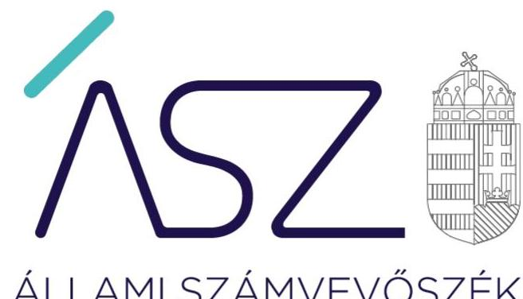
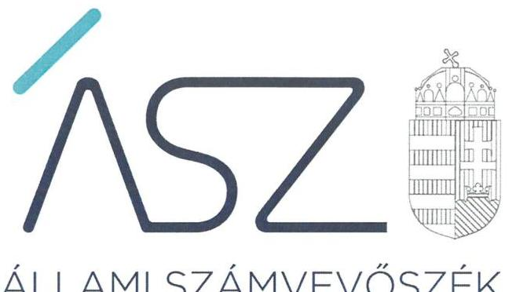
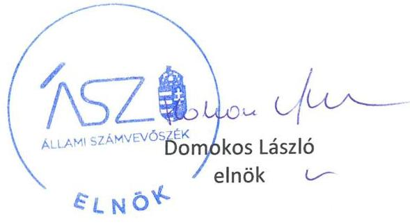
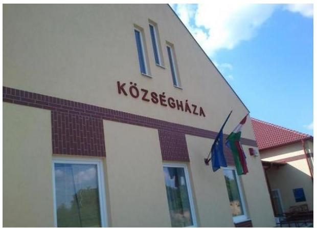

ÁLLAMI SZÁMVEVŐSZÉK

# JELENTÉS 

Az önkormányzatok ellenőrzése - A pénzforgalomban megjelenő kiadások elszámolásának ellenőrzése

Monorierdő Község Önkormányzata és a Monorierdői Polgármesteri Hivatal
2022.

22039
www.asz.hu

---

ÁLLAMI SZÁMVEVŐSZÉK

# JELENTÉS

Az önkormányzatok ellenőrzése – A pénzforgalomban megjelenő kiadások elszámolásának ellenőrzése

Monorierdő Község Önkormányzata és a Monorierdői Polgármesteri Hivatal

2022.  06.  hó 27. nap

22039
www.asz.hu

---

# AZ ELLENŐRZÉST VEZETTE ÉS A VÉGREHAJTÁSÁÉRT FELELŐS: 

BAJNAI ZSUZSANNA ellenőrzésvezető
BALÁZSNÉ ANTONI ERIKA ellenőrzésvezető
MAKKAI MÁRIA ellenőrzésvezető
DR. SZELECZKI ZSUZSANNA JUDIT ellenőrzésvezető

## A PROGRAM ÖSSZEÁLLÍTÁSÁÉRT FELELŐS:

DR. KÁDÁR KRISZTA ellenőrzés tervezési projektvezető

## A TÉMÁHOZ KAPCSOLÓDÓ KORÁBBI SZÁMVEVŐSZÉKI JELENTÉSEK:

- címe: $\square$

Jelentés - Önkormányzatok ellenőrzése -
Az önkormányzatok integritásának ellenőrzése - Pest megye települési önkormányzatai
- sorszáma: $\square$

21018
- címe: $\square$

Jelentés - Utóellenőrzések - Az önkormányzatok utóellenőrzésének kockázatértékelésen alapuló ellenőrzése
- sorszáma: $\square$

20212
- címe: $\square$

Jelentés - Önkormányzatok integritás- és belső kontrollrendszere - Az önkormányzatok belső kontrollrendszere kialakításának és múködtetésének ellenőrzése - Monorierdő Község Önkormányzata
- sorszáma: $\square$

18055

IKTATÓSZÁM: EL-3730-001/2022.
TÉMASZÁM: 2585
ELLENŐRZÉS-AZONOSÍTÓ SZÁM: V092902

---

# TARTALOMJEGYZÉK 

- ÖSSZEGZÉS ..... 5
- AZ ELLENŐRZÉS CÉLJA ..... 6
- AZ ELLENŐRZÉS TERÜLETE ..... 7
- AZ ELLENŐRZÉS HÁTTERE, INDOKOLTSÁGA ..... 8
- A JELENTÉS LÉNYEGES KÉRDÉSKÖRE ..... 9
- AZ ELLENŐRZÉS HATÓKÖRE ÉS MÓDSZEREI ..... 10
- MEGÁLLAPÍTÁSOK ..... 12
- FÜGGELÉKEK ..... 15
I. sz. függelék a jelentéshez ..... 15
II. sz. függelék: Észrevételek ..... 16
- RÖVIDÍTÉSEK JEGYZÉKE ..... 17

---

.

---

# ÖSSZEGZÉS 

Monorierdő Község Önkormányzatánál és a Monorierdői Polgármesteri Hivatalnál a 2020. évi gazdálkodás vonatkozásában nem érvényesült a vezetői felelősségvállalás és a nemzeti vagyon védelme.

## Az ellenőrzés társadalmi indokoltsága

Magyarország Alaptörvénye és a nemzeti vagyonról szóló törvény értelmében a közpénzeket és a nemzeti vagyont az átláthatóság és a közélet tisztaságának elve szerint kell kezelni. Az elvek gyakorlatban történő megvalósítása többek között az államháztartásról és a számvitelről szóló jogszabályok rendelkezéseinek betartásán keresztül ellenőrizhető.

Az Állami Számvevőszék 2018. évi integritás és belső kontrollrendszer kialakítására és múködtetésére vonatkozó ellenőrzése során kockázatosnak minősítette Monorierdő Község Önkormányzata és az Önkormányzati Hivatal ${ }^{1}$ gazdálkodását. A 2020. évben lefolytatott utóellenőrzés megállapította, hogy a hibák, hiányosságok kiküszöbölése érdekében nem tettek intézkedéseket, ezért indokolt volt a pénzforgalomban megjelenő kiadások teljesítésének és elszámolásának részletes ellenőrzése.

## Főbb megállapítások

Monorierdő Község Önkormányzata nem rendelkezett 2020. évi éves költségvetési beszámolóval, mert azt az államháztartásról szóló törvény és annak végrehajtási rendeletében előírtak ellenére a beszámoló elkészítéséért felelős Önkormányzati Hivatal jegyzője aláírásával nem látta el. Így nem biztosította az Önkormányzat vagyonáról megbízható, valós információk rendelkezésre állását. Az Önkormányzatnál és az Önkormányzati Hivatalnál a fizetési kötelezettségek vállalásakor nem győződtek meg a szabad, felhasználható előirányzat rendelkezésre állásáról, mivel a kötelezettségvállalások nyilvántartásba vétele elmaradt. Továbbá a vagyonnyilvántartás - a tárgyi eszközök nyilvántartásában szerepeltetett nem beazonosítható eszközök miatt - nem nyújtott valós információt a vagyoni helyzetről, nem biztosította a vagyon számbavételét.

Az előzőekben részletezettek miatt nem álltak rendelkezésre objektív információk a vagyoni és pénzügyi helyzetre vonatkozóan, ami kockázatot jelent a felelős, megalapozott gazdasági döntések meghozatalában.

---

# AZ ELLENŐRZÉS CÉLJA 

Az ellenőrzés célja az önkormányzatoknál, az önkormányzati hivataloknál a pénzforgalomban megjelenő kiadások teljesítésének és elszámolásának értékelése annak érdekében, hogy az önkormányzatok, önkormányzati hivatalok gazdálkodásában rejlő kockázatok beazonosításával támogassa a közpénzekkel való felelős gazdálkodást.

---

# **AZ ELLENŐRZÉS TERÜLETE**

## **Monorierdő Község Önkormányzata és a Monorierdői Polgármesteri Hivatal**

Monorierdő Pest megyében található, lakosainak száma a Belügyminisztérium nyilvántartása szerint 4 989 fő volt 2020. december 31-én.

Monorierdő Község Önkormányzatának működésével, gazdálkodásával kapcsolatos feladatokat az Önkormányzati Hivatal látja el.

A polgármester 2014. október 12-tól, a jegyző 2019. december 9-től látja el feladatát.

---

# AZ ELLENŐRZÉS HÁTTERE, INDOKOLTSÁGA 

Magyarország Alaptörvénye 39. cikk (2) bekezdése szerint a közpénzeket és a nemzeti vagyont az átláthatóság és a közélet tisztaságának elve szerint kell kezelni.

Az ÁSZ² a 2020. évre vonatkozóan a helyi önkormányzati kör egészét lefedve elvégezte Magyarország önkormányzatai integritási kockázatának kiértékelését. Az ellenőrzés során az ellenőrzött szervezetek integritását jelző, a felépítését, működését, felelősségi viszonyait, gazdálkodását meghatározó szabályzatok és nyilvántartások rendelkezésre állása, valamint lényeges szabályozási területei kerültek értékelésre. Azon önkormányzatok és hivatalaik tekintetében, ahol a szabályos és átlátható gazdálkodás, a csalásmentes működés alapvető feltételeinek biztosításában az ellenőrzés kockázatokat azonosított, indokolt azok csökkentésének támogatására a végrehajtás - a jogszabályban, belső szabályozásban előírt folyamatok további ellenőrzése.

Az ÁSZ értékelése hozzájárul ahhoz, hogy az azonosított kockázatok alapján a helyi önkormányzatok és az önkormányzati hivatalok gazdálkodása során a közpénzek felhasználásakor érvényesüljenek az integritási alapelvek, amelyek segítik a közpénzek és a közvagyon szabályos, célszerű felhasználását, támogatják az önkormányzatok, önkormányzati hivatalok eredményes gazdálkodását, amellyel az önkormányzatok a köz javát, a köz érdekét szolgálják.

---

# A JELENTÉS LÉNYEGES KÉRDÉSKÖRE 

1.     - Fennáll-e kockázat az önkormányzat és az önkormányzati hivatal gazdálkodásában?

---

# AZ ELLENŐRZÉS HATÓKÖRE ÉS MÓDSZEREI 

## Az ellenőrzés típusa

Megfelelőségi ellenőrzés.

## Az ellenőrzött időszak

A 2020. január 1-jétől 2020. december 31-ig terjedő időszak, továbbá a helyszíni szemrevételezéssel érintett nap.

## Az ellenőrzés tárgya

A pénzforgalomban megjelenő kiadások teljesítésének és elszámolásának megfelelősége.

## Az ellenőrzött szervezetek

Monorierdő Község Önkormányzata és a Monorierdői Polgármesteri Hivatal

## Az ellenőrzés jogalapja

Az ellenőrzés jogalapját az ÁSZ tv³. 1. § (3) bekezdése, és 5. § (6) bekezdése képezi.

## Az ellenőrzés módszerei

Az ellenőrzést az ellenőrzési program szempontjai, az ellenőrzött időszakban hatályos jogszabályok, a jelen ellenőrzésre irányadó ÁSZ módszertan figyelembevételével és a nemzetközi standardokat irányadónak tekintve végzi az ÁSZ.

Az ellenőrzés ideje alatt az ÁSZ az ellenőrzött szervezettel történő kapcsolattartást az ÁSZ SZMSZ ${ }^{4}$-ének vonatkozó előírásai alapján biztosítja.

Az értékelések bizonyítékokon, az ellenőrzött időszakban, vagy azt megelőzően keletkezett rendelkezésre bocsátott dokumentumokon alapulnak, az adott időszak tényeit feltárva.

Az ellenőrzési kérdések megválaszolásához szükséges bizonyítékok megszerzése az ellenőrzött szervezetek által rendelkezésre bocsátott dokumentumokra, adatokra alapozva megfigyelés, szemle (szükség esetén

---

helyszíni szemle, szemrevételezés), kérdésfeltevés (információkérés), valamint elemző eljárás útján történik. Az ellenőrzési bizonyítékként felhasználható adatforrások közé tartoznak egyrészt az ellenőrzési program részletes szempontjainál felsorolt adatforrások, másrészt minden egyéb - az ellenőrzés folyamán feltárt, - az ellenőrzés szempontjából releváns információt tartalmazó dokumentum.

Az ellenőrzést a kérdésekre adott válaszok kiértékelésével, valamint a megjelölt adatforrások, továbbá az adott időszakban hatályos jogszabályok figyelembevételével folytatja le az ÁSZ.

A pénzforgalomban megjelenő kiadások teljesítése és elszámolása szabályszerűségének ellenőrzése és értékelése lényegességi elv szerint kiválasztott tételek alapján történik. A helyi önkormányzat és az önkormányzati hivatal fizetési számlája és a házipénztárban kezelt készpénzállománya terhére megvalósuló pénzforgalma 2020. évi tételes adataiból a nem kockázatos tételek kiszűrését követően kerültek kiválasztásra az érték alapján lényegesnek minősített kiadások. Amennyiben a lényeges kiadások teljesítése és elszámolása tekintetében az átlagos hibaarány nem haladja meg a 10\%-ot, az értékelés eredményeként a lényegesnek minősített kiadások esetében nem került további kockázat beazonosításra az ÁSZ által az ellenőrzés során. Amennyiben a kiadási tételek száma a fizetési számla vagy a házipénztár tekintetében nem haladja meg a 2020. évben a 15 lényeges tételt, valamennyi kiadási tétel értékelésre kerül.

A törvényi előírásokat, valamint az ÁSZ által meghirdetett, nyilvános módszertant figyelembe véve az ellenőrzés hatóköre kiegészülhet kockázatjelzések alapján, a kockázatértékelés függvényében további lényeges területek szabályosságának ellenőrzésével az ellenőrzés megkezdésének időpontjáig.

---

# 1. Fennáll-e kockázat az önkormányzat és az önkormányzati hivatal gazdálkodásában? 

Összegző megállapítás

Monorierdő Község Önkormányzata gazdálkodásában a 2020. évi lényeges kiadások elszámolása szabálytalan volt. Az Önkormányzat nem rendelkezett 2020. évi éves költségvetési beszámolóval. Az Önkormányzati Hivatal házipénztári kiadásai és a fizetési számla forgalmában megjelenő lényeges kiadásai teljesítése jogszerú volt.

AZ ÖNKORMÁNYZAT lényeges kiadásaival kapcsolatos hivatali feladatellátás hiányosságai az alábbi szabálytalanságokat okozták, amelyek miatt az elszámoltatható közpénzfelhasználást nem biztosították:
$\longrightarrow$ négy, összesen 397000 Ft összegű előadói díj, keresetkiegészítés célú kifizetésnél nem gondoskodtak a kötelezettségvállalás nyilvántartásba vételéről az Ávr. ${ }^{5}$ 56. § (1) bekezdésében foglaltak ellenére;
$\longrightarrow$ egy 28000 Ft összegű előleg kifizetésnél a számviteli nyilvántartásba bizonylat nélkül jegyeztek be adatot a Számv. tv. ${ }^{6}$ 165. § (2) bekezdésében foglaltak ellenére, további egy 7556195 Ft összegű gépbeszerzésnél a könyvviteli elszámolást alátámasztó bizonylaton a Számv. tv. 167. § (1) bekezdés h) pontjában foglaltak ellenére a könyvelés módjára, az érintett könyvviteli számlákra történő hivatkozás rögzítése nem történt meg.
Az Önkormányzati Hivatal az Önkormányzat tárgyi eszközeiről a Számv. tv. 159. §-ában foglaltak ellenére nem vezetett olyan könyvviteli nyilvántartást, amely a bekövetkezett változásokat a valóságnak megfelelően, folyamatosan, áttekinthetően mutatja, mert az Önkormányzat könyvviteli nyilvántartásában szereplő eszközök nem voltak beazonosíthatók, a nem azonosítható tárgyi eszközök összes beszerzési értéke 6491925 Ft volt. Az Önkormányzatnál a vagyonvédelem nem volt biztosított.

Az Önkormányzat 2020. évi éves költségvetési beszámolóval nem rendelkezett, az Áhsz. ${ }^{7}$ 31. §. (1) bekezdésében foglaltak ellenére nem az arra jogosult jegyző, hanem a polgármester írta alá, így nem érvényesült a vezetői felelősségvállalás.

Az Önkormányzat pénzforgalmában megjelenő lényeges kiadások teljesítése során az arra jogosultak a kötelezettségvállalásokat és a teljesítésigazolásokat az Ávr. előírásainak megfelelően írásban elvégezték.

AZ ÖNKORMÁNYZATI HIVATAL házipénztári pénzforgalmában megjelenő kiadásai, illetve a fizetési számláról a lényeges kiadások teljesítése megfelelt a jogszabályi kritériumoknak.

Az Önkormányzati Hivatalnál a könyvviteli nyilvántartásokkal kapcsolatos feladatellátás hiányosságai az alábbi szabálytalanságokat okozták:

---

- Egy 359100 Ft összegű céljuttatás kifizetésnél nem gondoskodtak a kötelezettségvállalás nyilvántartásba vételéről az Ávr. 56. § (1) bekezdésében foglaltak ellenére, ezért az elszámoltatható közpénzfelhasználás feltételei hiányoztak.
- Az Önkormányzati Hivatal tárgyi eszközeiről a Számv. tv. 159. §-ában foglaltak ellenére nem vezettek olyan könyvviteli nyilvántartást, amely a bekövetkezett változásokat a valóságnak megfelelően, folyamatosan, áttekinthetően mutatja, mert a könyvviteli nyilvántartásban szereplő eszközök nem voltak beazonosíthatók, a nem azonosítható tárgyi eszközök összes beszerzési értéke 1594136 Ft volt. Az Önkormányzati Hivatalnál a vagyonvédelem nem volt biztosított.

---

.

---

# FÜGGELÉKEK 

- I. SZ. FÜGGELÉK A JELENTÉSHEZ

Monorierdő Község Önkormányzata és Monorierdői Polgármesteri Hivatal gazdálkodása a 2020. évben nem volt átlátható és elszámoltatható. A vagyonnyilvántartásokban a vagyonelemek értéke nem volt alátámasztott, az eszközök valós tulajdoni helyzete nem volt ellenőrizhető a vagyonelemekre, és azoknak meglétére vonatkozó objektív információk hiányában.
I. Monorierdő Község Önkormányzata nem igazolta, hogy

1. az ellenőrzésre kiválasztott tárgyi eszközöket a jogszabályi előírások szerint tartja nyilván, mivel az önkormányzati tulajdonban lévő eszközök közül összesen 6 491 925,- Ft értékủ eszköz a valóságban fizikailag nem volt beazonositható;
2. négy, összesen 397000 Ft összegű előadói dij, keresetkiegészítés célú kifizetés esetében a kötelezettségvállalások nyilvántartásba vételéről gondoskodott;
3. rendelkezik a jogszabályi előírások szerinti 2020. évi költségvetési beszámolóval.
II. Monorierdői Polgármesteri Hivatal nem igazolta, hogy:
4. az ellenőrzésre kiválasztott tárgyi eszközöket a jogszabályi előírások szerint tartja nyilván, mivel a Hivatal nyilvántartása alapján összesen 1594 136,- Ft bekerülési értékủ eszköz a valóságban fizikailag nem volt beazonositható;
5. egy 359100 Ft összegű céljuttatás kifizetése esetében a kötelezettségvállalás nyilvántartásba vételéről gondoskodott.

A közpénzek felhasználásának és a nemzeti vagyonnal való gazdálkodás átláthatósága és elszámoltathatósága érdekében kiemelten fontos, hogy a települési önkormányzatok, valamint az önkormányzati hivatalok a helyi közügyek ellátásakor betartsák a törvényi előírásokat. Ez a helyi lakosság érdeke elsősorban.

---

Az ellenőrzés megállapításait a Számvevőszék 15 napos észrevételezésre megküldte az ellenőrzött szervezetek vezetőinek az ÁSZ tv. 29. §̊ (1) bekezdése előírásának megfelelően.

A Monorierdői Polgármesteri Hivatal vezetője észrevételt nem tett. Monorierdő Község Önkormányzata az ellenőrzés megállapításaira észrevételt tett. A függelék az alábbiakban tartalmazza a figyelembe nem vett észrevételt, és annak indoklását, hogy azt az Állami Számvevőszék miért nem fogadta el.

# Monorierdő Község Önkormányzatának észrevétele 

A vásárlási előleg elszámolásával kapcsolatban a bizonylatok rendelkezésre állnak, kérik a megállapítás törlését.

## Az észrevétel el nem fogadásának indoklása

Az Állami Számvevőszék ellenőrzési megállapításai minden esetben az Állami Számvevőszékről szóló 2011. évi LXVI. törvénynek megfelelően az ellenőrzés során bekért és rendelkezésre bocsátott dokumentumokon alapulnak. Az észrevételben hivatkozott könyvelést alátámasztó számviteli bizonylatokat nem bocsátották az ellenőrzés rendelkezésére.

[^0]
[^0]:    * 29. § (1) Az Állami Számvevőszék az ellenőrzési megállapításait megküldi az ellenőrzött szervezet vezetőjének vagy az általa megbízott személynek, és annak, akinek személyes felelősségét állapította meg.
    (2) Az ellenőrzött szervezet vezetője és a felelősként megjelölt személy az ellenőrzés megállapításaira tizenöt napon belül írásban észrevételt tehet.
    (3) Az Állami Számvevőszék az észrevételre a beérkezésétől számított harminc napon belül írásban válaszol. A figyelembe nem vett észrevételeket köteles a jelentésben feltüntetni, és megindokolni, hogy azokat miért nem fogadta el.

---

# RÖVIDÍTÉSEK JEGYZÉKE 

${ }^{1}$ Önkormányzati Hivatal
${ }^{2}$ ÁSZ
${ }^{3}$ ÁSZ tv.
${ }^{4}$ ÁSZ SZMSZ
${ }^{5}$ Ávr.
${ }^{6}$ Számv. tv.
${ }^{7}$ Áhsz.

Monorierdői Polgármesteri Hivatal
Állami Számvevőszék
2011. évi LXVI. törvény az Állami Számvevőszékről

Az Állami Számvevőszék elnökének 7/2020. (XII.28.) ÁSZ utasítása az Állami Számvevőszék Szervezeti és Müködési Szabályzatáról
368/2011. (XII. 31.) Korm. rendelet az államháztartásról szóló törvény végrehajtásáról
2000. évi C. törvény a számvitelről

4/2013. (I.11.) Korm. rendelet az államháztartás számviteléről

---

# ASZ 

ALLAMI SZAMVEVOSZEK
1052 Budapest, Apáczai Cs. J. u. 10. I 1364 Budapest 4. Pf. 54 TEL: +36 14849100
email: szamvevoszek@asz.hu
web: www.asz.hu | www.aszhirportal.hu