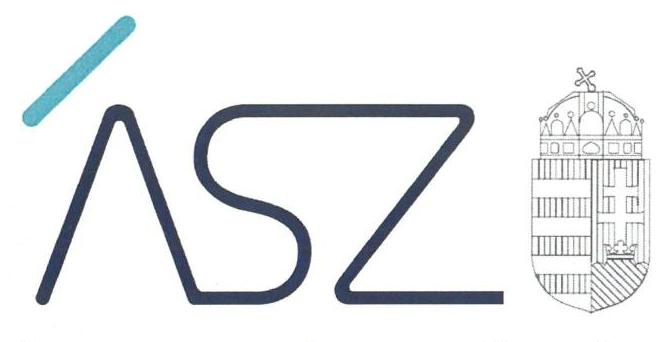
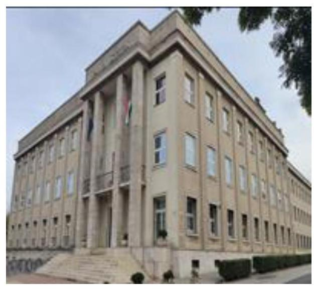

ÁLLAMI SZÁMVEVŐSZÉK

# JELENTÉS 

A központi költségvetési szervek ellenőrzése

Pannon Egyetem
2022.

22040
www.asz.hu

---

ÁLLAMI SZÁMVEVŐSZÉK

# JELENTÉS 

A központi költségvetési szervek ellenőrzése

Pannon Egyetem

22040
www.asz.hu

---

# AZ ELLENŐRZÉST VEZETTE ÉS A VÉGREHAJTÁSÁÉRT FELELŐS: 

DR. CZINDER ENIKŐ ellenőrzésvezető
SZAPPANOS JÚLIA ellenőrzésvezető
JANIK JÓZSEF ellenőrzésvezető

## A PROGRAM ÖSSZEÁLLÍTÁSÁÉRT FELELŐS:

GÖRGÉNYI GÁBOR ETAMO osztályvezető
NAGY ADRIENN projektvezető

## A TÉMÁHOZ KAPCSOLÓDÓ KORÁBBI SZÁMVEVŐSZÉKI JELENTÉSEK:

- címe: Jelentés a Pannon Egyetem ellenőrzéséről - Az állami felsőoktatási intézmények gazdálkodásának, működésének ellenőrzése
- sorszáma: 14197
- címe: Jelentés - Az állami felsőoktatási intézmények gazdálkodásának, működésének ellenőrzéséről készült jelentések utóellenőrzése - Pannon Egyetem
- sorszáma: 17050

IKTATÓSZÁM: EL-3734-001/2022.
TÉMASZÁM: 2549
ELLENŐRZÉS-AZONOSÍTÓ SZÁM: V0893, V0926

---

# TARTALOMJEGYZÉK 

- ÖSSZEGZÉS ..... 5
- AZ ELLENŐRZÉS CÉLJA ..... 6
- AZ ELLENŐRZÉS TERÜLETE ..... 7
- AZ ELLENŐRZÉS HÁTTERE, INDOKOLTSÁGA ..... 8
- A JELENTÉS LÉNYEGES KÉRDÉSKÖREI ..... 9
- AZ ELLENŐRZÉS HATÓKÖRE ÉS MÓDSZEREI ..... 10
- MEGÁLLAPÍTÁSOK ..... 12
- ÉRTELMEZŐ SZÓTÁR ..... 15
- FÜGGELÉK: ÉSZREVÉTELEK ..... 17
- RÖVIDÍTÉSEK JEGYZÉKE ..... 19

---

.

---

# ÖSSZEGZÉS 

A Pannon Egyetem vagyongazdálkodása szabályozottsága a 2020. évre biztosított volt. A Pannon Egyetemnél a 2017-2020. közötti időszakban a vagyon kimutatása területén, valamint a fenntartóváltáshoz kapcsolódó záró beszámoló tekintetében tárt fel az ellenőrzés szabálytalanságokat. Az Egyetemnél szervezeti teljesítménycélokat meghatároztak, azok megvalósulását mérték és értékelték.

## Az ellenőrzés társadalmi indokoltsága

Az államháztartás központi alrendszerébe tartozó szervezet vagyona a nemzeti vagyon része. Magyarország Alaptörvénye rögzíti, hogy a vagyonnal való gazdálkodás célja a közérdek szolgálata. Magyarország versenyképessége szoros kapcsolatban van a felsőoktatás minőségével, amely nem képzelhető el hatékony és eredményes közpénz felhasználás nélkül. Az ellenőrzött időszakban a Pannon Egyetem az államháztartás központi alrendszerébe tartozó szervezet volt.

Az ellenőrzést indokolja az is, hogy a Pannon Egyetem a felsőoktatási modellváltással érintett intézmények közé tartozik, 2021. szeptember 1-től a Pannon Egyetem fenntartója a Pannon Egyetemért Alapítvány. Az Egyetem fenntartói jogait, amelyeket addig az állam nevében az illetékes miniszter gyakorolt, a kormány által létrehozott közérdekű vagyonkezelő alapítvány vette át, és azokat az alapítvány kuratóriuma gyakorolja.

Az Állami Számvevőszék tanácsadó funkciója keretében az ellenőrzési megállapításokon keresztül támogatja a közfeladat ellátását szolgáló vagyonnal való szabályos gazdálkodást.

## Főbb megállapítások, következtetések

A Pannon Egyetem rendelkezett a 2017-2020. években az alapvető számviteli szabályzatokkal. A 2020. évben a Pannon Egyetem a szabályszerű gazdálkodás alapvető feltételeit kialakította. A vagyongazdálkodás szabályozottsága kapcsán a 2017-2019. években az alkalmazott eszközök és a források leltárkészítési és leltározási szabályzata, valamint a számlarend kötelező tartalmi elemeinek hiányosságait tárta fel az ellenőrzés.

A Pannon Egyetemnél a 2017-2020. közötti időszakban a vagyon kimutatása területén tárt fel az ellenőrzés szabálytalanságokat. A 2021. szeptember 1-jei fenntartóváltáshoz kapcsolódóan a jogszabályi előírásoknak megfelelő záró beszámolót a Pannon Egyetem nem bocsátott az ellenőrzés rendelkezésére.

A Pannon Egyetemre vonatkozó eredményességi szervezeti teljesítménycélokat meghatározták, a szervezeti teljesítmény mérését szolgáló gazdaságossági és hatékonysági követelményeket kialakították, a teljesítménycélok megvalósulását mérték, értékelték. Ezáltal a szervezetben a teljesítményt nyomonkövették, megteremtették a feltételeket ahhoz, hogy a szervezet a kitűzött célok irányába haladjon.

A jogutód Pannon Egyetem rektora megtett intézkedésekről szóló tájékoztatása szerint, az Egyetemnél a vagyongazdálkodás szabályozottsága területén feltárt szabálytalanságok megszüntetésre kerültek. Továbbá a fenntartó részéről ellenőrzés került elrendelésre az Egyetem mérlegeiben szereplő eszközök és források leltárral történő tételes alátámasztottsága, valamint a fenntartóváltáshoz kapcsolódó záró beszámoló és a záró beszámoló mérleg tételeinek leltárral való alátámasztottsága tekintetében, melyek támogatják, hogy az ellenőrzés során jelzett indulási kockázatok a jogutód Pannon Egyetemnél megszüntetésre kerüljenek.

---

# AZ ELLENŐRZÉS CÉLJA 

ményeinek érvényesítése megtörtént-e.

AZ ELLENŐRZÉS CÉLJA annak értékelése, hogy az államháztartás központi alrendszerébe tartozó közpénzekkel gazdálkodó szervezet gazdálkodását elszámoltathatóan végzi-e. Az ellenőrzés értékeli továbbá, hogy sor került-e az ellenőrzött szervezetnél az eredményesség, a hatékonyság és a gazdaságosság követelményeinek érvényesülését biztosító, mérhető, nyomon követhető teljesítménycélok kitűzésére, teljesítménykövetelmények kialakítására, illetve hogy az ellenőrzött időszakban a teljesítménycélok mérése, értékelése, az eredményesség, a hatékonyság és a gazdaságosság követel-

---

# AZ ELLENŐRZÉS TERÜLETE 

## Pannon Egyetem

Az Országgyűlés által alapított Egyetem ${ }^{1}$ jogállását az Nftv. ${ }^{2}$ határozta meg. Az Egyetem közfeladatként - az Nftv. 2. § (1) bekezdése alapján - oktatási és tudományos kutatási tevékenységet folytatott; főtevékenységként - szakágazati besorolás szerint - felsőfokú oktatást végzett. Az Egyetem felsőoktatási tevékenységét veszprémi székhelyén, valamint több településen müködtetett telephelyein folytatta, vállalkozási tevékenységet nem végzett.

Az ellenőrzött időszakban az Egyetem irányító szerve és fenntartója 2019. szeptember 1-től az Innovációs és Technológiai Minisztérium, ezt megelőzően az Emberi Erőforrások Minisztériuma volt. A Pannon Egyetem fenntartója 2021. szeptember 1-től megváltozott, az új fenntartó a Pannon Egyetemért Alapítvány közérdekú vagyonkezelő alapítvány lett.

Az Egyetem élén a rektor állt, akinek személye az ellenőrzött időszakban nem változott. Az Egyetem - Nftv. 13/A. § (1)(2) bekezdései szerinti - müködtetését a kancellár végezte, akinek személye az ellenőrzött időszakban egy alkalommal - 2019. augusztus 20-ával változott. Az Egyetem vezető testülete - az Nftv. 12. § (1) bekezdésében foglaltaknak megfelelően - a szenátus volt. Az Egyetemnél a stratégiai döntések megalapozása, valamint a gazdálkodási tevékenység szakmai támogatása és ellenőrzése céljából - Nftv. 13/B. § (1) bekezdése szerinti - konzisztórium müködött az ellenőrzött években.

Az ellenőrzött időszakban az Egyetem felsőfokú oktatási tevékenységét öt karon - a Gazdaságtudományi Karon, a Georgikon Karon, a Mérnöki Karon, a Modern Filológiai és Társadalomtudományi Karon és a Műszaki Informatikai Karon - végezte. Az Egyetem felsőoktatási tevékenységét döntő részben - vagyonkezelésbe vett ingatlanokban látta el.

---

# AZ ELLENŐRZÉS HÁTTERE, INDOKOLTSÁGA 

Az államháztartás központi alrendszerébe tartozó szervezet vagyona a nemzeti vagyon része, mellyel történő gazdálkodás a közérdek szolgálata érdekében történik. Az ÁSZ ellenőrzi az éves költségvetési törvény végrehajtását, majd az ellenőrzés során feltárt kockázatok és a terület folyamatos kockázat-elemzésével beazonosított kockázatok kezelése érdekében ráépülő ellenőrzésekkel ellenőrzi a költségvetési szervek gazdálkodását, működését. Ezáltal az ellenőrzések megállapításaival támogatja az ellenőrzött szervezetek szabályszerű gazdálkodását, javaslataival elősegíti az Alaptörvényben megfogalmazott alapvetések érvényesülését a mindennapi életben a szervezetek szintjén.

A központi költségvetés rendszerében zajló folyamatok holisztikus elemzései, a kockázatok folyamatos figyelemmel kísérésének módszerével, az így kiválasztott szervezetek célzott, hatékony ellenőrzéseivel az ÁSZ betölti a legfőbb gazdasági ellenőrző szerv küldetését.

Az egyes ellenőrzések megállapításaival és egy időszak ellenőrzési eredményeinek elemzésével az ÁSZ ráirányíthatja a jogalkotók figyelmét a központi alrendszerben vagy annak egy ágazatában esetlegesen felmerülő vagyongazdálkodási, szabályozási feszültségekre.

---

# A JELENTÉS LÉNYEGES KÉRDÉSKÖREI 

1. Biztosított volt-e a vagyongazdálkodás szabályozottsága?
2. A nemzeti vagyon nyilvántartását és kimutatását a valóságnak megfelelő módon, szabályszerűen végezték-e?
3. Az Egyetem a fenntartóváltás során a záró beszámolót a jogszabályi előírásoknak megfelelően készítette-e el?
4. A központi költségvetési szerv rendelkezett-e szervezeti teljesítménycélokkal, a központi költségvetési szerv vezetője kialakította-e és érvényesítette-e a szervezeti teljesítmény mérésére alkalmas követelményeket?

---

# AZ ELLENŐRZÉS HATÓKÖRE ÉS MÓDSZEREI 

## Az ellenőrzés típusa

Megfelelőségi ellenőrzés és teljesítmény-ellenőrzés.

## Az ellenőrzött időszak

A 2017-2020. évek, továbbá 2021. január 1-jétől a felsőoktatási intézmény Nftv. szerinti fenntartóváltásának napjáig, 2021. szeptember 1-ig terjedő időszak, a 4. lényeges kérdéskör teljesítmény-ellenőrzés tekintetében a 2020. év

## Az ellenőrzés tárgya

A központi költségvetési szerv vagyongazdálkodási feltételeinek kialakítása, annak szabályszerűsége, az elszámoltathatóság biztosítása a szabályozás szintjén. Az intézmény könyveiben, mérlegében kimutatott nemzeti vagyon nyilvántartásának szabályszerűsége, vagyon kimutatása, értékelése és a mérleg leltárral való alátámasztásának szabályszerűsége. A felsőoktatási intézmény záró beszámolójában kimutatott nemzeti vagyon kimutatása és a mérleg leltárral való alátámasztásának szabályszerűsége. Az ellenőrzött szervezetnél kialakított, az eredményesség, a hatékonyság és a gazdaságosság követelményeinek érvényesülését biztosító, mérhető, nyomon követhető teljesítménycélok, valamint az azokhoz meghatározott célértékek, teljesítménykövetelmények meghatározása; a célok megvalósulásának mérése, értékelése; az eredményesség, a hatékonyság és a gazdaságosság követelményeinek érvényesítése a jogszabályi előírások alapján elkészítendő dokumentumokban.

## Az ellenőrzött szervezet

Pannon Egyetem

## Az ellenőrzés jogalapja

Az ellenőrzés jogszabályi alapját az ÁSZ tv. 1. § (3) bekezdés, 5. § (2)-(3) és (6) bekezdései, valamint az Áht. ${ }^{3} 3$ 61. § (2) bekezdésének előírásai képezik.

---

# Az ellenőrzés módszerei 

Az ellenőrzést az ÁSZ a program kérdéseire adott válaszok kiértékelésével és a vonatkozó időszakban hatályos jogszabályok, az ellenőrzés szakmai szabályai, a jelen ellenőrzésre irányadó ÁSZ módszertanok alapján folytatja le.

Az ellenőrzés során az ellenőrzött szervezettel történő kapcsolattartást az ÁSZ a szervezeti és működési szabályzatának vonatkozó előírásai alapján biztosítja.

Az ellenőrzési kérdések megválaszolásához szükséges bizonyítékok megszerzése az ellenőrzött szervezet által rendelkezésre bocsátott dokumentumokra és adatokra alapozva, továbbá megfigyelés, szemle (szemrevételezés), kérdésfeltevés (információkérés), érték alapján szűkített, lényeges sokaságon végrehajtott mintavétellel, valamint elemző eljárás útján történik. Az ellenőrzési bizonyítékként felhasználható adatforrások közé tartoznak az ellenőrzési program részletes szempontjainál felsorolt adatforrások, valamint minden egyéb - az ellenőrzés folyamán feltárt, az ellenőrzés szempontjából információt tartalmazó - dokumentum. Az ellenőrzés lefolytatásához az ellenőrzött szervezet tanúsítványok kitöltésével, valamint az ÁSZ által kért dokumentumok rendelkezésre bocsátásával szolgáltat adatokat, amelyekről az ellenőrzött szervezet vezetője teljességi és hitelességi nyilatkozatot állít ki. A rendelkezésre bocsátott dokumentumok, adatok és információk kontrollja az ellenőrzés keretében történik. Az ellenőrzés részét képezi a szabályszerűségi ellenőrzésre épülő teljesítmény ellenőrzés, melynek keretében az ÁSZ arra fókuszál, hogy a központi költségvetési szervek a jogszabályi előírások alapján elkészítendő dokumentumokban, vagy más egyéb, nem jogszabály által meghatározott dokumentumokban alakítottak-e ki és érvényesítették-e a szervezet teljesítményének mérésére alkalmas követelményeket.

---

# 1. Biztosított volt-e a vagyongazdálkodás szabályozottsága? 

## Összegző megállapítás

A vagyongazdálkodás szabályozottsága a 2020. évben biztosított volt, 2017-2019. években szabálytalanságokat tárt fel az ellenőrzés.

AZ EGYETEM a 2017-2020. években a Számv.tv. ${ }^{4}$ és az Áhsz. ${ }^{5}$ előírásaival összhangban rendelkezett számviteli politikával, az eszközök és a források értékelési szabályzatával, önköltségszámítás rendjére vonatkozó belső szabályzattal.
Az Egyetem a Számv. tv. és az Áhsz. előírása szerint rendelkezett az eszközök és a források leltárkészítési és leltározási szabályzatával, azonban a szabályzat a jogszabályi előírások ellenére nem tartalmazta az Áhsz. 22. § (2) bekezdés b) pontjában előírtak ellenére a használt, de mérlegben értekkel nem szereplő immateriális javak, tárgyi eszközök, készletek leltározási módját.

Az Egyetem a Számv. tv. és az Áhsz. előírása szerint rendelkezett számlarenddel, azonban a számlarend a Számv. tv. 161. § (2) bekezdés b) pontjában, továbbá az Áhsz. 51. § (2) bekezdésében előírtak ellenére a 20172020. években nem tartalmazta a könyvviteli számla értéke növekedésének, csökkenésének jogcímeit.

A 2020. évben a vagyongazdálkodás szabályozottsága javult, az Egyetem gondoskodott a számlarendben az alkalmazásra kijelölt számlákat érintő hiányosság megszüntetéséről.

## 2. A nemzeti vagyon nyilvántartását és kimutatását a valóságnak megfelelő módon, szabályszerűen végezték-e?

## Összegző megállapítás

Az Egyetemnél a nemzeti vagyon szabályszerű nyilvántartása és kimutatása a 2017-2020. években nem volt igazolt.

A 2017-2020. ÉVEKBEN az Egyetem a nemzeti vagyon szabályszerű nyilvántartását és kimutatását nem igazolta, mert nem bocsátott az ellenőrzés rendelkezésére az Áhsz. 5. § (1) bekezdésében és 22. § (1) bekezdésében, valamint a Számv.tv. 69. § (1) bekezdésében előírtak szerint olyan leltárt, amely tételesen és ellenőrizhető módon tartalmazta a mérlegben szereplő eszközöket és forrásokat mennyiségben és értékben.

A kötelezettségvállalásra, teljesítés igazolására jogosult személyekről és aláírás-mintájukról vezetett nyilvántartás 2017. január 01.-2017.június 30. között nem felelt meg az Ávr. ${ }^{6} 60$. § (3) bekezdésében előírtaknak, ezáltal a kontrolltevékenységek szabályszerű gyakorlásának feltételei nem voltak adottak. 2017. év július 1-től az Egyetem az Ávr. előírásainak megfelelő nyilvántartást vezetett.

---

# 3. Az Egyetem a fenntartóváltás során a záró beszámolót a jogszabályi előírásoknak megfelelően készítette-e el? 

Összegző megállapítás

A fenntartóváltás napját megelőző fordulónapra készített, jogszabályoknak megfelelő záró beszámolót az Egyetem nem bocsátott az ellenőrzés rendelkezésére.

AZ EGYETEM az Nftv. 117/C. § (4a) bekezdése szerint - a fenntartóváltással érintett felsőoktatási intézmény fenntartóváltás napját megelőző fordulónapra készített - az államháztartási számviteli szabályok szerinti záró beszámolót nem bocsátott az ellenőrzés rendelkezésére, mivel az nem tartalmazta a fordulónap megjelölését, illetve azt az időszakot, amelyre készült.

## 4. A központi költségvetési szerv rendelkezett-e szervezeti teljesítménycélokkal, a központi költségvetési szerv vezetője kialakította-e és érvényesítette-e a szervezeti teljesítmény mérésére alkalmas követelményeket?

Összegző megállapítás

Az Egyetemnél a gazdálkodási és múködési tevékenységek vonatkozásában meghatároztak elvárásokat, célokat. A teljesítménycélok megvalósulását mérték és értékelték.

AZ EGYETEMNÉL a gazdálkodási, a működési folyamatokhoz kapcsolódóan meghatároztak teljesítendő elvárásokat, célokat, feladatokat a hatékonyság és a gazdaságosság biztosítása érdekében.

Az eredményesség, a hatékonyság és a gazdaságosság követelményei általánosság szintjén jelentek meg az Egyetem szabályzataiban. A szervezeti célok elérését veszélyeztető kockázatok csökkentésére irányuló kontrollokkal rendelkeztek.

Az Egyetem célkitűzéseinek megvalósítását, teljesítménycélok érvényre juttatását támogató tevékenységeket, felelősöket, beszámolási kötelezettségeket az Intézményfejlesztési Tervében és annak mellékleteiben rögzítette.

Az Egyetem a 2020. évben mérte és értékelte a teljesítménycélok megvalósulását, a képzéseket, a hallgatói létszám elérését, a lemorzsolódás csökkenését, a távoktatással kapcsolatos célok teljesülését.

---

.

---

# ÉRTELMEZŐ SZÓTÁR 

állami vagyon
állami vagyon kezelője /vagyonkezelő
irányító szerv
működtetés
nemzeti vagyon

Állami vagyonnak minősül:
a) az állam tulajdonában lévő dolog, valamint a dolog módjára hasznosítható természeti erő,
b) az a) pont hatálya alá nem tartozó mindazon vagyon, amely vonatkozásában törvény az állam kizárólagos tulajdonjogát nevesíti,
c) az állam tulajdonában lévő tagsági jogviszonyt megtestesítő értékpapír, illetve az államot megillető egyéb társasági részesedés,
d) az államot megillető olyan immateriális, vagyoni értékkel rendelkező jogosultság, amelyet jogszabály vagyoni értékű jogként nevesít,
e) az állam tulajdonában lévő pénzügyi eszközök.
(Forrás: Vtv. ${ }^{7}$ 1. § (2) bekezdése)
Az állami tulajdonában álló vagyon tekintetében - a nemzeti vagyonról szóló törvényben vagyonkezelőként meghatározott azon személy, amellyel az állami vagyon vagyonkezelésére a Magyar Nemzeti Vagyonkezelő Zrt. valamint annak jogelődje, vagy az állami tulajdonosi joggyakorlója vagyonkezelési szerződést kötött, továbbá akit törvény vagyonkezelőnek kijelölt. (Forrás: Vtvr. 1. § (7) bekezdés b) pontja és az Nvtv. ${ }^{8}$ 3. § (1) bekezdés 19. a) pontja)
A költségvetési szerv tekintetében az e törvényben meghatározott irányítási hatáskört gyakorló szerv. (Forrás: Áht. 1. § 9. pontja)
a nemzeti vagyon birtoklásából, használatából, hasznai szedéséből, a nemzeti vagyon fenntartásából és üzemeltetéséből álló tevékenységek együttese, amely jogszabály vagy szerződés alapján - a nemzeti vagyon felújítására, fejlesztésére, a birtoklásának, használatának hasznai szedése jogának továbbengedésére is kiterjedhet. (Forrás: Nvtv. 3. § (1) bekezdés 10. pontja)
Nemzeti vagyonnak minősül
a) az állam vagy a helyi önkormányzat kizárólagos tulajdonában álló dolgok,
b) az a) pont hatálya alá nem tartozó, az állam vagy a helyi önkormányzat tulajdonában lévő dolog,
c) az állam vagy a helyi önkormányzat tulajdonában lévő pénzügyi eszközök, továbbá az államot vagy a helyi önkormányzatot megillető társasági részesedések,
d) az államot vagy a helyi önkormányzatot megillető bármely vagyoni értékkel rendelkező jogosultság, amelyet jogszabály vagyoni értékű jogként nevesít,
e) Magyarország határa által körbezárt terület feletti légtér,
f) az üvegházhatású gázok kibocsátási egységeinek kereskedelméről szóló törvény szerinti kibocsátási egység és légiközlekedési kibocsátási egység, valamint az ENSZ Éghajlatváltozási Keretegyezménye és annak Kiotói Jegyzőkönyve végrehajtási keretrendszeréről szóló törvény szerinti kiotói egység,
g) állami vagy helyi önkormányzati fenntartású közgyűjtemény (muzeális intézmény, levéltár, közgyűjteményként működő kép- és hangarchívum, valamint könyvtár) saját gyűjteményében nyilvántartott kulturális javak körébe tartozó dolog, kivéve, ha az állami vagy önkormányzati tulajdon jogszerű létrejötte kétséget kizáró módon nem bizonyítható és a dologra nézve más a tulajdonjogát bizonyítja vagy a kulturális javakra vonatkozó jogszabályokban meghatározott eljárás keretében valószínűsíti,
h) a régészeti lelet,
i) a nemzeti adatvagyon körébe tartozó állami nyilvántartások fokozottabb védelméről szóló törvény szerinti nemzeti adatvagyon (Forrás: Nvtv. 1. § (2) bekezdés a)-i) pontok).

---

tulajdonosi joggyakorló
vagyongazdálkodás

Aki a nemzeti vagyon felett az államot vagy a helyi önkormányzatot megillető tulajdonosi jogok és kötelezettségek összességének gyakorlására jogosult. (Forrás: Nvtv. 3. § (1) bekezdés 17. pontja)
A nemzeti vagyongazdálkodás feladata a nemzeti vagyon rendeltetésének megfelelő, az állam, az önkormányzat mindenkori teherbíró képességéhez igazodó, elsődlegesen a közfeladatok ellátásához és a mindenkori társadalmi szükségletek kielégítéséhez szükséges, egységes elveken alapuló, átlátható, hatékony és költségtakarékos múködtetése, értékének megőrzése, állagának védelme, értéknövelő használata, hasznosítása, gyarapítása, továbbá az állam vagy a helyi önkormányzat feladatának ellátása szempontjából feleslegessé váló vagyontárgyak elidegenítése. (Forrás: Nvtv. 7. § (2) bekezdése)

---

# FÜGGELÉK: ÉSZREVÉTELEK 

A jelentéstervezetet a Számvevőszék 15 napos észrevételezésre megküldte az ellenőrzött szervezet vezetőjének az ÁSZ tv. 29. §* (1) bekezdése előírásának megfelelően.

A Pannon Egyetem rektora az ellenőrzés megállapításaira észrevételt tett. Az ÁSZ tv. 29. § (3) bekezdésével összhangban az ÁSZ a Függelékben feltünteti a megállapításokkal kapcsolatban tett, figyelembe nem vett észrevételeket, és megindokolja, hogy azokat miért nem fogadta el.

[^0]
[^0]:    ** 29. § (1) Az Állami Számvevőszék az ellenőrzési megállapításait megküldi az ellenőrzött szervezet vezetőjének vagy az általa megbízott személynek, és annak, akinek személyes felelősségét állapította meg.
    (2) Az ellenőrzött szervezet vezetője és a felelősként megjelölt személy az ellenőrzés megállapításaira tizenöt napon belül írásban észrevételt tehet.
    (3) Az Állami Számvevőszék az észrevételre a beérkezésétől számított harminc napon belül írásban válaszol. A figyelembe nem vett észrevételeket köteles a jelentésben feltüntetni, és megindokolni, hogy azokat miért nem fogadta el.

---

Az ellenőrzés megállapításaival kapcsolatban a Pannon Egyetem rektora által 2022. május 12-én tett észrevételek és azok el nem fogadásának indokolása.

# 1. A nemzeti vagyon nyilvántartásával, kimutatásával és védelmével kapcsolatban tett észrevétel 

A 2017. január 1 - 2017. június 30. közötti időszakban a kötelezettségvállalásra, teljesítés igazolására jogosult személyekről és aláírás-mintájukról vezetett naprakész nyilvántartáshoz kapcsolódóan rendelkezésre bocsátott dokumentumok alapján a naprakész nyilvántartás vezetése nem igazolt.

A fentiekre tekintettel az ellenőrzés megállapítása megalapozott.

## 2. A fenntartóváltás napját megelőző fordulónapra vonatkozó záró beszámoló hiányával kapcsolatban tett észrevétel

Az Egyetem által rendelkezésre bocsátott "Éves beszámoló - 2021 éves költségvetési beszámoló" megnevezési dokumentum az Nftv. 117/C. § (4a) bekezdésében előírt jogszabályi előírásnak nem felelt meg, ugyanis abban sem a dokumentum címe és a dokumentum fedlapján található további adatok, sem az űrlapok 2021.2. időszakra vonatkozó adata alapján nem állapítható meg, hogy a dokumentum tartalma pontosan milyen időszakra vonatkozik. A rendelkezésre bocsátott költségvetési beszámoló nem tartalmazta sem a fordulónapot, sem a beszámolás időszakát, így abból nem állapítható meg, hogy a költségvetési beszámoló az Nftv. 117/C. § (4a) bekezdésében meghatározott fordulónapra, valamint a Számv. tv. 21. § (1) bekezdésében előírtak szerint készült-e.

A fentiekre tekintettel az ellenőrzés megállapítása megalapozott.

---

# RÖVIDÍTÉSEK JEGYZÉKE 

${ }^{1}$ Egyetem
${ }^{2}$ Nftv.
${ }^{3}$ Áht.
${ }^{4}$ Számv.tv.
${ }^{5}$ Áhsz.
${ }^{6}$ Ávr.
${ }^{7}$ Vtv.
${ }^{8} \mathrm{Nvtv}$.

## Pannon Egyetem

a nemzeti felsőoktatásról szóló 2011. évi CCIV. törvény (hatályos: 2012. január 1-től)
2011. évi CXCV. törvény az államháztartásról (hatályos 2011. december 31-től)
2000. évi C. törvény a számvitelről (hatályos: 2001. január 1-jétől)
4/2013. (I. 11.) Korm. rendelet az államháztartás számviteléről (hatályos: 2014. január 1-től)
368/2011. (XII. 31.) Korm. rendelet az államháztartásról szóló törvény végrehajtásáról (hatályos: 2012. január 1-től)
2007. évi CVI. törvény az állami vagyonról (hatályos 2007. szeptember 25-től)
2011. évi CXCVI. törvény a nemzeti vagyonról (hatályos: 2011. december 31-től)

---

# ASZ 

ALLAMI SZAMVEVOSZEK
1052 Budapest, Apáczai Cs. J. u. 10. I 1364 Budapest 4. Pf. 54
TEL: +36 14849100
email: szamvevoszek@asz.hu
web: www.asz.hu | www.aszhirportal.hu