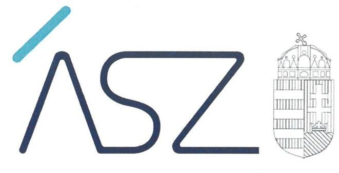
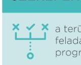
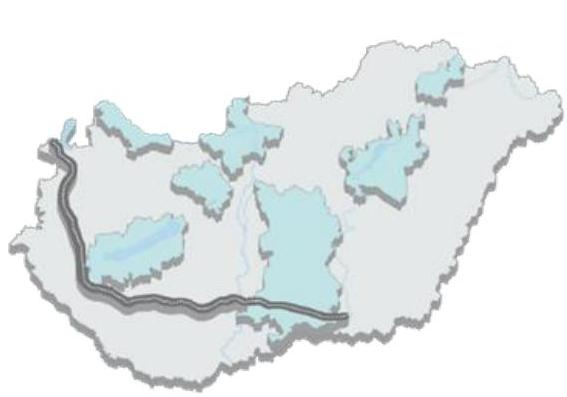

ÁLLAMI SZÁMVEVŐSZÉK

# JELENTÉS

A térségi fejlesztési tanácsok működésének és gazdálkodásának ellenőrzése

2022.

22041
www.asz.hu

---

ÁLLAMI SZÁMVEVŐSZÉK

# JELENTÉS 

A térségi fejlesztési tanácsok működésének és gazdálkodásának ellenőrzése
2022. 07. hó 04. nap

22041
www.asz.hu

---

# AZ ELLENŐRZÉST VEZETTE ÉS A VÉGREHAJTÁSÁÉRT FELELŐS: 

DR. NAGY IMRE ellenőrzésvezető
HORVÁTH BÁLINT TAMÁS ellenőrzésvezető
DR. DOMOKOS MAGDOLNA ellenőrzésvezető
VARGA EDIT ellenőrzésvezető
DR. GYŐRI GABRIELLA ellenőrzésvezető

A PROGRAM ÖSSZEÁLLÍTÁSÁÉRT FELELŐS:
WELTHERNÉ SZOLNOKI DÓRA projektvezető

Jelentéseink az Országgyűlés számítógépes hálózatán és az interneten a www.asz.hu címen is olvashatóak.

IKTATÓSZÁM: EL-3737-001/2022.
TÉMASZÁM: 2595
ELLENŐRZÉS-AZONOSÍTÓ SZÁM: V-0939

---

# TARTALOMJEGYZÉK 

■ ÖSSZEGZÉS ..... 5
■ AZ ELLENŐRZÉS AKTUALITÁSA, TÁRSADALMI SZEREPE, SZEMPONTJAI ..... 8
■ AZ ELLENŐRZÉS TERÜLETE ..... 10
■ ELLENŐRZÉS HATÓKÖRE ÉS MÓDSZERE ..... 12
■ MELLÉKLET ..... 15
■ ÉRTELMEZŐ SZÓTÁR ..... 23
■ FÜGGELÉK ..... 25
■ RÖVIDÍTÉSEK JEGYZÉKE ..... 37

---

.

---

# ÖSSZEGZÉS 

A térségi fejlesztési tanácsok a 2018-2020. években nem töltötték be a szerepüket a térségek fejlesztéspolitikájának tervezésében és végrehajtásában, mivel a területfejlesztéshez kapcsolódóan előírt tervezési és beszámolási feladataikat nem látták el. Nyolcból hét térségi fejlesztési tanácsnál a vezetői kontrollok és gazdálkodási keretek kialakítása nem támogatta a szabályos működést és gazdálkodást. Öt tanácsnál a kifizetések szabályosságát nem igazolták.

## Értékelés

A 2018. és 2020. közötti teljes időszakban Magyarországon nyolc térségi fejlesztési tanács működött. Az Állami Számvevőszék azt értékelte, hogy a térségi fejlesztési tanácsoknál szabályszerűen kialakították-e a szervezeti-működési, illetve a gazdálkodási-pénzügyi szabályozási feltételeket, valamint a térségi fejlesztési tanácsok dokumentáltan teljesítették-e a szakmai feladataikat, továbbá igazolták-e a költségvetési beszámolással kapcsolatos feladatok teljesítését. Emellett az Állami Számvevőszék értékelte, hogy a térségi fejlesztési tanácsoknál a munkaszervezet vezetője kialakította-e a szabályszerű működést, illetve a szabályszerű gazdálkodást biztosító szabályozási kereteket, kialakította-e a teljesítmény-mérés és teljesítmény-ellenőrzés jogszabályban előírt feltételeit, valamint szabályszerűen teljesítették-e, illetve számolták-e el a kifizetéseket. Emellett az ellenőrzés értékelte, hogyan hasznosult a térségi fejlesztési tanácsok tevékenysége.

A szervezeti és működési, illetve a gazdálkodási-pénzügyi szabályozási keretek szabályszerű kialakítása biztosítják a szervezeti és a gazdálkodási folyamatok átláthatóságát és elszámoltathatóságát. Az Állami Számvevőszék értékelése feltárta, hogy a nyolcból hét térségi fejlesztési tanácsnál a tanács elnöke megteremtette a szervezeti és működési feltételeket, ugyanakkor a gazdálkodási-pénzügyi szabályozási keretek szabályszerű kialakítását a nyolcból csak egy tanácsnál igazolták.

A térségi fejlesztési tanácsok számára előírja a törvény, hogy területfejlesztési koncepciót és programot kell kidolgozniuk, ezek alapján pedig feladatterveket, munkaterveket, a tevékenységükről pedig éves szakmai beszámolót kell készíteniük. Ezek biztosítják a feladatellátás tervezettségét, követhetőségét, illetve hozzájárulnak az eredményes szakmai feladatellátáshoz. Az M9 Térségi Fejlesztési Tanács 2018. és 2020. között szakmai tevékenységet nem végzett és szakmai beszámolót sem készített. A Tokaj Borvidék Fejlesztési Tanács az előírt területfejlesztési koncepciót, programot, illetve az ezekhez kapcsolódó feladatterveket elkészítette, a szakmai feladatellátásról azonban nem számolt be. A további hat térségi fejlesztési tanács nem teljesítette a térségi fejlesztéssel kapcsolatos feladatait, ugyanis az országos fejlesztési és területfejlesztési koncepcióval összhangban lévő térségi területfejlesztési koncepciót és programot nem készítették el. A Balaton Fejlesztési Tanács és a Velencei-tó és térsége Váli-völgy, Vértes Fejlesztési Tanács a teljes ellenőrzött időszak tekintetében, a Tisza-tó Térségi Fejlesztési Tanács pedig a 2018-2019. évekre vonatkozóan számolt be a szakmai feladatellátásáról. Négy térségi fejlesztési tanács a 2018. és 2020. közötti szakmai feladatellátásáról nem számolt be.

A gazdálkodás elszámoltathatóságát a térségi fejlesztési tanácsoknál is a költségvetési beszámolással kapcsolatos kötelezettségek teljesítése teremti meg. Az Állami Számvevőszék értékelése feltárta, hogy a térségi fejlesztési tanácsoknál a költségvetési beszámolással kapcsolatos kötelezettségek 2018. és 2020. közötti szabályszerű teljesítését nem igazolták.

A térségi fejlesztési tanácsoknál a munkaszervezet vezetőjének felelőssége a szervezeti célok megvalósítását támogató belső kontrollrendszer kialakítása, ami azt szolgálja a működés során a tevékenységeket szabályszerűen, gazdaságosan, hatékonyan és eredményesen hajtsák végre. Elősegíti továbbá, hogy az elszámolási kötelezettségeket teljesítsék, valamint megvédjék az erőforrásokat a veszteségektől, károktól és nem rendeltetésszerű használattól. Az Állami Számvevőszék értékelése feltárta, hogy az M9 Térségi Fejlesztési Tanács munkaszervezeti feladatait ellátó Zala

---

Megyei Területfejlesztési Ügynökség Közhasznú Nonprofit Kft. vezetője szabályszerűen kialakította a belső kontrollrendszert, ami a térségi fejlesztési tanácsnál megteremtette a feltételeket a szervezeti célok megvalósításához. A további hét térségi fejlesztési tanácsnál a munkaszervezet vezetője a belső kontrollrendszert nem alakította ki szabályszerűen 2018. és 2020. között.

A térségi fejlesztési tanácsok gazdálkodása során a költségvetési szervek gazdálkodására vonatkozó szabályokat kell alkalmazni, így a kontrollkörnyezet biztosítja a szervezeti, illetve a gazdálkodási folyamatok átláthatóságát. A gazdálkodási feladatok szabályszerű ellátásához szükséges szervezeti-működési keretek kialakítása azért fontos, mert ez teremti meg a térségi fejlesztési tanács szabályszerű működésének és gazdálkodásának kereteit. Az Állami Számvevőszék értékelése feltárta, hogy az M9 Térségi Fejlesztési Tanács munkaszervezeti feladatait ellátó Zala Megyei Területfejlesztési Ügynökség Közhasznú Nonprofit Kft. vezetője szabályszerűen kialakította a gazdálkodás kontrollkörnyezetét, a további hét térségi fejlesztési tanácsnál ugyanakkor a munkaszervezet vezetője a gazdálkodás kontrollkörnyezetét nem szabályszerűen alakította ki 2018. és 2020. között.

A kifizetések teljesítését és elszámolását a vonatkozó előírások betartásával, dokumentáltan kell végezni a térségi fejlesztési tanácsoknál is, amiért a munkaszervezet vezetője a felelős. A nyolcból két térségi fejlesztési tanácsnál az ellenőrzött időszakban nem voltak kifizetések. A Velencei-tó és térsége Váli-völgy, Vértes Térségi Fejlesztési Tanácsnál - amelynek munkaszervezete a Fejér Megyei Önkormányzati Hivatal - az ellenőrzött kifizetés teljesítése és elszámolása szabályszerű volt. Három térségi fejlesztési tanácsnál a vonatkozó szabályzat hiányában nem igazolható, hogy a gazdálkodási kontrolltevékenység gyakorlására vonatkozó alapvető szabályok szerint jártak el a kifizetések teljesítésekor és elszámolásakor. Két fejlesztési tanácsnál a kötelezettségvállalások nyilvántartásában és a teljesítések igazolásában feltárt hiányosságok kockázatot jelentenek a kifizetések teljesítésének és elszámolásának szabályosságára.

Az Állami Számvevőszék azt is feltárta, hogy a térségi fejlesztési tanácsoknál a munkaszervezetek vezetői a teljesítményre vonatkozó célokat és követelményeket nem alakították ki 2018. és 2020. között, így a térségi fejlesztési tanácsok feladatellátásának eredményességét sem követték nyomon. Emellett a Balaton Fejlesztési Tanács és a Tokaj Borvidék Fejlesztési Tanács az ellenőrzött időszakban lépéseket tett a térség társadalmi és gazdasági folyamatainak értékelése, valamint a tevékenysége hasznosulásának felmérése területén. További három fejlesztési tanács a térségben megvalósított és folyamatban lévő projektek bemutatásáról intézkedett az ellenőrzött időszakban.

# Következtetés 

Az ellenőrzés több nézőpontból vizsgálta a térségi fejlesztési tanácsok tevékenységét a 2018. és 2020. közötti időszakra vonatkozóan.

A nyolc fejlesztési tanácsra kiterjedő ellenőrzés olyan lényeges hiányosságokat azonosított a tanácsok gazdálkodásában, működésében, kiemelten a területfejlesztési feladatok ellátásában, amelyek miatt a tanácsok nem tudták betölteni a szerepüket a térségre vonatkozó fejlesztéspolitika tervezésében és végrehajtásában. A térségi fejlesztési tanácsok és munkaszervezeteik nyilatkozatai szerint, illetve az Állami Számvevőszék ellenőrzési dokumentumokon alapuló értékelése alapján több térségi fejlesztési tanács nem végzett érdemi tevékenységet az ellenőrzött időszakban.

A jövőre vonatkozóan azoknak a tanácsoknak van létjogosultsága, vagyis azok a tanácsok tudják betölteni a szerepüket a területfejlesztések megvalósítása, a társadalmi és gazdasági növekedés elősegítése, a fenntartható fejlődés feltételeinek megteremtése területén, amelyek elvégzik a területfejlesztéshez kapcsolódóan előírt tervezési és beszámolási feladatokat, valamint szabályszerűen működnek és gazdálkodnak. A térségi fejlesztési tanácsok tevékenységének eredményességét erősítheti a feladatellátáshoz kapcsolódó célok meghatározása, megvalósulásuk nyomon követése és a tevékenység hasznosulásának mérése a tanácsok feladatellátása tekintetében.

---

# TÉRSÉGI FEJLESZTÉSI TANÁCSOK 

## NEM TÖLTÖTTÉK BE A SZEREPÜKET A TÉRSÉGI FEJLESZTÉSI TANÁCSOK A TÉRSÉGEK FEJLESZTÉSPOLITIKÁJÁNAK TERVEZÉSÉBEN ÉS VÉGREHAJTÁSÁBAN

A TÉRSÉGI FEJLESZTÉS CÉLJA a megyehatáron túlterjedő, illetve kiemelten kezelendő területfejlesztési feladatok

ellátása:

- területi elhelyezkedéstől független területfejlesztések megvalósítása,
- társadalmi és gazdasági növekedés elősegítése,
- fenntartható fejlődés feltételeinek megteremtése.

## AZ ÁSZ TÖBB SZEMPONTBÓL VIZSGÁLTA

a térségi fejlesztési tanácsok tevékenységét:

eredményesség.
működés

## ELLENŐRZÖTT SZERVEZETEK

a térségi fejlesztési tanácsok és munkaszervezeteik:

Duna-Tisza-közi Homokhátsági Térségi Fejlesztési Tanács

Dunakanyar Térségi Fejlesztési Tanács
"M9" Térségi Fejlesztési Tanács
Velencei-tó és Térsége, Váli-völgy, Vértes Térségi Fejlesztési Tanács

Tisza-tó Térségi Fejlesztési Tanács
Szigetköz - Felső-Duna mente Térségi Fejlesztési Tanács

Balaton Fejlesztési Tanács
Tokaj Borvidék Fejlesztési Tanács

## ÉRTÉKELÉS

A térségi fejlesztési tanácsok és munkaszervezeteik nyilatkozatai, illetve az Állami Számvevőszék ellenőrzési dokumentumokon alapuló értékelése alapján több térségi tanács nem végzett érdemi tevékenységet az ellenőrzött időszakban.

## AZ ELLENŐRZÖTT 8 TÉRSÉGI FEJLESZTÉSI TANÁCSBÓL

tanácsnál a területfejlesztéshez előírt tervezési és beszámolási feladatokat nem látták el teljeskörűen.

tanácsnál a vezetői kontrollok és gazdálkodási keretek kialakítása nem támogatta a szabályos működést és gazdálkodást

tanácsnál a kifizetések szabályosságát nem igazolták.

tanácsnál a szabályszerű költségvetési beszámolás teljesítését nem igazolták.

## A TÉRSÉGI FEJLESZTÉSI TANÁCSOK SZEREPÉNEK BETÖLTÉSÉHEZ SZÜKSÉGES:

a területfejlesztéshez előírt tervezési és beszámolási feladatok elvégzése (területfejlesztési koncepció és program készítése, beszámolás a tevékenységről),
szabályszerű működést támogató vezetői kontrollok és gazdálkodási keretek kialakítása,
szabályos kifizetések és szabályszerű költségvetési beszámolás.

## A TÉRSÉGI FEJLESZTÉSI TANÁCSOK TEVÉKENYSÉGÉNEK EREDMÉNYESSÉGÉT ERŐSÍTHETI:

a célok meghatározása,
megvalósulásuk nyomon követése,
a tevékenység hasznosulásának mérése.

---

# AZ ELLENŐRZÉS AKTUALITÁSA, TÁRSADALMI SZEREPE, SZEMPONTJAI 

Az ország kiegyensúlyozott területi fejlődése és a térségi társadalmi-gazdasági, kulturális fejlődésének előmozdítása, valamint az átfogó területfejlesztési politika érvényesítése, az országos és a térségi területfejlesztési és területrendezési feladatok összehangolása érdekében - tekintettel az Európai Unió regionális politikájára, alapelveihez, eszközés intézményrendszeréhez való csatlakozás követelményeire - alkotta meg az Országgyűlés a területfejlesztésről és a területrendezésről szóló 1996. évi XXI. törvényt ${ }^{1}$. A törvény 15. § (1) bekezdése alapján a megyei önkormányzatok önállóan, vagy a szomszédos megye megyei önkormányzatával közösen térségi fejlesztési tanács létrehozását kezdeményezhetik.

A térségi fejlesztés célja a területi elhelyezkedéstől független területfejlesztések megvalósítása, a társadalmi és gazdasági növekedés elősegítése, a fenntartható fejlődés feltételeinek megteremtése. Ehhez illeszkedve a térségi fejlesztési tanácsok fő feladatait a területfejlesztési törvény megyei önkormányzatok számára megállapított - megyehatáron túlterjedő, illetve kiemelten kezelendő - területfejlesztési feladatok jelentik. A megyei önkormányzatok a térségi fejlesztési tanács létrehozásakor megállapodnak abban - valamint a tanács szervezeti és működési szabályzatában rögzítik - hogy milyen feladatokat látnak el a társulás keretében. A két kiemelt térségben működő térségi fejlesztési tanács (Balaton $\mathrm{FT}^{2}$, Tokaj Borvidék FT) tekintetében a törvény speciális feladatokat is előír.

A térségi fejlesztési tanácsok többségét 2010. előtt alapították, egy kivétellel szükség volt a szervezetek megújítására a területfejlesztési törvény 2012. januárban hatályba lépett módosítását követően. Ezt főként a regionális fejlesztési és megyei területfejlesztési tanácsok megszűnése, a területfejlesztési feladatok és hatáskörök újragondolása, valamint a 2014-2020. közötti uniós költségvetési időszakra való felkészülés tette szükségessé. Fontos kérdés tehát, hogy a térségi fejlesztési tanácsok miként tudtak alkalmazkodni a törvényi változásokhoz, képesek voltak-e betölteni a szerepüket és miként erősíthető a szakmai feladatellátásuk eredményessége.

Az Állami Számvevőszék korábban 1999-ben és 2003-ban végzett ellenőrzést területfejlesztési tanácsok tekintetében, illetve 2013-ban ellenőrizte a regionális és kistérségi fejlesztési tanácsok forráselosztási tevékenységét a 2007. és 2011. közötti évekre vonatkozóan.

A 2018. és 2020. évek közötti, teljes időszakban Magyarországon nyolc térségi fejlesztési tanács működött. Ezeknek a szervezeteknek a tevékenysége az ország 16 megyéjének 528 települését (melyhez hozzáértendő még az M9 gyorsforgalmi út nyomvonalához kapcsolódó több száz település) érintette. Komárom-Esztergom megye és Zala megye három tanács, míg Borsod-Abaúj-Zemplén, Győr-Moson-Sopron, Vas, Fejér, Veszprém és Pest megye
 két tanács feladatkörében volt érintett. Mindez azt jelenti, hogy a térségi fejlesztési tanácsok céljai, illetve tevékenységük az ország lakóinak döntő többségére hatást gyakorol. A térségi fejlesztési tanácsok által megfogalmazott fő célkitűzések nem csak az adott térség, hanem az egész ország számára meghatározók, valamilyen – gazdaságfejlesztési, turisztikai, munkahelyteremtési, illetve ökológiai – szempontból.

A térségi fejlesztési tanács tagja a térségi fejlesztési tanács illetékességi területén működő megyei közgyűlés elnöke és a megyei közgyűlés egy további képviselője, valamint az operatív programok végrehajtásáért felelős miniszterek egy-egy képviselője. A területfejlesztési törvény azt is előírja, hogy a térségi fejlesztési tanács a tagjai közül elnököt és alelnököt választ, valamint kialakítja a munkaszervezetét.

A jogszabályi előírások szerint a térségi fejlesztési tanács elnökének a szervezeti és működési szabályzat elfogadásával ki kell alakítani a szervezeti-működési kereteket, illetve meg kell teremtenie a gazdálkodási-pénzügyi szabályozási feltételeket. A térségi fejlesztési tanácsoknak rendszeresen vizsgálniuk kell és legalább kétévente értékelniük a térség társadalmi és gazdasági folyamatait, környezeti állapotát, azonosítaniuk kell a térség fejlesztési szükségleteit és a vizsgálatok eredményét a területi információs rendszeren keresztül nyilvánossá is kell tenniük. Az országos fejlesztési és területfejlesztési koncepcióval összhangban kell kidolgozniuk a térség területfejlesztési koncepcióját és programját. Tevékenységükről pedig a tárgyévet követő év március 31-éig beszámolót kell készíteniük, amelyet meg kell küldeniük a területfejlesztés stratégiai tervezéséért felelős miniszternek.

A jogszabályi előírások szerint a térségi fejlesztési tanács bevételeivel és kiadásaival kapcsolatban a tervezési, gazdálkodási, ellenőrzési, finanszírozási, adatszolgáltatási és beszámolási feladatok ellátásáról a térségi fejlesztési tanács

---

munkaszervezete gondoskodik, így ezen kötelezettségek ellátásának felelős a munkaszervezet vezetője. Mindemellett a munkaszervezet vezetője felelős a szervezeti célok megvalósítását támogató belső kontrollrendszer kialakításáért és szabályszerű működtetéséért, továbbá azért is, hogy a térségi fejlesztési tanácsnál kialakították-e a teljesítményre vonatkozó célokat és követelményeket.

Az ellenőrzést indokolta továbbá az is, hogy a településfejlesztési feladatok ellátására létrehozott térségi fejlesztési tanácsok a működésükhöz és a fejlesztések megvalósításához államháztartásból származó forrásokat, közpénzt is felhasználnak. A térségi fejlesztési tanácsok működésének és gazdálkodásának értékeléséről adott információk hozzájárulnak ahhoz, hogy a társadalom – különösen az egyes fejlesztési tanácsok működési területén élők – objektív képet kapjanak e szervezetek gazdálkodásának szabályozottságáról, a közpénzfelhasználás feltételeinek meglétéről, illetve a térségi tanácsok működésének, feladatellátásának eredményességéről. Az ellenőrzés támogatja a közpénzfelhasználás átláthatóságát és elszámoltathatóságát ezen a sajátos területen is. Az ellenőrzés során arra a kérdésre is választ kaphatunk, hogy mely területek megerősítése segíti elő a területi arányok közelítését az állami fejlesztő tevékenység által.

---

# AZ ELLENŐRZÉS TERÜLETE

## 8 térségi fejlesztési tanács

|  Térségi Fejlesztési
Tanács | Alakulás/Gjibalak-
ülés éve  |
| --- | --- |
|  M9 TFT | 2010  |
|  Szigetköz - Felső-
Duna mente TFT | 2006/2012
(2022-ben megszűnt)  |
|  Balaton FT | 1997  |
|  Tisza-tó TFT | 2003/2012  |
|  Duna-Tisza Közi Ho-
mokhátsági TFT | 2013  |
|  Dunakanyar TFT | 2004/2014  |
|  Tokaj Borvidék FT | 2014  |
|  Velencei-tó és tér-
sége Váll-völgy, Vér-
tes TFT | 2000/2012  |

### "M9" TÉRSÉGI FEJLESZTÉSI TANÁCS

Az M9-es autóút a Budapest központú, sugaras gyorsforgalmi úthálózat oldására építendő gyűrű irányú gyorsforgalmi út. A tervek szerint a Sopron-térségétől a Szombathely-Zalaegerszeg-Nagykanizsa-Kaposvár-Szekszárd vonalon haladna egészen Szegedig. A Zalaegerszeg székhellyel működő "M9" Térségi Fejlesztési Tanács célja a gyorsforgalmi út előkészítésének és megvalósításának felgyorsítása, a régión belüli és a régiók közötti közlekedési kapcsolatok javítása.

### "SZIGETKÖZ – FELSŐ-DUNA MENTE" TÉRSÉGI FEJLESZTÉSI TANÁCS

Magyarország észak-nyugati, Szlovákiával és Ausztriával határos részén, a Duna jobb partján található a Szigetköz. A térség Magyarország egyik legszebb vidéke, sajátos vízrendszerrel, különleges növény- és állatvilággal. A győri székhelyű – az ellenőrzött időszakot követően, 2022. február 28-i hatállyal megszűnt – "Szigetköz - Felső-Duna mente" Térségi Fejlesztési Tanács célja a térség fenntartható fejlődésének előmozdítása, a kapcsolódó rekreációs és turisztikai fejlesztések ösztönzése volt.

### BALATON FEJLESZTÉSI TANÁCS (KIEMELT)

A Balaton – "a magyar tenger" – Közép-Európa legnagyobb tava, Magyarország vízrajzának meghatározó eleme. Könnyen felmelegedő, sekély vize kiválóan alkalmassá teszi a fürdőzésre és sportolásra, élővilága rendkívül gazdag, környezete a táj változatos vulkanikus kúpjaival sok tekintetben egyedi. Ezért a Balaton – Budapest mellett – Magyarország legnépszerűbb turisztikai célpontja. A siófoki székhelyű Balaton Fejlesztési Tanács célja a Balaton Kiemelt Térség integrált fejlesztése, a fejlesztési irányok meghatározása a térségi szereplők bevonásával.

### TISZA-TÓ TÉRSÉGI FEJLESZTÉSI TANÁCS

A Tisza-tó Magyarország második legnagyobb tava és legnagyobb mesterséges tava a Tiszán, az Alföld északi részén. Azért hozták létre, hogy a Kiskörei Vízierőmű és a Tiszaújvárosi Hőerőmű működéséhez biztosítható legyen az egyenletes vízhozam, illetve a magas vízszint. A Tisza-tó és térsége mára Magyarország egyik legkedveltebb turisztikai célpontjává vált. A szolnoki székhelyű Tisza-tó Térségi Fejlesztési Tanács célja a tó területét érintő fejlesztési elképzelések összehangolása, a térség munkahelymegtartó képességének és turisztikai vonzerejének növelése.

### DUNA-TISZA KÖZI HOMOKHÁTSÁGI TÉRSÉGI FEJLESZTÉSI TANÁCS

A Duna-Tisza közi homokhátság Magyarország tájegysége, mely az ország területének mintegy egytizedén terül el. Magába foglalja Bács-Kiskun megye jelentős hányadát, Pest megye déli harmadát és Csongrád megye nyugati, észak-nyugati peremét. A speciális táji, környezeti adottságokkal, illetve problémákkal jellemezhető, összetett megoldásokat kívánó térség. A

---

| Térségi Fejlesztési   Tanács | Érintett települé-   sek számú |
| :-- | :--: |
| M9 TFT | tervezett nyom-   vonal |
| Szigetköz - Felső-   Duna mente TFT | 34 |
| Balaton FT | 180 |
| Tisza-tó TFT | 43 |
| Duna-Tisza Közi Ho-   mokhátsági TFT | 117 |
| Dunakanyar TFT | 90 |
| Tokaj Borvidék FT | 27 |
| Velencei-tó és tér-   sége Váli-völgy, Vér-   tes TFT | 37 |

kecskeméti székhelyű Duna-Tisza Közi Homokhátsági Térségi Fejlesztési Tanács célja, hogy a térségben összehangolja a kormányzat, a helyi önkormányzatok és a gazdasági szervezetek fejlesztési elképzeléseit.

## DUNAKANYAR TÉRSÉGI FEJLESZTÉSI TANÁCS

A Dunakanyar a Duna Esztergom és Budapest közötti szakasza. Magyarország egyik legfontosabb turisztikai körzete, beleértve a Duna menti településeket mindkét oldalon Esztergom és Visegrád között. A világörökségi várományosi listán is szerepel, a visegrádi középkori királyi központ és az esztergomi vár helyszíneinek összevonásával. A tatabányai székhelyű Dunakanyar Térségi Fejlesztési Tanács célja a térség természeti-, humán és gazdasági erőforrásainak, valamint környezeti állapotának megőrzése, fejlesztése, népességmegtartó erejének növelése.

## TOKAJ BORVIDÉK FEJLESZTÉSI TANÁCS (KIEMELT)

A Tokaj-Hegyalja több mint ezer éve fennálló, markáns szőlészeti tradíciókkal rendelkező borvidék, jelentőségét és nemzetközi hírét szőlőkultúrájának köszönheti. A terület a világ első zárt borvidéke volt, egy 1737-ben született királyi rendelet ugyanis felsorolta azokat a településeket, amelyek határában a tokaji bor előállításához alkalmas szőlő termelhető. A tokaji székhelyű Tokaj Borvidék Fejlesztési Tanács célja a térség komplex gazdasági, társadalmi és kulturális fejlesztése, különös tekintettel a kiemelkedő nemzetközi borvidéki jelentőségre, illetve a világörökségi státuszra.

## VELENCEI-TÓ ÉS TÉRSÉGE VÁLI-VÖLGY, VÉRTES TÉRSÉGI FEJLESZTÉSI TANÁCS

A Velencei-tó Magyarország harmadik legnagyobb természetes tava. Kedvező természeti és földrajzi adottságainak köszönhetően a Balatonhoz hasonlóan hazánk legkedveltebb üdülőhelyeinek egyike. Nem messze tőle a Váli-völgy és a Vértes különleges természeti adottságokkal és gazdag élővilággal rendelkező tájegységek. Az agárdi székhelyű Velencei-tó és térsége Váli-völgy, Vértes Térségi Fejlesztési Tanács célja a térség természeti, humán és gazdasági erőforrásainak, valamint környezeti állapotának megőrzése, irányított fejlesztése, a térség népesség megtartó képességének növelése, a kulturális hagyományok ápolása.

# AZ ELLENŐRZÖTT TÉRSÉGI FEJLESZTÉSI TANÁCSOK ÉS MUNKASZERVEZETEIK 

| Térségi Fejlesztési Tanács | Megye, amelyikben területileg illetékes | Munka szervezete 2018/2020. között |
| :--: | :--: | :--: |
| M9 TFT | Baranya megye, Győr-Moson-Sopron megye, Somogy megye, Tolna megye, Vas megye, Zala megye | Zala Megyei Területfejlesztési Ügynökség Közhasznú Nonprofit Kft. |
| Szigetköz - Felső-Duna mente TFT | Győr-Moson-Sopron megye, Komárom-Esztergom megye | Győr-Moson-Sopron Megyei Önkormányzati Hivatal |
| Balaton FT | Somogy megye, Veszprém megye, Zala megye | Balatoni Integrációs és Fejlesztési Ügynökség Közhasznú Nonprofit Kft. |
| Tisza-tó TFT | Heves megye, Jász-Nagykun-Szolnok megye, Borsod-Abaúj-Zemplén megye, Hajdú-Bihar megye | Jász-Nagykun-Szolnok Megyei Önkormányzati Hivatal |
| Duna-Tisza Közi Homokhátsági TFT | Bács-Kiskun megye, Csongrád-Csanád megye, Pest megye | Bács-Kiskun Megyei Önkormányzati Hivatal |
| Dunakanyar TFT | Komárom-Esztergom megye, Pest megye | 2018. január 1. - 2020. szeptember 30. között; Pest Megyei Önkormányzati Hivatal, 2020. október 1-jétől; Komárom-Esztergom Megyei Önkormányzati Hivatal. |
| Tokaj Borvidék FT | Borsod-Abaúj-Zemplén megye | Tokaj Borvidék Fejlődéséért Nonprofit Kft. |
| Velencei-tó és térsége Váli-völgy, Vértes TFT | Fejér megye, Komárom-Esztergom megye | Fejér Megyei Önkormányzati Hivatal |

---

# ELLENŐRZÉS HATÓKÖRE ÉS MÓDSZERE 

## Az ellenőrzés típusa

Megfelelőségi és teljesítmény-ellenőrzés.

## Az ellenőrzött időszak

2018-2020. közötti évek, valamint a 2020. évre vonatkozó éves költségvetési beszámoló, zárszámadási határozat tekintetében az elfogadásáig terjedő időszak.

## Az ellenőrzés tárgya

A térségi fejlesztési tanácsok működését támogató belső kontrollrendszer kialakítása és működtetése, a térségi fejlesztéssel kapcsolatos feladatellátás, továbbá a térségi fejlesztési tanácsnál a teljesítmény-ellenőrzés feltételei kialakításának értékelése. A térségi fejlesztési tanács gazdálkodási kontrollkörnyezetének kialakítása, a kifizetések teljesítése és elszámolása, valamint a beszámolási feladatok tekintetében az éves költségvetési beszámoló készítési és a zárszámadási kötelezettség teljesítése. A térségi fejlesztési tanácsok működésében az eredményességi követelmények érvényesítésének biztosítása.

## Az ellenőrzött szervezetek

A 2018-2020. közötti évek teljes időszakában működő térségi fejlesztési tanácsok és munkaszervezeteik.

## Az ellenőrzés jogalapja

Az ellenőrzés jogszabályi alapját az ÁSZ tv. 1. § (3) bekezdés, 5. § (3) bekezdés, 5. § (6) bekezdés, valamint az Áht. 61. § (2) bekezdésének előírásai képezik.

## Az ellenőrzés módszerei

Az ellenőrzést az ellenőrzési programban foglalt értékelési szempontok, az ellenőrzött időszakban hatályos jogszabályok, az ellenőrzés szakmai szabályai, a jelen ellenőrzésre irányadó ÁSZ ${ }^{3}$ módszertan figyelembevételével és a nemzetközi standardokat irányadónak tekintve kell elvégezni.

Az ellenőrzés ideje alatt az ÁSZ az ellenőrzött szervezettel történő kapcsolattartást az ÁSZ SZMSZ ${ }^{4}$-ének vonatkozó előírásai alapján biztosítja.

---

Az ellenőrzési kérdések megválaszolásához szükséges bizonyítékok megszerzése az ellenőrzött szervezetek által rendelkezésre bocsátott dokumentumokra, adatokra alapozva megfigyelés, szemle (szükség esetén helyszíni szemle, szemrevételezés), kérdésfeltevés (információkérés), mintavétel, valamint elemző eljárás útján történik. Az ellenőrzési bizonyítékként felhasználható adatforrások közé tartoznak egyrészt az ellenőrzési program részletes szempontjainál felsorolt adatforrások, másrészt minden egyéb – az ellenőrzés folyamán feltárt, az ellenőrzés szempontjából információt tartalmazó – dokumentum.

Az ellenőrzés lefolytatásához az ellenőrzött szervezet elektronikus úton szolgáltat adatokat, amelyek valódiságáról és teljes körűségéről az ellenőrzött szervezet vezetője teljességi és hitelességi nyilatkozatban nyilatkozik. A rendelkezésre bocsátott adatok, információk kontrollja az ellenőrzés keretében történik.

Az ÁSZ mintavétellel ellenőrzi a térségi fejlesztési tanácsok esetében a kiadások teljesítését és elszámolását. A mintavételi eljárás lényeges sokaságon alapuló rétegzett mintavétellel történik. A mintavétel az ellenőrzés speciális eszköze, eljárása, melynek alkalmazása hozzájárul az ellenőrzések hatékonyságához
 és eredményességéhez. Segítségével az ellenőrzést végző személy egy adatállomány, statisztikai sokaság összes tételének vizsgálata helyett a kiválasztott tételek meghatározott jellemzőinek elemzése és kiértékelése útján szerezhet - a teljes állományra vonatkozó következtetések levonására alkalmas - ellenőrzési bizonyítékokat.

A mintavétellel ellenőrzött területek esetében minden egyes tétel vonatkozásában a szabályszerűségre vonatkozó kérdéseket tesz fel az ÁSZ, amelyek eredménye összesítésre kerül. „Szabályszerűnek" értékel az ÁSZ egy ellenőrzött területet, amennyiben 95%-os bizonyossággal a sokaságban az átlagos hibaarány legfeljebb 10%, „nem szabályszerűnek", amennyiben 10%-nál magasabb arányt képvisel. Abban az esetben, ha a sokaság tekintetében a 10%-os hibaarányhoz való viszony megítélésének megbízhatósága nem éri el a 95%-ot, annak elérése érdekében értékelését az ÁSZ további szempontokkal egészíti ki.

A törvényi előírásokat, valamint az ÁSZ által meghirdetett, nyilvános módszertant figyelembe véve az ellenőrzés hatóköre kiegészülhet kockázatjelzések alapján, a kockázatértékelés függvényében további lényeges területek szabályosságának ellenőrzésével az ellenőrzés megkezdésének időpontjáig.

---

.

---

# MELLÉKLET 

## MEGÁLLAPÍTÁSOK

## M9 Térségi Fejlesztési Tanács

1. 2020. évi éves szakmai beszámoló elkészítésére vonatkozó kötelezettségének a TFT az 1996. évi XXI. törvény a területfejlesztésről és a területrendezésről 16. § (6) bekezdés g) pontjának 2020. július 1-jétől hatályos előírása ellenére nem tett eleget.
2. A TFT éves költségvetési beszámolóval az államháztartás számviteléről szóló 4/2013. (I. 11.) Korm. rendelet (továbbiakban: Áhsz.) 5. § (1) bekezdésében előírtak ellenére nem rendelkezett, mert azt az Áhsz. 31. § (1) bekezdésében és az államháztartásról szóló 2011. évi CXCV. törvény (továbbiakban: Áht.) 6/C. § (2) bekezdés c) pontjában előírtak ellenére a beszámolót a gazdasági vezető nem írta alá.
3. A TFT Munkaszervezetének vezetője az Áht. 6/C. § (2) bekezdés c) pontjában, 87. § b) pontjában és 91. § (1) és (4) bekezdésében előírtak ellenére nem készített zárszámadást.
4. A TFT Munkaszervezetének vezetője a költségvetési szervek belső kontrollrendszeréről és belső ellenőrzéséről szóló 370/2011. (XII. 31.) Korm. rendelet 6. § (2) bekezdésében foglaltakat figyelmen kívül hagyva nem adott ki olyan szabályzatokat, nem alakított ki és működtetett olyan folyamatokat a szervezeten belül, amelyek biztosítják a rendelkezésre álló források átlátható, szabályszerű, szabályozott, gazdaságos, hatékony és eredményes felhasználását.

## Balaton Fejlesztési Tanács

1. A BFT a területfejlesztésről és a területrendezésről szóló 1996. évi XXI. törvény (2020. június 30-ig; Tftv.${ }_{1}$) 15. § (2) bekezdés b) pontjában előírtak ellenére a 2018. január 1. - 2020. június 30. közötti időszakban nem dolgozta ki és nem terjesztette a Kormány elé a kiemelt térség területfejlesztési koncepcióját és programját. A BFT a területfejlesztésről és a területrendezésről szóló 1996. évi XXI. törvény (2020. július 1-től; Tftv.${ }_{2}$) 17. § (7) bekezdés b) pontjának 2020. július 1-jétől hatályos előírása ellenére 2020. II. félévben nem terjesztette - a területfejlesztés stratégiai tervezéséért felelős miniszter útján - a Kormány elé a térség területfejlesztési koncepcióját és programját.
2. A BFT elnöke a számvitelről szóló 2000. évi C. törvény 161. § (4) bekezdésében és az államháztartás számviteléről szóló 4/2013. (I. 11.) Korm. rendelet (továbbiakban: Áhsz.) 51. § (3) bekezdésében előírtak ellenére, a számlarendben nem szabályozta a részletező nyilvántartások kapcsolódó könyvviteli és nyilvántartási számlákkal való egyeztetését, annak dokumentálását, valamint a részletező nyilvántartások és az egységes rovatrend rovataihoz kapcsolódóan vezetett nyilvántartási számlák adataiból a pénzügyi könyvvezetéshez készült összesítő bizonylatok (feladások) elkészítésének rendjét, az összesítő bizonylat tartalmi és formai követelményeit.
3. A BFT elnöke vagy az általa írásban felhatalmazott a teljesítésigazolást - az államháztartásról szóló törvény végrehajtásáról szóló 368/2011. (XII. 31.) Korm. rendelet 57. § (1) és (3)-(4) bekezdésében előírtak ellenére - nem végezte el.
4. A BFT éves költségvetési beszámolóval az Áhsz. 5. § (1) bekezdésében előírtak ellenére nem rendelkezett, mert azt az Áhsz. 31.§ (1) bekezdésében és az államháztartásról szóló 2011. évi CXCV. törvény (továbbiakban: Áht.) 6/C. § (2) bekezdés c) pontjában előírtak ellenére a BFT elnöke írta alá, azonban a Munkaszervezet vezetője és a gazdasági vezető nem írta alá.
5. A zárszámadásról készült határozattervezet előterjesztésekor, a BFT Munkaszervezetének vezetője előkészítésének hiánya miatt, az Áht. 91. § (1) és (4) bekezdésében előírtak ellenére, az Áht. 91. § (2) bekezdés a) pontjában előírt költségvetési mérleget közgazdasági tagolásban és a c) pontjában előírt vagyonkimutatást a BFT-nek nem mutatták be.

---

6. Az Áht. 6/C. § (2) bekezdés c) pontjában előírtak alapján a BFT Munkaszervezetének vezetője felelős az előirányzatok részletező nyilvántartásának vezetéséért. A BFT Munkaszervezetének vezetője által vezetett előirányzatok részletező nyilvántartása nem tartalmazta az Áhsz. 14. melléklet I.2. b) pontjában előírtak közül az eredeti előirányzatok módosításainak, átcsoportosításainak dátumát, hatáskörét, az azt elrendelő dokumentum azonosításához szükséges adatokat, továbbá a d) pontjában előírtakat (az előirányzat-módosítás, átcsoportosítás költségvetési határozaton való átvezetésére vonatkozó adatokat). Ezáltal nem valósult meg az Áhsz. 39. § (1) bekezdésében előírt valóságnak megfelelő, folyamatos, zárt rendszerű, áttekinthető nyilvántartásvezetés.
7. A BFT Munkaszervezetének vezetője által vezetett követelések részletező nyilvántartása nem tartalmazta az Áhsz. 14. melléklet III.4. e) pontjában előírt követelés teljesítésének határidejét, a h) pontjában előírtakat (a követelés és annak módosulásai, a teljesítési adatok könyvviteli számlákon történő elszámolásának időpontjait és a könyvviteli számlák megnevezését) és a j) pontjában előírtakat (a követelésekkel kapcsolatos fizetési felhívások, behajtására tett intézkedések adatait). Ezáltal nem valósult meg az Áhsz. 39. § (1) bekezdésében előírt valóságnak megfelelő, folyamatos, zárt rendszerű, áttekinthető nyilvántartásvezetés.
8. A BFT Munkaszervezetének vezetője által vezetett kötelezettségvállalások részletező nyilvántartása nem tartalmazta az Áhsz. 14. melléklet II.4. g) pontjában előírtakat (a pénzügyi teljesítések dátumát, összegét, egységes rovatrend szerint besorolását, az utalványozás jogszabály szerinti dokumentumának azonosításához szükséges adatokat). Ezáltal nem valósult meg az Áhsz. 39. § (1) bekezdésében előírt valóságnak megfelelő, folyamatos, zárt rendszerű, áttekinthető nyilvántartásvezetés.
9. A BFT ellenőrzési nyomvonalát a 370/2011. (XII. 31.) Korm. rendelet a költségvetési szervek belső kontrollrendszeréről és belső ellenőrzéséről (továbbiakban Bkr.) 6. § (3) bekezdésének előírása ellenére a Munkaszervezet vezetője a 2018-2020. években nem készítette el.
10. A BFT Munkaszervezetének vezetője a Bkr. 6. § (4) bekezdésének előírása ellenére a 2018-2020. években nem szabályozta a szervezeti integritást sértő események kezelésének eljárásrendjét.
11. A BFT Munkaszervezetének vezetője a Bkr. 6. § (4) bekezdésben előírtak ellenére a 2018-2020. években nem szabályozta az integrált kockázatkezelési eljárásrendet, és a Bkr. 7. § (1) bekezdésben előírtak ellenére integrált kockázatkezelési rendszert nem működtetett.
12. A BFT Munkaszervezetének vezetője a Bkr. 6. § (2) bekezdésében foglaltakat figyelmen kívül hagyva nem adott ki olyan szabályzatokat, nem alakított ki és működtetett olyan folyamatokat a szervezeten belül, amelyek biztosítják a rendelkezésre álló források átlátható, szabályszerű, szabályozott, gazdaságos, hatékony és eredményes felhasználását.
13. A BFT Munkaszervezetének vezetője az államháztartásról szóló 2011. évi CXCV. törvény (továbbiakban: Áht.) 6/C. § (2) bekezdés c) pontjában, az államháztartásról szóló törvény végrehajtásáról szóló 368/2011. (XII. 31.) Korm. rendelet 13. § (2) bekezdés a) pontjában, továbbá a 13. § (3b) bekezdés c) pontjában előírtak ellenére nem rendezte belső szabályzatban a tervezéssel és a beszámolási feladatok teljesítésével kapcsolatos belső előírásokat.
14. A BFT Munkaszervezetének vezetője az államháztartás számviteléről szóló 4/2013. (I. 11.) Korm. rendelet 50. § (1) bekezdésében, továbbá a számvitelről szóló 2000. évi C. törvény 14. § (3) bekezdésében, az (5) bekezdés a), b), d) pontjában előírtak ellenére nem készítette el a számviteli politikát, továbbá annak keretében az eszközök és a források leltárkészítési és leltározási szabályzatát, az eszközök és a források értékelési szabályzatát és a pénzkezelési szabályzatot.
15. A BFT Munkaszervezetének vezetője az Áht. 6/C. § (2) bekezdés c) pontjában és 10. § (5) bekezdésében előírtak ellenére, a gazdálkodás részletes rendjét belső szabályzatban nem határozta meg.

# Tisza-tó Térségi Fejlesztési Tanács 

1. A TFT az 1996. évi XXI. törvény a területfejlesztésről és a területrendezésről (továbbiakban Tftv.) 19/A. § (1) bekezdés j) pontjában foglalt területfejlesztési koncepciót és a Tftv. 19/A. § (1) bekezdés k) pontjában foglalt területfejlesztési programot a 2018-2020 évekre vonatkozóan nem fogadott el.
2. 2020. évi éves szakmai beszámoló elkészítésére vonatkozó kötelezettségének a TFT a Tftv. 16. § (6) bekezdés g) pontjának 2020. július 1-jétől hatályos előírása ellenére nem tett eleget.
3. A TFT éves költségvetési beszámolóval az államháztartás számviteléről szóló 4/2013. (I. 11.) Korm. rendelet (továbbiakban: Áhsz.) 5. § (1) bekezdésében előírtak ellenére nem rendelkezett, mert azt az Áhsz. 31.§ (1) bekezdésében és az államháztartásról szóló 2011. évi CXCV. törvény (továbbiakban: Áht.) 6/C. § (2) bekezdés c) pontjában előírtak ellenére a gazdasági vezető nem írta alá.
4. Az Áht. 6/C. § (2) bekezdés c) pontjában előírtak alapján a TFT Munkaszervezetének vezetője felelős az előirányzatok részletező nyilvántartásának vezetéséért. A TFT Munkaszervezetének vezetője által vezetett előirányzatok részletező nyilvántartása nem tartalmazta az Áhsz. 14. melléklet I.2. a) pontjában (a megállapított, jóváhagyott eredeti előirányzatot) előírtakat és a b) pontjában előírtak közül, az eredeti előirányzat módosításának, átcsoportosításának hatáskörét. Ezáltal nem valósult meg az Áhsz. 39. § (1) bekezdésében előírt valóságnak megfelelő, folyamatos, zárt rendszerű, áttekinthető nyilvántartásvezetés.
5. A Munkaszervezet működésének részletes szabályait a területfejlesztésről és a területrendezésről szóló 1996. évi XXI. törvény 16. § (2) bekezdésében előírtak ellenére 2020. július 1-jétől ügyrendben nem rögzítették.
6. A TFT Munkaszervezetének vezetője a költségvetési szervek belső kontrollrendszeréről és belső ellenőrzéséről szóló 370/2011. (XII. 31.) Korm. rendelet (a továbbiakban: Bkr.) 6. § (3) bekezdésének előírása ellenére nem készítette el a Térségi Fejlesztési Tanács ellenőrzési nyomvonalát, mivel a 2020. január 1-jén hatályba helyezett dokumentum nem tartalmazta a Térségi Fejlesztési Tanács működési folyamatainak szöveges, táblázatokkal vagy folyamatábrákkal szemléltetett leírását, a felelősségi és információs szinteket és kapcsolatokat, irányítási és ellenőrzési folyamatokat, lehetővé téve azok nyomon követését és utólagos ellenőrzését.
7. A TFT Munkaszervezetének vezetője az integrált kockázatkezelési rendszer működtetése során a Bkr. 7. § (2) bekezdésében előírtak ellenére nem mérte fel és nem állapította meg a TFT tevékenységében rejlő és szervezeti célokkal összefüggő kockázatokat, továbbá nem határozta meg az egyes kockázatokkal kapcsolatban szükséges intézkedéseket, valamint azok végrehajtása folyamatos nyomon követésének módját.
8. A TFT Munkaszervezetének vezetője a Bkr. 6. § (2) bekezdésében foglaltakat figyelmen kívül hagyva nem adott ki olyan szabályzatokat, nem alakított ki és működtetett olyan folyamatokat a szervezeten belül, amelyek biztosítják a rendelkezésre álló források átlátható, szabályszerű, szabályozott, gazdaságos, hatékony és eredményes felhasználását.
9. A TFT Munkaszervezetének vezetője az államháztartásról szóló 2011. évi CXCV. törvény (továbbiakban: Áht.) 6/C. § (2) bekezdés c) pontjában, az államháztartásról szóló törvény végrehajtásáról szóló 368/2011. (XII. 31.) Korm. rendelet (továbbiakban: Ávr.) 13. § (2) bekezdés a) pontjában, továbbá a 13. § (3b) bekezdés c) pontjában
 előírtak ellenére nem rendezte belső szabályzatban a tervezéssel és a beszámolási feladatok teljesítésével kapcsolatos belső előírásokat.
10. A TFT Munkaszervezetének vezetője az Áht. 6/C. § (2) bekezdés c) pontjában, az Ávr. 13. § (2) bekezdés a) pontjában és 13. § (3b) bekezdés c) pontjában előírtak ellenére nem szabályozta a kötelezettségvállalás, a teljesítésigazolás gyakorlásának módjával, eljárási és dokumentációs részletszabályaival, valamint az ezeket végző személyek kijelölésének rendjével kapcsolatos belső előírásokat, feltételeket.
11. A TFT Munkaszervezetének vezetője az Áht. 6/C. § (2) bekezdés c) pontjában és 10. § (5) bekezdésében előírtak ellenére, a gazdálkodás részletes rendjét belső szabályzatban nem határozta meg.

# Duna-Tisza Közi Homokhátsági Térségi Fejlesztési Tanács 

1. A TFT a területfejlesztésről és a területrendezésről szóló 1996. évi XXI. törvény (2020. június 30-ig; Tftv. 1 ) 15. § (1) bekezdésében, (2020. július 1-jétől a Tftv. 2 ) 16. § (1) bekezdésében előírtak ellenére a 2018-2020. években nem rendelkezett SZMSZ-szel.
2. A TFT a Tftv. 1, 2 19/A. § (1) bekezdés j) pontjában foglalt területfejlesztési koncepciót és a Tftv. 1, 2 19/A. § (1) bekezdés k) pontjában foglalt területfejlesztési programot a 2018-2020 évekre vonatkozóan nem fogadott el.
3. A 2020. évi beszámoló elkészítésére vonatkozó kötelezettségének a TFT a Tftv. 2 16. § (6) bekezdés g) pontjának 2020. július 1-jétől hatályos előírása ellenére nem tett eleget.
4. A TFT elnöke a számvitelről szóló 2000. évi C. törvény (továbbiakban: Számv. tv.) 161. § (1) és (4) bekezdésében és az államháztartás számviteléről szóló 4/2013. (I. 11.) Korm. rendelet (továbbiakban: Áhsz.) 51. § (2) bekezdésében előírtak ellenére a számlarendet nem készítette el.

---

5. A TFT éves költségvetési beszámolóját az Áhsz. 5. § (1) bekezdésében és 31. § (1) bekezdésében, a Számv. tv. 4. § (1) bekezdésében, továbbá az államháztartásról szóló 2011. évi CXCV. törvény (továbbiakban: Áht.) 6/C. § (2) bekezdés c) pontjában előírtak ellenére a Munkaszervezet vezetője nem készítette el.
6. A TFT Munkaszervezetének vezetője az Áht. 6/C. § (2) bekezdés c) pontjában és az Áhsz. 39. § (1) bekezdésében előírtak ellenére nem vezette az előirányzatok, a követelések és a kötelezettségvállalások nyilvántartását.
7. A Munkaszervezet működésének részletes szabályait a 1996. évi XXI. törvény a területfejlesztésről és a területrendezésről 16. § (2) bekezdésének előírása ellenére 2020. július 1-jétől ügyrendben nem rögzítették.
8. A TFT ellenőrzési nyomvonalát a 370/2011. (XII. 31.) Korm. rendelet a költségvetési szervek belső kontrollrendszeréről és belső ellenőrzéséről (továbbiakban Bkr.) 6. § (3) bekezdésének előírása ellenére a Munkaszervezet vezetője a 2018-2020. években nem készítette el.
9. A TFT Munkaszervezetének vezetője a Bkr. 6. § (4) bekezdésének előírása ellenére a 2018-2020. években nem szabályozta a szervezeti integritást sértő események kezelésének eljárásrendjét.
10. A TFT Munkaszervezetének vezetője a Bkr. 6. § (4) bekezdésben előírtak ellenére a 2018-2020. években nem szabályozta az integrált kockázatkezelési eljárásrendet, és a Bkr. 7. § (1) bekezdésben előírtak ellenére integrált kockázatkezelési rendszert nem működtetett.
11. A TFT Munkaszervezetének vezetője a 2018-2020. években belső szabályzatban nem szabályozta a felelősségi körök meghatározásával - a Bkr. 8. § (4) bekezdés b) pontjának előírása ellenére - a dokumentumokhoz és információkhoz való hozzáférést, valamint - a Bkr. 8. § (4) bekezdés c) pontjának előírása ellenére - a beszámolási eljárásokat.
12. A TFT Munkaszervezetének vezetője a Bkr. 6. § (2) bekezdésében foglaltakat figyelmen kívül hagyva nem adott ki olyan szabályzatokat, nem alakított ki és működtetett olyan folyamatokat a szervezeten belül, amelyek biztosítják a rendelkezésre álló források átlátható, szabályszerű, szabályozott, gazdaságos, hatékony és eredményes felhasználását.
13. A TFT Munkaszervezetének vezetője az államháztartásról szóló 2011. évi CXCV. törvény (továbbiakban: Áht.) 6/C. § (2) bekezdés c) pontjában, az államháztartásról szóló törvény végrehajtásáról szóló 368/2011. (XII. 31.) Korm. rendelet (továbbiakban: Ávr.) 13. § (2) bekezdés a) pontjában, továbbá a 13. § (3b) bekezdés c) pontjában előírtak ellenére nem rendezte belső szabályzatban a tervezéssel és a beszámolási feladatok teljesítésével kapcsolatos belső előírásokat.
14. A TFT Munkaszervezetének vezetője az államháztartás számviteléről szóló 4/2013. (I. 11.) Korm. rendelet 50. § (1) bekezdésében, továbbá a számvitelről szóló 2000. évi C. törvény 14. § (3) bekezdésében, az (5) bekezdés a), b), d) pontjában előírtak ellenére nem készítette el a számviteli politikát, továbbá annak keretében az eszközök és a források leltárkészítési és leltározási szabályzatát, az eszközök és a források értékelési szabályzatát és a pénzkezelési szabályzatot.
15. A TFT Munkaszervezetének vezetője az Áht. 6/C. § (2) bekezdés c) pontjában, az Ávr. 13. § (3b) bekezdés c) pontjában és 60. § (3) bekezdésében előírtak ellenére nem vezetett nyilvántartást a kötelezettségvállalásra és teljesítésigazolásra jogosult személyekről és aláírásmintájukról.
16. A TFT Munkaszervezetének vezetője az Áht. 6/C. § (2) bekezdés c) pontjában és 10. § (5) bekezdésében előírtak ellenére, a gazdálkodás részletes rendjét belső szabályzatban nem határozta meg.

# Dunakanyar Térségi Fejlesztési Tanács 

1. A TFT az 1996. évi XXI. törvény a területfejlesztésről és a területrendezésről (továbbiakban Tftv.) 19/A. § (1) bekezdés j) pontjában foglalt területfejlesztési koncepciót és a Tftv. 19/A. § (1) bekezdés k) pontjában foglalt területfejlesztési programot a 2018-2020 évekre vonatkozóan nem fogadott el.
2. 2020. évi éves szakmai beszámoló elkészítésére vonatkozó kötelezettségének a TFT a Tftv. 16. § (6) bekezdés g) pontjának 2020. július 1-jétől hatályos előírása ellenére nem tett eleget.
3. A TFT elnöke a számvitelről szóló 2000. évi C. törvény 161. § (1) és (4) bekezdésében és az államháztartás számviteléről szóló 4/2013. (I. 11.) Korm. rendelet (továbbiakban: Áhsz.) 51. § (2) bekezdésében előírtak ellenére a számlarendet nem készítette el.
4. A TFT éves költségvetési beszámolóval az Áhsz. 5. § (1) bekezdésében előírtak ellenére nem rendelkezett, mert azt az Áhsz. 31. § (1) bekezdésében és az államháztartásról szóló 2011. évi CXCV. törvény 6/C. § (2) bekezdés c) pontjában előírtak ellenére a Munkaszervezet vezetője nem írta alá.

---

5. A Munkaszervezet működésének részletes szabályait a 1996. évi XXI. törvény a területfejlesztésről és a területrendezésről 16. § (2) bekezdésének előírása ellenére 2020. július 1-jétől ügyrendben nem rögzítették.
6. A TFT Munkaszervezetének vezetője a 370/2011. (XII. 31.) Korm. rendelet a költségvetési szervek belső kontrollrendszeréről és belső ellenőrzéséről (továbbiakban Bkr.) 6. § (4) bekezdésének előírása ellenére a 2018-2020. években nem szabályozta a szervezeti integritást sértő események kezelésének eljárásrendjét.
7. A TFT Munkaszervezetének vezetője a Bkr. 7. § (4) bekezdésében foglaltak ellenére a 2018-2020. években nem jelölte ki az integrált kockázatkezelési rendszer koordinálásának felelősét.
8. A TFT Munkaszervezetének vezetője a 2018-2020. években belső szabályzatban nem szabályozta a felelősségi körök meghatározásával - a Bkr. 8. § (4) bekezdés b) pontjának előírása ellenére - a dokumentumokhoz és információkhoz való hozzáférést.
9. A TFT Munkaszervezetének vezetője a Bkr. 6. § (2) bekezdésében foglaltakat figyelmen kívül hagyva nem adott ki olyan szabályzatokat, nem alakított ki és működtetett olyan folyamatokat a szervezeten belül, amelyek biztosítják a rendelkezésre álló források átlátható, szabályszerű, szabályozott, gazdaságos, hatékony és eredményes felhasználását.
10. A TFT Munkaszervezetének vezetője az államháztartásról szóló 2011. évi CXCV. törvény (továbbiakban: Áht.) 6/C. § (2) bekezdés c) pontjában, az államháztartásról szóló törvény végrehajtásáról szóló 368/2011. (XII. 31.) Korm. rendelet (továbbiakban: Ávr.) 13. § (2) bekezdés a) pontjában, továbbá a 13. § (3b) bekezdés c) pontjában előírtak ellenére nem rendezte belső szabályzatban a tervezéssel és a beszámolási feladatok teljesítésével kapcsolatos belső előírásokat.
11. A TFT Munkaszervezetének vezetője az államháztartás számviteléről szóló 4/2013. (I. 11.) Korm. rendelet 50. § (1) bekezdésében, továbbá a számvitelről szóló 2000. évi C. törvény 14. § (3) bekezdésében, az (5) bekezdés a), b), d) pontjában előírtak ellenére nem készítette el a számviteli politikát, továbbá annak keretében az eszközök és a források leltárkészítési és leltározási szabályzatát, az eszközök és a források értékelési szabályzatát és a pénzkezelési szabályzatot.
12. A TFT Munkaszervezetének vezetője az Áht. 6/C. § (2) bekezdés c) pontjában, az Ávr. 13. § (2) bekezdés a) pontjában és 13. § (3b) bekezdés c) pontjában előírtak ellenére, nem szabályozta a kötelezettségvállalás, a teljesítésigazolás gyakorlásának módjával, eljárási és dokumentációs részletszabályaival, valamint az ezeket végző személyek kijelölésének rendjével kapcsolatos belső előírásokat, feltételeket.
13. A TFT Munkaszervezetének vezetője az Áht. 6/C. § (2) bekezdés c) pontjában és 10. § (5) bekezdésében előírtak ellenére, a gazdálkodás részletes rendjét belső szabályzatban nem határozta meg.

# Velencei-tó és térsége Váli-völgy, Vértes Térségi Fejlesztési Tanács 

1. A TFT az 1996. évi XXI. törvény a területfejlesztésről és a területrendezésről (továbbiakban Tftv.) 19/A. § (1) bekezdés j) pontjában foglalt területfejlesztési koncepciót és a Tftv. 19/A. § (1) bekezdés k) pontjában foglalt területfejlesztési programot a 2018-2020 évekre vonatkozóan nem fogadott el.
2. A TFT elnöke a számvitelről szóló 2000. évi C. törvény 161. § (4) bekezdésében és az államháztartás számviteléről szóló 4/2013. (I. 11.) Korm. rendelet (továbbiakban: Áhsz.) 51. § (3) bekezdésében előírtak ellenére, a számlarendben nem szabályozta a részletező nyilvántartások kapcsolódó könyvviteli és nyilvántartási számlákkal való egyeztetését, annak dokumentálását.
3. A TFT éves költségvetési beszámolóval az Áhsz. 5. § (1) bekezdésében előírtak ellenére nem rendelkezett, mert azt az Áhsz. 31. § (1) bekezdésében és az államháztartásról szóló 2011. évi CXCV. törvény (továbbiakban: Áht.) 6/C. § (2) bekezdés c) pontjában előírtak ellenére a Munkaszervezet vezetője nem írta alá.
4. A TFT Munkaszervezetének vezetője az Áht. 6/C. § (2) bekezdés c) pontjában és az Áhsz. 39. § (1) bekezdésében előírtak ellenére nem vezette az előirányzatok nyilvántartását.
5. A TFT ellenőrzési nyomvonalát a költségvetési szervek belső kontrollrendszeréről és belső ellenőrzéséről szóló 370/2011. (XII. 31.) Korm. rendelet (továbbiakban Bkr.) 6. § (3) bekezdésének előírása ellenére a Munkaszervezet vezetője a 2018-2020. években nem készítette el.
6. A TFT Munkaszervezetének vezetője az integrált kockázatkezelési rendszer működtetése során a Bkr. 7. § (2) bekezdésében előírtak ellenére nem mérte fel és nem állapította meg a TFT tevékenységében rejlő és szervezeti célokkal összefüggő kockázatokat, továbbá nem határozta meg az egyes kockázatokkal kapcsolatban szükséges intézkedéseket, valamint azok végrehajtása folyamatos nyomon követésének módját.

---

7. A TFT Munkaszervezetének vezetője a Bkr. 6. § (2) bekezdésében foglaltakat figyelmen kívül hagyva nem adott ki olyan szabályzatokat, nem alakított ki és működtetett olyan folyamatokat a szervezeten belül, amelyek biztosítják a rendelkezésre álló források átlátható, szabályszerű, szabályozott, gazdaságos, hatékony és eredményes felhasználását.
8. A TFT Munkaszervezetének vezetője az államháztartásról szóló 2011. évi CXCV. törvény 6/C. § (2) bekezdés c) pontjában, az államháztartásról szóló törvény végrehajtásáról szóló 368/2011. (XII. 31.) Korm. rendelet 13. § (2) bekezdés a) pontjában, továbbá a

 13. § (3b) bekezdés c) pontjában előírtak ellenére nem rendezte belső szabályzatban a beszámolási feladatok teljesítésével kapcsolatos belső előírásokat.
9. A TFT Munkaszervezetének vezetője az államháztartás számviteléről szóló 4/2013. (I. 11.) Korm. rendelet 50. § (1) bekezdésében, és a számvitelről szóló 2000. évi C. törvény 14. § (4) bekezdésében előírtak ellenére nem rögzítette a számviteli politikában, hogy mit tekint az értékelés szempontjából lényegesnek, nem lényegesnek, illetve nem jelentősnek.

# ÉRTÉKELÉS 

## Tokaj Borvidék Fejlesztési Tanács

1. A térségi fejlesztési tanácsok számára előírja a törvény, hogy területfejlesztési koncepciót és programot kell kidolgozniuk, ezek alapján pedig feladatterveket, munkaterveket, a tevékenységükről pedig éves szakmai beszámolót kell készíteniük. Ezek biztosítják a feladatellátás tervezettségét, követhetőségét, illetve hozzájárulnak az eredményes szakmai feladatellátáshoz. A számvevőszéki ellenőrzés feltárta, hogy a Tokaj Borvidék Fejlesztési Tanács az előírt területfejlesztési koncepciót, programot, illetve az ezekhez kapcsolódó feladatterveket elkészítette, ugyanakkor a 2020. évi éves szakmai beszámoló elkészítésére vonatkozó kötelezettségének a TFT az 1996. évi XXI. törvény a területfejlesztésről és a területrendezésről 16. § (6) bekezdés g) pontjában előírtak ellenére nem tett eleget.
2. A TFT elnöke a számvitelről szóló 2000. évi C. törvény (továbbiakban: Számv. tv.) 161. § (1) és (4) bekezdésében és az államháztartás számviteléről szóló 4/2013. (I. 11.) Korm. rendelet (továbbiakban: Áhsz.) 51. § (2) bekezdésében előírtak ellenére a számlarendet nem készítette el.
3. A TFT elnöke vagy az általa írásban felhatalmazott részéről írásbeli kötelezettségvállalásra - az államháztartásról szóló törvény végrehajtásáról szóló 368/2011. (XII. 31.) Korm. rendelet (továbbiakban: Ávr.) 52. § (1) bekezdés c) pontjában és 52. § (8) bekezdésében előírtak ellenére - nem került sor. Az előzetes írásbeli kötelezettségvállalás azért lényeges, mert ez teremti meg a kiadások teljesítése jogossága és összegszerűsége ellenőrzésének feltételeit, ezáltal csökkenti a kiadási előirányzatok jogosulatlan felhasználásának és az esetleges visszaéléseknek a kockázatát.
4. A TFT elnöke vagy az általa írásban felhatalmazott a teljesítésigazolást - az Ávr. 57. § (1) és (3)-(4) bekezdésében előírtak ellenére - nem végezte el. A teljesítésigazolás azért lényeges, mert annak során megtörténik a kiadások teljesítése jogosságának és összegszerűségének, továbbá az ellenszolgáltatás teljesítésének ellenőrzése, ami csökkenti a kiadási előirányzatok jogosulatlan és pazarló felhasználásának kockázatát.
5. A gazdálkodás elszámoltathatóságát a térségi fejlesztési tanácsoknál is a költségvetési beszámolással kapcsolatos kötelezettségek teljesítése teremti meg. A számvevőszéki ellenőrzés feltárta, hogy a TFT éves költségvetési beszámolóját az Áhsz. 5. § (1) bekezdésében és 31. § (1) bekezdésében, a Számv. tv. 4. § (1) bekezdésében, továbbá az államháztartásról szóló 2011. évi CXCV. törvény (továbbiakban: Áht.) 6/C. § (2) bekezdés c) pontjában előírtak ellenére a Munkaszervezet vezetője nem készítette el.
6. A számvevőszéki ellenőrzés feltárta, hogy a TFT Munkaszervezetének vezetője az Áht. 6/C. § (2) bekezdés c) pontjában, 87. § b) pontjában és 91. § (1) és (4) bekezdésében előírtak ellenére nem készített zárszámadást. A zárszámadás elkészítése azért lényeges, mert az elfogadott költségvetés végrehajtásának értékelésével támogatja a jövőbeni döntések megalapozottságát, a kitűzött célok elérése érdekében szükséges további intézkedések megtételét.
7. Az Áht. 6/C. § (2) bekezdés c) pontjában előírtak alapján a TFT Munkaszervezetének vezetője felelős az előirányzatok részletező nyilvántartásának vezetéséért. A TFT Munkaszervezetének vezetője az Áht. 6/C. § (2) bekezdés c) pontjában és az Áhsz. 39. § (1) bekezdésében előírtak ellenére nem vezette az előirányzatok, a követelések és a kötelezettségvállalások nyilvántartását.
8. A munkaszervezet működésének részletes szabályait a területfejlesztésről és a területrendezésről szóló 1996. évi XXI. törvény 16. § (2) bekezdésében előírtak ellenére 2020. július 1-jétől ügyrendben nem rögzítették.
9. A TBFT Munkaszervezetének vezetője az integrált kockázatkezelési rendszer működtetése során a költségvetési szervek belső kontrollrendszeréről és belső ellenőrzéséről szóló 370/2011. (XII. 31.) Korm. rendelet (a továbbiakban: Bkr.) 7. § (2) bekezdésében előírtak ellenére nem mérte fel és nem állapította meg a TBFT tevékenységében rejlő és szervezeti célokkal összefüggő kockázatokat, továbbá nem határozta meg az egyes kockázatokkal kapcsolatban szükséges intézkedéseket, valamint azok végrehajtása folyamatos nyomon követésének módját.
10. A TBFT Munkaszervezetének vezetője a Bkr. 6. § (2) bekezdésében foglaltakat figyelmen kívül hagyva nem adott ki olyan szabályzatokat, nem alakított ki és működtetett olyan folyamatokat a szervezeten belül, amelyek biztosítják a rendelkezésre álló források átlátható, szabályszerű, szabályozott, gazdaságos, hatékony és eredményes felhasználását.
11. A TBFT Munkaszervezetének vezetője az államháztartásról szóló 2011. évi CXCV. törvény 6/C. § (2) bekezdés c) pontjában, az államháztartásról szóló törvény végrehajtásáról szóló 368/2011. (XII. 31.) Korm. rendelet 13. § (2) bekezdés a) pontjában, továbbá a 13. § (3b) bekezdés c) pontjában előírtak ellenére nem rendezte belső szabályzatban a tervezéssel és a beszámolási feladatok teljesítésével kapcsolatos belső előírásokat.
12. A TBFT Munkaszervezetének vezetője az államháztartás számviteléről szóló 4/2013. (I. 11.) Korm. rendelet 50. § (1) bekezdésében, továbbá a számvitelről szóló 2000. évi C. törvény 14. § (3) bekezdésében, az (5) bekezdés a), b), d) pontjában előírtak ellenére nem készítette el a számviteli politikát, továbbá annak keretében az eszközök és a források leltárkészítési és leltározási szabályzatát, az eszközök és a források értékelési szabályzatát és a pénzkezelési szabályzatot.

Az ellenőrzött időszakot követően a közpénzügyek átláthatóságának, rendezettségének mielőbbi előmozdítása érdekében az Állami Számvevőszék figyelemfelhívó levéllel fordult Tokaj Borvidék Fejlesztési Tanács elnöke és munkaszervezetének vezetője felé. Az Állami Számvevőszék a figyelemfelhívással lehetőséget biztosított arra, hogy a tanács elnöke és munkaszervezetének vezetője lépéseket tegyen a feltárt hiányosságok megszüntetésére.

A Tokaj Borvidék Fejlesztési Tanács elnöke a számlarendre vonatkozó 2. számú értékelés kivételével nem tett lépéseket a feltárt hiányosságok megszüntetésére, ezért az 1., és a 3-7. számú értékelések tekintetében a feladatellátás szabályossága erősítendő.

A Tokaj Borvidék Fejlesztési Tanács munkaszervezetének vezetője a számviteli politikára és a keretében elkészítendő szabályzatokra vonatkozó 12. számú értékelés kivételével lépéseket tett a feltárt hiányosságok megszüntetésére, ezért az 12. számú értékelés tekintetében a gazdálkodás szabályozottsága erősítendő.

---

.

---

# ÉRTELMEZŐ SZÓTÁR 

belső kontrollrendszer
belső kontrollrendszer területei
területfejlesztés
térség
kiemelt térség
térségi fejlesztési tanács
térségi fejlesztési tanács
munkaszervezete
eredményesség

A belső kontrollrendszer a kockázatok kezelése és tárgyilagos bizonyosság megszerzése érdekében kialakított folyamatrendszer, amely azt a célt szolgálja, hogy a működés és gazdálkodás során a tevékenységeket szabályszerűen, gazdaságosan, hatékonyan, eredményesen hajtsák végre, az elszámolási kötelezettségeket teljesítsék, megvédjék az erőforrásokat a veszteségektől, károktól és nem rendeltetésszerű használattól. (Forrás: Áht. ${ }^{5}$ 69. § (1) bekezdés)

A kontrollkörnyezet, az integrált kockázatkezelési rendszer, a kontrolltevékenységek, az információs és kommunikációs rendszer, valamint a nyomon követési (monitoring) rendszer. (Forrás: Bkr ${ }^{6}$. 3. §)

Az országra, valamint térségeire kiterjedő társadalmi, gazdasági és környezeti területi folyamatok figyelése, értékelése, a szükséges tervszerű beavatkozási irányok meghatározása, rövid, közép- és hosszú távú átfogó fejlesztési célok, koncepciók és intézkedések meghatározása, összehangolása és megvalósítása a fejlesztési programok keretében, érvényesítése az egyéb ágazati döntésekben. (Forrás: Tftv1-2. ${ }^{78}$ 5. § a) pont)

Különböző területi egységek (az ország, a régió, a megye, a kiemelt térség, a járás, valamint ezek területének egy része) összefoglaló elnevezése. (Forrás: Tftv ${ }_{1-2}$. 5. § i) pont)

Egy vagy több megyére (a fővárosra) vagy azok meghatározott területére kiterjedő, társadalmi, gazdasági vagy környezeti szempontból együtt kezelendő területi egység, amely egységes tervezéséhez és fejlesztéséhez országos érdekek fűződnek. (Forrás: Tftv ${ }_{1-2} 5 . \S$ f) pont)
A régió határokon, illetve a megyehatárokon túlterjedő, továbbá egyes kiemelt területfejlesztési feladatai ellátására a megyei közgyűlések a szervezeti és működési szabályzat elfogadásával térségi fejlesztési tanácsot hozhatnak létre. A térségi fejlesztési tanács jogi személy, amelyet megalakulását követően a kincstár vesz nyilvántartásba. (Forrás: Tftv1. 15. § (1) bekezdés) A Tftv2-ben foglalt egyes feladatok ellátása érdekében a megyei önkormányzat önállóan, vagy a szomszédos megye megyei önkormányzatával közösen térségi fejlesztési tanács létrehozását kezdeményezheti. A térségi fejlesztési tanács jogi személy, amelyet megalakulását követően a Magyar Államkincstár vesz nyilvántartásba. (Forrás: Tftv2. 15. § (1)-(2) bekezdések)

Az országos fejlesztési és területfejlesztési koncepcióban meghatározott kiemelt térségekben az ellenőrzött időszakban működő térségi fejlesztési tanácsok: a Balaton Kiemelt Üdülőkörzetben a Balaton Fejlesztési Tanács, valamint a Tokaj Borvidéken a Tokaj Borvidék Fejlesztési Tanács. (Forrás: Tftv1. 15.- 16. §; Tftv2. 17. §)
Az ellenőrzési program alapján a térségi fejlesztési tanácsok és a kiemelt térségi fejlesztési tanácsok összefoglaló elnevezése.
A térségi fejlesztési tanács munkaszervezetel rendelkezik. A térségi fejlesztési tanács bevételeivel és kiadásaival kapcsolatban a tervezési, gazdálkodási, ellenőrzési, finanszírozási, adatszolgáltatási és beszámolási feladatok ellátásáról a térségi fejlesztési tanács munkaszervezete gondoskodik. (Forrás: Áht. 6/C. § (2) bekezdés c) pont)
Eredményesség: annak követelménye, hogy a kitűzött célok - az elfogadott módosításokat, változó körülményeket figyelembe véve - megvalósuljanak, a tevékenység tervezett és tényleges hatása közötti különbség a lehető legkisebb mértékű legyen, vagy a tényleges hatás legyen kedvezőbb a tervezettnél. (Bkr. 2. § g) pont)

---

| eredményesség elve | Az eredményesség elve a kitűzött célok és a szándékolt eredmények (hatások) elérését jelenti. A feladatellátás eredményességét mutatja a tényleges és a tervezett eredmények (hatások) összevetése.(ÁSZ: A teljesítmény-ellenőrzés alapelvei. 2015.) |
| :--: | :--: |
| teljesítmény-ellenőrzés | A teljesítmény-ellenőrzés a számvevőszéki ellenőrzés azon típusa, amely annak megállapítására irányul, hogy a közpénzekkel és a nemzeti vagyonnal való gazdálkodás megfelel-e az eredményesség, hatékonyság, gazdaságosság elveinek, illetve vannak-e lehetőségek a teljesítmény javítására. (ÁSZ: A teljesítmény-ellenőrzés alapelvei. 2015.) |

---

# FÜGGELÉK 

Az ellenőrzés megállapításait az Állami Számvevőszék 15 napos észrevételezésre megküldte az ellenőrzött szervezet vezetőjének az ÁSZ tv. 29. § (1) bekezdése előírásának megfelelően.

Az M9 Térségi Fejlesztési tanács elnöke és munkaszervezetének vezetője, a Tisza-tó Térségi Fejlesztési Tanács elnöke, a Dunakanyar Térségi Fejlesztési Tanács elnöke és munkaszervezetének vezetője, a Duna-Tisza Közi Homokhátság Térségi Fejlesztési Tanács elnöke és munkaszervezetének vezetője, a Velencei-tó és térsége Váli-völgy, Vértes Térségi Fejlesztési Tanács elnöke, a Balaton Fejlesztési Tanács tanács elnöke és munkaszervezetének vezetője az ellenőrzés megállapításaira észrevételt tett. Az ÁSztv. 29. § (3) bekezdésével összhangban az Állami Számvevőszék a Függelékben feltünteti a megállapításokkal kapcsolatban tett, el nem fogadott észrevételeket, és megindokolja, hogy azokat miért nem fogadta el. A Tisza-tó Térségi Fejlesztési Tanács munkaszervezetének vezetője, és a Velencei-tó és térsége Váli-völgy, Vértes Térségi Fejlesztési Tanács munkaszervezetének vezetője nem tett észrevételt.

[^0]
[^0]:    ** 29. § (1) Az Állami Számvevőszék az ellenőrzési megállapításait megküldi az ellenőrzött szervezet vezetőjének vagy az általa megbízott személynek, és annak, akinek személyes felelősségét állapította meg.
    (2) Az ellenőrzött szervezet vezetője és a felelősként megjelölt személy az ellenőrzés megállapításaira tizenöt napon belül írásban észrevételt tehet.
    (3) Az Állami Számvevőszék az észrevételre a beérkezésétől számított harminc napon belül írásban válaszol. A figyelembe nem vett észrevételeket köteles a jelentésben feltüntetni, és megindokolni,

 hogy azokat miért nem fogadta el.

---

# M9 Térségi Fejlesztési Tanács elnöke által tett, el nem fogadott észrevételek és az el nem fogadás indokolása:

1. Elnök úr észrevételt tett az ellenőrzés éves szakmai beszámoló készítési kötelezettség betartásával kapcsolatban tett megállapítására.

Elnök úr az észrevételében hivatkozott korábbi nyilatkozatában megerősítette, hogy a 2020. évre vonatkozóan az „M9" Térségi Fejlesztési Tanács nem készített a területfejlesztésről és a területrendezésről szóló 1996. évi XXI. törvény 16. § (6) bekezdés g) pontja szerinti beszámolót. Az észrevételében és az ellenőrzés során tett nyilatkozatában foglaltakhoz kapcsolódóan tájékoztatom, hogy a hivatkozott jogszabályi előírás alapján az Elnök úr által jelzettek szerinti érdemi feladatellátás hiányában is szükséges a beszámoló elkészítése és a területfejlesztés stratégiai tervezéséért felelős miniszternek történő megküldése.

A fentiekre tekintettel az ellenőrzés megállapítása megalapozott, módosítása nem indokolt.
2. Elnök úr észrevételt tett az ellenőrzés 2018-2020. évi költségvetési beszámoló rendelkezésre állásával kapcsolatban tett megállapítására.

Az észrevételéhez kapcsolódóan tájékoztatom, hogy az ellenőrzés rendelkezésére bocsátott dokumentumok értékelése és felülvizsgálata szerint a Munkaszervezet gazdasági vezetője az államháztartás számviteléről szóló 4/2013. (I. 11.) Korm. rendelet 31. § (1) bekezdésében foglaltak ellenére nem írta alá az „M9" Térségi Fejlesztési Tanács 2018-2020. évi beszámolóit. A hivatkozott jogszabályi rendelkezés szerint az éves költségvetési beszámoló elkészítéséért az éves költségvetési beszámolót készítő - térségi fejlesztési tanács esetén a beszámolási feladatokat az Áht. 6/C. §-a alapján ellátó - szerv vezetője felelős. A jogszabályi előírás szerint az éves költségvetési beszámolót e személy és a gazdasági vezető írja alá. Az államháztartásról szóló 2011. évi CXCV. törvény (a továbbiakban: Áht.) 6/C. § (2) bekezdés c) pontja szerint a térségi fejlesztési tanács bevételeivel és kiadásaival kapcsolatban a tervezési, gazdálkodási, ellenőrzési, finanszírozási, adatszolgáltatási és beszámolási feladatok ellátásáról a térségi fejlesztési tanács munkaszervezete gondoskodik.

A fentiekre tekintettel az ellenőrzés megállapítása megalapozott, módosítása nem indokolt.
3. Elnök úr észrevételt tett az ellenőrzés 2020. évi zárszámadás elkészítésével kapcsolatban tett megállapítására.

Elnök úr az észrevételében hivatkozott korábbi nyilatkozatában megerősítette, hogy a 2018-2019. évekre vonatkozóan az „M9" Térségi Fejlesztési Tanács nem készített zárszámadást. A 2020. évre vonatkozóan a dokumentumok értékelése és felülvizsgálata során megállapításra került, hogy Elnök úr nyilatkozata szerint az „M9" Térségi Fejlesztési Tanács a 2020. évre elfogadott éves költségvetéssel nem rendelkezett, ezért nem volt biztosított, hogy az Áht. 87. § (b) pont előírása szerint a zárszámadás az elfogadott költségvetéssel összehasonlítható módon készült volna. Emellett a 2020. évi zárszámadással kapcsolatban az ellenőrzés rendelkezésére bocsátott dokumentumok nem igazolták az Áht. 91. § (2) bekezdésében előírt mérlegek és kimutatások bemutatását a zárszámadási rendelettervezet előterjesztésekor. Mindezek alapján az ellenőrzés rendelkezésére bocsátott dokumentumok nem igazolták a törvény szerinti zárszámadás elkészítését a 2018-2020. évekre vonatkozóan.

A fentiekre tekintettel az ellenőrzés megállapítása megalapozott, módosítása nem indokolt.

## M9 Térségi Fejlesztési Tanács munkaszervezetének vezetője által tett, el nem fogadott észrevételek és az el nem fogadás indokolása:

Ügyvezető igazgató úr észrevételt tett az ellenőrzésnek az „M9" Térségi Fejlesztési Tanács rendelkezésére álló források eredményes felhasználását szervezeten belül biztosító szabályzatokra, folyamatokra vonatkozó megállapítására.

Tájékoztatom, hogy az Állami Számvevőszék az ellenőrzési megállapításait az ellenőrzés adatbekérése során határidőben átadott, a teljességi és hitelességi nyilatkozatban feltüntetett, hiteles dokumentumok alapján tette meg. A

munkaszervezet vezetőjétől az Állami Számvevőszék az „M9" Térségi Fejlesztési Tanácsnál kialakított eredményességi követelményeket tartalmazó dokumentumok (belső szabályozás, megvalósulást mérő indikátorok, monitoring adatok, jelentések/beszámolók), valamint az eredményességi követelmények teljesülésének figyelemmel kísérését és értékelését alátámasztó dokumentumok rendelkezésre bocsátását kérte. A beérkezett dokumentumok értékelése és felülvizsgálata során megállapításra került, hogy a hivatkozott adatbekérésre a munkaszervezet vezetője egy nyilatkozatot bocsátott az ellenőrzés rendelkezésére, amely szerint eredményességi követelmények a tanács részéről nem kerültek megállapításra, így azok teljesülésének figyelemmel kísérésére, értékelésére sem került sor.

A fentiekre tekintettel az ellenőrzés megállapítása megalapozott, módosítása nem indokolt.

# Balaton Fejlesztési Tanács Tanács elnöke által tett, el nem fogadott észrevételek és az el nem fogadás indokolása:

1. Elnök úr észrevételt tett az ellenőrzés kiemelt térség területfejlesztési koncepciójának és programjának kidolgozásával és Kormány elé terjesztésével kapcsolatban tett megállapítására.

Az észrevételéhez kapcsolódóan tájékoztatom, hogy az ellenőrzés rendelkezésére bocsátott dokumentumok értékelése és felülvizsgálata szerint a területfejlesztési koncepcióként és programként az ellenőrzés rendelkezésére bocsátott dokumentumok aláírást nem tartalmaztak, ezáltal nem igazolták a területfejlesztésről és a területrendezésről szóló 1996. évi XXI. törvény (továbbiakban: Tftv.) szerinti területfejlesztési koncepció és program kidolgozását.

A fentiekre tekintettel az ellenőrzés megállapítása megalapozott, módosítása nem indokolt.
2. Elnök úr észrevételt tett az ellenőrzés teljesítésigazolás hiányával kapcsolatban tett megállapítására.

Az észrevételéhez kapcsolódóan tájékoztatom, hogy az ellenőrzés rendelkezésére bocsátott dokumentumok értékelése és felülvizsgálata szerint az adatbekérésre átadott dokumentumok a 2019. és a 2020. év vonatkozásában több kifizetés esetében nem igazolták a Balaton Fejlesztési Tanács elnöke vagy az általa írásban felhatalmazott személy részéről a jogszabályban előírt teljesítésigazolás elvégzését.

A fentiekre tekintettel az ellenőrzés megállapítása megalapozott, módosítása nem indokolt.
3. Elnök úr észrevételt tett az ellenőrzés költségvetési mérleg és a vagyonkimutatás bemutatásával kapcsolatban tett megállapítására.

Az Állami Számvevőszék az ellenőrzés lefolytatásához kérte a térségi fejlesztési tanács 2018-2020. évi költségvetéseinek végrehajtásáról szóló zárszámadási határozat-tervezet előterjesztésének dokumentumait, ideértve az államháztartásról szóló 2011. évi CXCV. törvény (továbbiakban: Áht.) 91. § (2) bekezdés a) és b) pontja alapján elkészített mérlegek, kimutatások rendelkezésre bocsátását. Az észrevételéhez kapcsolódóan tájékoztatom, hogy az ellenőrzés rendelkezésére bocsátott dokumentumok értékelése és felülvizsgálata alapján az ellenőrzés részére megküldött dokumentumok nem igazolták, hogy Áht. 91. § (1) és (4) bekezdésében előírtak szerint, az Áht. 91. § (2) bekezdés a) pontjában előírt költségvetési mérleget közgazdasági tagolásban és a c) pontjában előírt vagyonkimutatást a Balaton Fejlesztési Tanácsnak bemutatták volna.

A fentiekre tekintettel az ellenőrzés megállapítása megalapozott, módosítása nem indokolt.

## Balaton Fejlesztési Tanács munkaszervezetének vezetője által tett, el nem fogadott észrevételek és az el nem fogadás indokolása:

1. Ügyvezető igazgató úr észrevételt tett az ellenőrzési nyomvonallal kapcsolatban tett ellenőrzési megállapításra.

Az észrevételéhez kapcsolódóan tájékoztatom, hogy az ellenőrzés rendelkezésére bocsátott dokumentumok értékelése és felülvizsgálata szerint az észrevételében hivatkozott, az ellenőrzés részére ellenőrzési nyomvonalként megküldött dokumentum nem tartalmazza a Balaton Fejlesztési Tanács részére a területfejlesztésről és a területrendezésről szóló 1996. évi XXI. törvényben, és a Balaton Fejlesztési Tanács szervezeti és működési szabályzatában meghatározott feladatok ellátásához kapcsolódóan a költségvetési szerv működési folyamatainak szöveges, táblázatokkal vagy folyamatábrákkal szemléltetett leírását.

A fentiekre tekintettel az ellenőrzés megállapítása megalapozott, módosítása nem indokolt.
2. Ügyvezető igazgató úr észrevételt tett az ellenőrzésnek a szervezeti integritást sértő események kezelésének eljárásrendjére vonatkozó megállapítására.

Az észrevételéhez kapcsolódóan tájékoztatom, hogy az ellenőrzés rendelkezésére bocsátott dokumentumok értékelése és felülvizsgálata szerint az észrevételében hivatkozott, az ellenőrzés részére megküldött eljárásrend nem tartalmazta a Balaton Fejlesztési Tanáccsal összefüggő munkaszervezeti feladatok ellátásához kapcsolódóan a szervezeti integritást sértő események kezelésének szabályait.

A fentiekre tekintettel az ellenőrzés megállapítása megalapozott, módosítása nem indokolt.
3. Ügyvezető igazgató úr észrevételt tett az ellenőrzésnek az integrált kockázatkezelési eljárásrendjének kialakítására és a kockázatkezelés működtetésére vonatkozó megállapítására.

Az észrevételéhez kapcsolódóan tájékoztatom, hogy az ellenőrzés rendelkezésére bocsátott dokumentumok értékelése és felülvizsgálata szerint az észrevételében hivatkozott, az ellenőrzés részére megküldött szabályzat és a kockázatkezelés működtetéséhez kapcsolódóan megküldött dokumentumok nem tartalmazták a Balaton Fejlesztési Tanáccsal összefüggő feladatok ellátásához kapcsolódóan a költségvetési szerv tevékenységében rejlő és szervezeti célokkal összefüggő kockázatok felmérését és megállapítását, az egyes kockázatokkal kapcsolatban szükséges intézkedések meghatározását, valamint azok végrehajtása folyamatos nyomon követésének módját, továbbá nem igazolták az integrált kockázatkezelési rendszer koordinálása tekintetében a szervezeti felelős kijelölését.

A fentiekre tekintettel az ellenőrzés megállapítása megalapozott, módosítása nem indokolt.
4. Ügyvezető igazgató úr észrevételt tett az ellenőrzésnek a Balatoni Fejlesztési Tanács rendelkezésére álló források átlátható, szabályszerű, szabályozott, gazdaságos, hatékony és eredményes felhasználását biztosító szabályozásokra és folyamatokra vonatkozó megállapítására.

Az észrevételéhez kapcsolódóan tájékoztatom, hogy az ellenőrzés rendelkezésére bocsátott dokumentumok értékelése és felülvizsgálata szerint az ellenőrzés részére megküldött dokumentumokban nem határoztak meg eredményességi követelményeket, nem alakították ki a teljesítménycélok megvalósulását mérő indikátorokat, továbbá nem írták elő a monitoring adatok vezetésének, jelentések vagy beszámolók készítésének kötelezettségét. Ezáltal a Balatoni Integrációs és Fejlesztési Ügynökség Közhasznú Nonprofit Kft. dokumentáltan nem igazolta, hogy a Balaton Fejlesztési Tanács munkaszervezetének vezetője jogszabályi előírás szerint kiadott volna olyan szabályzatokat, kialakított és működtetett volna olyan folyamatokat a szervezeten belül, amelyek biztosítják a rendelkezésre álló források átlátható, szabályszerű, szabályozott, gazdaságos, hatékony és eredményes felhasználását.

A fentiekre tekintettel az ellenőrzés megállapítása megalapozott, módosítása nem indokolt.
5. Ügyvezető igazgató úr észrevételt tett az ellenőrzésnek a számviteli politika, az eszközök és források leltárkészítési és leltározási szabályzata, az eszközök és források értékelési szabályzata és a pénzkezelési szabályzat elkészítésére vonatkozó megállapítására.

Az észrevételéhez kapcsolódóan tájékoztatom, hogy az ellenőrzés rendelkezésére bocsátott dokumentumok értékelése és felülvizsgálata szerint a számviteli szabályzatként az ellenőrzés részére bocsátott dokumentumok nem tartalmazták a munkaszervezet vezetőjének aláírását az államháztartásról szóló 2011. évi CXCV. törvény (továbbiakban: Áht.) 6/C. § (1) bekezdésének, (2) bekezdés c) pontjának és az Áhsz 31. § (1) bekezdésének, 50. § (1) bekezdésének előírása ellenére.

A fentiekre tekintettel az ellenőrzés megállapítása megalapozott, módosítása nem indokolt.
6. Ügyvezető igazgató úr észrevételt tett az ellenőrzésnek a gazdálkodás részletes rendjének belső szabályozására vonatkozó megállapítására.

Az észrevételéhez kapcsolódóan tájékoztatom, hogy az ellenőrzés rendelkezésére bocsátott dokumentumok értékelése és felülvizsgálata szerint a gazdálkodás részletes rendjének belső szabályozásához megküldött „Ügyrend a Balaton Fejlesztési Tanács szervezetének gazdálkodással összefüggő feladataira" című dokumentum a munkaszervezet vezetőjének aláírását nem tartalmazta, így nem igazolta az Áht. 6/C. § (1) bekezdése és (2) bekezdés c) pontja előírásainak betartását.

A fentiekre tekintettel az ellenőrzés megállapítása megalapozott, módosítása nem indokolt.

Tisza-tó Térségi Fejlesztési Tanács elnöke által tett, el nem fogadott észrevételek és az el nem fogadás indokolása:

1. Elnök úr észrevételt tett az ellenőrzés területfejlesztési koncepcióval és a területfejlesztési programmal kapcsolatban tett megállapítására.

Az észrevételéhez kapcsolódóan tájékoztatom, hogy az ellenőrzés rendelkezésére bocsátott dokumentumok értékelése és felülvizsgálata szerint az adatbekérés során átadott, a 2014-2020 közötti időszakra vonatkozó Jász-Nagykun-Szolnok Megyei Területfejlesztési Program nem felel meg a területfejlesztésről és a területrendezésről szóló 1996. évi XXI. törvény (továbbiakban: Tftv.) 19/A. § (1) bekezdés j) és k) pontjában foglaltak szerinti, a Tisza-tó Térségi Fejlesztési Tanács által elfogadott területfejlesztési koncepciónak illetve területfejlesztési programnak.

A fentiekre tekintettel az ellenőrzés megállapítása megalapozott, módosítása nem indokolt.
2. Elnök úr észrevételt tett az ellenőrzés 2020. évi szakmai beszámoló elkészítésével kapcsolatban tett megállapítására.

Az észrevételéhez kapcsolódóan tájékoztatom, hogy az ellenőrzés rendelkezésére bocsátott dokumentumok értékelése és felülvizsgálata szerint a Tisza-tó Térségi Fejlesztési Tanács nem bocsátott olyan dokumentumot az ellenőrzés rendelkezésére, amely a 2020. évi éves szakmai beszámoló elkészítésére vonatkozó kötelezettség teljesítését igazolta volna.

A fentiekre tekintettel az ellenőrzés megállapítása megalapozott, módosítása nem indokolt.
Emellett köszönettel vettük
 Elnök úrnak az észrevételében jelzett tájékoztatását a 2015-2020. évről szóló beszámoló 2022. május 17-ei tervezett megtárgyalásáról.
3. Elnök úr észrevételt tett az ellenőrzés költségvetési beszámoló rendelkezésével kapcsolatban tett megállapítására.

Az észrevételéhez kapcsolódóan tájékoztatom, hogy az ellenőrzés rendelkezésére bocsátott dokumentumok értékelése és felülvizsgálata szerint a Tisza-tó Térségi Fejlesztési Tanács éves költségvetési beszámolóval az államháztartás számviteléről szóló 4/2013. (I. 11.) Korm. rendelet (továbbiakban: Áhsz.) 5. § (1) bekezdésében előírtak ellenére

---

nem rendelkezett, mert azt az Áhsz. 31.§ (1) bekezdésében és az államháztartásról szóló 2011. évi CXCV. törvény (továbbiakban: Áht.) 6/C. § (2) bekezdés c) pontjában előírtak ellenére a gazdasági vezető nem írta alá.

A fentiekre tekintettel az ellenőrzés megállapítása megalapozott, módosítása nem indokolt.

# Duna-Tisza Közi Homokhátság Térségi Fejlesztési Tanács elnöke által tett, el nem fogadott észrevételek és az el nem fogadás indokolása: 

1. Elnök úr észrevételt tett az ellenőrzésnek a szervezeti és működési szabályzat hiányával kapcsolatos megállapítására.

Az észrevételéhez kapcsolódóan tájékoztatom, hogy az ellenőrzés rendelkezésére bocsátott dokumentumok értékelése és felülvizsgálata szerint az adatszolgáltatás során a Duna-Tisza Közi Homokhátsági Térségi Fejlesztési Tanács szervezeti és működési szabályzataként rendelkezésre bocsátott dokumentumok nem voltak hitelesek, aláírást nem tartalmaztak, ezáltal nem igazolták a jogszabályi előírások szerinti szervezeti és működési szabályzat rendelkezésre állását.

A fentiekre tekintettel az ellenőrzés megállapítása megalapozott, módosítása nem indokolt.
2. Elnök úr észrevételt tett az ellenőrzésnek a területfejlesztési koncepció és területfejlesztési program elfogadásával kapcsolatban tett megállapítására.

Az észrevételéhez kapcsolódóan tájékoztatom Elnök urat, hogy a területfejlesztésről és a területrendezésről szóló 1996. évi XXI. törvény (a továbbiakban: Tftv.) 19/A.§ (1) bekezdés j) és k) pontjai a teljes ellenőrzött időszakra vonatkozóan előírták a területfejlesztési koncepció és a területfejlesztési program elfogadását. Az ellenőrzés rendelkezésére bocsátott dokumentumok értékelése és felülvizsgálata alapján a Duna-Tisza Közi Homokhátsági Térségi Fejlesztési Tanács dokumentumokkal nem igazolta, hogy a Tftv. szerinti területfejlesztési koncepciót és területfejlesztési programot a 2018-2020 évekre vonatkozóan elfogadott volna.

A fentiekre tekintettel az ellenőrzés megállapítása megalapozott, módosítása nem indokolt.
3. Elnök úr észrevételt tett az ellenőrzés 2020. évi beszámoló elkészítésére vonatkozó kötelezettségével kapcsolatban tett megállapítására.

Az észrevételéhez kapcsolódóan tájékoztatom, hogy az ellenőrzés rendelkezésére bocsátott dokumentumok értékelése és felülvizsgálata szerint a Duna-Tisza Közi Homokhátsági Térségi Fejlesztési Tanács a tevékenységéről szóló beszámolóként a 2015-2019. évekre vonatkozó országgyűlési beszámolót bocsátotta az ellenőrzés rendelkezésére. Ezáltal a Duna-Tisza Közi Homokhátsági Térségi Fejlesztési Tanács dokumentumokkal nem igazolta, hogy a 2020. évi tevékenységéről szóló beszámoló elkészítésére vonatkozó kötelezettségének jogszabályi előírás szerint eleget tett volna.

A fentiekre tekintettel az ellenőrzés megállapítása megalapozott, módosítása nem indokolt.
4. Elnök úr észrevételt tett az ellenőrzés számlarend elkészítésére vonatkozó megállapítására.

Az észrevételéhez kapcsolódóan tájékoztatom, hogy az ellenőrzés rendelkezésére bocsátott dokumentumok értékelése és felülvizsgálata szerint a Duna-Tisza Közi Homokhátsági Térségi Fejlesztési Tanács a számlarend helyett számlatükröket bocsátott az ellenőrzés rendelkezésére. Ezáltal a Duna-Tisza Közi Homokhátsági Térségi Fejlesztési Tanács dokumentumokkal nem igazolta, hogy a törvényi előírások szerinti számlarenddel rendelkezett volna.

A fentiekre tekintettel az ellenőrzés megállapítása megalapozott, módosítása nem indokolt.

---

5. Elnök úr észrevételt tett az ellenőrzés éves költségvetési beszámolóra vonatkozó megállapítására.

Az észrevételéhez kapcsolódóan tájékoztatom, hogy az ellenőrzés rendelkezésére bocsátott dokumentumok értékelése és felülvizsgálata szerint az észrevételében hivatkozott 2018., 2019. és a 2020. évre vonatkozó beszámolókat az államháztartás számviteléről szóló 4/2013. (I. 11.) Korm. rendelet 31. § (1) bekezdésben előírtak ellenére a Duna-Tisza Közi Homokhátsági Térségi Fejlesztési Tanács munkaszervezetének vezetője nem írta alá. Ezáltal a Duna-Tisza Közi Homokhátsági Térségi Fejlesztési Tanács dokumentumokkal nem igazolta, hogy a jogszabályi előírások szerinti éves költségvetési beszámolót készítettek volna.

A fentiekre tekintettel az ellenőrzés megállapítása megalapozott, módosítása nem indokolt.
6. Elnök úr észrevételt tett az ellenőrzés előirányzatok, követelések és kötelezettségvállalások nyilvántartására vonatkozó megállapítására.

Az észrevételéhez kapcsolódóan tájékoztatom, hogy az ellenőrzés rendelkezésére bocsátott dokumentumok értékelése és felülvizsgálata szerint az ellenőrzés rendelkezésére bocsátott nyilvántartások nem a jogszabályban előírt részletező nyilvántartások, mivel nem tartalmazzák az Áhsz. 14. számú melléklet I-III. pontjában előírt kötelező tartalmi elemeket. Ezáltal a Duna-Tisza Közi Homokhátsági Térségi Fejlesztési Tanács nem igazolta, hogy jogszabályi előírások szerint vezették volna az előirányzatok, a követelések és a kötelezettségvállalások nyilvántartását.

A fentiekre tekintettel az ellenőrzés megállapítása megalapozott, módosítása nem indokolt.

Duna-Tisza Közi Homokhátság Térségi Fejlesztési Tanács munkaszervezetének vezetője által tett, el nem fogadott észrevételek és az el nem fogadás indokolása:

1. Megyei jegyző úrhölgy észrevételt tett az ellenőrzés ügyrenddel kapcsolatban tett megállapítására.

Az észrevételéhez kapcsolódóan tájékoztatom, hogy az ellenőrzés rendelkezésére bocsátott dokumentumok értékelése és felülvizsgálata szerint a Duna-Tisza Közi Homokhátsági Térségi Fejlesztési Tanács munkaszervezetének ügyrendjeként az ellenőrzés rendelkezésére bocsátott dokumentum nem volt hiteles, aláírást nem tartalmazott, ezáltal dokumentummal nem igazolta a jogszabályi előírások szerinti ügyrend elkészítését.

A fentiekre tekintettel az ellenőrzés megállapítása megalapozott, módosítása nem indokolt.
2. Megyei jegyző úrhölgy észrevételt tett az ellenőrzési nyomvonallal kapcsolatban tett ellenőrzési megállapításra.

Az észrevételéhez kapcsolódóan tájékoztatom, hogy az ellenőrzés rendelkezésére bocsátott dokumentumok értékelése és felülvizsgálata szerint a Bács-Kiskun Megyei Önkormányzati Hivatal integrált kockázatkezelési szabályzatainak mellékletében rögzített ellenőrzés nyomvonalak kizárólag a Fejlesztési Iroda tekintetében határoztak meg a Duna-Tisza Közi Homokhátsági Térségi Fejlesztési Tanácshoz kapcsolódó feladatot, a tanács működéséhez kapcsolódó egyéb területeken a szabályozás nem tartalmazza a feladatellátás ellenőrzési nyomvonalát. Ezáltal a munkaszervezet dokumentumokkal nem igazolta a Duna-Tisza Közi Homokhátsági Térségi Fejlesztési Tanács működéséhez kapcsolódó, jogszabályi előírások szerinti ellenőrzési nyomvonalak elkészítését.

A fentiekre tekintettel az ellenőrzés megállapítása megalapozott, módosítása nem indokolt.
3. Megyei jegyző úrhölgy észrevételt tett az ellenőrzésnek a szervezeti integritást sértő események kezelésének eljárásrendjére vonatkozó megállapítására.

Az észrevételéhez kapcsolódóan tájékoztatom, hogy az ellenőrzés rendelkezésére bocsátott dokumentumok értékelése és felülvizsgálata szerint az ellenőrzés rendelkezésére bocsátott, Bács-Kiskun Megyei Önkormányzati Hivatal

---

szervezeti integritást sértő események kezelése eljárásrendjének hatálya nem terjedt ki a Duna-Tisza Közi Homokhátsági Térségi Fejlesztési Tanácsra. Ezáltal dokumentumokkal nem igazolt, hogy a szervezeti integritást sértő események kezelésének eljárásrendje a Duna-Tisza Közi Homokhátsági Térségi Fejlesztési Tanáccsal összefüggő feladatok tekintetében rendelkezésre állt.

A fentiekre tekintettel az ellenőrzés megállapítása megalapozott, módosítása nem indokolt.
4. Megyei jegyző úrhölgy észrevételt tett az ellenőrzésnek az integrált kockázatkezelési eljárásrendjére vonatkozó megállapítására.

Az észrevételéhez kapcsolódóan tájékoztatom, hogy az ellenőrzés rendelkezésére bocsátott dokumentumok értékelése és felülvizsgálata szerint az ellenőrzés rendelkezésére bocsátott, Bács-Kiskun Megyei Önkormányzati Hivatal integrált kockázatkezelési szabályzatainak hatálya nem terjedt ki a Duna-Tisza Közi Homokhátsági Térségi Fejlesztési Tanácsra. Emiatt az ellenőrzés rendelkezésére bocsátott szabályzatok nem igazolták, hogy jogszabályi előírás szerint felmérték és megállapították volna a Duna-Tisza Közi Homokhátsági Térségi Fejlesztési Tanács tevékenységében rejlő és szervezeti célokkal összefüggő kockázatokat, továbbá meghatározták volna az egyes kockázatokkal kapcsolatban szükséges intézkedéseket, valamint azok végrehajtása folyamatos nyomon követésének módját. Ezáltal a Duna-Tisza Közi Homokhátsági Térségi Fejlesztési Tanáccsal összefüggő feladatok tekintetében dokumentumokkal nem igazolták az integrált kockázatkezelési eljárásrend rendelkezésre állását, és az integrált kockázatkezelési rendszer működtetését.

A fentiekre tekintettel az ellenőrzés megállapítása megalapozott, módosítása nem indokolt.
5. Megyei jegyző úrhölgy észrevételt tett az ellenőrzésnek, a felelősségi körök meghatározására, a dokumentumokhoz és az információkhoz való hozzáférésére, a beszámolási eljárások szabályozására vonatkozó megállapítására.

Az észrevételéhez kapcsolódóan tájékoztatom, hogy az ellenőrzés rendelkezésére bocsátott dokumentumok értékelése és felülvizsgálata szerint a felelősségi körök meghatározása, a dokumentumokhoz és az információkhoz való hozzáférés, a beszámolási eljárások szabályozása tekintetében az ellenőrzés rendelkezésére bocsátott irat, a Duna-Tisza Közi Homokhátsági Térségi Fejlesztési Tanács munkaszervezetének ügyrendjeként megjelölt dokumentum nem volt hiteles, aláírást nem tartalmazott. Ezáltal dokumentumokkal nem igazolta a jogszabályi előírások szerint a felelősségi körök meghatározását, a dokumentumokhoz és az információkhoz való hozzáférést, a beszámolási eljárások szabályozását.

A fentiekre tekintettel az ellenőrzés megállapítása megalapozott, módosítása nem indokolt.
6. Megyei jegyző úrhölgy észrevételt tett az ellenőrzésnek azon megállapítására, amely szerint a Munkaszervezet vezetője nem adott ki olyan szabályzatokat, nem alakított ki olyan folyamatokat a szervezeten belül, amelyek biztosítják a rendelkezésre álló források átlátható, szabályszerű, szabályozott, gazdaságos, hatékony és eredményes felhasználását.

Az észrevételéhez kapcsolódóan tájékoztatom, hogy az ellenőrzés rendelkezésére bocsátott dokumentumok értékelése és felülvizsgálata szerint az ellenőrzés rendelkezésére bocsátott Belső Ellenőrzési Kézikönyvek hatálya nem terjedt ki a Duna-Tisza Közi Homokhátsági Térségi Fejlesztési Tanácsra. Ezáltal dokumentumokkal nem igazolt, hogy a Duna-Tisza Közi Homokhátsági Térségi Fejlesztési Tanács munkaszervezetének vezetője jogszabályi előírások szerint olyan szabályzatokat adott volna ki, és olyan folyamatokat alakított volna ki és működtetett volna a szervezeten belül, amelyek biztosítják a rendelkezésre álló források átlátható, szabályszerű, szabályozott, gazdaságos, hatékony és eredményes felhasználását.

A fentiekre tekintettel az ellenőrzés megállapítása megalapozott, módosítása nem indokolt.

---

7. Megyei jegyző úrhölgy észrevételt tett az ellenőrzésnek a tervezéssel és a beszámolási feladatok teljesítésével kapcsolatos megállapítására.

Az észrevételéhez kapcsolódóan tájékoztatom, hogy az ellenőrzés rendelkezésére bocsátott dokumentumok értékelése és felülvizsgálata szerint az észrevételben is hivatkozott Bács-Kiskun Megyei Önkormányzati Hivatal Gazdasági szervezetének ügyrendje a Duna-Tisza Közi Homokhátsági Térségi Fejlesztési Tanácsra vonatkozó, tervezéssel és beszámolási feladatok teljesítésével kapcsolatos belső előírásokat nem tartalmazott. Ezáltal a munkaszervezet dokumentumokkal nem igazolta, hogy jogszabályi előírás szerint belső szabályzatban rendezte volna a Duna-Tisza Közi Homokhátsági Térségi Fejlesztési Tanács tekintetében a tervezéssel és a beszámolási feladatok teljesítésével kapcsolatos belső előírásokat.

A fentiekre tekintettel az ellenőrzés megállapítása megalapozott, módosítása nem indokolt.
8. Megyei jegyző úrhölgy észrevételt tett az ellenőrzésnek a számviteli politika, az eszközök és források leltárkészítési és leltározási szabályzata, az eszközök és források értékelési szabályzata és a pénzkezelési szabályzat elkészítésére vonatkozó megállapítására.

Az észrevételéhez kapcsolódóan tájékoztatom, hogy az ellenőrzés rendelkezésére bocsátott dokumentumok értékelése és felülvizsgálata szerint az ellenőrzés rendelkezésére bocsátott számviteli politika, továbbá annak keretében az eszközök és a források leltárkészítési és leltározási szabályzata, az eszközök és a források értékelési szabályzata és a pénzkezelési szabályzat a Bács-Kiskun Megyei Önkormányzat Hivatalának szabályzatai, amelyeknek hatálya és tartalma nem terjedt ki a Duna-Tisza Közi Homokhátsági Térségi Fejlesztési Tanácsra. Ezáltal dokumentumokkal nem igazolt, hogy a munkaszervezet vezetője a hivatkozott számviteli szabályzatokat jogszabályi előírás szerint elkészítette volna a Duna-Tisza Közi Homokhátsági Térségi Fejlesztési Tanács tekintetében.

A fentiekre tekintettel az ellenőrzés megállapítása megalapozott, módosítása nem indokolt.
9. Megyei jegyző úrhölgy észrevételt tett az ellenőrzésnek a kötelezettségvállalásra és a teljesítésigazolásra jogosult személyekről és aláírásmintájukról vezetett nyilvántartásának hiányával kapcsolatos megállapítására.

Az észrevételéhez kapcsolódóan tájékoztatom, hogy az ellenőrzés rendelkezésére bocsátott dokumentumok értékelése és felülvizsgálata szerint az észrevételében hivatkozott, az ellenőrzés rendelkezésére bocsátott szabályozások nem tartalmaztak a Duna-Tisza Közi Homokhátsági Térségi Fejlesztési Tanács vonatkozásában kötelezettségvállalásra, illetve teljesítés igazolásra jogosult személyekről és aláírás-mintájukról vezetett naprakész nyilvántartást. Ezáltal dokumentumokkal nem igazolt, hogy a Duna-Tisza Közi Homokhátsági Térségi Fejlesztési Tanács tekintetében a jogszabályi előírás szerinti nyilvántartást vezettek volna a kötelezettségvállalásra, illetve teljesítés igazolásra jogosult személyekről és aláírás-mintájukról.

A fentiekre tekintettel az ellenőrzés megállapítása megalapozott, módosítása nem indokolt.
10. Megyei jegyző úrhölgy észrevételt tett az ellenőrzésnek, a gazdálkodás részletes rendjének belső szabályozására vonatkozó megállapítására.

Az észrevételéhez kapcsolódóan tájékoztatom,
 hogy az ellenőrzés rendelkezésére bocsátott dokumentumok értékelése és felülvizsgálata szerint az észrevételében hivatkozott, az ellenőrzés rendelkezésére bocsátott szabályozások a Duna-Tisza Közi Homokhátsági Térségi Fejlesztési Tanács tekintetében a gazdálkodás részletes rendjére vonatkozó rendelkezéseket nem tartalmaztak. Ezáltal dokumentumokkal nem igazolt, hogy a Duna-Tisza Közi Homokhátsági Térségi Fejlesztési Tanács tekintetében a munkaszervezet vezetője a gazdálkodás részletes rendjét jogszabályi előírás szerint belső szabályzatban határozta volna meg.

A fentiekre tekintettel az ellenőrzés megállapítása megalapozott, módosítása nem indokolt.

---

# Dunakanyar Térségi Fejlesztési Tanács elnöke által tett, el nem fogadott észrevételek és az el nem fogadás indokolása: 

Elnök úr az észrevételében arról tájékoztatott, hogy a tanács a 2018-2020-as, ellenőrzéssel érintett időszakban formálisan működött, szakmai tevékenységet nem folytatott.

1. Elnök Úr észrevételt tett az ellenőrzés éves szakmai beszámoló készítési kötelezettség betartásával, valamint a területfejlesztési koncepció és program készítésével kapcsolatban tett megállapítására.

Elnök úr az észrevételében megerősítette, hogy a 2020. évre vonatkozóan a Dunakanyar Térségi Fejlesztési Tanács nem készített a területfejlesztésről és a területrendezésről szóló 1996. évi XXI. törvény 16. § (6) bekezdés g) pontja szerinti beszámolót. Az észrevételében foglaltakhoz kapcsolódóan tájékoztatom, hogy a hivatkozott jogszabályi előírás alapján minden esetben szükséges a beszámoló elkészítése és a területfejlesztés stratégiai tervezéséért felelős miniszternek történő megküldése.

A fentiekre tekintettel az ellenőrzés megállapítása megalapozott, módosítása nem indokolt.
2. Elnök Úr észrevételt tett az ellenőrzés 2018-2020. évi költségvetési beszámolókkal kapcsolatos megállapításaira.

Az észrevételéhez kapcsolódóan tájékoztatom, hogy az ellenőrzés rendelkezésére bocsátott dokumentumok értékelése és felülvizsgálata szerint a Dunakanyar Térségi Fejlesztési Tanács 2018-2020. évi beszámolóját az államháztartás számviteléről szóló 4/2013. (I. 11.) Korm. rendelet 31. § (1) bekezdésében és az államháztartásról szóló 2011. évi CXCV. törvény 6/C. § (2) bekezdés c) pontjában előírtak ellenére a munkaszervezet vezetője nem írta alá. Ezáltal a Dunakanyar Térségi Fejlesztési Tanács dokumentumokkal nem igazolta, hogy a jogszabályban előírt 2018-2020. évi beszámolókkal rendelkezett volna.

A fentiekre tekintettel az ellenőrzés megállapítása megalapozott, módosítása nem indokolt.
Dunakanyar Térségi Fejlesztési Tanács munkaszervezetének vezetője által tett, el nem fogadott észrevételek és az el nem fogadás indokolása:
Megyei Jegyző Úr az észrevételében arról tájékoztatott, hogy a tanács a 2018-2020-as, ellenőrzéssel érintett időszakban formálisan működött, szakmai tevékenységet nem folytatott.

1. Megyei Jegyző Úr észrevételt tett az ellenőrzés ügyrend készítési kötelezettség teljesítésével kapcsolatban tett megállapítására.

Az észrevételéhez kapcsolódóan tájékoztatom, hogy az ellenőrzés rendelkezésére bocsátott dokumentumok értékelése és felülvizsgálata szerint a Dunakanyar Térségi Fejlesztési Tanács ellenőrzés részére megküldött ügyrendje a tanács döntéshozatalával kapcsolatos szabályokat határozza meg, ugyanakkor nem tartalmazza a munkaszervezet működésének részletes szabályait. Továbbá az ellenőrzés részére megküldött, a Komárom-Esztergom Megyei Önkormányzati Hivatal ügyrendje a Dunakanyar Térségi Fejlesztési Tanács tekintetében ellátott munkaszervezeti feladatokra nem terjedt ki.

A fentiekre tekintettel az ellenőrzés megállapítása megalapozott, módosítása nem indokolt.
2. Megyei Jegyző Úr észrevételt tett az ellenőrzés szervezeti integritást sértő események kezelésének eljárásrendjével kapcsolatban tett megállapítására.

Az észrevételéhez kapcsolódóan tájékoztatom, hogy az ellenőrzés rendelkezésére bocsátott dokumentumok értékelése és felülvizsgálata szerint az ellenőrzés részére megküldött szervezeti integritást sértő események kezelésére vonatkozó eljárásrend hatálya a Komárom-Esztergom Megyei Önkormányzati Hivatalra és a Komárom-Esztergom megyében működő területi nemzetiségi önkormányzatokra vonatkozott, a Dunakanyar Térségi Fejlesztési Tanács munkaszervezeti feladatainak ellátására nem terjedt ki.
A fentiekre tekintettel az ellenőrzés megállapítása megalapozott, módosítása nem indokolt.

---

3. Megyei Jegyző Úr észrevételt tett az ellenőrzés integrált kockázatkezelési rendszer koordinálásának felelőse kijelölésével kapcsolatban tett megállapítására.

Tájékoztatom, hogy a költségvetési szervek belső kontrollrendszeréről és belső ellenőrzéséről szóló 370/2011. (XII. 31.) Korm. rendelet (a továbbiakban: Bkr.) 7. § (4) bekezdése értelmében a költségvetési szerv vezetője jelöli ki az integrált kockázatkezelési rendszer koordinálásának szervezeti felelősét. Az észrevételéhez kapcsolódóan tájékoztatom, hogy az ellenőrzés részére megküldött, az integrált kockázatkezelési rendszer koordinálásáért felelős személy kijelölésére vonatkozó, a Dunakanyar Térségi Fejlesztési Tanács elnöke által aláírt megbízás nem felelt meg a Bkr. 7. § (4) bekezdésében foglaltaknak, ezáltal nem igazolta, hogy a jegyző, mint a költségvetési szerv vezetője kijelölte volna az integrált kockázatkezelési rendszer koordinálásáért felelős személyt.

A fentiekre tekintettel az ellenőrzés megállapítása megalapozott, módosítása nem indokolt.
4. Megyei Jegyző Úr észrevételeket tett az ellenőrzés dokumentumokhoz és információkhoz való hozzáféréssel, a rendelkezésre álló források átlátható, szabályszerű, szabályozott, gazdaságos, hatékony és eredményes felhasználását biztosító szabályzatokkal, a számviteli politikával és az annak keretében elkészített szabályzatokkal kapcsolatban tett megállapításaira.

Az észrevételéhez kapcsolódóan tájékoztatom, hogy az ellenőrzés rendelkezésére bocsátott dokumentumok értékelése és felülvizsgálata szerint a felelősségi körök meghatározásával a dokumentumokhoz és információkhoz való hozzáférés szabályozására, továbbá a Dunakanyar Térségi Fejlesztési Tanácsnál kialakított eredményességi követelményekre vonatkozóan a Komárom-Esztergom Megyei Önkormányzati Hivatal az Állami Számvevőszék adatbekérésére nem küldött be dokumentumot. A számviteli politika és a keretében elkészítendő szabályzatok tekintetében a Dunakanyar Térségi Fejlesztési Tanács számviteli szabályozásként olyan dokumentumokat bocsátott az ellenőrzés rendelkezésére, amelyek keltezést és aláírást nem tartalmaztak, így dokumentumokkal nem igazolt, hogy a Dunakanyar Térségi Fejlesztési Tanács számviteli politikával és a keretében elkészítendő szabályzatokkal rendelkezett volna.

A fentiekre tekintettel az ellenőrzés megállapításai megalapozottak, módosításuk nem indokolt.
5. Megyei Jegyző Úr észrevételeket tett az ellenőrzés gazdálkodási feladatok szabályozásával kapcsolatban tett megállapításaira.

Az észrevételéhez kapcsolódóan tájékoztatom, hogy az ellenőrzés rendelkezésére bocsátott dokumentumok értékelése és felülvizsgálata szerint az észrevételében hivatkozott, az ellenőrzés részére gazdálkodási szabályzatként megküldött dokumentumot az Áht. 6/C. § (2) bekezdés c) pontjában foglaltak ellenére a munkaszervezet vezetője nem írta alá. Ezáltal nem igazolt, hogy jogszabályi előírások szerint rendezte volna belső szabályzatban a tervezéssel és a beszámolási feladatok teljesítésével kapcsolatos belső előírásokat, szabályozta volna a kötelezettségvállalás, a teljesítésigazolás gyakorlásának módjával, eljárási és dokumentációs részletszabályaival, valamint az ezeket végző személyek kijelölésének rendjével kapcsolatos belső előírásokat, feltételeket, továbbá a gazdálkodás részletes rendjét belső szabályzatban határozta volna meg.

A fentiekre tekintettel az ellenőrzés kapcsolódó megállapításai megalapozottak, módosításuk nem indokolt.

---

# Villendő 

## Függelék

Velencei-tó és térsége Váli-völgy, Vértes Térségi Fejlesztési Tanács elnöke által tett, el nem fogadott észrevételek és az el nem fogadás indokolása:

Elnök úr észrevételt tett az előirányzatok nyilvántartásával kapcsolatban tett ellenőrzési megállapításra.
Tájékoztatom, hogy az Állami Számvevőszék ellenőrzési megállapításait az ellenőrzési adatbekérés során határidőben átadott, a teljességi és hitelességi nyilatkozatban feltüntetett, hiteles dokumentumok alapján tette meg. Az ellenőrzés rendelkezésére bocsátott dokumentumok értékelése és felülvizsgálata során megállapításra került, hogy az előirányzatok részletező nyilvántartására vonatkozóan megküldött dokumentumok az államháztartásról szóló 2011. évi CXCV. törvény (továbbiakban: Áhsz) 14. melléklet I.2.d) pontjában előírtak ellenére nem tartalmazták az államháztartás önkormányzati alrendszerében az előirányzat-módosítás, átcsoportosítás költségvetési rendeleten, határozaton való átvezetésére vonatkozó adatokat. Ezáltal nem igazolták az előirányzatok jogszabályi előírás szerinti részletező nyilvántartásának vezetését.

A fentiekre tekintettel az ellenőrzés megállapítása megalapozott, módosítása nem indokolt.

---

# RÖVIDÍTÉSEK JEGYZÉKE 

${ }^{1}$ 1996. évi XXI. törvény
${ }^{2}$ FT
${ }^{3}$ ÁSZ
${ }^{4}$ ÁSZ SZMSZ
${ }^{5}$ Áht.
${ }^{6}$ Bkr.
${ }^{7}$ Tftv${ }_{1}$
${ }^{8}$ Tftv${ }_{2}$
1996. évi XXI. törvény a területfejlesztésről és a területrendezésről Fejlesztési Tanács
Állami Számvevőszék
Az Állami Számvevőszék elnökének 3/2021. (VIII.13.) ÁSZ utasítása az Állami Számvevőszék Szervezeti és Működési Szabályzatáról
2011. évi CXCV. törvény az államháztartásról

370/2011. (XII. 31.) Korm. rendelet a költségvetési szervek belső
kontrollrendszeréről és belső ellenőrzéséről
1996. évi XXI. törvény - a területfejlesztésről és a területrendezésről (2020. június 30-ig)
1996. évi XXI. törvény - a területfejlesztésről és a területrendezésről (2020. július 1-től)

---

# ASZ 

ÁLLAMI SZÁMVEVŐSZÉK
1052 Budapest, Apáczai Cs. J. u. 10. I 1364 Budapest 4. Pf. 54
TEL: +36 14849100
email: szamvevoszek@asz.hu
web: www.asz.hu | www.aszhirportal.hu
