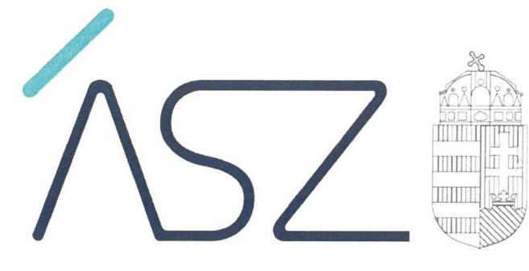

ÁLLAMI SZÁMVEVŐSZÉK

# JELENTÉS 

A Magyar Államkincstár nyilvánosságra hozott adatai, információi és a beszámolók kezelésével kapcsolatos tevékenységének ellenőrzése

2022. 

22042
www.asz.hu

---

ÁLLAMI SZÁMVEVŐSZÉK

# JELENTÉS 

A Magyar Államkincstár nyilvánosságra hozott adatai, információi és a beszámolók kezelésével kapcsolatos tevékenységének ellenőrzése
2022. 08 hó 16. nap

22042
www.asz.hu

---

# AZ ELLENŐRZÉST VEZETTE ÉS A VÉGREHAJTÁSÁÉRT FELELŐS: 

DR. GÁL NÓRA ellenőrzésvezető
MAKKAI MÁRIA ellenőrzésvezető
NEMESVÁRI-HORTHY ESZTER ellenőrzésvezető

## A PROGRAM ÖSSZEÁLLÍTÁSÁÉRT FELELŐS:

WELTHERNÉ SZOLNOKI DÓRA program készítésért felelős vezető

IKTATÓSZÁM: EL-3739-001/2022.
TÉMASZÁM: 2596
ELLENŐRZÉS-AZONOSÍTÓ SZÁM: V0940

---

# TARTALOMJEGYZÉK 

- ÖSSZEGZÉS ..... 5
- AZ ELLENŐRZÉS CÉLJA ..... 6
- AZ ELLENŐRZÉS TERÜLETE ..... 7
- AZ ELLENŐRZÉS HÁTTERE, INDOKOLTSÁGA ..... 8
- A JELENTÉS LÉNYEGES KÉRDÉSKÖREI ..... 9
- AZ ELLENŐRZÉS HATÓKÖRE ÉS MÓDSZEREI ..... 10
- MEGÁLLAPÍTÁSOK ..... 12
- MELLÉKLETEK ..... 15
I. sz. melléklet: Értelmező szótár ..... 15
- FÜGGELÉK: ÉSZREVÉTELEK ..... 17
- RÖVIDÍTÉSEK JEGYZÉKE ..... 19

---

.

---

# ÖSSZEGZÉS 

A Magyar Államkincstár a költségvetési adatokra és a tartozásállományra vonatkozó, közzététellel kapcsolatos, valamint az egyéb információ szolgáltatási feladatainak szabályozási környezetét kialakította.
A közzétett adatok és szolgáltatott egyéb információk megbizhatóságának biztositása érdekében a Magyar Államkincstár a jogszabályok által elöirt ellenörzési, felülvizsgálati és adategyeztetési feladatait - 2020. évben kisebb súlyú hiányosságokkal, 2021. I. félévében szabályszerüen - elvégezte.

## Az ellenőrzés társadalmi indokoltsága

A Magyar Államkincstár az államháztartás alrendszerei müködéséről, pénzügyi és vagyongazdálkodásáról havi, negyedéves, éves szinten, továbbá az államháztartás központi alrendszerébe tartozó költségvetési szervek lejárt tartozásairól havonta tesz közzé adatokat.

Az ÁSZ értékelésével hozzájárul a gazdasági szereplők valós és hiteles információkkal való ellátásának biztosításához, megalapozott, hiteles információkon alapuló gazdaságpolitikai intézkedések meghozatalához.

## Főbb megállapítások

A Magyar Államkincstár 2020. évben és 2021. I. félévében kialakította a közzétett és az egyéb információszolgáltatások keretében rendelkezésre bocsátott adatokra vonatkozóan a kontrollkörnyezetet, valamint az információs és kommunikációs rendszert.

A Magyar Államkincstár az államháztartás központi és önkormányzati alrendszerének bevételi és kiadási teljesítési adatai közzétételével kapcsolatos, jogszabályban előírt feladatait több esetben késedelmesen, a központi költségvetési szervek lejárt tartozásállományának közzétételi feladatait szabályszerűen elvégezte. Az önkormányzati alrendszer bevételi és kiadási teljesítési adatai és egyenlege ellenőrzésére a Kincstár belső szabályzatában foglaltak ellenére nem került sor. Az éves költségvetési beszámolók felülvizsgálatát a Kincstár 2021. I. félévében szabályszerűen elvégezte, a 2020. évi felülvizsgálatok elvégzése nem igazolt.

Az egyéb információszolgáltatások keretében az államháztartás központi alrendszerébe tartozó költségvetési szervek lejárt tartozásállományára vonatkozó adatszolgáltatást a tartozásállomány nyilvántartó rendszer - adategyeztetéseket követően lezárt - adatai alapján a Kincstár elkészítette.

---

# AZ ELLENŐRZÉS CÉLJA 

AZ ELLENŐRZÉS CÉLJA annak értékelése, hogy a Magyar Államkincstár a kötelezően közzéteendő adatokra, információkra vonatkozó második védelmi vonalbeli ellenőrzési tevékenysége hozzájárul-e a „jól irányított államhoz".

---

# AZ ELLENŐRZÉS TERÜLETE 

## Magyar Államkincstár

A Kincstár ${ }^{1}$ a 310/2017. (X. 31.) Korm. ${ }^{2}$ rendelet alapján az államháztartásért felelős miniszter ${ }^{3}$ irányítása alatt álló központi hivatalként működő központi költségvetési szerv. A Kincstárt az elnök vezeti, akinek munkáját öt elnökhelyettes segíti.
Szervezeti felépítését, múködését szervezeti és múködési szabályzata határozza meg, amit a Pénzügyminiszter 3/2021. (II. 15.) PM utasítása ${ }^{4}$ tartalmaz. A Kincstár szervezete központi szervből, 19 megyei igazgatóságból és kirendeltségekből áll, valamint hozzá tartozik az országos illetékességú Nyugdíjfolyósító Igazgatóság is.

A Kincstár az Áht ${ }^{5}$, illetve az annak végrehajtására kiadott Ávr. ${ }^{6}$ előírásainak megfelelően végzi a központi költségvetés végrehajtásával összefüggő alaptevékenységeit, emellett egyéb jogszabályokban előírt feladatokat lát el.
Tevékenységi köre a központi költségvetés végrehajtásával összefüggő finanszírozási, nyilvántartási, végrehajtási és ellenőrzési feladatok mellett számos más feladatra is kiterjed. Ilyen többek között a központi illetményszámfejtés, beszámolás és könyvvezetés, különböző befektetési és pénzügyi szolgáltatások, család- és egyéb szociális támogatások, energiaár- és lakástámogatások kezelése, követeléskezelés, vagy az Uniós támogatásokhoz kapcsolódó hatósági feladatok ellátása.

---

# AZ ELLENŐRZÉS HÁTTERE, INDOKOLTSÁGA 

Magyarország Alaptörvénye kimondja, hogy mindenkinek joga van a közérdekú adatok megismeréséhez és terjesztéséhez. Az információkat felhasználó szervezetek és személyek jogos elvárása, hogy a közzétett és rendelkezésre bocsátott adatok megbízhatóak legyenek. A Kincstár által közzétett adatok információt nyújtanak az államháztartás alrendszereinek gazdálkodásáról, továbbá a közzétett adatok alapján készített elemzések, tanulmányok hozzájárulhatnak a gazdaságpolitikai intézkedések megalapozásához is. Ezért kiemelt fontosságú annak értékelése, hogy az adatok közzététele milyen kontrollfolyamatok biztosítása mellett történik.

---

# A JELENTÉS LÉNYEGES KÉRDÉSKÖREI 

1. A Kincstár a közzétételt és az egyéb információszolgáltatási feladatok elvégzését biztositó belső kontrollrendszert kialakította-e?
2. A Kincstár a jogszabályban elöirt közzététellel kapcsolatos, valamint az egyéb információszolgáltatási feladatait elvégezte-e?

---

# AZ ELLENŐRZÉS HATÓKÖRE ÉS MÓDSZEREI 

## Az ellenőrzés típusa

Megfelelőségi ellenőrzés.

## Az ellenőrzött időszak

A 2020. év és a 2021. I. féléve.

## Az ellenőrzés tárgya

A Kincstár által kötelezően közzéteendő adatok és az egyéb információszolgáltatás keretében rendelkezésre bocsátott adatok kezelésének, felülvizsgálatának kontrollkörnyezete, információs és kommunikációs rendszerének kialakítása. A Kincstár ellenőrzési, közzétételi és adatszolgáltatási tevékenységének megfelelősége az államháztartás központi alrendszerébe tartozó szervek tartozásállománya, valamint a központi és az önkormányzati alrendszer szervezeteinek időközi adatszolgáltatásai, beszámolói vonatkozásában.

## Az ellenőrzött szervezet

A Magyar Államkincstár

## Az ellenőrzés jogalapja

Az ellenőrzés jogalapját az ÁSZ tv. ${ }^{7}$ 1. § (3) bekezdése, és 5. § (6) bekezdése képezi.

## Az ellenőrzés módszerei

Az ellenőrzést az ellenőrzési programban foglalt értékelési szempontok, az ellenőrzött időszakban hatályos jogszabályok, az ellenőrzés szakmai szabályai, a jelen ellenőrzésre irányadó ÁSZ módszertan figyelembevételével és a nemzetközi standardokat irányadónak tekintve kell elvégezni.

Az ellenőrzés ideje alatt az ÁSZ az ellenőrzött szervezettel történő kapcsolattartást az ÁSZ SZMSZ ${ }^{8}$-ének vonatkozó előírásai alapján biztosítja.

Az ellenőrzési kérdések megválaszolásához szükséges bizonyítékok megszerzése az ellenőrzött szervezetek által rendelkezésre bocsátott dokumentumokra, adatokra alapozva megfigyelés, szemle (szükség esetén

---

helyszíni szemle, szemrevételezés), kérdésfeltevés (információkérés), mintavételezés, valamint elemző eljárás útján történik. Az ellenőrzési bizonyítékként felhasználható adatforrások közé tartoznak egyrészt az ellenőrzési program részletes szempontjainál felsorolt adatforrások, másrészt minden egyéb - az ellenőrzés folyamán feltárt, az ellenőrzés szempontjából információt tartalmazó - dokumentum.

Az ellenőrzés lefolytatásához az ellenőrzött szervezet elektronikus úton szolgáltat adatokat, amelyek valódiságáról és teljes körűségéről az ellenőrzött szervezet vezetője teljességi és hitelességi nyilatkozatban nyilatkozik. A rendelkezésre bocsátott adatok, információk kontrollja az ellenőrzés keretében történik.

A kötelező adatszolgáltatásokat érintő ellenőrzési kötelezettség szabályszerű teljesítését, a közzétételi kötelezettséghez kapcsolódó és az egyéb információszolgáltatásokhoz kapcsolódó feladatok teljesítését az ÁSZ egyszerű véletlen mintavétellel ellenőrzi. A mintavétellel ellenőrzött területek esetében az egyes tételek vonatkozásában a megfelelőségre vonatkoznak a kérdések, amelyek eredménye összesítésre kerül. „Megfelelő" az ellenőrzött terület, amennyiben 95\%-os bizonyossággal a lényeges sokaságban az átlagos hibaarány legfeljebb 10\%, „nem megfelelő", amennyiben 10\%-nál magasabb arányt képviselt. Abban az esetben, ha a lényeges sokaság tekintetében a 10\%-os hibaarányhoz való viszony megítélésének megbízhatósága nem éri el a 95\%-ot, annak elérése érdekében értékelésük további szempontokkal kerül kiegészítésre, figyelembe véve a feltárt hibák értékét.

---

# 1. A Kincstár a közzétételt és az egyéb információszolgáltatási feladatok elvégzését biztosító belső kontrollrendszert kialakította-e? 

Összegző megállapítás

A Kincstár kialakította a közzétett és az egyéb információszolgáltatások keretében rendelkezésre bocsátott adatokra vonatkozóan a kontrollkörnyezetet, valamint az információs és kommunikációs rendszert.

A Kincstár 2020-ban és 2021. I. félévében rendelkezett az irányító szerv által jóváhagyott szervezeti és működési szabályzattal (SZMSZ ${ }_{1}{ }^{9}$ és SZMSZ ${ }_{2}{ }^{10}$ ). amely a jogszabályi előírásoknak megfelelően tartalmazta a szervezeti felépítést, a működés rendjét.

A Kincstár az ellenőrzött időszakban rendelkezett a központi költségvetési szervek tartozásállományára vonatkozó adatszolgáltatás kezelését és közzétételét szabályozó eljárásrenddel ${ }^{11}$ és ellenőrzési nyomvonallal. Az Ávr. 168. § és az Ávr. 6. sz. melléklet 2a pontjában meghatározottak figyelembevételével alakították ki a költségvetési szervek tartozásállományát érintő közzétételi gyakoriságra és a közzététel helyére vonatkozó előírásokat. Előírták továbbá az adatszolgáltatás határidőben történő teljesítésének ellenőrzését, meghatározták az adatszolgáltatáshoz kapcsolódó adategyezetési feladatokat és elkészítették a tartozásállomány kezelésének ellenőrzési nyomvonalát. A Kincstár kialakította továbbá a központi költségvetési szervek tartozásállományának nyilvántartó rendszerét a jogszabályi előírásokkal összhangban.

Az időközi költségvetési és mérlegjelentések kezelését szabályozó eljárásrendet a Kincstár kialakította, előírta az adatszolgáltatás határidőben történő teljesítésének ellenőrzését. Az adatszolgáltatások ellenőrzésével, felülvizsgálatával kapcsolatos belső szabályozásban ${ }^{12}$ az elvégzendő tartalmi és formai ellenőrzés vizsgálati szempontjait, feladatait meghatározta.

Az éves költségvetési beszámolók kezelését szabályozó eljárásrendet a Kincstár kialakította és előírta az adatszolgáltatás határidőben történő teljesítésének ellenőrzését, meghatározta továbbá a költségvetési szervek adataival kapcsolatos egyéb információszolgáltatások eljárásrendjét. A Kincstár a szabályszerűségi pénzügyi ellenőrzés szakmai szabályait a jogszabályi előírásoknak megfelelően az államháztartásért felelős miniszter egyetértésével alakította ki. A belső eljárásrendek ${ }^{1314}$ tartalmazzák az ellenőrizendő szervezetek kiválasztására, az éves ellenőrzési terv-készítési kötelezettségre, valamint annak kockázatelemzéssel történő megalapozására vonatkozó előírásokat.

---

# 2. A Kincstár a jogszabályban előírt közzététellel kapcsolatos, valamint az egyéb információszolgáltatási feladatait elvégezte-e? 

Összegző megállapítás

A Kincstár a jogszabályban előírt, tartozásállományra és költségvetési adatokra vonatkozó közzétételi, valamint az egyéb információszolgáltatási feladatait, továbbá a kapcsolódó ellenőrzéseket, felülvizsgálatokat és adategyeztetéseket elvégezte.

A Kincstár a központi költségvetési szervek lejárt tartozásállományára vonatkozó, az Ávr. 168. §, 6. melléklet 2a pontjában előírt közzétételt elvégezte a 2020. év és a 2021. I. félévében. A Kincstár a közzétételhez kapcsolódó adategyeztetést 2021. I. félévében elvégezte, amennyiben az intézmény tartozásállományának növekménye a megelőző hónaphoz képest a 300 millió Ft-ot meghaladta. Az adategyeztetés elvégzését a Kincstár a 2020. évben nem dokumentálta.

A Kincstár az államháztartás központi alrendszerének, valamint az államháztartás önkormányzati alrendszerének bevételi és kiadási teljesítési adatai vonatkozásában a 2020. év és a 2021. I. félévében 5-5 esetben az Ávr. 168. §, 6. mellékletének 16. pontja szerinti havi és 18. pontja szerinti negyedéves közzétételi kötelezettségének több hónapos késedelemmel tett eleget.

A központi alrendszer szervezetei bevételei és kiadási teljesítési adatai és egyenlege vonatkozásában közzétett költségvetési adatok honlapra történő kihelyezését megelőzően megtörtént az adatok ellenőrzése, míg az önkormányzati alrendszer bevételei és kiadási teljesítési adatai és egyenlege vonatkozásában erre a Kincstár belső szabályzatában foglaltak ellenére nem került sor az ellenőrzött időszakban.

A helyi önkormányzatok, nemzetiségi önkormányzatok, társulások, térségi fejlesztési tanácsok és az általuk fenntartott költségvetési szervek szabályszerűségi pénzügyi ellenőrzését a Kincstár a 2020. évben és 2021. I. félévében a jogszabályi előírásokkal összhangban, az államháztartásért felelős miniszter által jóváhagyott éves ellenőrzési terv alapján, a szakmai szabályoknak megfelelő tartalommal és kockázatelemzéssel megalapozva, szabályszerűen végezte.

Az időközi költségvetési jelentésekkel és az időközi mérlegjelentésekkel kapcsolatos ellenőrzési feladatait a Kincstár az erre vonatkozó elnöki utasítás ${ }^{15}$ szerint, szabályszerűen végezte.

Az éves költségvetési beszámolók Áhsz. 35.§ (1) bekezdésében előírtak szerinti felülvizsgálatával kapcsolatos feladatok elvégzését a Kincstár 2020. évre vonatkozóan nem igazolta. A 2021. I. félévében a beszámolók felülvizsgálatát szabályszerűen elvégezték.

A Kincstár a kincstári költségvetési jelentést, a negyedéves mérlegjelentést határidőben közzétette, a költségvetési szervek lejárt tartozásállományának adatait egyéb információszolgáltatás keretében továbbította a belső szabályozásában megjelölt szervezetek felé.

---

.

---

# MELLÉKLETEK 

## I. SZ. MELLÉKLET: ÉRTELMEZŐ SZÓTÁR

adatszolgáltatás az államháztartás központi alrendszerébe tartozó költségvetési szervek tartozásállományáról
államháztartás központi alrendszere
államháztartás önkormányzati alrendszere
belső kontrollrendszer
információs és kommunikációs rendszer
egyéb információszolgáltatás
Kincstár költségvetési referensei által a központi és az önkormányzati alrendszer szervezetei által feltöltött adatok vonatkozásában végzett ellenőrzések
kincstári szabályszerűségi pénzügyi ellenőrzés

Az Ávr. 167/M. § (1) bekezdése alapján az Ávr. 5. melléklet 4. pontja szerint az államháztartás központi alrendszerébe tartozó költségvetési szervek számára előírt rendszeres adatszolgáltatási kötelezettség - havonta a tárgyhó utolsó napi állapotnak megfelelően a tárgyhót követő hónap 5. napja - a költségvetési szerv tartozásállományára vonatkozó adatokról. (Forrás: Ávr. 5. melléklet)
Az államháztartás központi és önkormányzati alrendszerből áll. Az államháztartás központi alrendszerébe tartozik: a) az állam, b) a központi költségvetési szerv, c) a törvény által az államháztartás központi alrendszerébe sorolt köztestület, és d) a c) pont szerinti köztestület által irányított köztestületi költségvetési szerv. (Forrás: Áht. 3. § (1)-(2) bekezdés)
Az államháztartás központi és önkormányzati alrendszerből áll. Az államháztartás önkormányzati alrendszerébe tartozik: a) a helyi önkormányzat, b) a helyi nemzetiségi önkormányzat és az országos nemzetiségi önkormányzat, c) a Magyarország helyi önkormányzatairól szóló 2011. évi CLXXXIX. törvény és a nemzetiségek jogairól szóló 2011. évi CLXXIX. törvény szerint létrehozott társulás, valamint a területfejlesztésről és a területrendezésről szóló törvény alapján létrejött területfejlesztési önkormányzati társulás, d) a térségi fejlesztési tanács, és e) az a)-d) pontban foglaltak által irányított költségvetési szerv. (Forrás: Áht. 3. § (1)-(3) bekezdés)

A belső kontrollrendszer a kockázatok kezelése és tárgyilagos bizonyosság megszerzése érdekében kialakított folyamatrendszer, amely azt a célt szolgálja, hogy a múködés és gazdálkodás során a tevékenységeket szabályszerűen, gazdaságosan, hatékonyan, eredményesen hajtsák végre, az elszámolási kötelezettségeket teljesítsék és megvédjék az erőforrásokat a veszteségektől, károktól és nem rendeltetésszerű használattól. (Forrás: Áht. 69. § (1) bekezdés)
A költségvetési szerv vezetője által kialakított és múködtetett olyan rendszer, amely biztosítja, hogy a megfelelő információk a megfelelő időben eljussanak az illetékes szervezethez, szervezeti egységhez, illetve személyhez. (Forrás: Bkr. 9. § (1) bekezdés)
A Kincstár által a költségvetési szervek adatai vonatkozásában a központi alrendszer szervei részére történő adat/információ átadás.
Az Áht. 108. § (1) bekezdése alapján az adatszolgáltatásra kötelezett szervek az elemi költségvetésről, az éves költségvetési beszámolóról az államháztartás információs rendszere keretében adatszolgáltatást teljesítenek, a költségvetési év során az Ávr.-ben meghatározott gyakorisággal pedig időközi költségvetési jelentést és időközi mérlegjelentést készítenek a Kincstár számára. Az adatszolgáltatásokat a Kincstár az Ávr.-ben és az időszakos adatszolgáltatások felülvizsgálati módszertanáról szóló utasításaiban, szabályzataiban meghatározottak szerint felülvizsgálja, ellenőrzi.
A Kincstár által az Áht. 68/B. § (1) bekezdés a)-c) pontja szerinti szabály-szerűségi pénzügyi ellenőrzés. A kincstári ellenőrzési jogköre a helyi ön-kormányzat, nemzetiségi önkormányzat, társulás, térségi fejlesztési tanács és az általuk irányított költségvetési szerv számviteli szabályok szerinti könyvvezetési kötelezettségének, az Áht. 70. alcím alapján teljesítendő adatszolgáltatási kötelezettségek szabályszerű teljesítésének, és az éves költségvetési beszámoló megbízható, valós összképének vizsgálatára terjed ki. (Forrás: Áht. 68/B. § (1) bekezdése) - kincstári ellenőrzés

---

kontrollkörnyezet

Költségvetési adat
költségvetési szervek adatai
közzétett adatok
szolgáltatott adatok
adat
adatszolgáltatás
államháztartás információs rendszere
közérdekú adat

A költségvetési szerv vezetője által kialakított olyan elvek, eljárások, belső szabályzatok öszszessége, amelyben világos a szervezeti struktúra, a folyamatok átláthatóak, egyértelműek a felelősségi, hatásköri viszonyok és feladatok, meghatározottak, ismertek és elfogadottak az etikai elvárások a szervezet minden szintjén, átlátható a humánerőforrás-kezelés, biztosított a szervezeti célok és értékek irányában való elkötelezettség fejlesztése és elősegítése. (Forrás: Bkr. 6. § (1) bekezdés)
Az időközi költségvetési- és mérlegjelentésekből, éves költségvetési beszámolókból származó, a Kincstár által összesített, más szervezet részére szolgáltatott, elérhetővé tett adat. lejárt tartozásállomány adata, költségvetési adat, kincstári költségvetési jelentés adatai Olyan nyilvános adatok, amelyeket a Kincstár, mint közzétételre kötelezett, az Ávr. 6. mellékletben foglaltak szerint saját honlapján közzétesz.
Olyan adatok, amelyeket a Kincstár nem hoz nyilvánosságra, jogszabály, belső szabályozásalapján továbbít más szervezetek felé.
Az információ formalizált módon való megjelenítése, amely alkalmas feldolgozásra, továbbításra, közlésre, értelmezésre. (Forrás: KSH honlapja)
Az ellenőrzés az államháztartás információs rendszerében továbbított költségvetési, pénzügyi és vagyoni adatok körére terjed ki.
Bizonyos adat közlése, bevallása (szóban vagy írásban) valamely hivatal, hatóság felkérésére vagy felszólítására hivatalos céllal. (Forrás: A magyar nyelv értelmező szótára)
Az államháztartás információs rendszere az államháztartás egészére, a kormányzati szektorba sorolt egyéb szervezetekre, és az államháztartással kapcsolatba kerülő természetes személyek, jogi személyek és jogi személyiséggel nem rendelkező egyéb szervezetek e kapcsolatára kiterjedő
a) azonosító adatokat,
b) költségvetési, pénzügyi, számviteli adatokat, és
c) a költségvetési adatokhoz és információkhoz kapcsolódó naturális mutatószámokat gyüjtő, nyilvántartó, feldolgozó és szolgáltató információs rendszer. (Forrás: Áht. 103. § (2) bekezdése)
Az állami vagy helyi önkormányzati feladatot, valamint jogszabályban meghatározott egyéb közfeladatot ellátó szerv vagy személy kezelésében lévő és tevékenységére vonatkozó vagy közfeladatának ellátásával összefüggésben keletkezett, a személyes adat fogalma alá nem eső, bármilyen módon vagy formában rögzített információ vagy ismeret, függetlenül kezelésének módjától, önálló vagy gyűjteményes jellegétől, így különösen a hatáskörre, illetékességre, szervezeti felépítésre, szakmai tevékenységre, annak eredményességére is kiterjedő értékelésére, a birtokolt adatfajtákra és a múködést szabályozó jogszabályokra, valamint a gazdálkodásra, a megkötött szerződésekre vonatkozó adat. (Forrás: Info tv. 3. § 5. pontja)

---

# FÜGGELÉK: ÉSZREVÉTELEK 

Az ellenőrzés megállapításait a Számvevőszék 15 napos észrevételezésre megküldte az ellenőrzött szervezet vezetőjének az ÁSZ tv. 29. §* (1) bekezdése előírásának megfelelően.

A Kincstár elnöke az ellenőrzés megállapításaira észrevételt tett. A függelék az alábbiakban tartalmazza a figyelembe nem vett észrevételt, és annak indoklását, hogy azt az Állami Számvevőszék miért nem fogadta el.

## A Kincstár észrevétele

Az Állami Számvevőszék megállapításában is hivatkozott belső szabályozás szerint a Kincstár egyeztetést végez a 300 millió Ft összeget meghaladó tartozás növekedésről az érintett intézményekkel, amely 2021 márciusát megelőzően szóban történt.

## Az észrevétel el nem fogadásának indoklása

Az észrevétel megerősíti, hogy az egyeztetésről dokumentum nem áll rendelkezésre, így nem igazolt a hivatkozott belső szabályozás szerinti, 300 millió Ft összegű tartozásállománynövekményt elérő intézményekkel folytatandó, közzétételt megelőző adategyeztetés végrehajtása a 2020. év vonatkozásában.

[^0]
[^0]:    * 29. § (1) Az Állami Számvevőszék az ellenőrzési megállapításait megküldi az ellenőrzött szervezet vezetőjének vagy az általa megbízott személynek, és annak, akinek személyes felelősségét állapította meg.
    (2) Az ellenőrzött szervezet vezetője és a felelősként megjelölt személy az ellenőrzés megállapításaira tizenöt napon belül írásban észrevételt tehet.
    (3) Az Állami Számvevőszék az észrevételre a beérkezésétől számított harminc napon belül írásban válaszol. A figyelembe nem vett észrevételeket köteles a jelentésben feltüntetni, és megindokolni, hogy azokat miért nem fogadta el.

---

.

---

# RÖVIDÍTÉSEK JEGYZÉKE 

${ }^{1}$ Kincstár
${ }^{2}$ 310/2017. (X. 31.) Korm. rendelet
${ }^{3}$ miniszter
${ }^{4}$ 3/2021. (II. 15.) PM utasítás
${ }^{5}$ Áht.
${ }^{6}$ Ávr.
${ }^{7}$ ÁSZ tv.
${ }^{8}$ ÁSZ SZMSZ

SZMSZ $_{1}$

SZMSZ $_{2}$
${ }^{11}$ 55/2019. sz. Elnöki Utasítás
${ }^{12}$ adatszolgáltatással kapcsolatos belső szabályozás
${ }^{13}$ 13/2019. sz. Elnöki Utasítás
${ }^{14}$ 38/2020. sz. Elnöki Utasítás
${ }^{15}$ 10/2018.(III. 29.) elnöki utasítás

Magyar Államkincstár
310/2017. (X. 31.) Korm. rendelet a Magyar Államkincstárról
államháztartásért felelős miniszter
A pénzügyminiszter 3/2021. (II. 15.) PM utasítása a Magyar Államkincstár Szervezeti és Müködési Szabályzatáról
2011. évi CXCV. törvény az államháztartásról

368/2011. (XII. 31.) Korm. rendelet az államháztartásról szóló törvény végrehajtásáról
2011. évi LXVI. törvény az Állami Számvevőszékről

Az Állami Számvevőszék elnökének 3/2021. (VIII.13.) ÁSZ utasítása az Állami Számvevőszék Szervezeti és Müködési Szabályzatáról
A nemzetgazdasági miniszter 28/2017. (X. 31.) NGM utasítása a Magyar Államkincstár Szervezeti és Müködési Szabályzatáról (hatályos 2017. november 1-jétől, ellenőrzött időszakot érintő módosításai: a pénzügyminiszter 5/2019. (V. 10.) PM utasítása a Magyar Államkincstár Szervezeti és Müködési Szabályzatáról szóló 28/2017. (X. 31.) NGM utasítás módosításáról (hatályos: 2019.05.11-től); a pénzügyminiszter 13/2020. (VII. 31.) PM utasítása a Magyar Államkincstár Szervezeti és Müködési Szabályzatáról szóló 28/2017. (X. 31.) NGM utasítás módosításáról (hatályos: 2020.08.01-től); a pénzügyminiszter 17/2020. (IX. 4.) PM utasítása a Magyar Államkincstár Szervezeti és Müködési Szabályzatáról szóló 28/2017. (X. 31.) NGM utasítás módosításáról (hatályos: 2020.09.05-től))

A pénzügyminiszter 3/2021. (II. 15.) PM utasítása a Magyar Államkincstár Szervezeti és Müködési Szabályzatáról (hatályos: 2021.02.23-tól)
A Magyar Államkincstár elnökének 55/2019. sz. Elnöki Utasítása a központi költségvetés előirányzat-nyilvántartásának, finanszírozásának, nettó finanszírozásának, tartozásállomány kezelésének eljárásrendjéről (hatályos: 2019. október 6-ától)

Ellenőrzési szempontok az időközi költségvetési jelentés és az időköz mérlegjelentés Kincstár által történő felülvizsgálatához, valamint a kincstári pénzforgalom lebonyolítása során használt azonosítók (ERA kódok) használatához 2020. év Ellenőrzési szempontok az időközi költségvetési jelentés és az időköz mérlegjelentés Kincstár által történő felülvizsgálatához, valamint a kincstári pénzforgalom lebonyolítása során használt azonosítók (ERA kódok) használatához 2021. év 13/2019. sz. Elnöki Utasítás a szabályszerűségi pénzügyi ellenőrzések lefolytatásához készített eljárásrendről (Hatályos: 2019.03.26-tól) 38/2020. sz. Elnöki Utasítás a szabályszerűségi pénzügyi ellenőrzések lefolytatásához készített eljárásrendről (Hatályos: 2020.06.09-től) Kincstár 10/2018.(III. 29.) elnöki utasítása a Magyar Államkincstár által működtetett elektronikus adatszolgáltató rendszerben teljesítendő adatszolgáltatások kezelésének eljárásrendje

---

# ASZ 

ALLAMI SZAMVEVOSZEK
1052 Budapest, Apáczai Cs. J. u. 10. I 1364 Budapest 4. Pf. 54 TEL: +36 14849100
email: szamvevoszek@asz.hu
web: www.asz.hu | www.aszhirportal.hu