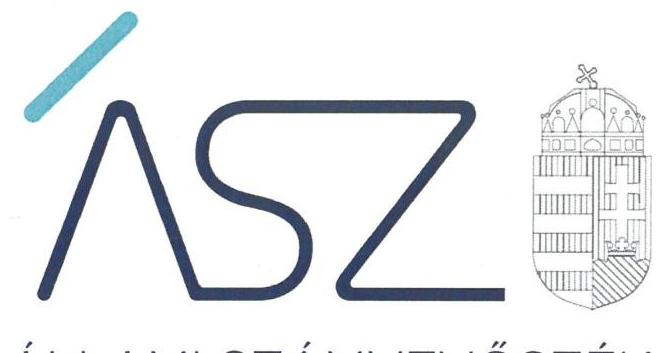
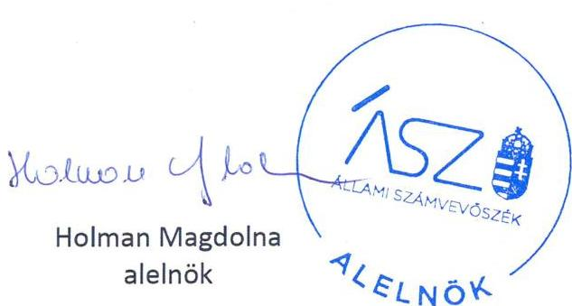
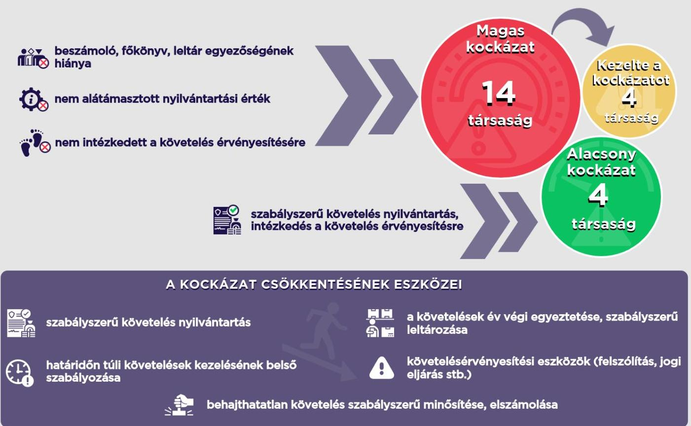

ÁLLAMI SZÁMVEVŐSZÉK

# JELENTÉS 

Nemzeti tulajdonú gazdasági társaságok ellenőrzése

A nemzeti tulajdonú gazdasági társaságoknál a bevételek beszedésének és elszámolásának kockázat alapú ellenőrzése
2022.

22043
www.asz.hu

---

ÁLLAMI SZÁMVEVŐSZÉK

# JELENTÉS 

Nemzeti tulajdonú gazdasági társaságok ellenőrzése

A nemzeti tulajdonú gazdasági társaságoknál a bevételek beszedésének és elszámolásának kockázat alapú ellenőrzése

22043
www.asz.hu

---

# AZ ELLENŐRZÉST VEZETTE ÉS A VÉGREHAJTÁSÁÉRT FELELŐS: 

SALAMON ILDIKÓ ellenőrzésvezető
KISTÓTH KRISZTINA ellenőrzésvezető
KAKAS SÁNDOR ellenőrzésvezető

A PROGRAM ÖSSZEÁLLÍTÁSÁÉRT FELELŐS:
DR. FELFÖLDI IZABELLA projektvezető

IKTATÓSZÁM: EL-3743-001/2022.
TÉMASZÁM: 2588
ELLENŐRZÉS-AZONOSÍTÓ SZÁM: V-0932

Jelentéseink az Országgyülés számítógépes hálózatán és az interneten a www.asz.hu címen is olvashatóak.

---

# TARTALOMJEGYZÉK 

■ ÖSSZEGZÉS ..... 5
■ AZ ELLENŐRZÉS AKTUALITÁSA, TÁRSADALMI SZEREPE, SZEMPONTJA ..... 7
■ AZ ELLENŐRZÉS TERÜLETE ..... 8
■ AZ ELLENŐRZÉS HATÓKÖRE ÉS MÓDSZERE ..... 10
JAVASLATOK ..... 12
MELLÉKLETEK ..... 13
I. sz. melléklet: Értelmező szótár ..... 13
II. sz. melléklet: Intézkedést igénylő megállapítások ..... 14
FÜGGELÉKEK ..... 15
RÖVIDÍTÉSEK JEGYZÉKE ..... 19

---

.

---

# ÖSSZEGZÉS 

Az Állami Számvevőszék által értékelt 18 állami tulajdonú gazdasági társaságból a bevételek beszedésével és elszámolásával kapcsolatos gazdálkodás 14-nél magas és négynél alacsony kockázatot hordozott. A hibák feltárását követően négy társaság vezetője érdemi intézkedést tett a kockázatok csökkentése érdekében.

## Értékelés

A többségi állami tulajdonú gazdasági társaságok bevételeik jogszabályi előírásoknak megfelelő beszedésével és elszámolásával hozzájárulnak a nemzeti vagyonnal való felelős gazdálkodáshoz.

Amennyiben a gazdasági társaság követeléseiről szabályszerű nyilvántartást vezet - ahol a követelés összege az elfogadott, elismert összegben szerepel - az megbízható adatokat biztosít a követelések beszedéséhez. A lejárt követelések figyelemmel kísérése, a követelésérvényesítési eszközök alkalmazása, a követeléskezelés érdekében megfelelő időben megtett intézkedések mind a követelések behajtásának hatékonyságát növelik.

Ha a gazdasági társaság nem rendelkezik a jogosult által aláírt, a mérleget, az eredménykimutatást és a kiegészítő mellékletet egyaránt tartalmazó éves számviteli beszámolóval, vagy a társaságnál a főkönyvi könyvelés és az analitikus nyilvántartások adatai közötti egyeztetést a követelések esetében az üzleti év mérleg fordulónapjára vonatkozóan nem végezték el, az magas kockázatot hordoz a bevételek beszedése, elszámolása vonatkozásában. Kockázatot hordoz továbbá, ha a gazdasági társaság lejárt követeléseinek nyilvántartása, az adóssal való egyeztetése, annak behajthatatlan követeléssé minősítése szabálytalan vagy hiányos, valamint, ha a társaság lejárt követelése érvényesítésére, behajtására nem intézkedett.

ALACSONY KOCKÁZATot hordozott a 2020. év vonatkozásában a 18 értékeltből négy gazdasági társaság bevételek beszedésével és elszámolásával kapcsolatos gazdálkodása. A társaságok követelés-nyilvántartása szabályszerű volt, a követeléskezeléshez szükséges információk biztosítottak voltak. A határidőn túli követeléssel rendelkező kettő társaság gondoskodott a követelésállomány év végi egyeztetéséről. A hitelezési veszteséget elszámoló társaság a leírást megelőzően követelése érvényesítése érdekében intézkedett, a behajthatatlan követeléseket a Számviteli törvény és belső szabályzatában rögzítettek szerint minősítette és számolta el.

MAGAS KOCKÁZATot hordozott 14 gazdasági társaság gazdálkodása. Öt társaság nem igazolta, hogy rendelkezik a Számviteli törvény szerinti, aláírt 2020. évi beszámolóval. Öt társaság nem igazolta teljes körűen a követelések mérlegsor leltári alátámasztását, amely a mérlegbe bekerülő adatok megbízhatóságának a feltétele. Egy társaságnál a főkönyvi és analitikus nyilvántartás közötti egyezőség nem állt fenn, ezért a nem szabályszerű nyilvántartás nem biztosított megbízható információt a követelések beszedéséhez, a bevételek minél teljesebb körű realizálása érdekében. Kettő társaság lejárt követelései értékének az adós általi elismertsége, elfogadottsága, az adóssal való év végi egyeztetés nem volt dokumentált, így a mérlegbe bekerülő érték nem volt alátámasztott. Egy további társaság nem igazolta, hogy a hitelezési veszteség leírását megelőzően megtörtént a követelés Számviteli törvény előírásai szerinti értékelése és behajthatatlanná minősítése, valamint hogy a követelés kivezetése előtt annak érvényesítése érdekében intézkedett, behajtási eszközöket alkalmazott.

## Következtetés

A magas kockázattal rendelkező gazdasági társaságoknál nem voltak igazoltak a követelésállomány átlátható és hatékony kezelésének feltételei. A beszámoló követelések mérlegsorának leltári alátámasztása hiányában, valamint a főkönyvi és az analitikus nyilvántartások egyezőségének hiánya esetén nem volt biztosított a követelésekkel, és ennek következtében a bevételek beszedésével való gazdálkodás átláthatósága.

Az Állami Számvevőszék - a kockázatok kezelése és a közpénzügyi helyzet javítása érdekében - felhívta a 14 magas kockázatú társaság képviseletére jogosult vezető figyelmét a megállapított hiányosságokra. Közülük az Egyetemi

---

Centrum Szolgáltató Kft., a Pécsi Tudásközpont Kft. és a HDT Védelmi Ipari Kft. ügyvezetője, valamint az MVM Optimum Zrt. vezérigazgatója tájékoztatta az ÁSZ-t a feltárt hiányosságok okainak kivizsgálásáról, illetve a javítással kapcsolatos konkrét intézkedésekről. Azoknál a társaságoknál, amelyeknél intézkedést igénylő megállapítások maradtak fenn, az ÁSZ a képviseletre jogosult vezetőknek a jövőre vonatkozóan intézkedési javaslatokat fogalmazott meg.

# A KÖVETELÉS ÁLLOMÁNY ÁTLÁTHATÓ KEZELÉSE, A HATÉKONY PÉNZBESZEDÉS A NEMZETI VAGYON MEGŐRZÉSÉNEK EGYIK ESZKÖZE 

beszámoló, főkönyv, leltár egyezőségének

---

# AZ ELLENŐRZÉS AKTUALITÁSA, TÁRSADALMI SZEREPE, SZEMPONTJA 

Magyarország Alaptörvénye ${ }^{1}$ rögzíti, hogy az állam és a helyi önkormányzat tulajdona nemzeti vagyon. Az Alaptörvény alapján a nemzeti vagyon kezelésének, védelmének célja a közérdek szolgálata, a közös szükségletek kielégítése és a természeti erőforrások megóvása, valamint a jövő nemzedékek szükségleteinek figyelembevétele. A nemzeti vagyonról szóló 2011. évi CXCVI. törvény 7. § (1) bekezdés szerint a nemzeti vagyon alapvető rendeltetése a közfeladat ellátásának biztosítása, ideértve a lakosság közszolgáltatásokkal való ellátását és e feladatok ellátásához szükséges infrastruktúra biztosítását. A közfeladatok ellátása nagyrészt nemzeti tulajdonba tartozó gazdasági társaságok útján valósul meg.

A határidőn túli kintlévőségek kezelése mindennapos probléma Magyarországon. A hazai gazdálkodó szervezetek fenntartható működésének egyik feltétele a kintlévőségeik eredményes csökkentése, illetve az ezek megszüntetésére való törekvés. A követeléskezelés kapcsán a megfelelő időben megtett eljárási cselekmények kiemelt jelentőségűek, azok figyelemmel kísérésével a követelések behajtásának hatékonyságát szignifikánsan növelhetik.

A jelenlegi gazdasági környezetben a nemzeti tulajdonú gazdasági társaságok kintlévőségek beszedésével kapcsolatos nehézségekre utaló jelek korai felismerésével, megfelelő intézkedések megtételével növelhető a társaság túlélési potenciálja, amely valamennyi gazdálkodó elsődleges célja.

A kockázatértékelésen alapuló ellenőrzés a többségi állami és a többségi önkormányzati tulajdonban lévő gazdasági társaságok esetében a bevételeket érintő, illetve követeléskezelési intézkedéseikre fókuszál. Az ellenőrzés a gazdasági társaság gyakorlatát értékeli a számviteli nyilvántartáson keresztül a bevételek beszedésének és elszámolásának számviteli nyilvántartásban való rögzítése, a lejárt követelések nyilvántartása, a követelésállomány év végi egyeztetése, és a behajthatatlan követelések minősítése vonatkozásában. A társaságok ellenőrzése kapcsán az ÁSZ értékeli, hogy a társaságok befektetett eszközeikből származó bevételeinek rögzítése során hogyan jártak el, valamint milyen szükséges lépéseket tettek meg a követelésállományaik csökkentése érdekében.

---

# **AZ ELLENŐRZÉS TERÜLETE**

## **18 többségi állami tulajdonban lévő gazdasági társaság**

A nemzeti tulajdonban álló gazdasági társaságok jelentős szerepet töltenek be a nemzeti vagyon megőrzésében és gyarapításában, az általuk kezelt vagyon értéke számottevő, jelentős mértékben befolyásolják az ország gazdasági teljesítményét, állami vagy önkormányzati feladatot látnak el. A nemzeti tulajdonú gazdasági társaságok tevékenysége, gazdálkodásuk minősége, hatékonysága és eredményessége nagymértékben érinti az általuk végzett szolgáltatásokat igénybe vevő lakosság életminőségét, biztonságát, egészségét és jólétét, és hozzájárul a felelős közpénzgazdálkodáshoz.

Az ellenőrzés a kockázatértékelés alapján kiválasztott olyan 18 állami tulajdonú gazdasági társaságra terjedt ki, melyeknél korábban az ÁSZ integritási kockázatot azonosított. Amennyiben gazdasági társaságnál a gazdálkodási és kockázatkezelésre vonatkozó alapvető szabályozás terén integritási kockázat azonosítható, az összetett, rendszerszintű hiányosságra utal. Ezért indokolt értékelni a bevételek beszedését és elszámolását, tekintettel arra, hogy ez az adott társaság gazdálkodására is közvetlenül hatást gyakorol.

Az ellenőrzött társaságok felsorolását – az alapítás időpontjával, valamint fő tevékenységükkel együtt – az 1. táblázat mutatja be.

1. táblázat

|  Ellenőrzött társaság | Alapítás időpontja | Főtevékenység  |
| --- | --- | --- |
|  BÉKÉS AIRPORT Repülőtér Működtető Fejlesztő Kft. | 2002. 05. 31. | Légi szállítást kiegészítő szolgáltatás  |
|  Budapest Institute of Banking Zrt. | 2017. 08. 21. | Egyéb oktatás  |
|  DABIC Dél-Alföldi Bio-Innovációs Centrum Nonprofit Kft. | 2009. 05. 20. | Egyéb természettudományi, műszaki kutatás, fejlesztés  |
|  Egyetemi Centrum Szolgáltató Kft. | 1993. 04. 30. | Saját tulajdonú, bérelt ingatlan bérbeadása, üzemeltetése  |
|  HDT Védelmi Ipari Kft. | 2019. 07. 25. | Üzletvezetés  |
|  Hollóházi Hungarikum Nonprofit Kft. | 2009. 12. 17. | Múzeumi tevékenység  |
|  IKK Innovatív Képzéstámogató Központ Zrt. | 2012. 11. 12. | Oktatást kiegészítő tevékenység  |
|  KELER Központi Értéktár Zrt. | 1993. 10. 12. | Pénz-, tőkepiac igazgatása  |
|  KELER KSZF Központi Szerződő Fél Zrt. | 2011. 01. 26. | Pénz-, tőkepiac igazgatása  |
|  MOKÉP-PANNÓNIA Filmgyártó- és Forgalmazó Kft. | 1994. 09. 30. | Film-, video- és televízióprogram terjesztése  |
|  MKK Magyar Követeléskezelő Zrt. | 1997. 01. 01. | Egyéb pénzügyi közvetítés  |
|  MVM ENERGO-MERKUR Villamos- energiaipari Kereskedelmi és Szolgáltató Kft. | 1993. 03. 31. | Vegyestermékkörű nagykereskedelem  |

## **AZ ELLENŐRZÖTT GAZDASÁGI TÁRSASÁGOK**

---

| Ellenőrzött társaság | Alapítás időpontja | Főtevékenység |
| :--: | :--: | :--: |
| MVM Optimum Zrt. | 2015. 12. 16. | Mérnöki tevékenység, műszaki tanácsadás |
| PÉCSI TUDÁSKÖZPONT Kft. | 2010. 07. 16. | Saját tulajdonú, bérelt ingatlan bérbeadása, üzemeltetése |
| Posta Paletta Zrt. | 2011. 04. 01. | Élelmiszer, ital, dohányáru vegyes nagykereskedelme |
| Somogy megyei Beruházásszervező és Mérnöki Kft. | 2011. 04. 03. | Építményüzemeltetés |
| Toll Service Zrt. | 1993. 12. 13. | Egyéb szakmai, tudományos, műszaki tevékenység |
| Vasúti Műszaki Vizsgálóközpont Zrt. (új neve 2021. 10. 27-től Express Innovation Agency VMV Nonprofit Zrt.) | 2017. 12. 28. | Egyéb természettudományi, műszaki kutatás, fejlesztés |

Forrás: ÁSZ ellenőrzési adatok

---

# AZ ELLENŐRZÉS HATÓKÖRE ÉS MÓDSZERE 

## Az ellenőrzés típusa

Megfelelőségi ellenőrzés.

## Az ellenőrzött időszak

2020. év

## Az ellenőrzés tárgya

Az ellenőrzés tárgyát a többségi állami tulajdonban lévő gazdasági társaságok fizetőképességének megőrzése céljából a bevételek elszámolásának, valamint a lejárt követelésállomány csökkentése érdekében megtett intézkedések értékelése képezi. Az ellenőrzés kiterjed a lejárt követelések számviteli nyilvántartásokban való rögzítésére, a követelésállomány év végi egyeztetési kötelezettségének végrehajtására, behajthatatlan követelések minősítésére, valamint a befektetett eszközökből származó bevételek elszámolására is.

## Az ellenőrzött szervezetek

18 többségi állami tulajdonban lévő gazdasági társaság, a társaságok felsorolását az ellenőrzés területe fejezet tartalmazza.

## Az ellenőrzés jogalapja

Az ÁSZ tv. ${ }^{2}$ 1. § (3) bekezdés, 5. § (3)-(5) bekezdései képezik.

## Az ellenőrzés módszerei

Az ellenőrzést az ellenőrzési program szempontjai, az ellenőrzött időszakban hatályos jogszabályok, a jelen ellenőrzésre irányadó ÁSZ módszertan figyelembevételével és a nemzetközi standardokat irányadónak tekintve végzi az ÁSZ.

Az ellenőrzési kérdések megválaszolásához szükséges bizonyítékok megszerzése a következő ellenőrzési eljárások alkalmazásával történik: megfigyelés, összehasonlítás, mintavételezés, valamint elemző eljárás és szükség esetén helyszíni szemle. Az ellenőrzési bizonyítékként felhasználható adatforrások közé tartoznak a szakmai program részletes szempontjainál felsorolt adatforrások, továbbá minden - az ellenőrzés folyamán feltárt, az ellenőrzés szempontjából információt tartalmazó dokumentum.

---

A kockázatalapú ellenőrzési megközelítéssel azokat a lényeges területeken felmerülő kockázatokat értékeli az ÁSZ, amelyek érdemi kockázatot jelenthetnek a gazdasági társaság
 pénzügyi helyzetére. Jelen ellenőrzés során, meghatározott lényeges dokumentumok tartalmi értékelését végzi el az ÁSZ, olyan kiválasztott kritériumok alapján, amelyek bármelyikének az ellenőrzött múltbeli időszakra vonatkozóan megállapított hiánya kockázatot jelent a gazdasági társaság jövőbeli pénzügyi gazdálkodására. Az értékelés alapján az ÁSZ azonosítja az ellenőrzött szervezetre vonatkozó gazdálkodási kockázatokat.

A lényeges dokumentumok alapján végzett ellenőrzés a társaság fizetőképességének megőrzésére hatást gyakorló bevételek beszedését és elszámolását értékeli a számviteli nyilvántartások vezetésén keresztül, és lehetőséget biztosít további kockázatok beazonosítására.

Az ellenőrzés a kockázatértékelés alapján kiválasztott olyan nemzeti tulajdonú gazdasági társaságokra terjed ki, melyeknél integritási kockázat került azonosításra. A törvényi előírásokat, valamint az ÁSZ által meghirdetett, nyilvános módszertant figyelembe véve az ellenőrzés hatóköre kiegészülhet az ellenőrzés megkezdésének időpontjáig kockázatjelzések, valamint a kockázatértékelés függvényében további lényeges területek szabályosságának ellenőrzésével.

A lejárt vevőkövetelések, a hitelezési veszteségként leírt behajthatatlan követelések kezelését és a bevételek beszedését az ÁSZ a 3-3 legnagyobb értékű tranzakció ellenőrzésén keresztül végzi.

Az ellenőrzés lefolytatásához az ellenőrzött szervezet a kitöltött tanúsítványok, valamint az ÁSZ által kért dokumentumok elektronikus úton való rendelkezésre bocsátásával szolgáltat adatokat, információkat.

---

# JAVASLATOK 

Az ÁSZ tv. 33. § (1) bekezdésében foglaltak értelmében az ellenőrzött szervezet vezetője köteles a jelentésben foglalt megállapításokhoz kapcsolódó intézkedési tervet összeállítani és azt a jelentés kézhezvételétől számított 30 napon belül az ÁSZ részére megküldeni. Amennyiben az ellenőrzött szervezet vezetője nem küldi meg határidőben az intézkedési tervet, vagy továbbra sem elfogadható intézkedési tervet küld, az Állami Számvevőszék elnöke az ÁSZ tv. 33. § (3) bekezdése a) és b) pontjaiban foglaltakat érvényesítheti.

| IKK Innovatív Képzéstámogató Központ | MKK Magyar Követeléskezelő Zárt- | DABIC Dél-Alföldi Bio-Innovációs Centrum |
| :-- | :-- | :-- |
| Zártkörűen Működő Részvénytársaság | körűen Működő Részvénytársaság | Nonprofit Korlátolt Felelősségű Társaság |
| Hollóházi Hungarikum Nonprofit Korlátolt Felelősségű Társaság |  |  |

## képviseletére jogosult vezetőknek

1. Intézkedjen a jövőben a beszámoló elkészítéséhez a jogszabályban előírt - a mérlegben kimutatott követeléseket alátámasztó - leltár összeállítására.
(II. sz. melléklet 1. pontja alapján)

| KELER KSZF Központi Szerződő Fél Zárt-   körűen Működő Részvénytársaság |  |  |
| :-- | :-- | :-- |

## képviseletére jogosult vezetőnek

2. Intézkedjen a jövőben a jogszabályi előírásnak megfelelően a hitelezési veszteségként leírt követelés behajthatatlanná minősítésére.
(II. sz. melléklet 2. pontja alapján)

---

# MELLÉKLETEK 

- I. SZ. MELLÉKLET: ÉRTELMEZŐ SZÓTÁR
gazdasági társaság
nemzeti vagyon
többségi tulajdonú gazdasági társaság többségi befolyás
megfelelőségi ellenőrzés

A gazdasági társaságok üzletszerű közös gazdasági tevékenység folytatására, a tagok vagyoni hozzájárulásával létrehozott, jogi személyiséggel rendelkező vállalkozások, amelyekben a tagok a nyereségből közösen részesednek, és a veszteséget közösen viselik. (Forrás: Ptk. ${ }^{3}$ 3:88. § (1) bekezdés).
Nvtv. ${ }^{4}$ 1. § (2) bekezdése szerint nemzeti vagyonba tartozik többek között: az állam vagy a helyi önkormányzat tulajdonában lévő pénzügyi eszközök, továbbá az államot vagy a helyi önkormányzatot megillető társasági részesedések.
Többségi tulajdonú az a társaság, ahol a tulajdonosi joggyakorló a Ptk. 8:2. § (1) bekezdés szerinti többségi befolyással rendelkezik.
Az olyan kapcsolat, amelynek révén a befolyással rendelkező egy jogi személyben a szavazatok több mint ötven százalékával - közvetlenül vagy a jogi személyben szavazati joggal rendelkező más jogi személy (köztes vállalkozás) szavazati jogán keresztül - rendelkezik, azzal, hogy a közvetett módon való rendelkezés meghatározása során a jogi személyben szavazati joggal rendelkező más jogi személy (köztes vállalkozást) megillető szavazati hányadot meg kell szorozni a befolyással rendelkezőnek a köztes vállalkozásban, illetve vállalkozásokban fennálló szavazati hányadával, ha azonban a köztes vállalkozásban fennálló szavazatainak hányada az ötven százalékot meghaladja, akkor azt egy egészként kell figyelembe venni. A befolyás számításánál nem kell figyelembe venni a huszonöt százalékot el nem érő közvetett befolyást. (Forrás: Taktv. ${ }^{5}$ 1. § b) pont).
A számvevőszéki ellenőrzés azon típusa, amely annak megállapítására irányul, hogy az ellenőrzés tárgyát képező tevékenységek, pénzügyi műveletek, információk és adatok minden lényeges szempontból megfelelnek-e az ellenőrzött szervezetre vonatkozó szabályozásoknak és követelményeknek. (Forrás: ÁSZ ellenőrzési alapelvek - A megfelelőségi ellenőrzés alapelvei)

---

# II. SZ. MELLÉKLET: INTÉZKEDÉST IGÉNYLŐ MEGÁLLAPÍTÁSOK 

A társaságok képviseletre jogosult vezetői által megtett intézkedéseket és az észrevételek kezelését követően fennmaradt intézkedést igénylő megállapítások az alábbiak:

1. A Társaság a számvitelről szóló 2000. évi C. törvény (továbbiakban: Számv. tv.) 69. § (1) bekezdésében előírtak ellenére a 2020. évi beszámoló elkészítéséhez, a mérlegben kimutatott követelések tételeinek alátámasztásához nem állított össze olyan leltárt, amely tételesen, ellenőrizhető módon tartalmazza a Társaság mérleg fordulónapján meglévő eszközeit.
IKK Innovatív Képzéstámogató Központ MKK Magyar Követeléskezelő Zártkörűen Működő Részvénytársaság
Hollóházi Hungarikum Nonprofit Korlátolt Felelősségű Társaság
2. A Társaság a 2020. évben hitelezési veszteségként leírt követelés tekintetében nem igazolta, hogy a leírást megelőzően a Számv. tv. 81. § (3) bekezdés b) pontjában előírtaknak megfelelően a Számv. tv. 3. § (4) bekezdés 10. pontjában előírtak szerint behajthatatlannak minősítette.
KELER KSZF Központi Szerződő Fél Zártkörűen Működő Részvénytársaság

---

# FÜGGELÉKEK 

Az ellenőrzési megállapításokat az Állami Számvevőszék 15 napos észrevételezésre megküldte az ellenőrzött szervezetek vezetőinek az ÁSZ tv. 29. §* (1) bekezdése előírásának megfelelően.

Az ellenőrzött szervezetek közül a DABIC Dél-Alföldi Bio-Innovációs Centrum Nonprofit Korlátolt Felelősségű Társaság, az Express Innovation Agency VMV Nonprofit Zártkörűen Működő Részvénytársaság, a HDT Védelmi Ipari Korlátolt Felelősségű Társaság, a Hollóházi Hungarikum Nonprofit Korlátolt Felelősségű Társaság, az IKK Innovatív Képzéstámogató Központ Zártkörűen Működő Részvénytársaság, a KELER KSZF Központi Szerződő Fél Zártkörűen Működő Részvénytársaság, az MVM Optimum Zrt., PÉCSI TUDÁSKÖZPONT Korlátolt Felelősségű Társaság, a Posta Paletta Zártkörűen Működő Részvénytársaság és a Toll Service Zártkörűen Működő Részvénytársaság vezetői az ellenőrzés megállapításaira észrevételt tettek. Az ÁSZ tv. 29. § (3) bekezdésével összhangban az ÁSZ a Függelékben feltünteti a megállapításokkal kapcsolatban tett, figyelembe nem vett észrevételeket, és megindokolja, hogy azokat miért nem fogadta el.

[^0]
[^0]:    * 29. § (1) Az Állami Számvevőszék az ellenőrzési megállapításait megküldi az ellenőrzött szervezet vezetőjének vagy az általa megbízott személynek, és annak, akinek személyes felelősségét állapította meg.
    (2) Az ellenőrzött szervezet vezetője és a felelősként megjelölt személy az ellenőrzés megállapításaira tizenöt napon belül írásban észrevételt tehet.
    (3) Az Állami Számvevőszék az észrevételre a beérkezésétől számított harminc napon belül írásban válaszol. A figyelembe nem vett észrevételeket köteles a jelentésben feltüntetni, és megindokolni, hogy azokat miért nem fogadta el.

---

I. Az ellenőrzés megállapításaival kapcsolatban a DABIC Dél-Alföldi Bio-Innovációs Centrum Nonprofit Korlátolt Felelősségű Társaság ügyvezetője által 2022. április 8-án tett észrevétel és el nem fogadásának indokolása.
A mérlegtételek alátámasztását szolgáló leltár elkészítésével kapcsolatos ellenőrzési megállapításra tett észrevétel
Az ÁSZ az ellenőrzési megállapításait az ellenőrzés adatbekérése során határidőben átadott, a teljességi és hitelességi nyilatkozatban feltüntetett, hiteles dokumentumok alapján tette meg. A dokumentumok felülvizsgálata során megállapításra került, hogy a Társaság a Számv. tv. 69. § (1) bekezdésében előírtak ellenére a 2020. évi beszámoló elkészítéséhez, a mérleg tételeinek alátámasztásához nem állított össze olyan leltárt, amely tételesen, ellenőrizhető módon tartalmazza a Társaság mérleg fordulónapján meglévő eszközeit és forrásait mennyiségben és értékben, tekintettel arra, hogy a törvényi határidőben az ellenőrzés rendelkezésére bocsátott, a követelésekről készített leltár, a 2020. évi számviteli beszámoló követelések mérlegsorát nem támasztotta alá.

A fentiekre tekintettel az ellenőrzés megállapítása megalapozott, módosítása nem indokolt.
II. Az ellenőrzés megállapításaival kapcsolatban az Express Innovation Agency VMV Nonprofit Zártkörűen Működő Részvénytársaság vezérigazgatója által 2022. április 14-én tett észrevétel és el nem fogadásának indokolása.
A 2020. évi beszámoló elkészítésével kapcsolatos ellenőrzési megállapításra tett észrevétel
Az ÁSZ az ellenőrzési megállapításait az ellenőrzés adatbekérése során határidőben átadott, a teljességi és hitelességi nyilatkozatban feltüntetett, hiteles dokumentumok alapján tette meg. A dokumentumok felülvizsgálata során megállapításra került, hogy a Társaság nem bocsátotta az ellenőrzés rendelkezésére a 2020. évi számviteli beszámolót, mindössze annak a kiegészítő mellékletét. Ezért a Társaság a Számv. tv. 4. § (1) bekezdésében előírtak ellenére figyelemmel a 20. § (6) bekezdésében előírt, beszámoló részét képező tartalmi elemek hiányaira - a 2020. évre vonatkozóan a számviteli törvény szerinti beszámolóval nem rendelkezett.
A fentiekre tekintettel az ellenőrzés megállapítása megalapozott, módosítása nem indokolt.
III. Az ellenőrzés megállapításaival kapcsolatban a HDT Védelmi Ipari Korlátolt Felelősségű Társaság ügyvezetője által 2022. április 12-én tett észrevételek és azok el nem fogadásának indokolása.
A követelés könyvviteli elszámolását alátámasztó bizonylat, valamint a követelés elismerésének dokumentálásával kapcsolatos ellenőrzési megállapításokra tett észrevételek
Az ÁSZ az ellenőrzési megállapításait az ellenőrzés adatbekérése során határidőben átadott, a teljességi és hitelességi nyilatkozatban feltüntetett, hiteles dokumentumok alapján tette meg. A dokumentumok felülvizsgálata során megállapításra került, hogy az adatbekérés során határidőben átadott nyilvántartás nem felelt meg a Számv. tv. 167. § (1) bekezdés i) pontjában foglaltaknak, mivel a követelés könyvviteli elszámolását alátámasztó egy bizonylat nem tartalmazta a könyvviteli nyilvántartásban történt rögzítés időpontját.
Az ellenőrzés adatbekérésén túl rendelkezésre bocsátott dokumentumokat az Állami Számvevőszék nem veszi figyelembe.
Továbbá a dokumentumok felülvizsgálata során megállapításra került, hogy a Társaság egy követelés adós általi elismeréséről dokumentumot nem bocsátott az ellenőrzés rendelkezésére, így az adóssal az egyeztetést a követelés elismeréséről dokumentáltan nem végezte el. Mindezek alapján a Társaság a 2020. évi mérlegében a Számv. tv. 65. § (1) bekezdésében előírtak ellenére a mérlegben egy követelést nem az elfogadott, elismert összegben mutatott ki. A fentiekre tekintettel az ellenőrzés megállapításai megalapozottak, módosításuk nem indokolt.
IV. Az ellenőrzés megállapításaival kapcsolatban a Hollóházi Hungarikum Nonprofit Korlátolt Felelősségű Társaság ügyvezetője által 2022. április 6-án tett észrevétel és el nem fogadásának indokolása.
A mérlegtételek alátámasztását szolgáló leltár elkészítésével kapcsolatos ellenőrzési megállapításra tett észrevétel
Az ügyvezető az észrevételében nem vitatta, hanem megerősítette az ellenőrzés megállapítását. Tájékoztatása szerint tisztsége kezdetekor - azaz 2020. október 1-jén - a Társaság rendelkezésére álló iratok között nem volt részletes leltár megtalálható, továbbá a teljeskörű leltározás elvégzése folyamatban van.
A Számv. tv. 69. § (1) bekezdése minden évre vonatkozóan előírja, hogy „A könyvek üzleti év végi zárásához, a beszámoló elkészítéséhez, a mérleg tételeinek alátámasztásához olyan leltárt kell összeállítani és e törvény előírásai szerint megőrizni, amely tételesen, ellenőrizhető módon tartalmazza - az (5) bekezdés figyelembevételével - a vállalkozónak

---

a mérleg fordulónapján meglévő eszközeit és forrásait mennyiségben és értékben". Így a törvényi előírásnak való megfelelés érdekében a leltár összeállítása szükséges minden üzleti év végén a beszámolóhoz kapcsolódóan, az nem halasztható.
Az ÁSZ figyelemfelhívása szerinti ellenőrzési megállapítás alapját az ellenőrzés tárgyát képező „követelések 2020. évi mérlegtételeit alátámasztó leltár" és nem a levelében jelzettek szerinti műtárgyak leltára képezte.
V. Az ellenőrzés megállapításaival kapcsolatban az IKK Innovatív Képzéstámogató Központ Zártkörűen Működő Részvénytársaság vezérigazgatója által 2022. április 12-én tett észrevétel és el nem fogadásának indokolása.
A mérlegtételek
 alátámasztását szolgáló leltár elkészítésével kapcsolatos ellenőrzési megállapításra tett észrevétel
Az ÁSZ az ellenőrzési megállapításait az ellenőrzés adatbekérése során határidőben átadott, a teljességi és hitelességi nyilatkozatban feltüntetett, hiteles dokumentumok alapján tette meg. A dokumentumok felülvizsgálata során megállapításra került, hogy a Társaság a 2020. évi számviteli beszámoló egyéb követelések mérlegsorra vonatkozóan nem bocsátott az ellenőrzés rendelkezésére leltárt. Ennek következtében a Számv. tv. 69. § (1) bekezdésében előírtak ellenére a 2020. évi beszámoló elkészítéséhez, a mérleg tételeinek alátámasztásához nem állított össze olyan leltárt, amely tételesen, ellenőrizhető módon tartalmazza a Társaság mérleg fordulónapján meglévő eszközeit és forrásait mennyiségben és értékben.
A fentiekre tekintettel az ellenőrzés megállapítása megalapozott, módosítása nem indokolt.
VI. Az ellenőrzés megállapításaival kapcsolatban a KELER KSZF Központi Szerződő Fél Zártkörűen Működő Részvénytársaság vezérigazgatója által 2022. április 13-án tett észrevétel és el nem fogadásának indokolása.

# A követelés leírást megelőző minősítéssel kapcsolatos ellenőrzési megállapításra tett észrevétel 

A vezérigazgató észrevételében foglaltakkal ellentétben, az ellenőrzési megállapítás nem a 2020. üzleti évben behajthatatlannak minősített követelések egyéb ráfordításként történő elszámolására, hanem a hitelezési veszteségként leírt követelések behajthatatlanná minősítésére vonatkozott.
A Társaság az ellenőrzés adatszolgáltatása során a 2. számú tanúsítványban hitelezési veszteségként leírt behajthatatlan követeléseket mutatott ki a 2020. évre vonatkozóan, amelynek kapcsán a Számv. tv. 3. § (4) bekezdés 10. pontjában előírtak szerinti - a behajthatatlanság tényére és mértékére vonatkozó - bizonyító dokumentumokat nem adtak át az ellenőrzés részére. A vezérigazgató észrevételében a behajthatatlanná minősítésre vonatkozó ellenőrzési megállapítást nem vitatta.
A fentiekre tekintettel az ellenőrzés megállapítása megalapozott, módosítása nem indokolt.
VII. Az ellenőrzés megállapításaival kapcsolatban az MVM Optimum Zrt. vezérigazgatója által 2022. április 20-án tett észrevétel és el nem fogadásának indokolása.
A mérlegtételek alátámasztását szolgáló leltár elkészítésével kapcsolatos ellenőrzési megállapításra tett észrevétel
Az ÁSZ az ellenőrzés rendelkezésére bocsátott dokumentumok alapján megállapította, hogy a 2020. évi számviteli beszámolóban szereplő egyéb követelések (36 586 ezer Ft) értéke egyrészt eltért a főkönyvi kivonat egyéb követelések értékétől (31 384 ezer Ft), másrészt a kapcsolódó leltár dokumentumok sem a főkönyvi kivonatban szereplő valamennyi, egyéb követeléseket tartalmazó főkönyvi számlát, sem a mérlegben szereplő egyéb követelések értékét nem támasztotta alá. Tekintettel arra, hogy a 2020. évi számviteli beszámoló követelések mérlegsorának értéke az egyéb követelések vonatkozásában nem került alátámasztásra, megállapításra került, hogy a Társaság a Számv. tv. 69. § (1) bekezdésében előírtak ellenére a 2020. évi beszámoló elkészítéséhez, a mérleg tételeinek alátámasztásához nem állított össze olyan leltárt, amely tételesen, ellenőrizhető módon tartalmazza a Társaság mérleg fordulónapján meglévő eszközeit és forrásait mennyiségben és értékben. Mindez választ ad a vezérigazgató észrevételében megfogalmazott, a megállapítás értelmezésére vonatkozó kérdésre is.
A fentiekre tekintettel az ellenőrzés megállapítása megalapozott, módosítása nem indokolt.

---

VIII. Az ellenőrzés megállapításaival kapcsolatban a PÉCSI TUDÁSKÖZPONT Korlátolt Felelősségű Társaság ügyvezetője által 2022. április 13-án tett észrevétel és el nem fogadásának indokolása.
A 2020. évi beszámoló elkészítéséhez a főkönyvi könyvelés és az analitikus nyilvántartások adatai közötti egyeztetéssel kapcsolatos ellenőrzési megállapításra tett észrevétel
Az ÁSZ az ellenőrzési megállapításait az ellenőrzés adatbekérése során határidőben átadott, a teljességi és hitelességi nyilatkozatban feltüntetett, hiteles dokumentumok alapján tette meg. A dokumentumok felülvizsgálata során megállapításra került, hogy a Társaság a Számv. tv. 69. § (2) bekezdésében előírtak ellenére a 2020. évi beszámoló elkészítéséhez a főkönyvi könyvelés és az analitikus nyilvántartások adatai közötti egyeztetést az üzleti év mérlegfordulónapjára vonatkozóan nem végezte el. Az ÁSZ részére az adatszolgáltatás keretén belül rendelkezésre bocsátott analitikus nyilvántartásban a feltüntetett vevőkövetelésnek az értéke eltért a 2020.01.01-2020.12.31 közötti időszakra vonatkozó főkönyvi kivonat 311. főkönyvi számlán feltüntetett értéktől.
A fentiekre tekintettel az ellenőrzés megállapítása megalapozott, módosítása nem indokolt.
IX. Az ellenőrzés megállapításaival kapcsolatban a Posta Paletta Zártkörűen Működő Részvénytársaság vezérigazgatója által 2022. április 8-án tett észrevétel és el nem fogadásának indokolása.
A 2020. évi beszámoló elkészítésével kapcsolatos ellenőrzési megállapításra tett észrevétel
Az ÁSZ az ellenőrzési megállapításait az ellenőrzés adatbekérése során határidőben átadott, a teljességi és hitelességi nyilatkozatban feltüntetett, hiteles dokumentumok alapján tette meg. A dokumentumok felülvizsgálata során megállapításra került, hogy a Társaság a Számv. tv. 4. § (1) bekezdésében előírtak ellenére - figyelemmel a 20. § (6) bekezdésében előírt, beszámoló részét képező tartalmi elem hiányára - a 2020. évre vonatkozóan beszámolóval nem rendelkezett.
A fentiekre tekintettel az ellenőrzés megállapítása megalapozott, módosítása nem indokolt.
X. Az ellenőrzés megállapításaival kapcsolatban a Toll Service Zártkörűen Működő Részvénytársaság vezérigazgatója által 2022. április 8-án tett észrevétel és el nem fogadásának indokolása.
A 2020. évi beszámoló elkészítésével kapcsolatos ellenőrzési megállapításra tett észrevétel
Az ÁSZ az ellenőrzési megállapításait az ellenőrzés adatbekérése során határidőben átadott, a teljességi és hitelességi nyilatkozatban feltüntetett, hiteles dokumentumok alapján tette meg. A dokumentumok felülvizsgálata során megállapításra került, hogy a Társaság a Számv. tv. 4. § (1) bekezdésében előírtak ellenére - figyelemmel a 20. § (6) bekezdésében előírt, beszámoló részét képező tartalmi elem hiányára - a 2020. évre vonatkozóan beszámolóval nem rendelkezett.
A fentiekre tekintettel az ellenőrzés megállapítása megalapozott, módosítása nem indokolt.

---

# RÖVIDÍTÉSEK JEGYZÉKE 

${ }^{1}$ Magyarország Alaptörvénye
${ }^{2}$ ÁSZ tv.
${ }^{3}$ Ptk.
${ }^{4}$ Nvtv.
${ }^{5}$ Taktv.
az Országgyűlés által elfogadva 2011. április 18-án, kihirdetve április 25-én az Állami Számvevőszékről szóló 2011. évi LXVI. törvény
a Polgári Törvénykönyvről szóló 2013. évi V. törvény
a nemzeti vagyonról szóló 2011. évi CXCVI. törvény
a köztulajdonban álló gazdasági társaságok takarékosabb működéséről szóló 2009. évi CXXII. törvény

---

# ASZ 

ÁLLAMI SZÁMVEVŐSZÉK
1052 Budapest, Apáczai Cs. J. u. 10. I 1364 Budapest 4. Pf. 54 TEL: +36 14849100
email: szamvevoszek@asz.hu
web: www.asz.hu | www.aszhirportal.hu
