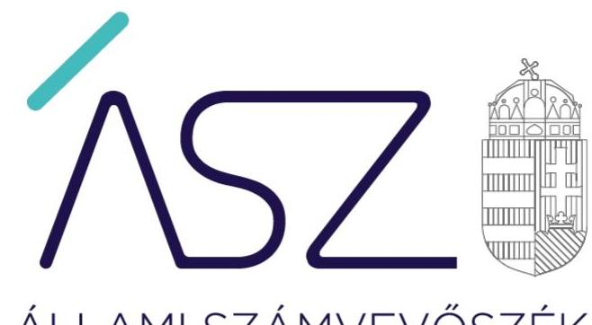
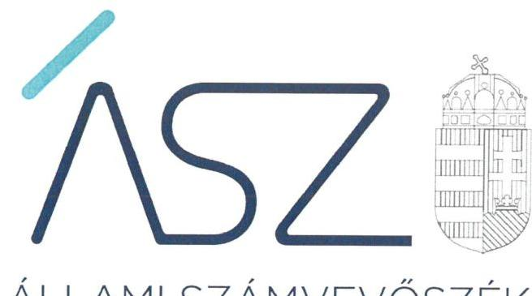

ÁLLAMI SZÁMVEVŐSZÉK

# JELENTÉS 

A költségvetési szervek irányítói, tulajdonosi feladatai ellátásának ellenőrzése

Belügyminisztérium
2022.

22044
www.asz.hu

---

ÁLLAMI SZÁMVEVŐSZÉK

# JELENTÉS 

A költségvetési szervek irányítói, tulajdonosi feladatai ellátásának ellenőrzése

Belügyminisztérium
2022. 08. hó 24. nap

22044
www.asz.hu

---

# AZ ELLENŐRZÉST VEZETTE ÉS A VÉGREHAJTÁSÁÉRT FELELŐS: 

DR. PETRÁNYI GÁBOR ellenőrzésvezető
DR. GÁL NÓRA ellenőrzésvezető
DR. SIMON JÓZSEF ellenőrzésvezető

A PROGRAM ÖSSZEÁLLÍTÁSÁÉRT FELELŐS:
SZABÓ CECÍLIA ellenőrzés tervezési projektvezető

IKTATÓSZÁM: EL-3759-001/2022.
TÉMASZÁM: 2609
ELLENŐRZÉS-AZONOSÍTÓ SZÁM: V0953

Jelentéseink az Országgyűlés számítógépes hálózatán és az interneten a www.asz.hu címen is olvashatóak.

---

# TARTALOMJEGYZÉK 

■ ÖSSZEGZÉS ..... 5
■ AZ ELLENŐRZÉS CÉLJA ..... 6
■ AZ ELLENŐRZÉS TERÜLETE ..... 7
■ AZ ELLENŐRZÉS HÁTTERE, INDOKOLTSÁGA ..... 8
■ A JELENTÉS LÉNYEGES KÉRDÉSKÖREI ..... 9
■ AZ ELLENŐRZÉS HATÓKÖRE ÉS MÓDSZEREI ..... 10
■ MEGÁLLAPÍTÁSOK ..... 12
■ FÜGGELÉK: ÉSZREVÉTELEK ..... 15
■ RÖVIDÍTÉSEK JEGYZÉKE ..... 17

---

.

---

# ÖSSZEGZÉS 

A Belügyminisztérium a 2020. évben az irányítása alá tartozó költségvetési szervekkel, illetve a tulajdonosi joggyakorlása alá tartozó gazdasági társaságokkal kapcsolatos irányítói és tulajdonosi feladatai szabályszerű ellátásával hozzájárult a közpénzekkel és a nemzeti vagyonnal történő felelős gazdálkodáshoz.

## Az ellenőrzés társadalmi indokoltsága

A minisztériumok irányítói, valamint tulajdonosi feladatokat látnak el a költségvetési szervek, és a gazdasági társaságok tekintetében, tehát kiemelt szerepük van abban, hogy az irányításuk alá tartozó intézmények, valamint a tulajdonosi joggyakorlásuk alá tartozó társaságok közfeladataikat szabályszerűen és hatékonyan végezzék el. A minisztériumok az irányítószervi és a tulajdonosi feladatellátásukon keresztül hozzájárulhatnak ahhoz, hogy mind az intézményekre, társaságokra, mind az irányító szervi és tulajdonosi feladatok ellátására fordított közpénzek, a rájuk bízott állami vagyon cél szerint hasznosuljanak, működésük átlátható és elszámoltatható legyen. A minisztériumok irányítói és tulajdonosi feladatellátása tehát hangsúlyos terület, ezért ennek ellenőrzése hozzáadott értéket teremt a közpénzügyek átláthatóságának előmozdítása és a közvagyon védelme területén.

## Főbb megállapítások, következtetések

A Belügyminisztérium a 2020. évben irányítási tevékenységét szabályszerűen végezte, az általa irányított költségvetési szervek megszüntetésekor a jogszabályi előírások szerint járt el.

A Belügyminisztérium az irányított költségvetési szervek vonatkozásában ellenőrzési jogosultságait szabályszerűen gyakorolta, elemi költségvetéseiket és a 2019. évi éves költségvetési beszámolóikat jóváhagyta, több irányítása alá tartozó költségvetési szervnél végzett ellenőrzéseket.

A Belügyminisztériumnak az irányított szervezetek vezetőivel kapcsolatos munkáltatói jogkörgyakorlása szabályszerű volt, a teljesítménykövetelményeket a vezetők számára a jogszabályi előírás szerint meghatározták.

A Belügyminisztérium a nemzeti vagyonnal történő felelős gazdálkodás követelményének megfelelve két gazdasági társaság tulajdonosi joggyakorlójaként feladatait a jogszabályi előírások szerint végezte.

A Belügyminisztériumnál kialakították az irányítási és tulajdonosi joggyakorlási tevékenységek eredményességére vonatkozó teljesítmény mérésre alkalmas követelményeket, ezzel megteremtették a feladatellátás színvonalának további fejlesztéséhez szükséges információk rendelkezésre állásának alapvető feltételét.

---

# AZ ELLENŐRZÉS CÉLJA 

AZ ELLENŐRZÉS CÉLJA annak értékelése, hogy a minisztérium az irányítói, és a tulajdonosi feladatai ellátásával hozzájárult-e a „jól irányított állam" működéséhez.

---

# **AZ ELLENŐRZÉS TERÜLETE**

## **Belügyminisztérium**

A Belügyminisztérium az ellenőrzött időszakban a kormány irányítása alatt álló, a központi költségvetésben különálló fejezetet alkotó központi költségvetési szervként működött.

A belügyminiszter a 2020. évben hatályos, a kormány tagjainak feladat- és hatásköréről szóló 94/2018. (V. 22.) Korm. rendelet értelmében a miniszterelnök nemzetbiztonságért felelős helyettese, továbbá a kormány tagjaként felelős - többek között - a bűncselekmények megelőzéséért, a büntetés-végrehajtásért, a határrendészetért, az idegenrendészetért és menekültügyért, a katasztrófák elleni védekezésért, a közterület-felügyelet szabályozásáért, a helyi önkormányzatokért, a településüzemeltetésért, a kéményseprő-ipari tevékenységért, a vízgazdálkodásért és a vízügyi igazgatási szervek irányításáért, az e-közigazgatásért, a személyiadat- és lakcímnyilvántartásért, a minősített adatok védelmének szakmai felügyeletéért, valamint a polgári nemzetbiztonsági szolgálatok irányításáért és a terrorizmus elleni küzdelemért.

A Belügyminisztérium költségvetési fejezet a 2019. évben 1208,7 Mrd Ft, a 2020. évben 1250,8 Mrd Ft kiadást teljesített. A költségvetési fejezet a 2019. évben összesen 87 871 fő, a 2020. évben 88 069 fő foglalkoztatott személyi juttatásának fedezetét biztosította. A Minisztérium igazgatási feladatait ellátó foglalkoztatottak létszáma a zárszámadási törvény: fejezeti indoklása szerint 2019. évben 1063 fő, 2020. évben 1084 fő volt.

A Belügyminisztérium a 2020. évben 214 szervezet (többek között 32 büntetésvégrehajtási intézet, 22 rendőrfőkapitányság, 22 katasztrófavédelmi igazgatóság és központ; 12 vízügyi igazgatóság, illetve 8 oktatási intézmény, melyből 4 közoktatási intézmény) tekintetében gyakorolt irányítási hatáskört. A belügyminiszter 2020. évben az irányítási jogosultságokat 12 költségvetési szervnél – középirányító szerv közreműködése nélkül – közvetlenül gyakorolta (AH2; BMKVF3; BVOP4; NBSZ5; NSZKK6; NVSZ7; OIF8; ORFK9; OVF10; TEF11; TIBEK12; TEK13). A Belügyminisztérium a 2020. évben költségvetési szervet nem alapított.

A Minisztérium a 2020. évben három, 100 %-os állami tulajdonban lévő gazdasági társaság felett gyakorolt tulajdonosi jogokat. A NISZ Zrt.14 és a NETI Kft.15 felett az ellenőrzött év egészében, a Gandhi Gimnázium Közhasznú Nonprofit Korlátolt Felelősségű Társaság felett 2020. augusztus 31-ig.

A belügyminiszter személyében a 2020. évben nem történt változás.

---

# AZ ELLENŐRZÉS HÁTTERE, INDOKOLTSÁGA 

A minisztériumok irányítószervi és tulajdonosi feladatellátását az Állami Számvevőszék (továbbiakban ÁSZ) folyamatosan figyelemmel kíséri és rendszeresen ellenőrzi.

A minisztériumok irányítói, tulajdonosi feladatköreikben az államot, mint alapítót, tulajdonost képviselik. Az ÁSZ ellenőrzése ezért az alapító számára visszajelzést ad a minisztérium feladatellátásáról.

Az ellenőrzési tapasztalatok alapján az ÁSZ „jó gyakorlatokat" is azonosíthat, amelyeket tanácsadó funkciója keretében szélesebb körben is megismertethet az érintettekkel, ezáltal is hozzájárulva a költségvetési rendszer szabályozott, átlátható, és kiegyensúlyozott működéséhez.

Az ÁSZ az irányítói, tulajdonosi feladatokat ellátó szervezetek ellenőrzésével hozzájárul az egész intézményrendszer szabályszerű és eredményesebb, hatékonyabb feladatellátásához, valamint gazdálkodásához.

---

# A JELENTÉS LÉNYEGES KÉRDÉSKÖREI 

1. A minisztériumnál hogyan valósult meg az irányítási tevékenységek gyakorlása?
2. A minisztériumnál hogyan valósult meg a társaságok feletti tulajdonosi jogok gyakorlása?
3. A minisztériumnál kialakították-e az irányítási és tulajdonosi joggyakorlási tevékenységek eredményességére vonatkozóan a teljesítmény mérésére alkalmas követelményeket?

---

# AZ ELLENŐRZÉS HATÓKÖRE ÉS MÓDSZEREI 

## Az ellenőrzés típusa

Megfelelőségi ellenőrzés.

## Az ellenőrzött időszak

2020. év

## Az ellenőrzés tárgya

Az ellenőrzés tárgyát képezi a minisztérium irányítási, tulajdonosi feladatellátásának értékelése. Az ellenőrzés kiterjed a minisztérium irányítási és tulajdonosi feladatellátásával kapcsolatosan a teljesítmény mérés feltételeinek kialakítására.

## Az ellenőrzött szervezetek

Belügyminisztérium

## Az ellenőrzés jogalapja

Az ellenőrzés jogalapját az ÁSZ tv. 16. § (3) bekezdésének, 5. § (2) és (6) bekezdésének, valamint az Áht. 61. § (2) bekezdésének előírásai képezik.

## Az ellenőrzés módszerei

Az ellenőrzés végrehajtása az ellenőrzési program szempontjai, kérdéskörei, az ellenőrzött időszakban hatályos jogszabályok, az ellenőrzés szakmai szabályai, az ÁSZ megfelelőségi ellenőrzési módszertana alapján történik.

Az ellenőrzés ideje alatt az ellenőrzött szervezettel történő kapcsolattartás az ÁSZ SZMSZ18-ának vonatkozó előírásai alapján valósul meg.

Az ellenőrzési kérdések megválaszolásához szükséges bizonyítékok megszerzése az ellenőrzött által rendelkezésre bocsátott dokumentumokra, adatokra alapozva megfigyelés, szemle (szemrevételezés), kérdésfeltevés (információkérés), interjú, egyszerű véletlen mintavételi eljárással történő mintavételezés, valamint elemző eljárás útján történik.

Az ellenőrzési bizonyítékként felhasználható adatforrások közé tartoznak egyrészt az adatbekérő levelek mellékletében szereplő dokumentumok jegyzékében rögzített adatforrások, másrészt minden az ellenőrzés

---

folyamán feltárt, az ellenőrzés szempontjából információt tartalmazó dokumentum.

Az irányítási és a tulajdonosi joggyakorláshoz kapcsolódó kontrolltevékenységek végrehajtását az ÁSZ egyszerű véletlen mintavétellel ellenőrzi. A mintavétellel ellenőrzött területek esetében minden egyes tétel vonatkozásában a szabályszerűségre vonatkozó kérdéseket teszünk fel, amelyek eredménye összesítésre kerül. „Szabályszerűnek" értékelünk egy ellenőrzött területet, amennyiben 95%-os bizonyossággal a sokaságban az átlagos hibaarány legfeljebb 10%, „nem szabályszerűnek", amennyiben 10%-nál magasabb arányt képvisel.

Az ellenőrzés lefolytatásához az ellenőrzött szervezet a tanúsítvány kitöltésével, hitelesítésével és az ÁSZ által kért, teljességi és hitelességi nyilatkozattal alátámasztott dokumentumok rendelkezésre bocsátásával szolgáltat adatokat.

---

# MEGÁLLAPÍTÁSOK 

## 1. A minisztériumnál hogyan valósult meg az irányítási tevékenységek gyakorlása?

Összegző megállapítás

A Belügyminisztériumnál az irányítási tevékenységek gyakorlása szabályszerű volt.

A Belügyminisztérium a 2020. évben három, az irányításával működő költségvetési szervet - az Adyligeti RSZ19-t, a B-VK Kórház20-at, és a Szegedi RSZ21-t - szüntetett meg. Az irányító szerv az Áht. előírása szerint a költségvetési szervek megszüntető okiratait elkészítette.

A Belügyminisztérium közvetlen irányítása alá tartozó költségvetési szervek szervezeti és működési szabályzatainak és azok módosításainak irányító szerv vezetője általi jóváhagyása - az Áht. rendelkezésével összhangban - szabályszerű volt.

Az irányítószerv az Ávr.22-ben foglaltaknak megfelelően, a 2020. évben az általa közvetlenül irányított költségvetési szervek mindegyikénél jóváhagyta a költségvetési szervek elemi költségvetését, valamint az Áhsz.23 előírásainak megfelelően jóváhagyta a 2019. évi éves költségvetési beszámolóit.

A Belügyminisztérium az Áht. felhatalmazása alapján a közvetlen irányítása alá tartozó költségvetési szervek közül kilenc esetében alkalmazta az egyedi utasítást, mint irányítási eszközt. Öt költségvetési szerv esetében pedig az Áht. és a Bkr.24 rendelkezései által biztosított ellenőrzési lehetőséggel élve szakszerűségi ellenőrzést folytatott le.

Az irányító szerv vezetőjének az irányított szervezetek vezetőivel kapcsolatos munkáltatói jogkörgyakorlása szabályszerű volt.

A 2020. évben az ellenőrzött szervezet közvetlen irányítása alá tartozó, vezetőváltással érintett két költségvetési szerv esetében a vezetői kinevezésről, illetve a kinevezett besorolásáról, illetményéről, szabadságáról és béren kívüli juttatásairól a jogszabályi előírásokkal összhangban a belügyminiszter határozatban döntött. A gazdasági vezetői kinevezések tekintetében az ellenőrzött szervezet feladatellátása szintén megfelelt a jogszabályi előírásoknak.

## 2. A minisztériumnál hogyan valósult meg a társaságok feletti tulajdonosi jogok gyakorlása?

Összegző megállapítás

A Belügyminisztériumnál a tulajdonosi joggyakorlás a jogszabályi előírásoknak megfelelően valósult meg.

A Belügyminisztérium a 2020. év teljes időszakában két társaság felett gyakorolt tulajdonosi jogokat. A létesítő okiratban a tulajdonosi joggyakorló25 számára fenntartott tulajdonosi jogok mindkét társaság esetében össz-

---

hangban voltak a Ptk.26 előírásaival, a tulajdonosi joggyakorló döntött a vezető tisztségviselők (ügyvezető, vezérigazgató, igazgatósági tagok), valamint a felügyelő bizottsági tagok kinevezéséről.

Az ellenőrzött időszakban egy társaságnál történt könyvvizsgáló választás. A tulajdonosi joggyakorló a Ptk. előírásainak megfelelően megválasztotta a társaság könyvvizsgálóját és a határozatával jóváhagyta a könyvvizsgálóval történő szerződéskötést.

A tulajdonosi joggyakorló a két gazdasági társaságnál az állami vagyon használatát ellenőrizte.

# 3. A minisztériumnál kialakították-e az irányítási és tulajdonosi joggyakorlási tevékenységek eredményességére vonatkozóan a teljesítmény mérésére alkalmas követelményeket? 

Összegző megállapítás

A Belügyminisztériumnál kialakították az irányítási és tulajdonosi joggyakorlási tevékenységek eredményességére vonatkozóan a teljesítmény mérésére alkalmas követelményeket.

A Belügyminisztériumnál az irányított költségvetési szervek és a tulajdonosi joggyakorlás szempontjából érintett gazdasági társaságok számára meghatározták a szervezeti eredményességi teljesítmény célokat a 2020. évre vonatkozóan és a célok teljesülése kapcsán biztosították a mérhetőséget.

Az irányított - Hszt.27 hatálya alá tartozó - rendvédelmi költségvetési szerveknél a 26/2013.(VI. 26.) BM rendelet28 rendelkezése alapján az irányító szerv vezetője a rendvédelmi feladatokat ellátó szerv számára a tárgyév február 15-ig ágazati célkitűzéseket határozott meg. Az irányított egyéb költségvetési szerveknél a 4/2015. (IV. 10.) BM utasítás rendelkezései alapján a költségvetési szervek alapdokumentumai tartalmazták az eredményességi célokat.

A tulajdonosi joggyakorlással érintett gazdasági társaságoknál önálló alapítói határozat tartalmazta az eredményességi és működési célt. Eredményességi célokat határozott meg továbbá az üzleti terv, a javadalmazási szabályzat, valamint az ügyvezetői prémium feladat kiírása.

A Belügyminisztérium kialakította a rendelkezésre álló források eredményes felhasználására vonatkozó, a teljesítmény mérésére alkalmas követelményeket.

A Belügyminisztérium meghatározta a 2020. évre vonatkozóan az eredményességi célok megvalósulásáról történő beszámolás
 gyakoriságát, beszámoltatta az irányított költségvetési szerveket, valamint a tulajdonosi joggyakorlás szempontjából érintett gazdasági társaságokat az eredményességük mérésére kialakított követelmények megvalósításáról, a kitűzött teljesítményi célok elérésének teljesüléséről, majd értékelte az eredményességi célok megvalósulását.

Az irányítószerv vezetője által 2021. augusztus 30-án jóváhagyott, a zárszámadás Belügyminisztérium fejezeti indoklásában értékelte a Belügyminisztérium által irányított költségvetési szervek, valamint a tulajdonosi joggyakorlással érintett társaságok eredményességét a kialakított mutatószámok alkalmazásával.

---

.

---

# FÜGGELÉK: ÉSZREVÉTELEK 

Az Állami Számvevőszék az ÁSZ tv. 29. § (1) bekezdése alapján ismertette az ellenőrzött szervezet vezetőjével az ellenőrzés megállapításait.

A belügyminiszter, mint az ellenőrzött szervezet vezetője az ellenőrzés megállapításaira nem tett észrevételt.

---

.

---

# RÖVIDÍTÉSEK JEGYZÉKE 

${ }^{1}$ 2019. és 2020. évi zárszámadás
${ }^{2} \mathrm{AH}$
${ }^{3}$ BMKVF
${ }^{4}$ BVOP
${ }^{5}$ NBSZ
${ }^{6}$ NSZKK
${ }^{7}$ NVSZ
${ }^{8}$ OIF
${ }^{9}$ ORFK
${ }^{10}$ OVF
${ }^{11}$ TEF
${ }^{12}$ TIBEK
${ }^{13}$ TEK
${ }^{14}$ NISZ Zrt.
${ }^{15}$ NETI Kft.
${ }^{16}$ ÁSZ tv.
${ }^{17}$ Áht.
${ }^{18}$ ÁSZ SZMSZ
${ }^{19}$ Adyligeti RSZ
${ }^{20}$ B-VK Kórház
${ }^{21}$ Szegedi RSZ
${ }^{22}$ Ávr.
${ }^{23}$ Áhsz.
${ }^{24}$ Bkr.
${ }^{25}$ tulajdonosi joggyakorló
${ }^{26}$ Ptk.
${ }^{27}$ Hszt.
${ }^{28}$ 26/2013.(VI. 26.) BM rendelet
2020. évi CXVII. törvény Magyarország 2019. évi költségvetéséről szóló 2018. évi L. végrehajtásáról;
2021. évi CXVI. törvény Magyarország 2020. évi központi költségvetéséről szóló 2019. évi LXXI. törvény végrehajtásáról
Alkotmányvédelmi Hivatal
Országos Katasztrófavédelmi Főigazgatóság
Büntetés-végrehajtás Országos Parancsnoksága
Nemzetbiztonsági Szakszolgálat
Nemzeti Szakértői és Kutatóközpont
Nemzeti Védelmi Szolgálat
Országos Idegenrendészeti Főigazgatóság
Országos Rendőr-Főkapitányság
Országos Vízügyi Főigazgatóság
Társadalmi Esélyteremtési Főigazgatóság
Terrorelhárítási Információs és Bűnügyi Elemző Központ
Terrorelhárítási Központ
Nemzeti Infokommunikációs Szolgáltató Zártkörűen Működő Részvénytársaság
NETI Informatikai Tanácsadó Korlátolt Felelősségű Társaság
2011. évi LXVI. törvény az Állami Számvevőszékről
2011. évi CXCV. törvény az államháztartásról
Állami Számvevőszék Szervezeti és Működési Szabályzata
Adyligeti Rendészeti Szakgimnázium
Büntetés-végrehajtás Központi Kórháza (Tököl)
Szegedi Rendészeti Szakgimnázium
368/2011. (XII. 31.) Korm. rendelet az államháztartásról szóló törvény végrehajtásáról
4/2013. (I.11.) Korm. rendelet az államháztartás számviteléről
370/2011. (XII. 31.) Korm. rendelet a költségvetési szervek belső
kontrollrendszeréről és belső ellenőrzéséről
Belügyminisztérium
2013. évi V. törvény a Polgári Törvénykönyvről
2015. évi XLII. törvény a rendvédelmi feladatokat ellátó szervek hivatásos állományának szolgálati jogviszonyáról
26/2013.(VI. 26.) BM rendelet a belügyminiszter irányítása alatt álló egyes
fegyveres szervek hivatásos állományú tagjai teljesítményértékelésének ajánlott elemeiről, az ajánlott elemek alkalmazásához kapcsolódó eljárási szabályokról, a minősítés rendjéről és a szervezeti teljesítményértékelésről

---

# ÁSZ 

ÁLLAMI SZÁMVEVŐSZÉK
1052 Budapest, Apáczai Cs. J. u. 10. I 1364 Budapest 4. Pf. 54 TEL: +36 14849100
email: szamvevoszek@asz.hu
web: www.asz.hu | www.aszhirportal.hu
