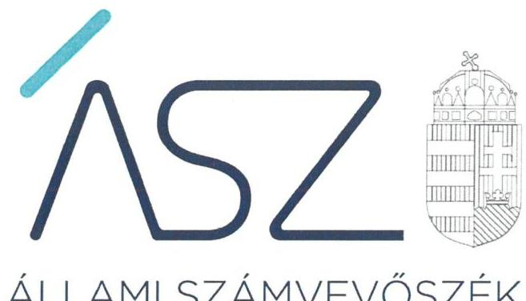
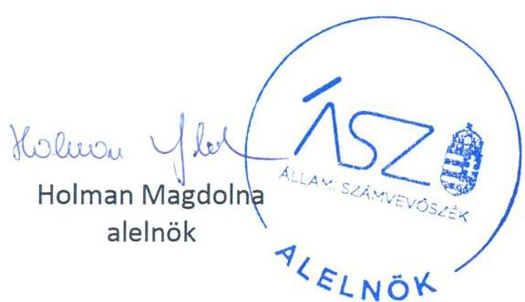
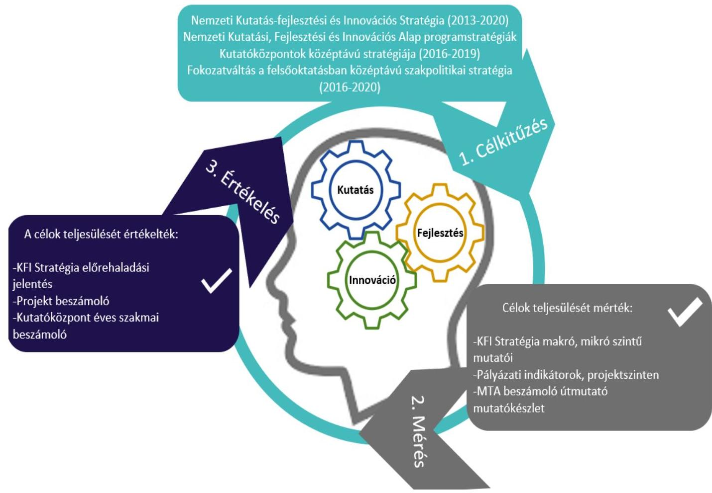

ÁLLAMI SZÁMVEVŐSZÉK

# JELENTÉS 

A kutatás-fejlesztésre és innovációra biztosított források felhasználása eredményességének ellenőrzése

2022. 

22045
www.asz.hu

---

ÁLLAMI SZÁMVEVŐSZÉK

# JELENTÉS

A kutatás-fejlesztésre és innovációra biztosított források felhasználása eredményességének ellenőrzése

2022. 08. hó 20. nap

22045
www.asz.hu

---

# AZ ELLENŐRZÉST VEZETTE ÉS A VÉGREHAJTÁSÁÉRT FELELŐS: 

DR. PULAY GYULA ZOLTÁN ellenőrzésvezető
KISTÓTH KRISZTINA ellenőrzésvezető
DORMÁN ISTVÁN ellenőrzésvezető
A PROGRAM ÖSSZEÁLLÍTÁSÁÉRT FELELŐS:
HORVÁTH TÍMEA projekt vezető

IKTATÓSZÁM: EL-3760-001/2022.
TÉMASZÁM: 2586
ELLENŐRZÉS-AZONOSÍTÓ SZÁM: V-0930

---

# TARTALOMJEGYZÉK 

■ ÖSSZEGZÉS ..... 5
■ AZ ELLENŐRZÉS AKTUALITÁSA, TÁRSADALMI SZEREPE, SZEMPONTJA ..... 8
■ AZ ELLENŐRZÉS TERÜLETE ..... 9
■ AZ ELLENŐRZÉS HATÓKÖRE ÉS MÓDSZERE ..... 11
■ MELLÉKLETEK ..... 13
I. sz. melléklet: Értelmező Szótár. ..... 13
■ FÜGGELÉKEK ..... 15
I. sz. függelék: A kutatás-fejlesztés és innovációs tevékenység jogszabályi környezete. ..... 15
II. sz. függelék: A KFI stratégiában meghatározott számszerúsített célkitűzések, valamint azok alakulása a stratégiai megvalósításának időszakában a 2019. év végéig ..... 17
III. sz. függelék: Az MTA és az ELKH vonatkozásában KFI célterületek és számszerúsített eredmények ..... 18
IV. sz. függelék: A felsőoktatási intézmények KFI vonatkozásában kitűzött célok ..... 19
V. sz. függelék: Észrevételek ..... 20
■ RÖVIDÍTÉSEK JEGYZÉKE ..... 21

---

.

---

# ÖSSZEGZÉS 

A 2013-2019. években meghatározták a kutatás-fejlesztés és innováció területén a költségvetésből nyújtott támogatásokkal elérendő célokat. A kutatás-fejlesztési és innovációs tevékenységek eredményeit mérték és értékelték, az értékelés eredményei alapján a tevékenységek támogatták a stratégiai célok megvalósulását.

## Értékelés

A kutatás-fejlesztés és innováció kiemelt makrogazdasági jelentőségű, nagymértékben járul hozzá a gazdasági fejlődéshez, valamint az ország nemzetközi versenyképessége szempontjából is meghatározó jelentőségű. Kiemelkedő fontosságú, hogy a kutatás-fejlesztési és innovációs tevékenységre fordított közpénzek felhasználása kimutatható eredményekkel járjon, a kutatás-fejlesztési folyamat eredményei megjelenjenek a gazdaságban. A kutatás-fejlesztésre és innovációra biztosított források felhasználása eredményességének értékelése a tervezett és a tényleges eredmények összevetésével történt.

A Kormány határozatával ${ }^{1}$ elfogadott Befektetés a jövőbe NEMZETI KUTATÁS-FEJLESZTÉSI ÉS INNOVÁCIÓS STRATÉGIA (2013-2020) rögzítette a célkitűzéseket, valamint a fő célokhoz rendelt részcélokat. A kutatás-fejlesztés és innováció (továbbiakban KFI) szektorszintű számszerűsített célja volt, hogy a megvalósítási időszak végére, a 2020. évre Magyarországon a kutatás-fejlesztési ráfordítások a GDP 1,8\%-ára, a vállalkozások GDP-arányos kutatás-fejlesztési ráfordítása 1,2\%-ra növekedjenek, továbbá ezen célok teljesítéséhez mintegy 56000 kutatói-fejlesztői munkahelyre van szükség.

A Kutatás-fejlesztési és Innovációs Stratégia (továbbiakban Stratégia) 2020. évre tervezett számszerűsített céljainak megvalósítását a Stratégiában meghatározott mutatószámokkal mérték és értékelték. A Központi Statisztikai Hivatal 2019. évi előzetes adatai szerint a bázisévhez (2013.) képest 2019. évre a GDP-arányos kutatás-fejlesztési ráfordítások a GDP 1,39\%-áról a GDP 1,48\%-ára növekedtek és a hazai üzleti szektorban a vállalkozások GDP-arányos kutatás-fejlesztési ráfordítása 2019. évre 1,11\% volt. Az innovációs és technológiai miniszter a Stratégia 2020. szeptemberi előrehaladási jelentésében ${ }^{2}$ rögzítette, hogy a 2019. évre elért eredmények megközelítették a 2020. évre kitűzött célokat. A 2019. évi összes kutató, fejlesztő helyen foglalkoztatott létszám 47942 fő volt. Kettő mikroszintű cél - +30 nagyobb kutatási és technológiai fejlesztési műhely és $+30 \mathrm{~K}+\mathrm{F}$ intenzív makroregionális középvállalat termel és szolgáltat - tekintetében pedig az előrehaladási jelentés szerint el is érték a Stratégiában 2020. évre számszerűsített célokat. Megállapítható, hogy a végrehajtásáért felelősök intézkedései támogatták a Stratégiában meghatározott célkitűzések elérését.

Egyidejűleg azonban az ellenőrzés - az Állami Számvevőszék 2022 júniusában nyilvánosságra hozott „A K+F+I teljesítmény mérésének módszertani értékelése" című elemzésével összhangban - megállapította, hogy a Stratégia makroszintű céljai kizárólag a ráfordítások és a kutatók létszámának növelésére irányultak, míg a források célirányos felhasználására, az ezáltal elért eredményekre vonatkozó célok nem jelentek meg. A mikroszintű célokban szereplő meghatározások definiálása pedig több esetben (például a nagyobb műhely, makroregionális középvállalat termelése) nem történt meg, amely hiányosság korlátozta a megismerhető, a befolyástól mentes, átlátható, objektív és konzisztens mérést.

A hazai költségvetési forrásból finanszírozott KFI tevékenység céljait 2013-2019. évek vonatkozásában meghatározták. A NEMZETI KUTATÁSI, FEJLESZTÉSI ÉS INNOVÁCIÓS ALAP - a 2013-2014. években Kutatási, Fejlesztési és Innovációs Alap - (továbbiakban Alap) adott évi felhasználásának tervét, éves részletes programstratégiáját a Kormány határozataiban rögzítette. A programstratégiákban meghatározták az Alapból nyújtott támogatásokkal a KFI területén elérni kívánt célokat. Az Alap keretében meghirdetett támogatási konstrukciók eredményességének mérése és értékelése a pályázati útmutatókban rögzített indikátorok mentén, projektszinten történt.

A MAGYAR TUDOMÁNYOS AKADÉMIA (továbbiakban: MTA) kutatóközpontok 2013. évre vonatkozó intézkedési tervekben és a 2016-2019. évi középtávú stratégiákban meghatározták az elérni kívánt célokat. A

---

kutatóközpontok évente készítendő beszámolójához részletes útmutató készült, amely tartalmazta a célok megvalósítása eredményeinek méréséhez szükséges adatforrásokat, alkalmazandó mutatókat, illetve az adatgyűjtés módját. A mutatók között szerepeltek például a létszám- és publikációs adatok, az idézettségi mutatók, vagy a megadott oltalmak darabszáma. A kutatóközpontok éves tudományos munkájáról kutatóhelyenként beszámoló készült az MTA Közgyűlése számára. A kutatóközpontok szakmai beszámolóit, tevékenységét, teljesítményét és irányítási rendszerét a felügyeletet ellátó MTA Akadémiai Kutatóintézetek Tanácsa értékelte. Az MTA munkájáról annak elnöke kétévente beszámolt az Országgyűlésnek és évente tájékoztatta a Kormányt. A beszámolókban kiemelt súllyal szerepelt az éves beszámolók alapján a kutatóhelyek tudományos teljesítményének bemutatása. Az EÖTVÖS LORÁND KUTATÁSI HÁLÓZAT 2019. augusztus 1-jétől 2019. év végéig a szervezeti keretek és működési keretek kialakítását végezte, az Irányító Testület a kutatóhelyek céljai, a célok értékelésének mérése vonatkozásában további döntést nem hozott. Az Irányító Testület értékelte a kutatóhelyek tevékenységét szolgáló támogatások felhasználását, az Eötvös Lóránd Kutatási Hálózat 2019. évi kormánybeszámolója tartalmazta a 2010-2019. évekre az MTA-tól átvett kutatóhálózat teljesítményének értékelését.

A FELSŐOKTATÁSI INTÉZMÉNYEK vonatkozásában az elérni kívánt célokat a Fokozatváltás a felsőoktatásban középtávú szakpolitikai stratégiában és a kapcsolódó cselekvési tervben 2016-2020. évekre meghatározták. A célokhoz rendelt mutatószámok, célok megvalósulása értékelésének végső határideje az ellenőrzött időszakon kívüli, a 2020-2023. évek időszaka. A KFI törvény 2021. május 28-án hatályba lépett módosításával kialakításra került az egységes adatgyűjtés és feldolgozás, a kapcsolódó adatszolgáltatási kötelezettség első határideje 2022. március 31.

A kutatás-fejlesztésre és innovációra biztosított források felhasználása az ellenőrzött időszakban eredményes volt, a KFI tevékenységek támogatták a Stratégiában meghatározott célkitűzések elérését. A KFI tevékenységek hatása megjelent a gazdaságban, a 2013-2019. évek közötti időszakban a Szellemi Tulajdon Nemzeti Hivatalához benyújtott 4196 kérelemből 2367 kutatás-fejlesztésnek minősült. Ugyanakkor a KFI tevékenységre biztosított források eredményes felhasználásához a célkitűzés, a célok elérésének mérése és értékelése vonatkozásában még van tere a fejlődésnek.

# Következtetés 

A kutatás-fejlesztés és innováció keretében a tervezett és végrehajtott intézkedések, az erőforrások eredményes felhasználása hozzájárult az ország kutatás-fejlesztés és innovációs céljainak és ezen keresztül a gazdasági és társadalompolitikai célok megvalósulásához. A hazai stratégiai tervezési dokumentum szerinti kutatás-fejlesztés és innovációs tevékenység teljesítményének mérésére vonatkozó célkitúzés, mérési és monitoring rendszer ugyanakkor továbbfejleszthető. Előrelépést jelentene a finanszírozási és humán erőforrás azaz input oldali célok helyett az output, a kutatás-fejlesztés és innováció eredményességére koncentráló, továbbá az országos szintű, társadalmi szempontú eredményességet elváró, mérő célok kitűzése, a mérési és értékelési módszertan fejlesztése.

A tevékenység eredményeire is koncentráló célok, az átlátható, jól definiált, objektív és konzisztens teljesítmény mérésen alapuló értékelés együttesen járul hozzá, hogy a KFI tevékenység kimutatható eredményekkel járjon, hozzájárulva a gazdaság versenyképességének erősödéséhez, a felsőfokú oktatás színvonalának növeléséhez.

---

A célok teljesülését értékelték:
XFI Stratégia előrehaladási
jelentés
Projekt beszámoló
Kutatóközpont éves szakmai
beszámoló

---

# AZ ELLENŐRZÉS AKTUALITÁSA, TÁRSADALMI SZEREPE, SZEMPONTJA 

Egy ország magas szintű KFI teljesítményének legfontosabb tényezője a kiegyensúlyozott innovációs rendszer, amely megfelelően ötvözi a köz- és a magánberuházásokat, ösztönzi a vállalkozások fejlesztési együttműködéseit egymással és a tudományos világ képviselőivel, s mindezek előfeltételeként lehetőséget biztosít a magas színvonalú oktatásra és kutatásra. A kutatásfejlesztésre és az innovációra fordított kiadás befektetés mind a vállalatok, mind pedig az ország jövőjébe, ezért a mindenkori kormányok fontos feladata, hogy olyan keretfeltételeket alakítsanak ki, amelyek a vállalatokat a kutatás- fejlesztésre és az innovációra ösztönzik. A tudományok fejlődése hozzájárul a társadalom életszínvonalának javításához, ezért a lakosság érdeklődése is számottevő.

Az Európai Tanács által 2010-ben elfogadott Európa 2020 Stratégia (Az intelligens, fenntartható és inkluzív növekedés stratégiája) kiemelt célként fogalmazza meg, hogy 2020-ra az EU GDP-jének 3\%-át a K+F-re kell fordítani. Ezt a célkitűzést nemzeti célkitűzésekre és pályákra kellett lebontani, a tagállamoknak ki kellett dolgozniuk saját stratégiáikat e téren, valamint az előrehaladásról jelentést kellett készíteniük. Az uniós stratégiában foglaltak figyelembe vételével készült a Horizont 2020 keretprogram, melyre 2014-2020 között 79 milliárd eurót irányoztak elő. Célja a KFI finanszírozási lehetőségeinek és feltételeinek javítása, valamint az, hogy az innovatív ötletek eredményeként növekedést és foglalkoztatást segítő termékek és szolgáltatások jöjjenek létre.

A 2013-2019. években a $\mathrm{KSH}^{3}$ adatai szerint a kutatás-fejlesztési ráfordítások összege összesen 3630,4 Mrd Ft, melyből az állami költségvetés által kutatás-fejlesztésre fordított ráfordítások összege 1183,0 Mrd Ft volt.

Magyarország komoly hagyományokkal bír a tudományos kutatás területén, amit a különböző tudományterületeken elért szakmai eredmények és a szerteágazó nemzetközi kapcsolatok is bizonyítanak. A magyar KFI rendszer az elmúlt évek során jelentős változásokon ment keresztül, és Magyarország jelentős előrelépéseket tett a nemzeti tudományos és innovációs teljesítményének megerősítésére. Ugyanakkor Magyarországnak a jövőben tovább kell szélesítenie innovációs bázisát, és olyan keretfeltételeket kell teremtenie, amelyek ösztönzik az innovációt, erősítik a kockázatvállalási kultúrát és előmozdítják az innováció iránti keresletet.

Tekintettel a Kormány által megfogalmazott vállalások céldátumára, az ellenőrzés rávilágíthat a kutatás- fejlesztési, innovációs stratégiákban foglalt célkitűzések, illetve az azokhoz kapcsolódó intézkedések eredményeire, és rámutathat azokra a területekre, amelyek tekintetében előrelépéssel a 2021. utáni fejlesztési időszakra szóló új nemzeti kutatási, fejlesztési és innovációs stratégia céljai eredményesebben valósíthatók meg, valamint hozzájárulhat a lakosság megfelelő tájékoztatásához

---

# AZ ELLENŐRZÉS TERÜLETE 

## A kutatás-fejlesztésre és innovációra biztosított források felhasználásában részt vevő intézmények

Kutatási és Technológiai Innovációs Alapot a 2003. évi XC. törvény ${ }^{4}$ hozta létre. A KTI Alap ${ }^{5}$ rendeltetése volt, hogy kiszámítható és biztos forrást jelentsen a magyar gazdaság technológiai innovációjának ösztönzésére és támogatására, tegye lehetővé a gazdaság és a társadalmi élet egyéb területén hasznosuló kutatás és fejlesztés erősítését, a hazai és külföldi kutatási eredmények hasznosítását, az innovációs infrastruktúra és annak körébe tartozó szolgáltató tevékenységek fejlesztését. A KTI Alap kezelő szerve 2013. július 31-ig a Nemzeti Fejlesztési Ügynökség, majd 2013. július 31-től a Nemzeti Fejlesztési Minisztérium volt. 2014. január 1-jétől a programstratégia előterjesztése a nemzetgazdasági miniszter feladat- és hatáskörébe került, a KTI Alapért felelős szerv a Nemzetgazdasági Miniszté-
rium lett.
Az Országgyűlés, annak érdekében, hogy megteremtse a tudományos kutatás Alaptörvényben rögzített autonómiájának részletes jogszabályi és finanszírozási feltételeit és létrehozza a hazai kutatás-fejlesztés és innováció intézményi rendszerét, 2014. december 6-i hatállyal megalkotta a KFI törvényt ${ }^{6}$. A KFI törvény szerint a Nemzeti Kutatási, Fejlesztési és Innovációs Alap ${ }^{7}$ a KTI Alap jogutódja, a kutatás-fejlesztés és az innováció állami támogatását biztosító, és kizárólag ezt a célt szolgáló, az Áht. ${ }^{8}$ szerinti elkülönített állami pénzalap. 2015. január 1-től a kutatás-fejlesztés és technológiai innovációval kapcsolatos kormányzati stratégiai, jogszabályalkotás, jogszabályok monitoringja és racionalizálása, az innovációs szolgáltatások működtetése és a pályázati programmenedzsment és monitoring feladatokat a Miniszterelnökséget vezető miniszter felügyelete alatt létrejött Nemzeti Kutatási, Fejlesztési és Innovációs Hivatal ${ }^{9}$ látja, amely az NKFI Alapot működteti. 2018. május 22-től az Innovációs és Technológiai Minisztérium szakpolitikai felelősként irányítja az NKFIH által ellátott feladatokat.

A Magyar Tudományos Akadémia ${ }^{10}$ Magyarország legmagasabb szintű tudományos testülete, alapvető közfeladatait, szervezeti felépítését az 1994. évi XL. törvény ${ }^{11}$ szabályozza. Közfeladatai között kiemelt szerepe van a tudomány valamennyi területére kiterjedő tudományos kutatások folytatásának. A törvény feladatként fogalmazza meg az MTA részére, hogy szorgalmazza és segítse a tudományos kutatások eredményeinek társadalmi és gazdasági hasznosítását. Az MTA a központi költségvetésben önálló fejezetet alkot. Az MTA saját kutatóintézet-hálózata 2019. augusztus 31-ig tíz, több intézetet magába foglaló kutatóközpontból és öt önálló kutatóintézetből állt. Az akadémiai kutatóhálózat testületi felügyeletét az MTA Akadémiai Kutatóintézetek Tanácsa ${ }^{12}$ látta el.

A 2019. évi LXVIII. törvény ${ }^{13}$ hatályba lépésével 2019. augusztus 1-jén létrejött az Eötvös Loránd Kutatási Hálózat ${ }^{14}$ továbbiakban ELKH. A módosított KFI törvény tartalmazza az önálló költségvetési fejezetet képező

---

ELKH-t, annak részeként az ELKH Titkárságot, valamint az ELKH Titkárság irányítása alá tartozó 16 kutatóhelyet. Az ELKH Titkárság tudományos kutatások folytatása céljából a központi költségvetésből támogatott főhivatású kutatóhálózatot tart fenn. Közfeladata a KFI törvényben meghatározott intézményesített keretek között folytatott kutatások intézményrendszerének fenntartása, működtetése. Az ELKH Titkárság fő döntéshozó szerve a legalább negyedévente ülésező Irányító Testület, amelynek munkáját a Tudományos Tanács és a Nemzetközi Tanácsadó Testület támogatja. A kizárólag kutatási célokra használt és az MTA tulajdonát képező korábbi ingatlan és ingó vagyon az MTA tulajdonában maradt, a KFI törvény módosítása alapján azt az MTA ingyen a kutatóhelyek rendelkezésére bocsátotta. A korábban elnyert hazai és nemzetközi pályázatok, egyéb kötelezettségek jogutódlással kerültek az ELKH-hoz.

A kutatás-fejlesztéshez kapcsolódó minősítési tevékenység végzésére kijelölt intézmény a Szellemi Tulajdon Nemzeti Hivatala ${ }^{15}$. A KFI törvény a közfinanszírozású támogatásból finanszírozott projektekhez kapcsolódóan rendelkezik az SZTNH-nak a kutatás-fejlesztési tevékenység minősítésével kapcsolatos jogosítványairól és eljárási szabályairól.

A kutatás-fejlesztési és Innovációs tevékenység jogszabályi környezetét az 1. függelék foglalja össze.

A kutatás-fejlesztés és innovációra biztosított források felhasználásában résztvevő intézmények időbeli változását az 1. táblázat mutatja be.

# KFI terület kormányzati intézményrendszerének alakulása az ellenőrzött időszakban 

Irányító szerv: Nemzetgazdasági Minisztérium
Az irányított / stratégia előkészítéséért felelős szervezet: Nemzeti Innovációs Hivatal (NIH)
KFI finanszírozási forrás: Kutatási és Technológiai Innovációs Alap (KTIA)
A források felett rendelkező: Nemzeti Fejlesztési Minisztérium (2013.07.01-ig a Nemzeti
Fejlesztési Ügynökség kezelésével)
Irányító szerv: Nemzetgazdasági Minisztérium
Az irányított / stratégia előkészítéséért felelős szervezet: Nemzeti Innovációs Hivatal (NIH)
KFI finanszírozási forrás: Kutatási és Technológiai Innovációs Alap (KTIA)
A források felett rendelkező: Nemzetgazdasági Minisztérium
Irányító szerv: Miniszterelnökség
Az irányított / stratégia előkészítéséért felelős szervezet: Nemzeti Innovációs Hivatal (NIH)
KFI finanszírozási forrás: Kutatási és Technológiai Innovációs Alap (KTIA)
A források felett rendelkező: Miniszterelnökség
Felügyeleti szerv: Miniszterelnökség
A felügyelt / stratégia előkészítéséért felelős szervezet: Nemzeti Kutatás, Fejlesztési és In-
novációs Hivatal (NKFIH), a Nemzeti Innovációs Hivatal jogutódja
KFI finanszírozási forrás: Nemzeti Kutatás Fejlesztési Innovációs Alap
A források felett rendelkező: NKFIH
Felügyeleti szerv: Innovációs és Technológiai Minisztérium
A felügyelt / stratégia előkészítéséért felelős szervezet: Nemzeti Kutatás, Fejlesztési és In-
novációs Hivatal (NKFIH)
KFI finanszírozási forrás: Nemzeti Kutatás Fejlesztési Innovációs Alap
A források felett rendelkező: NKFIH
Forrás: 212/2010. (VII. 1.) Korm. rendelet ${ }^{16}$, 152/2014. (VI. 6.) Korm. rendelet ${ }^{17}$, 94/2018. (V. 22.) Korm. rendelet ${ }^{18}$, NIH alapító okirata ${ }^{19}$, 2013. évi
CCXXX tv. indokolása ${ }^{20}$, KFI törvény

---

# AZ ELLENŐRZÉS HATÓKÖRE ÉS MÓDSZERE 

## Az ellenőrzés típusa

Teljesítmény ellenőrzés.

## Az ellenőrzött időszak

Az ellenőrzött időszak: a 2013-2019. évek.

## Az ellenőrzés tárgya

Az ellenőrzött szervezet tevékenységének hozzájárulása a Nemzeti Kutatási, Fejlesztési és Innovációs Stratégia eredményes végrehajtásához, az államháztartásból kutatás-fejlesztésre és innovációra nyújtott támogatások felhasználásával elért eredmények, továbbá a támogatások felhasználásával elért eredmények nemzeti jövedelemre gyakorolt hatása.

## Az ellenőrzött szervezetek

Az Innovációs és Technológiai Minisztérium.

## Az ellenőrzés jogalapja

Az ellenőrzés jogszabályi alapját az ÁSZ törvény 1. § (3) bekezdése, valamint az 5. § (2) és (6) bekezdéseinek előírásai képezik.

## Az ellenőrzés módszerei

Az ÁSZ az ellenőrzést az ellenőrzési program szempontjai, az ellenőrzött időszakban hatályos jogszabályok, az ellenőrzés szakmai szabályai, a jelen ellenőrzésre irányadó ÁSZ módszertanok figyelembevételével hajtja végre.

Az ellenőrzés teljesítmény-ellenőrzés, melynek során értékeljük, hogy a kutatás-fejlesztés, innováció keretében tervezett és végrehajtott intézkedések hozzájárultak-e a kutatás-fejlesztés, innováció stratégiai céljainak megvalósításához, a nemzeti jövedelemhez a gazdasági növekedésre gyakorolt hatásán keresztül. Értékeljük továbbá, hogy kialakították-e, mértéke és értékelték-e a kutatás-fejlesztés, innováció eredményeit, valamint a beszámoltatási rendszer biztosította-e a stratégia megvalósulásához az információk rendelkezésre állását.

Az ellenőrzési kérdések megválaszolásához szükséges bizonyítékok megszerzése két ütemben, az ellenőrzött és az adatszolgáltatással érintett szervezetek által rendelkezésre bocsátott dokumentumokra, adatokra ala-

---

pozva megfigyelés, szemle (szemrevételezés), valamint elemző eljárás útján történik. Az ellenőrzési bizonyítékként felhasználható adatforrások közé tartoznak az ellenőrzési program részletes szempontjainál felsorolt adatforrások, valamint minden egyéb - az ellenőrzés folyamán feltárt, az ellenőrzés szempontjából információt tartalmazó - dokumentum. Adatszolgáltatással érintett szervezetek a Szellemi Tulajdon Nemzeti Hivatala, az Eötvös Loránd Kutatási Hálózat és a Magyar Tudományos Akadémia (a kutatóhálózat vonatkozásában), valamint a kijelölt, kérdőívvel megkeresett Magyar Kereskedelmi és Iparkamara.

Az ellenőrzés végrehajtása során a rendelkezésre álló dokumentumokat a bizonyosság szerint csoportosítjuk és vesszük figyelembe az ellenőrzési értékelések és következtetések levonása során.

Az ellenőrzés lefolytatásához az ellenőrzött szervezet és az adatszolgáltatással érintett szervezetek az ÁSZ által kért dokumentumok megküldésével, valamint interjú keretében szolgáltatnak adatokat, amelyek valódiságát és teljes körűségét az ellenőrzött szervezetek vezetői által tett teljességi és hitelességi nyilatkozat igazolja. A rendelkezésre bocsátott adatok, információk kontrollja az ellenőrzés keretében történik.

A kutatás-fejlesztés és innovációs ráfordítások tekintetében az ellenőrzés a Központi Statisztikai Hivatal (továbbiakban: KSH) adataira támaszkodott. A KSH a nemzetközi gyakorlatnak megfelelően a kutatás-fejlesztés ráfordításai között a saját szervezetben végzett ("falakon belüli") kutatás-fejlesztési költség, beruházás és az immateriális javak áfa nélküli együttes öszszegét érti, származzon az bármilyen hazai vagy külföldi forrásból, függetlenül attól, hogy a pénzforrás eredetileg kutatásra, fejlesztésre, vagy más célra állt rendelkezésre. A kutatás-fejlesztési adatfelvétel Frascati-kézikönyv ${ }^{21}$ definícióin és osztályozásain alapul. A ráfordítások pénzügyi forrásai között a KSH megkülönbözteti a vállalkozások, az állami költségvetés, a felsőoktatás, az egyéb hazai és a külföldi forrásokat. A KSH innovációs ráfordításnak tekinti egy vállalkozás (vagy vállalkozások csoportjának) innovációs tevékenységéhez kapcsolódó gazdasági ráfordításait (költségek és beruházások). A ráfordítások kapcsolódhatnak saját ("falakon belüli") vagy külső (más szervezethez "kiszervezett") innovációs tevékenységhez. Az adatgyűjtés módszertani kerete az $\mathrm{OECD}^{22}$ által kiadott Oslo kézikönyv ${ }^{23}$.

Az ellenőrzés ideje alatt az ellenőrzött szervezettel történő kapcsolattartás az ÁSZ SZMSZ ${ }^{24}$-ének vonatkozó előírásai alapján biztosított.

---

# MELLÉKLETEK 

I. SZ. MELLÉKLET: ÉRTELMEZŐ SZÓTÁR

Alapkutatás
kísérleti vagy elméleti munka, amelyet elsősorban a jelenségek vagy megfigyelhető tények hátterével kapcsolatos új ismeretek megszerzésének érdekében folytatnak, anélkül, hogy kilátásba helyeznék azok közvetlen üzleti alkalmazását vagy felhasználását (KFI tv. 3. § 1.)
Alkalmazott kutatás
tervezett kutatás vagy kritikus vizsgálat, amelynek célja új ismeretek és szakértelem megszerzése új termékek, eljárások vagy szolgáltatások kifejlesztéséhez vagy a létező termékek, eljárások vagy szolgáltatások jelentős mértékű fejlesztésének elősegítéséhez. (KFI tv. 3. § (2)
Hasznosító vállalkozás
költségvetési kutatóhelyen létrejött szellemi alkotás hasznosítása céljából alapított gazdasági társaság, amely nem pénzbeli hozzájárulásként rendelkezésre bocsátás, átruházás vagy hasznosítási szerződés alapján vált a költségvetési kutatóhelyen létrehozott szellemi alkotáshoz fűződő jogok jogosultjává vagy hasznosítójává. (KFI tv. 3. § 4.)
Kísérleti fejlesztés
a meglévő tudományos, technológiai, üzleti és egyéb vonatkozó ismeretek és szakértelem megszerzése, összesítése, megosztása, alkalmazása és fel- használása új, módosított vagy javított termék, eljárás vagy szolgáltatás terveinek létrehozása vagy megtervezése céljából. Kísérleti fejlesztésnek minősülhetnek:
a) az új termékek, eljárások és szolgáltatások fogalmi meghatározását, megtervezését és dokumentálását célzó tevékenységek;
b) olyan tevékenységek, amelyek magukban foglalják tervezetek, tervrajzok, tervek és egyéb dokumentációk előállítását is, feltéve, hogy azokat nem kereskedelmi felhasználásra szánják;
c) a kereskedelmi felhasználásra nem kerülő prototípusok elkészítése;
d) a kereskedelmileg felhasználható prototípusok és kísérleti projektek kifejlesztése abban az esetben, ha a prototípus szükségszerűen maga a kereskedelmi végtermék, és előállítása túlságosan költséges ahhoz, hogy az kizárólag demonstrációs és hitelesítési céllal történjen;
e) a termékek, eljárások és szolgáltatások kísérleti gyártása és tesztelése, feltéve, hogy azokat nem lehet felhasználni vagy átalakítani úgy, hogy azok ipari alkalmazásokban vagy kereskedelmileg hasznosíthatóak legyenek.
A kísérleti fejlesztésbe még akkor sem tartoznak bele azok a szokásos, időszakos vagy rutinszerű változások, amelyeket termékeken, gyártósorokon, előállítási eljárásokon, létező szolgáltatásokon és egyéb folyamatban lévő műveleteken végeznek, ha e változtatások fejlesztésnek minősülnek, illetve, ha e változtatások az adott termék, eljárás, folyamat vagy szolgáltatás fejlődését is eredményezik. (KFI tv. 3. § 7.)
Innováció
a gazdasági tevékenység hatékonyságának, jövedelmezőségének javítása, a kedvező társadalmi és környezeti hatások elérése érdekében végzett tudományos, műszaki, szervezési, gazdálkodási, kereskedelmi műveletek összessége, amelyek eredményeként új vagy lényegesen módosított termék, eljárás, szolgáltatás jön létre, új vagy lényegesen módosított eljárás, technológia alkalmazására, piaci bevezetésére kerül sor, ideértve azokat a változásokat, amelyek csak adott ágazatban vagy adott szervezetnél minősülnek újdonságnak. (KFI tv. 3. § 6.)

---

Kutatás-fejlesztés

Kutatás-fejlesztési és innovációs program

Költségvetési kutatóhely

Szellemi tulajdon

Szellemi alkotás

Kutatás-fejlesztési (K+F) költség

Bruttó nemzeti jövedelem
magában foglalja az alapkutatást, alkalmazott kutatást és a kísérleti fejlesztést (KFI tv. 3. § 11.)
a közfinanszírozású támogatási forrás kezelője által meghatározott cél elérését szolgáló, vagy meghatározott témakörbe csoportosítható kutatás- fejlesztési vagy innovációs projektek megvalósításának támogatására kiírt pályázat, illetve pályázatok időben megismételt sorozata. (KFI tv. 3. § 13.)
alap-, illetve főtevékenységként vagy ahhoz kapcsolódóan kutatás-fejlesztési tevékenységet folytató költségvetési szerv. (KFI tv. 3. § 9.)
a szellemi alkotásokra és egyes teljesítményekre, az árujelzőkre (védjegyek és földrajzi árujelzők) a szerzői jogi és iparjogvédelmi törvényben, a védett ismeretekre nézve az üzleti titok védelméről szóló törvényben, továbbá az Európai Unió közvetlenül alkalmazandó jogi aktusaiban és nemzetközi egyezmények által biztosított jogi oltalom. (KFI tv. 3. § 20.)
az az alkotás, illetve műszaki megoldás, amely alkalmas arra, hogy iparjog- védelmi oltalom (szabadalom, használati mintaoltalom, növényfajta-oltalom, formatervezési mintaoltalom, topográfiaoltalom) tárgyát képezze, vagy amely jogszabály erejénél fogva szerzői jogi védelem alatt áll, ideértve az üzleti titok védelméről szóló törvény által oltalomban részesített védett ismeretet is. (KFI tv. 3. § 21.)
a saját szervezetben végzett kutatás-fejlesztési tevékenységgel összefüggő, az adott tárgyévben felhasznált költségek összessége. A kutatás- fejlesztés költsége a saját foglalkoztatottakkal, saját berendezéssel végzett K+F-munka költségeit jelenti, akár a saját célra végzett K+F-tevékenységként elszámolt, akár szerződés, megrendelés alapján végzett kutatás-fejlesztésről van szó. A költség a személyi jellegű ráfordításokat, az anyagköltséget (áfa nélkül), az igénybe vett szolgáltatások értékét (áfa nélkül) és az egyéb költségeket (áfa nélkül) tartalmazza. A K+F-tevékenység költségeként nemcsak a közvetlen, hanem a közvetett költségek, így pl. a K+F-általános költségei is elszámolásra kerülnek, viszont az amortizáció - a nemzetközi gyakorlatnak megfelelően - ki van zárva. (KSH)
Bruttó nemzeti jövedelem (GNI): a GDP-ből származtatható a bruttó nemzeti jövedelem (GNI), amely a szektorok elsődleges jövedelmének, valamint a rezidens szektorok és a külföld egymás közötti tulajdonosi jövedelemátutalásai, valamint az Európai Uniótól kapott támogatások és az Európai Uniónak fizetett adók egyenlegének az összege. GNI = + bruttó hazai termék (GDP) + nem rezidens gazdasági egységektől kapott elsődleges jövedelmek - nem rezidens gazdasági egységeknek fizetett elsődleges jövedelmek - Európai Uniónak fizetett adók + Európai Uniótól kapott támogatások. (KSH)

---

# FÜGGELÉKEK 

I. SZ. FÜGGELÉK: A KUTATÁS-FEJLESZTÉS ÉS INNOVÁCIÓS TEVÉKENYSÉG JOGSZABÁLYI KÖRNYEZETE
1.1.

Az 2014. évi LXXVI. törvény a tudományos kutatásról, fejlesztésről és innovációról
A szabályozás a tudományos kutatás jogszabályi és finanszírozási feltételeit, a gazdasági és társadalmi verseny- és jövedelemtermelőképességet biztosító tudásalapú társadalom megteremtését, a fenntartható társadalmi és gazdasági fejlődést és munkahelyteremtést szolgáló növekedést tűzte ki céljául. A középtávú tudományos kutatási, fejlesztési és innovációs stratégiát a Kormány alkotja meg és javaslatot tesz az Országgyűlésnek a stratégia céljainak megvalósításához szükséges forrásokra. A Kormány a kutatási-fejlesztés és az innováció közfinanszírozású támogatásával kapcsolatos feladatokat a tudománypolitika koordinációjáért felelős miniszter útján látja el. A kormányzati tudománypolitika és a tudománypolitika koordinációja 2018. május 22-től az innovációért és technológiáért felelős miniszter feladat- és hatáskörébe tartozik.

A jogszabály szabályozza a hazai kutatás-fejlesztés és innováció kormányzati koordinációjának és finanszírozásának intézményi rendszerét. Továbbá rendelkezik a KFI költségvetési forrásait biztosító Nemzeti Kutatási Fejlesztési és Innovációs Alapról (NKFIA) és az abból nyújtható támogatások kutatás-fejlesztési és innovációs támogatások közös és egyedi szabályairól.

A jogszabály rendelkezéseket tartalmaz a kutatás-fejlesztési tevékenység minősítéséről, melyet a Szellemi Tulajdon Nemzeti Hivatala (SZTNH) kérelemre végez. A kérelmezett projektcsoportok, projektek minősítése aszerint történik, hogy azok tartalmuk szerint a törvényi feltételek alapján kutatás-fejlesztési tevékenységnek minősíthetőek-e. A törvény rögzíti az SZTNH eljárására vonatkozó szabályok.

A törvény tartalmazza az Eötvös Lóránd Kutatási Hálózat (ELKH)-ra vonatkozó szabályozást. A szervezet Titkársága önálló költségvetési szervként rendelkezik a fenntartott kutatóhálózat működtetéséről. A kutatóhálózatok központi költségvetési szervként, vagy közhasznú nonprofit gazdálkodóként végzett tevékenységüket az elnyert pályázataik és megkötött szerződéseik, továbbá az alapító okiratuk keretei között maguk határozzák meg.
1.2.

Nemzeti Kutatás-fejlesztési és Innovációs Stratégia (2013-2020) a 1414/2013. (VII.4.) Korm. határozatban került elfogadásra, 2013. július 5-én lépett hatályba.

A Stratégia áttekintő helyzetképet alkot a KFI hazai és nemzetközi környezetéről, azonosítva a hazai KFI területen jelentkező problémákat, melyek megoldásához stratégiai alternatívákat rendel, célkitűzéseket fogalmaz meg, megjelölve a stratégia végrehajtásának eszköz-, illetve intézményrendszerét. Rendelkezik továbbá a végrehajtás monitoringjáról, értékeléséről és visszacsatolási mechanizmusairól, feltérképezve a stratégia megvalósításának kockázati tényezőit.

A KFI stratégiai kereteit az Európai Unió KFI stratégiája (Horizon2020) határozta meg. A hazánkra vonatkozó helyzetkép alapján a stratégiakészítést megelő 2012. évben - a korábbiakhoz mérten kiemelkedő - a KFI ráfordítások elérték a bruttó hazai termék 1,3\%, ugyanakkor elmaradtak az EU 2,0\%-ot elérő mutatójától. melyre tekintettel hazánk számszerűsítetten kitűzött célja a 2020. év vonatkozásában elérendő 1,8\%-os mérték volt (2030-ra pedig 3,0\%). A célkitűzés további makro- és mikroszintű számszerűsített célokat fogalmazott meg. A 2013-2020 közötti magyar KFI stratégia alapfelvetése szerint, a célok elérésének alapja a Horizon2020-ban elérhető forráslehetőségek mind nagyobb arányú igénybevétele.

---

1.3. $\square$

A Kutatási és Technológiai Innovációs Alap felhasználási tervével kapcsolatos döntések tartalmazzák az érintett év vonatkozásában meghirdetendő pályázati kiírások (konstrukció) megnevezését, a kötelezettségvállalás mértékét, az összes rendelkezésre álló keret nagyságát, illetve a kiírás témájának rövid ismertetését.
A Kutatási és Technológiai Innovációs Alap a költségvetés LXIX. fejezetében található, kiemelendő költségvetési kiadási jogcímei „A hazai innováció támogatása", illetve „A nemzetközi együttműködésben megvalósuló innováció támogatása". Az alap költségvetési bevételi forrása meghatározó hányadban az Innovációs járulékból származik.

| Érintett év | Szabályozás megnevezése |
| :--: | :--: |
|  | 1036/2013 (II.1.) Korm. határozat a Kutatási és Technológiai Innovációs Alap felhasználási tervének jóváhagyásáról |
| 2013. | 1132/2013. (III.14.) Korm. határozat a Kutatási és Technológiai Innovációs Alap felhasználási tervének jóváhagyásáról szóló 1036/2013. (II. 1.) Korm. határozat módosításáról 1162/2013. (III. 28.) Korm. határozat a Kutatási és Technológiai Innovációs Alap felhasználási tervének jóváhagyásáról a 2013. évi újonnan meghirdetett pályázatok |
| 2014. | 1411/2014. (VII. 23.) Korm. határozat a Kutatási és Technológiai Innovációs Alap 2014. évi felhasználási tervének jóváhagyásáról |

1.4.

A Nemzeti Kutatási, Fejlesztési és Innovációs Alap programstratégiájával kapcsolatos döntések tartalmazzák az érintett év vonatkozásában meghirdetendő pályázati kiírások megnevezését, a kötelezettségvállalás mértékét, az összes rendelkezésre álló keret nagyságát, illetve a kiírás témájának rövid ismertetését különböző költségvetési kiadási jogcímek vonatkozásában.

A Nemzeti Kutatási, Fejlesztési és Innovációs Alap a költségvetés LXII. fejezetében található, kiemelendő költségvetési kiadási jogcímei „A hazai innováció támogatása", illetve „A nemzetközi együttműködésben megvalósuló innováció támogatása". Az alap költségvetési bevételi forrása meghatározó hányadban az Innovációs járulékból származik.

A Nemzeti Kutatási, Fejlesztési és Innovációs Alap programstratégiájának végrehajtásáért a Nemzeti Kutatási, Fejlesztési és Innovációs Hivatal elnöke felelős.

| Érintett év | Szabályozás megnevezése |
| :--: | :--: |
| 2015. | 1262/2015. (IV. 30.) Korm. határozat a Nemzeti Kutatási, Fejlesztési és Innovációs Alap 2015. évi programstratégiájának jóváhagyásáról 1941/2015. (XII. 15.) Korm. határozat Nemzeti Kutatási, Fejlesztési és Innovációs Alap 2015. évi programstratégiájáról |
| 2016. | 1058/2016. (II. 25.) Korm. határozat Nemzeti Kutatási, Fejlesztési és Innovációs Alap 2016. évi programstratégiájának jóváhagyásáról 1762/2016. (XII. 15.) Korm. határozat a Nemzeti Kutatási, Fejlesztési és Innovációs Alap 2017. évi programstratégiájának jóváhagyásáról 1222/2017. (IV. 25.) Korm. határozat a Nemzeti Kutatási, Fejlesztési és Innovációs Alap 2017. évi programstratégiájának jóváhagyásáról 1760/2017. (X. 31.) Korm. határozat a Nemzeti Kutatási, Fejlesztési és Innovációs Alap 2017. évi módosított programstratégiájáról, valamint egyes kapcsolódó kormányhatározatok visszavonásáról |
| 2018. | 962/2017. (XII. 19.) Korm. határozat a Nemzeti Kutatási, Fejlesztési és Innovációs Alap 2018. évi programstratégiájának jóváhagyásáról 1622/2019. (X. 31.) Korm. határozat a Nemzeti Kutatási, Fejlesztési és Innovációs Alap 2019. évi programstratégiájának jóváhagyásáról |

---

II. SZ. FÜGGELÉK: A KFI STRATÉGIÁBAN MEGHATÁROZOTT SZÁMSZERŰSÍTETT CÉLKITŰZÉSEK, VALAMINT AZOK ALAKULÁSA A STRATÉGIAI MEGVALÓSÍTÁSÁNAK IDŐSZAKÁBAN A 2019. ÉV VÉGÉIG

| Cél | Célérték 2020. évre | 2013. évi   adat | 2019. év   eredmény | Eltérés   a 2020. évi cél-   értéktől |
| :--: | :--: | :--: | :--: | :--: |
| Makroszintú indikátorok: |  |  |  |  |
| „Nemzetközileg versenyképes tudásbázisok" | Az összes GDP-arányos KFI ráfordítás (GERD/GDP arány) 1,8\%-ra emelése | $1,39 \%$ | $1,48 * \%$ | $-0,32 \%$ |
| „Nemzetközileg versenyképes tudásbázisok" | A vállalati KFI ráfordítások arányának (BERD/GDP mutató értékének) 1,2\%-ra emelése | $0,96 \%$ | $1,11 * \%$ | $-0,09 \%$ |
| „Nemzetközileg versenyképes tudásbázisok" | 56000 foglalkoztatott kutató-fejlesztő | nincs adat | 47942 fő | -8058 fő |
| Mikroszintú indikátorok: |  |  |  |  |
| „Nemzetközileg versenyképes tudásbázisok/Nemzetközileg versenyképes kutatóbázisok" | +30 nagyobb kutatási és technológiai fejlesztési műhely lép be a "világ elitbe" | nincs adat | 36 új tudásközvetítő KFI tudásközpont és műhely létesült vagy fog létesülni 2013 -2020 között | $+6$ |
| „Hatékony tudásfelhasználás/Nemzetközi vállalatok K+F alapú integrálása" | +30 globális nagyvállalati K+F központ telepedik/erősödik meg | nincs adat | 20 nagyvállalati K+F központ jött létre illetve bővült jelentős mértékben | $-10$ |
| „Hatékony tudásfelhasználás/Középvállalatok K+F és technológia alapú dinamizálása" | +30 K+F intenzív makroregionális középvállalat termel és szolgáltat | 329 kutatóhely | 2018:   368 kutatóhely* | $+9$ |
| „Hatékony tudásfelhasználás/Innovatív kis cégek helyzetbe hozása" | +300 KFI és növekedésorientált kisvállalat (ún. "gazella" cég) találja meg globális piaci számításait | 1279 kisvállalkozás | 2018:   1561 kisvállalkozás* | $-18$ |
| „Hatékony tudásfelhasználás/Innovatív kis cégek helyzetbe hozása" | +1000 innovatív kezdő vállalkozás jut az induláshoz szükséges jelentős támogatáshoz | nincs adat | 936 innovatív kezdő vállalkozás jutott támogatáshoz | $-64$ |

Adatforrások az előrehaladási jelentésben: * KSH, a 2019-es előzetes adatok, 2020. július 10-én kerültek publikálásra
Forrás: Az ITM adatszolgáltatása szerinti Befektetés a jövőbe - Nemzeti Kutatás-fejlesztési és Innovációs Stratégia (2013-2020) előrehaladási jelentése a Nemzeti Tudománypolitikai Tanács tájékoztatására, 2020. szeptember alapján ÁSZ saját szerkesztés

---

III. SZ. FÜGGELÉK: AZ MTA ÉS AZ ELKH VONATKOZÁSÁBAN KFI CÉLTERÜLETEK ÉS SZÁMSZERŰSÍTETT EREDMÉNYEK

| Célterület | Eredmények |
| :--: | :--: |
| Publikációs teljesítmény növelés, ösztönzés | A tudományos publikációk száma az élettudományok területén a 2013. évi 814 db-ról a 2019. évre 1000 db-ra emelkedett. (+22,8\%)   Az impactfaktoros (idézettség alapján minősített) folyóiratban történő publikációk száma az élettudományok területén a 2013. évi 496 db-ról a 2019. évre 734 db-ra emelkedett. (+47,9\%)   Az impactfaktoros (idézettség alapján minősített) folyóiratban történő publikációk száma a bölcsészet és társadalomtudományok területén a 2013. évi 81 db-ról a 2019. évre 178 db-ra emelkedett. (+119,7\%) |
|  | A megjelent publikációk összes idézettsége számának alakulása a matematikai és természettudományok, illetve az élettudományok területét érintően a 2013. évi 6214 db-ról a 2019. évre 9222 db-ra emelkedett. $(+48,4 \%)$ |
|  | A Magyar Tudományos Múvek Tára (MTMT) által mért független (önhivatkozás nélküli) idézettségi számának alakulása az élettudományok, a matematikai és természettudományok és a bölcsészet- és társadalomtudományok területén a 2013. évi 71714 db-ról a 2018. évre 107633 db-ra emelkedett. $(+50,1 \%)$ |
| Szervezeti átalakítás, személyzeti politika fejlesztése | A kutatói létszám a 2013. év végén 2424 fő volt, ami a 2019. évre 2464 före emelkedett $(+1,6 \%)$ |
|  | A kutatóhelyek vonatkozásában PhD minősítéssel rendelkezők száma a 2013. év végén 1314 fő volt, ami a 2019. évre 1502 före emelkedett $(+14,3 \%)$ |

Forrás: Az MTA adatszolgáltatása szerinti Beszámoló az akadémiai kutatóhelyek 2019. január 1- augusztus 31. közötti tudományos tevékenységéről, illetve Tájékoztató az akadémiai kutatóhelyek 2013. évi munkájáról alapján ÁSZ saját szerkesztés

---

| Fokozatvállás a felsőoktatásban középtávú   szakpolitikai stratégia 2016 - „Kutatás" terü-   letének célkitőzései | Teljesítménymutató   megnevezése | Bázisérték   / mérés éve | Célérték   / mérés éve |
| :--: | :--: | :--: | :--: |
| Nő a hazai intézményekben az EU tagállamokból származó kutatók száma, valamint nő az EU kutatóintézetekkel és felsőoktatási intézményekkel közös kutatásokat végző oktatók és kutatók száma | Számított kutatói létszám [fő - FTE alapon] | 23837 (2012) | 34000 (2023) |
|  | 1000 munkavállalóra jutó K+F foglalkoztatottak száma | 8 (2011) | 12 (2023) |
|  | Felsőoktatási K+F+I ráfordítás a GPD \%-ában | 0,24 (2012) | 0,5 (2020) |
| Az oktatók, kutatók, doktoranduszok tudományos produktivitása növekszik, ezáltal növekszik a publikációk száma és a fokozatszerzési arány | Intézményrendszer közvetlen K+F+I bevétele [a teljes költségvetés \%ban] | $1,5 \%$ (2012) | $10 \%$ (2023) |
|  | Doktori fokozatot szerzettek aránya [a képzési időnek megfelelő évfolyam létszám arányában] | $43 \%$ (2015) | $43 \%$ (2015) |
| A felsőoktatási intézmények nemzetközi megítélése javul, bizonyos diszciplínák a nemzetközi kiválóság élmezőnyébe kerülnek | Felsőoktatási szabadalmak száma [a Magyarországon bejegyzettek \%-ában] | $13 \%$ (2013) | $20 \%$ (2023) |
| A felsőoktatási intézmények jelentős részt vállalnak a vállalati $\mathrm{K}+\mathrm{F}+\mathrm{I}$ képesség fejlesztésében, különös tekintettel a magyar tulajdonú, technológia-intenzív KKV-kra | A Centre for Higher Education (CHE) szakterületi mérésében megjelenő hazai kiválósági központok száma | 2 (2014) | 12 (2023) |
|  | A League of European Research Universities-ben (LERU) szereplő intézmények száma | 12 (2023) | 1 (2025) |
| A közvetlen K+F megrendelések volumene nő | Keretprogramból (FP7 / Horizon2020) támogatott felsőoktatási nemzetközi kutatási projektek száma | 397 (2007-2013) | 635 (2014-2023) |
| Jelentősen nő az intézmények közvetlen közösségi finanszírozása (Horizon2020), és az EU kutatási programokban, hálózatokban való részvétel eléri az EU átlagot. | Felsőoktatásban keletkező idegen nyelvű publikációk száma | 10177 (2012) | 13000 (2023) |

Forrás: Az ITM adatszolgáltatása szerinti Fokozatváltás a felsőoktatásban - középtávú szakpolitikai stratégia 2016. fejezet: 3. Kutatás

---

# V. SZ. FÜGGELÉK: ÉSZREVÉTELEK 

A jelentéstervezet kivonatát a Számvevőszék 15 napos észrevételezésre megküldte az ellenőrzött szervezet jogutódja vezetőjének, a kultúráért és innovációért felelős miniszternek az ÁSZ tv. 29. §* (1) bekezdése előírásának megfelelően.

A miniszter nem tett észrevételt.

* 29. § (1) Az Állami Számvevőszék az ellenőrzési megállapításait megküldi az ellenőrzött szervezet vezetőjének vagy az általa megbízott személynek, és annak, akinek személyes felelősségét állapította meg.
(2) Az ellenőrzött szervezet vezetője és a felelősként megjelölt személy az ellenőrzés megállapításaira tizenöt napon belül írásban észrevételt tehet.
(3) Az Állami Számvevőszék az észrevételre a beérkezésétől számított harminc napon belül írásban válaszol. A figyelembe nem vett észrevételeket köteles a jelentésben feltüntetni, és megindokolni, hogy azokat miért nem fogadta el.

---

# RÖVIDÍTÉSEK JEGYZÉKE 

${ }^{1}$ kormányhatározat
${ }^{2}$ előrehaladási jelentés
${ }^{3} \mathrm{KSH}$
${ }^{4}$ 2003. évi XC. törvény
${ }^{5}$ KTI Alap
${ }^{6}$ KFI törvény
${ }^{7}$ NKFI Alap
${ }^{8}$ Áht.
${ }^{9}$ NKFIH
${ }^{10}$ MTA
${ }^{11}$ 1994. évi XL. törvény
${ }^{12}$ MTA AKT
${ }^{13}$ 2019. évi LXVIII. törvény
${ }^{14}$ ELKH
${ }^{15}$ SZTNH
${ }^{16}$ 212/2010. (VII. 1.) Korm. rendelet
${ }^{17}$ 152/2014. (VI. 6.) Korm. rendelet
${ }^{18} 94 / 2018$. (V. 22.) Korm. rendelet
${ }^{19}$ NIH alapító okirata
${ }^{20}$ 2013. évi CCXXX tv. indokolása
${ }^{21}$ Frascati-kézikönyv
${ }^{22}$ OECD
${ }^{23}$ Oslo kézikönyv
${ }^{24}$ ÁSZ SZMSZ

1414/2013. (VII. 4.) számú kormányhatározat
Befektetés a jövőbe - Nemzeti Kutatás-fejlesztési és Innovációs Stratégia (20132020) előrehaladási jelentése a Nemzeti Tudománypolitikai Tanács tájékoztatására, 2020. szeptember
Központi Statisztikai Hivatal
a Kutatási és Technológiai Innovációs Alapról szóló 2003. évi XC. törvény
Kutatási és Technológiai Innovációs Alap
a tudományos kutatásról, fejlesztésről és innovációról szóló 2014. évi LXXVI. törvény (hatályos: 2014. december 6-ától)
Nemzeti Kutatási, Fejlesztési és Innovációs Alap
az államháztartásról szóló 2011. évi CXCV. törvény (hatályos: 2012. január 1jétől)
Nemzeti Kutatási, Fejlesztési és Innovációs Hivatal
Magyar Tudományos Akadémia
a Magyar Tudományos Akadémiáról szóló 1994. évi XL. törvény (hatályos: 1994. június 30-ától)
Magyar Tudományos Akadémia Akadémiai Kutatóintézetek Tanácsa
A kutatás, fejlesztés és innovációs rendszer intézményrendszerének és finanszírozásának átalakításához szükséges egyes törvények módosításáról szóló 2019. évi LXVIII. törvény

Eötvös Loránd Kutatási Hálózat
Szellemi Tulajdon Nemzeti Hivatala
az egyes miniszterek, valamint a Miniszterelnökséget vezető államtitkár feladatés hatásköréről szóló 212/2010. (VII. 1.) Kormányrendelet
a Kormány tagjainak feladat- és hatásköréről szóló 152/2014. (VI. 6.) Kormányrendelet
a Kormány tagjainak feladat- és hatásköréről szóló 94/2018. (V. 22.) Kormányrendelet
Nemzeti Innovációs Hivatal alapító okirata, módosításokkal egységes szerkezetben
A Magyarország 2014. évi központi költségvetéséről szóló 2013. évi CCXXX. törvény végrehajtásáról indoklásának fő-kötete
A Frascati kézikönyv a kutatási és fejlesztési statisztikák gyűjtésének módszertanát ismertető dokumentum. A kézikönyvet a Gazdasági Együttműködési és Fejlesztési Szervezet készítette és tette közzé.
Gazdasági Együttműködési és Fejlesztési Szervezet angol nevének rövidítése (Organisation for Economic Co-operation and Development)
Az OECD által kiadott Oslo kézikönyv az innovációs tevékenységhez kapcsolódó definíciókat és az innovációs adatgyűjtéshez kapcsolódó módszereket tartalmazza.
Állami Számvevőszék Szervezeti és Működési Szabályzata

---

# ASZ 

ALLAMI SZAMVEVOSZEK
1052 Budapest, Apáczai Cs. J. u. 10. I 1364 Budapest 4. Pf. 54 TEL: +36 14849100
email: szamvevoszek@asz.hu
web: www.asz.hu | www.aszhirportal.hu